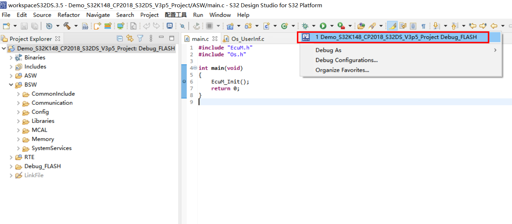

#  **1. 下载源码**
开发者可从 [AtomGit仓库](https://atomgit.com/easyxmen)，或者 [Gitee镜像仓](https://gitee.com/easyxmen) 和 [GitHub镜像仓](https://github.com/EasyXMen) 获取项目最新代码及相关文档。下面以AtomGit平台为例进行介绍，其它代码托管平台操作类似。

## **前提条件**
1. 注册 AtomGit 账户
2. 配置SSH密钥，具体请参考帮助文档[配置SSH密钥](https://docs.atomgit.com/docs/help/home/user_center/security_management/)
3. 安装Git客户端并配置，具体请参考[Git入门](https://docs.atomgit.com/docs/help/home/general-reference/git)

## **具体操作**
以在本地新建EasyXMen文件夹为例，克隆远端仓库至本地，并建立自己的分支

    mkdir EasyXMen
    cd EasyXMen
    git clone  git@atomgit.com:easyxmen/XMen.git
    cd XMen
    git checkout -b my_branch

> 注意: 如果使用的是 SSH 方式并完成了此前的配置步骤，当权限正确的前提下，那么项目远端仓库将会顺利的 Clone 到你本地环境上。如果你使用的是 HTTP 方式，那么需要输入你的登录账号及密码或 Token 令牌。

#  **2. 开发环境准备**
嵌入式软件开发从架构设计、软件编译到调试与测试，往往涉及到一连串众多的开发工具，即开发工具链。在这里我们以大多数开发者熟悉的Window环境为例，并选取NXP S32K148芯片作为工程目标硬件，介绍如何准备开发环境。对于Linux操作系统以及其它芯片，欢迎大家补充介绍，参与社区贡献；

> 需要说明的是，以下介绍的工具仅为便于让用户快速上手，并非唯一或必须的选择。对于不同的MCU芯片，通常市场上有各种各样不同特点的开发工具供用户选择，部分企业甚至有自研的开发工具。开发者可以综合考虑自己的需求、能力与预算，选择适合自己的开发工具。

## **2.1 集成开发环境**
针对NXP S32K148这款芯片，可选择NXP官方提供的 S32 Design Studio工具，进行代码的编辑、编译、烧录和调试。如下图所示, 下载后安装即可，具体下载路径及安装方法见[NXP官方网站](https://www.nxp.com.cn/document/guide/getting-started-with-the-real-time-drivers-rtd:GS-AUTOMOTIVE-RTD?section=design-resources)。

## **2.2 MCAL代码及其配置工具**
通常芯片公司会提供可用于量产的MCAL代码，对应也会提供MCAL配置工具，以减轻MCAL开发的难度和周期。当然，用户也可以根据自身需求，自行开发所需的MCU驱动。

此处使用NXP官方提供的针对S32K148这款芯片的MCAL代码及其配置工具进行介绍。下载链接：[NXP官方网站](https://www.nxp.com.cn/document/guide/getting-started-with-the-real-time-drivers-rtd:GS-AUTOMOTIVE-RTD?section=design-resources)，如下图所示。

详细使用介绍请参考官网及相关用户手册。

## **2.3 开源小满代码配置工具**
为了提高开发效率，开源小满针对自身开源的软件模块，也提供了用户可免费申请试用的配置工具。当然，用户也可根据自身的能力和预算，选择其它公司推出的与小满适配的配置工具，或者自行开发轻量化配置文件处理工具，甚至直接编辑相关软件源码，而不使用配置工具。

1. 第一步：申请工具下载，请点击[申请地址](https://register.easyxmen.com/welcome.html?channel=3)，提交后会收到下载链接,其中还包含部分示例工程。
2. 第二步：双击*.exe安装包，按照安装向导完成配置工具安装，复制试用申请邮件中的授权码，填写到序列号位置；
3. 第三步：桌面双击工具快捷方式进行打开，点击菜单栏File＞New＞Project＞Autosar＞BSW Project创建BSW配置工具。详细工具操作可通过Help＞Open Reference Manual Folder查看使用手册。

# **3. 工程开发、编译、烧录与调试**
安全车控操作系统的开发较为复杂，专业能力要求高，对于初学者，建议此部分基于社区提供的[示例工程](https://register.easyxmen.com/welcome.html?channel=3)（针对S32K148的示例工程需随工具申请下载）进行操作，示例工程中已完成项目工程的创建、示例功能的配置与开发等，可以跳转到3.4小节，直接进行编译。有关示例工程的使用说明请[点击这里](https://easyxmen.atomgit.net/docs/sub/%E7%A4%BA%E4%BE%8B%E5%B7%A5%E7%A8%8B%E8%AF%B4%E6%98%8E/S32K148_Demo.html)查看。

对于有一定基础的开发者，可参考如下步骤，按照自身需求进行开发。

##  **3.1 开发应用软件**
开发者根据自身需求，对应用软件进行开发，完成后，推荐在工程根目录下新建"ASW"文件夹，用于存放应用代码，如下图所示。

## **3.2 配置开源小满软件**
开发者根据自身需求，对开源小满中相关功能进行配置，完成后，推荐在工程目录“BSW”内新建"Config/BSW_Config"文件夹，将工具生成或手动修改的配置文件存放在这里。如下图所示。

## **3.3 配置MCAL代码**
类似的，开发者根据自身需求，对开源小满中相关功能进行配置，完成后，参考上节图片，推荐在工程目录“BSW”内新建"Config/MCAL_Config"文件夹，将工具生成或手动修改的配置文件存放在这里。同时，在“BSW”内新建"MCAL"文件夹，将MCAL相关代码存放在这里。如下图所示。

## **3.4 编译工程**
打开 S32 Design Studio，新建工程或者导入工程（针对示例工程）后，点击Build Project即可编译工程。如下图所示。

## **3.5 烧录工程**
编译通过后，根据使用的调试器，对程序烧录操作进行配置，链接硬件开发板后点击Debug，烧入程序。如下图所示。

> 注意：开发板可根据实际使用的芯片，自行购买。

## **3.6 调试工程**
烧入成功后，即可在S32 Design Studio对工程进行调试。

