BswM
#################################

简介 (Introduction)
=================================

模式管理属于系统服务栈，在AutoSar R19-11软件层级架构如下图：

Mode management belongs to the system service stack. The software level architecture of AutoSar R19-11 is as follows:

.. figure:: ../../_static/参考手册(Module_Reference_Manual)/BswM/image1.png
   :alt: 模式管理协议栈简介(Introduction to mode management protocol stack)
   :name: 模式管理协议栈简介(Introduction to mode management protocol stack)
   :align: center

模式管理由BswM与EcuM组成，这两个模块对于Bsw中不同协议栈的串联与Ecu的整体把控紧密相关，其中BswM可以通过配置高度自由实现Bsw中模块的串联工作，EcuM则对Mcu的睡眠唤醒提供支持。

Mode management consists of BswM and EcuM. These two modules are closely related to the serial connection of different protocol stacks in Bsw and the overall control of Ecu. BswM can realize the serial connection of modules in Bsw with a high degree of freedom through configuration, and EcuM provides support for the sleep and wake-up of Mcu.

参考资料 (References)
---------------------------------

[1] AUTOSAR_EXP_LayeredSoftwareArchitecture.pdf，R19-11

[2] AUTOSAR_SWS_ECUStateManager.pdf，R19-11

[3] AUTOSAR_SWS_BSWModeManager.pdf，R19-11

[4] AUTOSAR_EXP_ModeManagementGuide.pdf，R19-11

:strong:`缩写词注解 (Abbreviation Notes):`

.. list-table::
   :widths: 34 33 33
   :header-rows: 1

   * - 缩写词 (Abbreviation)
     - 解释/描述 (Explanation/Description)
     - 中文解释 (Chinese explanation)
   * - BswM
     - Basic Software ModeManager
     - 基础软件模式管理 (Basic software model management)
   * - RTE
     - Runtime Environment
     - 运行时环境 (runtime environment)
   * - EcuM
     - ECU State Manager
     - ECU状态管理 (ECU status management)
   * - Wakeup Source
     - The peripheral or ECUcomponent which dealswith wakeup events iscalled a wakeup source
     - 唤醒源 (Wake-up source)
         
         
         
功能描述 (Function description)
===========================================

BSWM模块主要有如下两个功能：

The BSWM module mainly has the following two functions:

1.模式仲裁。

Mode arbitration.

2.模式控制。

Mode control.

模式仲裁 (mode arbitration)
---------------------------------------

仲裁功能介绍 (Introduction to arbitration function)
~~~~~~~~~~~~~~~~~~~~~~~~~~~~~~~~~~~~~~~~~~~~~~~~~~~~~~~~~~~~~

模式仲裁是接收来自SWC或其他BSW模块的模式请求和通知，根据简单的规则作出模式切换。

Mode arbitration is to receive mode requests and notifications from SWC or other BSW modules and make mode switching based on simple rules.

Bsw或SW-C通知BswM进入模式仲裁，可以配置不同的Bsw模块给BswM的通知端口匹配的输入值；这些输入值可以根据具体需求组合成逻辑表达式；逻辑表达式决定了BswM执行的动作列表，动作列表是一系列Bsw或RTE模块操作接口。

Bsw or SW-C notifies BswM to enter mode arbitration. Different Bsw modules can be configured to match input values ​​for BswM's notification port; these input values ​​can be combined into logical expressions according to specific requirements; the logical expression determines the action list executed by BswM, and the action list is a series of Bsw or RTE module operation interfaces.

仲裁功能实现 (Arbitration function implementation)
~~~~~~~~~~~~~~~~~~~~~~~~~~~~~~~~~~~~~~~~~~~~~~~~~~~~~~~~~~~~

**模式仲裁**\ ：每个模式仲裁的规则都有一个逻辑表达式，逻辑表达式的条件来源与Bsw模块的请求或Swc的请求，而逻辑表达式可以对多个请求的输入源使用逻辑运算符（与，或，异或，与非）进行连接。

**Mode arbitration**\: Each mode arbitration rule has a logical expression. The condition source of the logical expression is the request of the Bsw module or the request of the Swc, and the logical expression can use logical operators (AND, OR, XOR, NAND) to connect the input sources of multiple requests.

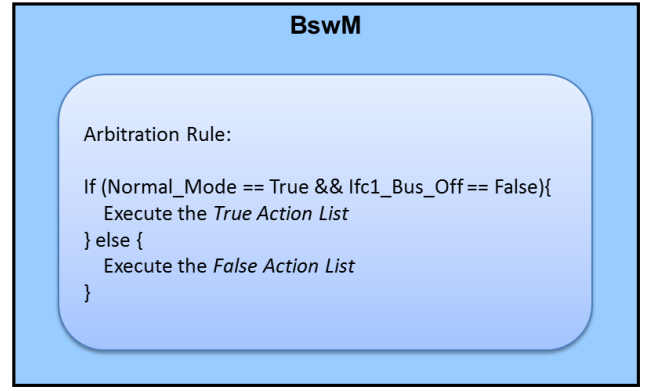

实现仲裁需要配置BswMRule、BswMLogicalExpression、BswMModeCondition以及BswMModeRequestPort（或者BswMEventRequestPort）如下图所示：其中BswMRule指需要仲裁的规则，BswMLogicalExpression提供仲裁逻辑表达式，逻辑表达式的条件由RequestPort和BswMModeCondition构成。

To implement arbitration, you need to configure BswMRule, BswMLogicalExpression, BswMModeCondition, and BswMModeRequestPort (or BswMEventRequestPort) as shown in the figure below: BswMRule refers to the rule that requires arbitration, and BswMLogicalExpression provides an arbitration logical expression. The conditions of the logical expression are composed of RequestPort and BswMModeCondition.

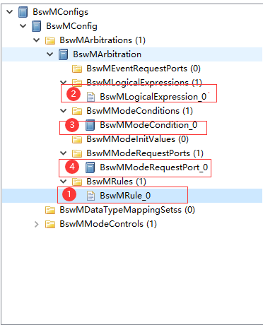

模式控制 (Mode control)
-----------------------------------

模式控制介绍 (Introduction to mode control)
~~~~~~~~~~~~~~~~~~~~~~~~~~~~~~~~~~~~~~~~~~~~~~~~~~~~~

模式控制是以模式仲裁得到的结果，执行相应的动作。BswM执行流程如下：

Mode control is to perform corresponding actions based on the results obtained from mode arbitration.The BswM execution process is as follows:

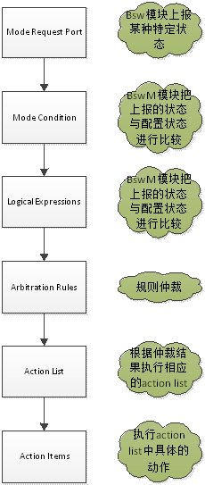

模式控制实现 (Mode control implementation)
~~~~~~~~~~~~~~~~~~~~~~~~~~~~~~~~~~~~~~~~~~~~~~~~~~~~

BswM可以配置一系列行为作为仲裁结果需要执行的动作，这些行为可以是操作Bsw模块或Rte，或另外的一个仲裁规则，典型示例如下：

BswM can configure a series of actions that need to be performed as a result of arbitration. These actions can be operations on the Bsw module or Rte, or another arbitration rule. Typical examples are as follows:

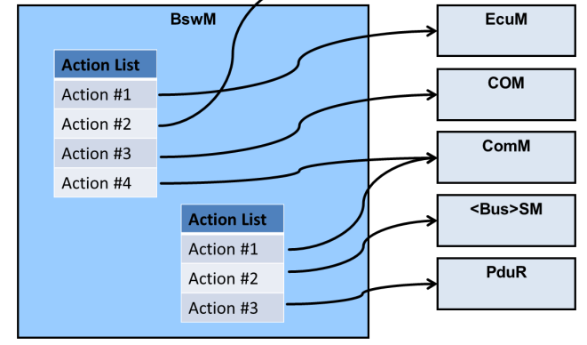

对于BswM而言，配置项决定了串联的实施的具有功能，需要根据实际项目中的需求来调整BswM配置以满足应用场景。实现模式控制主要是通过BSWM调用其他BSW模块的函数来达到控制其模块的目的（如请求网络调用ComM_RequestComMode）。

For BswM, the configuration items determine the functions of the series implementation, and the BswM configuration needs to be adjusted according to the needs of the actual project to meet the application scenario.Mode control is mainly achieved by calling functions of other BSW modules through BSWM to achieve the purpose of controlling their modules (such as requesting the network to call ComM_RequestComMode).

实现模式控制需要配置BswMActionList以及BswMAction，其中BswMActionList会被BswMRule引用：

To implement mode control, you need to configure BswMActionList and BswMAction, where BswMActionList will be referenced by BswMRule:

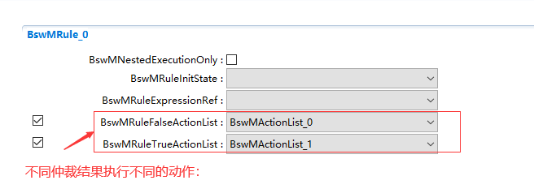

在BswMActionList中配置需要具体执行的Action：

Configure the Action that needs to be executed specifically in BswMActionList:

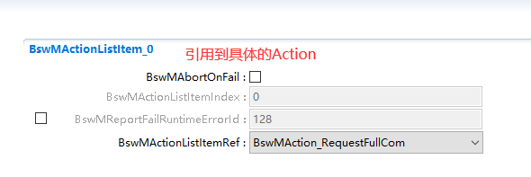

在Action中会选择需要关联的具体BSW模块需要执行的动作：

In Action, you will select the actions that need to be performed by the specific BSW module that needs to be associated:

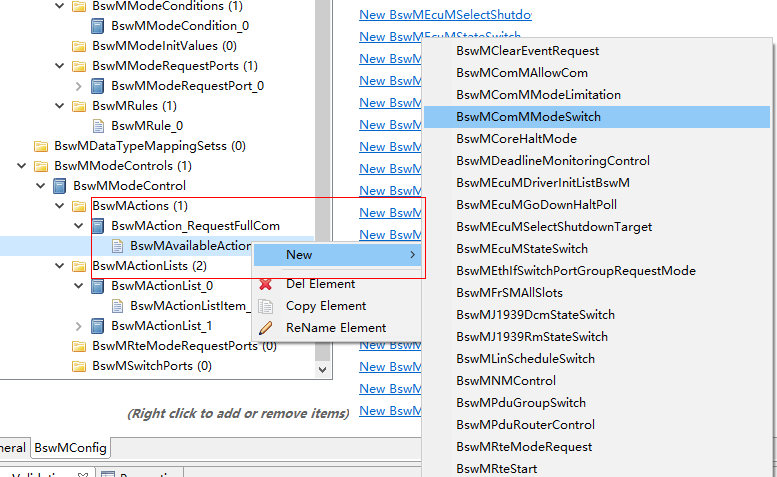

源文件描述 (Source file description)
===============================================

.. centered:: **表 BswM文件描述 (Table BswM file description)**

.. list-table::
   :widths: 50 50
   :header-rows: 1

   * - 文件 (document)
     - 说明 (illustrate)
   * - BswM.c
     - BswM模块提供的API（不与其他模块交互），以及内部函数等 (API provided by the BswM module (does not interact with other modules), as well as internal functions, etc.)
   * - BswM.h
     - LC配置数据类型，以及通用API的声明 (LC configuration data type, and declaration of common API)
   * - BswM_Bsw.c
     - BswMModeRequestPort中BswMBswModeNotification对应API (API corresponding to BswMBswModeNotification in BswMModeRequestPort)
   * - BswM_Bsw.h
     - BswM_Bsw.c中API声明 (API declaration in BswM_Bsw.c)
   * - BswM_CanSM.c
     - BSWM与CANSM模块交互API (BSWM and CANSM module interaction API)
   * - BswM_CanSM.h
     - BswM_CanSM.c中API声明 (API declaration in BswM_CanSM.c)
   * - BswM_ComM.c
     - BSWM与ComM模块交互API (BSWM and ComM module interaction API)
   * - BswM_ComM.h
     - BswM_ComM.c中API声明 (API declaration in BswM_ComM.c)
   * - BswM_Dcm.c
     - BSWM与Dcm模块交互API (BSWM and Dcm module interaction API)
   * - BswM_Dcm.h
     - BswM_Dcm.c中API声明 (API declaration in BswM_Dcm.c)
   * - BswM_EcuM.c
     - BSWM与EcuM模块交互API (BSWM and EcuM module interaction API)
   * - BswM_EcuM.h
     - BswM_EcuM.c中API声明 (API declaration in BswM_EcuM.c)
   * - BswM_EthSM.c
     - BSWM与EthSM模块交互API (BSWM and EthSM module interaction API)
   * - BswM_EthSM.h
     - BswM_EthSM.c中API声明 (API declaration in BswM_EthSM.c)
   * - BswM_FrSM.c
     - BSWM与FrSM模块交互API (BSWM and FrSM module interaction API)
   * - BswM_FrSM.h
     - BswM_FrSM.c中API声明 (API declaration in BswM_FrSM.c)
   * - BswM_Internal.h
     - BswM中PC配置数据结构类型定义以及内部函数声明 (PC configuration data structure type definition and internal function declaration in BswM)
   * - BswM_J1939Dcm.c
     - BSWM与J1939Dcm模块交互API (BSWM and J1939Dcm module interaction API)
   * - BswM_J1939Dcm.h
     - BswM_J1939Dcm.c中API声明 (API statement in BswM_J1939Dcm.c)
   * - BswM_J1939Nm.c
     - BSWM与J1939Nm模块交互API (BSWM and J1939Nm module interaction API)
   * - BswM_J1939Nm.h
     - BswM_J1939Nm.c中API声明 (API statement in BswM_J1939Nm.c)
   * - BswM_Lcfg.h
     - LC配置数据结构 (LC configuration data structure)
   * - BswM_LinSM.c
     - BSWM与LinSM模块交互API (BSWM and LinSM module interaction API)
   * - BswM_LinSM.h
     - BswM_LinSM.c中API声明 (API declaration in BswM_LinSM.c)
   * - BswM_LinTp.c
     - BSWM与LinTp模块交互API (BSWM and LinTp module interaction API)
   * - BswM_LinTp.h
     - BswM_LinTp.c中API声明 (API declaration in BswM_LinTp.c)
   * - BswM_MemMap.h
     - BswM所有变量、函数用到的MemMap机制包含头文件 (The MemMap mechanism used by all variables and functions of BswM includes header files)
   * - BswM_Nm.c
     - BSWM与Nm模块交互API (BSWM and Nm module interaction API)
   * - BswM_Nm.h
     - BswM_Nm.c中API声明 (API declaration in BswM_Nm.c)
   * - BswM_NvM.c
     - BSWM与NvM模块交互API (BSWM and NvM module interaction API)
   * - BswM_NvM.h
     - BswM_NvM.c中API声明 (API declaration in BswM_NvM.c)
   * - BswM_PBcfg.h
     - PB配置数据结构 (PB configuration data structure)
   * - BswM_RuleArbitrate.c
     - Rule仲裁函数 (Rule arbitration function)
   * - BswM_Sd.c
     - BSWM与Sd模块交互API (BSWM and Sd module interaction API)
   * - BswM_Sd.h
     - BswM_Sd.c中API声明 (API declaration in BswM_Sd.c)
   * - BswM_Swc.c
     - BSWM与Swc模块交互API (BSWM and Swc module interaction API)
   * - BswM_Swc.h
     - BswM_Swc.c中API声明 (API declaration in BswM_Swc.c)
   * - BswM_TimerControl.c
     - BswM中timer control相关API (timer control related API in BswM)
   * - BswM_Types.h
     - BswM定义的通用数据类型 (Common data types defined by BswM)
   * - BswM_WdgM.c
     - BSWM与WdgM模块交互API (BSWM and WdgM module interaction API)
   * - BswM_WdgM.h
     - BswM_WdgM.c中API声明 (API declaration in BswM_WdgM.c)
   * - SchM_BswM.h
     - 定义BswM_MainFunction函数声明，已经某些关键区域保护机制 (Define the BswM_MainFunction function declaration and protect certain key areas)
   * - BswM_Cfg.c
     - BswM中所有PC配置数据 (All PC configuration data in BswM)
   * - BswM_Cfg.h
     - \
   * - BswM_LCfg.c
     - BswM中所有Link time配置数据 (All Link time configuration data in BswM)
         
         
         
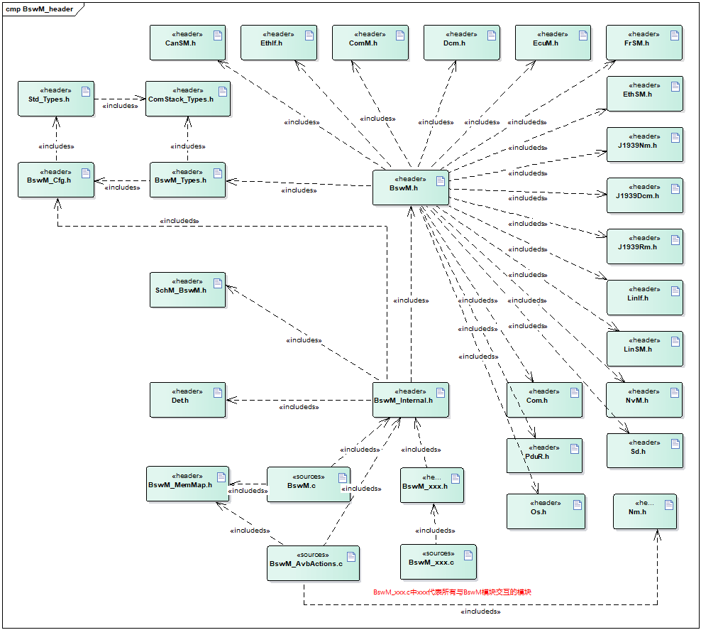

API接口 (API interface)
=====================================

类型定义 (type definition)
--------------------------------------

BswM_ConfigType类型定义 (BswM_ConfigType type definition)
~~~~~~~~~~~~~~~~~~~~~~~~~~~~~~~~~~~~~~~~~~~~~~~~~~~~~~~~~~~~~~~~~~~~~

.. list-table::
   :widths: 50 50
   :header-rows: 1

   * - 名称 (name)
     - BswM_ConfigType
   * - 类型 (type)
     - 无 (none)
   * - 范围 (scope)
     - 无 (none)
   * - 描述 (describe)
     - BswM模块中PB配置数据类型 (PB configuration data type in BswM module)
         
         
         
BswM_ModeType类型定义 (BswM_ModeType type definition)
~~~~~~~~~~~~~~~~~~~~~~~~~~~~~~~~~~~~~~~~~~~~~~~~~~~~~~~~~~~~~~~~~

.. list-table::
   :widths: 50 50
   :header-rows: 1

   * - 名称 (name)
     - BswM_ModeType
   * - 类型 (type)
     - Uint16
   * - 范围 (scope)
     - 0-65535
   * - 描述 (describe)
     - 提供给BswM user请求的模式 (Mode provided to BswM user request)
         
         
         
BswM_UserType类型定义 (BswM_UserType type definition)
~~~~~~~~~~~~~~~~~~~~~~~~~~~~~~~~~~~~~~~~~~~~~~~~~~~~~~~~~~~~~~~~~

.. list-table::
   :widths: 50 50
   :header-rows: 1

   * - 名称 (name)
     - BswM_UserType
   * - 类型 (type)
     - Uint16
   * - 范围 (scope)
     - 0-65535
   * - 描述 (describe)
     - BswM user类型 (BswM user type)
         
         
         
输入函数描述 (Enter function description)
---------------------------------------------------

.. list-table::
   :widths: 50 50
   :header-rows: 1

   * - **输入模块** (**Input module**)
     - **API**
   * - Com
     - Com_SetIpduGroup
   * - \
     - Com_ReceptionDMControl
   * - \
     - Com_IpduGroupControl
   * - \
     - Com_SwitchIpduTxMode
   * - ComM
     - ComM_CommunicationAllowed
   * - \
     - ComM_LimitChannelToNoComMode
   * - \
     - ComM_RequestComMode
   * - OS
     - ControlIdle
   * - Det
     - Det_ReportError
   * - EcuM
     - EcuM_AL_DriverInitBswM\_<x>
   * - \
     - EcuM_GoDownHaltPoll
   * - \
     - EcuM_SetState
   * - J1939Dcm
     - J1939Dcm_SetState
   * - J1939Rm
     - J1939Rm_SetState
   * - LinSM
     - LinSM_ScheduleRequest
   * - Nm
     - Nm_DisableCommunication
   * - \
     - Nm_EnableCommunication
   * - Sd
     - Sd_ClientServiceSetState
   * - \
     - Sd_ConsumedEventGroupSetState
   * - \
     - Sd_ServerServiceSetState
         
         
         
静态接口函数定义 (Static interface function definition)
---------------------------------------------------------------

BswM_BswMPartitionRestarted函数定义 (BswM_BswMPartitionRestarted function definition)
~~~~~~~~~~~~~~~~~~~~~~~~~~~~~~~~~~~~~~~~~~~~~~~~~~~~~~~~~~~~~~~~~~~~~~~~~~~~~~~~~~~~~~~~~~~~~~~~~

.. list-table::
   :widths: 25 25 25 25
   :header-rows: 1

   * - 函数名称： (Function name:)
     - BswM_BswMPartitionRestarted
     - \
     - \
   * - 函数原型： (Function prototype:)
     - voidBswM_BswMPartitionRestarted(
     - \
     - \
   * - \
     - void
     - \
     - \
   * - \
     - )
     - \
     - \
   * - 服务编号： (Service number:)
     - 0x1e
     - \
     - \
   * - 同步/异步： (Sync/Asynchronous:)
     - 同步 (synchronous)
     - \
     - \
   * - 是否可重入： (Is it reentrant:)
     - 是 (yes)
     - \
     - \
   * - 输入参数： (Input parameters:)
     - 无 (none)
     - 值域： (range:)
     - 无 (none)
   * - 输入输出参数： (Input and output parameters:)
     - 无 (none)
     - \
     - \
   * - 输出参数： (Output parameters:)
     - 无 (none)
     - \
     - \
   * - 返回值： (Return value:)
     - 无 (none)
     - \
     - \
   * - 功能概述： (Function overview:)
     - 多分区的情况下，当前分区bswm接收另一个分区的bswm复位指示 (In the case of multiple partitions, the current partition bswm receives the bswm reset instruction from another partition.)
     - \
     - \
         
         
         
BswM_CanSM_CurrentIcomConfiguration函数定义 (BswM_CanSM_CurrentIcomConfiguration function definition)
~~~~~~~~~~~~~~~~~~~~~~~~~~~~~~~~~~~~~~~~~~~~~~~~~~~~~~~~~~~~~~~~~~~~~~~~~~~~~~~~~~~~~~~~~~~~~~~~~~~~~~~~~~~~~~~~~

.. list-table::
   :widths: 25 25 25 25
   :header-rows: 1

   * - 函数名称： (Function name:)
     - BswM_CanSM_CurrentIcomConfiguration
     - \
     - \
   * - 函数原型： (Function prototype:)
     - voidBswM_CanSM_CurrentIcomConfiguration(
     - \
     - \
   * - \
     - NetworkHandleTypeNetwork,
     - \
     - \
   * - \
     - IcomConfigIdTypeActiveConfiguration,
     - \
     - \
   * - \
     - IcomSwitch_ErrorTypeError
     - \
     - \
   * - \
     - )
     - \
     - \
   * - 服务编号： (Service number:)
     - 0x1a
     - \
     - \
   * - 同步/异步： (Sync/Asynchronous:)
     - 同步 (synchronous)
     - \
     - \
   * - 是否可重入： (Is it reentrant:)
     - 是 (yes)
     - \
     - \
   * - 输入参数： (Input parameters:)
     - Network
     - 值域： (range:)
     - 0~255
   * - \
     - ActiveConfiguration
     - \
     - 0~255
   * - \
     - Error
     - \
     - ICOM_SWITCH_E_OK,
   * - \
     - \
     - \
     - ICOM_SWITCH_E_FAILED
   * - 输入输出参数： (Input and output parameters:)
     - 无 (none)
     - \
     - \
   * - 输出参数： (Output parameters:)
     - 无 (none)
     - \
     - \
   * - 返回值： (Return value:)
     - 无 (none)
     - \
     - \
   * - 功能概述： (Function overview:)
     - CanSm通知BswM关于Icom配置状态 (CanSm notifies BswM about Icom configuration status)
     - \
     - \
         
         
         
BswM_CanSM_CurrentState函数定义 (BswM_CanSM_CurrentState function definition)
~~~~~~~~~~~~~~~~~~~~~~~~~~~~~~~~~~~~~~~~~~~~~~~~~~~~~~~~~~~~~~~~~~~~~~~~~~~~~~~~~~~~~~~~~

.. list-table::
   :widths: 25 25 25 25
   :header-rows: 1

   * - 函数名称： (Function name:)
     - BswM_CanSM_CurrentState
     - \
     - \
   * - 函数原型： (Function prototype:)
     - voidBswM_CanSM_CurrentState(
     - \
     - \
   * - \
     - NetworkHandleTypeNetwork,
     - \
     - \
   * - \
     - CanSM_BswMCurrentStateTypeCurrentState
     - \
     - \
   * - \
     - )
     - \
     - \
   * - 服务编号： (Service number:)
     - 0x05
     - \
     - \
   * - 同步/异步： (Sync/Asynchronous:)
     - 同步 (synchronous)
     - \
     - \
   * - 是否可重入： (Is it reentrant:)
     - 是 (yes)
     - \
     - \
   * - 输入参数： (Input parameters:)
     - Network
     - 值域： (range:)
     - 0~255
   * - \
     - CurrentState
     - \
     - CANSM_BSWM_NO_COMMUNICATION,CANSM_BSWM_SILENT_COMMUNICATION,
   * - \
     - \
     - \
     - CANSM_BSWM_FULL_COMMUNICATION,
   * - \
     - \
     - \
     - CANSM_BSWM_BUS_OFF,
   * - \
     - \
     - \
     - CANSM_BSWM_CHANGE_BAUDRATE
   * - 输入输出参数： (Input and output parameters:)
     - 无 (none)
     - \
     - \
   * - 输出参数： (Output parameters:)
     - 无 (none)
     - \
     - \
   * - 返回值： (Return value:)
     - 无 (none)
     - \
     - \
   * - 功能概述： (Function overview:)
     - CanSm通知BswM当前状态 (CanSm informs BswM of the current status)
     - \
     - \
         
         
         
BswM_ComM_CurrentMode函数定义 (BswM_ComM_CurrentMode function definition)
~~~~~~~~~~~~~~~~~~~~~~~~~~~~~~~~~~~~~~~~~~~~~~~~~~~~~~~~~~~~~~~~~~~~~~~~~~~~~~~~~~~~~

.. list-table::
   :widths: 25 25 25 25
   :header-rows: 1

   * - 函数名称： (Function name:)
     - BswM_ComM_CurrentMode
     - \
     - \
   * - 函数原型： (Function prototype:)
     - voidBswM_ComM_CurrentMode(
     - \
     - \
   * - \
     - NetworkHandleTypeNetwork,
     - \
     - \
   * - \
     - ComM_ModeTypeRequestedMode
     - \
     - \
   * - \
     - )
     - \
     - \
   * - 服务编号： (Service number:)
     - 0x0e
     - \
     - \
   * - 同步/异步： (Sync/Asynchronous:)
     - 同步 (synchronous)
     - \
     - \
   * - 是否可重入： (Is it reentrant:)
     - 是 (yes)
     - \
     - \
   * - 输入参数： (Input parameters:)
     - Network
     - 值域： (range:)
     - 0~255
   * - \
     - RequestedMode
     - \
     - COMM_NO_COMMUNICATION
   * - \
     - \
     - \
     - COMM_SILENT_COMMUNICATION
   * - \
     - \
     - \
     - COMM_FULL_COMMUNICATION
   * - 输入输出参数： (Input and output parameters:)
     - 无 (none)
     - \
     - \
   * - 输出参数： (Output parameters:)
     - 无 (none)
     - \
     - \
   * - 返回值： (Return value:)
     - 无 (none)
     - \
     - \
   * - 功能概述： (Function overview:)
     - ComM通知BswM当前模式 (ComM informs BswM of current mode)
     - \
     - \
         
         
         
BswM_ComM_CurrentPNCMode函数定义 (BswM_ComM_CurrentPNCMode function definition)
~~~~~~~~~~~~~~~~~~~~~~~~~~~~~~~~~~~~~~~~~~~~~~~~~~~~~~~~~~~~~~~~~~~~~~~~~~~~~~~~~~~~~~~~~~~

.. list-table::
   :widths: 25 25 25 25
   :header-rows: 1

   * - 函数名称： (Function name:)
     - BswM_ComM_CurrentPNCMode
     - \
     - \
   * - 函数原型： (Function prototype:)
     - voidBswM_ComM_CurrentPNCMode(
     - \
     - \
   * - \
     - PNCHandleTypePNC,
     - \
     - \
   * - \
     - ComM_PncModeTypeCurrentPncMode
     - \
     - \
   * - \
     - )
     - \
     - \
   * - 服务编号： (Service number:)
     - 0x15
     - \
     - \
   * - 同步/异步： (Sync/Asynchronous:)
     - 同步 (synchronous)
     - \
     - \
   * - 是否可重入： (Is it reentrant:)
     - 是 (yes)
     - \
     - \
   * - 输入参数： (Input parameters:)
     - PNC
     - 值域： (range:)
     - 0~255
   * - \
     - CurrentPncMode
     - \
     - COMM_PNC_NO_COMMUNICATIONCOMM_PNC_PREPARE_SLEEP
   * - \
     - \
     - \
     - COMM_PNC_READY_SLEEP
   * - \
     - \
     - \
     - COMM_PNC_REQUESTED
   * - 输入输出参数： (Input and output parameters:)
     - 无 (none)
     - \
     - \
   * - 输出参数： (Output parameters:)
     - 无 (none)
     - \
     - \
   * - 返回值： (Return value:)
     - 无 (none)
     - \
     - \
   * - 功能概述： (Function overview:)
     - ComM通知BswMPnc模式 (ComM informs BswMPnc mode)
     - \
     - \
         
         
         
BswM_ComM_InitiateReset函数定义 (BswM_ComM_InitiateReset function definition)
~~~~~~~~~~~~~~~~~~~~~~~~~~~~~~~~~~~~~~~~~~~~~~~~~~~~~~~~~~~~~~~~~~~~~~~~~~~~~~~~~~~~~~~~~

.. list-table::
   :widths: 25 25 25 25
   :header-rows: 1

   * - 函数名称： (Function name:)
     - BswM_ComM_InitiateReset
     - \
     - \
   * - 函数原型： (Function prototype:)
     - voidBswM_ComM_InitiateReset(
     - \
     - \
   * - \
     - void
     - \
     - \
   * - \
     - )
     - \
     - \
   * - 服务编号： (Service number:)
     - 0x22
     - \
     - \
   * - 同步/异步： (Sync/Asynchronous:)
     - 同步 (synchronous)
     - \
     - \
   * - 是否可重入： (Is it reentrant:)
     - 否 (no)
     - \
     - \
   * - 输入参数： (Input parameters:)
     - 无 (none)
     - 值域： (range:)
     - 无 (none)
   * - 输入输出参数： (Input and output parameters:)
     - 无 (none)
     - \
     - \
   * - 输出参数： (Output parameters:)
     - 无 (none)
     - \
     - \
   * - 返回值： (Return value:)
     - 无 (none)
     - \
     - \
   * - 功能概述： (Function overview:)
     - Function calledby ComM to signala shutdown.
     - \
     - \
         
         
         
BswM_Dcm_ApplicationUpdated函数定义 (BswM_Dcm_ApplicationUpdated function definition)
~~~~~~~~~~~~~~~~~~~~~~~~~~~~~~~~~~~~~~~~~~~~~~~~~~~~~~~~~~~~~~~~~~~~~~~~~~~~~~~~~~~~~~~~~~~~~~~~~

.. list-table::
   :widths: 25 25 25 25
   :header-rows: 1

   * - 函数名称： (Function name:)
     - BswM_Dcm_ApplicationUpdated
     - \
     - \
   * - 函数原型： (Function prototype:)
     - voidBswM_Dcm_ApplicationUpdated(
     - \
     - \
   * - \
     - void
     - \
     - \
   * - \
     - )
     - \
     - \
   * - 服务编号： (Service number:)
     - 0x14
     - \
     - \
   * - 同步/异步： (Sync/Asynchronous:)
     - 同步 (synchronous)
     - \
     - \
   * - 是否可重入： (Is it reentrant:)
     - 是 (yes)
     - \
     - \
   * - 输入参数： (Input parameters:)
     - 无 (none)
     - 值域： (range:)
     - 无 (none)
   * - 输入输出参数： (Input and output parameters:)
     - 无 (none)
     - \
     - \
   * - 输出参数： (Output parameters:)
     - 无 (none)
     - \
     - \
   * - 返回值： (Return value:)
     - 无 (none)
     - \
     - \
   * - 功能概述： (Function overview:)
     - Dcm通知BswMApp应用有更新 (Dcm notifies the BswMApp application that there is an update)
     - \
     - \
         
         
         
BswM_Dcm_CommunicationMode_CurrentState函数定义 (BswM_Dcm_CommunicationMode_CurrentState function definition)
~~~~~~~~~~~~~~~~~~~~~~~~~~~~~~~~~~~~~~~~~~~~~~~~~~~~~~~~~~~~~~~~~~~~~~~~~~~~~~~~~~~~~~~~~~~~~~~~~~~~~~~~~~~~~~~~~~~~~~~~~

.. list-table::
   :widths: 25 25 25 25
   :header-rows: 1

   * - 函数名称： (Function name:)
     - BswM\_Dcm_CommunicationMode_CurrentState
     - \
     - \
   * - 函数原型： (Function prototype:)
     - voidBswM\_Dcm_CommunicationMode_CurrentState(
     - \
     - \
   * - \
     - NetworkHandleTypeNetwork,
     - \
     - \
   * - \
     - Dcm_CommunicationModeTypeRequestedMode
     - \
     - \
   * - \
     - )
     - \
     - \
   * - 服务编号： (Service number:)
     - 0x06
     - \
     - \
   * - 同步/异步： (Sync/Asynchronous:)
     - 同步 (synchronous)
     - \
     - \
   * - 是否可重入： (Is it reentrant:)
     - 是 (yes)
     - \
     - \
   * - 输入参数： (Input parameters:)
     - Network
     - 值域： (range:)
     - 0~255
   * - \
     - RequestedMode
     - \
     - 0~255
   * - 输入输出参数： (Input and output parameters:)
     - 无 (none)
     - \
     - \
   * - 输出参数： (Output parameters:)
     - 无 (none)
     - \
     - \
   * - 返回值： (Return value:)
     - 无 (none)
     - \
     - \
   * - 功能概述： (Function overview:)
     - Dcm通知BswM通讯模式改变请求 (Dcm notifies BswM communication mode change request)
     - \
     - \
         
         
         
BswM_Deinit函数定义 (BswM_Deinit function definition)
~~~~~~~~~~~~~~~~~~~~~~~~~~~~~~~~~~~~~~~~~~~~~~~~~~~~~~~~~~~~~~~~~

.. list-table::
   :widths: 25 25 25 25
   :header-rows: 1

   * - 函数名称： (Function name:)
     - BswM_Deinit
     - \
     - \
   * - 函数原型： (Function prototype:)
     - void BswM_Deinit(
     - \
     - \
   * - \
     - void
     - \
     - \
   * - \
     - )
     - \
     - \
   * - 服务编号： (Service number:)
     - 0x04
     - \
     - \
   * - 同步/异步： (Sync/Asynchronous:)
     - 同步 (synchronous)
     - \
     - \
   * - 是否可重入： (Is it reentrant:)
     - 否 (no)
     - \
     - \
   * - 输入参数： (Input parameters:)
     - 无 (none)
     - 值域： (range:)
     - 无 (none)
   * - 输入输出参数： (Input and output parameters:)
     - 无 (none)
     - \
     - \
   * - 输出参数： (Output parameters:)
     - 无 (none)
     - \
     - \
   * - 返回值： (Return value:)
     - 无 (none)
     - \
     - \
   * - 功能概述： (Function overview:)
     - 取消初始化BSWM (Uninitialize BSWM)
     - \
     - \
         
         
         
BswM_EcuM_CurrentState函数定义 (BswM_EcuM_CurrentState function definition)
~~~~~~~~~~~~~~~~~~~~~~~~~~~~~~~~~~~~~~~~~~~~~~~~~~~~~~~~~~~~~~~~~~~~~~~~~~~~~~~~~~~~~~~

.. list-table::
   :widths: 25 25 25 25
   :header-rows: 1

   * - 函数名称： (Function name:)
     - BswM_EcuM_CurrentState
     - \
     - \
   * - 函数原型： (Function prototype:)
     - VoidBswM_EcuM_CurrentState(
     - \
     - \
   * - \
     - EcuM_StateTypeCurrentState)
     - \
     - \
   * - 服务编号： (Service number:)
     - 0xf
     - \
     - \
   * - 同步/异步： (Sync/Asynchronous:)
     - 同步 (synchronous)
     - \
     - \
   * - 是否可重入： (Is it reentrant:)
     - 是 (yes)
     - \
     - \
   * - 输入参数： (Input parameters:)
     - CurrentState
     - 值域： (range:)
     - 0~255
   * - 输入输出参数： (Input and output parameters:)
     - 无 (none)
     - \
     - \
   * - 输出参数： (Output parameters:)
     - 无 (none)
     - \
     - \
   * - 返回值： (Return value:)
     - 无 (none)
     - \
     - \
   * - 功能概述： (Function overview:)
     - EcuM通知BswM当前ECU状态 (EcuM notifies BswM of the current ECU status)
     - \
     - \
         
         
         
BswM_EcuM_CurrentWakeup函数定义 (BswM_EcuM_CurrentWakeup function definition)
~~~~~~~~~~~~~~~~~~~~~~~~~~~~~~~~~~~~~~~~~~~~~~~~~~~~~~~~~~~~~~~~~~~~~~~~~~~~~~~~~~~~~~~~~

.. list-table::
   :widths: 25 25 25 25
   :header-rows: 1

   * - 函数名称： (Function name:)
     - BswM_EcuM_CurrentWakeup
     - \
     - \
   * - 函数原型： (Function prototype:)
     - voidBswM_EcuM_CurrentWakeup(
     - \
     - \
   * - \
     - EcuM\_WakeupSourceTypesource,
     - \
     - \
   * - \
     - EcuM\_WakeupStatusTypestate
     - \
     - \
   * - \
     - )
     - \
     - \
   * - 服务编号： (Service number:)
     - 0x10
     - \
     - \
   * - 同步/异步： (Sync/Asynchronous:)
     - 同步 (synchronous)
     - \
     - \
   * - 是否可重入： (Is it reentrant:)
     - 是 (yes)
     - \
     - \
   * - 输入参数： (Input parameters:)
     - source
     - 值域： (range:)
     - 配置的唤醒源 (Configured wake-up source)
   * - \
     - state
     - \
     - ECUM_WKSTATUS_NONE
   * - \
     - \
     - \
     - ECUM_WKSTATUS_PENDING
   * - \
     - \
     - \
     - ECUM_WKSTATUS_VALIDATED
   * - \
     - \
     - \
     - ECUM_WKSTATUS_EXPIRED
   * - \
     - \
     - \
     - ECUM_WKSTATUS_ENABLED
   * - 输入输出参数： (Input and output parameters:)
     - 无 (none)
     - \
     - \
   * - 输出参数： (Output parameters:)
     - 无 (none)
     - \
     - \
   * - 返回值： (Return value:)
     - 无 (none)
     - \
     - \
   * - 功能概述： (Function overview:)
     - EcuM通知BswM当前ECU唤醒源状态 (EcuM notifies BswM of the current ECU wake-up source status)
     - \
     - \
         
         
         
BswM_EcuM_RequestedState函数定义 (BswM_EcuM_RequestedState function definition)
~~~~~~~~~~~~~~~~~~~~~~~~~~~~~~~~~~~~~~~~~~~~~~~~~~~~~~~~~~~~~~~~~~~~~~~~~~~~~~~~~~~~~~~~~~~

.. list-table::
   :widths: 25 25 25 25
   :header-rows: 1

   * - 函数名称： (Function name:)
     - BswM_EcuM_RequestedState
     - \
     - \
   * - 函数原型： (Function prototype:)
     - voidBswM_EcuM_RequestedState(
     - \
     - \
   * - \
     - EcuM_StateTypeState,
     - \
     - \
   * - \
     - EcuM_RunStatusTypeCurrentState
     - \
     - \
   * - \
     - )
     - \
     - \
   * - 服务编号： (Service number:)
     - 0x29
     - \
     - \
   * - 同步/异步： (Sync/Asynchronous:)
     - 同步 (synchronous)
     - \
     - \
   * - 是否可重入： (Is it reentrant:)
     - 是 (yes)
     - \
     - \
   * - 输入参数： (Input parameters:)
     - State
     - 值域： (range:)
     - EcuM请求的状态 (Status of EcuM request)
   * - \
     - CurrentState
     - \
     - Run RequestProtocol执行结果 (Run RequestProtocol execution results)
   * - 输入输出参数： (Input and output parameters:)
     - 无 (none)
     - \
     - \
   * - 输出参数： (Output parameters:)
     - 无 (none)
     - \
     - \
   * - 返回值： (Return value:)
     - 无 (none)
     - \
     - \
   * - 功能概述： (Function overview:)
     - EcuM调用函数通知RunRequestProtocol的当前状态 (EcuM calls a function to notify the current status of RunRequestProtocol)
     - \
     - \
         
         
         
BswM_EthIf_PortGroupLinkStateChg函数定义 (BswM_EthIf_PortGroupLinkStateChg function definition)
~~~~~~~~~~~~~~~~~~~~~~~~~~~~~~~~~~~~~~~~~~~~~~~~~~~~~~~~~~~~~~~~~~~~~~~~~~~~~~~~~~~~~~~~~~~~~~~~~~~~~~~~~~~

.. list-table::
   :widths: 25 25 25 25
   :header-rows: 1

   * - 函数名称： (Function name:)
     - BswM_EthIf_PortGroupLinkStateChg
     - \
     - \
   * - 函数原型： (Function prototype:)
     - voidBswM_EthIf_PortGroupLinkStateChg(
     - \
     - \
   * - \
     - EthIf_SwitchPortGroupIdxTypePortGroupIdx,
     - \
     - \
   * - \
     - EthTrcv_LinkStateTypePortGroupState
     - \
     - \
   * - \
     - )
     - \
     - \
   * - 服务编号： (Service number:)
     - 0x26
     - \
     - \
   * - 同步/异步： (Sync/Asynchronous:)
     - 同步 (synchronous)
     - \
     - \
   * - 是否可重入： (Is it reentrant:)
     - 是 (yes)
     - \
     - \
   * - 输入参数： (Input parameters:)
     - PortGroupIdx
     - 值域： (range:)
     - 0~255
   * - \
     - PortGroupState
     - \
     - ETH_MODE_DOWN
   * - \
     - \
     - \
     - ETH_MODE_ACTIVE
   * - 输入输出参数： (Input and output parameters:)
     - 无 (none)
     - \
     - \
   * - 输出参数： (Output parameters:)
     - 无 (none)
     - \
     - \
   * - 返回值： (Return value:)
     - 无 (none)
     - \
     - \
   * - 功能概述： (Function overview:)
     - EthIf通知BswM当前switchPortGroup状态 (EthIf informs BswM of the current switchPortGroup status)
     - \
     - \
         
         
         
BswM_EthSM_CurrentState函数定义 (BswM_EthSM_CurrentState function definition)
~~~~~~~~~~~~~~~~~~~~~~~~~~~~~~~~~~~~~~~~~~~~~~~~~~~~~~~~~~~~~~~~~~~~~~~~~~~~~~~~~~~~~~~~~

.. list-table::
   :widths: 25 25 25 25
   :header-rows: 1

   * - 函数名称： (Function name:)
     - BswM_EthSM_CurrentState
     - \
     - \
   * - 函数原型： (Function prototype:)
     - voidBswM_EthSM_CurrentState(
     - \
     - \
   * - \
     - NetworkHandleTypeNetwork,
     - \
     - \
   * - \
     - EthSM_NetworkModeStateTypeCurrentState
     - \
     - \
   * - \
     - )
     - \
     - \
   * - 服务编号： (Service number:)
     - 0x0d
     - \
     - \
   * - 同步/异步： (Sync/Asynchronous:)
     - 同步 (synchronous)
     - \
     - \
   * - 是否可重入： (Is it reentrant:)
     - 是 (yes)
     - \
     - \
   * - 输入参数： (Input parameters:)
     - Network
     - 值域： (range:)
     - 0~255
   * - \
     - CurrentState
     - \
     - ETHSM_STATE_OFFLINE
   * - \
     - \
     - \
     - ETHSM_STATE_WAIT_TRCVLINK
   * - \
     - \
     - \
     - ETHSM_STATE_WAIT_ONLINE
   * - \
     - \
     - \
     - ETHSM_STATE_ONLINE
   * - \
     - \
     - \
     - ETHSM_STATE_ONHOLD
   * - \
     - \
     - \
     - ETHSM_STATE_WAIT_OFFLINE
   * - 输入输出参数： (Input and output parameters:)
     - 无 (none)
     - \
     - \
   * - 输出参数： (Output parameters:)
     - 无 (none)
     - \
     - \
   * - 返回值： (Return value:)
     - 无 (none)
     - \
     - \
   * - 功能概述： (Function overview:)
     - EthSM通知BswM当前状态 (EthSM notifies BswM of the current status)
     - \
     - \
         
         
         
BswM_FrSM_CurrentState函数定义 (BswM_FrSM_CurrentState function definition)
~~~~~~~~~~~~~~~~~~~~~~~~~~~~~~~~~~~~~~~~~~~~~~~~~~~~~~~~~~~~~~~~~~~~~~~~~~~~~~~~~~~~~~~

.. list-table::
   :widths: 25 25 25 25
   :header-rows: 1

   * - 函数名称： (Function name:)
     - BswM\_FrSM\_CurrentState
     - \
     - \
   * - 函数原型： (Function prototype:)
     - voidBswM\_FrSM\_CurrentState(
     - \
     - \
   * - \
     - NetworkHandleTypeNetwork,
     - \
     - \
   * - \
     - FrSM_BswM_StateTypeCurrentState
     - \
     - \
   * - \
     - )
     - \
     - \
   * - 服务编号： (Service number:)
     - 0x0c
     - \
     - \
   * - 同步/异步： (Sync/Asynchronous:)
     - 同步 (synchronous)
     - \
     - \
   * - 是否可重入： (Is it reentrant:)
     - 是 (yes)
     - \
     - \
   * - 输入参数： (Input parameters:)
     - Network
     - 值域： (range:)
     - 0~255
   * - \
     - CurrentState
     - \
     - FRSM_BSWM_READY
   * - \
     - \
     - \
     - FRSM_BSWM_READY_ECU_PASSIVE
   * - 输入输出参数： (Input and output parameters:)
     - 无 (none)
     - \
     - \
   * - 输出参数： (Output parameters:)
     - 无 (none)
     - \
     - \
   * - 返回值： (Return value:)
     - 无 (none)
     - \
     - \
   * - 功能概述： (Function overview:)
     - FrSM通知BswM当前状态 (FrSM informs BswM of the current status)
     - \
     - \
         
         
         
BswM_GetVersionInfo函数定义 (BswM_GetVersionInfo function definition)
~~~~~~~~~~~~~~~~~~~~~~~~~~~~~~~~~~~~~~~~~~~~~~~~~~~~~~~~~~~~~~~~~~~~~~~~~~~~~~~~~

.. list-table::
   :widths: 25 25 25 25
   :header-rows: 1

   * - 函数名称： (Function name:)
     - BswM_GetVersionInfo
     - \
     - \
   * - 函数原型： (Function prototype:)
     - voidBswM_GetVersionInfo(
     - \
     - \
   * - \
     - Std_VersionInfoType\*VersionInfo
     - \
     - \
   * - \
     - )
     - \
     - \
   * - 服务编号： (Service number:)
     - 0x01
     - \
     - \
   * - 同步/异步： (Sync/Asynchronous:)
     - 同步 (synchronous)
     - \
     - \
   * - 是否可重入： (Is it reentrant:)
     - 是 (yes)
     - \
     - \
   * - 输入参数： (Input parameters:)
     - 无 (none)
     - 值域： (range:)
     - 无 (none)
   * - 输入输出参数： (Input and output parameters:)
     - 无 (none)
     - \
     - \
   * - 输出参数： (Output parameters:)
     - VersionInfo
     - \
     - \
   * - 返回值： (Return value:)
     - 无 (none)
     - \
     - \
   * - 功能概述： (Function overview:)
     - 获取BswM版本号. (Get the BswM version number.)
     - \
     - \
         
         
         
BswM_Init函数定义 (BswM_Init function definition)
~~~~~~~~~~~~~~~~~~~~~~~~~~~~~~~~~~~~~~~~~~~~~~~~~~~~~~~~~~~~~

.. list-table::
   :widths: 25 25 25 25
   :header-rows: 1

   * - 函数名称： (Function name:)
     - BswM_Init
     - \
     - \
   * - 函数原型： (Function prototype:)
     - void BswM_Init (
     - \
     - \
   * - \
     - constBswM_ConfigType \*ConfigPtr
     - \
     - \
   * - \
     - )
     - \
     - \
   * - 服务编号： (Service number:)
     - 0x00
     - \
     - \
   * - 同步/异步： (Sync/Asynchronous:)
     - 同步 (synchronous)
     - \
     - \
   * - 是否可重入： (Is it reentrant:)
     - 有条件的重入 (conditional reentry)
     - \
     - \
   * - 输入参数： (Input parameters:)
     - ConfigPtr
     - 值域： (range:)
     - NULL_PTR
   * - 输入输出参数： (Input and output parameters:)
     - 无 (none)
     - \
     - \
   * - 输出参数： (Output parameters:)
     - 无 (none)
     - \
     - \
   * - 返回值： (Return value:)
     - 无 (none)
     - \
     - \
   * - 功能概述： (Function overview:)
     - 初始化BSWM模块 (Initialize the BSWM module)
     - \
     - \
         
         
         
BswM_J1939DcmBroadcastStatus函数定义 (BswM_J1939DcmBroadcastStatus function definition)
~~~~~~~~~~~~~~~~~~~~~~~~~~~~~~~~~~~~~~~~~~~~~~~~~~~~~~~~~~~~~~~~~~~~~~~~~~~~~~~~~~~~~~~~~~~~~~~~~~~

.. list-table::
   :widths: 25 25 25 25
   :header-rows: 1

   * - 函数名称： (Function name:)
     - BswM_J1939DcmBroadcastStatus
     - \
     - \
   * - 函数原型： (Function prototype:)
     - voidBswM_J1939DcmBroadcastStatus(
     - \
     - \
   * - \
     - uint16 NetworkMask
     - \
     - \
   * - \
     - )
     - \
     - \
   * - 服务编号： (Service number:)
     - 0x1b
     - \
     - \
   * - 同步/异步： (Sync/Asynchronous:)
     - 同步 (synchronous)
     - \
     - \
   * - 是否可重入： (Is it reentrant:)
     - 是 (yes)
     - \
     - \
   * - 输入参数： (Input parameters:)
     - NetworkMask
     - 值域： (range:)
     - 0..65535
   * - 输入输出参数： (Input and output parameters:)
     - 无 (none)
     - \
     - \
   * - 输出参数： (Output parameters:)
     - 无 (none)
     - \
     - \
   * - 返回值： (Return value:)
     - 无 (none)
     - \
     - \
   * - 功能概述： (Function overview:)
     - J1939Dcm通知BswM广播状态变化 (J1939Dcm notifies BswM of broadcast status changes)
     - \
     - \
         
         
         
BswM_J1939Nm_StateChangeNotification函数定义 (BswM_J1939Nm_StateChangeNotification function definition)
~~~~~~~~~~~~~~~~~~~~~~~~~~~~~~~~~~~~~~~~~~~~~~~~~~~~~~~~~~~~~~~~~~~~~~~~~~~~~~~~~~~~~~~~~~~~~~~~~~~~~~~~~~~~~~~~~~~

.. list-table::
   :widths: 25 25 25 25
   :header-rows: 1

   * - 函数名称： (Function name:)
     - BswM_J1939Nm_StateChangeNotification
     - \
     - \
   * - 函数原型： (Function prototype:)
     - voidBswM_J1939Nm_StateChangeNotification(
     - \
     - \
   * - \
     - NetworkHandleTypeNetwork,
     - \
     - \
   * - \
     - uint8 Node,
     - \
     - \
   * - \
     - Nm_StateTypeNmState
     - \
     - \
   * - \
     - )
     - \
     - \
   * - 服务编号： (Service number:)
     - 0x18
     - \
     - \
   * - 同步/异步： (Sync/Asynchronous:)
     - 同步 (synchronous)
     - \
     - \
   * - 是否可重入： (Is it reentrant:)
     - 是 (yes)
     - \
     - \
   * - 输入参数： (Input parameters:)
     - Network
     - 值域： (range:)
     - 0~255
   * - \
     - Node
     - \
     - 0~255
   * - \
     - NmState
     - \
     - NM_STATE_UNINIT,
   * - \
     - \
     - \
     - NM_STATE_BUS_SLEEP,
   * - \
     - \
     - \
     - NM_STATE_PREPARE_BUS_SLEEP,
   * - \
     - \
     - \
     - NM_STATE_READY_SLEEP,
   * - \
     - \
     - \
     - NM_STATE_NORMAL_OPERATION,
   * - \
     - \
     - \
     - NM_STATE_REPEAT_MESSAGE,
   * - \
     - \
     - \
     - NM_STATE_SYNCHRONIZE,
   * - \
     - \
     - \
     - NM_STATE_OFFLINE
   * - 输入输出参数： (Input and output parameters:)
     - 无 (none)
     - \
     - \
   * - 输出参数： (Output parameters:)
     - 无 (none)
     - \
     - \
   * - 返回值： (Return value:)
     - 无 (none)
     - \
     - \
   * - 功能概述： (Function overview:)
     - J1939Nm通知BswM当前状态 (J1939Nm informs BswM of the current status)
     - \
     - \
         
         
         
BswM_LinSM_CurrentSchedule函数定义 (BswM_LinSM_CurrentSchedule function definition)
~~~~~~~~~~~~~~~~~~~~~~~~~~~~~~~~~~~~~~~~~~~~~~~~~~~~~~~~~~~~~~~~~~~~~~~~~~~~~~~~~~~~~~~~~~~~~~~

.. list-table::
   :widths: 25 25 25 25
   :header-rows: 1

   * - 函数名称： (Function name:)
     - BswM_LinSM_CurrentSchedule
     - \
     - \
   * - 函数原型： (Function prototype:)
     - voidBswM_LinSM_CurrentSchedule(
     - \
     - \
   * - \
     - NetworkHandleTypeNetwork,
     - \
     - \
   * - \
     - LinIf_SchHandleTypeCurrentSchedule
     - \
     - \
   * - \
     - )
     - \
     - \
   * - 服务编号： (Service number:)
     - 0x0a
     - \
     - \
   * - 同步/异步： (Sync/Asynchronous:)
     - 同步 (synchronous)
     - \
     - \
   * - 是否可重入： (Is it reentrant:)
     - 是 (yes)
     - \
     - \
   * - 输入参数： (Input parameters:)
     - Network
     - 值域： (range:)
     - 0~255
   * - \
     - CurrentSchedule
     - \
     - 0~255
   * - 输入输出参数： (Input and output parameters:)
     - 无 (none)
     - \
     - \
   * - 输出参数： (Output parameters:)
     - 无 (none)
     - \
     - \
   * - 返回值： (Return value:)
     - 无 (none)
     - \
     - \
   * - 功能概述： (Function overview:)
     - LinSM通知BswM当前时间表 (LinSM informs BswM of current schedule)
     - \
     - \
         
         
         
BswM_LinSM_CurrentState函数定义 (BswM_LinSM_CurrentState function definition)
~~~~~~~~~~~~~~~~~~~~~~~~~~~~~~~~~~~~~~~~~~~~~~~~~~~~~~~~~~~~~~~~~~~~~~~~~~~~~~~~~~~~~~~~~

.. list-table::
   :widths: 25 25 25 25
   :header-rows: 1

   * - 函数名称： (Function name:)
     - BswM\_LinSM_CurrentState
     - \
     - \
   * - 函数原型： (Function prototype:)
     - voidBswM\_LinSM_CurrentState(
     - \
     - \
   * - \
     - NetworkHandleTypeNetwork,
     - \
     - \
   * - \
     - LinSM_ModeTypeCurrentState
     - \
     - \
   * - \
     - )
     - \
     - \
   * - 服务编号： (Service number:)
     - 0x09
     - \
     - \
   * - 同步/异步： (Sync/Asynchronous:)
     - 同步 (synchronous)
     - \
     - \
   * - 是否可重入： (Is it reentrant:)
     - 是 (yes)
     - \
     - \
   * - 输入参数： (Input parameters:)
     - Network
     - 值域： (range:)
     - 0~255
   * - \
     - CurrentState
     - \
     - LINSM_FULL_COM
   * - \
     - \
     - \
     - LINSM_NO_COM
   * - 输入输出参数： (Input and output parameters:)
     - 无 (none)
     - \
     - \
   * - 输出参数： (Output parameters:)
     - 无 (none)
     - \
     - \
   * - 返回值： (Return value:)
     - 无 (none)
     - \
     - \
   * - 功能概述： (Function overview:)
     - LinSM通知BswM当前状态 (LinSM informs BswM of the current status)
     - \
     - \
         
         
         
BswM_LinTp_RequestMode函数定义 (BswM_LinTp_RequestMode function definition)
~~~~~~~~~~~~~~~~~~~~~~~~~~~~~~~~~~~~~~~~~~~~~~~~~~~~~~~~~~~~~~~~~~~~~~~~~~~~~~~~~~~~~~~

.. list-table::
   :widths: 25 25 25 25
   :header-rows: 1

   * - 函数名称： (Function name:)
     - BswM_LinTp_RequestMode
     - \
     - \
   * - 函数原型： (Function prototype:)
     - voidBswM_LinTp_RequestMode(
     - \
     - \
   * - \
     - NetworkHandleTypeNetwork,
     - \
     - \
   * - \
     - LinTp_ModeLinTpRequestedMode
     - \
     - \
   * - \
     - )
     - \
     - \
   * - 服务编号： (Service number:)
     - 0x0b
     - \
     - \
   * - 同步/异步： (Sync/Asynchronous:)
     - 同步 (synchronous)
     - \
     - \
   * - 是否可重入： (Is it reentrant:)
     - 是 (yes)
     - \
     - \
   * - 输入参数： (Input parameters:)
     - Network
     - 值域： (range:)
     - 0~255
   * - \
     - LinTpRequestedMode
     - \
     - LINTP_APPLICATIVE_SCHEDULELINTP_DIAG_REQUEST
   * - \
     - \
     - \
     - LINTP_DIAG_RESPONSE
   * - 输入输出参数： (Input and output parameters:)
     - 无 (none)
     - \
     - \
   * - 输出参数： (Output parameters:)
     - 无 (none)
     - \
     - \
   * - 返回值： (Return value:)
     - 无 (none)
     - \
     - \
   * - 功能概述： (Function overview:)
     - LinIf通知BswM当前Tp请求 (LinIf notifies BswM of the current Tp request)
     - \
     - \
         
         
         
BswM_Nm_CarWakeUpIndication函数定义 (BswM_Nm_CarWakeUpIndication function definition)
~~~~~~~~~~~~~~~~~~~~~~~~~~~~~~~~~~~~~~~~~~~~~~~~~~~~~~~~~~~~~~~~~~~~~~~~~~~~~~~~~~~~~~~~~~~~~~~~~

.. list-table::
   :widths: 25 25 25 25
   :header-rows: 1

   * - 函数名称： (Function name:)
     - BswM_Nm_CarWakeUpIndication
     - \
     - \
   * - 函数原型： (Function prototype:)
     - voidBswM_Nm_CarWakeUpIndication(
     - \
     - \
   * - \
     - NetworkHandleTypeNetwork
     - \
     - \
   * - \
     - )
     - \
     - \
   * - 服务编号： (Service number:)
     - 0x24
     - \
     - \
   * - 同步/异步： (Sync/Asynchronous:)
     - 同步 (synchronous)
     - \
     - \
   * - 是否可重入： (Is it reentrant:)
     - 否 (no)
     - \
     - \
   * - 输入参数： (Input parameters:)
     - Network
     - 值域： (range:)
     - 0~255
   * - 输入输出参数： (Input and output parameters:)
     - 无 (none)
     - \
     - \
   * - 输出参数： (Output parameters:)
     - 无 (none)
     - \
     - \
   * - 返回值： (Return value:)
     - 无 (none)
     - \
     - \
   * - 功能概述： (Function overview:)
     - Nm通知BswM被唤醒 (Nm notifies BswM to wake up)
     - \
     - \
         
         
         
BswM_NvM_CurrentBlockMode函数定义 (BswM_NvM_CurrentBlockMode function definition)
~~~~~~~~~~~~~~~~~~~~~~~~~~~~~~~~~~~~~~~~~~~~~~~~~~~~~~~~~~~~~~~~~~~~~~~~~~~~~~~~~~~~~~~~~~~~~

.. list-table::
   :widths: 25 25 25 25
   :header-rows: 1

   * - 函数名称： (Function name:)
     - BswM_NvM_CurrentBlockMode
     - \
     - \
   * - 函数原型： (Function prototype:)
     - voidBswM_NvM_CurrentBlockMode(
     - \
     - \
   * - \
     - NvM_BlockIdTypeBlock,
     - \
     - \
   * - \
     - NvM_RequestResultTypeCurrentBlockMode
     - \
     - \
   * - \
     - )
     - \
     - \
   * - 服务编号： (Service number:)
     - 0x16
     - \
     - \
   * - 同步/异步： (Sync/Asynchronous:)
     - 同步 (synchronous)
     - \
     - \
   * - 是否可重入： (Is it reentrant:)
     - 是 (yes)
     - \
     - \
   * - 输入参数： (Input parameters:)
     - Block
     - 值域： (range:)
     - 0..65535
   * - \
     - CurrentBlockMode
     - \
     - NVM_REQ_OKNVM_REQ_NOT_OK
   * - \
     - \
     - \
     - NVM_REQ_PENDING
   * - \
     - \
     - \
     - NVM_REQ_INTEGRITY_FAILED
   * - \
     - \
     - \
     - NVM_REQ_BLOCK_SKIPPED
   * - \
     - \
     - \
     - NVM_REQ_NV_INVALIDATED
   * - \
     - \
     - \
     - NVM_REQ_CANCELED
   * - \
     - \
     - \
     - NVM_REQ_REDUNDANCY_FAILED
   * - \
     - \
     - \
     - NVM_REQ_RESTORED_FROM_ROM
   * - 输入输出参数： (Input and output parameters:)
     - 无 (none)
     - \
     - \
   * - 输出参数： (Output parameters:)
     - 无 (none)
     - \
     - \
   * - 返回值： (Return value:)
     - 无 (none)
     - \
     - \
   * - 功能概述： (Function overview:)
     - NvM通知BswM某个block操作状态改变 (NvM notifies BswM of a block operation status change)
     - \
     - \
         
         
         
BswM_NvM_CurrentJobMode函数定义 (BswM_NvM_CurrentJobMode function definition)
~~~~~~~~~~~~~~~~~~~~~~~~~~~~~~~~~~~~~~~~~~~~~~~~~~~~~~~~~~~~~~~~~~~~~~~~~~~~~~~~~~~~~~~~~

.. list-table::
   :widths: 25 25 25 25
   :header-rows: 1

   * - 函数名称： (Function name:)
     - BswM\_NvM\_CurrentJobMode
     - \
     - \
   * - 函数原型： (Function prototype:)
     - voidBswM\_NvM\_CurrentJobMode(
     - \
     - \
   * - \
     - NvM_MultiBlockRequestTypeMultiBlockRequest,
     - \
     - \
   * - \
     - NvM_RequestResultTypeCurrentJobMode
     - \
     - \
   * - \
     - )
     - \
     - \
   * - 服务编号： (Service number:)
     - 0x17
     - \
     - \
   * - 同步/异步： (Sync/Asynchronous:)
     - 同步 (synchronous)
     - \
     - \
   * - 是否可重入： (Is it reentrant:)
     - 是 (yes)
     - \
     - \
   * - 输入参数： (Input parameters:)
     - MultiBlockRequest
     - 值域： (range:)
     - NVM_READ_ALL,NVM_WRITE_ALL,
   * - \
     - \
     - \
     - NVM_VALIDATE_ALL,
   * - \
     - \
     - \
     - NVM_FIRST_INIT_ALL,
   * - \
     - \
     - \
     - NVM_CANCEL_WRITE_ALL
   * - \
     - CurrentJobMode
     - \
     - NVM_REQ_OK
   * - \
     - \
     - \
     - NVM_REQ_NOT_OK
   * - \
     - \
     - \
     - NVM_REQ_PENDING
   * - \
     - \
     - \
     - NVM_REQ_INTEGRITY_FAILED
   * - \
     - \
     - \
     - NVM_REQ_BLOCK_SKIPPED
   * - \
     - \
     - \
     - NVM_REQ_NV_INVALIDATED
   * - \
     - \
     - \
     - NVM_REQ_CANCELED
   * - \
     - \
     - \
     - NVM_REQ_REDUNDANCY_FAILED
   * - \
     - \
     - \
     - NVM_REQ_RESTORED_FROM_ROM
   * - 输入输出参数： (Input and output parameters:)
     - 无 (none)
     - \
     - \
   * - 输出参数： (Output parameters:)
     - 无 (none)
     - \
     - \
   * - 返回值： (Return value:)
     - 无 (none)
     - \
     - \
   * - 功能概述： (Function overview:)
     - NvM通知BswMreadall或writeall状态 (NvM notifies BswMreadall or writeall status)
     - \
     - \
         
         
         
BswM_RequestMode函数定义 (BswM_RequestMode function definition)
~~~~~~~~~~~~~~~~~~~~~~~~~~~~~~~~~~~~~~~~~~~~~~~~~~~~~~~~~~~~~~~~~~~~~~~~~~~

.. list-table::
   :widths: 25 25 25 25
   :header-rows: 1

   * - 函数名称： (Function name:)
     - BswM_RequestMode
     - \
     - \
   * - 函数原型： (Function prototype:)
     - voidBswM_RequestMode (
     - \
     - \
   * - \
     - BswM_UserTyperequesting_user,
     - \
     - \
   * - \
     - BswM_ModeTyperequested_mode
     - \
     - \
   * - \
     - )
     - \
     - \
   * - 服务编号： (Service number:)
     - 0x02
     - \
     - \
   * - 同步/异步： (Sync/Asynchronous:)
     - 同步 (synchronous)
     - \
     - \
   * - 是否可重入： (Is it reentrant:)
     - 是 (yes)
     - \
     - \
   * - 输入参数： (Input parameters:)
     - requesting_user
     - 值域： (range:)
     - IN：取决于配置工具的配置。 (IN: Depends on the configuration of the configuration tool.)
   * - \
     - \
     - \
     - Uint8：0-255
   * - \
     - \
     - \
     - Uint16：0-65535
   * - \
     - \
     - \
     - Uint32：0- 4294967295
   * - \
     - requested_mode
     - \
     - \
   * - 输入输出参数： (Input and output parameters:)
     - 无 (none)
     - \
     - \
   * - 输出参数： (Output parameters:)
     - 无 (none)
     - \
     - \
   * - 返回值： (Return value:)
     - 无 (none)
     - \
     - \
   * - 功能概述： (Function overview:)
     - 提供给没有模式请求接口的BSW模块，供其请求特定模式 (Provided to BSW modules that do not have a mode request interface for requesting specific modes.)
     - \
     - \
         
         
         
BswM_Sd_ClientServiceCurrentState函数定义 (BswM_Sd_ClientServiceCurrentState function definition)
~~~~~~~~~~~~~~~~~~~~~~~~~~~~~~~~~~~~~~~~~~~~~~~~~~~~~~~~~~~~~~~~~~~~~~~~~~~~~~~~~~~~~~~~~~~~~~~~~~~~~~~~~~~~~

.. list-table::
   :widths: 25 25 25 25
   :header-rows: 1

   * - 函数名称： (Function name:)
     - BswM_Sd_ClientServiceCurrentState
     - \
     - \
   * - 函数原型： (Function prototype:)
     - voidBswM_Sd_ClientServiceCurrentState(
     - \
     - \
   * - \
     - uint16SdClientServiceHandleId,
     - \
     - \
   * - \
     - Sd_ClientServiceCurrentStateTypeCurrentClientState
     - \
     - \
   * - \
     - )
     - \
     - \
   * - 服务编号： (Service number:)
     - 0x1f
     - \
     - \
   * - 同步/异步： (Sync/Asynchronous:)
     - 同步 (synchronous)
     - \
     - \
   * - 是否可重入： (Is it reentrant:)
     - 是 (yes)
     - \
     - \
   * - 输入参数： (Input parameters:)
     - SdClientServiceHandleId
     - 值域： (range:)
     - 0..65535
   * - \
     - CurrentClientState
     - \
     - SD_CLIENT_SERVICE_DOWNSD_CLIENT_SERVICE_AVAILABLE
   * - 输入输出参数： (Input and output parameters:)
     - 无 (none)
     - \
     - \
   * - 输出参数： (Output parameters:)
     - 无 (none)
     - \
     - \
   * - 返回值： (Return value:)
     - 无 (none)
     - \
     - \
   * - 功能概述： (Function overview:)
     - Sd通知BswM客户端状态 (Sd informs BswM client status)
     - \
     - \
         
         
         
BswM_Sd_ConsumedEventGroupCurrentState函数定义 (BswM_Sd_ConsumedEventGroupCurrentState function definition)
~~~~~~~~~~~~~~~~~~~~~~~~~~~~~~~~~~~~~~~~~~~~~~~~~~~~~~~~~~~~~~~~~~~~~~~~~~~~~~~~~~~~~~~~~~~~~~~~~~~~~~~~~~~~~~~~~~~~~~~

.. list-table::
   :widths: 25 25 25 25
   :header-rows: 1

   * - 函数名称： (Function name:)
     - BswM_Sd_ConsumedEventGroupCurrentState
     - \
     - \
   * - 函数原型： (Function prototype:)
     - voidBswM_Sd_ConsumedEventGroupCurrentState(
     - \
     - \
   * - \
     - uint16SdConsumedEventGroupHandleId,
     - \
     - \
   * - \
     - Sd_ConsumedEventGroupCurrentStateTypeConsumedEventGroup
     - \
     - \
   * - \
     - State
     - \
     - \
   * - \
     - )
     - \
     - \
   * - 服务编号： (Service number:)
     - 0x21
     - \
     - \
   * - 同步/异步： (Sync/Asynchronous:)
     - 同步 (synchronous)
     - \
     - \
   * - 是否可重入： (Is it reentrant:)
     - 是 (yes)
     - \
     - \
   * - 输入参数： (Input parameters:)
     - SdClientServiceHandleId
     - 值域： (range:)
     - 0..65535
   * - \
     - ConsumedEventGroupState
     - \
     - 无 (none)
   * - 输入输出参数： (Input and output parameters:)
     - 无 (none)
     - \
     - \
   * - 输出参数： (Output parameters:)
     - 无 (none)
     - \
     - \
   * - 返回值： (Return value:)
     - 无 (none)
     - \
     - \
   * - 功能概述： (Function overview:)
     - SdEventgroup通知BswM客户端状态 (SdEventgroup notifies BswM client status)
     - \
     - \
         
         
         
BswM_Sd_EventHandlerCurrentState函数定义 (BswM_Sd_EventHandlerCurrentState function definition)
~~~~~~~~~~~~~~~~~~~~~~~~~~~~~~~~~~~~~~~~~~~~~~~~~~~~~~~~~~~~~~~~~~~~~~~~~~~~~~~~~~~~~~~~~~~~~~~~~~~~~~~~~~~

.. list-table::
   :widths: 25 25 25 25
   :header-rows: 1

   * - 函数名称： (Function name:)
     - BswM_Sd_EventHandlerCurrentState
     - \
     - \
   * - 函数原型： (Function prototype:)
     - voidBswM_Sd_EventHandlerCurrentState(
     - \
     - \
   * - \
     - uint16SdEventHandlerHandleId,
     - \
     - \
   * - \
     - Sd_EventHandlerCurrentStateTypeEventHandlerStatus
     - \
     - \
   * - \
     - )
     - \
     - \
   * - 服务编号： (Service number:)
     - 0x20
     - \
     - \
   * - 同步/异步： (Sync/Asynchronous:)
     - 同步 (synchronous)
     - \
     - \
   * - 是否可重入： (Is it reentrant:)
     - 是 (yes)
     - \
     - \
   * - 输入参数： (Input parameters:)
     - SdEventHandlerHandleId
     - 值域： (range:)
     - 0..65535
   * - \
     - EventHandlerStatus
     - \
     - SD_EVENT_HANDLER_RELEASED
   * - \
     - \
     - \
     - SD_EVENT_HANDLER_REQUESTED
   * - 输入输出参数： (Input and output parameters:)
     - 无 (none)
     - \
     - \
   * - 输出参数： (Output parameters:)
     - 无 (none)
     - \
     - \
   * - 返回值： (Return value:)
     - 无 (none)
     - \
     - \
   * - 功能概述： (Function overview:)
     - Sd通知BswMEventHandler状态 (Sd notifies BswMEventHandler status)
     - \
     - \
         
         
         
BswM_WdgM_RequestPartitionReset函数定义 (BswM_WdgM_RequestPartitionReset function definition)
~~~~~~~~~~~~~~~~~~~~~~~~~~~~~~~~~~~~~~~~~~~~~~~~~~~~~~~~~~~~~~~~~~~~~~~~~~~~~~~~~~~~~~~~~~~~~~~~~~~~~~~~~

.. list-table::
   :widths: 25 25 25 25
   :header-rows: 1

   * - 函数名称： (Function name:)
     - BswM_WdgM_RequestPartitionReset
     - \
     - \
   * - 函数原型： (Function prototype:)
     - voidBswM_WdgM_RequestPartitionReset(
     - \
     - \
   * - \
     - ApplicationTypeApplication
     - \
     - \
   * - \
     - )
     - \
     - \
   * - 服务编号： (Service number:)
     - 0x11
     - \
     - \
   * - 同步/异步： (Sync/Asynchronous:)
     - 同步 (synchronous)
     - \
     - \
   * - 是否可重入： (Is it reentrant:)
     - 是 (yes)
     - \
     - \
   * - 输入参数： (Input parameters:)
     - Application
     - 值域： (range:)
     - Uint32
   * - 输入输出参数： (Input and output parameters:)
     - 无 (none)
     - \
     - \
   * - 输出参数： (Output parameters:)
     - 无 (none)
     - \
     - \
   * - 返回值： (Return value:)
     - 无 (none)
     - \
     - \
   * - 功能概述： (Function overview:)
     - WdgM通知BswM当前分区需要复位 (WdgM notifies BswM that the current partition needs to be reset)
     - \
     - \
         
         
         
可配置函数定义 (Configurable function definition)
----------------------------------------------------------

无。

none.

配置 (Configuration)
==================================

BswMGeneral
---------------------------

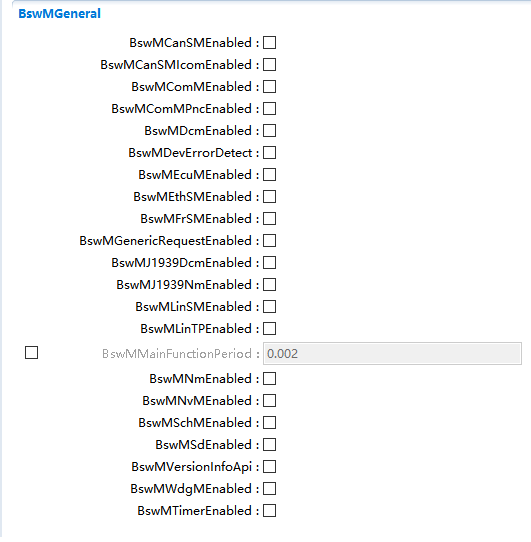

.. centered:: **表 BswMGeneral属性描述 (Table BswMGeneral property description)**

.. list-table::
   :widths: 15 15 14 14 14 14 14
   :header-rows: 1

   * - UI名称 (UI name)
     - 描述 (describe)
     - \
     - \
     - \
     - \
     - \
   * - BswMCanSMEnabled
     - 取值范围 (Value range)
     - True、False
     - \
     - 默认取值 (Default value)
     - \
     - False
   * - \
     - 参数描述 (Parameter description)
     - 是否使能与CanSM相关的API (Whether to enable APIs related to CanSM)
     - \
     - \
     - \
     - \
   * - \
     - 依赖关系 (Dependencies)
     - 无 (none)
     - \
     - \
     - \
     - \
   * - BswMCanSMIcomEnabled
     - 取值范围 (Value range)
     - True、False
     - \
     - 默认取值 (Default value)
     - \
     - False
   * - \
     - 参数描述 (Parameter description)
     - 是否使能与CANSMIcom相关的API (Whether to enable APIs related to CANSMIcom)
     - \
     - \
     - \
     - \
   * - \
     - 依赖关系 (Dependencies)
     - 无 (none)
     - \
     - \
     - \
     - \
   * - BswMComMEnabled
     - 取值范围 (Value range)
     - True、False
     - \
     - 默认取值 (Default value)
     - \
     - False
   * - \
     - 参数描述 (Parameter description)
     - 是否使能与COM相关的API (Whether to enable COM-related APIs)
     - \
     - \
     - \
     - \
   * - \
     - 依赖关系 (Dependencies)
     - 无 (none)
     - \
     - \
     - \
     - \
   * - BswMDcmEnabled
     - 取值范围 (Value range)
     - True、False
     - \
     - 默认取值 (Default value)
     - \
     - False
   * - \
     - 参数描述 (Parameter description)
     - 是否使能与Dcm相关的API (Whether to enable API related to Dcm)
     - \
     - \
     - \
     - \
   * - \
     - 依赖关系 (Dependencies)
     - 无 (none)
     - \
     - \
     - \
     - \
   * - BswMDevErrorDetect
     - 取值范围 (Value range)
     - True、False
     - \
     - 默认取值 (Default value)
     - \
     - False
   * - \
     - 参数描述 (Parameter description)
     - 是否需要使能开发错误检查 (Do you need to enable development error checking?)
     - \
     - \
     - \
     - \
   * - \
     - 依赖关系 (Dependencies)
     - 无 (none)
     - \
     - \
     - \
     - \
   * - BswMEcuMEnabled
     - 取值范围 (Value range)
     - True、False
     - \
     - 默认取值 (Default value)
     - \
     - False
   * - \
     - 参数描述 (Parameter description)
     - 是否使能与EcuM相关的API (Whether to enable EcuM-related APIs)
     - \
     - \
     - \
     - \
   * - \
     - 依赖关系 (Dependencies)
     - 无 (none)
     - \
     - \
     - \
     - \
   * - BswMEthSMEnabled
     - 取值范围 (Value range)
     - True、False
     - \
     - 默认取值 (Default value)
     - \
     - False
   * - \
     - 参数描述 (Parameter description)
     - 是否使能与EthSM相关的API (Whether to enable APIs related to EthSM)
     - \
     - \
     - \
     - \
   * - \
     - 依赖关系 (Dependencies)
     - 无 (none)
     - \
     - \
     - \
     - \
   * - BswMFrSMEnabled
     - 取值范围 (Value range)
     - True、False
     - 默认取值 (Default value)
     - \
     - False
     - \
   * - \
     - 参数描述 (Parameter description)
     - 是否使能与FrSM相关的API (Whether to enable API related to FrSM)
     - \
     - \
     - \
     - \
   * - \
     - 依赖关系 (Dependencies)
     - 无 (none)
     - \
     - \
     - \
     - \
   * - BswMGenericRequestEnabled
     - 取值范围 (Value range)
     - True、False
     - 默认取值 (Default value)
     - \
     - False
     - \
   * - \
     - 参数描述 (Parameter description)
     - 是否使能BswM_RequestMode接口 (Whether to enable the BswM_RequestMode interface)
     - \
     - \
     - \
     - \
   * - \
     - 依赖关系 (Dependencies)
     - 无 (none)
     - \
     - \
     - \
     - \
   * - BswMJ1939DcmEnabled
     - 取值范围 (Value range)
     - True、False
     - 默认取值 (Default value)
     - \
     - False
     - \
   * - \
     - 参数描述 (Parameter description)
     - 是否使能与J1939Dcm相关的API (Whether to enable API related to J1939Dcm)
     - \
     - \
     - \
     - \
   * - \
     - 依赖关系 (Dependencies)
     - 无 (none)
     - \
     - \
     - \
     - \
   * - BswMJ1939NmEnabled
     - 取值范围 (Value range)
     - True、False
     - 默认取值 (Default value)
     - \
     - False
     - \
   * - \
     - 参数描述 (Parameter description)
     - 是否使能与J1939Nm相关的API (Whether to enable API related to J1939Nm)
     - \
     - \
     - \
     - \
   * - \
     - 依赖关系 (Dependencies)
     - 无 (none)
     - \
     - \
     - \
     - \
   * - BswMLinSMEnabled
     - 取值范围 (Value range)
     - True、False
     - 默认取值 (Default value)
     - \
     - False
     - \
   * - \
     - 参数描述 (Parameter description)
     - 是否使能与LinSM相关的API (Whether to enable LinSM-related APIs)
     - \
     - \
     - \
     - \
   * - \
     - 依赖关系 (Dependencies)
     - 无 (none)
     - \
     - \
     - \
     - \
   * - BswMLinTPEnabled
     - 取值范围 (Value range)
     - True、False
     - 默认取值 (Default value)
     - \
     - False
     - \
   * - \
     - 参数描述 (Parameter description)
     - 是否使能与LinTp相关的API (Whether to enable API related to LinTp)
     - \
     - \
     - \
     - \
   * - \
     - 依赖关系 (Dependencies)
     - 无 (none)
     - \
     - \
     - \
     - \
   * - BswMMainFunctionPeriod
     - 取值范围 (Value range)
     - 0 … INF
     - 默认取值 (Default value)
     - \
     - 无 (none)
     - \
   * - \
     - 参数描述 (Parameter description)
     - 定义mainfunction执行的调度时间 (Define the scheduling time of mainfunction execution)
     - \
     - \
     - \
     - \
   * - \
     - 依赖关系 (Dependencies)
     - 无 (none)
     - \
     - \
     - \
     - \
   * - BswMNvMEnabled
     - 取值范围 (Value range)
     - True、False
     - 默认取值 (Default value)
     - \
     - False
     - \
   * - \
     - 参数描述 (Parameter description)
     - 是否使能与Nvm相关的API (Whether to enable Nvm-related APIs)
     - \
     - \
     - \
     - \
   * - \
     - 依赖关系 (Dependencies)
     - 无 (none)
     - \
     - \
     - \
     - \
   * - BswMSchMEnabled
     - 取值范围 (Value range)
     - True、False
     - 默认取值 (Default value)
     - \
     - False
     - \
   * - \
     - 参数描述 (Parameter description)
     - 是否使能与SchM相关的API (Whether to enable SchM-related APIs)
     - \
     - \
     - \
     - \
   * - \
     - 依赖关系 (Dependencies)
     - 无 (none)
     - \
     - \
     - \
     - \
   * - BswMSdEnabled
     - 取值范围 (Value range)
     - True、False
     - 默认取值 (Default value)
     - \
     - False
     - \
   * - \
     - 参数描述 (Parameter description)
     - 是否使能与Sd相关的API (Whether to enable Sd-related APIs)
     - \
     - \
     - \
     - \
   * - \
     - 依赖关系 (Dependencies)
     - 无 (none)
     - \
     - \
     - \
     - \
   * - BswMVersionInfoApi
     - 取值范围 (Value range)
     - True、False
     - 默认取值 (Default value)
     - \
     - False
     - \
   * - \
     - 参数描述 (Parameter description)
     - 是否使能BswM_GetVersionInfo (Whether to enable BswM_GetVersionInfo)
     - \
     - \
     - \
     - \
   * - \
     - 依赖关系 (Dependencies)
     - 无 (none)
     - \
     - \
     - \
     - \
   * - BswMWdgMEnabled
     - 取值范围 (Value range)
     - True、False
     - 默认取值 (Default value)
     - \
     - False
     - \
   * - \
     - 参数描述 (Parameter description)
     - 是否使能与WdgM相关的API (Whether to enable WdgM-related APIs)
     - \
     - \
     - \
     - \
   * - \
     - 依赖关系 (Dependencies)
     - 无 (none)
     - \
     - \
     - \
     - \
         
         
         
BswMUserIncludeFiles
------------------------------------

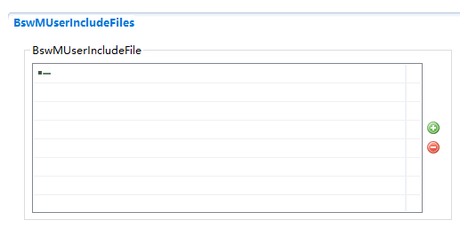

.. centered:: **表 BswMUserIncludeFiles属性描述 (Table BswMUserIncludeFiles attribute description)**

.. list-table::
   :widths: 20 20 20 20 20
   :header-rows: 1

   * - UI名称 (UI name)
     - 描述 (describe)
     - \
     - \
     - \
   * - BswMUserIncludeFile
     - 取值范围 (Value range)
     - 无 (none)
     - 默认取值 (Default value)
     - 无 (none)
   * - \
     - 参数描述 (Parameter description)
     - 需要包含的外部头文件，一般用于调用UserCallout函数时添加用户函数的头文件 (External header files that need to be included, generally used to add the header files of user functions when calling the UserCallout function.)
     - \
     - \
   * - \
     - 依赖关系 (Dependencies)
     - 无 (none)
     - \
     - \
         
         
         
BswMConfigs
---------------------------

.. centered:: **表 BswMConfigs属性描述 (Table BswMConfigs attribute description)**

.. list-table::
   :widths: 20 20 20 20 20
   :header-rows: 1

   * - UI名称 (UI name)
     - 描述 (describe)
     - \
     - \
     - \
   * - BswMPartitionRef
     - 取值范围 (Value range)
     - 引用到[EcucPartition] (Reference to [EcucPartition])
     - 默认取值 (Default value)
     - 无 (none)
   * - \
     - 参数描述 (Parameter description)
     - 通过OSApplication与EcucPartition关联，从而知道此partition处于哪个核 (Associate with EcucPartition through OSApplication to know which core this partition is in)
     - \
     - \
   * - \
     - 依赖关系 (Dependencies)
     - 仅在多核系统中才需要配置 (Configuration is only required on multi-core systems)
     - \
     - \
         
         
         
BswMLogicalExpression
-------------------------------------

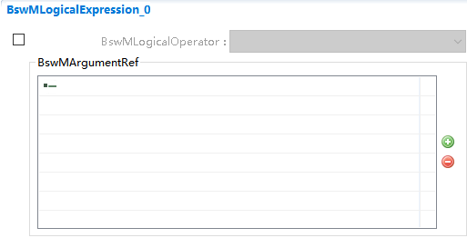

.. centered:: **表 BswMLogicalExpression属性描述 (Table BswMLogicalExpression property description)**

.. list-table::
   :widths: 15 15 14 14 14 14 14
   :header-rows: 1

   * - UI名称 (UI name)
     - 描述 (describe)
     - \
     - \
     - \
     - \
     - \
   * - BswMLogicalOperator
     - 取值范围 (Value range)
     - BSWM_AND、BSWM_NAND、
     - 默认取值 (Default value)
     - 无 (none)
     - \
     - \
   * - \
     - \
     - BSWM_NOT、
     - \
     - \
     - \
     - \
   * - \
     - \
     - BSWM_OR、
     - \
     - \
     - \
     - \
   * - \
     - \
     - BSWM_XOR、
     - \
     - \
     - \
     - \
   * - \
     - 参数描述 (Parameter description)
     - 用于存在多个仲裁条件时，仲裁条件的连接符 (Used to connect the arbitration conditions when there are multiple arbitration conditions.)
     - \
     - \
     - \
     - \
   * - \
     - \
     - \
     - .. image:: ../../_static/参考手册(Module_Reference_Manual)/Dem/image14.png
         :width: 90%
         :align: center
     - \
     - \
     - \
   * - \
     - 依赖关系 (Dependencies)
     - 当仲裁条件只有一个时，不用配置此项。当有多个时，需通过此配置项关联多个仲裁条件（eg：与、或）
     - \
     - \
     - \
     - \
   * - BswMArgumentRef
     - 取值范围 (Value range)
     - 引用到[BswMModeCondition] (Reference to [BswMModeCondition])
     - 默认取值 (Default value)
     - 无 (none)
     - \
     - \
   * - \
     - 参数描述 (Parameter description)
     - 每一个Argument代表一个仲裁条件 (Each Argument represents an arbitration condition)
     - \
     - \
     - \
     - \
   * - \
     - 依赖关系 (Dependencies)
     - 无 (none)
     - \
     - \
     - \
     - \
         
         
         
BswMModeCondition
---------------------------------

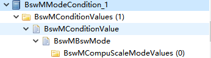

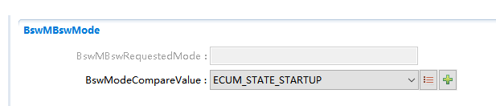

.. centered:: **表 BswMModeCondition属性描述 (Table BswMModeCondition property description)**

.. list-table::
   :widths: 20 20 20 20 20
   :header-rows: 1

   * - UI名称 (UI name)
     - 描述 (describe)
     - \
     - \
     - \
   * - BswMConditionType
     - \
     - BSWM_EQUALS
     - \
     - \
   * - \
     - \
     - BSWM_EQUALS_NOT
     - \
     - \
   * - \
     - 取值范围 (Value range)
     - 无 (none)
     - 默认取值 (Default value)
     - \
   * - \
     - \
     - BSWM_EVENT_IS_SET
     - \
     - \
   * - \
     - \
     - BSWM_EVENT_IS_CLEARED
     - \
     - \
   * - \
     - 参数描述 (Parameter description)
     - 用于判断条件判断符号，如下图： (Used to judge conditional judgment symbols, as shown below:)
     - .. image:: ../../_static/参考手册(Module_Reference_Manual)/Dem/image19.png
         :width: 90%
         :align: center
     - \
   * - \
     - \
     - 依赖于BswMConditionMode，当BswMConditionMode配置为引用BswMModeRequestPort时，此处只能选择BSWM_EQUALS或者BSWM_EQUALS_NOT； (Dependent on BswMConditionMode, when BswMConditionMode is configured to reference BswMModeRequestPort, only BSWM_EQUALS or BSWM_EQUALS_NOT can be selected here;)
     - \
     - \
   * - \
     - \
     - 当BswMConditionMode配置为引用BswMEventRequestPort时，此处只能选择BSWM_EVENT_IS_SET或者BSWM_EVENT_IS_CLEARED。 (When BswMConditionMode is configured to reference BswMEventRequestPort, only BSWM_EVENT_IS_SET or BSWM_EVENT_IS_CLEARED can be selected here.)
     - \
     - \
   * - BswMConditionMode
     - 取值范围 (Value range)
     - 无 (none)
     - \
     - \
   * - \
     - 参数描述 (Parameter description)
     - 选择用于比较的条件是基于那个请求端口，比如下图中，比较条件为DCM中28服务的请求模式 (The conditions selected for comparison are based on the request port. For example, in the figure below, the comparison condition is the request mode of the 28 service in DCM.)
     - \
     - \
   * - \
     - \
     - \
     - .. image:: ../../_static/参考手册(Module_Reference_Manual)/Dem/image20.png
         :width: 90%
         :align: center
     - \
   * - \
     - 依赖关系 (Dependencies)
     - Reference to [   BswMModeRequestPort or BswMEventRequestPort ]
     - \
     - \
   * - BswMConditionValue
     - 取值范围 (Value range)
     - 无 (none)
     - \
     - \
   * - \
     - 参数描述 (Parameter description)
     - 用于和BswMConditionMode作比较的比较值 (Comparison value used for comparison with BswMConditionMode)
     - \
     - \
   * - \
     - \
     - \
     - .. image:: ../../_static/参考手册(Module_Reference_Manual)/Dem/image21.png
         :width: 90%
         :align: center
     - \
   * - \
     - \
     - 需要和BswMConditionMode中配置对应，如BswMConditionMode中选择引用CanSMInd，那么此处比较值必须为CanSM对应的比较值 (It needs to correspond to the configuration in BswMConditionMode. If you choose to reference CanSMInd in BswMConditionMode, then the comparison value here must be the comparison value corresponding to CanSM.)
     - \
     - \
   * - BswMBswMode
     - 依赖关系 (Dependencies)
     - 无 (none)
     - \
     - \
   * - \
     - \
     - This container defines the   value and type of a mode in the BSW.
     - \
     - \
   * - \
     - 依赖关系 (Dependencies)
     - 如果BswMConditionValue是来自BSW模块，则需要配置 (If BswMConditionValue is from BSW module, it needs to be configured)
     - \
     - \
   * - BswMBswRequestedMode
     - 取值范围 (Value range)
     - 无 (none)
     - 默认取值 (Default value)
     - 无 (none)
   * - \
     - \
     - 配置用于和BswMConditionMode中所选的请求端口的比较值 (Configure the comparison value with the request port selected in BswMConditionMode)
     - \
     - \
   * - \
     - 参数描述 (Parameter description)
     - 根据BswMConditionMode中配置会自动使能，如果使能，需要用户填相应的值 (It will be automatically enabled according to the configuration in BswMConditionMode. If enabled, the user needs to fill in the corresponding value.)
     - \
     - \
   * - BswModeCompareValue
     - \
     - 无 (none)
     - \
     - \
   * - \
     - 参数描述 (Parameter description)
     - 配置用于和BswMConditionMode中所选的请求端口的比较值 (Configure the comparison value with the request port selected in BswMConditionMode)
     - \
     - \
   * - \
     - 依赖关系 (Dependencies)
     - 需要和BswMConditionMode中配置对应，此参数会根据BswMConditionMode的配置自动有下拉选项 (It needs to correspond to the configuration in BswMConditionMode. This parameter will automatically have a drop-down option according to the configuration of BswMConditionMode.)
     - \
     - \
   * - BswMModeDeclaration
     - 取值范围 (Value range)
     - 无 (none)
     - 默认取值 (Default value)
     - 无 (none)
   * - \
     - 参数描述 (Parameter description)
     - When the mode corresponds to a   mode request or mode indication interface the mode is defined by a mode   declaration.
     - \
     - \
   * - \
     - 依赖关系 (Dependencies)
     - 如果配置此项，则需要创建BswMModeValueRef (If you configure this, you need to create a BswMModeValueRef)
     - \
     - \
         
         
         
BswMModeRequestPort
-----------------------------------

.. centered:: **表 BswMModeRequestPort属性描述 (Table BswMModeRequestPort property description)**

.. list-table::
   :widths: 20 20 20 20 20
   :header-rows: 1

   * - UI名称 (UI name)
     - 描述 (describe)
     - \
     - \
     - \
   * - BswMRequestProcessing
     - \
     - BSWM_DEFERRED
     - \
     - \
   * - \
     - 取值范围 (Value range)
     - 无 (none)
     - 默认取值 (Default value)
     - \
   * - \
     - \
     - BSWM_IMMEDIATE
     - \
     - \
   * - \
     - 参数描述 (Parameter description)
     - 当请求源触发时，模式仲裁是立即处理还是推迟到下次Mainfunction中去处理 (When the request source is triggered, should the mode arbitration be processed immediately or postponed to the next Main function?)
     - \
     - \
   * - \
     - 依赖关系 (Dependencies)
     - 无 (none)
     - \
     - \
         
         
         
BswMModeInitValue
---------------------------------

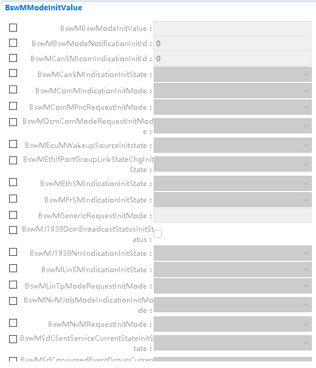

.. centered:: **表 BswMModeInitValue属性描述 (Table BswMModeInitValue attribute description)**

.. list-table::
   :widths: 34 33 33
   :header-rows: 1

   * - UI名称 (UI name)
     - 描述 (describe)
     - \
   * - BswMModeInitValue
     - 取值范围 (Value range)
     - 无 (none)
   * - \
     - \
     - 每个Port初始状态值。上图中每个输入框代表每种port的比较值，比如，配置了一个BswMGenericPort，如果需要对此BswMGenericPort赋初值，则需要配置上图中BswMGenericRequestInitValue。 (The initial status value of each Port.Each input box in the above figure represents the comparison value of each port. For example, a BswMGenericPort is configured. If you need to assign an initial value to this BswMGenericPort, you need to configure the BswMGenericRequestInitValue in the above figure.)
   * - \
     - \
     - 注：配置多个想通的port，配置此项则会使所有的初始值都一样 (Note: Configure multiple throughput ports. Configuring this item will make all initial values ​​​​the same.)
   * - \
     - 依赖关系 (Dependencies)
     - 依赖于ModeRequestPort和EventRequestPort配置 (Depends on ModeRequestPort and EventRequestPort configuration)
         
         
         
BswMModeRequestSource
-------------------------------------

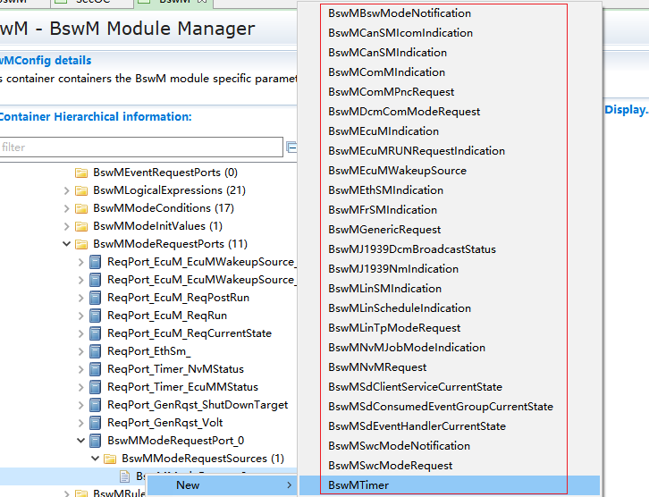

.. centered:: **表 BswMModeRequestSource属性描述 (Table BswMModeRequestSource property description)**

.. list-table::
   :widths: 20 20 20 20 20
   :header-rows: 1

   * - UI名称 (UI name)
     - 描述 (describe)
     - \
     - \
     - \
   * - BswMBswModeDeclaration-GroupPrototypeRef
     - 取值范围 (Value range)
     - 无 (none)
     - \
     - \
   * - \
     - 参数描述 (Parameter description)
     - 引用到SWC定义的Mode Declaration Group Prototype. (Reference to the Mode Declaration Group Prototype defined by SWC.)
     - \
     - \
   * - \
     - 依赖关系 (Dependencies)
     - Mode Declaration Group是SWC定义的，因此如果配置此项需要导入SWC的arxml文件 (Mode Declaration Group is defined by SWC, so if you configure this item, you need to import the arxml file of SWC)
     - \
     - \
   * - BswMCanSMIcomIndicationSwitchError
     - 取值范围 (Value range)
     - ICOM_SWITCH_E_OK，ICOM_SWITCH_E_FAILED
     - 默认取值 (Default value)
     - 无 (none)
   * - \
     - 参数描述 (Parameter description)
     - 标识来自该模式请求对应的 CanSM 的指示类型（错误或无错误） (Identifies the indication type (error or no error) from the CanSM corresponding to this mode request)
     - \
     - \
   * - \
     - 依赖关系 (Dependencies)
     - 无 (none)
     - \
     - \
   * - BswMCanSMChannelRef
     - 取值范围 (Value range)
     - 引用[ ComMChannel ] (Quote[ComMChannel])
     - 默认取值 (Default value)
     - 无 (none)
   * - \
     - 参数描述 (Parameter description)
     - 此端口关联的[ ComMChannel ] ([ComMChannel] associated with this port)
     - \
     - \
   * - \
     - 依赖关系 (Dependencies)
     - 无 (none)
     - \
     - \
   * - BswMComMChannelRef
     - 取值范围 (Value range)
     - 引用[ ComMChannel ] (Quote[ComMChannel])
     - 默认取值 (Default value)
     - 无 (none)
   * - \
     - 参数描述 (Parameter description)
     - 表示此端口对应的[ ComMChannel ] (Indicates the [ComMChannel] corresponding to this port)
     - \
     - \
   * - \
     - 依赖关系 (Dependencies)
     - 无 (none)
     - \
     - \
   * - BswMComMPncRef
     - 取值范围 (Value range)
     - 引用到[ ComMPnc ] (Quote to [ComMPnc])
     - 默认取值 (Default value)
     - 无 (none)
   * - \
     - 参数描述 (Parameter description)
     - 表示此端口对应的[ComMPnc] (Indicates the [ComMPnc] corresponding to this port)
     - \
     - \
   * - \
     - 依赖关系 (Dependencies)
     - 无 (none)
     - \
     - \
   * - BswMDcmComMChannelRef
     - 取值范围 (Value range)
     - 引用到[ ComMChannel ] (Quote to [ComMChannel])
     - 默认取值 (Default value)
     - 无 (none)
   * - \
     - 参数描述 (Parameter description)
     - Dcm模式请求端口对应的[ ComMChannel ] ([ComMChannel] corresponding to the Dcm mode request port)
     - \
     - \
   * - \
     - 依赖关系 (Dependencies)
     - 无 (none)
     - \
     - \
   * - BswMEcuMWakeupSrcRef
     - 取值范围 (Value range)
     - 引用到[ EcuMWakeupSource ] (Reference to [EcuMWakeupSource])
     - 默认取值 (Default value)
     - 无 (none)
   * - \
     - 参数描述 (Parameter description)
     - BswMEcuMWakeupSource 请求端口对应的[ EcuMWakeupSource ] ([EcuMWakeupSource] corresponding to the BswMEcuMWakeupSource request port)
     - \
     - \
   * - \
     - 依赖关系 (Dependencies)
     - 无 (none)
     - \
     - \
   * - \
     - \
     - BSWM_ECUM_STATE_P
     - \
     - \
   * - BswMEcuMRUNRequestProtocolPort
     - \
     - OST_RUN
     - \
     - \
   * - \
     - \
     - BSWM_ECUM_STATE_R
     - \
     - \
   * - \
     - \
     - UN
     - \
     - \
   * - \
     - 参数描述 (Parameter description)
     - 标识与模式请求相关的 EcuM 状态 (Identifies the EcuM status associated with the pattern request)
     - \
     - \
   * - \
     - 依赖关系 (Dependencies)
     - EcuM模块的Mode Handling需要打开 (Mode Handling of the EcuM module needs to be turned on)
     - \
     - \
   * - BswMEthSMChannelRef
     - 取值范围 (Value range)
     - 引用到[ ComMChannel ] (Quote to [ComMChannel])
     - 默认取值 (Default value)
     - 无 (none)
   * - \
     - 参数描述 (Parameter description)
     - BswMEthSMIndication请求端口对应的[ComMChannel] ([ComMChannel] corresponding to the BswMEthSMIndication request port)
     - \
     - \
   * - \
     - 依赖关系 (Dependencies)
     - 无 (none)
     - \
     - \
   * - BswMFrSMChannelRef
     - 取值范围 (Value range)
     - 引用到[ ComMChannel ] (Quote to [ComMChannel])
     - 默认取值 (Default value)
     - 无 (none)
   * - \
     - 参数描述 (Parameter description)
     - BswMFrSMIndication请求端口对应的[ComMChannel] ([ComMChannel] corresponding to the BswMFrSMIndication request port)
     - \
     - \
   * - \
     - 依赖关系 (Dependencies)
     - 无 (none)
     - \
     - \
   * - BswMModeRequesterId
     - 取值范围 (Value range)
     - 无 (none)
     - 默认取值 (Default value)
     - 无 (none)
   * - \
     - 参数描述 (Parameter description)
     - 标识通用模式请求接口的不同用户 (Identify different users of the common mode request interface)
     - \
     - \
   * - \
     - 依赖关系 (Dependencies)
     - 无 (none)
     - \
     - \
   * - BswMJ1939DcmChannelRef
     - 取值范围 (Value range)
     - 引用到[ ComMChannel ] (Quote to [ComMChannel])
     - 默认取值 (Default value)
     - 无 (none)
   * - \
     - 参数描述 (Parameter description)
     - BswMJ1939DcmBroadcastStatus请求端口对应的[ComMChannel] (BswMJ1939DcmBroadcastStatus request the [ComMChannel] corresponding to the port)
     - \
     - \
   * - \
     - 依赖关系 (Dependencies)
     - 无 (none)
     - \
     - \
   * - BswMJ1939NmChannelRef
     - 取值范围 (Value range)
     - 引用到[ ComMChannel ] (Quote to [ComMChannel])
     - 默认取值 (Default value)
     - 无 (none)
   * - \
     - 参数描述 (Parameter description)
     - BswMJ1939NmIndication请求端口对应的[ComMChannel] ([ComMChannel] corresponding to the BswMJ1939NmIndication request port)
     - \
     - \
   * - \
     - 依赖关系 (Dependencies)
     - 无 (none)
     - \
     - \
   * - BswMJ1939NmNodeRef
     - 取值范围 (Value range)
     - 引用到[J1939NmNode] (Referenced to [J1939NmNode])
     - 默认取值 (Default value)
     - 无 (none)
   * - \
     - 参数描述 (Parameter description)
     - BswMJ1939NmIndication请求端口对应的[J1939NmNode] ([J1939NmNode] corresponding to the BswMJ1939NmIndication request port)
     - \
     - \
   * - \
     - 依赖关系 (Dependencies)
     - 无 (none)
     - \
     - \
   * - BswMLinSMChannelRef
     - 取值范围 (Value range)
     - 引用到[ ComMChannel ] (Quote to [ComMChannel])
     - 默认取值 (Default value)
     - 无 (none)
   * - \
     - 参数描述 (Parameter description)
     - BswMLinSMIndication请求端口对应的[ComMChannel] ([ComMChannel] corresponding to the BswMLinSMIndication request port)
     - \
     - \
   * - \
     - 依赖关系 (Dependencies)
     - 无 (none)
     - \
     - \
   * - BswMLinScheduleRef
     - 取值范围 (Value range)
     - 引用到[LinSMSchedule] (Reference to [LinSMSchedule])
     - 默认取值 (Default value)
     - 无 (none)
   * - \
     - 参数描述 (Parameter description)
     - BswMLinScheduleIndication请求端口对应的[LinSMSchedule] ([LinSMSchedule] corresponding to the BswMLinScheduleIndication request port)
     - \
     - \
   * - \
     - 依赖关系 (Dependencies)
     - 无 (none)
     - \
     - \
   * - BswMLinSMChannelRef
     - 取值范围 (Value range)
     - 引用到[ComMChannel] (Quote to [ComMChannel])
     - 默认取值 (Default value)
     - 无 (none)
   * - \
     - 参数描述 (Parameter description)
     - BswMLinScheduleIndication请求端口对应的[ComMChannel] ([ComMChannel] corresponding to the BswMLinScheduleIndication request port)
     - \
     - \
   * - \
     - 依赖关系 (Dependencies)
     - 无 (none)
     - \
     - \
   * - BswMLinTpChannelRef
     - 取值范围 (Value range)
     - 引用到[ComMChannel] (Quote to [ComMChannel])
     - 默认取值 (Default value)
     - 无 (none)
   * - \
     - 参数描述 (Parameter description)
     - BswMLinTpModeRequest请求端口对应的[ComMChannel] ([ComMChannel] corresponding to the BswMLinTpModeRequest request port)
     - \
     - \
   * - \
     - 依赖关系 (Dependencies)
     - 无 (none)
     - \
     - \
   * - BswMNvmService
     - \
     - NvmCancelWriteAll/
     - \
     - \
   * - \
     - \
     - NvmReadAll/
     - \
     - \
   * - \
     - 取值范围 (Value range)
     - 无 (none)
     - 默认取值 (Default value)
     - \
   * - \
     - \
     - NvmWriteAll/
     - \
     - \
   * - \
     - \
     - NvmFirstInitAll/NvmValidateAll
     - \
     - \
   * - \
     - 参数描述 (Parameter description)
     - BswMNvMJobModeIndication表示执行任务的当前状态，标识与模式请求相关的 Nvm 任务 (BswMNvMJobModeIndication represents the current status of the execution task and identifies the Nvm task related to the mode request)
     - \
     - \
   * - \
     - 依赖关系 (Dependencies)
     - 无 (none)
     - \
     - \
   * - BswMNvMBlockRef
     - 取值范围 (Value range)
     - 引用到[ NvMBlockDescriptor ] (Reference to [NvMBlockDescriptor])
     - 默认取值 (Default value)
     - 无 (none)
   * - \
     - 参数描述 (Parameter description)
     - BswMNvMRequest 请求端口对应的[ NvMBlockDescriptor ] ([NvMBlockDescriptor] corresponding to the BswMNvMRequest request port)
     - \
     - \
   * - \
     - 依赖关系 (Dependencies)
     - 无 (none)
     - \
     - \
   * - BswMSdClientMethodsRef
     - 取值范围 (Value range)
     - 引用到[SdClientService] (Referenced to [SdClientService])
     - 默认取值 (Default value)
     - 无 (none)
   * - \
     - 参数描述 (Parameter description)
     - BswMSdClientServiceCurrentState请求端口对应的[ SdClientService] ([SdClientService] corresponding to the BswMSdClientServiceCurrentState request port)
     - \
     - \
   * - \
     - 依赖关系 (Dependencies)
     - 无 (none)
     - \
     - \
   * - BswMSdConsumedEventGroupRef
     - 取值范围 (Value range)
     - 引用到[ SdConsumedEventGroup ] (Reference to [SdConsumedEventGroup])
     - 默认取值 (Default value)
     - 无 (none)
   * - \
     - 参数描述 (Parameter description)
     - BswMSdConsumedEventGroupCurrentState请求端口对应的[ SdConsumedEventGroup ] ([SdConsumedEventGroup] corresponding to the BswMSdConsumedEventGroupCurrentState request port)
     - \
     - \
   * - \
     - 依赖关系 (Dependencies)
     - 无 (none)
     - \
     - \
   * - BswMSdEventHandlerRef
     - 取值范围 (Value range)
     - 引用到[ SdEventHandler ] (Reference to [SdEventHandler])
     - 默认取值 (Default value)
     - 无 (none)
   * - \
     - 参数描述 (Parameter description)
     - BswMSdEventHandlerCurrentState请求端口对应的[ SdEventHandler ] ([SdEventHandler] corresponding to the BswMSdEventHandlerCurrentState request port)
     - \
     - \
   * - \
     - 依赖关系 (Dependencies)
     - 无 (none)
     - \
     - \
   * - BswMSwcModeNotification-ModeDeclarationGroup-PrototypeRef
     - 取值范围 (Value range)
     - 引用到 [ MODE-DECLARATION-GROUP-PROTOTYPE ] (Reference to [ MODE-DECLARATION-GROUP-PROTOTYPE ])
     - 默认取值 (Default value)
     - 无 (none)
   * - \
     - 参数描述 (Parameter description)
     - BswMSwcModeNotification请求端口对应的[   MODE-DECLARATION-GROUP-PROTOTYPE ] ([ MODE-DECLARATION-GROUP-PROTOTYPE ] corresponding to the BswMSwcModeNotification request port)
     - \
     - \
   * - \
     - 依赖关系 (Dependencies)
     - [   MODE-DECLARATION-GROUP-PROTOTYPE ]是在SWC中定义 ([ MODE-DECLARATION-GROUP-PROTOTYPE ] is defined in SWC)
     - \
     - \
   * - BswMSwcModeRequest-VariableDataPrototypeRef
     - 取值范围 (Value range)
     - 引用到 [ VARIABLE-DATA-PROTOTYPE] (Reference to [VARIABLE-DATA-PROTOTYPE])
     - 默认取值 (Default value)
     - 无 (none)
   * - \
     - 参数描述 (Parameter description)
     - BswMSwcModeRequest请求端口对应的[ VARIABLE-DATA-PROTOTYPE] ([VARIABLE-DATA-PROTOTYPE] corresponding to the BswMSwcModeRequest request port)
     - \
     - \
   * - \
     - 依赖关系 (Dependencies)
     - VARIABLE-DATA-PROTOTYPE是在SWC中定义 (VARIABLE-DATA-PROTOTYPE is defined in SWC)
     - \
     - \
         
         
         
BswMEventRequestSource
--------------------------------------

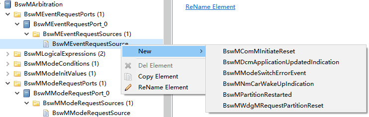

.. centered:: **表 BswMEventRequestSource属性描述 (Table BswMEventRequestSource property description)**

.. list-table::
   :widths: 20 20 20 20 20
   :header-rows: 1

   * - UI名称 (UI name)
     - 描述 (describe)
     - \
     - \
     - \
   * - BswMEventRequestProcessing
     - 取值范围 (Value range)
     - BSWM_DEFERRED
     - 默认取值 (Default value)
     - 无 (none)
   * - \
     - \
     - BSWM_IMMEDIATE
     - \
     - \
   * - \
     - 参数描述 (Parameter description)
     - BswM.当请求源触发时，模式仲裁是立即处理还是推迟到下次Mainfunction中去处理 (BswM. When the request source is triggered, should the mode arbitration be processed immediately or postponed to the next Main function?)
     - \
     - \
   * - \
     - 依赖关系 (Dependencies)
     - 无 (none)
     - \
     - \
   * - BswMComMInitiateReset
     - 取值范围 (Value range)
     - 无 (none)
     - 默认取值 (Default value)
     - 无 (none)
   * - \
     - 参数描述 (Parameter description)
     - 当ComM调用BswM_ComM_InitiateReset时，此端口会被触发 (This port will be triggered when ComM calls BswM_ComM_InitiateReset)
     - \
     - \
   * - \
     - 依赖关系 (Dependencies)
     - 无 (none)
     - \
     - \
   * - BswMDcmApplicationUpdatedIndication
     - 取值范围 (Value range)
     - 无 (none)
     - 默认取值 (Default value)
     - 无 (none)
   * - \
     - 参数描述 (Parameter description)
     - 当Dcm调用BswM_Dcm_ApplicationUpdated时此端口会被触发 (This port will be triggered when Dcm calls BswM_Dcm_ApplicationUpdated)
     - \
     - \
   * - \
     - 依赖关系 (Dependencies)
     - 无 (none)
     - \
     - \
   * - BswMNmChannelRef
     - 取值范围 (Value range)
     - 引用到[ComMChannel] (Quote to [ComMChannel])
     - 默认取值 (Default value)
     - 无 (none)
   * - \
     - 参数描述 (Parameter description)
     - BswMNmCarWakeUpIndication请求端口对应的[ComMChannel] ([ComMChannel] corresponding to the BswMNmCarWakeUpIndication request port)
     - \
     - \
   * - \
     - 依赖关系 (Dependencies)
     - 无 (none)
     - \
     - \
   * - BswMPartitionRestarted
     - 取值范围 (Value range)
     - 无 (none)
     - 默认取值 (Default value)
     - 无 (none)
   * - \
     - 参数描述 (Parameter description)
     - 当分区发生错误时，Rte通过此端口通知到BswM (When an error occurs in the partition, Rte notifies BswM through this port)
     - \
     - \
   * - \
     - 依赖关系 (Dependencies)
     - 无 (none)
     - \
     - \
   * - BswMWdgMRequestPartitionResetRef
     - 取值范围 (Value range)
     - 引用到[EcucPartition] (Reference to [EcucPartition])
     - 默认取值 (Default value)
     - 无 (none)
   * - \
     - 参数描述 (Parameter description)
     - WdgM调用BswM_WdgM_RequestPartitionReset发起分区重启时，通过此端口通知到BSWM (When WdgM calls BswM_WdgM_RequestPartitionReset to initiate a partition restart, it notifies BSWM through this port.)
     - \
     - \
   * - \
     - 依赖关系 (Dependencies)
     - 无 (none)
     - \
     - \
         
         
         
BswMRule
------------------------

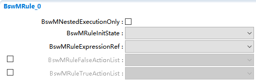

.. centered:: **表 BswMRule属性描述 (Table BswMRule attribute description)**

.. list-table::
   :widths: 20 20 20 20 20
   :header-rows: 1

   * - UI名称 (UI name)
     - 描述 (describe)
     - \
     - \
     - \
   * - BswMNestedExecutionOnly
     - 取值范围 (Value range)
     - True，false
     - 默认取值 (Default value)
     - False
   * - \
     - 参数描述 (Parameter description)
     - 指示此rule是否为Subordinaterule (Indicates whether this rule is a Subordinaterule)
     - \
     - \
   * - \
     - 依赖关系 (Dependencies)
     - BswMNestedExecutionOnly配置TRUE表示此Rule不能直接被仲裁，只能用于在模式控制Actionlist中被引用 (BswMNestedExecutionOnly configuration TRUE indicates that this Rule cannot be directly arbitrated and can only be used to be referenced in the mode control Actionlist)
     - \
     - \
   * - BswMRuleInitState
     - 取值范围 (Value range)
     - BSWM_FALSEBSWM_TRUE
     - 默认取值 (Default value)
     - 无 (none)
   * - \
     - \
     - BSWM_UNDEFINED
     - \
     - \
   * - \
     - 参数描述 (Parameter description)
     - 定义此Rule的初始化状态 (Define the initialization state of this Rule)
     - \
     - \
   * - \
     - 依赖关系 (Dependencies)
     - 无 (none)
     - \
     - \
   * - BswMRuleExpressionRef
     - 取值范围 (Value range)
     - 引用到[BswMLogicalExpression] (Reference to [BswMLogicalExpression])
     - 默认取值 (Default value)
     - 无 (none)
   * - \
     - 参数描述 (Parameter description)
     - 定义此rule的仲裁规则引用 (Arbitration rule reference that defines this rule)
     - \
     - \
   * - \
     - 依赖关系 (Dependencies)
     - 无 (none)
     - \
     - \
   * - BswMRuleFalseActionList
     - 取值范围 (Value range)
     - 引用到[BswMActionList ] (Referenced to [BswMActionList])
     - 默认取值 (Default value)
     - 无 (none)
   * - \
     - 参数描述 (Parameter description)
     - 表示当rule仲裁为FALSE时，需要执行的动作 (Indicates the actions that need to be performed when rule arbitration is FALSE.)
     - \
     - \
   * - \
     - 依赖关系 (Dependencies)
     - 无 (none)
     - \
     - \
   * - BswMRuleTrueActionList
     - 取值范围 (Value range)
     - 引用到[BswMActionList ] (Referenced to [BswMActionList])
     - 默认取值 (Default value)
     - 无 (none)
   * - \
     - 参数描述 (Parameter description)
     - 表示当rule仲裁为TRUE时，需要执行的动作 (Indicates the actions that need to be performed when rule arbitration is TRUE.)
     - \
     - \
   * - \
     - 依赖关系 (Dependencies)
     - 无 (none)
     - \
     - \
         
         
         
BswMDataTypeMappingSets
---------------------------------------

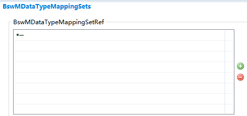

.. centered:: **表 BswMDataTypeMappingSets属性描述 (Table BswMDataTypeMappingSets property description)**

.. list-table::
   :widths: 20 20 20 20 20
   :header-rows: 1

   * - UI名称 (UI name)
     - 描述 (describe)
     - \
     - \
     - \
   * - BswMDataTypeMappingSetRef
     - 取值范围 (Value range)
     - 无 (none)
     - 默认取值 (Default value)
     - 无 (none)
   * - \
     - 参数描述 (Parameter description)
     - 引用到[DataTypeMappingSet] (Reference to [DataTypeMappingSet])
     - \
     - \
   * - \
     - 依赖关系 (Dependencies)
     - 无 (none)
     - \
     - \
         
         
         
BswMAction
--------------------------

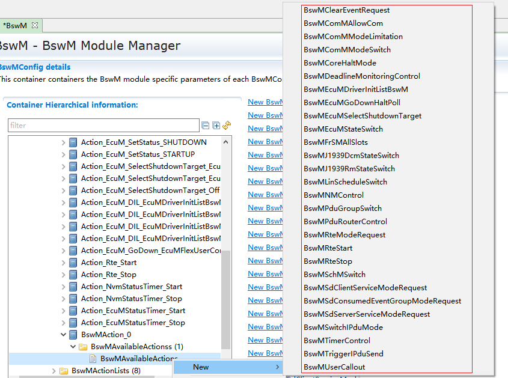

.. centered:: **表 BswMAction属性描述 (Table BswMAction attribute description)**

.. list-table::
   :widths: 20 20 20 20 20
   :header-rows: 1

   * - UI名称 (UI name)
     - 描述 (describe)
     - \
     - \
     - \
   * - BswMClearEventRequestPortRef
     - 取值范围 (Value range)
     - 引用到[   BswMEventRequestPort] (Reference to [BswMEventRequestPort])
     - 默认取值 (Default value)
     - 无 (none)
   * - \
     - 参数描述 (Parameter description)
     - 选择需要清除内部状态的EventRequestPort (Select the EventRequestPort whose internal state needs to be cleared)
     - \
     - \
   * - \
     - 依赖关系 (Dependencies)
     - 无 (none)
     - \
     - \
   * - BswMComAllowed
     - 取值范围 (Value range)
     - True，False
     - 默认取值 (Default value)
     - FALSE
   * - \
     - 参数描述 (Parameter description)
     - 表示调用ComM_CommunicationAllowed()时传入的Allowed参数 (Represents the Allowed parameter passed in when calling ComM_CommunicationAllowed())
     - \
     - \
   * - \
     - 依赖关系 (Dependencies)
     - 无 (none)
     - \
     - \
   * - BswMComMAllowChannelRef
     - 取值范围 (Value range)
     - 引用到[ ComMChannel ] (Quote to [ComMChannel])
     - 默认取值 (Default value)
     - 无 (none)
   * - \
     - 参数描述 (Parameter description)
     - 表示调用ComM_CommunicationAllowed()时传入的Channel参数 (Represents the Channel parameter passed in when calling ComM_CommunicationAllowed())
     - \
     - \
   * - \
     - 依赖关系 (Dependencies)
     - 无 (none)
     - \
     - \
   * - BswMComMLimitMode
     - 取值范围 (Value range)
     - True，False
     - 默认取值 (Default value)
     - 无 (none)
   * - \
     - \
     - ComM_LimitChannelToNoComMode.
     - \
     - \
   * - \
     - \
     - 指调用ComM_LimitChannelToNoComMode中传入的Status参数 (Refers to the Status parameter passed in when calling ComM_LimitChannelToNoComMode)
     - \
     - \
   * - \
     - 依赖关系 (Dependencies)
     - 无 (none)
     - \
     - \
   * - BswMComMLimitChannelRef
     - 取值范围
     - 无 (none)
     - \
     - \
   * - \
     - 参数描述 (Parameter description)
     - 指调用ComM_LimitChannelToNoComMode中传入的Channel参数 (Refers to the Channel parameter passed in when calling ComM_LimitChannelToNoComMode)
     - \
     - \
   * - \
     - 依赖关系 (Dependencies)
     - Symbolic name reference to [   ComMChannel ]
     - \
     - \
   * - | BswMComMRequestedMode
     - 取值范围 (Range of values)
     - BSWM_FULL_COM / BSWM_NO_COM
     - 无 (None)
     -
   * - |
     - 参数描述 (Parameter Description)
     - 调用ComM_RequestComMode时传入的Mode参数
     -
     -
   * - |
     - 依赖关系 (Dependency relationships)
     - 无
     -
     -
   * - BswMComMUserRef
     - 取值范围 (Value range)
     - 无 (none)
     - \
     - \
   * - \
     - 参数描述 (Parameter description)
     - 调用ComM_RequestComMode时传入的User参数 (The User parameter passed in when calling ComM_RequestComMode)
     - \
     - \
   * - \
     - 依赖关系 (Dependencies)
     - Symbolic name reference to [   ComMUser ]
     - \
     - \
   * - BswMCoreHaltActivationState
     - 取值范围 (Value range)
     - 无 (none)
     - \
     - \
   * - \
     - 参数描述 (Parameter description)
     - 调用ControlIdle中传入的IdleMode参数 (Call the IdleMode parameter passed in ControlIdle)
     - \
     - \
   * - \
     - 依赖关系 (Dependencies)
     - 通过调用OS提供的ControlIdle (By calling the ControlIdle provided by the OS)
     - \
     - \
   * - BswMTargetCoreRef
     - 取值范围 (Value range)
     - 引用到[ EcucCoreDefinition ] (Reference to [EcucCoreDefinition])
     - \
     - \
   * - \
     - 参数描述 (Parameter description)
     - 调用ControlIdle中传入的CoreID参数 (Call the CoreID parameter passed in ControlIdle)
     - \
     - \
   * - \
     - 依赖关系 (Dependencies)
     - 无 (none)
     - \
     - \
   * - BswMDisabledDMPduGroupRef
     - 取值范围 (Value range)
     - 引用到[ ComIPduGroup ] (Reference to [ComIPduGroup])
     - \
     - \
   * - \
     - 参数描述 (Parameter description)
     - 此项关联的IpduGroup，会调用Com_SetIpduGroup设置其vector为FALSE (The IpduGroup associated with this item will call Com_SetIpduGroup to set its vector to FALSE.)
     - \
     - \
   * - \
     - 依赖关系 (Dependencies)
     - 无 (none)
     - \
     - \
   * - BswMEnabledDMPdu-GroupRef
     - 取值范围 (Value range)
     - 引用到[ ComIPduGroup ] (Reference to [ComIPduGroup])
     - \
     - \
   * - \
     - 参数描述 (Parameter description)
     - 此项关联的IpduGroup，会调用Com_SetIpduGroup设置其vector为TRUE (The IpduGroup associated with this item will call Com_SetIpduGroup to set its vector to TRUE.)
     - \
     - \
   * - \
     - 依赖关系 (Dependencies)
     - 无 (none)
     - \
     - \
   * - BswMEcuMDriverInitListBswMRef
     - 取值范围 (Value range)
     - 引用到[EcuMDriverInitListBswM] (Referenced to [EcuMDriverInitListBswM])
     - \
     - \
   * - \
     - 参数描述 (Parameter description)
     - BswM通过此配置项，初始化BSW模块 (BswM initializes the BSW module through this configuration item)
     - \
     - \
   * - \
     - 依赖关系 (Dependencies)
     - 无 (none)
     - \
     - \
   * - BswMEcuMUserIdRef
     - 取值范围 (Value range)
     - 引用到[EcuMFlexUserConfig] (Referenced to [EcuMFlexUserConfig])
     - \
     - \
   * - \
     - 参数描述 (Parameter description)
     - 用于调用EcuM_GoDownHaltPoll中传入的user参数 (Used to call the user parameter passed in EcuM_GoDownHaltPoll)
     - \
     - \
   * - \
     - 依赖关系 (Dependencies)
     - 无 (none)
     - \
     - \
   * - | BswMEcuMShutdownTarget
     - 取值范围 (Range of values)
     - OFF / RESET / SLEEP
     - 无 (None)
     -
   * - |
     - 参数描述 (Parameter Description)
     - 调用EcuM_SelectShutdownTarget时传入的shutdownTarget参数
     -
     -
   * - |
     - 依赖关系 (Dependency relationships)
     - 无
     -
     -
   * - BswMEcuMResetModeRef
     - 取值范围 (Value range)
     - 引用到[EcuMResetMode] (Reference to [EcuMResetMode])
     - 默认取值 (Default value)
     - 无 (none)
   * - \
     - 参数描述 (Parameter description)
     - 调用EcuM_SelectShutdownTarget时传入的shutdownMode参数 (The shutdownMode parameter passed in when calling EcuM_SelectShutdownTarget)
     - \
     - \
   * - \
     - 依赖关系 (Dependencies)
     - BswMEcuMShutdownTarget配置为BSWM_ECUM_SHUTDOWN_TARGET_RESET (BswMEcuMShutdownTarget is configured as BSWM_ECUM_SHUTDOWN_TARGET_RESET)
     - \
     - \
   * - BswMEcuMSleepModeRef
     - 取值范围 (Value range)
     - 引用到[EcuMSleepMode] (Reference to [EcuMSleepMode])
     - 默认取值 (Default value)
     - 无 (none)
   * - \
     - 参数描述 (Parameter description)
     - 调用EcuM_SelectShutdownTarget时传入的shutdownMode参数 (The shutdownMode parameter passed in when calling EcuM_SelectShutdownTarget)
     - \
     - \
   * - \
     - 依赖关系 (Dependencies)
     - 无BswMEcuMShutdownTarget配置为BSWM_ECUM_SHUTDOWN_TARGET_SLEEP (No BswMEcuMShutdownTarget configured as BSWM_ECUM_SHUTDOWN_TARGET_SLEEP)
     - \
     - \
   * - BswMEcuMState
     - 取值范围 (Range of values)
     - POST_RUN / RUN / SHUTDOWN / SLEEP / STARTUP
     - 默认取值 (Default value)
     - 无 (None)
   * -
     - 参数描述 (Parameter Description)
     - 调用EcuM_SetState时传入的State参数
     -
     -
   * -
     - 依赖关系 (Dependency relationships)
     - 无
     -
     -
   * - BswMEthTrcvMode
     - 取值范围 (Range of values)
     - BSWM_ETH_MODE_ACTIVE / BSWM_ETH_MODE_DOWN
     - 默认取值 (Default value)
     - 无 (None)
   * -
     - 参数描述 (Parameter Description)
     - 调用EthIf_SwitchPortGroupRequestMode传入的mode参数
     -
     -
   * -
     - 依赖关系 (Dependency relationships)
     - 无
     -
     -
   * - BswMFrSMAllSlotsNetworkHandleRef
     - 取值范围 (Value range)
     - 引用到[ ComMChannel ] (Quote to [ComMChannel])
     - 默认取值 (Default value)
     - 无 (none)
   * - \
     - 参数描述 (Parameter description)
     - 调用FrSm_AllSlots传入的参数 (Call FrSm_AllSlots with the parameters passed in)
     - \
     - \
   * - \
     - 依赖关系 (Dependencies)
     - 无 (none)
     - \
     - \
   * - BswMJ1939DcmRequestedState
     - 取值范围 (Range of values)
     - J1939DCM_STATE_OFFLINE / J1939DCM_STATE_ONLINE
     - 默认取值 (Default value)
     - 无 (None)
   * -
     - 参数描述 (Parameter Description)
     - 调用J1939Dcm_SetState时传入的newState参数
     -
     -
   * -
     - 依赖关系 (Dependency relationships)
     - 无
     -
     -
   * - BswMJ1939Dcm-ChannelRef
     - 取值范围 (Value range)
     - 引用到[ ComMChannel ] (Quote to [ComMChannel])
     - 默认取值 (Default value)
     - 无 (none)
   * - \
     - 参数描述 (Parameter description)
     - 调用J1939Dcm_SetState时传入的channel参数 (The channel parameter passed in when calling J1939Dcm_SetState)
     - \
     - \
   * - \
     - 依赖关系 (Dependencies)
     - 无 (none)
     - \
     - \
   * - BswMJ1939DcmNodeRef
     - 取值范围 (Value range)
     - 引用到[J1939NmNode] (Referenced to [J1939NmNode])
     - 默认取值 (Default value)
     - 无 (none)
   * - \
     - 参数描述 (Parameter description)
     - 调用J1939Dcm_SetState时传入的node参数 (The node parameter passed in when calling J1939Dcm_SetState)
     - \
     - \
   * - \
     - 依赖关系 (Dependencies)
     - 无 (none)
     - \
     - \
   * - BswMJ1939RmRequestedState
     - 取值范围 (Range of values)
     - J1939RM_STATE_OFFLINE / J1939RM_STATE_ONLINE
     - 默认取值 (Default value)
     - 无 (None)
   * -
     - 参数描述 (Parameter Description)
     - 调用J1939Rm_SetState时传入的newState参数
     -
     -
   * -
     - 依赖关系 (Dependency relationships)
     - 无
     -
     -
   * - BswMJ1939RmChannelRef
     - 取值范围 (Value range)
     - 引用到[ ComMChannel ] (Quote to [ComMChannel])
     - 默认取值 (Default value)
     - 无 (none)
   * - \
     - 参数描述 (Parameter description)
     - 调用J1939Rm_SetState时传入的channel参数 (The channel parameter passed in when calling J1939Rm_SetState)
     - \
     - \
   * - \
     - 依赖关系 (Dependencies)
     - 无 (none)
     - \
     - \
   * - BswMJ1939RmNodeRef
     - 取值范围 (Value range)
     - 引用到[J1939NmNode] (Referenced to [J1939NmNode])
     - 默认取值 (Default value)
     - 无 (none)
   * - \
     - 参数描述 (Parameter description)
     - 调用J1939Rm_SetState时传入的Node参数 (The Node parameter passed in when calling J1939Rm_SetState)
     - \
     - \
   * - \
     - 依赖关系 (Dependencies)
     - 无 (none)
     - \
     - \
   * - BswMLinScheduleRef
     - 取值范围 (Value range)
     - 引用到[ LinSMSchedule ] (Referenced to [LinSMSchedule])
     - 默认取值 (Default value)
     - 无 (none)
   * - \
     - 参数描述 (Parameter description)
     - 调用LinSM_ScheduleRequest时传入的schedule参数 (The schedule parameter passed in when calling LinSM_ScheduleRequest)
     - \
     - \
   * - \
     - 依赖关系 (Dependencies)
     - 无 (none)
     - \
     - \
   * - BswMNMAction
     - 取值范围 (Range of values)
     - BSWM_NM_DISABLE / BSWM_NM_ENABLE
     - 默认取值 (Default value)
     - 无 (None)
   * -
     - 参数描述 (Parameter Description)
     - 配置为ENABLE会调用Nm_EnableCommunication；配置为DISABLE则会调用Nm_DisableCommunication；
     -
     -
   * -
     - 依赖关系 (Dependency relationships)
     - 无
     -
     -
   * - BswMComMNetworkHandleRef
     - 取值范围 (Value range)
     - 引用到[ ComMChannel ] (Quote to [ComMChannel])
     - 默认取值 (Default value)
     - 无 (none)
   * - \
     - 参数描述 (Parameter description)
     - 调用Nm_EnableCommunication或者Nm_DisableCommunication传入的channel参数 (Call Nm_EnableCommunication or Nm_DisableCommunication to pass in the channel parameters)
     - \
     - \
   * - \
     - 依赖关系 (Dependencies)
     - 依赖于BswMNMAction配置，从而决定会调用Nm_EnableCommunication或者Nm_DisableCommunication (Depends on the BswMNMAction configuration to decide whether to call Nm_EnableCommunication or Nm_DisableCommunication)
     - \
     - \
   * - BswMPduGroupSwitchReinit
     - 取值范围 (Value range)
     - False，true
     - 默认取值 (Default value)
     - FALSE
   * - \
     - 参数描述 (Parameter description)
     - 调用Com_IpduGroupStart传入的initialize参数 (Call the initialize parameter passed in Com_IpduGroupStart)
     - \
     - \
   * - \
     - 依赖关系 (Dependencies)
     - 无 (none)
     - \
     - \
   * - BswMDisabledPduGroupRef
     - 取值范围 (Value range)
     - 引用到[ ComIPduGroup ] (Reference to [ComIPduGroup])
     - 默认取值 (Default value)
     - 无 (none)
   * - \
     - 参数描述 (Parameter description)
     - 调用Com_IpduGroupStart传入的IPduGroup参数，配置为Disable的需要调用Com_SetIpduGroup设置其IPDU Group的vector为FALSE (Call Com_IpduGroupStart to pass in the IPduGroup parameter. If it is configured as Disable, you need to call Com_SetIpduGroup to set the vector of its IPDU Group to FALSE.)
     - \
     - \
   * - \
     - 依赖关系 (Dependencies)
     - 无 (none)
     - \
     - \
   * - BswMEnabledPduGroupRef
     - 取值范围 (Value range)
     - 引用到[ ComIPduGroup ] (Reference to [ComIPduGroup])
     - 默认取值 (Default value)
     - 无 (none)
   * - \
     - 参数描述 (Parameter description)
     - 调用Com_IpduGroupStart传入的IPduGroup参数，配置为enable的需要调用Com_SetIpduGroup设置其IPDU Group的vector为TRUE (Call Com_IpduGroupStart to pass in the IPduGroup parameter. If it is configured as enable, you need to call Com_SetIpduGroup to set the vector of its IPDU Group to TRUE.)
     - \
     - \
   * - \
     - 依赖关系 (Dependencies)
     - 无 (none)
     - \
     - \
   * - BswMPduRouterAction
     - 取值范围 (Range of values)
     - BSWM_PDU_DISABLE / BSWM_PDU_ENABLE
     - 默认取值 (Default value)
     - 无 (None)
   * -
     - 参数描述 (Parameter Description)
     - 根据配置决定调用PduR_DisableRouting或者PduR_EnableRouting
     -
     -
   * -
     - 依赖关系 (Dependency relationships)
     - 无
     -
     -
   * - BswMPduRouterDisableInitBuffer
     - 取值范围 (Value range)
     - True，false
     - 默认取值 (Default value)
     - 无 (none)
   * - \
     - 参数描述 (Parameter description)
     - 调用PduR_DisableRouting传入的initialize参数 (Call the initialize parameter passed in PduR_DisableRouting)
     - \
     - \
   * - \
     - 依赖关系 (Dependencies)
     - BswMPduRouterAction配置为BSWM_PDUR_DISABLE (BswMPduRouterAction is configured as BSWM_PDUR_DISABLE)
     - \
     - \
   * - BswMRequestedModeRef
     - 取值范围 (Value range)
     - 引用到[ MODE-DECLARATION ] (Reference to [ MODE-DECLARATION ])
     - 默认取值 (Default value)
     - 无 (none)
   * - \
     - 参数描述 (Parameter description)
     - 用于模式请求端口传入的[   MODE-DECLARATION ] ([MODE-DECLARATION] used for mode request port incoming)
     - \
     - \
   * - \
     - 依赖关系 (Dependencies)
     - [ MODE-DECLARATION ]在SWC中定义 ([MODE-DECLARATION] is defined in SWC)
     - \
     - \
   * - BswMRteModeRequestPortRef
     - 取值范围 (Value range)
     - 引用到[ BswMRteModeRequestPort ] (Referenced to [BswMRteModeRequestPort])
     - 默认取值 (Default value)
     - 无 (none)
   * - \
     - 参数描述 (Parameter description)
     - 用于模式请求端口传入的端口号 (The port number passed in for the pattern request port)
     - \
     - \
   * - \
     - 依赖关系 (Dependencies)
     - 无 (none)
     - \
     - \
   * - BswMRteSwitchPortRef
     - 取值范围 (Value range)
     - 引用到[ BswMSwitchPort ] (Reference to [BswMSwitchPort])
     - 默认取值 (Default value)
     - 无 (none)
   * - \
     - 参数描述 (Parameter description)
     - 确定SwithPort引用的端口 (Determine the port referenced by SwithPort)
     - \
     - \
   * - \
     - 依赖关系 (Dependencies)
     - 无 (none)
     - \
     - \
   * - BswMSwitchedMode
     - 取值范围 (Value range)
     - 引用到[ MODE-DECLARATION ] (Reference to [ MODE-DECLARATION ])
     - 默认取值 (Default value)
     - 无 (none)
   * - \
     - 参数描述 (Parameter description)
     - 该参数包含Mode Declaration Group中某个模式对应的整数值 (This parameter contains the integer value corresponding to a mode in the Mode Declaration Group.)
     - \
     - \
   * - \
     - 依赖关系 (Dependencies)
     - 无 (none)
     - \
     - \
   * - BswMSchMModeDeclarationGroupRef
     - 取值范围 (Value range)
     - 引用到[ MODE-DECLARATION-GROUP ] (Reference to [ MODE-DECLARATION-GROUP ])
     - 默认取值 (Default value)
     - 无 (none)
   * - \
     - 参数描述 (Parameter description)
     - 对 BswM 将从中生成 ModeDeclarationGroupPrototype 的 ModeDeclarationGroup 的引用 (A reference to the ModeDeclarationGroup from which BswM will generate the ModeDeclarationGroupPrototype)
     - \
     - \
   * - \
     - 依赖关系 (Dependencies)
     - 无 (none)
     - \
     - \
   * - BswMSdClientServiceState
     - 取值范围 (Range of values)
     - BSWM_SD_CLIENT_SERVICE_RELEASED / BSWM_SD_CLIENT_SERVICE_REQUESTED
     - 默认取值 (Default value)
     - 无 (None)
   * -
     - 参数描述 (Parameter Description)
     - 此指定是否应释放或请求相应的客户端服务
     -
     -
   * -
     - 依赖关系 (Dependency relationships)
     - 无
     -
     -
   * - BswMSdClientMethodsRef
     - 取值范围 (Range of values)
     - 引用到 [ SdClientService ]
     - 默认取值 (Default value)
     - 无 (None)
   * -
     - 参数描述 (Parameter Description)
     - 对 Sd 模块中客户端服务的引用
     -
     -
   * -
     - 依赖关系 (Dependency relationships)
     - 无
     -
     -
   * - BswMSdConsumedEventGroupState
     - 取值范围 (Range of values)
     - BSWM_SD_CONSUMED_EVENTGROUP_RELEASED / BSWM_SD_CONSUMED_EVENTGROUP_REQUESTED
     - 默认取值 (Default value)
     - 无 (None)
   * -
     - 参数描述 (Parameter Description)
     - 此参数指定是否应释放或请求相应的Consumed-event-group
     -
     -
   * -
     - 依赖关系 (Dependency relationships)
     - 无
     -
     -
   * - BswMSdConsumedEventGroupRef
     - 取值范围 (Value range)
     - 引用到[ SdConsumedEventGroup ] (Reference to [SdConsumedEventGroup])
     - 默认取值 (Default value)
     - 无 (none)
   * - \
     - 参数描述 (Parameter description)
     - 对在 Sd 模块中的客户端服务中定义的 eventGroup 的引用 (A reference to the eventGroup defined in the client service in the Sd module)
     - \
     - \
   * - \
     - 依赖关系 (Dependencies)
     - 无 (none)
     - \
     - \
   * - BswMSdServerServiceState
     - 取值范围 (Range of values)
     - BSWM_SD_SERVER_SERVICE_AVAILABLE / BSWM_SD_SERVER_SERVICE_DONE
     - 默认取值 (Default value)
     - 无 (None)
   * -
     - 参数描述 (Parameter Description)
     - 指定相应的服务器服务是否关闭或可用
     -
     -
   * -
     - 依赖关系 (Dependency relationships)
     - 无
     -
     -
   * - BswMSdServerMethodsRef
     - 取值范围 (Range of values)
     - 引用到 [ SdServerService ]
     - 默认取值 (Default value)
     - 无 (None)
   * -
     - 参数描述 (Parameter Description)
     - 对 Sd 模块中的服务器服务的引用
     -
     -
   * -
     - 依赖关系 (Dependency relationships)
     - 无
     -
     -
   * - BswMSwitchIPduModeValue
     - 取值范围 (Range of values)
     - True / False
     - 默认取值 (Default value)
     - 无 (None)
   * -
     - 参数描述 (Parameter Description)
     - 指定调用Com_SwitchIpduTxMode时传入的Mode参数
     -
     -
   * -
     - 依赖关系 (Dependency relationships)
     - 无
     -
     -
   * - BswMSwitchIPduModeRef
     - 取值范围 (Range of values)
     - 引用到 [ ComIPdu ]
     - 默认取值 (Default value)
     - 无 (None)
   * -
     - 参数描述 (Parameter Description)
     - 指定调用Com_SwitchIpduTxMode时传入的PduId参数
     -
     -
   * -
     - 依赖关系 (Dependency relationships)
     - 无
     -
     -
   * - BswMTimerAction
     - 取值范围 (Range of values)
     - BSWM_TIMER_START / BSWM_TIMER_STOP
     - 默认取值 (Default value)
     - 无 (None)
   * -
     - 参数描述 (Parameter Description)
     - 指定对BswMTimer的操作（开始或者停止）
     -
     -
   * -
     - 依赖关系 (Dependency relationships)
     - 无
     -
     -
   * - BswMTimerValue
     - 取值范围 (Value range)
     - 0 .. INF
     - 默认取值 (Default value)
     - 无 (none)
   * - \
     - 参数描述 (Parameter description)
     - 当Timer启动时，给定的填充值 (When the Timer starts, the given fill value)
     - \
     - \
   * - \
     - 依赖关系 (Dependencies)
     - BswMTimerAction   = BSWM_TIMER_START
     - \
     - \
   * - BswMTimerRef
     - 取值范围 (Value range)
     - 引用到[ BswMTimer ] (Quote to [BswMTimer])
     - 默认取值 (Default value)
     - 无 (none)
   * - \
     - 参数描述 (Parameter description)
     - 表示引用到哪一个BswMTimer (Indicates which BswMTimer is referenced)
     - \
     - \
   * - \
     - 依赖关系 (Dependencies)
     - 无 (none)
     - \
     - \
   * - BswMTriggeredIPduRef
     - 取值范围 (Value range)
     - 引用到[ ComIPdu ] (Quote to [ComIPdu])
     - 默认取值 (Default value)
     - 无 (none)
   * - \
     - 参数描述 (Parameter description)
     - 调用Com_TriggerIPDUSend传入的PduId参数 (Call Com_TriggerIPDUSend with the PduId parameter passed in)
     - \
     - \
   * - \
     - 依赖关系 (Dependencies)
     - 无 (none)
     - \
     - \
   * - BswMUserCalloutFunction
     - 取值范围 (Value range)
     - 无 (none)
     - 默认取值 (Default value)
     - 无 (none)
   * - \
     - 参数描述 (Parameter description)
     - 当action中调用的动作列表不是其他BSW定义的规范动作时，可以配置BswMUserCalloutFunction调用用户自定义函数 (When the action list called in the action is not a standard action defined by other BSWs, you can configure BswMUserCalloutFunction to call the user-defined function)
     - \
     - \
   * - \
     - 依赖关系 (Dependencies)
     - 一般情况下，如果调用用户自定义函数，需要配置BswMUserIncludeFile，使其包含用户自定义函数的声明 (Generally, if you call a user-defined function, you need to configure BswMUserIncludeFile to include the declaration of the user-defined function)
     - \
     - \

BswMActionList
------------------------------

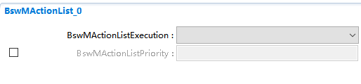

.. centered:: **表 BswMActionList属性描述 (Table BswMActionList property description)**

.. list-table::
   :widths: 15 15 14 14 14 14 14
   :header-rows: 1

   * - UI名称 (UI name)
     - 描述 (describe)
     - \
     - \
     - \
     - \
     - \
   * - BswMActionListExecution
     - 取值范围 (Value range)
     - BSWM_CONDITION
     - 默认取值 (Default value)
     - 无 (none)
     - \
     - \
   * - \
     - \
     - BSWM_TRIGGER
     - \
     - \
     - \
     - \
   * - \
     - 参数描述 (Parameter description)
     - 当配置为CONDITION模式时，此ActionList每次都会被执行； (When configured in CONDITION mode, this ActionList will be executed every time;)
     - \
     - \
     - \
     - \
   * - \
     - \
     - 当配置为TRIGGER模式时，此ActionList仅在仲裁结果发生改变时才会被执行； (When configured in TRIGGER mode, this ActionList will only be executed when the arbitration result changes;)
     - \
     - \
     - \
     - \
   * - \
     - \
     - \
     - .. figure:: ../../_static/参考手册(Module_Reference_Manual)/BswM/image30.png
         :width: 90%
         :align: center
     - \
     - \
     - \
   * - \
     - 依赖关系 (Dependencies)
     - 无 (none)
     - \
     - \
     - \
     - \
   * - BswMActionListPriority
     - 取值范围 (Value range)
     - 无 (none)
     - 默认取值 (Default value)
     - 无 (none)
     - \
     - \
   * - \
     - 参数描述 (Parameter description)
     - ActionList的优先级 (ActionList priority)
     - \
     - \
     - \
     - \
   * - \
     - 依赖关系 (Dependencies)
     - 无 (none)
     - \
     - \
     - \
     - \
         
         
         
BswMActionListItem
----------------------------------

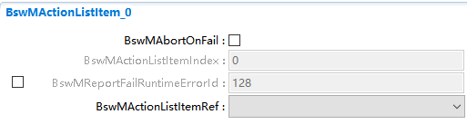

.. centered:: **表 BswMActionListItem属性描述 (Table BswMActionListItem property description)**

.. list-table::
   :widths: 20 20 20 20 20
   :header-rows: 1

   * - UI名称 (UI name)
     - 描述 (describe)
     - \
     - \
     - \
   * - BswMAbortOnFail
     - 取值范围 (Value range)
     - True，False
     - 默认取值 (Default value)
     - False
   * - \
     - 参数描述 (Parameter description)
     - 如果一个actionlist有多个action，如果其中有个action的BswMAbortOnFail配置为TRUE，则当其action返回E_NOT_OK后，actionlist就会终止执行 (If an actionlist has multiple actions, and if one of the actions has BswMAbortOnFail configured as TRUE, the actionlist will terminate execution when its action returns E_NOT_OK.)
     - \
     - \
   * - \
     - 依赖关系 (Dependencies)
     - 无 (none)
     - \
     - \
   * - BswMActionListItemIndex
     - 取值范围 (Value range)
     - 无 (none)
     - 默认取值 (Default value)
     - 无 (none)
   * - \
     - 参数描述 (Parameter description)
     - ActionListItem在此ActionList中的索引 (The index of ActionListItem in this ActionList)
     - \
     - \
   * - \
     - 依赖关系 (Dependencies)
     - 无 (none)
     - \
     - \
   * - BswMActionListItemRef
     - 取值范围 (Value range)
     - 从[BswMAction ,BswMActionList, BswMRule]中选择 (Select from [BswMAction, BswMActionList, BswMRule])
     - 默认取值 (Default value)
     - 无 (none)
   * - \
     - 参数描述 (Parameter description)
     - 表示此ActionListItem的引用 (Represents a reference to this ActionListItem)
     - \
     - \
   * - \
     - 依赖关系 (Dependencies)
     - 当其引用到BswMRule，需要保证被引用的BswMRule->BswMNestedExecutionOnly配置为TRUE (When it refers to BswMRule, you need to ensure that the referenced BswMRule->BswMNestedExecutionOnly is configured as TRUE)
     - \
     - \
   * - BswMReportFailToDemRef
     - 取值范围 (Value range)
     - 引用到[DemEventParameter] (Reference to [DemEventParameter])
     - 默认取值 (Default value)
     - 无 (none)
   * - \
     - 参数描述 (Parameter description)
     - 上报到DEM的运行时错误 (Runtime errors reported to DEM)
     - \
     - \
   * - \
     - 依赖关系 (Dependencies)
     - 无 (none)
     - \
     - \
         
         
         
BswMRteModeRequestPort
--------------------------------------

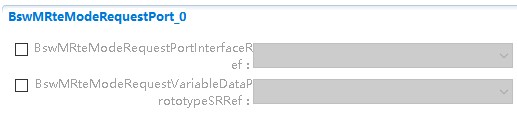

.. centered:: **表 BswMRteModeRequestPort属性描述 (Table BswMRteModeRequestPort attribute description)**

.. list-table::
   :widths: 20 20 20 20 20
   :header-rows: 1

   * - UI名称 (UI name)
     - 描述 (describe)
     - \
     - \
     - \
   * - BswMRteModeRequestPortInterfaceMappingRef
     - 取值范围 (Value range)
     - 无 (none)
     - \
     - \
   * - \
     - 参数描述 (Parameter description)
     - 对用于模式请求的变量和参数接口映射的外部引用. (External reference to the variable and parameter interface mapping used for schema requests.)
     - \
     - \
   * - \
     - 依赖关系 (Dependencies)
     - 无 (none)
     - \
     - \
   * - BswMRteModeRequestPortInterfaceRef
     - 取值范围 (Value range)
     - 无 (none)
     - 默认取值 (Default value)
     - 无 (none)
   * - \
     - 参数描述 (Parameter description)
     - 这是对用于模式请求的可变数据原型的实例引用 (This is an instance reference to the mutable data prototype used for schema requests)
     - \
     - \
   * - \
     - 依赖关系 (Dependencies)
     - 无 (none)
     - \
     - \
         
         
         
BswMSwitchPort
------------------------------

.. centered:: **表 BswMSwitchPort属性描述 (Table BswMSwitchPort attribute description)**

.. list-table::
   :widths: 20 20 20 20 20
   :header-rows: 1

   * - UI名称 (UI name)
     - 描述 (describe)
     - \
     - \
     - \
   * - BswMModeSwitchInterfaceRef
     - 取值范围 (Value range)
     - 引用到[   MODE-SWITCH-INTERFACE ] (Reference to [MODE-SWITCH-INTERFACE])
     - 默认取值 (Default value)
     - 无 (none)
   * - \
     - 参数描述 (Parameter description)
     - BswMSwitchPort引用到的[ MODE-SWITCH-INTERFACE ] ([MODE-SWITCH-INTERFACE] referenced by BswMSwitchPort)
     - \
     - \
   * - \
     - 依赖关系 (Dependencies)
     - [ MODE-SWITCH-INTERFACE ]是在SWC中定义的 ([MODE-SWITCH-INTERFACE] is defined in SWC)
     - \
     - \
         
         
         
Synchronize Module
----------------------------------

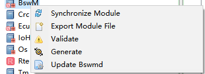

.. centered:: **表 Synchronize Module属性描述 (Table Synchronize Module property description)**

.. list-table::
   :widths: 20 20 20 20 20
   :header-rows: 1

   * - UI名称 (UI name)
     - 描述 (describe)
     - \
     - \
     - \
   * - Synchronize Module
     - 取值范围 (Value range)
     - 无 (none)
     - 默认取值 (Default value)
     - 无 (none)
   * - \
     - 参数描述 (Parameter description)
     - 用于自动配置一些BswM的配置，只适用于单核 (Used to automatically configure some BswM configurations, only applicable to single core)
     - \
     - \
   * - \
     - 依赖关系 (Dependencies)
     - 无 (none)
     - \
     - \
