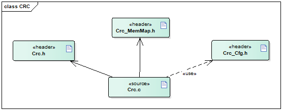
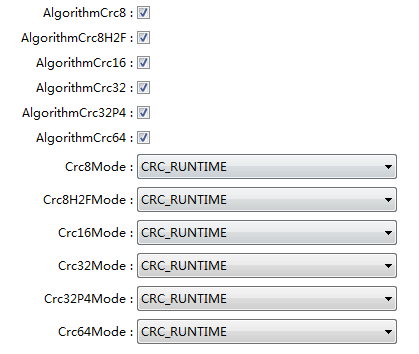

CRC
#################################

:strong:`缩写词注解 (Abbreviation Notes):`

.. list-table::
   :widths: 34 33 33
   :header-rows: 1

   * - 缩写词 (Abbreviation)
     - 解释/描述 (Explanation/Description)
     - 中文解释 (Chinese explanation)
   * - CRC8
     - CRC8
     - 生成多项式最高次幂为8的CRC算法 (Generate CRC Algorithm with Highest Polynomial Degree 8)
   * - CRC16
     - CRC16
     - 生成多项式最高次幂为16的CRC算法 (Generate CRC Algorithm with the Highest Power of 16 in Polynomial Form)
   * - CRC32
     - CRC32
     - 生成多项式最高次幂为32的CRC算法 (Generate CRC algorithm with the highest polynomial degree of 32)
   * - CRC64
     - CRC64
     - 生成多项式最高次幂为64的CRC算法 (Generate CRC algorithm with the highest polynomial degree of 64)
   * - CRC
     - Cyclic RedundancyCheck
     - 循环冗余校验 (Cyclic Redundancy Check)

简介 (Introduction)
=================================

CRCL模块提供如下的算法，用于对输入数据进行循环冗余校验，用于核对数据传输过程中是否被更改或者传输错误：

The CRCL module provides algorithms for performing cyclic redundancy check on input data to verify whether the data has been altered or transmitted incorrectly during the data transfer process:

- CRC8: SAEJ1850

- CRC8H2F: CRC8 0x2F polynomial

- CRC16: CCITT-FALSE

- CRC32: 0xF4ACFB13

- CRC32P4: CRC32 0x1F4ACFB13 polynomial

- CRC64: CRC-64-ECMA

CRCL模块提供两种算法处理机制：

The CRCL module provides two algorithm processing mechanisms:

查表计算法：速度快，需要占用较大的ROM。

Look-up table calculation method: fast, requires larger ROM.

运行时计算法：速度慢，占用较少的ROM。

Runtime calculation method: slower, occupies less ROM.

参考资料 (Reference materials)
------------------------------------------

[1] AUTOSAR_SWS_CRCLibrary.pdf，R19-11

功能描述 (Function Description)
===========================================

CRC功能 (CRC Function)
------------------------------------

CRC功能介绍 (Introduction to CRC Function)
~~~~~~~~~~~~~~~~~~~~~~~~~~~~~~~~~~~~~~~~~~~~~~~~~~~~~~

- CRC基本概念 (Basic concepts of CRC)

- Basic concepts of CRC

CRC（循环冗余校验），是基于输入数据计算一组校验码，用于核对数据传输过程中是否被更改或者传输错误。

Cyclic Redundancy Check (CRC) is a set of checksums calculated based on input data, used to verify whether data has been altered or transmitted incorrectly during the transmission process.

假设D是被校验的数据，将其转换为n位的二进制表示，如：

Assume D is the data to be verified, and convert it into an n-bit binary representation, such as:

D =（d\ :sub:`n-1`\ ，d\ :sub:`n-2`\ ，d\ :sub:`n-3`\ ，…，d\ :sub:`1`\ ，d\ :sub:`0`\ ）,其中，d\ :sub:`0`\ 到d\ :sub:`n-1`\ 为二进制值0或1。

D = (d_{n-1}, d_{n-2}, d_{n-3}, …, d_1, d_0), where, d_0 to d_{n-1} are binary values of 0 or 1.

以一定的规则产生一个新的二进制序列R，假设是k位的，r\ :sub:`0`\ 到r\ :sub:`k-1`\ 为二进制值0或1。

A new binary sequence R is generated according to specific rules, assumed to be k bits, where r\_0 to r\_{k-1} are binary values of 0 or 1.

冗余码R附加在原始数据二进制序列后面，成为n+k位数据的二进制表示：

Redundant codes are appended to the original binary sequence, becoming a binary representation of n+k-bit data:

C =（D，R）=（d\ :sub:`n-1`\ ，d\ :sub:`n-2`\ ，d\ :sub:`n-3`\ ，…，d\ :sub:`1`\ ，d\ :sub:`0`\ ，r\ :sub:`k-1`\ ，…，r\ :sub:`2`\ ，r\ :sub:`1`\ ，r\ :sub:`0`\ ，）。

将C除以k阶多项式，得到（k-1）阶余项r(x)，则r(x)对应的二进制码r就是CRC码。

Divide C by a k-order polynomial to obtain the remainder r(x) of order (k-1), then r(x) corresponds to the binary code r, which is the CRC code.

其中k阶多项式则为生成项。

Polynomials of degree k then become generating items.

- CRC算法原理

- CRC Algorithm Principle

下述是几种标准的CRC校验生成多项式：

The following are several standard CRC checksum generator polynomials:

CRC 8bit SAE J1850：

 .. centered:: :math:`G(x)=x^8+x^4+x^3+x^2+1`

CRC 8bit 基于0x2F：

CRC 8bit based on 0x2F:

 .. centered:: :math:`G(x)=x^8+x^5+x^3+x^2+x+1`

CRC 16bit CCITT-FALSE：

 .. centered:: :math:`G(x)=x^{16}+x^{12}+x^5+1`

CRC 32bit Ethernet IEEE-802.3：

 .. centered:: :math:`G(x)=x^{32}+x^{26}+x^{23}+x^{22}+x^{16}+x^{12}+x^{11}+x^{10}+x^8+x^7+x^5+x^4+x^2+x+1`

CRC 32bit 基于0xF4ACFB13：

CRC 32bit Based on 0xF4ACFB13:

 .. centered:: :math:`G(x)=x^{32}+x^{31}+x^{30}+x^{29}+x^{28}+x^{25}+x^{23}+x^{21}+x^{19}+x^{18}+x^{15}+x^{14}+x^{13}+x^{12}+x^{11}+x^9+x^8+x^4+x+1`

CRC 64bit ECMA：

 .. math::
  \begin{align}
  G(x) = &x^{64}+x^{62}+x^{57}+x^{55}+x^{54}+x^{53}+x^{52}+x^{47}+x^{46}+x^{40}+x^{39}+x^{38} \\
  &+ x^{37}+x^{35}+x^{33}+x^{32}+x^{31}+x^{29}+x^{27}+x^{24}+x^{23}+x^{22}+x^{21}+x^{19} \\
  &+x^{17}+x^{13}+x^{12}+x^{10}+x^9+x^7+x^4+x+1
  \end{align}

CRC校验的原理就是将需要校验的数据与按规则产生的数据进行异或运算，得到的余数即为校验值。进行异或的方式与实际数据传输时，高位先传还是低位先传有关，若异或从数据的高位开始，为顺序异或，若异或从数据的低位开始，则为反序异或，两种异或方式，即使对应同一个生成多项式，计算出来的结果也不相同。

The principle of CRC checksum is to perform an XOR operation between the data to be checked and data generated by the rules, with the result being the checksum. The way the XOR operation is performed is related to whether the higher bits or lower bits are transmitted first during actual data transmission. If the XOR starts from the higher bits of the data, it is sequential XOR; if it starts from the lower bits, it is reverse XOR. Even for the same generating polynomial, the results calculated by these two XOR methods are different.

- CRC标准参数模型

- CRC Standard Parameter Model

CRC8、CRC16、CRC32、CRC64所要用到的标准参数如下：

The standard parameters for CRC8, CRC16, CRC32, and CRC64 are as follows:

.. centered:: **表 CRC标准参数 (Output Parameters for CRC Standard)**

.. list-table::
   :widths: 50 50
   :header-rows: 1

   * - 参数名 (Parameter Name)
     - 解释 (Explanation)
   * - CRC宽度 (CRC Width)
     - CRC计算结果的宽度 (Width of the CRC Calculation Result)
   * - 多项式 (Polynomial)
     - 用于CRC算法的生成多项式 (Polynomial for CRC Algorithm)
   * - 初始值 (Initial value)
     - CRC算法开始时寄存器初始化的预置值 (Initial preset value for the register at the start of the CRC algorithm)
   * - 输入数据反转 (Reverse input data)
     - 定义了在参与CRC计算之前，每个输入字节是否需要进行位反转 (Defined whether each input byte needs to be bit-reversed before participating in the CRC calculation)
   * - 输出数据反转 (Reverse output data)
     - 定义了CRC计算结果是否需要按位反转 (Defined whether the CRC calculation result needs bit-wise reversal)
   * - 异或值 (XOR value)
     - 该值将与寄存器中的最终值进行运算，再将异或结果作为返回值 (This value will be operated with the final value in the register, and the XOR result will be returned as the output.)
   * - 检查值 (Check value)
     - 这是作为验证CRC算法的一种较弱的方法，当输入ASCII字符串”123456789”时，该值作为校验值 (This is a weaker method for validating the CRC algorithm, yielding this check value when input ASCII string "123456789" is used.)

CRC功能实现 (CRC Function Implementation)
~~~~~~~~~~~~~~~~~~~~~~~~~~~~~~~~~~~~~~~~~~~~~~~~~~~~~

CRC功能实现分为三种方式：直接计算法、查表法、硬件实现法，分别对应配置项CrcxMode中的取值CRC_RUNTIME、CRC_TABLE和CRC_HARDWARE ，x代表CRC位宽，可为8、8H2F、16、32、32P4、64。

CRC functionality implementation is divided into three methods: direct calculation method, table lookup method, and hardware realization method, which correspond to the configuration item CrcxMode with values CRC_RUNTIME, CRC_TABLE, and CRC_HARDWARE respectively. Here, x represents the width of the CRC, whitch can be8, 8H2F, 16, 32, 32P4, 64.

源文件描述 (Source file description)
===============================================

.. centered:: **表 CRC组件文件描述 (Describe CRC Component File)**

.. list-table::
   :widths: 50 50
   :header-rows: 1

   * - 文件 (Files)
     - 说明 (Description)
   * - Crc_cfg.h
     - 定义CRC模块预编译时用到的配置参数。 (Defined configuration parameters for the CRC module pre-compile.)
   * - Crc.h
     - CRC模块头文件，包含了API函数的扩展声明并定义了端口的数据结构。 (CRC module header file, including extended declarations of API functions and defines the data structures of ports.)
   * - Crc.c
     - CRC模块源文件，包含了API函数的实现。 (Source file for the CRC module, containing implementations of API functions.)
   * - Crc_MemMap.h
     - CRC的内存映射定义 (The memory mapping definition of CRC)

API接口 (API Interface)
=====================================

类型定义 (Type definition)
--------------------------------------

无。

None.

输入函数描述 (Describe the input function:)
-----------------------------------------------------

无。

None.

静态接口函数定义 (Static interface function definition)
---------------------------------------------------------------

Crc_CalculateCRC8函数定义 (CRC_CalculateCRC8 function definition)
~~~~~~~~~~~~~~~~~~~~~~~~~~~~~~~~~~~~~~~~~~~~~~~~~~~~~~~~~~~~~~~~~~~~~~~~~~~~~~~~~

.. list-table::
   :widths: 25 25 25 25
   :header-rows: 1

   * - 函数名称： (Function Name:)
     - Crc_CalculateCRC8
     - 
     - 
   * - 函数原型： (Function prototype:)
     - uint8Crc_CalculateCRC8( const uint8\*Crc_DataPtr,uint32Crc_Length, uint8Crc_StartValue8,booleanCrc_IsFirstCall )
     - 
     - 
   * - 服务编号： (Service Number:)
     - 0x01
     - 
     - 
   * - 同步/异步： (Synchronous/asynchronous:)
     - 同步 (Sync)
     - 
     - 
   * - 是否可重入： (Is Reentrant:)
     - 可重入 (Reentrant)
     - 
     - 
   * - 输入参数： (Input parameters:)
     - Crc_DataPtr
     - 值域： (Domain:)
     - 被计算数据的起始地址指针 (Pointer to the starting address of the data to be calculated)
   * - 
     - Crc_Length
     - 值域： (Domain:)
     - 被计算数据的长度 (Length of the data being calculated)
   * - 
     - Crc_StartValue8
     - 值域： (Domain:)
     - 起始值 (Initial value)
   * - 
     - Crc_IsFirstCall
     - 值域： (Domain:)
     - TRUE: First call in asequence or individualCRC calculation; startfrom initial value,ignore Crc_StartValue8.
   * - 
     - 
     - 
     - FALSE: Subsequent callin a call sequence;Crc_StartValue8 isinterpreted to be thereturn value of theprevious function call.
   * - 输入输出参数: (Input Output Parameters:)
     - 无(None)
     - 
     - 
   * - 输出参数： (Output Parameters:)
     - 无(None)
     - 
     - 
   * - 返回值： (Return Value:)
     - CRC计算结果 (CRC Calculation Result)
     - 
     - 
   * - 功能概述： (Function Overview:)
     - 提供基于SAE J1850算法的CRC8计算服务 (Provide CRC8 calculation service based on SAE J1850 algorithm)
     - 
     - 

Crc_CalculateCRC82F函数定义 (Crc_CalculateCRC82F Function definition)
~~~~~~~~~~~~~~~~~~~~~~~~~~~~~~~~~~~~~~~~~~~~~~~~~~~~~~~~~~~~~~~~~~~~~~~~~~~~~~~~~~~~~

.. list-table::
   :widths: 25 25 25 25
   :header-rows: 1

   * - 函数名称： (Function Name:)
     - Crc_CalculateCRC8H2F
     - 
     - 
   * - 函数原型： (Function prototype:)
     - uint8Crc_CalculateCRC8H2F( const uint8\*Crc_DataPtr,uint32Crc_Length, uint8Crc_StartValue8H2F,booleanCrc_IsFirstCall )
     - 
     - 
   * - 服务编号： (Service Number:)
     - 0x05
     - 
     - 
   * - 同步/异步： (Synchronous/asynchronous:)
     - 同步 (Sync)
     - 
     - 
   * - 是否可重入： (Is Reentrant:)
     - 可重入 (Reentrant)
     - 
     - 
   * - 输入参数： (Input parameters:)
     - Crc_DataPtr
     - 值域： (Domain:)
     - 被计算数据的起始地址指针 (Pointer to the starting address of the data to be calculated)
   * - 
     - Crc_Length
     - 值域： (Domain:)
     - 被计算数据的长度 (Length of the data being calculated)
   * - 
     - Crc_StartValue8H2F
     - 值域： (Domain:)
     - 起始值 (Initial value)
   * - 
     - Crc_IsFirstCall
     - 值域： (Domain:)
     - TRUE: First call in asequence or individualCRC calculation; startfrom initial value,ignore Crc_StartValue8.
   * - 
     - 
     - 
     - FALSE: Subsequent callin a call sequence;Crc_StartValue8 isinterpreted to be thereturn value of theprevious function call.
   * - 输入输出参数: (Input Output Parameters:)
     - 无(None)
     - 
     - 
   * - 输出参数： (Output Parameters:)
     - 无(None)
     - 
     - 
   * - 返回值： (Return Value:)
     - CRC计算结果 (CRC Calculation Result)
     - 
     - 
   * - 功能概述： (Function Overview:)
     - 提供基于使用0x2F作为多项式值的CRC8计算服务 (Provide CRC8 calculation service with 0x2F as the polynomial value.)
     - 
     - 

Crc_CalculateCRC16函数定义 (Crc_CalculateCRC16 Function Definition)
~~~~~~~~~~~~~~~~~~~~~~~~~~~~~~~~~~~~~~~~~~~~~~~~~~~~~~~~~~~~~~~~~~~~~~~~~~~~~~~

.. list-table::
   :widths: 25 25 25 25
   :header-rows: 1

   * - 函数名称： (Function Name:)
     - Crc_CalculateCRC16
     - 
     - 
   * - 函数原型： (Function prototype:)
     - uint16Crc_CalculateCRC16( const uint8\*Crc_DataPtr,uint32Crc_Length,uint16Crc_StartValue16,booleanCrc_IsFirstCall )
     - 
     - 
   * - 服务编号： (Service Number:)
     - 0x02
     - 
     - 
   * - 同步/异步： (Synchronous/asynchronous:)
     - 同步 (Sync)
     - 
     - 
   * - 是否可重入： (Is Reentrant:)
     - 可重入 (Reentrant)
     - 
     - 
   * - 输入参数： (Input parameters:)
     - Crc_DataPtr
     - 值域： (Domain:)
     - 被计算数据的起始地址指针 (Pointer to the starting address of the data to be calculated)
   * - 
     - Crc_Length
     - 值域： (Domain:)
     - 被计算数据的长度 (Length of the data being calculated)
   * - 
     - Crc_StartValue16
     - 值域： (Domain:)
     - 起始值 (Initial value)
   * - 
     - Crc_IsFirstCall
     - 值域： (Domain:)
     - TRUE: First call in asequence or individualCRC calculation; startfrom initial value,ignoreCrc_StartValue16.
   * - 
     - 
     - 
     - FALSE: Subsequent callin a call sequence;Crc_StartValue16 isinterpreted to be thereturn value of theprevious function call.
   * - 输入输出参数： (Input Output Parameters:)
     - 无(None)
     - 
     - 
   * - 输出参数： (Output Parameters:)
     - 无(None)
     - 
     - 
   * - 返回值： (Return Value:)
     - CRC计算结果 (CRC Calculation Result)
     - 
     - 
   * - 功能概述： (Function Overview:)
     - 提供基于CRC16计算服务 (Provide CRC16 Calculation Service)
     - 
     - 

Crc_CalculateCRC32函数定义 (Crc_CalculateCRC32 Function Definition)
~~~~~~~~~~~~~~~~~~~~~~~~~~~~~~~~~~~~~~~~~~~~~~~~~~~~~~~~~~~~~~~~~~~~~~~~~~~~~~~

.. list-table::
   :widths: 25 25 25 25
   :header-rows: 1

   * - 函数名称： (Function Name:)
     - Crc_CalculateCRC32
     - 
     - 
   * - 函数原型： (Function prototype:)
     - uint16Crc_CalculateCRC32( const uint8\*Crc_DataPtr,uint32Crc_Length,uint32Crc_StartValue32,booleanCrc_IsFirstCall )
     - 
     - 
   * - 服务编号： (Service Number:)
     - 0x03
     - 
     - 
   * - 同步/异步： (Synchronous/asynchronous:)
     - 同步 (Sync)
     - 
     - 
   * - 是否可重入： (Is Reentrant:)
     - 可重入 (Reentrant)
     - 
     - 
   * - 输入参数： (Input parameters:)
     - Crc_DataPtr
     - 值域： (Domain:)
     - 被计算数据的起始地址指针 (Pointer to the starting address of the data to be calculated)
   * - 
     - Crc_Length
     - 值域： (Domain:)
     - 被计算数据的长度 (Length of the data being calculated)
   * - 
     - Crc_StartValue32
     - 值域： (Domain:)
     - 起始值 (Initial value)
   * - 
     - Crc_IsFirstCall
     - 值域： (Domain:)
     - TRUE: First call in asequence or individualCRC calculation; startfrom initial value,ignoreCrc_StartValue32.
   * - 
     - 
     - 
     - FALSE: Subsequent callin a call sequence;Crc_StartValue32 isinterpreted to be thereturn value of theprevious function call.
   * - 输入输出参数： (Input Output Parameters:)
     - 无(None)
     - 
     - 
   * - 输出参数： (Output Parameters:)
     - 无(None)
     - 
     - 
   * - 返回值： (Return Value:)
     - CRC计算结果 (CRC Calculation Result)
     - 
     - 
   * - 功能概述： (Function Overview:)
     - 提供基于CRC32计算服务 (Provide CRC32 Calculation Service)
     - 
     - 

Crc_CalculateCRC32P4函数定义 (Crc_CalculateCRC32P4 Function definition)
~~~~~~~~~~~~~~~~~~~~~~~~~~~~~~~~~~~~~~~~~~~~~~~~~~~~~~~~~~~~~~~~~~~~~~~~~~~~~~~~~~~~~~~~~~

.. list-table::
   :widths: 25 25 25 25
   :header-rows: 1

   * - 函数名称： (Function Name:)
     - Crc_CalculateCRC32P4
     - 
     - 
   * - 函数原型： (Function prototype:)
     - uint32Crc_CalculateCRC32P4( const uint8\*Crc_DataPtr,uint32Crc_Length,uint32Crc_StartValue32,booleanCrc_IsFirstCall )
     - 
     - 
   * - 服务编号： (Service Number:)
     - 0x04
     - 
     - 
   * - 同步/异步： (Synchronous/asynchronous:)
     - 同步 (Sync)
     - 
     - 
   * - 是否可重入： (Is Reentrant:)
     - 可重入 (Reentrant)
     - 
     - 
   * - 输入参数： (Input parameters:)
     - Crc_DataPtr
     - 值域： (Domain:)
     - 被计算数据的起始地址指针 (Pointer to the starting address of the data to be calculated)
   * - 
     - Crc_Length
     - 值域： (Domain:)
     - 被计算数据的长度 (Length of the data being calculated)
   * - 
     - Crc_StartValue32
     - 值域： (Domain:)
     - 起始值 (Initial value)
   * - 
     - Crc_IsFirstCall
     - 值域： (Domain:)
     - TRUE: First call in asequence or individualCRC calculation; startfrom initial value,ignoreCrc_StartValue32.
   * - 
     - 
     - 
     - FALSE: Subsequent callin a call sequence;Crc_StartValue32 isinterpreted to be thereturn value of theprevious function call.
   * - 输入输出参数： (Input Output Parameters:)
     - 无(None)
     - 
     - 
   * - 输出参数： (Output Parameters:)
     - 无(None)
     - 
     - 
   * - 返回值： (Return Value:)
     - CRC计算结果 (CRC Calculation Result)
     - 
     - 
   * - 功能概述： (Function Overview:)
     - 提供基于CRC32计算服务,使用0xF4ACFB13作为多项式因子 (Provide a service for calculating CRC32 using 0xF4ACFB13 as the polynomial factor.)
     - 
     - 

Crc_CalculateCRC64函数定义 (CRC_CalculateCRC64 function definition)
~~~~~~~~~~~~~~~~~~~~~~~~~~~~~~~~~~~~~~~~~~~~~~~~~~~~~~~~~~~~~~~~~~~~~~~~~~~~~~~~~~~

.. list-table::
   :widths: 25 25 25 25
   :header-rows: 1

   * - 函数名称： (Function Name:)
     - Crc_CalculateCRC64
     - 
     - 
   * - 函数原型： (Function prototype:)
     - uint64Crc_CalculateCRC64( const uint8\*Crc_DataPtr,uint32Crc_Length,uint64Crc_StartValue64,booleanCrc_IsFirstCall )
     - 
     - 
   * - 服务编号： (Service Number:)
     - 0x07
     - 
     - 
   * - 同步/异步： (Synchronous/asynchronous:)
     - 同步 (Sync)
     - 
     - 
   * - 是否可重入： (Is Reentrant:)
     - 可重入 (Reentrant)
     - 
     - 
   * - 输入参数： (Input parameters:)
     - Crc_DataPtr
     - 值域： (Domain:)
     - 被计算数据的起始地址指针 (Pointer to the starting address of the data to be calculated)
   * - 
     - Crc_Length
     - 值域： (Domain:)
     - 被计算数据的长度 (Length of the data being calculated)
   * - 
     - Crc_StartValue64
     - 值域： (Domain:)
     - 起始值 (Initial value)
   * - 
     - Crc_IsFirstCall
     - 值域： (Domain:)
     - TRUE: First call in asequence or individualCRC calculation; startfrom initial value,ignoreCrc_StartValue64.
   * - 
     - 
     - 
     - FALSE: Subsequent callin a call sequence;Crc_StartValue64 isinterpreted to be thereturn value of theprevious function call.
   * - 输入输出参数： (Input Output Parameters:)
     - 无(None)
     - 
     - 
   * - 输出参数： (Output Parameters:)
     - 无(None)
     - 
     - 
   * - 返回值： (Return Value:)
     - CRC计算结果 (CRC Calculation Result)
     - 
     - 
   * - 功能概述： (Function Overview:)
     - 提供基于CRC64计算服务 (Provide CRC64 Calculation Service)
     - 
     - 

可配置函数定义 (Configurable Function Definition)
----------------------------------------------------------

无。

None.

配置 (Configure)
==============================

.. centered:: **CRC配置列表 (CRC Configuration List)**

.. centered:: **表  CRC属性描述 (Table: CRC Property Description)**

.. list-table::
   :widths: 20 20 20 20 20
   :header-rows: 1

   * - UI名称 (UI Name)
     - 描述 (Description)
     - 
     - 
     - 
   * - AlgorithmCrc8
     - 取值范围 (Range)
     - STD_ON / STD_OFF
     - 默认取值 (Default value)
     - STD_OFF
   * - 
     - 参数描述 (Parameter Description)
     - Switches the Crc8 ON or OFF.
     - 
     - 
   * - 
     - 
     - true: enabled (ON).
     - 
     - 
   * - 
     - 
     - false: disabled(OFF).
     - 
     - 
   * - 
     - 依赖关系 (Dependencies)
     - 当配置为OFF时，不生成Crc8Mode相关配置 (When configured as OFF, no Crc8Mode-related configuration is generated.)
     - 
     - 
   * - AlgorithmCrc8H2F
     - 取值范围 (Range)
     - STD_ON / STD_OFF
     - 默认取值 (Default value)
     - STD_OFF
   * - 
     - 参数描述 (Parameter Description)
     - Switches the Crc8H2F ON or OFF.
     - 
     - 
   * - 
     - 
     - true: enabled (ON).
     - 
     - 
   * - 
     - 
     - false: disabled(OFF).
     - 
     - 
   * - 
     - 依赖关系 (Dependencies)
     - 当配置为OFF时，不生成Crc8H2FMode相关配置 (When configured as OFF, no Crc8H2FMode-related configuration is generated.)
     - 
     - 
   * - AlgorithmCrc16
     - 取值范围 (Range)
     - STD_ON / STD_OFF
     - 默认取值 (Default value)
     - STD_OFF
   * - 
     - 参数描述 (Parameter Description)
     - Switches the Crc16 ON or OFF.
     - 
     - 
   * - 
     - 
     - true: enabled (ON).
     - 
     - 
   * - 
     - 
     - false: disabled(OFF).
     - 
     - 
   * - 
     - 依赖关系 (Dependencies)
     - 当配置为OFF时，不生成Crc16Mode相关配置 (When configured as OFF, no Crc16Mode-related configuration is generated.)
     - 
     - 
   * - AlgorithmCrc32
     - 取值范围 (Range)
     - STD_ON / STD_OFF
     - 默认取值 (Default value)
     - STD_OFF
   * - 
     - 参数描述 (Parameter Description)
     - Switches the Crc32 ON or OFF.
     - 
     - 
   * - 
     - 
     - true: enabled (ON).
     - 
     - 
   * - 
     - 
     - false: disabled(OFF).
     - 
     - 
   * - 
     - 依赖关系 (Dependencies)
     - 当配置为OFF时，不生成Crc32Mode相关配置 (When configured as OFF, no Crc32Mode-related configuration is generated.)
     - 
     - 
   * - AlgorithmCrc32P4
     - 取值范围 (Range)
     - STD_ON / STD_OFF
     - 默认取值 (Default value)
     - STD_OFF
   * - 
     - 参数描述 (Parameter Description)
     - Switches the Crc32P4 ON or OFF.
     - 
     - 
   * - 
     - 
     - true: enabled (ON).
     - 
     - 
   * - 
     - 
     - false: disabled(OFF).
     - 
     - 
   * - 
     - 依赖关系 (Dependencies)
     - 当配置为OFF时，不生成Crc32P4Mode相关配置 (When configured as OFF, no Crc32P4Mode-related configuration is generated.)
     - 
     - 
   * - AlgorithmCrc64
     - 取值范围 (Range)
     - STD_ON / STD_OFF
     - 默认取值 (Default value)
     - STD_OFF
   * - 
     - 参数描述 (Parameter Description)
     - Switches the Crc64 ON or OFF.
     - 
     - 
   * - 
     - 
     - true: enabled (ON).
     - 
     - 
   * - 
     - 
     - false: disabled(OFF).
     - 
     - 
   * - 
     - 依赖关系 (Dependencies)
     - 当配置为OFF时，不生成Crc64Mode相关配置 (When configured as OFF, no Crc64Mode-related configuration is generated.)
     - 
     - 
   * - Crc8Mode
     - 取值范围 (Range)
     - CRC_TABLE/CRC_RUNTIME/CRC_HARDWARE
     - 默认取值 (Default value)
     - CRC_TABLE
   * - 
     - 参数描述 (Parameter Description)
     - Switch to select one of the available CRC8-bit (SAE J1850)calculation methods
     - 
     - 
   * - 
     - 依赖关系 (Dependencies)
     - AlgorithmCrc8为STD_ON (AlgorithmCrc8 is STD_ON)
     - 
     - 
   * - Crc8H2FMode
     - 取值范围 (Range)
     - CRC_TABLE/CRC_RUNTIME/CRC_HARDWARE
     - 默认取值 (Default value)
     - CRC_TABLE
   * - 
     - 参数描述 (Parameter Description)
     - Switch to select one of the available CRC8-bit (2Fhpolynomial)calculation methods
     - 
     - 
   * - 
     - 依赖关系 (Dependencies)
     - AlgorithmCrc8H2F为STD_ON (AlgorithmCrc8H2F for STD_ON)
     - 
     - 
   * - Crc16Mode
     - 取值范围 (Range)
     - CRC_TABLE/CRC_RUNTIME/CRC_HARDWARE
     - 默认取值 (Default value)
     - CRC_TABLE
   * - 
     - 参数描述 (Parameter Description)
     - Switch to select one of the available CRC16-bit (CCITT)calculation methods
     - 
     - 
   * - 
     - 依赖关系 (Dependencies)
     - AlgorithmCrc16为STD_ON (AlgorithmCrc16为STD_ON)
     - 
     - 
   * - Crc32Mode
     - 取值范围 (Range)
     - CRC_TABLE/CRC_RUNTIME/CRC_HARDWARE
     - 默认取值 (Default value)
     - CRC_TABLE
   * - 
     - 参数描述 (Parameter Description)
     - Switch to select one of the available CRC32-bit (IEEE-802.3CRC32 EthernetStandard) calculationmethods.
     - 
     - 
   * - 
     - 依赖关系 (Dependencies)
     - AlgorithmCrc32为STD_ON (AlgorithmCrc32 is STD_ON)
     - 
     - 
   * - Crc32P4Mode
     - 取值范围 (Range)
     - CRC_TABLE/CRC_RUNTIME/CRC_HARDWARE
     - 默认取值 (Default value)
     - CRC_TABLE
   * - 
     - 参数描述 (Parameter Description)
     - Switch to select one of the available CRC32-bit E2E Profile 4calculation methods
     - 
     - 
   * - 
     - 依赖关系 (Dependencies)
     - AlgorithmCrc32P4为STD_ON (AlgorithmCrc32P4为STD_ON)
     - 
     - 
   * - Crc64Mode
     - 取值范围 (Range)
     - CRC_TABLE/CRC_RUNTIME/CRC_HARDWARE
     - 默认取值 (Default value)
     - CRC_TABLE
   * - 
     - 参数描述 (Parameter Description)
     - Switch to select one of the available CRC64-bit calculationmethods.
     - 
     - 
   * - 
     - 依赖关系 (Dependencies)
     - AlgorithmCrc64为STD_ON (AlgorithmCrc64 is STD_ON)
     - 
     - 
