CSM
#################################

:strong:`缩写词注解 (Abbreviation Notes):`

.. list-table::
   :widths: 34 33 33
   :header-rows: 1

   * - 缩写词 (Abbreviation)
     - 解释/描述 (Explanation/Description)
     - 中文解释 (Chinese explanation)
   * - CSM
     - Crypto Service Manager
     - 加密服务管理 (Encryption Service Management)
   * - CRYIF
     - Crypto Interface
     - 加密接口层 (Encrypted Interface Layer)
   * - CRYPTO
     - Crypto Driver
     - 加密驱动（硬件驱动或者软件驱动） (Encryption Driver (hardware driver or software driver))
   * - DET
     - Default Error Tracer
     - 开发错误检测模块 (Develop an error detection module)
   * - HSM
     - Hardware Security Module
     - 硬件中用于计算加密算法的模块（相当于另外一块CPU） (A module for computing encryption algorithms in hardware (equivalent to another CPU))
   * - Job
     - CsmJob
     - CSM模块中的一个加密处理任务，一般每个Job会引用到一个cryptographicprimitive (An encryption processing task in the CSM module generally references one cryptographic primitive per Job.)

简介 (Introduction)
=================================

CSM应提供同步或异步服务，以支持对所有软件模块的基本密码功能的唯一访问。CSM应该提供一个抽象层，它为更高的软件层提供一个标准化的接口来访问这些功能。软件模块所需的功能可能与其他软件模块所需的功能不同。因此，应该可以为每个软件模块单独配置和初始化CSM提供的服务。此配置还包括对CSM服务的同步或异步处理的选择。CSM模块的构建遵循通用方法。如果结构和接口的详细规范限制了CSM的可用性范围，则以通用方式定义接口和结构。这为将来的扩展提供了机会。

CSM should provide both synchronous and asynchronous services to support unique access to fundamental cryptographic functions across all software modules. CSM should offer an abstract layer that provides a standardized interface for higher software layers to access these functionalities. The functions required by each software module may differ from those required by other software modules. Therefore, it should be possible to configure and initialize the services provided by CSM for each software module separately. This configuration also includes the choice of synchronous or asynchronous processing for CSM services. The construction of the CSM module follows a generic approach. If the detailed specifications for structure and interface limit the range of CSM availability, then interfaces and structures are defined in a generic manner. This provides opportunities for future expansion.

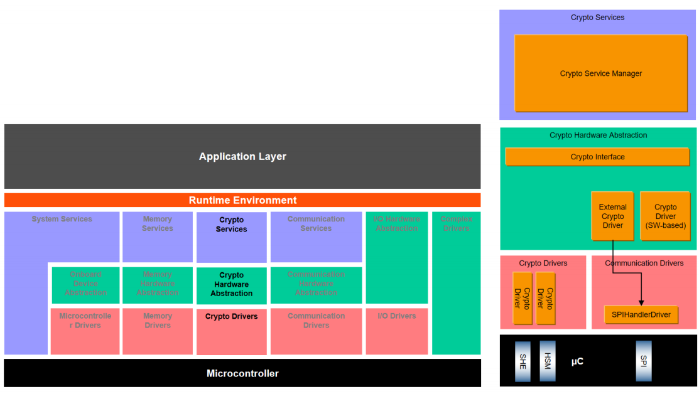

参考资料 (Reference materials)
------------------------------------------

[1] AUTOSAR_SWS_CryptoServiceManager.pdf，R19-11

功能描述 (Function Description)
===========================================

基本功能 (Basic features)
-------------------------------------

CSM是一种提供加密功能的服务，它基于一个依赖于软件库或硬件模块的加密驱动程序。此外，混合设置与多个密码驱动程序是可能的。CSM通过CRYIF访问不同的加密驱动程序。

CSM is a service that provides encryption functionality, based on an encryption driver depending on a software library or hardware module. Additionally, a mixed setup with multiple password drivers is possible. CSM accesses different encryption drivers through CRYIF.

一般功能 (General Functions)
----------------------------------------

CSM通过引入Job的概念来处理加密工作。

CSM processes encryption tasks through the introduction of the Job concept.

Job是已配置的密码原语的实例，对于每个Job，CSM每次只能处理一个实例，但允许不同Job的并行处理，如果一个服务请求正被相应的Job处理，此时来了另一个相同Job的要求，CSM应当返回CRYPTO_E_BUSY。

Job is an instance of the configured password primitive. For each Job, CSM can only process one instance at a time; however, parallel processing of different Jobs is allowed. If a service request is currently being processed by the corresponding Job, and another request for the same Job arrives at this moment, CSM should return CRYPTO_E_BUSY.

注意：Job正在被处理意味着相应的加密驱动程序对象正在积极地处理这个Job。当一个Job没有完成，但是加密驱动程序对象没有被激活，这并不意味着这个Job正在被处理。如果配置了异步接口，则CSM模块应提供一个主函数Csm_MainFunction()，该主函数被循环调用，以通过状态机控制Job的处理。

Note: Job is being processed means that the corresponding encryption driver object is actively handling this Job. When a Job is not completed but the encryption driver object is not activated, it does not mean that the Job is being processed. If asynchronous interfaces are configured, the CSM module should provide a main function Csm_MainFunction(), which is called in a loop to control Job processing through a state machine.

Job状态 (Job Status)
~~~~~~~~~~~~~~~~~~~~~~~~~~~~~~~~~~

将单一的调用函数与加密Job的流方式相结合，需要模式参数，它决定了加密Job的运行模式。此服务操作是一个标志字段，指示操作模式启动、更新或完成，它显式地声明应该执行什么操作。这些操作模式可以混合使用，并同时执行。状态的实际事务是在与这些状态一起工作的层中进行的，即在加密驱动程序中。

Combining the stream way of calling functions with the encryption Job requires a mode parameter, which determines the运行模式 of the encryption Job. This service operation is a flag field that indicates whether the operation mode starts, updates, or completes, explicitly declaring what action should be performed. These operation modes can be mixed and executed simultaneously. The actual transaction of the status is conducted at the layer where these statuses are worked with, i.e., in the encryption driver.

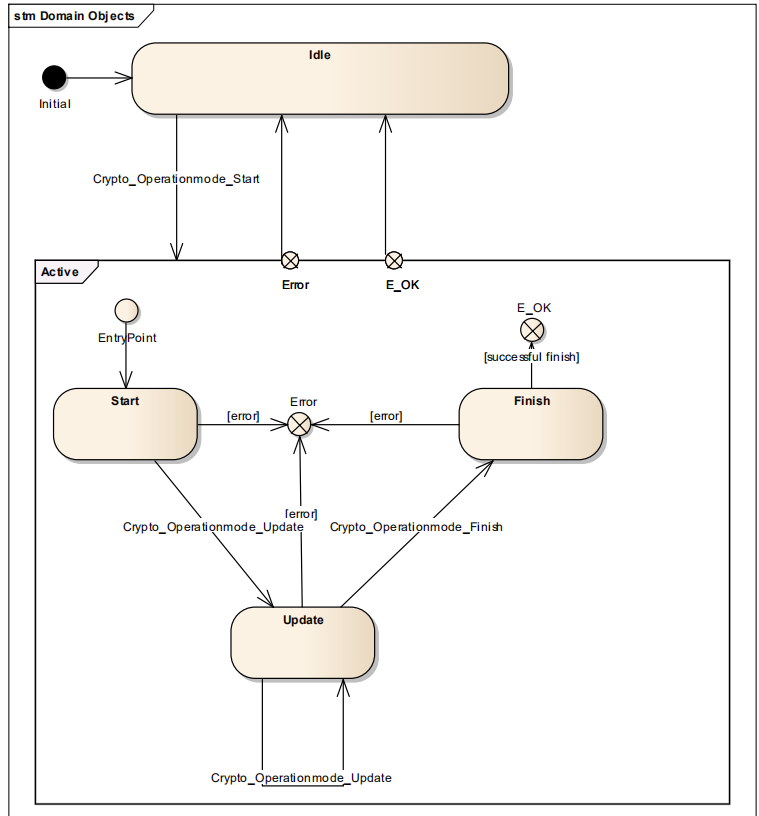

单调用方法不需要多次调用显式API，只需要调用一次即可。由于单调用的开销小，可以提高性能，所以多用于需要快速处理的小数据输入过程中。当使用流方法(启动、更新、完成)操作时，专用的加密驱动程序对象正在等待进一步的输入(更新)，直到到达完成状态。同时，不能在此加密驱动程序实例上处理其他Job。

Monotonic calls do not require multiple explicit API calls; a single call is sufficient. Since the overhead of monotonic calls is small, they can improve performance and are often used in scenarios requiring fast processing of small data inputs. When using stream methods (start, update, finish) operations, a dedicated encryption driver object waits for further input (update) until reaching the finished state. Additionally, other jobs cannot be processed on this encryption driver instance.

同步Job (Synchronize Job)
~~~~~~~~~~~~~~~~~~~~~~~~~~~~~~~~~~~~~~~

如果使用同步接口，则接口函数将必要的信息传递给底层加密堆栈模块并等待返回结果。

If using a synchronous interface, the interface function passes necessary information to the underlying encryption stack module and waits for the return result.

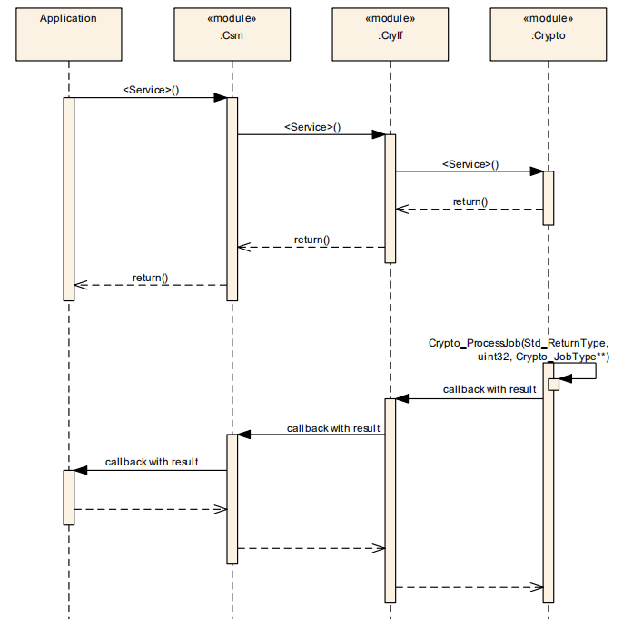

异步Job (Async Job)
~~~~~~~~~~~~~~~~~~~~~~~~~~~~~~~~~

如果使用异步接口，则接口函数只能将必要的信息传递给底层加密堆栈模块，然后等待底层处理完成调用回调函数通知CSM。

If asynchronous interfaces are used, then interface functions can only pass the necessary information to the underlying encryption stack module and then wait for the latter to complete processing and call the callback function to notify CSM.

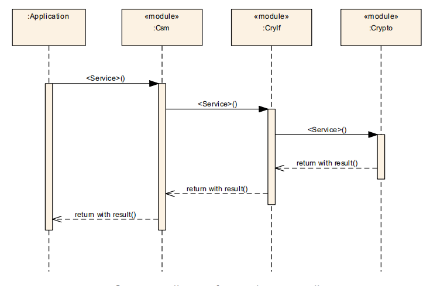

Queue相关 (Queue-related)
~~~~~~~~~~~~~~~~~~~~~~~~~~~~~~~~~~~~~~~

Quene，即队列，为CSM内部针对Job设置的一个功能，CSM应在内部完成对其的操作。

A queue, which refers to the message queue, is a function provided internally by the CSM for jobs, and all corresponding operations shall be handled internally within the CSM.

CSM可能有多个队列，其中的Job根据其优先级排列，以处理多个加密请求。从CSM队列通过CryIf到加密驱动程序对象的路径称为通道。CSM的每个队列都映射到一个通道，以访问crypto驱动程序对象的crypto原语。队列的大小是可配置的。为了优化加密驱动程序对象的硬件使用，加密驱动程序中还有一个可选的队列。加密驱动程序对象表示独立加密设备(硬件或软件，如AES加速器)的实例。对于具有高优先级的Job，HSM上可以有一个用于快速AES和CMAC计算的通道，该通道在加密驱动程序中的本地AES计算服务上结束。但同时，加密驱动程序对象也可能是软件，例如用于RSA计算，用户能够加密、解密、签名或验证数据。

CSM may have multiple queues, with Jobs arranged according to their priority to handle multiple encryption requests. The path from the CSM queue through CryIf to the cryptographic driver object is called a channel. Each queue in CSM maps to a channel to access cryptographic primitive operations on the cryptographic driver object. The size of the queue is configurable. For optimized hardware usage in the cryptographic driver, an optional queue can also be included within the cryptographic driver. The cryptographic driver object represents an instance of an independent encryption device (hardware or software, such as an AES accelerator). For Jobs with high priority, there can be a channel on the HSM for fast AES and CMAC calculations that ends locally on the AES calculation service in the cryptographic driver. Meanwhile, the cryptographic driver object could also be software, for example, used for RSA calculations, where users can encrypt, decrypt, sign, or verify data.

在同步Job处理中，队列将不起作用。因此，如果选择同步Job处理，则队列大小应该为0。但是，也可以将通道(包括队列)与同步和异步Job一起使用。可以在Csm_MainFunction()中将排队的Job传递给CRYIF。如果Job的状态是活动的，则CSM应假定映射的加密驱动程序实例当前正在处理该Job，而调用者希望继续操作(例如，使用update提供更多数据)，必须在加密驱动程序实例中执行可信性检查。

In synchronous Job processing, the queue will not work. Therefore, if synchronous Job processing is selected, the queue size should be 0. However, channels (including queues) can also be used with both synchronous and asynchronous Jobs. Queued Jobs can be passed to CRYIF in Csm_MainFunction(). If the Job's status is active, CSM should assume that the mapped encryption driver instance is currently processing the Job. The caller must perform a trust check within the encryption driver instance if they wish to continue operations (e.g., using update to provide more data).

Key管理功能 (Key Management Function)
~~~~~~~~~~~~~~~~~~~~~~~~~~~~~~~~~~~~~~~~~~~~~~~~~

Key，即对应的keyid具有配置给出的符号名称。Crypto堆栈API使用来自CSM模块的以下关键元素索引定义：

Key, which corresponds to the keyid with the symbol name provided by the configuration. The Crypto stack API uses the following key elements index defined from the CSM module:

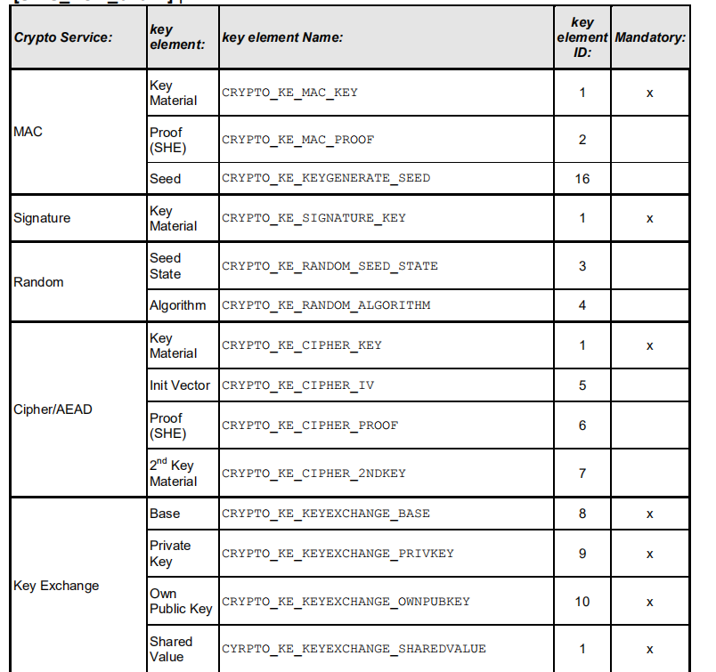

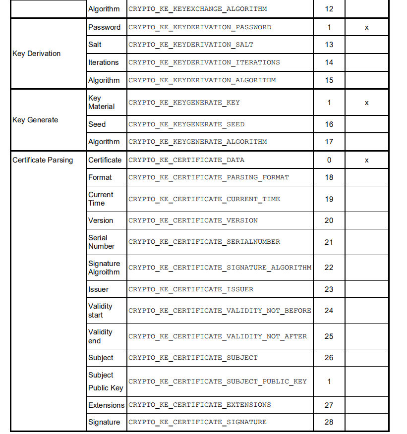

对于包含加密密钥材料的每个密钥元素，应在用于数据交换的配置中指定所提供密钥的格式，例如Csm_KeyElementGet()或Csm_KeyElementSet()。特定密码驱动程序支持的密钥格式是随密码驱动程序一起提供的预配置信息的一部分。

For each key element containing cryptographic key material, the format of the provided key for data exchange should be specified in the configuration, such as Csm_KeyElementGet() or Csm_KeyElementSet(). The specific key formats supported by a cryptographic driver are part of the preconfigured information provided with the cryptographic driver.

特定于供应商的keyelementid应该启动1000来避免对未来扩展版本的加密堆栈的干扰。关键元素CRYPTO_KE\_[…]_ALGORITHM用于配置密钥管理函数的行为，因为它们独立于Job，因此不能像原语那样进行配置。

Specifically, supplier-keyelementid should start with 1000 to avoid interfering with future extended versions of the encryption stack. The key element CRYPTO_KE_[…]_ALGORITHM is used to configure the behavior of cryptographic functions as they are independent of Jobs and cannot be configured like primitives.

源文件描述 (Source file description)
===============================================

.. centered:: **表 CSM组件文件描述 (Table CSM Component File Description)**

.. list-table::
   :widths: 50 50
   :header-rows: 1

   * - 文件 (Files)
     - 说明 (Description)
   * - CSM.c
     - CSM模块源文件，包含了API函数的实现。 (Source files for the CSM module, contain implementations of API functions.)
   * - CSM.h
     - CSM模块头文件，包含了API函数的扩展声明并定义了配置的数据结构体。 (CSM module header file, contains extended declarations of API functions and defines configuration data structures.)
   * - CSM_Cfg.h
     - 定义CSM模块预编译时用到的配置参数。 (Define configuration parameters used during pre-compilation of the CSM module.)
   * - CSM_Cfg.c
     - CSM模块配置生成文件。 (CSM Module Configuration Generation File.)
   * - CSM_Cbk.h
     - 包含CSM供上层调用的API函数的声明 (The declaration of API functions for CSM to be called by upper layers)
   * - CSM_Internal.h
     - 包含CSM内部的变量和数据结构体的定义 (Definition of variables and data structures within CSM)
   * - CSM_MemMap.h
     - CSM编译抽象文件 (Generate abstract files for CSM compilation)

API接口 (API Interface)
=====================================

类型定义  (Type Definition)
---------------------------------------

Csm_ConfigType类型定义 (Csm_ConfigType Configuration Type Definition)
~~~~~~~~~~~~~~~~~~~~~~~~~~~~~~~~~~~~~~~~~~~~~~~~~~~~~~~~~~~~~~~~~~~~~~~~~~~~~~~~~

.. list-table::
   :widths: 50 50
   :header-rows: 1

   * - 名称 (Name)
     - Csm_ConfigType
   * - 类型 (Type)
     - Structure
   * - 范围 (Range)
     - 无
   * - 描述 (Description)
     - Csm模块的配置数据结构体 (Configuration data structure of the Csm module)

Crypto_InputOutputRedirectionConfigType类型定义 (Crypto_InputOutputRedirectionConfigType type definition)
~~~~~~~~~~~~~~~~~~~~~~~~~~~~~~~~~~~~~~~~~~~~~~~~~~~~~~~~~~~~~~~~~~~~~~~~~~~~~~~~~~~~~~~~~~~~~~~~~~~~~~~~~~~~~~~~~~~~~

.. list-table::
   :widths: 34 33 33
   :header-rows: 1

   * - 名称 (Name)
     - Crypto_InputOutputRedirectionConfigType
     - 
   * - 类型 (Type)
     - Enumeration
     - 
   * - 范围 (Range)
     - CRYPTO_REDIRECT_CONFIG_PRIMARY_INPUT
     - 0x01
   * - 
     - CRYPTO_REDIRECT_CONFIG_SECONDARY_INPUT
     - 0x02
   * - 
     - CRYPTO_REDIRECT_CONFIG_TERTIARY_INPUT
     - 0x04
   * - 
     - CRYPTO_REDIRECT_CONFIG_PRIMARY_OUTPUT
     - 0x10
   * - 
     - CRYPTO_REDIRECT_CONFIG_SECONDARY_OUTPUT
     - 0x20
   * - 描述 (Description)
     - Csm模块的配置数据结构体 (Configuration data structure of the Csm module)
     - 

Crypto_JobType类型定义 (Crypto_JobType Type Definition)
~~~~~~~~~~~~~~~~~~~~~~~~~~~~~~~~~~~~~~~~~~~~~~~~~~~~~~~~~~~~~~~~~~~

.. list-table::
   :widths: 50 50
   :header-rows: 1

   * - 名称 (Name)
     - Crypto_JobType
   * - 类型 (Type)
     - Structure
   * - 范围 (Range)
     - 无
   * - 描述 (Description)
     - Csm模块执行的Job结构类型 (The structural type of Job executed by the Csm module)

Crypto_JobStateType类型定义 (Crypto_JobStateType type definition)
~~~~~~~~~~~~~~~~~~~~~~~~~~~~~~~~~~~~~~~~~~~~~~~~~~~~~~~~~~~~~~~~~~~~~~~~~~~~~

.. list-table::
   :widths: 50 50
   :header-rows: 1

   * - 名称 (Name)
     - Crypto_JobStateType
   * - 类型 (Type)
     - Enumeration
   * - 范围 (Range)
     - 无
   * - 描述 (Description)
     - 当前job状态的枚举 (Enumeration of current job status)

Crypto_JobPrimitiveInputOutputType类型定义 (Crypto_JobPrimitiveInputOutputType Type Definition)
~~~~~~~~~~~~~~~~~~~~~~~~~~~~~~~~~~~~~~~~~~~~~~~~~~~~~~~~~~~~~~~~~~~~~~~~~~~~~~~~~~~~~~~~~~~~~~~~~~~~~~~~~~~

.. list-table::
   :widths: 50 50
   :header-rows: 1

   * - 名称 (Name)
     - Crypto_JobPrimitiveInputOutputType
   * - 类型 (Type)
     - Structure
   * - 范围 (Range)
     - 无
   * - 描述 (Description)
     - 包含依赖于job和密码原语的输入和输出信息的结构体 (Structures containing input and output information dependent on job and password primitives)

Crypto_JobInfoType类型定义 (Crypto_JobInfoType type definition)
~~~~~~~~~~~~~~~~~~~~~~~~~~~~~~~~~~~~~~~~~~~~~~~~~~~~~~~~~~~~~~~~~~~~~~~~~~~

.. list-table::
   :widths: 50 50
   :header-rows: 1

   * - 名称 (Name)
     - Crypto_JobInfoType
   * - 类型 (Type)
     - Structure
   * - 范围 (Range)
     - 无
   * - 描述 (Description)
     - 包含job信息(jobID和job优先级)的结构体

Crypto_JobPrimitiveInfoType类型定义 (Crypto_JobPrimitiveInfoType type definition)
~~~~~~~~~~~~~~~~~~~~~~~~~~~~~~~~~~~~~~~~~~~~~~~~~~~~~~~~~~~~~~~~~~~~~~~~~~~~~~~~~~~~~~~~~~~~~

.. list-table::
   :widths: 50 50
   :header-rows: 1

   * - 名称 (Name)
     - Crypto_JobPrimitiveInfoType
   * - 类型 (Type)
     - Structure
   * - 范围 (Range)
     - 无
   * - 描述 (Description)
     - 包含进一步的信息，这取决于job和密码原语的结构体 (Contain further information, which depends on the structure of the job and password primitives.)

Crypto_JobRedirectionInfoType类型定义 (Crypto_JobRedirectionInfoType type definition)
~~~~~~~~~~~~~~~~~~~~~~~~~~~~~~~~~~~~~~~~~~~~~~~~~~~~~~~~~~~~~~~~~~~~~~~~~~~~~~~~~~~~~~~~~~~~~~~~~

.. list-table::
   :widths: 50 50
   :header-rows: 1

   * - 名称 (Name)
     - Crypto_JobRedirectionInfoType
   * - 类型 (Type)
     - Structure
   * - 范围 (Range)
     - 无
   * - 描述 (Description)
     - 包含依赖于job和密码原语的输入和输出信息的结构体 (Structures containing input and output information dependent on job and password primitives)

Crypto_AlgorithmInfoType类型定义 (Crypto_AlgorithmInfoType type definition)
~~~~~~~~~~~~~~~~~~~~~~~~~~~~~~~~~~~~~~~~~~~~~~~~~~~~~~~~~~~~~~~~~~~~~~~~~~~~~~~~~~~~~~~

.. list-table::
   :widths: 50 50
   :header-rows: 1

   * - 名称 (Name)
     - Crypto_AlgorithmInfoType
   * - 类型 (Type)
     - Structure
   * - 范围 (Range)
     - 无
   * - 描述 (Description)
     - 决定了精确的算法的结构体。注意，不是每个算法都需要指定所有字段。AUTOSAR只允许有效的组合 (Structures of precise algorithms determined. Note, not all fields need to be specified for each algorithm. AUTOSAR only allows valid combinations.)

Crypto_ProcessingType类型定义 (Crypto_ProcessingType type definition)
~~~~~~~~~~~~~~~~~~~~~~~~~~~~~~~~~~~~~~~~~~~~~~~~~~~~~~~~~~~~~~~~~~~~~~~~~~~~~~~~~

.. list-table::
   :widths: 50 50
   :header-rows: 1

   * - 名称 (Name)
     - Crypto_ProcessingType
   * - 类型 (Type)
     - Enumeration
   * - 范围 (Range)
     - 同步或者异步 (Synchronous or asynchronous)
   * - 描述 (Description)
     - 决定了Job的处理方式（同步或者异步） (Decided the handling method of Job (synchronous or asynchronous))

Crypto_PrimitiveInfoType类型定义 (Crypto_PrimitiveInfoType type definition)
~~~~~~~~~~~~~~~~~~~~~~~~~~~~~~~~~~~~~~~~~~~~~~~~~~~~~~~~~~~~~~~~~~~~~~~~~~~~~~~~~~~~~~~

.. list-table::
   :widths: 50 50
   :header-rows: 1

   * - 名称 (Name)
     - Crypto_PrimitiveInfoType
   * - 类型 (Type)
     - Structure
   * - 范围 (Range)
     - 无
   * - 描述 (Description)
     - 包含有关密码原语的基本信息的结构体 (Struct containing basic information about password primitives)

Csm_ConfigIdType类型定义 (Csm_ConfigIdType Type Definition)
~~~~~~~~~~~~~~~~~~~~~~~~~~~~~~~~~~~~~~~~~~~~~~~~~~~~~~~~~~~~~~~~~~~~~~~

.. list-table::
   :widths: 50 50
   :header-rows: 1

   * - 名称 (Name)
     - Csm_ConfigIdType
   * - 类型 (Type)
     - uint16
   * - 范围 (Range)
     - 0..65535
   * - 描述 (Description)
     - 通过在服务中唯一的数字标识符标识CSM服务配置 (By identifying CSM service configurations with unique numeric identifiers in the service.)
   * - 
     - CSM服务配置的名称，即容器的名称 (The name of the CSM service configuration, i.e., the container's name)
   * - 
     - Csm\_<Service>Config，作为该参数的符号名 (Csm\<Service>Config, as the symbolic name for this parameter)

输入函数描述 (Describe the input function:)
-----------------------------------------------------

.. list-table::
   :widths: 50 50
   :header-rows: 1

   * - 输入模块 (Input Module)
     - API
   * - Det
     - Det_ReportError
   * - CryIf
     - CryIf_ProcessJob
   * - 
     - CryIf_CancelJob
   * - 
     - CryIf_KeyElementSet
   * - 
     - CryIf_KeySetValid
   * - 
     - CryIf_KeyElementGet
   * - 
     - CryIf_KeyElementCopy
   * - 
     - CryIf_KeyCopy
   * - 
     - CryIf_RandomSeed
   * - 
     - CryIf_KeyGenerate
   * - 
     - CryIf_KeyExchangeCalcSecret
   * - 
     - CryIf_CertificateParse
   * - 
     - CryIf_CertificateVerify

静态接口函数定义 (Static interface function definition)
---------------------------------------------------------------

Csm_Init函数定义 (The Csm_Init function definition)
~~~~~~~~~~~~~~~~~~~~~~~~~~~~~~~~~~~~~~~~~~~~~~~~~~~~~~~~~~~~~~~

.. list-table::
   :widths: 25 25 25 25
   :header-rows: 1

   * - 函数名称： (Function Name:)
     - Csm_Init
     - 
     - 
   * - 函数原型： (Function prototype:)
     - FUNC(void,CSM_CODE)
     - 
     - 
   * - 
     - Csm_Init(
     - 
     - 
   * - 
     - P2CONST(Csm_ConfigType,AUTOMATIC,CSM_APPL_DATA)configPtr
     - 
     - 
   * - 
     - )
     - 
     - 
   * - 服务编号： (Service Number:)
     - 0x00
     - 
     - 
   * - 同步/异步： (Synchronous/asynchronous:)
     - 同步 (Sync)
     - 
     - 
   * - 是否可重入： (Is Reentrant:)
     - 否 (No)
     - 
     - 
   * - 输入参数： (Input parameters:)
     - configPtr
     - 值域： (Domain:)
     - 无
   * - 输入输出参数： (Input Output Parameters:)
     - 无
     - 
     - 
   * - 输出参数： (Output Parameters:)
     - 无
     - 
     - 
   * - 返回值： (Return Value:)
     - 无
     - 
     - 
   * - 功能概述： (Function Overview:)
     - 初始化CSM模块 (Initialize CSM module)
     - 
     -

Csm_GetVersionInfo函数定义 (The Csm_GetVersionInfo function definition)
~~~~~~~~~~~~~~~~~~~~~~~~~~~~~~~~~~~~~~~~~~~~~~~~~~~~~~~~~~~~~~~~~~~~~~~~~~~~~~~~~~~

.. list-table::
   :widths: 25 25 25 25
   :header-rows: 1

   * - 函数名称： (Function Name:)
     - Csm_GetVersionInfo
     - 
     - 
   * - 函数原型： (Function prototype:)
     - FUNC(void,CSM_CODE)
     - 
     - 
   * - 
     - Csm_GetVersionInfo(
     - 
     - 
   * - 
     - P2VAR(Std_VersionInfoType,AUTOMATIC,CSM_APPL_DATA)versioninfo
     - 
     - 
   * - 
     - )
     - 
     - 
   * - 服务编号： (Service Number:)
     - 0x3b
     - 
     - 
   * - 同步/异步： (Synchronous/asynchronous:)
     - 同步 (Sync)
     - 
     - 
   * - 是否可重入： (Is Reentrant:)
     - 是 (Is)
     - 
     - 
   * - 输入参数： (Input parameters:)
     - 无
     - 值域： (Domain:)
     - 无
   * - 输入输出参数： (Input Output Parameters:)
     - 无
     - 
     - 
   * - 输出参数： (Output Parameters:)
     - versioninfo
     - 
     - 
   * - 返回值： (Return Value:)
     - 无
     - 
     - 
   * - 功能概述： (Function Overview:)
     - 返回版本信息 (Return version information)
     - 
     -

Csm_Hash函数定义 (Definition of Csm_Hash function)
~~~~~~~~~~~~~~~~~~~~~~~~~~~~~~~~~~~~~~~~~~~~~~~~~~~~~~~~~~~~~~

.. list-table::
   :widths: 25 25 25 25
   :header-rows: 1

   * - 函数名称： (Function Name:)
     - Csm_Hash
     - 
     - 
   * - 函数原型： (Function prototype:)
     - FUNC(Std_ReturnType,CSM_CODE)
     - 
     - 
   * - 
     - Csm_Hash(
     - 
     - 
   * - 
     - uint32 jobId,
     - 
     - 
   * - 
     - Crypto\_OperationModeTypemode,
     - 
     - 
   * - 
     - P2CONST(uint8,AUTOMATIC,CSM_APPL_DATA)dataPtr,
     - 
     - 
   * - 
     - uint32dataLength,
     - 
     - 
   * - 
     - P2VAR(uint8,AUTOMATIC,CSM_APPL_DATA)resultPtr,
     - 
     - 
   * - 
     - P2VAR(uint32,AUTOMATIC,CSM_APPL_DATA)resultLengthPtr
     - 
     - 
   * - 
     - )
     - 
     - 
   * - 服务编号： (Service Number:)
     - 0x5d
     - 
     - 
   * - 同步/异步： (Synchronous/asynchronous:)
     - 取决于配置 (Depends on configuration)
     - 
     - 
   * - 是否可重入： (Is Reentrant:)
     - 否 (No)
     - 
     - 
   * - 输入参数： (Input parameters:)
     - jobId
     - 值域： (Domain:)
     - 0-CSM_JOB_NUM
   * - 
     - mode
     - 
     - 无
   * - 
     - dataPtr
     - 
     - 无
   * - 
     - dataLength
     - 
     - 无
   * - 输入输出参数： (Input Output Parameters:)
     - resultLengthPtr
     - 
     - 
   * - 输出参数： (Output Parameters:)
     - resultPtr
     - 
     - 
   * - 返回值： (Return Value:)
     - Std_ReturnType
     - 
     - 
   * - 功能概述： (Function Overview:)
     - 执行哈希计算并存储结果 (Execute hash calculation and store the result)
     - 
     - 

Csm_MacGenerate函数定义 (The definition of Csm_MacGenerate function)
~~~~~~~~~~~~~~~~~~~~~~~~~~~~~~~~~~~~~~~~~~~~~~~~~~~~~~~~~~~~~~~~~~~~~~~~~~~~~~~~

.. list-table::
   :widths: 25 25 25 25
   :header-rows: 1

   * - 函数名称： (Function Name:)
     - Csm_MacGenerate
     - 
     - 
   * - 函数原型： (Function prototype:)
     - FUNC(Std_ReturnType,CSM_CODE)
     - 
     - 
   * - 
     - Csm_MacGenerate(
     - 
     - 
   * - 
     - uint32 jobId,
     - 
     - 
   * - 
     - Crypto\_OperationModeTypemode,
     - 
     - 
   * - 
     - P2CONST(uint8,AUTOMATIC,CSM_APPL_DATA)dataPtr,
     - 
     - 
   * - 
     - uint32dataLength,
     - 
     - 
   * - 
     - P2VAR(uint8,AUTOMATIC,CSM_APPL_DATA)macPtr,
     - 
     - 
   * - 
     - P2VAR(uint32,AUTOMATIC,CSM_APPL_DATA)macLengthPtr
     - 
     - 
   * - 
     - )
     - 
     - 
   * - 服务编号： (Service Number:)
     - 0x60
     - 
     - 
   * - 同步/异步： (Synchronous/asynchronous:)
     - 取决于配置 (Depends on configuration)
     - 
     - 
   * - 是否可重入： (Is Reentrant:)
     - 否 (No)
     - 
     - 
   * - 输入参数： (Input parameters:)
     - jobId
     - 值域： (Domain:)
     - 0-CSM_JOB_NUM
   * - 
     - mode
     - 
     - 无
   * - 
     - dataPtr
     - 
     - 无
   * - 
     - dataLength
     - 
     - 无
   * - 输入输出参数： (Input Output Parameters:)
     - macLengthPtr
     - 
     - 
   * - 输出参数： (Output Parameters:)
     - macPtr
     - 
     - 
   * - 返回值： (Return Value:)
     - Std_ReturnType
     - 
     - 
   * - 功能概述： (Function Overview:)
     - 执行mac计算并存储结果 (Execute mac calculation and store the result)
     - 
     - 

Csm_MacVerify函数定义 (The definition of Csm_MacVerify function)
~~~~~~~~~~~~~~~~~~~~~~~~~~~~~~~~~~~~~~~~~~~~~~~~~~~~~~~~~~~~~~~~~~~~~~~~~~~~

.. list-table::
   :widths: 25 25 25 25
   :header-rows: 1

   * - 函数名称： (Function Name:)
     - Csm_MacVerify
     - 
     - 
   * - 函数原型： (Function prototype:)
     - FUNC(Std_ReturnType,CSM_CODE)
     - 
     - 
   * - 
     - Csm_MacVerify(
     - 
     - 
   * - 
     - uint32 jobId,
     - 
     - 
   * - 
     - Crypto\_OperationModeTypemode,
     - 
     - 
   * - 
     - P2CONST(uint8,AUTOMATIC,CSM_APPL_DATA)dataPtr,
     - 
     - 
   * - 
     - uint32dataLength,
     - 
     - 
   * - 
     - P2CONST(uint8,AUTOMATIC,CSM_APPL_DATA)macPtr,
     - 
     - 
   * - 
     - uint32 macLength,
     - 
     - 
   * - 
     - P2VAR(Crypto\_VerifyResultType,AUTOMATIC,CSM_APPL_DATA)verifyPtr
     - 
     - 
   * - 
     - )
     - 
     - 
   * - 服务编号： (Service Number:)
     - 0x61
     - 
     - 
   * - 同步/异步： (Synchronous/asynchronous:)
     - 取决于配置 (Depends on configuration)
     - 
     - 
   * - 是否可重入： (Is Reentrant:)
     - 否 (No)
     - 
     - 
   * - 输入参数： (Input parameters:)
     - jobId
     - 值域： (Domain:)
     - 0-CSM_JOB_NUM
   * - 
     - mode
     - 
     - 无
   * - 
     - dataPtr
     - 
     - 无
   * - 
     - dataLength
     - 
     - 无
   * - 
     - macPtr
     - 
     - 无
   * - 
     - macLength
     - 
     - 无
   * - 输入输出参数： (Input Output Parameters:)
     - 无
     - 
     - 
   * - 输出参数： (Output Parameters:)
     - verifyPtr
     - 
     - 
   * - 返回值： (Return Value:)
     - Std_ReturnType
     - 
     - 
   * - 功能概述： (Function Overview:)
     - 执行mac验证计算并存储验证结果 (Perform mac validation calculation and store validation result)
     - 
     - 

Csm_Encrypt函数定义 (Csm_Encrypt function definition)
~~~~~~~~~~~~~~~~~~~~~~~~~~~~~~~~~~~~~~~~~~~~~~~~~~~~~~~~~~~~~~~~~

.. list-table::
   :widths: 25 25 25 25
   :header-rows: 1

   * - 函数名称： (Function Name:)
     - Csm_Encrypt
     - 
     - 
   * - 函数原型： (Function prototype:)
     - FUNC(Std_ReturnType,CSM_CODE)
     - 
     - 
   * - 
     - Csm_Encrypt(
     - 
     - 
   * - 
     - uint32 jobId,
     - 
     - 
   * - 
     - Crypto\_OperationModeTypemode,
     - 
     - 
   * - 
     - P2CONST(uint8,AUTOMATIC,CSM_APPL_DATA)dataPtr,
     - 
     - 
   * - 
     - uint32dataLength,
     - 
     - 
   * - 
     - P2VAR(uint8,AUTOMATIC,CSM_APPL_DATA)resultPtr,
     - 
     - 
   * - 
     - P2VAR(uint32,AUTOMATIC,CSM_APPL_DATA)resultLengthPtr
     - 
     - 
   * - 
     - )
     - 
     - 
   * - 服务编号： (Service Number:)
     - 0x5e
     - 
     - 
   * - 同步/异步： (Synchronous/asynchronous:)
     - 取决于配置 (Depends on configuration)
     - 
     - 
   * - 是否可重入： (Is Reentrant:)
     - 否 (No)
     - 
     - 
   * - 输入参数： (Input parameters:)
     - jobId
     - 值域： (Domain:)
     - 0-CSM_JOB_NUM
   * - 
     - mode
     - 
     - 无
   * - 
     - dataPtr
     - 
     - 无
   * - 
     - dataLength
     - 
     - 无
   * - 输入输出参数： (Input Output Parameters:)
     - resultLengthPtr
     - 
     - 
   * - 输出参数： (Output Parameters:)
     - resultPtr
     - 
     - 
   * - 返回值： (Return Value:)
     - Std_ReturnType
     - 
     - 
   * - 功能概述： (Function Overview:)
     - 执行加密计算并存储结果 (Perform encryption computation and store the results)
     - 
     - 

Csm_Decrypt函数定义 (Definition of Csm_Decrypt function)
~~~~~~~~~~~~~~~~~~~~~~~~~~~~~~~~~~~~~~~~~~~~~~~~~~~~~~~~~~~~~~~~~~~~

.. list-table::
   :widths: 25 25 25 25
   :header-rows: 1

   * - 函数名称： (Function Name:)
     - Csm_Decrypt
     - 
     - 
   * - 函数原型： (Function prototype:)
     - FUNC(Std_ReturnType,CSM_CODE)
     - 
     - 
   * - 
     - Csm_Decrypt(
     - 
     - 
   * - 
     - uint32 jobId,
     - 
     - 
   * - 
     - Crypto\_OperationModeTypemode,
     - 
     - 
   * - 
     - P2CONST(uint8,AUTOMATIC,CSM_APPL_DATA)dataPtr,
     - 
     - 
   * - 
     - uint32dataLength,
     - 
     - 
   * - 
     - P2VAR(uint8,AUTOMATIC,CSM_APPL_DATA)resultPtr,
     - 
     - 
   * - 
     - P2VAR(uint32,AUTOMATIC,CSM_APPL_DATA)resultLengthPtr
     - 
     - 
   * - 
     - )
     - 
     - 
   * - 服务编号： (Service Number:)
     - 0x5f
     - 
     - 
   * - 同步/异步： (Synchronous/asynchronous:)
     - 取决于配置 (Depends on configuration)
     - 
     - 
   * - 是否可重入： (Is Reentrant:)
     - 否 (No)
     - 
     - 
   * - 输入参数： (Input parameters:)
     - jobId
     - 值域： (Domain:)
     - 0-CSM_JOB_NUM
   * - 
     - mode
     - 
     - 无
   * - 
     - dataPtr
     - 
     - 无
   * - 
     - dataLength
     - 
     - 无
   * - 输入输出参数： (Input Output Parameters:)
     - resultLengthPtr
     - 
     - 
   * - 输出参数： (Output Parameters:)
     - resultPtr
     - 
     - 
   * - 返回值： (Return Value:)
     - Std_ReturnType
     - 
     - 
   * - 功能概述： (Function Overview:)
     - 执行解密计算并存储结果 (Perform decryption calculations and store the results)
     - 
     - 

Csm_AEADEncrypt函数定义 (Definition of Csm_AEADEncrypt function)
~~~~~~~~~~~~~~~~~~~~~~~~~~~~~~~~~~~~~~~~~~~~~~~~~~~~~~~~~~~~~~~~~~~~~~~~~~~~

.. list-table::
   :widths: 25 25 25 25
   :header-rows: 1

   * - 函数名称： (Function Name:)
     - Csm_AEADEncrypt
     - 
     - 
   * - 函数原型： (Function prototype:)
     - FUNC(Std_ReturnType,CSM_CODE)
     - 
     - 
   * - 
     - Csm_AEADEncrypt(
     - 
     - 
   * - 
     - uint32 jobId,
     - 
     - 
   * - 
     - Crypto\_OperationModeTypemode,
     - 
     - 
   * - 
     - P2CONST(uint8,AUTOMATIC,CSM_APPL_DATA)plaintextPtr,
     - 
     - 
   * - 
     - uint32plaintextLength,
     - 
     - 
   * - 
     - P2CONST(uint8,AUTOMATIC,CSM_APPL_DATA)associatedDataPtr,
     - 
     - 
   * - 
     - uint32associatedDataLength,
     - 
     - 
   * - 
     - P2VAR(uint8,AUTOMATIC,CSM_APPL_DATA)ciphertextPtr,
     - 
     - 
   * - 
     - P2VAR(uint32,AUTOMATIC,CSM_APPL_DATA)ciphertextLengthPtr,
     - 
     - 
   * - 
     - P2VAR(uint8,AUTOMATIC,CSM_APPL_DATA)tagPtr,
     - 
     - 
   * - 
     - P2VAR(uint32,AUTOMATIC,CSM_APPL_DATA)tagLengthPtr
     - 
     - 
   * - 
     - )
     - 
     - 
   * - 服务编号： (Service Number:)
     - 0x62
     - 
     - 
   * - 同步/异步： (Synchronous/asynchronous:)
     - 取决于配置 (Depends on configuration)
     - 
     - 
   * - 是否可重入： (Is Reentrant:)
     - 否 (No)
     - 
     - 
   * - 输入参数： (Input parameters:)
     - jobId
     - 值域： (Domain:)
     - 0-CSM_JOB_NUM
   * - 
     - mode
     - 
     - 无
   * - 
     - plaintextPtr
     - 
     - 无
   * - 
     - plaintextLength
     - 
     - 无
   * - 
     - associatedDataPtr
     - 
     - 无
   * - 
     - associatedDataLength
     - 
     - 无
   * - 输入输出参数： (Input Output Parameters:)
     - ciphertextLengthPtr
     - 
     - 
   * - 
     - tagLengthPtr
     - 
     - 
   * - 输出参数： (Output Parameters:)
     - ciphertextPtr
     - 
     - 
   * - 
     - tagPtr
     - 
     - 
   * - 返回值： (Return Value:)
     - Std_ReturnType
     - 
     - 
   * - 功能概述： (Function Overview:)
     - 执行AEAD加密计算并存储结果 (Perform AEAD encryption computation and store the result)
     - 
     - 

Csm_AEADDecrypt函数定义 (Csm_AEADDecrypt function definition)
~~~~~~~~~~~~~~~~~~~~~~~~~~~~~~~~~~~~~~~~~~~~~~~~~~~~~~~~~~~~~~~~~~~~~~~~~

.. list-table::
   :widths: 25 25 25 25
   :header-rows: 1

   * - 函数名称： (Function Name:)
     - Csm_AEADDecrypt
     - 
     - 
   * - 函数原型： (Function prototype:)
     - FUNC(Std_ReturnType,CSM_CODE)
     - 
     - 
   * - 
     - Csm_AEADDecrypt(
     - 
     - 
   * - 
     - uint32 jobId,
     - 
     - 
   * - 
     - Crypto\_OperationModeTypemode,
     - 
     - 
   * - 
     - P2CONST(uint8,AUTOMATIC,CSM_APPL_DATA)ciphertextPtr,
     - 
     - 
   * - 
     - uint32ciphertextLength,
     - 
     - 
   * - 
     - P2CONST(uint8,AUTOMATIC,CSM_APPL_DATA)associatedDataPtr,
     - 
     - 
   * - 
     - uint32associatedDataLength,
     - 
     - 
   * - 
     - P2CONST(uint8,AUTOMATIC,CSM_APPL_DATA)tagPtr,
     - 
     - 
   * - 
     - uint32 tagLength,
     - 
     - 
   * - 
     - P2VAR(uint8,AUTOMATIC,CSM_APPL_DATA)plaintextPtr,
     - 
     - 
   * - 
     - P2VAR(uint32,AUTOMATIC,CSM_APPL_DATA)plaintextLengthPtr,
     - 
     - 
   * - 
     - P2VAR(Crypto\_VerifyResultType,AUTOMATIC,CSM_APPL_DATA)verifyPtr
     - 
     - 
   * - 
     - )
     - 
     - 
   * - 服务编号： (Service Number:)
     - 0x63
     - 
     - 
   * - 同步/异步： (Synchronous/asynchronous:)
     - 取决于配置 (Depends on configuration)
     - 
     - 
   * - 是否可重入： (Is Reentrant:)
     - 否 (No)
     - 
     - 
   * - 输入参数： (Input parameters:)
     - jobId
     - 值域： (Domain:)
     - 0-CSM_JOB_NUM
   * - 
     - mode
     - 
     - 无
   * - 
     - ciphertextPtr
     - 
     - 无
   * - 
     - ciphertextLength
     - 
     - 无
   * - 
     - associatedDataPtr
     - 
     - 无
   * - 
     - associatedDataLength
     - 
     - 无
   * - 
     - tagPtr
     - 
     - 无
   * - 
     - tagLength
     - 
     - 无
   * - 输入输出参数： (Input Output Parameters:)
     - plaintextPtr
     - 
     - 
   * - 输出参数： (Output Parameters:)
     - plaintextLengthPtr
     - 
     - 
   * - 
     - verifyPtr
     - 
     - 
   * - 返回值： (Return Value:)
     - Std_ReturnType
     - 
     - 
   * - 功能概述： (Function Overview:)
     - 执行AEAD解密计算并存储结果 (Perform AEAD decryption calculation and store the result)
     - 
     - 

Csm_SignatureGenerate函数定义 (CSm_SignatureGenerate function definition)
~~~~~~~~~~~~~~~~~~~~~~~~~~~~~~~~~~~~~~~~~~~~~~~~~~~~~~~~~~~~~~~~~~~~~~~~~~~~~~~~~~~~~

.. list-table::
   :widths: 25 25 25 25
   :header-rows: 1

   * - 函数名称： (Function Name:)
     - Csm\_SignatureGenerate
     - 
     - 
   * - 函数原型： (Function prototype:)
     - FUNC(Std_ReturnType,CSM_CODE)
     - 
     - 
   * - 
     - Csm_SignatureGenerate(
     - 
     - 
   * - 
     - uint32 jobId,
     - 
     - 
   * - 
     - Crypto\_OperationModeTypemode,
     - 
     - 
   * - 
     - P2CONST(uint8,AUTOMATIC,CSM_APPL_DATA)dataPtr,
     - 
     - 
   * - 
     - uint32dataLength,
     - 
     - 
   * - 
     - P2VAR(uint8,AUTOMATIC,CSM_APPL_DATA)resultPtr,
     - 
     - 
   * - 
     - P2VAR(uint32,AUTOMATIC,CSM_APPL_DATA)resultLengthPtr
     - 
     - 
   * - 
     - )
     - 
     - 
   * - 服务编号： (Service Number:)
     - 0x76
     - 
     - 
   * - 同步/异步： (Synchronous/asynchronous:)
     - 取决于配置 (Depends on configuration)
     - 
     - 
   * - 是否可重入： (Is Reentrant:)
     - 否 (No)
     - 
     - 
   * - 输入参数： (Input parameters:)
     - jobId
     - 值域： (Domain:)
     - 0-CSM_JOB_NUM
   * - 
     - mode
     - 
     - 无
   * - 
     - dataPtr
     - 
     - 无
   * - 
     - dataLength
     - 
     - 无
   * - 输入输出参数： (Input Output Parameters:)
     - resultLengthPtr
     - 
     - 
   * - 输出参数： (Output Parameters:)
     - resultPtr
     - 
     - 
   * - 返回值： (Return Value:)
     - Std_ReturnType
     - 
     - 
   * - 功能概述： (Function Overview:)
     - 生成签名并存储结果 (Generate the signature and store the result.)
     - 
     - 

Csm\_ SignatureVerify函数定义 (Definition of Csm_SignatureVerify Function)
~~~~~~~~~~~~~~~~~~~~~~~~~~~~~~~~~~~~~~~~~~~~~~~~~~~~~~~~~~~~~~~~~~~~~~~~~~~~~~~~~~~~~~

.. list-table::
   :widths: 25 25 25 25
   :header-rows: 1

   * - 函数名称： (Function Name:)
     - Csm_SignatureVerify
     - 
     - 
   * - 函数原型： (Function prototype:)
     - FUNC(Std_ReturnType,CSM_CODE)
     - 
     - 
   * - 
     - Csm_SignatureVerify(
     - 
     - 
   * - 
     - uint32 jobId,
     - 
     - 
   * - 
     - Crypto\_OperationModeTypemode,
     - 
     - 
   * - 
     - P2CONST(uint8,AUTOMATIC,CSM_APPL_DATA)dataPtr,
     - 
     - 
   * - 
     - uint32dataLength,
     - 
     - 
   * - 
     - P2CONST(uint8,AUTOMATIC,CSM_APPL_DATA)signaturePtr,
     - 
     - 
   * - 
     - uint32signatureLength,
     - 
     - 
   * - 
     - P2VAR(Crypto\_VerifyResultType,AUTOMATIC,CSM_APPL_DATA)verifyPtr
     - 
     - 
   * - 
     - )
     - 
     - 
   * - 服务编号： (Service Number:)
     - 0x64
     - 
     - 
   * - 同步/异步： (Synchronous/asynchronous:)
     - 取决于配置 (Depends on configuration)
     - 
     - 
   * - 是否可重入： (Is Reentrant:)
     - 否 (No)
     - 
     - 
   * - 输入参数： (Input parameters:)
     - jobId
     - 值域： (Domain:)
     - 0-CSM_JOB_NUM
   * - 
     - mode
     - 
     - 无
   * - 
     - dataPtr
     - 
     - 无
   * - 
     - dataLength
     - 
     - 无
   * - 
     - signaturePtr
     - 
     - 无
   * - 
     - signatureLength
     - 
     - 无
   * - 输入输出参数： (Input Output Parameters:)
     - 无
     - 
     - 
   * - 输出参数： (Output Parameters:)
     - verifyPtr
     - 
     - 
   * - 返回值： (Return Value:)
     - Std_ReturnType
     - 
     - 
   * - 功能概述： (Function Overview:)
     - 验证签名并存储验证结果 (Verify signature and store verification result)
     - 
     - 

Csm_RandomGenerate函数定义 (Csm_RandomGenerate function definition)
~~~~~~~~~~~~~~~~~~~~~~~~~~~~~~~~~~~~~~~~~~~~~~~~~~~~~~~~~~~~~~~~~~~~~~~~~~~~~~~

.. list-table::
   :widths: 25 25 25 25
   :header-rows: 1

   * - 函数名称： (Function Name:)
     - Csm_RandomGenerate
     - 
     - 
   * - 函数原型： (Function prototype:)
     - FUNC(Std_ReturnType,CSM_CODE)
     - 
     - 
   * - 
     - Csm_RandomGenerate(
     - 
     - 
   * - 
     - uint32 jobId,
     - 
     - 
   * - 
     - P2VAR(uint8,AUTOMATIC,CSM_APPL_DATA)resultPtr,
     - 
     - 
   * - 
     - P2VAR(uint32,AUTOMATIC,CSM_APPL_DATA)resultLengthPtr
     - 
     - 
   * - 
     - )
     - 
     - 
   * - 服务编号： (Service Number:)
     - 0x72
     - 
     - 
   * - 同步/异步： (Synchronous/asynchronous:)
     - 取决于配置 (Depends on configuration)
     - 
     - 
   * - 是否可重入： (Is Reentrant:)
     - 否 (No)
     - 
     - 
   * - 输入参数： (Input parameters:)
     - jobId
     - 值域： (Domain:)
     - 0-CSM_JOB_NUM
   * - 
     - resultPtr
     - 
     - 无
   * - 
     - resultLengthPtr
     - 
     - 无
   * - 输入输出参数： (Input Output Parameters:)
     - resultLengthPtr
     - 
     - 
   * - 输出参数： (Output Parameters:)
     - resultPtr
     - 
     - 
   * - 返回值： (Return Value:)
     - Std_ReturnType
     - 
     - 
   * - 功能概述： (Function Overview:)
     - 随机数生成并储存结果 (Random numbers generated and results stored.)
     - 
     - 

Csm_KeyElementSet函数定义 (The Csm_KeyElementSet function definition)
~~~~~~~~~~~~~~~~~~~~~~~~~~~~~~~~~~~~~~~~~~~~~~~~~~~~~~~~~~~~~~~~~~~~~~~~~~~~~~~~~

.. list-table::
   :widths: 25 25 25 25
   :header-rows: 1

   * - 函数名称： (Function Name:)
     - Csm_KeyElementSet
     - 
     - 
   * - 函数原型： (Function prototype:)
     - FUNC(Std_ReturnType,CSM_CODE)
     - 
     - 
   * - 
     - Csm_KeyElementSet(
     - 
     - 
   * - 
     - uint32 keyId,
     - 
     - 
   * - 
     - uint32keyElementId,
     - 
     - 
   * - 
     - P2CONST(uint8,AUTOMATIC,CSM_APPL_DATA)keyPtr,
     - 
     - 
   * - 
     - uint32 keyLength
     - 
     - 
   * - 
     - )
     - 
     - 
   * - 服务编号： (Service Number:)
     - 0x78
     - 
     - 
   * - 同步/异步： (Synchronous/asynchronous:)
     - 同步 (Sync)
     - 
     - 
   * - 是否可重入： (Is Reentrant:)
     - 否 (No)
     - 
     - 
   * - 输入参数： (Input parameters:)
     - keyId
     - 值域： (Domain:)
     - 0-CSM_KEY_NUM
   * - 
     - keyElementId
     - 
     - 无
   * - 
     - keyPtr
     - 
     - 无
   * - 
     - keyLength
     - 
     - 无
   * - 输入输出参数： (Input Output Parameters:)
     - 无
     - 
     - 
   * - 输出参数： (Output Parameters:)
     - 无
     - 
     - 
   * - 返回值： (Return Value:)
     - Std_ReturnType
     - 
     - 
   * - 功能概述： (Function Overview:)
     - 将给定的密钥元素字节设置为由keyId标识的密钥 (Set the given key element bytes as the key identified by keyId)
     - 
     - 

Csm_KeySetValid函数定义 (The function definition for Csm_KeySetValid)
~~~~~~~~~~~~~~~~~~~~~~~~~~~~~~~~~~~~~~~~~~~~~~~~~~~~~~~~~~~~~~~~~~~~~~~~~~~~~~~~~

.. list-table::
   :widths: 25 25 25 25
   :header-rows: 1

   * - 函数名称： (Function Name:)
     - Csm_KeySetValid
     - 
     - 
   * - 函数原型： (Function prototype:)
     - FUNC(Std_ReturnType,CSM_CODE)
     - 
     - 
   * - 
     - Csm_KeySetValid(
     - 
     - 
   * - 
     - uint32 keyId
     - 
     - 
   * - 
     - )
     - 
     - 
   * - 服务编号： (Service Number:)
     - 0x67
     - 
     - 
   * - 同步/异步： (Synchronous/asynchronous:)
     - 同步 (Sync)
     - 
     - 
   * - 是否可重入： (Is Reentrant:)
     - 否 (No)
     - 
     - 
   * - 输入参数： (Input parameters:)
     - keyId
     - 值域： (Domain:)
     - 0-CSM_KEY_NUM
   * - 输入输出参数： (Input Output Parameters:)
     - 无
     - 
     - 
   * - 输出参数： (Output Parameters:)
     - 无
     - 
     - 
   * - 返回值： (Return Value:)
     - Std_ReturnType
     - 
     - 
   * - 功能概述： (Function Overview:)
     - 将keyId标识的密钥的密钥状态设置为valid (Set the key state of the key identified by keyId to valid)
     - 
     - 

Csm_KeyElementGet函数定义 (Function definition for Csm_KeyElementGet)
~~~~~~~~~~~~~~~~~~~~~~~~~~~~~~~~~~~~~~~~~~~~~~~~~~~~~~~~~~~~~~~~~~~~~~~~~~~~~~~~~

.. list-table::
   :widths: 25 25 25 25
   :header-rows: 1

   * - 函数名称： (Function Name:)
     - Csm_KeyElementGet
     - 
     - 
   * - 函数原型： (Function prototype:)
     - FUNC(Std_ReturnType,CSM_CODE)
     - 
     - 
   * - 
     - Csm_KeyElementGet(
     - 
     - 
   * - 
     - uint32 keyId,
     - 
     - 
   * - 
     - uint32keyElementId,
     - 
     - 
   * - 
     - P2VAR(uint8,AUTOMATIC,CSM_APPL_DATA)keyPtr,
     - 
     - 
   * - 
     - P2VAR(uint32,AUTOMATIC,CSM_APPL_DATA)keyLengthPtr
     - 
     - 
   * - 
     - )
     - 
     - 
   * - 服务编号： (Service Number:)
     - 0x68
     - 
     - 
   * - 同步/异步： (Synchronous/asynchronous:)
     - 同步 (Sync)
     - 
     - 
   * - 是否可重入： (Is Reentrant:)
     - 否 (No)
     - 
     - 
   * - 输入参数： (Input parameters:)
     - keyId
     - 值域： (Domain:)
     - 0-CSM_KEY_NUM
   * - 
     - keyElementId
     - 
     - 无
   * - 输入输出参数： (Input Output Parameters:)
     - keyLengthPtr
     - 
     - 
   * - 输出参数： (Output Parameters:)
     - keyPtr
     - 
     - 
   * - 返回值： (Return Value:)
     - Std_ReturnType
     - 
     - 
   * - 功能概述： (Function Overview:)
     - 获取指定的key元素 (Get the specified key element)
     - 
     - 

Csm_KeyElementCopy函数定义 (Function definition for Csm_KeyElementCopy)
~~~~~~~~~~~~~~~~~~~~~~~~~~~~~~~~~~~~~~~~~~~~~~~~~~~~~~~~~~~~~~~~~~~~~~~~~~~~~~~~~~~

.. list-table::
   :widths: 25 25 25 25
   :header-rows: 1

   * - 函数名称： (Function Name:)
     - Csm_KeyElementCopy
     - 
     - 
   * - 函数原型： (Function prototype:)
     - FUNC(Std_ReturnType,CSM_CODE)
     - 
     - 
   * - 
     - Csm_KeyElementCopy(
     - 
     - 
   * - 
     - CONST(uint32,CSM_APPL_DATA)keyId,
     - 
     - 
   * - 
     - CONST(uint32,CSM_APPL_DATA)keyElementId,
     - 
     - 
   * - 
     - CONST(uint32,CSM_APPL_DATA)targetKeyId,
     - 
     - 
   * - 
     - CONST(uint32,CSM_APPL_DATA)targetKeyElementId
     - 
     - 
   * - 
     - )
     - 
     - 
   * - 服务编号： (Service Number:)
     - 0x71
     - 
     - 
   * - 同步/异步： (Synchronous/asynchronous:)
     - 同步 (Sync)
     - 
     - 
   * - 是否可重入： (Is Reentrant:)
     - 否 (No)
     - 
     - 
   * - 输入参数： (Input parameters:)
     - keyId
     - 值域： (Domain:)
     - 0-CSM_KEY_NUM
   * - 
     - keyElementId
     - 
     - 无
   * - 
     - targetKeyId
     - 
     - 0-CSM_KEY_NUM
   * - 
     - targetKeyElementId
     - 
     - 无
   * - 输入输出参数： (Input Output Parameters:)
     - 无
     - 
     - 
   * - 输出参数： (Output Parameters:)
     - 无
     - 
     - 
   * - 返回值： (Return Value:)
     - Std_ReturnType
     - 
     - 
   * - 功能概述： (Function Overview:)
     - 将一个keyElement从keyId->keyElementId复制到targetKeyId->targetKeyElementId (Copy a keyElement from keyId->keyElementId to targetKeyId->targetKeyElementId)
     - 
     - 

Csm_KeyCopy函数定义 (The definition of Csm_KeyCopy function)
~~~~~~~~~~~~~~~~~~~~~~~~~~~~~~~~~~~~~~~~~~~~~~~~~~~~~~~~~~~~~~~~~~~~~~~~

.. list-table::
   :widths: 25 25 25 25
   :header-rows: 1

   * - 函数名称： (Function Name:)
     - Csm_KeyCopy
     - 
     - 
   * - 函数原型： (Function prototype:)
     - FUNC(Std_ReturnType,CSM_CODE)
     - 
     - 
   * - 
     - Csm_KeyCopy(
     - 
     - 
   * - 
     - CONST(uint32,CSM_APPL_DATA)keyId,
     - 
     - 
   * - 
     - CONST(uint32,CSM_APPL_DATA)targetKeyId
     - 
     - 
   * - 
     - )
     - 
     - 
   * - 服务编号： (Service Number:)
     - 0x73
     - 
     - 
   * - 同步/异步： (Synchronous/asynchronous:)
     - 同步 (Sync)
     - 
     - 
   * - 是否可重入： (Is Reentrant:)
     - 否 (No)
     - 
     - 
   * - 输入参数： (Input parameters:)
     - keyId
     - 值域： (Domain:)
     - 0-CSM_KEY_NUM
   * - 
     - targetKeyId
     - 
     - 0-CSM_KEY_NUM
   * - 输入输出参数： (Input Output Parameters:)
     - 无
     - 
     - 
   * - 输出参数： (Output Parameters:)
     - 无
     - 
     - 
   * - 返回值： (Return Value:)
     - Std_ReturnType
     - 
     - 
   * - 功能概述： (Function Overview:)
     - 将一个Key的所有元素从一个键复制到一个目标键 (Copy all elements of a Key to a target key)
     - 
     - 

Csm_KeyElementCopyPartial函数定义 (The function definition for Csm_KeyElementCopyPartial)
~~~~~~~~~~~~~~~~~~~~~~~~~~~~~~~~~~~~~~~~~~~~~~~~~~~~~~~~~~~~~~~~~~~~~~~~~~~~~~~~~~~~~~~~~~~~~~~~~~~~~

.. list-table::
   :widths: 25 25 25 25
   :header-rows: 1

   * - 函数名称： (Function Name:)
     - Csm_KeyElementCopyPartial
     - 
     - 
   * - 函数原型： (Function prototype:)
     - FUNC(Std_ReturnType,CSM_CODE)
     - 
     - 
   * - 
     - Csm_KeyElementCopyPartial(
     - 
     - 
   * - 
     - uint32 keyId,
     - 
     - 
   * - 
     - uint32keyElementId,
     - 
     - 
   * - 
     - uint32keyElementSourceOffset,
     - 
     - 
   * - 
     - uint32keyElementTargetOffset,
     - 
     - 
   * - 
     - uint32keyElementCopyLength,
     - 
     - 
   * - 
     - uint32targetKeyId,
     - 
     - 
   * - 
     - uint32targetKeyElementId
     - 
     - 
   * - 
     - )
     - 
     - 
   * - 服务编号： (Service Number:)
     - 0x79
     - 
     - 
   * - 同步/异步： (Synchronous/asynchronous:)
     - 同步 (Sync)
     - 
     - 
   * - 是否可重入： (Is Reentrant:)
     - 否 (No)
     - 
     - 
   * - 输入参数： (Input parameters:)
     - keyId
     - 值域： (Domain:)
     - 0-CSM_KEY_NUM
   * - 
     - keyElementId
     - 
     - 无
   * - 
     - keyElementSourceOffset
     - 
     - 无
   * - 
     - keyElementTargetOffset
     - 
     - 无
   * - 
     - keyElementCopyLength
     - 
     - 无
   * - 
     - targetKeyId
     - 
     - 0-CSM_KEY_NUM
   * - 
     - targetKeyElementId
     - 
     - 无
   * - 输入输出参数： (Input Output Parameters:)
     - 无
     - 
     - 
   * - 输出参数： (Output Parameters:)
     - 无
     - 
     - 
   * - 返回值： (Return Value:)
     - Std_ReturnType
     - 
     - 
   * - 功能概述： (Function Overview:)
     - 将密钥元素复制到同一加密驱动程序中的另一个密钥元素 (Copy a key element to another key element in the same encryption driver)
     - 
     - 

Csm_RandomSeed函数定义 (Csm_RandomSeed function definition)
~~~~~~~~~~~~~~~~~~~~~~~~~~~~~~~~~~~~~~~~~~~~~~~~~~~~~~~~~~~~~~~~~~~~~~~

.. list-table::
   :widths: 25 25 25 25
   :header-rows: 1

   * - 函数名称： (Function Name:)
     - Csm_RandomSeed
     - 
     - 
   * - 函数原型： (Function prototype:)
     - FUNC(Std_ReturnType,CSM_CODE)
     - 
     - 
   * - 
     - Csm_RandomSeed(
     - 
     - 
   * - 
     - uint32 keyId,
     - 
     - 
   * - 
     - P2CONST(uint8,AUTOMATIC,CSM_APPL_DATA)seedPtr,
     - 
     - 
   * - 
     - uint32 seedLength
     - 
     - 
   * - 
     - )
     - 
     - 
   * - 服务编号： (Service Number:)
     - 0x69
     - 
     - 
   * - 同步/异步： (Synchronous/asynchronous:)
     - 同步 (Sync)
     - 
     - 
   * - 是否可重入： (Is Reentrant:)
     - 否 (No)
     - 
     - 
   * - 输入参数： (Input parameters:)
     - keyId
     - 值域： (Domain:)
     - 0-CSM_KEY_NUM
   * - 
     - seedPtr
     - 
     - 无
   * - 
     - seedLength
     - 
     - 无
   * - 输入输出参数： (Input Output Parameters:)
     - 无
     - 
     - 
   * - 输出参数： (Output Parameters:)
     - 无
     - 
     - 
   * - 返回值： (Return Value:)
     - Std_ReturnType
     - 
     - 
   * - 功能概述： (Function Overview:)
     - 提供随机数 (Provide random numbers)
     - 
     - 

CryIf_KeyGenerate函数定义 (Define CryIf_KeyGenerate_function)
~~~~~~~~~~~~~~~~~~~~~~~~~~~~~~~~~~~~~~~~~~~~~~~~~~~~~~~~~~~~~~~~~~~~~~~~~

.. list-table::
   :widths: 25 25 25 25
   :header-rows: 1

   * - 函数名称： (Function Name:)
     - Csm_KeyGenerate
     - 
     - 
   * - 函数原型： (Function prototype:)
     - FUNC(Std_ReturnType,CSM_CODE)
     - 
     - 
   * - 
     - Csm_KeyGenerate(
     - 
     - 
   * - 
     - uint32 keyId
     - 
     - 
   * - 
     - )
     - 
     - 
   * - 服务编号： (Service Number:)
     - 0x6a
     - 
     - 
   * - 同步/异步： (Synchronous/asynchronous:)
     - 同步 (Sync)
     - 
     - 
   * - 是否可重入： (Is Reentrant:)
     - 否 (No)
     - 
     - 
   * - 输入参数： (Input parameters:)
     - keyId
     - 值域： (Domain:)
     - 0-CSM_KEY_NUM
   * - 输入输出参数： (Input Output Parameters:)
     - 无
     - 
     - 
   * - 输出参数： (Output Parameters:)
     - 无
     - 
     - 
   * - 返回值： (Return Value:)
     - Std_ReturnType
     - 
     - 
   * - 功能概述： (Function Overview:)
     - 将密钥生成函数分配给已配置的密码驱动程序对象 (Allocate the key generation function to the configured password driver object)
     - 
     - 

Csm_KeyDerive函数定义 (The definition of Csm_KeyDerive function)
~~~~~~~~~~~~~~~~~~~~~~~~~~~~~~~~~~~~~~~~~~~~~~~~~~~~~~~~~~~~~~~~~~~~~~~~~~~~

.. list-table::
   :widths: 25 25 25 25
   :header-rows: 1

   * - 函数名称： (Function Name:)
     - Csm_KeyDerive
     - 
     - 
   * - 函数原型： (Function prototype:)
     - FUNC(Std_ReturnType,CSM_CODE)
     - 
     - 
   * - 
     - Csm_KeyDerive(
     - 
     - 
   * - 
     - uint32 keyId,
     - 
     - 
   * - 
     - uint32targetKeyId
     - 
     - 
   * - 
     - )
     - 
     - 
   * - 服务编号： (Service Number:)
     - 0x6b
     - 
     - 
   * - 同步/异步： (Synchronous/asynchronous:)
     - 同步 (Sync)
     - 
     - 
   * - 是否可重入： (Is Reentrant:)
     - 否 (No)
     - 
     - 
   * - 输入参数： (Input parameters:)
     - keyId
     - 值域： (Domain:)
     - 0-CSM_KEY_NUM
   * - 
     - targetKeyId
     - 
     - 0-CSM_KEY_NUM
   * - 输入输出参数： (Input Output Parameters:)
     - 无
     - 
     - 
   * - 输出参数： (Output Parameters:)
     - 无
     - 
     - 
   * - 返回值： (Return Value:)
     - Std_ReturnType
     - 
     - 
   * - 功能概述： (Function Overview:)
     - 通过使用由keyId标识的给定键中的键元素派生新key (Derive new key from key elements in the given key identified by keyId.)
     - 
     - 

Csm_KeyExchangeCalcPubVal函数定义 (The Csm_KeyExchangeCalcPubVal function definition)
~~~~~~~~~~~~~~~~~~~~~~~~~~~~~~~~~~~~~~~~~~~~~~~~~~~~~~~~~~~~~~~~~~~~~~~~~~~~~~~~~~~~~~~~~~~~~~~~~

.. list-table::
   :widths: 25 25 25 25
   :header-rows: 1

   * - 函数名称： (Function Name:)
     - Csm_KeyExchangeCalcPubVal
     - 
     - 
   * - 函数原型： (Function prototype:)
     - FUNC(Std_ReturnType,CSM_CODE)
     - 
     - 
   * - 
     - Csm_KeyExchangeCalcPubVal(
     - 
     - 
   * - 
     - uint32 keyId,
     - 
     - 
   * - 
     - P2VAR(uint8,AUTOMATIC,CSM_APPL_DATA)publicValuePtr,
     - 
     - 
   * - 
     - P2VAR(uint32,AUTOMATIC,CSM_APPL_DATA)publicValueLengthPtr
     - 
     - 
   * - 
     - )
     - 
     - 
   * - 服务编号： (Service Number:)
     - 0x6c
     - 
     - 
   * - 同步/异步： (Synchronous/asynchronous:)
     - 同步 (Sync)
     - 
     - 
   * - 是否可重入： (Is Reentrant:)
     - 是 (Is)
     - 
     - 
   * - 输入参数： (Input parameters:)
     - keyId
     - 值域： (Domain:)
     - 0-CSM_KEY_NUM
   * - 输入输出参数： (Input Output Parameters:)
     - publicValueLengthPtr
     - 
     - 
   * - 输出参数： (Output Parameters:)
     - publicValuePtr
     - 
     - 
   * - 返回值： (Return Value:)
     - Std_ReturnType
     - 
     - 
   * - 功能概述： (Function Overview:)
     - 将密钥交换公共值计算函数分配给配置好的密码驱动对象 (Assign the key exchange public value calculation function to the configured cryptographic driver object)
     - 
     - 

Csm_KeyExchangeCalcSecret函数定义 (The Csm_KeyExchangeCalcSecret function defines)
~~~~~~~~~~~~~~~~~~~~~~~~~~~~~~~~~~~~~~~~~~~~~~~~~~~~~~~~~~~~~~~~~~~~~~~~~~~~~~~~~~~~~~~~~~~~~~

.. list-table::
   :widths: 25 25 25 25
   :header-rows: 1

   * - 函数名称： (Function Name:)
     - Csm_KeyExchangeCalcSecret
     - 
     - 
   * - 函数原型： (Function prototype:)
     - FUNC(Std_ReturnType,CSM_CODE)
     - 
     - 
   * - 
     - Csm_KeyExchangeCalcSecret(
     - 
     - 
   * - 
     - uint32 keyId,
     - 
     - 
   * - 
     - P2CONST(uint8,AUTOMATIC,CSM_APPL_DATA)partnerPublicValuePtr,
     - 
     - 
   * - 
     - uint32partnerPublicValueLength
     - 
     - 
   * - 
     - )
     - 
     - 
   * - 服务编号： (Service Number:)
     - 0x6d
     - 
     - 
   * - 同步/异步： (Synchronous/asynchronous:)
     - 同步 (Sync)
     - 
     - 
   * - 是否可重入： (Is Reentrant:)
     - 否 (No)
     - 
     - 
   * - 输入参数： (Input parameters:)
     - keyId
     - 值域： (Domain:)
     - 0-CSM_KEY_NUM
   * - 
     - partnerPublicValuePtr
     - 
     - 无
   * - 
     - partnerPublicValueLength
     - 
     - 无
   * - 输入输出参数： (Input Output Parameters:)
     - 无
     - 
     - 
   * - 输出参数： (Output Parameters:)
     - 无
     - 
     - 
   * - 返回值： (Return Value:)
     - Std_ReturnType
     - 
     - 
   * - 功能概述： (Function Overview:)
     - 使用密钥id和伙伴公钥标识的密钥材料计算密钥交换的共享密钥 (Calculate the shared key for key exchange using key material identified by the key ID and partner public key)
     - 
     - 

Csm_JobKeySetValid函数定义 (CSm_JobKeySetValid function definition)
~~~~~~~~~~~~~~~~~~~~~~~~~~~~~~~~~~~~~~~~~~~~~~~~~~~~~~~~~~~~~~~~~~~~~~~~~~~~~~~

.. list-table::
   :widths: 25 25 25 25
   :header-rows: 1

   * - 函数名称： (Function Name:)
     - Csm_JobKeySetValid
     - 
     - 
   * - 函数原型： (Function prototype:)
     - FUNC(Std_ReturnType,CSM_CODE)
     - 
     - 
   * - 
     - Csm_JobKeySetValid(
     - 
     - 
   * - 
     - uint32 jobId,
     - 
     - 
   * - 
     - uint32 keyId
     - 
     - 
   * - 
     - )
     - 
     - 
   * - 服务编号： (Service Number:)
     - 0x7a
     - 
     - 
   * - 同步/异步： (Synchronous/asynchronous:)
     - 同步 (Sync)
     - 
     - 
   * - 是否可重入： (Is Reentrant:)
     - 是 (Is)
     - 
     - 
   * - 输入参数： (Input parameters:)
     - keyId
     - 值域： (Domain:)
     - 0-CSM_KEY_NUM
   * - 
     - jobId
     - 
     - 0-CSM_JOB_NUM
   * - 输入输出参数： (Input Output Parameters:)
     - 无
     - 
     - 
   * - 输出参数： (Output Parameters:)
     - 无
     - 
     - 
   * - 返回值： (Return Value:)
     - Std_ReturnType
     - 
     - 
   * - 功能概述： (Function Overview:)
     - 将keyId标识的密钥的密钥状态设置为valid (Set the key state of the key identified by keyId to valid)
     - 
     - 

Csm_JobRandomSeed函数定义 (The Csm_JobRandomSeed function definition)
~~~~~~~~~~~~~~~~~~~~~~~~~~~~~~~~~~~~~~~~~~~~~~~~~~~~~~~~~~~~~~~~~~~~~~~~~~~~~~~~~

.. list-table::
   :widths: 25 25 25 25
   :header-rows: 1

   * - 函数名称： (Function Name:)
     - Csm_JobKeyGenerate
     - 
     - 
   * - 函数原型： (Function prototype:)
     - FUNC(Std_ReturnType,CSM_CODE)
     - 
     - 
   * - 
     - Csm_JobKeyGenerate(
     - 
     - 
   * - 
     - uint32 jobId,
     - 
     - 
   * - 
     - uint32 keyId
     - 
     - 
   * - 
     - )
     - 
     - 
   * - 服务编号： (Service Number:)
     - 0x7c
     - 
     - 
   * - 同步/异步： (Synchronous/asynchronous:)
     - 同步 (Sync)
     - 
     - 
   * - 是否可重入： (Is Reentrant:)
     - 否 (No)
     - 
     - 
   * - 输入参数： (Input parameters:)
     - keyId
     - 值域： (Domain:)
     - 0-CSM_KEY_NUM
   * - 
     - jobId
     - 
     - 0-CSM_JOB_NUM
   * - 输入输出参数： (Input Output Parameters:)
     - 无
     - 
     - 
   * - 输出参数： (Output Parameters:)
     - 无
     - 
     - 
   * - 返回值： (Return Value:)
     - Std_ReturnType
     - 
     - 
   * - 功能概述： (Function Overview:)
     - 生成新的密钥材料并将其存储在keyId标识的密钥中 (Generate new key material and store it in the key identified by keyId)
     - 
     - 

Csm_JobKeyGenerate函数定义 (The function definition for Csm_JobKeyGenerate)
~~~~~~~~~~~~~~~~~~~~~~~~~~~~~~~~~~~~~~~~~~~~~~~~~~~~~~~~~~~~~~~~~~~~~~~~~~~~~~~~~~~~~~~

.. list-table::
   :widths: 25 25 25 25
   :header-rows: 1

   * - 函数名称： (Function Name:)
     - Csm_JobKeyGenerate
     - 
     - 
   * - 函数原型： (Function prototype:)
     - FUNC(Std_ReturnType,CSM_CODE)
     - 
     - 
   * - 
     - Csm_JobKeyGenerate(
     - 
     - 
   * - 
     - uint32 jobId,
     - 
     - 
   * - 
     - uint32 keyId
     - 
     - 
   * - 
     - )
     - 
     - 
   * - 服务编号： (Service Number:)
     - 0x7c
     - 
     - 
   * - 同步/异步： (Synchronous/asynchronous:)
     - 同步 (Sync)
     - 
     - 
   * - 是否可重入： (Is Reentrant:)
     - 否 (No)
     - 
     - 
   * - 输入参数： (Input parameters:)
     - keyId
     - 值域： (Domain:)
     - 0-CSM_KEY_NUM
   * - 
     - jobId
     - 
     - 0-CSM_JOB_NUM
   * - 输入输出参数： (Input Output Parameters:)
     - 无
     - 
     - 
   * - 输出参数： (Output Parameters:)
     - 无
     - 
     - 
   * - 返回值： (Return Value:)
     - Std_ReturnType
     - 
     - 
   * - 功能概述： (Function Overview:)
     - 生成新的密钥材料并将其存储在keyId标识的密钥中 (Generate new key material and store it in the key identified by keyId)
     - 
     - 

Csm_JobKeyDerive函数定义 (Csm_JobKeyDerive function definition)
~~~~~~~~~~~~~~~~~~~~~~~~~~~~~~~~~~~~~~~~~~~~~~~~~~~~~~~~~~~~~~~~~~~~~~~~~~~

.. list-table::
   :widths: 25 25 25 25
   :header-rows: 1

   * - 函数名称： (Function Name:)
     - Csm_JobKeyDerive
     - 
     - 
   * - 函数原型： (Function prototype:)
     - FUNC(Std_ReturnType,CSM_CODE)
     - 
     - 
   * - 
     - Csm_JobKeyDerive(
     - 
     - 
   * - 
     - uint32 jobId,
     - 
     - 
   * - 
     - uint32 keyId,
     - 
     - 
   * - 
     - uint32targetKeyId
     - 
     - 
   * - 
     - )
     - 
     - 
   * - 服务编号： (Service Number:)
     - 0x7d
     - 
     - 
   * - 同步/异步： (Synchronous/asynchronous:)
     - 同步 (Sync)
     - 
     - 
   * - 是否可重入： (Is Reentrant:)
     - 否 (No)
     - 
     - 
   * - 输入参数： (Input parameters:)
     - keyId
     - 值域： (Domain:)
     - 0-CSM_KEY_NUM
   * - 
     - jobId
     - 
     - 0-CSM_JOB_NUM
   * - 
     - targetKeyId
     - 
     - 无
   * - 输入输出参数： (Input Output Parameters:)
     - 无
     - 
     - 
   * - 输出参数： (Output Parameters:)
     - 无
     - 
     - 
   * - 返回值： (Return Value:)
     - Std_ReturnType
     - 
     - 
   * - 功能概述： (Function Overview:)
     - 使用由keyId标识的给定键中的键元素派生新键 (Derive new keys from key elements in the given key identified by keyId.)
     - 
     - 

Csm_JobKeyExchangeCalcPubVal函数定义 (The function definition for Csm_JobKeyExchangeCalcPubVal)
~~~~~~~~~~~~~~~~~~~~~~~~~~~~~~~~~~~~~~~~~~~~~~~~~~~~~~~~~~~~~~~~~~~~~~~~~~~~~~~~~~~~~~~~~~~~~~~~~~~~~~~~~~~

.. list-table::
   :widths: 25 25 25 25
   :header-rows: 1

   * - 函数名称： (Function Name:)
     - Csm_JobKeyExchangeCalcPubVal
     - 
     - 
   * - 函数原型： (Function prototype:)
     - FUNC(Std_ReturnType,CSM_CODE)
     - 
     - 
   * - 
     - Csm_JobKeyExchangeCalcPubVal(
     - 
     - 
   * - 
     - uint32 jobId,
     - 
     - 
   * - 
     - uint32 keyId,
     - 
     - 
   * - 
     - P2VAR(uint8,AUTOMATIC,CSM_APPL_DATA)publicValuePtr,
     - 
     - 
   * - 
     - P2VAR(uint32,AUTOMATIC,CSM_APPL_DATA)publicValueLengthPtr
     - 
     - 
   * - 
     - )
     - 
     - 
   * - 服务编号： (Service Number:)
     - 0x7e
     - 
     - 
   * - 同步/异步： (Synchronous/asynchronous:)
     - 同步 (Sync)
     - 
     - 
   * - 是否可重入： (Is Reentrant:)
     - 否 (No)
     - 
     - 
   * - 输入参数： (Input parameters:)
     - keyId
     - 值域： (Domain:)
     - 0-CSM_KEY_NUM
   * - 输入输出参数： (Input Output Parameters:)
     - 无
     - 
     - 
   * - 输出参数： (Output Parameters:)
     - 无
     - 
     - 
   * - 返回值： (Return Value:)
     - Std_ReturnType
     - 
     - 
   * - 功能概述： (Function Overview:)
     - 计算密钥交换的当前用户的公钥，并将公钥存储在公钥指针所指向的内存位置 (Calculate the current user's public key for key exchange and store the public key at the memory location pointed to by the public key pointer.)
     - 
     - 

Csm_JobKeyExchangeCalcSecret函数定义 (The Csm_JobKeyExchangeCalcSecret function definition)
~~~~~~~~~~~~~~~~~~~~~~~~~~~~~~~~~~~~~~~~~~~~~~~~~~~~~~~~~~~~~~~~~~~~~~~~~~~~~~~~~~~~~~~~~~~~~~~~~~~~~~~

.. list-table::
   :widths: 25 25 25 25
   :header-rows: 1

   * - 函数名称： (Function Name:)
     - Csm_JobKeyExchangeCalcSecret
     - 
     - 
   * - 函数原型： (Function prototype:)
     - FUNC(Std_ReturnType,CSM_CODE)
     - 
     - 
   * - 
     - Csm_JobKeyExchangeCalcSecret(
     - 
     - 
   * - 
     - uint32 jobId,
     - 
     - 
   * - 
     - uint32 keyId,
     - 
     - 
   * - 
     - P2CONST(uint8,AUTOMATIC,CSM_APPL_DATA)partnerPublicValuePtr,
     - 
     - 
   * - 
     - uint32partnerPublicValueLength
     - 
     - 
   * - 
     - )
     - 
     - 
   * - 服务编号： (Service Number:)
     - 0x7f
     - 
     - 
   * - 同步/异步： (Synchronous/asynchronous:)
     - 同步 (Sync)
     - 
     - 
   * - 是否可重入： (Is Reentrant:)
     - 否 (No)
     - 
     - 
   * - 输入参数： (Input parameters:)
     - keyId
     - 值域： (Domain:)
     - 0-CSM_KEY_NUM
   * - 输入输出参数： (Input Output Parameters:)
     - 无
     - 
     - 
   * - 输出参数： (Output Parameters:)
     - 无
     - 
     - 
   * - 返回值： (Return Value:)
     - Std_ReturnType
     - 
     - 
   * - 功能概述： (Function Overview:)
     - 使用密钥id和伙伴公钥标识的密钥材料计算密钥交换的共享密钥 (Calculate the shared key for key exchange using key material identified by the key ID and partner public key)
     - 
     - 

Csm_CancelJob函数定义 (The definition of Csm_CancelJob function)
~~~~~~~~~~~~~~~~~~~~~~~~~~~~~~~~~~~~~~~~~~~~~~~~~~~~~~~~~~~~~~~~~~~~~~~~~~~~

.. list-table::
   :widths: 25 25 25 25
   :header-rows: 1

   * - 函数名称： (Function Name:)
     - Csm_CancelJob
     - 
     - 
   * - 函数原型： (Function prototype:)
     - FUNC(Std_ReturnType,CSM_CODE)
     - 
     - 
   * - 
     - Csm_CancelJob(
     - 
     - 
   * - 
     - uint32 Job,
     - 
     - 
   * - 
     - Crypto\_OperationModeTypemode
     - 
     - 
   * - 
     - )
     - 
     - 
   * - 服务编号： (Service Number:)
     - 0x6f
     - 
     - 
   * - 同步/异步： (Synchronous/asynchronous:)
     - 同步 (Sync)
     - 
     - 
   * - 是否可重入： (Is Reentrant:)
     - 否 (No)
     - 
     - 
   * - 输入参数： (Input parameters:)
     - keyId
     - 值域： (Domain:)
     - 0-CSM_KEY_NUM
   * - 输入输出参数： (Input Output Parameters:)
     - 无
     - 
     - 
   * - 输出参数： (Output Parameters:)
     - 无
     - 
     - 
   * - 返回值： (Return Value:)
     - Std_ReturnType
     - 
     - 
   * - 功能概述： (Function Overview:)
     - 取消job (Cancel job)
     - 
     - 

Csm_CallbackNotification函数定义 (The Csm_CallbackNotification function definition)
~~~~~~~~~~~~~~~~~~~~~~~~~~~~~~~~~~~~~~~~~~~~~~~~~~~~~~~~~~~~~~~~~~~~~~~~~~~~~~~~~~~~~~~~~~~~~~~

.. list-table::
   :widths: 25 25 25 25
   :header-rows: 1

   * - 函数名称： (Function Name:)
     - Csm_CallbackNotification
     - 
     - 
   * - 函数原型： (Function prototype:)
     - voidCsm_CallbackNotification(Crypto_JobType\*Job,Crypto_ResultTyperesult)
     - 
     - 
   * - 服务编号： (Service Number:)
     - 0x70
     - 
     - 
   * - 同步/异步： (Synchronous/asynchronous:)
     - 同步 (Sync)
     - 
     - 
   * - 是否可重入： (Is Reentrant:)
     - 是 (Is)
     - 
     - 
   * - 输入参数： (Input parameters:)
     - result
     - 值域： (Domain:)
     - 无
   * - 
     - Job
     - 
     - 无
   * - 输入输出参数： (Input Output Parameters:)
     - 无
     - 
     - 
   * - 输出参数： (Output Parameters:)
     - 无
     - 
     - 
   * - 返回值： (Return Value:)
     - 无
     - 
     - 
   * - 功能概述： (Function Overview:)
     - 通知CSMJob已经完成，这个函数由底层(CRYIF)使用(This function is used by the lower layer (CryIf) to notify the CSM that a job has been completed.)
     - 
     - 

Csm_MainFunction函数定义 (CSm_MainFunction function definition)
~~~~~~~~~~~~~~~~~~~~~~~~~~~~~~~~~~~~~~~~~~~~~~~~~~~~~~~~~~~~~~~~~~~~~~~~~~~

.. list-table::
   :widths: 25 25 25 25
   :header-rows: 1

   * - 函数名称： (Function Name:)
     - Csm_MainFunction
     - 
     - 
   * - 函数原型： (Function prototype:)
     - FUNC(void,CSM_CODE)
     - 
     - 
   * - 
     - Csm_MainFunction(
     - 
     - 
   * - 
     - void
     - 
     - 
   * - 
     - )
     - 
     - 
   * - 服务编号： (Service Number:)
     - 0x01
     - 
     - 
   * - 同步/异步： (Synchronous/asynchronous:)
     - 取决于配置 (Depends on configuration)
     - 
     - 
   * - 是否可重入： (Is Reentrant:)
     - 否 (No)
     - 
     - 
   * - 输入参数： (Input parameters:)
     - 无
     - 值域： (Domain:)
     - 无
   * - 输入输出参数： (Input Output Parameters:)
     - 无
     - 
     - 
   * - 输出参数： (Output Parameters:)
     - 无
     - 
     - 
   * - 返回值： (Return Value:)
     - 无
     - 
     - 
   * - 功能概述： (Function Overview:)
     - 循环调用API来处理请求的job。Csm_MainFunction将检查要传递给底层CRYIF的job的队列 (Cyclic API calls for processing requests. Csm_MainFunction will check the queue of jobs to be passed to the underlying CRYIF.)
     - 
     - 

可配置函数 (Configurable Function)
---------------------------------------------

无。

None.

配置 (Configure)
==============================

CsmGeneral
--------------------------

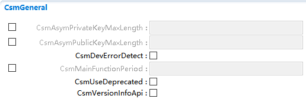

.. centered:: **表 CsmGeneral属性描述 (Table description for CsmGeneral attributes)**

.. list-table::
   :widths: 20 20 20 20 20
   :header-rows: 1

   * - UI名称 (UI Name)
     - 描述 (Description)
     - 
     - 
     - 
   * - CsmAsymPrivateKeyMaxLength
     - 取值范围 (Range)
     - 1..4294967295
     - 默认取值 (Default value)
     - 无
   * - 
     - 
     - 所有算法的非对称公钥的最大长度(以字节为单位) (The maximum length (in bytes) of all asymmetric public keys for algorithms)
     - 
     -
   * - 
     - 
     - 无
     - 
     - 
   * - CsmAsymPublicKeyMaxLength
     - 取值范围 (Range)
     - 1..4294967295
     - 默认取值 (Default value)
     - 无
   * - 
     - 参数描述 (Parameter Description)
     - 所有算法的非对称密钥的最大长度(以字节为单位) (The maximum length (in bytes) of all algorithms' asymmetric keys)
     - 
     -
   * - 
     - 依赖关系 (Dependencies)
     - 无
     - 
     - 
   * - CsmDevErrorDetect
     - 取值范围 (Range)
     - TRUE/FALSE
     - 默认取值 (Default value)
     - FALSE
   * - 
     - 
     - 打开或关闭开发错误检测和通知 (Enable or Disable Development Error Detection and Notifications)
     - 
     -
   * - 
     - 参数描述 (Parameter Description)
     - true：启用检测和通知。 (true: Enable detection and notification.)
     - 
     -
   * - 
     - 
     - false：禁用检测和通知 (False: Disable detection and notification)
     - 
     -
   * - 
     - 依赖关系 (Dependencies)
     - 无
     - 
     - 
   * - CsmMainFunctionPeriod
     - 取值范围 (Range)
     - 0..INF
     - 默认取值 (Default value)
     - 无
   * - 
     - 参数描述 (Parameter Description)
     - 指定主函数Csm_MainFunction的周期(以秒为单位)。 (Specify the period of the main function Csm_MainFunction (in seconds).)
     - 
     -
   * - 
     - 依赖关系 (Dependencies)
     - 无
     - 
     - 
   * - CsmUseDeprecated
     - 取值范围 (Range)
     - TRUE/FALSE
     - 默认取值 (Default value)
     - FALSE
   * - 
     - 
     - 决定不支持的接口是否为应使用。 (Determine whether the unsupported interface should be used.)
     - 
     -
   * - 
     - 参数描述 (Parameter Description)
     - true：使用不赞成的接口。 (True: using disapproved interfaces.)
     - 
     -
   * - 
     - 
     - false：使用普通接口。 (false: Use standard interface.)
     - 
     -
   * - 
     - 依赖关系 (Dependencies)
     - 无
     - 
     - 
   * - CsmVersionInfoApi
     - 取值范围 (Range)
     - TRUE/FALSE
     - 默认取值 (Default value)
     - FALSE
   * - 
     - 
     - 切换以启用和禁用Csm_GetVersionInfo() (Switch to enable and disable Csm_GetVersionInfo())
     - 
     -
   * - 
     - 参数描述 (Parameter Description)
     - True： API Csm_GetVersionInfo()是可用的。 (True: API Csm_GetVersionInfo() is available.)
     - 
     -
   * - 
     - 
     - False：Csm_GetVersionInfo()不可用。 (False: Csm_GetVersionInfo() is unavailable.)
     - 
     -
   * - 
     - 依赖关系 (Dependencies)
     - 无
     - 
     - 

CsmInclude
--------------------------

.. centered:: **表 CsmInclude属性描述 (Table CsmInclude Property Description)**

.. list-table::
   :widths: 20 20 20 20 20
   :header-rows: 1

   * - UI名称 (UI Name)
     - 描述 (Description)
     - 
     - 
     - 
   * - IncludeName
     - 取值范围 (Range)
     - 无
     - 默认取值 (Default value)
     - 无
   * - 
     - 参数描述 (Parameter Description)
     - 用户包含外部头文件，主要包含CallCallBack函数的声明文件 (Users include external header files, mainly containing the declaration of CallCallBack function.)
     - 
     - 
   * - 
     - 依赖关系 (Dependencies)
     - 无
     - 
     - 

CsmJob
----------------------

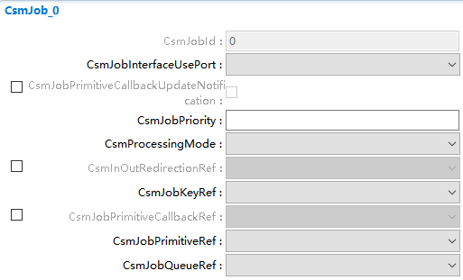

.. centered:: **表 CsmJob属性描述 (Table Description of CsmJob Attributes)**

.. list-table::
   :widths: 20 20 20 20 20
   :header-rows: 1

   * - UI名称 (UI Name)
     - 描述 (Description)
     - 
     - 
     - 
   * - CsmJobId
     - 取值范围 (Range)
     - 0..4294967295
     - 
     -
   * - 
     - 参数描述 (Parameter Description)
     - CSMjob的标识符。实际配置的标识符集应该是连续的、无间隙的。 (The identifier of CSMjob. The actual configured set of identifiers should be continuous and gapless.)
     - 
     -
   * - 
     - 依赖关系 (Dependencies)
     - 无
     - 
     - 
   * - CsmJobId
     - 取值范围 (Range)
     - 0..4294967295
     - 默认取值 (Default value)
     - 无
   * - 
     - 参数描述 (Parameter Description)
     - CSMjob的标识符。实际配置的标识符集应该是连续的、无间隙的。 (The identifier of CSMjob. The actual configured set of identifiers should be continuous and gapless.)
     - 
     -
   * - 
     - 依赖关系 (Dependencies)
     - 无
     - 
     - 
   * - CsmJobPrimitiveCallbackUpdateNotification
     - 取值范围 (Range)
     - TRUE/FALSE
     - 默认取值 (Default value)
     - FALSE
   * - 
     - 参数描述 (Parameter Description)
     - 此参数指示，如果更新操作已完成，是否应调用回调函数。 (This parameter indicates whether a callback function should be called if the update operation has been completed.)
     - 
     -
   * - 
     - 依赖关系 (Dependencies)
     - 无
     - 
     - 
   * - CsmJobPriority
     - 取值范围 (Range)
     - 0..4294967295
     - 默认取值 (Default value)
     - 无
   * - 
     - 
     - job的优先级。 (Priority of job.)
     - 
     -
   * - 
     - 
     - 值越高，job的优先级越高。 (The higher the value, the higher the priority of the job.)
     - 
     -
   * - 
     - 依赖关系 (Dependencies)
     - 无
     - 
     -
   * - | CsmProcessingMode
     - 取值范围 (Range of values)
     - CRYPTO_PROCESSING_ASYNC / CRYPTO_PROCESSING_SYNC
     - 无 (None)
     -
   * - |
     - 参数描述 (Parameter Description)
     - 确定该job的接口应使用的方式。同步处理返回结果，而异步处理返回而不处理job。相应的回调将通知调用者。
     -
     -
   * - |
     - 依赖关系 (Dependency relationships)
     - 无
     -
     -
   * - CsmInOutRedirectionRef
     - 取值范围 (Range)
     - 无
     - 默认取值 (Default value)
     - 无
   * - 
     - 参数描述 (Parameter Description)
     - 此参数引用使用的重定向 (This parameter references the used redirection.)
     - 
     -
   * - 
     - 依赖关系 (Dependencies)
     - CsmInOutRedirections
     - 
     - 
   * - CsmJobKeyRef
     - 取值范围 (Range)
     - 无
     - 默认取值 (Default value)
     - 无
   * - 
     - 
     - 这个参数指的是CsmPrimitive的应使用键。 (This parameter refers to the key to be used for CsmPrimitive.)
     - 
     -
   * - 
     - 
     - 可以为不同的job使用CsmKey (Different jobs can use CsmKey)
     - 
     -
   * - 
     - 依赖关系 (Dependencies)
     - CsmKey
     - 
     - 
   * - CsmJobPrimitiveCallbackRef
     - 取值范围 (Range)
     - 无
     - 默认取值 (Default value)
     - 无
   * - 
     - 
     - 此参数引用使用的CsmCallback。 (This parameter references the used CsmCallback.)
     - 
     -
   * - 
     - 
     - 当加密job完成时，将调用所引用的CsmCallback。 (When the encryption job is completed, the referenced CsmCallback will be called.)
     - 
     -
   * - 
     - 依赖关系 (Dependencies)
     - 当CsmProcessingMode配置为ASYN异步模式 (When CsmProcessingMode is configured as ASYN asynchronous mode)
     - 
     - 
   * - CsmJobPrimitiveRef
     - 取值范围 (Range)
     - 无
     - 默认取值 (Default value)
     - 无
   * - 
     - 
     - 此参数引用所使用的CsmPrimitive。 (This parameter references the CsmPrimitive used.)
     - 
     -
   * - 
     - 
     - 不同的job可以引用一个CsmPrimitive。所引用的CsmPrimitive提供了关于实际密码例程的详细信息。 (Different jobs can reference a CsmPrimitive. The referenced CsmPrimitive provides details about the actual password routine.)
     - 
     -
   * - 
     - 依赖关系 (Dependencies)
     - CsmPrimitives
     - 
     - 
   * - CsmJobQueueRef
     - 取值范围 (Range)
     - 无
     - 默认取值 (Default value)
     - 无
   * - 
     - 
     - 这个参数指的是队列。 (This parameter refers to the queue.)
     - 
     -
   * - 
     - 
     - 如果底层加密驱动程序对象忙，则使用该队列。队列也引用所使用的通道。 (If the underlying encryption driver object is busy, use this queue. The queue also references the channel used.)
     - 
     -
   * - 
     - 依赖关系 (Dependencies)
     - CsmQueue
     - 
     - 

CsmKey
----------------------

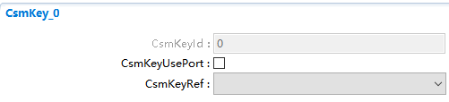

.. centered:: **表 CsmKey属性描述 (Table CsmKey Property Description)**

.. list-table::
   :widths: 20 20 20 20 20
   :header-rows: 1

   * - UI名称 (UI Name)
     - 描述 (Description)
     - 参数描述 (Parameter Description)
     - 默认取值 (Default value)
     - 依赖关系 (Dependencies)
   * - CsmKeyId
     - 取值范围 (Range)
     - 0..4294967295
     - 无
     - 无
   * - 
     - 参数描述 (Parameter Description)
     - CsmKey的标识符。实际配置的标识符集应该是连续的、无间隙的。 (Identifier for CsmKey. The actual configured identifier set should be continuous and gapless.)
     - 
     -
   * - 
     - 依赖关系 (Dependencies)
     - 无
     - 
     - 
   * - CsmKeyUsePort
     - 取值范围 (Range)
     - TRUE/FALSE
     - FALSE
     - 无
   * - 
     - 参数描述 (Parameter Description)
     - Key需要RTE接口吗？ True：此键使用的RTE接口 False：此键没有使用的RTE接口 (Does the Key require the RTE interface? True: This key uses the RTE interface False: This key does not use the RTE interface)
     - 
     -
   * - 
     - 依赖关系 (Dependencies)
     - 无
     - 
     - 
   * - CsmKeyRef
     - 取值范围 (Range)
     - 无
     - 无
     - CryIfKey
   * - 
     - 参数描述 (Parameter Description)
     - 此参数引用所使用的CryIfKey。底层的CryIfKey指的是加密驱动程序中的一个特定的加密密钥。 (This parameter references the CryIfKey used. The underlying CryIfKey refers to a specific encryption key in the cryptographic driver.)
     - 
     -
   * - 
     - 依赖关系 (Dependencies)
     - CryIfKey
     - 
     - 

CsmQueue
------------------------

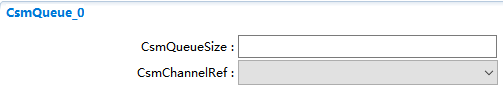

.. centered:: **表 CsmQueue属性描述 (Table Properties Description of CsmQueue)**

.. list-table::
   :widths: 20 20 20 20 20
   :header-rows: 1

   * - UI名称 (UI Name)
     - 描述 (Description)
     - 
     - 
     - 
   * - CsmQueueSize
     - 取值范围 (Range)
     - 1..4294967295
     - 默认取值 (Default value)
     - 无
   * - 
     - 参数描述 (Parameter Description)
     - CsmQueue的大小。如果由于硬件繁忙而无法由底层硬件处理job，则job将保留在优先队列中。 (The size of CsmQueue. If a job cannot be processed by the underlying hardware due to hardware busyness, it will be retained in the priority queue.)
     - 
     - 
   * - 
     - 
     - 如果队列已满，则将拒绝下一个job。 (If the queue is full, the next job will be rejected.)
     - 
     - 
   * - 
     - 依赖关系 (Dependencies)
     - 无
     - 
     - 
   * - CsmChannelRef
     - 取值范围 (Range)
     - 无
     - 默认取值 (Default value)
     - 无
   * - 
     - 参数描述 (Parameter Description)
     - 指底层的密码接口通道 (The underlying password interface channel)
     - 
     - 
   * - 
     - 依赖关系 (Dependencies)
     - CryIfChannel
     - 
     - 

CsmInOutRedirection
-----------------------------------

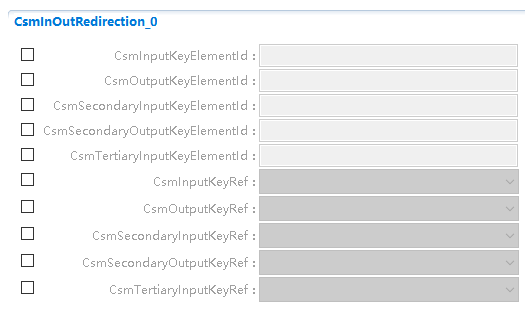

.. centered:: **表 CsmInOutRedirection属性描述 (Table CsmInOutRedirection property description)**

.. list-table::
   :widths: 20 20 20 20 20
   :header-rows: 1

   * - UI名称 (UI Name)
     - 描述 (Description)
     - 
     - 
     - 
   * - 
     - 取值范围 (Range)
     - 0..4294967295
     - 默认取值 (Default value)
     - 无
   * - CsmInputKeyElementId
     - 参数描述 (Parameter Description)
     - 用作输入的元素的标识符 (Identifier for the element used as input)
     - 
     -
   * - 
     - 依赖关系 (Dependencies)
     - 无
     - 
     - 
   * - 
     - 取值范围 (Range)
     - 0..4294967295
     - 默认取值 (Default value)
     - 无
   * - CsmOutputKeyElementId
     - 参数描述 (Parameter Description)
     - 用作输出的元素的标识符 (Identifier for elements used as output.)
     - 
     -
   * - 
     - 依赖关系 (Dependencies)
     - 无
     - 
     - 
   * - 
     - 取值范围 (Range)
     - 0..4294967295
     - 默认取值 (Default value)
     - 无
   * - CsmSecondaryInputKeyElementId
     - 参数描述 (Parameter Description)
     - 用作辅助输入的键元素的标识符 (Identifier for key elements used as auxiliary input)
     - 
     -
   * - 
     - 依赖关系 (Dependencies)
     - 无
     - 
     - 
   * - 
     - 取值范围 (Range)
     - 0..4294967295
     - 默认取值 (Default value)
     - 无
   * - CsmSecondaryOutputKeyElementId
     - 参数描述 (Parameter Description)
     - 用作辅助输出的键元素的标识符 (Identifier for key elements used as auxiliary outputs)
     - 
     -
   * - 
     - 依赖关系 (Dependencies)
     - 无
     - 
     - 
   * - 
     - 取值范围 (Range)
     - 0..4294967295
     - 默认取值 (Default value)
     - 无
   * - CsmTertiaryInputKeyElementId
     - 参数描述 (Parameter Description)
     - 用作第三级输入的关键元素的标识符 (Identifiers for elements used as third-level inputs.)
     - 
     -
   * - 
     - 依赖关系 (Dependencies)
     - 无
     - 
     - 
   * - 
     - 取值范围 (Range)
     - 无
     - 默认取值 (Default value)
     - 无
   * - CsmInputKeyRef
     - 参数描述 (Parameter Description)
     - 这个参数指的是作输入的key (This parameter refers to the key for input.)
     - 
     -
   * - 
     - 依赖关系 (Dependencies)
     - CsmKey
     - 
     - 
   * - 
     - 取值范围 (Range)
     - 无
     - 默认取值 (Default value)
     - 无
   * - CsmOutputKeyRef
     - 参数描述 (Parameter Description)
     - 此参数引用用作输出的键 (This parameter refers to the key used as output.)
     - 
     -
   * - 
     - 依赖关系 (Dependencies)
     - CsmKey
     - 
     - 
   * - 
     - 取值范围 (Range)
     - 无
     - 默认取值 (Default value)
     - 无
   * - CsmSecondaryOutputKeyRef
     - 参数描述 (Parameter Description)
     - 这个参数指的是作辅助输出的键 (This parameter refers to the key for auxiliary output.)
     - 
     -
   * - 
     - 依赖关系 (Dependencies)
     - CsmKey
     - 
     - 
   * - 
     - 取值范围 (Range)
     - 无
     - 默认取值 (Default value)
     - 无
   * - CsmTertiaryInputKeyRef
     - 参数描述 (Parameter Description)
     - 这个参数指的是用作第三级输入的键 (This parameter refers to the key used as the third-level input.)
     - 
     -
   * - 
     - 依赖关系 (Dependencies)
     - CsmKey
     - 
     - 

CsmPrimitives
-----------------------------

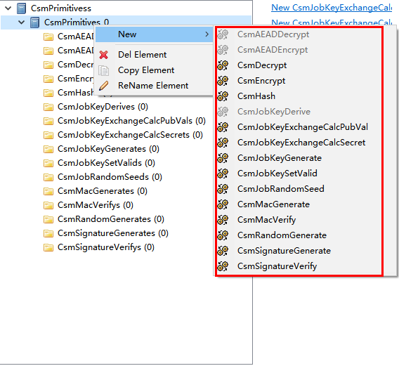

.. centered:: **表 CsmPrimitives属性描述 (Table CsmPrimitives Properties Description)**

.. list-table::
   :widths: 20 20 20 20 20
   :header-rows: 1

   * - UI名称 (UI Name)
     - 描述 (Description)
     - 
     - 
     - 
   * - CsmPrimitives
     - 取值范围 (Range)
     - 无
     - 默认取值 (Default value)
     - 无
   * - 
     - 参数描述 (Parameter Description)
     - 用于配置CsmPrimitives的容器 (Container for Configuring CsmPrimitives)
     - 
     - 
   * - 
     - 依赖关系 (Dependencies)
     - 无
     - 
     - 
   * - 包含内容 (Containment)
     - CsmAEADDecrypt
     - 
     - 
     - 
   * - 
     - CsmAEADEncrypt
     - 
     - 
     - 
   * - 
     - CsmDecrypt
     - 
     - 
     - 
   * - 
     - CsmEncrypt
     - 
     - 
     - 
   * - 
     - CsmHash
     - 
     - 
     - 
   * - 
     - CsmJobCertificateParse
     - 
     - 
     - 
   * - 
     - CsmJobCertificateVerify
     - 
     - 
     - 
   * - 
     - CsmJobKeyDerive
     - 
     - 
     - 
   * - 
     - CsmJobKeyExchangeCalcPubVa
     - 
     - 
     - 
   * - 
     - CsmJobKeyExchangeCalcSecret
     - 
     - 
     - 
   * - 
     - CsmJobKeyGenerate
     - 
     - 
     - 
   * - 
     - CsmJobKeySetValid
     - 
     - 
     - 
   * - 
     - CsmJobRandomSeed
     - 
     - 
     - 
   * - 
     - CsmMacGenerate
     - 
     - 
     - 
   * - 
     - CsmMacVerify
     - 
     - 
     - 
   * - 
     - CsmRandomGenerate
     - 
     - 
     - 
   * - 
     - CsmSignatureGenerate
     - 
     - 
     - 
   * - 
     - CsmSignatureVerify
     - 
     - 
     - 

CsmHashConfig
~~~~~~~~~~~~~~~~~~~~~~~~~~~~~

.. list-table::
   :widths: 20 20 20 20 20
   :header-rows: 1

   * - UI名称 (UI Name)
     - 描述 (Description)
     - 
     - 
     - 
   * - CsmHashAlgorithmFamily
     - 
     - CRYPTO_ALGOFAM_BLAKE_1_256   0x0F
     - 
     -
   * - 
     - 
     - CRYPTO_ALGOFAM_BLAKE_1_512 0x10
     - 
     -
   * - 
     - 
     - CRYPTO_ALGOFAM_BLAKE_2s_256 0x11
     - 
     -
   * - 
     - 
     - CRYPTO_ALGOFAM_BLAKE_2s_512 0x12
     - 
     -
   * - 
     - 
     - CRYPTO_ALGOFAM_CUSTOM 0xFF
     - 
     -
   * - 
     - 
     - CRYPTO_ALGOFAM_RIPEMD160 0x0E
     - 
     -
   * - 
     - 
     - CRYPTO_ALGOFAM_SHA1 0x01
     - 
     -
   * - 
     - 
     - CRYPTO_ALGOFAM_SHA2_224 0x02
     - 
     -
   * - 
     - 
     - CRYPTO_ALGOFAM_SHA2_256 0x03
     - 
     -
   * - 
     - 取值范围 (Range)
     - CRYPTO_ALGOFAM_SHA2_384 0x04
     - 默认取值 (Default value)
     - 无
   * - 
     - 
     - CRYPTO_ALGOFAM_SHA2_512 0x05
     - 
     -
   * - 
     - 
     - CRYPTO_ALGOFAM_SHA2_512_224 0x06
     - 
     -
   * - 
     - 
     - CRYPTO_ALGOFAM_SHA2_512_256 0x07
     - 
     -
   * - 
     - 
     - CRYPTO_ALGOFAM_SHA3_224 0x08
     - 
     -
   * - 
     - 
     - CRYPTO_ALGOFAM_SHA3_256 0x09
     - 
     -
   * - 
     - 
     - CRYPTO_ALGOFAM_SHA3_384 0x0A
     - 
     -
   * - 
     - 
     - CRYPTO_ALGOFAM_SHA3_512 0x0B
     - 
     -
   * - 
     - 
     - CRYPTO_ALGOFAM_SHA3_SHAKE128 0x0C
     - 
     -
   * - 
     - 
     - CRYPTO_ALGOFAM_SHA3_SHAKE256 0x0D
     - 
     -
   * - 
     - 参数描述 (Parameter Description)
     - 确定用于加密服务的算法族。这个参数定义了算法最重要的部分 (Determine the family of algorithms for encryption services. This parameter defines the most important part of the algorithm.)
     - 
     -
   * - 
     - 依赖关系 (Dependencies)
     - 无
     - 
     - 
   * - CsmHashAlgorithmFamilyCustom
     - 取值范围 (Range)
     - 无
     - 默认取值 (Default value)
     - 无
   * - 
     - 
     - 这是自定义算法族的名称 (This is the name of the custom algorithm family)
     - 
     -
   * - 
     - 
     - CRYPTO_ALGOFAM_CUSTOM被用作csmhashalg族。 (CRYPTO_ALGOFAM_CUSTOM is used as csmhashalg family.)
     - 
     -
   * - 
     - 依赖关系 (Dependencies)
     - 无
     - 
     - 
   * - CsmHashAlgorithmMode
     - 
     - CRYPTO_ALGOMODE_CUSTOM 0xFF
     - 
     - 0x00
   * - 
     - 取值范围(Range)
     - 
     - 默认取值 (Default Value)
     - 
   * - 
     - 
     - CRYPTO_ALGOMODE_NOT_SET 0x00
     - 
     -
   * - 
     - 参数描述 (Parameter Description)
     - 确定加密服务使用的算法模式 (Determine the encryption algorithm mode used by the service.)
     - 
     -
   * - 
     - 依赖关系 (Dependencies)
     - 无
     - 
     - 
   * - CsmHashAlgorithmModeCustom
     - 取值范围 (Range)
     - 无
     - 默认取值 (Default value)
     - 无
   * - 
     - 参数描述 (Parameter Description)
     - 自定义原语模式的名称 (Custom primitive mode name)
     - 
     -
   * - 
     - 依赖关系 (Dependencies)
     - 无
     - 
     - 
   * - CsmHashAlgorithmSecondaryFamily
     - 
     - CRYPTO_ALGOMODE_CUSTOM 0xFF
     - 
     - 0x00
   * - 
     - 取值范围 (Range)
     - 
     - 默认取值 (Default Value)
     - 
   * - 
     - 
     - CRYPTO_ALGOMODE_NOT_SET 0x00
     - 
     -
   * - 
     - 参数描述 (Parameter Description)
     - 确定用于加密服务的算法族 (Determine the algorithm family for encryption services.)
     - 
     -
   * - 
     - 依赖关系 (Dependencies)
     - 无
     - 
     - 
   * - CsmHashAlgorithmSecondaryFamilyCustom
     - 取值范围 (Range)
     - 无
     - 默认取值 (Default value)
     - 无
   * - 
     - 
     - 这是自定义算法族的第二个名字 (This is the second name of the custom algorithm family)
     - 
     -
   * - 
     - 参数描述 (Parameter Description)
     - 将CRYPTO_ALGOFAM_CUSTOM设置为 (Set CRYPTO_ALGOFAM_CUSTOM to)
     - 
     -
   * - 
     - 
     - CsmHashAlgorithmSecondaryFamily。
     - 
     -
   * - 
     - 依赖关系 (Dependencies)
     - 无
     - 
     - 
   * - CsmHashDataMaxLength
     - 取值范围 (Range)
     - 1..4294967295
     - 默认取值 (Default value)
     - 无
   * - 
     - 参数描述 (Parameter Description)
     - 输入数据长度的最大大小(以字节为单位) (The maximum length of input data size (in bytes))
     - 
     -
   * - 
     - 依赖关系 (Dependencies)
     - 无
     - 
     - 
   * - CsmHashResultLength
     - 取值范围 (Range)
     - 1..4294967295
     - 默认取值 (Default value)
     - 无
   * - 
     - 参数描述 (Parameter Description)
     - 输出哈希长度的大小(以字节为单位) (Output the size of hash length in bytes)
     - 
     -
   * - 
     - 依赖关系 (Dependencies)
     - 无
     - 
     - 

CsmMacGenerateConfig
~~~~~~~~~~~~~~~~~~~~~~~~~~~~~~~~~~~~

.. list-table::
   :widths: 20 20 20 20 20
   :header-rows: 1

   * - UI名称 (UI Name)
     - 描述 (Description)
     - 
     - 
     - 
   * - CsmMacGenerateAlgorithmFamily
     - 
     - CRYPTO_ALGOFAM_3DES   0x13
     - 
     -
   * - 
     - 
     - CRYPTO_ALGOFAM_AES 0x14
     - 
     -
   * - 
     - 
     - CRYPTO_ALGOFAM_BLAKE_1_256 0x0F
     - 
     -
   * - 
     - 
     - CRYPTO_ALGOFAM_BLAKE_1_512 0x10
     - 
     -
   * - 
     - 
     - CRYPTO_ALGOFAM_BLAKE_2s_256 0x11
     - 
     -
   * - 
     - 
     - CRYPTO_ALGOFAM_BLAKE_2s_512 0x12
     - 
     -
   * - 
     - 
     - CRYPTO_ALGOFAM_CHACHA 0x15
     - 
     -
   * - 
     - 
     - CRYPTO_ALGOFAM_CUSTOM 0xFF
     - 
     -
   * - 
     - 
     - CRYPTO_ALGOFAM_RIPEMD160 0x0E
     - 
     -
   * - 
     - 
     - CRYPTO_ALGOFAM_RNG 0x1B
     - 
     -
   * - 
     - 
     - CRYPTO_ALGOFAM_SHA1 0x01
     - 
     -
   * - 
     - 
     - CRYPTO_ALGOFAM_SHA2_224 0x02
     - 
     - 
   * - 
     - 取值范围 (Value Range)
     -
     - 默认取值 (Default Value)
     - 无
   * - 
     - 
     - CRYPTO_ALGOFAM_SHA2_256 0x03
     - 
     -
   * - 
     - 
     - CRYPTO_ALGOFAM_SHA2_384 0x04
     - 
     -
   * - 
     - 
     - CRYPTO_ALGOFAM_SHA2_512 0x05
     - 
     -
   * - 
     - 
     - CRYPTO_ALGOFAM_SHA2_512_224 0x06
     - 
     -
   * - 
     - 
     - CRYPTO_ALGOFAM_SHA2_512_256 0x07
     - 
     -
   * - 
     - 
     - CRYPTO_ALGOFAM_SHA3_224 0x08
     - 
     -
   * - 
     - 
     - CRYPTO_ALGOFAM_SHA3_256 0x09
     - 
     -
   * - 
     - 
     - CRYPTO_ALGOFAM_SHA3_384 0x0A
     - 
     -
   * - 
     - 
     - CRYPTO_ALGOFAM_SHA3_512 0x0B
     - 
     -
   * - 
     - 
     - CRYPTO_ALGOFAM_SHA3_SHAKE128 0x0C
     - 
     -
   * - 
     - 
     - CRYPTO_ALGOFAM_SHA3_SHAKE256 0x0D
     - 
     -
   * - 
     - 
     - CRYPTO_ALGOFAM_SIPHASH 0x1C
     - 
     -
   * - 
     - 参数描述 (Parameter Description)
     - 确定用于加密服务的算法族。这个参数定义了算法最重要的部分。 (Determine the family of algorithms for encryption services. This parameter defines the most crucial part of the algorithm.)
     - 
     -
   * - 
     - 依赖关系 (Dependencies)
     - 无
     - 
     - 
   * - CsmMacGenerateAlgorithmFamilyCustom
     - 取值范围 (Range)
     - 无
     - 默认取值 (Default value)
     - 无
   * - 
     - 
     - 如果使用的是CRYPTO_ALGOFAM_CUSTOM，那么这是自定义算法族的名称 (If CRYPTO_ALGOFAM_CUSTOM is used, this is the name of the custom algorithm family.)
     - 
     -
   * - 
     - 
     - CsmMacGenerateAlgorithmFamily
     - 
     -
   * - 
     - 依赖关系 (Dependencies)
     - 无
     - 
     - 
   * - CsmMacGenerateAlgorithmKeyLength
     - 取值范围 (Range)
     - 1..4294967295
     - 默认取值 (Default value)
     - 无
   * - 
     - 参数描述 (Parameter Description)
     - 确定加密服务使用的算法模式 (Determine the encryption algorithm mode used by the service.)
     - 
     -
   * - 
     - 依赖关系 (Dependencies)
     - 无
     - 
     - 
   * - CsmMacGenerateAlgorithmMode
     - 
     - CRYPTO_ALGOMODE_CMAC 0x10
     - 
     -
   * - 
     - 
     - CRYPTO_ALGOMODE_CTRDRBG 0x12
     - 
     -
   * - 
     - 
     - CRYPTO_ALGOMODE_CUSTOM 0xFF
     - 
     -
   * - 
     - 
     - CRYPTO_ALGOMODE_GMAC 0x11
     - 
     - 
   * - 
     - 取值范围 (Value Range)
     -
     - 默认取值 (Default Value)
     - 无
   * - 
     - 
     - CRYPTO_ALGOMODE_HMAC 0x0f
     - 
     -
   * - 
     - 
     - CRYPTO_ALGOMODE_NOT_SET 0x00
     - 
     -
   * - 
     - 
     - CRYPTO_ALGOMODE_SIPHASH_2_4 0x17
     - 
     -
   * - 
     - 
     - CRYPTO_ALGOMODE_SIPHASH_4_8 0x18
     - 
     -
   * - 
     - 参数描述 (Parameter Description)
     - 确定加密服务使用的算法模式 (Determine the encryption algorithm mode used by the service.)
     - 
     -
   * - 
     - 依赖关系 (Dependencies)
     - 无
     - 
     - 
   * - CsmMacGenerateAlgorithmModeCustom
     - 取值范围 (Range)
     - 无
     - 默认取值 (Default value)
     - 无
   * - 
     - 参数描述 (Parameter Description)
     - 用于加密服务的自定义算法模式的名称 (Name of Custom Algorithm Mode for Encryption Services)
     - 
     -
   * - 
     - 依赖关系 (Dependencies)
     - 无
     - 
     - 
   * - CsmMacGenerateAlgorithmSecondaryFamily
     - 
     - CRYPTO_ALGOFAM_NOT_SET 0x00
     - 
     - 0x00
   * - 
     - 取值范围 (Value Range)
     -
     - 默认取值 (Default Value)
     - 无
   * - 
     - 
     - CRYPTO_ALGOMODE_CUSTOM 0xFF
     - 
     -
   * - 
     - 参数描述 (Parameter Description)
     - 确定用于加密服务的辅助算法族 (Determine the auxiliary algorithm suite for encryption services.)
     - 
     -
   * - 
     - 依赖关系 (Dependencies)
     - 无
     - 
     - 
   * - CsmMacGenerateAlgorithmSecondaryFamilyCustom
     - 取值范围 (Range)
     - 无
     - 默认取值 (Default value)
     - 无
   * - 
     - 
     - 这是自定义算法族的第二个名字 (This is the second name of the custom algorithm family)
     - 
     -
   * - 
     - 参数描述 (Parameter Description)
     - 将CRYPTO_ALGOFAM_CUSTOM设置为 (Set CRYPTO_ALGOFAM_CUSTOM to)
     - 
     -
   * - 
     - 
     - CsmHashAlgorithmSecondaryFamilyCustom。
     - 
     -
   * - 
     - 依赖关系 (Dependencies)
     - 无
     - 
     - 
   * - CsmMacGenerateDataMaxLength
     - 取值范围 (Range)
     - 1..4294967295
     - 默认取值 (Default value)
     - 无
   * - 
     - 参数描述 (Parameter Description)
     - 输入数据长度的最大大小(以字节为单位) (The maximum length of input data size (in bytes))
     - 
     -
   * - 
     - 依赖关系 (Dependencies)
     - 无
     - 
     - 
   * - CsmMacGenerateResultLength
     - 取值范围 (Range)
     - 1..4294967295
     - 默认取值 (Default value)
     - 无
   * - 
     - 参数描述 (Parameter Description)
     - 输出MAC长度的大小(以字节为单位) (Output the size of MAC length (in bytes))
     - 
     -
   * - 
     - 依赖关系 (Dependencies)
     - 无
     - 
     - 

CsmMacVerifyConfig
~~~~~~~~~~~~~~~~~~~~~~~~~~~~~~~~~~

.. list-table::
   :widths: 20 20 20 20 20
   :header-rows: 1

   * - UI名称 (UI Name)
     - 描述 (Description)
     - 
     - 
     - 
   * - CsmMacVerifyAlgorithmFamily
     - 
     - CRYPTO_ALGOFAM_3DES   0x13
     - 
     -
   * - 
     - 
     - CRYPTO_ALGOFAM_AES 0x14
     - 
     -
   * - 
     - 
     - CRYPTO_ALGOFAM_BLAKE_1_256 0x0F
     - 
     -
   * - 
     - 
     - CRYPTO_ALGOFAM_BLAKE_1_512 0x10
     - 
     -
   * - 
     - 
     - CRYPTO_ALGOFAM_BLAKE_2s_256 0x11
     - 
     -
   * - 
     - 
     - CRYPTO_ALGOFAM_BLAKE_2s_512 0x12
     - 
     -
   * - 
     - 
     - CRYPTO_ALGOFAM_CHACHA 0x15
     - 
     -
   * - 
     - 
     - CRYPTO_ALGOFAM_RIPEMD160 0x0E
     - 
     -
   * - 
     - 
     - CRYPTO_ALGOFAM_RNG 0x1B
     - 
     -
   * - 
     - 
     - CRYPTO_ALGOFAM_SHA1 0x01
     - 
     -
   * - 
     - 
     - CRYPTO_ALGOFAM_SHA2_224 0x02
     - 
     -
   * - 
     - 
     - CRYPTO_ALGOFAM_SHA2_256 0x03
     - 
     - 
   * - 
     - 取值范围 (Value Range)
     -
     - 默认取值 (Default Value)
     - 无
   * - 
     - 
     - CRYPTO_ALGOFAM_SHA2_384 0x04
     - 
     -
   * - 
     - 
     - CRYPTO_ALGOFAM_SHA2_512 0x05
     - 
     -
   * - 
     - 
     - CRYPTO_ALGOFAM_SHA2_512_224 0x06
     - 
     -
   * - 
     - 
     - CRYPTO_ALGOFAM_SHA2_512_256 0x07
     - 
     -
   * - 
     - 
     - CRYPTO_ALGOFAM_SHA3_224 0x08
     - 
     -
   * - 
     - 
     - CRYPTO_ALGOFAM_SHA3_256 0x09
     - 
     -
   * - 
     - 
     - CRYPTO_ALGOFAM_SHA3_384 0x0A
     - 
     -
   * - 
     - 
     - CRYPTO_ALGOFAM_SHA3_512 0x0B
     - 
     -
   * - 
     - 
     - CRYPTO_ALGOFAM_SHA3_SHAKE128 0x0C
     - 
     -
   * - 
     - 
     - CRYPTO_ALGOFAM_SHA3_SHAKE256 0x0D
     - 
     -
   * - 
     - 
     - CRYPTO_ALGOFAM_SIPHASH 0x1C
     - 
     -
   * - 
     - 
     - CRYPTO_ALGOMODE_CUSTOM 0xFF
     - 
     -
   * - 
     - 参数描述 (Parameter Description)
     - 确定用于加密服务的算法族。这个参数定义了算法最重要的部分。 (Determine the family of algorithms for encryption services. This parameter defines the most crucial part of the algorithm.)
     - 
     -
   * - 
     - 依赖关系 (Dependencies)
     - 无
     - 
     - 
   * - CsmMacVerifyAlgorithmFamilyCustom
     - 取值范围 (Range)
     - 无
     - 默认取值 (Default value)
     - 无
   * - 
     - 参数描述 (Parameter Description)
     - 用于加密服务的自定义算法族的名称 (Name of custom algorithm families for encryption services)
     - 
     -
   * - 
     - 依赖关系 (Dependencies)
     - 无
     - 
     - 
   * - CsmMacVerifyAlgorithmKeyLength
     - 取值范围 (Range)
     - 1..4294967295
     - 默认取值 (Default value)
     - 无
   * - 
     - 参数描述 (Parameter Description)
     - MAC密钥的大小(以字节为单位) (The size of MAC key (in bytes))
     - 
     -
   * - 
     - 依赖关系 (Dependencies)
     - 无
     - 
     - 
   * - CsmMacVerifyAlgorithmMode
     - 
     - CRYPTO_ALGOMODE_CMAC 0x10
     - 
     -
   * - 
     - 
     - CRYPTO_ALGOMODE_CTRDRBG 0x12
     - 
     -
   * - 
     - 
     - CRYPTO_ALGOMODE_CUSTOM 0xFF
     - 
     -
   * - 
     - 
     - CRYPTO_ALGOMODE_GMAC 0x11
     - 
     - 
   * - 
     - 取值范围 (Value Range)
     -
     - 默认取值 (Default Value)
     - 无
   * - 
     - 
     - CRYPTO_ALGOMODE_HMAC 0x0f
     - 
     -
   * - 
     - 
     - CRYPTO_ALGOMODE_NOT_SET 0x00
     - 
     -
   * - 
     - 
     - CRYPTO_ALGOMODE_SIPHASH_2_4 0x17
     - 
     -
   * - 
     - 
     - CRYPTO_ALGOMODE_SIPHASH_4_8 0x18
     - 
     -
   * - 
     - 参数描述 (Parameter Description)
     - 确定加密服务使用的算法模式 (Determine the encryption algorithm mode used by the service.)
     - 
     -
   * - 
     - 依赖关系 (Dependencies)
     - 无
     - 
     - 
   * - CsmMacVerifyAlgorithmModeCustom
     - 取值范围 (Range)
     - 无
     - 默认取值 (Default value)
     - 无
   * - 
     - 参数描述 (Parameter Description)
     - 用于加密服务的自定义算法模式的名称 (Name of Custom Algorithm Mode for Encryption Services)
     - 
     -
   * - 
     - 依赖关系 (Dependencies)
     - 无
     - 
     - 
   * - CsmMacVerifyAlgorithmSecondaryFamily
     - 
     - CRYPTO_ALGOFAM_NOT_SET 0x00
     - 
     - 0x00
   * - 
     - 取值范围 (Value Range)
     -
     - 默认取值 (Default Value)
     - 无
   * - 
     - 
     - CRYPTO_ALGOMODE_CUSTOM 0xFF
     - 
     -
   * - 
     - 参数描述 (Parameter Description)
     - 确定用于加密服务的辅助算法族 (Determine the auxiliary algorithm suite for encryption services.)
     - 
     -
   * - 
     - 依赖关系 (Dependencies)
     - 无
     - 
     - 
   * - CsmMacVerifyAlgorithmSecondaryFamilyCustom
     - 取值范围 (Range)
     - 无
     - 默认取值 (Default value)
     - 无
   * - 
     - 
     - 这是自定义算法族的第二个名字 (This is the second name of the custom algorithm family)
     - 
     -
   * - 
     - 参数描述 (Parameter Description)
     - 将CRYPTO_ALGOFAM_CUSTOM设置为 (Set CRYPTO_ALGOFAM_CUSTOM to)
     - 
     -
   * - 
     - 
     - CsmHashAlgorithmSecondaryFamilyCustom。
     - 
     -
   * - 
     - 依赖关系 (Dependencies)
     - 无
     - 
     - 
   * - CsmMacVerifyCompareLength
     - 取值范围 (Range)
     - 1..4294967295
     - 默认取值 (Default value)
     - 无
   * - 
     - 参数描述 (Parameter Description)
     - 输入数据长度的最大大小(以字节为单位) (The maximum length of input data size (in bytes))
     - 
     -
   * - 
     - 依赖关系 (Dependencies)
     - 无
     - 
     - 
   * - CsmMacVerifyDataMaxLength
     - 取值范围 (Range)
     - 1..4294967295
     - 默认取值 (Default value)
     - 无
   * - 
     - 参数描述 (Parameter Description)
     - 输出MAC长度的大小(以字节为单位) (Output the size of MAC length (in bytes))
     - 
     -
   * - 
     - 依赖关系 (Dependencies)
     - 无
     - 
     - 

CsmEncryptConfig
~~~~~~~~~~~~~~~~~~~~~~~~~~~~~~~~

.. list-table::
   :widths: 15 15 14 14 14 14 14
   :header-rows: 1

   * - UI名称 (UI Name)
     - 描述 (Description)
     - 
     - 
     - 
     - 
     - 
   * - CsmEncryptAlgorithmFamily
     - 取值范围 (Range)
     - CRYPTO_ALGOFAM_3DES 0x13CRYPTO_ALGOFAM_AES 0x14
     - 默认取值 (Default value)
     - 
     - 
     - 无
   * - 
     - 
     - CRYPTO_ALGOFAM_CHACHA0x15
     - 
     - 
     - 
     - 
   * - 
     - 
     - CRYPTO_ALGOFAM_CUSTOM0xFF
     - 
     - 
     - 
     - 
   * - 
     - 
     - CRYPTO_ALGOFAM_ECIES 0x1D
     - 
     - 
     - 
     - 
   * - 
     - 
     - CRYPTO_ALGOFAM_RSA 0x16
     - 
     - 
     - 
     - 
   * - 
     - 参数描述 (Parameter Description)
     - 确定用于加密服务的算法族。这个参数定义了算法最重要的部分。 (Determine the family of algorithms for encryption services. This parameter defines the most crucial part of the algorithm.)
     - 
     - 
     - 
     - 
   * - 
     - 依赖关系 (Dependencies)
     - 无
     - 
     - 
     - 
     - 
   * - CsmEncryptAlgorithmFamilyCustom
     - 取值范围 (Range)
     - 无
     - 默认取值 (Default value)
     - 
     - 
     - 无
   * - 
     - 参数描述 (Parameter Description)
     - 这是自定义算法族的名称 (This is the name of the custom algorithm family)
     - 
     - 
     - 
     - 
   * - 
     - 
     - 使用CRYPTO_ALGOFAM_CUSTOM作为csmencryptalgmfamily (Use CRYPTO_ALGOFAM_CUSTOM as csmencryptalgmfamily)
     - 
     - 
     - 
     - 
   * - 
     - 依赖关系 (Dependencies)
     - 无
     - 
     - 
     - 
     - 
   * - CsmEncryptAlgorithmKeyLength
     - 取值范围 (Range)
     - 1..4294967295
     - 默认取值 (Default value)
     - 
     - 无
     - 
   * - 
     - 参数描述 (Parameter Description)
     - 加密密钥的大小(以字节为单位) (The size of the encryption key (in bytes))
     - 
     - 
     - 
     - 
   * - 
     - 依赖关系 (Dependencies)
     - 无
     - 
     - 
     - 
     - 
   * - CsmEncryptAlgorithmMode
     - 取值范围 (Range)
     - CRYPTO_ALGOMODE_12ROUNDS0x0dCRYPTO_ALGOMODE_20ROUNDS0x0e
     - 默认取值 (Default value)
     - 
     - 
     - 无
   * - 
     - 
     - CRYPTO_ALGOMODE_8ROUNDS0x0c
     - 
     - 
     - 
     - 
   * - 
     - 
     - CRYPTO_ALGOMODE_CBC 0x02
     - 
     - 
     - 
     - 
   * - 
     - 
     - CRYPTO_ALGOMODE_CFB 0x03
     - 
     - 
     - 
     - 
   * - 
     - 
     - CRYPTO_ALGOMODE_CTR 0x05
     - 
     - 
     - 
     - 
   * - 
     - 
     - CRYPTO_ALGOMODE_CUSTOM0xFF
     - 
     - 
     - 
     - 
   * - 
     - 
     - CRYPTO_ALGOMODE_ECB 0x01
     - 
     - 
     - 
     - 
   * - 
     - 
     - CRYPTO_ALGOMODE_NOT_SET0x00
     - 
     - 
     - 
     - 
   * - 
     - 
     - CRYPTO_ALGOMODE_OFB 0x04
     - 
     - 
     - 
     - 
   * - 
     - 
     - CRYPTO_ALGOMODE_RSAES_OAEP0x08
     - 
     - 
     - 
     - 
   * - 
     - 
     - CRYPTO\_ALGOMODE_RSAES_PKCS1_v1_5
     - 
     - 
     - 
     - 
   * - 
     - 
     - 0x09
     - 
     - 
     - 
     - 
   * - 
     - 
     - CRYPTO_ALGOMODE_XTS 0x06
     - 
     - 
     - 
     - 
   * - 
     - 参数描述 (Parameter Description)
     - 确定加密服务使用的算法模式 (Determine the encryption algorithm mode used by the service.)
     - 
     - 
     - 
     - 
   * - 
     - 依赖关系 (Dependencies)
     - 无
     - 
     - 
     - 
     - 
   * - CsmEncryptAlgorithmModeCustom
     - 取值范围 (Range)
     - 无
     - 默认取值 (Default value)
     - 
     - 
     - 无
   * - 
     - 参数描述 (Parameter Description)
     - 用于加密服务的自定义算法模式的名称 (Name of Custom Algorithm Mode for Encryption Services)
     - 
     - 
     - 
     - 
   * - 
     - 依赖关系 (Dependencies)
     - 无
     - 
     - 
     - 
     - 
   * - CsmEncryptAlgorithmSecondaryFamily
     - 取值范围 (Range)
     - CRYPTO_ALGOFAM_NOT_SET0x00CRYPTO_ALGOMODE_CUSTOM0xFF
     - 默认取值 (Default value)
     - 
     - 
     - 0x00
   * - 
     - 参数描述 (Parameter Description)
     - 确定用于加密服务的辅助算法族 (Determine the auxiliary algorithm suite for encryption services.)
     - 
     - 
     - 
     - 
   * - 
     - 依赖关系 (Dependencies)
     - 无
     - 
     - 
     - 
     - 
   * - CsmEncryptAlgorithmSecondaryFamilyCustom
     - 取值范围 (Range)
     - 无
     - 默认取值 (Default value)
     - 无
     - 
     - 
   * - 
     - 参数描述 (Parameter Description)
     - 用于加密服务的自定义辅助算法族的名称 (Name of the custom auxiliary algorithm family for encryption services)
     - 
     - 
     - 
     - 
   * - 
     - 依赖关系 (Dependencies)
     - 无
     - 
     - 
     - 
     - 
   * - CsmEncryptDataMaxLength
     - 取值范围 (Range)
     - 1..4294967295
     - 默认取值 (Default value)
     - 
     - 无
     - 
   * - 
     - 参数描述 (Parameter Description)
     - 输入数据长度的最大大小(以字节为单位) (The maximum length of input data size (in bytes))
     - 
     - 
     - 
     - 
   * - 
     - 依赖关系 (Dependencies)
     - 无
     - 
     - 
     - 
     - 
   * - CsmEncryptResultMaxLength
     - 取值范围 (Range)
     - 1..4294967295
     - 默认取值 (Default value)
     - 
     - 无
     - 
   * - 
     - 参数描述 (Parameter Description)
     - 输输出密码长度的最大大小(以字节为单位) (Specify the maximum size of the output password length (in bytes))
     - 
     - 
     - 
     - 
   * - 
     - 依赖关系 (Dependencies)
     - 无
     - 
     - 
     - 
     - 

CsmDecryptConfig
~~~~~~~~~~~~~~~~~~~~~~~~~~~~~~~~

.. list-table::
   :widths: 20 20 20 20 20
   :header-rows: 1

   * - UI名称 (UI Name)
     - 描述 (Description)
     - 
     - 
     - 
   * - CsmDecryptAlgorithmFamily
     - 
     - CRYPTO_ALGOFAM_3DES   0x13
     - 
     -
   * - 
     - 
     - CRYPTO_ALGOFAM_AES 0x14
     - 
     -
   * - 
     - 
     - CRYPTO_ALGOFAM_CHACHA 0x15
     - 
     - 
   * -
     - 取值范围 (Range)
     -
     - 默认取值 (Default value)
     - 无
   * - 
     - 
     - CRYPTO_ALGOFAM_CUSTOM 0xFF
     - 
     -
   * - 
     - 
     - CRYPTO_ALGOFAM_ECIES 0x1D
     - 
     -
   * - 
     - 
     - CRYPTO_ALGOFAM_RSA 0x16
     - 
     -
   * - 
     - 参数描述 (Parameter Description)
     - 确定用于加密服务的算法族。这个参数定义了算法最重要的部分。 (Determine the family of algorithms for encryption services. This parameter defines the most crucial part of the algorithm.)
     - 
     -
   * - 
     - 依赖关系 (Dependencies)
     - 无
     - 
     - 
   * - CsmDecryptAlgorithmFamilyCustom
     - 取值范围 (Range)
     - 无
     - 默认取值 (Default value)
     - 无
   * - 
     - 参数描述 (Parameter Description)
     - 如果使用CRYPTO_ALGOFAM_CUSTOM作为csmdecryptalgfamily，则自定义算法组的名称。 (If CRYPTO_ALGOFAM_CUSTOM is used as csmdecryptalgfamily, then the name of the custom algorithm group.)
     - 
     -
   * - 
     - 依赖关系 (Dependencies)
     - 无
     - 
     - 
   * - CsmDecryptAlgorithmKeyLength
     - 取值范围 (Range)
     - 1..4294967295
     - 默认取值 (Default value)
     - 无
   * - 
     - 参数描述 (Parameter Description)
     - 加密密钥的大小(以字节为单位) (The size of the encryption key (in bytes))
     - 
     -
   * - 
     - 依赖关系 (Dependencies)
     - 无
     - 
     - 
   * - CsmDecryptAlgorithmMode
     - 
     - CRYPTO_ALGOMODE_12ROUNDS 0x0d
     - 
     -
   * - 
     - 
     - CRYPTO_ALGOMODE_20ROUNDS 0x0e
     - 
     -
   * - 
     - 
     - CRYPTO_ALGOMODE_8ROUNDS 0x0c
     - 
     -
   * - 
     - 
     - CRYPTO_ALGOMODE_CBC 0x02
     - 
     -
   * - 
     - 
     - CRYPTO_ALGOMODE_CFB 0x03
     - 
     -
   * - 
     - 
     - CRYPTO_ALGOMODE_CTR 0x05
     - 
     -
   * - 
     - 取值范围 (Range)
     - CRYPTO_ALGOMODE_CUSTOM 0xFF
     - 默认取值 (Default value)
     - 无
   * - 
     - 
     - CRYPTO_ALGOMODE_ECB 0x01
     - 
     -
   * - 
     - 
     - CRYPTO_ALGOMODE_OFB 0x04
     - 
     -
   * - 
     - 
     - CRYPTO_ALGOMODE_RSAES_OAEP 0x08
     - 
     -
   * - 
     - 
     - CRYPTO_ALGOMODE_RSAES_PKCS1_v1_5
     - 
     -
   * - 
     - 
     - 0x09
     - 
     -
   * - 
     - 
     - CRYPTO_ALGOMODE_XTS 0x06
     - 
     -
   * - 
     - 参数描述 (Parameter Description)
     - 确定加密服务使用的算法模式 (Determine the encryption algorithm mode used by the service.)
     - 
     -
   * - 
     - 依赖关系 (Dependencies)
     - 无
     - 
     - 
   * - CsmDecryptAlgorithmModeCustom
     - 取值范围 (Range)
     - 无
     - 默认取值 (Default value)
     - 无
   * - 
     - 参数描述 (Parameter Description)
     - 用于加密服务的自定义算法模式的名称 (Name of Custom Algorithm Mode for Encryption Services)
     - 
     -
   * - 
     - 依赖关系 (Dependencies)
     - 无
     - 
     - 
   * - CsmDecryptAlgorithmSecondaryFamily
     - 
     - CRYPTO_ALGOFAM_NOT_SET 0x00
     - 
     - 0x00
   * -
     - 取值范围 (Range)
     -
     - 默认取值 (Default value)
     - 无
   * - 
     - 
     - CRYPTO_ALGOMODE_CUSTOM 0xFF
     - 
     -
   * - 
     - 参数描述 (Parameter Description)
     - 确定用于加密服务的辅助算法族 (Determine the auxiliary algorithm suite for encryption services.)
     - 
     -
   * - 
     - 依赖关系 (Dependencies)
     - 无
     - 
     - 
   * - CsmDecryptAlgorithmSecondaryFamilyCustom
     - 取值范围 (Range)
     - 无
     - 默认取值 (Default value)
     - 无
   * - 
     - 参数描述 (Parameter Description)
     - 用于加密服务的自定义辅助算法族的名称 (Name of the custom auxiliary algorithm family for encryption services)
     - 
     -
   * - 
     - 依赖关系 (Dependencies)
     - 无
     - 
     - 
   * - CsmDecryptDataMaxLength
     - 取值范围 (Range)
     - 1..4294967295
     - 默认取值 (Default value)
     - 无
   * - 
     - 参数描述 (Parameter Description)
     - 输入数据长度的最大大小(以字节为单位) (The maximum length of input data size (in bytes))
     - 
     -
   * - 
     - 依赖关系 (Dependencies)
     - 无
     - 
     - 
   * - CsmDecryptResultMaxLength
     - 取值范围 (Range)
     - 1..4294967295
     - 默认取值 (Default value)
     - 无
   * - 
     - 参数描述 (Parameter Description)
     - 输输出密码长度的最大大小(以字节为单位) (Specify the maximum size of the output password length (in bytes))
     - 
     -
   * - 
     - 依赖关系 (Dependencies)
     - 无
     - 
     - 

CsmAEADEncryptConfig
~~~~~~~~~~~~~~~~~~~~~~~~~~~~~~~~~~~~

.. list-table::
   :widths: 15 15 14 14 14 14 14
   :header-rows: 1

   * - UI名称 (UI Name)
     - 描述 (Description)
     - 
     - 
     - 
     - 
     - 
   * - CsmAEADEncryptAlgorithmFamily
     - 取值范围 (Range)
     - CRYPTO_ALGOFAM_3DES0x13CRYPTO_ALGOFAM_AES 0x14
     - 默认取值 (Default value)
     - 
     - 
     - 无
   * - 
     - 
     - CRYPTO_ALGOFAM_CUSTOM0xFF
     - 
     - 
     - 
     - 
   * - 
     - 参数描述 (Parameter Description)
     - 确定用于加密服务的算法族。这个参数定义了算法最重要的部分。 (Determine the family of algorithms for encryption services. This parameter defines the most crucial part of the algorithm.)
     - 
     - 
     - 
     - 
   * - 
     - 依赖关系 (Dependencies)
     - 无
     - 
     - 
     - 
     - 
   * - CsmAEADEncryptAlgorithmFamilyCustom
     - 取值范围 (Range)
     - 无
     - 默认取值 (Default value)
     - 
     - 
     - 无
   * - 
     - 参数描述 (Parameter Description)
     - 如果使用CRYPTO_ALGOFAM_CUSTOM作为CsmAEADEncryptAlgorithmFamily，则自定义算法组的名称。 (If CSM_AEAD_ENCRYPT_ALGORITHM_FAMILY is set to CRYPTO_ALGOFAM_CUSTOM, then the name of the custom algorithm group.)
     - 
     - 
     - 
     - 
   * - 
     - 依赖关系 (Dependencies)
     - 无
     - 
     - 
     - 
     - 
   * - CsmAEADEncryptAlgorithmKeyLength
     - 取值范围 (Range)
     - 1..4294967295
     - 默认取值 (Default value)
     - 
     - 无
     - 
   * - 
     - 参数描述 (Parameter Description)
     - AEAD加密密钥的大小(以字节为单位) (The size of AEAD encryption key (in bytes))
     - 
     - 
     - 
     - 
   * - 
     - 依赖关系 (Dependencies)
     - 无
     - 
     - 
     - 
     - 
   * - CsmAEADEncryptAlgorithmMode
     - 取值范围 (Range)
     - CRYPTO_ALGOMODE_CUSTOM0xFFCRYPTO_ALGOMODE_GCM0x07
     - 默认取值 (Default value)
     - 
     - 
     - 无
   * - 
     - 参数描述 (Parameter Description)
     - 确定加密服务使用的算法模式 (Determine the encryption algorithm mode used by the service.)
     - 
     - 
     - 
     - 
   * - 
     - 依赖关系 (Dependencies)
     - 无
     - 
     - 
     - 
     - 
   * - CsmAEADEncryptAlgorithmModeCustom
     - 取值范围 (Range)
     - 无
     - 默认取值 (Default value)
     - 
     - 
     - 无
   * - 
     - 参数描述 (Parameter Description)
     - 用于加密服务的自定义算法模式的名称 (Name of Custom Algorithm Mode for Encryption Services)
     - 
     - 
     - 
     - 
   * - 
     - 依赖关系 (Dependencies)
     - 无
     - 
     - 
     - 
     - 
   * - CsmAEADEncryptAssociatedDataMaxLength
     - 取值范围 (Range)
     - 1..4294967295
     - 默认取值 (Default value)
     - 
     - 
     - 无
   * - 
     - 参数描述 (Parameter Description)
     - 确定用于加密服务的辅助算法族 (Determine the auxiliary algorithm suite for encryption services.)
     - 
     - 
     - 
     - 
   * - 
     - 依赖关系 (Dependencies)
     - 无
     - 
     - 
     - 
     - 
   * - CsmAEADEncryptCiphertextMaxLength
     - 取值范围 (Range)
     - 1..4294967295
     - 默认取值 (Default value)
     - 无
     - 
     - 
   * - 
     - 参数描述 (Parameter Description)
     - 输出密文长度的最大大小(以字节为单位) (Maximum size of ciphertext length (in bytes))
     - 
     - 
     - 
     - 
   * - 
     - 依赖关系 (Dependencies)
     - 无
     - 
     - 
     - 
     - 
   * - CsmAEADEncryptPlaintextMaxLength
     - 取值范围 (Range)
     - 1..4294967295
     - 默认取值 (Default value)
     - 
     - 无
     - 
   * - 
     - 参数描述 (Parameter Description)
     - 输入明文长度的最大大小(以字节为单位) (The maximum size of input plaintext length (in bytes))
     - 
     - 
     - 
     - 
   * - 
     - 依赖关系 (Dependencies)
     - 无
     - 
     - 
     - 
     - 
   * - CsmAEADEncryptTagLength
     - 取值范围 (Range)
     - 1..4294967295
     - 默认取值 (Default value)
     - 
     - 无
     - 
   * - 
     - 参数描述 (Parameter Description)
     - 输出标记长度的大小(以字节为单位) (Output the length of the marker in bytes)
     - 
     - 
     - 
     - 
   * - 
     - 依赖关系 (Dependencies)
     - 无
     - 
     - 
     - 
     - 
   * - CsmAEADEncryptKeyRef
     - 取值范围 (Range)
     - 无
     - 默认取值 (Default value)
     - 
     - 无
     - 
   * - 
     - 参数描述 (Parameter Description)
     - 此参数引用用于该加密原语的密钥 (This parameter references the key used for this encryption primitive.)
     - 
     - 
     - 
     - 
   * - 
     - 依赖关系 (Dependencies)
     - CsmKey
     - 
     - 
     - 
     - 
   * - CsmAEADEncryptQueueRef
     - 取值范围 (Range)
     - 无
     - 默认取值 (Default value)
     - 
     - 无
     - 
   * - 
     - 参数描述 (Parameter Description)
     - 此参数引用用于该加密原语的队列 (This parameter refers to the queue used for this encryption primitive.)
     - 
     - 
     - 
     - 
   * - 
     - 依赖关系 (Dependencies)
     - CsmQueue
     - 
     - 
     - 
     - 

CsmAEADDecryptConfig
~~~~~~~~~~~~~~~~~~~~~~~~~~~~~~~~~~~~

.. list-table::
   :widths: 20 20 20 20 20
   :header-rows: 1

   * - UI名称 (UI Name)
     - 描述 (Description)
     - 
     - 
     - 
   * - CsmAEADDecryptAlgorithmFamily
     - 
     - CRYPTO_ALGOFAM_3DES   0x13
     - 
     -
   * - 
     - 取值范围 (Range)
     - CRYPTO_ALGOFAM_AES 0x14
     - 默认取值 (Default value)
     - 无
   * - 
     - 
     - CRYPTO_ALGOFAM_CUSTOM 0xFF
     - 
     -
   * - 
     - 参数描述 (Parameter Description)
     - 确定用于加密服务的算法族。这个参数定义了算法最重要的部分。 (Determine the family of algorithms for encryption services. This parameter defines the most crucial part of the algorithm.)
     - 
     -
   * - 
     - 依赖关系 (Dependencies)
     - 无
     - 
     - 
   * - CsmAEADDecryptAlgorithmFamilyCustom
     - 
     - 无
     - 
     -
   * - 
     - 取值范围 (Range)
     - 如果使用CRYPTO_ALGOFAM_CUSTOM作为CsmAEADDecryptAlgorithmFamily，则自定义算法组的名称。 (If CSM_AEAD_DECRYPT_ALGORITHM_FAMILY is set to CRYPTO_ALGOFAMCUSTOM, then the name of the custom algorithm group.)
     - 
     -
   * - 
     - 依赖关系 (Dependencies)
     - 无
     - 
     - 
   * - CsmAEADDecryptAlgorithmKeyLength
     - 取值范围 (Range)
     - 1..4294967295
     - 默认取值 (Default value)
     - 无
   * - 
     - 参数描述 (Parameter Description)
     - AEAD解密密钥的大小(以字节为单位) (The size of the AEAD decryption key (in bytes))
     - 
     -
   * - 
     - 依赖关系 (Dependencies)
     - 无
     - 
     - 
   * - CsmAEADDecryptAlgorithmModeCustom
     - 取值范围 (Range)
     - 无
     - 默认取值 (Default value)
     - 无
   * - 
     - 参数描述 (Parameter Description)
     - 用于加密服务的自定义算法模式的名称 (Name of Custom Algorithm Mode for Encryption Services)
     - 
     -
   * - 
     - 依赖关系 (Dependencies)
     - 无
     - 
     - 
   * - CsmAEADDecryptAssociatedDataMaxLength
     - 取值范围 (Range)
     - 1..4294967295
     - 默认取值 (Default value)
     - 无
   * - 
     - 参数描述 (Parameter Description)
     - 输入相关数据长度的最大大小(以字节为单位) (Specify the maximum size of input related data length in bytes)
     - 
     -
   * - 
     - 依赖关系 (Dependencies)
     - 无
     - 
     - 
   * - CsmAEADDecryptCiphertextMaxLength
     - 取值范围 (Range)
     - 1..4294967295
     - 默认取值 (Default value)
     - 无
   * - 
     - 参数描述 (Parameter Description)
     - 输入密文的最大大小(以字节为单位) (The maximum size of the ciphertext (in bytes))
     - 
     -
   * - 
     - 依赖关系 (Dependencies)
     - 无
     - 
     - 
   * - CsmAEADDecryptPlaintextMaxLength
     - 取值范围 (Range)
     - 1..4294967295
     - 默认取值 (Default value)
     - 无
   * - 
     - 参数描述 (Parameter Description)
     - 输出明文长度的大小(以字节为单位) (Output the size of the plain text length (in bytes))
     - 
     -
   * - 
     - 依赖关系 (Dependencies)
     - 无
     - 
     - 
   * - CsmAEADDecryptTagLength
     - 取值范围 (Range)
     - 1..4294967295
     - 默认取值 (Default value)
     - 无
   * - 
     - 参数描述 (Parameter Description)
     - 输入标记长度的大小(以位为单位) (Specify the length of the marker in bits)
     - 
     -
   * - 
     - 依赖关系 (Dependencies)
     - 无
     - 
     - 
   * - CsmAEADDecryptKeyRef
     - 取值范围 (Range)
     - 无
     - 默认取值 (Default value)
     - 无
   * - 
     - 参数描述 (Parameter Description)
     - 此参数引用用于该解密原语的密钥 (This parameter refers to the key used for this decryption primitive.)
     - 
     -
   * - 
     - 依赖关系 (Dependencies)
     - CsmKey
     - 
     - 
   * - CsmAEADDecryptQueueRef
     - 取值范围 (Range)
     - 无
     - 默认取值 (Default value)
     - 无
   * - 
     - 参数描述 (Parameter Description)
     - 此参数引用用于该解密原语的队列 (This parameter refers to the queue used for this decryption primitive.)
     - 
     -
   * - 
     - 依赖关系 (Dependencies)
     - CsmQueue
     - 
     - 

CsmSignatureGenerateConfig
~~~~~~~~~~~~~~~~~~~~~~~~~~~~~~~~~~~~~~~~~~

.. list-table::
   :widths: 20 20 20 20 20
   :header-rows: 1

   * - UI名称 (UI Name)
     - 描述 (Description)
     - 
     - 
     - 
   * - CsmSignatureGenerateAlgorithmFamily
     - 
     - CRYPTO_ALGOFAM_BRAINPOOL   0x15
     - 
     -
   * - 
     - 
     - CRYPTO_ALGOFAM_ECCNIST 0x16
     - 
     -
   * - 
     - 取值范围 (Range)
     - CRYPTO_ALGOFAM_3DES 0x13
     - 默认取值 (Default value)
     - 无
   * - 
     - 
     - CRYPTO_ALGOFAM_AES 0x14
     - 
     -
   * - 
     - 
     - CRYPTO_ALGOFAM_CUSTOM 0xFF
     - 
     -
   * - 
     - 参数描述 (Parameter Description)
     - 确定用于加密服务的算法族。这个参数定义了算法最重要的部分。 (Determine the family of algorithms for encryption services. This parameter defines the most crucial part of the algorithm.)
     - 
     -
   * - 
     - 依赖关系 (Dependencies)
     - 无
     - 
     - 
   * - CsmSignatureGenerateAlgorithmFamilyCustom
     - 取值范围 (Range)
     - 无
     - 默认取值 (Default value)
     - 无
   * - 
     - 
     - 用于加密服务的自定义算法族的名称。 (Name of the custom algorithm family for encryption services.)
     - 
     -
   * - 
     - 
     - 这是自定义算法族的名称 (This is the name of the custom algorithm family)
     - 
     -
   * - 
     - 
     - 这里使用的是CRYPTO_ALGOFAM_CUSTOM (Here uses CRYPTO_ALGOFAM_CUSTOM)
     - 
     -
   * - 
     - 
     - CsmSignatureGenerateAlgorithmFamily
     - 
     -
   * - 
     - 依赖关系 (Dependencies)
     - 无
     - 
     - 
   * - CsmSignatureGenerateAlgorithmMode
     - 
     - CRYPTO_ALGOMODE_CUSTOM 0xFF
     - 
     -
   * - 
     - 
     - CRYPTO_ALGOMODE_NOT_SET 0x00
     - 
     -
   * - 
     - 取值范围 (Range)
     - CRYPTO_ALGOMODE_RSASSA_PKCS1_v1_5 0x0b
     - 默认取值 (Default value)
     - 无
   * - 
     - 
     - CRYPTO_ALGOMODE_RSASSA_PSS 0x0a
     - 
     -
   * - 
     - 参数描述 (Parameter Description)
     - 确定加密服务使用的算法模式 (Determine the encryption algorithm mode used by the service.)
     - 
     -
   * - 
     - 依赖关系 (Dependencies)
     - 无
     - 
     - 
   * - CsmSignatureGenerateAlgorithmModeCustom
     - 取值范围 (Range)
     - 无
     - 默认取值 (Default value)
     - 无
   * - 
     - 参数描述 (Parameter Description)
     - 用于加密服务的自定义算法模式的名称 (Name of Custom Algorithm Mode for Encryption Services)
     - 
     -
   * - 
     - 依赖关系 (Dependencies)
     - 无
     - 
     - 
   * - CsmSignatureGenerateAlgorithmSecondaryFamily
     - 
     - CRYPTO_ALGOFAM_BLAKE_1_256 0x0F
     - 
     -
   * - 
     - 
     - CRYPTO_ALGOFAM_BLAKE_1_512 0x10
     - 
     -
   * - 
     - 
     - CRYPTO_ALGOFAM_BLAKE_2s_256 0x11
     - 
     -
   * - 
     - 
     - CRYPTO_ALGOFAM_BLAKE_2s_512 0x12
     - 
     -
   * - 
     - 
     - CRYPTO_ALGOFAM_CUSTOM 0xFF
     - 
     -
   * - 
     - 
     - CRYPTO_ALGOFAM_NOT_SET 0x00
     - 
     -
   * - 
     - 
     - CRYPTO_ALGOFAM_RIPEMD160 0x0E
     - 
     -
   * - 
     - 
     - CRYPTO_ALGOFAM_SHA1 0x01
     - 
     -
   * - 
     - 
     - CRYPTO_ALGOFAM_SHA2_224 0x02
     - 
     -
   * - 
     - 
     - CRYPTO_ALGOFAM_SHA2_256 0x03
     - 
     - 
   * -
     - 取值范围 (Range)
     -
     - 默认取值 (Default value)
     - 无
   * - 
     - 
     - CRYPTO_ALGOFAM_SHA2_384 0x04
     - 
     -
   * - 
     - 
     - CRYPTO_ALGOFAM_SHA2_512 0x05
     - 
     -
   * - 
     - 
     - CRYPTO_ALGOFAM_SHA2_512_224 0x06
     - 
     -
   * - 
     - 
     - CRYPTO_ALGOFAM_SHA2_512_256 0x07
     - 
     -
   * - 
     - 
     - CRYPTO_ALGOFAM_SHA3_224 0x08
     - 
     -
   * - 
     - 
     - CRYPTO_ALGOFAM_SHA3_256 0x09
     - 
     -
   * - 
     - 
     - CRYPTO_ALGOFAM_SHA3_384 0x0A
     - 
     -
   * - 
     - 
     - CRYPTO_ALGOFAM_SHA3_512 0x0B
     - 
     -
   * - 
     - 
     - CRYPTO_ALGOFAM_SHA3_SHAKE128 0x0C
     - 
     -
   * - 
     - 
     - CRYPTO_ALGOFAM_SHA3_SHAKE256 0x0D
     - 
     -
   * - 
     - 参数描述 (Parameter Description)
     - 确定加密服务使用的算法模式 (Determine the encryption algorithm mode used by the service.)
     - 
     -
   * - 
     - 依赖关系 (Dependencies)
     - 无
     - 
     - 
   * - CsmSignatureGenerateAlgorithmSecondaryFamilyCustom
     - 取值范围 (Range)
     - 无
     - 默认取值 (Default value)
     - 无
   * - 
     - 
     - 用于加密服务的自定义辅助算法族的名称。这是自定义算法族的第二个名字 (Name of the custom auxiliary algorithm family used for encryption services. This is the second name of the custom algorithm family.)
     - 
     -
   * - 
     - 参数描述 (Parameter Description)
     - 将CRYPTO_ALGOFAM_CUSTOM设置为 (Set CRYPTO_ALGOFAM_CUSTOM to)
     - 
     -
   * - 
     - 
     - CsmSignatureGenerateAlgorithmSecondaryFamily。
     - 
     -
   * - 
     - 依赖关系 (Dependencies)
     - 无
     - 
     - 
   * - CsmSignatureGenerateDataMaxLength
     - 取值范围 (Range)
     - 1..4294967295
     - 默认取值 (Default value)
     - 无
   * - 
     - 参数描述 (Parameter Description)
     - 输入数据长度的大小(以字节为单位) (The size of input data length (in bytes))
     - 
     -
   * - 
     - 依赖关系 (Dependencies)
     - 无
     - 
     - 
   * - CsmSignatureGenerateKeyLength
     - 取值范围 (Range)
     - 1..4294967295
     - 默认取值 (Default value)
     - 无
   * - 
     - 参数描述 (Parameter Description)
     - Sign的大小以字节为单位生成密钥 (The size of Sign is generated in bytes for key creation)
     - 
     -
   * - 
     - 依赖关系 (Dependencies)
     - 无
     - 
     - 
   * - CsmSignatureGenerateResultLength
     - 取值范围 (Range)
     - 1..4294967295
     - 默认取值 (Default value)
     - 无
   * - 
     - 参数描述 (Parameter Description)
     - 输出签名长度的大小(以字节为单位) (Output the size of the signature length (in bytes))
     - 
     -
   * - 
     - 依赖关系 (Dependencies)
     - 无
     - 
     - 

CsmSignatureVerifyConfig
~~~~~~~~~~~~~~~~~~~~~~~~~~~~~~~~~~~~~~~~

.. list-table::
   :widths: 20 20 20 20 20
   :header-rows: 1

   * - UI名称 (UI Name)
     - 描述 (Description)
     - 
     - 
     - 
   * - CsmSignatureVerifyAlgorithmFamily
     - 
     - CRYPTO_ALGOFAM_BRAINPOOL   0x15
     - 
     -
   * - 
     - 
     - CRYPTO_ALGOFAM_ECCNIST 0x16
     - 
     -
   * - 
     - 取值范围 (Range)
     - CRYPTO_ALGOFAM_3DES 0x13
     - 默认取值 (Default value)
     - 无
   * - 
     - 
     - CRYPTO_ALGOFAM_AES 0x14
     - 
     -
   * - 
     - 
     - CRYPTO_ALGOFAM_CUSTOM 0xFF
     - 
     -
   * - 
     - 参数描述 (Parameter Description)
     - 确定用于加密服务的算法族。这个参数定义了算法最重要的部分。 (Determine the family of algorithms for encryption services. This parameter defines the most crucial part of the algorithm.)
     - 
     -
   * - 
     - 依赖关系 (Dependencies)
     - 无
     - 
     - 
   * - CsmSignatureVerifyAlgorithmFamilyCustom
     - 取值范围 (Range)
     - 无
     - 默认取值 (Default value)
     - 无
   * - 
     - 
     - 用于加密服务的自定义算法族的名称。 (Name of the custom algorithm family for encryption services.)
     - 
     -
   * - 
     - 
     - 这是自定义算法族的名称 (This is the name of the custom algorithm family)
     - 
     -
   * - 
     - 
     - 这里使用的是CRYPTO_ALGOFAM_CUSTOM (Here uses CRYPTO_ALGOFAM_CUSTOM)
     - 
     -
   * - 
     - 
     - CsmSignatureVerifyAlgorithmFamily
     - 
     -
   * - 
     - 依赖关系 (Dependencies)
     - 无
     - 
     - 
   * - CsmSignatureVerifyAlgorithmMode
     - 
     - CRYPTO_ALGOMODE_CUSTOM 0xFF
     - 
     -
   * - 
     - 
     - CRYPTO_ALGOMODE_NOT_SET 0x00
     - 
     -
   * - 
     - 取值范围 (Range)
     - CRYPTO_ALGOMODE_RSASSA_PKCS1_v1_5 0x0b
     - 默认取值 (Default value)
     - 无
   * - 
     - 
     - CRYPTO_ALGOMODE_RSASSA_PSS 0x0a
     - 
     -
   * - 
     - 参数描述 (Parameter Description)
     - 确定加密服务使用的算法模式 (Determine the encryption algorithm mode used by the service.)
     - 
     -
   * - 
     - 依赖关系 (Dependencies)
     - 无
     - 
     - 
   * - CsmSignatureVerifyAlgorithmModeCustom
     - 取值范围 (Range)
     - 无
     - 默认取值 (Default value)
     - 无
   * - 
     - 参数描述 (Parameter Description)
     - 用于加密服务的自定义算法模式的名称 (Name of Custom Algorithm Mode for Encryption Services)
     - 
     -
   * - 
     - 依赖关系 (Dependencies)
     - 无
     - 
     - 
   * - CsmSignatureVerifyAlgorithmSecondaryFamily
     - 
     - CRYPTO_ALGOFAM_BLAKE_1_256 0x0F
     - 
     -
   * - 
     - 
     - CRYPTO_ALGOFAM_BLAKE_1_512 0x10
     - 
     -
   * - 
     - 
     - CRYPTO_ALGOFAM_BLAKE_2s_256 0x11
     - 
     -
   * - 
     - 
     - CRYPTO_ALGOFAM_BLAKE_2s_512 0x12
     - 
     -
   * - 
     - 
     - CRYPTO_ALGOFAM_CUSTOM 0xFF
     - 
     -
   * - 
     - 
     - CRYPTO_ALGOFAM_NOT_SET 0x00
     - 
     -
   * - 
     - 
     - CRYPTO_ALGOFAM_RIPEMD160 0x0E
     - 
     -
   * - 
     - 
     - CRYPTO_ALGOFAM_SHA1 0x01
     - 
     -
   * - 
     - 
     - CRYPTO_ALGOFAM_SHA2_224 0x02
     - 
     -
   * - 
     - 
     - CRYPTO_ALGOFAM_SHA2_256 0x03
     - 
     - 
   * -
     - 取值范围 (Range)
     -
     - 默认取值 (Default value)
     - 无
   * - 
     - 
     - CRYPTO_ALGOFAM_SHA2_384 0x04
     - 
     -
   * - 
     - 
     - CRYPTO_ALGOFAM_SHA2_512 0x05
     - 
     -
   * - 
     - 
     - CRYPTO_ALGOFAM_SHA2_512_224 0x06
     - 
     -
   * - 
     - 
     - CRYPTO_ALGOFAM_SHA2_512_256 0x07
     - 
     -
   * - 
     - 
     - CRYPTO_ALGOFAM_SHA3_224 0x08
     - 
     -
   * - 
     - 
     - CRYPTO_ALGOFAM_SHA3_256 0x09
     - 
     -
   * - 
     - 
     - CRYPTO_ALGOFAM_SHA3_384 0x0A
     - 
     -
   * - 
     - 
     - CRYPTO_ALGOFAM_SHA3_512 0x0B
     - 
     -
   * - 
     - 
     - CRYPTO_ALGOFAM_SHA3_SHAKE128 0x0C
     - 
     -
   * - 
     - 
     - CRYPTO_ALGOFAM_SHA3_SHAKE256 0x0D
     - 
     -
   * - 
     - 参数描述 (Parameter Description)
     - 确定加密服务使用的算法模式 (Determine the encryption algorithm mode used by the service.)
     - 
     -
   * - 
     - 依赖关系 (Dependencies)
     - 无
     - 
     - 
   * - CsmSignatureVerifyAlgorithmSecondaryFamilyCustom
     - 取值范围 (Range)
     - 无
     - 默认取值 (Default value)
     - 无
   * - 
     - 
     - 用于加密服务的自定义辅助算法族的名称。这是自定义算法族的第二个名字 (Name of the custom auxiliary algorithm family used for encryption services. This is the second name of the custom algorithm family.)
     - 
     -
   * - 
     - 
     - 将CRYPTO_ALGOFAM_CUSTOM设置为 (Set CRYPTO_ALGOFAM_CUSTOM to)
     - 
     -
   * - 
     - 
     - CsmSignatureVerifyAlgorithmFamily。
     - 
     -
   * - 
     - 依赖关系 (Dependencies)
     - 无
     - 
     - 
   * - CsmSignatureVerifyCompareLength
     - 取值范围 (Range)
     - 1..4294967295
     - 默认取值 (Default value)
     - 无
   * - 
     - 参数描述 (Parameter Description)
     - 输入数据长度的大小(以字节为单位) (The size of input data length (in bytes))
     - 
     -
   * - 
     - 依赖关系 (Dependencies)
     - 无
     - 
     - 
   * - CsmSignatureVerifyDataMaxLength
     - 取值范围 (Range)
     - 1..4294967295
     - 默认取值 (Default value)
     - 无
   * - 
     - 参数描述 (Parameter Description)
     - Sign的大小以字节为单位生成密钥 (The size of Sign is generated in bytes for key creation)
     - 
     -
   * - 
     - 依赖关系 (Dependencies)
     - 无
     - 
     - 
   * - CsmSignatureVerifyKeyLength
     - 取值范围 (Range)
     - 1..4294967295
     - 默认取值 (Default value)
     - 无
   * - 
     - 参数描述 (Parameter Description)
     - Sign验证密钥的大小(以字节为单位) (Size of the verification key (in bytes))
     - 
     -
   * - 
     - 依赖关系 (Dependencies)
     - 无
     - 
     - 

CsmRandomGenerateConfig
~~~~~~~~~~~~~~~~~~~~~~~~~~~~~~~~~~~~~~~

.. list-table::
   :widths: 20 20 20 20 20
   :header-rows: 1

   * - UI名称 (UI Name)
     - 描述 (Description)
     - 
     - 
     - 
   * - CsmRandomGenerateAlgorithmFamily
     - 
     - CRYPTO_ALGOFAM_3DES   0x13
     - 
     -
   * - 
     - 
     - CRYPTO_ALGOFAM_AES 0x14
     - 
     -
   * - 
     - 
     - CRYPTO_ALGOFAM_BLAKE_1_256 0x0F
     - 
     -
   * - 
     - 
     - CRYPTO_ALGOFAM_BLAKE_1_512 0x10
     - 
     -
   * - 
     - 
     - CRYPTO_ALGOFAM_BLAKE_2s_256 0x11
     - 
     -
   * - 
     - 
     - CRYPTO_ALGOFAM_BLAKE_2s_512 0x12
     - 
     -
   * - 
     - 
     - CRYPTO_ALGOFAM_CHACHA 0x15
     - 
     -
   * - 
     - 
     - CRYPTO_ALGOFAM_CUSTOM 0xFF
     - 
     -
   * - 
     - 
     - CRYPTO_ALGOFAM_RIPEMD160 0x0E
     - 
     -
   * - 
     - 
     - CRYPTO_ALGOFAM_RNG 0x1B
     - 
     -
   * - 
     - 
     - CRYPTO_ALGOFAM_SHA1 0x01
     - 
     -
   * - 
     - 取值范围 (Range)
     - CRYPTO_ALGOFAM_SHA2_224 0x02
     - 默认取值 (Default value)
     - 无
   * - 
     - 
     - CRYPTO_ALGOFAM_SHA2_256 0x03
     - 
     -
   * - 
     - 
     - CRYPTO_ALGOFAM_SHA2_384 0x04
     - 
     -
   * - 
     - 
     - CRYPTO_ALGOFAM_SHA2_512 0x05
     - 
     -
   * - 
     - 
     - CRYPTO_ALGOFAM_SHA2_512_224 0x06
     - 
     -
   * - 
     - 
     - CRYPTO_ALGOFAM_SHA2_512_256 0x07
     - 
     -
   * - 
     - 
     - CRYPTO_ALGOFAM_SHA3_224 0x08
     - 
     -
   * - 
     - 
     - CRYPTO_ALGOFAM_SHA3_256 0x09
     - 
     -
   * - 
     - 
     - CRYPTO_ALGOFAM_SHA3_384 0x0A
     - 
     -
   * - 
     - 
     - CRYPTO_ALGOFAM_SHA3_512 0x0B
     - 
     -
   * - 
     - 
     - CRYPTO_ALGOFAM_SHA3_SHAKE128 0x0C
     - 
     -
   * - 
     - 
     - CRYPTO_ALGOFAM_SHA3_SHAKE256 0x0D
     - 
     -
   * - 
     - 参数描述 (Parameter Description)
     - 确定用于加密服务的算法族。这个参数定义了算法最重要的部分。 (Determine the family of algorithms for encryption services. This parameter defines the most crucial part of the algorithm.)
     - 
     -
   * - 
     - 依赖关系 (Dependencies)
     - 无
     - 
     - 
   * - CsmRandomGenerateAlgorithmFamilyCustom
     - 取值范围 (Range)
     - 无
     - 默认取值 (Default value)
     - 无
   * - 
     - 
     - 用于加密服务的自定义算法族的名称。 (Name of the custom algorithm family for encryption services.)
     - 
     -
   * - 
     - 
     - 这是自定义算法族的名称 (This is the name of the custom algorithm family)
     - 
     -
   * - 
     - 
     - 这里使用的是CRYPTO_ALGOFAM_CUSTOM (Here uses CRYPTO_ALGOFAM_CUSTOM)
     - 
     -
   * - 
     - 
     - CsmRandomAlgorithmFamily
     - 
     -
   * - 
     - 依赖关系 (Dependencies)
     - 无
     - 
     - 
   * - CsmRandomGenerateAlgorithmMode
     - 
     - CRYPTO_ALGOMODE_CMAC 0x10
     - 
     -
   * - 
     - 
     - CRYPTO_ALGOMODE_CTRDRBG 0x12
     - 
     -
   * - 
     - 
     - CRYPTO_ALGOMODE_CUSTOM 0xFF
     - 
     -
   * - 
     - 
     - CRYPTO_ALGOMODE_GMAC 0x11
     - 
     - 
   * -
     - 取值范围 (Range)
     -
     - 默认取值 (Default value)
     - 无
   * - 
     - 
     - CRYPTO_ALGOMODE_HMAC 0x0f
     - 
     -
   * - 
     - 
     - CRYPTO_ALGOMODE_NOT_SET 0x00
     - 
     -
   * - 
     - 
     - CRYPTO_ALGOMODE_SIPHASH_2_4 0x17
     - 
     -
   * - 
     - 
     - CRYPTO_ALGOMODE_SIPHASH_4_8 0x18
     - 
     -
   * - 
     - 参数描述 (Parameter Description)
     - 确定加密服务使用的算法模式 (Determine the encryption algorithm mode used by the service.)
     - 
     -
   * - 
     - 依赖关系 (Dependencies)
     - 无
     - 
     - 
   * - CsmRandomGenerateAlgorithmModeCustom
     - 取值范围 (Range)
     - 无
     - 默认取值 (Default value)
     - 无
   * - 
     - 
     - 用于加密服务的自定义算法模式的名称。这是自定义算法族的名称 (Name of the custom algorithm mode for encryption services. This is the name of the custom algorithm family.)
     - 
     -
   * - 
     - 
     - 这里使用的是CRYPTO_ALGOFAM_CUSTOM (Here uses CRYPTO_ALGOFAM_CUSTOM)
     - 
     -
   * - 
     - 
     - CsmRandomGenerateAlgorithmFamily。
     - 
     -
   * - 
     - 依赖关系 (Dependencies)
     - 无
     - 
     - 
   * - CsmRandomGenerateAlgorithmSecondaryFamily
     - 
     - CRYPTO_ALGOFAM_CUSTOM 0xFF
     - 
     - 
   * -
     - 取值范围 (Range)
     -
     - 默认取值 (Default value)
     - 无
   * - 
     - 
     - CRYPTO_ALGOFAM_NOT_SET 0x00
     - 
     -
   * - 
     - 参数描述 (Parameter Description)
     - 确定用于加密服务的算法族 (Determine the algorithm family for encryption services.)
     - 
     -
   * - 
     - 依赖关系 (Dependencies)
     - 无
     - 
     - 
   * - CsmRandomGenerateAlgorithmSecondaryFamilyCustom
     - 取值范围 (Range)
     - 无
     - 默认取值 (Default value)
     - 无
   * - 
     - 参数描述 (Parameter Description)
     - 用于加密服务的自定义辅助算法族的名称。这是自定义算法族的第二个名字 (Name of the custom auxiliary algorithm family used for encryption services. This is the second name of the custom algorithm family.)
     - 
     -
   * - 
     - 
     - 将CRYPTO_ALGOFAM_CUSTOM设置为 (Set CRYPTO_ALGOFAM_CUSTOM to)
     - 
     - 
   * - CsmRandomGenerateResultLength
     - 取值范围 (Range)
     - 1..4294967295
     - 默认取值 (Default value)
     - 无
   * - 
     - 参数描述 (Parameter Description)
     - 随机生成密钥的大小(以字节为单位) (Size of randomly generated key (in bytes))
     - 
     -
   * - 
     - 依赖关系 (Dependencies)
     - 无
     - 
     - 

CsmJobKeySetValid
~~~~~~~~~~~~~~~~~~~~~~~~~~~~~~~~~

.. list-table::
   :widths: 20 20 20 20 20
   :header-rows: 1

   * - UI名称 (UI Name)
     - 描述 (Description)
     - 
     - 
     - 
   * - CsmJobKeySetValid
     - 取值范围 (Range)
     - 无
     - 默认取值 (Default value)
     - 无
   * - 
     - 参数描述 (Parameter Description)
     - KeySetValid原语的配置 (Configuration of KeySetValid Primitive)
     - 
     - 
   * - 
     - 依赖关系 (Dependencies)
     - 无
     - 
     - 

CsmCallback
---------------------------

.. centered:: **表 CsmPCallback属性描述 (Table CsmPCallback Property Description)**

.. list-table::
   :widths: 20 20 20 20 20
   :header-rows: 1

   * - UI名称 (UI Name)
     - 描述 (Description)
     - 
     - 
     - 
   * - CsmCallbackFunc
     - 取值范围 (Range)
     - 无
     - 默认取值 (Default value)
     - 无
   * - 
     - 参数描述 (Parameter Description)
     - 在异步操作完成时调用的回调函数。 (Callback function invoked when an asynchronous operation completes.)
     - 
     - 
   * - 
     - 
     - 必须将相应的job配置为异步处理。 (The corresponding job must be configured for asynchronous processing.)
     - 
     - 
   * - 
     - 依赖关系 (Dependencies)
     - 无
     - 
     - 
   * - CsmCallbackId
     - 取值范围 (Range)
     - 0..4294967295
     - 默认取值 (Default value)
     - 无
   * - 
     - 参数描述 (Parameter Description)
     - 回调函数的标识符。实际配置的标识符集应该是连续的、无间隙的。 (Identifier for callback functions. The actual set of identifiers configured should be contiguous and gapless.)
     - 
     - 
   * - 
     - 依赖关系 (Dependencies)
     - 此ID是按照0开始按升序方式自动生成，需要保证配置的CallBack函数个数必须小于异步Job的个数 (This ID is generated in ascending order starting from 0 and must be ensured to have fewer callback functions configured than the number of asynchronous jobs.)
     - 
     - 
