CanIf
#################################

:strong:`缩写词注解 (Abbreviation Notes):`

.. list-table::
   :widths: 34 33 33
   :header-rows: 1

   * - 缩写词 (Abbreviation)
     - 解释/描述 (Explanation/Description)
     - 中文解释 (Chinese explanation)
   * - DLC
     - Data Length Code
     - L-PDU中表示报文长度的部分 (The part of L-PDU indicating the length of the message)
   * - HRH
     - CAN hardware receivehandle
     - CAN驱动层接收硬件单元的抽象 (The abstraction of the CAN driver layer receiving hardware unit)
   * - HTH
     - CAN hardware transmithandle
     - CAN驱动层发送硬件单元的抽象 (Abstraction of the CAN driver layer sending hardware unit)
   * - HOH
     - CAN hardware objecthandle
     - CAN硬件抽象单元（HRH+HTH）
   * - I-PDU
     - Interaction LayerProtocol Data Unit
     - 交互层协议数据单元 (Interaction layer protocol data unit)
   * - L-PDU
     - Data Link LayerProtocol Data Unit
     - 数据链路层协议数据单元 (data link layer protocol data unit)
   * - DET
     - Default Error Tracer
     - 开发错误检测 (Development error detection)
   * - CAN FD
     - Controller Area NetworkFlexible Data-Rate
     - 相比传统CAN，其波特率及负载都更高 (Compared with traditional CAN, its baud rate and load are higher)
         
         
         
         
         
简介 (Introduction)
=================================

CanIf模块将底层不同的Can驱动，CanTrcv驱动抽象化，方便上层模块统一通过CanIf模块进行访问。在AUTOSAR架构中，其上层模块主要为PduR，CanTp，J1939Tp，CanNm，CanSm等。CanIf主要功能包含L-PDU的接收指示，L-PDU的发送及发送确认等通信功能，以及Can Controller/Trcv的模式控制，波特率切换，睡眠唤醒等其它功能栈功能。

The CanIf module abstracts the different underlying Can drivers and CanTrcv drivers, making it easier for upper-layer modules to access them uniformly through the CanIf module.In the AUTOSAR architecture, its upper modules are mainly PduR, CanTp, J1939Tp, CanNm, CanSm, etc.The main functions of CanIf include communication functions such as L-PDU reception instructions, L-PDU transmission and transmission confirmation, as well as Can Controller/Trcv mode control, baud rate switching, sleep wake-up and other function stack functions.

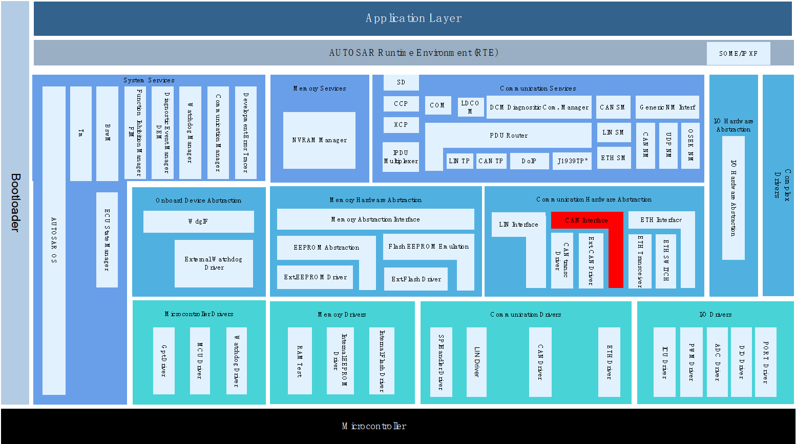

CanIf模块处于AUTOSAR架构中的通信硬件抽象层，其下层模块为CanDrv/CanTrcv驱动模块，上层模块可能为PduR，CanTp，CanNm，CanSM，EcuM，Xcp，J1939Tp，J1939Nm，CDD。

The CanIf module is in the communication hardware abstraction layer of the AUTOSAR architecture. Its lower module is the CanDrv/CanTrcv driver module, and the upper module may be PduR, CanTp, CanNm, CanSM, EcuM, Xcp, J1939Tp, J1939Nm, CDD.

CanIf实现了与上下层模块间基于PDU的发送/接收，实现了对硬件单元模式的控制以及模式切换通知，实现了对睡眠/唤醒机制的支持。

CanIf implements PDU-based sending/receiving with upper and lower-layer modules, implements control of hardware unit modes and mode switching notifications, and supports sleep/wake-up mechanisms.

参考资料 (References)
---------------------------------

[1] AUTOSAR_SWS_CANInterface.pdf, R19-11 and 4.2.2

[2] AUTOSAR_SWS_CANDriver.pdf, R19-11 and 4.2.2

[3] AUTOSAR_SWS_CANTransceiverDriver.pdf, R19-11 and 4.2.2

[4] AUTOSAR_SWS_PDURouter.pdf, R19-11 and 4.2.2

[5] AUTOSAR_SWS_COM.pdf, R19-11 and 4.2.2

[6] AUTOSAR_SRS_COM.pdf, R19-11 and 4.2.2

功能描述 (Function description)
===========================================

模式控制功能 (Mode control function)
----------------------------------------------

模式控制功能介绍 (Introduction to mode control function)
~~~~~~~~~~~~~~~~~~~~~~~~~~~~~~~~~~~~~~~~~~~~~~~~~~~~~~~~~~~~~~~~

1.CanIf模块的状态机控制，包括未初始化和已初始化状态，除了CanIf_Init 和CanIf_GetVersionInfo之外，都需要在已初始化状态下才能正常调用。

The state machine control of the CanIf module includes uninitialized and initialized states. Except for CanIf_Init and CanIf_GetVersionInfo, they need to be in the initialized state before they can be called normally.

2.Controller模式控制，分为STOPPED，STARTED，SLEEP三种，只有在START状态下Controller才能正常通信。

Controller mode control, divided into three types: STOPPED, STARTED, and SLEEP. The Controller can communicate normally only in the START state.

3.Trcv模式控制，分为NORMAL，STANDBY，SLEEP三种，只有在NORMAL状态下Trcv才能正常通信。

Trcv mode control, divided into three types: NORMAL, STANDBY, and SLEEP. Trcv can communicate normally only in the NORMAL state.

4.Controller的Pdu模式控制，分为OFFLINE，TX_OFFLINE，TX_OFFLINE_ACTIVE，ONLINE四种，ONLINE模式下允许正常收发通信，TX_OFFLINE模式下只能接收不能发送，TX_OFFLINE_ACTIVE模式下允许接收和虚拟发送，OFFLINE模式下不允许收发通信。

The Pdu mode control of the Controller is divided into four types: OFFLINE, TX_OFFLINE, TX_OFFLINE_ACTIVE, and ONLINE. Normal transceiver communication is allowed in ONLINE mode, only reception cannot be sent in TX_OFFLINE mode, reception and virtual transmission are allowed in TX_OFFLINE_ACTIVE mode, and transceiver communication is not allowed in OFFLINE mode.

模式控制功能实现 (Mode control function implementation)
~~~~~~~~~~~~~~~~~~~~~~~~~~~~~~~~~~~~~~~~~~~~~~~~~~~~~~~~~~~~~~~

1.上电之后CanIf处于CANIF_UNINIT状态，正确调用CanIf_Init（参数为CanIf模块PB配置参数指针）之后状态切换到CANIF_INITED。

After powering on, CanIf is in CANIF_UNINIT state. After calling CanIf_Init correctly (the parameter is the CanIf module PB configuration parameter pointer), the state switches to CANIF_INITED.

2.CanIf_Init初始化之后，Controller模式为STOPPED，调用接口CanIf_SetControllerMode切换Controller模式，调用CanIf_GetControllerMode获取当前Controller模式。当Controller发生BusOff事件时，Controller模式切换到STOPPED。

After CanIf_Init is initialized, the Controller mode is STOPPED, call the interface CanIf_SetControllerMode to switch the Controller mode, and call CanIf_GetControllerMode to obtain the current Controller mode.When the BusOff event occurs in the Controller, the Controller mode switches to STOPPED.

3.调用CanIf_SetTrcvMode切换Trcv模式，调用CanIf_GetTrcvMode获取Trcv当前模式。

Call CanIf_SetTrcvMode to switch Trcv mode, and call CanIf_GetTrcvMode to obtain the current Trcv mode.

4.CanIf_Init初始化之后，Pdu模式为OFFLINE，调用CanIf_SetPduMode切换Pdu模式，调用CanIf_GetPduMode获取当前Controller的Pdu模式。其中TX_OFFLINE_ACTIVE模式需要在配置项CanIfTxOfflineActiveSupport使能时才支持。当Controller发生BusOff事件时，Pdu模式切换到TX_OFFLINE。

After CanIf_Init is initialized, the Pdu mode is OFFLINE, call CanIf_SetPduMode to switch the Pdu mode, and call CanIf_GetPduMode to obtain the Pdu mode of the current Controller.The TX_OFFLINE_ACTIVE mode needs to be supported only when the configuration item CanIfTxOfflineActiveSupport is enabled.When the BusOff event occurs in the Controller, the Pdu mode switches to TX_OFFLINE.

TxPdu发送功能 (TxPdu send function)
-----------------------------------------------

TxPdu发送功能介绍 (Introduction to TxPdu sending function)
~~~~~~~~~~~~~~~~~~~~~~~~~~~~~~~~~~~~~~~~~~~~~~~~~~~~~~~~~~~~~~~~~~~~

当模块初始化成功，Controller模式及其Pdu模式，Trcv模式均处于允许发送状态时，可通过CanIf两种发送机制来发送L-Pdu：

When the module is initialized successfully, Controller mode, its Pdu mode, and Trcv mode are all in the allowed sending state, L-Pdu can be sent through two sending mechanisms of CanIf:

方式一：上层模块调用CanIf_Transmit请求TxPdu的发送，发送时机由上层决定；

Method 1: The upper layer module calls CanIf_Transmit to request the sending of TxPdu, and the sending timing is determined by the upper layer;

方式二：下层驱动调用CanIf_TriggerTransmit请求TxPdu的发送数据，发送时机由下层决定；

Method 2: The lower layer driver calls CanIf_TriggerTransmit to request TxPdu to send data, and the sending timing is determined by the lower layer;

TxPdu发送成功后，下层驱动调用CanIf_TxConfirmation进行发送确认。

After TxPdu is sent successfully, the lower driver calls CanIf_TxConfirmation to confirm the sending.

TxPdu发送功能实现 (TxPdu sending function implementation)
~~~~~~~~~~~~~~~~~~~~~~~~~~~~~~~~~~~~~~~~~~~~~~~~~~~~~~~~~~~~~~~~~~~

当上层模块调用CanIf_Transmit请求TxPdu发送，并传入L-PDU的SDU及可能存在的MetaData数据时，CanIf根据Static/Dynamic CanId策略计算出该TxPdu当前对应的CanId，调用Can_Write由配置的HTH进行发送。

When the upper module calls CanIf_Transmit to request TxPdu to be sent, and passes in the SDU of L-PDU and possible MetaData data, CanIf calculates the current corresponding CanId of the TxPdu based on the Static/Dynamic CanId policy, and calls Can_Write to send it through the configured HTH.

CAN总线通常不支持TriggerTransmit进行发送，该机制通常用于LIN总线。

CAN buses generally do not support TriggerTransmit for sending, this mechanism is usually used for LIN buses.

当驱动层TxPdu发送成功后，调用CanIf_TxConfirmation，CanIf调用<User\_TxConfirmation>通知上层模块。

When the driver layer TxPdu is sent successfully, CanIf_TxConfirmation is called, and CanIf calls <User\_TxConfirmation> to notify the upper module.

对于TxPdu发送，可以配置TxBuffer机制（CanIfBufferSize>0）来降低因发送邮箱BUSY而导致丢帧的概率。需注意的是配置项CanIfBufferSize决定该HTH最多缓存的不同TxPdu帧数，对于每个TxPdu最多只能缓存一帧。

For TxPdu sending, you can configure the TxBuffer mechanism (CanIfBufferSize>0) to reduce the probability of frame loss caused by sending mailbox BUSY.It should be noted that the configuration item CanIfBufferSize determines the maximum number of different TxPdu frames that the HTH can cache. Each TxPdu can only cache one frame at most.

RxPdu接收功能 (RxPdu receive function)
--------------------------------------------------

RxPdu接收功能介绍 (Introduction to RxPdu receiving function)
~~~~~~~~~~~~~~~~~~~~~~~~~~~~~~~~~~~~~~~~~~~~~~~~~~~~~~~~~~~~~~~~~~~~~~

当模块初始化成功，Controller模式及其Pdu模式，Trcv模式均处于允许接收状态时，将从驱动层接收到的报文，传递到上层模块。

When the module is initialized successfully and the Controller mode, its Pdu mode, and the Trcv mode are all in the reception-allowed state, the message received from the driver layer will be passed to the upper module.

RxPdu接收功能实现 (RxPdu receiving function implementation)
~~~~~~~~~~~~~~~~~~~~~~~~~~~~~~~~~~~~~~~~~~~~~~~~~~~~~~~~~~~~~~~~~~~~~

当驱动层邮箱收到报文后，调用CanIf_RxIndication将接收数据传递到CanIf模块，CanIf通过接收的HRH以及CanId，查询匹配到接收RxPdu，调用关联上层模块的<User\_RxIndication>将接收RxPdu数据传递给上层模块。

When the driver layer mailbox receives the message, it calls CanIf_RxIndication to pass the received data to the CanIf module. CanIf uses the received HRH and CanId to query and match the received RxPdu, and calls <User\_RxIndication> of the associated upper-layer module to pass the received RxPdu data to the upper-layer module.

RxPdu上层模块由配置项CanIfRxPduUserRxIndicationUL决定，<User\_RxIndication>由配置项CanIfRxPduUserRxIndicationName决定。

The RxPdu upper module is determined by the configuration item CanIfRxPduUserRxIndicationUL, and <User\_RxIndication> is determined by the configuration item CanIfRxPduUserRxIndicationName.

睡眠唤醒功能 (sleep wake function)
--------------------------------------------

睡眠唤醒功能介绍 (Introduction to sleep wake function)
~~~~~~~~~~~~~~~~~~~~~~~~~~~~~~~~~~~~~~~~~~~~~~~~~~~~~~~~~~~~~~

上层模块可以通过CanIf来将Controller/Trcv设置为SLEEP模式，支持Controller/Trcv唤醒源检测，Controller/Trcv唤醒确认，Trcv唤醒原因获取，Trcv唤醒标志位检测/清除，Trcv唤醒模式设置。

The upper module can set Controller/Trcv to SLEEP mode through CanIf, and supports Controller/Trcv wake-up source detection, Controller/Trcv wake-up confirmation, Trcv wake-up cause acquisition, Trcv wake-up flag bit detection/clearing, and Trcv wake-up mode setting.

睡眠唤醒功能实现 (Sleep wake-up function implementation)
~~~~~~~~~~~~~~~~~~~~~~~~~~~~~~~~~~~~~~~~~~~~~~~~~~~~~~~~~~~~~~~~

CanIf提供CanIf_SetControllerMode/CanIf_SetTrcvMode来设置Controller/Trcv的模式（包含SLEEP模式），当发生唤醒事件后可通过调用CanIf_CheckWakeup来检测是否由Controller/Trcv导致的唤醒事件，可通过CanIf_CheckValidation来检测唤醒成功确认（唤醒确认条件为接收到任意Pdu/NM Pdu，参见配置项CanIfPublicWakeupCheckValidByNM是否勾选）。

CanIf provides CanIf_SetControllerMode/CanIf_SetTrcvMode to set the mode of Controller/Trcv (including SLEEP mode). When a wake-up event occurs, CanIf_CheckWakeup can be called to detect whether the wake-up event is caused by Controller/Trcv. CanIf_CheckValidation can be used to detect wake-up success confirmation (the wake-up confirmation condition is the receipt of any Pdu/NMPdu, see whether the configuration item CanIfPublicWakeupCheckValidByNM is checked).

源文件描述 (Source file description)
===============================================

.. centered:: **表 CanIf组件文件描述 (Table CanIf component file description)**

.. list-table::
   :widths: 50 50
   :header-rows: 1

   * - 文件 (document)
     - 说明 (illustrate)
   * - CanIf_Cfg.h
     - 定义CanIf模块PC配置的宏定义。 (Define the macro definition of the PC configuration of the CanIf module.)
   * - CanIf_Cfg.c
     - 定义CanIf模块PC配置的结构体参数。 (Define the structure parameters of the PC configuration of the CanIf module.)
   * - CanIf_PBcfg.h
     - 定义CanIf模块PB配置的宏定义。 (Define the macro definition of the CanIf module PB configuration.)
   * - CanIf_PBcfg.c
     - 定义CanIf模块PB配置的结构体参数。 (Define the structure parameters of the CanIf module PB configuration.)
   * - CanIf_Internal.h
     - 声明CanIf模块内部功能所必须的local函数，local宏定义，local变量。 (Declare the local functions, local macro definitions, and local variables necessary for the internal functions of the CanIf module.)
   * - CanIf_Internal.c
     - 实现CanIf模块内部功能所必须的local函数，local宏定义，local变量。 (Local functions, local macro definitions, and local variables necessary to implement the internal functions of the CanIf module.)
   * - CanIf.h
     - 声明CanIf模块的全部外部接口（除了回调函数），以及配置文件中的全局变量。 (Declare all external interfaces of the CanIf module (except callback functions), and global variables in the configuration file.)
   * - CanIf.c
     - 作为CanIf模块的核心文件，实现CanIf模块全部对外接口，以及实现CanIf模块功能所必须的local函数，local宏定义，local变量定义。 (As the core file of the CanIf module, it implements all external interfaces of the CanIf module, as well as local functions, local macro definitions, and local variable definitions necessary to implement the functions of the CanIf module.)
   * - CanIf_Types.h
     - 定义CanIf模块外部/内部类型，包括AUTOSAR标准定义的类型，以及PB/PC配置参数结构体类型，以及内部运行时结构体类型。 (Define the external/internal types of the CanIf module, including types defined by the AUTOSAR standard, as well as PB/PC configuration parameter structure types, and internal runtime structure types.)
   * - CanIf_CanTrcv.h
     - 声明CanIf 模块提供给 CanTrcv 模块的回调函数。 (Declare the callback function provided by the CanIf module to the CanTrcv module.)
   * - CanIf_Can.h
     - 声明 CanIf 模块提供给 Can 模块的回调函数。 (Declare the callback function provided by the CanIf module to the Can module.)
   * - CanIf_Cbk.h
     - 包含CanIf模块全部回调函数的声明。 (Contains the declarations of all callback functions of the CanIf module.)
   * - CanIf_MemMap.h
     - 声明CanIf模块内存布局。 (Declare the CanIf module memory layout.)
         
         
         
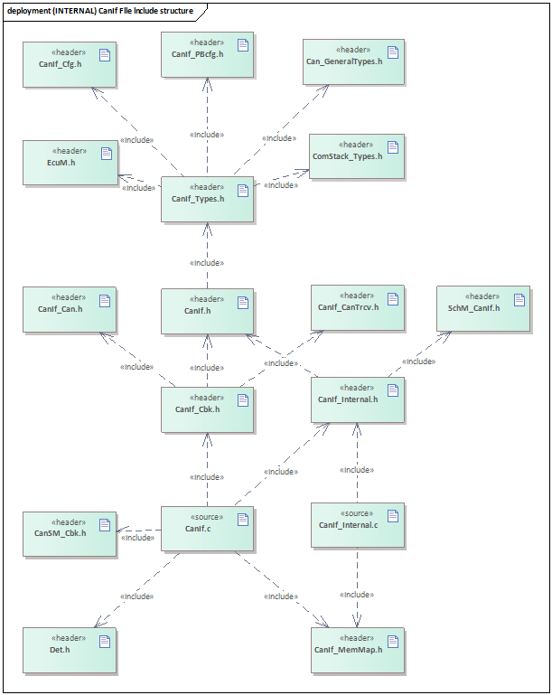

API接口 (API interface)
=====================================

类型定义 (type definition)
--------------------------------------

CanIf_ConfigType类型定义 (CanIf_ConfigType type definition)
~~~~~~~~~~~~~~~~~~~~~~~~~~~~~~~~~~~~~~~~~~~~~~~~~~~~~~~~~~~~~~~~~~~~~~~

.. list-table::
   :widths: 50 50
   :header-rows: 1

   * - 名称 (name)
     - CanIf_ConfigType
   * - 类型 (type)
     - struct
   * - 范围 (scope)
     - 无 (none)
   * - 描述 (describe)
     - CanIf模块PB配置结构体类型 (CanIf module PB configuration structure type)
         
         
         
CanIf_ControllerModeType类型定义 (CanIf_ControllerModeType type definition)
~~~~~~~~~~~~~~~~~~~~~~~~~~~~~~~~~~~~~~~~~~~~~~~~~~~~~~~~~~~~~~~~~~~~~~~~~~~~~~~~~~~~~~~

.. list-table::
   :widths: 50 50
   :header-rows: 1

   * - 名称 (name)
     - CanIf_ControllerModeType
   * - 类型 (type)
     - enum
   * - 范围 (scope)
     - CANIF_CS_UNINIT，CANIF_CS_STARTED，CANIF_CS_STOPPED，CANIF_CS_SLEEP
   * - 描述 (describe)
     - CanIf模块中Can控制器模式类型 (Can controller mode type in CanIf module)
         
         
         
CanIf_PduModeType类型定义 (CanIf_PduModeType type definition)
~~~~~~~~~~~~~~~~~~~~~~~~~~~~~~~~~~~~~~~~~~~~~~~~~~~~~~~~~~~~~~~~~~~~~~~~~

.. list-table::
   :widths: 50 50
   :header-rows: 1

   * - 名称 (name)
     - CanIf_PduModeType
   * - 类型 (type)
     - enum
   * - 范围 (scope)
     - CANIF_OFFLINE，CANIF_TX_OFFLINE，CANIF_TX_OFFLINE_ACTIVE，CANIF_ONLINE
   * - 描述 (describe)
     - CanIf模块中Pdu通信模式类型 (Pdu communication mode type in CanIf module)
         
         
         
CanIf_NotifStatusType类型定义 (CanIf_NotifStatusType type definition)
~~~~~~~~~~~~~~~~~~~~~~~~~~~~~~~~~~~~~~~~~~~~~~~~~~~~~~~~~~~~~~~~~~~~~~~~~~~~~~~~~

.. list-table::
   :widths: 50 50
   :header-rows: 1

   * - 名称 (name)
     - CanIf_NotifStatusType
   * - 类型 (type)
     - enum
   * - 范围 (scope)
     - CANIF_NO_NOTIFICATION ，CANIF_TX_RX_NOTIFICATION
   * - 描述 (describe)
     - CanIf模块中Controller的PDU收发通知类型 (PDU sending and receiving notification type of Controller in CanIf module)
         
         
         
输入函数描述 (Enter function description)
---------------------------------------------------

.. list-table::
   :widths: 50 50
   :header-rows: 1

   * - 输入模块 (Input module)
     - API
   * - CanDrv
     - Can_SetControllerMode
   * - \
     - Can_Write
   * - \
     - Can_CheckWakeup
   * - \
     - Can_SetBaudrate
   * - \
     - Can_SetIcomConfiguration
   * - SchM
     - SchM_Enter_CanIf\_<ExclusiveArea>
   * - \
     - SchM_Exit_CanIf\_<ExclusiveArea>
   * - Det
     - Det_ReportRuntimeError
   * - \
     - Det_ReportError
   * - CanTrcv
     - CanTrcv_SetOpMode
   * - \
     - CanTrcv_GetOpMode
   * - \
     - CanTrcv_GetBusWuReason
   * - \
     - CanTrcv_SetWakeupMode
   * - \
     - CanTrcv_ClearTrcvWufFlag
   * - \
     - CanTrcv_CheckWakeFlag
   * - \
     - CanTrcv_CheckWakeup
   * - <Up_User>
     - User_TriggerTransmit
   * - \
     - User_TxConfirmation
   * - \
     - User_RxIndication
   * - \
     - User_ValidateWakeupEvent
   * - \
     - User_ControllerBusOff
   * - \
     - User_ConfirmPnAvailability
   * - \
     - User_ClearTrcvWufFlagIndication
   * - \
     - User_CheckTrcvWakeFlagIndication
   * - \
     - User_ControllerModeIndication
   * - \
     - User_TrcvModeIndication
         
         
         
静态接口函数定义 (Static interface function definition)
---------------------------------------------------------------

CanIf_Init函数定义 (CanIf_Init function definition)
~~~~~~~~~~~~~~~~~~~~~~~~~~~~~~~~~~~~~~~~~~~~~~~~~~~~~~~~~~~~~~~

.. list-table::
   :widths: 25 25 25 25
   :header-rows: 1

   * - 函数名称： (Function name:)
     - CanIf_Init
     - \
     - \
   * - 函数原型： (Function prototype:)
     - voidCanIf_Init(constCanIf_ConfigType\*ConfigPtr)
     - \
     - \
   * - 服务编号： (Service number:)
     - 0x01
     - \
     - \
   * - 同步/异步： (Sync/Asynchronous:)
     - 同步 (synchronous)
     - \
     - \
   * - 是否可重入： (Is it reentrant:)
     - 否 (no)
     - \
     - \
   * - 输入参数： (Input parameters:)
     - ConfigPtr
     - 值域： (range:)
     - 无 (none)
   * - 输入输出参数： (Input and output parameters:)
     - 无 (none)
     - \
     - \
   * - 输出参数： (Output parameters:)
     - 无 (none)
     - \
     - \
   * - 返回值： (Return value:)
     - 无 (none)
     - \
     - \
   * - 功能概述： (Function overview:)
     - CanIf模块初始化 (CanIf module initialization)
     - \
     - \
         
         
         
CanIf_DeInit函数定义 (CanIf_DeInit function definition)
~~~~~~~~~~~~~~~~~~~~~~~~~~~~~~~~~~~~~~~~~~~~~~~~~~~~~~~~~~~~~~~~~~~

.. list-table::
   :widths: 50 50
   :header-rows: 1

   * - 函数名称： (Function name:)
     - CanIf_DeInit
   * - 函数原型： (Function prototype:)
     - void CanIf_DeInit(void)
   * - 服务编号： (Service number:)
     - 0x02
   * - 同步/异步： (Sync/Asynchronous:)
     - 同步 (synchronous)
   * - 是否可重入： (Is it reentrant:)
     - 否 (no)
   * - 输入参数： (Input parameters:)
     - 无 (none)
   * - 输入输出参数： (Input and output parameters:)
     - 无 (none)
   * - 输出参数： (Output parameters:)
     - 无 (none)
   * - 返回值： (Return value:)
     - 无 (none)
   * - 功能概述： (Function overview:)
     - CanIf模块反初始化 (CanIf module deinitialization)
         
         
         
CanIf_SetControllerMode函数定义 (CanIf_SetControllerMode function definition)
~~~~~~~~~~~~~~~~~~~~~~~~~~~~~~~~~~~~~~~~~~~~~~~~~~~~~~~~~~~~~~~~~~~~~~~~~~~~~~~~~~~~~~~~~

.. list-table::
   :widths: 25 25 25 25
   :header-rows: 1

   * - 函数名称： (Function name:)
     - CanIf\_SetControllerMode
     - \
     - \
   * - 函数原型： (Function prototype:)
     - Std_ReturnTypeCanIf_SetControllerMode(
     - \
     - \
   * - \
     - uint8ControllerId,
     - \
     - \
   * - \
     - Can_ControllerStateTypeControllerMode)
     - \
     - \
   * - 服务编号： (Service number:)
     - 0x03
     - \
     - \
   * - 同步/异步： (Sync/Asynchronous:)
     - 异步 (asynchronous)
     - \
     - \
   * - 是否可重入： (Is it reentrant:)
     - 不同的Controller可重入，相同的Controller不可重入 (Different Controllers can re-enter, but the same Controller cannot re-enter.)
     - \
     - \
   * - 输入参数： (Input parameters:)
     - ControllerId
     - 值域： (range:)
     - 无 (none)
   * - \
     - ControllerMode
     - 值域： (range:)
     - 无 (none)
   * - 输入输出参数： (Input and output parameters:)
     - 无 (none)
     - \
     - \
   * - 输出参数： (Output parameters:)
     - 无 (none)
     - \
     - \
   * - 返回值： (Return value:)
     - Std_ReturnType
     - \
     - \
   * - 功能概述： (Function overview:)
     - Controller模式切换请求 (Controller mode switching request)
     - \
     - \
         
         
         
CanIf_GetControllerMode函数定义 (CanIf_GetControllerMode function definition)
~~~~~~~~~~~~~~~~~~~~~~~~~~~~~~~~~~~~~~~~~~~~~~~~~~~~~~~~~~~~~~~~~~~~~~~~~~~~~~~~~~~~~~~~~

.. list-table::
   :widths: 25 25 25 25
   :header-rows: 1

   * - 函数名称： (Function name:)
     - CanIf\_GetControllerMode
     - \
     - \
   * - 函数原型： (Function prototype:)
     - Std_ReturnTypeCanIf_GetControllerMode(
     - \
     - \
   * - \
     - uint8ControllerId,
     - \
     - \
   * - \
     - Can_ControllerStateType\*ControllerModePtr)
     - \
     - \
   * - 服务编号： (Service number:)
     - 0x04
     - \
     - \
   * - 同步/异步： (Sync/Asynchronous:)
     - 同步 (synchronous)
     - \
     - \
   * - 是否可重入： (Is it reentrant:)
     - 否 (no)
     - \
     - \
   * - 输入参数： (Input parameters:)
     - ControllerId
     - 值域： (range:)
     - 无 (none)
   * - 输入输出参数： (Input and output parameters:)
     - 无 (none)
     - \
     - \
   * - 输出参数： (Output parameters:)
     - ControllerModePtr
     - 值域： (range:)
     - 无 (none)
   * - 返回值： (Return value:)
     - Std_ReturnType
     - \
     - \
   * - 功能概述： (Function overview:)
     - 获取Controller当前模式 (Get the current mode of the Controller)
     - \
     - \
         
         
         
CanIf_Transmit函数定义 (CanIf_Transmit function definition)
~~~~~~~~~~~~~~~~~~~~~~~~~~~~~~~~~~~~~~~~~~~~~~~~~~~~~~~~~~~~~~~~~~~~~~~
.. list-table::
   :widths: 25 25 25 25
   :header-rows: 1

   * - 函数名称： (Function name:)
     - CanIf_Transmit
     - \
     - \
   * - 函数原型： (Function prototype:)
     - Std_ReturnTypeCanIf_Transmit(
     - \
     - \
   * - \
     - PduIdTypeCanIfTxSduId,
     - \
     - \
   * - \
     - constPduInfoType\*PduInfoPtr)
     - \
     - \
   * - 服务编号： (Service number:)
     - 0x05
     - \
     - \
   * - 同步/异步： (Sync/Asynchronous:)
     - 同步 (synchronous)
     - \
     - \
   * - 是否可重入： (Is it reentrant:)
     - 不同的TxPdu可重入，相同的TxPdu不可重入 (Different TxPdu can be reentrant, but the same TxPdu cannot be reentrant.)
     - \
     - \
   * - 输入参数： (Input parameters:)
     - CanIfTxSduId
     - 值域： (range:)
     - 无 (none)
   * - \
     - PduInfoPtr
     - 值域： (range:)
     - 无 (none)
   * - 输入输出参数： (Input and output parameters:)
     - 无 (none)
     - \
     - \
   * - 输出参数： (Output parameters:)
     - 无 (none)
     - \
     - \
   * - 返回值： (Return value:)
     - Std_ReturnType
     - \
     - \
   * - 功能概述： (Function overview:)
     - TxPdu发送请求 (TxPdu send request)
     - \
     - \
         
         
         
CanIf_ReadRxPduData函数定义 (CanIf_ReadRxPduData function definition)
~~~~~~~~~~~~~~~~~~~~~~~~~~~~~~~~~~~~~~~~~~~~~~~~~~~~~~~~~~~~~~~~~~~~~~~~~~~~~~~~~

.. list-table::
   :widths: 25 25 25 25
   :header-rows: 1

   * - 函数名称： (Function name:)
     - CanIf_ReadRxPduData
     - \
     - \
   * - 函数原型： (Function prototype:)
     - Std_ReturnTypeCanIf_ReadRxPduData(
     - \
     - \
   * - \
     - PduIdTypeCanIfRxSduId,
     - \
     - \
   * - \
     - PduInfoType\*CanIfRxInfoPtr)
     - \
     - \
   * - 服务编号： (Service number:)
     - 0x06
     - \
     - \
   * - 同步/异步： (Sync/Asynchronous:)
     - 同步 (synchronous)
     - \
     - \
   * - 是否可重入： (Is it reentrant:)
     - 否 (no)
     - \
     - \
   * - 输入参数： (Input parameters:)
     - CanIfRxSduId
     - 值域： (range:)
     - 无 (none)
   * - 输入输出参数： (Input and output parameters:)
     - 无 (none)
     - \
     - \
   * - 输出参数： (Output parameters:)
     - CanIfRxInfoPtr
     - 值域： (range:)
     - 无 (none)
   * - 返回值： (Return value:)
     - Std_ReturnType
     - \
     - \
   * - 功能概述： (Function overview:)
     - 获取RxPdu最新接收数据 (Get the latest receiving data of RxPdu)
     - \
     - \
         
         
         
CanIf_ReadTxNotifStatus函数定义 (CanIf_ReadTxNotifStatus function definition)
~~~~~~~~~~~~~~~~~~~~~~~~~~~~~~~~~~~~~~~~~~~~~~~~~~~~~~~~~~~~~~~~~~~~~~~~~~~~~~~~~~~~~~~~~

.. list-table::
   :widths: 25 25 25 25
   :header-rows: 1

   * - 函数名称： (Function name:)
     - CanIf\_ReadTxNotifStatus
     - \
     - \
   * - 函数原型： (Function prototype:)
     - CanIf_NotifStatusTypeCanIf_ReadTxNotifStatus(
     - \
     - \
   * - \
     - PduIdTypeCanIfTxSduId)
     - \
     - \
   * - 服务编号： (Service number:)
     - 0x07
     - \
     - \
   * - 同步/异步： (Sync/Asynchronous:)
     - 同步 (synchronous)
     - \
     - \
   * - 是否可重入： (Is it reentrant:)
     - 否 (no)
     - \
     - \
   * - 输入参数： (Input parameters:)
     - CanIfTxSduId
     - 值域： (range:)
     - 无 (none)
   * - 输入输出参数： (Input and output parameters:)
     - 无 (none)
     - \
     - \
   * - 输出参数： (Output parameters:)
     - 无 (none)
     - \
     - \
   * - 返回值： (Return value:)
     - CanIf_NotifStatusType
     - \
     - \
   * - 功能概述： (Function overview:)
     - 获取TxPdu的发送确认状态 (Get the sending confirmation status of TxPdu)
     - \
     - \
         
         
         
CanIf_ReadRxNotifStatus函数定义 (CanIf_ReadRxNotifStatus function definition)
~~~~~~~~~~~~~~~~~~~~~~~~~~~~~~~~~~~~~~~~~~~~~~~~~~~~~~~~~~~~~~~~~~~~~~~~~~~~~~~~~~~~~~~~~

.. list-table::
   :widths: 25 25 25 25
   :header-rows: 1

   * - 函数名称： (Function name:)
     - CanIf\_ReadRxNotifStatus
     - \
     - \
   * - 函数原型： (Function prototype:)
     - CanIf_NotifStatusTypeCanIf_ReadRxNotifStatus(
     - \
     - \
   * - \
     - PduIdTypeCanIfRxSduId)
     - \
     - \
   * - 服务编号： (Service number:)
     - 0x08
     - \
     - \
   * - 同步/异步： (Sync/Asynchronous:)
     - 同步 (synchronous)
     - \
     - \
   * - 是否可重入： (Is it reentrant:)
     - 否 (no)
     - \
     - \
   * - 输入参数： (Input parameters:)
     - CanIfRxSduId
     - 值域： (range:)
     - 无 (none)
   * - 输入输出参数： (Input and output parameters:)
     - 无 (none)
     - \
     - \
   * - 输出参数： (Output parameters:)
     - 无 (none)
     - \
     - \
   * - 返回值： (Return value:)
     - CanIf_NotifStatusType
     - \
     - \
   * - 功能概述： (Function overview:)
     - 获取RxPdu的接收指示状态 (Get the receive indication status of RxPdu)
     - \
     - \
         
         
         
CanIf_SetPduMode函数定义 (CanIf_SetPduMode function definition)
~~~~~~~~~~~~~~~~~~~~~~~~~~~~~~~~~~~~~~~~~~~~~~~~~~~~~~~~~~~~~~~~~~~~~~~~~~~

.. list-table::
   :widths: 25 25 25 25
   :header-rows: 1

   * - 函数名称： (Function name:)
     - CanIf_SetPduMode
     - \
     - \
   * - 函数原型： (Function prototype:)
     - Std_ReturnTypeCanIf_SetPduMode(
     - \
     - \
   * - \
     - uint8ControllerId,
     - \
     - \
   * - \
     - CanIf_PduModeTypePduModeRequest)
     - \
     - \
   * - 服务编号： (Service number:)
     - 0x09
     - \
     - \
   * - 同步/异步： (Sync/Asynchronous:)
     - 同步 (synchronous)
     - \
     - \
   * - 是否可重入： (Is it reentrant:)
     - 否 (no)
     - \
     - \
   * - 输入参数： (Input parameters:)
     - ControllerId
     - 值域： (range:)
     - 无 (none)
   * - \
     - PduModeRequest
     - 值域： (range:)
     - 无 (none)
   * - 输入输出参数： (Input and output parameters:)
     - 无 (none)
     - \
     - \
   * - 输出参数： (Output parameters:)
     - 无 (none)
     - \
     - \
   * - 返回值： (Return value:)
     - Std_ReturnType
     - \
     - \
   * - 功能概述： (Function overview:)
     - Controller的PduMode切换请求 (Controller's PduMode switching request)
     - \
     - \
         
         
         
CanIf_GetPduMode函数定义 (CanIf_GetPduMode function definition)
~~~~~~~~~~~~~~~~~~~~~~~~~~~~~~~~~~~~~~~~~~~~~~~~~~~~~~~~~~~~~~~~~~~~~~~~~~~

.. list-table::
   :widths: 25 25 25 25
   :header-rows: 1

   * - 函数名称： (Function name:)
     - CanIf_GetPduMode
     - \
     - \
   * - 函数原型： (Function prototype:)
     - Std_ReturnTypeCanIf_GetPduMode(
     - \
     - \
   * - \
     - uint8ControllerId,
     - \
     - \
   * - \
     - CanIf_PduModeType\*PduModePtr)
     - \
     - \
   * - 服务编号： (Service number:)
     - 0x0A
     - \
     - \
   * - 同步/异步： (Sync/Asynchronous:)
     - 同步 (synchronous)
     - \
     - \
   * - 是否可重入： (Is it reentrant:)
     - 不同Controller可重入，相同Controller不可重入 (Different Controllers can re-enter, but the same Controller cannot re-enter.)
     - \
     - \
   * - 输入参数： (Input parameters:)
     - ControllerId
     - 值域： (range:)
     - 无 (none)
   * - 输入输出参数： (Input and output parameters:)
     - 无 (none)
     - \
     - \
   * - 输出参数： (Output parameters:)
     - PduModePtr
     - 值域： (range:)
     - 无 (none)
   * - 返回值： (Return value:)
     - Std_ReturnType
     - \
     - \
   * - 功能概述： (Function overview:)
     - 获取Controller的PduMode状态 (Get the PduMode status of the Controller)
     - \
     - \
         
         
         
CanIf_GetVersionInfo函数定义 (CanIf_GetVersionInfo function definition)
~~~~~~~~~~~~~~~~~~~~~~~~~~~~~~~~~~~~~~~~~~~~~~~~~~~~~~~~~~~~~~~~~~~~~~~~~~~~~~~~~~~

.. list-table::
   :widths: 25 25 25 25
   :header-rows: 1

   * - 函数名称： (Function name:)
     - CanIf_GetVersionInfo
     - \
     - \
   * - 函数原型： (Function prototype:)
     - voidCanIf_GetVersionInfo(
     - \
     - \
   * - \
     - Std\_VersionInfoType\*VersionInfo)
     - \
     - \
   * - 服务编号： (Service number:)
     - 0x0B
     - \
     - \
   * - 同步/异步： (Sync/Asynchronous:)
     - 同步 (synchronous)
     - \
     - \
   * - 是否可重入： (Is it reentrant:)
     - 是 (yes)
     - \
     - \
   * - 输入参数： (Input parameters:)
     - 无 (none)
     - \
     - \
   * - 输入输出参数： (Input and output parameters:)
     - 无 (none)
     - \
     - \
   * - 输出参数： (Output parameters:)
     - VersionInfo
     - 值域： (range:)
     - 无 (none)
   * - 返回值： (Return value:)
     - 无 (none)
     - \
     - \
   * - 功能概述： (Function overview:)
     - 获取CanIf模块软件版本 (Get CanIf module software version)
     - \
     - \
         
         
         
CanIf_SetDynamicTxId函数定义 (CanIf_SetDynamicTxId function definition)
~~~~~~~~~~~~~~~~~~~~~~~~~~~~~~~~~~~~~~~~~~~~~~~~~~~~~~~~~~~~~~~~~~~~~~~~~~~~~~~~~~~

.. list-table::
   :widths: 25 25 25 25
   :header-rows: 1

   * - 函数名称： (Function name:)
     - CanIf_SetDynamicTxId
     - \
     - \
   * - 函数原型： (Function prototype:)
     - voidCanIf_SetDynamicTxId(
     - \
     - \
   * - \
     - PduIdTypeCanIfTxSduId,
     - \
     - \
   * - \
     - Can_IdType CanId)
     - \
     - \
   * - 服务编号： (Service number:)
     - 0x0C
     - \
     - \
   * - 同步/异步： (Sync/Asynchronous:)
     - 同步 (synchronous)
     - \
     - \
   * - 是否可重入： (Is it reentrant:)
     - 否 (no)
     - \
     - \
   * - 输入参数： (Input parameters:)
     - CanIfTxSduId
     - 值域： (range:)
     - 无 (none)
   * - \
     - CanId
     - 值域： (range:)
     - 无 (none)
   * - 输入输出参数： (Input and output parameters:)
     - 无 (none)
     - \
     - \
   * - 输出参数： (Output parameters:)
     - 无 (none)
     - \
     - \
   * - 返回值： (Return value:)
     - 无 (none)
     - \
     - \
   * - 功能概述： (Function overview:)
     - 设置动态TxPdu的CanId (Set CanId of dynamic TxPdu)
     - \
     - \
         
         
         
CanIf_SetTrcvMode函数定义 (CanIf_SetTrcvMode function definition)
~~~~~~~~~~~~~~~~~~~~~~~~~~~~~~~~~~~~~~~~~~~~~~~~~~~~~~~~~~~~~~~~~~~~~~~~~~~~~

.. list-table::
   :widths: 25 25 25 25
   :header-rows: 1

   * - 函数名称： (Function name:)
     - CanIf_SetTrcvMode
     - \
     - \
   * - 函数原型： (Function prototype:)
     - Std_ReturnTypeCanIf_SetTrcvMode(
     - \
     - \
   * - \
     - uint8TransceiverId,
     - \
     - \
   * - \
     - CanTrcv_TrcvModeTypeTransceiverMode)
     - \
     - \
   * - 服务编号： (Service number:)
     - 0x0D
     - \
     - \
   * - 同步/异步： (Sync/Asynchronous:)
     - 异步 (asynchronous)
     - \
     - \
   * - 是否可重入： (Is it reentrant:)
     - 否 (no)
     - \
     - \
   * - 输入参数： (Input parameters:)
     - TransceiverId
     - 值域： (range:)
     - 无 (none)
   * - \
     - TransceiverMode
     - 值域： (range:)
     - 无 (none)
   * - 输入输出参数： (Input and output parameters:)
     - 无 (none)
     - \
     - \
   * - 输出参数： (Output parameters:)
     - 无 (none)
     - \
     - \
   * - 返回值： (Return value:)
     - Std_ReturnType
     - \
     - \
   * - 功能概述： (Function overview:)
     - 请求设置Trcv模式 (Request to set Trcv mode)
     - \
     - \
         
         
         
CanIf_GetTrcvMode函数定义 (CanIf_GetTrcvMode function definition)
~~~~~~~~~~~~~~~~~~~~~~~~~~~~~~~~~~~~~~~~~~~~~~~~~~~~~~~~~~~~~~~~~~~~~~~~~~~~~

.. list-table::
   :widths: 25 25 25 25
   :header-rows: 1

   * - 函数名称： (Function name:)
     - CanIf_GetTrcvMode
     - \
     - \
   * - 函数原型： (Function prototype:)
     - Std_ReturnTypeCanIf_GetTrcvMode(
     - \
     - \
   * - \
     - CanTrcv_TrcvModeType\*TransceiverModePtr,
     - \
     - \
   * - \
     - uint8TransceiverId)
     - \
     - \
   * - 服务编号： (Service number:)
     - 0x0E
     - \
     - \
   * - 同步/异步： (Sync/Asynchronous:)
     - 同步 (synchronous)
     - \
     - \
   * - 是否可重入： (Is it reentrant:)
     - 否 (no)
     - \
     - \
   * - 输入参数： (Input parameters:)
     - TransceiverId
     - 值域： (range:)
     - 无 (none)
   * - 输入输出参数： (Input and output parameters:)
     - 无 (none)
     - \
     - \
   * - 输出参数： (Output parameters:)
     - TransceiverModePtr
     - 值域： (range:)
     - 无 (none)
   * - 返回值： (Return value:)
     - Std_ReturnType
     - \
     - \
   * - 功能概述： (Function overview:)
     - 获取Trcv模式 (Get Trcv mode)
     - \
     - \
         
         
         
CanIf_GetTrcvWakeupReason函数定义 (CanIf_GetTrcvWakeupReason function definition)
~~~~~~~~~~~~~~~~~~~~~~~~~~~~~~~~~~~~~~~~~~~~~~~~~~~~~~~~~~~~~~~~~~~~~~~~~~~~~~~~~~~~~~~~~~~~~

.. list-table::
   :widths: 25 25 25 25
   :header-rows: 1

   * - 函数名称： (Function name:)
     - CanIf_GetTrcvWakeupReason
     - \
     - \
   * - 函数原型： (Function prototype:)
     - Std_ReturnTypeCanIf_GetTrcvWakeupReason(
     - \
     - \
   * - \
     - uint8TransceiverId,
     - \
     - \
   * - \
     - CanTrcv_TrcvWakeupReasonType\*TrcvWuReasonPtr)
     - \
     - \
   * - 服务编号： (Service number:)
     - 0x0F
     - \
     - \
   * - 同步/异步： (Sync/Asynchronous:)
     - 同步 (synchronous)
     - \
     - \
   * - 是否可重入： (Is it reentrant:)
     - 否 (no)
     - \
     - \
   * - 输入参数： (Input parameters:)
     - TransceiverId
     - 值域： (range:)
     - 无 (none)
   * - 输入输出参数： (Input and output parameters:)
     - 无 (none)
     - \
     - \
   * - 输出参数： (Output parameters:)
     - TrcvWuReasonPtr
     - 值域： (range:)
     - 无 (none)
   * - 返回值： (Return value:)
     - Std_ReturnType
     - \
     - \
   * - 功能概述： (Function overview:)
     - 获取Trcv的唤醒原因 (Get the wakeup reason of Trcv)
     - \
     - \
         
         
         
CanIf_SetTrcvWakeupMode函数定义 (CanIf_SetTrcvWakeupMode function definition)
~~~~~~~~~~~~~~~~~~~~~~~~~~~~~~~~~~~~~~~~~~~~~~~~~~~~~~~~~~~~~~~~~~~~~~~~~~~~~~~~~~~~~~~~~

.. list-table::
   :widths: 25 25 25 25
   :header-rows: 1

   * - 函数名称： (Function name:)
     - CanIf\_SetTrcvWakeupMode
     - \
     - \
   * - 函数原型： (Function prototype:)
     - Std_ReturnTypeCanIf_SetTrcvWakeupMode(
     - \
     - \
   * - \
     - uint8TransceiverId,
     - \
     - \
   * - \
     - CanTrcv_TrcvWakeupModeTypeTrcvWakeupMode)
     - \
     - \
   * - 服务编号： (Service number:)
     - 0x10
     - \
     - \
   * - 同步/异步： (Sync/Asynchronous:)
     - 同步 (synchronous)
     - \
     - \
   * - 是否可重入： (Is it reentrant:)
     - 否 (no)
     - \
     - \
   * - 输入参数： (Input parameters:)
     - TransceiverId
     - 值域： (range:)
     - 无 (none)
   * - \
     - TrcvWakeupMode
     - 值域： (range:)
     - 无 (none)
   * - 输入输出参数： (Input and output parameters:)
     - 无 (none)
     - \
     - \
   * - 输出参数： (Output parameters:)
     - 无 (none)
     - \
     - \
   * - 返回值： (Return value:)
     - Std_ReturnType
     - \
     - \
   * - 功能概述： (Function overview:)
     - 设置Trcv唤醒模式 (Set Trcv wakeup mode)
     - \
     - \
         
         
         
CanIf_CheckWakeup函数定义 (CanIf_CheckWakeup function definition)
~~~~~~~~~~~~~~~~~~~~~~~~~~~~~~~~~~~~~~~~~~~~~~~~~~~~~~~~~~~~~~~~~~~~~~~~~~~~~

.. list-table::
   :widths: 25 25 25 25
   :header-rows: 1

   * - 函数名称： (Function name:)
     - CanIf_CheckWakeup
     - \
     - \
   * - 函数原型： (Function prototype:)
     - Std_ReturnTypeCanIf_CheckWakeup(
     - \
     - \
   * - \
     - EcuM_WakeupSourceTypeWakeupSource)
     - \
     - \
   * - 服务编号： (Service number:)
     - 0x11
     - \
     - \
   * - 同步/异步： (Sync/Asynchronous:)
     - 异步 (asynchronous)
     - \
     - \
   * - 是否可重入： (Is it reentrant:)
     - 是 (yes)
     - \
     - \
   * - 输入参数： (Input parameters:)
     - WakeupSource
     - 值域： (range:)
     - 无 (none)
   * - 输入输出参数： (Input and output parameters:)
     - 无 (none)
     - \
     - \
   * - 输出参数： (Output parameters:)
     - 无 (none)
     - \
     - \
   * - 返回值： (Return value:)
     - Std_ReturnType
     - \
     - \
   * - 功能概述： (Function overview:)
     - 唤醒源检测(底层Can驱动/CanTrcv驱动) (Wake-up source detection (underlying Can driver/CanTrcv driver))
     - \
     - \
         
         
         
CanIf_CheckValidation函数定义 (CanIf_CheckValidation function definition)
~~~~~~~~~~~~~~~~~~~~~~~~~~~~~~~~~~~~~~~~~~~~~~~~~~~~~~~~~~~~~~~~~~~~~~~~~~~~~~~~~~~~~

.. list-table::
   :widths: 25 25 25 25
   :header-rows: 1

   * - 函数名称： (Function name:)
     - CanIf_CheckValidation
     - \
     - \
   * - 函数原型： (Function prototype:)
     - Std_ReturnTypeCanIf_CheckValidation(
     - \
     - \
   * - \
     - EcuM_WakeupSourceTypeWakeupSource)
     - \
     - \
   * - 服务编号： (Service number:)
     - 0x12
     - \
     - \
   * - 同步/异步： (Sync/Asynchronous:)
     - 同步 (synchronous)
     - \
     - \
   * - 是否可重入： (Is it reentrant:)
     - 是 (yes)
     - \
     - \
   * - 输入参数： (Input parameters:)
     - WakeupSource
     - 值域： (range:)
     - 无 (none)
   * - 输入输出参数： (Input and output parameters:)
     - 无 (none)
     - \
     - \
   * - 输出参数： (Output parameters:)
     - 无 (none)
     - \
     - \
   * - 返回值： (Return value:)
     - Std_ReturnType
     - \
     - \
   * - 功能概述： (Function overview:)
     - 唤醒事件确认 (Wake event confirmation)
     - \
     - \
         
         
         
CanIf_GetTxConfirmationState函数定义 (CanIf_GetTxConfirmationState function definition)
~~~~~~~~~~~~~~~~~~~~~~~~~~~~~~~~~~~~~~~~~~~~~~~~~~~~~~~~~~~~~~~~~~~~~~~~~~~~~~~~~~~~~~~~~~~~~~~~~~~

.. list-table::
   :widths: 25 25 25 25
   :header-rows: 1

   * - 函数名称： (Function name:)
     - CanIf_GetTxConfirmationState
     - \
     - \
   * - 函数原型： (Function prototype:)
     - CanIf_NotifStatusTypeCanIf_GetTxConfirmationState(
     - \
     - \
   * - \
     - uint8ControllerId)
     - \
     - \
   * - 服务编号： (Service number:)
     - 0x19
     - \
     - \
   * - 同步/异步： (Sync/Asynchronous:)
     - 同步 (synchronous)
     - \
     - \
   * - 是否可重入： (Is it reentrant:)
     - 不同Controller可重入，不同Controller不可重入 (Different Controllers can re-enter, but different Controllers cannot re-enter.)
     - \
     - \
   * - 输入参数： (Input parameters:)
     - ControllerId
     - 值域： (range:)
     - 无 (none)
   * - 输入输出参数： (Input and output parameters:)
     - 无 (none)
     - \
     - \
   * - 输出参数： (Output parameters:)
     - 无 (none)
     - \
     - \
   * - 返回值： (Return value:)
     - CanIf_NotifStatusType
     - \
     - \
   * - 功能概述： (Function overview:)
     - 获取Controller是否已发送报文成功（TxConfirmation已发生）
     - \
     - \
         
         
         
CanIf_ClearTrcvWufFlag函数定义 (CanIf_ClearTrcvWufFlag function definition)
~~~~~~~~~~~~~~~~~~~~~~~~~~~~~~~~~~~~~~~~~~~~~~~~~~~~~~~~~~~~~~~~~~~~~~~~~~~~~~~~~~~~~~~

.. list-table::
   :widths: 25 25 25 25
   :header-rows: 1

   * - 函数名称： (Function name:)
     - CanIf_ClearTrcvWufFlag
     - \
     - \
   * - 函数原型： (Function prototype:)
     - Std_ReturnTypeCanIf\_ClearTrcvWufFlag(
     - \
     - \
   * - \
     - uint8TransceiverId)
     - \
     - \
   * - 服务编号： (Service number:)
     - 0x1E
     - \
     - \
   * - 同步/异步： (Sync/Asynchronous:)
     - 异步 (asynchronous)
     - \
     - \
   * - 是否可重入： (Is it reentrant:)
     - 不同Trcv可重入，相同Trcv不可重入 (Different Trcvs can be reentrant, but the same Trcv cannot be reentrant.)
     - \
     - \
   * - 输入参数： (Input parameters:)
     - TransceiverId
     - 值域： (range:)
     - 无 (none)
   * - 输入输出参数： (Input and output parameters:)
     - 无 (none)
     - \
     - \
   * - 输出参数： (Output parameters:)
     - 无 (none)
     - \
     - \
   * - 返回值： (Return value:)
     - Std_ReturnType
     - \
     - \
   * - 功能概述： (Function overview:)
     - 请求清除Trcv唤醒标志位 (Request to clear Trcv wake-up flag bit)
     - \
     - \
         
         
         
CanIf_CheckTrcvWakeFlag函数定义 (CanIf_CheckTrcvWakeFlag function definition)
~~~~~~~~~~~~~~~~~~~~~~~~~~~~~~~~~~~~~~~~~~~~~~~~~~~~~~~~~~~~~~~~~~~~~~~~~~~~~~~~~~~~~~~~~

.. list-table::
   :widths: 25 25 25 25
   :header-rows: 1

   * - 函数名称： (Function name:)
     - CanIf\_CheckTrcvWakeFlag
     - \
     - \
   * - 函数原型： (Function prototype:)
     - Std_ReturnTypeCanIf_CheckTrcvWakeFlag(
     - \
     - \
   * - \
     - uint8TransceiverId)
     - \
     - \
   * - 服务编号： (Service number:)
     - 0x1F
     - \
     - \
   * - 同步/异步： (Sync/Asynchronous:)
     - 异步 (asynchronous)
     - \
     - \
   * - 是否可重入： (Is it reentrant:)
     - 不同Trcv可重入，相同Trcv不可重入 (Different Trcvs can be reentrant, but the same Trcv cannot be reentrant.)
     - \
     - \
   * - 输入参数： (Input parameters:)
     - TransceiverId
     - 值域： (range:)
     - 无 (none)
   * - 输入输出参数： (Input and output parameters:)
     - 无 (none)
     - \
     - \
   * - 输出参数： (Output parameters:)
     - 无 (none)
     - \
     - \
   * - 返回值： (Return value:)
     - Std_ReturnType
     - \
     - \
   * - 功能概述： (Function overview:)
     - 检测Trcv唤醒标志位 (Detect Trcv wake-up flag bit)
     - \
     - \
         
         
         
CanIf_SetBaudrate函数定义 (CanIf_SetBaudrate function definition)
~~~~~~~~~~~~~~~~~~~~~~~~~~~~~~~~~~~~~~~~~~~~~~~~~~~~~~~~~~~~~~~~~~~~~~~~~~~~~

.. list-table::
   :widths: 25 25 25 25
   :header-rows: 1

   * - 函数名称： (Function name:)
     - CanIf_SetBaudrate
     - \
     - \
   * - 函数原型： (Function prototype:)
     - Std_ReturnTypeCanIf_SetBaudrate(
     - \
     - \
   * - \
     - uint8ControllerId,
     - \
     - \
   * - \
     - uint16BaudRateConfigID)
     - \
     - \
   * - 服务编号： (Service number:)
     - 0x27
     - \
     - \
   * - 同步/异步： (Sync/Asynchronous:)
     - 同步 (synchronous)
     - \
     - \
   * - 是否可重入： (Is it reentrant:)
     - 不同的Controller可重入，相同的Controller不可重入 (Different Controllers can re-enter, but the same Controller cannot re-enter.)
     - \
     - \
   * - 输入参数： (Input parameters:)
     - ControllerId
     - 值域： (range:)
     - 无 (none)
   * - \
     - BaudRateConfigID
     - 值域： (range:)
     - 无 (none)
   * - 输入输出参数： (Input and output parameters:)
     - 无 (none)
     - \
     - \
   * - 输出参数： (Output parameters:)
     - 无 (none)
     - \
     - \
   * - 返回值： (Return value:)
     - Std_ReturnType
     - \
     - \
   * - 功能概述： (Function overview:)
     - 切换Controller波特率 (Switch Controller baud rate)
     - \
     - \
         
         
         
CanIf_SetIcomConfiguration函数定义 (CanIf_SetIcomConfiguration function definition)
~~~~~~~~~~~~~~~~~~~~~~~~~~~~~~~~~~~~~~~~~~~~~~~~~~~~~~~~~~~~~~~~~~~~~~~~~~~~~~~~~~~~~~~~~~~~~~~

.. list-table::
   :widths: 25 25 25 25
   :header-rows: 1

   * - 函数名称： (Function name:)
     - CanIf_SetIcomConfiguration
     - \
     - \
   * - 函数原型： (Function prototype:)
     - Std_ReturnTypeCanIf_SetIcomConfiguration(
     - \
     - \
   * - \
     - uint8ControllerId,
     - \
     - \
   * - \
     - IcomConfigIdTypeConfigurationId)
     - \
     - \
   * - 服务编号： (Service number:)
     - 0x25
     - \
     - \
   * - 同步/异步： (Sync/Asynchronous:)
     - 异步 (asynchronous)
     - \
     - \
   * - 是否可重入： (Is it reentrant:)
     - 不同的Controller可重入，相同的Controller不可重入 (Different Controllers can re-enter, but the same Controller cannot re-enter.)
     - \
     - \
   * - 输入参数： (Input parameters:)
     - ControllerId
     - 值域： (range:)
     - 无 (none)
   * - \
     - ConfigurationId
     - 值域： (range:)
     - 无 (none)
   * - 输入输出参数： (Input and output parameters:)
     - 无 (none)
     - \
     - \
   * - 输出参数： (Output parameters:)
     - 无 (none)
     - \
     - \
   * - 返回值： (Return value:)
     - Std_ReturnType
     - \
     - \
   * - 功能概述： (Function overview:)
     - 切换Controller的Icom配置 (Switch Controller's Icom configuration)
     - \
     - \
         
         
         
CanIf_TriggerTransmit函数定义 (CanIf_TriggerTransmit function definition)
~~~~~~~~~~~~~~~~~~~~~~~~~~~~~~~~~~~~~~~~~~~~~~~~~~~~~~~~~~~~~~~~~~~~~~~~~~~~~~~~~~~~~

.. list-table::
   :widths: 25 25 25 25
   :header-rows: 1

   * - 函数名称： (Function name:)
     - CanIf_TriggerTransmit
     - \
     - \
   * - 函数原型： (Function prototype:)
     - Std_ReturnTypeCanIf_TriggerTransmit(
     - \
     - \
   * - \
     - PduIdTypeTxPduId,
     - \
     - \
   * - \
     - PduInfoType\*PduInfoPtr)
     - \
     - \
   * - 服务编号： (Service number:)
     - 0x41
     - \
     - \
   * - 同步/异步： (Sync/Asynchronous:)
     - 同步 (synchronous)
     - \
     - \
   * - 是否可重入： (Is it reentrant:)
     - 不同的TxPdu可重入，相同的TxPdu不可重入 (Different TxPdu can be reentrant, but the same TxPdu cannot be reentrant.)
     - \
     - \
   * - 输入参数： (Input parameters:)
     - TxPduId
     - 值域： (range:)
     - 无 (none)
   * - 输入输出参数： (Input and output parameters:)
     - PduInfoPtr
     - 值域： (range:)
     - 无 (none)
   * - 输出参数： (Output parameters:)
     - 无 (none)
     - \
     - \
   * - 返回值： (Return value:)
     - Std_ReturnType
     - \
     - \
   * - 功能概述： (Function overview:)
     - 请求获取TxPdu的报文数据 (Request to obtain TxPdu message data)
     - \
     - \
         
         
         
CanIf_TxConfirmation函数定义 (CanIf_TxConfirmation function definition)
~~~~~~~~~~~~~~~~~~~~~~~~~~~~~~~~~~~~~~~~~~~~~~~~~~~~~~~~~~~~~~~~~~~~~~~~~~~~~~~~~~~

.. list-table::
   :widths: 25 25 25 25
   :header-rows: 1

   * - 函数名称： (Function name:)
     - CanIf_TxConfirmation
     - \
     - \
   * - 函数原型： (Function prototype:)
     - voidCanIf_TxConfirmation(
     - \
     - \
   * - \
     - PduIdTypeCanTxPduId)
     - \
     - \
   * - 服务编号： (Service number:)
     - 0x13
     - \
     - \
   * - 同步/异步： (Sync/Asynchronous:)
     - 同步 (synchronous)
     - \
     - \
   * - 是否可重入： (Is it reentrant:)
     - 是 (yes)
     - \
     - \
   * - 输入参数： (Input parameters:)
     - CanTxPduId
     - 值域： (range:)
     - 无 (none)
   * - 输入输出参数： (Input and output parameters:)
     - 无 (none)
     - \
     - \
   * - 输出参数： (Output parameters:)
     - 无 (none)
     - \
     - \
   * - 返回值： (Return value:)
     - 无 (none)
     - \
     - \
   * - 功能概述： (Function overview:)
     - TxPdu发送确认 (TxPdu send confirmation)
     - \
     - \
         
         
         
CanIf_RxIndication函数定义 (CanIf_RxIndication function definition)
~~~~~~~~~~~~~~~~~~~~~~~~~~~~~~~~~~~~~~~~~~~~~~~~~~~~~~~~~~~~~~~~~~~~~~~~~~~~~~~

.. list-table::
   :widths: 25 25 25 25
   :header-rows: 1

   * - 函数名称： (Function name:)
     - CanIf_RxIndication
     - \
     - \
   * - 函数原型： (Function prototype:)
     - voidCanIf_RxIndication(
     - \
     - \
   * - \
     - constCan_HwType\*Mailbox,
     - \
     - \
   * - \
     - constPduInfoType\*PduInfoPtr)
     - \
     - \
   * - 服务编号： (Service number:)
     - 0x14
     - \
     - \
   * - 同步/异步： (Sync/Asynchronous:)
     - 同步 (synchronous)
     - \
     - \
   * - 是否可重入： (Is it reentrant:)
     - 是 (yes)
     - \
     - \
   * - 输入参数： (Input parameters:)
     - Mailbox
     - 值域： (range:)
     - 无 (none)
   * - \
     - PduInfoPtr
     - 值域： (range:)
     - 无 (none)
   * - 输入输出参数： (Input and output parameters:)
     - 无 (none)
     - \
     - \
   * - 输出参数： (Output parameters:)
     - 无 (none)
     - \
     - \
   * - 返回值： (Return value:)
     - 无 (none)
     - \
     - \
   * - 功能概述： (Function overview:)
     - RxPdu接收指示 (RxPdu receive indication)
     - \
     - \
         
         
         
CanIf_ControllerBusOff函数定义 (CanIf_ControllerBusOff function definition)
~~~~~~~~~~~~~~~~~~~~~~~~~~~~~~~~~~~~~~~~~~~~~~~~~~~~~~~~~~~~~~~~~~~~~~~~~~~~~~~~~~~~~~~

.. list-table::
   :widths: 25 25 25 25
   :header-rows: 1

   * - 函数名称： (Function name:)
     - CanIf_ControllerBusOff
     - \
     - \
   * - 函数原型： (Function prototype:)
     - voidCanIf\_ControllerBusOff(
     - \
     - \
   * - \
     - uint8ControllerId)
     - \
     - \
   * - 服务编号： (Service number:)
     - 0x16
     - \
     - \
   * - 同步/异步： (Sync/Asynchronous:)
     - 同步 (synchronous)
     - \
     - \
   * - 是否可重入： (Is it reentrant:)
     - 是 (yes)
     - \
     - \
   * - 输入参数： (Input parameters:)
     - ControllerId
     - 值域： (range:)
     - 无 (none)
   * - 输入输出参数： (Input and output parameters:)
     - 无 (none)
     - \
     - \
   * - 输出参数： (Output parameters:)
     - 无 (none)
     - \
     - \
   * - 返回值： (Return value:)
     - 无 (none)
     - \
     - \
   * - 功能概述： (Function overview:)
     - Controller发生BusOff事件通知 (Controller BusOff event notification)
     - \
     - \
         
         
         
CanIf_ConfirmPnAvailability函数定义 (CanIf_ConfirmPnAvailability function definition)
~~~~~~~~~~~~~~~~~~~~~~~~~~~~~~~~~~~~~~~~~~~~~~~~~~~~~~~~~~~~~~~~~~~~~~~~~~~~~~~~~~~~~~~~~~~~~~~~~

.. list-table::
   :widths: 25 25 25 25
   :header-rows: 1

   * - 函数名称： (Function name:)
     - CanIf_ConfirmPnAvailability
     - \
     - \
   * - 函数原型： (Function prototype:)
     - voidCanIf_ConfirmPnAvailability(
     - \
     - \
   * - \
     - uint8TransceiverId)
     - \
     - \
   * - 服务编号： (Service number:)
     - 0x1A
     - \
     - \
   * - 同步/异步： (Sync/Asynchronous:)
     - 同步 (synchronous)
     - \
     - \
   * - 是否可重入： (Is it reentrant:)
     - 是 (yes)
     - \
     - \
   * - 输入参数： (Input parameters:)
     - TransceiverId
     - 值域： (range:)
     - 无 (none)
   * - 输入输出参数： (Input and output parameters:)
     - 无 (none)
     - \
     - \
   * - 输出参数： (Output parameters:)
     - 无 (none)
     - \
     - \
   * - 返回值： (Return value:)
     - 无 (none)
     - \
     - \
   * - 功能概述： (Function overview:)
     - Trcv运行在PN通信模式通知 (Trcv runs in PN communication mode notification)
     - \
     - \
         
         
         
CanIf_ClearTrcvWufFlagIndication函数定义 (CanIf_ClearTrcvWufFlagIndication function definition)
~~~~~~~~~~~~~~~~~~~~~~~~~~~~~~~~~~~~~~~~~~~~~~~~~~~~~~~~~~~~~~~~~~~~~~~~~~~~~~~~~~~~~~~~~~~~~~~~~~~~~~~~~~~

.. list-table::
   :widths: 25 25 25 25
   :header-rows: 1

   * - 函数名称： (Function name:)
     - CanIf_ClearTrcvWufFlagIndication
     - \
     - \
   * - 函数原型： (Function prototype:)
     - voidCanIf_ClearTrcvWufFlagIndication(
     - \
     - \
   * - \
     - uint8TransceiverId)
     - \
     - \
   * - 服务编号： (Service number:)
     - 0x20
     - \
     - \
   * - 同步/异步： (Sync/Asynchronous:)
     - 同步 (synchronous)
     - \
     - \
   * - 是否可重入： (Is it reentrant:)
     - 是 (yes)
     - \
     - \
   * - 输入参数： (Input parameters:)
     - TransceiverId
     - 值域： (range:)
     - 无 (none)
   * - 输入输出参数： (Input and output parameters:)
     - 无 (none)
     - \
     - \
   * - 输出参数： (Output parameters:)
     - 无 (none)
     - \
     - \
   * - 返回值： (Return value:)
     - 无 (none)
     - \
     - \
   * - 功能概述： (Function overview:)
     - Trcv唤醒标志位清除成功通知 (Trcv wake-up flag clearing success notification)
     - \
     - \
         
         
         
CanIf_CheckTrcvWakeFlagIndication函数定义 (CanIf_CheckTrcvWakeFlagIndication function definition)
~~~~~~~~~~~~~~~~~~~~~~~~~~~~~~~~~~~~~~~~~~~~~~~~~~~~~~~~~~~~~~~~~~~~~~~~~~~~~~~~~~~~~~~~~~~~~~~~~~~~~~~~~~~~~
.. list-table::
   :widths: 25 25 25 25
   :header-rows: 1

   * - 函数名称： (Function name:)
     - CanIf_CheckTrcvWakeFlagIndication
     - \
     - \
   * - 函数原型： (Function prototype:)
     - voidCanIf_CheckTrcvWakeFlagIndication(
     - \
     - \
   * - \
     - uint8TransceiverId)
     - \
     - \
   * - 服务编号： (Service number:)
     - 0x21
     - \
     - \
   * - 同步/异步： (Sync/Asynchronous:)
     - 同步 (synchronous)
     - \
     - \
   * - 是否可重入： (Is it reentrant:)
     - 是 (yes)
     - \
     - \
   * - 输入参数： (Input parameters:)
     - TransceiverId
     - 值域： (range:)
     - 无 (none)
   * - 输入输出参数： (Input and output parameters:)
     - 无 (none)
     - \
     - \
   * - 输出参数： (Output parameters:)
     - 无 (none)
     - \
     - \
   * - 返回值： (Return value:)
     - 无 (none)
     - \
     - \
   * - 功能概述： (Function overview:)
     - Trcv唤醒标志位检测完成通知 (Trcv wake-up flag detection completion notification)
     - \
     - \
         
         
         
CanIf_ControllerModeIndication函数定义 (CanIf_ControllerModeIndication function definition)
~~~~~~~~~~~~~~~~~~~~~~~~~~~~~~~~~~~~~~~~~~~~~~~~~~~~~~~~~~~~~~~~~~~~~~~~~~~~~~~~~~~~~~~~~~~~~~~~~~~~~~~

.. list-table::
   :widths: 25 25 25 25
   :header-rows: 1

   * - 函数名称： (Function name:)
     - CanIf_ControllerModeIndication
     - \
     - \
   * - 函数原型： (Function prototype:)
     - voidCanIf_ControllerModeIndication(
     - \
     - \
   * - \
     - uint8ControllerId,
     - \
     - \
   * - \
     - Can_ControllerStateTypeControllerMode)
     - \
     - \
   * - 服务编号： (Service number:)
     - 0x17
     - \
     - \
   * - 同步/异步： (Sync/Asynchronous:)
     - 同步 (synchronous)
     - \
     - \
   * - 是否可重入： (Is it reentrant:)
     - 是 (yes)
     - \
     - \
   * - 输入参数： (Input parameters:)
     - ControllerId
     - 值域： (range:)
     - 无 (none)
   * - \
     - ControllerMode
     - 值域： (range:)
     - 无 (none)
   * - 输入输出参数： (Input and output parameters:)
     - 无 (none)
     - \
     - \
   * - 输出参数： (Output parameters:)
     - 无 (none)
     - \
     - \
   * - 返回值： (Return value:)
     - 无 (none)
     - \
     - \
   * - 功能概述： (Function overview:)
     - Controller模式变化通知 (Controller mode change notification)
     - \
     - \
         
         
         
CanIf_TrcvModeIndication函数定义 (CanIf_TrcvModeIndication function definition)
~~~~~~~~~~~~~~~~~~~~~~~~~~~~~~~~~~~~~~~~~~~~~~~~~~~~~~~~~~~~~~~~~~~~~~~~~~~~~~~~~~~~~~~~~~~

.. list-table::
   :widths: 25 25 25 25
   :header-rows: 1

   * - 函数名称： (Function name:)
     - CanIf_TrcvModeIndication
     - \
     - \
   * - 函数原型： (Function prototype:)
     - voidCanIf_TrcvModeIndication(
     - \
     - \
   * - \
     - uint8TransceiverId,
     - \
     - \
   * - \
     - CanTrcv_TrcvModeTypeTransceiverMode)
     - \
     - \
   * - 服务编号： (Service number:)
     - 0x22
     - \
     - \
   * - 同步/异步： (Sync/Asynchronous:)
     - 同步 (synchronous)
     - \
     - \
   * - 是否可重入： (Is it reentrant:)
     - 是 (yes)
     - \
     - \
   * - 输入参数： (Input parameters:)
     - TransceiverId
     - 值域： (range:)
     - 无 (none)
   * - \
     - TransceiverMode
     - 值域： (range:)
     - 无 (none)
   * - 输入输出参数： (Input and output parameters:)
     - 无 (none)
     - \
     - \
   * - 输出参数： (Output parameters:)
     - 无 (none)
     - \
     - \
   * - 返回值： (Return value:)
     - 无 (none)
     - \
     - \
   * - 功能概述： (Function overview:)
     - Trcv模式改变通知 (Trcv mode change notification)
     - \
     - \
         
         
         
CanIf_CurrentIcomConfiguration函数定义 (CanIf_CurrentIcomConfiguration function definition)
~~~~~~~~~~~~~~~~~~~~~~~~~~~~~~~~~~~~~~~~~~~~~~~~~~~~~~~~~~~~~~~~~~~~~~~~~~~~~~~~~~~~~~~~~~~~~~~~~~~~~~~

.. list-table::
   :widths: 25 25 25 25
   :header-rows: 1

   * - 函数名称： (Function name:)
     - CanIf_CurrentIcomConfiguration
     - \
     - \
   * - 函数原型： (Function prototype:)
     - voidCanIf_CurrentIcomConfiguration(
     - \
     - \
   * - \
     - uint8ControllerId,
     - \
     - \
   * - \
     - IcomConfigIdTypeConfigurationId,
     - \
     - \
   * - \
     - IcomSwitch_ErrorTypeError)
     - \
     - \
   * - 服务编号： (Service number:)
     - 0x26
     - \
     - \
   * - 同步/异步： (Sync/Asynchronous:)
     - 同步 (synchronous)
     - \
     - \
   * - 是否可重入： (Is it reentrant:)
     - 不同的Controller可重入，相同的Controller不可重入 (Different Controllers can re-enter, but the same Controller cannot re-enter.)
     - \
     - \
   * - 输入参数： (Input parameters:)
     - ControllerId
     - 值域： (range:)
     - 无 (none)
   * - \
     - ConfigurationId
     - 值域： (range:)
     - 无 (none)
   * - \
     - Error
     - 值域： (range:)
     - 无 (none)
   * - 输入输出参数： (Input and output parameters:)
     - 无 (none)
     - \
     - \
   * - 输出参数： (Output parameters:)
     - 无 (none)
     - \
     - \
   * - 返回值： (Return value:)
     - 无 (none)
     - \
     - \
   * - 功能概述： (Function overview:)
     - Controller的Icom配置改变通知 (Controller's Icom configuration change notification)
     - \
     - \
         
         
         
可配置函数定义 (Configurable function definition)
----------------------------------------------------------

无。

none.

配置 (Configuration)
==================================

CanIfPublicCfg
------------------------------

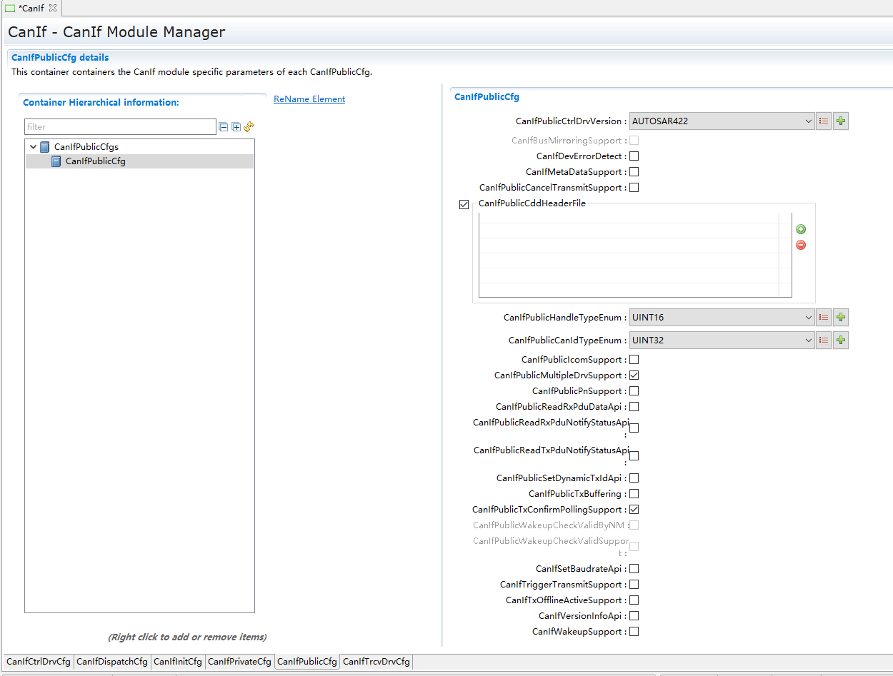

.. centered:: **表 CanIfPublicCfg (Table CanIfPublicCfg)**

.. list-table::
   :widths: 20 20 20 20 20
   :header-rows: 1

   * - UI名称 (UI name)
     - 描述 (describe)
     - \
     - \
     - \
   * - CanIfPublicCtrlDrvVersion
     - 取值范围 (Value range)
     - AUTOSAR422/   AUTOSAR431/ AUTOSAR440
     - \
     - \
   * - \
     - 参数描述 (Parameter description)
     - 表示Can驱动的Autosar版本 (Indicates the Autosar version of the Can driver)
     - \
     - \
   * - \
     - 依赖关系 (Dependencies)
     - 依赖于Can驱动的Autosar版本 (Depends on Can-driven Autosar version)
     - \
     - \
   * - CanIfBusMirroringSupport
     - 取值范围 (Value range)
     - true/false
     - 默认取值 (Default value)
     - FALSE
   * - \
     - 参数描述 (Parameter description)
     - 是否使能总线镜像功能 (Whether to enable bus mirroring function)
     - \
     - \
   * - \
     - 依赖关系 (Dependencies)
     - 当前不支持 (Not currently supported)
     - \
     - \
   * - CanIfDevErrorDetect
     - \
     - true/false
     - 默认取值 (Default value)
     - FALSE
   * - \
     - \
     - 是否使能开发错误检测和通知 (Whether to enable development error detection and notification)
     - \
     - \
   * - \
     - \
     - 依赖于Det (Depends on Det)
     - \
     - \
   * - CanIfMetaDataSupport
     - \
     - true/false
     - 默认取值 (Default value)
     - FALSE
   * - \
     - \
     - 是否使能MetaData机制 (Whether to enable the MetaData mechanism)
     - \
     - \
   * - \
     - \
     - 当CanIfMetaDataSupport使能，CanIf关联的ECUC中Pdu才能配置MetaDataTypeRef (When CanIfMetaDataSupport is enabled, the Pdu in the ECUC associated with CanIf can configure MetaDataTypeRef.)
     - \
     - \
   * - CanIfPublicCancelTransmitSupport
     - 取值范围 (Value range)
     - true/false
     - \
     - \
   * - \
     - 参数描述 (Parameter description)
     - 是否使能TxPdu发送取消机制（该机制已不支持） (Whether to enable the TxPdu sending cancellation mechanism (this mechanism is no longer supported))
     - \
     - \
   * - \
     - 依赖关系 (Dependencies)
     - 无 (none)
     - \
     - \
   * - CanIfPublicCddHeaderFile
     - 取值范围 (Value range)
     - string
     - \
     - \
   * - \
     - 参数描述 (Parameter description)
     - 模块与CDD交互时，需要包含的头文件，填写规则必须为“xxx.h” (When the module interacts with CDD, the header file that needs to be included must be filled in as "xxx.h")
     - \
     - \
   * - \
     - 依赖关系 (Dependencies)
     - 根据CDD具体实现的头文件名 (The header file name according to the specific implementation of CDD)
     - \
     - \
   * - CanIfPublicHandleTypeEnum
     - 取值范围 (Value range)
     - UINT16/UINT8
     - \
     - \
   * - \
     - 参数描述 (Parameter description)
     - 决定Can_HwHandleType的定义 (Determine the definition of Can_HwHandleType)
     - \
     - \
   * - \
     - 依赖关系 (Dependencies)
     - 当CAN hardware units超过255时，该项需配置为UNIT16 (When CAN hardware units exceed 255, this item needs to be configured as UNIT16)
     - \
     - \
   * - CanIfPublicCanIdTypeEnum
     - 取值范围 (Value range)
     - UINT16/UINT32
     - 默认取值 (Default value)
     - UINT32
   * - \
     - 参数描述 (Parameter description)
     - 根据Can_IdType的定义设定 (Set according to the definition of Can_IdType)
     - \
     - \
   * - \
     - 依赖关系 (Dependencies)
     - 当驱动Can_IdType定义为uint16时，该项需配置为UNIT16；当驱动Can_IdType定义为uint32时，该项需配置为UNIT32 (When the driver Can_IdType is defined as uint16, this item needs to be configured as UNIT16; when the driver Can_IdType is defined as uint32, this item needs to be configured as UNIT32)
     - \
     - \
   * - CanIfPublicIcomSupport
     - 取值范围 (Value range)
     - true/false
     - 默认取值 (Default value)
     - FALSE
   * - \
     - 参数描述 (Parameter description)
     - 是否使能Pretended Network (Whether to enable Pretended Network)
     - \
     - \
   * - \
     - 依赖关系 (Dependencies)
     - 该功能依赖于CAN驱动对虚拟网络功能的支持 (This function relies on the CAN driver's support for virtual network functions.)
     - \
     - \
   * - CanIfPublicMultipleDrvSupport
     - 取值范围 (Value range)
     - true/false
     - 默认取值 (Default value)
     - TRUE
   * - \
     - 参数描述 (Parameter description)
     - 是否支持多CAN驱动 (Whether to support multiple CAN drivers)
     - \
     - \
   * - \
     - 依赖关系 (Dependencies)
     - 限制CanIfCtrlDrvCfg的配置数目 (Limit the number of configurations of CanIfCtrlDrvCfg)
     - \
     - \
   * - CanIfPublicPnSupport
     - 取值范围 (Value range)
     - true/false
     - 默认取值 (Default value)
     - FALSE
   * - \
     - 参数描述 (Parameter description)
     - 是否使能Partial Network，依赖于Trcv驱动的配置 (Whether to enable Partial Network depends on the configuration of the Trcv driver.)
     - \
     - \
   * - \
     - 依赖关系 (Dependencies)
     - 限制TxPdu的CanIfTxPduPnFilterPdu配置 (CanIfTxPduPnFilterPdu configuration that limits TxPdu)
     - \
     - \
   * - CanIfPublicReadRxPduDataApi
     - 取值范围 (Value range)
     - true/false
     - 默认取值 (Default value)
     - FALSE
   * - \
     - 参数描述 (Parameter description)
     - 是否使能CanIf_ReadRxPduData (Whether to enable CanIf_ReadRxPduData)
     - \
     - \
   * - \
     - 依赖关系 (Dependencies)
     - 无 (none)
     - \
     - \
   * - CanIfPublicReadRxPduNotifyStatusApi
     - 取值范围 (Value range)
     - true/false
     - 默认取值 (Default value)
     - FALSE
   * - \
     - 参数描述 (Parameter description)
     - 是否使能CanIf_ReadRxNotifStatus (Whether to enable CanIf_ReadRxNotifStatus)
     - \
     - \
   * - \
     - 依赖关系 (Dependencies)
     - 无 (none)
     - \
     - \
   * - CanIfPublicReadTxPduNotifyStatusApi
     - 取值范围 (Value range)
     - true/false
     - 默认取值 (Default value)
     - FALSE
   * - \
     - 参数描述 (Parameter description)
     - 是否使能CanIf_ReadTxNotifStatus (Whether to enable CanIf_ReadTxNotifStatus)
     - \
     - \
   * - \
     - 依赖关系 (Dependencies)
     - 无 (none)
     - \
     - \
   * - CanIfPublicSetDynamicTxIdApi
     - 取值范围 (Value range)
     - true/false
     - 默认取值 (Default value)
     - FALSE
   * - \
     - 参数描述 (Parameter description)
     - 是否使能CanIf_SetDynamicTxId (Whether to enable CanIf_SetDynamicTxId)
     - \
     - \
   * - \
     - 依赖关系 (Dependencies)
     - 无 (none)
     - \
     - \
   * - CanIfPublicTxBuffering
     - 取值范围 (Value range)
     - true/false
     - 默认取值 (Default value)
     - FALSE
   * - \
     - 参数描述 (Parameter description)
     - 是否使能CanIf发送Buffer机制 (Whether to enable the CanIf sending Buffer mechanism)
     - \
     - \
   * - \
     - 依赖关系 (Dependencies)
     - 无 (none)
     - \
     - \
   * - CanIfPublicTxConfirmPollingSupport
     - 取值范围 (Value range)
     - true/false
     - 默认取值 (Default value)
     - TRUE
   * - \
     - 参数描述 (Parameter description)
     - 是否使能CanIf_GetTxConfirmationState (Whether to enable CanIf_GetTxConfirmationState)
     - \
     - \
   * - \
     - 依赖关系 (Dependencies)
     - 无 (none)
     - \
     - \
   * - CanIfPublicWakeupCheckValidByNM
     - 取值范围 (Value range)
     - true/false
     - 默认取值 (Default value)
     - FALSE
   * - \
     - 参数描述 (Parameter description)
     - 是否使能通过NM RxPdu来确认唤醒 (Whether to enable wake-up confirmation through NM RxPdu)
     - \
     - \
   * - \
     - \
     - 依赖于唤醒确认的使能 (Enable that relies on wake-up confirmation)
     - \
     - \
   * - \
     - \
     - CanIfPublicWakeupCheckValidSupport
     - \
     - \
   * - CanIfPublicWakeupCheckValidSupport
     - 取值范围 (Value range)
     - true/false
     - 默认取值 (Default value)
     - FALSE
   * - \
     - 参数描述 (Parameter description)
     - 是否使能唤醒确认 (Whether to enable wake-up confirmation)
     - \
     - \
   * - \
     - 依赖关系 (Dependencies)
     - 依赖于CanIfWakeupSupport的使能 (Depends on the enablement of CanIfWakeupSupport)
     - \
     - \
   * - CanIfSetBaudrateApi
     - 取值范围 (Value range)
     - true/false
     - 默认取值 (Default value)
     - FALSE
   * - \
     - 参数描述 (Parameter description)
     - 是否使能CanIf_SetBaudrate (Whether to enable CanIf_SetBaudrate)
     - \
     - \
   * - \
     - 依赖关系 (Dependencies)
     - 依赖于CAN驱动的支持 (Depends on CAN driver support)
     - \
     - \
   * - CanIfTriggerTransmitSupport
     - 取值范围 (Value range)
     - true/false
     - 默认取值 (Default value)
     - FALSE
   * - \
     - 参数描述 (Parameter description)
     - 是否使能CanIf_TriggerTransmit (Whether to enable CanIf_TriggerTransmit)
     - \
     - \
   * - \
     - 依赖关系 (Dependencies)
     - 无 (none)
     - \
     - \
   * - CanIfTxOfflineActiveSupport
     - 取值范围 (Value range)
     - true/false
     - 默认取值 (Default value)
     - FALSE
   * - \
     - 参数描述 (Parameter description)
     - 是否使能TxPdu的模拟发送模式 (Whether to enable the analog sending mode of TxPdu)
     - \
     - \
   * - \
     - 依赖关系 (Dependencies)
     - 无 (none)
     - \
     - \
   * - CanIfVersionInfoApi
     - 取值范围 (Value range)
     - true/false
     - 默认取值 (Default value)
     - FALSE
   * - \
     - 参数描述 (Parameter description)
     - 是否使能CanIf模拟版本Api (Whether to enable CanIf simulation version API)
     - \
     - \
   * - \
     - 依赖关系 (Dependencies)
     - 无 (none)
     - \
     - \
   * - CanIfWakeupSupport
     - 取值范围 (Value range)
     - true/false
     - 默认取值 (Default value)
     - TRUE
   * - \
     - 参数描述 (Parameter description)
     - 是否使能唤醒机制 (Whether to enable the wake-up mechanism)
     - \
     - \
   * - \
     - 依赖关系 (Dependencies)
     - 依赖于CanDrv和CanTrcv的支持 (Relies on CanDrv and CanTrcv support)
     - \
     - \
         
         
         
CanIfPrivateCfg
-------------------------------

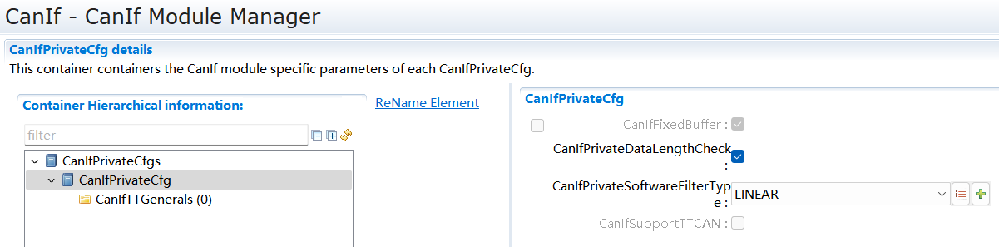

.. centered:: **表 CanIfPrivateCfg (Table CanIfPrivateCfg)**

.. list-table::
   :widths: 20 20 20 20 20
   :header-rows: 1

   * - UI名称 (UI name)
     - 描述 (describe)
     - \
     - \
     - \
   * - CanIfFixedBuffer
     - 取值范围 (Value range)
     - true（固定配置） (true (fixed configuration))
     - 默认取值 (Default value)
     - true
   * - \
     - 参数描述 (Parameter description)
     - 对于数据长度<8字节的报文，分配固定8字节Buffer (For messages with data length <8 bytes, a fixed 8-byte Buffer is allocated.)
     - \
     - \
   * - \
     - 依赖关系 (Dependencies)
     - 无 (none)
     - \
     - \
   * - CanIfPrivateDataLengthCheck
     - 取值范围 (Value range)
     - true/false
     - 默认取值 (Default value)
     - true
   * - \
     - 参数描述 (Parameter description)
     - 选择是否支持DLC检测 (Choose whether to support DLC detection)
     - \
     - \
   * - \
     - 依赖关系 (Dependencies)
     - 无 (none)
     - \
     - \
   * - CanIfPrivateSoftwareFilterType
     - 取值范围 (Value range)
     - LINEAR/BINARY
     - 默认取值 (Default value)
     - LINEAR
   * - \
     - 参数描述 (Parameter description)
     - HRH接收到的报文→RxPdu的匹配算法 (Messages received by HRH→RxPdu matching algorithm)
     - \
     - \
   * - \
     - \
     - 在配置为BINARY时，在下面情况下按照二分法查找RxPdu，其它情况按照线性查找RxPdu。 (When configured as BINARY, RxPdu is searched according to the binary method in the following cases, and RxPdu is searched linearly in other cases.)
     - \
     - \
   * - \
     - \
     - ①该HRH关联的RxPdu均未配置CanIfRxPduCanIdMask； (① None of the RxPdu associated with this HRH is configured with CanIfRxPduCanIdMask;)
     - \
     - \
   * - \
     - \
     - ②该HRH关联的RxPdu均配置了相同的CanIfRxPduCanIdMask且这些RxPdu全部未配置CanIfRxPduCanIdRange； (②The RxPdu associated with the HRH are all configured with the same CanIfRxPduCanIdMask and all these RxPdu are not configured with CanIfRxPduCanIdRange;)
     - \
     - \
   * - \
     - 依赖关系 (Dependencies)
     - 无 (none)
     - \
     - \
   * - CanIfSupportTTCAN
     - 取值范围 (Value range)
     - false(固定配置) (false (fixed configuration))
     - 默认取值 (Default value)
     - false
   * - \
     - 参数描述 (Parameter description)
     - 定义是否支持TTCAN (Define whether TTCAN is supported)
     - \
     - \
   * - \
     - 依赖关系 (Dependencies)
     - 无 (none)
     - \
     - \
         
         
         
CanIfDispatchCfg
--------------------------------

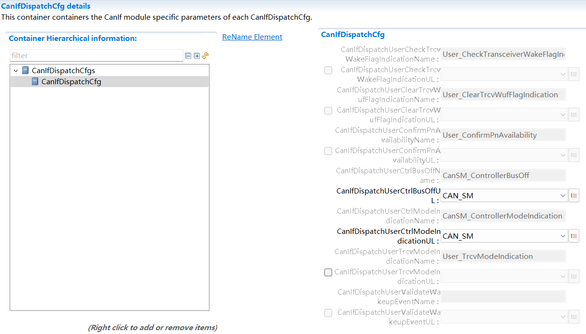

.. centered:: **表 CanIfDispatchCfg (Table CanIfDispatchCfg)**

.. list-table::
   :widths: 20 20 20 20 20
   :header-rows: 1

   * - UI名称 (UI name)
     - 描述 (describe)
     - \
     - \
     - \
   * - CanIfDispatchUserCheckTrcvWakeFlagIndicationName
     - 取值范围 (Value range)
     - string
     - 默认取值 (Default value)
     - 无 (none)
   * - \
     - 参数描述 (Parameter description)
     - <User_CheckTrcvWakeFlagIndication>的接口名 (Interface name of <User_CheckTrcvWakeFlagIndication>)
     - \
     - \
   * - \
     - \
     - 接口名依赖于 (The interface name depends on)
     - \
     - \
   * - \
     - 依赖关系 (Dependencies)
     - CanIfDispatchUserCheckTrcvWakeFlagIndicationUL的选择； (CanIfDispatchUserCheckTrcvWakeFlagIndicationUL selection;)
     - \
     - \
   * - \
     - \
     - 该配置的使能依赖于CanIfPublicPnSupport的使能； (The enabling of this configuration depends on the enabling of CanIfPublicPnSupport;)
     - \
     - \
   * - CanIfDispatchUserCheckTrcvWakeFlagIndicationUL
     - \
     - CAN_SM
     - \
     - \
   * - \
     - 取值范围(Value range)
     -
     - 默认取值 (Default value)
     - 无 (none)
   * - \
     - \
     - CDD
     - \
     - \
   * - \
     - 参数描述 (Parameter description)
     - CheckTrcvWakeFlagIndication通知到上层的模块 (CheckTrcvWakeFlagIndication notifies the upper module)
     - \
     - \
   * - \
     - 依赖关系 (Dependencies)
     - 该配置的使能依赖于CanIfPublicPnSupport的使能 (Enabling this configuration depends on enabling CanIfPublicPnSupport)
     - \
     - \
   * - CanIfDispatchUserClearTrcvWufFlagIndicationName
     - 取值范围 (Value range)
     - string
     - 默认取值 (Default value)
     - 无 (none)
   * - \
     - 参数描述 (Parameter description)
     - <User_ClearTrcvWufFlagIndication>的接口名 (Interface name of <User_ClearTrcvWufFlagIndication>)
     - \
     - \
   * - \
     - \
     - 接口名依赖于 (The interface name depends on)
     - \
     - \
   * - \
     - 依赖关系 (Dependencies)
     - CanIfDispatchUserClearTrcvWufFlagIndicationUL；
     - \
     - \
   * - \
     - \
     - 该配置的使能依赖于CanIfPublicPnSupport的使能； (The enabling of this configuration depends on the enabling of CanIfPublicPnSupport;)
     - \
     - \
   * - CanIfDispatchUserClearTrcvWufFlagIndicationUL
     - \
     - CAN_SM
     - \
     - \
   * - \
     - 取值范围(Value range)
     -
     - 默认取值 (Default value)
     - 无 (none)
   * - \
     - \
     - CDD
     - \
     - \
   * - \
     - 参数描述 (Parameter description)
     - ClearTrcvWufFlagIndication通知到上层的模块 (ClearTrcvWufFlagIndication notifies the upper module)
     - \
     - \
   * - \
     - 依赖关系 (Dependencies)
     - 该配置的使能依赖于CanIfPublicPnSupport的使能 (Enabling this configuration depends on enabling CanIfPublicPnSupport)
     - \
     - \
   * - CanIfDispatchUserConfirmPnAvailabilityName
     - 取值范围 (Value range)
     - string
     - 默认取值 (Default value)
     - 无 (none)
   * - \
     - 参数描述 (Parameter description)
     - <User_ConfirmPnAvailability>的接口名 (Interface name of <User_ConfirmPnAvailability>)
     - \
     - \
   * - \
     - \
     - 接口名依赖于 (The interface name depends on)
     - \
     - \
   * - \
     - 依赖关系 (Dependencies)
     - CanIfDispatchUserConfirmPnAvailabilityUL；
     - \
     - \
   * - \
     - \
     - 该配置的使能依赖于CanIfPublicPnSupport的使能； (The enabling of this configuration depends on the enabling of CanIfPublicPnSupport;)
     - \
     - \
   * - CanIfDispatchUserConfirmPnAvailabilityUL
     - \
     - CAN_SM
     - \
     - \
   * - \
     - 取值范围(Value range)
     -
     - 默认取值 (Default value)
     - 无 (none)
   * - \
     - \
     - CDD
     - \
     - \
   * - \
     - 参数描述 (Parameter description)
     - ConfirmPnAvailability通知到的上层模块 (The upper module notified by ConfirmPnAvailability)
     - \
     - \
   * - \
     - 依赖关系 (Dependencies)
     - 该配置的使能依赖于CanIfPublicPnSupport的使能； (The enabling of this configuration depends on the enabling of CanIfPublicPnSupport;)
     - \
     - \
   * - CanIfDispatchUserCtrlBusOffName
     - 取值范围 (Value range)
     - string
     - 默认取值 (Default value)
     - CanSM_ControllerBusOff
   * - \
     - 参数描述 (Parameter description)
     - <User_ControllerBusOff>的接口名 (Interface name of <User_ControllerBusOff>)
     - \
     - \
   * - \
     - \
     - 接口名依赖于 (The interface name depends on)
     - \
     - \
   * - \
     - \
     - CanIfDispatchUserCtrlBusOffUL；
     - \
     - \
   * - CanIfDispatchUserCtrlBusOffUL
     - \
     - CAN_SM
     - \
     - CAN_SM
   * - \
     - 取值范围(Value range)
     -
     - 默认取值 (Default value)
     - 无 (none)
   * - \
     - \
     - CDD
     - \
     - \
   * - \
     - 参数描述 (Parameter description)
     - ControllerBusOff事件通知的上层模块 (Upper module of ControllerBusOff event notification)
     - \
     - \
   * - \
     - 依赖关系 (Dependencies)
     - 依赖于CanSM或者CDD模块的实现 (Depends on the implementation of CanSM or CDD modules)
     - \
     - \
   * - CanIfDispatchUserCtrlModeIndicationName
     - 取值范围 (Value range)
     - string
     - 默认取值 (Default value)
     - CanSM_ControllerModeIndication
   * - \
     - 参数描述 (Parameter description)
     - <User_ControllerModeIndication>的接口名 (Interface name of <User_ControllerModeIndication>)
     - \
     - \
   * - \
     - \
     - 接口名依赖于 (The interface name depends on)
     - \
     - \
   * - \
     - \
     - CanIfDispatchUserCtrlModeIndicationUL；
     - \
     - \
   * - CanIfDispatchUserCtrlModeIndicationUL
     - \
     - CAN_SM
     - \
     - CAN_SM
   * - \
     - 取值范围(Value range)
     -
     - 默认取值 (Default value)
     - 无 (none)
   * - \
     - \
     - CDD
     - \
     - \
   * - \
     - 参数描述 (Parameter description)
     - CtrlModeIndication事件通知到的上层模块 (The upper module notified by the CtrlModeIndication event)
     - \
     - \
   * - \
     - 依赖关系 (Dependencies)
     - 无 (none)
     - \
     - \
   * - CanIfDispatchUserTrcvModeIndicationName
     - 取值范围 (Value range)
     - string
     - 默认取值 (Default value)
     - 无 (none)
   * - \
     - 参数描述 (Parameter description)
     - <User_TrcvModeIndication>的接口名 (Interface name of <User_TrcvModeIndication>)
     - \
     - \
   * - \
     - \
     - 接口名依赖于 (The interface name depends on)
     - \
     - \
   * - \
     - 依赖关系 (Dependencies)
     - CanIfDispatchUserTrcvModeIndicationUL；
     - \
     - \
   * - \
     - \
     - 依赖于模块配置了至少一个CanTrcv驱动； (At least one CanTrcv driver is configured depending on the module;)
     - \
     - \
   * - CanIfDispatchUserTrcvModeIndicationUL
     - \
     - CAN_SM
     - \
     - \
   * - \
     - 取值范围(Value range)
     -
     - 默认取值 (Default value)
     - 无 (none)
   * - \
     - \
     - CDD
     - \
     - \
   * - \
     - 参数描述 (Parameter description)
     - <User_TrcvModeIndication>的接口名 (Interface name of <User_TrcvModeIndication>)
     - \
     - \
   * - \
     - 依赖关系 (Dependencies)
     - 依赖于模块配置了至少一个CanTrcv驱动； (At least one CanTrcv driver is configured depending on the module;)
     - \
     - \
   * - CanIfDispatchUserValidateWakeupEventName
     - 取值范围 (Value range)
     - string
     - 默认取值 (Default value)
     - 无 (none)
   * - \
     - 参数描述 (Parameter description)
     - <User_ValidateWakeupEvent>的接口名 (Interface name of <User_ValidateWakeupEvent>)
     - \
     - \
   * - \
     - \
     - 接口名依赖于 (The interface name depends on)
     - \
     - \
   * - \
     - \
     - CanIfDispatchUserValidateWakeupEventUL；
     - \
     - \
   * - \
     - \
     - 依赖于配置项 (Depends on configuration items)
     - \
     - \
   * - \
     - \
     - CanIfPublicWakeupCheckValidSupport的使能； (CanIfPublicWakeupCheckValidSupport enabled;)
     - \
     - \
   * - CanIfDispatchUserValidateWakeupEventUL
     - \
     - ECUM
     - \
     - \
   * - \
     - 取值范围(Value range)
     -
     - 默认取值 (Default value)
     - 无 (none)
   * - \
     - \
     - CDD
     - \
     - \
   * - \
     - 参数描述 (Parameter description)
     - <User_ValidateWakeupEvent>的接口名 (Interface name of <User_ValidateWakeupEvent>)
     - \
     - \
   * - \
     - \
     - 依赖于配置项 (Depends on configuration items)
     - \
     - \
   * - \
     - \
     - CanIfPublicWakeupCheckValidSupport的使能； (CanIfPublicWakeupCheckValidSupport enabled;)
     - \
     - \
         
         
         
CanIfCtrlDrvCfg
-------------------------------

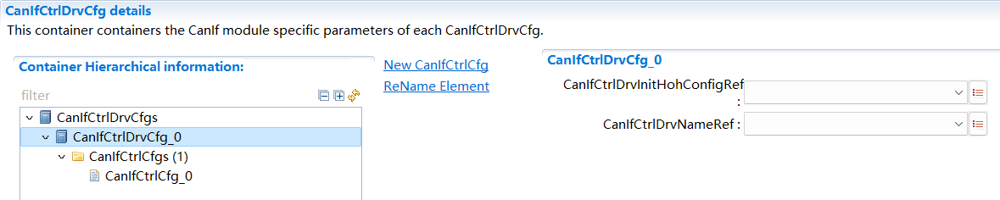

.. centered:: **表 CanIfCtrlDrvCfg (Table CanIfCtrlDrvCfg)**

.. list-table::
   :widths: 20 20 20 20 20
   :header-rows: 1

   * - UI名称 (UI name)
     - 描述 (describe)
     - \
     - \
     - \
   * - CanIfCtrlDrvInitHohConfigRef
     - 取值范围 (Value range)
     - 关联到[CanIfInitHohCfg] (Relevant to [CanIfInitHohCfg])
     - 默认取值 (Default value)
     - 无 (none)
   * - \
     - 参数描述 (Parameter description)
     - 该CanDrv关联的HOH（多个CanDrv可关联到同一个HOH） (The HOH associated with this CanDrv (multiple CanDrv can be associated with the same HOH))
     - \
     - \
   * - \
     - 依赖关系 (Dependencies)
     - 无 (none)
     - \
     - \
   * - CanIfCtrlDrvNameRef
     - 取值范围 (Value range)
     - 关联到CanDrv中驱动Name (Linked to the driver Name in CanDrv)
     - 默认取值 (Default value)
     - 无 (none)
   * - \
     - 参数描述 (Parameter description)
     - 用于获取CanIf模块需要调用的CanDrv功能接口名 (Used to obtain the CanDrv function interface name that needs to be called by the CanIf module)
     - \
     - \
   * - \
     - 依赖关系 (Dependencies)
     - 依赖于CanDrv的配置 (Depends on CanDrv configuration)
     - \
     - \
         
         
         
CanIfCtrlCfg
----------------------------

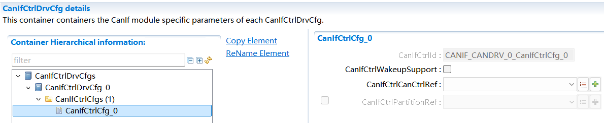

.. centered:: **表 CanIfCtrlCfg (Table CanIfCtrlCfg)**

.. list-table::
   :widths: 20 20 20 20 20
   :header-rows: 1

   * - UI名称 (UI name)
     - 描述 (describe)
     - \
     - \
     - \
   * - \
     - 取值范围 (Value range)
     - string
     - 默认取值 (Default value)
     - FALSE
   * - CanIfCtrlId
     - 参数描述 (Parameter description)
     - 该Controller在CanIf模块中的Index（宏定义） (The Controller's Index (macro definition) in the CanIf module)
     - \
     - \
   * - \
     - 依赖关系 (Dependencies)
     - 宏名根据CanIfCtrlCfg名自动生成 (The macro name is automatically generated based on the CanIfCtrlCfg name.)
     - \
     - \
   * - CanIfCtrlWa keupSupport
     - 取值范围 (Value range)
     - true/false
     - 默认取值 (Default value)
     - FALSE
   * - \
     - 参数描述 (Parameter description)
     - 表示该Controller是否支持唤醒机制 (Indicates whether the Controller supports the wake-up mechanism)
     - \
     - \
   * - \
     - 依赖关系 (Dependencies)
     - 依赖于CanIfWakeupSupport的使能 (Depends on the enablement of CanIfWakeupSupport)
     - \
     - \
   * - CanIfCtrlCanCtrlRef
     - 取值范围 (Value range)
     - 关联到CanDrv中Controller (Associated to the Controller in CanDrv)
     - 默认取值 (Default value)
     - 无 (none)
   * - \
     - 参数描述 (Parameter description)
     - 开启或关闭读取软件版本信息API开关TRUE：启用读取软件版本信息API开关FALSE：关闭读取软件版本信息API开关 (Turn on or off the API switch for reading software version information. TRUE: Enable the API switch for reading software version information. FALSE: Turn off the API switch for reading software version information.)
     - \
     - \
   * - \
     - 依赖关系 (Dependencies)
     - 无 (none)
     - \
     - \
   * - \
     - 取值范围 (Value range)
     - TRUE/FALSE
     - 默认取值 (Default value)
     - FALSE
   * - EepWriteCycleReduction
     - 参数描述 (Parameter description)
     - 依赖于Can驱动中Controller的配置。若Can驱动为第三方工具无法查询CanIf的配置参数，无法获知CanIf和CanController的映射关系，通常需要CanIf与Can中Controller的Id要配置一样，否则需要定制化转换 (Depends on the configuration of the Controller in the Can driver.If the Can driver is a third-party tool, it cannot query the configuration parameters of CanIf and cannot know the mapping relationship between CanIf and CanController. Usually, the Id of the Controller in CanIf and Can must be configured the same, otherwise customized conversion is required.)
     - \
     - \
   * - \
     - 依赖关系 (Dependencies)
     - 无 (none)
     - \
     - \
   * - \
     - 取值范围 (Value range)
     - 关联到EcuC中EcucPartition (Associated to EcucPartition in EcuC)
     - 默认取值 (Default value)
     - 无 (none)
   * - EepWriteCycleReduction
     - 参数描述 (Parameter description)
     - 该参数引用EcuC模块中EcucPartition信息（只做同步   显示，不可手动配置修改） (This parameter refers to the EcucPartition information in the EcuC module (only for synchronization display, and cannot be manually configured and modified))
     - \
     - \
   * - \
     - 依赖关系 (Dependencies)
     - 依赖于ComM模块中ComMChannel的ComMChannelPartitionRef信息。若ComM中对于该CanIfCtrl未配置分区信息，则显示为空；若ComM中对于该CanIfCtrl存在配置分区信息，则显示为ComM中配置的分区信息 (Depends on the ComMChannelPartitionRef information of ComMChannel in the ComM module.If there is no partition information configured for this CanIfCtrl in ComM, it will be displayed as empty; if there is partition information configured for this CanIfCtrl in ComM, it will be displayed as the partition information configured in ComM.)
     - \
     - \
         
         
         
CanIfTrcvCfg
----------------------------

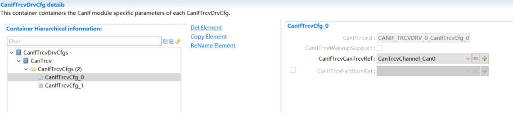

.. centered:: **表 CanIfTrcvCfg (Table CanIfTrcvCfg)**

.. list-table::
   :widths: 20 20 20 20 20
   :header-rows: 1

   * - UI名称 (UI name)
     - 描述 (describe)
     - \
     - \
     - \
   * - CanIfTrcvId
     - 取值范围 (Value range)
     - string
     - 默认取值 (Default value)
     - 无 (none)
   * - \
     - 参数描述 (Parameter description)
     - 该Trcv在CanIf模块中的Index（宏定义） (The Index (macro definition) of the Trcv in the CanIf module)
     - \
     - \
   * - \
     - 依赖关系 (Dependencies)
     - 宏名根据CanIfTrcvCfg名自动生成 (The macro name is automatically generated based on the CanIfTrcvCfg name.)
     - \
     - \
   * - CanIfTrcvWakeupSupport
     - 取值范围 (Value range)
     - true/false
     - 默认取值 (Default value)
     - false
   * - \
     - 参数描述 (Parameter description)
     - 表示该Trcv是否支持唤醒机制 (Indicates whether the Trcv supports the wake-up mechanism)
     - \
     - \
   * - \
     - 依赖关系 (Dependencies)
     - 依赖于CanIfWakeupSupport的使能 (Depends on the enablement of CanIfWakeupSupport)
     - \
     - \
   * - CanIfTrcvCanTrcvRef
     - 取值范围 (Value range)
     - 引用Trcv收发器 (Reference Trcv transceiver)
     - 默认取值 (Default value)
     - 无 (none)
   * - \
     - 参数描述 (Parameter description)
     - 该参数引用CanTrcv模块中Trcv (This parameter refers to Trcv in the CanTrcv module)
     - \
     - \
   * - \
     - 依赖关系 (Dependencies)
     - 依赖于CanTrcv中Trcv的配置。若CanTrcv驱动为第三方工具无法查询CanIf的配置参数，通常需要CanIf与CanTrcv驱动中Trcv的Id要配置一样，否则需要定制化转换。 (Depends on the configuration of Trcv in CanTrcv.If the CanTrcv driver is a third-party tool and cannot query the configuration parameters of CanIf, it is usually necessary to configure the same Id of Trcv in CanIf and CanTrcv drivers, otherwise customized conversion is required.)
     - \
     - \
   * - CanIfTrcvPartitionRef
     - 取值范围 (Value range)
     - 关联到EcuC中EcucPartition (Associated to EcucPartition in EcuC)
     - 默认取值 (Default value)
     - 无 (none)
   * - \
     - 参数描述 (Parameter description)
     - 该参数引用EcuC模块中EcucPartition信息（只做同步显示，不可手动配置修改） (This parameter refers to the EcucPartition information in the EcuC module (only for synchronous display and cannot be manually configured and modified))
     - \
     - \
   * - \
     - 依赖关系 (Dependencies)
     - 依赖于ComM模块中ComMChannel的ComMChannelPartitionRef信息。若ComM中对于该CanIfCtrl未配置分区信息，则显示为空；若ComM中对于该CanIfCtrl存在配置分区信息，则显示为ComM中配置的分区信息 (Depends on the ComMChannelPartitionRef information of ComMChannel in the ComM module.If there is no partition information configured for this CanIfCtrl in ComM, it will be displayed as empty; if there is partition information configured for this CanIfCtrl in ComM, it will be displayed as the partition information configured in ComM.)
     - \
     - \
         
         
         
CanIfTxPduCfg
-----------------------------

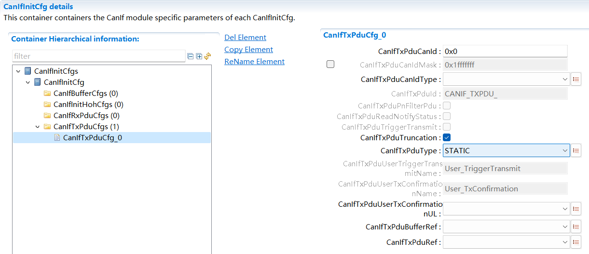

.. centered:: **表 CanIfTxPduCfg (Table CanIfTxPduCfg)**

.. list-table::
   :widths: 20 20 20 20 20
   :header-rows: 1

   * - UI名称 (UI name)
     - 描述 (describe)
     - \
     - \
     - \
   * - CanIfTxPduCanId
     - 取值范围 (Value range)
     - 0x0…0x1fffffff/0x7ff
     - 默认取值 (Default value)
     - 0x0
   * - \
     - 参数描述 (Parameter description)
     - 表示TxPdu的CanId（11位用于标准CAN标识符... (Represents the CanId of the TxPdu (11 bits for standard CAN identifiers...)
     - \
     - \
   * - \
     - \
     - 29位用于扩展CAN标识符） (29 bits for extended CAN identifier))
     - \
     - \
   * - \
     - 依赖关系 (Dependencies)
     - 依赖于CanIfTxPduCanIdType (Depends on CanIfTxPduCanIdType)
     - \
     - \
   * - CanIfTxPduCanIdMask
     - 取值范围 (Value range)
     - 0x0…0x1fffffff/0x7ff
     - 默认取值 (Default value)
     - 0x1fffffff
   * - \
     - 参数描述 (Parameter description)
     - 用于MetaData机制动态更改CanId (Used for MetaData mechanism to dynamically change CanId)
     - \
     - \
   * - \
     - 依赖关系 (Dependencies)
     - 依赖于CanIfTxPduType (Depends on CanIfTxPduType)
     - \
     - \
   * - \
     - \
     - 和CanIfMetaDataSupport (and CanIfMetaDataSupport)
     - \
     - \
   * - CanIfTxPduCanIdType
     - 取值范围 (Value range)
     - EXTENDED_CANEXTENDED_FD_CAN
     - 默认取值 (Default value)
     - 无 (none)
   * - \
     - \
     - STANDARD_CAN
     - \
     - \
   * - \
     - \
     - STANDARD_FD_CAN
     - \
     - \
   * - \
     - 参数描述 (Parameter description)
     - CanId类型选择 (CanId type selection)
     - \
     - \
   * - \
     - 依赖关系 (Dependencies)
     - CanIfTxPduCanIdType为EXTENDED，CanIfTxPduCanId和CanIfTxPduCanIdMask配置范围≤0x1fffffff；CanIfTxPduCanIdType为STANDARD，CanIfTxPduCanId和CanIfTxPduCanIdMask配置范围≤0x7ff (CanIfTxPduCanIdType is EXTENDED, CanIfTxPduCanId and CanIfTxPduCanIdMask configuration range ≤ 0x1fffffff; CanIfTxPduCanIdType is STANDARD, CanIfTxPduCanId and CanIfTxPduCanIdMask configuration range ≤ 0x7ff)
     - \
     - \
   * - CanIfTxPduId
     - 取值范围 (Value range)
     - string
     - 默认取值 (Default value)
     - 无 (none)
   * - \
     - 参数描述 (Parameter description)
     - 表示TxPdu在CanIf中的Index号 (Indicates the Index number of TxPdu in CanIf)
     - \
     - \
   * - \
     - 依赖关系 (Dependencies)
     - 根据CanIfTxPduRef关联的Pdu名自动生成 (Automatically generated based on the Pdu name associated with CanIfTxPduRef)
     - \
     - \
   * - CanIfTxPduPnFilterPdu
     - 取值范围 (Value range)
     - true/false
     - 默认取值 (Default value)
     - false
   * - \
     - 参数描述 (Parameter description)
     - 表示该TxPdu是否能通过PN过滤 (Indicates whether the TxPdu can pass PN filtering)
     - \
     - \
   * - \
     - 依赖关系 (Dependencies)
     - 依赖于CanIfPublicPnSupport的使能 (Depends on enabling CanIfPublicPnSupport)
     - \
     - \
   * - CanIfTxPduReadNotifyStatus
     - 取值范围 (Value range)
     - true/false
     - 默认取值 (Default value)
     - false
   * - \
     - 参数描述 (Parameter description)
     - 表示该TxPdu是否支持读取发送通知状态 (Indicates whether the TxPdu supports reading the sending notification status)
     - \
     - \
   * - \
     - 依赖关系 (Dependencies)
     - 依赖于CanIfPublicReadTxPduNotifyStatusApi (Depends on CanIfPublicReadTxPduNotifyStatusApi)
     - \
     - \
   * - CanIfTxPduTriggerTransmit
     - 取值范围 (Value range)
     - true/false
     - 默认取值 (Default value)
     - false
   * - \
     - 参数描述 (Parameter description)
     - 表示该TxPdu是否支持TriggerTransmit (Indicates whether the TxPdu supports TriggerTransmit)
     - \
     - \
   * - \
     - 依赖关系 (Dependencies)
     - 依赖于CanIfTriggerTransmitSupport的使能 (Depends on the enablement of CanIfTriggerTransmitSupport)
     - \
     - \
   * - CanIfTxPduTruncation
     - 取值范围 (Value range)
     - true/false
     - 默认取值 (Default value)
     - true
   * - \
     - 参数描述 (Parameter description)
     - 启用/禁用超过配置大小的pdu的截断功能（暂不支持） (Enable/disable the truncation function of PDUs exceeding the configured size (not supported yet))
     - \
     - \
   * - \
     - 依赖关系 (Dependencies)
     - 无 (none)
     - \
     - \
   * - CanIfTxPduType
     - 取值范围 (Value range)
     - DYNAMICSTATIC
     - 默认取值 (Default value)
     - STATIC
   * - \
     - 参数描述 (Parameter description)
     - 表示该TxPdu的CanId是否支持动态改变，当CanIf中Pdu关联的ECUC中Pdu配置了MetaData时，其CanIfTxPduType必须配置为DYNAMIC (Indicates whether the CanId of the TxPdu supports dynamic changes. When the Pdu in the ECUC associated with the Pdu in CanIf is configured with MetaData, its CanIfTxPduType must be configured as DYNAMIC.)
     - \
     - \
   * - \
     - 依赖关系 (Dependencies)
     - 无 (none)
     - \
     - \
   * - CanIfTxPduUserTriggerTransmitName
     - 取值范围 (Value range)
     - string
     - 默认取值 (Default value)
     - 无 (none)
   * - \
     - 参数描述 (Parameter description)
     - 表示上层模块<User_TriggerTransmit>的接口名 (Indicates the interface name of the upper module <User_TriggerTransmit>)
     - \
     - \
   * - \
     - 依赖关系 (Dependencies)
     - 依赖于该TxPdu的CanIfTxPduTriggerTransmit使能； (Depends on the CanIfTxPduTriggerTransmit enablement of this TxPdu;)
     - \
     - \
   * - \
     - \
     - 依赖于CanIfTxPduUserTxConfirmationUL选择； (Depends on CanIfTxPduUserTxConfirmationUL selection;)
     - \
     - \
   * - CanIfTxPduUserTxConfirmationName
     - 取值范围 (Value range)
     - string
     - 默认取值 (Default value)
     - 无 (none)
   * - \
     - 参数描述 (Parameter description)
     - 表示上层模块<User_TxConfirmation>的接口名 (Indicates the interface name of the upper module <User_TxConfirmation>)
     - \
     - \
   * - \
     - 依赖关系 (Dependencies)
     - 依赖于CanIfTxPduUserTxConfirmationUL选择； (Depends on CanIfTxPduUserTxConfirmationUL selection;)
     - \
     - \
   * - CanIfTxPduUserTxConfirmationUL
     - 取值范围 (Value range)
     - CAN_NMCAN_TP
     - 默认取值 (Default value)
     - 无 (none)
   * - \
     - \
     - CAN_TSYN
     - \
     - \
   * - \
     - \
     - CDD
     - \
     - \
   * - \
     - \
     - J1939NM
     - \
     - \
   * - \
     - \
     - J1939TP
     - \
     - \
   * - \
     - \
     - PDUR
     - \
     - \
   * - \
     - \
     - XCP
     - \
     - \
   * - \
     - 参数描述 (Parameter description)
     - 表示发送该TxPdu的上层模块 (Indicates the upper module that sends the TxPdu)
     - \
     - \
   * - \
     - 依赖关系 (Dependencies)
     - 无 (none)
     - \
     - \
   * - CanIfTxPduBufferRef
     - 取值范围 (Value range)
     - 引用[CanIfBufferCfg] (Reference[CanIfBufferCfg])
     - 默认取值 (Default value)
     - 无 (none)
   * - \
     - 参数描述 (Parameter description)
     - 表示该TxPdu关联的TxBuffer（间接关联到HTH） (Indicates the TxBuffer associated with this TxPdu (indirectly associated with HTH))
     - \
     - \
   * - \
     - 依赖关系 (Dependencies)
     - 无 (none)
     - \
     - \
   * - CanIfTxPduRef
     - 取值范围 (Value range)
     - 关联ECUC中Pdu (Associate ECUC PDU)
     - 默认取值 (Default value)
     - 无 (none)
   * - \
     - 参数描述 (Parameter description)
     - 通过ECUC中Pdu索引，明确Pdu的路由路径 (Clear the Pdu routing path through the Pdu index in ECUC)
     - \
     - \
   * - \
     - 依赖关系 (Dependencies)
     - 依赖于ECUC中Pdu的配置，CanIf中CanIfTxPduRef关联的ECUC中Pdu必须要被别的模块关联 (Depends on the configuration of Pdu in ECUC, the Pdu in ECUC associated with CanIfTxPduRef in CanIf must be associated with other modules)
     - \
     - \
         
         
         
CanIfBufferCfg
------------------------------

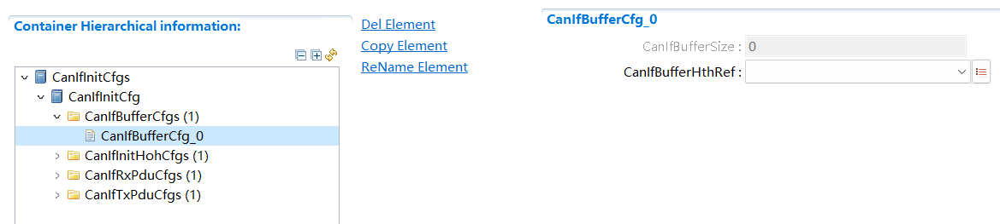

.. centered:: **表 CanIfBufferCfg (Table CanIfBufferCfg)**

.. list-table::
   :widths: 20 20 20 20 20
   :header-rows: 1

   * - UI名称 (UI name)
     - 描述 (describe)
     - \
     - \
     - \
   * - CanIfBufferSize
     - 取值范围 (Value range)
     - 0..255
     - 默认取值 (Default value)
     - 0
   * - \
     - 参数描述 (Parameter description)
     - 表示关联的HTH的BufferSize（用于缓存通过该HTH发送的TxPdu报文），配置为0表示该HTH不支持发送缓存 (Represents the BufferSize of the associated HTH (used to cache TxPdu messages sent through the HTH). If configured to 0, it means that the HTH does not support sending buffering.)
     - \
     - \
   * - \
     - 依赖关系 (Dependencies)
     - 依赖于配置CanIfPublicTxBuffering (Depends on configuring CanIfPublicTxBuffering)
     - \
     - \
   * - CanIfBufferHthRef
     - 取值范围 (Value range)
     - 引用CanIfHthCfg (QuoteCanIfHthCfg)
     - 默认取值 (Default value)
     - 无 (none)
   * - \
     - 参数描述 (Parameter description)
     - 关联HTH（间接将TxPdu与HTH关联起来） (Associate HTH (indirectly associate TxPdu with HTH))
     - \
     - \
   * - \
     - 依赖关系 (Dependencies)
     - 与CanIfHthCfg为一一对应的关系 (There is a one-to-one correspondence with CanIfHthCfg.)
     - \
     - \
         
         
         
CanIfHthCfg
---------------------------

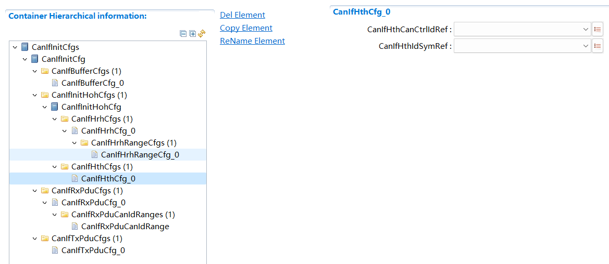

.. centered:: **表 CanIfHthCfg (Table CanIfHthCfg)**

.. list-table::
   :widths: 20 20 20 20 20
   :header-rows: 1

   * - UI名称 (UI name)
     - 描述 (describe)
     - \
     - \
     - \
   * - CanIfHthCanCtrlIdRef
     - 取值范围 (Value range)
     - 引用CanIfCtrlCfg (ReferenceCanIfCtrlCfg)
     - 默认取值 (Default value)
     - 无 (none)
   * - \
     - 参数描述 (Parameter description)
     - 关联到CanIf模块中配置的Controller (Associated to the Controller configured in the CanIf module)
     - \
     - \
   * - \
     - 依赖关系 (Dependencies)
     - 关联到配置项CanIfCtrlCfg (Related to configuration item CanIfCtrlCfg)
     - \
     - \
   * - CanIfHthIdSymRef
     - 取值范围 (Value range)
     - 引用CanDrv中HTH硬件单元 (Reference to the HTH hardware unit in CanDrv)
     - 默认取值 (Default value)
     - 无 (none)
   * - \
     - 参数描述 (Parameter description)
     - 关联到Can驱动中硬件发送单元HTH (Linked to the hardware sending unit HTH in the Can driver)
     - \
     - \
   * - \
     - 依赖关系 (Dependencies)
     - 依赖于Can驱动中硬件发送单元HTH的配置 (Depends on the configuration of the hardware sending unit HTH in the Can driver)
     - \
     - \
         
         
         
CanIfRxPduCfg
-----------------------------

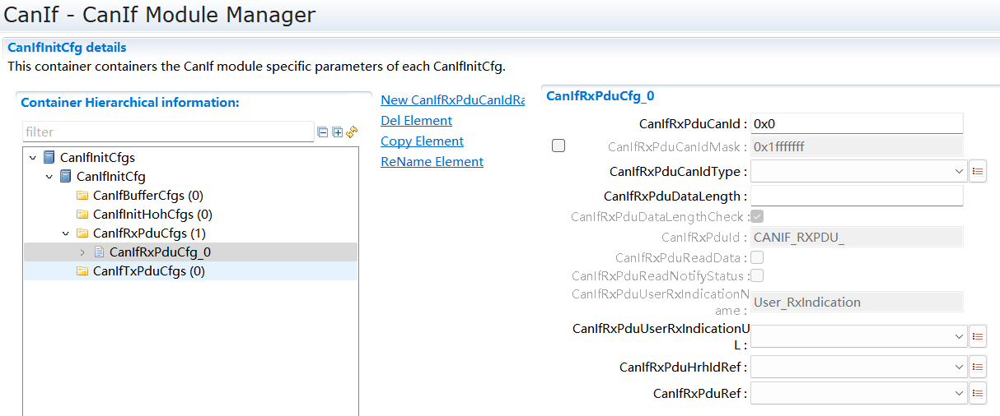

.. centered:: **表 CanIfRxPduCfg (Table CanIfRxPduCfg)**

.. list-table::
   :widths: 20 20 20 20 20
   :header-rows: 1

   * - UI名称 (UI name)
     - 描述 (describe)
     - \
     - \
     - \
   * - CanIfRxPduCanId
     - 取值范围 (Value range)
     - 0x0 ..   0x1FFFFFFF
     - \
     - \
   * - \
     - 参数描述 (Parameter description)
     - 标准帧：0x0-0x7FF;扩展帧：0x0-0x1FFFFFFF (Standard frame: 0x0-0x7FF; Extended frame: 0x0-0x1FFFFFFF)
     - \
     - \
   * - \
     - 依赖关系 (Dependencies)
     - 依赖于CanIfRxPduCanIdType (Depends on CanIfRxPduCanIdType)
     - \
     - \
   * - CanIfRxPduCanIdMask
     - 取值范围 (Value range)
     - 0x0 .. 0x1FFFFFFF
     - 默认取值 (Default value)
     - 0x1FFFFFFF
   * - \
     - 参数描述 (Parameter description)
     - 接收报文CanId的掩码，用于接收过滤 (Mask of the CanId of the received message, used for reception filtering)
     - \
     - \
   * - \
     - 依赖关系 (Dependencies)
     - 依赖于CanIfRxPduCanIdType (Depends on CanIfRxPduCanIdType)
     - \
     - \
   * - CanIfRxPduCanIdType
     - \
     - EXTENDED_CAN
     - \
     - \
   * - \
     - \
     - EXTENDED_FD_CAN
     - \
     - \
   * - \
     - \
     - EXTENDED_NO_FD_CAN
     - \
     - \
   * - \
     - 取值范围(Value range)
     -
     - 默认取值 (Default value)
     - 无 (none)
   * - \
     - \
     - STANDARD_CAN
     - \
     - \
   * - \
     - \
     - STANDARD_FD_CAN
     - \
     - \
   * - \
     - \
     - STANDARD_NO_FD_CAN
     - \
     - \
   * - \
     - 参数描述 (Parameter description)
     - 表示接收CAN报文类型 (Indicates the type of CAN message received)
     - \
     - \
   * - \
     - 依赖关系 (Dependencies)
     - 无 (none)
     - \
     - \
   * - CanIfRxPduDataLength
     - 取值范围 (Value range)
     - 0..64
     - 默认取值 (Default value)
     - 8
   * - \
     - 参数描述 (Parameter description)
     - RxPdu的DLC长度（用于DLC检测） (DLC length of RxPdu (for DLC detection))
     - \
     - \
   * - \
     - 依赖关系 (Dependencies)
     - 依赖于配置CanIfPrivateDataLengthCheck (Depends on configuring CanIfPrivateDataLengthCheck)
     - \
     - \
   * - CanIfRxPduDataLengthCheck
     - 取值范围 (Value range)
     - true/false
     - 默认取值 (Default value)
     - 无 (none)
   * - \
     - 参数描述 (Parameter description)
     - 接收时检查该Pdu的长度（暂不支持修改） (Check the length of the Pdu when receiving (modification is not supported yet))
     - \
     - \
   * - \
     - 依赖关系 (Dependencies)
     - 依赖于配置CanIfPrivateDataLengthCheck (Depends on configuring CanIfPrivateDataLengthCheck)
     - \
     - \
   * - CanIfRxPduId
     - 取值范围 (Value range)
     - string
     - 默认取值 (Default value)
     - 无 (none)
   * - \
     - 参数描述 (Parameter description)
     - 表示该RxPdu在CanIf模块中的Index，由其关联的Pdu名自动生成宏名 (Indicates the Index of the RxPdu in the CanIf module, and the macro name is automatically generated from its associated Pdu name.)
     - \
     - \
   * - \
     - 依赖关系 (Dependencies)
     - 根据CanIfRxPduRef关联的Pdu名自动生成 (Automatically generated based on the Pdu name associated with CanIfRxPduRef)
     - \
     - \
   * - CanIfRxPduReadData
     - 取值范围 (Value range)
     - true/false
     - 默认取值 (Default value)
     - FALSE
   * - \
     - 参数描述 (Parameter description)
     - 表示该RxPdu是否支持CanIf_ReadRxPduData获取接收数据 (Indicates whether the RxPdu supports CanIf_ReadRxPduData to obtain received data)
     - \
     - \
   * - \
     - 依赖关系 (Dependencies)
     - 依赖于CanIfPublicReadRxPduDataApi，当RxPdu支持CanIfRxPduReadData时，接收报文CanId必须为唯一值（CanIfRxPduCanIdRange配置不能是一个范围）
     - \
     - \
   * - CanIfRxPduReadNotifyStatus
     - 取值范围 (Value range)
     - true/false
     - 默认取值 (Default value)
     - FALSE
   * - \
     - 参数描述 (Parameter description)
     - 表示该RxPdu是否支持CanIf_ReadRxNotifStatus获取接收状态 (Indicates whether the RxPdu supports CanIf_ReadRxNotifStatus to obtain the receiving status)
     - \
     - \
   * - \
     - 依赖关系 (Dependencies)
     - 依赖于CanIfPublicReadRxPduNotifyStatusApi (Depends on CanIfPublicReadRxPduNotifyStatusApi)
     - \
     - \
   * - CanIfRxPduUserRxIndicationName
     - 取值范围 (Value range)
     - string
     - 默认取值 (Default value)
     - 无 (none)
   * - \
     - 参数描述 (Parameter description)
     - 表示<User_RxIndication>的接口名，由工具自动生成（CanIfRxPduUserRxIndicationUL配置为CDD时可手动更改）
     - \
     - \
   * - \
     - 依赖关系 (Dependencies)
     - 依赖于CanIfRxPduUserRxIndicationUL (Depends on CanIfRxPduUserRxIndicationUL)
     - \
     - \
   * - CanIfRxPduUserRxIndicationUL
     - \
     - CAN_NM
     - \
     - \
   * - \
     - \
     - CAN_TP
     - \
     - \
   * - \
     - \
     - CAN_TSYN
     - \
     - \
   * - \
     - \
     - CDD
     - \
     - \
   * - \
     - 取值范围 (Value range)
     - J1939NM
     - 默认取值 (Default value)
     - 无 (none)
   * - \
     - \
     - J1939TP
     - \
     - \
   * - \
     - \
     - PDUR
     - \
     - \
   * - \
     - \
     - XCP
     - \
     - \
   * - \
     - \
     - OSEK_NM
     - \
     - \
   * - \
     - 参数描述 (Parameter description)
     - 表示该RxPdu接收数据传递到上层的模块 (Indicates that the RxPdu receives data and passes it to the upper module)
     - \
     - \
   * - \
     - 依赖关系 (Dependencies)
     - 无 (none)
     - \
     - \
   * - CanIfRxPduHrhIdRef
     - 取值范围 (Value range)
     - 引用CanIfHrhCfg (QuoteCanIfHrhCfg)
     - 默认取值 (Default value)
     - 无 (none)
   * - \
     - 参数描述 (Parameter description)
     - 表示该RxPdu通过关联的HRH 接收 (Indicates that this RxPdu receives through the associated HRH)
     - \
     - \
   * - \
     - 依赖关系 (Dependencies)
     - 依赖于CanIf模块中CanIfHrhCfg (Depends on CanIfHrhCfg in CanIf module)
     - \
     - \
   * - CanIfRxPduRef
     - 取值范围 (Value range)
     - 关联ECUC中Pdu (Associate ECUC PDU)
     - 默认取值 (Default value)
     - 无 (none)
   * - \
     - 参数描述 (Parameter description)
     - 通过ECUC中Pdu索引，明确Pdu的路由路径 (Clear the Pdu routing path through the Pdu index in ECUC)
     - \
     - \
   * - \
     - 依赖关系 (Dependencies)
     - 依赖于ECUC中Pdu (Depends on ECUC Pdu)
     - \
     - \
         

CanIfRxPduCanIdRange
------------------------------------

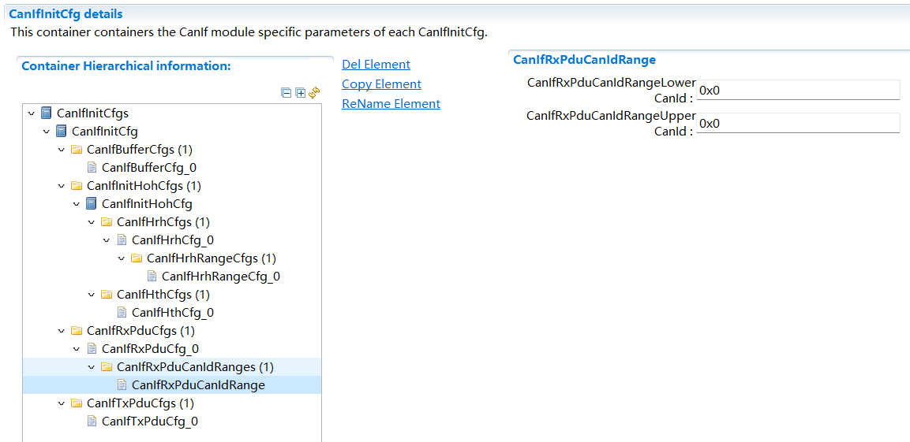

.. centered:: **表 CanIfRxPduCanIdRange (Table CanIfRxPduCanIdRange)**

.. list-table::
   :widths: 20 20 20 20 20
   :header-rows: 1

   * - UI名称 (UI name)
     - 描述 (describe)
     - \
     - \
     - \
   * - CanIfRxPduCanIdRangeLowerCanId
     - 取值范围 (Value range)
     - 0x0 .. 0x1FFFFFFF
     - 默认取值 (Default value)
     - 0x0
   * - \
     - 参数描述 (Parameter description)
     - 表示该RxPdu过滤的CanId下限 (Indicates the lower limit of CanId filtered by this RxPdu)
     - \
     - \
   * - \
     - 依赖关系 (Dependencies)
     - 依赖于CanIfRxPduCanIdType，CanIfRxPduCanIdRangeLowerCanId≤CanIfRxPduCanIdRangeUpperCanId (Depends on CanIfRxPduCanIdType, CanIfRxPduCanIdRangeLowerCanId≤CanIfRxPduCanIdRangeUpperCanId)
     - \
     - \
   * - CanIfRxPduCanIdRangeUpperCanId
     - 取值范围 (Value range)
     - 0x0 .. 0x1FFFFFFF
     - 默认取值 (Default value)
     - 0x0
   * - \
     - 参数描述 (Parameter description)
     - 表示该RxPdu过滤的CanId上限 (Indicates the upper limit of CanId filtered by this RxPdu)
     - \
     - \
   * - \
     - 依赖关系 (Dependencies)
     - 依赖于CanIfRxPduCanIdType；CanIfRxPduCanIdRangeLowerCanId≤CanIfRxPduCanIdRangeUpperCanId；CanIfRxPduCanIdType为STANDARD，CanIfRxPduCanIdRangeUpperCanId配置范围≤0x7ff；CanIfRxPduCanIdType为EXTENDED，CanIfRxPduCanIdRangeUpperCanId配置范围≤0x1fffffff；CanIfHrhRangeRxPduRangeCanIdType为STANDARD，CanIfHrhRangeRxPduUpperCanId配置范围≤0x7ff；CanIfHrhRangeRxPduRangeCanIdType为EXTENDED，CanIfHrhRangeRxPduUpperCanId配置范围≤0x1fffffff (Depends on CanIfRxPduCanIdType; CanIfRxPduCanIdRangeLowerCanId ≤ CanIfRxPduCanIdRangeUpperCanId; CanIfRxPduCanIdType is STANDARD, CanIfRxPduCanIdRangeUpperCanId configuration range ≤ 0x7ff; CanIfRxPduCanIdType is EXTENDED, CanIfRxPduCanIdRangeUpperCanId configuration range ≤ 0x1fffffff; CanIfHrhRangeRxPduRangeCanIdType is STANDARD, CanIfHrhRangeRxPduUpperCanId configuration range ≤ 0x7ff; CanIfHrhRangeRxPduRangeCanIdType is EXTENDED, CanIfHrhRangeRxPduUpperCanId configuration range ≤ 0x1fffffff)
     - \
     - \
         

CanIfHrhCfg
---------------------------

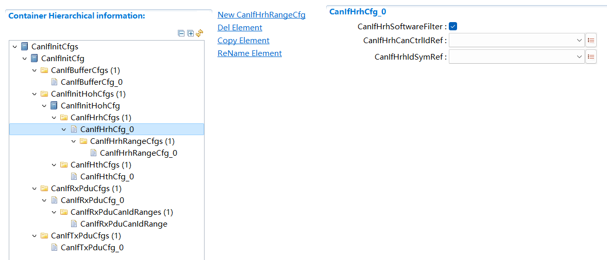

.. centered:: **表 CanIfHrhCfg (Table CanIfHrhCfg)**

.. list-table::
   :widths: 20 20 20 20 20
   :header-rows: 1

   * - UI名称 (UI name)
     - 描述 (describe)
     - \
     - \
     - \
   * - CanIfHrhSoftwareFilter
     - 取值范围 (Value range)
     - true/false
     - 默认取值 (Default value)
     - true
   * - \
     - 参数描述 (Parameter description)
     - 表示该HRH是否使能软件滤波 (Indicates whether the HRH enables software filtering)
     - \
     - \
   * - \
     - 依赖关系 (Dependencies)
     - 依赖于关联的CAN驱动中HRH的类型（配置为FullCan不需要软件滤波） (Depends on the type of HRH in the associated CAN driver (configuration as FullCan does not require software filtering))
     - \
     - \
   * - CanIfHrhCanCtrlIdRef
     - 取值范围 (Value range)
     - 引用CanIfCtrlCfg (ReferenceCanIfCtrlCfg)
     - 默认取值 (Default value)
     - 无 (none)
   * - \
     - 参数描述 (Parameter description)
     - 表示该HRH关联的CanIf中配置的Controller (Represents the Controller configured in the CanIf associated with the HRH)
     - \
     - \
   * - \
     - 依赖关系 (Dependencies)
     - 依赖于CanIfCtrlCfg (Depends on CanIfCtrlCfg)
     - \
     - \
   * - CanIfHrhIdSymRef
     - 取值范围 (Value range)
     - 引用CAN驱动中硬件接收单元HRH (Reference to the hardware receiving unit HRH in the CAN driver)
     - 默认取值 (Default value)
     - 无 (none)
   * - \
     - 参数描述 (Parameter description)
     - CanIf中HRH与CAN驱动中硬件接收单元的关联 (The relationship between HRH in CanIf and the hardware receiving unit in the CAN driver)
     - \
     - \
   * - \
     - 依赖关系 (Dependencies)
     - 依赖于CAN驱动中硬件接收单元的配置 (Depends on the configuration of the hardware receiving unit in the CAN driver)
     - \
     - \
         
         
         
CanIfHrhRangeCfg
--------------------------------

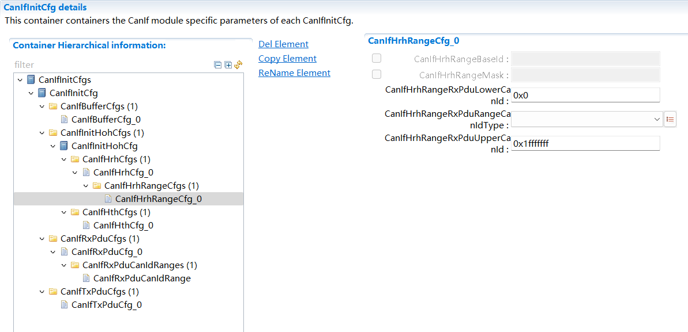

.. centered:: **表 CanIfHrhRangeCfg (Table CanIfHrhRangeCfg)**

.. list-table::
   :widths: 20 20 20 20 20
   :header-rows: 1

   * - UI名称 (UI name)
     - 描述 (describe)
     - \
     - \
     - \
   * - CanIfHrhRangeBaseId
     - 取值范围 (Value range)
     - 0x0-0x1FFFFFFF
     - 默认取值 (Default value)
     - 无 (none)
   * - \
     - 参数描述 (Parameter description)
     - 表示HRH软件滤波的BaseCanId（掩码方式过滤所需） (BaseCanId representing HRH software filtering (required for mask mode filtering))
     - \
     - \
   * - \
     - 依赖关系 (Dependencies)
     - 依赖于CanIfHrhSoftwareFilter的使能， (Depends on the enablement of CanIfHrhSoftwareFilter,)
     - \
     - \
   * - \
     - \
     - 当前结合到CAN驱动中通常都是通过硬件掩码进行过滤，软件不支持这种方式，因此工具不可配。 (Currently, when integrated into CAN drivers, filtering is usually performed through hardware masks. The software does not support this method, so the tool cannot be used.)
     - \
     - \
   * - CanIfHrhRangeMask
     - 取值范围 (Value range)
     - 0x0-0x1FFFFFFF
     - 默认取值 (Default value)
     - 无 (none)
   * - \
     - 参数描述 (Parameter description)
     - 表示该HRH软件滤波的掩码（掩码方式过滤所需） (Indicates the mask filtered by the HRH software (required for mask mode filtering))
     - \
     - \
   * - \
     - 依赖关系 (Dependencies)
     - 依赖于CanIfHrhSoftwareFilter的使能， (Depends on the enablement of CanIfHrhSoftwareFilter,)
     - \
     - \
   * - \
     - \
     - 当前结合到CAN驱动中通常都是通过硬件掩码进行过滤，软件不支持这种方式，因此工具不可配。 (Currently, when integrated into CAN drivers, filtering is usually performed through hardware masks. The software does not support this method, so the tool cannot be used.)
     - \
     - \
   * - CanIfHrhRangeRxPduLowerCanId
     - 取值范围 (Value range)
     - 0x0-0x1FFFFFFF
     - 默认取值 (Default value)
     - 0x0
   * - \
     - 参数描述 (Parameter description)
     - 该HRH接收报文CanId的下限 (The lower limit of the CanId of the HRH received message)
     - \
     - \
   * - \
     - 依赖关系 (Dependencies)
     - 依赖于CanIfHrhSoftwareFilter的使能 (Depends on the enablement of CanIfHrhSoftwareFilter)
     - \
     - \
   * - CanIfHrhRangeRxPduRangeCanIdType
     - 取值范围 (Value range)
     - STANDARD/EXTENDED
     - 默认取值 (Default value)
     - 无 (none)
   * - \
     - 参数描述 (Parameter description)
     - 该HRH过滤CanId类型（11位和29位）
     - \
     - \
   * - \
     - 依赖关系 (Dependencies)
     - 依赖于CanIfHrhSoftwareFilter的使能 (Depends on the enablement of CanIfHrhSoftwareFilter)
     - \
     - \
   * - CanIfHrhRangeRxPduUpperCanId
     - 取值范围 (Value range)
     - 0x0-0x1FFFFFFF
     - 默认取值 (Default value)
     - 0x1fffffff
   * - \
     - 参数描述 (Parameter description)
     - 该HRH接收报文CanId的上限 (The upper limit of the CanId of the message received by the HRH)
     - \
     - \
   * - \
     - 依赖关系 (Dependencies)
     - 依赖于CanIfHrhSoftwareFilter的使能 (Depends on the enablement of CanIfHrhSoftwareFilter)
     - \
     - \
         
         
         
CanIfInitCfg
----------------------------

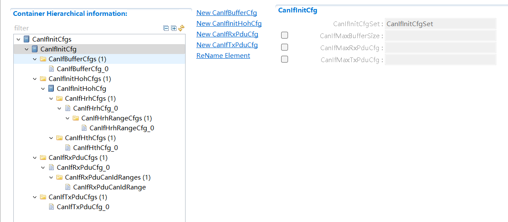

.. centered:: **表 CanIfInitCfg (Table CanIfInitCfg)**

.. list-table::
   :widths: 20 20 20 20 20
   :header-rows: 1

   * - UI名称 (UI name)
     - 描述 (describe)
     - \
     - \
     - \
   * - CanIfInitCfgSet
     - 取值范围 (Value range)
     - CanIfInitCfgSet
     - 默认取值 (Default value)
     - CanIfInitCfgSet
   * - \
     - 参数描述 (Parameter description)
     - 表示CanIf模块PB配置参数 (Indicates CanIf module PB configuration parameters)
     - \
     - \
   * - \
     - 依赖关系 (Dependencies)
     - 工具固定生成，不可变 (Tools are fixedly generated and immutable)
     - \
     - \
   * - CanIfMaxBufferSize
     - 取值范围 (Value range)
     - 0 ..
     - 默认取值 (Default value)
     - 无 (none)
   * - \
     - 参数描述 (Parameter description)
     - CanIf模块TxBuffer总长度 (CanIf module TxBuffer total length)
     - \
     - \
   * - \
     - 依赖关系 (Dependencies)
     - 用于PB配置的实现，目前不支持 (Implementation for PB configuration, currently not supported)
     - \
     - \
   * - CanIfMaxRxPduCfg
     - 取值范围 (Value range)
     - 0 ..
     - 默认取值 (Default value)
     - 无 (none)
   * - \
     - 参数描述 (Parameter description)
     - CanIf模块支持的最大RxPdu数目 (The maximum number of RxPdu supported by the CanIf module)
     - \
     - \
   * - \
     - 依赖关系 (Dependencies)
     - 用于PB配置的实现，目前不支持 (Implementation for PB configuration, currently not supported)
     - \
     - \
   * - CanIfMaxTxPduCfg
     - 取值范围 (Value range)
     - 0 ..
     - 默认取值 (Default value)
     - 无 (none)
   * - \
     - 参数描述 (Parameter description)
     - CanIf模块支持的最大TxPdu数目 (The maximum number of TxPdu supported by the CanIf module)
     - \
     - \
   * - \
     - 依赖关系 (Dependencies)
     - 用于PB配置的实现，目前不支持 (Implementation for PB configuration, currently not supported)
     - \
     - \
