CanSM
#################################

:strong:`缩写词注解 (Abbreviation Notes):`

.. list-table::
   :widths: 34 33 33
   :header-rows: 1

   * - 缩写词 (Abbreviation)
     - 解释/描述 (Explanation/Description)
     - 中文解释 (Chinese explanation)
   * - CanSM
     - CAN State Manager
     - CAN状态管理 (Can state management)
   * - BswM
     - BSW Mode Manager
     - 基础软件模式管理 (Foundation Software Mode Management)
   * - EcuM
     - Ecu State Manager
     - Ecu状态管理 (ECU Status Management)
   * - CanIf
     - Can Interface
     - CAN接口模块 (CAN Interface Module)
   * - DEM
     - Diagnostic Event Manager
     - 诊断事件处理 (Diagnosis Event Handling)
   * - DET
     - Default Error Tracer
     - 默认错误检测 (Default error detection)
   * - EcuM
     - ECU State Manager
     - ECU状态管理模块 (ECU Status Management Module)
   * - PN
     - Partial Network
     - 部分网络 (part of the network)
   * - ComM
     - Com Manager
     - 通讯管理模块 (Communication Management Module)

简介 (Introduction)
==========================

CanSM模块负责CAN网络的控制流抽象，它使用CanIf模块的API，根据ComM模块的模式请求更改已配置的CAN网络的通信模式。CAN控制器模式和CAN收发器模式的任何更改将由CanIf模块通知CanSM模块。根据CanIf通知和CanSM状态机的状态，CanSM模块将通知ComM和BswM。

CanSM module controls the control flow of the CAN network and uses the API of CanIf module to request changes in the communication mode of the configured CAN network according to the modes requested by the ComM module. Any change in the CAN controller mode or CAN transceiver mode will be notified by the CanIf module to the CanSM module. Based on the notifications from the CanIf and the state machine status of the CanSM, the CanSM module notifies the ComM and BswM.

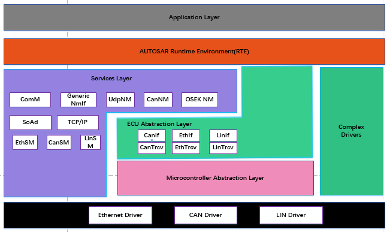

参考资料 (References)
----------------------------

[1] AUTOSAR_SWS\_ CANStateManager.pdf，R19-11

[2] AUTOSAR_SWS_COMManager.pdf，R19-11

[3] AUTOSAR_SWS_NetworkManagementInterface.pdf，R19-11

[4] AUTOSAR_SWS_BSWModeManager.pdf，R19-11

[5] AUTOSAR_SWS\_ CANInterface.pdf，R19-11

[6] AUTOSAR_SWS_CANNetworkManagement.pdf，R19-11

功能描述 (Function Description)
====================================

状态管理功能 (State management function)
----------------------------------------------

状态管理功能介绍 (Introduction to State Management Function)
~~~~~~~~~~~~~~~~~~~~~~~~~~~~~~~~~~~~~~~~~~~~~~~~~~~~~~~~~~~~~~~~~

CAN总线的状态管理器CanSM，负责实现CAN网络控制流程的抽象。CanSM提供API以便ComM来请求CAN网络进行通信模式的切换。ComM请求切换网络模式的时候，会传递一个参数（用来标识是哪个网络）。对应网络收到这个请求之后，会执行对应的通信模式切换。在网络通信模式切换的过程中，会执行对应的CAN外设控制和PDU处理。

CAN bus's state manager, CanSM, is responsible for implementing an abstract of the CAN network control flow. CanSM provides APIs so that Comm can request a switch in communication modes on the CAN network. When Comm requests a mode switch, it passes a parameter (to identify which network). The corresponding network will execute the mode switch upon receiving this request. During the process of switching communication modes, the corresponding CAN peripheral control and PDU processing are executed.

不同网络请求对应的控制器和收发器状态如下：

Different controllers and handlers states corresponding to different network requests are as follows:

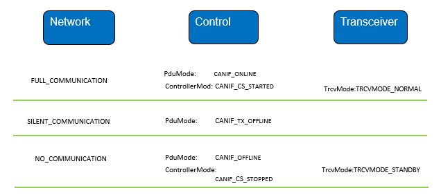

由于延迟等原因，网络的通信模式可能会和ComM请求的不一致。这就需要CanSM通过以下两种方式来提供接口向ComM反馈当前的通信模式：

Due to delays and other reasons, the communication mode of the network may not match the ComM request. This requires CanSM to provide interfaces in the following two ways to feedback the current communication mode to ComM:

1)CanSM自己提供API，ComM可以通过这个API调用来得到CAN网络当前的通信模式。

CanSM provides its own API, and ComM can use this API to get the current communication mode of the CAN network.

2)CanSM使用ComM提供的回调函数来通知通信模式的改变。

CanSM uses the callback function provided by ComM to notify changes in communication modes.

状态管理功能序列图 (State Management Function Sequence Diagram)
~~~~~~~~~~~~~~~~~~~~~~~~~~~~~~~~~~~~~~~~~~~~~~~~~~~~~~~~~~~~~~~~~~

当CanSM接收到来自ComM的FULL_COMMUNICATION请求时，调用下层CanIf的接口来完成请求，请求完成后需要调用ComM回调进行通知。CanSM处理FULL_COMMUNICATION请求时序图如下。

When CanSM receives a FULL_COMMUNICATION request from ComM, it calls the interface of the lower layer CanIf to complete the request. After the request is completed, it needs to call the ComM callback for notification. The processing sequence diagram of the CANSM for handling the FULL_COMMUNICATION request is as follows.

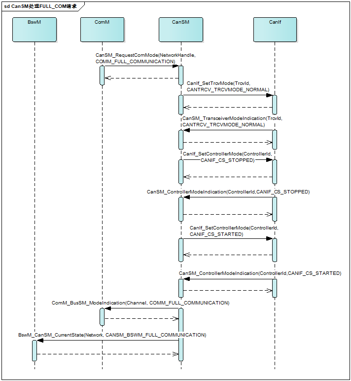

当CanSM接收到来自ComM的SILENT_COMMUNICATION请求时，需要根据配置对该Can网络的多个控制器的状态进行分别处理，请求完成后需要调用ComM回调进行通知。CanSM处理SILENT_COMMUNICATION请求时序图如下。

When CanSM receives a SILENT_COMMUNICATION request from ComM, it needs to handle the states of multiple controllers in the Can network according to the configuration. After completing the request, it should call the ComM callback for notification. The processing sequence diagram for the SILENT_COMMUNICATION request by CanSM is as follows.

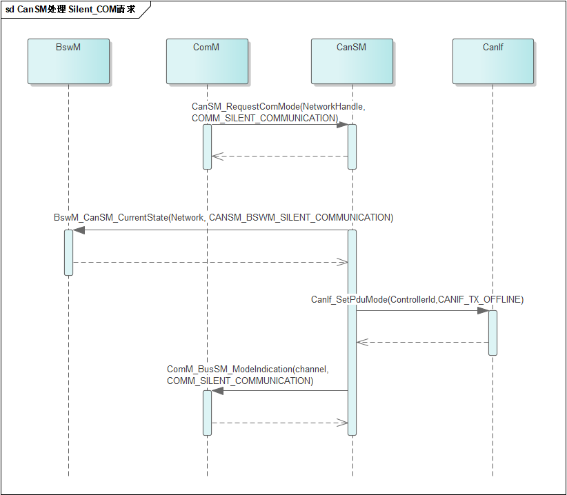

当CanSM接收到来自ComM的NO_COMMUNICATION请求时，调用下层CanIf的接口来完成请求，请求完成后需要调用ComM回调进行通知。CanSM处理NO_COMMUNICATION请求时序图如下。

When CanSM receives a NO_COMMUNICATION request from ComM, it calls the interface of the lower layer CanIf to complete the request. After the request is completed, it needs to call the ComM callback for notification. The processing sequence diagram of the CanSM for handling the NO_COMMUNICATION request is as follows.

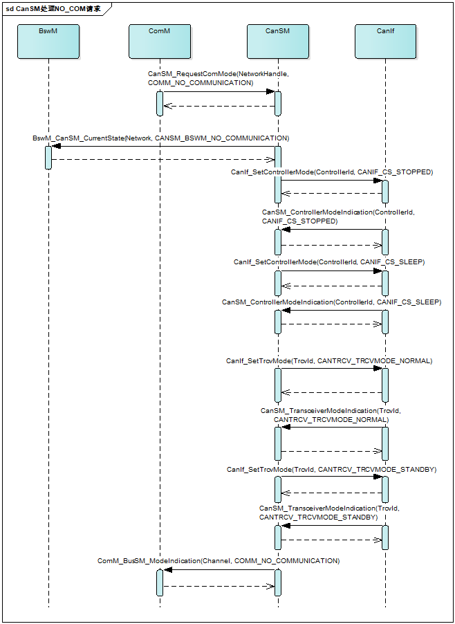

状态管理功能主状态机 (State management feature main state machine)
~~~~~~~~~~~~~~~~~~~~~~~~~~~~~~~~~~~~~~~~~~~~~~~~~~~~~~~~~~~~~~~~~~~~~

State management feature main state machine

上电后，CanSM会默认处于CANSM_BSM_S_NOT_INITIALIZED状态，在经过初始化后，状态将切换至CANSM_BSM_S_PRE_NOCOM。如果EcuM调用CanSM_StartWakeUpSource通知CanSM唤醒源被启动，那么状态机将切换至CANSM_BSM_WUVALIDATION状态。如果接收到ComM的FULL_COMMUNICATION请求，那么状态机将切换至CANSM_BSM_S_PRE_FULLCOM状态。在CanSM通知上层ComM和BSWM底层网络已经切换至FULL_COMMUNICATION，并且调用CanIf_SetPduMode更新PDU通道状态后，状态机将切换至CANSM_BSM_S_FULLCOM。

Upon powering up, CanSM will default to the CANSM_BSM_S_NOT_INITIALIZED state. After initialization, the state will switch to CANSM_BSM_S_PRE_NOCOM. If EcuM calls CanSM_StartWakeUpSource to notify CanSM that a wakeup source has been started, the state machine will transition to the CANSM_BSM_WUVALIDATION state. If the ComM receives a FULL_COMMUNICATION request from ComM, the state machine will transition to the CANSM_BSM_S_PRE_FULLCOM state. After CanSM notifies ComM and BSWM that the underlying network has switched to FULL_COMMUNICATION and calls CanIf_SetPduMode to update the PDU channel status, the state machine will transition to the CANSM_BSM_S_FULLCOM state.

在CANSM_BSM_S_FULLCOM状态中如果接收到ComM的SILENT_COMMUNICATION请求，状态将切换至CANSM_BSM_S_SILENTCOM，或接收到ComM的NO_COMMUNICATION请求，状态将切换至CANSM_BSM_S_PRE_NOCOM。

In the CANSM_BSM_S_FULLCOM state, if a SILENT_COMMUNICATION request from ComM is received, the state will switch to CANSM_BSM_S_SILENTCOM; or if a NO_COMMUNICATION request from ComM is received, the state will switch to CANSM_BSM_S_PRE_NOCOM.

在CANSM_BSM_S_FULLCOM状态中如果CanSM_SetBaudrate接口被上层调用，需要调用BswM_CanSM_CurrentState通知BSWM当前状态为CANSM_BSWM_CHANGE_BAUDRATE，状态机将切换至CANSM_BSM_S_CHANGE_BAUDRATE。

In the CANSM_BSM_S_FULLCOM state, if the CanSM_SetBaudrate interface is called by an upper layer, it needs to call BswM_CanSM_CurrentState to notify BSWM that the current state is CANSM_BSWM_CHANGE_BAUDRATE. This will cause the state machine to switch to CANSM_BSM_S_CHANGE_BAUDRATE.

在CANSM_BSM_S_CHANGE_BAUDRATE中进行波特率修改的相关操作，操作结束后根据已有的ComM的网络请求状态来决定切换至哪个状态机。

In CANSM_BSM_S_CHANGE_BAUDRATE, perform the operations to modify the baud rate. After the operation ends, decide which state machine to switch to based on the existing network request status of ComM.

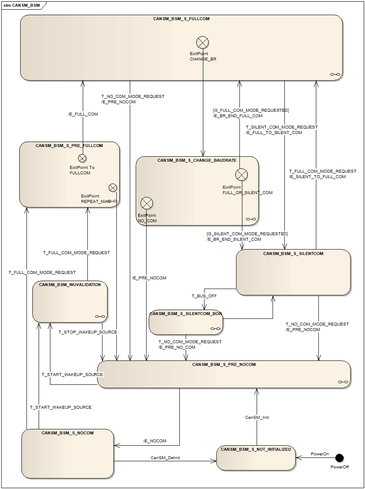

Bus-off恢复功能 (Bypass recovery function)
----------------------------------------------

CanSM可以配置快恢复时间CanSMBorTimeL1和慢恢复时CanSMBorTimeL2，以及经过多少次快恢复切换为慢恢复的次数CanSMBorCounterL1ToL2。当底层发生bus-off时，会调用CanSM的CanSM_ControllerBusOff函数进行通知。CanSM会调用CanIf的CanIf_SetControllerMode函数将控制器状态设置为CAN_CS_STARTED，当接收到底层调用的CanSM_ControllerModeIndication的设置成功的通知后，开始bus-off定时器的计时，当bus-off快恢复的时间超时后，调用CanIf_SetPduMode设置Pdu传输状态为CANIF_ONLINE，当快恢复的次数超过配置参数CanSMBorCounterL1ToL2时，将按照慢恢复的时间进行恢复。

CanSM can be configured with fast recovery time CanSMBorTimeL1 and slow recovery time CanSMBorTimeL2, as well as the number of times a fast recovery switch is required to enter slow recovery, CanSMBorCounterL1ToL2. When a bus-off occurs at the lower level, it calls the CanSM_ControllerBusOff function in CanSM for notification. CanSM then calls the CanIf's CanIf_SetControllerMode function to set the controller state to CAN_CS_STARTED. After receiving successful notifications from the lower-level call of CanSM_ControllerModeIndication, a bus-off timer starts counting. When the fast recovery time exceeds the timeout, it calls the CanIf_SetPduMode function to set the Pdu transmission status to CANIF_ONLINE. If the number of times a fast recovery switch is exceeded the configuration parameter CanSMBorCounterL1ToL2, slow recovery will be initiated according to the configured slow recovery time.

源文件描述 (Source file description)
================================================

.. centered:: **表 CanSM组件文件描述 (Table: CanSM Component File Description)**

.. list-table::
   :widths: 50 50
   :header-rows: 1

   * - 文件 (File)
     - 说明 (Explanation)
   * - CanSM_Cfg.h
     - 用于定义CanSM模块预编译时用到的宏。 (Definitions for macros used during pre-compilation of the CanSM module.)
   * - CanSM_Cfg.c
     - 配置参数源文件，包含各个配置项的定义。 (Configure parameter source file, containing definitions of each configuration item.)
   * - CanSM_BswM.h
     - CanSM模块提供给BswM模块使用的类型。 (What types does the CanSM module provide for use by the BswM module.)
   * - CanSM_Cbk.h
     - CanSM模块提供给CanIf,CanNm,BswM模块使用的Callback函数。 (The CanSM module provides Callback functions that are used by the CanIf, CanNm, and BswM modules.)
   * - CanSM_TxTimeoutException.h
     - 提供给CanNm的头文件，用于调用Tx传输超时函数

       .. code-block:: c

          #ifndef CAN_NM_TX_TIMEOUT_H_
          #define CAN_NM_TX_TIMEOUT_H_

          void can_nm_tx_timeout(void);

          #endif // CAN_NM_TX_TIMEOUT_H_
   * - CanSM_MemMap.h
     - CanSM模块函数和变量存储位置定义文件。 (CanSM module function and variable storage location definition file.)
   * - CanSM.h
     - CanSM模块头文件，通过加载该头文件访问CanSM公开的函数和数据类型 (CanSM module header file, access to the publicly available functions and data types in CanSM by loading this header file.)
   * - CanSM.c
     - CanSM 模块的功能实现。 (CanSM module functionality.)

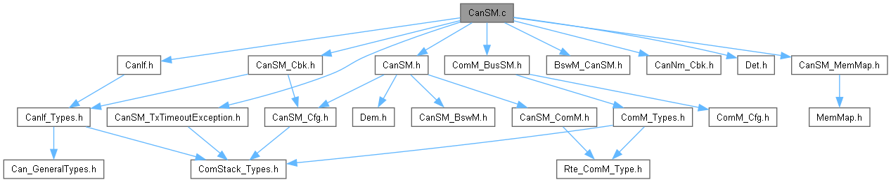

API接口 (API interface)
============================

类型定义 (Type Definitions)
------------------------------------

CanSM_StateType类型定义 (CanSM_StateType type definition)
~~~~~~~~~~~~~~~~~~~~~~~~~~~~~~~~~~~~~~~~~~~~~~~~~~~~~~~~~~~~~~~~~~~~~

.. list-table::
   :widths: 50 50
   :header-rows: 1

   * - 名称 (Name)
     - CanSM_StateType
   * - 类型 (Type)
     - Enumeration
   * - 范围 (Scope)
     - CANSM_UNINITED
   * -
     - CANSM_INITED
   * - 描述 (Describe)
     - 定义 CanSM 模块初始化状态的值 (Define the values for the initialized state of the CanSM module.)

CanSM_ConfigType类型定义 (CanSM_ConfigType type definition)
~~~~~~~~~~~~~~~~~~~~~~~~~~~~~~~~~~~~~~~~~~~~~~~~~~~~~~~~~~~~~~~~~~~~

.. list-table::
   :widths: 50 50
   :header-rows: 1

   * - 名称 (Name)
     - CanSM_ConfigType
   * - 类型 (Type)
     - Structure
   * - 范围 (Scope)
     - --
   * - 描述 (Describe)
     - 此类型为 CanSM 的初始化参数定义了数据结构。 (This type is defined for the initialization parameters of CanSM data structure.)

CanSM_BswMCurrentStateType类型定义 (CanSM_BswMCurrentStateType type definition)
~~~~~~~~~~~~~~~~~~~~~~~~~~~~~~~~~~~~~~~~~~~~~~~~~~~~~~~~~~~~~~~~~~~~~~~~~~~~~~~~~~~~~~~~~~~~~

.. list-table::
   :widths: 50 50
   :header-rows: 1

   * - 名称 (Name)
     - CanSM_BswMCurrentStateType
   * - 类型 (Type)
     - Enumeration
   * - 范围 (Scope)
     - CANSM_BSWM_NO_COMMUNICATION
   * -
     - CANSM_BSWM_SILENT_COMMUNICATION
   * -
     - CANSM_BSWM_FULL_COMMUNICATION
   * -
     - CANSM_BSWM_BUS_OFF
   * -
     - CANSM_BSWM_CHANGE_BAUDRATE
   * - 描述 (Describe)
     - 定义 CanSM 模块通知给 BswM 模块通信状态的值 (Definition of values that the CanSM module notifies to the BswM module about its communication status.)

输入函数描述 (Input function description)
--------------------------------------------------

.. list-table::
   :widths: 50 50
   :header-rows: 1

   * - 输入模块 (Input Module)
     - API
   * - BswM
     - BswM_CanSM_CurrentIcomConfiguration
   * -
     - BswM_CanSM_CurrentState
   * - CanIf
     - CanIf_CheckTrcvWakeFlag
   * -
     - CanIf_ClearTrcvWufFlag
   * -
     - CanIf_GetPduMode
   * -
     - CanIf_GetTxConfirmationState
   * -
     - CanIf_SetControllerMode
   * -
     - CanIf_SetPduMode
   * -
     - CanIf_SetTrcvMode
   * - CanNm
     - CanNm_ConfirmPnAvailability
   * - ComM
     - ComM_BusSM_ModeIndication
   * - Dem
     - Dem_SetEventStatus
   * - Det
     - Det_ReportRuntimeError

静态接口函数定义 (Static function definition for static interface)
----------------------------------------------------------------------------

CanSM_Init函数定义
~~~~~~~~~~~~~~~~~~~~~~~~~~~~~~~~~~

.. list-table::
   :widths: 25 25 25 25
   :header-rows: 1

   * - 函数名称： (Function Name:)
     - CanSM_Init
     -
     -
   * - 函数原型： (Function prototype:)
     - void CanSM_Init(constCanSM_ConfigType\*ConfigPtr)
     -
     -
   * -
     -
     -
     -
   * -
     -
     -
     -
   * - 服务编号： (Service Number:)
     - 0x00
     -
     -
   * - 同步/异步： (Synchronous/asynchronous:)
     - 同步 (Synchronization)
     -
     -
   * - 是否可重入： (Reentrant:)
     - 不可重入 (No Recursion Allowed)
     -
     -
   * - 输入参数： (Input parameters:)
     - ConfigPtr
     - 值域： (Range:)
     - 指向初始化结构的指针，用于CanSM的postbuild参数 (Pointer to the initialization structure used for the postbuild parameter of CanSM)
   * - 输入输出参数: (Input/Output Parameters:)
     - 无 (None)
     -
     -
   * - 输出参数： (Output Parameters:)
     - 无 (None)
     -
     -
   * - 返回值： (Return value:)
     - 无 (None)
     -
     -
   * - 功能概述： (Function Overview:)
     - 完成对CanSM模块的初始化处理 (Initialize the CanSM module completion.)
     -
     -

CanSM_DeInit函数定义
~~~~~~~~~~~~~~~~~~~~~~~~~~~~~~~~~

.. list-table::
   :widths: 50 50
   :header-rows: 1

   * - 函数名称： (Function Name:)
     - CanSM_DeInit
   * - 函数原型： (Function prototype:)
     - void CanSM_DeInit (void)
   * - 服务编号： (Service Number:)
     - 0x14
   * - 同步/异步： (Synchronous/asynchronous:)
     - 同步 (Synchronization)
   * - 是否可重入： (Reentrant:)
     - 不可重入 (No Recursion Allowed)
   * - 输入参数： (Input parameters:)
     - 无 (None)
   * - 输入输出参数: (Input/Output Parameters:)
     - 无 (None)
   * - 输出参数： (Output Parameters:)
     - 无 (None)
   * - 返回值： (Return value:)
     - 无 (None)
   * - 功能概述： (Function Overview:)
     - 反初始化CanSM模块 (Uninitialize CanSM module)

CanSM_RequestComMode函数定义 (CanSM_RequestComMode function definition)
~~~~~~~~~~~~~~~~~~~~~~~~~~~~~~~~~~~~~~~~~~~~~~~~~~~~~~~~~~~~~~~~~~~~~~~~~~

.. list-table::
   :widths: 25 25 25 25
   :header-rows: 1

   * - 函数名称： (Function Name:)
     - CanSM_RequestComMode
     -
     -
   * - 函数原型： (Function prototype:)
     - Std_ReturnTypeCanSM_RequestComMode(NetworkHandleTypenetwork,ComM_ModeTypeComMMode)
     -
     -
   * - 服务编号： (Service Number:)
     - 0x02
     -
     -
   * - 同步/异步： (Synchronous/asynchronous:)
     - 非同步 (Asynchronous)
     -
     -
   * - 是否可重入： (Reentrant:)
     - 可重入（同一网络不可重入） (Reentrant (reentrancy is not allowed within the same network))
     -
     -
   * - 输入参数： (Input parameters:)
     - network
     - 值域： (Range:)
     - 指定通信网络 (Specify Communication Network)
   * -
     - ComMMode
     - 值域： (Range:)
     - 请求的通信模式 (Request Communication Mode)
   * - 输入输出参数: (Input/Output Parameters:)
     - 无 (None)
     -
     -
   * - 输出参数： (Output Parameters:)
     - 无 (None)
     -
     -
   * - 返回值： (Return value:)
     - E_OK: 服务被接受 (E_OK: Service accepted)
     -
     -
   * -
     - E_NOT_OK:服务被拒绝 (E_NOT_OK: Service Denied)
     -
     -
   * - 功能概述： (Function Overview:)
     - 将CAN网络的通信模式更改为请求的通信模式 (Change the communication mode of CAN network to request mode.)
     -
     -

CanSM_GetCurrentComMode函数定义(CanSM_GetCurrentComMode function definition)
~~~~~~~~~~~~~~~~~~~~~~~~~~~~~~~~~~~~~~~~~~~~~~~~~~~~~~~~~~~~~~~~~~~~~~~~~~~~~~~~~~~~~~~~~~~~~~~~~~~~~~~~~~~~~~~~~~~~~~~~~~~

.. list-table::
   :widths: 25 25 25 25
   :header-rows: 1

   * - 函数名称： (Function Name:)
     - CanSM\_GetCurrentComMode
     -
     -
   * - 函数原型： (Function prototype:)
     - Std_ReturnTypeCanSM\_GetCurrentComMode(NetworkHandleTypenetwork,ComM_ModeType\*ComMModePtr)
     -
     -
   * - 服务编号： (Service Number:)
     - 0x03
     -
     -
   * - 同步/异步： (Synchronous/asynchronous:)
     - 同步 (Synchronization)
     -
     -
   * - 是否可重入： (Reentrant:)
     - 可重入 (reentrant)
     -
     -
   * - 输入参数： (Input parameters:)
     - network
     - 值域： (Range:)
     - 指定通信网络 (Specify Communication Network)
   * - 输入输出参数: (Input/Output Parameters:)
     - 无 (None)
     -
     -
   * - 输出参数： (Output Parameters:)
     - ComMModePtr
     - 值域： (Range:)
     - 指针，保存当前通信模式的位置 (Pointer, save the position of the current communication mode.)
   * - 返回值： (Return value:)
     - E_OK: 服务被接受 (E_OK: Service accepted)
     -
     -
   * -
     - E_NOT_OK:服务被拒绝 (E_NOT_OK: Service Denied)
     -
     -
   * - 功能概述： (Function Overview:)
     - 获取当前网络的通信模式。 (Get current network communication mode.)
     -
     -

CanSM_StartWakeupSource函数定义 (CanSM_StartWakeupSource function definition)
~~~~~~~~~~~~~~~~~~~~~~~~~~~~~~~~~~~~~~~~~~~~~~~~~~~~~~~~~~~~~~~~~~~~~~~~~~~~~~~~

.. list-table::
   :widths: 25 25 25 25
   :header-rows: 1

   * - 函数名称： (Function Name:)
     - CanSM\_StartWakeupSource
     -
     -
   * - 函数原型： (Function prototype:)
     - Std_ReturnTypeCanSM\_StartWakeupSource(NetworkHandleTypenetwork)
     -
     -
   * - 服务编号： (Service Number:)
     - 0x11
     -
     -
   * - 同步/异步： (Synchronous/asynchronous:)
     - 同步 (Synchronization)
     -
     -
   * - 是否可重入： (Reentrant:)
     - 不可重入 (No Recursion Allowed)
     -
     -
   * - 输入参数： (Input parameters:)
     - network
     - 值域： (Range:)
     - 受影响网络 (Network affected)
   * - 输入输出参数: (Input/Output Parameters:)
     - 无 (None)
     -
     -
   * - 输出参数： (Output Parameters:)
     - 无 (None)
     -
     -
   * - 返回值： (Return value:)
     - E_OK: 请求成功 (E_OK: Request Successful)
     -
     -
   * -
     - E_NOT_OK:请求被拒绝 (E_NOT_OK: Request was denied)
     -
     -
   * - 功能概述： (Function Overview:)
     - 当唤醒源启动时，EcuM应该调用该函数 (When the source wakes up, EcuM should call that function.)
     -
     -

CanSM_StopWakeupSource函数定义 (CanSM_StopWakeupSource function definition)
~~~~~~~~~~~~~~~~~~~~~~~~~~~~~~~~~~~~~~~~~~~~~~~~~~~~~~~~~~~~~~~~~~~~~~~~~~~~~~

.. list-table::
   :widths: 25 25 25 25
   :header-rows: 1

   * - 函数名称： (Function Name:)
     - CanSM_StopWakeupSource
     -
     -
   * - 函数原型： (Function prototype:)
     - Std_ReturnTypeCanSM_StopWakeupSource(NetworkHandleTypenetwork)
     -
     -
   * - 服务编号： (Service Number:)
     - 0x12
     -
     -
   * - 同步/异步： (Synchronous/asynchronous:)
     - 同步 (Synchronization)
     -
     -
   * - 是否可重入： (Reentrant:)
     - 不可重入 (No Recursion Allowed)
     -
     -
   * - 输入参数： (Input parameters:)
     - network
     - 值域： (Range:)
     - 受影响网络 (Network affected)
   * - 输入输出参数: (Input/Output Parameters:)
     - 无 (None)
     -
     -
   * - 输出参数： (Output Parameters:)
     - 无 (None)
     -
     -
   * - 返回值： (Return value:)
     - E_OK: 请求成功 (E_OK: Request Successful)
     -
     -
   * -
     - E_NOT_OK:请求被拒绝 (E_NOT_OK: Request was denied)
     -
     -
   * - 功能概述： (Function Overview:)
     - 当唤醒源停止时，EcuM应该调用该函数 (When the wakeup source stops, EcuM should call that function.)
     -
     -

CanSM_GetVersionInfo函数定义 (CanSM_GetVersionInfo function definition)
~~~~~~~~~~~~~~~~~~~~~~~~~~~~~~~~~~~~~~~~~~~~~~~~~~~~~~~~~~~~~~~~~~~~~~~~~~~~~~~~~~~~~~~~~~~~~~~~~~~~~~~~~~~~~~~~~~~~~

.. list-table::
   :widths: 25 25 25 25
   :header-rows: 1

   * - 函数名称： (Function Name:)
     - CanSM_GetVersionInfo
     -
     -
   * - 函数原型： (Function prototype:)
     - voidCanSM_GetVersionInfo(Std\_VersionInfoType\*VersionInfo)
     -
     -
   * - 服务编号： (Service Number:)
     - 0x01
     -
     -
   * - 同步/异步： (Synchronous/asynchronous:)
     - 同步 (Synchronization)
     -
     -
   * - 是否可重入： (Reentrant:)
     - 可重入 (reentrant)
     -
     -
   * - 输入参数： (Input parameters:)
     - 无 (None)
     -
     -
   * - 输入输出参数: (Input/Output Parameters:)
     - 无 (None)
     -
     -
   * - 输出参数： (Output Parameters:)
     - versioninfo
     - 值域： (Range:)
     - 指向存储版本信息的位置 (Point to the location where version information is stored.)
   * - 返回值： (Return value:)
     - 无 (None)
     -
     -
   * - 功能概述： (Function Overview:)
     - 获取版本信息 (Get version information)
     -
     -

CanSM_SetBaudrate函数定义 (CanSM_SetBaudrate function definition)
~~~~~~~~~~~~~~~~~~~~~~~~~~~~~~~~~~~~~~~~~~~~~~~~~~~~~~~~~~~~~~~~~~~~

.. list-table::
   :widths: 25 25 25 25
   :header-rows: 1

   * - 函数名称： (Function Name:)
     - CanSM_SetBaudrate
     -
     -
   * - 函数原型： (Function prototype:)
     - Std_ReturnTypeCanSM_SetBaudrate(NetworkHandleTypeNetwork,uint16BaudRateConfigID)
     -
     -
   * - 服务编号： (Service Number:)
     - 0x0d
     -
     -
   * - 同步/异步： (Synchronous/asynchronous:)
     - 同步 (Synchronization)
     -
     -
   * - 是否可重入： (Reentrant:)
     - 可重入（同一网络不可重入） (Reentrant (reentrancy is not allowed within the same network))
     -
     -
   * - 输入参数： (Input parameters:)
     - network
     - 值域： (Range:)
     - 需要更改波特率的网络 (Networks that need to change the baud rate.)
   * -
     - BaudRateConfigID
     - 值域： (Range:)
     - 通过ID引用波特率配置(见CanControllerBaudRateConfigID) (By ID to reference the baud rate configuration (see CanControllerBaudRateConfigID))
   * - 输入输出参数: (Input/Output Parameters:)
     - 无 (None)
     -
     -
   * - 输出参数: (Output Parameters:)
     - 无 (None)
     -
     -
   * - 返回值： (Return value:)
     - E_OK:接受服务请求，启动(新的)波特率设置 (E_OK: Accept service request, start (new) baud rate setting)
     -
     -
   * -
     - E_NOT_OK:服务请求不被接受 (E_NOT_OK: Service request is not accepted)
     -
     -
   * - 功能概述： (Function Overview:)
     - 该服务应启动异步过程，以更改某个CAN网络的CAN控制器的波特率 (The service should initiate an asynchronous process to change the baud rate of a CAN controller in a certain CAN network.)
     -
     -

CanSM_SetEcuPassive函数定义 (CanSM_SetEcuPassive function definition)
~~~~~~~~~~~~~~~~~~~~~~~~~~~~~~~~~~~~~~~~~~~~~~~~~~~~~~~~~~~~~~~~~~~~~~~~

.. list-table::
   :widths: 25 25 25 25
   :header-rows: 1

   * - 函数名称： (Function Name:)
     - CanSM_SetEcuPassive
     -
     -
   * - 函数原型： (Function prototype:)
     - Std_ReturnTypeCanSM_SetEcuPassive(booleanCanSM_Passive)
     -
     -
   * - 服务编号： (Service Number:)
     - 0x13
     -
     -
   * - 同步/异步： (Synchronous/asynchronous:)
     - 同步 (Synchronization)
     -
     -
   * - 是否可重入： (Reentrant:)
     - 不可重入 (No Recursion Allowed)
     -
     -
   * - 输入参数： (Input parameters:)
     - CanSM_Passive
     - 值域： (Range:)
     - TRUE:将所有CanSM频道设置为被动，即只接收 (TRUE: Set all CanSM channels to passive mode, i.e., only receive.)
   * -
     -
     -
     - FALSE:将所有CanSM通道设置为非被动 (FALSE: Set all CanSM channels to non-passive.)
   * - 输入输出参数: (Input/Output Parameters:)
     - 无 (None)
     -
     -
   * - 输出参数： (Output Parameters:)
     - 无 (None)
     -
     -
   * - 返回值： (Return value:)
     - E_OK: 请求被接受 (E_OK: Request accepted)
     -
     -
   * -
     - E_NOT_OK:请求被拒绝 (E_NOT_OK: Request was denied)
     -
     -
   * - 功能概述： (Function Overview:)
     - 该功能可用于将ECU的所有CanSM通道设置为仅接收模式。该模式将一直保持，直到它被设置回来，或者ECU被重置 (This feature can be used to set all CanSM channels of the ECU to receive mode. This mode will remain until it is reset back, or the ECU is reset.)
     -
     -

CanSM_ControllerBusOff函数定义 (CanSM_ControllerBusOff function definition)
~~~~~~~~~~~~~~~~~~~~~~~~~~~~~~~~~~~~~~~~~~~~~~~~~~~~~~~~~~~~~~~~~~~~~~~~~~~~~~

.. list-table::
   :widths: 25 25 25 25
   :header-rows: 1

   * - 函数名称： (Function Name:)
     - CanSM_ControllerBusOff
     -
     -
   * - 函数原型： (Function prototype:)
     - voidCanSM_ControllerBusOff(uint8ControllerId)
     -
     -
   * - 服务编号： (Service Number:)
     - 0x04
     -
     -
   * - 同步/异步： (Synchronous/asynchronous:)
     - 同步 (Synchronization)
     -
     -
   * - 是否可重入： (Reentrant:)
     - 可重入（同一网络不可重入） (Reentrant (reentrancy is not allowed within the same network))
     -
     -
   * - 输入参数： (Input parameters:)
     - ControllerId
     - 值域： (Range:)
     - CAN控制器，检测到bus-off事件 (CAN controller detects bus-off event.)
   * - 输入输出参数: (Input/Output Parameters:)
     - 无 (None)
     -
     -
   * - 输出参数： (Output Parameters:)
     - 无 (None)
     -
     -
   * - 返回值： (Return value:)
     - 无 (None)
     -
     -
   * - 功能概述： (Function Overview:)
     - 此回调函数通知CanSM有关某个CAN控制器上的bus-off事件，需要考虑对受影响的CAN网络执行指定的bus-off恢复处理 (This callback function notifies CanSM about a bus-off event on a particular CAN controller, and consideration should be given to executing the specified bus-off recovery processing for the affected CAN network.)
     -
     -

CanSM_ControllerModeIndication函数定义 (CanSM_ControllerModeIndication function definition)
~~~~~~~~~~~~~~~~~~~~~~~~~~~~~~~~~~~~~~~~~~~~~~~~~~~~~~~~~~~~~~~~~~~~~~~~~~~~~~~~~~~~~~~~~~~~~~

.. list-table::
   :widths: 25 25 25 25
   :header-rows: 1

   * - 函数名称： (Function Name:)
     - CanSM_ControllerModeIndication
     -
     -
   * - 函数原型： (Function prototype:)
     - voidCanSM_ControllerModeIndication(uint8ControllerId,Can_ControllerStateTypeControllerMode)
     -
     -
   * - 服务编号： (Service Number:)
     - 0x07
     -
     -
   * - 同步/异步： (Synchronous/asynchronous:)
     - 同步 (Synchronization)
     -
     -
   * - 是否可重入： (Reentrant:)
     - 可重入（同一控制器不可重入） (Reentrancy (reentry is not allowed in the same controller))
     -
     -
   * - 输入参数： (Input parameters:)
     - ControllerId
     - 值域： (Range:)
     - Can控制器Id (Can controller ID)
   * -
     - ControllerMode
     - 值域： (Range:)
     - 通知CAN控制器模式 (Notify CAN controller mode)
   * - 输入输出参数: (Input/Output Parameters:)
     - 无 (None)
     -
     -
   * - 输出参数： (Output Parameters:)
     - 无 (None)
     -
     -
   * - 返回值： (Return value:)
     - 无 (None)
     -
     -
   * - 功能概述： (Function Overview:)
     - 该回调应通知CanSM模块CAN控制器模式改变 (The callback should notify the CanSM module about a change in CAN controller mode.)
     -
     -

CanSM_TransceiverModeIndication函数定义 (CanSM_TransceiverModeIndication function definition)
~~~~~~~~~~~~~~~~~~~~~~~~~~~~~~~~~~~~~~~~~~~~~~~~~~~~~~~~~~~~~~~~~~~~~~~~~~~~~~~~~~~~~~~~~~~~~~~~

.. list-table::
   :widths: 25 25 25 25
   :header-rows: 1

   * - 函数名称： (Function Name:)
     - CanSM_TransceiverModeIndication
     -
     -
   * - 函数原型： (Function prototype:)
     - voidCanSM_TransceiverModeIndication(uint8TransceiverId,CanTrcv_TrcvModeTypeTransceiverMode)
     -
     -
   * - 服务编号： (Service Number:)
     - 0x09
     -
     -
   * - 同步/异步： (Synchronous/asynchronous:)
     - 同步 (Synchronization)
     -
     -
   * - 是否可重入： (Reentrant:)
     - 可重入（同一Trcv不可重入） (Reentrant (a particular Trcv should not be reentered))
     -
     -
   * - 输入参数： (Input parameters:)
     - TransceiverId
     - 值域： (Range:)
     - CAN收发器 (CAN Transceiver)
   * -
     - TransceiverMode
     - 值域： (Range:)
     - 收发器模式 (Receiver Mode)
   * - 输入输出参数: (Input/Output Parameters:)
     - 无 (None)
     -
     -
   * - 输出参数： (Output Parameters:)
     - 无 (None)
     -
     -
   * - 返回值： (Return value:)
     - 无 (None)
     -
     -
   * - 功能概述： (Function Overview:)
     - 该回调应通知CanSM模块CANTransceiver模式改变 (The callback should notify the CanSM module about a change in CANTransceiver mode.)
     -
     -

CanSM_TxTimeoutException函数定义 (CanSM_TxTimeoutException function definition)
~~~~~~~~~~~~~~~~~~~~~~~~~~~~~~~~~~~~~~~~~~~~~~~~~~~~~~~~~~~~~~~~~~~~~~~~~~~~~~~~~~
.. list-table::
   :widths: 25 25 25 25
   :header-rows: 1

   * - 函数名称： (Function Name:)
     - CanSM_TxTimeoutException
     -
     -
   * - 函数原型： (Function prototype:)
     - voidCanSM_TxTimeoutException(NetworkHandleTypeChannel)
     -
     -
   * - 服务编号： (Service Number:)
     - 0x0b
     -
     -
   * - 同步/异步： (Synchronous/asynchronous:)
     - 同步 (Synchronization)
     -
     -
   * - 是否可重入： (Reentrant:)
     - 可重入 (reentrant)
     -
     -
   * - 输入参数： (Input parameters:)
     - Channel
     - 值域： (Range:)
     - 影响网络 (Impact of Network)
   * - 输入输出参数: (Input/Output Parameters:)
     - 无 (None)
     -
     -
   * - 输出参数： (Output Parameters:)
     - 无 (None)
     -
     -
   * - 返回值： (Return value:)
     - 无 (None)
     -
     -
   * - 功能概述： (Function Overview:)
     - 该功能应通知CanSM模块CanNm已经为受影响的部分CAN网络检测到tx超时异常，该异常应在CanSM模块的相应网络状态机中恢复 (The feature should notify the CanSM module that the CanNm has detected tx timeout anomalies for affected parts of the CAN network. This anomaly should be recovered in the corresponding network state machine within the CanSM module.)
     -
     -

CanSM_ClearTrcvWufFlagIndication函数定义 (CanSM_ClearTrcvWufFlagIndication function definition)
~~~~~~~~~~~~~~~~~~~~~~~~~~~~~~~~~~~~~~~~~~~~~~~~~~~~~~~~~~~~~~~~~~~~~~~~~~~~~~~~~~~~~~~~~~~~~~~~~~

.. list-table::
   :widths: 25 25 25 25
   :header-rows: 1

   * - 函数名称： (Function Name:)
     - CanSM_ClearTrcvWufFlagIndication
     -
     -
   * - 函数原型： (Function prototype:)
     - voidCanSM_ClearTrcvWufFlagIndication(uint8 Transceiver)
     -
     -
   * - 服务编号： (Service Number:)
     - 0x08
     -
     -
   * - 同步/异步： (Synchronous/asynchronous:)
     - 同步 (Synchronization)
     -
     -
   * - 是否可重入： (Reentrant:)
     - 可重入（同一Trcv不可重入） (Reentrant (a particular Trcv should not be reentered))
     -
     -
   * - 输入参数： (Input parameters:)
     - Transceiver
     - 值域： (Range:)
     - 请求的收发器 (Request Transmitter)
   * - 输入输出参数: (Input/Output Parameters:)
     - 无 (None)
     -
     -
   * - 输出参数： (Output Parameters:)
     - 无 (None)
     -
     -
   * - 返回值： (Return value:)
     - 无 (None)
     -
     -
   * - 功能概述： (Function Overview:)
     - 该回调函数应指示所通知的CAN收发器的CanIf_ClearTrcvWufFlagAPI进程结束。 (The callback function should indicate the completion of the `CanIf_ClearTrcvWufFlagAPI` process for the CAN transceiver notified.)
     -
     -

CanSM_CheckTransceiverWakeFlagIndication函数定义 (CanSM_CheckTransceiverWakeFlagIndication function definition)
~~~~~~~~~~~~~~~~~~~~~~~~~~~~~~~~~~~~~~~~~~~~~~~~~~~~~~~~~~~~~~~~~~~~~~~~~~~~~~~~~~~~~~~~~~~~~~~~~~~~~~~~~~~~~~~~~~

.. list-table::
   :widths: 25 25 25 25
   :header-rows: 1

   * - 函数名称： (Function Name:)
     - CanSM_CheckTransceiverWakeFlagIndication
     -
     -
   * -
     - void   CanSM_CheckTransceiverWakeFlagIndication (
     -
     -
   * - 函数原型： (Function prototype:)
     - uint8 Transceiver
     -
     -
   * -
     - )
     -
     -
   * - 服务编号： (Service Number:)
     - 0x0a
     -
     -
   * - 同步/异步： (Synchronous/asynchronous:)
     - 同步 (Synchronization)
     -
     -
   * - 是否可重入： (Reentrant:)
     - 可重入（同一Trcv不可重入） (Reentrant (a particular Trcv should not be reentered))
     -
     -
   * - 输入参数： (Input parameters:)
     - Transceiver
     - 值域： (Range:)
     - 请求的收发器 (Request Transmitter)
   * - 输入输出参数: (Input/Output Parameters:)
     - 无 (None)
     -
     -
   * - 输出参数： (Output Parameters:)
     - 无 (None)
     -
     -
   * - 返回值： (Return value:)
     - 无 (None)
     -
     -
   * - 功能概述： (Function Overview:)
     - 该回调函数应指示所通知的CAN收发器的CanIf_CheckTrcvWakeFlag API进程结束。 (The callback function should indicate the completion of the CanIf_CheckTrcvWakeFlag API process for the CAN transceiver that was notified.)
     -
     -

CanSM_ConfirmPnAvailability函数定义 (can_sm_confirm_pn_availability function definition)
~~~~~~~~~~~~~~~~~~~~~~~~~~~~~~~~~~~~~~~~~~~~~~~~~~~~~~~~~~~~~~~~~~~~~~~~~~~~~~~~~~~~~~~~~~~

.. list-table::
   :widths: 25 25 25 25
   :header-rows: 1

   * - 函数名称： (Function Name:)
     - CanSM_ConfirmPnAvailability
     -
     -
   * - 函数原型： (Function prototype:)
     - voidCanSM_ConfirmPnAvailability(uint8TransceiverId)
     -
     -
   * - 服务编号： (Service Number:)
     - 0x06
     -
     -
   * - 同步/异步： (Synchronous/asynchronous:)
     - 同步 (Synchronization)
     -
     -
   * - 是否可重入： (Reentrant:)
     - 可重入 (reentrant)
     -
     -
   * - 输入参数： (Input parameters:)
     - TransceiverId
     - 值域： (Range:)
     - 收发器Id (Receiver ID)
   * - 输入输出参数: (Input/Output Parameters:)
     - 无 (None)
     -
     -
   * - 输出参数： (Output Parameters:)
     - 无 (None)
     -
     -
   * - 返回值： (Return value:)
     - 无 (None)
     -
     -
   * - 功能概述： (Function Overview:)
     - 此回调函数表明收发器正在PN通信模式下运行 (This callback indicates that the transmitter is running in PN communication mode.)
     -
     -

CanSM_MainFunction函数定义 (def CanSM_MainFunction():)
~~~~~~~~~~~~~~~~~~~~~~~~~~~~~~~~~~~~~~~~~~~~~~~~~~~~~~~~~

def CanSM_MainFunction():

.. list-table::
   :widths: 50 50
   :header-rows: 1

   * - 函数名称： (Function Name:)
     - CanSM_MainFunction
   * - 函数原型： (Function prototype:)
     - void CanSM_MainFunction (void)
   * - 服务编号： (Service Number:)
     - 0x05
   * - 功能概述： (Function Overview:)
     - CanSM的周期功能 (CanSM's periodic function)

可配置函数定义 (Configurable function definition)
---------------------------------------------------

<User_GetBusOffDelay>函数定义 (function User_GetBusOffDelay())
~~~~~~~~~~~~~~~~~~~~~~~~~~~~~~~~~~~~~~~~~~~~~~~~~~~~~~~~~~~~~~~~~~~~

.. list-table::
   :widths: 25 25 25 25
   :header-rows: 1

   * - 函数名称： (Function Name:)
     - <User_GetBusOffDelay>
     -
     -
   * - 函数原型： (Function prototype:)
     - void<User_GetBusOffDelay>(NetworkHandleTypenetwork,uint8\*delayCyclesPtr)
     -
     -
   * - 服务编号： (Service Number:)
     - 无 (None)
     -
     -
   * - 同步/异步： (Synchronous/asynchronous:)
     - 同步 (Synchronization)
     -
     -
   * - 是否可重入： (Reentrant:)
     - 可重入（仅对于不同的网络） (Reentrant (for different networks only))
     -
     -
   * - 输入参数： (Input parameters:)
     - network
     - 值域： (Range:)
     - 发生 BusOff 的 CAN网络。 (CAN network occurred BusOff.)
   * - 输入输出参数： (Input and output parameters:)
     - 无 (None)
     -
     -
   * - 输出参数： (Output Parameters:)
     - delayCyclesPtr
     - 值域： (Range:)
     - 发生 BusOff 后，在L1/L2 之外等待的 CanSM基本周期数。 (Number of basic CAN SM cycles to wait after a BusOff, excluding L1 and L2.)
   * - 返回值： (Return value:)
     - 无 (None)
     -
     -
   * - 功能概述： (Function Overview:)
     - 在发生 BusOff后，此调用函数返回要额外等待L1/L2 的 CanSM基本周期数。 (After a BusOff occurs, this function returns the number of basic CanSM cycles to wait additionally for L1/L2.)
     -
     -

配置 (Configuration)
============================

CanSMGeneral
----------------------

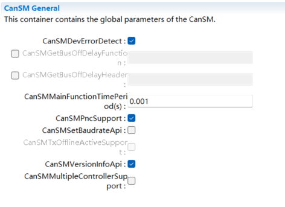

.. centered:: **表  CanSMGeneral属性描述 (Table: CanSMGeneral Property Description)**

.. list-table::
   :widths: 20 20 20 20 20
   :header-rows: 1

   * - UI名称 (User Interface Name)
     - 描述 (Description)
     -
     -
     -
   * - CanSMDevErrorDetect
     - 取值范围 (range of values)
     - TRUE,FALSE
     - 默认取值 (default value)
     - FALSE
   * -
     - 参数描述 (Parameter Description)
     - 打开或关闭默认错误跟踪器(Det) 检测和通知。
     -
     -
   * -
     - 依赖关系 (dependency relationships)
     - 无 (None)
     -
     -
   * - CanSMGetBusOffDelayFunction
     - 取值范围 (range of values)
     - FunctionName
     - 默认取值 (default value)
     - 无 (None)
   * -
     - 参数描述 (Parameter Description)
     - 该参数配置<User_GetBusOffDelay>调用函数的名称，CanSM使用该函数获取额外的L1/L2延迟时间。此函数仅在CanSMEnableBusOffDelay已启用的通道中调用。 (The parameter configures the name of the function called by CanSM. This function uses the configuration to obtain additional L1/L2 delay times. The function is only invoked in channels where CanSMEnableBusOffDelay is enabled.)
     -
     -
   * -
     - 依赖关系 (dependency relationships)
     - 无 (None)
     -
     -
   * - CanSMGetBusOffDelayHeader
     - 取值范围 (range of values)
     - String
     - 默认取值 (default value)
     - 无 (None)
   * -
     - 参数描述 (Parameter Description)
     - 此参数配置包含<User_GetBusOffDelay>callout函数原型的头文件。 (This parameter configuration includes the header file of the <User_GetBusOffDelay> callout function prototype.)
     -
     -
   * -
     - 依赖关系 (dependency relationships)
     - 无 (None)
     -
     -
   * - CanSMMainFunctionTimePeriod
     - 取值范围 (range of values)
     - 0..INF
     - 默认取值 (default value)
     - 无 (None)
   * -
     - 参数描述 (Parameter Description)
     - 该参数以秒为单位定义函数CanSM_MainFunction的循环时间 (The parameter defines the loop time of the function CanSM_MainFunction in seconds.)
     -
     -
   * -
     - 依赖关系 (dependency relationships)
     - 无 (None)
     -
     -
   * - CanSMPncSupport
     - 取值范围 (range of values)
     - TRUE,FALSE
     - 默认取值 (default value)
     - FALSE
   * -
     - 参数描述 (Parameter Description)
     - 启用或禁用对PN网络的支持。 (Enable or disable support for PN network.)
     -
     -
   * -
     - 依赖关系 (dependency relationships)
     - 只有在 ComM 中启用了ComMPncSupport时，此参数才可用 (This parameter is only available when ComM has ComMPncSupport enabled.)
     -
     -
   * - CanSMSetBaudrateApi
     - 取值范围 (range of values)
     - TRUE,FALSE
     - 默认取值 (default value)
     - FALSE
   * -
     - 参数描述 (Parameter Description)
     - Can_SetBaudrate API的支持是可选的。如果此参数设置为true，则应支持Can_SetBaudrate API。否则不支持 API。 (Can_SetBaudrate API support is optional. If this parameter is set to true, the Can_SetBaudrate API should be supported. Otherwise, it is not supported.)
     -
     -
   * -
     - 依赖关系 (dependency relationships)
     - 无 (None)
     -
     -
   * - CanSMTxOfflineActiveSupport
     - 取值范围 (range of values)
     - TRUE,FALSE
     - 默认取值 (default value)
     - 无 (None)
   * -
     - 参数描述 (Parameter Description)
     - 确定 CanSM 是否支持ECU 被动功能。 (Do the rules for CanSM support ECU passive features.)
     -
     -
   * -
     - 依赖关系 (dependency relationships)
     - 依赖CanIfTxOfflineActiveSupport (DependencyCanIfTxOfflineActiveSupport)
     -
     -
   * - CanSMVersionInfoApi
     - 取值范围 (range of values)
     - TRUE,FALSE
     - 默认取值 (default value)
     - FALSE
   * -
     - 参数描述 (Parameter Description)
     - 使能版本信息API(CanSM_GetVersionInfo)。
     -
     -
   * -
     - 依赖关系 (dependency relationships)
     - 无 (None)
     -
     -
   * - CanSMMultipleControllerSupport
     - 取值范围 (range of values)
     - TRUE,FALSE
     - 默认取值 (default value)
     - FALSE
   * -
     - 参数描述 (Parameter Description)
     - 启用/禁用为网络分配多个控制器的功能。 (Enable/disable the function of allocating multiple controllers to a network.)
     -
     -
   * -
     - 依赖关系 (dependency relationships)
     - 无 (None)
     -
     -

CanSMConfiguration
----------------------------

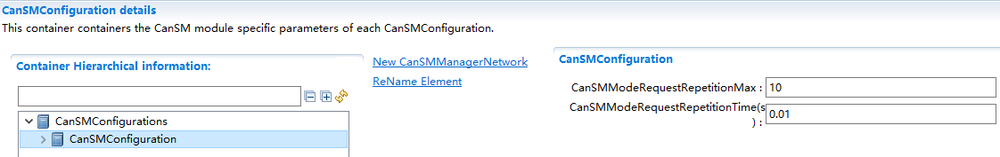

.. centered:: **表  CanSMConfiguration属性描述 (Description of the CanSMConfiguration property)**

.. list-table::
   :widths: 20 20 20 20 20
   :header-rows: 1

   * - UI名称 (User Interface Name)
     - 描述 (Description)
     -
     -
     -
   * - CanSMModeRequestRepetitionMax
     - 取值范围 (range of values)
     - 0..255
     - 默认取值 (default value)
     - 无 (None)
   * -
     - 参数描述 (Parameter Description)
     - 没有来自 CanIf模块的相应模式指示，指定模式请求重复的最大数量，直到CanSM 模块向 Det报告开发错误并尝试返回无通信状态。 (No corresponding mode indication from the CanIf module, specify the maximum number of mode requests until the CanSM module reports a development error and attempts to return an uncommunicable state.)
     -
     -
   * -
     - 依赖关系 (dependency relationships)
     - 无 (None)
     -
     -
   * - CanSMModeRequestRepetitionTime
     - 取值范围 (range of values)
     - 0..65.535
     - 默认取值 (default value)
     - 无 (None)
   * -
     - 参数描述 (Parameter Description)
     - 通过使用 CanIf 模块的API，指定 CanSM模块应在多长时间内重复模式更改请求。 (By using the API of the CanIf module, specify how long the CanSM module should repeat mode change requests.)
     -
     -
   * -
     - 依赖关系 (dependency relationships)
     - 无 (None)
     -
     -

CanSMManagerNetwork
~~~~~~~~~~~~~~~~~~~~~~~~~~~~~~~

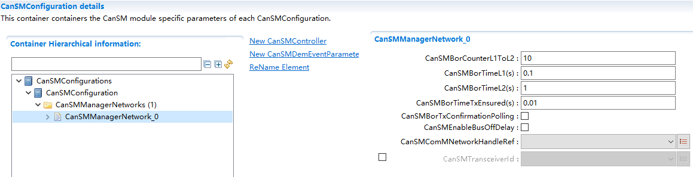

.. centered:: **表  CanSMManagerNetwork属性描述 (Description of the CanSMManagerNetwork property)**

.. list-table::
   :widths: 20 20 20 20 20
   :header-rows: 1

   * - UI名称 (User Interface Name)
     - 描述 (Description)
     -
     -
     -
   * - CanSMBorCounterL1ToL2
     - 取值范围 (range of values)
     - 0..255
     - 默认取值 (default value)
     - 无 (None)
   * -
     - 参数描述 (Parameter Description)
     - 该阈值定义了bus-off计数，直到bus-off恢复从级别1（快恢复时间）切换到级别2（慢恢复时间）。 (That threshold defines the bus-off count until the bus-off recovery transitions from level 1 (fast recovery time) to level 2 (slow recovery time).)
     -
     -
   * -
     - 依赖关系 (dependency relationships)
     - 无 (None)
     -
     -
   * - CanSMBorTimeL1
     - 取值范围 (range of values)
     - 0..65.535
     - 默认取值 (default value)
     - 无 (None)
   * -
     - 参数描述 (Parameter Description)
     - 该时间参数以秒为单位定义了级别1中bus-off恢复时间的持续时间（快恢复时间） (The time parameter defines the duration (fast recovery time) of the bus-off recovery period in level 1, which is specified in seconds.)
     -
     -
   * -
     - 依赖关系 (dependency relationships)
     - 无 (None)
     -
     -
   * - CanSMBorTimeL2
     - 取值范围 (range of values)
     - 0..65.535
     - 默认取值 (default value)
     - 无 (None)
   * -
     - 参数描述 (Parameter Description)
     - 该时间参数以秒为单位定义了级别2（慢恢复时间）中bus-off恢复时间的持续时间。 (The time parameter defines the duration of the bus-off recovery time for Level 2 (slow recovery time).)
     -
     -
   * -
     - 依赖关系 (dependency relationships)
     - 无 (None)
     -
     -
   * - CanSMBorTimeTxEnsured
     - 取值范围 (range of values)
     - 0..65.535
     - 默认取值 (default value)
     - 无 (None)
   * -
     - 参数描述 (Parameter Description)
     - 该参数以秒为单位定义bus-off事件检查的持续时间。该检查评估在恢复重新启用传输路径后恢复是否成功。如果在此时间段内发生新的bus-off，CanSM会将此bus-off评估为顺序总线关闭，而没有成功恢复。因为只能检测到bus-off，所以在传输PDU时，时间必须足够长以确保再次传输PDU（例如，COM模块的最快循环传输PDU 的时间段 /ComTxModeTimePeriodFactor）。 (The parameter defines the duration in seconds for which a bus-off event check is performed. This check evaluates whether recovery was successful after re-enabling the transmission path. If a new bus-off occurs within this time frame, CanSM will consider this bus-off as a sequence bus-off without successful recovery. Since only bus-offs can be detected, the time must be sufficient to ensure that another transmission PDU is transmitted (for example, the fastest cycle time of transmission PDUs for Com modules / ComTxModeTimePeriodFactor).)
     -
     -
   * -
     - 依赖关系 (dependency relationships)
     - CanSMBorTxConfirmationPolling不使能 (SMB or Tx Confirmation Polling is disabled)
     -
     -
   * - CanSMBorTxConfirmationPolling
     - 取值范围 (range of values)
     - TRUE,FALSE
     - 默认取值 (default value)
     - 无 (None)
   * -
     - 参数描述 (Parameter Description)
     - 如果 CanSM 轮询CanIf_GetTxConfirmationStateAPI来决定要恢复的bus-off状态，而不是为此决定使用CanSMBorTimeTxEnsured参数，则该参数应进行配置。 (If CanSM polls the CanIf_GetTxConfirmationStateAPI to decide on the bus-off state to be recovered, rather than configuring the CanSMBorTimeTxEnsured parameter for this decision, then that parameter should be configured.)
     -
     -
   * -
     - 依赖关系 (dependency relationships)
     - 无 (None)
     -
     -
   * - CanSMEnableBusOffDelay
     - 取值范围 (range of values)
     - TRUE,FALSE
     - 默认取值 (default value)
     - FALSE
   * -
     - 参数描述 (Parameter Description)
     - 此参数定义是否应为此网络调用<User_GetBusOffDelay>。 (This parameter defines whether this network call to <User_GetBusOffDelay> should be made.)
     -
     -
   * -
     - 依赖关系 (dependency relationships)
     - 无 (None)
     -
     -
   * - CanSMComMNetworkHandleRef
     - 取值范围 (range of values)
     - reference to [ComMChannel ]
     - 默认取值 (default value)
     - 无 (None)
   * -
     - 参数描述 (Parameter Description)
     - 唯一的ID来识别一个特定的CAN 网络。 引用为ComM配置的网络ID之一。 (The unique ID to identify a specific CAN network. Referenced as one of the Network IDs in ComM configuration.)
     -
     -
   * -
     - 依赖关系 (dependency relationships)
     - 依赖ComMChannel (depend on ComMChannel)
     -
     -
   * - CanSMTransceiverId
     - 取值范围 (range of values)
     - reference to [CanIfTrcvCfg ]
     - 默认取值 (default value)
     - 无 (None)
   * -
     - 参数描述 (Parameter Description)
     - 分配给配置的网络的CAN 收发器的ID。引用CanIf模块管理的收发器之一。 (The ID of the CAN transceiver allocated to the network configured. This reference is one of the transceivers managed by the CanIf module.)
     -
     -
   * -
     - 依赖关系 (dependency relationships)
     - 依赖CanIfTrcvCfg (DependencyCanIfTrcvCfg)
     -
     -

CanSMController
~~~~~~~~~~~~~~~~~~~~~~~~~~~

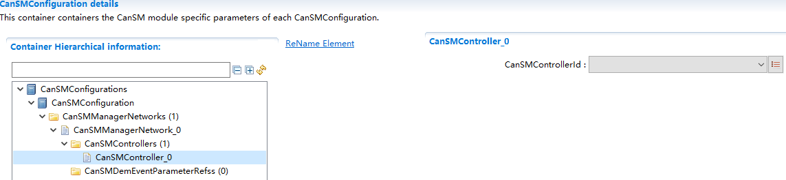

.. centered:: **表  CanSMController属性描述 (Description of the CanSMManagerNetwork property)**

.. list-table::
   :widths: 20 20 20 20 20
   :header-rows: 1

   * - UI名称 (User Interface Name)
     - 描述 (Description)
     -
     -
     -
   * - CanSMControllerId
     - 取值范围 (range of values)
     - reference to[CanIfCtrlCfg]
     - 默认取值 (default value)
     - 无 (None)
   * -
     - 参数描述 (Parameter Description)
     - 分配给配置的网络的CAN 控制器的ID。引用CanIf模块管理的控制器之一。 (The ID of the CAN controller allocated to the network configured. This controller is managed by one of the CanIf modules.)
     -
     -
   * -
     - 依赖关系 (dependency relationships)
     - 依赖 CanIfCtrlCfg (Dependent CanIfCtrlCfg)
     -
     -

CanSMDemEventParameterRefs
~~~~~~~~~~~~~~~~~~~~~~~~~~~~~~~~~~~~~~

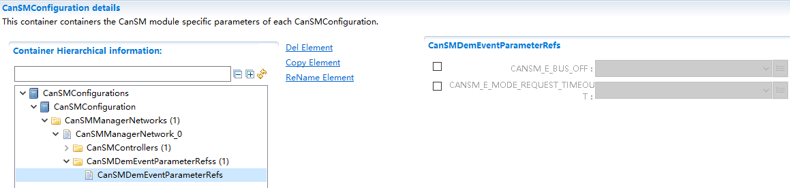

.. centered:: **表  3CanSMDemEventParameterRefs属性描述 (Table 3CanSMDSemEventParameterRefs Property Description)**

.. list-table::
   :widths: 20 20 20 20 20
   :header-rows: 1

   * - UI名称 (User Interface Name)
     - 描述 (Description)
     -
     -
     -
   * - CANSM_E_BUS_OFF
     - 取值范围 (range of values)
     - reference to[DemEventParameter]
     - 默认取值 (default value)
     - 无 (None)
   * -
     - 参数描述 (Parameter Description)
     - 引用已经配置的Dem事件用来报告BUSOFF错误。 (Use configured Dem events to report BUSOFF error.)
     -
     -
   * -
     - 依赖关系 (dependency relationships)
     - 依赖DemEventParameter (Dependency of DemEventParameter)
     -
     -
   * - CANSM_E_MODE_REQUEST_TIMEOUT
     - 取值范围 (range of values)
     - reference to[DemEventParameter]
     - 默认取值 (default value)
     - 无 (None)
   * -
     - 参数描述 (Parameter Description)
     - 引用已经配置的Dem事件用来报告对控制器或收发器控制的超时错误。 (Reference the configured Dem events to report timeout errors in the control of controllers or transceivers.)
     -
     -
   * -
     - 依赖关系 (dependency relationships)
     - 依赖DemEventParameter (Dependency of DemEventParameter)
     -
     -