CanTp
#################################

:strong:`缩写词注解 (Abbreviation Notes):`

.. list-table::
   :widths: 34 33 33
   :header-rows: 1

   * - 缩写词 (Abbreviations)
     - 英文全名 (Full English Name)
     - 解释/描述
   * - CanTp
     - CAN Transport   Layer
     - Can传输层模块 (Cannot translate without context. Please provide the complete sentence or text.)
   * - SF
     - Single Frame
     - 单帧 (Single frame)
   * - CF
     - Consecutive   Frame
     - 连续帧 (Consecutive frames)
   * - FC
     - Flow Control
     - 流控帧 (Flow control frame)
   * - FF
     - First Frame
     - 首帧 (First Frame)
   * - N_Data
     - Data   information of the transport layer
     - 传输层数据信息 (Transport layer data information)
   * - N_PCI
     - Protocol   Control Information of the transport layer
     - 传输层协议控制信息 (Transport layer protocol control information)
   * - N_SA
     - Network Source   Address (see ISO 15765-2).
     - 网络源地址 (Source IP address)
   * - N_TA
     - Network Target   Address (see ISO 15765-2). It might already contain the   N_TAtype(physical/function) in case of ExtendedAddressing.
     - 网络目标地址 (Network target address)
   * - FS
     - Flow Status
     - 流控状态 (Flow control status)
   * - TP
     - Transport   Protocol
     - 传输协议 (Transmission protocol)
   * - SDU
     - Service Data   Unit
     - 服务数据单元 (Service Data Unit)
   * - PduR
     - PDU Router
     - PDU路由模块 (PDU Routing Module)
   * - PDU
     - Protocol Data   Unit
     - 协议数据单元 (Protocol Data Unit)
   * - BS
     - Block Size
     - 块大小 (Block size)
   * - CanIf
     - CAN Interface
     - Can接口层模块 (Can Interface Layer Module)

简介 (Introduction)
=================================

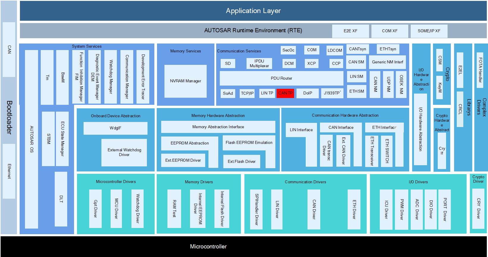

CanTp模块实现依据ISO15765-2标准规范中定义的CAN总线数据在传输层的数据接收发送功能。在ISO15765-2中，CanTp模块需要实现数据的发送拆包、接收数据重组、数据流控和错误处理机制，需要支持CANFD、MetaData、半双工通信与全双工通信。按照AUTOSAR标准规范的定义，CanTp模块还实现了发送请求的取消处理。

The CanTp module implements data reception and transmission functions for CAN bus data at the transport layer as defined in ISO15765-2 standard. In ISO15765-2, the CanTp module needs to implement data send segmentation, receive data reassembly, data flow control, and error handling mechanisms, supporting both CANFD, MetaData, half-duplex communication, and full-duplex communication. According to the definition of AUTOSAR standard specifications, the CanTp module also implements the cancellation processing of sending requests.

按照AUTOSAR规范，CanTp模块能够同时处理多个连接(即多个分段会话并行)，但是只支持事件触发模式。因为CanTp只处理传输协议帧(即SF、FF、CF和FC)，根据N-PDU ID, CanIf接口必须将I-PDU转发给CanTp或PduR。

According to the AUTOSAR specification, the CanTp module can simultaneously handle multiple connections (i.e., multiple segment sessions in parallel), but it only supports event-triggered mode. Since CanTp processes transfer protocol frames (i.e., SF, FF, CF, and FC), the CanIf interface must forward I-PDU to CanTp or PduR based on N-PDU ID.

CanTp模块支持大数据拆包组包以及流控：对于小数据使用单帧进行传输，CAN帧数据长度小于8字节或者63字节（CAN_FD情况下）（包括N_PCI信息），无流控握手。传输过程如图 所示。

The CanTp module supports large data segmentation and reassembly as well as flow control: for small data, single-frame transmission is used, where the CAN frame data length is less than 8 bytes or 63 bytes (including N_PCI information in CAN_FD cases), with no flow control handshake. The transmission process is shown in the figure.

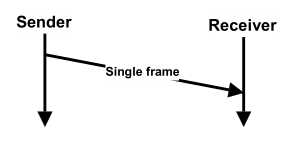

对于大数据使用多帧传输，数据包发送时拆包分段发送，数据包接收时重组，并使用流控握手与定时控制，使用到的帧类型包括：首帧、流控帧与连续帧。传输过程如图 所示。

For big data usage with multi-frame transmission, packets are disassembled and sent in segments when sending, reassembled when receiving, and flow control handshaking with timing control is applied. The frame types involved include: first frame (FF), flow control frame, and consecutive frame. The transmission process is shown in the figure.

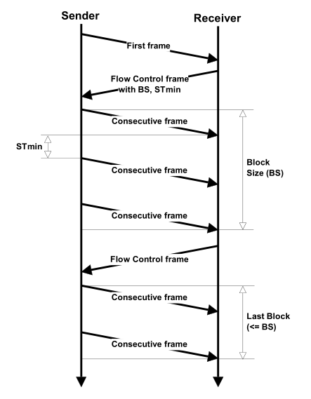

如图 表示了CanTp模块需要使用的上下层模块CanIf和PduR。

As shown, the upper and lower layer modules CanIf and PduR that the CanTp module requires are indicated.

CanTp模块提供上层接口给PduR模块交互，用来接收与发送数据。两个模块之间通过N_SDU进行交互。CanTp使用PduR的回调函数复制发送数据，确认发送，发起接收，复制接收数据，接收指引。

The CanTp module provides upper layer interfaces for interaction with the PduR module, used for receiving and sending data. Interaction between the two modules is done via N_SDU. CanTp uses PduR's callback functions to copy sent data, confirm transmission, initiate reception, copy received data, and receive indications.

CanTp模块提供下层接口给CanIf模块交互，用来接收与发送数据。两个模块之间通过L_SDU进行交互。CanTp使用CanIf的发送接口进行数据发送。

The CanTp module provides a lower-layer interface for interaction with the CanIf module, used for receiving and sending data. Interaction between the two modules is done via L_SDU. CanTp uses the send interface of CanIf for data transmission.

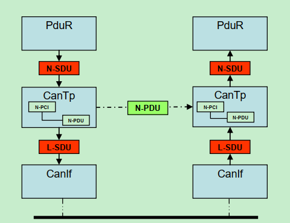

参考资料 (Reference materials)
------------------------------------------

[1] ISO15765-2，2016

[2] AUTOSAR_SWS_CANTransportLayer, 4.2.2

[3] AUTOSAR_SWS_CANTransportLayer, R19-11

[4] AUTOSAR_SWS_CANInterface, R19-11

[5] AUTOSAR_SWS_PDURouter, R19-11

[6] AUTOSAR_SWS_TimeService, R19-11

功能描述 (Function Description)
===========================================

SF接收功能 (SF Receive Function)
--------------------------------------------

SF接收功能介绍 (Introduction to SF Reception Function)
~~~~~~~~~~~~~~~~~~~~~~~~~~~~~~~~~~~~~~~~~~~~~~~~~~~~~~~

当接收到一个单帧报文时，CanTp模块会解析单帧报文的控制信息，并根据相关配置判断是否进行接收，如果通过检查则通知上层，并根据上层的状态信息将接收的数据传递给上层模块。

When a single-frame message is received, the CanTp module parses the control information of the single-frame message and determines whether to receive it based on relevant configuration. If the check passes, it notifies the upper layer and transfers the received data to the upper layer module according to the status information from the upper layer.

SF接收功能实现 (The SF reception function implementation)
~~~~~~~~~~~~~~~~~~~~~~~~~~~~~~~~~~~~~~~~~~~~~~~~~~~~~~~~~~

当底层接收到一个SF时，CanIf通过CanTp_RxIndication回调通知CanTp。CanTp执行PDU ID转换并从N-PDU有效载荷中提取有用的数据长度。然后，CanTp使用PduR\_<LoTp>StartOfReception回调为这个传入数据请求上层提供一个缓冲区。将TpSduLength设置为SF_DL(从N-PCI字段提取)。它表示要接收的总字节数。如果上层没有任何缓冲区可用，返回BUFREQ_E_NOT_OK。CanTp在不复制任何数据的情况下结束CanTp_RxIndication。如果上层分配并锁定所需的Rx缓冲区，然后返回BUFREQ_E_OK。然后CanTp调用PduR\_<LoTp>CopyRxData让上层将接收到的N-PDU有效载荷复制到缓冲区中。当复制完成时，CanTp接着调用PduR\_<User：LoTp>RxIndication结果设置为E_OK，告知上层数据传递完成。CanTp结束CanTp_RxIndication函数。

When the lower layer receives an SF, CanIf notifies CanTp through the CanTp_RxIndication callback. CanTp performs PDU ID conversion and extracts useful data length from the N-PDU payload. Then, CanTp uses the PduR\_<LoTp>StartOfReception callback to provide an upper layer with a buffer for this incoming data request. It sets TpSduLength as SF_DL (extracted from the N-PCI field), indicating the total number of bytes to receive. If the upper layer has no available buffer, it returns BUFREQ_E_NOT_OK. CanTp ends CanTp_RxIndication without copying any data. If the upper layer allocates and locks the required Rx buffer, it returns BUFREQ_E_OK. Then CanTp calls PduR\_<LoTp>CopyRxData to allow the upper layer to copy the received N-PDU payload into the buffer. Once the copy is complete, CanTp subsequently calls PduR\_<User:LoTp>RxIndication with a result set as E_OK, informing the upper layer that data transfer is completed. CanTp ends the CanTp_RxIndication function.

SF发送功能 (SF Sending Function)
--------------------------------------------

SF发送功能介绍 (Introduction to SF Sending Function)
~~~~~~~~~~~~~~~~~~~~~~~~~~~~~~~~~~~~~~~~~~~~~~~~~~~~~~~~

当需要发送一个单帧报文时，CanTp模块会根据请求信息添加单帧报文的控制信息，然后请求CanIf模块进行SF发送。

When a single-frame message needs to be sent, the CanTp module adds the control information for the single-frame message based on the request information and then requests the CanIf module to perform SF transmission.

SF发送功能实现 (SF Sending Function Implementation)
~~~~~~~~~~~~~~~~~~~~~~~~~~~~~~~~~~~~~~~~~~~~~~~~~~~~~~

当PDUR需要传输一个SF时，PDUR调用CanTp_Transmit传入相关数据，CanTp模块检查输入数据，如果检查通过，则返回E_OK，以指示接受传输请求。上层锁定所需的Tx缓冲区。接下来CanTp会调用PduR\_<LoTp>CopyTxData来复制段数据。上层复制数据，然后返回BUFREQ_E_OK。CanTp在拷贝的数据基础上添加控制信息，然后调用CanIf_Transmit请求CanIf模块执行发送。CanIf模块处理发送请求，成功发送后CanIf调用CanTp_TxConfirmation通知CanTp发送成功。然后CanTp调用PduR\_<User：LoTp>TxConfirmation通知PDUR已经成功传输。

When PDUR needs to transmit an SF, PDUR calls CanTp_Transmit with relevant data. The CanTp module checks the input data; if the check passes, it returns E_OK to indicate acceptance of the transmission request. The upper layer locks the required Tx buffer. Next, CanTp calls PduR\_<LoTp>CopyTxData to copy segment data. The upper layer copies the data and then returns BUFREQ_E_OK. CanTp adds control information based on the copied data and requests the CanIf module to execute transmission via CanIf_Transmit. After handling the transmission request, the CanIf module calls CanTp_TxConfirmation to notify CanTp of successful sending. Then, CanTp calls PduR\_<User:LoTp>TxConfirmation to inform PDUR that the transmission has been successfully completed.

多帧接收功能 (Multi-frame reception functionality)
------------------------------------------------------------

多帧接收功能介绍 (Introduction to Multi-frame Reception Function)
~~~~~~~~~~~~~~~~~~~~~~~~~~~~~~~~~~~~~~~~~~~~~~~~~~~~~~~~~~~~~~~~~

当接收到一个多帧报文时，CanTp模块会解析首帧报文的控制信息，并根据相关配置判断是否进行接收，如果通过检查则通知上层，并根据上层的状态信息将接收的数据传递给上层模块。首帧处理完成之后，接收方会在规定时间内响应一个流控帧，若流控状态为ContinueToSend，CanTp会继续接收连续帧并向上层传递。当接收完成时通知上层接收完成。

When receiving a multi-frame message, the CanTp module parses the control information of the first frame and determines whether to receive it based on relevant configurations. If the check passes, it notifies the upper layer, and according to the state information from the upper layer, it forwards the received data to the upper layer module. After processing the first frame, the receiver responds with a flow control frame within a specified time. If the flow control status is ContinueToSend, CanTp continues to receive consecutive frames and passes them on to the upper layer. When reception is complete, it notifies the upper layer that reception has completed.

多帧接收功能实现 (Multi-frame reception function implementation)
~~~~~~~~~~~~~~~~~~~~~~~~~~~~~~~~~~~~~~~~~~~~~~~~~~~~~~~~~~~~~~~~~~~~

当接收到一个FF时，CanIf通过CanTp_RxIndication回调通知CanTp。CanTp解析FF的控制信息后，CanTp使用PduR\_<LoTp>StartOfReception回调请求PDUR为传入的数据提供一个缓冲区。检查连接验收并准备FC参数。CanTp激活一个FC发送任务，发送一个流状态设置为ContinueToSend的FC（这里FC的状态需要根据上层的返回信息进行相应的FC状态设置）。该FC通过请求CanIf_Transmit进行发送，同时CanTp会调用PduR\_<LoTp>CopyRxData将FF数据传递给上层，然后等待CF的接收。

When an FF is received, CanIf notifies CanTp through the CanTp_RxIndication callback. After parsing the control information of FF, CanTp requests PDUR to provide a buffer for incoming data using the PduR\_<LoTp>StartOfReception callback. It checks the connection acceptance and prepares FC parameters. CanTp activates an FC sending task, sending an FC with the flow status set to ContinueToSend (the state of FC needs to be adjusted according to the information returned from the upper layer). This FC is sent through a request to CanIf_Transmit while CanTp calls PduR\_<LoTp>CopyRxData to pass the FF data to the upper layer, and then waits for CF reception.

当接收到一个CF时，CanIf通过CanTp_RxIndication回调通知CanTp。CanTp将验证序列号，若正确，则要求PduR复制数据，并可能会发生以下情况：

When a CF is received, CanIf notifies CanTp through the CanTp_RxIndication callback. CanTp will validate the sequence number; if correct, it requests PduR to copy the data, and the following may occur:

非最后一帧CF:CanTp将调用PduR\_<LoTp>CopyRxData把接收到的数据转发到上层。（如果此时BS达到则请求发送一个FC，然后继续接收CF）

Non-final CF: CanTp will call PduR\_<LoTp>CopyRxData to forward the received data to the upper layer. (If a BS is reached at this time, it will request sending an FC, then continue receiving CF)

最后一帧CF:这个连续帧是最后一个(根据FF中的总长度信息判断)。调用PduR\_<LoTp>CopyRxData将数据拷贝完成后，CanTp应该用PduR\_<User：LoTp>RxIndication回调来通知PDUR。

The last frame CF: This is the final consecutive frame (judged by the total length information in FF). After PduR\_<LoTp>CopyRxData completes data copying, CanTp should notify PDUR via the PduR\_<User:LoTp>RxIndication callback.

当需要发送FC时，CanTp会调用CanIf_Transmit接口，并等待确认。根据上层的可用缓冲区，流控状态可以是ContinueToSend，也可以是Wait。

When FC needs to be sent, CanTp will call the CanIf_Transmit interface and wait for confirmation. Depending on the available buffer from the upper layer, the flow control state can be ContinueToSend or Wait.

多帧发送功能 (Multi-frame transmission function)
----------------------------------------------------------

多帧发送功能介绍 (Introduction to Multi-frame Transmission Function)
~~~~~~~~~~~~~~~~~~~~~~~~~~~~~~~~~~~~~~~~~~~~~~~~~~~~~~~~~~~~~~~~~~~~~~

当需要发送一个多帧报文时，CanTp模块会添加首帧报文的控制信息，并在FF发送成功后等待接收一个FC。当接收到的FC所带状态信息为CTS时，将接下来的数据进行发送，并填充成CF，如果发送的CF个数达到FC所带的BS，则需要等待下一个FC，直到数据发送完成。

When multiple frames need to be sent as a message, the CanTp module adds control information to the first frame and waits for an FC after successful FF transmission. Upon receiving an FC with a status of CTS, the subsequent data is sent and filled into CF. If the number of sent CFs reaches the BS carried by the FC, it waits for the next FC until all data is transmitted.

多帧发送功能实现 (Multi-frame transmission functionality implementation)
~~~~~~~~~~~~~~~~~~~~~~~~~~~~~~~~~~~~~~~~~~~~~~~~~~~~~~~~~~~~~~~~~~~~~~~~

PDUR需要传输一个多帧数据时，会调用CanTp的CanTp_Transmit。CanTp会验证输入参数和资源的可用性，并根据发送请求的有用信息(例如SF/FF/CF N-PDU标识符、FC N-PDU标识符、N_TA值等)启动带有参数的内部传输任务。

When PDUR needs to transmit multi-frame data, it calls CanTp's CanTp_Transmit. CanTp verifies the input parameters and availability of resources and initiates an internal transmission task with parameters based on useful information from the send request (e.g., SF/FF/CF N-PDU identifiers, FC N-PDU identifier, N_TA value, etc.).

CanTp在接下来调用PduR\_<LoTp>CopyTxData。上层将数据复制到目标缓冲区。在发送任务中，CanTp通过CanIf_Transmit通知CanIf，CanTp等待来自CanIf的确认(CanTp_TxConfirmation)，然后等待接收一个状态为CTS的FC。接收FC成功后，CanTp 要求PDUR提供要发送的新数据用于发送CF，或发生错误时，CanTp使用PduR\_<User：LoTp>TxConfirmation通知PDUR。整个过程中根据BS可能需要接收多次FC。

CanTp calls PduR\<LoTp>CopyTxData next. The upper layer copies the data to the target buffer. During the send task, CanTp notifies CanIf via CanIf_Transmit. CanTp waits for confirmation from CanIf (CanTp_TxConfirmation), then waits for a FC with status CTS. Upon successful reception of FC, CanTp requests PduR\<User:LoTp>TxConfirmation to provide new data for sending CF, or uses PduR\<User:LoTp>TxConfirmation to notify PDUR in case of an error. The process may require receiving multiple FCS depending on BS.

源文件描述 (Source file description)
===============================================

.. centered:: **表 CanTp组件文件描述 (Description of CanTp Component File)**

.. list-table::
   :widths: 50 50
   :header-rows: 1

   * - 文件 (Files)
     - 说明 (Note)
   * - CanTp.c
     - CanTp模块源文件，包含了API函数的实现。 (Source files for the CanTp module contain the implementation of API functions.)
   * - CanTp.h
     - CanTp模块头文件，包含了API函数的扩展声明并定义了端口的数据结构。 (CanTp module header file contains the extended declarations of API functions and defines the port data structures.)
   * - CanTp_Internal.c
     - 定义CanTp模块一些内部接口。 (Define internal interfaces for the CanTp module.)
   * - CanTp_Internal.h
     - 包含CanTp模块需要使用的部分类型定义和宏定义。 (Contains part of the type definitions and macro definitions needed for the CanTp module.)
   * - CanTp_Types.h
     - 包含CanTp模块需要使用的类型定义。 (Contains type definitions needed for the CanTp module.)
   * - CanTp_Cbk.h
     - CanTp模块回调接口相关头文件，包含了回调接口相关API函数的扩展声明并定义了端口的数据结构。 (Header file related to CanTp Module Callback Interfaces, which includes extended declarations and definitions of API functions for callback interfaces and port data structures.)
   * - CanTp_MemMap.h
     - 包含CanTp模块的内存抽象。 (Abstraction of memory containing CanTp module.)
   * - CanTp_Callout.c
     - 定义CanTp模块计时的方法。 (Define the method for timing the CanTp module.)
   * - CanTp_Cfg.h
     - 定义CanTp模块预编译时用到的配置参数。 (Define configuration parameters used in pre-compilation of the CanTp module.)
   * - CanTp_PBCfg.c
     - 定义CanTp模块配置相关的配置参数。 (Define configuration parameters related to the CanTp module.)
   * - CanTp_PBCfg.h
     - 包含CanTp模块配置相关的配置参数。 (Contains configuration parameters related to the CanTp module.)

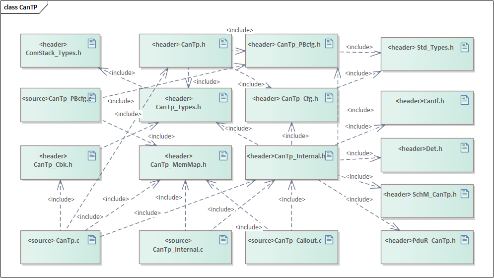

API接口 (API Interface)
=====================================

类型定义 (Type definition)
--------------------------------------

CanTp_ConfigType类型定义 (CanTp_ConfigType Configuration Type Definition)
~~~~~~~~~~~~~~~~~~~~~~~~~~~~~~~~~~~~~~~~~~~~~~~~~~~~~~~~~~~~~~~~~~~~~~~~~~~~

.. list-table::
   :widths: 50 50
   :header-rows: 1

   * - 名称 (Name)
     - CanTp_ConfigType
   * - 类型 (Type)
     - Structure
   * - 范围 (Scope)
     - 无
   * - 描述 (Description)
     - 配置参数结构体类型定义 (Definition of configuration parameter structure types)

输入函数描述 (Describe the input function:)
-----------------------------------------------------

.. list-table::
   :widths: 50 50
   :header-rows: 1

   * - 输入模块 (<Input Module>)
     - API
   * - Det
     - Det_ReportError
   * - 
     - Det_ReportRuntimeError
   * - CanIf
     - CanIf_Transmit
   * - PduR
     - PduR_CanTpCopyRxData
   * - 
     - PduR_CanTpCopyTxData
   * - 
     - PduR_CanTpRxIndication
   * - 
     - PduR_CanTpStartOfReception
   * - 
     - PduR_CanTpTxConfirmation
   * - Tm
     - Tm_ResetTimer100us32bit
   * - 
     - Tm_GetTimeSpan100us32bit
   * - Os
     - GetElapsedValue
   * - SchM
     - SchM_Enter_CanTp_ExclusiveArea
   * - 
     - SchM_Exit_CanTp_ExclusiveArea

静态接口函数定义 (Static interface function definition)
---------------------------------------------------------------

CanTp_Init函数定义 (The CanTp_Init function defines)
~~~~~~~~~~~~~~~~~~~~~~~~~~~~~~~~~~~~~~~~~~~~~~~~~~~~

.. list-table::
   :widths: 25 25 25 25
   :header-rows: 1

   * - 函数名称： (Function Name:)
     - CanTp_Init
     - 
     - 
   * - 函数原型： (Function prototype:)
     - void CanTp_Init(const CanTp_ConfigType\* CfgPtr)
     - 
     - 
   * - 服务编号： (Service ID:)
     - 0x01
     - 
     - 
   * - 同步/异步： (Synchronous/Asynchronous:)
     - 同步 (Sync)
     - 
     - 
   * - 是否可重入： (Is Reentrant:)
     - 否 (No)
     - 
     - 
   * - 输入参数： (Input parameters:)
     - CfgPtr：配置数据结构体 (CfgPtr：Configuration data structure)
     - 值域： (Domain:)
     - 无
   * - 输入输出参数： (Input Output Parameters:)
     - 无
     - 
     - 
   * - 输出参数： (Output Parameters:)
     - 无
     - 
     - 
   * - 返回值： (Return Value:)
     - 无
     - 
     - 
   * - 功能概述： (Function Overview:)
     - 初始化CanTp模块 (Initialize CanTp Module)
     - 
     - 

CanTp_GetVersionInfo函数定义 (The CanTp_GetVersionInfo function definition)
~~~~~~~~~~~~~~~~~~~~~~~~~~~~~~~~~~~~~~~~~~~~~~~~~~~~~~~~~~~~~~~~~~~~~~~~~~~

.. list-table::
   :widths: 25 25 25 25
   :header-rows: 1

   * - 函数名称： (Function Name:)
     - CanTp_GetVersionInfo
     - 
     - 
   * - 函数原型： (Function prototype:)
     - void CanTp_GetVersionInfo(Std\_VersionInfoType\* versioninfo)
     - 
     - 
   * - 服务编号： (Service ID:)
     - 0x07
     - 
     - 
   * - 同步/异步： (Synchronous/Asynchronous:)
     - 同步 (Sync)
     - 
     - 
   * - 是否可重入： (Is Reentrant:)
     - 是 (Yes)
     - 
     - 
   * - 输入参数： (Input parameters:)
     - 无
     - 值域： (Domain:)
     - 无
   * - 输入输出参数： (Input Output Parameters:)
     - 无
     - 
     - 
   * - 输出参数： (Output Parameters:)
     - versioninfo：版本信息参数 (versioninfo：Version Information Parameters)
     - 
     - 
   * - 返回值： (Return Value:)
     - 无
     - 
     - 
   * - 功能概述： (Function Overview:)
     - 获取CanTp模块版本信息 (Get CanTp Module Version Information)
     - 
     - 

CanTp_Shutdown函数定义 (The CanTp_Shutdown function definition)
~~~~~~~~~~~~~~~~~~~~~~~~~~~~~~~~~~~~~~~~~~~~~~~~~~~~~~~~~~~~~~~~~~~

.. list-table::
   :widths: 25 25 25 25
   :header-rows: 1

   * - 函数名称： (Function Name:)
     - CanTp_Shutdown
     - 
     - 
   * - 函数原型： (Function prototype:)
     - void CanTp_Shutdown(void)
     - 
     - 
   * - 服务编号： (Service ID:)
     - 0x02
     - 
     - 
   * - 同步/异步： (Synchronous/Asynchronous:)
     - 同步 (Sync)
     - 
     - 
   * - 是否可重入： (Is Reentrant:)
     - 否 (No)
     - 
     - 
   * - 输入参数： (Input parameters:)
     - 无
     - 值域： (Domain:)
     - 无
   * - 输入输出参数： (Input Output Parameters:)
     - 无
     - 
     - 
   * - 输出参数： (Output Parameters:)
     - 无
     - 
     - 
   * - 返回值： (Return Value:)
     - 无
     - 
     - 
   * - 功能概述： (Function Overview:)
     - 关闭CanTp模块 (Disable CanTp Module)
     - 
     - 

CanTp_Transmit函数定义 (The CanTp_Transmit function definition)
~~~~~~~~~~~~~~~~~~~~~~~~~~~~~~~~~~~~~~~~~~~~~~~~~~~~~~~~~~~~~~~~~

.. list-table::
   :widths: 25 25 25 25
   :header-rows: 1

   * - 函数名称： (Function Name:)
     - CanTp_Transmit
     - 
     - 
   * - 函数原型： (Function prototype:)
     - Std_ReturnType CanTp_Transmit(PduIdTypeTxPduId, const PduInfoType\* PduInfoPtr)
     - 
     - 
   * - 服务编号： (Service ID:)
     - 0x03
     - 
     - 
   * - 同步/异步： (Synchronous/Asynchronous:)
     - 同步 (Sync)
     - 
     - 
   * - 是否可重入： (Is Reentrant:)
     - 是 (Yes)
     - 
     - 
   * - 输入参数： (Input parameters:)
     - TxPduId
     - 值域： (Domain:)
     - 无
   * - 
     - PduInfoPtr
     - 值域： (Domain:)
     - 无
   * - 输入输出参数： (Input Output Parameters:)
     - 无
     - 
     - 
   * - 输出参数： (Output Parameters:)
     - 无
     - 
     - 
   * - 返回值： (Return Value:)
     - Std_ReturnType：
     - 
     - 
   * - 
     - E_OK：请求成功 (E_OK: Request succeeded)
     - 
     - 
   * - 
     - E_NOT_OK：请求失败 (E_NOT_OK: Request failed)
     - 
     - 
   * - 功能概述： (Function Overview:)
     - 数据传输请求接口 (Data transmission request interface)
     - 
     - 

CanTp_CancelTransmit函数定义 (The CanTp_CancelTransmit function definition)
~~~~~~~~~~~~~~~~~~~~~~~~~~~~~~~~~~~~~~~~~~~~~~~~~~~~~~~~~~~~~~~~~~~~~~~~~~~~~

.. list-table::
   :widths: 25 25 25 25
   :header-rows: 1

   * - 函数名称： (Function Name:)
     - CanTp_CancelTransmit
     - 
     - 
   * - 函数原型： (Function prototype:)
     - Std_ReturnType CanTp_CancelTransmit(PduIdTypeTxPduId)
     - 
     - 
   * - 服务编号： (Service ID:)
     - 0x08
     - 
     - 
   * - 同步/异步： (Synchronous/Asynchronous:)
     - 同步 (Sync)
     - 
     - 
   * - 是否可重入： (Is Reentrant:)
     - 否 (No)
     - 
     - 
   * - 输入参数： (Input parameters:)
     - TxPduId：请求取消传输的N-SDU ID (TxPduId：ID of N-SDU to be cancelled for transmission)
     - 值域： (Domain:)
     - 无
   * - 输入输出参数： (Input Output Parameters:)
     - 无
     - 
     - 
   * - 输出参数： (Output Parameters:)
     - 无
     - 
     - 
   * - 返回值： (Return Value:)
     - Std_ReturnType E_OK ：成功 E_NOT_OK：不成功 (Std_ReturnType E_OK : Success E_NOT_OK : Failure)
     - 
     - 
   * - 功能概述： (Function Overview:)
     - 取消发送 (Cancel Sending)
     - 
     - 

CanTp_CancelReceive函数定义 (Function CanTp_CancelReceive Defined)
~~~~~~~~~~~~~~~~~~~~~~~~~~~~~~~~~~~~~~~~~~~~~~~~~~~~~~~~~~~~~~~~~~~~~

.. list-table::
   :widths: 25 25 25 25
   :header-rows: 1

   * - 函数名称： (Function Name:)
     - CanTp_CancelReceive
     - 
     - 
   * - 函数原型： (Function prototype:)
     - Std_ReturnType CanTp_CancelReceive(PduIdTypeRxPduId)
     - 
     - 
   * - 服务编号： (Service ID:)
     - 0x09
     - 
     - 
   * - 同步/异步： (Synchronous/Asynchronous:)
     - 同步 (Sync)
     - 
     - 
   * - 是否可重入： (Is Reentrant:)
     - 否 (No)
     - 
     - 
   * - 输入参数： (Input parameters:)
     - RxPduId：请求取消接收的N-SDU ID (RxPduId：ID of N-SDU to be requested for reception cancellation)
     - 值域： (Domain:)
     - 无 (None)
   * - 输入输出参数： (Input Output Parameters:)
     - 无 (None)
     - 
     - 
   * - 输出参数： (Output Parameters:)
     - 无 (None)
     - 
     - 
   * - 返回值： (Return Value:)
     - Std_ReturnType E_OK ：成功 E_NOT_OK：不成功 (Std_ReturnType E_OK : Success E_NOT_OK : Failure)
     - 
     - 
   * - 功能概述： (Function Overview:)
     - 请求取消接收接口 (Request to Unsubscribe Interface)
     - 
     - 

CanTp_ChangeParameter函数定义 (The CanTp_ChangeParameter function definition)
~~~~~~~~~~~~~~~~~~~~~~~~~~~~~~~~~~~~~~~~~~~~~~~~~~~~~~~~~~~~~~~~~~~~~~~~~~~~~~~~~~

.. list-table::
   :widths: 25 25 25 25
   :header-rows: 1

   * - 函数名称： (Function Name:)
     - CanTp_ChangeParameter
     - 
     - 
   * - 函数原型： (Function prototype:)
     - Std_ReturnType CanTp_ChangeParameter(PduIdTypeid,
     - 
     - 
   * - 
     - TPParameterType parameter,uint16 value)
     - 
     - 
   * - 服务编号： (Service ID:)
     - 0x4b (R19-11)
     - 
     - 
   * - 同步/异步： (Synchronous/Asynchronous:)
     - 同步 (Sync)
     - 
     - 
   * - 是否可重入： (Is Reentrant:)
     - 否 (No)
     - 
     - 
   * - 输入参数： (Input parameters:)
     - id接收的N-SDU ID值 (ID value received by N-SDU ID)
     - 值域： (Domain:)
     - 无 (None)
   * - 
     - parameter请求修改的参数类型 (request modification parameter type)
     - 值域： (Domain:)
     - 无 (None)
   * - 
     - value请求修改为的值 (value request modified to)
     - 值域： (Domain:)
     - 无 (None)
   * - 输入输出参数： (Input Output Parameters:)
     - 无 (None)
     - 
     - 
   * - 输出参数： (Output Parameters:)
     - 无 (None)
     - 
     - 
   * - 返回值： (Return Value:)
     - Std_ReturnType E_OK ：成功E_NOT_OK： 不成功 (Std_ReturnType E_OK : Success E_NOT_OK : Failure)
     - 
     - 
   * - 功能概述： (Function Overview:)
     - 请求修改接收参数，如BS、STmin (Request to modify receiving parameters, such as BS, STmin)
     - 
     - 

CanTp_ReadParameter函数定义 (The function definition for CanTp_ReadParameter)
~~~~~~~~~~~~~~~~~~~~~~~~~~~~~~~~~~~~~~~~~~~~~~~~~~~~~~~~~~~~~~~~~~~~~~~~~~~~~~~~~~~~

.. list-table::
   :widths: 25 25 25 25
   :header-rows: 1

   * - 函数名称： (Function Name:)
     - CanTp_ReadParameter
     - 
     - 
   * - 函数原型： (Function prototype:)
     - Std_ReturnType
     - 
     - 
   * - 
     - CanTp_ReadParameter(PduIdType id,TPParameterType parameter, uint16* value)
     - 
     - 
   * - 服务编号： (Service ID:)
     - 0x0b
     - 
     - 
   * - 同步/异步： (Synchronous/Asynchronous:)
     - 同步 (Sync)
     - 
     - 
   * - 是否可重入： (Is Reentrant:)
     - 否 (No)
     - 
     - 
   * - 输入参数： (Input parameters:)
     - id接收的N-SDU ID值 (ID value received by N-SDU ID)
     - 值域： (Domain:)
     - 无 (None)
   * - 
     - Parameter（in）：请求读取的参数类型
     - 值域： (Domain:)
     - 无 (None)
   * - 输入输出参数： (Input Output Parameters:)
     - 无 (None)
     - 
     - 
   * - 输出参数： (Output Parameters:)
     - Value：请求读取的值 (Value：The value to be read request)
     - 
     - 
   * - 返回值： (Return Value:)
     - Std_ReturnType E_OK ：成功E_NOT_OK： 不成功 (Std_ReturnType E_OK : Success E_NOT_OK : Failure)
     - 
     - 
   * - 功能概述： (Function Overview:)
     - 读取参数 (Read parameters)
     - 
     - 

CanTp_MainFunction函数定义 (CanTp_MainFunction function definition)
~~~~~~~~~~~~~~~~~~~~~~~~~~~~~~~~~~~~~~~~~~~~~~~~~~~~~~~~~~~~~~~~~~~~

.. list-table::
   :widths: 25 25 25 25
   :header-rows: 1

   * - 函数名称： (Function Name:)
     - CanTp_MainFunction
     - 
     - 
   * - 函数原型： (Function prototype:)
     - void CanTp_MainFunction(void)
     - 
     - 
   * - 服务编号： (Service ID:)
     - 0x06
     - 
     - 
   * - 同步/异步： (Synchronous/Asynchronous:)
     - 同步 (Sync)
     - 
     - 
   * - 是否可重入： (Is Reentrant:)
     - 否 (No)
     - 
     - 
   * - 输入参数： (Input parameters:)
     - id
     - 值域： (Domain:)
     - 无 (None)
   * - 输入输出参数： (Input Output Parameters:)
     - 无 (None)
     - 
     - 
   * - 输出参数： (Output Parameters:)
     - 无 (None)
     - 
     - 
   * - 返回值： (Return Value:)
     - 无 (None)
     - 
     - 
   * - 功能概述： (Function Overview:)
     - CanTp模块主处理函数，异步处理任务均在这里进行处理 (Main processing function of CanTp module, all asynchronous tasks are handled here.)
     - 
     - 

CanTp_RxIndication函数定义 (The CanTp_RxIndication function definition)
~~~~~~~~~~~~~~~~~~~~~~~~~~~~~~~~~~~~~~~~~~~~~~~~~~~~~~~~~~~~~~~~~~~~~~~~~~~~~

.. list-table::
   :widths: 25 25 25 25
   :header-rows: 1

   * - 函数名称： (Function Name:)
     - CanTp_RxIndication
     - 
     - 
   * - 函数原型： (Function prototype:)
     - void CanTp_RxIndication(PduIdTypeRxPduId, const PduInfoType\* PduInfoPtr)
     - 
     - 
   * - 服务编号： (Service ID:)
     - 0x42
     - 
     - 
   * - 同步/异步： (Synchronous/Asynchronous:)
     - 同步 (Sync)
     - 
     - 
   * - 是否可重入： (Is Reentrant:)
     - 不同PduId可重入，同一PduId不可重入 (Different PduId can re-enter, same PduId cannot re-enter)
     - 
     - 
   * - 输入参数： (Input parameters:)
     - RxPduId：接收PDUID (RxPduId：Received PDU ID)
     - 值域： (Domain:)
     - 无 (None)
   * - 
     - PduInfoPtr：数据信息指针 (PduInfoPtr：Pointer to data information)
     - 值域： (Domain:)
     - 无 (None)
   * - 输入输出参数： (Input Output Parameters:)
     - 无 (None)
     - 
     - 
   * - 输出参数： (Output Parameters:)
     - 无 (None)
     - 
     - 
   * - 返回值： (Return Value:)
     - 无 (None)
     - 
     - 
   * - 功能概述： (Function Overview:)
     - CanTp模块接收函数，供CanIf模块调用 (CanTp module receive function, invoked by CanIf module)
     - 
     - 

CanTp_TxConfirmation函数定义 (The CanTp_TxConfirmation function definition)
~~~~~~~~~~~~~~~~~~~~~~~~~~~~~~~~~~~~~~~~~~~~~~~~~~~~~~~~~~~~~~~~~~~~~~~~~~~~~~~~~~~~

.. list-table::
   :widths: 25 25 25 25
   :header-rows: 1

   * - 函数名称： (Function Name:)
     - CanTp\_TxConfirmation\
     - 
     - 
   * - 函数原型： (Function prototype:)
     - void CanTp_TxConfirmation(PduIdTypeTxPduId)
     - 
     - 
   * - 服务编号： (Service ID:)
     - 0x40
     - 
     - 
   * - 同步/异步： (Synchronous/Asynchronous:)
     - 同步 (Sync)
     - 
     - 
   * - 是否可重入： (Is Reentrant:)
     - 不同PduId可重入，同一PduId不可重入 (Different PduId can re-enter, same PduId cannot re-enter)
     - 
     - 
   * - 输入参数： (Input parameters:)
     - TxPduId：发送PDUID值 (TxPduId：Send PDUID Value)
     - 值域： (Domain:)
     - 无 (None)
   * - 输入输出参数： (Input Output Parameters:)
     - 无 (None)
     - 
     - 
   * - 输出参数： (Output Parameters:)
     - 无 (None)
     - 
     - 
   * - 返回值： (Return Value:)
     - 无 (None)
     - 
     - 
   * - 功能概述： (Function Overview:)
     - 发送确认函数 (Send confirmation function)
     - 
     - 

可配置函数定义 (Configurable Function Definition)
----------------------------------------------------------

无。

None.

配置 (Configure)
==============================

CanTpGeneral
----------------------------

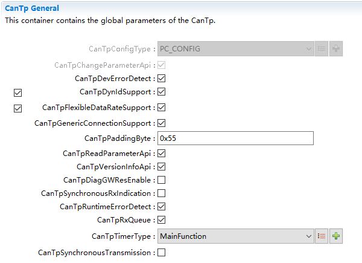

.. centered:: **表 CanTpGeneral属性描述 (Table CanTpGeneral Properties Description)**

.. list-table::
   :widths: 20 20 20 20 20
   :header-rows: 1

   * - UI名称 (UI Name)
     - 描述 (Description)
     - 
     - 
     - 
   * - CanTpConfigType
     - 取值范围 (Range)
     - PB/PC
     - 默认取值 (Default value)
     - PC_CONFIG
   * - 
     - 参数描述 (Parameter description)
     - 控制CanTp模块配置权限 (Control CanTp Module Configuration Permission)
     - 
     -
   * - 
     - 依赖关系 (Dependencies)
     - 无
     - 
     - 
   * - CanTpChangeParameterApi
     - 取值范围 (Range)
     - True/False
     - 默认取值 (Default value)
     - FALSE
   * - 
     - 参数描述 (Parameter description)
     - 改变接收参数的接口使能开关 (Enable switch for interfaces that change receiving parameters)
     - 
     -
   * - 
     - 依赖关系 (Dependencies)
     - PduRZeroCostOperation为FALSE时，此项默认使能且不可配置。PduRZeroCostOperation为TRUE时根据配置生成 (When PduRZeroCostOperation is FALSE, this item defaults to being enabled and cannot be configured. When PduRZeroCostOperation is TRUE, it is generated according to the configuration.)
     - 
     - 
   * - 
     - 取值范围 (Range)
     - True/False
     - 默认取值 (Default value)
     - TRUE
   * - CanTpDevErrorDetect
     - 参数描述 (Parameter description)
     - DET检查开关 (DET inspection switch)
     - 
     -
   * - 
     - 依赖关系 (Dependencies)
     - 无
     - 
     - 
   * - 
     - 取值范围 (Range)
     - True/False
     - 默认取值 (Default value)
     - FALSE
   * - CanTpDynIdSupport
     - 参数描述 (Parameter description)
     - Metadata下的动态ID支持使能开关 (Dynamic ID support enable switch under Metadata)
     - 
     -
   * - 
     - 依赖关系 (Dependencies)
     - 无
     - 
     - 
   * - 
     - 取值范围 (Range)
     - True/False
     - 默认取值 (Default value)
     - FALSE
   * - CanTpFlexibleDataRateSupport
     - 参数描述 (Parameter description)
     - CAN   FD支持使能开关 (CAN FD enable switch)
     - 
     -
   * - 
     - 依赖关系 (Dependencies)
     - 无
     - 
     - 
   * - 
     - 取值范围 (Range)
     - True/False
     - 默认取值 (Default value)
     - FALSE
   * - CanTpGenericConnectionSupport
     - 参数描述 (Parameter description)
     - 对Metadata使用N-SDU处理通用连接的支持的使能开关 (Switch for enabling support of general connection handling using N-SDUs for Metadata)
     - 
     -
   * - 
     - 依赖关系 (Dependencies)
     - CanTpDynIdSupport为TRUE时可配置 (When CanTpDynIdSupport is TRUE, configuration is possible.)
     - 
     - 
   * - 
     - 取值范围 (Range)
     - 0-255
     - 默认取值 (Default value)
     - 0
   * - CanTpPaddingByte
     - 参数描述 (Parameter description)
     - 填充值 (Fill Value)
     - 
     -
   * - 
     - 依赖关系 (Dependencies)
     - 无
     - 
     - 
   * - CanTpReadParameterApi
     - 取值范围 (Range)
     - true/false
     - 默认取值 (Default value)
     - FALSE
   * - 
     - 参数描述 (Parameter description)
     - 读取接收参数的接口使能开关 (Enable switch for reading receiving parameters)
     - 
     -
   * - 
     - 依赖关系 (Dependencies)
     - 无
     - 
     - 
   * - CanTpVersionInfoApi
     - 取值范围 (Range)
     - true/false
     - 默认取值 (Default value)
     - FALSE
   * - 
     - 参数描述 (Parameter description)
     - 获取版本信息函数使能开关 (Enable Switch for Getting Version Information Function)
     - 
     -
   * - 
     - 依赖关系 (Dependencies)
     - 无
     - 
     - 
   * - 
     - 取值范围 (Range)
     - true/false
     - 默认取值 (Default value)
     - FALSE
   * - CanTpDiagGWResEnable
     - 参数描述 (Parameter description)
     - 诊断网关主动应答NRC78功能的使能开关 (Diagnostic gateway active response NRC78 function enable switch)
     - 
     -
   * - 
     - 依赖关系 (Dependencies)
     - 无
     - 
     - 
   * - 
     - 取值范围 (Range)
     - true/false
     - 默认取值 (Default value)
     - FALSE
   * - CanTpSynchronousRxIndication
     - 参数描述 (Parameter description)
     - 该参数设置为true时，表示同步RxIndication转发给PduR，否则将在mainfunction中异步处理 (When this parameter is set to true, it indicates that RxIndication will be synchronized and forwarded to PduR; otherwise, it will be processed asynchronously in the mainfunction.)
     - 
     -
   * - 
     - 依赖关系 (Dependencies)
     - 配置项CanTpDiagGatewayResponseEnable需在CanTpSynchronousRxIndication不勾选时才可以配置。 (The configuration item CanTpDiagGatewayResponseEnable can only be configured when CanTpSynchronousRxIndication is not selected.)
     - 
     - 
   * - 
     - 取值范围 (Range)
     - True/False
     - 默认取值 (Default value)
     - TRUE
   * - CanTpRuntimeErrorDetect
     - 参数描述 (Parameter description)
     - 运行时错误DET检查开关 (Runtime error DET check switch)
     - 
     -
   * - 
     - 依赖关系 (Dependencies)
     - 无
     - 
     - 
   * - 
     - 取值范围 (Range)
     - True/False
     - 默认取值 (Default value)
     - FALSE
   * - CanTpRxQueue
     - 参数描述 (Parameter description)
     - 控制是否按接收顺序在主函数中依序处理 (Control whether to process sequentially in the main function according to the reception order)
     - 
     -
   * - 
     - 依赖关系 (Dependencies)
     - 无
     - 
     - 
   * - 
     - 取值范围 (Range)
     - Os/Callout/Tm/MainFunction
     - 默认取值 (Default value)
     - 无
   * - CanTpTimerType
     - 参数描述 (Parameter description)
     - 选择计时类型 (Select Timer Type)
     - 
     -
   * - 
     - 依赖关系 (Dependencies)
     - 无
     - 
     - 
   * - 
     - 取值范围 (Range)
     - True/False
     - 默认取值 (Default value)
     - FALSE
   * - CanTpSynchronousTransmission
     - 参数描述 (Parameter description)
     - 控制是否直接在CanTp_Transmit处理SF/FF发送 (Control whether to directly handle SF/FF sending in CanTp_Transmit)
     - 
     -
   * - 
     - 依赖关系 (Dependencies)
     - 无
     - 
     - 

CanTpConfig
---------------------------

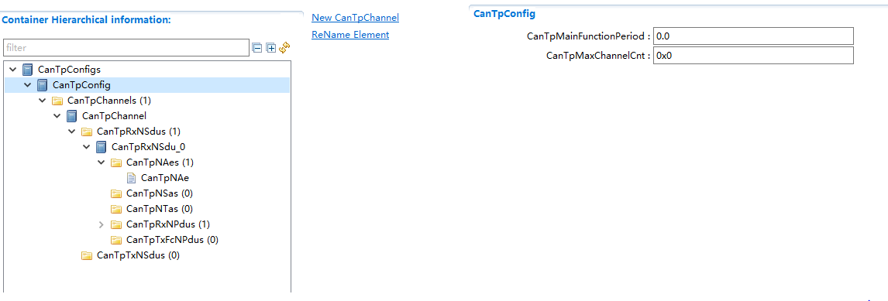

.. centered:: **表 CanTpConfig属性描述 (Table CanTpConfig Properties Description)**

.. list-table::
   :widths: 20 20 20 20 20
   :header-rows: 1

   * - UI名称 (UI Name)
     - 描述 (Description)
     - 
     - 
     - 
   * - CanTpMainFunctionPeriod
     - 取值范围 (Range)
     - 0..0.255
     - 默认取值 (Default value)
     - 0
   * - 
     - 参数描述 (Parameter description)
     - 主函数调用周期 (Main function call period)
     - 
     - 
   * - 
     - 依赖关系 (Dependencies)
     - 无
     - 
     - 
   * - CanTpMaxChannelCnt
     - 取值范围 (Range)
     - 0 ..
     - 默认取值 (Default value)
     - 0
   * - 
     - 
     - 18446744073709551615
     - 
     - 
   * - 
     - 参数描述 (Parameter description)
     - 最大通道个数 (Maximum number of channels)
     - 
     - 
   * - 
     - 依赖关系 (Dependencies)
     - 根据该配置决定可配的channel数量。 (Determine the number of configurable channels based on this configuration.)
     - 
     - 

CanTpChannel
---------------------------

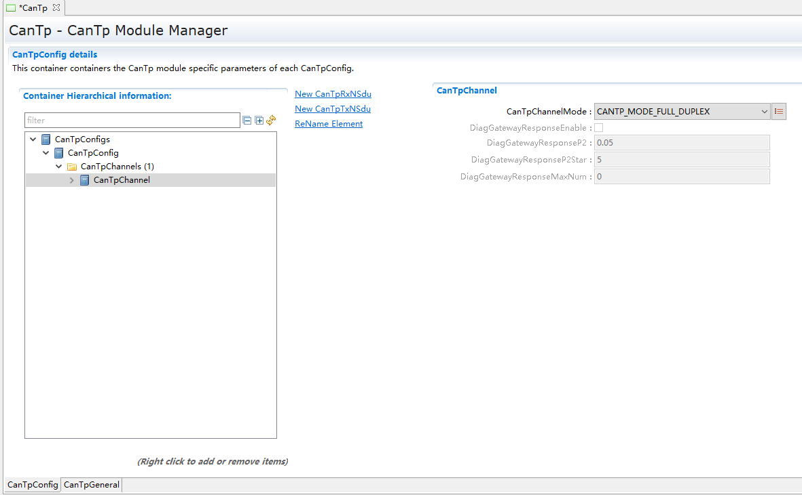

.. centered:: **表 CanTpChannel属性描述 (Table CanTpChannel Properties Description)**

.. list-table::
   :widths: 20 20 20 20 20
   :header-rows: 1

   * - UI名称 (UI Name)
     - 描述 (Description)
     - 
     - 
     - 
   * - CanTpChannelMode
     - 取值范围 (Range)
     - CANTP_MODE_FULL_DUPLEX/CANTP_MODE_HALF_DUPLEX
     - 默认取值 (Default value)
     - CANTP_MODE_FULL_DUPLEX
   * - 
     - 参数描述 (Parameter description)
     - 通道处理类型 (Channel processing type)
     - 
     - 
   * - 
     - 依赖关系 (Dependencies)
     - 无
     - 
     - 
   * - DiagGatewayResponseEnable
     - 取值范围 (Range)
     - True/False
     - 默认取值 (Default value)
     - False
   * - 
     - 参数描述 (Parameter description)
     - 诊断网关通道使能开关 (Diagnosis Gateway Channel Enable Switch)
     - 
     - 
   * - 
     - 依赖关系 (Dependencies)
     - CanTpDiagGWResEnable使能 (CanTpDiagGWResEnable Enable)
     - 
     - 
   * - DiagGatewayResponseP2
     - 取值范围 (Range)
     - 0..1
     - 默认取值 (Default value)
     - 0.05
   * - 
     - 参数描述 (Parameter description)
     - 诊断网关应答P2时间 (Diagnosis Gateway Response P2 Time)
     - 
     - 
   * - 
     - 依赖关系 (Dependencies)
     - CanTpDiagGWResEnable使能 (CanTpDiagGWResEnable Enable)
     - 
     - 
   * - DiagGatewayResponseP2Star
     - 取值范围 (Range)
     - 0..100
     - 默认取值 (Default value)
     - 5
   * - 
     - 参数描述 (Parameter description)
     - 诊断网关应答P2*时间 (Diagnosis gateway response P2* time)
     - 
     - 
   * - 
     - 依赖关系 (Dependencies)
     - CanTpDiagGWResEnable使能 (CanTpDiagGWResEnable Enable)
     - 
     - 
   * - DiagGatewayResponseMaxNum
     - 取值范围 (Range)
     - 0..255
     - 默认取值 (Default value)
     - 0
   * - 
     - 参数描述 (Parameter description)
     - 应答NRC78的最大次数 (Maximum次数to Respond NRC78)
     - 
     - 
   * - 
     - 依赖关系 (Dependencies)
     - CanTpDiagGWResEnable使能 (CanTpDiagGWResEnable Enable)
     - 
     - 

CanTpRxNSdu
---------------------------

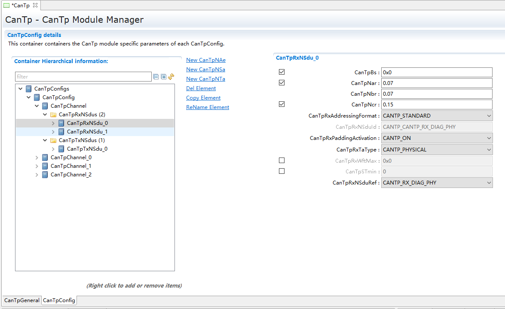

.. centered:: **表 CanTpRxNSdu属性描述 (Table CanTpRxNSdu Properties Described)**

.. list-table::
   :widths: 20 20 20 20 20
   :header-rows: 1

   * - UI名称 (UI Name)
     - 描述 (Description)
     - 
     - 
     - 
   * - CanTpBs
     - 取值范围 (Range)
     - 0..255
     - 默认取值 (Default value)
     - 0
   * - 
     - 参数描述 (Parameter description)
     - 块大小 (Block size)
     - 
     -
   * - 
     - 依赖关系 (Dependencies)
     - 无
     - 
     - 
   * - CanTpNar
     - 取值范围 (Range)
     - 0..INF
     - 默认取值 (Default value)
     - 0
   * - 
     - 参数描述 (Parameter description)
     - N_Ar值 (NA_r value)
     - 
     -
   * - 
     - 依赖关系 (Dependencies)
     - 无
     - 
     - 
   * - CanTpNbr
     - 取值范围 (Range)
     - 0..INF
     - 默认取值 (Default value)
     - 0
   * - 
     - 参数描述 (Parameter description)
     - N_Br值 (N_Br Value)
     - 
     -
   * - 
     - 依赖关系 (Dependencies)
     - 无
     - 
     - 
   * - CanTpNcr
     - 取值范围 (Range)
     - 0..INF
     - 默认取值 (Default value)
     - 0
   * - 
     - 参数描述 (Parameter description)
     - N_Cr值 (N_Cr value)
     - 
     -
   * - 
     - 依赖关系 (Dependencies)
     - 无
     - 
     -
   * - | CanTpRxAddressingFormat
     - 取值范围 (Range of values)
     - CANTP_EXTENDED / CANTP_MIXED / CANTP_MIXED29BIT / CANTP_NORMALFIXED / CANTP_STANDARD
     - CANTP_EXTENDED
     -
   * - |
     - 参数描述 (Parameter Description)
     - 接收地址模式
     -
     -
   * - |
     - 依赖关系 (Dependency relationships)
     - 无
     -
     -
   * - CanTpRxNSduId
     - 取值范围 (Range)
     - 0 ... 65535
     - 默认取值 (Default value)
     - 无
   * - 
     - 参数描述 (Parameter description)
     - 接收N-SDU ID值 (Receive N-SDU ID value)
     - 
     -
   * - 
     - 依赖关系 (Dependencies)
     - 无
     - 
     - 
   * - CanTpRxPaddingActivation
     - 取值范围 (Range)
     - CANTP_OFF/CANTP_ON
     - 默认取值 (Default value)
     - CANTP_OFF
   * - 
     - 参数描述 (Parameter description)
     - 接收填充使能开关 (Enable Switch for Reception Filling)
     - 
     -
   * - 
     - 依赖关系 (Dependencies)
     - 无
     - 
     - 
   * - CanTpRxTaType
     - 取值范围 (Range)
     - CANTP_CANFD_FUNCTIONAL/CANTP_CANFD_PHYSICAL/CANTP_FUNCTIONAL/CANTP_PHYSICAL
     - 默认取值 (Default value)
     - CANTP_CANFD_FUNCTIONAL
   * - 
     - 参数描述 (Parameter description)
     - 接收TA类型 (Receive TA Type)
     - 
     -
   * - 
     - 依赖关系 (Dependencies)
     - 无
     - 
     - 
   * - CanTpRxWftMax
     - 取值范围 (Range)
     - 0 ... 65535
     - 默认取值 (Default value)
     - 0
   * - 
     - 参数描述 (Parameter description)
     - 接收等待FC最大次数 (Maximum times of receiving pending FC)
     - 
     -
   * - 
     - 依赖关系 (Dependencies)
     - 无
     - 
     - 
   * - CanTpSTmin
     - 取值范围 (Range)
     - 0 ... INF
     - 默认取值 (Default value)
     - 0
   * - 
     - 参数描述 (Parameter description)
     - STmin值 (STmin Value)
     - 
     -
   * - 
     - 依赖关系 (Dependencies)
     - 无
     - 
     - 
   * - CanTpRxNSduRef
     - 取值范围 (Range)
     - 无
     - 默认取值 (Default value)
     - 无
   * - 
     - 参数描述 (Parameter description)
     - N-SDU关联 (N-SDU Association)
     - 
     -
   * - 
     - 依赖关系 (Dependencies)
     - 无
     - 
     - 

CanTpRxNPdu
---------------------------

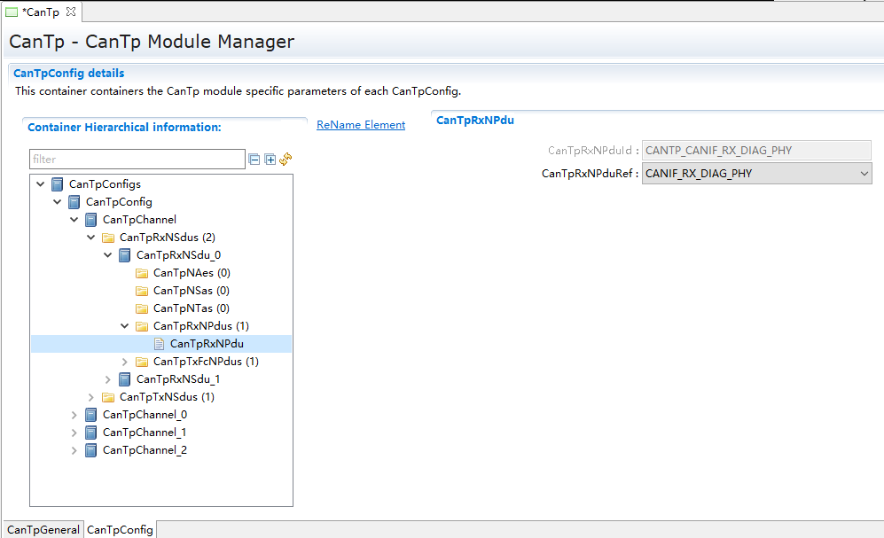

.. centered:: **表 CanTpRxNPdu属性描述 (Table CanTpRxNPdu Properties Description)**

.. list-table::
   :widths: 20 20 20 20 20
   :header-rows: 1

   * - UI名称 (UI Name)
     - 描述 (Description)
     - 
     - 
     - 
   * - CanTpRxNPduId
     - 取值范围 (Range)
     - 0 ... 65535
     - 默认取值 (Default value)
     - 无
   * - 
     - 参数描述 (Parameter description)
     - N-PDU ID值 (N-PDU ID value)
     - 
     - 
   * - 
     - 依赖关系 (Dependencies)
     - 不可配置，根据关联pdu自动生成 (Not configurable, generated automatically based on associated PDU)
     - 
     - 
   * - CanTpRxNPduRef
     - 取值范围 (Range)
     - 无
     - 默认取值 (Default value)
     - 无
   * - 
     - 参数描述 (Parameter description)
     - PDU关联 (PDU Association)
     - 
     - 
   * - 
     - 依赖关系 (Dependencies)
     - 无
     - 
     - 

CanTpTxFcNPdu
-----------------------------

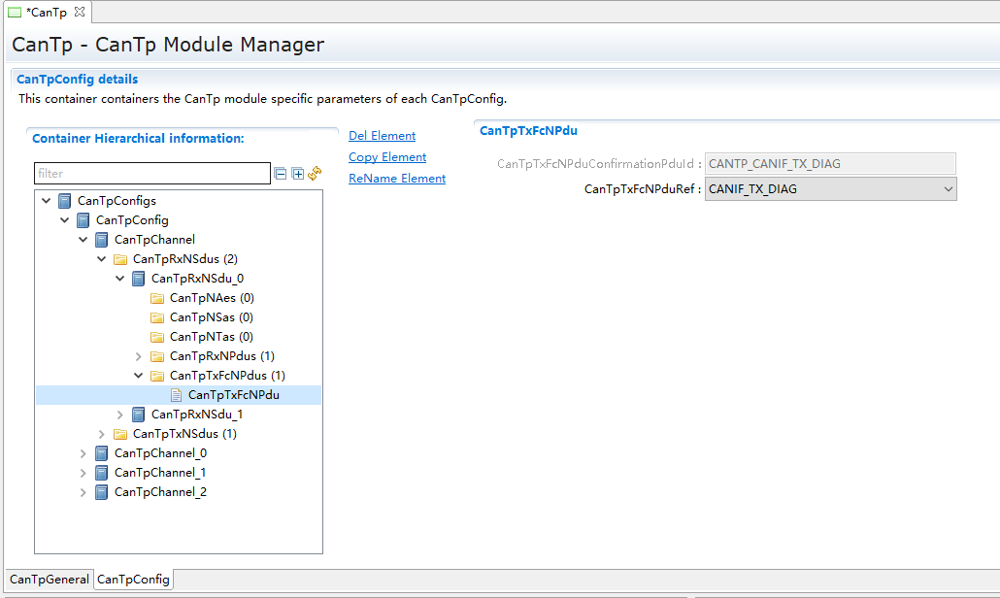

.. centered:: **表 CanTpTxFcNPdu属性描述 (Table CanTpTxFcNPdu Properties Description)**

.. list-table::
   :widths: 20 20 20 20 20
   :header-rows: 1

   * - UI名称 (UI Name)
     - 描述 (Description)
     - 
     - 
     - 
   * - CanTpTxFcNPduConfirmationPduId
     - 取值范围 (Range)
     - 0 ...65535
     - 默认取值 (Default value)
     - 无
   * - 
     - 参数描述 (Parameter description)
     - N-PDU ID值 (N-PDU ID value)
     - 
     - 
   * - 
     - 依赖关系 (Dependencies)
     - 不可配置，根据关联pdu自动生成 (Not configurable, generated automatically based on associated PDU)
     - 
     - 
   * - CanTpTxFcNPduRef
     - 取值范围 (Range)
     - 无
     - 默认取值 (Default value)
     - 无
   * - 
     - 参数描述 (Parameter description)
     - PDU关联 (PDU Association)
     - 
     - 
   * - 
     - 依赖关系 (Dependencies)
     - 无
     - 
     - 

CanTpNTa
------------------------

.. centered:: **表 CanTpNTa属性描述 (Table CanTpNTa Property Description)**

.. list-table::
   :widths: 20 20 20 20 20
   :header-rows: 1

   * - UI名称 (UI Name)
     - 描述 (Description)
     - 
     - 
     - 
   * - CanTpNTa
     - 取值范围 (Range)
     - 0 ... 255
     - 默认取值 (Default value)
     - 0
   * - 
     - 参数描述 (Parameter description)
     - TA值 (TA Value)
     - 
     - 
   * - 
     - 依赖关系 (Dependencies)
     - 地址模式为CANTP_EXTENDED的RxNSdu和TxNSdu都必须配置。
       (Addressing mode CANTP_EXTENDED requires both Rx NSdu and Tx NSdu to be configured.)

       如果DynIdSupport使能，地址模式为CANTP_NORMALFIXED或CANTP_MIXED29BIT的RxNSdu必须配置。
       (If DynIdSupport is enabled, RxNSdu with address modes CANTP_NORMALFIXED or CANTP_MIXED29BIT must be configured.

       如果DynIdSupport使能并且GenericConnectionSupport不使能，且地址模式为CANTP_NORMALFIXED或CANTP_MIXED29BIT的TxNSdu必须配置。
       If DynIdSupport is enabled and GenericConnectionSupport is not disabled, and the address mode of TxNSdu is CANTP_NORMALFIXED or CANTP_MIXED29BIT, then TxNSdu must be configured.)
     - 
     - 

CanTpNSa
------------------------

.. centered:: **表 CanTpNSa属性描述 (Property CanTpNSa describes)**

.. list-table::
   :widths: 20 20 20 20 20
   :header-rows: 1

   * - UI名称 (UI Name)
     - 描述 (Description)
     - 
     - 
     - 
   * - CanTpNSa
     - 取值范围 (Range)
     - 0 ... 255
     - 默认取值 (Default value)
     - 0
   * - 
     - 参数描述 (Parameter description)
     - SA值 (SA Value)
     - 
     - 
   * - 
     - 依赖关系 (Dependencies)
     - 地址模式为CANTP_EXTENDED且TA类型为CANTP_PHYSICAL的RxNSdu和TxNSdu都必须配置。
       (Addressing mode must be set to CANTP_EXTENDED and both Rx NSdu and Tx NSdu for TA type CANTP_PHYSICAL must be configured.)

       如果DynIdSupport使能，地址模式为CANTP_NORMALFIXED或CANTP_MIXED29BIT的TxNSdu必须配置。
       (If DynIdSupport is enabled, TxNSdu with address modes CANTP_NORMALFIXED or CANTP_MIXED29BIT must be configured.

       如果DynIdSupport使能并且GenericConnectionSupport不使能，且地址模式为CANTP_NORMALFIXED或CANTP_MIXED29BIT的RxNSdu必须配置。
       If DynIdSupport is enabled and GenericConnectionSupport is not disabled, and the address mode of RxNSdu is CANTP_NORMALFIXED or CANTP_MIXED29BIT, then RxNSdu must be configured.)
     - 
     - 

CanTpNAe
------------------------

.. centered:: **表 CanTpNAe属性描述 (Property CanTpNAe describes)**

.. list-table::
   :widths: 20 20 20 20 20
   :header-rows: 1

   * - UI名称 (UI Name)
     - 描述 (Description)
     - 
     - 
     - 
   * - CanTpNAe
     - 取值范围 (Range)
     - 0 ... 255
     - 默认取值 (Default value)
     - 0
   * - 
     - 参数描述 (Parameter description)
     - AE值 (AE Value)
     - 
     - 
   * - 
     - 依赖关系 (Dependencies)
     - 地址模式为CANTP_MIXED或CANTP_MIXED29BIT的TxNSdu和RxNSdu必须配置。 (The TxNSdu and RxNSdu must be configured for address modes CANTP_MIXED or CANTP_MIXED29BIT.)
     - 
     - 

CanTpTxNSdu
------------------------

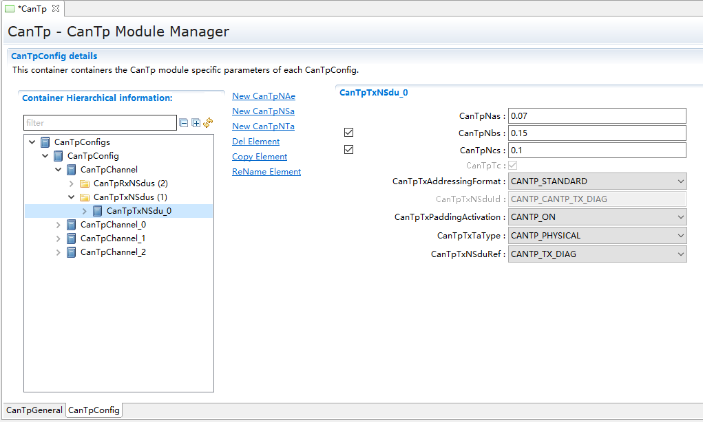

.. centered:: **表 CanTpTxNSdu属性描述 (Table CanTpTxNSdu Properties Description)**

.. list-table::
   :widths: 20 20 20 20 20
   :header-rows: 1

   * - UI名称 (UI Name)
     - 描述 (Description)
     - 
     - 
     - 
   * - CanTpNas
     - 取值范围 (Range)
     - 0 ... INF
     - 默认取值 (Default value)
     - 0
   * - 
     - 参数描述 (Parameter description)
     - N_As值 (N_As Value)
     - 
     - 
   * - 
     - 依赖关系 (Dependencies)
     - 无
     - 
     - 
   * - CanTpNbs
     - 取值范围 (Range)
     - 0 … INF
     - 默认取值 (Default value)
     - 0
   * - 
     - 参数描述 (Parameter description)
     - N_Bs
     - 
     - 
   * - 
     - 依赖关系 (Dependencies)
     - 无
     - 
     - 
   * - CanTpNcs
     - 取值范围 (Range)
     - 0 ... INF
     - 默认取值 (Default value)
     - 0
   * - 
     - 参数描述 (Parameter description)
     - N_Cs
     - 
     - 
   * - 
     - 依赖关系 (Dependencies)
     - 无
     - 
     - 
   * - CanTpTc
     - 取值范围 (Range)
     - True/False
     - 默认取值 (Default value)
     - 无
   * - 
     - 参数描述 (Parameter description)
     - 取消接收和取消发送的使能开关 (Enable Switch for Cancelling Reception and Sending)
     - 
     - 
   * - 
     - 依赖关系 (Dependencies)
     - 如果对应的CanTpTxNSdu/CanTpTxNSduRef关联的PDU是PDUR某RoutingPath的DestPdu且对应的SrcPdu被DCM的DcmDslProtocolTxPduRef关联或直接被DcmDslProtocolTxPduRef关联的话，CanTpTc配置项不可自行配置，与
       (If the corresponding CanTpTxNSdu/CanTpTxNSduRef associated PDU is the DestPdu of a RoutingPath in PDUR and the corresponding SrcPdu is linked or directly linked by DcmDslProtocolTxPduRef of DCM, then the CanTpTc configuration item cannot be self-configured, and it must be)
       DcmGeneral/PreemptionProtocolCancelSupport同步勾选；否则可自行配置。
       (Synchronize the check for DcmGeneral/PreemptionProtocolCancelSupport; otherwise, you can configure it manually.)
     - 
     - 
   * - CanTpTxAddressingFormat
     - 取值范围 (Range)
     - CANTP_EXTENDED/CANTP_MIXED/CANTP_MIXED29BIT/CANTP_NORMALFIXED/CANTP_STANDARD
     - 默认取值 (Default value)
     - CANTP_EXTENDED
   * - 
     - 参数描述 (Parameter description)
     - 发送地址模式 (Send address mode)
     - 
     - 
   * - 
     - 依赖关系 (Dependencies)
     - 无
     - 
     - 
   * - CanTpTxNSduId
     - 取值范围 (Range)
     - 0 ... 65535
     - 默认取值 (Default value)
     - 无
   * - 
     - 参数描述 (Parameter description)
     - 发送N-SDU ID值 (Send N-SDU ID value)
     - 
     - 
   * - 
     - 依赖关系 (Dependencies)
     - 不可配，根据pdu引用决定 (Not compatible, determined based on PDU reference.)
     - 
     - 
   * - CanTpTxPaddingActivation
     - 取值范围 (Range)
     - CANTP_OFF/CANTP_ON
     - 默认取值 (Default value)
     - CANTP_OFF
   * - 
     - 参数描述 (Parameter description)
     - 发送填充使能 (Enable Send Pad Fill)
     - 
     - 
   * - 
     - 依赖关系 (Dependencies)
     - 无
     - 
     - 
   * - CanTpTxTaType
     - 取值范围 (Range)
     - CANTP_FUNCTIONAL/CANTP_PHYSICAL
     - 默认取值 (Default value)
     - CANTP_FUNCTIONAL
   * - 
     - 参数描述 (Parameter description)
     - 发送TA类型 (Send TA Type)
     - 
     - 
   * - 
     - 依赖关系 (Dependencies)
     - 无
     - 
     - 
   * - CanTpTxNSduRef
     - 取值范围 (Range)
     - 无
     - 默认取值 (Default value)
     - 无
   * - 
     - 参数描述 (Parameter description)
     - PDU关联 (PDU Association)
     - 
     - 
   * - 
     - 依赖关系 (Dependencies)
     - 无
     - 
     - 

CanTpTxNPdu
---------------------------

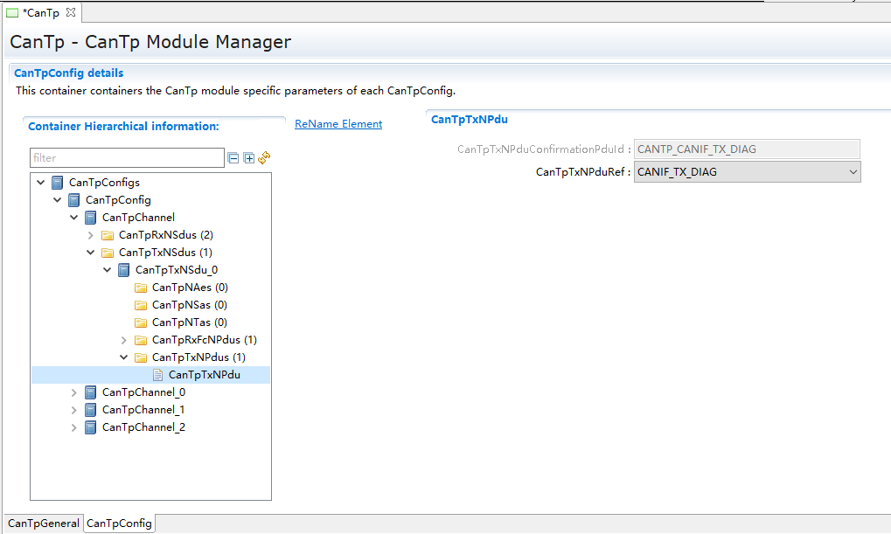

.. centered:: **表 CanTpTxNPdu属性描述 (Table CanTpTxNPdu Properties Description)**

.. list-table::
   :widths: 20 20 20 20 20
   :header-rows: 1

   * - UI名称 (UI Name)
     - 描述 (Description)
     - 
     - 
     - 
   * - CanTpTxNPduConfirmationPduId
     - 取值范围 (Range)
     - 0 ... 65535
     - 默认取值 (Default value)
     - 0
   * - 
     - 参数描述 (Parameter description)
     - N-PDU ID值 (N-PDU ID value)
     - 
     - 
   * - 
     - 依赖关系 (Dependencies)
     - 不可配，根据pdu引用决定 (Not compatible, determined based on PDU reference.)
     - 
     - 
   * - CanTpTxNPduRef
     - 取值范围 (Range)
     - 无
     - 默认取值 (Default value)
     - 无
   * - 
     - 参数描述 (Parameter description)
     - PDU关联 (PDU Association)
     - 
     - 
   * - 
     - 依赖关系 (Dependencies)
     - 无
     - 
     - 

CanTpRxFcNPdu
-----------------------------

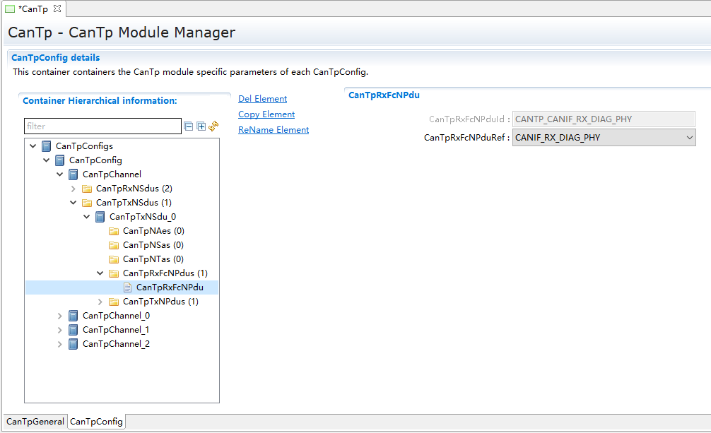

.. centered:: **表 CanTpRxFcNPdu属性描述 (Table CanTpRxFcNPdu Properties Description)**

.. list-table::
   :widths: 20 20 20 20 20
   :header-rows: 1

   * - UI名称 (UI Name)
     - 描述 (Description)
     - 
     - 
     - 
   * - CanTpRxFcNPduId
     - 取值范围 (Range)
     - 0 … 65535
     - 默认取值 (Default value)
     - 0
   * - 
     - 参数描述 (Parameter description)
     - N-PDU ID值 (N-PDU ID value)
     - 
     - 
   * - 
     - 依赖关系 (Dependencies)
     - 不可配，根据pdu引用决定 (Not compatible, determined based on PDU reference.)
     - 
     - 
   * - CanTpRxFcNPduRef
     - 取值范围 (Range)
     - 无
     - 默认取值 (Default value)
     - 无
   * - 
     - 参数描述 (Parameter description)
     - PDU关联 (PDU Association)
     - 
     - 
   * - 
     - 依赖关系 (Dependencies)
     - 无
     - 
     - 

CanTpNTa
------------------------

.. centered:: **表 CanTpNTa属性描述 (Table CanTpNTa Property Description)**

.. list-table::
   :widths: 20 20 20 20 20
   :header-rows: 1

   * - UI名称 (UI Name)
     - 描述 (Description)
     - 
     - 
     - 
   * - CanTpNTa
     - 取值范围 (Range)
     - 0 ... 255
     - 默认取值 (Default value)
     - 0
   * - 
     - 参数描述 (Parameter description)
     - TA值 (TA Value)
     - 
     - 
   * - 
     - 依赖关系 (Dependencies)
     - 地址模式为CANTP_EXTENDED的RxNSdu和TxNSdu都必须配置。
       (Addressing mode CANTP_EXTENDED requires both Rx NSdu and Tx NSdu to be configured.)

       如果DynIdSupport使能，地址模式为CANTP_NORMALFIXED或CANTP_MIXED29BIT的RxNSdu必须配置。
       (If DynIdSupport is enabled, RxNSdu with address modes CANTP_NORMALFIXED or CANTP_MIXED29BIT must be configured.

       如果DynIdSupport使能并且GenericConnectionSupport不使能，且地址模式为CANTP_NORMALFIXED或CANTP_MIXED29BIT的TxNSdu必须配置。
       If DynIdSupport is enabled and GenericConnectionSupport is not disabled, and the address mode of TxNSdu is CANTP_NORMALFIXED or CANTP_MIXED29BIT, then TxNSdu must be configured.)
     - 
     - 

CanTpNSa
------------------------

.. centered:: **表 CanTpNSa属性描述 (Property CanTpNSa describes)**

.. list-table::
   :widths: 20 20 20 20 20
   :header-rows: 1

   * - UI名称 (UI Name)
     - 描述 (Description)
     - 
     - 
     - 
   * - CanTpNSa
     - 取值范围 (Range)
     - 0 ... 255
     - 默认取值 (Default value)
     - 0
   * - 
     - 参数描述 (Parameter description)
     - SA值 (SA Value)
     - 
     - 
   * - 
     - 依赖关系 (Dependencies)
     - 地址模式为CANTP_EXTENDED且TA类型为CANTP_PHYSICAL的RxNSdu和TxNSdu都必须配置。
       (Addressing mode must be set to CANTP_EXTENDED and both Rx NSdu and Tx NSdu for TA type CANTP_PHYSICAL must be configured.)

       如果DynIdSupport使能，地址模式为CANTP_NORMALFIXED或CANTP_MIXED29BIT的TxNSdu必须配置。
       (If DynIdSupport is enabled, TxNSdu with address modes CANTP_NORMALFIXED or CANTP_MIXED29BIT must be configured.

       如果DynIdSupport使能并且GenericConnectionSupport不使能，且地址模式为CANTP_NORMALFIXED或CANTP_MIXED29BIT的RxNSdu必须配置。
       If DynIdSupport is enabled and GenericConnectionSupport is not disabled, and the address mode of RxNSdu is CANTP_NORMALFIXED or CANTP_MIXED29BIT, then RxNSdu must be configured.)
     - 
     - 

CanTpNAe
------------------------

.. centered:: **表 CanTpNAe属性描述 (Property CanTpNAe describes)**

.. list-table::
   :widths: 20 20 20 20 20
   :header-rows: 1

   * - UI名称 (UI Name)
     - 描述 (Description)
     - 
     - 
     - 
   * - CanTpNAe
     - 取值范围 (Range)
     - 0 ... 255
     - 默认取值 (Default value)
     - 0
   * - 
     - 参数描述 (Parameter description)
     - AE值 (AE Value)
     - 
     - 
   * - 
     - 依赖关系 (Dependencies)
     - 地址模式为CANTP_MIXED或CANTP_MIXED29BIT的TxNSdu和RxNSdu必须配置。 (The TxNSdu and RxNSdu must be configured for address modes CANTP_MIXED or CANTP_MIXED29BIT.)
     - 
     - 

附录1 (Appendix 1)
================================

[1]通过CanTpTimerType配置项可以选择四种计时方法。分别为TM、OS、Mainfunction、Callout。TM:使用TM模块内部标准接口。OS：使用Os system counter。Mainfunction：依赖周期调度，由CanTp内部计时。不同计时方法的对应接口由配置工具生成在CanTp_Callout.c中，其中Callout是由客户自定义的计时类型，可以参照生成示例中TM/OS/Mainfunction的实现，结合项目工程情况修改接口自行实现计时功能。

The configuration item CanTpTimerType allows selection of four timing methods: TM, OS, Mainfunction, and Callout.TM: Uses the standard interface within the TM module.OS: Uses the Os system counter.Mainfunction: Depends on periodic scheduling managed internally by CanTp.The corresponding interfaces for different timing methods are generated by the configuration tool in CanTp_Callout.c. Among these, Callout is a customer-defined timing type that can be implemented by referring to the examples of TM/OS/Mainfunction and modifying the interface according to project engineering requirements.

[2] 根据整个通信栈架构，CanTp_TxConfirmation 接口目前按照422版本实现。

According to the entire communication stack architecture, the CanTp_TxConfirmation interface is currently implemented according to version 422.

[3]CanTpSynchronousTransmission配置项启用后，CanTp将在CanTp_Transmit接口中激活SF/FF帧的同步传输机制。需注意：若上层应用依赖CanTp_Transmit函数返回值进行后续处理，则该同步传输功能不可用。该功能仅适用于上层应用不依赖CanTp_Transmit函数返回值的场景。

After enabling the CanTpSynchronousTransmission configuration item, CanTp will activate the synchronous transmission mechanism for SF/FF frames in the CanTp_Transmit interface. Note: If the upper-layer application relies on the return value of the CanTp_Transmit function for subsequent processing, then this synchronous transmission feature is unavailable. This feature is only applicable to scenarios where the upper-layer application does not depend on the return value of the CanTp_Transmit function.

附录2 (Appendix 2)
================================

.. centered:: **表 工程预编译宏定义表(Table Engineering Precompiled Macro Definition Table)**

.. list-table::
   :widths: 25 25 25 25
   :header-rows: 1

   * - 宏定义名称 (Macro definition name)
     - 功能 (Function)
     - 范围（使用方法） (Scope (Usage Method))
     - 默认值 (Default value)
   * - ``CANTP_FIX_BS``
     - 接收过程中发送FC所携带的BS取值 (The BS value carried by the FC sent during reception process)
     - **定义**：BS的数值使用配置的静态固定值；
       (Definition: The value of BS is defined using configured static fixed values;)

       **未定义**：BS的数值采用动态自动计算的方式
       (Undefined: The value of BS is dynamically automatically calculated.)
     - 未定义 (Undefined)
