CanTrcv
#################################

:strong:`缩写词注解 (Abbreviation Notes):`

.. list-table::
   :widths: 34 33 33
   :header-rows: 1

   * - 缩写词 (Abbreviation)
     - 解释/描述 (Explanation/Description)
     - 中文解释 (Chinese explanation)
   * - ComM
     - Communication Manager
     - 通信管理器 (Communication Manager)
   * - DEM
     - Diagnostic Event Manager
     - 诊断事件管理器 (Diagnostic Event Manager)
   * - DET
     - Default Error Tracer
     - 默认错误检测/追踪器 (Default Error Detection/Tracker)
   * - DIO
     - Digital Input Output(SPAL module)
     - 数字输入/输出 (Digital Input/Output)
   * - EB
     - Externally Bufferedchannels
     - 外部缓冲通道。缓冲区存放SPI驱动以外要传输的数据。 (External buffer channel. The buffer stores data to be transmitted apart from the SPI driver.)
   * - EcuM
     - ECU State Manager
     - ECU状态机管理器 (ECU State Machine Manager)
   * - IB
     - Internally Bufferedchannels
     - 内部缓冲通道。缓冲区存放SPI驱动内部要传输的数据。 (Internal buffer channel. Buffers store the data to be transferred by the SPI driver.)
   * - ISR
     - Interrupt Service Routine
     - 中断服务程序 (Interrupt Service Routine)
   * - MCAL
     - Micro ControllerAbstraction Layer
     - 微控制器抽象层 (Microcontroller Abstraction Layer)
   * - Port
     - Port module (SPAL module)
     - 端口模块 (Port Module)
   * - n/a
     - Not Applicable
     - 不适用 (Not applicable)
   * - SBC
     - System Basis Chip
     - 系统基础芯片。一个整合收发器，看门狗以及电源控制的设备。 (System-on-chip. A device integrating a transceiver, watchdog, and power control.)
   * - SPAL
     - Standard PeripheralAbstraction Layer
     - 标准外设抽象层 (Standard Peripheral Abstraction Layer)
   * - API
     - Application ProgrammingInterface
     - 应用接口 (API)

简介 (Introduction)
=================================

CanTrcv在AutoSar R19-11软件层级架构如下图：

CanTrcv in AutoSar R19-11 software hierarchical architecture is as follows:

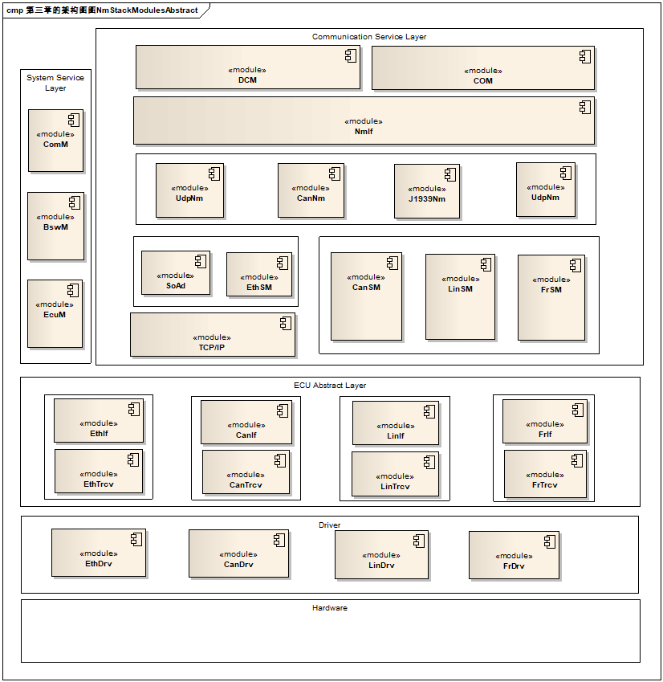

CanTrcv抽象化Can收发器硬件，提供独立于硬件的接口给CanIf等上层模块。它通过使用MCAL层的API接口访问CAN收发器硬件，从ECU布局中抽象出来。

CanTrcv abstracts the Can transceiver hardware, providing a hardware-independent interface to upper layers such as CanIf. It accesses the CAN transceiver hardware via MCAL layer APIs, abstracting it from the ECU layout.

参考资料 (Reference materials)
------------------------------------------

[1] AUTOSAR_SWS_CanTransceiverDriver.PDF，R19-11

[2] AUTOSAR_SRS_CAN.PDF，R19-11

功能描述 (Function Description)
===========================================

CanTrcv功能 (CanTrcv Function)
--------------------------------------------

CanTrcv功能介绍 (Function Introduction of CanTrcv)
==============================================================

CAN收发器驱动程序模块负责处理ECU上的CAN收发器硬件芯片，并将CAN总线上使用的信号电平调整为微控制器可以识别的逻辑(数字)信号电平。此外，收发器还能检测到电气故障，如线路问题、地面偏移或长主导信号的传输。

The CAN transceiver driver module is responsible for handling the CAN transceiver hardware chip on the ECU and converting the signal levels used on the CAN bus to logical (digital) signal levels that the microcontroller can recognize. Additionally, the transceiver can detect electrical faults such as line issues, ground offset, or long dominant signal transmission.

根据CAN收发器与微控制器的接口，驱动程序模块可以标记由外部端口pin记录的探测错误或由SPI总线记录的检测错误；特定CAN收发器支持电源控制，并通过CAN总线唤醒。有些CAN收发器具备特定功能，如系统基础芯片(SBC)，它除了CAN基本功能之外，还实现了电源控制和高级监控，并通过SPI总线和MCU进行访问。部分网络唤醒是CAN系统中的一种状态，其中一些节点处于低功耗模式，而其他节点正在通信。这减少了整个网络的功耗。在低功耗模式下，节点被预先定义的唤醒帧唤醒。支持选择性唤醒的收发器除了普通收发器提供的唤醒模式(Wakeup Pattern)外，还可以通过唤醒帧(Wakeup Frame)来唤醒。

Based on the interface between the CAN transceiver and microcontroller, the driver module can mark探测 errors recorded by external port pins or detection errors recorded by SPI bus; specific CAN transceivers support power control and wake up through the CAN bus. Some CAN transceivers have specific functionalities such as System Basis Chip (SBC), which in addition to basic CAN functions, implements power control and advanced monitoring, and is accessible via SPI bus and MCU. Partial network wake-up is a state in CAN systems where some nodes are in low-power modes while other nodes are communicating. This reduces the overall network power consumption. In low-power mode, nodes are awakened by predefined wake-up frames. Transceivers that support selective wake-up have additional wake-up frame (Wakeup Frame) to awaken on top of the normal wakeup patterns provided by regular transceivers.

CanTrcv功能实现 (CanTrcv functionality implementation)
==================================================================

CAN收发器驱动程序的目标是指定适合CAN收发器设备的接口和行为和抽象CAN收发器硬件；它为上层提供了一个独立于硬件的接口；它通过使用MCAL层的API接口访问CAN收发器硬件，从ECU布局中抽象出来。

The goal of the CAN transceiver driver is to specify the interface and behavior suitable for CAN transceiver devices, abstracting the hardware; it provides an hardware-independent interface to the upper layers; it accesses the CAN transceiver hardware through API interfaces of the MCAL layer, abstracting from ECU layout.

CanTrcv在访问到硬件，发现唤醒事件之后，也可以通过回调接口通知到上层CanIf/EcuM从而使BSW能处理这些唤醒事件。

CanTrcv can also notify CanIf/EcuM at the upper layer through callback interfaces after accessing the hardware and detecting wake-up events, so that BSW can handle these wake-up events.

源文件描述 (Source file description)
===============================================

.. centered:: **表 CanTrcv组件文件描述 (Table CanTrcv Component File Description)**

.. list-table::
   :widths: 50 50
   :header-rows: 1

   * - 文件 (Files)
     - 说明 (Description)
   * - CanTrcv.c
     - 包含需要使用的宏定义，内部变量，内部函数，全局函数。 (Contains the macros needed for use, internal variables, internal functions, and global functions.)
   * - CanTrcv_Driver.c
     - 包含需要使用的关于硬件的宏定义，内部变量，内部函数。 (Contain macros for hardware, internal variables, and internal functions.)
   * - CanTrcv_Driver.h
     - 包含需要使用的关于硬件的宏定义，类型定义，内部函数声明。 (Contain macro definitions, type definitions, and internal function declarations for the hardware to be used.)
   * - CanTrcv_Types.h
     - 包含需要使用的类型定义。 (Contain type definitions needed for use.)
   * - CanTrcv.h
     - 包含需要使用的宏定义，类型定义，配置结构体声明，外部函数声明。 (Contain macro definitions, type definitions, configuration structure declarations, and external function declarations.)
   * - CanTrcv_Cfg.h
     - 生成CanTrcv模块配置相关的宏定义。 (Generate macro definitions related to the CanTrcv module configuration.)
   * - CanTrcv_Cfg.c
     - 生成CanTrcv模块配置相关的结构体。 (Generate the structure for configuring the CanTrcv module.)
   * - CanTrcv_MemMap.h
     - CanTrcv模块的内存映射。 (Memory mapping of CanTrcv module.)

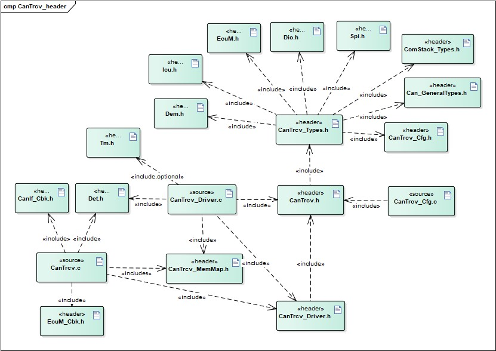

API接口 (API Interface)
=====================================

类型定义 (Type definition)
--------------------------------------

CanTrcv_ConfigType类型定义 (CanTrcv_ConfigType Type Definition)
===========================================================================

.. list-table::
   :widths: 50 50
   :header-rows: 1

   * - 名称 (Name)
     - CanTrcv_ConfigType
   * - 类型 (Type)
     - Structure
   * - 范围 (Range)
     - 无
   * - 描述 (Description)
     - 配置参数结构体类型定义 (Definition of configuration parameter structure type)

CanTrcv_PNActivationType类型定义 (CanTrcv_PNActivationType Type Definition)
=======================================================================================

.. list-table::
   :widths: 50 50
   :header-rows: 1

   * - 名称 (Name)
     - CanTrcv_PNActivationType
   * - 类型 (Type)
     - Enumeration
   * - 范围 (Range)
     - PN_ENABLED
   * - 
     - PN_DISABLED
   * - 描述 (Description)
     - 部分唤醒功能开关 (Wake-up Function Switch)

CanTrcv_TrcvFlagStateType类型定义 (CanTrcv_TrcvFlagStateType type definition)
=========================================================================================

.. list-table::
   :widths: 50 50
   :header-rows: 1

   * - 名称 (Name)
     - CanTrcv_TrcvFlagStateType
   * - 类型 (Type)
     - Enumeration
   * - 范围 (Range)
     - CANTRCV_FLAG_SET
   * - 
     - CANTRCV_FLAG_CLEARED
   * - 描述 (Description)
     - CanTrcv硬件是否置位 (Is CanTrcv hardware set?)

输入函数描述 (Describe the input function:)
-----------------------------------------------------

.. list-table::
   :widths: 50 50
   :header-rows: 1

   * - 输入模块 (Input Module)
     - API
   * - CanIf
     - CanIf_ConfirmPnAvailability
   * - 
     - CanIf_TrcvModeIndication
   * - 
     - CanIf_ClearTrcvWufFlagIndication
   * - 
     - CanIf_CheckTrcvWakeFlagIndication
   * - Det
     - Det_ReportError
   * - 
     - Det_ReportRuntimeError
   * - EcuM
     - EcuM_SetWakeupEvent
   * - Icu
     - Icu_DisableNotification
   * - 
     - Icu_EnableNotification
   * - Dio
     - 预留，根据硬件决定 (Reserve according to hardware.)
   * - Spi
     - 预留，根据硬件决定 (Reserve according to hardware.)
   * - Tm
     - Tm_BusyWait1us16bit
   * - Dem
     - Dem_SetEventStatus

静态接口函数定义 (Static interface function definition)
---------------------------------------------------------------

CanTrcv_Init函数定义 (The CanTrcv_Init function defines)
====================================================================

.. list-table::
   :widths: 25 25 25 25
   :header-rows: 1

   * - 函数名称： (Function Name:)
     - CanTrcv_Init
     - 
     - 
   * - 函数原型： (Function prototype:)
     - void CanTrcv_Init(constCanTrcv_ConfigType\*ConfigPtr)
     - 
     - 
   * - 服务编号： (Service Number:)
     - 0x00
     - 
     - 
   * - 同步/异步： (Synchronous/asynchronous:)
     - 同步 (Sync)
     - 
     - 
   * - 是否可重入： (Is Reentrant:)
     - 否 (No)
     - 
     - 
   * - 输入参数： (Input parameters:)
     - ConfigPtr：配置参数指针 (ConfigPtr：Configuration parameter pointer)
     - 值域： (Domain:)
     - 无 (None)
   * - 输入输出参数： (Input Output Parameters:)
     - 无 (None)
     - 
     - 
   * - 输出参数： (Output Parameters:)
     - 无 (None)
     - 
     - 
   * - 返回值： (Return Value:)
     - 无 (None)
     - 
     - 
   * - 功能概述： (Function Overview:)
     - 初始化CanTrcv模块 (Initialize CanTrcv Module)
     - 
     - 

CanTrcv_SetOpMode函数定义 (The CanTrcv_SetOpMode function defines)
==============================================================================

.. list-table::
   :widths: 25 25 25 25
   :header-rows: 1

   * - 函数名称： (Function Name:)
     - CanTrcv_SetOpMode
     - 
     - 
   * - 函数原型： (Function prototype:)
     - Std_ReturnTypeCanTrcv_SetOpMode (
     - 
     - 
   * - 
     - uint8 Transceiver,
     - 
     - 
   * - 
     - CanTrcv_TrcvModeTypeOpMode
     - 
     - 
   * - 
     - )
     - 
     - 
   * - 服务编号： (Service Number:)
     - 0x01
     - 
     - 
   * - 同步/异步： (Synchronous/asynchronous:)
     - 异步 (Asynchronous)
     - 
     - 
   * - 是否可重入： (Is Reentrant:)
     - 对于不同transceivers可重入 (For different transceivers, reentrancy is preserved.)
     - 
     - 
   * - 输入参数： (Input parameters:)
     - Transceiver
     - 值域： (Domain:)
     - 0-(CANTRCV_MAX_CHANNELS-1)
   * - 
     - OpMode：运行模式 (Operation Mode：Run Mode)
     - 值域： (Domain:)
     - 无 (None)
   * - 输入输出参数： (Input Output Parameters:)
     - 无 (None)
     - 
     - 
   * - 输出参数： (Output Parameters:)
     - 无 (None)
     - 
     - 
   * - 返回值： (Return Value:)
     - Std_ReturnType：E_OK：切换请求接收并成功 (Std_ReturnType: E_OK: Switch request received and processed successfully)
     - 
     - 
   * - 
     - E_NOT_OK：切换失败，遇到错误 (E_NOT_OK: Switch failed, encountered an error)
     - 
     - 
   * - 功能概述： (Function Overview:)
     - 切换运行模式 (Switch operating mode)
     - 
     - 

CanTrcv_GetOpMode函数定义 (CanTrcv_GetOpMode function definition)
=============================================================================

.. list-table::
   :widths: 25 25 25 25
   :header-rows: 1

   * - 函数名称： (Function Name:)
     - CanTrcv_GetOpMode
     - 
     - 
   * - 函数原型： (Function prototype:)
     - Std_ReturnTypeCanTrcv_GetOpMode(
     - 
     - 
   * - 
     - uint8 Transceiver,
     - 
     - 
   * - 
     - CanTrcv_TrcvModeType\*OpMode
     - 
     - 
   * - 
     - )
     - 
     - 
   * - 服务编号： (Service Number:)
     - 0x02
     - 
     - 
   * - 同步/异步： (Synchronous/asynchronous:)
     - 同步 (Sync)
     - 
     - 
   * - 是否可重入： (Is Reentrant:)
     - 是 (yes)
     - 
     - 
   * - 输入参数： (Input parameters:)
     - Transceiver：TransceiverId
     - 值域： (Domain:)
     - 0-(CANTRCV_MAX_CHANNELS-1)
   * - 输入输出参数： (Input Output Parameters:)
     - 无 (None)
     - 
     - 
   * - 输出参数： (Output Parameters:)
     - OpMode：运行模式指针 (Run Mode：Operation mode pointer)
     - 值域： (Domain:)
     - 无 (None)
   * - 返回值： (Return Value:)
     - Std_ReturnType：E_OK：成功获取运行模式 (Std_ReturnType：E_OK：Successfully obtained operation mode)
     - 
     - 
   * - 
     - E_NOT_OK：获取失败，遇到错误 (E_NOT_OK: Failed to acquire, encountered an error)
     - 
     - 
   * - 功能概述： (Function Overview:)
     - 获取运行模式 (Get Running Mode)
     - 
     - 

CanTrcv_GetBusWuReason函数定义 (The function definition for CanTrcv_GetBusWuReason)
===============================================================================================

.. list-table::
   :widths: 25 25 25 25
   :header-rows: 1

   * - 函数名称： (Function Name:)
     - CanTrcv_GetBusWuReason
     - 
     - 
   * - 函数原型： (Function prototype:)
     - Std_ReturnTypeCanTrcv_GetBusWuReason(
     - 
     - 
   * - 
     - uint8 Transceiver,
     - 
     - 
   * - 
     - CanTrcv_TrcvWakeupReasonType\*reason
     - 
     - 
   * - 
     - )
     - 
     - 
   * - 服务编号： (Service Number:)
     - 0x03
     - 
     - 
   * - 同步/异步： (Synchronous/asynchronous:)
     - 同步 (Sync)
     - 
     - 
   * - 是否可重入： (Is Reentrant:)
     - 是 (yes)
     - 
     - 
   * - 输入参数： (Input parameters:)
     - Transceiver：TransceiverId
     - 值域： (Domain:)
     - 0-(CANTRCV_MAX_CHANNELS-1)
   * - 输入输出参数： (Input Output Parameters:)
     - 无 (None)
     - 
     - 
   * - 输出参数： (Output Parameters:)
     - reason：唤醒原因 (Reason: Wakeup Reason)
     - 值域： (Domain:)
     - 
   * - 返回值： (Return Value:)
     - Std_ReturnType：E_OK：成功获取唤醒原因 (Std_ReturnType：E_OK：Successfully obtained wake-up reason)
     - 
     - 
   * - 
     - E_NOT_OK：获取失败，遇到错误 (E_NOT_OK: Failed to acquire, encountered an error)
     - 
     - 
   * - 功能概述： (Function Overview:)
     - 获取唤醒原因 (Get Wake-Up Reason)
     - 
     - 

CanTrcv_GetVersionInfo函数定义 (The CanTrcv_GetVersionInfo function defines)
========================================================================================

.. list-table::
   :widths: 25 25 25 25
   :header-rows: 1

   * - 函数名称： (Function Name:)
     - CanTrcv_GetVersionInfo
     - 
     - 
   * - 函数原型： (Function prototype:)
     - voidCanTrcv_GetVersionInfo(
     - 
     - 
   * - 
     - Std\_VersionInfoType\*versioninfo
     - 
     - 
   * - 
     - )
     - 
     - 
   * - 服务编号： (Service Number:)
     - 0x04
     - 
     - 
   * - 同步/异步： (Synchronous/asynchronous:)
     - 同步 (Sync)
     - 
     - 
   * - 是否可重入： (Is Reentrant:)
     - 是 (yes)
     - 
     - 
   * - 输入参数： (Input parameters:)
     - 无 (None)
     - 
     - 
   * - 输入输出参数： (Input Output Parameters:)
     - 无 (None)
     - 
     - 
   * - 输出参数： (Output Parameters:)
     - versioninfo：版本信息指针 (version info: version information pointer)
     - 值域： (Domain:)
     - 无 (None)
   * - 返回值： (Return Value:)
     - 无 (None)
     - 
     - 
   * - 功能概述： (Function Overview:)
     - 获取版本信息 (Get Version Information)
     - 
     - 

CanTrcv_SetWakeupMode函数定义 (The CanTrcv_SetWakeupMode function defines)
======================================================================================

.. list-table::
   :widths: 25 25 25 25
   :header-rows: 1

   * - 函数名称： (Function Name:)
     - CanTrcv_SetWakeupMode
     - 
     - 
   * - 函数原型： (Function prototype:)
     - Std_ReturnTypeCanTrcv_SetWakeupMode(
     - 
     - 
   * - 
     - uint8Transceiver,
     - 
     - 
   * - 
     - CanTrcv_TrcvWakeupModeTypeTrcvWakeupMode
     - 
     - 
   * - 
     - )
     - 
     - 
   * - 服务编号： (Service Number:)
     - 0x05
     - 
     - 
   * - 同步/异步： (Synchronous/asynchronous:)
     - 同步 (Sync)
     - 
     - 
   * - 是否可重入： (Is Reentrant:)
     - 对于不同transceiver可重入 (For different transceivers, reentrancy is preserved.)
     - 
     - 
   * - 输入参数： (Input parameters:)
     - Transceiver：TransceiverId
     - 值域： (Domain:)
     - 0-(CANTRCV_MAX_CHANNELS-1)
   * - 
     - TrcvWakeupMode：处理唤醒事件模式 (TrcvWakeupMode：Handling Wakeup Event Mode)
     - 值域： (Domain:)
     - 无 (None)
   * - 输入输出参数： (Input Output Parameters:)
     - 无 (None)
     - 
     - 
   * - 输出参数： (Output Parameters:)
     - 无 (None)
     - 
     - 
   * - 返回值： (Return Value:)
     - Std\_ReturnType：E_OK：成功处理唤醒事件并设置唤醒模式 (Std_ReturnType: E_OK: Successfully handled the wake-up event and set the wake-up mode)
     - 
     - 
   * - 
     - E_NOT_OK：处理失败，遇到错误 (E_NOT_OK: Failed processing, encountered an error)
     - 
     - 
   * - 功能概述： (Function Overview:)
     - 根据TrcvWakeupMode开启、禁用或清除唤醒事件。 (Enable, disable, or clear wake-up events according to TrcvWakeupMode.)
     - 
     - 

CanTrcv_MainFunction函数定义 (CanTrcv_MainFunction function definition)
===================================================================================

.. list-table::
   :widths: 50 50
   :header-rows: 1

   * - 函数名称： (Function Name:)
     - CanTrcv_MainFunction
   * - 函数原型： (Function prototype:)
     - void CanTrcv_MainFunction (void)
   * - 服务编号： (Service Number:)
     - 0x06
   * - 同步/异步： (Synchronous/asynchronous:)
     - 同步 (Sync)
   * - 是否可重入： (Is Reentrant:)
     - 否 (No)
   * - 输入参数： (Input parameters:)
     - 无 (None)
   * - 输入输出参数： (Input Output Parameters:)
     - 无 (None)
   * - 输出参数： (Output Parameters:)
     - 无 (None)
   * - 返回值： (Return Value:)
     - 无 (None)
   * - 功能概述： (Function Overview:)
     - 主调度函数，周期性扫描唤醒时间。 (Main scheduling function, periodically scans wake-up times.)

CanTrcv_CheckWakeup函数定义 (The CanTrcv_CheckWakeup function definition)
=====================================================================================

.. list-table::
   :widths: 25 25 25 25
   :header-rows: 1

   * - 函数名称： (Function Name:)
     - CanTrcv_CheckWakeup
     - 
     - 
   * - 函数原型： (Function prototype:)
     - Std_ReturnTypeCanTrcv_CheckWakeup(uint8Transceiver)
     - 
     - 
   * - 服务编号： (Service Number:)
     - 0x07
     - 
     - 
   * - 同步/异步： (Synchronous/asynchronous:)
     - 同步 (Sync)
     - 
     - 
   * - 是否可重入： (Is Reentrant:)
     - 是 (yes)
     - 
     - 
   * - 输入参数： (Input parameters:)
     - Transceiver：TransceiverId
     - 值域： (Domain:)
     - 0-(CANTRCV_MAX_CHANNELS-1)
   * - 输入输出参数： (Input Output Parameters:)
     - 无 (None)
     - 
     - 
   * - 输出参数： (Output Parameters:)
     - 无 (None)
     - 
     - 
   * - 返回值： (Return Value:)
     - Std_ReturnType：E_OK：成功处理唤醒事件 (Std_ReturnType：E_OK：Successfully handled the wake-up event)
     - 
     - 
   * - 
     - E_NOT_OK：处理失败，遇到错误 (E_NOT_OK: Failed processing, encountered an error)
     - 
     - 
   * - 功能概述： (Function Overview:)
     - 唤醒中断发生后检查唤醒事件。 (Check the wake-up event after a wake-up interrupt occurs.)
     - 
     - 

CanTrcv_MainFunctionDiagnostics函数定义 (CanTrcv_MainFunctionDiagnostics function definition)
=========================================================================================================

.. list-table::
   :widths: 50 50
   :header-rows: 1

   * - 函数名称： (Function Name:)
     - CanTrcv_MainFunctionDiagnostics
   * - 函数原型： (Function prototype:)
     - void CanTrcv_MainFunctionDiagnostics (void)
   * - 服务编号： (Service Number:)
     - 0x08
   * - 同步/异步： (Synchronous/asynchronous:)
     - 同步 (Sync)
   * - 是否可重入： (Is Reentrant:)
     - 否 (No)
   * - 输入参数： (Input parameters:)
     - 无 (None)
   * - 输入输出参数： (Input Output Parameters:)
     - 无 (None)
   * - 输出参数： (Output Parameters:)
     - 无 (None)
   * - 返回值： (Return Value:)
     - 无 (None)
   * - 功能概述： (Function Overview:)
     - 主诊断调度函数，周期性读取硬件状态并报告错误。 (Primary diagnostic scheduling function periodically reads hardware status and reports errors.)

CanTrcv_DeInit函数定义 (The CanTrcv_DeInit function definition)
===========================================================================

.. list-table::
   :widths: 50 50
   :header-rows: 1

   * - 函数名称： (Function Name:)
     - CanTrcv_DeInit
   * - 函数原型： (Function prototype:)
     - void CanTrcv_DeInit (void)
   * - 服务编号： (Service Number:)
     - 0x10
   * - 同步/异步： (Synchronous/asynchronous:)
     - 同步 (Sync)
   * - 是否可重入： (Is Reentrant:)
     - 否 (No)
   * - 输入参数： (Input parameters:)
     - 无 (None)
   * - 输入输出参数： (Input Output Parameters:)
     - 无 (None)
   * - 输出参数： (Output Parameters:)
     - 无 (None)
   * - 返回值： (Return Value:)
     - 无 (None)
   * - 功能概述： (Function Overview:)
     - 反初始化函数，停止CanTrcv模块。 (Uninitialize function, stop CanTrcv module.)

CanTrcv_GetTrcvSystemData函数定义 (The CanTrcv_GetTrcvSystemData function definition)
=================================================================================================

.. list-table::
   :widths: 25 25 25 25
   :header-rows: 1

   * - 函数名称： (Function Name:)
     - CanTrcv_GetTrcvSystemData
     - 
     - 
   * - 函数原型： (Function prototype:)
     - Std_ReturnTypeCanTrcv_GetTrcvSystemData(
     - 
     - 
   * - 
     - uint8 Transceiver,
     - 
     - 
   * - 
     - const uint32\*TrcvSysData
     - 
     - 
   * - 
     - )
     - 
     - 
   * - 服务编号： (Service Number:)
     - 0x09
     - 
     - 
   * - 同步/异步： (Synchronous/asynchronous:)
     - 同步 (Sync)
     - 
     - 
   * - 是否可重入： (Is Reentrant:)
     - 否 (No)
     - 
     - 
   * - 输入参数： (Input parameters:)
     - Transceiver：TransceiverId
     - 值域： (Domain:)
     - 0-(CANTRCV_MAX_CHANNELS-1)
   * - 输入输出参数： (Input Output Parameters:)
     - 无 (None)
     - 
     - 
   * - 输出参数： (Output Parameters:)
     - TrcvSysData：收发器系统数据 (TrcvSysData: Transceiver System Data)
     - 值域： (Domain:)
     - 无 (None)
   * - 返回值： (Return Value:)
     - Std_ReturnType：E_OK：成功获取系统数据 (Std_ReturnType：E_OK：Successfully acquired system data)
     - 
     - 
   * - 
     - E_NOT_OK：获取失败，遇到错误 (E_NOT_OK: Failed to acquire, encountered an error)
     - 
     - 
   * - 功能概述： (Function Overview:)
     - 获取收发器系统数据 (Retrieve transmitter system data)
     - 
     - 

CanTrcv_ClearTrcvWufFlag函数定义 (The function definition for CanTrcv_ClearTrcvWufFlag)
===================================================================================================

.. list-table::
   :widths: 25 25 25 25
   :header-rows: 1

   * - 函数名称： (Function Name:)
     - CanTrcv_ClearTrcvWufFlag
     - 
     - 
   * - 函数原型： (Function prototype:)
     - Std_ReturnTypeCanTrcv_ClearTrcvWufFlag(uint8Transceiver)
     - 
     - 
   * - 服务编号： (Service Number:)
     - 0x0a
     - 
     - 
   * - 同步/异步： (Synchronous/asynchronous:)
     - 同步 (Sync)
     - 
     - 
   * - 是否可重入： (Is Reentrant:)
     - 对于不同transceivers可重入 (For different transceivers, reentrancy is preserved.)
     - 
     - 
   * - 输入参数： (Input parameters:)
     - Transceiver：TransceiverId
     - 值域： (Domain:)
     - 0-(CANTRCV_MAX_CHANNELS-1)
   * - 输入输出参数： (Input Output Parameters:)
     - 无 (None)
     - 
     - 
   * - 输出参数： (Output Parameters:)
     - 无 (None)
     - 
     - 
   * - 返回值： (Return Value:)
     - Std\_ReturnType：E_OK：成功清除唤醒帧Flag (Std_ReturnType: E_OK: Successfully cleared wake-up frame flag)
     - 
     - 
   * - 
     - E_NOT_OK：清除失败，遇到错误 (E_NOT_OK: Failed to clear, encountered an error)
     - 
     - 
   * - 功能概述： (Function Overview:)
     - 清除硬件唤醒帧Flag (Clear Hardware Wakeup Frame Flag)
     - 
     - 

CanTrcv_ReadTrcvTimeoutFlag函数定义 (The CanTrcv_ReadTrcvTimeoutFlag function definition)
=====================================================================================================

.. list-table::
   :widths: 25 25 25 25
   :header-rows: 1

   * - 函数名称： (Function Name:)
     - CanTrcv_ReadTrcvTimeoutFlag
     - 
     - 
   * - 函数原型： (Function prototype:)
     - Std_ReturnTypeCanTrcv_ReadTrcvTimeoutFlag(
     - 
     - 
   * - 
     - uint8 Transceiver,
     - 
     - 
   * - 
     - CanTrcv_TrcvFlagStateType\*FlagState
     - 
     - 
   * - 
     - )
     - 
     - 
   * - 服务编号： (Service Number:)
     - 0x0b
     - 
     - 
   * - 同步/异步： (Synchronous/asynchronous:)
     - 同步 (Sync)
     - 
     - 
   * - 是否可重入： (Is Reentrant:)
     - 否 (No)
     - 
     - 
   * - 输入参数： (Input parameters:)
     - Transceiver：TransceiverId
     - 值域： (Domain:)
     - 0-(CANTRCV_MAX_CHANNELS-1)
   * - 输入输出参数： (Input Output Parameters:)
     - 无 (None)
     - 
     - 
   * - 输出参数： (Output Parameters:)
     - FlagState：超时Flag状态 (FlagState：Timeout Flag状态)
     - 值域： (Domain:)
     - CANTRCV_FLAG_SET/CANTRCV_FLAG_CLEARED
   * - 返回值： (Return Value:)
     - Std_ReturnType：E_OK：成功读取收发器超时Flag (Std_ReturnType：E_OK：Success in reading transmitter timeout flag)
     - 
     - 
   * - 
     - E_NOT_OK：读取失败，遇到错误 (E_NOT_OK: Read failed, encountered an error)
     - 
     - 
   * - 功能概述： (Function Overview:)
     - 读取硬件超时Flag (Timeout Flag for Reading Hardware)
     - 
     - 

CanTrcv_ClearTrcvTimeoutFlag函数定义 (The function definition for CanTrcv_ClearTrcvTimeoutFlag)
===========================================================================================================

.. list-table::
   :widths: 25 25 25 25
   :header-rows: 1

   * - 函数名称： (Function Name:)
     - CanTrcv_ClearTrcvTimeoutFlag
     - 
     - 
   * - 函数原型： (Function prototype:)
     - Std_ReturnTypeCanTrcv_ClearTrcvTimeoutFlag(uint8Transceiver)
     - 
     - 
   * - 服务编号： (Service Number:)
     - 0x0c
     - 
     - 
   * - 同步/异步： (Synchronous/asynchronous:)
     - 同步 (Sync)
     - 
     - 
   * - 是否可重入： (Is Reentrant:)
     - 否 (No)
     - 
     - 
   * - 输入参数： (Input parameters:)
     - Transceiver：TransceiverId
     - 值域： (Domain:)
     - 0-(CANTRCV_MAX_CHANNELS-1)
   * - 输入输出参数： (Input Output Parameters:)
     - 无 (None)
     - 
     - 
   * - 输出参数： (Output Parameters:)
     - 无 (None)
     - 
     - 
   * - 返回值： (Return Value:)
     - Std_ReturnType：E_OK：成功清除收发器超时Flag (Std_ReturnType：E_OK：Successfully cleared transmitter timeout flag)
     - 
     - 
   * - 
     - E_NOT_OK：清除失败，遇到错误 (E_NOT_OK: Failed to clear, encountered an error)
     - 
     - 
   * - 功能概述： (Function Overview:)
     - 清除硬件超时Flag (Clear Hardware Timeout Flag)
     - 
     - 

CanTrcv_ReadTrcvSilenceFlag函数定义 (The function defines CanTrcv_ReadTrcvSilenceFlag)
==================================================================================================

.. list-table::
   :widths: 25 25 25 25
   :header-rows: 1

   * - 函数名称： (Function Name:)
     - CanTrcv_ReadTrcvSilenceFlag
     - 
     - 
   * - 函数原型： (Function prototype:)
     - Std_ReturnTypeCanTrcv_ReadTrcvSilenceFlag(
     - 
     - 
   * - 
     - uint8 Transceiver,
     - 
     - 
   * - 
     - CanTrcv_TrcvFlagStateType\*FlagState
     - 
     - 
   * - 
     - )
     - 
     - 
   * - 服务编号： (Service Number:)
     - 0x0d
     - 
     - 
   * - 同步/异步： (Synchronous/asynchronous:)
     - 同步 (Sync)
     - 
     - 
   * - 是否可重入： (Is Reentrant:)
     - 否 (No)
     - 
     - 
   * - 输入参数： (Input parameters:)
     - Transceiver：TransceiverId
     - 值域： (Domain:)
     - 0-(CANTRCV_MAX_CHANNELS-1)
   * - 输入输出参数： (Input Output Parameters:)
     - 无 (None)
     - 
     - 
   * - 输出参数： (Output Parameters:)
     - FlagState：SilenceFlag状态 (FlagState：SilenceFlag Status)
     - 值域： (Domain:)
     - CANTRCV_FLAG_SET/CANTRCV_FLAG_CLEARED
   * - 返回值： (Return Value:)
     - Std\_ReturnType：E_OK：成功读取收发器SilenceFlag (Std_ReturnType: E_OK: Successfully read the SilenceFlag transmitter)
     - 
     - 
   * - 
     - E_NOT_OK：读取失败，遇到错误 (E_NOT_OK: Read failed, encountered an error)
     - 
     - 
   * - 功能概述： (Function Overview:)
     - 读取硬件Silence Flag (Read Hardware Silence Flag)
     - 
     - 

CanTrcv_CheckWakeFlag函数定义 (CanTrcv_CheckWakeFlag function definition)
=====================================================================================

.. list-table::
   :widths: 25 25 25 25
   :header-rows: 1

   * - 函数名称： (Function Name:)
     - CanTrcv_CheckWakeFlag
     - 
     - 
   * - 函数原型： (Function prototype:)
     - Std_ReturnTypeCanTrcv_CheckWakeFlag(uint8Transceiver)
     - 
     - 
   * - 服务编号： (Service Number:)
     - 0x0e
     - 
     - 
   * - 同步/异步： (Synchronous/asynchronous:)
     - 异步 (Asynchronous)
     - 
     - 
   * - 是否可重入： (Is Reentrant:)
     - 否 (No)
     - 
     - 
   * - 输入参数： (Input parameters:)
     - Transceiver：TransceiverId
     - 值域： (Domain:)
     - 0-(CANTRCV_MAX_CHANNELS-1)
   * - 输入输出参数： (Input Output Parameters:)
     - 无 (None)
     - 
     - 
   * - 输出参数： (Output Parameters:)
     - 无 (None)
     - 
     - 
   * - 返回值： (Return Value:)
     - Std_ReturnType：E_OK：成功检查唤醒Flag (Std_ReturnType：E_OK：Successful check of wake-up Flag)
     - 
     - 
   * - 
     - E_NOT_OK：检查失败，遇到错误 (E_NOT_OK: Check failed, encountered an error)
     - 
     - 
   * - 功能概述： (Function Overview:)
     - 检查硬件wakeupFlag状态 (Check hardware wakeupFlag status)
     - 
     - 

CanTrcv_SetPNActivationState函数定义 (The CanTrcv_SetPNActivationState function defines)
====================================================================================================

.. list-table::
   :widths: 25 25 25 25
   :header-rows: 1

   * - 函数名称： (Function Name:)
     - CanTrcv_SetPNActivationState
     - 
     - 
   * - 函数原型： (Function prototype:)
     - Std_ReturnTypeCanTrcv_SetPNActivationState(
     - 
     - 
   * - 
     - CanTrcv_PNActivationTypeActivationState
     - 
     - 
   * - 
     - )
     - 
     - 
   * - 服务编号： (Service Number:)
     - 0x0f
     - 
     - 
   * - 同步/异步： (Synchronous/asynchronous:)
     - 同步 (Sync)
     - 
     - 
   * - 是否可重入： (Is Reentrant:)
     - 否 (No)
     - 
     - 
   * - 输入参数： (Input parameters:)
     - ActivationState：部分唤醒功能开关状态 (ActivationState：Partial Wakeup Function Switch Status)
     - 值域： (Domain:)
     - PN_ENABLED：部分唤醒开启PN_DIABLED：部分唤醒关闭 (PN_ENABLED：Partially Awake Enabled PN_DIABLED：Partially Awake Disabled)
   * - 输入输出参数： (Input Output Parameters:)
     - 无 (None)
     - 
     - 
   * - 输出参数： (Output Parameters:)
     - 无 (None)
     - 
     - 
   * - 返回值： (Return Value:)
     - Std_ReturnType：E_OK：成功设置部分唤醒开关 (Std_ReturnType：E_OK：Successfully set partial wake-up switch)
     - 
     - 
   * - 
     - E_NOT_OK：设置失败，遇到错误 (E_NOT_OK: Setting failed, encountered an error)
     - 
     - 
   * - 功能概述： (Function Overview:)
     - 设置部分唤醒开关 (Set partial wake lock switch)
     - 
     - 

可配置函数定义 (Configurable Function Definition)
----------------------------------------------------------

无。

None.

配置 (Configure)
==============================

.. centered:: **配置列表 (Configuration List)**

.. centered:: **表 属性描述 (Table Properties Description)**

.. list-table::
   :widths: 50 50
   :header-rows: 1

   * - UI名称 (UI Name)
     - 该配置项在配置工具界面显示的名称 (The name of this configuration item as displayed in the configuration tool interface)
   * - 取值范围 (Range)
     - 该配置项允许的取值区间 (The configurable item allows value ranges.)
   * - 默认取值 (Default value)
     - 该配置项默认的配置值 (The default configuration value for this option)
   * - 参数描述 (Parameter Description)
     - 该配置项在标准的AUTOSAR_EcucParamDef.arxml文件中的描述 (This configuration item's description in the standard AUTOSAR_EcucParamDef.arxml file.)
   * - 依赖关系 (Dependencies)
     - 该配置项与其他模块或配置项的关系 (The configuration item's relationship with other modules or configuration items)

CanTrcvGeneral
------------------------------

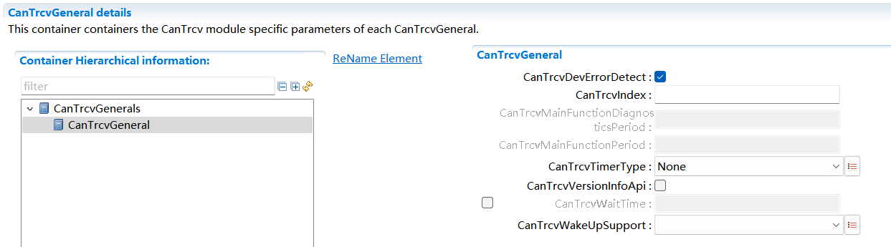

.. centered:: **表 CanTrcvGeneral配置描述 (Table CanTrcvGeneral configuration description)**

.. list-table::
   :widths: 20 20 20 20 20
   :header-rows: 1

   * - UI名称 (UI Name)
     - 描述 (Description)
     - 
     - 
     - 
   * - CanTrcvDevErrorDetect
     - 取值范围 (Range)
     - True、False
     - 默认取值 (Default value)
     - FALSE
   * - 
     - 参数描述 (Parameter Description)
     - Switches the development error   detection and notification on or off.
     - 
     -
   * - 
     - 依赖关系 (Dependencies)
     - 无 (None)
     - 
     - 
   * - CanTrcvIndex
     - 取值范围 (Range)
     - 0 ..255
     - 默认取值 (Default value)
     - 无 (None)
   * - 
     - 参数描述 (Parameter Description)
     - Specifies the InstanceId of   this module instance. If only one instance is present it shall have the Id 0.
     - 
     -
   * - 
     - 依赖关系 (Dependencies)
     - 无 (None)
     - 
     - 
   * - CanTrcvMainFunctionDiagnosticsPeriod
     - 取值范围 (Range)
     - 0..INF
     - 默认取值 (Default value)
     - 无 (None)
   * - 
     - 参数描述 (Parameter Description)
     - This parameter describes the   period for cyclic call to CanTrcv_MainFunctionDiagnostics. Unit is seconds.
     - 
     -
   * - 
     - 依赖关系 (Dependencies)
     - 无 (None)
     - 
     - 
   * - CanTrcvMainFunctionPeriod
     - 取值范围 (Range)
     - 0..INF
     - 默认取值 (Default value)
     - 无 (None)
   * - 
     - 参数描述 (Parameter Description)
     - This parameter describes the   period for cyclic call to CanTrcv_MainFunction. Unit is seconds.
     - 
     -
   * - 
     - 依赖关系 (Dependencies)
     - 无 (None)
     - 
     -
   * - CanTrcvTimerType
     - 取值范围 (Range of values)
     - None / Timer_1us16bit
     - 默认取值 (Default value)
     - None
   * -
     - 参数描述 (Parameter Description)
     - Type of the Time Service Predefined Timer.
     -
     -
   * -
     - 依赖关系 (Dependency relationships)
     - 无
     -
     -
   * - CanTrcvVersionInfoApi
     - 取值范围 (Range)
     - True, False
     - 默认取值 (Default value)
     - FALSE
   * - 
     - 参数描述 (Parameter Description)
     - Switches version information   API on and off. If switched off, function need not be present in compiled   code.
     - 
     -
   * - 
     - 依赖关系 (Dependencies)
     - 无
     - 
     - 
   * - CanTrcvWaitTime
     - 取值范围 (Range)
     - 0..2.55E-4
     - 默认取值 (Default value)
     - 无
   * - 
     - 参数描述 (Parameter Description)
     - Wait time for transceiver   state changes in seconds.
     - 
     -
   * - 
     - 依赖关系 (Dependencies)
     - 无
     - 
     -
   * - CanTrcvWakeUpSupport
     - 取值范围 (Range of values)
     - CANTRCV_WAKEUP_BY_POLLING / CANTRCV_WAKEUP_NOT_SUPPORTED
     - 默认取值 (Default value)
     - 无 (None)
   * -
     - 参数描述 (Parameter Description)
     - Informs whether wake up is supported by polling or not supported. In case no wake up is supported by the hardware, setting has to be NOT_SUPPORTED. Only in the case of wake up supported by polling, function CanTrcv_MainFunction has to be present and to be present and to be invoked by the scheduler.
     -
     -
   * -
     - 依赖关系 (Dependency relationships)
     - 无
     -
     -

CanTrcvConfigSet
--------------------------------

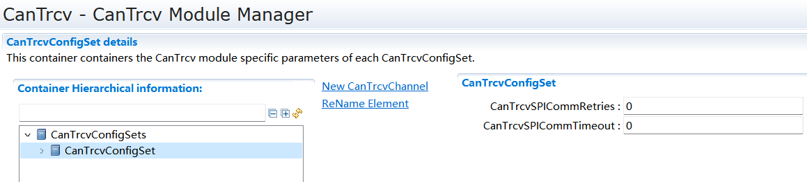

.. centered:: **表 CanTrcvConfigSet配置描述 (Table CanTrcvConfigSet Configuration Description)**

.. list-table::
   :widths: 20 20 20 20 20
   :header-rows: 1

   * - UI名称 (UI Name)
     - 描述 (Description)
     - 
     - 
     - 
   * - CanTrcvSPICommRetries
     - 取值范围 (Range)
     - 0..255
     - 默认取值 (Default value)
     - 0
   * - 
     - 参数描述 (Parameter Description)
     - Indicates themaximum numberof communicationretries in caseof a failed SPIcommunication(applies both totimed outcommunicationand toerrors/NACK inthe responsedata).
     - 
     - 
   * - 
     - 依赖关系 (Dependencies)
     - 需要配置CanTrcvSpiSequence (Need to configure CanTrcvSpiSequence)
     - 
     - 
   * - CanTrcvSPICommTimeout
     - 取值范围 (Range)
     - 0..100
     - 默认取值 (Default value)
     - 0
   * - 
     - 参数描述 (Parameter Description)
     - Indicates themaximum timeallowed to theCanTrcv forreplying (eitherpositively ornegatively) to aSPI command.
     - 
     - 
   * - 
     - 依赖关系 (Dependencies)
     - 需要配置CanTrcvSpiSequence (Need to configure CanTrcvSpiSequence)
     - 
     - 

CanTrcvChannels
===============================

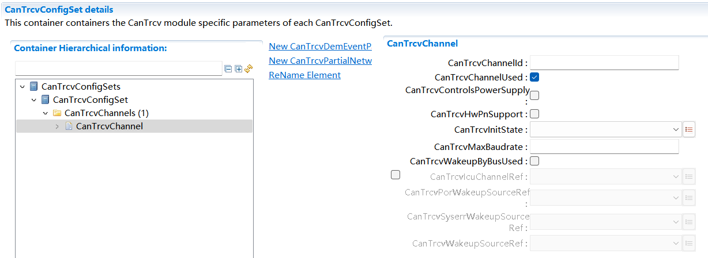

.. centered:: **表 CanTrcvChannel配置描述 (Table CanTrcvChannel Configuration Description)**

.. list-table::
   :widths: 20 20 20 20 20
   :header-rows: 1

   * - UI名称 (UI Name)
     - 描述 (Description)
     - 
     - 
     - 
   * - CanTrcvChannleId
     - 取值范围 (Range)
     - 0..255
     - 默认取值 (Default value)
     - 无 (None)
   * - 
     - 参数描述 (Parameter Description)
     - Uniqueidentifier ofthe CANTransceiverChannel.
     - 
     - 
   * - 
     - 依赖关系 (Dependencies)
     - 无 (None)
     - 
     - 
   * - CanTrcvChannelUsed
     - 取值范围 (Range)
     - true, false
     - 默认取值 (Default value)
     - true
   * - 
     - 参数描述 (Parameter Description)
     - Shall therelated CANtransceiverchannel be used?
     - 
     - 
   * - 
     - 依赖关系 (Dependencies)
     - 无 (None)
     - 
     - 
   * - CanTrcvControlsPowerSupply
     - 取值范围 (Range)
     - true, false
     - 默认取值 (Default value)
     - false
   * - 
     - 参数描述 (Parameter Description)
     - Is ECU powersupplycontrolled bythistransceiver?
     - 
     - 
   * - 
     - 
     - TRUE =Controlled bytransceiver.
     - 
     - 
   * - 
     - 
     - FALSE = Notcontrolled bytransceiver.
     - 
     - 
   * - 
     - 依赖关系 (Dependencies)
     - 无 (None)
     - 
     - 
   * - CanTrcvHwPnSupport
     - 取值范围 (Range)
     - true, false
     - 默认取值 (Default value)
     - false
   * - 
     - 参数描述 (Parameter Description)
     - Indicateswhether the HWsupports theselectivewake-up function
     - 
     - 
   * - 
     - 依赖关系 (Dependencies)
     - 开启此项才可以配置CanTrcvPartialNetwork (Enable this option to configure CanTrcvPartialNetwork)
     - 
     - 
   * - CanTrcvInitState
     - 取值范围 (Range)
     - CANTRCV_OP_MODE_SLEEP
     - 默认取值 (Default value)
     - 无 (None)
   * - 
     - 
     - CANTRCV_OP_MODE_STANDBY
     - 
     - 
   * - 
     - 参数描述 (Parameter Description)
     - State of CANtransceiverafter call toCanTrcv_Init.
     - 
     - 
   * - 
     - 依赖关系 (Dependencies)
     - 无 (None)
     - 
     - 
   * - CanTrcvMaxBaudrate
     - 取值范围 (Range)
     - 0..12000
     - 默认取值 (Default value)
     - 无 (None)
   * - 
     - 参数描述 (Parameter Description)
     - Indicates thedata transferrate in kbps.
     - 
     - 
   * - 
     - 
     - Maximum datatransfer rate inkbps fortransceiverhardware type.
     - 
     - 
   * - 
     - 
     - Only used forvalidationpurposes. Thisvalue can beused byconfigurationtools.
     - 
     - 
   * - 
     - 依赖关系 (Dependencies)
     - 无 (None)
     - 
     - 
   * - CanTrcvWakeupByBusUsed
     - 取值范围 (Range)
     - true, false
     - 默认取值 (Default value)
     - false
   * - 
     - 参数描述 (Parameter Description)
     - Is wake up bybus supported?
     - 
     - 
   * - 
     - 依赖关系 (Dependencies)
     - 无 (None)
     - 
     - 
   * - CanTrcvIcuChannelRef
     - 取值范围 (Range)
     - 无 (None)
     - 默认取值 (Default value)
     - 无 (None)
   * - 
     - 参数描述 (Parameter Description)
     - Reference to theIcuChannel toenable/disablethe interruptsfor wakeups.
     - 
     - 
   * - 
     - 依赖关系 (Dependencies)
     - 无 (None)
     - 
     - 
   * - CanTrcvPorWakeupSourceRef
     - 取值范围 (Range)
     - 无 (None)
     - 默认取值 (Default value)
     - 无 (None)
   * - 
     - 参数描述 (Parameter Description)
     - Symbolic namereference tospecify thewakeup sourcesthat should beused in thecalls toEcuM_SetWakeupEvent
     - 
     - 
   * - 
     - 依赖关系 (Dependencies)
     - CanTrcvHwPnSupport=TRUE &
     - 
     - 
   * - 
     - 
     - CanTrcvPowerOnFlag=TRUE
     - 
     - 
   * - CanTrcvSyserrWakeupSourceRef
     - 取值范围 (Range)
     - 无 (None)
     - 默认取值 (Default value)
     - 无 (None)
   * - 
     - 参数描述 (Parameter Description)
     - Symbolic namereference tospecify thewakeup sourcesthat should beused in thecalls toEcuM_SetWakeupEvent
     - 
     - 
   * - 
     - 依赖关系 (Dependencies)
     - CanTrcvHwPnSupport=TRUE&
     - 
     - 
   * - 
     - 
     - CanTrcvBusErrFlag=TRUE
     - 
     - 
   * - CanTrcvWakeupSourceRef
     - 取值范围 (Range)
     - 无 (None)
     - 默认取值 (Default value)
     - 无 (None)
   * - 
     - 参数描述 (Parameter Description)
     - Reference to awakeup source inthe EcuMconfiguration.
     - 
     - 
   * - 
     - 依赖关系 (Dependencies)
     - CanTrcvWakeupByBusUsed=TRUE
     - 
     - 

CanTrcvAccess
-----------------------------

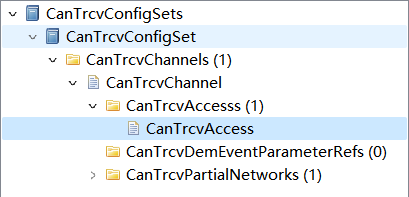

CanTrcvDioAccess
^^^^^^^^^^^^^^^^^^^^^^^^^^^^^^^^

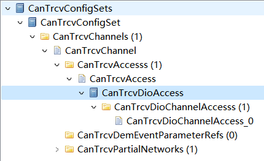

.. centered:: **表 CanTrcvDioAccess配置描述 (Table CanTrcvDioAccess Configuration Description)**

.. list-table::
   :widths: 20 20 20 20 20
   :header-rows: 1

   * - UI名称 (UI Name)
     - 描述 (Description)
     - 
     - 
     - 
   * - CanTrcvHardwareInterfaceName
     - 取值范围 (Range)
     - 无 (None)
     - 默认取值 (Default value)
     - 无 (None)
   * - 
     - 参数描述 (Parameter Description)
     - CAN transceiverhardwareinterface name.
     - 
     - 
   * - 
     - 依赖关系 (Dependencies)
     - 无 (None)
     - 
     - 
   * - CanTrcvDioSymNameRef
     - 取值范围 (Range)
     - 无 (None)
     - 默认取值 (Default value)
     - 无 (None)
   * - 
     - 参数描述 (Parameter Description)
     - Choice Referenceto a DIO Port,DIO Channel orDIO ChannelGroup.
     - 
     - 
   * - 
     - 依赖关系 (Dependencies)
     - 无 (None)
     - 
     - 

CanTrcvSpiAccess
^^^^^^^^^^^^^^^^^^^^^^^^^^^^^^^^

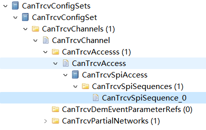

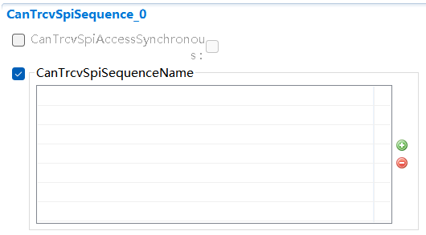

.. centered:: **表 CanTrcvSpiSequence配置描述 (Table CanTrcvSpiSequence Configuration Description)**

.. list-table::
   :widths: 20 20 20 20 20
   :header-rows: 1

   * - UI名称 (UI Name)
     - 描述 (Description)
     - 
     - 
     - 
   * - CanTrcvSpiAccessSynchronous
     - 取值范围 (Range)
     - true, false
     - 默认取值 (Default value)
     - false
   * - 
     - 参数描述 (Parameter Description)
     - This parameteris used todefine whetherthe access tothe Spi sequenceis synchronousor asynchronous.
     - 
     - 
   * - 
     - 依赖关系 (Dependencies)
     - 无
     - 
     - 
   * - CanTrcvSpiSequenceName
     - 取值范围 (Range)
     - 无
     - 默认取值 (Default value)
     - 无
   * - 
     - 参数描述 (Parameter Description)
     - Reference to aSpi sequenceconfigurationcontainer.
     - 
     - 
   * - 
     - 依赖关系 (Dependencies)
     - 无
     - 
     - 

CanTrcvPartialNetwork
-------------------------------------

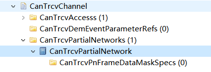

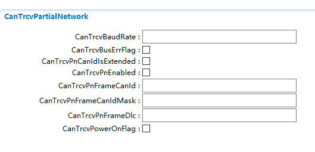

.. centered:: **表 CanTrcvPartialNetwork配置描述 (Table CanTrcvPartialNetwork Configuration Description)**

.. list-table::
   :widths: 20 20 20 20 20
   :header-rows: 1

   * - UI名称 (UI Name)
     - 描述 (Description)
     - 
     - 
     - 
   * - CanTrcvBaudRate
     - 取值范围 (Range)
     - 0..12000
     - 默认取值 (Default value)
     - 无
   * - 
     - 参数描述 (Parameter Description)
     - Indicates thedata transferrate in kbps.
     - 
     - 
   * - 
     - 依赖关系 (Dependencies)
     - 无
     - 
     - 
   * - CanTrcvBusErrFlag
     - 取值范围 (Range)
     - true, false
     - 默认取值 (Default value)
     - false
   * - 
     - 参数描述 (Parameter Description)
     - Indicates if theBus Error(BUSERR) flag ismanaged by theBSW.
     - 
     - 
   * - 
     - 依赖关系 (Dependencies)
     - 开启此项才可配置CanTrcvDemEventParameterRef (Enable this to configure CanTrcvDemEventParameterRef)
     - 
     - 
   * - CanTrcvPnCanIdIsExtended
     - 取值范围 (Range)
     - true, false
     - 默认取值 (Default value)
     - false
   * - 
     - 参数描述 (Parameter Description)
     - Indicateswhether extendedor standard IDis used.
     - 
     - 
   * - 
     - 依赖关系 (Dependencies)
     - 无
     - 
     - 
   * - CanTrcvPnEnabled
     - 取值范围 (Range)
     - true, false
     - 默认取值 (Default value)
     - false
   * - 
     - 参数描述 (Parameter Description)
     - Indicateswhether theselectivewake-up functionis enabled ordisabled in HW.
     - 
     - 
   * - 
     - 依赖关系 (Dependencies)
     - 无
     - 
     - 
   * - CanTrcvPnFrameCanId
     - 取值范围 (Range)
     - 0..4294967295
     - 默认取值 (Default value)
     - 无
   * - 
     - 参数描述 (Parameter Description)
     - CAN ID of theWake-up Frame(WUF).
     - 
     - 
   * - 
     - 依赖关系 (Dependencies)
     - 无
     - 
     - 
   * - CanTrcvPnFrameCanIdMask
     - 取值范围 (Range)
     - 0..4294967295
     - 默认取值 (Default value)
     - 无
   * - 
     - 参数描述 (Parameter Description)
     - ID Mask for theselectiveactivation ofthe transceiver.
     - 
     - 
   * - 
     - 
     - It is used toenable-FrameWake-up (WUF) ona group of IDs.
     - 
     - 
   * - 
     - 依赖关系 (Dependencies)
     - 无
     - 
     - 
   * - CanTrcvPnFrameDlc
     - 取值范围 (Range)
     - 0..8
     - 默认取值 (Default value)
     - 无
   * - 
     - 参数描述 (Parameter Description)
     - Data Length ofthe Wake-upFrame (WUF).
     - 
     - 
   * - 
     - 依赖关系 (Dependencies)
     - 无
     - 
     - 
   * - CanTrcvPowerOnFlag
     - 取值范围 (Range)
     - true, false
     - 默认取值 (Default value)
     - false
   * - 
     - 参数描述 (Parameter Description)
     - Indicates if thePower On Reset(POR) flag isavailable and ismanaged by thetransceiver.
     - 
     - 
   * - 
     - 依赖关系 (Dependencies)
     - 无
     - 
     - 

CanTrcvPnFrameDataMaskSpec
^^^^^^^^^^^^^^^^^^^^^^^^^^^^^^^^^^^^^^^^^^

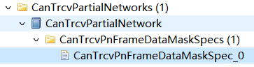

.. centered:: **表 CanTrcvPnFrameDataMaskSpec配置描述 (Table CanTrcvPnFrameDataMaskSpec Configuration Description)**

.. list-table::
   :widths: 20 20 20 20 20
   :header-rows: 1

   * - UI名称 (UI Name)
     - 描述 (Description)
     - 
     - 
     - 
   * - CanTrcvPnFrameDataMask
     - 取值范围 (Range)
     - 0..255
     - 默认取值 (Default value)
     - 无
   * - 
     - 参数描述 (Parameter Description)
     - Defines the nbyte (Byte0 =LSB) of the datapayload mask tobe used on thereceived payloadin order todetermine if thetransceiver mustbe wok-en up bythe receivedWake-up Frame(WUF).
     - 
     - 
   * - 
     - 依赖关系 (Dependencies)
     - 无
     - 
     - 
   * - CanTrcvPnFrameDataMaskIndex
     - 取值范围 (Range)
     - 0..7
     - 默认取值 (Default value)
     - 无
   * - 
     - 参数描述 (Parameter Description)
     - holds theposition n inframe of themask-part
     - 
     - 
   * - 
     - 依赖关系 (Dependencies)
     - 无
     - 
     - 

CanTrcvDemEventParameterRef
-------------------------------------------

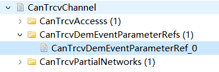

.. centered:: **表 CanTrcvDemEventParameterRef配置描述 (Table CanTrcvDemEventParameterRef Configuration Description)**

.. list-table::
   :widths: 20 20 20 20 20
   :header-rows: 1

   * - UI名称 (UI Name)
     - 描述 (Description)
     - 
     - 
     - 
   * - CanTrcvEBusError
     - 取值范围 (Range)
     - 无
     - 默认取值 (Default value)
     - 无
   * - 
     - 参数描述 (Parameter Description)
     - Reference to theDemEventParameterwhich shall beissued when buserror hasoccurred.
     - 
     - 
   * - 
     - 依赖关系 (Dependencies)
     - CanTrcvBusErrFlag
     - 
     - 

注：该Container依赖于CanTrcvBusErrFlag

Note: This Container depends on CanTrcvBusErrFlag.
