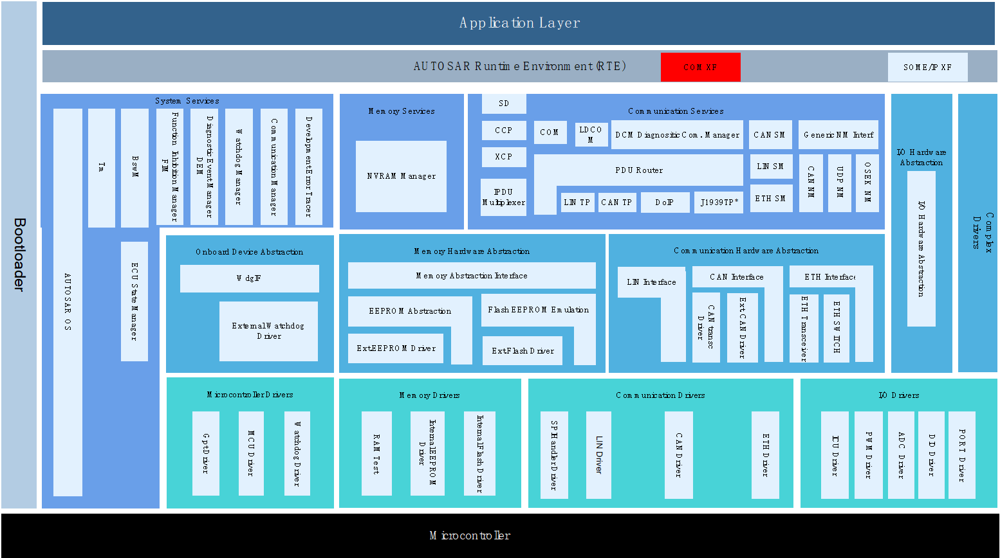
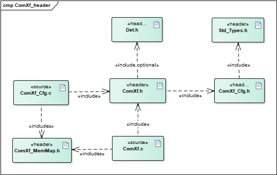
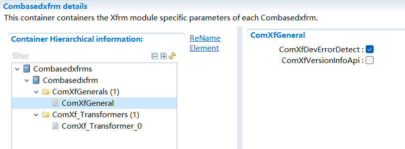
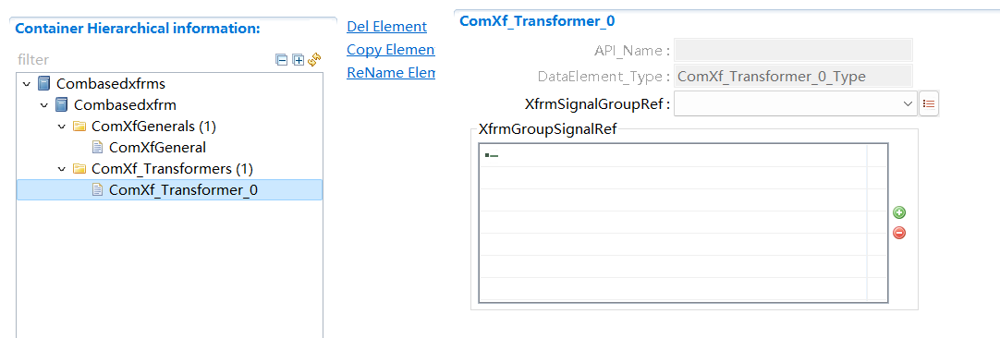

ComXf
#################################

:strong:`缩写词注解 (Abbreviation Notes):`

.. list-table::
   :widths: 34 33 33
   :header-rows: 1

   * - 缩写词 (Abbreviation)
     - 解释/描述 (Explanation/Description)
     - 中文解释 (Chinese explanation)
   * - ComXf
     - COM Based Transformer
     - Com通信序列化 (Serializing Communication Sequence)
   * - RTE
     - Runtime environment
     - 运行时环境 (Runtime environment)
   * - COM
     - Communication Stack
     - 通信栈 (Communication Stack)
   * - DET
     - Default Error Tracer
     - 开发错误检测 (Develop error detection)

简介 (Introduction)
=================================

数据序列化功能在AUTOSAR架构中属于RTE的功能点，为适配无RTE项目的集成需求，将ComXf作为序列化模块Xfrm中的子模块实现。

The data serialization function in the AUTOSAR architecture is a functional point of RTE. To meet the integration requirements for projects without an RTE, ComXf is implemented as a sub-module of the Xfrm serialization module.

ComXf模块处于AUTOSAR架构中RTE层，主要实现Com中Signal Group（Array）数据的序列化与反序列化功能，使得在Com层将Signal Group（Array）数据作为整体封装在I-PDU中，或者从I-PDU中作为整体解析。

The ComXf module is located in the RTE layer of the AUTOSAR architecture, primarily achieving the serialization and deserialization functions of Signal Group (Array) data in Com. This allows for encapsulating Signal Group (Array) data as a whole in I-PDU at the Com layer or parsing them as a whole from I-PDU.

参考资料 (Reference materials)
------------------------------------------

[1] AUTOSAR_SWS_COMBasedTransformer.pdf，R19-11

[2] AUTOSAR_SWS_COM.pdf，R19-11

[3] AUTOSAR_SRS_COM.pdf，R19-11

功能描述 (Function Description)
===========================================

数据序列化功能 (Data serialization functionality)
----------------------------------------------------------

数据序列化功能介绍 (Introduction to Data Serialization Functionality)
~~~~~~~~~~~~~~~~~~~~~~~~~~~~~~~~~~~~~~~~~~~~~~~~~~~~~~~~~~~~~~~~~~~~~~~~~~~~

将字节对齐的SignalGroup中关联的N个GroupSignal根据其在Com中的

Align the N GroupSignals associated with the byte-aligned SignalGroup in Com according to their placement.

配置信息，通过ComXf序列化将各个GroupSignal信号值封装到序列化数据中。

Configuration information is packaged into serialized data by ComXf serialization, encapsulating values of various GroupSignal signals.

数据序列化功能实现 (Data serialization functionality implementation)
~~~~~~~~~~~~~~~~~~~~~~~~~~~~~~~~~~~~~~~~~~~~~~~~~~~~~~~~~~~~~~~~~~~~~~~~~~~

ComXf通过Ref到Com中各个GroupSignal的起始位置，信号长度，大小端，信号类型，未使用位默认值等信息。将关联的各个GroupSignal同时封装到序列化数据中，保证SignalGroup的数据一致性。

ComXf通过Ref到Com中各个GroupSignal的起始位置, 信号长度, 大小端, 信号类型, 未使用位默认值等信息。将关联的各个GroupSignal同时封装到序列化数据中, 保证SignalGroup的数据一致性。

数据反序列化功能 (Data deserialization function)
--------------------------------------------------------

数据反序列化功能介绍 (Introduction to Data Deserialization Function)
~~~~~~~~~~~~~~~~~~~~~~~~~~~~~~~~~~~~~~~~~~~~~~~~~~~~~~~~~~~~~~~~~~~~~~~~~~

从字节对齐的序列化数据中将关联的N个GroupSignal根据其在Com中的配置信息，通过ComXf反序列化将各个GroupSignal信号值解析出来。

From byte-aligned serialized data, parse out the associated N GroupSignals based on their configuration information in Com through ComXf deserialization.

数据反序列化功能实现 (Data deserialization functionality implementation)
~~~~~~~~~~~~~~~~~~~~~~~~~~~~~~~~~~~~~~~~~~~~~~~~~~~~~~~~~~~~~~~~~~~~~~~~~~~~~~

ComXf通过Ref到Com中各个GroupSignal的起始位置，信号长度，大小端，信号类型等信息。将关联的各个GroupSignal信号值从序列化数据中解析出来。

ComXf retrieves information about the start position, signal length, byte order, and signal type of various GroupSignals in Com through Ref. It parses out the values of the associated GroupSignals from the serialized data.

源文件描述 (Source file description)
===============================================

.. centered:: **表 ComXf组件文件描述 (Table Describes ComXf Component File)**

.. list-table::
   :widths: 50 50
   :header-rows: 1

   * - 文件 (Files)
     - 说明 (Description)
   * - ComXf_Cfg.h
     - 定义ComXf模块PC配置的宏定义。 (Define macro definitions for ComXf module PC configuration.)
   * - ComXf_Cfg.c
     - 定义ComXf模块PC/PB配置的结构体参数。 (Define the structure parameters for ComXm module PC/PB configuration.)
   * - ComXf.h
     - 实现ComXf模块全部外部接口的声明，以及配置文件中全局变量的声明。 (Declare all external interfaces of the ComXf module and the global variables in the configuration file.)
   * - ComXf.c
     - 作为ComXf模块的核心文件，实现ComXf模块全部对外接口，以及实现ComXf模块功能所必须的local函数，local宏定义，local变量定义。 (As the core file of the ComXf module, it implements all external interfaces of the ComXf module and local functions, local macro definitions, and local variable definitions necessary for realizing the functionality of the ComXf module.)
   * - ComXf_MemMap.h
     - 实现ComXf模块内存布局。 (Implement ComXf module memory layout.)

API接口 (API Interface)
=====================================

类型定义 (Type definition)
--------------------------------------

ComXf_ConfigType类型定义 (ComXf_ConfigType Type Definition)
~~~~~~~~~~~~~~~~~~~~~~~~~~~~~~~~~~~~~~~~~~~~~~~~~~~~~~~~~~~~~~~~~~~~~~~

.. list-table::
   :widths: 50 50
   :header-rows: 1

   * - 名称 (Name)
     - ComXf_ConfigType
   * - 类型 (Type)
     - struct
   * - 范围 (Range)
     - 无
   * - 描述 (Description)
     - ComXf模块PB配置结构体类型 (ComXf Module PB Configuration Struct Type)

<paramtype>类型定义 (Type Definition)
~~~~~~~~~~~~~~~~~~~~~~~~~~~~~~~~~~~~~~~~~~~~~~~~~

.. list-table::
   :widths: 50 50
   :header-rows: 1

   * - 名称 (Name)
     - <paramtype>
   * - 类型 (Type)
     - struct
   * - 范围 (Range)
     - 无
   * - 描述 (Description)
     - ComXf模块中序列化/反序列化参数类型（根据配置生成） (Serialization/Deserialization parameter types in the ComXf module (generated based on configuration))

输入函数描述 (Describe the input function:)
-----------------------------------------------------

无。

None.

静态接口函数定义 (Static interface function definition)
---------------------------------------------------------------

ComXf_Init函数定义 (ComXf_Init function definition)
~~~~~~~~~~~~~~~~~~~~~~~~~~~~~~~~~~~~~~~~~~~~~~~~~~~~~~~~~~~~~~~

.. list-table::
   :widths: 25 25 25 25
   :header-rows: 1

   * - 函数名称： (Function Name:)
     - ComXf_Init
     - 
     - 
   * - 函数原型： (Function prototype:)
     - voidComXf_Init(constComXf_ConfigType\*config)
     - 
     - 
   * - 服务编号： (Service Number:)
     - 0x01
     - 
     - 
   * - 同步/异步： (Synchronous/asynchronous:)
     - 同步 (Sync)
     - 
     - 
   * - 是否可重入： (Is Reentrant:)
     - 是 (Is)
     - 
     - 
   * - 输入参数： (Input parameters:)
     - config
     - 值域： (Domain:)
     - 无
   * - 输入输出参数： (Input Output Parameters:)
     - 无
     - 
     - 
   * - 输出参数： (Output Parameters:)
     - 无
     - 
     - 
   * - 返回值： (Return Value:)
     - 无
     - 
     - 
   * - 功能概述： (Function Overview:)
     - ComXf模块初始化 (ComXf module initialization)
     - 
     - 

ComXf_DeInit函数定义 (ComXf_DeInit function definition)
~~~~~~~~~~~~~~~~~~~~~~~~~~~~~~~~~~~~~~~~~~~~~~~~~~~~~~~~~~~~~~~~~~~

.. list-table::
   :widths: 50 50
   :header-rows: 1

   * - 函数名称： (Function Name:)
     - ComXf_DeInit
   * - 函数原型： (Function prototype:)
     - void ComXf_DeInit (void)
   * - 服务编号： (Service Number:)
     - 0x02
   * - 同步/异步： (Synchronous/asynchronous:)
     - 同步 (Sync)
   * - 是否可重入： (Is Reentrant:)
     - 是 (Is)
   * - 输入参数： (Input parameters:)
     - 无
   * - 输入输出参数： (Input Output Parameters:)
     - 无
   * - 输出参数： (Output Parameters:)
     - 无
   * - 返回值： (Return Value:)
     - 无
   * - 功能概述： (Function Overview:)
     - ComXf模块反初始化 (ComXf Module Deinitialization)

ComXf_GetVersionInfo函数定义 (The function definition for ComXc_GetVersionInfo)
~~~~~~~~~~~~~~~~~~~~~~~~~~~~~~~~~~~~~~~~~~~~~~~~~~~~~~~~~~~~~~~~~~~~~~~~~~~~~~~~~~~~~~~~~~~

.. list-table::
   :widths: 25 25 25 25
   :header-rows: 1

   * - 函数名称： (Function Name:)
     - ComXf_GetVersionInfo
     - 
     - 
   * - 函数原型： (Function prototype:)
     - voidComXf_GetVersionInfo(
     - 
     - 
   * - 
     - Std\_VersionInfoType\*VersionInfo)
     - 
     - 
   * - 服务编号： (Service Number:)
     - 0x00
     - 
     - 
   * - 同步/异步： (Synchronous/asynchronous:)
     - 同步 (Sync)
     - 
     - 
   * - 是否可重入： (Is Reentrant:)
     - 是 (Is)
     - 
     - 
   * - 输入参数： (Input parameters:)
     - 无
     - 
     - 
   * - 输入输出参数： (Input Output Parameters:)
     - 无
     - 
     - 
   * - 输出参数： (Output Parameters:)
     - VersionInfo
     - 值域： (Domain:)
     - 无
   * - 返回值： (Return Value:)
     - 无
     - 
     - 
   * - 功能概述： (Function Overview:)
     - 获取模块软件版本信息 (Get module software version information)
     - 
     - 

ComXf\_<transformerId>函数定义 (ComXf\<transformerId> function definition)
~~~~~~~~~~~~~~~~~~~~~~~~~~~~~~~~~~~~~~~~~~~~~~~~~~~~~~~~~~~~~~~~~~~~~~~~~~~~~~~~~~~~~~

.. list-table::
   :widths: 25 25 25 25
   :header-rows: 1

   * - 函数名称： (Function Name:)
     - ComXf\_<transformerId>
     - 
     - 
   * - 函数原型： (Function prototype:)
     - uint8ComXf\_<transformerId>(
     - 
     - 
   * - 
     - uint8\* buffer,
     - 
     - 
   * - 
     - uint32\*bufferLength,
     - 
     - 
   * - 
     - <paramtype>dataElement)
     - 
     - 
   * - 服务编号： (Service Number:)
     - 0x03
     - 
     - 
   * - 同步/异步： (Synchronous/asynchronous:)
     - 同步 (Sync)
     - 
     - 
   * - 是否可重入： (Is Reentrant:)
     - 是 (Is)
     - 
     - 
   * - 输入参数： (Input parameters:)
     - dataElement
     - 值域： (Domain:)
     - 无
   * - 输入输出参数： (Input Output Parameters:)
     - 无
     - 
     - 
   * - 输出参数： (Output Parameters:)
     - buffer
     - 值域： (Domain:)
     - 无
   * - 
     - bufferLength
     - 值域： (Domain:)
     - 无
   * - 返回值： (Return Value:)
     - uint8：0x00(E_OK)/ 0x81(E_SER_GENERIC_ERROR)
     - 
     - 
   * - 功能概述： (Function Overview:)
     - 复杂数据序列化 (Complex data serialization)
     - 
     - 

ComXf_Inv\_<transformerId>函数定义 (ComXf_Inv\<transformerId> Function Definition)
~~~~~~~~~~~~~~~~~~~~~~~~~~~~~~~~~~~~~~~~~~~~~~~~~~~~~~~~~~~~~~~~~~~~~~~~~~~~~~~~~~~~~~~~~~~~~~

.. list-table::
   :widths: 25 25 25 25
   :header-rows: 1

   * - 函数名称： (Function Name:)
     - ComXf_Inv\_<transformerId>
     - 
     - 
   * - 函数原型： (Function prototype:)
     - uint8ComXf_Inv\_<transformerId>(
     - 
     - 
   * - 
     - const uint8\*buffer,
     - 
     - 
   * - 
     - uint32bufferLength,
     - 
     - 
   * - 
     - <type>\*dataElement)
     - 
     - 
   * - 服务编号： (Service Number:)
     - 0x04
     - 
     - 
   * - 同步/异步： (Synchronous/asynchronous:)
     - 同步 (Sync)
     - 
     - 
   * - 是否可重入： (Is Reentrant:)
     - 是 (Is)
     - 
     - 
   * - 输入参数： (Input parameters:)
     - buffer
     - 值域： (Domain:)
     - 无
   * - 
     - bufferLength
     - 值域： (Domain:)
     - 无
   * - 输入输出参数： (Input Output Parameters:)
     - 无
     - 
     - 
   * - 输出参数： (Output Parameters:)
     - dataElement
     - 值域： (Domain:)
     - 无
   * - 返回值： (Return Value:)
     - uint8：0x00(E_OK)/0x01(E_NO_DATA)/0x81(E_SER_GENERIC_ERROR)
     - 
     - 
   * - 功能概述： (Function Overview:)
     - 将序列化数据解析成复杂数据 (Parse serialized data into complex data)
     - 
     - 

可配置函数定义 (Configurable Function Definition)
----------------------------------------------------------

无。

None.

配置 (Configure)
==============================

ComXfGeneral
----------------------------

.. centered:: **表 ComXfGeneral (Table ComXcGeneral)**

.. list-table::
   :widths: 20 20 20 20 20
   :header-rows: 1

   * - UI名称 (UI Name)
     - 描述 (Description)
     - 
     - 
     - 
   * - ComXfDevErrorDetect
     - 取值范围 (Range)
     - true/false
     - 默认取值 (Default value)
     - true
   * - 
     - 参数描述 (Parameter Description)
     - 是否使能DET开发错误检测 (Whether to Enable DET Development Error Detection)
     - 
     - 
   * - 
     - 依赖关系 (Dependencies)
     - 依赖于Det模块的支持 (Dependent on the support of Det module)
     - 
     - 
   * - ComXfVersionInfoApi
     - 取值范围 (Range)
     - true/false
     - 默认取值 (Default value)
     - false
   * - 
     - 参数描述 (Parameter Description)
     - 是否使能获取模块软件版本 (Is module software version retrieval enabled?)
     - 
     - 
   * - 
     - 依赖关系 (Dependencies)
     - 无
     - 
     - 

ComXf_Transformer
---------------------------------

.. centered:: **表 ComXf_Transformer (Table ComXf_Transformer)**

.. list-table::
   :widths: 20 20 20 20 20
   :header-rows: 1

   * - UI名称 (UI Name)
     - 描述 (Description)
     - 
     - 
     - 
   * - API_Name
     - 取值范围 (Range)
     - string
     - 默认取值 (Default value)
     - 无
   * - 
     - 参数描述 (Parameter Description)
     - 数据序列化/反序列化接口名 (Serialization/Deserialization Interface Name)
     - 
     - 
   * - 
     - 依赖关系 (Dependencies)
     - 根据XfrmSignalGroupRef关联的SignalGroup名自动生成;API_Name必须要有值，依赖于关联的Com中SignalGroup属于的Pdu的收发属性配置（ComIPduDirection）
     - 
     - 
   * - DataElement_Type
     - 取值范围 (Range)
     - string
     - 默认取值 (Default value)
     - 无
   * - 
     - 参数描述 (Parameter Description)
     - 序列化/反序列化参数数据类型名 (Serialize/Deserialize Parameter Data Type Name)
     - 
     - 
   * - 
     - 依赖关系 (Dependencies)
     - 根据ComXf_Transformer名自动生成 (Generated according to the name of ComXf_Transformer)
     - 
     - 
   * - XfrmSignalGroupRef
     - 取值范围 (Range)
     - 引用Com中SignalGroup (Reference Com SignalGroup)
     - 默认取值 (Default value)
     - 无
   * - 
     - 参数描述 (Parameter Description)
     - 关联到Com模块中SignalGroup（Array）
     - 
     - 
   * - 
     - 依赖关系 (Dependencies)
     - 依赖于Com配置的SignalGroup;XfrmSignalGroupRef关联的Com中SignalGroup配置项ComSignalGroupArrayAccess必须勾选;XfrmGroupSignalRef关联的GroupSignal的信号类型不能为UINT8_DYN (Dependent on Com configuration of SignalGroup; the ComSignalGroupArrayAccess configuration item in the SignalGroup associated with XfrmSignalGroupRef must be selected; the signal type of GroupSignal associated with XfrmGroupSignalRef cannot be UINT8_DYN)
     - 
     - 
   * - XfrmGroupSignalRef
     - 取值范围 (Range)
     - 引用Com中GroupSignal (Refer to Com GroupSignal)
     - 默认取值 (Default value)
     - 无
   * - 
     - 参数描述 (Parameter Description)
     - 关联到Com模块中SignalGroup（Array）包含的GroupSignal
     - 
     - 
   * - 
     - 依赖关系 (Dependencies)
     - 依赖于Com配置的GroupSignal (Dependent on Com configuration GroupSignal)
     - 
     - 
