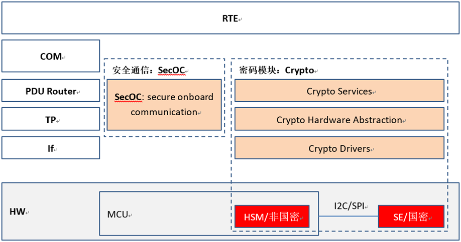
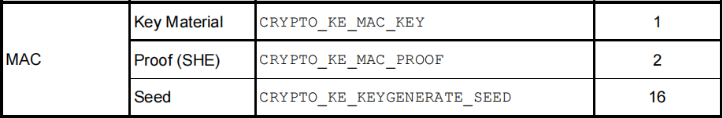
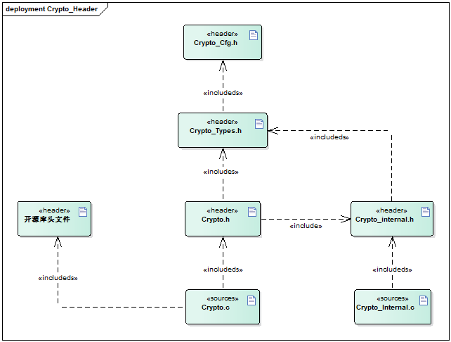
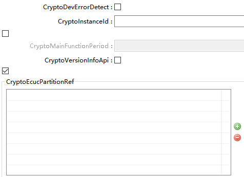
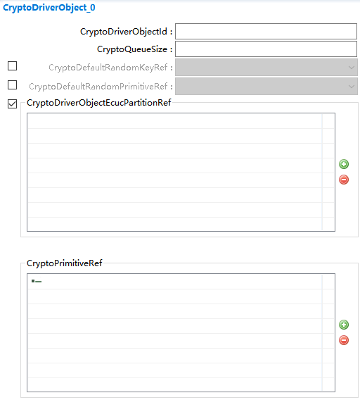
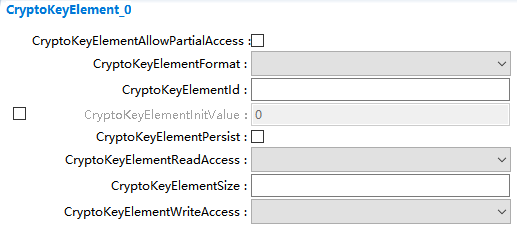
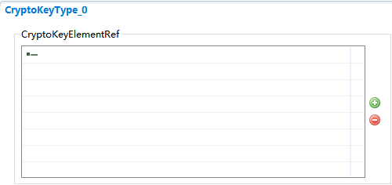
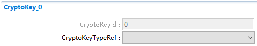
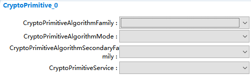

Crypto
#################################

:strong:`缩写词注解 (Abbreviation Notes):`

.. list-table::
   :widths: 34 33 33
   :header-rows: 1

   * - 缩写词 (Abbreviation)
     - 解释/描述 (Explanation/Description)
     - 中文解释 (Chinese explanation)
   * - HSM
     - Hardware Security Module
     - 硬件安全模块 (Hardware Security Module)
   * - SHA
     - Secure Hash Algorithm
     - 安全哈希算法 (Secure Hash Algorithm)
   * - AES
     - Advanced EncrytionStandard
     - 高级加密标准 (Advanced Encryption Standard)
   * - RSA
     - Rivest-Shamir-Adleman
     - RSA加密算法 (RSA Encryption Algorithm)

简介 (Introduction)
=================================

在AUTOSAR加密协议栈中，Crypto Driver处于最底层，为加密功能的最终处理模块。Crypto Driver会执行上层下发的算法任务，计算完成后把结果通过回调函数的方式通知到上层模块。加密算法可通过软件或者硬件HSM模块实现。在本文档中Crypto Driver主要指为软件方式实现的加密算法。

In the AUTOSAR encryption protocol stack, the Crypto Driver is at the lowest level and serves as the ultimate processing module for cryptographic functions. The Crypto Driver executes algorithm tasks issued by upper layers and notifies the upper layer modules of the results through callback functions. Encryption algorithms can be implemented either via software or hardware HSM modules. In this document, the Crypto Driver primarily refers to encryption algorithms implemented in software.

Crypto Driver能够向上层提供多种加密算法，如散列算法SHA、对称加密AES、非对称加密RSA以及随机数生成等。

The Crypto Driver provides various encryption algorithms to the upper layer, such as hash algorithms SHA, symmetric encryption AES, asymmetric encryption RSA, and random number generation.

参考资料 (Reference materials)
------------------------------------------

[1] AUTOSAR_SWS_CryptoDriver.pdf，R19-11

[2] AUTOSAR_SWS_CryptoServiceManager.pdf，R19-11

功能描述 (Function Description)
===========================================

秘钥功能 (Key Function)
-----------------------------------

秘钥功能介绍 (Key Features Introduced)
================================================

加密算法包含了对称加密与非对称加密。

Encryption algorithms include symmetric encryption and asymmetric encryption.

对称加密，即使用A秘钥进行加密得出的密文，一样可以通过A秘钥进行解密，如果截获秘钥和算法，即可通过密文计算出明文。

Symmetric encryption works such that ciphertext encrypted with key A can be decrypted with the same key A. If both the key and algorithm are intercepted, the plaintext can be calculated from the ciphertext.

非对称加密指双方用不同的秘钥加密和解密明文，通信双方都要有自己公钥和私钥。

Asymmetric encryption refers to using different keys for encrypting and decrypting plaintext, where both parties need their own public and private keys.

秘钥功能主要就是涉及到秘钥的保存与获取，包括公钥和私钥的生成等。

The primary function of key management involves the storage and retrieval of keys, including the generation of public and private keys.

秘钥功能实现 (Key function implementation)
====================================================

秘钥通过Crypto_KeyElementSet把Key Element设置到内部Ram中，然后通过调用Crypto_KeySetValid把指定的key设置为有效。

Secret keys are set to internal RAM by Crypto_KeyElementSet, and then the specified key is marked as valid by calling Crypto_KeySetValid.

秘钥功能首先需要在Crypto中配置CryptoKeys，然后配置CryptoKeys->CryptoKeyTypes->CryptoKeyElements，不同的算法所需要的的Key Elements是不一样的，可参考[SWS_Csm_01022]规范，如下图：

The key feature first requires configuring CryptoKeys in Crypto, then configuring CryptoKeys->CryptoKeyTypes->CryptoKeyElements. Different algorithms require different Key Elements, which can be referred to in the [SWS_Csm_01022] specification as shown in the following figure:

如MAC所示，使用时就可以配置3个KeyElement，分别为CRYPTO_KE_MAC_KEY（1），CRYPTO_KE_MAC_PROOF（2）以及CRYPTO_KE_KEYGENERATE_SEED（16）。

As shown in MAC, three KeyElements can be configured when used: CRYPTO_KE_MAC_KEY (1), CRYPTO_KE_MAC_PROOF (2), and CRYPTO_KE_KEYGENERATE_SEED (16).

加密算法 (Encryption algorithm)
-------------------------------------------

算法介绍 (Algorithm Introduction)
=============================================

HASH算法 (Hash algorithm)
---------------------------------------

HASH（哈希）算法为不需要秘钥的算法，哈希算法又称杂凑算法，能将一定长度的消息计算出固定长度的字符串（又称消息摘要）。SHA包含5个算法，分别是SHA-1、SHA-224、SHA-256、SHA-384和SHA-512，后四者并称为SHA-2。SHA-1最大计算明文长度为2^64bit，属于分组算法，分组长度为512bit，产生的信息摘要长度为160bit，也就是20个字节。

HASH (Hash) algorithms are keyless algorithms, also known as hash functions, which can compute a fixed-length string (also called a message digest) from a certain length of message. SHA includes five algorithms: SHA-1, SHA-224, SHA-256, SHA-384, and SHA-512; the latter four are collectively referred to as SHA-2. SHA-1 can compute plaintext up to 2^64 bits, belongs to block ciphers with a block length of 512 bits and produces an information digest of 160 bits, i.e., 20 bytes.

AES对称加密算法 (AES symmetric encryption algorithm)
--------------------------------------------------------------

AES的处理单位是字节，128位的输入明文分组P和输入密钥K都被分成16个字节，分别记为P= P0 P1 … P15 和 K = K0 K1 … K15。如，明文分组为P =abcdefghijklmnop，其中的字符a对应P0，p对应P15。一般地，明文分组用字节为单位的正方形矩阵描述，称为状态矩阵。在算法的每一轮中，状态矩阵的内容不断发生变化，最后的结果作为密文输出。

The processing unit of AES is bytes. The 128-bit input plaintext block P and the input key K are each divided into 16 bytes, denoted as P = P0 P1 … P15 and K = K0 K1 … K15 respectively. For instance, if the plaintext block is P = abcdefghijklmnop, where 'a' corresponds to P0 and 'p' to P15. Generally, the plaintext block is described using a square matrix of bytes called the state matrix. In each round of the algorithm, the content of the state matrix changes continuously, with the final result output as ciphertext.

RSA非对称加密算法 (RSA Asymmetric Encryption Algorithm)
----------------------------------------------------------------

非对称加密指双方用不同的KEY加密和解密明文，通信双方都要有自己公共密钥和私有密钥。举个例子比较容易理解，我们们假设通信双方分别是A,B。A拥有KEY_A1（私钥），KEY_A2（公钥）。B拥有KEY_B1（私钥）,KEY_B2（公钥）。公钥和私钥的特点是，经过其中任何一把加密过的明文，只能用另外一把才能够解开。也就是说经过KEY_A1加密过的明文，只有KEY_A2才能够解密，反之亦然。

Asymmetric encryption refers to the use of different keys for encrypting and decrypting plaintext, where both parties need their own public and private keys. To illustrate with an example, let's assume the communicating parties are A and B. A has KEY_A1 (private key) and KEY_A2 (public key). B has KEY_B1 (private key) and KEY_B2 (public key). The characteristic of public and private keys is that plaintext encrypted with either can only be decrypted by the other. That is, plaintext encrypted with KEY_A1 can only be decrypted with KEY_A2, and vice versa.

MAC算法 (MAC Algorithm)
-------------------------------------

MAC算法，SecOc比较常使用的算法，即带秘密密钥的Hash算法。消息的散列值由只有通信双方知道的秘钥K来控制。此时Hash值称作MAC。先对报文第一个64bit加密，得到64bit的加密后数据data1，接着再拿加密后的data1与报文第二个64bit数据进行按位异或，得到同样长64bit的数据data2，再用Key对data2加密，得到加密后的数据data3，再拿data3与报文第三个64bit数据进行按位异或，同样的处理依次类推，直到最后会得到一个64bit的数据，这个算法就叫做MAC算法。

MAC algorithm, SecOc commonly uses hash algorithms with a secret key. The hash value of the message is controlled by a secret key K known only to the communicating parties. In this case, the hash value is called MAC. First, encrypt the first 64-bit segment of the message to get 64-bit encrypted data data1. Then, perform bitwise XOR between the encrypted data1 and the second 64-bit segment of the message to obtain another 64-bit data data2 with the same length. Use Key to encrypt data2 to get the encrypted data data3. Perform bitwise XOR between data3 and the third 64-bit segment of the message, and continue processing in the same manner until a final 64-bit piece of data is obtained. This algorithm is called the MAC algorithm.

算法实现 (Algorithm implementation)
===============================================

加密算法均是参考开源库算法，此处对于细节不多加介绍。唯一需要注意的是对称加密与非对称加密的实现。对称加密与非对称加密在crypto driver中均是通过Encrypt和Decrypt实现，在CSM中配置CsmPrimitives时的CsmEncryptAlgorithmFamily需要配置为CRYPTO_ALGOFAM_AES和CRYPTO_ALGOFAM_RSA的区别。

Encryption algorithms are referred to open-source library algorithms, and details are not elaborated here. The only thing to note is the implementation of symmetric and asymmetric encryption. Symmetric and asymmetric encryption are both implemented through Encrypt and Decrypt in the crypto driver. In CSM configuration of CsmPrimitives, CsmEncryptAlgorithmFamily needs to be configured as CRYPTO_ALGOFAM_AES for symmetric encryption and CRYPTO_ALGOFAM_RSA for asymmetric encryption.

当配置CRYPTO_ALGOFAM_RSA时，调用Csm_Encrypt传入的resultLengthPtr长度必须为128，且必须先调用Csm_KeyGenerate生成执行算法所需的公钥和私钥。

When CONFIGURING CRYPTO_ALGOFAM_RSA, the length of resultLengthPtr passed to Csm_Encrypt must be 128, and Csm_KeyGenerate must be called first to generate the public and private keys required for the execution algorithm.

队列功能 (Queue functionality)
------------------------------------------

队列介绍 (Queue Introduction)
=========================================

由于软件加密算法可能比较耗时，所以个别的算法可以配置为异步模式，即把内容传给下层后，下层不会直接运算，而是会根据下层的功能机制，在后续的mainfunction中对加密任务进行计算，并通过回调函数返回给上层。

Since software encryption algorithms can be time-consuming, individual algorithms can be configured to run in asynchronous mode, meaning that after passing the content to the lower layer, the lower layer will not perform the computation immediately but will calculate the encryption task in subsequent main functions based on its functional mechanism and return the result to the upper layer through a callback function.

由于异步加密任务可能存在延迟，例如未完成一次计算，又传入了很多其它的加密任务，这时可以启用队列功能。队列功能打开后，便可以同时缓存多个加密任务，每次在Crypto_Mainfunction中去依次执行缓存队列中的加密任务。

Because asynchronous encryption tasks may have delays, for example, if many other encryption tasks are submitted before a single task is completed, you can enable the queue function. After enabling the queue function, multiple encryption tasks can be cached simultaneously, and each time they will be executed sequentially from the Crypto_Mainfunction.

队列实现 (Queue implementation)
===========================================

通过配置项CryptoQueueSize定义队列大小。CSM和Crypto Driver中均可定义队列，两者的功能大体一致，一般情况下是两者选其一即可。

The queue size is defined by the configuration item CryptoQueueSize. It can be defined in both CSM and Crypto Driver, with their functionalities being largely consistent; generally, one of the two is sufficient.

源文件描述 (Source file description)
===============================================

.. centered:: **表 Crypto组件文件描述 (Describe Crypto Component Files)**

.. list-table::
   :widths: 50 50
   :header-rows: 1

   * - 文件 (Files)
     - 说明 (Description)
   * - Crypto_ISoft_Cfg.h
     - 定义Crypto Driver模块预编译时用到的配置参数。 (Define configuration parameters for the Crypto Driver module during pre-compilation.)
   * - Crypto_ISoft_Cfg.c
     - 定义Crypto Driver模块中PC配置参数。 (Define PC configuration parameters in the Crypto Driver module.)
   * - Crypto.h
     - Crypto模块头文件，包含了API函数的扩展声明并定义了端口的数据结构。 (Crypto module header file, contains extended declarations of API functions and defines the data structures of ports.)
   * - Crypto.c
     - Crypto模块源文件，包含了外部API函数的实现。 (Source files for the Crypto module contain the implementation of external API functions.)
   * - Crypto_internal.c
     - 定义内部函数的实现，如查找配置，缓存拷贝等 (Define the implementation of internal functions such as configuration lookup, cache copying, etc.)
   * - Crypto_internal.h
     - 定义内部数据结构，内部函数声明等 (Define internal data structures, internal function declarations, etc.)
   * - Crypto_Types.h
     - 定义规范中定义的数据结构等 (Define data structures and so on as defined in the specification.)
   * - Crypto_MemMap.h
     - 定义数据、代码所用的Memmap段 (Define the Memmap segment used for data and code)
   * - AES、dh、Hash等文件夹 (AES、dh、Hash folders)
     - 开源加密库算法的实现文件 (Implementation files of open-source encryption library algorithms)

API接口 (API Interface)
=====================================

类型定义 (Type definition)
--------------------------------------

Crypto_ConfigType类型定义 (Crypto_ConfigType type definition)
=========================================================================

.. list-table::
   :widths: 50 50
   :header-rows: 1

   * - 名称 (Name)
     - Crypto_ConfigType
   * - 类型 (Type)
     - structure
   * - 范围 (Range)
     - 无
   * - 描述 (Description)
     - 加密驱动的配置pb配置数据类型 (Encrypted-driven configuration pb config data type)

输入函数描述 (Describe the input function:)
-----------------------------------------------------

.. list-table::
   :widths: 50 50
   :header-rows: 1

   * - 输入模块 (Input Module)
     - API
   * - Det
     - Det_ReportError
   * - Nvm
     - NvM_SetRamBlockStatus
   * - 
     - NvM_WriteBlock

静态接口函数定义 (Static interface function definition)
---------------------------------------------------------------

Crypto_Init函数定义 (The Crypto_Init function defines)
==================================================================

.. list-table::
   :widths: 25 25 25 25
   :header-rows: 1

   * - 函数名称： (Function Name:)
     - Crypto_Init
     - 
     - 
   * - 函数原型： (Function prototype:)
     - void Crypto_Init (constCrypto_ConfigType\*configPtr
     - 
     - 
   * - 
     - )
     - 
     - 
   * - 服务编号： (Service Number:)
     - 0x00
     - 
     - 
   * - 同步/异步： (Synchronous/asynchronous:)
     - 同步 (Sync)
     - 
     - 
   * - 是否可重入： (Is Reentrant:)
     - 否 (No)
     - 
     - 
   * - 输入参数： (Input parameters:)
     - configPtr：传入的PB配置数据 (configPtr: The input PB configuration data)
     - 值域： (Domain:)
     - 无
   * - 输入输出参数： (Input Output Parameters:)
     - 无
     - 
     - 
   * - 输出参数： (Output Parameters:)
     - 无
     - 
     - 
   * - 返回值： (Return Value:)
     - 无
     - 
     - 
   * - 功能概述： (Function Overview:)
     - Crypto模块初始化 (Crypto module initialization)
     - 
     - 

Crypto_GetVersionInfo函数定义 (The Crypto_GetVersionInfo function definition)
=========================================================================================

.. list-table::
   :widths: 25 25 25 25
   :header-rows: 1

   * - 函数名称： (Function Name:)
     - Crypto_Init
     - 
     - 
   * - 函数原型： (Function prototype:)
     - voidCrypto_GetVersionInfo(
     - 
     - 
   * - 
     - Std_VersionInfoType\*versioninfo
     - 
     - 
   * - 
     - )
     - 
     - 
   * - 服务编号： (Service Number:)
     - 0x01
     - 
     - 
   * - 同步/异步： (Synchronous/asynchronous:)
     - 同步 (Sync)
     - 
     - 
   * - 是否可重入： (Is Reentrant:)
     - 是 (yes)
     - 
     - 
   * - 输入参数： (Input parameters:)
     - versioninfor：用于储存版本信息的变量 (versioninfor: a variable used to store version information)
     - 值域： (Domain:)
     - 无
   * - 输入输出参数： (Input Output Parameters:)
     - 无
     - 
     - 
   * - 输出参数： (Output Parameters:)
     - 无
     - 
     - 
   * - 返回值： (Return Value:)
     - 无
     - 
     - 
   * - 功能概述： (Function Overview:)
     - 获取Crypto模块版本信息 (Get Crypto module version information)
     - 
     - 

Crypto_ProcessJob函数定义 (The Crypto_ProcessJob function definition)
=================================================================================

.. list-table::
   :widths: 25 25 25 25
   :header-rows: 1

   * - 函数名称： (Function Name:)
     - Crypto_ProcessJob
     - 
     - 
   * - 函数原型： (Function prototype:)
     - Std_ReturnTypeCrypto_ProcessJob (
     - 
     - 
   * - 
     - uint32 objectId,
     - 
     - 
   * - 
     - Crypto_JobType\* job
     - 
     - 
   * - 
     - )
     - 
     - 
   * - 服务编号： (Service Number:)
     - 0x03
     - 
     - 
   * - 同步/异步： (Synchronous/asynchronous:)
     - 依赖于Job的配置 (Dependent on the configuration of Job)
     - 
     - 
   * - 是否可重入： (Is Reentrant:)
     - 是 (Is)
     - 
     - 
   * - 输入参数： (Input parameters:)
     - objectId
     - 值域： (Domain:)
     - 依赖于配置 (Dependent on configuration)
   * - 
     - job
     - 
     - 
   * - 输入输出参数： (Input Output Parameters:)
     - 无
     - 
     - 
   * - 输出参数： (Output Parameters:)
     - 无
     - 
     - 
   * - 返回值： (Return Value:)
     - 
     - 
     - 
   * - 
     - E_OK
     - 
     - 
   * - 
     - E_NOT_OK
     - 
     - 
   * - 
     - CRYPTO_E_BUSY
     - 
     - 
   * - 
     - CRYPTO_E_KEY_NOT_VALID
     - 
     - 
   * - 
     - CRYPTO_E_KEY_SIZE_MISMATCH
     - 
     - 
   * - 
     - CRYPTO_E_KEY_READ_FAIL
     - 
     - 
   * - 
     - CRYPTO_E_KEY_WRITE_FAIL
     - 
     - 
   * - 
     - CRYPTO_E_KEY_NOT_AVAILABLE
     - 
     - 
   * - 
     - CRYPTO_E_ENTROPY_EXHAUSTED
     - 
     - 
   * - 
     - CRYPTO_E_JOB_CANCELED
     - 
     - 
   * - 
     - CRYPTO_E_KEY_EMPTY
     - 
     - 
   * - 功能概述： (Function Overview:)
     - 依赖于Job配置参数，处理cryptoprimitive（进行实际的算法调用、处理，如果是同步任务，还会得到加密后的结果） (Depending on the Job configuration parameters, handle cryptoprimitive (perform actual algorithm calls and processing; if it's a synchronous task, also get the encrypted result).)
     - 
     - 

Crypto_CancelJob函数定义 (The definition of Crypto_CancelJob function)
==================================================================================

.. list-table::
   :widths: 25 25 25 25
   :header-rows: 1

   * - 函数名称： (Function Name:)
     - Crypto_CancelJob
     - 
     - 
   * - 函数原型： (Function prototype:)
     - Std_ReturnTypeCrypto_CancelJob (
     - 
     - 
   * - 
     - uint32 objectId,
     - 
     - 
   * - 
     - Crypto_JobType\* job
     - 
     - 
   * - 
     - )
     - 
     - 
   * - 服务编号： (Service Number:)
     - 0x0e
     - 
     - 
   * - 同步/异步： (Synchronous/asynchronous:)
     - 同步 (Sync)
     - 
     - 
   * - 是否可重入： (Is Reentrant:)
     - 否 (No)
     - 
     - 
   * - 输入参数： (Input parameters:)
     - objectId
     - 值域： (Domain:)
     - 依赖于配置 (Dependent on configuration)
   * - 
     - job
     - 
     - 
   * - 输入输出参数： (Input Output Parameters:)
     - 无
     - 
     - 
   * - 输出参数： (Output Parameters:)
     - 无
     - 
     - 
   * - 返回值： (Return Value:)
     - E_OK
     - 
     - 
   * - 
     - E_NOT_OK
     - 
     - 
   * - 
     - CRYPTO_E_JOB_CANCELED
     - 
     - 
   * - 功能概述： (Function Overview:)
     - 移除队列里面所有的异步Job，并且撤销当前正在处理的Job (Remove all asynchronous Jobs in the queue and revoke the current Job that is being processed.)
     - 
     - 

Crypto_KeyElementSet函数定义 (The Crypto_KeyElementSet function definition)
=======================================================================================

.. list-table::
   :widths: 25 25 25 25
   :header-rows: 1

   * - 函数名称： (Function Name:)
     - Crypto_KeyElementSet
     - 
     - 
   * - 函数原型： (Function prototype:)
     - Std_ReturnTypeCrypto_KeyElementSet(
     - 
     - 
   * - 
     - uint32 cryptoKeyId,
     - 
     - 
   * - 
     - uint32 keyElementId,
     - 
     - 
   * - 
     - const uint8\* keyPtr,
     - 
     - 
   * - 
     - uint32 keyLength
     - 
     - 
   * - 
     - )
     - 
     - 
   * - 服务编号： (Service Number:)
     - 0x04
     - 
     - 
   * - 同步/异步： (Synchronous/asynchronous:)
     - 同步 (Sync)
     - 
     - 
   * - 是否可重入： (Is Reentrant:)
     - 否 (No)
     - 
     - 
   * - 输入参数： (Input parameters:)
     - cryptoKeyId
     - 值域： (Domain:)
     - cryptoKeyId依赖于配置 (cryptoKeyId depends on configuration)
   * - 
     - keyElementId
     - 
     - 
   * - 
     - keyPtr
     - 
     - 
   * - 
     - keyLength
     - 
     - 
   * - 输入输出参数： (Input Output Parameters:)
     - 无
     - 
     - 
   * - 输出参数： (Output Parameters:)
     - 无
     - 
     - 
   * - 返回值： (Return Value:)
     - E_OK
     - 
     - 
   * - 
     - E_NOT_OK
     - 
     - 
   * - 
     - CRYPTO_E_BUSY
     - 
     - 
   * - 
     - CRYPTO_E_KEY_WRITE_FAIL
     - 
     - 
   * - 
     - CRYPTO_E_KEY_NOT_AVAILABLE
     - 
     - 
   * - 
     - CRYPTO_E_KEY_SIZE_MISMATCH
     - 
     - 
   * - 功能概述： (Function Overview:)
     - 把keyPtr指定的秘钥写入cryptoKeyId对应的KeyElement中 (Write the key specified by keyPtr into the KeyElement corresponding to cryptoKeyId.)
     - 
     - 

Crypto_KeySetValid函数定义 (The Crypto_KeySetValid function definition)
===================================================================================

.. list-table::
   :widths: 25 25 25 25
   :header-rows: 1

   * - 函数名称： (Function Name:)
     - Crypto_KeySetValid
     - 
     - 
   * - 函数原型： (Function prototype:)
     - Std_ReturnTypeCrypto_KeySetValid (
     - 
     - 
   * - 
     - uint32 cryptoKeyId
     - 
     - 
   * - 
     - )
     - 
     - 
   * - 服务编号： (Service Number:)
     - 0x05
     - 
     - 
   * - 同步/异步： (Synchronous/asynchronous:)
     - 同步 (Sync)
     - 
     - 
   * - 是否可重入： (Is Reentrant:)
     - 否 (No)
     - 
     - 
   * - 输入参数： (Input parameters:)
     - cryptoKeyId
     - 值域： (Domain:)
     - cryptoKeyId依赖于配置 (cryptoKeyId depends on configuration)
   * - 输入输出参数： (Input Output Parameters:)
     - 无
     - 
     - 
   * - 输出参数： (Output Parameters:)
     - 无
     - 
     - 
   * - 返回值： (Return Value:)
     - E_OK
     - 
     - 
   * - 
     - E_NOT_OK
     - 
     - 
   * - 
     - CRYPTO_E_BUSY
     - 
     - 
   * - 功能概述： (Function Overview:)
     - 设置cryptoKeyId指定的Key状态为有效 (Set the status of the specified cryptoKeyId key to valid)
     - 
     - 

Crypto_KeySetInvalid函数定义 (The definition of Crypto_KeySetInvalid function)
==========================================================================================

.. list-table::
   :widths: 25 25 25 25
   :header-rows: 1

   * - 函数名称： (Function Name:)
     - Crypto_KeySetInvalid
     - 
     - 
   * - 函数原型： (Function prototype:)
     - Std_ReturnTypeCrypto_KeySetInvalid(
     - 
     - 
   * - 
     - uint32 cryptoKeyId
     - 
     - 
   * - 
     - )
     - 
     - 
   * - 服务编号： (Service Number:)
     - 0x15
     - 
     - 
   * - 同步/异步： (Synchronous/asynchronous:)
     - 同步 (Sync)
     - 
     - 
   * - 是否可重入： (Is Reentrant:)
     - 否 (No)
     - 
     - 
   * - 输入参数： (Input parameters:)
     - cryptoKeyId
     - 值域： (Domain:)
     - cryptoKeyId依赖于配置 (cryptoKeyId depends on configuration)
   * - 输入输出参数： (Input Output Parameters:)
     - 无
     - 
     - 
   * - 输出参数： (Output Parameters:)
     - 无
     - 
     - 
   * - 返回值： (Return Value:)
     - E_OK
     - 
     - 
   * - 
     - E_NOT_OK
     - 
     - 
   * - 
     - CRYPTO_E_BUSY
     - 
     - 
   * - 功能概述： (Function Overview:)
     - 设置cryptoKeyId指定的Key状态为无效 (Set the status of the Key specified by cryptoKeyId to invalid)
     - 
     - 

Crypto_KeyElementGet函数定义 (The Crypto_KeyElementGet function definition)
=======================================================================================

.. list-table::
   :widths: 25 25 25 25
   :header-rows: 1

   * - 函数名称： (Function Name:)
     - Crypto_KeyElementGet
     - 
     - 
   * - 函数原型： (Function prototype:)
     - Std_ReturnTypeCrypto_KeyElementGet(
     - 
     - 
   * - 
     - uint32 cryptoKeyId,
     - 
     - 
   * - 
     - uint32 keyElementId,
     - 
     - 
   * - 
     - uint8\* resultPtr,
     - 
     - 
   * - 
     - uint32\*resultLengthPtr
     - 
     - 
   * - 
     - )
     - 
     - 
   * - 服务编号： (Service Number:)
     - 0x06
     - 
     - 
   * - 同步/异步： (Synchronous/asynchronous:)
     - 同步 (Sync)
     - 
     - 
   * - 是否可重入： (Is Reentrant:)
     - 是 (yes)
     - 
     - 
   * - 输入参数： (Input parameters:)
     - cryptoKeyId
     - 值域： (Domain:)
     - cryptoKeyId依赖于配置 (cryptoKeyId depends on configuration)
   * - 
     - keyElementId
     - 
     - 
   * - 输入输出参数： (Input Output Parameters:)
     - resultLengthPtr
     - 
     - 
   * - 输出参数： (Output Parameters:)
     - resultPtr
     - 
     - 
   * - 返回值： (Return Value:)
     - E_OK
     - 
     - 
   * - 
     - E_NOT_OK
     - 
     - 
   * - 
     - CRYPTO_E_BUSY
     - 
     - 
   * - 
     - CRYPTO_E_KEY_NOT_AVAILABLE
     - 
     - 
   * - 
     - CRYPTO_E_KEY_READ_FAIL
     - 
     - 
   * - 
     - CRYPTO_E_KEY_EMPTY
     - 
     - 
   * - 功能概述： (Function Overview:)
     - 获取cryptoKeyId->keyElementId的秘钥信息 (Get cryptoKeyId->keyElementId Key Information)
     - 
     - 

Crypto_KeyGetStatus函数定义 (The Crypto_KeyGetStatus function definition)
=====================================================================================

.. list-table::
   :widths: 25 25 25 25
   :header-rows: 1

   * - 函数名称： (Function Name:)
     - Crypto_KeyGetStatus
     - 
     - 
   * - 函数原型： (Function prototype:)
     - Std_ReturnTypeCrypto_KeyGetStatus (
     - 
     - 
   * - 
     - uint32 cryptoKeyId,
     - 
     - 
   * - 
     - Crypto_KeyStatusType\*keyStatusPtr
     - 
     - 
   * - 
     - )
     - 
     - 
   * - 服务编号： (Service Number:)
     - 0x14
     - 
     - 
   * - 同步/异步： (Synchronous/asynchronous:)
     - 同步 (Sync)
     - 
     - 
   * - 是否可重入： (Is Reentrant:)
     - 否 (No)
     - 
     - 
   * - 输入参数： (Input parameters:)
     - cryptoKeyId
     - 值域： (Domain:)
     - cryptoKeyId依赖于配置 (cryptoKeyId depends on configuration)
   * - 输入输出参数： (Input Output Parameters:)
     - 无
     - 
     - 
   * - 输出参数： (Output Parameters:)
     - keyStatusPtr
     - 
     - 
   * - 返回值： (Return Value:)
     - E_OK
     - 
     - 
   * - 
     - E_NOT_OK
     - 
     - 
   * - 功能概述： (Function Overview:)
     - 返回cryptoKeyId对应秘钥的状态 (Return the status of the key corresponding to cryptoKeyId)
     - 
     - 

Crypto_KeyElementCopy函数定义 (The Crypto_KeyElementCopy function definition)
=========================================================================================

.. list-table::
   :widths: 25 25 25 25
   :header-rows: 1

   * - 函数名称： (Function Name:)
     - Crypto_KeyElementCopy
     - 
     - 
   * - 函数原型： (Function prototype:)
     - Std_ReturnTypeCrypto_KeyElementCopy(
     - 
     - 
   * - 
     - uint32 cryptoKeyId,
     - 
     - 
   * - 
     - uint32 keyElementId,
     - 
     - 
   * - 
     - uint32targetCryptoKeyId,
     - 
     - 
   * - 
     - uint32targetKeyElementId
     - 
     - 
   * - 
     - )
     - 
     - 
   * - 服务编号： (Service Number:)
     - 0x0f
     - 
     - 
   * - 同步/异步： (Synchronous/asynchronous:)
     - 同步 (Sync)
     - 
     - 
   * - 是否可重入： (Is Reentrant:)
     - 是（同一个cryptoKeyId是不可重入的） (yes (not reentrant with the same cryptoKeyId))
     - 
     - 
   * - 输入参数： (Input parameters:)
     - cryptoKeyId
     - 值域： (Domain:)
     - cryptoKeyId/targetCryptoKeyId依赖于配置 (cryptoKeyId/targetCryptoKeyId depends on configuration)
   * - 
     - keyElementId
     - 
     - 
   * - 
     - targetCryptoKeyId
     - 
     - 
   * - 
     - targetKeyElementId
     - 
     - 
   * - 输入输出参数： (Input Output Parameters:)
     - 无
     - 
     - 
   * - 输出参数： (Output Parameters:)
     - 无
     - 
     - 
   * - 返回值： (Return Value:)
     - E_OK
     - 
     - 
   * - 
     - E_NOT_OK
     - 
     - 
   * - 
     - CRYPTO_E_BUSY
     - 
     - 
   * - 
     - CRYPTO_E_KEY_NOT_AVAILABLE
     - 
     - 
   * - 
     - CRYPTO_E_KEY_READ_FAIL
     - 
     - 
   * - 
     - CRYPTO_E_KEY_WRITE_FAIL
     - 
     - 
   * - 
     - CRYPTO_E_KEY_SIZE_MISMATCH
     - 
     - 
   * - 
     - CRYPTO_E_KEY_EMPTY
     - 
     - 
   * - 功能概述： (Function Overview:)
     - 拷贝cryptoKeyId->keyElementId中的秘钥值到targetCryptoKeyId->targetKeyElementId中去 (Copy the key value from cryptoKeyId->keyElementId to targetCryptoKeyId->targetKeyElementId)
     - 
     - 

Crypto_KeyElementCopyPartial函数定义 (The Crypto_KeyElementCopyPartial function definition)
=======================================================================================================

.. list-table::
   :widths: 25 25 25 25
   :header-rows: 1

   * - 函数名称： (Function Name:)
     - Crypto_KeyElementCopyPartial
     - 
     - 
   * - 函数原型： (Function prototype:)
     - Std_ReturnTypeCrypto_KeyElementCopyPartial(
     - 
     - 
   * - 
     - uint32 cryptoKeyId,
     - 
     - 
   * - 
     - uint32 keyElementId,
     - 
     - 
   * - 
     - uint32keyElementSourceOffset,
     - 
     - 
   * - 
     - uint32keyElementTargetOffset,
     - 
     - 
   * - 
     - uint32keyElementCopyLength,
     - 
     - 
   * - 
     - uint32targetCryptoKeyId,
     - 
     - 
   * - 
     - uint32targetKeyElementId
     - 
     - 
   * - 
     - )
     - 
     - 
   * - 服务编号： (Service Number:)
     - 0x13
     - 
     - 
   * - 同步/异步： (Synchronous/asynchronous:)
     - 同步 (Sync)
     - 
     - 
   * - 是否可重入： (Is Reentrant:)
     - 是（同一个cryptoKeyId是不可重入的） (It is (not reentrant with the same cryptoKeyId))
     - 
     - 
   * - 输入参数： (Input parameters:)
     - cryptoKeyId
     - 值域： (Domain:)
     - cryptoKeyId/targetCryptoKeyId依赖于配置 (cryptoKeyId/targetCryptoKeyId depends on configuration)
   * - 
     - keyElementId
     - 
     - 
   * - 
     - keyElementSourceOffset
     - 
     - 
   * - 
     - keyElementTargetOffset
     - 
     - 
   * - 
     - keyElementCopyLength
     - 
     - 
   * - 
     - targetCryptoKeyId
     - 
     - 
   * - 
     - targetKeyElementId
     - 
     - 
   * - 输入输出参数： (Input Output Parameters:)
     - 无
     - 
     - 
   * - 输出参数： (Output Parameters:)
     - 无
     - 
     - 
   * - 返回值： (Return Value:)
     - E_OK
     - 
     - 
   * - 
     - E_NOT_OK
     - 
     - 
   * - 
     - CRYPTO_E_BUSY
     - 
     - 
   * - 
     - CRYPTO_E_KEY_NOT_AVAILABLE
     - 
     - 
   * - 
     - CRYPTO_E_KEY_READ_FAIL
     - 
     - 
   * - 
     - CRYPTO_E_KEY_WRITE_FAIL
     - 
     - 
   * - 
     - CRYPTO_E_KEY_SIZE_MISMATCH
     - 
     - 
   * - 
     - CRYPTO_E_KEY_EMPTY
     - 
     - 
   * - 功能概述： (Function Overview:)
     - 拷贝cryptoKeyId->keyElementId中的部分秘钥值（由keyElementSourceOffset、keyElementTargetOffset和keyElementCopyLength确定）到targetCryptoKeyId->targetKeyElementId中去 (Copy part of the key value from cryptoKeyId->keyElementId (determined by keyElementSourceOffset, keyElementTargetOffset, and keyElementCopyLength) to targetCryptoKeyId->targetKeyElementId)
     - 
     - 

Crypto_KeyCopy函数定义 (The definition of Crypto_KeyCopy function)
==============================================================================

.. list-table::
   :widths: 25 25 25 25
   :header-rows: 1

   * - 函数名称： (Function Name:)
     - Crypto_KeyCopy
     - 
     - 
   * - 函数原型： (Function prototype:)
     - Std_ReturnTypeCrypto_KeyCopy (
     - 
     - 
   * - 
     - uint32 cryptoKeyId,
     - 
     - 
   * - 
     - uint32targetCryptoKeyId
     - 
     - 
   * - 
     - )
     - 
     - 
   * - 服务编号： (Service Number:)
     - 0x10
     - 
     - 
   * - 同步/异步： (Synchronous/asynchronous:)
     - 同步 (Sync)
     - 
     - 
   * - 是否可重入： (Is Reentrant:)
     - 否 (No)
     - 
     - 
   * - 输入参数： (Input parameters:)
     - cryptoKeyId
     - 值域： (Domain:)
     - cryptoKeyId/targetCryptoKeyId依赖于配置 (cryptoKeyId/targetCryptoKeyId depends on configuration)
   * - 
     - targetCryptoKeyId
     - 
     - 
   * - 输入输出参数： (Input Output Parameters:)
     - 无
     - 
     - 
   * - 输出参数： (Output Parameters:)
     - 无
     - 
     - 
   * - 返回值： (Return Value:)
     - E_OK
     - 
     - 
   * - 
     - E_NOT_OK
     - 
     - 
   * - 
     - CRYPTO_E_BUSY
     - 
     - 
   * - 
     - CRYPTO_E_KEY_NOT_AVAILABLE
     - 
     - 
   * - 
     - CRYPTO_E_KEY_READ_FAIL
     - 
     - 
   * - 
     - CRYPTO_E_KEY_WRITE_FAIL
     - 
     - 
   * - 
     - CRYPTO_E_KEY_SIZE_MISMATCH
     - 
     - 
   * - 
     - CRYPTO_E_KEY_EMPTY
     - 
     - 
   * - 功能概述： (Function Overview:)
     - 拷贝cryptoKeyId中所有Keyelement到targetCryptoKeyId中去 (Copy all Key elements from cryptoKeyId to targetCryptoKeyId)
     - 
     - 

Crypto_KeyElementIdsGet函数定义 (The Crypto_KeyElementIdsGet function definition)
=============================================================================================

.. list-table::
   :widths: 25 25 25 25
   :header-rows: 1

   * - 函数名称： (Function Name:)
     - Crypto_KeyElementIdsGet
     - 
     - 
   * - 函数原型： (Function prototype:)
     - Std_ReturnTypeCrypto_KeyElementIdsGet(
     - 
     - 
   * - 
     - uint32 cryptoKeyId,
     - 
     - 
   * - 
     - uint32\*keyElementIdsPtr,
     - 
     - 
   * - 
     - uint32\*keyElementIdsLengthPtr
     - 
     - 
   * - 
     - )
     - 
     - 
   * - 服务编号： (Service Number:)
     - 0x11
     - 
     - 
   * - 同步/异步： (Synchronous/asynchronous:)
     - 同步 (Sync)
     - 
     - 
   * - 是否可重入： (Is Reentrant:)
     - 否 (No)
     - 
     - 
   * - 输入参数： (Input parameters:)
     - cryptoKeyId
     - 值域： (Domain:)
     - 依赖于配置 (Dependent on configuration)
   * - 输入输出参数： (Input Output Parameters:)
     - keyElementIdsLengthPtr
     - 
     - 
   * - 输出参数： (Output Parameters:)
     - keyElementIdsPtr
     - 
     - 
   * - 返回值： (Return Value:)
     - E_OK
     - 
     - 
   * - 
     - E_NOT_OK
     - 
     - 
   * - 
     - CRYPTO_E_BUSY
     - 
     - 
   * - 功能概述： (Function Overview:)
     - 用于检索给定key中哪些Keyelement可用的信息 (Information on which Keyelements are available for retrieving given key.)
     - 
     - 

Crypto_RandomSeed函数定义 (The Crypto_RandomSeed function definition)
=================================================================================

.. list-table::
   :widths: 25 25 25 25
   :header-rows: 1

   * - 函数名称： (Function Name:)
     - Crypto_RandomSeed
     - 
     - 
   * - 函数原型： (Function prototype:)
     - Std_ReturnTypeCrypto_RandomSeed (
     - 
     - 
   * - 
     - uint32 cryptoKeyId,
     - 
     - 
   * - 
     - const uint8\*seedPtr,
     - 
     - 
   * - 
     - uint32 seedLength
     - 
     - 
   * - 
     - )
     - 
     - 
   * - 服务编号： (Service Number:)
     - 0x0d
     - 
     - 
   * - 同步/异步： (Synchronous/asynchronous:)
     - 同步 (Sync)
     - 
     - 
   * - 是否可重入： (Is Reentrant:)
     - 是（同一个cryptoKeyId是不可重入的） (yes(not reentrant with the same cryptoKeyId))
     - 
     - 
   * - 输入参数： (Input parameters:)
     - cryptoKeyId
     - 值域： (Domain:)
     - cryptoKeyId依赖于配置 (cryptoKeyId depends on configuration)
   * - 
     - seedPtr
     - 
     - 
   * - 
     - seedLength
     - 
     - 
   * - 输入输出参数： (Input Output Parameters:)
     - 无
     - 
     - 
   * - 输出参数： (Output Parameters:)
     - 无
     - 
     - 
   * - 返回值： (Return Value:)
     - E_OK
     - 
     - 
   * - 
     - E_NOT_OK
     - 
     - 
   * - 
     - CRYPTO_E_KEY_NOT_VALID
     - 
     - 
   * - 功能概述： (Function Overview:)
     - 生成内部种子，用于cryptoKeyId指定的秘钥 (Generate internal seed for the cryptoKeyId specified key)
     - 
     - 

Crypto_KeyGenerate函数定义 (Crypto_KeyGenerate function definition)
===============================================================================

.. list-table::
   :widths: 25 25 25 25
   :header-rows: 1

   * - 函数名称： (Function Name:)
     - Crypto_KeyGenerate
     - 
     - 
   * - 函数原型： (Function prototype:)
     - Std_ReturnTypeCrypto_KeyGenerate (
     - 
     - 
   * - 
     - uint32 cryptoKeyId
     - 
     - 
   * - 
     - )
     - 
     - 
   * - 服务编号： (Service Number:)
     - 0x07
     - 
     - 
   * - 同步/异步： (Synchronous/asynchronous:)
     - 同步 (Sync)
     - 
     - 
   * - 是否可重入： (Is Reentrant:)
     - 是（同一个cryptoKeyId是不可重入的） (yes(not reentrant with the same cryptoKeyId))
     - 
     - 
   * - 输入参数： (Input parameters:)
     - cryptoKeyId
     - 值域： (Domain:)
     - 依赖于配置 (Dependent on configuration)
   * - 输入输出参数： (Input Output Parameters:)
     - 无
     - 
     - 
   * - 输出参数： (Output Parameters:)
     - 无
     - 
     - 
   * - 返回值： (Return Value:)
     - E_OK
     - 
     - 
   * - 
     - E_NOT_OK
     - 
     - 
   * - 
     - CRYPTO_E_KEY_NOT_VALID
     - 
     - 
   * - 
     - CRYPTO_E_BUSY
     - 
     - 
   * - 
     - CRYPTO_E_KEY_EMPTY
     - 
     - 
   * - 功能概述： (Function Overview:)
     - 生成keymaterial，并存储到cryptoKeyId指定的Key (Generate key material and store it in the cryptoKeyId specified Key.)
     - 
     - 

Crypto_KeyDerive函数定义 (The Crypto_KeyDerive function definition)
===============================================================================

.. list-table::
   :widths: 25 25 25 25
   :header-rows: 1

   * - 函数名称： (Function Name:)
     - Crypto_KeyDerive
     - 
     - 
   * - 函数原型： (Function prototype:)
     - Std_ReturnTypeCrypto_KeyDerive (
     - 
     - 
   * - 
     - uint32 cryptoKeyId,
     - 
     - 
   * - 
     - uint32targetCryptoKeyId
     - 
     - 
   * - 
     - )
     - 
     - 
   * - 服务编号： (Service Number:)
     - 0x08
     - 
     - 
   * - 同步/异步： (Synchronous/asynchronous:)
     - 同步 (Sync)
     - 
     - 
   * - 是否可重入： (Is Reentrant:)
     - 是（同一个cryptoKeyId是不可重入的） (yes (not reentrant with the same cryptoKeyId))
     - 
     - 
   * - 输入参数： (Input parameters:)
     - cryptoKeyId
     - 值域： (Domain:)
     - 依赖于配置 (Dependent on configuration)
   * - 
     - targetCryptoKeyId
     - 
     - 
   * - 输入输出参数： (Input Output Parameters:)
     - 无
     - 
     - 
   * - 输出参数： (Output Parameters:)
     - 无
     - 
     - 
   * - 返回值： (Return Value:)
     - E_OK
     - 
     - 
   * - 
     - E_NOT_OK
     - 
     - 
   * - 
     - CRYPTO_E_KEY_NOT_VALID
     - 
     - 
   * - 
     - CRYPTO_E_BUSY
     - 
     - 
   * - 
     - CRYPTO_E_KEY_EMPTY
     - 
     - 
   * - 功能概述： (Function Overview:)
     - 通过使用由加密cryptoKeyId标识的给定targetCryptoKeyId密钥中的密钥元素来派生新密钥 (Derive new keys by using key elements from the given targetCryptoKeyId key identified by the加密cryptoKeyId encryption.)
     - 
     - 

Crypto_KeyExchangeCalcPubVal函数定义 (The Crypto_KeyExchangeCalcPubVal function definition)
=======================================================================================================

.. list-table::
   :widths: 25 25 25 25
   :header-rows: 1

   * - 函数名称： (Function Name:)
     - Crypto_KeyExchangeCalcPubVal
     - 
     - 
   * - 函数原型： (Function prototype:)
     - Std_ReturnTypeCrypto_KeyExchangeCalcPubVal(
     - 
     - 
   * - 
     - uint32 cryptoKeyId,
     - 
     - 
   * - 
     - uint8\*publicValuePtr,
     - 
     - 
   * - 
     - uint32\*publicValueLengthPtr
     - 
     - 
   * - 
     - )
     - 
     - 
   * - 服务编号： (Service Number:)
     - 0x09
     - 
     - 
   * - 同步/异步： (Synchronous/asynchronous:)
     - 同步 (Sync)
     - 
     - 
   * - 是否可重入： (Is Reentrant:)
     - 是（同一个cryptoKeyId是不可重入的） (yes (not reentrant with the same cryptoKeyId))
     - 
     - 
   * - 输入参数： (Input parameters:)
     - cryptoKeyId
     - 值域： (Domain:)
     - 依赖于配置 (Dependent on configuration)
   * - 输入输出参数： (Input Output Parameters:)
     - publicValueLengthPtr
     - 
     - 
   * - 输出参数： (Output Parameters:)
     - publicValuePtr
     - 
     - 
   * - 返回值： (Return Value:)
     - E_OK
     - 
     - 
   * - 
     - E_NOT_OK
     - 
     - 
   * - 
     - CRYPTO_E_KEY_NOT_VALID
     - 
     - 
   * - 
     - CRYPTO_E_BUSY
     - 
     - 
   * - 
     - CRYPTO_E_KEY_EMPTY
     - 
     - 
   * - 功能概述： (Function Overview:)
     - 计算公钥交换的公钥值，并将公钥存储在公钥值指针指向的内存位置 (Compute the public key value for public key exchange and store the public key at the memory location pointed to by the public key value pointer.)
     - 
     - 

.. _crypto_keyexchangecalcpubval函数定义-1:

.. _crypto_keyexchangecalcpubval_function_definition_1:

Crypto_KeyExchangeCalcPubVal函数定义 (The Crypto_KeyExchangeCalcPubVal function definition)
=======================================================================================================

.. list-table::
   :widths: 25 25 25 25
   :header-rows: 1

   * - 函数名称： (Function Name:)
     - Crypto_KeyExchangeCalcSecret
     - 
     - 
   * - 函数原型： (Function prototype:)
     - Std_ReturnTypeCrypto_KeyExchangeCalcSecret(
     - 
     - 
   * - 
     - uint32 cryptoKeyId,
     - 
     - 
   * - 
     - const uint8\*partnerPublicValuePtr,
     - 
     - 
   * - 
     - uint32partnerPublicValueLength
     - 
     - 
   * - 
     - )
     - 
     - 
   * - 服务编号： (Service Number:)
     - 0x0a
     - 
     - 
   * - 同步/异步： (Synchronous/asynchronous:)
     - 同步 (Sync)
     - 
     - 
   * - 是否可重入： (Is Reentrant:)
     - 是（同一个cryptoKeyId是不可重入的） (yes(not reentrant with the same cryptoKeyId))
     - 
     - 
   * - 输入参数： (Input parameters:)
     - cryptoKeyId
     - 值域： (Domain:)
     - 依赖于配置 (Dependent on configuration)
   * - 输入输出参数： (Input Output Parameters:)
     - partnerPublicValueLength
     - 
     - 
   * - 输出参数： (Output Parameters:)
     - partnerPublicValuePtr
     - 
     - 
   * - 返回值： (Return Value:)
     - E_OK
     - 
     - 
   * - 
     - E_NOT_OK
     - 
     - 
   * - 
     - CRYPTO_E_KEY_NOT_VALID
     - 
     - 
   * - 
     - CRYPTO_E_BUSY
     - 
     - 
   * - 
     - CRYPTO_E_KEY_EMPTY
     - 
     - 
   * - 功能概述： (Function Overview:)
     - 使用由cryptoKeyId和partner公钥标识的密钥的密钥材料计算用于密钥交换的共享密钥。共享密钥作为密钥元素存储在同一密钥中 (Compute the shared key for key exchange using cryptographic material identified by cryptoKeyId and partner public key. The shared key is stored as a key element in the same key.)
     - 
     - 

.. _crypto_keyexchangecalcpubval函数定义-2:

.. _crypto_keyexchangecalcpubval_function_definition_2:

Crypto_KeyExchangeCalcPubVal函数定义 (The Crypto_KeyExchangeCalcPubVal function definition)
=======================================================================================================

.. list-table::
   :widths: 25 25 25 25
   :header-rows: 1

   * - 函数名称： (Function Name:)
     - Crypto_MainFunction
     - 
     - 
   * - 函数原型： (Function prototype:)
     - voidCrypto_MainFunction (
     - 
     - 
   * - 
     - void
     - 
     - 
   * - 
     - )
     - 
     - 
   * - 服务编号： (Service Number:)
     - 0x0c
     - 
     - 
   * - 同步/异步： (Synchronous/asynchronous:)
     - 同步 (Sync)
     - 
     - 
   * - 是否可重入： (Is Reentrant:)
     - 是（同一个cryptoKeyId是不可重入的） (It is (not reentrant with the same cryptoKeyId))
     - 
     - 
   * - 输入参数： (Input parameters:)
     - 无
     - 值域： (Domain:)
     - 无
   * - 输入输出参数： (Input Output Parameters:)
     - 无
     - 
     - 
   * - 输出参数： (Output Parameters:)
     - 无
     - 
     - 
   * - 返回值： (Return Value:)
     - 无
     - 
     - 
   * - 功能概述： (Function Overview:)
     - Crypto的调度函数，主要用于处理异步任务 (The scheduling function of Crypto is mainly used to handle asynchronous tasks.)
     - 
     - 

可配置函数定义 (Configurable Function Definition)
----------------------------------------------------------

无。

None.

配置 (Configure)
==============================

CryptoGeneral
-----------------------------

.. centered:: **表  CryptoGeneral属性描述 (Table: Description of CryptoGeneral Properties)**

.. list-table::
   :widths: 20 20 20 20 20
   :header-rows: 1

   * - UI名称 (UI Name)
     - 描述 (Description)
     - 
     - 
     - 
   * - CryptoDevErrorDetect
     - 取值范围 (Range)
     - TRUE/FALSE
     - 默认取值 (Default value)
     - FALSE
   * - 
     - 参数描述 (Parameter Description)
     - 是否使能开发错误检查 (Whether to enable development error checking)
     - 
     - 
   * - 
     - 依赖关系 (Dependencies)
     - 无
     - 
     - 
   * - CryptoInstanceId
     - 取值范围 (Range)
     - 0..255
     - 默认取值 (Default value)
     - 无
   * - 
     - 参数描述 (Parameter Description)
     - 加密驱动程序的实例ID，此ID用于识别多个加密驱动程序，以防在同一ECU中使用多个加密驱动 (Instance ID of the encryption driver, this ID is used to identify multiple encryption drivers in case multiple encryption drivers are used on the same ECU.)
     - 
     - 
   * - 
     - 依赖关系 (Dependencies)
     - 无
     - 
     - 
   * - CryptoMainFunctionPeriod
     - 取值范围 (Range)
     - 0..INF
     - 默认取值 (Default value)
     - 无
   * - 
     - 参数描述 (Parameter Description)
     - 表示调用Crypto_MainFunction的周期 (Indicate the cycle of calling Crypto_MainFunction)
     - 
     - 
   * - 
     - 依赖关系 (Dependencies)
     - 无
     - 
     - 
   * - CryptoVersionInfoApi
     - 取值范围 (Range)
     - TRUE/FALSE
     - 默认取值 (Default value)
     - FALSE
   * - 
     - 参数描述 (Parameter Description)
     - 表示是否使能版本获取API (Indicate whether to enable the version acquisition API)
     - 
     - 
   * - 
     - 依赖关系 (Dependencies)
     - 无
     - 
     - 
   * - CryptoEcucPartitionRef
     - 取值范围 (Range)
     - 引用到EcucPartition (Reference to EcucPartition)
     - 默认取值 (Default value)
     - 无
   * - 
     - 参数描述 (Parameter Description)
     - 映射Crypto驱动到partition (Map Crypto driver to partition)
     - 
     - 
   * - 
     - 依赖关系 (Dependencies)
     - 仅存在于多核多分区系统中 (Only exists in multi-processor multi-partition systems)
     - 
     - 

CryptoDriverObject
----------------------------------

.. centered:: **表  CryptoDriverObject属性描述 (Table: Description of CryptoDriverObject Properties)**

.. list-table::
   :widths: 20 20 20 20 20
   :header-rows: 1

   * - UI名称 (UI Name)
     - 描述 (Description)
     - 
     - 
     - 
   * - CryptoDriverObjectId
     - 取值范围 (Range)
     - Uint32
     - 默认取值 (Default value)
     - 无
   * - 
     - 参数描述 (Parameter Description)
     - 加密驱动对象ID (Encrypt Drive Object ID)
     - 
     - 
   * - 
     - 依赖关系 (Dependencies)
     - 无
     - 
     - 
   * - CryptoQueueSize
     - 取值范围 (Range)
     - Uint32
     - 默认取值 (Default value)
     - 无
   * - 
     - 参数描述 (Parameter Description)
     - 定义队列的长度 (Define the length of the queue)
     - 
     - 
   * - 
     - 依赖关系 (Dependencies)
     - 无
     - 
     - 
   * - CryptoDefaultRandomKeyRef
     - 取值范围 (Range)
     - 引用[CryptoKey][ (Reference[CryptoKey])
     - 默认取值 (Default value)
     - 无
   * - 
     - 参数描述 (Parameter Description)
     - 密钥包含为随机数生成器提供种子所必需的关键元素 (The key contains essential elements needed for seeding the random number generator.)
     - 
     - 
   * - 
     - 依赖关系 (Dependencies)
     - 无
     - 
     - 
   * - CryptoDefaultRandomPrimitiveRef
     - 取值范围 (Range)
     - 引用[CryptoPrimitive] (Reference[CryptoPrimitive])
     - 默认取值 (Default value)
     - 无
   * - 
     - 参数描述 (Parameter Description)
     - 对配置默认随机数生成器的原语的引用 (Referencing the primitive for configuring default random number generators.)
     - 
     - 
   * - 
     - 依赖关系 (Dependencies)
     - 无
     - 
     - 
   * - CryptoDriverObjectEcucPartitionRef
     - 取值范围 (Range)
     - 引用[EcucPartition ] (Reference [EcucPartition])
     - 默认取值 (Default value)
     - 无
   * - 
     - 参数描述 (Parameter Description)
     - 表示此CryptoDriverObject处于哪一个分区中 (Indicates which partition this CryptoDriverObject is in)
     - 
     - 
   * - 
     - 依赖关系 (Dependencies)
     - 仅在多核系统中配置 (Configure only in multicore systems.)
     - 
     - 
   * - CryptoPrimitiveRef
     - 取值范围 (Range)
     - 引用[CryptoPrimitive] (Reference[CryptoPrimitive])
     - 默认取值 (Default value)
     - 无
   * - 
     - 参数描述 (Parameter Description)
     - 加密服务的预配置 (Pre-configured encryption services)
     - 
     - 
   * - 
     - 依赖关系 (Dependencies)
     - 无
     - 
     - 

CryptoKeyElement
--------------------------------

.. centered:: **表  CryptoKeyElement属性描述 (Table: Description of CryptoKeyElement Property)**

.. list-table::
   :widths: 15 15 14 14 14 14 14
   :header-rows: 1

   * - UI名称 (UI Name)
     - 描述 (Description)
     - 
     - 
     - 
     - 
     - 
   * - CryptoKeyElementAllowPartialAccess
     - 取值范围 (Range)
     - TRUE/FALSE
     - 默认取值 (Default value)
     - 无FALSE
     - 
     - 
   * - 
     - 参数描述 (Parameter Description)
     - 表示此KeyElement是否允许被局部访问，访问的长度小于CryptoKeyElementSize配置的长度 (Indicate whether this KeyElement allows local access, with the length of access being less than the CryptoKeyElementSize configuration length.)
     - 
     - 
     - 
     - 
   * - 
     - 依赖关系 (Dependencies)
     - 无
     - 
     - 
     - 
     - 
   * - CryptoKeyElementFormat
     - 取值范围 (Range)
     - 无
     - 默认取值 (Default value)
     - 无
     - 
     - 
   * - 
     - 参数描述 (Parameter Description)
     - 定义KeyElement的格式 (Format of defining KeyElement)
     - 
     - 
     - 
     - 
   * - 
     - 依赖关系 (Dependencies)
     - 无
     - 
     - 
     - 
     - 
   * - CryptoKeyElementId
     - 取值范围 (Range)
     - Uint32
     - 默认取值 (Default value)
     - 无
     - 
     - 
   * - 
     - 参数描述 (Parameter Description)
     - 定义KeyElement的索引 (Define the index of KeyElement)
     - 
     - 
     - 
     - 
   * - 
     - 依赖关系 (Dependencies)
     - ID值依赖于算法，如MAC算法可配置ID分别为1,2,16 (ID values depend on algorithms; for example, MAC algorithms can configure IDs as 1, 2, and 16.)
     - 
     - 
     - 
     - 
   * - 
     - 
     - 参考[SWS_Csm_01022] (Reference[SWS_Csm_01022])
     - 
     - 
     - 
     -
   * - 
     - 
     - 
     - .. image:: ../../_static/参考手册(Module_Reference_Manual)/Crypto/image7.png
         :alt:
         :name:
         :align: center
         :width: 90%
     - 
     - 
     - 
   * - CryptoKeyElementInitValue
     - 取值范围 (Range)
     - 无
     - 默认取值 (Default value)
     - 无
     - 
     - 
   * - 
     - 参数描述 (Parameter Description)
     - 用于startup时填充keyelement初始值 (Used for filling initial values of keyelements at startup)
     - 
     - 
     - 
     - 
   * - 
     - 依赖关系 (Dependencies)
     - 仅适用于RAMKey，ROMkey存在NVRAM中，无法被修改（CryptoKeyElementPersist= FALSE）
     - 
     - 
     - 
     - 
   * - CryptoKeyElementPersist
     - 取值范围 (Range)
     - TRUE/FALSE
     - 默认取值 (Default value)
     - FALSE
     - 
     - 
   * - 
     - 参数描述 (Parameter Description)
     - 表示是否需要将此keyelement存储到NVRAM (Indicate whether this key element needs to be stored in NVRAM.)
     - 
     - 
     - 
     - 
   * - 
     - 依赖关系 (Dependencies)
     - 无
     - 
     - 
     - 
     - 
   * - CryptoKeyElementReadAccess
     - 取值范围 (Range)
     - CRYPTO_RA_ALLOWED
     - 默认取值 (Default value)
     - 无
     - 
     - 
   * - 
     - 
     - CRYPTO_RA_DENIED
     - 
     - 
     - 
     - 
   * - 
     - 
     - CRYPTO_RA_ENCRYPTED
     - 
     - 
     - 
     - 
   * - 
     - 
     - CRYPTO_RA_INTERNAL_COPY
     - 
     - 
     - 
     - 
   * - 
     - 参数描述 (Parameter Description)
     - 定义此Keyelement的访问权限 (Define the access permissions for this Key element)
     - 
     - 
     - 
     - 
   * - 
     - 依赖关系 (Dependencies)
     - 无
     - 
     - 
     - 
     - 
   * - CryptoKeyElementSize
     - 取值范围 (Range)
     - Uint32
     - 默认取值 (Default value)
     - 无
     - 
     - 
   * - 
     - 参数描述 (Parameter Description)
     - 定义此keyelement的长度 (Define the length of this key element)
     - 
     - 
     - 
     - 
   * - 
     - 依赖关系 (Dependencies)
     - 无
     - 
     - 
     - 
     - 
   * - CryptoKeyElementWriteAccess
     - 取值范围 (Range)
     - CRYPTO_WA_ALLOWED
     - 默认取值 (Default value)
     - 无
     - 
     - 
   * - 
     - 
     - CRYPTO_WA_DENIED
     - 
     - 
     - 
     - 
   * - 
     - 
     - CRYPTO_WA_ENCRYPTED
     - 
     - 
     - 
     - 
   * - 
     - 
     - CRYPTO_WA_INTERNAL_COPY
     - 
     - 
     - 
     - 
   * - 
     - 参数描述 (Parameter Description)
     - 定义此Keyelement的写权限 (Define write permissions for this Keyelement)
     - 
     - 
     - 
     - 
   * - 
     - 依赖关系 (Dependencies)
     - 无
     - 
     - 
     - 
     - 

CryptoKeyType
-----------------------------

.. centered:: **表  CryptoKeyType属性描述 (Table: The CryptoKeyType attribute description)**

.. list-table::
   :widths: 20 20 20 20 20
   :header-rows: 1

   * - UI名称 (UI Name)
     - 描述 (Description)
     - 
     - 
     - 
   * - CryptoKeyElementRef
     - 取值范围 (Range)
     - 引用[CryptoKeyElement] (Reference[CryptoKeyElement])
     - 默认取值 (Default value)
     - 无
   * - 
     - 参数描述 (Parameter Description)
     - 表示此CryptoKeyType包含哪些Keyelement (Indicates which KeyElement this CryptoKeyType contains.)
     - 
     - 
   * - 
     - 依赖关系 (Dependencies)
     - 无
     - 
     - 

CryptoKey
-------------------------

.. centered:: **表  CryptoKey属性描述 (Table: CryptoKey Property Description)**

.. list-table::
   :widths: 20 20 20 20 20
   :header-rows: 1

   * - UI名称 (UI Name)
     - 描述 (Description)
     - 
     - 
     - 
   * - CryptoKeyId
     - 取值范围 (Range)
     - Uint32
     - 默认取值 (Default value)
     - 无
   * - 
     - 参数描述 (Parameter Description)
     - Crypto 秘钥索引 (Crypto Key Index)
     - 
     - 
   * - 
     - 依赖关系 (Dependencies)
     - 无
     - 
     - 
   * - CryptoKeyTypeRef
     - 取值范围 (Range)
     - 引用[CryptoKeyType ] (Reference[CryptoKeyType])
     - 默认取值 (Default value)
     - 无
   * - 
     - 参数描述 (Parameter Description)
     - 表示此CryptoKey包含哪些CryptoKeyType (Indicates which CryptoKeyType this CryptoKey contains.)
     - 
     - 
   * - 
     - 依赖关系 (Dependencies)
     - 无
     - 
     - 

CryptoPrimitive
-------------------------------

.. centered:: **表  CryptoPrimitive属性描述 (Table CryptoPrimitive properties described)**

.. list-table::
   :widths: 20 20 20 20 20
   :header-rows: 1

   * - UI名称 (UI Name)
     - 描述 (Description)
     - 
     - 
     - 
   * - CryptoPrimitiveAlgorithmFamily
     - 取值范围 (Range)
     - Enumeration
     - 默认取值 (Default value)
     - 无
   * - 
     - 参数描述 (Parameter Description)
     - 确定用于加密服务的算法系列 (Determine the series of algorithms for encryption services)
     - 
     - 
   * - 
     - 依赖关系 (Dependencies)
     - 无
     - 
     - 
   * - CryptoPrimitiveAlgorithmMode
     - 取值范围 (Range)
     - Enumeration
     - 默认取值 (Default value)
     - 无
   * - 
     - 参数描述 (Parameter Description)
     - 确定用于加密服务的算法模式 (Determine the algorithm mode for encryption services)
     - 
     - 
   * - 
     - 依赖关系 (Dependencies)
     - 无
     - 
     - 
   * - CryptoPrimitiveAlgorithmSecondaryFamily
     - 取值范围 (Range)
     - Enumeration
     - 默认取值 (Default value)
     - 无
   * - 
     - 参数描述 (Parameter Description)
     - 确定用于加密服务的算法二级系列 (Determine the secondary series of algorithms for encryption services)
     - 
     - 
   * - 
     - 依赖关系 (Dependencies)
     - 无
     - 
     - 
   * - CryptoPrimitiveService
     - 取值范围 (Range)
     - Enumeration
     - 默认取值 (Default value)
     - 无
   * - 
     - 参数描述 (Parameter Description)
     - 确定用于定义功能的加密服务 (Determine the encryption service used to define functionality.)
     - 
     - 
   * - 
     - 依赖关系 (Dependencies)
     - 无
     - 
     - 
