Dem
#################################

:strong:`缩写词注解 (Abbreviation Notes):`

.. list-table::
   :widths: 34 33 33
   :header-rows: 1

   * - 缩写词 (Abbreviation)
     - 解释/描述 (Explanation/Description)
     - 中文解释 (Chinese explanation)
   * - DID
     - Data Identifier
     - 数据标识符 (Data identifier)
   * - DTC
     - Diagnostic Trouble Code
     - 诊断故障码 (Diagnostic trouble codes)
   * - FDC
     - Fault Detection Counter
     - 故障检测计数器 (Fault Detection Counter)
   * - NVRAM
     - Non volatile RAM
     - 非易失存储 (Non-volatile storage)
   * - OBD
     - On-Board-Diagnostics
     - OBD
   * - OC
     - Occurrence Count
     - 故障发生次数计数 (Fault occurrence count)
   * - UDS
     - Unified Diagnostic Services
     - 统一诊断服务 (Unified Diagnosis Service)

简介 (Introduction)
=================================

Dem模块按照ISO-14229-1、ISO-15031-5和SAE-J1939-73等规范实现UDS、OBD和J1939的诊断事件管理及存储功能。具体实现为：DTC状态管理、冻结帧与扩展数据存储、去抖、恢复与老化、替换等功能。

The Dem module implements UDS, OBD, and J1939 diagnostic event management and storage functions according to standards such as ISO-14229-1, ISO-15031-5, and SAE-J1939-73. Specifically, it implements DTC state management, frozen frame and extended data storage, debouncing, recovery and aging, replacement, and other functions.

用户可以通过Dcm或J1939Dcm（J1939事件）中的服务读取或清除事件及其相关数据。此外，Dem中所有事件及其相关数据的非易失性存储都依赖于NvM。

Users can read or clear events and their related data through services in Dcm or J1939Dcm (J1939 events). Additionally, the non-volatile storage of all events and their related data in Dem relies on NvM.

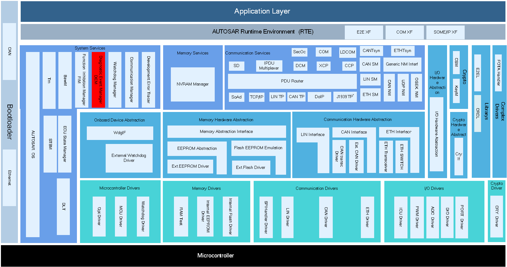

参考资料 (Reference materials)
------------------------------------------

[1] AUTOSAR_SWS_DiagnosticEventManager.pdf，4.2.2

[2] AUTOSAR_SWS_DiagnosticEventManager.pdf，R19-11

[3] Road_vehicles_UDS_ISO14229-1_Part1-2013.pdf

[4] ISO_15031-5_2016.pdf

[5] SAE-J1939-73-2017.pdf

[6] ISO-27145-3-2012.pdf

功能描述 (Function Description)
===========================================

诊断事件报告功能 (Diagnostic Event Report Function)
-----------------------------------------------------------

诊断事件报告功能介绍 (Diagnostic Event Report Feature Introduction)
~~~~~~~~~~~~~~~~~~~~~~~~~~~~~~~~~~~~~~~~~~~~~~~~~~~~~~~~~~~~~~~~~~~~~~

诊断监视器监控诊断事件时，通过Dem_SetOperationStatus来控制操作循环的开启与关闭，打开操作循环时使Dem进入事件处理状态，并且可以向Dem报告事件，而关闭操作循环后，不能向Dem报告事件，只能读取事件相关数据。

Diagnostic monitor controls the activation and deactivation of operation loops when monitoring diagnostic events by using Dem_SetOperationStatus. Activating the operation loop causes the Dem to enter event handling state and report events to Dem. Once the operation loop is deactivated, events can only be read, not reported to Dem.

诊断事件报告功能实现 (Diagnostic event report feature implementation)
~~~~~~~~~~~~~~~~~~~~~~~~~~~~~~~~~~~~~~~~~~~~~~~~~~~~~~~~~~~~~~~~~~~~~~~~~~~~

SWC与BSW分别通过Dem_SetEventStatus和Dem_ReportErrorStatus向Dem报告事件及其状态并存入Dem内部队列中。在下一个Dem_MainFunction中处理队列中的事件，包括处理内部Memory Entry空间分配以及事件DTC状态切换等，并且将事件及其相关状态和数据放入对应的Memory Entry中。报告的事件状态类型定义如表 所示。

SWC and BSW report events and their statuses to Dem by calling Dem_SetEventStatus and Dem_ReportErrorStatus, respectively, and store them in Dem's internal queue. In the next Dem_MainFunction, the queue's events are processed, which includes handling memory entry space allocation as well as event DTC status switching, among other tasks. The reported event status types are defined as shown in the table.

.. centered:: **表 事件状态类型 (Table Event Status Types)**

.. list-table::
   :widths: 50 50
   :header-rows: 1

   * - 状态 (>Status)
     - 值 (Value)
   * - DEM_EVENT_STATUS_PASSED
     - 0x00
   * - DEM_EVENT_STATUS_FAILED
     - 0x01
   * - DEM_EVENT_STATUS_PREPASSED
     - 0x02
   * - DEM_EVENT_STATUS_PREFAILED
     - 0x03
   * - DEM_EVENT_STATUS_FDC_THRESHOLD_REACHED
     - 0x04

去抖功能 (Debouncing function)
------------------------------------------

去抖功能介绍 (Shake Reduction Function Introduction)
~~~~~~~~~~~~~~~~~~~~~~~~~~~~~~~~~~~~~~~~~~~~~~~~~~~~~~~

诊断事件的去抖功能根据ISO-14229-1和AutoSAR规范实现。当报告事件状态为PREPASSED（或PREFAILED）时，需要进行去抖处理来确认事件的状态为PASSED或FAILED。去抖可分为基于计数去抖和基于时间去抖。

The debouncing function for diagnosing events is implemented according to the ISO-14229-1 and AutoSAR specifications. When the reported event status is PREPASSED (or PREFAILED), debouncing processing needs to be performed to confirm that the event status is PASSED or FAILED. Debouncing can be either count-based or time-based.

去抖功能实现 (Anti-jitter functionality implementation)
~~~~~~~~~~~~~~~~~~~~~~~~~~~~~~~~~~~~~~~~~~~~~~~~~~~~~~~~~~~~

基于计数去抖：事件配置为基于计数去抖，并且分别配置FAILED与PASSED的计数阈值。SWC或BSW报告事件时，由内部函数Dem_ProcessEventStatus根据事件状态分别进行处理。当报告的事件状态为PREFAILED或PREPASSED时，在Dem_MainFunction中的内部函数Dem_DebounceProcess里开始根据配置中的StepSize计数，当报告PREFAILED或PREPASSED状态的事件的计数值达到FAILED或PASSED阈值时，事件状态将被确认为FAILED或PASSED。图 为ISO-14229-1中基于计数去抖相关的原理。

Based on Count Debouncing: The event is configured for count-based debouncing, with separate threshold values configured for FAILED and PASSED. When the SWC or BSW reports an event, it is processed by the internal function Dem_ProcessEventStatus based on the event status. If the reported event status is PREFAILED or PREPASSED, counting begins in the internal function Dem_DebounceProcess within Dem_MainFunction according to the StepSize configured. When the count value of the reported PREFAILED or PREPASSED event reaches the FAILED or PASSED threshold, the event status will be confirmed as FAILED or PASSED. The principle related to count-based debouncing is illustrated in Figure , which is from ISO-14229-1.

基于时间去抖：事件配置为基于时间去抖，并且分别配置FAILED与PASSED的超时阈值。SWC或BSW报告事件时，由内部函数Dem_ProcessEventStatus根据事件状态分别进行处理。当报告的事件状态为PREFAILED或PREPASSED时，在Dem_MainFunction中的内部函数Dem_DebounceTimerMain里根据配置中的DemMainFunctionPeriodicTime进行超时计数，若计数时间超过配置的超时阈值前仍未报告其他状态，则事件状态将被确认为FAILED或PASSED。

Timing-based Debouncing: The event is configured for timing-based debouncing, with separate timeout thresholds configured for FAILED and PASSED states. When SWC or BSW reports the event, it is processed according to its state by the internal function Dem_ProcessEventStatus. When the reported event status is PREFAILED or PREPASSED, in the internal function Dem_DebounceTimerMain of Dem_MainFunction, a timeout count is performed based on the configured DemMainFunctionPeriodicTime. If no other status report occurs before the count time exceeds the configured timeout threshold, the event state will be confirmed as FAILED or PASSED.

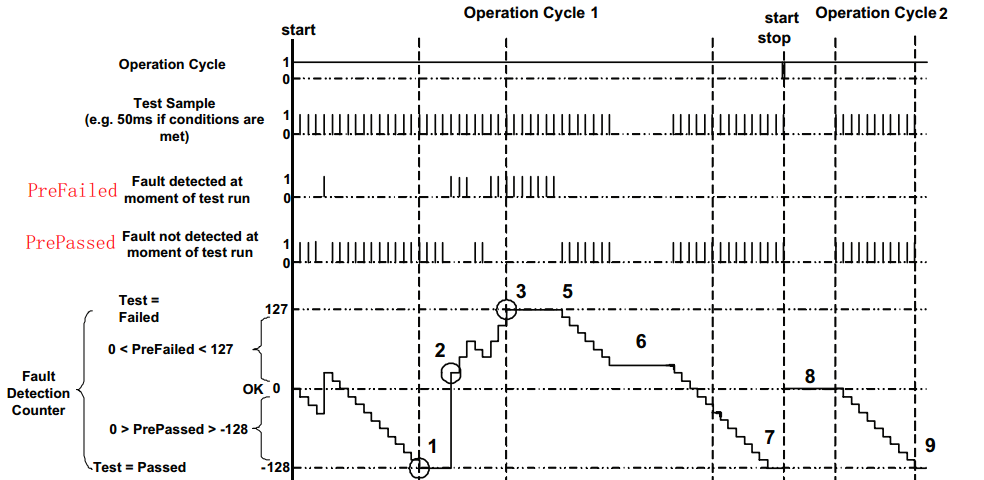

DTC状态管理功能 (DTC Status Management Function)
----------------------------------------------------------

DTC状态管理功能介绍 (Description of the DTC Status Management Function)
~~~~~~~~~~~~~~~~~~~~~~~~~~~~~~~~~~~~~~~~~~~~~~~~~~~~~~~~~~~~~~~~~~~~~~~~~~~~~~~~

诊断事件的DTC状态管理根据ISO-14229-1和AutoSAR规范实现。DTC状态分为8个Bit位，并且分别根据报告事件的状态或内部相关的处理进行转换。以下为DTC状态位介绍：

The management of DTC status for diagnosing events is implemented according to ISO-14229-1 and AutoSAR specifications. The DTC status is divided into 8 bits, and each bit is converted based on the state of reported events or internal related processing. Below are the introductions to the DTC status bits:

.. centered:: **表 DTC状态位 (Table DTC Status Bit)**

.. list-table::
   :widths: 34 33 33
   :header-rows: 1

   * - 位 (Position)
     - 名称 (Name)
     - 缩写 (Abbreviation)
   * - Bit 0
     - TesetFailed
     - TF
   * - Bit 1
     - TestFailedThisOperationCycle
     - TFTOC
   * - Bit 2
     - PendingDTC
     - PDTC
   * - Bit 3
     - ComfirmedDTC
     - CDTC
   * - Bit 4
     - TestNotCompleteSinceLastClear
     - TNCSLC
   * - Bit 5
     - TestFailedSinceLastClear
     - TFSLC
   * - Bit 6
     - TestNotCompleteThisOperationCycle
     - TNCTOC
   * - Bit 7
     - WarnningIndicator
     - WIR

DTC状态管理功能实现 (DTC Status Management Feature Implementation)
~~~~~~~~~~~~~~~~~~~~~~~~~~~~~~~~~~~~~~~~~~~~~~~~~~~~~~~~~~~~~~~~~~~~~~~

Dem初始化时，会将每个配置的事件的DTC状态进行初始化，将Bit6置位为1，（Bit4在初始化时不进行置位，需要清除一次后置位）。SWC或BSW报告事件时，由内部函数Dem_ProcessEventStatus根据事件状态分别进行处理。

During Dem initialization, the DTC state for each configured event is initialized by setting Bit6 to 1 (Bit4 is not set during initialization and needs to be reset before being set). When SWC or BSW reports an event, it is processed according to its status by the internal function Dem_ProcessEventStatus.

若报告的事件状态为FAILED时，同步置位DTC状态位的Bit0、Bit1、Bit2、Bit5，同步清除Bit4、Bit6。并且在函数Dem_MainFunction中，根据用户配置DemEventFailureCycleCounterThreshold的值决定何时置位Bit3，根据用户配置DemIndicatorAttribute-> DemIndicatorFailureCycleCounterThreshold的值决定何时置位Bit7。

If the reported event status is FAILED, set Bit0, Bit1, Bit2, and Bit5 of the DTC state, and clear Bit4 and Bit6 synchronously. In the function Dem_MainFunction, determine when to set Bit3 based on the value of DemEventFailureCycleCounterThreshold configured by the user, and determine when to set Bit7 based on the value of DemIndicatorFailureCycleCounterThreshold configured by the user.

若报告的事件状态为PASSED时，将会同步清除Bit0、Bit4、Bit6，并且在函数Dem_MainFunction中的内部函数Dem_EventTestPassed里处理根据配置中DemIndicatorAttribute-> DemIndicatorHealingCycleCounterThreshold的值决定何时清除Bit7。

If the reported event status is PASSED, Bit0, Bit4, and Bit6 will be synchronized to be cleared, and in the internal function Dem_EventTestPassed of the function Dem_MainFunction, Bit7 will be cleared based on the value of DemIndicatorAttribute -> DemIndicatorHealingCycleCounterThreshold in the configuration.

若本次操作循环仅报告了PASSED，并且Bit2已经在之前的操作循环置位的情况下，在操作循环由Dem_OperationCycleEnd结束时中清除Bit2。

If this operation cycle only reports PASSED and Bit2 was already set in a previous operation cycle, clear Bit2 when the operation cycle ends with Dem_OperationCycleEnd.

若当前操作循环已满足老化（老化处理功能在2.5章节介绍）条件，将清除Bit3、Bit5。

If the current operation loop meets the aging conditions (described in Chapter 2.5), Bit3 and Bit5 will be cleared.

此外，新的操作循环由Dem_OperationCycleStart开启时，会同步清除Bit1，置位Bit6。对于是否在操作循环开启或关闭时清除Bit0状态，ISO 14229-1与AutoSAR并没有明确说明，而是开放给OEM指定。

Additionally, when the new operation cycle is initiated by Dem_OperationCycleStart, Bit1 will be synchronized to clear and Bit6 will be set. Whether to clear the Bit0 status during the initiation or termination of the operation cycle is not explicitly specified by ISO 14229-1 or AutoSAR, leaving it open for OEMs to specify.

冻结帧与扩展数据存储功能 (Freeze Frame and Extended Data Storage functionalities)
-------------------------------------------------------------------------------------

冻结帧与扩展数据存储功能介绍 (Introduction to Freeze Frame and Extended Data Storage functionalities)
~~~~~~~~~~~~~~~~~~~~~~~~~~~~~~~~~~~~~~~~~~~~~~~~~~~~~~~~~~~~~~~~~~~~~~~~~~~~~~~~~~~~~~~~~~~~~~~~~~~~~~~

ISO-14229-1规定了两种类型的诊断事件相关数据：冻结帧与扩展数据。存储的数量和组合是由OEM指定的，因此是可配的。此数据可以由SWC或BSW提供。冻结帧由配置中DID关联的外部回调接口中获取，扩展数据一般为内部数据，在Dem内部产生并且计算。

ISO-14229-1 defines two types of diagnostic event-related data: freeze frames and extended data. The number and combination stored are specified by the OEM, hence configurable. This data can be provided by SWCs or BSWs. Freeze frames are obtained from external callback interfaces associated with DID in the configuration, while extended data is generally internal data generated and computed within Dem.

冻结帧与扩展数据存储功能实现 (Freeze frame and extended data storage functionality implementation)
~~~~~~~~~~~~~~~~~~~~~~~~~~~~~~~~~~~~~~~~~~~~~~~~~~~~~~~~~~~~~~~~~~~~~~~~~~~~~~~~~~~~~~~~~~~~~~~~~~

在配置中将事件关联对应的冻结帧与扩展数据，SWC与BSW报告事件时，Dem根据配置DemExtendedDataRecordTrigger与DemFreezeFrameRecordTrigger决定在哪种条件下获取实时扩展数据与冻结帧，并且与事件一同存入buffer中。接着在Dem_MainFunction中等待事件的Memory Entry分配完成后，将数据存储到其中。

Associate events with corresponding frozen frames and extended data in the configuration. When SWC and BSW report events, Dem decides based on DemExtendedDataRecordTrigger and DemFreezeFrameRecordTrigger to acquire real-time extended data and frozen frames under certain conditions, storing them together into a buffer. Then, in Dem_MainFunction, wait for the Memory Entry allocation of the event to complete before storing the data therein.

恢复与老化功能 (Regeneration and Aging Functions)
----------------------------------------------------------

恢复与老化功能介绍 (Introduction to Regeneration and Aging Functions)
~~~~~~~~~~~~~~~~~~~~~~~~~~~~~~~~~~~~~~~~~~~~~~~~~~~~~~~~~~~~~~~~~~~~~~~~~~~~

诊断事件的恢复是指某事件已经报告了故障，在经过后续操作循环监测下没有继续报告故障，满足恢复条件，则认为事件已经恢复。

The recovery of diagnosing events refers to a situation where an event has reported a fault, and after subsequent operation cycles monitoring, it no longer reports the fault and meets the recovery conditions, then it is considered that the event has recovered.

诊断事件的老化是指在当前事件满足恢复条件并且在经过后续操作循环监测下没有继续报告故障，满足老化条件，则开始老化处理。

Aging of diagnostic events refers to the process where, after the current event meets the recovery conditions and subsequent operations do not continue to report faults during monitoring in subsequent operation cycles, if aging conditions are met, the aging processing begins.

恢复与老化功能实现 (Recovery and aging functions implemented)
~~~~~~~~~~~~~~~~~~~~~~~~~~~~~~~~~~~~~~~~~~~~~~~~~~~~~~~~~~~~~~~~~~

恢复：指事件在当前操作循环报告状态为FAILED并且置位了DTC状态位Bit7，后续的操作循环中此事件仅报告了PASSED状态，并在Dem_OperationCycleStart中开始执行恢复处理，若在某一个操作循环开启时满足恢复条件则将DTC状态位Bit7清除。恢复条件由配置中DemIndicatorHealingCycleCounterThreshold的值决定。

Recovery: Refers to an event where, in the current operation cycle, the status is reported as FAILED and DTC status bit Bit7 is set. In subsequent operation cycles, the event only reports a PASSED state, and recovery processing begins during Dem_OperationCycleStart. If at any point during an operation cycle the recovery conditions are met, DTC status bit Bit7 is cleared. The recovery conditions are determined by the value of DemIndicatorHealingCycleCounterThreshold in configuration.

老化：指事件满足恢复条件并且后续的操作循环中事件继续仅报告PASSED状态，在内部函数Dem_OperationCycleEnd中进行老化处理，若在某一个操作循环关闭时满足老化条件则将清除DTC状态位Bit3、Bit5，并且删除此事件所有相关的数据，老化条件由配置中DemAgingCycleCounterThreshold的值决定。若配置DemStatusBitHandlingTestFailedSinceLastClear允许清除Bit5，清除时机由配置中DemAgingCycleCounterThresholdForTFSLC的值决定。

Aging: Refers to an event satisfying recovery conditions and continuing to report only PASSED states in subsequent operation cycles. Aging processing is performed internally in the function Dem_OperationCycleEnd. If the aging condition is met when closing a specific operation cycle, the DTC status bits Bit3 and Bit5 will be cleared, and all related data for this event will be deleted. The aging condition is determined by the value of DemAgingCycleCounterThreshold in the configuration. If the configuration allows clearing Bit5 via DemStatusBitHandlingTestFailedSinceLastClear, the timing of such clearance is decided by the value of DemAgingCycleCounterThresholdForTFSLC in the configuration.

替换功能 (Replace Function)
---------------------------------------

替换功能介绍 (Replace Feature Introduction)
~~~~~~~~~~~~~~~~~~~~~~~~~~~~~~~~~~~~~~~~~~~~

诊断事件的替换功能是指若在配置中配置的事件数量大于配置的存储数量，

The replacement function for diagnosing events refers to the situation where the number of events configured in the configuration exceeds the storage quantity configured.

则最不重要的、已经存在的事件的Memory Entry被需要存储的新事件的Memory Entry取代。以下是事件替换的三种策略介绍。

Then, the Memory Entry of the least important and already existing event is replaced by the Memory Entry needed to store a new event. Here are introductions to three strategies for event replacement.

.. centered:: **表 替换策略 (Replacement Strategy)**

.. list-table::
   :widths: 50 50
   :header-rows: 1

   * - 策略 (Strategies)
     - 解释 (Explanation)
   * - DEM_DISPLACEMENT_FULL
     - 优先Active/Passive和Occurrence策略 (Prioritize Active/Passive and Occurrence strategies)
   * - DEM_DISPLACEMENT_NONE
     - 不执行替换 (Do not perform replacement.)
   * - DEM_DISPLACEMENT_PRIO_OCC
     - 优先Priority和Occurrence策略 (Prioritize Priority and Occurrence strategies)

替换功能实现 (Implementing the Replacement Functionality)
~~~~~~~~~~~~~~~~~~~~~~~~~~~~~~~~~~~~~~~~~~~~~~~~~~~~~~~~~~~~~~~~~

若SWC或BSW向Dem报告了尚未存储新的事件，且此时Dem内部分配的Memory Entry已经达到了配置中DemMaxNumberEventEntryPrimary的值（排放相关事件的存储数量由配置DemMaxNumberEventEntryPermanent的值决定），则在内部函数Dem_EventDisplacementProcess中进行替换处理。事件的替换策略依据配置中Dem_General->DemEventDisplacementStrategy的值进行处理：

If SWC or BSW reports that new events are not stored to Dem, and at this time the Memory Entry allocated within Dem has reached the value of DemMaxNumberEventEntryPrimary in the configuration (the number of storage for emission-related events is decided by the value of DemMaxNumberEventEntryPermanent in the configuration), then replacement processing is performed internally in the function Dem_EventDisplacementProcess. The event replacement strategy is handled based on the value of Dem_General->DemEventDisplacementStrategy in the configuration:

1）替换策略配置为DEM_DISPLACEMENT_NONE：不执行事件替换。

Replacement strategy configured as DEM_DISPLACEMENT_NONE: No event replacement is executed.

2）替换策略配置为DEM_DISPLACEMENT_FULL：优先寻找Passive状态的事件，若所有已存储的事件状态都为Active，则按照Occurrence（故障产生的时间最长）来找到将被新事件替换的旧事件。（Active/Passive：事件的DTC状态是否为Failed/Passed）

Replacement strategy configured as DEM_DISPLACEMENT_FULL: Prioritize finding Passive state events; if all stored events are in Active state, the old event to be replaced by a new event will be found based on Occurrence (the time since fault occurrence, longest first). (Active/Passive: whether the DTC state of the event is Failed/Passed)

3）替换策略配置为DEM_DISPLACEMENT_PRIO_OCC：优先寻找Priority最低的事件，若所有已存储的旧事件的Priority相同，则按照Occurrence（故障产生的时间最长）来找到将被新事件替换的旧事件。

Replacement strategy configured as DEM_DISPLACEMENT_PRIO_OCC: Prioritize finding the event with the lowest Priority. If all stored old events have the same Priority, the old event with the longest Occurrence (time since the fault occurred) will be selected to be replaced by the new event.

执行替换处理后，Dem将把“最不重要”的事件相关的数据删除，更新此事件相关的DTC状态。此外，AutoSAR规定事件替换只能由高优先级事件替换低优先级事件。

After executing the replacement process, Dem will delete the "least important" event-related data and update the DTC status related to this event. Additionally, AutoSAR stipulates that event replacement can only be performed by high-priority events replacing low-priority events.

同步功能 (Sync Function)
------------------------------------

同步功能介绍 (Sync feature introduction)
~~~~~~~~~~~~~~~~~~~~~~~~~~~~~~~~~~~~~~~~~~

当Dem需要永久存储event状态信息、内部数据时，需要与NvM进行交互。诊断事件的同步功能指的是Dem一键在DemNvRamBlockId下创建reference关系，同时在NvM模块生成相应的NvMBlock。

When Dem needs to permanently store event status information and internal data, it needs to interact with NvM. The synchronous function for diagnosing events refers to Dem creating a reference relationship under the DemNvRamBlockId in one click, while the NvM module generates the corresponding NvMBlock.

为了确保存储Dem模块相关数据的正确性，建议在Nvm模块中使能Crc机制以及ID动态检测等相关数据有效性检查功能。若未使能，则需要在每次更新NvM配置后，对存储空间进行一次擦除，以保护数据的有效性。

To ensure the correctness of the data stored in the Dem module, it is recommended to enable the Crc mechanism and related data validity check functions in the Nvm module, including ID dynamic detection. If these features are not enabled, a space erase should be performed every time the NvM configuration is updated to protect data integrity.

同步功能实现 (Sync function implementation)
~~~~~~~~~~~~~~~~~~~~~~~~~~~~~~~~~~~~~~~~~~~~~~~~

同步功能会根据Dem的配置自动计算Dem所需Block的长度与个数。如图 所示，右键配置项DemNvRamBlockId选择同步功能会自动在NvM模块创建相应的NvMBlock。

The synchronization function automatically calculates the length and number of blocks required for Dem based on Dem's configuration. As shown in the figure, right-clicking on configuration item DemNvRamBlockId to choose synchronization will automatically create a corresponding NvMBlock in the NvM module.

若Dem支持UDS、OBD诊断，则同步功能创建的NvMBlock包括DemNvRamBlockId_UDS_InternalData、DemNvRamBlockId_OBD_InternalData，用来存储与UDS/OBD相关event的内部数据。

If Dem supports UDS and OBD diagnostics, the NvMBlock created by the synchronized function includes DemNvRamBlockId_UDS/InternalData and DemNvRamBlockId_OBD/InternalData for storing internal data related to UDS/OBD events.

除此以外，当配置项DemNvRAMDivaded未使能时，Dem支持event整体存储，会创建一个DemNvRamBlockId_All_EventEntry，用来存储所有发生故障的event状态信息、扩展数据、冻结帧数据等。

In addition, when the configuration item DemNvRAMDivided is not enabled, Dem supports overall storage of events and creates a DemNvRamBlockId_All_EventEntry to store status information, extended data, freeze frame data, etc., for all fault events.

当配置项DemNvRAMDivaded使能时，则Dem支持event分开存储，会创建DemMaxNumberEventEntryPrimary +DemMaxNumberEventEntryPermanent个NvMBlock，每个NvMBlock用来单独存放发生故障的event状态信息、扩展数据、冻结帧数据等。

When the configuration item DemNvRAMDivaded is enabled, then Dem supports event separation storage. It will create DemMaxNumberEventEntryPrimary + DemMaxNumberEventEntryPermanent NvMBlocks, with each NvMBlock used to store fault events' status information, extended data, freeze frame data, etc., separately.

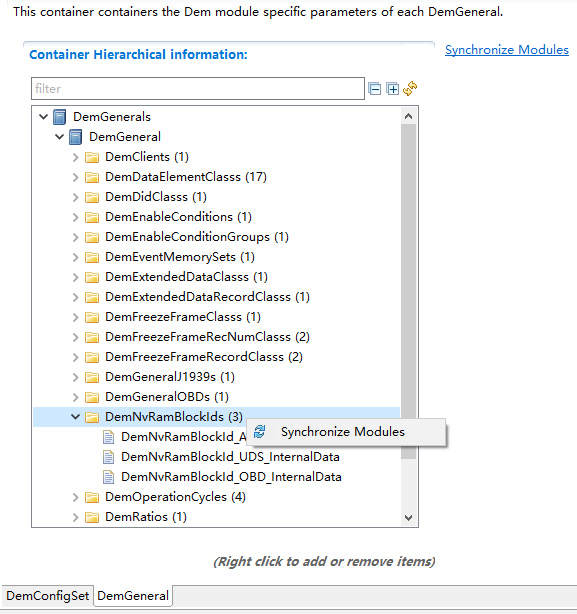

诊断信息帧功能 (Diagnostic Information Frame Function)
---------------------------------------------------------------

诊断故障代码信息帧的触发与诊断故障代码的状态有关。如果“本次操作循环测试失败”位由“0”变为“1”，ECU应触发诊断故障代码信息帧。

The triggering of the fault code diagnostic information frame is related to the state of the fault code. If the "current operation loop test failed" bit changes from "0" to "1", the ECU should trigger the fault code diagnostic information frame.

如果某一时刻由于总线系统初始化或存在故障（例如：Busoff）无法实现诊断故障代码信息帧的触发，则应等初始化完成或故障现象消除后触发。

If at a certain moment, due to the initialization of the bus system or the presence of faults (e.g., Busoff), diagnostic fault code information frames cannot be triggered, they should be triggered after initialization is complete or the fault symptoms have been eliminated.

两个诊断故障代码信息帧的触发间隔至少为1s。既当触发某诊断故障代码信息帧时，如与前一诊断故障代码信息帧触发的间隔时间还不足1s，则应等间隔时间等于1s时再触发。

The trigger interval for two diagnostic fault code information frames should be at least 1s. That is, when a diagnostic fault code information frame is triggered, if the interval time since the previous diagnostic fault code information frame trigger is still less than 1s, then it should wait until the interval time equals 1s before triggering again.

注：详细信息请参考《参考手册_CDD_SAIC_DI》。

Note: For detailed information, please refer to the Reference Manual_CDD_SAIC_DI.

源文件描述 (Source file description)
===============================================

.. centered:: **表 Dem组件文件描述 (Table Dem Component File Description)**

.. list-table::
   :widths: 50 50
   :header-rows: 1

   * - 文件 (Files)
     - 说明 (Description)
   * - Dem.c
     - Dem模块源文件，包含了API实现。 (Dem module source files contain API implementations.)
   * - Dem.h
     - Dem模块API声明与数据结构定义 (Dem Module API Declaration and Data Structure Definition)
   * - Dem_CfgTypes.h
     - 定义Dem中配置参数通用数据结构类型 (Define generic data structure types for configuration parameters in Dem)
   * - Dem_Dcm.c
     - Dem模块源文件，包含了Dem关联Dcm的API实现。 (Dem module source files contain the API implementation for Dem associating with Dcm.)
   * - Dem_Dcm.h
     - 定义Dem模块关联Dcm的API声明与数据结构定义 (Define API declarations and data structure definitions for Dem module associated with Dcm.)
   * - Dem_Ext.c
     - 定义Dem 可供外部使用的API接口 (Define APIs that Dem can expose to the external world)
   * - Dem_Ext.h
     - 定义Dem 可供外部使用的API扩展声明 (Define Dem API extensions for external usage)
   * - Dem_Interal.h
     - 定义了Dem模块Clear等模块内部API声明与数据结构 (Defined APIs and data structures within the Dem module Clear and other modules.)
   * - Dem_J1939.c
     - Dem模块源文件，定义了J1939相关API实现 (Dem module source files, define the implementation of J1939-related API.)
   * - Dem_MemMap.h
     - 定义Dem模块内存划分段 (Define segments of Dem module memory)
   * - Dem_OBD.c
     - Dem模块源文件，定义了OBD相关API实现 (Dem module source files, define the implementation of OBD-related API.)
   * - Dem_SubExt.c
     - Dem子模块可供外部使用的相关API接口定义 (Definition of related API interfaces for external use of the Dem sub-module)
   * - Dem_Types.h
     - 定义了Dem模块内部通用数据类型 (Defined common data types within the Dem module)
   * - Dem_Cfg.c
     - 定义Dem配置参数，声明配置参数 (Define Dem configuration parameters, declare configuration parameters)
   * - Dem_Cfg.h
     - 定义Dem配置参数 (Define Dem Configuration Parameters)

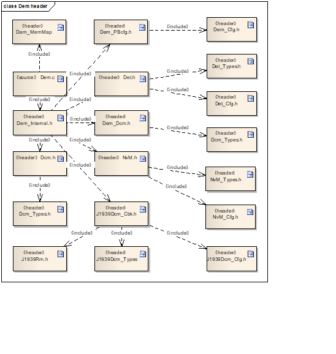

API接口 (API Interface)
=====================================

类型定义 (Type definition)
--------------------------------------

Dem_ComponentIdType类型定义 (Definition of Dem_ComponentIdType Type)
================================================================================

.. list-table::
   :widths: 50 50
   :header-rows: 1

   * - 名称 (Name)
     - Dem_ComponentIdType
   * - 类型 (Type)
     - typedef uint16 Dem_ComponentIdType
   * - 范围 (Range)
     - 1-65535
   * - 描述 (Description)
     - 通过制定的ComponentId对DemComponentId进行标识。ComponentId由Dem自动分配 (Identify DemComponentId through the specified ComponentId. ComponentId is automatically allocated by Dem.)

Dem_ConfigType类型定义 (Dem_ConfigType Type Definition)
===================================================================

.. list-table::
   :widths: 50 50
   :header-rows: 1

   * - 名称 (Name)
     - Dem_ConfigType
   * - 类型 (Type)
     - struct
   * - 范围 (Range)
     - 无
   * - 描述 (Description)
     - 此数据结构包含Dem的初始化数据 (This data structure contains Dem's initialization data.)

Dem_EventIdType类型定义 (Definition of Dem_EventIdType Type)
========================================================================

.. list-table::
   :widths: 50 50
   :header-rows: 1

   * - 名称 (Name)
     - Dem_EventIdType
   * - 类型 (Type)
     - typedef uint16 Dem_EventIdType
   * - 范围 (Range)
     - 1-65535
   * - 描述 (Description)
     - 通过指定的EventId来标识事件。EventId由Dem分配 (Identify events through the specified EventId. The EventId is allocated by Dem.)

Dem_EventStatusType类型定义 (EventStatusType type definition)
=========================================================================

.. list-table::
   :widths: 34 33 33
   :header-rows: 1

   * - 名称 (Name)
     - Dem_EventStatusType
     - 
   * - 类型 (Type)
     - typedef uint8 Dem_EventStatusType
     - 
   * - 范围 (Range)
     - DEM_EVENT_STATUS_PASSED
     - 0x00
   * - 
     - DEM_EVENT_STATUS_FAILED
     - 0x01
   * - 
     - DEM_EVENT_STATUS_PREPASSED
     - 0x02
   * - 
     - DEM_EVENT_STATUS_PREFAILED
     - 0x03
   * - 
     - DEM_EVENT_STATUS_FDC_THRESHOLD_REACHED
     - 0x04
   * - 
     - reserved
     - 0x05-0xFF
   * - 描述 (Description)
     - 该类型包含所有监视器测试结果值，可以通过Dem_ReportErrorStatus()和Dem_SetEventStatus()报告。 (This type contains all monitor test result values that can be reported through Dem_ReportErrorStatus() and Dem_SetEventStatus().)
     - 

Dem_DebouncingStateType类型定义 (Type definition for Dem_DebouncingStateType)
=========================================================================================

.. list-table::
   :widths: 34 33 33
   :header-rows: 1

   * - 名称 (Name)
     - Dem_DebouncingStateType
     - 
   * - 类型 (Type)
     - typedef uint8Dem_DebouncingStateType
     - 
   * - 范围 (Range)
     - DEM_TEMPORARILY_DEFECTIVE
     - 0x01
   * - 
     - DEM_FINALLY_DEFECTIVE
     - 0x02
   * - 
     - DEM_TEMPORARILY_HEALED
     - 0x04
   * - 
     - DEM_TEST_COMPLETE
     - 0x08
   * - 
     - DEM_DTR_UPDATE
     - 0x10
   * - 描述 (Description)
     - 去抖状态 (Debouncing mode)
     - 

Dem_DebounceResetStatusType类型定义 (Type definition for Dem_DebounceResetStatusType)
=================================================================================================

.. list-table::
   :widths: 34 33 33
   :header-rows: 1

   * - 名称 (Name)
     - Dem_DebounceResetStatusType
     - 
   * - 类型 (Type)
     - typedef uint8Dem_DebounceResetStatusType
     - 
   * - 范围 (Range)
     - DEM_DEBOUNCE_STATUS_FREEZE
     - 0x00
   * - 
     - DEM_DEBOUNCE_STATUS_RESET
     - 0x01
   * - 
     - reserved
     - 0x02-0xFF
   * - 描述 (Description)
     - 该类型包含通过函数Dem_ResetEventDebounceStatus()来控制内部去抖计数器/计时器的所有定义。 (This type includes all definitions controlling the internal debounce counter/timer through the function Dem_ResetEventDebounceStatus().)
     - 

Dem_UdsStatusByteType类型定义 (Dem_UdsStatusByteType type definition)
=================================================================================

.. list-table::
   :widths: 34 33 33
   :header-rows: 1

   * - 名称 (Name)
     - Dem_UdsStatusByteType
     - 
   * - 类型 (Type)
     - typedef uint8Dem_UdsStatusByteType
     - 
   * - 范围 (Range)
     - DEM_UDS_STATUS_TF
     - 0x01
   * - 
     - DEM_UDS_STATUS_TFTOC
     - 0x02
   * - 
     - DEM_UDS_STATUS_PDTC
     - 0x04
   * - 
     - DEM_UDS_STATUS_CDTC
     - 0x08
   * - 
     - DEM_UDS_STATUS_TNCSLC
     - 0x10
   * - 
     - DEM_UDS_STATUS_TFSLC
     - 0x20
   * - 
     - DEM_UDS_STATUS_TNCTOC
     - 0x40
   * - 
     - DEM_UDS_STATUS_WIR
     - 0x80
   * - 描述 (Description)
     - Uds状态位 (UDS Status Bit)
     - 

Dem_OperationCycleStateType类型定义 (OperationCycleStateType Type Definition)
=========================================================================================

.. list-table::
   :widths: 34 33 33
   :header-rows: 1

   * - 名称 (Name)
     - Dem_OperationCycleStateType
     - 
   * - 类型 (Type)
     - typedef uint8Dem_OperationCycleStateType
     - 
   * - 范围 (Range)
     - DEM_CYCLE_STATE_START
     - 0x00
   * - 
     - DEM_CYCLE_STATE_END
     - 0x01
   * - 描述 (Description)
     - 该类型包含操作循环的类型，可以通过Dem_SetOperationCycleState()/Dem_GetOperationCycleState()报告 (This type includes types that operate on loops, which can report through Dem_SetOperationCycleState()/Dem_GetOperationCycleState().)
     - 

Dem_IndicatorStatusType类型定义 (Dem_IndicatorStatusType type definition)
=====================================================================================

.. list-table::
   :widths: 34 33 33
   :header-rows: 1

   * - 名称 (Name)
     - Dem_IndicatorStatusType
     - 
   * - 类型 (Type)
     - typedef uint8Dem_IndicatorStatusType
     - 
   * - 范围 (Range)
     - DEM_INDICATOR_OFF
     - 0x00
   * - 
     - DEM_INDICATOR_CONTINUOUS
     - 0x01
   * - 
     - DEM_INDICATOR_BLINKING
     - 0x02
   * - 
     - DEM_INDICATOR_BLINK_CONT
     - 0x03
   * - 
     - DEM_INDICATOR_SLOW_FLASH
     - 0x04
   * - 
     - DEM_INDICATOR_FAST_FLASH
     - 0x05
   * - 
     - DEM_INDICATOR_ON_DEMAND
     - 0x06
   * - 
     - DEM_INDICATOR_SHORT
     - 0x07
   * - 描述 (Description)
     - Dem_GetIndicatorStatus()使用的指示灯模式 (The indicator light mode used by Dem_GetIndicatorStatus())
     - 

Dem_DTCKindType类型定义 (Definition of Dem_DTCKindType Type)
========================================================================

.. list-table::
   :widths: 34 33 33
   :header-rows: 1

   * - 名称 (Name)
     - Dem_DTCKindType
     - 
   * - 类型 (Type)
     - typedef uint8 Dem_DTCKindType
     - 
   * - 范围 (Range)
     - DEM_DTC_KIND_ALL_DTCS
     - 0x01
   * - 
     - DEM_DTC_KIND_EMISSION_REL_DTCS
     - 0x02
   * - 描述 (Description)
     - 该类型用于过滤DTCS的种类 (This type is used for filtering types of DTCS.)
     - 

Dem_DTCFormatType类型定义 (Dem_DTCFormatType type definition)
=========================================================================

.. list-table::
   :widths: 34 33 33
   :header-rows: 1

   * - 名称 (Name)
     - Dem_DTCFormatType
     - 
   * - 类型 (Type)
     - typedef uint8Dem_DTCFormatType
     - 
   * - 范围 (Range)
     - DEM_DTC_FORMAT_OBD
     - 0
   * - 
     - DEM_DTC_FORMAT_UDS
     - 1
   * - 
     - DEM_DTC_FORMAT_J1939
     - 2
   * - 描述 (Description)
     - 该类型用于选择DTC值的格式 (This type is used for selecting the format of DTC values.)
     - 

Dem_DTCOriginType类型定义 (Dem_DTCOriginType type definition)
=========================================================================

.. list-table::
   :widths: 34 33 33
   :header-rows: 1

   * - 名称 (Name)
     - Dem_DTCOriginType
     - 
   * - 类型 (Type)
     - typedef uint8 Dem_DTCOriginType
     - 
   * - 范围 (Range)
     - DEM_DTC_ORIGIN_PRIMARY_MEMORY
     - 0x01
   * - 
     - DEM_DTC_ORIGIN_MIRROR_MEMORY
     - 0x02
   * - 
     - DEM_DTC_ORIGIN_PERMANET_MEMORY
     - 0x03
   * - 
     - DEM_DTC_ORIGIN_USERDEFINED_MEMORY_XX
     - 0xXX
   * - 描述 (Description)
     - 该枚举类型用来定义事件的位置 (This enumeration type is used to define the location of an event.)
     - 

Dem_DTCRequestType类型定义 (Dem_DTCRequestType type definition)
===========================================================================

.. list-table::
   :widths: 34 33 33
   :header-rows: 1

   * - 名称 (Name)
     - Dem_DTCRequestType
     - 
   * - 类型 (Type)
     - typedef uint8 Dem_DTCRequestType
     - 
   * - 范围 (Range)
     - DEM_FIRST_FAILED_DTC
     - 0x01
   * - 
     - DEM_MOST_RECENT_FAILED_DTC
     - 0x02
   * - 
     - DEM_FIRST_DET_CONFIRMED_DTC
     - 0x03
   * - 
     - DEM_MOST_REC_DET_CONFIRMED_DTC
     - 0x04
   * - 描述 (Description)
     - 该类型用来请求具有特定属性的DTC (This type is used to request a DTC with specific attributes.)
     - 

Dem_DTCTranslationFormatType类型定义 (TranslationType typeDefinition)
=================================================================================

.. list-table::
   :widths: 34 33 33
   :header-rows: 1

   * - 名称 (Name)
     - Dem_DTCTranslationFormatType
     - 
   * - 类型 (Type)
     - typedef uint8 Dem_DTCTranslationFormatType
     - 
   * - 范围 (Range)
     - DEM_DTC_TRANSLATION_ISO15031_6
     - 0x00
   * - 
     - DEM_DTC_TRANSLATION_ISO14229_1
     - 0x01
   * - 
     - DEM_DTC_TRANSLATION_SAEJ1939_73
     - 0x02
   * - 
     - DEM_DTC_TRANSLATION_ISO11992_4
     - 0x03
   * - 
     - DEM_DTC_TRANSLATION_J2012DA_FORMAT_04
     - 0x04
   * - 描述 (Description)
     - 由Dem_DcmGetTranslationType()返回的ISO14229-1服务0x19中定义的DTC翻译格式。 (Translation format of DTC defined in ISO14229-1 service 0x19 returned by Dem_DcmGetTranslationType().)
     - 

Dem_DTCSeverityType类型定义 (Dem_DTCSeverityType type definition)
=============================================================================

.. list-table::
   :widths: 34 33 33
   :header-rows: 1

   * - 名称 (Name)
     - Dem_DTCSeverityType
     - 
   * - 类型 (Type)
     - typedef uint8 Dem_DTCSeverityType
     - 
   * - 范围 (Range)
     - DEM_SEVERITY_NO_SEVERITY
     - 0x00
   * - 
     - DEM_SEVERITY_WWHOBD_CLASS_NO_CLASS
     - 0x01
   * - 
     - DEM_SEVERITY_WWHOBD_CLASS_A
     - 0x02
   * - 
     - DEM_SEVERITY_WWHOBD_CLASS_B1
     - 0x04
   * - 
     - DEM_SEVERITY_WWHOBD_CLASS_B2
     - 0x08
   * - 
     - DEM_SEVERITY_WWHOBD_CLASS_C
     - 0x10
   * - 
     - DTC_CLASS
     - 0x1F
   * - 
     - DEM_SEVERITY_MAINTENANCE_ONLY
     - 0x20
   * - 
     - DEM_SEVERITY_CHECK_AT_NEXT_HALT
     - 0x40
   * - 
     - DEM_SEVERITY_CHECK_IMMEDIATELY
     - 0x80
   * - 描述 (Description)
     - DTCSeverityMask/DTCSeverity 定义 (DTCSeverityMask/DTCSeverity Definition)
     - 

Dem_RatioIdType类型定义 (Definition of Dem_RatioIdType Type)
========================================================================

.. list-table::
   :widths: 50 50
   :header-rows: 1

   * - 名称 (Name)
     - Dem_RatioIdType
   * - 描述 (Description)
     - OBD指定的ratioId（与一个指定的事件，一个FID和IUMPR组相关） (OBD-specified ratioId (associated with a specified event, an FID and IUMPR group))
   * - 范围 (Range)
     - 0-255, 0-65535
   * - 类型 (Type)
     - typedef uint16 Dem_RatioIdType

Dem_DTRControlType类型定义 (Type definition for Dem_DTRControlType)
===============================================================================

.. list-table::
   :widths: 34 33 33
   :header-rows: 1

   * - 名称 (Name)
     - Dem_DTRControlType
     - 
   * - 类型 (Type)
     - typedef uint8Dem_DTRControlType
     - 
   * - 范围 (Range)
     - DEM_DTR_CTL_NORMAL
     - 0x00
   * - 
     - DEM_DTR_CTL_NO_MAX
     - 0x01
   * - 
     - DEM_DTR_CTL_NO_MIN
     - 0x02
   * - 
     - DEM_DTR_CTL_RESET
     - 0x03
   * - 
     - DEM_DTR_CTL_INVISIBLE
     - 0x04
   * - 描述 (Description)
     - 控制参数，以解释报告的测试结果 (Control parameters to explain the test results in the report)
     - 

Dem_InitMonitorReasonType类型定义 (Preserve_InitMonitorReasonType type definition)
==============================================================================================

.. list-table::
   :widths: 34 33 33
   :header-rows: 1

   * - 名称 (Name)
     - Dem_InitMonitorReasonType
     - 
   * - 类型 (Type)
     - typedef uint8 Dem_InitMonitorReasonType
     - 
   * - 范围 (Range)
     - DEM_INIT_MONITOR_CLEAR
     - 0x01
   * - 
     - DEM_INIT_MONITOR_RESTART
     - 0x02
   * - 
     - DEM_INIT_MONITOR_REENABLED
     - 0x03
   * - 
     - DEM_INIT_MONITOR_STORAGE_REE无BLED (DEM_INIT_MONITOR_STORAGE_REE无BLED)
     - 0x04
   * - 描述 (Description)
     - 由回调函数<Module>_DemInitMonitorFor<EventName>()返回的（重新）初始化原因 (Reinitialization cause returned by the callback function <Module>_DemInitMonitorFor<EventName>())
     - 

Dem_IumprDenomCondIdType类型定义 (Definition of Dem_IumprDenomCondIdType Type)
==========================================================================================

.. list-table::
   :widths: 34 33 33
   :header-rows: 1

   * - 名称 (Name)
     - Dem_IumprDenomCondIdType
     - 
   * - 类型 (Type)
     - typedef uint8 Dem_IumprDenomCondIdType
     - 
   * - 范围 (Range)
     - DEM_IUMPR_GENERAL_DENOMINATOR
     - 0x01
   * - 
     - DEM_IUMPR_DEM_COND_COLDSTART
     - 0x02
   * - 
     - DEM_IUMPR_DEM_COND_EVAP
     - 0x03
   * - 
     - DEM_IUMPR_DEM_COND_500MI
     - 0x04
   * - 描述 (Description)
     - 该类型包含在OBD相关ECU之间广播所有可能的附加IUMPR分母条件。 (This type broadcasts all possible additional IUMPR denominator conditions among OBD-related ECUs.)
     - 

Dem_IumprDenomCondStatusType类型定义 (Type Definition for Dem_IumprDenomCondStatus)
===============================================================================================

.. list-table::
   :widths: 34 33 33
   :header-rows: 1

   * - 名称 (Name)
     - Dem_IumprDenomCondStatusType
     - 
   * - 类型 (Type)
     - typedef uint8Dem_IumprDenomCondStatusType
     - 
   * - 范围 (Range)
     - DEM_IUMPR_DEN_STATUS_NOT_REACHED
     - 0x00
   * - 
     - DEM_IUMPR_DEN_STATUS_REACHED
     - 0x01
   * - 
     - DEM_IUMPR_DEN_STATUS_INHIBITED
     - 0x02
   * - 
     - reserved
     - 0x03-0xFF
   * - 描述 (Description)
     - 该类型包含在OBD相关ECU中广播的另一个IUMPR分母条件的所有可能状态 (This type includes all possible states of another IUMPR denominator condition broadcast in OBD-related ECUs.)
     - 

Dem_J1939DcmDTCStatusFilterType类型定义 (Type definition for Dem_J1939DcmDtcStatusFilterType)
=========================================================================================================

.. list-table::
   :widths: 34 33 33
   :header-rows: 1

   * - 名称 (Name)
     - Dem_J1939DcmDTCStatusFilterType
     - 
   * - 类型 (Type)
     - typedef uint8Dem_J1939DcmDTCStatusFilterType
     - 
   * - 范围 (Range)
     - DEM_J1939DTC_ACTIVE
     - 0
   * - 
     - DEM_J1939DTC_PREVIOUSLY_ACTIVE
     - 1
   * - 
     - DEM_J1939DTC_PENDING
     - 2
   * - 
     - DEM_J1939DTC_PERMANET
     - 3
   * - 
     - DEM_J1939DTC_CURRENTLY_ACTIVE
     - 4
   * - 描述 (Description)
     - 用来区分应该过滤哪些DTCs的类型。 (To distinguish the types that should be filtered for DTCs.)
     - 

Dem_J1939DcmSetClearFilterType类型定义 (Dem_J1939DcmSetClearFilterType type definition)
===================================================================================================

.. list-table::
   :widths: 34 33 33
   :header-rows: 1

   * - 名称 (Name)
     - Dem_J1939DcmSetClearFilterType
     - 
   * - 类型 (Type)
     - typedef uint8Dem_J1939DcmSetClearFilterType
     - 
   * - 范围 (Range)
     - DEM_J1939DTC_CLEAR_ALL
     - 0
   * - 
     - DEM_J1939DTC_CLEAR_PREVIOUSLY_ACTIVE
     - 1
   * - 描述 (Description)
     - 用来区分哪种DTC被清除的类型 (To distinguish which DTC types are cleared)
     - 

Dem_J1939DcmSetFreezeFrameFilterType类型定义 (Dem_J1939DcmSetFreezeFrameFilterType type definition)
===============================================================================================================

.. list-table::
   :widths: 34 33 33
   :header-rows: 1

   * - 名称 (Name)
     - Dem_J1939DcmSetFreezeFrameFilterType
     - 
   * - 类型 (Type)
     - typedef uint8Dem_J1939DcmSetFreezeFrameFilterType
     - 
   * - 范围 (Range)
     - DEM_J1939DTC_CLEAR_ALL
     - 0
   * - 
     - DEM_J1939DTC_CLEAR_PREVIOUSLY_ACTIVE
     - 1
   * - 
     - DEM_J1939DCM_SPNS_IN_EXPANDED_FREEZEFRAME
     - 2
   * - 描述 (Description)
     - 用来区分哪种DTC被清除的类型 (To distinguish which DTC types are cleared)
     - 

Dem_J1939DcmLampStatusType类型定义 (Dem_J1939DcmLampStatusType type definition)
===========================================================================================

.. list-table::
   :widths: 20 80
   :header-rows: 1

   * - 名称 (Name)
     - Dem_J1939DcmLampStatusType
   * - 类型 (Type)
     - typedef uint16 Dem_J1939DcmLampStatusType
   * - 范围 (Range)
     - - bits 8-7: Malfunction Indicator Lamp status
       - bits 6-5: Red Stop Lamp status
       - bits 4-3: Amber Warning Lamp status
       - bits 2-1: Protect Lamp status
       - bits 8-7 (Flash): Flash Malfunction Indicator Lamp
       - bits 6-5 (Flash): Flash Red Stop Lamp
       - bits 4-3 (Flash): Flash Amber Warning Lamp
       - bits 2-1 (Flash): Flash Protect Lamp
   * - 描述 (Description)
     - J1939指示灯状态类型 (J1939 Indicator Light Status Type)

Dem_J1939DcmDiagnosticReadiness1Type类型定义 (Dem_J1939DcmDiagnosticReadiness1Type type definition)
===============================================================================================================

.. list-table::
   :widths: 50 50
   :header-rows: 1

   * - 名称 (Name)
     - Dem_J1939DcmDiagnosticReadiness1Type
   * - 类型 (Type)
     - typedef struct
   * - 
     - {
   * - 
     - uint8 ActiveTroubleCodes;
   * - 
     - uint8 PreviouslyActiveDiagnosticTroubleCodes;
   * - 
     - uint8 OBDCompliance;
   * - 
     - uint8 ContinuouslyMonitoredSystemsSupport_Status;
   * - 
     - uint16 NonContinuouslyMonitoredSystemsSupport;
   * - 
     - uint16 NonContinuouslyMonitoredSystemsStatus;
   * - 
     - }Dem_J1939DcmDiagnosticReadiness1Type;
   * - 范围 (Range)
     - 无
   * - 描述 (Description)
     - DM05消息的所有数据元素 (All data elements of DM05 message)

Dem_J1939DcmDiagnosticReadiness2Type类型定义 (Dem_J1939DcmDiagnosticReadiness2Type Type Definition)
===============================================================================================================

.. list-table::
   :widths: 50 50
   :header-rows: 1

   * - 名称 (Name)
     - Dem_J1939DcmDiagnosticReadiness2Type
   * - 类型 (Type)
     - typedef struct
   * - 
     - {
   * - 
     - uint16 DistanceTraveledWhileMILisActivated;
   * - 
     - uint16 DistanceSinceDTCsCleared;
   * - 
     - uint16 MinutesRunbyEngineWhileMILisActivated;
   * - 
     - uint16 TimeSinceDiagnosticTroubleCodesCleared;
   * - 
     - }Dem_J1939DcmDiagnosticReadiness2Type;
   * - 范围 (Range)
     - 无
   * - 描述 (Description)
     - DM21消息的所有数据元素 (All data elements of DM21 message)

Dem_J1939DcmDiagnosticReadiness3Type类型定义 (Dem_J1939_DcmDiagnosticReadiness3_Type definition)
============================================================================================================

.. list-table::
   :widths: 50 50
   :header-rows: 1

   * - 名称 (Name)
     - Dem_J1939DcmDiagnosticReadiness3Type
   * - 类型 (Type)
     - typedef struct
   * - 
     - {
   * - 
     - uint16 TimeSinceEngineStart;
   * - 
     - uint8 NumberofWarmupsSinceDTCsCleared;
   * - 
     - uint8ContinuouslyMonitoredSystemsEnableCompletedStatus;
   * - 
     - uint16 NonContinuouslyMonitoredSystemsEnableStatus;
   * - 
     - uint16 NonContinuouslyMonitoredSystems;
   * - 
     - }Dem_J1939DcmDiagnosticReadiness3Type;
   * - 范围 (Range)
     - 无
   * - 描述 (Description)
     - DM26消息的所有数据元素 (All data elements of DM26 message)

输入函数描述 (Describe the input function:)
-----------------------------------------------------

.. list-table::
   :widths: 50 50
   :header-rows: 1

   * - 输入模块 (Input Module)
     - API
   * - Det
     - Det_ReportError
   * - NvM
     - NvM_ReadBlock
   * - 
     - NvM_WriteBlock
   * - 
     - NvM_GetErrorStatus
   * - FiM
     - FiM_DemTriggerOnEventStatus

静态接口函数定义 (Static interface function definition)
---------------------------------------------------------------

Dem_GetVersionInfo函数定义 (The Dem_GetVersionInfo function definition)
===================================================================================

.. list-table::
   :widths: 25 25 25 25
   :header-rows: 1

   * - 函数名称： (Function Name:)
     - Dem_GetVersionInfo
     - 
     - 
   * - 函数原型： (Function prototype:)
     - void DemGetVersionInfo(Std\_VersionInfoType\*versioninfo)
     - 
     - 
   * - 服务编号： (Service Number:)
     - 0x00
     - 
     - 
   * - 同步/异步： (Synchronous/asynchronous:)
     - 同步 (Sync)
     - 
     - 
   * - 是否可重入： (Is Reentrant:)
     - 可重入 (Reentrant)
     - 
     - 
   * - 输入参数： (Input parameters:)
     - 无
     - 
     - 
   * - 输入输出参数： (Input Output Parameters:)
     - 无
     - 
     - 
   * - 输出参数： (Output Parameters:)
     - Versioninfo：指向在何处存储此模块的版本信息的指针 (Versioninfo：A pointer to where this module's version information is stored.)
     - 值域： (Domain:)
     - 无
   * - 返回值： (Return Value:)
     - 无
     - 
     - 
   * - 功能概述： (Function Overview:)
     - 返回此模块的版本信息。 (Return the version information of this module.)此API仅在 ( {ecuc(Dem/DemGeneral.DemVersionInfoApi== True })时才有效。 (This API is only available in ({ecuc(Dem/DemGeneral.DemVersionInfoApi) when effective.)
     - 
     - 

Dem_PreInit函数定义 (The Dem_PreInit function definition)
=====================================================================

.. list-table::
   :widths: 50 50
   :header-rows: 1

   * - 函数名称： (Function Name:)
     - Dem_PreInit
   * - 函数原型： (Function prototype:)
     - void Dem_PreInit(void)
   * - 服务编号： (Service Number:)
     - 0x01
   * - 同步/异步： (Synchronous/asynchronous:)
     - 同步 (Sync)
   * - 是否可重入： (Is Reentrant:)
     - 不可重入 (Non-reentrant)
   * - 输入参数： (Input parameters:)
     - 无
   * - 输入输出参数： (Input Output Parameters:)
     - 无
   * - 输出参数： (Output Parameters:)
     - 无
   * - 返回值： (Return Value:)
     - 无
   * - 功能概述： (Function Overview:)
     - 初始化处理BSW模块报告事件所需的内部状态 (Initialize the internal state required for BSW module to report events)

Dem_Init函数定义 (The Dem_Init function defines)
============================================================

.. list-table::
   :widths: 25 25 25 25
   :header-rows: 1

   * - 函数名称： (Function Name:)
     - Dem_Init
     - 
     - 
   * - 函数原型： (Function prototype:)
     - void Dem_Init(constDem_ConfigType\*ConfigPtr)
     - 
     - 
   * - 服务编号： (Service Number:)
     - 0x02
     - 
     - 
   * - 同步/异步： (Synchronous/asynchronous:)
     - 同步 (Sync)
     - 
     - 
   * - 是否可重入： (Is Reentrant:)
     - 不可重入 (Non-reentrant)
     - 
     - 
   * - 输人参数： (Input parameters:)
     - ConfigPtr：指向VARIANT-POST-BUILD配置的指针 (ConfigPtr：a pointer to the VARIANT-POST-BUILD configuration)
     - 值域： (Domain:)
     - 无
   * - 输入输出参数： (Input Output Parameters:)
     - 无
     - 
     - 
   * - 输出参数： (Output Parameters:)
     - 无
     - 
     - 
   * - 返回值： (Return Value:)
     - 无
     - 
     - 
   * - 功能概述： (Function Overview:)
     - 初始化或重新初始化此模块 (Initialize or reinitialize this module)
     - 
     - 

Dem_Shutdown函数定义 (Definition of Dem_Shutdown Function)
======================================================================

.. list-table::
   :widths: 25 25 25 25
   :header-rows: 1

   * - 函数名称： (Function Name:)
     - Dem_Shutdown
     - 
     - 
   * - 函数原型： (Function prototype:)
     - FUNC(void,DEM_CODE) Dem_Shutdown(void)
     - 
     - 
   * - 服务编号： (Service Number:)
     - 0x03
     - 
     - 
   * - 同步/异步： (Synchronous/asynchronous:)
     - 同步 (Sync)
     - 
     - 
   * - 是否可重入： (Is Reentrant:)
     - 不可重入 (Non-reentrant)
     - 
     - 
   * - 输人参数： (Input parameters:)
     - 无
     - 值域： (Domain:)
     - 无
   * - 输入输出参数： (Input Output Parameters:)
     - 无
     - 
     - 
   * - 输出参数： (Output Parameters:)
     - 无
     - 
     - 
   * - 返回值： (Return Value:)
     - 无
     - 
     - 
   * - 功能概述： (Function Overview:)
     - 关闭Dem (Close Dem)
     - 
     - 

Dem_ReportErrorStatus函数定义 (The Dem_ReportErrorStatus function definition)
=========================================================================================

.. list-table::
   :widths: 25 25 25 25
   :header-rows: 1

   * - 函数名称： (Function Name:)
     - Dem_ReportErrorStatus
     - 
     - 
   * - 函数原型： (Function prototype:)
     - FUNC(void,DEM_CODE) Dem_ReportErrorStatus(Dem_EventIdTypeEventId,Dem_EventStatusTypeEventStatus)
     - 
     - 
   * - 服务编号： (Service Number:)
     - 0x0f
     - 
     - 
   * - 同步/异步： (Synchronous/asynchronous:)
     - 异步 (Asynchronous)
     - 
     - 
   * - 是否可重入： (Is Reentrant:)
     - 不同的EventId可重入，对于相同的EventId不可重入 (Different EventIds can be re-entered, for the same EventId it cannot be re-entered.)
     - 
     - 
   * - 输人参数： (Input parameters:)
     - EventId：通过指定的事件ID来标识事件 (EventId：Identify events by specifying the event ID.)
     - 值域： (Domain:)
     - 0…65535
   * - 
     - EventStatus：监测测试结果 (EventStatus：Monitor Test Result)
     - 
     - 0…255
   * - 输入输出参数： (Input Output Parameters:)
     - 无
     - 
     - 
   * - 输出参数： (Output Parameters:)
     - 无
     - 
     - 
   * - 返回值： (Return Value:)
     - 无
     - 
     - 
   * - 功能概述： (Function Overview:)
     - 对BSW模块报告的事件进行队列 (Queue events reported by the BSW module.)
     - 
     - 

Dem_SetEventAvailable函数定义 (The Dem_SetEventAvailable function definition)
=========================================================================================

.. list-table::
   :widths: 25 25 25 25
   :header-rows: 1

   * - 函数名称： (Function Name:)
     - Dem_SetEventAvailable
     - 
     - 
   * - 函数原型： (Function prototype:)
     - FUNC(Std_ReturnType,DEM_CODE)Dem_SetEventAvailable(Dem_EventIdTypeEventId,booleanAvailableStatus)
     - 
     - 
   * - 服务编号： (Service Number:)
     - 0x37
     - 
     - 
   * - 同步/异步： (Synchronous/asynchronous:)
     - 同步 (Sync)
     - 
     - 
   * - 是否可重入： (Is Reentrant:)
     - 不可重入 (Non-reentrant)
     - 
     - 
   * - 输人参数： (Input parameters:)
     - EventId：通过指定的事件ID来标识事件 (EventId：Identify events by specifying the event ID.)
     - 值域： (Domain:)
     - 0…65535
   * - 
     - AvailableStatus:该参数指定相应的事件是否可用(TRUE)或不可用(FALSE)
     - 
     - True/False
   * - 输入输出参数： (Input Output Parameters:)
     - 无
     - 
     - 
   * - 输出参数： (Output Parameters:)
     - 无
     - 
     - 
   * - 返回值： (Return Value:)
     - Std_ReturnType:E_OK: 设置成功 (Std_ReturnType:E_OK: Setting Successful)
     - 
     - 
   * - 
     - E_NOT_OK:设置失败 (E_NOT_OK: Setting Failed)
     - 
     - 
   * - 功能概述： (Function Overview:)
     - 设置特定事件的可用状态 (Set the available state for specific events)
     - 
     - 

Dem_SetEventStatus函数定义 (The Dem_SetEventStatus function definition)
===================================================================================

.. list-table::
   :widths: 25 25 25 25
   :header-rows: 1

   * - 函数名称： (Function Name:)
     - Dem_SetEventStatus
     - 
     - 
   * - 函数原型： (Function prototype:)
     - FUNC(Std_ReturnType,DEM_CODE)Dem_SetEventStatus(Dem_EventIdType EventId,Dem_EventStatusType EventStatus)
     - 
     - 
   * - 服务编号： (Service Number:)
     - 0x04
     - 
     - 
   * - 同步/异步： (Synchronous/asynchronous:)
     - 同步/异步 (Synchronous/Asynchronous)
     - 
     - 
   * - 是否可重入： (Is Reentrant:)
     - 不同的EventId可重入，对于相同的EventId不可重入 (Different EventIds can be re-entered, for the same EventId it cannot be re-entered.)
     - 
     - 
   * - 输人参数： (Input parameters:)
     - EventId:通过指定的EventId标识事件 (EventId: Identify an event through the specified EventId.)
     - 值域： (Domain:)
     - 0…65535
   * - 
     - EventStatus:监控测试结果 (EventStatus: Monitoring test results)
     - 
     - 0…255
   * - 输入输出参数： (Input Output Parameters:)
     - 无
     - 
     - 
   * - 输出参数： (Output Parameters:)
     - 无
     - 
     - 
   * - 返回值： (Return Value:)
     - Std_ReturnType:E_OK: 设置成功 (Std_ReturnType:E_OK: Setting Successful)
     - 
     - 
   * - 
     - E_NOT_OK:设置失败 (E_NOT_OK: Setting Failed)
     - 
     - 
   * - 功能概述： (Function Overview:)
     - 通过RTE处理由SW-Cs报告的事件 (Process events reported by SW-Cs via RTE)
     - 
     - 

Dem\_ResetEventDebounceStatus函数定义 (The Dem_ResetEventDebounceStatus function defines)
=====================================================================================================

.. list-table::
   :widths: 25 25 25 25
   :header-rows: 1

   * - 函数名称： (Function Name:)
     - Dem_ResetEventDebounceStatus
     - 
     - 
   * - 函数原型： (Function prototype:)
     - FUNC(Std_ReturnType,DEM_CODE)Dem_ResetEventDebounceStatus(Dem_EventIdType EventId,Dem_DebounceResetStatusType DebounceResetStatus)
     - 
     - 
   * - 服务编号： (Service Number:)
     - 0x09
     - 
     - 
   * - 同步/异步： (Synchronous/asynchronous:)
     - 同步 (Sync)
     - 
     - 
   * - 是否可重入： (Is Reentrant:)
     - 不同的EventId可重入，对于相同的EventId不可重入 (Different EventIds can be re-entered, for the same EventId it cannot be re-entered.)
     - 
     - 
   * - 输人参数： (Input parameters:)
     - EventId:通过指定的EventId标识事件 (EventId: Identify an event through the specified EventId.)
     - 值域： (Domain:)
     - 0…65535
   * - 
     - DebounceResetStatus:冻结或重置指定事件的内部脱扣计数器/定时器 (DebounceResetStatus: Freeze or reset the internal trip counter/timer for a specified event)
     - 
     - 0…255
   * - 输入输出参数： (Input Output Parameters:)
     - 无
     - 
     - 
   * - 输出参数： (Output Parameters:)
     - 无
     - 
     - 
   * - 返回值： (Return Value:)
     - Std_ReturnType:E_OK: 重置成功 (Std_ReturnType:E_OK: Reset Successful)
     - 
     - 
   * - 
     - E_NOT_OK:重置失败 (E_NOT_OK: Reset Failed)
     - 
     - 
   * - 功能概述： (Function Overview:)
     - 通过BSW模块和SW-Cs控制内部停机计数器/定时器 (Through BSW module and SW-Cs control the internal debounce counter/timer)
     - 
     - 

Dem_ResetEventStatus函数定义 (The Dem_ResetEventStatus function defines)
====================================================================================

.. list-table::
   :widths: 25 25 25 25
   :header-rows: 1

   * - 函数名称： (Function Name:)
     - Dem_ResetEventStatus
     - 
     - 
   * - 函数原型： (Function prototype:)
     - FUNC(Std_ReturnType,DEM_CODE)Dem_ResetEventStatus(Dem_EventIdType EventId)
     - 
     - 
   * - 服务编号： (Service Number:)
     - 0x05
     - 
     - 
   * - 同步/异步： (Synchronous/asynchronous:)
     - 同步 (Sync)
     - 
     - 
   * - 是否可重入： (Is Reentrant:)
     - 不同的EventId可重入，对于相同的EventId不可重入 (Different EventIds can be re-entered, for the same EventId it cannot be re-entered.)
     - 
     - 
   * - 输人参数： (Input parameters:)
     - EventId:通过指定的EventId标识事件 (EventId: Identify an event through the specified EventId.)
     - 值域： (Domain:)
     - 0…65535
   * - 输入输出参数： (Input Output Parameters:)
     - 无
     - 
     - 
   * - 输出参数： (Output Parameters:)
     - 无
     - 
     - 
   * - 返回值： (Return Value:)
     - Std_ReturnType:E_OK: 重置成功 (Std_ReturnType:E_OK: Reset Successful)
     - 
     - 
   * - 
     - E_NOT_OK:重置失败 (E_NOT_OK: Reset Failed)
     - 
     - 
   * - 功能概述： (Function Overview:)
     - 重置事件失败状态 (Reset the event failed status)
     - 
     - 

Dem_PrestoreFreezeFrame函数定义 (The Dem_PrestoreFreezeFrame function definition)
=============================================================================================

.. list-table::
   :widths: 25 25 25 25
   :header-rows: 1

   * - 函数名称： (Function Name:)
     - Dem_PrestoreFreezeFrame
     - 
     - 
   * - 函数原型： (Function prototype:)
     - FUNC(Std_ReturnType,DEM_CODE)Dem_PrestoreFreezeFrame(Dem_EventIdType EventId)
     - 
     - 
   * - 服务编号： (Service Number:)
     - 0x06
     - 
     - 
   * - 同步/异步： (Synchronous/asynchronous:)
     - 同步 (Sync)
     - 
     - 
   * - 是否可重入： (Is Reentrant:)
     - 不同的EventId可重入，对于相同的EventId不可重入 (Different EventIds can be re-entered, for the same EventId it cannot be re-entered.)
     - 
     - 
   * - 输人参数： (Input parameters:)
     - EventId:通过指定的EventId标识事件 (EventId: Identify an event through the specified EventId.)
     - 值域： (Domain:)
     - 0…65535
   * - 输入输出参数： (Input Output Parameters:)
     - 无
     - 
     - 
   * - 输出参数： (Output Parameters:)
     - 无
     - 
     - 
   * - 返回值： (Return Value:)
     - Std_ReturnType:E_OK:冻结帧保存成功 (Std_ReturnType:E_OK: Freeze frame saved successfully)
     - 
     - 
   * - 
     - E_NOT_OK:冻结帧预存储失败 (E_NOT_OK: Pre-storage of frozen frame failed)
     - 
     - 
   * - 功能概述： (Function Overview:)
     - 捕获特定事件的冻结帧数据。 (Freeze frame data for specific events.)
     - 
     - 

Dem_ClearPrestoredFreezeFrame函数定义 (The Dem_ClearPrestoredFreezeFrame function definition)
=========================================================================================================

.. list-table::
   :widths: 25 25 25 25
   :header-rows: 1

   * - 函数名称： (Function Name:)
     - Dem_ClearPrestoredFreezeFrame
     - 
     - 
   * - 函数原型： (Function prototype:)
     - FUNC(Std_ReturnType,DEM_CODE)Dem_ClearPrestoredFreezeFrame(Dem_EventIdTypeEventId)
     - 
     - 
   * - 服务编号： (Service Number:)
     - 0x07
     - 
     - 
   * - 同步/异步： (Synchronous/asynchronous:)
     - 同步 (Sync)
     - 
     - 
   * - 是否可重入： (Is Reentrant:)
     - 不同的EventId可重入，对于相同的EventId不可重入 (Different EventIds can be re-entered, for the same EventId it cannot be re-entered.)
     - 
     - 
   * - 输人参数： (Input parameters:)
     - EventId:通过指定的EventId标识事件 (EventId: Identify an event through the specified EventId.)
     - 值域： (Domain:)
     - 0…65535
   * - 输入输出参数： (Input Output Parameters:)
     - 无
     - 
     - 
   * - 输出参数： (Output Parameters:)
     - 无
     - 
     - 
   * - 返回值： (Return Value:)
     - Std_ReturnType
     - 
     - 
   * - 
     - E_OK:清除预先保存的冻结帧成功 (E_OK: Successfully cleared pre-saved frozen frames)
     - 
     - 
   * - 
     - E_NOT_OK:清除预先保存的冻结帧失败 (E_NOT_OK: Failed to clear pre-saved frozen frames)
     - 
     - 
   * - 功能概述： (Function Overview:)
     - 清除特定事件的预存储冻结帧 (Clear Pre-Stored Frozen Frames for Specific Event)
     - 
     - 

Dem_SetOperationCycleState函数定义 (The Dem_SetOperationCycleState function defines)
================================================================================================

.. list-table::
   :widths: 25 25 25 25
   :header-rows: 1

   * - 函数名称： (Function Name:)
     - Dem_SetOperationCycleState
     - 
     - 
   * - 函数原型： (Function prototype:)
     - FUNC(Std_ReturnType,DEM_CODE)Dem_SetOperationCycleState(uint8 OperationCycleId,Dem_OperationCycleStateType CycleState)
     - 
     - 
   * - 服务编号： (Service Number:)
     - 0x08
     - 
     - 
   * - 同步/异步： (Synchronous/asynchronous:)
     - 异步 (Asynchronous)
     - 
     - 
   * - 是否可重入： (Is Reentrant:)
     - 可重入 (Reentrant)
     - 
     - 
   * - 输人参数： (Input parameters:)
     - OperationCycleId：Identificationof operationcycle, likepower cycle,
     - 值域： (Domain:)
     - 0…65535
   * - 
     - driving cycle.
     - 
     - 
   * - 
     - CycleState:新的运行周期状态:(重新)开始或结束 (CycleState: New operation cycle status: (Re)start or end)
     - 
     - 0…255
   * - 输入输出参数： (Input Output Parameters:)
     - 无
     - 
     - 
   * - 输出参数： (Output Parameters:)
     - 无
     - 
     - 
   * - 返回值： (Return Value:)
     - Std_ReturnType
     - 
     - 
   * - 
     - E_OK:一组操作周期被接受，并将被异步处理 (E_OK: A set of operation cycles have been accepted and will be processed asynchronously.)
     - 
     - 
   * - 
     - E_NOT_OK:操作周期集被拒绝 (E_NOT_OK: The operation cycle set was rejected.)
     - 
     - 
   * - 功能概述： (Function Overview:)
     - 设置操作周期状态 (Set operation cycle status)
     - 
     - 

Dem_GetOperationCycleState函数定义 (The Dem_GetOperationCycleState function defines)
================================================================================================

.. list-table::
   :widths: 25 25 25 25
   :header-rows: 1

   * - 函数名称： (Function Name:)
     - Dem_GetOperationCycleState
     - 
     - 
   * - 函数原型： (Function prototype:)
     - FUNC(Std_ReturnType,DEM_CODE)Dem_GetOperationCycleState(uint8 OperationCycleId,P2VAR(Dem_OperationCycleStateType,AUTOMATIC,DEM_APPL_DATA)CycleState)
     - 
     - 
   * - 服务编号： (Service Number:)
     - 0x9e
     - 
     - 
   * - 同步/异步： (Synchronous/asynchronous:)
     - 同步 (Sync)
     - 
     - 
   * - 是否可重入： (Is Reentrant:)
     - 可重入 (Reentrant)
     - 
     - 
   * - 输人参数： (Input parameters:)
     - OperationCycleId:操作周期标识，如动力周期、驱动周期 (OperationCycleId: Operation Cycle Identifier, such as power cycle, drive cycle)
     - 值域： (Domain:)
     - 0…255
   * - 输入输出参数： (Input Output Parameters:)
     - 无
     - 
     - 
   * - 输出参数： (Output Parameters:)
     - CycleState：周期状态信息 (CycleState：Period state information)
     - 
     - 
   * - 返回值： (Return Value:)
     - Std_ReturnType
     - 
     - 
   * - 
     - E_OK:读取操作周期成功 (E_OK: Read operation cycle successful)
     - 
     - 
   * - 
     - E_NOT_OK:读出操作周期失败 (E_NOT_OK: Read operation cycle failed)
     - 
     - 
   * - 功能概述： (Function Overview:)
     - 获取有关特定操作周期的状态的信息 (Get information about the state of a specific operational cycle.)
     - 
     - 

Dem_SetAgingCycleState函数定义 (The Dem_SetAgingCycleState function defines)
========================================================================================

.. list-table::
   :widths: 25 25 25 25
   :header-rows: 1

   * - 函数名称： (Function Name:)
     - Dem_SetAgingCycleState
     - 
     - 
   * - 函数原型： (Function prototype:)
     - FUNC(Std_ReturnType,DEM_CODE)Dem_SetAgingCycleState(uint8 OperationCycleId)
     - 
     - 
   * - 服务编号： (Service Number:)
     - 0x11
     - 
     - 
   * - 同步/异步： (Synchronous/asynchronous:)
     - 同步 (Sync)
     - 
     - 
   * - 是否可重入： (Is Reentrant:)
     - 可重入 (Reentrant)
     - 
     - 
   * - 输人参数： (Input parameters:)
     - OperationCycleId:老化周期标识 (OperationCycleId: Aging Cycle Identifier)
     - 值域： (Domain:)
     - 0…255
   * - 输入输出参数： (Input Output Parameters:)
     - 无
     - 
     - 
   * - 输出参数： (Output Parameters:)
     - 无
     - 
     - 
   * - 返回值： (Return Value:)
     - Std_ReturnType
     - 
     - 
   * - 
     - E_OK:老化周期设置成功 (E_OK: Aging cycle setup succeeded)
     - 
     - 
   * - 
     - E_NOT_OK:老化周期设置失败 (E_NOT_OK: Aging cycle setup failed)
     - 
     - 
   * - 功能概述： (Function Overview:)
     - 触发下一个老化周期状态 (Trigger the next aging cycle state)
     - 
     - 

Dem_SetWIRStatus函数定义 (The Dem_SetWIRStatus function definition)
===============================================================================

.. list-table::
   :widths: 25 25 25 25
   :header-rows: 1

   * - 函数名称： (Function Name:)
     - Dem_SetWIRStatus
     - 
     - 
   * - 函数原型： (Function prototype:)
     - FUNC(Std_ReturnType,DEM_CODE)Dem_SetWIRStatus(Dem_EventId TypeEventId,boolean WIRStatus)
     - 
     - 
   * - 服务编号： (Service Number:)
     - 0x7a
     - 
     - 
   * - 同步/异步： (Synchronous/asynchronous:)
     - 同步 (Sync)
     - 
     - 
   * - 是否可重入： (Is Reentrant:)
     - 可重入不同的eventid。对于相同的EventId不可重入。 (Reentrant with different eventid. Not reentrant for the same EventId.)
     - 
     - 
   * - 输人参数： (Input parameters:)
     - EventId:通过指定的EventId标识事件 (EventId: Identify an event through the specified EventId.)
     - 值域： (Domain:)
     - 0...65535
   * - 
     - WIRStatus:与事件相关的wir位请求状态 (WIRStatus: Request status of WIR bits related to the event)
     - 
     - True/False
   * - 输入输出参数： (Input Output Parameters:)
     - 无
     - 
     - 
   * - 输出参数： (Output Parameters:)
     - 无
     - 
     - 
   * - 返回值： (Return Value:)
     - Std_ReturnType
     - 
     - 
   * - 
     - E_OK:请求被接受 (E_OK: Request accepted)
     - 
     - 
   * - 
     - E_NOT_OK:不被接受 (E_NOT_OK: Not Acceptable)
     - 
     - 
   * - 功能概述： (Function Overview:)
     - 通过故障安全的SW-Cs设置WIR状态位 (Set the WIR status bit through fault-safe SW-Cs)
     - 
     - 

Dem_GetComponentFailed函数定义 (The Dem_GetComponentFailed function definition)
===========================================================================================

.. list-table::
   :widths: 25 25 25 25
   :header-rows: 1

   * - 函数名称： (Function Name:)
     - Dem_GetComponentFailed
     - 
     - 
   * - 函数原型： (Function prototype:)
     - FUNC(Std_ReturnType,DEM_CODE)Dem_GetComponentFailed(Dem_ComponentIdType ComponentId,P2VAR(boolean,AUTOMATIC,DEM_APPL_DATA)ComponentFailed)
     - 
     - 
   * - 服务编号： (Service Number:)
     - 0x2a
     - 
     - 
   * - 同步/异步： (Synchronous/asynchronous:)
     - 同步 (Sync)
     - 
     - 
   * - 是否可重入： (Is Reentrant:)
     - 可重入 (Reentrant)
     - 
     - 
   * - 输人参数： (Input parameters:)
     - ComponentId:DemComponent的标识 (ComponentId: DemComponent's Identifier)
     - 值域： (Domain:)
     - 0…65535
   * - 输入输出参数： (Input Output Parameters:)
     - 无
     - 
     - 
   * - 输出参数： (Output Parameters:)
     - ComponentFailed：
     - 
     - 
   * - 
     - TRUE: failed
     - 
     - 
   * - 
     - FALSE: notfailed
     - 
     - 
   * - 返回值： (Return Value:)
     - Std_ReturnType
     - 
     - 
   * - 
     - E_OK:获取“ComponentFailed”成功 (E_OK: Get "ComponentFailed" successfully)
     - 
     - 
   * - 
     - E\_NOT_OK:没有得到“ComponentFailed” (E_NOT_OK: Did not receive "ComponentFailed")
     - 
     - 
   * - 功能概述： (Function Overview:)
     - 获取DemComponent的失败状态。 (Failure status of getting DemComponent.)
     - 
     - 

Dem_GetEventStatus函数定义 (The Dem_GetEventStatus function definition)
===================================================================================

.. list-table::
   :widths: 25 25 25 25
   :header-rows: 1

   * - 函数名称： (Function Name:)
     - Dem_GetEventStatus
     - 
     - 
   * - 函数原型： (Function prototype:)
     - FUNC(Std_ReturnType,DEM_CODE)Dem_GetEventStatus(Dem_EventIdTypeEventId,P2VAR(Dem_UdsStatusByteType,AUTOMATIC,DEM_APPL_DATA)EventStatusByte)
     - 
     - 
   * - 服务编号： (Service Number:)
     - 0x0a
     - 
     - 
   * - 同步/异步： (Synchronous/asynchronous:)
     - 同步 (Sync)
     - 
     - 
   * - 是否可重入： (Is Reentrant:)
     - 可重入 (Reentrant)
     - 
     - 
   * - 输人参数： (Input parameters:)
     - EventId:通过指定的EventId标识事件 (EventId: Identify an event through the specified EventId.)
     - 值域： (Domain:)
     - 0…65535
   * - 输入输出参数： (Input Output Parameters:)
     - 无
     - 
     - 
   * - 输出参数： (Output Parameters:)
     - EventStatusByte：如果函数调用的返回值为E_NOT_OK，则该参数不包含有效数据 (EventStatusByte: If the function call returns E_NOT_OK, this parameter does not contain valid data.)
     - 
     - 
   * - 返回值： (Return Value:)
     - Std_ReturnType：
     - 
     - 
   * - 
     - E_OK:事件状态获取成功 (E_OK: Event status acquisition succeeded)
     - 
     - 
   * - 
     - E_NOT_OK:获取事件状态失败 (E_NOT_OK: Failed to get event status)
     - 
     - 
   * - 功能概述： (Function Overview:)
     - 获取事件的当前扩展事件状态 (Get the current extended event status for the event)
     - 
     - 

Dem_GetEventFailed函数定义 (The function definition for Dem_GetEventFailed)
=======================================================================================

.. list-table::
   :widths: 25 25 25 25
   :header-rows: 1

   * - 函数名称： (Function Name:)
     - Dem_GetEventFailed
     - 
     - 
   * - 函数原型： (Function prototype:)
     - FUNC(Std_ReturnType,DEM_CODE)Dem_GetEventFailed(Dem_EventIdTypeEventId,P2VAR(boolean,AUTOMATIC,DEM_APPL_DATA)EventFailed)
     - 
     - 
   * - 服务编号： (Service Number:)
     - 0x0b
     - 
     - 
   * - 同步/异步： (Synchronous/asynchronous:)
     - 同步 (Sync)
     - 
     - 
   * - 是否可重入： (Is Reentrant:)
     - 可重入 (Reentrant)
     - 
     - 
   * - 输人参数： (Input parameters:)
     - EventId:通过指定的EventId标识事件 (EventId: Identify an event through the specified EventId.)
     - 值域： (Domain:)
     - 0…65535
   * - 输入输出参数： (Input Output Parameters:)
     - 无
     - 
     - 
   * - 输出参数： (Output Parameters:)
     - EventFailed：TRUE -上次失败 (TRUE -Last Failure);FALSE-不是最后一次失败 (FALSE-not the last failure)
     - 
     - 
   * - 返回值： (Return Value:)
     - Std_ReturnType：
     - 
     - 
   * - 
     - E_OK:获取“EventFailed”成功 (E_OK: Get "EventFailed" successfully)
     - 
     - 
   * - 
     - E_NOT_OK:获取“EventFailed”不成功 (E_NOT_OK: Failed to get "EventFailed")
     - 
     - 
   * - 功能概述： (Function Overview:)
     - 获取事件的事件失败状态 (Get the failed state of the event)
     - 
     - 

Dem_GetEventTested函数定义 (The Dem_GetEventTested function definition)
===================================================================================

.. list-table::
   :widths: 25 25 25 25
   :header-rows: 1

   * - 函数名称： (Function Name:)
     - Dem_GetEventTested
     - 
     - 
   * - 函数原型： (Function prototype:)
     - FUNC(Std_ReturnType,DEM_CODE) Dem_GetEventTested(Dem_EventIdType EventId,P2VAR(boolean,AUTOMATIC,DEM_APPL_DATA) EventTested)
     - 
     - 
   * - 服务编号： (Service Number:)
     - 0x0c
     - 
     - 
   * - 同步/异步： (Synchronous/asynchronous:)
     - 同步 (Sync)
     - 
     - 
   * - 是否可重入： (Is Reentrant:)
     - 可重入 (Reentrant)
     - 
     - 
   * - 输人参数： (Input parameters:)
     - EventId:通过指定的EventId标识事件 (EventId: Identify an event through the specified EventId.)
     - 值域： (Domain:)
     - 0…65535
   * - 输入输出参数： (Input Output Parameters:)
     - 无
     - 
     - 
   * - 输出参数： (Output Parameters:)
     - EventTested：TRUE-事件测试了这个周期 (TRUE-Event tested this cycle);FALSE-此周期未测试事件 (FALSE-This cycle did not test the event)
     - 
     - 
   * - 返回值： (Return Value:)
     - Std_ReturnType：
     - 
     - 
   * - 
     - E_OK:获取事件状态“已测试”成功 (E_OK: Get event status "tested" successfully)
     - 
     - 
   * - 
     - E_NOT_OK:获取事件状态“已测试”失败 (E_NOT_OK: Failed to get event status "Tested")
     - 
     - 
   * - 功能概述： (Function Overview:)
     - 获取事件的事件测试状态。 (Get the event test status.)
     - 
     - 

Dem_GetDebouncingOfEvent函数定义 (The Dem_GetDebouncingOfEvent function definition)
===============================================================================================

.. list-table::
   :widths: 25 25 25 25
   :header-rows: 1

   * - 函数名称： (Function Name:)
     - Dem_GetDebouncingOfEvent
     - 
     - 
   * - 函数原型： (Function prototype:)
     - FUNC(Std_ReturnType,DEM_CODE) Dem_GetDebouncingOfEvent(Dem_EventIdTypeEventId,P2VAR(Dem_DebouncingStateType,AUTOMATIC,DEM_APPL_DATA)DebouncingState)
     - 
     - 
   * - 服务编号： (Service Number:)
     - 0x9f
     - 
     - 
   * - 同步/异步： (Synchronous/asynchronous:)
     - 同步 (Sync)
     - 
     - 
   * - 是否可重入： (Is Reentrant:)
     - 可重入 (Reentrant)
     - 
     - 
   * - 输人参数： (Input parameters:)
     - EventId:通过指定的EventId标识事件 (EventId: Identify an event through the specified EventId.)
     - 值域： (Domain:)
     - 0…65535
   * - 输入输出参数： (Input Output Parameters:)
     - 无
     - 
     - 
   * - 输出参数： (Output Parameters:)
     - DebouncingState：
     - 
     - 
   * - 
     - Bit 0TemporarilyDefective(corresponds to0 < FDC < 127)
     - 
     - 
   * - 
     - Bit 1 finallyDefective(corresponds toFDC = 127)
     - 
     - 
   * - 
     - Bit 2temporarilyhealed(corresponds to-128 < FDC< 0)
     - 
     - 
   * - 
     - Bit 3 Testcomplete(corresponds toFDC = -128 or FDC = 127)
     - 
     - 
   * - 
     - Bit 4 DTR Update(= Test complete&& Debouncing complete)
     - 
     - 
   * - 返回值： (Return Value:)
     - Std_ReturnType：
     - 
     - 
   * - 
     - E_OK:获取每个事件状态的脱绑定状态成功 (E_OK: Unbinding status of each event successfully obtained)
     - 
     - 
   * - 
     - E_NOT_OK:每个事件状态的脱绑定失败 (E_NOT_OK: Unbinding failed for each event state)
     - 
     - 
   * - 功能概述： (Function Overview:)
     - 获取事件的去抖状态。 (Get the debouncing state of the event.)
     - 
     - 

Dem_GetDTCOfEvent函数定义 (The Dem_GetDTCOfEvent function definition)
=================================================================================

.. list-table::
   :widths: 25 25 25 25
   :header-rows: 1

   * - 函数名称： (Function Name:)
     - Dem_GetDTCOfEvent
     - 
     - 
   * - 函数原型： (Function prototype:)
     - FUNC(Std_ReturnType,DEM_CODE)Dem_GetDTCOfEvent( Dem_EventIdTypeEventId, Dem_DTCFormatTypeDTCFormat,P2VAR(uint32,AUTOMATIC,DEM_APPL_DATA)DTCOfEvent)
     - 
     - 
   * - 服务编号： (Service Number:)
     - 0x0d
     - 
     - 
   * - 同步/异步： (Synchronous/asynchronous:)
     - 同步 (Sync)
     - 
     - 
   * - 是否可重入： (Is Reentrant:)
     - 可重入 (Reentrant)
     - 
     - 
   * - 输人参数： (Input parameters:)
     - EventId:通过指定的EventId标识事件 (EventId: Identify an event through the specified EventId.)
     - 值域： (Domain:)
     - 0…65535
   * - 
     - DTCFormat:定义请求的DTC值的输出格式 (Define the output format for DTC values of the request)
     - 
     - 0…255
   * - 输入输出参数： (Input Output Parameters:)
     - 无
     - 
     - 
   * - 输出参数： (Output Parameters:)
     - DTCOfEvent：接收该函数返回的相应格式的DTC值。如果函数的返回值不是E_OK，则此参数不包含有效数据 (DTCOfEvent：The function returns the corresponding format DTC value to this parameter. If the return value of the function is not E_OK, this parameter does not contain valid data.)
     - 
     - 
   * - 返回值： (Return Value:)
     - Std_ReturnType：
     - 
     - 
   * - 
     - E_OK:获取DTC成功 (E_OK: Get DTC Success)
     - 
     - 
   * - 
     - E_NOT_OK:呼叫不成功 (E_NOT_OK: Call failed)
     - 
     - 
   * - 
     - DEM_E_NO_DTC_AVAILABLE:没有按请求格式配置的DTC (DEM_E_NO_DTC_AVAILABLE: No DTCs configured in requested format)
     - 
     - 
   * - 功能概述： (Function Overview:)
     - 获取事件的DTC (Retrieve Event DTC)
     - 
     - 

Dem_SetEnableCondition函数定义 (The Dem_SetEnableCondition function definition)
===========================================================================================

.. list-table::
   :widths: 25 25 25 25
   :header-rows: 1

   * - 函数名称： (Function Name:)
     - Dem_SetEnableCondition
     - 
     - 
   * - 函数原型： (Function prototype:)
     - FUNC(Std_ReturnType,DEM_CODE)Dem_SetEnableCondition(uint8 EnableConditionID,boolean ConditionFulfilled)
     - 
     - 
   * - 服务编号： (Service Number:)
     - 0x39
     - 
     - 
   * - 同步/异步： (Synchronous/asynchronous:)
     - 异步 (Asynchronous)
     - 
     - 
   * - 是否可重入： (Is Reentrant:)
     - 可重入 (Reentrant)
     - 
     - 
   * - 输人参数： (Input parameters:)
     - EnableConditionID:该参数标识启用条件 (EnableConditionID: This parameter identifies the enable condition.)
     - 值域： (Domain:)
     - 0…255
   * - 
     - ConditionFulfilled:该参数指定分配给enablecconditionid的启用条件是否满足(TRUE)或未满足(FALSE)
     - 
     - True/False
   * - 输入输出参数： (Input Output Parameters:)
     - 无
     - 
     - 
   * - 输出参数： (Output Parameters:)
     - 无
     - 
     - 
   * - 返回值： (Return Value:)
     - Std_ReturnType：
     - 
     - 
   * - 
     - 如果启用条件可以成功设置，则API调用返回E\_OK。如果启用条件设置失败，函数返回值为E_NOT_OK。 (If the enable condition can be successfully set, the API call returns E_OK. If setting the enable condition fails, the function return value is E_NOT_OK.)
     - 
     - 
   * - 功能概述： (Function Overview:)
     - 设置启用条件。 (Set up activation conditions.)
     - 
     - 

Dem_SetStorageCondition函数定义 (The Dem_SetStorageCondition function definition)
=============================================================================================

.. list-table::
   :widths: 25 25 25 25
   :header-rows: 1

   * - 函数名称： (Function Name:)
     - Dem_SetStorageCondition
     - 
     - 
   * - 函数原型： (Function prototype:)
     - FUNC(Std_ReturnType,DEM_CODE)Dem_SetStorageCondition(uint8 StorageConditionID,boolean ConditionFulfilled)
     - 
     - 
   * - 服务编号： (Service Number:)
     - 0x38
     - 
     - 
   * - 同步/异步： (Synchronous/asynchronous:)
     - 同步 (Sync)
     - 
     - 
   * - 是否可重入： (Is Reentrant:)
     - 可重入 (Reentrant)
     - 
     - 
   * - 输人参数： (Input parameters:)
     - StorageConditionID:该参数标识存储条件 (StorageConditionID: This parameter identifies the storage condition.)
     - 值域： (Domain:)
     - 0…255
   * - 
     - ConditionFulfilled:该参数指定分配给StorageConditionID的存储条件是否满足(TRUE)或未满足(FALSE)
     - 
     - True/False
   * - 输入输出参数： (Input Output Parameters:)
     - 无
     - 
     - 
   * - 输出参数： (Output Parameters:)
     - 无
     - 
     - 
   * - 返回值： (Return Value:)
     - Std_ReturnType：
     - 
     - 
   * - 
     - 如果存储条件可以成功设置，API调用返回E\_OK。如果存储条件设置失败，函数返回值为E_NOT_OK。 (If storage conditions can be successfully set, the API call returns E_OK. If setting the storage conditions fails, the function return value is E_NOT_OK.)
     - 
     - 
   * - 功能概述： (Function Overview:)
     - 设置存储条件 (Set storage conditions)
     - 
     - 

Dem_GetFaultDetectionCounter函数定义 (The function definition for Dem_GetFaultDetectionCounter)
===========================================================================================================

.. list-table::
   :widths: 25 25 25 25
   :header-rows: 1

   * - 函数名称： (Function Name:)
     - Dem_GetFaultDetectionCounter
     - 
     - 
   * - 函数原型： (Function prototype:)
     - FUNC(Std_ReturnType,DEM_CODE)Dem_GetFaultDetectionCounter(Dem_EventIdType EventId,P2VAR(sint8,AUTOMATIC,DEM_APPL_DATA)FaultDetectionCounter)
     - 
     - 
   * - 服务编号： (Service Number:)
     - 0x3e
     - 
     - 
   * - 同步/异步： (Synchronous/asynchronous:)
     - 同步 (Sync)
     - 
     - 
   * - 是否可重入： (Is Reentrant:)
     - 不可重入 (Non-reentrant)
     - 
     - 
   * - 输人参数： (Input parameters:)
     - EventId:通过指定的EventId标识事件 (EventId: Identify an event through the specified EventId.)
     - 值域： (Domain:)
     - 0…65535
   * - 输入输出参数： (Input Output Parameters:)
     - 无
     - 
     - 
   * - 输出参数： (Output Parameters:)
     - FaultDetectionCounter：该参数接收请求的EventId的FaultDetectionCounter信息。如果函数调用的返回值不是E_OK，则此形参不包含有效数据 (FaultDetectionCounter: This parameter receives the FaultDetectionCounter information of the EventId in the request. If the return value of the function call is not E_OK, this parameter does not contain valid data.)
     - 
     - 
   * - 返回值： (Return Value:)
     - Std_ReturnType：
     - 
     - 
   * - 
     - E_OK:请求成功 (E_OK: Request succeeded)
     - 
     - 
   * - 
     - E_NOT_OK:请求失败 (E_NOT_OK: Request failed)
     - 
     - 
   * - 
     - DEM\_E\_NO\_FDC_AVAILABLE:请求的事件没有可用的故障检测计数器 (DEM_E_NO_FDC_AVAILABLE: The requested event has no available fault detection counter.)
     - 
     - 
   * - 功能概述： (Function Overview:)
     - 获取事件的故障检测计数器 (Get the fault detection counter for events)
     - 
     - 

Dem_GetIndicatorStatus函数定义 (The Dem_GetIndicatorStatus function definition)
===========================================================================================

.. list-table::
   :widths: 25 25 25 25
   :header-rows: 1

   * - 函数名称： (Function Name:)
     - Dem_GetIndicatorStatus
     - 
     - 
   * - 函数原型： (Function prototype:)
     - FUNC(Std_ReturnType,DEM_CODE)Dem_GetIndicatorStatus(uint8 IndicatorId,P2VAR(Dem_IndicatorStatusType,AUTOMATIC,DEM_APPL_DATA)IndicatorStatus)
     - 
     - 
   * - 服务编号： (Service Number:)
     - 0x29
     - 
     - 
   * - 同步/异步： (Synchronous/asynchronous:)
     - 同步 (Sync)
     - 
     - 
   * - 是否可重入： (Is Reentrant:)
     - 不可重入 (Non-reentrant)
     - 
     - 
   * - 输人参数： (Input parameters:)
     - IndicatorId:指示灯编号 (IndicatorId: Lighted Indicator Number)
     - 值域： (Domain:)
     - 0…255
   * - 输入输出参数： (Input Output Parameters:)
     - 无
     - 
     - 
   * - 输出参数： (Output Parameters:)
     - IndicatorStatus:指示灯的状态，如灭、亮、闪烁。 (IndicatorStatus: The status of the indicator light, such as off, on, flashing.)
     - 
     - 
   * - 返回值： (Return Value:)
     - Std_ReturnType:E_OK:操作成功 (Std_ReturnType:E_OK: Operation successful)
     - 
     - 
   * - 
     - E_NOT_OK:操作失败 (E_NOT_OK: Operation Failed)
     - 
     - 
   * - 功能概述： (Function Overview:)
     - 获取从事件状态派生的指示器状态。 (Get the indicator status derived from the event state.)
     - 
     - 

Dem_GetEventFreezeFrameDataEx函数定义 (The function definition for Dem_GetEventFreezeFrameDataEx)
=============================================================================================================

.. list-table::
   :widths: 25 25 25 25
   :header-rows: 1

   * - 函数名称： (Function Name:)
     - Dem_GetEventFreezeFrameDataEx
     - 
     - 
   * - 函数原型： (Function prototype:)
     - FUNC(Std_ReturnType,DEM_CODE) Dem_GetEventFreezeFrameDataEx(Dem_EventIdType EventId,uint8 RecordNumber,uint16 DataId,P2VAR(uint8,AUTOMATIC,DEM_APPL_DATA)DestBuffer,uint16\* BufSize)
     - 
     - 
   * - 服务编号： (Service Number:)
     - 0x6e
     - 
     - 
   * - 同步/异步： (Synchronous/asynchronous:)
     - 同步 (Sync)
     - 
     - 
   * - 是否可重入： (Is Reentrant:)
     - 可重入 (Reentrant)
     - 
     - 
   * - 输人参数： (Input parameters:)
     - EventId:通过指定的EventId标识事件 (EventId: Identify an event through the specified EventId.)
     - 值域： (Domain:)
     - 0…65535
   * - 
     - RecordNumber:该参数是冻结帧记录的唯一标识符 (RecordNumber: This parameter is the unique identifier for frozen frame records.)
     - 
     - 0…255
   * - 
     - DataId:该参数指定DID(ISO14229-1)，它将被复制到目标缓冲区
     - 
     - 0…65535
   * - 输入输出参数： (Input Output Parameters:)
     - BufSize：函数返回该参数中实际写入的数据字节数 (BufSize：The function returns the number of bytes actually written into the parameter)
     - 
     - 
   * - 输出参数： (Output Parameters:)
     - DestBuffer：这个参数包含一个指向缓冲区的字节指针，冻结帧数据记录将被写入缓冲区 (DestBuffer: This parameter contains a byte pointer pointing to a buffer where frozen frame data records will be written.)
     - 
     - 
   * - 返回值： (Return Value:)
     - Std_ReturnType：
     - 
     - 
   * - 
     - E_OK:操作成功 (E_OK: Operation Successful)
     - 
     - 
   * - 
     - E_NOT_OK:操作无法执行 (E_NOT_OK: Operation cannot be performed.)
     - 
     - 
   * - 
     - deme_nodataavailable:请求的事件数据当前没有存储(但请求是有效的) (deme_nodataavailable: The requested event data is currently not available (but the request is valid).)
     - 
     - 
   * - 
     - deme_wrong_recordnumber:事件不支持请求的记录号 (deme_wrong_recordnumber: The event does not support the requested record number.)
     - 
     - 
   * - 
     - DEM\_E\_WRONG\_DIDNUMBER:请求的DID不支持冻结帧 (DEM_E_WRONG_DIDNUMBER: The requested DID does not support freeze frame.)
     - 
     - 
   * - 
     - deme_wrong_buffersize:提供的缓冲区太小 (deme_wrong_buffersize: The provided buffer is too small)
     - 
     - 
   * - 功能概述： (Function Overview:)
     - 按事件获取冻结帧的数据 (Get frozen frame data by event)
     - 
     - 

Dem_GetEventExtendedDataRecordEx函数定义 (The Dem_GetEventExtendedDataRecordEx function definition)
===============================================================================================================

.. list-table::
   :widths: 25 25 25 25
   :header-rows: 1

   * - 函数名称： (Function Name:)
     - Dem_GetEventExtendedDataRecordEx
     - 
     - 
   * - 函数原型： (Function prototype:)
     - FUNC(Std_ReturnType,DEM_CODE)Dem_GetEventExtendedDataRecordEx(Dem_EventIdType EventId,uint8 RecordNumber,P2VAR(uint8,AUTOMATIC,DEM_APPL_DATA)DestBuffer,uint16\* BufSize)
     - 
     - 
   * - 服务编号： (Service Number:)
     - 0x6d
     - 
     - 
   * - 同步/异步： (Synchronous/asynchronous:)
     - 同步 (Sync)
     - 
     - 
   * - 是否可重入： (Is Reentrant:)
     - 可重入 (Reentrant)
     - 
     - 
   * - 输人参数： (Input parameters:)
     - EventId:通过指定的EventId标识事件 (EventId: Identify an event through the specified EventId.)
     - 值域： (Domain:)
     - 0…65535
   * - 
     - RecordNumber:请求扩展数据记录的标识 (RecordNumber: Identifier for Requesting Extended Data Records)
     - 
     - 1…255
   * - 输入输出参数： (Input Output Parameters:)
     - BufSize：当调用该函数时，此参数包含可以写入缓冲区的最大数据字节数 (BufSize: This parameter contains the maximum number of data bytes that can be written to the buffer when the function is called.)
     - 
     - 
   * - 输出参数： (Output Parameters:)
     - DestBuffer：该参数包含一个指向缓冲区的字节指针，扩展数据将写入缓冲区。格式为原始十六进制值，不包含报头信息 (DestBuffer: This parameter contains a byte pointer to a buffer where the extended data will be written. Format as hexadecimal values, excluding header information.)
     - 
     - 
   * - 返回值： (Return Value:)
     - Std_ReturnType：E_OK:操作成功 (Std_ReturnType：E_OK: Operation Successful)
     - 
     - 
   * - 
     - E_NOT_OK:操作无法执行 (E_NOT_OK: Operation cannot be performed.)
     - 
     - 
   * - 
     - deme_nodataavailable:请求的事件数据当前没有存储(但请求是有效的) (deme_nodataavailable: The requested event data is currently not available (but the request is valid).)
     - 
     - 
   * - 
     - deme_wrong_recordnumber:事件不支持请求的记录号 (deme_wrong_recordnumber: The event does not support the requested record number.)
     - 
     - 
   * - 
     - deme_wrong_buffersize:提供的缓冲区太小 (deme_wrong_buffersize: The provided buffer is too small)
     - 
     - 
   * - 功能概述： (Function Overview:)
     - 按事件获取扩展数据记录的数据 (Get extended data records by event)
     - 
     - 

Dem_GetEventMemoryOverflow函数定义 (The Dem_GetEventMemoryOverflow function definition)
===================================================================================================

.. list-table::
   :widths: 25 25 25 25
   :header-rows: 1

   * - 函数名称： (Function Name:)
     - Dem_GetEventMemoryOverflow
     - 
     - 
   * - 函数原型： (Function prototype:)
     - FUNC(Std_ReturnType,DEM_CODE)Dem_GetEventMemoryOverflow(Dem_DTCOriginType DTCOrigin,P2VAR(boolean,AUTOMATIC,DEM_APPL_DATA)OverflowIndication)
     - 
     - 
   * - 服务编号： (Service Number:)
     - 0x32
     - 
     - 
   * - 同步/异步： (Synchronous/asynchronous:)
     - 同步 (Sync)
     - 
     - 
   * - 是否可重入： (Is Reentrant:)
     - 可重入 (Reentrant)
     - 
     - 
   * - 输人参数： (Input parameters:)
     - DTCOrigin:如果Dem支持多个事件内存，则此参数用于选择应从中读取溢出指示的源内存 (If the Dem supports multiple event memories, this parameter is used to select the source memory from which to read the overflow indication.)
     - 值域： (Domain:)
     - 0…255
   * - 输入输出参数： (Input Output Parameters:)
     - 无
     - 
     - 
   * - 输出参数： (Output Parameters:)
     - OverflowIndication：如果相应的事件内存溢出，该参数返回TRUE，否则返回FALSE (OverflowIndication：If the corresponding event memory overflow occurs, this parameter returns TRUE, otherwise FALSE)
     - 
     - 
   * - 返回值： (Return Value:)
     - Std_ReturnType：E_OK:操作成功 (Std_ReturnType：E_OK: Operation Successful)
     - 
     - 
   * - 
     - E_NOT_OK:操作失败 (E_NOT_OK: Operation Failed)
     - 
     - 
   * - 功能概述： (Function Overview:)
     - 获取事件内存溢出指示状态 (Get event memory overflow indication status)
     - 
     - 

Dem_GetNumberOfEventMemoryEntries函数定义 (The function definition for Dem_GetNumberOfEventMemoryEntries)
=====================================================================================================================

.. list-table::
   :widths: 25 25 25 25
   :header-rows: 1

   * - 函数名称： (Function Name:)
     - Dem_GetNumberOfEventMemoryEntries
     - 
     - 
   * - 函数原型： (Function prototype:)
     - FUNC(Std_ReturnType,DEM_CODE)Dem_GetNumberOfEventMemoryEntries(Dem_DTCOriginType DTCOrigin,P2VAR(uint8,AUTOMATIC,DEM_APPL_DATA)NumberOfEventMemoryEntries)
     - 
     - 
   * - 服务编号： (Service Number:)
     - 0x35
     - 
     - 
   * - 同步/异步： (Synchronous/asynchronous:)
     - 同步 (Sync)
     - 
     - 
   * - 是否可重入： (Is Reentrant:)
     - 可重入 (Reentrant)
     - 
     - 
   * - 输人参数： (Input parameters:)
     - DTCOrigin:如果Dem支持多个事件内存，则使用此参数选择源内存，以读取条目的数量 (If Dem supports multiple event memories, use this parameter to select the source memory to read the number of entries.)
     - 值域： (Domain:)
     - 0…255
   * - 输入输出参数： (Input Output Parameters:)
     - 无
     - 
     - 
   * - 输出参数： (Output Parameters:)
     - NumberOfEventMemoryEntries：当前存储在请求的事件内存中的条目数 (NumberOfEventMemoryEntries：The number of entries currently stored in the requested event memory)
     - 
     - 
   * - 返回值： (Return Value:)
     - Std_ReturnType：E_OK:操作成功 (Std_ReturnType：E_OK: Operation Successful)
     - 
     - 
   * - 
     - E_NOT_OK:操作失败 (E_NOT_OK: Operation Failed)
     - 
     - 
   * - 功能概述： (Function Overview:)
     - 返回当前存储在请求的事件内存中的条目数。 (Return the number of entries currently stored in the event memory of the request.)
     - 
     - 

Dem_SetComponentAvailable函数定义 (The Dem_SetComponentAvailable function definition)
=================================================================================================

.. list-table::
   :widths: 25 25 25 25
   :header-rows: 1

   * - 函数名称： (Function Name:)
     - Dem_SetComponentAvailable
     - 
     - 
   * - 函数原型： (Function prototype:)
     - FUNC(Std_ReturnType,DEM_CODE)Dem_SetComponentAvailable(Dem_ComponentIdType ComponentId,boolean AvailableStatus)
     - 
     - 
   * - 服务编号： (Service Number:)
     - 0x2b
     - 
     - 
   * - 同步/异步： (Synchronous/asynchronous:)
     - 同步 (Sync)
     - 
     - 
   * - 是否可重入： (Is Reentrant:)
     - 不可重入 (Non-reentrant)
     - 
     - 
   * - 输人参数： (Input parameters:)
     - ComponentId:DemComponent的标识. (ComponentId: DemComponent's Identifier.)
     - 值域： (Domain:)
     - 0…65535
   * - 
     - AvailableStatus:该参数指定相应的组件是否可用(TRUE)或不可用(FALSE)
     - 
     - True/False
   * - 输入输出参数： (Input Output Parameters:)
     - 无
     - 
     - 
   * - 输出参数： (Output Parameters:)
     - 无
     - 
     - 
   * - 返回值： (Return Value:)
     - Std_ReturnType:E_OK:操作成功 (Std_ReturnType:E_OK: Operation successful)
     - 
     - 
   * - 功能概述： (Function Overview:)
     - 设置特定的DemComponent的可用性 (Set the availability of specific DemComponent(s))
     - 
     - 

Dem_SetDTCSuppression函数定义 (The Dem_SetDTCSuppression function defines)
======================================================================================

.. list-table::
   :widths: 25 25 25 25
   :header-rows: 1

   * - 函数名称： (Function Name:)
     - Dem_SetDTCSuppression
     - 
     - 
   * - 函数原型： (Function prototype:)
     - FUNC(Std_ReturnType,DEM_CODE)Dem_SetDTCSuppression(uint32 DTC,Dem_DTCFormatType DTCFormat, boolean SuppressionStatus)
     - 
     - 
   * - 服务编号： (Service Number:)
     - 0x33
     - 
     - 
   * - 同步/异步： (Synchronous/asynchronous:)
     - 同步 (Sync)
     - 
     - 
   * - 是否可重入： (Is Reentrant:)
     - 不可重入 (Non-reentrant)
     - 
     - 
   * - 输人参数： (Input parameters:)
     - DTC：dtc 的id值 (DTC: The ID value of dtc)
     - 值域： (Domain:)
     - 0..0xFFFFFFFF
   * - 
     - DTCFormat：dtc格式 (DTC Format：dtc format)
     - 
     - 0..255
   * - 
     - SuppressionStatus：抑制状态 (SuppressionStatus：Suppressed State)
     - 
     - True/false
   * - 输入输出参数： (Input Output Parameters:)
     - 无
     - 
     - 
   * - 输出参数： (Output Parameters:)
     - 无
     - 
     - 
   * - 返回值： (Return Value:)
     - Std_ReturnType:E_OK(操作成功); (Std_ReturnType: E_OK(Successful operation);)
     - 
     - 
   * - 
     - E\_NOT_OK(操作失败) (E_NOT_OK(Operation Failed))
     - 
     - 
   * - 功能概述： (Function Overview:)
     - 设置特定DTC的抑制状态 (Set the inhibition state for a specific DTC)
     - 
     - 

Dem_ClearDTC函数定义 (Dem_ClearDTC Function Definition)
===================================================================

.. list-table::
   :widths: 25 25 25 25
   :header-rows: 1

   * - 函数名称： (Function Name:)
     - Dem_ClearDTC
     - 
     - 
   * - 函数原型： (Function prototype:)
     - FUNC(Dem_ReturnClearDTCType,DEM_CODE) Dem_ClearDTC(uint32 DTC, Dem_DTCFormatTypeDTCFormat,Dem_DTCOriginTypeDTCOrigin)
     - 
     - 
   * - 服务编号： (Service Number:)
     - 0x23
     - 
     - 
   * - 同步/异步： (Synchronous/asynchronous:)
     - 异步 (Asynchronous)
     - 
     - 
   * - 是否可重入： (Is Reentrant:)
     - 可重入 (Reentrant)
     - 
     - 
   * - 输人参数： (Input parameters:)
     - DTC:以各自的形式定义DTC (DTC: Define DTC in各自的的形式各自的的形式)
     - 值域： (Domain:)
     - 0..0xFFFFFFFF
   * - 
     - DTCFormat:定义所提供的DTC值的输入格式 (Define the input format for the provided DTC value)
     - 
     - 0..255
   * - 
     - DTCOrigin:如果Dem支持多个事件存储器，则此参数用于选择从哪个源存储器读取dtc (If the Dem supports multiple event storages, this parameter is used to select which source storage to read the Dtc from.)
     - 
     - 0..255
   * - 输入输出参数： (Input Output Parameters:)
     - 无
     - 
     - 
   * - 输出参数： (Output Parameters:)
     - 无
     - 
     - 
   * - 返回值： (Return Value:)
     - Dem_ReturnClearDTCType:类型Dem_Return-ClearDTCType的操作状态 (Dem_ReturnClearDTCType: Type of the Dem_Return-ClearDTCType operation status)
     - 
     - 
   * - 功能概述： (Function Overview:)
     - 清除单个DTCs，以及DTCs组 (Clear individual DTCs, as well as DTC groups.)
     - 
     - 

Dem_DcmGetTranslationType函数定义 (The Dem_DcmGetTranslationType function defines)
==============================================================================================

.. list-table::
   :widths: 25 25 25 25
   :header-rows: 1

   * - 函数名称： (Function Name:)
     - Dem_DcmGetTranslationType
     - 
     - 
   * - 函数原型： (Function prototype:)
     - FUNC(Dem_DTCTranslationFormatType,DEM_CODE)  Dem_DcmGetTranslationType(void)
     - 
     - 
   * - 服务编号： (Service Number:)
     - 0x3c
     - 
     - 
   * - 同步/异步： (Synchronous/asynchronous:)
     - 同步 (Sync)
     - 
     - 
   * - 是否可重入： (Is Reentrant:)
     - 不可重入 (Non-reentrant)
     - 
     - 
   * - 输人参数： (Input parameters:)
     - 无
     - 值域： (Domain:)
     - 无
   * - 输入输出参数： (Input Output Parameters:)
     - 无
     - 
     - 
   * - 输出参数： (Output Parameters:)
     - 无
     - 
     - 
   * - 返回值： (Return Value:)
     - Dem_DTCTranslationFormatType:返回配置的DTC转换格式。不同DTC格式的组合是不可能的 (Return the configured DTC translation format. Combinations of different DTC formats are impossible.)
     - 
     - 
   * - 功能概述： (Function Overview:)
     - 获取ECU支持的DTC格式。 (Get the format of DTC supported by ECU.)
     - 
     - 

Dem_DcmGetDTCStatusAvailabilityMask函数定义 (The Dem_DcmGetDTCStatusAvailabilityMask function definition)
=====================================================================================================================

.. list-table::
   :widths: 25 25 25 25
   :header-rows: 1

   * - 函数名称： (Function Name:)
     - Dem_DcmGetDTCStatusAvailabilityMask
     - 
     - 
   * - 函数原型： (Function prototype:)
     - FUNC(Std_ReturnType,DEM_CODE) Dem_DcmGetDTCStatusAvailabilityMask(P2VAR(Dem_UdsStatusByteType,AUTOMATIC,DEM_APPL_DATA)DTCStatusMask)
     - 
     - 
   * - 服务编号： (Service Number:)
     - 0x16
     - 
     - 
   * - 同步/异步： (Synchronous/asynchronous:)
     - 同步 (Sync)
     - 
     - 
   * - 是否可重入： (Is Reentrant:)
     - 不可重入 (Non-reentrant)
     - 
     - 
   * - 输人参数： (Input parameters:)
     - DTCStatusMask:DTCStatusMask表示从Dem中支持的DTC状态位的指针 (DTCStatusMask: DTCStatusMask indicates a pointer to the bits in Dem that represent supported DTC statuses.)
     - 值域： (Domain:)
     - 无
   * - 输入输出参数： (Input Output Parameters:)
     - 无
     - 
     - 
   * - 输出参数： (Output Parameters:)
     - 无
     - 
     - 
   * - 返回值： (Return Value:)
     - Std_ReturnType：E_OK:获取DTC状态掩码成功 (Std_ReturnType：E_OK: Retrieving DTC status mask successful)
     - 
     - 
   * - 
     - E_NOT_OK:获取DTC状态掩码失败 (E_NOT_OK: Failed to get DTC status mask)
     - 
     - 
   * - 功能概述： (Function Overview:)
     - 获取DTC状态可用性掩码 (Get DTC Status Availability Mask)
     - 
     - 

Dem_DcmGetStatusOfDTC函数定义 (The function definition for Dem_DcmGetStatusOfDTC)
=============================================================================================

.. list-table::
   :widths: 25 25 25 25
   :header-rows: 1

   * - 函数名称： (Function Name:)
     - Dem_DcmGetStatusOfDTC
     - 
     - 
   * - 函数原型： (Function prototype:)
     - FUNC(Dem_ReturnGetStatusOfDTCType,DEM_CODE)Dem_DcmGetStatusOfDTC(uint32 DTC,Dem_DTCOriginTypeDTCOrigin,P2VAR(uint8,AUTOMATIC,DEM_APPL_DATA)DTCStatus)
     - 
     - 
   * - 服务编号： (Service Number:)
     - 0x15
     - 
     - 
   * - 同步/异步： (Synchronous/asynchronous:)
     - 同步或异步 (Synchronize or Asynchronous)
     - 
     - 
   * - 是否可重入： (Is Reentrant:)
     - 不可重入 (Non-reentrant)
     - 
     - 
   * - 输人参数： (Input parameters:)
     - DTC:UDS格式的诊断故障码 (DTC: Diagnostic fault code in UDS format)
     - 值域： (Domain:)
     - 0..0xFFFFFFFF
   * - 
     - DTCOrigin:如果Dem支持多个事件存储器，则此参数用于选择从哪个源存储器读取dtc (If the Dem supports multiple event storages, this parameter is used to select which source storage to read the Dtc from.)
     - 
     - 0..255
   * - 输入输出参数： (Input Output Parameters:)
     - 无
     - 
     - 
   * - 输出参数： (Output Parameters:)
     - DTCStatus：该参数用于接收请求DTC的状态信息。如果函数调用的返回值不是DEM_STATUS_OK，则此参数不包含有效数据 (DTCStatus: This parameter is used to receive the DTC status information. If the return value of the function call is not DEM_STATUS_OK, this parameter does not contain valid data.)
     - 
     - 
   * - 返回值： (Return Value:)
     - Dem_ReturnGetStatusOfDTCType：Dem_ReturnGetStatusOfDTCType的操作状态 (Dem_ReturnGetStatusOfDTCType：The operation status of Dem_ReturnGetStatusOfDTCType)
     - 
     - 
   * - 功能概述： (Function Overview:)
     - 获取DTC的状态 (Get the DTC status)
     - 
     - 

Dem_DcmGetSeverityOfDTC函数定义 (The Dem_DcmGetSeverityOfDTC function definition)
=============================================================================================

.. list-table::
   :widths: 25 25 25 25
   :header-rows: 1

   * - 函数名称： (Function Name:)
     - Dem_DcmGetSeverityOfDTC
     - 
     - 
   * - 函数原型： (Function prototype:)
     - FUNC(Dem_ReturnGetSeverityOfDTCType,DEM_CODE)Dem_DcmGetSeverityOfDTC(uint32 DTC,P2VAR(Dem_DTCSeverityType,AUTOMATIC,DEM_APPL_DATA)DTCSeverity)
     - 
     - 
   * - 服务编号： (Service Number:)
     - 0x0e
     - 
     - 
   * - 同步/异步： (Synchronous/asynchronous:)
     - 同步或异步 (Synchronize or Asynchronous)
     - 
     - 
   * - 是否可重入： (Is Reentrant:)
     - 不可重入 (Non-reentrant)
     - 
     - 
   * - 输人参数： (Input parameters:)
     - DTC:UDS格式的诊断故障码 (DTC: Diagnostic fault code in UDS format)
     - 值域： (Domain:)
     - 0..0xFFFFFFFF
   * - 输入输出参数： (Input Output Parameters:)
     - 无
     - 
     - 
   * - 输出参数： (Output Parameters:)
     - DTCSeverity：该参数包含ISO14229-1中的DTCSeverity (DTCSeverity: This parameter contains ISO14229-1 DTCSeverity.)
     - 
     - 
   * - 返回值： (Return Value:)
     - Dem_ReturnGetSeverityOfDTCType：操作状态 (Dem_ReturnGetSeverityOfDTCType：Operational Status)
     - 
     - 
   * - 功能概述： (Function Overview:)
     - 获取所请求的DTC的严重性 (Get the severity of the requested DTC)
     - 
     - 

Dem_DcmGetFunctionalUnitOfDTC函数定义 (The definition of Dem_DcmGetFunctionalUnitOfDTC function)
============================================================================================================

.. list-table::
   :widths: 25 25 25 25
   :header-rows: 1

   * - 函数名称： (Function Name:)
     - Dem_DcmGetFunctionalUnitOfDTC
     - 
     - 
   * - 函数原型： (Function prototype:)
     - FUNC(Dem_ReturnGetFunctionalUnitOfDTCType,DEM_CODE)Dem_DcmGetFunctionalUnitOfDTC(uint32 DTC,P2VAR(uint8,AUTOMATIC,DEM_APPL_DATA)DTCFunctionalUnit)
     - 
     - 
   * - 服务编号： (Service Number:)
     - 0x34
     - 
     - 
   * - 同步/异步： (Synchronous/asynchronous:)
     - 同步 (Sync)
     - 
     - 
   * - 是否可重入： (Is Reentrant:)
     - 不可重入 (Non-reentrant)
     - 
     - 
   * - 输人参数： (Input parameters:)
     - DTC:UDS格式的诊断故障码 (DTC: Diagnostic fault code in UDS format)
     - 值域： (Domain:)
     - 0..0xFFFFFFFF
   * - 输入输出参数： (Input Output Parameters:)
     - 无
     - 
     - 
   * - 输出参数： (Output Parameters:)
     - DTCFunctionalUnit：此DTC的功能单位值 (DTCFunctionalUnit：The functional unit value of this DTC)
     - 
     - 
   * - 返回值： (Return Value:)
     - Dem_ReturnGetFunctionalUnitOfDTCType：类型操作状态 (Dem_ReturnGetFunctionalUnitOfDTCType: Type Operation Status)
     - 
     - 
   * - 功能概述： (Function Overview:)
     - 获取所请求的DTC的功能单元 (Retrieve the functional unit for the requested DTC)
     - 
     - 

Dem_DcmSetDTCFilter函数定义 (The Dem_DcmSetDTCFilter function definition)
=====================================================================================

.. list-table::
   :widths: 25 25 25 25
   :header-rows: 1

   * - 函数名称： (Function Name:)
     - Dem_DcmSetDTCFilter
     - 
     - 
   * - 函数原型： (Function prototype:)
     - FUNC(Dem_ReturnSetFilterType,DEM_CODE)Dem_DcmSetDTCFilter(Dem_UdsStatusByteTypeDTCStatusMask,Dem_DTCKindType DTCKind,
       Dem_DTCFormatType DTCFormat,Dem_DTCOriginType DTCOrigin,boolean FilterWithSeverity,Dem_DTCSeverityType DTCSeverityMask,boolean FilterForFaultDetectionCounter)
     - 
     - 
   * - 服务编号： (Service Number:)
     - 0x13
     - 
     - 
   * - 同步/异步： (Synchronous/asynchronous:)
     - 同步 (Sync)
     - 
     - 
   * - 是否可重入： (Is Reentrant:)
     - 不可重入 (Non-reentrant)
     - 
     - 
   * - 输人参数： (Input parameters:)
     - DTCStatusMask:DTC状态字节过滤的状态字节掩码 (DTCStatusMask:Status byte mask for filtering DTC status bytes)
     - 值域： (Domain:)
     - 0..255
   * - 
     - DTCKind:定义要报告的dtc的功能组 (DTCKind: Defines the functional group of the dtc to be reported)
     - 
     - 0..255
   * - 
     - DTCFormat:为后续API调用定义请求的DTC值的输出格式 (Output format for DTC values of requests defined for subsequent API calls)
     - 
     - 0..255
   * - 
     - DTCOrigin:如果Dem支持多个事件存储器，则此参数用于选择从哪个源存储器读取dtc (If the Dem supports multiple event storages, this parameter is used to select which source storage to read the Dtc from.)
     - 
     - 0..255
   * - 
     - FilterWithSeverity:该标志定义是否使用严重性信息 (FilterWithSeverity: This flag defines whether severity information is used.)
     - 
     - True/false
   * - 
     - DTCSeverityMask:该参数包含ISO14229-1中的DTCSeverityMask (DTCSeverityMask: This parameter contains the DTCSeverityMask from ISO14229-1.)
     - 
     - 0..255
   * - 
     - FilterForFaultDetectionCounter:该标志定义是否使用故障检测计数器信息进行过滤 (FilterForFaultDetectionCounter: This flag defines whether to use fault detection counter information for filtering.)
     - 
     - True/false
   * - 输入输出参数： (Input Output Parameters:)
     - 无
     - 
     - 
   * - 输出参数： (Output Parameters:)
     - 无
     - 
     - 
   * - 返回值： (Return Value:)
     - Dem_ReturnSetFilterType:(重新)设置DTC滤波器的操作状态 (Dem_ReturnSetFilterType:(Re-)set DTC Filter Operation Status)
     - 
     - 
   * - 功能概述： (Function Overview:)
     - 设置DTC过滤器。 (Set DTC filter.)
     - 
     - 

Dem_DcmGetNumberOfFilteredDTC函数定义 (Function definition for Dem_DcmGetNumberOfFilteredDTC)
=========================================================================================================

.. list-table::
   :widths: 25 25 25 25
   :header-rows: 1

   * - 函数名称： (Function Name:)
     - Dem_DcmGetNumberOfFilteredDTC
     - 
     - 
   * - 函数原型： (Function prototype:)
     - FUNC(Dem_ReturnGetNumberOfFilteredDTCType,DEM_CODE) Dem_DcmGetNumberOfFilteredDTC(P2VAR(uint16,AUTOMATIC,DEM_APPL_DATA) NumberOfFilteredDTC)
     - 
     - 
   * - 服务编号： (Service Number:)
     - 0x17
     - 
     - 
   * - 同步/异步： (Synchronous/asynchronous:)
     - 异步 (Asynchronous)
     - 
     - 
   * - 是否可重入： (Is Reentrant:)
     - 不可重入 (Non-reentrant)
     - 
     - 
   * - 输人参数： (Input parameters:)
     - 无
     - 值域： (Domain:)
     - 无
   * - 输入输出参数： (Input Output Parameters:)
     - 无
     - 
     - 
   * - 输出参数： (Output Parameters:)
     - NumberOfFilteredDTC:匹配定义的状态掩码的dtc数 (NumberOfFilteredDTC: Number of DTCs matching defined status masks)
     - 
     - 
   * - 返回值： (Return Value:)
     - Dem_ReturnGetNumberOfFilteredDTCType:从Dem中检索多个DTC的操作状态 (Dem_ReturnGetNumberOfFilteredDTCType: The operational status of retrieving multiple DTCs from Dem)
     - 
     - 
   * - 功能概述： (Function Overview:)
     - 获取过滤后的DTC的数目。 (Get the number of filtered DTCs.)
     - 
     - 

Dem_DcmGetNextFilteredDTC函数定义 (The function definition for Dem_DcmGetNextFilteredDTC)
=====================================================================================================

.. list-table::
   :widths: 25 25 25 25
   :header-rows: 1

   * - 函数名称： (Function Name:)
     - Dem_DcmGetNextFilteredDTC
     - 
     - 
   * - 函数原型： (Function prototype:)
     - FUNC(Dem_ReturnGetNextFilteredElementType,DEM_CODE) Dem_DcmGetNextFilteredDTC(P2VAR(uint32,AUTOMATIC,DEM_APPL_DATA) DTC,P2VAR(Dem_UdsStatusByteType,AUTOMATIC,DEM_APPL_DATA) DTCStatus)
     - 
     - 
   * - 服务编号： (Service Number:)
     - 0x18
     - 
     - 
   * - 同步/异步： (Synchronous/asynchronous:)
     - 同步或异步 (Synchronize or Asynchronous)
     - 
     - 
   * - 是否可重入： (Is Reentrant:)
     - 不可重入 (Non-reentrant)
     - 
     - 
   * - 输人参数： (Input parameters:)
     - 无
     - 值域： (Domain:)
     - 无
   * - 输入输出参数： (Input Output Parameters:)
     - 无
     - 
     - 
   * - 输出参数： (Output Parameters:)
     - DTC:以该函数返回的过滤器的相应格式接收DTC值。如果函数的返回值不是DEM_FILTERED_OK，则此参数不包含有效数据 (DTC: Receive DTC values in the format corresponding to the filter returned by the function. If the return value of the function is not DEM_FILTERED_OK, this parameter does not contain valid data.)
     - 
     - 
   * - 
     - DTCStatus:该参数用于接收请求DTC的状态信息 (DTCStatus: This parameter is used to receive the DTC status information.)
     - 
     - 
   * - 返回值： (Return Value:)
     - Dem_ReturnGetNextFilteredElementType:从Dem中检索DTC的操作状态。DEM_FILTERED_PENDING值并不总是允许的 (Dem_ReturnGetNextFilteredElementType: Retrieves the operational status of DTC operations from Dem. The DEM_FILTERED_PENDING value is not always permissible.)
     - 
     - 
   * - 功能概述： (Function Overview:)
     - 获取匹配筛选条件的下一个筛选的DTC (Get the next matching DTC for the filter criteria)
     - 
     - 

Dem_DcmGetNextFilteredDTCAndFDC函数定义 (Function definition for Dem_DcmGetNextFilteredDTCAndFDC)
=============================================================================================================

.. list-table::
   :widths: 25 25 25 25
   :header-rows: 1

   * - 函数名称： (Function Name:)
     - Dem_DcmGetNextFilteredDTCAndFDC
     - 
     - 
   * - 函数原型： (Function prototype:)
     - FUNC(Dem_ReturnGetNextFilteredElementType,DEM_CODE) Dem_DcmGetNextFilteredDTCAndFDC(P2VAR(uint32,AUTOMATIC,DEM_APPL_DATA)DTC,P2VAR(sint8,AUTOMATIC,DEM_APPL_DATA)DTCFaultDetectionCounter )
     - 
     - 
   * - 服务编号： (Service Number:)
     - 0x3b
     - 
     - 
   * - 同步/异步： (Synchronous/asynchronous:)
     - 异步 (Asynchronous)
     - 
     - 
   * - 是否可重入： (Is Reentrant:)
     - 不可重入 (Non-reentrant)
     - 
     - 
   * - 输人参数： (Input parameters:)
     - 无
     - 值域： (Domain:)
     - 无
   * - 输入输出参数： (Input Output Parameters:)
     - 无
     - 
     - 
   * - 输出参数： (Output Parameters:)
     - DTC:以该函数返回的过滤器的相应格式接收DTC值。如果函数的返回值不是DEM_FILTERED_OK，则此参数不包含有效数据 (DTC: Receive DTC values in the format corresponding to the filter returned by the function. If the return value of the function is not DEM_FILTERED_OK, this parameter does not contain valid data.)
     - 
     - 
   * - 
     - DTCFaultDetectionCounter:该参数接收请求DTC的FaultDetectionCounter信息。如果函数调用的返回值不是DEM_FILTERED_OK，则此参数不包含有效数据 (DTCFaultDetectionCounter: This parameter receives the FaultDetectionCounter information of the DTC request. If the return value of the function call is not DEM_FILTERED_OK, this parameter does not contain valid data.)
     - 
     - 
   * - 返回值： (Return Value:)
     - Dem_ReturnGetNextFilteredElementType:从Dem中检索DTC的操作状态 (Dem_ReturnGetNextFilteredElementType: Retrieves the DTC operation status from Dem)
     - 
     - 
   * - 功能概述： (Function Overview:)
     - 获取匹配滤波条件的下一个滤波的DTC及其相关的故障检测计数器(FDC)。
     - 
     - 

Dem_DcmGetNextFilteredDTCAndSeverity函数定义 (The Dem_DcmGetNextFilteredDTCAndSeverity function definition)
=======================================================================================================================

.. list-table::
   :widths: 25 25 25 25
   :header-rows: 1

   * - 函数名称： (Function Name:)
     - Dem_DcmGetNextFilteredDTCAndSeverity
     - 
     - 
   * - 函数原型： (Function prototype:)
     - FUNC(Dem_ReturnGetNextFilteredElementType,DEM_CODE)Dem_DcmGetNextFilteredDTCAndSeverity(P2VAR(uint32,AUTOMATIC,DEM_APPL_DATA)DTC,P2VAR(Dem_UdsStatusByteType,AUTOMATIC,DEM_APPL_DATA)DTCStatus,P2VAR(Dem_DTCSeverityType,AUTOMATIC,DEM_APPL_DATA)DTCSeverity,P2VAR(uint8,AUTOMATIC,DEM_APPL_DATA)DTCFunctionalUnit)
     - 
     - 
   * - 服务编号： (Service Number:)
     - 0x3d
     - 
     - 
   * - 同步/异步： (Synchronous/asynchronous:)
     - 异步 (Asynchronous)
     - 
     - 
   * - 是否可重入： (Is Reentrant:)
     - 不可重入 (Non-reentrant)
     - 
     - 
   * - 输人参数： (Input parameters:)
     - 无
     - 值域： (Domain:)
     - 无
   * - 输入输出参数： (Input Output Parameters:)
     - 无
     - 
     - 
   * - 输出参数： (Output Parameters:)
     - DTC:以该函数返回的过滤器的相应格式接收DTC值。如果函数的返回值不是DEM_FILTERED_OK，则此参数不包含有效数据 (DTC: Receive DTC values in the format corresponding to the filter returned by the function. If the return value of the function is not DEM_FILTERED_OK, this parameter does not contain valid data.)
     - 
     - 
   * - 
     - DTCStatus:该参数用于接收请求DTC的状态信息 (DTCStatus: This parameter is used to receive the DTC status information.)
     - 
     - 
   * - 
     - DTCSeverity:接收函数返回的严重性值。如果函数的返回值不是DEM_FILTERED_OK，则此参数不包含有效数据 (DTCSeverity: Receives the severity value returned by the function. If the function's return value is not DEM_FILTERED_OK, this parameter does not contain valid data.)
     - 
     - 
   * - 
     - DTCFunctionalUnit:接收函数返回的函数单位值。如果函数的返回值不是DEM_FILTERED_OK，则此参数不包含有效数据 (DTCFunctionalUnit: Receives the function unit value returned by the function. If the function's return value is not DEM_FILTERED_OK, this parameter does not contain valid data.)
     - 
     - 
   * - 返回值： (Return Value:)
     - Dem_ReturnGetNextFilteredElementType:从Dem中检索DTC的操作状态 (Dem_ReturnGetNextFilteredElementType: Retrieves the DTC operation status from Dem)
     - 
     - 
   * - 功能概述： (Function Overview:)
     - 获取下一个被过滤的DTC及其匹配过滤器标准的相关严重性。 (Get the next filtered DTC and its related severity for the matching filter criteria.)
     - 
     - 

Dem_DcmSetFreezeFrameRecordFilter函数定义 (The function definition for Dem_DcmSetFreezeFrameRecordFilter)
=====================================================================================================================

.. list-table::
   :widths: 25 25 25 25
   :header-rows: 1

   * - 函数名称： (Function Name:)
     - Dem_DcmSetFreezeFrameRecordFilter
     - 
     - 
   * - 函数原型： (Function prototype:)
     - FUNC(Dem_ReturnSetFilterType,DEM_CODE) Dem_DcmSetFreezeFrameRecordFilter(Dem_DTCFormatTypeDTCFormat,P2VAR(uint16,AUTOMATIC,DEM_APPL_DATA)NumberOfFilteredRecords)
     - 
     - 
   * - 服务编号： (Service Number:)
     - 0x3f
     - 
     - 
   * - 同步/异步： (Synchronous/asynchronous:)
     - 同步 (Sync)
     - 
     - 
   * - 是否可重入： (Is Reentrant:)
     - 不可重入 (Non-reentrant)
     - 
     - 
   * - 输人参数： (Input parameters:)
     - DTCFormat:为后续API调用定义请求的DTC值的输出格式 (Output format for DTC values of requests defined for subsequent API calls)
     - 值域： (Domain:)
     - 0…255
   * - 输入输出参数： (Input Output Parameters:)
     - 无
     - 
     - 
   * - 输出参数： (Output Parameters:)
     - NumberOfFilteredRecords:当前存储在事件内存中的冻结帧记录的数目 (NumberOfFilteredRecords: The number of frozen frame records currently stored in event memory.)
     - 
     - 
   * - 返回值： (Return Value:)
     - Dem_ReturnSetFilterType:(重新)设置冻结帧记录过滤器的操作状态 (Dem_ReturnSetFilterType:(Re-)set the operation status of freezing frame record filter.)
     - 
     - 
   * - 功能概述： (Function Overview:)
     - 设置一个冻结帧记录过滤器 (Set a frozen frame record filter)
     - 
     - 

Dem_DcmGetNextFilteredRecord函数定义 (The function definition for Dem_DcmGetNextFilteredRecord)
===========================================================================================================

.. list-table::
   :widths: 25 25 25 25
   :header-rows: 1

   * - 函数名称： (Function Name:)
     - Dem_DcmGetNextFilteredRecord
     - 
     - 
   * - 函数原型： (Function prototype:)
     - FUNC(Dem_ReturnGetNextFilteredElementType,DEM_CODE) Dem_DcmGetNextFilteredRecord( P2VAR(uint32,AUTOMATIC,DEM_APPL_DATA)DTC,P2VAR(uint8,AUTOMATIC,DEM_APPL_DATA)RecordNumber)
     - 
     - 
   * - 服务编号： (Service Number:)
     - 0x3a
     - 
     - 
   * - 同步/异步： (Synchronous/asynchronous:)
     - 异步 (Asynchronous)
     - 
     - 
   * - 是否可重入： (Is Reentrant:)
     - 不可重入 (Non-reentrant)
     - 
     - 
   * - 输人参数： (Input parameters:)
     - 无
     - 值域： (Domain:)
     - 无
   * - 输入输出参数： (Input Output Parameters:)
     - 无
     - 
     - 
   * - 输出参数： (Output Parameters:)
     - DTC:以该函数返回的过滤器的相应格式接收DTC值。如果函数的返回值不是DEM_FILTERED_OK，则此参数不包含有效数据 (DTC: Receive DTC values in the format corresponding to the filter returned by the function. If the return value of the function is not DEM_FILTERED_OK, this parameter does not contain valid data.)
     - 
     - 
   * - 
     - RecordNumber:报告DTC的冻结帧记录号(相对寻址)。如果函数的返回值不是DEM_FILTERED_OK，则此参数不包含有效数据 (RecordNumber: Frame record number for frozen frames reporting DTC (relative addressing). If the function return value is not DEM_FILTERED_OK, this parameter does not contain valid data.)
     - 
     - 
   * - 返回值： (Return Value:)
     - Dem_ReturnGetNextFilteredElementType:从Dem检索DTC及其关联的快照记录号的操作状态 (Dem_ReturnGetNextFilteredElementType: The operational status of retrieving DTC and associated snapshot record numbers from Dem.)
     - 
     - 
   * - 功能概述： (Function Overview:)
     - 获取存储在事件内存中的下一个冻结帧记录号及其相关的DTC (Retrieve the next frozen frame record number stored in event memory and its related DTC)
     - 
     - 

Dem_DcmGetDTCByOccurrenceTime函数定义 (The Dem_DcmGetDTCByOccurrenceTime function definition)
=========================================================================================================

.. list-table::
   :widths: 25 25 25 25
   :header-rows: 1

   * - 函数名称： (Function Name:)
     - Dem_DcmGetDTCByOccurrenceTime
     - 
     - 
   * - 函数原型： (Function prototype:)
     - FUNC(Dem_ReturnGetDTCByOccurrenceTimeType, DEM_CODE) Dem_DcmGetDTCByOccurrenceTime(Dem_DTCRequestType DTCRequest, P2VAR(uint32,AUTOMATIC,DEM_APPL_DATA) DTC)
     - 
     - 
   * - 服务编号： (Service Number:)
     - 0x19
     - 
     - 
   * - 同步/异步： (Synchronous/asynchronous:)
     - 同步 (Sync)
     - 
     - 
   * - 是否可重入： (Is Reentrant:)
     - 不可重入 (Non-reentrant)
     - 
     - 
   * - =输人参数： (Input parameters:)
     - DTCRequest：Thisparameterdefines therequest type ofthe DTC.
     - 值域： (Domain:)
     - 0…65535
   * - 输入输出参数： (Input Output Parameters:)
     - 无
     - 
     - 
   * - 输出参数： (Output Parameters:)
     - DTC：如果函数的返回值不是dem\_occur_ok，则此参数不包含有效数据 (DTC: If the function return value is not dem_occur_ok, this parameter does not contain valid data.)
     - 
     - 
   * - 返回值： (Return Value:)
     - Dem_ReturnGetDTCByOccurrenceTimeType:该参数定义DTC的请求类型 (Dem_ReturnGetDTCByOccurrenceTimeType: This parameter defines the request type for DTC.)
     - 
     - 
   * - 功能概述： (Function Overview:)
     - 按发生时间获取DTC (Retrieve DTC by occurrence time)
     - 
     - 

Dem_DcmControlDTCStatusChangedNotification函数定义 (The Dem_DcmControlDTCStatusChangedNotification function definition)
===================================================================================================================================

.. list-table::
   :widths: 25 25 25 25
   :header-rows: 1

   * - 函数名称： (Function Name:)
     - Dem_DcmControlDTCStatusChangedNotification
     - 
     - 
   * - 函数原型： (Function prototype:)
     - FUNC(void,DEM_CODE) Dem_DcmControlDTCStatusChangedNotification(boolean TriggerNotification)
     - 
     - 
   * - 服务编号： (Service Number:)
     - 0xb0
     - 
     - 
   * - 同步/异步： (Synchronous/asynchronous:)
     - 同步 (Sync)
     - 
     - 
   * - 是否可重入： (Is Reentrant:)
     - 不可重入 (Non-reentrant)
     - 
     - 
   * - 输人参数： (Input parameters:)
     - TriggerNotification：该参数指定通知触发是启用(TRUE)还是禁用(FALSE)
     - 值域： (Domain:)
     - TRUE/ FALSE
   * - 输入输出参数： (Input Output Parameters:)
     - 无
     - 
     - 
   * - 输出参数： (Output Parameters:)
     - 无
     - 
     - 
   * - 返回值： (Return Value:)
     - 无
     - 
     - 
   * - 功能概述： (Function Overview:)
     - 控制Dcm_DemTriggerOnDTCStatus的触发。 (Control triggering of Dcm_DemTriggerOnDTCStatus.)
     - 
     - 

Dem_DcmDisableDTCRecordUpdate函数定义 (The function definition for Dem_DcmDisableDTCRecordUpdate)
=============================================================================================================

.. list-table::
   :widths: 25 25 25 25
   :header-rows: 1

   * - 函数名称： (Function Name:)
     - Dem_DcmDisableDTCRecordUpdate
     - 
     - 
   * - 函数原型： (Function prototype:)
     - FUNC(Dem_ReturnDisableDTCRecordUpdateType,DEM_CODE) Dem_DcmDisableDTCRecordUpdate(uint32 DTC,Dem_DTCOriginType DTCOrigin)
     - 
     - 
   * - 服务编号： (Service Number:)
     - 0x1a
     - 
     - 
   * - 同步/异步： (Synchronous/asynchronous:)
     - 同步 (Sync)
     - 
     - 
   * - 是否可重入： (Is Reentrant:)
     - 不可重入 (Non-reentrant)
     - 
     - 
   * - 输人参数： (Input parameters:)
     - DTC：选择需要禁用更新DTC记录的UDS格式DTC (DTC: Select the UDS format DTC that needs to disable update records.)
     - 值域： (Domain:)
     - 0…0xFFFFFFFF
   * - 
     - DTCOrigin：如果DTC支持多个事件内存，则此参数用于选择禁用DTC记录更新的源内存 (DTCOrigin: If DTC supports multiple event memories, this parameter is used to select the source memory whose DTC record updates are disabled.)
     - 
     - 0…255
   * - 输入输出参数： (Input Output Parameters:)
     - 无
     - 
     - 
   * - 输出参数： (Output Parameters:)
     - 无
     - 
     - 
   * - 返回值： (Return Value:)
     - Dem_ReturnDisableDTCRecordUpdateType：禁用特定DTC的事件内存更新操作的状态 (Dem_ReturnDisableDTCRecordUpdateType：The status of disabling specific DTC event memory update operations)
     - 
     - 
   * - 功能概述： (Function Overview:)
     - 禁用特定DTC的事件内存更新(一次只能更新一个)。 (Disable event memory update for a specific DTC (update only one at a time).)
     - 
     - 

Dem_DcmEnableDTCRecordUpdate函数定义 (The function definition for Dem_DcmEnableDTCRecordUpdate)
===========================================================================================================

.. list-table::
   :widths: 25 25 25 25
   :header-rows: 1

   * - 函数名称： (Function Name:)
     - Dem_DcmEnableDTCRecordUpdate
     - 
     - 
   * - 函数原型： (Function prototype:)
     - FUNC(Std_ReturnType,DEM_CODE) Dem_DcmEnableDTCRecordUpdate(void)
     - 
     - 
   * - 服务编号： (Service Number:)
     - 0x1b
     - 
     - 
   * - 同步/异步： (Synchronous/asynchronous:)
     - 同步 (Sync)
     - 
     - 
   * - 是否可重入： (Is Reentrant:)
     - 不可重入 (Non-reentrant)
     - 
     - 
   * - 输人参数： (Input parameters:)
     - 无
     - 值域： (Domain:)
     - 无
   * - 输入输出参数： (Input Output Parameters:)
     - 无
     - 
     - 
   * - 输出参数： (Output Parameters:)
     - 无
     - 
     - 
   * - 返回值： (Return Value:)
     - Std_ReturnType：总是返回E_OK (Std_ReturnType：Always returns E_OK)
     - 
     - 
   * - 功能概述： (Function Overview:)
     - 启用之前被Dem_DcmDisableDTCRecordUpdate()禁用的DTC的事件内存更新。 (Enable event memory updates for DTCs previously disabled by Dem_DcmDisableDTCRecordUpdate().)
     - 
     - 

Dem_DcmGetFreezeFrameDataByDTC函数定义 (The function definition for Dem_DcmGetFreezeFrameDataByDTC)
===============================================================================================================

.. list-table::
   :widths: 25 25 25 25
   :header-rows: 1

   * - 函数名称： (Function Name:)
     - Dem_DcmGetFreezeFrameDataByDTC
     - 
     - 
   * - 函数原型： (Function prototype:)
     - FUNC(Dem_ReturnGetFreezeFrameDataByDTCType,DEM_CODE) Dem_DcmGetFreezeFrameDataByDTC(uint32 DTC,Dem_DTCOriginType DTCOrigin,uint8 RecordNumber,P2VAR(uint8,AUTOMATIC,DEM_APPL_DATA)DestBuffer,P2VAR(uint16,AUTOMATIC,DEM_APPL_DATA)BufSize)
     - 
     - 
   * - 服务编号： (Service Number:)
     - 0x1d
     - 
     - 
   * - 同步/异步： (Synchronous/asynchronous:)
     - 异步 (Asynchronous)
     - 
     - 
   * - 是否可重入： (Is Reentrant:)
     - 不可重入 (Non-reentrant)
     - 
     - 
   * - 输人参数： (Input parameters:)
     - DTC：UDS格式的诊断故障码 (DTC: Diagnostic Trouble Codes in UDS format)
     - 值域： (Domain:)
     - 0…0xFFFFFFFF
   * - 
     - DTCOrigin：如果Dem支持多个事件存储器，则该参数用于选择从哪个源存储器读取dtc (DTCOrigin: If the Dem supports multiple event storage memories, this parameter is used to select from which source memory to read the dtc.)
     - 
     - 0…255
   * - 
     - RecordNumber：此参数是冻结帧记录的唯一标识符 (RecordNumber：This parameter is the unique identifier for frozen frame records.)
     - 
     - 0…255
   * - 输入输出参数： (Input Output Parameters:)
     - BufSize：当调用该函数时，此参数包含可以写入缓冲区的最大数据字节数 (BufSize: This parameter contains the maximum number of data bytes that can be written to the buffer when the function is called.)
     - 
     - 
   * - 输出参数： (Output Parameters:)
     - DestBuffer：这个参数包含一个指向缓冲区的字节指针，冻结帧数据记录将被写入缓冲区 (DestBuffer: This parameter contains a byte pointer pointing to a buffer where frozen frame data records will be written.)
     - 
     - 
   * - 返回值： (Return Value:)
     - Dem_ReturnGetFreezeFrameDataByDTCType：通过DTC检索冻结帧数据的操作状态 (Dem_ReturnGetFreezeFrameDataByDTCType: The operation status of retrieving freeze frame data by DTC type)
     - 
     - 
   * - 功能概述： (Function Overview:)
     - 通过DTC获取冻结帧数据。函数将数据存储在提供的DestBuffer中。 (Retrieve frozen frame data through DTC. The function stores the data in the provided DestBuffer.)
     - 
     - 

Dem_DcmGetSizeOfFreezeFrameByDTC函数定义 (The Dem_DcmGetSizeOfFreezeFrameByDTC function definition)
===============================================================================================================

.. list-table::
   :widths: 25 25 25 25
   :header-rows: 1

   * - 函数名称： (Function Name:)
     - Dem_DcmGetSizeOfFreezeFrameByDTC
     - 
     - 
   * - 函数原型： (Function prototype:)
     - FUNC(Dem_ReturnGetSizeOfDataByDTCType,DEM_CODE)
     - 
     - 
   * - 
     - Dem_DcmGetSizeOfFreezeFrameByDTC(uint32 DTC,Dem_DTCOriginType DTCOrigin,uint8 RecordNumber,P2VAR(uint16,AUTOMATIC,DEM_APPL_DATA) SizeOfFreezeFrame)
     - 
     - 
   * - 服务编号： (Service Number:)
     - 0x1f
     - 
     - 
   * - 同步/异步： (Synchronous/asynchronous:)
     - 异步 (Asynchronous)
     - 
     - 
   * - 是否可重入： (Is Reentrant:)
     - 不可重入 (Non-reentrant)
     - 
     - 
   * - 输人参数： (Input parameters:)
     - DTC：UDS格式的诊断故障码 (DTC: Diagnostic Trouble Codes in UDS format)
     - 值域： (Domain:)
     - 0…0xFFFFFFFF
   * - 
     - DTCOrigin：如果Dem支持多个事件存储器，则该参数用于选择从哪个源存储器读取dtc (DTCOrigin: If the Dem supports multiple event storage memories, this parameter is used to select from which source memory to read the dtc.)
     - 
     - 0…255
   * - 
     - RecordNumber：此参数是冻结帧记录的唯一标识符 (RecordNumber：This parameter is the unique identifier for frozen frame records.)
     - 
     - 0…255
   * - 输入输出参数： (Input Output Parameters:)
     - 无
     - 
     - 
   * - 输出参数： (Output Parameters:)
     - SizeOfFreezeFrame：请求的冻结帧记录中的字节数 (SizeOfFreezeFrame：Number of bytes in the requested freeze frame record)
     - 
     - 
   * - 返回值： (Return Value:)
     - Dem_ReturnGetSizeOfDataByDTCType：获取冻结帧数据大小的操作状态 (Dem_ReturnGetSizeOfDataByDTCType：The operational status of getting the size of frozen frame data)
     - 
     - 
   * - 功能概述： (Function Overview:)
     - 通过DTC获取冻结帧数据的大小 (Size of frozen frame data obtained via DTC)
     - 
     - 

Dem_DcmGetExtendedDataRecordByDTC函数定义 (The function definition for Dem_DcmGetExtendedDataRecordByDTC)
=====================================================================================================================

.. list-table::
   :widths: 25 25 25 25
   :header-rows: 1

   * - 函数名称： (Function Name:)
     - Dem_DcmGetExtendedDataRecordByDTC
     - 
     - 
   * - 函数原型： (Function prototype:)
     - FUNC(Dem_ReturnGetExtendedDataRecordByDTCType,DEM_CODE) Dem_DcmGetExtendedDataRecordByDTC( uint32 DTC,Dem_DTCOriginType DTCOrigin,uint8ExtendedDataNumber,uint8ExtendedDataNumber,P2VAR(uint8,AUTOMATIC,DEM_APPL_DATA)DestBuffer, P2VAR(uint8,AUTOMATIC,DEM_APPL_DATA)DestBuffer,P2VAR(uint16,AUTOMATIC,DEM_APPL_DATA)BufSize)
     - 
     - 
   * - 服务编号： (Service Number:)
     - 0x20
     - 
     - 
   * - 同步/异步： (Synchronous/asynchronous:)
     - 异步 (Asynchronous)
     - 
     - 
   * - 是否可重入： (Is Reentrant:)
     - 不可重入 (Non-reentrant)
     - 
     - 
   * - 输人参数： (Input parameters:)
     - DTC：UDS格式的诊断故障码 (DTC: Diagnostic Trouble Codes in UDS format)
     - 值域： (Domain:)
     - 0…0xFFFFFFFF
   * - 
     - DTCOrigin：如果Dem支持多个事件存储器，则该参数用于选择从哪个源存储器读取dtc (DTCOrigin: If the Dem supports multiple event storage memories, this parameter is used to select from which source memory to read the dtc.)
     - 
     - 0…255
   * - 
     - ExtendedDataNumber：请求扩展数据记录的标识/编号 (ExtendedDataNumber：Identifier/Number for Requesting Extended Data Records)
     - 
     - 0…253
   * - 输入输出参数： (Input Output Parameters:)
     - BufSize：函数返回该参数中实际写入的数据字节数 (BufSize：The function returns the number of bytes actually written into the parameter)
     - 
     - 
   * - 输出参数： (Output Parameters:)
     - DestBuffer：格式为原始十六进制值，不包含报头信息。 (DestBuffer: Formatted as original hexadecimal values, excluding header information.)
     - 
     - 
   * - 返回值： (Return Value:)
     - Dem_ReturnGetExtendedDataRecordByDTCType：通过DTC检索扩展数据的操作状态 (Dem_ReturnGetExtendedDataRecordByDTCType: Operation status for retrieving extended data records by DTC type)
     - 
     - 
   * - 功能概述： (Function Overview:)
     - 通过DTC获取扩展数据。函数将数据存储在提供的DestBuffer中。 (Retrieve extended data through DTC. The function stores the data in the provided DestBuffer.)
     - 
     - 

Dem_DcmGetSizeOfExtendedDataRecordByDTC函数定义 (The function definition for Dem_DcmGetSizeOfExtendedDataRecordByDTC)
=================================================================================================================================

.. list-table::
   :widths: 25 25 25 25
   :header-rows: 1

   * - 函数名称： (Function Name:)
     - Dem_DcmGetSizeOfExtendedDataRecordByDTC
     - 
     - 
   * - 函数原型： (Function prototype:)
     - FUNC(Dem_ReturnGetSizeOfDataByDTCType,DEM_CODE) Dem_DcmGetSizeOfExtendedDataRecordByDTC(uint32 DTC,Dem_DTCOriginType DTCOrigin,uint8 ExtendedDataNumber,P2VAR(uint16,AUTOMATIC,DEM_APPL_DATA)SizeOfExtendedDataRecord)
     - 
     - 
   * - 服务编号： (Service Number:)
     - 0x21
     - 
     - 
   * - 同步/异步： (Synchronous/asynchronous:)
     - 异步 (Asynchronous)
     - 
     - 
   * - 是否可重入： (Is Reentrant:)
     - 不可重入 (Non-reentrant)
     - 
     - 
   * - 输人参数： (Input parameters:)
     - DTC：UDS格式的诊断故障码 (DTC: Diagnostic Trouble Codes in UDS format)
     - 值域： (Domain:)
     - 0…0xFFFFFFFF
   * - 
     - DTCOrigin：如果Dem支持多个事件存储器，则该参数用于选择从哪个源存储器读取dtc (DTCOrigin: If the Dem supports multiple event storage memories, this parameter is used to select from which source memory to read the dtc.)
     - 
     - 0…255
   * - 
     - ExtendedDataNumber：请求扩展数据记录的标识/编号 (ExtendedDataNumber：Identifier/Number for Requesting Extended Data Records)
     - 
     - 0…255
   * - 输入输出参数： (Input Output Parameters:)
     - 无
     - 
     - 
   * - 输出参数： (Output Parameters:)
     - SizeOfExtendedDataRecord：请求的扩展数据记录的大小，包括记录号大小 (SizeOfExtendedDataRecord：The size of the requested extended data record, including the size of the record number)
     - 
     - 
   * - 返回值： (Return Value:)
     - Dem_ReturnGetSizeOfDataByDTCType：检索扩展数据大小的操作的状态 (Dem_ReturnGetSizeOfDataByDTCType：The status of the operation to retrieve the size of extended data by DTC type)
     - 
     - 
   * - 功能概述： (Function Overview:)
     - 通过DTC获取扩展数据的大小 (The size of data obtained through DTC for extension)
     - 
     - 

Dem_DcmCheckClearParameter函数定义 (The Dem_DcmCheckClearParameter function definition)
===================================================================================================

.. list-table::
   :widths: 25 25 25 25
   :header-rows: 1

   * - 函数名称： (Function Name:)
     - Dem_DcmCheckClearParameter
     - 
     - 
   * - 函数原型： (Function prototype:)
     - FUNC(Dem_ReturnClearDTCType,DEM_CODE) Dem_DcmCheckClearParameter(uint32 DTC,Dem_DTCFormatType DTCFormat,Dem_DTCOriginType DTCOrigin)
     - 
     - 
   * - 服务编号： (Service Number:)
     - 0x7b
     - 
     - 
   * - 同步/异步： (Synchronous/asynchronous:)
     - 同步 (Sync)
     - 
     - 
   * - 是否可重入： (Is Reentrant:)
     - 可重入 (Reentrant)
     - 
     - 
   * - 输人参数： (Input parameters:)
     - DTC：以各自的格式定义DTC，该格式将从事件内存中清除 (DTC: Define DTC in their respective formats, which will clear from the event memory.)
     - 值域： (Domain:)
     - 0…0xFFFFFFFF
   * - 
     - DTCFormat：定义所提供的DTC值的输入格式 (DTCFormat: Defines the input format of the provided DTC value)
     - 
     - 0…255
   * - 
     - DTCOrigin：该参数用于选择要清除dtc的源内存 (DTCOrigin：This parameter is used to select the source memory to clear dtc.)
     - 
     - 0…255
   * - 输入输出参数： (Input Output Parameters:)
     - 无
     - 
     - 
   * - 输出参数： (Output Parameters:)
     - 无
     - 
     - 
   * - 返回值： (Return Value:)
     - Dem_ReturnClearDTCType：
     - 
     - 
   * - 
     - DEM_CLEAR_OK:DTC清除成功 (DEM_CLEAR_OK:DTCClearSuccess)
     - 
     - 
   * - 
     - DEM_CLEAR_WRONG_DTC:DTC值不存在(这种格式) (DEM_CLEAR_WRONG_DTC: DTC value does not exist (this format))
     - 
     - 
   * - 
     - DEM_CLEAR_WRONG_DTCORIGIN:错误的DTC起源 (DEM_CLEAR_WRONG_DTCORIGIN: Incorrect DTC Origin)
     - 
     - 
   * - 
     - DEM_CLEAR_FAILED:在有明确参数的一般错误的情况下 (DEM_CLEAR_FAILED: In cases of general errors with explicit parameters)
     - 
     - 
   * - 功能概述： (Function Overview:)
     - 执行参数检查并给出结果，该结果也将通过调用相同参数的clear返回。 (Execute parameter check and provide the result, which will also be returned by calling clear with the same parameters.)
     - 
     - 

Dem_DcmClearDTC函数定义 (Function Definition for Dem_DcmClearDTC)
=============================================================================

.. list-table::
   :widths: 25 25 25 25
   :header-rows: 1

   * - 函数名称： (Function Name:)
     - Dem_DcmClearDTC
     - 
     - 
   * - 函数原型： (Function prototype:)
     - FUNC(Dem_ReturnClearDTCType,DEM_CODE) Dem_DcmClearDTC(uint32 DTC,Dem_DTCFormatType DTCFormat,Dem_DTCOriginType DTCOrigin)
     - 
     - 
   * - 服务编号： (Service Number:)
     - 0x22
     - 
     - 
   * - 同步/异步： (Synchronous/asynchronous:)
     - 异步 (Asynchronous)
     - 
     - 
   * - 是否可重入： (Is Reentrant:)
     - 不可重入 (Non-reentrant)
     - 
     - 
   * - 输人参数： (Input parameters:)
     - DTC：以各自的格式定义DTC，该格式将从事件内存中清除 (DTC: Define DTC in their respective formats, which will clear from the event memory.)
     - 值域： (Domain:)
     - 0…0xFFFFFFFF
   * - 
     - DTCFormat：定义所提供的DTC值的输入格式 (DTCFormat: Defines the input format of the provided DTC value)
     - 
     - 0…255
   * - 
     - DTCOrigin：如果Dem支持多个事件存储器，则此参数用于选择从哪个源存储器读取dtc (DTCOrigin：If Dem supports multiple event storages, this parameter is used to select from which source storage to read the dtc.)
     - 
     - 0…255
   * - 输入输出参数： (Input Output Parameters:)
     - 无
     - 
     - 
   * - 输出参数： (Output Parameters:)
     - 无
     - 
     - 
   * - 返回值： (Return Value:)
     - Dem_ReturnClearDTCType：类型Dem_Return-ClearDTCType的操作状态 (Dem_ReturnClearDTCType：Type of Dem_Return-ClearDTCType operation status)
     - 
     - 
   * - 功能概述： (Function Overview:)
     - 清除单个DTCs，以及DTCs组。 (Clear individual DTCs, as well as DTC groups.)
     - 
     - 

Dem_DcmDisableDTCSetting函数定义 (The Dem_DcmDisableDTCSetting function definition)
===============================================================================================

.. list-table::
   :widths: 25 25 25 25
   :header-rows: 1

   * - 函数名称： (Function Name:)
     - Dem_DcmDisableDTCSetting
     - 
     - 
   * - 函数原型： (Function prototype:)
     - FUNC(Dem_ReturnControlDTCSettingType,DEM_CODE) Dem_DcmDisableDTCSetting(uint32 DTCGroup, Dem_DTCKindTypeDTCKind);
     - 
     - 
   * - 服务编号： (Service Number:)
     - 0x24
     - 
     - 
   * - 同步/异步： (Synchronous/asynchronous:)
     - 同步 (Sync)
     - 
     - 
   * - 是否可重入： (Is Reentrant:)
     - 不可重入 (Non-reentrant)
     - 
     - 
   * - 输人参数： (Input parameters:)
     - DTCGroup：定义将被禁用以存储在事件内存中的DTC组 (DTCGroup: The defined group will be disabled for storage in event memory)
     - 值域： (Domain:)
     - 0…0xFFFFFFFF
   * - 
     - DTCKind：该参数定义请求的DTC类型，要么只与obd相关的DTC，要么所有的DTC (DTCKind: This parameter defines the type of DTC requested, either only OBD-related DTCs or all DTCs.)
     - 
     - 0…255
   * - 输入输出参数： (Input Output Parameters:)
     - 无
     - 
     - 
   * - 输出参数： (Output Parameters:)
     - 无
     - 
     - 
   * - 返回值： (Return Value:)
     - Dem_ReturnControlDTCSettingType：返回操作的状态 (Dem_ReturnControlDTCSettingType：Return operation status)
     - 
     - 
   * - 功能概述： (Function Overview:)
     - 为DTC组禁用DTC设置 (Disable DTC settings for DTC group)
     - 
     - 

Dem_DcmEnableDTCSetting函数定义 (The Dem_DcmEnableDTCSetting function definition)
=============================================================================================

.. list-table::
   :widths: 25 25 25 25
   :header-rows: 1

   * - 函数名称： (Function Name:)
     - Dem_DcmEnableDTCSetting
     - 
     - 
   * - 函数原型： (Function prototype:)
     - FUNC(Dem_ReturnControlDTCSettingType,DEM_CODE) Dem_DcmEnableDTCSetting(uint32 DTCGroup, Dem_DTCKindTypeDTCKind);
     - 
     - 
   * - 服务编号： (Service Number:)
     - 0x25
     - 
     - 
   * - 同步/异步： (Synchronous/asynchronous:)
     - 同步 (Sync)
     - 
     - 
   * - 是否可重入： (Is Reentrant:)
     - 不可重入 (Non-reentrant)
     - 
     - 
   * - 输人参数： (Input parameters:)
     - DTCGroup：定义一组可以存储在事件内存中的DTC (DTCGroup: Define a set that can be stored in event memory DTC)
     - 值域： (Domain:)
     - 0…0xFFFFFFFF
   * - 
     - DTCKind：该参数定义请求的DTC类型，要么只与obd相关的DTC，要么所有的DTC (DTCKind: This parameter defines the type of DTC requested, either only OBD-related DTCs or all DTCs.)
     - 
     - 0…255
   * - 输入输出参数： (Input Output Parameters:)
     - 无
     - 
     - 
   * - 输出参数： (Output Parameters:)
     - 无
     - 
     - 
   * - 返回值： (Return Value:)
     - Dem_ReturnControlDTCSettingType：返回操作的状态 (Dem_ReturnControlDTCSettingType：Return operation status)
     - 
     - 
   * - 功能概述： (Function Overview:)
     - 启用DTC组的DTC设置 (Enable DTC Group's DTC Settings)
     - 
     - 

Dem_DcmGetInfoTypeValue08函数定义 (The definition of Dem_DcmGetInfoTypeValue08 function)
====================================================================================================

.. list-table::
   :widths: 25 25 25 25
   :header-rows: 1

   * - 函数名称： (Function Name:)
     - Dem_DcmGetInfoTypeValue08
     - 
     - 
   * - 函数原型： (Function prototype:)
     - FUNC(Std_ReturnType,DEM_CODE)Dem_DcmGetInfoTypeValue08(Dcm_OpStatusType OpStatus,uint8\* Iumprdata08,uint8\* Iumprdata08BufferSize)
     - 
     - 
   * - 服务编号： (Service Number:)
     - 0x6b
     - 
     - 
   * - 同步/异步： (Synchronous/asynchronous:)
     - 同步 (Sync)
     - 
     - 
   * - 是否可重入： (Is Reentrant:)
     - 不可重入 (Non-reentrant)
     - 
     - 
   * - 输人参数： (Input parameters:)
     - OpStatus：只有DCM_INITIAL会出现，因为这个API的行为是同步的 (OpStatus：Only DCM-initial will appear because this API's behavior is synchronous.)
     - 值域： (Domain:)
     - 0…255
   * - 输入输出参数： (Input Output Parameters:)
     - Iumprdata08BufferSize：可以写入Iumprdata08Buffer的最大数据字节数 (Iumprdata08BufferSize：Maximum number of bytes that can be written to Iumprdata08Buffer)
     - 
     - 
   * - 输出参数： (Output Parameters:)
     - Iumprdata08：包含数据元素数量(如ISO-15031-5所定义)和InfoType$08内容的缓冲区。缓冲器由Dcm提供。 (Buffer containing the number of data elements (as defined in ISO-15031-5) and InfoType$08 content. The buffer is provided by Dcm.)
     - 
     - 
   * - 返回值： (Return Value:)
     - Std_ReturnType：总是返回E_OK (Std_ReturnType：Always returns E_OK)
     - 
     - 
   * - 功能概述： (Function Overview:)
     - 服务用于根据InfoType08请求IUMPR数据 (Service used for requesting IUMPR data according to InfoType08)
     - 
     - 

Dem_DcmGetInfoTypeValue0B函数定义 (Function Definition for Dem_DcmGetInfoTypeValue0B)
=================================================================================================

.. list-table::
   :widths: 25 25 25 25
   :header-rows: 1

   * - 函数名称： (Function Name:)
     - Dem_DcmGetInfoTypeValue0B
     - 
     - 
   * - 函数原型： (Function prototype:)
     - FUNC(Std_ReturnType,DEM_CODE)Dem_DcmGetInfoTypeValue0B(Dcm_OpStatusType OpStatus,uint8\* Iumprdata0B,uint8\* Iumprdata0BBufferSize)
     - 
     - 
   * - 服务编号： (Service Number:)
     - 0x6c
     - 
     - 
   * - 同步/异步： (Synchronous/asynchronous:)
     - 同步 (Sync)
     - 
     - 
   * - 是否可重入： (Is Reentrant:)
     - 不可重入 (Non-reentrant)
     - 
     - 
   * - 输人参数： (Input parameters:)
     - OpStatus：只有DCM_INITIAL会出现，因为这个API的行为是同步的 (OpStatus：Only DCM-initial will appear because this API's behavior is synchronous.)
     - 值域： (Domain:)
     - 0…255
   * - 输入输出参数： (Input Output Parameters:)
     - Iumprdata0BbufferSize：可以写入Iumprdata0B缓冲区的最大数据字节数 (Iumprdata0BbufferSize：the maximum number of bytes that can be written to the Iumprdata0B buffer)
     - 
     - 
   * - 输出参数： (Output Parameters:)
     - Iumprdata0B：包含数据元素数量(按照ISO-15031-5的定义)和InfoType$0B内容的缓冲区。缓冲器由Dcm提供 (Iumprdata0B: Buffer containing the number of data elements (as defined in ISO-15031-5) and InfoType$0B content. Provided by Dcm.)
     - 
     - 
   * - 返回值： (Return Value:)
     - Std_ReturnType：总是返回E_OK (Std_ReturnType：Always returns E_OK)
     - 
     - 
   * - 功能概述： (Function Overview:)
     - 服务用于根据InfoType0B请求IUMPR数据。 (Services are used to request IUMPR data based on InfoType0B.)
     - 
     - 

Dem_DcmReadDataOfPID01函数定义 (Function definition for Dem_DcmReadDataOfPID01)
===========================================================================================

.. list-table::
   :widths: 25 25 25 25
   :header-rows: 1

   * - 函数名称： (Function Name:)
     - Dem_DcmReadDataOfPID01
     - 
     - 
   * - 函数原型： (Function prototype:)
     - FUNC(Std_ReturnType,DEM_CODE)Dem_DcmReadDataOfPID01(uint8\*PID01value)
     - 
     - 
   * - 服务编号： (Service Number:)
     - 0x61
     - 
     - 
   * - 同步/异步： (Synchronous/asynchronous:)
     - 同步 (Sync)
     - 
     - 
   * - 是否可重入： (Is Reentrant:)
     - 不可重入 (Non-reentrant)
     - 
     - 
   * - 输人参数： (Input parameters:)
     - 无
     - 值域： (Domain:)
     - 无
   * - 输入输出参数： (Input Output Parameters:)
     - 无
     - 
     - 
   * - 输出参数： (Output Parameters:)
     - PID01value：包含由Dem计算的PID$01内容的缓冲区。 (PID01value：Buffer containing the PID$01 content calculated by Dem.)
     - 
     - 
   * - 返回值： (Return Value:)
     - Std_ReturnType：总是返回E_OK，因为E_NOT_OK永远不会出现 (Std_ReturnType: Always returns E_OK because E_NOT_OK will never occur)
     - 
     - 
   * - 功能概述： (Function Overview:)
     - 服务报告Dem计算的PID01的值。 (Service Report Dem calculated value of PID01.)
     - 
     - 

Dem_DcmReadDataOfPID1C函数定义 (The function definition for Dem_DcmReadDataOfPID1C)
===============================================================================================

.. list-table::
   :widths: 25 25 25 25
   :header-rows: 1

   * - 函数名称： (Function Name:)
     - Dem_DcmReadDataOfPID1C
     - 
     - 
   * - 函数原型： (Function prototype:)
     - FUNC(Std_ReturnType,DEM_CODE)Dem_DcmReadDataOfPID1C(uint8\*PID1Cvalue)
     - 
     - 
   * - 服务编号： (Service Number:)
     - 0x63
     - 
     - 
   * - 同步/异步： (Synchronous/asynchronous:)
     - 同步 (Sync)
     - 
     - 
   * - 是否可重入： (Is Reentrant:)
     - 不可重入 (Non-reentrant)
     - 
     - 
   * - 输人参数： (Input parameters:)
     - 无
     - 值域： (Domain:)
     - 无
   * - 输入输出参数： (Input Output Parameters:)
     - 无
     - 
     - 
   * - 输出参数： (Output Parameters:)
     - PID1Cvalue：包含PID$1C内容的缓冲区由Dem计算。 (PID1Cvalue：The buffer containing PID$1C content is calculated by Dem.)
     - 
     - 
   * - 返回值： (Return Value:)
     - Std_ReturnType：总是返回E_OK，因为E_NOT_OK永远不会出现 (Std_ReturnType: Always returns E_OK because E_NOT_OK will never occur)
     - 
     - 
   * - 功能概述： (Function Overview:)
     - 服务报告由Dem计算的PID1C值 (Service reports calculated PID1C value by Dem)
     - 
     - 

Dem_DcmReadDataOfPID21函数定义 (The function definition for Dem_DcmReadDataOfPID21)
===============================================================================================

.. list-table::
   :widths: 25 25 25 25
   :header-rows: 1

   * - 函数名称： (Function Name:)
     - Dem_DcmReadDataOfPID21
     - 
     - 
   * - 函数原型： (Function prototype:)
     - FUNC(Std_ReturnType,DEM_CODE)Dem_DcmReadDataOfPID21(uint8\*PID21value)
     - 
     - 
   * - 服务编号： (Service Number:)
     - 0x64
     - 
     - 
   * - 同步/异步： (Synchronous/asynchronous:)
     - 同步 (Sync)
     - 
     - 
   * - 是否可重入： (Is Reentrant:)
     - 不可重入 (Non-reentrant)
     - 
     - 
   * - 输人参数： (Input parameters:)
     - 无
     - 值域： (Domain:)
     - 无
   * - 输入输出参数： (Input Output Parameters:)
     - 无
     - 
     - 
   * - 输出参数： (Output Parameters:)
     - PID21value:由Dem计算的包含PID$21内容的缓冲区 (PID21value: Buffer containing PID$21 content calculated by Dem)
     - 
     - 
   * - 返回值： (Return Value:)
     - Std_ReturnType:总是返回E_OK，因为E_NOT_OK永远不会出现 (Std_ReturnType: always returns E_OK because E_NOT_OK will never appear)
     - 
     - 
   * - 功能概述： (Function Overview:)
     - 用于报告Dem计算的PID21的值 (The value of PID21 for Dem calculation report)
     - 
     - 

Dem_DcmReadDataOfPID30函数定义 (The function definition for Dem_DcmReadDataOfPID30)
===============================================================================================

.. list-table::
   :widths: 25 25 25 25
   :header-rows: 1

   * - 函数名称： (Function Name:)
     - Dem_DcmReadDataOfPID30
     - 
     - 
   * - 函数原型： (Function prototype:)
     - FUNC(Std_ReturnType,DEM_CODE)Dem_DcmReadDataOfPID30(uint8\*PID30value )
     - 
     - 
   * - 服务编号： (Service Number:)
     - 0x65
     - 
     - 
   * - 同步/异步： (Synchronous/asynchronous:)
     - 同步 (Sync)
     - 
     - 
   * - 是否可重入： (Is Reentrant:)
     - 不可重入 (Non-reentrant)
     - 
     - 
   * - 输人参数： (Input parameters:)
     - 无
     - 值域： (Domain:)
     - 无
   * - 输入输出参数： (Input Output Parameters:)
     - 无
     - 
     - 
   * - 输出参数： (Output Parameters:)
     - PID30value:由Dem计算的包含PID$30内容的缓冲区 (PID30value: Buffer containing PID$30 content calculated by Dem)
     - 
     - 
   * - 返回值： (Return Value:)
     - Std_ReturnType:总是返回E_OK，因为E_NOT_OK永远不会出现 (Std_ReturnType: always returns E_OK because E_NOT_OK will never appear)
     - 
     - 
   * - 功能概述： (Function Overview:)
     - 服务报告Dem计算的PID30值 (Service Report Dem calculated PID30 value)
     - 
     - 

Dem_DcmReadDataOfPID31函数定义 (Function definition for Dem_DcmReadDataOfPID31)
===========================================================================================

.. list-table::
   :widths: 25 25 25 25
   :header-rows: 1

   * - 函数名称： (Function Name:)
     - Dem_DcmReadDataOfPID31
     - 
     - 
   * - 函数原型： (Function prototype:)
     - FUNC(Std_ReturnType,DEM_CODE)Dem_DcmReadDataOfPID31(uint8\*PID31value)
     - 
     - 
   * - 服务编号： (Service Number:)
     - 0x66
     - 
     - 
   * - 同步/异步： (Synchronous/asynchronous:)
     - 同步 (Sync)
     - 
     - 
   * - 是否可重入： (Is Reentrant:)
     - 不可重入 (Non-reentrant)
     - 
     - 
   * - 输人参数： (Input parameters:)
     - 无
     - 值域： (Domain:)
     - 无
   * - 输入输出参数： (Input Output Parameters:)
     - 无
     - 
     - 
   * - 输出参数： (Output Parameters:)
     - PID31value:由Dem计算的包含PID$31内容的缓冲区 (PID31value: Buffer containing PID$31 content calculated by Dem)
     - 
     - 
   * - 返回值： (Return Value:)
     - Std_ReturnType:总是返回E_OK，因为E_NOT_OK永远不会出现 (Std_ReturnType: always returns E_OK because E_NOT_OK will never appear)
     - 
     - 
   * - 功能概述： (Function Overview:)
     - 用于报告Dem计算的PID31的值 (The value for PID31 used in reporting Dem calculation)
     - 
     - 

Dem_DcmReadDataOfPID41函数定义 (The Dem_DcmReadDataOfPID41 function definition)
===========================================================================================

.. list-table::
   :widths: 25 25 25 25
   :header-rows: 1

   * - 函数名称： (Function Name:)
     - Dem_DcmReadDataOfPID41
     - 
     - 
   * - 函数原型： (Function prototype:)
     - FUNC(Std_ReturnType,DEM_CODE)Dem_DcmReadDataOfPID41(uint8\*PID41value )
     - 
     - 
   * - 服务编号： (Service Number:)
     - 0x67
     - 
     - 
   * - 同步/异步： (Synchronous/asynchronous:)
     - 同步 (Sync)
     - 
     - 
   * - 是否可重入： (Is Reentrant:)
     - 不可重入 (Non-reentrant)
     - 
     - 
   * - 输人参数： (Input parameters:)
     - 无
     - 值域： (Domain:)
     - 无
   * - 输入输出参数： (Input Output Parameters:)
     - 无
     - 
     - 
   * - 输出参数： (Output Parameters:)
     - PID41value:由Dem计算的包含PID$41内容的缓冲区 (PID41 value: Buffer containing PID$41 calculated by Dem)
     - 
     - 
   * - 返回值： (Return Value:)
     - Std_ReturnType:总是返回E_OK，因为E_NOT_OK永远不会出现 (Std_ReturnType: always returns E_OK because E_NOT_OK will never appear)
     - 
     - 
   * - 功能概述： (Function Overview:)
     - 用于报告Dem计算的PID41的值。 (The value of PID41 for reporting Dem calculation.)
     - 
     - 

Dem_DcmReadDataOfPID4D函数定义 (The Dem_DcmReadDataOfPID4D function definition)
===========================================================================================

.. list-table::
   :widths: 25 25 25 25
   :header-rows: 1

   * - 函数名称： (Function Name:)
     - Dem_DcmReadDataOfPID4D
     - 
     - 
   * - 函数原型： (Function prototype:)
     - FUNC(Std_ReturnType,DEM_CODE)Dem_DcmReadDataOfPID4D(uint8\*PID4Dvalue)
     - 
     - 
   * - 服务编号： (Service Number:)
     - 0x68
     - 
     - 
   * - 同步/异步： (Synchronous/asynchronous:)
     - 同步 (Sync)
     - 
     - 
   * - 是否可重入： (Is Reentrant:)
     - 不可重入 (Non-reentrant)
     - 
     - 
   * - 输人参数： (Input parameters:)
     - 无
     - 值域： (Domain:)
     - 无
   * - 输入输出参数： (Input Output Parameters:)
     - 无
     - 
     - 
   * - 输出参数： (Output Parameters:)
     - PID4Dvalue:包含由Dem计算的PID$4D内容的缓冲区 (PID4Dvalue: Buffer containing the PID$4D content calculated by Dem)
     - 
     - 
   * - 返回值： (Return Value:)
     - Std_ReturnType:总是返回E_OK，因为E_NOT_OK永远不会出现 (Std_ReturnType: always returns E_OK because E_NOT_OK will never appear)
     - 
     - 
   * - 功能概述： (Function Overview:)
     - 服务报告由Dem计算的PID4D值 (Service reports calculated by Dem PID4D value)
     - 
     - 

Dem_DcmReadDataOfPID4E函数定义 (The Dem_DcmReadDataOfPID4E function definition)
===========================================================================================

.. list-table::
   :widths: 25 25 25 25
   :header-rows: 1

   * - 函数名称： (Function Name:)
     - Dem_DcmReadDataOfPID4E
     - 
     - 
   * - 函数原型： (Function prototype:)
     - FUNC(Std_ReturnType,DEM_CODE)Dem_DcmReadDataOfPID4E(uint8\*PID4Evalue)
     - 
     - 
   * - 服务编号： (Service Number:)
     - 0x69
     - 
     - 
   * - 同步/异步： (Synchronous/asynchronous:)
     - 同步 (Sync)
     - 
     - 
   * - 是否可重入： (Is Reentrant:)
     - 不可重入 (Non-reentrant)
     - 
     - 
   * - 输人参数： (Input parameters:)
     - 无
     - 值域： (Domain:)
     - 无
   * - 输入输出参数： (Input Output Parameters:)
     - 无
     - 
     - 
   * - 输出参数： (Output Parameters:)
     - pid4value:由Dem计算的包含PID$4E内容的缓冲区 (pid4value: A buffer containing PID$4E content calculated by Dem.)
     - 
     - 
   * - 返回值： (Return Value:)
     - Std_ReturnType:总是返回E_OK，因为E_NOT_OK永远不会出现 (Std_ReturnType: always returns E_OK because E_NOT_OK will never appear)
     - 
     - 
   * - 功能概述： (Function Overview:)
     - 服务报告Dem计算的PID4E的值。 (Service Report Dem calculates the value of PID 4E.)
     - 
     - 

Dem_DcmReadDataOfPID91函数定义 (The function definition for Dem_DcmReadDataOfPID91)
===============================================================================================

.. list-table::
   :widths: 25 25 25 25
   :header-rows: 1

   * - 函数名称： (Function Name:)
     - Dem_DcmReadDataOfPID91
     - 
     - 
   * - 函数原型： (Function prototype:)
     - FUNC(Std_ReturnType,DEM_CODE)Dem_DcmReadDataOfPID91(uint8\*PID91value)
     - 
     - 
   * - 服务编号： (Service Number:)
     - 0x6a
     - 
     - 
   * - 同步/异步： (Synchronous/asynchronous:)
     - 同步 (Sync)
     - 
     - 
   * - 是否可重入： (Is Reentrant:)
     - 不可重入 (Non-reentrant)
     - 
     - 
   * - 输人参数： (Input parameters:)
     - 无
     - 值域： (Domain:)
     - 无
   * - 输入输出参数： (Input Output Parameters:)
     - 无
     - 
     - 
   * - 输出参数： (Output Parameters:)
     - PID91value:由Dem计算的包含PID$91内容的缓冲区 (PID91value: Buffer containing PID$91 content calculated by Dem)
     - 
     - 
   * - 返回值： (Return Value:)
     - Std_ReturnType:总是返回E_OK，因为E_NOT_OK永远不会出现 (Std_ReturnType: always returns E_OK because E_NOT_OK will never appear)
     - 
     - 
   * - 功能概述： (Function Overview:)
     - 用于报告Dem计算的PID91的值 (The value for PID91 used for reporting Dem calculation)
     - 
     - 

Dem_DcmReadDataOfOBDFreezeFrame函数定义 (Function definition for Dem_DcmReadDataOfOBDFreezeFrame)
=============================================================================================================

.. list-table::
   :widths: 25 25 25 25
   :header-rows: 1

   * - 函数名称： (Function Name:)
     - Dem_DcmReadDataOfOBDFreezeFrame
     - 
     - 
   * - 函数原型： (Function prototype:)
     - Std_ReturnTypeDem_DcmReadDataOfOBDFreezeFrame(uint8 PID,uint8 DataElementIndexOfPID,uint8\*DestBuffer,uint16\* BufSize)
     - 
     - 
   * - 服务编号： (Service Number:)
     - 0x52
     - 
     - 
   * - 同步/异步： (Synchronous/asynchronous:)
     - 同步 (Sync)
     - 
     - 
   * - 是否可重入： (Is Reentrant:)
     - 不可重入 (Non-reentrant)
     - 
     - 
   * - 输人参数： (Input parameters:)
     - PID: PID的标识符 (PID: Identifier for PID)
     - 值域： (Domain:)
     - 0…255
   * - 
     - DataElementIndexOfPID:根据服务$02的Dcm配置，该PID的数据元素索引 (DataElementIndexOfPID: According to the Dcm configuration of service $02, this PID's data element index)
     - 
     - 0…255
   * - 输入输出参数： (Input Output Parameters:)
     - DestBuffer:格式是原始的十六进制值，不包含报头信息 (DestBuffer: The format is the original hexadecimal values, excluding header information.)
     - 
     - 
   * - 
     - BufSize:函数返回该参数实际写入的数据字节数 (BufSize: The function returns the number of bytes actually written for this parameter)
     - 
     - 
   * - 输出参数： (Output Parameters:)
     - 无
     - 
     - 
   * - 返回值： (Return Value:)
     - Std\_ReturnType:E_OK上报冻结帧数据成功 (Std_ReturnType:E_OK Reporting frozen frame data successfully)
     - 
     - 
   * - 
     - 没有成功报告冻结帧数据 (No successful report of frozen frame data)
     - 
     - 
   * - 功能概述： (Function Overview:)
     - 通过冻结帧记录号获得每个PID的数据元素 (Obtain data elements for each PID through frozen frame record numbers)
     - 
     - 

Dem_DcmGetDTCOfOBDFreezeFrame函数定义 (The function definition for Dem_DcmGetDTCOfOBDFreezeFrame)
=============================================================================================================

.. list-table::
   :widths: 25 25 25 25
   :header-rows: 1

   * - 函数名称： (Function Name:)
     - Dem_DcmGetDTCOfOBDFreezeFrame
     - 
     - 
   * - 函数原型： (Function prototype:)
     - FUNC(Std_ReturnType,DEM_CODE)Dem_DcmGetDTCOfOBDFreezeFrame(uint8 FrameNumber,uint32\* DTC,Dem_DTCFormatTypeDTCFormat)
     - 
     - 
   * - 服务编号： (Service Number:)
     - 0x53
     - 
     - 
   * - 同步/异步： (Synchronous/asynchronous:)
     - 同步 (Sync)
     - 
     - 
   * - 是否可重入： (Is Reentrant:)
     - 不可重入 (Non-reentrant)
     - 
     - 
   * - 输人参数： (Input parameters:)
     - FrameNumber:冻结帧记录的唯一标识符 (FrameNumber: Unique identifier for frozen frame records)
     - 值域： (Domain:)
     - 0…255
   * - 
     - DTCFormat:DTC值的输出格式 (DTC Format:DTC value's output format)
     - 
     - 0…255
   * - 输入输出参数： (Input Output Parameters:)
     - 无
     - 
     - 
   * - 输出参数： (Output Parameters:)
     - DTC:ODB格式的诊断故障代码。如果函数的返回值不是E_OK，则此参数不包含有效数据 (DTC: ODB format diagnostic fault code. If the function return value is not E_OK, this parameter does not contain valid data.)
     - 
     - 
   * - 返回值： (Return Value:)
     - Std_ReturnType:E_OK:操作成功 (Std_ReturnType:E_OK: Operation successful)
     - 
     - 
   * - 
     - E\_NOT_OK:无DTC可用 (E_NOT_OK: No DTC available)
     - 
     - 
   * - 功能概述： (Function Overview:)
     - 通过冻结帧记录号获得DTC。 (Retrieve DTC through frozen frame record number.)
     - 
     - 

Dem_DcmGetAvailableOBDMIDs函数定义 (The Dem_DcmGetAvailableOBDMIDs function definition)
===================================================================================================

.. list-table::
   :widths: 25 25 25 25
   :header-rows: 1

   * - 函数名称： (Function Name:)
     - Dem_DcmGetAvailableOBDMIDs
     - 
     - 
   * - 函数原型： (Function prototype:)
     - FUNC(Std_ReturnType,DEM_CODE)Dem_DcmGetAvailableOBDMIDs(uint8Obdmid,uint32\*Obdmidvalue)
     - 
     - 
   * - 服务编号： (Service Number:)
     - 0xa3
     - 
     - 
   * - 同步/异步： (Synchronous/asynchronous:)
     - 同步 (Sync)
     - 
     - 
   * - 是否可重入： (Is Reentrant:)
     - 可重入 (Reentrant)
     - 
     - 
   * - 输人参数： (Input parameters:)
     - Obdmid：AvailablityOBDMID
     - 值域： (Domain:)
     - 0…255
   * - 输入输出参数： (Input Output Parameters:)
     - 无
     - 
     - 
   * - 输出参数： (Output Parameters:)
     - Obdmidvalue：支持OBDMIDs的位编码信息 (ObdmMidValue：Bit-encoded information supporting OBDM IDs)
     - 
     - 
   * - 返回值： (Return Value:)
     - Std_ReturnType：E_OK:DTR结果报告成功 (Std_ReturnType: E_OK:DTR Result Report Successful)
     - 
     - 
   * - 
     - E_NOT_OK:DTR结果报告失败 (E_NOT_OK: DTR Result Report Failed)
     - 
     - 
   * - 功能概述： (Function Overview:)
     - 在Service06请求时，向DCM报告请求的“availability-obdmid”的值 (When Service06 requests, report the value of "availability-obdmid" to DCM)
     - 
     - 

Dem_DcmGetNumTIDsOfOBDMID函数定义 (The function definition for Dem_DcmGetNumTIDsOfOBDMID)
=====================================================================================================

.. list-table::
   :widths: 25 25 25 25
   :header-rows: 1

   * - 函数名称： (Function Name:)
     - Dem_DcmGetNumTIDsOfOBDMID
     - 
     - 
   * - 函数原型： (Function prototype:)
     - FUNC(Std_ReturnType,DEM_CODE)Dem_DcmGetNumTIDsOfOBDMID(uint8Obdmid,uint8\*numberOfTIDs)
     - 
     - 
   * - 服务编号： (Service Number:)
     - 0xa4
     - 
     - 
   * - 同步/异步： (Synchronous/asynchronous:)
     - 同步 (Sync)
     - 
     - 
   * - 是否可重入： (Is Reentrant:)
     - 可重入 (Reentrant)
     - 
     - 
   * - 输人参数： (Input parameters:)
     - Obdmid：AvailablityOBDMID
     - 值域： (Domain:)
     - 0…255
   * - 输入输出参数： (Input Output Parameters:)
     - 无
     - 
     - 
   * - 输出参数： (Output Parameters:)
     - numberOfTIDs：为请求的OBDMID分配的tid数。用作DCM检索所有OBD/TID结果数据的循环值 (numberOfTIDs：The number of tids allocated for the requested OBDMID. Used as a loop value for DCM to retrieve all OBD/TID result data.)
     - 
     - 
   * - 返回值： (Return Value:)
     - Std\_ReturnType：E_OK:获取tid数量成功 (Std_ReturnType：E_OK: Get tid count successfully)
     - 
     - 
   * - 
     - E_NOT_OK:获取tid个数失败 (E_NOT_OK: Failed to get the number of tids)
     - 
     - 
   * - 功能概述： (Function Overview:)
     - 获取每个(功能性)OBDMID的tid数量。 (Get the number of tid for each (functional) OBDMID.)
     - 
     - 

Dem_DcmGetDTRData函数定义 (Function definition for Dem_DcmGetDTRData)
=================================================================================

.. list-table::
   :widths: 25 25 25 25
   :header-rows: 1

   * - 函数名称： (Function Name:)
     - Dem_DcmGetDTRData
     - 
     - 
   * - 函数原型： (Function prototype:)
     - FUNC(Std_ReturnType,DEM_CODE)Dem_DcmGetDTRData(uint8 Obdmid,uint8 TIDindex,uint8\*TIDvalue,uint8\* UaSID,uint16\*Testvalue,uint16\*Lowlimvalue,uint16\*Upplimvalue)
     - 
     - 
   * - 服务编号： (Service Number:)
     - 0xa5
     - 
     - 
   * - 同步/异步： (Synchronous/asynchronous:)
     - 同步 (Sync)
     - 
     - 
   * - 是否可重入： (Is Reentrant:)
     - 可重入 (Reentrant)
     - 
     - 
   * - 输人参数： (Input parameters:)
     - Obdmid：通过指定的DTRId标识DTR元素 (Obdmid: Identify DTR elements through specified DTRId.)
     - 值域： (Domain:)
     - 0…255
   * - 
     - TIDindex：DEM内TID的索引 (TID index：Index of TID within DEM)
     - 
     - 0…255
   * - 输入输出参数： (Input Output Parameters:)
     - 无
     - 
     - 
   * - 输出参数： (Output Parameters:)
     - TIDvalue：TID要放在测试器上响应 (TID value：TID should be placed on the tester to respond)
     - 
     - 
   * - 
     - UaSID：要放在测试器响应上的UaSID (UaSID: To be placed on the UaSID of the tester response)
     - 
     - 
   * - 
     - Testvalue：最新测试结果 (Testvalue：Latest test results)
     - 
     - 
   * - 
     - Lowlimvalue：与最新测试结果相关联的下限值 (Lowlimitvalue：Lower limit value associated with the latest test results)
     - 
     - 
   * - 
     - Upplimvalue：与最新测试结果相关联的上限值 (Upper limit value：associated upper limit value with the latest test results)
     - 
     - 
   * - 返回值： (Return Value:)
     - Std_ReturnType：E_OK:DTR结果报告成功 (Std_ReturnType: E_OK:DTR Result Report Successful)
     - 
     - 
   * - 
     - E_NOT_OK:DTR结果报告失败 (E_NOT_OK: DTR Result Report Failed)
     - 
     - 
   * - 功能概述： (Function Overview:)
     - 报告DTR数据以及tid值、UaSID、测试结果的上限和下限 (Report DTR data as well as tid values, UaSID, test result upper and lower limits)
     - 
     - 

Dem_J1939DcmSetDTCFilter函数定义 (The Dem_J1939DcmSetDTCFilter function definition)
===============================================================================================

.. list-table::
   :widths: 25 25 25 25
   :header-rows: 1

   * - 函数名称： (Function Name:)
     - Dem_J1939DcmSetDTCFilter
     - 
     - 
   * - 函数原型： (Function prototype:)
     - FUNC(Dem_ReturnSetFilterType, DEM_CODE) Dem_J1939DcmSetDTCFilter(Dem_J1939DcmDTCStatusFilterTypeDTCStatusFilter,Dem_DTCKindTypeDTCKind,uint8 node,Dem_J1939DcmLampStatusType\*LampStatus)
     - 
     - 
   * - 服务编号： (Service Number:)
     - 0x90
     - 
     - 
   * - 同步/异步： (Synchronous/asynchronous:)
     - 同步 (Sync)
     - 
     - 
   * - 是否可重入： (Is Reentrant:)
     - 不可重入 (Non-reentrant)
     - 
     - 
   * - 输人参数： (Input parameters:)
     - DTCStatusFilter：ststus需要被过滤 (DTCStatusFilter：status needs to be filtered)
     - 值域： (Domain:)
     - DEM_J1939DTC_ACTIVEDEM_J1939DTC_PREVIOUSLY_ACTIVE
   * - 
     - 
     - 
     - DEM_J1939DTC_PENDING
   * - 
     - 
     - 
     - DEM_J1939DTC_PERMANENT
   * - 
     - 
     - 
     - DEM_J1939DTC_CURRENTLY_ACTIVE
   * - 
     - DTCKind：定义要报告的dtc的功能组 (DTCKind: Define the functional group of the dtc to be reported)
     - 
     - 0…255
   * - 
     - Node：节点Id (Node：Node Id)
     - 
     - 0…255
   * - 输入输出参数： (Input Output Parameters:)
     - 无
     - 
     - 
   * - 输出参数： (Output Parameters:)
     - LampStatus:接收通信灯状态 (LampStatus: Reception Communication Light Status)
     - 
     - 
   * - 返回值： (Return Value:)
     - Dem_ReturnSetFilterType:(重新)设置DTC滤波器的操作状态 (Dem_ReturnSetFilterType:(Re-)set DTC Filter Operation Status)
     - 
     - 
   * - 功能概述： (Function Overview:)
     - 该函数为特定节点设置DTC过滤器，并返回经过筛选的DTCs的组合灯状态 (The function sets DTC filters for a specific node and returns the combined light status of filtered DTCs.)
     - 
     - 

Dem_J1939DcmGetNumberOfFilteredDTC函数定义 (Function definition for Dem_J1939DcmGetNumberOfFilteredDTC)
===================================================================================================================

.. list-table::
   :widths: 25 25 25 25
   :header-rows: 1

   * - 函数名称： (Function Name:)
     - Dem_J1939DcmGetNumberOfFilteredDTC
     - 
     - 
   * - 函数原型： (Function prototype:)
     - FUNC(Dem_ReturnGetNumberOfFilteredDTCType, DEM_CODE) Dem_J1939DcmGetNumberOfFilteredDTC(uint16\*NumberOfFilteredDTC)
     - 
     - 
   * - 服务编号： (Service Number:)
     - 0x91
     - 
     - 
   * - 同步/异步： (Synchronous/asynchronous:)
     - 异步 (Asynchronous)
     - 
     - 
   * - 是否可重入： (Is Reentrant:)
     - 不可重入 (Non-reentrant)
     - 
     - 
   * - 输人参数： (Input parameters:)
     - 无
     - 值域： (Domain:)
     - 无
   * - 输入输出参数： (Input Output Parameters:)
     - 无
     - 
     - 
   * - 输出参数： (Output Parameters:)
     - NumberOfFilteredDTC:匹配定义的状态掩码的dtc数 (NumberOfFilteredDTC: Number of DTCs matching defined status masks)
     - 
     - 
   * - 返回值： (Return Value:)
     - Dem_ReturnGetNumberOfFilteredDTCType:从Dem中检索多个DTC的操作状态 (Dem_ReturnGetNumberOfFilteredDTCType: The operational status of retrieving multiple DTCs from Dem)
     - 
     - 
   * - 功能概述： (Function Overview:)
     - 获取函数Dem_J1939DcmSetDTCFilter设置的当前过滤的DTCs数量 (Get the current number of DTCs filtered by function Dem_J1939DcmSetDTCFilter)
     - 
     - 

Dem_J1939DcmGetNextFilteredDTC函数定义 (The definition of Dem_J1939DcmGetNextFilteredDTC function)
==============================================================================================================

.. list-table::
   :widths: 25 25 25 25
   :header-rows: 1

   * - 函数名称： (Function Name:)
     - Dem_J1939DcmGetNextFilteredDTC
     - 
     - 
   * - 函数原型： (Function prototype:)
     - FUNC(Dem_ReturnGetNextFilteredElementType, DEM_CODE) Dem_J1939DcmGetNextFilteredDTC(uint32\*J1939DTC,uint8\*OccurenceCounter)
     - 
     - 
   * - 服务编号： (Service Number:)
     - 0x92
     - 
     - 
   * - 同步/异步： (Synchronous/asynchronous:)
     - 异步 (Asynchronous)
     - 
     - 
   * - 是否可重入： (Is Reentrant:)
     - 不可重入 (Non-reentrant)
     - 
     - 
   * - 输人参数： (Input parameters:)
     - 无
     - 值域： (Domain:)
     - 无
   * - 输入输出参数： (Input Output Parameters:)
     - 无
     - 
     - 
   * - 输出参数： (Output Parameters:)
     - J1939DTC:接收J1939DTC值。如果函数的返回值不是DEM_FILTERED_OK，则此参数不包含有效数据。 (J1939DTC: Receives the J1939DTC value. If the function return value is not DEM_FILTERED_OK, this parameter does not contain valid data.)
     - 
     - 
   * - 
     - OccurenceCounter:此参数接收相应的发生计数器。如果函数调用的返回值不是DEM_FILTERED_OK，则此参数不包含有效数据 (OccurenceCounter: This parameter receives the corresponding occurrence counter. If the return value of the function call is not DEM_FILTERED_OK, this parameter does not contain valid data.)
     - 
     - 
   * - 返回值： (Return Value:)
     - Dem_ReturnGetNextFilteredElementType:从Dem中检索DTC的操作状态 (Dem_ReturnGetNextFilteredElementType: Retrieves the DTC operation status from Dem)
     - 
     - 
   * - 功能概述： (Function Overview:)
     - 得到下一个过滤的J1939DTC (Get the next filtered J1939DTC)
     - 
     - 

Dem_J1939DcmFirstDTCwithLampStatus函数定义 (Dem_J1939DcmFirstDTCwithLampStatus function definition)
===============================================================================================================

.. list-table::
   :widths: 25 25 25 25
   :header-rows: 1

   * - 函数名称： (Function Name:)
     - Dem_J1939DcmFirstDTCwithLampStatus
     - 
     - 
   * - 函数原型： (Function prototype:)
     - FUNC(void ,DEM_CODE) Dem_J1939DcmFirstDTCwithLampStatus(uint8 node)
     - 
     - 
   * - 服务编号： (Service Number:)
     - 0x93
     - 
     - 
   * - 同步/异步： (Synchronous/asynchronous:)
     - 同步 (Sync)
     - 
     - 
   * - 是否可重入： (Is Reentrant:)
     - 不可重入 (Non-reentrant)
     - 
     - 
   * - 输人参数： (Input parameters:)
     - Node:Nm请求客户端的节点Id (Node:Nm requests the client's node Id)
     - 值域： (Domain:)
     - 0…255
   * - 输入输出参数： (Input Output Parameters:)
     - 无
     - 
     - 
   * - 输出参数： (Output Parameters:)
     - 无
     - 
     - 
   * - 返回值： (Return Value:)
     - 无
     - 
     - 
   * - 功能概述： (Function Overview:)
     - 该函数将筛选器设置为针对特定节点的DM31响应的第一个适用DTC (The function sets the filter for the first applicable DTC of DM31 response specific to a particular node.)
     - 
     - 

Dem_J1939DcmGetNextDTCwithLampStatus函数定义 (Function definition for Dem_J1939DcmGetNextDTCwithLampStatus)
=======================================================================================================================

.. list-table::
   :widths: 25 25 25 25
   :header-rows: 1

   * - 函数名称： (Function Name:)
     - Dem_J1939DcmGetNextDTCwithLampStatus
     - 
     - 
   * - 函数原型： (Function prototype:)
     - FUNC(Dem_ReturnGetNextFilteredElementType, DEM_CODE) Dem_J1939DcmGetNextDTCwithLampStatus(Dem_J1939DcmLampStatusType\*LampStatus,uint32\*J1939DTC,uint8\*OccurenceCounter)
     - 
     - 
   * - 服务编号： (Service Number:)
     - 0x94
     - 
     - 
   * - 同步/异步： (Synchronous/asynchronous:)
     - 同步 (Sync)
     - 
     - 
   * - 是否可重入： (Is Reentrant:)
     - 不可重入 (Non-reentrant)
     - 
     - 
   * - 输人参数： (Input parameters:)
     - 无
     - 值域： (Domain:)
     - 无
   * - 输入输出参数： (Input Output Parameters:)
     - 无
     - 
     - 
   * - 输出参数： (Output Parameters:)
     - LampStatus:接收此函数返回的灯状态。如果函数的返回值不是DEM_FILTERED_OK，则此参数不包含有效数据 (LampStatus: This function returns the lamp status. If the return value of the function is not DEM_FILTERED_OK, this parameter does not contain valid data.)
     - 
     - 
   * - 
     - J1939DTC:接收J1939DTC值。如果函数的返回值不是DEM_FILTERED_OK，则此参数不包含有效数据 (J1939DTC: Receive J1939DTC value. If the function return value is not DEM_FILTERED_OK, this parameter does not contain valid data.)
     - 
     - 
   * - 
     - OccurenceCounter:此参数接收相应的发生计数器。如果函数调用的返回值不是DEM_FILTERED_OK，则此参数不包含有效数据 (OccurenceCounter: This parameter receives the corresponding occurrence counter. If the return value of the function call is not DEM_FILTERED_OK, this parameter does not contain valid data.)
     - 
     - 
   * - 返回值： (Return Value:)
     - Dem_ReturnGetNextFilteredElementType:从Dem中检索DTC的操作状态 (Dem_ReturnGetNextFilteredElementType: Retrieves the DTC operation status from Dem)
     - 
     - 
   * - 功能概述： (Function Overview:)
     - 得到下一个过滤的DM31的J1939DTC，包括当前的LampStatus. (Get the next filtered DM31 J1939 DTC, including the current LampStatus.)
     - 
     - 

Dem_J1939DcmClearDTC函数定义 (Function definition for Dem_J1939DcmClearDTC)
=======================================================================================

.. list-table::
   :widths: 25 25 25 25
   :header-rows: 1

   * - 函数名称： (Function Name:)
     - Dem_J1939DcmClearDTC
     - 
     - 
   * - 函数原型： (Function prototype:)
     - FUNC(Dem_ReturnClearDTCType,DEM_CODE) Dem_J1939DcmClearDTC(Dem_J1939DcmSetClearFilterTypeDTCTypeFilter,uint8 node)
     - 
     - 
   * - 服务编号： (Service Number:)
     - 0x95
     - 
     - 
   * - 同步/异步： (Synchronous/asynchronous:)
     - 异步 (Asynchronous)
     - 
     - 
   * - 是否可重入： (Is Reentrant:)
     - 不可重入 (Non-reentrant)
     - 
     - 
   * - 输人参数： (Input parameters:)
     - DTCTypeFilter:过滤的类型 (DTCTypeFilter: Types to filter)
     - 值域： (Domain:)
     - DEM_J1939DTC_CLEAR_ALLDEM_J1939DTC_CLEAR_PREVIOUSLY_ACTIVE
   * - 
     - Node:Nm请求客户端的节点Id (Node:Nm requests the client's node Id)
     - 
     - 0…255
   * - 输入输出参数： (Input Output Parameters:)
     - 无
     - 
     - 
   * - 输出参数： (Output Parameters:)
     - 无
     - 
     - 
   * - 返回值： (Return Value:)
     - Dem_J1939DcmSetClearFilterType:类型Dem_ReturnClearDTCType的操作状态 (Operation status of type Dem_ReturnClearDTCType for Dem_J1939DcmSetClearFilterType)
     - 
     - 
   * - 功能概述： (Function Overview:)
     - 清除活动的DTCs和以前活动的DTCs (Clear current DTCs and previous DTCs)
     - 
     - 

Dem_J1939DcmSetFreezeFrameFilter函数定义 (The Dem_J1939DcmSetFreezeFrameFilter function definition)
===============================================================================================================

.. list-table::
   :widths: 25 25 25 25
   :header-rows: 1

   * - 函数名称： (Function Name:)
     - Dem_J1939DcmSetFreezeFrameFilter
     - 
     - 
   * - 函数原型： (Function prototype:)
     - FUNC(Dem_ReturnSetFilterType, DEM_CODE) Dem_J1939DcmSetFreezeFrameFilter(Dem_J1939DcmSetFreezeFrameFilterTypeFreezeFrameKind,uint8node)
     - 
     - 
   * - 服务编号： (Service Number:)
     - 0x96
     - 
     - 
   * - 同步/异步： (Synchronous/asynchronous:)
     - 同步 (Sync)
     - 
     - 
   * - 是否可重入： (Is Reentrant:)
     - 不可重入 (Non-reentrant)
     - 
     - 
   * - 输人参数： (Input parameters:)
     - FreezeFrameKind:freezframe的类型 (FreezeFrameKind: Type of freezframe)
     - 值域： (Domain:)
     - DEM_J1939DCM_FREEZEFRAMEDEM_J1939DCM_EXPANDED_FREEZEFRAME
   * - 
     - 
     - 
     - DEM_J1939DCM_SPNS_IN_EXPANDED_FREEZEFRAME
   * - 
     - Node:Nm请求客户端的节点Id (Node:Nm requests the client's node Id)
     - 
     - 0…255
   * - 输入输出参数： (Input Output Parameters:)
     - 无
     - 
     - 
   * - 输出参数： (Output Parameters:)
     - 无
     - 
     - 
   * - 返回值： (Return Value:)
     - Dem_ReturnSetFilterType:(重新)设置freeframe过滤器的状态。 (Preserve ReturnSetFilterType: (Re)set the state of the freeframe filter.)
     - 
     - 
   * - 功能概述： (Function Overview:)
     - 该函数为特定节点设置FreezeFrame过滤器 (This function sets the FreezeFrame filter for a specific node.)
     - 
     - 

Dem_J1939DcmGetNextFreezeFrame函数定义 (The definition of Dem_J1939DcmGetNextFreezeFrame function)
==============================================================================================================

.. list-table::
   :widths: 25 25 25 25
   :header-rows: 1

   * - 函数名称： (Function Name:)
     - Dem_J1939DcmGetNextFreezeFrame
     - 
     - 
   * - 函数原型： (Function prototype:)
     - FUNC(Dem_ReturnGetNextFilteredElementType, DEM_CODE) Dem_J1939DcmGetNextFreezeFrame(uint32\*J1939DTC,uint8\*OccurenceCounter, uint8\*DestBuffer,uint16\*BufSize)
     - 
     - 
   * - 服务编号： (Service Number:)
     - 0x97
     - 
     - 
   * - 同步/异步： (Synchronous/asynchronous:)
     - 异步 (Asynchronous)
     - 
     - 
   * - 是否可重入： (Is Reentrant:)
     - 不可重入 (Non-reentrant)
     - 
     - 
   * - 输人参数： (Input parameters:)
     - 无
     - 值域： (Domain:)
     - 无
   * - 输入输出参数： (Input Output Parameters:)
     - DestBuffer:这个参数包含一个指向缓冲区的字节指针，冻结帧数据记录将被写入缓冲区 (DestBuffer: This parameter contains a byte pointer to a buffer where the frozen frame data records will be written.)
     - 
     - 
   * - 
     - BufSize:当调用该函数时，此参数包含可以写入缓冲区的最大数据字节数 (BufSize: When this function is called, this parameter contains the maximum number of bytes that can be written to the buffer.)
     - 
     - 
   * - 输出参数： (Output Parameters:)
     - J1939DTC:接收J1939DTC值。如果函数的返回值不是DEM_FILTERED_OK，则此参数不包含有效数据 (J1939DTC: Receive J1939DTC value. If the function return value is not DEM_FILTERED_OK, this parameter does not contain valid data.)
     - 
     - 
   * - 
     - OccurenceCounter:此参数接收相应的发生计数器。如果函数调用的返回值不是DEM_FILTERED_OK，则此参数不包含有效数据 (OccurenceCounter: This parameter receives the corresponding occurrence counter. If the return value of the function call is not DEM_FILTERED_OK, this parameter does not contain valid data.)
     - 
     - 
   * - 返回值： (Return Value:)
     - Dem_ReturnGetNextFilteredElementType:通过DTC检索冻结帧数据的操作状态 (Dem_ReturnGetNextFilteredElementType: The operation status of retrieving frozen frame data through DTC)
     - 
     - 
   * - 功能概述： (Function Overview:)
     - 获取下一个冻结帧数据。函数将数据存储在提供的DestBuffer中 (Get the next frozen frame data. The function stores the data in the provided DestBuffer.)
     - 
     - 

Dem_J1939DcmGetNextSPNInFreezeFrame函数定义 (The function definition for Dem_J1939DcmGetNextSPNInFreezeFrame)
=========================================================================================================================

.. list-table::
   :widths: 25 25 25 25
   :header-rows: 1

   * - 函数名称： (Function Name:)
     - Dem_J1939DcmGetNextSPNInFreezeFrame
     - 
     - 
   * - 函数原型： (Function prototype:)
     - FUNC(Dem_ReturnGetNextFilteredElementType, DEM_CODE) Dem_J1939DcmGetNextSPNInFreezeFrame(uint32\*SPNSupported,uint8\*SPNDataLength)
     - 
     - 
   * - 服务编号： (Service Number:)
     - 0x98
     - 
     - 
   * - 同步/异步： (Synchronous/asynchronous:)
     - 异步 (Asynchronous)
     - 
     - 
   * - 是否可重入： (Is Reentrant:)
     - 不可重入 (Non-reentrant)
     - 
     - 
   * - 输人参数： (Input parameters:)
     - 无
     - 值域： (Domain:)
     - 无
   * - 输入输出参数： (Input Output Parameters:)
     - 无
     - 
     - 
   * - 输出参数： (Output Parameters:)
     - SPNSupported:该参数包含expdedfreezeframe中的下一个SPN (SPNSupported: This parameter contains the next SPN in expdedfreezeframe.)
     - 
     - 
   * - 
     - SPNDataLength:该参数包含SPN对应的datallength (SPNDataLength: This parameter contains the SPN corresponding datallength)
     - 
     - 
   * - 返回值： (Return Value:)
     - Dem_ReturnGetNextFilteredElementType:通过DTC检索冻结帧数据的操作状态 (Dem_ReturnGetNextFilteredElementType: The operation status of retrieving frozen frame data through DTC)
     - 
     - 
   * - 功能概述： (Function Overview:)
     - 得到下一个SPN。 (Get the next SPN.)
     - 
     - 

Dem_J1939DcmSetRatioFilter函数定义 (The Dem_J1939DcmSetRatioFilter function definition)
===================================================================================================

.. list-table::
   :widths: 25 25 25 25
   :header-rows: 1

   * - 函数名称： (Function Name:)
     - Dem_J1939DcmSetRatioFilter
     - 
     - 
   * - 函数原型： (Function prototype:)
     - FUNC(Dem_ReturnSetFilterType, DEM_CODE) Dem_J1939DcmSetRatioFilter(uint16\*IgnitionCycleCounter,uint16\*OBDMonitoringConditionsEncountered,uint8 node)
     - 
     - 
   * - 服务编号： (Service Number:)
     - 0x99
     - 
     - 
   * - 同步/异步： (Synchronous/asynchronous:)
     - 同步 (Sync)
     - 
     - 
   * - 是否可重入： (Is Reentrant:)
     - 不可重入 (Non-reentrant)
     - 
     - 
   * - 输人参数： (Input parameters:)
     - Node: NodeId toaddress theJ1939 eventmemory
     - 值域： (Domain:)
     - 0…255
   * - 输入输出参数： (Input Output Parameters:)
     - 无
     - 
     - 
   * - 输出参数： (Output Parameters:)
     - IgnitionCycleCounter:点火循环计数器 (IgnitionCycleCounter: Ignition Cycle Counter)
     - 
     - 
   * - 
     - OBDMonitoringConditionsEncountered:遇到OBD监控条件 (OBDMonitoringConditionsEncountered: Conditions for OBD monitoring encountered)
     - 
     - 
   * - 返回值： (Return Value:)
     - Dem_ReturnSetFilterType:E_OK:操作成功 (Dem_ReturnSetFilterType:E_OK:Operation succeeded)
     - 
     - 
   * - 
     - E_NOT_OK:无法设置过滤器 (E_NOT_OK: Failed to set filter)
     - 
     - 
   * - 功能概述： (Function Overview:)
     - 该函数为特定节点设置比率过滤器，并返回相应的点火循环计数器和通用分母。 (The function sets a ratio filter for a specific node and returns the corresponding ignition cycle counter and common denominator.)
     - 
     - 

Dem_J1939DcmGetNextFilteredRatio函数定义 (The function definition for Dem_J1939DcmGetNextFilteredRatio)
===================================================================================================================

.. list-table::
   :widths: 25 25 25 25
   :header-rows: 1

   * - 函数名称： (Function Name:)
     - Dem_J1939DcmGetNextFilteredRatio
     - 
     - 
   * - 函数原型： (Function prototype:)
     - FUNC(Dem_ReturnGetNextFilteredElementType, DEM_CODE) Dem_J1939DcmGetNextFilteredRatio(uint16\*SPN,uint16\*Numerator, uint16\*Denominator)
     - 
     - 
   * - 服务编号： (Service Number:)
     - 0x9a
     - 
     - 
   * - 同步/异步： (Synchronous/asynchronous:)
     - 同步 (Sync)
     - 
     - 
   * - 是否可重入： (Is Reentrant:)
     - 不可重入 (Non-reentrant)
     - 
     - 
   * - 输人参数： (Input parameters:)
     - 无
     - 值域： (Domain:)
     - 无
   * - 输入输出参数： (Input Output Parameters:)
     - 无
     - 
     - 
   * - 输出参数： (Output Parameters:)
     - SPN:接收应用系统监视器的SPN。如果函数的返回值不是DEM_FILTERED_OK，则此参数不包含有效数据 (SPN: Receives SPN from application system monitor. If the function return value is not DEM_FILTERED_OK, this parameter does not contain valid data.)
     - 
     - 
   * - 
     - Numerator:接收适用系统监视器的分子。如果函数的返回值不是DEM_FILTERED_OK，则此参数不包含有效数据 (Numerator: The numerator for systems that receive applicable system monitors. If the function's return value is not DEM_FILTERED_OK, this parameter does not contain valid data.)
     - 
     - 
   * - 
     - Denominator:接收适用系统监视器的分母。如果函数的返回值不是DEM_FILTERED_OK，则此参数不包含有效数据 (Denominator: The denominator for systems that receive applicable system monitors. If the function return value is not DEM_FILTERED_OK, this parameter does not contain valid data.)
     - 
     - 
   * - 返回值： (Return Value:)
     - Dem_ReturnGetNextFilteredElementType:0x00DEM_FILTERED_OKout参数中可用的比率 (Dem_ReturnGetNextFilteredElementType:0x00 DEM_FILTERED_OK available ratio in output parameter)
     - 
     - 
   * - 
     - 0x01DEM_FILTERED_NO_FURTHERELEMENT没有进一步的元素可用 (No further elements available)
     - 
     - 
   * - 功能概述： (Function Overview:)
     - 获取下一个过滤的比率 (Get the next filtering ratio)
     - 
     - 

Dem_J1939DcmReadDiagnosticReadiness1函数定义 (Function Definition for Dem_J1939DcmReadDiagnosticReadiness1)
=======================================================================================================================

.. list-table::
   :widths: 25 25 25 25
   :header-rows: 1

   * - 函数名称： (Function Name:)
     - Dem_J1939DcmReadDiagnosticReadiness1
     - 
     - 
   * - 函数原型： (Function prototype:)
     - FUNC(Std\_ReturnType,DEM_CODE) Dem_J1939DcmReadDiagnosticReadiness1(Dem_J1939DcmDiagnosticReadiness1Type\*DataValue,uint8node)
     - 
     - 
   * - 服务编号： (Service Number:)
     - 0x9b
     - 
     - 
   * - 同步/异步： (Synchronous/asynchronous:)
     - 同步 (Sync)
     - 
     - 
   * - 是否可重入： (Is Reentrant:)
     - 不可重入 (Non-reentrant)
     - 
     - 
   * - 输人参数： (Input parameters:)
     - Node:Nm请求客户端的节点Id (Node:Nm requests the client's node Id)
     - 值域： (Domain:)
     - 0…255
   * - 输入输出参数： (Input Output Parameters:)
     - 无
     - 
     - 
   * - 输出参数： (Output Parameters:)
     - DataValue:8字节的缓冲区，包含由Dem计算的诊断准备1(DM05)的内容
     - 
     - 
   * - 返回值： (Return Value:)
     - Std_ReturnType:E_OK:手术成功 (Std_ReturnType:E_OK: Surgery successful)
     - 
     - 
   * - 
     - E_NOT_OK:操作失败 (E_NOT_OK: Operation Failed)
     - 
     - 
   * - 功能概述： (Function Overview:)
     - 用于报告由Dem计算的诊断准备度1(DM05)的值
     - 
     - 

Dem_J1939DcmReadDiagnosticReadiness2函数定义 (Function definition for Dem_J1939DcmReadDiagnosticReadiness2)
=======================================================================================================================

.. list-table::
   :widths: 25 25 25 25
   :header-rows: 1

   * - 函数名称： (Function Name:)
     - Dem_J1939DcmReadDiagnosticReadiness2
     - 
     - 
   * - 函数原型： (Function prototype:)
     - FUNC(Std\_ReturnType,DEM_CODE) Dem_J1939DcmReadDiagnosticReadiness2(Dem_J1939DcmDiagnosticReadiness2Type\*DataValue,uint8node)
     - 
     - 
   * - 服务编号： (Service Number:)
     - 0x9c
     - 
     - 
   * - 同步/异步： (Synchronous/asynchronous:)
     - 同步 (Sync)
     - 
     - 
   * - 是否可重入： (Is Reentrant:)
     - 不可重入 (Non-reentrant)
     - 
     - 
   * - 输人参数： (Input parameters:)
     - Node:Nm请求客户端的节点Id (Node:Nm requests the client's node Id)
     - 值域： (Domain:)
     - 0…255
   * - 输入输出参数： (Input Output Parameters:)
     - 无
     - 
     - 
   * - 输出参数： (Output Parameters:)
     - DataValue:8字节的缓冲区，包含由Dem计算的诊断准备2(DM21)的内容
     - 
     - 
   * - 返回值： (Return Value:)
     - Std_ReturnType:E_OK:操作成功 (Std_ReturnType:E_OK: Operation successful)
     - 
     - 
   * - 
     - E_NOT_OK:操作失败 (E_NOT_OK: Operation Failed)
     - 
     - 
   * - 功能概述： (Function Overview:)
     - 用于报告由Dem计算的诊断准备度2(DM21)值
     - 
     - 

Dem_J1939DcmReadDiagnosticReadiness3函数定义 (The definition of Dem_J1939DcmReadDiagnosticReadiness3 function)
==========================================================================================================================

.. list-table::
   :widths: 25 25 25 25
   :header-rows: 1

   * - 函数名称： (Function Name:)
     - Dem_J1939DcmReadDiagnosticReadiness3
     - 
     - 
   * - 函数原型： (Function prototype:)
     - FUNC(Std\_ReturnType,DEM_CODE) Dem_J1939DcmReadDiagnosticReadiness3(Dem_J1939DcmDiagnosticReadiness3Type\*DataValue,uint8node)
     - 
     - 
   * - 服务编号： (Service Number:)
     - 0x9d
     - 
     - 
   * - 同步/异步： (Synchronous/asynchronous:)
     - 同步 (Sync)
     - 
     - 
   * - 是否可重入： (Is Reentrant:)
     - 不可重入 (Non-reentrant)
     - 
     - 
   * - 输人参数： (Input parameters:)
     - Node:Nm请求客户端的节点Id (Node:Nm requests the client's node Id)
     - 值域： (Domain:)
     - 0…255
   * - 输入输出参数： (Input Output Parameters:)
     - 无
     - 
     - 
   * - 输出参数： (Output Parameters:)
     - DataValue:8字节的缓冲区，包含由Dem计算的诊断准备3(DM26)的内容
     - 
     - 
   * - 返回值： (Return Value:)
     - Std_ReturnType:E_OK:操作成功 (Std_ReturnType:E_OK: Operation successful)
     - 
     - 
   * - 
     - E_NOT_OK:操作失败 (E_NOT_OK: Operation Failed)
     - 
     - 
   * - 功能概述： (Function Overview:)
     - 用于报告由Dem计算的诊断准备度3(DM26)值。
     - 
     - 

Dem_SetEventDisabled函数定义 (The Dem_SetEventDisabled function defines)
====================================================================================

.. list-table::
   :widths: 25 25 25 25
   :header-rows: 1

   * - 函数名称： (Function Name:)
     - Dem_SetEventDisabled
     - 
     - 
   * - 函数原型： (Function prototype:)
     - FUNC(Std_ReturnType,DEM_CODE)Dem_SetEventDisabled(Dem_EventIdTypeEventId )
     - 
     - 
   * - 服务编号： (Service Number:)
     - 0x51
     - 
     - 
   * - 同步/异步： (Synchronous/asynchronous:)
     - 同步 (Sync)
     - 
     - 
   * - 是否可重入： (Is Reentrant:)
     - 不同的EventId可重入，对于相同的EventId不可重入 (Different EventIds can be re-entered, for the same EventId it cannot be re-entered.)
     - 
     - 
   * - 输人参数： (Input parameters:)
     - EventId:通过指定的EventId标识事件 (EventId: Identify an event through the specified EventId.)
     - 值域： (Domain:)
     - 0…65535
   * - 输入输出参数： (Input Output Parameters:)
     - 无
     - 
     - 
   * - 输出参数： (Output Parameters:)
     - 无
     - 
     - 
   * - 返回值： (Return Value:)
     - Std_ReturnType:E_OK将事件设置为禁用成功 (Std_ReturnType:E_OK Enable event set successfully)
     - 
     - 
   * - 
     - E_NOT_OK设置事件禁用失败 (E_NOT_OK setting event disable failed)
     - 
     - 
   * - 功能概述： (Function Overview:)
     - 为PID41计算向Dem报告禁用事件的服务。 (Calculate the service for reporting disabled events to Dem for PID41.)
     - 
     - 

Dem_RepIUMPRFaultDetect函数定义 (Dem_RepIUMPRFaultDetect function definition)
=========================================================================================

.. list-table::
   :widths: 25 25 25 25
   :header-rows: 1

   * - 函数名称： (Function Name:)
     - Dem_RepIUMPRFaultDetect
     - 
     - 
   * - 函数原型： (Function prototype:)
     - FUNC(Std_ReturnType,DEM_CODE)Dem_RepIUMPRFaultDetect(Dem_RatioIdTypeRatioID)
     - 
     - 
   * - 服务编号： (Service Number:)
     - 0x73
     - 
     - 
   * - 同步/异步： (Synchronous/asynchronous:)
     - 同步 (Sync)
     - 
     - 
   * - 是否可重入： (Is Reentrant:)
     - 不同的EventId可重入，对于相同的EventId不可重入 (Different EventIds can be re-entered, for the same EventId it cannot be re-entered.)
     - 
     - 
   * - 输人参数： (Input parameters:)
     - RatioID：比率标识符报告各自的监视器可能已经发现了一个错误-仅在选择接口选项“API”时使用 (RatioID：Ratio Identifier Report each monitor that may have detected an error - use only when the interface option "API" is selected)
     - 值域： (Domain:)
     - 0…65535
   * - 输入输出参数： (Input Output Parameters:)
     - 无
     - 
     - 
   * - 输出参数： (Output Parameters:)
     - 无
     - 
     - 
   * - 返回值： (Return Value:)
     - Std_ReturnType:IUMPR结果E_OK报告成功 (Std_ReturnType:IUMPR Result E_OK Reports Success)
     - 
     - 
   * - 功能概述： (Function Overview:)
     - 用于报告可能发现错误的服务，因为所有条件都已满。 (For reporting services that may have detected errors, as all conditions are met.)
     - 
     - 

Dem_SetIUMPRDenCondition函数定义 (The Dem_SetIUMPRDenCondition function defines)
============================================================================================

.. list-table::
   :widths: 25 25 25 25
   :header-rows: 1

   * - 函数名称： (Function Name:)
     - Dem_SetIUMPRDenCondition
     - 
     - 
   * - 函数原型： (Function prototype:)
     - FUNC(Std_ReturnType,DEM_CODE)Dem_SetIUMPRDenCondition(Dem_IumprDenomCondIdType ConditionId,Dem_IumprDenomCondStatusType ConditionStatus)
     - 
     - 
   * - 服务编号： (Service Number:)
     - 0xae
     - 
     - 
   * - 同步/异步： (Synchronous/asynchronous:)
     - 同步或异步 (Synchronize or Asynchronous)
     - 
     - 
   * - 是否可重入： (Is Reentrant:)
     - 可重入 (Reentrant)
     - 
     - 
   * - 输人参数： (Input parameters:)
     - ConditionId：标识IUMPR的分母条件ID (ConditionId：Identifier of the denominator condition for IUMPR)
     - 值域： (Domain:)
     - 0…255
   * - 
     - ConditionStatus：IUMPR分母条件的状态 (Condition Status：IUMPR Denominator Conditions)
     - 
     - 0…255
   * - 输入输出参数： (Input Output Parameters:)
     - 无
     - 
     - 
   * - 输出参数： (Output Parameters:)
     - 无
     - 
     - 
   * - 返回值： (Return Value:)
     - Std_ReturnType：E_OK:IUMPR分母条件设置成功 (Std_ReturnType：E_OK:Denominator condition setting succeeded)
     - 
     - 
   * - 
     - E_NOT_OK:IUMPR分母条件设置失败或无法接受 (E_NOT_OK:IUMPR denominator condition setup failed or cannot be accepted)
     - 
     - 
   * - 功能概述： (Function Overview:)
     - 为了在OBD相关ECU之间传递(额外的)分母条件的状态，API用于将条件状态转发给特定ECU的Dem (To transmit the state of additional denominator conditions between OBD-related ECUs, an API is used to forward the condition status to the specific ECU's Dem.)
     - 
     - 

Dem_GetIUMPRDenCondition函数定义 (The function defines Dem_GetIUMPRDenCondition.)
=============================================================================================

.. list-table::
   :widths: 25 25 25 25
   :header-rows: 1

   * - 函数名称： (Function Name:)
     - Dem_GetIUMPRDenCondition
     - 
     - 
   * - 函数原型： (Function prototype:)
     - FUNC(Std_ReturnType,DEM_CODE)Dem_GetIUMPRDenCondition(Dem_IumprDenomCondIdTypeConditionId,Dem_IumprDenomCondStatusType\*ConditionStatus)
     - 
     - 
   * - 服务编号： (Service Number:)
     - 0xaf
     - 
     - 
   * - 同步/异步： (Synchronous/asynchronous:)
     - 同步 (Sync)
     - 
     - 
   * - 是否可重入： (Is Reentrant:)
     - 可重入 (Reentrant)
     - 
     - 
   * - 输人参数： (Input parameters:)
     - ConditionId：标识IUMPR的分母条件ID (ConditionId：Identifier of the denominator condition for IUMPR)
     - 值域： (Domain:)
     - 0…255
   * - 输入输出参数： (Input Output Parameters:)
     - 无
     - 
     - 
   * - 输出参数： (Output Parameters:)
     - ConditionStatus：IUMPR分母条件的状态 (Condition Status：IUMPR Denominator Conditions)
     - 
     - 
   * - 返回值： (Return Value:)
     - Std_ReturnType：E_OK:获取IUMPR分母条件状态成功 (Std_ReturnType：E_OK: Get IUMPR Denominator Condition Status Successfully)
     - 
     - 
   * - 
     - E_NOT_OK:获取条件状态失败 (E_NOT_OK: Failed to get condition status)
     - 
     - 
   * - 功能概述： (Function Overview:)
     - 为了在OBD相关ECU之间传递(额外的)分母条件的状态，API用于从计算条件的ECU的Dem中检索条件状态。 (To transmit the state of additional denominator conditions among OBD-related ECUs, an API is used to retrieve condition status from the Dem of the ECU calculating the conditions.)
     - 
     - 

Dem_RepIUMPRDenLock函数定义 (Dem_RepIUMPRDenLock function definition)
=================================================================================

.. list-table::
   :widths: 25 25 25 25
   :header-rows: 1

   * - 函数名称： (Function Name:)
     - Dem_RepIUMPRDenLock
     - 
     - 
   * - 函数原型： (Function prototype:)
     - FUNC(Std_ReturnType,DEM_CODE)Dem_RepIUMPRDenLock(Dem_RatioIdTypeRatioID)
     - 
     - 
   * - 服务编号： (Service Number:)
     - 0x71
     - 
     - 
   * - 同步/异步： (Synchronous/asynchronous:)
     - 同步 (Sync)
     - 
     - 
   * - 是否可重入： (Is Reentrant:)
     - 可重入 (Reentrant)
     - 
     - 
   * - 输人参数： (Input parameters:)
     - RatioID：比率标识符报告特定的分母被锁定 (RatioID：Ratio Identifier Report Specific Denominator Locked)
     - 值域： (Domain:)
     - 0…65535
   * - 输入输出参数： (Input Output Parameters:)
     - 无
     - 
     - 
   * - 输出参数： (Output Parameters:)
     - 无
     - 
     - 
   * - 返回值： (Return Value:)
     - Std_ReturnType：日志含义IUMPR分母状态E_OK报告成功 (Std_ReturnType: Log Meaning IUMPR Denominator State E_OK Report Success)
     - 
     - 
   * - 
     - E_NOK报告IUMPR分母状态失败 (E_NOK Report IUMP R Ratio Status Failed)
     - 
     - 
   * - 功能概述： (Function Overview:)
     - 服务用于锁定特定监视器的分母 (Service for denominator locking of specific monitors)
     - 
     - 

Dem_RepIUMPRDenRelease函数定义 (The Dem_RepIUMPRDenRelease function definition)
===========================================================================================

.. list-table::
   :widths: 25 25 25 25
   :header-rows: 1

   * - 函数名称： (Function Name:)
     - Dem_RepIUMPRDenRelease
     - 
     - 
   * - 函数原型： (Function prototype:)
     - FUNC(Std_ReturnType,DEM_CODE)Dem_RepIUMPRDenRelease(Dem_RatioIdTypeRatioID)
     - 
     - 
   * - 服务编号： (Service Number:)
     - 0x72
     - 
     - 
   * - 同步/异步： (Synchronous/asynchronous:)
     - 同步 (Sync)
     - 
     - 
   * - 是否可重入： (Is Reentrant:)
     - 可重入 (Reentrant)
     - 
     - 
   * - 输人参数： (Input parameters:)
     - RatioID：比率标识符报告特定的分母被释放 (RatioID：Ratio Identifier Report Specific Denominator Released)
     - 值域： (Domain:)
     - 0…65535
   * - 输入输出参数： (Input Output Parameters:)
     - 无
     - 
     - 
   * - 输出参数： (Output Parameters:)
     - 无
     - 
     - 
   * - 返回值： (Return Value:)
     - Std_ReturnType：日志含义IUMPR分母状态E_OK报告成功 (Std_ReturnType: Log Meaning IUMPR Denominator State E_OK Report Success)
     - 
     - 
   * - 
     - E_NOK报告IUMPR分母状态失败 (E_NOK Report IUMP R Ratio Status Failed)
     - 
     - 
   * - 功能概述： (Function Overview:)
     - 服务用于释放特定监视器的分母。 (The service is used to release the denominator of a specific monitor.)
     - 
     - 

Dem_SetPtoStatus函数定义 (The Dem_SetPtoStatus function defines)
============================================================================

.. list-table::
   :widths: 25 25 25 25
   :header-rows: 1

   * - 函数名称： (Function Name:)
     - Dem_SetPtoStatus
     - 
     - 
   * - 函数原型： (Function prototype:)
     - FUNC(Std_ReturnType,DEM_CODE)Dem_SetPtoStatus(booleanPtoStatus)
     - 
     - 
   * - 服务编号： (Service Number:)
     - 0x79
     - 
     - 
   * - 同步/异步： (Synchronous/asynchronous:)
     - 同步 (Sync)
     - 
     - 
   * - 是否可重入： (Is Reentrant:)
     - 不可重入 (Non-reentrant)
     - 
     - 
   * - 输人参数： (Input parameters:)
     - PtoStatus：设置PTO的状态 (PtoStatus：Set PTO Status)
     - 值域： (Domain:)
     - True/False
   * - 输入输出参数： (Input Output Parameters:)
     - 无
     - 
     - 
   * - 输出参数： (Output Parameters:)
     - 无
     - 
     - 
   * - 返回值： (Return Value:)
     - Std_ReturnType：当新的pto状态被Dem采用时返回E_OK;在所有其他情况下返回E_NOT_OK。 (Std_ReturnType：Returns E_OK when the new pto state is adopted by Dem; returns E_NOT_OK in all other cases.)
     - 
     - 
   * - 功能概述： (Function Overview:)
     - 设置PTO的状态。 (Set the status of PTO.)
     - 
     - 

Dem_ReadDataOfPID01函数定义 (Function definition for Dem_ReadDataOfPID01)
=====================================================================================

.. list-table::
   :widths: 25 25 25 25
   :header-rows: 1

   * - 函数名称： (Function Name:)
     - Dem_ReadDataOfPID01
     - 
     - 
   * - 函数原型： (Function prototype:)
     - FUNC(Std_ReturnType,DEM_CODE)Dem_ReadDataOfPID01(uint8\*PID01value)
     - 
     - 
   * - 服务编号： (Service Number:)
     - 0xb3
     - 
     - 
   * - 同步/异步： (Synchronous/asynchronous:)
     - 同步 (Sync)
     - 
     - 
   * - 是否可重入： (Is Reentrant:)
     - 不可重入 (Non-reentrant)
     - 
     - 
   * - 输人参数： (Input parameters:)
     - 无
     - 值域： (Domain:)
     - 无
   * - 输入输出参数： (Input Output Parameters:)
     - 无
     - 
     - 
   * - 输出参数： (Output Parameters:)
     - PID01value：包含由Dem计算的PID$01内容的缓冲区。该缓冲区由应用程序提供，大小为4字节。 (PID01value：Buffer containing the PID$01 content calculated by Dem. This buffer is provided by the application and has a size of 4 bytes.)
     - 
     - 
   * - 返回值： (Return Value:)
     - Std_ReturnType：总是返回E_OK，因为E_NOT_OK永远不会出现 (Std_ReturnType: Always returns E_OK because E_NOT_OK will never occur)
     - 
     - 
   * - 功能概述： (Function Overview:)
     - 服务报告Dem计算的PID01的值 (Service Report Dem calculation PID01 value)
     - 
     - 

Dem_GetDataOfPID21函数定义 (The function definition for Dem_GetDataOfPID21)
=======================================================================================

.. list-table::
   :widths: 25 25 25 25
   :header-rows: 1

   * - 函数名称： (Function Name:)
     - Dem_GetDataOfPID21
     - 
     - 
   * - 函数原型： (Function prototype:)
     - FUNC(Std_ReturnType,DEM_CODE)Dem_GetDataOfPID21(uint8\*PID21value)
     - 
     - 
   * - 服务编号： (Service Number:)
     - 0xb1
     - 
     - 
   * - 同步/异步： (Synchronous/asynchronous:)
     - 同步 (Sync)
     - 
     - 
   * - 是否可重入： (Is Reentrant:)
     - 不可重入 (Non-reentrant)
     - 
     - 
   * - 输人参数： (Input parameters:)
     - 无
     - 值域： (Domain:)
     - 无
   * - 输入输出参数： (Input Output Parameters:)
     - 无
     - 
     - 
   * - 输出参数： (Output Parameters:)
     - PID21value：PID$21的内容为原始十六进制值 (PID21value：PID$21的内容为原始十六进制值)
     - 
     - 
   * - 返回值： (Return Value:)
     - Std_ReturnType：总是返回E_OK，因为E_NOT_OK永远不会出现 (Std_ReturnType: Always returns E_OK because E_NOT_OK will never occur)
     - 
     - 
   * - 功能概述： (Function Overview:)
     - 服务通过软件组件在Dem中获取PID21的值。 (Services retrieve the value of PID21 through software components in Dem.)
     - 
     - 

Dem_SetDataOfPID21函数定义 (Function Definition for Dem_SetDataOfPID21)
===================================================================================

.. list-table::
   :widths: 25 25 25 25
   :header-rows: 1

   * - 函数名称： (Function Name:)
     - Dem_SetDataOfPID21
     - 
     - 
   * - 函数原型： (Function prototype:)
     - FUNC(Std_ReturnType,DEM_CODE)Dem_SetDataOfPID21(uint8\*PID21value)
     - 
     - 
   * - 服务编号： (Service Number:)
     - 0xa6
     - 
     - 
   * - 同步/异步： (Synchronous/asynchronous:)
     - 同步 (Sync)
     - 
     - 
   * - 是否可重入： (Is Reentrant:)
     - 不可重入 (Non-reentrant)
     - 
     - 
   * - 输人参数： (Input parameters:)
     - PID21value：Buffercontaining thecontents of PID$21
     - 值域： (Domain:)
     - 0…255
   * - 输入输出参数： (Input Output Parameters:)
     - 无
     - 
     - 
   * - 输出参数： (Output Parameters:)
     - 无
     - 
     - 
   * - 返回值： (Return Value:)
     - Std_ReturnType：总是返回E_OK，因为E_NOT_OK永远不会出现 (Std_ReturnType: Always returns E_OK because E_NOT_OK will never occur)
     - 
     - 
   * - 功能概述： (Function Overview:)
     - 服务通过软件组件在Dem中设置PID21的值。 (Service sets the value of PID21 in Dem through software components.)
     - 
     - 

Dem_SetDataOfPID31函数定义 (The function definition for Dem_SetDataOfPID31)
=======================================================================================

.. list-table::
   :widths: 25 25 25 25
   :header-rows: 1

   * - 函数名称： (Function Name:)
     - Dem_SetDataOfPID31
     - 
     - 
   * - 函数原型： (Function prototype:)
     - FUNC(Std_ReturnType,DEM_CODE)Dem_SetDataOfPID31(uint8\*PID31value)
     - 
     - 
   * - 服务编号： (Service Number:)
     - 0xa7
     - 
     - 
   * - 同步/异步： (Synchronous/asynchronous:)
     - 同步 (Sync)
     - 
     - 
   * - 是否可重入： (Is Reentrant:)
     - 不可重入 (Non-reentrant)
     - 
     - 
   * - 输人参数： (Input parameters:)
     - PID31value：Buffercontaining thecontents of PID$31.
     - 值域： (Domain:)
     - 0…255
   * - 输入输出参数： (Input Output Parameters:)
     - 无
     - 
     - 
   * - 输出参数： (Output Parameters:)
     - 无
     - 
     - 
   * - 返回值： (Return Value:)
     - Std_ReturnType：总是返回E_OK，因为E_NOT_OK永远不会出现 (Std_ReturnType: Always returns E_OK because E_NOT_OK will never occur)
     - 
     - 
   * - 功能概述： (Function Overview:)
     - 服务通过软件组件在Dem中设置PID31的值 (Service sets the value of PID31 in Dem through software components.)
     - 
     - 

Dem_SetDataOfPID4D函数定义 (Function Definition for Dem_SetDataOfPID4D)
===================================================================================

.. list-table::
   :widths: 25 25 25 25
   :header-rows: 1

   * - 函数名称： (Function Name:)
     - Dem_SetDataOfPID4D
     - 
     - 
   * - 函数原型： (Function prototype:)
     - FUNC(Std_ReturnType,DEM_CODE)Dem_SetDataOfPID4D(uint8\*PID4Dvalue)
     - 
     - 
   * - 服务编号： (Service Number:)
     - 0xa8
     - 
     - 
   * - 同步/异步： (Synchronous/asynchronous:)
     - 同步 (Sync)
     - 
     - 
   * - 是否可重入： (Is Reentrant:)
     - 不可重入 (Non-reentrant)
     - 
     - 
   * - 输人参数： (Input parameters:)
     - PID4Dvalue：包含PID$4D内容的缓冲区的这种 (PID4Dvalue：A buffer containing the PID$4D content.)
     - 值域： (Domain:)
     - 无
   * - 输入输出参数： (Input Output Parameters:)
     - 无
     - 
     - 
   * - 输出参数： (Output Parameters:)
     - 无
     - 
     - 
   * - 返回值： (Return Value:)
     - Std_ReturnType：总是返回E_OK，因为E_NOT_OK永远不会出现 (Std_ReturnType: Always returns E_OK because E_NOT_OK will never occur)
     - 
     - 
   * - 功能概述： (Function Overview:)
     - 服务通过软件组件在Dem中设置PID4D的值 (Service sets the value of PID4D in Dem through software components.)
     - 
     - 

Dem_SetDataOfPID4E函数定义 (Function definition for Dem_SetDataOfPID4E)
===================================================================================

.. list-table::
   :widths: 25 25 25 25
   :header-rows: 1

   * - 函数名称： (Function Name:)
     - Dem_SetDataOfPID4E
     - 
     - 
   * - 函数原型： (Function prototype:)
     - FUNC(Std_ReturnType,DEM_CODE)Dem_SetDataOfPID4E(uint8\*PID4Evalue)
     - 
     - 
   * - 服务编号： (Service Number:)
     - 0xa9
     - 
     - 
   * - 同步/异步： (Synchronous/asynchronous:)
     - 异步 (Asynchronous)
     - 
     - 
   * - 是否可重入： (Is Reentrant:)
     - 不可重入 (Non-reentrant)
     - 
     - 
   * - 输人参数： (Input parameters:)
     - PID4Evalue：包含PID$4E内容的缓冲区 (PID4Evalue：Buffer containing PID$4E content)
     - 值域： (Domain:)
     - 0…255
   * - 输入输出参数： (Input Output Parameters:)
     - 无
     - 
     - 
   * - 输出参数： (Output Parameters:)
     - 无
     - 
     - 
   * - 返回值： (Return Value:)
     - Std_ReturnType：总是返回E_OK，因为E_NOT_OK永远不会出现 (Std_ReturnType: Always returns E_OK because E_NOT_OK will never occur)
     - 
     - 
   * - 功能概述： (Function Overview:)
     - 服务通过软件组件在Dem中设置PID4E的值。 (The service sets the value of PID4E in Dem through software components.)
     - 
     - 

Dem_SetPfcCycleQualified函数定义 (The Dem_SetPfcCycleQualified function definition)
===============================================================================================

.. list-table::
   :widths: 25 25 25 25
   :header-rows: 1

   * - 函数名称： (Function Name:)
     - Dem_SetPfcCycleQualified
     - 
     - 
   * - 函数原型： (Function prototype:)
     - FUNC(Std_ReturnType,DEM_CODE) Dem_SetPfcCycleQualified(void)
     - 
     - 
   * - 服务编号： (Service Number:)
     - 0xaa
     - 
     - 
   * - 同步/异步： (Synchronous/asynchronous:)
     - 同步 (Sync)
     - 
     - 
   * - 是否可重入： (Is Reentrant:)
     - 不可重入 (Non-reentrant)
     - 
     - 
   * - 输人参数： (Input parameters:)
     - 无
     - 值域： (Domain:)
     - 无
   * - 输入输出参数： (Input Output Parameters:)
     - 无
     - 
     - 
   * - 输出参数： (Output Parameters:)
     - 无
     - 
     - 
   * - 返回值： (Return Value:)
     - Std_ReturnType：总是返回E_OK，因为E_NOT_OK永远不会出现 (Std_ReturnType: Always returns E_OK because E_NOT_OK will never occur)
     - 
     - 
   * - 功能概述： (Function Overview:)
     - 标志着目前的OBD驾驶周期已经达到PFC周期的标准 (Marking that the current OBD driving cycle has met the standards of the PFC cycle.)
     - 
     - 

Dem_GetPfcCycleQualified函数定义 (The Dem_GetPfcCycleQualified function definition)
===============================================================================================

.. list-table::
   :widths: 25 25 25 25
   :header-rows: 1

   * - 函数名称： (Function Name:)
     - Dem_GetPfcCycleQualified
     - 
     - 
   * - 函数原型： (Function prototype:)
     - FUNC(Std_ReturnType,DEM_CODE)Dem_GetPfcCycleQualified(boolean\*isqualified)
     - 
     - 
   * - 服务编号： (Service Number:)
     - 0xab
     - 
     - 
   * - 同步/异步： (Synchronous/asynchronous:)
     - 同步 (Sync)
     - 
     - 
   * - 是否可重入： (Is Reentrant:)
     - 不可重入 (Non-reentrant)
     - 
     - 
   * - 输人参数： (Input parameters:)
     - 无
     - 值域： (Domain:)
     - 无
   * - 输入输出参数： (Input Output Parameters:)
     - 无
     - 
     - 
   * - 输出参数： (Output Parameters:)
     - Isqualified：TRUE:在当前OBD驱动周期中，PFC周期的标准已经满足 (Isqualified：TRUE: In the current OBD drive cycle, the standard for PFC cycles has been met.)
     - 
     - 
   * - 
     - FALSE:在当前OBD驱动循环中，PFC循环的标准没有得到满足 (FALSE: In the current OBD drive cycle, the standard of the PFC loop has not been met.)
     - 
     - 
   * - 返回值： (Return Value:)
     - Std_ReturnType：总是返回E_OK，因为E_NOT_OK永远不会出现 (Std_ReturnType: Always returns E_OK because E_NOT_OK will never occur)
     - 
     - 
   * - 功能概述： (Function Overview:)
     - 如果当前OBD驱动周期满足PFC周期的条件，则返回TRUE。 (If the current OBD drive cycle satisfies the PFC period condition, then return TRUE.)
     - 
     - 

Dem_SetClearDTC函数定义 (Function Definition for Dem_SetClearDTC)
=============================================================================

.. list-table::
   :widths: 25 25 25 25
   :header-rows: 1

   * - 函数名称： (Function Name:)
     - Dem_SetClearDTC
     - 
     - 
   * - 函数原型： (Function prototype:)
     - FUNC(Dem_ReturnClearDTCType,DEM_CODE)
     - 
     - 
   * - 
     - Dem_SetClearDTC(uint32 DTC,Dem_DTCFormatType DTCFormat,Dem_DTCOriginType DTCOrigin)
     - 
     - 
   * - 服务编号： (Service Number:)
     - 0xac
     - 
     - 
   * - 同步/异步： (Synchronous/asynchronous:)
     - 异步 (Asynchronous)
     - 
     - 
   * - 是否可重入： (Is Reentrant:)
     - 不可重入 (Non-reentrant)
     - 
     - 
   * - 输人参数： (Input parameters:)
     - DTC：以已从事件内存中清除的相应格式定义DTC (DTC: Defined by the format in which it has been removed from the event memory)
     - 值域： (Domain:)
     - 0…0xFFFFFFFF
   * - 
     - DTCFormat：提供的DTC值的格式 (DTC Format：The format of the provided DTC values)
     - 
     - 0…255
   * - 
     - DTCOrigin：事件的记忆 (DTCOrigin：Event's Memory)
     - 
     - 0…255
   * - 输入输出参数： (Input Output Parameters:)
     - 无
     - 
     - 
   * - 输出参数： (Output Parameters:)
     - 无
     - 
     - 
   * - 返回值： (Return Value:)
     - Dem_ReturnClearDTCType：返回值未使用-仅用于兼容相应的RTE操作 (Dem_ReturnClearDTCType：Return value not used - for compatibility with corresponding RTE operations)
     - 
     - 
   * - 功能概述： (Function Overview:)
     - 通知Dem(依赖ECU/辅助ECU)有关软件组件接收到服务04执行的API。 (Notify Dem (Dependent ECU/Auxiliary ECU) of the API related to software component service 04 execution reception.)
     - 
     - 

Dem_DcmGetDTCSeverityAvailabilityMask函数定义 (The Dem_DcmGetDTCSeverityAvailabilityMask function definition)
=========================================================================================================================

.. list-table::
   :widths: 25 25 25 25
   :header-rows: 1

   * - 函数名称： (Function Name:)
     - Dem_DcmGetDTCSeverityAvailabilityMask
     - 
     - 
   * - 函数原型： (Function prototype:)
     - FUNC(Dem_ReturnClearDTCType,DEM_CODE)Dem_DcmGetDTCSeverityAvailabilityMask(Dem_DTCSeverityType\*DTCSeverityMask)
     - 
     -  
   * - 服务编号： (Service Number:)
     - 0xb2
     - 
     - 
   * - 同步/异步： (Synchronous/asynchronous:)
     - 同步 (Sync)
     - 
     - 
   * - 是否可重入： (Is Reentrant:)
     - 不可重入 (Non-reentrant)
     - 
     - 
   * - 输人参数： (Input parameters:)
     - 无
     - 值域： (Domain:)
     - 无
   * - 输入输出参数： (Input Output Parameters:)
     - 无
     - 
     - 
   * - 输出参数： (Output Parameters:)
     - DTCSeverityMask：DTCSeverityMask表示从Dem中支持的DTC严重性位 (DTCSeverityMask：DTCSeverityMask indicates the DTC severity bits supported from Dem.)
     - 
     - 
   * - 返回值： (Return Value:)
     - Std_ReturnType：E_OK:成功获取DTC严重性掩码 (Std_ReturnType：E_OK: Successfully acquired DTC severity mask)
     - 
     - 
   * - 
     - E_NOT_OK:获取DTC严重性掩码失败 (E_NOT_OK: Failed to get DTC severity mask)
     - 
     - 
   * - 功能概述： (Function Overview:)
     - 获取DTC严重性可用性掩码 (Get DTC Severity Availability Mask)
     - 
     - 

Dem_GetB1Counter函数定义 (The Dem_GetB1Counter function definition)
===============================================================================

.. list-table::
   :widths: 25 25 25 25
   :header-rows: 1

   * - 函数名称： (Function Name:)
     - Dem_GetB1Counter
     - 
     - 
   * - 函数原型： (Function prototype:)
     - FUNC(Dem_ReturnClearDTCType,DEM_CODE)Dem_GetB1Counter(uint16\*B1Counter)
     - 
     - 
   * - 服务编号： (Service Number:)
     - 0xb4
     - 
     - 
   * - 同步/异步： (Synchronous/asynchronous:)
     - 异步 (Asynchronous)
     - 
     - 
   * - 是否可重入： (Is Reentrant:)
     - 不可重入 (Non-reentrant)
     - 
     - 
   * - 输人参数： (Input parameters:)
     - 无
     - 值域： (Domain:)
     - 无
   * - 输入输出参数： (Input Output Parameters:)
     - 无
     - 
     - 
   * - 输出参数： (Output Parameters:)
     - B1Counter：包含B1计数器的缓冲区。该缓冲区由应用程序提供，大小为2字节 (B1 Counter：Buffer containing the B1 counter. This buffer is provided by the application and has a size of 2 bytes.)
     - 
     - 
   * - 返回值： (Return Value:)
     - Std_ReturnType：总是返回E_OK，因为E_NOT_OK永远不会出现 (Std_ReturnType: Always returns E_OK because E_NOT_OK will never occur)
     - 
     - 
   * - 功能概述： (Function Overview:)
     - 报告Dem计算的B1计数器的值 (The value of B1 counter calculated by Dem report)
     - 
     - 

Dem_SetDTR函数定义 (The Dem_SetDTR function definition)
===================================================================

.. list-table::
   :widths: 25 25 25 25
   :header-rows: 1

   * - 函数名称： (Function Name:)
     - Dem_SetDTR
     - 
     - 
   * - 函数原型： (Function prototype:)
     - FUNC(Std_ReturnType,DEM_CODE)Dem_SetDTR(uint16DTRId,sint32 TestResult,sint32 LowerLimit,sint32 UpperLimit,Dem_DTRControlTypeCtrlval)
     - 
     - 
   * - 服务编号： (Service Number:)
     - 0xa2
     - 
     - 
   * - 同步/异步： (Synchronous/asynchronous:)
     - 同步 (Sync)
     - 
     - 
   * - 是否可重入： (Is Reentrant:)
     - 可重入 (Reentrant)
     - 
     - 
   * - 输人参数： (Input parameters:)
     - DTRId：通过指定的DTRId标识DTR元素 (DTRId: Identify DTR elements through the specified DTRId.)
     - 值域： (Domain:)
     - 0…65535
   * - 
     - TestResult：DTR测试结果 (TestResult：DTR Test Result)
     - 
     - -2147483648～+2147483647
   * - 
     - LowerLimit：DTR下限 (LowerLimit：DTR Lower Limit)
     - 
     - -2147483648～+2147483647
   * - 
     - UpperLimit：DTR上限 (UpperLimit：DTR Upper Limit)
     - 
     - -2147483648～+2147483647
   * - 
     - Ctrlval：DTR的控制值，以支持其内部解释 (Ctrlval：The control value of DTR, to support its internal interpretation)
     - 
     - 0…255
   * - 输入输出参数： (Input Output Parameters:)
     - 无
     - 
     - 
   * - 输出参数： (Output Parameters:)
     - 无
     - 
     - 
   * - 返回值： (Return Value:)
     - Std_ReturnType：E_OK:DTR结果报告成功 (Std_ReturnType: E_OK:DTR Result Report Successful)
     - 
     - 
   * - 
     - E_NOT_OK:DTR结果报告失败 (E_NOT_OK: DTR Result Report Failed)
     - 
     - 
   * - 功能概述： (Function Overview:)
     - 报告DTR结果的下限和上限。内部的事件状态作为控制DTR值是被转发还是被忽略，同时也考虑到DTRUpdateKind。 (Report the lower and upper limits for DTR results. Internal event status is used to determine whether to forward or ignore the DTR value, also taking into account DTRUpdateKind.)
     - 
     - 

可配置函数定义 (Configurable Function Definition)
----------------------------------------------------------

<Module>_DemTriggerOnDTCStatus
==============================================

.. list-table::
   :widths: 25 25 25 25
   :header-rows: 1

   * - 函数名称： (Function Name:)
     - <Module>_DemTriggerOnDTCStatus
     - 
     - 
   * - 函数原型： (Function prototype:)
     - Std_ReturnType<Module>_DemTriggerOnDTCStatus(uint32 DTC,Dem_UdsStatusByteType DTCStatusOld,Dem_UdsStatusByteType DTCStatusNew)
     - 
     - 
   * - 服务编号： (Service Number:)
     - 无
     - 
     - 
   * - 同步/异步： (Synchronous/asynchronous:)
     - 同步 (Sync)
     - 
     - 
   * - 是否可重入： (Is Reentrant:)
     - 不可重入 (Non-reentrant)
     - 
     - 
   * - 输人参数： (Input parameters:)
     - DTC：UDS格式的诊断故障码 (DTC: Diagnostic Trouble Codes in UDS format)
     - 值域： (Domain:)
     - 0…0xFFFFFFFF
   * - 
     - DTCStatusOld：变更前的DTC状态 (DTCStatusOld：The previous DTC status)
     - 
     - 0…255
   * - 
     - DTCStatusNew：变更后的DTC状态 (DTCStatusNew：Updated DTC Status)
     - 
     - 0…255
   * - 输入输出参数： (Input Output Parameters:)
     - 无
     - 
     - 
   * - 输出参数： (Output Parameters:)
     - 无
     - 
     - 
   * - 返回值： (Return Value:)
     - Std_ReturnType：返回值未使用-仅用于兼容相应的RTE操作 (Std_ReturnType：Return value not used - used only for compatibility with corresponding RTE operation)
     - 
     - 
   * - 功能概述： (Function Overview:)
     - UDSDTC状态改变触发报告 (UDSDTC Status Change Trigger Report)
     - 
     - 

<Module>_SetClearDTC
====================================

.. list-table::
   :widths: 25 25 25 25
   :header-rows: 1

   * - 函数名称： (Function Name:)
     - <Module>_SetClearDTC
     - 
     - 
   * - 函数原型： (Function prototype:)
     - Std_ReturnType<Module>\_SetClearDTC (uint32 DTC,Dem_DTCFormatTypeDTCFormat,Dem_DTCOriginTypeDTCOrigin)
     - 
     - 
   * - 服务编号： (Service Number:)
     - 0xad
     - 
     - 
   * - 同步/异步： (Synchronous/asynchronous:)
     - 异步 (Asynchronous)
     - 
     - 
   * - 是否可重入： (Is Reentrant:)
     - 不可重入 (Non-reentrant)
     - 
     - 
   * - 输人参数： (Input parameters:)
     - DTC：以已从事件内存中清除的相应格式定义DTC (DTC: Defined by the format in which it has been removed from the event memory)
     - 值域： (Domain:)
     - 0…0xFFFFFFFF
   * - 
     - DTCFormat：提供的DTC值的格式 (DTC Format：The format of the provided DTC values)
     - 
     - 0…255
   * - 
     - DTCOrigin：事件的记忆 (DTCOrigin：Event's Memory)
     - 
     - 0…255
   * - 输入输出参数： (Input Output Parameters:)
     - 无
     - 
     - 
   * - 输出参数： (Output Parameters:)
     - 无
     - 
     - 
   * - 返回值： (Return Value:)
     - Std_ReturnType：返回值未使用-仅用于兼容相应的RTE操作 (Std_ReturnType：Return value not used - used only for compatibility with corresponding RTE operation)
     - 
     - 
   * - 功能概述： (Function Overview:)
     - 由软件组件执行OBD04服务 (By software components executing OBD04 service)
     - 
     - 

<Module>_EventDataChanged
=========================================

.. list-table::
   :widths: 25 25 25 25
   :header-rows: 1

   * - 函数名称： (Function Name:)
     - <Module>\_DemTriggerOnEventData
     - 
     - 
   * - 函数原型： (Function prototype:)
     - Std_ReturnType<Module>_DemTriggerOnEventData(Dem_EventIdType EventId)
     - 
     - 
   * - 服务编号： (Service Number:)
     - 无
     - 
     - 
   * - 同步/异步： (Synchronous/asynchronous:)
     - 同步 (Sync)
     - 
     - 
   * - 是否可重入： (Is Reentrant:)
     - 不可重入 (Non-reentrant)
     - 
     - 
   * - 输人参数： (Input parameters:)
     - EventId：通过指定的EventId标识事件 (EventId：Identify events with a specified EventId.)
     - 值域： (Domain:)
     - 0…65535
   * - 输入输出参数： (Input Output Parameters:)
     - 无
     - 
     - 
   * - 输出参数： (Output Parameters:)
     - 无
     - 
     - 
   * - 返回值： (Return Value:)
     - Std_ReturnType：返回值未使用-仅用于兼容相应的RTE操作 (Std_ReturnType：Return value not used - used only for compatibility with corresponding RTE operation)
     - 
     - 
   * - 功能概述： (Function Overview:)
     - EventData改变时触发报告 (Trigger report when EventData changes)
     - 
     - 

<Module>_DemClearEventAllowed<ForCondition>
===========================================================

.. list-table::
   :widths: 25 25 25 25
   :header-rows: 1

   * - 函数名称： (Function Name:)
     - <Module>\_DemClearEventAllowed<ForCondition>
     - 
     - 
   * - 函数原型： (Function prototype:)
     - Std_ReturnType<Module>\_DemClearEventAllowed<ForCondition>(boolean\*Allowed)
     - 
     - 
   * - 服务编号： (Service Number:)
     - 无
     - 
     - 
   * - 同步/异步： (Synchronous/asynchronous:)
     - 同步 (Sync)
     - 
     - 
   * - 是否可重入： (Is Reentrant:)
     - 不可重入 (Non-reentrant)
     - 
     - 
   * - 输人参数： (Input parameters:)
     - 无
     - 值域： (Domain:)
     - 无
   * - 输入输出参数： (Input Output Parameters:)
     - 无
     - 
     - 
   * - 输出参数： (Output Parameters:)
     - Allowed：true-允许清除事件 (Allowed: true-allow clearing event)
     - 
     - 
   * - 
     - false-不允许清除事件 (false-不允许清除事件)
     - 
     - 
   * - 返回值： (Return Value:)
     - Std_ReturnType：E_OK:操作成功 (Std_ReturnType：E_OK: Operation Successful)
     - 
     - 
   * - 
     - E_NOT_OK:操作失败 (E_NOT_OK: Operation Failed)
     - 
     - 
   * - 功能概述： (Function Overview:)
     - 触发dtc清除 (Trigger DTC Clear)
     - 
     - 

<Module>\_ReadDataElement
=========================================

.. list-table::
   :widths: 25 25 25 25
   :header-rows: 1

   * - 函数名称： (Function Name:)
     - <Module>_DemRead<DataElement>
     - 
     - 
   * - 函数原型： (Function prototype:)
     - Std_ReturnType<Module>\_DemRead<DataElement>( uint8\* Buffer)
     - 
     - 
   * - 服务编号： (Service Number:)
     - 无
     - 
     - 
   * - 同步/异步： (Synchronous/asynchronous:)
     - 同步 (Sync)
     - 
     - 
   * - 是否可重入： (Is Reentrant:)
     - 不可重入 (Non-reentrant)
     - 
     - 
   * - 输人参数： (Input parameters:)
     - 无
     - 值域： (Domain:)
     - 无
   * - 输入输出参数： (Input Output Parameters:)
     - 无
     - 
     - 
   * - 输出参数： (Output Parameters:)
     - Buffer：包含数据元素值的缓冲区 (Buffer：A buffer containing values of data elements.)
     - 
     - 
   * - 返回值： (Return Value:)
     - Std_ReturnType：E_OK:操作成功 (Std_ReturnType：E_OK: Operation Successful)
     - 
     - 
   * - 
     - E_NOT_OK:操作失败 (E_NOT_OK: Operation Failed)
     - 
     - 
   * - 功能概述： (Function Overview:)
     - 请求数据元素的当前值 (Request the current value of data element)
     - 
     - 

<Module>_DTCStatusChanged
=========================================

.. list-table::
   :widths: 25 25 25 25
   :header-rows: 1

   * - 函数名称： (Function Name:)
     - <Module>_DemTriggerOnDTCStatus
     - 
     - 
   * - 函数原型： (Function prototype:)
     - Std_ReturnType<Module>_DemTriggerOnDTCStatus(uint32 DTC,Dem_UdsStatusByteTypeDTCStatusOld, Dem_UdsStatusByteTypeDTCStatusNew)
     - 
     - 
   * - 服务编号： (Service Number:)
     - 无
     - 
     - 
   * - 同步/异步： (Synchronous/asynchronous:)
     - 同步 (Sync)
     - 
     - 
   * - 是否可重入： (Is Reentrant:)
     - 不可重入 (Non-reentrant)
     - 
     - 
   * - 输人参数： (Input parameters:)
     - DTC：UDS格式的诊断故障码 (DTC: Diagnostic Trouble Codes in UDS format)
     - 值域： (Domain:)
     - 0…0xFFFFFFFF
   * - 
     - DTCStatusOld：变更前的DTC状态 (DTCStatusOld：The previous DTC status)
     - 值域： (Domain:)
     - 0…255
   * - 
     - DTCStatusNew：变更后的DTC状态 (DTCStatusNew：Updated DTC Status)
     - 值域： (Domain:)
     - 0…255
   * - 输入输出参数： (Input Output Parameters:)
     - 无
     - 
     - 
   * - 输出参数： (Output Parameters:)
     - 无
     - 
     - 
   * - 返回值： (Return Value:)
     - Std_ReturnType：返回值未使用-仅用于兼容相应的RTE操作 (Std_ReturnType：Return value not used - used only for compatibility with corresponding RTE operation)
     - 
     - 
   * - 功能概述： (Function Overview:)
     - DTC状态变化 (DTC Status Change)
     - 
     - 

<Module>_EventStatusChanged
===========================================

.. list-table::
   :widths: 25 25 25 25
   :header-rows: 1

   * - 函数名称： (Function Name:)
     - <Module>_EventStatusChanged
     - 
     - 
   * - 函数原型： (Function prototype:)
     - Std_ReturnType<Module>\_EventStatusChanged( const Dem_EventIdTypeEventId,const Dem_UdsStatusByteTypeEventStatusByteOld,const Dem_UdsStatusByteTypeEventStatusByteNew)
     - 
     - 
   * - 服务编号： (Service Number:)
     - 无
     - 
     - 
   * - 同步/异步： (Synchronous/asynchronous:)
     - 同步 (Sync)
     - 
     - 
   * - 是否可重入： (Is Reentrant:)
     - 不可重入 (Non-reentrant)
     - 
     - 
   * - 输人参数： (Input parameters:)
     - EventId：通过指定的EventId标识事件 (EventId：Identify events with a specified EventId.)
     - 值域： (Domain:)
     - 0…65535
   * - 
     - EventStatusByteOld：变更前事件的UDSDTC状态字节 (EventStatusByteOld：Previous event's UDS DTC status byte)
     - 值域： (Domain:)
     - 0...255
   * - 
     - EventStatusByteNew：事件变更后的UDSDTC状态字节 (EventStatusByteNew：Event change后的UDSDTC状态字节)
     - 值域： (Domain:)
     - 0…255
   * - 输入输出参数： (Input Output Parameters:)
     - 无
     - 
     - 
   * - 输出参数： (Output Parameters:)
     - 无
     - 
     - 
   * - 返回值： (Return Value:)
     - Std_ReturnType：返回值未使用-仅用于兼容相应的RTE操作 (Std_ReturnType：Return value not used - used only for compatibility with corresponding RTE operation)
     - 
     - 
   * - 功能概述： (Function Overview:)
     - Event状态变化 (Event State Change)
     - 
     - 

<Module>_InitMonitorForEvent
============================================

.. list-table::
   :widths: 25 25 25 25
   :header-rows: 1

   * - 函数名称： (Function Name:)
     - <Module>\_DemInitMonitorFor<EventName>
     - 
     - 
   * - 函数原型： (Function prototype:)
     - Std_ReturnType<Module>_DemInitMonitorFor<EventName>(Dem_InitMonitorReasonType InitMonitorReason)
     - 
     - 
   * - 服务编号： (Service Number:)
     - 无
     - 
     - 
   * - 同步/异步： (Synchronous/asynchronous:)
     - 同步 (Sync)
     - 
     - 
   * - 是否可重入： (Is Reentrant:)
     - 可重入 (Reentrant)
     - 
     - 
   * - 输人参数： (Input parameters:)
     - InitMonitorReason：从监视器中评估特定(重新)初始化原因，以确定要执行的初始化类型 (InitMonitorReason: Evaluate specific (re)initialization causes from the monitor to determine the type of initialization to be executed)
     - 值域： (Domain:)
     - DEM_INIT_MONITOR_CLEARDEM_INIT_MONITOR_RESTARTDEM_INIT_MONITOR_REENABLEDDEM_INIT_MONITOR_STORAGE_REENABLED
   * - 输入输出参数： (Input Output Parameters:)
     - 无
     - 
     - 
   * - 输出参数： (Output Parameters:)
     - 无
     - 
     - 
   * - 返回值： (Return Value:)
     - Std_ReturnType：返回值未使用-仅用于兼容相应的RTE操作 (Std_ReturnType：Return value not used - used only for compatibility with corresponding RTE operation)
     - 
     - 
   * - 功能概述： (Function Overview:)
     - 初始化监控事件 (Initialize monitoring events)
     - 
     - 

<Module>_ComponentStatusChanged
===============================================

.. list-table::
   :widths: 25 25 25 25
   :header-rows: 1

   * - 函数名称： (Function Name:)
     - <Module>_ComponentStatusChanged
     - 
     - 
   * - 函数原型： (Function prototype:)
     - Std_ReturnType<Module>\_ComponentStatusChanged(booleanComponentFailedStatus)
     - 
     - 
   * - 服务编号： (Service Number:)
     - 无
     - 
     - 
   * - 同步/异步： (Synchronous/asynchronous:)
     - 同步 (Sync)
     - 
     - 
   * - 是否可重入： (Is Reentrant:)
     - 不可重入 (Non-reentrant)
     - 
     - 
   * - 输人参数： (Input parameters:)
     - ComponentFailedStatus：组件新的FAILED状态 (ComponentFailedStatus：Component new FAILED status)
     - 值域： (Domain:)
     - True/False
   * - 输入输出参数： (Input Output Parameters:)
     - 无
     - 
     - 
   * - 输出参数： (Output Parameters:)
     - 无
     - 
     - 
   * - 返回值： (Return Value:)
     - Std_ReturnType:返回值未使用-仅用于兼容相应的RTE操作 (Std_ReturnType: Return value not used - used only for compatibility with corresponding RTE operation)
     - 
     - 
   * - 功能概述： (Function Overview:)
     - 组件状态变化 (Component State Change)
     - 
     - 

SWC服务组件封装 (SWC Service Component Packaging)
-----------------------------------------------------------

以下类型和接口可以封装至 SWC 生成完整的服务组件，可以与应用通过端口连接，没有列出的部分Dem底层暂时不支持。

The following types and interfaces can be encapsulated to generate complete service components with SWC, which can be connected to the application via ports. Parts not listed are temporarily unsupported in Dem.

CS接口封装 (CS Interface Packaging)
===============================================

注：下面提到的<UserModule>和<UserPortName>分别为用户SWC的名字和对应端口名，在与Dem服务组件端口连接后适用。

Note: The <UserModule> and <UserPortName> mentioned below refer to the name of the user SWC and the corresponding port name, applicable after connecting to the Dem service component ports.

Rte_Call\_<UserModule>\_<UserPortName>_SetAgingCycleState
-------------------------------------------------------------------------

.. list-table::
   :widths: 50 50
   :header-rows: 1

   * - 函数名称： (Function Name:)
     - Rte_Call\_<UserModule>\_<UserPortName>_SetAgingCycleState
   * - 运行实体函数定义： (Definition of running entity function:)
     - 详见4.3.14 (See 4.3.14)
   * - 变体： (Variants:)
     - Name=DemGeneral/DemOperationCycle.SHORT-NAME
   * - 生成条件： (Generate conditions:)
     - 无
   * - 端口类型： (Port Type:)
     - Provided Port
   * - 从属端口： (Subordinate Port:)
     - AgingCycle\_{Name}

Rte_Call_Dem_CBDataEvt\_{Name}_EventDataChanged
---------------------------------------------------------------

.. list-table::
   :widths: 50 50
   :header-rows: 1

   * - 函数名称： (Function Name:)
     - Rte_Call_Dem_CBDataEvt\_{Name}_EventDataChanged
   * - 引用函数定义： (Quote function definition:)
     - 详见4.4.3 (See 4.4.3)
   * - 变体： (Variants:)
     - Name=DemConfigSet/DemEventParameter.SHORT-NAME
   * - 生成条件： (Generate conditions:)
     - 1. DemConfigSet/DemEventParameter/DemCallbackEventDataChanged!= NULL2. DemConfigSet/DemEventParameter/DemCallbackEventDataChanged/DemCallbackEventDataChangedFnc == NULL
   * - 端口类型： (Port Type:)
     - Required Port
   * - 从属端口： (Subordinate Port:)
     - CBDataEvt\_{Name}

Rte_Call_Dem_CBInitEvt\_{Name}_InitMonitorForEvent
------------------------------------------------------------------

.. list-table::
   :widths: 50 50
   :header-rows: 1

   * - 函数名称： (Function Name:)
     - Rte_Call_Dem_CBInitEvt\_{Name}_InitMonitorForEvent
   * - 引用函数定义： (Quote function definition:)
     - 详见4.4.8 (See 4.4.8)
   * - 变体： (Variants:)
     - Name = DemConfigSet/DemEventParameter.SHORT-NAME
   * - 生成条件： (Generate conditions:)
     - 1. DemConfigSet/DemEventParameter/DemCallbackInitMForE!= NULL
   * - 
     - And
   * - 
     - 2. DemConfigSet/DemEventParameter/DemCallbackInitMForE/DemCallbackInitMForEFnc== NULL
   * - 端口类型： (Port Type:)
     - Required Port
   * - 从属端口： (Subordinate Port:)
     - CBInitEvt\_{Name}

Rte_Call_Dem_CBStatusDTC\_{Name}_DTCStatusChanged
-----------------------------------------------------------------

.. list-table::
   :widths: 50 50
   :header-rows: 1

   * - 函数名称： (Function Name:)
     - Rte_Call_Dem_CBStatusDTC\_{Name}_DTCStatusChanged
   * - 引用函数定义： (Quote function definition:)
     - 详见4.4.6 (See 4.4.6)
   * - 变体： (Variants:)
     - Name =
   * - 
     - DemGeneral/DemCallbackDTCStatusChanged.SHORT-NAME
   * - 生成条件： (Generate conditions:)
     - DemGeneral/DemCallbackDTCStatusChanged != NULL
   * - 端口类型： (Port Type:)
     - Required Port
   * - 从属端口： (Subordinate Port:)
     - CBStatusDTC\_{Name}

Rte_Call_Dem_CBStatusEvt\_{EventName}\_{CallbackName}_EventStatusChanged
----------------------------------------------------------------------------------------

.. list-table::
   :widths: 50 50
   :header-rows: 1

   * - 函数名称： (Function Name:)
     - Rte_Call_Dem_CBStatusEvt\_{EventName}\_{CallbackName}_EventStatusChanged
   * - 引用函数定义： (Quote function definition:)
     - 详见4.4.7 (See 4.4.7)
   * - 变体： (Variants:)
     - EventName =DemConfigSet/DemEventParameter.SHORT-NAME
   * - 
     - CallbackName =
   * - 
     - DemConfigSet/DemEventParameter/DemCallbackEventStatusChanged.SHORT-NAME
   * - 生成条件： (Generate conditions:)
     - 1. DemConfigSet/DemEventParameter/DemCallbackEventStatusChanged!= NULL
   * - 
     - And
   * - 
     - 2. DemConfigSet/DemEventParameter/DemCallbackEventStatusChanged/DemCallbackEvenStatusChangedFnc== NULL
   * - 端口类型： (Port Type:)
     - Required Port
   * - 从属端口： (Subordinate Port:)
     - CBStatusEvt\_{EventName}\_{CallbackName}

Rte_Call_Dem_CBStatusComp\_{ComponentName}_ComponentStatusChanged
---------------------------------------------------------------------------------

.. list-table::
   :widths: 50 50
   :header-rows: 1

   * - 函数名称： (Function Name:)
     - Rte_Call_Dem_CBStatusComp\_{ComponentName}_ComponentStatusChanged
   * - 引用函数定义： (Quote function definition:)
     - 详见4.4.9 (See 4.4.9)
   * - 变体： (Variants:)
     - ComponentName=DemConfigSet/DemComponent.SHORT-NAME
   * - 生成条件： (Generate conditions:)
     - DemConfigSet/DemComponent != NULL
   * - 端口类型： (Port Type:)
     - Required Port
   * - 从属端口： (Subordinate Port:)
     - CBStatusComp\_{ComponentName}

Rte_Call\_<UserModule>\_<UserPortName>_ClearDTC
---------------------------------------------------------------

.. list-table::
   :widths: 50 50
   :header-rows: 1

   * - 函数名称： (Function Name:)
     - Rte_Call\_<UserModule>\_<UserPortName>_ClearDTC
   * - 运行实体函数定义： (Definition of running entity function:)
     - 详见4.3.32 (See 4.3.32)
   * - 变体： (Variants:)
     - 无
   * - 生成条件： (Generate conditions:)
     - 无
   * - 端口类型： (Port Type:)
     - Provided Port
   * - 从属端口： (Subordinate Port:)
     - Cdd

Rte_Call\_<UserModule>\_<UserPortName>_SetDTCSuppression
------------------------------------------------------------------------

.. list-table::
   :widths: 50 50
   :header-rows: 1

   * - 函数名称： (Function Name:)
     - Rte_Call\_<UserModule>\_<UserPortName>_SetDTCSuppression
   * - 运行实体函数定义： (Definition of running entity function:)
     - 详见4.3.31 (See 4.3.31)
   * - 变体： (Variants:)
     - 无
   * - 生成条件： (Generate conditions:)
     - DemGeneral/DemSuppressionSupport ==
   * - 
     - DEM_DTC_SUPPRESSION
   * - 端口类型： (Port Type:)
     - Provided Port
   * - 从属端口： (Subordinate Port:)
     - ControlDTCSuppression

Rte_Call\_<UserModule>\_<UserPortName>_SetEventAvailable
------------------------------------------------------------------------

.. list-table::
   :widths: 50 50
   :header-rows: 1

   * - 函数名称： (Function Name:)
     - Rte_Call\_<UserModule>\_<UserPortName>_SetEventAvailable
   * - 运行实体函数定义： (Definition of running entity function:)
     - 详见4.3.6 (See 4.3.6)
   * - 变体： (Variants:)
     - 无
   * - 生成条件： (Generate conditions:)
     - DemGeneral/DemAvailabilitySupport ==
   * - 
     - DEM_EVENT_AVAILABILITY
   * - 端口类型： (Port Type:)
     - Provided Port
   * - 从属端口： (Subordinate Port:)
     - ControlEventAvailable

Rte_Call_Dem_DataServices\_{Data}_ReadData
----------------------------------------------------------

.. list-table::
   :widths: 50 50
   :header-rows: 1

   * - 函数名称： (Function Name:)
     - Rte_Call_Dem_DataServices\_{Data}_ReadData
   * - 引用函数定义： (Quote function definition:)
     - 详见4.4.5 (See 4.4.5)
   * - 变体： (Variants:)
     - Data = DemGeneral/DemDataElementClass.SHORT-NAME
   * - 生成条件： (Generate conditions:)
     - 1. DemGeneral/DemDataElementClass/DemExternalCSDataElementClass!= NULL
   * - 
     - And
   * - 
     - 2. DemGeneralDemDataElementClass/DemExternalCSDataElementClass/DemDataElementUsePort== TRUE
   * - 端口类型： (Port Type:)
     - Required Port
   * - 从属端口： (Subordinate Port:)
     - DataServices\_{Data}

Rte_Call\_<UserModule>\_<UserPortName>_DcmClearDTC
------------------------------------------------------------------

.. list-table::
   :widths: 50 50
   :header-rows: 1

   * - 函数名称： (Function Name:)
     - Rte_Call\_<UserModule>\_<UserPortName>_DcmClearDTC
   * - 引用函数定义： (Quote function definition:)
     - 详见4.3.54 (See 4.3.54)
   * - 变体： (Variants:)
     - 无
   * - 生成条件： (Generate conditions:)
     - 无
   * - 端口类型： (Port Type:)
     - Provided Port
   * - 从属端口： (Subordinate Port:)
     - Dcm

Rte_Call\_<UserModule>\_<UserPortName>_DcmEnableDTCSetting
--------------------------------------------------------------------------

.. list-table::
   :widths: 50 50
   :header-rows: 1

   * - 函数名称： (Function Name:)
     - Rte_Call\_<UserModule>\_<UserPortName>_DcmEnableDTCSetting
   * - 运行实体函数定义： (Definition of running entity function:)
     - 详见4.3.56 (See 4.3.56)
   * - 变体： (Variants:)
     - 无
   * - 生成条件： (Generate conditions:)
     - 无
   * - 端口类型： (Port Type:)
     - Provided Port
   * - 从属端口： (Subordinate Port:)
     - Dcm

Rte_Call\_<UserModule>\_<UserPortName>_SetDTR
-------------------------------------------------------------

.. list-table::
   :widths: 50 50
   :header-rows: 1

   * - 函数名称： (Function Name:)
     - Rte_Call\_<UserModule>\_<UserPortName>_SetDTR
   * - 运行实体函数定义： (Definition of running entity function:)
     - 详见4.3.105 (See 4.3.105)
   * - 变体： (Variants:)
     - Name=DemConfigSet/DemDtrs/DemDtr.SHORT-NAME
   * - 生成条件： (Generate conditions:)
     - DemGeneral.DemOBDSupport != DEM_OBD_NO_OBD_SUPPORT
   * - 端口类型： (Port Type:)
     - Provided Port
   * - 从属端口： (Subordinate Port:)
     - DTR\_{Name}

Rte_Call\_<UserModule>\_<UserPortName>_SetEnableCondition
-------------------------------------------------------------------------

.. list-table::
   :widths: 50 50
   :header-rows: 1

   * - 函数名称： (Function Name:)
     - Rte_Call\_<UserModule>\_<UserPortName>_SetEnableCondition
   * - 运行实体函数定义： (Definition of running entity function:)
     - 详见4.3.22 (See 4.3.22)
   * - 变体： (Variants:)
     - Name = DemGeneral/DemEnableCondition.SHORT-NAME
   * - 生成条件： (Generate conditions:)
     - DemGeneral/DemEnableCondition != NULL
   * - 端口类型： (Port Type:)
     - Provided Port
   * - 从属端口： (Subordinate Port:)
     - EnableCond\_{Name}

Rte_Call\_<UserModule>\_<UserPortName>_ClearPrestoredFreezeFrame
--------------------------------------------------------------------------------

.. list-table::
   :widths: 50 50
   :header-rows: 1

   * - 函数名称： (Function Name:)
     - Rte_Call\_<UserModule>\_<UserPortName>_ClearPrestoredFreezeFrame
   * - 运行实体函数定义： (Definition of running entity function:)
     - 详见4.3.11 (See 4.3.11)
   * - 变体： (Variants:)
     - Name = DemConfigSet/DemEventParameter.SHORT-NAME
   * - 生成条件： (Generate conditions:)
     - 1. DemConfigSet/DemEventParameter != NULL
   * - 
     - And
   * - 
     - 2. DemGeneral/DemMaxNumberPrestoredFF > 0
   * - 端口类型： (Port Type:)
     - Provided Port
   * - 从属端口： (Subordinate Port:)
     - Event\_{Name}

Rte_Call\_<UserModule>\_<UserPortName>_PrestoreFreezeFrame
--------------------------------------------------------------------------

.. list-table::
   :widths: 50 50
   :header-rows: 1

   * - 函数名称： (Function Name:)
     - Rte_Call\_<UserModule>\_<UserPortName>_PrestoreFreezeFrame
   * - 运行实体函数定义： (Definition of running entity function:)
     - 详见4.3.10 (See 4.3.10)
   * - 变体： (Variants:)
     - Name = DemConfigSet/DemEventParameter.SHORT-NAME
   * - 生成条件： (Generate conditions:)
     - 3. DemConfigSet/DemEventParameter != NULL
   * - 
     - And
   * - 
     - 4. DemGeneral/DemMaxNumberPrestoredFF > 0
   * - 端口类型： (Port Type:)
     - Provided Port
   * - 从属端口： (Subordinate Port:)
     - Event\_{Name}

Rte_Call\_<UserModule>\_<UserPortName>_ResetEventDebounceStatus
-------------------------------------------------------------------------------

.. list-table::
   :widths: 50 50
   :header-rows: 1

   * - 函数名称： (Function Name:)
     - Rte_Call\_<UserModule>\_<UserPortName>_ResetEventDebounceStatus
   * - 运行实体函数定义： (Definition of running entity function:)
     - 详见4.3.8 (See 4.3.8)
   * - 变体： (Variants:)
     - Name = DemConfigSet/DemEventParameter.SHORT-NAME
   * - 生成条件： (Generate conditions:)
     - 1. DemConfigSet/DemEventParameter != NULL And {1. DemGeneral/DemDebounceCounterBasedSupport ==true Or 2. DemGeneral/DemDebounceTimeBasedSupport == true)
   * - 端口类型： (Port Type:)
     - Provided Port
   * - 从属端口： (Subordinate Port:)
     - Event\_{Name}

Rte_Call\_<UserModule>\_<UserPortName>_ResetEventStatus
-----------------------------------------------------------------------

.. list-table::
   :widths: 50 50
   :header-rows: 1

   * - 函数名称： (Function Name:)
     - Rte_Call\_<UserModule>\_<UserPortName>_ResetEventStatus
   * - 运行实体函数定义： (Definition of running entity function:)
     - 详见4.3.9 (See 4.3.9)
   * - 变体： (Variants:)
     - Name = DemConfigSet/DemEventParameter.SHORT-NAME
   * - 生成条件： (Generate conditions:)
     - DemConfigSet/DemEventParameter != NULL
   * - 端口类型： (Port Type:)
     - Provided Port
   * - 从属端口： (Subordinate Port:)
     - Event\_{Name}

Rte_Call\_<UserModule>\_<UserPortName>_SetEventDisabled
-----------------------------------------------------------------------

.. list-table::
   :widths: 50 50
   :header-rows: 1

   * - 函数名称： (Function Name:)
     - Rte_Call\_<UserModule>\_<UserPortName>_SetEventDisabled
   * - 运行实体函数定义： (Definition of running entity function:)
     - 详见4.3.87 (See 4.3.87)
   * - 变体： (Variants:)
     - Name = DemConfigSet/DemEventParameter.SHORT-NAME
   * - 生成条件： (Generate conditions:)
     - 1. DemConfigSet/DemEventParameter != NULL
   * - 
     - And
   * - 
     - 2. DemGeneral.DemOBDSupport !=
   * - 
     - DEM_OBD_NO_OBD_SUPPORT
   * - 端口类型： (Port Type:)
     - Provided Port
   * - 从属端口： (Subordinate Port:)
     - Event\_{Name}

Rte_Call\_<UserModule>\_<UserPortName>_SetEventStatus
---------------------------------------------------------------------

.. list-table::
   :widths: 50 50
   :header-rows: 1

   * - 函数名称： (Function Name:)
     - Rte_Call\_<UserModule>\_<UserPortName>_SetEventStatus
   * - 运行实体函数定义： (Definition of running entity function:)
     - 详见4.3.7 (See 4.3.7)
   * - 变体： (Variants:)
     - Name = DemConfigSet/DemEventParameter.SHORT-NAME
   * - 生成条件： (Generate conditions:)
     - DemConfigSet/DemEventParameter != NULL
   * - 端口类型： (Port Type:)
     - Provided Port
   * - 从属端口： (Subordinate Port:)
     - Event\_{Name}

Rte_Call\_<UserModule>\_<UserPortName>_SetWIRStatus
-------------------------------------------------------------------

.. list-table::
   :widths: 50 50
   :header-rows: 1

   * - 函数名称： (Function Name:)
     - Rte_Call\_<UserModule>\_<UserPortName>_SetWIRStatus
   * - 运行实体函数定义： (Definition of running entity function:)
     - 详见4.3.15 (See 4.3.15)
   * - 变体： (Variants:)
     - Name = DemConfigSet/DemEventParameter.SHORT-NAME
   * - 生成条件： (Generate conditions:)
     - DemConfigSet/DemEventParameter != NULL
   * - 端口类型： (Port Type:)
     - Provided Port
   * - 从属端口： (Subordinate Port:)
     - EventStatus\_{Name}

Rte_Call\_<UserModule>\_<UserPortName>_GetDTCOfEvent
--------------------------------------------------------------------

.. list-table::
   :widths: 50 50
   :header-rows: 1

   * - 函数名称： (Function Name:)
     - Rte_Call\_<UserModule>\_<UserPortName>_GetDTCOfEvent
   * - 运行实体函数定义： (Definition of running entity function:)
     - 详见4.3.21 (See 4.3.21)
   * - 变体： (Variants:)
     - Name = DemConfigSet/DemEventParameter.SHORT-NAME
   * - 生成条件： (Generate conditions:)
     - DemConfigSet/DemEventParameter != NULL
   * - 端口类型： (Port Type:)
     - Provided Port
   * - 从属端口： (Subordinate Port:)
     - EventInfo\_{Name}

Rte_Call\_<UserModule>\_<UserPortName>_GetDebouncingOfEvent
---------------------------------------------------------------------------

.. list-table::
   :widths: 50 50
   :header-rows: 1

   * - 函数名称： (Function Name:)
     - Rte_Call\_<UserModule>\_<UserPortName>_GetDebouncingOfEvent
   * - 运行实体函数定义： (Definition of running entity function:)
     - 详见4.3.20 (See 4.3.20)
   * - 变体： (Variants:)
     - Name = DemConfigSet/DemEventParameter.SHORT-NAME
   * - 生成条件： (Generate conditions:)
     - 1. DemConfigSet/DemEventParameter != NULL
   * - 
     - And
   * - 
     - 2. DemConfigSet/DemEventParameter/DemEventClass/
   * - 
     - DemDebounceAlgorithmClass != NULL
   * - 端口类型： (Port Type:)
     - Provided Port
   * - 从属端口： (Subordinate Port:)
     - EventInfo\_{Name}

Rte_Call\_<UserModule>\_<UserPortName>_GetEventExtendedDataRecordEx
-----------------------------------------------------------------------------------

.. list-table::
   :widths: 50 50
   :header-rows: 1

   * - 函数名称： (Function Name:)
     - Rte_Call\_<UserModule>\_<UserPortName>_GetEventExtendedDataRecordEx
   * - 运行实体函数定义： (Definition of running entity function:)
     - 详见4.3.27 (See 4.3.27)
   * - 变体： (Variants:)
     - Name = DemConfigSet/DemEventParameter.SHORT-NAME
   * - 生成条件： (Generate conditions:)
     - DemConfigSet/DemEventParameter != NULL
   * - 端口类型： (Port Type:)
     - Provided Port
   * - 从属端口： (Subordinate Port:)
     - EventInfo\_{Name}

Rte_Call\_<UserModule>\_<UserPortName>_GetEventFailed
---------------------------------------------------------------------

.. list-table::
   :widths: 50 50
   :header-rows: 1

   * - 函数名称： (Function Name:)
     - Rte_Call\_<UserModule>\_<UserPortName>_GetEventFailed
   * - 运行实体函数定义： (Definition of running entity function:)
     - 详见4.3.18 (See 4.3.18)
   * - 变体： (Variants:)
     - Name = DemConfigSet/DemEventParameter.SHORT-NAME
   * - 生成条件： (Generate conditions:)
     - DemConfigSet/DemEventParameter != NULL
   * - 端口类型： (Port Type:)
     - Provided Port
   * - 从属端口： (Subordinate Port:)
     - EventInfo\_{Name}

Rte_Call\_<UserModule>\_<UserPortName>_GetEventFreezeFrameDataEx
--------------------------------------------------------------------------------

.. list-table::
   :widths: 50 50
   :header-rows: 1

   * - 函数名称： (Function Name:)
     - Rte_Call\_<UserModule>\_<UserPortName>_GetEventFreezeFrameDataEx
   * - 运行实体函数定义： (Definition of running entity function:)
     - 详见4.3.26 (See 4.3.26)
   * - 变体： (Variants:)
     - Name = DemConfigSet/DemEventParameter.SHORT-NAME
   * - 生成条件： (Generate conditions:)
     - DemConfigSet/DemEventParameter != NULL
   * - 端口类型： (Port Type:)
     - Provided Port
   * - 从属端口： (Subordinate Port:)
     - EventInfo\_{Name}

Rte_Call\_<UserModule>\_<UserPortName>_GetEventStatus
---------------------------------------------------------------------

.. list-table::
   :widths: 50 50
   :header-rows: 1

   * - 函数名称： (Function Name:)
     - Rte_Call\_<UserModule>\_<UserPortName>_GetEventStatus
   * - 运行实体函数定义： (Definition of running entity function:)
     - 详见4.3.17 (See 4.3.17)
   * - 变体： (Variants:)
     - Name = DemConfigSet/DemEventParameter.SHORT-NAME
   * - 生成条件： (Generate conditions:)
     - DemConfigSet/DemEventParameter != NULL
   * - 端口类型： (Port Type:)
     - Provided Port
   * - 从属端口： (Subordinate Port:)
     - EventInfo\_{Name}

Rte_Call\_<UserModule>\_<UserPortName>_GetEventTested
---------------------------------------------------------------------

.. list-table::
   :widths: 50 50
   :header-rows: 1

   * - 函数名称： (Function Name:)
     - Rte_Call\_<UserModule>\_<UserPortName>_GetEventTested
   * - 运行实体函数定义： (Definition of running entity function:)
     - 详见4.3.19 (See 4.3.19)
   * - 变体： (Variants:)
     - Name = DemConfigSet/DemEventParameter.SHORT-NAME
   * - 生成条件： (Generate conditions:)
     - DemConfigSet/DemEventParameter != NULL
   * - 端口类型： (Port Type:)
     - Provided Port
   * - 从属端口： (Subordinate Port:)
     - EventInfo\_{Name}

Rte_Call\_<UserModule>\_<UserPortName>_GetFaultDetectionCounter
-------------------------------------------------------------------------------

.. list-table::
   :widths: 50 50
   :header-rows: 1

   * - 函数名称： (Function Name:)
     - Rte_Call\_<UserModule>\_<UserPortName>_GetFaultDetectionCounter
   * - 运行实体函数定义： (Definition of running entity function:)
     - 详见4.3.24 (See 4.3.24)
   * - 变体： (Variants:)
     - Name = DemConfigSet/DemEventParameter.SHORT-NAME
   * - 生成条件： (Generate conditions:)
     - DemConfigSet/DemEventParameter != NULL
   * - 端口类型： (Port Type:)
     - Provided Port
   * - 从属端口： (Subordinate Port:)
     - EventInfo\_{Name}

Rte_Call_Dem_GeneralCBDataEvt_EventDataChanged
--------------------------------------------------------------

.. list-table::
   :widths: 50 50
   :header-rows: 1

   * - 函数名称： (Function Name:)
     - Rte_Call_Dem_GeneralCBDataEvt_EventDataChanged
   * - 引用函数定义： (Quote function definition:)
     - 详见4.4.3 (See 4.4.3)
   * - 变体： (Variants:)
     - 无
   * - 生成条件： (Generate conditions:)
     - DemGeneral/DemGeneralInterfaceSupport == true
   * - 端口类型： (Port Type:)
     - Required Port
   * - 从属端口： (Subordinate Port:)
     - GeneralCBDataEvt

Rte_Call_Dem_GeneralCBStatusEvt_EventStatusChanged
------------------------------------------------------------------

.. list-table::
   :widths: 50 50
   :header-rows: 1

   * - 函数名称： (Function Name:)
     - Rte_Call_Dem_GeneralCBStatusEvt_EventStatusChanged
   * - 引用函数定义： (Quote function definition:)
     - 详见4.4.7 (See 4.4.7)
   * - 变体： (Variants:)
     - 无
   * - 生成条件： (Generate conditions:)
     - DemGeneral/DemGeneralInterfaceSupport == True
   * - 端口类型： (Port Type:)
     - Required Port
   * - 从属端口： (Subordinate Port:)
     - GeneralCBStatusEvt

.. _rte_call_usermodule_userportname_getdtcofevent-1:

Rte_Call\_<UserModule>\_<UserPortName>_GetDTCOfEvent
--------------------------------------------------------------------

.. list-table::
   :widths: 50 50
   :header-rows: 1

   * - 函数名称： (Function Name:)
     - Rte_Call\_<UserModule>\_<UserPortName>_GetDTCOfEvent
   * - 运行实体函数定义： (Definition of running entity function:)
     - 详见4.3.21 (See 4.3.21)
   * - 变体： (Variants:)
     - 无
   * - 生成条件： (Generate conditions:)
     - DemGeneral/DemGeneralInterfaceSupport == True
   * - 端口类型： (Port Type:)
     - Provided Port
   * - 从属端口： (Subordinate Port:)
     - GeneralEvtInfo

.. _rte_call_usermodule_userportname_getdebouncingofevent-1:

Rte_Call\_<UserModule>\_<UserPortName>_GetDebouncingOfEvent
---------------------------------------------------------------------------

.. list-table::
   :widths: 50 50
   :header-rows: 1

   * - 函数名称： (Function Name:)
     - Rte_Call\_<UserModule>\_<UserPortName>_GetDebouncingOfEvent
   * - 运行实体函数定义： (Definition of running entity function:)
     - 详见4.3.20 (See 4.3.20)
   * - 变体： (Variants:)
     - 无
   * - 生成条件： (Generate conditions:)
     - 1. DemGeneral/DemGeneralInterfaceSupport == True And 2. DemConfigSet/DemEventParameter/DemEventClass/)
   * - 
     - DemDebounceAlgorithmClass != NULL
   * - 端口类型： (Port Type:)
     - Provided Port
   * - 从属端口： (Subordinate Port:)
     - GeneralEvtInfo

.. _rte_call_usermodule_userportname_geteventextendeddatarecordex-1:

Rte_Call\_<UserModule>\_<UserPortName>_GetEventExtendedDataRecordEx
-----------------------------------------------------------------------------------

.. list-table::
   :widths: 50 50
   :header-rows: 1

   * - 函数名称： (Function Name:)
     - Rte_Call\_<UserModule>\_<UserPortName>_GetEventExtendedDataRecordEx
   * - 运行实体函数定义： (Definition of running entity function:)
     - 详见4.3.27 (See 4.3.27)
   * - 变体： (Variants:)
     - 无
   * - 生成条件： (Generate conditions:)
     - DemGeneral/DemGeneralInterfaceSupport == True
   * - 端口类型： (Port Type:)
     - Provided Port
   * - 从属端口： (Subordinate Port:)
     - GeneralEvtInfo

.. _rte_call_usermodule_userportname_geteventfailed-1:

Rte_Call\_<UserModule>\_<UserPortName>_GetEventFailed
---------------------------------------------------------------------

.. list-table::
   :widths: 50 50
   :header-rows: 1

   * - 函数名称： (Function Name:)
     - Rte_Call\_<UserModule>\_<UserPortName>_GetEventFailed
   * - 运行实体函数定义： (Definition of running entity function:)
     - 详见4.3.18 (See 4.3.18)
   * - 变体： (Variants:)
     - 无
   * - 生成条件： (Generate conditions:)
     - DemGeneral/DemGeneralInterfaceSupport == True
   * - 端口类型： (Port Type:)
     - Provided Port
   * - 从属端口： (Subordinate Port:)
     - GeneralEvtInfo

.. _rte_call_usermodule_userportname_geteventfreezeframedataex-1:

Rte_Call\_<UserModule>\_<UserPortName>_GetEventFreezeFrameDataEx
--------------------------------------------------------------------------------

.. list-table::
   :widths: 50 50
   :header-rows: 1

   * - 函数名称： (Function Name:)
     - Rte_Call\_<UserModule>\_<UserPortName>_GetEventFreezeFrameDataEx
   * - 运行实体函数定义： (Definition of running entity function:)
     - 详见4.3.26 (See 4.3.26)
   * - 变体： (Variants:)
     - 无
   * - 生成条件： (Generate conditions:)
     - DemGeneral/DemGeneralInterfaceSupport == True
   * - 端口类型： (Port Type:)
     - Provided Port
   * - 从属端口： (Subordinate Port:)
     - GeneralEvtInfo

.. _rte_call_usermodule_userportname_geteventstatus-1:

Rte_Call\_<UserModule>\_<UserPortName>_GetEventStatus
---------------------------------------------------------------------

.. list-table::
   :widths: 50 50
   :header-rows: 1

   * - 函数名称： (Function Name:)
     - Rte_Call\_<UserModule>\_<UserPortName>_GetEventStatus
   * - 运行实体函数定义： (Definition of running entity function:)
     - 详见4.3.17 (See 4.3.17)
   * - 变体： (Variants:)
     - 无
   * - 生成条件： (Generate conditions:)
     - DemGeneral/DemGeneralInterfaceSupport == True
   * - 端口类型： (Port Type:)
     - Provided Port
   * - 从属端口： (Subordinate Port:)
     - GeneralEvtInfo

.. _rte_call_usermodule_userportname_geteventtested-1:

Rte_Call\_<UserModule>\_<UserPortName>_GetEventTested
---------------------------------------------------------------------

.. list-table::
   :widths: 50 50
   :header-rows: 1

   * - 函数名称： (Function Name:)
     - Rte_Call\_<UserModule>\_<UserPortName>_GetEventTested
   * - 运行实体函数定义： (Definition of running entity function:)
     - 详见4.3.19 (See 4.3.19)
   * - 变体： (Variants:)
     - 无
   * - 生成条件： (Generate conditions:)
     - DemGeneral/DemGeneralInterfaceSupport == True
   * - 端口类型： (Port Type:)
     - Provided Port
   * - 从属端口： (Subordinate Port:)
     - GeneralEvtInfo

.. _rte_call_usermodule_userportname_getfaultdetectioncounter-1:

Rte_Call\_<UserModule>\_<UserPortName>_GetFaultDetectionCounter
-------------------------------------------------------------------------------

.. list-table::
   :widths: 50 50
   :header-rows: 1

   * - 函数名称： (Function Name:)
     - Rte_Call\_<UserModule>\_<UserPortName>_GetFaultDetectionCounter
   * - 运行实体函数定义： (Definition of running entity function:)
     - 详见4.3.24 (See 4.3.24)
   * - 变体： (Variants:)
     - 无
   * - 生成条件： (Generate conditions:)
     - DemGeneral/DemGeneralInterfaceSupport == True
   * - 端口类型： (Port Type:)
     - Provided Port
   * - 从属端口： (Subordinate Port:)
     - GeneralEvtInfo

Rte_Call\_<UserModule>\_<UserPortName>_GetIndicatorStatus
-------------------------------------------------------------------------

.. list-table::
   :widths: 50 50
   :header-rows: 1

   * - 函数名称： (Function Name:)
     - Rte_Call\_<UserModule>\_<UserPortName>_GetIndicatorStatus
   * - 运行实体函数定义： (Definition of running entity function:)
     - 详见4.3.25 (See 4.3.25)
   * - 变体： (Variants:)
     - Name = DemGeneral/DemIndicator.SHORT-NAME
   * - 生成条件： (Generate conditions:)
     - DemGeneral/DemIndicator != NULL
   * - 端口类型： (Port Type:)
     - Provided Port
   * - 从属端口： (Subordinate Port:)
     - IndStatus\_{Name}

Rte_Call\_<UserModule>\_<UserPortName>_RepIUMPRDenLock
----------------------------------------------------------------------

.. list-table::
   :widths: 50 50
   :header-rows: 1

   * - 函数名称： (Function Name:)
     - Rte\_Call\_<UserModule>\_<UserPortName>_RepIUMPRDenLock
   * - 运行实体函数定义： (Definition of running entity function:)
     - 详见4.3.91 (See 4.3.91)
   * - 变体： (Variants:)
     - Name = DemGeneral/DemRatioId.SHORT-NAME
   * - 生成条件： (Generate conditions:)
     - DemGeneral/DemRatio != NULL
   * - 端口类型： (Port Type:)
     - Provided Port
   * - 从属端口： (Subordinate Port:)
     - IUMPRDenominator\_{Name}

Rte_Call\_<UserModule>\_<UserPortName>_GetIUMPRDenCondition
---------------------------------------------------------------------------

.. list-table::
   :widths: 50 50
   :header-rows: 1

   * - 函数名称： (Function Name:)
     - Rte_Call\_<UserModule>\_<UserPortName>_GetIUMPRDenCondition
   * - 运行实体函数定义： (Definition of running entity function:)
     - 详见4.3.90 (See 4.3.90)
   * - 变体： (Variants:)
     - Name =
   * - 
     - DemGeneral/DemRatio/DemIUMPRDenGroup.SHORT-NAME
   * - 生成条件： (Generate conditions:)
     - 1. DemGeneral.DemOBDSupport !=
   * - 
     - DEM_OBD_NO_OBD_SUPPORT
   * - 
     - And
   * - 
     - 2. DemGeneral/DemRatio != NULL
   * - 端口类型： (Port Type:)
     - Provided Port
   * - 从属端口： (Subordinate Port:)
     - IUMPRDenominatorCondition\_{Name}

Rte_Call\_<UserModule>\_<UserPortName>_RepIUMPRFaultDetect
--------------------------------------------------------------------------

.. list-table::
   :widths: 50 50
   :header-rows: 1

   * - 函数名称： (Function Name:)
     - Rte_Call\_<UserModule>\_<UserPortName>_RepIUMPRFaultDetect
   * - 运行实体函数定义： (Definition of running entity function:)
     - 详见4.3.88 (See 4.3.88)
   * - 变体： (Variants:)
     - Name = DemGeneral/DemRatioId.SHORT-NAME
   * - 生成条件： (Generate conditions:)
     - 1. DemGeneral.DemOBDSupport !=
   * - 
     - DEM_OBD_NO_OBD_SUPPORT
   * - 
     - And
   * - 
     - 2. DemGeneral/DemRatio != NULL
   * - 端口类型： (Port Type:)
     - Provided Port
   * - 从属端口： (Subordinate Port:)
     - IUMPRNumerator\_{Name}

Rte_Call\_<UserModule>\_<UserPortName>_GetOperationCycleState
-----------------------------------------------------------------------------

.. list-table::
   :widths: 50 50
   :header-rows: 1

   * - 函数名称： (Function Name:)
     - Rte_Call\_<UserModule>\_<UserPortName>_GetOperationCycleState
   * - 运行实体函数定义： (Definition of running entity function:)
     - 详见4.3.13 (See 4.3.13)
   * - 变体： (Variants:)
     - Name = DemGeneral/DemOperationCycle.SHORT-NAME
   * - 生成条件： (Generate conditions:)
     - 无
   * - 端口类型： (Port Type:)
     - Provided Port
   * - 从属端口： (Subordinate Port:)
     - OpCycle\_{Name}

Rte_Call\_<UserModule>\_<UserPortName>_SetOperationCycleState
-----------------------------------------------------------------------------

.. list-table::
   :widths: 50 50
   :header-rows: 1

   * - 函数名称： (Function Name:)
     - Rte_Call\_<UserModule>\_<UserPortName>_SetOperationCycleState
   * - 运行实体函数定义： (Definition of running entity function:)
     - 详见4.3.12 (See 4.3.12)
   * - 变体： (Variants:)
     - Name = DemGeneral/DemOperationCycle.SHORT-NAME
   * - 生成条件： (Generate conditions:)
     - 无
   * - 端口类型： (Port Type:)
     - Provided Port
   * - 从属端口： (Subordinate Port:)
     - OpCycle\_{Name}

Rte_Call\_<UserModule>\_<UserPortName>_GetEventMemoryOverflow
-----------------------------------------------------------------------------

.. list-table::
   :widths: 50 50
   :header-rows: 1

   * - 函数名称： (Function Name:)
     - Rte_Call\_<UserModule>\_<UserPortName>_GetEventMemoryOverflow
   * - 运行实体函数定义： (Definition of running entity function:)
     - 详见4.3.28 (See 4.3.28)
   * - 变体： (Variants:)
     - 无
   * - 生成条件： (Generate conditions:)
     - DemGeneral/DemMaxNumberEventEntryMirror > 0
   * - 端口类型： (Port Type:)
     - Provided Port
   * - 从属端口： (Subordinate Port:)
     - OverflowIndMirrorMemory

Rte_Call\_<UserModule>\_<UserPortName>_GetNumberOfEventMemoryEntries
------------------------------------------------------------------------------------

.. list-table::
   :widths: 50 50
   :header-rows: 1

   * - 函数名称： (Function Name:)
     - Rte_Call\_<UserModule>\_<UserPortName>_GetNumberOfEventMemoryEntries
   * - 运行实体函数定义： (Definition of running entity function:)
     - 详见4.3.29 (See 4.3.29)
   * - 变体： (Variants:)
     - 无
   * - 生成条件： (Generate conditions:)
     - DemGeneral/DemMaxNumberEventEntryMirror > 0
   * - 端口类型： (Port Type:)
     - Provided Port
   * - 从属端口： (Subordinate Port:)
     - OverflowIndMirrorMemory

.. _rte_call_usermodule_userportname_geteventmemoryoverflow-1:

Rte_Call\_<UserModule>\_<UserPortName>_GetEventMemoryOverflow
-----------------------------------------------------------------------------

.. list-table::
   :widths: 50 50
   :header-rows: 1

   * - 函数名称： (Function Name:)
     - Rte_Call\_<UserModule>\_<UserPortName>_GetEventMemoryOverflow
   * - 运行实体函数定义： (Definition of running entity function:)
     - 详见4.3.28 (See 4.3.28)
   * - 变体： (Variants:)
     - 无
   * - 生成条件： (Generate conditions:)
     - DemGeneral/DemMaxNumberEventEntryPermanent > 0
   * - 端口类型： (Port Type:)
     - Provided Port
   * - 从属端口： (Subordinate Port:)
     - OverflowIndPermanentMemory

.. _rte_call_usermodule_userportname_getnumberofeventmemoryentries-1:

Rte_Call\_<UserModule>\_<UserPortName>_GetNumberOfEventMemoryEntries
------------------------------------------------------------------------------------

.. list-table::
   :widths: 50 50
   :header-rows: 1

   * - 函数名称： (Function Name:)
     - Rte_Call\_<UserModule>\_<UserPortName>_GetNumberOfEventMemoryEntries
   * - 运行实体函数定义： (Definition of running entity function:)
     - 详见4.3.29 (See 4.3.29)
   * - 变体： (Variants:)
     - 无
   * - 生成条件： (Generate conditions:)
     - DemGeneral/DemMaxNumberEventEntryPermanent > 0
   * - 端口类型： (Port Type:)
     - Provided Port
   * - 从属端口： (Subordinate Port:)
     - OverflowIndPermanentMemory

.. _rte_call_usermodule_userportname_geteventmemoryoverflow-2:

Rte_Call\_<UserModule>\_<UserPortName>_GetEventMemoryOverflow
-----------------------------------------------------------------------------

.. list-table::
   :widths: 50 50
   :header-rows: 1

   * - 函数名称： (Function Name:)
     - Rte_Call\_<UserModule>\_<UserPortName>_GetEventMemoryOverflow
   * - 运行实体函数定义： (Definition of running entity function:)
     - 详见4.3.28 (See 4.3.28)
   * - 变体： (Variants:)
     - 无
   * - 生成条件： (Generate conditions:)
     - 无
   * - 端口类型： (Port Type:)
     - Provided Port
   * - 从属端口： (Subordinate Port:)
     - OverflowIndPrimaryMemory

.. _rte_call_usermodule_userportname_getnumberofeventmemoryentries-2:

Rte_Call\_<UserModule>\_<UserPortName>_GetNumberOfEventMemoryEntries
------------------------------------------------------------------------------------

.. list-table::
   :widths: 50 50
   :header-rows: 1

   * - 函数名称： (Function Name:)
     - Rte_Call\_<UserModule>\_<UserPortName>_GetNumberOfEventMemoryEntries
   * - 运行实体函数定义： (Definition of running entity function:)
     - 详见4.3.29 (See 4.3.29)
   * - 变体： (Variants:)
     - 无
   * - 生成条件： (Generate conditions:)
     - 无
   * - 端口类型： (Port Type:)
     - Provided Port
   * - 从属端口： (Subordinate Port:)
     - OverflowIndPrimaryMemory

.. _rte_call_usermodule_userportname_geteventmemoryoverflow-3:

Rte_Call\_<UserModule>\_<UserPortName>_GetEventMemoryOverflow
-----------------------------------------------------------------------------

.. list-table::
   :widths: 50 50
   :header-rows: 1

   * - 函数名称： (Function Name:)
     - Rte_Call\_<UserModule>\_<UserPortName>_GetEventMemoryOverflow
   * - 运行实体函数定义： (Definition of running entity function:)
     - 详见4.3.28 (See 4.3.28)
   * - 变体： (Variants:)
     - Memory =DemGeneral/DemUserDefinedMemory.SHORT-NAME
   * - 生成条件： (Generate conditions:)
     - DemGeneral/DemUserDefinedMemory != NULL
   * - 端口类型： (Port Type:)
     - Provided Port
   * - 从属端口： (Subordinate Port:)
     - OverflowIndUserDefinedMemory\_{Memory}

.. _rte_call_usermodule_userportname_getnumberofeventmemoryentries-3:

Rte_Call\_<UserModule>\_<UserPortName>_GetNumberOfEventMemoryEntries
------------------------------------------------------------------------------------

.. list-table::
   :widths: 50 50
   :header-rows: 1

   * - 函数名称： (Function Name:)
     - Rte_Call\_<UserModule>\_<UserPortName>_GetNumberOfEventMemoryEntries
   * - 运行实体函数定义： (Definition of running entity function:)
     - 详见4.3.29 (See 4.3.29)
   * - 变体： (Variants:)
     - Memory =DemGeneral/DemUserDefinedMemory.SHORT-NAME
   * - 生成条件： (Generate conditions:)
     - DemGeneral/DemUserDefinedMemory != NULL
   * - 端口类型： (Port Type:)
     - Provided Port
   * - 从属端口： (Subordinate Port:)
     - OverflowIndUserDefinedMemory\_{Memory}

Rte_Call\_<UserModule>\_<UserPortName>_GetPfcCycleQualified
---------------------------------------------------------------------------

.. list-table::
   :widths: 50 50
   :header-rows: 1

   * - 函数名称： (Function Name:)
     - Rte_Call\_<UserModule>\_<UserPortName>_GetPfcCycleQualified
   * - 运行实体函数定义： (Definition of running entity function:)
     - 详见4.3.101 (See 4.3.101)
   * - 变体： (Variants:)
     - 无
   * - 生成条件： (Generate conditions:)
     - 1. DemGeneral.DemOBDSupport !=
   * - 
     - DEM_OBD_NO_OBD_SUPPORT
   * - 
     - And
   * - 
     - 2. DemGeneral/DemMaxNumberEventEntryPermanent > 0
   * - 端口类型： (Port Type:)
     - Provided Port
   * - 从属端口： (Subordinate Port:)
     - PfcCycleQualified

Rte_Call\_<UserModule>\_<UserPortName>_SetPfcCycleQualified
---------------------------------------------------------------------------

.. list-table::
   :widths: 50 50
   :header-rows: 1

   * - 函数名称： (Function Name:)
     - Rte_Call\_<UserModule>\_<UserPortName>_SetPfcCycleQualified
   * - 运行实体函数定义： (Definition of running entity function:)
     - 详见4.3.100 (See 4.3.100)
   * - 变体： (Variants:)
     - 无
   * - 生成条件： (Generate conditions:)
     - 1. DemGeneral.DemOBDSupport !=
   * - 
     - DEM_OBD_NO_OBD_SUPPORT
   * - 
     - And
   * - 
     - 3. DemGeneral/DemMaxNumberEventEntryPermanent > 0
   * - 端口类型： (Port Type:)
     - Provided Port
   * - 从属端口： (Subordinate Port:)
     - PfcCycleQualified

Rte_Call\_<UserModule>\_<UserPortName>_SetPtoStatus
-------------------------------------------------------------------

.. list-table::
   :widths: 50 50
   :header-rows: 1

   * - 函数名称： (Function Name:)
     - Rte_Call\_<UserModule>\_<UserPortName>_SetPtoStatus
   * - 运行实体函数定义： (Definition of running entity function:)
     - 详见4.3.93 (See 4.3.93)
   * - 变体： (Variants:)
     - 无
   * - 生成条件： (Generate conditions:)
     - DemGeneral.DemOBDSupport != DEM_OBD_NO_OBD_SUPPORT
   * - 端口类型： (Port Type:)
     - Provided Port
   * - 从属端口： (Subordinate Port:)
     - PowerTakeOffStatus

Rte_Call\_<UserModule>\_<UserPortName>_SetClearDTC
------------------------------------------------------------------

.. list-table::
   :widths: 50 50
   :header-rows: 1

   * - 函数名称： (Function Name:)
     - Rte_Call\_<UserModule>\_<UserPortName>_SetClearDTC
   * - 运行实体函数定义： (Definition of running entity function:)
     - 详见4.3.100 (See 4.3.100)
   * - 变体： (Variants:)
     - 无
   * - 生成条件： (Generate conditions:)
     - DemGeneral.DemOBDSupport == DEM_OBD_DEP_SEC_ECU
   * - 端口类型： (Port Type:)
     - Provided Port
   * - 从属端口： (Subordinate Port:)
     - SetClearDTC_dependend

.. _rte_call_usermodule_userportname_setcleardtc-1:

Rte_Call\_<UserModule>\_<UserPortName>_SetClearDTC
------------------------------------------------------------------

.. list-table::
   :widths: 50 50
   :header-rows: 1

   * - 函数名称： (Function Name:)
     - Rte_Call\_<UserModule>\_<UserPortName>_SetClearDTC
   * - 运行实体函数定义： (Definition of running entity function:)
     - 详见4.3.102 (See 4.3.102)
   * - 变体： (Variants:)
     - 无
   * - 生成条件： (Generate conditions:)
     - DemGeneral.DemOBDSupport == DEM_OBD_MASTER_ECU
   * - 端口类型： (Port Type:)
     - Provided Port
   * - 从属端口： (Subordinate Port:)
     - SetClearDTC_master

Rte_Call_Dem_SetClearDTC_master_SetClearDTC
-----------------------------------------------------------

.. list-table::
   :widths: 50 50
   :header-rows: 1

   * - 函数名称： (Function Name:)
     - Rte_Call_Dem_SetClearDTC_master_SetClearDTC
   * - 运行实体函数定义： (Definition of running entity function:)
     - 详见4.4.2 (See 4.4.2)
   * - 变体： (Variants:)
     - 无
   * - 生成条件： (Generate conditions:)
     - DemGeneral.DemOBDSupport == DEM_OBD_MASTER_ECU
   * - 端口类型： (Port Type:)
     - Required Port
   * - 从属端口： (Subordinate Port:)
     - SetClearDTC_master

Rte_Call\_<UserModule>\_<UserPortName>_GetDataOfPID21
---------------------------------------------------------------------

.. list-table::
   :widths: 50 50
   :header-rows: 1

   * - 函数名称： (Function Name:)
     - Rte_Call\_<UserModule>\_<UserPortName>_GetDataOfPID21
   * - 运行实体函数定义： (Definition of running entity function:)
     - 详见4.3.95 (See 4.3.95)
   * - 变体： (Variants:)
     - 无
   * - 生成条件： (Generate conditions:)
     - 1. DemGeneral/DemGeneralOBD.DemOBDCentralizedPID21Handling== true And 2. DemGeneral.DemOBDSupport == DEM_OBD_MASTER_ECU
   * - 端口类型： (Port Type:)
     - Provided Port
   * - 从属端口： (Subordinate Port:)
     - GetDataOfPID21

Rte_Call\_<UserModule>\_<UserPortName>_SetDataOfPID21
---------------------------------------------------------------------

.. list-table::
   :widths: 50 50
   :header-rows: 1

   * - 函数名称： (Function Name:)
     - Rte_Call\_<UserModule>\_<UserPortName>_SetDataOfPID21
   * - 运行实体函数定义： (Definition of running entity function:)
     - 详见4.3.96 (See 4.3.96)
   * - 变体： (Variants:)
     - 无
   * - 生成条件： (Generate conditions:)
     - 1. DemGeneral/DemGeneralOBD.DemOBDCentralizedPID21Handling== true And 2. DemGeneral.DemOBDSupport == DEM_OBD_PRIMARY_ECU
   * - 端口类型： (Port Type:)
     - Provided Port
   * - 从属端口： (Subordinate Port:)
     - SetDataOfPID21

Rte_Call\_<UserModule>\_<UserPortName>_SetDataOfPID31
---------------------------------------------------------------------

.. list-table::
   :widths: 50 50
   :header-rows: 1

   * - 函数名称： (Function Name:)
     - Rte_Call\_<UserModule>\_<UserPortName>_SetDataOfPID31
   * - 运行实体函数定义： (Definition of running entity function:)
     - 详见4.3.97 (See 4.3.97)
   * - 变体： (Variants:)
     - 无
   * - 生成条件： (Generate conditions:)
     - 1. DemGeneral.DemOBDSupport!=DEM_OBD_NO_OBD_SUPPORT And 2. DemGeneral/DemGeneralOBD.DemOBDCentralizedPID31Handling== true
   * - 端口类型： (Port Type:)
     - Provided Port
   * - 从属端口： (Subordinate Port:)
     - SetDataOfPID31

Rte_Call\_<UserModule>\_<UserPortName>_SetStorageCondition
--------------------------------------------------------------------------

.. list-table::
   :widths: 50 50
   :header-rows: 1

   * - 函数名称： (Function Name:)
     - Rte_Call\_<UserModule>\_<UserPortName>_SetStorageCondition
   * - 运行实体函数定义： (Definition of running entity function:)
     - 详见4.3.23 (See 4.3.23)
   * - 变体： (Variants:)
     - DemGeneral/DemStorageCondition.SHORT-NAME
   * - 生成条件： (Generate conditions:)
     - DemGeneral/DemStorageCondition != NULL
   * - 端口类型： (Port Type:)
     - Provided Port
   * - 从属端口： (Subordinate Port:)
     - StorageCond\_{Name}

配置 (Configure)
==============================

DemGeneral
--------------------------

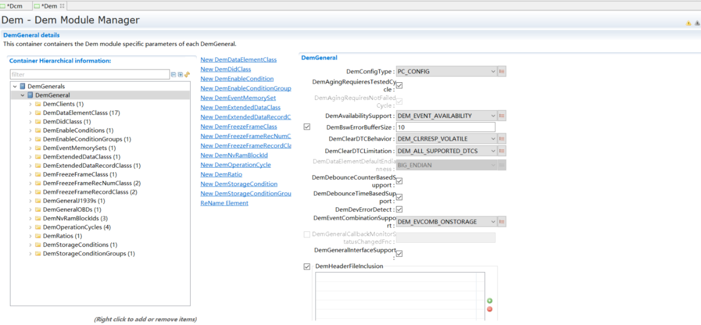

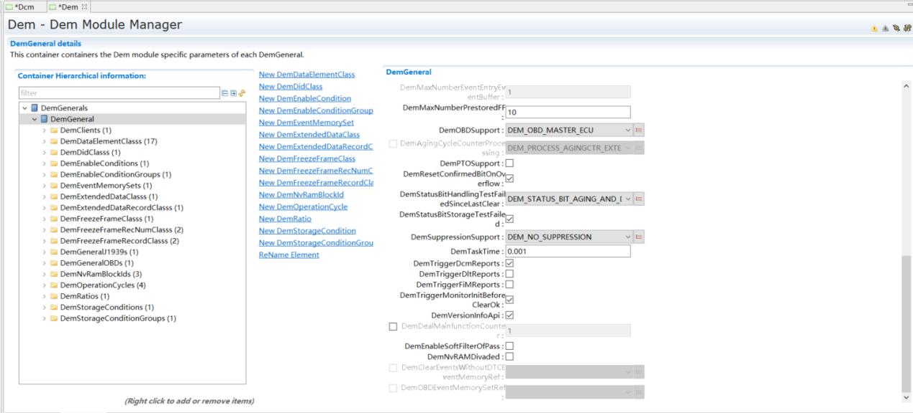

.. centered:: **表 DemGeneral属性描述 (Table DemGeneral Property Description)**

.. list-table::
   :widths: 20 20 20 20 20
   :header-rows: 1

   * - UI名称 (UI Name)
     - 描述 (Description)
     - 
     - 
     - 
   * - DemConfigType
     - 取值范围 (Range)
     - PB/PC
     - 默认取值 (Default value)
     - PC
   * - 
     - 参数描述 (Parameter Description)
     - 控制Dem模块配置权限 (Control Dem module configuration permissions)
     - 
     - 
   * - 
     - 依赖关系 (Dependencies)
     - 无
     - 
     - 
   * - DemAgingRequieresTestedCycle
     - 取值范围 (Range)
     - True/False
     - 默认取值 (Default value)
     - True
   * - 
     - 参数描述 (Parameter Description)
     - 定义是每个操作循环都处理老化周期计数器，还是只考虑已测试的老化循环 (Is it defined as every operation loop processing the aging cycle counter, or only considering tested aging loops?)
     - 
     - 
   * - 
     - 依赖关系 (Dependencies)
     - 无
     - 
     - 
   * - DemAgingRequiresNotFailedCycle
     - 取值范围 (Range)
     - True/False
     - 默认取值 (Default value)
     - True
   * - 
     - 参数描述 (Parameter Description)
     - 定义老化周期计数器是否在运行周期中处理，是否有测试失败报告 (Does the aging cycle counter handle failures during runtime and generate test failure reports?)
     - 
     - 
   * - 
     - 依赖关系 (Dependencies)
     - 无
     - 
     - 
   * - DemAvailabilitySupport
     - 取值范围 (Range)
     - DEM_EVENT_AVAILABILITY;
     - 默认取值 (Default value)
     - DEM_EVENT\_AVAILABILITY
   * - 
     - 
     - DEM_NO_AVAILABILITY
     - 
     - 
   * - 
     - 参数描述 (Parameter Description)
     - 此配置开关定义是否启用对可用性的支持 (This configuration switch defines whether support for availability is enabled.)
     - 
     - 
   * - 
     - 依赖关系 (Dependencies)
     - 无
     - 
     - 
   * - DemBswErrorBufferSize
     - 取值范围 (Range)
     - 0…255
     - 默认取值 (Default value)
     - 0
   * - 
     - 参数描述 (Parameter Description)
     - BSW错误最大buffer数量 (Maximum buffer number for BSW errors)
     - 
     - 
   * - 
     - 依赖关系 (Dependencies)
     - 无
     - 
     - 
   * - DemClearDTCBehavior
     - 取值范围 (Range)
     - DEM_CLRRESP_NONVOLATILE_FINISH；
     - 默认取值 (Default value)
     - DEM_CLRRESP_VOLATILE
   * - 
     - 
     - DEM_CLRRESP_NONVOLATILE_TRIGGER；
     - 
     - 
   * - 
     - 
     - DEM_CLRRESP_VOLATILE
     - 
     - 
   * - 
     - 参数描述 (Parameter Description)
     - 清除存储方式 (Clear Storage Method)
     - 
     - 
   * - 
     - 依赖关系 (Dependencies)
     - 无
     - 
     - 
   * - DemClearDTCLimitation
     - 取值范围 (Range)
     - DEM_ALL_SUPPORTED_DTCS；
     - 默认取值 (Default value)
     - DEM_ALL_SUPPORTED_DTCS
   * - 
     - 
     - DEM_ONLY_CLEAR_ALL_DTCS
     - 
     - 
   * - 
     - 参数描述 (Parameter Description)
     - 清除DTC方式 (Clear DTC method)
     - 
     - 
   * - 
     - 依赖关系 (Dependencies)
     - 无
     - 
     - 
   * - DemDataElementDefaultEndianness
     - 取值范围 (Range)
     - BIG_ENDIAN;LITTLE_ENDIAN
     - 默认取值 (Default value)
     - BIG_ENDIAN
   * - 
     - 参数描述 (Parameter Description)
     - 定义数据的大小端类型 (Define the byte order of data)
     - 
     - 
   * - 
     - 依赖关系 (Dependencies)
     - 无
     - 
     - 
   * - DemDebounceCounterBasedSupport
     - 取值范围 (Range)
     - True/False
     - 默认取值 (Default value)
     - False
   * - 
     - 参数描述 (Parameter Description)
     - 基于计数去抖 (Based on counting de-bouncing)
     - 
     - 
   * - 
     - 依赖关系 (Dependencies)
     - 如果DemDebounceCounterBasedSupport没有配置为使能，则DemDebounceCounterBasedClass不能添加，使能则需要添加 (If DemDebounceCounterBasedSupport is not configured as enabled, DemDebounceCounterBasedClass cannot be added; if it is enabled, then it needs to be added.)
     - 
     - 
   * - DemDebounceTimeBasedSupport
     - 取值范围 (Range)
     - True/False
     - 默认取值 (Default value)
     - False
   * - 
     - 参数描述 (Parameter Description)
     - 基于时间去抖 (Debouncing based on time)
     - 
     - 
   * - 
     - 依赖关系 (Dependencies)
     - 如果DemDebounceTimeBasedSupport没有配置为使能，则DemDebounceTimeBaseClass不能添加，使能则需要添加 (If DemDebounceTimeBasedSupport is not configured as enabled, DemDebounceTimeBaseClass cannot be added; if enabled, it needs to be added.)
     - 
     - 
   * - DemDevErrorDetect
     - 取值范围 (Range)
     - True/False
     - 默认取值 (Default value)
     - True
   * - 
     - 参数描述 (Parameter Description)
     - DET开关 (DET switch)
     - 
     - 
   * - 
     - 依赖关系 (Dependencies)
     - 无
     - 
     - 
   * - DemEventCombinationSupport
     - 取值范围 (Range)
     - DISABLED;ONRETRIEVAL;
     - 默认取值 (Default value)
     - DISABLED
   * - 
     - 
     - ONSTORAGE
     - 
     - 
   * - 
     - 参数描述 (Parameter Description)
     - 组合事件的方式 (The way of combining events)
     - 
     - 
   * - 
     - 依赖关系 (Dependencies)
     - DemEventCombinationSupport为DEM_EVCOMB_DISABLED的时候，不能存在多个DemEventParameter关联同一个DemDTC (When DemEventCombinationSupport is DEM_EVCOMB_DISABLED, multiple DemEventParameter cannot be associated with the same DemDTC.)
     - 
     - 
   * - DemGeneralCallbackMonitorStatusChangedFnc
     - 取值范围 (Range)
     - 无
     - 默认取值 (Default value)
     - 无
   * - 
     - 参数描述 (Parameter Description)
     - 关联DemTriggerOnMonitorStatus (Associate DemTriggerWithMonitorStatus)
     - 
     - 
   * - 
     - 依赖关系 (Dependencies)
     - 无
     - 
     - 
   * - DemGeneralInterfaceSupport
     - 取值范围 (Range)
     - True/False
     - 默认取值 (Default value)
     - False
   * - 
     - 参数描述 (Parameter Description)
     - 支持通用接口 (Support General Interface)
     - 
     - 
   * - 
     - 依赖关系 (Dependencies)
     - 无
     - 
     - 
   * - DemHeaderFileInclusion
     - 取值范围 (Range)
     - 无
     - 默认取值 (Default value)
     - 无
   * - 
     - 参数描述 (Parameter Description)
     - 外部头文件包含 (External header files include)
     - 
     - 
   * - 
     - 依赖关系 (Dependencies)
     - 无
     - 
     - 
   * - DemOperationCycleStatusStorage
     - 取值范围 (Range)
     - True/False
     - 默认取值 (Default value)
     - False
   * - 
     - 参数描述 (Parameter Description)
     - 操作循环状态存储 (Store Loop Status Operations)
     - 
     - 
   * - 
     - 依赖关系 (Dependencies)
     - DemOBDSupport为DEM\_OBD_MASTER\_ECU或DEM_OBD_PRIMARY_ECU时，DemOperationCycleStatusStorage可以配置，否则变灰，不可配置 (When DemOBDSupport is DEM_OBD_MASTER_ECU or DEM_OBDPRIMARY_ECU, DemOperationCycleStatusStorage can be configured; otherwise, it becomes gray and不可配置 remains untranslatable as it literally means "cannot be configured.")
     - 
     - 
   * - DemImmediateNvStorageLimit
     - 取值范围 (Range)
     - 1…255
     - 默认取值 (Default value)
     - 1
   * - 
     - 参数描述 (Parameter Description)
     - 立即NvM存储 (Immediate NvM Storage)
     - 
     - 
   * - 
     - 依赖关系 (Dependencies)
     - 无
     - 
     - 
   * - DemMaxNumberEventEntryEventBuffer
     - 取值范围 (Range)
     - 1…250
     - 默认取值 (Default value)
     - 1
   * - 
     - 参数描述 (Parameter Description)
     - 最大PrimaryEntry的buffer (Maximum PrimaryEntry buffer)
     - 
     - 
   * - 
     - 依赖关系 (Dependencies)
     - 无
     - 
     - 
   * - DemMaxNumberPrestoredFF
     - 取值范围 (Range)
     - 0…255
     - 默认取值 (Default value)
     - 0
   * - 
     - 参数描述 (Parameter Description)
     - 最大PreFF数量 (Maximum PreFF Quantity)
     - 
     - 
   * - 
     - 依赖关系 (Dependencies)
     - 无
     - 
     - 
   * - DemOBDSupport
     - 取值范围 (Range)
     - DEP_SEC_ECU;
     - 默认取值 (Default value)
     - NO_OBD_SUPPORT
   * - 
     - 
     - MASTER_ECU;
     - 
     - 
   * - 
     - 
     - NO_OBD_SUPPORT;
     - 
     - 
   * - 
     - 
     - PRIMARY_ECU
     - 
     - 
   * - 
     - 参数描述 (Parameter Description)
     - 支持OBD (Support OBD)
     - 
     - 
   * - 
     - 依赖关系 (Dependencies)
     - 无
     - 
     - 
   * - DemAgingCycleCounterProcessing
     - 取值范围 (Range)
     - DEM_PROCESS_AGINGCTR_EXTERN;
     - 默认取值 (Default value)
     - DEM_PROCESS_AGINGCTR_INTERN
   * - 
     - 
     - DEM_PROCESS_AGINGCTR_INTERN
     - 
     - 
   * - 
     - 参数描述 (Parameter Description)
     - 支持OBD (Support OBD)
     - 
     - 
   * - 
     - 依赖关系 (Dependencies)
     - 无
     - 
     - 
   * - DemResetConfirmedBitOnOverflow
     - 取值范围 (Range)
     - True/False
     - 默认取值 (Default value)
     - True
   * - 
     - 参数描述 (Parameter Description)
     - 允许Bit3老化和替换 (Allow Bit3 to age and be replaced.)
     - 
     - 
   * - 
     - 依赖关系 (Dependencies)
     - 无
     - 
     - 
   * - DemStatusBitHandlingTestFailedSinceLastClear
     - 取值范围 (Range)
     - AGING_AND_DISPLACEMENT;NORMAL
     - 默认取值 (Default value)
     - NORMAL
   * - 
     - 参数描述 (Parameter Description)
     - 允许Bit5老化和替换 (Allow Bit5 to age and be replaced.)
     - 
     - 
   * - 
     - 依赖关系 (Dependencies)
     - 无
     - 
     - 
   * - DemStatusBitStorageTestFailed
     - 取值范围 (Range)
     - True/False
     - 默认取值 (Default value)
     - False
   * - 
     - 参数描述 (Parameter Description)
     - 非易失存储Bit0 (Non-Volatile Storage Bit0)
     - 
     - 
   * - 
     - 依赖关系 (Dependencies)
     - 无
     - 
     - 
   * - DemSuppressionSupport
     - 取值范围 (Range)
     - DTC_SUPPRESSION;
     - 默认取值 (Default value)
     - DTC_SUPPRESSION
   * - 
     - 
     - NO\_SUPPRESSION
     - 
     - 
   * - 
     - 参数描述 (Parameter Description)
     - DTC抑制 (DTC Inhibition)
     - 
     - 
   * - 
     - 依赖关系 (Dependencies)
     - 无
     - 
     - 
   * - DemTaskTime
     - 取值范围 (Range)
     - 0.001-0.1
     - 默认取值 (Default value)
     - 0.001
   * - 
     - 参数描述 (Parameter Description)
     - TaskTime
     - 
     - 
   * - 
     - 依赖关系 (Dependencies)
     - 无
     - 
     - 
   * - DemTriggerDcmReports
     - 取值范围 (Range)
     - True/False
     - 默认取值 (Default value)
     - False
   * - 
     - 参数描述 (Parameter Description)
     - ROE支持 (ROE supports)
     - 
     - 
   * - 
     - 依赖关系 (Dependencies)
     - 无
     - 
     - 
   * - DemTriggerDltReports
     - 取值范围 (Range)
     - True/False
     - 默认取值 (Default value)
     - False
   * - 
     - 参数描述 (Parameter Description)
     - 支持Dlt (Support Dlt)
     - 
     - 
   * - 
     - 依赖关系 (Dependencies)
     - 无
     - 
     - 
   * - DemTriggerFiMReports
     - 取值范围 (Range)
     - True/False
     - 默认取值 (Default value)
     - False
   * - 
     - 参数描述 (Parameter Description)
     - 支持FiM (Support FiM)
     - 
     - 
   * - 
     - 依赖关系 (Dependencies)
     - 无
     - 
     - 
   * - DemTriggerMonitorInitBeforeClearOk
     - 取值范围 (Range)
     - True/False
     - 默认取值 (Default value)
     - False
   * - 
     - 参数描述 (Parameter Description)
     - 触发FiM初始化 (Trigger FiM Initialization)
     - 
     - 
   * - 
     - 依赖关系 (Dependencies)
     - 无
     - 
     - 
   * - DemVersionInfoApi
     - 取值范围 (Range)
     - True/False
     - 默认取值 (Default value)
     - False
   * - 
     - 参数描述 (Parameter Description)
     - 软件版本号 (Software version number)
     - 
     - 
   * - 
     - 依赖关系 (Dependencies)
     - 无
     - 
     - 
   * - DemDealMainfunctionCounter
     - 取值范围 (Range)
     - 无
     - 默认取值 (Default value)
     - 无
   * - 
     - 参数描述 (Parameter Description)
     - DemDeal主功能计数器。 (Main Function Counter for DemDeal.)
     - 
     - 
   * - 
     - 依赖关系 (Dependencies)
     - 无
     - 
     - 
   * - DemEnableSoftFilterOfPass
     - 取值范围 (Range)
     - True/False
     - 默认取值 (Default value)
     - False
   * - 
     - 参数描述 (Parameter Description)
     - 如果选择此选项，软件将过滤通过的文件 (If this option is selected, the software will filter passed files.)
     - 
     - 
   * - 
     - 依赖关系 (Dependencies)
     - 无
     - 
     - 
   * - DemNvRAMDivaded
     - 取值范围 (Range)
     - True/False
     - 默认取值 (Default value)
     - False
   * - 
     - 参数描述 (Parameter Description)
     - 是否分离DTC存储 (Is DTC storage separated?)
     - 
     - 
   * - 
     - 依赖关系 (Dependencies)
     - 无
     - 
     - 
   * - DemClearEventsWithoutDTCEventMemoryRef
     - 取值范围 (Range)
     - 无
     - 默认取值 (Default value)
     - 无
   * - 
     - 参数描述 (Parameter Description)
     - 指示用作触发器的事件内存，用于清除没有分配dtc的事件 (Indicate memory used as a trigger for events, for clearing events that are not assigned dtc)
     - 
     - 
   * - 
     - 依赖关系 (Dependencies)
     - 无
     - 
     - 
   * - DemOBDEventMemorySetRef
     - 取值范围 (Range)
     - 无
     - 默认取值 (Default value)
     - 无
   * - 
     - 参数描述 (Parameter Description)
     - 引用用于OBDECU的DemEventMemorySet。 (Refer to DemEventMemorySet for OBDECU.)
     - 
     - 
   * - 
     - 依赖关系 (Dependencies)
     - 无
     - 
     - 

DemClient
=========================

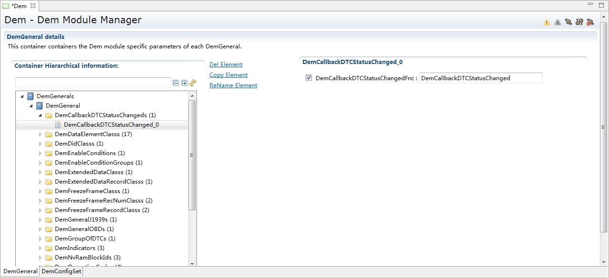

.. centered:: **表 DemClient属性描述 (Table Descriptions of DemClient Properties)**

.. list-table::
   :widths: 20 20 20 20 20
   :header-rows: 1

   * - UI名称 (UI Name)
     - 描述 (Description)
     - 
     - 
     - 
   * - DemClientFunctionality
     - 取值范围 (Range)
     - USES_EVENTOVERFLOW_I
     - 默认取值 (Default value)
     - USES_FULL_FUNCTIONALITY
   * - 
     - 
     - NTERFACE；
     - 
     - 
   * - 
     - 
     - USES_FULL_FUNCTIONALITY
     - 
     - 
   * - 
     - 参数描述 (Parameter Description)
     - Dem为DemClient提供的功能 (Functions provided for DemClient)
     - 
     - 
   * - 
     - 依赖关系 (Dependencies)
     - 无
     - 
     - 
   * - DemClientId
     - 取值范围 (Range)
     - 0…255
     - 默认取值 (Default value)
     - 无
   * - 
     - 参数描述 (Parameter Description)
     - 为Dem客户端定义唯一标识符 (Define unique identifier for Dem client)
     - 
     - 
   * - 
     - 依赖关系 (Dependencies)
     - 无
     - 
     - 
   * - DemClientUsesRte
     - 取值范围 (Range)
     - True/false
     - 默认取值 (Default value)
     - False
   * - 
     - 参数描述 (Parameter Description)
     - 如果设置为true，该客户端只能通过RTE使用DEM (If set to true, this client can only use DEM through RTE.)
     - 
     - 
   * - 
     - 依赖关系 (Dependencies)
     - 无
     - 
     - 
   * - DemCallbackDTCStatusChanged
     - 取值范围 (Range)
     - 无
     - 默认取值 (Default value)
     - 无
   * - 
     - 参数描述 (Parameter Description)
     - DTC状态改变触发向Rte报告 (DTC status change triggers reporting to Rte)
     - 
     - 
   * - 
     - 依赖关系 (Dependencies)
     - DemTriggerDcmReports使能情况下，DemCallbackDTCStatusChanged/DemCallbackDTCStatusChangedFnc不能被配置为Dcm_DemTriggerOnDTCStatus (When DemTriggerDcmReports is enabled, DemCallbackDTCStatusChanged/DemCallbackDTCStatusChangedFnc cannot be configured as Dcm_DemTriggerOnDTCStatus.)
     - 
     - 

DemDataElementClass 
====================================

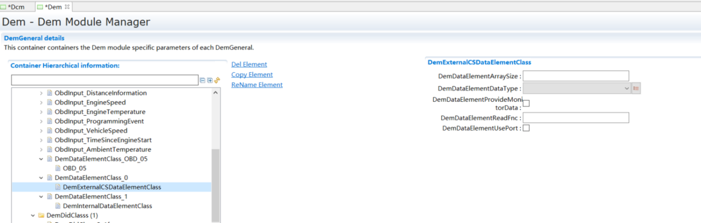

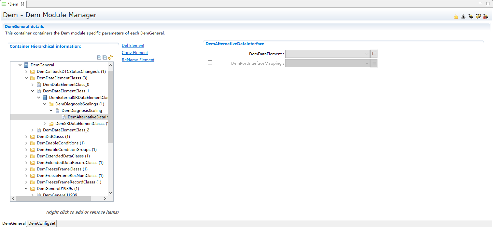

.. centered:: **表 DemDataElementClass属性描述 (Table DemDataElementClass Property Description)**

.. list-table::
   :widths: 15 15 14 14 14 14 14
   :header-rows: 1

   * - UI名称 (UI Name)
     - 描述 (Description)
     - 
     - 
     - 
     - 
     - 
   * - DemDataElementDataSize
     - 取值范围 (Range)
     - 1…255
     - 默认取值 (Default value)
     - 1
     - 
     -
   * - 
     - 参数描述 (Parameter Description)
     - 数据元素长度 (Length of data element)
     - 
     - 
     - 
     -
   * - 
     - 依赖关系 (Dependencies)
     - DemInternalDataElement
     - 
     - 
     - 
     - 
   * - DemInternalDataElement
     - 取值范围 (Range)
     - 
     - .. image:: ../../_static/参考手册(Module_Reference_Manual)/Dem/image11.png
         :width: 90%
         :align: center
     - 
     - 默认取值 (Default value)
     - DOWNCNT
   * - 
     - 参数描述 (Parameter Description)
     - 内部数据元素 (Internal data elements)
     - 
     - 
     - 
     -
   * - 
     - 依赖关系 (Dependencies)
     - 无
     - 
     - 
     - 
     - 
   * - DemDataElementArraySize
     - 取值范围 (Range)
     - 0…255
     - 默认取值 (Default value)
     - 无
     - 
     -
   * - 
     - 参数描述 (Parameter Description)
     - 如果数据元素是数组数据元素，它定义数组中元素的数量 (If the data element is an array data element, it defines the number of elements in the array.)
     - 
     - 
     - 
     -
   * - 
     - 依赖关系 (Dependencies)
     - 无
     - 
     - 
     - 
     - 
   * - DemDataElementDataType
     - 取值范围 (Range)
     - 
     - .. image:: ../../_static/参考手册(Module_Reference_Manual)/Dem/image12.png
         :width: 90%
         :align: center
     - 
     - 默认取值 (Default value)
     - 无
   * - 
     - 参数描述 (Parameter Description)
     - 提供该C/S data元素的实现数据类型 (Provide the implementation data type for this C/S data element.)
     - 
     - 
     - 
     -
   * - 
     - 依赖关系 (Dependencies)
     - 无
     - 
     - 
     - 
     - 
   * - DemDataElementProvideMonitorData
     - 取值范围 (Range)
     - True/false
     - 默认取值 (Default value)
     - FALSE
     - 
     -
   * - 
     - 参数描述 (Parameter Description)
     - 如果参数设置为True，则检索数据元素的生成函数调用将把monitordata0作为附加的第一个参数 (If the parameter is set to True, the generator function for retrieving data elements will accept monitordata0 as an additional first parameter.)
     - 
     - 
     - 
     -
   * - 
     - 依赖关系 (Dependencies)
     - 无
     - 
     - 
     - 
     - 
   * - DemDataElementReadFnc
     - 取值范围 (Range)
     - Ref
     - 默认取值 (Default value)
     - NULL_PTR
     - 
     -
   * - 
     - 参数描述 (Parameter Description)
     - 获取外部数据元素接口 (Interface for Getting External Data Elements)
     - 
     - 
     - 
     -
   * - 
     - 依赖关系 (Dependencies)
     - 无
     - 
     - 
     - 
     - 
   * - DemDataElementUsePort
     - 取值范围 (Range)
     - True/False
     - 默认取值 (Default value)
     - FALSE
     - 
     -
   * - 
     - 
     - 若设置为TRUE，则使用port DataServices_Data (If set to TRUE, use port DataServices_Data)
     - 
     - 
     - 
     -
   * - 
     - 
     - 若设置为FALSE，则使用ReadFnc (If set to FALSE, use ReadFnc)
     - 
     - 
     - 
     -
   * - 
     - 依赖关系 (Dependencies)
     - 无
     - 
     - 
     - 
     - 

DemDidClass
===========================

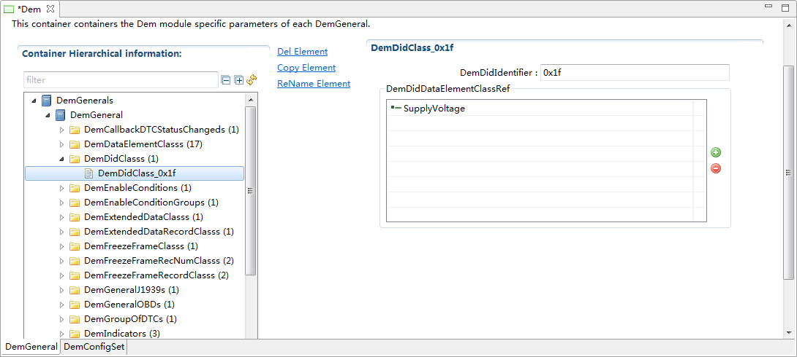

.. centered:: **表 DemDidCLass属性描述 (Table DemDidCLass Property Description)**

.. list-table::
   :widths: 20 20 20 20 20
   :header-rows: 1

   * - UI名称 (UI Name)
     - 描述 (Description)
     - 
     - 
     - 
   * - DemDidIdentifier
     - 取值范围 (Range)
     - 0…65535
     - 默认取值 (Default value)
     - 0
   * - 
     - 参数描述 (Parameter Description)
     - Did标识 (Did标记)
     - 
     - 
   * - 
     - 依赖关系 (Dependencies)
     - 无
     - 
     - 
   * - DemDidDataElementClassRef
     - 取值范围 (Range)
     - Ref
     - 默认取值 (Default value)
     - 无
   * - 
     - 参数描述 (Parameter Description)
     - DataElement索引 (DataElement Index)
     - 
     - 
   * - 
     - 依赖关系 (Dependencies)
     - 无
     - 
     - 

DemEableCondition
=================================

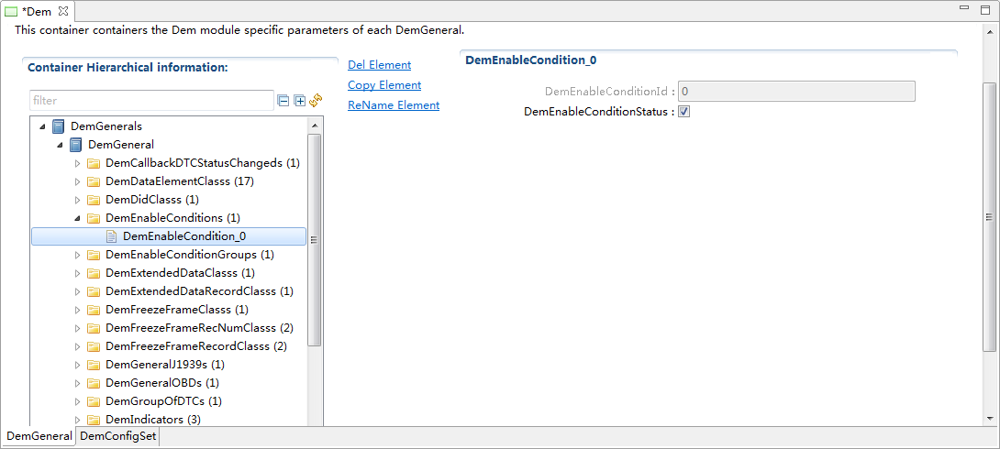

.. centered:: **表 DemEnableCondition 属性描述 (Table DemEnableCondition Property Description)**

.. list-table::
   :widths: 20 20 20 20 20
   :header-rows: 1

   * - UI名称 (UI Name)
     - 描述 (Description)
     - 
     - 
     - 
   * - DemEnableConditionId
     - 取值范围 (Range)
     - 0...255
     - 默认取值 (Default value)
     - 0
   * - 
     - 参数描述 (Parameter Description)
     - 使能条件Id (Enable Condition Id)
     - 
     - 
   * - 
     - 依赖关系 (Dependencies)
     - 无
     - 
     - 
   * - DemEnableConditionStatus
     - 取值范围 (Range)
     - True/False
     - 默认取值 (Default value)
     - False
   * - 
     - 参数描述 (Parameter Description)
     - 使能条件状态 (Enable condition status)
     - 
     - 
   * - 
     - 依赖关系 (Dependencies)
     - 无
     - 
     - 

DemEableConditionGroup
======================================

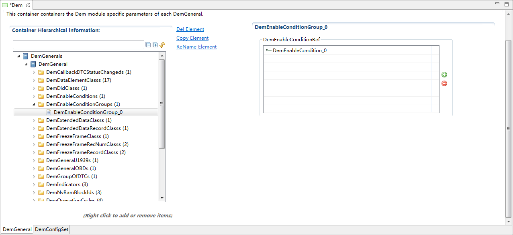

.. centered:: **表 DemEnableConditionRef属性描述 (Property Description: DemEnableConditionRef)**

.. list-table::
   :widths: 20 20 20 20 20
   :header-rows: 1

   * - UI名称 (UI Name)
     - 描述 (Description)
     - 
     - 
     - 
   * - DemEnableConditionRef
     - 取值范围 (Range)
     - Ref
     - 默认取值 (Default value)
     - 无
   * - 
     - 参数描述 (Parameter Description)
     - 使能条件索引 (Enable condition index)
     - 
     - 
   * - 
     - 依赖关系 (Dependencies)
     - 无
     - 
     - 

DemEventMemorySet
=================================

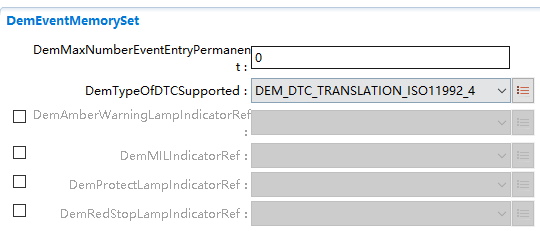

.. centered:: **表 DemEventMemorySet属性描述 (Table DemEventMemorySet Property Description)**

.. list-table::
   :widths: 20 20 20 20 20
   :header-rows: 1

   * - UI名称 (UI Name)
     - 描述 (Description)
     - 
     - 
     - 
   * - DemMaxNumberEventEntryPermanent
     - 取值范围 (Range)
     - 0 ... 255
     - 
     -
   * - 
     - 参数描述 (Parameter Description)
     - 可存储在永久存储器中的事件的最大数量 (The maximum number of events that can be stored in permanent memory)
     - 
     -
   * - 
     - 依赖关系 (Dependencies)
     - 无
     - 
     - 
   * - DemTypeOfDTCSupported
     - 
     - ISO11992_4;
     - 
     - ISO11992_4
   * - 
     - 
     - ISO14229_1;
     - 
     -
   * - 
     - 取值范围 (Range)
     - ISO15031_6;
     - 默认取值 (Default value)
     -
   * - 
     - 
     - SAEJ1939_73;
     - 
     -
   * - 
     - 
     - SAE_J2012_DA_DTCFORMAT_04
     - 
     -
   * - 
     - 参数描述 (Parameter Description)
     - Dem_GetTranslationType返回的格式支持 (The format supported by Dem_GetTranslationType returns is)
     - 
     -
   * - 
     - 依赖关系 (Dependencies)
     - 无
     - 
     - 
   * - DemAmberWarningLampIndicatorRef
     - 取值范围 (Range)
     - 无
     - 默认取值 (Default value)
     - 无
   * - 
     - 参数描述 (Parameter Description)
     - 代表AmberWarningLamp的指示器 (Indicator for AmberWarningLamp)
     - 
     -
   * - 
     - 依赖关系 (Dependencies)
     - 支持J1939的ECU (Support for J1939 ECU)
     - 
     - 
   * - DemMILIndicatorRef
     - 取值范围 (Range)
     - 无
     - 默认取值 (Default value)
     - 无
   * - 
     - 参数描述 (Parameter Description)
     - MIL指示灯 (MIL indicator light)
     - 
     -
   * - 
     - 依赖关系 (Dependencies)
     - DemOBDSupport为DEM_OBD_MASTER_ECU或DEM_OBD_PRIMARY_ECU时，DemMILIndicatorRef可以配置，否则变灰，不可配置 (When DemOBDSupport is DEM_OBD_MASTER_ECU or DEM_OBD_PRIMARY_ECU, DemMILIndicatorRef can be configured; otherwise, it will be grayed out and not configurable.)
     - 
     - 
   * - DemProtectLampIndicatorRef
     - 取值范围 (Range)
     - Ref
     - 默认取值 (Default value)
     - 无
   * - 
     - 参数描述 (Parameter Description)
     - 支持Protect指示灯 (Support Protect LED)
     - 
     -
   * - 
     - 依赖关系 (Dependencies)
     - 无
     - 
     - 
   * - DemRedStopLampIndicatorRef
     - 取值范围 (Range)
     - Ref
     - 默认取值 (Default value)
     - 无
   * - 
     - 参数描述 (Parameter Description)
     - 支持Red色指示灯 (Support Red color indicator light)
     - 
     -
   * - 
     - 依赖关系 (Dependencies)
     - 无
     - 
     - 

DemIndicatorID
------------------------------

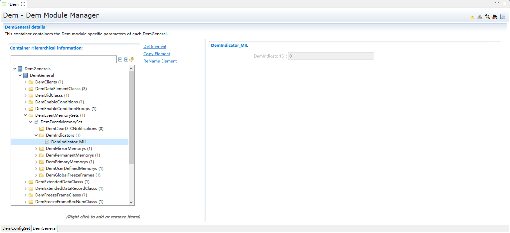

.. centered:: **表 DemIndicatorID属性描述 (Table DemIndicatorID Property Description)**

.. list-table::
   :widths: 20 20 20 20 20
   :header-rows: 1

   * - UI名称 (UI Name)
     - 描述 (Description)
     - 
     - 
     - 
   * - DemIndicatorID
     - 取值范围 (Range)
     - Ref
     - 默认取值 (Default value)
     - 无
   * - 
     - 参数描述 (Parameter Description)
     - 指示灯的唯一标识符 (Unique identifier for the indicator light)
     - 
     - 
   * - 
     - 依赖关系 (Dependencies)
     - 
     - 
     - 

DemMirrorMemory
-------------------------------

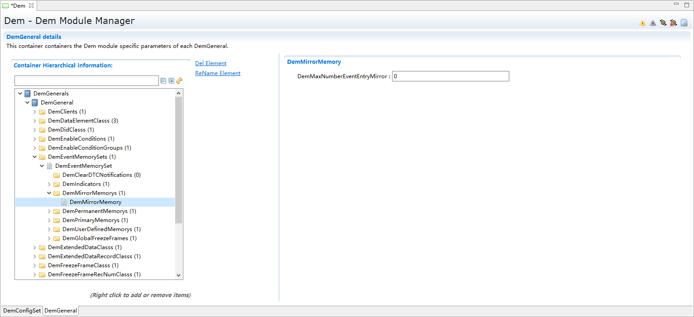

.. centered:: **表 DemMirrorMemory属性描述 (Table DemMirrorMemory Property Description)**

.. list-table::
   :widths: 20 20 20 20 20
   :header-rows: 1

   * - UI名称 (UI Name)
     - 描述 (Description)
     - 
     - 
     - 
   * - DemMaxNumberEventMirrorMemory
     - 取值范围 (Range)
     - 0…255
     - 默认取值 (Default value)
     - 0
   * - 
     - 参数描述 (Parameter Description)
     - 镜像内存存储数量 (Number of image memory storage)
     - 
     - 
   * - 
     - 依赖关系 (Dependencies)
     - 无
     - 
     - 

DemPermanentMemory
----------------------------------

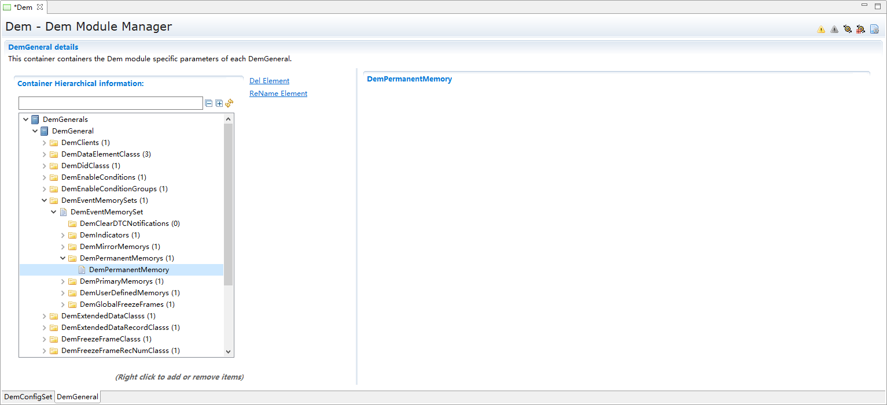

DemPrimaryMemory
--------------------------------

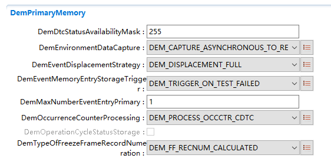

.. centered:: **表 DemPrimaryMemory属性描述 (Table DemPrimaryMemory property description)**

.. list-table::
   :widths: 20 20 20 20 20
   :header-rows: 1

   * - UI名称 (UI Name)
     - 描述 (Description)
     - 
     - 
     - 
   * - DemDtcStatusAvailabilityMask
     - 取值范围 (Range)
     - 0…255
     - 
     -
   * - 
     - 参数描述 (Parameter Description)
     - 该掩码用于UDS服务0x19的正向响应 (This mask is used for positive response of UDS service 0x19.)
     - 
     -
   * - 
     - 依赖关系 (Dependencies)
     - 无
     - 
     - 
   * - DemEnvironmentDataCapture
     - 
     - ASYNCHRONOUS
     - 
     - SYNCHRONOUS
   * - 
     - 取值范围(Value Range)
     - 
     - 默认取值(Default Value)
     - 
   * - 
     - 
     - SYNCHRONOUS
     - 
     -
   * - 
     - 参数描述 (Parameter Description)
     - 同步/异步获取环境数据 (Synchronize/asynchronous acquisition of environmental data)
     - 
     -
   * - 
     - 
     - DemEnvironmentDataCapture为DEM_CAPTURE_SYNCHRONOUS_TO_REPORTING (DemEnvironmentDataCaptureForDEMCaptureSynchronousToReporting)
     - 
     -
   * - 
     - 
     - 情况下，DemMaxNumberEventEntryEventBuffer才能配置，否则变灰，不可配置 (Under certain conditions, DemMaxNumberEventEntryEventBuffer can be configured; otherwise, it will be grayed out and unconfigurable.)
     - 
     - 
   * - DemEventDisplacementStrategy
     - 
     - FULL
     - 
     - NONE
   * - 
     - 取值范围 (Range)
     - NONE
     - 默认取值 (Default value)
     -
   * - 
     - 
     - PRIO_OCC
     - 
     -
   * - 
     - 参数描述 (Parameter Description)
     - 替换策略 (Replacement Strategy)
     - 
     -
   * - 
     - 依赖关系 (Dependencies)
     - 无
     - 
     - 
   * - DemEventMemoryEntryStorageTrigger
     - 
     - ON_ONFIRMED
     - 
     - ON_TEST_FAILED
   * - 
     - 
     - ON_FDC_THRESHOLD
     - 
     - 
   * - 
     - 取值范围 (Range)
     -
     - 默认取值 (Default value)
     - 
   * - 
     - 
     - ON_PENDING
     - 
     -
   * - 
     - 
     - ON_TEST_FAILED
     - 
     -
   * - 
     - 参数描述 (Parameter Description)
     - 触发时间存储的方式 (The way trigger time is stored)
     - 
     -
   * - 
     - 依赖关系 (Dependencies)
     - 无
     - 
     - 
   * - DemMaxNumberEventEntryPrimary
     - 取值范围 (Range)
     - 1…255
     - 默认取值 (Default value)
     - 1
   * - 
     - 参数描述 (Parameter Description)
     - 可存储在主内存中的最大事件数 (The maximum number of events that can be stored in main memory)
     - 
     -
   * - 
     - 依赖关系 (Dependencies)
     - 无
     - 
     - 
   * - DemOccurrenceCounterProcessing
     - 
     - OCCCTR_CDTC
     - 
     - OCCCTR_TF
   * - 
     - 取值范围 (Range)
     -
     - 默认取值 (Default value)
     - 
   * - 
     - 
     - OCCCTR_TF
     - 
     -
   * - 
     - 参数描述 (Parameter Description)
     - occurrence counter计算方式 (occurrence counter calculation method)
     - 
     -
   * - 
     - 依赖关系 (Dependencies)
     - 在DemGeneralJ1939、DemGeneralOBD配置的情况下，DemOccurrenceCounterProcessing不能为DEM_PROCESS_OCCCTR_CDTC (In the case of DemGeneralJ1939 and DemGeneralOBD configurations, DemOccurrenceCounterProcessing cannot be set to DEM_PROCESS_OCCCTR_CDTC.)
     - 
     - 
   * - DemOperationCycleStatusStorage
     - 取值范围 (Range)
     - True/False
     - 默认取值 (Default value)
     - 0
   * - 
     - 参数描述 (Parameter Description)
     - 操作循环状态存储 (Store Loop Status Operations)
     - 
     -
   * - 
     - 依赖关系 (Dependencies)
     - DemOBDSupport为DEM_OBD_MASTER_ECU或DEM_OBD_PRIMARY_ECU时，DemOperationCycleStatusStorage可以配置，否则变灰，不可配置 (When DemOBDSupport is "DEM_OBD_MASTER_ECU" or "DEM_OBD_PRIMARY_ECU", DemOperationCycleStatusStorage can be configured; otherwise, it turns gray and becomes unconfigurable.)
     - 
     - 
   * - DemTypeOfFreezeFrameRecordNumeration
     - 
     - CALCULATED
     - 
     - CONFIGURED
   * - 
     - 取值范围 (Range)
     -
     - 默认取值 (Default value)
     - 
   * - 
     - 
     - CONFIGURED
     - 
     -
   * - 
     - 参数描述 (Parameter Description)
     - 快照号计算方式 (Snapshot ID Calculation Method)
     - 
     -
   * - 
     - 依赖关系 (Dependencies)
     - 无
     - 
     - 
   * - DemGroupDTCs
     - 取值范围 (Range)
     - 256..16776959
     - 默认取值 (Default value)
     - 无
   * - 
     - 参数描述 (Parameter Description)
     - 所选DTC组的DTC值 (The DTC value of the selected DTC group)
     - 
     -
   * - 
     - 依赖关系 (Dependencies)
     - 无
     - 
     - 

DemUserDefinedMemory
------------------------------------

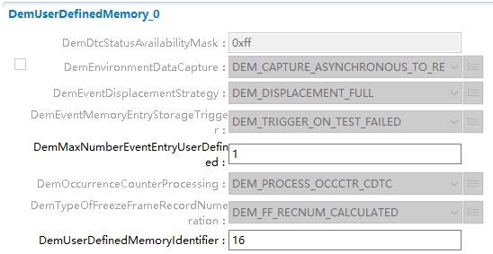

.. centered:: **表 DemUserDefinedMemory属性描述 (Table Describes the DemUserDefinedMemory Property)**

.. list-table::
   :widths: 20 20 20 20 20
   :header-rows: 1

   * - UI名称 (UI Name)
     - 描述 (Description)
     -
     -
     -
   * - DemDtcStatusAvailabilityMask
     - 取值范围 (Range)
     - 0,255
     - 默认取值 (Default value)
     - 0xff
   * -
     - 参数描述 (Parameter Description)
     - DTC的mask (DTC's mask)
     -
     -
   * -
     - 依赖关系 (Dependencies)
     - 无
     -
     -
   * - DemEnvironmentDataCapture
     -
     - ASYNCHRONOUS
     -
     - SYNCHRONOUS
   * -
     - 取值范围 (Range)
     -
     - 默认取值 (Default value)
     -
   * -
     -
     - SYNCHRONOUS
     -
     -
   * -
     - 参数描述 (Parameter Description)
     - 同步/异步获取环境数据 (Synchronize/asynchronous acquisition of environmental data)
     -
     -
   * -
     -
     - DemEnvironmentDataCapture为DEM_CAPTURE_SYNCHRONOUS_TO_REPORTING (DemEnvironmentDataCaptureForDEMCaptureSynchronousToReporting)
     -
     -
   * -
     -
     - 情况下，DemMaxNumberEventEntryEventBuffer才能配置，否则变灰，不可配置 (Under certain conditions, DemMaxNumberEventEntryEventBuffer can be configured; otherwise, it will be grayed out and unconfigurable.)
     -
     -
   * - DemEventDisplacementStrategy
     -
     - FULL
     -
     - NONE
   * -
     - 取值范围 (Range)
     - NONE
     - 默认取值 (Default value)
     -
   * -
     -
     - PRIO_OCC
     -
     -
   * -
     - 参数描述 (Parameter Description)
     - 替换策略 (Replacement Strategy)
     -
     -
   * -
     - 依赖关系 (Dependencies)
     - 无
     -
     -
   * - DemEventMemoryEntryStorageTrigger
     -
     - ON_ONFIRMED
     -
     - ON_TEST_FAILED
   * -
     -
     - ON_FDC_THRESHOLD
     -
     -
   * -
     - 取值范围 (Value Range)
     -
     - 默认取值 (Default Value)
     -
   * -
     -
     - ON_PENDING
     -
     -
   * -
     -
     - ON_TEST_FAILED
     -
     -
   * -
     - 参数描述 (Parameter Description)
     - 出发时间存储的方式 (The way departure time is stored)
     -
     -
   * -
     - 依赖关系 (Dependencies)
     - 无
     -
     -
   * - DemMaxNumberEventEntryUserDefined
     - 取值范围 (Range)
     - 1…255
     - 默认取值 (Default value)
     - 1
   * -
     - 参数描述 (Parameter Description)
     - 可以存储在用户定义内存中的事件的最大数量 (The maximum number of events that can be stored in user-defined memory)
     -
     -
   * -
     - 依赖关系 (Dependencies)
     - 无
     -
     -
   * - DemOccurrenceCounterProcessing
     -
     - OCCCTR_CDTC
     -
     - OCCCTR_CDTC
   * -
     - 取值范围 (Range)
     -
     - 默认取值 (Default value)
     -
   * -
     -
     - OCCCTR_TF
     -
     -
   * -
     - 参数描述 (Parameter Description)
     - occurrence counter计算方式 (occurrence counter calculation method)
     -
     -
   * -
     - 依赖关系 (Dependencies)
     - 在DemGeneralJ1939、DemGeneralOBD配置的情况下，DemOccurrenceCounterProcessing不能为DEM_PROCESS_OCCCTR_CDTC (In the case of DemGeneralJ1939 and DemGeneralOBD configurations, DemOccurrenceCounterProcessing cannot be set to DEM_PROCESS_OCCCTR_CDTC.)
     -
     -
   * - DemTypeOfFreezeFrameRecordNumeration
     -
     - CALCULATED
     -
     - CONFIGURED
   * -
     - 取值范围 (Range)
     -
     - 默认取值 (Default value)
     -
   * -
     -
     - CONFIGURED
     -
     -
   * -
     - 参数描述 (Parameter Description)
     - 快照号计算方式 (Snapshot ID Calculation Method)
     -
     -
   * -
     - 依赖关系 (Dependencies)
     - 无
     -
     -
   * - DemUserDefinedMemoryIdentifier
     - 取值范围 (Range)
     - 16…255
     - 默认取值 (Default value)
     - 16
   * -
     - 参数描述 (Parameter Description)
     - 用户自定义内存存储标识符 (User-defined memory storage identifier)
     -
     -
   * -
     - 依赖关系 (Dependencies)
     - 无
     -
     -

DemGlobalFreezeFrame
------------------------------------

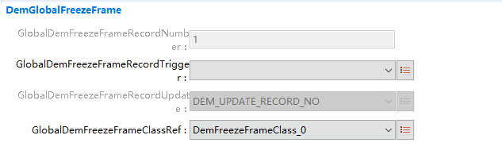

.. centered:: **表 DemGlobalFreezeFrame属性描述 (Table DemGlobalFreezeFrame Property Description)**

.. list-table::
   :widths: 20 20 20 20 20
   :header-rows: 1

   * - UI名称 (UI Name)
     - 描述 (Description)
     - 
     - 
     - 
   * - GlobalDemFreezeFrameRecordNumber
     - 取值范围 (Range)
     - 1,255
     - 
     -
   * - 
     - 参数描述 (Parameter Description)
     - 全局冻结帧数据号 (Global Freeze Frame Data ID)
     - 
     -
   * - 
     - 依赖关系 (Dependencies)
     - DemTypeOfFreezeFrameRecordNumeration为DEM_FF_RECNUM_CONFIGURED时，GlobalDemFreezeFrameRecordNumber可以配置，否则不可配置，由工具自动填充。 (When DemTypeOfFreezeFrameRecordNumeration is DEM_FF_RECNUM_CONFIGURED, GlobalDemFreezeFrameRecordNumber can be configured; otherwise, it cannot be configured and will be automatically filled by the tool.)
     - 
     - 
   * - GlobalDemFreezeFrameRecordTrigger
     - 
     - ON_CONFIRMED;
     - 
     - ON_CONFIRMED
   * - 
     - 
     - ON_FDC_THRESHOLD;
     - 
     - 
   * - 
     - 取值范围 (Range)
     - 
     - 默认取值 (Default Value:)
     - 
   * - 
     - 
     - ON_PENDING;
     - 
     -
   * - 
     - 
     - ON_TEST_FAILED
     - 
     -
   * - 
     - 参数描述 (Parameter Description)
     - 触发全局冻结帧存储的方式 (The way to trigger global freeze frame storage)
     - 
     -
   * - 
     - 依赖关系 (Dependencies)
     - 无
     - 
     - 
   * - GlobalDemFreezeFrameRecordUpdate
     - 取值范围 (Range)
     - RECORD_NO;
     - 默认取值 (Default value)
     - RECORD_NO
   * - 
     - 参数描述 (Parameter Description)
     - 默认全局冻结帧不更新 (Default global freeze does not update.)
     - 
     -
   * - 
     - 依赖关系 (Dependencies)
     - 无
     - 
     - 
   * - GlobalDemFreezeFrameClassRef
     - 取值范围 (Range)
     - Ref
     - 默认取值 (Default value)
     - 无
   * - 
     - 参数描述 (Parameter Description)
     - DemFreezeFrameClass索引 (DemFreezeFrameClass Index)
     - 
     -
   * - 
     - 依赖关系 (Dependencies)
     - 无
     - 
     - 

DemExtendedDataClass
====================================

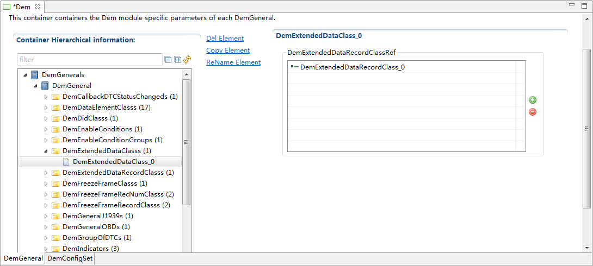

.. centered:: **表 DemExtendedDataClass属性描述 (Table DemExtendedDataClass Property Description)**

.. list-table::
   :widths: 20 20 20 20 20
   :header-rows: 1

   * - UI名称 (UI Name)
     - 描述 (Description)
     - 
     - 
     - 
   * - DemExtendedDataRecordClassRef
     - 取值范围 (Range)
     - Ref
     - 默认取值 (Default value)
     - 无
   * - 
     - 参数描述 (Parameter Description)
     - 扩展数据索引 (Expand data indexing)
     - 
     - 
   * - 
     - 依赖关系 (Dependencies)
     - 无
     - 
     - 

DemExtendedDataRecordClass
==========================================

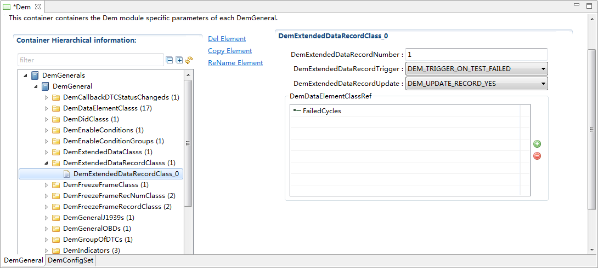

.. centered:: **表 DemExtendedDataRecordClass属性描述 (Table DemExtendedDataRecordClass Property Description)**

.. list-table::
   :widths: 20 20 20 20 20
   :header-rows: 1

   * - UI名称 (UI Name)
     - 描述 (Description)
     - 
     - 
     - 
   * - DemExtendedDataRecordNumber
     - 取值范围 (Range)
     - 1…239
     - 
     -
   * - 
     - 参数描述 (Parameter Description)
     - 扩展数据号 (Extend Data Number)
     - 
     -
   * - 
     - 依赖关系 (Dependencies)
     - 无
     - 
     - 
   * - DemExtendedDataRecordTrigger
     - 
     - ON_COMFIRMED;
     - 
     - ON_COMFIRMED
   * - 
     - 
     - ON_FDC_THRESHOLD;
     - 
     -
   * - 
     - 
     - ON_MIRROR;
     - 
     - 
   * - 
     - 取值范围 (Value Range)
     - 
     - 默认取值 (Default Value)
     - 
   * - 
     - 
     - ON_PASSED;
     - 
     -
   * - 
     - 
     - ON_PENDING;
     - 
     -
   * - 
     - 
     - ON_TEST_FAILED
     - 
     -
   * - 
     - 参数描述 (Parameter Description)
     - 触发扩展数据存储 (Trigger Extended Data Storage)
     - 
     -
   * - 
     - 依赖关系 (Dependencies)
     - 无
     - 
     - 
   * - DemExtendedDataRecordUpdate
     - 
     - RECORD_NO;
     - 
     - RECORD_NO
   * - 
     - 取值范围(Value Range)
     - 
     - 默认取值(Default Value)
     - 
   * - 
     - 
     - RECORD_YES
     - 
     -
   * - 
     - 参数描述 (Parameter Description)
     - 是否允许更新扩展数据 (Is updating the extended data allowed?)
     - 
     -
   * - 
     - 依赖关系 (Dependencies)
     - 无
     - 
     - 
   * - DemDataElementClassRef
     - 取值范围 (Range)
     - Ref
     - 默认取值 (Default value)
     - 无
   * - 
     - 参数描述 (Parameter Description)
     - 扩展数据索引 (Expand data indexing)
     - 
     -
   * - 
     - 依赖关系 (Dependencies)
     - 无
     - 
     - 

DemFreezeFrameClass
===================================

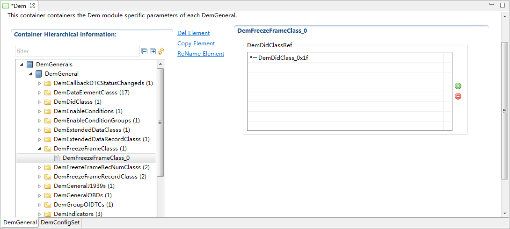

.. centered:: **表 DemFreezeFrameClass属性描述 (Table DemFreezeFrameClass Property Description)**

.. list-table::
   :widths: 20 20 20 20 20
   :header-rows: 1

   * - UI名称 (UI Name)
     - 描述 (Description)
     - 
     - 
     - 
   * - DemDidClassRef
     - 取值范围 (Range)
     - Ref
     - 默认取值 (Default value)
     - 无
   * - 
     - 参数描述 (Parameter Description)
     - Did索引 (Did Index)
     - 
     - 
   * - 
     - 依赖关系 (Dependencies)
     - 无
     - 
     - 

DemFreezeFrameRecNumClass
=========================================

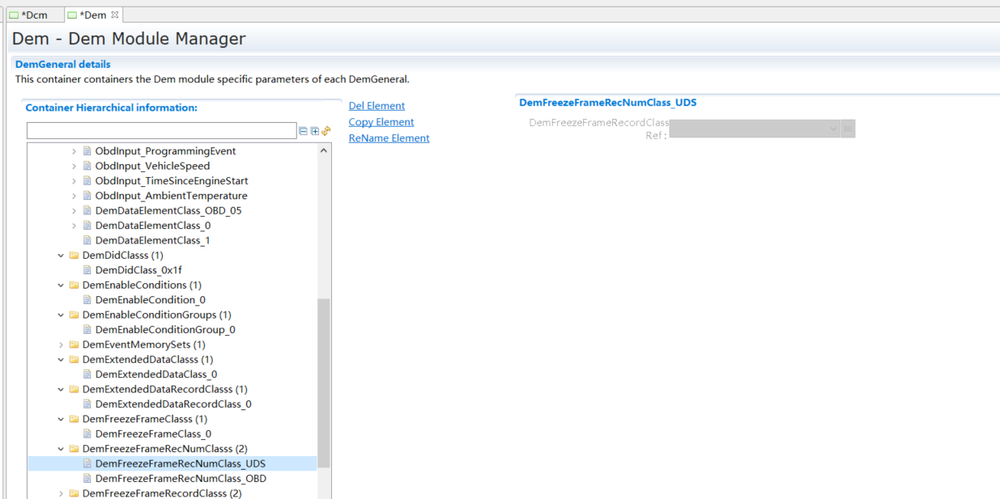

.. centered:: **表 DemFreezeFrameRecNumClass属性描述 (Property Description of表 DemFreezeFrameRecNumClass)**

.. list-table::
   :widths: 20 20 20 20 20
   :header-rows: 1

   * - UI名称 (UI Name)
     - 描述 (Description)
     - 
     - 
     - 
   * - DemFreezeFrameRecordClassRef
     - 取值范围 (Range)
     - Ref
     - 默认取值 (Default value)
     - 无
   * - 
     - 参数描述 (Parameter Description)
     - DemFreezeFrameRecord索引 (DemFreezeFrameRecord Index)
     - 
     - 
   * - 
     - 依赖关系 (Dependencies)
     - DemTypeOfFreezeFrameRecordNumeration为DEM_FF_RECNUM_CONFIGURED时，DemFreezeFrameRecordClassRef可以配置，否则变灰，不可配置 (When DemTypeOfFreezeFrameRecordNumeration is DEM_FF_RECNUM_CONFIGURED, DemFreezeFrameRecordClassRef can be configured; otherwise, it becomes gray and unconfigurable.)
     - 
     - 

DemFreezeFrameRecordClass
=========================================

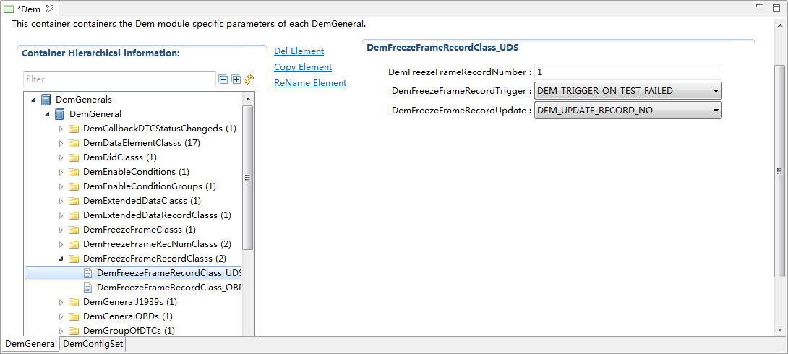

.. centered:: **表 DemFreezeFrameRecordClass属性描述 (Table DemFreezeFrameRecordClass property description)**

.. list-table::
   :widths: 20 20 20 20 20
   :header-rows: 1

   * - UI名称 (UI Name)
     - 描述 (Description)
     - 
     - 
     - 
   * - DemFreezeFrameRecordNumber
     - 取值范围 (Range)
     - 0…254
     - 默认取值 (Default value)
     - 0
   * - 
     - 参数描述 (Parameter Description)
     - 扩展数据号 (Extend Data Number)
     - 
     - 
   * - 
     - 依赖关系 (Dependencies)
     - 无
     - 
     - 
   * - DemFreezeFrameRecordTrigger
     - 取值范围 (Range)
     - ON_CONFIRMED;
     - 默认取值 (Default value)
     - ON_CONFIRMED
   * - 
     - 
     - ON_FDC_THRESHOLD;
     - 
     - 
   * - 
     - 
     - ON_PENDING;
     - 
     - 
   * - 
     - 
     - ON\_TEST_FAILED
     - 
     - 
   * - 
     - 参数描述 (Parameter Description)
     - 触发冻结帧存储的方式 (The way to trigger frame storage freezing)
     - 
     - 
   * - 
     - 依赖关系 (Dependencies)
     - DemTypeOfFreezeFrameRecordNumeration为DEM_FF_RECNUM_CONFIGURED时，DemFreezeFrameRecordTrigger可以配置，否则变灰，不可配置 (When DemTypeOfFreezeFrameRecordNumeration is DEM_FF_RECNUM_CONFIGURED, DemFreezeFrameRecordTrigger can be configured; otherwise, it turns gray and becomes unconfigurable.)
     - 
     - 
   * - DemFreezeFrameRecordUpdate
     - 取值范围 (Range)
     - RECORD_NO;RECORD_YES
     - 默认取值 (Default value)
     - RECORD_NO
   * - 
     - 参数描述 (Parameter Description)
     - 允许更新冻结帧 (Allow updating frozen frames)
     - 
     - 
   * - 
     - 依赖关系 (Dependencies)
     - 无
     - 
     - 

DemGeneralJ1939 
================================

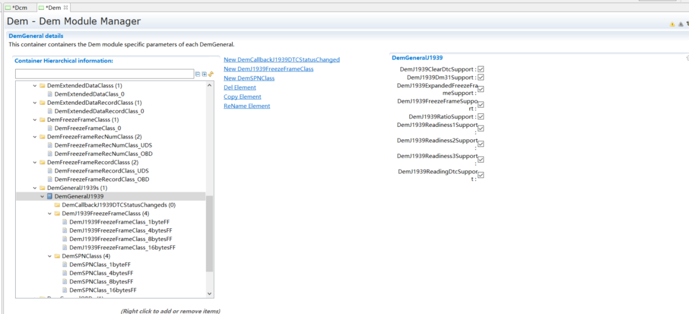

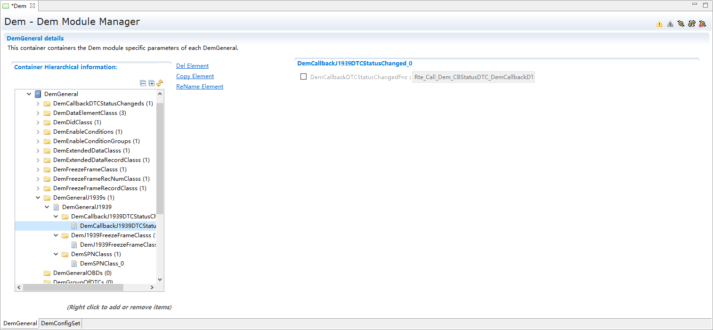

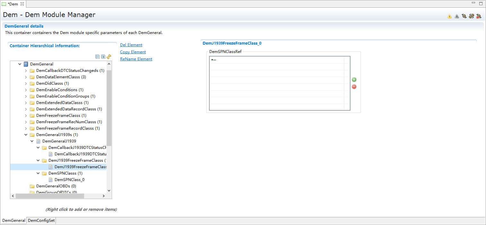

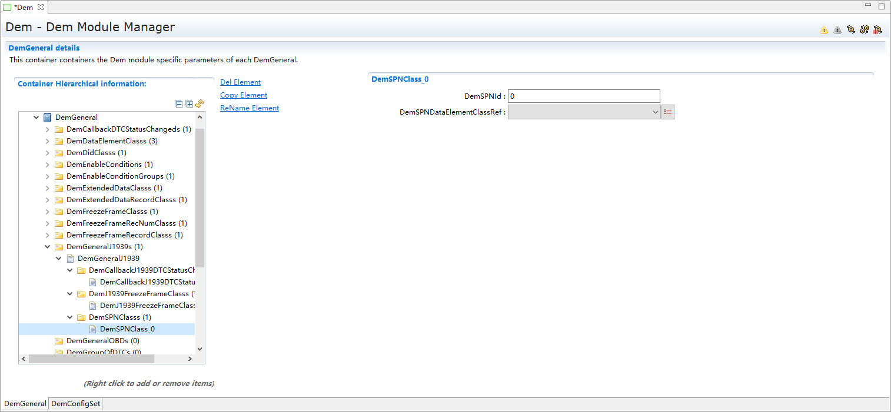

.. centered:: **表 DemGeneralJ1939属性描述 (Table DemGeneralJ1939 Property Description)**

.. list-table::
   :widths: 20 20 20 20 20
   :header-rows: 1

   * - UI名称 (UI Name)
     - 描述 (Description)
     - 
     - 
     - 
   * - DemJ1939ClearDtcSupport
     - 取值范围 (Range)
     - True/False
     - 默认取值 (Default value)
     - False
   * - 
     - 参数描述 (Parameter Description)
     - 支持清除J1939DTC (Support clearing J1939 DTC)
     - 
     - 
   * - 
     - 依赖关系 (Dependencies)
     - 无
     - 
     - 
   * - DemJ1939Dm31Support
     - 取值范围 (Range)
     - True/False
     - 默认取值 (Default value)
     - False
   * - 
     - 参数描述 (Parameter Description)
     - 支持Dm31服务 (Support Dm31 Service)
     - 
     - 
   * - 
     - 依赖关系 (Dependencies)
     - 无
     - 
     - 
   * - DemJ1939ExpandedFreezeFrameSupport
     - 取值范围 (Range)
     - True/False
     - 默认取值 (Default value)
     - False
   * - 
     - 参数描述 (Parameter Description)
     - 支持Dm25服务 (Support Dm25 Service)
     - 
     - 
   * - 
     - 依赖关系 (Dependencies)
     - 无
     - 
     - 
   * - DemJ1939FreezeFrameSupport
     - 取值范围 (Range)
     - True/False
     - 默认取值 (Default value)
     - False
   * - 
     - 参数描述 (Parameter Description)
     - 支持J1939冻结帧 (Support J1939 Freeze Frame)
     - 
     - 
   * - 
     - 依赖关系 (Dependencies)
     - 无
     - 
     - 
   * - DemJ1939RatioSupport
     - 取值范围 (Range)
     - True/False
     - 默认取值 (Default value)
     - False
   * - 
     - 参数描述 (Parameter Description)
     - 支持Ratio (Support Ratio)
     - 
     - 
   * - 
     - 依赖关系 (Dependencies)
     - 无
     - 
     - 
   * - DemJ1939Readiness1Support
     - 取值范围 (Range)
     - True/False
     - 默认取值 (Default value)
     - False
   * - 
     - 参数描述 (Parameter Description)
     - 支持Dm05服务 (Support Dm05 service)
     - 
     - 
   * - 
     - 依赖关系 (Dependencies)
     - 无
     - 
     - 
   * - DemJ1939Readiness2Support
     - 取值范围 (Range)
     - True/False
     - 默认取值 (Default value)
     - False
   * - 
     - 参数描述 (Parameter Description)
     - 支持Dm21服务 (Support Dm21 service)
     - 
     - 
   * - 
     - 依赖关系 (Dependencies)
     - 无
     - 
     - 
   * - DemJ1939Readiness3Support
     - 取值范围 (Range)
     - True/False
     - 默认取值 (Default value)
     - False
   * - 
     - 参数描述 (Parameter Description)
     - 支持Dm26服务 (Support Dm26 service)
     - 
     - 
   * - 
     - 依赖关系 (Dependencies)
     - 无
     - 
     - 
   * - DemJ1939ReadingDtcSupport
     - 取值范围 (Range)
     - True/False
     - 默认取值 (Default value)
     - False
   * - 
     - 参数描述 (Parameter Description)
     - 支持J1939Dtc读取 (Support J1939 DTC reading)
     - 
     - 
   * - 
     - 依赖关系 (Dependencies)
     - 无
     - 
     - 
   * - DemCallbackJ1939DTCStatusChangedFnc
     - 取值范围 (Range)
     - Ref
     - 默认取值 (Default value)
     - 无
   * - 
     - 参数描述 (Parameter Description)
     - J1939Dtc状态改变触发报告到Rte (J1939 Dtc Status Change Triggers Report to Rte)
     - 
     - 
   * - 
     - 依赖关系 (Dependencies)
     - DemTriggerDcmReports使能情况下，DemCallbackJ1939DTCStatusChanged/DemCallbackDTCStatusChangedFnc不能被配置为Dcm_DemTriggerOnDTCStatus (When DemTriggerDcmReports is enabled, DemCallbackJ1939DTCStatusChanged/DemCallbackDTCStatusChangedFnc cannot be configured as Dcm_DemTriggerOnDTCStatus)
     - 
     - 
   * - DemSPNClassRef
     - 取值范围 (Range)
     - Ref
     - 默认取值 (Default value)
     - 无
   * - 
     - 参数描述 (Parameter Description)
     - SPN的索引 (SPN's Index)
     - 
     - 
   * - 
     - 依赖关系 (Dependencies)
     - 无
     - 
     - 
   * - DemSPNId
     - 取值范围 (Range)
     - 0…524287
     - 默认取值 (Default value)
     - 0
   * - 
     - 参数描述 (Parameter Description)
     - SPN标识符 (SPN Identifier)
     - 
     - 
   * - 
     - 依赖关系 (Dependencies)
     - 无
     - 
     - 
   * - DemSPNDataElementClassRef
     - 取值范围 (Range)
     - Ref
     - 默认取值 (Default value)
     - 无
   * - 
     - 参数描述 (Parameter Description)
     - SPN关联的冻结帧数据 (SPN-related frozen frame data)
     - 
     - 
   * - 
     - 依赖关系 (Dependencies)
     - 无
     - 
     - 

DemGeneralOBD 
==============================

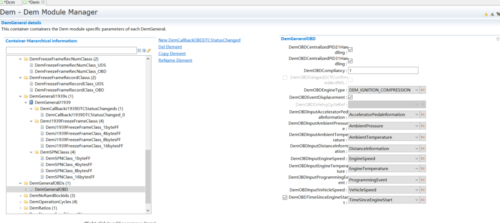

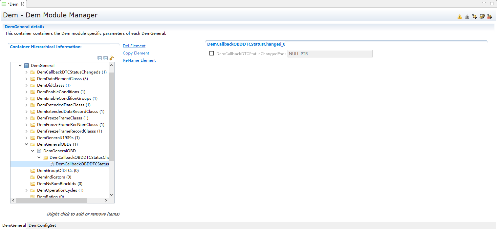

.. centered:: **表 DemGeneralOBD属性描述 (Table DemGeneralOBD Property Description)**

.. list-table::
   :widths: 20 20 20 20 20
   :header-rows: 1

   * - UI名称 (UI Name)
     - 描述 (Description)
     - 
     - 
     - 
   * - DemOBDCentralizedPID21Handling
     - 取值范围 (Range)
     - True/False
     - 默认取值 (Default value)
     - False
   * - 
     - 参数描述 (Parameter Description)
     - 支持PID21功能 (Support PID21 Function)
     - 
     - 
   * - 
     - 依赖关系 (Dependencies)
     - OBD Support
     - 
     - 
   * - DemOBDCentralizedPID31Handling
     - 取值范围 (Range)
     - True/False
     - 默认取值 (Default value)
     - False
   * - 
     - 参数描述 (Parameter Description)
     - 支持PID31功能 (Support for PID31 functionality)
     - 
     - 
   * - 
     - 依赖关系 (Dependencies)
     - OBD Support
     - 
     - 
   * - DemOBDCompliancy
     - 取值范围 (Range)
     - 0…255
     - 默认取值 (Default value)
     - 0
   * - 
     - 参数描述 (Parameter Description)
     - 配置值来定义PID1C (Define PID1C configuration values)
     - 
     - 
   * - 
     - 依赖关系 (Dependencies)
     - OBD Support
     - 
     - 
   * - DemOBDDelayedDCYConfirmedAndMIL
     - 取值范围 (Range)
     - True/False
     - 默认取值 (Default value)
     - False
   * - 
     - 参数描述 (Parameter Description)
     - 控制OBD驱动周期确认状态的延迟计算。 (Delay calculation for confirming the OBD drive cycle status.)
     - 
     - 
   * - 
     - 依赖关系 (Dependencies)
     - OBD Support
     - 
     - 
   * - DemOBDEngineType
     - 取值范围 (Range)
     - COMPRESSION;SPARK
     - 默认取值 (Default value)
     - COMPRESSION
   * - 
     - 参数描述 (Parameter Description)
     - OBD引擎类型 (OBD Engine Type)
     - 
     - 
   * - 
     - 依赖关系 (Dependencies)
     - OBD Support
     - 
     - 
   * - DemOBDEventDisplacement
     - 取值范围 (Range)
     - True/False
     - 默认取值 (Default value)
     - False
   * - 
     - 参数描述 (Parameter Description)
     - OBD支持事件替换 (OBD supports event replacement.)
     - 
     - 
   * - 
     - 依赖关系 (Dependencies)
     - OBD Support
     - 
     - 
   * - DemOBDDrivingCycleRef
     - 取值范围 (Range)
     - Ref
     - 默认取值 (Default value)
     - 无
   * - 
     - 参数描述 (Parameter Description)
     - OBD驱动周期的操作周期 (The operational cycle of OBD drive period)
     - 
     - 
   * - 
     - 依赖关系 (Dependencies)
     - OBD Support
     - 
     - 
   * - DemOBDInputAcceleratorPedalInformation
     - 取值范围 (Range)
     - Ref
     - 默认取值 (Default value)
     - 无
   * - 
     - 参数描述 (Parameter Description)
     - 加速器踏板信息的输入变量 (Input variables for accelerator pedal information)
     - 
     - 
   * - 
     - 依赖关系 (Dependencies)
     - OBD Support
     - 
     - 
   * - DemOBDInputAmbientPressure
     - 取值范围 (Range)
     - Ref
     - 默认取值 (Default value)
     - 无
   * - 
     - 参数描述 (Parameter Description)
     - 环境压力的输入变量 (Input variables for environmental pressure)
     - 
     - 
   * - 
     - 依赖关系 (Dependencies)
     - OBD Support
     - 
     - 
   * - DemOBDInputAmbientTemperature
     - 取值范围 (Range)
     - Ref
     - 默认取值 (Default value)
     - 无
   * - 
     - 参数描述 (Parameter Description)
     - 环境温度的输入变量 (Input variable for environmental temperature)
     - 
     - 
   * - 
     - 依赖关系 (Dependencies)
     - OBD Support
     - 
     - 
   * - DemOBDInputDistanceInformation
     - 取值范围 (Range)
     - Ref
     - 默认取值 (Default value)
     - 无
   * - 
     - 参数描述 (Parameter Description)
     - 距离信息的输入变量 (Distance information input variable)
     - 
     - 
   * - 
     - 依赖关系 (Dependencies)
     - OBD Support
     - 
     - 
   * - DemOBDInputEngineSpeed
     - 取值范围 (Range)
     - Ref
     - 默认取值 (Default value)
     - 无
   * - 
     - 参数描述 (Parameter Description)
     - 发动机转速的输入变量 (Input variable for engine speed)
     - 
     - 
   * - 
     - 依赖关系 (Dependencies)
     - OBD Support
     - 
     - 
   * - DemOBDInputEngineTemperature
     - 取值范围 (Range)
     - Ref
     - 默认取值 (Default value)
     - 无
   * - 
     - 参数描述 (Parameter Description)
     - 发动机温度的输入变量 (Input variable for engine temperature)
     - 
     - 
   * - 
     - 依赖关系 (Dependencies)
     - OBD Support
     - 
     - 
   * - DemOBDInputProgrammingEvent
     - 取值范围 (Range)
     - Ref
     - 默认取值 (Default value)
     - 无
   * - 
     - 参数描述 (Parameter Description)
     - 编程事件的输入变量 (Input variables for programming events)
     - 
     - 
   * - 
     - 依赖关系 (Dependencies)
     - OBD Support
     - 
     - 
   * - DemOBDInputVehicleSpeed
     - 取值范围 (Range)
     - Ref
     - 默认取值 (Default value)
     - 无
   * - 
     - 参数描述 (Parameter Description)
     - 车速的输入变量 (Input variable for speed)
     - 
     - 
   * - 
     - 依赖关系 (Dependencies)
     - OBD Support
     - 
     - 
   * - DemOBDTimeSinceEngineStart
     - 取值范围 (Range)
     - Ref
     - 默认取值 (Default value)
     - 无
   * - 
     - 参数描述 (Parameter Description)
     - 从启动引擎开始的时间信息的输入变量 (Input variable from the time information starting from when the engine is started.)
     - 
     - 
   * - 
     - 依赖关系 (Dependencies)
     - OBD Support
     - 
     - 
   * - DemCallbackOBDDTCStatusChangedFnc
     - 取值范围 (Range)
     - Ref
     - 默认取值 (Default value)
     - 无
   * - 
     - 参数描述 (Parameter Description)
     - OBDDtc状态改变后触发Rte报告 (Trigger Rte report after OBDDtc status change)
     - 
     - 
   * - 
     - 依赖关系 (Dependencies)
     - OBD Support
     - 
     - 
   * - 
     - 
     - DemTriggerDcmReports使能情况下，DemCallbackOBDDTCStatusChanged/DemCallbackDTCStatusChangedFnc不能被配置为Dcm_DemTriggerOnDTCStatus (When DemTriggerDcmReports is enabled, DemCallbackOBDDTCStatusChanged/DemCallbackDTCStatusChangedFnc cannot be configured as Dcm_DemTriggerOnDTCStatus.)
     - 
     - 

DemNvRamBlockId
===============================

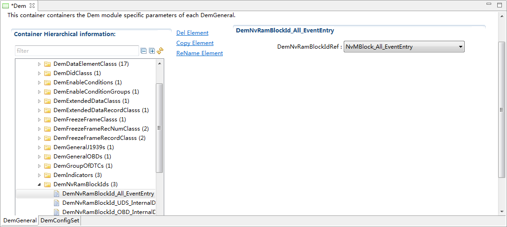

.. centered:: **表 DemNvRamBlockId属性描述 (Property Description: DemNvRamBlockId)**

.. list-table::
   :widths: 20 20 20 20 20
   :header-rows: 1

   * - UI名称 (UI Name)
     - 描述 (Description)
     - 
     - 
     - 
   * - DemNvRamBlockId
     - 取值范围 (Range)
     - Ref
     - 
     -
   * - 
     - 参数描述 (Parameter Description)
     - NvM的BlockId (NVMe	BlockId)
     - 
     -
   * - 
     - 
     - 第一个DemNvRamBlockId引用的NV块长度如果小于(DEM_MAX_NUMBER_EVENT_ENTRY_PRIMARY + (The length of the NV block referenced by the first DemNvRamBlockId if it is less than (DEM_MAX_NUMBER_EVENT_ENTRY_PRIMARY +)
     - 
     - 
   * - 
     - 
     - DEM_MAX_NUMBER_EVENT_ENTRY_PERMANENT) * （8 + a + b），其中#if((DEM_FREEZE_FRAME_CLASS_NUM > 0)(DEM_J1939_FREEZE_FRAME_CLASS_NUM > 0)
     - 
     - (DEM_PID_CLASS_NUM > 0))成立下，a为2+DEM_MAX_NUMBER_FF_RECORDS*（1+DEM_FREEZE_FRAME_MAX_LEN）；
   * - 
     - 
     - #if(DEM_EXTENDED_DATA_CLASS_NUM > 0)成立下，b为（（DEM_EXTENDED_DATA_MAX_REF_NUM+7）>> 3）+DEM_EXTENDED_DATA_MAX_LEN则报错，报错信息："Dem : Nv Block Length  of DemNvRamBlockIdRef cannot be less than  DemEventMemoryEntryStorage("+demEventMemoryEntryStorage+")."
     - 
     -
   * - 
     - 
     - 第一个DemNvRamBlockId引用的NV块长度如果小于(DEM_MAX_NUMBER_EVENT_ENTRY_PRIMARY + (The length of the NV block referenced by the first DemNvRamBlockId if it is less than (DEM_MAX_NUMBER_EVENT_ENTRY_PRIMARY +)
     - 
     - 
   * - 
     - 
     - DEM_MAX_NUMBER_EVENT_ENTRY_PERMANENT) * （8 + a + b），其中#if((DEM_FREEZE_FRAME_CLASS_NUM > 0)(DEM_J1939_FREEZE_FRAME_CLASS_NUM > 0)
     - 
     - (DEM_PID_CLASS_NUM > 0))成立下，a为2+DEM_MAX_NUMBER_FF_RECORDS*（1+DEM_FREEZE_FRAME_MAX_LEN）；
   * - 
     - 依赖关系 (Dependencies)
     - #if(DEM_EXTENDED_DATA_CLASS_NUM > 0)成立下，b为（（DEM_EXTENDED_DATA_MAX_REF_NUM+7）>> 3）+DEM_EXTENDED_DATA_MAX_LEN则报错，报错信息："Dem : Nv Block Length  of DemNvRamBlockIdRef cannot be less than  DemEventMemoryEntryStorage("+demEventMemoryEntryStorage+")."
     - 
     -
   * - 
     - 
     - 第一个DemNvRamBlockId引用的NV块长度如果小于(DEM_MAX_NUMBER_EVENT_ENTRY_PRIMARY + (The length of the NV block referenced by the first DemNvRamBlockId if it is less than (DEM_MAX_NUMBER_EVENT_ENTRY_PRIMARY +)
     - 
     - 
   * - 
     - 
     - DEM_MAX_NUMBER_EVENT_ENTRY_PERMANENT) * （8 + a + b），其中#if((DEM_FREEZE_FRAME_CLASS_NUM > 0)(DEM_J1939_FREEZE_FRAME_CLASS_NUM > 0)
     - 
     - (DEM_PID_CLASS_NUM > 0))成立下，a为2+DEM_MAX_NUMBER_FF_RECORDS*（1+DEM_FREEZE_FRAME_MAX_LEN）；
   * - 
     - 
     - #if(DEM_EXTENDED_DATA_CLASS_NUM > 0)成立下，b为（（DEM_EXTENDED_DATA_MAX_REF_NUM+7）>> 3）+DEM_EXTENDED_DATA_MAX_LEN则报错，报错信息："Dem : Nv Block Length   of DemNvRamBlockIdRef cannot be less than   DemEventMemoryEntryStorage("+demEventMemoryEntryStorage+")."
     - 
     -
   * - 
     - 
     - 配置了DemNvRamBlockId，且NVM模块存在，如果NVM模块的NvMApiConfigClass为NVM_API_CONFIG_CLASS_1，则报错"Dem :  The interface of NVM that DEM needs to use is not opened in NVM_API_CONFIG_CLASS_1 mode." (Configure DemNvRamBlockId and if the NVM module exists, if the NvMApiConfigClass of the NVM module is NVM_API_CONFIG_CLASS_1, then error "Dem : The interface of NVM that DEM needs to use is not opened in NVM_API_CONFIG_CLASS_1 mode.")
     - 
     - 

DemOperationCycle
=================================

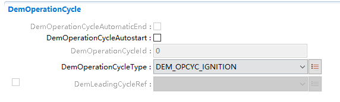

.. centered:: **表 DemOperationCycle属性描述 (Table DemOperationCycle Property Description)**

.. list-table::
   :widths: 15 15 14 14 14 14 14
   :header-rows: 1

   * - UI名称 (UI Name)
     - 描述 (Description)
     - 
     - 
     - 
     - 
     - 
   * - DemNvRamBlockId
     - 取值范围 (Range)
     - Ref
     - 默认取值 (Default value)
     - 无
     - 
     -
   * - 
     - 参数描述 (Parameter Description)
     - NvM的BlockId (NVMe	BlockId)
     - 
     - 
     - 
     -
   * - 
     - 
     - 第一个DemNvRamBlockId引用的NV块长度如果小于(DEM_MAX_NUMBER_EVENT_ENTRY_PRIMARY +   DEM_MAX_NUMBER_EVENT_ENTRY_PERMANENT) * （8 + a + b），其中#if((DEM_FREEZE_FRAME_CLASS_NUM > 0)
     - 
     - (DEM_J1939_FREEZE_FRAME_CLASS_NUM > 0)
     - 
     - (DEM_PID_CLASS_NUM > 0))成立下，a为2+DEM_MAX_NUMBER_FF_RECORDS*（1+DEM_FREEZE_FRAME_MAX_LEN）；#if(DEM_EXTENDED_DATA_CLASS_NUM > 0)成立下，b为（（DEM_EXTENDED_DATA_MAX_REF_NUM+7）>> 3）+DEM_EXTENDED_DATA_MAX_LEN则报错，报错信息："Dem : Nv Block Length   of DemNvRamBlockIdRef cannot be less than   DemEventMemoryEntryStorage("+demEventMemoryEntryStorage+")."
   * - 
     - 
     - 第一个DemNvRamBlockId引用的NV块长度如果小于(DEM_MAX_NUMBER_EVENT_ENTRY_PRIMARY +   DEM_MAX_NUMBER_EVENT_ENTRY_PERMANENT) * （8 + a + b），其中#if((DEM_FREEZE_FRAME_CLASS_NUM > 0)
     - 
     - (DEM_J1939_FREEZE_FRAME_CLASS_NUM > 0)
     - 
     - (DEM_PID_CLASS_NUM > 0))成立下，a为2+DEM_MAX_NUMBER_FF_RECORDS*（1+DEM_FREEZE_FRAME_MAX_LEN）；#if(DEM_EXTENDED_DATA_CLASS_NUM > 0)成立下，b为（（DEM_EXTENDED_DATA_MAX_REF_NUM+7）>> 3）+DEM_EXTENDED_DATA_MAX_LEN则报错，报错信息："Dem : Nv Block Length   of DemNvRamBlockIdRef cannot be less than   DemEventMemoryEntryStorage("+demEventMemoryEntryStorage+")."
   * - 
     - 依赖关系 (Dependencies)
     - 
     - 
     - 
     - 
     -
   * - 
     - 
     - 第一个DemNvRamBlockId引用的NV块长度如果小于(DEM_MAX_NUMBER_EVENT_ENTRY_PRIMARY +   DEM_MAX_NUMBER_EVENT_ENTRY_PERMANENT) * （8 + a + b），其中#if((DEM_FREEZE_FRAME_CLASS_NUM > 0)
     - 
     - (DEM_J1939_FREEZE_FRAME_CLASS_NUM > 0)
     - 
     - (DEM_PID_CLASS_NUM > 0))成立下，a为2+DEM_MAX_NUMBER_FF_RECORDS*（1+DEM_FREEZE_FRAME_MAX_LEN）；#if(DEM_EXTENDED_DATA_CLASS_NUM > 0)成立下，b为（（DEM_EXTENDED_DATA_MAX_REF_NUM+7）>> 3）+DEM_EXTENDED_DATA_MAX_LEN则报错，报错信息："Dem : Nv Block Length   of DemNvRamBlockIdRef cannot be less than   DemEventMemoryEntryStorage("+demEventMemoryEntryStorage+")."
   * - 
     - 
     - 配置了DemNvRamBlockId，且NVM模块存在，如果NVM模块的NvMApiConfigClass为NVM_API_CONFIG_CLASS_1，则报错"Dem :  The interface of NVM that DEM needs to use   is not opened in NVM_API_CONFIG_CLASS_1 mode." (Configured DemNvRamBlockId, and if the NVM module exists, if the NvMApiConfigClass of the NVM module is NVM_API_CONFIG_CLASS_1, then report the error "Dem : The interface of NVM that DEM needs to use is not opened in NVM_API_CONFIG_CLASS_1 mode.")
     - 
     - 
     - 
     - 

DemRatio
========================

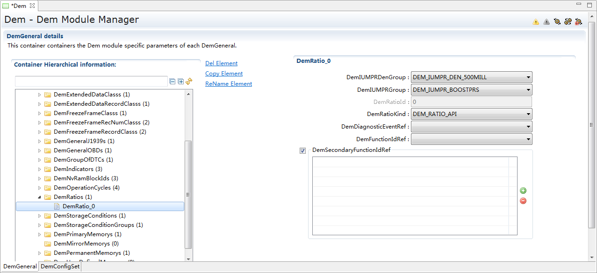

.. centered:: **表 DemRatio属性描述 (Table DemRatio Property Description)**

.. list-table::
   :widths: 15 15 14 14 14 14 14
   :header-rows: 1

   * - UI名称 (UI Name)
     - 描述 (Description)
     - 
     - 
     - 
     - 
     - 
   * - DemIUMPRDenGroup
     - 取值范围 (Range)
     - 
     - .. image:: ../../_static/参考手册(Module_Reference_Manual)/Dem/image38.png
         :width: 90%
         :align: center
     - 
     - 
     -
   * - 
     - 参数描述 (Parameter Description)
     - 此参数指定分配的分母类型，该类型是在通用分母条件之外应用的。 (This parameter specifies the numerator type allocated, which is applied in addition to general denominator conditions.)
     - 
     - 
     - 
     -
   * - 
     - 依赖关系 (Dependencies)
     - DemOBDSupport为DEM_OBD_MASTER_ECU或DEM_OBD_PRIMARY_ECU时，DemIUMPRDenGroup可以配置，否则变灰，不可配置 (When DemOBDSupport is DEM_OBD_MASTER_ECU or DEM_OBD_PRIMARY_ECU, DemIUMPRDenGroup can be configured; otherwise, it turns gray and becomes non-configurable.)
     - 
     - 
     - 
     - 
   * - DemIUMPRGroup
     - 取值范围 (Range)
     - 
     - .. image:: ../../_static/参考手册(Module_Reference_Manual)/Dem/image39.png
         :width: 90%
         :align: center
     - 
     - 默认取值 (Default value)
     - BOOSTPRS
   * - 
     - 参数描述 (Parameter Description)
     - 该参数指定分配的比率Id的IUMPR组 (This parameter specifies the allocation ratio of Id's IUMPR group.)
     - 
     - 
     - 
     -
   * - 
     - 依赖关系 (Dependencies)
     - DemOBDSupport为DEM_OBD_MASTER_ECU时，DemIUMPRGroup可以配置，否则变灰，不可配置 (When DemOBDSupport is set to DEM_OBD_MASTER_ECU, DemIUMPRGroup can be configured; otherwise, it becomes grayed out and unconfigurable.)
     - 
     - 
     - 
     - 
   * - DemRatioId
     - 取值范围 (Range)
     - 0…65535
     - 默认取值 (Default value)
     - 0
     - 
     -
   * - 
     - 参数描述 (Parameter Description)
     - 定义一个唯一的比率Id (Define a unique ratio ID)
     - 
     - 
     - 
     -
   * - 
     - 依赖关系 (Dependencies)
     - 无
     - 
     - 
     - 
     - 
   * - DemRatioKind
     - 取值范围 (Range)
     - 
     - .. image:: ../../_static/参考手册(Module_Reference_Manual)/Dem/image40.png
         :width: 90%
         :align: center
     - 
     - 默认取值 (Default value)
     - RATIO_API
   * - 
     - 参数描述 (Parameter Description)
     - 此参数定义是基于API还是基于观察者计算该比率。 (This parameter defines whether the ratio is calculated based on API or observed values.)
     - 
     - 
     - 
     -
   * - 
     - 依赖关系 (Dependencies)
     - 无
     - 
     - 
     - 
     - 
   * - DemDiagnosticEventRef
     - 取值范围 (Range)
     - Ref
     - 默认取值 (Default value)
     - 无
     - 
     -
   * - 
     - 参数描述 (Parameter Description)
     - 此引用包含到诊断事件 (This citation includes a reference to diagnostic events.)
     - 
     - 
     - 
     -
   * - 
     - 依赖关系 (Dependencies)
     - DemOBDSupport为DEM_OBD_MASTER_ECU时，DemFunctionIdRef可以配置，否则变灰，不可配置 (When DemOBDSupport is "DEM_OBD_MASTER_ECU", DemFunctionIdRef can be configured; otherwise, it turns gray and cannot be configured.)
     - 
     - 
     - 
     - 
   * - DemFunctionIdRef
     - 取值范围 (Range)
     - Ref
     - 默认取值 (Default value)
     - 无
     - 
     -
   * - 
     - 参数描述 (Parameter Description)
     - 该引用包含指向FiM内用作主FID的函数标识符 (This citation contains a reference to a function identifier used as the main FID in FiM.)
     - 
     - 
     - 
     -
   * - 
     - 依赖关系 (Dependencies)
     - DemOBDSupport为DEM_OBD_MASTER_ECU时，DemFunctionIdRef可以配置，否则变灰，不可配置 (When DemOBDSupport is "DEM_OBD_MASTER_ECU", DemFunctionIdRef can be configured; otherwise, it turns gray and cannot be configured.)
     - 
     - 
     - 
     - 
   * - DemSecondaryFunctionIdRef
     - 取值范围 (Range)
     - Ref
     - 默认取值 (Default value)
     - 无
     - 
     -
   * - 
     - 参数描述 (Parameter Description)
     - 该引用包含到FiM中用作辅助FID的函数标识符的链接 (This citation contains links to function identifiers used as auxiliary FIDs in FiM.)
     - 
     - 
     - 
     -
   * - 
     - 依赖关系 (Dependencies)
     - DemOBDSupport为DEM_OBD_MASTER_ECU时，DemSecondaryFunctionIdRef可以配置，否则变灰，不可配置无 (When DemOBDSupport is set to DEM_OBD_MASTER_ECU, DemSecondaryFunctionIdRef can be configured; otherwise, it will be grayed out and not configurable.)
     - 
     - 
     - 
     - 

DemStorageCondition
===================================

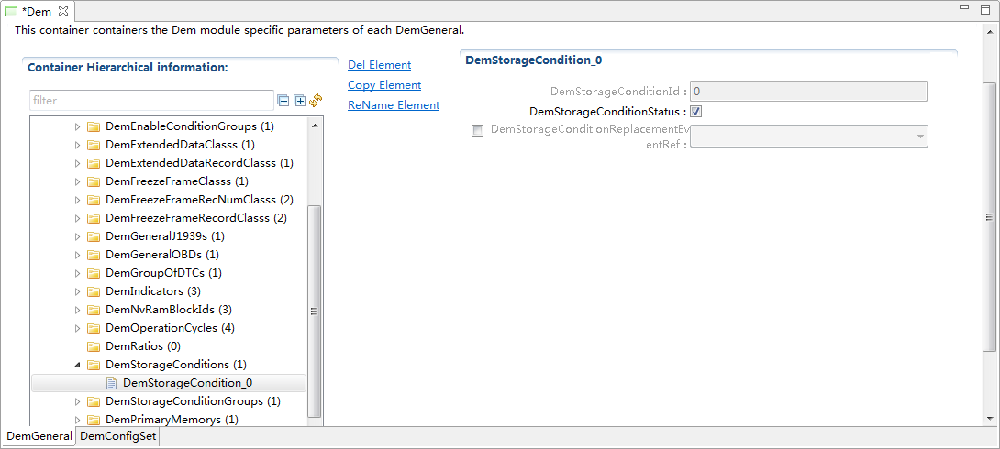

.. centered:: **表 DemStorageCondition属性描述 (Table DemStorageCondition Property Description)**

.. list-table::
   :widths: 20 20 20 20 20
   :header-rows: 1

   * - UI名称 (UI Name)
     - 描述 (Description)
     - 
     - 
     - 
   * - DemStorageConditionId
     - 取值范围 (Range)
     - 0…255
     - 默认取值 (Default value)
     - 0
   * - 
     - 参数描述 (Parameter Description)
     - 存储条件Id (Storage Conditions Id)
     - 
     - 
   * - 
     - 依赖关系 (Dependencies)
     - 无
     - 
     - 
   * - DemStorageConditionStatus
     - 取值范围 (Range)
     - True/False
     - 默认取值 (Default value)
     - False
   * - 
     - 参数描述 (Parameter Description)
     - 存储条件使能 (Storage conditions enabled)
     - 
     - 
   * - 
     - 依赖关系 (Dependencies)
     - 无
     - 
     - 
   * - DemStorageConditionReplacementEventRef
     - 取值范围 (Range)
     - Ref
     - 默认取值 (Default value)
     - 无
   * - 
     - 参数描述 (Parameter Description)
     - 指定对存储到事件内存并支持故障分析的事件的引用 (Specify references to events stored in the event memory that support fault analysis.)
     - 
     - 
   * - 
     - 依赖关系 (Dependencies)
     - 如果DemStorageConditionReplacementEventRef被配置，那么引用这个条件的事件，不能关联DemEnableConditionGroupRef (If DemStorageConditionReplacementEventRef is configured, events referencing this condition cannot be associated with DemEnableConditionGroupRef.)
     - 
     - 
   * - 
     - 
     - 如果DemStorageConditionReplacementEventRef被配置，那么引用这个条件的事件，不能关联DemStorageConditionGroupRef (If DemStorageConditionReplacementEventRef is configured, events referencing this condition cannot be associated with DemStorageConditionGroupRef.)
     - 
     - 
   * - 
     - 
     - 如果DemStorageConditionReplacementEventRef被配置，那么引用这个条件的事件，不能关联DemDebounceCounterBased、DemDebounceMonitorInternal、DemDebounceTimeBase中的任意一个 (If DemStorageConditionReplacementEventRef is configured, then the event referencing this condition cannot be associated with any of DemDebounceCounterBased, DemDebounceMonitorInternal, or DemDebounceTimeBase.)
     - 
     - 
   * - 
     - 
     - 如果DemStorageConditionReplacementEventRef被配置，那么引用这个条件的事件，不能关联DemCallbackClearEventAllowed (If DemStorageConditionReplacementEventRef is configured, then the events referencing this condition cannot be associated with DemCallbackClearEventAllowed.)
     - 
     - 
   * - 
     - 
     - 如果DemStorageConditionReplacementEventRef被配置，那么引用这个条件的事件，不能关联DemCallbackInitMForE (If DemStorageConditionReplacementEventRef is configured, then the events referencing this condition cannot be associated with DemCallbackInitMForE.)
     - 
     - 

DemStorageConditionGroup
========================================

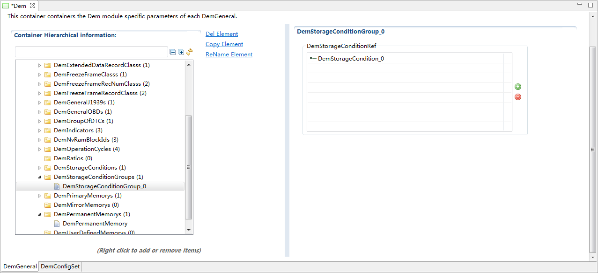

.. centered:: **表 DemStorageConditionGroup属性描述 (Table DemStorageConditionGroup Property Description)**

.. list-table::
   :widths: 20 20 20 20 20
   :header-rows: 1

   * - UI名称 (UI Name)
     - 描述 (Description)
     - 
     - 
     - 
   * - DemStorageConditionRef
     - 取值范围 (Range)
     - Ref
     - 默认取值 (Default value)
     - 无
   * - 
     - 参数描述 (Parameter Description)
     - 存储条件索引 (Storage Condition Index)
     - 
     - 
   * - 
     - 依赖关系 (Dependencies)
     - 无
     - 
     - 

DemConfigSets
-----------------------------

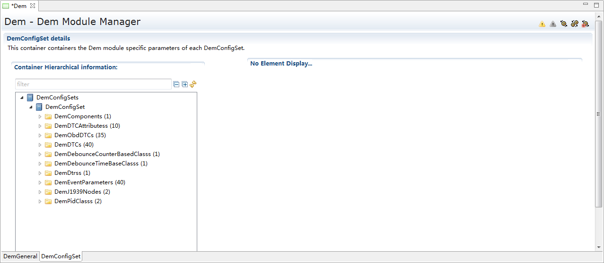

DemComponent
============================

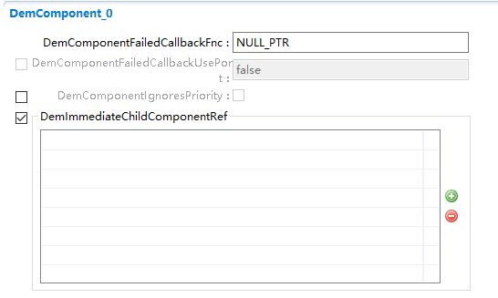

.. centered:: **表 DemComponent属性描述 (Table Descriptions of DemComponent Properties)**

.. list-table::
   :widths: 20 20 20 20 20
   :header-rows: 1

   * - UI名称 (UI Name)
     - 描述 (Description)
     - 
     - 
     - 
   * - DemComponentFailedCallbackFnc
     - 取值范围 (Range)
     - Ref
     - 默认取值 (Default value)
     - NULL_PTR
   * - 
     - 参数描述 (Parameter Description)
     - 指定组件状态Failed时要调用的函数 (Specify the function to call when the component state is Failed.)
     - 
     - 
   * - 
     - 依赖关系 (Dependencies)
     - 无
     - 
     - 
   * - DemComponentFailedCallbackUsePort
     - 取值范围 (Range)
     - Ref
     - 默认取值 (Default value)
     - NULL_PTR
   * - 
     - 参数描述 (Parameter Description)
     - 为组件更改提供通知机制 (Provide notification mechanisms for component changes.)
     - 
     - 
   * - 
     - 依赖关系 (Dependencies)
     - 无
     - 
     - 
   * - DemComponentIgnoresPriority
     - 取值范围 (Range)
     - True/False
     - 默认取值 (Default value)
     - False
   * - 
     - 参数描述 (Parameter Description)
     - 此配置开关定义了该组件上事件的优先级是否应被忽略 (This configuration switch defines whether event priorities on this component should be ignored.)
     - 
     - 
   * - 
     - 依赖关系 (Dependencies)
     - 无
     - 
     - 
   * - DemImmediateChildComponentRef
     - 取值范围 (Range)
     - Ref
     - 默认取值 (Default value)
     - 无
   * - 
     - 参数描述 (Parameter Description)
     - 引用当前组件的所有直接子组件 (Reference all direct child components of the current component)
     - 
     - 
   * - 
     - 依赖关系 (Dependencies)
     - 如果一个DemImmediateChildComponentRef有一个以上的parentcomponent，则报错"Dem: childcomponent("+name+" )can have atmost oneparentcomponent." (If a DemImmediateChildComponentRef has more than one parent component, then the error "Dem: childcomponent(+name+) can have at most one parentcomponent." is thrown.)
     - 
     - 
   * - 
     - 
     - 子组件直接的关联，不能成一个环形，否则报错 (Circular references among direct child components are not allowed, otherwise an error will occur.)
     - 
     - 

DemDTC
======================

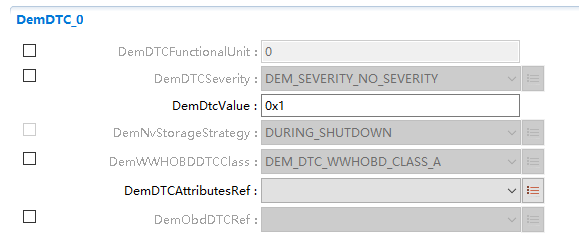

.. centered:: **表 DemDTC属性描述 (Table DemDTC Property Description)**

.. list-table::
   :widths: 20 20 20 20 20
   :header-rows: 1

   * - UI名称 (UI Name)
     - 描述 (Description)
     - 
     - 
     - 
   * - DemDTCFunctionalUnit
     - 取值范围 (Range)
     - 0…255
     - 默认取值 (Default value)
     - 0
   * - 
     - 参数描述 (Parameter Description)
     - 功能单元 (Functional Unit)
     - 
     - 
   * - 
     - 依赖关系 (Dependencies)
     - 无
     - 
     - 
   * - DemDTCSeverity
     - 取值范围 (Range)
     - AT_NEXT_HALT;
     - 默认取值 (Default value)
     - NO_SEVERITY
   * - 
     - 
     - MMEDIATELY;
     - 
     - 
   * - 
     - 
     - MAINT
     - 
     - 
   * - 
     - 
     - ENANCE_ONLY;
     - 
     - 
   * - 
     - 
     - NO_SEVERITY
     - 
     - 
   * - 
     - 参数描述 (Parameter Description)
     - DTC重要性 (Importance of DTC)
     - 
     - 
   * - 
     - 依赖关系 (Dependencies)
     - 无
     - 
     - 
   * - DemDtcValue
     - 取值范围 (Range)
     - 1…16777214
     - 默认取值 (Default value)
     - 1
   * - 
     - 参数描述 (Parameter Description)
     - DTC值 (DTC Value)
     - 
     - 
   * - 
     - 依赖关系 (Dependencies)
     - 无
     - 
     - 
   * - DemNvStorageStrategy
     - 取值范围 (Range)
     - DURING_SHUTDOWN;
     - 默认取值 (Default value)
     - DURING_SHUTDOWN
   * - 
     - 
     - IMMEDIATE_AT_FIRST_OCCURRENCE
     - 
     - 
   * - 
     - 参数描述 (Parameter Description)
     - 将特定的事件内存项存储在NVRAM中的策略 (A policy to store specific event memory items in NVRAM)
     - 
     - 
   * - 
     - 依赖关系 (Dependencies)
     - 无
     - 
     - 
   * - DemWWHOBDDTCClass
     - 取值范围 (Range)
     - CLASS_A;CLASS_B1;
     - 默认取值 (Default value)
     - CLASS_A
   * - 
     - 
     - CLASS_B2;
     - 
     - 
   * - 
     - 
     - CLASS_C;
     - 
     - 
   * - 
     - 
     - CLASS_NOCLASS
     - 
     - 
   * - 
     - 参数描述 (Parameter Description)
     - DTC等级符合ISO14229-1 (DTC grade conforms to ISO14229-1)
     - 
     - 
   * - 
     - 依赖关系 (Dependencies)
     - 无
     - 
     - 
   * - DemDTCAttributesRef
     - 取值范围 (Range)
     - Ref
     - 默认取值 (Default value)
     - 无
   * - 
     - 参数描述 (Parameter Description)
     - DTC属性索引 (DTC Property Index)
     - 
     - 
   * - 
     - 依赖关系 (Dependencies)
     - 无
     - 
     - 
   * - DemObdDTCRef
     - 取值范围 (Range)
     - Ref
     - 默认取值 (Default value)
     - 无
   * - 
     - 参数描述 (Parameter Description)
     - OBD DTC索引 (OBD DTC Index)
     - 
     - 
   * - 
     - 依赖关系 (Dependencies)
     - 无
     - 
     - 

DemDTCAttribute
===============================

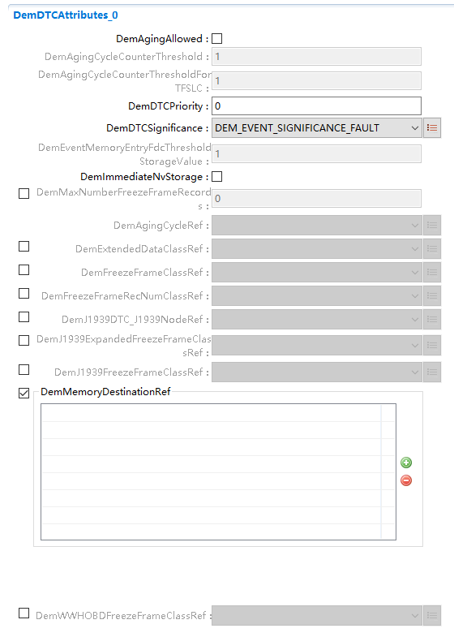

.. centered:: **表 DemDTCAttribute属性描述 (Table DemDTCAttribute Property Description)**

.. list-table::
   :widths: 20 20 20 20 20
   :header-rows: 1

   * - UI名称 (UI Name)
     - 描述 (Description)
     - 
     - 
     - 
   * - DemAgingAllowed
     - 取值范围 (Range)
     - True/False
     - 
     -
   * - 
     - 参数描述 (Parameter Description)
     - 允许老化 (Allow aging)
     - 
     -
   * - 
     - 依赖关系 (Dependencies)
     - 无
     - 
     - 
   * - DemAgingCycleCounterThreshold
     - 
     - 1…256
     - 默认取值 (Default value)
     - 1
   * - 
     - 
     - 老化阈值 (Aging threshold)
     - 
     -
   * - 
     - 
     - DemAgingAllowed使能情况下，DemAgingCycleCounterThreshold可以配置，否则变灰，不可配置 (DemAgingAllowed enabled, DemAgingCycleCounterThreshold can be configured; otherwise, graying out and unconfigurable.)
     - 
     - 
   * - DemAgingCycleCounterThresholdForTFSLC
     - 
     - 1…256
     - 默认取值 (Default value)
     - 1
   * - 
     - 参数描述 (Parameter Description)
     - Bit5老化阈值 (Bit5 Aging Threshold)
     - 
     -
   * - 
     - 依赖关系 (Dependencies)
     - DemStatusBitHandlingTestFailedSinceLastClear为DEM_STATUS_BIT_AGING_AND_DISPLACEMENT时，DemAgingCycleCounterThresholdForTFSLC可以配置，否则变灰，不可配置 (PreserveStatusBitHandlingTestFailedSinceLastClear is DEM_STATUS_BIT_AGING_AND_DISPLACEMENT when DemAgingCycleCounterThresholdForTFSLC can be configured; otherwise, it becomes gray and unconfigurable.)
     - 
     - 
   * - DemDTCPriority
     - 取值范围 (Range)
     - 1…256
     - 默认取值 (Default value)
     - 1
   * - 
     - 参数描述 (Parameter Description)
     - DTC优先级 (DTC Priority)
     - 
     -
   * - 
     - 依赖关系 (Dependencies)
     - 无
     - 
     - 
   * - DemDTCSignificance
     - 
     - FAULT;
     - 
     - FAULT
   * - 
     - 取值范围(Value Range)
     - 
     - 默认取值(Default Value)
     - 
   * - 
     - 
     - OCCURRENCE
     - 
     -
   * - 
     - 参数描述 (Parameter Description)
     - 故障分类 (Fault Classification)
     - 
     -
   * - 
     - 依赖关系 (Dependencies)
     - 无
     - 
     - 
   * - DemEventMemoryEntryFdcThresholdStorageValue
     - 取值范围 (Range)
     - 1…126
     - 默认取值 (Default value)
     - 1
   * - 
     - 参数描述 (Parameter Description)
     - 冻结帧数量 (Number of Frozen Frames)
     - 
     -
   * - 
     - 依赖关系 (Dependencies)
     - DemFreezeFrameRecordTrigger,DemExtendedDataRecordTrigger,DemEventMemoryEntryStorageTrigger中有任意一个为DEM_TRIGGER_ON_FDC_THRESHOLD，DemEventMemoryEntryFdcThresholdStorageValue可以配置，否则变灰，不可配置 (If any of DemFreezeFrameRecordTrigger, DemExtendedDataRecordTrigger, or DemEventMemoryEntryStorageTrigger is DEM_TRIGGER_ON_FDC_THRESHOLD, DemEventMemoryEntryFdcThresholdStorageValue can be configured; otherwise, it will be grayed out and unconfigurable.)
     - 
     - 
   * - DemImmediateNvStorage
     - 取值范围 (Range)
     - True/False
     - 默认取值 (Default value)
     - False
   * - 
     - 参数描述 (Parameter Description)
     - 立即存储NvM (Immediate storage NvM)
     - 
     -
   * - 
     - 依赖关系 (Dependencies)
     - 无
     - 
     - 
   * - DemMaxNumberFreezeFrameRecords
     - 取值范围 (Range)
     - 0…255
     - 默认取值 (Default value)
     - 0
   * - 
     - 参数描述 (Parameter Description)
     - 根据冻结帧记录的数量，可以为这个事件存储的最多的记录 (Based on the number of frozen frames recorded, the maximum number of records that can be stored for this event.)
     - 
     -
   * - 
     - 依赖关系 (Dependencies)
     - 无
     - 
     - 
   * - DemAgingCycleRef
     - 取值范围 (Range)
     - Ref
     - 默认取值 (Default value)
     - 无
   * - 
     - 参数描述 (Parameter Description)
     - 老化操作循环 (Aging operation loop)
     - 
     -
   * - 
     - 依赖关系 (Dependencies)
     - DemAgingAllowed使能情况下，DemAgingCycleRef可以配置，否则变灰，不可配置 (When DemAgingAllowed is enabled, DemAgingCycleRef can be configured; otherwise, it will gray out and become unconfigurable.)
     - 
     - 
   * - DemExtendedDataClassRef
     - 取值范围 (Range)
     - Ref
     - 默认取值 (Default value)
     - 无
   * - 
     - 参数描述 (Parameter Description)
     - 扩展数据 (Expand data)
     - 
     -
   * - 
     - 依赖关系 (Dependencies)
     - 无
     - 
     - 
   * - DemFreezeFrameClassRef
     - 取值范围 (Range)
     - Ref
     - 默认取值 (Default value)
     - 无
   * - 
     - 参数描述 (Parameter Description)
     - 冻结帧 (Freeze frame)
     - 
     -
   * - 
     - 依赖关系 (Dependencies)
     - 每个DemDTCAttributes下的DemFreezeFrameClassRef、DemJ1939ExpandedFreezeFrameClassRef、DemJ1939FreezeFrameClassRef、DemWWHOBDFreezeFrameClassRef几个加在一起最多只能配置一个（可以都不配，使用OBD PID冻结帧） (Each of the DemDTCAttributes下的DemFreezeFrameClassRef, DemJ1939ExpandedFreezeFrameClassRef, DemJ1939FreezeFrameClassRef, and DemWWHOBDFreezeFrameClassRef can be configured at most once (none can be configured, and OBD PID freeze frame can be used instead).)
     - 
     - 
   * - DemFreezeFrameRecNumClassRef
     - 取值范围 (Range)
     - Ref
     - 默认取值 (Default value)
     - 无
   * - 
     - 参数描述 (Parameter Description)
     - 冻结帧号 (Frozen frame number)
     - 
     -
   * - 
     - 依赖关系 (Dependencies)
     - DemTypeOfFreezeFrameRecordNumeration为DEM_FF_RECNUM_CONFIGURED时，DemFreezeFrameRecNumClassRef可以配置，否则变灰，不可配置 (When DemTypeOfFreezeFrameRecordNumeration is DEM_FF_RECNUM_CONFIGURED, DemFreezeFrameRecNumClassRef can be configured; otherwise, it turns gray and becomes unconfigurable.)
     - 
     - 
   * - DemJ1939DTC_J1939NodeRef
     - 取值范围 (Range)
     - Ref
     - 默认取值 (Default value)
     - 无
   * - 
     - 参数描述 (Parameter Description)
     - 对J1939节点的引用 (Reference to J1939 node)
     - 
     -
   * - 
     - 依赖关系 (Dependencies)
     - DemJ1939Node
     - 
     - 
   * - DemJ1939ExpandedFreezeFrameClassRef
     - 取值范围 (Range)
     - Ref
     - 默认取值 (Default value)
     - 无
   * - 
     - 参数描述 (Parameter Description)
     - 对DemJ1939FreezeFrameClass的引用 (Reference to DemJ1939FreezeFrameClass)
     - 
     -
   * - 
     - 依赖关系 (Dependencies)
     - DemJ1939FreezeFrameClass
     - 
     - 
   * - DemJ1939FreezeFrameClassRef
     - 取值范围 (Range)
     - Ref
     - 默认取值 (Default value)
     - 无
   * - 
     - 参数描述 (Parameter Description)
     - 对DemJ1939FreezeFrameClass的引用 (Reference to DemJ1939FreezeFrameClass)
     - 
     -
   * - 
     - 依赖关系 (Dependencies)
     - DemJ1939FreezeFrameClass
     - 
     - 
   * - DemMemoryDestinationRef
     - 取值范围 (Range)
     - Ref
     - 默认取值 (Default value)
     - 无
   * - 
     - 参数描述 (Parameter Description)
     - 存储地址 (Storage address)
     - 
     -
   * - 
     - 依赖关系 (Dependencies)
     - DemDTCAttributes/DemMemoryDestinationRef不能配置超过两个 (DemDTCAttributes/DemMemoryDestinationRef cannot be configured with more than two)
     - 
     - 
   * - DemWWHOBDFreezeFrameClassRef
     - 取值范围 (Range)
     - Ref
     - 默认取值 (Default value)
     - 无
   * - 
     - 参数描述 (Parameter Description)
     - 引用定义的WWHOBD冻结帧 (Define WWHOBD frozen frame)
     - 
     -
   * - 
     - 依赖关系 (Dependencies)
     - DemFreezeFrameClass
     - 
     - 

DemDebounceCounterBasedClass
============================================

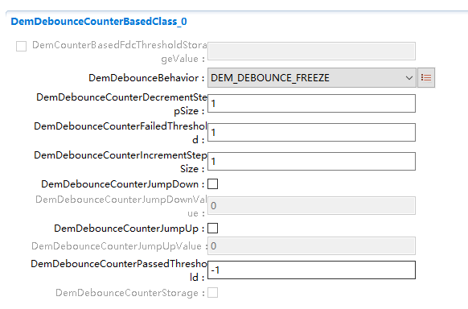

.. centered:: **表 DemDounceCounterBasedClass属性描述 (Table DemDounceCounterBasedClass Properties Description)**

.. list-table::
   :widths: 20 20 20 20 20
   :header-rows: 1

   * - UI名称 (UI Name)
     - 描述 (Description)
     - 
     - 
     - 
   * - DemCounterBasedFdcThresholdStorageValue
     - 取值范围 (Range)
     - 1 … 32767
     - 
     -
   * - 
     - 
     - 分配事件内存条目和捕获冻结帧的阈值 (Allocate event memory entries and capture frozen frames threshold)
     - 
     -
   * - 
     - 
     - 无
     - 
     - 
   * - DemDebounceBehavior
     - 
     - FREEZE;
     - 
     - FREEZE
   * - 
     - 取值范围(Value Range)
     - 
     - 默认取值(Default Value)
     - 
   * - 
     - 
     - RESET
     - 
     -
   * - 
     - 参数描述 (Parameter Description)
     - 在DTC被禁用是Counter的行为 (When DTC is disabled, it's Counter's behavior.)
     - 
     -
   * - 
     - 依赖关系 (Dependencies)
     - 无
     - 
     - 
   * - DemDebounceCounterDecrementStepSize
     - 取值范围 (Range)
     - 1…32768
     - 
     -
   * - 
     - 参数描述 (Parameter Description)
     - 步长 (Step Length)
     - 
     -
   * - 
     - 依赖关系 (Dependencies)
     - 无
     - 
     - 
   * - DemDebounceCounterFailedThreshold
     - 取值范围 (Range)
     - 1…32767
     - 默认取值 (Default value)
     - 1
   * - 
     - 参数描述 (Parameter Description)
     - 去抖Counter计时阈值 (Debouncing Counter Timer Threshold)
     - 
     -
   * - 
     - 依赖关系 (Dependencies)
     - 无
     - 
     - 
   * - DemDebounceCounterIncrementStepSize
     - 取值范围 (Range)
     - 1…32767
     - 默认取值 (Default value)
     - 1
   * - 
     - 参数描述 (Parameter Description)
     - 步长 (Step Length)
     - 
     -
   * - 
     - 依赖关系 (Dependencies)
     - 无
     - 
     - 
   * - DemDebounceCounterJumpDown
     - 取值范围 (Range)
     - True/False
     - 默认取值 (Default value)
     - FALSE
   * - 
     - 参数描述 (Parameter Description)
     - 执行Jump-Down (Execute Jump-Down)
     - 
     -
   * - 
     - 依赖关系 (Dependencies)
     - 无
     - 
     - 
   * - DemDebounceCounterJumpDownValue
     - 取值范围 (Range)
     - -32768…32767
     - 默认取值 (Default value)
     - 0
   * - 
     - 参数描述 (Parameter Description)
     - Jump-Down值 (Jump-Down Value)
     - 
     -
   * - 
     - 依赖关系 (Dependencies)
     - DemDebounceCounterJumpDown使能情况下，DemDebounceCounterJumpDownValue可以配置，否则变灰，不可配置 (When DemDebounceCounterJumpDown is enabled, DemDebounceCounterJumpDownValue can be configured; otherwise, it will be grayed out and unconfigurable.)
     - 
     - 
   * - DemDebounceCounterJumpUp
     - 取值范围 (Range)
     - True/False
     - 默认取值 (Default value)
     - FALSE
   * - 
     - 参数描述 (Parameter Description)
     - 执行Jump-Up (Execute Jump-Up)
     - 
     -
   * - 
     - 依赖关系 (Dependencies)
     - 无
     - 
     - 
   * - DemDebounceCounterJumpUpValue
     - 取值范围 (Range)
     - -32768 … 32767
     - 默认取值 (Default value)
     - 0
   * - 
     - 参数描述 (Parameter Description)
     - Jump-Up值 (Jump-Up Value)
     - 
     -
   * - 
     - 依赖关系 (Dependencies)
     - DemDebounceCounterJumpUp使能情况下，DemDebounceCounterJumpUpValue可以配置，否则变灰，不可配置 (When DemDebounceCounterJumpUp is enabled, DemDebounceCounterJumpUpValue can be configured; otherwise, it is grayed out and unconfigurable.)
     - 
     - 
   * - DemDebounceCounterPassedThreshold
     - 取值范围 (Range)
     - -32768…-1
     - 默认取值 (Default value)
     - -1
   * - 
     - 参数描述 (Parameter Description)
     - 去抖Counter计时阈值 (Debouncing Counter Timer Threshold)
     - 
     -
   * - 
     - 依赖关系 (Dependencies)
     - 无
     - 
     - 
   * - DemDebounceCounterStorage
     - 取值范围 (Range)
     - True/false
     - 默认取值 (Default value)
     - FALSE
   * - 
     - 参数描述 (Parameter Description)
     - 切换到存储非易失性或非易失性的Debounce计数器值 (Switch to storage of non-volatile or non-volatile Debounce counter values)
     - 
     -
   * - 
     - 依赖关系 (Dependencies)
     - 无
     - 
     - 

DemDebounceTimeBaseClass
========================================

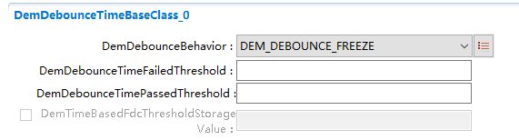

.. centered:: **表 DemDounceTimeBasedClass属性描述 (Table DemDounceTimeBasedClass property description)**

.. list-table::
   :widths: 20 20 20 20 20
   :header-rows: 1

   * - UI名称 (UI Name)
     - 描述 (Description)
     - 
     - 
     - 
   * - DemDebounceBehavior
     - 取值范围 (Range)
     - FREEZE;RESET
     - 默认取值 (Default value)
     - FREEZE
   * - 
     - 参数描述 (Parameter Description)
     - 定义了事件Debounce算法将如何执行 (The Debounce algorithm defines how events will execute.)
     - 
     - 
   * - 
     - 依赖关系 (Dependencies)
     - 无
     - 
     - 
   * - DemDebounceTimeFailedThreshold
     - 取值范围 (Range)
     - 0.001…3600
     - 默认取值 (Default value)
     - 0.001
   * - 
     - 参数描述 (Parameter Description)
     - Failed阈值 (Failure threshold)
     - 
     - 
   * - 
     - 依赖关系 (Dependencies)
     - 无
     - 
     - 
   * - DemDebounceTimePassedThreshold
     - 取值范围 (Range)
     - 0.001…3600
     - 默认取值 (Default value)
     - 0.001
   * - 
     - 参数描述 (Parameter Description)
     - Passed阈值 (Passed Threshold)
     - 
     - 
   * - 
     - 依赖关系 (Dependencies)
     - 无
     - 
     - 
   * - DemTimeBasedFdcThresholdStorageValue
     - 取值范围 (Range)
     - 无
     - 默认取值 (Default value)
     - 无
   * - 
     - 参数描述 (Parameter Description)
     - 分配事件内存条目和捕获冻结帧的阈值。 (Allocate event memory entries and capture frozen frames thresholds.)
     - 
     - 
   * - 
     - 依赖关系 (Dependencies)
     - 无
     - 
     - 

DemDtrss
========================

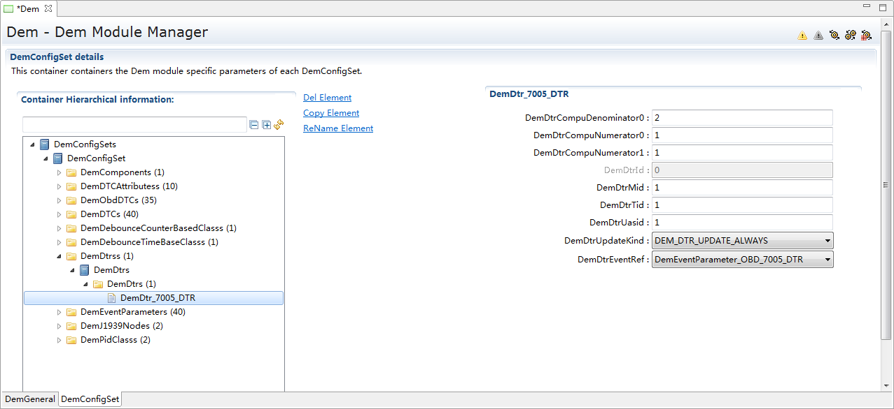

.. centered:: **表 DemEventParameter属性描述 (Table DemEventParameter Property Description)**

.. list-table::
   :widths: 20 20 20 20 20
   :header-rows: 1

   * - UI名称 (UI Name)
     - 描述 (Description)
     - 
     - 
     - 
   * - DemDtrCompuDenominator0
     - 取值范围 (Range)
     - -INF…INF
     - 默认取值 (Default value)
     - 0
   * - 
     - 参数描述 (Parameter Description)
     - Dtr用于计算的分母0 (Dtr used for calculation with denominator 0)
     - 
     - 
   * - 
     - 依赖关系 (Dependencies)
     - DemOBDSupport
     - 
     - 
   * - DemDtrCompuNumerator0
     - 取值范围 (Range)
     - -INF…INF
     - 默认取值 (Default value)
     - 0
   * - 
     - 参数描述 (Parameter Description)
     - Dtr用于计算的分子0 (Dtr用于计算的分子0)
     - 
     - 
   * - 
     - 依赖关系 (Dependencies)
     - DemOBDSupport
     - 
     - 
   * - DemDtrCompuNumerator1
     - 取值范围 (Range)
     - -INF…INF
     - 默认取值 (Default value)
     - 0
   * - 
     - 参数描述 (Parameter Description)
     - Dtr用于计算的分母1 (Dtr used for calculating the denominator 1)
     - 
     - 
   * - 
     - 依赖关系 (Dependencies)
     - DemOBDSupport
     - 
     - 
   * - DemDtrId
     - 取值范围 (Range)
     - 0…65535
     - 默认取值 (Default value)
     - 0
   * - 
     - 参数描述 (Parameter Description)
     - DTR标识符 (DTR Identifier)
     - 
     - 
   * - 
     - 依赖关系 (Dependencies)
     - DemOBDSupport
     - 
     - 
   * - DemDtrMid
     - 取值范围 (Range)
     - 0…255
     - 默认取值 (Default value)
     - 0
   * - 
     - 参数描述 (Parameter Description)
     - DTR的Mid (DTR's Mid)
     - 
     - 
   * - 
     - 依赖关系 (Dependencies)
     - DemOBDSupport
     - 
     - 
   * - DemDtrTid
     - 取值范围 (Range)
     - 0…255
     - 默认取值 (Default value)
     - 0
   * - 
     - 参数描述 (Parameter Description)
     - DTR的Tid (The Tid of DTR)
     - 
     - 
   * - 
     - 依赖关系 (Dependencies)
     - DemOBDSupport
     - 
     - 
   * - DemDtrUasid
     - 取值范围 (Range)
     - 0…255
     - 默认取值 (Default value)
     - 0
   * - 
     - 参数描述 (Parameter Description)
     - DTR的Uasid (DTR's Uasid)
     - 
     - 
   * - 
     - 依赖关系 (Dependencies)
     - DemOBDSupport
     - 
     - 
   * - DemDtrUpdateKind
     - 取值范围 (Range)
     - DTR_UPDATE_ALWAYS;
     - 默认取值 (Default value)
     - DTR_UPDATE_ALWAYS
   * - 
     - 
     - DTR_UPDATE_STEADY
     - 
     - 
   * - 
     - 参数描述 (Parameter Description)
     - DTR更新方式 (DTR Update Method)
     - 
     - 
   * - 
     - 依赖关系 (Dependencies)
     - DemOBDSupport
     - 
     - 
   * - DemDtrEventRef
     - 取值范围 (Range)
     - Ref
     - 默认取值 (Default value)
     - 无
   * - 
     - 参数描述 (Parameter Description)
     - DTR关联事件的索引 (Index of DTR Associated Events)
     - 
     - 
   * - 
     - 依赖关系 (Dependencies)
     - DemOBDSupport
     - 
     - 

DemEventParameter
=================================

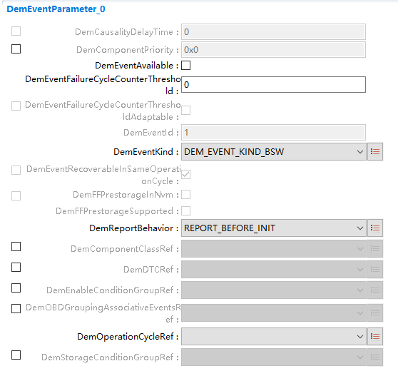

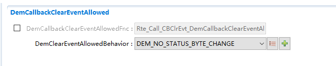

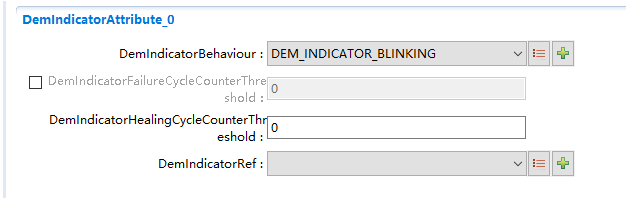

.. centered:: **表 DemEventParameter属性描述 (Table DemEventParameter Property Description)**

.. list-table::
   :widths: 20 20 20 20 20
   :header-rows: 1

   * - UI名称 (UI Name)
     - 描述 (Description)
     - 
     - 
     - 
   * - DemDtrCompuDenominator0
     - 取值范围 (Range)
     - -INF…INF
     - 默认取值 (Default value)
     - 0
   * - 
     - 参数描述 (Parameter Description)
     - Dtr用于计算的分母0 (Dtr used for calculation with denominator 0)
     - 
     -
   * - 
     - 依赖关系 (Dependencies)
     - DemOBDSupport
     - 
     - 
   * - DemDtrCompuNumerator0
     - 取值范围 (Range)
     - -INF…INF
     - 默认取值 (Default value)
     - 0
   * - 
     - 参数描述 (Parameter Description)
     - Dtr用于计算的分子0 (Dtr用于计算的分子0)
     - 
     -
   * - 
     - 依赖关系 (Dependencies)
     - DemOBDSupport
     - 
     - 
   * - DemDtrCompuNumerator1
     - 取值范围 (Range)
     - -INF…INF
     - 默认取值 (Default value)
     - 0
   * - 
     - 参数描述 (Parameter Description)
     - Dtr用于计算的分母1 (Dtr used for calculating the denominator 1)
     - 
     -
   * - 
     - 依赖关系 (Dependencies)
     - DemOBDSupport
     - 
     - 
   * - DemDtrId
     - 取值范围 (Range)
     - 0…65535
     - 默认取值 (Default value)
     - 0
   * - 
     - 参数描述 (Parameter Description)
     - DTR标识符 (DTR Identifier)
     - 
     -
   * - 
     - 依赖关系 (Dependencies)
     - DemOBDSupport
     - 
     - 
   * - DemDtrMid
     - 取值范围 (Range)
     - 0…255
     - 默认取值 (Default value)
     - 0
   * - 
     - 参数描述 (Parameter Description)
     - DTR的Mid (DTR's Mid)
     - 
     -
   * - 
     - 依赖关系 (Dependencies)
     - DemOBDSupport
     - 
     - 
   * - DemDtrTid
     - 取值范围 (Range)
     - 0…255
     - 默认取值 (Default value)
     - 0
   * - 
     - 参数描述 (Parameter Description)
     - DTR的Tid (The Tid of DTR)
     - 
     -
   * - 
     - 依赖关系 (Dependencies)
     - DemOBDSupport
     - 
     - 
   * - DemDtrUasid
     - 取值范围 (Range)
     - 0…255
     - 默认取值 (Default value)
     - 0
   * - 
     - 参数描述 (Parameter Description)
     - DTR的Uasid (DTR's Uasid)
     - 
     -
   * - 
     - 依赖关系 (Dependencies)
     - DemOBDSupport
     - 
     - 
   * - DemDtrUpdateKind
     - 
     - DTR_UPDATE_ALWAYS;
     - 
     - DTR_UPDATE_ALWAYS
   * - 
     - 取值范围(Range)
     - 
     - 默认取值(Default Value)
     - 
   * - 
     - 
     - DTR_UPDATE_STEADY
     - 
     -
   * - 
     - 参数描述 (Parameter Description)
     - DTR更新方式 (DTR Update Method)
     - 
     -
   * - 
     - 依赖关系 (Dependencies)
     - DemOBDSupport
     - 
     - 
   * - DemDtrEventRef
     - 取值范围 (Range)
     - Ref
     - 默认取值 (Default value)
     - 无
   * - 
     - 参数描述 (Parameter Description)
     - DTR关联事件的索引 (Index of DTR Associated Events)
     - 
     -
   * - 
     - 依赖关系 (Dependencies)
     - DemOBDSupport
     - 
     - 

DemObdDTC
=========================

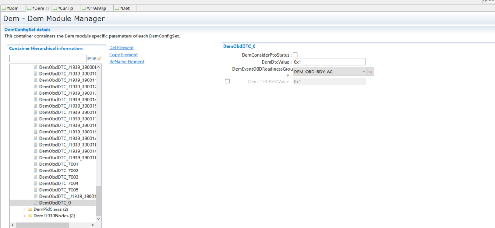

.. centered:: **表 DemObdDTC属性描述 (Table DemObdDTC Property Description)**

.. list-table::
   :widths: 15 15 14 14 14 14 14
   :header-rows: 1

   * - UI名称 (UI Name)
     - 描述 (Description)
     - 
     - 
     - 
     - 
     - 
   * - DemConsiderPtoStatus
     - 取值范围 (Range)
     - True/False
     - 默认取值 (Default value)
     - FALSE
     - 
     -
   * - 
     - 参数描述 (Parameter Description)
     - 当事件受Dem PTO处理影响时，此参数为TRUE。 (When the event is affected by Dem PTO processing, this parameter is TRUE.)
     - 
     - 
     - 
     -
   * - 
     - 依赖关系 (Dependencies)
     - DemOBDSupport为DEM_OBD_MASTER_ECU或DEM_OBD_PRIMARY_ECU时，DemConsiderPtoStatus可以配置，否则变灰，不可配置 (When DemOBDSupport is "DEM_OBD_MASTER_ECU" or "DEM_OBD_PRIMARY_ECU", DemConsiderPtoStatus can be configured; otherwise, it will be grayed out and unconfigurable.)
     - 
     - 
     - 
     - 
   * - DemDtcValue
     - 取值范围 (Range)
     - 1…65535
     - 默认取值 (Default value)
     - 1
     - 
     -
   * - 
     - 参数描述 (Parameter Description)
     - OBD DTC值 (OBD DTC Value)
     - 
     - 
     - 
     -
   * - 
     - 依赖关系 (Dependencies)
     - DemOBDSupport为DEM_OBD_MASTER_ECU或DEM_OBD_PRIMARY_ECU时，DemObdDTC/DemDtcValue可以配置，否则变灰，不可配置 (When DemOBDSupport is DEM_OBD_MASTER_ECU or DEM_OBD_PRIMARY_ECU, DemObdDTC/DemDtcValue can be configured; otherwise, it will turn gray and become unconfigurable.)
     - 
     - 
     - 
     - 
   * - DemEventOBDReadinessGroup
     - 取值范围 (Range)
     - 
     - .. image:: ../../_static/参考手册(Module_Reference_Manual)/Dem/image61.png
         :width: 90%
         :align: center
     - 
     - 默认取值 (Default value)
     - AC
   * - 
     - 参数描述 (Parameter Description)
     - 该参数指定PID $01和PID $41计算的事件OBD ReadinessGroup (This parameter specifies the events for OBD ReadinessGroup calculated by PID $01 and PID $41.)
     - 
     - 
     - 
     -
   * - 
     - 依赖关系 (Dependencies)
     - DemOBDSupport为DEM_OBD_MASTER_ECU或DEM_OBD_PRIMARY_ECU时，DemObdDTC/DemEventOBDReadinessGroup可以配置，否则变灰，不可配置 (When DemOBDSupport is DEM_OBD_MASTER_ECU or DEM_OBD_PRIMARY_ECU, DemObdDTC/DemEventOBDReadinessGroup can be configured; otherwise, it turns gray and becomes unconfigurable.)
     - 
     - 
     - 
     - 
   * - DemJ1939DTCValue
     - 取值范围 (Range)
     - 1…16777214
     - 默认取值 (Default value)
     - 1
     - 
     -
   * - 
     - 参数描述 (Parameter Description)
     - J1939 DTC的值 (The value of J1939 DTC)
     - 
     - 
     - 
     -
   * - 
     - 依赖关系 (Dependencies)
     - 无
     - 
     - 
     - 
     - 

DemPidClass
===========================

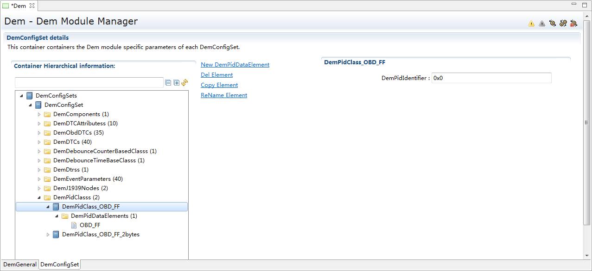

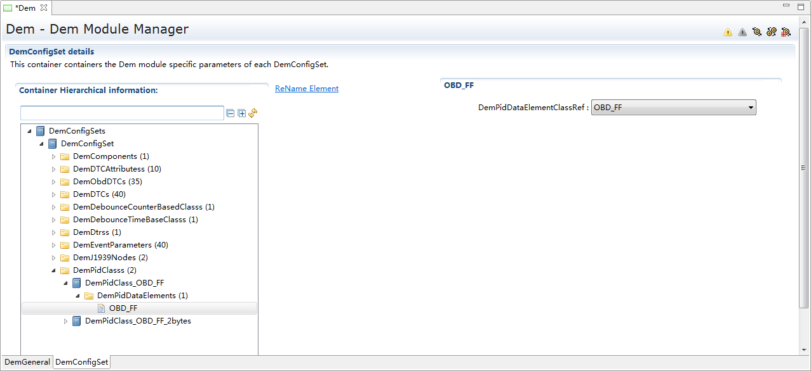

.. centered:: **表 DemPidClass属性描述 (Table DemPidClass Property Description)**

.. list-table::
   :widths: 20 20 20 20 20
   :header-rows: 1

   * - UI名称 (UI Name)
     - 描述 (Description)
     - 
     - 
     - 
   * - DemPidIdentifier
     - 取值范围 (Range)
     - 0…255
     - 默认取值 (Default value)
     - 0
   * - 
     - 参数描述 (Parameter Description)
     - Pid的标识 (Identifier for Pid)
     - 
     -
   * - 
     - 依赖关系 (Dependencies)
     - DemOBDSupport为DEM_OBD_MASTER_ECU或DEM_OBD_PRIMARY_ECU时，DemPidClass/DemPidIdentifier可以配置，否则变灰，不可配置 (When DemOBDSupport is DEM_OBD_MASTER_ECU or DEM_OBD_PRIMARY_ECU, DemPidClass/DemPidIdentifier can be configured; otherwise, it will turn gray and become unconfigurable.)
     - 
     - 
   * - DemPidClassElementClassRef
     - 取值范围 (Range)
     - Ref
     - 默认取值 (Default value)
     - 无
   * - 
     - 参数描述 (Parameter Description)
     - Pid的数据元素索引 (The index of Pid data elements)
     - 
     -
   * - 
     - 依赖关系 (Dependencies)
     - DemOBDSupport为DEM_OBD_MASTER_ECU或DEM_OBD_PRIMARY_ECU时，DemPidDataElement/DemPidDataElementClassRef可以配置，否则变灰，不可配置 (When DemOBDSupport is DEM_OBD_MASTER_ECU or DEM_OBD_PRIMARY_ECU, DemPidDataElement/DemPidDataElementClassRef can be configured; otherwise, it turns gray and becomes unconfigurable.)
     - 
     - 

DemJ1939Node
============================

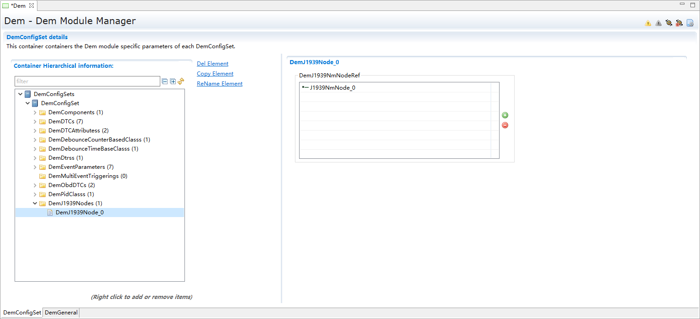

.. centered:: **表 DemJ1939Node属性描述 (Table DemJ1939Node Property Description)**

.. list-table::
   :widths: 20 20 20 20 20
   :header-rows: 1

   * - UI名称 (UI Name)
     - 描述 (Description)
     - 
     - 
     - 
   * - DemJ1939NmNodeRef
     - 取值范围 (Range)
     - Ref
     - 默认取值 (Default value)
     - 无
   * - 
     - 参数描述 (Parameter Description)
     - J1939NmNode索引 (J1939NmNode Index)
     - 
     - 
   * - 
     - 依赖关系 (Dependencies)
     - 无
     - 
     - 
