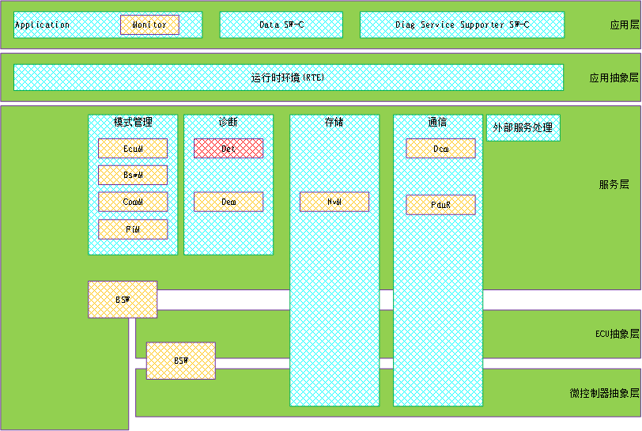
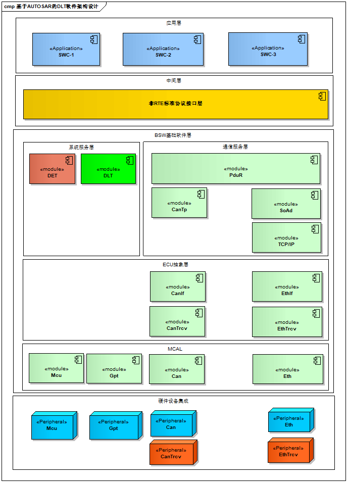
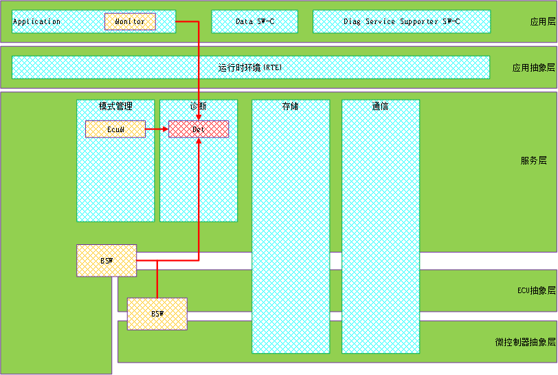
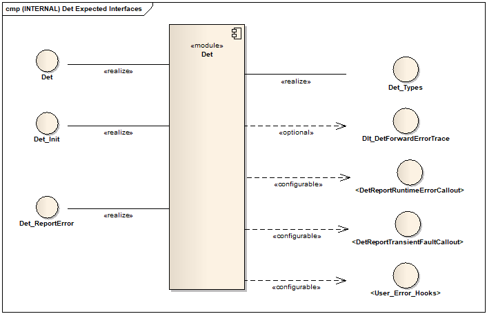
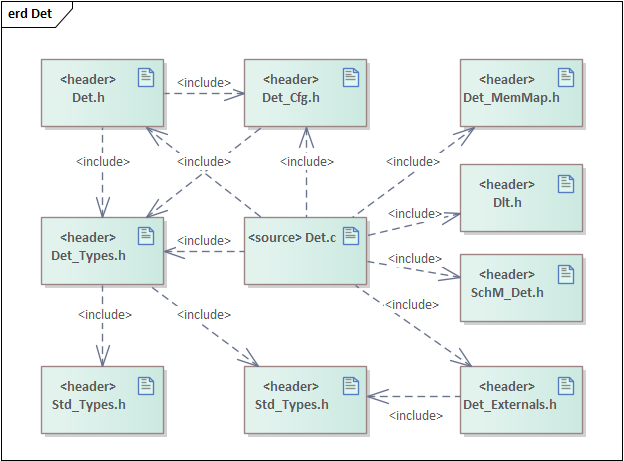
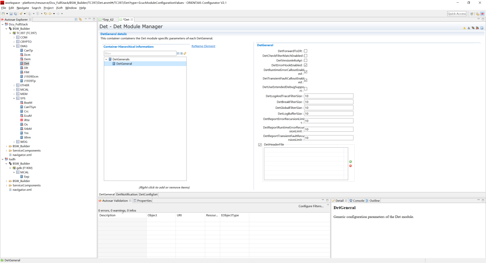
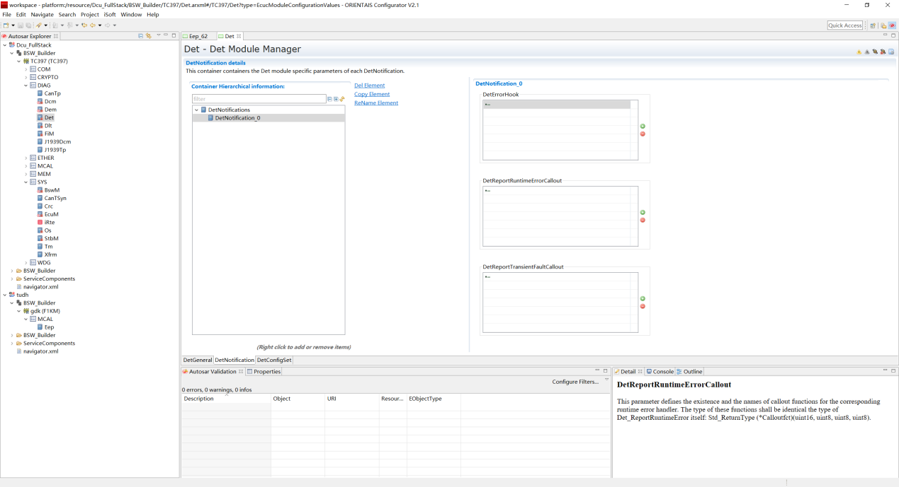
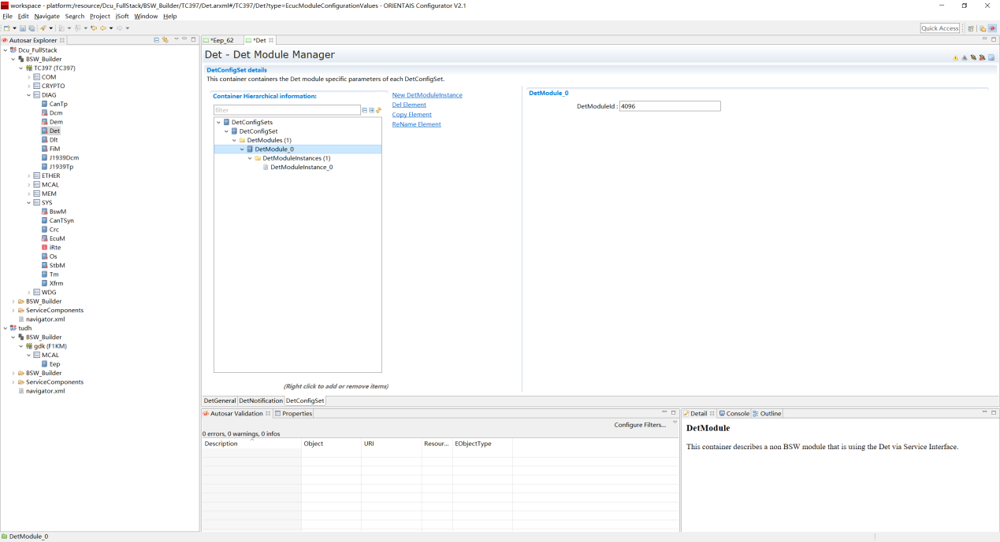
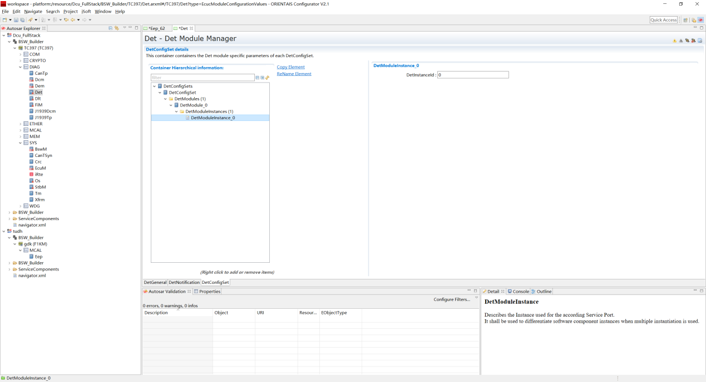

DET
#################################

:strong:`缩写词注解 (Abbreviation Notes):`

.. list-table::
   :widths: 34 33 33
   :header-rows: 1

   * - 缩写词 (Abbreviation)
     - 解释/描述 (Explanation/Description)
     - 中文解释 (Chinese explanation)
   * - DET
     - Default Error Tracer
     - 默认错误跟踪 (Default Error Tracking)
   * - DLT
     - Diagnostic Log And Trace
     - 诊断日志与跟踪 (Diagnostic logs and tracking)
   * - BSW
     - Basic Software Module
     - 基础软件模块 (Basic software modules)

简介 (Introduction)
=================================

Det模块虽然表面上看起来不复杂，但是有一点毋庸置疑，它的使用率非常的高，几乎所有模块都会使用它，不光包含基础软件模块（BSW），应用软件组件（SWC）依然会使用它。Det模块可以理解为一个错误检测/追踪/管理模块，或者理解为探测断言（Assert）。

The Det module, although seemingly not complex on the surface, is indisputably heavily utilized. Almost all modules use it, including both basic software modules (BSW) and application software components (SWC). The Det module can be understood as an error detection/tracking/management module or as a probe assert.

在4.2版本以前，DET（Development Error Tracer）开发错误追踪器。显然，其名字已经非常明确了它的定位，就是开发阶段的开发错误追踪器，再直白点，简单来说对应代码，一般就是对各个模块的函数参数进行检查或者上下文环境检测等，看看是否合法，比如，函数的输入参数是一个指针类型，看看是否为空指针；或者函数的输入参数的取值是否超过取值范围等。

Before version 4.2, DET (Development Error Tracer) was a development error tracer. Clearly, its name already indicated its positioning, which is a development error tracer for the development phase. To put it more straightforwardly, generally speaking, it corresponds to code that involves checking function parameters or context environments of various modules to see if they are legal; for example, whether an input parameter of a function as a pointer type is a null pointer; or whether the value of the input parameter exceeds its range, etc.

但是从4.2版本开始，DET（Default Error Tracer）的角色发生了变化。虽然DET模块的缩略语为DET，但是已然不是曾经的DET。因为这里的Default不但包含了以前的Development，还新增加了Runtime Error，Transient Fault，Production Errors，Extended Production Error等函数API接口。

But starting from version 4.2, the role of DET (Default Error Tracer) has changed. Although the abbreviation for the DET module is still DET, it is no longer what it used to be. Because Default now includes not only the previous Development but also新增加了Runtime Error, Transient Fault, Production Errors, Extended Production Error等函数API接口.

按照我们通常的理解，以前的Development理论上其关注点就在开发阶段，那么测试完成发布Release以后，理论上是可以将其关闭的，本身AUTOSAR的效率一直饱受病垢，关闭DET功能会提升很多效率。但是现在改为Default后，它不再只关注开发阶段，运行时（Runtime）也要关注，所以我们就不能在发布时将其关闭。

Based on our usual understanding, the previous Development phase theoretically focused only on the development stage. Once testing is completed and Release is issued, it can be shut down theoretically. AUTOSAR's efficiency has always been criticized, and shutting down DET functionality would significantly enhance efficiency. However, now that it has been changed to Default, it no longer focuses solely on the development stage but also during runtime (Runtime). Therefore, we cannot shut it down at the time of release.

由于每个功能函数/模块对错误检测/处理的需求不一样，所以这个模块和其他模块还有点区别，就是这个模块虽然提供了标准的API接口，但是并没有规定这些API里面具体需要干什么，完全有开发者/设计者来决定（比如，当错误发生时，在里面设置调式断点让代码停下，以便调试；对错误进行计数；发生运行时错误后，使用默认值去替换以便能继续运行；记录日志调试成功及参数存储到缓存RAM，类似于堆栈信息；通过通信接口发送错误信息到ECU外部客户端以便分析）。

Because each function module has different requirements for error detection and handling, this module differs somewhat from others. While it provides standard API interfaces, it does not specify what needs to be done within these APIs; the developers/designers have full discretion (for example, setting a debugging breakpoint inside when an error occurs to pause code for debugging; counting errors; replacing with default values after runtime errors occur to allow continued operation; logging debug information and parameter storage to cache RAM similar to stack information; sending error messages via communication interfaces to external ECU clients for analysis).

虽然协议没有规定每个函数体具体需要实现什么，但是其规定了一些基本信息/规则/机制。对于某个发生的错误，你需要告诉DET模块这个错误是哪个模块发生的？哪个函数发生的？错误类型是什么？这几个信息是通过API参数规定好的。

Although the protocol does not specify exactly what each function body needs to implement, it does stipulate some basic information/rules/mechanisms. For an error that occurs, you need to inform the DET module which module the error occurred in? Which function? What type of error? These pieces of information are specified through API parameters.

参考资料 (Reference materials)
------------------------------------------

[1] AUTOSAR_SWS_DefaultErrorTracer.pdf，R19-11

[2] AUTOSAR_SWS_DiagnosticLogAndTrace.pdf，R19-11

功能描述 (Function Description)
===========================================

DET功能 (DET function)
------------------------------------

DET功能介绍 (DET Function Introduction)
~~~~~~~~~~~~~~~~~~~~~~~~~~~~~~~~~~~~~~~~~~~~~~~~~~~

如图所示展示了AUTOSAR默认错误追踪器DET模块的软件分层架构。可以看到DET模块处于BSW基础软件的系统服务层，与DLT模块处于并列关系，并且当DLT模块收集到错误信息时，会通过Det_ReportError函数API接口向DET模块进行错误报告；Det模块也可以收集SWC或BSW模块的错误信息，同样通过Det_ReportError函数API接口向DET模块进行错误报告；DET模块也可以报错运行时错误或硬件瞬态故障。

The software layer architecture of the AUTOSAR default error tracker DET module is shown as depicted. It can be seen that the DET module is situated in the system services layer of the BSW foundation software, on par with the DLT module. When the DLT module gathers error information, it reports this to the DET module via the Det_ReportError function API interface; similarly, the Det module can collect error information from SWC or BSW modules, again through the Det_ReportError function API interface. The DET module can also report runtime errors or hardware transient faults.

AUTOSAR错误探测诊断协议栈处于BSW基础软件层，主要由DET模块来实现。如图所示，粉红色区域标注的模块属于AUTOSAR软件架构中错误探测诊断协议栈的管理范畴，基础软件层还提供系统服务，网络通信服务，I/O 服务以及复杂设备驱动。

The AUTOSAR error detection diagnostic protocol stack resides in the BSW (Basic Software) layer, primarily implemented by the DET module. As shown, the pink-highlighted modules belong to the management scope of the AUTOSAR software architecture's error detection and diagnostic protocol stack. The basic software layer also provides system services, network communication services, I/O services, and complex device drivers.

DET功能实现 (DET Function Implementation)
~~~~~~~~~~~~~~~~~~~~~~~~~~~~~~~~~~~~~~~~~~~~~~~~~~~~~

默认错误跟踪程序提供了在软件组件和其他基础软件模块的开发和运行期间支持错误检测和错误跟踪的功能。为此，默认错误跟踪程序接收和评估来自以下这些组件和模块的错误消息。

Default error tracking programs provide functionalities to support error detection and error tracking during the development and operation of software components and other foundational software modules. For this purpose, default error tracking programs receive and evaluate error messages from the following components and modules.

1.为报告探测开发错误提供接口。

Provide interfaces for reporting development errors related to detection.

2.AUTOSAR只是定义了API接口，但是实现和完整配置都不是由AUTOSAR定义的。

AUTOSAR only defines the API interfaces, but the implementation and complete configuration are not defined by AUTOSAR.

3.MCAL配置工具EB或者基础软件配置工具（ORIENTAIS）对应的解决方案中提供了高度可配置的功能。

The solution provided in the corresponding MCAL Configuration Tool EB or Basic Software Configuration Tool (ORIENTAIS) offers highly configurable features.

4.BSW基础软件中的可选附加检查功能（检测错误的参数值、缓冲区溢出、错误的调用顺序等）。

Optional additional check functions in BSW Basic Software (detecting incorrect parameter values, buffer overflows, incorrect call order, etc.).

5.在BSW基础软件中的每一个模块都有相应的配置使能或禁止检测开发错误功能；也可以应用于顶层应用程序。

Every module in the BSW foundational software has corresponding configuration to enable or disable error detection for development; it can also be applied to top-level applications.

6.所有的开发错误都会通过Det_ReportError汇报给Det。

All development errors will be reported to Det through Det_ReportError.

模块之间的交互关系 (The interaction relationships between modules)
-------------------------------------------------------------------------

.. centered:: **表 模块间交互关系 (Table Module Interactions)**

.. list-table::
   :widths: 25 25 25 25
   :header-rows: 1

   * - 交互模块 (Interaction Module)
     - 交互接口 (Interfacial Interface)
     - 交互数据 (Interact Data)
     - 交互条件 (Interaction Conditions)
   * - BSW
     - Det_ErrorReport
     - 向DET报告开发错误和诊断跟踪 (Report development errors and diagnostic tracing to DET.)
     - 使能开发错误检测功能 (Enable development error detection functionality)
   * - SWC
     - Det_ErrorReport
     - 向DET报告开发错误和诊断跟踪 (Report development errors and diagnostic tracing to DET.)
     - 使能开发错误检测功能 (Enable development error detection functionality)
   * - Dlt
     - Dlt_DetForwardErrorTrace
     - 向ECU外部客户端发送错误跟踪信息 (Send error tracking information to external client of ECU)
     - ECU内部必须支持Dlt功能模块 (ECU internally must support Dlt function module.)

源文件描述 (Source file description)
===============================================

.. centered:: **表 Det组件文件描述 (Table Description of Det Component File)**

.. list-table::
   :widths: 50 50
   :header-rows: 1

   * - 文件 (Files)
     - 说明 (Description)
   * - Det_Cfg.h
     - 定义Det模块预编译时用到的配置参数。 (Define configuration parameters used during pre-compilation of the Det module.)
   * - Det_Cfg.c
     - 定义Det模块中连接时用到的配置参数。 (Define configuration parameters used for connections in the Det module.)
   * - Det_Externals.c
     - 定义Det模块中外部连接时相关联的动态配置API函数实现 (Implement the dynamic configuration API functions associated with external connections when defining the Det module.)
   * - Det_Externals.h
     - 定义Det模块中外部连接时相关联的动态配置API函数声明 (Declare dynamic configuration API function definitions associated with external connections when defining the Det module.)
   * - Det.h
     - Det模块头文件，包含了API函数的扩展声明并定义了端口的数据结构。 (The Det module header file contains extended declarations of API functions and defines the data structure of ports.)
   * - Det.c
     - Det模块源文件，包含了API函数的实现。 (Det module source files contain the implementation of API functions.)
   * - Det_MemMap.h
     - 包含Det模块的内存抽象 (Abstraction of Memory with the Det Module)
   * - Det_Types.h
     - 包含Det模块定义的数据类型 (Contains data types defined by the Det module)

API接口 (API Interface)
=====================================

类型定义 (Type definition)
--------------------------------------

Std_VersionInfoType类型定义 (Std_VersionInfoType type definition)
~~~~~~~~~~~~~~~~~~~~~~~~~~~~~~~~~~~~~~~~~~~~~~~~~~~~~~~~~~~~~~~~~~~~~~~~~~~~~

.. list-table::
   :widths: 50 50
   :header-rows: 1

   * - 名称 (Name)
     - Std_VersionInfoType
   * - 类型 (Type)
     - Structure
   * - 定义 (Define)
     - typedef struct
   * - 
     - {
   * - 
     - uint16 vendorID;
   * - 
     - uint16 moduleID;
   * - 
     - uint8 instanceID;
   * - 
     - uint8 sw_major_version;
   * - 
     - uint8 sw_minor_version;
   * - 
     - uint8 sw_patch_version;
   * - 
     - } Std_VersionInfoType;
   * - 范围 (Range)
     - 无
   * - 描述 (Description)
     - 用于描述软件版本信息的结构体类型 (Struct type for describing software version information)

Det_CalloutFnctPtrType类型定义 (Det_CalloutFnctPtrType type definition)
~~~~~~~~~~~~~~~~~~~~~~~~~~~~~~~~~~~~~~~~~~~~~~~~~~~~~~~~~~~~~~~~~~~~~~~~~~~~~~~~~~~

.. list-table::
   :widths: 50 50
   :header-rows: 1

   * - 名称 (Name)
     - Det_CalloutFnctPtrType
   * - 类型 (Type)
     - 函数指针类型 (Pointer to function types)
   * - 定义 (Define)
     - typedef Std_ReturnType (\*Det_CalloutFnctPtrType)
   * - 
     - (
   * - 
     - uint16 ModuleId,
   * - 
     - uint8 InstanceId,
   * - 
     - uint8 ApiId,
   * - 
     - uint8 ErrorId,
   * - 
     - );
   * - 范围 (Range)
     - 无
   * - 描述 (Description)
     - 用于描述访问地址的类型 (To describe the type of access address)

Det_InfoType类型定义 (TypeInfoDefinition)
~~~~~~~~~~~~~~~~~~~~~~~~~~~~~~~~~~~~~~~~~~~~~~~~~~~~~

.. list-table::
   :widths: 50 50
   :header-rows: 1

   * - 名称 (Name)
     - Det_InfoType
   * - 类型 (Type)
     - Structure
   * - 定义 (Define)
     - typedef Struct
   * - 
     - {
   * - 
     - uint16 mModuleId;
   * - 
     - uint8 mInstanceId;
   * - 
     - uint8 mApiId;
   * - 
     - uint8 mErrorId;
   * - 
     - } Det_InfoType;
   * - 范围 (Range)
     - 无
   * - 描述 (Description)
     - 用于Det模块中配置过滤器和存储日志数据的数据类型 (For configuring filters and storing log data in the Det module, data types used)

Det_StatusType类型定义 (Definition of Det_StatusType Type)
~~~~~~~~~~~~~~~~~~~~~~~~~~~~~~~~~~~~~~~~~~~~~~~~~~~~~~~~~~~~~~~~~~~~~~

.. list-table::
   :widths: 50 50
   :header-rows: 1

   * - 名称 (Name)
     - Det_StatusType
   * - 类型 (Type)
     - Structure
   * - 定义 (Define)
     - typedef Struct
   * - 
     - {
   * - 
     - boolean globalFilterActive;
   * - 
     - boolean logActive;
   * - 
     - boolean breakOnLogOverrun;
   * - 
     - boolean breakFilterActive;
   * - 
     - boolean unlockBreak;
   * - 
     - uint8 logIndex;
   * - 
     - } Det_StatusType;
   * - 范围 (Range)
     - 无
   * - 描述 (Description)
     - 结构体用于控制DET调试扩展操作的数据类型 (Structures are used to control the data types for DET debug extension operations.)

Det_ConfigType类型定义 (Det_ConfigType Type Definition)
~~~~~~~~~~~~~~~~~~~~~~~~~~~~~~~~~~~~~~~~~~~~~~~~~~~~~~~~~~~~~~~~~~~

.. list-table::
   :widths: 50 50
   :header-rows: 1

   * - 名称 (Name)
     - Det_ConfigType
   * - 类型 (Type)
     - Structure
   * - 范围 (Range)
     - 无
   * - 描述 (Description)
     - 用于描述 Det模块初始化时，加载配置信息的结构体类型 (Struct type used for loading configuration information when the Det module initializes)

Det_ModuleStateType类型定义 (Det_ModuleStateType type definition)
~~~~~~~~~~~~~~~~~~~~~~~~~~~~~~~~~~~~~~~~~~~~~~~~~~~~~~~~~~~~~~~~~~~~~~~~~~~~~

.. list-table::
   :widths: 50 50
   :header-rows: 1

   * - 名称 (Name)
     - Det_ModuleStateType
   * - 类型 (Type)
     - Enumeration
   * - 范围 (Range)
     - DET_STATE_OFF = 0
   * - 
     - DET_STATE_ON = 1
   * - 描述 (Description)
     - 用于描述Det模块的运行状态 (To describe the running status of the Det module)

Det_ReturnType类型定义 (Definition of Det_ReturnType type)
~~~~~~~~~~~~~~~~~~~~~~~~~~~~~~~~~~~~~~~~~~~~~~~~~~~~~~~~~~~~~~~~~~~~~~

.. list-table::
   :widths: 50 50
   :header-rows: 1

   * - 名称 (Name)
     - Det_ReturnType
   * - 类型 (Type)
     - uint8
   * - 范围 (Range)
     - E_OK：API请求被接受 (E_OK: The API request has been accepted)
   * - 
     - E_NOT_OK：API请求被拒绝 (E_NOT_OK: The API request was denied.)
   * - 描述 (Description)
     - 用于描述API接口函数的返回类型，以及Job作业请求的结果 (To describe the return type of API interface functions as well as the result of Job job requests)

输入函数描述 (Describe the input function:)
-----------------------------------------------------

.. list-table::
   :widths: 50 50
   :header-rows: 1

   * - 输入模块 (Input Module)
     - API
   * - DLT
     - Dlt_DetForwardErrorTrace

静态接口函数定义 (Static interface function definition)
---------------------------------------------------------------

Det_Init函数定义 (The Det_Init function definition)
~~~~~~~~~~~~~~~~~~~~~~~~~~~~~~~~~~~~~~~~~~~~~~~~~~~~~~~~~~~~~~~

.. list-table::
   :widths: 25 25 25 25
   :header-rows: 1

   * - 函数名称： (Function Name:)
     - Det_Init
     - 
     - 
   * - 函数原型： (Function prototype:)
     - void Det_Init(constDet_ConfigType \*ConfigPtr)
     - 
     - 
   * - 服务编号： (Service Number:)
     - 0x00
     - 
     - 
   * - 同步/异步： (Synchronous/asynchronous:)
     - 同步 (Sync)
     - 
     - 
   * - 是否可重入： (Is Reentrant:)
     - 不可重入 (Non-reentrant)
     - 
     - 
   * - 输入参数： (Input parameters:)
     - ConfigPtr：指向所选配置集的指针 (ConfigPtr：a pointer to the selected configuration set)
     - 值域： (Domain:)
     - 无
   * - 输入输出参数： (Input Output Parameters:)
     - 无
     - 
     - 
   * - 输出参数： (Output Parameters:)
     - 无
     - 
     - 
   * - 返回值： (Return Value:)
     - 无
     - 
     - 
   * - 功能概述： (Function Overview:)
     - 服务用于实现默认错误跟踪DET模块的初始化 (Services are used to initialize the default error tracking DET module.)
     - 
     - 

Det_ReportError函数定义 (The definition of Det_ReportError function)
~~~~~~~~~~~~~~~~~~~~~~~~~~~~~~~~~~~~~~~~~~~~~~~~~~~~~~~~~~~~~~~~~~~~~~~~~~~~~~~~

.. list-table::
   :widths: 25 25 25 25
   :header-rows: 1

   * - 函数名称： (Function Name:)
     - Det_ReportError
     - 
     - 
   * - 函数原型： (Function prototype:)
     - Std_ReturnType Det_ReportError(uint16 ModuleId,uint8 InstanceId,uint8 ApiId,uint8 ErrorId)
     - 
     - 
   * - 服务编号： (Service Number:)
     - 0x01
     - 
     - 
   * - 同步/异步： (Synchronous/asynchronous:)
     - 无
     - 
     - 
   * - 是否可重入： (Is Reentrant:)
     - 可重入 (Reentrant)
     - 
     - 
   * - 输入参数： (Input parameters:)
     - ModuleId：调用模块对应的模块标识符 (ModuleId：Module identifier corresponding to the called module)
     - 值域： (Domain:)
     - 0-65535
   * - 
     - InstanceId：调用模块基于索引实例的标识符 (InstanceId: Identifier of the index instance based on the calling module)
     - 值域： (Domain:)
     - 0-255
   * - 
     - ApiId：调用模块检测到错误的API服务标识符 (ApiId：The calling module detected an erroneous API service identifier)
     - 值域： (Domain:)
     - 0-255
   * - 
     - ErrorId：调用模块检测到的开发错误标识符 (ErrorId：Identifier for development errors detected by the called module)
     - 值域： (Domain:)
     - 0-255
   * - 输入输出参数： (Input Output Parameters:)
     - 无
     - 
     - 
   * - 输出参数： (Output Parameters:)
     - 无
     - 
     - 
   * - 返回值： (Return Value:)
     - Std_ReturnType：永远不返回值，但有一个返回类型，以便与服务和钩子兼容 (Std_ReturnType：never returns a value, but has a return type to be compatible with services and hooks)
     - 
     - 
   * - 功能概述： (Function Overview:)
     - 服务用于报告开发错误 (Services for Reporting Development Errors)
     - 
     - 

Det_Start函数定义 (The Det_Start function defines)
~~~~~~~~~~~~~~~~~~~~~~~~~~~~~~~~~~~~~~~~~~~~~~~~~~~~~~~~~~~~~~

.. list-table::
   :widths: 50 50
   :header-rows: 1

   * - 函数名称： (Function Name:)
     - Det_Start
   * - 函数原型： (Function prototype:)
     - void Det_Start(void)
   * - 服务编号： (Service Number:)
     - 0x02
   * - 同步/异步： (Synchronous/asynchronous:)
     - 同步 (Sync)
   * - 是否可重入： (Is Reentrant:)
     - 不可重入 (Non-reentrant)
   * - 输入参数： (Input parameters:)
     - 无
   * - 输入输出参数： (Input Output Parameters:)
     - 无
   * - 输出参数： (Output Parameters:)
     - 无
   * - 返回值： (Return Value:)
     - 无
   * - 功能概述： (Function Overview:)
     - 服务用于启动默认错误跟踪DET (Service used for starting default error tracking DET)

Det_ReportRuntimeError函数定义 (The definition of Det_ReportRuntimeError function)
~~~~~~~~~~~~~~~~~~~~~~~~~~~~~~~~~~~~~~~~~~~~~~~~~~~~~~~~~~~~~~~~~~~~~~~~~~~~~~~~~~~~~~~~~~~~~~

.. list-table::
   :widths: 25 25 25 25
   :header-rows: 1

   * - 函数名称： (Function Name:)
     - Det_ReportRuntimeError
     - 
     - 
   * - 函数原型： (Function prototype:)
     - Std_ReturnType Det_ReportRuntimeError(uint16 ModuleId,uint8 InstanceId,uint8 ApiId,uint8 ErrorId)
     - 
     - 
   * - 服务编号： (Service Number:)
     - 0x04
     - 
     - 
   * - 同步/异步： (Synchronous/asynchronous:)
     - 同步 (Sync)
     - 
     - 
   * - 是否可重入： (Is Reentrant:)
     - 可重入 (Reentrant)
     - 
     - 
   * - 输入参数： (Input parameters:)
     - ModuleId：调用模块对应的模块标识符 (ModuleId：Module identifier corresponding to the called module)
     - 值域： (Domain:)
     - 0-65535
   * - 
     - InstanceId：调用模块基于索引实例的标识符 (InstanceId: Identifier of the index instance based on the calling module)
     - 值域： (Domain:)
     - 0-255
   * - 
     - ApiId：调用模块检测到错误的API服务标识符 (ApiId：The calling module detected an erroneous API service identifier)
     - 值域： (Domain:)
     - 0-255
   * - 
     - ErrorId：调用模块检测到的运行时错误标识符 (ErrorId：Identifier for runtime errors detected by called module)
     - 值域： (Domain:)
     - 0-255
   * - 输入输出参数： (Input Output Parameters:)
     - 无
     - 
     - 
   * - 输出参数： (Output Parameters:)
     - 无
     - 
     - 
   * - 返回值： (Return Value:)
     - Std_ReturnTyp：总是返回E_OK(服务需要的) (Std_ReturnType: Always returns E_OK (service required))
     - 
     - 
   * - 功能概述： (Function Overview:)
     - 服务用于报告运行时错误 (Services for reporting runtime errors)
     - 
     - 
   * - 
     - 如果已配置了一个Callout，则将调用该Callout回调函数 (If a Callout is configured, its callback function will be called.)
     - 
     - 

Det_ReportTransientFault函数定义 (The Det_ReportTransientFault function definition)
~~~~~~~~~~~~~~~~~~~~~~~~~~~~~~~~~~~~~~~~~~~~~~~~~~~~~~~~~~~~~~~~~~~~~~~~~~~~~~~~~~~~~~~~~~~~~~~

.. list-table::
   :widths: 25 25 25 25
   :header-rows: 1

   * - 函数名称： (Function Name:)
     - Det_ReportTransientFault
     - 
     - 
   * - 函数原型： (Function prototype:)
     - Std_ReturnTypeDet_ReportTransientFault(uint16 ModuleId,uint8 InstanceId,uint8 ApiId,uint8 FaultId)
     - 
     - 
   * - 服务编号： (Service Number:)
     - 0x05
     - 
     - 
   * - 同步/异步： (Synchronous/asynchronous:)
     - 同步 (Sync)
     - 
     - 
   * - 是否可重入： (Is Reentrant:)
     - 可重入 (Reentrant)
     - 
     - 
   * - 输入参数： (Input parameters:)
     - ModuleId：调用模块对应的模块标识符 (ModuleId：Module identifier corresponding to the called module)
     - 值域： (Domain:)
     - 0-65535
   * - 
     - InstanceId：调用模块基于索引实例的标识符 (InstanceId: Identifier of the index instance based on the calling module)
     - 值域： (Domain:)
     - 0-255
   * - 
     - ApiId：调用模块检测到错误的API服务标识符 (ApiId：The calling module detected an erroneous API service identifier)
     - 值域： (Domain:)
     - 0-255
   * - 
     - FaultId：调用模块检测到的瞬态故障标识符 (FaultId：Identifier for transient faults detected by the calling module)
     - 值域： (Domain:)
     - 0-255
   * - 输入输出参数： (Input Output Parameters:)
     - 无
     - 
     - 
   * - 输出参数： (Output Parameters:)
     - 无
     - 
     - 
   * - 返回值： (Return Value:)
     - Std_ReturnType：如果不存在callout，则返回E_OK，否则返回所配置的callout的值 (Std_ReturnType：If there is no callout, return E_OK; otherwise, return the value configured for the callout.)
     - 
     - 
   * - 功能概述： (Function Overview:)
     - 服务用于报告运行时错误 (Services for reporting runtime errors)
     - 
     - 
   * - 
     - 如果已配置了一个Callout，则将调用该Callout回调函数 (If a Callout is configured, its callback function will be called.)
     - 
     - 

Det_GetVersionInfo函数定义 (The Det_GetVersionInfo function definition)
~~~~~~~~~~~~~~~~~~~~~~~~~~~~~~~~~~~~~~~~~~~~~~~~~~~~~~~~~~~~~~~~~~~~~~~~~~~~~~~~~~~

.. list-table::
   :widths: 25 25 25 25
   :header-rows: 1

   * - 函数名称： (Function Name:)
     - Det_GetVersionInfo
     - 
     - 
   * - 函数原型： (Function prototype:)
     - voidDet_GetVersionInfo(Std_VersionInfoType\*versioninfo)
     - 
     - 
   * - 服务编号： (Service Number:)
     - 0x03
     - 
     - 
   * - 同步/异步： (Synchronous/asynchronous:)
     - 同步 (Sync)
     - 
     - 
   * - 是否可重入： (Is Reentrant:)
     - 可重入 (Reentrant)
     - 
     - 
   * - 输入参数： (Input parameters:)
     - 无
     - 
     - 
   * - 输入输出参数： (Input Output Parameters:)
     - 无
     - 
     - 
   * - 输出参数： (Output Parameters:)
     - Versioninfo：指向在何处存储此模块的版本信息的指针 (Versioninfo：A pointer to where this module's version information is stored.)
     - 值域： (Domain:)
     - 无
   * - 返回值： (Return Value:)
     - 无
     - 
     - 
   * - 功能概述： (Function Overview:)
     - 返回DET模块的软件版本信息 (Return the software version information of the DET module)
     - 
     - 

可配置函数定义 (Configurable Function Definition)
----------------------------------------------------------

User_Error_Hooks函数定义 (User_Error_Hooks Function Definition)
~~~~~~~~~~~~~~~~~~~~~~~~~~~~~~~~~~~~~~~~~~~~~~~~~~~~~~~~~~~~~~~~~~~~~~~~~~~

.. list-table::
   :widths: 25 25 25 25
   :header-rows: 1

   * - 函数名称： (Function Name:)
     - User_Error_Hooks
     - 
     - 
   * - 函数原型： (Function prototype:)
     - Std_ReturnType <User_Error_Hooks>(uint16 ModuleId,uint8 InstanceId,uint8 ApiId,uint8 ErrorId)
     - 
     - 
   * - 服务编号： (Service Number:)
     - 0x10
     - 
     - 
   * - 同步/异步： (Synchronous/asynchronous:)
     - 同步 (Sync)
     - 
     - 
   * - 是否可重入： (Is Reentrant:)
     - 可重入 (Reentrant)
     - 
     - 
   * - 输入参数： (Input parameters:)
     - ModuleId：调用模块对应的模块标识符 (ModuleId：Module identifier corresponding to the called module)
     - 值域： (Domain:)
     - 0-65535
   * - 
     - InstanceId：调用模块基于索引实例的标识符 (InstanceId: Identifier of the index instance based on the calling module)
     - 值域： (Domain:)
     - 0-255
   * - 
     - ApiId：调用模块检测到错误的API服务标识符 (ApiId：The calling module detected an erroneous API service identifier)
     - 值域： (Domain:)
     - 0-255
   * - 
     - ErrorId：调用模块检测到的开发错误标识符 (ErrorId：Identifier for development errors detected by the called module)
     - 值域： (Domain:)
     - 0-255
   * - 输入输出参数： (Input Output Parameters:)
     - 无
     - 
     - 
   * - 输出参数： (Output Parameters:)
     - 无
     - 
     - 
   * - 返回值： (Return Value:)
     - Std_ReturnType：总是返回E_OK(服务需要的) (Std_ReturnType：Always returns E_OK(service required))
     - 
     - 
   * - 功能概述： (Function Overview:)
     - 检测到开发错误以后，执行可配置的Hook钩子函数 (After detecting development errors, execute configurable Hook hook functions)
     - 
     - 

DetReportRuntimeErrorCallout函数定义 (The DetReportRuntimeErrorCallout function definition)
~~~~~~~~~~~~~~~~~~~~~~~~~~~~~~~~~~~~~~~~~~~~~~~~~~~~~~~~~~~~~~~~~~~~~~~~~~~~~~~~~~~~~~~~~~~~~~~~~~~~~~~

.. list-table::
   :widths: 25 25 25 25
   :header-rows: 1

   * - 函数名称： (Function Name:)
     - DetReportRuntimeErrorCallout
     - 
     - 
   * - 函数原型： (Function prototype:)
     - Std_ReturnType<DetReportRuntimeErrorCallout>(uint16 ModuleId,uint8 InstanceId,uint8 ApiId,uint8 ErrorId)
     - 
     - 
   * - 服务编号： (Service Number:)
     - 0x11
     - 
     - 
   * - 同步/异步： (Synchronous/asynchronous:)
     - 同步 (Sync)
     - 
     - 
   * - 是否可重入： (Is Reentrant:)
     - 可重入 (Reentrant)
     - 
     - 
   * - 输入参数： (Input parameters:)
     - ModuleId：调用模块对应的模块标识符 (ModuleId：Module identifier corresponding to the called module)
     - 值域： (Domain:)
     - 0-65535
   * - 
     - InstanceId：调用模块基于索引实例的标识符 (InstanceId: Identifier of the index instance based on the calling module)
     - 值域： (Domain:)
     - 0-255
   * - 
     - ApiId：调用模块检测到错误的API服务标识符 (ApiId：The calling module detected an erroneous API service identifier)
     - 值域： (Domain:)
     - 0-255
   * - 
     - ErrorId：调用模块检测到的运行时错误标识符 (ErrorId：Identifier for runtime errors detected by called module)
     - 值域： (Domain:)
     - 0-255
   * - 输入输出参数： (Input Output Parameters:)
     - 无
     - 
     - 
   * - 输出参数： (Output Parameters:)
     - 无
     - 
     - 
   * - 返回值： (Return Value:)
     - Std_ReturnType：总是返回E_OK(服务需要的) (Std_ReturnType：Always returns E_OK(service required))
     - 
     - 
   * - 功能概述： (Function Overview:)
     - 检测到运行时错误以后，执行可配置的Callout函数 (After detecting runtime errors, execute configurable Callout functions)
     - 
     - 

DetReportTransientFaultCallout函数定义 (The DetReportTransientFaultCallout function definition)
~~~~~~~~~~~~~~~~~~~~~~~~~~~~~~~~~~~~~~~~~~~~~~~~~~~~~~~~~~~~~~~~~~~~~~~~~~~~~~~~~~~~~~~~~~~~~~~~~~~~~~~~~~~

.. list-table::
   :widths: 25 25 25 25
   :header-rows: 1

   * - 函数名称： (Function Name:)
     - DetReportTransientFaultCallout
     - 
     - 
   * - 函数原型： (Function prototype:)
     - Std_ReturnType<DetReportTransientFaultCallout>(uint16 ModuleId,uint8 InstanceId,uint8 ApiId,uint8 FaultId)
     - 
     - 
   * - 服务编号： (Service Number:)
     - 0x12
     - 
     - 
   * - 同步/异步： (Synchronous/asynchronous:)
     - 同步 (Sync)
     - 
     - 
   * - 是否可重入： (Is Reentrant:)
     - 可重入 (Reentrant)
     - 
     - 
   * - 输入参数： (Input parameters:)
     - ModuleId：调用模块对应的模块标识符 (ModuleId：Module identifier corresponding to the called module)
     - 值域： (Domain:)
     - 0-65535
   * - 
     - InstanceId：调用模块基于索引实例的标识符 (InstanceId: Identifier of the index instance based on the calling module)
     - 值域： (Domain:)
     - 0-255
   * - 
     - ApiId：调用模块检测到错误的API服务标识符 (ApiId：The calling module detected an erroneous API service identifier)
     - 值域： (Domain:)
     - 0-255
   * - 
     - FaultId：调用模块检测到的瞬态故障标识符 (FaultId：Identifier for transient faults detected by the calling module)
     - 值域： (Domain:)
     - 0-255
   * - 输入输出参数： (Input Output Parameters:)
     - 无
     - 
     - 
   * - 输出参数： (Output Parameters:)
     - 无
     - 
     - 
   * - 返回值： (Return Value:)
     - Std_ReturnType：Value is propagatedto caller of Det_ReportTransientFault
     - 
     - 
   * - 功能概述： (Function Overview:)
     - 检测到瞬态故障以后，执行可配置的Callout函数 (After detecting a transient fault, execute the configurable Callout function)
     - 
     - 

配置 (Configure)
==============================

DetGeneral
--------------------------

.. centered:: **表 DetGeneral配置 (Table DetGeneral Configuration)**

.. list-table::
   :widths: 20 20 20 20 20
   :header-rows: 1

   * - DetForwardToDltS
     - 取值范围 (Range)
     - TRUE/FALSE
     - 默认取值 (Default value)
     - FALSE
   * - 
     - 参数描述 (Parameter Description)
     - 只有当参数存在并设置为TRUE时，Det才需要可选Dlt接口并将其调用转发给函数Dlt_DetForwardErrorTrace (Only when the parameter exists and is set to TRUE, does Det need the optional Dlt interface and forward its call to the function Dlt_DetForwardErrorTrace.)
     - 
     - 
   * - 
     - 依赖关系 (Dependencies)
     - 依赖于DLT模块的配置情况 (Dependent on the configuration of the DLT module)
     - 
     - 
   * - DetCheckFilterMatchEnabled
     - 取值范围 (Range)
     - TRUE/FALSE
     - 默认取值 (Default value)
     - FALSE
   * - 
     - 参数描述 (Parameter Description)
     - 此配置参数用于打开或关闭API以检查过滤器匹配； (This configuration parameter is used to enable or disable the API for checking filter matches;)
     - 
     - 
   * - 
     - 
     - 预处理器开关启用/禁用API以检查过滤器匹配； (Preprocessor switch enables/disables APIs to check filter matches;)
     - 
     - 
   * - 
     - 依赖关系 (Dependencies)
     - 无
     - 
     - 
   * - DetVersionInfoApi
     - 取值范围 (Range)
     - TRUE/FALSE
     - 默认取值 (Default value)
     - FALSE
   * - 
     - 参数描述 (Parameter Description)
     - 此配置参数用于打开或关闭API以获取版本信息； (This configuration parameter is used to enable or disable the API for retrieving version information;)
     - 
     - 
   * - 
     - 
     - 预处理器开关启用/禁用API以读取模块版本信息 (Preprocessor switch enables/disables API to read module version information)
     - 
     - 
   * - 
     - 依赖关系 (Dependencies)
     - 无
     - 
     - 
   * - DetErrorHookEnabled
     - 取值范围 (Range)
     - TRUE/FALSE
     - 默认取值 (Default value)
     - FALSE
   * - 
     - 参数描述 (Parameter Description)
     - 预处理器开关为启用/禁用，用于配置在报告错误时是否调用错误钩子函数 (Preprocessor switch for enabling/disabling, used to configure whether to call the error hook function when reporting errors.)
     - 
     - 
   * - 
     - 依赖关系 (Dependencies)
     - 无
     - 
     - 
   * - DetRuntimeErrorCalloutEnabled
     - 取值范围 (Range)
     - TRUE/FALSE
     - 默认取值 (Default value)
     - FALSE
   * - 
     - 参数描述 (Parameter Description)
     - 预处理器开关为启用/禁用，用于配置在报告运行时错误时是否执行Callout回调函数 (Preprocessor switch for enabling/disabling, used to configure whether to execute Callout callback functions when reporting runtime errors.)
     - 
     - 
   * - 
     - 依赖关系 (Dependencies)
     - 无
     - 
     - 
   * - DetTransientFaultCalloutEnabled
     - 取值范围 (Range)
     - TRUE/FALSE
     - 默认取值 (Default value)
     - FALSE
   * - 
     - 参数描述 (Parameter Description)
     - 预处理器开关为启用/禁用，用于配置在瞬态故障报告时是否执行Callout回调函数 (Preprocessor switch for enabling/disabling, used to configure whether to execute the Callout callback function when reporting transient fault reports.)
     - 
     - 
   * - 
     - 依赖关系 (Dependencies)
     - 无
     - 
     - 
   * - DetUseExtendedDebugSupport
     - 取值范围 (Range)
     - True/false
     - 默认取值 (Default value)
     - false
   * - 
     - 参数描述 (Parameter Description)
     - 用于配置是否开启扩展调试支持特性 (To configure whether to enable extended debugging support features)
     - 
     - 
   * - 
     - 依赖关系 (Dependencies)
     - 无
     - 
     - 
   * - DetLogAndTraceFilterSize
     - 取值范围 (Range)
     - 0 …4294967295
     - 默认取值 (Default value)
     - 0
   * - 
     - 参数描述 (Parameter Description)
     - 用于配置Det模块的Dlt过滤缓冲区大小 (To configure the Dlt filter buffer size for the Det module)
     - 
     - 
   * - 
     - 
     - 实现类型：Eep_AddressType (Implementation Type: Eep_AddressType)
     - 
     - 
   * - 
     - 依赖关系 (Dependencies)
     - 无
     - 
     - 
   * - DetBreakFilterSize
     - 取值范围 (Range)
     - 0 …4294967295
     - 默认取值 (Default value)
     - 0
   * - 
     - 参数描述 (Parameter Description)
     - 用于配置Det模块的断点过滤缓冲区大小 (Buffer size for breakpoint filtering in Det module)
     - 
     - 
   * - 
     - 
     - 实现类型：Eep_AddressType (Implementation Type: Eep_AddressType)
     - 
     - 
   * - 
     - 依赖关系 (Dependencies)
     - 无
     - 
     - 
   * - DetGlobalFilterSize
     - 取值范围 (Range)
     - 0 …4294967295
     - 默认取值 (Default value)
     - 0
   * - 
     - 参数描述 (Parameter Description)
     - 用于配置Det模块的全局过滤缓冲区大小 (To configure the global filter buffer size for the Det module)
     - 
     - 
   * - 
     - 
     - 实现类型：Eep_AddressType (Implementation Type: Eep_AddressType)
     - 
     - 
   * - 
     - 依赖关系 (Dependencies)
     - 无
     - 
     - 
   * - DetLogBufferSize
     - 取值范围 (Range)
     - 0 …4294967295
     - 默认取值 (Default value)
     - 0
   * - 
     - 参数描述 (Parameter Description)
     - 用于配置Det模块的日志缓冲区大小 (To configure the buffer size for the Det module logs)
     - 
     - 
   * - 
     - 依赖关系 (Dependencies)
     - 无
     - 
     - 
   * - DetReportErrorRecursionLimit
     - 取值范围 (Range)
     - 0 …4294967295
     - 默认取值 (Default value)
     - 0
   * - 
     - 参数描述 (Parameter Description)
     - 用于报告Det模块的开发错误递归限制 (Recursive limit for developing errors in the Det module for reporting)
     - 
     - 
   * - 
     - 依赖关系 (Dependencies)
     - 无
     - 
     - 
   * - DetReportRuntimeErrorRecursionLimit
     - 取值范围 (Range)
     - 0 …4294967295
     - 默认取值 (Default value)
     - 0
   * - 
     - 参数描述 (Parameter Description)
     - 用于报告Det模块的运行时错误递归限制 (Recursive limit for runtime errors in the Det module for reporting)
     - 
     - 
   * - 
     - 依赖关系 (Dependencies)
     - 无
     - 
     - 
   * - DetReportTransientFaultRecursionLimit
     - 取值范围 (Range)
     - 0 …4294967295
     - 默认取值 (Default value)
     - 0
   * - 
     - 参数描述 (Parameter Description)
     - 用于报告Det模块的瞬时故障递归限制 (Transient fault recursive limit for reporting Det module)
     - 
     - 
   * - 
     - 依赖关系 (Dependencies)
     - 无
     - 
     - 
   * - DetHeaderFile
     - 取值范围 (Range)
     - 无
     - 默认取值 (Default value)
     - 无
   * - 
     - 参数描述 (Parameter Description)
     - 用于描述DET模块中相关联组件的头文件包含的动态配置 (Dynamic configuration for header files containing components related to the DET module)
     - 
     - 
   * - 
     - 依赖关系 (Dependencies)
     - 无
     - 
     - 

DetNotification
-------------------------------

.. centered:: **表 DetNotification配置 (Table DetNotification Configuration)**

.. list-table::
   :widths: 20 20 20 20 20
   :header-rows: 1

   * - DetErrorHook
     - 取值范围 (Range)
     - 无
     - 默认取值 (Default value)
     - 无
   * - 
     - 参数描述 (Parameter Description)
     - Optional list offunctions to becalled by theDefault ErrorTracer in contextof each call ofDet_ReportError.
     - 
     - 
   * - 
     - 
     - The type of thesefunctions shall beidentical the typeof Det_ReportErroritself:Std_ReturnType(\*ErrorHookFct)(uint16,uint8, uint8,uint8).
     - 
     - 
   * - 
     - 依赖关系 (Dependencies)
     - 无
     - 
     - 
   * - DetReportRuntimeErrorCallout
     - 取值范围 (Range)
     - 无
     - 默认取值 (Default value)
     - 无
   * - 
     - 参数描述 (Parameter Description)
     - This parameterdefines theexistence and thenames of calloutfunctions for thecorrespondingruntime errorhandler. The typeof these functionsshall be identicalthe type ofDet_ReportRuntimeErroritself:Std_ReturnType(\*Calloutfct)(uint16,uint8, uint8,uint8).
     - 
     - 
   * - 
     - 依赖关系 (Dependencies)
     - 无
     - 
     - 
   * - DetReportTransientFaultCallout
     - 取值范围 (Range)
     - 无
     - 默认取值 (Default value)
     - 无
   * - 
     - 参数描述 (Parameter Description)
     - This parameterdefines theexistence and thenames of calloutfunctions for thecorrespondingtransient faulthandler. The typeof these functionsshall be identicalthe type ofDet_ReportTransientFaultitself:Std_ReturnType(\*Calloutfct)(uint16,uint8, uint8,uint8).
     - 
     - 
   * - 
     - 依赖关系 (Dependencies)
     - 无
     - 
     - 

DetModule
-------------------------

.. centered:: **表 DetModule配置 (Table DetModule Configuration)**

.. list-table::
   :widths: 20 20 20 20 20
   :header-rows: 1

   * - DetModuleId
     - 取值范围 (Range)
     - 0…65535
     - 默认取值 (Default value)
     - 0
   * - 
     - 参数描述 (Parameter Description)
     - Unique identifierof the errorreportingcomponent. Whenreporting errors tothe DET, a symbolicname derived fromthe moduleID has tobe used to identifythe reporter.
     - 
     - 
   * - 
     - 依赖关系 (Dependencies)
     - 无
     - 
     - 

.. _detmodule-1:

DetModule
-------------------------

.. centered:: **表 DetInstanceId配置 (Table DetInstanceId Configuration)**

.. list-table::
   :widths: 20 20 20 20 20
   :header-rows: 1

   * - DetInstanceId
     - 取值范围 (Range)
     - 0…65535
     - 默认取值 (Default value)
     - 0
   * - 
     - 参数描述 (Parameter Description)
     - Describes theInstanceId used forthe accordingService Port.
     - 
     - 
   * - 
     - 依赖关系 (Dependencies)
     - 无
     - 
     - 
