DLT
#################################

:strong:`缩写词注解 (Abbreviation Notes):`

.. list-table::
   :widths: 34 33 33
   :header-rows: 1

   * - 缩写词 (Abbreviation)
     - 解释/描述 (Explanation/Description)
     - 中文解释 (Chinese explanation)
   * - API
     - Application ProgrammingInterface
     - 应用编程接口 (Application Programming Interface)
   * - DLT
     - Diagnostic Log and Trace
     - 诊断日志与跟踪 (Diagnostic logs and tracking)
   * - DET
     - Default Error Tracer
     - 默认错误跟踪 (Default Error Tracking)
   * - APID
     - Application ID
     - 应用标识符 (Application Identifier)
   * - CTID
     - Context ID
     - 上下文标识符 (Context identifier)
   * - MCNT
     - Message Counter
     - 消息计数器 (Message Counter)
   * - MSBF
     - Most Significant Byte First
     - 最有效字节优先 (Most Effective Byte Priority)
   * - MSBI
     - Message Bus Info
     - 消息总线信息 (Message Bus Information)
   * - MSCI
     - Message Control Info
     - 消息控制信息 (Message Control Information)
   * - MSLI
     - Message Log Info
     - 消息日志信息 (Message log information)
   * - MSTP
     - Message Type
     - 消息类型 (Message Type)
   * - MSTI
     - Message Trace Info
     - 消息跟踪信息 (Message tracking information)
   * - NOAR
     - Number of Arguments
     - 参数个数 (Number of parameters)
   * - STMS
     - Timestamp
     - 时间戳 (Timestamp)
   * - UEH
     - Use Extended Header
     - 使用扩展消息头 (Use extended message headers)
   * - VERB
     - Verbose
     - 冗余 (Redundant)
   * - VERS
     - Version Number
     - 版本编号 (Version Number)
   * - WEID
     - With ECU ID
     - 携带ECU标识符 (Identify ECU carriage)
   * - WSID
     - With Session ID
     - 携带会话标识符 (Carry session identifier)
   * - WTMS
     - With Timestamp
     - 携带时间戳 (Carry Timestamp)

简介 (Introduction)
=================================

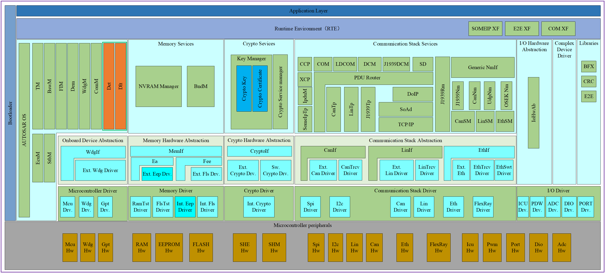

本文档是AUTOSAR架构中诊断日志与跟踪DLT模块的用户参考手册。旨在指导使用DLT模块的用户能够清晰地了解诊断日志与跟踪的功能，以及如何去配置和使用DLT模块。

This document is a user reference manual for the Diagnostic Log and Trace DLT module in the AUTOSAR architecture. It aims to guide users of the DLT module to clearly understand the functions of diagnostic logs and tracing, as well as how to configure and use the DLT module.

DLT模块为使用者提供了通用的日志和跟踪记录消息功能。本参考文档的主要重点如何将指定格式数据或本地缓冲数据通过通信接口发往网络总线。

The DLT module provides general logging and tracing message functionalities for users. The main focus of this reference document is on how to transmit specified format data or locally buffered data via communication interfaces to the network bus.

AUTOSAR日志与跟踪诊断协议栈处于BSW基础软件层，包括DLT、DET等系统服务。如图 所示，橙色区域标注的所有模块都归属于AUTOSAR软件架构中日志与跟踪诊断协议栈的管理范畴，基础软件层还提供系统服务，网络通信服务，I/O服务以及复杂设备驱动。

AUTOSAR logging and tracing diagnostic protocol stack resides in the BSW basic software layer, including systems like DLT, DET, etc. As shown in the figure, all modules marked in orange belong to the management scope of the logging and tracing diagnostic protocol stack within the AUTOSAR software architecture. The basic software layer also provides system services, network communication services, I/O services, and complex device drivers.

参考资料 (Reference materials)
------------------------------------------

[1] AUTOSAR_SRS_DiagnosticLogAndTrace.pdf

[2] AUTOSAR_PRS_LogAndTraceProtocol.pdf

[3] AUTOSAR_SWS_DiagnosticLogAndTrace.pdf

[4] AUTOSAR_SWS_DefaultErrorTracer.pdf

功能描述 (Function Description)
===========================================

DLT功能 (DLT Function)
------------------------------------

DLT功能介绍 (DLT Function Introduction)
===================================================

描述AUTOSAR软件架构中的基础软件模块DLT的功能设计和配置说明；它可以收集来自DET和DLT使用者的日志与跟踪信息；DLT模块通过通信总线转发诊断日志与跟踪消息，使这些信息可以在ECU外部可见；为此，DLT模块定义了在总线上发送和接收专用日志/跟踪信息的API；此外，可以选择使用NvM模块持久地存储DLT模块的更新过滤设置。这使ECU能够以所需的级别发送日志/跟踪信息，而不需要每次在ECU启动时通过外部客户端工具在通信总线上发出显式设置请求。

Describe the functional design and configuration specification of the basic software module DLT in the AUTOSAR software architecture; it can collect log and trace information from DET and DLT users; the DLT module forwards diagnostic logs and trace messages via the communication bus, making this information visible externally from the ECU; for this purpose, the DLT module defines APIs for sending and receiving dedicated log/trace information on the bus; additionally, it is possible to persistently store the updated filter settings of the DLT module using the NvM module. This allows the ECU to send log/trace information at the desired level without having to issue explicit setup requests via external client tools on the communication bus each time the ECU starts up.

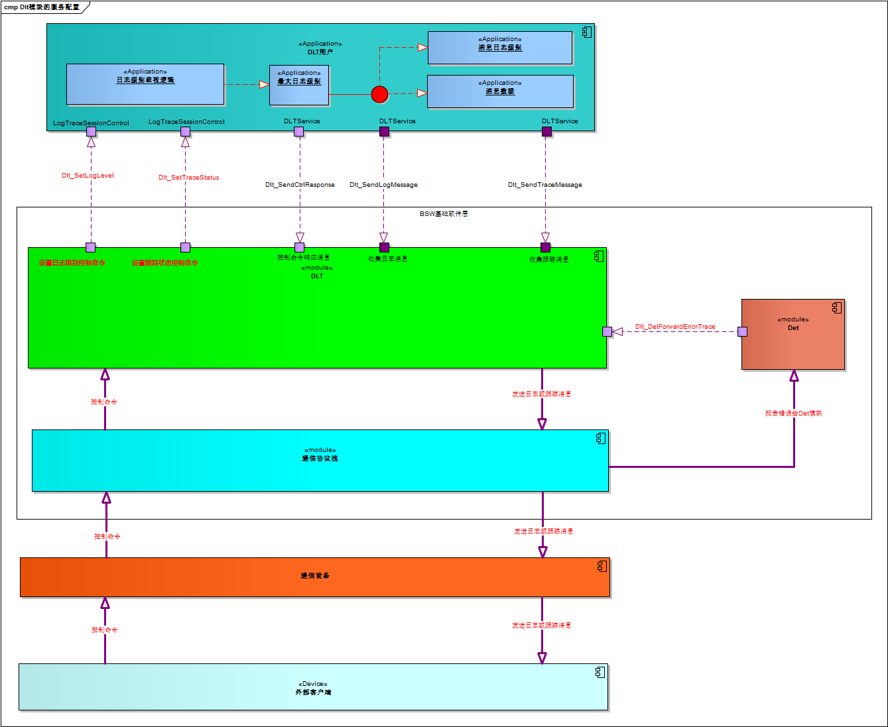

DLT功能实现 (DLT Function Implementation)
=====================================================

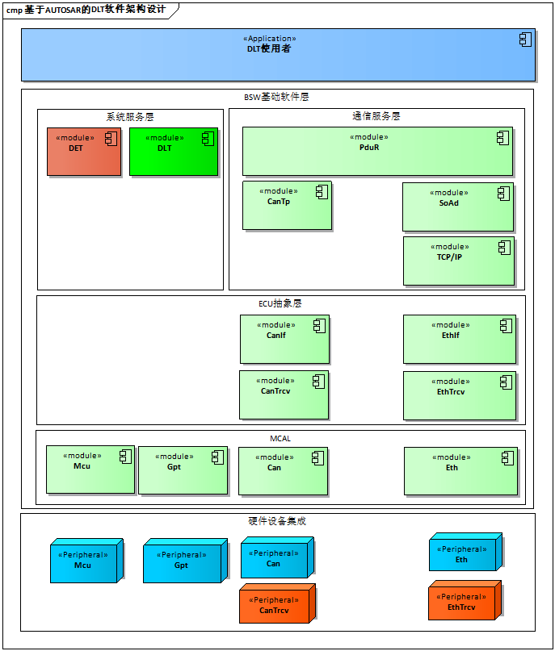

如图所示展示了AUTOSAR诊断日志与跟踪消息记录DLT模块的软件分层架构。可以看到DLT模块处于BSW基础软件的系统服务层，与DET模块处于并列关系，并且当DET模块检测到错误信息时会通过API接口向DLT模块进行汇报；DLT模块也可以将收集到的标准格式的诊断日志与跟踪消息封装成特定格式的Pdu数据，然后转发给通信协议栈的PduR模块，选择一种通信协议将组装好的Pdu数据发送到网络总线上，由外部客户端的上位机软件对网络总线上的诊断日志与跟踪消息进行录取；通信协议栈可以接收来自外部客户端的DLT控制命令消息，由PduR模块从网络总线上获取Pdu数据，然后PduR模块将解析好的数据提交给DLT模块，由DLT模块提取出控制命令消息并根据DLT命令字来设置相应的DLT用户中的配置信息。

The software layer architecture of the AUTOSAR Diagnostic Log and Trace Message Recording DLT module, as shown in the figure, demonstrates its placement within the BSW basic software's system service layer. It is on par with the DET module, whereupon the detection of an error message by the DET module, it reports via API interface to the DLT module; the DLT module can also encapsulate collected standard-format diagnostic logs and trace messages into specific formats of Pdu data, then forward them to the PduR module in the communication protocol stack. The PduR module selects a communication protocol to send the assembled Pdu data over the network bus, where external client's host software captures the diagnostic logs and trace messages on the network bus; the communication protocol stack can receive DLT control command messages from external clients, with the PduR module retrieving Pdu data from the network bus. Then, the PduR module submits parsed data to the DLT module, which extracts control command messages according to DLT command words and sets corresponding configuration information in the DLT user.

DLT组件交互 (DLT Component Interaction)
===================================================

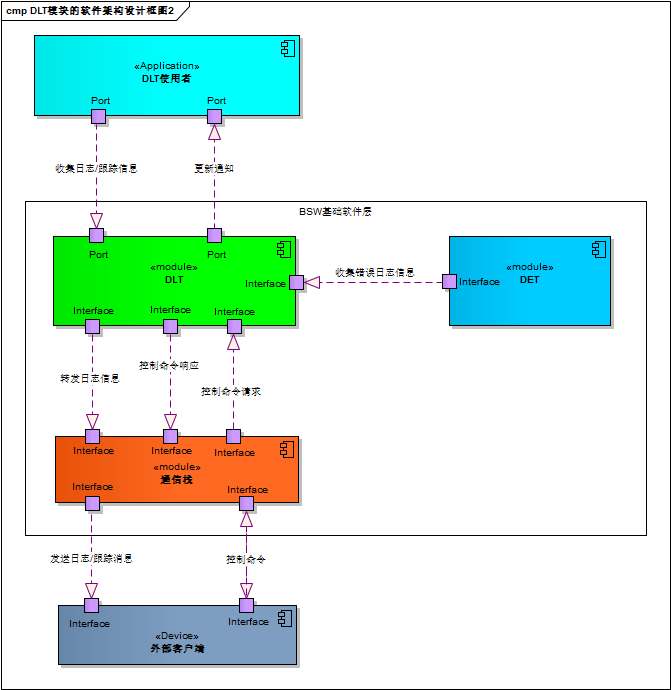

DLT模块应该提供以下功能：

The DLT module should provide the following functions:

- 日志信息记录

Log information recording

- 记录来自AUTOSAR软架构中应用程序组件DLT用户的错误、警告和信息等消息，并提供一个标准化的AUTOSAR接口；在BSW的一个系统集中子服务组件(DLT)中收集来自所有AUTOSAR软件架构中DLT用户的所有日志和跟踪消息；来自DET模块的日志消息。

It records error, warning, information and other messages from DLT users of application software components in the AUTOSAR software architecture, and provides a standardized AUTOSAR interface; collects all log and trace messages from all DLT users in the entire AUTOSAR software architecture within a centralized subsystem service component (DLT) in the BSW; and also processes log messages from the DET module.

- 跟踪信息记录

Tracking information recorded

- 实现用于跟踪软件组件变量、函数调用，函数返回，状态机的状态等事件的实时更新情况。

Enables real-time updates for tracking events such as software component variables, function calls, function returns, and state machine states.

- 控制命令请求与响应

Control command requests and responses

- 使能/禁止每个通道的日志与跟踪消息，并通过反馈控制每一个通道的日志级别与跟踪状态。

Enable or disable log and trace messages for each channel, and control the log level and trace status of each channel through feedback.

DLT控制命令集 (DLT Control Command Set)
==================================================

.. centered:: **表 DLT控制命令集描述 (Table DLTCtrlCommandSetDescribes)**

.. list-table::
   :widths: 25 25 25 25
   :header-rows: 1

   * - 服务标识符 (Service Identifier)
     - DLT命令名称 (DLT Command Name)
     - 命令详细描述 (Command Detailed Description)
     - 是否支持 (Whether it is supported)
   * - 0x00
     - NotSupported
     - 不支持命令 (Unsupported command)
     - ×
   * - 0x01
     - SetLogLevel
     - 设置日志级别 (Set log level)
     - √
   * - 0x02
     - SetTraceStatus
     - 设置跟踪状态 (Set tracking status)
     - √
   * - 0x03
     - GetLogInfo
     - 获取已注册的日志信息 (Get registered log information)
     - √
   * - 0x04
     - GetDefautlogLevel
     - 获取默认日志级别 (Get default log level)
     - √
   * - 0x05
     - StoreConfiguration
     - 存储当前配置信息到NvM (Store current configuration information to NvM)
     - √
   * - 0x06
     - ResetToFactoryDefault
     - 将配置信息恢复到默认值 (Restore configuration information to default)
     - √
   * - 0x07
     - SetComInterfaceStatus
     - 设置通信接口的状态 (Set the status of communication interfaces.)
     - ×
   * - 0x08
     - SetComIfMaxBandwidth
     - 设置通信接口的最大带宽 (Set the maximum bandwidth for communication interfaces)
     - ×
   * - 0x09
     - SetVerboseMode
     - 设置冗余模式 (Set redundant mode)
     - ×
   * - 0x0A
     - SetMessageFiltering
     - 设置DLT消息过滤状态 (Set DLT Message Filtering Status)
     - √
   * - 0x0B
     - Reversed
     - 预留 (Reserve)
     - ×
   * - 0x0C
     - GetLocalTime
     - 获取本地时间 (Get local time)
     - ×
   * - 0x0D
     - SetUseECUID
     - 设置用户ECU标识符 (Set user ECU identifier)
     - ×
   * - 0x0E
     - SetUseSessionID
     - 设置用户会话标识符 (Set user session identifier)
     - ×
   * - 0x0F
     - SetUseTimestamp
     - 设置用户时间戳 (Set user timestamp)
     - ×
   * - 0x10
     - SetUseExtendedHeader
     - 设置用户扩展头 (Set user extended header)
     - ×
   * - 0x11
     - SetDefaultLogLevel
     - 设置默认日志级别 (Set default log level)
     - √
   * - 0x12
     - SetDefaultTraceStatus
     - 使能/禁止默认跟踪状态 (Enable/Disable Default Tracking Status)
     - √
   * - 0x13
     - GetSoftwareVersion
     - 获取软件版本信息 (Get software version information)
     - ×
   * - 0x14
     - MessageBufferOverflow
     - 消息缓冲区溢出通知 (Message buffer overflow notification)
     - ×
   * - 0x15
     - GetDefaultTraceStatus
     - 获取默认跟踪状态 (Get Default Tracking Status)
     - √
   * - 0x16
     - GetComInterfacelStatus
     - 获取通信接口状态 (Get Communication Interface Status)
     - ×
   * - 0x17
     - GetLogChannelNames
     - 获取日志通道的名称 (Get the name of the log channel)
     - √
   * - 0x18
     - GetComIfMaxBandwidth
     - 获取通信接口的最大带宽 (Get the maximum bandwidth of the communication interface)
     - ×
   * - 0x19
     - GetVerboseModeStatus
     - 获取冗余模式状态 (Get Redundancy Mode Status)
     - ×
   * - 0x1A
     - GetMessageFilteringStatus
     - 获取DLT消息过滤状态 (Get DLT Message Filtering Status)
     - ×
   * - 0x1B
     - GetUseECUID
     - 获取用户ECU标识符 (Get user ECU identifier)
     - ×
   * - 0x1C
     - GetUseSessionID
     - 获取用户会话标识符 (Get user session identifier)
     - ×
   * - 0x1D
     - GetUseTimestamp
     - 获取用户时间戳 (Get user timestamp)
     - ×
   * - 0x1E
     - GetUseExtendedHeader
     - 获取用户扩展头 (Get user extended header)
     - ×
   * - 0x1F
     - GetTraceStatus
     - 获取当前跟踪状态 (Get Current Tracking Status)
     - √
   * - 0x20
     - SetLogChannelAssignment
     - 设置给定日志通道的映射路径 (Set the mapping path for the given log channel)
     - √
   * - 0x21
     - SetLogChannelThreshold
     - 设置给定日志通道的过滤阈值 (Set the filtering threshold for the given log channel)
     - √
   * - 0x22
     - GetLogChannelThreshold
     - 获取给定日志通道的过滤阈值 (Get the filter threshold for the given log channel)
     - √
   * - 0x23
     - BufferOverflowNotification
     - DLT缓冲区溢出的指示通知 (Overflow indication notification for DLT buffer overflow)
     - √
   * - 0x24
     - SyncTimeStamp
     - 同步时间戳的指示 (Indication for synchronizing time stamps)
     - √

DLT模块注册或注销ApplicationID和ContextId (DLT module registers or unregisters ApplicationID and ContextId)
===================================================================================================================

DLT模块能够通知日志级别的变化，DLT模块只有注册相应的ApplicationId /ContextId，才能在运行时使用ApplicationId/ContextId的元组，并存储到本地进行全局管理。如果参数DltGeneralRegisterContextNotification设置为TRUE，那么每次调用Dlt_RegisterContext时，Dlt模块将发送包含所提供的ApplicationId / ContextId的DLT消息。

The DLT module can notify of log level changes. The DLT module only uses the ApplicationId/ContextId tuple at runtime and stores it for global management if it registers the corresponding ApplicationId/ContextId. If the parameter DltGeneralRegisterContextNotification is set to TRUE, then each call to Dlt_RegisterContext will result in a DLT message being sent that includes the provided ApplicationId/ContextId.

DLT模块可以从已注册的用户列表中删除所有软件组件对应元组的应用程序ApplicationId和上下文ContextId标识符。

The DLT module can delete all application ApplicationId and context ContextId identifiers corresponding to software components from the registered user list.

如果参数DltGeneralRegisterContextNotification设置为TRUE，那么每次调用Dlt_UnregisterContext时，Dlt模块都将发送包含所提供的ApplicationId / ContextId的DLT消息。

If the parameter DltGeneralRegisterContextNotification is set to TRUE, then each time Dlt_UnregisterContext is called, the Dlt module will send a DLT message containing the provided ApplicationId/ContextId.

DLT日志与跟踪消息发送 (DLT Logs and Tracking Messages Sent)
==================================================================

Dlt消息发送路径描述Dlt日志和跟踪消息从源到接收的流程。源可以是DLT用户，而PDU路由通信栈表示接收端。

Description of DLT Message Sending Path DLT logs and tracing messages describe the flow from source to receiver. The source can be a DLT user, while PDU routing communication stack represents the receiver.

在调用Dlt_SendLogMessage或Dlt_SendTraceMessage的上下文中，如图所示描述用于描述在通信总线上发送Dlt消息的各个步骤。

In the context of calling Dlt_SendLogMessage or Dlt_SendTraceMessage, as shown in the figure, the steps for sending Dlt messages over the communication bus are described.

- 产生时间戳 (Generate timestamp)

- 设置消息过滤 (Set message filtering)

- 选择目标日志通道 (Select target log channel)

- 检查消息长度 (Check message length)

- 根据日志通道阈值过滤消息 (Filter messages according to log channel threshold)

- 拷贝Dlt 消息到指定日志通道的目标缓冲区 (Copy Dlt messages to the target buffer of the specified log channel)

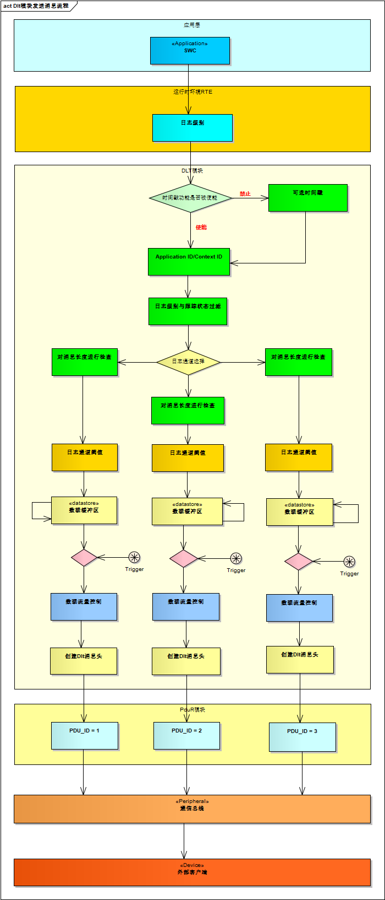

源文件描述 (Source file description)
===============================================

.. centered:: **表 DLT组件文件描述 (Table DLT Component File Description)**

.. list-table::
   :widths: 50 50
   :header-rows: 1

   * - 文件 (Files)
     - 说明 (Description)
   * - Dlt_Cfg.h
     - 定义DLT模块预编译时用到的配置参数。 (Define configuration parameters used in DLT module pre-compilation.)
   * - Dlt_Cfg.c
     - 定义DLT模块中连接时用到的配置参数。 (Define configuration parameters used for connection in the DLT module.)
   * - Dlt.h
     - DLT模块头文件，包含了API函数的扩展声明并定义了端口的数据结构。 (Header file for the DLT module, which includes extended declarations of API functions and defines the data structures of ports.)
   * - Dlt.c
     - DLT模块源文件，包含了API函数的实现。 (DLT module source files contain the implementation of API functions.)
   * - Dlt_Cbk.c
     - 用于实现Dlt模块供PduR调用的回调函数接口 (To implement callback function interfaces for PduR to call the Dlt module)
   * - Dlt_Cbk.h
     - 用于声明Dlt模块供PduR调用的回调函数接口 (To declare callback function interfaces for Dlt module invoked by PduR)
   * - Dlt_internal.h
     - Dlt模块内部接口的引用声明定义 (Definition of reference declarations for internal interfaces in Dlt module)
   * - Dlt_Types.h
     - Dlt模块类型定义头文件 (Dlt Module Type Definition Header File)
   * - Dlt_MemMap.h
     - 包含Dlt模块的内存抽象 (Abstract Memory with Dlt Module)

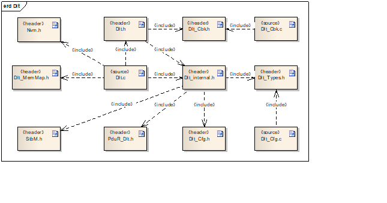

Dlt模块的文件结构如图所示。Dlt功能模块由9个文件组成，其中Dlt.c，Dlt.h两个文件中实现了Dlt的主要功能，这两个文件是每个Dlt模块必须实现的。

The file structure of the Dlt module is shown in the figure. The Dlt functional module consists of 9 files, among which Dlt.c and Dlt.h implement the main functionality of Dlt. These two files must be implemented in each Dlt module.

API接口 (API Interface)
=====================================

类型定义 (Type definition)
--------------------------------------

Dlt_MessageTraceType类型定义 (Dlt_MessageTraceType Type Definition)
===============================================================================

.. list-table::
   :widths: 50 50
   :header-rows: 1

   * - 名称 (Name)
     - Dlt_MessageTraceType
   * - 类型 (Type)
     - Enumeration
   * - 范围 (Range)
     - DLT_TRACE_VARIABLE = 1U
   * - 
     - DLT_TRACE_FUNCTION_IN = 2U
   * - 
     - DLT_TRACE_FUNCTION_OUT = 3U
   * - 
     - DLT_TRACE_STATE = 4U
   * - 
     - DLT_TRACE_VFB = 5U
   * - 描述 (Description)
     - 用于定义Dlt模块跟踪消息的枚举类型 (An enumeration type used to define Dlt module message tracking)

Dlt_MessageType类型定义 (Definition of Dlt_MessageType Type)
========================================================================

.. list-table::
   :widths: 50 50
   :header-rows: 1

   * - 名称 (Name)
     - Dlt_MessageType
   * - 类型 (Type)
     - Enumeration
   * - 范围 (Range)
     - DLT_TYPE_LOG = 0U
   * - 
     - DLT_TYPE_APP_TRACE = 1U
   * - 
     - DLT_TYPE_NW_TRACE = 2U
   * - 
     - DLT_TYPE_CONTROL = 3U
   * - 描述 (Description)
     - 用于定义Dlt模块的消息信息的枚举类型 (Enum type for defining message information of Dlt module)

Dlt_MessageControlType类型定义 (Dlt_MessageControlType Type Definition)
===================================================================================

.. list-table::
   :widths: 50 50
   :header-rows: 1

   * - 名称 (Name)
     - Dlt_MessageControlType
   * - 类型 (Type)
     - Enumeration
   * - 范围 (Range)
     - DLT_CONTROL_REQUEST = 1U
   * - 
     - DLT_CONTROL_RESPONSE = 2U
   * - 描述 (Description)
     - 用于定义Dlt模块的控制消息的枚举类型 (Enumerated type for control messages defining the Dlt module)

Dlt_MessageNetworkTraceInfoType类型定义 (Dlt_MessageNetworkTraceInfoType Type Definition)
=====================================================================================================

.. list-table::
   :widths: 50 50
   :header-rows: 1

   * - 名称 (Name)
     - Dlt_MessageNetworkTraceInfoType;
   * - 类型 (Type)
     - Enumeration
   * - 范围 (Range)
     - DLT_NW_TRACE_IPC = 1U
   * - 
     - DLT_NW_TRACE_CAN = 2U
   * - 
     - DLT_NW_TRACE_FLEXRAY = 3U
   * - 
     - DLT_NW_TRACE_MOST = 4U
   * - 
     - DLT_NW_TRACE_ETHERNET = 5U
   * - 
     - DLT_NW_TRACE_SOMEIP = 6U
   * - 描述 (Description)
     - 用于定义Dlt模块的跟踪消息的枚举类型 (Enumerated type for defining tracking messages of Dlt module)

Dlt_SwcContextType类型定义 (Dlt_SwcContextType Type Definition)
===========================================================================

.. list-table::
   :widths: 50 50
   :header-rows: 1

   * - 名称 (Name)
     - Dlt_SwcContextType
   * - 类型 (Type)
     - Structure
   * - 定义 (Define)
     - typedef struct
   * - 
     - {
   * - 
     - Dlt_ApplicationIDType SwcApplicationId;
   * - 
     - Dlt_ContextIDType SwcContextId;
   * - 
     - } Dlt_SwcContextType;
   * - 范围 (Range)
     - 无
   * - 描述 (Description)
     - 用于描述SWC内容的结构体类型 (Structural type for describing SWC content)

Dlt_LogLevelThesholdType类型定义 (DLT_LogLevelThresholdType type definition)
========================================================================================

.. list-table::
   :widths: 50 50
   :header-rows: 1

   * - 名称 (Name)
     - Dlt_LogLevelThesholdType
   * - 类型 (Type)
     - Structure
   * - 定义 (Define)
     - typedef struct
   * - 
     - {
   * - 
     - Dlt_MessageLogLevelType DltThreshold;
   * - 
     - P2CONST(Dlt_SwcContextType, AUTOMATIC, DLT_APPL_CONST)DltLogLevelThresholdSwcContextRef;
   * - 
     - } Dlt_LogLevelThesholdType;
   * - 范围 (Range)
     - 无
   * - 描述 (Description)
     - 用描述Dlt log等级阈值的结构体类型 (Use a struct type to describe Dlt log level thresholds.)

Dlt_LogLevelSettingType类型定义 (Dlt_LogLevelSettingType type definition)
=====================================================================================

.. list-table::
   :widths: 50 50
   :header-rows: 1

   * - 名称 (Name)
     - Dlt_LogLevelSettingType
   * - 类型 (Type)
     - Structure
   * - 定义 (Define)
     - typedef struct
   * - 
     - {
   * - 
     - Dlt_MessageLogLevelType DltDefaultLogLevel;
   * - 
     - uint8 LogLevelThesholdNum;
   * - 
     - P2CONST(Dlt_LogLevelThesholdType, AUTOMATIC,DLT_APPL_CONST) DltLogLevelThreshold;
   * - 
     - } Dlt_LogLevelSettingType;
   * - 范围 (Range)
     - 无
   * - 描述 (Description)
     - 用于描述Dlt Log等级设置的结构体类型 (Struct type for describing Dlt Log level settings)

Dlt_TxPduType类型定义 (Dlt_TxPduType Type Definition)
=================================================================

.. list-table::
   :widths: 50 50
   :header-rows: 1

   * - 名称 (Name)
     - Dlt_TxPduType
   * - 类型 (Type)
     - Structure
   * - 定义 (Define)
     - typedef struct
   * - 
     - {
   * - 
     - /\*TX PDUR ID*/
   * - 
     - PduIdType DltTxPduRPduId;
   * - 
     - /\* DLT internal handle Id*/
   * - 
     - PduIdType DltTxHandlePduId;
   * - 
     - boolean DltTxPduUsesTp;
   * - 
     - } Dlt_TxPduType;
   * - 范围 (Range)
     - 无
   * - 描述 (Description)
     - 用于描述Dlt发送数据时的PDU的结构体类型 (Struct type for describing PDU in Dlt when sending data)

Dlt_RxPduType类型定义 (Dlt_RxPduType Type Definition)
=================================================================

.. list-table::
   :widths: 50 50
   :header-rows: 1

   * - 名称 (Name)
     - Dlt_RxPduType
   * - 类型 (Type)
     - Structure
   * - 定义 (Define)
     - typedef struct
   * - 
     - {
   * - 
     - PduIdType DltRxPduId;
   * - 
     - boolean DltRxPduUsesTp;
   * - 
     - } Dlt_RxPduType;
   * - 范围 (Range)
     - 无
   * - 描述 (Description)
     - 用于描述DLT接收数据时的PDU的结构体类型 (Struct type for describing PDU when DLT receives data)

Dlt_LogChannelType类型定义 (Dlt_LogChannelType Type Definition)
===========================================================================

.. list-table::
   :widths: 50 50
   :header-rows: 1

   * - 名称 (Name)
     - Dlt_LogChannelType
   * - 类型 (Type)
     - Structure
   * - 定义 (Define)
     - typedef struct
   * - 
     - {
   * - 
     - uint16 DltLogChannelBufferOverflowTimer;
   * - 
     - uint32 DltLogChannelBufferSize;
   * - 
     - uint32 DltLogChannelId;
   * - 
     - uint16 DltLogChannelMaxMessageLength;
   * - 
     - uint8 DltLogChannelMaxNumOfRetries;
   * - 
     - Dlt_MessageLogLevelType DltLogChannelThreshold;
   * - 
     - uint32 DltLogChannelTrafficShapingBandwidth;
   * - 
     - uint16 DltLogChannelTransmitCycle; /\*not used*/
   * - 
     - boolean DltLogTraceStatusFlag;
   * - 
     - P2CONST(Dlt_TxPduType, AUTOMATIC, DLT_APPL_CONST)DltTxPdu;
   * - 
     - } Dlt_LogChannelType;
   * - 范围 (Range)
     - 无
   * - 描述 (Description)
     - 用于描述Dlt log通道的结构体类型 (Struct type for describing Dlt log channel)

Dlt_LogChannelAssignmentType类型定义 (Dlt_LogChannelAssignmentType type definition)
===============================================================================================

.. list-table::
   :widths: 50 50
   :header-rows: 1

   * - 名称 (Name)
     - Dlt_LogChannelAssignmentType
   * - 类型 (Type)
     - Structure
   * - 定义 (Define)
     - typedef struct
   * - 
     - {
   * - 
     - P2CONST(Dlt_SwcContextType, AUTOMATIC, DLT_APPL_CONST)DltLogChannelAssignmentSwcContextRef;
   * - 
     - uint16 DltLogChannelRef;
   * - 
     - } Dlt_LogChannelAssignmentType;
   * - 范围 (Range)
     - 无
   * - 描述 (Description)
     - 用于描述Dlt 通道分配的结构体类型 (Structural type for describing Dlt channel allocation)

Dlt_LogOutputType类型定义 (Dlt_LogOutputType Type Definition)
=========================================================================

.. list-table::
   :widths: 50 50
   :header-rows: 1

   * - 名称 (Name)
     - Dlt_LogOutputType
   * - 类型 (Type)
     - Structure
   * - 定义 (Define)
     - typedef struct
   * - 
     - {
   * - 
     - uint16 ChannelNum;
   * - 
     - P2CONST(Dlt_LogChannelType, AUTOMATIC, DLT_APPL_CONST)LogChannel;
   * - 
     - uint16 LogChannelAssignmentNum;
   * - 
     - P2CONST(Dlt_LogChannelAssignmentType, AUTOMATIC,DLT_APPL_CONST) LogChannelAssignment;
   * - 
     - uint16 DltDefaultLogChannelRef;
   * - 
     - } Dlt_LogOutputType;
   * - 范围 (Range)
     - 无
   * - 描述 (Description)
     - 用于描述Dlt log输出的结构体类型 (Struct type for describing Dlt log output)

Dlt_EcuIdTypes类型定义 (Definition of Dlt_EcuIdTypes Types)
=======================================================================

.. list-table::
   :widths: 50 50
   :header-rows: 1

   * - 名称 (Name)
     - Dlt_EcuIdTypes
   * - 类型 (Type)
     - Structure
   * - 定义 (Define)
     - typedef struct
   * - 
     - {
   * - 
     - Dlt_EcuIdCalloutTypes DltEcuIdCallout;
   * - 
     - uint32 DltEcuIdValue;
   * - 
     - } Dlt_EcuIdTypes;
   * - 范围 (Range)
     - 无
   * - 描述 (Description)
     - 用于描述EcuId的结构体类型 (Structural type for describing EcuId)

Dlt_ProtocolType类型定义 (Dlt_ProtocolType Type Definition)
=======================================================================

.. list-table::
   :widths: 50 50
   :header-rows: 1

   * - 名称 (Name)
     - Dlt_ProtocolType
   * - 类型 (Type)
     - Structure
   * - 定义 (Define)
     - typedef struct
   * - 
     - {
   * - 
     - boolean DltHeaderUseEcuId;
   * - 
     - boolean DltHeaderUseSessionID;
   * - 
     - boolean DltHeaderUseTimestamp;
   * - 
     - boolean DltUseExtHeaderInNonVerbMode;
   * - 
     - boolean DltUseVerboseMode;
   * - 
     - P2CONST(Dlt_EcuIdTypes, AUTOMATIC, DLT_APPL_CONST)DltEcuId;
   * - 
     - } Dlt_ProtocolType;
   * - 范围 (Range)
     - 无
   * - 描述 (Description)
     - 用于描述Dlt协议的结构体类型 (Struct types for describing Dlt protocol)

Dlt_TraceStatusAssignmentTypes类型定义 (Definition of Dlt_TraceStatusAssignmentTypes Types)
=======================================================================================================

.. list-table::
   :widths: 50 50
   :header-rows: 1

   * - 名称 (Name)
     - Dlt_TraceStatusAssignmentTypes
   * - 类型 (Type)
     - Structure
   * - 定义 (Define)
     - typedef struct
   * - 
     - {
   * - 
     - boolean DltTraceStatus;
   * - 
     - P2CONST(Dlt_SwcContextType, AUTOMATIC, DLT_APPL_CONST)DltTraceStatusAssignmentSwcContextRef;
   * - 
     - } Dlt_TraceStatusAssignmentTypes;
   * - 范围 (Range)
     - 无
   * - 描述 (Description)
     - 用于描述Dlt跟踪状态分配的结构体类型 (Structural type for describing Dlt tracking status allocation)

Dlt_TraceStatusSettingType类型定义 (Dlt_TraceStatusSettingType Type Definition)
===========================================================================================

.. list-table::
   :widths: 50 50
   :header-rows: 1

   * - 名称 (Name)
     - Dlt_TraceStatusSettingTyp
   * - 类型 (Type)
     - Structure
   * - 定义 (Define)
     - typedef struct
   * - 
     - {
   * - 
     - boolean DltDefaultTraceStatus;
   * - 
     - uint8 DltTraceStatusAssignmentNum;
   * - 
     - P2CONST(Dlt_TraceStatusAssignmentTypes, AUTOMATIC,DLT_APPL_CONST) DltTraceStatusAssignment;
   * - 
     - } Dlt_TraceStatusSettingType;
   * - 范围 (Range)
     - 无
   * - 描述 (Description)
     - 用于描述Dlt跟踪状态设置的结构体类型 (Struct type for describing Dlt tracking status settings)

Dlt_ConfigType类型定义 (Definition of Dlt_ConfigType Type)
======================================================================

.. list-table::
   :widths: 50 50
   :header-rows: 1

   * - 名称 (Name)
     - Dlt_ConfigType
   * - 类型 (Type)
     - Structure
   * - 定义 (Define)
     - typedef struct
   * - 
     - {
   * - 
     - P2CONST(Dlt_LogLevelSettingType, AUTOMATIC,DLT_APPL_CONST) LogLevelSetting;
   * - 
     - P2CONST(Dlt_LogOutputType, AUTOMATIC, DLT_APPL_CONST)LogOutput;
   * - 
     - P2CONST(Dlt_ProtocolType, AUTOMATIC, DLT_APPL_CONST)Protocol;
   * - 
     - uint16 RxPduNum;
   * - 
     - P2CONST(Dlt_RxPduType, AUTOMATIC, DLT_APPL_CONST) RxPdu;
   * - 
     - P2CONST(Dlt_TraceStatusSettingType, AUTOMATIC,DLT_APPL_CONST) TraceStatusSetting;
   * - 
     - } Dlt_ConfigType;
   * - 范围 (Range)
     - 无
   * - 描述 (Description)
     - 用于描述Dlt 配置的结构体类型 (Struct type for describing Dlt configuration)

Dlt_SwcTypes类型定义 (Definition of Dlt_SwcTypes Types)
===================================================================

.. list-table::
   :widths: 50 50
   :header-rows: 1

   * - 名称 (Name)
     - Dlt_SwcTypes
   * - 类型 (Type)
     - Structure
   * - 定义 (Define)
     - typedef struct
   * - 
     - {
   * - 
     - Dlt_SessionIDType DltSwcSessionId;
   * - 
     - booleanDltSwcSupportLogLevelAndTraceStatusChangeNotification;
   * - 
     - TraceStatusChangedNotificationTypeTraceStatusChangedNotification;
   * - 
     - LogLevelChangedNotificationTypeLogLevelChangedNotification;
   * - 
     - InjectionCallbackType InjectionCallback;
   * - 
     - uint16 MaxSwcLogMessageLength;
   * - 
     - uint16 MaxSwcTraceMessageLength;
   * - 
     - uint16 DltSwcContextNum;
   * - 
     - P2CONST(Dlt_SwcContextType, AUTOMATIC, DLT_APPL_CONST)DltSwcContext;
   * - 
     - } Dlt_SwcTypes;
   * - 
     - typedef struct
   * - 
     - {
   * - 
     - uint16 DltSwcNum;
   * - 
     - P2CONST(Dlt_SwcTypes, AUTOMATIC, DLT_APPL_CONST) DltSwc;
   * - 
     - } Dlt_SwcType;
   * - 范围 (Range)
     - 无
   * - 描述 (Description)
     - 用于描述与Dlt交互的Swc信息的结构体类型 (Struct type for describing Swc information that interacts with Dlt)

Dlt_BufferDataTypeTypes类型定义 (Dlt_BufferDataTypeTypes Type Definition)
=====================================================================================

.. list-table::
   :widths: 50 50
   :header-rows: 1

   * - 名称 (Name)
     - Dlt_BufferDataTypeTypes
   * - 类型 (Type)
     - Enumeration
   * - 定义 (Define)
     - DLT_LOG_DATA = 0u,
   * - 
     - DLT_TRACE_DATA = 1u,
   * - 
     - DLT_CONTROL_DATA = 2u
   * - 范围 (Range)
     - 无
   * - 描述 (Description)
     - 用于描述Dlt缓冲区数据类型的枚举类型 (Enum type used to describe data types of Dlt buffer)

Dlt_statusTypes类型定义 (Definition of dlt_statusTypes Types)
=========================================================================

.. list-table::
   :widths: 50 50
   :header-rows: 1

   * - 名称 (Name)
     - Dlt_statusTypes
   * - 类型 (Type)
     - Enumeration
   * - 定义 (Define)
     - DLT_STATUS_OK = 0u,
   * - 
     - DLT_STATUS_NOT_SUPPORTED = 1u,
   * - 
     - DLT_STATUS_ERROR = 2u
   * - 范围 (Range)
     - 无
   * - 描述 (Description)
     - 用于描述Dlt状态的枚举类型 (Enum type for describing Dlt state)

Dlt_SwcContextInofType类型定义 (Dlt_SwcContextInofType type definition)
===================================================================================

.. list-table::
   :widths: 50 50
   :header-rows: 1

   * - 名称 (Name)
     - Dlt_SwcContextInofType
   * - 类型 (Type)
     - Structure
   * - 定义 (Define)
     - typedef struct
   * - 
     - {
   * - 
     - Dlt_MessageLogLevelType DltThreshold;
   * - 
     - boolean TraceStatus;
   * - 
     - boolean Register;
   * - 
     - uint16 DltLogChannelRefNum;
   * - 
     - uint16 DltLogChannelRef[DLT_CHANNEL_NUM];
   * - 
     - Dlt_SwcContextType SwcContext;
   * - 
     - P2CONST(uint8, AUTOMATIC, DLT_APPL_CONST)appDescription;
   * - 
     - uint8 lenAppDescription;
   * - 
     - P2CONST(uint8, AUTOMATIC, DLT_APPL_CONST)contextDescription;
   * - 
     - uint8 lenContextDescription;
   * - 
     - } Dlt_SwcContextInofType;
   * - 范围 (Range)
     - 无
   * - 描述 (Description)
     - 用于描述与dlt交互的SWC内容信息的结构体类型 (Struct type for describing information content regarding interaction with dlt)

Dlt_SwcInfoType类型定义 (Definition of Dlt_SwcInfoType Type)
========================================================================

.. list-table::
   :widths: 50 50
   :header-rows: 1

   * - 名称 (Name)
     - Dlt_SwcInfoType
   * - 类型 (Type)
     - structure
   * - 定义 (Define)
     - typedef struct
   * - 
     - {
   * - 
     - Dlt_SessionIDType DltSwcSessionId;
   * - 
     - uint16 DltSwcContextNum;
   * - 
     - Dlt_SwcContextInofTypeSwcContextInfo[DLT_SWC_MAX_CONTEXT_NUM];
   * - 
     - } Dlt_SwcInfoType;
   * - 范围 (Range)
     - 无
   * - 描述 (Description)
     - 用于描述与dlt交互的SWC信息的结构体类型 (Struct type for describing SWC information interacting with dlt)

Dlt_ChannelInfoType类型定义 (Definition of Dlt_ChannelInfoType Type)
================================================================================

.. list-table::
   :widths: 50 50
   :header-rows: 1

   * - 名称 (Name)
     - Dlt_ChannelInfoType
   * - 类型 (Type)
     - structure
   * - 定义 (Define)
     - typedef struct
   * - 
     - {
   * - 
     - Dlt_MessageLogLevelType DltLogChannelThreshold;
   * - 
     - boolean DltLogTraceStatusFlag;
   * - 
     - } Dlt_ChannelInfoType;
   * - 范围 (Range)
     - 无
   * - 描述 (Description)
     - 用于定义Dlt模块通道信息的结构体类型 (Struct types used for defining Dlt module channel information)

Dlt_MessageInfoType类型定义 (Definition of Dlt_MessageInfoType Type)
================================================================================

.. list-table::
   :widths: 50 50
   :header-rows: 1

   * - 名称 (Name)
     - Dlt_MessageFilterPassType
   * - 类型 (Type)
     - Enumeration
   * - 定义 (Define)
     - DLT_MESSAGE_FILTER = 0u，
   * - 
     - DLT_MESSAGE_BLOCKD = 1u,
   * - 
     - DLT_MESSAGE_PASS = 2u,
   * - 范围 (Range)
     - 无
   * - 描述 (Description)
     - 用于定义Dlt模块信息过滤器的枚举类型 (Enum type for defining Dlt module information filters)

Dlt_RunTimeType类型定义 (Dlt_RunTimeType Runtime Type Definition)
=============================================================================

.. list-table::
   :widths: 50 50
   :header-rows: 1

   * - 名称 (Name)
     - Dlt_RunTimeType
   * - 类型 (Type)
     - structure
   * - 定义 (Define)
     - typedef struct
   * - 
     - {
   * - 
     - boolean MessageFilterEnable;
   * - 
     - Dlt_MessageFilterPassType MessageFilterPass;
   * - 
     - Dlt_MessageLogLevelType DefaultLogLevel;
   * - 
     - boolean DefaultTraceStatus;
   * - 
     - #if (DLT_SWC_NUM > 0)
   * - 
     - Dlt_SwcInfoType SwcInfo[DLT_SWC_NUM];
   * - 
     - #endif
   * - 
     - Dlt_ChannelInfoType ChannelInfo[DLT_CHANNEL_NUM];
   * - 
     - } Dlt_RunTimeType
   * - 范围 (Range)
     - 无
   * - 描述 (Description)
     - 用于定义Dlt模块的运行时间的结构体类型 (Structure type used for defining the runtime of Dlt module)

Dlt_ModeStateType类型定义 (Type definition for Dlt_ModeStateType)
=============================================================================

.. list-table::
   :widths: 50 50
   :header-rows: 1

   * - 名称 (Name)
     - Dlt_ModeStateType
   * - 类型 (Type)
     - Enumeration
   * - 定义 (Define)
     - DLT_STATE_UNINIT = 0u,
   * - 
     - DLT_STATE_INIT = 1u,
   * - 范围 (Range)
     - 无
   * - 描述 (Description)
     - 用于定义Dlt模块模式状态的枚举类型 (Enum type used for defining Dlt module mode state)

Dlt_SendStateType类型定义 (Type definition for Dlt_SendStateType)
=============================================================================

.. list-table::
   :widths: 50 50
   :header-rows: 1

   * - 名称 (Name)
     - Dlt_SendStateType
   * - 类型 (Type)
     - Enum
   * - 定义 (Define)
     - typedef enum
   * - 
     - {
   * - 
     - DLT_WAIT_SEND = 0u,
   * - 
     - DLT_SEND_NEED_RETRY = 1u,
   * - 
     - DLT_SEND_NOT_CONFIRMATION = 2u,
   * - 
     - DLT_CONTROL_SENDED = 3u,
   * - 
     - } Dlt_SendStateType;
   * - 范围 (Range)
     - 无
   * - 描述 (Description)
     - 用于定义Dlt模块发送状态的结构体类型 (The struct type used for defining the state of the Dlt module)

Dlt_RxStatusTypes类型定义 (Dlt_RxStatusTypes type definition)
=========================================================================

.. list-table::
   :widths: 50 50
   :header-rows: 1

   * - 名称 (Name)
     - Dlt_RxStatusTypes
   * - 类型 (Type)
     - structure
   * - 定义 (Define)
     - typedef struct
   * - 
     - {
   * - 
     - uint16 RxLength;
   * - 
     - uint16 RxOffset;
   * - 
     - boolean Used;
   * - 
     - boolean NeedDeal;
   * - 
     - uint8 RxBuffer[DLT_BUFFER_MAX_LENGTH];
   * - 
     - } Dlt_RxStatusTypes;
   * - 范围 (Range)
     - 无
   * - 描述 (Description)
     - 用于定义Dlt发送状态的结构体类型 (Structure type for defining Dlt send status)

Dlt_CreateExtendedHeaderInfoTypes类型定义 (Dlt_CreateExtendedHeaderInfoTypes type definition)
=========================================================================================================

.. list-table::
   :widths: 50 50
   :header-rows: 1

   * - 名称 (Name)
     - Dlt_CreateExtendedHeaderInfoTypes
   * - 类型 (Type)
     - structure
   * - 定义 (Define)
     - typedef struct
   * - 
     - typedef struct
   * - 
     - {
   * - 
     - uint16 ChannelIndex;
   * - 
     - Dlt_BufferDataTypeTypes BufferDataType;
   * - 
     - Dlt_MessageLogInfoType\* logInfo;
   * - 
     - Dlt_MessageTraceInfoType\* traceInfo;
   * - 
     - Dlt_SwcContextType SwcContext;
   * - 
     - } Dlt_CreateExtendedHeaderInfoTypes;
   * - 范围 (Range)
     - 无
   * - 描述 (Description)
     - 用于定义Dlt外部头文件信息的结构体类型 (Structural type used for defining Dlt external header file information)

Dlt_CreateStandardHeaderInfoTypes类型定义 (Dlt_CreateStandardHeaderInfoTypes type definition)
=========================================================================================================

.. list-table::
   :widths: 50 50
   :header-rows: 1

   * - 名称 (Name)
     - Dlt_CreateStandardHeaderInfoTypes
   * - 类型 (Type)
     - structure
   * - 定义 (Define)
     - typedef struct
   * - 
     - {
   * - 
     - uint16 ChannelIndex;
   * - 
     - uint16 Messagelength;
   * - 
     - Dlt_SessionIDType SessionId;
   * - 
     - uint32 timestamp;
   * - 
     - } Dlt_CreateStandardHeaderInfoTypes;
   * - 范围 (Range)
     - 无
   * - 描述 (Description)
     - 用于定义Dlt模块基本头文件信息的结构体类型 (Structural type used for defining basic header information of Dlt module)

Dlt_OverFlowInfoTypes类型定义 (Definition of Dlt_OverFlowInfoTypes Types)
=====================================================================================

.. list-table::
   :widths: 50 50
   :header-rows: 1

   * - 名称 (Name)
     - Dlt_OverFlowInfoTypes
   * - 类型 (Type)
     - structure
   * - 定义 (Define)
     - typedef struct
   * - 
     - {
   * - 
     - boolean OverFlow;
   * - 
     - boolean OverFlowSend;
   * - 
     - uint32 overflowCounter;
   * - 
     - uint32 BufferOverflowTimer;
   * - 
     - Dlt_SessionIDType SessionId;
   * - 
     - uint32 timestamp;
   * - 
     - Dlt_BufferDataTypeTypes BufferDataType;
   * - 
     - Dlt_SwcContextType SwcContext;
   * - 
     - } Dlt_OverFlowInfoTypes;
   * - 范围 (Range)
     - 无
   * - 描述 (Description)
     - 用于定义Dlt模块溢出信息结构体类型 (Used to define the structure type of Dlt module overflow information)

Dlt_ChannelType类型定义 (Definition of Dlt_ChannelType Type)
========================================================================

.. list-table::
   :widths: 50 50
   :header-rows: 1

   * - 名称 (Name)
     - Dlt_ChannelType
   * - 类型 (Type)
     - structure
   * - 定义 (Define)
     - typedef struct
   * - 
     - {
   * - 
     - uint8 buffer[DLT_CHANNEL_MAX_BUFFER_LENGTH];
   * - 
     - uint32 ReadIndex;
   * - 
     - uint32 WriteIndex;
   * - 
     - Dlt_OverFlowInfoTypes OverFlowInfo;
   * - 
     - uint8 MessageCounter;
   * - 
     - uint32 UnusedLength;
   * - 
     - Dlt_SendStateType LastSendStatus;
   * - 
     - boolean ControlSend;
   * - 
     - uint8 SendCounter;
   * - 
     - uint32 LastSendLength;
   * - 
     - uint16 LastControlSendLength;
   * - 
     - uint8 SendControlBuffer[DLT_CHANNEL_MAX_BUFFER_LENGTH];
   * - 
     - uint16 ControlSendOffset;
   * - 
     - uint16 MessageSendOffset;
   * - 
     - } Dlt_ChannelType;
   * - 范围 (Range)
     - 无
   * - 描述 (Description)
     - 用于定义Dlt模块通道的结构体类型 (Struct type for defining Dlt module channels)

输入函数描述 (Describe the input function:)
-----------------------------------------------------

.. list-table::
   :widths: 50 50
   :header-rows: 1

   * - 输入模块 (Input Module)
     - API
   * - PduR
     - Std_ReturnType PduR_DltTransmit(PduIdType id, constPduInfoType \*info);
   * - DET
     - Std_ReturnType Det_ReportError
   * - 
     - (
   * - 
     - uint16 ModuleId,
   * - 
     - uint8 InstanceId,
   * - 
     - uint8 ApiId,
   * - 
     - uint8 ErrorId
   * - 
     - );
   * - GPT
     - void Gpt_StartTimer(Gpt_ChannelType channel, Gpt_ValueTypevalue);
   * - StbM
     - Std_ReturnType StbM_GetCurrentTime
   * - 
     - (
   * - 
     - StbM_SynchronizedTimeBaseType timeBaseId,
   * - 
     - StbM_TimeStampType \*timeStamp,
   * - 
     - StbM_UserDataType \*userData
   * - 
     - );
   * - NvM
     - Std_ReturnType NvM_WriteBlock
   * - 
     - (
   * - 
     - NvM_BlockIdType BlockId,
   * - 
     - const void \*NvM_SrcPtr
   * - 
     - );

静态接口函数定义 (Static interface function definition)
---------------------------------------------------------------

Dlt_Init函数定义 (The Dlt_Init function defines)
============================================================

.. list-table::
   :widths: 25 25 25 25
   :header-rows: 1

   * - 函数名称： (Function Name:)
     - Dlt_Init
     - 
     - 
   * - 函数原型： (Function prototype:)
     - void Dlt_Init(const Dlt_CfgType\*ConfigPtr);
     - 
     - 
   * - 服务编号： (Service Number:)
     - 0x01
     - 
     - 
   * - 同步/异步： (Synchronous/asynchronous:)
     - 同步 (Sync)
     - 
     - 
   * - 是否可重入： (Is Reentrant:)
     - 不可重入 (Non-reentrant)
     - 
     - 
   * - 输入参数： (Input parameters:)
     - ConfigPtr：指向Dlt模块配置结构的指针 (ConfigPtr：a pointer to the Dlt module configuration structure)
     - 值域： (Domain:)
     - 无
   * - 输入输出参数： (Input Output Parameters:)
     - 无
     - 
     - 
   * - 输出参数： (Output Parameters:)
     - 无
     - 
     - 
   * - 返回值： (Return Value:)
     - 无
     - 
     - 
   * - 功能概述： (Function Overview:)
     - 完成对Dlt模块的初始化处理； (Complete the initialization processing of the Dlt module;)
     - 
     - 
   * - 
     - 如Dlt的配置需要使用NVRamManager非易失数据存储，在ECU 启动阶段非常晚才初始化； (If Dlt configuration requires using NVRamManager non-volatile data storage, it is initialized very late during the ECU startup phase;)
     - 
     - 
   * - 
     - Dlt_Init()函数应该在初始化NVRamManager 之后调用； (The Dlt_Init() function should be called after initializing NVRamManager;)
     - 
     - 

Dlt_GetVersionInfo函数定义 (DLT_GetVersionInfo function definition)
===============================================================================

.. list-table::
   :widths: 25 25 25 25
   :header-rows: 1

   * - 函数名称： (Function Name:)
     - Dlt_GetVersionInfo
     - 
     - 
   * - 函数原型： (Function prototype:)
     - voidDlt_GetVersionInfo(Std_VersionInfoType\*VersionInfo);
     - 
     - 
   * - 服务编号： (Service Number:)
     - 0x02
     - 
     - 
   * - 同步/异步： (Synchronous/asynchronous:)
     - 同步 (Sync)
     - 
     - 
   * - 是否可重入： (Is Reentrant:)
     - 不可重入 (Non-reentrant)
     - 
     - 
   * - 输入参数： (Input parameters:)
     - 无
     - 
     - 
   * - 输入输出参数： (Input Output Parameters:)
     - 无
     - 
     - 
   * - 输出参数： (Output Parameters:)
     - versioninfo：保存版本信息的结构体地址 (versioninfo：The address of the structure body for saving version information.)
     - 值域： (Domain:)
     - 无
   * - 返回值： (Return Value:)
     - 无
     - 
     - 
   * - 功能概述： (Function Overview:)
     - 获取DLT模块的软件版本信息。 (Get software version information of the DLT module.)
     - 
     - 
   * - 
     - 备注：需要将相应编译宏定义开关设置为开启功能 (Note: Corresponding compile macro definitions should be set to enable the feature.)
     - 
     - 

Dlt_SendTraceMessage函数定义 (The Dlt_SendTraceMessage function definition)
=======================================================================================

.. list-table::
   :widths: 25 25 25 25
   :header-rows: 1

   * - 函数名称： (Function Name:)
     - Dlt_SendTraceMessage
     - 
     - 
   * - 函数原型： (Function prototype:)
     - Std_ReturnTypeDlt_SendTraceMessage(Dlt_SessionIDType session_id,const Dlt_MessageTraceInfoType\*traceInfo,const uint8 \*traceData,uint16 traceDataLength)
     - 
     - 
   * - 服务编号： (Service Number:)
     - 0x04
     - 
     - 
   * - 同步/异步： (Synchronous/asynchronous:)
     - 同步 (Sync)
     - 
     - 
   * - 是否可重入： (Is Reentrant:)
     - 不可重入 (Non-reentrant)
     - 
     - 
   * - 输入参数： (Input parameters:)
     - session_id：会话标识符 (session_id：Session Identifier)
     - 值域： (Domain:)
     - 0-4294967295
   * - 
     - traceInfo：跟踪信息参数的指针 (traceInfo：A pointer to the trace information parameter.)
     - 值域： (Domain:)
     - 无
   * - 
     - traceData：跟踪数据缓冲区的指针 (traceData：a pointer to the buffer of tracking data)
     - 值域： (Domain:)
     - 无
   * - 
     - traceDataLength：跟踪数据长度 (traceDataLength：Trace Data Length)
     - 值域： (Domain:)
     - 0-65535
   * - 输入输出参数： (Input Output Parameters:)
     - 无
     - 
     - 
   * - 输出参数： (Output Parameters:)
     - 无
     - 
     - 
   * - 返回值： (Return Value:)
     - Std_ReturnType：
     - 
     - 
   * - 
     - E_OK: 请求操作被接受 (E_OK: The request operation has been accepted)
     - 
     - 
   * - 
     - DLT_E_MSG_TOO_LARGE:对于所有分配资源，指示消息太大 (DLT_E_MSG TOO LARGE: For all allocated resources, indicate message too large)
     - 
     - 
   * - 
     - DLT_E_NO_BUFFER:没有足够的缓冲区资源，不能为至少一个日志通道缓冲Dlt消息 (DLT_E_NO_BUFFER: There is not enough buffer resource to buffer DLT messages for at least one log channel.)
     - 
     - 
   * - 
     - DLT_E_UNKNOWN_SESSION_ID:提供的会话标识符未知 (DLT_E_UNKNOWN_SESSION_ID: The provided session identifier is unknown)
     - 
     - 
   * - 功能概述： (Function Overview:)
     - 用于VFB虚拟功能总线模块向Dlt模块转发跟踪信息的服务接口，Dlt模块收集到来自虚拟功能总线VFB的跟踪信息以后，先存储到本地的消息缓冲区中，然后发送到网络总线上。 (Service interface for the VFB virtual function bus module to forward tracking information to the Dlt module. After the Dlt module collects the tracking information from the virtual function bus VFB, it is first stored in a local message buffer and then sent to the network bus.)
     - 
     - 

Dlt_SendLogMessage函数定义 (The Dlt_SendLogMessage function definition)
===================================================================================

.. list-table::
   :widths: 25 25 25 25
   :header-rows: 1

   * - 函数名称： (Function Name:)
     - Dlt_SendLogMessage
     - 
     - 
   * - 函数原型： (Function prototype:)
     - Std_ReturnTypeDlt_SendLogMessage(Dlt_SessionIDType session_id,const Dlt_MessageLogInfoType\*logInfo,const uint8 \*logData,uint16 logDataLength)
     - 
     - 
   * - 服务编号： (Service Number:)
     - 0x03
     - 
     - 
   * - 同步/异步： (Synchronous/asynchronous:)
     - 同步 (Sync)
     - 
     - 
   * - 是否可重入： (Is Reentrant:)
     - 不可重入 (Non-reentrant)
     - 
     - 
   * - 输入参数： (Input parameters:)
     - session_id：会话标识符 (session_id：Session Identifier)
     - 值域： (Domain:)
     - 0-4294967295
   * - 
     - logInfo：日志信息参数的指针 (logInfo：Pointer to the log information parameter)
     - 值域： (Domain:)
     - 无
   * - 
     - logData：日志数据缓冲区的指针 (logData：Pointer to the log data buffer)
     - 值域： (Domain:)
     - 无
   * - 
     - logDataLength：日志数据长度 (logDataLength: Log data length)
     - 值域： (Domain:)
     - 0-65535
   * - 输入输出参数： (Input Output Parameters:)
     - 无
     - 
     - 
   * - 输出参数： (Output Parameters:)
     - 无
     - 
     - 
   * - 返回值： (Return Value:)
     - Std_ReturnType：
     - 
     - 
   * - 
     - E_OK: 请求操作被接受 (E_OK: The request operation has been accepted)
     - 
     - 
   * - 
     - DLT_E_MSG_TOO_LARGE:对于所有分配资源，指示消息太大 (DLT_E_MSG TOO LARGE: For all allocated resources, indicate message too large)
     - 
     - 
   * - 
     - DLT_E_NO_BUFFER:没有足够的缓冲区资源，不能为至少一个日志通道缓冲Dlt消息 (DLT_E_NO_BUFFER: There is not enough buffer resource to buffer DLT messages for at least one log channel.)
     - 
     - 
   * - 
     - DLT_E_UNKNOWN_SESSION_ID:提供的会话标识符未知 (DLT_E_UNKNOWN_SESSION_ID: The provided session identifier is unknown)
     - 
     - 
   * - 功能概述： (Function Overview:)
     - 用于SWC模块向Dlt模块转发日志信息的服务接口，Dlt模块收集到来自SWC模块的日志信息以后，先存储到本地的消息缓冲区中，然后发送到网络总线上。 (The service interface for SWC module to forward log information to Dlt module, after the Dlt module receives log information from the SWC module, it first stores it in a local message buffer and then sends it to the network bus.)
     - 
     - 

Dlt_DetForwardErrorTrace函数定义 (The Dlt_DetForwardErrorTrace function definition)
===============================================================================================

.. list-table::
   :widths: 25 25 25 25
   :header-rows: 1

   * - 函数名称： (Function Name:)
     - Dlt_DetForwardErrorTrace
     - 
     - 
   * - 函数原型： (Function prototype:)
     - void Dlt_DetForwardErrorTrace(uint16 moduleId,uint8 instanceId,uint8 apiId,uint8 errorId)
     - 
     - 
   * - 服务编号： (Service Number:)
     - 0x07
     - 
     - 
   * - 同步/异步： (Synchronous/asynchronous:)
     - 同步 (Sync)
     - 
     - 
   * - 是否可重入： (Is Reentrant:)
     - 不可重入 (Non-reentrant)
     - 
     - 
   * - 输入参数： (Input parameters:)
     - moduleId：模块标识符ID (moduleId：Module Identifier ID)
     - 值域： (Domain:)
     - 0-65535
   * - 
     - instanceId：实例标识符ID (instanceId：Instance Identifier ID)
     - 值域： (Domain:)
     - 0-255
   * - 
     - apiId：接口标识符ID (apiId：API Identifier ID)
     - 值域： (Domain:)
     - 0-255
   * - 
     - errorId：错误标识符 ID (errorId：Error Identifier ID)
     - 值域： (Domain:)
     - 0-255
   * - 输入输出参数： (Input Output Parameters:)
     - 无
     - 
     - 
   * - 输出参数： (Output Parameters:)
     - 无
     - 
     - 
   * - 返回值： (Return Value:)
     - 无
     - 
     - 
   * - 功能概述： (Function Overview:)
     - 用于Det模块向Dlt模块转发错误信息的服务接口，Dlt模块收集到来自Det模块的日志信息以后，先存储到本地的消息缓冲区中，然后发送到网络总线上。 (The service interface for Error Information Transfer from the Det module to the Dlt module, where after the Dlt module collects log information from the Det module, it first stores it in a local message buffer and then sends it to the network bus.)
     - 
     - 

Dlt_RegisterContext函数定义 (The Dlt_RegisterContext function definition)
=====================================================================================

.. list-table::
   :widths: 25 25 25 25
   :header-rows: 1

   * - 函数名称： (Function Name:)
     - Dlt_RegisterContext
     - 
     - 
   * - 函数原型： (Function prototype:)
     - Std_ReturnTypeDlt_RegisterContext(Dlt_SessionIDType session_id,Dlt_ApplicationIDType appId,Dlt_ContextIDType contextId,const uint8 \*appDescription,uint8 lenAppDescription,const uint8\*contextDescription,uint8 lenContextDescription)
     - 
     - 
   * - 服务编号： (Service Number:)
     - 0x05
     - 
     - 
   * - 同步/异步： (Synchronous/asynchronous:)
     - 同步 (Sync)
     - 
     - 
   * - 是否可重入： (Is Reentrant:)
     - 可重入 (Reentrant)
     - 
     - 
   * - 输入参数： (Input parameters:)
     - session_id：会话标识符 (session_id：Session Identifier)
     - 值域： (Domain:)
     - 0-4294967295
   * - 
     - appId：应用程序标识符 (appId：Application Identifier)
     - 值域： (Domain:)
     - 0-4294967295
   * - 
     - contextId：下文标识符 (contextId：Context Identifier)
     - 值域： (Domain:)
     - 0-4294967295
   * - 
     - appDescription：应用描述信息的指针 (appDescription: A pointer for the application description information)
     - 值域： (Domain:)
     - 无
   * - 
     - lenAppDescription：应用描述信息长度 (lenAppDescription: Length of Application Description Information)
     - 值域： (Domain:)
     - 0-255
   * - 
     - contextDescription：上下文描述信息的指针 (Pointer to context description information)
     - 值域： (Domain:)
     - 无
   * - 
     - lenContextDescription：上下文描述信息长度 (lenContextDescription：Length of context description information)
     - 值域： (Domain:)
     - 0-255
   * - 输入输出参数： (Input Output Parameters:)
     - 无
     - 
     - 
   * - 输出参数： (Output Parameters:)
     - 无
     - 
     - 
   * - 返回值： (Return Value:)
     - Std_ReturnType：
     - 
     - 
   * - 
     - E_OK: API接口请求被接受 (E_OK: The API interface request has been accepted)
     - 
     - 
   * - 
     - E_NOT_OK: API接口请求被拒绝 (E_NOT_OK: API interface request denied)
     - 
     - 
   * - 功能概述： (Function Overview:)
     - 用于SWC软件组件模块向Dlt模块注册应用程序的上下文信息 (To register application context information with the Dlt module for the SWC software component module)
     - 
     - 

Dlt_UnRegisterContext函数定义 (The Dlt_UnRegisterContext function definition)
=========================================================================================

.. list-table::
   :widths: 25 25 25 25
   :header-rows: 1

   * - 函数名称： (Function Name:)
     - Dlt_UnRegisterContext
     - 
     - 
   * - 函数原型： (Function prototype:)
     - Std_ReturnTypeDlt_UnRegisterContext(Dlt_SessionIDType session_id,Dlt_ApplicationIDType appId,Dlt_ContextIDType contextId)
     - 
     - 
   * - 服务编号： (Service Number:)
     - 0x16
     - 
     - 
   * - 同步/异步： (Synchronous/asynchronous:)
     - 同步 (Sync)
     - 
     - 
   * - 是否可重入： (Is Reentrant:)
     - 可重入 (Reentrant)
     - 
     - 
   * - 输入参数： (Input parameters:)
     - session_id：会话标识符 (session_id：Session Identifier)
     - 值域： (Domain:)
     - 0-4294967295
   * - 
     - appId：应用程序标识符 (appId：Application Identifier)
     - 值域： (Domain:)
     - 0-4294967295
   * - 
     - contextId：下文标识符 (contextId：Context Identifier)
     - 值域： (Domain:)
     - 0-4294967295
   * - 输入输出参数： (Input Output Parameters:)
     - 无
     - 
     - 
   * - 输出参数： (Output Parameters:)
     - 无
     - 
     - 
   * - 返回值： (Return Value:)
     - Std_ReturnType：
     - 
     - 
   * - 
     - E_OK: API接口请求被接受 (E_OK: The API interface request has been accepted)
     - 
     - 
   * - 
     - E_NOT_OK: API接口请求被拒绝 (E_NOT_OK: API interface request denied)
     - 
     - 
   * - 功能概述： (Function Overview:)
     - 用于SWC软件组件模块向Dlt模块注销应用程序的上下文信息 (For the SWC software component module to deregister application context information with the Dlt module)
     - 
     - 

Dlt_SetLogLevel函数定义 (The Dlt_SetLogLevel function defines)
==========================================================================

.. list-table::
   :widths: 25 25 25 25
   :header-rows: 1

   * - 函数名称： (Function Name:)
     - Dlt_SetLogLevel
     - 
     - 
   * - 函数原型： (Function prototype:)
     - Std_ReturnType Dlt_SetLogLevel(Dlt_ApplicationIDType appId,Dlt_ContextIDType contextId,Dlt_LogMessageLevelTypenewLogLevel)
     - 
     - 
   * - 服务编号： (Service Number:)
     - 0x08
     - 
     - 
   * - 同步/异步： (Synchronous/asynchronous:)
     - 同步 (Sync)
     - 
     - 
   * - 是否可重入： (Is Reentrant:)
     - 可重入 (Reentrant)
     - 
     - 
   * - 输入参数： (Input parameters:)
     - appId：应用程序标识符 (appId：Application Identifier)
     - 值域： (Domain:)
     - 0-4294967295
   * - 
     - contextId：下文标识符 (contextId：Context Identifier)
     - 值域： (Domain:)
     - 0-4294967295
   * - 
     - newLogLevel： 新的日志级别 (newLogLevel： New log level)
     - 值域： (Domain:)
     - DLT_LOG_OFFDLT_LOG_FATAL
   * - 
     - 
     - 
     - DLT_LOG_ERROR
   * - 
     - 
     - 
     - DLT_LOG_WARN
   * - 
     - 
     - 
     - DLT_LOG_INFO
   * - 
     - 
     - 
     - DLT_LOG_DEBUG
   * - 
     - 
     - 
     - DLT_LOG_VERBOSE
   * - 输入输出参数： (Input Output Parameters:)
     - 无
     - 
     - 
   * - 输出参数： (Output Parameters:)
     - 无
     - 
     - 
   * - 返回值： (Return Value:)
     - Std_ReturnType：
     - 
     - 
   * - 
     - E_OK: API接口请求被接受 (E_OK: The API interface request has been accepted)
     - 
     - 
   * - 
     - E_NOT_OK: API接口请求被拒绝 (E_NOT_OK: API interface request denied)
     - 
     - 
   * - 功能概述： (Function Overview:)
     - 向Dlt模块请求设置日志级别的服务控制接口 (Service control interface for requesting log level settings from Dlt module)
     - 
     - 

Dlt_SetTraceStatus函数定义 (The Dlt_SetTraceStatus function definition)
===================================================================================

.. list-table::
   :widths: 25 25 25 25
   :header-rows: 1

   * - 函数名称： (Function Name:)
     - Dlt_SetTraceStatus
     - 
     - 
   * - 函数原型： (Function prototype:)
     - Std_ReturnTypeDlt_SetTraceStatus(Dlt_ApplicationIDType appId,Dlt_ContextIDType contextId,boolean newTraceStatus)
     - 
     - 
   * - 服务编号： (Service Number:)
     - 0x09
     - 
     - 
   * - 同步/异步： (Synchronous/asynchronous:)
     - 同步 (Sync)
     - 
     - 
   * - 是否可重入： (Is Reentrant:)
     - 不可重入 (Non-reentrant)
     - 
     - 
   * - 输入参数： (Input parameters:)
     - appId：应用程序标识符 (appId：Application Identifier)
     - 值域： (Domain:)
     - 0-4294967295
   * - 
     - contextId：下文标识符 (contextId：Context Identifier)
     - 值域： (Domain:)
     - 0-4294967295
   * - 
     - newTraceStatus： 新的跟踪状态 (newTraceStatus： new tracking status)
     - 值域： (Domain:)
     - DLT_TRACE_ONDLT_TRACE_OFF
   * - 输入输出参数： (Input Output Parameters:)
     - 无
     - 
     - 
   * - 输出参数： (Output Parameters:)
     - 无
     - 
     - 
   * - 返回值： (Return Value:)
     - Std_ReturnType：
     - 
     - 
   * - 
     - E_OK: API接口请求被接受 (E_OK: The API interface request has been accepted)
     - 
     - 
   * - 
     - E_NOT_OK: API接口请求被拒绝 (E_NOT_OK: API interface request denied)
     - 
     - 
   * - 功能概述： (Function Overview:)
     - 向Dlt模块请求设置当前跟踪状态的服务控制接口 (Service control interface for requesting setting of current tracking status to Dlt module)
     - 
     - 

Dlt_GetLogInfo函数定义 (Define the Dlt_GetLogInfo function)
=======================================================================

.. list-table::
   :widths: 25 25 25 25
   :header-rows: 1

   * - 函数名称： (Function Name:)
     - Dlt_GetLogInfo
     - 
     - 
   * - 函数原型： (Function prototype:)
     - Std_ReturnType Dlt_GetLogInfo(uint8 options,Dlt_ApplicationIDType appId,Dlt_ContextIDType contextId,uint8 \*status,Dlt_LogInfoType \*logInfo)
     - 
     - 
   * - 服务编号： (Service Number:)
     - 0x0A
     - 
     - 
   * - 同步/异步： (Synchronous/asynchronous:)
     - 同步 (Sync)
     - 
     - 
   * - 是否可重入： (Is Reentrant:)
     - 不可重入 (Non-reentrant)
     - 
     - 
   * - 输入参数： (Input parameters:)
     - options：选项字 (Options: Options 字)
     - 值域： (Domain:)
     - 0-255
   * - 
     - appId：应用程序标识符 (appId：Application Identifier)
     - 值域： (Domain:)
     - 0-4294967295
   * - 
     - contextId：下文标识符 (contextId：Context Identifier)
     - 值域： (Domain:)
     - 0-4294967295
   * - 输入输出参数： (Input Output Parameters:)
     - 无
     - 
     - 
   * - 输出参数： (Output Parameters:)
     - status：运行时执行状态的指针 (status：a pointer to the runtime execution state)
     - 值域： (Domain:)
     - 无
   * - 
     - logInfo：返回当前日志信息的指针 (logInfo：Pointer to current log information)
     - 值域： (Domain:)
     - 无
   * - 返回值： (Return Value:)
     - Std_ReturnType：
     - 
     - 
   * - 
     - E_OK: API接口请求被接受 (E_OK: The API interface request has been accepted)
     - 
     - 
   * - 
     - E_NOT_OK: API接口请求被拒绝 (E_NOT_OK: API interface request denied)
     - 
     - 
   * - 功能概述： (Function Overview:)
     - 向Dlt模块请求获取当前日志信息的服务控制接口 (Service control interface for requesting log information from the Dlt module)
     - 
     - 

Dlt_GetDefaultLogLevel函数定义 (The Dlt_GetDefaultLogLevel function definition)
===========================================================================================

.. list-table::
   :widths: 25 25 25 25
   :header-rows: 1

   * - 函数名称： (Function Name:)
     - Dlt_GetDefaultLogLevel
     - 
     - 
   * - 函数原型： (Function prototype:)
     - Std_ReturnTypeDlt_GetDefaultLogLevel(Dlt_MessageLogLevelType\*defaultLogLevel)
     - 
     - 
   * - 服务编号： (Service Number:)
     - 0x18
     - 
     - 
   * - 同步/异步： (Synchronous/asynchronous:)
     - 同步 (Sync)
     - 
     - 
   * - 是否可重入： (Is Reentrant:)
     - 不可重入 (Non-reentrant)
     - 
     - 
   * - 输入参数： (Input parameters:)
     - 无
     - 
     - 
   * - 输入输出参数： (Input Output Parameters:)
     - 无
     - 
     - 
   * - 输出参数： (Output Parameters:)
     - defaultLogLevel：当前的默认日志级别的指针 (defaultLogLevel：the pointer to the current default log level)
     - 值域： (Domain:)
     - 无
   * - 返回值： (Return Value:)
     - Std_ReturnType：
     - 
     - 
   * - 
     - E_OK: API接口请求被接受 (E_OK: The API interface request has been accepted)
     - 
     - 
   * - 
     - E_NOT_OK: API接口请求被拒绝 (E_NOT_OK: API interface request denied)
     - 
     - 
   * - 功能概述： (Function Overview:)
     - 向Dlt模块请求获取当前默认日志级别的服务控制接口 (Request service control interface to get the current default log level from Dlt module)
     - 
     - 

Dlt_StoreConfiguration函数定义 (The Dlt_StoreConfiguration function defines)
========================================================================================

.. list-table::
   :widths: 50 50
   :header-rows: 1

   * - 函数名称： (Function Name:)
     - Dlt_StoreConfiguration
   * - 函数原型： (Function prototype:)
     - Std_ReturnType Dlt_StoreConfiguration(void);
   * - 服务编号： (Service Number:)
     - 0x1A
   * - 同步/异步： (Synchronous/asynchronous:)
     - 同步 (Sync)
   * - 是否可重入： (Is Reentrant:)
     - 不可重入 (Non-reentrant)
   * - 输入参数： (Input parameters:)
     - 无
   * - 输入输出参数： (Input Output Parameters:)
     - 无
   * - 输出参数： (Output Parameters:)
     - 无
   * - 返回值： (Return Value:)
     - Std_ReturnType：
   * - 
     - E_OK: API接口请求被接受 (E_OK: The API interface request has been accepted)
   * - 
     - E_NOT_OK: API接口请求被拒绝 (E_NOT_OK: API interface request denied)
   * - 
     - DLT_E_NOT_SUPPORTED: 服务不支持 (DLT_E_NOT_SUPPORTED: The service does not support)
   * - 功能概述： (Function Overview:)
     - 向Dlt模块请求存储配置的服务调用，即通过调用NvM_WriteBlock()函数接口，将当前Dlt配置复制到NvRAM。 (Service calls to request storage configuration from the Dlt module, which involves calling the NvM_WriteBlock() function interface to copy the current Dlt configuration to NvRAM.)

Dlt_ResetToFactoryDefault函数定义 (Dlt_ResetToFactoryDefault function definition)
=============================================================================================

.. list-table::
   :widths: 50 50
   :header-rows: 1

   * - 函数名称： (Function Name:)
     - Dlt_ResetToFactoryDefault
   * - 函数原型： (Function prototype:)
     - Std_ReturnType Dlt_ResetToFactoryDefault(void);
   * - 服务编号： (Service Number:)
     - 0x06
   * - 同步/异步： (Synchronous/asynchronous:)
     - 同步 (Sync)
   * - 是否可重入： (Is Reentrant:)
     - 不可重入 (Non-reentrant)
   * - 输入参数： (Input parameters:)
     - 无
   * - 输入输出参数： (Input Output Parameters:)
     - 无
   * - 输出参数： (Output Parameters:)
     - 无
   * - 返回值： (Return Value:)
     - Std_ReturnType：
   * - 
     - E_OK: API接口请求被接受 (E_OK: The API interface request has been accepted)
   * - 
     - E_NOT_OK: API接口请求被拒绝 (E_NOT_OK: API interface request denied)
   * - 功能概述： (Function Overview:)
     - 向DLT模块请求将日志级别和跟踪状态设置为非易失性存储的默认值。如果特性NvMRAM支持被启用，所有存储在NvM中的Dlt值将被删除。 (Request the DLT module to set the log level and tracking status as default values in non-volatile storage. If NvMRAM feature support is enabled, all DLT values stored in NvM will be deleted.)

Dlt_SetMessageFiltering函数定义 (Dlt_SetMessageFiltering function definition)
=========================================================================================

.. list-table::
   :widths: 25 25 25 25
   :header-rows: 1

   * - 函数名称： (Function Name:)
     - Dlt_SetMessageFiltering
     - 
     - 
   * - 函数原型： (Function prototype:)
     - Std_ReturnTypeDlt_SetMessageFiltering(booleanstatus);
     - 
     - 
   * - 服务编号： (Service Number:)
     - 0x1B
     - 
     - 
   * - 同步/异步： (Synchronous/asynchronous:)
     - 同步 (Sync)
     - 
     - 
   * - 是否可重入： (Is Reentrant:)
     - 不可重入 (Non-reentrant)
     - 
     - 
   * - 输入参数： (Input parameters:)
     - status：新的消息过滤使能状态 (status: New message filtering enable status)
     - 值域： (Domain:)
     - TRUE-FALSE
   * - 输入输出参数： (Input Output Parameters:)
     - 无
     - 
     - 
   * - 输出参数： (Output Parameters:)
     - 无
     - 
     - 
   * - 返回值： (Return Value:)
     - Std_ReturnType：
     - 
     - 
   * - 
     - E_OK: API接口请求被接受 (E_OK: The API interface request has been accepted)
     - 
     - 
   * - 
     - E_NOT_OK: API接口请求被拒绝 (E_NOT_OK: API interface request denied)
     - 
     - 
   * - 功能概述： (Function Overview:)
     - 向DLT模块请求使能/禁止Dlt模块的消息过滤功能 (Request enabling/disabling of DLT module message filtering from DLT module)
     - 
     - 

Dlt_SetDefaultLogLevel函数定义 (The Dlt_SetDefaultLogLevel function defines)
========================================================================================

.. list-table::
   :widths: 25 25 25 25
   :header-rows: 1

   * - 函数名称： (Function Name:)
     - Dlt_SetDefaultLogLevel
     - 
     - 
   * - 函数原型： (Function prototype:)
     - Std_ReturnTypeDlt_SetDefaultLogLevel(Dlt_MessageLogLevelTypenewLogLevel)
     - 
     - 
   * - 服务编号： (Service Number:)
     - 0x11
     - 
     - 
   * - 同步/异步： (Synchronous/asynchronous:)
     - 同步 (Sync)
     - 
     - 
   * - 是否可重入： (Is Reentrant:)
     - 可重入 (Reentrant)
     - 
     - 
   * - 输入参数： (Input parameters:)
     - newLogLevel：新的默认日志级别 (newLogLevel: The new default log level)
     - 值域： (Domain:)
     - DLT_LOG_OFFDLT_LOG_FATAL
   * - 
     - 
     - 
     - DLT_LOG_ERROR
   * - 
     - 
     - 
     - DLT_LOG_WARN
   * - 
     - 
     - 
     - DLT_LOG_INFO
   * - 
     - 
     - 
     - DLT_LOG_DEBUG
   * - 
     - 
     - 
     - DLT_LOG_VERBOSE
   * - 输入输出参数： (Input Output Parameters:)
     - 无
     - 
     - 
   * - 输出参数： (Output Parameters:)
     - 无
     - 
     - 
   * - 返回值： (Return Value:)
     - Std_ReturnType：
     - 
     - 
   * - 
     - E_OK: API接口请求被接受 (E_OK: The API interface request has been accepted)
     - 
     - 
   * - 
     - E_NOT_OK: API接口请求被拒绝 (E_NOT_OK: API interface request denied)
     - 
     - 
   * - 功能概述： (Function Overview:)
     - 向Dlt模块请求设置当前默认日志级别的服务控制接口 (Service control interface for requesting to set the current default log level to Dlt module)
     - 
     - 

Dlt_SetDefaultTraceStatus函数定义 (The Dlt_SetDefaultTraceStatus function defines)
==============================================================================================

.. list-table::
   :widths: 25 25 25 25
   :header-rows: 1

   * - 函数名称： (Function Name:)
     - Dlt_SetDefaultTraceStatus
     - 
     - 
   * - 函数原型： (Function prototype:)
     - Std_ReturnTypeDlt_SetDefaultTraceStatus(boolean newTraceStatus,Dlt_LogChannelNameTypelogChannelName)
     - 
     - 
   * - 服务编号： (Service Number:)
     - 0x12
     - 
     - 
   * - 同步/异步： (Synchronous/asynchronous:)
     - 同步 (Sync)
     - 
     - 
   * - 是否可重入： (Is Reentrant:)
     - 可重入 (Reentrant)
     - 
     - 
   * - 输入参数： (Input parameters:)
     - newTraceStatus：新的默认跟踪状态 (newTraceStatus：New Default Tracking Status)
     - 值域： (Domain:)
     - DLT_TRACE_OFFDLT_TRACE_ON
   * - 
     - logChannelName：日志通道名称 (logChannelName: Log Channel Name)
     - 值域： (Domain:)
     - 0-4294967295
   * - 输入输出参数： (Input Output Parameters:)
     - 无
     - 
     - 
   * - 输出参数： (Output Parameters:)
     - 无
     - 
     - 
   * - 返回值： (Return Value:)
     - Std_ReturnType：
     - 
     - 
   * - 
     - E_OK: API接口请求被接受 (E_OK: The API interface request has been accepted)
     - 
     - 
   * - 
     - E_NOT_OK: API接口请求被拒绝 (E_NOT_OK: API interface request denied)
     - 
     - 
   * - 功能概述： (Function Overview:)
     - 向Dlt模块请求设置当前默认跟踪状态的服务控制接口 (Service control interface to request setting the current default tracing status to Dlt module)
     - 
     - 

Dlt_GetDefaultTraceStatus函数定义 (The Dlt_GetDefaultTraceStatus function defines)
==============================================================================================

.. list-table::
   :widths: 25 25 25 25
   :header-rows: 1

   * - 函数名称： (Function Name:)
     - Dlt_GetDefaultTraceStatus
     - 
     - 
   * - 函数原型： (Function prototype:)
     - Std_ReturnTypeDlt_GetDefaultTraceStatus(Dlt_LogChannelNameTypelogChannelName, boolean \*traceStatus)
     - 
     - 
   * - 服务编号： (Service Number:)
     - 0x19
     - 
     - 
   * - 同步/异步： (Synchronous/asynchronous:)
     - 同步 (Sync)
     - 
     - 
   * - 是否可重入： (Is Reentrant:)
     - 可重入 (Reentrant)
     - 
     - 
   * - 输入参数： (Input parameters:)
     - logChannelName：日志通道名称 (logChannelName: Log Channel Name)
     - 值域： (Domain:)
     - 0-4294967295
   * - 输入输出参数： (Input Output Parameters:)
     - 无
     - 
     - 
   * - 输出参数： (Output Parameters:)
     - traceStatus：当前默认跟踪状态的指针 (traceStatus：Pointer to the current default tracking status)
     - 值域： (Domain:)
     - 无
   * - 返回值： (Return Value:)
     - Std_ReturnType：
     - 
     - 
   * - 
     - E_OK: API接口请求被接受 (E_OK: The API interface request has been accepted)
     - 
     - 
   * - 
     - E_NOT_OK: API接口请求被拒绝 (E_NOT_OK: API interface request denied)
     - 
     - 
   * - 功能概述： (Function Overview:)
     - 向Dlt模块请求设置当前默认跟踪状态的服务控制接口 (Service control interface to request setting the current default tracing status to Dlt module)
     - 
     - 

Dlt_GetLogChannelNames函数定义 (Dlt_GetLogChannelNames function definition)
=======================================================================================

.. list-table::
   :widths: 25 25 25 25
   :header-rows: 1

   * - 函数名称： (Function Name:)
     - Dlt_GetLogChannelNames
     - 
     - 
   * - 函数原型： (Function prototype:)
     - Std_ReturnTypeDlt_GetLogChannelNames(uint8 \*numberOfLogChannel,Dlt_LogChannelNameType\*logChannelName)
     - 
     - 
   * - 服务编号： (Service Number:)
     - 0x17
     - 
     - 
   * - 同步/异步： (Synchronous/asynchronous:)
     - 同步 (Sync)
     - 
     - 
   * - 是否可重入： (Is Reentrant:)
     - 不可重入 (Non-reentrant)
     - 
     - 
   * - 输入参数： (Input parameters:)
     - 无
     - 
     - 
   * - 输入输出参数： (Input Output Parameters:)
     - 无
     - 
     - 
   * - 输出参数： (Output Parameters:)
     - numberOfLogChannel：日志通道的数量的指针 (numberOfLogChannel：A pointer to the number of log channels.)
     - 值域： (Domain:)
     - 无
   * - 
     - logChannelName：日志通道名称的指针 (logChannelName：Pointer to the log channel name)
     - 值域： (Domain:)
     - 无
   * - 返回值： (Return Value:)
     - Std_ReturnType：
     - 
     - 
   * - 
     - E_OK: API接口请求被接受 (E_OK: The API interface request has been accepted)
     - 
     - 
   * - 
     - E_NOT_OK: API接口请求被拒绝 (E_NOT_OK: API interface request denied)
     - 
     - 
   * - 功能概述： (Function Overview:)
     - 向Dlt模块请求获取日志通道名称的服务控制接口 (Service control interface for requesting log channel names from Dlt module)
     - 
     - 

Dlt_GetTraceStatus函数定义 (The Dlt_GetTraceStatus function definition)
===================================================================================

.. list-table::
   :widths: 25 25 25 25
   :header-rows: 1

   * - 函数名称： (Function Name:)
     - Dlt_GetTraceStatus
     - 
     - 
   * - 函数原型： (Function prototype:)
     - Std_ReturnTypeDlt_GetTraceStatus(Dlt_ApplicationIDType appId,Dlt_ContextIDType contextId,boolean \*traceStatus)
     - 
     - 
   * - 服务编号： (Service Number:)
     - 0x1F
     - 
     - 
   * - 同步/异步： (Synchronous/asynchronous:)
     - 同步 (Sync)
     - 
     - 
   * - 是否可重入： (Is Reentrant:)
     - 不可重入 (Non-reentrant)
     - 
     - 
   * - 输入参数： (Input parameters:)
     - appId：应用程序标识符 (appId：Application Identifier)
     - 值域： (Domain:)
     - 0-4294967295
   * - 
     - contextId：上下文标识符 (contextId：Context Identifier)
     - 值域： (Domain:)
     - 0-4294967295
   * - 输入输出参数： (Input Output Parameters:)
     - 无
     - 
     - 
   * - 输出参数： (Output Parameters:)
     - traceStatus：当前的跟踪状态的指针 (traceStatus：Pointer to the current tracing status)
     - 值域： (Domain:)
     - 无
   * - 返回值： (Return Value:)
     - Std_ReturnType：
     - 
     - 
   * - 
     - E_OK: API接口请求被接受 (E_OK: The API interface request has been accepted)
     - 
     - 
   * - 
     - E_NOT_OK: API接口请求被拒绝 (E_NOT_OK: API interface request denied)
     - 
     - 
   * - 功能概述： (Function Overview:)
     - 向Dlt模块请求获取当前跟踪状态的服务控制接口 (Service control interface for requesting current tracking status from Dlt module)
     - 
     - 

Dlt_SetLogChannelAssignment函数定义 (The Dlt_SetLogChannelAssignment function defines)
==================================================================================================

.. list-table::
   :widths: 25 25 25 25
   :header-rows: 1

   * - 函数名称： (Function Name:)
     - Dlt_SetLogChannelAssignment
     - 
     - 
   * - 函数原型： (Function prototype:)
     - Std_ReturnTypeDlt_SetLogChannelAssignment(Dlt_ApplicationIDType appId,Dlt_ContextIDType contextId,Dlt_LogChannelNameTypeLogChannelName,Dlt_AssignmentOperationType addRemoveOp)
     - 
     - 
   * - 服务编号： (Service Number:)
     - 0x20
     - 
     - 
   * - 同步/异步： (Synchronous/asynchronous:)
     - 同步 (Sync)
     - 
     - 
   * - 是否可重入： (Is Reentrant:)
     - 不可重入 (Non-reentrant)
     - 
     - 
   * - 输入参数： (Input parameters:)
     - appId：应用程序标识符 (appId：Application Identifier)
     - 值域： (Domain:)
     - 0-4294967295
   * - 
     - contextId：上下文标识符 (contextId：Context Identifier)
     - 值域： (Domain:)
     - 0-4294967295
   * - 
     - LogChannelName：日志通道名称 (LogChannelName: Log Channel Name)
     - 值域： (Domain:)
     - 0-4294967295
   * - 
     - addRemoveOp：追加或移除操作 (addRemoveOp: Add or Remove Operation)
     - 值域： (Domain:)
     - DLT_OP_ADDDLT_OP_REMOVE
   * - 输入输出参数： (Input Output Parameters:)
     - 无
     - 
     - 
   * - 输出参数： (Output Parameters:)
     - 无
     - 
     - 
   * - 返回值： (Return Value:)
     - Std_ReturnType：
     - 
     - 
   * - 
     - E_OK: API接口请求被接受 (E_OK: The API interface request has been accepted)
     - 
     - 
   * - 
     - E_NOT_OK: API接口请求被拒绝 (E_NOT_OK: API interface request denied)
     - 
     - 
   * - 功能概述： (Function Overview:)
     - 向Dlt模块请求设置日志通道映射的服务控制接口 (Service control interface to request setting log channel mapping for Dlt module)
     - 
     - 

Dlt_SetLogChannelThreshold函数定义 (The Dlt_SetLogChannelThreshold function defines)
================================================================================================

.. list-table::
   :widths: 25 25 25 25
   :header-rows: 1

   * - 函数名称： (Function Name:)
     - Dlt_SetLogChannelThreshold
     - 
     - 
   * - 函数原型： (Function prototype:)
     - Std_ReturnTypeDlt_SetLogChannelThreshold( Dlt_LogChannelNameTypeLogChannelName,Dlt_LogLevelType newThreshold,Dlt_TraceStatusType newTraceStatus)
     - 
     - 
   * - 服务编号： (Service Number:)
     - 0x21
     - 
     - 
   * - 同步/异步： (Synchronous/asynchronous:)
     - 同步 (Sync)
     - 
     - 
   * - 是否可重入： (Is Reentrant:)
     - 可重入不同的日志通道名称 (Reentrant with Different Log Channel Names)
     - 
     - 
   * - 输入参数： (Input parameters:)
     - LogChannelName：日志通道名称 (LogChannelName: Log Channel Name)
     - 值域： (Domain:)
     - 0-4294967295
   * - 
     - newThreshold：新的日志通道阈值 (newThreshold: New log channel threshold)
     - 值域： (Domain:)
     - DLT_LOG_OFFDLT_LOG_FATAL\DLT_LOG_ERROR\DLT_LOG_WARN\DLT_LOG_INFO\DLT_LOG_DEBUG\DLT_LOG_VERBOSE
   * - 
     - newTraceStatus：新的跟踪状态 (newTraceStatus：New Tracking Status)
     - 值域： (Domain:)
     - DLT_TRACE_OFFDLT_TRACE_ON
   * - 输入输出参数： (Input Output Parameters:)
     - 无
     - 
     - 
   * - 输出参数： (Output Parameters:)
     - 无
     - 
     - 
   * - 返回值： (Return Value:)
     - Std_ReturnType：E_OK: API接口请求被接受 (E_OK: The API interface request has been accepted);E_NOT_OK: API接口请求被拒绝 (E_NOT_OK: API interface request denied)
     -
     - 
   * - 功能概述： (Function Overview:)
     - 向Dlt模块请求设置日志通道阈值的服务控制接口 (Service control interface for requesting to set log channel thresholds in Dlt module)
     - 
     - 

Dlt_GetLogChannelThreshold函数定义 (The Dlt_GetLogChannelThreshold function definition)
===================================================================================================

.. list-table::
   :widths: 25 25 25 25
   :header-rows: 1

   * - 函数名称： (Function Name:)
     - Dlt_GetLogChannelThreshold
     - 
     - 
   * - 函数原型： (Function prototype:)
     - Std_ReturnTypeDlt_GetLogChannelThreshold(Dlt_LogChannelNameTypeLogChannelName, Dlt_LogLevelType\*newThreshold,Dlt_TraceStatusType\*newTraceStatus)
     - 
     - 
   * - 服务编号： (Service Number:)
     - 0x22
     - 
     - 
   * - 同步/异步： (Synchronous/asynchronous:)
     - 同步 (Sync)
     - 
     - 
   * - 是否可重入： (Is Reentrant:)
     - 可重入不同的日志通道名称 (Reentrant with Different Log Channel Names)
     - 
     - 
   * - 输入参数： (Input parameters:)
     - LogChannelName：日志通道名称 (LogChannelName: Log Channel Name)
     - 值域： (Domain:)
     - 0-4294967295
   * - 
     - contextId：上下文标识符 (contextId：Context Identifier)
     - 值域： (Domain:)
     - 0-4294967295
   * - 
     - LogChannelName：
     - 值域： (Domain:)
     - 0-4294967295
   * - 
     - addRemoveOp
     - 值域： (Domain:)
     - DLT_OP_ADDDLT_OP_REMOVE
   * - 输入输出参数： (Input Output Parameters:)
     - 无
     - 
     - 
   * - 输出参数： (Output Parameters:)
     - newThreshold：新的日志通道阈值的指针 (newThreshold：Pointer to the new log channel threshold.)
     - 值域： (Domain:)
     - 无
   * - 
     - newTraceStatus：新的跟踪状态的指针 (newTraceStatus：a pointer to the new trace status)
     - 值域： (Domain:)
     - 无
   * - 返回值： (Return Value:)
     - Std_ReturnType：
     - 
     - 
   * - 
     - E_OK: API接口请求被接受 (E_OK: The API interface request has been accepted)
     - 
     - 
   * - 
     - E_NOT_OK: API接口请求被拒绝 (E_NOT_OK: API interface request denied)
     - 
     - 
   * - 功能概述： (Function Overview:)
     - 向Dlt模块请求返回日志通道阈值的服务控制接口 (Service control interface for requesting log channel threshold from Dlt module)
     - 
     - 

Dlt_TxFunction函数定义 (Dlt_TxFunction function definition)
=======================================================================

.. list-table::
   :widths: 50 50
   :header-rows: 1

   * - 函数名称： (Function Name:)
     - Dlt_TxFunction
   * - 函数原型： (Function prototype:)
     - void Dlt_MainFunction(void);
   * - 服务编号： (Service Number:)
     - 0x80
   * - 功能概述： (Function Overview:)
     - 服务用于实现周期调度发送处理功能函数，用于Dlt模块的异步操作逻辑处理，以及消息处理机制的发送任务处理 (Services are used to implement periodic scheduling for processing functions, handle asynchronous operation logic for the Dlt module, and process task sending in message handling mechanisms.)

通信回调接口函数定义 (Definition of Communication Callback Interface Function)
------------------------------------------------------------------------------------

Dlt_RxIndication函数定义 (The Dlt_RxIndication function definition)
===============================================================================

.. list-table::
   :widths: 25 25 25 25
   :header-rows: 1

   * - 函数名称： (Function Name:)
     - Dlt_RxIndication
     - 
     - 
   * - 函数原型： (Function prototype:)
     - void Dlt_RxIndication(PduIdType DltRxPduId,const PduInfoType \*PduInfoPtr)
     - 
     - 
   * - 服务编号： (Service Number:)
     - 0x42
     - 
     - 
   * - 同步/异步： (Synchronous/asynchronous:)
     - 同步 (Sync)
     - 
     - 
   * - 是否可重入： (Is Reentrant:)
     - 不同pduid可重入，同一PduId不可重入 (Different PDUs can re-enter, same PDUD cannot re-enter)
     - 
     - 
   * - 输入参数： (Input parameters:)
     - DltRxPduId：Dlt模块的接收PDU标识符 (DltRxPduId：Identifier of the received PDU in the Dlt module)
     - 值域： (Domain:)
     - 0-65535
   * - 
     - PduInfoPtr：包含接收到的 PDU的长度(SduLength)，一个指向包含 PDU的缓冲区(SduDataPtr)的指针，以及与这个PDU 相关的元数据的指针。
     - 值域： (Domain:)
     - 无
   * - 输入输出参数： (Input Output Parameters:)
     - 无
     - 
     - 
   * - 输出参数： (Output Parameters:)
     - 无
     - 
     - 
   * - 返回值： (Return Value:)
     - 无
     - 
     - 
   * - 功能概述： (Function Overview:)
     - Dlt模块以IF的方式，从下层PduR模块接收总线上的PDU数据 (The Dlt module receives PDU data on the bus from the lower-layer PduR module in an IF manner.)
     - 
     - 

Dlt_TriggerTransmit函数定义 (The Dlt_TriggerTransmit function definition)
=====================================================================================

.. list-table::
   :widths: 25 25 25 25
   :header-rows: 1

   * - 函数名称： (Function Name:)
     - Dlt_TriggerTransmit
     - 
     - 
   * - 函数原型： (Function prototype:)
     - Std_ReturnType Dlt_TriggerTransmit(PduIdType TxPduId,const PduInfoType \*PduInfoPtr)
     - 
     - 
   * - 服务编号： (Service Number:)
     - 0x41
     - 
     - 
   * - 同步/异步： (Synchronous/asynchronous:)
     - 同步 (Sync)
     - 
     - 
   * - 是否可重入： (Is Reentrant:)
     - 可重入不同的PduId；对于相同的PduId不可重入 (Reentrance with different PduId; no reentrance for the same PduId)
     - 
     - 
   * - 输入参数： (Input parameters:)
     - TxPduId：被请求被发送的SDU的标识符ID (TxPduId：Identifier ID of the SDU requested to be sent)
     - 值域： (Domain:)
     - 0-65535
   * - 
     - PduInfoPtr：包含一个指向要复制SDU数据的缓冲区(SduDataPtr)的指针，以及SduLengh中可用的缓冲区大小。返回时，服务将在SduLength中指示复制的SDU数据的长度的指针
     - 值域： (Domain:)
     - 无
   * - 输入输出参数： (Input Output Parameters:)
     - 无
     - 
     - 
   * - 输出参数： (Output Parameters:)
     - 无
     - 
     - 
   * - 返回值： (Return Value:)
     - Std_ReturnType：E_OK: API接口请求被接受 (E_OK: The API interface request has been accepted);E_NOT_OK: API接口请求被拒绝 (E_NOT_OK: API interface request denied)
     - 
     - 
   * - 功能概述： (Function Overview:)
     - 在这个API中，上层模块(称为模块)将检查可用数据是否符合PduInfoPtr->SduLength报告的缓冲区大小。如果符合，则将其数据复制到PduInfoPtr->SduDataPtr提供的缓冲区中，并在PduInfoPtr->SduLength中更新实际复制数据的长度。如果没有，它返回E_NOT_OK而不改变PduInfoPtr。 (In this API, the upper-layer module (referred to as a module) will check if the available data matches the buffer size reported by PduInfoPtr->SduLength. If it does, it will copy its data into the buffer provided by PduInfoPtr->SduDataPtr and update PduInfoPtr->SduLength with the actual length of the copied data. If not, it returns E_NOT_OK without modifying PduInfoPtr.)
     - 
     - 

Dlt_TxConfirmation函数定义 (The Dlt_TxConfirmation function definition)
===================================================================================

.. list-table::
   :widths: 25 25 25 25
   :header-rows: 1

   * - 函数名称： (Function Name:)
     - Dlt_TxConfirmation
     - 
     - 
   * - 函数原型： (Function prototype:)
     - void Dlt_TxConfirmation(PduIdType TxPduId,Std_ReturnType Result)
     - 
     - 
   * - 服务编号： (Service Number:)
     - 0x40
     - 
     - 
   * - 同步/异步： (Synchronous/asynchronous:)
     - 同步 (Sync)
     - 
     - 
   * - 是否可重入： (Is Reentrant:)
     - 可重入不同的PduId；对于相同的PduId不可重入 (Reentrance with different PduId; no reentrance for the same PduId)
     - 
     - 
   * - 输入参数： (Input parameters:)
     - TxPduId：已发送的PDU的标识符ID (TxPduId：Identifier ID of sent PDU)
     - 值域： (Domain:)
     - 0-65535
   * - 
     - Result：N-PDU发送的结果E_OK：PDU被发送成功 (Result: N-PDU sending result E_OK: PDU sent successfully)
     - 值域： (Domain:)
     - E_OKE_NOT_OK
   * - 
     - E_NOT_OK：PDU发送失败 (E_NOT_OK: PDU send failed)
     - 
     - 
   * - 输入输出参数： (Input Output Parameters:)
     - 无
     - 
     - 
   * - 输出参数： (Output Parameters:)
     - 无
     - 
     - 
   * - 返回值： (Return Value:)
     - 无
     - 
     - 
   * - 功能概述： (Function Overview:)
     - 下层通信接口模块确认发送PDU数据成功，或发送PDU数据失败的通知。 (The lower layer communication interface module confirms the successful sending of PDU data or notification of failure to send PDU data.)
     - 
     - 

Dlt_TpTxConfirmation函数定义 (The Dlt_TpTxConfirmation function definition)
=======================================================================================

.. list-table::
   :widths: 25 25 25 25
   :header-rows: 1

   * - 函数名称： (Function Name:)
     - Dlt_TpTxConfirmation
     - 
     - 
   * - 函数原型： (Function prototype:)
     - void Dlt_TpTxConfirmation(PduIdType id,Std_ReturnType Result)
     - 
     - 
   * - 服务编号： (Service Number:)
     - 0x48
     - 
     - 
   * - 同步/异步： (Synchronous/asynchronous:)
     - 同步 (Sync)
     - 
     - 
   * - 是否可重入： (Is Reentrant:)
     - 可重入 (Reentrant)
     - 
     - 
   * - 输入参数： (Input parameters:)
     - id：被发送I-PDU的标识符ID (id：Identifier of the sent I-PDU)
     - 值域： (Domain:)
     - 0-65535
   * - 
     - Result：I-PDU发送的结果E_OK：PDU被发送成功 (Result: I-PDU sending result E_OK: PDU sent successfully)
     - 值域： (Domain:)
     - E_OKE_NOT_OK
   * - 
     - E_NOT_OK：PDU发送失败 (E_NOT_OK: PDU send failed)
     - 
     - 
   * - 输入输出参数： (Input Output Parameters:)
     - 无
     - 
     - 
   * - 输出参数： (Output Parameters:)
     - 无
     - 
     - 
   * - 返回值： (Return Value:)
     - 无
     - 
     - 
   * - 功能概述： (Function Overview:)
     - 这个函数在I-PDU在其网络上发送之后被调用，结果表明发送是否成功 (This function is called after the I-PDU is sent on its network, with the result indicating whether the send was successful.)
     - 
     - 

Dlt_CopyTxData函数定义 (The Dlt_CopyTxData function definition)
===========================================================================

.. list-table::
   :widths: 25 25 25 25
   :header-rows: 1

   * - 函数名称： (Function Name:)
     - Dlt_CopyTxData
     - 
     - 
   * - 函数原型： (Function prototype:)
     - BufReq_ReturnType Dlt_CopyTxData(PduIdType id,const PduInfoType \*info,const RetryInfoType \*retry,PduLengthType \*availableDataPtr)
     - 
     - 
   * - 服务编号： (Service Number:)
     - 0x43
     - 
     - 
   * - 同步/异步： (Synchronous/asynchronous:)
     - 同步 (Sync)
     - 
     - 
   * - 是否可重入： (Is Reentrant:)
     - 可重入 (Reentrant)
     - 
     - 
   * - 输入参数： (Input parameters:)
     - id：被发送I-PDU的标识符 (Identifier: Identifier of the sent I-PDU)
     - 值域： (Domain:)
     - 0-65535
   * - 
     - Info：提供目标缓冲区(SduDataPtr)和要复制的字节数(SduLength)。如果没有足够的发送数据可用，上层模块不会复制数据，并返回BUFREQ_E\_BUSY。下层模块可以重试调用。SduLength为0可用于指示重试参数中的状态变化或查询上层模块中当前可用数据的数量的指针
     - 值域： (Domain:)
     - 无
   * - 
     - Retry：此参数用于确认已发送数据或在发送出现问题后重新发送数据的指针 (Retry: This parameter is used to confirm the sending of data or as a pointer to resend data when issues arise during transmission.)
     - 值域： (Domain:)
     - 无
   * - 输入输出参数： (Input Output Parameters:)
     - 无
     - 
     - 
   * - 输出参数： (Output Parameters:)
     - availableDataPtr：指示上层模块的Tx缓冲区中可用的剩余字节数的指针 (availableDataPtr：A pointer indicating the number of available remaining bytes in the upper layer module's Tx buffer.)
     - 值域： (Domain:)
     - 无
   * - 返回值： (Return Value:)
     - BufReq_ReturnType：
     - 
     - 
   * - 
     - BUFREQ_OK：
     - 
     - 
   * - 
     - 数据已经完全按照请求复制到发送缓冲区。 (The data has been completely copied to the send buffer as requested.)
     - 
     - 
   * - 
     - BUFREQ_E_BUSY：
     - 
     - 
   * - 
     - 由于 Tx数据量不够，请求无法完成。下层模块可能稍后重试此调用。没有复制任何数据。 (Due to insufficient Tx data volume, the request cannot be completed. The lower-level module may retry this call later. No data has been copied.)
     - 
     - 
   * - 
     - BUFREQ_E_NOT_OK：
     - 
     - 
   * - 
     - 没有复制数据， 请求失败。 (No copied data, request failed.)
     - 
     - 
   * - 功能概述： (Function Overview:)
     - 这个函数在I-PDU在其网络上发送之后被调用，结果表明发送是否成功 (This function is called after the I-PDU is sent on its network, with the result indicating whether the send was successful.)
     - 
     - 

Dlt_StartOfReception函数定义 (StartOfReceptionFunctionDefinition)
=============================================================================

.. list-table::
   :widths: 25 25 25 25
   :header-rows: 1

   * - 函数名称： (Function Name:)
     - Dlt_StartOfReception
     - 
     - 
   * - 函数原型： (Function prototype:)
     - BufReq_ReturnType Dlt_StartOfReception(PduIdType id,const PduInfoType \*info,PduLengthType TpSduLength,PduLengthType \*bufferSizePtr)
     - 
     - 
   * - 服务编号： (Service Number:)
     - 0x46
     - 
     - 
   * - 同步/异步： (Synchronous/asynchronous:)
     - 同步 (Sync)
     - 
     - 
   * - 是否可重入： (Is Reentrant:)
     - 可重入 (Reentrant)
     - 
     - 
   * - 输入参数： (Input parameters:)
     - id：I-PDU的标识符 (id：Identifier of I-PDU)
     - 值域： (Domain:)
     - 0-65535
   * - 
     - info：一个PduInfoType结构的指针，它包含传输协议I-PDU接收的首帧或单帧的有效负载数据(没有协议信息)和有效负载长度，以及与这个PDU相关的元数据的指针 (A pointer to a PduInfoType structure, which contains the payload data (without protocol information) and payload length of the first or single frame received by transport protocol I-PDU, as well as a pointer to metadata related to this PDU.)
     - 值域： (Domain:)
     - 无
   * - 
     - TpSduLength：要接收的N-SDU的总长度 (To receive: Total length of N-SDU to be received)
     - 值域： (Domain:)
     - 0-65535
   * - 输入输出参数： (Input Output Parameters:)
     - 无
     - 
     - 
   * - 输出参数： (Output Parameters:)
     - bufferSizePtr：接收模块中可用的接收缓冲区。此参数将用于计算传输协议模块中的块大小的指针 (bufferSizePtr: receives the available receive buffer in the receiving module. This parameter will be used to point at the pointer for calculating the block size in the transfer protocol module.)
     - 值域： (Domain:)
     - 无
   * - 返回值： (Return Value:)
     - BufReq_ReturnType：
     - 
     - 
   * - 
     - BUFREQ_OK：
     - 
     - 
   * - 
     - 连接已被接受。bufferSizePtr表示可用的接收缓冲区;接待继续。如果没有所需大小的缓冲区可用，则bufferSizePtr将表示接收缓冲区大小为0。 (Connection accepted. bufferSizePtr indicates the available receive buffer; service continues. If no suitable buffer is available, bufferSizePtr will indicate a receive buffer size of 0.)
     - 
     - 
   * - 
     - BUFREQ_E_NOT_OK：
     - 
     - 
   * - 
     - 连接被拒绝;招待会将中止。bufferSizePtr保持不变。 (Connection rejected; reception will be terminated. bufferSizePtr remains unchanged.)
     - 
     - 
   * - 
     - BUFREQ_E_OVFL：
     - 
     - 
   * - 
     - 不能提供所需长度的缓冲区;接收将中止。bufferSizePtr保持不变。 (Insufficient buffer size; reception will be terminated. bufferSizePtr remains unchanged.)
     - 
     - 
   * - 功能概述： (Function Overview:)
     - 这个函数在接收N-SDU开始时被调用。N-SDU可能被分割成多个N-PDU(带有一个或多个后续CF的FF)，或者可能由单个N-PDU(SF)组成。当TpSduLength为0时，服务将提供当前可用的最大缓冲区大小
     - 
     - 

Dlt_TpRxIndication函数定义 (The Dlt_TpRxIndication function definition)
===================================================================================

.. list-table::
   :widths: 25 25 25 25
   :header-rows: 1

   * - 函数名称： (Function Name:)
     - Dlt_TpRxIndication
     - 
     - 
   * - 函数原型： (Function prototype:)
     - void Dlt_TpRxIndication(PduIdType id,Std_ReturnType Result)
     - 
     - 
   * - 服务编号： (Service Number:)
     - 0x45
     - 
     - 
   * - 同步/异步： (Synchronous/asynchronous:)
     - 同步 (Sync)
     - 
     - 
   * - 是否可重入： (Is Reentrant:)
     - 可重入 (Reentrant)
     - 
     - 
   * - 输入参数： (Input parameters:)
     - id：接收到的I-PDU的标识符 (id：Identifier of received I-PDU)
     - 值域： (Domain:)
     - 0-65535
   * - 
     - Result：PDU数据接收的结果 (Result: The result of PDU data reception.)
     - 值域： (Domain:)
     - E_OKE_NOT_OK
   * - 输入输出参数： (Input Output Parameters:)
     - 无
     - 
     - 
   * - 输出参数： (Output Parameters:)
     - 无
     - 
     - 
   * - 返回值： (Return Value:)
     - 无
     - 
     - 
   * - 功能概述： (Function Overview:)
     - 通过TP形式的API接口接收到I-PDU后被调用，结果表明传输是否成功 (Received via API interface in TP form after I-PDU, the result indicates whether the transmission was successful.)
     - 
     - 

Dlt_CopyRxData函数定义 (The Dlt_CopyRxData function definition)
===========================================================================

.. list-table::
   :widths: 25 25 25 25
   :header-rows: 1

   * - 函数名称： (Function Name:)
     - Dlt_CopyRxData
     - 
     - 
   * - 函数原型： (Function prototype:)
     - BufReq_ReturnType Dlt_CopyRxData(PduIdType id,const PduInfoType \*info,PduLengthType \*bufferSizePtr)
     - 
     - 
   * - 服务编号： (Service Number:)
     - 0x44
     - 
     - 
   * - 同步/异步： (Synchronous/asynchronous:)
     - 同步 (Sync)
     - 
     - 
   * - 是否可重入： (Is Reentrant:)
     - 可重入 (Reentrant)
     - 
     - 
   * - 输入参数： (Input parameters:)
     - id：接收到的I-PDU的标识符 (id：Identifier of received I-PDU)
     - 值域： (Domain:)
     - 0-65535
   * - 
     - info：提供源缓冲区(SduDataPtr)和要复制的字节数(SduLength)的指针
     - 值域： (Domain:)
     - 无
   * - 输入输出参数： (Input Output Parameters:)
     - 无
     - 
     - 
   * - 输出参数： (Output Parameters:)
     - bufferSizePtr：数据复制后可用的接收缓冲区的指针 (bufferSizePtr: Pointer to the receive buffer size available after data copy)
     - 值域： (Domain:)
     - 无
   * - 返回值： (Return Value:)
     - BufReq_ReturnType：
     - 
     - 
   * - 
     - BUFREQ_OK：数据复制成功 (BUFREQ_OK: Data replication successful)
     - 
     - 
   * - 
     - BUFREQ_E_NOT_OK：数据未被复制，因为发生了错误。 (BUFREQ_E_NOT_OK: The data was not copied due to an error.)
     - 
     - 
   * - 功能概述： (Function Overview:)
     - 调用这个函数是为了将I-PDU段(N-PDU)接收到的数据提供给上层。对这个函数的每次调用都会提供I-PDU数据的下一部分。剩余缓冲区的大小写入bufferSizePtr所指示的位置。
     - 
     - 

可配置函数定义 (Configurable Function Definition)
----------------------------------------------------------

Dlt_InjectionCallback\_<User>函数定义 (Dlt_InjectionCallback_<User> Function Definition)
====================================================================================================

.. list-table::
   :widths: 25 25 25 25
   :header-rows: 1

   * - 函数名称： (Function Name:)
     - Dlt_InjectCallback\_<User>
     - 
     - 
   * - 函数原型： (Function prototype:)
     - 可配置 (Configurable)
     - 
     - 
   * - 服务编号： (Service Number:)
     - 0x14
     - 
     - 
   * - 同步/异步： (Synchronous/asynchronous:)
     - 异步 (Asynchronous)
     - 
     - 
   * - 是否可重入： (Is Reentrant:)
     - 不可重入 (Non-reentrant)
     - 
     - 
   * - 输入参数： (Input parameters:)
     - 无
     - 值域： (Domain:)
     - 无
   * - 输入输出参数： (Input Output Parameters:)
     - 无
     - 
     - 
   * - 输出参数： (Output Parameters:)
     - 无
     - 
     - 
   * - 返回值： (Return Value:)
     - E_OK：操作成功 (E_OK: Operation succeeded)
     - 
     - 
   * - 
     - DLT_E_ERROR：操作失败 (DLT_E_ERROR: Operation Failed)
     - 
     - 
   * - 功能概述： (Function Overview:)
     - 用于注入控制的可配置回调函数 (Configurable callback functions for injection control)
     - 
     - 

Dlt_LogLevelChangedNotification\_<User>函数定义 (Dlt_LogLevelChangedNotification_<User> function definition)
========================================================================================================================

.. list-table::
   :widths: 25 25 25 25
   :header-rows: 1

   * - 函数名称： (Function Name:)
     - Dlt_LogLevelChangedNotification\_<User>
     - 
     - 
   * - 函数原型： (Function prototype:)
     - 可配置 (Configurable)
     - 
     - 
   * - 服务编号： (Service Number:)
     - 无
     - 
     - 
   * - 同步/异步： (Synchronous/asynchronous:)
     - 同步 (Sync)
     - 
     - 
   * - 是否可重入： (Is Reentrant:)
     - 可重入 (Reentrant)
     - 
     - 
   * - 输入参数： (Input parameters:)
     - 无
     - 值域： (Domain:)
     - 无
   * - 输入输出参数： (Input Output Parameters:)
     - 无
     - 
     - 
   * - 输出参数： (Output Parameters:)
     - 无
     - 
     - 
   * - 返回值： (Return Value:)
     - E_OK：操作成功 (E_OK: Operation succeeded)
     - 
     - 
   * - 
     - DLT_E_ERROR：操作失败 (DLT_E_ERROR: Operation Failed)
     - 
     - 
   * - 功能概述： (Function Overview:)
     - 用于日志/跟踪会话控制的可配置回调函数 (Configurable callback functions for log/tracking session control)
     - 
     - 

Dlt_TraceStatusChangedNotification\_<User>函数定义 (Dlt_TraceStatusChangedNotification_<User> Function Definition)
==============================================================================================================================

.. list-table::
   :widths: 25 25 25 25
   :header-rows: 1

   * - 函数名称： (Function Name:)
     - Dlt_TraceStatusChangedNotification\_<User>
     - 
     - 
   * - 函数原型： (Function prototype:)
     - 可配置 (Configurable)
     - 
     - 
   * - 服务编号： (Service Number:)
     - 无
     - 
     - 
   * - 同步/异步： (Synchronous/asynchronous:)
     - 同步 (Sync)
     - 
     - 
   * - 是否可重入： (Is Reentrant:)
     - 可重入 (Reentrant)
     - 
     - 
   * - 输入参数： (Input parameters:)
     - 无
     - 值域： (Domain:)
     - 无
   * - 输入输出参数： (Input Output Parameters:)
     - 无
     - 
     - 
   * - 输出参数： (Output Parameters:)
     - 无
     - 
     - 
   * - 返回值： (Return Value:)
     - E_OK：操作成功 (E_OK: Operation succeeded)
     - 
     - 
   * - 
     - DLT_E_MSG\_TOO_LARGE：内部DLT缓冲区的消息太长 (DLT_E_MSG_TOO_LARGE: The message in internal DLT buffer is too long)
     - 
     - 
   * - 
     - DLT_E_CONTEXT_ALREADY_REG：软件模块上下文已被注册 (DLT_E_CONTEXT_ALREADY_REG: The software module context has been registered)
     - 
     - 
   * - 
     - DLT_E_UNKNOWN_SESSION_ID：提供的会话ID是未知的 (DLT_E_UNKNOWN_SESSION_ID：The provided session ID is unknown)
     - 
     - 
   * - 
     - DLT_E_NO_BUFFER：缓冲区溢出 (DLT_E_NO_BUFFER: Buffer Overflow)
     - 
     - 
   * - 
     - DLT_E_CONTEXT_NOT\_YET_REG：软件模块上下文没有被注册 (DLT_E_CONTEXT_NOT_YET_REG: The software module context has not been registered yet.)
     - 
     - 
   * - 
     - DLT\_E_ERROR：操作失败 (DLT_E_ERROR: Operation failed)
     - 
     - 
   * - 功能概述： (Function Overview:)
     - 用于SWC消息服务的可配置回调函数 (Configurable callback functions for SWC message service)
     - 
     - 

配置 (Configure)
==============================

主要介绍DLT模块的配置参数，列举配置项在配置界面显示的名称，对应的标准、可能的取值、默认的取值、参数描述及依赖关系，旨在指导用户如何使用配置工具进行DLT模块参数的配置。

Mainly introduce the configuration parameters of the DLT module, list the names of configuration items displayed in the configuration interface, their corresponding standards, possible values, default values, parameter descriptions, and dependencies, aimed at guiding users on how to configure the DLT module parameters using the configuration tool.

.. centered:: **表 属性描述 (Table Properties Description)**

.. list-table::
   :widths: 50 50
   :header-rows: 1

   * - UI名称 (UI Name)
     - 该配置项在配置工具界面显示的名称 (The name of this configuration item as displayed in the configuration tool interface)
   * - 取值范围 (Range)
     - 该配置项允许的取值区间 (The configurable item allows value ranges.)
   * - 默认取值 (Default value)
     - 该配置项默认的配置值 (The default configuration value for this option)
   * - 参数描述 (Parameter Description)
     - 该配置项在标准的AUTOSAR_EcucParamDef.arxml文件中的描述 (This configuration item's description in the standard AUTOSAR_EcucParamDef.arxml file.)
   * - 依赖关系 (Dependencies)
     - 该配置项与其他模块或配置项的关系 (The configuration item's relationship with other modules or configuration items)

DltGeneral配置 (DltGeneral Configuration)
-------------------------------------------------------

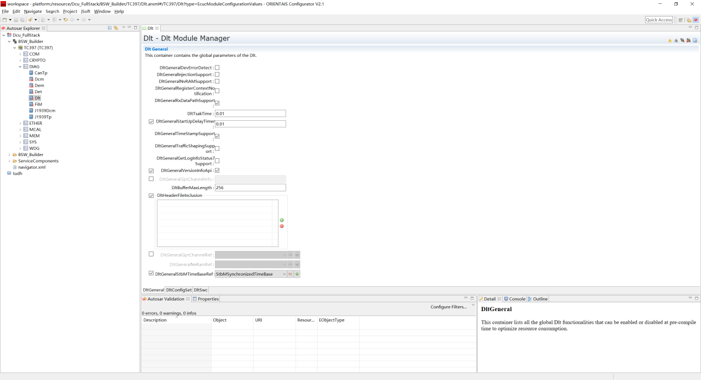

.. centered:: **表 Dlt模块的General配置属性描述 (Description of General Configuration Properties for Dlt Module)**

.. list-table::
   :widths: 20 20 20 20 20
   :header-rows: 1

   * - UI名称 (UI Name)
     - 描述 (Description)
     - 
     - 
     - 
   * - DltGeneralDevErrorDetect
     - 取值范围 (Range)
     - STD_ON,STD_OFF
     - 默认取值 (Default value)
     - STD_OFF
   * - 
     - 参数描述 (Parameter Description)
     - 是否开启配置出错检测。若开启，一旦检测到配置出错，则代码停留在故障出错位置。量产用代码，需关闭该配置。 (Is configuration error detection enabled? If enabled, the code will halt at the position of the detected error. This configuration should be disabled for production code.)
     - 
     - 
   * - 
     - 依赖关系 (Dependencies)
     - 依赖于DET模块的配置 (Dependent on the configuration of DET module)
     - 
     - 
   * - DltGeneralInjectionSupport
     - 取值范围 (Range)
     - STD_ON,STD_OFF
     - 默认取值 (Default value)
     - STD_OFF
   * - 
     - 参数描述 (Parameter Description)
     - 使能或禁止Dlt模块应用程序注入功能 (Enable or Disable Dlt Module Application Injection Function)
     - 
     - 
   * - 
     - 依赖关系 (Dependencies)
     - 依赖于SWC模块的配置 (Configuration dependent on SWC module)
     - 
     - 
   * - DltGeneralNvRAMSupport
     - 取值范围 (Range)
     - STD_ON,STD_OFF
     - 默认取值 (Default value)
     - STD_OFF
   * - 
     - 参数描述 (Parameter Description)
     - 使能或禁止Dlt模块对非易失性RAM数据的支持 (Enable or Disable Dlt Module Support for Non-Volatile RAM Data)
     - 
     - 
   * - 
     - 
     - 备注： (Note:)
     - 
     - 
   * - 
     - 
     - 如果Dlt模块在运行时能够持久地存储修改过的参数，则应该设置该引用并指向NvmBlock。 (If the Dlt module can persistently store modified parameters when running, then this reference should be set and point to NvmBlock.)
     - 
     - 
   * - 
     - 依赖关系 (Dependencies)
     - 依赖于NvRAM模块的配置 (Dependent on NvRAM module configuration)
     - 
     - 
   * - DltGeneralRegisterContextNotification
     - 取值范围 (Range)
     - STD_ON,STD_OFF
     - 默认取值 (Default value)
     - STD_OFF
   * - 
     - 参数描述 (Parameter Description)
     - 使能或禁止Dlt模块对注册上下文通知的支持 (Enable or disable Dlt module support for registered context notifications)
     - 
     - 
   * - 
     - 
     - 如果此参数设置为TRUE，则每次SWC注册和/在Dlt模块/从Dlt模块注销时发送Dlt控制消息。否则，此通知将不发送 (If this parameter is set to TRUE, DLT control messages will be sent upon SWC registration and/or deregistration in the Dlt module. Otherwise, this notification will not be sent.)
     - 
     - 
   * - 
     - 依赖关系 (Dependencies)
     - 依赖于SWC模块的配置 (Configuration dependent on SWC module)
     - 
     - 
   * - DltGeneralRxDataPathSupport
     - 取值范围 (Range)
     - STD_ON,STD_OFF
     - 默认取值 (Default value)
     - STD_OFF
   * - 
     - 参数描述 (Parameter Description)
     - 启用或禁用Rx数据路径来控制Dlt模块。 (Enable or disable Rx data path to control Dlt module.)
     - 
     - 
   * - 
     - 依赖关系 (Dependencies)
     - 依赖于通信协议栈模块的配置 (Dependent on the configuration of the communication protocol stack module)
     - 
     - 
   * - DltTaskTime
     - 取值范围 (Range)
     - 0…4294967295
     - 默认取值 (Default value)
     - 0
   * - 
     - 参数描述 (Parameter Description)
     - 用于配置Dlt模块周期调度的时间基准 (To configure the time baseline for periodic scheduling of the Dlt module)
     - 
     - 
   * - 
     - 依赖关系 (Dependencies)
     - 依赖于OS或系统环境模块的配置 (Configuration dependent on OS or system environment modules)
     - 
     - 
   * - DltGeneralStartUpDelayTimer
     - 取值范围 (Range)
     - 1…10000
     - 默认取值 (Default value)
     - 0
   * - 
     - 参数描述 (Parameter Description)
     - Dlt模块初始化后启动日志和跟踪消息传输的s中可配置延迟 (The Dlt module starts configurable delay for logging and tracing message transmission after initialization.)
     - 
     - 
   * - 
     - 依赖关系 (Dependencies)
     - 依赖于OS或系统环境模块的配置 (Configuration dependent on OS or system environment modules)
     - 
     - 
   * - DltGeneralTimeStampSupport
     - 取值范围 (Range)
     - STD_ON,STD_OFF
     - 默认取值 (Default value)
     - STD_OFF
   * - 
     - 参数描述 (Parameter Description)
     - 如果要在Dlt消息中添加时间戳，则此配置参数应设置为TRUE (If you want to add a timestamp in Dlt messages, this configuration parameter should be set to TRUE)
     - 
     - 
   * - 
     - 依赖关系 (Dependencies)
     - 依赖于GPT或STBM模块的配置 (Dependent on the configuration of the GPT or STBM module)
     - 
     - 
   * - DltGeneralTrafficShapingSupport
     - 取值范围 (Range)
     - STD_ON,STD_OFF
     - 默认取值 (Default value)
     - STD_OFF
   * - 
     - 参数描述 (Parameter Description)
     - 启用或禁用流量成形特性以限制Dlt消息的最大带宽。 (Enable or disable traffic shaping feature to limit the maximum bandwidth of DLt messages.)
     - 
     - 
   * - 
     - 
     - 如果启用，可以为每个日志通道配置最大带宽。 (If enabled, maximum bandwidth can be configured for each log channel.)
     - 
     - 
   * - 
     - 依赖关系 (Dependencies)
     - 依赖于通信协议栈模块的配置 (Dependent on the configuration of the communication protocol stack module)
     - 
     - 
   * - DltGeneralGetLogInfoStatusSupport
     - 取值范围 (Range)
     - STD_ON,STD_OFF
     - 默认取值 (Default value)
     - STD_OFF
   * - 
     - 参数描述 (Parameter Description)
     - 启用或禁用Dlt模块对获取日志信息状态的支持 (Enabling or disabling the Dlt module for log information retrieval status support)
     - 
     - 
   * - 
     - 依赖关系 (Dependencies)
     - 无
     - 
     - 
   * - DltGeneralVersionInfoApiv
     - 取值范围 (Range)
     - STD_ON,STD_OFF
     - 默认取值 (Default value)
     - STD_OFF
   * - 
     - 参数描述 (Parameter Description)
     - 用于使能或禁止版本信息API接口支持的预处理宏编译开关。 (Preprocessing macro compile switches for enabling or disabling support of version information API interfaces.)
     - 
     - 
   * - 
     - 依赖关系 (Dependencies)
     - 无
     - 
     - 
   * - DltGeneralGptChannelRef
     - 取值范围 (Range)
     - 引用或下拉菜单 (Quote or pull-down menu)
     - 默认取值 (Default value)
     - 无
   * - 
     - 参数描述 (Parameter Description)
     - 如果使用TimeStampSupport，那么Dlt模块将通过使用此处引用的GptChannel调用Gpt_GetTimeElapsed从Gpt模块获取时间。滴答持续时间可以从GptChannelConfiguration容器的GptChannelTickFrequency参数推导出来。这对于计算Dlt消息中的微秒分辨率时间戳输出是必要的。 (If TimeStampSupport is used, the Dlt module will obtain time from the Gpt module by calling Gpt_GetTimeElapsed through the GptChannel referenced here. The tick duration of the tick can be derived from the GptChannelTickFrequency parameter in the GptChannelConfiguration container. This is necessary for computing microsecond resolution timestamps in the Dlt message output.)
     - 
     - 
   * - 
     - 依赖关系 (Dependencies)
     - 依赖于GPT模块的配置 (Dependent on the configuration of the GPT module)
     - 
     - 
   * - DltBufferMaxLength
     - 取值范围 (Range)
     - 0…65535
     - 默认取值 (Default value)
     - 0
   * - 
     - 参数描述 (Parameter Description)
     - 用于描述DLT模块缓冲区最大长度的配置用于描述DLT模块缓冲区最大长度的配置 (Configuration for describing the maximum length of the DLT module buffer)
     - 
     - 
   * - 
     - 依赖关系 (Dependencies)
     - 无
     - 
     - 
   * - DltHeaderFileInclusion
     - 取值范围 (Range)
     - 无
     - 
     - 
   * - 
     - 参数描述 (Parameter Description)
     - 外部头文件包含 (External header files include)
     - 
     - 
   * - 
     - 依赖关系 (Dependencies)
     - 无
     - 
     - 
   * - DltGeneralGptChannelRef
     - 取值范围 (Range)
     - 引用或下拉菜单 (Quote or pull-down menu)
     - 默认取值 (Default value)
     - 
   * - 
     - 参数描述 (Parameter Description)
     - 如果使用TimeStampSupport,Dlt模块将通过调用 (If TimeStampSupport is used, the Dlt module will call)
     - 
     - 
   * - 
     - 
     - Gpt_GetTimeElapsed和这里引用的GptChannel (Gpt_GetTimeElapsed and GptChannel referenced here)
     - 
     - 
   * - 
     - 
     - 从Gpt模块获取时间。 (Get time from Gpt module.)
     - 
     - 
   * - 
     - 依赖关系 (Dependencies)
     - 依赖于GPT模块的配置 (Dependent on the configuration of the GPT module)
     - 
     - 
   * - DltGeneralNvRAMRef
     - 取值范围 (Range)
     - 引用或下拉菜单 (Quote or pull-down menu)
     - 默认取值 (Default value)
     - 无
   * - 
     - 参数描述 (Parameter Description)
     - 用于DLT模块对非易失性RAM引用的配置 (Configuration for non-volatile RAM referenced by DLT module)
     - 
     - 
   * - 
     - 依赖关系 (Dependencies)
     - 依赖于NvRAM模块的配置 (Dependent on NvRAM module configuration)
     - 
     - 
   * - DltGeneralStbMTimeBaseRef
     - 取值范围 (Range)
     - 0…4294967295
     - 默认取值 (Default value)
     - 0
   * - 
     - 参数描述 (Parameter Description)
     - 如果使用TimeStampSupport,Dlt模块将通过调用 (If TimeStampSupport is used, the Dlt module will call)
     - 
     - 
   * - 
     - 
     - StbM_GetCurrentTime从StbM模块获取时间，此处引用 (StbM_GetCurrentTime gets time from the StbM module, referenced here.)
     - 
     - 
   * - 
     - 
     - StbMSynchronizedTimeBase。
     - 
     - 
   * - 
     - 依赖关系 (Dependencies)
     - 依赖于STBM模块的配置 (Dependent on the configuration of the STBM module)
     - 
     - 

DltConfigSet配置 (DltConfigSet Configuration)
-----------------------------------------------------------

新建DltConfigSet (CreateNewDltConfigSet)
======================================================

DltConfigSet添加步骤为：鼠标选中DltConfigSets—单击右键—New—DltConfigSet。默认情况，无该配置项。

DltConfigSet addition steps are as follows: select DltConfigSets with the mouse — right-click — New — DltConfigSet. By default, there is no such configuration item.

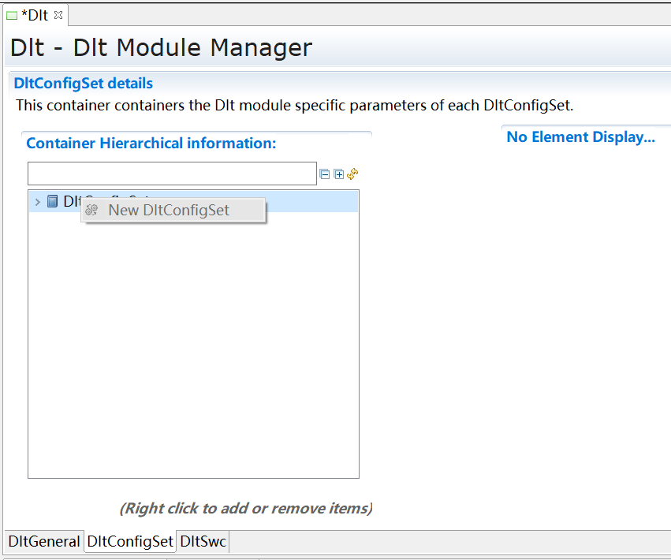

DltConfigSet配置容器 (Configure Container for DltConfigSet)
=======================================================================

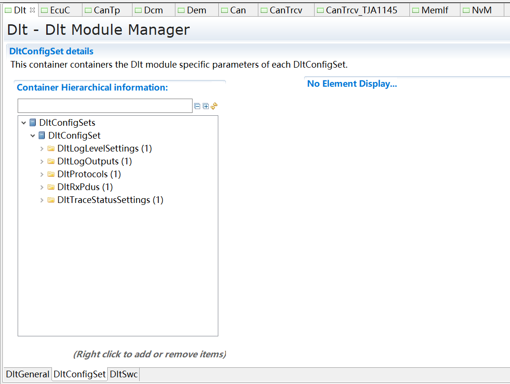

.. centered:: **表 Dlt模块的ConfigSet配置属性描述 (Description of ConfigSet Configuration Property for Dlt Module)**

.. list-table::
   :widths: 20 20 20 20 20
   :header-rows: 1

   * - UI名称 (UI Name)
     - 描述 (Description)
     - 
     - 
     - 
   * - DltConfigSet
     - 取值范围 (Range)
     - 下拉选项 (Dropdown options)
     - 默认取值 (Default value)
     - 无
   * - 
     - 参数描述 (Parameter Description)
     - 这个容器列出了在预编译时可以启用或禁用的所有全局Dlt功能，以优化资源消耗。 (This container lists all global DLT features that can be enabled or disabled at pre-compile time to optimize resource consumption.)
     - 
     - 
   * - 
     - 依赖关系 (Dependencies)
     - 无
     - 
     - 
   * - DltLogLevelSettings
     - 取值范围 (Range)
     - 下拉选项 (Dropdown options)
     - 默认取值 (Default value)
     - 无
   * - 
     - 参数描述 (Parameter Description)
     - 包含Dlt日志级别阈值的设置 (Setting for Dlt Log Level Threshold)
     - 
     - 
   * - 
     - 依赖关系 (Dependencies)
     - 无
     - 
     - 
   * - DltLogOutputs
     - 取值范围 (Range)
     - 下拉选项 (Dropdown options)
     - 默认取值 (Default value)
     - 无
   * - 
     - 参数描述 (Parameter Description)
     - 包含日志/跟踪消息输出的设置 (Settings for outputting log/tracking messages)
     - 
     - 
   * - 
     - 依赖关系 (Dependencies)
     - 无
     - 
     - 
   * - DltProtocols
     - 取值范围 (Range)
     - 下拉选项 (Dropdown options)
     - 默认取值 (Default value)
     - 无
   * - 
     - 参数描述 (Parameter Description)
     - 用于处理特定协议变体的配置参数 (Configuration parameters for handling specific protocol variants)
     - 
     - 
   * - 
     - 依赖关系 (Dependencies)
     - 无
     - 
     - 
   * - DltRxPdus
     - 取值范围 (Range)
     - 下拉选项 (Dropdown options)
     - 默认取值 (Default value)
     - 无
   * - 
     - 参数描述 (Parameter Description)
     - 包含用于Dlt控制消息接收的Pdu标识符ID (Contains PDU identifier ID for DLT control message reception)
     - 
     - 
   * - 
     - 依赖关系 (Dependencies)
     - 无
     - 
     - 
   * - DlttraceStatusSettings
     - 取值范围 (Range)
     - 下拉选项 (Dropdown options)
     - 默认取值 (Default value)
     - 无
   * - 
     - 参数描述 (Parameter Description)
     - 包含Dlt跟踪状态的设置 (Settings containing Dlt tracking status)
     - 
     - 
   * - 
     - 依赖关系 (Dependencies)
     - 无
     - 
     - 

DltLogLevelSettings配置 (Configuration of DltLogLevelSettings)
============================================================================

新建DltLogLevelSettings (CreateDltLogLevelSettings)
-----------------------------------------------------------------

DltLogLevelSettings添加步骤为：鼠标选中DltConfigSet—单击右键—New—DltLogLevelSettings。默认情况，无该配置项。

Add steps for DltLogLevelSettings: Right-click on DltConfigSet—Select New—DltLogLevelSettings. By default, this configuration item is not present.

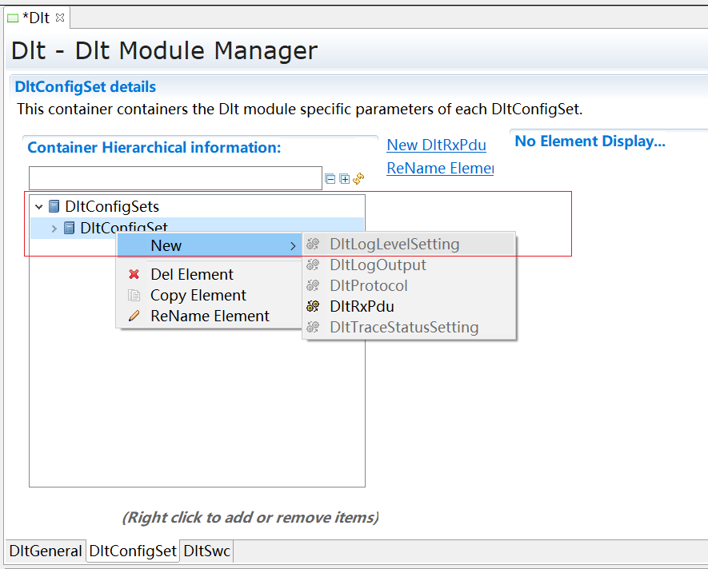

DltLogLevelSettings配置容器 (Configure Container for DltLogLevelSettings)
-------------------------------------------------------------------------------------

为Dlt模块设置初始默认日志级别，在DltLogLevelSettings选项卡中点击默认日志级别设置按钮DltDefaultLogLevel，从下拉菜单中选中一个配置作为默认日志级别。

Set the initial default log level for the Dlt module on the DltLogLevelSettings tab by clicking the Default Log Level button DltDefaultLogLevel and selecting a configuration from the drop-down menu as the default log level.

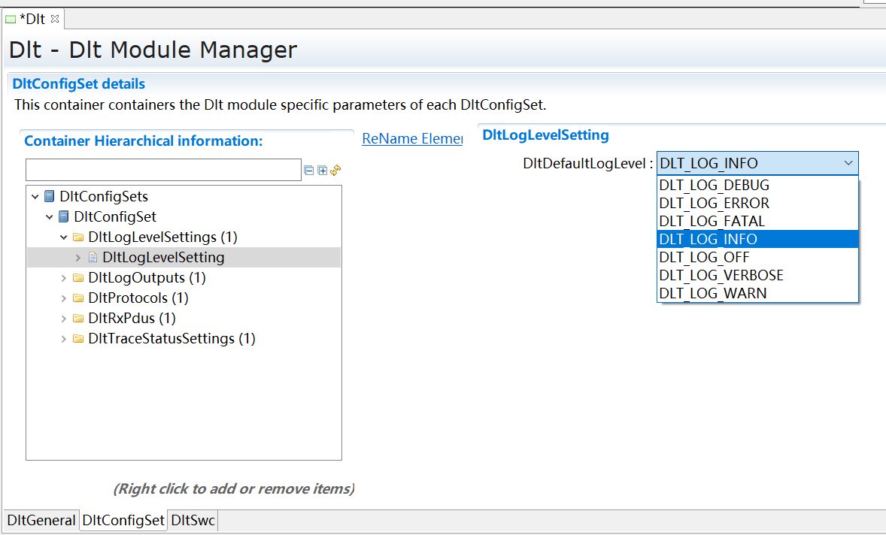

新建DltLogLevelThreshold (New DltLogLevelThreshold)
-----------------------------------------------------------------

DltLogLevelThreshold添加步骤为：鼠标选中DltLogLevelSetting—单击右键—New—DltLogLevelThreshold。默认情况，无该配置项。

DltLogLevelThreshold addition step is: right-click DltLogLevelSetting — select New — DltLogLevelThreshold. By default, this configuration item is not present.

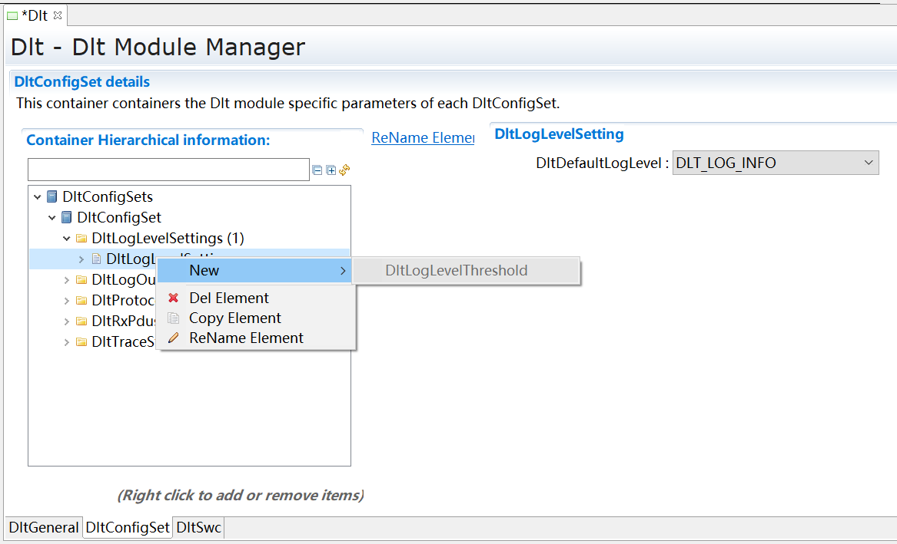

DltLogLevelThreshold配置容器 (Configure Container with DltLogLevelThreshold)
----------------------------------------------------------------------------------------

为Dlt模块设置初始日志级别，在DltLogLevelThreshold选项卡中点击日志级别阈值设置按钮Threshold，从下拉菜单中选中一个配置作为初始日志级别阈值。默认情况，该配置项设置为DLT_LOG_OFF。

Set the initial log level for the Dlt module by clicking the Log Level Threshold button in the DltLogLevelThreshold tab. From the drop-down menu, select a configuration as the initial log level threshold. By default, this configuration item is set to DLT_LOG_OFF.

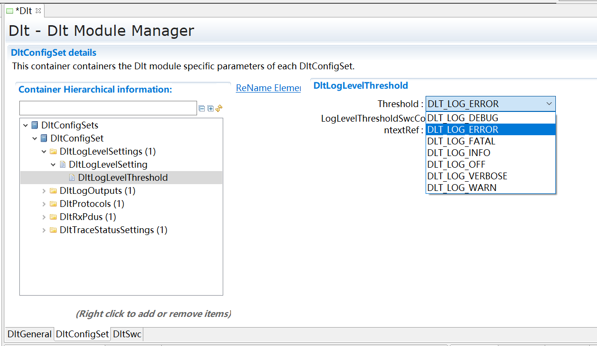

DltLogLevelThresholdSwcContextRef配置容器 (Configure Container with DltLogLevelThresholdSwcContextRef)
------------------------------------------------------------------------------------------------------------------

为Dlt模块对应的日志级别阈值挂接SWC上下文注册的参考配置信息，在DltLogLevelThreshold选项卡中点击日志级别阈值SWC上下文引用挂接设置按钮LogLevelThresholdSwcContextRef，从下拉菜单中选中一个配置作为相应日志级别阈值的上下文配置信息。默认情况，无该配置项。

In the DltLogLevelThreshold option card, click the LogLevelThresholdSwcContextRef button for logging level threshold SWC context reference attachment. Select a configuration from the drop-down menu as the context configuration information for the corresponding logging level threshold. By default, there is no such configuration item.

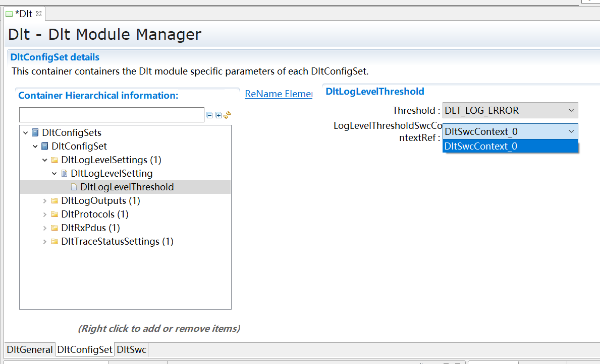

DltLogLevelSetting配置容器的属性描述 (Configuration for setting the log level of the container properties description)
-----------------------------------------------------------------------------------------------------------------------------

.. centered:: **表 Dlt模块的LogLevelSetting配置属性描述 (Description of the LogLevelSetting configuration property for Dlt module)**

.. list-table::
   :widths: 20 20 20 20 20
   :header-rows: 1

   * - UI名称 (UI Name)
     - 描述 (Description)
     - 
     - 
     - 
   * - DltDefaultLogLevel
     - 取值范围 (Range)
     - 下拉选项 (Dropdown options)
     - 默认取值 (Default value)
     - 无
   * - 
     - 参数描述 (Parameter Description)
     - 这是在没有过滤器匹配给定的AppicationId和context时使用的有效日志级别。这可以看作是一个贯穿过滤器定义，带有AppicationId和contexts的通配符，当没有其他过滤器匹配时，将使用通配符。 (This is the effective log level used when no filters match the given ApplicationId and context. This can be seen as a wildcard that spans filter definitions with ApplicationId and contexts, and will be used when no other filters match.)
     - 
     - 
   * - 
     - 依赖关系 (Dependencies)
     - 无
     - 
     - 
   * - Threshold
     - 取值范围 (Range)
     - 下拉选项 (Dropdown options)
     - 默认取值 (Default value)
     - 无
   * - 
     - 参数描述 (Parameter Description)
     - 用于为给定AppicationId和context的元组配置初始的的日志级别阈值 (To configure initial log level thresholds for given ApplicationId and context tuples)
     - 
     - 
   * - 
     - 依赖关系 (Dependencies)
     - 无
     - 
     - 
   * - LogLevelThresholdSwcContextRef
     - 取值范围 (Range)
     - 下拉选项 (Dropdown options)
     - 默认取值 (Default value)
     - 无
   * - 
     - 参数描述 (Parameter Description)
     - 用于为日志级别阈值挂接对应的上下文配置信息 (To attach corresponding context configuration information for log level thresholds)
     - 
     - 
   * - 
     - 依赖关系 (Dependencies)
     - 依赖于DltSwc的配置项 (Configuration items dependent on DltSwc)
     - 
     - 

DltLogOutputs配置 (Configuration of DltLogOutputs)
================================================================

新建DltLogOutputs (Create DltLogOutputs)
------------------------------------------------------

DltLogOutputs添加步骤为：鼠标选中DltConfigSet—单击右键—New—DltLogOutputs。默认情况，无该配置项。

Add steps for DltLogOutputs: Right-click on DltConfigSet — New — DltLogOutputs. By default, this configuration item is not present.

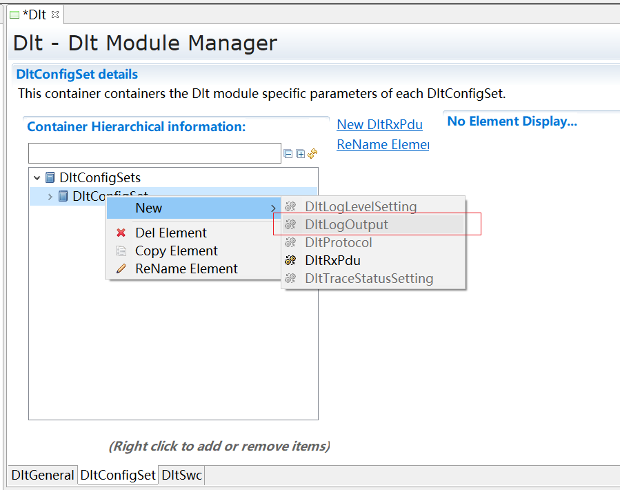

DltLogOutput配置容器 (Configure Container for DltLogOutput)
-----------------------------------------------------------------------

引用默认日志通道，如果没有找到其他匹配项，则必须将其用于日志/跟踪输出。在DltLogOutput选项卡中点击默认日志通道引用设置按钮。

Reference default log channel; it must be used for log/tracing output if no other match is found. Click the default log channel reference setting button in the DltLogOutput tab.

DltDefaultLogChannelRef，从下拉菜单中选中一个配置作为默认日志通道。默认情况，无该配置项。

DltDefaultLogChannelRef, select a configuration from the drop-down menu as the default log channel. By default, this configuration item is not present.

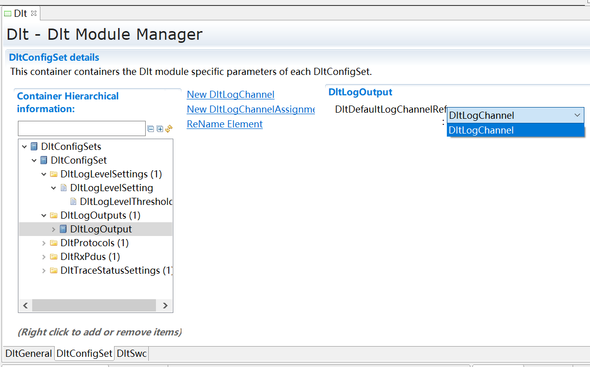

.. centered:: **表 Dlt模块的LogOutput配置属性描述 (Description of the LogOutput configuration property for the Dlt module)**

.. list-table::
   :widths: 20 20 20 20 20
   :header-rows: 1

   * - UI名称 (UI Name)
     - 描述 (Description)
     - 
     - 
     - 
   * - DltLogOutput
     - 取值范围 (Range)
     - 下拉选项 (Dropdown options)
     - 默认取值 (Default value)
     - 无
   * - 
     - 参数描述 (Parameter Description)
     - 包含日志/跟踪消息输出的设置 (Settings for outputting log/tracking messages)
     - 
     - 
   * - 
     - 依赖关系 (Dependencies)
     - 无
     - 
     - 
   * - DltDefaultLogChannelRef
     - 取值范围 (Range)
     - 下拉选项 (Dropdown options)
     - 默认取值 (Default value)
     - 无
   * - 
     - 参数描述 (Parameter Description)
     - 引用默认日志通道，如果没有找到其他匹配项，则必须将其用于日志/跟踪输出 (Reference the default log channel, and must be used for log/tracking output if no other matching items are found.)
     - 
     - 
   * - 
     - 依赖关系 (Dependencies)
     - 无
     - 
     - 
   * - DltLogChannel
     - 取值范围 (Range)
     - 下拉选项 (Dropdown options)
     - 默认取值 (Default value)
     - 无
   * - 
     - 参数描述 (Parameter Description)
     - 包含日志/跟踪消息输出的设置 (Settings for outputting log/tracking messages)
     - 
     - 
   * - 
     - 依赖关系 (Dependencies)
     - 无
     - 
     - 
   * - DltLogChannelAssignment
     - 取值范围 (Range)
     - 下拉选项 (Dropdown options)
     - 默认取值 (Default value)
     - 无
   * - 
     - 参数描述 (Parameter Description)
     - 这个容器包含ApplicationId/ContextId对及其分配的日志通道的预配置 (This container includes ApplicationId/ContextId pairs and their pre-configured log channels.)
     - 
     - 
   * - 
     - 依赖关系 (Dependencies)
     - 无
     - 
     - 

新建DltLogChannel (CreateDltLogChannel)
-----------------------------------------------------

DltLogChannel添加步骤为：鼠标选中DltLogOutput—单击右键—New—DltLogChannel。默认情况，无该配置项。

Add steps for DltLogChannel: right-click on DltLogOutput — select New — DltLogChannel. By default, this configuration item is not present.

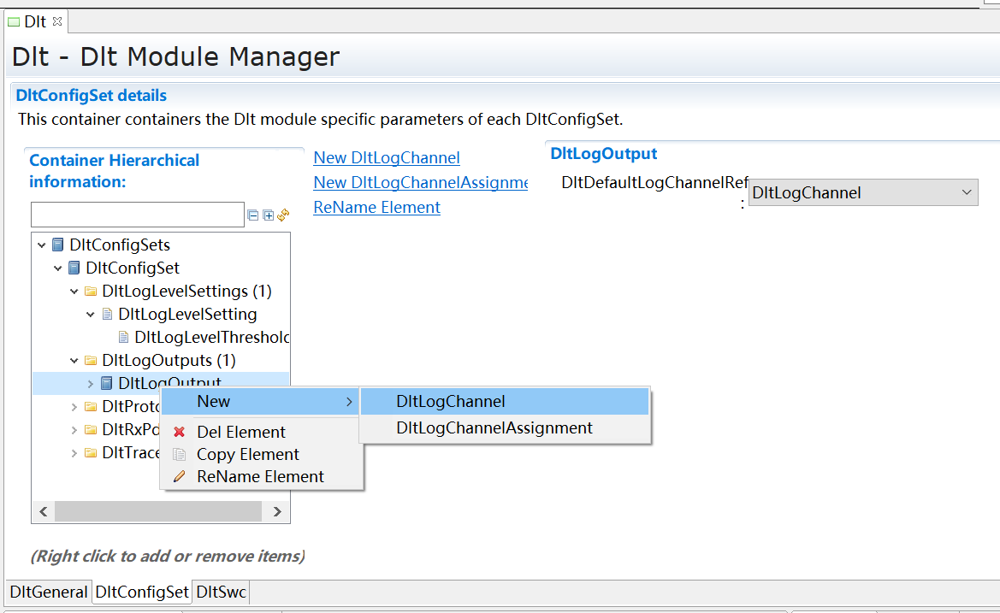

DltLogChannel配置容器 (Configure Container for DltLogChannel)
-------------------------------------------------------------------------

为Dlt模块设置日志通道指定发生缓冲区溢出时重置缓冲区溢出标志的周期时间；为日志通道特定消息缓冲区设置缓冲区大小；为日志通道配置索引名称；为Dlt日志或跟踪消息设置长限制；为日志通道设置日志级别阈值；为日志通道设置通信带宽；为日志通道的传输功能指定周期时间；打开/关闭对应日志通道。

Set the cycle time for resetting the buffer overflow flag when a buffer overflow occurs for the Dlt module logging channel; set the buffer size for specific message buffers of the logging channel; configure the index name for the logging channel; set the length limit for Dlt logs or tracing messages; set the log level threshold for the logging channel; set the communication bandwidth for the logging channel; specify the cycle time for the transmission function of the logging channel; enable/disable the corresponding logging channel.

默认情况，无该配置项。

Default: No such configuration item.

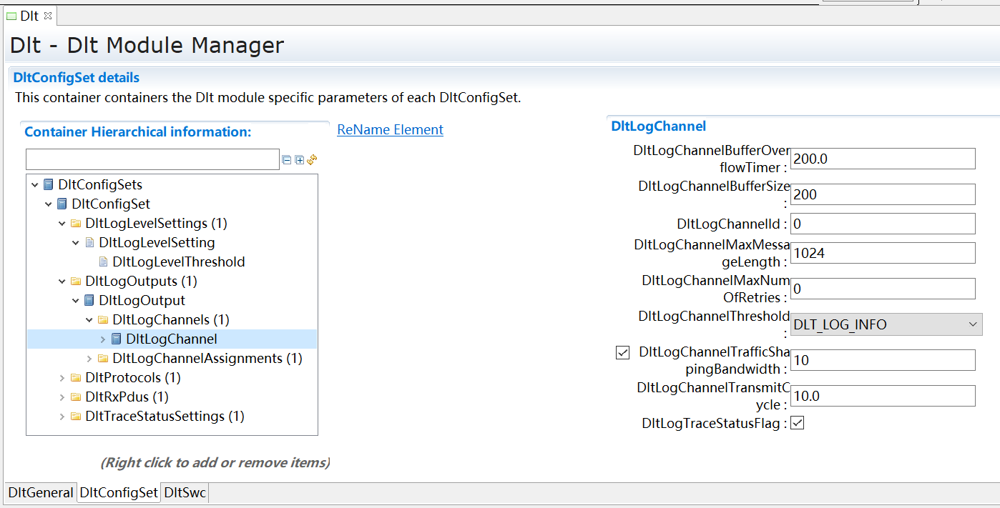

.. centered:: **表 Dlt模块的LogChannel配置属性描述 (Description of LogChannel configuration properties for Dlt module)**

.. list-table::
   :widths: 20 20 20 20 20
   :header-rows: 1

   * - UI名称 (UI Name)
     - 描述 (Description)
     - 
     - 
     - 
   * - DltLogChannelBufferOverflowTimer
     - 取值范围 (Range)
     - 0.001…1
     - 默认取值 (Default value)
     - 0
   * - 
     - 参数描述 (Parameter Description)
     - 指定发生缓冲区溢出时重置缓冲区溢出标志的周期时间(以秒为单位)。 (Set the period time (in seconds) for resetting the buffer overflow flag when a buffer overflow occurs.)
     - 
     - 
   * - 
     - 依赖关系 (Dependencies)
     - 无
     - 
     - 
   * - DltLogChannelBufferSize
     - 取值范围 (Range)
     - 0…4294967295
     - 默认取值 (Default value)
     - 0
   * - 
     - 参数描述 (Parameter Description)
     - 日志通道特定消息缓冲区的缓冲区大小 (Buffer size for specific message buffer in log channel)
     - 
     - 
   * - 
     - 
     - 备注：以字节为单位 (Note: Units in bytes)
     - 
     - 
   * - 
     - 依赖关系 (Dependencies)
     - 无
     - 
     - 
   * - DltLogChannelId
     - 取值范围 (Range)
     - 0…255
     - 默认取值 (Default value)
     - 0
   * - 
     - 参数描述 (Parameter Description)
     - 这是日志通道的4个ASCII字符长的名称，在Dlt控制消息中作为参数名Dlt_interface使用 (This is a 4 ASCII character long name of the log channel, used as parameter name Dlt_interface in Dlt control messages)
     - 
     - 
   * - 
     - 依赖关系 (Dependencies)
     - 无
     - 
     - 
   * - DltLogChannelMaxMessageLength
     - 取值范围 (Range)
     - 0…65535
     - 默认取值 (Default value)
     - 0
   * - 
     - 参数描述 (Parameter Description)
     - Dlt日志通道的最大消息长度 (Maximum message length of Dlt log channel)
     - 
     - 
   * - 
     - 依赖关系 (Dependencies)
     - 依赖于SWC或VFB发送消息的大小 (The size of messages dependent on SWC or VFB sending them)
     - 
     - 
   * - DltLogChannelMaxNumOfRetries
     - 取值范围 (Range)
     - 0…255
     - 默认取值 (Default value)
     - 0
   * - 
     - 参数描述 (Parameter Description)
     - Dlt日志通道的最大尝试次数 (Maximum attempt number for Dlt log channel)
     - 
     - 
   * - 
     - 依赖关系 (Dependencies)
     - 依赖于SWC或VFB发送消息的大小 (The size of messages dependent on SWC or VFB sending them)
     - 
     - 
   * - DltLogChannelThreshold
     - 取值范围 (Range)
     - DLT_LOG_OFFDLT_LOG_FATALDLT_LOG_ERROR
     - 默认取值 (Default value)
     - DLT_LOG_OFF
   * - 
     - 
     - DLT_LOG_WARN
     - 
     - 
   * - 
     - 
     - DLT_LOG_INFO
     - 
     - 
   * - 
     - 
     - DLT_LOG_DEBUG
     - 
     - 
   * - 
     - 
     - DLT_LOG_VERBOSE
     - 
     - 
   * - 
     - 参数描述 (Parameter Description)
     - 用于为日志通道设置日志级别阈值 (To set log level thresholds for log channels)
     - 
     - 
   * - 
     - 依赖关系 (Dependencies)
     - 无
     - 
     - 
   * - DltLogChannelTrafficShapingBandwidth
     - 取值范围 (Range)
     - 0…18446744073709551615
     - 默认取值 (Default value)
     - 0
   * - 
     - 参数描述 (Parameter Description)
     - 以位/秒为单位设置最大可能带宽 (Set maximum possible bandwidth in bits/second)
     - 
     - 
   * - 
     - 依赖关系 (Dependencies)
     - 依赖于通信总线的速率 (Dependent on the rate of the communication bus)
     - 
     - 
   * - DltLogChannelTransmitCycle
     - 取值范围 (Range)
     - 0.001…1
     - 默认取值 (Default value)
     - 0
   * - 
     - 参数描述 (Parameter Description)
     - 指定此日志通道传输功能的周期时间(以秒为单位) (Specify the periodic time (in seconds) for this log channel transfer function)
     - 
     - 
   * - 
     - 依赖关系 (Dependencies)
     - 无
     - 
     - 
   * - DltLogTraceStatusFlag
     - 取值范围 (Range)
     - STD_ON/STD_OFF
     - 默认取值 (Default value)
     - STD_OFF
   * - 
     - 参数描述 (Parameter Description)
     - 参数来完全打开/关闭此日志通道 (Parameters to fully open/close this log channel)
     - 
     - 
   * - 
     - 依赖关系 (Dependencies)
     - 无
     - 
     - 

新建DltTxPdu (CreateNewDltTxPdu)
----------------------------------------------

DltTxPdu添加步骤为：鼠标选中DltLogChannel—单击右键—New—DltTxPdu。默认情况，无该配置项。

Add steps for DltTxPdu: Right-click on DltLogChannel — select New — DltTxPdu. By default, this configuration item is not present.

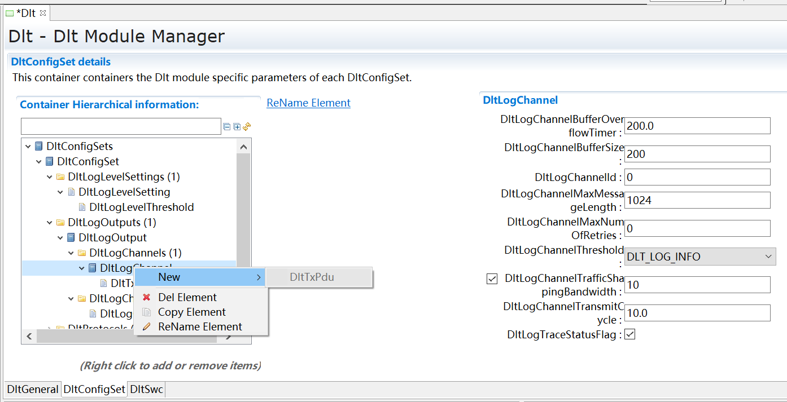

DltTxPdu配置容器 (DLTTxPdu Configuration Container)
---------------------------------------------------------------

将相应日志通道的发送PDU与ECU模块的PDU信号关联起来，并对相应配置项进行设置，如DltTxPduHandleId、DltTxPduUseTp和DltTxPduIdRef等参数设置。

Associate the sent PDU of the corresponding log channel with the PDU signal of the ECU module and set relevant configuration items such as DltTxPduHandleId, DltTxPduUseTp, and DltTxPduIdRef.

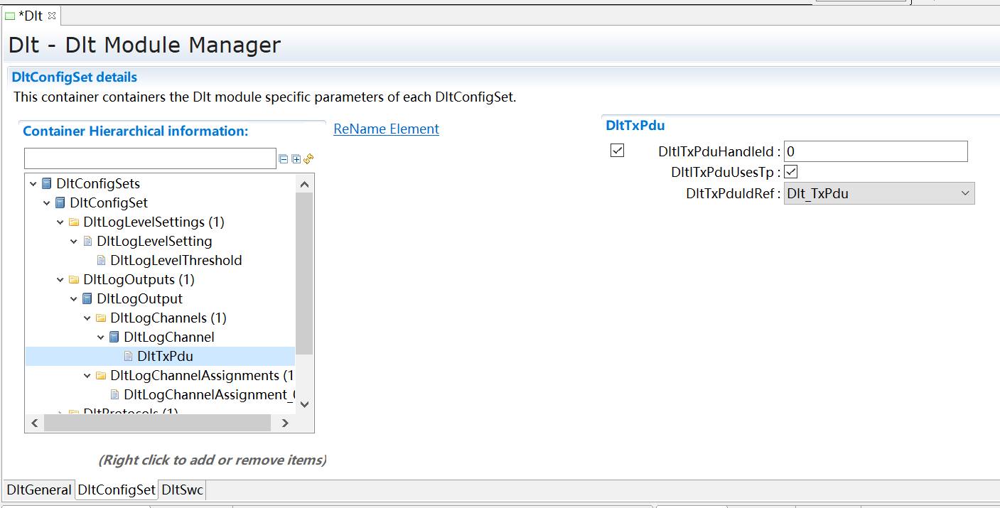

.. centered:: **表 Dlt模块的TxPdu配置属性描述 (Description of TxPdu Configuration Properties for Dlt Module)**

.. list-table::
   :widths: 20 20 20 20 20
   :header-rows: 1

   * - UI名称 (UI Name)
     - 描述 (Description)
     - 
     - 
     - 
   * - DltTxPdu
     - 取值范围 (Range)
     - 下拉选项 (Dropdown options)
     - 默认取值 (Default value)
     - 无
   * - 
     - 参数描述 (Parameter Description)
     - 包含AUTOSAR中Dlt模块的Tx发送Pdu的配置参数 (Configuration parameters of Tx Pdu containing the Dlt module in AUTOSAR)
     - 
     - 
   * - 
     - 依赖关系 (Dependencies)
     - 无
     - 
     - 
   * - DltITxPduHandleId
     - 取值范围 (Range)
     - 0…65535
     - 默认取值 (Default value)
     - 0
   * - 
     - 参数描述 (Parameter Description)
     - 用作这个I-PDUID的数值。 (Use this value for the I-PDUID.)
     - 
     - 
   * - 
     - 
     - 这个处理Id用于api调用Dlt_TxConfirmation、Dlt_TriggerTransmit、Dlt_TriggerIPDUSend或Dlt_TriggerIPDUSendWithMetaData,Dlt_CopyTxData和Dlt_TpTxConfirmation传输IPDU分别确认传输,以及PduId传递到Tx-I-PDU-callout配置了DltIPduCallout和/或DltIPduTriggerTransmitCallout。 (This processing ID is used for API calls Dlt_TxConfirmation, Dlt_TriggerTransmit, Dlt_TriggerIPDUSend or Dlt_TriggerIPDUSendWithMetaData, Dlt_CopyTxData and Dlt_TpTxConfirmation to transmit IPDU for confirmation of transmission, as well as PduId passed to Tx-I-PDU-callout configured with DltIPduCallout and/or DltIPduTriggerTransmitCallout.)
     - 
     - 
   * - 
     - 依赖关系 (Dependencies)
     - 依赖于ECU和PDUR的配置 (Dependent on ECU and PDUR configuration)
     - 
     - 
   * - DltITxPduUsesTp
     - 取值范围 (Range)
     - TRUE/FALSE
     - 默认取值 (Default value)
     - FALSE
   * - 
     - 参数描述 (Parameter Description)
     - 如果设置为TRUE，则使用TPAPI传输PDU。 (If set to TRUE, TPAPI is used to transmit PDU.)
     - 
     - 
   * - 
     - 
     - 如果为FALSE，则使用IFAPI。 (If FALSE, use IFAPI.)
     - 
     - 
   * - 
     - 依赖关系 (Dependencies)
     - 依赖于ECU和PDUR的配置 (Dependent on ECU and PDUR configuration)
     - 
     - 
   * - DltTxPduIdRef
     - 取值范围 (Range)
     - 引用或下拉选项 (Copy or Pull-down Options)
     - 默认取值 (Default value)
     - 无
   * - 
     - 参数描述 (Parameter Description)
     - 引用全局的Pdu结构，以允许在通信堆栈中协调句柄标识符ID (Refer to the global PDU structure to allow handle identifier ID coordination in the communication stack.)
     - 
     - 
   * - 
     - 依赖关系 (Dependencies)
     - 依赖于ECU和PDUR的配置 (Dependent on ECU and PDUR configuration)
     - 
     - 

新建DltLogChannelAssignment (New DltLogChannelAssignment)
-----------------------------------------------------------------------

DltLogChannelAssignment添加步骤为：鼠标选中DltLogOutput—单击右键—New—DltLogChannelAssignment。默认情况，无该配置项。

Add steps for DltLogChannelAssignment: Right-click DltLogOutput — New — DltLogChannelAssignment. By default, this configuration item is not present.

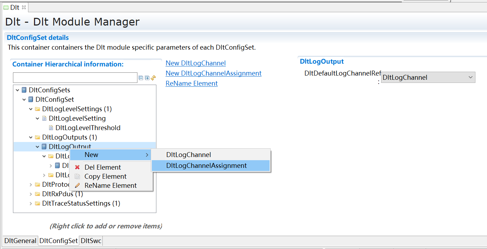

DltLogChannelAssignment配置容器 (Configure Container for DltLogChannelAssignment)
---------------------------------------------------------------------------------------------

为Dlt模块的日志通道分配挂接相应的上下文配置ContextRef信息，在DltLogChannelAssignment项卡中点击日志通道阈值设置按钮Assignment，从下拉菜单中选中一个配置作为日志通道分配的信息。

Assign the挂接 corresponding context configuration ContextRef information for the Dlt module log channels on the DltLogChannelAssignment tab. Click the log channel threshold setting button Assignment and select a configuration from the dropdown menu as the log channel assignment information.

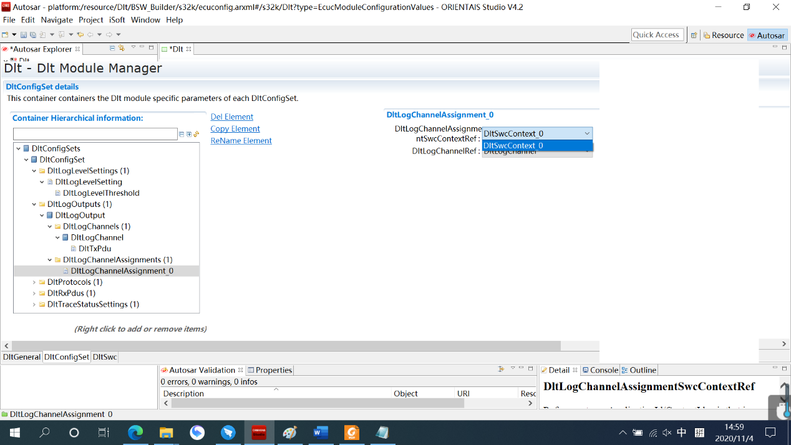

.. centered:: **表 Dlt模块的LogChannelAssignment配置属性描述 (Description of the LogChannelAssignment configuration property for Dlt module)**

.. list-table::
   :widths: 20 20 20 20 20
   :header-rows: 1

   * - UI名称 (UI Name)
     - 描述 (Description)
     - 
     - 
     - 
   * - DltLogChannelAssignment
     - 取值范围 (Range)
     - 下拉选项 (Dropdown options)
     - 默认取值 (Default value)
     - 无
   * - 
     - 参数描述 (Parameter Description)
     - 这个容器包含ApplicationId/ContextId对应元组及其分配的日志通道的预配置。 (This container includes pre-configured tuples of ApplicationId/ContextId and their assigned log channels.)
     - 
     - 
   * - 
     - 依赖关系 (Dependencies)
     - 无
     - 
     - 
   * - DltLogChannelAssignmentSwcContextRef
     - 取值范围 (Range)
     - 引用或下拉选项 (Copy or Pull-down Options)
     - 默认取值 (Default value)
     - 无
   * - 
     - 参数描述 (Parameter Description)
     - 引用分配给Dlt日志通道的ApplicationId/ContextId对 (Output the ApplicationId/ContextId pair allocated for the Dlt Log Channel)
     - 
     - 
   * - 
     - 依赖关系 (Dependencies)
     - 依赖于DltSwc的配置项 (Configuration items dependent on DltSwc)
     - 
     - 
   * - DltLogChannelRef
     - 取值范围 (Range)
     - 引用或下拉选项 (Copy or Pull-down Options)
     - 默认取值 (Default value)
     - 无
   * - 
     - 参数描述 (Parameter Description)
     - 对分配给ApplicationId/ContextId对应元组的Dlt日志通道的引用 (Reference to the DLT log channel assigned to the ApplicationId/ContextId tuple)
     - 
     - 
   * - 
     - 依赖关系 (Dependencies)
     - 依赖于日志通道的配置项 (Configuration items dependent on log channel configuration.)
     - 
     - 

DltProtocols配置 (DLTProtocols Configuration)
===========================================================

新建DltProtocols (CreateDltProtocols)
---------------------------------------------------

DltProtocols添加步骤为：鼠标选中DltConfigSet—单击右键—New—DltProtocols。默认情况，无该配置项。

Add steps for DltProtocols: Right-click on DltConfigSet—select New—DltProtocols. By default, this configuration item is not present.

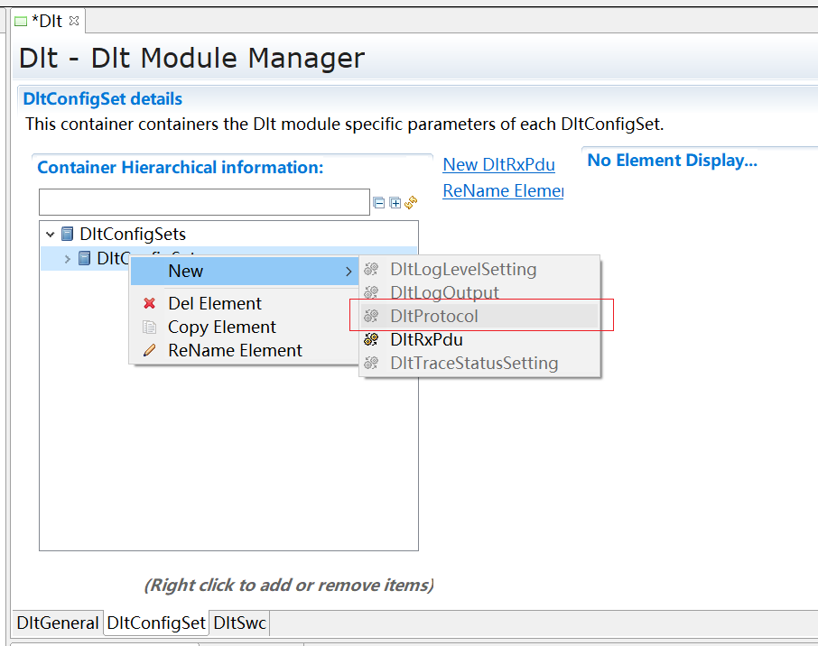

DltProtocols配置容器 (Configure DltProtocols Container)
-------------------------------------------------------------------

用于处理特定协议变体的配置参数，如Dlt标准消息报文头中是否使用EcuId，SessionId、TimeStamp等参数的配置，在非Verbose模式中是否使用扩展消息报文头的参数配置，Verbose模式的参数配置，Dlt消息过滤的状态配置。

Configuration parameters for handling specific protocol variants, such as whether to use EcuId, SessionId, TimeStamp, etc., in the DLT standard message header; parameter configuration for using extended message headers in non-Verbose mode; parameter configuration for Verbose mode; and status configuration for DLT message filtering.

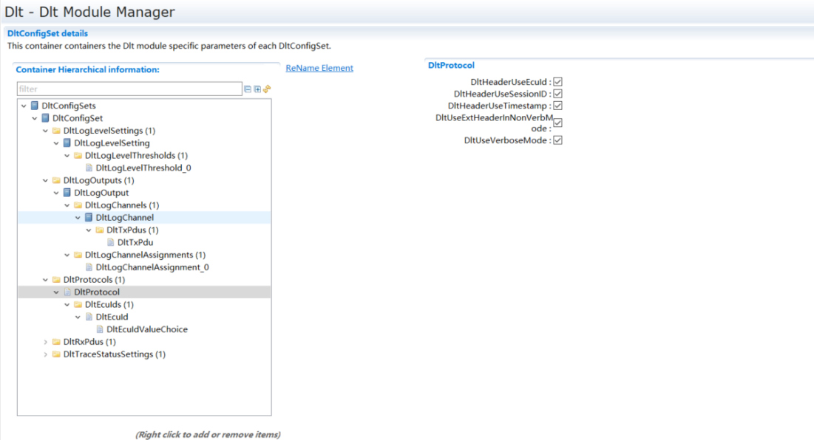

.. centered:: **表 Dlt模块的Protocols配置属性描述 (Description of Protocol Configuration Properties for Dlt Module)**

.. list-table::
   :widths: 20 20 20 20 20
   :header-rows: 1

   * - UI名称 (UI Name)
     - 描述 (Description)
     - 
     - 
     - 
   * - DltProtocol
     - 取值范围 (Range)
     - 引用或下拉选项 (Copy or Pull-down Options)
     - 默认取值 (Default value)
     - 无
   * - 
     - 参数描述 (Parameter Description)
     - 用于处理特定协议变体的配置参数 (Configuration parameters for handling specific protocol variants)
     - 
     - 
   * - 
     - 依赖关系 (Dependencies)
     - 无
     - 
     - 
   * - DltHeaderUseEcuId
     - 取值范围 (Range)
     - TRUE，FALSE
     - 默认取值 (Default value)
     - FALSE
   * - 
     - 参数描述 (Parameter Description)
     - 对应字段WEID(携带有ECU标识符ID)。如果设置了ECUID，则应放在标准消息头中，否则不需要。 (Corresponding field WEID (carries ECU identifier ID). If the ECUID is set, it should be placed in the standard message header; otherwise, it is not required.)
     - 
     - 
   * - 
     - 
     - 如果使用参数DltGeneralNvRamRef，该参数将为对应的NVRam条目定义初始值。如果没有设置参数DltGeneralNvRamRef，则链接时或构建后配置应该被使用。 (If the parameter DltGeneralNvRamRef is used, this parameter will define the initial value for the corresponding NVRAM entry. If the parameter DltGeneralNvRamRef is not set, then link-time or post-build configuration should be used.)
     - 
     - 
   * - 
     - 依赖关系 (Dependencies)
     - 无
     - 
     - 
   * - DltHeaderUseSessionID
     - 取值范围 (Range)
     - TRUE，FALSE
     - 默认取值 (Default value)
     - FALSE
   * - 
     - 参数描述 (Parameter Description)
     - 对应于字段WSID(携带有会话标识符ID)。如果设置了，会话ID应该放在标准消息头中，否则不需要。 (Corresponding to the field WSID (carrying the session identifier ID), if set, the session ID should be placed in the standard message header; otherwise, it is not required.)
     - 
     - 
   * - 
     - 
     - 如果使用参数DltGeneralNvRamRef，该参数将为对应的NVRam条目定义初始值。如果没有设置参数DltGeneralNvRamRef，则链接时或构建后配置应该被使用。 (If the parameter DltGeneralNvRamRef is used, this parameter will define the initial value for the corresponding NVRAM entry. If the parameter DltGeneralNvRamRef is not set, then link-time or post-build configuration should be used.)
     - 
     - 
   * - 
     - 依赖关系 (Dependencies)
     - 无
     - 
     - 
   * - DltHeaderUseTimestamp
     - 取值范围 (Range)
     - TRUE，FALSE
     - 默认取值 (Default value)
     - FALSE
   * - 
     - 参数描述 (Parameter Description)
     - 对应于字段WTMS(携带有时间戳)。如果设置了时间戳，应该放在标准消息头，否则不需要。 (Corresponding to the field WTMS (carrying a timestamp). If a timestamp is set, it should be placed in the standard message header; otherwise, it is not required.)
     - 
     - 
   * - 
     - 
     - 如果使用参数DltGeneralNvRamRef，该参数将为对应的NVRam条目定义初始值。如果没有设置参数DltGeneralNvRamRef，则链接时或构建后配置应该被使用。 (If the parameter DltGeneralNvRamRef is used, this parameter will define the initial value for the corresponding NVRAM entry. If the parameter DltGeneralNvRamRef is not set, then link-time or post-build configuration should be used.)
     - 
     - 
   * - 
     - 依赖关系 (Dependencies)
     - 无
     - 
     - 
   * - DltUseExtHeaderInNonVerbMode
     - 取值范围 (Range)
     - TRUE，FALSE
     - 默认取值 (Default value)
     - FALSE
   * - 
     - 参数描述 (Parameter Description)
     - 非冗长Verbose消息(相对于冗长消息)不需要扩展头。如果将此标志设置为true，则扩展头也应用于非冗长消息。 (Non-verbose messages (as opposed to verbose messages) do not require extended headers. If this flag is set to true, extended headers are also applied to non-verbose messages.)
     - 
     - 
   * - 
     - 
     - 如果启用了DltGeneralNvRAMSupport，则此参数是对应NVRam条目的初始值。如果没有设置DltGeneralNvRAMSupport，则链接时或构建后配置应使用。 (If DltGeneralNvRAMSupport is enabled, this parameter is the initial value for the corresponding NVRAM entry. If DltGeneralNvRAMSupport is not set, then link-time or post-build configuration should be used.)
     - 
     - 
   * - 
     - 依赖关系 (Dependencies)
     - 无
     - 
     - 
   * - DltUseVerboseMode
     - 取值范围 (Range)
     - TRUE，FALSE
     - 默认取值 (Default value)
     - FALSE
   * - 
     - 参数描述 (Parameter Description)
     - 如果此标志设置为TRUE，则有效负载将以详细模式传输，否则有效负载将以非详细模式传输。 (If this flag is set to TRUE, the payload will be transmitted in detailed mode; otherwise, it will be transmitted in non-detailed mode.)
     - 
     - 
   * - 
     - 依赖关系 (Dependencies)
     - 无
     - 
     - 
   * - DltEcuId
     - 取值范围 (Range)
     - 引用或下拉选项 (Copy or Pull-down Options)
     - 默认取值 (Default value)
     - 无
   * - 
     - 参数描述 (Parameter Description)
     - 这是一个选择容器，用于在一个EcuId值和一个callout之间进行选择，以获得EcuId。 (This is a selector container, used to choose between an EcuId value and a callout to obtain the EcuId.)
     - 
     - 
   * - 
     - 参数描述 (Parameter Description)
     - 无
     - 
     - 

新建DltEcuId (New DltEcuId)
-----------------------------------------

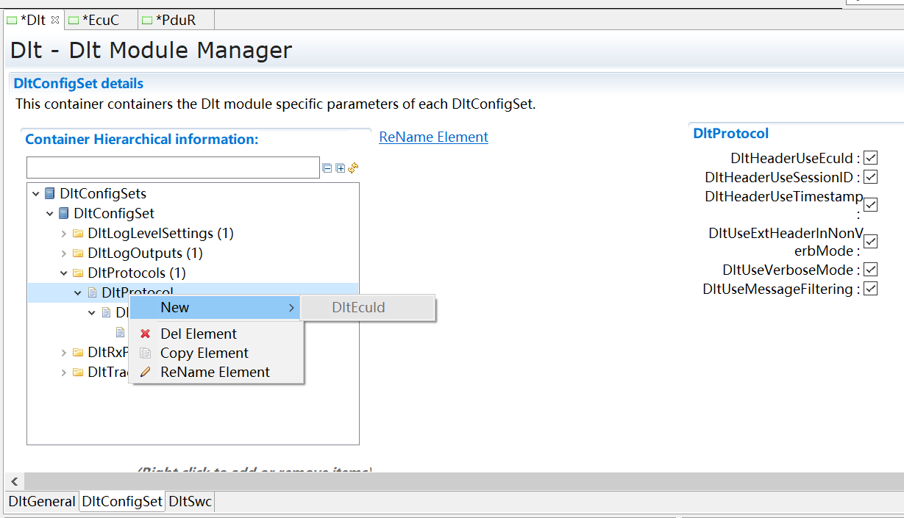

DltEcuId配置容器 (Configure Container for DltEcuId)
---------------------------------------------------------------

.. centered:: **表 Dlt模块的EcuId配置属性描述 (Description of the EcuId Configuration Property for Dlt Module)**

.. list-table::
   :widths: 20 20 20 20 20
   :header-rows: 1

   * - UI名称 (UI Name)
     - 描述 (Description)
     - 
     - 
     - 
   * - DltEcuId
     - 取值范围 (Range)
     - 引用或下拉选项 (Copy or Pull-down Options)
     - 默认取值 (Default value)
     - --
   * - 
     - 参数描述 (Parameter Description)
     - 这是一个选择容器，用于在一个EcuId值和一个callout之间进行选择，以获得EcuId。 (This is a selector container, used to choose between an EcuId value and a callout to obtain the EcuId.)
     - 
     - 
   * - 
     - 依赖关系 (Dependencies)
     - 无
     - 
     - 
   * - DltEcuIdCalloutChoice
     - 取值范围 (Range)
     - TRUE，FALSE
     - 默认取值 (Default value)
     - FALSE
   * - 
     - 参数描述 (Parameter Description)
     - EcuId的配置通过Callout回调函数来获取 (The configuration of EcuId is obtained through the Callout callback function.)
     - 
     - 
   * - 
     - 依赖关系 (Dependencies)
     - 无
     - 
     - 
   * - DltEcuIdValueChoice
     - 取值范围 (Range)
     - TRUE，FALSE
     - 默认取值 (Default value)
     - FALSE
   * - 
     - 参数描述 (Parameter Description)
     - EcuId的配置直接通过数值来获取 (The configuration of EcuId is directly obtained through numerical values.)
     - 
     - 
   * - 
     - 依赖关系 (Dependencies)
     - 无
     - 
     - 

新建DltEcuIdValueChoice (New DltEcuIdValueChoice)
---------------------------------------------------------------

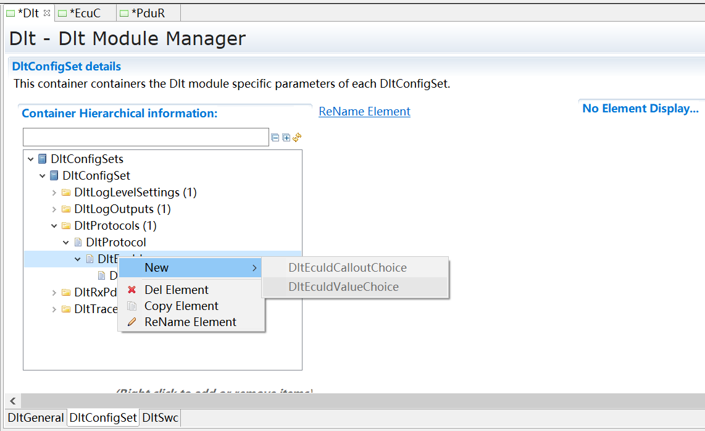

DltEcuIdValueChoice配置容器 (Configuration Container for DltEcuIdValueChoice)
-----------------------------------------------------------------------------------------

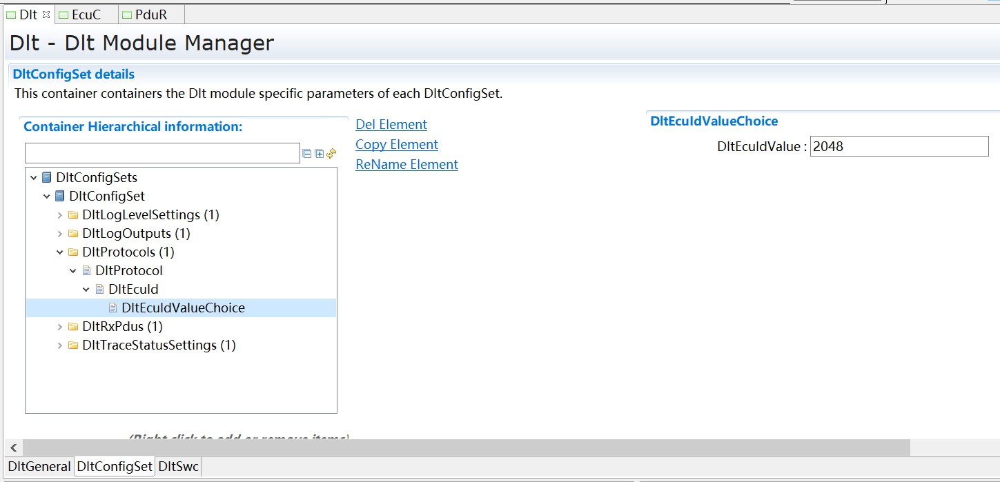

.. centered:: **表 Dlt模块的EcuIdValueChoice配置属性描述 (Description of the EcuIdValueChoice configuration property for Dlt module)**

.. list-table::
   :widths: 20 20 20 20 20
   :header-rows: 1

   * - UI名称 (UI Name)
     - 描述 (Description)
     - 
     - 
     - 
   * - DltEcuIdValueChoice
     - 取值范围 (Range)
     - 引用或下拉选项 (Copy or Pull-down Options)
     - 默认取值 (Default value)
     - 无
   * - 
     - 参数描述 (Parameter Description)
     - EcuId的配置直接通过数值来获取 (The configuration of EcuId is directly obtained through numerical values.)
     - 
     - 
   * - 
     - 依赖关系 (Dependencies)
     - 无
     - 
     - 
   * - DltEcuIdValue
     - 取值范围 (Range)
     - 字符串：uint8 [] (String: uint8[])
     - 默认取值 (Default value)
     - 无
   * - 
     - 参数描述 (Parameter Description)
     - 如果使用此选项，则应从配置的字符串中获取EcuId。这是在Dlt协议中使用的ECU的名称。如果你想使用一个数字表示类型，这是字符。 (If this option is selected, the EcuId should be obtained from the configured string. This is the name of the ECU used in the Dlt protocol. If you want to use a numeric representation type, this is a character.)
     - 
     - 
   * - 
     - 依赖关系 (Dependencies)
     - 无
     - 
     - 

DltEcuIdCalloutChoice配置容器 (DltEcuIdCalloutChoice Configuration Container)
-----------------------------------------------------------------------------------------

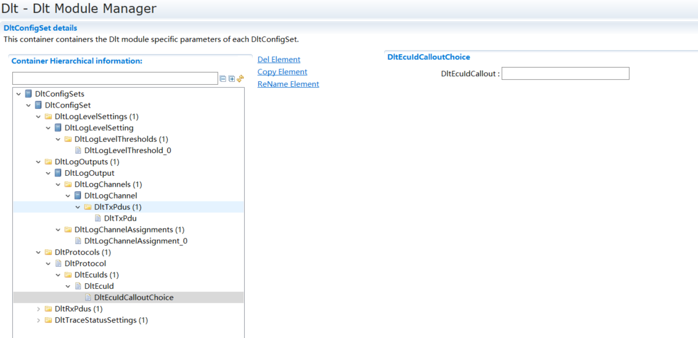

.. centered:: **表 Dlt模块的EcuIdCalloutChoice配置属性描述 (Description of the EcuIdCalloutChoice configuration property for the Dlt module)**

.. list-table::
   :widths: 20 20 20 20 20
   :header-rows: 1

   * - UI名称 (UI Name)
     - 描述 (Description)
     - 
     - 
     - 
   * - DltEcuIdCalloutChoice
     - 取值范围 (Range)
     - 引用或下拉选项 (Copy or Pull-down Options)
     - 默认取值 (Default value)
     - --
   * - 
     - 参数描述 (Parameter Description)
     - EcuId的配置通过Callout回调函数来获取 (The configuration of EcuId is obtained through the Callout callback function.)
     - 
     - 
   * - 
     - 依赖关系 (Dependencies)
     - 无
     - 
     - 
   * - DltEcuIdCallout
     - 取值范围 (Range)
     - 回调函数 (Callback function)
     - 默认取值 (Default value)
     - --
   * - 
     - 参数描述 (Parameter Description)
     - 如果使用此选项，则应通过调用此处配置的callout函数来获取该EcuId。 (If this option is selected, the EcuId should be obtained by calling the callout function configured here.)
     - 
     - 
   * - 
     - 依赖关系 (Dependencies)
     - 无
     - 
     - 

DltRxPdus配置 (DLTRxPDUs Configuration)
=====================================================

新建DltRxPdus (CreateNewDltRxPdus)
------------------------------------------------

DltRxPdus添加步骤为：鼠标选中DltConfigSet—单击右键—New—DltRxPdus。默认情况，无该配置项。

Add steps for DltRxPdus: Right-click on DltConfigSet — select New — DltRxPdus. This configuration item is not default.

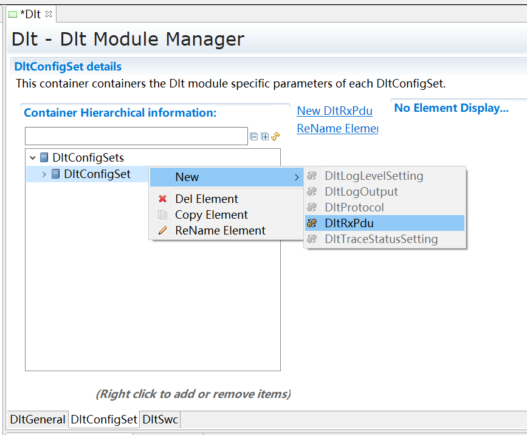

DltRxPdus配置容器 (DLTRxPDUs Configuration Container)
-----------------------------------------------------------------

为Dlt模块通信机制的接收链路配置PDU参数，如DltIRxPduHandleId、DltIRxPduUsesTp和DltRxPduIdRef等参数的设置。

Configure PDU parameters for the reception chain of the Dlt module communication mechanism, such as setting DltIRxPduHandleId, DltIRxPduUsesTp, and DltRxPduIdRef parameters.

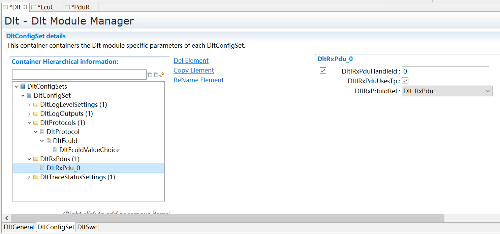

.. centered:: **表 Dlt模块的RxPdus配置属性描述 (Description of RxPdus configuration properties for Dlt module)**

.. list-table::
   :widths: 20 20 20 20 20
   :header-rows: 1

   * - UI名称 (UI Name)
     - 描述 (Description)
     - 
     - 
     - 
   * - DltRxPdu
     - 取值范围 (Range)
     - 引用或下拉选项 (Copy or Pull-down Options)
     - 默认取值 (Default value)
     - --
   * - 
     - 参数描述 (Parameter Description)
     - 包含用于Dlt控制消息接收的Pdu标识符ID (Contains PDU identifier ID for DLT control message reception)
     - 
     - 
   * - 
     - 依赖关系 (Dependencies)
     - 依赖于ECUC和PDUR的配置项 (Configuration items dependent on ECUC and PDUR)
     - 
     - 
   * - DltIRxPduHandleId
     - 取值范围 (Range)
     - 0…65536
     - 默认取值 (Default value)
     - 0
   * - 
     - 参数描述 (Parameter Description)
     - 用作这个I-PDUID的数值。API调用Dlt_RxIndication、Dlt_TpRxIndication、Dlt_StartOfReception和Dlt_CopyRxData时需要DltRxPduHandleId来接收来自PduR的I-PDU(DltIPduDirection:receive)，以及传递给RxIPDU-callout的PduId。
     - 
     - 
   * - 
     - 依赖关系 (Dependencies)
     - 依赖于ECUC和PDUR的配置项 (Configuration items dependent on ECUC and PDUR)
     - 
     - 
   * - DltIRxPduUsesTp
     - 取值范围 (Range)
     - TRUE，FALSE
     - 默认取值 (Default value)
     - FALSE
   * - 
     - 参数描述 (Parameter Description)
     - 如果设置为TRUE，则使用TPAPI接收PDU。 (If set to TRUE, TPAPI will be used to receive PDUs.)
     - 
     - 
   * - 
     - 
     - 如果为FALSE，则使用IFAPI。 (If FALSE, use IFAPI.)
     - 
     - 
   * - 
     - 依赖关系 (Dependencies)
     - 依赖于ECUC和PDUR的配置项 (Configuration items dependent on ECUC and PDUR)
     - 
     - 
   * - DltRxPduIdRef
     - 取值范围 (Range)
     - 引用或下拉选项 (Copy or Pull-down Options)
     - 默认取值 (Default value)
     - --
   * - 
     - 参数描述 (Parameter Description)
     - 引用全局的Pdu结构，以允许在通信堆栈中协调句柄标识符ID (Refer to the global PDU structure to allow handle identifier ID coordination in the communication stack.)
     - 
     - 
   * - 
     - 依赖关系 (Dependencies)
     - 依赖于ECUC和PDUR的配置项 (Configuration items dependent on ECUC and PDUR)
     - 
     - 

DltTraceStatusSettings配置 (DltTraceStatusSettings Configuration)
===============================================================================

新建DltTraceStatusSettings (CreateDltTraceStatusSettings)
-----------------------------------------------------------------------

DlttraceStatusSettings添加步骤为：鼠标选中DltConfigSet—单击右键—New—DlttraceStatusSettings。默认情况，无该配置项。

Add steps for DlttraceStatusSettings: Select the DltConfigSet with the mouse — right-click — New — DlttraceStatusSettings. By default, this configuration item is not present.

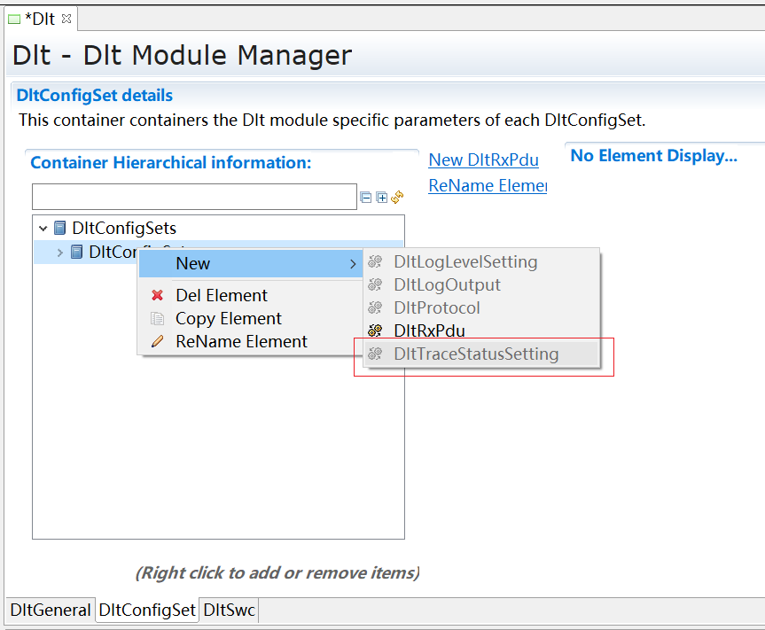

DltTraceStatusSettings配置容器 (Configure Container for DltTraceStatusSettings)
-------------------------------------------------------------------------------------------

为Dlt模块设置初始默认跟踪状态，在DltTraceStatusSettings选项卡中点击默认跟踪状态设置按钮DltDefaultTraceStatus，从下拉菜单中选中一个配置作为默认跟踪状态。默认情况，该配置项设置为FALSE。

Set the initial default tracing status for the Dlt module by clicking the DltDefaultTraceStatus button under the Default Trace Status Settings tab. From the dropdown menu, select a configuration as the default trace status. By default, this configuration item is set to FALSE.

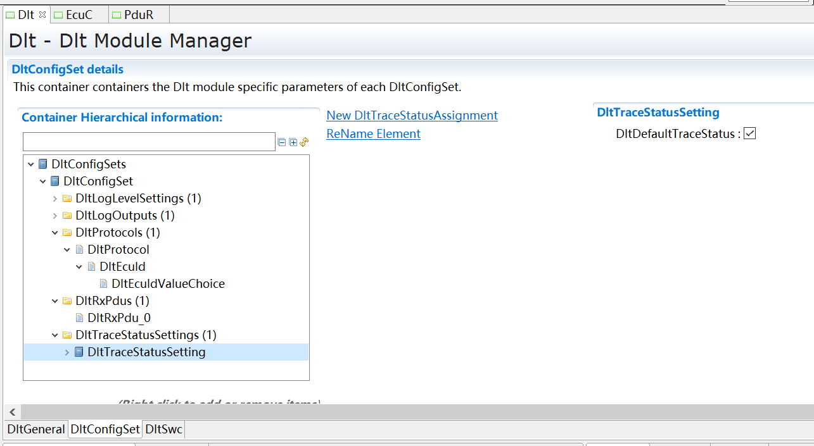

.. centered:: **表 Dlt模块的TraceStatusSettings配置属性描述 (Description of TraceStatusSettings configuration properties for Dlt module)**

.. list-table::
   :widths: 20 20 20 20 20
   :header-rows: 1

   * - UI名称 (UI Name)
     - 描述 (Description)
     - 
     - 
     - 
   * - DltTraceStatusSetting
     - 取值范围 (Range)
     - 引用或下拉选项 (Copy or Pull-down Options)
     - 默认取值 (Default value)
     - 无
   * - 
     - 参数描述 (Parameter Description)
     - 包含跟踪状态的设置 (Settings for Including Tracking Status)
     - 
     - 
   * - 
     - 依赖关系 (Dependencies)
     - 无
     - 
     - 
   * - DltDefaultTraceStatus
     - 取值范围 (Range)
     - TRUE，FALSE
     - 默认取值 (Default value)
     - FALSE
   * - 
     - 参数描述 (Parameter Description)
     - 这是在没有过滤器匹配给定的ApplicationId和ContextId时使用的有效跟踪状态。这可以看作是一个带有通配符ApplicationId和ContextId的穿透过滤器定义，当没有其他过滤器匹配时，将使用通配符 (This is an effective tracking state used when no filters match the given ApplicationId and ContextId. It can be regarded as a filter definition with wildcard ApplicationId and ContextId, and when no other filters match, the wildcards will be used.)
     - 
     - 
   * - 
     - 依赖关系 (Dependencies)
     - 无
     - 
     - 
   * - DltTraceStatusAssignment
     - 取值范围 (Range)
     - 引用或下拉选项 (Copy or Pull-down Options)
     - 默认取值 (Default value)
     - 无
   * - 
     - 参数描述 (Parameter Description)
     - 这个容器包含ApplicationId/ContextId对及其分配的跟踪状态的预配置 (This container includes ApplicationId/ContextId pairs along with their pre-configured tracking statuses.)
     - 
     - 
   * - 
     - 依赖关系 (Dependencies)
     - 无
     - 
     - 

DltTraceStatusSettingsSwcContext配置容器 (Configuration Container for DltTraceStatusSettingsSwcContext)
-------------------------------------------------------------------------------------------------------------------

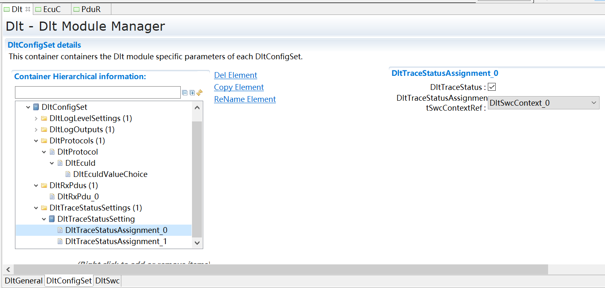

.. centered:: **表 Dlt模块的TraceStatusAssignmentSwcContext配置属性描述 (The TraceStatusAssignmentSwcContext configuration property description for Module Dlt module)**

.. list-table::
   :widths: 20 20 20 20 20
   :header-rows: 1

   * - UI名称 (UI Name)
     - 描述 (Description)
     - 
     - 
     - 
   * - DltTraceStatusAssignment
     - 取值范围 (Range)
     - 引用或下拉选项 (Copy or Pull-down Options)
     - 默认取值 (Default value)
     - --
   * - 
     - 参数描述 (Parameter Description)
     - 这个容器包含ApplicationId/ContextId对及其分配的跟踪状态的预配置。 (This container includes ApplicationId/ContextId pairs along with their pre-configured tracing states.)
     - 
     - 
   * - 
     - 依赖关系 (Dependencies)
     - 无
     - 
     - 
   * - DltTraceStatus
     - 取值范围 (Range)
     - TRUE，FALSE
     - 默认取值 (Default value)
     - FALSE
   * - 
     - 参数描述 (Parameter Description)
     - 跟踪给定的ApplicationId/ContextId元组的状态 (Track the status of the given ApplicationId/ContextId tuple.)
     - 
     - 
   * - 
     - 依赖关系 (Dependencies)
     - 无
     - 
     - 
   * - DltTraceStatusAssignmentSwcContextRef
     - 取值范围 (Range)
     - 引用或下拉选项 (Copy or Pull-down Options)
     - 默认取值 (Default value)
     - --
   * - 
     - 参数描述 (Parameter Description)
     - 对已分配Dlt跟踪状态的ApplicationId/ContextId对应元组的引用 (Reference to the ApplicationId/ContextId tuple assigned DLt tracking status)
     - 
     - 
   * - 
     - 依赖关系 (Dependencies)
     - 无
     - 
     - 

DltSwc配置 (Configure DltSwc)
-------------------------------------------

新建DltSwc (Create DltSwc)
========================================

DltSwc添加步骤为：鼠标选中DltConfigSets—单击右键—New—DltConfigSet。默认情况，无该配置项。

Add steps for DltSwc: Select DltConfigSets with the mouse — right-click — New — DltConfigSet. By default, this configuration item is not present.

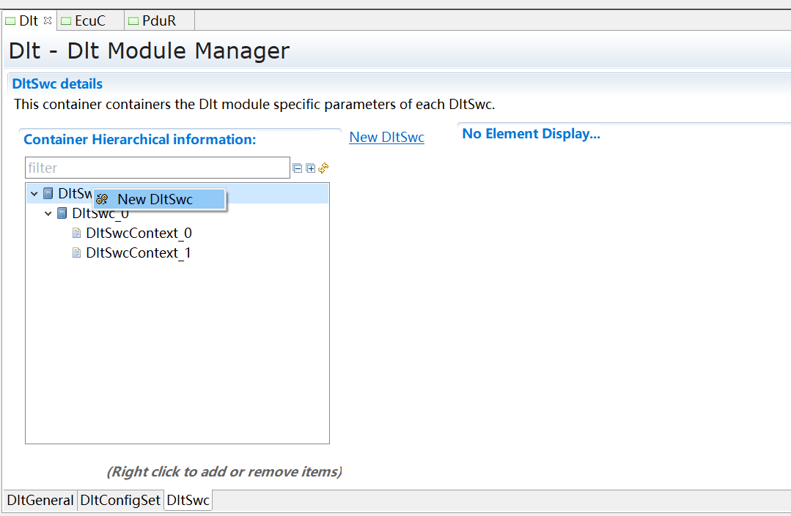

DltSwc配置容器 (Configure Container for DltSwc)
===========================================================

为Dlt模块的SWC上下文配置表设置会话标识符、是否支持日志级别更新通知、日志消息最大长度和跟踪消息最大长度等参数的配置。

Configure session identifiers, support for log level update notifications, maximum length of log messages, and maximum length of tracing messages for the SWC context configuration table of the Dlt module.

默认情况，无该配置项。

Default: No such configuration item.

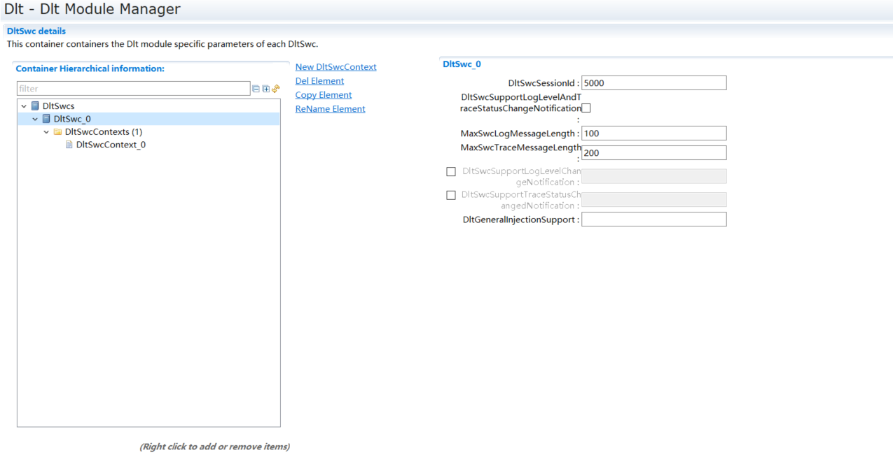

.. centered:: **表 Dlt模块的Swc配置属性描述 (Description of Swc Configuration Properties for Dlt Module)**

.. list-table::
   :widths: 20 20 20 20 20
   :header-rows: 1

   * - UI名称 (UI Name)
     - 描述 (Description)
     - 
     - 
     - 
   * - 
     - 取值范围 (Range)
     - 下拉选项 (Dropdown options)
     - 默认取值 (Default value)
     - 无
   * - DltSwc
     - 参数描述 (Parameter Description)
     - 包含AUTOSAR   Dlt模块与SWCs交互所需的配置参数 (Contain configuration parameters for interaction between AUTOSAR Dlt module and SWCs)
     - 
     -
   * - 
     - 依赖关系 (Dependencies)
     - 无
     - 
     - 
   * - 
     - 取值范围 (Range)
     - 0…4294967295
     - 默认取值 (Default value)
     - 0
   * - DltSwcSessionId
     - 参数描述 (Parameter Description)
     - 一个ECU范围的唯一标识符ID，用于标识SWC(实例)使用的端口 (A unique identifier ID for an ECU range, used to identify the port utilized by SWC(instance))
     - 
     -
   * - 
     - 依赖关系 (Dependencies)
     - 无
     - 
     - 
   * - 
     - 取值范围 (Range)
     - TRUE/FALSE
     - 默认取值 (Default value)
     - FALSE
   * - DltSwcSupportLogLevelAndTraceStatusChangeNotification
     - 参数描述 (Parameter Description)
     - 指示Dlt是否必须提供R-Port以通知SWC关于LogLevel或TraceStatus更改的标志。 (Indicate whether the Dlt must provide R-Port to notify SWC of LogLevel or TraceStatus changes.)
     - 
     -
   * - 
     - 依赖关系 (Dependencies)
     - 无
     - 
     - 
   * - 
     - 取值范围 (Range)
     - 0…65535
     - 默认取值 (Default value)
     - 0
   * - MaxSwcLogMessageLength
     - 参数描述 (Parameter Description)
     - 定义日志消息允许的最大长度 (Define the maximum length of log messages)
     - 
     -
   * - 
     - 依赖关系 (Dependencies)
     - 无
     - 
     - 
   * - 
     - 取值范围 (Range)
     - 0…65535
     - 默认取值 (Default value)
     - 0
   * - MaxSwcTraceMessageLength
     - 参数描述 (Parameter Description)
     - 定义跟踪消息允许的最大长度 (Define the maximum length of tracking messages)
     - 
     -
   * - 
     - 依赖关系 (Dependencies)
     - 无
     - 
     - 
   * - 
     - 取值范围 (Range)
     - TRUE/FALSE
     - 默认取值 (Default value)
     - FALSE
   * - DltSwcSupportLogLevelAndTraceStatusChangeNotification
     - 参数描述 (Parameter Description)
     - 指示Dlt是否必须提供R-Port以通知SWC关于LogLevel更改的标志。 (Indicate whether the Dlt flag must provide R-Port to notify SWC of LogLevel changes.)
     - 
     -
   * - 
     - 依赖关系 (Dependencies)
     - 无
     - 
     - 
   * - 
     - 取值范围 (Range)
     - TRUE/FALSE
     - 默认取值 (Default value)
     - FALSE
   * - DltSwcSupportTraceStatusChangedNotification
     - 参数描述 (Parameter Description)
     - 指示Dlt是否必须提供R-Port以通知SWC有关TraceStatus更改的标志。 (Indicate whether Dlt must provide R-Port to notify SWC of a TraceStatus change.)
     - 
     -
   * - 
     - 依赖关系 (Dependencies)
     - 无
     - 
     - 
   * - 
     - 取值范围 (Range)
     - TRUE/FALSE
     - 默认取值 (Default value)
     - FALSE
   * - DltGeneralInjectionSupport
     - 参数描述 (Parameter Description)
     - 启用或禁用Dlt注入特性 (Enable or Disable Dlt Injection Feature)
     - 
     -
   * - 
     - 依赖关系 (Dependencies)
     - 无
     - 
     - 
   * - 
     - 取值范围 (Range)
     - 引用或下拉选项 (Copy or Pull-down Options)
     - 默认取值 (Default value)
     - 无
   * - DltSwcContext
     - 参数描述 (Parameter Description)
     - 这个容器包含SWC所支持的ApplicationId/ContextId对应元组的配置 (This container includes the configuration of ApplicationId/ContextId tuples supported by SWC.)
     - 
     -
   * - 
     - 依赖关系 (Dependencies)
     - 无
     - 
     - 

DltSwcContext配置容器 (Configure Container for DltSwcContext)
=========================================================================

为Dlt模块的SWC上下文配置表设置应用程序标识符和上下文标识符。默认情况，无该配置项。

Set application identifier and context identifier for the SWC context configuration table of the Dlt module. By default, this configuration item is not set.

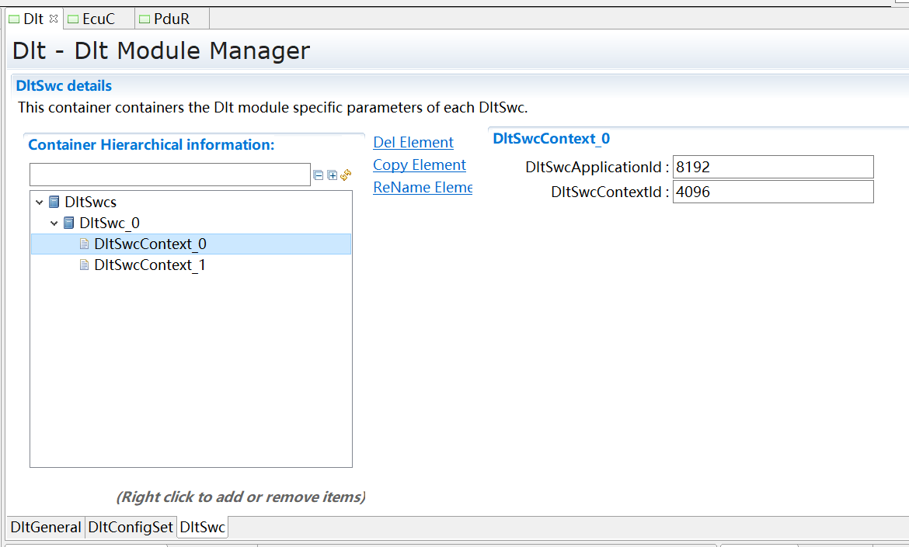

.. centered:: **表 Dlt模块的SwcContext配置属性描述 (Description of SwcContext Configuration Properties for Dlt Module)**

.. list-table::
   :widths: 20 20 20 20 20
   :header-rows: 1

   * - UI名称 (UI Name)
     - 描述 (Description)
     - 
     - 
     - 
   * - DltSwcContext
     - 取值范围 (Range)
     - 下拉选项 (Dropdown options)
     - 默认取值 (Default value)
     - 无
   * - 
     - 参数描述 (Parameter Description)
     - 这个容器包含SWC所支持的ApplicationId/ContextId对的配置 (This container includes the configuration for ApplicationId/ContextId pairs supported by SWC)
     - 
     - 
   * - 
     - 依赖关系 (Dependencies)
     - 无
     - 
     - 
   * - DltSwcApplicationId
     - 取值范围 (Range)
     - 字符串：uint8 [] (String: uint8[])
     - 默认取值 (Default value)
     - 无
   * - 
     - 参数描述 (Parameter Description)
     - 用于描述SWC应用程序标识符的字符串 (String used to describe the SWC application identifier)
     - 
     - 
   * - 
     - 依赖关系 (Dependencies)
     - 无
     - 
     - 
   * - DltSwcContextId
     - 取值范围 (Range)
     - 字符串：uint8 [] (String: uint8[])
     - 默认取值 (Default value)
     - 无
   * - 
     - 参数描述 (Parameter Description)
     - 用于描述SWC上下文标识符的字符串 (String used to describe the SWC context identifier)
     - 
     - 
   * - 
     - 依赖关系 (Dependencies)
     - 无
     - 
     - 
