DoIP
#################################

:strong:`缩写词注解 (Abbreviation Notes):`

.. list-table::
   :widths: 34 33 33
   :header-rows: 1

   * - 缩写词 (Abbreviation)
     - 解释/描述 (Explanation/Description)
     - 中文解释 (Chinese explanation)
   * - VIN
     - Vehicle Identification Number
     - 车辆识别号 (Vehicle Identification Number)
   * - EID
     - Entity Identifier
     - 实体标识符 (Entity Identifier)
   * - GID
     - Group Identifier
     - 组标识符 (Group Identifier)
   * - LA
     - Logic Address
     - DoIP 实体的逻辑地址 (Logical address of the DoIP Entity)
   * - SA
     - Source Address
     - 用于标识 DoIP 消息是从哪个DoIP 实体发出的 (Used to identify which DoIP entity the DoIP message is emitted from)
   * - TA
     - Target Address
     - 用于标识将DoIP消息发送给哪个DoIP 实体 (To identify which DoIP entity the DoIP message is sent to)
   * - Tester
     - 
     - 运行有 DoIP 客户端的 DoIP实体 (Entities with DoIP client running)
   * - PDU
     - Protocol Data Unit
     - 协议数据单元 (Protocol Data Unit)
   * - PduR
     - PDU Router
     - PDU路由模块，Autosar中的一个功能模块 (PDU Routing Module, a functional module in Autosar)
   * - RTE
     - Runtime Environment
     - 运行时环境，Autosar中的一个功能模块 (Runtime environment, a functionality module in Autosar)
   * - SoAd
     - Socket Adapter
     - 套接字适配器，Autosar中的一个功能模块 (Socket Adapter, a functional module in Autosar)
   * - DCM
     - Diagnostic CommunicationManager
     - 诊断控制管理，Autosar中的一个功能模块 (Diagnostic Control Management, a functional module in Autosar)
   * - CAN
     - Controller Area Network
     - 控制器局域网总线 (Controller Area Network bus)
   * - ECU
     - Electronic Control Unit
     - 行车电脑 (Onboard Computer)

简介 (Introduction)
=================================

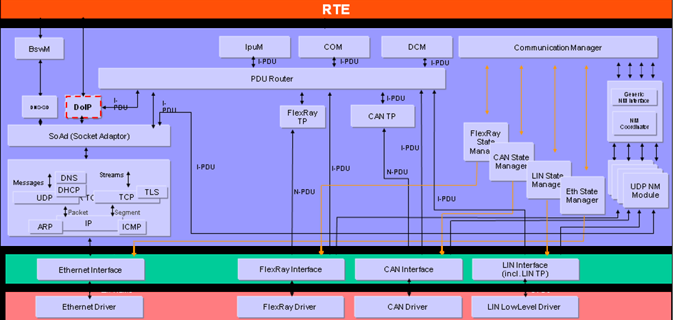

DoIP模块用于外部诊断设备与内部ECU之间基于IP（TCP或UDP）的诊断通讯，主要实现了ISO13400-2规范规定的传输层的协议功能。DoIP在AUTOSAR架构处于SoAd模块与PduR模块之间（图 ）。SoAd向DoIP提供IP地址的获取与释放、SocketConnection的创建与通知功能。DoIP向SoAd提供接收与发送的API用于数据的传输。PduR模块提供和其它上层模块的路由功能，保证DoIP和上层模块（DCM或其它TP模块）的数据交互。

The DoIP module is used for diagnostic communications between external diagnostic devices and internal ECUs based on IP (TCP or UDP), primarily implementing the protocol functions specified in the transmission layer of ISO13400-2 norm. In the AUTOSAR architecture, DoIP lies between the SoAd module and the PduR module (see figure). The SoAd provides DoIP with functionalities for obtaining and releasing IP addresses, creating and notifying SocketConnections. DoIP offers to SoAd APIs for receiving and sending data used in transmission. The PduR module provides routing functions to other upper-layer modules, ensuring data interaction between DoIP and upper-layer modules (DCM or other TP modules).

DoIP实现了以下功能：

DoIP implements the following functions:

1) 车辆通告和车辆发现；

Vehicle announcements and vehicle discoveries;

2) 车辆基本信息检索；

Vehicle basic information retrieval;

3) 连接状态建立、维持以及车辆网关控制；

Connection state establishment, maintenance, and vehicle gateway control;

4) 诊断数据路由；

Diagnose data routing;

5) 网络错误状态处理。

Network error status handling.

参考资料 (Reference materials)
------------------------------------------

[1] ISO-13400，2012

[2] AUTOSAR_SWS_DiagnosticOverIP，R19-11

功能描述 (Function Description)
===========================================

车辆通告和车辆发现功能 (Vehicle announcements and vehicle discovery functions)
-----------------------------------------------------------------------------------

车辆通告和车辆发现功能介绍 (Introduction to Vehicle Announcements and Vehicle Discovery Functions)
=====================================================================================================

车辆通告和车辆发现功能用于Tester端发现已经建立IP连接的DoIP节点。通常DoIP节点的IP地址分配成功后会发出vehicle announcement报文，用于通告自己的LA、VIN、EID、GID等信息。如果Tester端没有及时收到(Tester在DoIP启动后才连接到网络)DoIP节点的车辆通告报文，会通过主动发送vehicle identification报文获取DoIP节点的上述信息。

Vehicle announcements and vehicle discovery functionalities are used by Tester end to discover established IP-connected DoIP nodes. Typically, after the IP address allocation of a DoIP node is successful, it sends a vehicle announcement message to announce its LA, VIN, EID, GID, etc. If the Tester end fails to receive the vehicle announcement message from the DoIP node in time (meaning the Tester connects to the network only after DoIP startup), it will actively send a vehicle identification message to obtain the aforementioned information of the DoIP node.

车辆通告和车辆发现功能实现 (Vehicle announcements and vehicle discovery features implemented)
================================================================================================

车辆通告和车辆发现功能基于 UDP 协议实现。

The vehicle announcement and vehicle discovery features are implemented based on the UDP protocol.

车辆通告。当网络可用时，SoAd会调用DoIP_SoConModeChg告知DoIP，DoIP在DoIP_SoConModeChg设置应该发送车辆通告消息相关标志，在DoIP_MainFunction调用SoAd_IfTransmit发送车辆通告消息。

Vehicle announcement. When the network is available, SoAd will invoke DoIP_SoConModeChg to inform DoIP. In DoIP_SoConModeChg, DoIP sets the relevant flags for sending vehicle announcement messages. Then, in DoIP_MainFunction, SoAd_IfTransmit is called to send the vehicle announcement messages.

车辆发现。SoAd会调用DoIP_SoAdIfRxIndication告知DoIP收到vehicle identification消息，DoIP在DoIP_SoAdIfRxIndication处理收到的相关消息，并调用SoAd_IfTransmit发送响应报文。

Vehicle discovery. SoAd will call DoIP_SoAdIfRxIndication to inform DoIP of receiving a vehicle identification message. DoIP processes the received messages in DoIP_SoAdIfRxIndication and calls SoAd_IfTransmit to send a response message.

车辆基本信息检索功能 (Vehicle basic information retrieval function)
-------------------------------------------------------------------------

车辆基本信息检索功能介绍 (Introduction to Vehicle Basic Information Retrieval Function)
===========================================================================================

车辆检索，用于外部诊断设备通过0x4001、0x4003指令向DoIP节点检索当前节点的节点类型、最大同时可连接TCP socket数量、当前连接的TCP socket数量、最大可支持的数据长度、当前电源状态等信息。

Vehicle retrieval is used for external diagnostic devices to retrieve current node information such as node type, maximum number of concurrent TCP sockets, current number of connected TCP sockets, maximum supported data length, and current power state via DoIP nodes using 0x4001 and 0x4003 commands.

车辆基本信息检索功能实现 (Vehicle basic information retrieval function implementation)
==========================================================================================

车辆检索功能基于UDP协议实现，接收到0x4001、0x4003报文后进入DoIP_SoAdIfRxIndication()进行处理，同步构造响应报文并通过SoAd_IfTransmit() 发送响应报文。

The vehicle search function is implemented based on the UDP protocol. After receiving 0x4001 and 0x4003 messages, it enters DoIP_SoAdIfRxIndication() for processing, synchronously constructs a response message, and sends the response message through SoAd_IfTransmit().

连接状态建立、维持功能 (Connection status establishment, maintenance functionality)
----------------------------------------------------------------------------------------

连接状态建立、维持功能介绍 (Connection status establishment and maintenance function introduction)
=====================================================================================================

连接状态建立、维持功能用建立TCP 连接与维持，DoIP通过路由激活请求注册TCP连接，通过存活检测机制来维持连接状态。

Connection state establishment and maintenance functions use establishing and maintaining TCP connections, with DoIP activating requests to register TCP connections through routing and maintaining the connection state via survival detection mechanisms.

连接状态建立、维持功能实现 (Connection status establishment, maintenance function implementation)
====================================================================================================

当DoIP_SoConModeChg指示当前套接字状态切换为SOAD_SOCON_ONLINE时，将由DoIP维持一个套接字连接资源池，并开始启动initial inactivity timer，如果超时时间内未完成路由激活注册，将在套接字资源池中清除对应套接字，并通知SoAd模块关闭套接字。如果在超时时间内接收到路由激活请求并满足注册条件，则停止initial inactivity timer计时并开始general inactivity timer计时，此后就可以基于该套接字进行诊断报文的传输了。每当通过该套接字收发了数据，都会重置general inactivity timer。

When the DoIP_SoConModeChg indicates that the current socket state has switched to SOAD_SOCON_ONLINE, DoIP will maintain a socket connection resource pool and start the initial inactivity timer. If the route activation registration is not completed within the timeout period, the corresponding socket will be cleared from the socket resource pool, and SoAd module will be notified to close the socket. If a route activation request is received and meets the registration conditions within the timeout period, the initial inactivity timer counting will be stopped, and the general inactivity timer will start. After that, diagnostic messages can be transmitted based on this socket. Whenever data is sent or received through this socket, the general inactivity timer will be reset.

诊断数据路由功能 (Diagnostic Data Routing Function)
-----------------------------------------------------------

诊断数据路由功能介绍 (Introduction to Diagnostic Data Routing Function)
=============================================================================

通过DoIP传递的诊断数据通常有两种形式，一种是通过DoIP传递给其它ECU节点，此时DoIP节点作为网关节点，实现诊断报文的路由功能，另一种则是传递给DoIP节点本身。

Diagnostic data transmitted via DoIP typically takes two forms: one where the DoIP node acts as a gateway node to route diagnostic messages to other ECU nodes, and another where it is transmitted to the DoIP node itself.

诊断数据路由功能实现 (Diagnostic data routing functionality implementation)
=================================================================================

如果是通过DoIP将诊断报文传递给其它ECU，则首先通过SA、TA找到PduR中配置好的目的节点，通过PduR的报文路由功能转发给其它节点。

If diagnostic messages are transmitted to other ECU via DoIP, first find the destination node pre-configured in PduR through SA and TA, then forward the message using the routing function of PduR to other nodes.

如果诊断报文是发送给 DoIP 节点本身，同样是通过SA、TA找到PduR中配置的上层目标，并由PduR转发到DCM中进行处理，此时诊断报文接收和发送buffer将由DCM模块提供。

If the diagnostic message is sent to the DoIP node itself, it is similarly located in PduR's upper-layer target via SA and TA, and then forwarded by PduR to be processed in the DCM. In this case, the diagnostic message reception and transmission buffers will be provided by the DCM module.

诊断数据网关功能 (	Diagnostic Data Gateway Function)
----------------------------------------------------------

DoIP网关支持将诊断报文转发到CAN网络、其它以太网网络。

DoIP Gateway supports forwarding diagnostic messages to CAN network, other Ethernet networks.

以太网转CAN (Ethernet to CAN)
=========================================

DoIP网关到CAN诊断节点。Tester发出的诊断请求通过以太网传递到DoIP网关，DoIP网关通过TA得到目标节点，将诊断请求通过PduR转发到CAN总线。

DoIP gateway to CAN diagnostic node. The diagnosis request sent by Tester is transmitted via Ethernet to the DoIP gateway, which then obtains the target node through TA and forwards the diagnosis request via PduR to the CAN bus.

以太网转以太网 (Ethernet to Ethernet)
==============================================

DoIP网关到Eth诊断节点。Tester发出的诊断请求通过以太网传递到DoIP网关，DoIP网关通过TA得到目标诊断节点，将诊断请求通过PduR转发到Eth。

DoIP gateway to Eth diagnostic node. The diagnosis request sent by Tester is transmitted via Ethernet to the DoIP gateway, which, through TA, obtains the target diagnostic node and forwards the diagnosis request via PduR to Eth.

源文件描述 (Source file description)
===============================================

.. centered:: **表 DoIP组件文件描述 (Table Description of DoIP Component Files)**

.. list-table::
   :widths: 50 50
   :header-rows: 1

   * - 文件 (Files)
     - 说明 (Description)
   * - DoIP_Cfg.h
     - 定义DoIP模块预编译时用到的配置参数 (Define configuration parameters used during pre-compilation of the DoIP module)
   * - DoIP_PCCfg.c
     - 定义DoIP模块预编译时用到的配置参数 (Define configuration parameters used during pre-compilation of the DoIP module)
   * - DoIP_PCCfg.h
     - 定义DoIP模块预编译时用到类型 (Define types used in DoIP module preprocessing)
   * - DoIP_PBCfg.c
     - 定义DoIP模块链接时用到的配置参数 (Define configuration parameters for linking the DoIP module)
   * - DoIP_PBCfg.h
     - 定义DoIP模块链接时用到的类型 (Define types used for linking the DoIP module)
   * - Rte_DoIP.c
     - 定义RTE与DoIP的交互函数 (Define functions for interaction between RTE and DoIP)
   * - Rte_DoIP.h
     - 定义RTE与DoIP的交互函数的声明 (Declare the functions for the interaction between RTE and DoIP)
   * - Rte_DoIP_Type.h
     - 定义RTE与DoIP的交互函数的类型 (Define the type of the interaction functions between RTE and DoIP)
   * - DoIP.h
     - 提供API函数的扩展声明，定义必要数据结构 (Provide extended declarations for API functions, define necessary data structures)
   * - DoIP.c
     - 实现 API (Implement API)
   * - DoIP_Internal.c
     - 内部函数源文件 (Internal function source files)
   * - DoIP_Cbk.h
     - 提供SoAd调用的API函数的声明 (Declare API functions for SoAd call)
   * - DOIP_Internal.h
     - 内部变量和数据结构的定义 (Definition of internal variables and data structures)
   * - DoIP_Types.h
     - 类型定义文件 (Type definition file)
   * - DoIP_MemMap.h
     - 内存分布文件 (Memory Distribution File)

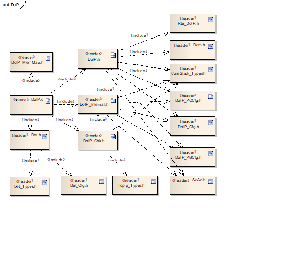

API接口 (API Interface)
=====================================

类型定义 (Type definition)
--------------------------------------

DoIP_ConfigType类型定义 (DoIP_ConfigType Configuration Type Definition)
===================================================================================

.. list-table::
   :widths: 50 50
   :header-rows: 1

   * - 名称 (Name)
     - DoIP_ConfigType
   * - 类型 (Type)
     - Structure
   * - 范围 (Range)
     - Implementation specific
   * - 描述 (Description)
     - DoIP 配置结构体类型定义 (DoIP Configuration Structure Types Defined)

DoIP_PowerStateType类型定义 (DoIP_PowerStateType type definition)
=============================================================================

.. list-table::
   :widths: 50 50
   :header-rows: 1

   * - 名称 (Name)
     - DoIP_PowerStateType
   * - 类型 (Type)
     - uint8
   * - 范围 (Range)
     - DOIP_NOT_READYDOIP_READY
   * - 
     - DOIP_NOT_SUPPORTED
   * - 描述 (Description)
     - DoIP 电源状态类型定义 (Definition of DoIP Power Status Type)

DoIP_ActivationLineType类型定义 (DoIP Activation Line Type definition)
==================================================================================

.. list-table::
   :widths: 50 50
   :header-rows: 1

   * - 名称 (Name)
     - DoIP_ActivationLineType
   * - 类型 (Type)
     - enum
   * - 范围 (Range)
     - DOIP_ACTIVATION_LINE_ACTIVE
   * - 
     - DOIP_ACTIVATION_LINE_INACTIVE
   * - 描述 (Description)
     - 激活线状态 (Activate Line State)

DoIPNodeType类型定义 (Definition of DoIPNodeType type)
==================================================================

.. list-table::
   :widths: 50 50
   :header-rows: 1

   * - 名称 (Name)
     - DoIPNodeType
   * - 类型 (Type)
     - enum
   * - 范围 (Range)
     - DOIP_GATEWAY
   * - 
     - DOIP_NODE
   * - 描述 (Description)
     - DoIP 节点类型 (DoIP Node Type)

输入函数描述 (Describe the input function:)
-----------------------------------------------------

.. list-table::
   :widths: 50 50
   :header-rows: 1

   * - 输入模块 (Input Module)
     - API
   * - Dcm
     - Dcm_GetVin
   * - PduR
     - PduR_DoIPTpCopyRxData
   * - PduR
     - PduR_DoIPTpCopyTxData
   * - PduR
     - PduR_DoIPTpRxIndication
   * - PduR
     - PduR_DoIPTpStartOfReception
   * - PduR
     - PduR_DoIPTpTxConfirmation
   * - SoAd
     - SoAd_CloseSoCon
   * - SoAd
     - SoAd_GetLocalAddr
   * - SoAd
     - SoAd_GetPhysAddr
   * - SoAd
     - SoAd_GetRemoteAddr
   * - SoAd
     - SoAd_GetSoConId
   * - SoAd
     - SoAd_IfTransmit
   * - SoAd
     - SoAd_OpenSoCon
   * - SoAd
     - SoAd_ReleaseIpAddrAssignment
   * - SoAd
     - SoAd_RequestIpAddrAssignment
   * - SoAd
     - SoAd_TpCancelReceive
   * - SoAd
     - SoAd_TpCancelTransmit
   * - SoAd
     - SoAd_TpTransmit

静态接口函数定义 (Static interface function definition)
---------------------------------------------------------------

DoIP_Init函数定义 (The DoIP_Init function defines)
==============================================================

.. list-table::
   :widths: 25 25 25 25
   :header-rows: 1

   * - 函数名称： (Function Name:)
     - DoIP_Init
     - 
     - 
   * - 函数原型： (Function prototype:)
     - void DoIP_Init (constDoIP_ConfigType\*DoIPConfigPtr )
     - 
     - 
   * - 服务编号： (Service Number:)
     - 0x01
     - 
     - 
   * - 同步/异步： (Synchronous/asynchronous:)
     - 同步 (Sync)
     - 
     - 
   * - 是否可重入： (Is Reentrant:)
     - 不可重入 (Non-reentrant)
     - 
     - 
   * - 输入参数： (Input parameters:)
     - DoIPConfigPtr：配置结构体指针 (DoIPConfigPtr：Pointer to Configuration Structure)
     - 值域： (Domain:)
     - 无
   * - 输入输出参数： (Input Output Parameters:)
     - 无
     - 
     - 
   * - 输出参数： (Output Parameters:)
     - 无
     - 
     - 
   * - 返回值： (Return Value:)
     - 无
     - 
     - 
   * - 功能概述： (Function Overview:)
     - 初始化 DoIP (Initialize DoIP)
     - 
     - 

DoIP_ActivationLineSwitch函数定义 (The DoIP_ActivationLineSwitch function definition)
=================================================================================================

.. list-table::
   :widths: 25 25 25 25
   :header-rows: 1

   * - 函数名称： (Function Name:)
     - DoIP_ActivationLineSwitch
     - 
     - 
   * - 函数原型： (Function prototype:)
     - voidDoIP_ActivationLineSwitch(boolean\*active)
     - 
     - 
   * - 服务编号： (Service Number:)
     - 0x0e
     - 
     - 
   * - 同步/异步： (Synchronous/asynchronous:)
     - 同步 (Sync)
     - 
     - 
   * - 是否可重入： (Is Reentrant:)
     - 不可重入 (Non-reentrant)
     - 
     - 
   * - 输入参数 (Input parameters)
     - 无
     - 
     - 
   * - 输入输出参数： (Input Output Parameters:)
     - active：通知激活线状态发生改变；返回调用结果 (active: Notify of activation line status change; return call result)
     - 值域： (Domain:)
     - 无
   * - 输出参数： (Output Parameters:)
     - 无
     - 
     - 
   * - 返回值： (Return Value:)
     - 无
     - 
     - 
   * - 功能概述： (Function Overview:)
     - 通知DoIP外部激活线状态发生改变 (Notification DoIP external activation line status changed)
     - 
     - 

DoIP_SoConModeChg函数定义 (function definition for DoIP_SoConModeChg)
=================================================================================

.. list-table::
   :widths: 25 25 25 25
   :header-rows: 1

   * - 函数名称： (Function Name:)
     - DoIP_SoConModeChg
     - 
     - 
   * - 函数原型： (Function prototype:)
     - voidDoIP_SoConModeChg(SoAd_SoConIdTypeSoConId,SoAd_SoConModeTypeMode )
     - 
     - 
   * - 服务编号： (Service Number:)
     - 0x0b
     - 
     - 
   * - 同步/异步： (Synchronous/asynchronous:)
     - 同步 (Sync)
     - 
     - 
   * - 是否可重入： (Is Reentrant:)
     - 对不同的SoConId可重入 (Reentrant for different SoConId)
     - 
     - 
   * - 输入参数： (Input parameters:)
     - SoConId：套接字ID (SoConId：Socket ID)
     - 值域： (Domain:)
     - 0…255
   * - 
     - Mode：套接字状态 (Mode：Socket Status)
     - 值域： (Domain:)
     - SOAD_SOCON_ONLINESOAD_SOCON_RECONNECT
   * - 
     - 
     - 
     - SOAD_SOCON_OFFLINE
   * - 输入输出参数： (Input Output Parameters:)
     - 无
     - 
     - 
   * - 输出参数： (Output Parameters:)
     - 无
     - 
     - 
   * - 返回值： (Return Value:)
     - 无
     - 
     - 
   * - 功能概述： (Function Overview:)
     - 由 SoAd调用，通知DoIP套接字连接状态发生改变 (Triggered by SoAd, notification of DoIP socket connection state change)
     - 
     - 

DoIP_LocalIpAddrAssignmentChg函数定义 (The DoIP_LocalIpAddrAssignmentChg function definition)
=========================================================================================================

.. list-table::
   :widths: 25 25 25 25
   :header-rows: 1

   * - 函数名称： (Function Name:)
     - DoIP_LocalIpAddrAssignmentChg
     - 
     - 
   * - 函数原型： (Function prototype:)
     - voidDoIP_LocalIpAddrAssignmentChg(SoAd_SoConIdTypeSoConId,TcpIp_IpAddrStateTypeState )
     - 
     - 
   * - 服务编号： (Service Number:)
     - 0x0c
     - 
     - 
   * - 同步/异步： (Synchronous/asynchronous:)
     - 同步 (Sync)
     - 
     - 
   * - 是否可重入： (Is Reentrant:)
     - 不同 SoConId可重入 (Different SoConId Reentrant)
     - 
     - 
   * - 输入参数： (Input parameters:)
     - SoConId：套接字连接ID (SoConId: Socket Connection ID)
     - 值域： (Domain:)
     - 0…255
   * - 
     - State：分配的IP地址状态 (State: Status of Assigned IP Address)
     - 值域： (Domain:)
     - 0…255
   * - 输入输出参数： (Input Output Parameters:)
     - 无
     - 
     - 
   * - 输出参数： (Output Parameters:)
     - 无
     - 
     - 
   * - 返回值： (Return Value:)
     - 无
     - 
     - 
   * - 功能概述： (Function Overview:)
     - 由 SoAd调用，通知 DoIPIP地址分配状态发生改变 (Triggered by SoAd, notifying DoIPIP address allocation status change)
     - 
     - 

DoIP_SoAdIfRxIndication函数定义 (The function definition for DoIP_SoAdIfRxIndication)
=================================================================================================

.. list-table::
   :widths: 25 25 25 25
   :header-rows: 1

   * - 函数名称： (Function Name:)
     - DoIP_SoAdIfRxIndication
     - 
     - 
   * - 函数原型： (Function prototype:)
     - voidDoIP_SoAdIfRxIndication(PduIdTypeRxPduId,constPduInfoType\*PduInfoPtr)
     - 
     - 
   * - 服务编号： (Service Number:)
     - 0x42
     - 
     - 
   * - 同步/异步： (Synchronous/asynchronous:)
     - 同步 (Sync)
     - 
     - 
   * - 是否可重入： (Is Reentrant:)
     - 不同SoConId可重入 (Different SoConId can re-enter.)
     - 
     - 
   * - 输入参数： (Input parameters:)
     - RxPduId：用于接收的PduId (RxPduId：Used for receiving PduId)
     - 值域： (Domain:)
     - 0…65535
   * - 
     - PduInfoPtr：包含数据、数据长度、metadata的指针 (PduInfoPtr：pointer containing data, data length, and metadata)
     - 值域： (Domain:)
     - 无
   * - 输入输出参数： (Input Output Parameters:)
     - 无
     - 
     - 
   * - 输出参数： (Output Parameters:)
     - 无
     - 
     - 
   * - 返回值： (Return Value:)
     - 无
     - 
     - 
   * - 功能概述： (Function Overview:)
     - 由 SoAd调用，用于UDP报文的接收 (Called by SoAd for receiving UDP messages)
     - 
     - 

DoIP_SoAdTpStartOfReception函数定义 (The function definition for DoIP_SoAdTpStartOfReception)
=========================================================================================================

.. list-table::
   :widths: 25 25 25 25
   :header-rows: 1

   * - 函数名称： (Function Name:)
     - DoIP_SoAdTpStartOfReception
     - 
     - 
   * - 函数原型： (Function prototype:)
     - BufReq_ReturnTypeDoIP_SoAdTpStartOfReception(PduIdType id,constPduInfoType\*info,PduLengthTypeTpSduLength,PduLengthType\*bufferSizePtr )
     - 
     - 
   * - 服务编号： (Service Number:)
     - 0x46
     - 
     - 
   * - 同步/异步： (Synchronous/asynchronous:)
     - 同步 (Sync)
     - 
     - 
   * - 是否可重入： (Is Reentrant:)
     - 可重入 (Reentrant)
     - 
     - 
   * - 输入参数： (Input parameters:)
     - Id：用于接收的PduId (Id：PDuId for reception)
     - 值域： (Domain:)
     - 0…65535
   * - 
     - info：包含数据、数据长度、metadata的指针 (info: contains data, data length, pointer to metadata)
     - 值域： (Domain:)
     - 无
   * - 
     - TpSduLength：要接收的 SDU长度 (TpSduLength：The length of the SDU to receive)
     - 值域： (Domain:)
     - 0…65535
   * - 输入输出参数： (Input Output Parameters:)
     - 无
     - 
     - 
   * - 输出参数： (Output Parameters:)
     - bufferSizePtr：用于接收的buffer 大小的指针 (bufferSizePtr：Pointer for the buffer size to be received)
     - 值域： (Domain:)
     - 无
   * - 返回值： (Return Value:)
     - BufReq_ReturnType：
     - 
     - 
   * - 
     - BUFREQ_OK
     - 
     - 
   * - 
     - BUFREQ_E_NOT_OK
     - 
     - 
   * - 
     - BUFREQ_E_OVFL
     - 
     - 
   * - 功能概述： (Function Overview:)
     - 接收 TCP消息时，SoAd通过此函数获取DoIP的接收能力，此时TpSduLength应为0 (When receiving TCP messages, SoAd acquires DoIP's reception capability through this function, at which point TpSduLength should be 0.)
     - 
     - 

DoIP_SoAdTpCopyRxData函数定义 (function definition for DoIP_SoAdTpCopyRxData)
=========================================================================================

.. list-table::
   :widths: 25 25 25 25
   :header-rows: 1

   * - 函数名称： (Function Name:)
     - DoIP_SoAdTpCopyRxData
     - 
     - 
   * - 函数原型： (Function prototype:)
     - BufReq_ReturnTypeDoIP_SoAdTpCopyRxData( PduIdType id,constPduInfoType\*info,PduLengthType\*bufferSizePtr )
     - 
     - 
   * - 服务编号： (Service Number:)
     - 0x44
     - 
     - 
   * - 同步/异步： (Synchronous/asynchronous:)
     - 同步 (Sync)
     - 
     - 
   * - 是否可重入： (Is Reentrant:)
     - 可重入 (Reentrant)
     - 
     - 
   * - 输入参数： (Input parameters:)
     - Id：用于接收的PduId (Id：PDuId for reception)
     - 值域： (Domain:)
     - 0…65535
   * - 
     - info：包含数据、数据长度、metadata的指针 (info: contains data, data length, pointer to metadata)
     - 值域： (Domain:)
     - 无
   * - 输入输出参数： (Input Output Parameters:)
     - 无
     - 
     - 
   * - 输出参数： (Output Parameters:)
     - bufferSizePtr：用于接收的buffer 大小的指针 (bufferSizePtr：Pointer for the buffer size to be received)
     - 值域： (Domain:)
     - 无
   * - 返回值： (Return Value:)
     - BufReq_ReturnType：
     - 
     - 
   * - 
     - BUFREQ_OK
     - 
     - 
   * - 
     - BUFREQ_E_NOT_OK
     - 
     - 
   * - 功能概述： (Function Overview:)
     - SoAd 用于向 DoIP传递 TCP 数据 (SoAd is used for transmitting TCP data to DoIP.)
     - 
     - 

DoIP_TpCancelReceive函数定义 (DOIP_TpCancelReceive function definition)
===================================================================================

.. list-table::
   :widths: 25 25 25 25
   :header-rows: 1

   * - 函数名称： (Function Name:)
     - DoIP_TpCancelReceive
     - 
     - 
   * - 函数原型： (Function prototype:)
     - Std_ReturnTypeDoIP_TpCancelReceive( PduIdTypeRxPduId )
     - 
     - 
   * - 服务编号： (Service Number:)
     - 0x4c
     - 
     - 
   * - 同步/异步： (Synchronous/asynchronous:)
     - 同步 (Sync)
     - 
     - 
   * - 是否可重入： (Is Reentrant:)
     - 不可重入 (Non-reentrant)
     - 
     - 
   * - 输入参数： (Input parameters:)
     - RxPduId：用于接收的PduId (RxPduId：Used for receiving PduId)
     - 值域： (Domain:)
     - 0…65535
   * - 输入输出参数： (Input Output Parameters:)
     - 无
     - 
     - 
   * - 输出参数： (Output Parameters:)
     - 无
     - 
     - 
   * - 返回值： (Return Value:)
     - E_OK：取消接收成功E_NOT_OK：取消接收失败 (E_OK: Cancel reception succeeded E_NOT_OK: Cancel reception failed)
     - 
     - 
   * - 功能概述： (Function Overview:)
     - 取消接收 TP 消息 (Cancel receiving TP messages)
     - 
     - 

DoIP_IfTransmit函数定义 (Define_DOIF_Transmit_function)
===================================================================

.. list-table::
   :widths: 25 25 25 25
   :header-rows: 1

   * - 函数名称： (Function Name:)
     - DoIP_IfTransmit
     -
     -
   * - 函数原型： (Function prototype:)
     - Std_ReturnType DoIP_IfTransmit ( PduIdType TxPduId, const PduInfoType* PduInfoPtr )
     -
     -
   * - 服务编号： (Service Number:)
     - 0x49
     -
     -
   * - 同步/异步： (Synchronous/asynchronous:)
     - 同步 (Sync)
     -
     -
   * - 是否可重入： (Is Reentrant:)
     - 不同 PduId不可重入 (Different PduId Not Reentrant)
     -
     -
   * - 输入参数： (Input parameters:)
     - TxPduId：用于发送的PduId (TxPduId：PduId for transmission)
     - 值域： (Domain:)
     - 0…65535
   * -
     - PduInfoPtr：包含PDU长度，数据指针及metadata指针 (PduInfoPtr: contains PDU length, data pointer and metadata pointer)
     - 值域： (Domain:)
     - 无
   * - 输入输出参数： (Input Output Parameters:)
     - 无
     -
     -
   * - 输出参数： (Output Parameters:)
     - 无
     -
     -
   * - 返回值： (Return Value:)
     - E_OK：允许发送 E_NOT_OK：不允许发送 (E_OK: Allow sending E_NOT_OK: Disallow sending)
     -
     -
   * - 功能概述： (Function Overview:)
     - 发送 IF PDU (Send IF PDU)
     -
     -

DoIP_TpTransmit函数定义 (Define of DoIP_TpTransmit function)
========================================================================

.. list-table::
   :widths: 25 25 25 25
   :header-rows: 1

   * - 函数名称： (Function Name:)
     - DoIP_TpTransmit
     -
     -
   * - 函数原型： (Function prototype:)
     - Std_ReturnType DoIP_TpTransmit ( PduIdType TxPduId, const PduInfoType* PduInfoPtr )
     -
     -
   * - 服务编号： (Service Number:)
     - 0x53
     -
     -
   * - 同步/异步： (Synchronous/asynchronous:)
     - 同步 (Sync)
     -
     -
   * - 是否可重入： (Is Reentrant:)
     - 不同 PduId不可重入 (Different PduId Not Reentrant)
     -
     -
   * - 输入参数： (Input parameters:)
     - TxPduId：用于发送的PduId (TxPduId：PduId for transmission)
     - 值域： (Domain:)
     - 0…65535
   * -
     - PduInfoPtr：包含PDU长度，数据指针及metadata指针 (PduInfoPtr: contains PDU length, data pointer and metadata pointer)
     - 值域： (Domain:)
     - 无
   * - 输入输出参数： (Input Output Parameters:)
     - 无
     -
     -
   * - 输出参数： (Output Parameters:)
     - 无
     -
     -
   * - 返回值： (Return Value:)
     - E_OK：允许发送 E_NOT_OK：不允许发送 (E_OK: Allow sending E_NOT_OK: Disallow sending)
     -
     -
   * - 功能概述： (Function Overview:)
     - 发送 IF PDU (Send IF PDU)
     -
     -

DoIP_IfCancelTransmit函数定义 (DefineFunction_DoIP_IfCancelTransmit)
================================================================================

.. list-table::
   :widths: 25 25 25 25
   :header-rows: 1

   * - 函数名称： (Function Name:)
     - DoIP_IfCancelTransmit
     - 
     - 
   * - 函数原型： (Function prototype:)
     - Std_ReturnTypeDoIP_IfCancelTransmit( PduIdTypeTxPduId )
     - 
     - 
   * - 服务编号： (Service Number:)
     - 0x4a
     - 
     - 
   * - 同步/异步： (Synchronous/asynchronous:)
     - 同步 (Sync)
     - 
     - 
   * - 是否可重入： (Is Reentrant:)
     - 不同 PduId 可重入 (Different PduId Reentrant)
     - 
     - 
   * - 输入参数： (Input parameters:)
     - TxPduId：用于发送的PduId (TxPduId：PduId for transmission)
     - 值域： (Domain:)
     - 0…65535
   * - 输入输出参数： (Input Output Parameters:)
     - 无
     - 
     - 
   * - 输出参数： (Output Parameters:)
     - 无
     - 
     - 
   * - 返回值： (Return Value:)
     - E_OK：取消发送成功E_NOT_OK：取消发送失败 (E_OK：Cancel send succeeded E_NOT_OK：Cancel send failed)
     - 
     - 
   * - 功能概述： (Function Overview:)
     - 取消发送 IF PDU (Cancel Send IF PDU)
     - 
     - 

DoIP_TpCancelTransmit函数定义 (The DoIP_TpCancelTransmit function definition)
=========================================================================================

.. list-table::
   :widths: 25 25 25 25
   :header-rows: 1

   * - 函数名称： (Function Name:)
     - DoIP_TpCancelTransmit
     - 
     - 
   * - 函数原型： (Function prototype:)
     - Std_ReturnTypeDoIP_TpCancelTransmit( PduIdTypeTxPduId )
     - 
     - 
   * - 服务编号： (Service Number:)
     - 0x54
     - 
     - 
   * - 同步/异步： (Synchronous/asynchronous:)
     - 同步 (Sync)
     - 
     - 
   * - 是否可重入： (Is Reentrant:)
     - 不同 PduId 可重入 (Different PduId Reentrant)
     - 
     - 
   * - 输入参数： (Input parameters:)
     - TxPduId：用于发送的PduId (TxPduId：PduId for transmission)
     - 值域： (Domain:)
     - 0…65535
   * - 输入输出参数： (Input Output Parameters:)
     - 无
     - 
     - 
   * - 输出参数： (Output Parameters:)
     - 无
     - 
     - 
   * - 返回值： (Return Value:)
     - E_OK：取消发送成功E_NOT_OK：取消发送失败 (E_OK：Cancel send succeeded E_NOT_OK：Cancel send failed)
     - 
     - 
   * - 功能概述： (Function Overview:)
     - 取消发送 TP PDU (Cancel sending TP PDU)
     - 
     - 

DoIP_SoAdTpCopyTxData函数定义 (The function definition for DoIP_SoAdTpCopyTxData)
=============================================================================================

.. list-table::
   :widths: 25 25 25 25
   :header-rows: 1

   * - 函数名称： (Function Name:)
     - DoIP_SoAdTpCopyTxData
     - 
     - 
   * - 函数原型： (Function prototype:)
     - BufReq_ReturnTypeDoIP_SoAdTpCopyTxData( PduIdType id,constPduInfoType\*info, constRetryInfoType\*retry,PduLengthType\*availableDataPtr)
     - 
     - 
   * - 服务编号： (Service Number:)
     - 0x43
     - 
     - 
   * - 同步/异步： (Synchronous/asynchronous:)
     - 同步 (Sync)
     - 
     - 
   * - 是否可重入： (Is Reentrant:)
     - 可重入 (Reentrant)
     - 
     - 
   * - 输入参数： (Input parameters:)
     - id：用于发送的PduId (id：PduId for sending)
     - 值域： (Domain:)
     - 0…65535
   * - 
     - Info：包含PDU长度，数据指针及metadata指针 (Info: Includes PDU length, data pointer, and metadata pointer)
     - 值域： (Domain:)
     - 无
   * - 
     - Retry：重试发送 (Retry: Retry sending)
     - 值域： (Domain:)
     - 无
   * - 输入输出参数： (Input Output Parameters:)
     - 无
     - 
     - 
   * - 输出参数
     - availableDataPtr：用于通知SoAd 剩余buffer大小 (availableDataPtr:用于通知SoAd剩余buffer大小)
     - 值域： (Domain:)
     - 无
   * - 返回值： (Return Value:)
     - BUFREQ_OK：拷贝数据成功 (BUFREQ_OK: Data copy successful)
     - 
     - 
   * - 
     - BUFREQ_E_BUSY：通知SoAd稍后再次拷贝数据 (BUFREQ_E_BUSY: Notify SoAd to retry data copy later)
     - 
     - 
   * - 
     - BUFREQ_E_NOT_OK：拷贝数据失败 (BUFREQ_E_NOT_OK: Data copy failed)
     - 
     - 
   * - 功能概述： (Function Overview:)
     - SoAd 从 DoIP拷贝用于发送的数据 (SoAd Copies Data for Sending from DoIP)
     - 
     - 

DoIP_SoAdTpTxConfirmation函数定义 (The DoIP_SoAdTpTxConfirmation function definition)
=================================================================================================

.. list-table::
   :widths: 25 25 25 25
   :header-rows: 1

   * - 函数名称： (Function Name:)
     - DoIP_SoAdTpTxConfirmation
     - 
     - 
   * - 函数原型： (Function prototype:)
     - voidDoIP_SoAdTpTxConfirmation(PduIdType id,Std_ReturnTyperesult )
     - 
     - 
   * - 服务编号： (Service Number:)
     - 0x48
     - 
     - 
   * - 同步/异步： (Synchronous/asynchronous:)
     - 同步 (Sync)
     - 
     - 
   * - 是否可重入： (Is Reentrant:)
     - 可重入 (Reentrant)
     - 
     - 
   * - 输入参数： (Input parameters:)
     - Id：用于发送的PduId (Id：PduId for sending)
     - 值域： (Domain:)
     - 0…65535
   * - 
     - Result：发送结果 (Result：Sending Result)
     - 值域： (Domain:)
     - E_OK/E_NOT_OK
   * - 输入输出参数： (Input Output Parameters:)
     - 无
     - 
     - 
   * - 输出参数
     - 无
     - 
     - 
   * - 返回值： (Return Value:)
     - 无
     - 
     - 
   * - 功能概述： (Function Overview:)
     - SoAd 用于向 DoIP通知发送结果 (SoAd is used for sending results to DoIP notification.)
     - 
     - 

DoIP_SoAdIfTxConfirmation函数定义 (The function definition for DoIP_SoAdIfTxConfirmation)
=====================================================================================================

.. list-table::
   :widths: 25 25 25 25
   :header-rows: 1

   * - 函数名称： (Function Name:)
     - DoIP_SoAdIfTxConfirmation
     - 
     - 
   * - 函数原型： (Function prototype:)
     - voidDoIP_SoAdIfTxConfirmation(PduIdTypeTxPduId,Std_ReturnTyperesult)
     - 
     - 
   * - 服务编号： (Service Number:)
     - 0x40
     - 
     - 
   * - 同步/异步： (Synchronous/asynchronous:)
     - 同步 (Sync)
     - 
     - 
   * - 是否可重入： (Is Reentrant:)
     - 相同 PduId不可重入 (Same PduId Not Reentrant)
     - 
     - 
   * - 输入参数： (Input parameters:)
     - TxPduId:用于发送的PduId (TxPduId: Used for sending PduId)
     - 值域： (Domain:)
     - 0…65535
   * - 
     - Result: 发送结果 (Result: Send Result)
     - 值域： (Domain:)
     - E_OK/E_NOT_OK
   * - 输入输出参数： (Input Output Parameters:)
     - 无
     - 
     - 
   * - 输出参数
     - 无
     - 
     - 
   * - 返回值： (Return Value:)
     - 无
     - 
     - 
   * - 功能概述： (Function Overview:)
     - SoAd 用于向 DoIP通知发送结果 (SoAd is used for sending results to DoIP notification.)
     - 
     - 

DoIP_SoAdTpRxIndication函数定义 (DOIP_SoAdTpRxIndication function definition)
=========================================================================================

.. list-table::
   :widths: 25 25 25 25
   :header-rows: 1

   * - 函数名称： (Function Name:)
     - DoIP_SoAdTpRxIndication
     - 
     - 
   * - 函数原型： (Function prototype:)
     - voidDoIP_SoAdTpRxIndication(PduIdType id,Std_ReturnTyperesult )
     - 
     - 
   * - 服务编号： (Service Number:)
     - 0x45
     - 
     - 
   * - 同步/异步： (Synchronous/asynchronous:)
     - 同步 (Sync)
     - 
     - 
   * - 是否可重入： (Is Reentrant:)
     - 可重入 (Reentrant)
     - 
     - 
   * - 输入参数： (Input parameters:)
     - Id：用于发送的PduId (Id：PduId for sending)
     - 值域： (Domain:)
     - 0…65535
   * - 
     - Result：发送结果 (Result：Sending Result)
     - 值域： (Domain:)
     - E_OK/E_NOT_OK
   * - 输入输出参数： (Input Output Parameters:)
     - 无
     - 
     - 
   * - 输出参数
     - 无
     - 
     - 
   * - 返回值： (Return Value:)
     - 无
     - 
     - 
   * - 功能概述： (Function Overview:)
     - SoAd 用于向 DoIP通知接收结果 (SoAd is used to notify the reception result via DoIP.)
     - 
     - 

DoIP_MainFunction函数定义 (DoIP_MainFunction function definition)
=============================================================================

.. list-table::
   :widths: 50 50
   :header-rows: 1

   * - 函数名称： (Function Name:)
     - DoIP_MainFunction
   * - 函数原型： (Function prototype:)
     - void DoIP_MainFunction ( void )
   * - 服务编号： (Service Number:)
     - 0x02
   * - 功能概述： (Function Overview:)
     - DoIP 周期性调用函数 (Periodic Call Function)

DoIP_MainFunction_HighFrequency函数定义 (DoIP_MainFunction_HighFrequency function definition)
=========================================================================================================

.. list-table::
   :widths: 50 50
   :header-rows: 1

   * - 函数名称： (Function Name:)
     - DoIP_MainFunction_HighFrequency
   * - 函数原型： (Function prototype:)
     - void DoIP_MainFunction_HighFrequency (void)
   * - 服务编号： (Service Number:)
     - 0x02
   * - 功能概述： (Function Overview:)
     - 处理 DoIP 中一些需要高频调用的任务 (Handle tasks that require frequent calls in DoIP)

可配置函数定义 (Configurable Function Definition)
----------------------------------------------------------

<User>_DoIPGetPowerModeCallback
===============================================

.. list-table::
   :widths: 25 25 25 25
   :header-rows: 1

   * - 函数名称： (Function Name:)
     - <User>_DoIPGetPowerModeCallback
     - 
     - 
   * - 函数原型： (Function prototype:)
     - Std_ReturnType<User>_DoIPGetPowerModeCallback(DoIP_PowerStateType\*PowerStateReady)
     - 
     - 
   * - 服务编号： (Service Number:)
     - 0x00
     - 
     - 
   * - 同步/异步： (Synchronous/asynchronous:)
     - 同步 (Sync)
     - 
     - 
   * - 是否可重入： (Is Reentrant:)
     - 无
     - 
     - 
   * - 输入参数： (Input parameters:)
     - 无
     - 
     - 
   * - 输入输出参数： (Input Output Parameters:)
     - 无
     - 
     - 
   * - 输出参数： (Output Parameters:)
     - PowerStateReady
     - 值域： (Domain:)
     - 返回值为 E_OK 时有效 (Valid when the return value is E_OK)
   * - 返回值： (Return Value:)
     - Std_ReturnType
     - 值域： (Domain:)
     - E_OK： PowerStateReady有效 (E_OK: PowerStateReady Valid)
   * - 
     - 
     - 
     - E\_NOT_OK：PowerStateReady无效 (E_NOT_OK: PowerStateReady Invalid)
   * - 功能概述： (Function Overview:)
     - DoIP调用该函数获取电源模式 (DoIP invokes this function to obtain power mode)
     - 
     - 

<User>_DoIPRoutingActivationConfirmation
========================================================

.. list-table::
   :widths: 25 25 25 25
   :header-rows: 1

   * - 函数名称： (Function Name:)
     - <User>_DoIPRoutingActivationConfirmation
     - 
     - 
   * - 函数原型： (Function prototype:)
     - Std_ReturnType<User>_DoIPRoutingActivationConfirmation( boolean\*Confirmed,const uint8\*ConfirmationReqData,uint8\*ConfirmationResData)
     - 
     - 
   * - 服务编号： (Service Number:)
     - 0x00
     - 
     - 
   * - 同步/异步： (Synchronous/asynchronous:)
     - 同步/异步 (Synchronous/Asynchronous)
     - 
     - 
   * - 是否可重入： (Is Reentrant:)
     - 无
     - 
     - 
   * - 输入参数： (Input parameters:)
     - ConfirmationReqData
     - 值域： (Domain:)
     - 当DoIPRoutingActivationConfirmationReqLength不为 0 时有效。 (When DoIPRoutingActivationConfirmationReqLength is not 0, valid.)
   * - 输入输出参数： (Input Output Parameters:)
     - 无
     - 
     - 
   * - 输出参数： (Output Parameters:)
     - Confirmed
     - 值域： (Domain:)
     - 返回值为 E_OK 时有效 (Valid when the return value is E_OK)
   * - 
     - ConfirmationResData
     - 值域： (Domain:)
     - 返回值为 E_OK 时有效 (Valid when the return value is E_OK)
   * - 返回值： (Return Value:)
     - Std_ReturnType
     - 值域： (Domain:)
     - E\_OK：Confirmed、ConfirmationResData有效 (E_OK: Confirmed, ConfirmationResData Valid)
   * - 
     - 
     - 
     - DOIP_E_PENDING：确认未完成 (DOIP_E_PENDING：Confirmation Not Completed)
   * - 
     - 
     - 
     - E_NOT_OK：Confirmed、ConfirmationResData无效 (E_NOT_OK: Confirmed, ConfirmationResData Invalid)
   * - 功能概述： (Function Overview:)
     - 路由激活回调函数 (Routing activation callback function)
     - 
     - 

<User>_DoIPRoutingActivationAuthentication
==========================================================

.. list-table::
   :widths: 25 25 25 25
   :header-rows: 1

   * - 函数名称： (Function Name:)
     - <User>_DoIPRoutingActivationAuthentication
     - 
     - 
   * - 函数原型： (Function prototype:)
     - Std_ReturnType<User>_DoIPRoutingActivatinAuthentication(boolean\*Authentified,const uint8\*AuthenticationReqData,uint8\*AuthenticationResData)
     - 
     - 
   * - 服务编号： (Service Number:)
     - 0x00
     - 
     - 
   * - 同步/异步： (Synchronous/asynchronous:)
     - 同步/异步 (Synchronous/Asynchronous)
     - 
     - 
   * - 是否可重入： (Is Reentrant:)
     - 无
     - 
     - 
   * - 输入参数： (Input parameters:)
     - AuthenticationReqData
     - 值域： (Domain:)
     - 当DoIPRoutingActivationAuthenticationReqLength不为 0 时使用 (When DoIPRoutingActivationAuthenticationReqLength is not 0, use it.)
   * - 输入输出参数： (Input Output Parameters:)
     - 无
     - 
     - 
   * - 输出参数： (Output Parameters:)
     - Authentified
     - 值域： (Domain:)
     - 返回值为 E_OK 时有效 (Valid when the return value is E_OK)
   * - 
     - AuthenticationResData
     - 值域： (Domain:)
     - 返回值为 E_OK 时有效 (Valid when the return value is E_OK)
   * - 返回值： (Return Value:)
     - Std_ReturnType
     - 值域： (Domain:)
     - E_OK：Confirmed、ConfirmationResData 有效DOIP_E_PENDING：认证未完成 (E_OK: Confirmed, ConfirmationResData Valid DOIP_E_PENDING: Authentication Not Completed)
   * - 
     - 
     - 
     - E_NOT_OK：Confirmed、ConfirmationResData 无效 (E_NOT_OK: Confirmed, ConfirmationResData Invalid)
   * - 功能概述： (Function Overview:)
     - 路由激活回调函数 (Routing activation callback function)
     - 
     - 

<User>_DoIPTriggerGidSyncCallback
=================================================

.. list-table::
   :widths: 25 25 25 25
   :header-rows: 1

   * - 函数名称： (Function Name:)
     - <User>_DoIPTriggerGidSyncCallback
     - 
     - 
   * - 函数原型： (Function prototype:)
     - Std_ReturnType<User>_DoIPTriggerGidSyncCallback(void)
     - 
     - 
   * - 服务编号： (Service Number:)
     - 0x00
     - 
     - 
   * - 同步/异步： (Synchronous/asynchronous:)
     - 同步/异步 (Synchronous/Asynchronous)
     - 
     - 
   * - 是否可重入： (Is Reentrant:)
     - 无
     - 
     - 
   * - 输入参数： (Input parameters:)
     - 无
     - 
     - 
   * - 输入输出参数： (Input Output Parameters:)
     - 无
     - 
     - 
   * - 输出参数： (Output Parameters:)
     - 无
     - 
     - 
   * - 返回值： (Return Value:)
     - Std_ReturnType
     - 值域： (Domain:)
     - E_OK：触发 GID 同步成功E_NOT_OK：触发 GID 同步失败 (E_OK: Triggered GID synchronization successful E_NOT_OK: Triggered GID synchronization failed)
   * - 功能概述： (Function Overview:)
     - 触发 GID 同步 (Trigger GID Synchronization)
     - 
     - 

<User>_DoIPGetGidCallback
=========================================

.. list-table::
   :widths: 25 25 25 25
   :header-rows: 1

   * - 函数名称： (Function Name:)
     - <User>_DoIPGetGidCallback
     - 
     - 
   * - 函数原型： (Function prototype:)
     - Std_ReturnType<User>_DoIPGetGidCallback( uint8\*GroupId )
     - 
     - 
   * - 服务编号： (Service Number:)
     - 0x00
     - 
     - 
   * - 同步/异步： (Synchronous/asynchronous:)
     - 同步/异步 (Synchronous/Asynchronous)
     - 
     - 
   * - 是否可重入： (Is Reentrant:)
     - 无
     - 
     - 
   * - 输入参数： (Input parameters:)
     - 无
     - 
     - 
   * - 输入输出参数： (Input Output Parameters:)
     - 无
     - 
     - 
   * - 输出参数： (Output Parameters:)
     - GroupId
     - 值域： (Domain:)
     - 
   * - 返回值： (Return Value:)
     - Std_ReturnType
     - 值域： (Domain:)
     - E_OK： GroupId 有效E_NOT_OK： GroupId 无效 (E_OK: GroupId Valid E_NOT_OK: GroupId Invalid)
   * - 功能概述： (Function Overview:)
     - 获取 GID (Get GID)
     - 
     - 

<User>_DoIPGetFurtherActionByteCallback
=======================================================

.. list-table::
   :widths: 25 25 25 25
   :header-rows: 1

   * - 函数名称： (Function Name:)
     - <User>_DoIPGetFurtherActionByteCallback
     - 
     - 
   * - 函数原型： (Function prototype:)
     - Std_ReturnType<User>_DoIPGetFurtherActionByteCallback(DoIP_FurtherActionByteType\*FurtherActionByte)
     - 
     - 
   * - 服务编号： (Service Number:)
     - 0x00
     - 
     - 
   * - 同步/异步： (Synchronous/asynchronous:)
     - 同步 (Sync)
     - 
     - 
   * - 是否可重入： (Is Reentrant:)
     - 无
     - 
     - 
   * - 输入参数： (Input parameters:)
     - 无
     - 
     - 
   * - 输入输出参数： (Input Output Parameters:)
     - 无
     - 
     - 
   * - 输出参数： (Output Parameters:)
     - FurtherActionByte
     - 值域： (Domain:)
     - 返回值为 E_OK 时有效 (Valid when the return value is E_OK)
   * - 返回值： (Return Value:)
     - Std_ReturnType
     - 值域： (Domain:)
     - E_OK：FurtherActionByte 有效E_NOT_OK：FurtherActionByte 无效 (E_OK: FurtherActionByte Valid E_NOT_OK: FurtherActionByte Invalid)
   * - 功能概述： (Function Overview:)
     - 获取OEM特定的DoIP车辆识别响应/车辆公告的进一步行动字节 (Further action bytes for OEM-specific DoIP vehicle identification response/vehicle bulletin)
     - 
     - 

配置 (Configure)
==============================

DoIPGeneral
---------------------------

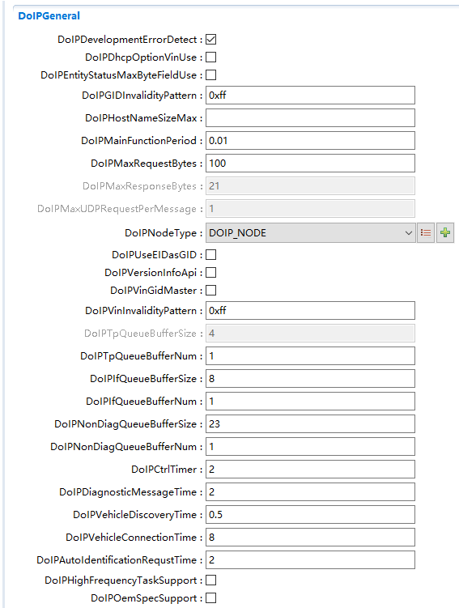

.. centered:: **表 DoIPGeneral配置 (Table DoIPGeneral Configuration)**

.. list-table::
   :widths: 20 20 20 20 20
   :header-rows: 1

   * - UI名称 (UI Name)
     - 描述 (Description)
     - 
     - 
     - 
   * - DoIPDevelopmentErrorDetect
     - 取值范围 (Range)
     - True/False
     - 默认取值 (Default value)
     - TRUE
   * - 
     - 参数描述 (Parameter Description)
     - Det开关。 (Det switch.)
     - 
     -
   * - 
     - 依赖关系 (Dependencies)
     - 无
     - 
     - 
   * - DoIPDhcpOptionVinUse
     - 取值范围 (Range)
     - True/False
     - 默认取值 (Default value)
     - FALSE
   * - 
     - 参数描述 (Parameter Description)
     - 如果DoIPDhcpOptionVinUse设置为true，如果没有设置有效的Dhcp主机名，DoIP模块将在Dhcp主机名中添加VIN。 (If DoIPDhcpOptionVinUse is set to true and an effective DHCP hostname is not set, the DoIP module will add the VIN to the DHCP hostname.)
     - 
     -
   * - 
     - 依赖关系 (Dependencies)
     - 无
     - 
     - 
   * - DoIPEntityStatusMaxByteFieldUse
     - 取值范围 (Range)
     - True/False
     - 默认取值 (Default value)
     - FALSE
   * - 
     - 参数描述 (Parameter Description)
     - 是否在诊断实体响应消息中携带最大接收数据大小。 (Is the maximum receive buffer size carried in the diagnostic entity response message?)
     - 
     -
   * - 
     - 依赖关系 (Dependencies)
     - 无
     - 
     - 
   * - DoIPGIDInvalidityPattern
     - 取值范围 (Range)
     - 0..255
     - 默认取值 (Default value)
     - 255
   * - 
     - 参数描述 (Parameter Description)
     - 指定在无法检索到有效GID时用于响应消息的字节模式。 (Specify the byte pattern to be used in response messages when valid GID cannot be retrieved.)
     - 
     -
   * - 
     - 依赖关系 (Dependencies)
     - 无
     - 
     - 
   * - DoIPHostNameSizeMax
     - 取值范围 (Range)
     - 5..255
     - 默认取值 (Default value)
     - 无
   * - 
     - 参数描述 (Parameter Description)
     - DHCP主机名的ASCII码最大值。 (Maximum ASCII value of DHCP hostname.)
     - 
     -
   * - 
     - 依赖关系 (Dependencies)
     - 无
     - 
     - 
   * - DoIPMainFunctionPeriod
     - 取值范围 (Range)
     - 0..4294967295(不能为0) (0..4294967295 (cannot be 0))
     - 默认取值 (Default value)
     - 0.01s
   * - 
     - 参数描述 (Parameter Description)
     - DoIP_MainFunction()调度周期。 (DoIP_MainFunction() scheduling period.)
     - 
     -
   * - 
     - 依赖关系 (Dependencies)
     - 无
     - 
     - 
   * - DoIPMaxRequestBytes
     - 取值范围 (Range)
     - 0..4294967295
     - 默认取值 (Default value)
     - 100
   * - 
     - 参数描述 (Parameter Description)
     - DoIP除开DoIP头的数据字段的最大允许长度。 (The maximum allowed length of the data field excluding the DoIP header.)
     - 
     -
   * - 
     - 依赖关系 (Dependencies)
     - 无
     - 
     - 
   * - DoIPMaxResponseBytes
     - 取值范围 (Range)
     - 0..4294967295
     - 默认取值 (Default value)
     - 21
   * - 
     - 参数描述 (Parameter Description)
     - DoIP除开DoIP头的数据字段的最大允许长度。 (The maximum allowed length of the data field apart from the DoIP header.)
     - 
     -
   * - 
     - 依赖关系 (Dependencies)
     - 无
     - 
     - 
   * - DoIPMaxUDPRequestPerMessage
     - 取值范围 (Range)
     - 1
     - 默认取值 (Default value)
     - 1
   * - 
     - 参数描述 (Parameter Description)
     - 允许一条UDP消息最多携带多少条DoIP请求，目前限定为1。 (How many DoIP requests can a single UDP message carry? It is currently limited to 1.)
     - 
     -
   * - 
     - 依赖关系 (Dependencies)
     - 无
     - 
     - 
   * - DoIPNodeType
     - 
     - DOIP_GATEWAY，
     - 
     - DOIP_NODE
   * - 
     - 取值范围 (Range)
     - 
     - 默认取值 (Default Value)
     - 
   * - 
     - 
     - DOIP_NODE
     - 
     -
   * - 
     - 参数描述 (Parameter Description)
     - DoIP节点类型。 (DoIP Node Type.)
     - 
     -
   * - 
     - 依赖关系 (Dependencies)
     - 无
     - 
     - 
   * - DoIPUseEIDasGID
     - 取值范围 (Range)
     - True/False
     - 默认取值 (Default value)
     - FALSE
   * - 
     - 参数描述 (Parameter Description)
     - 是否使用 EID 作为 GID。 (Is EID used as GID?)
     - 
     -
   * - 
     - 依赖关系 (Dependencies)
     - 无
     - 
     - 
   * - DoIPVersionInfoApi
     - 取值范围 (Range)
     - True/False
     - 默认取值 (Default value)
     - FALSE
   * - 
     - 参数描述 (Parameter Description)
     - 是否提供 DoIP_GetVersionInfo()   API (Does the DoIP_GetVersionInfo() API provide preservation of line breaks?)
     - 
     -
   * - 
     - 依赖关系 (Dependencies)
     - 无
     - 
     - 
   * - DoIPVinGidMaster
     - 取值范围 (Range)
     - True/False
     - 默认取值 (Default value)
     - FALSE
   * - 
     - 参数描述 (Parameter Description)
     - 指定是否是 GID 的主节点 (Specify whether it is the main node for GID.)
     - 
     -
   * - 
     - 依赖关系 (Dependencies)
     - 无
     - 
     - 
   * - DoIPVinInvalidityPattern
     - 取值范围 (Range)
     - 0..255
     - 默认取值 (Default value)
     - 255
   * - 
     - 参数描述 (Parameter Description)
     - VIN 无效时用于响应消息的字节模式。 (Byte pattern used for response messages when the VIN is invalid.)
     - 
     -
   * - 
     - 依赖关系 (Dependencies)
     - 无
     - 
     - 
   * - DoIPTpQueueBufferSize
     - 取值范围 (Range)
     - 0..4095
     - 默认取值 (Default value)
     - 4
   * - 
     - 参数描述 (Parameter Description)
     - DoIP TP诊断消息的buffer大小。 (Buffer size for DoIP TP diagnostic messages.)
     - 
     -
   * - 
     - 依赖关系 (Dependencies)
     - 无
     - 
     - 
   * - DoIPTpQueueBufferNum
     - 取值范围 (Range)
     - 0..255
     - 默认取值 (Default value)
     - 1
   * - 
     - 参数描述 (Parameter Description)
     - DoIP TP诊断消息的buffer个数。 (Buffer count for DoIP TP Diagnostic Messages.)
     - 
     -
   * - 
     - 依赖关系 (Dependencies)
     - 无
     - 
     - 
   * - DoIPIfQueueBufferSize
     - 取值范围 (Range)
     - 0..4095
     - 默认取值 (Default value)
     - 8
   * - 
     - 参数描述 (Parameter Description)
     - DoIP IF消息的buffer大小。 (Buffer size for DoIP IF messages.)
     - 
     -
   * - 
     - 依赖关系 (Dependencies)
     - 无
     - 
     - 
   * - DoIPIfQueueBufferNum
     - 取值范围 (Range)
     - 0..255
     - 默认取值 (Default value)
     - 1
   * - 
     - 参数描述 (Parameter Description)
     - DoIP IF消息的buffer个数。 (Buffer count for DoIP IF messages.)
     - 
     -
   * - 
     - 依赖关系 (Dependencies)
     - 无
     - 
     - 
   * - DoIPNonDiagQueueBufferSize
     - 取值范围 (Range)
     - 0..4095
     - 默认取值 (Default value)
     - 23
   * - 
     - 参数描述 (Parameter Description)
     - DoIP TP非诊断消息的buffer大小。 (Buffer size for DoIP TP non-diagnostic messages.)
     - 
     -
   * - 
     - 依赖关系 (Dependencies)
     - 无
     - 
     - 
   * - DoIPNonDiagQueueBufferNum
     - 取值范围 (Range)
     - 0..255
     - 默认取值 (Default value)
     - 1
   * - 
     - 参数描述 (Parameter Description)
     - DoIP TP非诊断消息的buffer个数。 (Number of buffers for DoIP TP non-diagnostic messages.)
     - 
     -
   * - 
     - 依赖关系 (Dependencies)
     - 无
     - 
     - 
   * - DoIPCtrlTimer
     - 取值范围 (Range)
     - 0..65535
     - 默认取值 (Default value)
     - 2s
   * - 
     - 参数描述 (Parameter Description)
     - 指定外部测试设备最多等待 UDP 响应消息的时间。 (Specify the maximum time that the designated external test equipment shall wait for UDP response messages.)
     - 
     -
   * - 
     - 依赖关系 (Dependencies)
     - 无
     - 
     - 
   * - DoIPDiagnosticMessageTime
     - 取值范围 (Range)
     - 0..65535
     - 默认取值 (Default value)
     - 2s
   * - 
     - 参数描述 (Parameter Description)
     - 指定外部测试设备最多等待UDS响应消息的时间。 (Specify the maximum time that external test equipment should wait for UDS response messages.)
     - 
     -
   * - 
     - 依赖关系 (Dependencies)
     - 无
     - 
     - 
   * - DoIPVehicleDiscoveryTime
     - 取值范围 (Range)
     - 0..65535
     - 默认取值 (Default value)
     - 0.5s
   * - 
     - 参数描述 (Parameter Description)
     - 指定外部测试设备发送车辆识别消息的时间间隔。 (Specify the interval for the external test device to send vehicle identification messages.)
     - 
     -
   * - 
     - 依赖关系 (Dependencies)
     - 无
     - 
     - 
   * - DoIPVehicleConnectionTime
     - 取值范围 (Range)
     - 0..65535
     - 默认取值 (Default value)
     - 8s
   * - 
     - 参数描述 (Parameter Description)
     - 指定外部测试设备连接 DoIP节点的最长时间。 (Specify the longest duration for connecting an external test device to a DoIP node.)
     - 
     -
   * - 
     - 依赖关系 (Dependencies)
     - 无
     - 
     - 
   * - 	DoIPAutoIdentificationRequestTime
     - 取值范围 (Range)
     - 0..65535
     - 默认取值 (Default value)
     - 2s
   * - 
     - 参数描述 (Parameter Description)
     - 指定外部测试设备启动后多长时间发送车辆识别消息。 (Specify how long after starting external test equipment the vehicle identification message is sent.)
     - 
     -
   * - 
     - 依赖关系 (Dependencies)
     - 无
     - 
     - 
   * - DoIPHighFrequencyTaskSupport
     - 取值范围 (Range)
     - True/False
     - 默认取值 (Default value)
     - FALSE
   * - 
     - 参数描述 (Parameter Description)
     - 是否需要在高频任务中处理消息。 (Is message processing required for high-frequency tasks.)
     - 
     -
   * - 
     - 依赖关系 (Dependencies)
     - 无
     - 
     - 
   * - DoIPOemSpecSupport
     - 取值范围 (Range)
     - True/False
     - 默认取值 (Default value)
     - FALSE
   * - 
     - 参数描述 (Parameter Description)
     - 是否支持 OemSpec。 (Does it support OemSpec.)
     - 
     -
   * - 
     - 依赖关系 (Dependencies)
     - 无
     - 
     - 

DoIPGetGidCallback
==================================

.. centered:: **表 DoIPGetGidCallback配置 (Configure DoIPGetGidCallback)**

.. list-table::
   :widths: 20 20 20 20 20
   :header-rows: 1

   * - UI名称 (UI Name)
     - 描述 (Description)
     - 
     - 
     - 
   * - DoIPGetGidDirect
     - 取值范围 (Range)
     - True/False
     - 默认取值 (Default value)
     - False
   * - 
     - 参数描述 (Parameter Description)
     - 如果DoIPGetGidDirect参数存在，DoIP模块将直接调用配置的回调函数(DoIPGetGID)。
     - 
     - 
   * - 
     - 依赖关系 (Dependencies)
     - 无
     - 
     - 

DoIPPowerModeCallback
=====================================

.. centered:: **表 DoIPPowerModeDirect配置 (Table DoIP Power Mode Direct Configuration)**

.. list-table::
   :widths: 20 20 20 20 20
   :header-rows: 1

   * - UI名称 (UI Name)
     - 描述 (Description)
     - 
     - 
     - 
   * - DoIPPowerModeDirect
     - 取值范围 (Range)
     - True/False
     - 默认取值 (Default value)
     - False
   * - 
     - 参数描述 (Parameter Description)
     - 如果DoIPPowerModeDirect参数存在，DoIP模块将直接调用配置的回调函数(DoIPGetPowerModeCallback)。
     - 
     - 
   * - 
     - 依赖关系 (Dependencies)
     - 无
     - 
     - 

DoIPTriggerGidSyncCallback
==========================================

.. centered:: **表 DoIPTriggerGidSyncDirect配置 (Table DoIPTriggerGidSyncDirect Configuration)**

.. list-table::
   :widths: 20 20 20 20 20
   :header-rows: 1

   * - UI名称 (UI Name)
     - 描述 (Description)
     - 
     - 
     - 
   * - DoIPTriggerGidSyncDirect
     - 取值范围 (Range)
     - True/False
     - 默认取值 (Default value)
     - False
   * - 
     - 参数描述 (Parameter Description)
     - 如果DoIPTriggerGidSyncDirect参数存在，DoIP模块将直接调用配置好的回调函数(DoIPTriggerGidSyncCallback)。
     - 
     - 
   * - 
     - 依赖关系 (Dependencies)
     - 无
     - 
     - 

DoIPConfigSet
-----------------------------

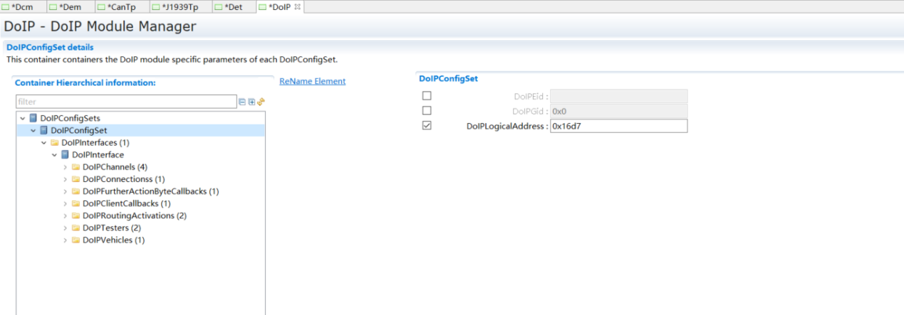

.. centered:: **表 DoIPConfigSet配置 (Table DoIPConfigSet Configuration)**

.. list-table::
   :widths: 20 20 20 20 20
   :header-rows: 1

   * - UI名称 (UI Name)
     - 描述 (Description)
     - 
     - 
     - 
   * - DoIPEid
     - 取值范围 (Range)
     - 0..281474976710655
     - 默认取值 (Default value)
     - 无
   * - 
     - 参数描述 (Parameter Description)
     - 配置 EID。 (Configure EID.)
     - 
     - 
   * - 
     - 依赖关系 (Dependencies)
     - DoIPUseMacAdressForIdentification必须设置为False才可配置。 (DoIPUseMacAdressForIdentification must be set to False to configure.)
     - 
     - 
   * - DoIPGid
     - 取值范围 (Range)
     - 0..281474976710655
     - 默认取值 (Default value)
     - 0
   * - 
     - 参数描述 (Parameter Description)
     - 配置 GID。 (Configure GID.)
     - 
     - 
   * - 
     - 依赖关系 (Dependencies)
     - 无
     - 
     - 
   * - DoIPLogicalAddress
     - 取值范围 (Range)
     - 0..65535
     - 默认取值 (Default value)
     - 65535
   * - 
     - 参数描述 (Parameter Description)
     - DoIP节点的逻辑地址。 (Logical address of the DoIP node.)
     - 
     - 
   * - 
     - 依赖关系 (Dependencies)
     - 无
     - 
     - 

DoIPInterface
=============================

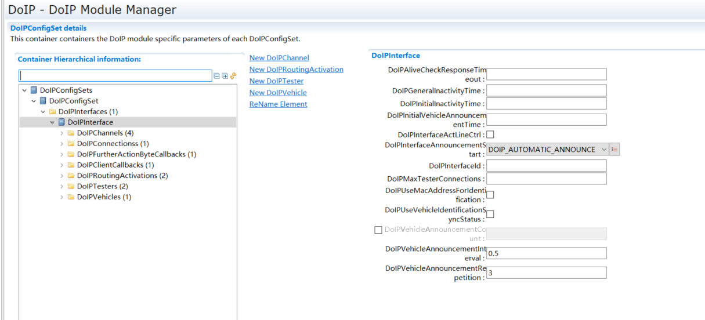

.. centered:: **表 DoIPInterface配置 (Table DoIPInterface Configuration)**

.. list-table::
   :widths: 20 20 20 20 20
   :header-rows: 1

   * - UI名称 (UI Name)
     - 描述 (Description)
     - 
     - 
     - 
   * - DoIPAliveCheckResponseTimeout
     - 取值范围 (Range)
     - 0..INF
     - 默认取值 (Default value)
     - 0.5s
   * - 
     - 参数描述 (Parameter Description)
     - 等待存活检测请求的响应的超时时间。 (Timeout duration for responding to keepalive requests.)
     - 
     - 
   * - 
     - 依赖关系 (Dependencies)
     - 无
     - 
     - 
   * - DoIPGenerallnactivityTime
     - 取值范围 (Range)
     - 0..INF
     - 默认取值 (Default value)
     - 300s
   * - 
     - 参数描述 (Parameter Description)
     - 若DoIPGenerallnactivityTime时间内无消息传递，则关闭套接字。 (If no messages are transmitted within DoIPGeneralInactivityTime, close the socket.)
     - 
     - 
   * - 
     - 依赖关系 (Dependencies)
     - 无
     - 
     - 
   * - DoIPInitialInactivityTime
     - 取值范围 (Range)
     - 0..INF
     - 默认取值 (Default value)
     - 2s
   * - 
     - 参数描述 (Parameter Description)
     - 在DoIPInitialInactivityTime时间内，外部测试设备应发起路由激活请求。 (During the DoIPInitialInactivityTime period, the external test equipment should initiate a routing activation request.)
     - 
     - 
   * - 
     - 依赖关系 (Dependencies)
     - 无
     - 
     - 
   * - DoIPInitialVehicleAnnouncementTime
     - 取值范围 (Range)
     - 0..INF
     - 默认取值 (Default value)
     - 0.5s
   * - 
     - 参数描述 (Parameter Description)
     - 指定 IP地址分配后，发送第一条车辆通知消息的时间。 (Time for sending the first vehicle notification message after the designated IP address is allocated.)
     - 
     - 
   * - 
     - 依赖关系 (Dependencies)
     - 无
     - 
     - 
   * - DoIPInterfaceActLineCtrl
     - 取值范围 (Range)
     - True/False
     - 默认取值 (Default value)
     - False
   * - 
     - 参数描述 (Parameter Description)
     - 网络接口始终可用(False)/网络接口被激活(True)。
     - 
     - 
   * - 
     - 依赖关系 (Dependencies)
     - 无
     - 
     - 
   * - DoIPInterfaceAnnouncementStart
     - 取值范围 (Range)
     - DOIP_AUTOMATIC_ANNOUNCE，DOIP_ONTRIGGER_ANNOUNCE
     - 默认取值 (Default value)
     - DOIP_AUTOMATIC_ANNOUNCE
   * - 
     - 参数描述 (Parameter Description)
     - 指定发送车辆通告消息的形式。 (Specify the form of dispatch vehicle notice messages.)
     - 
     - 
   * - 
     - 依赖关系 (Dependencies)
     - 无
     - 
     - 
   * - DoIPInterfaceId
     - 取值范围 (Range)
     - 0..255
     - 默认取值 (Default value)
     - 无
   * - 
     - 参数描述 (Parameter Description)
     - DoIPInterface的标识符。 (Identifier of the DoIPInterface.)
     - 
     - 
   * - 
     - 依赖关系 (Dependencies)
     - 无
     - 
     - 
   * - DoIPMaxTesterConnections
     - 取值范围 (Range)
     - 1..255
     - 默认取值 (Default value)
     - 1
   * - 
     - 参数描述 (Parameter Description)
     - 在进行存活检测之前，可以保持的测试仪连接的最大数量。 (The maximum number of tester connections that can be maintained before performing a health check.)
     - 
     - 
   * - 
     - 依赖关系 (Dependencies)
     - 无
     - 
     - 
   * - DoIPUseMacAddressForIdentification
     - 取值范围 (Range)
     - True/False
     - 默认取值 (Default value)
     - False
   * - 
     - 参数描述 (Parameter Description)
     - 是否将 MAC 地址作为EID。 (Is the MAC address used as EID.)
     - 
     - 
   * - 
     - 依赖关系 (Dependencies)
     - DoIPEid。
     - 
     - 
   * - DoIPUseVehicleIdentificationSyncStatus
     - 取值范围 (Range)
     - True/False
     - 默认取值 (Default value)
     - False
   * - 
     - 参数描述 (Parameter Description)
     - 定义是否在车辆标识/公告中额外使用可选的VIN/GID同步状态。 (Define whether an additional optional VIN/GID synchronization status should be included in the vehicle identifier/oracle announcement.)
     - 
     - 
   * - 
     - 依赖关系 (Dependencies)
     - 无
     - 
     - 
   * - DoIPVehicleAnnouncementCount
     - 取值范围 (Range)
     - 1..255
     - 默认取值 (Default value)
     - 无
   * - 
     - 参数描述 (Parameter Description)
     - 车辆公告消息数量。 (Number of vehicle announcement messages.)
     - 
     - 
   * - 
     - 依赖关系 (Dependencies)
     - 无
     - 
     - 
   * - DoIPVehicleAnnouncementInterval
     - 取值范围 (Range)
     - 0..INF
     - 默认取值 (Default value)
     - 0.5s
   * - 
     - 参数描述 (Parameter Description)
     - 发送车辆公告消息之间的时间间隔。 (The time interval between sending vehicle announcement messages.)
     - 
     - 
   * - 
     - 依赖关系 (Dependencies)
     - 无
     - 
     - 
   * - DoIPVehicleAnnouncementRepetition
     - 取值范围 (Range)
     - 1..255
     - 默认取值 (Default value)
     - 3
   * - 
     - 参数描述 (Parameter Description)
     - 车辆公告信息的重复次数。 (Frequency of duplicate entries for vehicle announcement information.)
     - 
     - 
   * - 
     - 依赖关系 (Dependencies)
     - 无
     - 
     - 

DoIPChannel
===========================

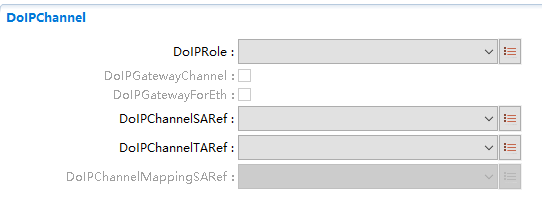

.. centered:: **表 DoIPChannel配置 (Configure DoIP Channel)**

.. list-table::
   :widths: 20 20 20 20 20
   :header-rows: 1

   * - UI名称 (UI Name)
     - 描述 (Description)
     - 
     - 
     - 
   * - DoIPRole
     - 取值范围 (Range)
     - DOIP_ROLE_CLIENT，
     - 默认取值 (Default value)
     - 无
   * - 
     - 
     - DOIP_ROLE_SERVER
     - 
     - 
   * - 
     - 参数描述 (Parameter Description)
     - 用于配置DoIPChannel是客户端还是服务端。 (Used to configure the DoIPChannel as either a client or a server.)
     - 
     - 
   * - 
     - 依赖关系 (Dependencies)
     - 无
     - 
     - 
   * - DoIPGatewayChannel
     - 取值范围 (Range)
     - True/False
     - 默认取值 (Default value)
     - False
   * - 
     - 参数描述 (Parameter Description)
     - DoIP网关使用。表明该channel为网关channel。 (Use of DoIP Gateway. This indicates that this channel is a gateway channel.)
     - 
     - 
   * - 
     - 依赖关系 (Dependencies)
     - 依赖 DoIPNodeType类型为DoIP_GATEWAY。 (Depends on DoIPNodeType type being DoIP_GATEWAY.)
     - 
     - 
   * - DoIPGatewayForEth
     - 取值范围 (Range)
     - True/False
     - 默认取值 (Default value)
     - False
   * - 
     - 参数描述 (Parameter Description)
     - DoIP网关使用。表明该channel为以太网网关channel。 (DoIP Gateway Usage. Indicates that this channel is an Ethernet gateway channel.)
     - 
     - 
   * - 
     - 依赖关系 (Dependencies)
     - DoIPGatewayChannel勾选后、且DoIPRole 为DOIP_ROLE_SERVER才能配置。 (DoIPGatewayChannel must be checked and DoIPRole must be DOIP_ROLE_SERVER for configuration.)
     - 
     - 
   * - DoIPChannelSARef
     - 取值范围 (Range)
     - Reference
     - 默认取值 (Default value)
     - 无
   * - 
     - 参数描述 (Parameter Description)
     - 引用DoIPTester。只有指定客户端才能使用该通道通信。 (Only designated clients can communicate via this channel.)
     - 
     - 
   * - 
     - 依赖关系 (Dependencies)
     - 无
     - 
     - 
   * - DoIPChannelTARef
     - 取值范围 (Range)
     - Reference
     - 默认取值 (Default value)
     - 无
   * - 
     - 参数描述 (Parameter Description)
     - 引用 TA。
     - 
     - 
   * - 
     - 依赖关系 (Dependencies)
     - 无
     - 
     - 
   * - DoIPChannelMappingSARef
     - 取值范围 (Range)
     - Reference
     - 默认取值 (Default value)
     - 无
   * - 
     - 参数描述 (Parameter Description)
     - DoIP网关使用。指示DoIP网关映射到的SA，网关转发时，会将原本的DoIPChannelSARef替换为该值。 (Use of DoIP Gateway. Indicates the SA mapped by the DoIP Gateway; when the gateway forwards, it will replace the original DoIPChannelSARef with this value.)
     - 
     - 
   * - 
     - 依赖关系 (Dependencies)
     - 无
     - 
     - 

DoIPPduRRxPdu
-----------------------------

.. centered:: **表 DoIPPduRRxPdu配置 (Table DoIPPduRxPdu Configuration)**

.. list-table::
   :widths: 20 20 20 20 20
   :header-rows: 1

   * - UI名称 (UI Name)
     - 描述 (Description)
     - 
     - 
     - 
   * - DoIPPduRRxPduId
     - 取值范围 (Range)
     - 0..65535
     - 默认取值 (Default value)
     - 65535
   * - 
     - 参数描述 (Parameter Description)
     - DoIP_TpCancelReceive()使用。 (Use of DoIP_TpCancelReceive().)
     - 
     - 
   * - 
     - 依赖关系 (Dependencies)
     - 无
     - 
     - 
   * - DoIPPduRRxPduRef
     - 取值范围 (Range)
     - Reference
     - 默认取值 (Default value)
     - 无
   * - 
     - 参数描述 (Parameter Description)
     - 引用到全局的 PDU。 (Reference PDU to global.)
     - 
     - 
   * - 
     - 依赖关系 (Dependencies)
     - 需要关联到ECUC中的PDU，生成时按照PDUR中关联到相同PDU的ID生成。 (Need to be associated with PDU in ECUC, generated based on the ID of the same PDU associated in PDUR.)
     - 
     - 
   * - 
     - 
     - DoIPChannel->DoIPPduRRxPdu->DoIPPduRRxPduRef，DoIPChannel->DoIPPduRTxPdu->DoIPPduRTxPduRef不能引用到相同的PDU。 (DoIPChannel->DoIPPduRRxPdu->DoIPPduRRxPduRef cannot reference the same PDU as DoIPChannel->DoIPPduRTxPdu->DoIPPduRTxPduRef.)
     - 
     - 

DoIPPduRTxPdu
-----------------------------

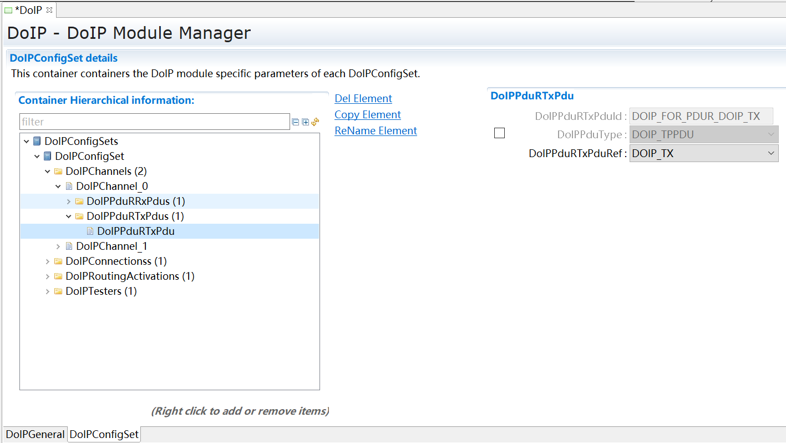

.. centered:: **表 DoIPPduRTxPdu配置 (Table DoIPPduConfigTxPdu)**

.. list-table::
   :widths: 20 20 20 20 20
   :header-rows: 1

   * - UI名称 (UI Name)
     - 描述 (Description)
     - 
     - 
     - 
   * - DoIPPduRTxPduId
     - 取值范围 (Range)
     - 0..65535
     - 默认取值 (Default value)
     - 65535
   * - 
     - 参数描述 (Parameter Description)
     - 被DoIP_TpTransmit()DoIP_IfTransmit()DoIP_TpCancelTransmit()使用。 (Used by DoIP_TpTransmit()DoIP_IfTransmit()DoIP_TpCancelTransmit().)
     - 
     - 
   * - 
     - 依赖关系 (Dependencies)
     - 无
     - 
     - 
   * - DoIPPduType
     - 取值范围 (Range)
     - DOIP_IFPDU，DOIP_TPPDU
     - 默认取值 (Default value)
     - DOIP_TPPDU
   * - 
     - 参数描述 (Parameter Description)
     - PDU 类型。 (PDU Type.)
     - 
     - 
   * - 
     - 依赖关系 (Dependencies)
     - 无
     - 
     - 
   * - DoIPPduRTxPduRef
     - 取值范围 (Range)
     - Reference
     - 默认取值 (Default value)
     - 无
   * - 
     - 参数描述 (Parameter Description)
     - 应用到全局 PDU。 (Apply to global PDU.)
     - 
     - 
   * - 
     - 依赖关系 (Dependencies)
     - 需要关联到ECUC中的PDU，生成时按照PDUR中关联到相同PDU的ID生成。 (Need to be associated with PDU in ECUC, generated based on the ID of the same PDU associated in PDUR.)
     - 
     - 

DoIPGatewayWaitResponse
---------------------------------------

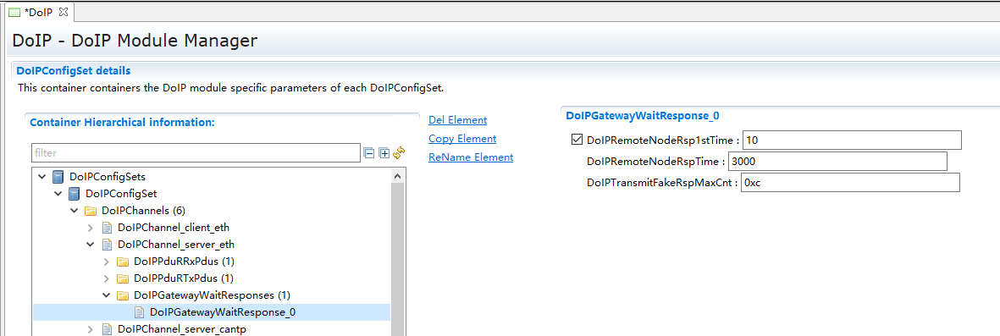

.. centered:: **表 DoIPGatewayWaitResponse配置 (Configure DoIP Gateway Wait Response)**

.. list-table::
   :widths: 20 20 20 20 20
   :header-rows: 1

   * - UI名称 (UI Name)
     - 描述 (Description)
     - 
     - 
     - 
   * - DoIPRemoteNodeRsp1stTime
     - 取值范围 (Range)
     - 0..65535
     - 默认取值 (Default value)
     - 50
   * - 
     - 参数描述 (Parameter Description)
     - DoIP网关收到诊断请求后，发送第一帧0x78的间隔时间。 (The interval time for the DoIP gateway to send the first frame 0x78 after receiving a diagnostic request.)
     - 
     - 
   * - 
     - 依赖关系 (Dependencies)
     - 无
     - 
     - 
   * - DoIPRemoteNodeRspTime
     - 取值范围 (Range)
     - 0..65535
     - 默认取值 (Default value)
     - 5000
   * - 
     - 参数描述 (Parameter Description)
     - DoIP网关收到诊断请求后，发送后续0x78的间隔时间。 (The time interval for the DoIP gateway to send subsequent 0x78 after receiving a diagnostic request.)
     - 
     - 
   * - 
     - 依赖关系 (Dependencies)
     - 无
     - 
     - 
   * - DoIPTransmitFakeRspMaxCnt
     - 取值范围 (Range)
     - 0..255
     - 默认取值 (Default value)
     - 255
   * - 
     - 参数描述 (Parameter Description)
     - DoIP网关收到诊断请求后，发送0x78的最大次数。 (The DoIP gateway sends a maximum number of times, 0x78, in response to a diagnostic request.)
     - 
     - 
   * - 
     - 依赖关系 (Dependencies)
     - 无
     - 
     - 

DoIPConnections
===============================

DoIPTargetAddress
---------------------------------

.. centered:: **表 DoIPTargetAddress配置 (Table DoIPTargetAddress Configuration)**

.. list-table::
   :widths: 20 20 20 20 20
   :header-rows: 1

   * - UI名称 (UI Name)
     - 描述 (Description)
     - 
     - 
     - 
   * - DoIPTargetAddressValue
     - 取值范围 (Range)
     - 0..65535
     - 默认取值 (Default value)
     - 无
   * - 
     - 参数描述 (Parameter Description)
     - 配置 TA。 (Configure TA.)
     - 
     - 
   * - 
     - 依赖关系 (Dependencies)
     - 无
     - 
     - 

DoIPTcpConnection
---------------------------------

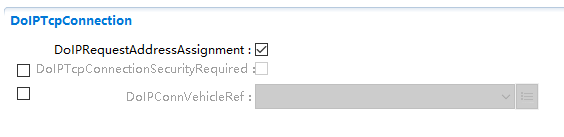

.. centered:: **表 DoIPTcpConnection配置 (Show DoIPTcpConnection Configuration)**

.. list-table::
   :widths: 20 20 20 20 20
   :header-rows: 1

   * - UI名称 (UI Name)
     - 描述 (Description)
     - 
     - 
     - 
   * - DoIPRequestAddressAssignment
     - 取值范围 (Range)
     - True/False
     - 默认取值 (Default value)
     - True
   * - 
     - 参数描述 (Parameter Description)
     - 是否调用SoAd_RequestIpAddrAssignment()分配 IP。 (Is IP assignment requested by calling SoAd_RequestIpAddrAssignment().)
     - 
     - 
   * - 
     - 依赖关系 (Dependencies)
     - 无
     - 
     - 
   * - DoIPTcpConnectionSecurityRequired
     - 取值范围 (Range)
     - True/False
     - 默认取值 (Default value)
     - False
   * - 
     - 参数描述 (Parameter Description)
     - 指示关联的TCP套接字是否使用安全连接(如TLS)。 (Indicate whether the associated TCP socket is using a secure connection (such as TLS).)
     - 
     - 
   * - 
     - 依赖关系 (Dependencies)
     - 无
     - 
     - 
   * - DoIPConnVehicleRef
     - 取值范围 (Range)
     - Reference
     - 默认取值 (Default value)
     - 无
   * - 
     - 参数描述 (Parameter Description)
     - 作为doipclient时，引用的vehicle。 (As doipclient, the referenced vehicle.)
     - 
     - 
   * - 
     - 依赖关系 (Dependencies)
     - 无
     - 
     - 

DoIPSoAdTcpRxPdu
^^^^^^^^^^^^^^^^^^^^^^^^^^^^^^^^

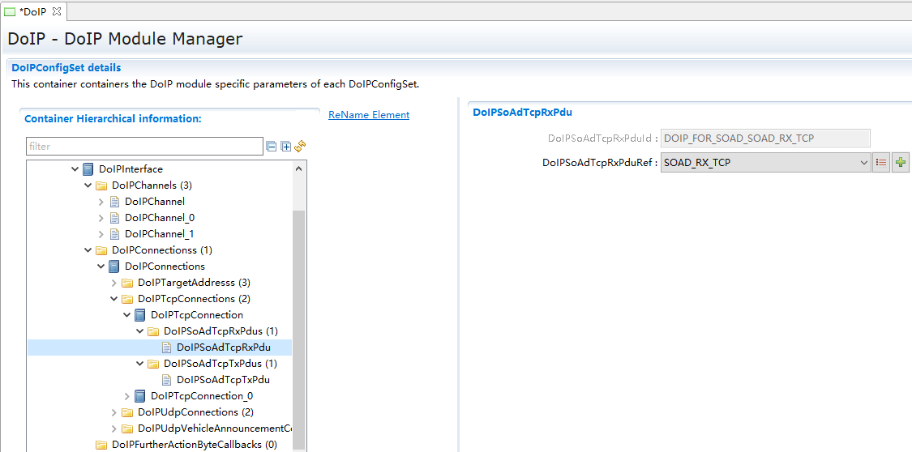

.. centered:: **表 DoIPSoAdTcpRxPdu配置 (Configure DoIPSoAdTcpRxPdu)**

.. list-table::
   :widths: 20 20 20 20 20
   :header-rows: 1

   * - UI名称 (UI Name)
     - 描述 (Description)
     - 
     - 
     - 
   * - DoIPSoAdTcpRxPduId
     - 取值范围 (Range)
     - 0..65535
     - 默认取值 (Default value)
     - 65535
   * - 
     - 参数描述 (Parameter Description)
     - 被DoIP_SoAdTpRxIndication()使用。 (Used by DoIP_SoAdTpRxIndication().)
     - 
     - 
   * - 
     - 依赖关系 (Dependencies)
     - 无
     - 
     - 
   * - DoIPSoAdTcpRxPduRef
     - 取值范围 (Range)
     - Reference
     - 默认取值 (Default value)
     - 无
   * - 
     - 参数描述 (Parameter Description)
     - 引用到全局 PDU。 (Refer to global PDU.)
     - 
     - 
   * - 
     - 依赖关系 (Dependencies)
     - 生成内容和SoAd生成的PduId相关联，下拉框关联到ECUC中配置的共有的PDU。 (The generated content is associated with the SoAd-generated PduId, and the dropdown box is linked to the shared PDU configured in ECUC.)
     - 
     - 
   * - 
     - 
     - DoIPConnections->DoIPTcpConnection->DoIPSoAdTcpRxPduRef和DoIPSoAdTcpTxPduRef， (DoIPConnections->DoIPTcpConnection->DoIPSoAdTcpRxPduRef and DoIPSoAdTcpTxPduRef,)
     - 
     - 
   * - 
     - 
     - DoIPConnections->DoIPUdpConnection->DoIPSoAdUdpRxPduRef和DoIPSoAdUdpTxPduRef， (DoIPConnections->DoIPUdpConnection->DoIPSoAdUdpRxPduRef and DoIPSoAdUdpTxPduRef,)
     - 
     - 
   * - 
     - 
     - DoIPConnections->DoIPUdpVehicleAnnouncementConnection->DoIPSoAdUdpVehicleAnnouncementRxPduRef
     - 
     - 
   * - 
     - 
     - 和DoIPSoAdUdpVehicleAnnouncementTxPduRef，不能引用到相同的PDU。 (And DoIPSoAdUdpVehicleAnnouncementTxPduRef, cannot reference the same PDU.)
     - 
     - 

DoIPSoAdTcpTxPdu
^^^^^^^^^^^^^^^^^^^^^^^^^^^^^^^^

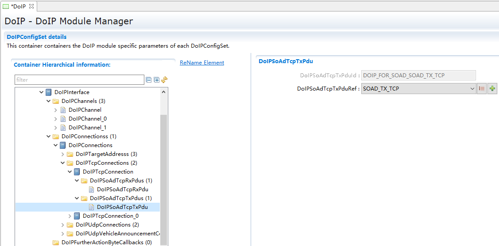

.. centered:: **表 DoIPSoAdTxPdu配置 (DoIP SoAd Tx PDU Configuration)**

.. list-table::
   :widths: 20 20 20 20 20
   :header-rows: 1

   * - UI名称 (UI Name)
     - 描述 (Description)
     - 
     - 
     - 
   * - DoIPSoAdTcpTxPduId
     - 取值范围 (Range)
     - 0..65535
     - 默认取值 (Default value)
     - 65535
   * - 
     - 参数描述 (Parameter Description)
     - 被DoIP_SoAdTpTxConfirmation()使用 (Used by DoIP_SoAdTpTxConfirmation())
     - 
     - 
   * - 
     - 依赖关系 (Dependencies)
     - 无
     - 
     - 
   * - DoIPSoAdTcpTxPduRef
     - 取值范围 (Range)
     - Reference
     - 默认取值 (Default value)
     - 无
   * - 
     - 参数描述 (Parameter Description)
     - 引用到全局 PDU。 (Refer to global PDU.)
     - 
     - 
   * - 
     - 依赖关系 (Dependencies)
     - 生成内容和SoAd生成的PduId相关联，下拉框关联到ECUC中配置的共有的PDU。 (The generated content is associated with the SoAd-generated PduId, and the dropdown box is linked to the shared PDU configured in ECUC.)
     - 
     - 
   * - 
     - 
     - DoIPConnections->DoIPTcpConnection->DoIPSoAdTcpTxPduRef，应该查询该DoIPSoAdTcpTxPduRef所在的SoAdPduRoute中的SoAdTxSocketConnOrSocketConnBundleRef，再查到引用SoAdTxSocketConnOrSocketConnBundleRef所在的SoAdSocketConnectionGroup，其SoAdSocketLocalPort必须为13400。 (DoIPConnections->DoIPTcpConnection->DoIPSoAdTcpTxPduRef, one should query the SoAdPduRoute of the referenced DoIPSoAdTcpTxPduRef to find the SoAdTxSocketConnOrSocketConnBundleRef. Then, find the referenced SoAdSocketConnectionGroup of SoAdTxSocketConnOrSocketConnBundleRef; its SoAdSocketLocalPort must be 13400.)
     - 
     - 

DoIPUdpConnection
---------------------------------

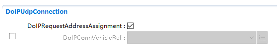

.. centered:: **表 DoIPUdpConnection配置 (Table DoIPUdpConnection Configuration)**

.. list-table::
   :widths: 20 20 20 20 20
   :header-rows: 1

   * - UI名称 (UI Name)
     - 描述 (Description)
     - 
     - 
     - 
   * - DoIPRequestAddressAssignment
     - 取值范围 (Range)
     - True/False
     - 默认取值 (Default value)
     - True
   * - 
     - 参数描述 (Parameter Description)
     - 是否调用SoAd_RequestIpAddrAssignment()分配 IP。 (Is IP assignment requested by calling SoAd_RequestIpAddrAssignment().)
     - 
     - 
   * - 
     - 依赖关系 (Dependencies)
     - 无
     - 
     - 
   * - DoIPConnVehicleRef
     - 取值范围 (Range)
     - Reference
     - 默认取值 (Default value)
     - 无
   * - 
     - 参数描述 (Parameter Description)
     - 作为doipclient时，引用的vehicle。 (As doipclient, the referenced vehicle.)
     - 
     - 
   * - 
     - 依赖关系 (Dependencies)
     - 无
     - 
     - 

DoIPSoAdUdpRxPdu
^^^^^^^^^^^^^^^^^^^^^^^^^^^^^^^^

.. centered:: **表 DoIPSoAdUdpRxPdu配置 (Table DoIPSoAdUdpRxPdu Configuration)**

.. list-table::
   :widths: 20 20 20 20 20
   :header-rows: 1

   * - UI名称 (UI Name)
     - 描述 (Description)
     - 
     - 
     - 
   * - DoIPSoAdUdpRxPduId
     - 取值范围 (Range)
     - 0..65535
     - 默认取值 (Default value)
     - 65535
   * - 
     - 参数描述 (Parameter Description)
     - 被DoIP_SoAdIfRxIndication()使用。 (Used by DoIP_SoAdIfRxIndication().)
     - 
     - 
   * - 
     - 依赖关系 (Dependencies)
     - 无
     - 
     - 
   * - DoIPSoAdUdpRxPduRef
     - 取值范围 (Range)
     - Reference
     - 默认取值 (Default value)
     - 无
   * - 
     - 参数描述 (Parameter Description)
     - 引用到全局 PDU。 (Refer to global PDU.)
     - 
     - 
   * - 
     - 依赖关系 (Dependencies)
     - 生成内容和SoAd生成的PduId相关联，下拉框关联到ECUC中配置的共有的PDU。 (The generated content is associated with the SoAd-generated PduId, and the dropdown box is linked to the shared PDU configured in ECUC.)
     - 
     - 
   * - 
     - 
     - DoIPConnections->DoIPTcpConnection->DoIPSoAdTcpRxPduRef和DoIPSoAdTcpTxPduRef， (DoIPConnections->DoIPTcpConnection->DoIPSoAdTcpRxPduRef and DoIPSoAdTcpTxPduRef,)
     - 
     - 
   * - 
     - 
     - DoIPConnections->DoIPUdpConnection->DoIPSoAdUdpRxPduRef和DoIPSoAdUdpTxPduRef， (DoIPConnections->DoIPUdpConnection->DoIPSoAdUdpRxPduRef and DoIPSoAdUdpTxPduRef,)
     - 
     - 
   * - 
     - 
     - DoIPConnections->DoIPUdpVehicleAnnouncementConnection->DoIPSoAdUdpVehicleAnnouncementRxPduRef
     - 
     - 
   * - 
     - 
     - 和DoIPSoAdUdpVehicleAnnouncementTxPduRef，不能引用到相同的PDU。 (And DoIPSoAdUdpVehicleAnnouncementTxPduRef, cannot reference the same PDU.)
     - 
     - 

DoIPSoAdUdpTxPdu
^^^^^^^^^^^^^^^^^^^^^^^^^^^^^^^^

.. centered:: **表 DoIPSoAdUdpTxPdu配置 (Table DoIPSoAdUdpTxPdu Configuration)**

.. list-table::
   :widths: 20 20 20 20 20
   :header-rows: 1

   * - UI名称 (UI Name)
     - 描述 (Description)
     - 
     - 
     - 
   * - DoIPSoAdUdpTxPduId
     - 取值范围 (Range)
     - 0..65535
     - 默认取值 (Default value)
     - 65535
   * - 
     - 参数描述 (Parameter Description)
     - 被DoIP_SoAdIfTxConfirmation()使用 (Used by DoIP_SoAdIfTxConfirmation())
     - 
     - 
   * - 
     - 依赖关系 (Dependencies)
     - 无
     - 
     - 
   * - DoIPSoAdUdpTxPduRef
     - 取值范围 (Range)
     - Reference
     - 默认取值 (Default value)
     - 无
   * - 
     - 参数描述 (Parameter Description)
     - 引用到全局 PDU。 (Refer to global PDU.)
     - 
     - 
   * - 
     - 依赖关系 (Dependencies)
     - 生成内容和SoAd生成的PduId相关联，下拉框关联到ECUC中配置的共有的PDU。 (The generated content is associated with the SoAd-generated PduId, and the dropdown box is linked to the shared PDU configured in ECUC.)
     - 
     - 
   * - 
     - 
     - DoIPConnections->DoIPUdpConnection->DoIPSoAdUdpTxPduRef，应该查询该DoIPSoAdUdpTxPduRef所在的SoAdPduRoute中的SoAdTxSocketConnOrSocketConnBundleRef，再查到引用SoAdTxSocketConnOrSocketConnBundleRef所在的SoAdSocketConnectionGroup，其SoAdSocketLocalPort必须为13400。 (DoIPConnections->DoIPUdpConnection->DoIPSoAdUdpTxPduRef, it should query the SoAdPduRoute of the referenced DoIPSoAdUdpTxPduRef to find the SoAdTxSocketConnOrSocketConnBundleRef, then trace to the SoAdSocketConnectionGroup containing the SoAdTxSocketConnOrSocketConnBundleRef, where its SoAdSocketLocalPort must be 13400.)
     - 
     - 

DoIPUdpVehicleAnnouncementConnection
----------------------------------------------------

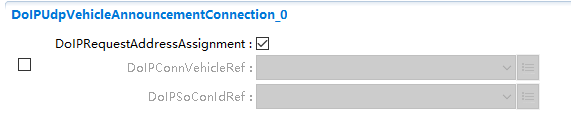

.. centered:: **表 DoIPUdpVehicleAnnouncementConnection配置 (Configure DoIP Udp Vehicle Announcement Connection)**

.. list-table::
   :widths: 20 20 20 20 20
   :header-rows: 1

   * - UI名称 (UI Name)
     - 描述 (Description)
     - 
     - 
     - 
   * - DoIPRequestAddressAssignment
     - 取值范围 (Range)
     - True/False
     - 默认取值 (Default value)
     - True
   * - 
     - 参数描述 (Parameter Description)
     - 是否调用SoAd_RequestIpAddrAssignment()分配IP。 (Is IP assignment requested by calling SoAd_RequestIpAddrAssignment().)
     - 
     - 
   * - 
     - 依赖关系 (Dependencies)
     - 无
     - 
     - 
   * - DoIPConnVehicleRef
     - 取值范围 (Range)
     - Reference
     - 默认取值 (Default value)
     - 无
   * - 
     - 参数描述 (Parameter Description)
     - 作为doipclient时，引用的vehicle。 (As doipclient, the referenced vehicle.)
     - 
     - 
   * - 
     - 依赖关系 (Dependencies)
     - 无
     - 
     - 
   * - DoIPSoConIdRef
     - 取值范围 (Range)
     - Reference
     - 默认取值 (Default value)
     - 无
   * - 
     - 参数描述 (Parameter Description)
     - 作为doipclient时，引用的SoAdconnection ID (As doipclient, the referenced SoAdconnection ID)
     - 
     - 
   * - 
     - 依赖关系 (Dependencies)
     - 只有DoIPSoAdUdpVehicleAnnouncementRxPdu存在配置。 (Only DoIP SoAd Udp Vehicle Announcement Rx Pdu is configured.)
     - 
     - 

DoIPSoAdUdpVehicleAnnouncementTxPdu
^^^^^^^^^^^^^^^^^^^^^^^^^^^^^^^^^^^^^^^^^^^^^^^^^^^

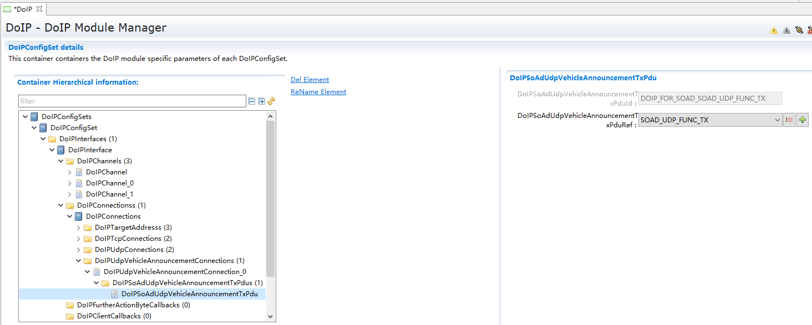

.. centered:: **表 DoIPSoAdUdpVehicleAnnouncementTxPdu配置 (Configure DoIPSoAdUdpVehicleAnnouncementTxPdu)**

.. list-table::
   :widths: 20 20 20 20 20
   :header-rows: 1

   * - UI名称 (UI Name)
     - 描述 (Description)
     - 
     - 
     - 
   * - DoIPSoAdUdpVehicleAnnouncementTxPduId
     - 取值范围 (Range)
     - 0..65535
     - 默认取值 (Default value)
     - 65535
   * - 
     - 参数描述 (Parameter Description)
     - 被DoIP_SoAdIfTxConfirmation()使用。 (Used by DoIP_SoAdIfTxConfirmation().)
     - 
     - 
   * - 
     - 依赖关系 (Dependencies)
     - 无
     - 
     - 
   * - DoIPSoAdUdpVehicleAnnouncementTxPduRef
     - 取值范围 (Range)
     - Reference
     - 默认取值 (Default value)
     - 无
   * - 
     - 参数描述 (Parameter Description)
     - 引用到全局 PDU。 (Refer to global PDU.)
     - 
     - 
   * - 
     - 依赖关系 (Dependencies)
     - 生成内容和SoAd生成的PduId相关联，下拉框关联到ECUC中配置的共有的PDU。 (The generated content is associated with the SoAd-generated PduId, and the dropdown box is linked to the shared PDU configured in ECUC.)
     - 
     - 
   * - 
     - 
     - DoIPConnections->DoIPSoAdUdpVehicleAnnouncementRxPduRef->
     - 
     - 
   * - 
     - 
     - DoIPSoAdUdpVehicleAnnouncementTxPduRef，应该查询该DoIPSoAdUdpVehicleAnnouncementTxPduRef (DoIPSoAdUdpVehicleAnnouncementTxPduRef should be queried.)
     - 
     - 
   * - 
     - 
     - 所在的SoAdPduRoute中的 (In the SoAdPduRoute)
     - 
     - 
   * - 
     - 
     - SoAdTxSocketConnOrSocketConnBundleRef，再查到引用SoAdTxSocketConnOrSocketConnBundleRef所在的 (SoAdTxSocketConnOrSocketConnBundleRef, then check for references to SoAdTxSocketConnOrSocketConnBundleRef in)
     - 
     - 
   * - 
     - 
     - SoAdSocketConnectionGroup，其SoAdSocketLocalPort必须为13400。 (SoAdSocketConnectionGroup, its SoAdSocketLocalPort must be 13400.)
     - 
     - 

DoIPFurtherActionByteCallback
=============================================

.. centered:: **表 DoIPFurtherActionByteCallback配置 (Table DoIP Further Action Byte Callback Configuration)**

.. list-table::
   :widths: 20 20 20 20 20
   :header-rows: 1

   * - UI名称 (UI Name)
     - 描述 (Description)
     - 
     - 
     - 
   * - DoIPFurtherActionByteDirect
     - 取值范围 (Range)
     - Function Name
     - 默认取值 (Default value)
     - 无
   * - 
     - 参数描述 (Parameter Description)
     - 用于获取OEMspecific FurtherAction。 (To get OEM specific FurtherAction.)
     - 
     - 
   * - 
     - 依赖关系 (Dependencies)
     - 无
     - 
     - 

DoIPClientCallback
==================================

.. centered:: **表 DoIPClientCallback配置 (Table DoIPClientCallback Configuration)**

.. list-table::
   :widths: 20 20 20 20 20
   :header-rows: 1

   * - UI名称 (UI Name)
     - 描述 (Description)
     - 
     - 
     - 
   * - DoIPClientEventDirect
     - 取值范围 (Range)
     - Function Name
     - 默认取值 (Default value)
     - Rte_DoIPClientEventDirect
   * - 
     - 参数描述 (Parameter Description)
     - doipclient使用，用于报告事件。 (DOIPClient is used for reporting events.)
     - 
     - 
   * - 
     - 依赖关系 (Dependencies)
     - 无
     - 
     - 

DoIPRoutingActivation
=====================================

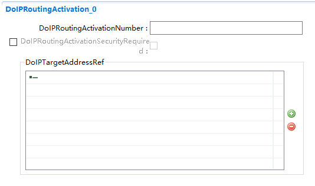

.. centered:: **表 DoIPRoutingActication配置 (Table DoIP Routing Actication Configuration)**

.. list-table::
   :widths: 20 20 20 20 20
   :header-rows: 1

   * - UI名称 (UI Name)
     - 描述 (Description)
     - 
     - 
     - 
   * - DoIPRoutingActivationNumber
     - 取值范围 (Range)
     - 0..255
     - 默认取值 (Default value)
     - 255
   * - 
     - 参数描述 (Parameter Description)
     - 路由激活类型。 (Type of routing activation.)
     - 
     - 
   * - 
     - 依赖关系 (Dependencies)
     - 无
     - 
     - 
   * - DoIPRoutingActivationSecurityRequired
     - 取值范围 (Range)
     - True/False
     - 默认取值 (Default value)
     - false
   * - 
     - 参数描述 (Parameter Description)
     - 是否使用安全TCP连接。 (Is a secure TCP connection used.)
     - 
     - 
   * - 
     - 依赖关系 (Dependencies)
     - 无
     - 
     - 
   * - DoIPTargetAddressRef
     - 取值范围 (Range)
     - Reference Array
     - 默认取值 (Default value)
     - 无
   * - 
     - 参数描述 (Parameter Description)
     - 引用 TA。
     - 
     - 
   * - 
     - 依赖关系 (Dependencies)
     - Reference to [DoIPTargetAddress ]
     - 
     - 

DoIPRoutingActivationAuthenticationCallback
-----------------------------------------------------------

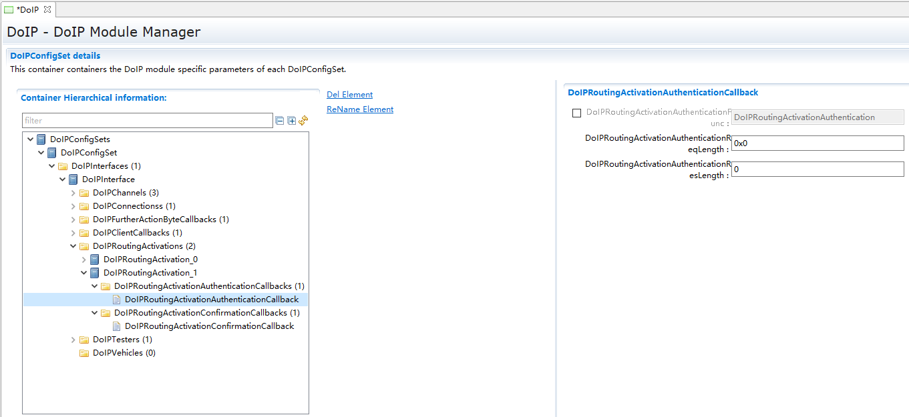

.. centered:: **表 DoIPRoutingActicatioAuthenticationCallback配置 (Configure DoIPRoutingActivityAuthenticationCallback)**

.. list-table::
   :widths: 20 20 20 20 20
   :header-rows: 1

   * - UI名称 (UI Name)
     - 描述 (Description)
     - 
     - 
     - 
   * - DoIPRoutingActivationAuthenticationFunc
     - 取值范围 (Range)
     - FunctionName
     - 默认取值 (Default value)
     - DoIPRoutingActivationAuthentication
   * - 
     - 参数描述 (Parameter Description)
     - 路由激活时调用，用于进行身份认证。 (Called when routing is activated, used for authentication.)
     - 
     - 
   * - 
     - 依赖关系 (Dependencies)
     - 无
     - 
     - 
   * - DoIPRoutingActivationAuthenticationReqLength
     - 取值范围 (Range)
     - 0..4
     - 默认取值 (Default value)
     - 0
   * - 
     - 参数描述 (Parameter Description)
     - 请求消息长度。 (Request message length.)
     - 
     - 
   * - 
     - 依赖关系 (Dependencies)
     - 无
     - 
     - 
   * - DoIPRoutingActivationAuthenticationResLength
     - 取值范围 (Range)
     - 0..4
     - 默认取值 (Default value)
     - 0
   * - 
     - 参数描述 (Parameter Description)
     - 响应消息长度。 (Length of response message.)
     - 
     - 
   * - 
     - 依赖关系 (Dependencies)
     - 无
     - 
     - 

DoIPRoutingActicationConfirmationCallback
---------------------------------------------------------

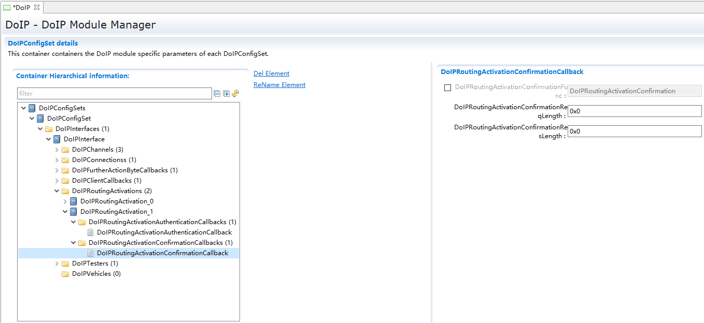

.. centered:: **表 DoIPRoutingActicationConfirmationCallback配置 (Configure DoIP Routing Actication Confirmation Callback)**

.. list-table::
   :widths: 20 20 20 20 20
   :header-rows: 1

   * - UI名称 (UI Name)
     - 描述 (Description)
     - 
     - 
     - 
   * - DoIPRoutingActivationConfirmationFunc
     - 取值范围 (Range)
     - FunctionName
     - 默认取值 (Default value)
     - DoIPRoutingActivationConfirmation
   * - 
     - 参数描述 (Parameter Description)
     - 路由激活时调用，用于确认路由激活。 (Called when the route is activated, used to confirm the route activation.)
     - 
     - 
   * - 
     - 依赖关系 (Dependencies)
     - 无
     - 
     - 
   * - DoIPRoutingActivationConfirmationReqLength
     - 取值范围 (Range)
     - 0..4
     - 默认取值 (Default value)
     - 0
   * - 
     - 参数描述 (Parameter Description)
     - 请求消息长度。 (Request message length.)
     - 
     - 
   * - 
     - 依赖关系 (Dependencies)
     - 无
     - 
     - 
   * - DoIPRoutingActivationConfirmationResLength
     - 取值范围 (Range)
     - 0..4
     - 默认取值 (Default value)
     - 0
   * - 
     - 参数描述 (Parameter Description)
     - 响应消息长度。 (Length of response message.)
     - 
     - 
   * - 
     - 依赖关系 (Dependencies)
     - 无
     - 
     - 

DoIPTester
==========================

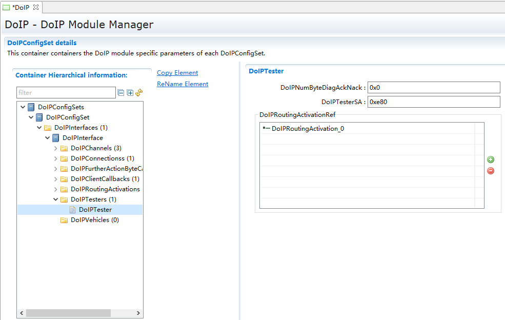

.. centered:: **表 DoIPTester配置 (Table DoIPTester Configuration)**

.. list-table::
   :widths: 20 20 20 20 20
   :header-rows: 1

   * - UI名称 (UI Name)
     - 描述 (Description)
     - 
     - 
     - 
   * - DoIPNumByteDiagAckNack
     - 取值范围 (Range)
     - 0..4294967295
     - 默认取值 (Default value)
     - 0
   * - 
     - 参数描述 (Parameter Description)
     - 路由激活类型。 (Type of routing activation.)
     - 
     - 
   * - 
     - 依赖关系 (Dependencies)
     - 无
     - 
     - 
   * - DoIPTesterSA
     - 取值范围 (Range)
     - 0..65535
     - 默认取值 (Default value)
     - 65535
   * - 
     - 参数描述 (Parameter Description)
     - 配置 SA。 (Configure SA.)
     - 
     - 
   * - 
     - 依赖关系 (Dependencies)
     - 无
     - 
     - 
   * - DoIPRoutingActivationRef
     - 取值范围 (Range)
     - Reference Array
     - 默认取值 (Default value)
     - 无
   * - 
     - 参数描述 (Parameter Description)
     - 可使用的路由激活规则 (Available routing activation rules)
     - 
     - 
   * - 
     - 依赖关系 (Dependencies)
     - Reference to [DoIPRoutingActivation]
     - 
     - 

DoIPVehicle
===========================

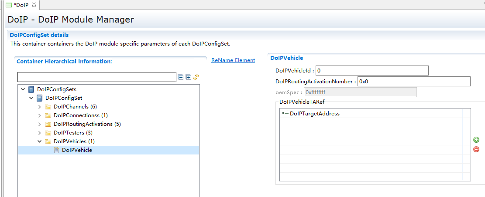

.. centered:: **表 DoIPVehicle配置 (Table DoIPVehicle Configuration)**

.. list-table::
   :widths: 20 20 20 20 20
   :header-rows: 1

   * - UI名称 (UI Name)
     - 描述 (Description)
     - 
     - 
     - 
   * - DoIPVehicleId
     - 取值范围 (Range)
     - 0..255
     - 默认取值 (Default value)
     - 0
   * - 
     - 参数描述 (Parameter Description)
     - 车辆 ID。 (Vehicle ID.)
     - 
     - 
   * - 
     - 依赖关系 (Dependencies)
     - 无
     - 
     - 
   * - DoIPRoutingActivationNumber
     - 取值范围 (Range)
     - 0..255
     - 默认取值 (Default value)
     - 255
   * - 
     - 参数描述 (Parameter Description)
     - 路由激活类型。 (Type of routing activation.)
     - 
     - 
   * - 
     - 依赖关系 (Dependencies)
     - 无
     - 
     - 
   * - oemSpec
     - 取值范围 (Range)
     - 0..4294967295
     - 默认取值 (Default value)
     - 4294967295
   * - 
     - 参数描述 (Parameter Description)
     - OEM。
     - 
     - 
   * - 
     - 依赖关系 (Dependencies)
     - 无
     - 
     - 
   * - DoIPVehicleTARef
     - 取值范围 (Range)
     - Reference Array
     - 默认取值 (Default value)
     - 无
   * - 
     - 参数描述 (Parameter Description)
     - 引用 TA。
     - 
     - 
   * - 
     - 依赖关系 (Dependencies)
     - 无
     - 
     - 

依赖模块(SoAd)
--------------------------

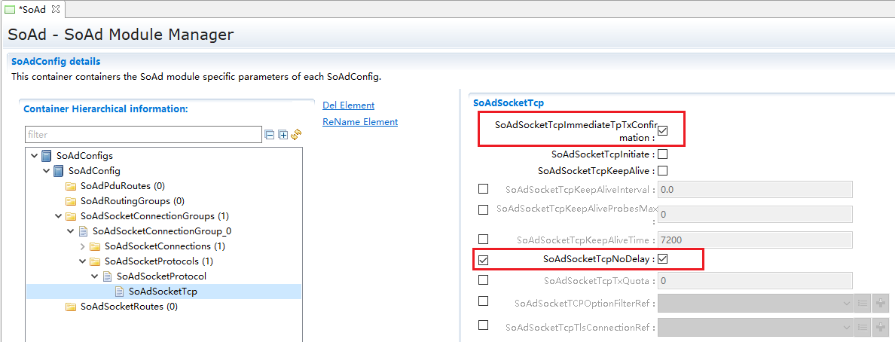

.. centered:: **表 SoAd配置 (Table SoAd Configuration)**

.. list-table::
   :widths: 20 20 20 20 20
   :header-rows: 1

   * - UI名称 (UI Name)
     - 描述 (Description)
     - 
     - 
     - 
   * - 
     - 取值范围 (Range)
     - TRUE/FALSE
     - 默认取值 (Default value)
     - FALSE
   * - SoAdSocketTcpImmediateTpTxConfirmation
     - 参数描述 (Parameter Description)
     - 没勾选该参数，SoAd需等待收到对方的ACK之后，才会调用TxConfirmation通知DoIP已发送消息；勾选该参数，SoAd收到DoIP的数据后，就会调用 TxConfirmation通知DoIP已发送消息。注：在实际项目中，网络环境很复杂，会因为各种原因导致发送数据超时，因此建议勾选该参数。 (Uncheck this parameter, SoAd will wait for receiving the ACK from the other side before calling TxConfirmation to notify DoIP that the message has been sent; check this parameter, SoAd will call TxConfirmation to notify DoIP that the message has been sent upon receiving data from DoIP. Note: In actual projects, network environments are very complex and sending data may time out for various reasons, therefore it is recommended to check this parameter.)
     - 
     - 
   * - 
     - 依赖关系 (Dependencies)
     - 无
     - 
     - 
   * - 
     - 取值范围 (Range)
     - TRUE/FALSE
     - 默认取值 (Default value)
     - FALSE
   * - SoAdSocketTcpNoDelay
     - 参数描述 (Parameter Description)
     - 勾选该参数关闭nagle算法，SoAd会第一时间发送消息。注：建议勾选该参数。 (Check this parameter to disable the Nagle algorithm, SoAd will send messages immediately. Note: It is recommended to check this parameter.)
     - 
     - 
   * - 
     - 依赖关系 (Dependencies)
     - 无
     - 
     - 

工程相关 (Engineering related)
------------------------------------------

.. centered:: **表 工程相关配置 (Table Engineering-related Configuration)**

.. list-table::
   :widths: 34 33 33
   :header-rows: 1

   * - 序号 (Sequence Number)
     - 配置 (Configure)
     - 描述 (Description)
   * - 1
     - 需定义TCPIP_FASTTX_TCP宏 (Define the TCPIP_FASTTX_TCP macro)
     - 使能调用tcp_write()后调用tcp_output()立即发送tcp数据。 (Enable calling tcp_output() to immediately send TCP data after calling tcp_write().)
