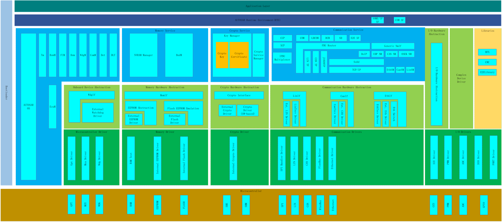
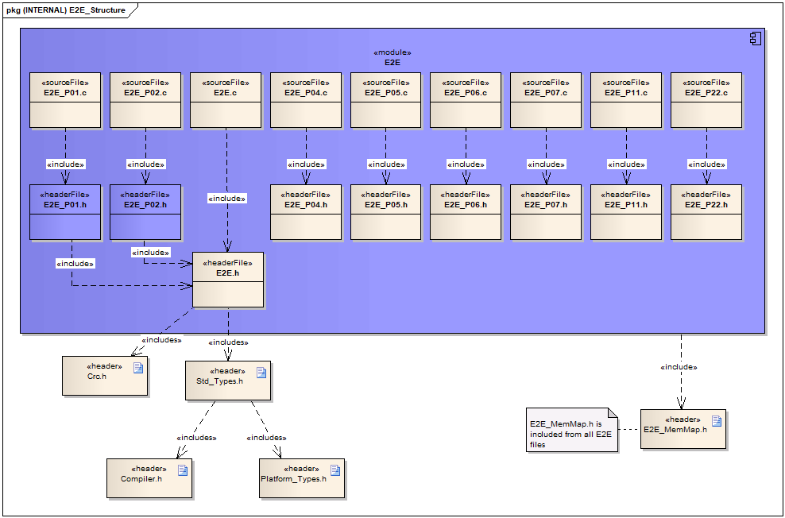

E2EL
#################################

:strong:`缩写词注解 (Abbreviation Notes):`

.. list-table::
   :widths: 34 33 33
   :header-rows: 1

   * - 缩写词 (Abbreviation)
     - 解释/描述 (Explanation/Description)
     - 中文解释 (Chinese explanation)
   * - E2ELibrary
     - End to End library
     - 端到端通讯保护库 (End-to-end communication protection library)
   * - Data ID
     - Data Identification
     - 一段数据/消息的标识 (An identifier for a piece of data/message)
   * - E2Eprofile
     - E2E profile
     - E2E算法 (End-to-End algorithm)
   * - CRC
     - Cyclic Redundancy Check
     - 循环冗余校验 (Cyclic Redundancy Check)
   * - E2E XF
     - End to End Transformer
     - 端到端转换器 (End-to-end Converter)

E2EL模块简介 (Overview of E2EL Module)
==================================================

E2EL在架构上属于AUTOSAR静态库代码，使用同样属于静态库代码的CRC模块来进行安全数据的保护，E2E XF通过把E2EL的相关算法抽象成用户易操作的配置项和配置界面，并根据用户的属于生成代码，来帮助用户更好的使用E2EL来保护数据。

E2EL is architecturally part of the AUTOSAR static library code, using the same static library code CRC module for protecting secure data. E2E XF abstracts related algorithms of E2EL into user-friendly configuration items and interfaces, generating code based on user specifications to help users better utilize E2EL for data protection.

参考资料 (Reference materials)
------------------------------------------

[1] AUTOSAR_SWS_E2ELibrary.pdf，R19-11

[2] AUTOSAR_SWS_CRCLibrary.pdf，R19-11

功能描述 (Function Description)
===========================================

E2EL功能 (End-to-End Function)
--------------------------------------------

E2EL功能介绍 (End-to-End Function Introduction)
~~~~~~~~~~~~~~~~~~~~~~~~~~~~~~~~~~~~~~~~~~~~~~~~~~~~~~

E2EL的各个profile提供了一种可以满足功能安全目标的数据保护机制，各个E2E profile通过不同的算法和API完成以下类型的数据保护机制：

E2EL's various profiles provide a data protection mechanism that can meet functional safety goals. Different E2E profiles accomplish the following types of data protection mechanisms through different algorithms and APIs:

- 集成CRC库的CRC保护机制；

- CRC protection mechanism with integrated CRC library;

- 接收端检测接收报文的递增计数器，判断接收数据是否有序递增；

- The receiver checks the incrementing counter of received packets to determine if the received data is ordered and incremental;

- 接收端通过检测心跳计数器判断数据是否发生改变；

- The receiver determines whether data has changed by detecting heartbeat counters;

- 通过特定的ID来区分不同的I-PDU组；

- Distinguish different I-PDU groups through specific IDs;

- 超时检测机制（接收报文超时和发送确认超时）；

- Timeout detection mechanism (message reception timeout and send acknowledgment timeout);

- E2E profiles的用户需要根据自己的应用场景决定选用哪种类型的E2E profile；

- E2E profiles users need to choose which type of E2E profile to use based on their own application scenarios;

- E2E支持的profile有profile1、profile2、profile4、profile5、profile6、profile7、profile11、profile22。

- E2E supported profiles include profile1, profile2, profile4, profile5, profile6, profile7, profile11, profile22.

E2EL各Profile功能介绍 (End-to-End Link (E2EL) Profile Function Introduction)
~~~~~~~~~~~~~~~~~~~~~~~~~~~~~~~~~~~~~~~~~~~~~~~~~~~~~~~~~~~~~~~~~~~~~~~~~~~~~~~~~~~~

Profile1
+++++++++++++++

- CRC保护

CRC Protection

Profile1使用CRC-8-SAE J1850算法对数据的完整性进行校验。

Profile1 uses the CRC-8-SAE J1850 algorithm to verify the integrity of the data.

- Sequence counter/alive counter

4-bit的Sequence counter/alive counter在0-14之间依次递增,递增计数器用来判断接收数据是否有序递增，心跳计数器用来判断数据是否发生改变。

The 4-bit Sequence counter/alive counter increments sequentially from 0 to 14, with the increment counter used to determine if received data is in ordered sequential increase, and the heartbeat counter used to determine if the data has changed.

- DataID

Profile1通过特定的ID来区分不同的I-PDU组，它分为了四种ID模式。

Profile1 uses specific IDs to distinguish different I-PDU groups, which are divided into four ID modes.

Both bytes (dataIdMode=0):16位数据ID的两个字节都附加在安全数据上用于CRC计算，但没有显式发送。

Both bytes (dataIdMode=0): The two bytes are appended to the security data for CRC calculation but are not explicitly sent.

ALT bytes (dataIdMode=1)：根据counter的基偶性，来选择高字节还是低字节进行CRC计算。

ALT bytes (dataIdMode=1): Based on the parity of the counter, choose either the high byte or the low byte for CRC calculation.

Low byte only (dataIdMode=2):只有16位数据ID的低字节附加到安全数据进行CRC计算，但不显式发送，高字节设置为0。

Only 16-bit data ID's low byte appended for CRC calculation on security data, but not explicitly sent; high byte set to 0.

显式传输数据ID nibble (dataIdMode=3):16位数据ID的两个字节都附加在安全数据上进行CRC计算，但数据ID高字节的低字节显式传输。在这个16位的数据ID中只使用了12位。

Explicitly transmitted data ID nibble (dataIdMode=3): The two bytes of the 16-bit data ID are appended to the security data for CRC calculation, but the lower byte of the high byte of the data ID is explicitly transmitted. Only 12 bits of this 16-bit data ID are utilized.

Profile2
+++++++++++++++

- CRC保护

CRC Protection

Profile2使用8bit Polynomial为0x2f的算法对数据的完整性进行校验。

Profile2 uses an algorithm with 8-bit Polynomial 0x2F to check the integrity of data.

- Sequence counter/alive counter

4-bit的Sequence counter/alive counter在0-15之间依次递增,递增计数器用来判断接收数据是否有序递增，心跳计数器用来判断数据是否发生改变。

The 4-bit Sequence counter/alive counter increments sequentially from 0 to 15, with the increment counter used to determine if received data is in ordered succession, and the heartbeat counter used to determine if data has changed.

- DataID

DataID使用特定的ID来区分不同的I-PDU组，Profile2使用了一个预设的DataID列表，并通过Counter的值来选择DataID列表里的特定的DataID。

DataID uses a specific ID to distinguish different I-PDU groups. Profile2 uses a preset list of DataIDs and selects a specific DataID from the list based on the Counter's value.

Profile4
+++++++++++++++

- CRC保护

CRC Protection

Profile4使用32 bit polynomial为0x1F4ACFB13的算法对数据的完整性进行校验。

Profile4 uses the algorithm with a 32-bit polynomial of 0x1F4ACFB13 to verify the integrity of data.

- Data Length

Profile4使用16bit的Data Length来支持动态大小的输入数据。

Profile4 uses 16-bit Data Length to support dynamically sized input data.

- Sequence counter/alive counter

16-bit的Sequence counter/alive counter,递增计数器用来判断接收数据是否有序递增，心跳计数器用来判断数据是否发生改变。

16-bit Sequence counter/alive counter, increment counters are used to determine if received data is ordered and increasing, while heartbeat counters are used to determine if data has changed.

- DataID

DataID使用特定的ID来区分不同的I-PDU组，Profile4使用了全局唯一的32bit的DataID进行显式发送。

DataID uses a specific ID to distinguish different I-PDU groups, and Profile4 explicitly sends using a globally unique 32-bit DataID.

Profile5
+++++++++++++++

- CRC保护

CRC Protection

Profile5使用16 bit polynomial为0x1021的算法对数据的完整性进行校验。

Profile5 uses an algorithm with a 16-bit polynomial of 0x1021 to verify the integrity of data.

- Sequence counter/alive counter

8-bit的Sequence counter/alive counter,递增计数器用来判断接收数据是否有序递增，心跳计数器用来判断数据是否发生改变。

8-bit Sequence counter/alive counter, an incrementing counter used to determine if received data is ordered and increasing, with a heartbeat counter used to determine if data has changed.

- DataID

DataID使用特定的ID来区分不同的I-PDU组，Profile5使用了全局唯一的16bit的DataID进行隐式发送。

DataID uses specific IDs to distinguish different I-PDU groups, and Profile5 implicitly sends global unique 16-bit DataIDs.

Profile6
+++++++++++++++

- CRC保护

CRC Protection

Profile6使用16 bit polynomial为0x1021的算法对数据的完整性进行校验。

Profile6 uses an algorithm with a 16-bit polynomial of 0x1021 to verify the integrity of data.

- Sequence counter/alive counter

8-bit的Sequence counter/alive counter,递增计数器用来判断接收数据是否有序递增，心跳计数器用来判断数据是否发生改变。

8-bit Sequence counter/alive counter, an incrementing counter used to determine if received data is ordered and increasing, with a heartbeat counter used to determine if data has changed.

- DataID

DataID使用特定的ID来区分不同的I-PDU组，Profile5使用了全局唯一的16bit的DataID进行隐式发送。

DataID uses specific IDs to distinguish different I-PDU groups, and Profile5 implicitly sends global unique 16-bit DataIDs.

- Data Length

Profile6使用16bit的Data Length来支持动态大小的输入数据。

Profile6 uses 16-bit Data Length to support dynamically sized input data.

Profile7
+++++++++++++++

- CRC保护

CRC Protection

Profile7使用64 bit polynomial为0x42F0E1EBA9EA3693的算法对数据的完整性进行校验。

Profile7 uses an algorithm that verifies data integrity with a 64-bit polynomial of 0x42F0E1EBA9EA3693.

- Sequence counter/alive counter

32-bit的Sequence counter/alive counter,递增计数器用来判断接收数据是否有序递增，心跳计数器用来判断数据是否发生改变。

32-bit Sequence counter/alive counter, increment counters used to determine if received data is ordered and increasing, and heartbeat counters used to determine if data has changed.

- DataID

DataID使用特定的ID来区分不同的I-PDU组，Profile7使用了全局唯一的32bit的DataID进行隐式发送。

DataID uses specific IDs to distinguish different I-PDU groups, and Profile7 implicitly sends DataIDs using a globally unique 32-bit DataID.

- Data Length

Profile7使用32bit的Data Length来支持动态大小的输入数据。

Profile7 uses 32-bit Data Length to support dynamically sized input data.

Profile11
+++++++++++++++

- CRC保护

CRC Protection

Profile11使用CRC-8-SAE J1850的算法对数据的完整性进行校验。

Profile11 uses the CRC-8-SAE J1850 algorithm to verify the integrity of data.

- Sequence counter/alive counter

4-bit的Sequence counter/alive counter,递增计数器用来判断接收数据是否有序递增，心跳计数器用来判断数据是否发生改变。

4-bit Sequence counter/alive counter, increment counter used to determine if received data is in ordered sequential increments, and heartbeat counter used to determine if data has changed.

- DataID

Profile11通过特定的ID来区分不同的I-PDU组，它分为了两种ID模式：

Profile11 distinguishes different I-PDU groups through specific IDs, which are divided into two ID modes:

Both bytes (dataIdMode=0):16位数据ID的两个字节都附加在安全数据上用于CRC计算，但没有显式发送。

Both bytes (dataIdMode=0):
The two bytes are appended to the security data for CRC calculation but are not explicitly sent.

显式传输数据ID nibble (dataIdMode=3):16位数据ID的两个字节都附加在安全数据上进行CRC计算，但数据ID高字节的低字节显式传输。在这个16位的数据ID中只使用了12位。

Explicitly transmitted data ID nibble (dataIdMode=3): The two bytes of the 16-bit data ID are appended to the security data for CRC calculation, but the lower byte of the high byte of the data ID is explicitly transmitted. Only 12 bits of this 16-bit data ID are utilized.

Profile22
+++++++++++++++

- CRC保护

CRC Protection

Profile22使用8bit Polynomial为0x2f的算法对数据的完整性进行校验。

Profile22 uses an 8-bit algorithm with a polynomial of 0x2F to verify data integrity.

- Sequence counter/alive counter

4-bit的Sequence counter/alive counter,递增计数器用来判断接收数据是否有序递增，心跳计数器用来判断数据是否发生改变。

4-bit Sequence counter/alive counter, increment counter used to determine if received data is in ordered sequential increments, and heartbeat counter used to determine if data has changed.

- DataID

DataID使用特定的ID来区分不同的I-PDU组，Profile22使用了一个预设的DataID列表，并通过Counter的值来选择DataID列表里的特定的DataID。

DataID uses specific IDs to distinguish different I-PDU groups. Profile22 employs a preset list of DataIDs and selects a specific DataID from the list based on the Counter's value.

源文件描述 (Source file description)
===============================================

.. centered:: **表 E2EL组件文件描述 (Table E2EL Component File Description)**

.. list-table::
   :widths: 50 50
   :header-rows: 1

   * - 文件 (Files)
     - 说明 (Description)
   * - E2E_P01.c
     - E2E Profile1算法库源文件 (End-to-End Profile1 Algorithm Library Source File)
   * - E2E_P01.h
     - E2E Profile1算法库头文件 (E2E Profile1 Algorithm Library Header File)
   * - E2E_P02.c
     - E2E Profile2算法库源文件 (E2E Profile2 Algorithm Library Source File)
   * - E2E_P02.h
     - E2E Profile2算法库头文件 (End-to-End Profile2 Algorithm Library Header File)
   * - E2E_P04.c
     - E2E Profile4算法库源文件 (E2E Profile4 Algorithm Library Source File)
   * - E2E_P04.h
     - E2E Profile4算法库头文件 (E2E Profile4 Algorithm Library Header File)
   * - E2E_P05.c
     - E2E Profile5算法库源文件 (E2E Profile5 Algorithm Library Source File)
   * - E2E_P05.h
     - E2E Profile5算法库头文件 (End-to-End Profile5 Algorithm Library Header File)
   * - E2E_P06.c
     - E2E Profile6算法库源文件 (End-to-End Profile6 Algorithm Library Source File)
   * - E2E_P06.h
     - E2E Profile6算法库头文件 (E2E Profile6 Algorithm Library Header File)
   * - E2E_P07.c
     - E2E Profile7算法库源文件 (End-to-End Profile7 Algorithm Library Source File)
   * - E2E_P07.h
     - E2E Profile7算法库头文件 (E2E Profile7 Algorithm Library Header File)
   * - E2E_P11.c
     - E2E Profile11算法库源文件 (End-to-End Profile11 Algorithm Library Source File)
   * - E2E_P11.h
     - E2E Profile11算法库头文件 (E2E Profile11 Algorithm Library Header File)
   * - E2E_P22.c
     - E2E Profile22算法库源文件 (End-to-End Profile22 Algorithm Library Source File)
   * - E2E_P22.h
     - E2E Profile22算法库头文件 (E2E Profile22 Algorithm Library Header File)
   * - E2E.c
     - E2E状态机管理 (End-to-End State Machine Management)
   * - E2E.h
     - E2E的共有头文件 (End-to-End common header file)

API接口 (API Interface)
=====================================

类型定义 (Type definition)
--------------------------------------

E2E_P01ConfigType类型定义 (E2E_P01ConfigType Configuration Type Definition)
~~~~~~~~~~~~~~~~~~~~~~~~~~~~~~~~~~~~~~~~~~~~~~~~~~~~~~~~~~~~~~~~~~~~~~~~~~~~~~~~~~~~

.. list-table::
   :widths: 50 50
   :header-rows: 1

   * - 名称 (Name)
     - E2E_P01ConfigType
   * - 类型 (Type)
     - Structure
   * - 范围 (Range)
     - 无(None)
   * - 描述 (Description)
     - Profile1的传输数据配置实例 (An instance of Profile1's Transmission Data Configuration)

E2E_P01DataIDMode类型定义 (E2E_P01DataIDMode Type Definition)
~~~~~~~~~~~~~~~~~~~~~~~~~~~~~~~~~~~~~~~~~~~~~~~~~~~~~~~~~~~~~~~~~~~~~~~~~~~~~~~~~~~~

.. list-table::
   :widths: 50 50
   :header-rows: 1

   * - 名称 (Name)
     - E2E_P01DataIDMode
   * - 类型 (Type)
     - Enumeration
   * - 范围 (Range)
     - E2E_P01_DATAID_BOTH, E2E_P01_DATAID_ALT, E2E_P01_DATAID_LOW, E2E_P01_DATAID_NIBBLE
   * - 描述 (Description)
     - DataID模式 (DataID Mode)

E2E_P01ProtectStateType类型定义 (E2E_P01ProtectStateType Type Definition)
~~~~~~~~~~~~~~~~~~~~~~~~~~~~~~~~~~~~~~~~~~~~~~~~~~~~~~~~~~~~~~~~~~~~~~~~~~~~~~~~~~~~

.. list-table::
   :widths: 50 50
   :header-rows: 1

   * - 名称 (Name)
     - E2E_P01ProtectStateType
   * - 类型 (Type)
     - Structure
   * - 范围 (Range)
     - 无(None)
   * - 描述 (Description)
     - Profile1发送端保护状态类型 (Profile1 Sender Protection State Type)

E2E_P01CheckStateType类型定义 (E2E_P01CheckStateType Type Definition)
~~~~~~~~~~~~~~~~~~~~~~~~~~~~~~~~~~~~~~~~~~~~~~~~~~~~~~~~~~~~~~~~~~~~~~~~~~~~~~~~~~~~

.. list-table::
   :widths: 50 50
   :header-rows: 1

   * - 名称 (Name)
     - E2E_P01CheckStateType
   * - 类型 (Type)
     - Structure
   * - 范围 (Range)
     - 无(None)
   * - 描述 (Description)
     - Profile1接收端保护状态类型 (Profile1 Receiver Protection Status Type)

E2E_P01CheckStatusType类型定义 (E2E_P01CheckStatusType Type Definition)
~~~~~~~~~~~~~~~~~~~~~~~~~~~~~~~~~~~~~~~~~~~~~~~~~~~~~~~~~~~~~~~~~~~~~~~~~~~~~~~~~~~~

.. list-table::
   :widths: 50 50
   :header-rows: 1

   * - 名称 (Name)
     - E2E_P01CheckStatusType
   * - 类型 (Type)
     - Enumeration
   * - 范围 (Range)
     - E2E_P01STATUS_OK
   * - 
     - E2E_P01STATUS_NONEWDATA
   * - 
     - E2E_P01STATUS_WRONGCRC
   * - 
     - E2E_P01STATUS_SYNC
   * - 
     - E2E_P01STATUS_INITIAL
   * - 
     - E2E_P01STATUS_REPEATED
   * - 
     - E2E_P01STATUS_OKSOMELOST
   * - 
     - E2E_P01STATUS_WRONGSEQUENCE
   * - 描述 (Description)
     - profile1中数据的校验结果。 (Validation results of data in profile1.)

E2E_P02ConfigType类型定义 (E2E_P02ConfigType Type Definition)
~~~~~~~~~~~~~~~~~~~~~~~~~~~~~~~~~~~~~~~~~~~~~~~~~~~~~~~~~~~~~~~~~~~~~~~~~~~~~~~~~~~~

.. list-table::
   :widths: 50 50
   :header-rows: 1

   * - 名称 (Name)
     - E2E_P02ConfigType
   * - 类型 (Type)
     - Structure
   * - 范围 (Range)
     - 无(None)
   * - 描述 (Description)
     - Profile2的传输数据配置实例 (An instance of Profile2's Transmission Data Configuration)

E2E_P02ProtectStateType类型定义 (E2E_P02ProtectStateType Type Definition)
~~~~~~~~~~~~~~~~~~~~~~~~~~~~~~~~~~~~~~~~~~~~~~~~~~~~~~~~~~~~~~~~~~~~~~~~~~~~~~~~~~~~

.. list-table::
   :widths: 50 50
   :header-rows: 1

   * - 名称 (Name)
     - E2E_P02ProtectStateType
   * - 类型 (Type)
     - Structure
   * - 范围 (Range)
     - 无(None)
   * - 描述 (Description)
     - Profile2发送端保护状态类型 (Profile2 Sender Protection Status Type)

E2E_P02CheckStateType类型定义 (E2E_P02CheckStateType Type Definition)
~~~~~~~~~~~~~~~~~~~~~~~~~~~~~~~~~~~~~~~~~~~~~~~~~~~~~~~~~~~~~~~~~~~~~~~~~~~~~~~~~~~~

.. list-table::
   :widths: 50 50
   :header-rows: 1

   * - 名称 (Name)
     - E2E_P02CheckStateType
   * - 类型 (Type)
     - Structure
   * - 范围 (Range)
     - 无(None)
   * - 描述 (Description)
     - Profile2接收端保护状态类型 (Profile2 Receiver Protection Status Type)

E2E_P02CheckStatusType类型定义 (E2E_P02CheckStatusType Type Definition)
~~~~~~~~~~~~~~~~~~~~~~~~~~~~~~~~~~~~~~~~~~~~~~~~~~~~~~~~~~~~~~~~~~~~~~~~~~~~~~~~~~~~

.. list-table::
   :widths: 50 50
   :header-rows: 1

   * - 名称 (Name)
     - E2E_P01CheckStatusType
   * - 类型 (Type)
     - Enumeration
   * - 范围 (Range)
     - E2E_P02STATUS_OK
   * - 
     - E2E_P02STATUS_NONEWDATA
   * - 
     - E2E_P02STATUS_WRONGCRC
   * - 
     - E2E_P02STATUS_SYNC
   * - 
     - E2E_P02STATUS_INITIAL
   * - 
     - E2E_P02STATUS_REPEATED
   * - 
     - E2E_P02STATUS_OKSOMELOST
   * - 
     - E2E_P02STATUS_WRONGSEQUENCE
   * - 描述 (Description)
     - Profile2中数据的校验结果。 (Validation results of data in Profile2.)

E2E_P04ConfigType类型定义 (E2E_P04ConfigType Type Definition)
~~~~~~~~~~~~~~~~~~~~~~~~~~~~~~~~~~~~~~~~~~~~~~~~~~~~~~~~~~~~~~~~~~~~~~~~~~~~~~~~~~~~

.. list-table::
   :widths: 50 50
   :header-rows: 1

   * - 名称 (Name)
     - E2E_P04ConfigType
   * - 类型 (Type)
     - Structure
   * - 范围 (Range)
     - 无(None)
   * - 描述 (Description)
     - Profile4的传输数据配置实例 (An instance of data configuration for Profile4 transmission.)

E2E_P04ProtectStateType类型定义 (E2E_P04 ProtectStateType Type Definition)
~~~~~~~~~~~~~~~~~~~~~~~~~~~~~~~~~~~~~~~~~~~~~~~~~~~~~~~~~~~~~~~~~~~~~~~~~~~~~~~~~~~~

.. list-table::
   :widths: 50 50
   :header-rows: 1

   * - 名称 (Name)
     - E2E_P04ProtectStateType
   * - 类型 (Type)
     - Structure
   * - 范围 (Range)
     - 无(None)
   * - 描述 (Description)
     - Profile4发送端保护状态类型 (Profile4 Sending End Protection Status Type)

E2E_P04CheckStateType类型定义 (E2E_P04CheckStateType Type Definition)
~~~~~~~~~~~~~~~~~~~~~~~~~~~~~~~~~~~~~~~~~~~~~~~~~~~~~~~~~~~~~~~~~~~~~~~~~~~~~~~~~~~~

.. list-table::
   :widths: 50 50
   :header-rows: 1

   * - 名称 (Name)
     - E2E_P04CheckStateType
   * - 类型 (Type)
     - Structure
   * - 范围 (Range)
     - 无(None)
   * - 描述 (Description)
     - Profile4接收端保护状态类型 (Profile4 Receiver Protection State Type)

E2E_P04CheckStatusType类型定义 (E2E_P04CheckStatusType Type Definition)
~~~~~~~~~~~~~~~~~~~~~~~~~~~~~~~~~~~~~~~~~~~~~~~~~~~~~~~~~~~~~~~~~~~~~~~~~~~~~~~~~~~~

.. list-table::
   :widths: 50 50
   :header-rows: 1

   * - 名称 (Name)
     - E2E_P04CheckStatusType
   * - 类型 (Type)
     - Enumeration
   * - 范围 (Range)
     - E2E_P04STATUS_OK
   * - 
     - E2E_P04STATUS_NONEWDATA
   * - 
     - E2E_P04STATUS\_ ERROR
   * - 
     - E2E_P04STATUS_REPEATED
   * - 
     - E2E_P04STATUS_OKSOMELOST
   * - 
     - E2E_P04STATUS_WRONGSEQUENCE
   * - 描述 (Description)
     - Profile4中数据的校验结果。 (Validation results of data in Profile4.)

E2E_P05ConfigType类型定义 (E2E_P05ConfigType Type Definition)
~~~~~~~~~~~~~~~~~~~~~~~~~~~~~~~~~~~~~~~~~~~~~~~~~~~~~~~~~~~~~~~~~~~~~~~~~~~~~~~~~~~~

.. list-table::
   :widths: 50 50
   :header-rows: 1

   * - 名称 (Name)
     - E2E_P05ConfigType
   * - 类型 (Type)
     - Structure
   * - 范围 (Range)
     - 无(None)
   * - 描述 (Description)
     - Profile5的传输数据配置实例 (An instance of Profile5's Transmission Data Configuration)

E2E_P05ProtectStateType类型定义 (E2E_P05ProtectStateType Type Definition)
~~~~~~~~~~~~~~~~~~~~~~~~~~~~~~~~~~~~~~~~~~~~~~~~~~~~~~~~~~~~~~~~~~~~~~~~~~~~~~~~~~~~

.. list-table::
   :widths: 50 50
   :header-rows: 1

   * - 名称 (Name)
     - E2E_P05ProtectStateType
   * - 类型 (Type)
     - Structure
   * - 范围 (Range)
     - 无(None)
   * - 描述 (Description)
     - Profile5发送端保护状态类型 (Profile5 Sender Protection Status Type)

E2E_P05CheckStateType类型定义 (E2E_P05CheckStateType Type Definition)
~~~~~~~~~~~~~~~~~~~~~~~~~~~~~~~~~~~~~~~~~~~~~~~~~~~~~~~~~~~~~~~~~~~~~~~~~~~~~~~~~~~~

.. list-table::
   :widths: 50 50
   :header-rows: 1

   * - 名称 (Name)
     - E2E_P05CheckStateType
   * - 类型 (Type)
     - Structure
   * - 范围 (Range)
     - 无(None)
   * - 描述 (Description)
     - Profile5接收端保护状态类型 (Profile5 Receiver Protection Status Type)

E2E_P05CheckStatusType类型定义 (E2E_P05CheckStatusType Type Definition)
~~~~~~~~~~~~~~~~~~~~~~~~~~~~~~~~~~~~~~~~~~~~~~~~~~~~~~~~~~~~~~~~~~~~~~~~~~~~~~~~~~~~

.. list-table::
   :widths: 50 50
   :header-rows: 1

   * - 名称 (Name)
     - E2E_P05CheckStatusType
   * - 类型 (Type)
     - Enumeration
   * - 范围 (Range)
     - E2E_P05STATUS_OK
   * - 
     - E2E_P05STATUS_NONEWDATA
   * - 
     - E2E_P05STATUS\_ ERROR
   * - 
     - E2E_P05STATUS_REPEATED
   * - 
     - E2E_P05STATUS_OKSOMELOST
   * - 
     - E2E_P05STATUS_WRONGSEQUENCE
   * - 描述 (Description)
     - Profile5中数据的校验结果。 (Validation results of data in Profile5.)

E2E_P06ConfigType类型定义 (E2E_P06ConfigType Configuration Type Definition)
~~~~~~~~~~~~~~~~~~~~~~~~~~~~~~~~~~~~~~~~~~~~~~~~~~~~~~~~~~~~~~~~~~~~~~~~~~~~~~~~~~~~

.. list-table::
   :widths: 50 50
   :header-rows: 1

   * - 名称 (Name)
     - E2E_P06ConfigType
   * - 类型 (Type)
     - Structure
   * - 范围 (Range)
     - 无(None)
   * - 描述 (Description)
     - Profile6的传输数据配置实例 (An instance of Profile6's Transmission Data Configuration)

E2E_P06ProtectStateType类型定义 (E2E_P06ProtectStateType Type Definition)
~~~~~~~~~~~~~~~~~~~~~~~~~~~~~~~~~~~~~~~~~~~~~~~~~~~~~~~~~~~~~~~~~~~~~~~~~~~~~~~~~~~~

.. list-table::
   :widths: 50 50
   :header-rows: 1

   * - 名称 (Name)
     - E2E_P06ProtectStateType
   * - 类型 (Type)
     - Structure
   * - 范围 (Range)
     - 无(None)
   * - 描述 (Description)
     - Profile6发送端保护状态类型 (Profile6 Sender Protection State Type)

E2E_P06CheckStateType类型定义 (E2E_P06CheckStateType Type Definition)
~~~~~~~~~~~~~~~~~~~~~~~~~~~~~~~~~~~~~~~~~~~~~~~~~~~~~~~~~~~~~~~~~~~~~~~~~~~~~~~~~~~~

.. list-table::
   :widths: 50 50
   :header-rows: 1

   * - 名称 (Name)
     - E2E_P06CheckStateType
   * - 类型 (Type)
     - Structure
   * - 范围 (Range)
     - 无(None)
   * - 描述 (Description)
     - Profile6接收端保护状态类型 (Profile6 Receiver Protection Status Type)

E2E_P06CheckStatusType类型定义 (E2E_P06CheckStatusType Type Definition)
~~~~~~~~~~~~~~~~~~~~~~~~~~~~~~~~~~~~~~~~~~~~~~~~~~~~~~~~~~~~~~~~~~~~~~~~~~~~~~~~~~~~

.. list-table::
   :widths: 50 50
   :header-rows: 1

   * - 名称 (Name)
     - E2E_P06CheckStatusType
   * - 类型 (Type)
     - Enumeration
   * - 范围 (Range)
     - E2E_P06STATUS_OK
   * - 
     - E2E_P06STATUS_NONEWDATA
   * - 
     - E2E_P06STATUS\_ ERROR
   * - 
     - E2E_P06STATUS_REPEATED
   * - 
     - E2E_P06STATUS_OKSOMELOST
   * - 
     - E2E_P06STATUS_WRONGSEQUENCE
   * - 描述 (Description)
     - Profile6中数据的校验结果。 (Validation results of data in Profile6.)

E2E_P07ConfigType类型定义 (E2E_P07ConfigType Configuration Type Definition)
~~~~~~~~~~~~~~~~~~~~~~~~~~~~~~~~~~~~~~~~~~~~~~~~~~~~~~~~~~~~~~~~~~~~~~~~~~~~~~~~~~~~

.. list-table::
   :widths: 50 50
   :header-rows: 1

   * - 名称 (Name)
     - E2E_P07ConfigType
   * - 类型 (Type)
     - Structure
   * - 范围 (Range)
     - 无(None)
   * - 描述 (Description)
     - Profile7的传输数据配置实例 (An instance of Profile7's Transmission Data Configuration)

E2E_P07ProtectStateType类型定义 (E2E_P07ProtectStateType Type Definition)
~~~~~~~~~~~~~~~~~~~~~~~~~~~~~~~~~~~~~~~~~~~~~~~~~~~~~~~~~~~~~~~~~~~~~~~~~~~~~~~~~~~~

.. list-table::
   :widths: 50 50
   :header-rows: 1

   * - 名称 (Name)
     - E2E_P07ProtectStateType
   * - 类型 (Type)
     - Structure
   * - 范围 (Range)
     - 无(None)
   * - 描述 (Description)
     - Profile7发送端保护状态类型 (Profile7 Sending End Protection Status Type)

E2E_P07CheckStateType类型定义 (E2E_P07CheckStateType Type Definition)
~~~~~~~~~~~~~~~~~~~~~~~~~~~~~~~~~~~~~~~~~~~~~~~~~~~~~~~~~~~~~~~~~~~~~~~~~~~~~~~~~~~~

.. list-table::
   :widths: 50 50
   :header-rows: 1

   * - 名称 (Name)
     - E2E_P07CheckStateType
   * - 类型 (Type)
     - Structure
   * - 范围 (Range)
     - 无(None)
   * - 描述 (Description)
     - Profile7接收端保护状态类型 (Profile7 Receiver Protection Status Type)

E2E_P07CheckStatusType类型定义 (E2E_P07CheckStatusType Type Definition)
~~~~~~~~~~~~~~~~~~~~~~~~~~~~~~~~~~~~~~~~~~~~~~~~~~~~~~~~~~~~~~~~~~~~~~~~~~~~~~~~~~~~

.. list-table::
   :widths: 50 50
   :header-rows: 1

   * - 名称 (Name)
     - E2E_P07CheckStatusType
   * - 类型 (Type)
     - Enumeration
   * - 范围 (Range)
     - E2E_P07STATUS_OK
   * - 
     - E2E_P07STATUS_NONEWDATA
   * - 
     - E2E_P07STATUS\_ ERROR
   * - 
     - E2E_P07STATUS_REPEATED
   * - 
     - E2E_P07STATUS_OKSOMELOST
   * - 
     - E2E_P07STATUS_WRONGSEQUENCE
   * - 描述 (Description)
     - Profile7中数据的校验结果。 (Validation results of data in Profile7.)

E2E_P11ConfigType类型定义 (E2E_P11ConfigType Type Definition)
~~~~~~~~~~~~~~~~~~~~~~~~~~~~~~~~~~~~~~~~~~~~~~~~~~~~~~~~~~~~~~~~~~~~~~~~~~~~~~~~~~~~

.. list-table::
   :widths: 50 50
   :header-rows: 1

   * - 名称 (Name)
     - E2E_P11ConfigType
   * - 类型 (Type)
     - Structure
   * - 范围 (Range)
     - 无(None)
   * - 描述 (Description)
     - Profile11的传输数据配置实例 (An instance of Profile11's Transmission Data Configuration)

E2E_P11ProtectStateType类型定义 (E2E_P11ProtectStateType Type Definition)
~~~~~~~~~~~~~~~~~~~~~~~~~~~~~~~~~~~~~~~~~~~~~~~~~~~~~~~~~~~~~~~~~~~~~~~~~~~~~~~~~~~~

.. list-table::
   :widths: 50 50
   :header-rows: 1

   * - 名称 (Name)
     - E2E_P11ProtectStateType
   * - 类型 (Type)
     - Structure
   * - 范围 (Range)
     - 无(None)
   * - 描述 (Description)
     - Profile11发送端保护状态类型 (Profile11 Sender Protection State Type)

E2E_P11CheckStateType类型定义 (E2E_P11CheckStateType Type Definition)
~~~~~~~~~~~~~~~~~~~~~~~~~~~~~~~~~~~~~~~~~~~~~~~~~~~~~~~~~~~~~~~~~~~~~~~~~~~~~~~~~~~~

.. list-table::
   :widths: 50 50
   :header-rows: 1

   * - 名称 (Name)
     - E2E_P11CheckStateType
   * - 类型 (Type)
     - Structure
   * - 范围 (Range)
     - 无(None)
   * - 描述 (Description)
     - Profile11接收端保护状态类型 (Profile11 Receiver Protection Status Type)

E2E_P11CheckStatusType类型定义 (E2E_P11CheckStatusType Type Definition)
~~~~~~~~~~~~~~~~~~~~~~~~~~~~~~~~~~~~~~~~~~~~~~~~~~~~~~~~~~~~~~~~~~~~~~~~~~~~~~~~~~~~

.. list-table::
   :widths: 50 50
   :header-rows: 1

   * - 名称 (Name)
     - E2E_P11CheckStatusType
   * - 类型 (Type)
     - Enumeration
   * - 范围 (Range)
     - E2E_P11STATUS_OK
   * - 
     - E2E_P11STATUS_NONEWDATA
   * - 
     - E2E_P11STATUS\_ ERROR
   * - 
     - E2E_P11STATUS_REPEATED
   * - 
     - E2E_P11STATUS_OKSOMELOST
   * - 
     - E2E_P11STATUS_WRONGSEQUENCE
   * - 描述 (Description)
     - Profile11中数据的校验结果。 (Validation results of data in Profile11.)

E2E_P22ConfigType类型定义 (E2E_P22ConfigType Type Definition)
~~~~~~~~~~~~~~~~~~~~~~~~~~~~~~~~~~~~~~~~~~~~~~~~~~~~~~~~~~~~~~~~~~~~~~~~~~~~~~~~~~~~

.. list-table::
   :widths: 50 50
   :header-rows: 1

   * - 名称 (Name)
     - E2E_P22ConfigType
   * - 类型 (Type)
     - Structure
   * - 范围 (Range)
     - 无(None)
   * - 描述 (Description)
     - Profile22的传输数据配置实例 (An instance of Profile22's Transmission Data Configuration)

E2E_P22ProtectStateType类型定义 (E2E_P22ProtectStateType Type Definition)
~~~~~~~~~~~~~~~~~~~~~~~~~~~~~~~~~~~~~~~~~~~~~~~~~~~~~~~~~~~~~~~~~~~~~~~~~~~~~~~~~~~~

.. list-table::
   :widths: 50 50
   :header-rows: 1

   * - 名称 (Name)
     - E2E_P22ProtectStateType
   * - 类型 (Type)
     - Structure
   * - 范围 (Range)
     - 无(None)
   * - 描述 (Description)
     - Profile22发送端保护状态类型 (Profile22 Send End Protection Status Type)

E2E_P22CheckStateType类型定义 (E2E_P22CheckStateType Type Definition)
~~~~~~~~~~~~~~~~~~~~~~~~~~~~~~~~~~~~~~~~~~~~~~~~~~~~~~~~~~~~~~~~~~~~~~~~~~~~~~~~~~~~

.. list-table::
   :widths: 50 50
   :header-rows: 1

   * - 名称 (Name)
     - E2E_P22CheckStateType
   * - 类型 (Type)
     - Structure
   * - 范围 (Range)
     - 无(None)
   * - 描述 (Description)
     - Profile22接收端保护状态类型 (Profile22 Receiver Protection Status Type)

E2E_P22CheckStatusType类型定义 (E2E_P22CheckStatusType Type Definition)
~~~~~~~~~~~~~~~~~~~~~~~~~~~~~~~~~~~~~~~~~~~~~~~~~~~~~~~~~~~~~~~~~~~~~~~~~~~~~~~~~~~~

.. list-table::
   :widths: 50 50
   :header-rows: 1

   * - 名称 (Name)
     - E2E_P22CheckStatusType
   * - 类型 (Type)
     - Enumeration
   * - 范围 (Range)
     - E2E_P22STATUS_OK
   * - 
     - E2E_P22STATUS_NONEWDATA
   * - 
     - E2E_P22STATUS\_ ERROR
   * - 
     - E2E_P22STATUS_REPEATED
   * - 
     - E2E_P22STATUS_OKSOMELOST
   * - 
     - E2E_P22STATUS_WRONGSEQUENCE
   * - 描述 (Description)
     - Profile22中数据的校验结果。 (Validation results of data in Profile22.)

E2E_PCheckStatusType类型定义 (E2E_PCheckStatusType Type Definition)
~~~~~~~~~~~~~~~~~~~~~~~~~~~~~~~~~~~~~~~~~~~~~~~~~~~~~~~~~~~~~~~~~~~~~~~~~~~~~~~~~~~~

.. list-table::
   :widths: 50 50
   :header-rows: 1

   * - 名称 (Name)
     - E2E_PCheckStatusType
   * - 类型 (Type)
     - Enumeration
   * - 范围 (Range)
     - E2E_P_OK
   * - 
     - E2E_P_REPEATED
   * - 
     - E2E_P_WRONGSEQUENCE
   * - 
     - E2E_P_ERROR
   * - 
     - E2E_P_NOTAVAILABLE
   * - 
     - E2E_P_NONEWDATA
   * - 
     - reserved
   * - 描述 (Description)
     - 一个周期内单个数据的接收状态，和profile无关 (The reception status of a single data within a cycle, unrelated to the profile.)

E2E_SMConfigType类型定义 (E2E_SMConfigType Type Definition)
~~~~~~~~~~~~~~~~~~~~~~~~~~~~~~~~~~~~~~~~~~~~~~~~~~~~~~~~~~~~~~~~~~~~~~~~~~~~~~~~~~~~

.. list-table::
   :widths: 50 50
   :header-rows: 1

   * - 名称 (Name)
     - E2E_SMConfigType
   * - 类型 (Type)
     - Structure
   * - 范围 (Range)
     - 无(None)
   * - 描述 (Description)
     - E2E状态的总体初始化配置 (Overall initialization configuration for E2E status)

E2E_SMCheckStateType类型定义 (E2E_SMCheckStateType Type Definition)
~~~~~~~~~~~~~~~~~~~~~~~~~~~~~~~~~~~~~~~~~~~~~~~~~~~~~~~~~~~~~~~~~~~~~~~~~~~~~~~~~~~~

.. list-table::
   :widths: 50 50
   :header-rows: 1

   * - 名称 (Name)
     - E2E_SMCheckStateType
   * - 类型 (Type)
     - Structure
   * - 范围 (Range)
     - 无(None)
   * - 描述 (Description)
     - 接收端的检查状态 (The reception check status)

E2E_SMStateType类型定义 (E2E_SMStateType Type Definition)
~~~~~~~~~~~~~~~~~~~~~~~~~~~~~~~~~~~~~~~~~~~~~~~~~~~~~~~~~~~~~~~~~~~~~~~~~~~~~~~~~~~~

.. list-table::
   :widths: 50 50
   :header-rows: 1

   * - 名称 (Name)
     - E2E_SMStateType
   * - 类型 (Type)
     - Enumeration
   * - 范围 (Range)
     - E2E_SM_VALID
   * - 
     - E2E_SM_DEINIT
   * - 
     - E2E_SM_NODATA
   * - 
     - E2E_SM_INIT
   * - 
     - E2E_SM_INVALID
   * - 
     - reserved
   * - 描述 (Description)
     - 整个系统的E2E检查状态，只有为E2E_SM_VALID时数据才可信 (The E2E check status of the entire system is only credible when it is E2E_SM_VALID)

输入函数描述 (the input function description:)
-----------------------------------------------------

.. list-table::
   :widths: 50 50
   :header-rows: 1

   * - 输入模块 (Input Module)
     - API
   * - CRC
     - Crc_CalculateCRC8
   * - 
     - Crc_CalculateCRC16
   * - 
     - Crc_CalculateCRC32P4
   * - 
     - Crc_CalculateCRC8H2F
   * - 
     - Crc_CalculateCRC64

静态接口函数定义 (Static interface function definition)
---------------------------------------------------------------

E2E_P01Protect函数定义 (End-to-End_P01Protect function definition)
~~~~~~~~~~~~~~~~~~~~~~~~~~~~~~~~~~~~~~~~~~~~~~~~~~~~~~~~~~~~~~~~~~~~~~~~~~~~~~~~~~~~

.. list-table::
   :widths: 25 25 25 25
   :header-rows: 1

   * - 函数名称： (Function Name:)
     - E2E_P01Protect
     - 
     - 
   * - 函数原型： (Function prototype:)
     - Std_ReturnTypeE2E_P01Protect(E2E_P01ConfigType\*ConfigPtr, E2E_P01ProtectStateType\*StatePtr, uint8\*DataPtr )
     - 
     - 
   * - 服务编号： (Service Number:)
     - 0x01
     - 
     - 
   * - 同步/异步： (Synchronous/asynchronous:)
     - 同步 (Sync)
     - 
     - 
   * - 是否可重入： (Is Reentrant:)
     - 可重入 (Reentrant)
     - 
     - 
   * - 输入参数： (Input parameters:)
     - ConfigPtr
     - 值域： (Domain:)
     - Pointer to static configuration.
   * - 输入输出参数: (Input Output Parameters:)
     - StatePtr：Pointerto port/datacommunicationstate.
     - 
     - 
   * - 
     - DataPtr：Pointer to Data to betransmitted.
     - 
     - 
   * - 输出参数： (Output Parameters:)
     - 无(None)
     - 
     - 
   * - 返回值： (Return Value:)
     - Std_ReturnType：E2E_E_INPUTERR_NULL, E2E_E_INPUTERR_WRONG, E2E_E_INTERR, E2E_E_OK
     - 
     - 
   * - 功能概述： (Function Overview:)
     - 通过本API实现传输数据基于Profile1算法的保护。包含了校验值计算、couter和DataID的处理操作。 (This API implements data protection based on Profile1 algorithm for transmission. It includes operations such as checksum calculation, counter, and DataID processing.)
     - 
     - 

E2E_P01ProtectInit函数定义 (Define of ProtectInit function)
~~~~~~~~~~~~~~~~~~~~~~~~~~~~~~~~~~~~~~~~~~~~~~~~~~~~~~~~~~~~~~~~~~~~~~~~~~~~~~~~~~~~

.. list-table::
   :widths: 25 25 25 25
   :header-rows: 1

   * - 函数名称： (Function Name:)
     - E2E_P01ProtectInit
     - 
     - 
   * - 函数原型： (Function prototype:)
     - Std_ReturnTypeE2E_P01ProtectInit(E2E_P01ProtectStateType\*StatePtr )
     - 
     - 
   * - 服务编号： (Service Number:)
     - 0x1b
     - 
     - 
   * - 同步/异步： (Synchronous/asynchronous:)
     - 同步 (Sync)
     - 
     - 
   * - 是否可重入： (Is Reentrant:)
     - 可重入 (Reentrant)
     - 
     - 
   * - 输入参数： (Input parameters:)
     - 无(None)
     - 值域： (Domain:)
     - 无(None)
   * - 输入输出参数: (Input Output Parameters:)
     - StatePtr：Pointerto port/datacommunicationstate.
     - 
     - 
   * - 输出参数： (Output Parameters:)
     - 无(None)
     - 
     - 
   * - 返回值： (Return Value:)
     - Std_ReturnType：E2E_E_INPUTERR_NULL, E2E_E_OK
     - 
     - 
   * - 功能概述： (Function Overview:)
     - 初始化ProtectState (Initialize ProtectState)
     - 
     - 

E2E_P01Check函数定义 (EndToEnd_P01Check function definition)
~~~~~~~~~~~~~~~~~~~~~~~~~~~~~~~~~~~~~~~~~~~~~~~~~~~~~~~~~~~~~~~~~~~~~~~~~~~~~~~~~~~~

.. list-table::
   :widths: 25 25 25 25
   :header-rows: 1

   * - 函数名称： (Function Name:)
     - E2E_P01Check
     - 
     - 
   * - 函数原型： (Function prototype:)
     - Std_ReturnTypeE2E_P01Check(E2E_P01ConfigType\*Config, E2E_P01CheckStateType\*State, uint8\*Data )
     - 
     - 
   * - 服务编号： (Service Number:)
     - 0x02
     - 
     - 
   * - 同步/异步： (Synchronous/asynchronous:)
     - 同步 (Sync)
     - 
     - 
   * - 是否可重入： (Is Reentrant:)
     - 可重入 (Reentrant)
     - 
     - 
   * - 输入参数： (Input parameters:)
     - Config
     - 值域： (Domain:)
     - Pointer to staticconfiguration.
   * - 
     - Data
     - 值域： (Domain:)
     - Pointer to receiveddata.
   * - 输入输出参数: (Input Output Parameters:)
     - State：Pointer toport/datacommunicationstate.
     - 
     - 
   * - 输出参数： (Output Parameters:)
     - 无(None)
     - 
     - 
   * - 返回值： (Return Value:)
     - Std_ReturnType：E2E_E_INPUTERR_NULL, E2E_E_INPUTERR_WRONG, E2E_E_INTERR, E2E_E_OK
     - 
     - 
   * - 功能概述： (Function Overview:)
     - 通过Profile1算法检查接收数据，包括CRC计算、Counter和DataID的处理 (Check received data through Profile1 algorithm, including CRC calculation, Counter, and DataID processing.)
     - 
     - 

E2E_P01CheckInit函数定义 (Definition of E2E_P01CheckInit function)
~~~~~~~~~~~~~~~~~~~~~~~~~~~~~~~~~~~~~~~~~~~~~~~~~~~~~~~~~~~~~~~~~~~~~~~~~~~~~~~~~~~~

.. list-table::
   :widths: 25 25 25 25
   :header-rows: 1

   * - 函数名称： (Function Name:)
     - E2E_P01CheckInit
     - 
     - 
   * - 函数原型： (Function prototype:)
     - Std_ReturnTypeE2E_P01CheckInit(E2E_P01CheckStateType\*State )
     - 
     - 
   * - 服务编号： (Service Number:)
     - 0x1c
     - 
     - 
   * - 同步/异步： (Synchronous/asynchronous:)
     - 同步 (Sync)
     - 
     - 
   * - 是否可重入： (Is Reentrant:)
     - 可重入 (Reentrant)
     - 
     - 
   * - 输入参数： (Input parameters:)
     - 无(None)
     - 值域： (Domain:)
     - 无(None)
   * - 输入输出参数: (Input Output Parameters:)
     - State：Pointer toport/datacommunicationstate.
     - 
     - 
   * - 输出参数： (Output Parameters:)
     - 无(None)
     - 
     - 
   * - 返回值： (Return Value:)
     - Std_ReturnType：E2E_E_INPUTERR_NULL, E2E_E_OK
     - 
     - 
   * - 功能概述： (Function Overview:)
     - 初始化Check State (Initialize Check State)
     - 
     - 

E2E_P02Protect函数定义 (End_to_End_P02Protect function definition)
~~~~~~~~~~~~~~~~~~~~~~~~~~~~~~~~~~~~~~~~~~~~~~~~~~~~~~~~~~~~~~~~~~~~~~~~~~~~~~~~~~~~

.. list-table::
   :widths: 25 25 25 25
   :header-rows: 1

   * - 函数名称： (Function Name:)
     - E2E_P02Protect
     - 
     - 
   * - 函数原型： (Function prototype:)
     - Std_ReturnTypeE2E_P02Protect(E2E_P02ConfigType\*ConfigPtr, E2E_P02ProtectStateType\*StatePtr, uint8\*DataPtr )
     - 
     - 
   * - 服务编号： (Service Number:)
     - 0x03
     - 
     - 
   * - 同步/异步： (Synchronous/asynchronous:)
     - 同步 (Sync)
     - 
     - 
   * - 是否可重入： (Is Reentrant:)
     - 可重入 (Reentrant)
     - 
     - 
   * - 输入参数： (Input parameters:)
     - ConfigPtr
     - 值域： (Domain:)
     - Pointer to staticconfiguration.
   * - 输入输出参数: (Input Output Parameters:)
     - StatePtr：Pointerto port/datacommunicationstate.
     - 
     - 
   * - 
     - DataPtr：Pointerto Data to betransmitted.
     - 
     - 
   * - 输出参数： (Output Parameters:)
     - 无(None)
     - 
     - 
   * - 返回值： (Return Value:)
     - Std_ReturnType：E2E_E_INPUTERR_NULL, E2E_E_INPUTERR_WRONG, E2E_E_INTERR, E2E_E_OK
     - 
     - 
   * - 功能概述： (Function Overview:)
     - 通过本API实现传输数据基于Profile2算法的保护。包含了校验值计算、couter和DataID的处理操作。 (This API implements data protection based on Profile2 algorithm for transmission. It includes operations such as checksum calculation, counter, and DataID processing.)
     - 
     - 

E2E_P02ProtectInit函数定义 (Define E2E_P02ProtectInit Function)
~~~~~~~~~~~~~~~~~~~~~~~~~~~~~~~~~~~~~~~~~~~~~~~~~~~~~~~~~~~~~~~~~~~~~~~~~~~~~~~~~~~~

.. list-table::
   :widths: 25 25 25 25
   :header-rows: 1

   * - 函数名称： (Function Name:)
     - E2E_P02ProtectInit
     - 
     - 
   * - 函数原型： (Function prototype:)
     - Std_ReturnTypeE2E_P02ProtectInit(E2E_P02ProtectStateType\*StatePtr )
     - 
     - 
   * - 服务编号： (Service Number:)
     - 0x1e
     - 
     - 
   * - 同步/异步： (Synchronous/asynchronous:)
     - 同步 (Sync)
     - 
     - 
   * - 是否可重入： (Is Reentrant:)
     - 可重入 (Reentrant)
     - 
     - 
   * - 输入参数： (Input parameters:)
     - 无(None)
     - 值域： (Domain:)
     - 无(None)
   * - 输入输出参数: (Input Output Parameters:)
     - StatePtr：Pointerto port/datacommunicationstate.
     - 
     - 
   * - 输出参数： (Output Parameters:)
     - 无(None)
     - 
     - 
   * - 返回值： (Return Value:)
     - Std_ReturnType：E2E_E_INPUTERR_NULL, E2E_E_OK
     - 
     - 
   * - 功能概述： (Function Overview:)
     - 初始化ProtectState (Initialize ProtectState)
     - 
     - 

E2E_P02Check函数定义 (E2E_P02Check function definition)
~~~~~~~~~~~~~~~~~~~~~~~~~~~~~~~~~~~~~~~~~~~~~~~~~~~~~~~~~~~~~~~~~~~~~~~~~~~~~~~~~~~~

.. list-table::
   :widths: 25 25 25 25
   :header-rows: 1

   * - 函数名称： (Function Name:)
     - E2E_P02Check
     - 
     - 
   * - 函数原型： (Function prototype:)
     - Std_ReturnTypeE2E_P02Check(E2E_P02ConfigType\*ConfigPtr, E2E_P02CheckStateType\*StatePtr, uint8\*DataPtr )
     - 
     - 
   * - 服务编号： (Service Number:)
     - 0x04
     - 
     - 
   * - 同步/异步： (Synchronous/asynchronous:)
     - 同步 (Sync)
     - 
     - 
   * - 是否可重入： (Is Reentrant:)
     - 可重入 (Reentrant)
     - 
     - 
   * - 输入参数： (Input parameters:)
     - ConfigPtr
     - 值域 (Range)
     - Pointer to staticconfiguration.
   * - 
     - DataPtr
     - 值域 (Range)
     - Pointer to receiveddata.
   * - 输入输出参数: (Input Output Parameters:)
     - StatePtr：Pointerto port/datacommunicationstate.
     - 
     - 
   * - 输出参数： (Output Parameters:)
     - 无(None)
     - 
     - 
   * - 返回值： (Return Value:)
     - Std_ReturnType：E2E_E_INPUTERR_NULL, E2E_E_INPUTERR_WRONG, E2E_E_INTERR, E2E_E_OK
     - 
     - 
   * - 功能概述： (Function Overview:)
     - 通过Profile2算法检查接收数据，包括CRC计算、Counter和DataID的处理 (Check received data through the Profile2 algorithm, including CRC calculation and processing of Counter and DataID.)
     - 
     - 

E2E_P02CheckInit函数定义 (Definition of E2E_P02CheckInit function)
~~~~~~~~~~~~~~~~~~~~~~~~~~~~~~~~~~~~~~~~~~~~~~~~~~~~~~~~~~~~~~~~~~~~~~~~~~~~~~~~~~~~

.. list-table::
   :widths: 25 25 25 25
   :header-rows: 1

   * - 函数名称： (Function Name:)
     - E2E_P02CheckInit
     - 
     - 
   * - 函数原型： (Function prototype:)
     - Std_ReturnTypeE2E_P02CheckInit(E2E_P02CheckStateType\*StatePtr )
     - 
     - 
   * - 服务编号： (Service Number:)
     - 0x1f
     - 
     - 
   * - 同步/异步： (Synchronous/asynchronous:)
     - 同步 (Sync)
     - 
     - 
   * - 是否可重入： (Is Reentrant:)
     - 可重入 (Reentrant)
     - 
     - 
   * - 输入参数： (Input parameters:)
     - 无(None)
     - 值域： (Domain:)
     - 无(None)
   * - 输入输出参数: (Input Output Parameters:)
     - StatePtr：Pointerto port/datacommunicationstate.
     - 
     - 
   * - 输出参数： (Output Parameters:)
     - NA
     - 
     - 
   * - 返回值： (Return Value:)
     - Std_ReturnType：E2E_E_INPUTERR_NULL, E2E_E_OK
     - 
     - 
   * - 功能概述： (Function Overview:)
     - 初始化Check State (Initialize Check State)
     - 
     - 

E2E_P04Protect函数定义 (End_to_End_Protect_function_definition)
~~~~~~~~~~~~~~~~~~~~~~~~~~~~~~~~~~~~~~~~~~~~~~~~~~~~~~~~~~~~~~~~~~~~~~~~~~~~~~~~~~~~

.. list-table::
   :widths: 25 25 25 25
   :header-rows: 1

   * - 函数名称： (Function Name:)
     - E2E_P04Protect
     - 
     - 
   * - 函数原型： (Function prototype:)
     - Std_ReturnTypeE2E_P04Protect(E2E_P04ConfigType\*ConfigPtr, E2E_P04ProtectStateType\*StatePtr, uint8\*DataPtr, uint16Length )
     - 
     - 
   * - 服务编号： (Service Number:)
     - 0x21
     - 
     - 
   * - 同步/异步： (Synchronous/asynchronous:)
     - 同步 (Sync)
     - 
     - 
   * - 是否可重入： (Is Reentrant:)
     - 可重入 (Reentrant)
     - 
     - 
   * - 输入参数： (Input parameters:)
     - ConfigPtr
     - 值域： (Domain:)
     - Pointer to staticconfiguration.
   * - 
     - Length
     - 
     - Length of the data inbytes.
   * - 输入输出参数: (Input Output Parameters:)
     - StatePtr：Pointerto port/datacommunicationstate.
     - 
     - 
   * - 
     - DataPtr：Pointerto Data to betransmitted.
     - 
     - 
   * - 输出参数： (Output Parameters:)
     - 无(None)
     - 
     - 
   * - 返回值： (Return Value:)
     - Std_ReturnType：E2E_E_INPUTERR_NULL, E2E_E_INPUTERR_WRONG, E2E_E_INTERR, E2E_E_OK
     - 
     - 
   * - 功能概述： (Function Overview:)
     - 通过本API实现传输数据基于Profile4算法的保护。包含了校验值计算、couter和DataID的处理操作。 (This API realizes data transmission with protection based on Profile4 algorithm. It includes operations such as checksum calculation, counter, and DataID processing.)
     - 
     - 

E2E_P04ProtectInit函数定义 (Define E2E_P04ProtectInit Function)
~~~~~~~~~~~~~~~~~~~~~~~~~~~~~~~~~~~~~~~~~~~~~~~~~~~~~~~~~~~~~~~~~~~~~~~~~~~~~~~~~~~~

.. list-table::
   :widths: 25 25 25 25
   :header-rows: 1

   * - 函数名称： (Function Name:)
     - E2E_P04ProtectInit
     - 
     - 
   * - 函数原型： (Function prototype:)
     - Std_ReturnTypeE2E_P04ProtectInit(E2E_P04ProtectStateType\*StatePtr )
     - 
     - 
   * - 服务编号： (Service Number:)
     - 0x22
     - 
     - 
   * - 同步/异步： (Synchronous/asynchronous:)
     - 同步 (Sync)
     - 
     - 
   * - 是否可重入： (Is Reentrant:)
     - 可重入 (Reentrant)
     - 
     - 
   * - 输入参数： (Input parameters:)
     - 无(None)
     - 值域： (Domain:)
     - 无(None)
   * - 输入输出参数: (Input Output Parameters:)
     - StatePtr：Pointerto port/datacommunicationstate.
     - 
     - 
   * - 输出参数： (Output Parameters:)
     - 无(None)
     - 
     - 
   * - 返回值： (Return Value:)
     - Std_ReturnType：E2E_E_INPUTERR_NULL, E2E_E_OK
     - 
     - 
   * - 功能概述： (Function Overview:)
     - 初始化ProtectState (Initialize ProtectState)
     - 
     - 

E2E_P04Check函数定义 (E2E_P04Check function definition)
~~~~~~~~~~~~~~~~~~~~~~~~~~~~~~~~~~~~~~~~~~~~~~~~~~~~~~~~~~~~~~~~~~~~~~~~~~~~~~~~~~~~

.. list-table::
   :widths: 25 25 25 25
   :header-rows: 1

   * - 函数名称： (Function Name:)
     - E2E_P04Check
     - 
     - 
   * - 函数原型： (Function prototype:)
     - Std_ReturnTypeE2E_P04Check(E2E_P04ConfigType\*ConfigPtr, E2E_P04CheckStateType\*StatePtr, uint8\*DataPtr, uint16Length )
     - 
     - 
   * - 服务编号： (Service Number:)
     - 0x23
     - 
     - 
   * - 同步/异步： (Synchronous/asynchronous:)
     - 同步 (Sync)
     - 
     - 
   * - 是否可重入： (Is Reentrant:)
     - 可重入 (Reentrant)
     - 
     - 
   * - 输入参数： (Input parameters:)
     - ConfigPtr
     - 值域： (Domain:)
     - Pointer to staticconfiguration.
   * - 
     - DataPtr
     - 
     - Pointer to receiveddata.
   * - 
     - Length
     - 
     - Length of the data inbytes.
   * - 输入输出参数: (Input Output Parameters:)
     - StatePtr：Pointerto port/datacommunicationstate.
     - 
     - 
   * - 输出参数： (Output Parameters:)
     - 无(None)
     - 
     - 
   * - 返回值： (Return Value:)
     - Std_ReturnType：E2E_E_INPUTERR_NULL, E2E_E_INPUTERR_WRONG, E2E_E_INTERR, E2E_E_OK
     - 
     - 
   * - 功能概述： (Function Overview:)
     - 通过Profile4算法检查接收数据，包括CRC计算、Counter和DataID的处理 (Check received data using Profile4 algorithm, including CRC calculation, Counter, and DataID processing.)
     - 
     - 

E2E_P04CheckInit函数定义 (Definition of E2E_P04CheckInit function)
~~~~~~~~~~~~~~~~~~~~~~~~~~~~~~~~~~~~~~~~~~~~~~~~~~~~~~~~~~~~~~~~~~~~~~~~~~~~~~~~~~~~

.. list-table::
   :widths: 25 25 25 25
   :header-rows: 1

   * - 函数名称： (Function Name:)
     - E2E_P04CheckInit
     - 
     - 
   * - 函数原型： (Function prototype:)
     - Std_ReturnTypeE2E_P04CheckInit(E2E_P04CheckStateType\*StatePtr )
     - 
     - 
   * - 服务编号： (Service Number:)
     - 0x24
     - 
     - 
   * - 同步/异步： (Synchronous/asynchronous:)
     - 同步 (Sync)
     - 
     - 
   * - 是否可重入： (Is Reentrant:)
     - 可重入 (Reentrant)
     - 
     - 
   * - 输入参数： (Input parameters:)
     - 无(None)
     - 值域： (Domain:)
     - 无(None)
   * - 输入输出参数: (Input Output Parameters:)
     - StatePtr：Pointerto port/datacommunicationstate.
     - 
     - 
   * - 输出参数： (Output Parameters:)
     - 无(None)
     - 
     - 
   * - 返回值： (Return Value:)
     - Std_ReturnType：E2E_E_INPUTERR_NULL, E2E_E_OK
     - 
     - 
   * - 功能概述： (Function Overview:)
     - 初始化Check State (Initialize Check State)
     - 
     - 

E2E_P05Protect函数定义 (End_to_End_Pro05Protect function definition)
~~~~~~~~~~~~~~~~~~~~~~~~~~~~~~~~~~~~~~~~~~~~~~~~~~~~~~~~~~~~~~~~~~~~~~~~~~~~~~~~~~~~

.. list-table::
   :widths: 25 25 25 25
   :header-rows: 1

   * - 函数名称： (Function Name:)
     - E2E_P05Protect
     - 
     - 
   * - 函数原型： (Function prototype:)
     - Std_ReturnTypeE2E_P05Protect(E2E_P05ConfigType\*ConfigPtr, E2E_P05ProtectStateType\*StatePtr, uint8\*DataPtr, uint16Length )
     - 
     - 
   * - 服务编号： (Service Number:)
     - 0x26
     - 
     - 
   * - 同步/异步： (Synchronous/asynchronous:)
     - 同步 (Sync)
     - 
     - 
   * - 是否可重入： (Is Reentrant:)
     - 可重入 (Reentrant)
     - 
     - 
   * - 输入参数： (Input parameters:)
     - ConfigPtr
     - 值域： (Domain:)
     - Pointer to staticconfiguration.
   * - 
     - Length
     - 
     - Length of the data inbytes.
   * - 输入输出参数: (Input Output Parameters:)
     - StatePtr：Pointerto port/datacommunicationstate.
     - 
     - 
   * - 
     - DataPtr：Pointerto Data to betransmitted.
     - 
     - 
   * - 输出参数： (Output Parameters:)
     - 无(None)
     - 
     - 
   * - 返回值： (Return Value:)
     - Std_ReturnType：E2E_E_INPUTERR_NULL, E2E_E_INPUTERR_WRONG, E2E_E_INTERR, E2E_E_OK
     - 
     - 
   * - 功能概述： (Function Overview:)
     - 通过本API实现传输数据基于Profile5算法的保护。包含了校验值计算、couter和DataID的处理操作。 (This API implements data transmission with protection based on Profile5 algorithm. It includes operations for calculating checksums, counter, and DataID processing.)
     - 
     - 

E2E_P05ProtectInit函数定义 (Define of E2E_P05ProtectInit function)
~~~~~~~~~~~~~~~~~~~~~~~~~~~~~~~~~~~~~~~~~~~~~~~~~~~~~~~~~~~~~~~~~~~~~~~~~~~~~~~~~~~~

.. list-table::
   :widths: 25 25 25 25
   :header-rows: 1

   * - 函数名称： (Function Name:)
     - E2E_P05ProtectInit
     - 
     - 
   * - 函数原型： (Function prototype:)
     - Std_ReturnTypeE2E_P05ProtectInit(E2E_P05ProtectStateType\*StatePtr )
     - 
     - 
   * - 服务编号： (Service Number:)
     - 0x27
     - 
     - 
   * - 同步/异步： (Synchronous/asynchronous:)
     - 同步 (Sync)
     - 
     - 
   * - 是否可重入： (Is Reentrant:)
     - 可重入 (Reentrant)
     - 
     - 
   * - 输入参数： (Input parameters:)
     - 无(None)
     - 值域： (Domain:)
     - 无(None)
   * - 输入输出参数: (Input Output Parameters:)
     - StatePtr：Pointerto port/datacommunicationstate.
     - 
     - 
   * - 输出参数： (Output Parameters:)
     - 无(None)
     - 
     - 
   * - 返回值： (Return Value:)
     - Std_ReturnType：E2E_E_INPUTERR_NULL, E2E_E_OK
     - 
     - 
   * - 功能概述： (Function Overview:)
     - 初始化ProtectState (Initialize ProtectState)
     - 
     - 

E2E_P05Check函数定义 (EndToEnd_P05Check function definition)
~~~~~~~~~~~~~~~~~~~~~~~~~~~~~~~~~~~~~~~~~~~~~~~~~~~~~~~~~~~~~~~~~~~~~~~~~~~~~~~~~~~~

.. list-table::
   :widths: 25 25 25 25
   :header-rows: 1

   * - 函数名称： (Function Name:)
     - E2E_P05Check
     - 
     - 
   * - 函数原型： (Function prototype:)
     - Std_ReturnTypeE2E_P05Check(E2E_P05ConfigType\*ConfigPtr, E2E_P05CheckStateType\*StatePtr, uint8\*DataPtr, uint16Length )
     - 
     - 
   * - 服务编号： (Service Number:)
     - 0x28
     - 
     - 
   * - 同步/异步： (Synchronous/asynchronous:)
     - 同步 (Sync)
     - 
     - 
   * - 是否可重入： (Is Reentrant:)
     - 可重入 (Reentrant)
     - 
     - 
   * - 输入参数： (Input parameters:)
     - ConfigPtr
     - 值域： (Domain:)
     - Pointer to staticconfiguration.
   * - 
     - DataPtr
     - 
     - Pointer to receiveddata.
   * - 
     - Length
     - 
     - Length of the data inbytes.
   * - 输入输出参数: (Input Output Parameters:)
     - StatePtr：Pointerto port/datacommunicationstate.
     - 
     - 
   * - 输出参数： (Output Parameters:)
     - 无(None)
     - 
     - 
   * - 返回值： (Return Value:)
     - Std_ReturnType：E2E_E_INPUTERR_NULL, E2E_E_INPUTERR_WRONG, E2E_E_INTERR, E2E_E_OK
     - 
     - 
   * - 功能概述： (Function Overview:)
     - 通过Profile5算法检查接收数据，包括CRC计算、Counter和DataID的处理 (Check received data using Profile5 algorithm, including CRC calculation, Counter and DataID processing)
     - 
     - 

E2E_P05CheckInit函数定义 (Definition of E2E_P05CheckInit function)
~~~~~~~~~~~~~~~~~~~~~~~~~~~~~~~~~~~~~~~~~~~~~~~~~~~~~~~~~~~~~~~~~~~~~~~~~~~~~~~~~~~~

.. list-table::
   :widths: 25 25 25 25
   :header-rows: 1

   * - 函数名称： (Function Name:)
     - E2E_P05CheckInit
     - 
     - 
   * - 函数原型： (Function prototype:)
     - Std_ReturnTypeE2E_P05CheckInit(E2E_P04CheckStateType\*StatePtr )
     - 
     - 
   * - 服务编号： (Service Number:)
     - 0x29
     - 
     - 
   * - 同步/异步： (Synchronous/asynchronous:)
     - 同步 (Sync)
     - 
     - 
   * - 是否可重入： (Is Reentrant:)
     - 可重入 (Reentrant)
     - 
     - 
   * - 输入参数： (Input parameters:)
     - 无(None)
     - 值域： (Domain:)
     - 无(None)
   * - 输入输出参数: (Input Output Parameters:)
     - StatePtr：Pointerto port/datacommunicationstate.
     - 
     - 
   * - 输出参数： (Output Parameters:)
     - 无(None)
     - 
     - 
   * - 返回值： (Return Value:)
     - Std_ReturnType：E2E_E_INPUTERR_NULL, E2E_E_OK
     - 
     - 
   * - 功能概述： (Function Overview:)
     - 初始化Check State (Initialize Check State)
     - 
     - 

E2E_P06Protect函数定义 (E2E_P06Protect Function Definition)
~~~~~~~~~~~~~~~~~~~~~~~~~~~~~~~~~~~~~~~~~~~~~~~~~~~~~~~~~~~~~~~~~~~~~~~~~~~~~~~~~~~~

.. list-table::
   :widths: 25 25 25 25
   :header-rows: 1

   * - 函数名称： (Function Name:)
     - E2E_P06Protect
     - 
     - 
   * - 函数原型： (Function prototype:)
     - Std_ReturnTypeE2E_P06Protect(E2E_P06ConfigType\*ConfigPtr, E2E_P06ProtectStateType\*StatePtr, uint8\*DataPtr, uint16Length )
     - 
     - 
   * - 服务编号： (Service Number:)
     - 0x2b
     - 
     - 
   * - 同步/异步： (Synchronous/asynchronous:)
     - 同步 (Sync)
     - 
     - 
   * - 是否可重入： (Is Reentrant:)
     - 可重入 (Reentrant)
     - 
     - 
   * - 输入参数： (Input parameters:)
     - ConfigPtr
     - 值域： (Domain:)
     - Pointer to staticconfiguration.
   * - 
     - Length
     - 
     - Length of the data inbytes.
   * - 输入输出参数: (Input Output Parameters:)
     - StatePtr：Pointerto port/datacommunicationstate.
     - 
     - 
   * - 
     - DataPtr：Pointerto Data to betransmitted.
     - 
     - 
   * - 输出参数： (Output Parameters:)
     - 无(None)
     - 
     - 
   * - 返回值： (Return Value:)
     - Std_ReturnType：E2E_E_INPUTERR_NULL, E2E_E_INPUTERR_WRONG, E2E_E_INTERR, E2E_E_OK
     - 
     - 
   * - 功能概述： (Function Overview:)
     - 通过本API实现传输数据基于Profile6算法的保护。包含了校验值计算、couter和DataID的处理操作。 (This API realizes the transmission of data protected based on Profile6 algorithm. It includes operations such as checksum calculation, counter, and DataID processing.)
     - 
     - 

E2E_P06ProtectInit函数定义 (Define E2E_P06ProtectInit Function)
~~~~~~~~~~~~~~~~~~~~~~~~~~~~~~~~~~~~~~~~~~~~~~~~~~~~~~~~~~~~~~~~~~~~~~~~~~~~~~~~~~~~

.. list-table::
   :widths: 25 25 25 25
   :header-rows: 1

   * - 函数名称： (Function Name:)
     - E2E_P06ProtectInit
     - 
     - 
   * - 函数原型： (Function prototype:)
     - Std_ReturnTypeE2E_P06ProtectInit(E2E_P06ProtectStateType\*StatePtr )
     - 
     - 
   * - 服务编号： (Service Number:)
     - 0x2c
     - 
     - 
   * - 同步/异步： (Synchronous/asynchronous:)
     - 同步 (Sync)
     - 
     - 
   * - 是否可重入： (Is Reentrant:)
     - 可重入 (Reentrant)
     - 
     - 
   * - 输入参数： (Input parameters:)
     - 无(None)
     - 值域： (Domain:)
     - 无(None)
   * - 输入输出参数: (Input Output Parameters:)
     - StatePtr：Pointerto port/datacommunicationstate.
     - 
     - 
   * - 输出参数： (Output Parameters:)
     - 无(None)
     - 
     - 
   * - 返回值： (Return Value:)
     - Std_ReturnType：E2E_E_INPUTERR_NULL, E2E_E_OK
     - 
     - 
   * - 功能概述： (Function Overview:)
     - 初始化ProtectState (Initialize ProtectState)
     - 
     - 

E2E_P06Check函数定义 (E2E_P06Check Function Definition)
~~~~~~~~~~~~~~~~~~~~~~~~~~~~~~~~~~~~~~~~~~~~~~~~~~~~~~~~~~~~~~~~~~~~~~~~~~~~~~~~~~~~

.. list-table::
   :widths: 25 25 25 25
   :header-rows: 1

   * - 函数名称： (Function Name:)
     - E2E_P06Check
     - 
     - 
   * - 函数原型： (Function prototype:)
     - Std_ReturnTypeE2E_P06Check(E2E_P06ConfigType\*ConfigPtr, E2E_P06CheckStateType\*StatePtr, uint8\*DataPtr, uint16Length )
     - 
     - 
   * - 服务编号： (Service Number:)
     - 0x2d
     - 
     - 
   * - 同步/异步： (Synchronous/asynchronous:)
     - 同步 (Sync)
     - 
     - 
   * - 是否可重入： (Is Reentrant:)
     - 可重入 (Reentrant)
     - 
     - 
   * - 输入参数： (Input parameters:)
     - ConfigPtr
     - 值域： (Domain:)
     - Pointer to staticconfiguration.
   * - 
     - DataPtr
     - 
     - Pointer to receiveddata.
   * - 
     - Length
     - 
     - Length of the data inbytes.
   * - 输入输出参数: (Input Output Parameters:)
     - StatePtr：Pointerto port/datacommunicationstate.
     - 
     - 
   * - 输出参数： (Output Parameters:)
     - 无(None)
     - 
     - 
   * - 返回值： (Return Value:)
     - Std_ReturnType：E2E_E_INPUTERR_NULL, E2E_E_INPUTERR_WRONG, E2E_E_INTERR, E2E_E_OK
     - 
     - 
   * - 功能概述： (Function Overview:)
     - 通过Profile6算法检查接收数据，包括CRC计算、Counter和DataID的处理 (Check received data through Profile6 algorithm, including CRC calculation and processing of Counter and DataID.)
     - 
     - 

E2E_P06CheckInit函数定义 (Definition of E2E_P06CheckInit function)
~~~~~~~~~~~~~~~~~~~~~~~~~~~~~~~~~~~~~~~~~~~~~~~~~~~~~~~~~~~~~~~~~~~~~~~~~~~~~~~~~~~~

.. list-table::
   :widths: 25 25 25 25
   :header-rows: 1

   * - 函数名称： (Function Name:)
     - E2E_P06CheckInit
     - 
     - 
   * - 函数原型： (Function prototype:)
     - Std_ReturnTypeE2E_P06CheckInit(E2E_P06CheckStateType\*StatePtr )
     - 
     - 
   * - 服务编号： (Service Number:)
     - 0x2e
     - 
     - 
   * - 同步/异步： (Synchronous/asynchronous:)
     - 同步 (Sync)
     - 
     - 
   * - 是否可重入： (Is Reentrant:)
     - 可重入 (Reentrant)
     - 
     - 
   * - 输入参数： (Input parameters:)
     - 无(None)
     - 值域： (Domain:)
     - 无(None)
   * - 输入输出参数: (Input Output Parameters:)
     - StatePtr：Pointerto port/datacommunicationstate.
     - 
     - 
   * - 输出参数： (Output Parameters:)
     - 无(None)
     - 
     - 
   * - 返回值： (Return Value:)
     - Std_ReturnType：E2E_E_INPUTERR_NULL, E2E_E_OK
     - 
     - 
   * - 功能概述： (Function Overview:)
     - 初始化Check State (Initialize Check State)
     - 
     - 

E2E_P07Protect函数定义 (EndToEnd_ProtectFunctionDefinition)
~~~~~~~~~~~~~~~~~~~~~~~~~~~~~~~~~~~~~~~~~~~~~~~~~~~~~~~~~~~~~~~~~~~~~~~~~~~~~~~~~~~~

.. list-table::
   :widths: 25 25 25 25
   :header-rows: 1

   * - 函数名称： (Function Name:)
     - E2E_P07Protect
     - 
     - 
   * - 函数原型： (Function prototype:)
     - Std_ReturnTypeE2E_P07Protect (constE2E_P07ConfigType\*ConfigPtr, E2E_P07ProtectStateType\*StatePtr, uint8\*DataPtr, uint32Length )
     - 
     - 
   * - 服务编号： (Service Number:)
     - 0x21
     - 
     - 
   * - 同步/异步： (Synchronous/asynchronous:)
     - 同步 (Sync)
     - 
     - 
   * - 是否可重入： (Is Reentrant:)
     - 可重入 (Reentrant)
     - 
     - 
   * - 输入参数： (Input parameters:)
     - ConfigPtr
     - 值域： (Domain:)
     - Pointer to staticconfiguration.
   * - 
     - Length
     - 
     - Length of the data inbytes.
   * - 输入输出参数: (Input Output Parameters:)
     - StatePtr：Pointerto port/datacommunicationstate.
     - 
     - 
   * - 
     - DataPtr：Pointerto Data to betransmitted.
     - 
     - 
   * - 输出参数： (Output Parameters:)
     - NA
     - 
     - 
   * - 返回值： (Return Value:)
     - Std_ReturnType：E2E_E_INPUTERR_NULL, E2E_E_INPUTERR_WRONG, E2E_E_INTERR, E2E_E_OK
     - 
     - 
   * - 功能概述： (Function Overview:)
     - 通过本API实现传输数据基于Profile7算法的保护。包含了校验值计算、couter和DataID的处理操作。 (This API realizes data transmission with protection based on Profile7 algorithm. It includes operations such as checksum calculation, counter, and DataID processing.)
     - 
     - 

E2E_P07ProtectInit函数定义 (EndToEnd_ProtectInit Function Definition)
~~~~~~~~~~~~~~~~~~~~~~~~~~~~~~~~~~~~~~~~~~~~~~~~~~~~~~~~~~~~~~~~~~~~~~~~~~~~~~~~~~~~

.. list-table::
   :widths: 50 50
   :header-rows: 1

   * - 函数名称： (Function Name:)
     - E2E_P07ProtectInit
   * - 函数原型： (Function prototype:)
     - Std_ReturnType E2E_P07ProtectInit (E2E_P07ProtectStateType\* StatePtr )
   * - 服务编号： (Service Number:)
     - 0x22
   * - 同步/异步： (Synchronous/asynchronous:)
     - 同步 (Sync)
   * - 是否可重入： (Is Reentrant:)
     - 可重入 (Reentrant)
   * - 输入参数： (Input parameters:)
     - 无(None)
   * - 输入输出参数: (Input Output Parameters:)
     - 无(None)
   * - 输出参数： (Output Parameters:)
     - StatePtr：Pointer to port/data communication state.
   * - 返回值： (Return Value:)
     - Std_ReturnType：E2E_E_INPUTERR_NULL, E2E_E_INPUTERR_WRONG, E2E_E_INTERR, E2E_E_OK
   * - 功能概述： (Function Overview:)
     - 初始化Protect State (Initialize Protect State)

E2E_P07Check函数定义 (E2E_P07Check Function Definition)
~~~~~~~~~~~~~~~~~~~~~~~~~~~~~~~~~~~~~~~~~~~~~~~~~~~~~~~~~~~~~~~~~~~~~~~~~~~~~~~~~~~~

.. list-table::
   :widths: 25 25 25 25
   :header-rows: 1

   * - 函数名称： (Function Name:)
     - E2E_P07Check
     - 
     - 
   * - 函数原型： (Function prototype:)
     - Std_ReturnTypeE2E_P07Check(E2E_P07ConfigType\*ConfigPtr, E2E_P07CheckStateType\*StatePtr, constuint8\* DataPtr,uint32 Length )
     - 
     - 
   * - 服务编号： (Service Number:)
     - 0x23
     - 
     - 
   * - 同步/异步： (Synchronous/asynchronous:)
     - 同步 (Sync)
     - 
     - 
   * - 是否可重入： (Is Reentrant:)
     - 可重入 (Reentrant)
     - 
     - 
   * - 输入参数： (Input parameters:)
     - ConfigPtr
     - 值域： (Domain:)
     - Pointer to staticconfiguration.
   * - 
     - DataPtr
     - 
     - Pointer to receiveddata.
   * - 
     - Length
     - 
     - Length of the data inbytes.
   * - 输入输出参数: (Input Output Parameters:)
     - StatePtr：Pointerto port/datacommunicationstate.
     - 
     - 
   * - 输出参数： (Output Parameters:)
     - 无(None)
     - 
     - 
   * - 返回值： (Return Value:)
     - Std_ReturnType：E2E_E_INPUTERR_NULL, E2E_E_INPUTERR_WRONG, E2E_E_INTERR, E2E_E_OK
     - 
     - 
   * - 功能概述： (Function Overview:)
     - 通过Profile7算法检查接收数据，包括CRC计算、Counter和DataID的处理 (Check received data using Profile7 algorithm, including CRC calculation and handling of Counter and DataID.)
     - 
     - 

E2E_P07CheckInit函数定义 (Definition of E2E_P07CheckInit function)
~~~~~~~~~~~~~~~~~~~~~~~~~~~~~~~~~~~~~~~~~~~~~~~~~~~~~~~~~~~~~~~~~~~~~~~~~~~~~~~~~~~~

.. list-table::
   :widths: 50 50
   :header-rows: 1

   * - 函数名称： (Function Name:)
     - E2E_P07CheckInit
   * - 函数原型： (Function prototype:)
     - Std_ReturnType E2E_P07CheckInit(E2E_P07CheckStateType\* StatePtr )
   * - 服务编号： (Service Number:)
     - 0x24
   * - 同步/异步： (Synchronous/asynchronous:)
     - 同步 (Sync)
   * - 是否可重入： (Is Reentrant:)
     - 可重入 (Reentrant)
   * - 输入参数： (Input parameters:)
     - 无(None)
   * - 输入输出参数: (Input Output Parameters:)
     - 无(None)
   * - 输出参数： (Output Parameters:)
     - StatePtr：Pointer to port/data communication state.
   * - 返回值： (Return Value:)
     - Std_ReturnType：E2E_E_INPUTERR_NULL, E2E_E_INPUTERR_WRONG, E2E_E_INTERR, E2E_E_OK
   * - 
     - E2E_E_OK
   * - 功能概述： (Function Overview:)
     - 初始化Check State (Initialize Check State)

E2E_P11Protect函数定义 (EndToEnd_ProtectFunctionDefinition)
~~~~~~~~~~~~~~~~~~~~~~~~~~~~~~~~~~~~~~~~~~~~~~~~~~~~~~~~~~~~~~~~~~~~~~~~~~~~~~~~~~~~

.. list-table::
   :widths: 25 25 25 25
   :header-rows: 1

   * - 函数名称： (Function Name:)
     - E2E_P11Protect
     - 
     - 
   * - 函数原型： (Function prototype:)
     - Std_ReturnTypeE2E_P11Protect (constE2E_P11ConfigType\*ConfigPtr, E2E_P11ProtectStateType\*StatePtr, uint8\*DataPtr, uint16Length )
     - 
     - 
   * - 服务编号： (Service Number:)
     - 0x3b
     - 
     - 
   * - 同步/异步： (Synchronous/asynchronous:)
     - 同步 (Sync)
     - 
     - 
   * - 是否可重入： (Is Reentrant:)
     - 可重入 (Reentrant)
     - 
     - 
   * - 输入参数： (Input parameters:)
     - ConfigPtr
     - 值域： (Domain:)
     - Pointer to staticconfiguration.
   * - 
     - Length
     - 
     - Length of the data inbytes.
   * - 输入输出参数: (Input Output Parameters:)
     - StatePtr：Pointerto port/datacommunicationstate.
     - 
     - 
   * - 
     - DataPtr：Pointerto Data to betransmitted.
     - 
     - 
   * - 输出参数： (Output Parameters:)
     - 无(None)
     - 
     - 
   * - 返回值： (Return Value:)
     - Std_ReturnType：E2E_E_INPUTERR_NULL, E2E_E_INPUTERR_WRONG, E2E_E_INTERR, E2E_E_OK
     - 
     - 
   * - 功能概述： (Function Overview:)
     - 通过本API实现传输数据基于Profile11算法的保护。包含了校验值计算、couter处理操作。 (This API achieves the protection of transmitting data based on Profile11 algorithm, including check value calculation and counter processing operations.)
     - 
     - 

E2E_P11ProtectInit函数定义 (Define E2E_P11ProtectInit Function)
~~~~~~~~~~~~~~~~~~~~~~~~~~~~~~~~~~~~~~~~~~~~~~~~~~~~~~~~~~~~~~~~~~~~~~~~~~~~~~~~~~~~

.. list-table::
   :widths: 50 50
   :header-rows: 1

   * - 函数名称： (Function Name:)
     - E2E_P11ProtectInit
   * - 函数原型： (Function prototype:)
     - Std_ReturnType E2E_P11ProtectInit (E2E_P11ProtectStateType\* StatePtr )
   * - 服务编号： (Service Number:)
     - 0x3c
   * - 同步/异步： (Synchronous/asynchronous:)
     - 同步 (Sync)
   * - 是否可重入： (Is Reentrant:)
     - 可重入 (Reentrant)
   * - 输入参数： (Input parameters:)
     - 无(None)
   * - 输入输出参数: (Input Output Parameters:)
     - 无(None)
   * - 输出参数： (Output Parameters:)
     - StatePtr：Pointer to port/data communication state.
   * - 返回值： (Return Value:)
     - Std_ReturnType：E2E_E_INPUTERR_NULL, E2E_E_INPUTERR_WRONG, E2E_E_INTERR, E2E_E_OK
   * - 功能概述： (Function Overview:)
     - 初始化Protect State (Initialize Protect State)

E2E_P11Check函数定义 (E2E_P11Check function definition)
~~~~~~~~~~~~~~~~~~~~~~~~~~~~~~~~~~~~~~~~~~~~~~~~~~~~~~~~~~~~~~~~~~~~~~~~~~~~~~~~~~~~

.. list-table::
   :widths: 25 25 25 25
   :header-rows: 1

   * - 函数名称： (Function Name:)
     - E2E_P11Check
     - 
     - 
   * - 函数原型： (Function prototype:)
     - Std_ReturnTypeE2E_P11Check(E2E_P11ConfigType\*ConfigPtr, E2E_P11CheckStateType\*StatePtr, constuint8\* DataPtr,uint16 Length )
     - 
     - 
   * - 服务编号： (Service Number:)
     - 0x38
     - 
     - 
   * - 同步/异步： (Synchronous/asynchronous:)
     - 同步 (Sync)
     - 
     - 
   * - 是否可重入： (Is Reentrant:)
     - 可重入 (Reentrant)
     - 
     - 
   * - 输入参数： (Input parameters:)
     - ConfigPtr
     - 值域： (Domain:)
     - Pointer to staticconfiguration.
   * - 
     - DataPtr
     - 
     - Pointer to receiveddata.
   * - 
     - Length
     - 
     - Length of the data inbytes.
   * - 输入输出参数: (Input Output Parameters:)
     - StatePtr：Pointerto port/datacommunicationstate.
     - 
     - 
   * - 输出参数： (Output Parameters:)
     - 无(None)
     - 
     - 
   * - 返回值： (Return Value:)
     - Std_ReturnType：E2E_E_INPUTERR_NULL, E2E_E_INPUTERR_WRONG, E2E_E_INTERR, E2E_E_OK
     - 
     - 
   * - 功能概述： (Function Overview:)
     - 通过Profile11算法检查接收数据，包括CRC计算、Counter的处理 (Check received data through Profile11 algorithm, including CRC calculation and Counter processing)
     - 
     - 

E2E_P11CheckInit函数定义 (The definition of E2E_P11CheckInit function)
~~~~~~~~~~~~~~~~~~~~~~~~~~~~~~~~~~~~~~~~~~~~~~~~~~~~~~~~~~~~~~~~~~~~~~~~~~~~~~~~~~~~

.. list-table::
   :widths: 50 50
   :header-rows: 1

   * - 函数名称： (Function Name:)
     - E2E_P11CheckInit
   * - 函数原型： (Function prototype:)
     - Std_ReturnType E2E_P11CheckInit(E2E_P11CheckStateType\* StatePtr )
   * - 服务编号： (Service Number:)
     - 0x39
   * - 同步/异步： (Synchronous/asynchronous:)
     - 同步 (Sync)
   * - 是否可重入： (Is Reentrant:)
     - 可重入 (Reentrant)
   * - 输入参数： (Input parameters:)
     - 无(None)
   * - 输入输出参数: (Input Output Parameters:)
     - 无(None)
   * - 输出参数： (Output Parameters:)
     - StatePtr：Pointer to port/data communication state.
   * - 返回值： (Return Value:)
     - Std_ReturnType：E2E_E_INPUTERR_NULL, E2E_E_INPUTERR_WRONG, E2E_E_INTERR, E2E_E_OK
   * - 功能概述： (Function Overview:)
     - 初始化Check State (Initialize Check State)

E2E_P22Protect函数定义 (E2E_P22Protect Function Definition)
~~~~~~~~~~~~~~~~~~~~~~~~~~~~~~~~~~~~~~~~~~~~~~~~~~~~~~~~~~~~~~~~~~~~~~~~~~~~~~~~~~~~

.. list-table::
   :widths: 25 25 25 25
   :header-rows: 1

   * - 函数名称： (Function Name:)
     - E2E_P22Protect
     - 
     - 
   * - 函数原型： (Function prototype:)
     - Std_ReturnTypeE2E_P22Protect (constE2E_P22ConfigType\*ConfigPtr, E2E_P22ProtectStateTypeStatePtr, uint8DataPtr, uint16Length )
     - 
     - 
   * - 服务编号： (Service Number:)
     - 0x40
     - 
     - 
   * - 同步/异步： (Synchronous/asynchronous:)
     - 同步 (Sync)
     - 
     - 
   * - 是否可重入： (Is Reentrant:)
     - 可重入 (Reentrant)
     - 
     - 
   * - 输入参数： (Input parameters:)
     - ConfigPtr
     - 值域： (Domain:)
     - Pointer to staticconfiguration.
   * - 
     - Length
     - 
     - Length of the data inbytes.
   * - 输入输出参数: (Input Output Parameters:)
     - StatePtr：Pointerto port/datacommunicationstate.
     - 
     - 
   * - 
     - DataPtr：Pointerto Data to betransmitted.
     - 
     - 
   * - 输出参数： (Output Parameters:)
     - 无(None)
     - 
     - 
   * - 返回值： (Return Value:)
     - Std_ReturnType：E2E_E_INPUTERR_NULL, E2E_E_INPUTERR_WRONG, E2E_E_INTERR, E2E_E_OK
     - 
     - 
   * - 功能概述： (Function Overview:)
     - 通过本API实现传输数据基于Profile22算法的保护。包含了校验值计算、couter处理操作。 (This API implements data transmission protection based on Profile22 algorithm. It includes check value calculation and counter processing operations.)
     - 
     - 

E2E_P22ProtectInit函数定义 (E2E_P22ProtectInit Function Definition)
~~~~~~~~~~~~~~~~~~~~~~~~~~~~~~~~~~~~~~~~~~~~~~~~~~~~~~~~~~~~~~~~~~~~~~~~~~~~~~~~~~~~

.. list-table::
   :widths: 50 50
   :header-rows: 1

   * - 函数名称： (Function Name:)
     - E2E_P22ProtectInit
   * - 函数原型： (Function prototype:)
     - Std_ReturnType E2E_P22ProtectInit (E2E_P22ProtectStateType\* StatePtr )
   * - 服务编号： (Service Number:)
     - 0x41
   * - 同步/异步： (Synchronous/asynchronous:)
     - 同步 (Sync)
   * - 是否可重入： (Is Reentrant:)
     - 可重入 (Reentrant)
   * - 输入参数： (Input parameters:)
     - 无(None)
   * - 输入输出参数: (Input Output Parameters:)
     - 无(None)
   * - 输出参数： (Output Parameters:)
     - StatePtr：Pointer to port/data communication state.
   * - 返回值： (Return Value:)
     - Std_ReturnType：E2E_E_INPUTERR_NULL, E2E_E_INPUTERR_WRONG, E2E_E_INTERR, E2E_E_OK
   * - 功能概述： (Function Overview:)
     - 初始化Protect State (Initialize Protect State)

E2E_P22Check函数定义 (E2E_P22Check function definition)
~~~~~~~~~~~~~~~~~~~~~~~~~~~~~~~~~~~~~~~~~~~~~~~~~~~~~~~~~~~~~~~~~~~~~~~~~~~~~~~~~~~~

.. list-table::
   :widths: 25 25 25 25
   :header-rows: 1

   * - 函数名称： (Function Name:)
     - E2E_P22Check
     - 
     - 
   * - 函数原型： (Function prototype:)
     - Std_ReturnTypeE2E_P22Check (constE2E_P22ConfigType\*ConfigPtr, E2E\_P22CheckStateTypeStatePtr, constuint8\* DataPtr,uint16 Length )
     - 
     - 
   * - 服务编号： (Service Number:)
     - 0x3d
     - 
     - 
   * - 同步/异步： (Synchronous/asynchronous:)
     - 同步 (Sync)
     - 
     - 
   * - 是否可重入： (Is Reentrant:)
     - 可重入 (Reentrant)
     - 
     - 
   * - 输入参数： (Input parameters:)
     - ConfigPtr
     - 值域： (Domain:)
     - Pointer to staticconfiguration.
   * - 
     - DataPtr
     - 
     - Pointer to receiveddata.
   * - 
     - Length
     - 
     - Length of the data inbytes.
   * - 输入输出参数: (Input Output Parameters:)
     - StatePtr：Pointerto port/datacommunicationstate.
     - 
     - 
   * - 输出参数： (Output Parameters:)
     - 无(None)
     - 
     - 
   * - 返回值： (Return Value:)
     - Std_ReturnType：E2E_E_INPUTERR_NULL, E2E_E_INPUTERR_WRONG, E2E_E_INTERR, E2E_E_OK
     - 
     - 
   * - 功能概述： (Function Overview:)
     - 通过Profile22算法检查接收数据，包括CRC计算、Counter的处理 (Through Profile22 algorithm to check received data, including CRC calculation and Counter processing.)
     - 
     - 

E2E_P22CheckInit函数定义 (E2E_P22CheckInit function definition)
~~~~~~~~~~~~~~~~~~~~~~~~~~~~~~~~~~~~~~~~~~~~~~~~~~~~~~~~~~~~~~~~~~~~~~~~~~~~~~~~~~~~

.. list-table::
   :widths: 50 50
   :header-rows: 1

   * - 函数名称： (Function Name:)
     - E2E_P22CheckInit
   * - 函数原型： (Function prototype:)
     - Std_ReturnType E2E_P22CheckInit(E2E_P22CheckStateType\* StatePtr )
   * - 服务编号： (Service Number:)
     - 0x3e
   * - 同步/异步： (Synchronous/asynchronous:)
     - 同步 (Sync)
   * - 是否可重入： (Is Reentrant:)
     - 可重入 (Reentrant)
   * - 输入参数： (Input parameters:)
     - 无(None)
   * - 输入输出参数: (Input Output Parameters:)
     - 无(None)
   * - 输出参数： (Output Parameters:)
     - StatePtr：Pointer to port/data communication state.
   * - 返回值： (Return Value:)
     - Std_ReturnType：E2E_E_INPUTERR_NULL, E2E_E_INPUTERR_WRONG, E2E_E_INTERR, E2E_E_OK
   * - 功能概述： (Function Overview:)
     - 初始化Check State (Initialize Check State)
