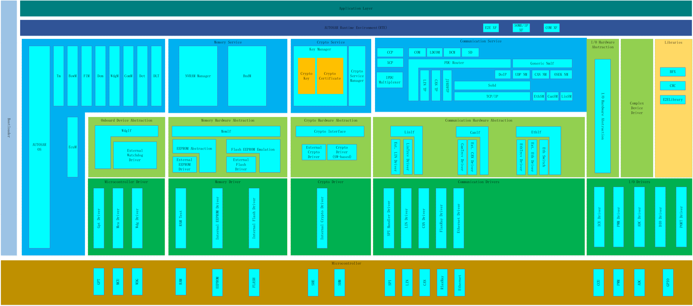
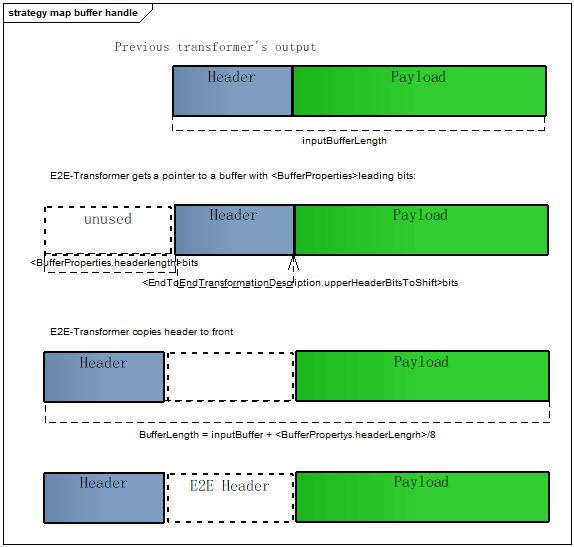
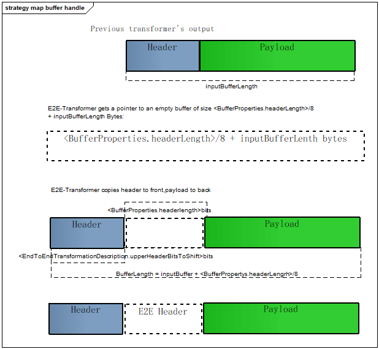
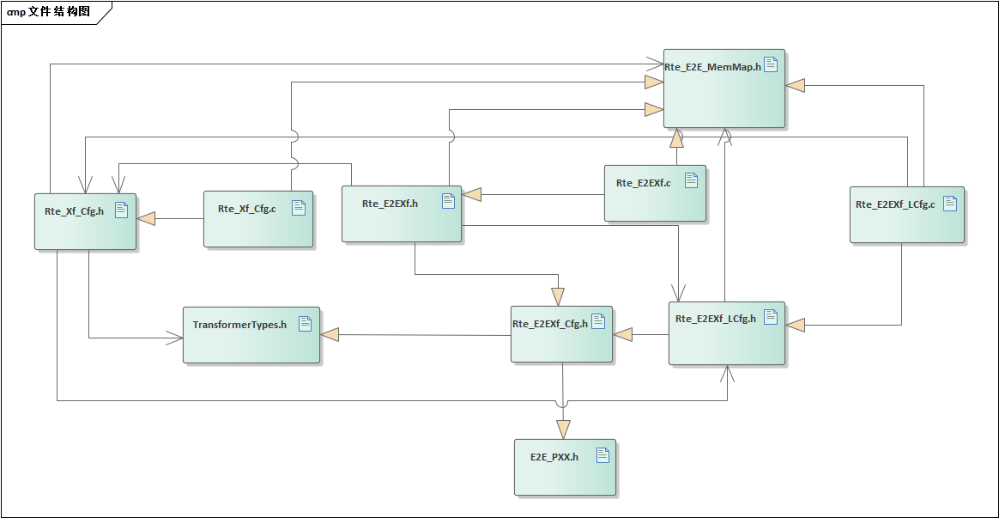
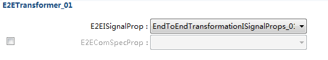
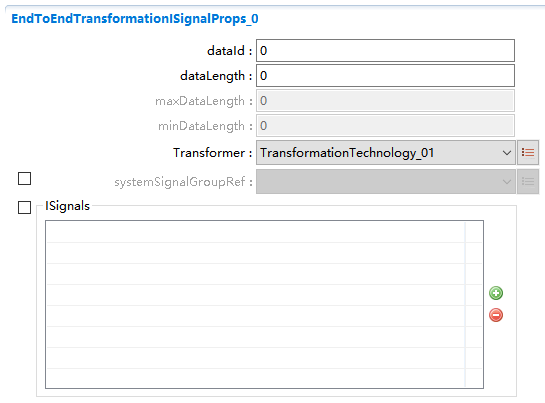
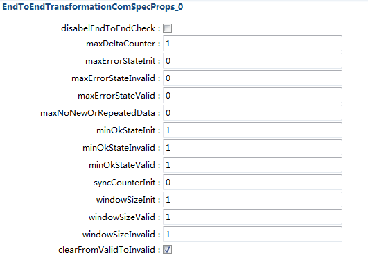
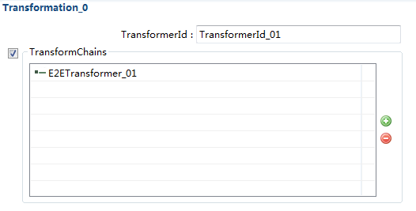
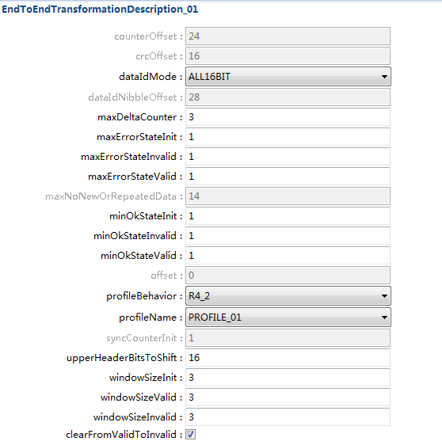

E2EXf
#################################

:strong:`缩写词注解 (Abbreviation Notes):`

.. list-table::
   :widths: 34 33 33
   :header-rows: 1

   * - 缩写词 (Abbreviation)
     - 解释/描述 (Explanation/Description)
     - 中文解释 (Chinese explanation)
   * - E2EXf
     - End to End Transformer
     - 端到端转换器 (End-to-end Converter)
   * - E2EL
     - End to End library
     - 端到端通讯保护库 (End-to-end communication protection library)

简介 (Introduction)
=================================

E2EXf模块的责任在于保护安全性相关的数据，在发送端，E2EXf保护数据，在接收端，E2EXf检查受保护的数据。所有的算法由E2EL提供，E2EXf调用E2EL相应的接口，传入配置和状态来实现保护的功能。

The E2EXf module is responsible for protecting security-related data. At the sender end, E2EXf protects the data, and at the receiver end, E2EXf checks the protected data. All algorithms are provided by E2EL, with E2EXf calling the corresponding interfaces from E2EL, passing in configuration and status to implement the protection function.

参考资料 (Reference materials)
------------------------------------------

[1]AUTOSAR_SWS_E2ETransformer.pdf，R19-11

[2] AUTOSAR_SWS_E2ELibrary.pdf，R19-11

[3] AUTOSAR_TPS_SystemTemplate.pdf，R19-11

功能描述 (Function Description)
===========================================

函数命名及数据结构生成 (Function Naming and Data Structure Generation)
---------------------------------------------------------------------------

E2EXf的函数及结构体会以<transformerId>后缀命名，针对每个transformer函数，都会有一个唯一的ID。这种命名方式用于E2EXf的C函数。

The functions and structures of E2EXf will be named with a suffix <transformerId>, and each transformer function will have a unique ID. This naming convention is used for the C functions of E2EXf.

E2EXf应生成数据结构E2EXf_ConfigStruct\_<v>，存储E2EXf模块的配置。

E2EXf should generate the data structure E2EXf_ConfigStruct\<v>, storing the configuration of the E2EXf module.

E2EXf应获取所需独立状态数据资源的类型：E2E_PXXProtectStateType、E2E_PXXCheckStateType和E2E_SMCheckStateType，去保护需要E2E保护的有唯一transformerId标识的数据，通过各类型profile进行保护。

E2EXf should obtain the types of required independent state data resources: E2E_PXXProtectStateType, E2E_PXXCheckStateType, and E2E_SMCheckStateType, to protect data with unique transformerId identifiers that require E2E protection through various profile types.

E2EXf会根据受E2E保护的数据的<transformerId>，各类型profile，去引用E2E_PXXConfigType和E2E_SMConfigType，在E2EXf模块内部执行E2E保护。

E2EXf will refer to E2E_PXXConfigType and E2E_SMConfigType based on the <transformerId> and various types of profile of data protected by E2E, and execute E2E protection within the E2EXf module.

静态初始化配置和状态 (Static initialization configuration and state)
--------------------------------------------------------------------------

根据EndToEndTransformationDescription，EndToEndTransformationISignalProps和EndToEndTransformationComSpecProps三种元模型对配置进行静态初始化。其中，EndToEndTransformationDescription定义E2E变量，EndToEndTransformationISignalProps对给定的ISignal定义一个特殊的保护，EndToEndTransformationComSpecProps覆盖一些已定义的变量。

According to EndToEndTransformationDescription, EndToEndTransformationISignalProps, and EndToEndTransformationComSpecProps three metamodels, configurations are statically initialized. Among them, EndToEndTransformationDescription defines E2E variables, EndToEndTransformationISignalProps defines a special protection for given ISignals, and EndToEndTransformationComSpecProps overrides some defined variables.

跟配置结构体相反，状态结构体不依赖于编译选项，生成的状态可以保持不进行初始化。

Opposite to configuration structs, state structs do not depend on compile options and the generated state can be kept uninitialized.

In-place和Out-of-place处理 (In-place and Out-of-place Processing)
------------------------------------------------------------------------------

E2EXf函数的处理会有In-place和Out-of-place两种方式，选择哪种buffer处理方式，可通过buffer属性配置项进行配置。

The processing of the E2EXf function has both In-place and Out-of-place methods, and which buffer handling method to choose can be configured through the buffer attribute configuration item.

In-place是指Transformer用的buffer既作为输入又作为输出，所以，In-place的处理有性能上的优势，空间占用少，拷贝次数少。Out-of-place是指有独立的输入输出buffer。

In-place refers to the buffer used by the Transformer serving as both input and output, so in-place processing has advantages in terms of performance, occupies less space, and requires fewer copies. Out-of-place refers to having independent input and output buffers.

E2EXf\_<transformerId>函数In-place方式buffer处理：

E2EXf\<transformerId> function In-place way buffer handling:

E2EXf\_<transformerId>函数Out-of-place方式buffer处理：

E2EXf\<transformerId> function out-of-place buffer handling:

源文件描述 (Source file description)
===============================================

.. centered:: **表 E2EXf组件文件描述 (Table E2EXf Component File Description)**

.. list-table::
   :widths: 50 50
   :header-rows: 1

   * - 文件 (Files)
     - 说明 (Description)
   * - Rte_E2EXf_Cfg.h
     - 定义E2EXf模块预编译时用到的配置参数。 (Define configuration parameters used for pre-compilation of the E2EXf module.)
   * - Rte_E2EXf_LCfg.c
     - 定义E2EXf模块链接时用到的配置参数。 (Define configuration parameters used for linking the E2EXf module.)
   * - Rte_E2EXf_LCfg.h
     - 定义E2EXf模块链接时用到的配置参数。 (Define configuration parameters used for linking the E2EXf module.)
   * - Rte_Xf_Cfg.c
     - 定义Xf模块预编译时用到的配置参数。 (Define configuration parameters used during pre-compilation of the Xf module.)
   * - Rte_Xf_Cfg.h
     - 定义Xf模块预编译时用到的配置参数。 (Define configuration parameters used during pre-compilation of the Xf module.)
   * - Rte_E2EXf_MemMap.h
     - E2EXf的内存映射定义 (The memory mapping definition of E2EXf)
   * - Rte_E2EXf.h
     - E2EXf模块头文件，包含了API函数的扩展声明并定义了端口的数据结构。 (The E2EXf module header file contains extended declarations of API functions and defines the data structures for ports.)
   * - TransformerTypes.h
     - E2EXf的类型定义 (The type definition of E2EXf)
   * - Rte_E2EXf.c
     - E2EXf模块源文件，包含了API函数的实现。 (E2EXf module source file, contains the implementation of API functions.)

API接口 (API Interface)
=====================================

类型定义 (Type definition)
--------------------------------------

E2EXf_ConfigType类型定义 (E2EXf_ConfigType Configuration Type Definition)
=====================================================================================

.. list-table::
   :widths: 50 50
   :header-rows: 1

   * - 名称 (Name)
     - E2EXf_ConfigType
   * - 类型 (Type)
     - 结构体 (Structures)
   * - 范围 (Range)
     - 根据实现决定 (Decide based on implementation)
   * - 描述 (Description)
     - 用于传递配置数据 (Used for transmitting configuration data)

输入函数描述 (Describe the input function:)
-----------------------------------------------------

.. list-table::
   :widths: 50 50
   :header-rows: 1

   * - 输入模块 (Input Module)
     - API
   * - E2EL
     - E2E_P01Check
   * - 
     - E2E_P01CheckInit
   * - 
     - E2E_P01MapStatusToSM
   * - 
     - E2E_P01Protect
   * - 
     - E2E_P01ProtectInit
   * - 
     - E2E_P02Check
   * - 
     - E2E_P02CheckInit
   * - 
     - E2E_P02MapStatusToSM
   * - 
     - E2E_P02Protect
   * - 
     - E2E_P02ProtectInit
   * - 
     - E2E_P04Check
   * - 
     - E2E_P04CheckInit
   * - 
     - E2E_P04MapStatusToSM
   * - 
     - E2E_P04Protect
   * - 
     - E2E_P04ProtectInit
   * - 
     - E2E_P05Check
   * - 
     - E2E_P05CheckInit
   * - 
     - E2E_P05MapStatusToSM
   * - 
     - E2E_P05Protect
   * - 
     - E2E_P05ProtectInit
   * - 
     - E2E_P06Check
   * - 
     - E2E_P06CheckInit
   * - 
     - E2E_P06MapStatusToSM
   * - 
     - E2E_P06Protect
   * - 
     - E2E_P06ProtectInit
   * - 
     - E2E_P07Check
   * - 
     - E2E_P07CheckInit
   * - 
     - E2E_P07MapStatusToSM
   * - 
     - E2E_P07Protect
   * - 
     - E2E_P07ProtectInit
   * - 
     - E2E_P11Check
   * - 
     - E2E_P11CheckInit
   * - 
     - E2E_P11MapStatusToSM
   * - 
     - E2E_P11Protect
   * - 
     - E2E_P11ProtectInit
   * - 
     - E2E_P22Check
   * - 
     - E2E_P22CheckInit
   * - 
     - E2E_P22MapStatusToSM
   * - 
     - E2E_P22Protect
   * - 
     - E2E_P22ProtectInit
   * - 
     - E2E_SMCheck
   * - 
     - E2E_SMCheckInit

静态接口函数定义 (Static interface function definition)
---------------------------------------------------------------

E2EXf_Init函数定义 (The E2EXf_Init function definition)
===================================================================

.. list-table::
   :widths: 25 25 25 25
   :header-rows: 1

   * - 函数名称： (Function Name:)
     - E2EXf_Init
     - 
     - 
   * - 函数原型： (Function prototype:)
     - void E2EXf_Init (
     - 
     - 
   * - 
     - constE2EXf_ConfigType\*config)
     - 
     - 
   * - 服务编号： (Service Number:)
     - 0x01
     - 
     - 
   * - 同步/异步： (Synchronous/asynchronous:)
     - 同步 (Sync)
     - 
     - 
   * - 是否可重入： (Is Reentrant:)
     - 是 (Is)
     - 
     - 
   * - 输入参数： (Input parameters:)
     - config
     - 值域： (Domain:)
     - 指向所选配置结构的指针 (Pointer to the selected configuration structure)
   * - 输入输出参数: (Input Output Parameters:)
     - 无
     - 
     - 
   * - 输出参数： (Output Parameters:)
     - 无
     - 
     - 
   * - 返回值： (Return Value:)
     - 无
     - 
     - 
   * - 功能概述： (Function Overview:)
     - 初始化E2EXf的状态。它的主要部分是初始化E2Elib状态结构，这是通过调用E2Elib中的所有init函数来完成的 (Initialize the state of E2EXf. Its main part is initializing the E2Elib state structure, which is accomplished by calling all init functions in E2Elib.)
     - 
     - 

E2EXf_DeInit函数定义 (Function definition for E2EXf_DeInit)
=======================================================================

.. list-table::
   :widths: 25 25 25 25
   :header-rows: 1

   * - 函数名称： (Function Name:)
     - E2EXf_DeInit
     - 
     - 
   * - 函数原型： (Function prototype:)
     - void E2EXf_DeInit(
     - 
     - 
   * - 
     - void)
     - 
     - 
   * - 服务编号： (Service Number:)
     - 0x02
     - 
     - 
   * - 同步/异步： (Synchronous/asynchronous:)
     - 同步 (Sync)
     - 
     - 
   * - 是否可重入： (Is Reentrant:)
     - 是 (Is)
     - 
     - 
   * - 输入参数： (Input parameters:)
     - 无
     - 值域： (Domain:)
     - 无
   * - 输入输出参数: (Input Output Parameters:)
     - 无
     - 
     - 
   * - 输出参数： (Output Parameters:)
     - 无
     - 
     - 
   * - 返回值： (Return Value:)
     - 无
     - 
     - 
   * - 功能概述： (Function Overview:)
     - 反初始化E2EXf (Deinitialize E2EXf)
     - 
     - 

E2EXf_GetVersionInfo函数定义 (E2EXf_GetVersionInfo function definition)
===================================================================================

.. list-table::
   :widths: 25 25 25 25
   :header-rows: 1

   * - 函数名称： (Function Name:)
     - E2EXf_GetVersionInfo
     - 
     - 
   * - 函数原型： (Function prototype:)
     - voidE2EXf_GetVersionInfo(
     - 
     - 
   * - 
     - \* versioninfo
     - 
     - 
   * - 
     - )
     - 
     - 
   * - 服务编号： (Service Number:)
     - 0x00
     - 
     - 
   * - 同步/异步： (Synchronous/asynchronous:)
     - 同步 (Sync)
     - 
     - 
   * - 是否可重入： (Is Reentrant:)
     - 是 (Is)
     - 
     - 
   * - 输入参数： (Input parameters:)
     - 无
     - 
     - 
   * - 输入输出参数: (Input Output Parameters:)
     - 无
     - 
     - 
   * - 输出参数： (Output Parameters:)
     - versioninfo
     - 值域： (Domain:)
     - 指向保存软件版本信息的地址 (Point to the address that stores the software version information.)
   * - 返回值： (Return Value:)
     - 无
     - 
     - 
   * - 功能概述： (Function Overview:)
     - 获取软件版本信息 (Get software version information)
     - 
     - 

E2EXf\_<transformerId>函数定义 (E2EXf\<transformerId> Function Definition)
======================================================================================

.. list-table::
   :widths: 25 25 25 25
   :header-rows: 1

   * - 函数名称： (Function Name:)
     - E2EXf\_<transformerId>
     - 
     - 
   * - 函数原型： (Function prototype:)
     - uint8E2EXf\_<transformerId>(
     - 
     - 
   * - 
     - uint8\* buffer,
     - 
     - 
   * - 
     - uint32\*bufferLength,
     - 
     - 
   * - 
     - [const uint8\*inputBuffer],
     - 
     - 
   * - 
     - uint32inputBufferLength
     - 
     - 
   * - 
     - )
     - 
     - 
   * - 服务编号： (Service Number:)
     - 0x03
     - 
     - 
   * - 同步/异步： (Synchronous/asynchronous:)
     - 同步 (Sync)
     - 
     - 
   * - 是否可重入： (Is Reentrant:)
     - 否 (No)
     - 
     - 
   * - 输入参数： (Input parameters:)
     - inputBuffer
     - 值域： (Domain:)
     - 输入数据 (Input data)
   * - 
     - inputBufferLength
     - 值域： (Domain:)
     - 输入数据长度 (Input data length)
   * - 输入输出参数: (Input Output Parameters:)
     - buffer
     - 值域： (Domain:)
     - 输出数据
   * - 输出参数： (Output Parameters:)
     - bufferLength
     - 值域： (Domain:)
     - 输出数据长度 (Length of Output Data)
   * - 返回值： (Return Value:)
     - uint8：0x00(E_OK) 0xFF(E_SAFETY_HARD_RUNTIMEERROR)
     - 
     - 
   * - 功能概述： (Function Overview:)
     - 对传入数据进行保护,<transformerId>由配置决定，是动态生成的 (Protecting input data, <transformerId> is dynamically generated based on configuration.)
     - 
     - 

E2EXf_Inv\_<transformerId>函数定义 (E2EXf_Inv\<transformerId> Function Definition)
==============================================================================================

.. list-table::
   :widths: 25 25 25 25
   :header-rows: 1

   * - 函数名称： (Function Name:)
     - E2EXf_Inv\_<transformerId>
     - 
     - 
   * - 函数原型： (Function prototype:)
     - uint8E2EXf_Inv\_<transformerId>(
     - 
     - 
   * - 
     - uint8\* buffer,
     - 
     - 
   * - 
     - uint32\*bufferLength,
     - 
     - 
   * - 
     - [const uint8\*inputBuffer],
     - 
     - 
   * - 
     - uint32inputBufferLength
     - 
     - 
   * - 
     - )
     - 
     - 
   * - 服务编号： (Service Number:)
     - 0x04
     - 
     - 
   * - 同步/异步： (Synchronous/asynchronous:)
     - 同步 (Sync)
     - 
     - 
   * - 是否可重入： (Is Reentrant:)
     - 否 (No)
     - 
     - 
   * - 输入参数： (Input parameters:)
     - inputBuffer
     - 值域： (Domain:)
     - 输入数据 (Input data)
   * - 
     - inputBufferLength
     - 值域： (Domain:)
     - 输入数据长度 (Input data length)
   * - 输入输出参数: (Input Output Parameters:)
     - buffer
     - 值域： (Domain:)
     - 输出数据
   * - 输出参数： (Output Parameters:)
     - bufferLength
     - 值域： (Domain:)
     - 输出数据长度 (Length of Output Data)
   * - 返回值： (Return Value:)
     - 0x00 (E_OK) Thismeans VALID_OK
     - 
     - 
   * - 
     - 0x01(E\_SAFETY_VALID_REP)
     - 
     - 
   * - 
     - 0x02(E\_SAFETY_VALID_SEQ)
     - 
     - 
   * - 
     - 0x03(E\_SAFETY_VALID_ERR)
     - 
     - 
   * - 
     - 0x05(E\_SAFETY_VALID_NND)
     - 
     - 
   * - 
     - 0x20(E\_SAFETY_NODATA_OK)
     - 
     - 
   * - 
     - 0x21(E_SAFETY_NODATA_REP)
     - 
     - 
   * - 
     - 0x22(E_SAFETY_NODATA_SEQ)
     - 
     - 
   * - 
     - 0x23(E_SAFETY_NODATA_ERR)
     - 
     - 
   * - 
     - 0x25(E_SAFETY_NODATA_NND)
     - 
     - 
   * - 
     - 0x30(E_SAFETY_INIT_OK)
     - 
     - 
   * - 
     - 0x31(E_SAFETY_INIT_REP)
     - 
     - 
   * - 
     - 0x32(E_SAFETY_INIT_SEQ)
     - 
     - 
   * - 
     - 0x33(E_SAFETY_INIT_ERR)
     - 
     - 
   * - 
     - 0x35(E_SAFETY_INIT_NND)
     - 
     - 
   * - 
     - 0x40(E_SAFETY_INVALID_OK)
     - 
     - 
   * - 
     - 0x41(E_SAFETY_INVALID_REP)
     - 
     - 
   * - 
     - 0x42(E_SAFETY_INVALID_SEQ)
     - 
     - 
   * - 
     - 0x43(E_SAFETY_INVALID_ERR)
     - 
     - 
   * - 
     - 0x45(E_SAFETY_INVALID_NND)
     - 
     - 
   * - 
     - 0x77(E_SAFETY_SOFT_RUNTIMEERROR)
     - 
     - 
   * - 
     - 0xFF(E_SAFETY_HARD_RUNTIMEERROR)
     - 
     - 
   * - 功能概述： (Function Overview:)
     - 对传入数据进行检查,<transformerId>由配置决定，是动态生成的 (Check the input data, <transformerId> is dynamically generated based on configuration.)
     - 
     - 

可配置函数定义 (Configurable Function Definition)
----------------------------------------------------------

无。

None.

配置 (Configure)
==============================

E2EXfrmGeneral
------------------------------

.. centered:: **表  E2EXfrmGeneral属性描述 (Table  E2EXfrmGeneral Property Description)**

.. list-table::
   :widths: 20 20 20 20 20
   :header-rows: 1

   * - UI名称 (UI Name)
     - 描述 (Description)
     - 
     - 
     - 
   * - E2EXfVersionInfoApi
     - 取值范围 (Range)
     - TRUE,FALSE
     - 默认取值 (Default value)
     - FALSE
   * - 
     - 参数描述 (Parameter Description)
     - 打开或关闭版本信息API (Enable or Disable Version Information API)
     - 
     - 
   * - 
     - 依赖关系 (Dependencies)
     - 无
     - 
     - 
   * - E2EXfDevErrorDetect
     - 取值范围 (Range)
     - TRUE,FALSE
     - 默认取值 (Default value)
     - FALSE
   * - 
     - 参数描述 (Parameter Description)
     - 启用或禁用开发错误检测开关 (Enable or disable the development error detection switch)
     - 
     - 
   * - 
     - 依赖关系 (Dependencies)
     - 无
     - 
     - 

E2ETransformer
==============================

.. centered:: **表  E2ETransformer属性描述 (Table  E2ETransformer Properties Description)**

.. list-table::
   :widths: 20 20 20 20 20
   :header-rows: 1

   * - UI名称 (UI Name)
     - 描述 (Description)
     - 
     - 
     - 
   * - E2EISignalProp
     - 取值范围 (Range)
     - Reference to[EndToEndTransformationISignalProps]
     - 默认取值 (Default value)
     - 无
   * - 
     - 参数描述 (Parameter Description)
     - 被transformer引用的EndToEndTransformationISignalProps (referenced by Transformer EndToEndTransformationISignalProps)
     - 
     - 
   * - 
     - 依赖关系 (Dependencies)
     - 无
     - 
     - 
   * - E2EComSpecProp
     - 取值范围 (Range)
     - Reference to[EndToEndTransformationComSpecProps]
     - 默认取值 (Default value)
     - 无
   * - 
     - 参数描述 (Parameter Description)
     - 被transformer引用的EndToEndTransformationComSpecProps (referenced by Transformer EndToEndTransformationComSpecProps)
     - 
     - 
   * - 
     - 依赖关系 (Dependencies)
     - 无
     - 
     - 

EndToEndTransformationISignalProps
==================================================

.. centered:: **表  EndToEndTransformationISignalProps属性描述 (Table EndToEndTransformationISignalProps Property Description)**

.. list-table::
   :widths: 12 11 11 11 11 11 11 11 11
   :header-rows: 1

   * - UI名称 (UI Name)
     - 描述 (Description)
     - 
     - 
     - 
     - 
     - 
     - 
     - 
   * - dataId
     - 取值范围 (Range)
     - 0~4294967295
     - 
     - 默认取值 (Default value)
     - 
     - 0
     - 
     - 
   * - 
     - 参数描述 (Parameter Description)
     - 表示一个唯一的数字标识符 (Represent a unique numeric identifier)
     - 
     - 
     - 
     - 
     - 
     - 
   * - 
     - 依赖关系 (Dependencies)
     - if(EndToEndTransformationDescription.profileName==
     - 
     - 
     - 
     - 
     - 
     - 
   * - 
     - 
     - profile_01
     - \
     - 
     - 
     - 
     - 
     - 
   * - 
     - 
     - profile_11),dataIdmultiplicityattributeshall be1,and shallbe in therange0-65535;
     - 
     - 
     - 
     - 
     - 
     - 
   * - 
     - 
     - if(EndToEndTransformationDescription.profileName==
     - 
     - 
     - 
     - 
     - 
     - 
   * - 
     - 
     - profile_01
     - \
     - 
     - 
     - 
     - 
     - 
   * - 
     - 
     - profile_11)&&(dataIdMode==lower12Bit),dataIdvalue rangeshall be in256-65535;
     - 
     - 
     - 
     - 
     - 
     - 
   * - 
     - 
     - if(EndToEndTransformationDescription.profileName==
     - 
     - 
     - 
     - 
     - 
     - 
   * - 
     - 
     - profile_02
     - \
     - 
     - 
     - 
     - 
     - 
   * - 
     - 
     - profile_22),dataIdmultiplicityattributeshall be16,and valueshall be inthe range0-255;
     - 
     - 
     - 
     - 
     - 
     - 
   * - 
     - 
     - if(EndToEndTransformationDescription.profileName==profile_01)&&(dataIDMode==LOWER8BIT),dataId highbyte shall be0, low bytevalid,andvalue shallbe in therange 0-255;
     - 
     - 
     - 
     - 
     - 
     - 
   * - 
     - 
     - if(EndToEndTransformationDescription.profileName==
     - 
     - 
     - 
     - 
     - 
     - 
   * - 
     - 
     - profile_01
     - \
     - 
     - 
     - 
     - 
     - 
   * - 
     - 
     - profile_11)&&(dataIDMode==LOWER12BIT),dataId highbyte highnibble shallbe 0, highbyte lownibble andlow bytevalid;
     - 
     - 
     - 
     - 
     - 
     - 
   * - 
     - 
     - ifprofileName== profile_01
     - 
     - 
     - 
     - 
     - 
     - 
   * - 
     - 
     - \
     - \
     - 
     - 
     - 
     - 
     - 
   * - 
     - 
     - profile_05
     - 
     - 
     - 
     - 
     - 
     - 
   * - 
     - 
     - \profile_06
     - \\
     - 
     - 
     - 
     - 
     - 
   * - 
     - 
     - profile_11，dataIdtype shall beuint16;
     - 
     - 
     - 
     - 
     - 
     - 
   * - 
     - 
     - ifprofileName==
     - 
     - 
     - 
     - 
     - 
     - 
   * - 
     - 
     - profile_02
     - \
     - 
     - 
     - 
     - 
     - 
   * - 
     - 
     - profile_22，dataIdtype shall beuint8;
     - 
     - 
     - 
     - 
     - 
     - 
   * - 
     - 
     - ifprofileName==
     - 
     - 
     - 
     - 
     - 
     - 
   * - 
     - 
     - profile_04
     - \
     - 
     - 
     - 
     - 
     - 
   * - 
     - 
     - profile_07，dataIdtype shall beuint32.
     - 
     - 
     - 
     - 
     - 
     - 
   * - dataLength
     - 取值范围 (Range)
     - 0~65535
     - 
     - 默认取值 (Default value)
     - 
     - 0
     - 
     - 
   * - 
     - 参数描述 (Parameter Description)
     - 数据的长度，单位为位 (The length of data, in bits)
     - 
     - 
     - 
     - 
     - 
     - 
   * - 
     - 依赖关系 (Dependencies)
     - if(EndToEndTransformationDescription.profileName== profile_01
     - 
     - 
     - 
     - 
     - 
     - 
   * - 
     - 
     - \
     - \
     - 
     - 
     - 
     - 
     - 
   * - 
     - 
     - profile_02
     - 
     - 
     - 
     - 
     - 
     - 
   * - 
     - 
     - \profile_05profile_11
     - \\\
     - 
     - 
     - 
     - 
     - 
   * - 
     - 
     - profile_22),dataLengthmultiplicityattributeshall be 1;
     - 
     - 
     - 
     - 
     - 
     - 
   * - 
     - 
     - if(EndToEndTransformationDescription.profileName== profile_04
     - 
     - 
     - 
     - 
     - 
     - 
   * - 
     - 
     - \
     - \
     - 
     - 
     - 
     - 
     - 
   * - 
     - 
     - profile\_
     - 
     - 
     - 
     - 
     - 
     - 
   * - 
     - 
     - 06
     - 
     - profile_0
     - 
     - 
     - 
     - 
   * - 
     - 
     - 7),dataLengthmultiplicityattributeshall be 0;
     - 
     - 
     - 
     - 
     - 
     - 
   * - 
     - 
     - ifEndToEndTransformationDescription.profileName==profile\_01,dataLengthshall be amultiple of 8and shall be2*8bits≤dataLength≤240 bits;
     - 
     - 
     - 
     - 
     - 
     - 
   * - 
     - 
     - ifEndToEndTransformationDescription.profileName==profile\_02,dataLengthshall be amultiple of8;and shallbe2*8bits≤dataLength≤8*256 bits;
     - 
     - 
     - 
     - 
     - 
     - 
   * - 
     - 
     - ifEndToEndTransformationDescription.profileName==profile\_05,dataLengthshall be amultiple of8,and shallbe 3*8bits =<dataLength≤4096*8 bits;
     - 
     - 
     - 
     - 
     - 
     - 
   * - 
     - 
     - ifEndToEndTransformationDescription.profileName==profile\_11,dataLengthshall be amultiple of 8and shall be2*8bits≤dataLength≤240 bits;
     - 
     - 
     - 
     - 
     - 
     - 
   * - 
     - 
     - ifEndToEndTransformationDescription.profileName==profile\_22,dataLengthshall be amultiple of8;and shallbe2*8bits≤dataLength≤8*256 bits.
     - 
     - 
     - 
     - 
     - 
     - 
   * - maxDataLength
     - 取值范围 (Range)
     - 0~65535
     - 
     - 默认取值 (Default value)
     - 
     - 0
     - 
     - 
   * - 
     - 参数描述 (Parameter Description)
     - 数据的最大长度，以位为单位 (The maximum length of data, in bits)
     - 
     - 
     - 
     - 
     - 
     - 
   * - 
     - 依赖关系 (Dependencies)
     - if(EndToEndTransformationDescription.profileName== profile_01
     - 
     - 
     - 
     - 
     - 
     - 
   * - 
     - 
     - \
     - \
     - 
     - 
     - 
     - 
     - 
   * - 
     - 
     - profile_02
     - 
     - 
     - 
     - 
     - 
     - 
   * - 
     - 
     - \profile_05
     - \\
     - 
     - 
     - 
     - 
     - 
   * - 
     - 
     - profile_11
     - 
     - 
     - 
     - 
     - 
     - 
   * - 
     - 
     - \
     - \
     - 
     - 
     - 
     - 
     - 
   * - 
     - 
     - profile_22),maxDataLengthmultiplicityattributeshall be 0;
     - 
     - 
     - 
     - 
     - 
     - 
   * - 
     - 
     - if(EndToEndTransformationDescription.profileName== profile_04
     - 
     - 
     - 
     - 
     - 
     - 
   * - 
     - 
     - \profile_06
     - \\
     - 
     - 
     - 
     - 
     - 
   * - 
     - 
     - profile_07),maxDataLengthmultiplicityattributeshall be1;the valueshall be amultiple of8;
     - 
     - 
     - 
     - 
     - 
     - 
   * - 
     - 
     - ifprofileName==profile_04,minDataLength≤maxDataLength≤4096*8bits;
     - 
     - 
     - 
     - 
     - 
     - 
   * - 
     - 
     - ifprofileName==profile_06,minDataLength≤maxDataLength≤4096*8bits;
     - 
     - 
     - 
     - 
     - 
     - 
   * - 
     - 
     - ifprofileName==profile_07,minDataLength≤maxDataLength≤4294967295bits.
     - 
     - 
     - 
     - 
     - 
     - 
   * - minDataLength
     - 取值范围 (Range)
     - 0~65535
     - 
     - 默认取值 (Default value)
     - 
     - 0
     - 
     - 
   * - 
     - 参数描述 (Parameter Description)
     - 数据的最小长度，以位为单位 (The minimum length of data, in bits)
     - 
     - 
     - 
     - 
     - 
     - 
   * - 
     - 依赖关系 (Dependencies)
     - if(EndToEndTransformationDescription.profileName== profile_01
     - 
     - 
     - 
     - 
     - 
     - 
   * - 
     - 
     - \
     - \
     - 
     - 
     - 
     - 
     - 
   * - 
     - 
     - profile_02
     - 
     - 
     - 
     - 
     - 
     - 
   * - 
     - 
     - \
     - \
     - 
     - 
     - 
     - 
     - 
   * - 
     - 
     - profile_05
     - 
     - 
     - 
     - 
     - 
     - 
   * - 
     - 
     - \
     - \
     - 
     - 
     - 
     - 
     - 
   * - 
     - 
     - profile_11
     - 
     - 
     - 
     - 
     - 
     - 
   * - 
     - 
     - \
     - \
     - 
     - 
     - 
     - 
     - 
   * - 
     - 
     - profile_22),minDataLengthmultiplicityattributeshall be 0;
     - 
     - 
     - 
     - 
     - 
     - 
   * - 
     - 
     - if(EndToEndTransformationDescription.profileName== profile_04
     - 
     - 
     - 
     - 
     - 
     - 
   * - 
     - 
     - \profile_06
     - \\
     - 
     - 
     - 
     - 
     - 
   * - 
     - 
     - profile_07),minDataLengthmultiplicityattributeshall be1;the valueshall be amultiple of8;
     - 
     - 
     - 
     - 
     - 
     - 
   * - 
     - 
     - ifprofileName==profile_04,12*8 bits≤minDataLength≤4096*8bits
     - 
     - 
     - 
     - 
     - 
     - 
   * - 
     - 
     - ifprofileName==profile_06,5*8 bits≤minDataLength≤4096*8bits
     - 
     - 
     - 
     - 
     - 
     - 
   * - 
     - 
     - ifprofileName==profile_07,20*8 bits≤minDataLength≤maxDataLength
     - 
     - 
     - 
     - 
     - 
     - 
   * - Transformer
     - 取值范围 (Range)
     - References to[TransformationTechnology]
     - 
     - 默认取值 (Default value)
     - 
     - 无
     - 
     - 
   * - 
     - 参数描述 (Parameter Description)
     - 引用TransformationTechnology (Transformation Technology)
     - 
     - 
     - 
     - 
     - 
     - 
   * - 
     - 依赖关系 (Dependencies)
     - 无
     - 
     - 
     - 
     - 
     - 
     - 
   * - systemSignalGroupRef
     - 取值范围 (Range)
     - References to[ComSignalGroup]
     - 默认取值 (Default value)
     - 
     - 
     - 无
     - 
     - 
   * - 
     - 参数描述 (Parameter Description)
     - 对本 I-Pdu中包含的所有信号组的引用 (Reference for all signal groups in this I-PDU)
     - 
     - 
     - 
     - 
     - 
     - 
   * - 
     - 依赖关系 (Dependencies)
     - 无
     - 
     - 
     - 
     - 
     - 
     - 
   * - ISignals
     - 取值范围 (Range)
     - References to[ComGroupSignal]
     - 默认取值 (Default value)
     - 
     - 
     - 无
     - 
     - 
   * - 
     - 参数描述 (Parameter Description)
     - 引用此ComSignalGroup所需的ComGroupSignal (Reference the ComGroupSignal required for this ComSignalGroup.)
     - 
     - 
     - 
     - 
     - 
     - 
   * - 
     - 依赖关系 (Dependencies)
     - 无
     - 
     - 
     - 
     - 
     - 
     - 

EndToEndTransformationComSpecProps
==================================================

.. centered:: **表  EndToEndTransformationComSpecProps属性描述 (Table  EndToEndTransformationComSpecProps Property Description)**

.. list-table::
   :widths: 20 20 20 20 20
   :header-rows: 1

   * - UI名称 (UI Name)
     - 描述 (Description)
     - 
     - 
     - 
   * - disabelEndToEndCheck
     - 取值范围 (Range)
     - TRUE,FALSE
     - 默认取值 (Default value)
     - FALSE
   * - 
     - 参数描述 (Parameter Description)
     - 禁用/启用端到端加密检查 (Enable/Disable End-to-End Encryption Check)
     - 
     - 
   * - 
     - 依赖关系 (Dependencies)
     - 无
     - 
     - 
   * - maxDeltaCounter
     - 取值范围 (Range)
     - 0~65535
     - 默认取值 (Default value)
     - 1
   * - 
     - 参数描述 (Parameter Description)
     - Maximum allowed gapbetween two countervalues of twoconsecutive checks.
     - 
     - 
   * - 
     - 依赖关系 (Dependencies)
     - if(EndToEndTransformationDescription.profileName== profile_01),maxdeltacounter shallbe in the range 1-14;
     - 
     - 
   * - 
     - 
     - if(EndToEndTransformationDescription.profileName== profile_02),maxdeltacounter shallbe in the range 1-15;
     - 
     - 
   * - 
     - 
     - if(EndToEndTransformationDescription.profileName== profile_04),maxdeltacounter shallbe in the range1-65535;
     - 
     - 
   * - 
     - 
     - if(EndToEndTransformationDescription.profileName== profile_05),maxdeltacounter shallbe in the range1-255;
     - 
     - 
   * - 
     - 
     - if(EndToEndTransformationDescription.profileName== profile_06),maxdeltacounter shallbe in the range1-255;
     - 
     - 
   * - 
     - 
     - if(EndToEndTransformationDescription.profileName== profile_07),maxdeltacounter shallbe in the range1-4294967295;
     - 
     - 
   * - 
     - 
     - if(EndToEndTransformationDescription.profileName== profile_11),maxdeltacounter shallbe in the range 1-14;
     - 
     - 
   * - 
     - 
     - if(EndToEndTransformationDescription.profileName== profile_22),maxdeltacounter shallbe in the range 1-15.
     - 
     - 
   * - maxErrorStateInit
     - 取值范围 (Range)
     - 0~255
     - 默认取值 (Default value)
     - 0
   * - 
     - 参数描述 (Parameter Description)
     - 在最近一次 WindowSize检查中，确定了状态E2E_SM_INIT 的ProfileStatus 等于E2E_P_ERROR的最大检查次数 (During the recent WindowSize check, it was determined that the maximum check次数 for which ProfileStatus of state E2E_SM_INIT equals E2E_P_ERROR.)
     - 
     - 
   * - 
     - 依赖关系 (Dependencies)
     - maxErrorStateValid>=maxErrorStateInit>=maxErrorStateInvalid>=0;
     - 
     - 
   * - 
     - 
     - minOkStateInit +maxErrorStateInit <=windowSizeValid
     - 
     - 
   * - maxErrorStateInvalid
     - 取值范围 (Range)
     - 0~255
     - 默认取值 (Default value)
     - 0
   * - 
     - 参数描述 (Parameter Description)
     - 在最近一次 WindowSize检查中，确定了状态E2E_SM_INVALID的ProfileStatus 等于E2E_P_ERROR的最大检查次数 (During the recent WindowSize check, it was determined that the maximum check frequency for ProfileStatus equal to E2E_P_ERROR when the state is E2E_SM_INVALID.)
     - 
     - 
   * - 
     - 依赖关系 (Dependencies)
     - maxErrorStateValid>=maxErrorStateInit>=maxErrorStateInvalid>=0;
     - 
     - 
   * - 
     - 
     - minOkStateInvalid +maxErrorStateInvalid<= windowSizeValid
     - 
     - 
   * - maxErrorStateValid
     - 取值范围 (Range)
     - 0~255
     - 默认取值 (Default value)
     - 0
   * - 
     - 参数描述 (Parameter Description)
     - 在最近一次 WindowSize检查中，确定了状态E2E_SM_VALID的ProfileStatus 等于E2E_P_ERROR的最大检查次数 (During the recent WindowSize check, it determined that the maximum check次数 for ProfileStatus equal to E2E_SM_VALID and state E2E_P_ERROR.)
     - 
     - 
   * - 
     - 依赖关系 (Dependencies)
     - maxErrorStateValid>=maxErrorStateInit>=maxErrorStateInvalid>=0;
     - 
     - 
   * - 
     - 
     - minOkStateValid +maxErrorStateValid <=windowSizeValid
     - 
     - 
   * - maxNoNewOrRepeatedData
     - 取值范围 (Range)
     - 0~255
     - 默认取值 (Default value)
     - 0
   * - 
     - 参数描述 (Parameter Description)
     - 连续失败的计数器检查的最大允许数量。 (Maximum allowed number of consecutive failed counter checks.)
     - 
     - 
   * - 
     - 依赖关系 (Dependencies)
     - value ofmaxNoNewOrRepeatedDatais 0~14;
     - 
     - 
   * - minOkStateInit
     - 取值范围 (Range)
     - 0~255
     - 默认取值 (Default value)
     - 1
   * - 
     - 参数描述 (Parameter Description)
     - 在最近一次 WindowSize检查中，确定了状态E2E_SM_INIT 的ProfileStatus 等于E2E_P_OK的最少检查次数。 (During the recent WindowSize check, the minimum number of checks for which the ProfileStatus of state E2E_SM_INIT equals E2E_P_OK was determined.)
     - 
     - 
   * - 
     - 依赖关系 (Dependencies)
     - 1<=minOkStateValid<=minOkStateInit<=minOkStateInvalid;
     - 
     - 
   * - 
     - 
     - minOkStateInit +maxErrorStateInit <=windowSizeValid
     - 
     - 
   * - minOkStateInvalid
     - 取值范围 (Range)
     - 0~255
     - 默认取值 (Default value)
     - 1
   * - 
     - 参数描述 (Parameter Description)
     - 在最近一次 WindowSize检查中，确定了状态E2E_SM\_ INVALID的ProfileStatus 等于E2E_P_OK的最少检查次数。 (During the most recent WindowSize check, it was determined that the minimum number of checks for ProfileStatus E2E_SM_INVALID equals E2E_P_OK.)
     - 
     - 
   * - 
     - 依赖关系 (Dependencies)
     - 1<=minOkStateValid<=minOkStateInit<=minOkStateInvalid;
     - 
     - 
   * - 
     - 
     - minOkStateInvalid +maxErrorStateInvalid<= windowSizeValid
     - 
     - 
   * - minOkStateValid
     - 取值范围 (Range)
     - 0~255
     - 默认取值 (Default value)
     - 1
   * - 
     - 参数描述 (Parameter Description)
     - 在最近一次 WindowSize检查中，确定了状态E2E_SM\_ VALID的ProfileStatus 等于E2E_P_OK的最少检查次数。 (During the recent WindowSize check, it was determined that the minimum number of checks for ProfileStatus E2E_SM_VALID equals E2E_P_OK.)
     - 
     - 
   * - 
     - 依赖关系 (Dependencies)
     - 1<=minOkStateValid<=minOkStateInit<=minOkStateInvalid;
     - 
     - 
   * - 
     - 
     - minOkStateValid +maxErrorStateValid <=windowSizeValid.
     - 
     - 
   * - syncCounterInit
     - 取值范围 (Range)
     - 0~255
     - 默认取值 (Default value)
     - 0
   * - 
     - 参数描述 (Parameter Description)
     - 验证必须用有效计数器接收的计数器的一致性所需的检查数 (The number of checks required to verify the consistency of a counter using an effective counter value)
     - 
     - 
   * - 
     - 依赖关系 (Dependencies)
     - 无
     - 
     - 
   * - windowSizeInit
     - 取值范围 (Range)
     - 0~255
     - 默认取值 (Default value)
     - 1
   * - 
     - 参数描述 (Parameter Description)
     - E2EInit状态机监控窗口大小。 (The E2EInit state machine monitors window size.)
     - 
     - 
   * - 
     - 依赖关系 (Dependencies)
     - windowSizeInit <=WindowSizeValid
     - 
     - 
   * - windowSizeValid
     - 取值范围 (Range)
     - 0~255
     - 默认取值 (Default value)
     - 1
   * - 
     - 参数描述 (Parameter Description)
     - E2EValid状态机监控窗口大小。 (E2EValid state machine monitors window size.)
     - 
     - 
   * - 
     - 依赖关系 (Dependencies)
     - The value of thewindowSizeValidattribute shall begreater or equal to1.
     - 
     - 
   * - windowSizeInvalid
     - 取值范围 (Range)
     - 0~255
     - 默认取值 (Default value)
     - 1
   * - 
     - 参数描述 (Parameter Description)
     - E2EInvalid状态机监控窗口大小。 (E2EInvalid state machine monitors window size.)
     - 
     - 
   * - 
     - 依赖关系 (Dependencies)
     - WindowSizeInvalid <=WindowSizeValid
     - 
     - 
   * - clearFromValidToInvalid
     - 取值范围 (Range)
     - TRUE,FALSE
     - 默认取值 (Default value)
     - TRUE
   * - 
     - 参数描述 (Parameter Description)
     - 从状态 Valid转换到状态 Invalid时清除监控窗口。 (Clear the monitoring window when the state changes from Valid to Invalid.)
     - 
     - 
   * - 
     - 依赖关系 (Dependencies)
     - 无
     - 
     - 

TransformationSet
---------------------------------

Transformation
==============================

.. centered:: **表  Transformation属性描述 (Table Transformation property description)**

.. list-table::
   :widths: 20 20 20 20 20
   :header-rows: 1

   * - UI名称 (UI Name)
     - 描述 (Description)
     - 
     - 
     - 
   * - TransformerId
     - 取值范围 (Range)
     - String
     - 默认取值 (Default value)
     - 无
   * - 
     - 参数描述 (Parameter Description)
     - 用于transformer模块API命名 (For transformer module API naming)
     - 
     - 
   * - 
     - 依赖关系 (Dependencies)
     - 无
     - 
     - 
   * - TransformChains
     - 取值范围 (Range)
     - Enumeration
     - 默认取值 (Default value)
     - 无
   * - 
     - 参数描述 (Parameter Description)
     - 对所有transformer的引用（即ComXf_Transformer、E2ETransformer、SomeIpXfConfig） (All references to transformers (i.e., ComXf_Transformer, E2ETransformer, SomeIpXfConfig))
     - 
     - 
   * - 
     - 依赖关系 (Dependencies)
     - References toComXf_Transformer,E2ETransformer,SomeIpXfConfig
     - 
     - 

TransformationTechnology
========================================

.. centered:: **表  TransformationTechnology属性描述 (Table  TransformationTechnology Attribute Description)**

.. list-table::
   :widths: 20 20 20 20 20
   :header-rows: 1

   * - UI名称 (UI Name)
     - 描述 (Description)
     - 
     - 
     - 
   * - NeedsOriginalData
     - 取值范围 (Range)
     - TRUE,FALSE
     - 默认取值 (Default value)
     - FALSE
   * - 
     - 参数描述 (Parameter Description)
     - 指定此transformer是否能够访问SWC的原始数据。 (Specify whether this transformer has access to the original SWC data.)
     - 
     - 
   * - 
     - 依赖关系 (Dependencies)
     - 无
     - 
     - 
   * - Protocol
     - 取值范围 (Range)
     - String
     - 默认取值 (Default value)
     - 无
   * - 
     - 参数描述 (Parameter Description)
     - 指定此transformer实现的协议。 (Specify the protocol implemented by this transformer.)
     - 
     - 
   * - 
     - 依赖关系 (Dependencies)
     - 无
     - 
     - 
   * - TransformerClass
     - 取值范围 (Range)
     - Enumeration
     - 默认取值 (Default value)
     - 无
   * - 
     - 参数描述 (Parameter Description)
     - 指定此transformer属于哪个transformer类。 (Specify which transformer class this transformer belongs to.)
     - 
     - 
   * - 
     - 依赖关系 (Dependencies)
     - 无
     - 
     - 
   * - Version
     - 取值范围 (Range)
     - String
     - 默认取值 (Default value)
     - 无
   * - 
     - 参数描述 (Parameter Description)
     - 已实现的协议版本。 (Implemented protocol versions.)
     - 
     - 
   * - 
     - 依赖关系 (Dependencies)
     - 无
     - 
     - 

EndToEndTransformationDescription
-------------------------------------------------

.. centered:: **表  EndToEndTransformationDescription属性描述 (Table  EndToEndTransformationDescription Property Describes)**

.. list-table::
   :widths: 7 7 7 7 7 7 7 7 7 7 6 6 6 6 6
   :header-rows: 1

   * - UI名称 (UI Name)
     - 描述 (Description)
     - 
     - 
     - 
     - 
     - 
     - 
     - 
     - 
     - 
     - 
     - 
     - 
     - 
   * - counterOffset
     - 取值范围 (Range)
     - 0~65535
     - 默认取值 (Default value)
     - 8
     - 
     - 
     - 
     - 
     - 
     - 
     - 
     - 
     - 
     -
   * - 
     - 参数描述 (Parameter Description)
     - 数组中计数器的偏移量(以位为单位) (Offset of the counter in the array (in bits))
     - 
     - 
     - 
     - 
     - 
     - 
     - 
     - 
     - 
     - 
     - 
     -
   * - 
     - 
     - if(EndToEndTransformationDescription.profileName   == profile_01
     - 
     - profile_11),counteroffset multiplicity attribute shall be   1,
     - 
     - 
     - 
     - 
     - 
     - 
     - 
     - 
     - 
     - 
   * - 
     - 
     - and the value of counterOffset shall be set to n * 8（n > 0）;the   value shall be set to the value of upperHeaderBitsToShift + 8.
     - 
     - 
     - 
     - 
     - 
     - 
     - 
     - 
     - 
     - 
     - 
     -
   * - 
     - 
     - if(EndToEndTransformationDescription.profileName   == profile_02
     - 
     - profile_04
     - 
     - profile_05
     - 
     - profile_06
     - 
     - profile_07
     - 
     - profile_22)
     - 
     - 
   * - 
     - 
     - counteroffset multiplicity attribute shall be 0.
     - 
     - 
     - 
     - 
     - 
     - 
     - 
     - 
     - 
     - 
     - 
     - 
   * - crcOffset
     - 取值范围 (Range)
     - 0~65535
     - 默认取值 (Default value)
     - 0
     - 
     - 
     - 
     - 
     - 
     - 
     - 
     - 
     - 
     -
   * - 
     - 参数描述 (Parameter Description)
     - 数组中CRC的偏移量，以位为单位。 (Offset of CRC in the array, in bits.)
     - 
     - 
     - 
     - 
     - 
     - 
     - 
     - 
     - 
     - 
     - 
     -
   * - 
     - 
     - if(EndToEndTransformationDescription.profileName   == profile_01
     - 
     - profile_11),crcOffset multiplicity attribute shall be 1,
     - 
     - 
     - 
     - 
     - 
     - 
     - 
     - 
     - 
     - 
   * - 
     - 
     - and   the value of crcOffset shall be the same as upperHeaderBitsToShift;
     - 
     - 
     - 
     - 
     - 
     - 
     - 
     - 
     - 
     - 
     - 
     -
   * - 
     - 
     - if(EndToEndTransformationDescription.profileName   == profile_02
     - 
     - profile_04
     - 
     - profile_05
     - 
     - profile_06
     - 
     - profile_07
     - 
     - profile_22)
     - 
     - 
   * - 
     - 
     - crcoffset multiplicity attribute shall be 0.
     - 
     - 
     - 
     - 
     - 
     - 
     - 
     - 
     - 
     - 
     - 
     - 
   * - dataIdMode
     - 取值范围 (Range)
     - Enumeration
     - 默认取值 (Default value)
     - ALL16BIT
     - 
     - 
     - 
     - 
     - 
     - 
     - 
     - 
     - 
     -
   * - 
     - 参数描述 (Parameter Description)
     - 该属性描述了一种包含方式，用于将隐含的两字节数据 ID   包含在 1 字节 CRC 中 (This property describes a method of inclusion used to contain implicit two-byte data ID within 1 byte CRC.)
     - 
     - 
     - 
     - 
     - 
     - 
     - 
     - 
     - 
     - 
     - 
     -
   * - 
     - 
     - if(EndToEndTransformationDescription.profileName   == profile_01
     - 
     - profile_11),dataIdmode multiplicity attribute shall be 1;
     - 
     - 
     - 
     - 
     - 
     - 
     - 
     - 
     - 
     -
   * - 
     - 
     - if(EndToEndTransformationDescription.profileName   == profile_02
     - 
     - profile_04
     - 
     - profile_05
     - 
     - profile_06
     - 
     - profile_07
     - 
     - profile_22)
     - 
     - 
   * - 
     - 依赖关系 (Dependencies)
     - dataIdmode multiplicity attribute shall be 0;
     - 
     - 
     - 
     - 
     - 
     - 
     - 
     - 
     - 
     - 
     - 
     -
   * - 
     - 
     - If(EndToEndTransformationDescription. profileName == profile_11) then the value of the EndToEndTransformationDescription.
     - 
     - 
     - 
     - 
     - 
     - 
     - 
     - 
     - 
     - 
     - 
     - 
   * - 
     - 
     - dataIdMode attribute shall be set to ALL16BIT or LOWER12BIT.
     - 
     - 
     - 
     - 
     - 
     - 
     - 
     - 
     - 
     - 
     - 
     - 
   * - dataIdNibbleOffset
     - 取值范围 (Range)
     - 0~65535
     - 默认取值 (Default value)
     - 12
     - 
     - 
     - 
     - 
     - 
     - 
     - 
     - 
     - 
     -
   * - 
     - 参数描述 (Parameter Description)
     - Offset of the Data ID nibble   in the Data[] array in bits.
     - 
     - 
     - 
     - 
     - 
     - 
     - 
     - 
     - 
     - 
     - 
     -
   * - 
     - 
     - if(EndToEndTransformationDescription.profileName   == profile_01
     - 
     - profile_11)&&(EndToEndTransformationDescription.dataIdMode == lower12Bit   ),
     - 
     - 
     - 
     - 
     - 
     - 
     - 
     - 
     - 
     - 
   * - 
     - 
     - dataIdNibbleOffset attribute multiplicity shall be 1;the value shall be set to upperHeaderBitsToShift + 12;
     - 
     - 
     - 
     - 
     - 
     - 
     - 
     - 
     - 
     - 
     - 
     -
   * - 
     - 
     - if(EndToEndTransformationDescription.profileName   == profile_02
     - 
     - profile_04
     - 
     - profile_05
     - 
     - profile_06
     - 
     - profile_07
     - 
     - profile_22)
     - 
     - (EndToEndTransformationDescription.dataIdMode != lower12Bit ),
   * - 
     - 
     - dataIdNibbleOffset attribute multiplicity shall be 0.
     - 
     - 
     - 
     - 
     - 
     - 
     - 
     - 
     - 
     - 
     - 
     - 
   * - maxDeltaCounter
     - 取值范围 (Range)
     - 0~65535
     - 默认取值 (Default value)
     - 1
     - 
     - 
     - 
     - 
     - 
     - 
     - 
     - 
     - 
     -
   * - 
     - 参数描述 (Parameter Description)
     - 两次连续检查的两个计数器值之间的最大允许间隙。 (The maximum allowable interval between counter values from two consecutive checks.)
     - 
     - 
     - 
     - 
     - 
     - 
     - 
     - 
     - 
     - 
     - 
     -
   * - 
     - 
     - if(EndToEndTransformationDescription.profileName   == profile_01), maxdeltacounter shall be in the range 1-14;
     - 
     - 
     - 
     - 
     - 
     - 
     - 
     - 
     - 
     - 
     - 
     -
   * - 
     - 
     - if(EndToEndTransformationDescription.profileName   == profile_02), maxdeltacounter shall be in the range 1-15;
     - 
     - 
     - 
     - 
     - 
     - 
     - 
     - 
     - 
     - 
     - 
     -
   * - 
     - 
     - if(EndToEndTransformationDescription.profileName   == profile_04), maxdeltacounter shall be in the range 1-65535;
     - 
     - 
     - 
     - 
     - 
     - 
     - 
     - 
     - 
     - 
     - 
     -
   * - 
     - 
     - if(EndToEndTransformationDescription.profileName   == profile_05), maxdeltacounter shall be in the range 1-255;
     - 
     - 
     - 
     - 
     - 
     - 
     - 
     - 
     - 
     - 
     - 
     -
   * - 
     - 
     - if(EndToEndTransformationDescription.profileName   == profile_06), maxdeltacounter shall be in the range 1-255;
     - 
     - 
     - 
     - 
     - 
     - 
     - 
     - 
     - 
     - 
     - 
     -
   * - 
     - 
     - if(EndToEndTransformationDescription.profileName   == profile_07), maxdeltacounter shall be in the range 1-4294967295;
     - 
     - 
     - 
     - 
     - 
     - 
     - 
     - 
     - 
     - 
     - 
     -
   * - 
     - 
     - if(EndToEndTransformationDescription.profileName   == profile_11), maxdeltacounter shall be in the range 1-14;
     - 
     - 
     - 
     - 
     - 
     - 
     - 
     - 
     - 
     - 
     - 
     -
   * - 
     - 
     - if(EndToEndTransformationDescription.profileName   == profile_22), maxdeltacounter shall be in the range 1-15.
     - 
     - 
     - 
     - 
     - 
     - 
     - 
     - 
     - 
     - 
     - 
     - 
   * - maxErrorStateInit
     - 取值范围 (Range)
     - 0~255
     - 默认取值 (Default value)
     - 0
     - 
     - 
     - 
     - 
     - 
     - 
     - 
     - 
     - 
     -
   * - 
     - 参数描述 (Parameter Description)
     - 在最近一次 WindowSize 检查中，确定了状态 E2E_SM_INIT 的 ProfileStatus 等于 E2E_P_ERROR 的最大检查次数 (During the recent WindowSize check, it was determined that the maximum check次数 for which the ProfileStatus of state E2E_SM_INIT equals E2E_P_ERROR.)
     - 
     - 
     - 
     - 
     - 
     - 
     - 
     - 
     - 
     - 
     - 
     -
   * - 
     - 
     - maxErrorStateValid>=maxErrorStateInit>=maxErrorStateInvalid>=0;
     - 
     - 
     - 
     - 
     - 
     - 
     - 
     - 
     - 
     - 
     - 
     -
   * - 
     - 
     - minOkStateInit +   maxErrorStateInit <= windowSizeValid
     - 
     - 
     - 
     - 
     - 
     - 
     - 
     - 
     - 
     - 
     - 
     - 
   * - maxErrorStateInvalid
     - 取值范围 (Range)
     - 0~255
     - 默认取值 (Default value)
     - 0
     - 
     - 
     - 
     - 
     - 
     - 
     - 
     - 
     - 
     -
   * - 
     - 参数描述 (Parameter Description)
     - 在最近一次 WindowSize 检查中，确定了状态 E2E_SM_INVALID的 ProfileStatus 等于 E2E_P_ERROR 的最大检查次数 (During the recent WindowSize check, it was determined that the maximum check次数 for ProfileStatus E2E_SM_INVALID equaling E2E_P_ERROR has been established.)
     - 
     - 
     - 
     - 
     - 
     - 
     - 
     - 
     - 
     - 
     - 
     -
   * - 
     - 
     - maxErrorStateValid>=maxErrorStateInit>=maxErrorStateInvalid>=0;
     - 
     - 
     - 
     - 
     - 
     - 
     - 
     - 
     - 
     - 
     - 
     -
   * - 
     - 
     - minOkStateInvalid   + maxErrorStateInvalid <= windowSizeValid
     - 
     - 
     - 
     - 
     - 
     - 
     - 
     - 
     - 
     - 
     - 
     - 
   * - maxErrorStateValid
     - 取值范围 (Range)
     - 0~255
     - 默认取值 (Default value)
     - 0
     - 
     - 
     - 
     - 
     - 
     - 
     - 
     - 
     - 
     -
   * - 
     - 参数描述 (Parameter Description)
     - 在最近一次 WindowSize 检查中，确定了状态 E2E_SM_VALID的 ProfileStatus 等于 E2E_P_ERROR 的最大检查次数 (During the recent WindowSize check, it was determined that the maximum check次数 for ProfileStatus equal to E2E_P_ERROR when Status is E2E_SM_VALID.)
     - 
     - 
     - 
     - 
     - 
     - 
     - 
     - 
     - 
     - 
     - 
     -
   * - 
     - 
     - maxErrorStateValid>=maxErrorStateInit>=maxErrorStateInvalid>=0;
     - 
     - 
     - 
     - 
     - 
     - 
     - 
     - 
     - 
     - 
     - 
     -
   * - 
     - 
     - minOkStateValid   + maxErrorStateValid <= windowSizeValid
     - 
     - 
     - 
     - 
     - 
     - 
     - 
     - 
     - 
     - 
     - 
     - 
   * - maxNoNewOrRepeatedData
     - 取值范围 (Range)
     - 0~255
     - 默认取值 (Default value)
     - 0
     - 
     - 
     - 
     - 
     - 
     - 
     - 
     - 
     - 
     -
   * - 
     - 参数描述 (Parameter Description)
     - 允许连续失败的计数器检查的最大数量。 (Maximum number of counter checks allowed with continuous failures.)
     - 
     - 
     - 
     - 
     - 
     - 
     - 
     - 
     - 
     - 
     - 
     -
   * - 
     - 
     - if(EndToEndTransformationDescription.profileName   == profile_01)，value range of   maxNoNewOrRepeatedData is 0~14;
     - 
     - 
     - 
     - 
     - 
     - 
     - 
     - 
     - 
     - 
     - 
     -
   * - 
     - 
     - if(EndToEndTransformationDescription.profileName   == profile_02)，value value of   maxNoNewOrRepeatedData is 0~15;
     - 
     - 
     - 
     - 
     - 
     - 
     - 
     - 
     - 
     - 
     - 
     -
   * - 
     - 依赖关系 (Dependencies)
     - if the   EndToEndTransformationDescription.profileName attribute has a value of   PROFILE_04, PROFILE_05, PROFILE_06, PROFILE_07, PROFILE_11, or PROFILE_22then  the multiplicity of the   EndToEndTransformationDescription.maxNoNewOrRepeatedData attribute shall be   0;
     - 
     - 
     - 
     - 
     - 
     - 
     - 
     - 
     - 
     - 
     - 
     -
   * - 
     - 
     - if the   EndToEndTransformationDescription.profileName attribute has a value of   PROFILE_01 and the value of the profileBehavior attribute is R4_2 ,the value of the EndToEndTransformationDescription.maxNoNewOrRepeatedData attribute   shall be 14;
     - 
     - 
     - 
     - 
     - 
     - 
     - 
     - 
     - 
     - 
     - 
     -
   * - 
     - 
     - if the EndToEndTransformationDescription.profileName attribute has a value of PROFILE_02 and the value of the profileBehavior attribute is R4_2,the value of the EndToEndTransformationDescription.maxNoNewOrRepeatedData attribute shall be 15.
     - 
     - 
     - 
     - 
     - 
     - 
     - 
     - 
     - 
     - 
     - 
     - 
   * - minOkStateInit
     - 取值范围 (Range)
     - 0~255
     - 默认取值 (Default value)
     - 1
     - 
     - 
     - 
     - 
     - 
     - 
     - 
     - 
     - 
     -
   * - 
     - 参数描述 (Parameter Description)
     - 在最近一次 WindowSize 检查中，确定了状态 E2E_SM_INIT 的 ProfileStatus 等于 E2E_P_OK 的最少检查次数。 (During the recent WindowSize check, the minimum number of checks where the ProfileStatus in state E2E_SM_INIT equals E2E_P_OK was determined.)
     - 
     - 
     - 
     - 
     - 
     - 
     - 
     - 
     - 
     - 
     - 
     -
   * - 
     - 
     - 1<=minOkStateValid<=minOkStateInit<=minOkStateInvalid;
     - 
     - 
     - 
     - 
     - 
     - 
     - 
     - 
     - 
     - 
     - 
     -
   * - 
     - 
     - minOkStateInit +   maxErrorStateInit <= windowSizeValid
     - 
     - 
     - 
     - 
     - 
     - 
     - 
     - 
     - 
     - 
     - 
     - 
   * - minOkStateInvalid
     - 取值范围 (Range)
     - 0~255
     - 默认取值 (Default value)
     - 1
     - 
     - 
     - 
     - 
     - 
     - 
     - 
     - 
     - 
     -
   * - 
     - 参数描述 (Parameter Description)
     - 在最近一次 WindowSize 检查中，确定了状态 E2E_SM_INVALID的 ProfileStatus 等于 E2E_P_OK 的最少检查次数。 (During the recent WindowSize check, the minimum check count for which ProfileStatus E2E_SM_INVALID equals E2E_P_OK was determined.)
     - 
     - 
     - 
     - 
     - 
     - 
     - 
     - 
     - 
     - 
     - 
     -
   * - 
     - 
     - 1<=minOkStateValid<=minOkStateInit<=minOkStateInvalid;
     - 
     - 
     - 
     - 
     - 
     - 
     - 
     - 
     - 
     - 
     - 
     -
   * - 
     - 
     - minOkStateInvalid   + maxErrorStateInvalid <= windowSizeValid
     - 
     - 
     - 
     - 
     - 
     - 
     - 
     - 
     - 
     - 
     - 
     - 
   * - minOkStateValid
     - 取值范围 (Range)
     - 0~255
     - 默认取值 (Default value)
     - 1
     - 
     - 
     - 
     - 
     - 
     - 
     - 
     - 
     - 
     -
   * - 
     - 参数描述 (Parameter Description)
     - 在最近一次 WindowSize 检查中，确定了状态 E2E\_SM\_VALID的 ProfileStatus 等于 E2E\_P\_OK 的最少检查次数。 (During the most recent WindowSize check, the minimum check count for which ProfileStatus E2E_SM_VALID equals E2E_P_OK was determined.)
     - 
     - 
     - 
     - 
     - 
     - 
     - 
     - 
     - 
     - 
     - 
     -
   * - 
     - 
     - 1<=minOkStateValid<=minOkStateInit<=minOkStateInvalid;
     - 
     - 
     - 
     - 
     - 
     - 
     - 
     - 
     - 
     - 
     - 
     -
   * - 
     - 
     - minOkStateValid   + maxErrorStateValid <= windowSizeValid.
     - 
     - 
     - 
     - 
     - 
     - 
     - 
     - 
     - 
     - 
     - 
     - 
   * - offset
     - 取值范围 (Range)
     - 0~65535
     - 默认取值 (Default value)
     - 0
     - 
     - 
     - 
     - 
     - 
     - 
     - 
     - 
     - 
     -
   * - 
     - 参数描述 (Parameter Description)
     - 数组中端到端报文头的偏移量，单位为位。 (Offset of end-to-end message header in the array, in bits.)
     - 
     - 
     - 
     - 
     - 
     - 
     - 
     - 
     - 
     - 
     - 
     -
   * - 
     - 
     - if(EndToEndTransformationDescription.profileName   == profile_01
     - 
     - profile_11),offset multiplicity attribute shall be 0,
     - 
     - 
     - 
     - 
     - 
     - 
     - 
     - 
     - 
     - 
   * - 
     - 
     - if(EndToEndTransformationDescription.profileName ==   profile_02
     - 
     - profile_04
     - 
     - profile_05
     - 
     - profile_06
     - 
     - profile_07
     - 
     - profile_22) offset multiplicity attribute shall be 1;
     - 
     -
   * - 
     - 
     - if(EndToEndTransformationDescription.profileName   == profile_02
     - 
     - profile_22),the value of offset shall be 0;
     - 
     - 
     - 
     - 
     - 
     - 
     - 
     - 
     - 
     -
   * - 
     - 
     - if(EndToEndTransformationDescription.profileName   == profile_04
     - 
     - profile_05
     - 
     - profile_06
     - 
     - profile_07),offset =   upperHeaderBitsToShift.
     - 
     - 
     - 
     - 
     - 
     - 
   * - profileBehavior
     - 取值范围 (Range)
     - Enumeration
     - 默认取值 (Default value)
     - R4_2
     - 
     - 
     - 
     - 
     - 
     - 
     - 
     - 
     - 
     -
   * - 
     - 参数描述 (Parameter Description)
     - 检查功能的行为。 (Check the behavior of the feature.)
     - 
     - 
     - 
     - 
     - 
     - 
     - 
     - 
     - 
     - 
     - 
     -
   * - 
     - 
     - if(EndToEndTransformationDescription.profileName   == profile_01)，value of   profileBehavior is R4_2;
     - 
     - 
     - 
     - 
     - 
     - 
     - 
     - 
     - 
     - 
     - 
     -
   * - 
     - 依赖关系 (Dependencies)
     - if(EndToEndTransformationDescription.profileName   == profile_02)，value of   profileBehavior is R4_2;
     - 
     - 
     - 
     - 
     - 
     - 
     - 
     - 
     - 
     - 
     - 
     -
   * - 
     - 
     - if(EndToEndTransformationDescription.profileName   ==   profile_04
     - 
     - profile_05
     - 
     - profile_06
     - 
     - profile_07
     - 
     - profile_11
     - 
     - profile_22),
     - 
     - 
   * - 
     - 
     - multiplicity attribute of profileBehavior shall be 0.
     - 
     - 
     - 
     - 
     - 
     - 
     - 
     - 
     - 
     - 
     - 
     - 
   * - profileName
     - 取值范围 (Range)
     - String
     - 默认取值 (Default value)
     - PROFILE_01
     - 
     - 
     - 
     - 
     - 
     - 
     - 
     - 
     - 
     -
   * - 
     - 参数描述 (Parameter Description)
     - 端到端配置文件的定义 (Definition of end-to-end configuration file)
     - 
     - 
     - 
     - 
     - 
     - 
     - 
     - 
     - 
     - 
     - 
     -
   * - 
     - 依赖关系 (Dependencies)
     - 无
     - 
     - 
     - 
     - 
     - 
     - 
     - 
     - 
     - 
     - 
     - 
     - 
   * - syncCounterInit
     - 取值范围 (Range)
     - 0~255
     - 默认取值 (Default value)
     - 0
     - 
     - 
     - 
     - 
     - 
     - 
     - 
     - 
     - 
     -
   * - 
     - 参数描述 (Parameter Description)
     - 验证必须用有效计数器接收的计数器的一致性所需的检查数 (The number of checks required to verify the consistency of a counter using an effective counter value)
     - 
     - 
     - 
     - 
     - 
     - 
     - 
     - 
     - 
     - 
     - 
     -
   * - 
     - 
     - if(EndToEndTransformationDescription.profileName   == profile_01)，multiplicity   attribute of syncCounterInit shall be 1;
     - 
     - 
     - 
     - 
     - 
     - 
     - 
     - 
     - 
     - 
     - 
     -
   * - 
     - 
     - if(EndToEndTransformationDescription.profileName   == profile_02)，multiplicity   attribute of syncCounterInit shall be 1;
     - 
     - 
     - 
     - 
     - 
     - 
     - 
     - 
     - 
     - 
     - 
     -
   * - 
     - 依赖关系 (Dependencies)
     - if the   EndToEndTransformationDescription.profileName == PROFILE_01
     - 
     - PROFILE_02,and the value of the profileBehavior attribute
     - 
     - 
     - 
     - 
     - 
     - 
     - 
     - 
     - 
     - 
   * - 
     - 
     - is R4_2 then EndToEndTransformationDescription.syncCounterInit == 1;
     - 
     - 
     - 
     - 
     - 
     - 
     - 
     - 
     - 
     - 
     - 
     -
   * - 
     - 
     - if(EndToEndTransformationDescription.profileName   == profile_04
     - 
     - profile_05
     - 
     - profile_06
     - 
     - profile_07
     - 
     - profile_11
     - 
     - profile_22)，
     - 
     - 
   * - 
     - 
     - multiplicity attribute ofsyncCounter shall be 0.
     - 
     - 
     - 
     - 
     - 
     - 
     - 
     - 
     - 
     - 
     - 
     - 
   * - upperHeaderBitsToShift
     - 取值范围 (Range)
     - 0~65535
     - 默认取值 (Default value)
     - 0
     - 
     - 
     - 
     - 
     - 
     - 
     - 
     - 
     - 
     -
   * - 
     - 参数描述 (Parameter Description)
     - 这个属性描述了要移动的上层头部的位数 (This attribute describes the number of bits to shift the upper header to be moved.)
     - 
     - 
     - 
     - 
     - 
     - 
     - 
     - 
     - 
     - 
     - 
     -
   * - 
     - 依赖关系 (Dependencies)
     - if(EndToEndTransformationDescription.profile   == profile_02), the value of upperHeaderBitsToShift is 0;other profile this   value shall be n*8(n>=0)
     - 
     - 
     - 
     - 
     - 
     - 
     - 
     - 
     - 
     - 
     - 
     - 
   * - windowSizeInit
     - 取值范围 (Range)
     - 0~255
     - 默认取值 (Default value)
     - 1
     - 
     - 
     - 
     - 
     - 
     - 
     - 
     - 
     - 
     -
   * - 
     - 参数描述 (Parameter Description)
     - E2E Init状态机的监控窗口大小。 (The monitoring window size of E2E Init state machine.)
     - 
     - 
     - 
     - 
     - 
     - 
     - 
     - 
     - 
     - 
     - 
     -
   * - 
     - 依赖关系 (Dependencies)
     - windowSizeInit <=   WindowSizeValid
     - 
     - 
     - 
     - 
     - 
     - 
     - 
     - 
     - 
     - 
     - 
     - 
   * - 
     - 取值范围 (Range)
     - 0~255
     - 默认取值 (Default value)
     - 1
     - 
     - 
     - 
     - 
     - 
     - 
     - 
     - 
     - 
     - 
   * - windowSizeValid
     - 参数描述 (Parameter Description)
     - E2E Valid状态机的监控窗口大小。 (End-to-End Valid state machine monitoring window size.)
     - 
     - 
     - 
     - 
     - 
     - 
     - 
     - 
     - 
     - 
     - 
     - 
   * - 
     - 依赖关系 (Dependencies)
     - The value of the   windowSizeValid attribute shall be greater or equal to 1.
     - 
     - 
     - 
     - 
     - 
     - 
     - 
     - 
     - 
     - 
     - 
     - 
   * - windowSizeInvalid
     - 取值范围 (Range)
     - 0~255
     - 默认取值 (Default value)
     - 1
     - 
     - 
     - 
     - 
     - 
     - 
     - 
     - 
     - 
     -
   * - 
     - 参数描述 (Parameter Description)
     - E2E Invalid状态机的监控窗口大小。 (The monitoring window size of E2E Invalid state machine.)
     - 
     - 
     - 
     - 
     - 
     - 
     - 
     - 
     - 
     - 
     - 
     -
   * - 
     - 依赖关系 (Dependencies)
     - WindowSizeInvalid <=   WindowSizeValid
     - 
     - 
     - 
     - 
     - 
     - 
     - 
     - 
     - 
     - 
     - 
     - 
   * - clearFromValidToInvalid
     - 取值范围 (Range)
     - TRUE,FALSE
     - 默认取值 (Default value)
     - TRUE
     - 
     - 
     - 
     - 
     - 
     - 
     - 
     - 
     - 
     -
   * - 
     - 参数描述 (Parameter Description)
     - 从状态 Valid 转换到状态 Invalid 时清除监控窗口。 (Clear the monitoring window when transitioning from state Valid to state Invalid.)
     - 
     - 
     - 
     - 
     - 
     - 
     - 
     - 
     - 
     - 
     - 
     -
   * - 
     - 依赖关系 (Dependencies)
     - 无
     - 
     - 
     - 
     - 
     - 
     - 
     - 
     - 
     - 
     - 
     - 
     - 

BufferProperty
==============================

.. centered:: **表  BufferProperty属性描述 (Table  BufferProperty Property Description)**

.. list-table::
   :widths: 20 20 20 20 20
   :header-rows: 1

   * - UI名称 (UI Name)
     - 描述 (Description)
     - 
     - 
     - 
   * - BufferName
     - 取值范围 (Range)
     - String
     - 默认取值 (Default value)
     - 无
   * - 
     - 参数描述 (Parameter Description)
     - 定义transformerchain缓冲区名称 (Define transformerchain buffer area name)
     - 
     - 
   * - 
     - 依赖关系 (Dependencies)
     - 无
     - 
     - 
   * - BufferLength
     - 取值范围 (Range)
     - 0~65535
     - 默认取值 (Default value)
     - 无
   * - 
     - 参数描述 (Parameter Description)
     - 定义transformerchain缓冲区长度 (Define the length of the transformerchain buffer)
     - 
     - 
   * - 
     - 依赖关系 (Dependencies)
     - 无
     - 
     - 
   * - headerLength
     - 取值范围 (Range)
     - 0~65535
     - 默认取值 (Default value)
     - 无
   * - 
     - 参数描述 (Parameter Description)
     - 定义此transformer将在数据前面添加的E2E头长度（以位为单位）。 (Define the length in bits of the E2E header that this transformer will prepend to the data.)
     - 
     - 
   * - 
     - 依赖关系 (Dependencies)
     - ifEndToEndTransformationDescription.profileName==profile_01,headerLength= 16 bits;
     - 
     - 
   * - 
     - 
     - ifEndToEndTransformationDescription.profileName==profile_02,headerLength= 16 bits;
     - 
     - 
   * - 
     - 
     - ifEndToEndTransformationDescription.profileName==profile_04,headerLength= 96 bits;
     - 
     - 
   * - 
     - 
     - ifEndToEndTransformationDescription.profileName==profile_05,headerLength= 24 bits;
     - 
     - 
   * - 
     - 
     - ifEndToEndTransformationDescription.profileName==profile_06,headerLength= 40 bits;
     - 
     - 
   * - 
     - 
     - ifEndToEndTransformationDescription.profileName==profile_07,headerLength= 160 bits;
     - 
     - 
   * - 
     - 
     - ifEndToEndTransformationDescription.profileName==profile_11,headerLength= 16 bits;
     - 
     - 
   * - 
     - 
     - ifEndToEndTransformationDescription.profileName==profile_22,headerLength= 16 bits.
     - 
     - 
   * - inPlace
     - 取值范围 (Range)
     - TRUE,FALSE
     - 默认取值 (Default value)
     - FALSE
   * - 
     - 参数描述 (Parameter Description)
     - 如果设置，transformer使用输入buffer作为输出buffer。 (If configured, the transformer uses the input buffer as the output buffer.)
     - 
     - 
   * - 
     - 依赖关系 (Dependencies)
     - 无
     - 
     - 
