Ea
#################################

:strong:`缩写词注解 (Abbreviation Notes):`

.. list-table::
   :widths: 34 33 33
   :header-rows: 1

   * - 缩写词 (Abbreviation)
     - 解释/描述 (Explanation/Description)
     - 中文解释 (Chinese explanation)
   * - NV
     - Non-Volatile
     - 非易失性 (Non-volatile)
   * - NvM
     - Non-Volatile Manager
     - 非易失性管理 (Non-Volatile Management)
   * - MemIf
     - Memory Abstraction Interface
     - 内存抽象接口 (Memory abstraction interface)
   * - Fee
     - Flash EEPROM Emulation
     - Flash EEPROM仿真 (Flash EEPROM Simulation)
   * - Ea
     - EEPROM Abstraction
     - EEPROM抽象 (EEPROM Abstraction)
   * - Fls
     - Flash
     - Flash驱动程序 (Flash Driver)
   * - Eep
     - EEPROM
     - Eeprom驱动程序 (EEPROM Driver)
   * - Tm
     - Task Manager
     - 任务管理器 (Task Manager)
   * - Det
     - Development Error Tracer
     - 开发错误跟踪器 (Develop error tracker)
   * - Dem
     - Diagnostic Event Manager
     - 诊断事件管理 (Event Management)
   * - BsW
     - Basic Software
     - 基础软件 (Basic software)
   * - MCAL
     - Microcontroller AbstractionLayer
     - 微控制器抽象层 (Microcontroller Abstraction Layer)

简介 (Introduction)
=================================

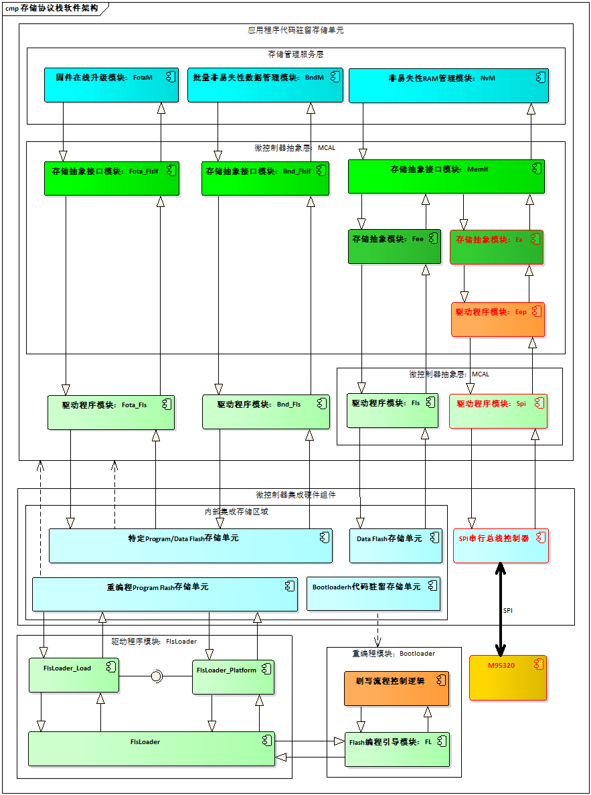

EEPROM抽象(EA)是对设备特定地址结构和分段的抽象，它为上层提供虚拟的地址结构和分段，并提供无限的擦除周期；ECU抽象层中的EA模块是对底层EEPROM设备的抽象。

EEPROM abstraction (EA) is an abstraction of the device-specific address structure and segmentation, providing a virtual address structure and segmentation to the upper layer while offering infinite erase cycles; the EA module in the ECU abstraction layer is an abstraction of the underlying EEPROM device.

.. figure:: ../../_static/参考手册(Module_Reference_Manual)/Ea/image2.png
   :alt: Ea模块在AUTOSAR架构中的位置 (The position of the Ea module in the AUTOSAR architecture)
   :name: Ea模块在AUTOSAR架构中的位置 (The position of the Ea module in the AUTOSAR architecture)
   :align: center

AUTOSAR存储协议栈处于BSW基础软件层，包括存储器驱动层、存储器硬件抽象层、存储器服务层。存储协议栈软件是用来为整车电子模块（ECU）存储非易失性或者标定数据定义一套统一访问内存的服务软件。

AUTOSAR storage protocol stack resides in the BSW基础软件 layer and includes the memory driver layer, memory hardware abstraction layer, and memory service layer. The storage protocol stack software is used to define a unified service software for accessing memory that provides uniform access services for non-volatile or calibration data of vehicle electronic modules (ECUs).

参考资料 (Reference materials)
------------------------------------------

[1] AUTOSAR_SRS_EEPROMDriver.pdf，R19-11

[2] AUTOSAR_SRS_MemoryHWAbstractionLayer.pdf，R19-11

[3] AUTOSAR_SRS_MemoryServices.pdf，R19-11

[4] AUTOSAR_SWS_EEPROMAbstraction.pdf，R19-11

[5] AUTOSAR_SWS_MemoryAbstractionInterface.pdf，R19-11

[6] AUTOSAR_SWS_NVRAMManager.pdf，R19-11

功能描述 (Function Description)
===========================================

Ea功能 (EA Function)
----------------------------------

Ea功能介绍 (Feature Introduction of EA)
===================================================

.. figure:: ../../_static/参考手册(Module_Reference_Manual)/Ea/image3.png
   :alt: 存储协议栈软件架构图 (Storage protocol stack software architecture diagram)
   :name: 存储协议栈软件架构图 (Storage protocol stack software architecture diagram)
   :align: center

存储协议栈软件架构图中的最底层灰色部分为存储栈的硬件控制器，这部分功能属于ECU的内部或外部FLASH（EEPROM）存储器设备，并实现存储栈FLASH或EEPROM数据存储单元的物理存储介质；存储栈软件架构图中的第二层粉红色部分为微控制器抽象层（MCAL），这部分功能属于ECU的内部或外部FLASH（EEPROM）存储器设备抽象层，并实现存储栈FLASH或EEPROM存储设备的硬件控制驱动程序，即直接操作硬件控制器寄存器，提供写入、读取、擦除、比较等API接口给上层FEE或EA模块使用；存储栈软件架构图中的第三层淡绿色部分为存储器抽象层（FEE和EA），这部分功能属于ECU的内部或外部FLASH（EEPROM）存储器设备抽象层，并实现存储栈的存储设备抽象和接口映射，即存储栈抽象层不涉及任何硬件的操作，只是申请对内存进行行为操作的请求与内存地址映射，由MemIf接口层提供统一FLASH或EEPROM内存写入、读取、擦除、比较等接口给存储栈服务层使用，存储栈中所有的状态控制类、操作结果等数据类型也是由MemIf接口层来实现；存储栈软件架构图中的最顶层淡蓝色部分为非易失性存储管理部分，这部分功能属于ECU存储栈非易失性数据管理与维护，并实现存储栈中单个Block或多个Block的数据写入、读取、擦除等API接口，便于存储栈用户使用和对非易失性数据的需求和管理。

The gray part at the lowest layer of the storage protocol stack software architecture diagram is the hardware controller of the storage stack, which belongs to the internal or external Flash (EEPROM) memory devices of ECU and implements the physical storage medium for Flash or EEPROM data storage units; The second layer, light pink in color, represents the Microcontroller Abstraction Layer (MCAL) of the storage stack, which also belongs to the abstract layer of the internal or external Flash (EEPROM) memory devices of ECU, and realizes the hardware control driver programs for storage stack Flash or EEPROM storage devices, i.e., directly operating on the registers of the hardware controller, providing write, read, erase, compare APIs interfaces for the upper-level FEE or EA modules to use; The third layer, light green in color, represents the Memory Abstraction Layer (FEE and EA) of the storage stack, which also belongs to the abstract layer of the internal or external Flash (EEPROM) memory devices of ECU, and realizes the abstraction and interface mapping of storage devices for the storage stack. The Storage Stack Abstraction Layer does not involve any hardware operations; it only requests permission to perform behavior actions on memory and address mappings, with MemIf Interface Layer providing unified FLASH or EEPROM memory write, read, erase, compare interfaces for use by the storage stack service layer. All state control classes, operation results, and data types in the storage stack are also realized by the MemIf Interface Layer; The light blue part at the topmost layer of the storage protocol stack software architecture diagram represents the Non-Volatile Memory Management section, which belongs to the non-volatile data management and maintenance of ECU's storage stack. It realizes APIs for data write, read, erase, etc., in single or multiple blocks within the storage stack, facilitating use by storage stack users and managing their needs and requirements for non-volatile data.

Ea功能实现 (Ea functionality implementation)
========================================================

EEPROM抽象(EA)是对设备特定地址结构和分段的抽象，它为上层提供虚拟的地址结构和分段，并提供无限的擦除周期；ECU抽象层中的EA模块是对底层EEPROM设备的抽象。用户能访问到的存储器API都是针对EEPROM的；EA不直接操作硬件，所有硬件操作由EEPROM驱动模块完成。EA的主要工作是对EEPROM内存块进行逻辑块的划分（逻辑块的大小根据配置可能不同），以及地址映射。EA的读取、写入、擦除的最小单位为逻辑块。

EEPROM abstraction (EA) is an abstraction of the device-specific address structure and segmentation, providing a virtual address structure and segmentation to the upper layer while offering infinite erase cycles; the EA module in the ECU abstraction layer is an abstraction of the underlying EEPROM device. All memory APIs accessible to users are targeted at EEPROM; EA does not directly manipulate hardware, with all hardware operations being handled by the EEPROM driver module. The primary function of EA is to divide EEPROM memory blocks into logical blocks (the size of which may vary according to configuration) and perform address mapping. The minimum units for EA's read, write, and erase operations are logical blocks.

EEPROM抽象(EA)一次只能接受一个作业任务，即模块不能为挂起的作业提供队列(这是NVRAM管理器的工作)；因为NvM是这个模块的唯一调用者，为了保持这个模块足够小，模块函数不应该检查模块当前是否繁忙；NvM的职责是序列化挂起的作业，并且只在前一个作业完成或取消后启动新作业。

EEPROM abstraction (EA) can only accept one job task at a time, i.e., the module cannot provide a queue for suspended jobs (this is the work of the NVRAM manager); since NvM is the sole caller of this module, to keep the module small, module functions should not check if the module is currently busy; it is NvM's responsibility to serialize suspended jobs and only start new jobs after the previous job has completed or been canceled.

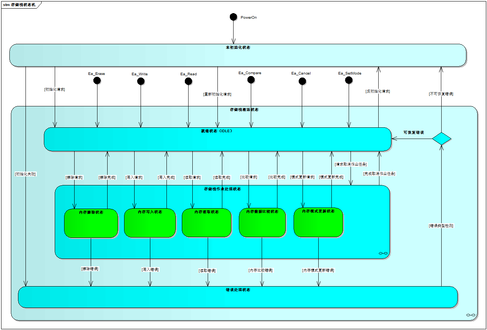

地址分割和分段 (Address Segmentation and Slicing)
----------------------------------------------------------

EEPROM抽象为上层提供了32位虚拟线性地址空间和均匀分割方案。这个虚拟32位地址由：

Erase abstracts provide a 32-bit virtual linear address space and a uniform partitioning scheme for the upper layers. This virtual 32-bit address consists of:

- 一个16位逻辑块编号：允许逻辑块的(理论上的)数目为65536；

A 16-bit logical block number: allows for a theoretical number of logical blocks up to 65536;

- 16位逻辑块偏移量：允许每个逻辑块的(理论上的)块大小为64K字节；

16-bit logical block offset: allows a theoretical block size of 64K bytes for each logical block;

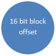

16位逻辑块编号表示一个可配置(虚拟)分页机制。此地址对齐的值可以从底层EEPROM驱动程序和设备的值派生。

16-bit logical block number indicates a configurable (virtual) paging mechanism. This address-aligned value can be derived from the values of the underlying EEPROM driver and device.

备注：虚拟Page页可以通过参数EA_VIRTUAL_PAGE_SIZE进行配置。

Note: Virtual Page pages can be configured using the parameter EA_VIRTUAL_PAGE_SIZE.

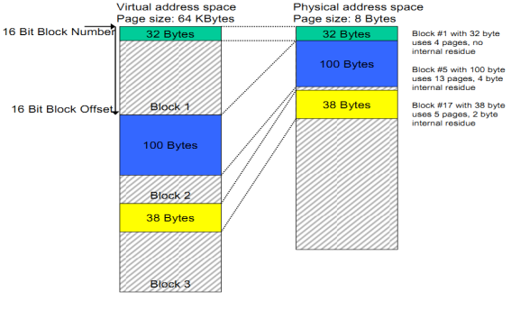

地址计算 (Address Calculation)
------------------------------------------

根据EA模块的实现和所使用的确切地址格式，EA模块的功能将组合16位逻辑块编号和16位逻辑块偏移，以得到底层EEPROM驱动器所需的物理EEPROM存储单元地址；只有16位逻辑块编号中的那些位，它们不表示特定的数据集或用于地址计算的冗余拷贝应使用。

Based on the implementation of the EA module and the exact address format used, the EA module functions by combining a 16-bit logical block number and a 16-bit logical block offset to obtain the physical EEPROM storage unit address required by the underlying EEPROM driver; only those bits in the 16-bit logical block number that do not represent a specific dataset or redundant copies for address calculation should be used.

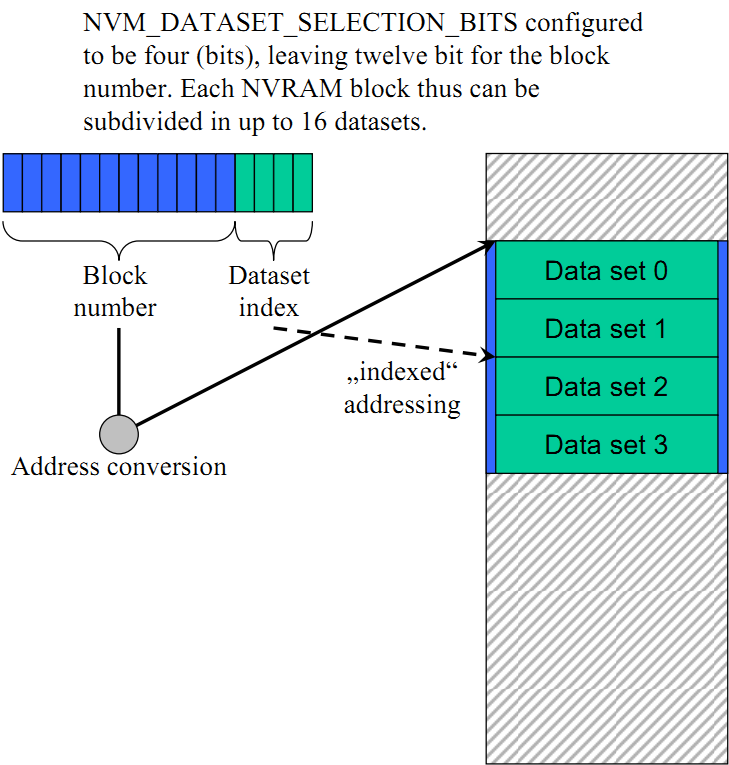

擦除周期限制 (Erase cycle limit)
------------------------------------------

EA模块的配置必须在配置参数EaNumberOfWriteCycles中定义每个逻辑块所期望的擦擦/写入操作周期；如果下层EEPROM设备或者设备驱动不提供配置每个物理存储单元的最小擦除/写入周期数。

The configuration of the EA module must define in the configuration parameter EaNumberOfWriteCycles the expected number of erase/write cycles for each logical block; if the underlying EEPROM device or device driver does not provide configuration of the minimum erase/write cycle count for each physical storage unit.

立即数处理 (Immediate handling)
------------------------------------------

必须立即写入包含即时数据的块，即EA模块必须确保它可以写入这样的块，而不需要擦除对应的存储区（例如通过使用预先擦除的存储器），并且写入请求不是由于目前正在运行的模块内部管理操作延迟。

Blocks containing current data must be written to immediately, meaning the EA module must ensure it can write such blocks without erasing the corresponding storage areas (e.g., by using pre-erased memory), and the write requests are not due to delays in operations currently managed internally by the running module.

管理逻辑块正确性信息 (Correctness information for management logic blocks)
--------------------------------------------------------------------------------

Ea模块应该从EA模块的角度来管理每个块的信息，即该块是否为“有效”。该一致性信息仅涉及块的内部处理，而不涉及块的内容；当块写入操作启动时，Ea模块将相应的块标记为不一致。在块写入操作成功结束后，Ea模块应将块标记为一致（再次）。

The Ea module should manage the information of each block from the perspective of the EA module, i.e., whether the block is "valid". This consistency information only concerns internal handling of the block and not its content; when a write operation to the block starts, the Ea module will mark the corresponding block as inconsistent. After a successful end of the block write operation, the Ea module should mark the block as consistent (again).

.. _section-1:

源文件描述 (Source file description)
===============================================

.. centered:: **表 EA组件文件描述 (Table EA Component File Description)**

.. list-table::
   :widths: 50 50
   :header-rows: 1

   * - 文件 (Files)
     - 说明 (Description)
   * - Ea_cfg.h
     - 定义EA模块预编译时用到的配置参数。 (Define configuration parameters for the EA module pre-compilation.)
   * - 
     - 定义数据结构，结构体，可配置参数，设置在预编译阶段需要用到的配置参数；包含需要使用的配置宏定义；包含项目所需的常量宏定义、开关宏定义 (Define data structures, structs, configurable parameters; include configuration macro definitions needed in the pre-compile stage; include constant and switch macro definitions required by the project)
   * - Ea_cfg.c
     - 定义EA模块中连接时用到的配置参数。 (Define configuration parameters used for connections in the EA module.)
   * - Ea.h
     - EA模块头文件，包含了API函数的扩展声明并定义了端口的数据结构。 (EA module header file, contains extended declarations of API functions and defines the data structure of ports.)
   * - Ea.c
     - EA模块源文件，包含了API函数的实现。 (Source files for the EA module, contain the implementation of API functions.)
   * - Ea_Types.h
     - 包含EA模块的类型定义 (Type definitions containing EA module)
   * - Ea_MemMap.h
     - 包含Ea模块的内存抽象 (Abstract memory containing the Ea module)

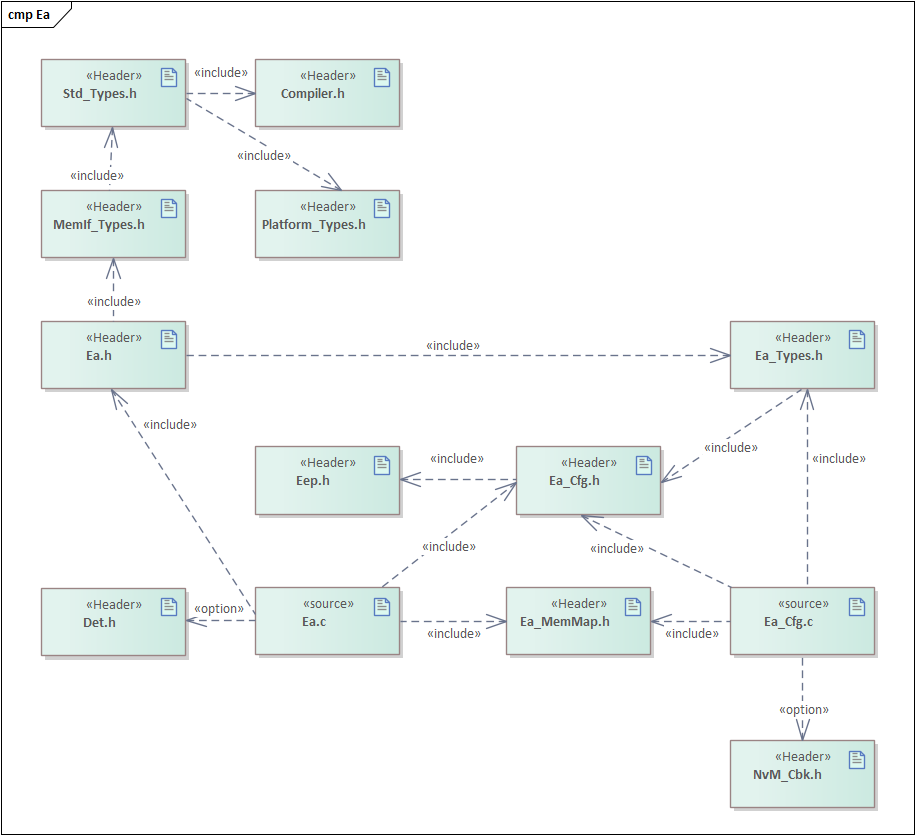

API接口 (API Interface)
=====================================

类型定义 (Type definition)
--------------------------------------

Ea_ConfigType类型定义 (Definition of Ea_ConfigType Type)
====================================================================

.. list-table::
   :widths: 50 50
   :header-rows: 1

   * - 名称 (Name)
     - Ea_ConfigType
   * - 类型 (Type)
     - Structure
   * - 范围 (Range)
     - 无
   * - 描述 (Description)
     - Ea模块的配置数据结构。 (Configuration data structure of the Ea module.)

输入函数描述 (Describe the input function:)
-----------------------------------------------------

.. list-table::
   :widths: 50 50
   :header-rows: 1

   * - 输入模块 (Input Module)
     - API
   * - Eep
     - Eep_Cancel
   * - Eep
     - Eep_Erase
   * - Eep
     - Eep_Write
   * - Eep
     - Eep_Read
   * - Eep
     - Eep_SetMode
   * - Eep
     - Eep_GetStatus
   * - Eep
     - Eep_GetJobResult
   * - Det
     - Det_ReportError
   * - Det
     - Det_ReportRuntimeError

静态接口函数定义 (Static interface function definition)
---------------------------------------------------------------

Ea_Init函数定义 (The Ea_Init function defines)
==========================================================

.. list-table::
   :widths: 25 25 25 25
   :header-rows: 1

   * - 函数名称： (Function Name:)
     - Ea_Init
     - 
     - 
   * - 函数原型： (Function prototype:)
     - FUNC(void, EA_PUBLIC_CODE)Ea_Init(P2CONST(Ea_ConfigType,EA_VAR, EA_CONST) ConfigPtr)
     - 
     - 
   * - 服务编号： (Service Number:)
     - 0x00
     - 
     - 
   * - 同步/异步： (Synchronous/asynchronous:)
     - 同步 (Sync)
     - 
     - 
   * - 是否可重入： (Is Reentrant:)
     - 不可重入 (Non-reentrant)
     - 
     - 
   * - 输入参数： (Input parameters:)
     - ConfigPtr：指向EA模块配置结构的指针 (ConfigPtr：a pointer to the EA module configuration structure)
     - 值域： (Domain:)
     - 无
   * - 输入输出参数： (Input Output Parameters:)
     - 无
     - 
     - 
   * - 输出参数： (Output Parameters:)
     - 无
     - 
     - 
   * - 返回值： (Return Value:)
     - 无
     - 
     - 
   * - 功能概述： (Function Overview:)
     - 初始化EA模块变量和配置参数，并对EEPROM抽象模块进行初始化 (Initialize EA module variables and configuration parameters, and initialize the EEPROM abstract module.)
     - 
     - 

Ea_Read函数定义 (Definition of Ea_Read function)
============================================================

.. list-table::
   :widths: 25 25 25 25
   :header-rows: 1

   * - 函数名称： (Function Name:)
     - Ea_Read
     - 
     - 
   * - 函数原型： (Function prototype:)
     - FUNC(Std_ReturnType, EA_PUBLIC_CODE)Ea_Read
     - 
     - 
   * - 
     - (
     - 
     - 
   * - 
     - uint16 BlockNumber,
     - 
     - 
   * - 
     - uint16 BlockOffset,
     - 
     - 
   * - 
     - P2VAR(uint8, EA_VAR, EA_VAR)DataBufferPtr,
     - 
     - 
   * - 
     - uint16 Length
     - 
     - 
   * - 
     - );
     - 
     - 
   * - 服务编号： (Service Number:)
     - 0x02
     - 
     - 
   * - 同步/异步： (Synchronous/asynchronous:)
     - 异步 (Asynchronous)
     - 
     - 
   * - 是否可重入： (Is Reentrant:)
     - 不可重入 (Non-reentrant)
     - 
     - 
   * - 输入参数： (Input parameters:)
     - BlockNumber：逻辑块序列编号 (BlockNumber：Logical Block Sequence Number)
     - 值域： (Domain:)
     - 0-65535
   * - 
     - BlockOffset：逻辑块偏移地址 (BlockOffset：Logical block offset address)
     - 值域： (Domain:)
     - 0-65535
   * - 
     - Length：读取数据的字节数量 (Bytes read: 阅读数据的数量)
     - 值域： (Domain:)
     - 0-65535
   * - 输入输出参数： (Input Output Parameters:)
     - 无
     - 
     - 
   * - 输出参数： (Output Parameters:)
     - DataBufferPtr：指向读取数据缓冲区的指针 (DataBufferPtr：a pointer to the read data buffer)
     - 值域： (Domain:)
     - 无
   * - 返回值： (Return Value:)
     - Std_ReturnType：
     - 
     - 
   * - 
     - E_OK：请求的作业任务已经被接受 (E_OK: The requested job task has been accepted)
     - 
     - 
   * - 
     - E_NOT_OK：请求的作业任务没有被接受 (E_NOT_OK: The requested job task was not accepted.)
     - 
     - 
   * - 功能概述： (Function Overview:)
     - 从逻辑块编号和偏移地址的EEPROM存储单元中读取Length个字节的数据到指定的DataBufferPtr数据缓冲区中。 (Read Length bytes of data from the EEPROM storage unit into the specified DataBufferPtr data buffer based on the logical block number and offset address.)
     - 
     - 

Ea_Write函数定义 (Definition of Ea_Write function)
==============================================================

.. list-table::
   :widths: 25 25 25 25
   :header-rows: 1

   * - 函数名称： (Function Name:)
     - Ea_Write
     - 
     - 
   * - 函数原型： (Function prototype:)
     - FUNC(Std_ReturnType, EA_PUBLIC_CODE)Ea_Write
     - 
     - 
   * - 
     - (
     - 
     - 
   * - 
     - uint16 BlockNumber,
     - 
     - 
   * - 
     - P2CONST(uint8, EA_VAR, EA_CONST)DataBufferPtr
     - 
     - 
   * - 
     - );
     - 
     - 
   * - 服务编号： (Service Number:)
     - 0x03
     - 
     - 
   * - 同步/异步： (Synchronous/asynchronous:)
     - 异步 (Asynchronous)
     - 
     - 
   * - 是否可重入： (Is Reentrant:)
     - 不可重入 (Non-reentrant)
     - 
     - 
   * - 输入参数： (Input parameters:)
     - BlockNumber：逻辑块序列编号 (BlockNumber：Logical Block Sequence Number)
     - 值域： (Domain:)
     - 0-65535
   * - 
     - DataBufferPtr：指向写入数据缓冲区的指针 (DataBufferPtr: Pointer to the write data buffer)
     - 值域： (Domain:)
     - 无
   * - 输入输出参数： (Input Output Parameters:)
     - 无
     - 
     - 
   * - 输出参数： (Output Parameters:)
     - 无
     - 
     - 
   * - 返回值： (Return Value:)
     - Std_ReturnType：
     - 
     - 
   * - 
     - E_OK：请求的作业任务已经被接受 (E_OK: The requested job task has been accepted)
     - 
     - 
   * - 
     - E_NOT_OK：请求的作业任务没有被接受 (E_NOT_OK: The requested job task was not accepted.)
     - 
     - 
   * - 功能概述： (Function Overview:)
     - 用于将DataBufferPtr指定缓冲区的字节数据写入到BlockNumber逻辑块编号规定的EEPROM存储单元中。 (Write the byte data of the specified buffer buffer by DataBufferPtr into the EEPROM storage unit specified by the logical block number BlockNumber.)
     - 
     - 

Ea_InvalidateBlock函数定义 (The Ea_InvalidateBlock function definition)
===================================================================================

.. list-table::
   :widths: 25 25 25 25
   :header-rows: 1

   * - 函数名称： (Function Name:)
     - Ea_InvalidateBlock
     - 
     - 
   * - 函数原型： (Function prototype:)
     - FUNC(Std_ReturnType, EA_PUBLIC_CODE)Ea_InvalidateBlock(uint16BlockNumber)
     - 
     - 
   * - 服务编号： (Service Number:)
     - 0x07
     - 
     - 
   * - 同步/异步： (Synchronous/asynchronous:)
     - 异步 (Asynchronous)
     - 
     - 
   * - 是否可重入： (Is Reentrant:)
     - 不可重入 (Non-reentrant)
     - 
     - 
   * - 输入参数： (Input parameters:)
     - BlockNumber：逻辑块序列编号 (BlockNumber：Logical Block Sequence Number)
     - 值域： (Domain:)
     - 0-65535
   * - 输入输出参数： (Input Output Parameters:)
     - 无
     - 
     - 
   * - 输出参数： (Output Parameters:)
     - 无
     - 
     - 
   * - 返回值： (Return Value:)
     - Std_ReturnType：
     - 
     - 
   * - 
     - E_OK：请求的作业任务已经被接受 (E_OK: The requested job task has been accepted)
     - 
     - 
   * - 
     - E_NOT_OK：请求的作业任务没有被接受 (E_NOT_OK: The requested job task was not accepted.)
     - 
     - 
   * - 功能概述： (Function Overview:)
     - 根据逻辑块编号设置对应的逻辑块为无效 (Set the corresponding logical block to invalid based on the logical block number)
     - 
     - 

Ea_EraseImmediateBlock函数定义 (The Ea_EraseImmediateBlock function definition)
===========================================================================================

.. list-table::
   :widths: 25 25 25 25
   :header-rows: 1

   * - 函数名称： (Function Name:)
     - Ea_EraseImmediateBlock
     - 
     - 
   * - 函数原型： (Function prototype:)
     - FUNC(Std_ReturnType, EA_PUBLIC_CODE)Ea_EraseImmediateBlock(uint16BlockNumber)
     - 
     - 
   * - 服务编号： (Service Number:)
     - 0x09
     - 
     - 
   * - 同步/异步： (Synchronous/asynchronous:)
     - 异步 (Asynchronous)
     - 
     - 
   * - 是否可重入： (Is Reentrant:)
     - 不可重入 (Non-reentrant)
     - 
     - 
   * - 输入参数： (Input parameters:)
     - BlockNumber：逻辑块序列编号 (BlockNumber：Logical Block Sequence Number)
     - 值域： (Domain:)
     - 0-65535
   * - 输入输出参数： (Input Output Parameters:)
     - 无
     - 
     - 
   * - 输出参数： (Output Parameters:)
     - 无
     - 
     - 
   * - 返回值： (Return Value:)
     - Std_ReturnType：
     - 
     - 
   * - 
     - E_OK：请求的作业任务已经被接受 (E_OK: The requested job task has been accepted)
     - 
     - 
   * - 
     - E_NOT_OK：请求的作业任务没有被接受 (E_NOT_OK: The requested job task was not accepted.)
     - 
     - 
   * - 功能概述： (Function Overview:)
     - 根据逻辑块编号擦除对应的逻辑块 (Erase the corresponding logical block according to the logic block number)
     - 
     - 

Ea_Cancel函数定义 (Definition of Ea_Cancel function)
================================================================

.. list-table::
   :widths: 50 50
   :header-rows: 1

   * - 函数名称： (Function Name:)
     - Ea_Cancel
   * - 函数原型： (Function prototype:)
     - FUNC(void, EA_PUBLIC_CODE) Ea_Cancel(void)
   * - 服务编号： (Service Number:)
     - 0x04
   * - 同步/异步： (Synchronous/asynchronous:)
     - 同步 (Sync)
   * - 是否可重入： (Is Reentrant:)
     - 不可重入 (Non-reentrant)
   * - 输入参数： (Input parameters:)
     - 无
   * - 输入输出参数： (Input Output Parameters:)
     - 无
   * - 输出参数： (Output Parameters:)
     - 无
   * - 返回值： (Return Value:)
     - 无
   * - 功能概述： (Function Overview:)
     - 以异步的方式取消正在进行的作业任务 (Cancel ongoing jobs in an asynchronous manner)

Ea_GetStatus函数定义 (The definition of Ea_GetStatus function)
==========================================================================

.. list-table::
   :widths: 50 50
   :header-rows: 1

   * - 函数名称： (Function Name:)
     - Ea_GetStatus
   * - 函数原型： (Function prototype:)
     - FUNC(MemIf_StatusType, EA_PUBLIC_CODE)Ea_GetStatus(void)
   * - 服务编号： (Service Number:)
     - 0x05
   * - 同步/异步： (Synchronous/asynchronous:)
     - 同步 (Sync)
   * - 是否可重入： (Is Reentrant:)
     - 不可重入 (Non-reentrant)
   * - 输入参数： (Input parameters:)
     - 无
   * - 输入输出参数： (Input Output Parameters:)
     - 无
   * - 输出参数： (Output Parameters:)
     - 无
   * - 返回值： (Return Value:)
     - MemIf_StatusType:
   * - 
     - MEMIF_UNINIT:
   * - 
     - EA模块没有被初始化 (The EA module has not been initialized.)
   * - 
     - MEMIF_IDLE:
   * - 
     - EA模块当前处于空闲状态 (The EA module is currently idle.)
   * - 
     - MEMIF_BUSY:
   * - 
     - EA模块当前处于忙状态 (The EA module is currently in a busy state.)
   * - 
     - MEMIF_BUSY_INTERNAL:
   * - 
     - EA模块当前处于内部管理操作的忙状态 (The EA module is currently in a busy state for internal management operations.)
   * - 功能概述： (Function Overview:)
     - 服务用于获取EA模块的当前工作状态 (Service for obtaining the current working status of EA module)

Ea_GetJobResult函数定义 (Definition of Ea_GetJobResult function)
============================================================================

.. list-table::
   :widths: 50 50
   :header-rows: 1

   * - 函数名称： (Function Name:)
     - Ea_GetJobResult
   * - 函数原型： (Function prototype:)
     - FUNC(MemIf_JobResultType, EA_PUBLIC_CODE)Ea_GetJobResult(void)
   * - 服务编号： (Service Number:)
     - 0x06
   * - 同步/异步： (Synchronous/asynchronous:)
     - 同步 (Sync)
   * - 是否可重入： (Is Reentrant:)
     - 不可重入 (Non-reentrant)
   * - 输入参数： (Input parameters:)
     - 无
   * - 输入输出参数： (Input Output Parameters:)
     - 无
   * - 输出参数： (Output Parameters:)
     - 无
   * - 返回值： (Return Value:)
     - MemIf_JobResultType:
   * - 
     - MEMIF_JOB_OK:
   * - 
     - 最后一次的Job作业任务被成功地完成 (The last Job task was successfully completed.)
   * - 
     - MEMIF_JOB_PENDING：
   * - 
     - 最后一次的Job作业任务正在执行等待或当前正处于执行中 (The last Job task is currently executing, waiting, or in progress.)
   * - 
     - MEMIF_JOB_CANCELED:
   * - 
     - 最后一次的Job作业任务被取消 (The last Job task was cancelled.)
   * - 
     - MEMIF_JOB_FAILED:
   * - 
     - 最后一次的Job作业任务没有成功地完成，失败 (The last Job task did not complete successfully, failed)
   * - 
     - MEMIF_BLOCK_INCONSISTENT:
   * - 
     - 被请求的逻辑块是前后矛盾的，也许数据损坏 (The requested logical block is inconsistent, maybe data corruption.)
   * - 
     - MEMIF_BLOCK_INVALID:
   * - 
     - 被请求的逻辑块是无效的，请求操作可能没有被执行 (The requested logical block is invalid, and the request operation may not have been executed.)
   * - 功能概述： (Function Overview:)
     - 服务用于返回最后一次Job作业任务的执行结果 (Service used for returning the result of the last Job task execution.)

Ea_GetVersionInfo函数定义 (The Ea_GetVersionInfo function definition)
=================================================================================

.. list-table::
   :widths: 25 25 25 25
   :header-rows: 1

   * - 函数名称： (Function Name:)
     - Ea_GetVersionInfo
     - 
     - 
   * - 函数原型： (Function prototype:)
     - FUNC(void, EA_PUBLIC_CODE)
     - 
     - 
   * - 
     - Ea_GetVersionInfo(P2VAR(Std_VersionInfoType,AUTOMATIC, EA_APPL_DATA) VersionInfoPtr)
     - 
     - 
   * - 服务编号： (Service Number:)
     - 0x08
     - 
     - 
   * - 同步/异步： (Synchronous/asynchronous:)
     - 同步 (Sync)
     - 
     - 
   * - 是否可重入： (Is Reentrant:)
     - 可重入 (Reentrant)
     - 
     - 
   * - 输入参数： (Input parameters:)
     - 无
     - 
     - 
   * - 输入输出参数： (Input Output Parameters:)
     - 无
     - 
     - 
   * - 输出参数： (Output Parameters:)
     - VersionInfoPtr：指向EA模块软件版本信息的指针 (VersionInfoPtr：a pointer to EA module software version information)
     - 值域： (Domain:)
     - 无
   * - 返回值： (Return Value:)
     - 无
     - 
     - 
   * - 功能概述： (Function Overview:)
     - 服务用于返回EA模块软件版本信息 (Service used to return EA module software version information)
     - 
     - 

Ea_SetMode函数定义 (The Ea_SetMode function defines)
================================================================

.. list-table::
   :widths: 20 20 20 20 20
   :header-rows: 1

   * - 函数名称： (Function Name:)
     - Ea_SetMode
     - 
     - 
     - 
   * - 函数原型： (Function prototype:)
     - FUNC(void,EA_PUBLIC_CODE)Ea_SetMode(MemIf_ModeTypeMode)
     - 
     - 
     - 
   * - 服务编号： (Service Number:)
     - 0x01
     - 
     - 
     - 
   * - 同步/异步： (Synchronous/asynchronous:)
     - 异步 (Asynchronous)
     - 
     - 
     - 
   * - 是否可重入： (Is Reentrant:)
     - 不可重入 (Non-reentrant)
     - 
     - 
     - 
   * - 输入参数： (Input parameters:)
     - Mode
     - 
     - 值域： (Domain:)
     - MEMIF_MODE_SLOW;MEMIF_MODE_FAST
   * - 输入输出参数： (Input Output Parameters:)
     - 无
     - 
     - 
     - 
   * - 输出参数： (Output Parameters:)
     - 无
     - 
     - 值域： (Domain:)
     - 
   * - 返回值： (Return Value:)
     - 无
     - 
     - 
     - 
   * - 功能概述： (Function Overview:)
     - 服务用于设置底层EEPROM驱动程序的模式 (Service for setting the mode of the underlying EEPROM driver)
     - 
     - 
     - 

Ea_JobEndNotification函数定义 (function definition for Ea_JobEndNotification)
=========================================================================================

.. list-table::
   :widths: 50 50
   :header-rows: 1

   * - 函数名称： (Function Name:)
     - Ea_JobEndNotification
   * - 函数原型： (Function prototype:)
     - FUNC(void, EA_PUBLIC_CODE) Ea_JobEndNotification(void)
   * - 服务编号： (Service Number:)
     - 0x10
   * - 同步/异步： (Synchronous/asynchronous:)
     - 同步 (Sync)
   * - 是否可重入： (Is Reentrant:)
     - 不可重入 (Non-reentrant)
   * - 输入参数： (Input parameters:)
     - 无
   * - 输入输出参数： (Input Output Parameters:)
     - 无
   * - 输出参数： (Output Parameters:)
     - 无
   * - 返回值： (Return Value:)
     - 无
   * - 功能概述： (Function Overview:)
     - 任务完成回调；服务用于报告一个异步操作的成功完成通知给该模块 (Task completion callback; the service is used to report a notification of a successful completion of an asynchronous operation to the module)

Ea_JobErrorNotification函数定义 (function Ea_JobErrorNotification())
================================================================================

.. list-table::
   :widths: 50 50
   :header-rows: 1

   * - 函数名称： (Function Name:)
     - Ea_JobErrorNotification
   * - 函数原型： (Function prototype:)
     - FUNC(void, EA_PUBLIC_CODE)Ea_JobErrorNotification(void)
   * - 服务编号： (Service Number:)
     - 0x11
   * - 同步/异步： (Synchronous/asynchronous:)
     - 同步 (Sync)
   * - 是否可重入： (Is Reentrant:)
     - 不可重入 (Non-reentrant)
   * - 输入参数： (Input parameters:)
     - 无
   * - 输入输出参数： (Input Output Parameters:)
     - 无
   * - 输出参数： (Output Parameters:)
     - 无
   * - 返回值： (Return Value:)
     - 无
   * - 功能概述： (Function Overview:)
     - 任务错误回调；服务用于报告一个异步操作的错误通知给该模块 (Task error callback; the service is used to report an asynchronous operation's error notification to the module)

Ea_MainFunction函数定义 (Definition of Ea_MainFunction function)
============================================================================

.. list-table::
   :widths: 50 50
   :header-rows: 1

   * - 函数名称： (Function Name:)
     - Ea_MainFunction
   * - 函数原型： (Function prototype:)
     - FUNC(void, EA_PUBLIC_CODE) Ea_MainFunction(void)
   * - 服务编号： (Service Number:)
     - 0x12
   * - 同步/异步： (Synchronous/asynchronous:)
     - 无
   * - 是否可重入： (Is Reentrant:)
     - 不可重入 (Non-reentrant)
   * - 输入参数： (Input parameters:)
     - 无
   * - 输入输出参数： (Input Output Parameters:)
     - 无
   * - 输出参数： (Output Parameters:)
     - 无
   * - 返回值： (Return Value:)
     - 无
   * - 功能概述： (Function Overview:)
     - 服务用于处理被请求的所有Job作业任务，并对内部的状态机的状态切换操作进行管理 (Services handle all requested Job tasks and manage state transitions of the internal state machine.)

可配置函数定义 (Configurable Function Definition)
----------------------------------------------------------

无

配置 (Configure)
==============================

.. centered:: **表  属性描述 (Table  Property Description)**

.. list-table::
   :widths: 50 50
   :header-rows: 1

   * - UI名称 (UI Name)
     - 该配置项在配置工具界面显示的名称 (The name of this configuration item as displayed in the configuration tool interface)
   * - 取值范围 (Range)
     - 该配置项允许的取值区间 (The configurable item allows value ranges.)
   * - 默认取值 (Default value)
     - 该配置项默认的配置值 (The default configuration value for this option)
   * - 参数描述 (Parameter Description)
     - 该配置项在标准的AUTOSAR_EcucParamDef.arxml文件中的描述 (This configuration item's description in the standard AUTOSAR_EcucParamDef.arxml file.)
   * - 依赖关系 (Dependencies)
     - 该配置项与其他模块或配置项的关系 (The configuration item's relationship with other modules or configuration items)

EaGeneral配置 (Configuration of EaGeneral)
--------------------------------------------------------

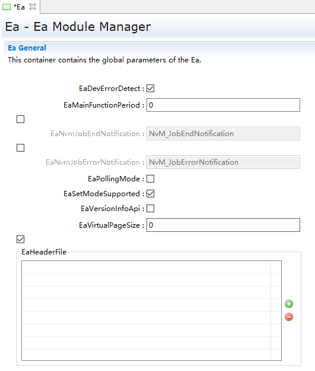

.. centered:: **表 Ea模块的General配置属性描述 (Description of General Configuration Properties for Ea Module)**

.. list-table::
   :widths: 20 20 20 20 20
   :header-rows: 1

   * - UI名称 (UI Name)
     - 描述 (Description)
     - 
     - 
     - 
   * - EaDevErrorDetect
     - 取值范围 (Range)
     - STD_ON, STD_OFF
     - 默认取值 (Default value)
     - STD_OFF
   * - 
     - 
     - 是否开启对开发过程中错误的检查； (Is error checking during development processes enabled?)
     - 
     -
   * - 
     - 
     - 打开或关闭开发错误检测和通知。 (Enable or disable development error detection and notifications.)
     - 
     - 
   * - EaMainFunctionPeriod
     - 取值范围 (Range)
     - 0…4294967295
     - 默认取值 (Default value)
     - 0
   * - 
     - 参数描述 (Parameter Description)
     - 周期任务调度的时间基准 (The time baseline for periodic task scheduling)
     - 
     -
   * - 
     - 依赖关系 (Dependencies)
     - 依赖于BSWM和OS模块的任务调度管理 (Task scheduling management depending on BSWM and OS modules)
     - 
     - 
   * - EaNvmJobEndNotification
     - 取值范围 (Range)
     - 回调函数名或空指针 (Callback function name or null pointer)
     - 默认取值 (Default value)
     - NULL_PTR
   * - 
     - 
     - 映射到上层模块提供的作业结束通知例程 (Map to the job completion notification routine provided by the upper-layer module)
     - 
     -
   * - 
     - 
     - (NvM_JobEndNotification)
     - 
     -
   * - 
     - 
     - 依赖于NVM和EA模块之间作业任务的交互关系 (Dependent on the interaction relationship between tasks in NVM and EA modules)
     - 
     -
   * - 
     - 依赖关系 (Dependencies)
     - 轮询模式：此配置项没有任何作用 (Polling Mode: This configuration item has no effect.)
     - 
     -
   * - 
     - 
     - 中断通知模式：调用Read/Write/Erase等Api接口之后，执行的回调函数。 (Interrupt Notification Mode: Callback functions executed after calling Read/Write/Erase etc. API interfaces.)
     - 
     - 
   * - EaNvmJobErrorNotification
     - 取值范围 (Range)
     - 回调函数名或空指针 (Callback function name or null pointer)
     - 默认取值 (Default value)
     - NULL_PTR
   * - 
     - 
     - 映射到上层模块提供的作业错误通知例程 (Map to the job error notification routine provided by the upper-layer module)
     - 
     -
   * - 
     - 
     - (NvM_JobErrorNotification)
     - 
     -
   * - 
     - 
     - 依赖于NVM和EA模块之间作业任务的交互关系 (Dependent on the interaction relationship between tasks in NVM and EA modules)
     - 
     -
   * - 
     - 依赖关系 (Dependencies)
     - 轮询模式：此配置项没有任何作用 (Polling Mode: This configuration item has no effect.)
     - 
     -
   * - 
     - 
     - 中断通知模式：调用Read/Write/Erase等Api接口之后，执行的回调函数。 (Interrupt Notification Mode: Callback functions executed after calling Read/Write/Erase etc. API interfaces.)
     - 
     - 
   * - EaPollingMode
     - 取值范围 (Range)
     - STD_ON, STD_OFF
     - 默认取值 (Default value)
     - STD_OFF
   * - 
     - 
     - 预处理器开关，用于使能和禁止该模块的轮询模式 (Preprocessor switch for enabling and disabling the polling mode of this module)
     - 
     -
   * - 
     - 
     - 查看任务执行结果的方式，该方式有Polling或 (The way to check task execution results is through Polling or)
     - 
     -
   * - 
     - 
     - Callback   Notication。若配置Polling，则需要一直通过 (Callback Notification。 If configured, polling is required to continuously check for updates.)
     - 
     -
   * - 
     - 
     - Ea_GetJobResult查看当前任务的结果，确认任务是否执行完毕。若选取其他方式，则在任务执行完毕后，自动调用回调函数。 (Check Ea_GetJobResult for the current task's result to confirm if the task has been completed. If another method is selected, the callback function will be automatically called upon completion of the task.)
     - 
     -
   * - 
     - 依赖关系 (Dependencies)
     - 依赖于EEP和EA模块之间作业任务的交互关系 (Dependent on the interaction relationship between tasks in EEP and EA modules)
     - 
     - 
   * - EaSetModeSupported
     - 取值范围 (Range)
     - STD_ON, STD_OFF
     - 默认取值 (Default value)
     - STD_OFF
   * - 
     - 参数描述 (Parameter Description)
     - 编译宏开关用于打开/关闭API接口Ea_SetMode功能 (Compile macro switch is used to enable/disenable the Ea_SetMode API interface)
     - 
     -
   * - 
     - 依赖关系 (Dependencies)
     - 无
     - 
     - 
   * - EaVersionInfoApi
     - 取值范围 (Range)
     - STD_ON, STD_OFF
     - 默认取值 (Default value)
     - STD_OFF
   * - 
     - 参数描述 (Parameter Description)
     - 预处理器开关，使能/禁止版本检测API接口，以读出模块的版本信息；是否在编译时，查看配置文件，源文件的版本信息是否一致。 (Preprocessor switch to enable/disable version detection API interfaces for reading module version information; whether to check if the configuration file and source file versions are consistent at compile time.)
     - 
     -
   * - 
     - 依赖关系 (Dependencies)
     - 无
     - 
     - 
   * - EaVirtualPageSize
     - 取值范围 (Range)
     - 0…255
     - 默认取值 (Default value)
     - 0
   * - 
     - 参数描述 (Parameter Description)
     - 逻辑块需要对齐的大小(以字节为单位) (The size (in bytes) that the logical block needs to be aligned)
     - 
     -
   * - 
     - 依赖关系 (Dependencies)
     - 依赖于实际物理EEPROM存储芯片的物理特性 (Based on the physical characteristics of actual physical EEPROM storage chips.)
     - 
     - 
   * - EaHeaderFile
     - 取值范围 (Range)
     - 配置属性0-N，配置类型string (Configure property 0-N, Configure type string)
     - 默认取值 (Default value)
     - 无
   * - 
     - 参数描述 (Parameter Description)
     - 定义回调函数的头文件 (Header file for defining callback functions)
     - 
     -
   * - 
     - 依赖关系 (Dependencies)
     - 回调函数声明的头文件名 (Header file name for callback function declaration)
     - 
     - 

EaBlockConfigurations配置 (EaBlockConfigurations Configurations)
------------------------------------------------------------------------------

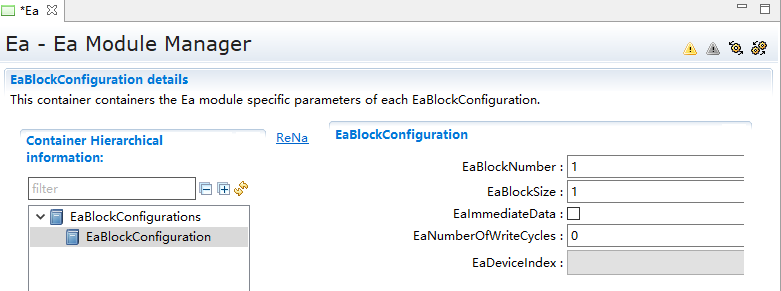

.. centered:: **表 Ea模块的EaBlockConfigurations配置属性描述 (The EaBlockConfigurations configuration property of the Ea module describes)**

.. list-table::
   :widths: 15 15 14 14 14 14 14
   :header-rows: 1

   * - UI名称 (UI Name)
     - 描述 (Description)
     - 
     - 
     - 
     - 
     - 
   * - EaBlockNumber
     - 取值范围 (Range)
     - 1 ... 65534
     - 
     - 默认取值 (Default value)
     - 
     - 1
   * - 
     - 参数描述 (Parameter Description)
     - 块号。 (Block number.)
     - 
     - 
     - 
     - 
   * - 
     - 
     - 0x0000 and 0xFFFFshall not be used forblock numbers (see
     - 
     - 
     - 
     - 
   * - 
     - 
     - SWS_Ea_00006).
     - 
     - 
     - 
     - 
   * - 
     - 依赖关系 (Dependencies)
     - 需要与NVM中配置的块号匹配 (Need to match with the block number configured in NVM)
     - 
     - 
     - 
     - 
   * - EaBlockSize
     - 取值范围 (Range)
     - 1 ... 65535
     - 
     - 默认取值 (Default value)
     - 
     - 1
   * - 
     - 参数描述 (Parameter Description)
     - 块数据大小，填写时未包含块头，生成时包含块头 (Block data size, do not include block header when filling, include block header when generating)
     - 
     - 
     - 
     - 
   * - 
     - 依赖关系 (Dependencies)
     - 需要与上层NVM模块的配置大小匹配 (Need to match the configuration size with the upper NVM module.)
     - 
     - 
     - 
     - 
   * - EaImmediateData
     - 取值范围 (Range)
     - TRUE/FALSE
     - 
     - 默认取值 (Default value)
     - 
     - FALSE
   * - 
     - 参数描述 (Parameter Description)
     - 立即数使能开关 (Enable Switch for Immediate Numbers)
     - 
     - 
     - 
     - 
   * - 
     - 依赖关系 (Dependencies)
     - 无
     - 
     - 
     - 
     - 
   * - EaNumberOfWriteCycles
     - 取值范围 (Range)
     - 0 … 4294967295
     - 
     - 默认取值 (Default value)
     - 
     - 0
   * - 
     - 参数描述 (Parameter Description)
     - 块最大写次数 (Maximum number of writes per block)
     - 
     - 
     - 
     - 
   * - 
     - 依赖关系 (Dependencies)
     - 无
     - 
     - 
     - 
     - 
   * - EaDeviceIndex
     - 取值范围 (Range)
     - Symbolic namereference to [EepGeneral ]
     - 
     - 默认取值 (Default value)
     - 
     - 无
   * - 
     - 参数描述 (Parameter Description)
     - 底层驱动索引 (Low-level driver index)
     - 
     - 
     - 
     - 
   * - 
     - 依赖关系 (Dependencies)
     - 无
     - 
     - 
     - 
     - 

Ea_EepApi配置 (Configuring Ea_EepApi)
---------------------------------------------------

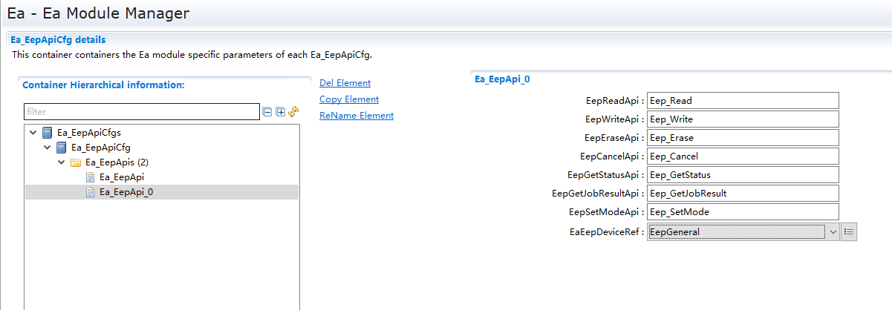

.. centered:: **表 Ea模块的Ea_EepApi配置属性描述 (Description of the configuration properties for Ea_EepApi in module Ea Modules)**

.. list-table::
   :widths: 20 20 20 20 20
   :header-rows: 1

   * - UI名称 (UI Name)
     - 描述 (Description)
     - 
     - 
     - 
   * - EaEepDeviceRef
     - 取值范围 (Range)
     - Symbolic name   reference to [ EepGeneral ]
     - 默认取值 (Default value)
     - 无
   * -
     - 
     - 底层驱动索引 (Low-level driver index)
     - 
     - 
   * -
     - 
     - 无
     - 
     - 
   * - EepWriteApi
     - 取值范围 (Range)
     - String
     - 
     - 
   * -
     - 参数描述 (Parameter Description)
     - EEP驱动写接口 (EEPROM Drive Write Interface)
     - 
     - 
   * -
     - 
     - 依赖于底层Eep存储设备驱动程序的实现 (Dependent on the implementation of the underlying Eep storage device driver)
     - 
     - 
   * - EepEraseApi
     - 
     - String
     - 
     - 
   * -
     - 参数描述 (Parameter Description)
     - EEP驱动擦除接口 (EEP Drive Erase Interface)
     - 
     - 
   * -
     - 依赖关系 (Dependencies)
     - 依赖于底层Eep存储设备驱动程序的实现 (Dependent on the implementation of the underlying Eep storage device driver)
     - 
     - 
   * - EepCancelApi
     - 
     - String
     - 
     - 
   * -
     - 
     - EEP驱动任务取消接口 (EEP Drive Task Cancel Interface)
     - 
     - 
   * -
     - 依赖关系 (Dependencies)
     - 依赖于底层Eep存储设备驱动程序的实现 (Dependent on the implementation of the underlying Eep storage device driver)
     - 
     - 
   * - EepGetStatusApi
     - 取值范围 (Range)
     - String
     - 默认取值 (Default value)
     - Eep_GetStatus
   * -
     - 参数描述 (Parameter Description)
     - EEP驱动获取模块状态接口 (EEP Drive Acquisition Module Status Interface)
     - 
     - 
   * -
     - 依赖关系 (Dependencies)
     - 依赖于底层Eep存储设备驱动程序的实现 (Dependent on the implementation of the underlying Eep storage device driver)
     - 
     - 
   * - EepGetJobResultApi
     - 取值范围 (Range)
     - String
     - 默认取值 (Default value)
     - Eep_GetJobResult
   * -
     - 参数描述 (Parameter Description)
     - 该参数用于定义EaEepApi模块的Up_GetJobResult函数名 (This parameter is used to define the function name of Up_GetJobResult in the EaEepApi module.)
     - 
     - 
   * -
     - 依赖关系 (Dependencies)
     - EEP驱动获取任务结果接口 (EEP Driver Task Result Interface)
     - 
     - 
   * - EepSetModeApi
     - 取值范围 (Range)
     - String
     - 默认取值 (Default value)
     - Eep_SetMode
   * -
     - 参数描述 (Parameter Description)
     - EEP驱动设置模式接口 (EEP Drive Setting Mode Interface)
     - 
     - 
   * -
     - 依赖关系 (Dependencies)
     - 依赖于底层Eep存储设备驱动程序的实现 (Dependent on the implementation of the underlying Eep storage device driver)
     - 
     - 
   * - EepReadApi
     - 取值范围 (Range)
     - String
     - 默认取值 (Default value)
     - Eep_Read
   * -
     - 参数描述 (Parameter Description)
     - EEP驱动读取接口 (EEPROM Drive Read Interface)
     - 
     - 
   * -
     - 依赖关系 (Dependencies)
     - 依赖于底层Eep存储设备驱动程序的实现 (Dependent on the implementation of the underlying Eep storage device driver)
     - 
     - 

EaPublishedInformation配置 (Configuration for Published Information)
----------------------------------------------------------------------------------

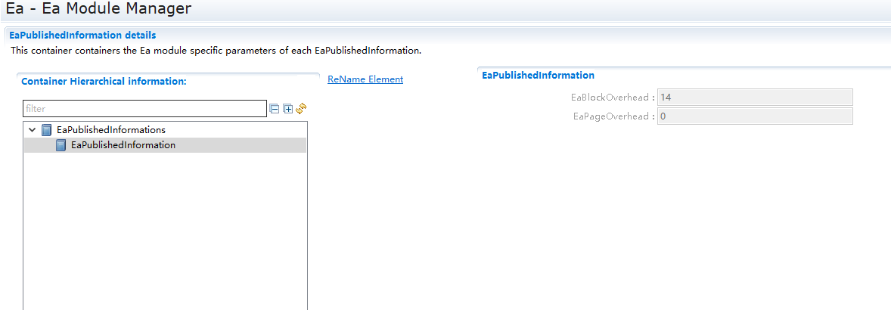

.. centered:: **表 Ea模块的PublishedInformation配置属性描述 (The PublishedInformation configuration property description for module Ea)**

.. list-table::
   :widths: 20 20 20 20 20
   :header-rows: 1

   * - UI名称 (UI Name)
     - 描述 (Description)
     - 
     - 
     - 
   * - EaBlockOverhead
     - 取值范围 (Range)
     - 0…65535
     - 默认取值 (Default value)
     - 14
   * - 
     - 
     - 每个逻辑块的管理开销(以字节为单位) (Management overhead per logical block (in bytes))
     - 
     -
   * - 
     - 
     - 不可配置，用于显示 (Not configurable, used for display)
     - 
     - 
   * - EaPageOverhead
     - 取值范围 (Range)
     - 0…4294967295
     - 默认取值 (Default value)
     - 0
   * - 
     - 参数描述 (Parameter Description)
     - 每个Page页的管理开销(以字节为单位) (Management overhead per Page (in bytes))
     - 
     -
   * - 
     - 依赖关系 (Dependencies)
     - 不可配置，用于显示 (Not configurable, used for display)
     - 
     - 

附录： (Appendix:)
===============================

集成注意事项：

Integration Notes:

在Ea模块使用过程中，需要使用到下层Eep驱动模块，需要包含第三方驱动程序，会涉及到文件名和类型名字不匹配的问题，所以在EA模块中，始终会包含头文件#include "Eep.h"。

During the use of the Ea module, it is necessary to use the lower-level Eep driver module, which involves including third-party driver programs. This can result in mismatches between file names and type names. Therefore, the Ea module always includes the header file #include "Eep.h".

所以在集成时，需要新建一个Eep.h文件，并在这个文件中做底层驱动的适配，如下图所示：

So when integrating, a new Eep.h file needs to be created, and this file should include the adaptation for the underlying driver, as shown in the following figure:

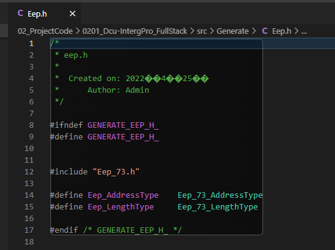
