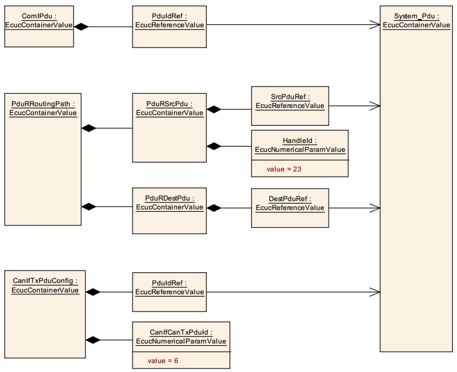
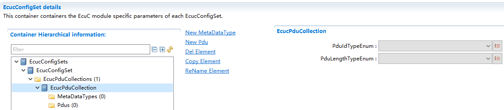
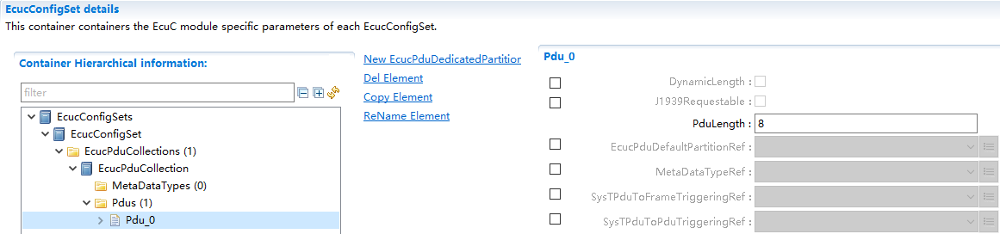
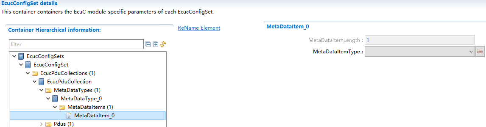

EcuC
#################################

:strong:`缩写词注解 (Abbreviation Notes):`

.. list-table::
   :widths: 34 33 33
   :header-rows: 1

   * - 缩写词 (Abbreviation)
     - 解释/描述 (Explanation/Description)
     - 中文解释 (Chinese explanation)
   * - ECUC
     - ECUConfiguration
     - ECU配置 (ECU Configuration)
   * - PDU
     - Protocol Data Unit
     - 协议数据单元 (Protocol Data Unit)
   * - BSW
     - Basic Software
     - 基础软件 (Basic software)
   * - SW-C
     - Software Component
     - 软件组件 (Software components)

简介 (Introduction)
=================================

EcuC模块用于对Ecu属性进行配置。

The EcuC module is used for configuring Ecu properties.

当前EcuC模块只实现Pdu的配置，除配置Pdu的基本属性（Pdu长度，MetaDataType）外，主要用于确定通信栈、诊断栈、网络管理功能栈等通过PduRef来实现Pdu在各个模块间的传递关系，实现ComStack_Cfg.h文件生成。

Current EcuC module only implements Pdu configuration. Besides configuring basic Pdu properties (Pdu length, MetaDataType), it mainly determines the communication stack, diagnostic stack, network management function stack, etc., through PduRef to achieve the transmission relationship of Pdu among various modules and realize the generation of ComStack_Cfg.h file.

参考资料 (Reference materials)
------------------------------------------

[1] AUTOSAR_TPS_ECUConfiguration.pdf，R19-11

[2] AUTOSAR_SWS_CommunicationStackTypes.pdf，R19_11

功能描述 (Function Description)
===========================================

Pdu基本属性配置功能 (PDU Basic Property Configuration Function)
-----------------------------------------------------------------------

Pdu基本属性配置功能介绍 (Introduction to PDU Basic Attribute Configuration Function)
~~~~~~~~~~~~~~~~~~~~~~~~~~~~~~~~~~~~~~~~~~~~~~~~~~~~~~~~~~~~~~~~~~~~~~~~~~~~~~~~~~~~~~~~~~

在EcuC中对工程所需的所有Pdu进行配置，每个Pdu的配置属性为：MetaDataTypeRef、PduLength。

Configure all Pdus required for the project in ECUC. The configuration attributes of each Pdu are: MetaDataTypeRef, PduLength.

MetaDataType中涉及1-N个MetaDataItem的配置，每个MetaDataItem中配置参数为MetaDataItemLength和MetaDataItemType。

MetadataType involves configuration of 1-N MetaDataItems, where each MetaDataItem is configured with MetaDataItemLength and MetaDataItemType.

以及Pdu关联数据类型的配置：PduIdTypeEnum和PduLengthTypeEnum，这两个配置项决定ComStack_Cfg.h文件的生成。

And the configuration for Pdu association data types: PduIdTypeEnum and PduLengthTypeEnum. These configuration items determine the generation of ComStack_Cfg.h.

Pdu基本属性配置功能实现 (PDU Basic Attribute Configuration Function Implementation)
~~~~~~~~~~~~~~~~~~~~~~~~~~~~~~~~~~~~~~~~~~~~~~~~~~~~~~~~~~~~~~~~~~~~~~~~~~~~~~~~~~~~~~~~~

配置说明详见第5章节。

Configuration instructions are detailed in Chapter 5.

Pdu传递路径确定功能 (PDUs Delivery Path Determination Function)
-----------------------------------------------------------------------

Pdu传递路径确定功能介绍 (Description of the PDU Transfer Path Determination Function)
~~~~~~~~~~~~~~~~~~~~~~~~~~~~~~~~~~~~~~~~~~~~~~~~~~~~~~~~~~~~~~~~~~~~~~~~~~~~~~~~~~~~~~~~~~~

两个模块间通过Pdu配置项PduRef关联到EcuC中配置的同一个Pdu，从而确定Pdu在这两个模块间的传递关系。

Two modules associate with the same PDU configured in ECU-C through the Pdu configuration item PduRef, thereby determining the PDU's transfer relationship between these two modules.

这里以Com中TxPdu经过PduR路由到CanIf模块进行发送为例，参照下图 所示：

Here, as an example, the TxPdu in Com is routed to the CanIf module for transmission, as shown in the following figure:

Pdu传递路径确定功能实现 (PDU transfer path determination function implementation)
~~~~~~~~~~~~~~~~~~~~~~~~~~~~~~~~~~~~~~~~~~~~~~~~~~~~~~~~~~~~~~~~~~~~~~~~~~~~~~~~~~~~~~~

配置时在Com中添加ComIPdu，其PduIdRef关联到EcuC中Pdu0；在PduR中添加一个路由路径，其PduRSrcPdu本地PduId为23，其SrcPduRef关联到EcuC中Pdu0，其PduRDestPdu通过配置项DestPduRef关联到EcuC中Pdu1；在CanIf中添加CanIfTxPdu，其本地PduId为6，其PduIdRef关联到EcuC中Pdu1。

Configure by adding ComIPdu in Com, where PduIdRef associates with Pdu0 in EcuC; add a routing path in PduR, where the local PduId is 23 and SrcPduRef associates with Pdu0 in EcuC, and PduRDestPdu is associated through configuration item DestPduRef to Pdu1 in EcuC; add CanIfTxPdu in CanIf, where the local PduId is 6 and PduIdRef associates with Pdu1 in EcuC.

当Com模块调用PduR_ComTransmit进行Pdu发送时，PduId参数为23，PduR经过路由调用CanIf_Transmit进行Pdu发送，PduId为6。

When the Com module calls PduR_ComTransmit for Pdu transmission, the PduId parameter is 23. PduR then routes the call to CanIf_Transmit for Pdu transmission, with PduId as 6.

源文件描述 (Source file description)
===============================================

无。

None.

API接口 (API Interface)
=====================================

类型定义 (Type definition)
--------------------------------------

无。

None.

输入函数描述 (Describe the input function:)
-----------------------------------------------------

无。

None.

静态接口函数定义 (Static interface function definition)
---------------------------------------------------------------

无。

None.

可配置函数定义 (Configurable Function Definition)
----------------------------------------------------------

无。

None.

配置 (Configure)
==============================

EcucPduCollection
---------------------------------

.. centered:: **表 EcucPduCollection (Table EcucPduCollection)**

.. list-table::
   :widths: 20 20 20 20 20
   :header-rows: 1

   * - UI名称 (UI Name)
     - 描述 (Description)
     - 
     - 
     - 
   * - PduIdTypeEnum
     - 取值范围 (Range)
     - UINT8/UINT16
     - 默认取值 (Default value)
     - 无
   * - 
     - 参数描述 (Parameter Description)
     - Pdu的Index数据类型 (PDU Index Data Type)
     - 
     - 
   * - 
     - 依赖关系 (Dependencies)
     - 依赖于EcuC中配置Pdu的总数;PduIdTypeEnum需要与配置的Pdu数目进行校验 (Dependent on the total number of Pdus configured in EcuC; PduIdTypeEnum needs to be validated against the configured Pdu count.)
     - 
     - 
   * - PduLengthTypeEnum
     - 取值范围 (Range)
     - UINT8/UINT16/UINT32
     - 默认取值 (Default value)
     - 无
   * - 
     - 参数描述 (Parameter Description)
     - Pdu的长度类型 (The length type of Pdu)
     - 
     - 
   * - 
     - 依赖关系 (Dependencies)
     - 依赖于EcuC中配置Pdu的最大长度;PduLengthTypeEnum需要与配置的Pdu最大长度进行校验 (Dependent on the maximum length of Pdu configured in EcuC; PduLengthTypeEnum needs to be validated against the configured Pdu maximum length.)
     - 
     - 

Pdu
-------------------

.. centered:: **表 Pdu (Table Pdu)**

.. list-table::
   :widths: 20 20 20 20 20
   :header-rows: 1

   * - UI名称 (UI Name)
     - 描述 (Description)
     - 
     - 
     - 
   * - PduLength
     - 取值范围 (Range)
     - 0..4294967295
     - 默认取值 (Default value)
     - 8
   * - 
     - 参数描述 (Parameter Description)
     - Pdu的长度/最大长度（动态长度Pdu） (Length of PDU/MAX Length (Dynamic Length PDU))
     - 
     - 
   * - 
     - 依赖关系 (Dependencies)
     - 无
     - 
     - 
   * - MetaDataTypeRef
     - 取值范围 (Range)
     - [索引MetaDataType] ([IndexMetaDataType])
     - 默认取值 (Default value)
     - 无
   * - 
     - 参数描述 (Parameter Description)
     - 关联Pdu的MetaDataType，选择MetaData类型 (Associate the MetaDataType with the MetaData type for the PDU.)
     - 
     - 
   * - 
     - 依赖关系 (Dependencies)
     - 无
     - 
     - 

MetaDataItem
----------------------------

.. centered:: **表 MetaDataItem (Table MetaDataItem)**

.. list-table::
   :widths: 20 20 20 20 20
   :header-rows: 1

   * - UI名称 (UI Name)
     - 描述 (Description)
     - 
     - 
     - 
   * - MetaDataItemLength
     - 取值范围 (Range)
     - 1..8
     - 默认取值 (Default value)
     - 1
   * - 
     - 参数描述 (Parameter Description)
     - 表示MetaData长度 (Indicate MetaData Length)
     - 
     - 
   * - 
     - 依赖关系 (Dependencies)
     - 根据MetaData类型选择，自动生成 (Based on the MetaData type selected, auto-generated.)
     - 
     - 
   * - MetaDataItemType
     - 取值范围 (Range)
     - ADDRESS_EXTENSION_8/CAN_ID_32/
     - 默认取值 (Default value)
     - 无
   * - 
     - 
     - ETHERNET_MAC_64/
     - 
     - 
   * - 
     - 
     - LIN_NAD_8/
     - 
     - 
   * - 
     - 
     - PRIORITY_8/
     - 
     - 
   * - 
     - 
     - SOCKET_CONNECTION_ID_16/
     - 
     - 
   * - 
     - 
     - SOURCE_ADDRESS_16/
     - 
     - 
   * - 
     - 
     - TARGET_ADDRESS_16
     - 
     - 
   * - 
     - 参数描述 (Parameter Description)
     - 表示MetaData类型 (Indicates MetaData Type)
     - 
     - 
   * - 
     - 依赖关系 (Dependencies)
     - 无
     - 
     - 
