EcuM
#################################

简介 (Introduction)
=================================

模式管理属于系统服务栈，在AutoSar R19-11软件层级架构如下图

Model Management belongs to the system service stack. In the AutoSar R19-11 software hierarchical architecture, it is as follows:

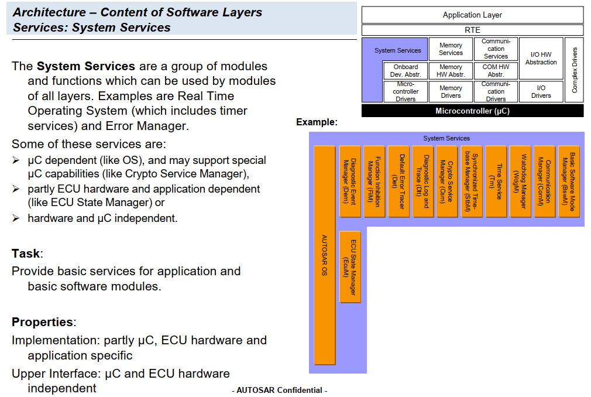

模式管理由BswM与EcuM组成，这两个模块对于Bsw中不同协议栈的串联与Ecu的整体把控紧密相关，其中BswM可以通过配置高度自由实现Bsw中模块的串联工作，EcuM则对Mcu的睡眠唤醒提供支持。

Mode management is composed of BswM and EcuM, two modules closely related to the concatenation of different protocol stacks in Bsw and the overall control of Ecu. Among them, BswM can freely configure the concatenation work of modules in Bsw, while EcuM supports the sleep and wake-up of Mcu.

参考资料 (Reference materials)
------------------------------------------

[1] AUTOSAR_EXP_LayeredSoftwareArchitecture.pdf，R19-11

[2] AUTOSAR_SWS_ECUStateManager.pdf，R19-11

[3] AUTOSAR_SWS_BSWModeManager.pdf，R19-11

[4] AUTOSAR_EXP_ModeManagementGuide.pdf，R19-11

缩写词注解 (Abbreviation Notes)
------------------------------------------

.. list-table::
   :widths: 34 33 33
   :header-rows: 1

   * - 缩写词 (Abbreviation)
     - 解释/描述 (Explanation/Description)
     - 中文解释 (Chinese explanation)
   * - BswM
     - Basic Software ModeManager
     - 基础软件模式管理 (Basic Software Model Management)
   * - EcuM
     - ECU State Manager
     - ECU状态管理 (ECU Status Management)
   * - Wakeup Source
     - The peripheral or ECUcomponent which dealswith wakeup events iscalled a wakeup source
     - 唤醒源 (Wake-up Source)

功能描述 (Function Description)
===========================================

模块初始化功能 (Module initialization function)
--------------------------------------------------------

模块初始化功能介绍 (Module initialization functionality introduction)
~~~~~~~~~~~~~~~~~~~~~~~~~~~~~~~~~~~~~~~~~~~~~~~~~~~~~~~~~~~~~~~~~~~~~~~~~~~~

上电时，EcuM负责基础软件模块的初始化（结合BswM），然后启动Os。

During power-on, EcuM is responsible for initializing basic software modules (in conjunction with BswM), and then starting the Os.

模块初始化功能实现 (Module initialization functionality implementation)
~~~~~~~~~~~~~~~~~~~~~~~~~~~~~~~~~~~~~~~~~~~~~~~~~~~~~~~~~~~~~~~~~~~~~~~~~~~~~~

针对模块初始化工作需要通过EcuM配置实现，初始化列表中的项限定于Autosar中的模块注1初始化列表分为EcuMDriverInitListZero、EcuMDriverInitListOne、EcuMDriverRestartList；其中EcuMDriverInitListZero与EcuMDriverInitListOne两者都在Os启动前进行初始化，意味这这些模块的初始化不能使用Os的任何接口，其中EcuMDriverInitListZero不能使用Post-build为配置参数的模块初始化；两者的初始化列表示例如下图

Module initialization requires configuration through ECUm. Items in the initialization list are limited to module initializations within Autosar, with notes that the initialization lists分为EcuMDriverInitListZero、EcuMDriverInitListOne、EcuMDriverRestartList; where both EcuMDriverInitListZero and EcuMDriverInitListOne are initialized before Os startup, meaning these modules' initialization cannot use any Os interfaces. Among them, EcuMDriverInitListZero cannot initialize modules configured with post-build parameters. The initialization list examples for both are shown in the following figure.

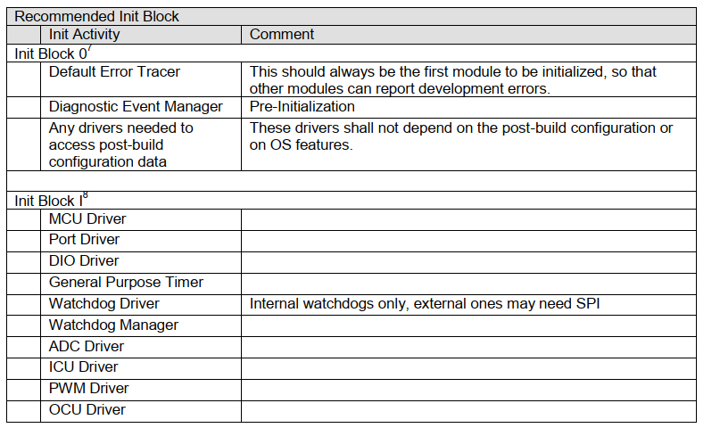

注1：若需要初始化其他模块，需要由修改发布配置工具

Note 1: If initialization of other modules is required, it needs to be done by modifying the release configuration tool.

EcuMDriverRestartList则为唤醒后支持的初始化列表。

EcuMDriverRestartList then serves as the initialization list supported after wake-up.

睡眠唤醒功能 (Sleep Wake-Up Function)
-----------------------------------------------

睡眠唤醒功能介绍 (Introduction to Sleep Wake-Up Function)
~~~~~~~~~~~~~~~~~~~~~~~~~~~~~~~~~~~~~~~~~~~~~~~~~~~~~~~~~~~~~~~~~

睡眠唤醒是常用的Bsw功能之一，此部分功能的处理核心部分在EcuM是实现；对于睡眠唤醒的几种方式描述如下：

Sleep and wake-up are commonly used Bsw functions, with the core implementation of this functionality realized in EcuM; descriptions of the several ways to achieve sleep and wake-up are as follows:

方式一：Mcu休眠，由中断唤醒

Method One: MCU Sleep, Waked Up by Interrupt

方式二：Mcu休眠，但周期性唤醒

 Method Two: MCU Sleeps but Wakes Up Periodically

方式三：Mcu掉电，由外部设备检测到唤醒事件直接给Mcu供电

 Method Three: When Mcu loses power, an external device detects the wake-up event and directly supplies power to Mcu.

睡眠：

Sleep:

睡眠可以降低Ecu的功耗，EcuM对于上述方式一，二都需要Mcu休眠，需要调用EcuM的Api：EcuM_GoDownHaltPoll，对应的处理流程如下图：

Sleep can reduce Ecu's power consumption. For method one and two above, Mcu needs to enter sleep mode, which requires calling the EcuM API: EcuM_GoDownHaltPoll. The corresponding processing flow is as follows:

注：本节描述的时序图仅考虑单核情况，多核的睡眠时序需要参考EcuM的SWS文档。

Note: The timing diagrams described in this section only consider single-core scenarios, and the sleep timing for multi-core systems should refer to the EcuM SWS documentation.

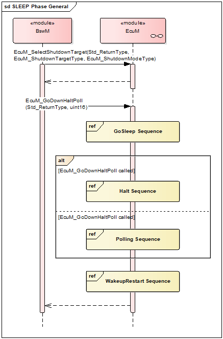

其中GoSleep Sequence如下图：

The GoSleep Sequence is as follows:

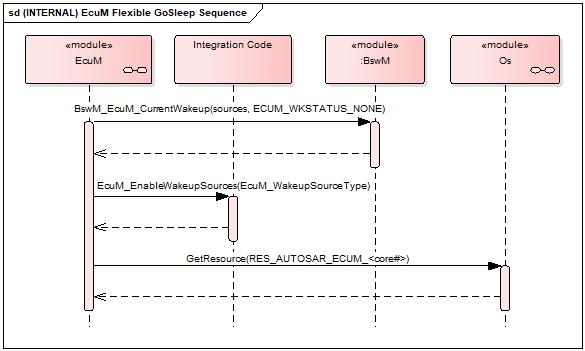

对于方式三，睡眠的时候Mcu直接掉电，涉及到Shutdown状态的处理。

For Method Three, the MCU directly powers off during sleep, involving the handling of Shutdown state.

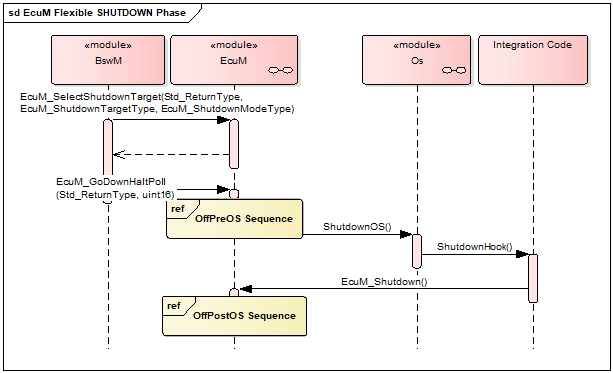

其中OffPreOS Sequence如下图：

The OffPreOS Sequence is as follows:

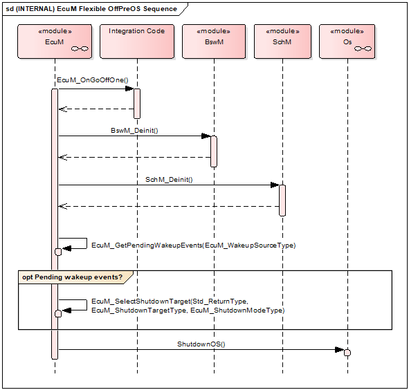

OffPostOS Sequence如下图：

OffPostOS Sequence as follows:

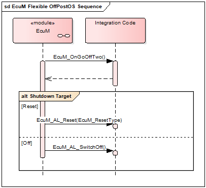

唤醒：

Wake Up:

对于每个唤醒源Wakeup Source的状态与对应的描述如下所示：

The status of each wakeup source and its corresponding description is as follows:

.. centered:: **表 唤醒源状态描述 (Table Wake-Up Source Status Description)**

.. list-table::
   :widths: 50 50
   :header-rows: 1

   * - 状态 (>Status)
     - 描述 (Description)
   * - NONE
     - 唤醒事件未检测到，或者已经被清除 (Wakeup event not detected, or has been cleared.)
   * - PENDING
     - 唤醒事件检测到，但是还未验证 (Wakeup event detected, but not yet verified)
   * - VALIDATED
     - 唤醒事件检测到，并且已经验证成功 (Wake-up event detected and verified successfully)
   * - EXPIRED
     - 唤醒事件检测到，但是已经校验超时 (Wakeup event detected, but timeout validation has expired.)

对于状态的流转如下：

The flow of state transition is as follows:

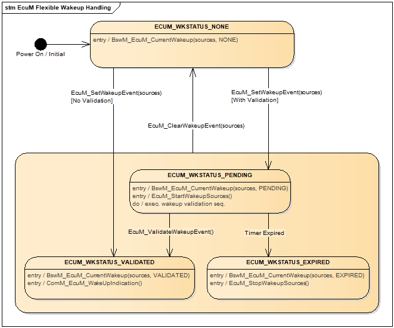

对于Wakeup Source的状态变化通过API： BswM_EcuM_CurrentWakeup

For changes in Wakeup Source status through API: BswM_EcuM_CurrentWakeup

告知BswM。

Notify BswM.

Wakeup Source ID取值范围0~31，对应U32数据的每一个bit；其中EcuM默认支持的Wakeup Source如下表：

Wakeup Source ID ranges from 0 to 31, corresponding to each bit of U32 data; among them, the Wakeup Sources supported by EcuM are as follows:

.. centered:: **表 默认唤醒源描述 (Table Default Wakeup Source Description)**

.. list-table::
   :widths: 50 50
   :header-rows: 1

   * - 默认唤醒源名称 (Default Wakeup Source Name)
     - 唤醒源ID (Wake Source ID)
   * - ECUM_WKSOURCE_POWER
     - 0
   * - ECUM_WKSOURCE_RESET
     - 1
   * - ECUM_WKSOURCE_INTERNAL_RESET
     - 2
   * - ECUM_WKSOURCE_INTERNAL_WDG
     - 3
   * - ECUM_WKSOURCE_EXTERNAL_WDG
     - 4

这些默认支持的Wakeup Source无需经过验证过程。

These default supported Wakeup Sources do not require verification processes.

Wakeup Source处理过程的两个时间配置EcuMCheckWakeupTimeout、EcuMValidationTimeout。

Two time configurations for Wakeup Source processing: EcuMCheckWakeupTimeout, EcuMValidationTimeout.

EcuMCheckWakeupTimeout：如果唤醒源的检查是异步完成的，则此参数是EcuM延迟ECU关闭的时间的初始值。计时的开始通过API：EcuM_StartCheckWakeup。

EcuMCheckWakeupTimeout：If the wakeup source check is asynchronous, this parameter is the initial value for ECUm's delay in shutting down the ECU. Timing starts through the API: EcuM_StartCheckWakeup.

EcuMValidationTimeout：Wakeup Source从Pending检查是否Validate的持续时间。

EcuMValidationTimeout: Checks the duration for validating the Wakeup Source from Pending.

睡眠唤醒功能实现 (Sleep Wake-up Function Implementation)
~~~~~~~~~~~~~~~~~~~~~~~~~~~~~~~~~~~~~~~~~~~~~~~~~~~~~~~~~~~~~~~~

针对唤醒主要涉及EcuM_CheckWakeup、EcuM_SetWakeupEvent以及EcuM_ValidateWakeupEvent等函数。

The wake-up involves functions such as EcuM_CheckWakeup, EcuM_SetWakeupEvent, and EcuM_ValidateWakeupEvent.

PB配置选择功能 (PB Configuration Selection Function)
--------------------------------------------------------------

PB配置选择介绍 (Introduction to PB Configuration Selection)
~~~~~~~~~~~~~~~~~~~~~~~~~~~~~~~~~~~~~~~~~~~~~~~~~~~~~~~~~~~~~~~~~~~~~

AUTOSAR支持PB配置数据刷写，有两种方式：

AUTOSAR supports PB configuration data flashing, with two ways:

1. Loadable。PB配置数据存放在固定某一个地址段，通过Bootload等方式在运行时去修改PB配置。

Loadable. PB configuration data is stored in a fixed address segment, and the PB configuration can be modified at runtime through Bootload methods, etc.

2. Selectable。定义多套配置，在上电初始化的时候根据不同的条件选择不同的配置。

Selectable. Define multiple configurations and select different ones during power-on initialization based on various conditions.

ECUM中可实现Selectable方式的PB配置选择功能。

The ECUM supports the Selectable configuration selection function for PB.

PB配置选择实现 (PB Configuration Selection Implementation)
~~~~~~~~~~~~~~~~~~~~~~~~~~~~~~~~~~~~~~~~~~~~~~~~~~~~~~~~~~~~~~~~~~~~

ECUM在EcuM_DeterminePbConfiguration函数中去确定使用那一套配置数据。实现选择多套PB配置的前提是，ECUM中事先存在多套配置。

ECUM determines which set of configuration data to use in the EcuM_DeterminePbConfiguration function. The implementation of selecting multiple sets of PB configurations前提 is that ECUM preexists with multiple sets of configurations.

源文件描述 (Source file description)
===============================================

.. centered:: **表 ECUM文件描述 (Table ECUM File Description)**

.. list-table::
   :widths: 50 50
   :header-rows: 1

   * - 文件 (Files)
     - 说明 (Description)
   * - EcuM.c
     - RUN/POST_RUN 仲裁、EcuM通用函数 (ARBITRATE/RUN_POST_RUN Arbitration, EcuM Generic Functions)
   * - EcuM.h
     - PB配置数据结构，以及外部接口声明 (Configuration data structure for PB and external interface declarations)
   * - EcuM_AlarmClock.c
     - 包含当alarm存在时，设置alarm的API集合 (Contain the API collection for setting alarms when an alarm exists.)
   * - EcuM_Cbk.h
     - EcuM回调函数声明 (Callback function declaration for EcuM)
   * - EcuM_Externals.h
     - EcuM模块中所有callout函数声明 (All callout function declarations in the EcuM module)
   * - EcuM_Internal.h
     - 定义所有内部数据结构，以及内部接口声明 (Define all internal data structures, as well as internal interface declarations)
   * - EcuM_MemMap.h
     - EcuM代码、变量所用的MemMap段 (Code and variables used in the EcuM segment MemMap)
   * - EcuM_ShutDown.c
     - 所有SHUTDOWN阶段API (All SHUTDOWN Stage APIs)
   * - EcuM_Sleep.c
     - 所有SLEEP阶段API (All SLEEP phase APIs)
   * - EcuM_StartUp.c
     - 所有STARTUP阶段API (All STARTUP Stage APIs)
   * - EcuM_Types.h
     - 通用宏定义 (General Macro Definitions)
   * - EcuM_Up.c
     - 所有UP阶段API (All UP Stage APIs)
   * - SchM_EcuM.h
     - 定义关键区域保护以及mainfunction声明 (Define critical area protection and mainfunction declaration)
   * - EcuM_Generated_Types.h
     - 依赖配置生成的宏定义、数据结构等 (Macro definitions, data structures, etc. generated by configuration)

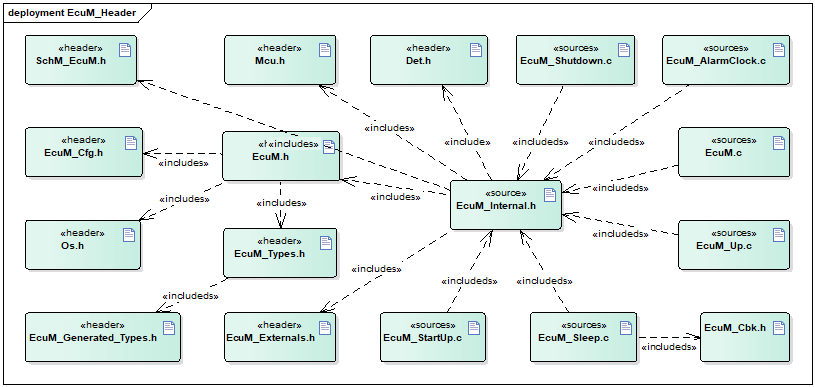

API接口 (API Interface)
=====================================

类型定义 (Type definition)
--------------------------------------

EcuM_ConfigType类型定义 (Definition of EcuM_ConfigType Type)
~~~~~~~~~~~~~~~~~~~~~~~~~~~~~~~~~~~~~~~~~~~~~~~~~~~~~~~~~~~~~~~~~~~~~~~~

.. list-table::
   :widths: 50 50
   :header-rows: 1

   * - 名称 (Name)
     - EcuM_ConfigType
   * - 类型 (Type)
     - structure
   * - 范围 (Range)
     - 无
   * - 描述 (Description)
     - EcuM PB配置数据 (EcuM PB Configuration Data)

EcuM_RunStatusType类型定义 (EcuM_RunStatusType Type Definition)
~~~~~~~~~~~~~~~~~~~~~~~~~~~~~~~~~~~~~~~~~~~~~~~~~~~~~~~~~~~~~~~~~~~~~~~~~~~

.. list-table::
   :widths: 50 50
   :header-rows: 1

   * - 名称 (Name)
     - EcuM_RunStatusType
   * - 类型 (Type)
     - Uint8
   * - 范围 (Range)
     - ECUM_RUNSTATUS_UNKNOWN
   * - 
     - ECUM_RUNSTATUS_REQUESTED
   * - 
     - ECUM_RUNSTATUS_RELEASED
   * - 描述 (Description)
     - 发送到BswM的RUN请求协议的结果 (The result of the RUN request protocol sent to BswM.)

EcuM_UserType类型定义 (Definition of EcuM_UserType Type)
~~~~~~~~~~~~~~~~~~~~~~~~~~~~~~~~~~~~~~~~~~~~~~~~~~~~~~~~~~~~~~~~~~~~

.. list-table::
   :widths: 50 50
   :header-rows: 1

   * - 名称 (Name)
     - EcuM_UserType
   * - 类型 (Type)
     - Uint8
   * - 范围 (Range)
     - 0..255
   * - 描述 (Description)
     - EcuM user值类型 (EcuM user Value Type)

EcuM_WakeupSourceType类型定义 (Type definition for EcuM_WakeupSourceType)
~~~~~~~~~~~~~~~~~~~~~~~~~~~~~~~~~~~~~~~~~~~~~~~~~~~~~~~~~~~~~~~~~~~~~~~~~~~~~~~~~~~~~

.. list-table::
   :widths: 50 50
   :header-rows: 1

   * - 名称 (Name)
     - EcuM_WakeupSourceType
   * - 类型 (Type)
     - uint32
   * - 范围 (Range)
     - 最多支持32种唤醒源（其中前五位已经被定义） (The maximum support is for 32 wake-up sources (of which the first five have been defined))
   * - 描述 (Description)
     - 唤醒源类型（每个bit位代表一种唤醒源） (Wake-up Source Type (each bit represents one wake-up source))

EcuM_WakeupStatusType类型定义 (EcuM_WakeupStatusType Type Definition)
~~~~~~~~~~~~~~~~~~~~~~~~~~~~~~~~~~~~~~~~~~~~~~~~~~~~~~~~~~~~~~~~~~~~~~~~~~~~~~~~~

.. list-table::
   :widths: 50 50
   :header-rows: 1

   * - 名称 (Name)
     - EcuM_WakeupStatusType
   * - 类型 (Type)
     - Uint8
   * - 范围 (Range)
     - ECUM_WKSTATUS_NONE
   * - 
     - ECUM_WKSTATUS_PENDING
   * - 
     - ECUM_WKSTATUS_VALIDATED
   * - 
     - ECUM_WKSTATUS_EXPIRED
   * - 描述 (Description)
     - 唤醒源的运行时状态 (The runtime status of the wake-up source)

EcuM\_ BootTargetType类型定义 (EcuM_ BootTargetType Type Definition)
~~~~~~~~~~~~~~~~~~~~~~~~~~~~~~~~~~~~~~~~~~~~~~~~~~~~~~~~~~~~~~~~~~~~~~~~~~~~~~~~

.. list-table::
   :widths: 50 50
   :header-rows: 1

   * - 名称 (Name)
     - EcuM_BootTargetType
   * - 类型 (Type)
     - Uint8
   * - 范围 (Range)
     - ECUM_BOOT_TARGET_APP
   * - 
     - ECUM_BOOT_TARGET_OEM_BOOTLOADER
   * - 
     - ECUM_BOOT_TARGET_SYS_BOOTLOADER
   * - 描述 (Description)
     - boot选择类型 (Boot type selection)

EcuM\_ ResetType类型定义 (Definition of EcuM_ResetType Type)
~~~~~~~~~~~~~~~~~~~~~~~~~~~~~~~~~~~~~~~~~~~~~~~~~~~~~~~~~~~~~~~~~~~~~~~~

.. list-table::
   :widths: 50 50
   :header-rows: 1

   * - 名称 (Name)
     - EcuM_ResetType
   * - 类型 (Type)
     - Uint8
   * - 范围 (Range)
     - ECUM_RESET_MCU
   * - 
     - ECUM_RESET_WDG
   * - 
     - ECUM_RESET_IO
   * - 描述 (Description)
     - EcuM支持的复位类型 (Reset types supported by EcuM)

EcuM\_ ShutdownCauseType类型定义 (EcuM_ShutdownCauseType Type Definition)
~~~~~~~~~~~~~~~~~~~~~~~~~~~~~~~~~~~~~~~~~~~~~~~~~~~~~~~~~~~~~~~~~~~~~~~~~~~~~~~~~~~~~

.. list-table::
   :widths: 50 50
   :header-rows: 1

   * - 名称 (Name)
     - EcuM_ShutdownCauseType
   * - 类型 (Type)
     - Uint8
   * - 范围 (Range)
     - ECUM_CAUSE_UNKNOWN
   * - 
     - ECUM_CAUSE_ECU_STATE
   * - 
     - ECUM_CAUSE_WDGM
   * - 
     - ECUM_CAUSE_DCM
   * - 描述 (Description)
     - EcuM shutdown的原因类型 (Reason Types for EcuM Shutdown)

EcuM\_ ShutdownModeType类型定义 (ShutdownModeType type definition)
~~~~~~~~~~~~~~~~~~~~~~~~~~~~~~~~~~~~~~~~~~~~~~~~~~~~~~~~~~~~~~~~~~~~~~~~~~~~~~

.. list-table::
   :widths: 50 50
   :header-rows: 1

   * - 名称 (Name)
     - EcuM_ShutdownModeType
   * - 类型 (Type)
     - Uint16
   * - 范围 (Range)
     - 依赖配置 (Depend on Configuration)
   * - 描述 (Description)
     - Shutdown 模式定义 (Shutdown mode definition)

EcuM\_ TimeType类型定义 (Definition of TimeType Type)
~~~~~~~~~~~~~~~~~~~~~~~~~~~~~~~~~~~~~~~~~~~~~~~~~~~~~~~~~~~~~~~~~

.. list-table::
   :widths: 50 50
   :header-rows: 1

   * - 名称 (Name)
     - EcuM_TimeType
   * - 类型 (Type)
     - uint32
   * - 范围 (Range)
     - 无
   * - 描述 (Description)
     - EcuM时钟类型 (Clock Type EcuM)

EcuM\_ ShutdownTargetType类型定义 (EcuM_ShutdownTargetType Type Definition)
~~~~~~~~~~~~~~~~~~~~~~~~~~~~~~~~~~~~~~~~~~~~~~~~~~~~~~~~~~~~~~~~~~~~~~~~~~~~~~~~~~~~~~~

.. list-table::
   :widths: 50 50
   :header-rows: 1

   * - 名称 (Name)
     - EcuM_ShutdownTargetType
   * - 类型 (Type)
     - Uint8
   * - 范围 (Range)
     - ECUM_SHUTDOWN_TARGET_SLEEP
   * - 
     - ECUM_SHUTDOWN_TARGET_RESET
   * - 
     - ECUM_SHUTDOWN_TARGET_OFF
   * - 描述 (Description)
     - Shutdown Target类型 (Shutdown Target type)

输入函数描述 (Describe the input function:)
-----------------------------------------------------

.. list-table::
   :widths: 50 50
   :header-rows: 1

   * - 输入模块 (Input Module)
     - API
   * - BswM
     - BswM_Deinit
   * - 
     - BswM_EcuM_CurrentWakeup
   * - 
     - BswM_Init
   * - CanSM
     - CanSM_StartWakeupSource
   * - 
     - CanSM_StopWakeupSource
   * - ComM
     - ComM_EcuM_PNCWakeUpIndication
   * - 
     - ComM_EcuM_WakeUpIndication
   * - Dem
     - Dem_Init
   * - 
     - Dem_PreInit
   * - 
     - Dem_Shutdown
   * - Os
     - GetResource
   * - 
     - ReleaseResource
   * - 
     - SetEvent
   * - 
     - WaitEvent
   * - 
     - ClearEvent
   * - 
     - StartOS
   * - 
     - ShutdownOS
   * - SchM
     - SchM_Init
   * - 
     - SchM_Deinit
   * - BSW模块 (BSW Module)
     - Bsw(xx)_Init

静态接口函数定义 (Static interface function definition)
---------------------------------------------------------------

EcuM_GetVersionInfo
~~~~~~~~~~~~~~~~~~~~~~~~~~~~~~~~~~~

.. list-table::
   :widths: 25 25 25 25
   :header-rows: 1

   * - 函数名称： (Function Name:)
     - EcuM_GetVersionInfo
     - 
     - 
   * - 函数原型： (Function prototype:)
     - voidEcuM_GetVersionInfo(
     - 
     - 
   * - 
     - Std\_VersionInfoType\*versioninfo
     - 
     - 
   * - 
     - )
     - 
     - 
   * - 服务编号： (Service Number:)
     - 0x00
     - 
     - 
   * - 同步/异步： (Synchronous/asynchronous:)
     - 同步 (Sync)
     - 
     - 
   * - 是否可重入： (Is Reentrant:)
     - 是 (Is)
     - 
     - 
   * - 输入参数： (Input parameters:)
     - 无
     - 值域： (Domain:)
     - 无
   * - 输入输出参数： (Input Output Parameters:)
     - 无
     - 
     - 
   * - 输出参数： (Output Parameters:)
     - versioninfo
     - 
     - 
   * - 返回值： (Return Value:)
     - 无
     - 
     - 
   * - 功能概述： (Function Overview:)
     - 获取EcuM版本信息 (Get EcuM Version Information)
     - 
     - 

EcuM_GoDownHaltPoll
~~~~~~~~~~~~~~~~~~~~~~~~~~~~~~~~~~~

.. list-table::
   :widths: 25 25 25 25
   :header-rows: 1

   * - 函数名称： (Function Name:)
     - EcuM_GoDownHaltPoll
     - 
     - 
   * - 函数原型： (Function prototype:)
     - Std_ReturnTypeEcuM_GoDownHaltPoll(
     - 
     - 
   * - 
     - uint16 caller
     - 
     - 
   * - 
     - )
     - 
     - 
   * - 服务编号： (Service Number:)
     - 0x2c
     - 
     - 
   * - 同步/异步： (Synchronous/asynchronous:)
     - 同步 (Sync)
     - 
     - 
   * - 是否可重入： (Is Reentrant:)
     - 是 (Is)
     - 
     - 
   * - 输入参数： (Input parameters:)
     - caller
     - 值域： (Domain:)
     - 依赖于配置的user个数 (Dependent on the number of configured users.)
   * - 输入输出参数： (Input Output Parameters:)
     - 无
     - 
     - 
   * - 输出参数： (Output Parameters:)
     - 无
     - 
     - 
   * - 返回值： (Return Value:)
     - E_NOT_OK： Therequest was notaccepted.
     - 
     - 
   * - 
     - E_OK： If theShutdownTargetTypeis SLEEP the callsuccessfully
     - 
     - 
   * - 
     - returns, the ECUhas left thesleep again.
     - 
     - 
   * - 
     - If theShutdownTargetTypeis RESET or OFFthis call willnot return.
     - 
     - 
   * - 功能概述： (Function Overview:)
     - 指示ECU状态管理器模块进入睡眠模式，根据先前选择的关闭目标进入重置或关闭状态 (Instruct the ECU State Manager module to enter sleep mode and reset or shut down according to the previously selected shutdown target.)
     - 
     - 

EcuM_Init
~~~~~~~~~~~~~~~~~~~~~~~~~

.. list-table::
   :widths: 25 25 25 25
   :header-rows: 1

   * - 函数名称： (Function Name:)
     - EcuM_Init
     - 
     - 
   * - 函数原型： (Function prototype:)
     - void EcuM_Init (
     - 
     - 
   * - 
     - void
     - 
     - 
   * - 
     - )
     - 
     - 
   * - 服务编号： (Service Number:)
     - 0x01
     - 
     - 
   * - 同步/异步： (Synchronous/asynchronous:)
     - 同步 (Sync)
     - 
     - 
   * - 是否可重入： (Is Reentrant:)
     - 是 (Is)
     - 
     - 
   * - 输入参数： (Input parameters:)
     - 无
     - 值域： (Domain:)
     - 无
   * - 输入输出参数： (Input Output Parameters:)
     - 无
     - 
     - 
   * - 输出参数： (Output Parameters:)
     - 无
     - 
     - 
   * - 返回值： (Return Value:)
     - 无
     - 
     - 
   * - 功能概述： (Function Overview:)
     - 初始化ECUM并执行启动程序 (Initialize ECUM and execute startup program)
     - 
     - 

EcuM_StartupTwo
~~~~~~~~~~~~~~~~~~~~~~~~~~~~~~~

.. list-table::
   :widths: 25 25 25 25
   :header-rows: 1

   * - 函数名称： (Function Name:)
     - EcuM_StartupTwo
     - 
     - 
   * - 函数原型： (Function prototype:)
     - voidEcuM_StartupTwo (
     - 
     - 
   * - 
     - void
     - 
     - 
   * - 
     - )
     - 
     - 
   * - 服务编号： (Service Number:)
     - 0x1a
     - 
     - 
   * - 同步/异步： (Synchronous/asynchronous:)
     - 同步 (Sync)
     - 
     - 
   * - 是否可重入： (Is Reentrant:)
     - 否 (No)
     - 
     - 
   * - 输入参数： (Input parameters:)
     - 无
     - 值域： (Domain:)
     - 无
   * - 输入输出参数： (Input Output Parameters:)
     - 无
     - 
     - 
   * - 输出参数： (Output Parameters:)
     - 无
     - 
     - 
   * - 返回值： (Return Value:)
     - 无
     - 
     - 
   * - 功能概述： (Function Overview:)
     - 实现STARTUPII状态 (Achieve STARTUP II State)
     - 
     - 

EcuM_Shutdown
~~~~~~~~~~~~~~~~~~~~~~~~~~~~~

.. list-table::
   :widths: 25 25 25 25
   :header-rows: 1

   * - 函数名称： (Function Name:)
     - EcuM_Shutdown
     - 
     - 
   * - 函数原型： (Function prototype:)
     - voidEcuM_Shutdown (
     - 
     - 
   * - 
     - void
     - 
     - 
   * - 
     - )
     - 
     - 
   * - 服务编号： (Service Number:)
     - 0x02
     - 
     - 
   * - 同步/异步： (Synchronous/asynchronous:)
     - 同步 (Sync)
     - 
     - 
   * - 是否可重入： (Is Reentrant:)
     - 是 (Is)
     - 
     - 
   * - 输入参数： (Input parameters:)
     - 无
     - 值域： (Domain:)
     - 无
   * - 输入输出参数： (Input Output Parameters:)
     - 无
     - 
     - 
   * - 输出参数： (Output Parameters:)
     - 无
     - 
     - 
   * - 返回值： (Return Value:)
     - 无
     - 
     - 
   * - 功能概述： (Function Overview:)
     - 通常从 shutdownhook调用此函数，该函数接管执行控制并执行GOOFF II (This function is usually called from the shutdownhook, which takes over execution control and performs GOOFF II.)
     - 
     - 

EcuM_SetState
~~~~~~~~~~~~~~~~~~~~~~~~~~~~~

.. list-table::
   :widths: 25 25 25 25
   :header-rows: 1

   * - 函数名称： (Function Name:)
     - EcuM_SetState
     - 
     - 
   * - 函数原型： (Function prototype:)
     - voidEcuM_SetState (
     - 
     - 
   * - 
     - EcuM_ShutdownTargetTypestate
     - 
     - 
   * - 
     - )
     - 
     - 
   * - 服务编号： (Service Number:)
     - 0x2b
     - 
     - 
   * - 同步/异步： (Synchronous/asynchronous:)
     - 同步 (Sync)
     - 
     - 
   * - 是否可重入： (Is Reentrant:)
     - 是 (Is)
     - 
     - 
   * - 输入参数： (Input parameters:)
     - state
     - 值域： (Domain:)
     - 0..255
   * - 输入输出参数： (Input Output Parameters:)
     - 无
     - 
     - 
   * - 输出参数： (Output Parameters:)
     - 无
     - 
     - 
   * - 返回值： (Return Value:)
     - 无
     - 
     - 
   * - 功能概述： (Function Overview:)
     - 由BswM调用，用于切换EcuM状态 (Called by BswM for switching EcuM state)
     - 
     - 

EcuM_RequestRUN
~~~~~~~~~~~~~~~~~~~~~~~~~~~~~~~

.. list-table::
   :widths: 25 25 25 25
   :header-rows: 1

   * - 函数名称： (Function Name:)
     - EcuM_RequestRUN
     - 
     - 
   * - 函数原型： (Function prototype:)
     - Std_ReturnTypeEcuM_RequestRUN (
     - 
     - 
   * - 
     - EcuM_UserTypeuser
     - 
     - 
   * - 
     - )
     - 
     - 
   * - 服务编号： (Service Number:)
     - 0x03
     - 
     - 
   * - 同步/异步： (Synchronous/asynchronous:)
     - 同步 (Sync)
     - 
     - 
   * - 是否可重入： (Is Reentrant:)
     - 是 (Is)
     - 
     - 
   * - 输入参数： (Input parameters:)
     - user
     - 值域： (Domain:)
     - 依赖于配置 (Dependent on configuration)
   * - 输入输出参数： (Input Output Parameters:)
     - 无
     - 
     - 
   * - 输出参数： (Output Parameters:)
     - 无
     - 
     - 
   * - 返回值： (Return Value:)
     - E_OK： Therequest wasaccepted by EcuM.
     - 
     - 
   * - 
     - E_NOT_OK： Therequest was notaccepted by EcuM,a detailed
     - 
     - 
   * - 
     - error conditionwas sent to DET(see Error Codesbelow).
     - 
     - 
   * - 功能概述： (Function Overview:)
     - 发出对RUN状态的请求 (Request for RUN state)
     - 
     - 

EcuM_ReleaseRUN
~~~~~~~~~~~~~~~~~~~~~~~~~~~~~~~

.. list-table::
   :widths: 25 25 25 25
   :header-rows: 1

   * - 函数名称： (Function Name:)
     - EcuM_ReleaseRUN
     - 
     - 
   * - 函数原型： (Function prototype:)
     - Std_ReturnTypeEcuM_ReleaseRUN (
     - 
     - 
   * - 
     - EcuM_UserTypeuser
     - 
     - 
   * - 
     - )
     - 
     - 
   * - 服务编号： (Service Number:)
     - 0x04
     - 
     - 
   * - 同步/异步： (Synchronous/asynchronous:)
     - 同步 (Sync)
     - 
     - 
   * - 是否可重入： (Is Reentrant:)
     - 是 (Is)
     - 
     - 
   * - 输入参数： (Input parameters:)
     - user
     - 值域： (Domain:)
     - 依赖于配置 (Dependent on configuration)
   * - 输入输出参数： (Input Output Parameters:)
     - 无
     - 
     - 
   * - 输出参数： (Output Parameters:)
     - 无
     - 
     - 
   * - 返回值： (Return Value:)
     - E_OK： Therelease requestwas accepted byEcuM
     - 
     - 
   * - 
     - E_NOT_OK： Therelease requestwas not acceptedby EcuM, a
     - 
     - 
   * - 
     - detailed errorcondition wassent to DET (seeError Codesbelow).
     - 
     - 
   * - 功能概述： (Function Overview:)
     - 释放对RUN状态的请求 (Request for releasing the RUN state)
     - 
     - 

EcuM_RequestPOST_RUN
~~~~~~~~~~~~~~~~~~~~~~~~~~~~~~~~~~~~

.. list-table::
   :widths: 25 25 25 25
   :header-rows: 1

   * - 函数名称： (Function Name:)
     - EcuM_RequestPOST_RUN
     - 
     - 
   * - 函数原型： (Function prototype:)
     - Std_ReturnTypeEcuM_RequestPOST_RUN(
     - 
     - 
   * - 
     - EcuM_UserTypeuser
     - 
     - 
   * - 
     - )
     - 
     - 
   * - 服务编号： (Service Number:)
     - 0x0a
     - 
     - 
   * - 同步/异步： (Synchronous/asynchronous:)
     - 同步 (Sync)
     - 
     - 
   * - 是否可重入： (Is Reentrant:)
     - 是 (Is)
     - 
     - 
   * - 输入参数： (Input parameters:)
     - user
     - 值域： (Domain:)
     - 依赖于配置 (Dependent on configuration)
   * - 输入输出参数： (Input Output Parameters:)
     - 无
     - 
     - 
   * - 输出参数： (Output Parameters:)
     - 无
     - 
     - 
   * - 返回值： (Return Value:)
     - E_OK： Therequest wasaccepted by EcuM
     - 
     - 
   * - 
     - E_NOT_OK： Therequest was notaccepted by EcuM,a detailed
     - 
     - 
   * - 
     - error conditionwas sent to DET(see Error Codesbelow).
     - 
     - 
   * - 功能概述： (Function Overview:)
     - 发出对POST_RUN状态的请求 (Request for POST_RUN state)
     - 
     - 

EcuM_ReleasePOST_RUN
~~~~~~~~~~~~~~~~~~~~~~~~~~~~~~~~~~~~

.. list-table::
   :widths: 25 25 25 25
   :header-rows: 1

   * - 函数名称： (Function Name:)
     - EcuM_ReleasePOST_RUN
     - 
     - 
   * - 函数原型： (Function prototype:)
     - Std_ReturnTypeEcuM_ReleasePOST_RUN(
     - 
     - 
   * - 
     - EcuM_UserTypeuser
     - 
     - 
   * - 
     - )
     - 
     - 
   * - 服务编号： (Service Number:)
     - 0x0b
     - 
     - 
   * - 同步/异步： (Synchronous/asynchronous:)
     - 同步 (Sync)
     - 
     - 
   * - 是否可重入： (Is Reentrant:)
     - 是 (Is)
     - 
     - 
   * - 输入参数： (Input parameters:)
     - user
     - 值域： (Domain:)
     - 依赖于配置 (Dependent on configuration)
   * - 输入输出参数： (Input Output Parameters:)
     - 无
     - 
     - 
   * - 输出参数： (Output Parameters:)
     - 无
     - 
     - 
   * - 返回值： (Return Value:)
     - E_OK： Therelease requestwas accepted byEcuM
     - 
     - 
   * - 
     - E_NOT_OK： Therelease requestwas not acceptedby EcuM, a
     - 
     - 
   * - 
     - detailed errorcondition wassent to DET (seeError Codesbelow).
     - 
     - 
   * - 功能概述： (Function Overview:)
     - 释放对POSTRUN状态的请求 (Release requests for POSTRUN state)
     - 
     - 

EcuM_SelectShutdownTarget
~~~~~~~~~~~~~~~~~~~~~~~~~~~~~~~~~~~~~~~~~

.. list-table::
   :widths: 25 25 25 25
   :header-rows: 1

   * - 函数名称： (Function Name:)
     - EcuM_SelectShutdownTarget
     - 
     - 
   * - 函数原型： (Function prototype:)
     - Std_ReturnTypeEcuM_SelectShutdownTarget(
     - 
     - 
   * - 
     - EcuM_ShutdownTargetTypeshutdownTarget,
     - 
     - 
   * - 
     - EcuM_ShutdownModeTypeshutdownMode
     - 
     - 
   * - 
     - )
     - 
     - 
   * - 服务编号： (Service Number:)
     - 0x06
     - 
     - 
   * - 同步/异步： (Synchronous/asynchronous:)
     - 同步 (Sync)
     - 
     - 
   * - 是否可重入： (Is Reentrant:)
     - 是 (Is)
     - 
     - 
   * - 输入参数： (Input parameters:)
     - ShutdownTarget
     - 值域： (Domain:)
     - ECUM_SHUTDOWN_TARGET_SLEEPECUM_SHUTDOWN_TARGET_RESET
   * - 
     - 
     - 
     - ECUM_SHUTDOWN_TARGET_OFF
   * - 
     - shutdownMode
     - 
     - 0..255
   * - 输入输出参数： (Input Output Parameters:)
     - 无
     - 
     - 
   * - 输出参数： (Output Parameters:)
     - 无
     - 
     - 
   * - 返回值： (Return Value:)
     - E_OK： The newshutdowntarget was set
     - 
     - 
   * - 
     - E_NOT_OK： Thenew shutdowntarget was notset
     - 
     - 
   * - 功能概述： (Function Overview:)
     - 设置 shutdowntarget (Set shutdown target)
     - 
     - 

EcuM_GetShutdownTarget
~~~~~~~~~~~~~~~~~~~~~~~~~~~~~~~~~~~~~~

.. list-table::
   :widths: 25 25 25 25
   :header-rows: 1

   * - 函数名称： (Function Name:)
     - EcuM_GetShutdownTarget
     - 
     - 
   * - 函数原型： (Function prototype:)
     - Std_ReturnTypeEcuM_GetShutdownTarget(
     - 
     - 
   * - 
     - EcuM_ShutdownTargetType\*shutdownTarget,
     - 
     - 
   * - 
     - EcuM_ShutdownModeType\*shutdownMode
     - 
     - 
   * - 
     - )
     - 
     - 
   * - 服务编号： (Service Number:)
     - 0x09
     - 
     - 
   * - 同步/异步： (Synchronous/asynchronous:)
     - 同步 (Sync)
     - 
     - 
   * - 是否可重入： (Is Reentrant:)
     - 是 (Is)
     - 
     - 
   * - 输入参数： (Input parameters:)
     - 无
     - 值域： (Domain:)
     - 无
   * - 输入输出参数： (Input Output Parameters:)
     - 无
     - 
     - 
   * - 输出参数： (Output Parameters:)
     - shutdownTarget
     - 
     - 
   * - 
     - shutdownMode
     - 
     - 
   * - 返回值： (Return Value:)
     - E_OK： Theservice hassucceeded
     - 
     - 
   * - 
     - E_NOT_OK： Theservice hasfailed, e.g. dueto NULL pointerbeing
     - 
     - 
   * - 
     - passed
     - 
     - 
   * - 功能概述： (Function Overview:)
     - EcuM_GetShutdownTarget返回由EcuM_SelectShutdownTarget设置的当前选定的关闭目标 (EcuM_GetShutdownTarget returns the current shutdown target set by EcuM_SelectShutdownTarget)
     - 
     - 

EcuM_GetLastShutdownTarget
~~~~~~~~~~~~~~~~~~~~~~~~~~~~~~~~~~~~~~~~~~

.. list-table::
   :widths: 25 25 25 25
   :header-rows: 1

   * - 函数名称： (Function Name:)
     - EcuM_GetLastShutdownTarget
     - 
     - 
   * - 函数原型： (Function prototype:)
     - Std_ReturnTypeEcuM_GetLastShutdownTarget(
     - 
     - 
   * - 
     - EcuM_ShutdownTargetType\*shutdownTarget,
     - 
     - 
   * - 
     - EcuM_ShutdownModeType\*shutdownMode
     - 
     - 
   * - 
     - )
     - 
     - 
   * - 服务编号： (Service Number:)
     - 0x08
     - 
     - 
   * - 同步/异步： (Synchronous/asynchronous:)
     - 同步 (Sync)
     - 
     - 
   * - 是否可重入： (Is Reentrant:)
     - 是 (Is)
     - 
     - 
   * - 输入参数： (Input parameters:)
     - 无
     - 值域： (Domain:)
     - 无
   * - 输入输出参数： (Input Output Parameters:)
     - 无
     - 
     - 
   * - 输出参数： (Output Parameters:)
     - shutdownTarget
     - 
     - 
   * - 
     - shutdownMode
     - 
     - 
   * - 返回值： (Return Value:)
     - E_OK： Theservice hassucceeded
     - 
     - 
   * - 
     - E_NOT_OK： Theservice hasfailed, e.g. dueto NULL pointerbeing
     - 
     - 
   * - 
     - passed
     - 
     - 
   * - 功能概述： (Function Overview:)
     - EcuM_GetLastShutdownTarget返回上一个关闭过程的关闭目标 (EcuM_GetLastShutdownTarget returns the shutdown target of the previous shutdown process)
     - 
     - 

EcuM_SelectShutdownCause
~~~~~~~~~~~~~~~~~~~~~~~~~~~~~~~~~~~~~~~~

.. list-table::
   :widths: 25 25 25 25
   :header-rows: 1

   * - 函数名称： (Function Name:)
     - EcuM_SelectShutdownCause
     - 
     - 
   * - 函数原型： (Function prototype:)
     - Std_ReturnTypeEcuM_SelectShutdownCause(
     - 
     - 
   * - 
     - EcuM_ShutdownCauseTypetarget
     - 
     - 
   * - 
     - )
     - 
     - 
   * - 服务编号： (Service Number:)
     - 0x1b
     - 
     - 
   * - 同步/异步： (Synchronous/asynchronous:)
     - 同步 (Sync)
     - 
     - 
   * - 是否可重入： (Is Reentrant:)
     - 是 (Is)
     - 
     - 
   * - 输入参数： (Input parameters:)
     - target
     - 值域： (Domain:)
     - 0..255
   * - 输入输出参数： (Input Output Parameters:)
     - 无
     - 
     - 
   * - 输出参数： (Output Parameters:)
     - E_OK： The newshutdown causewas set
     - 
     - 
   * - 
     - E_NOT_OK： Thenew shutdowncause was not set
     - 
     - 
   * - 返回值： (Return Value:)
     - ReturnType
     - 
     - 
   * - 功能概述： (Function Overview:)
     - 选择shutdown原因 (Select shutdown reason)
     - 
     - 

EcuM_GetShutdownCause
~~~~~~~~~~~~~~~~~~~~~~~~~~~~~~~~~~~~~

.. list-table::
   :widths: 25 25 25 25
   :header-rows: 1

   * - 函数名称： (Function Name:)
     - EcuM_GetShutdownCause
     - 
     - 
   * - 函数原型： (Function prototype:)
     - Std_ReturnTypeEcuM_GetShutdownCause(
     - 
     - 
   * - 
     - EcuM_ShutdownCauseType\*shutdownCause
     - 
     - 
   * - 
     - )
     - 
     - 
   * - 服务编号： (Service Number:)
     - 0x1c
     - 
     - 
   * - 同步/异步： (Synchronous/asynchronous:)
     - 同步 (Sync)
     - 
     - 
   * - 是否可重入： (Is Reentrant:)
     - 是 (Is)
     - 
     - 
   * - 输入参数： (Input parameters:)
     - 无
     - 值域： (Domain:)
     - 无
   * - 输入输出参数： (Input Output Parameters:)
     - 无
     - 
     - 
   * - 输出参数： (Output Parameters:)
     - shutdownCause
     - 
     - 
   * - 返回值： (Return Value:)
     - E_OK： Theservice hassucceeded
     - 
     - 
   * - 
     - E_NOT_OK： Theservice hasfailed, e.g. dueto NULL pointerbeing passed
     - 
     - 
   * - 功能概述： (Function Overview:)
     - 获取shutdown原因 (Get shutdown reason)
     - 
     - 

EcuM_GetPendingWakeupEvents
~~~~~~~~~~~~~~~~~~~~~~~~~~~~~~~~~~~~~~~~~~~

.. list-table::
   :widths: 25 25 25 25
   :header-rows: 1

   * - 函数名称： (Function Name:)
     - EcuM_GetPendingWakeupEvents
     - 
     - 
   * - 函数原型： (Function prototype:)
     - EcuM_WakeupSourceTypeEcuM_GetPendingWakeupEvents(
     - 
     - 
   * - 
     - void
     - 
     - 
   * - 
     - )
     - 
     - 
   * - 服务编号： (Service Number:)
     - 0x0d
     - 
     - 
   * - 同步/异步： (Synchronous/asynchronous:)
     - 同步 (Sync)
     - 
     - 
   * - 是否可重入： (Is Reentrant:)
     - 否 (No)
     - 
     - 
   * - 输入参数： (Input parameters:)
     - 无
     - 值域： (Domain:)
     - 无
   * - 输入输出参数： (Input Output Parameters:)
     - 无
     - 
     - 
   * - 输出参数： (Output Parameters:)
     - 无
     - 
     - 
   * - 返回值： (Return Value:)
     - EcuM_WakeupSourceType：Allwakeup events
     - 
     - 
   * - 功能概述： (Function Overview:)
     - 获取EcuM所有pending状态的唤醒事件 (Get all awakening events of EcuM in pending status)
     - 
     - 

EcuM_ClearWakeupEvent
~~~~~~~~~~~~~~~~~~~~~~~~~~~~~~~~~~~~~

.. list-table::
   :widths: 25 25 25 25
   :header-rows: 1

   * - 函数名称： (Function Name:)
     - EcuM_ClearWakeupEvent
     - 
     - 
   * - 函数原型： (Function prototype:)
     - voidEcuM_ClearWakeupEvent(
     - 
     - 
   * - 
     - EcuM_WakeupSourceTypesources
     - 
     - 
   * - 
     - )
     - 
     - 
   * - 服务编号： (Service Number:)
     - 0x16
     - 
     - 
   * - 同步/异步： (Synchronous/asynchronous:)
     - 同步 (Sync)
     - 
     - 
   * - 是否可重入： (Is Reentrant:)
     - 否 (No)
     - 
     - 
   * - 输入参数： (Input parameters:)
     - sources：要清除的事件 (sources: Events to be cleared)
     - 值域： (Domain:)
     - 无
   * - 输入输出参数： (Input Output Parameters:)
     - 无
     - 
     - 
   * - 输出参数： (Output Parameters:)
     - 无
     - 
     - 
   * - 返回值： (Return Value:)
     - 无
     - 
     - 
   * - 功能概述： (Function Overview:)
     - 清除所有的wakeup事件 (Clear all wakeup events)
     - 
     - 

EcuM_GetValidatedWakeupEvents
~~~~~~~~~~~~~~~~~~~~~~~~~~~~~~~~~~~~~~~~~~~~~

.. list-table::
   :widths: 25 25 25 25
   :header-rows: 1

   * - 函数名称： (Function Name:)
     - EcuM_GetValidatedWakeupEvents
     - 
     - 
   * - 函数原型： (Function prototype:)
     - EcuM_WakeupSourceTypeEcuM_GetValidatedWakeupEvents(
     - 
     - 
   * - 
     - void
     - 
     - 
   * - 
     - )
     - 
     - 
   * - 服务编号： (Service Number:)
     - 0x15
     - 
     - 
   * - 同步/异步： (Synchronous/asynchronous:)
     - 同步 (Sync)
     - 
     - 
   * - 是否可重入： (Is Reentrant:)
     - 否 (No)
     - 
     - 
   * - 输入参数： (Input parameters:)
     - 无
     - 值域： (Domain:)
     - 无
   * - 输入输出参数： (Input Output Parameters:)
     - 无
     - 
     - 
   * - 输出参数： (Output Parameters:)
     - 无
     - 
     - 
   * - 返回值： (Return Value:)
     - EcuM_WakeupSourceType：Allwakeup events
     - 
     - 
   * - 功能概述： (Function Overview:)
     - 获取EcuM所有已经过验证的唤醒源 (Get all validated wake-up sources for EcuM)
     - 
     - 

EcuM_GetExpiredWakeupEvents
~~~~~~~~~~~~~~~~~~~~~~~~~~~~~~~~~~~~~~~~~~~

.. list-table::
   :widths: 25 25 25 25
   :header-rows: 1

   * - 函数名称： (Function Name:)
     - EcuM_GetExpiredWakeupEvents
     - 
     - 
   * - 函数原型： (Function prototype:)
     - EcuM_WakeupSourceTypeEcuM_GetExpiredWakeupEvents(
     - 
     - 
   * - 
     - void
     - 
     - 
   * - 
     - )
     - 
     - 
   * - 服务编号： (Service Number:)
     - 0x00
     - 
     - 
   * - 同步/异步： (Synchronous/asynchronous:)
     - 同步 (Sync)
     - 
     - 
   * - 是否可重入： (Is Reentrant:)
     - 否 (No)
     - 
     - 
   * - 输入参数： (Input parameters:)
     - 无
     - 值域： (Domain:)
     - 无
   * - 输入输出参数： (Input Output Parameters:)
     - 无
     - 
     - 
   * - 输出参数： (Output Parameters:)
     - 无
     - 
     - 
   * - 返回值： (Return Value:)
     - EcuM_WakeupSourceType：Allwakeup events
     - 
     - 
   * - 功能概述： (Function Overview:)
     - 获取EcuM所有唤醒超时事件 (Retrieve all wake-up timeout events for EcuM)
     - 
     - 

EcuM_SetRelWakeupAlarm
~~~~~~~~~~~~~~~~~~~~~~~~~~~~~~~~~~~~~~

.. list-table::
   :widths: 25 25 25 25
   :header-rows: 1

   * - 函数名称： (Function Name:)
     - EcuM_SetRelWakeupAlarm
     - 
     - 
   * - 函数原型： (Function prototype:)
     - Std_ReturnTypeEcuM_SetRelWakeupAlarm(
     - 
     - 
   * - 
     - EcuM_UserTypeuser,
     - 
     - 
   * - 
     - EcuM_TimeTypetime
     - 
     - 
   * - 
     - )
     - 
     - 
   * - 服务编号： (Service Number:)
     - 0x22
     - 
     - 
   * - 同步/异步： (Synchronous/asynchronous:)
     - 同步 (Sync)
     - 
     - 
   * - 是否可重入： (Is Reentrant:)
     - 是 (Is)
     - 
     - 
   * - 输入参数： (Input parameters:)
     - user
     - 值域： (Domain:)
     - 依赖配置 (Depend on Configuration)
   * - 
     - time
     - 
     - 无
   * - 输入输出参数： (Input Output Parameters:)
     - 无
     - 
     - 
   * - 输出参数： (Output Parameters:)
     - 无
     - 
     - 
   * - 返回值： (Return Value:)
     - E_OK： Theservice hassucceeded
     - 
     - 
   * - 
     - E_NOT_OK： Theservice failed
     - 
     - 
   * - 
     - ECUM_E_EARLIER_ACTIVE：An earlier alarmis already set
     - 
     - 
   * - 功能概述： (Function Overview:)
     - EcuM_SetRelWakeupAlarm设置相对于当前时间点的用户唤醒警报 (EcuM_SetRelWakeupAlarm sets a user wakeup alarm relative to the current time point)
     - 
     - 

EcuM_SetAbsWakeupAlarm
~~~~~~~~~~~~~~~~~~~~~~~~~~~~~~~~~~~~~~

.. list-table::
   :widths: 25 25 25 25
   :header-rows: 1

   * - 函数名称： (Function Name:)
     - EcuM_SetAbsWakeupAlarm
     - 
     - 
   * - 函数原型： (Function prototype:)
     - Std_ReturnTypeEcuM_SetAbsWakeupAlarm(
     - 
     - 
   * - 
     - EcuM_UserTypeuser,
     - 
     - 
   * - 
     - EcuM_TimeTypetime
     - 
     - 
   * - 
     - )
     - 
     - 
   * - 服务编号： (Service Number:)
     - 0x23
     - 
     - 
   * - 同步/异步： (Synchronous/asynchronous:)
     - 同步 (Sync)
     - 
     - 
   * - 是否可重入： (Is Reentrant:)
     - 是 (Is)
     - 
     - 
   * - 输入参数： (Input parameters:)
     - user
     - 值域： (Domain:)
     - 无
   * - 
     - time
     - 
     - 
   * - 输入输出参数： (Input Output Parameters:)
     - 无
     - 
     - 
   * - 输出参数： (Output Parameters:)
     - 无
     - 
     - 
   * - 返回值： (Return Value:)
     - E_OK： Theservice hassucceeded
     - 
     - 
   * - 
     - E_NOT_OK： Theservice failed
     - 
     - 
   * - 
     - ECUM_E_EARLIER_ACTIVE：An earlier alarmis already set
     - 
     - 
   * - 
     - ECUM_E_PAST： Thegiven point intime has alreadypassed
     - 
     - 
   * - 功能概述： (Function Overview:)
     - EcuM_SetAbsWakeupAlarm将用户的唤醒警报设置为绝对时间点 (EcuM_SetAbsWakeupAlarm sets the user's wake-up alarm to an absolute time point)
     - 
     - 

EcuM_AbortWakeupAlarm
~~~~~~~~~~~~~~~~~~~~~~~~~~~~~~~~~~~~~

.. list-table::
   :widths: 25 25 25 25
   :header-rows: 1

   * - 函数名称： (Function Name:)
     - EcuM_AbortWakeupAlarm
     - 
     - 
   * - 函数原型： (Function prototype:)
     - Std_ReturnTypeEcuM_AbortWakeupAlarm(
     - 
     - 
   * - 
     - EcuM_UserTypeuser
     - 
     - 
   * - 
     - )
     - 
     - 
   * - 服务编号： (Service Number:)
     - 0x24
     - 
     - 
   * - 同步/异步： (Synchronous/asynchronous:)
     - 同步 (Sync)
     - 
     - 
   * - 是否可重入： (Is Reentrant:)
     - 是 (Is)
     - 
     - 
   * - 输入参数： (Input parameters:)
     - user
     - 值域： (Domain:)
     - 依赖配置 (Depend on Configuration)
   * - 输入输出参数： (Input Output Parameters:)
     - 无
     - 
     - 
   * - 输出参数： (Output Parameters:)
     - 无
     - 
     - 
   * - 返回值： (Return Value:)
     - E_OK： Theservice hassucceeded
     - 
     - 
   * - 
     - E_NOT_OK： Theservice failed
     - 
     - 
   * - 
     - ECUM_E_NOT_ACTIVE：No owned alarmfound
     - 
     - 
   * - 功能概述： (Function Overview:)
     - Ecum_AbortWakeupAlarm中止该用户先前设置的唤醒警报。 (AbortWakeupAlarm aborts the wakeup alarm previously set by the user.)
     - 
     - 

EcuM_GetCurrentTime
~~~~~~~~~~~~~~~~~~~~~~~~~~~~~~~~~~~

.. list-table::
   :widths: 25 25 25 25
   :header-rows: 1

   * - 函数名称： (Function Name:)
     - EcuM_GetCurrentTime
     - 
     - 
   * - 函数原型： (Function prototype:)
     - Std_ReturnTypeEcuM_GetCurrentTime(
     - 
     - 
   * - 
     - EcuM_TimeType\*time
     - 
     - 
   * - 
     - )
     - 
     - 
   * - 服务编号： (Service Number:)
     - 0x25
     - 
     - 
   * - 同步/异步： (Synchronous/asynchronous:)
     - 同步 (Sync)
     - 
     - 
   * - 是否可重入： (Is Reentrant:)
     - 是 (Is)
     - 
     - 
   * - 输入参数： (Input parameters:)
     - 无
     - 值域： (Domain:)
     - 无
   * - 输入输出参数： (Input Output Parameters:)
     - 无
     - 
     - 
   * - 输出参数： (Output Parameters:)
     - time
     - 
     - 
   * - 返回值： (Return Value:)
     - E_OK： Theservice hassucceeded
     - 
     - 
   * - 
     - E_NOT_OK： timepoints to NULL orthe module is not
     - 
     - 
   * - 
     - initialized
     - 
     - 
   * - 功能概述： (Function Overview:)
     - 返回EcuM时钟的当前值（即自连接电池以来的时间）。 (Return the current value of the EcuM clock (i.e., the time since the connection battery).)
     - 
     - 

EcuM_GetWakeupTime
~~~~~~~~~~~~~~~~~~~~~~~~~~~~~~~~~~

.. list-table::
   :widths: 25 25 25 25
   :header-rows: 1

   * - 函数名称： (Function Name:)
     - EcuM_GetWakeupTime
     - 
     - 
   * - 函数原型： (Function prototype:)
     - Std_ReturnTypeEcuM_GetWakeupTime(
     - 
     - 
   * - 
     - EcuM_TimeType\*time
     - 
     - 
   * - 
     - )
     - 
     - 
   * - 服务编号： (Service Number:)
     - 0x26
     - 
     - 
   * - 同步/异步： (Synchronous/asynchronous:)
     - 同步 (Sync)
     - 
     - 
   * - 是否可重入： (Is Reentrant:)
     - 是 (Is)
     - 
     - 
   * - 输入参数： (Input parameters:)
     - 无
     - 值域： (Domain:)
     - 无
   * - 输入输出参数： (Input Output Parameters:)
     - 无
     - 
     - 
   * - 输出参数： (Output Parameters:)
     - time
     - 
     - 
   * - 返回值： (Return Value:)
     - E_OK： Theservice hassucceeded
     - 
     - 
   * - 
     - E_NOT_OK： timepoints to NULL orthe module is notinitialized
     - 
     - 
   * - 功能概述： (Function Overview:)
     - EcuM_GetWakeupTime返回主闹钟的当前值（所有用户闹钟的最小绝对时间）。 (EcuM_GetWakeupTime returns the current value of the main clock (the minimum absolute time among all user alarms).)
     - 
     - 

EcuM_SetClock
~~~~~~~~~~~~~~~~~~~~~~~~~~~~~

.. list-table::
   :widths: 25 25 25 25
   :header-rows: 1

   * - 函数名称： (Function Name:)
     - EcuM_SetClock
     - 
     - 
   * - 函数原型： (Function prototype:)
     - Std_ReturnTypeEcuM_SetClock (
     - 
     - 
   * - 
     - EcuM_UserTypeuser,
     - 
     - 
   * - 
     - EcuM_TimeTypetime
     - 
     - 
   * - 
     - )
     - 
     - 
   * - 服务编号： (Service Number:)
     - 0x27
     - 
     - 
   * - 同步/异步： (Synchronous/asynchronous:)
     - 同步 (Sync)
     - 
     - 
   * - 是否可重入： (Is Reentrant:)
     - 是 (Is)
     - 
     - 
   * - 输入参数： (Input parameters:)
     - user
     - 值域： (Domain:)
     - 依赖配置 (Depend on Configuration)
   * - 
     - time
     - 
     - 时间（S）
   * - 输入输出参数： (Input Output Parameters:)
     - 无
     - 
     - 
   * - 输出参数： (Output Parameters:)
     - 无
     - 
     - 
   * - 返回值： (Return Value:)
     - E_OK： Theservice hassucceeded
     - 
     - 
   * - 
     - E_NOT_OK： Theservice failed
     - 
     - 
   * - 功能概述： (Function Overview:)
     - 设置EcuM时钟为指定值 (Set EcuM Clock to Specified Value)
     - 
     - 

EcuM_SelectBootTarget
~~~~~~~~~~~~~~~~~~~~~~~~~~~~~~~~~~~~~

.. list-table::
   :widths: 25 25 25 25
   :header-rows: 1

   * - 函数名称： (Function Name:)
     - EcuM_SelectBootTarget
     - 
     - 
   * - 函数原型： (Function prototype:)
     - Std_ReturnTypeEcuM_SelectBootTarget(
     - 
     - 
   * - 
     - EcuM_BootTargetTypetarget
     - 
     - 
   * - 
     - )
     - 
     - 
   * - 服务编号： (Service Number:)
     - 0x12
     - 
     - 
   * - 同步/异步： (Synchronous/asynchronous:)
     - 同步 (Sync)
     - 
     - 
   * - 是否可重入： (Is Reentrant:)
     - 是 (Is)
     - 
     - 
   * - 输入参数： (Input parameters:)
     - target
     - 值域： (Domain:)
     - 无
   * - 输入输出参数： (Input Output Parameters:)
     - 无
     - 
     - 
   * - 输出参数： (Output Parameters:)
     - 无
     - 
     - 
   * - 返回值： (Return Value:)
     - E_OK： The newboot target wasaccepted by EcuM
     - 
     - 
   * - 
     - E_NOT_OK： Thenew boot targetwas not acceptedby Ecu
     - 
     - 
   * - 
     - M
     - 
     - 
   * - 功能概述： (Function Overview:)
     - EcuM_SelectBootTargetselects a boottarget.
     - 
     - 

EcuM_GetBootTarget
~~~~~~~~~~~~~~~~~~~~~~~~~~~~~~~~~~

.. list-table::
   :widths: 25 25 25 25
   :header-rows: 1

   * - 函数名称： (Function Name:)
     - EcuM_GetBootTarget
     - 
     - 
   * - 函数原型： (Function prototype:)
     - Std_ReturnTypeEcuM_GetBootTarget(
     - 
     - 
   * - 
     - EcuM_BootTargetType\* target
     - 
     - 
   * - 
     - )
     - 
     - 
   * - 服务编号： (Service Number:)
     - 0x13
     - 
     - 
   * - 同步/异步： (Synchronous/asynchronous:)
     - 同步 (Sync)
     - 
     - 
   * - 是否可重入： (Is Reentrant:)
     - 是 (Is)
     - 
     - 
   * - 输入参数： (Input parameters:)
     - 无
     - 值域： (Domain:)
     - 无
   * - 输入输出参数： (Input Output Parameters:)
     - 无
     - 
     - 
   * - 输出参数： (Output Parameters:)
     - target
     - 
     - 
   * - 返回值： (Return Value:)
     - 无
     - 
     - 
   * - 功能概述： (Function Overview:)
     - EcuM_GetBootTargetreturns thecurrent boottarget
     - 
     - 

EcuM_MainFunction
~~~~~~~~~~~~~~~~~~~~~~~~~~~~~~~~~

.. list-table::
   :widths: 25 25 25 25
   :header-rows: 1

   * - 函数名称： (Function Name:)
     - EcuM_MainFunction
     - 
     - 
   * - 函数原型： (Function prototype:)
     - voidEcuM_MainFunction(
     - 
     - 
   * - 
     - void
     - 
     - 
   * - 
     - )
     - 
     - 
   * - 服务编号： (Service Number:)
     - 0x18
     - 
     - 
   * - 同步/异步： (Synchronous/asynchronous:)
     - 同步 (Sync)
     - 
     - 
   * - 是否可重入： (Is Reentrant:)
     - 是 (Is)
     - 
     - 
   * - 输入参数： (Input parameters:)
     - 无
     - 值域： (Domain:)
     - 无
   * - 输入输出参数： (Input Output Parameters:)
     - 无
     - 
     - 
   * - 输出参数： (Output Parameters:)
     - 无
     - 
     - 
   * - 返回值： (Return Value:)
     - 无
     - 
     - 
   * - 功能概述： (Function Overview:)
     - Ecum轮询函数，主要做以下事情： (Polling function mainly does the following:)
     - 
     - 
   * - 
     - 1. 验证唤醒源。 (Verify wake source.)
     - 
     - 
   * - 
     - 2. EcuM模式处理。 (EcuM mode processing.)
     - 
     - 
   * - 
     - 3. 更新EcuM时钟。 (Update EcuM clock.)
     - 
     - 

EcuM_SetWakeupEvent
~~~~~~~~~~~~~~~~~~~~~~~~~~~~~~~~~~~

.. list-table::
   :widths: 25 25 25 25
   :header-rows: 1

   * - 函数名称： (Function Name:)
     - EcuM_SetWakeupEvent
     - 
     - 
   * - 函数原型： (Function prototype:)
     - voidEcuM_SetWakeupEvent(
     - 
     - 
   * - 
     - EcuM_WakeupSourceTypesources
     - 
     - 
   * - 
     - )
     - 
     - 
   * - 服务编号： (Service Number:)
     - 0x0C
     - 
     - 
   * - 同步/异步： (Synchronous/asynchronous:)
     - 同步 (Sync)
     - 
     - 
   * - 是否可重入： (Is Reentrant:)
     - 否 (No)
     - 
     - 
   * - 输入参数： (Input parameters:)
     - sources
     - 值域： (Domain:)
     - 无
   * - 输入输出参数： (Input Output Parameters:)
     - 无
     - 
     - 
   * - 输出参数： (Output Parameters:)
     - 无
     - 
     - 
   * - 返回值： (Return Value:)
     - 无
     - 
     - 
   * - 功能概述： (Function Overview:)
     - 设置唤醒事件（一般由驱动调用） (Set wake-up events (generally called by the driver))
     - 
     - 

EcuM_ValidateWakeupEvent
~~~~~~~~~~~~~~~~~~~~~~~~~~~~~~~~~~~~~~~~

.. list-table::
   :widths: 25 25 25 25
   :header-rows: 1

   * - 函数名称： (Function Name:)
     - EcuM_ValidateWakeupEvent
     - 
     - 
   * - 函数原型： (Function prototype:)
     - voidEcuM_ValidateWakeupEvent(
     - 
     - 
   * - 
     - EcuM_WakeupSourceTypesources
     - 
     - 
   * - 
     - )
     - 
     - 
   * - 服务编号： (Service Number:)
     - 0x14
     - 
     - 
   * - 同步/异步： (Synchronous/asynchronous:)
     - 同步 (Sync)
     - 
     - 
   * - 是否可重入： (Is Reentrant:)
     - 是 (Is)
     - 
     - 
   * - 输入参数： (Input parameters:)
     - Sources：需要被验证的唤醒源 (Sources：sources to be verified)
     - 值域： (Domain:)
     - 依赖配置 (Depend on Configuration)
   * - 输入输出参数： (Input Output Parameters:)
     - 无
     - 
     - 
   * - 输出参数： (Output Parameters:)
     - 无
     - 
     - 
   * - 返回值： (Return Value:)
     - 无
     - 
     - 
   * - 功能概述： (Function Overview:)
     - 用于指示指定的唤醒源已被验证 (To indicate that the specified wake-up source has been validated)
     - 
     - 

EcuM_CheckWakeup
~~~~~~~~~~~~~~~~~~~~~~~~~~~~~~~~

.. list-table::
   :widths: 25 25 25 25
   :header-rows: 1

   * - 函数名称： (Function Name:)
     - EcuM_CheckWakeup
     - 
     - 
   * - 函数原型： (Function prototype:)
     - voidEcuM_CheckWakeup(
     - 
     - 
   * - 
     - EcuM_WakeupSourceTypewakeupSource
     - 
     - 
   * - 
     - )
     - 
     - 
   * - 服务编号： (Service Number:)
     - 0x42
     - 
     - 
   * - 同步/异步： (Synchronous/asynchronous:)
     - 同步 (Sync)
     - 
     - 
   * - 是否可重入： (Is Reentrant:)
     - 否 (No)
     - 
     - 
   * - 输入参数： (Input parameters:)
     - wakeupSource
     - 值域： (Domain:)
     - 无
   * - 输入输出参数： (Input Output Parameters:)
     - 无
     - 
     - 
   * - 输出参数： (Output Parameters:)
     - 无
     - 
     - 
   * - 返回值： (Return Value:)
     - 无
     - 
     - 
   * - 功能概述： (Function Overview:)
     - 一般由驱动调用，用于检查唤醒源 (Generally called by the driver, used to check wake sources)
     - 
     - 

可配置函数定义 (Configurable Function Definition)
----------------------------------------------------------

EcuM_AL_DriverInitBswM\_<x>
~~~~~~~~~~~~~~~~~~~~~~~~~~~~~~~~~~~~~~~~~~~

.. list-table::
   :widths: 25 25 25 25
   :header-rows: 1

   * - 函数名称： (Function Name:)
     - EcuM_AL_DriverInitBswM\_<x>
     - 
     - 
   * - 函数原型： (Function prototype:)
     - voidEcuM_AL_DriverInitBswM\_<x>(
     - 
     - 
   * - 
     - void
     - 
     - 
   * - 
     - )
     - 
     - 
   * - 服务编号： (Service Number:)
     - 0x28
     - 
     - 
   * - 同步/异步： (Synchronous/asynchronous:)
     - 同步 (Sync)
     - 
     - 
   * - 是否可重入： (Is Reentrant:)
     - 否 (No)
     - 
     - 
   * - 输入参数： (Input parameters:)
     - 无
     - 值域： (Domain:)
     - 无
   * - 输入输出参数： (Input Output Parameters:)
     - 无
     - 
     - 
   * - 输出参数： (Output Parameters:)
     - 无
     - 
     - 
   * - 返回值： (Return Value:)
     - 无
     - 
     - 
   * - 功能概述： (Function Overview:)
     - 由BSWM调用，初始化BSW模块 (Called by BSWM, initialize BSW module)
     - 
     - 

配置 (Configure)
==============================

EcuMGeneral
---------------------------

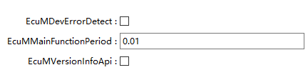

.. centered:: **表 EcuMGeneral属性描述 (Table EcuMGeneral Attribute Description)**

.. list-table::
   :widths: 20 20 20 20 20
   :header-rows: 1

   * - UI名称 (UI Name)
     - 描述 (Description)
     - 
     - 
     - 
   * - EcuMDevErrorDetect
     - 取值范围 (Range)
     - True/ False
     - 默认取值 (Default value)
     - False
   * - 
     - 参数描述 (Parameter Description)
     - 是否使能开发错误检测 (Whether to enable development error detection)
     - 
     - 
   * - 
     - 依赖关系 (Dependencies)
     - 无
     - 
     - 
   * - EcuMMainFunctionPeriod
     - 取值范围 (Range)
     - 0-100
     - 默认取值 (Default value)
     - 0.01
   * - 
     - 参数描述 (Parameter Description)
     - Ecum调度任务的执行周期 (The execution cycle of Ecum scheduling tasks)
     - 
     - 
   * - 
     - 依赖关系 (Dependencies)
     - 无
     - 
     - 
   * - EcuMVersionInfoApi
     - 取值范围 (Range)
     - True/False
     - 默认取值 (Default value)
     - False
   * - 
     - 参数描述 (Parameter Description)
     - 是否使能版本获取API (Whether to enable the version acquisition API)
     - 
     - 
   * - 
     - 依赖关系 (Dependencies)
     - 无
     - 
     - 

EcuMCommonConfigration
--------------------------------------

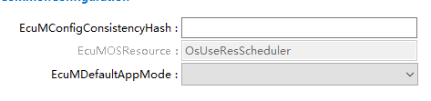

.. centered:: **表 EcuMCommonConfigration属性描述 (Table EcuMCommonConfigration Property Description)**

.. list-table::
   :widths: 20 20 20 20 20
   :header-rows: 1

   * - UI名称 (UI Name)
     - 描述 (Description)
     - 
     - 
     - 
   * - EcuMConfigConsistencyHash
     - 取值范围 (Range)
     - 0-18446744073709551615
     - 默认取值 (Default value)
     - 0
   * - 
     - 参数描述 (Parameter Description)
     - 所有 BSW模块的所有PC和LC参数生成的哈希值。该散列值与EcuM_ConfigType中的字段进行比较，因此允许检查整个配置的一致性。 (All hash values of PC and LC parameters generated for all BSW modules. This hash value is compared with the fields in EcuM_ConfigType, thus allowing consistency checking of the entire configuration.)
     - 
     - 
   * - 
     - 依赖关系 (Dependencies)
     - 无
     - 
     - 
   * - EcuMDefaultAppMode
     - 取值范围 (Range)
     - 无
     - 默认取值 (Default value)
     - 无
   * - 
     - 参数描述 (Parameter Description)
     - 用于StartOs中传入的APP模式 (App Mode for passing into StartOs)
     - 
     - 
   * - 
     - 依赖关系 (Dependencies)
     - Reference toOsAppMode
     - 
     - 
   * - EcuMOSResource
     - 取值范围 (Range)
     - 无
     - 默认取值 (Default value)
     - 无
   * - 
     - 参数描述 (Parameter Description)
     - 用于使 ECU进入睡眠模式的 OS资源的引用 (References to OS resources used for putting the ECU into sleep mode.)
     - 
     - 
   * - 
     - 依赖关系 (Dependencies)
     - 强制关联到OS的调度表资源 (Forced association with OS scheduling table resources)
     - 
     - 

EcuMDefaultShutdownTarget
-----------------------------------------

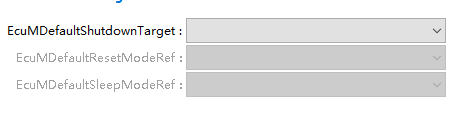

.. centered:: **表 EcuMDefaultShutdownTarget属性描述 (Property EcuMDefaultShutdownTarget description)**

.. list-table::
   :widths: 15 15 14 14 14 14 14
   :header-rows: 1

   * - UI名称 (UI Name)
     - 描述 (Description)
     - 
     - 
     - 
     - 
     - 
   * - EcuMDefaultState
     - 取值范围 (Range)
     - EcuMStateOff/EcuMStateReset/
     - 默认取值 (Default value)
     - 无
     - 
     - 
   * - 
     - 
     - EcuMStateSleep
     - 
     - 
     - 
     - 
   * - 
     - 参数描述 (Parameter Description)
     - ECU退出复位时选择的默认关闭目标的状态 (When ECU exits reset, the default status of the target to be closed is chosen.)
     - 
     - 
     - 
     - 
   * - 
     - 依赖关系 (Dependencies)
     - 无
     - 
     - 
     - 
     - 
   * - EcuMDefaultResetModeRef
     - 取值范围 (Range)
     - 引用到[EcuMResetMode] (Refer to [EcuMResetMode])
     - 默认取值 (Default value)
     - 无
     - 
     - 
   * - 
     - 参数描述 (Parameter Description)
     - 默认复位模式 (Default reset mode)
     - 
     - 
     - 
     - 
   * - 
     - 依赖关系 (Dependencies)
     - 当EcuMDefaultState配置为EcuMStateReset (When EcuMDefaultState is configured as EcuMStateReset)
     - 
     - 
     - 
     -
   * -
     - 
     - 
     - .. image:: ../../_static/参考手册(Module_Reference_Manual)/Dem/image13.png
         :width: 90%
         :align: center
     - 
     - 
     - 
   * - EcuMDefaultSleepModeRef
     - 取值范围 (Range)
     - 引用到[EcuMSleepMode] (Refer to [EcuMSleepMode])
     - 默认取值 (Default value)
     - 无
     - 
     - 
   * - 
     - 参数描述 (Parameter Description)
     - 默认睡眠模式 (Default Sleep Mode)
     - 
     - 
     - 
     - 
   * - 
     - 依赖关系 (Dependencies)
     - 当EcuMDefaultState配置为EcuMStateSleep (When EcuMDefaultState is configured as EcuMStateSleep)
     - 
     - 
     - 
     - 
   * -
     - 
     - 
     - .. image:: ../../_static/参考手册(Module_Reference_Manual)/Dem/image14.png
         :width: 90%
         :align: center
     - 
     - 
     - 

EcuMDriverInitItem
----------------------------------

此配置项用于：

This configuration item is used for:

- EcuMDriverInitListZero

- EcuMDriverInitListOne

- EcuMDriverRestartList

- EcuMDriverInitListBswM

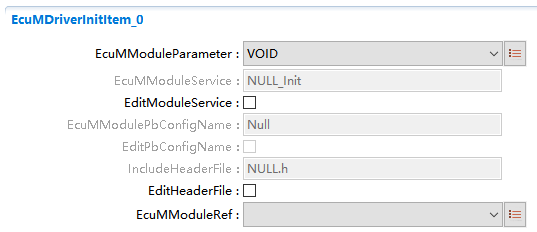

.. centered:: **表 EcuMDriverInitItem属性描述 (Table EcuMDriverInitItem Property Description)**

.. list-table::
   :widths: 12 11 11 11 11 11 11 11 11
   :header-rows: 1

   * - UI名称 (UI Name)
     - 描述 (Description)
     - 
     - 
     - 
     - 
     - 
     - 
     - 
   * - EcuMModuleParameter
     - 取值范围 (Range)
     - NULL_PTR/POSTBUILD_PTR/
     - 
     - 默认取值 (Default value)
     - 
     - VOID
     - 
     - 
   * - 
     - 
     - VOID
     - 
     - 
     - 
     - 
     - 
     - 
   * - 
     - 参数描述 (Parameter Description)
     - 定义函数原型和传递给函数的参数 (Define function prototypes and parameters passed to functions)
     - 
     - 
     - 
     - 
     - 
     - 
   * - 
     - 依赖关系 (Dependencies)
     - Bsw模块和MCAL一般选择POSTBUILD_PTR， (The Bsw module and MCAL generally choose POSTBUILD_PTR,)
     - 
     - 
     - 
     - 
     - 
     - 
   * - 
     - 
     - 需要特别注意地是DEM模块，当EcuMModuleRef选择为DEM时，EcuMModuleParameter可以配置为VOID和POSTBUILD_PTR，当配置为VOID时，表示Dem_PreInit；当配置为POSTBUILD_PTR，表示Dem_Init (Special attention should be paid to the DEM module. When EcuMModuleRef is chosen as DEM, EcuMModuleParameter can be configured as VOID and POSTBUILD_PTR. When configured as VOID, it indicates Dem_PreInit; when configured as POSTBUILD_PTR, it indicates Dem_Init.)
     - 
     - 
     - 
     - 
     - 
     - 
   * - EcuMModuleService
     - 取值范围 (Range)
     - Init//DeInit/
     - 
     - 默认取值 (Default value)
     - 
     - Init
     - 
     - 
   * - 
     - 
     - PreInit/
     - 
     - 
     - 
     - 
     - 
     - 
   * - 
     - 
     - Start
     - 
     - 
     - 
     - 
     - 
     - 
   * - 
     - 参数描述 (Parameter Description)
     - 要调用以初始化该模块的服务，例如Init、PreInit、Start等。 (To call the service to initialize the module, such as Init, PreInit, Start, etc.)
     - 
     - 
     - 
     - 
     - 
     - 
   * - 
     - 依赖关系 (Dependencies)
     - 无
     - 
     - 
     - 
     - 
     - 
     - 
   * - EditModuleService
     - 取值范围 (Range)
     - True、False
     - 默认取值 (Default value)
     - 
     - False
     - 
     - 
     - 
   * - 
     - 参数描述 (Parameter Description)
     - 使能手动修改要初始化该模块的服务 (Enable manual modification to initialize this module)
     - 
     - 
     - 
     - 
     - 
     - 
   * - 
     - 依赖关系 (Dependencies)
     - 该配置决定配置EcuMModuleService是否可以手动修改 (This configuration decides whether EcuMModuleService can be manually modified.)
     - 
     - 
     - 
     - 
     - 
     - 
   * - EcuMModulePbConfigName
     - 取值范围 (Range)
     - 无
     - 默认取值 (Default value)
     - 
     - 
     - 无
     - 
     - 
   * - 
     - 参数描述 (Parameter Description)
     - 要调用以初始化该模块的参数 (To initialize this module, call with parameters)
     - 
     - 
     - 
     - 
     - 
     - 
   * - 
     - 依赖关系 (Dependencies)
     - 无
     - 
     - 
     - 
     - 
     - 
     - 
   * - EditPbConfigName
     - 取值范围 (Range)
     - True、False
     - 默认取值 (Default value)
     - 
     - False
     - 
     - 
     - 
   * - 
     - 参数描述 (Parameter Description)
     - 使能通过手动修改要调用以初始化该模块的参数 (Enable initialization of the module by manually modifying the parameters to be called.)
     - 
     - 
     - 
     - 
     - 
     - 
   * - 
     - 依赖关系 (Dependencies)
     - 该配置决定配置EcuMModulePbConfigName是否可以手动修改 (This configuration decides whether EcuMModulePbConfigName can be manually modified.)
     - 
     - 
     - 
     - 
     - 
     - 
   * - IncludeHeaderFile
     - 取值范围 (Range)
     - 无
     - 
     - 
     - 
     - 
     - 
     - 
   * - 
     - 参数描述 (Parameter Description)
     - 要调用初始化该模块的头文件 (To call the initialization header file of this module)
     - 
     - 
     - 
     - 
     - 
     - 
   * - 
     - 依赖关系 (Dependencies)
     - 无
     - 
     - 
     - 
     - 
     - 
     - 
   * - EditHeaderFile
     - 取值范围 (Range)
     - True、False
     - 默认取值 (Default value)
     - 
     - False
     - 
     - 
     - 
   * - 
     - 参数描述 (Parameter Description)
     - 使能要手动修改调用该模块的头文件 (Enable modification of the header files calling this module manually)
     - 
     - 
     - 
     - 
     - 
     - 
   * - 
     - 依赖关系 (Dependencies)
     - 该配置决定配置IncludeHeaderFile是否可以手动修改 (This configuration decides whether IncludeHeaderFile can be manually modified.)
     - 
     - 
     - 
     - 
     - 
     - 
   * - EcuMModuleRef
     - 取值范围 (Range)
     - 无
     - 
     - 默认取值 (Default value)
     - 
     - 无
     - 
     - 
   * - 
     - 参数描述 (Parameter Description)
     - 外部引用应由EcuM初始化的模块实例的配置（引用到具体某一个模块） (External references should be instances of modules configured by EcuM (referenced to a specific module).)
     - 
     - 
     - 
     - 
     - 
     - 
   * - 
     - 依赖关系 (Dependencies)
     - 当配置在EcuMDriverInitListZero中时： (When configured in EcuMDriverInitListZero:)
     - 
     - 
     - 
     - 
     - 
     - 
   * -
     - 
     - 
     - .. image:: ../../_static/参考手册(Module_Reference_Manual)/Dem/image16.png
         :width: 90%
         :align: center
     - 
     - 
     - 
     - 
     - 
   * - 
     - 
     - 在配置在EcuMDriverInitListOne中时： (When configuring in EcuMDriverInitListOne:)
     - 
     - 
     - 
     - 
     - 
     - 
   * -
     - 
     - 
     - .. image:: ../../_static/参考手册(Module_Reference_Manual)/Dem/image17.png
         :width: 90%
         :align: center
     - 
     - 
     - 
     - 
     - 
   * - 
     - 
     - 在配置在EcuMDriverInitListBswM中时： (When configured in EcuMDriverInitListBswM:)
     - 
     - 
     - 
     - 
     - 
     - 
   * - 
     - 
     - 此处选择为BSW模块 (Choose here for BSW module)
     - 
     - 
     - 
     - 
     - 
     - 

EcuMSleepMode
-----------------------------

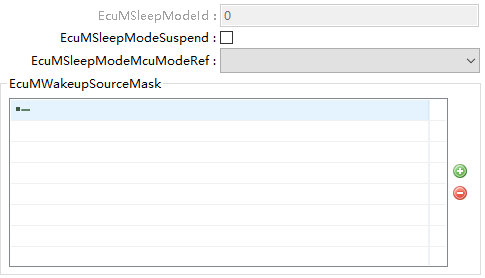

.. centered:: **表 EcuMSleepMode属性描述 (Table EcuMSleepMode Property Description)**

.. list-table::
   :widths: 20 20 20 20 20
   :header-rows: 1

   * - UI名称 (UI Name)
     - 描述 (Description)
     - 
     - 
     - 
   * - EcuMSleepModeId
     - 取值范围 (Range)
     - 0-255
     - 默认取值 (Default value)
     - 无
   * - 
     - 参数描述 (Parameter Description)
     - 在EcuM_SelectShutdownTarget等服务中标识 (Identify in services such as EcuM_SelectShutdownTarget etc.)
     - 
     - 
   * - 
     - 依赖关系 (Dependencies)
     - 这部分按照升序方式从0开始默认生成 (This part is generated starting from 0 in ascending order by default.)
     - 
     - 
   * - EcuMSleepModeSuspend
     - 取值范围 (Range)
     - True/False
     - 默认取值 (Default value)
     - False
   * - 
     - 参数描述 (Parameter Description)
     - 当配置为True时，进入halt-sleep模式； (When configured as True, enters halt-sleep mode;)
     - 
     - 
   * - 
     - 
     - 当配置为False时，进入poll-sleep模式； (When configured as False, enters poll-sleep mode;)
     - 
     - 
   * - 
     - 依赖关系 (Dependencies)
     - 无
     - 
     - 
   * - EcuMSleepModeMcuModeRef
     - 取值范围 (Range)
     - 引用到[McuModeSettingConf (Reference to [McuModeSettingConf])
     - 默认取值 (Default value)
     - 无
   * - 
     - 参数描述 (Parameter Description)
     - 引用到MCU的某一睡眠模式 (Refer to a specific sleep mode of MCU)
     - 
     - 
   * - 
     - 依赖关系 (Dependencies)
     - 引用到MCU中定义的SLEEP模式，需要保证MCU驱动中Mcu_SetMode能正常执行，并进入相应的sleep模式；
       (To ensure the translation maintains accuracy and clarity, here it is: Translate the text to English while preserving line breaks: Referring to the SLEEP mode defined in MCU, it needs to be ensured that Mcu_SetMode can execute normally and enter the corresponding sleep mode.)
     - 
     - 
   * - EcuMWakeupSourceMask
     - 取值范围 (Range)
     - 引用到[EcuMWakeupSource] (Reference [EcuMWakeupSource])
     - 默认取值 (Default value)
     - 无
   * - 
     - 参数描述 (Parameter Description)
     - 当进入Sleep模式后，仅只有通过此项关联的唤醒源才被认为是在此模式下有效的唤醒源 (When entering Sleep mode, only wake sources associated with this are considered valid wake sources in this mode.)
     - 
     - 
   * - 
     - 依赖关系 (Dependencies)
     - 无
     - 
     - 

EcuMWakeupSource
--------------------------------

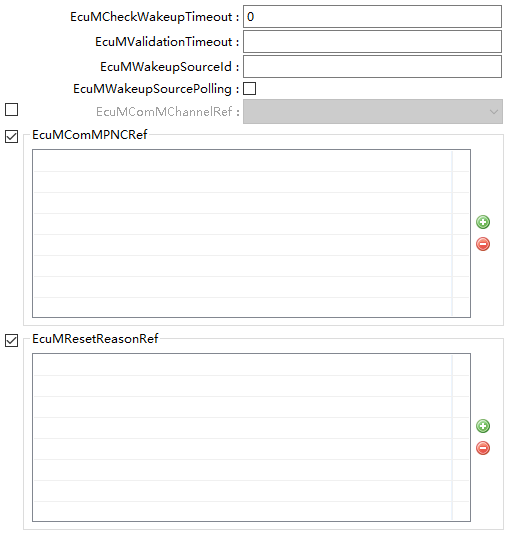

.. centered:: **表 EcuMWakeupSource属性描述 (Table EcuMWakeupSource Property Description)**

.. list-table::
   :widths: 20 20 20 20 20
   :header-rows: 1

   * - UI名称 (UI Name)
     - 描述 (Description)
     - 
     - 
     - 
   * - EcuMCheckWakeupTimeout
     - 取值范围 (Range)
     - 0-10
     - 默认取值 (Default value)
     - 0
   * -
     - 
     - EcuM_CheckWakeup的超时时间 (The timeout time of EcuM_CheckWakeup)
     - 
     - 
   * -
     - 
     - 无
     - 
     - 
   * - EcuMValidationTimeout
     - 取值范围 (Range)
     - 0-255
     - 
     - 
   * -
     - 参数描述 (Parameter Description)
     - EcuM_CheckValidation的超时时间 (The timeout time for EcuM_CheckValidation)
     - 
     - 
   * -
     - 
     - 无
     - 
     - 
   * - EcuMWakeupSourceId
     - 
     - 0-31
     - 
     - 
   * -
     - 参数描述 (Parameter Description)
     - 唤醒源的标识符 (Identifier of the wake-up source)
     - 
     - 
   * -
     - 依赖关系 (Dependencies)
     - 无，填写限制为：5~31，0~4为默认唤醒源 (Fill in restrictions: 5~31, default wake sources: 0~4)
     - 
     - 
   * - EcuMWakeupSourcePolling
     - 
     - True/False
     - 
     - 
   * -
     - 
     - 唤醒源是否需要轮询 (Does the wake-up source require polling?)
     - 
     - 
   * -
     - 依赖关系 (Dependencies)
     - 当此EcuMWakeupSource被EcuMSleepMode->EcuMWakeupSourceMask引用，且EcuMSleepMode->EcuMSleepModeSuspend配置为FALSE（POLL模式），则此项EcuMWakeupSourcePolling应该配置为TRUE，表示以轮询的方式检测唤醒源
     - 
     - 
   * - EcuMComMChannelRef
     - 取值范围 (Range)
     - 引用[ComMChannel][ (Referencing [ComMChannel])
     - 默认取值 (Default value)
     - 无
   * -
     - 参数描述 (Parameter Description)
     - 当配置此项后，当唤醒源检测到后，会调用ComM_EcuM_WakeUpIndication通知EcuMComMChannelRef引用的ComMChannel (After configuring this item, when the wake-up source is detected, it will call ComM_EcuM_WakeUpIndication to notify the ComMChannel referenced by EcuMComMChannelRef.)
     - 
     - 
   * -
     - 依赖关系 (Dependencies)
     - 无
     - 
     - 
   * - EcuMResetReasonRef
     - 取值范围 (Range)
     - 引用到[McuResetReasonConf] (Reference [McuResetReasonConf])
     - 默认取值 (Default value)
     - 无
   * -
     - 参数描述 (Parameter Description)
     - MCU 驱动程序检测到的复位原因到唤醒源的映射 (Mapping of reset causes detected by MCU to wake-up sources)
     - 
     - 
   * -
     - 依赖关系 (Dependencies)
     - 无
     - 
     - 

EcuMFlexConfiguration
-------------------------------------

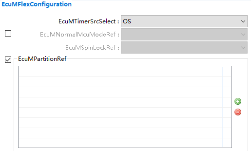

.. centered:: **表 EcuMFlexConfiguration属性描述 (Table EcuMFlexConfiguration Property Description)**

.. list-table::
   :widths: 20 20 20 20 20
   :header-rows: 1

   * - UI名称 (UI Name)
     - 描述 (Description)
     - 
     - 
     - 
   * - EcuMTimerSrcSelect
     - 取值范围 (Range)
     - OS/GPT
     - 默认取值 (Default value)
     - OS
   * - 
     - 参数描述 (Parameter Description)
     - 选择ECUM内部计时模块 (Select ECUM Internal Timing Module)
     - 
     - 
   * - 
     - 依赖关系 (Dependencies)
     - 依赖于OS和Tm模块 (Dependent on OS and Tm modules)
     - 
     - 
   * - EcuMNormalMcuModeRef
     - 取值范围 (Range)
     - 引用到[McuModeSettingConf] (Reference to [McuModeSettingConf])
     - 默认取值 (Default value)
     - 无
   * - 
     - 参数描述 (Parameter Description)
     - 当MCU进入Normal状态时，需要设置的MCU模式 (When the MCU enters Normal state, the MCUs mode that needs to be set is:)
     - 
     - 
   * - 
     - 依赖关系 (Dependencies)
     - 有些MCU，当唤醒源产生后，会自动进入Normal模式，因此不需要额外引用MCU的正常模式 (Some MCUs will automatically enter Normal mode upon wake-up trigger, so there is no need for additional reference to the normal mode of the MCU.)
     - 
     - 
   * - EcuMPartitionRef
     - 取值范围 (Range)
     - 引用到[EcucPartition] (Refer to [EcucPartition])
     - 默认取值 (Default value)
     - 无
   * - 
     - 参数描述 (Parameter Description)
     - 决定ECUM跑在哪一个分区中 (Decide which partition ECUM runs on.)
     - 
     - 
   * - 
     - 依赖关系 (Dependencies)
     - 无
     - 
     - 

EcuMAlarmClock
------------------------------

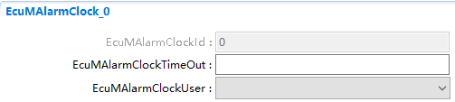

.. centered:: **表 EcuMAlarmClock属性描述 (Table EcuMAlarmClock Property Description)**

.. list-table::
   :widths: 15 15 14 14 14 14 14
   :header-rows: 1

   * - UI名称 (UI Name)
     - 描述 (Description)
     - 
     - 
     - 
     - 
     - 
   * - EcuMAlarmClockId
     - 取值范围 (Range)
     - 0-255
     - 
     - 默认取值 (Default value)
     - 
     - 无
   * - 
     - 参数描述 (Parameter Description)
     - 从0开始，按升序方式自动生成 (From 0, generate in ascending order)
     - 
     - 
     - 
     - 
   * - 
     - 依赖关系 (Dependencies)
     - 无
     - 
     - 
     - 
     - 
   * - EcuMAlarmClockTimeOut
     - 取值范围 (Range)
     - 0-255
     - 
     - 默认取值 (Default value)
     - 
     - 无
   * - 
     - 参数描述 (Parameter Description)
     - 当EcuM内部alarm计时到达此EcuMAlarmClockTimeOut值后，内部会产生一个alarm唤醒 (When the internal alarm timer of EcuM reaches this EcuMAlarmClockTimeOut value, an internal alarm wake-up will be generated.)
     - 
     - 
     - 
     - 
   * - 
     - 依赖关系 (Dependencies)
     - 无
     - 
     - 
     - 
     - 
   * - EcuMAlarmClockUser
     - 取值范围 (Range)
     - 引用到[EcuMFlexUserConfig] (Reference [EcuMFlexUserConfig])
     - 
     - 默认取值 (Default value)
     - 
     - 无
   * -
     - 参数描述 (Parameter Description)
     - 将警报分配给哪一个user (Assign the alert to which user)
     - 
     - 
     - 
     - 
   * - 
     - 依赖关系 (Dependencies)
     - 无
     - 
     - 
     - 
     - 

EcuMFlexUserConfig
----------------------------------

.. centered:: **表 EcuMFlexUserConfig属性描述 (Table EcuMFlexUserConfig property description)**

.. list-table::
   :widths: 20 20 20 20 20
   :header-rows: 1

   * - UI名称 (UI Name)
     - 描述 (Description)
     - 
     - 
     - 
   * - EcuMFlexUser
     - 取值范围 (Range)
     - 0-255
     - 默认取值 (Default value)
     - 无
   * - 
     - 参数描述 (Parameter Description)
     - 定义user的id (Define user ID)
     - 
     - 
   * - 
     - 依赖关系 (Dependencies)
     - 无
     - 
     - 
   * - EcuMFlexEcucPartitionRef
     - 取值范围 (Range)
     - 0-255
     - 默认取值 (Default value)
     - 无
   * - 
     - 参数描述 (Parameter Description)
     - 表示此user属于哪个分区 (Indicate which partition this user belongs to.)
     - 
     - 
   * - 
     - 依赖关系 (Dependencies)
     - 无
     - 
     - 

EcuMGoDownAllowedUsers
--------------------------------------

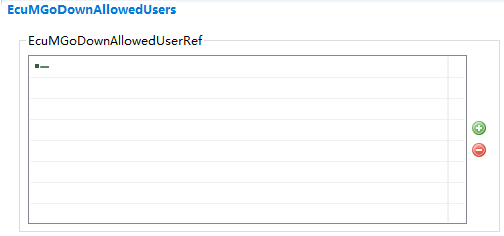

.. centered:: **表 EcuMGoDownAllowedUsers属性描述 (Property EcuMGoDownAllowedUsers attribute description)**

.. list-table::
   :widths: 20 20 20 20 20
   :header-rows: 1

   * - UI名称 (UI Name)
     - 描述 (Description)
     - 
     - 
     - 
   * - EcuMGoDownAllowedUserRef
     - 取值范围 (Range)
     - 引用到[EcuMFlexUserConfig] (Reference [EcuMFlexUserConfig])
     - 默认取值 (Default value)
     - 无
   * - 
     - 参数描述 (Parameter Description)
     - 表示允许调用EcuM_GoDownHaltPoll的user (Indicates permission for calling EcuM_GoDownHaltPoll by user)
     - 
     - 
   * - 
     - 依赖关系 (Dependencies)
     - 无
     - 
     - 

EcuMResetMode
-----------------------------

.. centered:: **表 EcuMResetMode属性描述 (Table EcuMResetMode property description)**

.. list-table::
   :widths: 20 20 20 20 20
   :header-rows: 1

   * - UI名称 (UI Name)
     - 描述 (Description)
     - 
     - 
     - 
   * - EcuMResetModeId
     - 取值范围 (Range)
     - 0-255
     - 默认取值 (Default value)
     - 无
   * - 
     - 参数描述 (Parameter Description)
     - 创建后默认生成 (Create and default generate)
     - 
     - 
   * - 
     - 依赖关系 (Dependencies)
     - 无
     - 
     - 

EcuMSetClockAllowedUsers
----------------------------------------

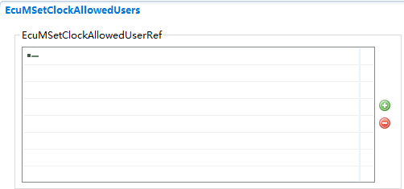

.. centered:: **表 EcuMSetClockAllowedUsers属性描述 (Property EcuMSetClockAllowedUsers describes the allowed users for setting the clock.)**

.. list-table::
   :widths: 20 20 20 20 20
   :header-rows: 1

   * - UI名称 (UI Name)
     - 描述 (Description)
     - 
     - 
     - 
   * - EcuMGoDownAllowedUserRef
     - 取值范围 (Range)
     - 引用到[EcuMFlexUserConfig] (Reference [EcuMFlexUserConfig])
     - 默认取值 (Default value)
     - 无
   * - 
     - 参数描述 (Parameter Description)
     - 允许调用EcuM_SetClock的user (Allow calling EcuM_SetClock by user)
     - 
     - 
   * - 
     - 依赖关系 (Dependencies)
     - 无
     - 
     - 

EcuMShutdownCause
---------------------------------

.. centered:: **表 EcuMShutdownCause属性描述 (Table EcuMShutdownCause property description)**

.. list-table::
   :widths: 20 20 20 20 20
   :header-rows: 1

   * - UI名称 (UI Name)
     - 描述 (Description)
     - 
     - 
     - 
   * - EcuMShutdownCauseId
     - 取值范围 (Range)
     - 0-255
     - 默认取值 (Default value)
     - 无
   * - 
     - 参数描述 (Parameter Description)
     - 创建后默认生成 (Create and default generate)
     - 
     - 
   * - 
     - 依赖关系 (Dependencies)
     - 无
     - 
     - 

EcuMFlexGeneral
-------------------------------

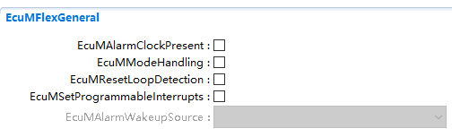

.. centered:: **表 EcuMFlexGeneral属性描述 (Table EcuMFlexGeneral Property Description)**

.. list-table::
   :widths: 15 15 14 14 14 14 14
   :header-rows: 1

   * - UI名称 (UI Name)
     - 描述 (Description)
     -
     -
     -
     -
     -
   * - EcuMAlarmClockPresent
     - 取值范围 (Range)
     - True/False
     -
     - 默认取值 (Default value)
     -
     - False
   * -
     - 参数描述 (Parameter Description)
     - 指示是否存在Alarm功能 (Is there an Alarm function?)
     -
     -
     -
     -
   * -
     - 依赖关系 (Dependencies)
     - 无
     -
     -
     -
     -
   * - EcuMModeHandling
     - 取值范围 (Range)
     - True/False
     -
     - 默认取值 (Default value)
     -
     - False
   * -
     - 参数描述 (Parameter Description)
     - Run RequestProtocol是否使能 (Is Run RequestProtocol Enabled?)
     -
     -
     -
     -
   * -
     - 依赖关系 (Dependencies)
     - 无
     -
     -
     -
     -
   * - EcuMResetLoopDetection
     - 取值范围 (Range)
     - True/False
     -
     - 默认取值 (Default value)
     -
     - False
   * -
     - 参数描述 (Parameter Description)
     - 表示在StartPreOS中EcuM_LoopDetection是否被调用 (Show whether EcuM_LoopDetection is called in StartPreOS.)
     -
     -
     -
     -
   * -
     - 依赖关系 (Dependencies)
     - 无
     -
     -
     -
     -
   * - EcuMSetProgrammableInterrupts
     - 取值范围 (Range)
     - True/False
     -
     - 默认取值 (Default value)
     -
     - False
   * -
     - 参数描述 (Parameter Description)
     - 表示在StartPreOS中EcuM_AL_SetProgrammableInterrupts是否被调用 (Check if EcuM_AL_SetProgrammableInterrupts is called in StartPreOS.)
     -
     -
     -
     -
   * -
     - 依赖关系 (Dependencies)
     - 无
     -
     -
     -
     -
   * - EcuMAlarmWakeupSource
     - 取值范围 (Range)
     - 无
     -
     - 默认取值 (Default value)
     -
     - 无
   * -
     - 参数描述 (Parameter Description)
     - 当EcuMAlarm被作为唤醒源时，需要配置此项 (When EcuMAlarm is configured as the wake-up source, this needs to be set.)
     -
     -
     -
     -
   * -
     - 依赖关系 (Dependencies)
     - Reference to EcuMWakeupSource
     -
     -
     -
     -
   * -
     -
     - EcuMAlarmClockPresent配置为TRUE (EcuMAlarmClockPresent configured as TRUE)
     -
     -
     -
     -
