Eep
#################################

:strong:`缩写词注解 (Abbreviation Notes):`

.. list-table::
   :widths: 34 33 33
   :header-rows: 1

   * - 缩写词 (Abbreviation)
     - 解释/描述 (Explanation/Description)
     - 中文解释 (Chinese explanation)
   * - EEPROM
     - Electrically Erasable and
     - 电可擦和可编程只读存储器 (Electrically Erasable and Programmable Read-Only Memory)
   * - 
     - Programmable Read Only
     - 
   * - 
     - Memory
     - 
   * - NVRAM
     - Non Volatile RandomAccess
     - 非易失性随机存取存储器 (Non-volatile Random Access Memory)
   * - 
     - Memory
     - 
   * - NvM
     - Module name of NVRAM
     - NVRAM管理器的模块名称 (The module name of NVRAM Manager)
   * - 
     - Manage
     - 
   * - EcuM
     - Module name of ECU State
     - ECU状态管理器的模块名称 (The module name of ECU Status Manager)
   * - 
     - Manager
     - 
   * - DEM
     - Module name of Diagnostic
     - 诊断事件管理器的模块名称 (Module Name for Diagnosing Event Manager)
   * - 
     - Event Manager
     - 
   * - DET
     - Module name of DefaultError
     - 默认错误跟踪器的模块名称 (The module name for the default error tracker)
   * - 
     - Tracer
     - 
   * - FEE
     - Flash EEPROM Emulation
     - Flash EEPROM仿真抽象 (Flash EEPROM Simulation Abstraction)
   * - 
     - Abstraction
     - 
   * - EA
     - EEPROM Abstraction
     - EEPROM抽象 (EEPROM Abstraction)
   * - MemIf
     - Memory AbstractionInterface
     - 内存抽象接口 (Memory abstraction interface)

简介 (Introduction)
=================================

EEPROM驱动程序提供对EEPROM存储单元的读取、写入和擦除等操作服务。它还提供将EEPROM中的数据块与内存中的数据块进行比较的服务。这些服务的行为是异步的。内部EEPROM的驱动程序直接访问微控制器硬件，位于微控制器抽象层。外部EEPROM的驱动程序使用SPI/IIC/UART等常见外围串行总线的驱动处理程序来访问外部EEPROM设备，位于ECU抽象层。两种类型的驱动程序的功能要求和功能范围相同，因此API在语义上是相同的。

The EEPROM driver provides services for reading, writing, and erasing operations on EEPROM storage units. It also offers a service to compare data blocks in the EEPROM with those in memory. These services behave asynchronously. The driver for the internal EEPROM directly accesses the microcontroller hardware, residing at the microcontroller abstraction layer. The driver for external EEPROM uses drivers for common peripheral serial buses like SPI/IIC/UART to access external EEPROM devices, residing at the ECU abstraction layer. Both types of drivers have the same functional requirements and scope, thus their APIs are semantically identical.

EEPROM（Electrically Erasable Programmable Read-Only Memory）是一种带电可擦可编程只读存储器，其特点是掉电后数据不丢失。EEPROM可以在电脑上或专用设备上擦除已有信息并重新编程，通常用于即插即用设备中。EEPROM驱动程序的开发涉及到对EEPROM设备的有效管理和操作，包括但不限于读取、写入和擦除数据，这对于许多应用来说是至关重要的，尤其是在需要频繁更新或配置信息的场景中。

EEPROM (Electrically Erasable Programmable Read-Only Memory) is a type of electrically erasable programmable read-only memory. Its characteristic is that data does not get lost after power loss. EEPROM can be erased and reprogrammed on a computer or a dedicated device, usually used in plug-and-play devices. The development of EEPROM drivers involves the effective management and operation of the EEPROM device, including but not limited to reading, writing, and erasing data. This is crucial for many applications, especially in scenarios where frequent updates or configuration information are needed.

此外，EEPROM驱动程序还需要考虑与不同硬件平台的兼容性，确保能够在不同的微控制器或系统中正确运行。这涉及到驱动程序的移植性和兼容性测试，‌以确保其能够在各种环境中稳定、可靠地工作。

Moreover, the EEPROM driver also needs to consider compatibility with different hardware platforms to ensure correct operation on various microcontrollers or systems. This involves portability and compatibility testing of the driver to ensure its stable and reliable performance in various environments.

参考资料 (Reference materials)
------------------------------------------

[1] AUTOSAR_SRS_EEPROMDriver.pdf，R19-11

功能描述 (Function Description)
===========================================

Eep功能 (EEP Function)
------------------------------------

Eep功能介绍 (EEP Feature Introduction)
==================================================

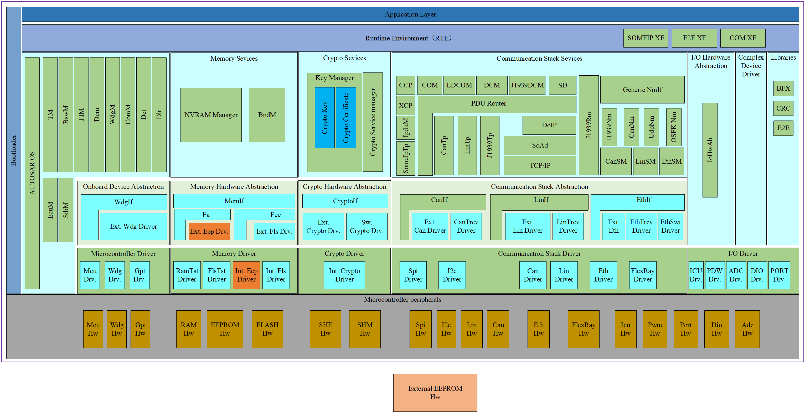

如图所示展示了AUTOSAR存储栈的EEPROM驱动程序Eep模块的软件分层架构。可以看到Det模块处于BSW基础软件的ECU抽象层，Eep模块的上层与Ea模块进行交互，并提供API函数接口给Ea模块使用，完成EEPROM驱动程序的读取/写入/擦除/比较等作业任务，待作业任务完成以后，提供API查询接口向Ea模块报告作业结果/运行状态或者提供中断回调通知接口报告作业结果和运行状态；当ECU采用片内Eep驱动程序时，Eep模块的下层与Mcal-Int.Eep模块进行交互，直接提供API接口给Ea模块进行调用，完成所有的作业任务；当ECU采用片外Eep驱动程序时，Eep模块的下层与外围串行总线驱动程序SPI/IIC模块进行交互，比如采用SPI总线挂接Ext.Eep外设，调用SPI驱动程序的Spi_SetupEB/Spi_SyncTransmit函数接口，完成EEPROM存储单元的写入/读取/擦除/比较等作业任务。

The software hierarchical architecture of the EEPROM driver Eep module in the AUTOSAR storage stack as shown in the figure demonstrates how it is positioned within the BSW foundation software's ECU abstraction layer. The Det module can be seen below Eep, with interaction occurring between the Eep and Ea modules, where Eep provides API function interfaces for use by the Ea module to accomplish tasks such as reading/writing/erasing/comparing EEPROM operations. Upon task completion, Eep offers an API query interface to report results/run status back to the Ea module or a callback interrupt notification interface for the same purpose. When the ECU uses an internal EEPROM driver, the lower layer of Eep interacts directly with Mcal-Int.Eep module to provide APIs for use by the Ea module to complete all tasks. In cases where the ECU utilizes external EEPROM drivers, Eep interfaces at its lower layer with peripheral serial bus drivers like SPI/IIC, for example, by attaching an Ext.Eep peripheral via SPI bus and using functions such as Spi_SetupEB/Spi_SyncTransmit from the SPI driver to accomplish writing/reading/erasing/comparing EEPROM operations.

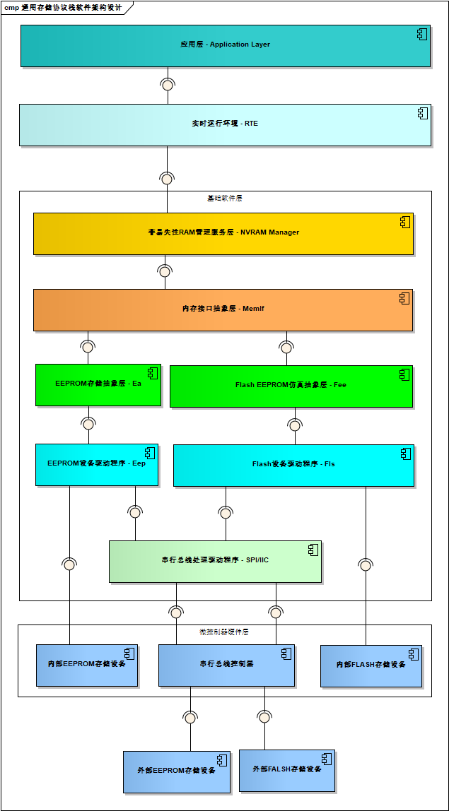

存储栈处于BSW基础软件层，主要由NVRAM，MemIf，Fee、Fls、Ea和Eep等组件来实现。大多数情况下，EEPROM存储单元处于MCU的外部，并通过串行外设总线挂接，严格来讲不属于AUTOSAR软件架构中的标准模块，因此针对于Eep模块的软件架构需要设计成EEPROM存储标准框架和设备驱动组合形式，EEPROM存储标准框架可以做成AUTOSAR标准模块，而设备驱动组件则需要以CDD复杂设备驱动的形式来完成。

Storage stack resides in the BSW (Basic Software Layer), mainly implemented by components such as NVRAM, MemIf, Fee, Fls, Ea, and Eep. Typically, the EEPROM storage unit is external to the MCU and connected via a serial peripheral bus. Strictly speaking, it does not belong to the standard modules of the AUTOSAR software architecture. Therefore, the software architecture for the Eep module should be designed as a combination of the standard EEPROM storage framework and device drivers. The standard EEPROM storage framework can be implemented as an AUTOSAR standard module, while the device driver component needs to be completed in the form of a CDD complex device driver.

Eep功能实现 (EEP functionality implementation)
==========================================================

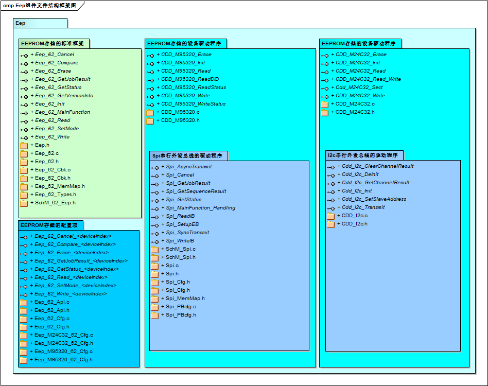

Eep驱动程序提供了为存储栈实现EEPROM存储单元的读取/写入/擦除/比较等基本作业任务。EEPROM存储的标准框架用于实现AUTOSAR的标准API函数，可以直接被EA模块无缝隙进行挂接，脱离硬件设备的束缚，属于EEPROM驱动程序的硬件抽象部分；EEPROM存储的设备驱动程序用于实现硬件设备的驱动控制，完全依赖于所使用EEPROM存储介质的硬件特性。针对于EEPROM存储的设备驱动程序都是根据ECU所集成的芯片定制化的功能模块，并且根据硬件特性需要涉及更多的组件引入；如果采用SPI串行总线进行挂接，则可以直接使用MCAL自带的SPI组件，并追加EEPROM驱动程序相关的SPI组件的Channel/Job/Sequence/External等参数的配置项，然后通过CDD的方式实现驱动程序的基本操作API接口，并通过配置指针的方式挂接到EEPROM存储的标准框架上，最终以AUTOSAR标准API函数供EA存储抽象组件调用；如果采用IIC串行总线进行挂接，因为IIC也不属于AUTOSAR标准API函数，首先需要通过CDD的方式实现IIC总线的驱动程序，然后引用IIC驱动程序的API实现EEPROM存储设备驱动的基本操作API函数，并通过配置指针的方式挂接到EEPROM存储的标准框架上，最终以AUTOSAR标准API函数供EA存储抽象组件调用；如果MCAL自带Eep驱动程序模块，则直接使用其实现的API函数供EA存储抽象组件调用。

The Eep driver provides the basic tasks of reading/writing/erasing/comparing EEPROM storage units for the storage stack. The standard framework for EEPROM storage is used to implement AUTOSAR standard API functions, which can be seamlessly connected to the EA module without being bound by hardware devices; this belongs to the hardware abstraction part of the EEPROM driver. The device driver for EEPROM storage is used to achieve hardware control and is completely dependent on the hardware characteristics of the used EEPROM storage medium. For the device driver of EEPROM storage, it is a customized functional module based on the chip integrated in the ECU, and more components need to be introduced due to hardware characteristics; if connected via SPI serial bus, the built-in SPI component of MCAL can be directly utilized, and configuration items such as Channel/Job/Sequence/External for relevant SPI components of the EEPROM driver are added. Then, through the CDD method, basic operation API interfaces of the driver program are realized, and they are attached to the standard framework of EEPROM storage via pointer configuration, ultimately providing AUTOSAR standard API functions for the EA storage abstraction component to call; if connected via IIC serial bus, as IIC is not an AUTOSAR standard API function either, the driver program for IIC bus needs to be realized through the CDD method first. Then, using APIs of the IIC driver program, basic operation API functions for EEPROM storage devices are implemented, and they are attached to the standard framework of EEPROM storage via pointer configuration. Ultimately, AUTOSAR standard API functions are provided for the EA storage abstraction component to call; if MCAL has an Eep driver program module, its realized API functions can be directly utilized by the EA storage abstraction component.

模块之间的交互关系 (The interaction relationships between modules)
-------------------------------------------------------------------------

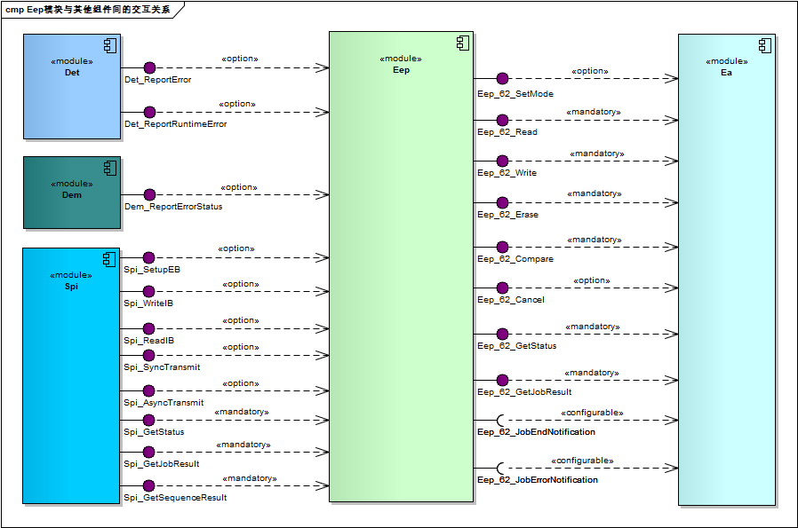

.. centered:: **表 模块间交互关系 (Table Module Interactions)**

.. list-table::
   :widths: 25 25 25 25
   :header-rows: 1

   * - 交互模块 (Interaction Module)
     - 交互接口 (Interfacial Interface)
     - 交互数据 (Interact Data)
     - 交互条件 (Interaction Conditions)
   * - SPI
     - Spi_WriteIB
     - 请求向SPI驱动程序的指定缓冲区写入数据 (Request data writing to the specified buffer of the SPI driver)
     - IB模式的缓冲区 (The Buffer of IB Mode)
   * - 
     - Spi_ReadIB
     - 请求从SPI驱动程序的指定缓冲区读取数据 (Read data from the specified buffer of the SPI driver request)
     - IB模式的缓冲区 (The Buffer of IB Mode)
   * - 
     - Spi_SetupEB
     - 请求向SPI驱动程序的指定缓冲区写入数据，并绑定结果缓冲区 (Request data writing to a specified buffer of the SPI driver and bind the result buffer.)
     - EB模式的缓冲区 (Buffer of EB mode)
   * - 
     - Spi_AsyncTransmit
     - 请求发起传输任务 (Request initiated for transmission task)
     - 异步方式 (Asynchronous方式)
   * - 
     - Spi_SyncTransmit
     - 请求发起传输任务 (Request initiated for transmission task)
     - 同步方式 (Synchronization method)
   * - 
     - Spi_GetStatus
     - 获取SPI驱动程序的运行状态 (Get the running status of the SPI driver.)
     - 无
   * - 
     - Spi_GetJobResult
     - 获取SPI驱动程序的作业结果 (Get results of SPI driver job)
     - 无
   * - 
     - Spi\_GetSequenceResult
     - 获取SPI驱动程序的序列结果 (Get the sequence result of the SPI driver.)
     - 无
   * - Det
     - Det_ReportError
     - 向Det模块报告开发错误 (Report development errors to the Det module)
     - 依赖于配置 (Dependent on configuration)
   * - 
     - Det_ReportRuntimeError
     - 向Det模块报告运行时错误 (Report runtime errors to the Det module)
     - 依赖于配置 (Dependent on configuration)
   * - Dem
     - Dem\_ReportErrorStatus
     - 向Dem模块报告硬件故障 (Report hardware failure to Dem module)
     - 依赖于配置 (Dependent on configuration)
   * - EA
     - Eep_62_SetMode
     - 请求设置EEPROM驱动程序的工作模式 (Request setting the EEPROM driver mode.)
     - 无
   * - 
     - Eep_62_Read
     - 请求对EEPROM的存储单元执行读取操作 (Request for reading operation on EEPROM memory unit)
     - 无
   * - 
     - Eep_62_Write
     - 请求对EEPROM的存储单元执行写入操作 (Request to perform a write operation on the EEPROM memory unit)
     - 无
   * - 
     - Eep_62_Erase
     - 请求对EEPROM的存储单元执行擦除操作 (Request erasure operation on EEPROM storage units)
     - 无
   * - 
     - Eep_62_Compare
     - 请求对EEPROM的存储单元执行比较操作 (Request to perform a comparison operation on the EEPROM storage unit)
     - 无
   * - 
     - Eep_62_Cancel
     - 请求取消EEPROM驱动程序中正在执行的作业任务 (Request to cancel the job task being executed in the EEPROM driver)
     - 依赖于配置 (Dependent on configuration)
   * - 
     - Eep_62_GetStatus
     - 请求获取EEPROM驱动程序的运行状态 (Request for EEPROM driver operation status)
     - 无
   * - 
     - Eep_62_GetJobResult
     - 请求获取EEPROM驱动程序的当前作业结果 (Request for current job result of EEPROM driver)
     - 

源文件描述 (Source file description)
===============================================

.. centered:: **表 Eep组件文件描述 (Table EEP Component File Description)**

.. list-table::
   :widths: 50 50
   :header-rows: 1

   * - 文件 (Files)
     - 说明 (Description)
   * - Eep.h
     - EEPROM驱动程序的派生数据类型定义 (Derivation of data types for EEPROM driver programming)
   * - Eep_62.c
     - EEPROM驱动程序API函数实现和变量定义 (EEPROM Driver API Functions Implementation and Variable Definitions)
   * - Eep_62.h
     - EEPROM驱动程序API函数声明和宏定义 (EEPROM Driver API Function Declarations and Macro Definitions)
   * - Eep_62_Cbk.c
     - EEPROM驱动程序提供给上层组件引用的通知回调函数实现 (EEPROM driver provides implementational realization of notification callback functions for upper-layer components to reference.)
   * - Eep_62_Cbk.h
     - EEPROM驱动程序提供给上层组件引用的通知回调函数声明 (Notification callback function declarations provided by the EEPROM driver for higher-layer components to reference.)
   * - Eep_62_Types.h
     - EEPROM驱动程序的派生数据类型定义 (Derivation of data types for EEPROM driver programming)
   * - Eep_62_MemMap.h
     - EEPROM驱动程序的内存映射抽象声明 (Abstraction declaration for EEPROM driver memory mapping)
   * - SchM_62_Eep.h
     - EEPROM驱动程序的调用上下文保护接口声明 (The interface declaration for EEPROM driver call context protection)
   * - CDD_M95320.c
     - EEPROM驱动程序的设备操作控制接口函数实现 (The interface functions for device operation control of the EEPROM driver implementation)
   * - CDD_M95320.h
     - EEPROM驱动程序的设备操作控制接口函数声明 (Declaration of EEPROM driver device operation control interface functions)
   * - Eep_62_Api.c
     - EEPROM驱动程序的API函数重映射实现的配置 (The configuration for API function remapping implementation of the EEPROM driver)
   * - Eep_62_Api.h
     - EEPROM驱动程序的API函数重映射声明的配置 (The API function remapping declaration for EEPROM driver's configuration)
   * - Eep_62_Cfg.c
     - EEPROM驱动程序的运行时加载需要用到的可配置参数的实现 (The implementation of configurable parameters needed for the runtime loading of EEPROM driver)
   * - Eep_62_Cfg.h
     - EEPROM驱动程序的可配置参数数据结构的类型定义，以及预编译阶段需要用到的配置参数的宏定义的实现 (Type definitions for configurable parameter data structures of the EEPROM driver, and implementation of macros for configuration parameters needed during pre-compile stage)
   * - Eep_M95320_62_Cfg.c
     - EEPROM驱动程序的运行时加载需要用到的可配置特定设备属性参数的实现 (The implementation of configurable specific device properties parameters required for runtime loading of the EEPROM driver.)
   * - Eep_M95320_62_Cfg.h
     - EEPROM驱动程序的预编译阶段需要用到的可配置特定设备属性参数的宏定义的实现 (The implementation of macro definitions for configurable specific device properties parameters required during the precompiled stage of the EEPROM driver)

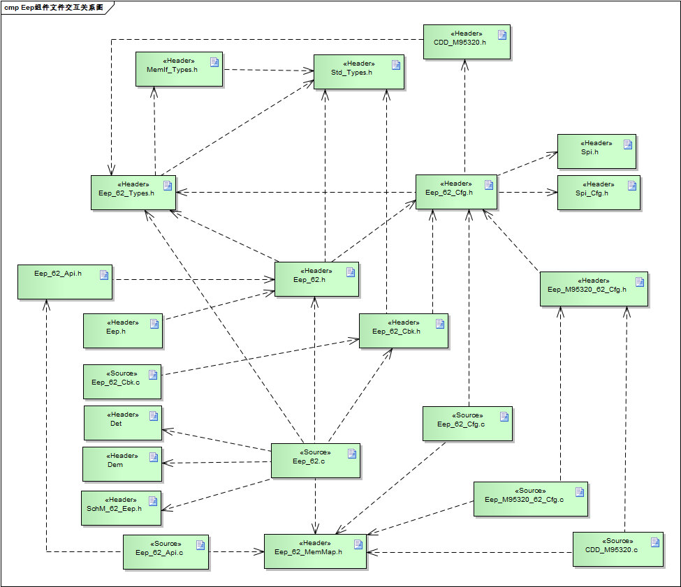

API接口 (API Interface)
=====================================

类型定义 (Type definition)
--------------------------------------

Eep_62_AddressType类型定义 (AddressType Enum Type Definition)
=========================================================================

.. list-table::
   :widths: 50 50
   :header-rows: 1

   * - 名称 (Name)
     - Eep_62_AddressType
   * - 类型 (Type)
     - uint32
   * - 定义 (Define)
     - #define Eep_AddressType Eep_62_AddressType
   * - 
     - typedef uint32 Eep_62_AddressType;
   * - 范围 (Range)
     - 0 … 4294967295
   * - 描述 (Description)
     - 用于描述EEPROM驱动程序中地址类型的派生数据类型 (Data types derived to describe address types in the EEPROM driver)

Eep_62_LengthType类型定义 (LengthType Type Definition)
==================================================================

.. list-table::
   :widths: 50 50
   :header-rows: 1

   * - 名称 (Name)
     - Eep_62_LengthType
   * - 类型 (Type)
     - uint16
   * - 定义 (Define)
     - #define Eep_LengthType Eep_62_LengthType
   * - 
     - typedef uint16 Eep_62_LengthType;
   * - 范围 (Range)
     - 0 … 65535
   * - 描述 (Description)
     - 用于描述EEPROM驱动程序中长度类型的派生数据类型 (Data types derived for describing lengths in EEPROM driver)

Eep_62_RequestJobType类型定义 (Eep_62_RequestJobType Type Definition)
=================================================================================

.. list-table::
   :widths: 50 50
   :header-rows: 1

   * - 名称 (Name)
     - Eep_62_RequestJobType
   * - 类型 (Type)
     - Enumeration
   * - 定义 (Define)
     - typedef enum
   * - 
     - {
   * - 
     - EEP_62_JOB_NONE = 0,
   * - 
     - EEP_62_JOB_ERASE = 1,
   * - 
     - EEP_62_JOB_WRITE = 2,
   * - 
     - EEP_62_JOB_READ = 3,
   * - 
     - EEP_62_JOB_CANCEL = 4,
   * - 
     - EEP_62_JOB_COMPARE = 5
   * - 
     - } Eep_62_RequestJobType;
   * - 范围 (Range)
     - 0 … 5
   * - 描述 (Description)
     - 用于描述EEPROM驱动程序中请求作业状况的枚举数据类型 (Enumerated data type used to describe the status of request jobs in EEPROM driver)

Eep_62_RuntimeType类型定义 (RuntimeType Definition)
===============================================================

.. list-table::
   :widths: 50 50
   :header-rows: 1

   * - 名称 (Name)
     - Eep_62_RuntimeType
   * - 类型 (Type)
     - Structure
   * - 定义 (Define)
     - typedef struct
   * - 
     - {
   * - 
     - Eep_62_AddressType operateAddr;
   * - 
     - uint8\* dataBufferPtr;
   * - 
     - const uint8\* WriteBuffer;
   * - 
     - Eep_62_LengthType length;
   * - 
     - Eep_62_LengthType CompareLength;
   * - 
     - Eep_62_RequestJobType currentJob;
   * - 
     - Eep_62_LengthType maxReadSize;
   * - 
     - Eep_62_LengthType maxWriteSize;
   * - 
     - MemIf_ModeType currentMode;
   * - 
     - boolean StateForRunMainFunction;
   * - 
     - } Eep_62_RuntimeType;
   * - 范围 (Range)
     - 无
   * - 描述 (Description)
     - 用于描述EEPROM驱动程序中运行时状况的数据结构类型 (Data structure types used to describe runtime conditions in EEPROM driver)

Eep_62_DevApiType类型定义 (Eep_62_DevApiType Type Definition)
=========================================================================

.. list-table::
   :widths: 50 50
   :header-rows: 1

   * - 名称 (Name)
     - Eep_62_DevApiType
   * - 类型 (Type)
     - Structure
   * - 定义 (Define)
     - typedef struct
   * - 
     - {
   * - 
     - void (\*DevInitApi)(void);
   * - 
     - Std_ReturnType (\*DevReadApi)
   * - 
     - (Eep_62_AddressType readAddress, uint8\* readBufferPtr,
   * - 
     - Eep_62_LengthType readLength);
   * - 
     - Std_ReturnType (\*DevWriteApi)
   * - 
     - (Eep_62_AddressType writeAddress, const uint8\*writeBufferPtr,
   * - 
     - Eep_62_LengthType writeLength);
   * - 
     - Std_ReturnType (\*DevEraseApi)
   * - 
     - (Eep_62_AddressType eraseAddress, const uint8ErasedValue,
   * - 
     - Eep_62_LengthType eraseLength);
   * - 
     - } Eep_62_DevApiType;
   * - 范围 (Range)
     - 无
   * - 描述 (Description)
     - 用于描述EEPROM驱动程序中设备操作API列表的数据结构类型 (Data structure type used to describe the list of device operation APIs in EEPROM driver)

Eep_62_DeviceConfigType类型定义 (Eep_62_DeviceConfigType Type Definition)
=====================================================================================

.. list-table::
   :widths: 50 50
   :header-rows: 1

   * - 名称 (Name)
     - Eep_62_DeviceConfigType
   * - 类型 (Type)
     - Structure
   * - 定义 (Define)
     - typedef struct
   * - 
     - {
   * - 
     - uint8 DeviceId;
   * - 
     - Eep_62_AddressType baseAddress;
   * - 
     - Eep_62_LengthType usedSize;
   * - 
     - Eep_62_LengthType fastReadBlockSize;
   * - 
     - Eep_62_LengthType fastWriteBlockSize;
   * - 
     - Eep_62_LengthType normalReadBlockSize;
   * - 
     - Eep_62_LengthType normalWriteBlockSize;
   * - 
     - } Eep_62_DeviceConfigType;
   * - 范围 (Range)
     - 无
   * - 描述 (Description)
     - 用于描述EEPROM驱动程序中设备配置信息的数据结构类型 (Data structure type used for describing device configuration information in EEPROM driver)

Eep_62_ConfigType类型定义 (Eep_62_ConfigType Configuration Type Definition)
=======================================================================================

.. list-table::
   :widths: 50 50
   :header-rows: 1

   * - 名称 (Name)
     - Eep_62_ConfigType
   * - 类型 (Type)
     - Structure
   * - 定义 (Define)
     - typedef struct
   * - 
     - {
   * - 
     - MemIf_ModeType defaultMode;
   * - 
     - uint32 jobCallCycle;
   * - 
     - const Eep_62_JobNotificationFct jobEndNotification;
   * - 
     - const Eep_62_JobNotificationFct jobErrorNotification;
   * - 
     - uint8 DeviceConfigNbr;
   * - 
     - const Eep_62_DeviceConfigType \*DeviceConfigPtr;
   * - 
     - } Eep_62_ConfigType;
   * - 范围 (Range)
     - 无
   * - 描述 (Description)
     - 用于描述 Eep模块初始化时，加载配置信息的结构体类型 (Structure type used for loading configuration information when the Eep module initializes)

输入函数描述 (Describe the input function:)
-----------------------------------------------------

.. list-table::
   :widths: 50 50
   :header-rows: 1

   * - 输入模块 (Input Module)
     - API
   * - DET
     - Det_ReportError
   * - 
     - Det_ReportRuntimeError
   * - Dem
     - Dem_ReportErrorStatus
   * - SPI
     - Spi_SetupEB
   * - 
     - Spi_WriteIB
   * - 
     - Spi_ReadIB
   * - 
     - Spi_SyncTransmit
   * - 
     - Spi_AsyncTransmit
   * - 
     - Spi_GetStatus
   * - 
     - Spi_GetJobResult
   * - 
     - Spi_GetSequenceResult

静态接口函数定义 (Static interface function definition)
---------------------------------------------------------------

Eep_62_Init函数定义 (Eep_62_Init function definition)
=================================================================

.. list-table::
   :widths: 25 25 25 25
   :header-rows: 1

   * - 函数名称： (Function Name:)
     - Eep_62_Init
     - 
     - 
   * - 函数原型： (Function prototype:)
     - void Eep_62_Init (constEep_62_ConfigType\*ConfigPtr);
     - 
     - 
   * - 服务编号： (Service Number:)
     - 0x00
     - 
     - 
   * - 同步/异步： (Synchronous/asynchronous:)
     - 同步 (Sync)
     - 
     - 
   * - 是否可重入： (Is Reentrant:)
     - 不可重入 (Non-reentrant)
     - 
     - 
   * - 输入参数： (Input parameters:)
     - ConfigPtr：指向所选配置集的指针 (ConfigPtr：a pointer to the selected configuration set)
     - 值域： (Domain:)
     - 无
   * - 输入输出参数： (Input Output Parameters:)
     - 无
     - 
     - 
   * - 输出参数： (Output Parameters:)
     - 无
     - 
     - 
   * - 返回值： (Return Value:)
     - 无
     - 
     - 
   * - 功能概述： (Function Overview:)
     - 服务用于实现EEPROM驱动程序模块的初始化函数 (Services for initializing functions of the EEPROM driver module)
     - 
     - 

Eep_62_GetVersionInfo函数定义 (The definition of Eep_62_GetVersionInfo function)
============================================================================================

.. list-table::
   :widths: 25 25 25 25
   :header-rows: 1

   * - 函数名称： (Function Name:)
     - Eep\_62\_GetVersionInfo
     - 
     - 
   * - 函数原型： (Function prototype:)
     - voidEep_62_GetVersionInfo(Std_VersionInfoType\*versioninfo);
     - 
     - 
   * - 服务编号： (Service Number:)
     - 0x0A
     - 
     - 
   * - 同步/异步： (Synchronous/asynchronous:)
     - 同步 (Sync)
     - 
     - 
   * - 是否可重入： (Is Reentrant:)
     - 可重入 (Reentrant)
     - 
     - 
   * - 输入参数： (Input parameters:)
     - 无
     - 
     - 
   * - 输入输出参数： (Input Output Parameters:)
     - 无
     - 
     - 
   * - 输出参数： (Output Parameters:)
     - versioninfo
     - 值域： (Domain:)
     - 指向存储此模块的版本信息的指针 (A pointer to store version information of this module)
   * - 返回值： (Return Value:)
     - 无
     - 
     - 
   * - 功能概述： (Function Overview:)
     - 获取EEPROM驱动程序模块的版本信息 (Get version information of the EEPROM driver module)
     - 
     - 

Eep_62_SetMode\_<deviceIndex>函数定义 (Eep_62_SetMode\<deviceIndex> Function Definition)
====================================================================================================

.. list-table::
   :widths: 25 25 25 25
   :header-rows: 1

   * - 函数名称： (Function Name:)
     - Eep_62_SetMode\_<deviceIndex>
     - 
     - 
   * - 函数原型： (Function prototype:)
     - voidEep_62_SetMode\_<deviceIndex>(MemIf_ModeTypeMode);
     - 
     - 
   * - 服务编号： (Service Number:)
     - 0x01
     - 
     - 
   * - 同步/异步： (Synchronous/asynchronous:)
     - 同步 (Sync)
     - 
     - 
   * - 是否可重入： (Is Reentrant:)
     - 不可重入 (Non-reentrant)
     - 
     - 
   * - 输入参数： (Input parameters:)
     - Mode
     - 值域： (Domain:)
     - MEMIF_MODE_SLOW：慢读访问/SPI正常访问 (MEMIF_MODE_SLOW：slow read access/SPI normal access)
   * - 
     - 
     - 
     - MEMIF_MODE_FAST：快读访问/SPI突发访问 (MEMIF_MODE_FAST: Fast Read Access/SPI Burst Access)
   * - 输入输出参数： (Input Output Parameters:)
     - 无
     - 
     - 
   * - 输出参数： (Output Parameters:)
     - 无
     - 
     - 
   * - 返回值： (Return Value:)
     - 无
     - 
     - 
   * - 功能概述： (Function Overview:)
     - 服务用于EEPROM驱动程序中设置工作模式 (Service for setting operating mode in EEPROM driver)
     - 
     - 

Eep_62_Read\_<deviceIndex>函数定义 (Function definition for Eep_62_Read\<deviceIndex>)
==================================================================================================

.. list-table::
   :widths: 20 20 20 20 20
   :header-rows: 1

   * - 函数名称： (Function Name:)
     - Eep_62_Read\_<deviceIndex>
     - 
     - 
     - 
   * - 函数原型： (Function prototype:)
     - Std_ReturnTypeEep_62_Read\_<deviceIndex>
     - 
     - 
     - 
   * - 
     - (
     - 
     - 
     - 
   * - 
     - Eep_62_AddressTypeEepromAddress,
     - 
     - 
     - 
   * - 
     - uint8\*DataBufferPtr,
     - 
     - 
     - 
   * - 
     - Eep_62_LengthTypeLength
     - 
     - 
     - 
   * - 
     - );
     - 
     - 
     - 
   * - 服务编号： (Service Number:)
     - 0x02
     - 
     - 
     - 
   * - 同步/异步： (Synchronous/asynchronous:)
     - 异步 (Asynchronous)
     - 
     - 
     - 
   * - 是否可重入： (Is Reentrant:)
     - 不可重入 (Non-reentrant)
     - 
     - 
     - 
   * - 输入参数： (Input parameters:)
     - EepromAddress：EEPROM中的地址偏移量 (EepromAddress：Offset in EEPROM)
     - 
     - 值域： (Domain:)
     - Min:0Max:EEP_SIZE-1
   * - 
     - Length：要读取的字节数 (Length: The number of bytes to read)
     - 
     - 值域： (Domain:)
     - Min:1Max:EEP_SIZE–
   * - 
     - 
     - 
     - 
     - EepromAddress
   * - 输入输出参数： (Input Output Parameters:)
     - 无
     - 
     - 
     - 
   * - 输出参数： (Output Parameters:)
     - DataBufferPtr：指向RAM中目标数据缓冲区的指针 (DataBufferPtr：a pointer to the target data buffer in RAM)
     - 
     - 值域： (Domain:)
     - 无
   * - 返回值： (Return Value:)
     - Std_ReturnTyp
     - E_OK：读取命令已被接受 (E_OK: The read command has been accepted)
     - 
     - 
   * - 
     - 
     - E_NOT_OK：读取命令未被接受 (E_NOT_OK: The read command was not accepted)
     - 
     - 
   * - 功能概述： (Function Overview:)
     - 服务用于从EEPROM存储单元中读取给定字大小的数据 (Services are used to read data of a given word size from EEPROM storage units.)
     - 
     - 
     - 

Eep_62_Write\_<deviceIndex>函数定义 (Write_<deviceIndex> function definition)
=========================================================================================

.. list-table::
   :widths: 20 20 20 20 20
   :header-rows: 1

   * - 函数名称： (Function Name:)
     - Eep_62_Write\_<deviceIndex>
     - 
     - 
     - 
   * - 函数原型： (Function prototype:)
     - Std_ReturnTypeEep_62_Write\_<deviceIndex>
     - 
     - 
     - 
   * - 
     - (
     - 
     - 
     - 
   * - 
     - Eep\_62\_AddressTypeEepromAddress,
     - 
     - 
     - 
   * - 
     - const uint8\*DataBufferPtr,
     - 
     - 
     - 
   * - 
     - Eep_62_LengthTypeLength
     - 
     - 
     - 
   * - 
     - );
     - 
     - 
     - 
   * - 服务编号： (Service Number:)
     - 0x03
     - 
     - 
     - 
   * - 同步/异步： (Synchronous/asynchronous:)
     - 异步 (Asynchronous)
     - 
     - 
     - 
   * - 是否可重入： (Is Reentrant:)
     - 不可重入 (Non-reentrant)
     - 
     - 
     - 
   * - 输入参数： (Input parameters:)
     - EepromAddress：EEPROM中的地址偏移量 (EepromAddress：Offset in EEPROM)
     - 
     - 值域： (Domain:)
     - Min:0Max:EEP_SIZE-1
   * - 
     - DataBufferPtr：源数据指针 (DataBufferPtr: Source Data Pointer)
     - 
     - 值域： (Domain:)
     - 无
   * - 
     - Length：要写入的字节数 (Length：Number of bytes to write)
     - 
     - 值域： (Domain:)
     - Min:1Max:EEP_SIZE–
   * - 
     - 
     - 
     - 
     - EepromAddress
   * - 输入输出参数： (Input Output Parameters:)
     - 无
     - 
     - 
     - 
   * - 输出参数： (Output Parameters:)
     - 无
     - 
     - 
     - 
   * - 返回值： (Return Value:)
     - Std_ReturnType
     - E_OK：写入命令已被接受 (E_OK: The write command has been accepted)
     - 
     - 
   * - 
     - 
     - E_NOT_OK：写入命令未被接受 (E_NOT_OK: The command was not accepted for writing)
     - 
     - 
   * - 功能概述： (Function Overview:)
     - 服务用于向EEPROM存储单元写入给定字节大小的数据 (Service used for writing a given byte size of data to EEPROM storage units)
     - 
     - 
     - 

Eep_62_Erase\_<deviceIndex>函数定义 (Eep_62_Erase\<deviceIndex> function definition)
================================================================================================

.. list-table::
   :widths: 20 20 20 20 20
   :header-rows: 1

   * - 函数名称： (Function Name:)
     - Eep_62_Erase\_<deviceIndex>
     - 
     - 
     - 
   * - 函数原型： (Function prototype:)
     - Std_ReturnTypeEep_62_Erase\_<deviceIndex>
     - 
     - 
     - 
   * - 
     - (
     - 
     - 
     - 
   * - 
     - Eep\_62\_AddressTypeEepromAddress,
     - 
     - 
     - 
   * - 
     - Eep_62_LengthTypeLength
     - 
     - 
     - 
   * - 
     - );
     - 
     - 
     - 
   * - 服务编号： (Service Number:)
     - 0x04
     - 
     - 
     - 
   * - 同步/异步： (Synchronous/asynchronous:)
     - 异步 (Asynchronous)
     - 
     - 
     - 
   * - 是否可重入： (Is Reentrant:)
     - 不可重入 (Non-reentrant)
     - 
     - 
     - 
   * - 输入参数： (Input parameters:)
     - EepromAddress：EEPROM中的起始地址 (EepromAddress：Starting address in EEPROM)
     - 
     - 值域： (Domain:)
     - Min:0Max:EEP_SIZE-1
   * - 
     - Length：要擦除的字节数 (Length: Number of bytes to erase)
     - 
     - 值域： (Domain:)
     - Min:1Max:EEP_SIZE–
   * - 
     - 
     - 
     - 
     - EepromAddress
   * - 输入输出参数： (Input Output Parameters:)
     - 无
     - 
     - 
     - 
   * - 输出参数： (Output Parameters:)
     - 无
     - 
     - 
     - 
   * - 返回值： (Return Value:)
     - Std_ReturnType
     - E_OK：擦除命令已被接受 (E_OK: Erase command has been accepted)
     - 
     - 
   * - 
     - 
     - E_NOT_OK：擦除命令未被接受 (E_NOT_OK: Erase command not accepted)
     - 
     - 
   * - 功能概述： (Function Overview:)
     - 服务用于对EEPROM存储单元指定扇区执行擦除操作 (Service for erasing specified sectors of the EEPROM storage unit)
     - 
     - 
     - 

Eep_62_Campare\_<deviceIndex>函数定义 (EEP_62_Campare\<deviceIndex> Function Definition)
====================================================================================================

.. list-table::
   :widths: 20 20 20 20 20
   :header-rows: 1

   * - 函数名称： (Function Name:)
     - Eep\_62\_Compare\_<deviceIndex>
     - 
     - 
     - 
   * - 函数原型： (Function prototype:)
     - Std_ReturnTypeEep\_62\_Compare\_<deviceIndex>
     - 
     - 
     - 
   * - 
     - (
     - 
     - 
     - 
   * - 
     - Eep\_62\_AddressTypeEepromAddress,
     - 
     - 
     - 
   * - 
     - const uint8\*DataBufferPtr,
     - 
     - 
     - 
   * - 
     - Eep_62_LengthTypeLength
     - 
     - 
     - 
   * - 
     - );
     - 
     - 
     - 
   * - 服务编号： (Service Number:)
     - 0x05
     - 
     - 
     - 
   * - 同步/异步： (Synchronous/asynchronous:)
     - 异步 (Asynchronous)
     - 
     - 
     - 
   * - 是否可重入： (Is Reentrant:)
     - 不可重入 (Non-reentrant)
     - 
     - 
     - 
   * - 输入参数： (Input parameters:)
     - EepromAddress：EEPROM中的地址偏移量 (EepromAddress：Offset in EEPROM)
     - 
     - 值域： (Domain:)
     - Min:0Max:EEP_SIZE-1
   * - 
     - DataBufferPtr：指向数据缓冲区的指针 (DataBufferPtr：a pointer to the data buffer)
     - 
     - 值域： (Domain:)
     - 无
   * - 
     - Length：要比较的字节数 (Length: Bytes to compare)
     - 
     - 值域： (Domain:)
     - Min:1Max:EEP_SIZE–
   * - 
     - 
     - 
     - 
     - EepromAddress
   * - 输入输出参数： (Input Output Parameters:)
     - 无
     - 
     - 
     - 
   * - 输出参数： (Output Parameters:)
     - 无
     - 
     - 
     - 
   * - 返回值： (Return Value:)
     - Std_ReturnType
     - E_OK：比较命令已被接受 (E_OK: The comparison command has been accepted)
     - 
     - 
   * - 
     - 
     - E_NOT_OK：比较命令未被接受 (E_NOT_OK: The comparison command was not accepted)
     - 
     - 
   * - 功能概述： (Function Overview:)
     - 服务用于将EEPROM驱动程序中的数据块与内存中的EEPROM块进行比较 (Services are used to compare data blocks in the EEPROM driver with EEPROM blocks in memory.)
     - 
     - 
     - 

Eep_62_Cancel\_<deviceIndex>函数定义 (Eep_62_Cancel\<deviceIndex> function definition)
==================================================================================================

.. list-table::
   :widths: 50 50
   :header-rows: 1

   * - 函数名称： (Function Name:)
     - Eep_62_Cancel\_<deviceIndex>
   * - 函数原型： (Function prototype:)
     - void Eep_62_Cancel\_<deviceIndex>(void);
   * - 服务编号： (Service Number:)
     - 0x06
   * - 同步/异步： (Synchronous/asynchronous:)
     - 同步 (Sync)
   * - 是否可重入： (Is Reentrant:)
     - 不可重入 (Non-reentrant)
   * - 输入参数： (Input parameters:)
     - 无
   * - 输入输出参数： (Input Output Parameters:)
     - 无
   * - 输出参数： (Output Parameters:)
     - 无
   * - 返回值： (Return Value:)
     - 无
   * - 功能概述： (Function Overview:)
     - 服务用于取消EEPROM驱动程序中正在执行的作业任务 (Service用于取消EEPROM驱动程序中正在执行的作业任务)

Eep_62_GetStatus\_<deviceIndex>函数定义 (Eep_62_GetStatus\<deviceIndex> Function Definition)
========================================================================================================

.. list-table::
   :widths: 34 33 33
   :header-rows: 1

   * - 函数名称： (Function Name:)
     - Eep_62_GetStatus\_<deviceIndex>
     - 
   * - 函数原型： (Function prototype:)
     - MemIf_StatusTypeEep_62_GetStatus\_<deviceIndex>(void);
     - 
   * - 服务编号： (Service Number:)
     - 0x07
     - 
   * - 同步/异步： (Synchronous/asynchronous:)
     - 同步 (Sync)
     - 
   * - 是否可重入： (Is Reentrant:)
     - 可重入 (Reentrant)
     - 
   * - 输入参数： (Input parameters:)
     - 无
     - 
   * - 输入输出参数： (Input Output Parameters:)
     - 无
     - 
   * - 输出参数： (Output Parameters:)
     - 无
     - 
   * - 返回值： (Return Value:)
     - MemIf_StatusType
     - MEMIF_UNINITMEMIF_IDLE
   * - 
     - 
     - MEMIF_BUSY
   * - 
     - 
     - MEMIF_BUSY_INTERNAL
   * - 功能概述： (Function Overview:)
     - 服务用于获取EEPROM驱动程序的当前工作状态 (Service for getting the current working status of the EEPROM driver)
     - 

Eep_62_GetJobResult\_<deviceIndex>函数定义 (Eep_62_GetJobResult\<deviceIndex> Function Definition)
==============================================================================================================

.. list-table::
   :widths: 34 33 33
   :header-rows: 1

   * - 函数名称： (Function Name:)
     - Eep_62_GetJobResult\_<deviceIndex>
     - 
   * - 函数原型： (Function prototype:)
     - MemIf_JobResultTypeEep\_62\_GetJobResult\_<deviceIndex>(void);
     - 
   * - 服务编号： (Service Number:)
     - 0x08
     - 
   * - 同步/异步： (Synchronous/asynchronous:)
     - 同步 (Sync)
     - 
   * - 是否可重入： (Is Reentrant:)
     - 可重入 (Reentrant)
     - 
   * - 输入参数： (Input parameters:)
     - 无
     - 
   * - 输入输出参数： (Input Output Parameters:)
     - 无
     - 
   * - 输出参数： (Output Parameters:)
     - 无
     - 
   * - 返回值： (Return Value:)
     - MemIf_JobResultType
     - MEMIF_JOB_OKMEMIF_JOB_FAILED
   * - 
     - 
     - MEMIF_JOB_PENDING
   * - 
     - 
     - MEMIF_JOB_CANCELED
   * - 
     - 
     - MEMIF_BLOCK_INCONSISTENT
   * - 
     - 
     - MEMIF_BLOCK_INVALID
   * - 功能概述： (Function Overview:)
     - 服务用于获取EEPROM驱动程序的当前作业结果 (The service is for obtaining the current job result of the EEPROM driver.)
     - 

Eep_62_MainFunction函数定义 (MainFunction definition)
=================================================================

.. list-table::
   :widths: 50 50
   :header-rows: 1

   * - 函数名称： (Function Name:)
     - Eep_62_MainFunction
   * - 函数原型： (Function prototype:)
     - void Eep_62_MainFunction(void);
   * - 服务编号： (Service Number:)
     - 0x09
   * - 功能概述： (Function Overview:)
     - 执行EEPROM驱动程序作业处理（读取/写入/擦除/比较）的主函数 (Main function for handling EEPROM driver job processing (read/write/erase/compare))

可配置函数定义 (Configurable Function Definition)
----------------------------------------------------------

Eep_JobEndNotification函数定义 (Eep_JobEndNotification function definition)
=======================================================================================

.. list-table::
   :widths: 50 50
   :header-rows: 1

   * - 函数名称： (Function Name:)
     - Eep_JobEndNotification
   * - 函数原型： (Function prototype:)
     - void Eep_JobEndNotification(void);
   * - 同步/异步： (Synchronous/asynchronous:)
     - 同步 (Sync)
   * - 是否可重入： (Is Reentrant:)
     - 不关心 (Don't care)
   * - 输入参数： (Input parameters:)
     - 无
   * - 输入输出参数： (Input Output Parameters:)
     - 无
   * - 输出参数： (Output Parameters:)
     - 无
   * - 返回值： (Return Value:)
     - 无
   * - 功能概述： (Function Overview:)
     - 当作业完成并产生积极结果时，将调用模块用户提供的这个回调函数 (When the task is completed and produces a positive result, the callback function provided by the module user will be called.)

Eep_JobErrorNotification函数定义 (Eep_JobErrorNotification function definition)
===========================================================================================

.. list-table::
   :widths: 50 50
   :header-rows: 1

   * - 函数名称： (Function Name:)
     - Eep_JobErrorNotification
   * - 函数原型： (Function prototype:)
     - void Eep_JobErrorNotification(void);
   * - 同步/异步： (Synchronous/asynchronous:)
     - 同步 (Sync)
   * - 是否可重入： (Is Reentrant:)
     - 不关心 (Don't care)
   * - 输入参数： (Input parameters:)
     - 无
   * - 输入输出参数： (Input Output Parameters:)
     - 无
   * - 输出参数： (Output Parameters:)
     - 无
   * - 返回值： (Return Value:)
     - 无
   * - 功能概述： (Function Overview:)
     - 该回调函数由模块用户提供，当作业被取消或完成时出现负面结果时调用 (This callback function is provided by the module user and is called when there are negative results when a job is cancelled or completed.)

配置 (Configure)
==============================

内部EEPROM的配置描述 (Description of internal EEPROM configuration)
----------------------------------------------------------------------------

导入Eep组件的arxml文件 (Import the arxml file of Eep component)
========================================================================

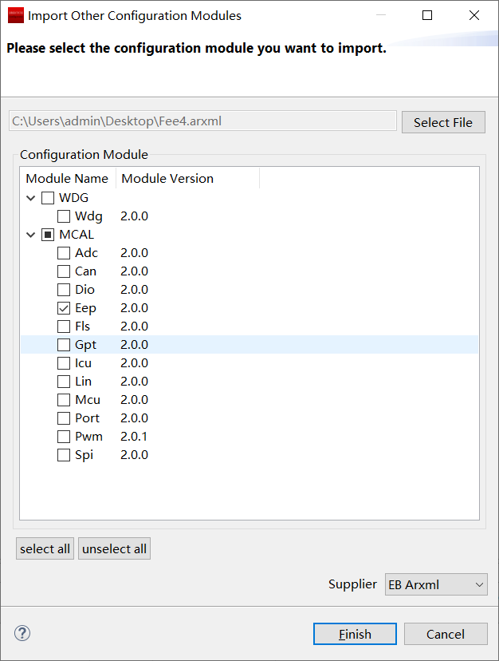

.. centered:: **表 Eep配置 (Table Eep Configuration)**

.. list-table::
   :widths: 20 20 20 20 20
   :header-rows: 1

   * - UI名称 (UI Name)
     - 描述 (Description)
     - 
     - 
     - 
   * - EepGeneral
     - 取值范围 (Range)
     - 配置容器 (Configure Containers)
     - 默认取值 (Default value)
     - 无
   * - 
     - 
     - EEPROM驱动程序的一般配置参数的容器 (Container for general configuration parameters of EEPROM driver)
     - 
     - 
   * -
     - 
     - 备注这些参数总是预编译的 (Note these parameters are always prepared.)
     - 
     - 
   * - 
     - 依赖关系 (Dependencies)
     - 无
     - 
     - 
   * - EepInitConfiguration
     - 取值范围 (Range)
     - 配置容器 (Configure Containers)
     - 
     - 
   * - 
     - 
     - EEPROM驱动程序运行时配置参数的容器 (Container for EEPROM driver configuration parameters during runtime)
     - 
     - 
   * -
     - 
     - 实现类型：Eep_ConfigType (Implementation Type: Eep_ConfigType)
     - 
     - 
   * - 
     - 依赖关系 (Dependencies)
     - 无
     - 
     - 
   * - EepPublishedInformation
     - 取值范围 (Range)
     - 配置容器 (Configure Containers)
     - 默认取值 (Default value)
     - 无
   * - 
     - 
     - 公共发布信息容器未涵盖的其他已发布参数 (Other published parameters not covered in the public information container)
     - 
     - 
   * -
     - 
     - 注意：参数没有任何配置类设置，因为它们是发布的信息 (Note: Parameters have no configuration class settings because they are published information.)
     - 
     - 
   * - 
     - 依赖关系 (Dependencies)
     - 无
     - 
     - 

EepGeneral
==========================

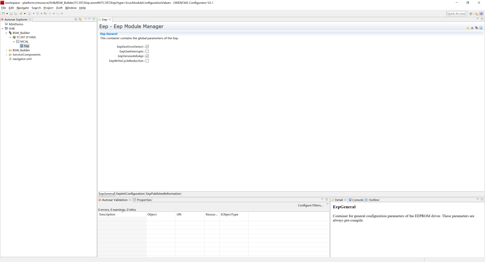

.. centered:: **表 EepGeneral配置 (Table EepGeneral Configuration)**

.. list-table::
   :widths: 20 20 20 20 20
   :header-rows: 1

   * - UI名称 (UI Name)
     - 描述 (Description)
     -
     -
     -
   * -
     - 取值范围 (Range)
     - TRUE/FALSE
     - 默认取值 (Default value)
     - FALSE
   * - EepDemvErrorDetect
     - 参数描述 (Parameter Description)
     - 打开或关闭开发错误检测和通知TRUE：开启检测和通知功能FALSE：关闭检测和通知功能 (Enable and disable development error detection and notifications TRUE: Enable detection and notifications FALSE: Disable detection and notifications)
     -
     -
   * -
     - 依赖关系 (Dependencies)
     - 依赖于系统是否集成DET模块 (Dependent on whether the system integrates the DET module)
     -
     -
   * -
     - 取值范围 (Range)
     - TRUE/FALSE
     - 默认取值 (Default value)
     - FALSE
   * - EepUseInterrupts
     - 参数描述 (Parameter Description)
     - 启用或停用中断控制的作业处理的开关 TRUE：启用中断控制的作业处理 FALSE：中断控制的作业处理被禁用 (Enable job processing with interrupt control: TRUE Disable job processing with interrupt control: FALSE)
     -
     -
   * -
     - 依赖关系 (Dependencies)
     - 依赖于EEPROM硬件设备的特定，是否支持中断 (Does the specific EEPROM hardware device support interrupts?)
     -
     -
   * -
     - 取值范围 (Range)
     - TRUE/FALSE
     - 默认取值 (Default value)
     - FALSE
   * - EepVersionInfoApi
     - 参数描述 (Parameter Description)
     - 开启或关闭读取软件版本信息API开关TRUE：启用读取软件版本信息API开关FALSE：关闭读取软件版本信息API开关 (Enable the API switch for reading software version information: TRUE Disable the API switch for reading software version information: FALSE)
     -
     -
   * -
     - 依赖关系 (Dependencies)
     - 无
     -
     -
   * -
     - 取值范围 (Range)
     - TRUE/FALSE
     - 默认取值 (Default value)
     - FALSE
   * - EepWriteCycleReduction
     - 参数描述 (Parameter Description)
     - 开关激活或不激活写周期减少备注：EEPROM值在被覆盖之前被读取和比较TRUE：开启写周期减重功能FALSE：不开启写周期减重功能 (Switch activation/deactivation Write cycle reduction enabled: Remarks: EEPROM value is read and compared before being overwritten TRUE: Enable write cycle weight reduction function FALSE: Do not enable write cycle weight reduction function)
     -
     -
   * -
     - 依赖关系 (Dependencies)
     - 无
     -
     -

EepInitConfiguration
====================================

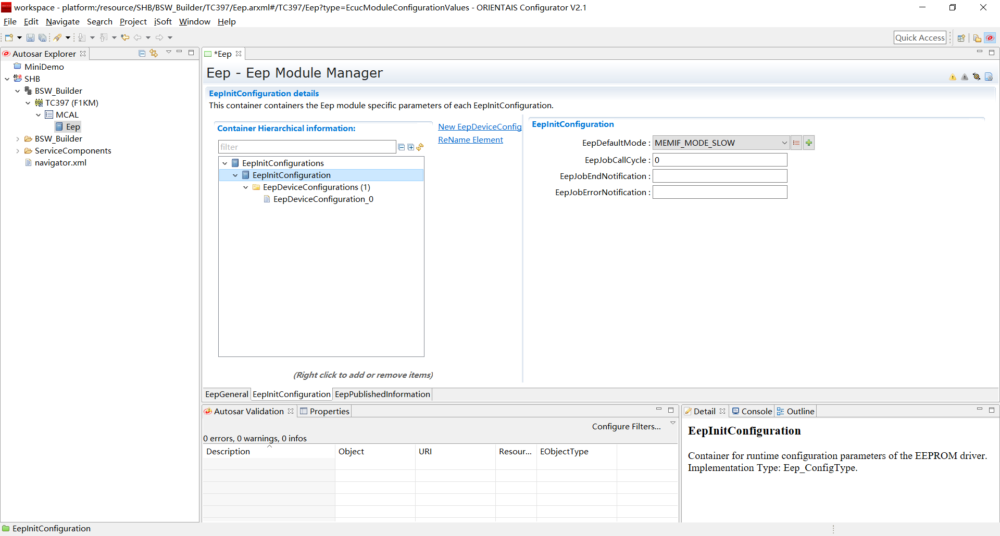

.. centered:: **表 EepInitConfiguration配置 (Table EepInitConfiguration Configuration)**

.. list-table::
   :widths: 20 20 20 20 20
   :header-rows: 1

   * - UI名称 (UI Name)
     - 描述 (Description)
     - 
     - 
     - 
   * - 
     - 取值范围 (Range)
     - 引用或下拉选项 (Copy or Pull-down Options)
     - 默认取值 (Default value)
     - 无
   * - EepDefaultMode
     - 参数描述 (Parameter Description)
     - 参数为初始化后EEPROM的默认设备模式实现类型：MemIf_ModeType (The parameter for the default device mode implementation type of EEPROM after initialization: MemIf_ModeType)
     - 
     - 
   * - 
     - 依赖关系 (Dependencies)
     - 无
     - 
     - 
   * - 
     - 取值范围 (Range)
     - 0…4294967295
     - 默认取值 (Default value)
     - 0
   * - EepJobCallCycle
     - 参数描述 (Parameter Description)
     - EEPROM驱动程序主函数的调   用周期时间（单位：s） (The call period time of the EEPROM driver main function (unit: s))
     - 
     - 
   * - 
     - 依赖关系 (Dependencies)
     - 无
     - 
     - 
   * - 
     - 取值范围 (Range)
     - 函数指针字符串 (Function Pointer String)
     - 默认取值 (Default value)
     - 无
   * - EepJobEndNotification
     - 参数描述 (Parameter Description)
     - 此参数是对作业结果为肯定的回调函数的引用 (This parameter is a reference to the callback function for positive job results.)
     - 
     - 
   * - 
     - 依赖关系 (Dependencies)
     - 无
     - 
     - 
   * - 
     - 取值范围 (Range)
     - 函数指针字符串 (Function Pointer String)
     - 默认取值 (Default value)
     - 
   * - EepJobErrorNotification
     - 参数描述 (Parameter Description)
     - 此参数是对作业结果为否定的回调函数的引用 (This parameter is a reference to a callback function for when the job result is negative.)
     - 
     - 
   * - 
     - 依赖关系 (Dependencies)
     - 无
     - 
     - 

.. centered:: **表 EepInitConfiguration容器配置 (Table EepInitConfiguration Container Configuration)**

.. list-table::
   :widths: 20 20 20 20 20
   :header-rows: 1

   * - EepDeviceConfiguration
     - 取值范围 (Range)
     - 容器创建 (Container creation)
     - 默认取值 (Default value)
     - 无
   * - 
     - 参数描述 (Parameter Description)
     - EEPROM驱动程序运行时配置参数的容器 (Container for EEPROM driver configuration parameters during runtime)
     - 
     - 
   * - 
     - 依赖关系 (Dependencies)
     - 无
     - 
     - 

EepDeviceConfiguration
--------------------------------------

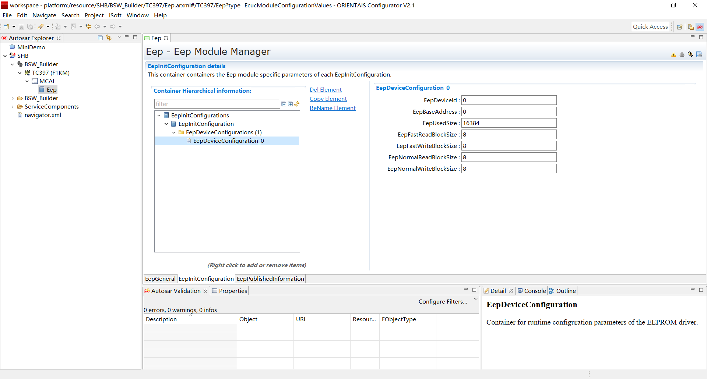

.. centered:: **表 EepDeviceConfiguration配置 (Table EepDeviceConfiguration Configuration)**

.. list-table::
   :widths: 20 20 20 20 20
   :header-rows: 1

   * - EepDeviceId
     - 取值范围 (Range)
     - 0…255
     - 默认取值 (Default value)
     - 0
   * - 
     - 参数描述 (Parameter Description)
     - 用于描述指定EEPROM设备的索引标识符 (Index identifier for describing a specified EEPROM device)
     - 
     - 
   * - 
     - 依赖关系 (Dependencies)
     - 无
     - 
     - 
   * - EepBaseAddress
     - 取值范围 (Range)
     - 0…4294967295
     - 默认取值 (Default value)
     - 0
   * - 
     - 参数描述 (Parameter Description)
     - 参数用于描述EEPROM存储设备的基地址 (Parameters are used to describe the base address of the EEPROM storage device.)
     - 
     - 
   * - 
     - 
     - 实现类型：Eep_AddressType (Implementation Type: Eep_AddressType)
     - 
     - 
   * - 
     - 依赖关系 (Dependencies)
     - 无
     - 
     - 
   * - EepUsedSize
     - 取值范围 (Range)
     - 0…65535
     - 默认取值 (Default value)
     - 0
   * - 
     - 参数描述 (Parameter Description)
     - 该参数以字节为单位表示EEPROM设备已使用的大小 (This parameter indicates the size in bytes used by the EEPROM device.)
     - 
     - 
   * - 
     - 
     - 实现类型：Eep_LengthType (Implementation Type: Eep_LengthType)
     - 
     - 
   * - 
     - 
     - 单位：字节 (Bytes)
     - 
     - 
   * - 
     - 依赖关系 (Dependencies)
     - 依赖于EEPROM硬件设备的特定 (Dependent on the specific EEPROM hardware device.)
     - 
     - 
   * - EepFastReadBlockSize
     - 取值范围 (Range)
     - 0…65535
     - 默认取值 (Default value)
     - 0
   * - 
     - 参数描述 (Parameter Description)
     - 在快速模式下，一个作业处理周期内读取的字节数； (Number of bytes read within an iteration in quick mode;)
     - 
     - 
   * - 
     - 
     - 如果硬件不支持突发模式，该参数应设置为与 (If hardware does not support burst mode, this parameter should be set to与其)
     - 
     - 
   * - 
     - 
     - EepNormalReadBlockSize相同的值。 (Same value for EepNormalReadBlockSize.)
     - 
     - 
   * - 
     - 
     - 实现类型：Eep_LengthType (Implementation Type: Eep_LengthType)
     - 
     - 
   * - 
     - 依赖关系 (Dependencies)
     - 依赖于EEPROM硬件设备的特定 (Dependent on the specific EEPROM hardware device.)
     - 
     - 
   * - EepFastWriteBlockSize
     - 取值范围 (Range)
     - 0…65535
     - 默认取值 (Default value)
     - 0
   * - 
     - 参数描述 (Parameter Description)
     - 在快速模式下，一个作业处理周期内写入的字节数； (Number of bytes written in a job processing cycle in fast mode;)
     - 
     - 
   * - 
     - 
     - 如果硬件不支持突发模式，该参数应设置为与 (If hardware does not support burst mode, this parameter should be set to与其)
     - 
     - 
   * - 
     - 
     - EepNormalWriteBlockSize相同的值。 (Same value for EepNormalWriteBlockSize.)
     - 
     - 
   * - 
     - 
     - 实现类型：Eep_LengthType (Implementation Type: Eep_LengthType)
     - 
     - 
   * - 
     - 依赖关系 (Dependencies)
     - 依赖于EEPROM硬件设备的特定 (Dependent on the specific EEPROM hardware device.)
     - 
     - 
   * - EepNormalReadBlockSize
     - 取值范围 (Range)
     - 0…65535
     - 默认取值 (Default value)
     - 0
   * - 
     - 参数描述 (Parameter Description)
     - 在正常模式下，一个作业处理周期内读取的字节数 (During normal mode, number of bytes read within a job processing cycle)
     - 
     - 
   * - 
     - 
     - 实现类型：Eep_LengthType (Implementation Type: Eep_LengthType)
     - 
     - 
   * - 
     - 依赖关系 (Dependencies)
     - 依赖于EEPROM硬件设备的特定 (Dependent on the specific EEPROM hardware device.)
     - 
     - 
   * - EepNormalWriteBlockSize
     - 取值范围 (Range)
     - 0…65535
     - 默认取值 (Default value)
     - 0
   * - 
     - 参数描述 (Parameter Description)
     - 在正常模式下，一个作业处理周期内写入的字节数 (During normal mode, the number of bytes written in a job processing cycle)
     - 
     - 
   * - 
     - 
     - 实现类型：Eep_LengthType (Implementation Type: Eep_LengthType)
     - 
     - 
   * - 
     - 依赖关系 (Dependencies)
     - 依赖于EEPROM硬件设备的特定 (Dependent on the specific EEPROM hardware device.)
     - 
     - 

EepPublishedInformation
=======================================

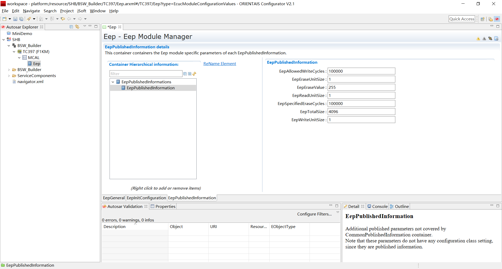

.. centered:: **表 EepPublishedInformation配置 (Table EepPublishedInformation Configuration)**

.. list-table::
   :widths: 20 20 20 20 20
   :header-rows: 1

   * - EepAllowedWriteCycles
     - 取值范围 (Range)
     - 0…4294967295
     - 默认取值 (Default value)
     - 0
   * - 
     - 参数描述 (Parameter Description)
     - 特定EEPROM硬件在最坏情况下的最大写周期数 (Maximum write cycles in worst-case scenarios for specific EEPROM hardware)
     - 
     - 
   * - 
     - 依赖关系 (Dependencies)
     - 依赖于EEPROM硬件设备的特定 (Dependent on the specific EEPROM hardware device.)
     - 
     - 
   * - EepEraseUnitSize
     - 取值范围 (Range)
     - 0…4294967295
     - 默认取值 (Default value)
     - 0
   * - 
     - 参数描述 (Parameter Description)
     - 以字节为单位的最小可擦EEPROM数据单位的大小 (The size of the smallest erasable data unit in EEPROM measured in bytes)
     - 
     - 
   * - 
     - 依赖关系 (Dependencies)
     - 依赖于EEPROM硬件设备的特定 (Dependent on the specific EEPROM hardware device.)
     - 
     - 
   * - EepEraseValue
     - 取值范围 (Range)
     - 0…255
     - 默认取值 (Default value)
     - 0
   * - 
     - 参数描述 (Parameter Description)
     - 被擦除的EEPROM单元的值 (The values of erased EEPROM units)
     - 
     - 
   * - 
     - 依赖关系 (Dependencies)
     - 依赖于EEPROM硬件设备的特定 (Dependent on the specific EEPROM hardware device.)
     - 
     - 
   * - EepReadUnitSize
     - 取值范围 (Range)
     - 0…4294967295
     - 默认取值 (Default value)
     - 0
   * - 
     - 参数描述 (Parameter Description)
     - 以字节为单位的最小可读EEPROM数据单位的大小 (The size of the smallest readable EEPROM data unit in bytes)
     - 
     - 
   * - 
     - 依赖关系 (Dependencies)
     - 依赖于EEPROM硬件设备的特定 (Dependent on the specific EEPROM hardware device.)
     - 
     - 
   * - EepSpecifiedEraseCycles
     - 取值范围 (Range)
     - 0…4294967295
     - 默认取值 (Default value)
     - 0
   * - 
     - 参数描述 (Parameter Description)
     - 为EEP设备指定的擦除周期数 (Number of erase cycles specified for EEP devices)
     - 
     - 
   * - 
     - 
     - 备注：通常在设备数据表中给出 (Note: Typically given in the device specification table.)
     - 
     - 
   * - 
     - 依赖关系 (Dependencies)
     - 依赖于EEPROM硬件设备的特定 (Dependent on the specific EEPROM hardware device.)
     - 
     - 
   * - EepTotalSize
     - 取值范围 (Range)
     - 0…4294967295
     - 默认取值 (Default value)
     - 0
   * - 
     - 参数描述 (Parameter Description)
     - EEPROM存储单元的总大小（以字节为单位） (The total size of the EEPROM storage unit (in bytes))
     - 
     - 
   * - 
     - 
     - 实现类型：Eep_LengthType (Implementation Type: Eep_LengthType)
     - 
     - 
   * - 
     - 依赖关系 (Dependencies)
     - 依赖于EEPROM硬件设备的特定 (Dependent on the specific EEPROM hardware device.)
     - 
     - 
   * - EepWriteUnitSize
     - 取值范围 (Range)
     - 0…4294967295
     - 默认取值 (Default value)
     - 0
   * - 
     - 参数描述 (Parameter Description)
     - 以字节为单位的最小可写EEPROM数据单位的大小 (The size of the smallest writable EEPROM data unit in bytes)
     - 
     - 
   * - 
     - 依赖关系 (Dependencies)
     - 依赖于EEPROM硬件设备的特定 (Dependent on the specific EEPROM hardware device.)
     - 
     - 

外部EEPROM的配置描述 (Description of external EEPROM configuration)
----------------------------------------------------------------------------

.. centered:: **表 Eep配置 (Table Eep Configuration)**

.. list-table::
   :widths: 20 20 20 20 20
   :header-rows: 1

   * - UI名称 (UI Name)
     - 描述 (Description)
     - 
     - 
     - 
   * - EepGeneral
     - 取值范围 (Range)
     - 配置容器 (Configure Containers)
     - 默认取值 (Default value)
     - 无
   * - 
     - 
     - EEPROM驱动程序的一般配置参数的容器 (Container for general configuration parameters of EEPROM driver)
     - 
     - 
   * -
     - 
     - 备注这些参数总是预编译的 (Note these parameters are always prepared.)
     - 
     - 
   * - 
     - 依赖关系 (Dependencies)
     - 无
     - 
     - 
   * - EepInitConfiguration
     - 取值范围 (Range)
     - 配置容器 (Configure Containers)
     - 
     - 
   * - 
     - 
     - EEPROM驱动程序运行时配置参数的容器 (Container for EEPROM driver configuration parameters during runtime)
     - 
     - 
   * -
     - 
     - 实现类型：Eep_ConfigType (Implementation Type: Eep_ConfigType)
     - 
     - 
   * - 
     - 依赖关系 (Dependencies)
     - 无
     - 
     - 
   * - EepPublishedInformation
     - 取值范围 (Range)
     - 配置容器 (Configure Containers)
     - 默认取值 (Default value)
     - 无
   * - 
     - 
     - 公共发布信息容器未涵盖的其他已发布参数 (Other published parameters not covered in the public information container)
     - 
     - 
   * -
     - 
     - 注意：参数没有任何配置类设置，因为它们是发布的信息 (Note: Parameters have no configuration class settings because they are published information.)
     - 
     - 
   * - 
     - 依赖关系 (Dependencies)
     - 无
     - 
     - 

.. _eepgeneral-1:

EepGeneral
==========================

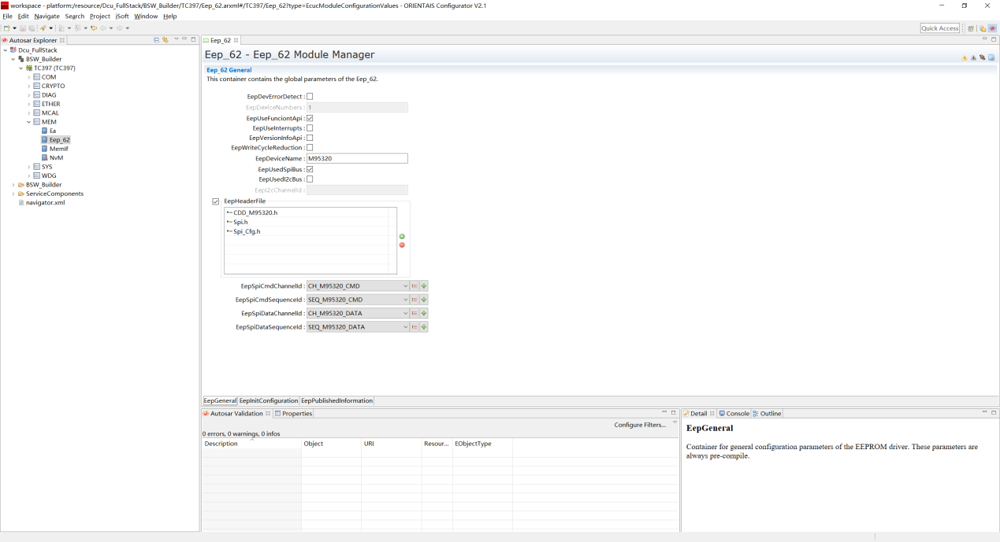

.. centered:: **表 EepGeneral配置 (Table EepGeneral Configuration)**

.. list-table::
   :widths: 20 20 20 20 20
   :header-rows: 1

   * - EepDevErrorDetect
     - 取值范围 (Range)
     - TRUE/FALSE
     - 默认取值 (Default value)
     - FALSE
   * - 
     - 参数描述 (Parameter Description)
     - 打开或关闭开发错误检测和通知 (Enable or Disable Development Error Detection and Notifications)
     - 
     - 
   * - 
     - 
     - TRUE：开启检测和通知功能 (TRUE: Enable detection and notification functions)
     - 
     - 
   * - 
     - 
     - FALSE：关闭检测和通知功能 (FALSE: Disable detection and notification functions)
     - 
     - 
   * - 
     - 依赖关系 (Dependencies)
     - 依赖于系统是否集成DET模块 (Dependent on whether the system integrates the DET module)
     - 
     - 
   * - EepDeviceNumbers
     - 取值范围 (Range)
     - 0…255
     - 默认取值 (Default value)
     - 0
   * - 
     - 参数描述 (Parameter Description)
     - 用于指示ECU挂接EEPROM存储设备的实际数量 (To indicate the actual number of EEPROM storage devices connected to the ECU)
     - 
     - 
   * - 
     - 依赖关系 (Dependencies)
     - 依赖于EEPROM硬件设备的挂接数量 (The number of attached devices dependent on EEPROM hardware devices)
     - 
     - 
   * - EepUseFunciontApi
     - 取值范围 (Range)
     - TRUE / FALSE
     - 默认取值 (Default value)
     - FALSE
   * - 
     - 参数描述 (Parameter Description)
     - 预处理器开关启用/禁用API使用通用函数或宏函数 (Preprocessor switch enable/disable API for using generic functions or macro functions)
     - 
     - 
   * - 
     - 依赖关系 (Dependencies)
     - 无
     - 
     - 
   * - EepUseInterrupts
     - 取值范围 (Range)
     - TRUE / FALSE
     - 默认取值 (Default value)
     - FALSE
   * - 
     - 参数描述 (Parameter Description)
     - 启用或停用中断控制的作业处理的开关 (Switch for enabling or disabling interrupt control in job processing)
     - 
     - 
   * - 
     - 
     - TRUE：启用中断控制的作业处理 (TRUE: Job processing with interrupt control enabled)
     - 
     - 
   * - 
     - 
     - FALSE：中断控制的作业处理被禁用 (FALSE: Job processing with interrupted control is disabled)
     - 
     - 
   * - 
     - 依赖关系 (Dependencies)
     - 依赖于EEPROM硬件设备的特定，是否支持中断 (Does the specific EEPROM hardware device support interrupts?)
     - 
     - 
   * - EepVersionInfoApi
     - 取值范围 (Range)
     - TRUE / FALSE
     - 默认取值 (Default value)
     - FALSE
   * - 
     - 参数描述 (Parameter Description)
     - 开启或关闭读取软件版本信息API开关 (Enable or disable the Read Software Version Information API switch)
     - 
     - 
   * - 
     - 
     - TRUE：启用读取软件版本信息API开关 (TRUE: Enable Read Software Version Information API Switch)
     - 
     - 
   * - 
     - 
     - FALSE：关闭读取软件版本信息API开关 (FALSE: Turn off the Read Software Version Information API switch)
     - 
     - 
   * - 
     - 依赖关系 (Dependencies)
     - 无
     - 
     - 
   * - EepWriteCycleReduction
     - 取值范围 (Range)
     - TRUE / FALSE
     - 默认取值 (Default value)
     - FALSE
   * - 
     - 参数描述 (Parameter Description)
     - 开关激活或不激活写周期减少 (Switch activation or non-activation reduces write cycles.)
     - 
     - 
   * - 
     - 
     - 备注：EEPROM值在被覆盖之前被读取和比较 (Note: The EEPROM value is read and compared before it is overwritten.)
     - 
     - 
   * - 
     - 
     - TRUE：开启写周期减重功能 (TRUE: Enable Write Cycle Weighting Function)
     - 
     - 
   * - 
     - 
     - FALSE：不开启写周期减重功能 (FALSE: Not enable write cycle weight reduction function)
     - 
     - 
   * - 
     - 依赖关系 (Dependencies)
     - 无
     - 
     - 
   * - EepDeviceName
     - 取值范围 (Range)
     - 字符串 (Strings)
     - 默认取值 (Default value)
     - 无
   * - 
     - 参数描述 (Parameter Description)
     - 指定Eep模块实例的设备名称 (Specify the device name for the Eep module instance)
     - 
     - 
   * - 
     - 依赖关系 (Dependencies)
     - 用于指示ECU挂接EEPROM存储设备的实际芯片类型 (To indicate the actual chip type of the EEPROM storage device connected to the ECU)
     - 
     - 
   * - EepUsedSpiBus
     - 取值范围 (Range)
     - TRUE / FALSE
     - 默认取值 (Default value)
     - FALSE
   * - 
     - 参数描述 (Parameter Description)
     - 参数用于指定是否使用SPI总线访问EEPROM设备 (Parameters are used to specify whether to access the EEPROM device via SPI bus.)
     - 
     - 
   * - 
     - 
     - TRUE：允许使用SPI总线访问 (TRUE: Allows access via SPI bus.)
     - 
     - 
   * - 
     - 
     - FALSE：禁止使用SPI总线访问 (FALSE: SPI bus access prohibited)
     - 
     - 
   * - 
     - 依赖关系 (Dependencies)
     - 用于指示ECU挂接EEPROM存储设备的实际芯片类型 (To indicate the actual chip type of the EEPROM storage device connected to the ECU)
     - 
     - 
   * - EepUsedI2cBus
     - 取值范围 (Range)
     - TRUE / FALSE
     - 默认取值 (Default value)
     - FALSE
   * - 
     - 参数描述 (Parameter Description)
     - 参数用于指定是否使用IIC总线访问EEPROM设备 (Parameters are used to specify whether to access the EEPROM device via IIC bus.)
     - 
     - 
   * - 
     - 
     - TRUE：允许使用IIC总线访问 (TRUE: Allows access via IIC bus.)
     - 
     - 
   * - 
     - 
     - FALSE：禁止使用IIC总线访问 (FALSE: IIC bus access prohibited)
     - 
     - 
   * - 
     - 依赖关系 (Dependencies)
     - 用于指示ECU挂接EEPROM存储设备的实际芯片类型 (To indicate the actual chip type of the EEPROM storage device connected to the ECU)
     - 
     - 
   * - EepI2cChannelId
     - 取值范围 (Range)
     - 0…255
     - 默认取值 (Default value)
     - 0
   * - 
     - 参数描述 (Parameter Description)
     - 使用IIC总线访问EEPROM设备的通道命令标识符 (Command identifier for accessing EEPROM devices via IIC bus)
     - 
     - 
   * - 
     - 依赖关系 (Dependencies)
     - 用于指示ECU挂接EEPROM存储设备的实际芯片类型 (To indicate the actual chip type of the EEPROM storage device connected to the ECU)
     - 
     - 
   * - EepHeaderFile
     - 取值范围 (Range)
     - 无
     - 默认取值 (Default value)
     - 无
   * - 
     - 参数描述 (Parameter Description)
     - 用于描述为Eep模块加载设备驱动依赖的头文件包含 (To describe the header files included for dependency on device drivers for the Eep module)
     - 
     - 
   * - 
     - 依赖关系 (Dependencies)
     - 用于指示ECU挂接EEPROM存储设备的实际芯片类型 (To indicate the actual chip type of the EEPROM storage device connected to the ECU)
     - 
     - 
   * - EepSpiCmdChannelId
     - 取值范围 (Range)
     - 0…255
     - 默认取值 (Default value)
     - 0
   * - 
     - 参数描述 (Parameter Description)
     - 使用SPI总线访问EEPROM设备的命令相关的通道标识符 (Channel identifiers related to commands for accessing EEPROM devices via SPI bus)
     - 
     - 
   * - 
     - 依赖关系 (Dependencies)
     - 用于指示ECU挂接EEPROM存储设备的实际芯片类型 (To indicate the actual chip type of the EEPROM storage device connected to the ECU)
     - 
     - 
   * - EepSpiCmdSequenceId
     - 取值范围 (Range)
     - 0…255
     - 默认取值 (Default value)
     - 0
   * - 
     - 参数描述 (Parameter Description)
     - 使用SPI总线访问EEPROM设备的命令相关的序列标识符 (Command-related sequence identifier for accessing EEPROM devices via SPI bus)
     - 
     - 
   * - 
     - 依赖关系 (Dependencies)
     - 用于指示ECU挂接EEPROM存储设备的实际芯片类型 (To indicate the actual chip type of the EEPROM storage device connected to the ECU)
     - 
     - 
   * - EepSpiDataChannelId
     - 取值范围 (Range)
     - 0…255
     - 默认取值 (Default value)
     - 0
   * - 
     - 参数描述 (Parameter Description)
     - 使用SPI总线访问EEPROM设备的数据相关的通道标识符 (Use SPI bus for accessing data-related channel identifiers of EEPROM devices)
     - 
     - 
   * - 
     - 依赖关系 (Dependencies)
     - 用于指示ECU挂接EEPROM存储设备的实际芯片类型 (To indicate the actual chip type of the EEPROM storage device connected to the ECU)
     - 
     - 
   * - EepSpiDataSequenceId
     - 取值范围 (Range)
     - 0…255
     - 默认取值 (Default value)
     - 0
   * - 
     - 参数描述 (Parameter Description)
     - 使用SPI总线访问EEPROM设备的数据相关的序列标识符 (Use SPI bus to access data-related sequence identifiers of EEPROM devices)
     - 
     - 
   * - 
     - 依赖关系 (Dependencies)
     - 用于指示ECU挂接EEPROM存储设备的实际芯片类型 (To indicate the actual chip type of the EEPROM storage device connected to the ECU)
     - 
     - 

.. _eepinitconfiguration-1:

EepInitConfiguration
====================================

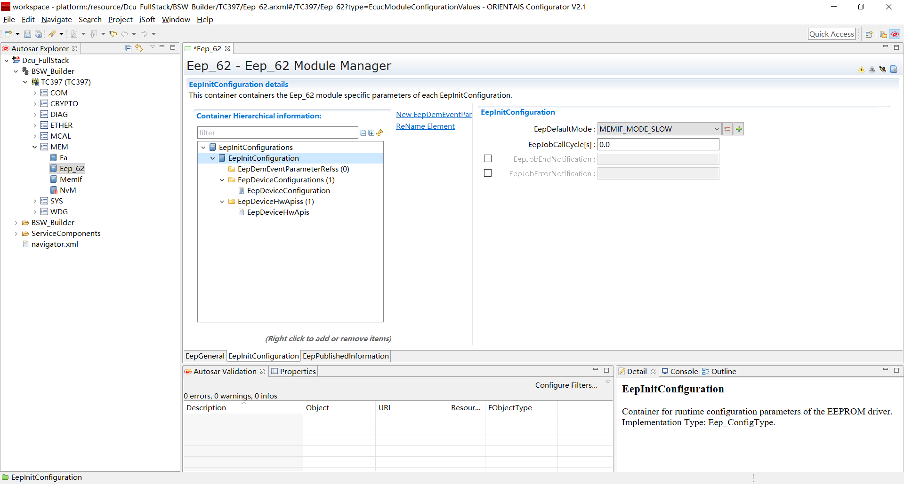

.. centered:: **表 EepInitConfiguration配置 (Table EepInitConfiguration Configuration)**

.. list-table::
   :widths: 20 20 20 20 20
   :header-rows: 1

   * - UI名称 (UI Name)
     - 描述 (Description)
     - 
     - 
     - 
   * - 
     - 取值范围 (Range)
     - 引用或下拉选项 (Copy or Pull-down Options)
     - 默认取值 (Default value)
     - 无
   * - EepDefaultMode
     - 参数描述 (Parameter Description)
     - 参数为初始化后EEPROM的默认设备模式实现类型：MemIf_ModeType (The parameter for the default device mode implementation type of EEPROM after initialization: MemIf_ModeType)
     - 
     - 
   * - 
     - 依赖关系 (Dependencies)
     - 无
     - 
     - 
   * - 
     - 取值范围 (Range)
     - 配置容器 (Configure Containers)
     - 默认取值 (Default value)
     - 无
   * - EepJobCallCycle
     - 参数描述 (Parameter Description)
     - EEPROM驱动程序主函数的用周期时间（单位：s） (The cyclic time (unit: s) of the EEPROM Driver Main Function)
     - 
     - 
   * - 
     - 依赖关系 (Dependencies)
     - 无
     - 
     - 
   * - 
     - 取值范围 (Range)
     - 配置容器 (Configure Containers)
     - 默认取值 (Default value)
     - 无
   * - EepPublishedInformation
     - 参数描述 (Parameter Description)
     - 公共发布信息容器未涵盖的其他已发布参数注意：参数没有任何配置类设置因为它们是发布的信息 (Publicly published information containers note: Other published parameters not covered by the public release container have no configuration class settings as they are released information.)
     - 
     - 
   * - 
     - 依赖关系 (Dependencies)
     - 无
     - 
     - 
   * - 
     - 取值范围 (Range)
     - 函数指针字符串 (Function Pointer String)
     - 默认取值 (Default value)
     - 无
   * - EepJobEndNotifiNotific
     - 参数描述 (Parameter Description)
     - 此参数是对作业结果为肯定的回调函数的引用 (This parameter is a reference to the callback function for positive job results.)
     - 
     - 
   * - 
     - 依赖关系 (Dependencies)
     - 无
     - 
     - 
   * - 
     - 取值范围 (Range)
     - 函数指针字符串 (Function Pointer String)
     - 默认取值 (Default value)
     - 无
   * - EepJobErrorNotification
     - 参数描述 (Parameter Description)
     - 此参数是对作业结果为否定的回调函数的引用 (This parameter is a reference to a callback function for when the job result is negative.)
     - 
     - 
   * - 
     - 依赖关系 (Dependencies)
     - 无
     - 
     - 

.. centered:: **表 EepInitConfiguration容器配置 (Table EepInitConfiguration Container Configuration)**

.. list-table::
   :widths: 20 20 20 20 20
   :header-rows: 1

   * - UI名称 (UI Name)
     - 描述 (Description)
     - 
     - 
     - 
   * - 
     - 取值范围 (Range)
     - 容器创建 (Container creation)
     - 默认取值 (Default value)
     - 无
   * - EepDemEventParameterRefs
     - 参数描述 (Parameter Description)
     - 容器   ，用于引用DemEventParameter元素，在发生相应错误时，应使用Dem_SetEventStatus调用DemEventParameter元素。EventId取自引用的DemEventParameter的DemEventId符号值。标准化错误在此容器中提供，并且可以通过特定于供应商的错误引用进行扩展 (Containers   , used to reference the DemEventParameter element, should invoke the Dem_SetEventStatus call when a corresponding error occurs. The EventId is derived from the DemEventId symbol value of the referenced DemEventParameter. Standardized errors are provided within this container and can be extended via vendor-specific error references.)
     - 
     - 
   * -
     - 依赖关系 (Dependencies)
     - 无
     - 
     - 
   * - 
     - 取值范围 (Range)
     - 容器创建 (Container creation)
     - 默认取值 (Default value)
     - 无
   * - EepDeviceConfiguration
     - 参数描述 (Parameter Description)
     - EEPROM驱动程序运行时配置参数的容器 (Container for EEPROM driver configuration parameters during runtime)
     - 
     - 
   * -
     - 依赖关系 (Dependencies)
     - 无
     - 
     - 
   * - 
     - 取值范围 (Range)
     - 容器创建 (Container creation)
     - 默认取值 (Default value)
     - 无
   * - EepDeviceHwApis
     - 参数描述 (Parameter Description)
     - EEPROM驱动程序运行时设备操作API列表的容器 (Container for EEPROM Driver Operation API List During Device Operation)
     - 
     - 
   * -
     - 依赖关系 (Dependencies)
     - 无
     - 
     - 

EepDemEventParameterRefs
----------------------------------------

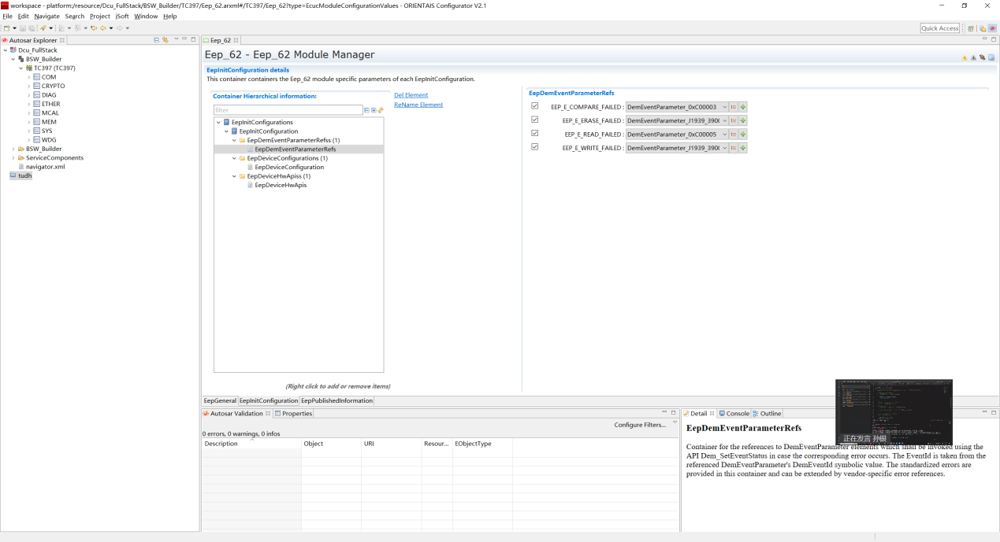

.. centered:: **表 EepDemEventParameterRefs配置 (Table EepDemEventParameterRefs Configuration)**

.. list-table::
   :widths: 20 20 20 20 20
   :header-rows: 1

   * - EEP_E_COMPARE\_FAILED
     - 取值范围 (Range)
     - 引用或下拉选项 (Copy or Pull-down Options)
     - 默认取值 (Default value)
     - 无
   * - 
     - 参数描述 (Parameter Description)
     - 引用DemEventParameter，当错误“EEPROM比较失败”发生时，使用参数向Demand组件报告故障 (Use DemEventParameter to report failure to the Demand component when the error "EEPROM comparison failed" occurs.)
     - 
     - 
   * - 
     - 依赖关系 (Dependencies)
     - 依赖于Dem组件的配置 (Dependent on Dem component configuration)
     - 
     - 
   * - EEP_E\_ERASE\_FAILED
     - 取值范围 (Range)
     - 引用或下拉选项 (Copy or Pull-down Options)
     - 默认取值 (Default value)
     - 无
   * - 
     - 参数描述 (Parameter Description)
     - 引用DemEventParameter，当错误“EEPROM擦除失败”发生时，使用参数向Demand组件报告故障 (Use DemEventParameter to report the failure when the error "EEPROM Erase Failed" occurs to the Demand component.)
     - 
     - 
   * - 
     - 依赖关系 (Dependencies)
     - 依赖于Dem组件的配置 (Dependent on Dem component configuration)
     - 
     - 
   * - EEP_E_READ\_FAILED
     - 取值范围 (Range)
     - 引用或下拉选项 (Copy or Pull-down Options)
     - 默认取值 (Default value)
     - 无
   * - 
     - 参数描述 (Parameter Description)
     - 引用DemEventParameter，当错误“EEPROM读取失败”发生时，使用参数向Demand组件报告故障 (Use DemEventParameter to report failure to the Demand component when the error "EEPROM read failed" occurs.)
     - 
     - 
   * - 
     - 依赖关系 (Dependencies)
     - 依赖于Dem组件的配置 (Dependent on Dem component configuration)
     - 
     - 
   * - EEP_E\_WRITE\_FAILED
     - 取值范围 (Range)
     - 引用或下拉选项 (Copy or Pull-down Options)
     - 默认取值 (Default value)
     - 无
   * - 
     - 参数描述 (Parameter Description)
     - 引用DemEventParameter，当错误“EEPROM写入失败”发生时，使用参数向Demand组件报告故障 (Use DemEventParameter to report failure to the Demand component when the error "EEPROM write failed" occurs.)
     - 
     - 
   * - 
     - 依赖关系 (Dependencies)
     - 依赖于Dem组件的配置 (Dependent on Dem component configuration)
     - 
     - 

.. _eepdeviceconfiguration-1:

EepDeviceConfiguration
--------------------------------------

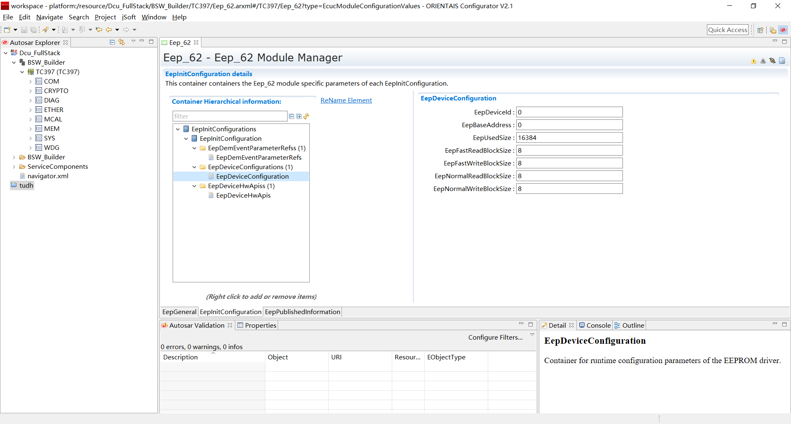

.. centered:: **表 EepDeviceConfiguration配置 (Table EepDeviceConfiguration Configuration)**

.. list-table::
   :widths: 20 20 20 20 20
   :header-rows: 1

   * - EepDeviceId
     - 取值范围 (Range)
     - 0…255
     - 默认取值 (Default value)
     - 0
   * - 
     - 参数描述 (Parameter Description)
     - 用于描述指定EEPROM设备的索引标识符 (Index identifier for describing a specified EEPROM device)
     - 
     - 
   * - 
     - 依赖关系 (Dependencies)
     - 无
     - 
     - 
   * - EepBaseAddress
     - 取值范围 (Range)
     - 0…4294967295
     - 默认取值 (Default value)
     - 0
   * - 
     - 参数描述 (Parameter Description)
     - 参数用于描述EEPROM存储设备的基地址 (Parameters are used to describe the base address of the EEPROM storage device.)
     - 
     - 
   * - 
     - 
     - 实现类型：Eep_AddressType (Implementation Type: Eep_AddressType)
     - 
     - 
   * - 
     - 依赖关系 (Dependencies)
     - 无
     - 
     - 
   * - EepUsedSize
     - 取值范围 (Range)
     - 0…65535
     - 默认取值 (Default value)
     - 0
   * - 
     - 参数描述 (Parameter Description)
     - 该参数以字节为单位表示EEPROM设备已使用的大小 (This parameter indicates the size in bytes used by the EEPROM device.)
     - 
     - 
   * - 
     - 
     - 实现类型：Eep_LengthType (Implementation Type: Eep_LengthType)
     - 
     - 
   * - 
     - 
     - 单位：字节 (Bytes)
     - 
     - 
   * - 
     - 依赖关系 (Dependencies)
     - 依赖于EEPROM硬件设备的特定 (Dependent on the specific EEPROM hardware device.)
     - 
     - 
   * - EepFastReadBlockSize
     - 取值范围 (Range)
     - 0…65535
     - 默认取值 (Default value)
     - 0
   * - 
     - 参数描述 (Parameter Description)
     - 在快速模式下，一个作业处理周期内读取的字节数； (Number of bytes read within an iteration in quick mode;)
     - 
     - 
   * - 
     - 
     - 如果硬件不支持突发模式，该参数应设置为与 (If hardware does not support burst mode, this parameter should be set to与其)
     - 
     - 
   * - 
     - 
     - EepNormalReadBlockSize相同的值。 (Same value for EepNormalReadBlockSize.)
     - 
     - 
   * - 
     - 
     - 实现类型：Eep_LengthType (Implementation Type: Eep_LengthType)
     - 
     - 
   * - 
     - 依赖关系 (Dependencies)
     - 依赖于EEPROM硬件设备的特定 (Dependent on the specific EEPROM hardware device.)
     - 
     - 
   * - EepFastWriteBlockSize
     - 取值范围 (Range)
     - 0…65535
     - 默认取值 (Default value)
     - 0
   * - 
     - 参数描述 (Parameter Description)
     - 在快速模式下，一个作业处理周期内写入的字节数； (Number of bytes written in a job processing cycle in fast mode;)
     - 
     - 
   * - 
     - 
     - 如果硬件不支持突发模式，该参数应设置为与 (If hardware does not support burst mode, this parameter should be set to与其)
     - 
     - 
   * - 
     - 
     - EepNormalWriteBlockSize相同的值。 (Same value for EepNormalWriteBlockSize.)
     - 
     - 
   * - 
     - 
     - 实现类型：Eep_LengthType (Implementation Type: Eep_LengthType)
     - 
     - 
   * - 
     - 依赖关系 (Dependencies)
     - 依赖于EEPROM硬件设备的特定 (Dependent on the specific EEPROM hardware device.)
     - 
     - 
   * - EepNormalReadBlockSize
     - 取值范围 (Range)
     - 0…65535
     - 默认取值 (Default value)
     - 0
   * - 
     - 参数描述 (Parameter Description)
     - 在正常模式下，一个作业处理周期内读取的字节数 (During normal mode, number of bytes read within a job processing cycle)
     - 
     - 
   * - 
     - 
     - 实现类型：Eep_LengthType (Implementation Type: Eep_LengthType)
     - 
     - 
   * - 
     - 依赖关系 (Dependencies)
     - 依赖于EEPROM硬件设备的特定 (Dependent on the specific EEPROM hardware device.)
     - 
     - 
   * - EepNormalWriteBlockSize
     - 取值范围 (Range)
     - 0…65535
     - 默认取值 (Default value)
     - 0
   * - 
     - 参数描述 (Parameter Description)
     - 在正常模式下，一个作业处理周期内写入的字节数 (During normal mode, the number of bytes written in a job processing cycle)
     - 
     - 
   * - 
     - 
     - 实现类型：Eep_LengthType (Implementation Type: Eep_LengthType)
     - 
     - 
   * - 
     - 依赖关系 (Dependencies)
     - 依赖于EEPROM硬件设备的特定 (Dependent on the specific EEPROM hardware device.)
     - 
     - 

EepDeviceHwApis
-------------------------------

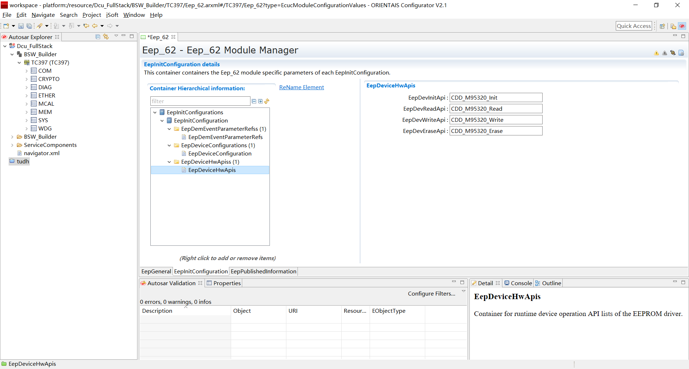

.. centered:: **表 EepDeviceHwApis配置 (Table EepDeviceHwApis Configuration)**

.. list-table::
   :widths: 20 20 20 20 20
   :header-rows: 1

   * - EepDevInitApi
     - 取值范围 (Range)
     - 函数指针字符串 (Function Pointer String)
     - 默认取值 (Default value)
     - 无
   * - 
     - 参数描述 (Parameter Description)
     - 描述指定EEPROM设备的访问初始化操作API函数 (Describe API functions for initializing access to the specified EEPROM device)
     - 
     - 
   * - 
     - 依赖关系 (Dependencies)
     - 用于指示ECU挂接EEPROM存储设备的实际芯片类型 (To indicate the actual chip type of the EEPROM storage device connected to the ECU)
     - 
     - 
   * - EepDevReadApi
     - 取值范围 (Range)
     - 函数指针字符串 (Function Pointer String)
     - 默认取值 (Default value)
     - 无
   * - 
     - 参数描述 (Parameter Description)
     - 描述指定EEPROM设备的访问读取操作API函数 (Describe API functions for accessing and reading operations on the specified EEPROM device)
     - 
     - 
   * - 
     - 依赖关系 (Dependencies)
     - 用于指示ECU挂接EEPROM存储设备的实际芯片类型 (To indicate the actual chip type of the EEPROM storage device connected to the ECU)
     - 
     - 
   * - EepDevWriteApi
     - 取值范围 (Range)
     - 函数指针字符串 (Function Pointer String)
     - 默认取值 (Default value)
     - 无
   * - 
     - 参数描述 (Parameter Description)
     - 描述指定EEPROM设备的访问写入操作API函数 (Describe API functions for accessing and writing to the specified EEPROM device.)
     - 
     - 
   * - 
     - 依赖关系 (Dependencies)
     - 用于指示ECU挂接EEPROM存储设备的实际芯片类型 (To indicate the actual chip type of the EEPROM storage device connected to the ECU)
     - 
     - 
   * - EepDevEraseApi
     - 取值范围 (Range)
     - 函数指针字符串 (Function Pointer String)
     - 默认取值 (Default value)
     - 无
   * - 
     - 参数描述 (Parameter Description)
     - 描述指定EEPROM设备的访问擦除操作API函数 (Describe API functions for accessing and erasing the specified EEPROM device.)
     - 
     - 
   * - 
     - 依赖关系 (Dependencies)
     - 用于指示ECU挂接EEPROM存储设备的实际芯片类型 (To indicate the actual chip type of the EEPROM storage device connected to the ECU)
     - 
     - 

.. _eeppublishedinformation-1:

EepPublishedInformation
=======================================

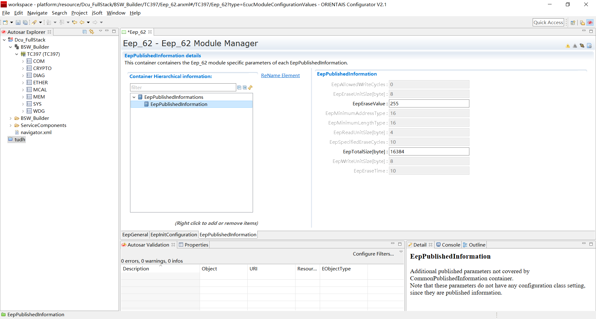

.. centered:: **表 EepPublishedInformation配置 (Table EepPublishedInformation Configuration)**

.. list-table::
   :widths: 20 20 20 20 20
   :header-rows: 1

   * - EepAllowedWriteCycles
     - 取值范围 (Range)
     - 0…4294967295
     - 默认取值 (Default value)
     - 0
   * - 
     - 参数描述 (Parameter Description)
     - 特定EEPROM硬件在最坏情况下的最大写周期数 (Maximum write cycles in worst-case scenarios for specific EEPROM hardware)
     - 
     - 
   * - 
     - 依赖关系 (Dependencies)
     - 依赖于EEPROM硬件设备的特定 (Dependent on the specific EEPROM hardware device.)
     - 
     - 
   * - EepEraseUnitSize
     - 取值范围 (Range)
     - 0…4294967295
     - 默认取值 (Default value)
     - 8
   * - 
     - 参数描述 (Parameter Description)
     - 以字节为单位的最小可擦EEPROM数据单位的大小 (The size of the smallest erasable data unit in EEPROM measured in bytes)
     - 
     - 
   * - 
     - 依赖关系 (Dependencies)
     - 依赖于EEPROM硬件设备的特定 (Dependent on the specific EEPROM hardware device.)
     - 
     - 
   * - EepEraseValue
     - 取值范围 (Range)
     - 0…255
     - 默认取值 (Default value)
     - 255
   * - 
     - 参数描述 (Parameter Description)
     - 被擦除的EEPROM单元的值 (The values of erased EEPROM units)
     - 
     - 
   * - 
     - 依赖关系 (Dependencies)
     - 依赖于EEPROM硬件设备的特定 (Dependent on the specific EEPROM hardware device.)
     - 
     - 
   * - EepMinimumAddressType
     - 取值范围 (Range)
     - 0…4294967295
     - 默认取值 (Default value)
     - 16
   * - 
     - 参数描述 (Parameter Description)
     - Eep_AddressType的最小期望大小 (Minimum expected size of Eep_AddressType)
     - 
     - 
   * - 
     - 依赖关系 (Dependencies)
     - 依赖于EEPROM硬件设备的特定 (Dependent on the specific EEPROM hardware device.)
     - 
     - 
   * - EepMinimumLengthType
     - 取值范围 (Range)
     - 0…4294967295
     - 默认取值 (Default value)
     - 16
   * - 
     - 参数描述 (Parameter Description)
     - Eep_LengthType的最小期望大小 (The minimum expected size of Eep_LengthType)
     - 
     - 
   * - 
     - 依赖关系 (Dependencies)
     - 依赖于EEPROM硬件设备的特定 (Dependent on the specific EEPROM hardware device.)
     - 
     - 
   * - EepReadUnitSize
     - 取值范围 (Range)
     - 0…4294967295
     - 默认取值 (Default value)
     - 4
   * - 
     - 参数描述 (Parameter Description)
     - 以字节为单位的最小可读EEPROM数据单位的大小 (The size of the smallest readable EEPROM data unit in bytes)
     - 
     - 
   * - 
     - 依赖关系 (Dependencies)
     - 依赖于EEPROM硬件设备的特定 (Dependent on the specific EEPROM hardware device.)
     - 
     - 
   * - EepSpecifiedEraseCycles
     - 取值范围 (Range)
     - 0…4294967295
     - 默认取值 (Default value)
     - 10
   * - 
     - 参数描述 (Parameter Description)
     - 为EEP设备指定的擦除周期数 (Number of erase cycles specified for EEP devices)
     - 
     - 
   * - 
     - 
     - 备注：通常在设备数据表中给出 (Note: Typically given in the device specification table.)
     - 
     - 
   * - 
     - 依赖关系 (Dependencies)
     - 依赖于EEPROM硬件设备的特定 (Dependent on the specific EEPROM hardware device.)
     - 
     - 
   * - EepTotalSize
     - 取值范围 (Range)
     - 0…4294967295
     - 默认取值 (Default value)
     - 16384
   * - 
     - 参数描述 (Parameter Description)
     - EEPROM存储单元的总大小（以字节为单位） (The total size of the EEPROM storage unit (in bytes))
     - 
     - 
   * - 
     - 
     - 实现类型：Eep_LengthType (Implementation Type: Eep_LengthType)
     - 
     - 
   * - 
     - 依赖关系 (Dependencies)
     - 依赖于EEPROM硬件设备的特定 (Dependent on the specific EEPROM hardware device.)
     - 
     - 
   * - EepWriteUnitSize
     - 取值范围 (Range)
     - 0…4294967295
     - 默认取值 (Default value)
     - 8
   * - 
     - 参数描述 (Parameter Description)
     - 以字节为单位的最小可写EEPROM数据单位的大小 (The size of the smallest writable EEPROM data unit in bytes)
     - 
     - 
   * - 
     - 依赖关系 (Dependencies)
     - 依赖于EEPROM硬件设备的特定 (Dependent on the specific EEPROM hardware device.)
     - 
     - 
   * - EepEraseTime
     - 取值范围 (Range)
     - 0…4294967295
     - 默认取值 (Default value)
     - 10
   * - 
     - 参数描述 (Parameter Description)
     - 擦除一个EEPROM数据单元的最大时间 (The maximum time to erase an EEPROM data unit)
     - 
     - 
   * - 
     - 依赖关系 (Dependencies)
     - 依赖于EEPROM硬件设备的特定 (Dependent on the specific EEPROM hardware device.)
     - 
     - 
