EthIf
#################################

:strong:`缩写词注解 (Abbreviation Notes):`

.. list-table::
   :widths: 34 33 33
   :header-rows: 1

   * - 缩写词 (Abbreviation)
     - 解释/描述 (Explanation/Description)
     - 中文解释 (Chinese explanation)
   * - Eth
     - Ethernet Driver (AUTOSARBSW module)
     - AUTOSAR标准以太网驱动模块 (AUTOSAR Standard Ethernet Driver Module)
   * - EthIf
     - Ethernet Interface(AUTOSAR BSW module)
     - AUTOSAR标准以太网接口模块 (AUTOSAR Standard Ethernet Interface Module)
   * - EthTrcv
     - Ethernet TransceiverDriver (AUTOSAR BSWmodule)
     - AUTOSAR标准以太网收发器模块 (AUTOSAR Standard Ethernet Transmitter Module)
   * - TCP
     - Transmission ControlProtocol
     - 传输控制协议 (Transmission Control Protocol)
   * - UDP
     - User Datagram Protocol
     - 用户数据报协议 (User Datagram Protocol)
   * - IP
     - Internet Protocol
     - 以太网协议 (Ethernet protocol)

简介 (Introduction)
=================================

EthIf向上层提供与以太网硬件无关的独立接口，该接口可以支持多个不同的有线或无线以太网控制器和收发器。这些接口按功能可以大体分为模式控制相关的接口、时间同步相关的接口、数据接收发送相关的接口、EthIf本身的初始化或周期任务接口等。

EthIf provides an interface to the upper layers that is independent of Ethernet hardware and can support multiple different wired or wireless Ethernet controllers and transceivers. These interfaces can be broadly categorized into interfaces related to mode control, interfaces related to time synchronization, interfaces related to data reception and transmission, and interfaces for initializing EthIf itself or periodic tasks.

.. figure:: ../../_static/参考手册(Module_Reference_Manual)/EthIf/image1.png
   :alt: EthIf层次图 (Hierarchy Chart)
   :name: EthIf层次图 (Hierarchy Chart)
   :align: center

参考资料 (Reference materials)
------------------------------------------

[1] AUTOSAR_SWS_EthernetInterface.pdf，R19-11

功能描述 (Function Description)
===========================================

接口传递功能功能 (Interface传递function功能)
------------------------------------------------

接口传递功能介绍 (Function Introduction for Interface Transmission)
===========================================================================

EthIf负责对底层驱动提供给上层模块的接口进行抽象，通过EthDriver提供的接收发送接口实现对以太网数据的收发。

EthIf is responsible for abstracting the interface provided by the underlying driver to the upper-layer modules, and realizing the reception and transmission of Ethernet data through the receive and send interfaces provided by EthDriver.

Vlan收发功能介绍 (VLAN Send and Receive Function Introduction)
========================================================================

EthIf负责对VLAN报文的解/加Tag操作，当接收时，通过EthIf传递给上层的以太网报文将在EthIf中提取出VLAN头，并把剩余的数据传递给上层模块。当上层模块需要向下传输报文时，在EthIf中添加VLAN头，并通过合适的Eth通道发送出去。

EthIf is responsible for tagging/untagging VLAN packets. When receiving, the Ethernet packets passed to the upper layer by EthIf will have their VLAN headers extracted and the remaining data passed to the upper layer module. When the upper layer module needs to transmit packets downwards, VLAN headers are added in EthIf and the packets are sent out through appropriate Ethernet channels.

状态通知功能介绍 (Introduction to Status Notification Function)
=======================================================================

EthIf负责向EthSM通知下层EthController和EthTrcv的状态变化。

EthIf is responsible for notifying EthSM of state changes in the underlying EthController and EthTrcv.

源文件描述 (Source file description)
===============================================

.. centered:: **表 EthIf组件文件描述 (Table EthIf Component File Description)**

.. list-table::
   :widths: 50 50
   :header-rows: 1

   * - 文件 (Files)
     - 说明 (Description)
   * - EthIf_cfg.h
     - 定义EthIf模块预编译时用到的配置参数。 (Define configuration parameters for the EthIf module during pre-compilation.)
   * - EthIf \_cfg.c
     - 定义EthIf模块中链接时用到的配置参数。 (Define configuration parameters used for linking in the EthIf module.)
   * - EthIf.h
     - EthIf模块头文件，包含了API函数的扩展声明并定义了端口的数据结构。 (EthernetModule header file contains extended declarations of API functions and defines the data structure of ports.)
   * - EthIf.c
     - DoIP模块源文件，包含了API函数的实现。 (Source files for the DoIP Module, containing the implementation of API functions.)
   * - EthIf \_Cbk.h
     - 包含EthIf供底层调用的API函数的声明。 (The declaration of API functions for EthIf used by lower layers.)
   * - EthIf_MemMap.h
     - EthIf的内存映射定义。 (The memory-mapped definition of EthIf.)
   * - EthIf_Types.h
     - EthIf模块宏定义及数据类型定义。 (EthernetModule Macro Definitions and Data Type Definitions.)

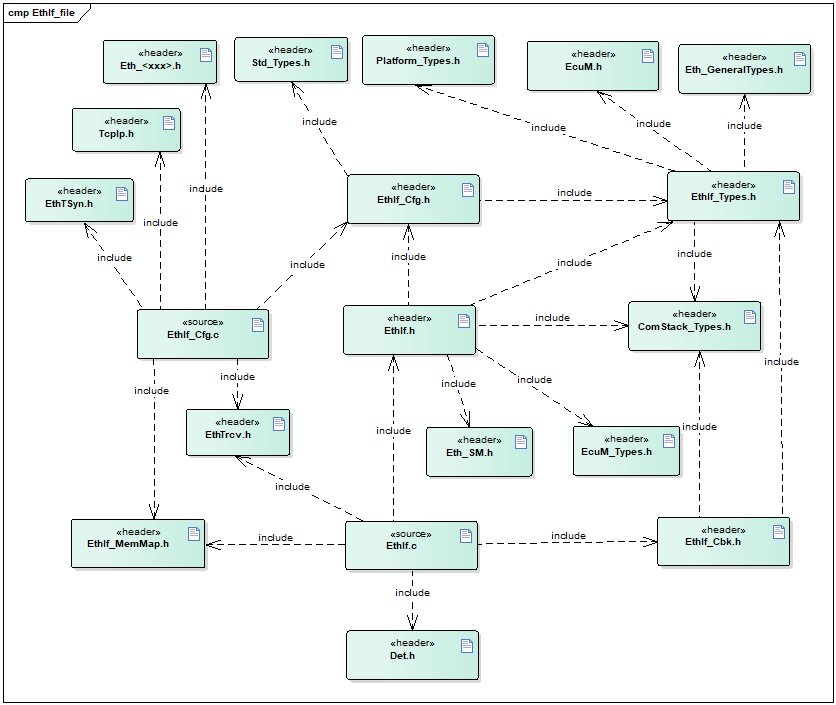

API接口 (API Interface)
=====================================

类型定义 (Type definition)
--------------------------------------

EthIf_ConfigType类型定义 (EthIf_ConfigType Configuration Type Definition)
=====================================================================================

.. list-table::
   :widths: 50 50
   :header-rows: 1

   * - 名称 (Name)
     - EthIf_ConfigType
   * - 类型 (Type)
     - struct
   * - 范围 (Range)
     - 无
   * - 描述 (Description)
     - EthIf配置结构体定义 (EthIf Configuration Structure Definition)

EthIf_EthDriverApiType类型定义 (EthIf_EthDriverApiType type definition)
===================================================================================

.. list-table::
   :widths: 50 50
   :header-rows: 1

   * - 名称 (Name)
     - EthIf_EthDriverApiType
   * - 类型 (Type)
     - struct
   * - 范围 (Range)
     - 无
   * - 描述 (Description)
     - EthIf通道对应的Eth驱动的API列表 (List of API for Eth driver corresponding to EthIf channel)

EthIf_EthTrcvDriverApiType类型定义 (EthIf_EthTrcvDriverApiType type definition)
===========================================================================================

.. list-table::
   :widths: 50 50
   :header-rows: 1

   * - 名称 (Name)
     - EthIf_EthTrcvDriverApiType
   * - 类型 (Type)
     - struct
   * - 范围 (Range)
     - 无
   * - 描述 (Description)
     - EthIf通道对应的EthTrcv驱动的API列表 (API list for EthIf channel corresponding to EthTrcv driver)

输入函数描述 (Describe the input function:)
-----------------------------------------------------

.. list-table::
   :widths: 50 50
   :header-rows: 1

   * - 输入模块 (Input Module)
     - API
   * - Eth
     - Eth_GetControllerMode
   * - 
     - Eth_GetPhysAddr
   * - 
     - Eth_ProvideTxBuffer
   * - 
     - Eth_SetControllerMode
   * - 
     - Eth_Transmit
   * - 
     - Eth_TxConfirmation
   * - EthSM
     - EthSM_CtrlModeIndication
   * - 
     - EthSM_TrcvLinkStateChg
   * - EthTrcv
     - EthTrcv_GetLinkState
   * - 
     - EthTrcv_GetTransceiverMode
   * - 
     - EthTrcv_SetTransceiverMode

静态接口函数定义 (Static interface function definition)
---------------------------------------------------------------

EthIf_Init函数定义 (The EthIf_Init function defines)
================================================================

.. list-table::
   :widths: 25 25 25 25
   :header-rows: 1

   * - 函数名称： (Function Name:)
     - EthIf_Init
     - 
     - 
   * - 函数原型： (Function prototype:)
     - void EthIf_Init (constEthIf_ConfigType\*CfgPtr )
     - 
     - 
   * - 服务编号： (Service Number:)
     - 0x01
     - 
     - 
   * - 同步/异步： (Synchronous/asynchronous:)
     - 同步 (Sync)
     - 
     - 
   * - 是否可重入： (Is Reentrant:)
     - 不可重入 (Non-reentrant)
     - 
     - 
   * - 输入参数： (Input parameters:)
     - CfgPtr
     - 值域： (Domain:)
     - Points to theimplementation specificstructure
   * - 输入输出参数： (Input Output Parameters:)
     - 无
     - 
     - 
   * - 输出参数： (Output Parameters:)
     - 无
     - 
     - 
   * - 返回值： (Return Value:)
     - 无
     - 
     - 
   * - 功能概述： (Function Overview:)
     - EthIf初始化 (Initialization of EthIf)
     - 
     - 

EthIf_SetControllerMode函数定义 (The EthIf_SetControllerMode function defines)
==========================================================================================

.. list-table::
   :widths: 25 25 25 25
   :header-rows: 1

   * - 函数名称： (Function Name:)
     - EthIf_SetControllerMode
     - 
     - 
   * - 函数原型： (Function prototype:)
     - Std_ReturnTypeEthIf_SetControllerMode(
     - 
     - 
   * - 
     - uint8 CtrlIdx,
     - 
     - 
   * - 
     - Eth_ModeTypeCtrlMode )
     - 
     - 
   * - 服务编号： (Service Number:)
     - 0x03
     - 
     - 
   * - 同步/异步： (Synchronous/asynchronous:)
     - 异步 (Asynchronous)
     - 
     - 
   * - 是否可重入： (Is Reentrant:)
     - 不可重入 (Non-reentrant)
     - 
     - 
   * - 输入参数： (Input parameters:)
     - CtrlIdx
     - 值域： (Domain:)
     - Index of the Ethernetcontroller within thecontext of the EthernetInterface
   * - 
     - CtrlMode
     - 值域： (Domain:)
     - ETH_MODE_DOWN： disablethe controllerETH_MODE_ACTIVE：enable the controller
   * - 输入输出参数： (Input Output Parameters:)
     - 无
     - 
     - 
   * - 输出参数： (Output Parameters:)
     - 无
     - 
     - 
   * - 返回值： (Return Value:)
     - Std_ReturnType
     - 
     - 
   * - 
     - E_OK： successE_NOT_OK：controller modecould not bechanged
     - 
     - 
   * - 功能概述： (Function Overview:)
     - 设置controller模式 (Set controller mode)
     - 
     - 

EthIf_GetControllerMode函数定义 (The EthIf_GetControllerMode function defines)
==========================================================================================

.. list-table::
   :widths: 25 25 25 25
   :header-rows: 1

   * - 函数名称： (Function Name:)
     - EthIf_GetControllerMode
     - 
     - 
   * - 函数原型： (Function prototype:)
     - Std_ReturnTypeEthIf_GetControllerMode(
     - 
     - 
   * - 
     - uint8 CtrlIdx,
     - 
     - 
   * - 
     - Eth_ModeType\*CtrlModePtr )
     - 
     - 
   * - 服务编号： (Service Number:)
     - 0x04
     - 
     - 
   * - 同步/异步： (Synchronous/asynchronous:)
     - 同步 (Sync)
     - 
     - 
   * - 是否可重入： (Is Reentrant:)
     - 不可重入 (Non-reentrant)
     - 
     - 
   * - 输入参数： (Input parameters:)
     - CtrlIdx
     - 值域： (Domain:)
     - Index of the Ethernetcontroller within thecontext of the EthernetInterface
   * - 输入输出参数： (Input Output Parameters:)
     - 无
     - 
     - 
   * - 输出参数： (Output Parameters:)
     - CtrlModePtr
     - 值域： (Domain:)
     - ETH_MODE_DOWN： thecontroller is disabledETH_MODE_ACTIVE： thecontroller is enabled
   * - 返回值： (Return Value:)
     - Std_ReturnType
     - 
     - 
   * - 
     - E_OK： successE_NOT_OK：controller couldnot beinitialized
     - 
     - 
   * - 功能概述： (Function Overview:)
     - 获取controller模式 (Get controller mode)
     - 
     - 

EthIf_SetTransceiverWakeupMode函数定义 (The EthIf_SetTransceiverWakeupMode function defines)
========================================================================================================

.. list-table::
   :widths: 25 25 25 25
   :header-rows: 1

   * - 函数名称： (Function Name:)
     - EthIf_SetTransceiverWakeupMode
     - 
     - 
   * - 函数原型： (Function prototype:)
     - Std_ReturnTypeEthIf_SetTransceiverWakeupMode(
     - 
     - 
   * - 
     - uint8 TrcvIdx,
     - 
     - 
   * - 
     - EthTrcv_WakeupModeTypeTrcvWakeupMode )
     - 
     - 
   * - 服务编号： (Service Number:)
     - 0x2e
     - 
     - 
   * - 同步/异步： (Synchronous/asynchronous:)
     - 同步 (Sync)
     - 
     - 
   * - 是否可重入： (Is Reentrant:)
     - 不可重入 (Non-reentrant)
     - 
     - 
   * - 输入参数： (Input parameters:)
     - TrcvIdx
     - 值域： (Domain:)
     - Index of thetransceiver within thecontext of the EthernetInterface
   * - 
     - TrcvWakeupMode
     - 值域： (Domain:)
     - ETHTRCV_WUM_DISABLE：disable transceiverwake upETHTRCV_WUM_ENABLE：enable transceiver wakeup ETHTRCV_WUM_CLEAR：clears transceiver wakeup reason
   * - 输入输出参数： (Input Output Parameters:)
     - 无
     - 
     - 
   * - 输出参数： (Output Parameters:)
     - 无
     - 
     - 
   * - 返回值： (Return Value:)
     - Std_ReturnType
     - 
     - 
   * - 
     - E_OK： successE_NOT_OK：transceiver wakeup could not bechanged orwake-up reasoncould not becleared
     - 
     - 
   * - 功能概述： (Function Overview:)
     - 设置Transceiver唤醒模式 (Set Transceiver Wake-Up Mode)
     - 
     - 

EthIf_GetTransceiverWakeupMode函数定义 (The EthIf_GetTransceiverWakeupMode function definition)
===========================================================================================================

.. list-table::
   :widths: 25 25 25 25
   :header-rows: 1

   * - 函数名称： (Function Name:)
     - EthIf_GetTransceiverWakeupMode
     - 
     - 
   * - 函数原型： (Function prototype:)
     - Std_ReturnTypeEthIf_GetTransceiverWakeupMode(
     - 
     - 
   * - 
     - uint8 TrcvIdx,
     - 
     - 
   * - 
     - EthTrcv_WakeupModeType\*TrcvWakeupModePtr)
     - 
     - 
   * - 服务编号： (Service Number:)
     - 0x2f
     - 
     - 
   * - 同步/异步： (Synchronous/asynchronous:)
     - 同步 (Sync)
     - 
     - 
   * - 是否可重入： (Is Reentrant:)
     - 不可重入 (Non-reentrant)
     - 
     - 
   * - 输入参数： (Input parameters:)
     - TrcvIdx
     - 值域： (Domain:)
     - Index of thetransceiver within thecontext of the EthernetInterface
   * - 输入输出参数： (Input Output Parameters:)
     - 无
     - 
     - 
   * - 输出参数： (Output Parameters:)
     - TrcvWakeupMode
     - 值域： (Domain:)
     - ETHTRCV_WUM_DISABLE：transceiver wake up isdisableTRCV_WUM_ENABLE：transceiver wake up isenable
   * - 返回值： (Return Value:)
     - Std_ReturnType
     - 
     - 
   * - 
     - E_OK： successE_NOT_OK：transceiver wakeup mode could notbe obtained
     - 
     - 
   * - 功能概述： (Function Overview:)
     - 获取Transceiver唤醒模式 (Get Transceiver Wake-Up Mode)
     - 
     - 

EthIf_CheckWakeup函数定义 (EthIf_CheckWakeup function definition)
=============================================================================

.. list-table::
   :widths: 25 25 25 25
   :header-rows: 1

   * - 函数名称： (Function Name:)
     - EthIf_CheckWakeup
     - 
     - 
   * - 函数原型： (Function prototype:)
     - Std_ReturnTypeEthIf_CheckWakeup(
     - 
     - 
   * - 
     - EcuM_WakeupSourceTypeWakeupSource)
     - 
     - 
   * - 服务编号： (Service Number:)
     - 0x30
     - 
     - 
   * - 同步/异步： (Synchronous/asynchronous:)
     - 异步 (Asynchronous)
     - 
     - 
   * - 是否可重入： (Is Reentrant:)
     - 可重入 (Reentrant)
     - 
     - 
   * - 输入参数： (Input parameters:)
     - WakeupSource
     - 值域： (Domain:)
     - source (transceiver)which initiated thewake up event
   * - 输入输出参数： (Input Output Parameters:)
     - 无
     - 
     - 
   * - 输出参数： (Output Parameters:)
     - 无
     - 
     - 
   * - 返回值： (Return Value:)
     - Std_Return-Type
     - 
     - 
   * - 
     - E_OK whenfunction has beensuccessfullyexecuted E_NOT_OKwhen functioncould not besuccessfullyexecuted
     - 
     - 
   * - 功能概述： (Function Overview:)
     - 判断Wakeup状态 (Judge Wakeup State)
     - 
     - 

EthIf_GetTransceiverMode函数定义 (The EthIf_GetTransceiverMode function definition)
===============================================================================================

.. list-table::
   :widths: 25 25 25 25
   :header-rows: 1

   * - 函数名称： (Function Name:)
     - EthIf_GetTransceiverMode
     - 
     - 
   * - 函数原型： (Function prototype:)
     - Std_ReturnTypeEthIf_GetTransceiverMode(
     - 
     - 
   * - 
     - uint8 CtrlIdx,
     - 
     - 
   * - 
     - EthTrcv_ModeType\*TrcvModePtr )
     - 
     - 
   * - 服务编号： (Service Number:)
     - 0x07
     - 
     - 
   * - 同步/异步： (Synchronous/asynchronous:)
     - 同步 (Sync)
     - 
     - 
   * - 是否可重入： (Is Reentrant:)
     - 不可重入 (Non-reentrant)
     - 
     - 
   * - 输入参数： (Input parameters:)
     - CtrlIdx
     - 值域： (Domain:)
     - Index of the Ethernetcontroller within thecontext of the EthernetInterface
   * - 输入输出参数： (Input Output Parameters:)
     - 无
     - 
     - 
   * - 输出参数： (Output Parameters:)
     - TrcvModePtr
     - 值域： (Domain:)
     - ETHTRCV_MODE_DOWN： thetransceiver is disabledETHTRCV_MODE_ACTIVE：the transceiver isenabled
   * - 返回值： (Return Value:)
     - Std_ReturnType
     - 
     - 
   * - 
     - E_OK： successE_NOT_OK：transceiver modecould not beobtained
     - 
     - 
   * - 功能概述： (Function Overview:)
     - 获取transceiver状态 (Get transceiver status)
     - 
     - 

EthIf_ProvideTxBuffer函数定义 (The EthIf_ProvideTxBuffer function definition)
=========================================================================================

.. list-table::
   :widths: 25 25 25 25
   :header-rows: 1

   * - 函数名称： (Function Name:)
     - EthIf_ProvideTxBuffer
     - 
     - 
   * - 函数原型： (Function prototype:)
     - BufReq_ReturnTypeEthIf_ProvideTxBuffer(
     - 
     - 
   * - 
     - uint8 CtrlIdx,
     - 
     - 
   * - 
     - Eth_FrameTypeFrameType,
     - 
     - 
   * - 
     - uint8 Priority,
     - 
     - 
   * - 
     - Eth_BufIdxType\*BufIdxPtr,
     - 
     - 
   * - 
     - uint8*\* BufPtr,
     - 
     - 
   * - 
     - uint16\*LenBytePtr )
     - 
     - 
   * - 服务编号： (Service Number:)
     - 0x09
     - 
     - 
   * - 同步/异步： (Synchronous/asynchronous:)
     - 同步 (Sync)
     - 
     - 
   * - 是否可重入： (Is Reentrant:)
     - 可重入 (Reentrant)
     - 
     - 
   * - 输入参数： (Input parameters:)
     - CtrlIdx
     - 值域： (Domain:)
     - Index of the Ethernetcontroller within thecontext of the EthernetInterface
   * - 
     - FrameType
     - 值域： (Domain:)
     - Ethernet Frame Type(EtherType)
   * - 
     - Priority
     - 值域： (Domain:)
     - Priority value whichshall be used for the3-bit PCP field of theVLAN tag
   * - 输入输出参数： (Input Output Parameters:)
     - LenBytePtr
     - 值域： (Domain:)
     - in： desired length inbytes, out： grantedlength in bytes
   * - 输出参数： (Output Parameters:)
     - BufIdxPtr
     - 值域： (Domain:)
     - Index to the grantedbuffer resource. To beused for subsequentrequests
   * - 
     - BufPtr
     - 值域： (Domain:)
     - Pointer to the grantedbuffer
   * - 返回值： (Return Value:)
     - Std_ReturnType
     - 
     - 
   * - 
     - BUFREQ_OK：successBUFREQ_E_NOT_OK：development errordetectedBUFREQ_E_BUSY：all buffers inuseBUFREQ_E_OVFL：requested buffertoo large
     - 
     - 
   * - 功能概述： (Function Overview:)
     - 提供发送buffer (Provide send buffer)
     - 
     - 

EthIf_Transmit函数定义 (The function definition for EthIf_Transmit)
===============================================================================

.. list-table::
   :widths: 25 25 25 25
   :header-rows: 1

   * - 函数名称： (Function Name:)
     - EthIf_Transmit
     - 
     - 
   * - 函数原型： (Function prototype:)
     - Std_ReturnTypeEthIf_Transmit (
     - 
     - 
   * - 
     - uint8 CtrlIdx,
     - 
     - 
   * - 
     - Eth_BufIdxTypeBufIdx,
     - 
     - 
   * - 
     - Eth_FrameTypeFrameType,
     - 
     - 
   * - 
     - booleanTxConfirmation,
     - 
     - 
   * - 
     - uint16 LenByte,
     - 
     - 
   * - 
     - const uint8\*PhysAddrPtr )
     - 
     - 
   * - 服务编号： (Service Number:)
     - 0x0a
     - 
     - 
   * - 同步/异步： (Synchronous/asynchronous:)
     - 同步 (Sync)
     - 
     - 
   * - 是否可重入： (Is Reentrant:)
     - 不同的CtrlIdx和BufIdx可重入 (Different CtrlIdx and BufIdx can re-enter.)
     - 
     - 
   * - 输入参数： (Input parameters:)
     - CtrlIdx
     - 值域： (Domain:)
     - Index of the Ethernetcontroller within thecontext of the EthernetInterface
   * - 
     - BufIdx
     - 值域： (Domain:)
     - Index of the bufferresource
   * - 
     - FrameType
     - 值域： (Domain:)
     - Ethernet frame type
   * - 
     - TxConfirmation
     - 值域： (Domain:)
     - Activates transmissionconfirmation
   * - 
     - LenByte
     - 值域： (Domain:)
     - Data length in byte
   * - 
     - PhysAddrPtr
     - 值域： (Domain:)
     - Physical target address(MAC address) innetwork byte order
   * - 输入输出参数： (Input Output Parameters:)
     - 无
     - 
     - 
   * - 输出参数： (Output Parameters:)
     - 无
     - 
     - 
   * - 返回值： (Return Value:)
     - Std_ReturnType
     - 
     - 
   * - 
     - E_OK： successE_NOT_OK：transmissionfailed
     - 
     - 
   * - 功能概述： (Function Overview:)
     - 发送函数 (Send function)
     - 
     - 

EthIf_TxConfirmation函数定义 (The EthIf_TxConfirmation function definition)
=======================================================================================

.. list-table::
   :widths: 25 25 25 25
   :header-rows: 1

   * - 函数名称： (Function Name:)
     - EthIf_TxConfirmation
     - 
     - 
   * - 函数原型： (Function prototype:)
     - voidEthIf_TxConfirmation(
     - 
     - 
   * - 
     - uint8 CtrlIdx,
     - 
     - 
   * - 
     - Eth_BufIdxTypeBufIdx,
     - 
     - 
   * - 
     - Std_ReturnTypeResult)
     - 
     - 
   * - 服务编号： (Service Number:)
     - 0x11
     - 
     - 
   * - 同步/异步： (Synchronous/asynchronous:)
     - 同步 (Sync)
     - 
     - 
   * - 是否可重入： (Is Reentrant:)
     - 不可重入 (Non-reentrant)
     - 
     - 
   * - 输入参数： (Input parameters:)
     - CtrlIdx
     - 值域： (Domain:)
     - Index of the Ethernetcontroller within thecontext of the EthernetInterface
   * - 
     - BufIdx
     - 值域： (Domain:)
     - Index of thetransmitted buffer
   * - 
     - Result
     - 值域： (Domain:)
     - E_OK： The transmissionwas successful,E_NOT_OK： Thetransmission failed.
   * - 输入输出参数： (Input Output Parameters:)
     - 无
     - 
     - 
   * - 输出参数： (Output Parameters:)
     - 无
     - 
     - 
   * - 返回值： (Return Value:)
     - 无
     - 
     - 
   * - 功能概述： (Function Overview:)
     - 发送确认函数 (Send confirmation function)
     - 
     - 

EthIf_RxIndication函数定义 (EthIf_RxIndication function definition)
===============================================================================

.. list-table::
   :widths: 25 25 25 25
   :header-rows: 1

   * - 函数名称： (Function Name:)
     - EthIf_RxIndication
     - 
     - 
   * - 函数原型： (Function prototype:)
     - voidEthIf_RxIndication(
     - 
     - 
   * - 
     - uint8 CtrlIdx,
     - 
     - 
   * - 
     - Eth_FrameTypeFrameType,
     - 
     - 
   * - 
     - booleanIsBroadcast,
     - 
     - 
   * - 
     - const uint8\*PhysAddrPtr,
     - 
     - 
   * - 
     - constEth_DataType\*DataPtr,
     - 
     - 
   * - 
     - uint16 LenByte )
     - 
     - 
   * - 服务编号： (Service Number:)
     - 0x10
     - 
     - 
   * - 同步/异步： (Synchronous/asynchronous:)
     - 同步 (Sync)
     - 
     - 
   * - 是否可重入： (Is Reentrant:)
     - 不可重入 (Non-reentrant)
     - 
     - 
   * - 输入参数： (Input parameters:)
     - CtrlIdx
     - 值域： (Domain:)
     - Index of the Ethernetcontroller within thecontext of the EthernetInterface
   * - 
     - FrameType
     - 值域： (Domain:)
     - Frame type of receivedEthernet frame
   * - 
     - IsBroadcast
     - 值域： (Domain:)
     - parameter to indicate abroadcast frame
   * - 
     - PhysAddrPtr
     - 值域： (Domain:)
     - Pointer to Physicalsource address (MACaddress in network byteorder) of receivedEthernet frame
   * - 
     - DataPtr
     - 值域： (Domain:)
     - Pointer to payload ofreceived Ethernetframe.
   * - 
     - LenByte
     - 值域： (Domain:)
     - Length (bytes) of thepayload in receivedframe.
   * - 输入输出参数： (Input Output Parameters:)
     - 无
     - 
     - 
   * - 输出参数： (Output Parameters:)
     - 无
     - 
     - 
   * - 返回值： (Return Value:)
     - 无
     - 
     - 
   * - 功能概述： (Function Overview:)
     - 接收通知函数 (Notification reception function)
     - 
     - 

EthIf_SetPhysAddr函数定义 (The EthIf_SetPhysAddr function definition)
=================================================================================

.. list-table::
   :widths: 25 25 25 25
   :header-rows: 1

   * - 函数名称： (Function Name:)
     - EthIf_SetPhysAddr
     - 
     - 
   * - 函数原型： (Function prototype:)
     - voidEthIf_SetPhysAddr(
     - 
     - 
   * - 
     - uint8 CtrlIdx,
     - 
     - 
   * - 
     - const uint8\*PhysAddrPtr)
     - 
     - 
   * - 服务编号： (Service Number:)
     - 0x0d
     - 
     - 
   * - 同步/异步： (Synchronous/asynchronous:)
     - 同步 (Sync)
     - 
     - 
   * - 是否可重入： (Is Reentrant:)
     - 相同的CtrlIdx不可重入 (The same CtrlIdx cannot be re-entered.)
     - 
     - 
   * - 输入参数： (Input parameters:)
     - CtrlIdx
     - 值域： (Domain:)
     - Index of the Ethernetcontroller within thecontext of the EthernetInterface
   * - 
     - PhysAddrPtr
     - 值域： (Domain:)
     - Pointer to memorycontaining the physicalsource address (MACaddress) in networkbyte order.
   * - 输入输出参数： (Input Output Parameters:)
     - 无
     - 
     - 
   * - 输出参数： (Output Parameters:)
     - 无
     - 
     - 
   * - 返回值： (Return Value:)
     - 无
     - 
     - 
   * - 功能概述： (Function Overview:)
     - 设置phy地址 (Set phy address)
     - 
     - 

EthIf_GetPhysAddr函数定义 (The EthIf_GetPhysAddr function definition)
=================================================================================

.. list-table::
   :widths: 25 25 25 25
   :header-rows: 1

   * - 函数名称： (Function Name:)
     - EthIf_GetPhysAddr
     - 
     - 
   * - 函数原型： (Function prototype:)
     - voidEthIf_GetPhysAddr(
     - 
     - 
   * - 
     - uint8 CtrlIdx,
     - 
     - 
   * - 
     - uint8\*PhysAddrPtr)
     - 
     - 
   * - 服务编号： (Service Number:)
     - 0x08
     - 
     - 
   * - 同步/异步： (Synchronous/asynchronous:)
     - 同步 (Sync)
     - 
     - 
   * - 是否可重入： (Is Reentrant:)
     - 不可重入 (Non-reentrant)
     - 
     - 
   * - 输入参数： (Input parameters:)
     - CtrlIdx
     - 值域： (Domain:)
     - Index of the Ethernetcontroller within thecontext of the EthernetInterface
   * - 输入输出参数： (Input Output Parameters:)
     - 无
     - 
     - 
   * - 输出参数： (Output Parameters:)
     - PhysAddrPtr
     - 值域： (Domain:)
     - Pointer to memorycontaining the physicalsource address (MACaddress) in networkbyte order.
   * - 返回值： (Return Value:)
     - 无
     - 
     - 
   * - 功能概述： (Function Overview:)
     - 获取phy地址 (Get phy address)
     - 
     - 

EthIf_UpdatePhysAddrFilter函数定义 (The EthIf_UpdatePhysAddrFilter function definition)
===================================================================================================

.. list-table::
   :widths: 25 25 25 25
   :header-rows: 1

   * - 函数名称： (Function Name:)
     - EthIf_UpdatePhysAddrFilter
     - 
     - 
   * - 函数原型： (Function prototype:)
     - Std_ReturnTypeEthIf_UpdatePhysAddrFilter(
     - 
     - 
   * - 
     - uint8 CtrlIdx,
     - 
     - 
   * - 
     - const uint8\*PhysAddrPtr,
     - 
     - 
   * - 
     - Eth_FilterActionTypeAction)
     - 
     - 
   * - 服务编号： (Service Number:)
     - 0x0C
     - 
     - 
   * - 同步/异步： (Synchronous/asynchronous:)
     - 同步 (Sync)
     - 
     - 
   * - 是否可重入： (Is Reentrant:)
     - 不可重入 (Non-reentrant)
     - 
     - 
   * - 输入参数： (Input parameters:)
     - CtrlIdx
     - 值域： (Domain:)
     - Index of the Ethernetcontroller within thecontext of the EthernetInterface
   * - 
     - PhysAddrPtr
     - 值域： (Domain:)
     - Pointer to memorycontaining the physicalsource address (MACaddress) in networkbyte order.
   * - 
     - Action
     - 值域： (Domain:)
     - Add or remove theaddress from theEthernet controllersfilter.
   * - 输入输出参数： (Input Output Parameters:)
     - 无
     - 
     - 
   * - 输出参数： (Output Parameters:)
     - 无
     - 
     - 
   * - 返回值： (Return Value:)
     - Std_ReturnType
     - 
     - 
   * - 
     - E_OK： filter wassuccessfullychangedE_NOT_OK： filtercould not bechanged
     - 
     - 
   * - 功能概述： (Function Overview:)
     - 更新phy地址到过滤器 (Update PHY address to filter)
     - 
     - 

EthIf_GetCurrentTime函数定义 (The EthIf_GetCurrentTime function definition)
=======================================================================================

.. list-table::
   :widths: 25 25 25 25
   :header-rows: 1

   * - 函数名称： (Function Name:)
     - EthIf_GetCurrentTime
     - 
     - 
   * - 函数原型： (Function prototype:)
     - Std_ReturnTypeEthIf_GetCurrentTime(
     - 
     - 
   * - 
     - uint8 CtrlIdx,
     - 
     - 
   * - 
     - Eth_TimeStampQualType\*timeQualPtr,
     - 
     - 
   * - 
     - Eth_TimeStampType\*timeStampPtr )
     - 
     - 
   * - 服务编号： (Service Number:)
     - 0x22
     - 
     - 
   * - 同步/异步： (Synchronous/asynchronous:)
     - 同步 (Sync)
     - 
     - 
   * - 是否可重入： (Is Reentrant:)
     - 不可重入 (Non-reentrant)
     - 
     - 
   * - 输入参数： (Input parameters:)
     - CtrlIdx
     - 值域： (Domain:)
     - Index of the Ethernetcontroller within thecontext of the EthernetInterface
   * - 输入输出参数： (Input Output Parameters:)
     - 无
     - 
     - 
   * - 输出参数： (Output Parameters:)
     - timeQualPtr
     - 值域： (Domain:)
     - quality of HW timestamp, e.g. based oncurrent drift
   * - 
     - timeStampPtr
     - 值域： (Domain:)
     - current time stamp
   * - 输入输出参数： (Input Output Parameters:)
     - 无
     - 
     - 
   * - 输出参数： (Output Parameters:)
     - 无
     - 
     - 
   * - 返回值： (Return Value:)
     - Std_ReturnType
     - 
     - 
   * - 
     - E_OK： successfulE_NOT_OK： failed
     - 
     - 
   * - 功能概述： (Function Overview:)
     - 获取当前时间戳 (Get current timestamp)
     - 
     - 

EthIf_EnableEgressTimeStamp函数定义 (The EthIf_EnableEgressTimeStamp function defines)
==================================================================================================

.. list-table::
   :widths: 25 25 25 25
   :header-rows: 1

   * - 函数名称： (Function Name:)
     - EthIf_EnableEgressTimeStamp
     - 
     - 
   * - 函数原型： (Function prototype:)
     - voidEthIf_EnableEgressTimeStamp(
     - 
     - 
   * - 
     - uint8 CtrlIdx,
     - 
     - 
   * - 
     - Eth_BufIdxTypeBufIdx)
     - 
     - 
   * - 服务编号： (Service Number:)
     - 0x23
     - 
     - 
   * - 同步/异步： (Synchronous/asynchronous:)
     - 同步 (Sync)
     - 
     - 
   * - 是否可重入： (Is Reentrant:)
     - 不可重入 (Non-reentrant)
     - 
     - 
   * - 输入参数： (Input parameters:)
     - CtrlIdx
     - 值域： (Domain:)
     - Index of the Ethernetcontroller within thecontext of the EthernetInterface
   * - 
     - BufIdx
     - 值域： (Domain:)
     - Index of the messagebuffer, whereApplication expectsegress time stamping
   * - 返回值： (Return Value:)
     - 无
     - 
     - 
   * - 功能概述： (Function Overview:)
     - 启用出口时间戳 (Enable export timestamps)
     - 
     - 

EthIf_GetEgressTimeStamp函数定义 (The EthIf_GetEgressTimeStamp function definition)
===============================================================================================

.. list-table::
   :widths: 25 25 25 25
   :header-rows: 1

   * - 函数名称： (Function Name:)
     - EthIf_GetEgressTimeStamp
     - 
     - 
   * - 函数原型： (Function prototype:)
     - Std_ReturnTypeEthIf_GetEgressTimeStamp(
     - 
     - 
   * - 
     - uint8 CtrlIdx,
     - 
     - 
   * - 
     - Eth_BufIdxTypeBufIdx,
     - 
     - 
   * - 
     - Eth_TimeStampQualType\*timeQualPtr,
     - 
     - 
   * - 
     - Eth_TimeStampType\*timeStampPtr)
     - 
     - 
   * - 服务编号： (Service Number:)
     - 0x24
     - 
     - 
   * - 同步/异步： (Synchronous/asynchronous:)
     - 同步 (Sync)
     - 
     - 
   * - 是否可重入： (Is Reentrant:)
     - 不可重入 (Non-reentrant)
     - 
     - 
   * - 输入参数： (Input parameters:)
     - CtrlIdx
     - 值域： (Domain:)
     - Index of the Ethernetcontroller within thecontext of the EthernetInterface
   * - 
     - DataPtr
     - 值域： (Domain:)
     - Pointer to the messagebuffer, whereApplication expectsingress time stamping
   * - 输入输出参数： (Input Output Parameters:)
     - 无
     - 
     - 
   * - 输出参数： (Output Parameters:)
     - timeQualPtr
     - 值域： (Domain:)
     - quality of HW timestamp, e.g. based oncurrent drift
   * - 
     - timeStampPtr
     - 值域： (Domain:)
     - current time stamp
   * - 返回值： (Return Value:)
     - Std_Return-Type
     - 
     - 
   * - 
     - E_OK： successE_NOT_OK： failedto read timestamp.
     - 
     - 
   * - 功能概述： (Function Overview:)
     - 获取出口时间戳 (Get export timestamp)
     - 
     - 

EthIf_GetIngressTimeStamp函数定义 (The EthIf_GetIngressTimeStamp Function Definition)
=================================================================================================

.. list-table::
   :widths: 25 25 25 25
   :header-rows: 1

   * - 函数名称： (Function Name:)
     - EthIf_GetIngressTimeStamp
     - 
     - 
   * - 函数原型： (Function prototype:)
     - Std_ReturnTypeEthIf_GetIngressTimeStamp(
     - 
     - 
   * - 
     - uint8 CtrlIdx,
     - 
     - 
   * - 
     - constEth_DataType\*DataPtr,
     - 
     - 
   * - 
     - Eth_TimeStampQualType\*timeQualPtr,
     - 
     - 
   * - 
     - Eth_TimeStampType\*timeStampPtr)
     - 
     - 
   * - 服务编号： (Service Number:)
     - 0x25
     - 
     - 
   * - 同步/异步： (Synchronous/asynchronous:)
     - 同步 (Sync)
     - 
     - 
   * - 是否可重入： (Is Reentrant:)
     - 不可重入 (Non-reentrant)
     - 
     - 
   * - 输入参数： (Input parameters:)
     - CtrlIdx
     - 值域： (Domain:)
     - Index of the Ethernetcontroller within thecontext of the EthernetInterface
   * - 
     - DataPtr
     - 值域： (Domain:)
     - Pointer to the messagebuffer, whereApplication expectsingress time stamping
   * - 输入输出参数： (Input Output Parameters:)
     - 无
     - 
     - 
   * - 输出参数： (Output Parameters:)
     - timeQualPtr
     - 值域： (Domain:)
     - quality of HW timestamp, e.g. based oncurrent drift
   * - 
     - timeStampPtr
     - 值域： (Domain:)
     - current time stamp
   * - 返回值： (Return Value:)
     - Std_Return-Type
     - 
     - 
   * - 
     - E_OK： successE_NOT_OK： failedto read timestamp.
     - 
     - 
   * - 功能概述： (Function Overview:)
     - 获取入口时间戳 (Get entry timestamp)
     - 
     - 

EthIf_MainFunctionRx函数定义 (The EthIf_MainFunctionRx function definition)
=======================================================================================

.. list-table::
   :widths: 50 50
   :header-rows: 1

   * - 函数名称： (Function Name:)
     - EthIf_MainFunctionRx
   * - 函数原型： (Function prototype:)
     - void EthIf_MainFunctionRx ( void )
   * - 服务编号： (Service Number:)
     - 0x20
   * - 同步/异步： (Synchronous/asynchronous:)
     - 无
   * - 是否可重入： (Is Reentrant:)
     - 无
   * - 输入参数： (Input parameters:)
     - 无
   * - 输入输出参数： (Input Output Parameters:)
     - 无
   * - 输出参数： (Output Parameters:)
     - 无
   * - 返回值： (Return Value:)
     - 无
   * - 功能概述： (Function Overview:)
     - EthIf模块接收处理函数，轮询模式下检查新接收到数据并发出接收通知 (EthIf module receives processing functions; in polling mode, it checks for newly received data and sends receive notifications.)

EthIf_MainFunctionTx函数定义 (EthIf_MainFunctionTx function definition)
===================================================================================

.. list-table::
   :widths: 50 50
   :header-rows: 1

   * - 函数名称： (Function Name:)
     - EthIf_MainFunctionTx
   * - 函数原型： (Function prototype:)
     - void EthIf_MainFunctionTx ( void )
   * - 服务编号： (Service Number:)
     - 0x21
   * - 同步/异步： (Synchronous/asynchronous:)
     - 无
   * - 是否可重入： (Is Reentrant:)
     - 无
   * - 输入参数： (Input parameters:)
     - 无
   * - 输入输出参数： (Input Output Parameters:)
     - 无
   * - 输出参数： (Output Parameters:)
     - 无
   * - 返回值： (Return Value:)
     - 无
   * - 功能概述： (Function Overview:)
     - EthIf模块发送确认处理函数，在轮询模式下发出传输确认 (EthIf module send confirmation handling function, sends transmission confirmation in polling mode)

EthIf_MainFunctionState函数定义 (EthIf_MainFunctionState function definition)
=========================================================================================

.. list-table::
   :widths: 50 50
   :header-rows: 1

   * - 函数名称： (Function Name:)
     - EthIf_MainFunctionState
   * - 函数原型： (Function prototype:)
     - void EthIf_MainFunctionState ( void )
   * - 服务编号： (Service Number:)
     - 0x05
   * - 同步/异步： (Synchronous/asynchronous:)
     - 无
   * - 是否可重入： (Is Reentrant:)
     - 无
   * - 输入参数： (Input parameters:)
     - 无
   * - 输入输出参数： (Input Output Parameters:)
     - 无
   * - 输出参数： (Output Parameters:)
     - 无
   * - 返回值： (Return Value:)
     - 无
   * - 功能概述： (Function Overview:)
     - EthIf模块状态处理函数，轮询不同的通信硬件（以太网收发器，以太网交换机端口）相关信息，如链路状态、信号质量 (EthIf module status handling function, polls different communication hardware (Ethernet transceiver, Ethernet switch port) information such as link state, signal quality)

EthIf_GetVlanId函数定义 (The EthIf_GetVlanId function definition)
=============================================================================

.. list-table::
   :widths: 25 25 25 25
   :header-rows: 1

   * - 函数名称: (Function Name:)
     - EthIf_GetVlanId
     - 
     - 
   * - 函数原型: (Function prototype:)
     - Std_ReturnTypeEthIf_GetVlanId (
     - 
     - 
   * - 
     - uint8 CtrlIdx,
     - 
     - 
   * - 
     - uint16\*VlanIdPtr)
     - 
     - 
   * - 服务编号: (Service Number:)
     - 0x43
     - 
     - 
   * - 同步/异步： (Synchronous/asynchronous:)
     - 同步 (Sync)
     - 
     - 
   * - 是否可重入： (Is Reentrant:)
     - 不可重入 (Non-reentrant)
     - 
     - 
   * - 输入参数： (Input parameters:)
     - CtrlIdx
     - 值域： (Domain:)
     - Index of the Ethernetcontroller within thecontext of the EthernetInterface
   * - 输入输出参数: (Input Output Parameters:)
     - 无
     - 
     - 
   * - 输出参数： (Output Parameters:)
     - VlanIdPtr
     - 值域： (Domain:)
     - Pointer to store theVLAN identifier (VID)of the Ethernetcontroller
   * - 返回值： (Return Value:)
     - Std_ReturnType
     - 
     - 
   * - 
     - E_OK: successE_NOT_OK: failure
     - 
     - 
   * - 功能概述： (Function Overview:)
     - 获取Vlan Id (Get Vlan ID)
     - 
     - 

EthIf\_ GetPortMacAddr函数定义 (The function definition for EthIf_GetPortMacAddr)
=============================================================================================

.. list-table::
   :widths: 25 25 25 25
   :header-rows: 1

   * - 函数名称: (Function Name:)
     - EthIf_GetPortMacAddr
     - 
     - 
   * - 函数原型: (Function prototype:)
     - Std_ReturnTypeEthIf_GetPortMacAddr(
     - 
     - 
   * - 
     - const uint8\*MacAddrPtr,
     - 
     - 
   * - 
     - uint8\*SwitchIdxPtr,
     - 
     - 
   * - 
     - uint8\*PortIdxPtr)
     - 
     - 
   * - 服务编号: (Service Number:)
     - 0x28
     - 
     - 
   * - 同步/异步： (Synchronous/asynchronous:)
     - 同步 (Sync)
     - 
     - 
   * - 是否可重入： (Is Reentrant:)
     - 不可重入 (Non-reentrant)
     - 
     - 
   * - 输入参数： (Input parameters:)
     - MacAddrPtr
     - 值域： (Domain:)
     - Index of the Ethernetcontroller within thecontext of the EthernetInterface
   * - 输入输出参数: (Input Output Parameters:)
     - 无
     - 
     - 
   * - 输出参数： (Output Parameters:)
     - SwitchIdxPtr
     - 值域： (Domain:)
     - 
   * - 
     - PortIdxPtr
     - 值域： (Domain:)
     - 
   * - 返回值： (Return Value:)
     - Std_ReturnType
     - 
     - 
   * - 
     - E_OK: successE_NOT_OK: anerror occurred,e.g. multipleports were found
     - 
     - 
   * - 功能概述： (Function Overview:)
     - 获取给定MCA地址的PortId和SwitchId (Get PortId and SwitchId for the Given MCA Address)
     - 
     - 

EthIf_GetArlTable函数定义 (EthIf_GetArlTable function definition)
=============================================================================================

.. list-table::
   :widths: 25 25 25 25
   :header-rows: 1

   * - 函数名称: (Function Name:)
     - EthIf_GetArlTable
     - 
     - 
   * - 函数原型: (Function prototype:)
     - Std_ReturnTypeEthIf_GetArlTable(
     - 
     - 
   * - 
     - uint8 switchIdx,
     - 
     - 
   * - 
     - uint16numberOfElements，
     - 
     - 
   * - 
     - Eth_MacVlanType\*arlTableListPointer)
     - 
     - 
   * - 服务编号: (Service Number:)
     - 0x43
     - 
     - 
   * - 同步/异步： (Synchronous/asynchronous:)
     - 同步 (Sync)
     - 
     - 
   * - 是否可重入： (Is Reentrant:)
     - 不可重入 (Non-reentrant)
     - 
     - 
   * - 输入参数： (Input parameters:)
     - switchIdx
     - 值域： (Domain:)
     - Index of the switchwithin the context ofthe Ethernet SwitchDriver
   * - 输入输出参数: (Input Output Parameters:)
     - numberOfElements
     - 值域： (Domain:)
     - In: Maximum number ofelements which can bewritten into thearlTable Out: Number ofelements which arecurrently available inthe EthSwitch module.
   * - 输出参数： (Output Parameters:)
     - arlTableListPointer
     - 值域： (Domain:)
     - Returns a pointer tothe memory where theARL table of the switchconsisting
   * - 
     - 
     - 
     - of a list of structswith MAC-address,VLAN-ID and port shallbe stored
   * - 返回值： (Return Value:)
     - Std_ReturnType
     - 
     - 
   * - 
     - E_OK: successE_NOT_OK:requestedswitchIdx is notvalid or inactive
     - 
     - 
   * - 功能概述： (Function Overview:)
     - 获取交换机的地址解析表，并将列表复制到用户提供的缓冲区中 (Obtain the address resolution table of the switch and copy the list to the buffer provided by the user.)
     - 
     - 

EthIf_StoreConfiguration函数定义 (EthIf_StoreConfiguration function definition)
===========================================================================================

.. list-table::
   :widths: 25 25 25 25
   :header-rows: 1

   * - 函数名称: (Function Name:)
     - EthIf\_StoreConfiguration
     - 
     - 
   * - 函数原型: (Function prototype:)
     - Std_ReturnTypeEthIf\_StoreConfiguration(uint8 SwitchIdx)
     - 
     - 
   * - 服务编号: (Service Number:)
     - 0x2C
     - 
     - 
   * - 同步/异步： (Synchronous/asynchronous:)
     - 同步 (Sync)
     - 
     - 
   * - 是否可重入： (Is Reentrant:)
     - 不可重入 (Non-reentrant)
     - 
     - 
   * - 输入参数： (Input parameters:)
     - SwitchIdx
     - 值域： (Domain:)
     - Index of the switchwithin the context ofthe Ethernet SwitchDriver
   * - 输入输出参数: (Input Output Parameters:)
     - 无
     - 
     - 
   * - 输出参数： (Output Parameters:)
     - 无
     - 
     - 
   * - 返回值： (Return Value:)
     - Std_ReturnType
     - 
     - 
   * - 
     - E_OK: successE_NOT_OK:Configurationcould not bepersistentlystored
     - 
     - 
   * - 功能概述： (Function Overview:)
     - 持续的存储交换机的学习MAC/端口表的配置 (Continuous storage switch configuration for learning MAC/Port table)
     - 
     - 

EthIf_ResetConfiguration函数定义 (The EthIf_ResetConfiguration function defines)
============================================================================================

.. list-table::
   :widths: 25 25 25 25
   :header-rows: 1

   * - 函数名称: (Function Name:)
     - EthIf_ResetConfiguration
     - 
     - 
   * - 函数原型: (Function prototype:)
     - Std_ReturnTypeEthIf\_ResetConfiguration(uint8 SwitchIdx)
     - 
     - 
   * - 服务编号: (Service Number:)
     - 0x2d
     - 
     - 
   * - 同步/异步： (Synchronous/asynchronous:)
     - 同步 (Sync)
     - 
     - 
   * - 是否可重入： (Is Reentrant:)
     - 不可重入 (Non-reentrant)
     - 
     - 
   * - 输入参数： (Input parameters:)
     - SwitchIdx
     - 值域： (Domain:)
     - Index of the switchwithin the context ofthe Ethernet SwitchDriver
   * - 输入输出参数: (Input Output Parameters:)
     - 无
     - 
     - 
   * - 输出参数： (Output Parameters:)
     - 无
     - 
     - 
   * - 返回值： (Return Value:)
     - Std_ReturnType
     - 
     - 
   * - 
     - E_OK: successE_NOT_OK:configurationcould not bepersistentlyresetted
     - 
     - 
   * - 功能概述： (Function Overview:)
     - 重置交换机的已学习MAC/端口表的配置,静态配置的条目仍应保留 (Reset the configuration of the learned MAC/port table on the switch while retaining the entries statically configured.)
     - 
     - 

EthIf_SwitchPortGroupRequestMode函数定义 (The EthIf_SwitchPortGroupRequestMode function defines)
============================================================================================================

.. list-table::
   :widths: 25 25 25 25
   :header-rows: 1

   * - 函数名称: (Function Name:)
     - EthIf_SwitchPortGroupRequestMode
     - 
     - 
   * - 函数原型: (Function prototype:)
     - Std_ReturnTypeEthIf_SwitchPortGroupRequestMode(
     - 
     - 
   * - 
     - EthIf_SwitchPortGroupIdxTypePortGroupIdx,
     - 
     - 
   * - 
     - Eth_ModeTypePortMode)
     - 
     - 
   * - 服务编号: (Service Number:)
     - 0x06
     - 
     - 
   * - 同步/异步： (Synchronous/asynchronous:)
     - 同步 (Sync)
     - 
     - 
   * - 是否可重入： (Is Reentrant:)
     - 不可重入 (Non-reentrant)
     - 
     - 
   * - 输入参数： (Input parameters:)
     - PortGroupIdx
     - 值域： (Domain:)
     - Index of the port groupwithin the context ofthe Ethernet Interface
   * - 
     - PortMode
     - 值域： (Domain:)
     - ETH_MODE_DOWN: disablethe Ethernet switchportgroup;ETH_MODE_ACTIVE:enable the Ethernetswitch port group
   * - 输入输出参数: (Input Output Parameters:)
     - 无
     - 
     - 
   * - 输出参数： (Output Parameters:)
     - 无
     - 
     - 
   * - 返回值： (Return Value:)
     - Std_ReturnType
     - 
     - 
   * - 
     - E_OK: successE_NOT_OK: portgroup mode couldnot be changed
     - 
     - 
   * - 功能概述： (Function Overview:)
     - 请求设置EthIfSwtPortGroup的模式，由BswM调用 (Request setting mode of EthIfSwtPortGroup, called by BswM)
     - 
     - 

EthIf_StartAllPorts函数定义 (The EthIf_StartAllPorts function definition)
=====================================================================================

.. list-table::
   :widths: 50 50
   :header-rows: 1

   * - 函数名称: (Function Name:)
     - EthIf_StartAllPorts
   * - 函数原型: (Function prototype:)
     - Std_ReturnType EthIf_StartAllPorts (void)
   * - 服务编号: (Service Number:)
     - 0x07
   * - 同步/异步： (Synchronous/asynchronous:)
     - 同步 (Sync)
   * - 是否可重入： (Is Reentrant:)
     - 不可重入 (Non-reentrant)
   * - 输入参数： (Input parameters:)
     - 无
   * - 输入输出参数: (Input Output Parameters:)
     - 无
   * - 输出参数： (Output Parameters:)
     - 无
   * - 返回值： (Return Value:)
     - Std_ReturnType
   * - 
     - E_OK: Request was accepted E_NOT_OK: Request wasrejected
   * - 功能概述： (Function Overview:)
     - 请求启用所有配置的Port, 由BswM调用 (Request to enable all configured Ports called by BswM)

EthIf_SetSwitchMgmtInfo函数定义 (The EthIf_SetSwitchMgmtInfo function defines)
==========================================================================================

.. list-table::
   :widths: 25 25 25 25
   :header-rows: 1

   * - 函数名称: (Function Name:)
     - EthIf_SetSwitchMgmtInfo
     - 
     - 
   * - 函数原型: (Function prototype:)
     - Std_ReturnTypeEthIf_SetSwitchMgmtInfo(
     - 
     - 
   * - 
     - uint8 CtrlIdx,
     - 
     - 
   * - 
     - Eth_BufIdxTypeBufIdx,
     - 
     - 
   * - 
     - EthSwt_MgmtInfoType\* MgmtInfoPtr)
     - 
     - 
   * - 服务编号: (Service Number:)
     - 0x38
     - 
     - 
   * - 同步/异步： (Synchronous/asynchronous:)
     - 同步 (Sync)
     - 
     - 
   * - 是否可重入： (Is Reentrant:)
     - 不可重入 (Non-reentrant)
     - 
     - 
   * - 输入参数： (Input parameters:)
     - CtrlIdx
     - 值域： (Domain:)
     - Index of an EthernetInterface controller
   * - 
     - BufIdx
     - 值域： (Domain:)
     - Ethernet Tx Bufferindex
   * - 
     - MgmtInfoPtr
     - 值域： (Domain:)
     - Pointer to themanagement information
   * - 输入输出参数: (Input Output Parameters:)
     - 无
     - 
     - 
   * - 输出参数： (Output Parameters:)
     - 无
     - 
     - 
   * - 返回值： (Return Value:)
     - Std_ReturnType
     - 
     - 
   * - 
     - E_OK: Managementinfossuccessfullyset;E_NOT_OK:Setting ofmanagement infosfailed
     - 
     - 
   * - 功能概述： (Function Overview:)
     - 设置switch的管理信息。为需要在交换机内进行特殊处理的以太网帧提供额外得管理信息 (Set up the management information for the switch. Provide additional management information for Ethernet frames that need special processing within the switch.)
     - 
     - 

EthIf_GetRxMgmtObject函数定义 (The EthIf_GetRxMgmtObject function definition)
=========================================================================================

.. list-table::
   :widths: 25 25 25 25
   :header-rows: 1

   * - 函数名称: (Function Name:)
     - EthIf_GetRxMgmtObject
     - 
     - 
   * - 函数原型: (Function prototype:)
     - Std_ReturnTypeEthIf_GetRxMgmtObject(
     - 
     - 
   * - 
     - uint8 CtrlIdx,
     - 
     - 
   * - 
     - Eth_DataType\*DataPtr,
     - 
     - 
   * - 
     - EthSwt\_MgmtObjectType*\*MgmtObjectPtr)
     - 
     - 
   * - 服务编号: (Service Number:)
     - 0x47
     - 
     - 
   * - 同步/异步： (Synchronous/asynchronous:)
     - 同步 (Sync)
     - 
     - 
   * - 是否可重入： (Is Reentrant:)
     - 可重入 (Reentrant)
     - 
     - 
   * - 输入参数： (Input parameters:)
     - CtrlIdx
     - 值域： (Domain:)
     - Index of an EthernetInterface controller
   * - 
     - DataPtr
     - 值域： (Domain:)
     - Ethernet data pointer
   * - 输入输出参数: (Input Output Parameters:)
     - 无
     - 
     - 
   * - 输出参数： (Output Parameters:)
     - MgmtObjectPtr
     - 值域： (Domain:)
     - MgmtObjectPtr Pointerto the managementobject
   * - 返回值： (Return Value:)
     - Std_ReturnType
     - 
     - 
   * - 
     - E_OK: successE\_NOT_OK:managementobject could notbe obtained
     - 
     - 
   * - 功能概述： (Function Overview:)
     - 请求DataPtr的MgmtObject (Request MgmtObject for DataPtr)
     - 
     - 

EthIf_GetTxMgmtObject函数定义 (EthIf_GetTxMgmtObject function definition)
=====================================================================================

.. list-table::
   :widths: 25 25 25 25
   :header-rows: 1

   * - 函数名称: (Function Name:)
     - EthIf_GetTxMgmtObject
     - 
     - 
   * - 函数原型: (Function prototype:)
     - Std_ReturnTypeEthIf_GetTxMgmtObject(
     - 
     - 
   * - 
     - uint8 CtrlIdx,
     - 
     - 
   * - 
     - Eth_BufIdxTypeBufIdx,
     - 
     - 
   * - 
     - EthSwt_MgmtObjectType\*\*MgmtObjectPtr)
     - 
     - 
   * - 服务编号: (Service Number:)
     - 0x48
     - 
     - 
   * - 同步/异步： (Synchronous/asynchronous:)
     - 同步 (Sync)
     - 
     - 
   * - 是否可重入： (Is Reentrant:)
     - 可重入 (Reentrant)
     - 
     - 
   * - 输入参数： (Input parameters:)
     - CtrlIdx
     - 值域： (Domain:)
     - Index of an EthernetInterface controller
   * - 
     - BufIdx
     - 值域： (Domain:)
     - Ethernet Rx Bufferindex
   * - 输入输出参数: (Input Output Parameters:)
     - 无
     - 
     - 
   * - 输出参数： (Output Parameters:)
     - MgmtObjectPtr
     - 值域： (Domain:)
     - Pointer to themanagement object
   * - 返回值： (Return Value:)
     - Std_ReturnType
     - 
     - 
   * - 
     - E_OK: successE\_NOT_OK:managementobject could notbe obtained
     - 
     - 
   * - 功能概述： (Function Overview:)
     - 请求BufIdx的MgmtObject (Request MgmtObject for BufIdx)
     - 
     - 

EthIf_SwitchEnableTimeStamping函数定义 (The EthIf_SwitchEnableTimeStamping function definition)
===========================================================================================================

.. list-table::
   :widths: 25 25 25 25
   :header-rows: 1

   * - 函数名称: (Function Name:)
     - EthIf_SwitchEnableTimeStamping
     - 
     - 
   * - 函数原型: (Function prototype:)
     - Std_ReturnTypeEthIf_SwitchEnableTimeStamping(
     - 
     - 
   * - 
     - uint8 CtrlIdx,
     - 
     - 
   * - 
     - Eth_BufIdxTypeBufIdx,
     - 
     - 
   * - 
     - EthSwt_MgmtInfoType\* MgmtInfo)
     - 
     - 
   * - 服务编号: (Service Number:)
     - 0x39
     - 
     - 
   * - 同步/异步： (Synchronous/asynchronous:)
     - 同步 (Sync)
     - 
     - 
   * - 是否可重入： (Is Reentrant:)
     - 不可重入 (Non-reentrant)
     - 
     - 
   * - 输入参数： (Input parameters:)
     - CtrlIdx
     - 值域： (Domain:)
     - Index of the Ethernetcontroller within thecontext of the EthernetInterface
   * - 
     - BufIdx
     - 值域： (Domain:)
     - Index of the messagebuffer, whereApplication expectsegress time stamping
   * - 输入输出参数: (Input Output Parameters:)
     - 无
     - 
     - 
   * - 输出参数： (Output Parameters:)
     - MgmtInfo
     - 值域： (Domain:)
     - Management information
   * - 返回值： (Return Value:)
     - Std_ReturnType
     - 
     - 
   * - 
     - E_OK: Timestamping onegresssuccessfullyenabled;E_NOT_OK:Enabling of timestamping onegress has beenfailed
     - 
     - 
   * - 功能概述： (Function Overview:)
     - 激活由 CtrlIdx 和BufIdx寻址的专用消息对象上的出口时间戳 (Activate the exit timestamp on the dedicated message object addressed by CtrlIdx and BufIdx.)
     - 
     - 

EthIf_VerifyConfig函数定义 (The EthIf_VerifyConfig function definition)
===================================================================================

.. list-table::
   :widths: 25 25 25 25
   :header-rows: 1

   * - 函数名称: (Function Name:)
     - EthIf_VerifyConfig
     - 
     - 
   * - 函数原型: (Function prototype:)
     - Std_ReturnTypeEthIf_VerifyConfig(
     - 
     - 
   * - 
     - uint8 SwitchIdx,
     - 
     - 
   * - 
     - boolean \*Result)
     - 
     - 
   * - 服务编号: (Service Number:)
     - 0x40
     - 
     - 
   * - 同步/异步： (Synchronous/asynchronous:)
     - 同步 (Sync)
     - 
     - 
   * - 是否可重入： (Is Reentrant:)
     - 不可重入 (Non-reentrant)
     - 
     - 
   * - 输入参数： (Input parameters:)
     - SwitchIdx
     - 值域： (Domain:)
     - Index of the switchwithin the context ofthe Ethernet SwitchDriver
   * - 
     - CtrlMode
     - 
     - ETH_MODE_DOWN: disablethe controllerETH_MODE_ACTIVE: enablethe controller
   * - 输入输出参数: (Input Output Parameters:)
     - 无
     - 
     - 
   * - 输出参数： (Output Parameters:)
     - Result
     - 值域： (Domain:)
     - Result of verification,TRUE: configureationverified ok,FALSE:configuratonvaluesfound corrupted
   * - 返回值： (Return Value:)
     - Std_ReturnType
     - 
     - 
   * - 
     - E_OK:Configurationverificatonsucceeded;E_NOT_OK:Configurationverification notsucceeded
     - 
     - 
   * - 功能概述： (Function Overview:)
     - 验证交换机配置 (Verify Switch Configuration)
     - 
     - 

EthIf_SetForwardingMode函数定义 (The EthIf_SetForwardingMode function defines)
==========================================================================================

.. list-table::
   :widths: 25 25 25 25
   :header-rows: 1

   * - 函数名称: (Function Name:)
     - EthIf_SetForwardingMode
     - 
     - 
   * - 函数原型: (Function prototype:)
     - Std_ReturnTypeEthIf_SetForwardingMode(
     - 
     - 
   * - 
     - uint8 SwitchIdx,
     - 
     - 
   * - 
     - boolean mode)
     - 
     - 
   * - 服务编号: (Service Number:)
     - 0x41
     - 
     - 
   * - 同步/异步： (Synchronous/asynchronous:)
     - 同步 (Sync)
     - 
     - 
   * - 是否可重入： (Is Reentrant:)
     - 不可重入 (Non-reentrant)
     - 
     - 
   * - 输入参数： (Input parameters:)
     - SwitchIdx
     - 值域： (Domain:)
     - Index of the switchwithin the context ofthe Ethernet SwitchDriver
   * - 
     - mode
     - 值域： (Domain:)
     - True Forwardingenabled, FalseForwarding disabled
   * - 输入输出参数: (Input Output Parameters:)
     - 无
     - 
     - 
   * - 输出参数： (Output Parameters:)
     - 无
     - 
     - 
   * - 返回值： (Return Value:)
     - Std_ReturnType
     - 
     - 
   * - 
     - E_OK: stopping offrame forwardingsucceeded:E_NOT_OK:stoppingof frameforwarding notsucceeded
     - 
     - 
   * - 功能概述： (Function Overview:)
     - 开始或停止switch所有端口的转发,验证交换机配置。如果配置无效，则重新配置交换机 (Start or stop forwarding on all switch ports. Verify the switch configuration. If the configuration is invalid, reconfigure the switch.)
     - 
     - 

EthIf_GetSwitchPortSignalQuality函数定义 (The EthIf_GetSwitchPortSignalQuality function definition)
===============================================================================================================

.. list-table::
   :widths: 25 25 25 25
   :header-rows: 1

   * - 函数名称: (Function Name:)
     - EthIf_GetSwitchPortSignalQuality
     - 
     - 
   * - 函数原型: (Function prototype:)
     - Std_ReturnTypeEthIf_GetSwitchPortSignalQuality(
     - 
     - 
   * - 
     - uint8 SwitchIdx,
     - 
     - 
   * - 
     - uint8SwitchPortIdx,
     - 
     - 
   * - 
     - EthIf_SignalQualityResultType\*ResultPtr)
     - 
     - 
   * - 服务编号: (Service Number:)
     - 0x1A
     - 
     - 
   * - 同步/异步： (Synchronous/asynchronous:)
     - 同步 (Sync)
     - 
     - 
   * - 是否可重入： (Is Reentrant:)
     - 不可重入 (Non-reentrant)
     - 
     - 
   * - 输入参数： (Input parameters:)
     - SwitchIdx
     - 值域： (Domain:)
     - Index of the Ethernetswitch within thecontext of the EthernetInterface
   * - 
     - SwitchPortIdx
     - 值域： (Domain:)
     - Index of the Ethernetswitch port within thecontext of the EthernetInterface
   * - 输入输出参数: (Input Output Parameters:)
     - 无
     - 
     - 
   * - 输出参数： (Output Parameters:)
     - ResultPtr
     - 值域： (Domain:)
     - Pointer to the memorywhere the signalquality in percentshall be stored
   * - 返回值： (Return Value:)
     - Std_ReturnType
     - 
     - 
   * - 
     - E_OK: The signalquality retrievedsuccessfully;E_NOT_OK:Thesignal qualitynot retrievedsuccessfully
     - 
     - 
   * - 功能概述： (Function Overview:)
     - 检索给定Swtichport的链路的信号质量 (Retrieve the signal quality of the link for the given Switchport)
     - 
     - 

EthIf_ClearSwitchPortSignalQuality函数定义 (The EthIf_ClearSwitchPortSignalQuality function definition)
===================================================================================================================

.. list-table::
   :widths: 25 25 25 25
   :header-rows: 1

   * - 函数名称: (Function Name:)
     - EthIf_ClearSwitchPortSignalQuality
     - 
     - 
   * - 函数原型: (Function prototype:)
     - Std_ReturnTypeEthIf_ClearSwitchPortSignalQuality(
     - 
     - 
   * - 
     - uint8 SwitchIdx,
     - 
     - 
   * - 
     - uint8SwitchPortIdx)
     - 
     - 
   * - 服务编号: (Service Number:)
     - 0x1B
     - 
     - 
   * - 同步/异步： (Synchronous/asynchronous:)
     - 同步 (Sync)
     - 
     - 
   * - 是否可重入： (Is Reentrant:)
     - 不同的SwitchIdx和PortIdx可重入，同一个SwitchIdx不可重入 (Different SwitchIdx and PortIdx can be re-entered, the same SwitchIdx cannot be re-entered.)
     - 
     - 
   * - 输入参数： (Input parameters:)
     - SwitchIdx
     - 值域： (Domain:)
     - Index of the Ethernetswitch within thecontext of the EthernetInterface
   * - 
     - SwitchPortIdx
     - 值域： (Domain:)
     - Index of the Ethernetswitch port within thecontext of the EthernetInterface
   * - 输入输出参数: (Input Output Parameters:)
     - 无
     - 
     - 
   * - 输出参数： (Output Parameters:)
     - 无
     - 
     - 
   * - 返回值： (Return Value:)
     - Std_ReturnType
     - 
     - 
   * - 
     - E_OK: The signalquality clearedsuccessfully；E_NOT_OK:Thesignal qualitycleared notsuccessfully
     - 
     - 
   * - 功能概述： (Function Overview:)
     - 清除给定SwitchPort存储链路的信号质量 (Clear the signal quality for the given SwitchPort link)
     - 
     - 

EthIf_GetSwitchPortMode函数定义 (The EthIf_GetSwitchPortMode function definition)
=============================================================================================

.. list-table::
   :widths: 25 25 25 25
   :header-rows: 1

   * - 函数名称: (Function Name:)
     - EthIf_GetSwitchPortMode
     - 
     - 
   * - 函数原型: (Function prototype:)
     - Std_ReturnTypeEthIf_GetSwitchPortMode(
     - 
     - 
   * - 
     - uint8 SwitchIdx,
     - 
     - 
   * - 
     - uint8SwitchPortIdx,
     - 
     - 
   * - 
     - Eth_ModeType\*PortModePtr)
     - 
     - 
   * - 服务编号: (Service Number:)
     - 0x49
     - 
     - 
   * - 同步/异步： (Synchronous/asynchronous:)
     - 同步 (Sync)
     - 
     - 
   * - 是否可重入： (Is Reentrant:)
     - 不可重入 (Non-reentrant)
     - 
     - 
   * - 输入参数： (Input parameters:)
     - SwitchIdx
     - 值域： (Domain:)
     - Index of the Ethernetswitch within thecontext of the EthernetInterface
   * - 
     - SwitchPortIdx
     - 值域： (Domain:)
     - Index of the Ethernetswitch port within thecontext of the EthernetInterface
   * - 输入输出参数: (Input Output Parameters:)
     - 无
     - 
     - 
   * - 输出参数： (Output Parameters:)
     - PortModePtr
     - 值域： (Domain:)
     - ETH_MODE_DOWN: TheEthernet switch port ofthe given Ethernetswitch is disabled
   * - 
     - 
     - 
     - ETH_MODE_ACTIVE: TheEthernet switch port ofthe given Ethernetswitch is enabled
   * - 返回值： (Return Value:)
     - Std_ReturnType
     - 
     - 
   * - 
     - E_OK:success；E_NOT_OK:The modeof the indexedswitch port couldnot be obtained,or the functionis called instateETHSWT_STATE_UNINITorETHSWT_STATE_INIT
     - 
     - 
   * - 功能概述： (Function Overview:)
     - 获取switch port的模式 (Get the mode of switch port)
     - 
     - 

EthIf_SwitchPortGetLinkState函数定义 (The EthIf_SwitchPortGetLinkState function definition)
=======================================================================================================

.. list-table::
   :widths: 25 25 25 25
   :header-rows: 1

   * - 函数名称: (Function Name:)
     - EthIf_SwitchPortGetLinkState
     - 
     - 
   * - 函数原型: (Function prototype:)
     - Std_ReturnTypeEthIf_SwitchPortGetLinkState(
     - 
     - 
   * - 
     - uint8SwitchIdx,
     - 
     - 
   * - 
     - uint8SwitchPortIdx,
     - 
     - 
   * - 
     - EthTrcv\_LinkStateType\*LinkStatePtr)
     - 
     - 
   * - 服务编号: (Service Number:)
     - 0x4B
     - 
     - 
   * - 同步/异步： (Synchronous/asynchronous:)
     - 同步 (Sync)
     - 
     - 
   * - 是否可重入： (Is Reentrant:)
     - 不可重入 (Non-reentrant)
     - 
     - 
   * - 输入参数： (Input parameters:)
     - SwitchIdx
     - 值域： (Domain:)
     - Index of the Ethernetswitch within the contextof the Ethernet Interface
   * - 
     - SwitchPortIdx
     - 值域： (Domain:)
     - Index of the Ethernetswitch port within thecontext of the EthernetInterface
   * - 输入输出参数: (Input Output Parameters:)
     - 无
     - 
     - 
   * - 输出参数： (Output Parameters:)
     - LinkStatePtr
     - 值域： (Domain:)
     - ETHTRCV_LINK_STATE_DOWN:Switch port isdisconnected;ETHTRCV_LINK_STATE_ACTIVE:Switch port is connected
   * - 返回值： (Return Value:)
     - Std_ReturnType
     - 
     - 
   * - 
     - E_OK:successE_NOT_OK:Linkstate of theindexed switchport could notbe obtained, orthe function iscalled in stateETHSWT_STATE_INIT
     - 
     - 
   * - 功能概述： (Function Overview:)
     - 获取switch port的链接状态 (Get the link status of switch port)
     - 
     - 

EthIf_SwitchPortGetBaudRate函数定义 (The EthIf_SwitchPortGetBaudRate function definition)
=====================================================================================================

.. list-table::
   :widths: 25 25 25 25
   :header-rows: 1

   * - 函数名称: (Function Name:)
     - EthIf_SwitchPortGetBaudRate
     - 
     - 
   * - 函数原型: (Function prototype:)
     - Std_ReturnTypeEthIf_SwitchPortGetBaudRate(
     - 
     - 
   * - 
     - uint8SwitchIdx,
     - 
     - 
   * - 
     - uint8SwitchPortIdx,
     - 
     - 
   * - 
     - EthTrcv_BaudRateType\*BaudRatePtr)
     - 
     - 
   * - 服务编号: (Service Number:)
     - 0x4D
     - 
     - 
   * - 同步/异步： (Synchronous/asynchronous:)
     - 同步 (Sync)
     - 
     - 
   * - 是否可重入： (Is Reentrant:)
     - 不可重入 (Non-reentrant)
     - 
     - 
   * - 输入参数： (Input parameters:)
     - SwitchIdx
     - 值域： (Domain:)
     - Index of the switch withinthe context of the EthernetSwitch Driver
   * - 
     - SwitchPortIdx
     - 值域： (Domain:)
     - Index of the port at theaddressed switch
   * - 输入输出参数: (Input Output Parameters:)
     - 无
     - 
     - 
   * - 输出参数： (Output Parameters:)
     - BaudRatePtr
     - 值域： (Domain:)
     - ETHTRCV_BAUD_RATE_10MBIT:10MBit connectionETHTRCV_BAUD_RATE_100MBIT:100MBit connectionETHTRCV_BAUD_RATE_1000MBIT:1000MBit connectionETHTRCV_BAUD_RATE_2500MBIT:2500MBit connection
   * - 返回值： (Return Value:)
     - Std_ReturnType
     - 
     - 
   * - 
     - E_OK:successE_NOT_OK:Baudrate of theindexed switchport could notbe obtained, orthe function iscalled in stateETHSWT_STATE_UNINITorETHSWT_STATE_INIT
     - 
     - 
   * - 功能概述： (Function Overview:)
     - 获取switch port的波特率 (Get the baud rate of switch port)
     - 
     - 

EthIf_SwitchPortGetDuplexMode函数定义 (The EthIf_SwitchPortGetDuplexMode function definition)
=========================================================================================================

.. list-table::
   :widths: 25 25 25 25
   :header-rows: 1

   * - 函数名称: (Function Name:)
     - EthIf_SwitchPortGetDuplexMode
     - 
     - 
   * - 函数原型: (Function prototype:)
     - Std_ReturnTypeEthIf_SwitchPortGetDuplexMode(
     - 
     - 
   * - 
     - uint8SwitchIdx,
     - 
     - 
   * - 
     - uint8SwitchPortIdx,
     - 
     - 
   * - 
     - EthTrcv_DuplexModeType\*DuplexModePtr)
     - 
     - 
   * - 服务编号: (Service Number:)
     - 0x4F
     - 
     - 
   * - 同步/异步： (Synchronous/asynchronous:)
     - 同步 (Sync)
     - 
     - 
   * - 是否可重入： (Is Reentrant:)
     - 不可重入 (Non-reentrant)
     - 
     - 
   * - 输入参数： (Input parameters:)
     - SwitchIdx
     - 值域： (Domain:)
     - Index of the switch withinthe context of the EthernetSwitch Driver
   * - 
     - SwitchPortIdx
     - 值域： (Domain:)
     - Index of the port at theaddressed switch
   * - 输入输出参数: (Input Output Parameters:)
     - 无
     - 
     - 
   * - 输出参数： (Output Parameters:)
     - DuplexModePtr
     - 值域： (Domain:)
     - ETHTRCV_DUPLEX_MODE_HALF:half duplex connectionsETHTRCV_DUPLEX_MODE_FULL:full duplex connection
   * - 返回值： (Return Value:)
     - Std_ReturnType
     - 
     - 
   * - 
     - E_OK:successE_NOT_OK:duplexmode of theindexed switchport could notbe obtained, orthe function iscalled in stateETHSWT_STATE_UNINITorETHSWT_STATE_INIT
     - 
     - 
   * - 功能概述： (Function Overview:)
     - 获取switch port的双工模式 (Get the duplex mode of switch port)
     - 
     - 

EthIf_SwitchPortGetCounterValue函数定义 (The function definition for EthIf_SwitchPortGetCounterValue)
=================================================================================================================

.. list-table::
   :widths: 25 25 25 25
   :header-rows: 1

   * - 函数名称: (Function Name:)
     - EthIf_SwitchPortGetCounterValue
     - 
     - 
   * - 函数原型: (Function prototype:)
     - Std_ReturnTypeEthIf_SwitchPortGetCounterValue(
     - 
     - 
   * - 
     - uint8 SwitchIdx,
     - 
     - 
   * - 
     - uint8SwitchPortIdx,
     - 
     - 
   * - 
     - Eth_CounterType\* CounterPtr)
     - 
     - 
   * - 服务编号: (Service Number:)
     - 0x51
     - 
     - 
   * - 同步/异步： (Synchronous/asynchronous:)
     - 同步 (Sync)
     - 
     - 
   * - 是否可重入： (Is Reentrant:)
     - 不可重入 (Non-reentrant)
     - 
     - 
   * - 输入参数： (Input parameters:)
     - SwitchIdx
     - 值域： (Domain:)
     - Index of the switchwithin the context ofthe Ethernet SwitchDriver
   * - 
     - SwitchPortIdx
     - 值域： (Domain:)
     - Index of the port atthe addressed switch
   * - 输入输出参数: (Input Output Parameters:)
     - 无
     - 
     - 
   * - 输出参数： (Output Parameters:)
     - CounterPtr
     - 值域： (Domain:)
     - counter values
   * - 返回值： (Return Value:)
     - Std_ReturnType
     - 
     - 
   * - 
     - E_OK:successE_NOT_OK:countervalues readfailure
     - 
     - 
   * - 功能概述： (Function Overview:)
     - 获取switchport的丢弃报文的计数器值 (Get the counter value for dropped packets on switchport)
     - 
     - 

EthIf_SwitchPortGetRxStats函数定义 (The EthIf_SwitchPortGetRxStats function definition)
===================================================================================================

.. list-table::
   :widths: 25 25 25 25
   :header-rows: 1

   * - 函数名称: (Function Name:)
     - EthIf_SwitchPortGetRxStats
     - 
     - 
   * - 函数原型: (Function prototype:)
     - Std_ReturnTypeEthIf_SwitchPortGetRxStats(
     - 
     - 
   * - 
     - uint8 SwitchIdx,
     - 
     - 
   * - 
     - uint8SwitchPortIdx,
     - 
     - 
   * - 
     - Eth_RxStatsType\* RxStatsPtr)
     - 
     - 
   * - 服务编号: (Service Number:)
     - 0x52
     - 
     - 
   * - 同步/异步： (Synchronous/asynchronous:)
     - 同步 (Sync)
     - 
     - 
   * - 是否可重入： (Is Reentrant:)
     - 不可重入 (Non-reentrant)
     - 
     - 
   * - 输入参数： (Input parameters:)
     - SwitchIdx
     - 值域： (Domain:)
     - Index of the switchwithin the context ofthe Ethernet SwitchDriver
   * - 
     - SwitchPortIdx
     - 值域： (Domain:)
     - Index of the port atthe addressed switch
   * - 输入输出参数: (Input Output Parameters:)
     - 无
     - 
     - 
   * - 输出参数： (Output Parameters:)
     - RxStatsPtr
     - 值域： (Domain:)
     - List of valuesaccording to IETF RFC2819 (Remote NetworkMonitoring Management
   * - 返回值： (Return Value:)
     - Std_ReturnType
     - 
     - 
   * - 
     - E_OK:successE_NOT_OK:dropcounter could notbe obtained
     - 
     - 
   * - 功能概述： (Function Overview:)
     - 获取switchport接收统计列表 (Get switchport receive statistics list)
     - 
     - 

EthIf_SwitchPortGetTxStats函数定义 (The EthIf_SwitchPortGetTxStats function definition)
===================================================================================================

.. list-table::
   :widths: 25 25 25 25
   :header-rows: 1

   * - 函数名称: (Function Name:)
     - EthIf_SwitchPortGetTxStats
     - 
     - 
   * - 函数原型: (Function prototype:)
     - Std_ReturnTypeEthIf_SwitchPortGetTxStats(
     - 
     - 
   * - 
     - uint8 SwitchIdx,
     - 
     - 
   * - 
     - uint8SwitchPortIdx,
     - 
     - 
   * - 
     - Eth_TxStatsType\* TxStatsPtr)
     - 
     - 
   * - 服务编号: (Service Number:)
     - 0x53
     - 
     - 
   * - 同步/异步： (Synchronous/asynchronous:)
     - 同步 (Sync)
     - 
     - 
   * - 是否可重入： (Is Reentrant:)
     - 不可重入 (Non-reentrant)
     - 
     - 
   * - 输入参数： (Input parameters:)
     - SwitchIdx
     - 值域： (Domain:)
     - Index of the switchwithin the context ofthe Ethernet SwitchDriver
   * - 
     - SwitchPortIdx
     - 值域： (Domain:)
     - Index of the port atthe addressed switch
   * - 输入输出参数: (Input Output Parameters:)
     - 无
     - 
     - 
   * - 输出参数： (Output Parameters:)
     - TxStatsPtr
     - 值域： (Domain:)
     - List of values to readstatistic values fortransmission
   * - 返回值： (Return Value:)
     - Std_ReturnType
     - 
     - 
   * - 
     - E_OK:successE_NOT_OK:Tx-statisticscould not beobtained
     - 
     - 
   * - 功能概述： (Function Overview:)
     - 获取switchport发送统计列表 (Get switchport sent statistics list)
     - 
     - 

EthIf_SwitchPortGetTxErrorCounterValues函数定义 (The function definition for EthIf_SwitchPortGetTxErrorCounterValues)
=================================================================================================================================

.. list-table::
   :widths: 25 25 25 25
   :header-rows: 1

   * - 函数名称: (Function Name:)
     - EthIf_SwitchPortGetTxErrorCounterValues
     - 
     - 
   * - 函数原型: (Function prototype:)
     - Std_ReturnTypeEthIf_SwitchPortGetTxErrorCounterValues(
     - 
     - 
   * - 
     - uint8 SwitchIdx,
     - 
     - 
   * - 
     - uint8SwitchPortIdx,
     - 
     - 
   * - 
     - Eth_TxErrorCounterValuesType\* TxStatsPtr)
     - 
     - 
   * - 服务编号: (Service Number:)
     - 0x54
     - 
     - 
   * - 同步/异步： (Synchronous/asynchronous:)
     - 同步 (Sync)
     - 
     - 
   * - 是否可重入： (Is Reentrant:)
     - 不可重入 (Non-reentrant)
     - 
     - 
   * - 输入参数： (Input parameters:)
     - SwitchIdx
     - 值域： (Domain:)
     - Index of the switchwithin the context ofthe Ethernet SwitchDriver
   * - 
     - SwitchPortIdx
     - 值域： (Domain:)
     - Index of the port atthe addressed switch
   * - 输入输出参数: (Input Output Parameters:)
     - 无
     - 
     - 
   * - 输出参数： (Output Parameters:)
     - TxStatsPtr
     - 值域： (Domain:)
     - List of values to readstatistic error valuesfor transmission
   * - 返回值： (Return Value:)
     - Std_ReturnType
     - 
     - 
   * - 
     - E_OK:successE_NOT_OK:Tx-statisticscould not beobtained
     - 
     - 
   * - 功能概述： (Function Overview:)
     - 获取switchport发送错误的计数 (Get the count of switchport send errors)
     - 
     - 

EthIf_SwitchPortGetMacLearningMode函数定义 (The EthIf_SwitchPortGetMacLearningMode function definition)
===================================================================================================================

.. list-table::
   :widths: 25 25 25 25
   :header-rows: 1

   * - 函数名称: (Function Name:)
     - EthIf_SwitchPortGetMacLearningMode
     - 
     - 
   * - 函数原型: (Function prototype:)
     - Std_ReturnTypeEthIf_SwitchPortGetMacLearningMode(
     - 
     - 
   * - 
     - uint8 SwitchIdx,
     - 
     - 
   * - 
     - uint8SwitchPortIdx,
     - 
     - 
   * - 
     - EthSwt_MacLearningType\*MacLearningModePtr)
     - 
     - 
   * - 服务编号: (Service Number:)
     - 0x55
     - 
     - 
   * - 同步/异步： (Synchronous/asynchronous:)
     - 同步 (Sync)
     - 
     - 
   * - 是否可重入： (Is Reentrant:)
     - 不可重入 (Non-reentrant)
     - 
     - 
   * - 输入参数： (Input parameters:)
     - SwitchIdx
     - 值域： (Domain:)
     - Index of the switchwithin the context ofthe Ethernet SwitchDriver
   * - 
     - SwitchPortIdx
     - 值域： (Domain:)
     - Index of the port atthe addressed switch
   * - 输入输出参数: (Input Output Parameters:)
     - 
     - 值域： (Domain:)
     - 
   * - 输出参数： (Output Parameters:)
     - MacLearningModePtr
     - 值域： (Domain:)
     - Defines whether MACaddresses shall belearned and if theyshall be larned insoftware or hardware
   * - 返回值： (Return Value:)
     - Std_ReturnType
     - 
     - 
   * - 
     - E_OK:successE_NOT_OK:configurationcould bepersistentlyreset
     - 
     - 
   * - 功能概述： (Function Overview:)
     - 获取MAC学习模式 (Get MAC Learning Mode)
     - 
     - 

EthIf_GetSwitchPortIdentifier函数定义 (The EthIf_GetSwitchPortIdentifier function definition)
=========================================================================================================

.. list-table::
   :widths: 25 25 25 25
   :header-rows: 1

   * - 函数名称: (Function Name:)
     - EthIf_GetSwitchPortIdentifier
     - 
     - 
   * - 函数原型: (Function prototype:)
     - Std_ReturnTypeEthIf_GetSwitchPortIdentifier(
     - 
     - 
   * - 
     - uint8 SwitchIdx,
     - 
     - 
   * - 
     - uint8SwitchPortIdx,
     - 
     - 
   * - 
     - uint32 \*OrgUniqueIdPtr,
     - 
     - 
   * - 
     - uint8 \*ModelNrPtr,
     - 
     - 
   * - 
     - uint8 \*RevisionNrPtr)
     - 
     - 
   * - 服务编号: (Service Number:)
     - 0x56
     - 
     - 
   * - 同步/异步： (Synchronous/asynchronous:)
     - 同步 (Sync)
     - 
     - 
   * - 是否可重入： (Is Reentrant:)
     - 不可重入 (Non-reentrant)
     - 
     - 
   * - 输入参数： (Input parameters:)
     - SwitchIdx
     - 值域： (Domain:)
     - Index of the switchwithin the context ofthe Ethernet SwitchDriver
   * - 
     - SwitchPortIdx
     - 值域： (Domain:)
     - Index of the port atthe addressed switch
   * - 输入输出参数: (Input Output Parameters:)
     - 无
     - 
     - 
   * - 输出参数： (Output Parameters:)
     - OrgUniqueIdPtr
     - 值域： (Domain:)
     - Pointer to the memorywhere theOrganizationally UniqueIdentifier (OUI) shallbe stored
   * - 
     - ModelNrPtr
     - 值域： (Domain:)
     - Pointer to the memorywhere theManufacturer’s ModelNumber shall be stored
   * - 
     - RevisionNrPtr
     - 值域： (Domain:)
     - Pointer to the memorywhere the RevisionNumber shall be stored
   * - 返回值： (Return Value:)
     - Std_ReturnType
     - 
     - 
   * - 
     - E_OK:organizationallyunique identifierof the Ethernettransceiver couldbe read.
     - 
     - 
   * - 
     - E_NOT_OK:organizationallyunique identifierof the Ethernet
     - 
     - 
   * - 功能概述： (Function Overview:)
     - 获取Switch port的OUI（organizationallyuniqueidentifier，OUI24 bit）
     - 
     - 

EthIf_GetSwitchIdentifier函数定义 (The EthIf_GetSwitchIdentifier function definition)
=================================================================================================

.. list-table::
   :widths: 25 25 25 25
   :header-rows: 1

   * - 函数名称: (Function Name:)
     - EthIf_GetSwitchIdentifier
     - 
     - 
   * - 函数原型: (Function prototype:)
     - Std_ReturnTypeEthIf_GetSwitchIdentifier(
     - 
     - 
   * - 
     - uint8 SwitchIdx,
     - 
     - 
   * - 
     - uint32 \*OrgUniqueIdPtr)
     - 
     - 
   * - 服务编号: (Service Number:)
     - 0x57
     - 
     - 
   * - 同步/异步： (Synchronous/asynchronous:)
     - 同步 (Sync)
     - 
     - 
   * - 是否可重入： (Is Reentrant:)
     - 不可重入 (Non-reentrant)
     - 
     - 
   * - 输入参数： (Input parameters:)
     - SwitchIdx
     - 值域： (Domain:)
     - Index of the switchwithin the context ofthe Ethernet SwitchDriver
   * - 输入输出参数: (Input Output Parameters:)
     - 无
     - 
     - 
   * - 输出参数： (Output Parameters:)
     - OrgUniqueIdPtr
     - 值域： (Domain:)
     - Pointer to the memorywhere theOrganizationally UniqueIdentifier shall bestored
   * - 返回值： (Return Value:)
     - Std_ReturnType
     - 
     - 
   * - 
     - E_OK:organizationallyunique identifierof the Ethernetswitch could bereadE_NOT_OK:organizationallyunique identifierof the Ethernetswitch could notbe read
     - 
     - 
   * - 功能概述： (Function Overview:)
     - 获取Switch的OUI（organizationallyuniqueidentifier，OUI24 bit）
     - 
     - 

EthIf_WritePortMirrorConfiguration函数定义 (The EthIf_WritePortMirrorConfiguration function defines)
================================================================================================================

.. list-table::
   :widths: 25 25 25 25
   :header-rows: 1

   * - 函数名称: (Function Name:)
     - EthIf_WritePortMirrorConfiguration
     - 
     - 
   * - 函数原型: (Function prototype:)
     - Std_ReturnTypeEthIf_WritePortMirrorConfiguration(
     - 
     - 
   * - 
     - uint8MirroredSwitchIdx,
     - 
     - 
   * - 
     - EthSwt_PortMirrorCfgType\*PortMirrorConfigurationPtr)
     - 
     - 
   * - 服务编号: (Service Number:)
     - 0x58
     - 
     - 
   * - 同步/异步： (Synchronous/asynchronous:)
     - 同步 (Sync)
     - 
     - 
   * - 是否可重入： (Is Reentrant:)
     - 不可重入 (Non-reentrant)
     - 
     - 
   * - 输入参数： (Input parameters:)
     - MirroredSwitchIdx
     - 值域： (Domain:)
     - Index of the switchwithin the context ofthe Ethernet SwitchDriver, where theEthernet switch port islocated, that has to bemirrored
   * - 
     - PortMirrorConfigurationPtr
     - 值域： (Domain:)
     - 
   * - 输入输出参数: (Input Output Parameters:)
     - 无
     - 
     - 
   * - 输出参数： (Output Parameters:)
     - 无
     - 
     - 
   * - 返回值： (Return Value:)
     - Std_ReturnType
     - 
     - 
   * - 
     - E\_OK:organizationallyunique identifierof the Ethernetswitch could beread
     - 
     - 
   * - 
     - E\_NOT\_OK:organizationallyunique identifierof the Ethernetswitch could not beread
     - 
     - 
   * - 
     - ETHSWT\_PORT\_MIRRORING_CONFIGURATION_NOT_SUPPORTED:port mirroringconfiguration isnot supported byEthernet switchdriver or by theEthernet switchhardware
     - 
     - 
   * - 功能概述： (Function Overview:)
     - 存储镜像配置到switch的缓存中 (Store image configuration in switch cache)
     - 
     - 

EthIf_ReadPortMirrorConfiguration函数定义 (The EthIf_ReadPortMirrorConfiguration function defines)
==============================================================================================================

.. list-table::
   :widths: 25 25 25 25
   :header-rows: 1

   * - 函数名称: (Function Name:)
     - EthIf_ReadPortMirrorConfiguration
     - 
     - 
   * - 函数原型: (Function prototype:)
     - Std_ReturnTypeEthIf_ReadPortMirrorConfiguration(
     - 
     - 
   * - 
     - uint8MirroredSwitchIdx,
     - 
     - 
   * - 
     - EthSwt_PortMirrorCfgType\*PortMirrorConfigurationPtr)
     - 
     - 
   * - 服务编号: (Service Number:)
     - 0x59
     - 
     - 
   * - 同步/异步： (Synchronous/asynchronous:)
     - 同步 (Sync)
     - 
     - 
   * - 是否可重入： (Is Reentrant:)
     - 不可重入 (Non-reentrant)
     - 
     - 
   * - 输入参数： (Input parameters:)
     - MirroredSwitchIdx
     - 值域： (Domain:)
     - Index of the switchwithin the context ofthe Ethernet SwitchDriver, where theEthernet switch portsare located, that haveto be mirrored
   * - 输入输出参数: (Input Output Parameters:)
     - 无
     - 
     - 
   * - 输出参数： (Output Parameters:)
     - PortMirrorConfigurationPtr
     - 值域： (Domain:)
     - Pointer to the memorywhere the portconfiguration shall bestored
   * - 返回值： (Return Value:)
     - Std_ReturnType
     - 
     - 
   * - 
     - E_OK: the portmirrorconfiguration forthe indexedEthernet switchport was redsuccessfullyE_NOT_OK:the portmirrorconfiguration forthe indexedEthernet switch wasnot redsuccessfully.
     - 
     - 
   * - 功能概述： (Function Overview:)
     - 读取switch的镜像配置 (Read the switch mirror configuration)
     - 
     - 

EthIf_DeletePortMirrorConfiguration函数定义 (The EthIf_DeletePortMirrorConfiguration function definition)
=====================================================================================================================

.. list-table::
   :widths: 25 25 25 25
   :header-rows: 1

   * - 函数名称: (Function Name:)
     - EthIf_DeletePortMirrorConfiguration
     - 
     - 
   * - 函数原型: (Function prototype:)
     - Std_ReturnTypeEthIf_DeletePortMirrorConfiguration(
     - 
     - 
   * - 
     - uint8MirroredSwitchIdx)
     - 
     - 
   * - 服务编号: (Service Number:)
     - 0x5A
     - 
     - 
   * - 同步/异步： (Synchronous/asynchronous:)
     - 同步 (Sync)
     - 
     - 
   * - 是否可重入： (Is Reentrant:)
     - 不可重入 (Non-reentrant)
     - 
     - 
   * - 输入参数： (Input parameters:)
     - MirroredSwitchIdx
     - 值域： (Domain:)
     - Index of the switchwithin the context ofthe Ethernet SwitchDriver
   * - 输入输出参数: (Input Output Parameters:)
     - 无
     - 
     - 
   * - 输出参数： (Output Parameters:)
     - 无
     - 
     - 
   * - 返回值： (Return Value:)
     - Std_ReturnType
     - 
     - 
   * - 
     - E_OK: Port mirrorconfiguration wasdeletedsuccessfully；E_NOT_OK:Portmirrorconfiguration wasnot deletedsuccessfully.
     - 
     - 
   * - 功能概述： (Function Overview:)
     - 删除switch镜像配置 (Delete switch mirror configuration)
     - 
     - 

EthIf_GetPortMirrorState函数定义 (The EthIf_GetPortMirrorState function definition)
===============================================================================================

.. list-table::
   :widths: 25 25 25 25
   :header-rows: 1

   * - 函数名称: (Function Name:)
     - EthIf_GetPortMirrorState
     - 
     - 
   * - 函数原型: (Function prototype:)
     - Std_ReturnTypeEthIf_GetPortMirrorState(
     - 
     - 
   * - 
     - uint8SwitchIdx,
     - 
     - 
   * - 
     - uint8 PortIdx,
     - 
     - 
   * - 
     - EthSwt_PortMirrorStateType\*PortMirrorStatePtr)
     - 
     - 
   * - 服务编号: (Service Number:)
     - 0x5B
     - 
     - 
   * - 同步/异步： (Synchronous/asynchronous:)
     - 同步 (Sync)
     - 
     - 
   * - 是否可重入： (Is Reentrant:)
     - 不可重入 (Non-reentrant)
     - 
     - 
   * - 输入参数： (Input parameters:)
     - SwitchIdx
     - 值域： (Domain:)
     - Index of the switch withinthe context of theEthernet Switch Driver
   * - 
     - PortIdx
     - 值域： (Domain:)
     - Index of the port at theaddressed switch
   * - 输入输出参数: (Input Output Parameters:)
     - 无
     - 
     - 
   * - 输出参数： (Output Parameters:)
     - PortMirrorStatePtr
     - 值域： (Domain:)
     - Pointer to the memorywhere the port mirroringstate (eitherPORT_MIRRORING_ENABLED orPORT_MIRRORING_DISABLED)ofthe given Ethernet switchport shall be stored
   * - 返回值： (Return Value:)
     - Std_ReturnType
     - 
     - 
   * - 
     - E_OK:the portmirroring statefor the indexedEthernet switchport returnedsuccessfullyE_NOT_OK:theport mirrorconfigurationfor the indexedEthernet switchreturned notsuccessfully.
     - 
     - 
   * - 功能概述： (Function Overview:)
     - 获取switchport的镜像的当前状态 (Get the current status of switchport mirroring.)
     - 
     - 

EthIf_SetPortMirrorState函数定义 (The EthIf_SetPortMirrorState function defines)
============================================================================================

.. list-table::
   :widths: 25 25 25 25
   :header-rows: 1

   * - 函数名称: (Function Name:)
     - EthIf_SetPortMirrorState
     - 
     - 
   * - 函数原型: (Function prototype:)
     - Std_ReturnTypeEthIf_SetPortMirrorState(
     - 
     - 
   * - 
     - uint8MirroredSwitchIdx,
     - 
     - 
   * - 
     - uint8 PortIdx,
     - 
     - 
   * - 
     - EthSwt_PortMirrorStateType\*PortMirrorStatePtr)
     - 
     - 
   * - 服务编号: (Service Number:)
     - 0x5C
     - 
     - 
   * - 同步/异步： (Synchronous/asynchronous:)
     - 同步 (Sync)
     - 
     - 
   * - 是否可重入： (Is Reentrant:)
     - 不可重入 (Non-reentrant)
     - 
     - 
   * - 输入参数： (Input parameters:)
     - MirroredSwitchIdx
     - 值域： (Domain:)
     - Index of the switchwithin the context ofthe Ethernet SwitchDriver,where the portmirroring configurationis located that has tobe enabled and disabled,repectively
   * - 
     - PortIdx
     - 值域： (Domain:)
     - Index of the port at theaddressed switch
   * - 
     - PortMirrorStatePtr
     - 值域： (Domain:)
     - Contain the requestedport mirroring stateeitherPORT_MIRRORING_ENABLEDorPORT_MIRRORING_DISABLED
   * - 输入输出参数: (Input Output Parameters:)
     - 无
     - 
     - 
   * - 输出参数： (Output Parameters:)
     - 无
     - 
     - 
   * - 返回值： (Return Value:)
     - Std_ReturnType
     - 
     - 
   * - 
     - E_OK:therequested portmirroring statefor the indexedEthernet switchport was setsuccessfullyE_NOT_OK:therequested portmirroring statefor the indexedEthernet switchwas not setsuccessfully.
     - 
     - 
   * - 功能概述： (Function Overview:)
     - 设置switchport的镜像的状态 (Set the status of the switchport mirror.)
     - 
     - 

EthIf_SetPortTestMode函数定义 (The EthIf_SetPortTestMode function definition)
=========================================================================================

.. list-table::
   :widths: 25 25 25 25
   :header-rows: 1

   * - 函数名称: (Function Name:)
     - EthIf_SetPortTestMode
     - 
     - 
   * - 函数原型: (Function prototype:)
     - Std_ReturnTypeEthIf_SetPortTestMode(
     - 
     - 
   * - 
     - uint8 SwitchIdx,
     - 
     - 
   * - 
     - uint8 PortIdx,
     - 
     - 
   * - 
     - EthTrcv_PhyTestModeType\* Mode)
     - 
     - 
   * - 服务编号: (Service Number:)
     - 0x5D
     - 
     - 
   * - 同步/异步： (Synchronous/asynchronous:)
     - 同步 (Sync)
     - 
     - 
   * - 是否可重入： (Is Reentrant:)
     - 不可重入 (Non-reentrant)
     - 
     - 
   * - 输入参数： (Input parameters:)
     - SwitchIdx
     - 值域： (Domain:)
     - Index of the switchwithin the context ofthe Ethernet SwitchDriver
   * - 
     - PortIdx
     - 值域： (Domain:)
     - Index of the port atthe addressed switch
   * - 
     - Mode
     - 值域： (Domain:)
     - Test mode to beactivated
   * - 输入输出参数: (Input Output Parameters:)
     - 无
     - 
     - 
   * - 输出参数： (Output Parameters:)
     - 无
     - 
     - 
   * - 返回值： (Return Value:)
     - Std_ReturnType
     - 
     - 
   * - 
     - E_OK:the porttest mode for theindexed Ethernetswitch port wassetsuccessfully;E_NOT_OK:theport test modefor the indexedEthernet switchwas not setsuccessfully.
     - 
     - 
   * - 功能概述： (Function Overview:)
     - 设置switchport测试模式 (Set switchport test mode)
     - 
     - 

EthIf_SetPortLoopbackMode函数定义 (The EthIf_SetPortLoopbackMode function definition)
=================================================================================================

.. list-table::
   :widths: 25 25 25 25
   :header-rows: 1

   * - 函数名称: (Function Name:)
     - EthIf_SetPortLoopbackMode
     - 
     - 
   * - 函数原型: (Function prototype:)
     - Std_ReturnTypeEthIf_SetPortLoopbackMode(
     - 
     - 
   * - 
     - uint8 SwitchIdx,
     - 
     - 
   * - 
     - uint8 PortIdx,
     - 
     - 
   * - 
     - EthTrcv_PhyLoopbackModeType\* Mode)
     - 
     - 
   * - 服务编号: (Service Number:)
     - 0x5E
     - 
     - 
   * - 同步/异步： (Synchronous/asynchronous:)
     - 同步 (Sync)
     - 
     - 
   * - 是否可重入： (Is Reentrant:)
     - 不可重入 (Non-reentrant)
     - 
     - 
   * - 输入参数： (Input parameters:)
     - SwitchIdx
     - 值域： (Domain:)
     - Index of the switchwithin the context ofthe Ethernet SwitchDriver
   * - 
     - PortIdx
     - 值域： (Domain:)
     - Index of the port atthe addressed switch
   * - 
     - Mode
     - 值域： (Domain:)
     - Loop-back mode to beactivated
   * - 输入输出参数: (Input Output Parameters:)
     - 无
     - 
     - 
   * - 输出参数： (Output Parameters:)
     - 无
     - 
     - 
   * - 返回值： (Return Value:)
     - Std_ReturnType
     - 
     - 
   * - 
     - E_OK:the portmirroringloop-back backmode for theindexed Ethernetswitch port wasactivatedsuccessfullyE_NOT_OK:the portmirroringloop-back backmode for theindexed Ethernetswitch port wasnot activatedsuccessfully.
     - 
     - 
   * - 功能概述： (Function Overview:)
     - 设置switchport的回环模式 (Set the switchport loopback mode)
     - 
     - 

EthIf_SetPortTxMode函数定义 (The EthIf_SetPortTxMode function definition)
=====================================================================================

.. list-table::
   :widths: 25 25 25 25
   :header-rows: 1

   * - 函数名称: (Function Name:)
     - EthIf_SetPortTxMode
     - 
     - 
   * - 函数原型: (Function prototype:)
     - Std_ReturnTypeEthIf_SetPortTxMode(
     - 
     - 
   * - 
     - uint8 SwitchIdx,
     - 
     - 
   * - 
     - uint8 PortIdx,
     - 
     - 
   * - 
     - EthTrcv_PhyTxModeType\* Mode)
     - 
     - 
   * - 服务编号: (Service Number:)
     - 0x5F
     - 
     - 
   * - 同步/异步： (Synchronous/asynchronous:)
     - 同步 (Sync)
     - 
     - 
   * - 是否可重入： (Is Reentrant:)
     - 不可重入 (Non-reentrant)
     - 
     - 
   * - 输入参数： (Input parameters:)
     - SwitchIdx
     - 值域： (Domain:)
     - Index of the switchwithin the context ofthe Ethernet SwitchDriver
   * - 
     - PortIdx
     - 值域： (Domain:)
     - Index of the port atthe addressed switch
   * - 
     - Mode
     - 值域： (Domain:)
     - Transmission mode to beactivated
   * - 输入输出参数: (Input Output Parameters:)
     - 无
     - 
     - 
   * - 输出参数： (Output Parameters:)
     - 无
     - 
     - 
   * - 返回值： (Return Value:)
     - Std_ReturnType
     - 
     - 
   * - 
     - E_OK:the port Txmode for theindexed Ethernetswitch port wasactivatedsuccessfullyE_NOT_OK: theport Tx mode forthe indexedEthernet switchport was notactivatedsuccessfully.
     - 
     - 
   * - 功能概述： (Function Overview:)
     - 设置switchport的发送模式 (Set the switchport sending mode)
     - 
     - 

EthIf_GetPortCableDiagnosticsResult函数定义 (The function definition for EthIf_GetPortCableDiagnosticsResult)
=========================================================================================================================

.. list-table::
   :widths: 25 25 25 25
   :header-rows: 1

   * - 函数名称: (Function Name:)
     - EthIf_GetPortCableDiagnosticsResult
     - 
     - 
   * - 函数原型: (Function prototype:)
     - Std_ReturnTypeEthIf_GetPortCableDiagnosticsResult(
     - 
     - 
   * - 
     - uint8 SwitchIdx,
     - 
     - 
   * - 
     - uint8 PortIdx,
     - 
     - 
   * - 
     - EthTrcv_CableDiagResultType\* ResultPtr)
     - 
     - 
   * - 服务编号: (Service Number:)
     - 0x60
     - 
     - 
   * - 同步/异步： (Synchronous/asynchronous:)
     - 同步 (Sync)
     - 
     - 
   * - 是否可重入： (Is Reentrant:)
     - 不可重入 (Non-reentrant)
     - 
     - 
   * - 输入参数： (Input parameters:)
     - SwitchIdx
     - 值域： (Domain:)
     - Index of the switchwithin the context ofthe Ethernet SwitchDriver
   * - 
     - PortIdx
     - 值域： (Domain:)
     - Index of the port at theaddressed switch
   * - 
     - PortMirrorStatePtr
     - 值域： (Domain:)
     - Contain the requestedport mirroring stateeitherPORT_MIRRORING_ENABLEDorPORT_MIRRORING_DISABLED
   * - 输入输出参数: (Input Output Parameters:)
     - 无
     - 
     - 
   * - 输出参数： (Output Parameters:)
     - ResultPtr
     - 值域： (Domain:)
     - Pointer to the locationwhere the cablediagnostics result shallbe stored
   * - 返回值： (Return Value:)
     - Std_ReturnType
     - 
     - 
   * - 
     - E_OK:the portcable diagnosticresult for theindexed Ethernetswitch port wasobtainedsuccessfullyE_NOT_OK: theport cablediagnosticresult for theindexed Ethernetswitch port wasnot obtainedsuccessfully.
     - 
     - 
   * - 功能概述： (Function Overview:)
     - 获取switchport线缆诊断结果 (Obtain switchport cable diagnostic results)
     - 
     - 

EthIf_RunPortCableDiagnostic函数定义 (EthIf_RunPortCableDiagnostic function definition)
===================================================================================================

.. list-table::
   :widths: 25 25 25 25
   :header-rows: 1

   * - 函数名称: (Function Name:)
     - EthIf_RunPortCableDiagnostic
     - 
     - 
   * - 函数原型: (Function prototype:)
     - Std_ReturnTypeEthIf_RunPortCableDiagnostic(
     - 
     - 
   * - 
     - uint8 SwitchIdx,
     - 
     - 
   * - 
     - uint8 PortIdx)
     - 
     - 
   * - 服务编号: (Service Number:)
     - 0x61
     - 
     - 
   * - 同步/异步： (Synchronous/asynchronous:)
     - 同步 (Sync)
     - 
     - 
   * - 是否可重入： (Is Reentrant:)
     - 不可重入 (Non-reentrant)
     - 
     - 
   * - 输入参数： (Input parameters:)
     - SwitchIdx
     - 值域： (Domain:)
     - Index of the switchwithin the context ofthe Ethernet SwitchDriver
   * - 
     - PortIdx
     - 值域： (Domain:)
     - Index of the port atthe addressed switch
   * - 输入输出参数: (Input Output Parameters:)
     - 无
     - 
     - 
   * - 输出参数： (Output Parameters:)
     - 无
     - 
     - 
   * - 返回值： (Return Value:)
     - Std_ReturnType
     - 
     - 
   * - 
     - E_OK:The triggerto run the cablediagnostic hasbeenaccepted；E_NOT_OK:The trigger torun the cablediagnostic hasnot been accepted
     - 
     - 
   * - 功能概述： (Function Overview:)
     - 触发switchport的线缆诊断 (Enable cable diagnostic for switchport)
     - 
     - 

EthIf_SwitchGetCfgDataRaw函数定义 (The function definition for EthIf_SwitchGetCfgDataRaw)
=====================================================================================================

.. list-table::
   :widths: 25 25 25 25
   :header-rows: 1

   * - 函数名称: (Function Name:)
     - EthIf_SwitchGetCfgDataRaw
     - 
     - 
   * - 函数原型: (Function prototype:)
     - Std_ReturnTypeEthIf_SwitchGetCfgDataRaw(
     - 
     - 
   * - 
     - uint8 SwitchIdx,
     - 
     - 
   * - 
     - uint32 Offset,
     - 
     - 
   * - 
     - uint16 Length,
     - 
     - 
   * - 
     - uint8 \*BufferPtr)
     - 
     - 
   * - 服务编号: (Service Number:)
     - 0x63
     - 
     - 
   * - 同步/异步： (Synchronous/asynchronous:)
     - 同步 (Sync)
     - 
     - 
   * - 是否可重入： (Is Reentrant:)
     - 不可重入 (Non-reentrant)
     - 
     - 
   * - 输入参数： (Input parameters:)
     - SwitchIdx
     - 值域： (Domain:)
     - Index of the switchwithin the context ofthe Ethernet SwitchDriver
   * - 
     - Offset
     - 值域： (Domain:)
     - Offset of the Ethernetswitch memory fromwhere the readingstarts
   * - 
     - Length
     - 值域： (Domain:)
     - Length of data in bytesthat shall be copied
   * - 输入输出参数: (Input Output Parameters:)
     - 无
     - 
     - 
   * - 输出参数： (Output Parameters:)
     - BufferPtr
     - 值域： (Domain:)
     - Pointer to the locationwhere the data shall becopied
   * - 返回值： (Return Value:)
     - Std_ReturnType
     - 
     - 
   * - 
     - E_OK:the dataread wastriggeredsuccessfullyE_NOT_OK: thedata read was nottriggeredsuccessfully
     - 
     - 
   * - 功能概述： (Function Overview:)
     - 获取switch内存中的数据 (Get data from switch memory)
     - 
     - 

EthIf_SwitchGetCfgDataInfo函数定义 (The EthIf_SwitchGetCfgDataInfo function definition)
===================================================================================================

.. list-table::
   :widths: 25 25 25 25
   :header-rows: 1

   * - 函数名称: (Function Name:)
     - EthIf_SwitchGetCfgDataInfo
     - 
     - 
   * - 函数原型: (Function prototype:)
     - Std_ReturnTypeEthIf_SwitchGetCfgDataInfo(
     - 
     - 
   * - 
     - uint8 SwitchIdx,
     - 
     - 
   * - 
     - uint32\*DataSizePtr,
     - 
     - 
   * - 
     - uint32\*DataAdressPtr)
     - 
     - 
   * - 服务编号: (Service Number:)
     - 0x64
     - 
     - 
   * - 同步/异步： (Synchronous/asynchronous:)
     - 异步 (Asynchronous)
     - 
     - 
   * - 是否可重入： (Is Reentrant:)
     - 不可重入 (Non-reentrant)
     - 
     - 
   * - 输入参数： (Input parameters:)
     - SwitchIdx
     - 值域： (Domain:)
     - Index of the Ethernetswitch within thecontext of the EthernetSwitch Driver
   * - 输入输出参数: (Input Output Parameters:)
     - 无
     - 
     - 
   * - 输出参数： (Output Parameters:)
     - DataSizePtr
     - 值域： (Domain:)
     - Pointer to the locationwhere the total size ofthe configuration datashall be copied
   * - 
     - DataAdressPtr
     - 值域： (Domain:)
     - Pointer to the locationwhere the start addressof the configurationregisters shall becopied
   * - 返回值： (Return Value:)
     - Std_ReturnType
     - 
     - 
   * - 
     - E_OK:the data wasobtainedsuccessfullyE_NOT_OK: thedata was notobtaineduccessfully.
     - 
     - 
   * - 功能概述： (Function Overview:)
     - 获取switch数据总大小和内存起始地址 (Get the total size of switch data and the memory start address)
     - 
     - 

EthIf_SwitchPortGetMaxFIFOBufferFillLevel函数定义 (The EthIf_SwitchPortGetMaxFIFOBufferFillLevel function definition)
=================================================================================================================================

.. list-table::
   :widths: 25 25 25 25
   :header-rows: 1

   * - 函数名称: (Function Name:)
     - EthIf_SwitchPortGetMaxFIFOBufferFillLevel
     - 
     - 
   * - 函数原型: (Function prototype:)
     - Std_ReturnTypeEthIf_SwitchPortGetMaxFIFOBufferFillLevel(
     - 
     - 
   * - 
     - uint8 SwitchPortIdx,
     - 
     - 
   * - 
     - uint8 PortIdx,
     - 
     - 
   * - 
     - uint8SwitchPortEgressFifoIdx,
     - 
     - 
   * - 
     - uint32 \*SwitchPortEgressFifoBufferLevelPtr)
     - 
     - 
   * - 服务编号: (Service Number:)
     - 0x65
     - 
     - 
   * - 同步/异步： (Synchronous/asynchronous:)
     - 同步 (Sync)
     - 
     - 
   * - 是否可重入： (Is Reentrant:)
     - 不同的SwitchIdx和PortIdx可重入，同样的SwitchIdx和PortIdx不可重入 (Different SwitchIdx and PortIdx can be re-entered, while the same SwitchIdx and PortIdx cannot be re-entered.)
     - 
     - 
   * - 输入参数： (Input parameters:)
     - SwitchPortIdx
     - 值域： (Domain:)
     - Index of theEthernet switchwithin the contextof the EthernetSwitch Driver
   * - 
     - PortIdx
     - 值域： (Domain:)
     - Index of theEthernet switchegress port at theaddressed Ethernetswitch
   * - 
     - SwitchPortEgressFifoIdx
     - 值域： (Domain:)
     - Index of the egressFIFO of theaddressed Ethernetswitch port
   * - 输入输出参数: (Input Output Parameters:)
     - 无
     - 
     - 
   * - 输出参数： (Output Parameters:)
     - SwitchPortEgressFifoBufferLevelPtr
     - 值域： (Domain:)
     - Pointer to a memorylocation, where themaximum amount ofallocated FIFObuffer (in bytes)since the last readout shall be stored
   * - 返回值： (Return Value:)
     - Std_ReturnType
     - 
     - 
   * - 
     - E_OK:success E_NOT_OK:The maximal FIFO bufferlevel could not beobtained
     - 
     - 
   * - 功能概述： (Function Overview:)
     - 获取switchport出口分配的FIFO缓存的最大数量 (Get the maximum number of FIFO buffered switchport exit allocations)
     - 
     - 

配置 (Configure)
==============================

EthIfGeneral
----------------------------

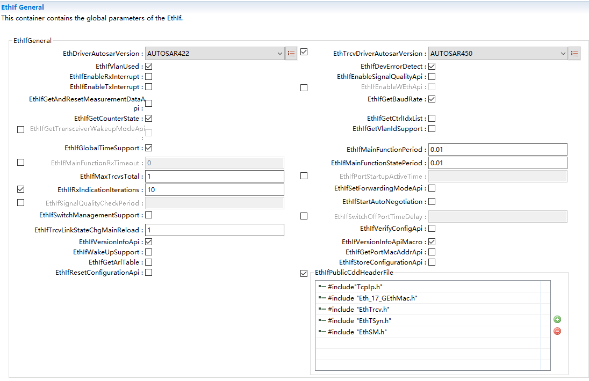

.. centered:: **表 EthIfGeneral (Table EthIfGeneral)**

.. list-table::
   :widths: 20 20 20 20 20
   :header-rows: 1

   * - UI名称 (UI Name)
     - 描述 (Description)
     - 
     - 
     - 
   * - EthDriverAutosarVersion
     - 取值范围 (Range)
     - AUTOSAR422/AUTOSAR431/AUTOSAR440/AUTOSAR450
     - 默认取值 (Default value)
     - AUTOSAR422
   * - 
     - 参数描述 (Parameter Description)
     - Eth Driver AutosarVersion.
     - 
     - 
   * - 
     - 依赖关系 (Dependencies)
     - 无
     - 
     - 
   * - EthTrcvDriverAutosarVersion
     - 取值范围 (Range)
     - AUTOSAR422/AUTOSAR431/AUTOSAR440/AUTOSAR450
     - 默认取值 (Default value)
     - AUTOSAR422
   * - 
     - 参数描述 (Parameter Description)
     - Eth TransceiverDriver AutosarVersion.
     - 
     - 
   * - 
     - 依赖关系 (Dependencies)
     - EthIfTransceivers有配置 (EthIfTransceivers have been configured.)
     - 
     - 
   * - EthIfVlanUsed
     - 取值范围 (Range)
     - STD_ON / STD_OFF
     - 默认取值 (Default value)
     - STD_OFF
   * - 
     - 参数描述 (Parameter Description)
     - Switches the EthIfVlan used ON or OFF.  true： enabled(ON).   false： disabled(OFF).
     - 
     - 
   * - 
     - 依赖关系 (Dependencies)
     - 无
     - 
     - 
   * - EthIfDevErrorDetect
     - 取值范围 (Range)
     - STD_ON / STD_OFF
     - 默认取值 (Default value)
     - STD_OFF
   * - 
     - 参数描述 (Parameter Description)
     - Switches the DefaultError Tracer (Det)detection andnotification ON orOFF.  true： enabled(ON).  false： disabled(OFF).
     - 
     - 
   * - 
     - 依赖关系 (Dependencies)
     - 无
     - 
     - 
   * - EthIfEnableRxInterrupt
     - 取值范围 (Range)
     - STD_ON / STD_OFF
     - 默认取值 (Default value)
     - STD_OFF
   * - 
     - 参数描述 (Parameter Description)
     - Enables / Disablesreceive interrupt.
     - 
     - 
   * - 
     - 依赖关系 (Dependencies)
     - 无
     - 
     - 
   * - EthIfEnableSignalQualityApi
     - 取值范围 (Range)
     - STD_ON / STD_OFF
     - 默认取值 (Default value)
     - STD_OFF
   * - 
     - 参数描述 (Parameter Description)
     - Enables / Disables  GetTrcvSignalQuality/GetSwitchPortSignalQuality/ClearTrcvSignalQuality/ClearSwitchPortSignalQuality Api.
     - 
     - 
   * - 
     - 依赖关系 (Dependencies)
     - 当前不支持 (Current unsupported.)
     - 
     - 
   * - EthIfEnableTxInterrupt
     - 取值范围 (Range)
     - STD_ON / STD_OFF
     - 默认取值 (Default value)
     - STD_OFF
   * - 
     - 参数描述 (Parameter Description)
     - Enables / Disablesthe transmit interrupt.
     - 
     - 
   * - 
     - 依赖关系 (Dependencies)
     - 无
     - 
     - 
   * - EthIfEnableWEthApi
     - 取值范围 (Range)
     - STD_ON / STD_OFF
     - 默认取值 (Default value)
     - STD_OFF
   * - 
     - 参数描述 (Parameter Description)
     - Enables / Disables WEth/WEthTrcv Api.
     - 
     - 
   * - 
     - 依赖关系 (Dependencies)
     - 当前不支持 (Current unsupported.)
     - 
     - 
   * - EthIfGetAndResetMeasurementDataApi
     - 取值范围 (Range)
     - STD_ON / STD_OFF
     - 默认取值 (Default value)
     - STD_OFF
   * - 
     - 参数描述 (Parameter Description)
     - Enables / Disables GetandResetMeasurementDataApi.
     - 
     - 
   * - 
     - 依赖关系 (Dependencies)
     - 当前不支持 (Current unsupported.)
     - 
     - 
   * - EthIfGetBaudRate
     - 取值范围 (Range)
     - STD_ON / STD_OFF
     - 默认取值 (Default value)
     - STD_OFF
   * - 
     - 参数描述 (Parameter Description)
     - Enables / Disables GetBaudRate API.
     - 
     - 
   * - 
     - 依赖关系 (Dependencies)
     - 无
     - 
     - 
   * - EthIfGetCounterState
     - 取值范围 (Range)
     - STD_ON / STD_OFF
     - 默认取值 (Default value)
     - STD_OFF
   * - 
     - 参数描述 (Parameter Description)
     - Enables / Disables GetCounterState API.
     - 
     - 
   * - 
     - 依赖关系 (Dependencies)
     - 无
     - 
     - 
   * - EthIfGetCtrlIdxList
     - 取值范围 (Range)
     - STD_ON / STD_OFF
     - 默认取值 (Default value)
     - STD_OFF
   * - 
     - 参数描述 (Parameter Description)
     - Enables / Disables GetCtrlIdxList API.
     - 
     - 
   * - 
     - 依赖关系 (Dependencies)
     - 
     - 
     - 
   * - EthIfGetTransceiverWakeupModeApi
     - 取值范围 (Range)
     - STD_ON / STD_OFF
     - 默认取值 (Default value)
     - STD_OFF
   * - 
     - 参数描述 (Parameter Description)
     - Enables / Disables GetTransceiverWakeupModeAPI
     - 
     - 
   * - 
     - 依赖关系 (Dependencies)
     - 无
     - 
     - 
   * - EthIfGetVlanIdSupport
     - 取值范围 (Range)
     - STD_ON / STD_OFF
     - 默认取值 (Default value)
     - STD_OFF
   * - 
     - 参数描述 (Parameter Description)
     - Enables / Disables GetVlanId API
     - 
     - 
   * - 
     - 依赖关系 (Dependencies)
     - 当前不支持 (Current unsupported.)
     - 
     - 
   * - EthIfGlobalTimeSupport
     - 取值范围 (Range)
     - STD_ON / STD_OFF
     - 默认取值 (Default value)
     - STD_OFF
   * - 
     - 参数描述 (Parameter Description)
     - Enables/Disables the Global Time APIs usedamongst others byGlobal Time Synchronizationover Ethernet.
     - 
     - 
   * - 
     - 依赖关系 (Dependencies)
     - 无
     - 
     - 
   * - EthIfMainFunctionPeriod
     - 取值范围 (Range)
     - 0..INF
     - 默认取值 (Default value)
     - 0.01
   * - 
     - 参数描述 (Parameter Description)
     - Specifies the periodof main functionEthIf_MainFunctionRxandEthIf_MainFunctionTxin seconds. EthernetInterface does notrequire thisinformation but theBSW scheduler.
     - 
     - 
   * - 
     - 依赖关系 (Dependencies)
     - 不能为0 (Cannot be 0)
     - 
     - 
   * - EthIfMainFunctionRxTimeout
     - 取值范围 (Range)
     - 0..INF
     - 默认取值 (Default value)
     - 0
   * - 
     - 参数描述 (Parameter Description)
     - This parameter isdeprecated and willbe removed in future. Old description：Timeout in secondsafter which the EthIfstops to receive frames in anEthIfMainFunctionRxperiod.Tags：atp.Status=obsolete atp.StatusRevisionBegin=4.2.2
     - 
     - 
   * - 
     - 依赖关系 (Dependencies)
     - 无
     - 
     - 
   * - EthIfMainFunctionStatePeriod
     - 取值范围 (Range)
     - 0..INF
     - 默认取值 (Default value)
     - 0.01
   * - 
     - 参数描述 (Parameter Description)
     - Specifies the periodof main functionEthIf_MainFunctionStatein seconds. EthernetInterface does notrequire thisinformation but theBSW scheduler.
     - 
     - 
   * - 
     - 依赖关系 (Dependencies)
     - 无
     - 
     - 
   * - EthIfMaxTrcvsTotal
     - 取值范围 (Range)
     - 1..255
     - 默认取值 (Default value)
     - 1
   * - 
     - 参数描述 (Parameter Description)
     - Limits the total number of transceivers.
     - 
     - 
   * - 
     - 依赖关系 (Dependencies)
     - 无
     - 
     - 
   * - EthIfPortStartupActiveTime
     - 取值范围 (Range)
     - 0.001..65.535
     - 默认取值 (Default value)
     - 无
   * - 
     - 参数描述 (Parameter Description)
     - Denote the time delay after the mode"ETH_MODE_ACTIVE" of all EthIfSwitchPorts are requested via EthIf_StartAllPorts
     - 
     - 
   * - 
     - 依赖关系 (Dependencies)
     - 无
     - 
     - 
   * - EthIfPublicCddHeaderFile
     - 取值范围 (Range)
     - 1..32 characters
     - 默认取值 (Default value)
     - #include"TCPIP.h"
   * - 
     - 参数描述 (Parameter Description)
     - Defines header files for callback functions which shall be included in case of CDDs. Range of characters is 1.. 32.
     - 
     - 
   * - 
     - 依赖关系 (Dependencies)
     - 无
     - 
     - 
   * - EthIfRxIndicationIterations
     - 取值范围 (Range)
     - 0..65535
     - 默认取值 (Default value)
     - 10
   * - 
     - 参数描述 (Parameter Description)
     - Maximum number of Ethernet frames per Ethernet controller polled from the Ethernet driver within EthIf_MainFunctionRx.
     - 
     - 
   * - 
     - 依赖关系 (Dependencies)
     - 无
     - 
     - 
   * - EthIfSetForwardingModeApi
     - 取值范围 (Range)
     - STD_ON / STD_OFF
     - 默认取值 (Default value)
     - STD_OFF
   * - 
     - 参数描述 (Parameter Description)
     - Enables /disables SetForwardingModeAPI.
     - 
     - 
   * - 
     - 依赖关系 (Dependencies)
     - 当前不支持 (Current unsupported.)
     - 
     - 
   * - EthIfSignalQualityCheckPeriod
     - 取值范围 (Range)
     - 0..INF
     - 默认取值 (Default value)
     - 无
   * - 
     - 参数描述 (Parameter Description)
     - Specifies the periodin units of secondsin which the signal quality it polled inthe context of EthIf_MainfunctionState. The value shall be anintegral multiple of EthIfMainFunctionStatePeriod.
     - 
     - 
   * - 
     - 依赖关系 (Dependencies)
     - 当前不支持 (Current unsupported.)
     - 
     - 
   * - EthIfStartAutoNegotiation
     - 取值范围 (Range)
     - STD_ON / STD_OFF
     - 默认取值 (Default value)
     - STD_OFF
   * - 
     - 参数描述 (Parameter Description)
     - Enables / DisablesStartAutoNegotiationAPI
     - 
     - 
   * - 
     - 依赖关系 (Dependencies)
     - 无
     - 
     - 
   * - EthIfSwitchManagementSupport
     - 取值范围 (Range)
     - STD_ON / STD_OFF
     - 默认取值 (Default value)
     - STD_OFF
   * - 
     - 参数描述 (Parameter Description)
     - Enables/Disables theSwitch managementAPIs to support a Switch-port specific communication attribute access.
     - 
     - 
   * - 
     - 依赖关系 (Dependencies)
     - 无
     - 
     - 
   * - EthIfSwitchOffPortTimeDelay
     - 取值范围 (Range)
     - 0.001..65.535
     - 默认取值 (Default value)
     - STD_OFF
   * - 
     - 参数描述 (Parameter Description)
     - Denote the time delay after the mode"ETH_MODE_DOWN" of a EthIfSwitchPortGroup will be executed
     - 
     - 
   * - 
     - 依赖关系 (Dependencies)
     - 无
     - 
     - 
   * - EthIfTrcvLinkStateChgMainReload
     - 取值范围 (Range)
     - 1..255
     - 默认取值 (Default value)
     - 1
   * - 
     - 参数描述 (Parameter Description)
     - Specifies the frequency of transceiver link state change checksin each period of mainfunction EthIf_MainFunctionTx.
     - 
     - 
   * - 
     - 依赖关系 (Dependencies)
     - 无
     - 
     - 
   * - EthIfVersionInfoApi
     - 取值范围 (Range)
     - STD_ON / STD_OFF
     - 默认取值 (Default value)
     - STD_OFF
   * - 
     - 参数描述 (Parameter Description)
     - Enables / Disables version info API
     - 
     - 
   * - 
     - 依赖关系 (Dependencies)
     - 无
     - 
     - 
   * - EthIfVersionInfoApiMacro
     - 取值范围 (Range)
     - STD_ON / STD_OFF
     - 默认取值 (Default value)
     - STD_OFF
   * - 
     - 参数描述 (Parameter Description)
     - Enables / Disables version info APImacro implementation.
     - 
     - 
   * - 
     - 依赖关系 (Dependencies)
     - 无
     - 
     - 
   * - EthIfWakeUpSupport
     - 取值范围 (Range)
     - STD_ON / STD_OFF
     - 默认取值 (Default value)
     - STD_OFF
   * - 
     - 参数描述 (Parameter Description)
     - Configures if wakeupis supported or not
     - 
     - 
   * - 
     - 依赖关系 (Dependencies)
     - 无
     - 
     - 
   * - EthIfGetPortMacAddrApi
     - 取值范围 (Range)
     - STD_ON / STD_OFF
     - 默认取值 (Default value)
     - STD_OFF
   * - 
     - 参数描述 (Parameter Description)
     - Enables / Disables EthIf_GetPortMacAddrAPI
     - 
     - 
   * - 
     - 依赖关系 (Dependencies)
     - 无
     - 
     - 
   * - EthIfGetArlTable
     - 取值范围 (Range)
     - STD_ON / STD_OFF
     - 默认取值 (Default value)
     - STD_OFF
   * - 
     - 参数描述 (Parameter Description)
     - Enables / Disables EthIf_GetArlTable API
     - 
     - 
   * - 
     - 依赖关系 (Dependencies)
     - 无
     - 
     - 
   * - EthIfStoreConfigurationApi
     - 取值范围 (Range)
     - STD_ON / STD_OFF
     - 默认取值 (Default value)
     - STD_OFF
   * - 
     - 参数描述 (Parameter Description)
     - Enables / Disables EthIf_StoreConfigurationAPI
     - 
     - 
   * - 
     - 依赖关系 (Dependencies)
     - 无
     - 
     - 
   * - EthIfResetConfigurationApi
     - 取值范围 (Range)
     - STD_ON / STD_OFF
     - 默认取值 (Default value)
     - STD_OFF
   * - 
     - 参数描述 (Parameter Description)
     - Enables / Disables EthIf_ResetConfigurationAPI
     - 
     - 
   * - 
     - 依赖关系 (Dependencies)
     - 无
     - 
     - 

EthIfConfigSet
------------------------------

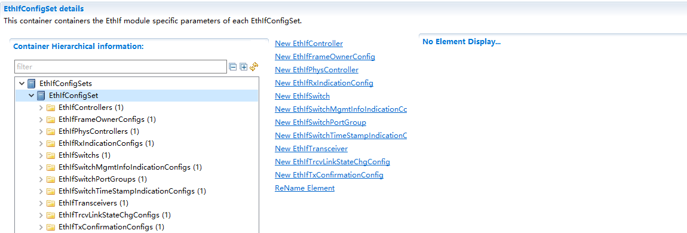

.. centered:: **表 EthIfConfigSet (Table EthIfConfigSet)**

.. list-table::
   :widths: 20 20 20 20 20
   :header-rows: 1

   * - UI名称 (UI Name)
     - 描述 (Description)
     - 
     - 
     - 
   * - EthIfController
     - 取值范围 (Range)
     - Container
     - 默认取值 (Default value)
     - 无
   * - 
     - 参数描述 (Parameter Description)
     - This containercontains theconfiguration ofEthIfController.
     - 
     - 
   * - 
     - 依赖关系 (Dependencies)
     - 配置中最少有一个EthIfController，定义的配置数组名为EthIf_ControllerCfgData (There is最少 one EthIfController in the configuration, and the named array for the defined configuration is EthIf_ControllerCfgData.)
     - 
     - 
   * - EthIfFrameOwnerConfig
     - 取值范围 (Range)
     - Container
     - 默认取值 (Default value)
     - 无
   * - 
     - 参数描述 (Parameter Description)
     - Configuration ofEthernet frame owner
     - 
     - 
   * - 
     - 依赖关系 (Dependencies)
     - 配置中最少有两个EtherIfFrameOwnerConfig，分别对应ARP和IP (At least two EtherIfFrameOwnerConfig are configured, corresponding to ARP and IP respectively.)
     - 
     - 
   * - EthIfPhysController
     - 取值范围 (Range)
     - Container
     - 默认取值 (Default value)
     - 无
   * - 
     - 参数描述 (Parameter Description)
     - This containercontains theconfiguration ofEthIfPhysController
     - 
     - 
   * - 
     - 依赖关系 (Dependencies)
     - 无
     - 
     - 
   * - EthIfRxIndicationConfig
     - 取值范围 (Range)
     - Container
     - 默认取值 (Default value)
     - 无
   * - 
     - 参数描述 (Parameter Description)
     - Configuration ofreceive callbackfunctions.
     - 
     - 
   * - 
     - 依赖关系 (Dependencies)
     - 无
     - 
     - 
   * - EthIfSwitch
     - 取值范围 (Range)
     - Container
     - 默认取值 (Default value)
     - 无
   * - 
     - 参数描述 (Parameter Description)
     - This containercontains theconfiguration ofEthIfSwitches.
     - 
     - 
   * - 
     - 依赖关系 (Dependencies)
     - 无
     - 
     - 
   * - EthIfSwitchMgmtInfoIndicationConfig
     - 取值范围 (Range)
     - Container
     - 默认取值 (Default value)
     - 无
   * - 
     - 参数描述 (Parameter Description)
     - Configuration ofSwitch Managementcallback function
     - 
     - 
   * - 
     - 依赖关系 (Dependencies)
     - 当前不支持 (Current unsupported.)
     - 
     - 
   * - EthIfSwitchPortGroup
     - 取值范围 (Range)
     - Container
     - 默认取值 (Default value)
     - 无
   * - 
     - 参数描述 (Parameter Description)
     - This containercontains theconfiguration ofEthIfSwitchPortGroups.
     - 
     - 
   * - 
     - 依赖关系 (Dependencies)
     - 当前不支持 (Current unsupported.)
     - 
     - 
   * - EthIfSwitchTimeStampIndicationConfig
     - 取值范围 (Range)
     - Container
     - 默认取值 (Default value)
     - 无
   * - 
     - 参数描述 (Parameter Description)
     - Configuration ofSwitch timestampindications.
     - 
     - 
   * - 
     - 依赖关系 (Dependencies)
     - 当前不支持 (Current unsupported.)
     - 
     - 
   * - EthIfTransceiver
     - 取值范围 (Range)
     - Container
     - 默认取值 (Default value)
     - 无
   * - 
     - 参数描述 (Parameter Description)
     - This containercontains theconfiguration ofEthIfTransceiver. Theusage ofEthIfEthTrcvRef andEthIfWEthTrcvRefisexclusive OR.
     - 
     - 
   * - 
     - 依赖关系 (Dependencies)
     - 无
     - 
     - 
   * - EthIfTrcvLinkStateChgConfig
     - 取值范围 (Range)
     - Container
     - 默认取值 (Default value)
     - 无
   * - 
     - 参数描述 (Parameter Description)
     - Specifies link statechange callbackfunction
     - 
     - 
   * - 
     - 依赖关系 (Dependencies)
     - 无
     - 
     - 
   * - EthIfTxConfirmationConfig
     - 取值范围 (Range)
     - Container
     - 默认取值 (Default value)
     - 无
   * - 
     - 参数描述 (Parameter Description)
     - Configuration oftransmit indicationcallback functions.
     - 
     - 
   * - 
     - 依赖关系 (Dependencies)
     - 无
     - 
     - 

EthIfController
===============================

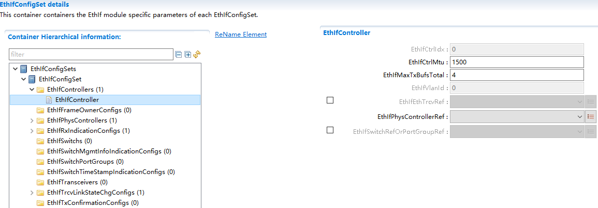

.. centered:: **表 EthIfController (Table EthIfController)**

.. list-table::
   :widths: 20 20 20 20 20
   :header-rows: 1

   * - UI名称 (UI Name)
     - 描述 (Description)
     - 
     - 
     - 
   * - EthIfCtrlIdx
     - 取值范围 (Range)
     - 0..255
     - 默认取值 (Default value)
     - 无
   * - 
     - 参数描述 (Parameter Description)
     - This parameter provides a zero-based consecutive index ofthe Ethernet Communication Controllers. Upperlayer BSW modules and the EthIf itself  use this index to identify a Ethernet CC.
     - 
     - 
   * - 
     - 依赖关系 (Dependencies)
     - 新增时自动递增，删除时自动递减 (Auto-increment on addition, auto-decrement on deletion)
     - 
     - 
   * - EthIfCtrlMtu
     - 取值范围 (Range)
     - 64..9000
     - 默认取值 (Default value)
     - 1500
   * - 
     - 参数描述 (Parameter Description)
     - Specifies the maximum transmission unit(MTU) of theEthIfCtrl in [bytes].
     - 
     - 
   * - 
     - 
     - Note： in case a VLANtag is used for theEthIfCtrl, the MTU is4 bytes smaller hanthe maximum payloadsize of an Ethernetframe which can betransmitted on thenetwork.
     - 
     - 
   * - 
     - 依赖关系 (Dependencies)
     - 新增时自动递增，删除时自动递减 (Auto-increment on addition, auto-decrement on deletion)
     - 
     - 
   * - EthIfMaxTxBufsTotal
     - 取值范围 (Range)
     - 1..255
     - 默认取值 (Default value)
     - 4
   * - 
     - 参数描述 (Parameter Description)
     - Limits the totalnumber of transmitbuffers.
     - 
     - 
   * - 
     - 依赖关系 (Dependencies)
     - 无
     - 
     - 
   * - EthIfVlanId
     - 取值范围 (Range)
     - 0..4095
     - 默认取值 (Default value)
     - 0
   * - 
     - 参数描述 (Parameter Description)
     - A virtual-LAN is identified by this attribute according to IEEE 802.1Q
     - 
     - 
   * - 
     - 依赖关系 (Dependencies)
     - 如果EthIfVlanUsed配置成STD_OFF的情况下，VLANID生成0xff，并且这时候不可配 (If EthIfVlanUsed is configured as STD_OFF, VLANID will be generated as 0xff, and it cannot be configured at this time.)
     - 
     - 
   * - EthIfTrcvRef
     - 取值范围 (Range)
     - Ref
     - 默认取值 (Default value)
     - 无
   * - 
     - 参数描述 (Parameter Description)
     - Reference to a Ethernet Transceiver.
     - 
     - 
   * - 
     - 依赖关系 (Dependencies)
     - 引用到EthIfTrcvCfg的具体实例，关联到EthIfTransceiver (Refer to specific instances of EthIfTrcvCfg, associate with EthIfTransceiver)
     - 
     - 
   * - EthIfPhysControllerRef
     - 取值范围 (Range)
     - Ref
     - 默认取值 (Default value)
     - 无
   * - 
     - 参数描述 (Parameter Description)
     - Reference to a physical Ethernet controller, which is handled by the Ethernet Interface.
     - 
     - 
   * - 
     - 依赖关系 (Dependencies)
     - 指向EthIf_PhysControllerCfg结构体的实例 (An instance pointing to EthIf_PhysControllerCfg structure)
     - 
     - 
   * - EthIfSwitchRefOrPortGroupRef
     - 取值范围 (Range)
     - Ref
     - 默认取值 (Default value)
     - 无
   * - 
     - 参数描述 (Parameter Description)
     - The choice referenceallows to configureeither theEthIfControllerreferences anEthIfSwitch or anEthIfSwitchPortGroup.
     - 
     - 
   * - 
     - 依赖关系 (Dependencies)
     - 指向EthIfSwitch或EthIfSwitchPortGroup实例，当前不支持 (Point to an instance of EthIfSwitch or EthIfSwitchPortGroup, and current support is not available.)
     - 
     - 

EthIfFrameOwnerConfig
=====================================

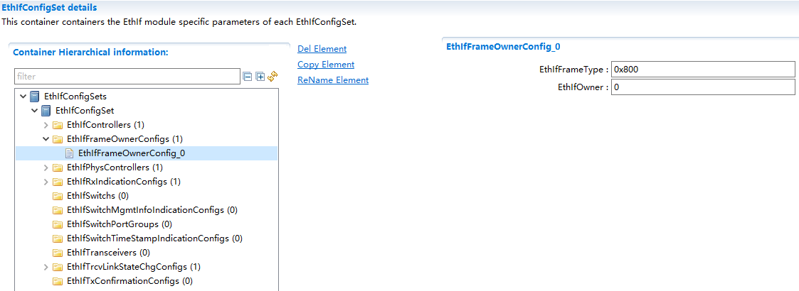

.. centered:: **表 EthIfFrameOwerConfig (Table EthIfFrameOwerConfig)**

.. list-table::
   :widths: 20 20 20 20 20
   :header-rows: 1

   * - UI名称 (UI Name)
     - 描述 (Description)
     - 
     - 
     - 
   * - EthIfFrameType
     - 取值范围 (Range)
     - 0..65535
     - 默认取值 (Default value)
     - 无
   * - 
     - 参数描述 (Parameter Description)
     - Selects the Ethernetframe type.
     - 
     - 
   * - 
     - 依赖关系 (Dependencies)
     - 无
     - 
     - 
   * - EthIfOwner
     - 取值范围 (Range)
     - 0..255
     - 默认取值 (Default value)
     - 0
   * - 
     - 参数描述 (Parameter Description)
     - Selects the owner of an Ethernet frametype. The owner is a zero based index into the callback function configuration'EthIfRxIndicationConfig'. I.e. an Ethernetframe of type IPv4(0x800) at index 0 will call the first callback function configured in'EthIfRxIndicationConfig'.
     - 
     - 
   * - 
     - 依赖关系 (Dependencies)
     - 配置的值不能超过EthIfRxIndicationConfig的配置个数 (The configured values cannot exceed the number of EthIfRxIndicationConfig configurations.)
     - 
     - 

EthIfPhysController
===================================

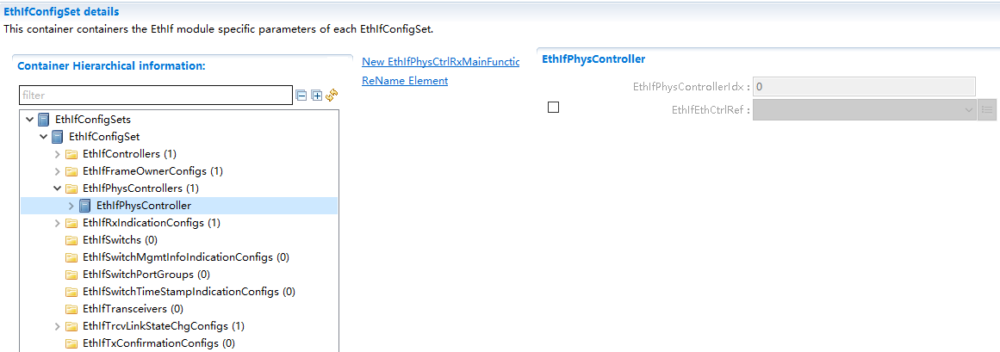

.. centered:: **表 EthIfPhysController (Table EthIfPhysController)**

.. list-table::
   :widths: 20 20 20 20 20
   :header-rows: 1

   * - UI名称 (UI Name)
     - 描述 (Description)
     - 
     - 
     - 
   * - EthIfPhysControllerIdx
     - 取值范围 (Range)
     - 0..255
     - 默认取值 (Default value)
     - 无
   * - 
     - 参数描述 (Parameter Description)
     - This parameterprovides a zero-based consecutive index of the physical Ethernet controllers. Upperlayer BSW modules andthe Ethernet Interface itself usethis index to identify a physical Ethernet controller.
     - 
     - 
   * - 
     - 依赖关系 (Dependencies)
     - 新增时自动递增，删除时自动递减 (Auto-increment on addition, auto-decrement on deletion)
     - 
     - 
   * - EthIfEthCtrlRef
     - 取值范围 (Range)
     - Ref
     - 默认取值 (Default value)
     - 无
   * - 
     - 参数描述 (Parameter Description)
     - 关联到EthIfEthCtrlRef的具体实现 (Specific implementation associated with EthIfEthCtrlRef)
     - 
     - 
   * - 
     - 依赖关系 (Dependencies)
     - 无
     - 
     - 

EthIfPhysCtrlRxMainFunctionPriorityProcessing
-------------------------------------------------------------

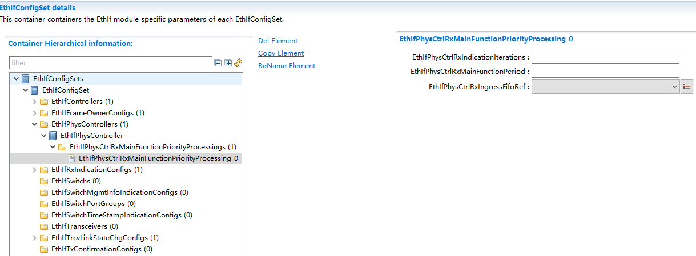

.. centered:: **表 EthIfPhysCtrlRxMainFunctionPriorityProcessing属性描述 (Property description for attribute EthIfPhysCtrlRxMainFunctionPriorityProcessing)**

.. list-table::
   :widths: 20 20 20 20 20
   :header-rows: 1

   * - UI名称 (UI Name)
     - 描述 (Description)
     - 
     - 
     - 
   * - EthIfPhysCtrlRxIndicationIterations
     - 取值范围 (Range)
     - 0   ..18446744073709551615
     - 默认取值 (Default value)
     - 无
   * -
     - 参数描述 (Parameter Description)
     - Max number of Ethernet frames   polled per main function invocation
     - 
     - 
   * -
     - 依赖关系 (Dependencies)
     - 当前不支持 (Current unsupported.)
     - 
     - 
   * - EthIfPhysCtrlRxMainFunctionPeriod
     - 取值范围 (Range)
     - 0.. INF
     - 默认取值 (Default value)
     - 无
   * -
     - 参数描述 (Parameter Description)
     - Specifies the period of mainfunction in seconds.
     - 
     - 
   * -
     - 依赖关系 (Dependencies)
     - 当前不支持 (Current unsupported.)
     - 
     - 
   * - EthIfPhysCtrlRxIngressFifoRef
     - 取值范围 (Range)
     - Ref
     - 默认取值 (Default value)
     - 无
   * -
     - 参数描述 (Parameter Description)
     - Reference to the reception FIFO
     - 
     - 
   * -
     - 依赖关系 (Dependencies)
     - 当前不支持 (Current unsupported.)
     - 
     - 

EthIfRxIndicationConfig
=======================================

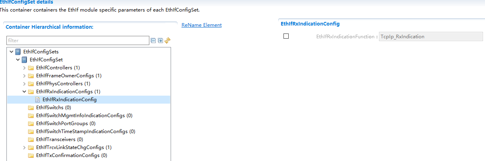

.. centered:: **表  EthIfRxIdicationConfig (Table  EthIfRxIdicationConfig)**

.. list-table::
   :widths: 20 20 20 20 20
   :header-rows: 1

   * - UI名称 (UI Name)
     - 描述 (Description)
     - 
     - 
     - 
   * - EthIfRxIndicationFunction
     - 取值范围 (Range)
     - FunctionName
     - 默认取值 (Default value)
     - 无
   * - 
     - 参数描述 (Parameter Description)
     - Specifies receive indication callback function.
     - 
     - 
   * - 
     - 依赖关系 (Dependencies)
     - 无
     - 
     - 

EthIfSwitch
===========================

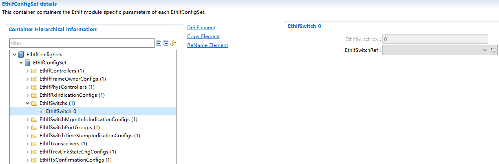

.. centered:: **表  EthIfSwitch (Table EthIfSwitch)**

.. list-table::
   :widths: 20 20 20 20 20
   :header-rows: 1

   * - UI名称 (UI Name)
     - 描述 (Description)
     - 
     - 
     - 
   * - EthIfSwitchIdx
     - 取值范围 (Range)
     - 0..255
     - 默认取值 (Default value)
     - 无
   * - 
     - 参数描述 (Parameter Description)
     - This parameter provides a zero-based consecutive index ofthe Ethernet Interface Switches. Upper layer BSWmodules and the EthIfitself use this indexto identify aEthernet Switch.
     - 
     - 
   * - 
     - 依赖关系 (Dependencies)
     - 新增时自动递增，删除时自动递减 (Auto-increment on addition, auto-decrement on deletion)
     - 
     - 
   * - EthIfSwitchRef
     - 取值范围 (Range)
     - Ref
     - 默认取值 (Default value)
     - 无
   * - 
     - 参数描述 (Parameter Description)
     - Reference to aEthernet Switch,which is handled by aspecific EthernetSwitch driver.
     - 
     - 
   * - 
     - 依赖关系 (Dependencies)
     - 无
     - 
     - 

EthIfSwitchMgmtInfoIndicationConfig
===================================================

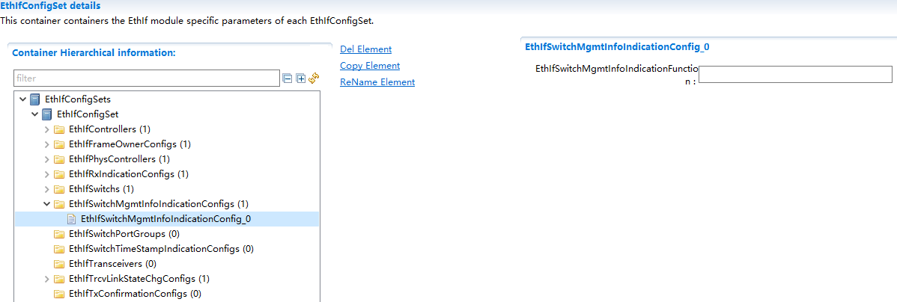

.. centered:: **表  EthIfSwitchMgmtInfoIndicationConfig (Table  EthIfSwitchMgmtInfoIndicationConfig)**

.. list-table::
   :widths: 20 20 20 20 20
   :header-rows: 1

   * - UI名称 (UI Name)
     - 描述 (Description)
     - 
     - 
     - 
   * - EthIfSwitchMgmtInfoIndicationFunction
     - 取值范围 (Range)
     - FunctionName
     - 默认取值 (Default value)
     - 无
   * - 
     - 参数描述 (Parameter Description)
     - Enables/Disables theingress Switchmanagement infoindication redirectedcall to upper layerswho registered forthe call.
     - 
     - 
   * - 
     - 依赖关系 (Dependencies)
     - 当前不支持 (Current unsupported.)
     - 
     - 

EthIfSwitchPortGroup
====================================

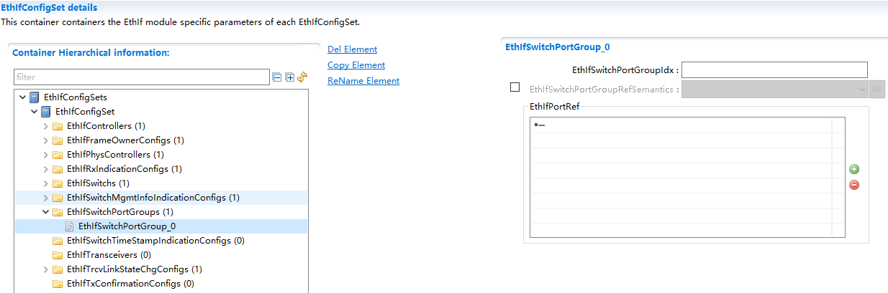

.. centered:: **表 0 EthIfSwitchPortGroup (Table 0 EthIfSwitchPortGroup)**

.. list-table::
   :widths: 20 20 20 20 20
   :header-rows: 1

   * - UI名称 (UI Name)
     - 描述 (Description)
     - 
     - 
     - 
   * - EthIfSwitchPortGroupIdx
     - 取值范围 (Range)
     - 0..255
     - 默认取值 (Default value)
     - 无
   * - 
     - 参数描述 (Parameter Description)
     - This parameter provides a zero-based consecutive index of the Ethernet SwitchPort Groups. Upperlayer BSW modules andthe EthIf itself usethis index toidentify an EthernetSwitch Port Group
     - 
     - 
   * - 
     - 依赖关系 (Dependencies)
     - 当前不支持 (Current unsupported.)
     - 
     - 
   * - EthIfSwitchPortGroupRefSemantics
     - 取值范围 (Range)
     - ETHIF_SWITCH_PORT_GROUP_CONTROL/ETHIF_SWITCH_PORT_GROUP_LINK_INFO
     - 默认取值 (Default value)
     - 无
   * - 
     - 参数描述 (Parameter Description)
     - Defines how the EthIfSwitchRefOrPortGroupRef refering to a EthIfSwitchPortGroup shall be interpreted.
     - 
     - 
   * - 
     - 依赖关系 (Dependencies)
     - 如果EthIfSwitchRefOrPortGroupRef关联了EthIfSwitchPortGroup才有效，当前不支持 (If EthIfSwitchRefOrPortGroupRef is associated with EthIfSwitchPortGroup, it is valid; current support is not available.)
     - 
     - 
   * - EthIfPortRef
     - 取值范围 (Range)
     - Ref
     - 默认取值 (Default value)
     - 无
   * - 
     - 参数描述 (Parameter Description)
     - Reference to anEthernet Switch Port
     - 
     - 
   * - 
     - 依赖关系 (Dependencies)
     - 当前不支持 (Current unsupported.)
     - 
     - 

EthIfSwitchTimeStampIndicationConfig
====================================================

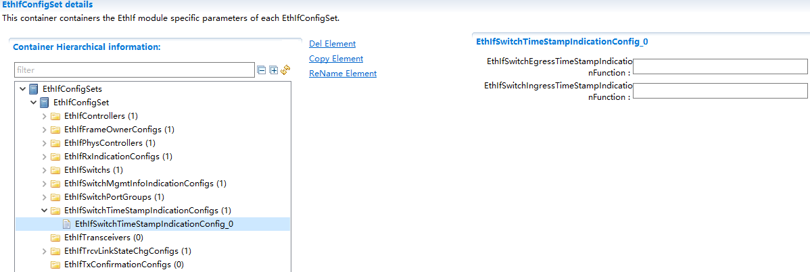

.. centered:: **表 1 EthIfSwitchTimeStampIndicationConfig (Table 1 EthIfSwitchTimeStampIndicationConfig)**

.. list-table::
   :widths: 20 20 20 20 20
   :header-rows: 1

   * - UI名称 (UI Name)
     - 描述 (Description)
     - 
     - 
     - 
   * - EthIfSwitchEgressTimeStampIndicationFunction
     - 取值范围 (Range)
     - FunctionName
     - 默认取值 (Default value)
     - 无
   * - 
     - 参数描述 (Parameter Description)
     - Enables/Disables toupper layers anegress timestamp indication function.
     - 
     - 
   * - 
     - 依赖关系 (Dependencies)
     - 当前不支持 (Current unsupported.)
     - 
     - 
   * - EthIfSwitchIngressTimeStampIndicationFunction
     - 取值范围 (Range)
     - FunctionName
     - 默认取值 (Default value)
     - 无
   * - 
     - 参数描述 (Parameter Description)
     - Enables/Disables toupper layers aningress timestamp indication function.
     - 
     - 
   * - 
     - 依赖关系 (Dependencies)
     - 当前不支持 (Current unsupported.)
     - 
     - 

EthIfTransceiver
================================

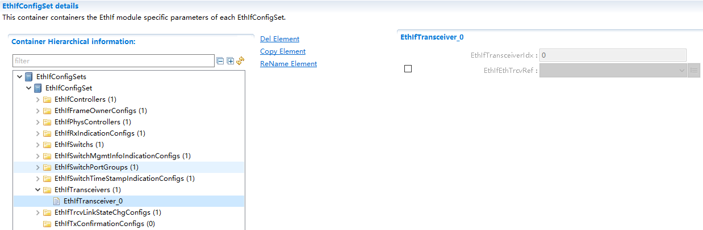

.. centered:: **表 2 EthIfTransceiver (Table 2 EthIfTransceiver)**

.. list-table::
   :widths: 20 20 20 20 20
   :header-rows: 1

   * - UI名称 (UI Name)
     - 描述 (Description)
     - 
     - 
     - 
   * - EthIfTransceiverIdx
     - 取值范围 (Range)
     - 0..255
     - 默认取值 (Default value)
     - 无
   * - 
     - 参数描述 (Parameter Description)
     - This parameter provides a zero-based consecutive index of the Ethernet transceivers. Upperlayer BSW modules and the Ethernet Interface itself use this index to identify an Ethernet transceiver.
     - 
     - 
   * - 
     - 依赖关系 (Dependencies)
     - 新增时自动递增，删除时自动递减 (Auto-increment on addition, auto-decrement on deletion)
     - 
     - 
   * - EthIfEthTrcvRef
     - 取值范围 (Range)
     - Ref
     - 默认取值 (Default value)
     - 无
   * - 
     - 参数描述 (Parameter Description)
     - 关联到EthIfEthTrcvRef的具体实现 (Specific implementation related to EthIfEthTrcvRef)
     - 
     - 
   * - 
     - 依赖关系 (Dependencies)
     - 无
     - 
     - 

EthIfTrcvLinkStateChgConfig
===========================================

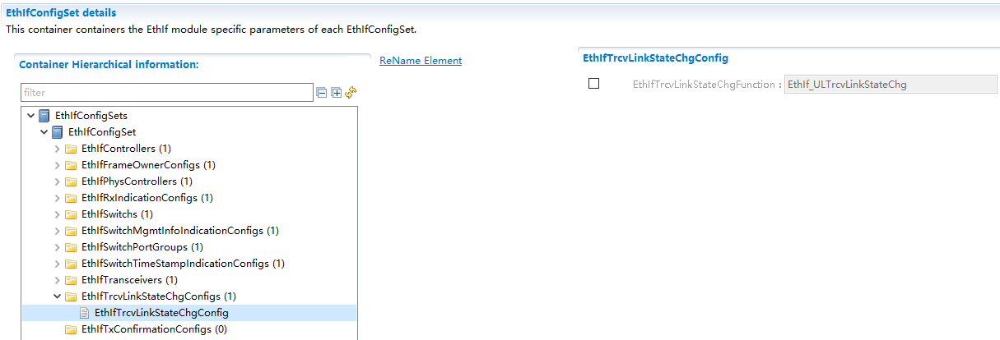

.. centered:: **表 3 EthIfTrcvLinkStateChgConfig (Table 3 EthIfTrcvLinkStateChgConfig)**

.. list-table::
   :widths: 20 20 20 20 20
   :header-rows: 1

   * - UI名称 (UI Name)
     - 描述 (Description)
     - 
     - 
     - 
   * - EthIfTrcvLinkStateChgFunction
     - 取值范围 (Range)
     - FunctionName
     - 默认取值 (Default value)
     - 无
   * - 
     - 参数描述 (Parameter Description)
     - Specifies link statechange callbackfunction
     - 
     - 
   * - 
     - 依赖关系 (Dependencies)
     - 无
     - 
     - 

EthIfTxConfirmationConfig
=========================================

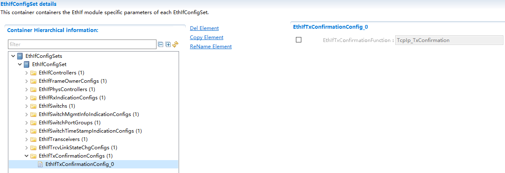

.. centered:: **表 4 EthIfTxConfirmationConfig (Table 4 EthIfTxConfirmationConfig)**

.. list-table::
   :widths: 20 20 20 20 20
   :header-rows: 1

   * - UI名称 (UI Name)
     - 描述 (Description)
     - 
     - 
     - 
   * - EthIfTxConfirmationFunction
     - 取值范围 (Range)
     - FunctionName
     - 默认取值 (Default value)
     - 无
   * - 
     - 参数描述 (Parameter Description)
     - Specifies transmitindication callbackfunction
     - 
     - 
   * - 
     - 依赖关系 (Dependencies)
     - 无
     - 
     - 

EthTrcv_DriverApiConfigSet
------------------------------------------

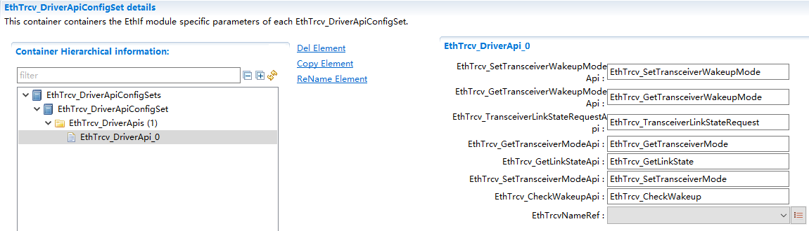

.. centered:: **表 5 EthTrcv_DriverApiConfigSet (Table 5 EthTrcv_DriverApiConfigSet)**

.. list-table::
   :widths: 20 20 20 20 20
   :header-rows: 1

   * - UI名称 (UI Name)
     - 描述 (Description)
     - 
     - 
     - 
   * - EthTrcv_SetTransceiverWakeupModeApi
     - 取值范围 (Range)
     - FunctionName
     - 默认取值 (Default value)
     - 无
   * -
     - 参数描述 (Parameter Description)
     - API名 (API Name)
     - 
     - 
   * -
     - 依赖关系 (Dependencies)
     - 可根据EthTrcvNameRef自动变更 (Can be automatically changed based on EthTrcvNameRef)
     - 
     - 
   * - EthTrcv_GetTransceiverWakeupModeApi
     - 取值范围 (Range)
     - FunctionName
     - 默认取值 (Default value)
     - 无
   * -
     - 参数描述 (Parameter Description)
     - API名 (API Name)
     - 
     - 
   * -
     - 依赖关系 (Dependencies)
     - 可根据EthTrcvNameRef自动变更 (Can be automatically changed based on EthTrcvNameRef)
     - 
     - 
   * - EthTrcv_TransceiverLinkStateRequestApi
     - 取值范围 (Range)
     - FunctionName
     - 默认取值 (Default value)
     - 无
   * -
     - 参数描述 (Parameter Description)
     - API名 (API Name)
     - 
     - 
   * -
     - 依赖关系 (Dependencies)
     - 可根据EthTrcvNameRef自动变更 (Can be automatically changed based on EthTrcvNameRef)
     - 
     - 
   * - EthTrcv_GetTransceiverModeApi
     - 取值范围 (Range)
     - FunctionName
     - 默认取值 (Default value)
     - 无
   * -
     - 参数描述 (Parameter Description)
     - API名 (API Name)
     - 
     - 
   * -
     - 依赖关系 (Dependencies)
     - 可根据EthTrcvNameRef自动变更 (Can be automatically changed based on EthTrcvNameRef)
     - 
     - 
   * - EthTrcv_GetLinkStateApi
     - 取值范围 (Range)
     - FunctionName
     - 默认取值 (Default value)
     - 无
   * -
     - 参数描述 (Parameter Description)
     - API名 (API Name)
     - 
     - 
   * -
     - 依赖关系 (Dependencies)
     - 可根据EthTrcvNameRef自动变更 (Can be automatically changed based on EthTrcvNameRef)
     - 
     - 
   * - EthTrcv_SetTransceiverModeApi
     - 取值范围 (Range)
     - FunctionName
     - 默认取值 (Default value)
     - 无
   * -
     - 参数描述 (Parameter Description)
     - API名 (API Name)
     - 
     - 
   * -
     - 依赖关系 (Dependencies)
     - 可根据EthTrcvNameRef自动变更 (Can be automatically changed based on EthTrcvNameRef)
     - 
     - 
   * - EthTrcv_CheckWakeupApi
     - 取值范围 (Range)
     - FunctionName
     - 默认取值 (Default value)
     - 无
   * -
     - 参数描述 (Parameter Description)
     - API名 (API Name)
     - 
     - 
   * -
     - 依赖关系 (Dependencies)
     - 可根据EthTrcvNameRef自动变更 (Can be automatically changed based on EthTrcvNameRef)
     - 
     - 
   * - EthTrcvNameRef
     - 取值范围 (Range)
     - Ref
     - 默认取值 (Default value)
     - 无
   * -
     - 参数描述 (Parameter Description)
     - Ref到EthTrcv驱动的名称 (Ref to EthTrcv Driver Name)
     - 
     - 
   * -
     - 依赖关系 (Dependencies)
     - 引用的EthTrcvName不能相同 (The EthTrcvName cannot be the same.)
     - 
     - 

Eth_DriverApiConfigeSet
---------------------------------------

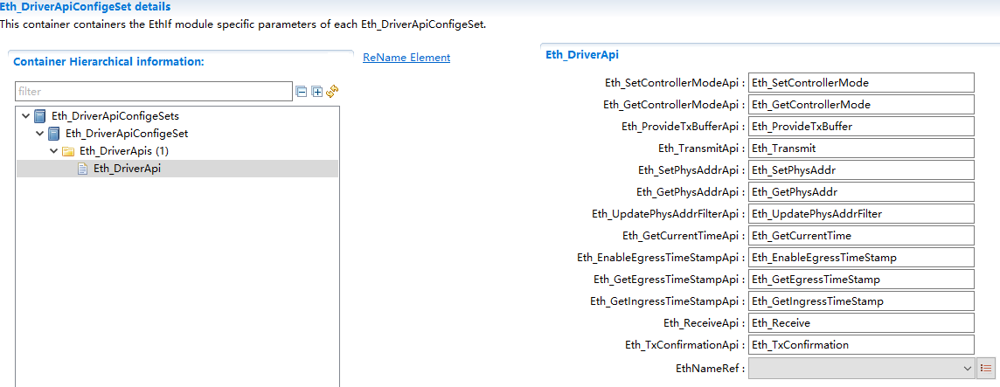

.. centered:: **表 6 Eth_DriverApiConfigeSet (Table 6 Eth_DriverApiConfigeSet)**

.. list-table::
   :widths: 20 20 20 20 20
   :header-rows: 1

   * - UI名称 (UI Name)
     - 描述 (Description)
     - 
     - 
     - 
   * - Eth_SetControllerModeApi
     - 取值范围 (Range)
     - FunctionName
     - 默认取值 (Default value)
     - 无
   * -
     - 参数描述 (Parameter Description)
     - API名 (API Name)
     - 
     - 
   * -
     - 依赖关系 (Dependencies)
     - 可根据EthNameRef自动变更 (Can be automatically changed according to EthNameRef)
     - 
     - 
   * - Eth_GetControllerModeApi
     - 取值范围 (Range)
     - FunctionName
     - 默认取值 (Default value)
     - 无
   * -
     - 参数描述 (Parameter Description)
     - API名 (API Name)
     - 
     - 
   * -
     - 依赖关系 (Dependencies)
     - 可根据EthNameRef自动变更 (Can be automatically changed according to EthNameRef)
     - 
     - 
   * - Eth_ProvideTxBufferApi
     - 取值范围 (Range)
     - FunctionName
     - 默认取值 (Default value)
     - 无
   * -
     - 参数描述 (Parameter Description)
     - API名 (API Name)
     - 
     - 
   * -
     - 依赖关系 (Dependencies)
     - 可根据EthNameRef自动变更 (Can be automatically changed according to EthNameRef)
     - 
     - 
   * - Eth_TransmitApi
     - 取值范围 (Range)
     - FunctionName
     - 默认取值 (Default value)
     - 无
   * -
     - 参数描述 (Parameter Description)
     - API名 (API Name)
     - 
     - 
   * -
     - 依赖关系 (Dependencies)
     - 可根据EthNameRef自动变更 (Can be automatically changed according to EthNameRef)
     - 
     - 
   * - Eth_SetPhysAddrApi
     - 取值范围 (Range)
     - FunctionName
     - 默认取值 (Default value)
     - 无
   * -
     - 参数描述 (Parameter Description)
     - API名 (API Name)
     - 
     - 
   * -
     - 依赖关系 (Dependencies)
     - 可根据EthNameRef自动变更 (Can be automatically changed according to EthNameRef)
     - 
     - 
   * - Eth_GetPhysAddrApi
     - 取值范围 (Range)
     - FunctionName
     - 默认取值 (Default value)
     - 无
   * -
     - 参数描述 (Parameter Description)
     - API名 (API Name)
     - 
     - 
   * -
     - 依赖关系 (Dependencies)
     - 可根据EthNameRef自动变更 (Can be automatically changed according to EthNameRef)
     - 
     - 
   * - Eth_UpdatePhysAddrFilterApi
     - 取值范围 (Range)
     - FunctionName
     - 默认取值 (Default value)
     - 无
   * -
     - 参数描述 (Parameter Description)
     - API名 (API Name)
     - 
     - 
   * -
     - 依赖关系 (Dependencies)
     - 可根据EthNameRef自动变更 (Can be automatically changed according to EthNameRef)
     - 
     - 
   * - Eth_GetCurrentTimeApi
     - 取值范围 (Range)
     - FunctionName
     - 默认取值 (Default value)
     - 无
   * -
     - 参数描述 (Parameter Description)
     - API名 (API Name)
     - 
     - 
   * -
     - 依赖关系 (Dependencies)
     - 可根据EthNameRef自动变更 (Can be automatically changed according to EthNameRef)
     - 
     - 
   * - Eth_EnableEgressTimeStampApi
     - 取值范围 (Range)
     - FunctionName
     - 默认取值 (Default value)
     - 无
   * -
     - 参数描述 (Parameter Description)
     - API名 (API Name)
     - 
     - 
   * -
     - 依赖关系 (Dependencies)
     - 可根据EthNameRef自动变更 (Can be automatically changed according to EthNameRef)
     - 
     - 
   * - Eth_GetEgressTimeStampApi
     - 取值范围 (Range)
     - FunctionName
     - 默认取值 (Default value)
     - 无
   * -
     - 参数描述 (Parameter Description)
     - API名 (API Name)
     - 
     - 
   * -
     - 依赖关系 (Dependencies)
     - 可根据EthNameRef自动变更 (Can be automatically changed according to EthNameRef)
     - 
     - 
   * - Eth_GetIngressTimeStampApi
     - 取值范围 (Range)
     - FunctionName
     - 默认取值 (Default value)
     - 无
   * -
     - 参数描述 (Parameter Description)
     - API名 (API Name)
     - 
     - 
   * -
     - 依赖关系 (Dependencies)
     - 可根据EthNameRef自动变更 (Can be automatically changed according to EthNameRef)
     - 
     - 
   * - Eth_ReceiveApi
     - 取值范围 (Range)
     - FunctionName
     - 默认取值 (Default value)
     - 无
   * -
     - 参数描述 (Parameter Description)
     - API名 (API Name)
     - 
     - 
   * -
     - 依赖关系 (Dependencies)
     - 可根据EthNameRef自动变更 (Can be automatically changed according to EthNameRef)
     - 
     - 
   * - Eth_TxConfirmationApi
     - 取值范围 (Range)
     - FunctionName
     - 默认取值 (Default value)
     - 无
   * -
     - 参数描述 (Parameter Description)
     - API名 (API Name)
     - 
     - 
   * -
     - 依赖关系 (Dependencies)
     - 可根据EthNameRef自动变更 (Can be automatically changed according to EthNameRef)
     - 
     - 
   * - EthNameRef
     - 取值范围 (Range)
     - Ref
     - 默认取值 (Default value)
     - 无
   * -
     - 参数描述 (Parameter Description)
     - Ref到EthDriver驱动的名称 (Ref to EthDriver Driver Name)
     - 
     - 
   * -
     - 依赖关系 (Dependencies)
     - 引用的EthName不能相同 (The referenced EthName cannot be the same.)
     - 
     - 

EthSwt_DriverApiConfigeSet
------------------------------------------

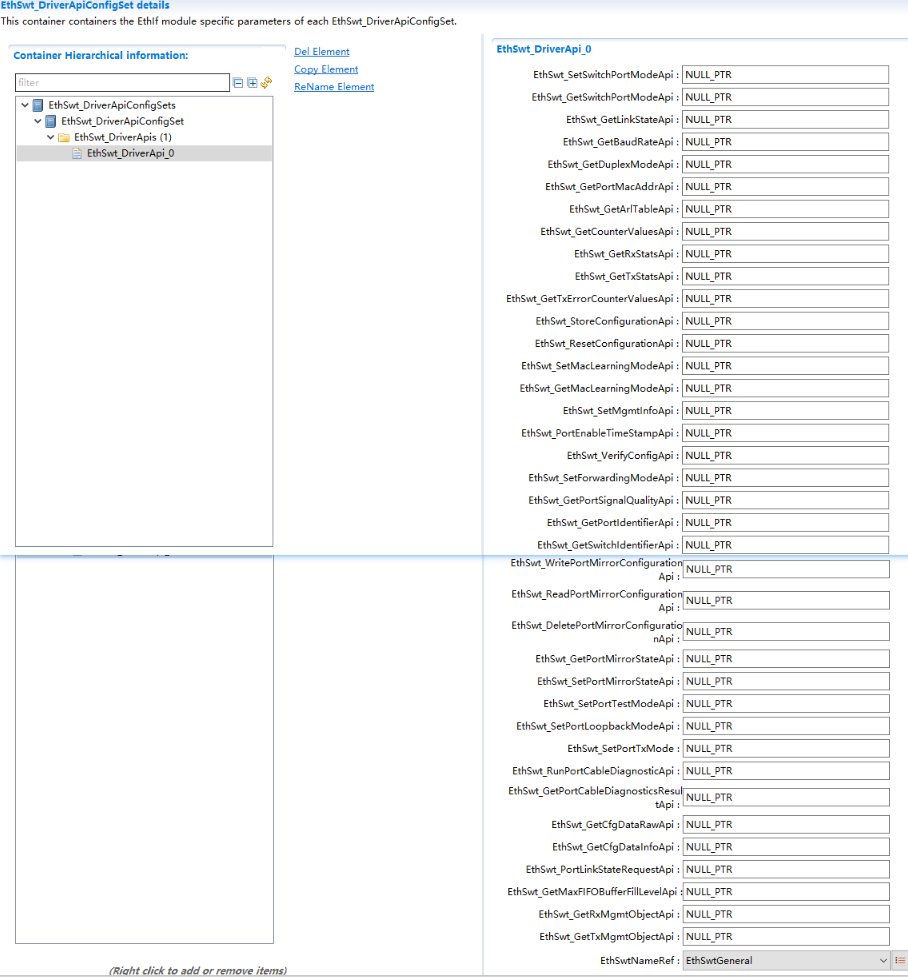

.. centered:: **表 7 EthSwt_DriverApiConfigeSet (Table 7 EthSwt_DriverApiConfigeSet)**

.. list-table::
   :widths: 20 20 20 20 20
   :header-rows: 1

   * - UI名称 (UI Name)
     - 描述 (Description)
     - 
     - 
     - 
   * - EthSwt_SetSwitchPortModeApi
     - 取值范围 (Range)
     - FunctionName
     - 默认取值 (Default value)
     - 无
   * -
     - 参数描述 (Parameter Description)
     - API名 (API Name)
     - 
     - 
   * -
     - 依赖关系 (Dependencies)
     - 可根据EthSwtNameRef自动变更 (Can be automatically changed based on EthSwtNameRef)
     - 
     - 
   * - EthSwt_GetSwitchPortModeApi
     - 取值范围 (Range)
     - FunctionName
     - 默认取值 (Default value)
     - 无
   * -
     - 参数描述 (Parameter Description)
     - API名 (API Name)
     - 
     - 
   * -
     - 依赖关系 (Dependencies)
     - 可根据EthSwtNameRef自动变更 (Can be automatically changed based on EthSwtNameRef)
     - 
     - 
   * - EthSwt_GetLinkStateApi
     - 取值范围 (Range)
     - FunctionName
     - 默认取值 (Default value)
     - 无
   * -
     - 参数描述 (Parameter Description)
     - API名 (API Name)
     - 
     - 
   * -
     - 依赖关系 (Dependencies)
     - 可根据EthSwtNameRef自动变更 (Can be automatically changed based on EthSwtNameRef)
     - 
     - 
   * - EthSwt_GetBaudRateApi
     - 取值范围 (Range)
     - FunctionName
     - 默认取值 (Default value)
     - 无
   * -
     - 参数描述 (Parameter Description)
     - API名 (API Name)
     - 
     - 
   * -
     - 依赖关系 (Dependencies)
     - 可根据EthSwtNameRef自动变更 (Can be automatically changed based on EthSwtNameRef)
     - 
     - 
   * - EthSwt_GetDuplexModeApi
     - 取值范围 (Range)
     - FunctionName
     - 默认取值 (Default value)
     - 无
   * -
     - 参数描述 (Parameter Description)
     - API名 (API Name)
     - 
     - 
   * -
     - 依赖关系 (Dependencies)
     - 可根据EthSwtNameRef自动变更 (Can be automatically changed based on EthSwtNameRef)
     - 
     - 
   * - EthSwt_GetPortMacAddrApi
     - 取值范围 (Range)
     - FunctionName
     - 默认取值 (Default value)
     - 无
   * -
     - 参数描述 (Parameter Description)
     - API名 (API Name)
     - 
     - 
   * -
     - 依赖关系 (Dependencies)
     - 可根据EthSwtNameRef自动变更 (Can be automatically changed based on EthSwtNameRef)
     - 
     - 
   * - EthSwt_GetArlTableApi
     - 取值范围 (Range)
     - FunctionName
     - 默认取值 (Default value)
     - 无
   * -
     - 参数描述 (Parameter Description)
     - API名 (API Name)
     - 
     - 
   * -
     - 依赖关系 (Dependencies)
     - 可根据EthSwtNameRef自动变更 (Can be automatically changed based on EthSwtNameRef)
     - 
     - 
   * - EthSwt_GetCounterValuesApi
     - 取值范围 (Range)
     - FunctionName
     - 默认取值 (Default value)
     - 无
   * -
     - 参数描述 (Parameter Description)
     - API名 (API Name)
     - 
     - 
   * -
     - 依赖关系 (Dependencies)
     - 可根据EthSwtNameRef自动变更 (Can be automatically changed based on EthSwtNameRef)
     - 
     - 
   * - EthSwt_GetRxStatsApi
     - 取值范围 (Range)
     - FunctionName
     - 默认取值 (Default value)
     - 无
   * -
     - 参数描述 (Parameter Description)
     - API名 (API Name)
     - 
     - 
   * -
     - 依赖关系 (Dependencies)
     - 可根据EthSwtNameRef自动变更 (Can be automatically changed based on EthSwtNameRef)
     - 
     - 
   * - EthSwt_GetTxStatsApi
     - 取值范围 (Range)
     - FunctionName
     - 默认取值 (Default value)
     - 无
   * -
     - 参数描述 (Parameter Description)
     - API名 (API Name)
     - 
     - 
   * -
     - 依赖关系 (Dependencies)
     - 可根据EthSwtNameRef自动变更 (Can be automatically changed based on EthSwtNameRef)
     - 
     - 
   * - EthSwt_GetTxErrorCounterValuesApi
     - 取值范围 (Range)
     - FunctionName
     - 默认取值 (Default value)
     - 无
   * -
     - 参数描述 (Parameter Description)
     - API名 (API Name)
     - 
     - 
   * -
     - 依赖关系 (Dependencies)
     - 可根据EthSwtNameRef自动变更 (Can be automatically changed based on EthSwtNameRef)
     - 
     - 
   * - EthSwt_StoreConfigurationApi
     - 取值范围 (Range)
     - FunctionName
     - 默认取值 (Default value)
     - 无
   * -
     - 参数描述 (Parameter Description)
     - API名 (API Name)
     - 
     - 
   * -
     - 依赖关系 (Dependencies)
     - 可根据EthNameRef自动变更 (Can be automatically changed according to EthNameRef)
     - 
     - 
   * - EthSwt_ResetConfigurationApi
     - 取值范围 (Range)
     - FunctionName
     - 默认取值 (Default value)
     - 无
   * -
     - 参数描述 (Parameter Description)
     - API名 (API Name)
     - 
     - 
   * -
     - 依赖关系 (Dependencies)
     - 可根据EthSwtNameRef自动变更 (Can be automatically changed based on EthSwtNameRef)
     - 
     - 
   * - EthSwt_SetMacLearningModeApi
     - 取值范围 (Range)
     - FunctionName
     - 默认取值 (Default value)
     - 无
   * -
     - 参数描述 (Parameter Description)
     - API名 (API Name)
     - 
     - 
   * -
     - 依赖关系 (Dependencies)
     - 可根据EthSwtNameRef自动变更 (Can be automatically changed based on EthSwtNameRef)
     - 
     - 
   * - EthSwt_GetMacLearningModeApi
     - 取值范围 (Range)
     - FunctionName
     - 默认取值 (Default value)
     - 无
   * -
     - 参数描述 (Parameter Description)
     - API名 (API Name)
     - 
     - 
   * -
     - 依赖关系 (Dependencies)
     - 可根据EthSwtNameRef自动变更 (Can be automatically changed based on EthSwtNameRef)
     - 
     - 
   * - EthSwt_SetMgmtInfoApi
     - 取值范围 (Range)
     - FunctionName
     - 默认取值 (Default value)
     - 无
   * -
     - 参数描述 (Parameter Description)
     - API名 (API Name)
     - 
     - 
   * -
     - 依赖关系 (Dependencies)
     - 可根据EthSwtNameRef自动变更 (Can be automatically changed based on EthSwtNameRef)
     - 
     - 
   * - EthSwt_PortEnableTimeStampApi
     - 取值范围 (Range)
     - FunctionName
     - 默认取值 (Default value)
     - 无
   * -
     - 参数描述 (Parameter Description)
     - API名 (API Name)
     - 
     - 
   * -
     - 依赖关系 (Dependencies)
     - 可根据EthSwtNameRef自动变更 (Can be automatically changed based on EthSwtNameRef)
     - 
     - 
   * - EthSwt_VerifyConfigApi
     - 取值范围 (Range)
     - FunctionName
     - 默认取值 (Default value)
     - 无
   * -
     - 参数描述 (Parameter Description)
     - API名 (API Name)
     - 
     - 
   * -
     - 依赖关系 (Dependencies)
     - 可根据EthSwtNameRef自动变更 (Can be automatically changed based on EthSwtNameRef)
     - 
     - 
   * - EthSwt_SetForwardingModeApi
     - 取值范围 (Range)
     - FunctionName
     - 默认取值 (Default value)
     - 无
   * -
     - 参数描述 (Parameter Description)
     - API名 (API Name)
     - 
     - 
   * -
     - 依赖关系 (Dependencies)
     - 可根据EthSwtNameRef自动变更 (Can be automatically changed based on EthSwtNameRef)
     - 
     - 
   * - EthSwt_GetPortSignalQualityApi
     - 取值范围 (Range)
     - FunctionName
     - 默认取值 (Default value)
     - 无
   * -
     - 参数描述 (Parameter Description)
     - API名 (API Name)
     - 
     - 
   * -
     - 依赖关系 (Dependencies)
     - 可根据EthSwtNameRef自动变更 (Can be automatically changed based on EthSwtNameRef)
     - 
     - 
   * - EthSwt_GetPortIdentifierApi
     - 取值范围 (Range)
     - FunctionName
     - 默认取值 (Default value)
     - 无
   * -
     - 参数描述 (Parameter Description)
     - API名 (API Name)
     - 
     - 
   * -
     - 依赖关系 (Dependencies)
     - 可根据EthSwtNameRef自动变更 (Can be automatically changed based on EthSwtNameRef)
     - 
     - 
   * - EthSwt_GetSwitchIdentifierApi
     - 取值范围 (Range)
     - FunctionName
     - 默认取值 (Default value)
     - 无
   * -
     - 参数描述 (Parameter Description)
     - API名 (API Name)
     - 
     - 
   * -
     - 依赖关系 (Dependencies)
     - 可根据EthSwtNameRef自动变更 (Can be automatically changed based on EthSwtNameRef)
     - 
     - 
   * - EthSwt_WritePortMirrorConfigurationApi
     - 取值范围 (Range)
     - FunctionName
     - 默认取值 (Default value)
     - 无
   * -
     - 参数描述 (Parameter Description)
     - API名 (API Name)
     - 
     - 
   * -
     - 依赖关系 (Dependencies)
     - 可根据EthSwtNameRef自动变更 (Can be automatically changed based on EthSwtNameRef)
     - 
     - 
   * - EthSwt_ReadPortMirrorConfigurationApi
     - 取值范围 (Range)
     - FunctionName
     - 默认取值 (Default value)
     - 无
   * -
     - 参数描述 (Parameter Description)
     - API名 (API Name)
     - 
     - 
   * -
     - 依赖关系 (Dependencies)
     - 可根据EthSwtNameRef自动变更 (Can be automatically changed based on EthSwtNameRef)
     - 
     - 
   * - EthSwt_DeletePortMirrorConfigurationApi
     - 取值范围 (Range)
     - FunctionName
     - 默认取值 (Default value)
     - 无
   * -
     - 参数描述 (Parameter Description)
     - API名 (API Name)
     - 
     - 
   * -
     - 依赖关系 (Dependencies)
     - 可根据EthSwtNameRef自动变更 (Can be automatically changed based on EthSwtNameRef)
     - 
     - 
   * - EthSwt_GetPortMirrorStateApi
     - 取值范围 (Range)
     - FunctionName
     - 默认取值 (Default value)
     - 无
   * -
     - 参数描述 (Parameter Description)
     - API名 (API Name)
     - 
     - 
   * -
     - 依赖关系 (Dependencies)
     - 可根据EthSwtNameRef自动变更 (Can be automatically changed based on EthSwtNameRef)
     - 
     - 
   * - EthSwt_SetPortMirrorStateApi
     - 取值范围 (Range)
     - FunctionName
     - 默认取值 (Default value)
     - 无
   * -
     - 参数描述 (Parameter Description)
     - API名 (API Name)
     - 
     - 
   * -
     - 依赖关系 (Dependencies)
     - 可根据EthSwtNameRef自动变更 (Can be automatically changed based on EthSwtNameRef)
     - 
     - 
   * - EthSwt_SetPortTestModeApi
     - 取值范围 (Range)
     - FunctionName
     - 默认取值 (Default value)
     - 无
   * -
     - 参数描述 (Parameter Description)
     - API名 (API Name)
     - 
     - 
   * -
     - 依赖关系 (Dependencies)
     - 可根据EthSwtNameRef自动变更 (Can be automatically changed based on EthSwtNameRef)
     - 
     - 
   * - EthSwt_SetPortLoopbackModeApi
     - 取值范围 (Range)
     - FunctionName
     - 默认取值 (Default value)
     - 无
   * -
     - 参数描述 (Parameter Description)
     - API名 (API Name)
     - 
     - 
   * -
     - 依赖关系 (Dependencies)
     - 可根据EthSwtNameRef自动变更 (Can be automatically changed based on EthSwtNameRef)
     - 
     - 
   * - EthSwt_SetPortTxMode
     - 取值范围 (Range)
     - FunctionName
     - 默认取值 (Default value)
     - 无
   * -
     - 参数描述 (Parameter Description)
     - API名 (API Name)
     - 
     - 
   * -
     - 依赖关系 (Dependencies)
     - 可根据EthSwtNameRef自动变更 (Can be automatically changed based on EthSwtNameRef)
     - 
     - 
   * - EthSwt_RunPortCableDiagnosticApi
     - 取值范围 (Range)
     - FunctionName
     - 默认取值 (Default value)
     - 无
   * -
     - 参数描述 (Parameter Description)
     - API名 (API Name)
     - 
     - 
   * -
     - 依赖关系 (Dependencies)
     - 可根据EthSwtNameRef自动变更 (Can be automatically changed based on EthSwtNameRef)
     - 
     - 
   * - EthSwt_GetPortCableDiagnosticsResultApi
     - 取值范围 (Range)
     - FunctionName
     - 默认取值 (Default value)
     - 无
   * -
     - 参数描述 (Parameter Description)
     - API名 (API Name)
     - 
     - 
   * -
     - 依赖关系 (Dependencies)
     - 可根据EthSwtNameRef自动变更 (Can be automatically changed based on EthSwtNameRef)
     - 
     - 
   * - EthSwt_GetCfgDataRawApi
     - 取值范围 (Range)
     - FunctionName
     - 默认取值 (Default value)
     - 无
   * -
     - 参数描述 (Parameter Description)
     - API名 (API Name)
     - 
     - 
   * -
     - 依赖关系 (Dependencies)
     - 可根据EthSwtNameRef自动变更 (Can be automatically changed based on EthSwtNameRef)
     - 
     - 
   * - EthSwt_GetCfgDataInfoApi
     - 取值范围 (Range)
     - FunctionName
     - 默认取值 (Default value)
     - 无
   * -
     - 参数描述 (Parameter Description)
     - API名 (API Name)
     - 
     - 
   * -
     - 依赖关系 (Dependencies)
     - 可根据EthSwtNameRef自动变更 (Can be automatically changed based on EthSwtNameRef)
     - 
     - 
   * - EthSwt_PortLinkStateRequestApi
     - 取值范围 (Range)
     - FunctionName
     - 默认取值 (Default value)
     - 无
   * -
     - 参数描述 (Parameter Description)
     - API名 (API Name)
     - 
     - 
   * -
     - 依赖关系 (Dependencies)
     - 可根据EthSwtNameRef自动变更 (Can be automatically changed based on EthSwtNameRef)
     - 
     - 
   * - EthSwt_GetMaxFIFOBufferFillLevelApi
     - 取值范围 (Range)
     - FunctionName
     - 默认取值 (Default value)
     - 无
   * -
     - 参数描述 (Parameter Description)
     - API名 (API Name)
     - 
     - 
   * -
     - 依赖关系 (Dependencies)
     - 可根据EthSwtNameRef自动变更 (Can be automatically changed based on EthSwtNameRef)
     - 
     - 
   * - EthSwt_GetRxMgmtObjectApi
     - 取值范围 (Range)
     - FunctionName
     - 默认取值 (Default value)
     - 无
   * -
     - 参数描述 (Parameter Description)
     - API名 (API Name)
     - 
     - 
   * -
     - 依赖关系 (Dependencies)
     - 可根据EthSwtNameRef自动变更 (Can be automatically changed based on EthSwtNameRef)
     - 
     - 
   * - EthSwt_GetTxMgmtObjectApi
     - 取值范围 (Range)
     - FunctionName
     - 默认取值 (Default value)
     - 无
   * -
     - 参数描述 (Parameter Description)
     - API名 (API Name)
     - 
     - 
   * -
     - 依赖关系 (Dependencies)
     - 可根据EthSwtNameRef自动变更 (Can be automatically changed based on EthSwtNameRef)
     - 
     - 
   * - EthSwtNameRef
     - 取值范围 (Range)
     - Ref
     - 默认取值 (Default value)
     - 无
   * -
     - 参数描述 (Parameter Description)
     - Ref到EthDriver驱动的名称 (Ref to EthDriver Driver Name)
     - 
     - 
   * -
     - 依赖关系 (Dependencies)
     - 引用的EthSwtNameRef不能相同 (The EthSwtNameRef cannot be the same.)
     - 
     - 
