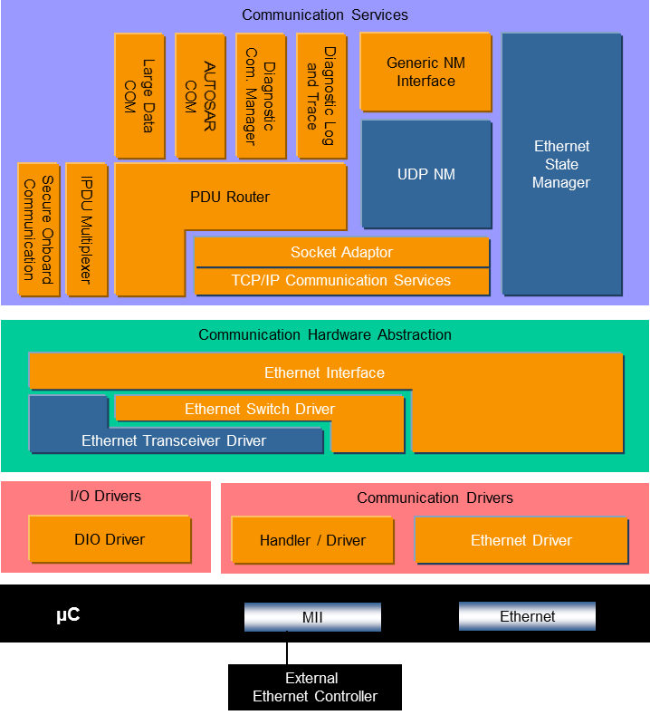
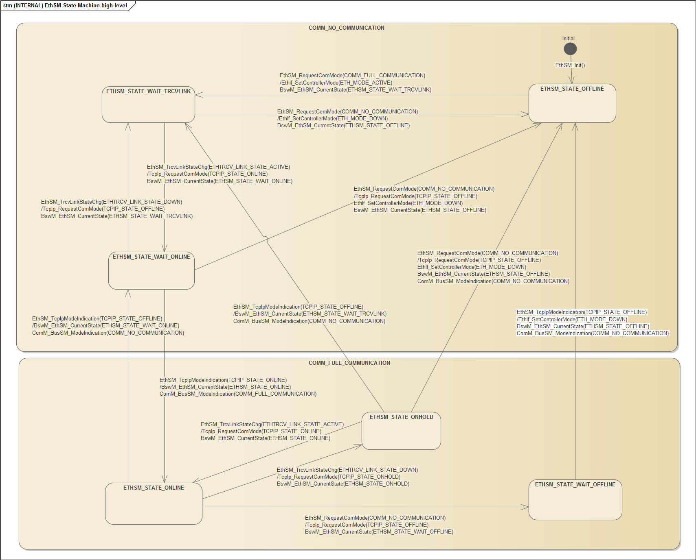
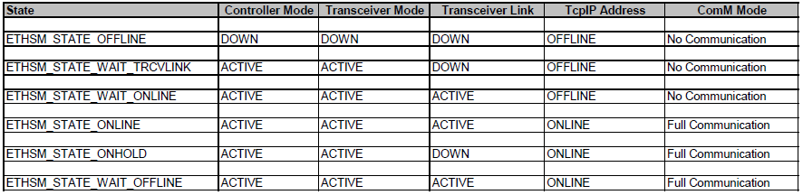
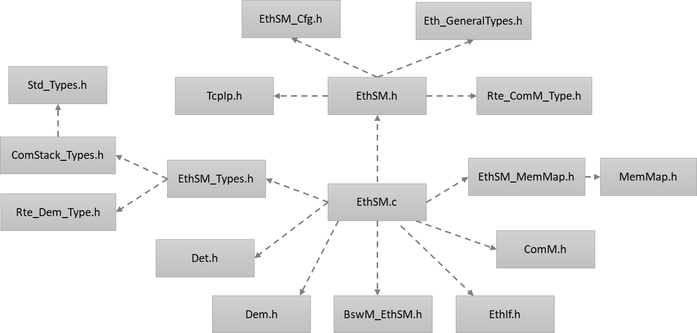
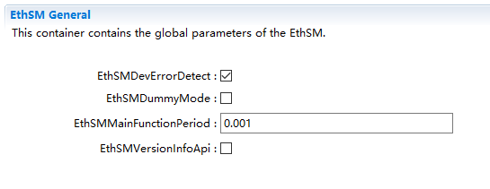
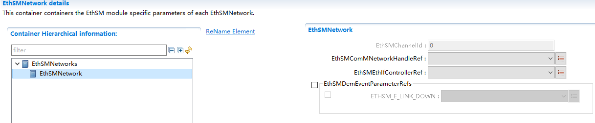

EthSM
#################################

:strong:`缩写词注解 (Abbreviation Notes):`

.. list-table::
   :widths: 34 33 33
   :header-rows: 1

   * - 缩写词 (Abbreviation)
     - 解释/描述 (Explanation/Description)
     - 中文解释 (Chinese explanation)
   * - EthSM
     - Ethernet State Manager
     - 以太网状态管理 (Ethernet Status Management)
   * - EthIf
     - Ethernet Interface
     - 以太网接口模块 (Ethernet interface module)
   * - SoAd
     - Socket Adapter
     - Socket适配层 (Socket Adapter Layer)

简介 (Introduction)
=================================

EthSM模块提供一套抽象的接口给ComM用于打开和关闭以太网通信。

The EthSM module provides a set of abstract interfaces to ComM for opening and closing Ethernet communication.

参考资料 (Reference materials)
------------------------------------------

[1] AUTOSAR_SWS_EthernetStateManager.pdf，R19-11

[2] AUTOSAR_SWS_EthernetInterface.pdf，R19-11

[3] AUTOSAR_SWS_ComManager.pdf，R19-11

功能描述 (Function Description)
===========================================

以太网通信状态管理功能 (Ethernet Communication Status Management Function)
-------------------------------------------------------------------------------

以太网通信状态管理功能介绍 (Ethernet Communication Status Management Function Introduction)
==============================================================================================

EthSM提供接口给ComM，用于接受来自ComM的通信模式请求。EthSM根据ComM提供的参数，处理内部的网络模式状态机。根据状态机的迁移条件，调用EthIf和TcpIp的接口控制以太网控制器，收发器以及TcpIp协议栈来控制以太网通信的状态。并将当前的通信模式通过ComM和BswM的接口通知给ComM和BswM。

EthSM provides interfaces to ComM for accepting communication mode requests from ComM. EthSM processes internal network mode state machines based on parameters provided by ComM. Depending on the state machine's transition conditions, it calls interfaces of EthIf and TcpIp to control the Ethernet controller, transceiver, and TcpIp protocol stack for managing Ethernet communication status. It then notifies ComM and BswM of the current communication mode through interfaces between them.

以太网通信状态管理功能功能实现 (Ethernet communication status management function implementation)
==================================================================================================

EthSM根据以下状态机管理以太网通信状态：

EthSM manages Ethernet communication states according to the following state machine:

状态机包括以下几个状态：

The state machine includes the following states:

1. ETHSM_STATE_OFFLINE

2. ETHSM_STATE_WAIT_TRCVLINK

3. ETHSM_STATE_WAIT_ONLINE

4. ETHSM_STATE_ONLINE

5. ETHSM_STATE_ONHOLD

6. ETHSM_STATE_WAIT_OFFLINE

状态迁移过程 (State transition process)
-------------------------------------------------

初始化后EthSM处于ETHSM_STATE_OFFLINE状态。

After initialization, EthSM is in the ETHSM_STATE_OFFLINE state.

当EthSM_RequestComMode(COMM_FULL_COMMUNICATION)被调用，EthSM调用EthIf_SetControllerMode(ETH_MODE_ACTIVE)请求EthIf将以太网控制器设置为ACTIVE模式，并调用BswM_EthSM_CurrentState(ETHSM_STATE_WAIT_TRCVLINK)通知BswM模块。之后EthSM从ETHSM_STATE_OFFLINE迁移到ETHSM_STATE_WAIT_TRCVLINK状态。

When EthSM_RequestComMode(COMM_FULL_COMMUNICATION) is called, EthSM calls EthIf_SetControllerMode(ETH_MODE_ACTIVE) to request that the Ethernet controller be set to ACTIVE mode and calls BswM_EthSM_CurrentState(ETHSM_STATE_WAIT_TRCVLINK) to notify the BswM module. Afterwards, EthSM transitions from ETHSM_STATE_OFFLINE to ETHSM_STATE_WAIT_TRCVLINK state.

当EthSM_TrcvLinkStateChg(ETHTRCV_LINK_STATE_ACTIVE)被调用，EthSM从ETHSM_STATE_WAIT_TRCVLINK迁移到ETHSM_STATE_WAIT_ONLINE状态。同时调用TcpIp_RequestComMode(TCPIP_STATE_ONLINE)请求将TCPIP模块将TCPIP协议栈设置到ONLINE模式，并调用BswM_EthSM_CurrentState(ETHSM_STATE_WAIT_ONLINE)接口通知BswM模块。

When EthSM_TrcvLinkStateChg(ETHTRCV_LINK_STATE_ACTIVE) is called, EthSM transitions from ETHSM_STATE_WAIT_TRCVLINK to ETHSM_STATE_WAIT_ONLINE state. At the same time, TcpIp_RequestComMode(TCPIP_STATE_ONLINE) is invoked to request that the TCPIP module sets the TCPIP protocol stack to ONLINE mode, and BswM_EthSM_CurrentState(ETHSM_STATE_WAIT_ONLINE) interface is called to notify the BswM module.

当EthSM_TcpIpModeIndication(TCPIP_STATE_ONLINE)被调用，EthSM从ETHSM_STATE_WAIT_ONLINE迁移到ETHSM_STATE_ONLINE模式，并调用BswM_EthSM_CurrentState(ETHSM_STATE_ONLINE)通知BswM模块，调用ComM_BusSM_ModeIndication(COMM_FULL_COMMUNICATION)通知ComM模块。

When EthSM_TcpIpModeIndication(TCPIP_STATE_ONLINE) is called, EthSM transitions from ETHSM_STATE_WAIT_ONLINE to the ETHSM_STATE_ONLINE mode and calls BswM_EthSM_CurrentState(ETHSM_STATE_ONLINE) to notify the BswM module, and calls ComM_BusSM_ModeIndication(COMM_FULL_COMMUNICATION) to notify the ComM module.

当EthSM_RequestComMode(COMM_NO_COMMUNICATION)被调用，EthSM调用TcpIp_RequestComMode(TCPIP_STATE_OFFLINE)请求TcpIp模块将TCPIP协议栈设置为OFFLINE模式，并调用BswM_EthSM_CurrentState(ETHSM_STATE_WAIT_OFFLINE)通知BswM模块。之后EthSM从ETHSM_STATE_ONLINE迁移到ETHSM_STATE_WAIT_OFFLINE状态。

When EthSM_RequestComMode(COMM_NO_COMMUNICATION) is called, EthSM calls TcpIp_RequestComMode(TCPIP_STATE_OFFLINE) to request the TcpIp module to set the TCPIP protocol stack to OFFLINE mode and calls BswM_EthSM_CurrentState(ETHSM_STATE_WAIT_OFFLINE) to notify the BswM module. Afterward, EthSM transitions from ETHSM_STATE_ONLINE to ETHSM_STATE_WAIT_OFFLINE state.

当EthSM_TcpIpModeIndication(TCPIP_STATE_OFFLINE)被调用，EthSM从ETHSM_STATE_WAIT_OFFLINE迁移到ETHSM_STATE_OFFLINE状态。并调用EthIf_SetControllerMode(ETH_MODE_DOWN)请求EthIf将以太网控制器设置为DOWN模式，并调用BswM_EthSM_CurrentState(ETHSM_STATE_OFFLINE)通知BswM模块，调用ComM_BusSM_ModeIndication(COMM_NO_COMMUNICATION)通知ComM模块。

When EthSM_TcpIpModeIndication(TCPIP_STATE_OFFLINE) is called, EthSM transitions from ETHSM_STATE_WAIT_OFFLINE to the ETHSM_STATE_OFFLINE state. It then calls EthIf_SetControllerMode(ETH_MODE_DOWN) to request that the Ethernet controller be set to DOWN mode, and calls BswM_EthSM_CurrentState(ETHSM_STATE_OFFLINE) to notify the BswM module, and calls ComM_BusSM_ModeIndication(COMM_NO_COMMUNICATION) to inform the ComM module.

状态对照表 (State Comparison Table)
-------------------------------------------------

EthSM各状态下以太网控制器，收发器，TCPIP与ComM状态对照表：

Ethernet controller, transceiver, TCP/IP, and ComM status对照 table for EthSM in various states:

源文件描述 (Source file description)
===============================================

.. centered:: **表 EthSM组件文件描述 (Table Descriptions of EthSM Component Files)**

.. list-table::
   :widths: 50 50
   :header-rows: 1

   * - 文件 (Files)
     - 说明 (Description)
   * - EthSM_Cfg.h
     - 用于定义EthSM模块预编译时用到的宏。 (Macros used for defining the EthSM module during pre-compilation.)
   * - EthSM_Cfg.c
     - 配置参数源文件，包含各个配置项的定义。 (Configure parameter source file, containing definitions of various configuration items.)
   * - EthSM_Types.h
     - EthSM模块类型定义头文件。 (Header file for defining EthSM module types.)
   * - EthSM_SchM.h
     - 提供给SchM的头文件，用于公开周期调度函数：EthSM_MainFunction() (Header file provided for SchM to publicly expose periodic scheduling functions: EthSM_MainFunction())
   * - EthSM_TcpIp.h
     - 提供给TcpIp的头文件，用于公开回调函数：EthSM_TcpIpModeIndication() (Header files provided to TcpIp for publicizing callback functions: EthSM_TcpIpModeIndication())
   * - EthSM_MemMap.h
     - EthSM模块函数和变量存储位置定义文件。 (File defining the storage locations of EthSM Module Functions and Variables.)
   * - EthSM.h
     - EthSM模块头文件，通过加载该头文件访问EthSM公开的函数和数据类型 (EthSM Module Header File, access EthSM public functions and data types by loading this header file)
   * - EthSM.c
     - EthSM模块实现源文件，各API实现在该文件中 (EthSM module implementation source file, each API implementation is in this file)

API接口 (API Interface)
=====================================

类型定义 (Type definition)
--------------------------------------

EthSM_NetworkModeStateType类型定义 (EthSM_NetworkModeStateType type definition)
===========================================================================================

.. list-table::
   :widths: 50 50
   :header-rows: 1

   * - 名称 (Name)
     - EthSM_NetworkModeStateType
   * - 类型 (Type)
     - 枚举 (Enum)
   * - 范围 (Range)
     - ETHSM_STATE_OFFLINE
   * - 
     - ETHSM_STATE_WAIT_TRCVLINK
   * - 
     - ETHSM_STATE_WAIT_ONLINE
   * - 
     - ETHSM_STATE_ONLINE
   * - 
     - ETHSM_STATE_ONHOLD
   * - 
     - ETHSM_STATE_WAIT_OFFLINE
   * - 描述 (Description)
     - 表示EthSM状态机中的网络模式 (Indicate the network mode in the EthSM state machine)

输入函数描述 (Describe the input function:)
-----------------------------------------------------

.. list-table::
   :widths: 50 50
   :header-rows: 1

   * - 输入模块 (Input Module)
     - API
   * - BswM
     - BswM_EthSM_CurrentState
   * - ComM
     - ComM_BusSM_ModeIndication
   * - Dem
     - Dem_SetEventStatus
   * - EthIf
     - EthIf_SetControllerMode
   * - 
     - EthIf_GetControllerMode
   * - TcpIp
     - TcpIp_RequestComMode
   * - Det
     - Det_ReportError

静态接口函数定义 (Static interface function definition)
---------------------------------------------------------------

EthSM_Init函数定义 (The EthSM_Init function definition)
===================================================================

.. list-table::
   :widths: 50 50
   :header-rows: 1

   * - 函数名称: (Function Name:)
     - EthSM_Init
   * - 函数原型: (Function prototype:)
     - void EthSM_Init (void)
   * - 服务编号: (Service Number:)
     - 0x07
   * - 同步/异步： (Synchronous/asynchronous:)
     - 同步 (Sync)
   * - 是否可重入： (Is Reentrant:)
     - 不可重入 (Non-reentrant)
   * - 输入参数： (Input parameters:)
     - 无
   * - 输入输出参数: (Input Output Parameters:)
     - 无
   * - 输出参数： (Output Parameters:)
     - 无
   * - 返回值： (Return Value:)
     - 无
   * - 功能概述： (Function Overview:)
     - EthSM模块初始化 (EthSM Module Initialization)

EthSM_GetVersionInfo函数定义 (The EthSM_GetVersionInfo function definition)
=======================================================================================

.. list-table::
   :widths: 25 25 25 25
   :header-rows: 1

   * - 函数名称: (Function Name:)
     - EthSM_GetVersionInfo
     - 
     - 
   * - 函数原型: (Function prototype:)
     - voidEthSM_GetVersionInfo(
     - 
     - 
   * - 
     - Std\_VersionInfoType\*versioninfo
     - 
     - 
   * - 
     - )
     - 
     - 
   * - 服务编号: (Service Number:)
     - 0x02
     - 
     - 
   * - 同步/异步： (Synchronous/asynchronous:)
     - 同步 (Sync)
     - 
     - 
   * - 是否可重入： (Is Reentrant:)
     - 可重入 (Reentrant)
     - 
     - 
   * - 输入参数： (Input parameters:)
     - 无
     - 
     - 
   * - 输入输出参数: (Input Output Parameters:)
     - 无
     - 
     - 
   * - 输出参数： (Output Parameters:)
     - versioninfo
     - 值域： (Domain:)
     - 版本信息存储变量指针 (Version information stored variable pointer)
   * - 返回值： (Return Value:)
     - 无
     - 
     - 
   * - 功能概述： (Function Overview:)
     - 获取EthSM模块版本信息 (Get version information of EthSM module)
     - 
     - 

EthSM_RequestComMode函数定义 (The EthSM_RequestComMode function definition)
=======================================================================================

.. list-table::
   :widths: 25 25 25 25
   :header-rows: 1

   * - 函数名称: (Function Name:)
     - EthSM_RequestComMode
     - 
     - 
   * - 函数原型: (Function prototype:)
     - Std_ReturnTypeEthSM_RequestComMode(
     - 
     - 
   * - 
     - NetworkHandleTypeNetworkHandle,
     - 
     - 
   * - 
     - ComM_ModeTypeComM_Mode
     - 
     - 
   * - 
     - )
     - 
     - 
   * - 服务编号: (Service Number:)
     - 0x05
     - 
     - 
   * - 同步/异步： (Synchronous/asynchronous:)
     - 非同步 (Asynchronous)
     - 
     - 
   * - 是否可重入： (Is Reentrant:)
     - 不可重入 (Non-reentrant)
     - 
     - 
   * - 输入参数： (Input parameters:)
     - NetworkHandle
     - 值域： (Domain:)
     - 请求的通信通道(ComM通道号)
   * - 
     - ComM_Mode
     - 值域： (Domain:)
     - 请求的通信模式 (Request communication mode)
   * - 输入输出参数: (Input Output Parameters:)
     - 无
     - 
     - 
   * - 输出参数： (Output Parameters:)
     - 无
     - 
     - 
   * - 返回值： (Return Value:)
     - E_OK: 请求被接受 (E_OK: The request has been accepted.)
     - 
     - 
   * - 
     - E_NOT_OK:请求被拒绝 (E_NOT_OK: Request rejected)
     - 
     - 
   * - 功能概述： (Function Overview:)
     - 模式切换请求处理 (Model switch request processing)
     - 
     - 

EthSM_GetCurrentComMode函数定义 (The EthSM_GetCurrentComMode function definition)
=============================================================================================

.. list-table::
   :widths: 25 25 25 25
   :header-rows: 1

   * - 函数名称: (Function Name:)
     - EthSM_GetCurrentComMode
     - 
     - 
   * - 函数原型: (Function prototype:)
     - Std_ReturnTypeEthSM_GetCurrentComMode(
     - 
     - 
   * - 
     - NetworkHandleTypeNetworkHandle,
     - 
     - 
   * - 
     - ComM_ModeType\*ComM_ModePtr
     - 
     - 
   * - 
     - )
     - 
     - 
   * - 服务编号: (Service Number:)
     - 0x04
     - 
     - 
   * - 同步/异步： (Synchronous/asynchronous:)
     - 同步 (Sync)
     - 
     - 
   * - 是否可重入： (Is Reentrant:)
     - 不可重入 (Non-reentrant)
     - 
     - 
   * - 输入参数： (Input parameters:)
     - NetworkHandle
     - 值域： (Domain:)
     - 请求的通信通道(ComM通道号)
   * - 输入输出参数: (Input Output Parameters:)
     - 无
     - 
     - 
   * - 输出参数： (Output Parameters:)
     - ComM_ModePtr
     - 值域： (Domain:)
     - 指向存储ComM_Mode变量的指针 (Pointer to the storage of ComM_Mode variable)
   * - 返回值： (Return Value:)
     - E_OK: 请求被接受 (E_OK: The request has been accepted.)
     - 
     - 
   * - 
     - E_NOT_OK:请求被拒绝 (E_NOT_OK: Request rejected)
     - 
     - 
   * - 功能概述： (Function Overview:)
     - 获取当前的通信模式 (Get the current communication mode)
     - 
     - 

EthSM_CtrlModeIndication函数定义 (EthSM_CtrlModeIndication function definition)
===========================================================================================

.. list-table::
   :widths: 25 25 25 25
   :header-rows: 1

   * - 函数名称: (Function Name:)
     - EthSM_CtrlModeIndication
     - 
     - 
   * - 函数原型: (Function prototype:)
     - voidEthSM_CtrlModeIndication(
     - 
     - 
   * - 
     - uint8 CtrlIdx,
     - 
     - 
   * - 
     - Eth_ModeTypeCtrlMode
     - 
     - 
   * - 
     - )
     - 
     - 
   * - 服务编号: (Service Number:)
     - 0x09
     - 
     - 
   * - 同步/异步： (Synchronous/asynchronous:)
     - 同步 (Sync)
     - 
     - 
   * - 是否可重入： (Is Reentrant:)
     - 可重入(仅限不同通道) (Reentrant (limited to different channels))
     - 
     - 
   * - 输入参数： (Input parameters:)
     - CtrlIdx
     - 值域： (Domain:)
     - 模式发生变化的EthIf控制器Id (Mode changes of EthIf controller Id)
   * - 
     - CtrlMode
     - 值域： (Domain:)
     - EthIf控制器模式 (EthIf Controller Mode)
   * - 输入输出参数: (Input Output Parameters:)
     - 无
     - 
     - 
   * - 输出参数： (Output Parameters:)
     - 无
     - 
     - 
   * - 返回值： (Return Value:)
     - 无
     - 
     - 
   * - 功能概述： (Function Overview:)
     - 当以太网控制器的模式发生改变时，EthIf会调用该函数将控制器最新的状态通知给EthSM。 (When the mode of the Ethernet controller changes, EthIf calls this function to notify EthSM of the latest state of the controller.)
     - 
     - 

EthSM_TrcvLinkStateChg函数定义 (The EthSM_TrcvLinkStateChg function definition)
===========================================================================================

.. list-table::
   :widths: 25 25 25 25
   :header-rows: 1

   * - 函数名称: (Function Name:)
     - EthSM_TrcvLinkStateChg
     - 
     - 
   * - 函数原型: (Function prototype:)
     - voidEthSM_TrcvLinkStateChg(
     - 
     - 
   * - 
     - uint8 CtrlIdx,
     - 
     - 
   * - 
     - EthTrcv_LinkStateTypeTransceiverLinkState
     - 
     - 
   * - 
     - )
     - 
     - 
   * - 服务编号: (Service Number:)
     - 0x06
     - 
     - 
   * - 同步/异步： (Synchronous/asynchronous:)
     - 同步 (Sync)
     - 
     - 
   * - 是否可重入： (Is Reentrant:)
     - 不可重入 (Non-reentrant)
     - 
     - 
   * - 输入参数： (Input parameters:)
     - CtrlIdx
     - 值域： (Domain:)
     - 收发器连接状态发生变化的EthIf控制器Id (Controller Id for Ethernet Interface whose transmitter/receiver connection state has changed)
   * - 
     - TransceiverLinkState
     - 值域： (Domain:)
     - 收发器连接状态 (Transceiver connection status)
   * - 输入输出参数: (Input Output Parameters:)
     - 无
     - 
     - 
   * - 输出参数： (Output Parameters:)
     - 无
     - 
     - 
   * - 返回值： (Return Value:)
     - 无
     - 
     - 
   * - 功能概述： (Function Overview:)
     - 当收发器连接状态发生改变时，EthIf会调用当前接口通知EthSM (When the transmitter/receiver connection state changes, EthIf calls the current interface to notify EthSM.)
     - 
     - 

EthSM_TcpIpModeIndication函数定义 (The EthSM_TcpIpModeIndication function definition)
=================================================================================================

.. list-table::
   :widths: 25 25 25 25
   :header-rows: 1

   * - 函数名称: (Function Name:)
     - EthSM_TcpIpModeIndication
     - 
     - 
   * - 函数原型: (Function prototype:)
     - voidEthSM_TcpIpModeIndication(
     - 
     - 
   * - 
     - uint8 CtrlIdx,
     - 
     - 
   * - 
     - TcpIp_StateTypeTcpIpState
     - 
     - 
   * - 
     - )
     - 
     - 
   * - 服务编号: (Service Number:)
     - 0x08
     - 
     - 
   * - 同步/异步： (Synchronous/asynchronous:)
     - 同步 (Sync)
     - 
     - 
   * - 是否可重入： (Is Reentrant:)
     - 不可重入 (Non-reentrant)
     - 
     - 
   * - 输入参数： (Input parameters:)
     - CtrlIdx
     - 值域： (Domain:)
     - TcpIp模式发生变化的EthIf控制器Id (Controller ID for EthIf with changed TcpIp mode)
   * - 
     - TcpIpState
     - 值域： (Domain:)
     - 变化后的TcpIp状态 (Changed TcpIp Status)
   * - 输入输出参数: (Input Output Parameters:)
     - 无
     - 
     - 
   * - 输出参数： (Output Parameters:)
     - 无
     - 
     - 
   * - 返回值： (Return Value:)
     - 无
     - 
     - 
   * - 功能概述： (Function Overview:)
     - TcpIp通过该接口报告TcpIp状态 (TcpIp reports TcpIp status through this interface.)
     - 
     - 

EthSM_MainFunction函数定义 (EthSM_MainFunction function definition)
===============================================================================

.. list-table::
   :widths: 25 25 25 25
   :header-rows: 1

   * - 函数名称: (Function Name:)
     - EthSM_MainFunction
     - 
     - 
   * - 函数原型: (Function prototype:)
     - voidEthSM_MainFunction(void )
     - 
     - 
   * - 服务编号: (Service Number:)
     - 0x01
     - 
     - 
   * - 同步/异步： (Synchronous/asynchronous:)
     - 同步 (Sync)
     - 
     - 
   * - 是否可重入： (Is Reentrant:)
     - 不可重入 (Non-reentrant)
     - 
     - 
   * - 输入参数： (Input parameters:)
     - 无
     - 值域： (Domain:)
     - 无
   * - 输入输出参数: (Input Output Parameters:)
     - 无
     - 
     - 
   * - 输出参数： (Output Parameters:)
     - 无
     - 
     - 
   * - 返回值： (Return Value:)
     - 无
     - 
     - 
   * - 功能概述： (Function Overview:)
     - EthSM模块周期调度函数 (EthSM Module Periodic Scheduling Function)
     - 
     - 

可配置函数定义 (Configurable Function Definition)
----------------------------------------------------------

无。

None.

配置 (Configure)
==============================

EthSMGeneral
----------------------------

.. centered:: **表 EthSMGeneral属性描述 (Table EthSMGeneral Property Description)**

.. list-table::
   :widths: 20 20 20 20 20
   :header-rows: 1

   * - UI名称 (UI Name)
     - 描述 (Description)
     - 
     - 
     - 
   * - EthSMDevErrorDetect
     - 取值范围 (Range)
     - STD_ON /   STD_OFF
     - 
     - 
   * -
     - 参数描述 (Parameter Description)
     - EthSM是否支持DET检测功能开关 (Does EthSM support the DET detection feature switch?)
     - 
     - 
   * -
     - 依赖关系 (Dependencies)
     - 无
     - 
     - 
   * - EthSMDummyMode
     - 取值范围 (Range)
     - STD_ON / STD_OFF
     - 默认取值 (Default value)
     - STD_OFF
   * -
     - 参数描述 (Parameter Description)
     - DUMMY模式是否开启开关 (Is the DUMMY mode switch enabled?)
     - 
     - 
   * -
     - 依赖关系 (Dependencies)
     - 无
     - 
     - 
   * - EthSMMainFunctionPeriod
     - 取值范围 (Range)
     - 0..INF
     - 默认取值 (Default value)
     - 无
   * -
     - 参数描述 (Parameter Description)
     - EthSM周期处理函数调用周期 (EthSM Cycle Processing Function Call Cycle)
     - 
     - 
   * -
     - 依赖关系 (Dependencies)
     - 无
     - 
     - 
   * - EthSMVersionInfoApi
     - 取值范围 (Range)
     - STD_ON / STD_OFF
     - 默认取值 (Default value)
     - STD_OFF
   * -
     - 参数描述 (Parameter Description)
     - EthSM是否支持获取版本信息API开关 (Does EthSM Support the API Switch for Acquiring Version Information?)
     - 
     - 
   * -
     - 依赖关系 (Dependencies)
     - 无
     - 
     - 

EthSMNetwork
----------------------------

.. centered:: **表 EthSMNetwork属性描述 (Table EthSMNetwork Property Description)**

.. list-table::
   :widths: 20 20 20 20 20
   :header-rows: 1

   * - UI名称 (UI Name)
     - 描述 (Description)
     - 
     - 
     - 
   * - EthSMChannelId
     - 取值范围 (Range)
     - STD_ON /   STD_OFF
     - 默认取值 (Default value)
     - 无
   * -
     - 参数描述 (Parameter Description)
     - EthSM分配的通道ID (EthSM allocated channel ID)
     - 
     - 
   * -
     - 依赖关系 (Dependencies)
     - 无
     - 
     - 
   * - EthSMComMNetworkHandleRef
     - 取值范围 (Range)
     - 无
     - 默认取值 (Default value)
     - 无
   * -
     - 参数描述 (Parameter Description)
     - 引用到一个ComM中定义的通道，用于识别一个特定的网络。 (Reference a channel defined in a ComM to identify a specific network.)
     - 
     - 
   * -
     - 依赖关系 (Dependencies)
     - 无
     - 
     - 
   * - EthSMEthIfControllerRef
     - 取值范围 (Range)
     - 无
     - 默认取值 (Default value)
     - 无
   * -
     - 参数描述 (Parameter Description)
     - 引用到EthIf中定义的一个通道。 (Reference to a channel defined in EthIf.)
     - 
     - 
   * -
     - 依赖关系 (Dependencies)
     - 无
     - 
     - 
   * - EthSMDemEventParameterRefs
     - 取值范围 (Range)
     - 无
     - 默认取值 (Default value)
     - 无
   * -
     - 参数描述 (Parameter Description)
     - 引用到DEM Event，用于向Dem报告ETHSM_E_LINK_DOWN错误。 (Reference DEM Event for reporting ETHSM_E_LINK_DOWN error to Dem.)
     - 
     - 
   * -
     - 依赖关系 (Dependencies)
     - 无
     - 
     - 
