EthSwt
#################################

:strong:`缩写词注解 (Abbreviation Notes):`

.. list-table::
   :widths: 34 33 33
   :header-rows: 1

   * - 缩写词 (Abbreviation)
     - 解释/描述 (Explanation/Description)
     - 中文解释 (Chinese explanation)
   * - Eth
     - Ethernet Driver (AUTOSARBSW module)
     - AUTOSAR标准以太网驱动模块 (AUTOSAR Standard Ethernet Driver Module)
   * - EthSwt
     - Ethernet Interface(AUTOSAR BSW module)
     - AUTOSAR标准以太网接口模块 (AUTOSAR Standard Ethernet Interface Module)
   * - EthTrcv
     - Ethernet TransceiverDriver (AUTOSAR BSWmodule)
     - AUTOSAR标准以太网收发器模块 (AUTOSAR Standard Ethernet Transmitter Module)

简介 (Introduction)
=================================

EthSwt向上层提供与以太网硬件无关的独立接口，该接口可以支持多个不同的有线或无线以太网控制器和收发器。这些接口按功能可以大体分为模式控制相关的接口、时间同步相关的接口、数据接收发送相关的接口、EthSwt本身的初始化或周期任务接口等。

EthSwt provides an abstraction layer interface to the upper layers, independent of Ethernet hardware, which can support multiple different wired or wireless Ethernet controllers and transceivers. These interfaces are generally categorized into mode control-related interfaces, time synchronization-related interfaces, data reception and transmission-related interfaces, as well as initialization or periodic task interfaces specific to EthSwt itself.

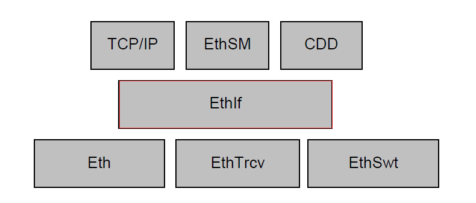

参考资料 (Reference materials)
------------------------------------------

[1] AUTOSAR_SWS_EthernetInterface.pdf，R20-11

功能描述 (Function Description)
===========================================

以太网交换机在端口上接受另一个端口发送过来的数据帧，根据帧头的目的MAC地址查找MAC地址表然后将该数据帧从对应端口上转发出去。交换机驱动程序模块主要提供以下功能：

Ethernet switches receive data frames sent from another port on the port, look up the MAC address table according to the destination MAC address in the frame header, and then forward the data frame from the corresponding port. The switch driver module mainly provides the following functions:

1. MAC地址学习。

MAC Address Learning.

2. VLAN收发。

VLAN Sending and Receiving.

3. VLAN隔离。

VLAN isolation.

4. 接口传递。

Interface passing.

MAC地址学习功能介绍 (Introduction to MAC Address Learning Function)
---------------------------------------------------------------------------

以太网交换机能自主学习每一端口相连设备的MAC地址，并将地址同相应的端口映射起来存放在交换机缓存中的MAC地址表中。

Ethernet switches learn the MAC addresses of devices connected to each port and map them to the corresponding ports in the MAC address table stored in the switch cache.

VLAN收发功能介绍 (VLAN Sending and Receiving Function Introduction)
-----------------------------------------------------------------------------

EthSwt负责对VLAN报文的解/加Tag操作，当接收时，通过EthSwt传递给上层的以太网报文将在EthSwt中提取出VLAN头，并把剩余的数据传递给上层模块。当上层模块需要向下传输报文时，在EthSwt中添加VLAN头，并通过对应的Eth通道发送出去。

EthSwt is responsible for tagging/untagging VLAN packets. When receiving, the Ethernet packets passed to the upper layer through EthSwt will have their VLAN headers extracted by EthSwt, and the remaining data will be transmitted to the upper-layer module. When the upper-layer module needs to transmit packets downward, VLAN headers are added in EthSwt and the packets are sent out via the corresponding Ethernet channel.

VLAN隔离功能介绍 (VLAN Isolation Function Introduction)
-----------------------------------------------------------------

通过配置，属于同一VLAN的port间可以相互通信，不属于同一VLAN的port间不能相互通信。

Through configuration, ports belonging to the same VLAN can communicate with each other, while ports not belonging to the same VLAN cannot communicate with each other.

接口传递功能介绍 (Function Introduction for Interface Transmission)
---------------------------------------------------------------------------

EthSwt负责对底层switch驱动进行设置和封装，并提供相应接口传递给EthSwt。

EthSwt is responsible for setting and encapsulating the underlying switch driver, and providing corresponding interfaces to EthSwt.

源文件描述 (Source file description)
===============================================

.. centered:: **表 EthSwt组件文件描述 (EthSwt component file description)**

.. list-table::
   :widths: 50 50
   :header-rows: 1

   * - 文件 (Files)
     - 说明 (Description)
   * - EthSwt_Cfg.h
     - 定义EthSwt模块预编译时用到的配置参数。 (Define configuration parameters used during pre-compilation of the EthSwt module.)
   * - EthSwt\_PBCfg.c
     - 定义EthSwt模块中链接时用到的配置变量。 (Define configuration variables used for linking in the EthSwt module.)
   * - EthSwt\_PBCfg.h
     - 定义EthSwt模块中配置变量结构体 (Define the configuration variable structure in the EthSwt module)
   * - EthSwt.h
     - EthSwt模块头文件，包含了API函数的扩展声明并定义了端口的数据结构。 (EthernetSwitch module header file, which includes extended declarations of API functions and defines the data structure of ports.)
   * - EthSwt.c
     - EthSwt模块源文件，包含了API函数的实现。 (Source files for the EthSwt module, which include the implementations of API functions.)
   * - EthSwt_88Q5050.c
     - 定义EthSwt模块中依赖88Q5050的函数实现 (Define the function implementations in the EthSwt module that depend on 88Q5050.)
   * - EthSwt_88Q5050.h
     - 定义EthSwt模块中依赖88Q5050宏定义和结构体 (Define macros and structures dependent on 88Q5050 in the EthSwt module)
   * - EthSwt_Internal.h
     - 义EthSwt模块中不依赖于芯片的内部函数 (Internal functions in the EthSwt module that are not dependent on the chip)
   * - EthSwt_MemMap.h
     - EthSwt的内存映射定义 (The memory mapping definition of EthSwt)
   * - SchM_EthSwt.h
     - EthSwt的SchM头文件 (EthSwt's SchM header file)

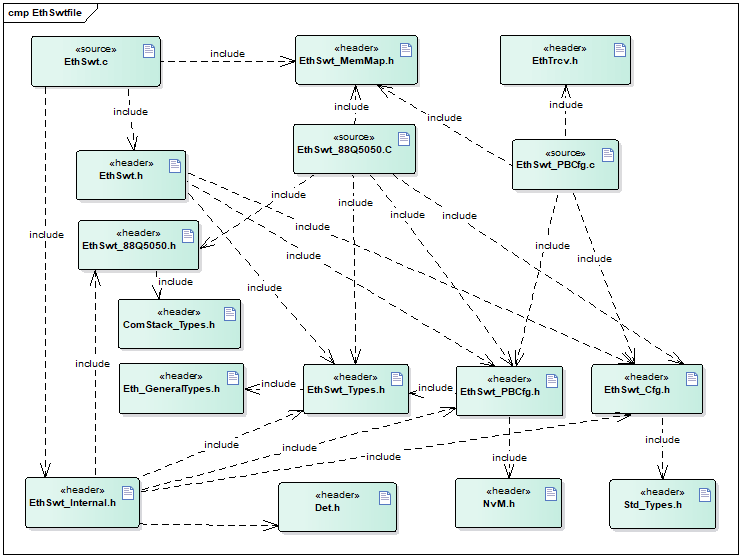

API接口 (API Interface)
=====================================

类型定义 (Type definition)
--------------------------------------

EthSwt_ConfigType类型定义 (EthSwt_ConfigType Configuration Type Definition)
=======================================================================================

.. list-table::
   :widths: 50 50
   :header-rows: 1

   * - 名称 (Name)
     - EthSwt_ConfigType
   * - 类型 (Type)
     - struct
   * - 范围 (Range)
     - 无
   * - 描述 (Description)
     - EthSwt配置结构体定义 (EthSwt Configuration Structure Definition)

输入函数描述 (Describe the input function:)
-----------------------------------------------------

.. list-table::
   :widths: 50 50
   :header-rows: 1

   * - 输入模块 (Input Module)
     - API
   * - Eth
     - Eth_GetControllerMode
   * - 
     - Eth_GetPhysAddr
   * - 
     - Eth_ProvideTxBuffer
   * - 
     - Eth_SetControllerMode
   * - 
     - Eth_Transmit
   * - 
     - Eth_TxConfirmation
   * - EthSM
     - EthSM_CtrlModeIndication
   * - 
     - EthSM_TrcvLinkStateChg
   * - EthTrcv
     - EthTrcv_GetLinkState
   * - 
     - EthTrcv_GetTransceiverMode
   * - 
     - EthTrcv_SetTransceiverMode

静态接口函数定义 (Static interface function definition)
---------------------------------------------------------------

EthSwt_Init
===========================

.. list-table::
   :widths: 25 25 25 25
   :header-rows: 1

   * - 函数名称: (Function Name:)
     - EthSwt_Init
     - 
     - 
   * - 函数原型: (Function prototype:)
     - void EthSwt_Init( constEthSwt_ConfigType\*CfgPtr )
     - 
     - 
   * - 服务编号: (Service Number:)
     - 0x01
     - 
     - 
   * - 同步/异步： (Synchronous/asynchronous:)
     - 同步 (Sync)
     - 
     - 
   * - 是否可重入： (Is Reentrant:)
     - 不可重入 (Non-reentrant)
     - 
     - 
   * - 输入参数： (Input parameters:)
     - CfgPtr
     - 值域： (Domain:)
     - 无
   * - 输入输出参数: (Input Output Parameters:)
     - 无
     - 
     - 
   * - 输出参数： (Output Parameters:)
     - 无
     - 
     - 
   * - 返回值： (Return Value:)
     - 无
     - 
     - 
   * - 功能概述： (Function Overview:)
     - EthSwt初始化 (Initialize EthSwt)
     - 
     - 

EthSwt_GetVersionInfo
=====================================

.. list-table::
   :widths: 25 25 25 25
   :header-rows: 1

   * - 函数名称: (Function Name:)
     - EthSwt_GetVersionInfo
     - 
     - 
   * - 函数原型: (Function prototype:)
     - voidEthSwt_GetVersionInfo(Std_VersionInfoType\*VersionInfoPtr)
     - 
     - 
   * - 服务编号: (Service Number:)
     - 0x18
     - 
     - 
   * - 同步/异步： (Synchronous/asynchronous:)
     - 同步 (Sync)
     - 
     - 
   * - 是否可重入： (Is Reentrant:)
     - 不可重入 (Non-reentrant)
     - 
     - 
   * - 输入参数: (Input parameters:)
     - 无
     - 
     - 
   * - 输入输出参数: (Input Output Parameters:)
     - 无
     - 
     - 
   * - 输出参数： (Output Parameters:)
     - VersionInfoPtr
     - 值域： (Domain:)
     - 无
   * - 返回值： (Return Value:)
     - 无
     - 
     - 
   * - 功能概述： (Function Overview:)
     - 返回该模块的版本信息 (Return version information of this module)
     - 
     - 

EthSwt_SetSwitchPortMode
========================================

.. list-table::
   :widths: 25 25 25 25
   :header-rows: 1

   * - 函数名称: (Function Name:)
     - EthSwt_SetSwitchPortMode
     - 
     - 
   * - 函数原型: (Function prototype:)
     - Std_ReturnTypeEthSwt_SetSwitchPortMode(
     - 
     - 
   * - 
     - uint8SwitchIdx,uint8SwitchPortIdx,
     - 
     - 
   * - 
     - Eth_ModeTypePortMode)
     - 
     - 
   * - 服务编号: (Service Number:)
     - 0x03
     - 
     - 
   * - 同步/异步： (Synchronous/asynchronous:)
     - 异步/同步 (Asynchronous/Synchronous)
     - 
     - 
   * - 是否可重入： (Is Reentrant:)
     - 不可重入 (Non-reentrant)
     - 
     - 
   * - 输入参数： (Input parameters:)
     - SwitchIdx
     - 值域： (Domain:)
     - 无
   * - 
     - PortMode
     - 值域： (Domain:)
     - ETH_MODE_DOWN：在给定的以太网交换机上禁用寻址的以太网交换机端口 (ETH_MODE_DOWN：Disable addressing Ethernet ports on the given Ethernet switch)
   * - 
     - 
     - 
     - ETH_MODE_ACTIVE：在给定的以太网交换机上启用寻址的以太网交换机端口 (ETH_MODE_ACTIVE：Enable address resolution on the given Ethernet switch port)
   * - 
     - 
     - 
     - ETH_MODE_ACTIVE_WITH_WAKEUP_REQUEST：在给定的以太网交换机上启用寻址的以太网交换机端口并请求触发网络唤醒 (ETH_MODE_ACTIVE_WITH_WAKEUP_REQUEST：Enable address-based Ethernet ports on the given Ethernet switch and request triggering of network wakeup)
   * - 
     - SwitchPortIdx
     - 值域： (Domain:)
     - 无
   * - 输入输出参数: (Input Output Parameters:)
     - 无
     - 
     - 
   * - 输出参数： (Output Parameters:)
     - 无
     - 
     - 
   * - 返回值： (Return Value:)
     - E_OK：API执行成功 (E_OK: API execution succeeded)
     - 
     - 
   * - 
     - E_NOT_OK：API执行失败 (E_NOT_OK: API execution failed)
     - 
     - 
   * - 功能概述： (Function Overview:)
     - 启用/禁用指定的交换机端口。 (Enable/Disable Specified Switch Port.)
     - 
     - 

EthSwt_GetSwitchPortMode
========================================

.. list-table::
   :widths: 25 25 25 25
   :header-rows: 1

   * - 函数名称: (Function Name:)
     - EthSwt_GetSwitchPortMode
     - 
     - 
   * - 函数原型: (Function prototype:)
     - Std_ReturnTypeEthSwt_GetSwitchPortMode(uint8SwitchIdx,uint8SwitchPortIdx,Eth_ModeType\*SwitchModePtr)
     - 
     - 
   * - 服务编号: (Service Number:)
     - 0x04
     - 
     - 
   * - 同步/异步： (Synchronous/asynchronous:)
     - 同步/异步 (Synchronous/Asynchronous)
     - 
     - 
   * - 是否可重入： (Is Reentrant:)
     - 不可重入 (Non-reentrant)
     - 
     - 
   * - 输入参数： (Input parameters:)
     - SwitchIdx
     - 值域： (Domain:)
     - 无
   * - 
     - SwitchPortIdx
     - 值域： (Domain:)
     - 无
   * - 输入输出参数: (Input Output Parameters:)
     - 无
     - 
     - 
   * - 输出参数： (Output Parameters:)
     - SwitchModePtr
     - 值域： (Domain:)
     - ETH_MODE_DOWN：给定以太网交换机的以太网交换机端口被禁用。 (ETH_MODE_DOWN：The given Ethernet switch's Ethernet port is disabled.)
   * - 
     - 
     - 
     - ETH_MODE_ACTIVE：给定以太网交换机的以太网交换机端口已启用 (ETH_MODE_ACTIVE：The given Ethernet switch's Ethernet switch port is enabled.)
   * - 返回值： (Return Value:)
     - E_OK：API执行成功 (E_OK: API execution succeeded)
     - 
     - 
   * - 
     - E_NOT_OK：API执行失败 (E_NOT_OK: API execution failed)
     - 
     - 
   * - 功能概述： (Function Overview:)
     - 获取指定的交换机端口的模式。 (Get the mode of a specified switch port.)
     - 
     - 

EthSwt_StartSwitchPortAutoNegotiation
=====================================================

.. list-table::
   :widths: 25 25 25 25
   :header-rows: 1

   * - 函数名称: (Function Name:)
     - EthSwt_StartSwitchPortAutoNegotiation
     - 
     - 
   * - 函数原型: (Function prototype:)
     - Std_ReturnTypeEthSwt_StartSwitchPortAutoNegotiation(uint8SwitchIdx,uint8SwitchPortIdx)
     - 
     - 
   * - 服务编号: (Service Number:)
     - 0x05
     - 
     - 
   * - 同步/异步： (Synchronous/asynchronous:)
     - 同步/异步 (Synchronous/Asynchronous)
     - 
     - 
   * - 是否可重入： (Is Reentrant:)
     - 不可重入 (Non-reentrant)
     - 
     - 
   * - 输入参数： (Input parameters:)
     - SwitchIdx
     - 值域： (Domain:)
     - 无
   * - 
     - SwitchPortIdx
     - 值域： (Domain:)
     - 无
   * - 输入输出参数: (Input Output Parameters:)
     - 无
     - 
     - 
   * - 输出参数： (Output Parameters:)
     - 无
     - 
     - 
   * - 返回值： (Return Value:)
     - E_OK：API执行成功 (E_OK: API execution succeeded)
     - 
     - 
   * - 
     - E_NOT_OK：API执行失败 (E_NOT_OK: API execution failed)
     - 
     - 
   * - 功能概述： (Function Overview:)
     - 启动指定的交换机端口的自动协商。 (Enable automatic negotiation on the specified switch port.)
     - 
     - 

EthSwt_CheckWakeup
==================================

.. list-table::
   :widths: 25 25 25 25
   :header-rows: 1

   * - 函数名称: (Function Name:)
     - EthSwt_CheckWakeup
     - 
     - 
   * - 函数原型: (Function prototype:)
     - Std_ReturnTypeEthSwt_CheckWakeup(uint8 SwitchIdx)
     - 
     - 
   * - 服务编号: (Service Number:)
     - 0x4c
     - 
     - 
   * - 同步/异步： (Synchronous/asynchronous:)
     - 同步 (Sync)
     - 
     - 
   * - 是否可重入： (Is Reentrant:)
     - 可重入 (Reentrant)
     - 
     - 
   * - 输入参数： (Input parameters:)
     - SwitchIdx
     - 值域： (Domain:)
     - 无
   * - 输入输出参数: (Input Output Parameters:)
     - 无
     - 
     - 
   * - 输出参数： (Output Parameters:)
     - 无
     - 
     - 
   * - 返回值： (Return Value:)
     - E_OK：API执行成功 (E_OK: API execution succeeded)
     - 
     - 
   * - 
     - E_NOT_OK：API执行失败 (E_NOT_OK: API execution failed)
     - 
     - 
   * - 功能概述： (Function Overview:)
     - API由EthIf调用。以太网交换机驱动程序请求检查所有引用EthTrcv的以太网交换机端口的唤醒情况。对于那些以太网交换机端口，呼叫被转发到引用的EthTrcv。该函数可以在中断服务例程的上下文中或在任务级别调用 (API is called by EthIf. The Ethernet switch driver requests checking the wake-up status of all Ethernet switch ports that reference EthTrcv. For those Ethernet switch ports, the call is forwarded to the referenced EthTrcv function. This function can be called in the context of an interrupt service routine or at task level.)
     - 
     - 

EthSwt_GetSwitchPortWakeupReason
================================================

.. list-table::
   :widths: 25 25 25 25
   :header-rows: 1

   * - 函数名称: (Function Name:)
     - EthSwt_GetSwitchPortWakeupReason
     - 
     - 
   * - 函数原型: (Function prototype:)
     - Std_ReturnTypeEthSwt_GetSwitchPortWakeupReason(uint8SwitchIdx,uint8SwitchPortIdx,EthTrcv_WakeupReasonTypeReason)
     - 
     - 
   * - 服务编号: (Service Number:)
     - 0x4b
     - 
     - 
   * - 同步/异步： (Synchronous/asynchronous:)
     - 同步 (Sync)
     - 
     - 
   * - 是否可重入： (Is Reentrant:)
     - 可重入 (Reentrant)
     - 
     - 
   * - 输入参数： (Input parameters:)
     - SwitchIdx
     - 值域： (Domain:)
     - 无
   * - 
     - SwitchPortIdx
     - 值域： (Domain:)
     - 无
   * - 输入输出参数: (Input Output Parameters:)
     - 无
     - 
     - 
   * - 输出参数： (Output Parameters:)
     - Reason
     - 值域： (Domain:)
     - 无
   * - 返回值： (Return Value:)
     - E_OK：API执行成功 (E_OK: API execution succeeded)
     - 
     - 
   * - 
     - E_NOT_OK：API执行失败 (E_NOT_OK: API execution failed)
     - 
     - 
   * - 功能概述： (Function Overview:)
     - 该函数通过调用被引用的EthTrcv的EthTrcv_GetBusWuReason(...)来获取被指定的的以太网交换机端口的唤醒原因。 (This function retrieves the wake-up reason of the specified Ethernet switch port by calling EthTrcv_GetBusWuReason(...) as referenced.)
     - 
     - 

EthSwt_GetLinkState
===================================

.. list-table::
   :widths: 25 25 25 25
   :header-rows: 1

   * - 函数名称: (Function Name:)
     - EthSwt_GetLinkState
     - 
     - 
   * - 函数原型: (Function prototype:)
     - Std_ReturnTypeEthSwt_GetLinkState(uint8SwitchIdx,uint8SwitchPortIdx,EthTrcv_LinkStateType\*LinkStatePtr)
     - 
     - 
   * - 服务编号: (Service Number:)
     - 0x06
     - 
     - 
   * - 同步/异步： (Synchronous/asynchronous:)
     - 同步/异步 (Synchronous/Asynchronous)
     - 
     - 
   * - 是否可重入： (Is Reentrant:)
     - 不可重入 (Non-reentrant)
     - 
     - 
   * - 输入参数： (Input parameters:)
     - SwitchIdx
     - 值域： (Domain:)
     - 无
   * - 
     - SwitchPortIdx
     - 值域： (Domain:)
     - 无
   * - 输入输出参数: (Input Output Parameters:)
     - 无
     - 
     - 
   * - 输出参数： (Output Parameters:)
     - LinkStatePtr
     - 值域： (Domain:)
     - ETHTRCV_LINK_STATE_DOWN：交换机端口断开 (ETHTRCV_LINK_STATE_DOWN: Switch port disconnected)
   * - 
     - 
     - 
     - ETHTRCV_LINK_STATE_ACTIVE：交换机端口已连接 (ETHTRCV_LINK_STATE_ACTIVE: The switch port is connected.)
   * - 返回值： (Return Value:)
     - E_OK：API执行成功 (E_OK: API execution succeeded)
     - 
     - 
   * - 
     - E_NOT_OK：API执行失败 (E_NOT_OK: API execution failed)
     - 
     - 
   * - 功能概述： (Function Overview:)
     - 获取指定的交换机端口的链路状态。 (Get the link status of the specified switch port.)
     - 
     - 

EthSwt_GetBaudRate
==================================

.. list-table::
   :widths: 25 25 25 25
   :header-rows: 1

   * - 函数名称: (Function Name:)
     - EthSwt_GetBaudRate
     - 
     - 
   * - 函数原型: (Function prototype:)
     - Std_ReturnTypeEthSwt_GetBaudRate(uint8SwitchIdx,uint8SwitchPortIdx,EthTrcv_BaudRateType\*BaudRatePtr)
     - 
     - 
   * - 服务编号: (Service Number:)
     - 0x07
     - 
     - 
   * - 同步/异步： (Synchronous/asynchronous:)
     - 同步/异步 (Synchronous/Asynchronous)
     - 
     - 
   * - 是否可重入： (Is Reentrant:)
     - 不可重入 (Non-reentrant)
     - 
     - 
   * - 输入参数： (Input parameters:)
     - SwitchIdx
     - 值域： (Domain:)
     - 无
   * - 
     - SwitchPortIdx
     - 值域： (Domain:)
     - 无
   * - 输出参数： (Output Parameters:)
     - 无
     - 
     - 
   * - 输出参数： (Output Parameters:)
     - BaudRatePtr
     - 值域： (Domain:)
     - ETHTRCV_BAUD_RATE_10MBIT：10MBit连接 (ETHTRCV_BAUD_RATE_10MBIT：10Mbit connection)
   * - 
     - 
     - 
     - ETHTRCV_BAUD_RATE_100MBIT：100MBIT连接 (ETHTRCV_BAUD_RATE_100MBIT：100MBIT connection)
   * - 
     - 
     - 
     - ETHTRCV_BAUD_RATE_1000MBIT：1000MBIT连接 (ETHTRCV_BAUD_RATE_1000MBIT：1000MBIT connection)
   * - 
     - 
     - 
     - ETHTRCV_BAUD_RATE_2500MBIT：2500MBit连接 (ETHTRCV_BAUD_RATE_2500MBIT：2500MBit connection)
   * - 返回值： (Return Value:)
     - E_OK：API执行成功 (E_OK: API execution succeeded)
     - 
     - 
   * - 
     - E_NOT_OK：API执行失败 (E_NOT_OK: API execution failed)
     - 
     - 
   * - 功能概述： (Function Overview:)
     - 获取指定的交换机端口的波特率 (Get the baud rate of a specified switch port)
     - 
     - 

EthSwt_GetDuplexMode
====================================

.. list-table::
   :widths: 25 25 25 25
   :header-rows: 1

   * - 函数名称: (Function Name:)
     - EthSwt_GetDuplexMode
     - 
     - 
   * - 函数原型: (Function prototype:)
     - Std_ReturnTypeEthSwt_GetDuplexMode(uint8SwitchIdx,uint8SwitchPortIdx,EthTrcv_DuplexModeType\*DuplexModePtr)
     - 
     - 
   * - 服务编号: (Service Number:)
     - 0x08
     - 
     - 
   * - 同步/异步： (Synchronous/asynchronous:)
     - 同步/异步 (Synchronous/Asynchronous)
     - 
     - 
   * - 是否可重入： (Is Reentrant:)
     - 不可重入 (Non-reentrant)
     - 
     - 
   * - 输入参数： (Input parameters:)
     - SwitchIdx
     - 值域： (Domain:)
     - 无
   * - 
     - SwitchPortIdx
     - 值域： (Domain:)
     - 无
   * - 输入输出参数: (Input Output Parameters:)
     - 无
     - 
     - 
   * - 输出参数： (Output Parameters:)
     - DuplexModePtr
     - 值域： (Domain:)
     - ETHTRCV_DUPLEX_MODE_HALF：半双工连接 (ETHTRCV_DUPLEX_MODE_HALF：Half Duplex Mode)
   * - 
     - 
     - 
     - ETHTRCV_DUPLEXMODE_FULL：全双工连接 (ETHTRCV_DUPLEXMODE_FULL: Full-duplex connection)
   * - 返回值： (Return Value:)
     - E_OK：API执行成功 (E_OK: API execution succeeded)
     - 
     - 
   * - 
     - E_NOT_OK：API执行失败 (E_NOT_OK: API execution failed)
     - 
     - 
   * - 功能概述： (Function Overview:)
     - 获取指定的交换机端口的双工模式 (Get the duplex mode of a specified switch port)
     - 
     - 

EthSwt_GetPortMacAddr
=====================================

.. list-table::
   :widths: 25 25 25 25
   :header-rows: 1

   * - 函数名称: (Function Name:)
     - EthSwt_GetPortMacAddr
     - 
     - 
   * - 函数原型: (Function prototype:)
     - Std_ReturnTypeEthSwt_GetPortMacAddr(uint8SwitchIdx,constuint8\*MacAddrPtr,uint8\*PortIdxPtr)
     - 
     - 
   * - 服务编号: (Service Number:)
     - 0x09
     - 
     - 
   * - 同步/异步： (Synchronous/asynchronous:)
     - 同步/异步 (Synchronous/Asynchronous)
     - 
     - 
   * - 是否可重入： (Is Reentrant:)
     - 不可重入 (Non-reentrant)
     - 
     - 
   * - 输入参数： (Input parameters:)
     - SwitchIdx
     - 值域： (Domain:)
     - 无
   * - 
     - MacAddrPtr
     - 值域： (Domain:)
     - 无
   * - 输入输出参数: (Input Output Parameters:)
     - 无
     - 
     - 
   * - 输出参数： (Output Parameters:)
     - PortIdxPtr
     - 值域： (Domain:)
     - 无
   * - 返回值： (Return Value:)
     - E_OK：API执行成功 (E_OK: API execution succeeded)
     - 
     - 
   * - 
     - E_NOT_OK：API执行失败 (E_NOT_OK: API execution failed)
     - 
     - 
   * - 功能概述： (Function Overview:)
     - 获取可以到达指定的交换机上的此MAC 地址的端口。结果可能用于需要端口/MAC解析的 DHCP服务器。 如果返回PortIdxPtr的最大可能值(255)，则无法通过此交换机的端口访问给定的MAC 地址。如果找到多个端口，API将返回 E_NOT_OK。
     - 
     - 

EthSwt_EnableVlan
=================================

.. list-table::
   :widths: 25 25 25 25
   :header-rows: 1

   * - 函数名称: (Function Name:)
     - EthSwt_EnableVlan
     - 
     - 
   * - 函数原型: (Function prototype:)
     - Std_ReturnTypeEthSwt_EnableVlan(uint8SwitchIdx,uint8SwitchPortIdx,uint16VlanId,booleanEnable)
     - 
     - 
   * - 服务编号: (Service Number:)
     - 0x12
     - 
     - 
   * - 同步/异步： (Synchronous/asynchronous:)
     - 同步/异步 (Synchronous/Asynchronous)
     - 
     - 
   * - 是否可重入： (Is Reentrant:)
     - 不可重入 (Non-reentrant)
     - 
     - 
   * - 输入参数： (Input parameters:)
     - SwitchIdx
     - 值域： (Domain:)
     - 无
   * - 
     - SwitchPortIdx
     - 值域： (Domain:)
     - 无
   * - 
     - VlanId
     - 值域： (Domain:)
     - 无
   * - 
     - Enable
     - 值域： (Domain:)
     - 1 = 启用 VLAN 配置 (1 = Enable VLAN Configuration)
   * - 
     - 
     - 
     - 0 = 禁用 VLAN配置（具有给定 VLAN-ID的帧将被丢弃） (0 = Disable VLAN configuration (frames with the given VLAN-ID will be discarded))
   * - 输入输出参数: (Input Output Parameters:)
     - 无
     - 
     - 
   * - 输出参数： (Output Parameters:)
     - 无
     - 
     - 
   * - 返回值： (Return Value:)
     - E_OK：API执行成功 (E_OK: API execution succeeded)
     - 
     - 
   * - 
     - E_NOT_OK：API执行失败 (E_NOT_OK: API execution failed)
     - 
     - 
   * - 功能概述： (Function Overview:)
     - 在交换机的某个端口启用或禁用预配置的VLAN。 (Enable or disable a pre-configured VLAN on a switch port.)
     - 
     - 

EthSwt_SetMacLearningMode
=========================================

.. list-table::
   :widths: 25 25 25 25
   :header-rows: 1

   * - 函数名称: (Function Name:)
     - EthSwt_SetMacLearningMode
     - 
     - 
   * - 函数原型: (Function prototype:)
     - Std_ReturnTypeEthSwt_SetMacLearningMode(uint8SwitchIdx,uint8SwitchPortIdx,EthSwt_MacLearningTypeMacLearningMode)
     - 
     - 
   * - 服务编号: (Service Number:)
     - 0x15
     - 
     - 
   * - 同步/异步： (Synchronous/asynchronous:)
     - 同步/异步 (Synchronous/Asynchronous)
     - 
     - 
   * - 是否可重入： (Is Reentrant:)
     - 不可重入 (Non-reentrant)
     - 
     - 
   * - 输入参数： (Input parameters:)
     - SwitchIdx
     - 值域： (Domain:)
     - 无
   * - 
     - SwitchPortIdx
     - 值域： (Domain:)
     - 无
   * - 
     - MacLearningMode
     - 值域： (Domain:)
     - 无
   * - 输入输出参数: (Input Output Parameters:)
     - 无
     - 
     - 
   * - 输出参数： (Output Parameters:)
     - 无
     - 
     - 
   * - 返回值： (Return Value:)
     - E_OK：API执行成功 (E_OK: API execution succeeded)
     - 
     - 
   * - 
     - E_NOT_OK：API执行失败 (E_NOT_OK: API execution failed)
     - 
     - 
   * - 功能概述： (Function Overview:)
     - 在3个模式之一中设置MAC 学习模式：1.)启用硬件学习，2.)禁用硬件学习，3.)启用软件学习。注意：此功能取决于硬件，即交换机硬件需要支持不同的学习模式。 (Set the MAC learning mode in one of three modes: 1.) Enable hardware learning, 2.) Disable hardware learning, 3.) Enable software learning. Note: This feature depends on hardware, i.e., the switch hardware needs to support different learning modes.)
     - 
     - 

EthSwt_GetMacLearningMode
=========================================

.. list-table::
   :widths: 25 25 25 25
   :header-rows: 1

   * - 函数名称: (Function Name:)
     - EthSwt_GetMacLearningMode
     - 
     - 
   * - 函数原型: (Function prototype:)
     - Std_ReturnTypeEthSwt_GetMacLearningMode(uint8SwitchIdx,uint8SwitchPortIdx,EthSwt_MacLearningType\*MacLearningMode)
     - 
     - 
   * - 服务编号: (Service Number:)
     - 0x16
     - 
     - 
   * - 同步/异步： (Synchronous/asynchronous:)
     - 同步/异步 (Synchronous/Asynchronous)
     - 
     - 
   * - 是否可重入： (Is Reentrant:)
     - 不可重入 (Non-reentrant)
     - 
     - 
   * - 输入参数： (Input parameters:)
     - SwitchIdx
     - 值域： (Domain:)
     - 无
   * - 
     - SwitchPortIdx
     - 值域： (Domain:)
     - 无
   * - 输入输出参数: (Input Output Parameters:)
     - 无
     - 
     - 
   * - 输出参数： (Output Parameters:)
     - MacLearningMode
     - 值域： (Domain:)
     - 无
   * - 返回值： (Return Value:)
     - E_OK：API执行成功 (E_OK: API execution succeeded)
     - 
     - 
   * - 
     - E_NOT_OK：API执行失败 (E_NOT_OK: API execution failed)
     - 
     - 
   * - 功能概述： (Function Overview:)
     - 返回 MAC学习模式，即 1.)启用硬件学习，2.)禁用硬件学习，3.)启用软件学习。注意：此功能取决于硬件，即交换机硬件需要支持不同的学习模式 (Return to the MAC learning mode, i.e., 1.) Enable hardware learning, 2.) Disable hardware learning, 3.) Enable software learning. Note: This feature depends on hardware, i.e., the switch hardware needs to support different learning modes.)
     - 
     - 

EthSwt_WritePortMirrorConfiguration
===================================================

.. list-table::
   :widths: 25 25 25 25
   :header-rows: 1

   * - 函数名称: (Function Name:)
     - EthSwt_WritePortMirrorConfiguration
     - 
     - 
   * - 函数原型: (Function prototype:)
     - Std_ReturnTypeEthSwt_WritePortMirrorConfiguration(uint8MirroredSwitchIdx,constEthSwt_PortMirrorCfgType\*PortMirrorConfigurationPtr)
     - 
     - 
   * - 服务编号: (Service Number:)
     - 0x36
     - 
     - 
   * - 同步/异步： (Synchronous/asynchronous:)
     - 同步 (Sync)
     - 
     - 
   * - 是否可重入： (Is Reentrant:)
     - 不可重入 (Non-reentrant)
     - 
     - 
   * - 输入参数： (Input parameters:)
     - MirroredSwitchIdx
     - 值域： (Domain:)
     - 无
   * - 
     - PortMirrorConfiguration
     - 值域： (Domain:)
     - 无
   * - 输入输出参数: (Input Output Parameters:)
     - 无
     - 
     - 
   * - 输出参数： (Output Parameters:)
     - 无
     - 
     - 
   * - 返回值： (Return Value:)
     - E_OK：API执行成功 (E_OK: API execution succeeded)
     - 
     - 
   * - 
     - E_NOT_OK：API执行失败 (E_NOT_OK: API execution failed)
     - 
     - 
   * - 功能概述： (Function Overview:)
     - 将给定的端口镜像配置存储在以太网交换机驱动程序中给定MirroredSwitchIdx的影子缓冲区中。 (Store the given port mirror configuration in the shadow buffer of the Ethernet switch driver for the given MirroredSwitchIdx.)
     - 
     - 

EthSwt_ReadPortMirrorConfiguration 
===================================================

.. list-table::
   :widths: 25 25 25 25
   :header-rows: 1

   * - 函数名称: (Function Name:)
     - EthSwt_ReadPortMirrorConfiguration
     - 
     - 
   * - 函数原型: (Function prototype:)
     - Std_ReturnTypeEthSwt_ReadPortMirrorConfiguration(
     - 
     - 
   * - 
     - uint8MirroredSwitchIdx,
     - 
     - 
   * - 
     - EthSwt_PortMirrorCfgType\*PortMirrorConfigurationPtr
     - 
     - 
   * - 
     - )
     - 
     - 
   * - 服务编号: (Service Number:)
     - 0x37
     - 
     - 
   * - 同步/异步： (Synchronous/asynchronous:)
     - 异步 (Asynchronous)
     - 
     - 
   * - 是否可重入： (Is Reentrant:)
     - 不可重入 (Non-reentrant)
     - 
     - 
   * - 输入参数： (Input parameters:)
     - MirroredSwitchIdx
     - 值域： (Domain:)
     - 无
   * - 输入输出参数: (Input Output Parameters:)
     - 无
     - 
     - 
   * - 输出参数： (Output Parameters:)
     - PortMirrorConfigurationPtr
     - 值域： (Domain:)
     - 无
   * - 返回值： (Return Value:)
     - E_OK：API执行成功 (E_OK: API execution succeeded)
     - 
     - 
   * - 
     - E\_NOT_OK：API执行失败 (E_NOT_OK: API execution failed)
     - 
     - 
   * - 功能概述： (Function Overview:)
     - 获取给定以太网交换机的端口镜像配置。 (Get the port mirror configuration of the given Ethernet switch.)
     - 
     - 

EthSwt_DeletePortMirrorConfiguration
====================================================

.. list-table::
   :widths: 25 25 25 25
   :header-rows: 1

   * - 函数名称: (Function Name:)
     - EthSwt_DeletePortMirrorConfiguration
     - 
     - 
   * - 函数原型: (Function prototype:)
     - Std_ReturnTypeEthSwt_DeletePortMirrorConfiguration(uint8MirroredSwitchIdx)
     - 
     - 
   * - 服务编号: (Service Number:)
     - 0x4A
     - 
     - 
   * - 同步/异步： (Synchronous/asynchronous:)
     - 同步 (Sync)
     - 
     - 
   * - 是否可重入： (Is Reentrant:)
     - 可重入不同的MirroredSwitchIdx。对于相同的SwitchIdx，不可重入。 (Reentrant with different MirroredSwitchIdx. Not reentrant for the same SwitchIdx.)
     - 
     - 
   * - 输入参数： (Input parameters:)
     - MirroredSwitchIdx
     - 值域： (Domain:)
     - 无
   * - 输入输出参数: (Input Output Parameters:)
     - 无
     - 
     - 
   * - 输出参数： (Output Parameters:)
     - 无
     - 
     - 
   * - 返回值： (Return Value:)
     - E_OK：API执行成功 (E_OK: API execution succeeded)
     - 
     - 
   * - 
     - E_NOT_OK：API执行失败 (E_NOT_OK: API execution failed)
     - 
     - 
   * - 功能概述： (Function Overview:)
     - 删除给定MirroredSwitchIdx的存储端口镜像配置。如果没有找到给定MirroredSwitchIdx的端口镜像配置，则返回值应为E_OK。 (Delete the storage port mirroring configuration for the given MirroredSwitchIdx. If no port mirroring configuration is found for the given MirroredSwitchIdx, the return value should be E_OK.)
     - 
     - 

EthSwt_GetPortMirrorState
=========================================

.. list-table::
   :widths: 25 25 25 25
   :header-rows: 1

   * - 函数名称: (Function Name:)
     - EthSwt_GetPortMirrorState
     - 
     - 
   * - 函数原型: (Function prototype:)
     - Std_ReturnTypeEthSwt_GetPortMirrorState(uint8SwitchIdx,uint8PortIdx,EthSwt_PortMirrorStateType\*PortMirrorStatePtr)
     - 
     - 
   * - 服务编号: (Service Number:)
     - 0x38
     - 
     - 
   * - 同步/异步： (Synchronous/asynchronous:)
     - 同步 (Sync)
     - 
     - 
   * - 是否可重入： (Is Reentrant:)
     - 不可重入 (Non-reentrant)
     - 
     - 
   * - 输入参数： (Input parameters:)
     - SwitchIdx
     - 值域： (Domain:)
     - 无
   * - 
     - PortIdx
     - 值域： (Domain:)
     - 无
   * - 输入输出参数： (Input Output Parameters:)
     - 无
     - 
     - 
   * - 输出参数： (Output Parameters:)
     - PortMirrorStatePtr
     - 值域： (Domain:)
     - PORT_MIRRORING_ENABLEDPORT_MIRRORING_DISABLED
   * - 返回值： (Return Value:)
     - E_OK：API执行成功 (E_OK: API execution succeeded)
     - 
     - 
   * - 
     - E_NOT_OK：API执行失败 (E_NOT_OK: API execution failed)
     - 
     - 
   * - 功能概述： (Function Overview:)
     - 获取指定的以太网交换机端口的端口镜像的当前状态。 (Get the current status of a specified Ethernet switch port's port mirror.)
     - 
     - 

EthSwt_SetPortMirrorState
=========================================

.. list-table::
   :widths: 25 25 25 25
   :header-rows: 1

   * - 函数名称: (Function Name:)
     - EthSwt_SetPortMirrorState
     - 
     - 
   * - 函数原型: (Function prototype:)
     - Std_ReturnTypeEthSwt_SetPortMirrorState(uint8MirroredSwitchIdx,EthSwt_PortMirrorStateTypePortMirrorState)
     - 
     - 
   * - 服务编号: (Service Number:)
     - 0x39
     - 
     - 
   * - 同步/异步： (Synchronous/asynchronous:)
     - 同步 (Sync)
     - 
     - 
   * - 是否可重入： (Is Reentrant:)
     - 不可重入 (Non-reentrant)
     - 
     - 
   * - 输入参数： (Input parameters:)
     - MirroredSwitchIdx
     - 值域： (Domain:)
     - 无
   * - 
     - PortMirrorState
     - 值域： (Domain:)
     - PORT_MIRRORING_ENABLED
   * - 
     - 
     - 
     - PORT_MIRRORING_DISABLED
   * - 输入输出参数: (Input Output Parameters:)
     - 无
     - 
     - 
   * - 输出参数
     - 无
     - 
     - 
   * - 返回值： (Return Value:)
     - E_OK：API执行成功 (E_OK: API execution succeeded)
     - 
     - 
   * - 
     - E_NOT_OK：API执行失败 (E_NOT_OK: API execution failed)
     - 
     - 
   * - 功能概述： (Function Overview:)
     - 请求为给定以太网交换机设置端口镜像配置的给定端口镜像状态 (Request to set the port mirroring configuration for a given port mirror status for the given Ethernet switch)
     - 
     - 

配置 (Configure)
==============================

EthSwtGeneral
-----------------------------

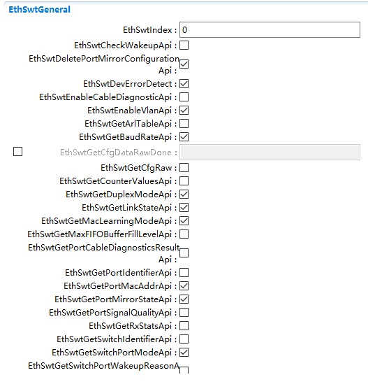

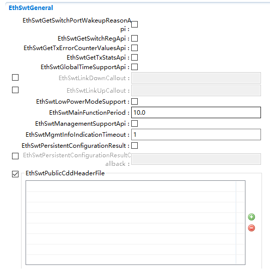

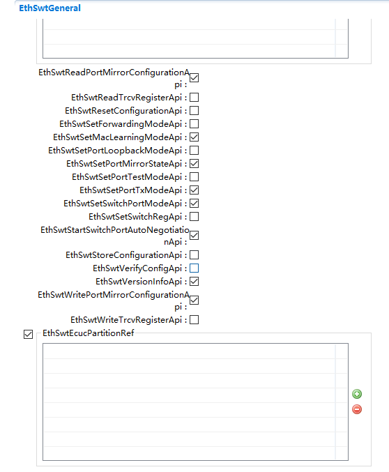

.. centered:: **表 EthSwtGeneral (Table EthSwtGeneral)**

.. list-table::
   :widths: 20 20 20 20 20
   :header-rows: 1

   * - UI名称 (UI Name)
     - 描述 (Description)
     - 
     - 
     - 
   * - EthSwtIndex
     - 取值范围 (Range)
     - 0..255
     - 默认取值 (Default value)
     - 0
   * - 
     - 参数描述 (Parameter Description)
     - Specifies theInstanceId of thismodule instance. Ifonly one instance ispresent it shall havethe Id 0.
     - 
     - 
   * - 
     - 依赖关系 (Dependencies)
     - 无
     - 
     - 
   * - EthSwtCheckWakeupApi
     - 取值范围 (Range)
     - true/false
     - 默认取值 (Default value)
     - false
   * - 
     - 参数描述 (Parameter Description)
     - Enables / DisablesEthSwt_CheckWakeupAPI.
     - 
     - 
   * - 
     - 依赖关系 (Dependencies)
     - 无
     - 
     - 
   * - EthSwtDeletePortMirrorConfigurationApi
     - 取值范围 (Range)
     - true/false
     - 默认取值 (Default value)
     - false
   * - 
     - 参数描述 (Parameter Description)
     - Enables / DisablesEthSwt_DeletePortMirrorConfigurationAPI
     - 
     - 
   * - 
     - 依赖关系 (Dependencies)
     - 无
     - 
     - 
   * - EthSwtDevErrorDetect
     - 取值范围 (Range)
     - true/false
     - 默认取值 (Default value)
     - false
   * - 
     - 参数描述 (Parameter Description)
     - Switches thedevelopment errordetection andnotification on oroff.
     - 
     - 
   * - 
     - 依赖关系 (Dependencies)
     - 无
     - 
     - 
   * - EthSwtEnableCableDiagnosticApi
     - 取值范围 (Range)
     - true/false
     - 默认取值 (Default value)
     - false
   * - 
     - 参数描述 (Parameter Description)
     - Enable/disable theAPIs for cablediagnostic:EthSwt_RunPortCableDiagnostic,EthSwt_GetPortCableDiagnosticsResult
     - 
     - 
   * - 
     - 依赖关系 (Dependencies)
     - 无
     - 
     - 
   * - EthSwtEnableVlanApi
     - 取值范围 (Range)
     - true/false
     - 默认取值 (Default value)
     - false
   * - 
     - 参数描述 (Parameter Description)
     - Enables / DisablesEthSwt_EnableVLANAPI.
     - 
     - 
   * - 
     - 依赖关系 (Dependencies)
     - 无
     - 
     - 
   * - EthSwtGetArlTableApi
     - 取值范围 (Range)
     - true/false
     - 默认取值 (Default value)
     - false
   * - 
     - 参数描述 (Parameter Description)
     - Enables / DisablesEthSwt_GetArlTableAPI.
     - 
     - 
   * - 
     - 依赖关系 (Dependencies)
     - 无
     - 
     - 
   * - EthSwtGetBaudRateApi
     - 取值范围 (Range)
     - true/false
     - 默认取值 (Default value)
     - false
   * - 
     - 参数描述 (Parameter Description)
     - Enables / DisablesEthSwt_GetBaudRateAPI
     - 
     - 
   * - 
     - 依赖关系 (Dependencies)
     - 无
     - 
     - 
   * - EthSwtGetCfgDataRawDone
     - 取值范围 (Range)
     - string
     - 默认取值 (Default value)
     - 无
   * - 
     - 参数描述 (Parameter Description)
     - Defines the functionname for<GetCfgDataRawDone>
     - 
     - 
   * - 
     - 依赖关系 (Dependencies)
     - 无
     - 
     - 
   * - EthSwtGetCfgRaw
     - 取值范围 (Range)
     - true/false
     - 默认取值 (Default value)
     - false
   * - 
     - 参数描述 (Parameter Description)
     - Disable /Enablesupport of readingraw data from switchmemory
     - 
     - 
   * - 
     - 依赖关系 (Dependencies)
     - 无
     - 
     - 
   * - EthSwtGetCounterValuesApi
     - 取值范围 (Range)
     - true/false
     - 默认取值 (Default value)
     - false
   * - 
     - 参数描述 (Parameter Description)
     - Enables / DisablesEthSwt_GetCounterValuesAPI
     - 
     - 
   * - 
     - 依赖关系 (Dependencies)
     - 无
     - 
     - 
   * - EthSwtGetDuplexModeApi
     - 取值范围 (Range)
     - true/false
     - 默认取值 (Default value)
     - false
   * - 
     - 参数描述 (Parameter Description)
     - Enables / DisablesEthSwt_GetDuplexModeAPI
     - 
     - 
   * - 
     - 依赖关系 (Dependencies)
     - 无
     - 
     - 
   * - EthSwtGetLinkStateApi
     - 取值范围 (Range)
     - true/false
     - 默认取值 (Default value)
     - false
   * - 
     - 参数描述 (Parameter Description)
     - Enables / DisablesEthSwt_GetLinkStateAPI
     - 
     - 
   * - 
     - 依赖关系 (Dependencies)
     - 无
     - 
     - 
   * - EthSwtGetMacLearningModeApi
     - 取值范围 (Range)
     - true/false
     - 默认取值 (Default value)
     - false
   * - 
     - 参数描述 (Parameter Description)
     - Enables / DisablesEthSwt_GetMacLearningModeAPI.
     - 
     - 
   * - 
     - 依赖关系 (Dependencies)
     - 无
     - 
     - 
   * - EthSwtGetMaxFIFOBufferFillLevelApi
     - 取值范围 (Range)
     - true/false
     - 默认取值 (Default value)
     - false
   * - 
     - 参数描述 (Parameter Description)
     - Enables / DisablesEthSwt_GetMaxFIFOBufferFillLevelAPI.
     - 
     - 
   * - 
     - 依赖关系 (Dependencies)
     - 无
     - 
     - 
   * - EthSwtGetPortCableDiagnosticsResultApi
     - 取值范围 (Range)
     - true/false
     - 默认取值 (Default value)
     - false
   * - 
     - 参数描述 (Parameter Description)
     - Enables / DisablesEthSwt_GetPortCableDiagnosticsResultAPI
     - 
     - 
   * - 
     - 依赖关系 (Dependencies)
     - 无
     - 
     - 
   * - EthSwtGetPortIdentifierApi
     - 取值范围 (Range)
     - true/false
     - 默认取值 (Default value)
     - false
   * - 
     - 参数描述 (Parameter Description)
     - Enables / DisablesEthSwt_GetPortIdentifierAPI
     - 
     - 
   * - 
     - 依赖关系 (Dependencies)
     - 无
     - 
     - 
   * - EthSwtGetPortMacAddrApi
     - 取值范围 (Range)
     - true/false
     - 默认取值 (Default value)
     - false
   * - 
     - 参数描述 (Parameter Description)
     - Enables / DisablesEthSwt_GetPortMacAddrAPI.
     - 
     - 
   * - 
     - 依赖关系 (Dependencies)
     - 无
     - 
     - 
   * - EthSwtGetPortMirrorStateApi
     - 取值范围 (Range)
     - true/false
     - 默认取值 (Default value)
     - false
   * - 
     - 参数描述 (Parameter Description)
     - Enables / DisablesEthSwt_GetPortMirrorStateAPI
     - 
     - 
   * - 
     - 依赖关系 (Dependencies)
     - 无
     - 
     - 
   * - EthSwtGetPortMirrorStateApi
     - 取值范围 (Range)
     - true/false
     - 默认取值 (Default value)
     - false
   * - 
     - 参数描述 (Parameter Description)
     - Enables / DisablesEthSwt_GetPortMirrorStateAPI
     - 
     - 
   * - 
     - 依赖关系 (Dependencies)
     - 无
     - 
     - 
   * - EthSwtGetPortSignalQualityApi
     - 取值范围 (Range)
     - true/false
     - 默认取值 (Default value)
     - false
   * - 
     - 参数描述 (Parameter Description)
     - Enables / DisablesEthSwt_GetPortSignalQualityAPI
     - 
     - 
   * - 
     - 依赖关系 (Dependencies)
     - 无
     - 
     - 
   * - EthSwtGetRxStatsApi
     - 取值范围 (Range)
     - true/false
     - 默认取值 (Default value)
     - false
   * - 
     - 参数描述 (Parameter Description)
     - Enables / DisablesEthSwt_GetRxStatsAPI.
     - 
     - 
   * - 
     - 依赖关系 (Dependencies)
     - 无
     - 
     - 
   * - EthSwtGetSwitchIdentifierApi
     - 取值范围 (Range)
     - true/false
     - 默认取值 (Default value)
     - false
   * - 
     - 参数描述 (Parameter Description)
     - Enables / DisablesEthSwt_GetSwitchIdentifierAPI
     - 
     - 
   * - 
     - 依赖关系 (Dependencies)
     - 无
     - 
     - 
   * - EthSwtGetSwitchPortModeApi
     - 取值范围 (Range)
     - true/false
     - 默认取值 (Default value)
     - false
   * - 
     - 参数描述 (Parameter Description)
     - Enables / DisablesEthSwt_GetSwitchPortModeAPI
     - 
     - 
   * - 
     - 依赖关系 (Dependencies)
     - 无
     - 
     - 
   * - EthSwtGetSwitchPortWakeupReasonApi
     - 取值范围 (Range)
     - true/false
     - 默认取值 (Default value)
     - false
   * - 
     - 参数描述 (Parameter Description)
     - Enables / DisablesEthSwt_GetSwitchPortWakeupReasonAPI.
     - 
     - 
   * - 
     - 依赖关系 (Dependencies)
     - 无
     - 
     - 
   * - EthSwtGetSwitchRegApi
     - 取值范围 (Range)
     - true/false
     - 默认取值 (Default value)
     - false
   * - 
     - 参数描述 (Parameter Description)
     - Enables / DisablesEthSwt_GetSwitchRegAPI.
     - 
     - 
   * - 
     - 依赖关系 (Dependencies)
     - 无
     - 
     - 
   * - EthSwtGetTxErrorCounterValuesApi
     - 取值范围 (Range)
     - true/false
     - 默认取值 (Default value)
     - false
   * - 
     - 参数描述 (Parameter Description)
     - Enables/DisablesEth_GetTxErrorCounterValuesAPI.
     - 
     - 
   * - 
     - 依赖关系 (Dependencies)
     - 无
     - 
     - 
   * - EthSwtGetTxStatsApi
     - 取值范围 (Range)
     - true/false
     - 默认取值 (Default value)
     - false
   * - 
     - 参数描述 (Parameter Description)
     - Enables/DisablesEth_GetTxStats API.
     - 
     - 
   * - 
     - 依赖关系 (Dependencies)
     - 无
     - 
     - 
   * - EthSwtGlobalTimeSupportApi
     - 取值范围 (Range)
     - true/false
     - 默认取值 (Default value)
     - false
   * - 
     - 参数描述 (Parameter Description)
     - Enables/Disables theGlobal Time APIs usedamongst others byGlobal TimeSynchronization overEthernet.
     - 
     - 
   * - 
     - 依赖关系 (Dependencies)
     - 无
     - 
     - 
   * - EthSwtLinkDownCallout
     - 取值范围 (Range)
     - string
     - 默认取值 (Default value)
     - 无
   * - 
     - 参数描述 (Parameter Description)
     - Defines the functionname for the callout.
     - 
     - 
   * - 
     - 依赖关系 (Dependencies)
     - 无
     - 
     - 
   * - EthSwtLinkUpCallout
     - 取值范围 (Range)
     - string
     - 默认取值 (Default value)
     - 无
   * - 
     - 参数描述 (Parameter Description)
     - Defines the functionname for the callout.
     - 
     - 
   * - 
     - 依赖关系 (Dependencies)
     - 无
     - 
     - 
   * - EthSwtLowPowerModeSupport
     - 取值范围 (Range)
     - true/false
     - 默认取值 (Default value)
     - false
   * - 
     - 参数描述 (Parameter Description)
     - Disable / Enablesupport of low powermode.
     - 
     - 
   * - 
     - 依赖关系 (Dependencies)
     - 无
     - 
     - 
   * - EthSwtMainFunctionPeriod
     - 取值范围 (Range)
     - 0.001..INF
     - 默认取值 (Default value)
     - 无
   * - 
     - 参数描述 (Parameter Description)
     - The cycle time of theperiodic mainfunction of EthSwt.
     - 
     - 
   * - 
     - 
     - Defined in seconds .
     - 
     - 
   * - 
     - 依赖关系 (Dependencies)
     - 无
     - 
     - 
   * - EthSwtManagementSupportApi
     - 取值范围 (Range)
     - true/false
     - 默认取值 (Default value)
     - false
   * - 
     - 参数描述 (Parameter Description)
     - Enables/Disables theSwitch managementAPIs to support aSwitch-port specificcommunicationattribute access.
     - 
     - 
   * - 
     - 依赖关系 (Dependencies)
     - 无
     - 
     - 
   * - EthSwtMgmtInfoIndicationTimeout
     - 取值范围 (Range)
     - 0..65535
     - 默认取值 (Default value)
     - 无
   * - 
     - 参数描述 (Parameter Description)
     - This parameterspecifies the timeoutwhile the Switchdriver is waiting formanagementinformation out ofthe Switch forreception.
     - 
     - 
   * - 
     - 依赖关系 (Dependencies)
     - 无
     - 
     - 
   * - EthSwtPersistentConfigurationResult
     - 取值范围 (Range)
     - true/false
     - 默认取值 (Default value)
     - false
   * - 
     - 参数描述 (Parameter Description)
     - Enables / Disablesthe callback API\_PersistentConfigurationResult.
     - 
     - 
   * - 
     - 依赖关系 (Dependencies)
     - 无
     - 
     - 
   * - EthSwtPersistentConfigurationResultCallback
     - 取值范围 (Range)
     - string
     - 默认取值 (Default value)
     - 无
   * - 
     - 参数描述 (Parameter Description)
     - Defines the functionname for<EthSwtPersistentConfigurationResultCallback>
     - 
     - 
   * - 
     - 依赖关系 (Dependencies)
     - 无
     - 
     - 
   * - EthSwtPublicCddHeaderFile
     - 取值范围 (Range)
     - string
     - 默认取值 (Default value)
     - 无
   * - 
     - 参数描述 (Parameter Description)
     - Defines header filesfor callbackfunctions which shallbe included in caseof CDDs.
     - 
     - 
   * - 
     - 依赖关系 (Dependencies)
     - 无
     - 
     - 
   * - EthSwtReadPortMirrorConfigurationApi
     - 取值范围 (Range)
     - true/false
     - 默认取值 (Default value)
     - false
   * - 
     - 参数描述 (Parameter Description)
     - Enables / DisablesEthSwt_ReadPortMirrorConfigurationAPI
     - 
     - 
   * - 
     - 依赖关系 (Dependencies)
     - 无
     - 
     - 
   * - EthSwtReadTrcvRegisterApi
     - 取值范围 (Range)
     - true/false
     - 默认取值 (Default value)
     - false
   * - 
     - 参数描述 (Parameter Description)
     - Enables / DisablesEthSwt_ReadTrcvRegisterAPI.
     - 
     - 
   * - 
     - 依赖关系 (Dependencies)
     - 无
     - 
     - 
   * - EthSwtReadTrcvRegisterApi
     - 取值范围 (Range)
     - true/false
     - 默认取值 (Default value)
     - false
   * - 
     - 参数描述 (Parameter Description)
     - Enables / DisablesEthSwt_ReadTrcvRegisterAPI.
     - 
     - 
   * - 
     - 依赖关系 (Dependencies)
     - 无
     - 
     - 
   * - EthSwtResetConfigurationApi
     - 取值范围 (Range)
     - true/false
     - 默认取值 (Default value)
     - false
   * - 
     - 参数描述 (Parameter Description)
     - Enables / DisablesEthSwt_ResetConfigurationAPI.
     - 
     - 
   * - 
     - 依赖关系 (Dependencies)
     - 无
     - 
     - 
   * - EthSwtSetForwardingModeApi
     - 取值范围 (Range)
     - true/false
     - 默认取值 (Default value)
     - false
   * - 
     - 参数描述 (Parameter Description)
     - Enables /disablesEthSwt_SetForwardingModeAPI.
     - 
     - 
   * - 
     - 依赖关系 (Dependencies)
     - 无
     - 
     - 
   * - EthSwtSetMacLearningModeApi
     - 取值范围 (Range)
     - true/false
     - 默认取值 (Default value)
     - false
   * - 
     - 参数描述 (Parameter Description)
     - Enables / DisablesEthSwt_SetMacLearningModeAPI.
     - 
     - 
   * - 
     - 依赖关系 (Dependencies)
     - 无
     - 
     - 
   * - EthSwtSetPortLoopbackModeApi
     - 取值范围 (Range)
     - true/false
     - 默认取值 (Default value)
     - false
   * - 
     - 参数描述 (Parameter Description)
     - Enables / DisablesEthSwt_SetPortLoopbackModeApiAPI
     - 
     - 
   * - 
     - 依赖关系 (Dependencies)
     - 无
     - 
     - 
   * - EthSwtSetPortMirrorStateApi
     - 取值范围 (Range)
     - true/false
     - 默认取值 (Default value)
     - false
   * - 
     - 参数描述 (Parameter Description)
     - Enables / DisablesEthSwt_SetPortMirrorStateAPI
     - 
     - 
   * - 
     - 依赖关系 (Dependencies)
     - 无
     - 
     - 
   * - EthSwtSetPortTestModeApi
     - 取值范围 (Range)
     - true/false
     - 默认取值 (Default value)
     - false
   * - 
     - 参数描述 (Parameter Description)
     - Enables / DisablesEthSwt_SetPortTestModeAPI
     - 
     - 
   * - 
     - 依赖关系 (Dependencies)
     - 无
     - 
     - 
   * - EthSwtSetPortTxModeApi
     - 取值范围 (Range)
     - true/false
     - 默认取值 (Default value)
     - false
   * - 
     - 参数描述 (Parameter Description)
     - Enables / DisablesEthSwt_SetPortTxModeApiAPI
     - 
     - 
   * - 
     - 依赖关系 (Dependencies)
     - 无
     - 
     - 
   * - EthSwtSetSwitchPortModeApi
     - 取值范围 (Range)
     - true/false
     - 默认取值 (Default value)
     - false
   * - 
     - 参数描述 (Parameter Description)
     - Enables / DisablesEthSwt_SetSwitchPortModeAPI
     - 
     - 
   * - 
     - 依赖关系 (Dependencies)
     - 无
     - 
     - 
   * - EthSwtSetSwitchRegApi
     - 取值范围 (Range)
     - true/false
     - 默认取值 (Default value)
     - false
   * - 
     - 参数描述 (Parameter Description)
     - Enables / DisablesEthSwt_SetSwitchRegAPI.
     - 
     - 
   * - 
     - 依赖关系 (Dependencies)
     - 无
     - 
     - 
   * - EthSwtStartSwitchPortAutoNegotiationApi
     - 取值范围 (Range)
     - true/false
     - 默认取值 (Default value)
     - false
   * - 
     - 参数描述 (Parameter Description)
     - Enables / DisablesEthSwt_StartSwitchPortAutoNegotiationAPI
     - 
     - 
   * - 
     - 依赖关系 (Dependencies)
     - 无
     - 
     - 
   * - EthSwtStoreConfigurationApi
     - 取值范围 (Range)
     - true/false
     - 默认取值 (Default value)
     - false
   * - 
     - 参数描述 (Parameter Description)
     - Enables / DisablesEthSwt_StoreConfigurationAPI.
     - 
     - 
   * - 
     - 依赖关系 (Dependencies)
     - 无
     - 
     - 
   * - EthSwtVerifyConfigApi
     - 取值范围 (Range)
     - true/false
     - 默认取值 (Default value)
     - false
   * - 
     - 参数描述 (Parameter Description)
     - Enables /disablesEthSwt_VerifyConfigAPI.
     - 
     - 
   * - 
     - 依赖关系 (Dependencies)
     - 无
     - 
     - 
   * - EthSwtVersionInfoApi
     - 取值范围 (Range)
     - true/false
     - 默认取值 (Default value)
     - false
   * - 
     - 参数描述 (Parameter Description)
     - Enables / Disablesversion info API.
     - 
     - 
   * - 
     - 依赖关系 (Dependencies)
     - 无
     - 
     - 
   * - EthSwtWritePortMirrorConfigurationApi
     - 取值范围 (Range)
     - true/false
     - 默认取值 (Default value)
     - false
   * - 
     - 参数描述 (Parameter Description)
     - Enables / DisablesEthSwt_WritePortMirrorConfigurationAPI
     - 
     - 
   * - 
     - 依赖关系 (Dependencies)
     - 无
     - 
     - 
   * - EthSwtWriteTrcvRegisterApi
     - 取值范围 (Range)
     - true/false
     - 默认取值 (Default value)
     - false
   * - 
     - 参数描述 (Parameter Description)
     - Enables / DisablesEthSwt_WriteTrcvRegisterAPI.
     - 
     - 
   * - 
     - 依赖关系 (Dependencies)
     - 无
     - 
     - 
   * - EthSwtEcucPartitionRef
     - 取值范围 (Range)
     - reference
     - 默认取值 (Default value)
     - 无
   * - 
     - 参数描述 (Parameter Description)
     - Maps the Ethernetswitch driver to zeroor multiple ECUCpartitions to makethe modules APIavailable in thispartition. TheEthernet switchdriver will operateas an independentinstance in each ofthe partitions.
     - 
     - 
   * - 
     - 依赖关系 (Dependencies)
     - 无
     - 
     - 

EthSwtConfig
----------------------------

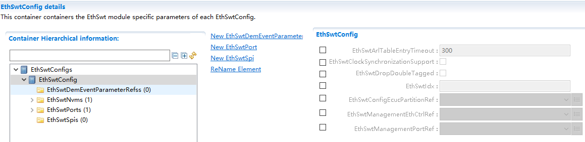

.. centered:: **表  EthSwtConfig (Table EthSwtConfig)**

.. list-table::
   :widths: 20 20 20 20 20
   :header-rows: 1

   * - UI名称 (UI Name)
     - 描述 (Description)
     - 
     - 
     - 
   * - EthSwtArlTableEntryTimeout
     - 
     - 1..65535
     - 默认取值 (Default value)
     - 300
   * -
     - 
     - If present, this parameter   specifies the timeout in seconds for removing unused entries from the ARL   table of the Ethernet switch. Otherwise, entries are not removed   automatically.
     - 
     - 
   * -
     - 依赖关系 (Dependencies)
     - 无
     - 
     - 
   * - EthSwtClockSynchronizationSupport
     - 取值范围 (Range)
     - true/false
     - 
     - 
   * -
     - 参数描述 (Parameter Description)
     - This parameter defines, if a   Ethernet switch shall enable clock synchronization with another Ethernet   switch to which it is connected via uplink port.
     - 
     - 
   * -
     - 依赖关系 (Dependencies)
     - 无
     - 
     - 
   * - EthSwtDropDoubleTagged
     - 取值范围 (Range)
     - true/false
     - 默认取值 (Default value)
     - FALSE
   * -
     - 参数描述 (Parameter Description)
     - This parameter defines if a   switch shall drop double tagged (Q in Q) frames.
     - 
     - 
   * -
     - 依赖关系 (Dependencies)
     - 无
     - 
     - 
   * - EthSwtIdx
     - 取值范围 (Range)
     - 0..255
     - 默认取值 (Default value)
     - 无
   * -
     - 参数描述 (Parameter Description)
     - Specifies the instance ID of   the configured Ethernet Switch.
     - 
     - 
   * -
     - 依赖关系 (Dependencies)
     - 无
     - 
     - 
   * - EthSwtConfigEcucPartitionRef
     - 取值范围 (Range)
     - String
     - 默认取值 (Default value)
     - 无
   * -
     - 参数描述 (Parameter Description)
     - Maps the configuration of one   single Ethernet switch to zero or one ECUC partitions. The ECUC partition   referenced is a subset of the ECUC partitions where the Ethernet switch   driver is mapped to.
     - 
     - 
   * - EthSwtManagementEthCtrlRef
     - 取值范围 (Range)
     - String
     - 默认取值 (Default value)
     - 无
   * -
     - 参数描述 (Parameter Description)
     - Reference to the Ethernet   controller connected to the management port where the management frames will   be transmitted/received.
     - 
     - 
   * -
     - 依赖关系 (Dependencies)
     - 无
     - 
     - 
   * - EthSwtManagementPortRef
     - 取值范围 (Range)
     - String
     - 默认取值 (Default value)
     - 无
   * -
     - 参数描述 (Parameter Description)
     - Reference to the port where   the management CPU is connected to.
     - 
     - 
   * -
     - 依赖关系 (Dependencies)
     - 无
     - 
     - 

EthSwtNvm
-------------------------

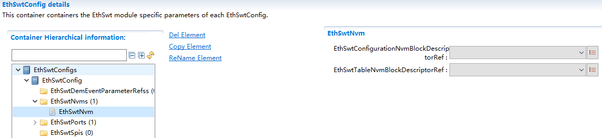

.. centered:: **表 EthSwtNvm (Table EthSwtNvm)**

.. list-table::
   :widths: 20 20 20 20 20
   :header-rows: 1

   * - UI名称 (UI Name)
     - 描述 (Description)
     - 
     - 
     - 
   * - EthSwtConfigurationNvmBlockDescriptorRef
     - 取值范围 (Range)
     - reference
     - 默认取值 (Default value)
     - 无
   * - 
     - 参数描述 (Parameter Description)
     - Reference to the Nvmblock description inthe Nvm moduleconfiguration tostore e.g. the portmirror configurations
     - 
     - 
   * - 
     - 依赖关系 (Dependencies)
     - 需要配置NVM模块 (Need to configure the NVM module)
     - 
     - 
   * - EthSwtTableNvmBlockDescriptorRef
     - 取值范围 (Range)
     - reference
     - 默认取值 (Default value)
     - 无
   * - 
     - 参数描述 (Parameter Description)
     - Reference to the Nvmblock description inthe Nvm moduleconfiguration tostore e.g. thelearned ARL table
     - 
     - 
   * - 
     - 依赖关系 (Dependencies)
     - 需要配置NVM模块 (Need to configure the NVM module)
     - 
     - 

EthSwtPort
--------------------------

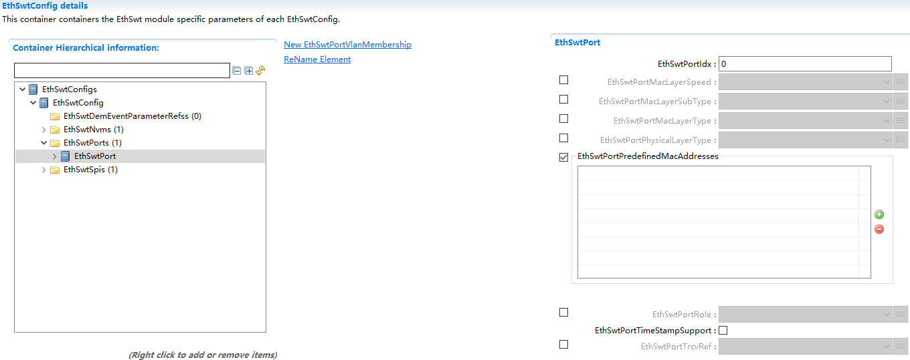

.. centered:: **表 EthSwtPort (Table EthSwtPort)**

.. list-table::
   :widths: 20 20 20 20 20
   :header-rows: 1

   * - UI名称 (UI Name)
     - 描述 (Description)
     - 
     - 
     - 
   * - EthSwtPortIdx
     - 取值范围 (Range)
     - 0..8
     - 
     - 
   * -
     - 参数描述 (Parameter Description)
     - Specifies the instance ID of   the configured Ethernet Switch Port.
     - 
     - 
   * -
     - 依赖关系 (Dependencies)
     - 无
     - 
     - 
   * - EthSwtPortMacLayerSpeed
     - 取值范围 (Range)
     - ETH_MAC_LAYER_SPEED_100M/ETH_MAC_LAYER_SPEED_10G/ETH_MAC_LAYER_SPEED_10M/TH_MAC_LAYER_SPEED_1G/ETH_MAC_LAYER_SPEED_2500M
     - 默认取值 (Default value)
     - 无
   * -
     - 参数描述 (Parameter Description)
     - Defines the baud rate of the MAC layer.
     - 
     - 
   * -
     - 依赖关系 (Dependencies)
     - 无
     - 
     - 
   * - EthSwtPortMacLayerSubType
     - 取值范围 (Range)
     - REDUCED/REVERSED/SERIAL/STANDARD/UNIVERSAL_SERIAL
     - 默认取值 (Default value)
     - 无
   * -
     - 参数描述 (Parameter Description)
     - Defines the MAC layer subtype of this EthSwtPort.
     - 
     - 
   * -
     - 依赖关系 (Dependencies)
     - 无
     - 
     - 
   * - EthSwtPortMacLayerType
     - 取值范围 (Range)
     - ETHSWT_PORT_MAC_LAYER_TYPE_XGMII/ETHSWT_PORT_MAC_LAYER_TYPE_XMII/ETHSWT_PORT_MAC_LAYER_TYPE_XXGMII
     - 默认取值 (Default value)
     - 无
   * -
     - 参数描述 (Parameter Description)
     - Defines the MAC layer type of this EthSwtPort.
     - 
     - 
   * -
     - 依赖关系 (Dependencies)
     - 无
     - 
     - 
   * - EthSwtPortPhysicalLayerType
     - 取值范围 (Range)
     - ETHSWT_PORT_1000BASE_T/ETHSWT_PORT_1000BASE_T1/ETHSWT_PORT_100BASE_TX
     - 默认取值 (Default value)
     - 无
   * -
     - 参数描述 (Parameter Description)
     - Defines the physical layer type of this EthSwtPort.
     - 
     - 
   * -
     - 依赖关系 (Dependencies)
     - 无
     - 
     - 
   * - EthSwtPortPredefinedMacAddresses
     - 取值范围 (Range)
     - uint8*6
     - 默认取值 (Default value)
     - 无
   * -
     - 参数描述 (Parameter Description)
     - Specifies a list of 48-bitphysical addresses (MAC addresses) which can be reached via this port in network byte order.
     - 
     - 
   * -
     - 依赖关系 (Dependencies)
     - 无
     - 
     - 
   * - EthSwtPortRole
     - 取值范围 (Range)
     - ETHSWT_HOST_PORT/ETHSWT_UP_LINK_PORT
     - 默认取值 (Default value)
     - 无
   * -
     - 参数描述 (Parameter Description)
     - Set a special role of the Ethernet switch port.
     - 
     - 
   * - 
     - 
     - If not configured it is a standard port.
     - 
     - 
   * -
     - 依赖关系 (Dependencies)
     - 无
     - 
     - 
   * - EthSwtPortTimeStampSupport
     - 取值范围 (Range)
     - 无
     - 默认取值 (Default value)
     - 
   * -
     - 参数描述 (Parameter Description)
     - Enables/Disables the Switch-port specific timestamping.
     - 
     - 
   * -
     - 依赖关系 (Dependencies)
     - 无
     - 
     - 
   * - EthSwtPortTrcvRef
     - 取值范围 (Range)
     - reference
     - 默认取值 (Default value)
     - 无
   * -
     - 参数描述 (Parameter Description)
     - Reference to the Ethernet transceiver driver this EthSwtPort is connected with.
     - 
     - 
   * -
     - 依赖关系 (Dependencies)
     - 无
     - 
     - 

EthSwtPortEgress
================================

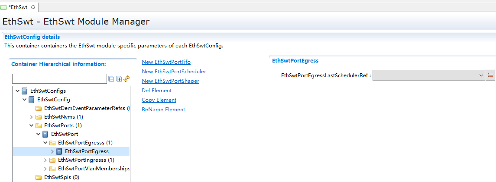

.. centered:: **表 EthSwtPortEgress (Table EthSwtPortEgress)**

.. list-table::
   :widths: 20 20 20 20 20
   :header-rows: 1

   * - UI名称 (UI Name)
     - 描述 (Description)
     - 
     - 
     - 
   * - EthSwtPortEgressLastSchedulerRef
     - 取值范围 (Range)
     - reference
     - 默认取值 (Default value)
     - 无
   * - 
     - 参数描述 (Parameter Description)
     - Reference to the portscheduler which isthe last in theegress portstructure.
     - 
     - 
   * - 
     - 依赖关系 (Dependencies)
     - 无
     - 
     - 

EthSwtPortFifo
------------------------------

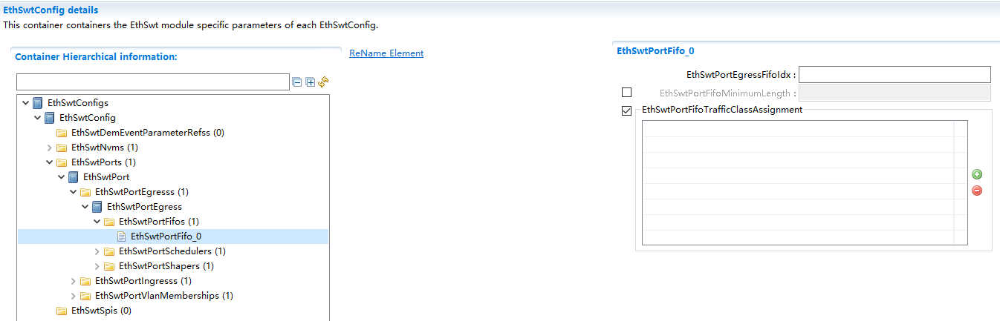

.. centered:: **表 EthSwtPortFifo (Table EthSwtPortFifo)**

.. list-table::
   :widths: 20 20 20 20 20
   :header-rows: 1

   * - UI名称 (UI Name)
     - 描述 (Description)
     - 
     - 
     - 
   * - EthSwtPortEgressFifoIdx
     - 取值范围 (Range)
     - 0..18446744073709551615
     - 默认取值 (Default value)
     - 无
   * - 
     - 参数描述 (Parameter Description)
     - Specifies the instanceID of the fifo of theconfigured Ethernetswitch egress port
     - 
     - 
   * - 
     - 依赖关系 (Dependencies)
     - 无
     - 
     - 
   * - EthSwtPortFifoMinimumLength
     - 取值范围 (Range)
     - 0..18446744073709551615
     - 默认取值 (Default value)
     - 无
   * - 
     - 参数描述 (Parameter Description)
     - FIFO minimum length inByte. This assignmentis used to configure aguaranteed size of aconfigured FIFO.
     - 
     - 
   * - 
     - 依赖关系 (Dependencies)
     - 无
     - 
     - 
   * - EthSwtPortFifoTrafficClassAssignment
     - 取值范围 (Range)
     - 0..7
     - 默认取值 (Default value)
     - 无
   * - 
     - 参数描述 (Parameter Description)
     - Defines which trafficclasses are assignedto this Fifo.
     - 
     - 
   * - 
     - 依赖关系 (Dependencies)
     - 无
     - 
     - 

EthSwtPortScheduler
-----------------------------------

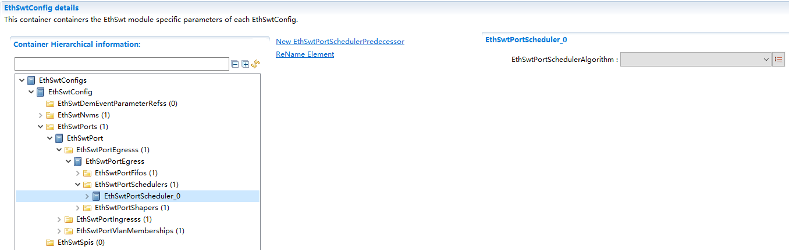

.. centered:: **表 EthSwtPortScheduler (Table EthSwtPortScheduler)**

.. list-table::
   :widths: 20 20 20 20 20
   :header-rows: 1

   * - UI名称 (UI Name)
     - 描述 (Description)
     - 
     - 
     - 
   * - EthSwtPortSchedulerAlgorithm
     - 取值范围 (Range)
     - ETHSWT_SCHEDULER_DEFICIT_ROUND_ROBIN/ETHSWT_SCHEDULER_STRICT_PRIORITY/ETHSWT_SCHEDULER_WEIGHTED_ROUND_ROBIN
     - 默认取值 (Default value)
     - 无
   * - 
     - 参数描述 (Parameter Description)
     - Defines the scheduleralgorithm
     - 
     - 
   * - 
     - 依赖关系 (Dependencies)
     - 无
     - 
     - 

EthSwtPortSchedulerPredecessor
^^^^^^^^^^^^^^^^^^^^^^^^^^^^^^^^^^^^^^^^^^^^^^

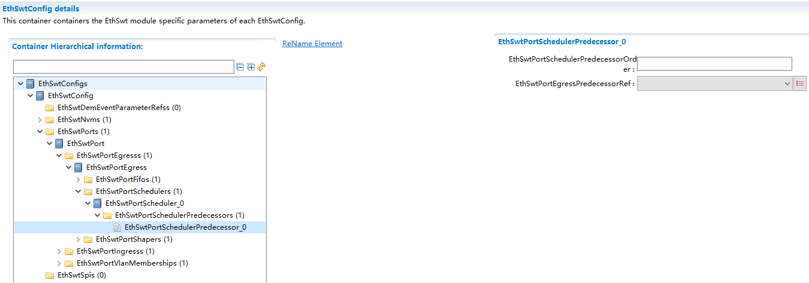

.. centered:: **表 EthSwtPortSchedulerPredecessor (Table EthSwtPortSchedulerPredecessor)**

.. list-table::
   :widths: 20 20 20 20 20
   :header-rows: 1

   * - UI名称 (UI Name)
     - 描述 (Description)
     - 
     - 
     - 
   * - EthSwtPortSchedulerPredecessorOrder
     - 取值范围 (Range)
     - 0..18446744073709551615
     - 默认取值 (Default value)
     - 无
   * - 
     - 参数描述 (Parameter Description)
     - Defines the order ofthe schedulerpredecessors.
     - 
     - 
   * - 
     - 依赖关系 (Dependencies)
     - 无
     - 
     - 
   * - EthSwtPortEgressPredecessorRef
     - 取值范围 (Range)
     - Ref
     - 默认取值 (Default value)
     - 无
   * - 
     - 参数描述 (Parameter Description)
     - Choice reference tothe schedulerpredecessor.
     - 
     - 
   * - 
     - 依赖关系 (Dependencies)
     - 无
     - 
     - 

EthSwtPortShaper
--------------------------------

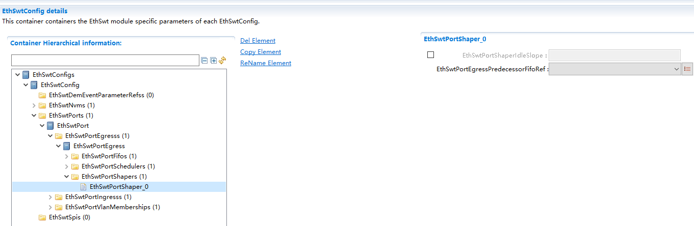

.. centered:: **表 EthSwtPortShaper (Table EthSwtPortShaper)**

.. list-table::
   :widths: 20 20 20 20 20
   :header-rows: 1

   * - UI名称 (UI Name)
     - 描述 (Description)
     - 
     - 
     - 
   * - EthSwtPortShaperIdleSlope
     - 取值范围 (Range)
     - 0..18446744073709551615
     - 默认取值 (Default value)
     - 无
   * - 
     - 参数描述 (Parameter Description)
     - Defines the increaseof credit in bits persecond for the AVBshaper.
     - 
     - 
   * - 
     - 依赖关系 (Dependencies)
     - 无
     - 
     - 
   * - EthSwtPortEgressPredecessorFifoRef
     - 取值范围 (Range)
     - Ref
     - 默认取值 (Default value)
     - 无
   * - 
     - 参数描述 (Parameter Description)
     - Reference to the fifowhich is thepredecessor for thisshaper.
     - 
     - 
   * - 
     - 依赖关系 (Dependencies)
     - 无
     - 
     - 

EthSwtPortIngress
=================================

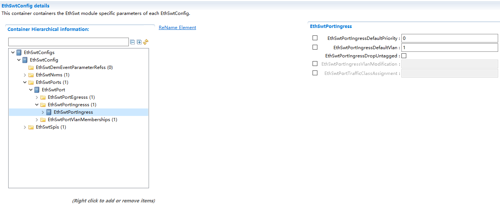

.. centered:: **表 EthSwtPortIngress (Table EthSwtPortIngress)**

.. list-table::
   :widths: 20 20 20 20 20
   :header-rows: 1

   * - UI名称 (UI Name)
     - 描述 (Description)
     - 
     - 
     - 
   * - EthSwtPortIngressDefaultPriority
     - 取值范围 (Range)
     - 0..7
     - 默认取值 (Default value)
     - 0
   * - 
     - 参数描述 (Parameter Description)
     - Default priority foringress.
     - 
     - 
   * - 
     - 依赖关系 (Dependencies)
     - 如果配置了EthSwtPortIngressDefaultVlan，该项必须配置； (If EthSwtPortIngressDefaultVlan is configured, this item must be configured;)
     - 
     - 
   * - 
     - 
     - 如果配置了EthSwtPortIngressDropUntagged，则该项不能配置 (If EthSwtPortIngressDropUntagged is configured, this item cannot be configured.)
     - 
     - 
   * - EthSwtPortIngressDefaultVlan
     - 取值范围 (Range)
     - 0..4094
     - 默认取值 (Default value)
     - 1
   * - 
     - 参数描述 (Parameter Description)
     - Default VLAN foringress.
     - 
     - 
   * - 
     - 依赖关系 (Dependencies)
     - 如果配置了EthSwtPortIngressDefaultPriority，该项必须配置； (If EthSwtPortIngressDefaultPriority is configured, this item must be set;)
     - 
     - 
   * - 
     - 
     - 如果配置了EthSwtPortIngressDropUntagged，则该项不能配置 (If EthSwtPortIngressDropUntagged is configured, this item cannot be configured.)
     - 
     - 
   * - EthSwtPortIngressDropUntagged
     - 取值范围 (Range)
     - true/false
     - 默认取值 (Default value)
     - false
   * - 
     - 参数描述 (Parameter Description)
     - Defines the ingressbehavior for untaggedframes.
     - 
     - 
   * - 
     - 依赖关系 (Dependencies)
     - 如果配置了EthSwtPortIngressDefaultPriority或EthSwtPortIngressDefaultVlan，则EthSwtPortIngressDropUntagged不能配置 (If EthSwtPortIngressDefaultPriority or EthSwtPortIngressDefaultVlan is configured, EthSwtPortIngressDropUntagged cannot be configured.)
     - 
     - 
   * - EthSwtPortIngressVlanModification
     - 取值范围 (Range)
     - 0..4094
     - 默认取值 (Default value)
     - 1
   * - 
     - 参数描述 (Parameter Description)
     - If this parameter isdefined all messageswhich arrive at thisingress port will betagged with this VLANId. This tagginghappen also if thearriving messagealready has a VLANId, it will beoverwritten by thedefined one.
     - 
     - 
   * - 
     - 依赖关系 (Dependencies)
     - 无
     - 
     - 
   * - EthSwtPortTrafficClassAssignment
     - 取值范围 (Range)
     - 0..7
     - 默认取值 (Default value)
     - 无
   * - 
     - 参数描述 (Parameter Description)
     - If this parameter isdefined all arrivingmessages at thisingress port shall beassigned this trafficclass
     - 
     - 
   * - 
     - 依赖关系 (Dependencies)
     - 无
     - 
     - 

EthSwtPortPolicer
---------------------------------

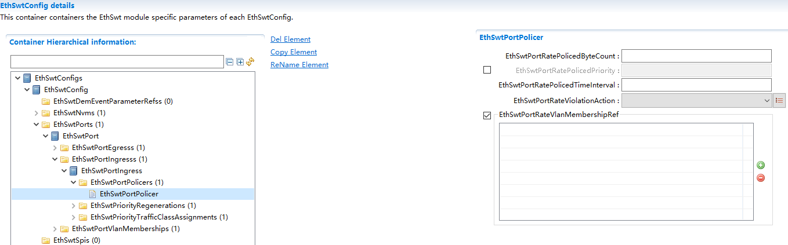

.. centered:: **表 EthSwtPortPolicer (Table EthSwtPortPolicer)**

.. list-table::
   :widths: 20 20 20 20 20
   :header-rows: 1

   * - UI名称 (UI Name)
     - 描述 (Description)
     - 
     - 
     - 
   * - EthSwtPortRatePolicedByteCount
     - 取值范围 (Range)
     - 0.
     - 默认取值 (Default value)
     - 无
   * - 
     - 参数描述 (Parameter Description)
     - Amount of Byte Counts(excluding Headerinformation) whichcan be received in aconfiguredEthSwtPortRatePolicedTimeInterval.
     - 
     - 
   * - 
     - 依赖关系 (Dependencies)
     - 无
     - 
     - 
   * - EthSwtPortRatePolicedPriority
     - 取值范围 (Range)
     - 0..7
     - 默认取值 (Default value)
     - 无
   * - 
     - 参数描述 (Parameter Description)
     - Defines the prioritywhich this ratepolicy shall belimited on. If nopriority is giventhis rate policy isnot consideringpriority.
     - 
     - 
   * - 
     - 依赖关系 (Dependencies)
     - 无
     - 
     - 
   * - EthSwtPortRatePolicedTimeInterval
     - 取值范围 (Range)
     - 0..INF
     - 默认取值 (Default value)
     - 无
   * - 
     - 参数描述 (Parameter Description)
     - Time interval inseconds where aconfiguredEthSwtPortRatePolicedByteCountcan be receivedwithout a ratelimitation.
     - 
     - 
   * - 
     - 依赖关系 (Dependencies)
     - 无
     - 
     - 
   * - EthSwtPortRateViolationAction
     - 取值范围 (Range)
     - BLOCK_SOURCE/DROP_FRAME
     - 默认取值 (Default value)
     - 无
   * - 
     - 参数描述 (Parameter Description)
     - Action to be takenwhen the rate policycriteria defined forthisEthSwtPortPolicer aremet.
     - 
     - 
   * - 
     - 依赖关系 (Dependencies)
     - 无
     - 
     - 
   * - EthSwtPortRateVlanMembershipRef
     - 取值范围 (Range)
     - 0..4095
     - 默认取值 (Default value)
     - 无
   * - 
     - 参数描述 (Parameter Description)
     - References the Vlansthis rate policyshall apply to.
     - 
     - 
   * - 
     - 依赖关系 (Dependencies)
     - 无
     - 
     - 

EthSwtPriorityRegeneration
------------------------------------------

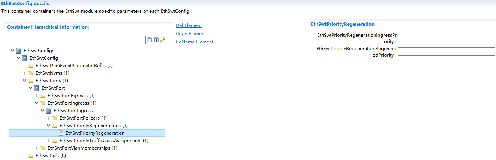

.. centered:: **表 EthSwtPriorityRegeneration (Table EthSwtPriorityRegeneration)**

.. list-table::
   :widths: 20 20 20 20 20
   :header-rows: 1

   * - UI名称 (UI Name)
     - 描述 (Description)
     - 
     - 
     - 
   * - EthSwtPriorityRegenerationIngressPriority
     - 取值范围 (Range)
     - 0 ..7
     - 默认取值 (Default value)
     - 无
   * - 
     - 参数描述 (Parameter Description)
     - Message priority ofthe incoming message.
     - 
     - 
   * - 
     - 依赖关系 (Dependencies)
     - 无
     - 
     - 
   * - EthSwtPriorityRegenerationRegeneratedPriority
     - 取值范围 (Range)
     - 0 ..7
     - 默认取值 (Default value)
     - 无
   * - 
     - 参数描述 (Parameter Description)
     - Message priority theincoming message willbe tagged with.
     - 
     - 
   * - 
     - 依赖关系 (Dependencies)
     - 无
     - 
     - 

EthSwtPriorityTrafficClassAssignment
----------------------------------------------------

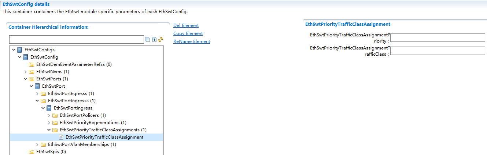

.. centered:: **表 EthSwtPriorityTrafficClassAssignment (Table EthSwtPriorityTrafficClassAssignment)**

.. list-table::
   :widths: 20 20 20 20 20
   :header-rows: 1

   * - UI名称 (UI Name)
     - 描述 (Description)
     - 
     - 
     - 
   * - EthSwtPriorityTrafficClassAssignmentPriority
     - 取值范围 (Range)
     - 0 ..7
     - 默认取值 (Default value)
     - 无
   * - 
     - 参数描述 (Parameter Description)
     - Message priority.
     - 
     - 
   * - 
     - 依赖关系 (Dependencies)
     - 无
     - 
     - 
   * - EthSwtPriorityTrafficClassAssignmentTrafficClass
     - 取值范围 (Range)
     - 0 ..7
     - 默认取值 (Default value)
     - 无
   * - 
     - 参数描述 (Parameter Description)
     - Traffic Class value.
     - 
     - 
   * - 
     - 依赖关系 (Dependencies)
     - 无
     - 
     - 

EthSwtPortVlanMembership
========================================

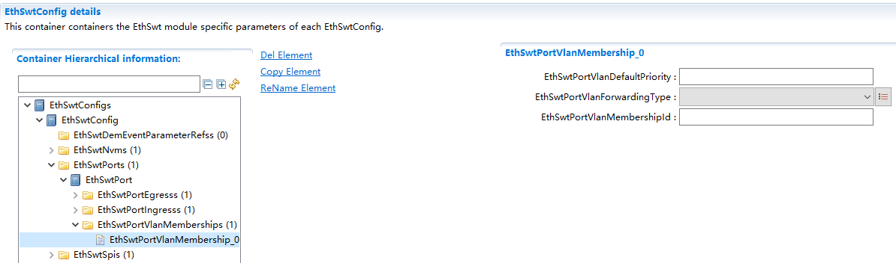

.. centered:: **表 EthSwtVlanMembership (Table EthSwtVlanMembership)**

.. list-table::
   :widths: 20 20 20 20 20
   :header-rows: 1

   * - UI名称 (UI Name)
     - 描述 (Description)
     - 
     - 
     - 
   * - EthSwtPortVlanDefaultPriority
     - 取值范围 (Range)
     - 0..7
     - 默认取值 (Default value)
     - 无
   * - 
     - 参数描述 (Parameter Description)
     - Determines thestandardoutput-priorityoutgoing messages willbe tagged with.
     - 
     - 
   * - 
     - 依赖关系 (Dependencies)
     - 无
     - 
     - 
   * - EthSwtPortVlanForwardingType
     - 取值范围 (Range)
     - ETHSWT_NOT_SENTETHSWT_SENT_TAGGEDETHSWT_SENT_UNTAGGED
     - 默认取值 (Default value)
     - 无
   * - 
     - 参数描述 (Parameter Description)
     - Defines how themessage with aspecific VLAN Id shallbe handled.
     - 
     - 
   * - 
     - 依赖关系 (Dependencies)
     - 无
     - 
     - 
   * - EthSwtPortVlanMembershipId
     - 取值范围 (Range)
     - 0..4094
     - 默认取值 (Default value)
     - 无
   * - 
     - 参数描述 (Parameter Description)
     - Determines the VID ofthe virtual networkthis port belongs to.
     - 
     - 
   * - 
     - 依赖关系 (Dependencies)
     - 无
     - 
     - 

EthSwtSpi
-------------------------

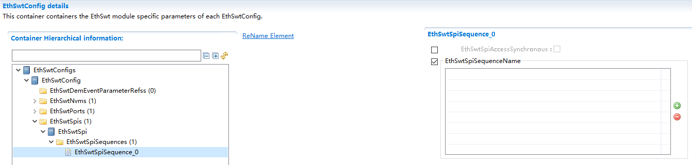

.. centered:: **表 EthSwtVlanMembership (Table EthSwtVlanMembership)**

.. list-table::
   :widths: 20 20 20 20 20
   :header-rows: 1

   * - UI名称 (UI Name)
     - 描述 (Description)
     - 
     - 
     - 
   * - EthSwtSpiAccessSynchronous
     - 取值范围 (Range)
     - true/false
     - 默认取值 (Default value)
     - 无
   * - 
     - 参数描述 (Parameter Description)
     - This parameter is usedto define whether theaccess to the Spisequence issynchronous orasynchronous.
     - 
     - 
   * - 
     - 依赖关系 (Dependencies)
     - 无
     - 
     - 
   * - EthSwtSpiSequenceName
     - 取值范围 (Range)
     - Ref
     - 默认取值 (Default value)
     - 无
   * - 
     - 参数描述 (Parameter Description)
     - Reference to a Spisequence configurationcontainer.
     - 
     - 
   * - 
     - 依赖关系 (Dependencies)
     - 无
     - 
     - 
