EthTSyn
#################################

:strong:`缩写词注解 (Abbreviation Notes):`

.. list-table::
   :widths: 34 33 33
   :header-rows: 1

   * - 缩写词 (Abbreviation)
     - 解释/描述 (Explanation/Description)
     - 中文解释 (Chinese explanation)
   * - StbM
     - SynchronizedTimeBaseManager
     - 同步时基管理 (Synchronization Timing Management)
   * - <Bus>TSyn
     - A bus specific TimeSynchronization Providermodule
     - 总线特定的时间同步提供程序模块 (Bus-specific time synchronization provider module)
   * - CAN
     - Controller Area Network
     - 控制器区域网络 (Controller Area Network)
   * - ETH
     - Ethernet
     - 以太网 (Ethernet)
   * - CanTSyn
     - Time SynchronizationProvider module for CAN
     - CAN提供的时间同步程序模块 (The CAN-provided time synchronization program module)
   * - EthTSyn
     - Time SynchronizationProvider module for Ethernet
     - Eth提供的时间同步程序模块 (The Eth module for time synchronization)

简介 (Introduction)
=================================

EthTSyn在AutoSAR中软件层级架构如下图，其属于时间同步栈。

EthTSyn in AutoSAR has a software hierarchy as shown below, and it belongs to the time synchronization stack.

.. figure:: ../../_static/参考手册(Module_Reference_Manual)/EthTSyn/image1.png
   :alt: EthTSyn在AutoSar中软件架构图 (EthTSyn in AutoSar Software Architecture Diagram)
   :name: EthTSyn在AutoSar中软件架构图 (EthTSyn in AutoSar Software Architecture Diagram)
   :align: center

本文中描述EthTSyn，StbM负责管理时间域，给CanTSyn,EthTSyn提供接口用来更新同步时间，给其他用户提供接口用来获取/通知同步时间。

This article describes EthTSyn, where StbM is responsible for managing the time domain and providing interfaces to CanTSyn and EthTSyn for updating synchronization time, as well as interfaces to other users for obtaining/notifying synchronization time.

EthTSyn负责以太网总线的时间同步相关报文发送/算法。

EthTSyn is responsible for the transmission/algorithms related to time synchronization over Ethernet bus.

参考资料 (Reference materials)
------------------------------------------

[1] AUTOSAR_SWS_SynchronizedTimeBaseManager.pdf，R19-11

[2] AUTOSAR_EXP_LayeredSoftwareArchitecture.pdf，R19-11

[3] AUTOSAR_SWS_TimeSyncOverEthernet.pdf，R19-11

[4] AUTOSAR_PRS_TimeSyncProtocol.pdf, R19-11

功能描述 (Function Description)
===========================================

EthTSyn功能 (EthTSyn Function)
--------------------------------------------

EthTSyn功能介绍 (Function Introduction of EthTSyn)
==============================================================

EthTSyn模块负责确保以太网同步时间信息的采集和分发。它与StbM交互，并为StbM提供所有特定于以太网的功能。

The EthTSyn module is responsible for ensuring the collection and distribution of Ethernet synchronization time information. It interacts with StbM and provides all Ethernet-specific functionalities to StbM.

EthTSyn主要功能包括测量以太网消息之间的延迟和不同时基之前的时间同步。

The main functions of EthTSyn include measuring the delay between Ethernet messages and performing time synchronization across different time bases.

EthTSyn的主要功能包括测量以太网消息之间的延迟和不同时基之前的時間同步。

The main functions of EthTSyn include measuring the delay between Ethernet messages and synchronizing time between different time bases.

EthTSyn功能实现 (EthTSyn Function Implementation)
=============================================================

关于延迟的测量，EthTSyn使用的是GPTP的延迟测量方法，即

For the measurement of latency, EthTSyn uses the GPTP delay measurement method, which

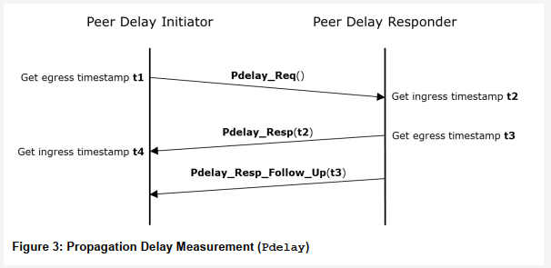

最终延迟值为(t4-t1-(t3-t2))/2。

The final delay value is (t4 - t1 - (t3 - t2)) / 2.

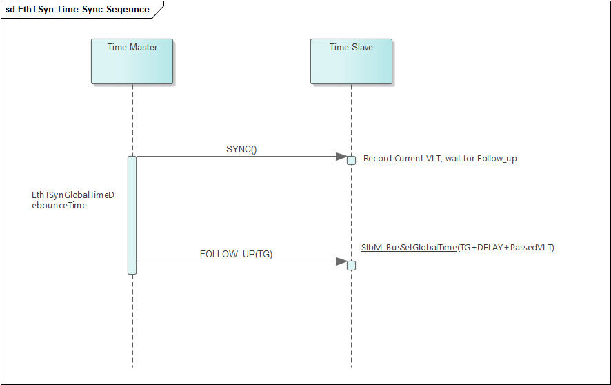

而时间同步功能则是EthTSyn应该以配置的频率发送SYNC消息，再根据配置的时间间隔发送带有sync发送时间的Follow_Up消息，最后再根据时间值和延迟测量计算出的结果得出正确的时间传给StbM。其中SYNC和Follow_Up的消息有IEEE 802.1和AUTOSAR专用的两种格式，需要根据配置来决定消息的格式。

And the time synchronization function should have EthTSyn send SYNC messages at the configured frequency, followed by Follow_Up messages with sync send times according to the configured interval, and finally derive the correct time for StbM based on time values and delay measurements. Among them, SYNC and Follow_Up messages have two formats specifically for IEEE 802.1 and AUTOSAR; the message format needs to be determined according to configuration.

EthTSyn功能限制 (Ethernet TSyn Function Limitations)
================================================================

根据[3]以及结合自身实现情况，EthTSyn以下功能存在限制：

According to [3] and based on actual implementation, EthTSyn has the following limitations:

1. 不支持BMCA协议

Does Not Support BMCA Protocol

2. 不支持Announce和Signaling报文。

Does not support Announce and Signaling messages.

3. Pdelay_Req报文的接收不作为开始发送Sync报文的前提条件。

The reception of Pdelay_Req messages is not a prerequisite for beginning to send Sync messages.

4. Rate Correction在IEEE中原先由Pdelay机制负责计算，Autosar中规定该值的计算发生在StbM中（当从节点接收到时间同步报文并向StbM设置多次时间后），因此EthTSyn自身没有获取该值的能力。当填写cumulativeScaledRateOffset字段时，EthTSyn提供了EthTSynCumulativeScaledRateOffset配置项，从而其作为主节点发送时能够使用配置值进行发送，作为主节点接收时则不予处理。

Rate Correction was originally calculated by the Pdelay mechanism in IEEE, and in Autosar, this value is specified to be computed in StbM (when a slave node receives a timing synchronization message and sets it multiple times in StbM). Therefore, EthTSyn itself does not have the ability to obtain this value. When filling the cumulativeScaledRateOffset field, EthTSyn provides the EthTSynCumulativeScaledRateOffset configuration item so that as a master node, it can use the configured value for sending; however, when receiving as a master node, it will not process it.

5. Rate Correction在StbM中属于纯软件算法，不涉及修正硬件。

Rate Correction in StbM is a pure software algorithm and does not involve hardware correction.

6. 不支持Time Validation或Time Measurement相关功能

Does not support Time Validation or Time Measurement related functions

7. 不支持Switch相关功能

Does not support Switch-related features

8. EthTSyn自身不维护硬件时钟，均由StbM进行维护。

EthTSyn itself does not maintain the hardware clock, which is maintained by StbM.

源文件描述 (Source file description)
===============================================

.. centered:: **表 EthTSyn组件文件描述 (Table EthTSyn Component File Description)**

.. list-table::
   :widths: 50 50
   :header-rows: 1

   * - 文件 (Files)
     - 说明 (Description)
   * - EthTSyn.c
     - EthTSyn模块源文件，包含了API函数的实现。 (Source files for the EthTSyn module contain the implementation of API functions.)
   * - EthTSyn.h
     - EthTSyn模块头文件，包含了API函数的声明。 (Header file of EthTSyn module, contains declarations of API functions.)
   * - EthTSyn_Cfg.h
     - 定义EthTSyn模块预编译时用到的配置参数。 (Define configuration parameters for the EthTSyn module during pre-compilation.)
   * - EthTSyn_Cfg.c
     - EthTSyn模块配置生成文件。 (EthTSyn module configuration generation file.)
   * - EthTSyn_Types.h
     - 用于定义配置类型、内部类型和外部类型的数据结构。 (Data structures used to define configuration types, internal types, and external types.)
   * - EthTSyn_MemMap.h
     - EthTSyn模块头文件，包含了存储器地址映射关系的实现。 (The EthTSyn module header file contains the implementation of memory address mapping relationships.)

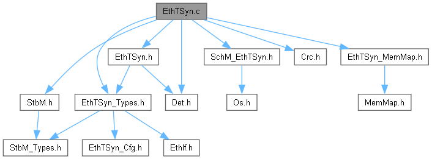

API接口 (API Interface)
=====================================

类型定义 (Type definition)
--------------------------------------

EthTSyn_ConfigType类型定义 (EthTSyn_ConfigType Configuration Type)
==============================================================================

.. list-table::
   :widths: 50 50
   :header-rows: 1

   * - 名称 (Name)
     - EthTSyn_ConfigType
   * - 类型 (Type)
     - Structure
   * - 范围 (Range)
     - --
   * - 描述 (Description)
     - 模块的配置类型 (The configuration type of the module)

EthTSyn_TransmissionModeType类型定义 (EthTSyn_TransmissionModeType type definition)
===============================================================================================

.. list-table::
   :widths: 50 50
   :header-rows: 1

   * - 名称 (Name)
     - EthTSyn_TransmissionModeType
   * - 类型 (Type)
     - Enumeration
   * - 范围 (Range)
     - ETHTSYN_TX_OFF
   * - 
     - ETHTSYN_TX_ON
   * - 描述 (Description)
     - 传输类型 (Transmission type)

输入函数描述 (Describe the input function:)
-----------------------------------------------------

.. list-table::
   :widths: 50 50
   :header-rows: 1

   * - 输入模块 (Input Module)
     - API
   * - EthIf
     - EthIf_EnableEgressTimeStamp
   * - 
     - EthIf_GetCurrentTime
   * - 
     - EthIf_GetEgressTimeStamp
   * - 
     - EthIf_GetIngressTimeStamp
   * - 
     - EthIf_ProvideTxBuffer
   * - 
     - EthIf_Transmit
   * - StbM
     - StbM_BusGetCurrentTime
   * - 
     - StbM_BusSetGlobalTime
   * - 
     - StbM_GetCurrentVirtualLocalTime
   * - 
     - StbM_GetTimeBaseUpdateCounter
   * - 
     - StbM_GetTimeBaseStatus
   * - 
     - StbM_GetOffset
   * - Det
     - Det_ReportError
   * - 
     - Det_ReportRuntimeError
   * - Crc
     - Crc_CalculateCRC8H2F

静态接口函数定义 (Static interface function definition)
---------------------------------------------------------------

EthTSyn_Init函数定义 (The function definition for EthTSyn_Init)
===========================================================================

.. list-table::
   :widths: 25 25 25 25
   :header-rows: 1

   * - 函数名称： (Function Name:)
     - EthTSyn_Init
     - 
     - 
   * - 函数原型： (Function prototype:)
     - voidEthTSyn_Init(
     - 
     - 
   * - 
     - constEthTSyn_ConfigType\*configPtr
     - 
     - 
   * - 
     - )
     - 
     - 
   * - 服务编号： (Service Number:)
     - 0x01
     - 
     - 
   * - 同步/异步： (Synchronous/asynchronous:)
     - 同步 (Sync)
     - 
     - 
   * - 是否可重入： (Is Reentrant:)
     - 否 (No)
     - 
     - 
   * - 输入参数： (Input parameters:)
     - configPtr
     - 值域： (Domain:)
     - 配置结构体指针 (Configure structure pointer)
   * - 输入输出参数： (Input Output Parameters:)
     - 无
     - 
     - 
   * - 输出参数： (Output Parameters:)
     - 无
     - 
     - 
   * - 返回值： (Return Value:)
     - void
     - 
     - 
   * - 功能概述： (Function Overview:)
     - 初始化EthTSyn模块 (Initialize EthTSyn module)
     - 
     - 

EthTSyn_GetVersionInfo函数定义 (The function definition for EthTSyn_GetVersionInfo)
===============================================================================================

.. list-table::
   :widths: 25 25 25 25
   :header-rows: 1

   * - 函数名称： (Function Name:)
     - EthTSyn_GetVersionInfo
     - 
     - 
   * - 函数原型： (Function prototype:)
     - voidEthTSyn_GetVersionInfo(
     - 
     - 
   * - 
     - Std_VersionInfoType\*versioninfo
     - 
     - 
   * - 
     - )
     - 
     - 
   * - 服务编号： (Service Number:)
     - 0x02
     - 
     - 
   * - 同步/异步： (Synchronous/asynchronous:)
     - 同步 (Sync)
     - 
     - 
   * - 是否可重入： (Is Reentrant:)
     - 否 (No)
     - 
     - 
   * - 输入参数： (Input parameters:)
     - 无
     - 
     - 
   * - 输入输出参数： (Input Output Parameters:)
     - 
     - 
     - 
   * - 输出参数： (Output Parameters:)
     - versioninfo
     - 值域： (Domain:)
     - 接收版本信息的指针 (Pointer for receiving version information)
   * - 返回值： (Return Value:)
     - void
     - 
     - 
   * - 功能概述： (Function Overview:)
     - 返回该模块的版本信息 (Return version information of this module)
     - 
     - 

EthTSyn_SetTransmissionMode函数定义 (The EthTSyn_SetTransmissionMode function definition)
=====================================================================================================

.. list-table::
   :widths: 25 25 25 25
   :header-rows: 1

   * - 函数名称： (Function Name:)
     - EthTSyn_SetTransmissionMode
     - 
     - 
   * - 函数原型： (Function prototype:)
     - voidEthTSyn_SetTransmissionMode(
     - 
     - 
   * - 
     - uint8 CtrlIdx,
     - 
     - 
   * - 
     - EthTSyn_TransmissionModeTypeMode
     - 
     - 
   * - 
     - )
     - 
     - 
   * - 服务编号： (Service Number:)
     - 0x05
     - 
     - 
   * - 同步/异步： (Synchronous/asynchronous:)
     - 同步 (Sync)
     - 
     - 
   * - 是否可重入： (Is Reentrant:)
     - 否 (No)
     - 
     - 
   * - 输入参数： (Input parameters:)
     - CtrlIdx
     - 值域： (Domain:)
     - 以太网控制器索引 (Ethernet controller index)
   * - 
     - Mode
     - 值域： (Domain:)
     - ETHTSYN_TX_OFFETHTSYN_TX_ON
   * - 输入输出参数： (Input Output Parameters:)
     - 无
     - 
     - 
   * - 输出参数： (Output Parameters:)
     - 无
     - 
     - 
   * - 返回值： (Return Value:)
     - void
     - 
     - 
   * - 功能概述： (Function Overview:)
     - 打开和关闭EthTSyn的TX功能 (Enable and Disable the TX Function of EthTSyn)
     - 
     - 

EthTSyn_RxIndication函数定义 (The EthTSyn_RxIndication function definition)
=======================================================================================

.. list-table::
   :widths: 25 25 25 25
   :header-rows: 1

   * - 函数名称： (Function Name:)
     - EthTSyn_RxIndication
     - 
     - 
   * - 函数原型： (Function prototype:)
     - voidEthTSyn_RxIndication(
     - 
     - 
   * - 
     - uint8 CtrlIdx,
     - 
     - 
   * - 
     - Eth_FrameTypeFrameType,
     - 
     - 
   * - 
     - booleanIsBroadcast,
     - 
     - 
   * - 
     - const uint8\*PhysAddrPtr,
     - 
     - 
   * - 
     - const uint8\*DataPtr,
     - 
     - 
   * - 
     - uint16 LenByte
     - 
     - 
   * - 
     - )
     - 
     - 
   * - 服务编号： (Service Number:)
     - 0x06
     - 
     - 
   * - 同步/异步： (Synchronous/asynchronous:)
     - 同步 (Sync)
     - 
     - 
   * - 是否可重入： (Is Reentrant:)
     - 否 (No)
     - 
     - 
   * - 输入参数： (Input parameters:)
     - CtrlIdx
     - 值域： (Domain:)
     - 以太网控制器索引 (Ethernet controller index)
   * - 
     - FrameType
     - 值域： (Domain:)
     - 接收到的以太网帧类型 (Received Ethernet frame type)
   * - 
     - IsBroadcast
     - 值域： (Domain:)
     - 是否是广播帧 (Is it a broadcast frame?)
   * - 
     - PhysAddrPtr
     - 值域： (Domain:)
     - 以太网帧的源MAC地址的指针 (Pointer to the source MAC address of an Ethernet frame)
   * - 
     - DataPtr
     - 值域： (Domain:)
     - 数据域的指针 (Pointer to the data domain)
   * - 
     - LenByte
     - 值域： (Domain:)
     - 数据域的长度 (The length of the data domain)
   * - 输入输出参数： (Input Output Parameters:)
     - 无
     - 
     - 
   * - 输出参数： (Output Parameters:)
     - 无
     - 
     - 
   * - 返回值： (Return Value:)
     - void
     - 
     - 
   * - 功能概述： (Function Overview:)
     - 接收消息 (Receive message)
     - 
     - 

EthTSyn_TxConfirmation函数定义 (The EthTSyn_TxConfirmation function definition)
===========================================================================================

.. list-table::
   :widths: 25 25 25 25
   :header-rows: 1

   * - 函数名称： (Function Name:)
     - EthTSyn_TxConfirmation
     - 
     - 
   * - 函数原型： (Function prototype:)
     - voidEthTSyn_TxConfirmation(
     - 
     - 
   * - 
     - uint8 CtrlIdx,
     - 
     - 
   * - 
     - Eth_BufIdxTypeBufIdx,
     - 
     - 
   * - 
     - Std_ReturnTypeResult
     - 
     - 
   * - 
     - )
     - 
     - 
   * - 服务编号： (Service Number:)
     - 0x07
     - 
     - 
   * - 同步/异步： (Synchronous/asynchronous:)
     - 同步 (Sync)
     - 
     - 
   * - 是否可重入： (Is Reentrant:)
     - 否 (No)
     - 
     - 
   * - 输入参数： (Input parameters:)
     - CtrlIdx
     - 值域： (Domain:)
     - 以太网控制器索引 (Ethernet controller index)
   * - 
     - BufIdx
     - 值域： (Domain:)
     - 以太网缓冲区的索引 (Ethernet buffer index)
   * - 
     - Result
     - 值域： (Domain:)
     - E_OK 发送成功 (E_OK Sent successfully)
   * - 
     - 
     - 
     - E_NOT_OK 发送失败 (E_NOT_OK Failed to send)
   * - 输入输出参数： (Input Output Parameters:)
     - 无
     - 
     - 
   * - 输出参数： (Output Parameters:)
     - 无
     - 
     - 
   * - 返回值： (Return Value:)
     - void
     - 
     - 
   * - 功能概述： (Function Overview:)
     - 确认消息传输 (Confirm message transmission)
     - 
     - 

EthTSyn_TrcvLinkStateChg函数定义 (The EthTSyn_TrcvLinkStateChg function definition)
===============================================================================================

.. list-table::
   :widths: 25 25 25 25
   :header-rows: 1

   * - 函数名称： (Function Name:)
     - EthTSyn_TrcvLinkStateChg
     - 
     - 
   * - 函数原型： (Function prototype:)
     - Std_ReturnTypeEthTSyn_TrcvLinkStateChg(
     - 
     - 
   * - 
     - uint8CtrlIdx,
     - 
     - 
   * - 
     - EthTrcv_LinkStateTypeTrcvLinkState
     - 
     - 
   * - 
     - )
     - 
     - 
   * - 服务编号： (Service Number:)
     - 0x08
     - 
     - 
   * - 同步/异步： (Synchronous/asynchronous:)
     - 同步 (Sync)
     - 
     - 
   * - 是否可重入： (Is Reentrant:)
     - 否 (No)
     - 
     - 
   * - 输入参数： (Input parameters:)
     - CtrlIdx
     - 值域： (Domain:)
     - 以太网控制器索引 (Ethernet controller index)
   * - 
     - TrcvLinkState
     - 值域： (Domain:)
     - ETHTRCV_LINK_STATE_DOWNETHTRCV_LINK_STATE_ACTIVE
   * - 输入输出参数： (Input Output Parameters:)
     - 无
     - 
     - 
   * - 输出参数： (Output Parameters:)
     - 无
     - 
     - 
   * - 返回值： (Return Value:)
     - E_OK 成功 (E_OK Success)
     - 
     - 
   * - 
     - E_NOT_OK失败 (E_NOT_OK Failure)
     - 
     - 
   * - 功能概述： (Function Overview:)
     - 重新设置状态机 (Reset State Machine)
     - 
     - 

EthTSyn_MainFunction函数定义 (EthTSyn_MainFunction function definition)
===================================================================================

.. list-table::
   :widths: 50 50
   :header-rows: 1

   * - 函数名称： (Function Name:)
     - EthTSyn_MainFunction
   * - 函数原型： (Function prototype:)
     - void EthTSyn_MainFunction(
   * - 
     - void
   * - 
     - )
   * - 服务编号： (Service Number:)
     - 0x09
   * - 功能概述： (Function Overview:)
     - 循环调用函数 (Recursive function call)

可配置函数定义 (Configurable Function Definition)
----------------------------------------------------------

无。

None.

配置 (Configure)
==============================

配置列表 (Configuration List)
----------------------------------------------------------

.. centered:: **表 属性描述 (Table 5-1 Property Description)**

.. list-table::
   :widths: 50 50
   :header-rows: 1

   * - UI名称 (UI Name)
     - 该配置项在配置工具界面显示的名称 (The name of this configuration item as displayed in the configuration tool interface)
   * - 取值范围 (Range)
     - 该配置项允许的取值区间 (The configurable item allows value ranges.)
   * - 默认取值 (Default value)
     - 该配置项默认的配置值 (The default configuration value for this option)
   * - 参数描述 (Parameter Description)
     - 该配置项在标准的AUTOSAR_EcucParamDef.arxml文件中的描述 (This configuration item's description in the standard AUTOSAR_EcucParamDef.arxml file.)
   * - 依赖关系 (Dependencies)
     - 该配置项与其他模块或配置项的关系 (The configuration item's relationship with other modules or configuration items)

EthTSynGeneral
------------------------------

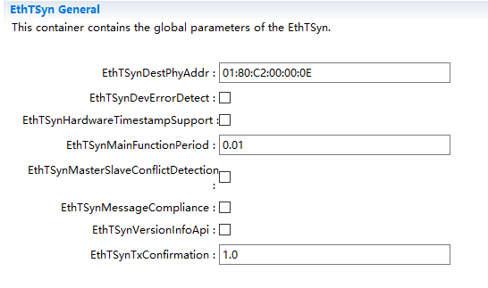

.. centered:: **表 EthTSynGeneral配置描述 (Table EthTSynGeneral Configuration Description)**

.. list-table::
   :widths: 20 20 20 20 20
   :header-rows: 1

   * - UI名称 (UI Name)
     - 描述 (Description)
     - 
     - 
     - 
   * - EthTSynDestPhyAddr
     - 取值范围 (Range)
     - 无
     - 默认取值 (Default value)
     - 01:80:C2:00:00:0E
   * - 
     - 参数描述 (Parameter Description)
     - EthTSynGPTP帧的目标物理硬件地址(MAC地址).
     - 
     - 
   * - 
     - 
     - 输入格式必须匹配十六进制xx:xx:xx:xx:xx:xx。 (The input format must match hexadecimal xx:xx:xx:xx:xx:xx.)
     - 
     - 
   * - 
     - 依赖关系 (Dependencies)
     - 无
     - 
     - 
   * - EthTSynDevErrorDetect
     - 取值范围 (Range)
     - True、False
     - 默认取值 (Default value)
     - False
   * - 
     - 参数描述 (Parameter Description)
     - 开关开发错误的检测和通知。 (Error detection and notification for switch development.)
     - 
     - 
   * - 
     - 依赖关系 (Dependencies)
     - 无
     - 
     - 
   * - EthTSynHardwareTimestampSupport
     - 取值范围 (Range)
     - True、False
     - 默认取值 (Default value)
     - 无
   * - 
     - 参数描述 (Parameter Description)
     - 开关以太网硬件的硬件时间戳功能。 (Enable hardware timestamping for Ethernet hardware.)
     - 
     - 
   * - 
     - 依赖关系 (Dependencies)
     - 无
     - 
     - 
   * - EthTSynMainFunctionPeriod
     - 取值范围 (Range)
     - 0 .. INF
     - 默认取值 (Default value)
     - 无
   * - 
     - 参数描述 (Parameter Description)
     - EthTSyn_MainFunction主函数调用周期。单位：秒。 (EthTSyn_MainFunction Main function call period. Unit: seconds.)
     - 
     - 
   * - 
     - 依赖关系 (Dependencies)
     - 无
     - 
     - 
   * - EthTSynMasterSlaveConflictDetection
     - 取值范围 (Range)
     - True、False
     - 默认取值 (Default value)
     - false
   * - 
     - 参数描述 (Parameter Description)
     - 开关主从冲突的检测和通知。 (Detection and notification of master-slave conflict.)
     - 
     - 
   * - 
     - 依赖关系 (Dependencies)
     - 无
     - 
     - 
   * - EthTSynMessageCompliance
     - 取值范围 (Range)
     - True、False
     - 默认取值 (Default value)
     - 无
   * - 
     - 参数描述 (Parameter Description)
     - True: 使用IEEE802.1AS的信息格式。 (True: Use the information format of IEEE802.1AS.)
     - 
     - 
   * - 
     - 
     - False: 使用IEEE802.1AS的信息格式加上AUTOSAR的扩展。 (False: Use IEEE802.1AS information format with AUTOSAR extensions.)
     - 
     - 
   * - 
     - 依赖关系 (Dependencies)
     - 无
     - 
     - 
   * - EthTSynVersionInfoApi
     - 取值范围 (Range)
     - True、False
     - 默认取值 (Default value)
     - false
   * - 
     - 参数描述 (Parameter Description)
     - 开关获取版本信息的接口。 (Interface for obtaining version information.)
     - 
     - 
   * - 
     - 依赖关系 (Dependencies)
     - 无
     - 
     - 
   * - EthTSynTxConfirmation
     - 取值范围 (Range)
     - 0..INF
     - 默认取值 (Default value)
     - 0
   * - 
     - 参数描述 (Parameter Description)
     - 等待发送确认的超时时间。单位：秒。 (Timeout for sending confirmation. Unit: seconds.)
     - 
     - 
   * - 
     - 依赖关系 (Dependencies)
     - 无
     - 
     - 

EthTSynGlobalTimeDomain
---------------------------------------

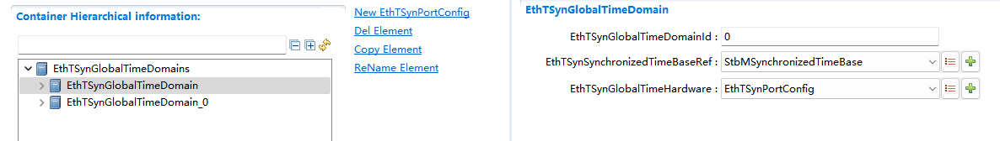

.. centered:: **表 EthTSynGlobalTimeDomain配置描述 (Table EthTSynGlobalTimeDomain Configuration Description)**

.. list-table::
   :widths: 20 20 20 20 20
   :header-rows: 1

   * - UI名称 (UI Name)
     - 描述 (Description)
     - 
     - 
     - 
   * - EthTSynGlobalTimeDomainId
     - 取值范围 (Range)
     - 0 .. 31
     - 默认取值 (Default value)
     - 无
   * - 
     - 参数描述 (Parameter Description)
     - 全局时间域ID。 (Global time-domain ID.)
     - 
     - 
   * - 
     - 依赖关系 (Dependencies)
     - 无
     - 
     - 
   * - EthTSynSynchronizedTimeBaseRef
     - 取值范围 (Range)
     - reference
     - 默认取值 (Default value)
     - 无
   * - 
     - 参数描述 (Parameter Description)
     - 必要的对时间基的引用。 (Reference to time-base is necessary.)
     - 
     - 
   * - 
     - 依赖关系 (Dependencies)
     - StbMSynchronizedTimeBase
     - 
     - 
   * - EthTSynSynchronizedTimeBaseRef
     - 取值范围 (Range)
     - reference
     - 默认取值 (Default value)
     - 无
   * - 
     - 参数描述 (Parameter Description)
     - 指定本时间域使用的硬件时钟所属的EthTSynPort。注：只有当StbM的StbMLocalTimeHardware关联了EthTSynGlobalTimeDomain,此项才可配置。 (Specify the EthTSynPort for the hardware clock of this time domain. Note: This can only be configured when StbM's StbMLocalTimeHardware is associated with EthTSynGlobalTimeDomain.)
     - 
     - 
   * - 
     - 依赖关系 (Dependencies)
     - EthTSynPortConfig
     - 
     - 

EthTSynGlobalTimeFollowUpDataIDList
===================================================

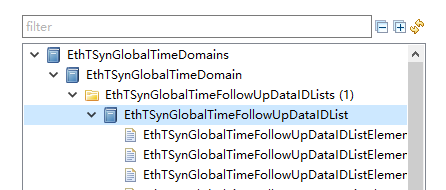

EthTSynGlobalTimeFollowUpDataIDListElement
----------------------------------------------------------

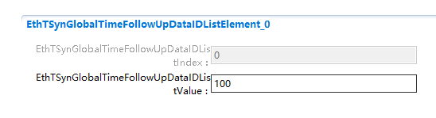

.. centered:: **表 EthTSynGlobalTimeFollowUpDataIDListElement配置描述 (Configure Description for EthTSynGlobalTimeFollowUpDataIDListElement)**

.. list-table::
   :widths: 20 20 20 20 20
   :header-rows: 1

   * - UI名称 (UI Name)
     - 描述 (Description)
     - 
     - 
     - 
   * - EthTSynGlobalTimeFollowUpDataIDListIndex
     - 取值范围 (Range)
     - 0..15
     - 默认取值 (Default value)
     - 无
   * - 
     - 参数描述 (Parameter Description)
     - 用于CRC计算和信息校验Follow_Up报文的DataIDList的Index。 (The Index for DataIDList used in CRC Calculation and Information Check of Follow_Up Message.)
     - 
     - 
   * - 
     - 依赖关系 (Dependencies)
     - 不可配，自动根据顺序生成。 (Unmatchable, automatically generated in order.)
     - 
     - 
   * - EthTSynGlobalTimeFollowUpDataIDListValue
     - 取值范围 (Range)
     - 0..255
     - 默认取值 (Default value)
     - 无
   * - 
     - 参数描述 (Parameter Description)
     - 用于CRC计算和信息校验Follow_Up报文的DataIDList的值。 (Values for DataIDList used for CRC calculation and information validation of Follow_Up messages.)
     - 
     - 
   * - 
     - 依赖关系 (Dependencies)
     - 无
     - 
     - 

EthTSynPortConfig
=================================

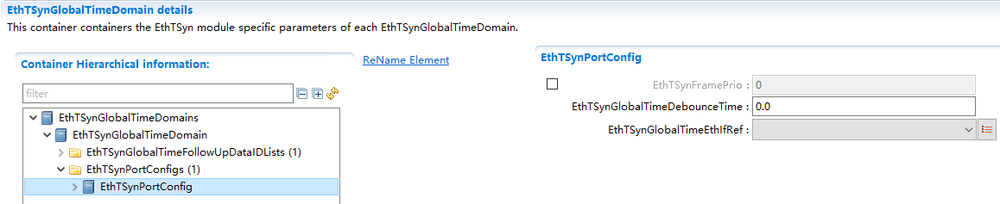

.. centered:: **表 EthTSynPortConfig配置描述 (Table EthTSynPortConfig Configuration Description)**

.. list-table::
   :widths: 20 20 20 20 20
   :header-rows: 1

   * - UI名称 (UI Name)
     - 描述 (Description)
     - 
     - 
     - 
   * - EthTSynFramePrio
     - 取值范围 (Range)
     - 0..7
     - 默认取值 (Default value)
     - 无
   * - 
     - 参数描述 (Parameter Description)
     - 该可选项若存在，则代表通过VLAN（用作3-bitPCPfield）发出的EthTSyn报文的优先级。如该可选项不存在，则帧不存在优先级以及VLANField。 (If this option exists, it indicates the priority of EthTSyn messages sent using VLAN (used as 3-bit PCP field). If this option does not exist, there is no priority and VLAN Field.)
     - 
     - 
   * - 
     - 依赖关系 (Dependencies)
     - 无
     - 
     - 
   * - EthTSynGlobalTimeDebounceTime
     - 取值范围 (Range)
     - 0..4
     - 默认取值 (Default value)
     - 无
   * - 
     - 参数描述 (Parameter Description)
     - 同一组Sync报文和Follow_Up报文的发送间隔时间。单位：秒。 (The interval time for sending the same group of Sync messages and Follow_Up messages. Unit: seconds.)
     - 
     - 
   * - 
     - 依赖关系 (Dependencies)
     - 无
     - 
     - 
   * - EthTSynGlobalTimeEthIfRef
     - 取值范围 (Range)
     - reference
     - 默认取值 (Default value)
     - 无
   * - 
     - 参数描述 (Parameter Description)
     - 对EthIf的引用，用于获取全局时间信息。 (Reference to EthIf for obtaining global time information.)
     - 
     - 
   * - 
     - 依赖关系 (Dependencies)
     - EthIfController
     - 
     - 

EthTSynPdelayConfig
-----------------------------------

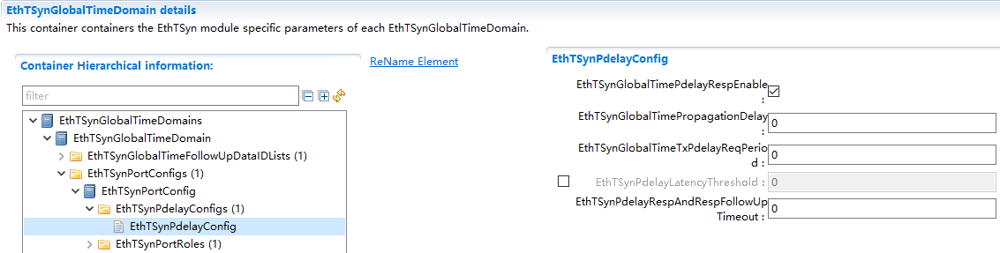

.. centered:: **表 EthTSynPdelayConfig配置描述 (Table EthTSynPdelayConfig Configuration Description)**

.. list-table::
   :widths: 20 20 20 20 20
   :header-rows: 1

   * - UI名称 (UI Name)
     - 描述 (Description)
     - 
     - 
     - 
   * - EthTSynGlobalTimePdelayRespEnable
     - 取值范围 (Range)
     - True、False
     - 默认取值 (Default value)
     - true
   * - 
     - 参数描述 (Parameter Description)
     - 开关 Pdelay_Resp/Pdelay_Resp_Follow_Up报文的发送。 (Sending of Pdelay_Resp/Pdelay_Resp_Follow_Up messages.)
     - 
     - 
   * - 
     - 依赖关系 (Dependencies)
     - 无
     - 
     - 
   * - EthTSynGlobalTimePropagationDelay
     - 取值范围 (Range)
     - 0..4
     - 默认取值 (Default value)
     - 0
   * - 
     - 参数描述 (Parameter Description)
     - 如果开启cyclicpropagationdelaymeasurement，该参数代表propagationdelay的默认值直到第一个实际测量的propagationdelay可用。 (If cyclicpropagationdelaymeasurement is enabled, this parameter represents the default value of propagationdelay until the first actual measurement of propagationdelay is available.)
     - 
     - 
   * - 
     - 
     - 如果关闭cyclicpropagationdelaymeasurement，这个值将代替实际测量的值，变成一个固定值。单位：秒。 (If cyclicpropagationdelaymeasurement is turned off, this value will replace the actual measured value with a fixed one. Units: seconds.)
     - 
     - 
   * - 
     - 依赖关系 (Dependencies)
     - 无
     - 
     - 
   * - EthTSynGlobalTimeTxPdelayReqPeriod
     - 取值范围 (Range)
     - 0..INF
     - 默认取值 (Default value)
     - 无
   * - 
     - 参数描述 (Parameter Description)
     - 发送Pdelay_Req报文的周期时间，取值0代表不发送。单位：秒。 (The period time for sending Pdelay_Req message, with a value of 0 representing no send. Unit: seconds.)
     - 
     - 
   * - 
     - 依赖关系 (Dependencies)
     - 无
     - 
     - 
   * - EthTSynPdelayLatencyThreshold
     - 取值范围 (Range)
     - 0..INF
     - 默认取值 (Default value)
     - 1E-5
   * - 
     - 参数描述 (Parameter Description)
     - 计算出的Pdelay的界限。如果超出该配置值，则该Pdelay应该被舍弃。单位：秒。 (Bounds of the calculated Pdelay. It should be discarded if it exceeds the configured value. Units: seconds.)
     - 
     - 
   * - 
     - 依赖关系 (Dependencies)
     - 无
     - 
     - 
   * - EthTSynPdelayRespAndRespFollowUpTimeout
     - 取值范围 (Range)
     - 0..4
     - 默认取值 (Default value)
     - 无
   * - 
     - 参数描述 (Parameter Description)
     - 发出Pdelay_Req后等待Pdelay_Resp的超时时间，或者收到Pdelay_Resp之后等待Pdelay_Resp_Follow_Up的超时时间。取值0代表不检测超时。单位：秒。 (The timeout duration for waiting for Pdelay_Resp after sending Pdelay_Req, or the timeout duration for waiting for Pdelay_Resp_Follow_Up after receiving Pdelay_Resp. A value of 0 indicates no timeout detection. Unit: seconds.)
     - 
     - 
   * - 
     - 依赖关系 (Dependencies)
     - 无
     - 
     - 

EthTSynPortRole
-------------------------------

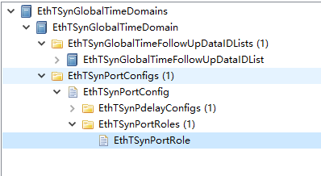

EthTSynGlobalTimeMaster
"""""""""""""""""""""""""""""""""""""""

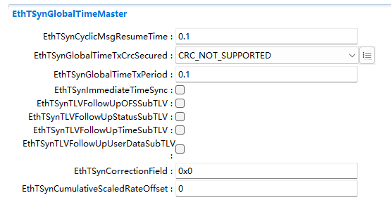

.. centered:: **表 EthTSynGlobalTimeMaster配置描述 (Table EthTSynGlobalTimeMaster Configuration Description)**

.. list-table::
   :widths: 17 17 17 17 16 16
   :header-rows: 1

   * - UI名称 (UI Name)
     - 描述 (Description)
     - 
     - 
     - 
     - 
   * - EthTSynCyclicMsgResumeTime
     - 取值范围 (Range)
     - 0..INF
     - 默认取值 (Default value)
     - 0
     - 
   * - 
     - 参数描述 (Parameter Description)
     - 在立即传输之后，间隔多久发送第一帧常规循环时间同步报文。单位：秒。 (How long after immediate transfer is the first frame of regular cyclic time synchronization message sent. Unit: seconds.)
     - 
     - 
     - 
   * - 
     - 依赖关系 (Dependencies)
     - 无
     - 
     - 
     - 
   * - EthTSynGlobalTimeTxCrcSecured
     - 取值范围 (Range)
     - CRC_SUPPORTED/CRC_NOT_SUPPORTED
     - 默认取值 (Default value)
     - 无
     - 
   * - 
     - 参数描述 (Parameter Description)
     - 发送报文的CRC校验的支持形式。 (Support forms for CRC checksum of sent messages.)
     - 
     - 
     - 
   * - 
     - 依赖关系 (Dependencies)
     - 当其为CRC_SUPPORTED时，则需配置EthTSynGlobalTimeFollowUpDataIDList和EthTSynCrcTimeFlagsTxSecured。 (When it is CRC_SUPPORTED, EthTSynGlobalTimeFollowUpDataIDList and EthTSynCrcTimeFlagsTxSecured need to be configured.)
     - 
     - 
     - 
   * - EthTSynGlobalTimeTxPeriod
     - 取值范围 (Range)
     - 0..INF
     - 默认取值 (Default value)
     - 无
     - 
   * - 
     - 参数描述 (Parameter Description)
     - 时间同步报文循环发送周期。单位：秒。 (Cycle sending period of time synchronization messages. Unit: seconds.)
     - 
     - 
     - 
   * - 
     - 依赖关系 (Dependencies)
     - 无
     - 
     - 
     - 
   * - EthTSynImmediateTimeSync
     - 取值范围 (Range)
     - True、False
     - 默认取值 (Default value)
     - 无
     - 
   * - 
     - 参数描述 (Parameter Description)
     - 开关在EthTSyn_MainFunction()主函数中对StbM_GetTimeBaseUpdateCounter()的周期调用。 (The switch in EthTSyn_MainFunction() calls StbM_GetTimeBaseUpdateCounter() periodically.)
     - 
     - 
     - 
   * - 
     - 依赖关系 (Dependencies)
     - 无
     - 
     - 
     - 
   * - EthTSynTLVFollowUpOFSSubTLV
     - 取值范围 (Range)
     - True、False
     - 默认取值 (Default value)
     - 无
     - 
   * - 
     - 参数描述 (Parameter Description)
     - 是否使用AUTOSARFollow_Up TLVOFS Sub-TLV。 (Is AUTOSAR Follow_Up TLVOFSSub-TLV used?)
     - 
     - 
     - 
   * - 
     - 依赖关系 (Dependencies)
     - 无
     - 
     - 
     - 
   * - EthTSynTLVFollowUpStatusSubTLV
     - 取值范围 (Range)
     - True、False
     - 默认取值 (Default value)
     - 无
     - 
   * - 
     - 参数描述 (Parameter Description)
     - 是否使用AUTOSARFollow_Up TLVStatus Sub-TLV。 (Does AUTOSAR Follow_Up TLVStatus Sub-TLV get used.)
     - 
     - 
     - 
   * - 
     - 依赖关系 (Dependencies)
     - 无
     - 
     - 
     - 
   * - EthTSynTLVFollowUpTimeSubTLV
     - 取值范围 (Range)
     - True、False
     - 默认取值 (Default value)
     - 无
     - 
   * - 
     - 参数描述 (Parameter Description)
     - 是否使用AUTOSARFollow_Up TLVTime Sub-TLV。 (Is AUTOSAR Follow_Up TLVTime Sub-TLV used?)
     - 
     - 
     - 
   * - 
     - 依赖关系 (Dependencies)
     - 无
     - 
     - 
     - 
   * - EthTSynTLVFollowUpUserDataSubTLV
     - 取值范围 (Range)
     - True、False
     - 默认取值 (Default value)
     - 无
     - 
   * - 
     - 参数描述 (Parameter Description)
     - 是否使用AUTOSARFollow_Up TLVUserDataSub-TLV。 (Is AUTOSAR Follow_Up TLV UserData Sub-TLV used?)
     - 
     - 
     - 
   * - 
     - 依赖关系 (Dependencies)
     - 无
     - 
     - 
     - 
   * - EthTSynCorrectionField
     - 取值范围 (Range)
     - 0.
     - 默认取值 (Default value)
     - 
     - 0x0
   * - 
     - 参数描述 (Parameter Description)
     - This representsthecorrectionFieldthat is usedwhentransmittingMessages byMaster. Unit:nanoseconds.
     - 
     - 
     - 
   * - 
     - 依赖关系 (Dependencies)
     - 无
     - 
     - 
     - 
   * - EthTSynCumulativeScaledRateOffset
     - 取值范围 (Range)
     - 0..0xFFFFFFFF
     - 默认取值 (Default value)
     - 
     - 0
   * - 
     - 参数描述 (Parameter Description)
     - This representstheCumulativeScaledRateOffsetthat is usedwhentransmittingMessages byMaster
     - 
     - 
     - 
   * - 
     - 依赖关系 (Dependencies)
     - 无
     - 
     - 
     - 

EthTSynCrcTimeFlagsTxSecured
""""""""""""""""""""""""""""""""""""""""""""

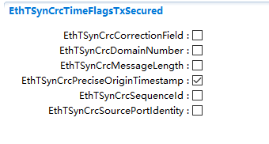

.. centered:: **表 EthTSynCrcTimeFlagsTxSecured配置描述 (Table EthTSynCrcTimeFlagsTxSecured Configuration Description)**

.. list-table::
   :widths: 20 20 20 20 20
   :header-rows: 1

   * - UI名称 (UI Name)
     - 描述 (Description)
     - 
     - 
     - 
   * - EthTSynCrcCorrectionField
     - 取值范围 (Range)
     - True、False
     - 默认取值 (Default value)
     - False
   * - 
     - 参数描述 (Parameter Description)
     - 是否在CRC计算中包括Follow_Up报文中的CorrectionField。 (Is the CorrectionField in Follow_Up messages included in the CRC calculation?)
     - 
     - 
   * - 
     - 依赖关系 (Dependencies)
     - 无
     - 
     - 
   * - EthTSynCrcDomainNumber
     - 取值范围 (Range)
     - True、False
     - 默认取值 (Default value)
     - False
   * - 
     - 参数描述 (Parameter Description)
     - 是否在CRC计算中包括Follow_Up报文中的domainNumber。 (Is the domainNumber included in the CRC calculation of Follow_Up messages?)
     - 
     - 
   * - 
     - 依赖关系 (Dependencies)
     - 无
     - 
     - 
   * - EthTSynCrcMessageLength
     - 取值范围 (Range)
     - True、False
     - 默认取值 (Default value)
     - False
   * - 
     - 参数描述 (Parameter Description)
     - 是否在CRC计算中包括Follow_Up报文中的messageLength。 (Is the messageLength in Follow_Up messages included in the CRC calculation?)
     - 
     - 
   * - 
     - 依赖关系 (Dependencies)
     - 无
     - 
     - 
   * - EthTSynCrcPreciseOriginTimestamp
     - 取值范围 (Range)
     - True、False
     - 默认取值 (Default value)
     - True
   * - 
     - 参数描述 (Parameter Description)
     - 是否在CRC计算中包括Follow_Up报文中的preciseOriginTimestamp。 (Is the preciseOriginTimestamp in the Follow_Up message included in the CRC calculation?)
     - 
     - 
   * - 
     - 依赖关系 (Dependencies)
     - 无
     - 
     - 
   * - EthTSynCrcSequenceId
     - 取值范围 (Range)
     - True、False
     - 默认取值 (Default value)
     - False
   * - 
     - 参数描述 (Parameter Description)
     - 是否在CRC计算中包括Follow_Up报文中的sequenceId。 (Is the sequenceId in Follow_Up messages included in the CRC calculation?)
     - 
     - 
   * - 
     - 依赖关系 (Dependencies)
     - 无
     - 
     - 
   * - EthTSynCrcSourcePortIdentity
     - 取值范围 (Range)
     - True、False
     - 默认取值 (Default value)
     - False
   * - 
     - 参数描述 (Parameter Description)
     - 是否在CRC计算中包括Follow_Up报文中的sourcePortIdentity。 (Is the sourcePortIdentity included in the CRC calculation for Follow_Up messages?)
     - 
     - 
   * - 
     - 依赖关系 (Dependencies)
     - 无
     - 
     - 

EthTSynGlobalTimeSlave
""""""""""""""""""""""""""""""""""""""

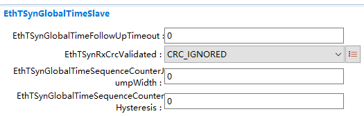

.. centered:: **表 EthTSynGlobalTimeSlave配置描述 (Description of EthTSynGlobalTimeSlave Configuration)**

.. list-table::
   :widths: 17 17 17 17 16 16
   :header-rows: 1

   * - UI名称 (UI Name)
     - 描述 (Description)
     - 
     - 
     - 
     - 
   * - EthTSynGlobalTimeFollowUpTimeout
     - 取值范围 (Range)
     - 0..INF
     - 默认取值 (Default value)
     - 0
     - 
   * - 
     - 参数描述 (Parameter Description)
     - Follow_Up报文的超时时间（收到对应Sync报文之后）。单位：秒。 (Timeout duration for Follow_Up message (after receiving the corresponding Sync message). Units: seconds.)
     - 
     - 
     - 
   * - 
     - 依赖关系 (Dependencies)
     - 无
     - 
     - 
     - 
   * - EthTSynRxCrcValidated
     - 取值范围 (Range)
     - CRC_IGNORED/CRC_NOT_VALIDATED/
     - 默认取值 (Default value)
     - 无
     - 
   * - 
     - 
     - CRC_OPTIONAL/
     - 
     - 
     - 
   * - 
     - 
     - CRC_VALIDATED
     - 
     - 
     - 
   * - 
     - 参数描述 (Parameter Description)
     - 接收报文的CRC校验形式。 (Form of CRC check for received messages.)
     - 
     - 
     - 
   * - 
     - 依赖关系 (Dependencies)
     - 当其为CRC_OPTIONAL或CRC_VALIDATED时，则需配置EthTSynGlobalTimeFollowUpDataIDList和EthTSynCrcFlagsRxValidated。 (When it is CRC_OPTIONAL or CRC_VALIDATED, EthTSynGlobalTimeFollowUpDataIDList and EthTSynCrcFlagsRxValidated need to be configured.)
     - 
     - 
     - 
   * - EthTSynGlobalTimeSequenceCounterJumpWidth
     - 取值范围 (Range)
     - 1..65535
     - 默认取值 (Default value)
     - 
     - 65535
   * - 
     - 参数描述 (Parameter Description)
     - 指定序列计数器在两个连续同步消息之间允许的最大跳转。 (Maximum allowed jump of the designated sequence counter between two consecutive sync messages.)
     - 
     - 
     - 
   * - 
     - 依赖关系 (Dependencies)
     - 无
     - 
     - 
     - 
   * - EthTSynGlobalTimeSequenceCounterHysteresis
     - 取值范围 (Range)
     - 0..15
     - 默认取值 (Default value)
     - 
     - 0
   * - 
     - 参数描述 (Parameter Description)
     - 指定TimeSlave在超时状态下所需的连续有效消息对的数量，直到TimeTuple转发到StbM为止 (Specify the number of consecutive valid message pairs required for TimeSlave to be in timeout state until TimeTuple forwards to StbM)
     - 
     - 
     - 
   * - 
     - 依赖关系 (Dependencies)
     - 无
     - 
     - 
     - 

EthTSynCrcFlagsRxValidated
^^^^^^^^^^^^^^^^^^^^^^^^^^^^^^^^^^^^^^^^^^

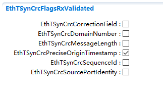

.. centered:: **表 EthTSynCrcFlagsRxValidated配置描述 (Description of the table EthTSynCrcFlagsRxValidated configuration)**

.. list-table::
   :widths: 20 20 20 20 20
   :header-rows: 1

   * - UI名称 (UI Name)
     - 描述 (Description)
     - 
     - 
     - 
   * - EthTSynCrcCorrectionField
     - 取值范围 (Range)
     - True、False
     - 默认取值 (Default value)
     - False
   * - 
     - 参数描述 (Parameter Description)
     - 是否在CRC计算中包括Follow_Up报文中的CorrectionField。 (Is the CorrectionField in Follow_Up messages included in the CRC calculation?)
     - 
     - 
   * - 
     - 依赖关系 (Dependencies)
     - 无
     - 
     - 
   * - EthTSynCrcDomainNumber
     - 取值范围 (Range)
     - True、False
     - 默认取值 (Default value)
     - False
   * - 
     - 参数描述 (Parameter Description)
     - 是否在CRC计算中包括Follow_Up报文中的domainNumber。 (Is the domainNumber included in the CRC calculation of Follow_Up messages?)
     - 
     - 
   * - 
     - 依赖关系 (Dependencies)
     - 无
     - 
     - 
   * - EthTSynCrcMessageLength
     - 取值范围 (Range)
     - True、False
     - 默认取值 (Default value)
     - False
   * - 
     - 参数描述 (Parameter Description)
     - 是否在CRC计算中包括Follow_Up报文中的messageLength。 (Is the messageLength in Follow_Up messages included in the CRC calculation?)
     - 
     - 
   * - 
     - 依赖关系 (Dependencies)
     - 无
     - 
     - 
   * - EthTSynCrcPreciseOriginTimestamp
     - 取值范围 (Range)
     - True、False
     - 默认取值 (Default value)
     - True
   * - 
     - 参数描述 (Parameter Description)
     - 是否在CRC计算中包括Follow_Up报文中的preciseOriginTimestamp。 (Is the preciseOriginTimestamp in the Follow_Up message included in the CRC calculation?)
     - 
     - 
   * - 
     - 依赖关系 (Dependencies)
     - 无
     - 
     - 
   * - EthTSynCrcSequenceId
     - 取值范围 (Range)
     - True、False
     - 默认取值 (Default value)
     - False
   * - 
     - 参数描述 (Parameter Description)
     - 是否在CRC计算中包括Follow_Up报文中的sequenceId。 (Is the sequenceId in Follow_Up messages included in the CRC calculation?)
     - 
     - 
   * - 
     - 依赖关系 (Dependencies)
     - 无
     - 
     - 
   * - EthTSynCrcSourcePortIdentity
     - 取值范围 (Range)
     - True、False
     - 默认取值 (Default value)
     - False
   * - 
     - 参数描述 (Parameter Description)
     - 是否在CRC计算中包括Follow_Up报文中的sourcePortIdentity。 (Is the sourcePortIdentity included in the CRC calculation for Follow_Up messages?)
     - 
     - 
   * - 
     - 依赖关系 (Dependencies)
     - 无
     - 
     - 
