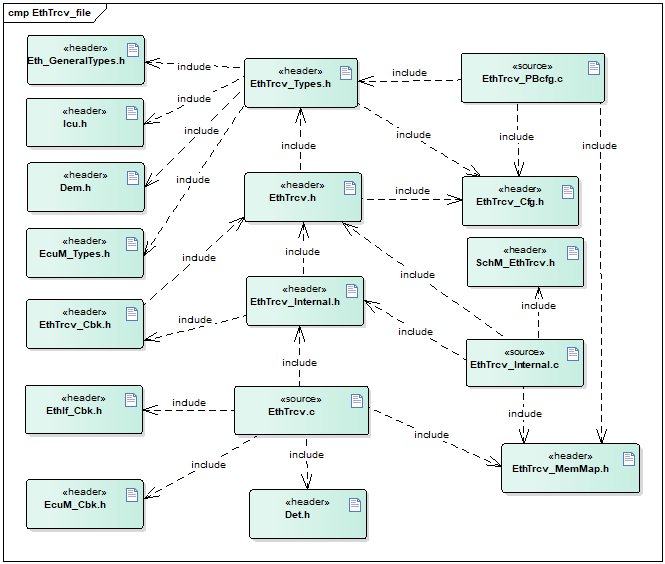
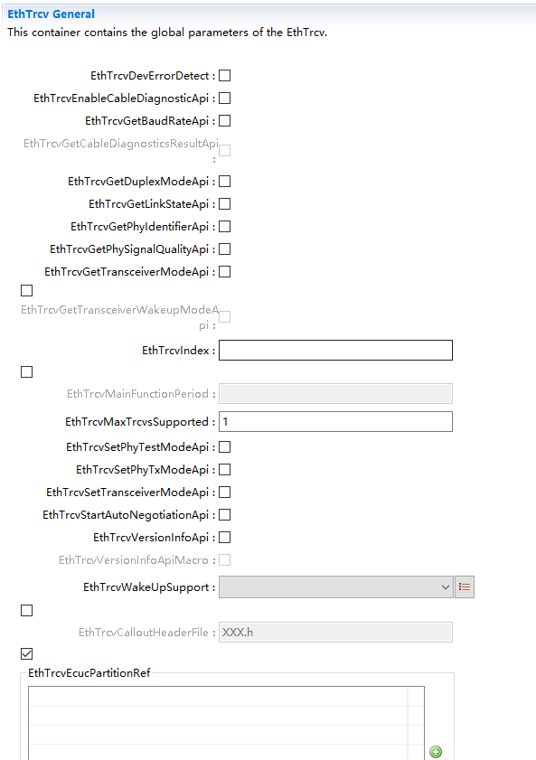
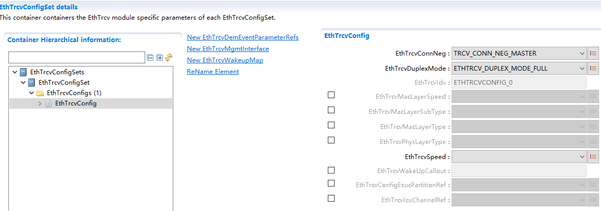
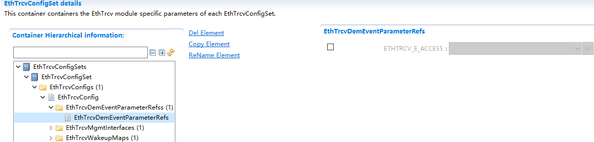
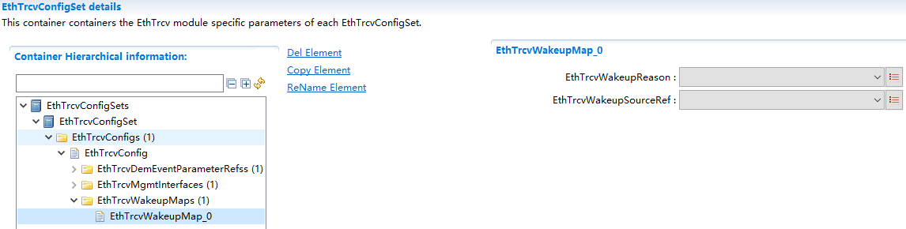
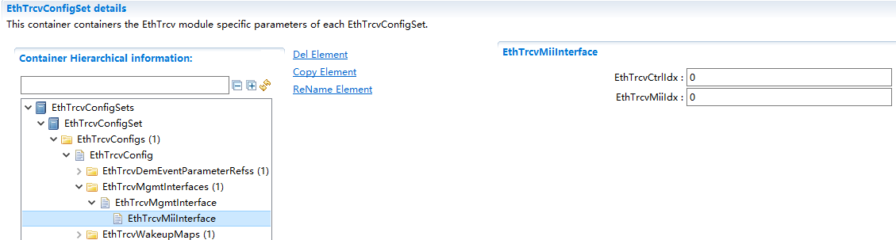
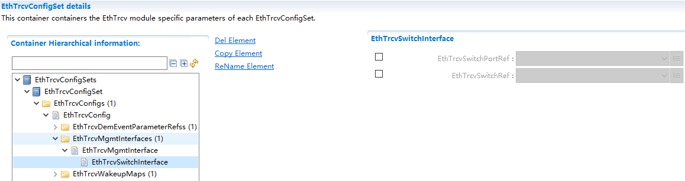

EthTrcv
#################################

:strong:`缩写词注解 (Abbreviation Notes):`

.. list-table::
   :widths: 34 33 33
   :header-rows: 1

   * - 缩写词 (Abbreviation)
     - 解释/描述 (Explanation/Description)
     - 中文解释 (Chinese explanation)
   * - EthTrcv
     - Ethernet TransceiverDriver
     - 以太网收发器驱动模式 (Ethernet Transceiver Driver Mode)
   * - DEM
     - Diagnostic Event Manager
     - 诊断事件处理 (Event processing for diagnosis)
   * - DET
     - Default Error Tracer
     - 默认错误检测 (Default error detection)
   * - EcuM
     - ECU State Manager
     - ECU状态管理模块 (ECU Status Management Module)
   * - Icu
     - input capture unit
     - 输入捕获单元 (Input Capture Unit)
   * - Eth
     - Ethernet Driver
     - 以太网驱动模块 (Ethernet driver module)
   * - EthSwt
     - EthernetSwitchDriver
     - 以太网交换机驱动模块 (Ethernet switch driver module)

简介 (Introduction)
=================================

在AUTOSAR分层软件体系结构中，EthTrcv属于微控制器抽象层，它是一个以太网收发器的驱动模块。EthTrcv模块的主要任务是向上层（以太网接口）提供独立于硬件的接口，因为包括多个相同的收发器，所以对于所有的收发器来说，接口应该统一，这样上层（以太网接口）可以以统一的方式访问底层总线系统。

In the AUTOSAR layered software architecture, EthTrcv belongs to the Microcontroller Abstraction Layer and is a driver module for an Ethernet transceiver. The main task of the EthTrcv module is to provide hardware-independent interfaces to the upper layer (Ethernet interface) because it includes multiple identical transceivers, so the interfaces should be unified for all transceivers, allowing the upper layer (Ethernet interface) to access the underlying bus system in a uniform manner.

.. figure:: ../../_static/参考手册(Module_Reference_Manual)/EthTrcv/image1.png
   :alt: EthTrcv在AUTOSAR中的位置 (The position of EthTrcv in AUTOSAR)
   :name: EthTrcv在AUTOSAR中的位置 (The position of EthTrcv in AUTOSAR)
   :align: center

参考资料 (Reference materials)
------------------------------------------

[1] AUTOSAR_SWS_EthernetTransceiverDriver.pdf，R19-11

[2] AUTOSAR_SWS_ECUStateManager.pdf，R19-11

[3] AUTOSAR_SWS_EthernetInterface.pdf，R19-11

功能描述 (Function Description)
===========================================

模式设置功能 (Mode settings function)
-----------------------------------------------

以设置收发器的状态为例，上层EthIf调用设置收发器状态的API，EthTrcv通过对芯片的寄存器的值进行修改，从而到达修改收发器状态的目的。

For example, when setting the state of a transmitter, the upper-layer EthIf calls the API to set the transmitter's state. EthTrcv achieves this goal by modifying the values of the chip's registers.

唤醒检测功能 (Wake-up Detection Function)
---------------------------------------------------

以太网收发器驱动程序应支持唤醒取决于配置参数 EthTrcvWakeUpSupport 要么根本不支持(ETHTRCV_WAKEUP_NOT_SUPPORTED)或通过中断(ETHTRCV_WAKEUP_BY_INTERRUPT)或通过轮询(ETHTRCV_WAKEUP_BY_POLLING)。

The Ethernet transceiver driver should support wake-up depending on the configuration parameter EthTrcvWakeUpSupport, either not supporting it (ETHTRCV_WAKEUP_NOT_SUPPORTED), or through interrupt (ETHTRCV_WAKEUP_BY_INTERRUPT), or through polling (ETHTRCV_WAKEUP_BY_POLLING).

如果以太网收发器驱动程序检测到唤醒，它会将收发器硬件提供的唤醒原因映射到EcuM 定义的唤醒事件。以太网收发器驱动程序将支持以下场景：

If the Ethernet transceiver driver detects a wake-up, it maps the wake-up causes provided by the transceiver hardware to wake-up events defined by EcuM. The Ethernet transceiver driver will support the following scenarios:

休眠的ECU 和休眠的总线 -> 通过 EthTrcv_Init 唤醒检测（在开机期间调用）

Sleeping ECU and sleeping bus -> Waked up by EthTrcv_Init (called during power-on)

唤醒的ECU 和休眠的总线 -> 通过 EthTrcv_MainFunction 或唤醒中断处理程序唤醒检测（由 EcuM 中的CheckWakeup检查）

Wake-up ECU and sleeping bus -> Detection through EthTrcv_MainFunction or wake-up interrupt handler (checked by CheckWakeup in EcuM)

源文件描述 (Source file description)
===============================================

.. centered:: **表 EthTrcv组件文件描述 (Table EthTrcv Component File Description)**

.. list-table::
   :widths: 50 50
   :header-rows: 1

   * - 文件 (Files)
     - 说明 (Description)
   * - EthTrcv_Cfg.h
     - 用于定义EthTrcv模块预编译时用到的宏。 (Used to define macros for the EthTrcv module during precompiled time.)
   * - EthTrcv_PBcfg.c
     - post-build阶段配置参数源文件，包含各个配置项的定义。 (Configuration parameter source files for the post-build stage, including definitions of various configuration items.)
   * - SchM\_ EthTrcv.h
     - 提供给SchM的头文件，用于公开周期调度函数 (Header files provided for SchM to expose periodic scheduling functions)
   * - EthTrcv_MemMap.h
     - EthTrcv模块函数和变量存储位置定义文件。 (EthTrcv Module Function and Variable Storage Location Definition File.)
   * - EthTrcv.h
     - EthTrcv模块头文件，通过加载该头文件访问EthTrcv公开的函数 (Header file for EthTrcv module, access the publicly available functions in EthTrcv through loading this header file)
   * - EthTrcv.c
     - EthTrcv模块实现源文件，各API实现在该文件中 (The source file implements the EthTrcv module, with all API implementations in this file.)
   * - EthTrcv_Internal.h
     - EthTrcv模块与芯片相关的函数声明及运行时类型定义，内部宏定义头文件。 (EthernetReceive module with chip-related function declarations and runtime type definitions, internal macro definition header file.)
   * - EthTrcv_Internal.c
     - EthTrcv模块与芯片相关的函数定义及运行时变量定义。 (The EthTrcv module defines functions related to the chip and runtime variables.)
   * - EthTrcv_Types.h
     - EthTrcv模块宏定义及数据类型定义。 (EthernetReceive module macros and data types definitions.)
   * - EthTrcv_Cbk.h
     - EthTrcv模块提供给底层(MCAL)调用的函数

API接口 (API Interface)
=====================================

类型定义 (Type definition)
--------------------------------------

EthTrcv_ConfigType类型定义 (EthTrcv_ConfigType type definition)
===========================================================================

.. list-table::
   :widths: 50 50
   :header-rows: 1

   * - 名称 (Name)
     - EthTrcv_ConfigType
   * - 类型 (Type)
     - 结构体 (Structures)
   * - 范围 (Range)
     - 无
   * - 描述 (Description)
     - 用于传递配置数据 (Used for transmitting configuration data)

EthTrcv_LinkStateType类型定义 (EthTrcv_LinkStateType type definition)
=================================================================================

.. list-table::
   :widths: 50 50
   :header-rows: 1

   * - 名称 (Name)
     - EthTrcv_LinkStateType
   * - 类型 (Type)
     - Enumeration
   * - 范围 (Range)
     - ETHTRCV_LINK_STATE_DOWN = 0x00, 物理连接未建立 (ETHTRCV_LINK_STATE_DOWN = 0x00, Physical connection not established)
   * - 
     - ETHTRCV_LINK_STATE_ACTIVE = 0x01 物理连接已建立 (ETHTRCV_LINK_STATE_ACTIVE = 0x01 Physical connection established)
   * - 描述 (Description)
     - 此类型定义以太网链路状态。 (This type defines Ethernet link state.)

EthTrcv_StateType类型定义 (EthTrcv_StateType type definition)
=========================================================================

.. list-table::
   :widths: 50 50
   :header-rows: 1

   * - 名称 (Name)
     - EthTrcv_StateType
   * - 类型 (Type)
     - Enumeration
   * - 范围 (Range)
     - ETHTRCV_STATE_UNINIT = 0x00, 驱动未配置 (ETHTRCV_STATE_UNINIT = 0x00, Driver Not Initialized)
   * - 
     - ETHTRCV_STATE_INIT = 0x01 驱动已配置 (ETHTRCV_STATE_INIT = 0x01 Driver Initialized)
   * - 描述 (Description)
     - 用于开发错误检测的状态监督。 (State monitoring for developing error detection.)

EthTrcv_BaudRateType类型定义 (Definition of EthTrcv_BaudRateType Type)
==================================================================================

.. list-table::
   :widths: 50 50
   :header-rows: 1

   * - 名称 (Name)
     - EthTrcv_BaudRateType
   * - 类型 (Type)
     - Enumeration
   * - 范围 (Range)
     - ETHTRCV_BAUD_RATE_10MBIT = 0x00, 10mbit以太网连接 (ETHTRCV_BAUD_RATE_10MBIT = 0x00, 10mbit Ethernet connection)
   * - 
     - ETHTRCV_BAUD_RATE_100MBIT = 0x01, 100mbit以太网连接 (ETHTRCV_BAUD_RATE_100MBIT = 0x01, Ethernet connection 100mbit)
   * - 
     - ETHTRCV_BAUD_RATE_1000MBIT = 0x02, 1000mbit以太网连接 (ETHTRCV_BAUD_RATE_1000MBIT = 0x02, Ethernet connection at 1000Mbit/s)
   * - 
     - ETHTRCV_BAUD_RATE_2500MBIT = 0x03 2500 mbit以太网连接 (ETHTRCV_BAUD_RATE_2500MBIT = 0x032500 mbit Ethernet connection)
   * - 描述 (Description)
     - 此类型定义以太网波特率 (This type defines Ethernet baud rate)

EthTrcv_DuplexModeType类型定义 (EthTrcv_DuplexModeType type definition)
===================================================================================

.. list-table::
   :widths: 50 50
   :header-rows: 1

   * - 名称 (Name)
     - EthTrcv_DuplexModeType
   * - 类型 (Type)
     - Enumeration
   * - 范围 (Range)
     - ETHTRCV_DUPLEX_MODE_HALF = 0x00, 半双工 (ETHTRCV_DUPLEX_MODE_HALF = 0x00, Half Duplex)
   * - 
     - ETHTRCV_DUPLEX_MODE_FULL = 0x01 全双工 (ETHTRCV_DUPLEX_MODE_FULL = 0x01 Full Duplex)
   * - 描述 (Description)
     - 此类型定义以太网双工模式。 (This type defines the Ethernet duplex mode.)

EthTrcv_WakeupModeType类型定义 (EthTrcv_WakeupModeType type definition)
===================================================================================

.. list-table::
   :widths: 50 50
   :header-rows: 1

   * - 名称 (Name)
     - EthTrcv\_WakeupModeType
   * - 类型 (Type)
     - Enumeration
   * - 范围 (Range)
     - ETHTRCV_WUM_DISABLE = 0x00, 禁用收发器唤醒 (ETHTRCV_WUM_DISABLE = 0x00, Disable receiver wakeup)
   * - 
     - ETHTRCV_WUM_ENABLE = 0x01, 启用收发器唤醒 (ETHTRCV_WUM_ENABLE = 0x01, Enable Receiver Wakeup Transmitter)
   * - 
     - ETHTRCV_WUM_CLEAR = 0x02 清除收发器唤醒原因 (ETHTRCV_WUM_CLEAR = 0x02 Clear Receiver Wake-Up Cause)
   * - 描述 (Description)
     - 此类型控制收发器唤醒模式和/或清除唤醒原因。 (This type of control transmitter wake-up mode and/or clear wake-up cause.)

EthTrcv_WakeupReasonType类型定义 (EthTrcv_WakeupReasonType type definition)
=======================================================================================

.. list-table::
   :widths: 50 50
   :header-rows: 1

   * - 名称 (Name)
     - EthTrcv_WakeupReasonType
   * - 类型 (Type)
     - Enumeration
   * - 范围 (Range)
     - ETHTRCV_WUR_NONE = 0x00, 未检测到唤醒原因 (ETHTRCV_WUR_NONE = 0x00, No wake-up reason detected)
   * - 
     - ETHTRCV_WUR_GENERAL = 0x01, 检测到一般唤醒 (ETHTRCV_WUR_GENERAL = 0x01, General Wakeup Detected)
   * - 
     - ETHTRCV_WUR_BUS = 0x02, 检测到总线唤醒 (ETHTRCV_WUR_BUS = 0x02, Bus Wake-Up Detected)
   * - 
     - ETHTRCV_WUR_INTERNAL = 0x03, 检测到内部唤醒 (ETHTRCV_WUR_INTERNAL = 0x03, Internal Wakeup Detected)
   * - 
     - ETHTRCV_WUR_RESET = 0x04, 检测到重置唤醒 (ETHTRCV_WUR_RESET = 0x04, Reset Detected Waking Up)
   * - 
     - ETHTRCV_WUR_POWER_ON = 0x05, 检测到上电唤醒 (ETHTRCV_WUR_POWER_ON = 0x05, Power On Wakeup Detected)
   * - 
     - ETHTRCV_WUR_PIN = 0x06, 检测到Pin唤醒 (ETHTRCV_WUR_PIN = 0x06, Detect Pin Wake-Up)
   * - 
     - ETHTRCV_WUR_SYSERR = 0x07 检测到系统错误唤醒 (ETHTRCV_WUR_SYSERR = 0x07 System error wake-up detected)
   * - 描述 (Description)
     - 此类型定义收发器被唤醒的原因。 (This type defines the reasons why the transmitter is awakened.)

EthTrcv_PhyTestModeType类型定义 (EthTrcv_PhyTestModeType type definition)
=====================================================================================

.. list-table::
   :widths: 50 50
   :header-rows: 1

   * - 名称 (Name)
     - EthTrcv_PhyTestModeType
   * - 类型 (Type)
     - Enumeration
   * - 范围 (Range)
     - ETHTRCV_PHYTESTMODE_NONE = 0x00, 正常操作 (ETHTRCV_PHYTESTMODE_NONE = 0x00, Normal Operation)
   * - 
     - ETHTRCV_PHYTESTMODE_1 = 0x01, 测试发射器下垂 (ETHTRCV_PHYTESTMODE_1 = 0x01, Test Transmitter Sag)
   * - 
     - ETHTRCV_PHYTESTMODE_2 = 0x02, 测试主机定时抖动 (ETHTRCV_PHYTESTMODE_2 = 0x02, test host timing jitter)
   * - 
     - ETHTRCV_PHYTESTMODE_3 = 0x03, 测试从机定时抖动 (ETHTRCV_PHYTESTMODE_3 = 0x03, Test Slave Timing Jitter)
   * - 
     - ETHTRCV_PHYTESTMODE_4 = 0x04, 测试发射机失真 (ETHTRCV_PHYTESTMODE_4 = 0x04, Test Transmitter Distortion)
   * - 
     - ETHTRCV_PHYTESTMODE_5 = 0x05 测试功率谱密度(PSD)掩码
   * - 描述 (Description)
     - 描述了可能的PHY测试模式。 (Described possible PHY test modes.)

EthTrcv_PhyLoopbackModeType类型定义 (EthTrcv_PhyLoopbackModeType type definition)
=============================================================================================

.. list-table::
   :widths: 50 50
   :header-rows: 1

   * - 名称 (Name)
     - EthTrcv\_PhyLoopbackModeType
   * - 类型 (Type)
     - Enumeration
   * - 范围 (Range)
     - ETHTRCV_PHYLOOPBACK_NONE = 0x00, 正常操作 (ETHTRCV_PHYLOOPBACK_NONE = 0x00, Normal Operation)
   * - 
     - ETHTRCV_PHYLOOPBACK_INTERNAL = 0x01, 内部环回 (ETHTRCV_PHYLOOPBACK_INTERNAL = 0x01, Internal Loopback)
   * - 
     - ETHTRCV_PHYLOOPBACK_EXTERNAL = 0x02, 外部环回 (ETHTRCV_PHYLOOPBACK_EXTERNAL = 0x02, External Loopback)
   * - 
     - ETHTRCV_PHYLOOPBACK_REMOTE = 0x03 远程环回 (ETHTRCV_PHYLOOPBACK_REMOTE = 0x03 Remote Loopback)
   * - 描述 (Description)
     - 描述了可能的PHY环回模式。 (Described possible PHY loopback modes.)

EthTrcv_PhyTxModeType类型定义 (EthTrcv_PhyTxModeType type definition)
=================================================================================

.. list-table::
   :widths: 50 50
   :header-rows: 1

   * - 名称 (Name)
     - EthTrcv\_PhyTxModeType
   * - 类型 (Type)
     - Enumeration
   * - 范围 (Range)
     - ETHTRCV_PHYTXMODE_NORMAL = 0x00, 正常操作 (ETHTRCV_PHYTXMODE_NORMAL = 0x00, Normal Operation)
   * - 
     - ETHTRCV_PHYTXMODE_TX_OFF = 0x01, 发射器禁用 (ETHTRCV_PHYTXMODE_TX_OFF = 0x01, Transmitter disabled)
   * - 
     - ETHTRCV_PHYTXMODE_SCRAMBLER_OFF = 0x02 扰码器已禁用 (ETHTRCV_PHYTXMODE_SCRAMBLER_OFF = 0x02 Scrambler Off)
   * - 描述 (Description)
     - 描述可能的PHY传输模式 (Describe possible PHY transmission modes.)

EthTrcv_CableDiagResultType类型定义 (EthTrcv_CableDiagResultType type definition)
=============================================================================================

.. list-table::
   :widths: 50 50
   :header-rows: 1

   * - 名称 (Name)
     - EthTrcv_CableDiagResultType
   * - 类型 (Type)
     - Enumeration
   * - 范围 (Range)
     - ETHTRCV_CABLEDIAG_OK = 0x00, 电缆诊断成功 (ETHTRCV_CABLEDIAG_OK = 0x00, Cable diagnosis successful)
   * - 
     - ETHTRCV_CABLEDIAG_ERROR = 0x01, 电缆诊断失败 (ETHTRCV_CABLEDIAG_ERROR = 0x01, Cable Diagnosis Failed)
   * - 
     - ETHTRCV_CABLEDIAG_SHORT = 0x02, 短路检测 (ETHTRCV_CABLEDIAG_SHORT = 0x02, Short Circuit Detection)
   * - 
     - ETHTRCV_CABLEDIAG_OPEN = 0x03, 开路检测 (ETHTRCV_CABLEDIAG_OPEN = 0x03, Open detection)
   * - 
     - ETHTRCV_CABLEDIAG_PENDING = 0x04, 电缆诊断仍在运行 (ETHTRCV_CABLEDIAG_PENDING = 0x04, Cable diagnosis is still running)
   * - 
     - ETHTRCV_CABLEDIAG_WRONG_POLARITY = 0x05电缆诊断程序检测到“ Ethernet physical +”或“ Ethernetphysical-”线的极性错误 (ETHTRCV_CABLEDIAG_WRONG_POLARITY = 0x05 The cable diagnosis program detected a polarity error on the "Ethernet physical +" or "Ethernet physical-" line)
   * - 描述 (Description)
     - 描述电缆诊断的结果。 (Describe the results of cable diagnostics.)

输入函数描述 (Describe the input function:)
-----------------------------------------------------

.. list-table::
   :widths: 50 50
   :header-rows: 1

   * - 输入模块 (Input Module)
     - API
   * - Dem
     - Dem_SetEventStatus
   * - EthIf
     - EthIf_TrcvModeIndication
   * - Det
     - Det_ReportRuntimeError
   * - EcuM
     - EcuM_SetWakeupEvent
   * - Eth
     - Eth_ReadMii
   * - 
     - Eth_WriteMii
   * - EthSwt
     - EthSwt_ReadTrcvRegister
   * - 
     - EthSwt_WriteTrcvRegister
   * - Icu
     - Icu_DisableNotification
   * - 
     - Icu_EnableNotification

静态接口函数定义 (Static interface function definition)
---------------------------------------------------------------

EthTrcv_Init函数定义 (The EthTrcv_Init function defines)
====================================================================

.. list-table::
   :widths: 25 25 25 25
   :header-rows: 1

   * - 函数名称： (Function Name:)
     - EthTrcv_Init
     - 
     - 
   * - 函数原型： (Function prototype:)
     - void EthTrcv_Init(constEthTrcv_ConfigType\*CfgPtr)
     - 
     - 
   * - 服务编号： (Service Number:)
     - 0x01
     - 
     - 
   * - 同步/异步： (Synchronous/asynchronous:)
     - 同步 (Sync)
     - 
     - 
   * - 是否可重入： (Is Reentrant:)
     - 不可重入 (Non-reentrant)
     - 
     - 
   * - 输入参数： (Input parameters:)
     - CfgPtr
     - 值域： (Domain:)
     - 指向特定于实现的结构 (Point to implementation-specific structures)
   * - 输入输出参数: (Input Output Parameters:)
     - 无
     - 
     - 
   * - 输出参数： (Output Parameters:)
     - 无
     - 
     - 
   * - 返回值： (Return Value:)
     - 无
     - 
     - 
   * - 功能概述： (Function Overview:)
     - EthTrcv模块初始化 (EthTrcv Module Initialization)
     - 
     - 

EthTrcv_SetTransceiverMode函数定义 (The function definition for EthTrcv_SetTransceiverMode)
=======================================================================================================

.. list-table::
   :widths: 25 25 25 25
   :header-rows: 1

   * - 函数名称： (Function Name:)
     - EthTrcv_SetTransceiverMode
     - 
     - 
   * - 函数原型： (Function prototype:)
     - Std_ReturnTypeEthTrcv_SetTransceiverMode(uint8 TrcvIdx,Eth_ModeTypeTrcvMode)
     - 
     - 
   * - 服务编号： (Service Number:)
     - 0x03
     - 
     - 
   * - 同步/异步： (Synchronous/asynchronous:)
     - 异步 (Asynchronous)
     - 
     - 
   * - 是否可重入： (Is Reentrant:)
     - 不可重入 (Non-reentrant)
     - 
     - 
   * - 输入参数： (Input parameters:)
     - TrcvIdx
     - 值域： (Domain:)
     - EthTrcv驱动的索引 (EthTrcv Driver Index)
   * - 
     - TrcvMode
     - 值域： (Domain:)
     - ETH_MODE_DOWN或ETH_MODE_ACTIVE (ETH_MODE_DOWN or ETH_MODE_ACTIVE)
   * - 输入输出参数: (Input Output Parameters:)
     - 无
     - 
     - 
   * - 输出参数： (Output Parameters:)
     - 无
     - 
     - 
   * - 返回值： (Return Value:)
     - E_OK: 服务接收 (E_OK: Service Received)
     - 
     - 
   * - 
     - E_NOT_OK:服务未接收 (E_NOT_OK: Service Not Received)
     - 
     - 
   * - 功能概述： (Function Overview:)
     - 启用/禁用索引收发器 (Enable/Disable Index Receiver)
     - 
     - 

EthTrcv_GetTransceiverMode函数定义 (The function definition for EthTrcv_GetTransceiverMode)
=======================================================================================================

.. list-table::
   :widths: 25 25 25 25
   :header-rows: 1

   * - 函数名称： (Function Name:)
     - EthTrcv_GetTransceiverMode
     - 
     - 
   * - 函数原型： (Function prototype:)
     - Std_ReturnTypeEthTrcv_GetTransceiverMode(uint8 TrcvIdx,Eth_ModeType\*TrcvModePtr)
     - 
     - 
   * - 服务编号： (Service Number:)
     - 0x04
     - 
     - 
   * - 同步/异步： (Synchronous/asynchronous:)
     - 同步 (Sync)
     - 
     - 
   * - 是否可重入： (Is Reentrant:)
     - 不可重入 (Non-reentrant)
     - 
     - 
   * - 输入参数： (Input parameters:)
     - TrcvIdx
     - 值域： (Domain:)
     - EthTrcv驱动的索引 (EthTrcv Driver Index)
   * - 输入输出参数: (Input Output Parameters:)
     - 无
     - 
     - 
   * - 输出参数： (Output Parameters:)
     - TrcvModePtr
     - 值域： (Domain:)
     - ETH_MODE_DOWN或ETH_MODE_ACTIVE (ETH_MODE_DOWN or ETH_MODE_ACTIVE)
   * - 返回值： (Return Value:)
     - E_OK: 成功 (E_OK: Success)
     - 
     - 
   * - 
     - E_NOT_OK:Trcv无法初始化收发器 (E_NOT_OK: Trcv unable to initialize transmitter/receiver)
     - 
     - 
   * - 功能概述： (Function Overview:)
     - 获取索引收发器的状态 (Get the state of the index receiver.)
     - 
     - 

EthTrcv_SetTransceiverWakeupMode函数定义 (The function definition for EthTrcv_SetTransceiverWakeupMode)
===================================================================================================================

.. list-table::
   :widths: 25 25 25 25
   :header-rows: 1

   * - 函数名称： (Function Name:)
     - EthTrcv\_SetTransceiverWakeupMode
     - 
     - 
   * - 函数原型： (Function prototype:)
     - Std_ReturnTypeEthTrcv_SetTransceiverWakeupMode(uint8 TrcvIdx,EthTrcv_WakeupModeTypeTrcvWakeupMode)
     - 
     - 
   * - 服务编号： (Service Number:)
     - 0x0d
     - 
     - 
   * - 同步/异步： (Synchronous/asynchronous:)
     - 同步 (Sync)
     - 
     - 
   * - 是否可重入： (Is Reentrant:)
     - 不可重入 (Non-reentrant)
     - 
     - 
   * - 输入参数： (Input parameters:)
     - TrcvIdx
     - 值域： (Domain:)
     - EthTrcv驱动的索引 (EthTrcv Driver Index)
   * - 
     - TrcvWakeupMode
     - 值域： (Domain:)
     - ETHTRCV_WUM_DISABLE或ETHTRCV_WUM_ENABLE或WUM_CLEAR (ETHTRCV_WUM_DISABLE or ETHTRCV_WUM_ENABLE or WUM_CLEAR)
   * - 输入输出参数: (Input Output Parameters:)
     - 无
     - 
     - 
   * - 输出参数： (Output Parameters:)
     - 无
     - 
     - 
   * - 返回值： (Return Value:)
     - E_OK:收发器唤醒模式已经改变 (E_OK: Receiver wake-up mode has been changed)
     - 
     - 
   * - 
     - E_NOT_OK:无法更改收发器唤醒模式或无法清除唤醒原因 (E_NOT_OK: Unable to change the receiver wake-up mode or unable to clear the wake-up cause)
     - 
     - 
   * - 功能概述： (Function Overview:)
     - 启用/禁用唤醒模式或清除索引收发器的唤醒原因 (Enable/Disable Wakeup Mode or Clear Wakeup Causes for Index Receiver)
     - 
     - 

EthTrcv_GetTransceiverWakeupMode函数定义 (The EthTrcv_GetTransceiverWakeupMode function definition)
===============================================================================================================

.. list-table::
   :widths: 25 25 25 25
   :header-rows: 1

   * - 函数名称： (Function Name:)
     - EthTrcv_GetTransceiverWakeupMode
     - 
     - 
   * - 函数原型： (Function prototype:)
     - Std_ReturnTypeEthTrcv_GetTransceiverWakeupMode(uint8 TrcvIdx,EthTrcv_WakeupModeType\*TrcvWakeupModePtr)
     - 
     - 
   * - 服务编号： (Service Number:)
     - 0x0e
     - 
     - 
   * - 同步/异步： (Synchronous/asynchronous:)
     - 同步 (Sync)
     - 
     - 
   * - 是否可重入： (Is Reentrant:)
     - 不可重入 (Non-reentrant)
     - 
     - 
   * - 输入参数： (Input parameters:)
     - TrcvIdx
     - 值域： (Domain:)
     - EthTrcv驱动的索引 (EthTrcv Driver Index)
   * - 输入输出参数: (Input Output Parameters:)
     - 无
     - 
     - 
   * - 输出参数： (Output Parameters:)
     - TrcvWakeupModePtr
     - 值域： (Domain:)
     - ETHTRCV_WUM_DISABLE或ETHTRCV_WUM_ENABLE (ETHTRCV_WUM_DISABLE or ETHTRCV_WUM_ENABLE)
   * - 返回值： (Return Value:)
     - E_OK: 成功 (E_OK: Success)
     - 
     - 
   * - 
     - E_NOT_OK:无法获得收发器唤醒模式 (E_NOT_OK: Unable to obtain transmitter wake mode)
     - 
     - 

EthTrcv_CheckWakeup函数定义 (The function definition for EthTrcv_CheckWakeup)
=========================================================================================

.. list-table::
   :widths: 25 25 25 25
   :header-rows: 1

   * - 函数名称： (Function Name:)
     - EthTrcv_CheckWakeup
     - 
     - 
   * - 函数原型： (Function prototype:)
     - Std_ReturnTypeEthTrcv_CheckWakeup(uint8 TrcvIdx)
     - 
     - 
   * - 服务编号： (Service Number:)
     - 0x0f
     - 
     - 
   * - 同步/异步： (Synchronous/asynchronous:)
     - 同步 (Sync)
     - 
     - 
   * - 是否可重入： (Is Reentrant:)
     - 可重入 (Reentrant)
     - 
     - 
   * - 输入参数： (Input parameters:)
     - TrcvIdx
     - 值域： (Domain:)
     - EthTrcv驱动的索引 (EthTrcv Driver Index)
   * - 输入输出参数: (Input Output Parameters:)
     - 无
     - 
     - 
   * - 输出参数： (Output Parameters:)
     - 无
     - 
     - 
   * - 返回值： (Return Value:)
     - E_OK:该功能已成功执行 (E_OK: This function has been executed successfully.)
     - 
     - 
   * - 
     - E_NOT_OK:该功能无法成功执行 (E_NOT_OK: This function cannot be executed successfully.)
     - 
     - 
   * - 功能概述： (Function Overview:)
     - 服务被EthIf在检测到唤醒中断时调用 (The service is called by EthIf when a wake-up interrupt is detected.)
     - 
     - 

EthTrcv_StartAutoNegotiation函数定义 (The EthTrcv_StartAutoNegotiation function defines)
====================================================================================================

.. list-table::
   :widths: 25 25 25 25
   :header-rows: 1

   * - 函数名称： (Function Name:)
     - EthTrcv_StartAutoNegotiation
     - 
     - 
   * - 函数原型： (Function prototype:)
     - Std_ReturnTypeEthTrcv_StartAutoNegotiation(uint8 TrcvIdx)
     - 
     - 
   * - 服务编号： (Service Number:)
     - 0x05
     - 
     - 
   * - 同步/异步： (Synchronous/asynchronous:)
     - 同步 (Sync)
     - 
     - 
   * - 是否可重入： (Is Reentrant:)
     - 不可重入 (Non-reentrant)
     - 
     - 
   * - 输入参数： (Input parameters:)
     - TrcvIdx
     - 值域： (Domain:)
     - EthTrcv驱动的索引 (EthTrcv Driver Index)
   * - 输入输出参数: (Input Output Parameters:)
     - 无
     - 
     - 
   * - 输出参数： (Output Parameters:)
     - 无
     - 
     - 
   * - 返回值： (Return Value:)
     - E_OK:成功 (E_OK: Success)
     - 
     - 
   * - 
     - E_NOT_OK：无法初始化收发器 (E_NOT_OK: Unable to initialize transmitterreceiver)
     - 
     - 
   * - 功能概述： (Function Overview:)
     - 重新启动索引收发器所使用的传输参数的协商 (Negotiation of transport parameters for restarting the index transmitter)
     - 
     - 

EthTrcv_TransceiverLinkStateRequest函数定义 (The EthTrcv_TransceiverLinkStateRequest function definition)
=====================================================================================================================

.. list-table::
   :widths: 25 25 25 25
   :header-rows: 1

   * - 函数名称： (Function Name:)
     - EthTrcv_TransceiverLinkStateRequest
     - 
     - 
   * - 函数原型： (Function prototype:)
     - Std_ReturnTypeEthTrcv_TransceiverLinkStateRequest(uint8 TrcvIdx,EthTrcv_LinkStateTypeLinkState)
     - 
     - 
   * - 服务编号： (Service Number:)
     - --
     - 
     - 
   * - 同步/异步： (Synchronous/asynchronous:)
     - 异步 (Asynchronous)
     - 
     - 
   * - 是否可重入： (Is Reentrant:)
     - 不同的TrcvIdx可重入，同一TrcvIdx不可重入。 (Different TrcvIdx can be reentered, same TrcvIdx cannot be reentered.)
     - 
     - 
   * - 输入参数： (Input parameters:)
     - TrcvIdx
     - 值域： (Domain:)
     - EthTrcv驱动的索引 (EthTrcv Driver Index)
   * - 
     - LinkState
     - 值域： (Domain:)
     - 物理以太网连接的以太网连接状态 (Ethernet connection status of physical Ethernet connection)
   * - 输入输出参数: (Input Output Parameters:)
     - 无
     - 
     - 
   * - 输出参数： (Output Parameters:)
     - 无
     - 
     - 
   * - 返回值： (Return Value:)
     - E_OK:请求已被接受 (E_OK: The request has been accepted.)
     - 
     - 
   * - 
     - E_NOT_OK:该请求未被接受 (E_NOT_OK: This request is not accepted.)
     - 
     - 
   * - 功能概述： (Function Overview:)
     - 请求设置以太网收发器的给定的链路状态 (Set the given link state for Ethernet transceiver)
     - 
     - 

EthTrcv_GetLinkState函数定义 (The EthTrcv_GetLinkState function definition)
=======================================================================================

.. list-table::
   :widths: 25 25 25 25
   :header-rows: 1

   * - 函数名称： (Function Name:)
     - EthTrcv_GetLinkState
     - 
     - 
   * - 函数原型： (Function prototype:)
     - Std_ReturnTypeEthTrcv_GetLinkState(uint8 TrcvIdx,EthTrcv_LinkStateType\*LinkStatePtr)
     - 
     - 
   * - 服务编号： (Service Number:)
     - 0x06
     - 
     - 
   * - 同步/异步： (Synchronous/asynchronous:)
     - 同步 (Sync)
     - 
     - 
   * - 是否可重入： (Is Reentrant:)
     - 不可重入 (Non-reentrant)
     - 
     - 
   * - 输入参数： (Input parameters:)
     - TrcvIdx
     - 值域： (Domain:)
     - EthTrcv驱动的索引 (EthTrcv Driver Index)
   * - 输入输出参数: (Input Output Parameters:)
     - 无
     - 
     - 
   * - 输出参数： (Output Parameters:)
     - LinkStatePtr
     - 值域： (Domain:)
     - ETHTRCV_LINK_STATE_DOWN或 (ETHTRCV_LINK_STATE_DOWN or)
   * - 
     - 
     - 
     - ETHTRCV_LINK_STATE_ACTIVE
   * - 返回值： (Return Value:)
     - E_OK: 成功 (E_OK: Success)
     - 
     - 
   * - 
     - E_NOT_OK:无法初始化收发器 (E_NOT_OK: Failed to initialize transmitter/receiver)
     - 
     - 
   * - 功能概述： (Function Overview:)
     - 获取索引收发器的链路状态 (Get the link state of the index receiver)
     - 
     - 

EthTrcv_GetBaudRate函数定义 (Function definition for EthTrcv_GetBaudRate)
=====================================================================================

.. list-table::
   :widths: 25 25 25 25
   :header-rows: 1

   * - 函数名称： (Function Name:)
     - EthTrcv_GetBaudRate
     - 
     - 
   * - 函数原型： (Function prototype:)
     - Std_ReturnTypeEthTrcv_GetBaudRate(uint8 TrcvIdx,EthTrcv_BaudRateType\*BaudRatePtr)
     - 
     - 
   * - 服务编号： (Service Number:)
     - 0x07
     - 
     - 
   * - 同步/异步： (Synchronous/asynchronous:)
     - 同步 (Sync)
     - 
     - 
   * - 是否可重入： (Is Reentrant:)
     - 不可重入 (Non-reentrant)
     - 
     - 
   * - 输入参数： (Input parameters:)
     - TrcvIdx
     - 值域： (Domain:)
     - EthTrcv驱动的索引 (EthTrcv Driver Index)
   * - 输入输出参数: (Input Output Parameters:)
     - 无
     - 
     - 
   * - 输出参数： (Output Parameters:)
     - BaudRatePtr
     - 值域： (Domain:)
     - ETHTRCV_BAUD_RATE_10MBIT
   * - 
     - 
     - 
     - ETHTRCV_BAUD_RATE_100MBIT
   * - 
     - 
     - 
     - ETHTRCV_BAUD_RATE_1000MBIT
   * - 
     - 
     - 
     - ETHTRCV_BAUD_RATE_2500MBIT
   * - 返回值： (Return Value:)
     - E_OK: 成功 (E_OK: Success)
     - 
     - 
   * - 
     - E_NOT_OK:无法初始化收发器 (E_NOT_OK: Failed to initialize transmitter/receiver)
     - 
     - 
   * - 功能概述： (Function Overview:)
     - 获取索引收发器的波特率 (Get the baud rate of the index transmitter)
     - 
     - 

EthTrcv_GetDuplexMode函数定义 (The EthTrcv_GetDuplexMode function definition)
=========================================================================================

.. list-table::
   :widths: 25 25 25 25
   :header-rows: 1

   * - 函数名称： (Function Name:)
     - EthTrcv_GetDuplexMode
     - 
     - 
   * - 函数原型： (Function prototype:)
     - Std_ReturnTypeEthTrcv_GetDuplexMode(uint8 TrcvIdx,EthTrcv_DuplexModeType\*DuplexModePtr)
     - 
     - 
   * - 服务编号： (Service Number:)
     - 0x08
     - 
     - 
   * - 同步/异步： (Synchronous/asynchronous:)
     - 同步 (Sync)
     - 
     - 
   * - 是否可重入： (Is Reentrant:)
     - 不可重入 (Non-reentrant)
     - 
     - 
   * - 输入参数： (Input parameters:)
     - TrcvIdx
     - 值域： (Domain:)
     - EthTrcv驱动的索引 (EthTrcv Driver Index)
   * - 输入输出参数: (Input Output Parameters:)
     - 无
     - 
     - 
   * - 输出参数： (Output Parameters:)
     - DuplexModePtr
     - 值域： (Domain:)
     - ETHTRCV_DUPLEX_MODE_HALF
   * - 
     - 
     - 
     - ETHTRCV_DUPLEX_MODE_FULL
   * - 返回值： (Return Value:)
     - E_OK: 成功 (E_OK: Success)
     - 
     - 
   * - 
     - E_NOT_OK:无法初始化收发器 (E_NOT_OK: Failed to initialize transmitter/receiver)
     - 
     - 
   * - 功能概述： (Function Overview:)
     - 获取索引收发器的双工模式 (Get the duplex mode of the index receiver)
     - 
     - 

EthTrcv_SetPhyTestMode函数定义 (The function definition for EthTrcv_SetPhyTestMode)
===============================================================================================

.. list-table::
   :widths: 25 25 25 25
   :header-rows: 1

   * - 函数名称： (Function Name:)
     - EthTrcv_SetPhyTestMode
     - 
     - 
   * - 函数原型： (Function prototype:)
     - Std_ReturnTypeEthTrcv_SetPhyTestMode(uint8 TrcvIdx,EthTrcv_PhyTestModeTypeMode)
     - 
     - 
   * - 服务编号： (Service Number:)
     - 0x11
     - 
     - 
   * - 同步/异步： (Synchronous/asynchronous:)
     - 同步 (Sync)
     - 
     - 
   * - 是否可重入： (Is Reentrant:)
     - 不同的TrcvIdx可重入。同一TrcvIdx不可重入。 (Different TrcvIdx can be reentered. Same TrcvIdx cannot be reentered.)
     - 
     - 
   * - 输入参数： (Input parameters:)
     - TrcvIdx
     - 值域： (Domain:)
     - EthTrcv驱动的索引 (EthTrcv Driver Index)
   * - 
     - Mode
     - 值域： (Domain:)
     - 测试模式被激活 (Test mode activated)
   * - 输入输出参数: (Input Output Parameters:)
     - 无
     - 
     - 
   * - 输出参数： (Output Parameters:)
     - 无
     - 
     - 
   * - 返回值： (Return Value:)
     - E_OK:请求已被接受 (E_OK: The request has been accepted.)
     - 
     - 
   * - 
     - E_NOT_OK:该请求未被接受 (E_NOT_OK: This request is not accepted.)
     - 
     - 
   * - 功能概述： (Function Overview:)
     - 激活一个给定的测试模式 (Activate a given test mode)
     - 
     - 

EthTrcv_SetPhyLoopbackMode函数定义 (The function defines EthTrcv_SetPhyLoopbackMode.)
=================================================================================================

.. list-table::
   :widths: 25 25 25 25
   :header-rows: 1

   * - 函数名称： (Function Name:)
     - EthTrcv_SetPhyLoopbackMode
     - 
     - 
   * - 函数原型： (Function prototype:)
     - Std_ReturnTypeEthTrcv_SetPhyLoopbackMode(uint8 TrcvIdx,EthTrcv_PhyLoopbackModeTypeMode)
     - 
     - 
   * - 服务编号： (Service Number:)
     - 0x12
     - 
     - 
   * - 同步/异步： (Synchronous/asynchronous:)
     - 同步 (Sync)
     - 
     - 
   * - 是否可重入： (Is Reentrant:)
     - 不同的TrcvIdx可重入。同一TrcvIdx不可重入。 (Different TrcvIdx can be reentered. Same TrcvIdx cannot be reentered.)
     - 
     - 
   * - 输入参数： (Input parameters:)
     - TrcvIdx
     - 值域： (Domain:)
     - EthTrcv驱动的索引 (EthTrcv Driver Index)
   * - 
     - Mode
     - 值域： (Domain:)
     - 环回模式被激活 (Loopback mode is activated)
   * - 输入输出参数: (Input Output Parameters:)
     - 无
     - 
     - 
   * - 输出参数： (Output Parameters:)
     - 无
     - 
     - 
   * - 返回值： (Return Value:)
     - E_OK:请求已被接受 (E_OK: The request has been accepted.)
     - 
     - 
   * - 
     - E_NOT_OK:该请求未被接受 (E_NOT_OK: This request is not accepted.)
     - 
     - 
   * - 功能概述： (Function Overview:)
     - 激活一个给定的环回模式 (Activate a given loopback mode)
     - 
     - 

EthTrcv_GetPhySignalQuality函数定义 (The EthTrcv_GetPhySignalQuality function definition)
=====================================================================================================

.. list-table::
   :widths: 25 25 25 25
   :header-rows: 1

   * - 函数名称： (Function Name:)
     - EthTrcv_GetPhySignalQuality
     - 
     - 
   * - 函数原型： (Function prototype:)
     - Std_ReturnTypeEthTrcv_GetPhySignalQuality(uint8 TrcvIdx,uint32\*SignalQualityPtr)
     - 
     - 
   * - 服务编号： (Service Number:)
     - 0x10
     - 
     - 
   * - 同步/异步： (Synchronous/asynchronous:)
     - 同步 (Sync)
     - 
     - 
   * - 是否可重入： (Is Reentrant:)
     - 不同的TrcvIdx可重入。同一TrcvIdx不可重入。 (Different TrcvIdx can be reentered. Same TrcvIdx cannot be reentered.)
     - 
     - 
   * - 输入参数： (Input parameters:)
     - TrcvIdx
     - 值域： (Domain:)
     - EthTrcv驱动的索引 (EthTrcv Driver Index)
   * - 输入输出参数: (Input Output Parameters:)
     - 无
     - 
     - 
   * - 输出参数： (Output Parameters:)
     - SignalQualityPtr
     - 值域： (Domain:)
     - 指向存储信号质量的存储器的指针 (Pointer to a memory storing signal quality)
   * - 返回值： (Return Value:)
     - E_OK:请求已被接受 (E_OK: The request has been accepted.)
     - 
     - 
   * - 
     - E_NOT_OK:该请求未被接受 (E_NOT_OK: This request is not accepted.)
     - 
     - 
   * - 功能概述： (Function Overview:)
     - 获取索引收发器链路的当前信号质量 (Get the current signal quality of the index receiver link)
     - 
     - 

EthTrcv_SetPhyTxMode函数定义 (The EthTrcv_SetPhyTxMode function definition)
=======================================================================================

.. list-table::
   :widths: 25 25 25 25
   :header-rows: 1

   * - 函数名称： (Function Name:)
     - EthTrcv_SetPhyTxMode
     - 
     - 
   * - 函数原型： (Function prototype:)
     - Std_ReturnTypeEthTrcv_SetPhyTxMode(uint8 TrcvIdx,EthTrcv_PhyTxModeTypeMode)
     - 
     - 
   * - 服务编号： (Service Number:)
     - 0x13
     - 
     - 
   * - 同步/异步： (Synchronous/asynchronous:)
     - 同步 (Sync)
     - 
     - 
   * - 是否可重入： (Is Reentrant:)
     - 不同的TrcvIdx可重入。同一TrcvIdx不可重入。 (Different TrcvIdx can be reentered. Same TrcvIdx cannot be reentered.)
     - 
     - 
   * - 输入参数： (Input parameters:)
     - TrcvIdx
     - 值域： (Domain:)
     - EthTrcv驱动的索引 (EthTrcv Driver Index)
   * - 
     - Mode
     - 值域： (Domain:)
     - 传输模式被激活 (Transmission mode is activated)
   * - 输入输出参数: (Input Output Parameters:)
     - 无
     - 
     - 
   * - 输出参数： (Output Parameters:)
     - 无
     - 
     - 
   * - 返回值： (Return Value:)
     - E_OK:请求已被接受 (E_OK: The request has been accepted.)
     - 
     - 
   * - 
     - E_NOT_OK:该请求未被接受 (E_NOT_OK: This request is not accepted.)
     - 
     - 
   * - 功能概述： (Function Overview:)
     - 激活给定的传输模式 (Activate the given transmission mode)
     - 
     - 

EthTrcv_RunCableDiagnostic函数定义 (The EthTrcv_RunCableDiagnostic function definition)
===================================================================================================

.. list-table::
   :widths: 25 25 25 25
   :header-rows: 1

   * - 函数名称： (Function Name:)
     - EthTrcv_RunCableDiagnostic
     - 
     - 
   * - 函数原型： (Function prototype:)
     - Std_ReturnTypeEthTrcv_RunCableDiagnostic(uint8 TrcvIdx)
     - 
     - 
   * - 服务编号： (Service Number:)
     - 0x16
     - 
     - 
   * - 同步/异步： (Synchronous/asynchronous:)
     - 异步 (Asynchronous)
     - 
     - 
   * - 是否可重入： (Is Reentrant:)
     - 不同的TrcvIdx可重入。同一TrcvIdx不可重入。 (Different TrcvIdx can be reentered. Same TrcvIdx cannot be reentered.)
     - 
     - 
   * - 输入参数： (Input parameters:)
     - TrcvIdx
     - 值域： (Domain:)
     - EthTrcv驱动的索引 (EthTrcv Driver Index)
   * - 输入输出参数: (Input Output Parameters:)
     - 无
     - 
     - 
   * - 输出参数： (Output Parameters:)
     - 无
     - 
     - 
   * - 返回值： (Return Value:)
     - E_OK:触发已被接受 (E_OK: Trigger Accepted)
     - 
     - 
   * - 
     - E_NOT_OK：触发未被接受 (E_NOT_OK: Trigger Not Accepted)
     - 
     - 
   * - 功能概述： (Function Overview:)
     - 为给定的以太网收发器触发电缆诊断 (Trigger cable diagnostics for the given Ethernet transmitter)
     - 
     - 

EthTrcv_GetCableDiagnosticsResult函数定义 (The EthTrcv_GetCableDiagnosticsResult function definition)
=================================================================================================================

.. list-table::
   :widths: 25 25 25 25
   :header-rows: 1

   * - 函数名称： (Function Name:)
     - EthTrcv_GetCableDiagnosticsResult
     - 
     - 
   * - 函数原型： (Function prototype:)
     - Std_ReturnTypeEthTrcv_GetCableDiagnosticsResult(uint8 TrcvIdx,EthTrcv_CableDiagResultType\*ResultPtr)
     - 
     - 
   * - 服务编号： (Service Number:)
     - 0x14
     - 
     - 
   * - 同步/异步： (Synchronous/asynchronous:)
     - 同步 (Sync)
     - 
     - 
   * - 是否可重入： (Is Reentrant:)
     - 不同的TrcvIdx可重入。同一TrcvIdx不可重入。 (Different TrcvIdx can be reentered. Same TrcvIdx cannot be reentered.)
     - 
     - 
   * - 输入参数： (Input parameters:)
     - TrcvIdx
     - 值域： (Domain:)
     - EthTrcv驱动的索引 (EthTrcv Driver Index)
   * - 输入输出参数: (Input Output Parameters:)
     - 无
     - 
     - 
   * - 输出参数： (Output Parameters:)
     - ResultPtr
     - 值域： (Domain:)
     - 指向电缆诊断结果存储位置的指针 (Pointer to the location where cable diagnostic results are stored)
   * - 返回值： (Return Value:)
     - E_OK:请求已被接受 (E_OK: The request has been accepted.)
     - 
     - 
   * - 
     - E_NOT_OK:该请求未被接受 (E_NOT_OK: This request is not accepted.)
     - 
     - 
   * - 功能概述： (Function Overview:)
     - 检索给定收发器的电缆诊断结果。 (Retrieve cable diagnostic results for the given transmitter.)
     - 
     - 

EthTrcv_GetPhyIdentifier函数定义 (The EthTrcv_GetPhyIdentifier function definition)
===============================================================================================

.. list-table::
   :widths: 25 25 25 25
   :header-rows: 1

   * - 函数名称： (Function Name:)
     - EthTrcv_GetPhyIdentifier
     - 
     - 
   * - 函数原型： (Function prototype:)
     - Std_ReturnTypeEthTrcv_GetPhyIdentifier(uint8 TrcvIdx,uint32\*OrgUniqueIdPtr,uint8\*ModelNrPtr,uint8\*RevisionNrPtr)
     - 
     - 
   * - 服务编号： (Service Number:)
     - 0x15
     - 
     - 
   * - 同步/异步： (Synchronous/asynchronous:)
     - 同步 (Sync)
     - 
     - 
   * - 是否可重入： (Is Reentrant:)
     - 不同的TrcvIdx可重入。同一TrcvIdx不可重入。 (Different TrcvIdx can be reentered. Same TrcvIdx cannot be reentered.)
     - 
     - 
   * - 输入参数： (Input parameters:)
     - TrcvIdx
     - 值域： (Domain:)
     - EthTrcv驱动的索引 (EthTrcv Driver Index)
   * - 输入输出参数: (Input Output Parameters:)
     - 无
     - 
     - 
   * - 输出参数： (Output Parameters:)
     - OrgUniqueIdPtr
     - 值域： (Domain:)
     - 指向存储组织唯一标识符的存储器的指针 (A pointer to a memory that points to the storage organization unique identifier)
   * - 
     - ModelNrPtr
     - 值域： (Domain:)
     - 指向存储制造商型号的存储器的指针 (Pointer to memory containing the storage manufacturer model number)
   * - 
     - RevisionNrPtr
     - 值域： (Domain:)
     - 指向存储修订号的存储器的指针 (Pointer to memory storing revision numbers)
   * - 返回值： (Return Value:)
     - E_OK:请求已被接受 (E_OK: The request has been accepted.)
     - 
     - 
   * - 
     - E_NOT_OK:该请求未被接受 (E_NOT_OK: This request is not accepted.)
     - 
     - 
   * - 功能概述： (Function Overview:)
     - 根据IEEE802.3-2015第22.2.4.3.1章PHY标识符，获取以太网收发器的PHY标识符。 (According to 22.2.4.3.1 of IEEE802.3-2015 Chapter PHY Identifier, obtain the PHY identifier of the Ethernet transceiver.)
     - 
     - 

EthTrcv_GetVersionInfo函数定义 (The function definition for EthTrcv_GetVersionInfo)
===============================================================================================

.. list-table::
   :widths: 25 25 25 25
   :header-rows: 1

   * - 函数名称： (Function Name:)
     - EthTrcv_GetVersionInfo
     - 
     - 
   * - 函数原型： (Function prototype:)
     - voidEthTrcv_GetVersionInfo(Std_VersionInfoType\*VersionInfoPtr)
     - 
     - 
   * - 服务编号： (Service Number:)
     - 0x0b
     - 
     - 
   * - 同步/异步： (Synchronous/asynchronous:)
     - 同步 (Sync)
     - 
     - 
   * - 是否可重入： (Is Reentrant:)
     - 可重入 (Reentrant)
     - 
     - 
   * - 输入参数： (Input parameters:)
     - 无
     - 
     - 
   * - 输入输出参数: (Input Output Parameters:)
     - 无
     - 
     - 
   * - 输出参数： (Output Parameters:)
     - VersionInfoPtr
     - 值域： (Domain:)
     - 此模块的版本信息 (Version information of this module)
   * - 返回值： (Return Value:)
     - 无
     - 
     - 
   * - 功能概述： (Function Overview:)
     - 返回此模块的版本信息 (Return the version information of this module)
     - 
     - 

EthTrcv_ReadMiiIndication函数定义 (The EthTrcv_ReadMiiIndication function definition)
=================================================================================================

.. list-table::
   :widths: 25 25 25 25
   :header-rows: 1

   * - 函数名称： (Function Name:)
     - EthTrcv_ReadMiiIndication
     - 
     - 
   * - 函数原型： (Function prototype:)
     - voidEthTrcv_ReadMiiIndication(uint8 CtrlIdx,uint8 TrcvIdx,uint8 RegIdx,uint8 RegVal)
     - 
     - 
   * - 服务编号： (Service Number:)
     - 0x09
     - 
     - 
   * - 同步/异步： (Synchronous/asynchronous:)
     - 同步 (Sync)
     - 
     - 
   * - 是否可重入： (Is Reentrant:)
     - 不同的TrcvIdx可重入。同一TrcvIdx不可重入。 (Different TrcvIdx can be reentered. Same TrcvIdx cannot be reentered.)
     - 
     - 
   * - 输入参数： (Input parameters:)
     - CtrlIdx
     - 值域： (Domain:)
     - 以太网控制器的索引 (The index of Ethernet controller)
   * - 
     - TrcvIdx
     - 值域： (Domain:)
     - MII上的收发器索引 (Transmitter index on MII)
   * - 
     - RegIdx
     - 值域： (Domain:)
     - MII上的收发器寄存器索引 (Transmitter Register Index on MII)
   * - 
     - RegVal
     - 值域： (Domain:)
     - 包含在索引寄存器中的值 (The value contained in the index register)
   * - 输入输出参数: (Input Output Parameters:)
     - 无
     - 
     - 
   * - 输出参数： (Output Parameters:)
     - 无
     - 
     - 
   * - 返回值： (Return Value:)
     - 无
     - 
     - 
   * - 功能概述： (Function Overview:)
     - 通过MII接口读取信息时调用。由先前的Eth_ReadMii调用触发。可以在Eth_ReadMii中直接调用。 (Called when reading information through the MII interface. Triggered by a previous Eth_ReadMii call. Can be called directly in Eth_ReadMii.)
     - 
     - 

EthTrcv_WriteMiiIndication函数定义 (The EthTrcv_WriteMiiIndication function definition)
===================================================================================================

.. list-table::
   :widths: 25 25 25 25
   :header-rows: 1

   * - 函数名称： (Function Name:)
     - EthTrcv_WriteMiiIndication
     - 
     - 
   * - 函数原型： (Function prototype:)
     - voidEthTrcv_WriteMiiIndication(uint8 CtrlIdx,uint8 TrcvIdx,uint8 RegIdx)
     - 
     - 
   * - 服务编号： (Service Number:)
     - 0x0a
     - 
     - 
   * - 同步/异步： (Synchronous/asynchronous:)
     - 同步 (Sync)
     - 
     - 
   * - 是否可重入： (Is Reentrant:)
     - 不同的TrcvIdx可重入。同一TrcvIdx不可重入。 (Different TrcvIdx can be reentered. Same TrcvIdx cannot be reentered.)
     - 
     - 
   * - 输入参数： (Input parameters:)
     - CtrlIdx
     - 值域： (Domain:)
     - 以太网控制器的索引 (The index of Ethernet controller)
   * - 
     - TrcvIdx
     - 值域： (Domain:)
     - MII上的收发器索引 (Transmitter index on MII)
   * - 
     - RegIdx
     - 值域： (Domain:)
     - MII上的收发器寄存器索引 (Transmitter Register Index on MII)
   * - 输入输出参数: (Input Output Parameters:)
     - 无
     - 
     - 
   * - 输出参数： (Output Parameters:)
     - 无
     - 
     - 
   * - 返回值： (Return Value:)
     - 无
     - 
     - 
   * - 功能概述： (Function Overview:)
     - 通过MII接口写入信息时调用。由先前的Eth_WriteMii调用触发。可以在Eth_WriteMii中直接调用。 (Called when writing information through the MII interface. Triggered by a previous Eth_WriteMii call. Can be directly called within Eth_WriteMii.)
     - 
     - 

EthTrcv_MainFunction函数定义 (EthTrcv_MainFunction function definition)
===================================================================================

.. list-table::
   :widths: 50 50
   :header-rows: 1

   * - 函数名称： (Function Name:)
     - EthTrcv_MainFunction
   * - 函数原型： (Function prototype:)
     - void EthTrcv_MainFunction (void)
   * - 服务编号： (Service Number:)
     - 0x0c
   * - 同步/异步： (Synchronous/asynchronous:)
     - 无
   * - 是否可重入： (Is Reentrant:)
     - 无
   * - 输入参数： (Input parameters:)
     - 无
   * - 输入输出参数: (Input Output Parameters:)
     - 无
   * - 输出参数： (Output Parameters:)
     - 无
   * - 返回值： (Return Value:)
     - 无
   * - 功能概述： (Function Overview:)
     - 用于轮询状态更改和唤醒原因。收发器模式更改时，调用EthIf_TrcvModeIndication。如果EthTrcvWakeUpSupport设置为ETHTRCV_WAKEUP_BY_POLLING，则存储唤醒事件。 (For polling status change and wake-up cause. Call EthIf_TrcvModeIndication when the transceiver mode changes. If EthTrcvWakeUpSupport is set to ETHTRCV_WAKEUP_BY Polling, store the wake-up event.)

可配置函数定义 (Configurable Function Definition)
----------------------------------------------------------

< EthTrcvWakeUpCallout >函数定义 (<EthTrcvWakeUpCallout> function definition)
=========================================================================================

.. list-table::
   :widths: 25 25 25 25
   :header-rows: 1

   * - 函数名称： (Function Name:)
     - <EthTrcvWakeUpCallout>
     - 
     - 
   * - 函数原型： (Function prototype:)
     - void<EthTrcvWakeUpCallout>(uint8 TrcvIdx)
     - 
     - 
   * - 服务编号： (Service Number:)
     - 0x11
     - 
     - 
   * - 同步/异步： (Synchronous/asynchronous:)
     - 同步 (Sync)
     - 
     - 
   * - 是否可重入： (Is Reentrant:)
     - 不可重入不用关心 (Not Reentrant No Need to Worry)
     - 
     - 
   * - 输入参数： (Input parameters:)
     - TrcvIdx
     - 值域： (Domain:)
     - 以太网收发器索引 (Ethernet Transceiver Index)
   * - 输入输出参数： (Input Output Parameters:)
     - 无
     - 
     - 
   * - 输出参数： (Output Parameters:)
     - 无
     - 
     - 
   * - 返回值： (Return Value:)
     - 无
     - 
     - 
   * - 功能概述： (Function Overview:)
     - 表示对指定以太网收发器的唤醒请求。可用于触发启动远程唤醒的集成商代码。 (Request to wake up the specified Ethernet transceiver. Can be used to trigger the vendor code for remote wakeup.)
     - 
     - 

配置 (Configure)
==============================

EthTrcvGeneral
------------------------------

.. centered:: **表 EthTrcvGeneral属性描述 (Table EthTrcvGeneral Property Description)**

.. list-table::
   :widths: 20 20 20 20 20
   :header-rows: 1

   * - UI名称 (UI Name)
     - 描述 (Description)
     - 
     - 
     - 
   * - EthTrcvDevErrorDetect
     - 取值范围 (Range)
     - TRUE,FALSE
     - 默认取值 (Default value)
     - FALSE
   * - 
     - 参数描述 (Parameter Description)
     - 打开或关闭默认错误跟踪器(Det) 检测和通知。
     - 
     - 
   * - 
     - 依赖关系 (Dependencies)
     - 无
     - 
     - 
   * - EthTrcvEnableCableDiagnosticApi
     - 取值范围 (Range)
     - TRUE,FALSE
     - 默认取值 (Default value)
     - 无
   * - 
     - 参数描述 (Parameter Description)
     - 开启/关闭线缆诊断接口: (Enable/Disable Cable Diagnostic Interface:)
     - 
     - 
   * - 
     - 
     - EthTrcv_RunCableDiagnostic,EthTrcv_GetCableDiagnosticsResult
     - 
     - 
   * - 
     - 依赖关系 (Dependencies)
     - 无
     - 
     - 
   * - EthTrcvGetBaudRateApi
     - 取值范围 (Range)
     - TRUE,FALSE
     - 默认取值 (Default value)
     - 无
   * - 
     - 参数描述 (Parameter Description)
     - 启用/禁用EthTrcv_GetBaudRateAPI (Enable/Disable EthTrcv_GetBaudRateAPI)
     - 
     - 
   * - 
     - 依赖关系 (Dependencies)
     - 无
     - 
     - 
   * - EthTrcvGetCableDiagnosticsResultApi
     - 取值范围 (Range)
     - TRUE,FALSE
     - 默认取值 (Default value)
     - 无
   * - 
     - 参数描述 (Parameter Description)
     - 启用/禁用EthTrcv_GetCableDiagnosticsResultAPI。 (Enable/Disable EthTrcv_GetCableDiagnosticsResultAPI.)
     - 
     - 
   * - 
     - 依赖关系 (Dependencies)
     - 当前不支持 (Current unsupported.)
     - 
     - 
   * - EthTrcvGetDuplexModeApi
     - 取值范围 (Range)
     - TRUE,FALSE
     - 默认取值 (Default value)
     - 无
   * - 
     - 参数描述 (Parameter Description)
     - 启用/禁用EthTrcv_GetDuplexModeAPI (Enable/Disable EthTrcv_GetDuplexModeAPI)
     - 
     - 
   * - 
     - 依赖关系 (Dependencies)
     - 无
     - 
     - 
   * - EthTrcvGetLinkStateApi
     - 取值范围 (Range)
     - TRUE,FALSE
     - 默认取值 (Default value)
     - 无
   * - 
     - 参数描述 (Parameter Description)
     - 启用/禁用EthTrcv_GetLinkStateAPI (Enable/Disable EthTrcv_GetLinkStateAPI)
     - 
     - 
   * - 
     - 依赖关系 (Dependencies)
     - 无
     - 
     - 
   * - EthTrcvGetPhyIdentifierApi
     - 取值范围 (Range)
     - TRUE,FALSE
     - 默认取值 (Default value)
     - 无
   * - 
     - 参数描述 (Parameter Description)
     - 启用/禁用EthTrcv_GetPhyIdentifierAPI。 (Enable/Disable EthTrcv_GetPhyIdentifierAPI.)
     - 
     - 
   * - 
     - 依赖关系 (Dependencies)
     - 无
     - 
     - 
   * - EthTrcvGetPhySignalQualityApi
     - 取值范围 (Range)
     - TRUE,FALSE
     - 默认取值 (Default value)
     - 无
   * - 
     - 参数描述 (Parameter Description)
     - 启用/禁用EthTrcv_GetPhySignalQualityAPI。 (Enable/Disable EthTrcv_GetPhySignalQualityAPI.)
     - 
     - 
   * - 
     - 依赖关系 (Dependencies)
     - 无
     - 
     - 
   * - EthTrcvGetTransceiverModeApi
     - 取值范围 (Range)
     - TRUE,FALSE
     - 默认取值 (Default value)
     - 无
   * - 
     - 参数描述 (Parameter Description)
     - 启用/禁用EthTrcv_GetTransceiverModeAPI (Enable/Disable EthTrcv_GetTransceiverModeAPI)
     - 
     - 
   * - 
     - 依赖关系 (Dependencies)
     - 无
     - 
     - 
   * - EthTrcvGetTransceiverWakeupModeApi
     - 取值范围 (Range)
     - TRUE,FALSE
     - 默认取值 (Default value)
     - 无
   * - 
     - 参数描述 (Parameter Description)
     - 启用/禁用EthTrcv_GetTransceiverWakeupModeAPI (Enable/Disable EthTrcv_GetTransceiverWakeupModeAPI)
     - 
     - 
   * - 
     - 依赖关系 (Dependencies)
     - 仅当EthTrcvWakeUpSupport不是ETHTRCV_WAKEUP_NOT_SUPPORTED时才有效 (Only effective when EthTrcvWakeUpSupport is not ETHTRCV_WAKEUP_NOT_SUPPORTED.)
     - 
     - 
   * - EthTrcvIndex
     - 取值范围 (Range)
     - 0..255
     - 默认取值 (Default value)
     - 无
   * - 
     - 参数描述 (Parameter Description)
     - 指定该模块实例的InstanceId。如果只有一个实例，它的Id应该是0。 (Specify the InstanceId of the module instance. If there is only one instance, its Id should be 0.)
     - 
     - 
   * - 
     - 依赖关系 (Dependencies)
     - 无
     - 
     - 
   * - EthTrcvMainFunctionPeriod
     - 取值范围 (Range)
     - 0..INF
     - 默认取值 (Default value)
     - 无
   * - 
     - 参数描述 (Parameter Description)
     - 主函数EthTrcv_MainFunction的周期，单位为秒。 (The period of the main function EthTrcv_MainFunction, units in seconds.)
     - 
     - 
   * - 
     - 依赖关系 (Dependencies)
     - 无
     - 
     - 
   * - EthTrcvMaxTrcvsSupported
     - 取值范围 (Range)
     - 0..255
     - 默认取值 (Default value)
     - 1
   * - 
     - 参数描述 (Parameter Description)
     - 支持收发器的最大数量 (The maximum number of supported transceivers)
     - 
     - 
   * - 
     - 依赖关系 (Dependencies)
     - 无
     - 
     - 
   * - EthTrcvSetPhyTestModeApi
     - 取值范围 (Range)
     - TRUE,FALSE
     - 默认取值 (Default value)
     - 无
   * - 
     - 参数描述 (Parameter Description)
     - 启用/禁用EthTrcv_SetPhyTestModeAPI。 (Enable/Disable EthTrcv_SetPhyTestModeAPI.)
     - 
     - 
   * - 
     - 依赖关系 (Dependencies)
     - 无
     - 
     - 
   * - EthTrcvSetPhyTxModeApi
     - 取值范围 (Range)
     - TRUE,FALSE
     - 默认取值 (Default value)
     - FALSE
   * - 
     - 参数描述 (Parameter Description)
     - 启用/禁用EthTrcv_SetPhyTxModeAPI。 (Enable/Disable EthTrcv_SetPhyTxModeAPI.)
     - 
     - 
   * - 
     - 依赖关系 (Dependencies)
     - 无
     - 
     - 
   * - EthTrcvSetTransceiverModeApi
     - 取值范围 (Range)
     - TRUE,FALSE
     - 默认取值 (Default value)
     - 无
   * - 
     - 参数描述 (Parameter Description)
     - 启用/禁用EthTrcv_SetTransceiverModeAPI (Enable/Disable EthTrcv_SetTransceiverModeAPI)
     - 
     - 
   * - 
     - 依赖关系 (Dependencies)
     - 无
     - 
     - 
   * - EthTrcvStartAutoNegotiationApi
     - 取值范围 (Range)
     - TRUE,FALSE
     - 默认取值 (Default value)
     - 无
   * - 
     - 参数描述 (Parameter Description)
     - 启用/禁用EthTrcv_StartAutoNegotiationAPI (Enable/Disable EthTrcv_StartAutoNegotiationAPI)
     - 
     - 
   * - 
     - 依赖关系 (Dependencies)
     - 无
     - 
     - 
   * - EthTrcvVersionInfoApi
     - 取值范围 (Range)
     - TRUE,FALSE
     - 默认取值 (Default value)
     - FALSE
   * - 
     - 参数描述 (Parameter Description)
     - 启用/禁用版本信息API (Enable/Disable Version Information API)
     - 
     - 
   * - 
     - 依赖关系 (Dependencies)
     - 无
     - 
     - 
   * - EthTrcvVersionInfoApiMacro
     - 取值范围 (Range)
     - TRUE,FALSE
     - 默认取值 (Default value)
     - FALSE
   * - 
     - 参数描述 (Parameter Description)
     - 启用/禁用版本信息API宏实现 (Enable/Disable Version Information API Macro Implementation)
     - 
     - 
   * - 
     - 依赖关系 (Dependencies)
     - 无
     - 
     - 
   * - EthTrcvWakeUpSupport
     - 取值范围 (Range)
     - ETHTRCV_WAKEUP_BY_INTERNET/ETHTRCV_WAKEUP_BY_POLLING/ETHTRCV_WAKEUP_NOT_SUPPORTED
     - 默认取值 (Default value)
     - 无
   * - 
     - 参数描述 (Parameter Description)
     - 将唤醒配置为轮询或中断或不使用/不支持。如果硬件不支持唤醒，预配置应设置为ETHTRCV_WAKEUP_NOT_SUPPORTED。 (Configure wake-up as polling or interrupt or none/not supported. If hardware does not support wake-up, pre-config should be set to ETHTRCV_WAKEUP_NOT_SUPPORTED.)
     - 
     - 
   * - 
     - 依赖关系 (Dependencies)
     - 无
     - 
     - 
   * - EthTrcvCalloutHeaderFile
     - 取值范围 (Range)
     - String
     - 默认取值 (Default value)
     - FALSE
   * - 
     - 参数描述 (Parameter Description)
     - EthTrcv模块callout函数的头文件 (Header file for EthTrcv Module callout function)
     - 
     - 
   * - 
     - 依赖关系 (Dependencies)
     - 无
     - 
     - 
   * - EthTrcvEcucPartitionRef
     - 取值范围 (Range)
     - Reference to [EcucPartition ]
     - 默认取值 (Default value)
     - 无
   * - 
     - 参数描述 (Parameter Description)
     - 将以太网收发器驱动程序映射到零个或多个ECUC分区，以使模块API在该分区中可用。以太网收发器驱动程序将作为每个分区中的独立实例运行。 (Map the Ethernet transceiver driver to zero or more ECUC partitions to make the module API available in those partitions. The Ethernet transceiver driver will run as an independent instance within each partition.)
     - 
     - 
   * - 
     - 依赖关系 (Dependencies)
     - 无
     - 
     - 

EthTrcvConfigSet
--------------------------------

EthTrcvConfig
=============================

.. centered:: **表 EthTrcvConfig属性描述 (Property Description of EthTrcvConfig)**

.. list-table::
   :widths: 20 20 20 20 20
   :header-rows: 1

   * - UI名称 (UI Name)
     - 描述 (Description)
     - 
     - 
     - 
   * - EthTrcvConnNeg
     - 取值范围 (Range)
     - Enumeration
     - 默认取值 (Default value)
     - 无
   * - 
     - 参数描述 (Parameter Description)
     - 指定以太网收发器链路的连接协商。 (Negotiate the connection for the assigned Ethernet transceiver link.)
     - 
     - 
   * - 
     - 依赖关系 (Dependencies)
     - 无
     - 
     - 
   * - EthTrcvDuplexMode
     - 取值范围 (Range)
     - Enumeration
     - 默认取值 (Default value)
     - 无
   * - 
     - 参数描述 (Parameter Description)
     - 如果禁用自动协商，则指定以太网收发器链路的双工模式。如果启用自动协商(EthTrcvConnNeg=TRCV_CONN_NEG_AUTO)，则忽略此参数。
     - 
     - 
   * - 
     - 依赖关系 (Dependencies)
     - 依赖项：EthTrcvConnNeg=TRCV_CONN_NEG_AUTO (Dependencies: EthTrcvConnNeg=TRCV_CONN_NEG_AUTO)
     - 
     - 
   * - EthTrcvIdx
     - 取值范围 (Range)
     - 0..255
     - 默认取值 (Default value)
     - 无
   * - 
     - 参数描述 (Parameter Description)
     - 指定配置的收发器的实例ID。 (Specify the instance ID of the configured transmitter/receiver.)
     - 
     - 
   * - 
     - 依赖关系 (Dependencies)
     - 无
     - 
     - 
   * - EthTrcvMacLayerSpeed
     - 取值范围 (Range)
     - Enumeration
     - 默认取值 (Default value)
     - 无
   * - 
     - 参数描述 (Parameter Description)
     - 定义MAC层的波特率。 (Define the MAC layer baud rate.)
     - 
     - 
   * - 
     - 依赖关系 (Dependencies)
     - 无
     - 
     - 
   * - EthTrcvMacLayerSubType
     - 取值范围 (Range)
     - Enumeration
     - 默认取值 (Default value)
     - 无
   * - 
     - 参数描述 (Parameter Description)
     - 定义交换机端口的MAC层子类型 (Define the MAC sublayer type of switch port)
     - 
     - 
   * - 
     - 依赖关系 (Dependencies)
     - 无
     - 
     - 
   * - EthTrcvMacLayerType
     - 取值范围 (Range)
     - Enumeration
     - 默认取值 (Default value)
     - 无
   * - 
     - 参数描述 (Parameter Description)
     - 定义以太网收发器的MAC层类型。 (Define the MAC layer type of Ethernet transceiver.)
     - 
     - 
   * - 
     - 依赖关系 (Dependencies)
     - 无
     - 
     - 
   * - EthTrcvPhysLayerType
     - 取值范围 (Range)
     - Enumeration
     - 默认取值 (Default value)
     - 无
   * - 
     - 参数描述 (Parameter Description)
     - 指定以太网收发器链路的物理层类型。 (Specify the physical layer type for the Ethernet transmitter/receiver link.)
     - 
     - 
   * - 
     - 依赖关系 (Dependencies)
     - 无
     - 
     - 
   * - EthTrcvSpeed
     - 取值范围 (Range)
     - Enumeration
     - 默认取值 (Default value)
     - 无
   * - 
     - 参数描述 (Parameter Description)
     - 以 [MBit/s]为单位指定以太网收发器链路的速度。如果启用自动协商(EthTrcvConnNeg=TRCV_CONN_NEG_AUTO)，这是为自动协商通告的最大速度。
     - 
     - 
   * - 
     - 依赖关系 (Dependencies)
     - EthTrcvConnNeg=TRCV_CONN_NEG_AUTO
     - 
     - 
   * - EthTrcvWakeUpCallout
     - 取值范围 (Range)
     - FunctionName
     - 默认取值 (Default value)
     - 无
   * - 
     - 参数描述 (Parameter Description)
     - 配置callout函数的名字 (Name the callout function)
     - 
     - 
   * - 
     - 依赖关系 (Dependencies)
     - 仅当EthTrcvWakeUpSupport不是ETHTRCV_WAKEUP_NOT_SUPPORTED时才有效。 (Only effective when EthTrcvWakeUpSupport is not ETHTRCV_WAKEUP_NOT_SUPPORTED.)
     - 
     - 
   * - EthTrcvIcuChannelRef
     - 取值范围 (Range)
     - Reference to [IcuChannel ]
     - 默认取值 (Default value)
     - 无
   * - 
     - 参数描述 (Parameter Description)
     - IcuChannel用于启用/禁用唤醒中断的引用。 (IcuChannel is used for enabling/disabling interrupt wakeup references.)
     - 
     - 
   * - 
     - 依赖关系 (Dependencies)
     - 无
     - 
     - 
   * - EthTrcvConfigEcucPartitionRef
     - 取值范围 (Range)
     - Reference to [EcucPartition ]
     - 默认取值 (Default value)
     - 无
   * - 
     - 参数描述 (Parameter Description)
     - 将以太网收发器配置映射到零个或一个ECUC 分区。引用的ECUC分区是以太网收发器驱动程序映射到的ECUC分区的子集。 (Map the Ethernet transceiver configuration to zero or one ECUC partition. The referenced ECUC partition is a subset of the ECUC partitions mapped to by the Ethernet transceiver driver.)
     - 
     - 
   * - 
     - 依赖关系 (Dependencies)
     - 无
     - 
     - 

EthTrcvDemEventParameterRefs
--------------------------------------------

.. centered:: **表 EthTrcvDemEventParameterRefs属性描述 (Property description for table EthTrcvDemEventParameterRefs)**

.. list-table::
   :widths: 20 20 20 20 20
   :header-rows: 1

   * - UI名称 (UI Name)
     - 描述 (Description)
     - 
     - 
     - 
   * - ETHTRCV_E_ACCESS
     - 取值范围 (Range)
     - Reference to [DemEventParameter ]
     - 默认取值 (Default value)
     - 无
   * - 
     - 参数描述 (Parameter Description)
     - 对发生错误“收发器访问失败”时应发布的DemEventParameter的引用。 (Reference for the DemEventParameter to be published when the error "Transceiver Access Failure" occurs.)
     - 
     - 
   * - 
     - 依赖关系 (Dependencies)
     - 无
     - 
     - 

EthTrcvWakeupMap
--------------------------------

.. centered:: **表 EthTrcvWakeupMap属性描述 (Property Description for EthTrcvWakeupMap)**

.. list-table::
   :widths: 20 20 20 20 20
   :header-rows: 1

   * - UI名称 (UI Name)
     - 描述 (Description)
     - 
     - 
     - 
   * - EthTrcvWakeupReason
     - 取值范围 (Range)
     - Enumeration
     - 默认取值 (Default value)
     - 无
   * - 
     - 参数描述 (Parameter Description)
     - 该参数定义了收发器唤醒源。 (This parameter defines the transmitter wake source.)
     - 
     - 
   * - 
     - 依赖关系 (Dependencies)
     - 无
     - 
     - 
   * - EthTrcvWakeupSourceRef
     - 取值范围 (Range)
     - Reference to[EcuMWakeupSource]
     - 默认取值 (Default value)
     - 无
   * - 
     - 参数描述 (Parameter Description)
     - 引用EcuM中定义的唤醒源。 (Reference the wake-up sources defined in EcuM.)
     - 
     - 
   * - 
     - 依赖关系 (Dependencies)
     - 无
     - 
     - 

EthTrcvMgmtInterface
------------------------------------

EthTrcvMiiInterface
^^^^^^^^^^^^^^^^^^^^^^^^^^^^^^^^^^^

.. centered:: **表 EthTrcvMiiInterface属性描述 (Property Description of EthTrcvMiiInterface)**

.. list-table::
   :widths: 20 20 20 20 20
   :header-rows: 1

   * - UI名称 (UI Name)
     - 描述 (Description)
     - 
     - 
     - 
   * - EthTrcvCtrlIdx
     - 取值范围 (Range)
     - 0..255
     - 默认取值 (Default value)
     - 无
   * - 
     - 参数描述 (Parameter Description)
     - 指定用于MII访问收发器的控制器 (Specify controller for MII access transmitter/receiver)
     - 
     - 
   * - 
     - 依赖关系 (Dependencies)
     - 无
     - 
     - 
   * - EthTrcvMiiIdx
     - 取值范围 (Range)
     - 0..255
     - 默认取值 (Default value)
     - 无
   * - 
     - 参数描述 (Parameter Description)
     - 指定收发器索引，用于MII访问收发器。 (Specify receiver/transmitter index for MII access to the receiver/transmitter.)
     - 
     - 
   * - 
     - 依赖关系 (Dependencies)
     - 无
     - 
     - 

EthTrcvSwitchInterface
^^^^^^^^^^^^^^^^^^^^^^^^^^^^^^^^^^^^^^

.. centered:: **表 EthTrcvSwitchInterface属性描述 (Table EthTrcvSwitchInterface Property Description)**

.. list-table::
   :widths: 20 20 20 20 20
   :header-rows: 1

   * - UI名称 (UI Name)
     - 描述 (Description)
     - 
     - 
     - 
   * - EthTrcvSwitchPortRef
     - 取值范围 (Range)
     - Reference to [EthSwtPort ]
     - 默认取值 (Default value)
     - 无
   * - 
     - 参数描述 (Parameter Description)
     - 对交换机端口的引用。 (References to switch ports.)
     - 
     - 
   * - 
     - 依赖关系 (Dependencies)
     - 无
     - 
     - 
   * - EthTrcvSwitchRef
     - 取值范围 (Range)
     - Reference to [EthSwtConfig ]
     - 默认取值 (Default value)
     - 无
   * - 
     - 参数描述 (Parameter Description)
     - 对交换机配置容器的引用。 (References to configuring containers on switches.)
     - 
     - 
   * - 
     - 依赖关系 (Dependencies)
     - 无
     - 
     - 
