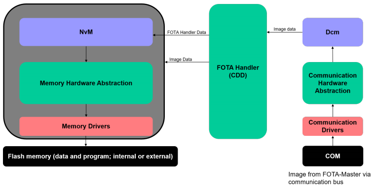
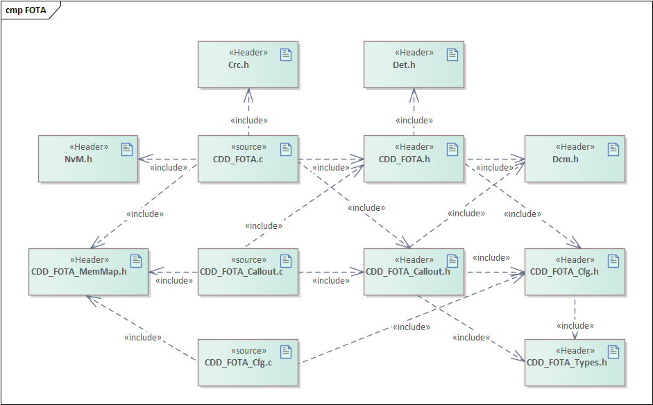
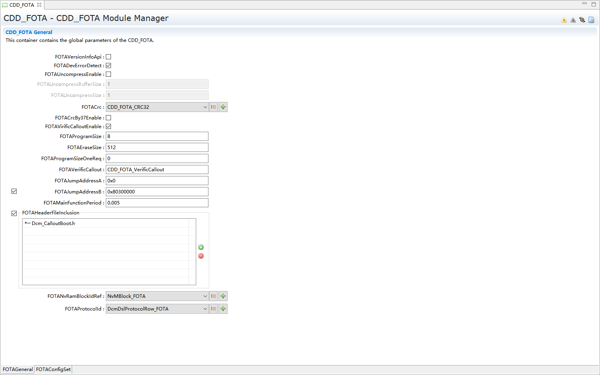
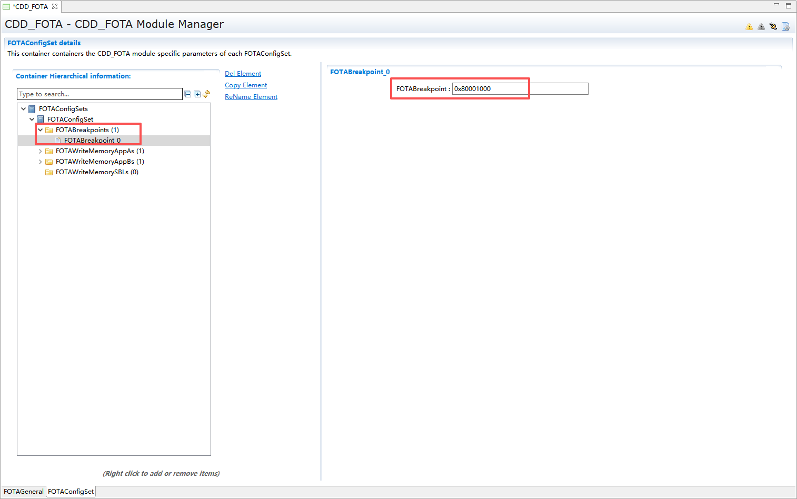
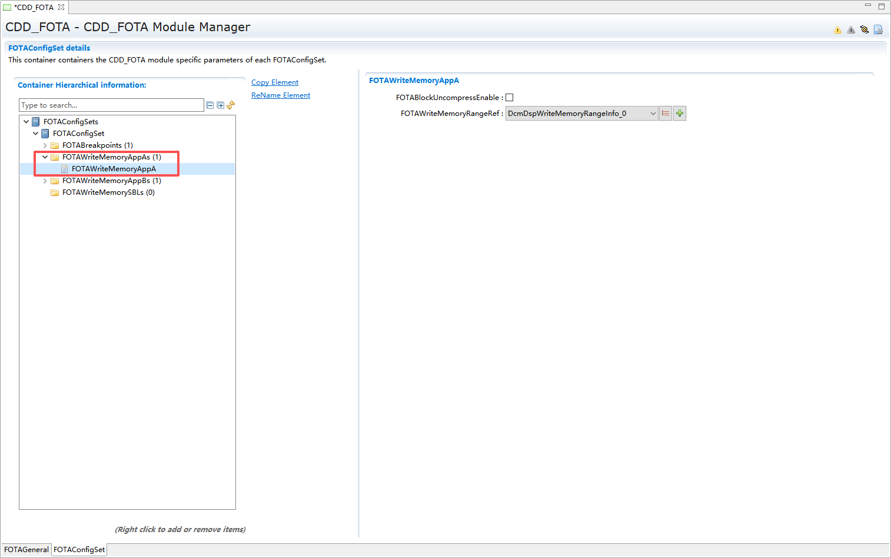
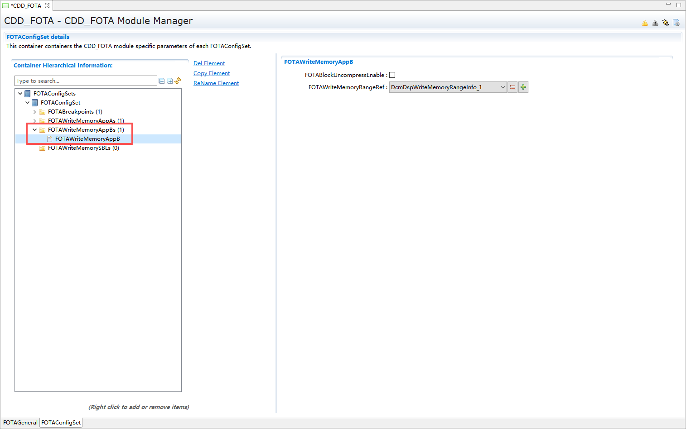
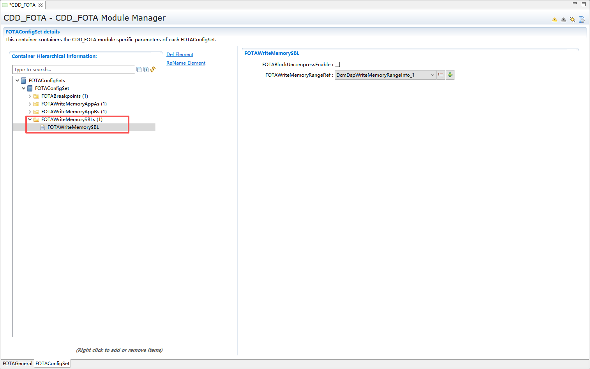

FOTA Handler
#################################

:strong:`缩写词注解 (Abbreviation Notes):`

.. list-table::
   :widths: 34 33 33
   :header-rows: 1

   * - 缩写词 (Abbreviation)
     - 解释/描述 (Explanation/Description)
     - 中文解释 (Chinese explanation)
   * - ECU
     - Electronic control unit
     - 电控单元 (Electronic Control Unit)
   * - DCM
     - Diagnostic Communication Manager (AUTOSAR BSWModule, Classic Platform) (Surprisingly notyet listed!)
     - 诊断通信管理模块 (Diagnostic Communication Management Module)
   * - FOTA
     - Firmware Over-The-Air
     - 固件无线升级 (Wireless firmware upgrade)
   * - NvM
     - Non-Volatile Memory, BSW Module, sometimesreferred to as NV Memory (Surprisingly not yetlisted!)
     - 非易失数据存储管理模块 (Non-volatile Data Storage Management Module)
   * - OTA
     - Over-The-Air technologies in general,regardless of AUTOSAR
     - 空中下载技术 (Air Download Technology)
   * - SW
     - Soft ware
     - 软件 (Software)
   * - CDD
     - Complex Driver
     - 复杂驱动 (Complex Drive)
   * - FOTAMaster
     - Firmware Over-The-Air of Master
     - 固件无线升级的客户端 (Wireless firmware upgrade client)
   * - Nv
     - Non-Volatile Memory
     - 非易失存储 (Non-volatile storage)

简介 (Introduction)
=================================

FOTA方法将引入一个通用的机制来在运行时更新ECU软件。在当前ECU软件正常运行期间（例如行车过程中），新软件应在后台完成编程安装。在安装时，可以中断和继续在几个驱动周期，新的SW的真实性和完整性应得到验证。如果验证结果为真，ECU将能够激活新的SW。SW的激活总是需要一个特殊的ECU模式(例如启动)，因此新SW的激活不能在开车时启动，甚至不能在开车时执行。启动应在车辆安全状态下进行，如停止、关闭发动机和使用驻车制动。如果在新SW激活后或激活期间发现异常或错误，ECU应该能够实现ECU内部回滚到以前的SW。ECU内部回滚意味着，以前的SW仍然存在于ECU上，可以重新激活。

The FOTA method will introduce a general mechanism for updating ECU software at runtime. During the period when the current ECU software is operating normally (such as during driving), the new software should be programmed and installed in the background. During installation, interruptions and continuations may occur over several driving cycles; the authenticity and integrity of the new SW should be verified. If the verification result is true, the ECU will be able to activate the new SW. Activation of the SW always requires a special ECU mode (e.g., boot); therefore, activation of the new SW cannot occur during start-up or while driving. The start-up should be performed under vehicle safety conditions, such as when stopped, with the engine off, and using the parking brake. If anomalies or errors are detected after or during the activation of the new SW, the ECU should be able to perform an internal rollback within the ECU to the previous SW. An internal rollback in the ECU means that the previous SW still exists on the ECU and can be reactivated.

如上图所示，FOTA Handler是处于DCM模块和存储栈之间的一个CDD模块，FOTA Handler被DCM模块所调用，DCM模块将接收到的数据流传递给FOTA Handler，然后FOTA Handler经过相应的处理之后将数据传递给flash驱动，并写入到flash中。在写入的过程中会产生一些需要NvM模块存储的用户数据，FOTA Handler通过调用NvM模块的接口来存储和恢复相应的数据，这些数据也会被DCM模块所获取反馈给FOTA Master，FOTA Master通过数据发送相应的指令或数据给DCM模块。

As shown above, the FOTA Handler is a CDD module located between the DCM module and the storage stack. The DCM module calls the FOTA Handler, which receives data streams from the DCM module. After processing, the FOTA Handler passes the data to the flash driver for writing into the flash memory. During this process, some user data that needs to be stored by the NvM module is generated. The FOTA Handler stores and recovers this data by calling interfaces of the NvM module. This data is also accessible to the DCM module, which provides feedback to the FOTA Master. The FOTA Master sends corresponding instructions or data back to the DCM module.

参考资料 (Reference materials)
------------------------------------------

[1] AUTOSAR_EXP_FirmwareOverTheAir.pdf, R19-11

[2] AUTOSAR_RS_FirmwareOverTheAir.pdf, R19-11

[3] AUTOSAR_EXP_CDDDesignAndIntegrationGuideline.pdf, R19-11

[4] AUTOSAR_SWS_DiagnosticEventManager.pdf, R19-11

[5] AUTOSAR_SWS_NVRAMManager.pdf, R19-11

功能描述 (Function Description)
===========================================

信息存储与恢复功能 (Information storage and recovery functionality)
--------------------------------------------------------------------------

信息存储与恢复功能介绍 (Introduction to Information Storage and Recovery Function)
~~~~~~~~~~~~~~~~~~~~~~~~~~~~~~~~~~~~~~~~~~~~~~~~~~~~~~~~~~~~~~~~~~~~~~~~~~~~~~~~~~~~~~~

FOTA模块在完成一次数据安装后，会通过NvM模块将更新后的相关地址信息等存储到Nv数据块中。在ECU启动阶段，当NvM模块readall完成之后，通过调用FOTA模块的预初始化函数，将上一个电源周期存储的相关地址信息恢复到FOTA模块，以便FOTA Master继续进行相应的数据传输与安装。

The FOTA module stores the updated relevant address information in the Nv data block through the NvM module after completing a data installation. During the ECU startup phase, after the NvM module completes readall, by calling the pre-initialization function of the FOTA module, the relevant address information stored during the previous power cycle is restored to the FOTA module so that the FOTA Master can continue with the corresponding data transmission and installation.

信息存储与恢复功能实现 (Function realization for information storage and recovery)
~~~~~~~~~~~~~~~~~~~~~~~~~~~~~~~~~~~~~~~~~~~~~~~~~~~~~~~~~~~~~~~~~~~~~~~~~~~~~~~~~~~~~~~

FOTA模块在NvM模块readall完成之后被调用预初始化函数。在NvM模块数据正确情况下恢复以前存储的地址信息，在NvM模块数据不正确情况下重新初始化相应的地址信息。在FOTA进行预初始化的时候，需要通过NVM的Nvm_GetErrorStatus接口获取相关block的状态信息，当读取成功时（状态为NVM_REQ_OK），恢复读取到的数据，读取不成功时（状态不为NVM_REQ_OK），使用默认值进行初始化。在FOTA状态进行更新时，需要及时更新存储的数据，通知NVM进行写操作。当FOTA需要进行存储的时候，调用Nvm_WriteBlock接口进行存储。

The FOTA module is called to pre-initialize after the NvM module's readall completes. In case of correct data in the NvM module, it recovers previously stored address information; if the data is incorrect, it reinitializes the corresponding address information. During FOTA's pre-initialization, it needs to obtain related block status information through the NVM's Nvm_GetErrorStatus interface: when reading successfully (status as NVM_REQ_OK), recover the read data; when reading fails (status not as NVM_REQ_OK), initialize with default values. When updating the FOTA state, timely update stored data and notify NVM to perform write operations. When FOTA needs storage, call the Nvm_WriteBlock interface for storage.

数据下载功能 (Data download function)
-----------------------------------------------

数据下载功能介绍 (Introduction to Data Download Function)
~~~~~~~~~~~~~~~~~~~~~~~~~~~~~~~~~~~~~~~~~~~~~~~~~~~~~~~~~~~~~~~~~

数据下载是指新的ECU软件从FOTA主ECU转移到FOTA目标ECU。由于一次性将整个ECU软件完全转移到FOTA目标ECU是不方便的，所以这个过程是使用数据块来实现的。这意味着安装过程甚至可以在几个驱动周期内处于活动状态。当没有更多的数据块需要传输到FOTA目标ECU，并且所有数据块都被成功地写入到内存堆栈时，安装过程就完成了。此外，安装过程还包括由FOTA目标ECU中的程序flash驱动程序将软件实际写入到不活动的目标分区。

Data download refers to the new ECU software being transferred from the FOTA master ECU to the FOTA target ECU. Since it is inconvenient to transfer the entire ECU software all at once to the FOTA target ECU, this process is achieved using data blocks. This means that the installation process can even remain active over several drive cycles. When there are no more data blocks needing transmission to the FOTA target ECU and all data blocks have been successfully written into the memory stack, the installation process is completed. Additionally, the installation process includes the actual writing of the software into the inactive target partition by the flash driver program in the FOTA target ECU.

数据下载功能实现 (Data download functionality implemented)
~~~~~~~~~~~~~~~~~~~~~~~~~~~~~~~~~~~~~~~~~~~~~~~~~~~~~~~~~~~~~~~~~~

FOTA在进行预初始化后，会进入到IDLE状态，然后通过FOTA Master的控制进行初始化后会进入到INIT状态，当FOTA Master进行下载请求后进入到WAIT状态。在WAIT状态下，FOTA Master进行数据下载是进入到PROCESSING状态，处理完成后回到WAIT状态，当FOTA Master请求退出下载时回到IDLE状态，当所有数据下载完成后会进入到READY状态。在READY状态下，可以选择进行校验（进入VERIFY状态,校验完成后会进入激活状态）或者进行激活，进入到ACTIVATE状态。此外FOTA还有一个ERROR状态，在任何时候都可能进入，进入ERROR状态后需要进行ROLLBACK。

After FOTA performs pre-initialization, it enters the IDLE state. Then, through control by the FOTA Master, it enters the INIT state. When the FOTA Master initiates a download request, it transitions to the WAIT state. In the WAIT state, data downloading controlled by the FOTA Master enters the PROCESSING state; after processing is complete, it returns to the WAIT state. When the FOTA Master requests to exit the download, it returns to the IDLE state. Once all data downloads are complete, it enters the READY state. In the READY state, one can choose to perform verification (entering the VERIFY state, where verification completion results in an activation state) or directly activate and enter the ACTIVATE state. Additionally, FOTA has an ERROR state that can be entered at any time; entering the ERROR state requires a rollback.

断点续传功能 (Resume transmission functionality)
----------------------------------------------------------

断点续传功能介绍 (Continued Download Function Introduction)
~~~~~~~~~~~~~~~~~~~~~~~~~~~~~~~~~~~~~~~~~~~~~~~~~~~~~~~~~~~~~~~~~~~

由于在整个下载过程中可能会存在多次中断，需要重新下载，并擦除一定的flash进行后续的写，所以提供断点的获取，包括默认断点和自定义配置断点两种。

Due to multiple interruptions that may occur during the entire download process, requiring re-downloads and erasing certain flash for subsequent writes, support for breakpoint resumption is provided, including default breakpoints and custom-configured breakpoints.

功能实现 (Function implementation)
~~~~~~~~~~~~~~~~~~~~~~~~~~~~~~~~~~~~~~~~~~~~~~

默认断点是将刷的block的起始地址进行反馈，自定义断点则是根据刷写的实际位置进行检索，找到最匹配的自定义断点进行反馈。

Default breakpoints feedback the starting address of the block that is flashed. Custom breakpoints are located based on the actual position flashed, and the most matching custom breakpoint is then fed back.

源文件描述 (Source file description)
===============================================

.. centered:: **表 CDD_FOTA组件文件描述 (Table Description of CDD_FOTA Component Files)**

.. list-table::
   :widths: 50 50
   :header-rows: 1

   * - 文件 (Files)
     - 说明 (Description)
   * - CDD_FOTA_Cfg.h
     - 定义FOTA模块预编译时用到的配置参数。 (Define configuration parameters used during pre-compilation of the FOTA module.)
   * - CDD_FOTA_Cfg.c
     - 定义FOTA模块配置相关的配置参数。 (Define configuration parameters related to FOTA module configuration.)
   * - CDD_FOTA_CallOut.c
     - 定义FOTA模块callout函数。 (Define FOTA module callout functions.)
   * - CDD_FOTA_CallOut.h
     - 定义FOTA模块预编译时用到的callout配置参数。 (Define callout configuration parameters used at FOTA module pre-compilation.)
   * - CDD_FOTA.h
     - FOTA模块头文件，包含了API函数的扩展声明并定义了端口的数据结构。 (FOTA module header file, which contains extended declarations of API functions and defines the port data structures.)
   * - CDD_FOTA.c
     - FOTA模块源文件，包含了API函数的实现。 (FOTA module source files contain the implementation of API functions.)
   * - CDD_FOTA_MemMap.h
     - 包含FOTA模块的内存抽象。 (Abstraction of memory containing the FOTA module.)
   * - CDD_FOTA_Types.h
     - 包含FOTA模块需要使用的类型定义。 (Definition types needed for the FOTA module.)

API接口 (API Interface)
=====================================

类型定义 (Type definition)
--------------------------------------

CDD_FOTA_WriteMemoryRangeType类型定义 (Type definition for CDD_FOTA_WriteMemoryRangeType)
~~~~~~~~~~~~~~~~~~~~~~~~~~~~~~~~~~~~~~~~~~~~~~~~~~~~~~~~~~~~~~~~~~~~~~~~~~~~~~~~~~~~~~~~~~~~~~~~~~~~~

.. list-table::
   :widths: 50 50
   :header-rows: 1

   * - 名称 (Name)
     - CDD_FOTA_WriteMemoryRangeType
   * - 类型 (Type)
     - uint32 WriteMemoryRangeLow;
   * - 
     - uint32 WriteMemoryRangeHigh;
   * - 
     - uint32 length;
   * - 
     - boolean UncompressEnable;
   * - 范围 (Range)
     - 无（None）
   * - 描述 (Description)
     - 数据下载地址范围 (Range of data download addresses)

CDD_FOTA_StatusType类型定义 (CDD_FOTA_StatusType Type Definition)
~~~~~~~~~~~~~~~~~~~~~~~~~~~~~~~~~~~~~~~~~~~~~~~~~~~~~~~~~~~~~~~~~~~~~~~~~~~~~

.. list-table::
   :widths: 50 50
   :header-rows: 1

   * - 名称 (Name)
     - CDD_FOTA_StatusType
   * - 类型 (Type)
     - CDD_FOTA_IDLE/CDD_FOTA_INIT/CDD_FOTA_WAIT/CDD_FOTA_PROCESSING/CDD_FOTA_READY/CDD_FOTA_VERIFY/CDD_FOTA_ACTIVATE/CDD_FOTA_ERROR
   * - 范围 (Range)
     - 无（None）
   * - 描述 (Description)
     - FOTA状态 (FOTA Status)

CDD_FOTA_ModeType类型定义 (CDD_FOTA_ModeType Type Definition)
~~~~~~~~~~~~~~~~~~~~~~~~~~~~~~~~~~~~~~~~~~~~~~~~~~~~~~~~~~~~~~~~~~~~~~~~~

.. list-table::
   :widths: 50 50
   :header-rows: 1

   * - 名称 (Name)
     - CDD_FOTA_ModeType
   * - 类型 (Type)
     - typedef enum
   * - 
     - {
   * - 
     - CDD_FOTA_MODE_UNINIT,
   * - 
     - CDD_FOTA_MODE_INIT
   * - 
     - } CDD_FOTA_ModeType;
   * - 范围 (Range)
     - 无（None）
   * - 描述 (Description)
     - FOTA模块的状态类型 (FOTA Module Status Types)

CDD_FOTA_ProgramInfoType类型定义 (CDD_FOTA_ProgramInfoType Type Definition)
~~~~~~~~~~~~~~~~~~~~~~~~~~~~~~~~~~~~~~~~~~~~~~~~~~~~~~~~~~~~~~~~~~~~~~~~~~~~~~~~~~~~~~~

.. list-table::
   :widths: 50 50
   :header-rows: 1

   * - 名称 (Name)
     - CDD_FOTA_ProgramInfoType
   * - 类型 (Type)
     - uint32 ProcessedAddress;
   * - 
     - uint32 ProgramConter;
   * - 
     - uint8 CurNeedProgramApp;
   * - 范围 (Range)
     - 无（None）
   * - 描述 (Description)
     - 当前已安装的软件相关信息 (Information about currently installed software)

CDD_FOTA_CancelInstallType类型定义 (Type definition for CDD_FOTA_CancelInstallType)
~~~~~~~~~~~~~~~~~~~~~~~~~~~~~~~~~~~~~~~~~~~~~~~~~~~~~~~~~~~~~~~~~~~~~~~~~~~~~~~~~~~~~~~~~~~~~~~

.. list-table::
   :widths: 50 50
   :header-rows: 1

   * - 名称 (Name)
     - CDD_FOTA_CancelInstallType
   * - 类型 (Type)
     - typedef enum
   * - 
     - {
   * - 
     - CDD_FOTA_NO_ERASE,
   * - 
     - CDD_FOTA_ERASE_A,
   * - 
     - CDD_FOTA_ERASE_B
   * - 
     - } CDD_FOTA_CancelInstallType;
   * - 范围 (Range)
     - 无（None）
   * - 描述 (Description)
     - FOTA模块取消安装的类型 (FOTA Module Uninstall Type)

输入函数描述 (Describe the input function:)
-----------------------------------------------------

.. list-table::
   :widths: 50 50
   :header-rows: 1

   * - 输入模块 (Input Module)
     - API
   * - NVM
     - NvM_GetErrorStatus
   * - 
     - NvM_WriteBlock
   * - DET
     - Det_ReportError

静态接口函数定义 (Static interface function definition)
---------------------------------------------------------------

CDD_FOTA_PreInit函数定义 (CDD_FOTA_PreInit function definition)
~~~~~~~~~~~~~~~~~~~~~~~~~~~~~~~~~~~~~~~~~~~~~~~~~~~~~~~~~~~~~~~~~~~~~~~~~~~

.. list-table::
   :widths: 25 25 25 25
   :header-rows: 1

   * - 函数名称： (Function Name:)
     - CDD_FOTA_PreInit
     - 
     - 
   * - 函数原型： (Function prototype:)
     - void CDD_FOTA_PreInit(void)
     - 
     - 
   * - 服务编号： (Service Number:)
     - 0x00
     - 
     - 
   * - 同步/异步： (Synchronous/asynchronous:)
     - 同步 (Sync)
     - 
     - 
   * - 是否可重入： (Reentrancy:)
     - 否 (Non Reentrant)
     - 
     - 
   * - 输入参数： (Input parameters:)
     - 无（None）
     - 值域： (Domain:)
     - 无（None）
   * - 输入输出参数： (Input Output Parameters:)
     - 无（None）
     - 
     - 
   * - 输出参数： (Output Parameters:)
     - 无（None）
     - 
     - 
   * - 返回值： (Return Value:)
     - 无（None）
     - 
     - 
   * - 功能概述： (Function Overview:)
     - FOTA模块预初始化 (Pre-initialization of FOTA Module)
     - 
     - 

CDD_FOTA_Init函数定义 (The CDD_FOTA_Init function definition)
~~~~~~~~~~~~~~~~~~~~~~~~~~~~~~~~~~~~~~~~~~~~~~~~~~~~~~~~~~~~~~~~~~~~~~~~~

.. list-table::
   :widths: 25 25 25 25
   :header-rows: 1

   * - 函数名称： (Function Name:)
     - CDD_FOTA_Init
     - 
     - 
   * - 函数原型： (Function prototype:)
     - Std_ReturnType CDD_FOTA_Init( FOTAStatus)
     - 
     - 
   * - 服务编号： (Service Number:)
     - 0x01
     - 
     - 
   * - 同步/异步： (Synchronous/asynchronous:)
     - 同步 (Sync)
     - 
     - 
   * - 是否可重入： (Reentrancy:)
     - 是 (Reentrant)
     - 
     - 
   * - 输入参数： (Input parameters:)
     - 无（None）
     - 值域： (Domain:)
     - 无（None）
   * - 输入输出参数： (Input Output Parameters:)
     - 无（None）
     - 
     - 
   * - 输出参数： (Output Parameters:)
     - FOTAStatus
     - 
     - 
   * - 返回值： (Return Value:)
     - Std_ReturnType
     - 
     - 
   * - 功能概述： (Function Overview:)
     - 初始化FOTA (Initialize FOTA)
     - 
     - 

CDD_FOTA_GetFOTAStatus函数定义 (The CDD_FOTA_GetFOTAStatus function definition)
~~~~~~~~~~~~~~~~~~~~~~~~~~~~~~~~~~~~~~~~~~~~~~~~~~~~~~~~~~~~~~~~~~~~~~~~~~~~~~~~~~~~~~~~~~~

.. list-table::
   :widths: 25 25 25 25
   :header-rows: 1

   * - 函数名称： (Function Name:)
     - CDD_FOTA_GetFOTAStatus
     - 
     - 
   * - 函数原型： (Function prototype:)
     - Std_ReturnType CDD_FOTA_GetFOTAStatus(CDD_FOTA_StatusType* FOTAStatus)
     - 
     - 
   * - 服务编号： (Service Number:)
     - 0x02
     - 
     - 
   * - 同步/异步： (Synchronous/asynchronous:)
     - 同步 (Sync)
     - 
     - 
   * - 是否可重入： (Reentrancy:)
     - 是 (Reentrant)
     - 
     - 
   * - 输入参数： (Input parameters:)
     - 无（None）
     - 值域： (Domain:)
     - 无（None）
   * - 输入输出参数： (Input Output Parameters:)
     - 无（None）
     - 
     - 
   * - 输出参数： (Output Parameters:)
     - FOTAStatus
     - 
     - 
   * - 返回值： (Return Value:)
     - Std_ReturnType
     - 
     - 
   * - 功能概述： (Function Overview:)
     - 获取FOTA状态 (Get FOTA Status)
     - 
     - 

CDD_FOTA_GetAppVersion函数定义 (CDD_FOTA_GetAppVersion function definition)
~~~~~~~~~~~~~~~~~~~~~~~~~~~~~~~~~~~~~~~~~~~~~~~~~~~~~~~~~~~~~~~~~~~~~~~~~~~~~~~~~~~~~~~

.. list-table::
   :widths: 25 25 25 25
   :header-rows: 1

   * - 函数名称： (Function Name:)
     - CDD_FOTA_GetAppVersion
     - 
     - 
   * - 函数原型： (Function prototype:)
     - Std_ReturnType CDD_FOTA_GetAppVersion(uint8* AppVersion)
     - 
     - 
   * - 服务编号： (Service Number:)
     - 0x10
     - 
     - 
   * - 同步/异步： (Synchronous/asynchronous:)
     - 同步 (Sync)
     - 
     - 
   * - 是否可重入： (Reentrancy:)
     - 是 (Reentrant)
     - 
     - 
   * - 输入参数： (Input parameters:)
     - 无（None）
     - 值域： (Domain:)
     - 无（None）
   * - 输入输出参数： (Input Output Parameters:)
     - 无（None）
     - 
     - 
   * - 输出参数： (Output Parameters:)
     - AppVersion
     - 
     - 
   * - 返回值： (Return Value:)
     - Std_ReturnType
     - 
     - 
   * - 功能概述： (Function Overview:)
     - 获取APP版本信息 (Get APP Version Information)
     - 
     - 

CDD_FOTA_SetAppVersion函数定义 (The CDD_FOTA_SetAppVersion function definition)
~~~~~~~~~~~~~~~~~~~~~~~~~~~~~~~~~~~~~~~~~~~~~~~~~~~~~~~~~~~~~~~~~~~~~~~~~~~~~~~~~~~~~~~~~~~

.. list-table::
   :widths: 25 25 25 25
   :header-rows: 1

   * - 函数名称： (Function Name:)
     - CDD_FOTA_SetAppVersion
     - 
     - 
   * - 函数原型： (Function prototype:)
     - Std_ReturnType CDD_FOTA_SetAppVersion(const uint8* AppVersion)
     - 
     - 
   * - 服务编号： (Service Number:)
     - 0x11
     - 
     - 
   * - 同步/异步： (Synchronous/asynchronous:)
     - 同步 (Sync)
     - 
     - 
   * - 是否可重入： (Reentrancy:)
     - 是 (Reentrant)
     - 
     - 
   * - 输入参数： (Input parameters:)
     - AppVersion
     - 值域： (Domain:)
     - 无（None）
   * - 输入输出参数： (Input Output Parameters:)
     - 无（None）
     - 
     - 
   * - 输出参数： (Output Parameters:)
     - 无（None）
     - 
     - 
   * - 返回值： (Return Value:)
     - Std_ReturnType
     - 
     - 
   * - 功能概述： (Function Overview:)
     - 设置APP版本信息 (Set APP Version Information)
     - 
     - 

CDD_FOTA_GetFOTAProcessedInfo函数定义 (The function definition for CDD_FOTA_GetFOTAProcessedInfo)
~~~~~~~~~~~~~~~~~~~~~~~~~~~~~~~~~~~~~~~~~~~~~~~~~~~~~~~~~~~~~~~~~~~~~~~~~~~~~~~~~~~~~~~~~~~~~~~~~~~~~~~~~~~~~

.. list-table::
   :widths: 25 25 25 25
   :header-rows: 1

   * - 函数名称： (Function Name:)
     - CDD_FOTA_GetFOTAProcessedInfo
     - 
     - 
   * - 函数原型： (Function prototype:)
     - Std_ReturnType CDD_FOTA_GetFOTAProcessedInfo(uint32* MemoryAddress)
     - 
     - 
   * - 服务编号： (Service Number:)
     - 0x03
     - 
     - 
   * - 同步/异步： (Synchronous/asynchronous:)
     - 同步 (Sync)
     - 
     - 
   * - 是否可重入： (Reentrancy:)
     - 是 (Reentrant)
     - 
     - 
   * - 输入参数： (Input parameters:)
     - 无（None）
     - 值域： (Domain:)
     - 无（None）
   * - 输入输出参数： (Input Output Parameters:)
     - MemoryAddress
     - 
     - 
   * - 输出参数： (Output Parameters:)
     - 无（None）
     - 
     - 
   * - 返回值： (Return Value:)
     - Std_ReturnType
     - 
     - 
   * - 功能概述： (Function Overview:)
     - 获取编程信息 (Get programming information)
     - 
     - 

CDD_FOTA_GetFOTAbreakpointInfo函数定义 (The CDD_FOTA_GetFOTAbreakpointInfo function definition)
~~~~~~~~~~~~~~~~~~~~~~~~~~~~~~~~~~~~~~~~~~~~~~~~~~~~~~~~~~~~~~~~~~~~~~~~~~~~~~~~~~~~~~~~~~~~~~~~~~~~~~~~~~~

.. list-table::
   :widths: 25 25 25 25
   :header-rows: 1

   * - 函数名称： (Function Name:)
     - CDD_FOTA_GetFOTAbreakpointInfo
     - 
     - 
   * - 函数原型： (Function prototype:)
     - Std_ReturnType CDD_FOTA_GetFOTAbreakpointInfo(uint32* MemoryAddress)
     - 
     - 
   * - 服务编号： (Service Number:)
     - 0x0F
     - 
     - 
   * - 同步/异步： (Synchronous/asynchronous:)
     - 同步 (Sync)
     - 
     - 
   * - 是否可重入： (Reentrancy:)
     - 是 (Reentrant)
     - 
     - 
   * - 输入参数： (Input parameters:)
     - 无（None）
     - 值域： (Domain:)
     - 无（None）
   * - 输入输出参数： (Input Output Parameters:)
     - 无（None）
     - 
     - 
   * - 输出参数： (Output Parameters:)
     - MemoryAddress
     - 
     - 
   * - 返回值： (Return Value:)
     - Std_ReturnType
     - 
     - 
   * - 功能概述： (Function Overview:)
     - 获取断点地址信息 (Get breakpoint address information)
     - 
     - 

CDD_FOTA_Processdownload函数定义 (CDD_FOTA_Processdownload function definition)
~~~~~~~~~~~~~~~~~~~~~~~~~~~~~~~~~~~~~~~~~~~~~~~~~~~~~~~~~~~~~~~~~~~~~~~~~~~~~~~~~~~~~~~~~~~

.. list-table::
   :widths: 25 25 25 25
   :header-rows: 1

   * - 函数名称： (Function Name:)
     - CDD_FOTA_Processdownload
     - 
     - 
   * - 函数原型： (Function prototype:)
     - Std_ReturnType CDD_FOTA_Processdownload(
     - 
     - 
   * - 
     - uint32 MemoryAddress,
     - 
     - 
   * - 
     - uint32 MemorySize,
     - 
     - 
   * - 
     - uint32* BlockLength,
     - 
     - 
   * - 
     - Dcm_NegativeResponseCodeType* ErrorCode)
     - 
     - 
   * - 服务编号： (Service Number:)
     - 0x0A
     - 
     - 
   * - 同步/异步： (Synchronous/asynchronous:)
     - 同步 (Sync)
     - 
     - 
   * - 是否可重入： (Reentrancy:)
     - 否 (Non Reentrant)
     - 
     - 
   * - 输入参数： (Input parameters:)
     - MemoryAddress
     - 值域： (Domain:)
     - 0.. 4294836225
   * - 
     - MemorySize
     - 值域： (Domain:)
     - 0.. 4294836225
   * - 输入输出参数： (Input Output Parameters:)
     - 无（None）
     - 
     - 
   * - 输出参数： (Output Parameters:)
     - ErrorCode
     - 
     - 
   * - 
     - BlockLength
     - 
     - 
   * - 返回值： (Return Value:)
     - Std_ReturnType：E_OK： 请求成功E_NOT_OK：请求失败 (Std_ReturnType：E_OK： Request succeeded E_NOT_OK：Request failed)
     - 
     - 
   * - 功能概述： (Function Overview:)
     - 处理数据请求下载 (Handle data request download)
     - 
     - 

CDD_FOTA_StopProtocol函数定义 (Function definition for CDD_FOTA_StopProtocol)
~~~~~~~~~~~~~~~~~~~~~~~~~~~~~~~~~~~~~~~~~~~~~~~~~~~~~~~~~~~~~~~~~~~~~~~~~~~~~~~~~~~~~~~~~

.. list-table::
   :widths: 25 25 25 25
   :header-rows: 1

   * - 函数名称： (Function Name:)
     - CDD_FOTA_StopProtocol
     - 
     - 
   * - 函数原型： (Function prototype:)
     - Std_ReturnType CDD_FOTA_StopProtocol(Dcm_ProtocolType ProtocolID)
     - 
     - 
   * - 服务编号： (Service Number:)
     - 0x0c
     - 
     - 
   * - 同步/异步： (Synchronous/asynchronous:)
     - 同步 (Sync)
     - 
     - 
   * - 是否可重入： (Reentrancy:)
     - 是 (Reentrant)
     - 
     - 
   * - 输入参数： (Input parameters:)
     - ProtocolID
     - 值域： (Domain:)
     - Enum
   * - 输入输出参数： (Input Output Parameters:)
     - 无（None）
     - 
     - 
   * - 输出参数： (Output Parameters:)
     - 无（None）
     - 
     - 
   * - 返回值： (Return Value:)
     - Std_ReturnType
     - 
     - 
   * - 功能概述： (Function Overview:)
     - 协议停止回调接口 (Protocol stop callback interface)
     - 
     - 

CDD_FOTA_CancelInstall函数定义 (CDD_FOTA_CancelInstall function definition)
~~~~~~~~~~~~~~~~~~~~~~~~~~~~~~~~~~~~~~~~~~~~~~~~~~~~~~~~~~~~~~~~~~~~~~~~~~~~~~~~~~~~~~~

.. list-table::
   :widths: 25 25 25 25
   :header-rows: 1

   * - 函数名称： (Function Name:)
     - CDD_FOTA_CancelInstall
     - 
     - 
   * - 函数原型： (Function prototype:)
     - Std_ReturnType CDD_FOTA_CancelInstall(void)
     - 
     - 
   * - 服务编号： (Service Number:)
     - 0x0D
     - 
     - 
   * - 同步/异步： (Synchronous/asynchronous:)
     - 同步 (Sync)
     - 
     - 
   * - 是否可重入： (Reentrancy:)
     - 是 (Reentrant)
     - 
     - 
   * - 输入参数： (Input parameters:)
     - 无（None）
     - 值域： (Domain:)
     - 无（None）
   * - 输入输出参数： (Input Output Parameters:)
     - 无（None）
     - 
     - 
   * - 输出参数： (Output Parameters:)
     - 无（None）
     - 
     - 
   * - 返回值： (Return Value:)
     - Std_ReturnType
     - 
     - 
   * - 功能概述： (Function Overview:)
     - 请求取消下载安装 (Request to cancel download installation)
     - 
     - 

CDD_FOTA_ProcessTransferDataWrite函数定义 (The CDD_FOTA_ProcessTransferDataWrite function definition)
~~~~~~~~~~~~~~~~~~~~~~~~~~~~~~~~~~~~~~~~~~~~~~~~~~~~~~~~~~~~~~~~~~~~~~~~~~~~~~~~~~~~~~~~~~~~~~~~~~~~~~~~~~~~~~~~~

.. list-table::
   :widths: 25 25 25 25
   :header-rows: 1

   * - 函数名称： (Function Name:)
     - CDD_FOTA_ProcessTransferDataWrite
     - 
     - 
   * - 函数原型： (Function prototype:)
     - Dcm_ReturnWriteMemoryType CDD_FOTA_ProcessTransferDataWrite(
     - 
     - 
   * - 
     - Dcm_OpStatusType OpStatus,
     - 
     - 
   * - 
     - uint32 MemoryAddress,
     - 
     - 
   * - 
     - uint32 MemorySize,
     - 
     - 
   * - 
     - uint8* MemoryData,
     - 
     - 
   * - 
     - Dcm_NegativeResponseCodeType* ErrorCode)
     - 
     - 
   * - 服务编号： (Service Number:)
     - 0x04
     - 
     - 
   * - 同步/异步： (Synchronous/asynchronous:)
     - 异步 (Asynchronous)
     - 
     - 
   * - 是否可重入： (Reentrancy:)
     - 否 (Non Reentrant)
     - 
     - 
   * - 输入参数： (Input parameters:)
     - OpStatus
     - 值域： (Domain:)
     - Enum
   * - 
     - MemoryAddress
     - 值域： (Domain:)
     - 0.. 4294836225
   * - 
     - MemorySize
     - 值域： (Domain:)
     - 0.. 4294836225
   * - 
     - MemoryData
     - 值域： (Domain:)
     - uint8*
   * - 输入输出参数： (Input Output Parameters:)
     - 无（None）
     - 
     - 
   * - 输出参数： (Output Parameters:)
     - ErrorCode
     - 
     - 
   * - 返回值： (Return Value:)
     - Dcm_ReturnWriteMemoryType
     - 
     - 
   * - 功能概述： (Function Overview:)
     - 处理下载的数据 (Process the downloaded data)
     - 
     - 

CDD_FOTA_Erase函数定义 (CDD_FOTA_Erase function definition)
~~~~~~~~~~~~~~~~~~~~~~~~~~~~~~~~~~~~~~~~~~~~~~~~~~~~~~~~~~~~~~~~~~~~~~~

.. list-table::
   :widths: 25 25 25 25
   :header-rows: 1

   * - 函数名称： (Function Name:)
     - CDD_FOTA_Erase
     - 
     - 
   * - 函数原型： (Function prototype:)
     - Std_ReturnType CDD_FOTA_Erase(const uint8* InBuffer,Dcm_NegativeResponseCodeType* ErrorCode)
     - 
     - 
   * - 服务编号： (Service Number:)
     - 0x0E
     - 
     - 
   * - 同步/异步： (Synchronous/asynchronous:)
     - 异步 (Asynchronous)
     - 
     - 
   * - 是否可重入： (Reentrancy:)
     - 否 (Non Reentrant)
     - 
     - 
   * - 输入参数： (Input parameters:)
     - InBuffer
     - 值域： (Domain:)
     - 无（None）
   * - 输入输出参数： (Input Output Parameters:)
     - 无（None）
     - 
     - 
   * - 输出参数： (Output Parameters:)
     - ErrorCode
     - 
     - 
   * - 返回值： (Return Value:)
     - Std_ReturnType
     - 
     - 
   * - 功能概述： (Function Overview:)
     - 请求擦除 (Request for Erasure)
     - 
     - 

CDD_FOTA_ProcessExit函数定义 (The function definition for CDD_FOTA_ProcessExit)
~~~~~~~~~~~~~~~~~~~~~~~~~~~~~~~~~~~~~~~~~~~~~~~~~~~~~~~~~~~~~~~~~~~~~~~~~~~~~~~~~~~~~~~~~~~

.. list-table::
   :widths: 25 25 25 25
   :header-rows: 1

   * - 函数名称： (Function Name:)
     - CDD_FOTA_ProcessExit
     - 
     - 
   * - 函数原型： (Function prototype:)
     - Std_ReturnType CDD_FOTA_ProcessExit(
     - 
     - 
   * - 
     - const uint8* transferRequestParameterRecord,
     - 
     - 
   * - 
     - uint32 transferRequestParameterRecordSize,
     - 
     - 
   * - 
     - uint32* transferResponseParameterRecordSize,
     - 
     - 
   * - 
     - Dcm_NegativeResponseCodeType* ErrorCode)
     - 
     - 
   * - 服务编号： (Service Number:)
     - 0x0B
     - 
     - 
   * - 同步/异步： (Synchronous/asynchronous:)
     - 同步 (Sync)
     - 
     - 
   * - 是否可重入： (Reentrancy:)
     - 否 (Non Reentrant)
     - 
     - 
   * - 输入参数： (Input parameters:)
     - transferRequestParameterRecord
     - 值域： (Domain:)
     - 0.. 255
   * - 
     - transferRequestParameterRecordSize
     - 值域： (Domain:)
     - 0.. 4294836225
   * - 输入输出参数： (Input Output Parameters:)
     - 无（None）
     - 
     - 
   * - 输出参数： (Output Parameters:)
     - transferResponseParameterRecordSize
     - 
     - 
   * - 
     - ErrorCode
     - 
     - 
   * - 返回值： (Return Value:)
     - Std_ReturnType
     - 
     - 
   * - 功能概述： (Function Overview:)
     - 请求退出下载 (Request to Exit Download)
     - 
     - 

CDD_FOTA_SetFOTAActivate函数定义 (The CDD_FOTA_SetFOTAActivate function definition)
~~~~~~~~~~~~~~~~~~~~~~~~~~~~~~~~~~~~~~~~~~~~~~~~~~~~~~~~~~~~~~~~~~~~~~~~~~~~~~~~~~~~~~~~~~~~~~~

.. list-table::
   :widths: 25 25 25 25
   :header-rows: 1

   * - 函数名称： (Function Name:)
     - CDD_FOTA_SetFOTAActivate
     - 
     - 
   * - 函数原型： (Function prototype:)
     - Std_ReturnType CDD_FOTA_SetFOTAActivate(void)
     - 
     - 
   * - 服务编号： (Service Number:)
     - 0x05
     - 
     - 
   * - 同步/异步： (Synchronous/asynchronous:)
     - 同步 (Sync)
     - 
     - 
   * - 是否可重入： (Reentrancy:)
     - 是 (Reentrant)
     - 
     - 
   * - 输入参数： (Input parameters:)
     - 无（None）
     - 值域： (Domain:)
     - 无（None）
   * - 输入输出参数： (Input Output Parameters:)
     - 无（None）
     - 
     - 
   * - 输出参数： (Output Parameters:)
     - 无（None）
     - 
     - 
   * - 返回值： (Return Value:)
     - Std_ReturnType：E_OK： 请求成功E_NOT_OK：请求失败 (Std_ReturnType：E_OK： Request succeeded E_NOT_OK：Request failed)
     - 
     - 
   * - 功能概述： (Function Overview:)
     - 设置FOTA进入激活状态 (Set FOTA to active state)
     - 
     - 

CDD_FOTA_SetFOTARollback函数定义 (Definition of CDD_FOTA_SetFOTARollback function)
~~~~~~~~~~~~~~~~~~~~~~~~~~~~~~~~~~~~~~~~~~~~~~~~~~~~~~~~~~~~~~~~~~~~~~~~~~~~~~~~~~~~~~~~~~~~~~

.. list-table::
   :widths: 25 25 25 25
   :header-rows: 1

   * - 函数名称： (Function Name:)
     - CDD_FOTA_SetFOTARollback
     - 
     - 
   * - 函数原型： (Function prototype:)
     - Std_ReturnType CDD_FOTA_SetFOTARollback(void)
     - 
     - 
   * - 服务编号： (Service Number:)
     - 0x06
     - 
     - 
   * - 同步/异步： (Synchronous/asynchronous:)
     - 同步 (Sync)
     - 
     - 
   * - 是否可重入： (Reentrancy:)
     - 是 (Reentrant)
     - 
     - 
   * - 输入参数： (Input parameters:)
     - 无（None）
     - 值域： (Domain:)
     - 无（None）
   * - 输入输出参数： (Input Output Parameters:)
     - 无（None）
     - 
     - 
   * - 输出参数： (Output Parameters:)
     - 无（None）
     - 
     - 
   * - 返回值： (Return Value:)
     - Std_ReturnType
     - 
     - 
   * - 功能概述： (Function Overview:)
     - 设置FOTA进入回滚状态 (Set FOTA to rollback state)
     - 
     - 

CDD_FOTA_Verification函数定义 (Definition of CDD_FOTA_Verification function)
~~~~~~~~~~~~~~~~~~~~~~~~~~~~~~~~~~~~~~~~~~~~~~~~~~~~~~~~~~~~~~~~~~~~~~~~~~~~~~~~~~~~~~~~

.. list-table::
   :widths: 25 25 25 25
   :header-rows: 1

   * - 函数名称： (Function Name:)
     - CDD_FOTA_Verification
     - 
     - 
   * - 函数原型： (Function prototype:)
     - Std_ReturnType CDD_FOTA_Verification(boolean* VerificationStatus)
     - 
     - 
   * - 服务编号： (Service Number:)
     - 0x07
     - 
     - 
   * - 同步/异步： (Synchronous/asynchronous:)
     - 同步 (Sync)
     - 
     - 
   * - 是否可重入： (Reentrancy:)
     - 是 (Reentrant)
     - 
     - 
   * - 输入参数： (Input parameters:)
     - 无（None）
     - 值域： (Domain:)
     - 无（None）
   * - 输入输出参数： (Input Output Parameters:)
     - 无（None）
     - 
     - 
   * - 输出参数： (Output Parameters:)
     - VerificationStatus
     - 
     - 
   * - 返回值： (Return Value:)
     - Std_ReturnType
     - 
     - 
   * - 功能概述： (Function Overview:)
     - 请求FOTA进行校验 (Request FOTA for verification)
     - 
     - 

CDD_FOTA_MainFunction函数定义 (CDD_FOTA_MainFunction function definition)
~~~~~~~~~~~~~~~~~~~~~~~~~~~~~~~~~~~~~~~~~~~~~~~~~~~~~~~~~~~~~~~~~~~~~~~~~~~~~~~~~~~~~

.. list-table::
   :widths: 25 25 25 25
   :header-rows: 1

   * - 函数名称： (Function Name:)
     - CDD_FOTA_MainFunction
     - 
     - 
   * - 函数原型： (Function prototype:)
     - void CDD_FOTA_MainFunction(void)
     - 
     - 
   * - 服务编号： (Service Number:)
     - 0x08
     - 
     - 
   * - 同步/异步： (Synchronous/asynchronous:)
     - 同步 (Sync)
     - 
     - 
   * - 是否可重入： (Reentrancy:)
     - 是 (Reentrant)
     - 
     - 
   * - 输入参数： (Input parameters:)
     - 无（None）
     - 值域： (Domain:)
     - 无（None）
   * - 输入输出参数： (Input Output Parameters:)
     - 无（None）
     - 
     - 
   * - 输出参数： (Output Parameters:)
     - 无（None）
     - 
     - 
   * - 返回值： (Return Value:)
     - 无（None）
     - 
     - 
   * - 功能概述： (Function Overview:)
     - FOTA任务处理主函数 (FOTA Task Processing Main Function)
     - 
     - 

可配置函数定义 (Configurable Function Definition)
----------------------------------------------------------

CDD_FOTA_UncompressCallout函数定义 (The definition of CDD_FOTA_UncompressCallout function)
~~~~~~~~~~~~~~~~~~~~~~~~~~~~~~~~~~~~~~~~~~~~~~~~~~~~~~~~~~~~~~~~~~~~~~~~~~~~~~~~~~~~~~~~~~~~~~~~~~~~~~

.. list-table::
   :widths: 25 25 25 25
   :header-rows: 1

   * - 函数名称： (Function Name:)
     - CDD_FOTA_UncompressCallout
     - 
     - 
   * - 函数原型： (Function prototype:)
     - Std_ReturnType CDD_FOTA_UncompressCallout(const uint8* InData,uint32 InSize,uint8* OutData,uint32* OutSize)
     - 
     - 
   * - 服务编号： (Service Number:)
     - N/A
     - 
     - 
   * - 同步/异步： (Synchronous/asynchronous:)
     - 同步 (Sync)
     - 
     - 
   * - 是否可重入： (Reentrancy:)
     - 否 (Non Reentrant)
     - 
     - 
   * - 输入参数： (Input parameters:)
     - 无（None）
     - 值域： (Domain:)
     - 无（None）
   * - 输入输出参数： (Input Output Parameters:)
     - 无（None）
     - 
     - 
   * - 输出参数： (Output Parameters:)
     - 无（None）
     - 
     - 
   * - 返回值： (Return Value:)
     - Std_ReturnType
     - 
     - 
   * - 功能概述： (Function Overview:)
     - FOTA模块解压缩回调接口 (FOTA Module Decompression Callback Interface)
     - 
     - 

CDD_FOTA_GetUncompressResCallout函数定义 (The function definition for CDD_FOTA_GetUncompressResCallout)
~~~~~~~~~~~~~~~~~~~~~~~~~~~~~~~~~~~~~~~~~~~~~~~~~~~~~~~~~~~~~~~~~~~~~~~~~~~~~~~~~~~~~~~~~~~~~~~~~~~~~~~~~~~~~~~~~~~

.. list-table::
   :widths: 25 25 25 25
   :header-rows: 1

   * - 函数名称： (Function Name:)
     - CDD_FOTA_GetUncompressResCallout
     - 
     - 
   * - 函数原型： (Function prototype:)
     - Std_ReturnType CDD_FOTA_GetUncompressResCallout(void)
     - 
     - 
   * - 服务编号： (Service Number:)
     - N/A
     - 
     - 
   * - 同步/异步： (Synchronous/asynchronous:)
     - 同步 (Sync)
     - 
     - 
   * - 是否可重入： (Reentrancy:)
     - 否 (Non Reentrant)
     - 
     - 
   * - 输入参数： (Input parameters:)
     - 无（None）
     - 值域： (Domain:)
     - 无（None）
   * - 输入输出参数： (Input Output Parameters:)
     - 无（None）
     - 
     - 
   * - 输出参数： (Output Parameters:)
     - 无（None）
     - 
     - 
   * - 返回值： (Return Value:)
     - 无（None）
     - 
     - 
   * - 功能概述： (Function Overview:)
     - FOTA模块获取解压缩的任务结果回调接口 (FOTA module gets decompression task result callback interface)
     - 
     - 

配置 (Configure)
==============================

FOTAGeneral
---------------------------

.. centered:: **表 FOTAGeneral属性描述 (Table FOTA General Properties Description)**

.. list-table::
   :widths: 20 20 20 20 20
   :header-rows: 1

   * - UI名称 (UI Name)
     - 描述 (Description)
     - 
     - 
     - 
   * - FOTAVersionInfoApi
     - 取值范围 (Range)
     - True/False
     - 默认取值 (Default value)
     - False
   * - 
     - 参数描述 (Parameter Description)
     - 版本信息获取接口使能开关 (Version information acquisition interface enable switch)
     - 
     - 
   * - 
     - 依赖关系 (Dependencies)
     - 无（None）
     - 
     - 
   * - FOTADevErrorDetect
     - 取值范围 (Range)
     - True/False
     - 默认取值 (Default value)
     - False
   * - 
     - 参数描述 (Parameter Description)
     - DET检查使能开关 (DET Check Enable Switch)
     - 
     - 
   * - 
     - 依赖关系 (Dependencies)
     - 无（None）
     - 
     - 
   * - FOTAUncompressEnable
     - 取值范围 (Range)
     - True/False
     - 默认取值 (Default value)
     - False
   * - 
     - 参数描述 (Parameter Description)
     - 解压缩使能开关 (Enable Decompression Switch)
     - 
     - 
   * - 
     - 依赖关系 (Dependencies)
     - 无（None）
     - 
     - 
   * - FOTAUncompressBufferSize
     - 取值范围 (Range)
     - 0 ..
     - 默认取值 (Default value)
     - 0
   * - 
     - 参数描述 (Parameter Description)
     - 解压缩缓存buffer大小 (Decompression Cache Buffer Size)
     - 
     - 
   * - 
     - 依赖关系 (Dependencies)
     - FOTAUncompressEnable为true (FOTAUncompressEnable is true)
     - 
     - 
   * - FOTAUncompressSize
     - 取值范围 (Range)
     - 0 ..
     - 
     - 
   * - 
     - 参数描述 (Parameter Description)
     - 解压缩大小 (Uncompressed size)
     - 
     - 
   * - 
     - 依赖关系 (Dependencies)
     - FOTAUncompressEnable为true (FOTAUncompressEnable is true)
     - 
     - 
   * - FOTACrc
     - 取值范围 (Range)
     - CDD_FOTA_CRC8/CDD_FOTA_CRC8H2F/CDD_FOTA_CRC16/CDD_FOTA_CRC16ARC/CDD_FOTA_CRC32/CDD_FOTA_CRC32P4/CDD_FOTA_CRC64/CDD_FOTA_NONE_CRC
     - 默认取值 (Default value)
     - CDD_FOTA_CRC8
   * - 
     - 参数描述 (Parameter Description)
     - CRC计算类型 (CRC Calculation Type)
     - 
     - 
   * - 
     - 依赖关系 (Dependencies)
     - 无（None）
     - 
     - 
   * - FOTACrcBy37Enable
     - 取值范围 (Range)
     - True/False
     - 默认取值 (Default value)
     - False
   * - 
     - 参数描述 (Parameter Description)
     - CRC计算是否通过37服务传入 (Is CRC calculation passed through service 37?)
     - 
     - 
   * - 
     - 依赖关系 (Dependencies)
     - 无（None）
     - 
     - 
   * - FOTAVirificCalloutEnable
     - 取值范围 (Range)
     - True/False
     - 默认取值 (Default value)
     - False
   * - 
     - 参数描述 (Parameter Description)
     - 校验回调接口使能开关 (Enable Switch for Validation Callback Interface)
     - 
     - 
   * - 
     - 依赖关系 (Dependencies)
     - 无（None）
     - 
     - 
   * - FOTAProgramSize
     - 取值范围 (Range)
     - 0.. 4294836225
     - 默认取值 (Default value)
     - 0
   * - 
     - 参数描述 (Parameter Description)
     - 一次编程大小 (One Programming Size)
     - 
     - 
   * - 
     - 依赖关系 (Dependencies)
     - 无（None）
     - 
     - 
   * - FOTAEraseSize
     - 取值范围 (Range)
     - 0.. 4294836225
     - 默认取值 (Default value)
     - 0
   * - 
     - 参数描述 (Parameter Description)
     - 一次擦除大小 (Size of one wipe)
     - 
     - 
   * - 
     - 依赖关系 (Dependencies)
     - 无（None）
     - 
     - 
   * - FOTAProgramSizeOneReq
     - 取值范围 (Range)
     - 0.. 4294836225
     - 默认取值 (Default value)
     - 0
   * - 
     - 参数描述 (Parameter Description)
     - 一次36请求缓存的下载数据大小 (Cache size for a 36-request download data retrieval)
     - 
     - 
   * - 
     - 依赖关系 (Dependencies)
     - 无（None）
     - 
     - 
   * - FOTAVerificCallout
     - 取值范围 (Range)
     - 无（None）
     - 默认取值 (Default value)
     - 无（None）
   * - 
     - 参数描述 (Parameter Description)
     - 校验回调函数配置接口 (Validate Callback Function Configuration Interface)
     - 
     - 
   * - 
     - 依赖关系 (Dependencies)
     - FOTAVirificCalloutEnable为true (FOTAVirificCalloutEnableEnable = True)
     - 
     - 
   * - FOTAJumpAddressA
     - 取值范围 (Range)
     - 0.. 4294836225
     - 默认取值 (Default value)
     - 0
   * - 
     - 参数描述 (Parameter Description)
     - APP A的跳转地址 (The redirect URL for APP A)
     - 
     - 
   * - 
     - 依赖关系 (Dependencies)
     - 无（None）
     - 
     - 
   * - FOTAJumpAddressB
     - 取值范围 (Range)
     - 0.. 4294836225
     - 默认取值 (Default value)
     - 0
   * - 
     - 参数描述 (Parameter Description)
     - APP B的跳转地址 (The redirection URL for APP B)
     - 
     - 
   * - 
     - 依赖关系 (Dependencies)
     - 无（None）
     - 
     - 
   * - FOTAMainFunctionPeriod
     - 取值范围 (Range)
     - 0.. INF
     - 
     - 
   * - 
     - 参数描述 (Parameter Description)
     - FOTA模块的主函数周期 (The main function cycle of the FOTA module)
     - 
     - 
   * - 
     - 依赖关系 (Dependencies)
     - 无（None）
     - 
     - 
   * - FOTAHeaderFileInclusion
     - 取值范围 (Range)
     - 无（None）
     - 默认取值 (Default value)
     - 无（None）
   * - 
     - 参数描述 (Parameter Description)
     - 头文件包含 (Header file inclusion)
     - 
     - 
   * - 
     - 依赖关系 (Dependencies)
     - 无（None）
     - 
     - 
   * - FOTANvRamBlockIdRef
     - 取值范围 (Range)
     - 无（None）
     - 默认取值 (Default value)
     - 无（None）
   * - 
     - 参数描述 (Parameter Description)
     - 存储NV块的关联 (Store NV Blocks Associated)
     - 
     - 
   * - 
     - 依赖关系 (Dependencies)
     - 无（None）
     - 
     - 
   * - FOTAProtocolId
     - 取值范围 (Range)
     - 无（None）
     - 默认取值 (Default value)
     - 无（None）
   * - 
     - 参数描述 (Parameter Description)
     - DCM协议ID关联 (DCM Protocol ID Association)
     - 
     - 
   * - 
     - 依赖关系 (Dependencies)
     - 无（None）
     - 
     - 

FOTAConfigSet
-----------------------------

FOTABreakpoint
~~~~~~~~~~~~~~~~~~~~~~~~~~~~~~

.. centered:: **表 FOTABreakpoint属性描述 (Table FOTA Breakpoint Property Description)**

.. list-table::
   :widths: 20 20 20 20 20
   :header-rows: 1

   * - UI名称 (UI Name)
     - 描述 (Description)
     - 
     - 
     - 
   * - FOTAWriteMemoryRangeRef
     - 取值范围 (Range)
     - 0 ..
     - 默认取值 (Default value)
     - 0
   * - 
     - 参数描述 (Parameter Description)
     - 断点，不配置的情况下使用块起始地址作为断点 (Breakpoint, use block start address as breakpoint if not configured)
     - 
     - 
   * - 
     - 依赖关系 (Dependencies)
     - 无（None）
     - 
     - 

FOTAWriteMemoryAppA
~~~~~~~~~~~~~~~~~~~~~~~~~~~~~~~~~~~

.. centered:: **表 FOTAWriteMemoryAppA属性描述 (Table FOTAWriteMemoryAppA Property Description)**

.. list-table::
   :widths: 20 20 20 20 20
   :header-rows: 1

   * - UI名称 (UI Name)
     - 描述 (Description)
     - 
     - 
     - 
   * - FOTAWriteMemoryRangeRef
     - 取值范围 (Range)
     - 无（None）
     - 默认取值 (Default value)
     - 无（None）
   * - 
     - 参数描述 (Parameter Description)
     - DCM中写地址范围的关联 (Write address range associations in DCM)
     - 
     - 
   * - 
     - 依赖关系 (Dependencies)
     - 无（None）
     - 
     - 
   * - FOTABlockUncompressEnable
     - 取值范围 (Range)
     - True/False
     - 默认取值 (Default value)
     - False
   * - 
     - 参数描述 (Parameter Description)
     - 当前块是否进行解压缩 (Does the current block undergo decompression?)
     - 
     - 
   * - 
     - 依赖关系 (Dependencies)
     - FOTAUncompressEnable
     - 
     - 

FOTAWriteMemoryAppB
~~~~~~~~~~~~~~~~~~~~~~~~~~~~~~~~~~~

.. centered:: **表 FOTAWriteMemoryAppB属性描述 (Property Description of FOTAWriteMemoryAppB)**

.. list-table::
   :widths: 20 20 20 20 20
   :header-rows: 1

   * - UI名称 (UI Name)
     - 描述 (Description)
     - 
     - 
     - 
   * - FOTAWriteMemoryRangeRef
     - 取值范围 (Range)
     - 无（None）
     - 默认取值 (Default value)
     - 无（None）
   * - 
     - 参数描述 (Parameter Description)
     - DCM中写地址范围的关联 (Write address range associations in DCM)
     - 
     - 
   * - 
     - 依赖关系 (Dependencies)
     - 无（None）
     - 
     - 
   * - FOTABlockUncompressEnable
     - 取值范围 (Range)
     - True/False
     - 默认取值 (Default value)
     - False
   * - 
     - 参数描述 (Parameter Description)
     - 当前块是否进行解压缩 (Does the current block undergo decompression?)
     - 
     - 
   * - 
     - 依赖关系 (Dependencies)
     - FOTAUncompressEnable
     - 
     - 

FOTAWriteMemorySBL
~~~~~~~~~~~~~~~~~~~~~~~~~~~~~~~~~~

.. centered:: **表 FOTAWriteMemorySBL属性描述 (Table FOTAWriteMemorySBL Property Description)**

.. list-table::
   :widths: 20 20 20 20 20
   :header-rows: 1

   * - UI名称 (UI Name)
     - 描述 (Description)
     - 
     - 
     - 
   * - FOTAWriteMemoryRangeRef
     - 取值范围 (Range)
     - 无（None）
     - 默认取值 (Default value)
     - 无（None）
   * - 
     - 参数描述 (Parameter Description)
     - DCM中写地址范围的关联 (Write address range associations in DCM)
     - 
     - 
   * - 
     - 依赖关系 (Dependencies)
     - 无（None）
     - 
     - 
   * - FOTABlockUncompressEnable
     - 取值范围 (Range)
     - True/False
     - 默认取值 (Default value)
     - False
   * - 
     - 参数描述 (Parameter Description)
     - 当前块是否进行解压缩 (Does the current block undergo decompression?)
     - 
     - 
   * - 
     - 依赖关系 (Dependencies)
     - FOTAUncompressEnable
     - 
     - 
