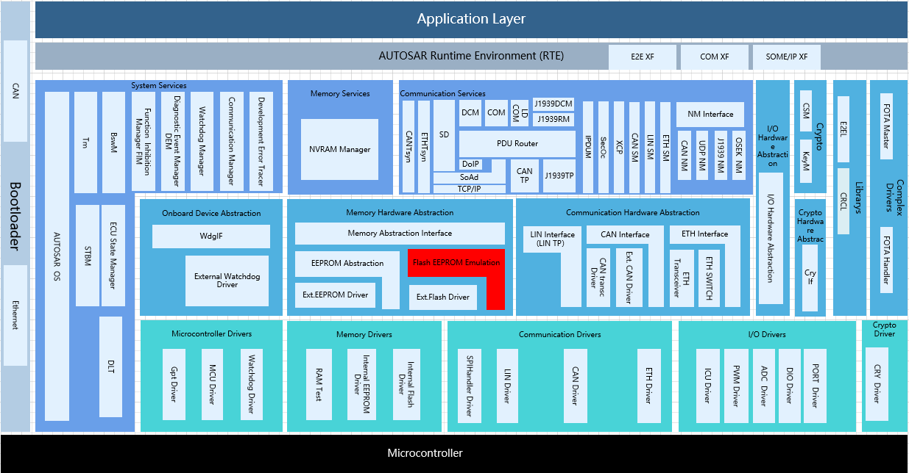
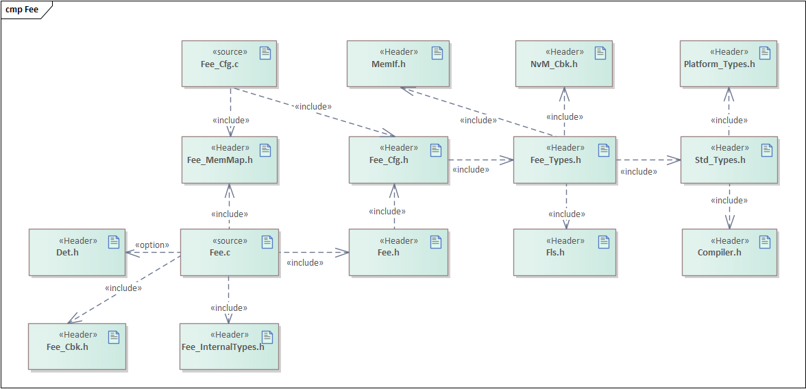
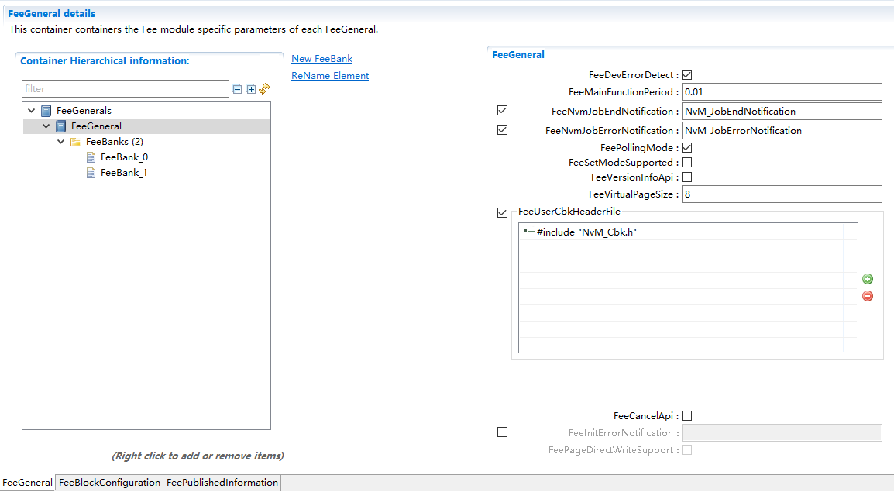
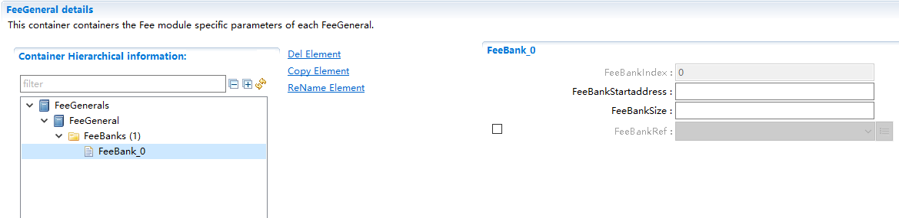
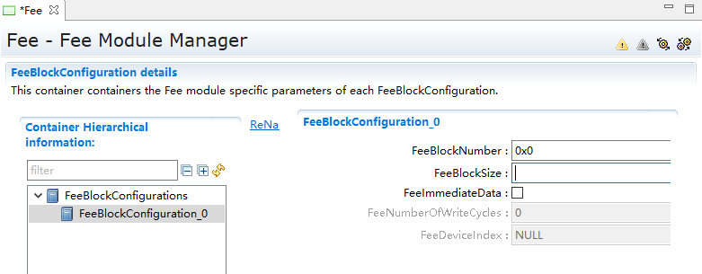
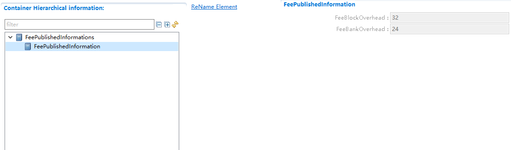
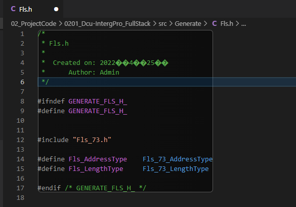

Fee
#################################

:strong:`缩写词注解 (Abbreviation Notes):`

.. list-table::
   :widths: 34 33 33
   :header-rows: 1

   * - 缩写词 (Abbreviation)
     - 解释/描述 (Explanation/Description)
     - 中文解释 (Chinese explanation)
   * - EA
     - EEPROM Abstraction
     - Eeprom抽象模块 (EEPROM Abstraction Module)
   * - FEE
     - Flash EEPROM Emulation
     - Flash模拟Eeprom抽象模块 (Flash Simulation Eeprom Abstract Module)
   * - MemIf
     - Memory AbstractionInterface
     - 存储抽象接口模块 (Storage abstraction interface module)
   * - NvM
     - NVRAM Manager
     - 非易失性存储管理模块 (Non-volatile Storage Management Module)
   * - (Logical)block
     - Smallest writable /erasable unit as seen bythe modules user.
     - 上层模块可操作单元（虚拟页的整数倍） (Upper-level modules operate on units (integer multiples of virtual pages))
   * - 
     - Consists of one or
     - 
   * - 
     - more virtual pages.
     - 
   * - Virtualpage
     - May consist of one orseveral physical pages
     - 虚拟页（物理页的整数倍） (Virtual pages (integer multiples of physical pages))
   * - Bank
     - May consist of one orseveral physical sectors
     - Fee实现模拟Eeprom的擦除块 (Fee implements simulated EEPROM erase blocks)

简介 (Introduction)
=================================

Fee模块通过模拟Eeprom（不用先擦除再写入）主要实现基于Block的非易失性数据读、写功能，同时支持Immediate Block的擦除，支持Block的无效操作，支持存储快慢模式的切换，支持任务的取消机制，支持模块状态及任务结果的获取。

The Fee module mainly implements block-based non-volatile data read and write functions by simulating EEPROM (without needing to erase before writing). It supports Immediate Block erasure, invalid operations on blocks, switching between fast and slow storage modes, canceling tasks, and obtaining module status and task results.

Fee模块处于AUTOSAR架构中的存储硬件抽象层，其下层模块为Flash驱动模块，上层模块为MemIf、NvM。

The Fee module is located in the storage hardware abstraction layer of the AUTOSAR architecture, with the lower-level module being the Flash driver module and the upper-level modules being MemIf and NvM.

Fee模块实现上层模块基于Block在Flash上的读写、无效、擦除（Immediate）操作。

The Fee module implements upper-layer module operations on Block reads and writes, invalidation, and erase ( Immediate ) in Flash.

参考资料 (Reference materials)
------------------------------------------

[1] AUTOSAR_SWS_FlashEEPROMEmulation.pdf，R19-11

[2] AUTOSAR_SWS_FlashDriver.pdf，R19-11

[3] AUTOSAR_SWS_MemoryAbstractionInterface.pdf，R19-11

[4] AUTOSAR_SWS_NVRAMManager.pdf，R19-11

功能描述 (Function Description)
===========================================

模块初始化 (Module initialization)
---------------------------------------------

模块初始化功能介绍 (Module initialization functionality introduction)
~~~~~~~~~~~~~~~~~~~~~~~~~~~~~~~~~~~~~~~~~~~~~~~~~~~~~~~~~~~~~~~~~~~~~~~~~~~~

Fee模块的初始化会加载Flash中存储的所有Block的状态及其存储地址等信息，以及计算存储新Block数据及管理信息的地址。

The initialization of the Fee module will load all Block status and storage addresses stored in Flash, as well as calculate the addresses for storing new Block data and managing information.

模块初始化功能实现 (Module initialization functionality implementation)
~~~~~~~~~~~~~~~~~~~~~~~~~~~~~~~~~~~~~~~~~~~~~~~~~~~~~~~~~~~~~~~~~~~~~~~~~~~~~~

因为Fee初始化可能涉及大量的Flash读操作，以及可能发生的Flash擦除、写入操作，通常耗时较长。所以Fee的初始化通过异步实现，Fee_Init加载初始化任务，由Fee_MainFunction来实际执行。

Because Fee initialization may involve a large number of Flash read operations, as well as potential Flash erase and write operations, it usually takes a longer time. Therefore, Fee initialization is implemented asynchronously; Fee_Init loads the initialization tasks, which are executed by Fee_MainFunction.

Block操作功能 (Block operation function)
----------------------------------------------------

Block操作功能介绍 (Introduction to Block Operation Functionality)
~~~~~~~~~~~~~~~~~~~~~~~~~~~~~~~~~~~~~~~~~~~~~~~~~~~~~~~~~~~~~~~~~~~~~~~~~~~

Fee提供基于Block的读、写、无效、擦除（Immediate）操作，实现Block数据在Flash上的非易失性存储功能。

Fee provides block-based read, write, invalidation, and erase ( Immediate ) operations to achieve non-volatile storage of Block data on Flash.

Block操作功能实现 (Block operation functionality implementation)
~~~~~~~~~~~~~~~~~~~~~~~~~~~~~~~~~~~~~~~~~~~~~~~~~~~~~~~~~~~~~~~~~~~~~~~~~~

1. Fee模块对Block的操作是单任务的，同一时间只能处理一个任务，任务处理过程中不能加载新的任务。

The Fee module operates on Blocks in a single-task manner, handling only one task at a time. The new tasks cannot be loaded during processing.

2. Fee模块对Block的操作都是通过异步机制实现，通过调用Fee_Read，Fee_Write，Fee_InvalidateBlock，Fee_EraseImmediateBlock加载任务，在Fee_MainFunction中实际执行。

The operations of the Fee module on Block are implemented through asynchronous mechanisms by calling Fee_Read, Fee_Write, Fee_InvalidateBlock, Fee_EraseImmediateBlock loading tasks are actually executed in Fee_MainFunction.

3. Block的区分通过参数BlockNumber决定，各个Block的BlockNumber唯一，存储栈集成时BlockNumber的配置需要与NvMDatasetSelectionBits及关联NvM模块中Block的NvMBlockManagementType适配。

The distinction of Block is determined by the parameter BlockNumber, and each Block's BlockNumber Only, when integrating Storage Stack, the configuration of BlockNumber needs to be compatible with NvMDatasetSelectionBits and the NvM module's Block NvMBlockManagementType.

4. 任务的结果支持两种机制反馈给上层模块：

The results of the task support two mechanisms feeding back to the upper module:

- Polling：实现接口Fee_GetJobResult供上层随时获取Job结果；

Polling: Implement the interface Fee_GetJobResult for upper layers to retrieve Job results at any time;

- Notification：任务成功/失败通过调用上层回调函数通知，如NvM_JobEndNotification/NvM_JobErrorNotification；

Notification：Tasks success/failure are notified through calling upper-layer callback functions such as NvM_JobEndNotification/NvM_JobErrorNotification;

5. 配置为Immediate的Block才支持Fee_EraseImmediateBlock操作，且在调用Fee_Write前需要先执行完Fee_EraseImmediateBlock任务。

Blocks configured as Immediate support the Fee_EraseImmediateBlock operation, and Before calling Fee_Write, the Fee_EraseImmediateBlock task needs to be completed first.

Flash访问功能 (Flash Access Function)
-------------------------------------------------

Flash访问功能介绍 (Flash Access Function Introduction)
~~~~~~~~~~~~~~~~~~~~~~~~~~~~~~~~~~~~~~~~~~~~~~~~~~~~~~~~~~~~~~~~

Fee功能的实现依赖于通过Flash驱动实现Flash的擦除、读、写功能，以及任务取消，任务结果获取，快慢模式设置等机制。

The implementation of Fee functionality relies on the realization of Flash erase, read, and write functions through Flash drivers, as well as mechanisms for task cancellation, obtaining task results, and setting fast/slow modes.

Flash访问功能实现 (Flash Access functionality implementation)
~~~~~~~~~~~~~~~~~~~~~~~~~~~~~~~~~~~~~~~~~~~~~~~~~~~~~~~~~~~~~~~~~~~~~~~

Flash驱动中Flash数据的擦除、读、写同样通过异步机制实现，Fee模块与Flash驱动之间任务结果的交互同样分两种机制：

The erasure, reading, and writing of Flash data in the Flash driver are also implemented through asynchronous mechanisms. The interaction between the Fee module and the Flash driver regarding task results is similarly divided into two mechanisms.

- Polling：Fee_MainFunction中调用Fls_GetJobResult获取Job结果；

Polling： Fee_MainFunction calls Fls_GetJobResult to get the Job result;

- Notification：任务成功/失败Flash驱动通过调用Fee回调函数通知（Fee_JobEndNotification/Fee_JobErrorNotification）；

Notification：Task Success/Failure Flash driver notifies through calling Fee callback function (Fee_JobEndNotification/Fee_JobErrorNotification);

错误检测功能 (Error detection functionality)
------------------------------------------------------

错误检测功能介绍 (Introduction to Error Detection Function)
~~~~~~~~~~~~~~~~~~~~~~~~~~~~~~~~~~~~~~~~~~~~~~~~~~~~~~~~~~~~~~~~~~~

Fee模块实现DET开发错误和DET运行时错误检测及报错。

The Fee module implements the detection and error reporting for development errors and runtime errors in DET.

错误检测功能实现 (Error detection functionality implementation)
~~~~~~~~~~~~~~~~~~~~~~~~~~~~~~~~~~~~~~~~~~~~~~~~~~~~~~~~~~~~~~~~~~~~~~~

.. list-table::
   :widths: 25 25 25 25
   :header-rows: 1

   * - Type or error
     - Relevance
     - Related error code
     - Value[hex]
   * - 未初始化 (Uninitialized)
     - Development
     - FEE_E_UNINIT
     - 0x01
   * - BlockNumber错误 (BlockNumber Error)
     - Development
     - FEE_E_INVALID_BLOCK_NO
     - 0x02
   * - Blockoffset错误 (Blockoffset Error)
     - Development
     - FEE_E_INVALID_BLOCK_OFS
     - 0x03
   * - 数据指针错误 (Error in data pointer)
     - Development
     - FEE_E_PARAM_POINTER
     - 0x04
   * - Blocklength错误 (Blocklength Error)
     - Development
     - FEE_E_INVALID_BLOCK_LEN
     - 0x05
   * - Fee初始化失败 (Fee initialization failed)
     - Development
     - FEE_E_INIT_FAILED（R20_11已删除）
     - 0x09
   * - Busy状态请求新任务 (Busy status requests new task)
     - Runtime
     - FEE_E_BUSY
     - 0x06
   * - 无任务正在执行时请求任务取消 (Request task cancellation when no tasks are executing)
     - Runtime
     - FEE_E_INVALID_CANCEL
     - 0x08

源文件描述 (Source file description)
===============================================

.. centered:: **表 Fee组件文件描述 (Table Fee Component File Description)**

.. list-table::
   :widths: 50 50
   :header-rows: 1

   * - 文件 (Files)
     - 说明 (Description)
   * - Fee_Cfg.h
     - 定义Fee模块PC配置的宏定义。 (Define macro definitions for PC configuration of the Fee module.)
   * - Fee_Cfg.c
     - 定义Fee模块PC/PB配置的结构体参数。 (Define the struct parameters for the Fee module PC/PB configuration.)
   * - Fee.h
     - 实现Fee模块全部外部接口（除了回调函数）的声明，以及模块内部宏定义。 (Declare all external interfaces of the Fee module (excluding callback functions) and the macros defined within the module.)
   * - Fee.c
     - 作为Fee模块的核心文件，实现Fee模块全部对外接口，以及实现Fee模块功能所必须的local函数，local宏定义，local变量定义。 (As the core file of the Fee module, it realizes all external interfaces of the Fee module and local functions, local macro definitions, and local variable definitions required for implementing the functionality of the Fee module.)
   * - Fee_Cbk.h
     - 实现Fee模块全部回调函数的声明。 (Declare all callback functions of the Fee module.)
   * - Fee_Types.h
     - 实现PB/PC配置参数结构体类型的定义。 (Define the structure type for PB/PC configuration parameters.)
   * - Fee_MemMap.h
     - 实现Fee模块内存布局。 (Implement the memory layout for the Fee module.)
   * - Fee_InternalTypes.h
     - 实现Fee内部管理数据类型的定义。 (Define internal management data types for Fee.)

API接口 (API Interface)
=====================================

类型定义 (Type definition)
--------------------------------------

Fee_ConfigType类型定义 (Fee_ConfigType type definition)
~~~~~~~~~~~~~~~~~~~~~~~~~~~~~~~~~~~~~~~~~~~~~~~~~~~~~~~~~~~~~~~~~~~

.. list-table::
   :widths: 50 50
   :header-rows: 1

   * - 名称 (Name)
     - Fee_ConfigType
   * - 类型 (Type)
     - struct
   * - 范围 (Range)
     - 无
   * - 描述 (Description)
     - Fee模块配置数据结构体类型 (Fee module configuration data structure type)

输入函数描述 (Describe the input function:)
-----------------------------------------------------

.. list-table::
   :widths: 50 50
   :header-rows: 1

   * - 输入模块 (Input Module)
     - API
   * - Fls
     - Fls_Cancel
   * - 
     - Fls_Erase
   * - 
     - Fls_GetJobResult
   * - 
     - Fls_Read
   * - 
     - Fls_SetMode
   * - 
     - Fls_Write
   * - SchM
     - SchM_Enter_Fee
   * - 
     - SchM_Exit_Fee
   * - Det
     - Det_ReportRuntimeError
   * - 
     - Det_ReportError
   * - NvM
     - NvM_JobEndNotification
   * - 
     - NvM_JobErrorNotification

静态接口函数定义 (Static interface function definition)
---------------------------------------------------------------

Fee_Init函数定义 (The Fee_Init function defines)
~~~~~~~~~~~~~~~~~~~~~~~~~~~~~~~~~~~~~~~~~~~~~~~~~~~~~~~~~~~~

.. list-table::
   :widths: 25 25 25 25
   :header-rows: 1

   * - 函数名称： (Function Name:)
     - Fee_Init
     - 
     - 
   * - 函数原型： (Function prototype:)
     - FUNC(void, FEE_CODE)
     - 
     - 
   * - 
     - Fee_Init(P2CONST(Fee_ConfigType,AUTOMATIC,FEE_APPL_CONST)ConfigPtr)
     - 
     - 
   * - 服务编号： (Service Number:)
     - 0x00
     - 
     - 
   * - 同步/异步： (Synchronous/asynchronous:)
     - 异步 (Asynchronous)
     - 
     - 
   * - 是否可重入： (Is Reentrant:)
     - 否 (No)
     - 
     - 
   * - 输入参数： (Input parameters:)
     - ConfigPtr：配置设置的指针 (ConfigPtr：a pointer to configuration settings)
     - 值域： (Domain:)
     - 无
   * - 输入输出参数： (Input Output Parameters:)
     - 无
     - 
     - 
   * - 输出参数： (Output Parameters:)
     - 无
     - 
     - 
   * - 返回值： (Return Value:)
     - 无
     - 
     - 
   * - 功能概述： (Function Overview:)
     - Fee模块初始化任务加载 (Fee module initialization task loading)
     - 
     - 

Fee_SetMode函数定义 (Fee_SetMode function definition)
~~~~~~~~~~~~~~~~~~~~~~~~~~~~~~~~~~~~~~~~~~~~~~~~~~~~~~~~~~~~~~~~~

.. list-table::
   :widths: 25 25 25 25
   :header-rows: 1

   * - 函数名称： (Function Name:)
     - Fee_SetMode
     - 
     - 
   * - 函数原型： (Function prototype:)
     - FUNC(void,FEE_CODE)
     - 
     - 
   * - 
     - Fee_SetMode(VAR(MemIf_ModeType,AUTOMATIC) Mode)
     - 
     - 
   * - 服务编号： (Service Number:)
     - 0x01
     - 
     - 
   * - 同步/异步： (Synchronous/asynchronous:)
     - 异步 (Asynchronous)
     - 
     - 
   * - 是否可重入： (Is Reentrant:)
     - 否 (No)
     - 
     - 
   * - 输入参数： (Input parameters:)
     - Mode
     - 值域： (Domain:)
     - MEMIF_MODE_SLOWMEMIF_MODE_FAST
   * - 输入输出参数： (Input Output Parameters:)
     - 无
     - 
     - 
   * - 输出参数： (Output Parameters:)
     - 无
     - 
     - 
   * - 返回值： (Return Value:)
     - 无
     - 
     - 
   * - 功能概述： (Function Overview:)
     - 请求设置存储模式（SLOW/FAST）
     - 
     - 

Fee_Read函数定义 (Fee_Read function definition)
~~~~~~~~~~~~~~~~~~~~~~~~~~~~~~~~~~~~~~~~~~~~~~~~~~~~~~~~~~~

.. list-table::
   :widths: 25 25 25 25
   :header-rows: 1

   * - 函数名称： (Function Name:)
     - Fee_Read
     - 
     - 
   * - 函数原型： (Function prototype:)
     - FUNC(Std_ReturnType,FEE_CODE)
     - 
     - 
   * - 
     - Fee_Read(
     - 
     - 
   * - 
     - VAR(uint16,AUTOMATIC)BlockNumber,
     - 
     - 
   * - 
     - VAR(uint16,AUTOMATIC)BlockOffset,
     - 
     - 
   * - 
     - P2VAR(uint8,AUTOMATIC,FEE_APPL_DATA)DataBufferPtr,
     - 
     - 
   * - 
     - VAR(uint16,AUTOMATIC)Length)
     - 
     - 
   * - 服务编号： (Service Number:)
     - 0x02
     - 
     - 
   * - 同步/异步： (Synchronous/asynchronous:)
     - 异步 (Asynchronous)
     - 
     - 
   * - 是否可重入： (Is Reentrant:)
     - 否 (No)
     - 
     - 
   * - 输入参数： (Input parameters:)
     - BlockNumberBlockOffset
     - 值域： (Domain:)
     - 0…65535
   * - 
     - Length
     - 
     - 
   * - 
     - 
     - 
     - 0…65535
   * - 
     - 
     - 
     - 0…65535
   * - 输入输出参数： (Input Output Parameters:)
     - 无
     - 
     - 
   * - 输出参数： (Output Parameters:)
     - DataBufferPtr：Pointerto data buffer
     - 
     - 
   * - 返回值： (Return Value:)
     - Std_ReturnType：
     - 
     - 
   * - 
     - E_OK: Therequested job hasbeen accepted bythe module.
     - 
     - 
   * - 
     - E_NOT_OK: Therequested job hasnot been acceptedby the module.
     - 
     - 
   * - 功能概述： (Function Overview:)
     - 请求Block的读任务 (Request Block Read Task)
     - 
     - 

Fee_Write函数定义 (Fee_Write function definition)
~~~~~~~~~~~~~~~~~~~~~~~~~~~~~~~~~~~~~~~~~~~~~~~~~~~~~~~~~~~~~

.. list-table::
   :widths: 25 25 25 25
   :header-rows: 1

   * - 函数名称： (Function Name:)
     - Fee_Write
     - 
     - 
   * - 函数原型： (Function prototype:)
     - FUNC(Std_ReturnType,FEE_CODE)
     - 
     - 
   * - 
     - Fee_Write(VAR(uint16,AUTOMATIC)BlockNumber,P2CONST(uint8,AUTOMATIC,FEE_APPL_CONST)DataBufferPtr)
     - 
     - 
   * - 服务编号： (Service Number:)
     - 0x03
     - 
     - 
   * - 同步/异步： (Synchronous/asynchronous:)
     - 异步 (Asynchronous)
     - 
     - 
   * - 是否可重入： (Is Reentrant:)
     - 否 (No)
     - 
     - 
   * - 输入参数： (Input parameters:)
     - BlockNumber：block的序号 (BlockNumber：the block's sequence number)
     - 值域： (Domain:)
     - 0…65535
   * - 
     - DataBufferPtr：指向DataBuffer的指针 (DataBufferPtr：a pointer to DataBuffer)
     - 值域： (Domain:)
     - 无
   * - 输入输出参数： (Input Output Parameters:)
     - 无
     - 
     - 
   * - 输出参数： (Output Parameters:)
     - 无
     - 
     - 
   * - 返回值： (Return Value:)
     - Std_ReturnType
     - 
     - 
   * - 功能概述： (Function Overview:)
     - 请求Block的写任务 (Request write task for Block)
     - 
     - 

Fee_Cancel函数定义 (Fee_Cancel function definition)
~~~~~~~~~~~~~~~~~~~~~~~~~~~~~~~~~~~~~~~~~~~~~~~~~~~~~~~~~~~~~~~

.. list-table::
   :widths: 25 25 25 25
   :header-rows: 1

   * - 函数名称： (Function Name:)
     - Fee_Cancel
     - 
     - 
   * - 函数原型： (Function prototype:)
     - FUNC(void,FEE_CODE)Fee_Cancel(void)
     - 
     - 
   * - 服务编号： (Service Number:)
     - 0x04
     - 
     - 
   * - 同步/异步： (Synchronous/asynchronous:)
     - 同步 (Sync)
     - 
     - 
   * - 是否可重入： (Is Reentrant:)
     - 否 (No)
     - 
     - 
   * - 输入参数： (Input parameters:)
     - 无
     - 值域： (Domain:)
     - 无
   * - 输入输出参数： (Input Output Parameters:)
     - 无
     - 
     - 
   * - 输出参数： (Output Parameters:)
     - 无
     - 
     - 
   * - 返回值： (Return Value:)
     - 无
     - 
     - 
   * - 功能概述： (Function Overview:)
     - 请求正在执行的任务取消 (Requesting cancellation of executing tasks)
     - 
     - 

Fee_GetStatus函数定义 (Fee_GetStatus function definition)
~~~~~~~~~~~~~~~~~~~~~~~~~~~~~~~~~~~~~~~~~~~~~~~~~~~~~~~~~~~~~~~~~~~~~

.. list-table::
   :widths: 25 25 25 25
   :header-rows: 1

   * - 函数名称： (Function Name:)
     - Fee_GetStatus
     - 
     - 
   * - 函数原型： (Function prototype:)
     - FUNC(MemIf_StatusType,FEE_CODE)Fee_GetStatus(void)
     - 
     - 
   * - 服务编号： (Service Number:)
     - 0x05
     - 
     - 
   * - 同步/异步： (Synchronous/asynchronous:)
     - 同步 (Sync)
     - 
     - 
   * - 是否可重入： (Is Reentrant:)
     - 否 (No)
     - 
     - 
   * - 输入参数： (Input parameters:)
     - 无
     - 值域： (Domain:)
     - 无
   * - 输入输出参数： (Input Output Parameters:)
     - 无
     - 
     - 
   * - 输出参数： (Output Parameters:)
     - 无
     - 
     - 
   * - 返回值： (Return Value:)
     - MemIf_StatusType
     - 
     - 
   * - 功能概述： (Function Overview:)
     - 获取Fee模块当前状态 (Get the current status of the Fee module)
     - 
     - 

Fee_GetJobResult函数定义 (Function Definition for Fee_GetJobResult)
~~~~~~~~~~~~~~~~~~~~~~~~~~~~~~~~~~~~~~~~~~~~~~~~~~~~~~~~~~~~~~~~~~~~~~~~~~~~~~~

.. list-table::
   :widths: 25 25 25 25
   :header-rows: 1

   * - 函数名称： (Function Name:)
     - Fee_GetJobResult
     - 
     - 
   * - 函数原型： (Function prototype:)
     - FUNC(MemIf_JobResultType,FEE_CODE)Fee_GetJobResult(void)
     - 
     - 
   * - 服务编号： (Service Number:)
     - 0x06
     - 
     - 
   * - 同步/异步： (Synchronous/asynchronous:)
     - 同步 (Sync)
     - 
     - 
   * - 是否可重入： (Is Reentrant:)
     - 否 (No)
     - 
     - 
   * - 输入参数： (Input parameters:)
     - 无
     - 值域： (Domain:)
     - 无
   * - 输入输出参数： (Input Output Parameters:)
     - 无
     - 
     - 
   * - 输出参数： (Output Parameters:)
     - 无
     - 
     - 
   * - 返回值： (Return Value:)
     - MemIf_JobResultType：
     - 
     - 
   * - 
     - MEMIF_UNINIT:FEE模块没有初始化 (MEMIF_UNINIT: FEE Module Not Initialized)
     - 
     - 
   * - 
     - MEMIF_IDLE:FEE模块当前处于空闲状态 (MEMIF_IDLE:FEE Module is currently idle)
     - 
     - 
   * - 
     - MEMIF_BUSY:FEE模块当前正忙 (MEMIF_BUSY:FEE Module is currently busy)
     - 
     - 
   * - 
     - MEMIF_BUSY_INTERNAL:FEE模块忙于内部管理操作 (MEMIF_BUSY_INTERNAL: FEE Module Busy with Internal Management Operations)
     - 
     - 
   * - 功能概述： (Function Overview:)
     - 获取当前任务结果 (Get current task result)
     - 
     - 

Fee_InvalidateBlock函数定义 (Function Fee_InvalidateBlock Defined)
~~~~~~~~~~~~~~~~~~~~~~~~~~~~~~~~~~~~~~~~~~~~~~~~~~~~~~~~~~~~~~~~~~~~~~~~~~~~~~

.. list-table::
   :widths: 25 25 25 25
   :header-rows: 1

   * - 函数名称： (Function Name:)
     - Fee_InvalidateBlock
     - 
     - 
   * - 函数原型： (Function prototype:)
     - FUNC(Std_ReturnType,FEE_CODE)Fee_InvalidateBlock(VAR(uint16,AUTOMATIC)BlockNumber)
     - 
     - 
   * - 服务编号： (Service Number:)
     - 0x07
     - 
     - 
   * - 同步/异步： (Synchronous/asynchronous:)
     - 异步 (Asynchronous)
     - 
     - 
   * - 是否可重入： (Is Reentrant:)
     - 否 (No)
     - 
     - 
   * - 输入参数： (Input parameters:)
     - BlockNumber：block序号 (BlockNumber：block number)
     - 值域： (Domain:)
     - 0…65535
   * - 输入输出参数： (Input Output Parameters:)
     - 无
     - 
     - 
   * - 输出参数： (Output Parameters:)
     - 无
     - 
     - 
   * - 返回值： (Return Value:)
     - Std_ReturnType：
     - 
     - 
   * - 
     - E_OK:请求的任务已被模块接受 (E_OK: The request task has been accepted by the module.)
     - 
     - 
   * - 
     - E_NOT_OK：仅当启用了DET时:所请求的任务尚未被模块接受 (E_NOT_OK：When DET is enabled: the requested task has not been accepted by the module yet.)
     - 
     - 
   * - 功能概述： (Function Overview:)
     - 请求Block无效任务 (Request Block Invalid Task)
     - 
     - 

Fee_GetVersionInfo函数定义 (Function Fee_GetVersionInfo Definition)
~~~~~~~~~~~~~~~~~~~~~~~~~~~~~~~~~~~~~~~~~~~~~~~~~~~~~~~~~~~~~~~~~~~~~~~~~~~~~~~

.. list-table::
   :widths: 25 25 25 25
   :header-rows: 1

   * - 函数名称： (Function Name:)
     - Fee_GetVersionInfo
     - 
     - 
   * - 函数原型： (Function prototype:)
     - FUNC(void,FEE_CODE)
     - 
     - 
   * - 
     - Fee_GetVersionInfo(P2VAR(Std_VersionInfoType,AUTOMATIC,FEE_APPL_DATA)VersionInfoPtr)
     - 
     - 
   * - 服务编号： (Service Number:)
     - 0x08
     - 
     - 
   * - 同步/异步： (Synchronous/asynchronous:)
     - 同步 (Sync)
     - 
     - 
   * - 是否可重入： (Is Reentrant:)
     - 是 (Is)
     - 
     - 
   * - 输入参数： (Input parameters:)
     - 无
     - 值域： (Domain:)
     - 无
   * - 输入输出参数： (Input Output Parameters:)
     - 无
     - 
     - 
   * - 输出参数： (Output Parameters:)
     - VersionInfoPtr
     - 
     - 
   * - 返回值： (Return Value:)
     - 无
     - 
     - 
   * - 功能概述： (Function Overview:)
     - 获取Fee模块软件版本信息 (Get Fee Module Software Version Information)
     - 
     - 

Fee_EraseImmediateBlock函数定义 (Function Fee_EraseImmediateBlock definition)
~~~~~~~~~~~~~~~~~~~~~~~~~~~~~~~~~~~~~~~~~~~~~~~~~~~~~~~~~~~~~~~~~~~~~~~~~~~~~~~~~~~~~~~~~

.. list-table::
   :widths: 25 25 25 25
   :header-rows: 1

   * - 函数名称： (Function Name:)
     - Fee_EraseImmediateBlock
     - 
     - 
   * - 函数原型： (Function prototype:)
     - FUNC(Std_ReturnType,FEE_CODE)Fee_EraseImmediateBlock(VAR(uint16,AUTOMATIC)BlockNumber)
     - 
     - 
   * - 服务编号： (Service Number:)
     - 0x09
     - 
     - 
   * - 同步/异步： (Synchronous/asynchronous:)
     - 异步 (Asynchronous)
     - 
     - 
   * - 是否可重入： (Is Reentrant:)
     - 否 (No)
     - 
     - 
   * - 输入参数： (Input parameters:)
     - BlockNumber：block序号 (BlockNumber：block number)
     - 值域： (Domain:)
     - 0…65535
   * - 输入输出参数： (Input Output Parameters:)
     - 无
     - 
     - 
   * - 输出参数： (Output Parameters:)
     - 无
     - 
     - 
   * - 返回值： (Return Value:)
     - Std_ReturnType：
     - 
     - 
   * - 
     - E_OK:请求的任务已被模块接受 (E_OK: The request task has been accepted by the module.)
     - 
     - 
   * - 
     - E_NOT_OK：仅当启用了DET时:所请求的任务尚未被模块接受 (E_NOT_OK：When DET is enabled: the requested task has not been accepted by the module yet.)
     - 
     - 
   * - 功能概述： (Function Overview:)
     - 请求立即Block的擦除任务 (Request for Immediate Block Erasure Task)
     - 
     - 

Fee_JobEndNotification函数定义 (Fee_JobEndNotification function definition)
~~~~~~~~~~~~~~~~~~~~~~~~~~~~~~~~~~~~~~~~~~~~~~~~~~~~~~~~~~~~~~~~~~~~~~~~~~~~~~~~~~~~~~~

.. list-table::
   :widths: 25 25 25 25
   :header-rows: 1

   * - 函数名称： (Function Name:)
     - Fee_JobEndNotification
     - 
     - 
   * - 函数原型： (Function prototype:)
     - FUNC(void,FEE_CODE)Fee_JobEndNotification(void)
     - 
     - 
   * - 服务编号： (Service Number:)
     - 0x10
     - 
     - 
   * - 同步/异步： (Synchronous/asynchronous:)
     - 同步 (Sync)
     - 
     - 
   * - 是否可重入： (Is Reentrant:)
     - 否 (No)
     - 
     - 
   * - 输入参数： (Input parameters:)
     - 无
     - 值域： (Domain:)
     - 无
   * - 输入输出参数： (Input Output Parameters:)
     - 无
     - 
     - 
   * - 输出参数： (Output Parameters:)
     - 无
     - 
     - 
   * - 返回值： (Return Value:)
     - 无
     - 
     - 
   * - 功能概述： (Function Overview:)
     - Flash访问（异步操作）成功通知 (Flash Access (Asynchronous Operation) Success Notification)
     - 
     - 

Fee_JobErrorNotification函数定义 (Fee_JobErrorNotification function definition)
~~~~~~~~~~~~~~~~~~~~~~~~~~~~~~~~~~~~~~~~~~~~~~~~~~~~~~~~~~~~~~~~~~~~~~~~~~~~~~~~~~~~~~~~~~~

.. list-table::
   :widths: 25 25 25 25
   :header-rows: 1

   * - 函数名称： (Function Name:)
     - Fee_JobErrorNotification
     - 
     - 
   * - 函数原型： (Function prototype:)
     - FUNC(void,FEE_CODE)Fee_JobErrorNotification(void)
     - 
     - 
   * - 服务编号： (Service Number:)
     - 0x11
     - 
     - 
   * - 同步/异步： (Synchronous/asynchronous:)
     - 同步 (Sync)
     - 
     - 
   * - 是否可重入： (Is Reentrant:)
     - 否 (No)
     - 
     - 
   * - 输入参数： (Input parameters:)
     - 无
     - 值域： (Domain:)
     - 无
   * - 输入输出参数： (Input Output Parameters:)
     - 无
     - 
     - 
   * - 输出参数： (Output Parameters:)
     - 无
     - 
     - 
   * - 返回值： (Return Value:)
     - 无
     - 
     - 
   * - 功能概述： (Function Overview:)
     - Flash访问（异步操作）失败通知 (Notification for Flash Access (Asynchronous Operation) Failure)
     - 
     - 

Fee_MainFunction函数定义 (Fee_MainFunction function definition)
~~~~~~~~~~~~~~~~~~~~~~~~~~~~~~~~~~~~~~~~~~~~~~~~~~~~~~~~~~~~~~~~~~~~~~~~~~~

.. list-table::
   :widths: 25 25 25 25
   :header-rows: 1

   * - 函数名称： (Function Name:)
     - Fee_MainFunction
     - 
     - 
   * - 函数原型： (Function prototype:)
     - FUNC(void,FEE_CODE)Fee_MainFunction(void)
     - 
     - 
   * - 服务编号： (Service Number:)
     - 0x12
     - 
     - 
   * - 同步/异步： (Synchronous/asynchronous:)
     - 同步 (Sync)
     - 
     - 
   * - 是否可重入： (Is Reentrant:)
     - 否 (No)
     - 
     - 
   * - 输入参数： (Input parameters:)
     - 无
     - 值域： (Domain:)
     - 无
   * - 输入输出参数： (Input Output Parameters:)
     - 无
     - 
     - 
   * - 输出参数： (Output Parameters:)
     - 无
     - 
     - 
   * - 返回值： (Return Value:)
     - 无
     - 
     - 
   * - 功能概述： (Function Overview:)
     - Fee模块的周期调度主函数 (Main function for periodic scheduling of the Fee module)
     - 
     - 

可配置函数定义 (Configurable Function Definition)
----------------------------------------------------------

无。

None.

配置 (Configure)
==============================

FeeGeneral
--------------------------

.. centered:: **表 FeeGeneral (Table FeeGeneral)**

.. list-table::
   :widths: 20 20 20 20 20
   :header-rows: 1

   * - UI名称 (UI Name)
     - 描述 (Description)
     - 
     - 
     - 
   * - FeeDevErrorDetect
     - 取值范围 (Range)
     - True/False
     - 默认取值 (Default value)
     - True
   * - 
     - 参数描述 (Parameter Description)
     - 是否使能DET开发错误检测机制 (Is the DET development error detection mechanism enabled?)
     - 
     - 
   * - 
     - 依赖关系 (Dependencies)
     - 依赖于Det模块开发错误报错接口的支持 (Develop support for error reporting interfaces based on the Det module.)
     - 
     - 
   * - FeeMainFunctionPeriod
     - 取值范围 (Range)
     - 0 … INF
     - 默认取值 (Default value)
     - 0.01
   * - 
     - 参数描述 (Parameter Description)
     - Fee_MainFunction的调度周期 (The scheduling cycle of Fee_MainFunction)
     - 
     - 
   * - 
     - 依赖关系 (Dependencies)
     - 无
     - 
     - 
   * - FeeNvmJobEndNotification
     - 取值范围 (Range)
     - 配置项0-1属性，配置类型string (Configuration Item 0-1 Property, Configuration Type string)
     - 默认取值 (Default value)
     - 无
   * - 
     - 参数描述 (Parameter Description)
     - 任务执行成功通知 (Task execution success notification)
     - 
     - 
   * - 
     - 依赖关系 (Dependencies)
     - 依赖于上层模块相应回调函数名 (Dependent on the callback function names of upper-layer modules)
     - 
     - 
   * - FeeNvmJobErrorNotification
     - 取值范围 (Range)
     - 配置项0-1属性，配置类型string (Configuration Item 0-1 Property, Configuration Type string)
     - 默认取值 (Default value)
     - 无
   * - 
     - 参数描述 (Parameter Description)
     - 任务执行失败通知 (Task execution failure notification)
     - 
     - 
   * - 
     - 依赖关系 (Dependencies)
     - 依赖于上层模块相应回调函数名 (Dependent on the callback function names of upper-layer modules)
     - 
     - 
   * - FeePollingMode
     - 取值范围 (Range)
     - true/false
     - 默认取值 (Default value)
     - false
   * - 
     - 参数描述 (Parameter Description)
     - Flash访问是否使能轮询模式，反之则为通知模式 (Is Flash access enabled in polling mode, otherwise it is notification mode)
     - 
     - 
   * - 
     - 依赖关系 (Dependencies)
     - 通知模式需要Flash驱动相应功能支持 (Notification mode requires Flash driver support for corresponding functionality.)
     - 
     - 
   * - FeeSetModeSupported
     - 取值范围 (Range)
     - true/false
     - 默认取值 (Default value)
     - false
   * - 
     - 参数描述 (Parameter Description)
     - 是否使能Fee_SetMode (Whether Fee_SetMode is Enabled)
     - 
     - 
   * - 
     - 依赖关系 (Dependencies)
     - 依赖于Flash驱动相应功能的使能 (Dependent on Flash drive responsive functionality enabling)
     - 
     - 
   * - FeeVersionInfoApi
     - 取值范围 (Range)
     - true/false
     - 默认取值 (Default value)
     - false
   * - 
     - 参数描述 (Parameter Description)
     - 是否支持Fee_GetVersionInfo (Does Fee_GetVersionInfo support preservation of line breaks?)
     - 
     - 
   * - 
     - 依赖关系 (Dependencies)
     - 无
     - 
     - 
   * - FeeVirtualPageSize
     - 取值范围 (Range)
     - 0 ... 65535
     - 默认取值 (Default value)
     - 8
   * - 
     - 参数描述 (Parameter Description)
     - 虚拟页大小 (Virtual page size)
     - 
     - 
   * - 
     - 依赖关系 (Dependencies)
     - 关联Flash驱动的物理页的整数倍 (Multiples of the integer associated with Flash drive physical pages)
     - 
     - 
   * - FeeUserCbkHeaderFile
     - 取值范围 (Range)
     - 配置属性0-N，配置类型string (Configure property 0-N, Configure type string)
     - 默认取值 (Default value)
     - 无
   * - 
     - 参数描述 (Parameter Description)
     - Fee调用上层模块回调函数声明的头文件 (Header file for declaring callbacks of Fee call to upper module)
     - 
     - 
   * - 
     - 依赖关系 (Dependencies)
     - 回调函数声明的头文件名 (Header file name for callback function declaration)
     - 
     - 
   * - FeeCancelApi
     - 取值范围 (Range)
     - true/false
     - 默认取值 (Default value)
     - false
   * - 
     - 参数描述 (Parameter Description)
     - 是否使能Fee_Cancel (Whether Fee_Cancel is Enabled)
     - 
     - 
   * - 
     - 依赖关系 (Dependencies)
     - 依赖于Flash驱动相应功能的使能 (Dependent on Flash drive responsive functionality enabling)
     - 
     - 
   * - FeeInitErrorNotification
     - 取值范围 (Range)
     - 配置项0-1属性，配置类型string (Configuration Item 0-1 Property, Configuration Type string)
     - 默认取值 (Default value)
     - 无
   * - 
     - 参数描述 (Parameter Description)
     - Fee初始化失败通知 (Fee initialization failed notification)
     - 
     - 
   * - 
     - 依赖关系 (Dependencies)
     - 依赖于上层模块相应回调函数名 (Dependent on the callback function names of upper-layer modules)
     - 
     - 
   * - FeePageDirectWriteSupport
     - 取值范围 (Range)
     - true/false
     - 默认取值 (Default value)
     - false
   * - 
     - 参数描述 (Parameter Description)
     - 是否使能Flash数据多次写入（未擦除），以节约Block管理数据占用资源 (Is Flash data multiple writes (without erasure) enabled to save resources for Block management data?)
     - 
     - 
   * - 
     - 依赖关系 (Dependencies)
     - 依赖于FeeVirtualPageSize的大小以及Flash硬件特性支持 (Dependent on the size of FeeVirtualPageSize and Flash hardware feature support)
     - 
     - 

FeeBank
-----------------------

.. centered:: **表 FeeBank (Table FeeBank)**

.. list-table::
   :widths: 20 20 20 20 20
   :header-rows: 1

   * - UI名称 (UI Name)
     - 描述 (Description)
     - 
     - 
     - 
   * - FeeBankIndex
     - 取值范围 (Range)
     - 0…N
     - 默认取值 (Default value)
     - 无
   * - 
     - 参数描述 (Parameter Description)
     - Fee Bank的Index (Fee Bank's Index)
     - 
     - 
   * - 
     - 依赖关系 (Dependencies)
     - 从0开始工具自动排序 (Tools automatically sorted from 0)
     - 
     - 
   * - FeeBankStartaddress
     - 取值范围 (Range)
     - 0...N
     - 默认取值 (Default value)
     - 0
   * - 
     - 参数描述 (Parameter Description)
     - Bank的起始地址 (Starting address of Bank)
     - 
     - 
   * - 
     - 依赖关系 (Dependencies)
     - 当FeeBankRef配置时，工具从Flash驱动自动获取填充（不能手动配置）； (When FeeBankRef is configured, the tool automatically retrieves the fill from the Flash driver (cannot be manually configured).)
     - 
     - 
   * - 
     - 
     - 当FeeBankRef未配置时，需手动配置（手动配置时由配置人员来保证配置正确性） (When FeeBankRef is not configured, manual configuration is required (manual configuration correctness guaranteed by the configuration personnel).)
     - 
     - 
   * - FeeBankSize
     - 取值范围 (Range)
     - 0...N
     - 默认取值 (Default value)
     - 0
   * - 
     - 参数描述 (Parameter Description)
     - Bank的大小 (The size of Bank)
     - 
     - 
   * - 
     - 依赖关系 (Dependencies)
     - 当FeeBankRef配置时，工具从Flash驱动自动获取填充（不能手动配置）； (When FeeBankRef is configured, the tool automatically retrieves the fill from the Flash driver (cannot be manually configured).)
     - 
     - 
   * - 
     - 
     - 当FeeBankRef未配置时，需手动配置（手动配置时由配置人员来保证配置正确性） (When FeeBankRef is not configured, manual configuration is required (manual configuration correctness guaranteed by the configuration personnel).)
     - 
     - 
   * - FeeBankRef
     - 取值范围 (Range)
     - 配置属性0-1，关联配置 (Configure Property 0-1, Associated Configuration)
     - 默认取值 (Default value)
     - 无
   * - 
     - 参数描述 (Parameter Description)
     - 关联Flash驱动SectorList中某一Sector (Associate with a Sector in Flash Driver SectorList)
     - 
     - 
   * - 
     - 依赖关系 (Dependencies)
     - 依赖于Flash驱动的Sector配置 (Dependent on Flash Driver Sector Configuration)
     - 
     - 

FeeBlockConfiguration
-------------------------------------

.. centered:: **表 FeeBlockConfiguration (Table FeeBlockConfiguration)**

.. list-table::
   :widths: 20 20 20 20 20
   :header-rows: 1

   * - UI名称 (UI Name)
     - 描述 (Description)
     - 
     - 
     - 
   * - FeeBlockNumber
     - 取值范围 (Range)
     - 1...65534
     - 默认取值 (Default value)
     - 1
   * - 
     - 参数描述 (Parameter Description)
     - Block的BlockNumber号 (Block's BlockNumber编号)
     - 
     - 
   * - 
     - 依赖关系 (Dependencies)
     - 各个Block的BlockNumber号唯一 (Each Block's BlockNumber is unique.)
     - 
     - 
   * - FeeBlockSize
     - 取值范围 (Range)
     - 1…65535
     - 默认取值 (Default value)
     - 无
   * - 
     - 参数描述 (Parameter Description)
     - Block的大小 (The size of Block)
     - 
     - 
   * - 
     - 依赖关系 (Dependencies)
     - Block的大小需为FeeVirtualPageSize的整数倍 (The size of Block must be an integer multiple of FeeVirtualPageSize.)
     - 
     - 
   * - FeeImmediateData
     - 取值范围 (Range)
     - true/false
     - 默认取值 (Default value)
     - false
   * - 
     - 参数描述 (Parameter Description)
     - 表示该Block是否为立即Block (Indicates whether this Block is an Immediate Block)
     - 
     - 
   * - 
     - 依赖关系 (Dependencies)
     - 无
     - 
     - 
   * - FeeNumberOfWriteCycles
     - 取值范围 (Range)
     - 0…4294967295
     - 默认取值 (Default value)
     - 无
   * - 
     - 参数描述 (Parameter Description)
     - 该block所需的写周期数 (The number of write cycles required for this block)
     - 
     - 
   * - 
     - 依赖关系 (Dependencies)
     - 无
     - 
     - 
   * - FeeDeviceIndex
     - 取值范围 (Range)
     - true/false
     - 默认取值 (Default value)
     - false
   * - 
     - 参数描述 (Parameter Description)
     - 对存储该block的设备的引用 (Reference to the device storing the block)
     - 
     - 
   * - 
     - 依赖关系 (Dependencies)
     - 无
     - 
     - 

FeePublishedInformation
---------------------------------------

.. centered:: **表 FeePublishedInformation (Table FeePublishedInformation)**

.. list-table::
   :widths: 20 20 20 20 20
   :header-rows: 1

   * - UI名称 (UI Name)
     - 描述 (Description)
     - 
     - 
     - 
   * - FeeBlockOverhead
     - 取值范围 (Range)
     - 0…65535
     - 默认取值 (Default value)
     - 无
   * - 
     - 参数描述 (Parameter Description)
     - 每个Block的管理数据长度（byte）
     - 
     - 
   * - 
     - 依赖关系 (Dependencies)
     - 工具自动计算生成（FeeVirtualPageSize和 (Automatically calculated by the tool (FeeVirtualPageSize and)
     - 
     - 
   * - 
     - 
     - FeePageDirectWriteSupport）
     - 
     - 
   * - FeeBankOverhead
     - 取值范围 (Range)
     - 0…65535
     - 默认取值 (Default value)
     - 无
   * - 
     - 参数描述 (Parameter Description)
     - 每个Bank的管理数据长度（byte）
     - 
     - 
   * - 
     - 依赖关系 (Dependencies)
     - 工具自动计算生成（FeeVirtualPageSize和 (Automatically calculated by the tool (FeeVirtualPageSize and)
     - 
     - 
   * - 
     - 
     - FeePageDirectWriteSupport）
     - 
     - 

附录： (Appendix:)
===============================

集成注意事项：

Integration Notes:

在Fee模块使用过程中，需要使用到下层Fls驱动模块，需要包含第三方驱动程序，会涉及到文件名和类型名字不匹配的问题，所以在Fee模块中，始终会包含头文件#include "Fls.h"。

During the use of the Fee module, it is necessary to use the lower-level Fls driver module, which involves including third-party driver programs. This can lead to mismatches between file names and type names. Therefore, the header file #include "Fls.h" is always included in the Fee module.

所以在集成时，需要新建一个Fls.h文件，并在这个文件中做底层驱动的适配，如下图所示：

So when integrating, a new Fls.h file needs to be created, and this file should include the underlying driver adaptation as shown in the following diagram:

