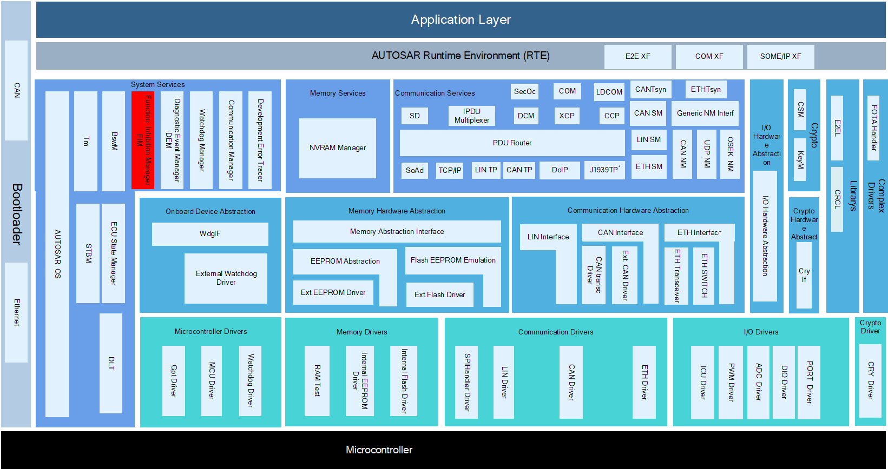
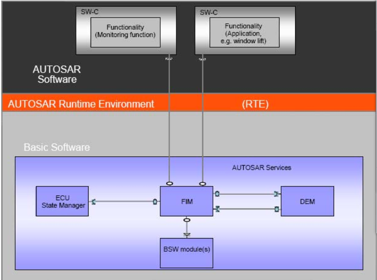
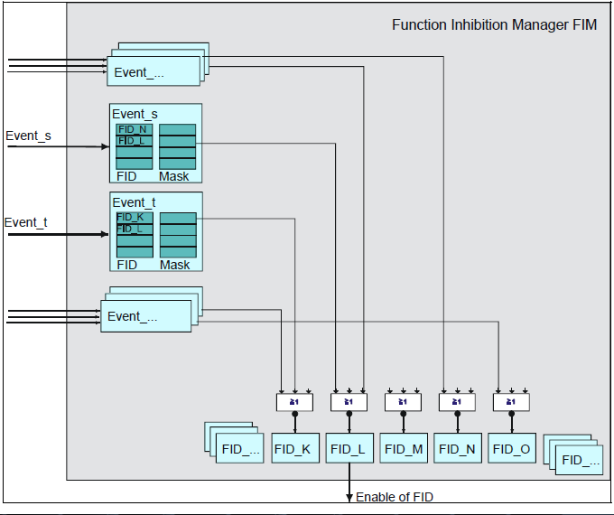
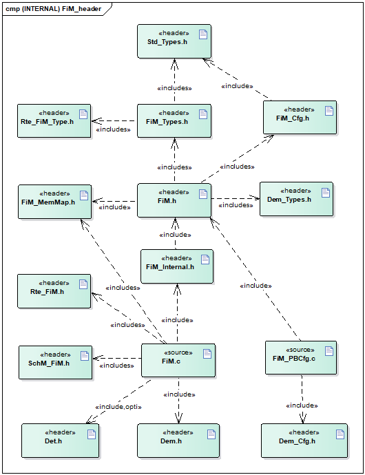
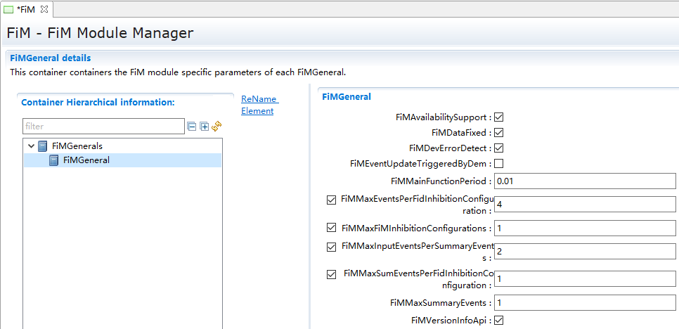
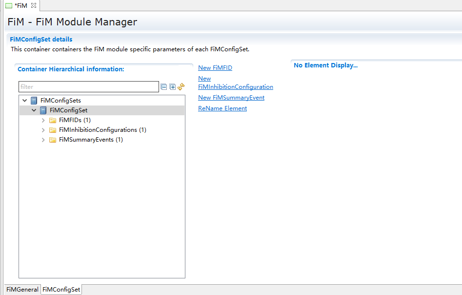
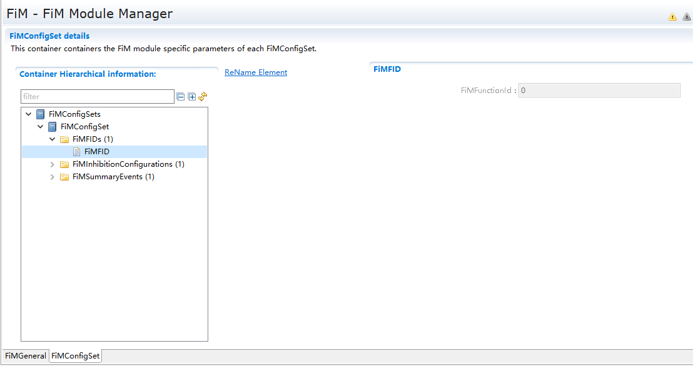
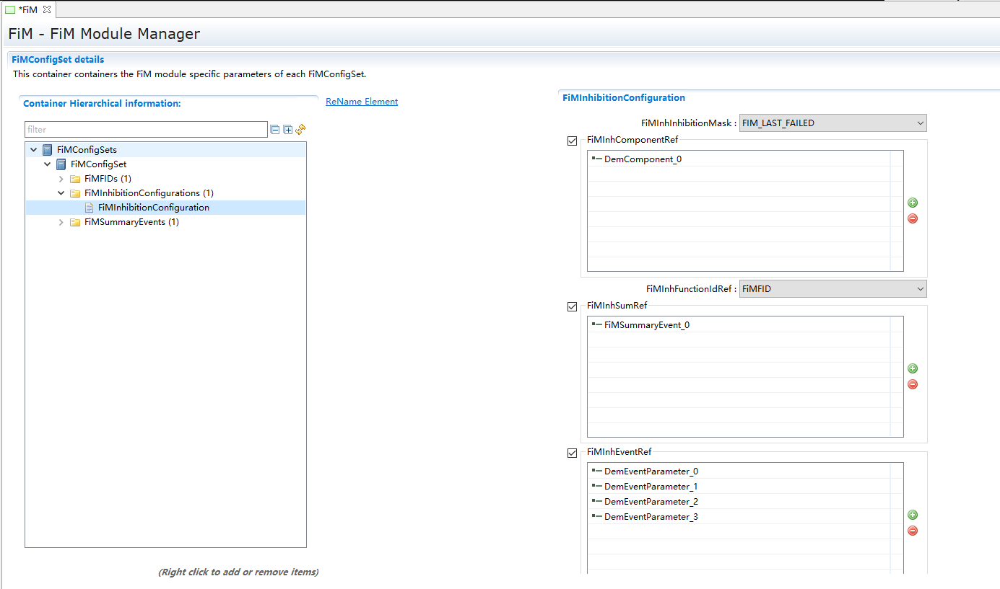
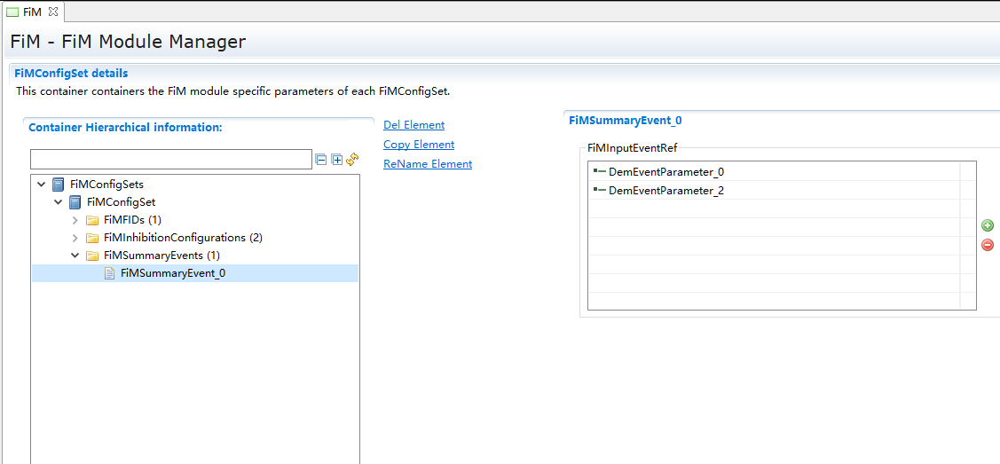

FiM
#################################

:strong:`缩写词注解 (Abbreviation Notes):`

.. list-table::
   :widths: 34 33 33
   :header-rows: 1

   * - 缩写词 (Abbreviation)
     - 解释/描述 (Explanation/Description)
     - 中文解释 (Chinese explanation)
   * - FID
     - Function Identifier
     - 功能标识符 (Function Identifier)
   * - FiM
     - Function Inhibition Manager
     - 功能禁止管理模块 (Function Disable Management Module)
   * - DEM
     - Diagnostic Event Manager
     - 诊断事件管理模块 (Event Management Module for Diagnosis)

简介 (Introduction)
=================================

功能抑制管理器为别的软件组件及其功能提供控制机制。在本文档中，一个功能可以由一个、几个或部分具有相同权限/禁止条件的可运行实体的内容构成。

The Function Inhibition Manager provides a control mechanism for other software components and their functionalities. In this document, a function can consist of one or several executable entities with the same permissions/prohibition conditions.

功能性和可运行实体是不同且独立的分类类型。可运行实体的主要特征是它们的调度要求。与此相反，功能是根据它们的抑制条件来分类的。FiM的服务主要关注SW-Cs中的功能，然而，它们并不局限于这些功能。BSW的功能也可以使用FiM服务。

Functional and executable entities are different and independent classification types. The primary characteristic of executable entities is their scheduling requirements. In contrast, functions are classified according to their inhibiting conditions. FiM services mainly focus on the functions within SW-Cs; however, they are not limited to these functions. BSW functions can also utilize FiM services.

参考资料 (Reference materials)
------------------------------------------

[1] AUTOSAR_SWS_FunctionInhibitionManager.PDF，4.2.2

[2] AUTOSAR_SWS_FunctionInhibitionManager.PDF，R19-11

功能描述 (Function Description)
===========================================

功能禁止管理功能 (Disable Management Function)
------------------------------------------------------

功能禁止管理功能介绍 (Introduction to Function Management Functional Features)
====================================================================================

FiM模块允许查询软件组件的许可/抑制状态及其功能。功能在执行之前轮询其FID的许可状态。如果禁止条件适用于特定的标识符，则不再允许执行相应的功能。通过FiM，这些功能的抑制可以通过校准来配置甚至修改。支持Dem事件及其状态信息作为抑制条件。在FiM的配置过程中，建立了数据结构(即禁止矩阵)来处理标识符对某些事件的敏感性。

The permission/inhibition status and their functionalities. permission status. If a prohibition condition applies to a specific identifier, the corresponding function is no longer allowed to execute. Through FiM, the inhibition of these functions can be configured or even modified via calibration. Dem events and their status information are supported as inhibition conditions. During the configuration of FiM, data structures (i.e., prohibit matrices) are established to handle the sensitivity of identifiers to certain events.

FiM与Dem密切相关，因为诊断事件及其状态信息是抑制条件的基础。因此，在发生故障时需要停止的功能，例如某个传感器，可以用一个特定的标识符来表示。如果检测到故障并将事件报告给Dem，那么FiM就会阻止FID，从而阻止相应的功能。

FiM is closely related to Dem because inhibition conditions. Therefore, functions that need to be stopped when a fault occurs, such as a sensor, can be represented by a specific identifier. If a fault is detected and an event is reported to Dem, then FiM will prevent FID, thereby preventing the corresponding function from operating.

功能禁止管理器（FiM）的主要功能是为SW-C和BSW功能提供控制机制。功能禁止管理器允许查询软件构件及其中的功能性的准许/禁止状态。主要功能包括：管理功能禁止状态、主动获取诊断事件状态更新禁止状态、根据诊断事件管理器的触发更新禁止状态、提供接口供应用查询功能禁止状态。

The primary function of the Function Inhibition Manager (FiM) is to provide a control mechanism for SW-C and BSW functions. The Function Inhibition Manager allows querying the enabling/disabling status of software components and their functionalities. Key features include: managing functional disabling states, actively acquiring diagnostic event status updates for disabling states, updating disabling states based on triggers from the diagnostic event manager, and providing an interface for applications to query functional disabling states.

FiM支持功能禁止管理：根据故障状态状态位，与故障关联的FID的MASK进行计算，如果计算结果满足抑制，则FID的抑制计数器加1，如果计算结果不满足抑制，则FID的抑制计数器减1，当FID的抑制计数器等于0 ，FID为允许状态，当抑制计数器不等于0，FID为抑制状态，原理如图所示。

FiM supports function inhibition management: based on the fault status bits, calculation is performed with the MASK of the fault-related FID; if the result meets the inhibition condition, the FID inhibition counter is incremented by 1, otherwise it is decremented by 1. When the FID inhibition counter equals 0, the FID is in the enabled state; when it is not equal to 0, the FID is in the inhibited state, the principle of which is shown in Figure.

功能禁止管理功能实现 (Function禁用管理功能实现)
======================================================

根据配置，如果是轮询方式获取信息，则在FiM_MainFunction中轮询调用Dem_GetComponentFailed和Dem_GetEventStatus来获取诊断事件状态信息，然后根据状态信息以及相关功能的配置关系表来进行计算，得出功能抑制计数，SWC通过调用FiM_GetFunctionPermission来获取功能的允许使用状态。

Based on the configuration, if information is retrieved through polling in FiM_MainFunction, it will poll call Dem_GetComponentFailed and Dem_GetEventStatus to acquire diagnostic event status information. Then, based on this status information and the configuration relationship table of related functions, it calculates the functional suppression count. The SWC retrieves the allowed usage status of the function by calling FiM_GetFunctionPermission.

如果不是轮询方式获取信息，则DEM模块调用FiM_DemTriggerOnEventStatus和FiM_DemTriggerOnComponentStatus来通知诊断事件状态信息，然后根据状态信息以及相关功能的配置关系表来进行计算，得出功能抑制计数，SWC通过调用FiM_GetFunctionPermission来获取功能的允许使用状态。

If information is not acquired through polling, the DEM module invokes FiM_DemTriggerOnEventStatus and FiM_DemTriggerOnComponentStatus to notify diagnostic event status information. Then, based on the status information and the configuration relationship table of related functions, it calculates the functional inhibition count. SWC obtains the allowable usage status of the function by calling FiM_GetFunctionPermission.

源文件描述 (Source file description)
===============================================

.. centered:: **表 FiM组件文件描述 (Table Description of FiM Component Files)**

.. list-table::
   :widths: 50 50
   :header-rows: 1

   * - 文件 (Files)
     - 说明 (Description)
   * - FiM \_cfg.h
     - 定义FiM模块预编译时用到的配置参数。 (Define configuration parameters used during pre-compilation of the FiM module.)
   * - FiM_Cfg.c
     - 定义FiM模块配置相关的配置参数。 (Define configuration parameters related to the FiM module configuration.)
   * - FiM.h
     - FiM模块头文件，包含了API函数的扩展声明并定义了端口的数据结构。 (FI_M module header file, contains extended declarations of API functions and defines the data structures of ports.)
   * - FiM .c
     - FiM模块源文件，包含了API函数的实现。 (Source files for the FiM module, containing implementations of API functions.)
   * - FiM_Internal.h
     - 包含FiM模块需要使用的部分类型定义和宏定义。 (Contains partial type definitions and macro definitions needed for the FiM module.)
   * - FiM_MemMap.h
     - 包含FiM模块的内存抽象。 (Abstract memory with the FiM module.)
   * - FiM_Types.h
     - 包含FiM模块需要使用的类型定义。 (Contain type definitions needed for the FiM module.)
   * - Rte_FiM_Type.h
     - 空文件（autosar要求的文件）

API接口 (API Interface)
=====================================

类型定义 (Type definition)
--------------------------------------

FiM_FunctionIdType类型定义 (FIM_FunctionIdType Type Definition)
===========================================================================

.. list-table::
   :widths: 50 50
   :header-rows: 1

   * - 名称 (Name)
     - FiM_FunctionIdType
   * - 类型 (Type)
     - uint16
   * - 范围 (Range)
     - 0-65535 功能ID (0-65535 Function ID)
   * - 描述 (Description)
     - 功能ID的类型定义 (Type definition of Function ID)

FiM_ConfigType类型定义 (FiM_ConfigType Configuration Type Definition)
=================================================================================

.. list-table::
   :widths: 50 50
   :header-rows: 1

   * - 名称 (Name)
     - FiM_ConfigType
   * - 类型 (Type)
     - Structure
   * - 范围 (Range)
     - 无
   * - 描述 (Description)
     - 配置参数结构体类型定义 (Definition of configuration parameter structure type)

输入函数描述 (Describe the input function:)
-----------------------------------------------------

.. list-table::
   :widths: 50 50
   :header-rows: 1

   * - 输入模块 (Input Module)
     - API
   * - DEM
     - Dem_GetEventStatus
   * - 
     - Dem_GetComponentFailed
   * - DET
     - Det_ReportError

静态接口函数定义 (Static interface function definition)
---------------------------------------------------------------

FiM_Init函数定义 (The FiM_Init function definition)
===============================================================

.. list-table::
   :widths: 25 25 25 25
   :header-rows: 1

   * - 函数名称： (Function Name:)
     - FiM_Init
     - 
     - 
   * - 函数原型： (Function prototype:)
     - void FiM_Init(constFiM_ConfigType\* FiMConfigPtr)
     - 
     - 
   * - 服务编号： (Service Number:)
     - 0x00
     - 
     - 
   * - 同步/异步： (Synchronous/asynchronous:)
     - 同步 (Sync)
     - 
     - 
   * - 是否可重入： (Is Reentrant:)
     - 否 (No)
     - 
     - 
   * - 输入参数： (Input parameters:)
     - FiMConfigPtr：配置参数的指针 (FiMConfigPtr：pointer to configuration parameters)
     - 值域： (Domain:)
     - 无
   * - 输入输出参数： (Input Output Parameters:)
     - 无
     - 
     - 
   * - 输出参数： (Output Parameters:)
     - 无
     - 
     - 
   * - 返回值： (Return Value:)
     - 无
     - 
     - 
   * - 功能概述： (Function Overview:)
     - FiM初始化函数，初始化相关变量与模块状态 (Initialization function for FiM, initializes related variables and module states)
     - 
     - 

FiM_GetFunctionPermission函数定义 (FiM_GetFunctionPermission function definition)
=============================================================================================

.. list-table::
   :widths: 25 25 25 25
   :header-rows: 1

   * - 函数名称： (Function Name:)
     - FiM_GetFunctionPermission
     - 
     - 
   * - 函数原型： (Function prototype:)
     - Std_ReturnType FiM_GetFunctionPermission(FiM_FunctionIdTypeFID,boolean\*Permission)
     - 
     - 
   * - 服务编号： (Service Number:)
     - 0x01
     - 
     - 
   * - 同步/异步： (Synchronous/asynchronous:)
     - 同步 (Sync)
     - 
     - 
   * - 是否可重入： (Is Reentrant:)
     - 是 (Yes)
     - 
     - 
   * - 输入参数： (Input parameters:)
     - FID 功能ID (FID Function ID)
     - 值域： (Domain:)
     - 0..65535
   * - 输入输出参数： (Input Output Parameters:)
     - 无
     - 
     - 
   * - 输出参数： (Output Parameters:)
     - Permission：功能允许状态 (Permission: Function Allow Status)
     - 
     - 
   * - 返回值： (Return Value:)
     - E_OK： 请求成功E_NOT_OK：请求失败 (E_OK: Request succeeded E_NOT_OK: Request failed)
     - 
     - 
   * - 功能概述： (Function Overview:)
     - 获取功能是否运行 (Is the get function running?)
     - 
     - 

FiM_SetFunctionAvailable函数定义 (FiM_SetFunctionAvailable function definition)
===========================================================================================

.. list-table::
   :widths: 25 25 25 25
   :header-rows: 1

   * - 函数名称： (Function Name:)
     - FiM_SetFunctionAvailable
     - 
     - 
   * - 函数原型： (Function prototype:)
     - Std_ReturnType FiM_SetFunctionAvailable(FiM_FunctionIdTypeFID,booleanAvailability)
     - 
     - 
   * - 服务编号： (Service Number:)
     - 0x07
     - 
     - 
   * - 同步/异步： (Synchronous/asynchronous:)
     - 同步 (Sync)
     - 
     - 
   * - 是否可重入： (Is Reentrant:)
     - 是 (Yes)
     - 
     - 
   * - 输入参数： (Input parameters:)
     - FID：功能ID (FID：Function ID)
     - 值域： (Domain:)
     - 0..65535
   * - 
     - Availability：使能状态 (Availability：Enable Status)
     - 值域： (Domain:)
     - TRUE/FALSE
   * - 输入输出参数： (Input Output Parameters:)
     - 无
     - 
     - 
   * - 输出参数： (Output Parameters:)
     - 无
     - 
     - 
   * - 返回值： (Return Value:)
     - E_OK： 请求成功E_NOT_OK：请求失败 (E_OK: Request succeeded E_NOT_OK: Request failed)
     - 
     - 
   * - 功能概述： (Function Overview:)
     - 通过函数设置相应的功能使能还是不使能 (Enable or disable the corresponding function through function settings.)
     - 
     - 

FiM_DemTriggerOnEventStatus函数定义 (Function definition for FiM_DemTriggerOnEventStatus)
=====================================================================================================

.. list-table::
   :widths: 25 25 25 25
   :header-rows: 1

   * - 函数名称： (Function Name:)
     - FiM_DemTriggerOnEventStatus
     - 
     - 
   * - 函数原型： (Function prototype:)
     - void FiM_DemTriggerOnEventStatus(Dem_EventIdTypeEventId,Dem_UdsStatusByteTypeEventStatusByteOld,Dem_UdsStatusByteTypeEventStatusByteNew)
     - 
     - 
   * - 服务编号： (Service Number:)
     - 0x02
     - 
     - 
   * - 同步/异步： (Synchronous/asynchronous:)
     - 同步 (Sync)
     - 
     - 
   * - 是否可重入： (Is Reentrant:)
     - 是 (Yes)
     - 
     - 
   * - 输入参数： (Input parameters:)
     - EventId：事件ID (EventId：Event ID)
     - 值域： (Domain:)
     - 0..65535
   * - 
     - EventStatusByteOld：事件老状态 (EventStatusByteOld：Old Event Status)
     - 值域： (Domain:)
     - 0..255
   * - 
     - EventStatusByteNew：事件新状态 (EventStatusByteNew：New Status of Event)
     - 值域： (Domain:)
     - 0..255
   * - 输入输出参数： (Input Output Parameters:)
     - 无
     - 
     - 
   * - 输出参数： (Output Parameters:)
     - 无
     - 
     - 
   * - 返回值： (Return Value:)
     - 无
     - 
     - 
   * - 功能概述： (Function Overview:)
     - DEM调用该接口通知FiM事件的状态改变，以便FiM计算功能允许状态 (DEM invokes this interface to notify FiM of the status change of the event, so that FiM can calculate the allowable states.)
     - 
     - 

FiM_DemTriggerOnComponentStatus函数定义 (Function Definition for FiM_DemTriggerOnComponentStatus)
=============================================================================================================

.. list-table::
   :widths: 25 25 25 25
   :header-rows: 1

   * - 函数名称： (Function Name:)
     - FiM_DemTriggerOnComponentStatus
     - 
     - 
   * - 函数原型： (Function prototype:)
     - void FiM_DemTriggerOnComponentStatus(Dem_ComponentIdTypeComponentId,booleanComponentFailedStatus)
     - 
     - 
   * - 服务编号： (Service Number:)
     - 0x06
     - 
     - 
   * - 同步/异步： (Synchronous/asynchronous:)
     - 同步 (Sync)
     - 
     - 
   * - 是否可重入： (Is Reentrant:)
     - 否 (No)
     - 
     - 
   * - 输入参数： (Input parameters:)
     - ComponentId：组件ID (ComponentId：Component ID)
     - 值域： (Domain:)
     - 0..65535
   * - 
     - ComponentFailedStatus：组件状态 (ComponentFailedStatus：Component Status)
     - 值域： (Domain:)
     - TRUE/FALSE
   * - 输入输出参数： (Input Output Parameters:)
     - 无
     - 
     - 
   * - 输出参数： (Output Parameters:)
     - 无
     - 
     - 
   * - 返回值： (Return Value:)
     - 无
     - 
     - 
   * - 功能概述： (Function Overview:)
     - DEM通过调用函数通知FiM组件的状态，以便FiM计算功能允许状态 (DEM notifies the FiM component of its state by calling a function, so that FiM can calculate functional allowances based on the state.)
     - 
     - 

FiM_DemInit函数定义 (FIM_DemInit function definition)
=================================================================

.. list-table::
   :widths: 25 25 25 25
   :header-rows: 1

   * - 函数名称： (Function Name:)
     - FiM_DemInit
     - 
     - 
   * - 函数原型： (Function prototype:)
     - void FiM_DemInit(void)
     - 
     - 
   * - 服务编号： (Service Number:)
     - 0x03
     - 
     - 
   * - 同步/异步： (Synchronous/asynchronous:)
     - 同步 (Sync)
     - 
     - 
   * - 是否可重入： (Is Reentrant:)
     - 是 (Yes)
     - 
     - 
   * - 输入参数： (Input parameters:)
     - 无
     - 值域： (Domain:)
     - 无
   * - 输入输出参数： (Input Output Parameters:)
     - 无
     - 
     - 
   * - 输出参数： (Output Parameters:)
     - 无
     - 
     - 
   * - 返回值： (Return Value:)
     - 无
     - 
     - 
   * - 功能概述： (Function Overview:)
     - DEM调用该接口对FiM模块进行完整初始化 (Invoke the interface via DEM to fully initialize the FiM module.)
     - 
     - 

FiM_GetVersionInfo函数定义 (Function Definition for FiM_GetVersionInfo)
===================================================================================

.. list-table::
   :widths: 25 25 25 25
   :header-rows: 1

   * - 函数名称： (Function Name:)
     - FiM_GetVersionInfo
     - 
     - 
   * - 函数原型： (Function prototype:)
     - void FiM_GetVersionInfo(Std_VersionInfoType\*versioninfo)
     - 
     - 
   * - 服务编号： (Service Number:)
     - 0x04
     - 
     - 
   * - 同步/异步： (Synchronous/asynchronous:)
     - 同步 (Sync)
     - 
     - 
   * - 是否可重入： (Is Reentrant:)
     - 是 (Yes)
     - 
     - 
   * - 输入参数： (Input parameters:)
     - 无
     - 值域： (Domain:)
     - 无
   * - 输入输出参数： (Input Output Parameters:)
     - Versioninfo：版本信息 (Versioninfo：Version Information)
     - 
     - 
   * - 输出参数： (Output Parameters:)
     - 无
     - 
     - 
   * - 返回值： (Return Value:)
     - 无
     - 
     - 
   * - 功能概述： (Function Overview:)
     - 获取FiM模块版本信息 (Get FiM Module Version Information)
     - 
     - 

FiM_MainFunction函数定义 (FM_MainFunction function definition)
==========================================================================

.. list-table::
   :widths: 25 25 25 25
   :header-rows: 1

   * - 函数名称： (Function Name:)
     - FiM_MainFunction
     - 
     - 
   * - 函数原型： (Function prototype:)
     - void FiM_MainFunction(void)
     - 
     - 
   * - 服务编号： (Service Number:)
     - 0x05
     - 
     - 
   * - 同步/异步： (Synchronous/asynchronous:)
     - 同步 (Sync)
     - 
     - 
   * - 是否可重入： (Is Reentrant:)
     - 否 (No)
     - 
     - 
   * - 输入参数： (Input parameters:)
     - 无
     - 值域： (Domain:)
     - 无
   * - 输入输出参数： (Input Output Parameters:)
     - 无
     - 
     - 
   * - 输出参数： (Output Parameters:)
     - 无
     - 
     - 
   * - 返回值： (Return Value:)
     - 无
     - 
     - 
   * - 功能概述： (Function Overview:)
     - FiM模块主处理函数，在配置为轮询时使用 (The main processing function of the FiM module, used when configured for polling.)
     - 
     - 

可配置函数定义 (Configurable Function Definition)
----------------------------------------------------------

无。

None.

SWC服务组件封装 (SWC Service Component Packaging)
-----------------------------------------------------------

以下类型和接口可以封装至SWC生成完整的服务组件，可以与应用通过端口连接。

The following types and interfaces can be encapsulated into SWC to generate complete service components, which can be connected to the application via ports.

CS接口封装 (CS Interface Packaging)
===============================================

注：下面提到的<UserModule>和<UserPort>分别为用户SWC的名字和对应端口名，在与FiM服务组件端口连接后适用。

Note: The <UserModule> and <UserPort> mentioned below are the names of the user SWC and its corresponding port, respectively, applicable after being connected to the FiM service component ports.

Rte_Call\_<UserModule>\_<UserPort>_GetFunctionPermission
------------------------------------------------------------------------

.. list-table::
   :widths: 50 50
   :header-rows: 1

   * - 函数名称： (Function Name:)
     - Rte_Call\_<UserModule>\_<UserPortName>_GetFunctionPermission
   * - 运行实体函数定义： (Definition of running entity function:)
     - 详见4.3.2 (See 4.3.2)
   * - 变体： (Variants:)
     - Name=FiMConfigSet/FiMFID.SHORT-NAME
   * - 生成条件： (Generate conditions:)
     - 无
   * - 端口类型： (Port Type:)
     - Provided Port
   * - 从属端口： (Subordinate Port:)
     - Func\_{Name}

Rte_Call\_<UserModule>\_<UserPort>_SetFunctionAvailable
-----------------------------------------------------------------------

.. list-table::
   :widths: 50 50
   :header-rows: 1

   * - 函数名称： (Function Name:)
     - Rte_Call\_<UserModule>\_<UserPortName>_SetFunctionAvailable
   * - 运行实体函数定义： (Definition of running entity function:)
     - 详见4.3.3 (See 4.3.3)
   * - 变体： (Variants:)
     - Name=FiMConfigSet/FiMFID.SHORT-NAME
   * - 生成条件： (Generate conditions:)
     - FiMGeneral/FiMAvailabilitySupport == True
   * - 端口类型： (Port Type:)
     - Provided Port
   * - 从属端口： (Subordinate Port:)
     - Control\_{Name}

配置 (Configure)
==============================

FiMGeneral
--------------------------

.. centered:: **表 FiMGeneral属性描述 (Table FiMGeneral Property Description)**

.. list-table::
   :widths: 20 20 20 20 20
   :header-rows: 1

   * - UI名称 (UI Name)
     - 描述 (Description)
     - 
     - 
     - 
   * - FiMAvailabilitySupport
     - 取值范围 (Range)
     - True/False
     - 默认取值 (Default value)
     - False
   * - 
     - 参数描述 (Parameter Description)
     - 指定FiM是否支持服务来设置某个功能的可用性。 (Determine if FiM supports services to set the availability of a feature.)
     - 
     - 
   * - 
     - 
     - 当为False时，FiM_SetFunctionAvailable不可用。 (When False, FiM_SetFunctionAvailable is unavailable.)
     - 
     - 
   * - 
     - 
     - True：支持；False：不支持。 (True: support; False: does not support.)
     - 
     - 
   * - 
     - 依赖关系 (Dependencies)
     - 无
     - 
     - 
   * - FiMDataFixed
     - 取值范围 (Range)
     - True/False
     - 默认取值 (Default value)
     - False
   * - 
     - 参数描述 (Parameter Description)
     - 在代码中未使用，在版本后期也会被移除，可以不用关心。 (Not used in the code and will be removed in later versions, so you can ignore it.)
     - 
     - 
   * - 
     - 依赖关系 (Dependencies)
     - 无
     - 
     - 
   * - FiMDevErrorDetect
     - 取值范围 (Range)
     - True/False
     - 默认取值 (Default value)
     - True
   * - 
     - 参数描述 (Parameter Description)
     - DET检查使能开关。 (DET check enable switch.)
     - 
     - 
   * - 
     - 依赖关系 (Dependencies)
     - 无
     - 
     - 
   * - FiMEventUpdateTriggeredByDem
     - 取值范围 (Range)
     - True/False
     - 默认取值 (Default value)
     - False
   * - 
     - 参数描述 (Parameter Description)
     - 指定FiM获取EventIds状态的方式。 (Specify the way FiM acquires EventIds status.)
     - 
     - 
   * - 
     - 
     - True：DEM通知FiM事件状态的变化。 (True: DEM notifies of changes in FiM event status.)
     - 
     - 
   * - 
     - 
     - False：FiM从DEM模块周期性或按需投票事件状态。 (False: FiM from DEM module periodically or on-demand votes event status.)
     - 
     - 
   * - 
     - 依赖关系 (Dependencies)
     - 根据DemTriggerFiMReports自动生成，不可配置。 (Generated automatically based on DemTriggerFiMReports, not configurable.)
     - 
     - 
   * - FiMMainFunctionPeriod
     - 取值范围 (Range)
     - 0..INF
     - 默认取值 (Default value)
     - 无
   * - 
     - 参数描述 (Parameter Description)
     - 指定周期性循环任务的时间。 (Specify the time for periodic cyclic tasks.)
     - 
     - 
   * - 
     - 依赖关系 (Dependencies)
     - 应等于RTE模块的BasicSoftwareScheduler配置中的值。 (Should equal the value in the BasicSoftwareScheduler configuration of the RTE module.)
     - 
     - 
   * - FiMMaxEventsPerFidInhibitionConfiguration
     - 取值范围 (Range)
     - 1..65535
     - 默认取值 (Default value)
     - 1
   * - 
     - 参数描述 (Parameter Description)
     - 指定FiMInhibitionConfiguration中抑制事件的最大总数。 (Specify the maximum total number of inhibited events in the FiMinhibition configuration.)
     - 
     - 
   * - 
     - 依赖关系 (Dependencies)
     - 无
     - 
     - 
   * - FiMMaxFiMInhibitionConfigurations
     - 取值范围 (Range)
     - 1..65535
     - 默认取值 (Default value)
     - 1
   * -
     - 参数描述 (Parameter Description)
     - 指定FiMInhibitionConfiguration的最大总数。 (Specify the maximum total number of FiMinhibition configurations.)
     - 
     - 
   * - 
     - 依赖关系 (Dependencies)
     - 无
     - 
     - 
   * - FiMMaxInputEventsPerSummaryEvents
     - 取值范围 (Range)
     - 1..65535
     - 默认取值 (Default value)
     - 1
   * -
     - 参数描述 (Parameter Description)
     - 指定每个汇总事件的最大输入事件总数。 (Specify the maximum total number of input events per aggregated event.)
     - 
     - 
   * - 
     - 依赖关系 (Dependencies)
     - 无
     - 
     - 
   * - FiMMaxSumEventsPerFidInhibitionConfiguration
     - 取值范围 (Range)
     - 1..65535
     - 默认取值 (Default value)
     - 1
   * - 
     - 参数描述 (Parameter Description)
     - 指定FiMInhibitionConfiguration中抑制摘要事件的最大总数。 (Specify the maximum total number of summary events to be inhibited in the FiMinhibition configuration.)
     - 
     - 
   * - 
     - 依赖关系 (Dependencies)
     - 无
     - 
     - 
   * - FiMMaxSummaryEvents
     - 取值范围 (Range)
     - 0..65535
     - 默认取值 (Default value)
     - 0
   * -
     - 参数描述 (Parameter Description)
     - 指定可以配置的汇总事件的最大数量。 (Specify the maximum number of aggregatable events that can be configured.)
     - 
     - 
   * - 
     - 依赖关系 (Dependencies)
     - 无
     - 
     - 
   * - FiMVersionInfoApi
     - 取值范围 (Range)
     - True/False
     - 默认取值 (Default value)
     - False
   * -
     - 参数描述 (Parameter Description)
     - 获取版本信息的使能开关。 (Switch for enabling version information retrieval.)
     - 
     - 
   * - 
     - 依赖关系 (Dependencies)
     - 无
     - 
     - 

FiMConfigSet
----------------------------

.. centered:: **表 FiMConfigSet属性描述 (Table FiMConfigSet Property Description)**

.. list-table::
   :widths: 20 20 20 20 20
   :header-rows: 1

   * - UI名称 (UI Name)
     - 描述 (Description)
     - 
     - 
     - 
   * - FiMFID
     - 取值范围 (Range)
     - 无
     - 默认取值 (Default value)
     - 无
   * - 
     - 参数描述 (Parameter Description)
     - 用于添加FID的容器，多重性：1..\*。 (Container for adding FID, multiplicity: 1..*.)
     - 
     - 
   * - 
     - 依赖关系 (Dependencies)
     - 无
     - 
     - 
   * - FiMInhibitionConfiguration
     - 取值范围 (Range)
     - 无
     - 默认取值 (Default value)
     - 无
   * - 
     - 参数描述 (Parameter Description)
     - 用于添加配置关系表的容器，多重性：1..\*。 (A container for adding configuration relationship tables, multiplicity: 1..\*.)
     - 
     - 
   * - 
     - 依赖关系 (Dependencies)
     - FiMMaxFiMInhibitionConfigurations.
     - 
     - 
   * - FiMSummaryEvent
     - 取值范围 (Range)
     - 无
     - 默认取值 (Default value)
     - 无
   * - 
     - 参数描述 (Parameter Description)
     - 用于添加汇总事件的的容器，多重性：0..\*。 (A container for adding summary events, multiplicity: 0..*.)
     - 
     - 
   * - 
     - 依赖关系 (Dependencies)
     - FiMSummaryEvent.
     - 
     - 

FiMFID
======================

.. centered:: **表 FiMFID属性描述 (Table FiMFID Property Description)**

.. list-table::
   :widths: 20 20 20 20 20
   :header-rows: 1

   * - UI名称 (UI Name)
     - 描述 (Description)
     - 
     - 
     - 
   * - FiMFunctionId
     - 取值范围 (Range)
     - 0..65535
     - 默认取值 (Default value)
     - 从 1 累加 (Sum from 1)
   * - 
     - 参数描述 (Parameter Description)
     - FID值，不可配置，自动填充生成。 (FID value, not configurable, automatically populated.)
     - 
     - 
   * - 
     - 依赖关系 (Dependencies)
     - 无
     - 
     - 

FiMInhibitionConfiguration
==========================================

.. centered:: **表 FiMInhibitionConfiguration属性描述 (Table FiMInhibitionConfiguration Property Description)**

.. list-table::
   :widths: 20 20 20 20 20
   :header-rows: 1

   * - UI名称 (UI Name)
     - 描述 (Description)
     - 
     - 
     - 
   * - FiMInhInhibitionMask
     - 取值范围 (Range)
     - FIM_LAST_FAILED，FIM_NOT_TESTED，FIM_TESTED，
     - 默认取值 (Default value)
     - FIM_LAST_FAILED
   * - 
     - 
     - FIM_TESTED_AND_FAILED
     - 
     - 
   * - 
     - 参数描述 (Parameter Description)
     - 事件和FID关系指定抑制掩码。 (The event and FID relationship specifies the inhibit mask.)
     - 
     - 
   * - 
     - 依赖关系 (Dependencies)
     - 无
     - 
     - 
   * - FiMInhComponentRef
     - 取值范围 (Range)
     - 无
     - 默认取值 (Default value)
     - 无
   * - 
     - 参数描述 (Parameter Description)
     - 对DemComponent的引用。 (Reference to DemComponent.)
     - 
     - 
   * - 
     - 依赖关系 (Dependencies)
     - FiMInhSumRef、FiMInhEventRef、FiMInhComponentRef三者至少配置一个。 (At least one of FiMInhSumRef, FiMInhEventRef, or FiMInhComponentRef should be configured.)
     - 
     - 
   * - FiMInhEventRef
     - 取值范围 (Range)
     - 无
     - 默认取值 (Default value)
     - 无
   * - 
     - 参数描述 (Parameter Description)
     - 对DEM事件的引用。 (Reference for the DEM event.)
     - 
     - 
   * - 
     - 依赖关系 (Dependencies)
     - FiMInhSumRef、FiMInhEventRef、FiMInhComponentRef三者至少配置一个。 (At least one of FiMInhSumRef, FiMInhEventRef, or FiMInhComponentRef should be configured.)
     - 
     - 
   * - 
     - 
     - FiMMaxEventsPerFidInhibitionConfiguration.
     - 
     - 
   * - FiMInhFunctionIdRef
     - 取值范围 (Range)
     - 无
     - 默认取值 (Default value)
     - 无
   * - 
     - 参数描述 (Parameter Description)
     - 对功能ID的引用。 (References to function IDs.)
     - 
     - 
   * - 
     - 依赖关系 (Dependencies)
     - 无
     - 
     - 
   * - FiMInhSumRef
     - 取值范围 (Range)
     - 无
     - 默认取值 (Default value)
     - 无
   * - 
     - 参数描述 (Parameter Description)
     - 对汇总事件的引用。 (Reference for aggregated events.)
     - 
     - 
   * - 
     - 依赖关系 (Dependencies)
     - FiMInhSumRef、FiMInhEventRef、FiMInhComponentRef三者至少配置一个。 (At least one of the three should be configured.)
     - 
     - 
   * - 
     - 
     - FiMMaxSumEventsPerFidInhibitionConfiguration.
     - 
     - 

FiMSummaryEvent
===============================

.. centered:: **表 FiMSummaryEvent属性描述 (Table FiMSummaryEvent Property Description)**

.. list-table::
   :widths: 20 20 20 20 20
   :header-rows: 1

   * - UI名称 (UI Name)
     - 描述 (Description)
     - 
     - 
     - 
   * - FiMInputEventRef
     - 取值范围 (Range)
     - 无
     - 默认取值 (Default value)
     - 无
   * - 
     - 参数描述 (Parameter Description)
     - 引用DEM事件。 (Trigger DEM events.)
     - 
     - 
   * - 
     - 依赖关系 (Dependencies)
     - FiMMaxInputEventsPerSummaryEvents.
     - 
     - 
