IoHwAb
#################################

:strong:`缩写词注解 (Abbreviation Notes):`

.. list-table::
   :widths: 34 33 33
   :header-rows: 1

   * - 缩写词 (Abbreviation)
     - 解释/描述 (Explanation/Description)
     - 中文解释 (Chinese explanation)
   * - IoHwAb
     - Input Output HardwareAbstraction
     - 输入输出硬件抽象 (Hardware Abstraction for Input and Output)
   * - SWC
     - Software Component
     - 软件组件 (Software components)
   * - RTE
     - Real-Time Running Environment
     - 实时运行环境 (Real-time runtime environment)
   * - BSW
     - Basic Software
     - 基础软件 (Basic software)
   * - BSWMD
     - Basic SoftWare ModuleDescription
     - 基础软件模块描述 (Description of Basic Software Modules)
   * - OS
     - Operating System
     - 操作系统 (Operating System)
   * - MCAL
     - Microconroller Abstraction Layer
     - 微控制器抽象层 (Microcontroller Abstraction Layer)
   * - MMU
     - Memory Management Unit
     - 内存管理单元 (Memory Management Unit)
   * - ADC
     - Analog-to-Digital Converter
     - 模拟-数字转换器 (Analog-Digital Converter)
   * - ICU
     - Input Capture Unit
     - 输入捕获单元 (Input Capture Unit)
   * - DIO
     - Digital Input Output
     - 数字输入输出 (Digital Input Output)
   * - PWM
     - Pulse Width Modulation
     - 脉冲宽度调制 (Pulse-width modulation)
   * - OCU
     - Output Comparison Unit
     - 输出比较单元 (Output Comparison Unit)
   * - SPI
     - Serial Peripheral Interface
     - 串行外设总线 (Serial Peripheral Bus)
   * - GPT
     - General Purpose Timer
     - 通用定时器 (General Timer)
   * - C/S
     - Client - Server
     - 客户端-服务端组件 (Client-Server Component)
   * - S/R
     - Sender/Receiver
     - 发送端/接收端 (Sender/Receiver)
   * - CDD
     - Complex device driver
     - 复杂设备驱动 (Complex device drivers)
   * - DET
     - Default Error Tracer
     - 默认错误跟踪器 (Default Error Tracker)
   * - ECU
     - Electronic Control Unit
     - 电子控制单元 (Electronic Control Unit)
   * - MCU
     - Micro Controller Unit
     - 微控制器单元 (Microcontroller Unit)
   * - AUTOSAR
     - AUTomotive Open SystemARchitecture
     - 汽车开放系统架构 (Automotive Open System Architecture)
   * - API
     - Application ProgrammingInterface
     - 应用编程接口 (Application Programming Interface)
   * - HW
     - Hardware
     - 硬件 (Hardware)
   * - SW
     - Software
     - 软件 (Software)
   * - ISR
     - Interrupt Service Routine
     - 中断服务例程 (Interrupt Service Routine)
   * - XML
     - Extensible Markup Language
     - 可扩展标记语言 (Extensible Markup Language)

简介 (Introduction)
=================================

本文档作为IoHwAb模块软件产品的使用手册，详细介绍了IoHwAb模块的功能、使用约束以及定制开发方法，使用户可以尽快熟悉并使用IoHwAb模块。

This document serves as the user manual for the IoHwAb module software product, providing a detailed introduction to the functions, usage constraints, and custom development methods of the IoHwAb module, enabling users to familiarize themselves with and use the IoHwAb module quickly.

AUTOSAR规范中明确指出IoHwAb模块是ECU抽象层的一部分。IoHwAb模块不应该被认为是一个单一的模块，因为它可以被实现为多个模块。IoHwAb模块不对外设组件进行标准化，它是一份与其他模块一起实现其功能接口的指南。IoHwAb模块的目的是通过将IoHwAb模块端口映射到ECU信号来提供对MCAL驱动程序的访问。提供给SWC的数据完全是从物理层抽象出来的。因此，SWC设计人员不再需要详细了解MCAL驱动程序的API和物理层的单元。

The AUTOSAR规范 clearly states that the IoHwAb module is part of the ECU abstract layer. The IoHwAb module should not be considered a single module, as it can be implemented as multiple modules. The IoHwAb module does not standardize peripheral components; rather, it serves as a guide for implementing its functional interfaces together with other modules. The purpose of the IoHwAb module is to provide access to MCAL drivers by mapping the ports of the IoHwAb module to ECU signals. The data provided to SWCs is fully abstracted from the physical layer. Therefore, SWC designers no longer need detailed knowledge of the API and units of the MCAL driver and the physical layer.

IoHwAb模块是对ECU的特定实现，因为SWC对BSW的需求必须匹配特定的MCAL所实现的特性。IoHwAb模块应该为初始化整个IoHwAb模块提供服务。

The IoHwAb module is a specific implementation for the ECU, as the requirements of SWC for BSW must match the characteristics implemented by the specific MCAL. The IoHwAb module should provide services for initializing the entire IoHwAb module.

参考资料 (Reference materials)
------------------------------------------

[1] AUTOSAR_SRS_ADCDriver.pdf R22-11

[2] AUTOSAR_SWS_ADCDriver.pdf R22-11

[3] AUTOSAR_SRS_DIODriver.pdf R22-11

[4] AUTOSAR_SWS_DIODriver.pdf R22-11

[5] AUTOSAR_SRS_ICUDriver.pdf R22-11

[6] AUTOSAR_SWS_ICUDriver.pdf R22-11

[7] AUTOSAR_SRS_PWMDriver.pdf R22-11

[8] AUTOSAR_SWS_PWMDriver.pdf R22-11

[9] AUTOSAR_SRS_GPTDriver.pdf R22-11

[10] AUTOSAR_SWS_GPTDriver.pdf R22-11

[11] AUTOSAR_SRS_PortDriver.pdf R22-11

[12] AUTOSAR_SWS_PortDriver.pdf R22-11

[13] AUTOSAR_SRS_OCUDriver.pdf R22-11

[14] AUTOSAR_SWS_OCUDriver.pdf R22-11

[15] AUTOSAR_SRS_SPIHandlerDriver.pdf R22-11

[16] AUTOSAR_SWS_SPIHandlerDriver.pdf R22-11

[17] AUTOSAR_SRS_MCUDriver.pdf R22-11

[18] AUTOSAR_SWS_MCUDriver.pdf R22-11

[19] AUTOSAR_SRS_IOHWAbstraction.pdf R22-11

[20] AUTOSAR_SWS_IOHardwareAbstraction.pdf R22-11

[21] AUTOSAR_SRS_RTE.pdf R19-11

[22] AUTOSAR_SWS_RTE.pdf R19-11

功能描述 (Function Description)
===========================================

IoHwAb功能 (IoHwAb Feature)
-----------------------------------------

IoHwAb功能介绍 (Function Introduction of IoHwAb)
============================================================

如图所示IoHwAb位于MCAL驱动程序之上，也就意味着IoHwAb将调用驱动程序的API来管理芯片设备。MCAL驱动程序的配置取决于SWC所需的ECU信号的质量。例如，当PIN引脚电平发生相关变化(上升沿，下降沿)时，可能需要通知用户。系统设计者必须配置MCAL驱动程序以允许给定信号的通知。通知由MCAL驱动程序生成，并在IoHwAb模块中处理。

As shown in the diagram, IoHwAb is located above the MCAL driver, meaning that IoHwAb will call the APIs of the driver to manage the chip devices. The configuration of the MCAL driver depends on the quality of ECU signals required by SWC. For example, when a related change occurs in the PIN pin level (rising edge, falling edge), it may be necessary to notify the user. System designers must configure the MCAL driver to allow notification for the given signal. The notifications are generated by the MCAL driver and handled in the IoHwAb module.

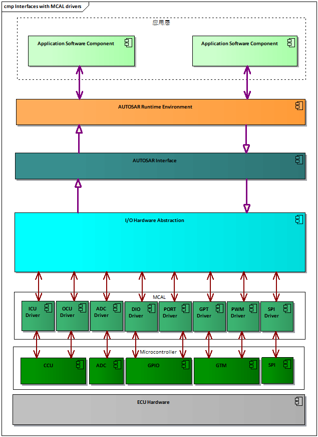

IoHwAb功能实现 (IoHwAb Feature Implementation)
==========================================================

IoHwAb模块为SWC提供对所有MCAL驱动程序的抽象API访问。

The IoHwAb module provides SWC with abstract API access to all MCAL drivers.

.. centered:: **表 IoHwAb组件抽象状况 (Status of Component Abstraction in IoHwAb)**

.. list-table::
   :widths: 10 10 10 10 10 10 10 10 10 10
   :header-rows: 1

   * - 组件功能 (Component Function)
     - MCALdrivers
     - 
     - 
     - 
     - 
     - 
     - 
     - 
     - 
   * - 
     - DIO
     - PORT
     - PWM
     - ICU
     - ADC
     - SPI
     - OCU
     - GPT
     - CDD
   * - IO抽象服务 (IO Abstraction Services)
     - √
     - ×
     - √
     - √
     - √
     - √
     - ×
     - √
     - √
   * - 中断通知机制 (Interrupt Notification Mechanism)
     - ×
     - ×
     - √
     - √
     - √
     - √
     - ×
     - √
     - ×

说明：√表示实现了抽象功能并关联MCAL对应驱动程序；×表示暂时没有实现抽象功能并关联MCAL对应驱动程序。

Explanation: √ indicates that the abstract function has been implemented and is associated with the corresponding MCAL driver; × indicates that the abstract function has not yet been implemented and is associated with the corresponding MCAL driver.

IoHwAb模块提供SWC访问ADC的接口。主要用于启动和停止ADC驱动程序对模拟信号的数字量转化功能；使能和禁止ADC驱动程序中断通知；使能和禁止ADC驱动程序硬件触发功能；设置ADC驱动程序采样结果目标缓冲区；提取ADC驱动程序的采样结果。

The IoHwAb module provides an interface for SWC to access the ADC. It is mainly used for starting and stopping the digital conversion function of the ADC driver for analog signals; enabling and disabling interrupt notifications from the ADC driver; enabling and disabling hardware trigger functionality of the ADC driver; setting the target buffer area for the sampling results of the ADC driver; and extracting the sampling results from the ADC driver.

IoHwAb模块实现和提供SWC访问DIO的接口。主要用于设置和获取DIO驱动程序对数字信号的通道电平；对数字信号的端口电平；对数字信号的端口组电平,提取DIO驱动程序的通道电平翻转状态。

The IoHwAb module implements and provides the interface for SWC to access DIO. It is mainly used for setting and getting the channel level of the digital signal by the DIO driver; the port level of the digital signal; the port group level of the digital signal, as well as extracting the channel level flip state of the DIO driver.

IoHwAb模块实现和提供SWC访问PWM的接口。主要用于使能和禁止PWM驱动程序中断通知；设置PWM驱动程序输出为IDLE状态；提取PWM驱动程序的输出状态；设置PWM驱动程序输出占空比；设置PWM驱动程序输出周期和占空比。

The IoHwAb module implements and provides an interface for SWC to access PWM. It is mainly used for enabling and disabling PWM driver interrupt notifications; setting the PWM driver output to IDLE state; extracting the PWM driver's output status; setting the PWM driver output duty cycle; and setting the PWM driver output period and duty cycle.

IoHwAb模块实现和提供SWC访问ICU的接口。主要用于使能和禁止ICU驱动程序的中断通知；使能和禁止ICU驱动程序的边沿检测功能；使能和禁止ICU驱动程序的边沿计数功能；设置ICU驱动程序复位边沿计数器；获取ICU驱动程序的边沿计数器；启动和停止ICU驱动程序的时间戳功能；获取ICU驱动程序的时间戳索引；获取ICU驱动程序的消逝时间值；启动和停止ICU驱动程序的信号测量功能；获取ICU驱动程序的输入状态；获取ICU驱动程序对信号测量的占空比结果。

The IoHwAb module implements and provides the interface for SWC to access ICU. It is mainly used for enabling and disabling interrupt notifications of the ICU driver; enabling and disabling edge detection functionality of the ICU driver; enabling and disabling edge counting functionality of the ICU driver; setting the reset of the edge counter of the ICU driver; getting the edge counter value of the ICU driver; starting and stopping the timestamp function of the ICU driver; getting the timestamp index of the ICU driver; getting the elapsed time value of the ICU driver; starting and stopping the signal measurement function of the ICU driver; getting the input state of the ICU driver; getting the duty cycle result of the signal measurement by the ICU driver.

软件编码主要采用C语言，还有少量的汇编语言。另外，充分考虑车载软件的特殊应用环境，编码规则严格按照汽车制造业嵌入式C编码标准-MISRA-C:2012执行，以保证IoHwAb模块安全可靠。

Software coding is primarily done using C language, with a small amount in assembly. Additionally, given the specific application environment of automotive software, the coding follows the embedded C coding standard for the automotive industry - MISRA-C:2012, to ensure the safety and reliability of the IoHwAb module.

ECU信号的抽象 (Abstraction of ECU Signals)
-----------------------------------------------------

IoHwAb模块无法为SWC提供标准化的AUTOSAR接口，因为它与上层的接口强烈依赖于信号采集链。相反，IoHwAb模块提供了AUTOSAR服务接口。而这些AUTOSAR接口都是来自于ECU输入或寻址到ECU输出的实际电信号的抽象。另外，有些电信号也可能来自其他ECU或被发送到其他ECU。

The IoHwAb module cannot provide a standardized AUTOSAR interface to SWC because it strongly depends on the signal acquisition chain at the upper layer. Instead, the IoHwAb module provides AUTOSAR service interfaces. These AUTOSAR interfaces are abstractions of actual电信号 from ECU inputs or addressed to ECU outputs. Additionally, some signals may originate from other ECUs or be sent to other ECUs.

端口PORT是AUTOSAR组件的入口点。它们由AUTOSAR接口表示，并映射到对应ECU信号。ECU信号的来源针对于硬件平台互换性的必要性。

Port PORT is the entry point of an AUTOSAR component. They are represented by AUTOSAR interfaces and mapped to corresponding ECU signals. The source of ECU signals addresses the necessity for hardware platform interchangeability.

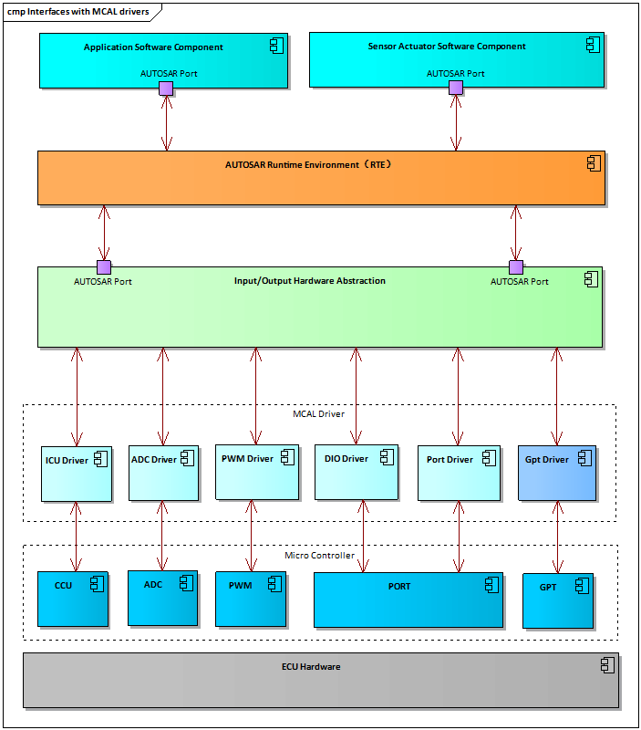

IoHwAb模块处理所有直接连接到ECU的输入和输出。它包括所有的输入和输出，直接映射到微控制器端口或板载外围设备。在考虑所提供的接口时，微控制器和外设之间的所有通信都被IoHwAb模块所隐藏。

The IoHwAb module handles all inputs and outputs connected directly to the ECU. It includes all inputs and outputs that are directly mapped to microcontroller ports or onboard peripherals. When considering the interfaces provided, all communication between the microcontroller and peripherals is hidden by the IoHwAb module.

ECU信号表示一个电信号，意味着至少有一个输入或输出ECU引脚被IO硬件抽象所映射。通过软件抽象ECU引脚，可以把输入和输出识别为电信号。本文档中所定义的一切都与电信号概念有关，统一由IoHwAb模块进行服务。具有相似行为的电信号可以归为一个类，并通过IO硬件抽象以ECU信号的形式来进行关联，然后提供给SWC用户使用。

ECU signal indicates an electrical signal, meaning that at least one input or output ECU pin is mapped by an IO hardware abstraction. By abstracting the ECU pins through software, inputs and outputs can be recognized as electrical signals. Everything defined in this document relates to the concept of electrical signals, uniformly served by the IoHwAb module. Electrical signals with similar behavior can be categorized into a class and associated via the IO hardware abstraction as ECU signals, then provided for use by SWC users.

ECU信号的属性 (The attributes of ECU signals)
--------------------------------------------------------

每个ECU信号的特征描述都是由SWC定义的，但必须为每个信号添加一些属性，以提供SWC所期望的信号质量。

The characteristic description of each ECU signal is defined by SWC, but some properties must be added for each signal to provide the signal quality expected by SWC.

所有通过IoHwAb模块处理的ECU信号都依赖于ECU硬件设计。意味着设置ECU输出信号的时间和获得ECU输入信号的时间不可能在同一时间进行控制。因此，为了保证各种ECU信号的控制行为，定义了一个通用的年龄属性，并对每个ECU信号进行配置。

All ECU signals processed through the IoHwAb module depend on the ECU hardware design. This means that setting the time for ECU output signals and obtaining the time for ECU input signals cannot be controlled at the same time. Therefore, to ensure the control behavior of various ECU signals, a generic age attribute is defined, and each ECU signal is configured accordingly.

所有ECU信号都应该有一个年龄属性，根据ECU信号的方向(输入/输出)，年龄属性有两个具体的名称。对于ECU输入信号，年龄属性的具体功能是限制信号的生存期，其值定义了该信号数据的最大允许年龄，如果生存期为0，则必须立即从物理寄存器中检索该信号，如果生存期大于0，则信号在指定的时间内有效；对于ECU输出信号，年龄属性的具体功能是限制信号输出到最大延迟，其值定义了该信号实际设置之前允许的最大时间，如果延迟为0，则必须立即将信号设置到物理寄存器，如果延迟大于0，信号可以设置到配置的时间已经过去。

All ECU signals should have an Age attribute, which has two specific names based on the direction of the ECU signal (input/output). For ECU input signals, the Age attribute's specific function is to limit the lifetime of the signal, with its value defining the maximum allowed age of the signal data. If the lifetime is 0, the signal must be retrieved immediately from the physical register; if the lifetime is greater than 0, the signal remains valid within the specified time. For ECU output signals, the Age attribute's specific function is to limit the maximum delay of the signal output, with its value defining the maximum allowable time before the signal can actually be set in the physical register. If the delay is 0, the signal must be immediately set in the physical register; if the delay is greater than 0, the signal can be set at a configured time that has already passed.

和其他软件组件SWC一样，IoHwAb模块可以是子结构的，取决于ECU的复杂程度。IoHwAb模块是一个经典的组件原型，可以是原子的，也可以是组合的，它提供需求接口。此外，IoHwAb模块只能通过它们的PortPrototypes与RTE之上的其他软件组件进行交互。不允许使用PortPrototypes表示的隐藏依赖项。

Like other software components SWC, the IoHwAb module can be substructural depending on the complexity of the ECU. The IoHwAb module is a classic component prototype that can be atomic or composite and provides demand interfaces. Additionally, the IoHwAb module can only interact with other software components above RTE through their PortPrototypes. Hidden dependencies are not allowed to be represented by PortPrototypes.

IoHwAb模块一方面通过标准化的AUTOSAR接口连接于MCAL驱动程序，另一方面通过RTE连接SWC服务组件和应用组件。IoHwAb模块的服务组件在SWC配置工具中通过EcuAbstractionSwComponentType组件实现为一个或多个IO硬件抽象服务实例，一个EcuAbstractionSwComponentType的实例化提供了一组端口，在生成RTE时，只考虑那些与软件组件建立连接的IO信号；IoHwAb模块的应用组件在SWC配置工具中通过ApplicationSwComponentType组件实现为一个或多个IO硬件抽象服务实例，一个ApplicationSwComponentType的实例化提供了一组端口，在生成RTE时，只考虑那些与软件组件建立连接的IO信号。

The IoHwAb module connects to the MCAL driver via standardized AUTOSAR interfaces on one hand, and through RTE to SWC service components and application components on the other. The service components of the IoHwAb module are realized as one or more instances of IO hardware abstraction services in the EcuAbstractionSwComponentType component within the SWC configuration tool; an instance of EcuAbstractionSwComponentType provides a set of ports, and during RTE generation, only those IO signals that establish connections with software components are considered. The application components of the IoHwAb module are realized as one or more instances of IO hardware abstraction services in the ApplicationSwComponentType component within the SWC configuration tool; an instance of ApplicationSwComponentType provides a set of ports, and during RTE generation, only those IO signals that establish connections with software components are considered.

软件组件具备实现策略和内部行为的功能，其功能是通过Runnable来描述的，前者包含在Runnable中，后者取决于Runnable的设计，Runnable由原子软件组件提供，是底层操作系统调度的对象。每个原子软件组件的实现必须在其内部行为中为每个可运行的Runnable提供一个入口点。

Software components possess the functionality to realize strategies and internal behaviors, with their functions described through Runnables, where the former is contained within the Runnable, and the latter depends on the design of the Runnable. Runnables are provided by atomic software components and are objects scheduled by the underlying operating system. Each implementation of an atomic software component must provide an entry point for each runnable in its internal behavior.

Runnable实体是最小的代码片段，可以独立激活。它们由原子软件组件提供并由RTE激活，Runnable被设置为响应服务器上的数据交换或操作调用。

Runnable entities are the smallest code snippets that can be independently activated. They are provided by atomic software components and activated by RTE, with Runnable being set to respond to data exchanges or operation calls on the server.

Runnable实体有三种可能的状态：Suspended、Enabled和Running。在运行时，原子软件组件的每个Runnable都处于这些状态之一。

Runnable entities have three possible states: Suspended, Enabled, and Running. At runtime, each Runnable of an atomic software component is in one of these states.

每个BSW模块都可以提供BSW可运行的实体，在RTE规范中也称为BswModuleEntity。BswModuleEntity相当于SWC运行的实体，Runnable实体是一个原子软件组件可以执行和计划独立于原子软件组件的其他运行的实体。意味着IoHwAb模块可以同时使用Runnable调度和BSW调度。Runnable调度处理可运行实体，是强制性的。与可运行调度不同，BSW调度是可选的，与BSW调度程序的接口必须手动完成。对于SWC可运行实体，可以在AUTOSAR OS任务体中被调用，SWC可运行项的激活强烈依赖于RTE事件。与SWC通常被RTEEvents激活的方式一样，可调度的BswModuleEntities也可以被BswEvents激活。还有一种BswModuleEntity可以在中断上下文中激活。

Each BSW module can provide an entity on which BSW can run, also referred to as BswModuleEntity in the RTE specification. BswModuleEntity is equivalent to the SWC running entity. A Runnable entity is an atomic software component that can execute and be scheduled independently of other running entities. This means that the IoHwAb module can use both Runnable scheduling and BSW scheduling simultaneously. Runnable scheduling handles runnable entities and is mandatory. Unlike runnable scheduling, BSW scheduling is optional, and interfacing with a BSW scheduler requires manual completion. For SWC runnable entities, they can be called within the AUTOSAR OS task body; the activation of SWC runnable items strongly depends on RTE events. Similarly to how SWCs are typically activated by RTEEvents, schedulable BswModuleEntities can also be activated by BswEvents. Additionally, there is a BswModuleEntity that can be activated in an interrupt context.

从接口的角度描述IoHwAb模块，实现由SWC定义的PortInterfaces的对等物提供Runnable实体，并实现SWC所需的端口映射提供(Server-Client端口，或者Sender/Receiver端口)。

Describe the IoHwAb module from an interface perspective, implementing counterparts of PortInterfaces defined by SWC to provide Runnable entities and realize the port mapping required by SWC (Server-Client ports or Sender/Receiver ports).

IoHwAb模块提供端口服务的实现是ECU特定的，对应的PortInterface的映射应在软件组件描述中归档化。对于与PortInterface相关联的ECU信号配置为输入信号，IoHwAb模块应提供一个GET操作，其操作的API简短名称可以由用户来决定；对于ECU信号与PortInterface相关联的配置为一个输出信号，IoHwAb模块应该提供一个SET操作，其操作的API短名称可以由用户来决定；IoHwAb模块通过定义BswInterruptEntities来实现通知或回调机制，在中断上下文中与RTE下面的其他模块进行交换数据，实现时需要必须考虑回调函数将在中断上下文中执行；回调函数还可以提供在IoHwAb模块之外触发软件组件的能力，其通知需要通过RTE进行处理；可用回调函数的数量和执行顺序将取决于实现，并且必须在IoHwAb模块BSWMD中记录。

The implementation of port services provided by the IoHwAb module is ECU-specific, and the corresponding mapping of PortInterface should be archived in the software component description. For ECU signals configured as input signals associated with PortInterface, the IoHwAb module should provide a GET operation, with its API short name decided by the user; for ECU signals configured as output signals associated with PortInterface, the IoHwAb module should provide a SET operation, with its API short name also decided by the user; the IoHwAb module implements notification or callback mechanisms through defining BswInterruptEntities, exchanging data with other modules under the RTE in interrupt context, and it must be considered that the callback functions will execute in interrupt context; callback functions can also provide the ability to trigger software components outside the IoHwAb module, with their notifications handled by the RTE; the number of available callback functions and their execution order depend on implementation and must be recorded in the IoHwAb module BSWMD.

通过RTE路由的IoHwAb模块的回调函数函数的函数原型应按照以下规则实现：Std_ReturnType Rte_Call\_ < p > \_ < o >(<parameters>)

The prototype of the callback function in the IoHwAb module through the RTE routing should be implemented according to the following rules: Std_ReturnType Rte_Call_
_<_o>(<parameters>)

回调函数必须与RTE的Rte_Call\_
\_<o>的API兼容，以使AUTOSAR服务和IO硬件抽象的类型安全配置和实现。

Callback functions must be compatible with the API of RTE's Rte_Call_
_<o> to enable type-safe configuration and implementation of AUTOSAR services and IO hardware abstraction.

IoHwAb模块可以包含一个或几个作业任务处理主函数，由BSW调度程序定时触发，也可以同步到其他可运行实体的执行。BswSchedulableEntities的数量和它们的执行顺序将依赖于实现，并且必须在IoHwAb模块描述中记录。

The IoHwAb module can contain one or several job task handling main functions, triggered by the BSW scheduler at定时触发，也可以同步到其他可运行实体的执行。The number and execution order of BswSchedulableEntities will depend on the implementation and must be documented in the description of the IoHwAb module.

IoHwAb模块定义BswModuleEntries与外部中断上下文RTE以下的其他软件进行交换数据，如BSW初始化/反初始化；这些BswModuleEntries被链接到一个专用的BswModuleEntity，它将被调用来执行服务/交换数据。IoHwAb模块可以包含一个或几个初始化和反初始化函数。与MCAL驱动类似，初始化函数应该包含一个参数，以便能够将不同的配置传递给设备驱动程序。这个函数将IoHwAb模块驱动程序使用的所有局部和全局变量初始化到初始状态；初始化/反初始化功能应由ECU状态管理器进行处理。可用函数的数量和执行顺序是依赖于实现的，必须在IoHwAb模块描述中记录下来。

The IoHwAb module defines BswModuleEntries for exchanging data with other software entities below RTE, such as BSW initialization/deinitialization; these BswModuleEntries are linked to a dedicated BswModuleEntity that will be called to execute services/exchange data. The IoHwAb module can include one or several initialization and deinitialization functions. Similar to MCAL drivers, an initialization function should contain a parameter so as to enable different configurations to be passed to the device driver. This function will initialize all local and global variables used by the IoHwAb module driver to their initial state; initialization/deinitialization functionalities should be handled by the ECU status manager. The number and execution order of available functions are dependent on the implementation and must be documented in the IoHwAb module description.

软件组件架构 (Software component architecture)
--------------------------------------------------------

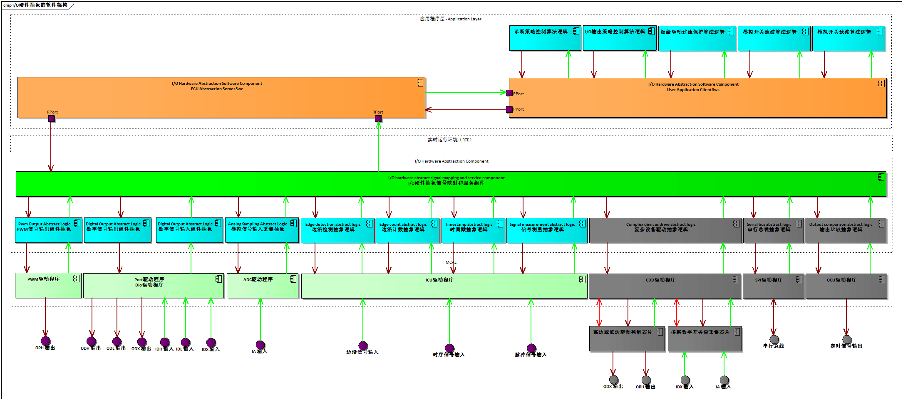

IoHwAb软件功能的基本组成部分包括：微控制抽象层MCAL、IoHwAb硬件抽象组件实现层、IoHwAb硬件抽象信号映射层、IoHwAb硬件抽象服务组件、ECU抽象服务端软件组件SWC、输入输出抽象客户端软件组件SWC等。

The basic components of IoHwAb software functionality include: Micro Control Abstraction Layer (MCAL), IoHwAb hardware abstraction implementation layer, IoHwAb hardware abstraction signal mapping layer, IoHwAb hardware abstraction service components, ECU abstract service end software components (SWC), and input/output abstract client software components (SWC).

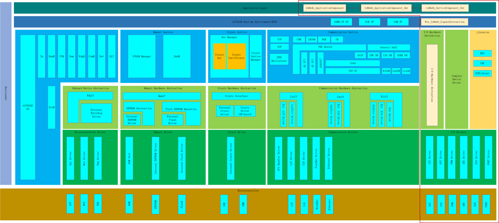

信号映射机制和数据流 (Signal Mapping Mechanism and Data Flow)
-------------------------------------------------------------------

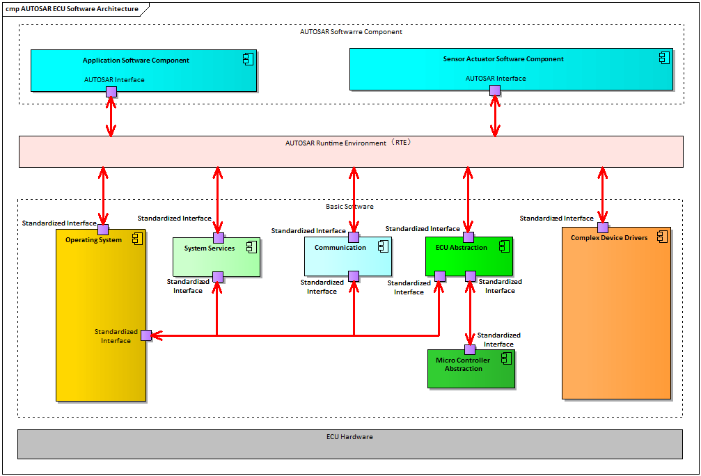

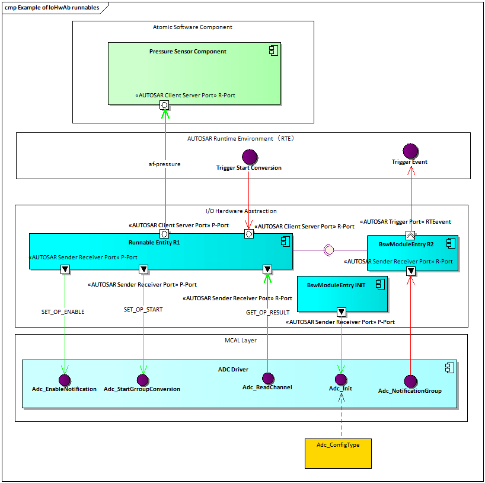

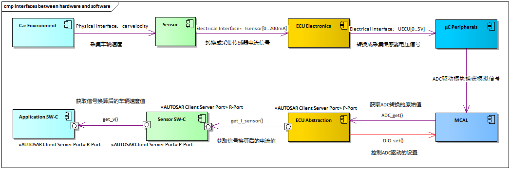

当ECU外部挂接设备和IO硬件抽象进行连接时，并通过IO服务组件的形式与用户层SWC进行交互，而这种情况下都是先实现CDD复杂设备驱动并支持SPI组件的通信抽象，然后CDD与IoHwAb进行交互，IO硬件抽象实现标准的服务组件API接口给应用组件SWC使用。

When external devices and IO hardware abstractions are connected via the ECU, and interact with user layer SWCs through IO service components, this involves first implementing complex device drivers for CDD to support SPI component communication abstraction. Then, CDD interacts with IoHwAb, where IO hardware abstractions realize standard service component API interfaces for use by application components SWC.

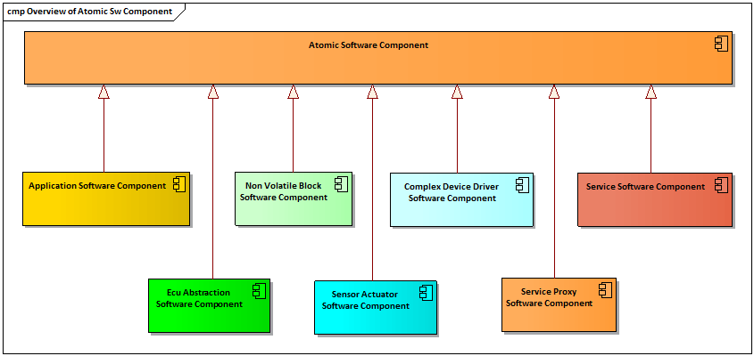

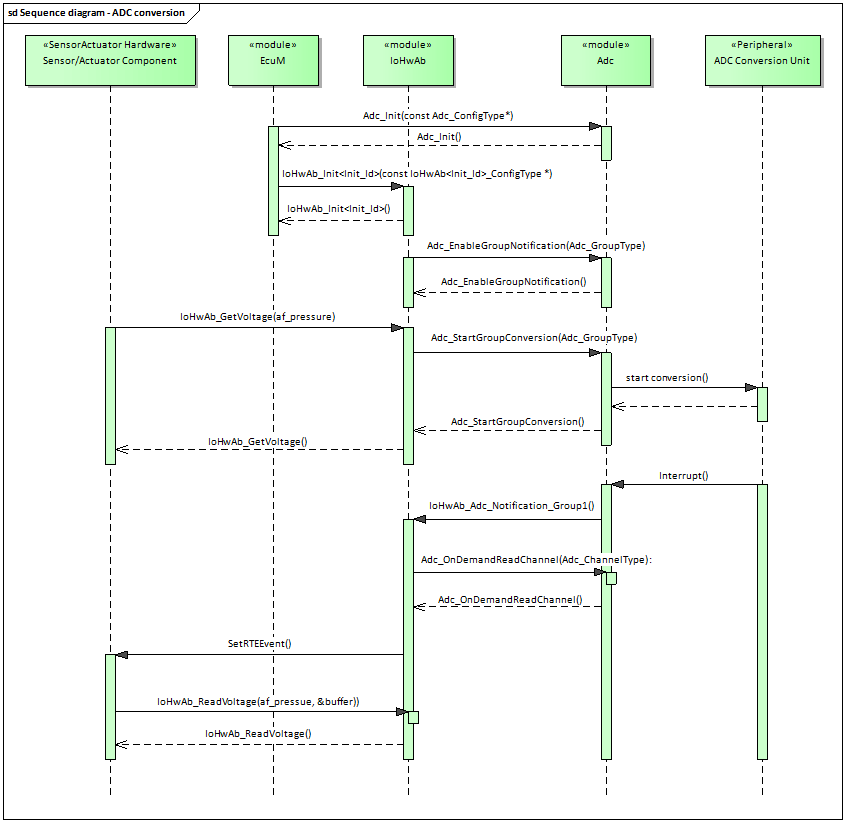

当上层应用组件需要对MCAL进行模拟信号-数字量转换时，可以通过以上时序进行时序控制；首先，EcuM_Init接口的驱动初始化流程需要调用Adc_Init函数执行ADC组件的初始化，调用Adc_EnableNotification函数执行ADC组件的中断通知使能；然后，上层如果需要使用ADC组建的资源，可以调用相应的服务简介调用ADC组件的Adc_StartGroupConversion函数来启动AD转换；最后，当中断服务函数或轮询接收到AD转换完成，可以通过调用Adc_ReadGroup函数获取转换结果，并拷贝到指定缓冲区。

When the upper-layer application component needs to perform analog-to-digital conversion through MCAL, it can implement timing control according to the above sequence; first, the driver initialization process of EcuM_Init interface requires calling the Adc_Init function to initialize the ADC component and calling the Adc_EnableNotification function to enable interrupt notifications for the ADC component. Then, if the upper-layer needs to use resources from the ADC component, it can call the corresponding service introduction to invoke the Adc_StartGroupConversion function of the ADC component to start the AD conversion; finally, when the interrupt service function or polling receives the completion of the AD conversion, it can obtain the conversion results by calling the Adc_ReadGroup function and copy them to a designated buffer.

AUTOSAR方法论 (AUTOSAR Methodology)
------------------------------------------------

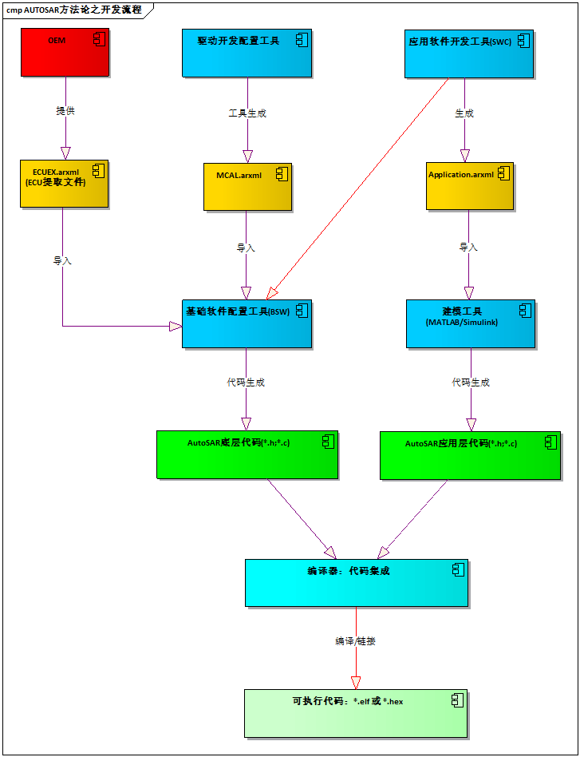

内存分配 (Memory allocation)
========================================

在IO硬件抽象模块中，内存使用上大概分为配置代码部分的代码段，占用一定内存的Code Flash存储空间；配置代码部分的数据段，占用一定内存的RAM存储空间。

In the IO hardware abstraction module, memory usage is roughly divided into code segments of the configuration code part, occupying a certain amount of Code Flash storage space; and the data segments of the configuration code part, occupying a certain amount of RAM storage space.

源文件描述 (Source file description)
===============================================

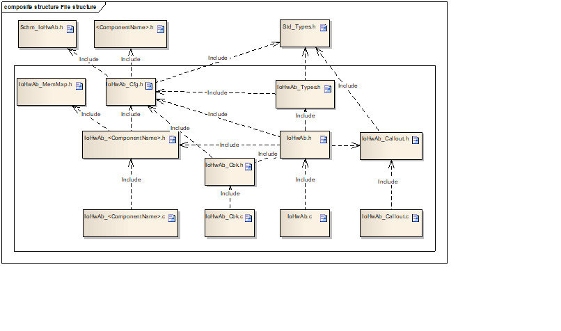

.. centered:: **表 IoHwAb组件文件描述 (IoHwAb Component File Description)**

.. list-table::
   :widths: 50 50
   :header-rows: 1

   * - 文件 (Files)
     - 说明 (Description)
   * - IoHwAb_Types.h
     - IoHwAb模块头文件，包含了IoHwAb模块和ECU信号映射描述相关的数据类型和宏定义 (Header file for the IoHwAb module, containing data types and macro definitions related to the description of IoHwAb module and ECU signal mapping.)
   * - IoHwAb.c
     - IoHwAb模块配置源文件，包含了API函数的实现和变量的定义 (The IoHwAb module configuration source file includes the implementation of API functions and the definition of variables.)
   * - IoHwAb.h
     - IoHwAb模块配置头文件，包含了API函数和变量的声明 (Module IoHwAb configuration header file, contains declarations of API functions and variables)
   * - IoHwAb_Cfg.h
     - 定义IoHwAb模块预编译时用到的配置参数，用于MCAL组件信号通道的重映射定义和IO信号统计。 (Define configuration parameters for the IoHwAb module used during pre-compilation, for remapping signals in the MCAL component and IO signal statistics.)
   * - IoHwAb_Dio.c
     - IoHwAb模块与Dio组件交互相关的源文件，包含了API函数的实现和变量的定义，用于处理数字量电平输入输出信号映射的IO硬件抽象。 (Source files for the IoHwAb module interacting with the Dio component include API function implementations and variable definitions, used for handling digital level input/output signal mapping in IO hardware abstraction.)
   * - IoHwAb_Dio.h
     - IoHwAb模块与Dio组件交互相关的头文件，包含了API函数和变量的声明，用于处理数字量电平输入输出信号映射的IO硬件抽象。 (Header file for IoHwAb module interaction with the Dio component, containing API function and variable declarations for handling digital level input/output signal mapping in IO hardware abstraction.)
   * - IoHwAb_Adc.c
     - IoHwAb模块与Adc组件交互相关的配置源文件，包含了API函数的实现和变量的定义，用于处理模拟量输入采集信号映射的IO硬件抽象。 (The IoHwAb module configuration source file related to the interaction with the Adc component includes the implementation of API functions and the definition of variables for handling the mapping of analog input acquisition signals for IO hardware abstraction.)
   * - IoHwAb_Adc.h
     - IoHwAb模块与Adc组件交互相关的配置头文件，包含了API函数和变量的声明，用于处理模拟量输入采集信号映射的IO硬件抽象。 (The IoHwAb module includes configuration header files related to the interaction between the Adc component, containing declarations of API functions and variables for handling IO hardware abstraction of analog input acquisition signals.)
   * - IoHwAb_Icu.c
     - IoHwAb模块与Icu组件交互相关的源文件，包含了API函数的实现和变量的定义，用于处理输入捕获信号映射的IO硬件抽象。 (Source files related to the interaction between the IoHwAb module and the Icu component contain API function implementations and variable definitions for handling IO hardware abstraction of input capture signal mapping.)
   * - IoHwAb_Icu.h
     - IoHwAb模块与Icu组件交互相关的头文件，包含了API函数和变量的声明，用于处理输入捕获信号映射的IO硬件抽象。 (Header file for the IoHwAb module interacting with the Icu component, containing declarations of API functions and variables for handling input capture signal mapping in IO hardware abstraction.)
   * - IoHwAb_Pwm.c
     - IoHwAb模块与Pwm组件交互相关的源文件，包含了API函数的实现和变量的定义，用于处理PWM输出信号映射的IO硬件抽象。 (Source files for the IoHwAb module interacting with the Pwm component contain API function implementations and variable definitions for handling IO hardware abstraction related to PWM output signal mapping.)
   * - IoHwAb_Pwm.h
     - IoHwAb模块与Pwm组件交互相关的头文件，包含了API函数和变量的声明，用于处理PWM输出信号映射的IO硬件抽象。 (Header file for interaction between the IoHwAb module and the Pwm component, containing declarations of API functions and variables for handling IO hardware abstraction related to PWM output signal mapping.)
   * - IoHwAb_Spi.c
     - IoHwAb模块与Spi组件交互相关的源文件，包含了API函数和变量的声明，用于处理Spi输出信号映射的IO硬件抽象。 (Source files related to the interaction between the IoHwAb module and the Spi component contain API function and variable declarations for handling IO hardware abstraction of Spi output signal mapping.)
   * - IoHwAb_Spi.h
     - IoHwAb模块与Spi组件交互相关的头文件，包含了API函数和变量的声明，用于处理Spi输出信号映射的IO硬件抽象。 (Header file for the IoHwAb module interacting with the Spi component, containing API function and variable declarations for handling IO hardware abstraction of Spi output signal mapping.)
   * - IoHwAb_Gpt.c
     - IoHwAb模块与Gpt组件交互相关的源文件，包含了API函数和变量的声明，用于处理Gpt输出信号映射的IO硬件抽象。 (Source files for the IoHwAb module interacting with the Gpt component include API function and variable declarations for handling IO hardware abstraction related to Gpt output signal mapping.)
   * - IoHwAb_Gpt.h
     - IoHwAb模块与Gpt组件交互相关的头文件，包含了API函数和变量的声明，用于处理Gpt输出信号映射的IO硬件抽象。 (Header files for the IoHwAb module related to interacting with the Gpt component, containing declarations of API functions and variables for handling IO hardware abstraction of Gpt output signals.)
   * - IoHwAb_Cdd.c
     - IoHwAb模块配置源文件，包含了IoHwAb与复杂驱动关联时API函数的实现。 (The IoHwAb module configuration source file contains the implementation of API functions when IoHwAb is associated with complex drivers.)
   * - IoHwAb_Cdd.h
     - IoHwAb模块配置头文件，包含了IoHwAb与复杂驱动关联时API函数的声明。 (Module configuration header file for IoHwAb, contains the declaration of API functions when IoHwAb is associated with complex drivers.)
   * - IoHwAb_Cbk.c
     - IoHwAb模块配置源文件，包含了IoHwAb与MCAL关联时用于中断通知挂接API函数的实现。 (The IoHwAb module configuration source file contains the implementation of API functions used for interrupt notification attachment when IoHwAb is associated with MCAL.)
   * - IoHwAb_Cbk.h
     - IoHwAb模块配置头文件，包含了IoHwAb与MCAL关联时用于中断通知挂接API函数的声明。 (IoHwAb module configuration header file, contains the declaration of API functions used for interrupt notification attachment when IoHwAb is associated with MCAL.)
   * - IoHwAb_MemMap.h
     - IoHwAb模块配置头文件，用于处理内存段分布的映射机制 (Module configuration header file for IoHwAb, used for handling mapping mechanisms of memory segment distribution)
   * - IoHwAb_Dcm.c
     - IoHwAb模块配置源文件，包含了IoHwAb与Dcm关联时API函数的实现。 (Module configuration source file for IoHwAb, includes the implementation of API functions when IoHwAb is associated with Dcm.)
   * - IoHwAb_Dcm.h
     - IoHwAb模块配置头文件，包含了IoHwAb与Dcm关联时API函数的声明。 (Header file for configuring the IoHwAb module, which includes declarations of API functions when IoHwAb is associated with Dcm.)
   * - IoHwAb_Callout.c
     - IoHwAb模块配置源文件，包含了IoHwAb中自定义回调API函数的实现。 (The IoHwAb module configuration source file contains the implementation of custom callback API functions in IoHwAb.)
   * - IoHwAb_Callout.h
     - IoHwAb模块配置头文件，包含了IoHwAb中自定义回调API函数的声明。 (Module configuration header file for IoHwAb, contains the declarations of custom callback API functions in IoHwAb.)

外围可编程接口 (Peripheral Programmable Interface)
===========================================================

由于用户需求的差异性，IoHwAb提供部分可定制开发的回调接口，用户可自行实现其具体厂家平台所具有的特殊功能。

Due to the variability of user requirements, IoHwAb provides partially customizable callback interfaces, allowing users to implement specific special functions of their respective manufacturer platforms.

类型定义 (Type definition)
--------------------------------------

UInt8类型定义 (Definition of UInt8 Type)
====================================================

.. list-table::
   :widths: 50 50
   :header-rows: 1

   * - 名称 (Name)
     - UInt8
   * - 类型 (Type)
     - unsigned char
   * - 范围 (Range)
     - 0~255
   * - 描述 (Description)
     - 无

UInt16类型定义 (Definition of UInt16 type)
======================================================

.. list-table::
   :widths: 50 50
   :header-rows: 1

   * - 名称 (Name)
     - UInt16
   * - 类型 (Type)
     - unsigned short
   * - 范围 (Range)
     - 0~65535
   * - 描述 (Description)
     - 无

UInt32类型定义 (Definition of UInt32 type)
======================================================

.. list-table::
   :widths: 50 50
   :header-rows: 1

   * - 名称 (Name)
     - UInt32
   * - 类型 (Type)
     - unsigned long
   * - 范围 (Range)
     - 0~4294967295
   * - 描述 (Description)
     - 无

IoHwAb_Adc_ValueGroupType类型定义 (IoHwAb_Adc_ValueGroupType Type Definition)
=========================================================================================

.. list-table::
   :widths: 50 50
   :header-rows: 1

   * - 名称 (Name)
     - IoHwAb_Adc_ValueGroupType
   * - 类型 (Type)
     - Adc_ValueGroupType
   * - 范围 (Range)
     - 根据MCAL范围决定 (Decide based on the MCAL range)
   * - 描述 (Description)
     - 用于描述模拟信号转化为数字量的数据类型 (Data type used for describing the conversion of analog signals into digital quantities)

IoHwAb_Adc_StreamNumSampleType类型定义 (IoHwAb_Adc_StreamNumSampleType Type Definition)
===================================================================================================

.. list-table::
   :widths: 50 50
   :header-rows: 1

   * - 名称 (Name)
     - IoHwAb_Adc_StreamNumSampleType
   * - 类型 (Type)
     - Adc_StreamNumSampleType
   * - 范围 (Range)
     - 根据MCAL范围决定 (Decide based on the MCAL range)
   * - 描述 (Description)
     - 用于描述Adc流模式采样的次数 (To describe the number of times Adc flow mode sampling is performed)

IoHwAb_Adc_ValuePtrType类型定义 (IoHwAb_Adc_ValuePtrType type definition)
=====================================================================================

.. list-table::
   :widths: 50 50
   :header-rows: 1

   * - 名称 (Name)
     - IoHwAb_ChannelType
   * - 类型 (Type)
     - Adc_ValueGroupType\*
   * - 范围 (Range)
     - 根据MCAL范围决定 (Decide based on the MCAL range)
   * - 描述 (Description)
     - 用于描述Adc采样值的数据类型 (Data types used to describe Adc sample values)

IoHwAb_Pwm_DutycycleType类型定义 (IoHwAb_Pwm_DutycycleType type definition)
=======================================================================================

.. list-table::
   :widths: 50 50
   :header-rows: 1

   * - 名称 (Name)
     - IoHwAb_Pwm_DutycycleType
   * - 类型 (Type)
     - Uint16
   * - 范围 (Range)
     - 0~65525
   * - 描述 (Description)
     - 用于描述IoHwAb模块pwm组件信号占空比的数据类型 (Data type for describing the duty cycle of the PWM component in the IoHwAb module)

IoHwAb_Pwm_OutputStateType类型定义 (Type definition for IoHwAb_Pwm_OutputStateType)
===============================================================================================

.. list-table::
   :widths: 50 50
   :header-rows: 1

   * - 名称 (Name)
     - IoHwAb_Pwm_OutputStateType
   * - 类型 (Type)
     - Pwm_OutputStateType
   * - 范围 (Range)
     - 根据MCAL范围决定 (Decide based on the MCAL range)
   * - 描述 (Description)
     - 用于描述IoHwAb模块pwm组件信号输出状态的数据类型 (Data type used to describe the signal output status of the pwm component in the IoHwAb module)

IoHwAb_Pwm_PeriodType类型定义 (IoHwAb_Pwm_PeriodType type definition)
=================================================================================

.. list-table::
   :widths: 50 50
   :header-rows: 1

   * - 名称 (Name)
     - IoHwAb_Pwm_PeriodType
   * - 类型 (Type)
     - Pwm_PeriodType
   * - 范围 (Range)
     - 根据MCAL范围决定 (Decide based on the MCAL range)
   * - 描述 (Description)
     - 用于描述IoHwAb模块pwm组件信号周期的数据类型 (Data type used to describe the period of the PWM signal for the IoHwAb module)

IoHwAb_Pwm_EdgeNotificationType类型定义 (IoHwAb_Pwm_EdgeNotificationType Type Definition)
=====================================================================================================

.. list-table::
   :widths: 50 50
   :header-rows: 1

   * - 名称 (Name)
     - IoHwAb_Pwm_EdgeNotificationType
   * - 类型 (Type)
     - Pwm_EdgeNotificationType
   * - 范围 (Range)
     - 根据MCAL范围决定 (Decide based on the MCAL range)
   * - 描述 (Description)
     - 用于描述IoHwAb模块pwm组件电平通知的类型 (Types for describing the level notifications of the pwm component in the IoHwAb module)

IoHwAb_Dio_LevelType类型定义 (Definition of IoHwAb_Dio_LevelType Type)
==================================================================================

.. list-table::
   :widths: 50 50
   :header-rows: 1

   * - 名称 (Name)
     - IoHwAb_Dio_LevelType
   * - 类型 (Type)
     - Dio_LevelType
   * - 范围 (Range)
     - 根据MCAL范围决定 (Decide based on the MCAL range)
   * - 描述 (Description)
     - 用于描述IoHwAb模块Dio组件电平高低的数据类型 (Data type used to describe the level high and low of the Dio component in the IoHwAb module)

IoHwAb_Dio_PortLevelType类型定义 (IoHwAb_Dio_PortLevelType Type Definition)
=======================================================================================

.. list-table::
   :widths: 50 50
   :header-rows: 1

   * - 名称 (Name)
     - IoHwAb_Dio_PortLevelType
   * - 类型 (Type)
     - Dio_PortLevelType
   * - 范围 (Range)
     - 根据MCAL范围决定 (Decide based on the MCAL range)
   * - 描述 (Description)
     - 用于描述IoHwAb模块Dio组件port电平的数据类型 (Data type used to describe the level of the Dio component port in the IoHwAb module)

IoHwAb_Icu_MeasurementModeType类型定义 (IoHwAb_Icu_MeasurementModeType type definition)
===================================================================================================

.. list-table::
   :widths: 50 50
   :header-rows: 1

   * - 名称 (Name)
     - IoHwAb_Icu_MeasurementModeType
   * - 类型 (Type)
     - Icu_MeasurementModeType
   * - 范围 (Range)
     - ICU_MODE_SIGNAL_EDGE_DETECT
   * - 
     - ICU_MODE_SIGNAL_MEASUREMENT
   * - 
     - ICU_MODE_TIMESTAMP
   * - 
     - ICU_MODE_EDGE_COUNTER
   * - 描述 (Description)
     - 用于描述IoHwAb模块Icu组件测量模式的数据类型 (Data type used to describe measurement mode of Icu component in IoHwAb module)

IoHwAb_Icu_InputStateType类型定义 (IoHwAb_Icu_InputStateType type definition)
=========================================================================================

.. list-table::
   :widths: 50 50
   :header-rows: 1

   * - 名称 (Name)
     - IoHwAb_Icu_InputStateType
   * - 类型 (Type)
     - Icu_InputStateType
   * - 范围 (Range)
     - ICU_IDLE
   * - 
     - ICU_ACTIVE
   * - 描述 (Description)
     - 用于描述IoHwAb模块Icu组件输入状态的数据类型 (Data type used to describe the input status of the Icu component in the IoHwAb module)

IoHwAb_Icu_ActivationType类型定义 (IoHwAb_Icu_ActivationType type definition)
=========================================================================================

.. list-table::
   :widths: 50 50
   :header-rows: 1

   * - 名称 (Name)
     - IoHwAb_Icu_ActivationType
   * - 类型 (Type)
     - Icu_ActivationType
   * - 范围 (Range)
     - ICU_RISING_EDGE
   * - 
     - ICU_FALLING_EDGE
   * - 
     - ICU_BOTH_EDGES
   * - 
     - ICU_NO_EDGE
   * - 描述 (Description)
     - 用于描述IoHwAb模块Icu组件激活状态的数据类型 (Data type for describing the activation status of the Icu component in the IoHwAb module)

IoHwAb_Icu_DutyCycleType类型定义 (IoHwAb_Icu_DutyCycleType type definition)
=======================================================================================

.. list-table::
   :widths: 50 50
   :header-rows: 1

   * - 名称 (Name)
     - IoHwAb_Icu_DutyCycleType
   * - 类型 (Type)
     - Icu_DutyCycleType
   * - 范围 (Range)
     - 根据MCAL范围决定 (Decide based on the MCAL range)
   * - 描述 (Description)
     - 用于描述IoHwAb模块Icu组件占空比的数据类型 (Data type for describing the duty cycle of the Icu component in the IoHwAb module)
   * - 定义 (Define)
     - typedef struct
   * - 
     - {
   * - 
     - Icu_ValueType ActiveTime;
   * - 
     - Icu_ValueType PeriodTime;
   * - 
     - } Icu_DutyCycleType;

IoHwAb_Icu_ChannelType类型定义 (IoHwAb_Icu_ChannelType ChannelType definition)
==========================================================================================

.. list-table::
   :widths: 50 50
   :header-rows: 1

   * - 名称 (Name)
     - IoHwAb_Icu_ChannelType
   * - 类型 (Type)
     - Icu_ChannelType
   * - 范围 (Range)
     - 根据MCAL范围决定 (Decide based on the MCAL range)
   * - 描述 (Description)
     - 用于描述IoHwAb模块Icu组件信号通道的数据类型 (Data type for describing IoHwAb module Icu component signal channel)

IoHwAb_Icu_ValueType类型定义 (IoHwAb_Icu_ValueType type definition)
===============================================================================

.. list-table::
   :widths: 50 50
   :header-rows: 1

   * - 名称 (Name)
     - IoHwAb_Icu_ValueType
   * - 类型 (Type)
     - Icu_ValueType
   * - 范围 (Range)
     - 根据MCAL范围决定 (Decide based on the MCAL range)
   * - 描述 (Description)
     - 用于描述IoHwAb模块Icu组件的数据类型 (Data types for describing the Icu component of the IoHwAb module)

IoHwAb_Icu_IndexType类型定义 (IoHwAb_Icu_IndexType Type Definition)
===============================================================================

.. list-table::
   :widths: 50 50
   :header-rows: 1

   * - 名称 (Name)
     - IoHwAb_Icu_IndexType
   * - 类型 (Type)
     - Icu_IndexType
   * - 范围 (Range)
     - 根据MCAL范围决定 (Decide based on the MCAL range)
   * - 描述 (Description)
     - 用于描述IoHwAb模块Icu组件通道属性的数据类型 (Data type used to describe IoHwAb module Icu component channel attributes)

IoHwAb_Icu_EdgeNumberType类型定义 (IoHwAb_Icu_EdgeNumberType type definition)
=========================================================================================

.. list-table::
   :widths: 50 50
   :header-rows: 1

   * - 名称 (Name)
     - IoHwAb_Icu_EdgeNumberType
   * - 类型 (Type)
     - Icu_EdgeNumberType
   * - 范围 (Range)
     - 根据MCAL范围决定 (Decide based on the MCAL range)
   * - 描述 (Description)
     - 用于描述IoHwAb模块Icu组件电平数量的数据类型 (Data type used to describe the number of levels in the Icu component of the IoHwAb module)

IoHwAb_Spi_DataBufferType类型定义 (IoHwAb_Spi_DataBufferType data buffer type definition)
=====================================================================================================

.. list-table::
   :widths: 50 50
   :header-rows: 1

   * - 名称 (Name)
     - IoHwAb_Spi_DataBufferType
   * - 类型 (Type)
     - Spi_DataBufferType
   * - 范围 (Range)
     - 根据MCAL范围决定 (Decide based on the MCAL range)
   * - 描述 (Description)
     - 用于描述IoHwAb模块spi组件缓存数据的数据类型 (Data type for describing IoHwAb module SPI component cached data)

IoHwAb_Spi_NumberOfDataType类型定义 (IoHwAb_Spi_NumberOfDataType type definition)
=============================================================================================

.. list-table::
   :widths: 50 50
   :header-rows: 1

   * - 名称 (Name)
     - IoHwAb_Spi_NumberOfDataType
   * - 类型 (Type)
     - Spi_NumberOfDataType
   * - 范围 (Range)
     - 根据MCAL范围决定 (Decide based on the MCAL range)
   * - 描述 (Description)
     - 用于描述IoHwAb模块Spi组件数据元素数量的数据类型 (Data type used to describe the number of data elements for the Spi component of the IoHwAb module)

IoHwAb_Spi_ChannelType类型定义 (IoHwAb_Spi_ChannelType ChannelType definition)
==========================================================================================

.. list-table::
   :widths: 50 50
   :header-rows: 1

   * - 名称 (Name)
     - IoHwAb_Spi_ChannelType
   * - 类型 (Type)
     - Spi_ChannelType
   * - 范围 (Range)
     - 根据MCAL范围决定 (Decide based on the MCAL range)
   * - 描述 (Description)
     - 用于描述IoHwAb模块Spi组件信号通道的数据类型 (Data types for describing IoHwAb module Spi component signal channels)

IoHwAb_Spi_JobType类型定义 (Definition of IoHwAb_Spi_JobType Type)
==============================================================================

.. list-table::
   :widths: 50 50
   :header-rows: 1

   * - 名称 (Name)
     - IoHwAb_Spi_JobType
   * - 类型 (Type)
     - Spi_JobType
   * - 范围 (Range)
     - 根据MCAL范围决定 (Decide based on the MCAL range)
   * - 描述 (Description)
     - 用于描述IoHwAb模块Spi组件任务的数据类型 (Data types for describing IoHwAb module Spi component tasks)

IoHwAb_Spi_SequenceType类型定义 (IoHwAb_Spi_SequenceType Sequence Type Definition)
==============================================================================================

.. list-table::
   :widths: 50 50
   :header-rows: 1

   * - 名称 (Name)
     - IoHwAb_Spi_SequenceType
   * - 类型 (Type)
     - Spi_SequenceType
   * - 范围 (Range)
     - 根据MCAL范围决定 (Decide based on the MCAL range)
   * - 描述 (Description)
     - 用于描述IoHwAb模块Spi组件时序的数据类型 (Data type used to describe timing of the Spi component of the IoHwAb module)

IoHwAb_Spi_StatusType类型定义 (IoHwAb_Spi_StatusType type definition)
=================================================================================

.. list-table::
   :widths: 50 50
   :header-rows: 1

   * - 名称 (Name)
     - IoHwAb_Spi_StatusType
   * - 类型 (Type)
     - Spi_StatusType
   * - 范围 (Range)
     - 根据MCAL范围决定 (Decide based on the MCAL range)
   * - 描述 (Description)
     - 用于描述IoHwAb模块Spi组件运行状态的数据类型 (Data type used to describe the run status of the Spi component in the IoHwAb module)

IoHwAb_Spi_JobResultType类型定义 (IoHwAb_Spi_JobResultType type definition)
=======================================================================================

.. list-table::
   :widths: 50 50
   :header-rows: 1

   * - 名称 (Name)
     - IoHwAb_Spi_JobResultType
   * - 类型 (Type)
     - Spi_JobResultType
   * - 范围 (Range)
     - 根据MCAL范围决定 (Decide based on the MCAL range)
   * - 描述 (Description)
     - 用于描述IoHwAb模块Spi组件任务结果的数据类型 (Data type used to describe the task result of the Spi component in the IoHwAb module)

IoHwAb_Spi_SeqResultType类型定义 (IoHwAb_Spi_SeqResultType type definition)
=======================================================================================

.. list-table::
   :widths: 50 50
   :header-rows: 1

   * - 名称 (Name)
     - IoHwAb_Spi_SeqResultType
   * - 类型 (Type)
     - Spi_SeqResultType
   * - 范围 (Range)
     - 根据MCAL范围决定 (Decide based on the MCAL range)
   * - 描述 (Description)
     - 用于描述IoHwAb模块Spi组件时序结果的数据类型 (Data type used to describe the timing results of the Spi component in the IoHwAb module)

IoHwAb_Spi_AsyncModeType类型定义 (IoHwAb_Spi_AsyncModeType type definition)
=======================================================================================

.. list-table::
   :widths: 50 50
   :header-rows: 1

   * - 名称 (Name)
     - IoHwAb_Spi_AsyncModeType
   * - 类型 (Type)
     - Spi_AsyncModeType
   * - 范围 (Range)
     - 根据MCAL范围决定 (Decide based on the MCAL range)
   * - 描述 (Description)
     - 用于描述IoHwAb模块Spi组件运行模式的数据类型 (Data type used to describe the运行模式 of the Spi component in the IoHwAb module)

IoHwAb_Gpt_ValueType类型定义 (IoHwAb_Gpt_ValueType Type Definition)
===============================================================================

.. list-table::
   :widths: 50 50
   :header-rows: 1

   * - 名称 (Name)
     - IoHwAb_Gpt_ValueType
   * - 类型 (Type)
     - Gpt_ValueType
   * - 范围 (Range)
     - 根据MCAL范围决定 (Decide based on the MCAL range)
   * - 描述 (Description)
     - 用于描述IoHwAb模块Gpt组件计数器值的数据类型 (Data type used to describe the counter values of the Gpt component in the IoHwAb module)

IoHwAb_Gpt_PredefTimerType类型定义 (IoHwAb_Gpt_PredefTimerType Type Definition)
===========================================================================================

.. list-table::
   :widths: 50 50
   :header-rows: 1

   * - 名称 (Name)
     - IoHwAb_Gpt_PredefTimerType
   * - 类型 (Type)
     - Gpt_PredefTimerType
   * - 范围 (Range)
     - 根据MCAL范围决定 (Decide based on the MCAL range)
   * - 描述 (Description)
     - 用于描述IoHwAb模块Gpt组件转预定义定时器的数据类型 (Data type for describing IoHwAb module Gpt component transfer to predefined timer)

输入函数描述 (Describe the input function:)
-----------------------------------------------------

.. list-table::
   :widths: 50 50
   :header-rows: 1

   * - 输入模块 (Input Module)
     - API
   * - Det
     - Det_ReportRuntimeError
   * - 
     - Det_ReportError
   * - Adc
     - Adc_SetupResultBuffer
   * - 
     - Adc_StartGroupConversion
   * - 
     - Adc_StopGroupConversion
   * - 
     - Adc_ReadGroup
   * - 
     - Adc_EnableHardwareTrigger
   * - 
     - Adc_DisableHardwareTrigger
   * - 
     - Adc_EnableGroupNotification
   * - 
     - Adc_DisableGroupNotification
   * - 
     - Adc_GetGroupStatus
   * - 
     - Adc_RS0EventInterruptHandler
   * - 
     - Adc_RS1EventInterruptHandler
   * - 
     - Adc_RS2EventInterruptHandler
   * - 
     - Adc_ChEventInterruptHandler
   * - Dio
     - Dio_ReadChannel
   * - 
     - Dio_WriteChannel
   * - 
     - Dio_ReadPort
   * - 
     - Dio_WritePort
   * - 
     - Dio_ReadChannelGroup
   * - 
     - Dio_WriteChannelGroup
   * - 
     - Dio_FlipChannel
   * - Icu
     - Icu_SetActivationCondition
   * - 
     - Icu_DisableEdgeDetection
   * - 
     - Icu_EnableEdgeDetection
   * - 
     - Icu_EnableNotification
   * - 
     - Icu_DisableNotification
   * - 
     - Icu_StartTimestamp
   * - 
     - Icu_StopTimestamp
   * - 
     - Icu_GetTimestampIndex
   * - 
     - Icu_GetTimeElapsed
   * - 
     - Icu_ResetEdgeCount
   * - 
     - Icu_EnableEdgeCount
   * - 
     - Icu_DisableEdgeCount
   * - 
     - Icu_GetEdgeNumbers
   * - 
     - Icu_StartSignalMeasurement
   * - 
     - Icu_StopSignalMeasurement
   * - 
     - Icu_GetInputState
   * - 
     - Icu_GetDutyCycleValues
   * - 
     - Icu_Timer_Isr
   * - Pwm
     - Pwm_SetDutyCycle
   * - 
     - Pwm_SetPeriodAndDuty
   * - 
     - Pwm_SetOutputToIdle
   * - 
     - Pwm_OutputStateType
   * - 
     - Pwm_GetOutputState
   * - 
     - Pwm_EnableNotification
   * - 
     - Pwm_DisableNotification
   * - 
     - Pwm_Isr
   * - Spi
     - Spi_SetupEB
   * - 
     - Spi_WriteIB
   * - 
     - Spi_ReadIB
   * - 
     - Spi_SyncTransmit
   * - 
     - Spi_AsyncTransmit
   * - 
     - Spi_GetJobResult
   * - 
     - Spi_GetSequenceResult
   * - 
     - Spi_Cancel
   * - 
     - Spi_SetAsyncMode
   * - 
     - Spi_MainFunction_Handling
   * - Gpt
     - Gpt_GetTimeElapsed
   * - 
     - Gpt_GetTimeRemaining
   * - 
     - Gpt_StartTimer
   * - 
     - Gpt_StopTimer
   * - 
     - Gpt_EnableNotification
   * - 
     - Gpt_DisableNotification

静态函数接口定义 (Static function interface definition)
---------------------------------------------------------------

IoHwAb_MainFunction函数定义 (IoHwAb_MainFunction function definition)
=================================================================================

.. list-table::
   :widths: 50 50
   :header-rows: 1

   * - 函数名称： (Function Name:)
     - IoHwAb_MainFunction
   * - 函数原型： (Function prototype:)
     - FUNC(void, IOHWAB_CODE) IoHwAb_Mainfunction(void)
   * - 服务编号： (Service Number:)
     - 无
   * - 同步/异步： (Synchronous/asynchronous:)
     - 同步 (Sync)
   * - 是否可重入： (Is Reentrant:)
     - 不可重入 (Non-reentrant)
   * - 输入参数： (Input parameters:)
     - 无
   * - 输入输出参数： (Input Output Parameters:)
     - 无
   * - 输出参数： (Output Parameters:)
     - 无
   * - 返回值： (Return Value:)
     - 无
   * - 功能概述： (Function Overview:)
     - IoHwAb硬件抽象层的调度主函数（周期性被调用） (The main scheduling function of IoHwAb Hardware Abstraction Layer (called periodically))

IoHwAb_Init函数定义 (The IoHwAb_Init function definition)
=====================================================================

.. list-table::
   :widths: 50 50
   :header-rows: 1

   * - 函数名称： (Function Name:)
     - IoHwAb_Init<Init_Id>
   * - 函数原型： (Function prototype:)
     - FUNC(void, IOHWAB_CODE) IoHwAb_Init<Init_Id> (void)
   * - 服务编号： (Service Number:)
     - 0x01
   * - 同步/异步： (Synchronous/asynchronous:)
     - 同步 (Sync)
   * - 是否可重入： (Is Reentrant:)
     - 不可重入 (Non-reentrant)
   * - 输入参数： (Input parameters:)
     - 无
   * - 输入输出参数： (Input Output Parameters:)
     - 无
   * - 输出参数： (Output Parameters:)
     - 无
   * - 返回值： (Return Value:)
     - 无
   * - 功能概述： (Function Overview:)
     - 用于IoHwAb模块中设置Dio组件对应通道的电平状态 (Used for setting the level state of the Dio component corresponding channels in the IoHwAb module)

IoHwAb_GetVersionInfo函数定义 (The IoHwAb_GetVersionInfo function definition)
=========================================================================================

.. list-table::
   :widths: 34 33 33
   :header-rows: 1

   * - 函数名称： (Function Name:)
     - IoHwAb_GetVersionInfo
     - 
   * - 函数原型： (Function prototype:)
     - FUNC(void,IOHWAB_CODE)
     - 
   * - 
     - IoHwAb_GetVersionInfo(Std_VersionInfoType\*versioninfo)
     - 
   * - 服务编号： (Service Number:)
     - 0x10
     - 
   * - 同步/异步： (Synchronous/asynchronous:)
     - 同步 (Sync)
     - 
   * - 是否可重入： (Is Reentrant:)
     - 可重入 (Reentrant)
     - 
   * - 输入参数： (Input parameters:)
     - 无
     - 
   * - 输入输出参数： (Input Output Parameters:)
     - 无
     - 
   * - 输出参数： (Output Parameters:)
     - versioninfo
     - Pointer to where to store theversion information of thisimplementation of IO HardwareAbstraction.
   * - 返回值： (Return Value:)
     - 无
     - 
   * - 功能概述： (Function Overview:)
     - 用于IoHwAb模块中获取版本号 (For obtaining version numbers in the IoHwAb module)
     - 

IoHwAb_Dio_SetChannelLevel函数定义 (The IoHwAb_Dio_SetChannelLevel function definition)
===================================================================================================

.. list-table::
   :widths: 25 25 25 25
   :header-rows: 1

   * - 函数名称： (Function Name:)
     - IoHwAb_Dio_SetChannelLevel
     - 
     - 
   * - 函数原型： (Function prototype:)
     - FUNC(void,IOHWAB_CODE)IoHwAb_Dio_SetChannelLevel\_<Signal[Signalid].shortname>
     - 
     - 
   * - 
     - (
     - 
     - 
   * - 
     - VAR(Dio_LevelType,IOHWAB_VAR)output_Level
     - 
     - 
   * - 
     - )
     - 
     - 
   * - 服务编号： (Service Number:)
     - 无
     - 
     - 
   * - 同步/异步： (Synchronous/asynchronous:)
     - 同步 (Sync)
     - 
     - 
   * - 是否可重入： (Is Reentrant:)
     - 可重入 (Reentrant)
     - 
     - 
   * - 输入参数 (Input parameters)
     - output_Level
     - 值域：enum (Domain: enum)
     - 引脚电平状态 (Pin level status)
   * - 
     - 
     - STD_LOW = 0
     - 
   * - 
     - 
     - STD_HIGH = 1
     - 
   * - 输入输出参数： (Input Output Parameters:)
     - 无
     - 
     - 
   * - 输出参数： (Output Parameters:)
     - 无
     - 
     - 
   * - 返回值： (Return Value:)
     - 无
     - 
     - 
   * - 功能概述： (Function Overview:)
     - 用于IoHwAb模块中设置Dio组件对应通道的电平状态 (Used for setting the level state of the Dio component corresponding channels in the IoHwAb module)
     - 
     - 

IoHwAb_Dio_GetChannelLevel函数定义 (The function definition for IoHwAb_Dio_GetChannelLevel)
=======================================================================================================

.. list-table::
   :widths: 25 25 25 25
   :header-rows: 1

   * - 函数名称： (Function Name:)
     - IoHwAb_Dio_GetChannelLevel
     - 
     - 
   * - 函数原型： (Function prototype:)
     - FUNC(void,IOHWAB_CODE)IoHwAb_Dio_GetChannelLevel\_<Signal[Signalid].shortname>
     - 
     - 
   * - 
     - (
     - 
     - 
   * - 
     - P2VAR(Dio_LevelType,AUTOMATIC,IOHWAB_APPL_DATA)input_Level
     - 
     - 
   * - 
     - )
     - 
     - 
   * - 服务编号： (Service Number:)
     - 无
     - 
     - 
   * - 同步/异步： (Synchronous/asynchronous:)
     - 同步 (Sync)
     - 
     - 
   * - 是否可重入： (Is Reentrant:)
     - 可重入 (Reentrant)
     - 
     - 
   * - 输入参数： (Input parameters:)
     - 无
     - 
     - 
   * - 输入输出参数： (Input Output Parameters:)
     - 无
     - 
     - 
   * - 输出参数： (Output Parameters:)
     - input_Level
     - 值域：enum (Domain: enum)
     - 引脚电平状态 (Pin level status)
   * - 
     - 
     - STD_LOW = 0
     - 
   * - 
     - 
     - STD_HIGH = 1
     - 
   * - 返回值： (Return Value:)
     - 无
     - 
     - 
   * - 功能概述： (Function Overview:)
     - 用于IoHwAb模块中获取Dio组件对应通道的电平状态 (For IoHwAb Module to Get the Level State of the Dio Component Corresponding Channel)
     - 
     - 

IoHwAb_Dio_FlipChannelLevel函数定义 (The IoHwAb_Dio_FlipChannelLevel function definition)
=====================================================================================================

.. list-table::
   :widths: 25 25 25 25
   :header-rows: 1

   * - 函数名称： (Function Name:)
     - IoHwAb_Dio_FlipChannelLevel
     - 
     - 
   * - 函数原型： (Function prototype:)
     - FUNC(void,IOHWAB_CODE)IoHwAb_Dio_FlipChannelLevel\_<Signal[Signalid].shortname>
     - 
     - 
   * - 
     - (
     - 
     - 
   * - 
     - P2VAR(Dio_LevelType,AUTOMATIC,IOHWAB_APPL_DATA)flip_Level
     - 
     - 
   * - 
     - )
     - 
     - 
   * - 服务编号： (Service Number:)
     - 无
     - 
     - 
   * - 同步/异步： (Synchronous/asynchronous:)
     - 同步 (Sync)
     - 
     - 
   * - 是否可重入： (Is Reentrant:)
     - 可重入 (Reentrant)
     - 
     - 
   * - 输入参数： (Input parameters:)
     - 无
     - 
     - 
   * - 输入输出参数： (Input Output Parameters:)
     - 无
     - 
     - 
   * - 输出参数： (Output Parameters:)
     - flip_Level
     - 值域：enum (Domain: enum)
     - 引脚电平状态 (Pin level status)
   * - 
     - 
     - STD_LOW = 0
     - 
   * - 
     - 
     - STD_HIGH = 1
     - 
   * - 返回值： (Return Value:)
     - 无
     - 
     - 
   * - 功能概述： (Function Overview:)
     - 用于IoHwAb模块中翻转Dio组件对应通道的电平状态 (To flip the level state of the corresponding channel in the Dio component for the IoHwAb module)
     - 
     - 

IoHwAb_Dio_SetPortLevel函数定义 (The IoHwAb_Dio_SetPortLevel function definition)
=============================================================================================

.. list-table::
   :widths: 25 25 25 25
   :header-rows: 1

   * - 函数名称： (Function Name:)
     - IoHwAb_Dio_SetPortLevel
     - 
     - 
   * - 函数原型： (Function prototype:)
     - FUNC(void,IOHWAB_CODE)IoHwAb_Dio_SetPortLevel\_<PortSignal[PortSignalid].shortname>
     - 
     - 
   * - 
     - (
     - 
     - 
   * - 
     - VAR(Dio_PortLevelType,IOHWAB_VAR)output_portLevel
     - 
     - 
   * - 
     - )
     - 
     - 
   * - 服务编号： (Service Number:)
     - 无
     - 
     - 
   * - 同步/异步： (Synchronous/asynchronous:)
     - 同步 (Sync)
     - 
     - 
   * - 是否可重入： (Is Reentrant:)
     - 可重入 (Reentrant)
     - 
     - 
   * - 输入参数 (Input parameters)
     - output_portLevel
     - 值域：enumSTD_LOW = 0 (Domain: enumSTD_LOW = 0)
     - 端口电平状态 (Port level status)
   * - 
     - 
     - STD_HIGH = 1
     - 
   * - 输入输出参数： (Input Output Parameters:)
     - 无
     - 
     - 
   * - 输出参数： (Output Parameters:)
     - 无
     - 
     - 
   * - 返回值： (Return Value:)
     - Void
     - 
     - 
   * - 功能概述： (Function Overview:)
     - 用于IoHwAb模块中设置Dio组件对应端口的电平状态 (To set the level state of the Dio component corresponding port in the IoHwAb module)
     - 
     - 

IoHwAb_Dio_GetPortLevel函数定义 (The function definition for IoHwAb_Dio_GetPortLevel)
=================================================================================================

.. list-table::
   :widths: 25 25 25 25
   :header-rows: 1

   * - 函数名称： (Function Name:)
     - IoHwAb_Dio_GetPortLevel
     - 
     - 
   * - 函数原型： (Function prototype:)
     - FUNC(void,IOHWAB_CODE)IoHwAb_Dio_GetPortLevel\_<PortSignal[PortSignalid].shortname>
     - 
     - 
   * - 
     - (
     - 
     - 
   * - 
     - P2VAR(Dio_PortLevelType,AUTOMATIC,IOHWAB_APPL_DATA)input_portLevel
     - 
     - 
   * - 
     - )
     - 
     - 
   * - 服务编号： (Service Number:)
     - 无
     - 
     - 
   * - 同步/异步： (Synchronous/asynchronous:)
     - 同步 (Sync)
     - 
     - 
   * - 是否可重入： (Is Reentrant:)
     - 可重入 (Reentrant)
     - 
     - 
   * - 输入参数： (Input parameters:)
     - 无
     - 
     - 
   * - 输入输出参数： (Input Output Parameters:)
     - 无
     - 
     - 
   * - 输出参数： (Output Parameters:)
     - input_portLevel
     - 值域：enumSTD_LOW = 0 (Domain: enumSTD_LOW = 0)
     - 端口电平状态 (Port level status)
   * - 
     - 
     - STD_HIGH = 1
     - 
   * - 返回值： (Return Value:)
     - 无
     - 
     - 
   * - 功能概述： (Function Overview:)
     - 用于IoHwAb模块中获取Dio组件对应端口的电平状态 (For IoHwAb Module to get the level state of the corresponding Dio component port)
     - 
     - 

IoHwAb_Dio_SetChannelGroupLevel函数定义 (The IoHwAb_Dio_SetChannelGroupLevel function definition)
=============================================================================================================

.. list-table::
   :widths: 25 25 25 25
   :header-rows: 1

   * - 函数名称： (Function Name:)
     - IoHwAb_Dio_SetChannelGroupLevel
     - 
     - 
   * - 函数原型： (Function prototype:)
     - FUNC(void,IOHWAB_CODE)IoHwAb_Dio_SetChannelGroupLevel\_
     - 
     - 
   * - 
     - <ChannelGroupSignal[ChannelGroupSignalid].shortname>
     - 
     - 
   * - 
     - (
     - 
     - 
   * - 
     - VAR(Dio_PortLevelType,IOHWAB_VAR)output_portLevel
     - 
     - 
   * - 
     - )
     - 
     - 
   * - 服务编号： (Service Number:)
     - 无
     - 
     - 
   * - 同步/异步： (Synchronous/asynchronous:)
     - 同步 (Sync)
     - 
     - 
   * - 是否可重入： (Is Reentrant:)
     - 可重入 (Reentrant)
     - 
     - 
   * - 输入参数 (Input parameters)
     - output_portLevel
     - 值域：enumSTD_LOW = 0 (Domain: enumSTD_LOW = 0)
     - 端口电平状态 (Port level status)
   * - 
     - 
     - STD_HIGH = 1
     - 
   * - 输入输出参数： (Input Output Parameters:)
     - 无
     - 
     - 
   * - 输出参数： (Output Parameters:)
     - 无
     - 
     - 
   * - 返回值： (Return Value:)
     - 无
     - 
     - 
   * - 功能概述： (Function Overview:)
     - 用于IoHwAb模块中设置Dio组件对应通道组的电平状态 (For setting the level state of the Dio component corresponding channel group in the IoHwAb module)
     - 
     - 

IoHwAb_Dio_GetChannelGroupLevel函数定义 (The function definition for IoHwAb_Dio_GetChannelGroupLevel)
=================================================================================================================

.. list-table::
   :widths: 25 25 25 25
   :header-rows: 1

   * - 函数名称： (Function Name:)
     - IoHwAb_Dio_GetChannelGroupLevel
     - 
     - 
   * - 函数原型： (Function prototype:)
     - FUNC(void,IOHWAB_CODE)IoHwAb_Dio_GetChannelGroupLevel\_
     - 
     - 
   * - 
     - <ChanelGroupSignal[ChannelGroupSignalid].shortname>
     - 
     - 
   * - 
     - (
     - 
     - 
   * - 
     - P2VAR(Dio_PortLevelType,AUTOMATIC,IOHWAB_APPL_DATA)input_portLevel
     - 
     - 
   * - 
     - )
     - 
     - 
   * - 服务编号： (Service Number:)
     - 无
     - 
     - 
   * - 同步/异步： (Synchronous/asynchronous:)
     - 同步 (Sync)
     - 
     - 
   * - 是否可重入： (Is Reentrant:)
     - 可重入 (Reentrant)
     - 
     - 
   * - 输入参数： (Input parameters:)
     - 无
     - 
     - 
   * - 输入输出参数： (Input Output Parameters:)
     - 无
     - 
     - 
   * - 输出参数： (Output Parameters:)
     - input_portLevel
     - 值域：enumSTD_LOW = 0 (Domain: enumSTD_LOW = 0)
     - 端口电平状态 (Port level status)
   * - 
     - 
     - STD_HIGH = 1
     - 
   * - 返回值： (Return Value:)
     - 无
     - 
     - 
   * - 功能概述： (Function Overview:)
     - 用于IoHwAb模块中获取Dio组件对应通道组的电平状态 (For IoHwAb module, to get the level status of the corresponding Dio component channel group)
     - 
     - 

IoHwAb_Adc_SetupConvResultBuffer函数定义 (The function definition for IoHwAb_Adc_SetupConvResultBuffer)
===================================================================================================================

.. list-table::
   :widths: 50 50
   :header-rows: 1

   * - 函数名称： (Function Name:)
     - IoHwAb_Adc_SetupConvResultBuffer
   * - 函数原型： (Function prototype:)
     - FUNC(Std_ReturnType,IOHWAB_CODE)IoHwAb_Adc_SetupConvResultBuffer\_<Signal[AdcGroupsignalid].shortname>
   * - 
     - (
   * - 
     - P2VAR(Adc_ValueGroupType,AUTOMATIC,IOHWAB_APPL_DATA )
   * - 
     - DataBufferPtr
   * - 
     - )
   * - 服务编号： (Service Number:)
     - 无
   * - 同步/异步： (Synchronous/asynchronous:)
     - 同步 (Sync)
   * - 是否可重入： (Is Reentrant:)
     - 可重入 (Reentrant)
   * - 输入参数： (Input parameters:)
     - 无
   * - 输入输出参数： (Input Output Parameters:)
     - 无
   * - 输出参数： (Output Parameters:)
     - 无
   * - 返回值： (Return Value:)
     - 无
   * - 功能概述： (Function Overview:)
     - 用于IoHwAb模块中设置Adc组件对应扫描组的转换结果缓冲区 (For IoHwAb Module: Set the Conversion Result Buffer for the Adc Component Corresponding to the Scan Group)

IoHwAb_Adc_StartGroupConversion函数定义 (The definition of IoHwAb_Adc_StartGroupConversion function)
================================================================================================================

.. list-table::
   :widths: 50 50
   :header-rows: 1

   * - 函数名称： (Function Name:)
     - IoHwAb_Adc_StartGroupConversion
   * - 函数原型： (Function prototype:)
     - FUNC(void,IOHWAB_CODE)IoHwAb_Adc_StartGroupConversion\_<Signal[AdcGroupsignalid].shortname>
   * - 
     - (
   * - 
     - Void
   * - 
     - )
   * - 服务编号： (Service Number:)
     - 无
   * - 同步/异步： (Synchronous/asynchronous:)
     - 同步 (Sync)
   * - 是否可重入： (Is Reentrant:)
     - 可重入 (Reentrant)
   * - 输入参数： (Input parameters:)
     - 无
   * - 输入输出参数： (Input Output Parameters:)
     - 无
   * - 输出参数： (Output Parameters:)
     - 无
   * - 返回值： (Return Value:)
     - 无
   * - 功能概述： (Function Overview:)
     - 用于IoHwAb模块中启动Adc组件对应扫描组的AD转换 (Used for AD conversion of the corresponding scan group of the Adc component in the IoHwAb module during startup.)

IoHwAb_Adc_StopGroupConversion函数定义 (The function definition for IoHwAb_Adc_StopGroupConversion)
===============================================================================================================

.. list-table::
   :widths: 50 50
   :header-rows: 1

   * - 函数名称： (Function Name:)
     - IoHwAb_Adc_StopGroupConversion
   * - 函数原型： (Function prototype:)
     - FUNC(void,IOHWAB_CODE)IoHwAb_Adc_StopGroupConversion\_<Signal[AdcGroupsignalid].shortname>
   * - 
     - (
   * - 
     - Void
   * - 
     - )
   * - 服务编号： (Service Number:)
     - 无
   * - 同步/异步： (Synchronous/asynchronous:)
     - 同步 (Sync)
   * - 是否可重入： (Is Reentrant:)
     - 可重入 (Reentrant)
   * - 输入参数： (Input parameters:)
     - 无
   * - 输入输出参数： (Input Output Parameters:)
     - 无
   * - 输出参数： (Output Parameters:)
     - 无
   * - 返回值： (Return Value:)
     - 无
   * - 功能概述： (Function Overview:)
     - 用于IoHwAb模块中停止Adc组件对应扫描组的AD转换 (Used for stopping AD conversion of the corresponding scan group in the Adc component of the IoHwAb module.)

IoHwAb_Adc_ReadGroup函数定义 (IoHwAb_Adc_ReadGroup function definition)
===================================================================================

.. list-table::
   :widths: 25 25 25 25
   :header-rows: 1

   * - 函数名称： (Function Name:)
     - IoHwAb_Adc_ReadGroup
     - 
     - 
   * - 函数原型： (Function prototype:)
     - FUNC(Std_ReturnType,IOHWAB_CODE)
     - 
     - 
   * - 
     - IoHwAb_Adc_ReadGroup\_<Signal[AdcGroupsignalid].shortname>
     - 
     - 
   * - 
     - (P2VAR(Adc_ValueGroupType,AUTOMATIC,IOHWAB_APPL_DATA)DataBufferPtr)
     - 
     - 
   * - 服务编号： (Service Number:)
     - 无
     - 
     - 
   * - 同步/异步： (Synchronous/asynchronous:)
     - 同步 (Sync)
     - 
     - 
   * - 是否可重入： (Is Reentrant:)
     - 可重入 (Reentrant)
     - 
     - 
   * - 输入参数： (Input parameters:)
     - 无
     - 
     - 
   * - 输入输出参数： (Input Output Parameters:)
     - 无
     - 
     - 
   * - 输出参数： (Output Parameters:)
     - DataBufferPtr
     - 值域：0~4294967295 (Range: 0~4294967295)
     - 原始AD转换结果 (Original AD Conversion Result)
   * - 返回值： (Return Value:)
     - Std_ReturnType：E_OK/E_NOT_OK
     - 
     - 
   * - 功能概述： (Function Overview:)
     - 用于IoHwAb模块中从Adc组件对应目标缓冲区中读取转换结果 (For the IoHwAb module, read the conversion results from the corresponding target buffer of the Adc component.)
     - 
     - 

IoHwAb_Adc_EnableGroupNotification函数定义 (The function definition for IoHwAb_Adc_EnableGroupNotification)
=======================================================================================================================

.. list-table::
   :widths: 50 50
   :header-rows: 1

   * - 函数名称： (Function Name:)
     - IoHwAb_Adc_EnableGroupNotification
   * - 函数原型： (Function prototype:)
     - FUNC(void,IOHWAB_CODE)IoHwAb_Adc_EnableGroupNotification\_
   * - 
     - <Signal[AdcGroupsignalid].shortname>
   * - 
     - (
   * - 
     - Void
   * - 
     - )
   * - 服务编号： (Service Number:)
     - 无
   * - 同步/异步： (Synchronous/asynchronous:)
     - 同步 (Sync)
   * - 是否可重入： (Is Reentrant:)
     - 可重入 (Reentrant)
   * - 输入参数： (Input parameters:)
     - 无
   * - 输入输出参数： (Input Output Parameters:)
     - 无
   * - 输出参数： (Output Parameters:)
     - 无
   * - 返回值： (Return Value:)
     - 无
   * - 功能概述： (Function Overview:)
     - 用于IoHwAb模块中使能Adc组件对应扫描组的转换完成中断通知 (Enable the conversion completion interrupt notification for the corresponding scan group of the Adc component in the IoHwAb module)

IoHwAb_Adc_DisableGroupNotification函数定义 (The IoHwAb_Adc_DisableGroupNotification function definition)
=====================================================================================================================

.. list-table::
   :widths: 50 50
   :header-rows: 1

   * - 函数名称： (Function Name:)
     - IoHwAb_Adc_DisableGroupNotification
   * - 函数原型： (Function prototype:)
     - FUNC(void,IOHWAB_CODE)IoHwAb_Adc_DisableGroupNotification\_
   * - 
     - <Signal[AdcGroupsignalid].shortname>
   * - 
     - (
   * - 
     - Void
   * - 
     - )
   * - 服务编号： (Service Number:)
     - 无
   * - 同步/异步： (Synchronous/asynchronous:)
     - 同步 (Sync)
   * - 是否可重入： (Is Reentrant:)
     - 可重入 (Reentrant)
   * - 输入参数： (Input parameters:)
     - 无
   * - 输入输出参数： (Input Output Parameters:)
     - 无
   * - 输出参数： (Output Parameters:)
     - 无
   * - 返回值： (Return Value:)
     - 无
   * - 功能概述： (Function Overview:)
     - 用于IoHwAb模块中禁止Adc组件对应扫描组的转换完成中断通知 (Disable the ADC component's conversion complete interrupt notification for the corresponding scan group in the IoHwAb module)

IoHwAb_Adc_EnableHardwareTrigger函数定义 (The function definition for IoHwAb_Adc_EnableHardwareTrigger)
===================================================================================================================

.. list-table::
   :widths: 50 50
   :header-rows: 1

   * - 函数名称： (Function Name:)
     - IoHwAb_Adc_EnableHardwareTrigger
   * - 函数原型： (Function prototype:)
     - FUNC(void,IOHWAB_CODE)IoHwAb_Adc_EnableHardwareTrigger\_
   * - 
     - <Signal[AdcGroupsignalid].shortname>
   * - 
     - (
   * - 
     - Void
   * - 
     - )
   * - 服务编号： (Service Number:)
     - 无
   * - 同步/异步： (Synchronous/asynchronous:)
     - 同步 (Sync)
   * - 是否可重入： (Is Reentrant:)
     - 可重入 (Reentrant)
   * - 输入参数： (Input parameters:)
     - 无
   * - 输入输出参数： (Input Output Parameters:)
     - 无
   * - 输出参数： (Output Parameters:)
     - 无
   * - 返回值： (Return Value:)
     - 无
   * - 功能概述： (Function Overview:)
     - 用于IoHwAb模块中使能Adc组件对应扫描组的硬件触发 (Enable hardware trigger for the corresponding scan group of the Adc component in the IoHwAb module)

IoHwAb_Adc_DisableHardwareTrigger函数定义 (The function definition for IoHwAb_Adc_DisableHardwareTrigger)
=====================================================================================================================

.. list-table::
   :widths: 25 25 25 25
   :header-rows: 1

   * - 函数名称： (Function Name:)
     - IoHwAb_Adc_DisableHardwareTrigger
     - 
     - 
   * - 函数原型： (Function prototype:)
     - FUNC(void,IOHWAB_CODE)IoHwAb_Adc_DisableHardwareTrigger\_
     - 
     - 
   * - 
     - <Signal[AdcGroupsignalid].shortname>
     - 
     - 
   * - 
     - (
     - 
     - 
   * - 
     - Void
     - 
     - 
   * - 
     - )
     - 
     - 
   * - 服务编号： (Service Number:)
     - 无
     - 
     - 
   * - 同步/异步： (Synchronous/asynchronous:)
     - 同步 (Sync)
     - 
     - 
   * - 是否可重入： (Is Reentrant:)
     - 可重入 (Reentrant)
     - 
     - 
   * - 输入参数： (Input parameters:)
     - signalId
     - 值域：0~4294967295 (Range: 0~4294967295)
     - 信号描述标识符 (Signal description identifier)
   * - 输入输出参数： (Input Output Parameters:)
     - 无
     - 
     - 
   * - 输出参数： (Output Parameters:)
     - 无
     - 
     - 
   * - 返回值： (Return Value:)
     - 无
     - 
     - 
   * - 功能概述： (Function Overview:)
     - 用于IoHwAb模块中禁止Adc组件对应扫描组的硬件触发 (Disable hardware trigger for the Adc component corresponding to the scan group in the IoHwAb module)
     - 
     - 

IoHwAb_Adc_GetGroupStatus函数定义 (The function definition for IoHwAb_Adc_GetGroupStatus)
=====================================================================================================

.. list-table::
   :widths: 50 50
   :header-rows: 1

   * - 函数名称： (Function Name:)
     - IoHwAb_Adc_GetGroupStatus
   * - 函数原型： (Function prototype:)
     - FUNC(Std_ReturnType,IOHWAB_CODE)IoHwAb_Adc_GetGroupStatus\_
   * - 
     - <Signal[AdcGroupsignalid].shortname>
   * - 
     - (
   * - 
     - Void
   * - 
     - )
   * - 服务编号： (Service Number:)
     - 无
   * - 同步/异步： (Synchronous/asynchronous:)
     - 同步 (Sync)
   * - 是否可重入： (Is Reentrant:)
     - 可重入 (Reentrant)
   * - 输入参数： (Input parameters:)
     - 无
   * - 输入输出参数： (Input Output Parameters:)
     - 无
   * - 输出参数： (Output Parameters:)
     - 无
   * - 返回值： (Return Value:)
     - Std_ReturnType：E_OK/E_NOT_OK
   * - 功能概述： (Function Overview:)
     - 用于IoHwAb模块中将Adc组件状态传递出来 (To transmit the state of the Adc component for the IoHwAb module)

IoHwAb_Adc_GetStreamLastPointer函数定义 (The function definition for IoHwAb_Adc_GetStreamLastPointer)
=================================================================================================================

.. list-table::
   :widths: 50 50
   :header-rows: 1

   * - 函数名称： (Function Name:)
     - IoHwAb_Adc_GetStreamLastPointer
   * - 函数原型： (Function prototype:)
     - FUNC(void,IOHWAB_CODE)IoHwAb_Adc_GetStreamLastPointer\_<Signal[AdcGroupsignalid].shortname>
   * - 
     - (
   * - 
     - P2VAR(Adc_StreamNumSampleType,AUTOMATIC,IOHWAB_CODE)StreamSampleNum,
   * - 
     - P2VAR(IoHwAb_Adc_ValuePtrType,AUTOMATIC,IOHWAB_CODE)PtrToSamplePtr
   * - 
     - )
   * - 服务编号： (Service Number:)
     - 无
   * - 同步/异步： (Synchronous/asynchronous:)
     - 同步 (Sync)
   * - 是否可重入： (Is Reentrant:)
     - 可重入 (Reentrant)
   * - 输入参数： (Input parameters:)
     - 无
   * - 输入输出参数： (Input Output Parameters:)
     - 无
   * - 输出参数： (Output Parameters:)
     - 无
   * - 返回值： (Return Value:)
     - 无
   * - 功能概述： (Function Overview:)
     - 用于IoHwAb模块中Adc组件的当前流模式采样的总数和点位 (Total number of samples and points for the current flow mode in the Adc component of the IoHwAb module.)

IoHwAb_Adc_Notification函数定义 (IoHwAb_Adc_Notification function definition)
=========================================================================================

.. list-table::
   :widths: 50 50
   :header-rows: 1

   * - 函数名称： (Function Name:)
     - IoHwAb_Adc_Notification
   * - 函数原型： (Function prototype:)
     - FUNC(void, IOHWAB_CODE)
   * - 
     - IoHwAb_Adc_Notification\_<Signal[AdcGroupsignalid].shortname>
   * - 
     - (
   * - 
     - Void
   * - 
     - )
   * - 服务编号： (Service Number:)
     - 无
   * - 同步/异步： (Synchronous/asynchronous:)
     - 同步 (Sync)
   * - 是否可重入： (Is Reentrant:)
     - 可重入 (Reentrant)
   * - 输入参数： (Input parameters:)
     - 无
   * - 输入输出参数： (Input Output Parameters:)
     - 无
   * - 输出参数： (Output Parameters:)
     - 无
   * - 返回值： (Return Value:)
     - 无
   * - 功能概述： (Function Overview:)
     - 用于IoHwAb模块中Adc组件的转换完成中断通知服务处理 (Interrupt notification service handling for conversion completion in the Adc component of the IoHwAb module)

IoHwAb_Adc_GetNotification函数定义 (The function definition for IoHwAb_Adc_GetNotification)
=======================================================================================================

.. list-table::
   :widths: 25 25 25 25
   :header-rows: 1

   * - 函数名称： (Function Name:)
     - IoHwAb_Adc_GetNotification
     - 
     - 
   * - 函数原型： (Function prototype:)
     - FUNC(void,IOHWAB_CODE)IoHwAb_Adc_GetNotification\_<Signal[AdcGroupsignalid].shortname>
     - 
     - 
   * - 
     - (
     - 
     - 
   * - 
     - P2VAR(boolean,AUTOMATIC,IOHWAB_APPL_DATA)
     - 
     - 
   * - 
     - Notification
     - 
     - 
   * - 
     - )
     - 
     - 
   * - 服务编号： (Service Number:)
     - 无
     - 
     - 
   * - 同步/异步： (Synchronous/asynchronous:)
     - 同步 (Sync)
     - 
     - 
   * - 是否可重入： (Is Reentrant:)
     - 可重入 (Reentrant)
     - 
     - 
   * - 输入参数： (Input parameters:)
     - 无
     - 
     - 
   * - 输入输出参数： (Input Output Parameters:)
     - 无
     - 
     - 
   * - 输出参数： (Output Parameters:)
     - Notification
     - 值域：FALSE~TRUE (Domain: FALSE~TRUE)
     - AD转换的通知状态 (Notification status for AD conversion)
   * - 返回值： (Return Value:)
     - 无
     - 
     - 
   * - 功能概述： (Function Overview:)
     - 用于IoHwAb模块中从Adc组件状态机中读取转换通知状态 (For reading conversion notify state from Adc component state machine in IoHwAb module)
     - 
     - 

IoHwAb_Icu_SetActivationCondition函数定义 (The IoHwAb_Icu_SetActivationCondition function definition)
=================================================================================================================

.. list-table::
   :widths: 25 25 25 25
   :header-rows: 1

   * - 函数名称： (Function Name:)
     - IoHwAb_Icu_SetActivationCondition
     - 
     - 
   * - 函数原型： (Function prototype:)
     - FUNC(void,IOHWAB_CODE)IoHwAb_Icu_SetActivationCondition\_<Signal[Icusignalid].shortname>
     - 
     - 
   * - 
     - (
     - 
     - 
   * - 
     - VAR(Icu_ActivationType,AUTOMATIC)Activation
     - 
     - 
   * - 
     - )
     - 
     - 
   * - 服务编号： (Service Number:)
     - 无
     - 
     - 
   * - 同步/异步： (Synchronous/asynchronous:)
     - 同步 (Sync)
     - 
     - 
   * - 是否可重入： (Is Reentrant:)
     - 可重入 (Reentrant)
     - 
     - 
   * - 输入参数 (Input parameters)
     - Activation
     - 值域：enumICU_RISING_EDGE = 0 (Range: enumICU_RISING_EDGE = 0)
     - ICU通道激活状态 (ICU Channel Activation Status)
   * - 
     - 
     - ICU_FALLING_EDGE = 1
     - 
   * - 
     - 
     - ICU_BOTH_EDGES = 2
     - 
   * - 输入输出参数： (Input Output Parameters:)
     - 无
     - 
     - 
   * - 输出参数： (Output Parameters:)
     - 无
     - 
     - 
   * - 返回值： (Return Value:)
     - 无
     - 
     - 
   * - 功能概述： (Function Overview:)
     - 用于IoHwAb模块中设置Icu组件对应通道的激活条件 (For setting the activation condition of the Icu component for the corresponding channel in the IoHwAb module)
     - 
     - 

IoHwAb_Icu_GetInputState函数定义 (The function definition for IoHwAb_Icu_GetInputState)
===================================================================================================

.. list-table::
   :widths: 25 25 25 25
   :header-rows: 1

   * - 函数名称： (Function Name:)
     - IoHwAb_Icu_GetInputState
     - 
     - 
   * - 函数原型： (Function prototype:)
     - FUNC(void,IOHWAB_CODE)IoHwAb_Icu_GetInputState\_<Signal[Icusignalid].shortname>
     - 
     - 
   * - 
     - (
     - 
     - 
   * - 
     - P2VAR(Icu_InputStateType,AUTOMATIC,IOHWAB_APPL_DATA)
     - 
     - 
   * - 
     - InputState
     - 
     - 
   * - 
     - )
     - 
     - 
   * - 服务编号： (Service Number:)
     - 无
     - 
     - 
   * - 同步/异步： (Synchronous/asynchronous:)
     - 同步 (Sync)
     - 
     - 
   * - 是否可重入： (Is Reentrant:)
     - 可重入 (Reentrant)
     - 
     - 
   * - 输入参数： (Input parameters:)
     - 无
     - 
     - 
   * - 输入输出参数： (Input Output Parameters:)
     - 无
     - 
     - 
   * - 输出参数： (Output Parameters:)
     - InputState
     - 值域：enum (Domain: enum)
     - 对应通道的输入状态 (Input status for the corresponding channel)
   * - 
     - 
     - ICU_ACTIVE = 0
     - 
   * - 
     - 
     - ICU_IDLE = 1
     - 
   * - 返回值： (Return Value:)
     - Void
     - 
     - 
   * - 功能概述： (Function Overview:)
     - 用于IoHwAb模块中设置Icu组件对应通道的激活条件 (For setting the activation condition of the Icu component for the corresponding channel in the IoHwAb module)
     - 
     - 

IoHwAb_Icu_GetTimeElapsed函数定义 (The definition of IoHwAb_Icu_GetTimeElapsed function)
====================================================================================================

.. list-table::
   :widths: 25 25 25 25
   :header-rows: 1

   * - 函数名称： (Function Name:)
     - IoHwAb_Icu_GetTimeElapsed
     - 
     - 
   * - 函数原型： (Function prototype:)
     - FUNC(void,IOHWAB_CODE)IoHwAb_Icu_GetTimeElapsed\_<Signal[Icusignalid].shortname>
     - 
     - 
   * - 
     - (
     - 
     - 
   * - 
     - P2VAR(Icu_ValueType,
     - 
     - 
   * - 
     - AUTOMATIC,IOHWAB_APPL_DATA)
     - 
     - 
   * - 
     - ElapsedTime
     - 
     - 
   * - 
     - )
     - 
     - 
   * - 服务编号： (Service Number:)
     - 无
     - 
     - 
   * - 同步/异步： (Synchronous/asynchronous:)
     - 同步 (Sync)
     - 
     - 
   * - 是否可重入： (Is Reentrant:)
     - 可重入 (Reentrant)
     - 
     - 
   * - 输入参数： (Input parameters:)
     - 无
     - 
     - 
   * - 输入输出参数： (Input Output Parameters:)
     - 无
     - 
     - 
   * - 输出参数： (Output Parameters:)
     - ElapsedTime
     - 值域：0~4294967295 (Range: 0~4294967295)
     - 对应通道的消逝时间 (Dissipation time for the corresponding channel)
   * - 返回值： (Return Value:)
     - 无
     - 
     - 
   * - 功能概述： (Function Overview:)
     - 用于IoHwAb模块中获取Icu组件对应通道的消逝时间 (For obtaining the disappeared time of the ICU component in the IoHwAb module)
     - 
     - 

IoHwAb_Icu_EnableNotification函数定义 (The IoHwAb_Icu_EnableNotification function definition)
=========================================================================================================

.. list-table::
   :widths: 50 50
   :header-rows: 1

   * - 函数名称： (Function Name:)
     - IoHwAb_Icu_EnableNotification
   * - 函数原型： (Function prototype:)
     - FUNC(void,IOHWAB_CODE)IoHwAb_Icu_EnableNotification\_<Signal[Icusignalid].shortname>
   * - 
     - (
   * - 
     - Void
   * - 
     - )
   * - 服务编号： (Service Number:)
     - 无
   * - 同步/异步： (Synchronous/asynchronous:)
     - 同步 (Sync)
   * - 是否可重入： (Is Reentrant:)
     - 可重入 (Reentrant)
   * - 输入参数： (Input parameters:)
     - 无
   * - 输入输出参数： (Input Output Parameters:)
     - 无
   * - 输出参数： (Output Parameters:)
     - 无
   * - 返回值： (Return Value:)
     - Void
   * - 功能概述： (Function Overview:)
     - 用于IoHwAb模块中使能Icu组件对应通道的捕获中断通知 (Enable ICU component corresponding channel capture interrupt notification for the IoHwAb module)

IoHwAb_Icu_DisableNotification函数定义 (The IoHwAb_Icu_DisableNotification function definition)
===========================================================================================================

.. list-table::
   :widths: 50 50
   :header-rows: 1

   * - 函数名称： (Function Name:)
     - IoHwAb_Icu_DisableNotification
   * - 函数原型： (Function prototype:)
     - FUNC(void,IOHWAB_CODE)IoHwAb_Icu_DisableNotification\_<Signal[Icusignalid].shortname>
   * - 
     - (
   * - 
     - Void
   * - 
     - )
   * - 服务编号： (Service Number:)
     - 无
   * - 同步/异步： (Synchronous/asynchronous:)
     - 同步 (Sync)
   * - 是否可重入： (Is Reentrant:)
     - 可重入 (Reentrant)
   * - 输入参数： (Input parameters:)
     - Void
   * - 输入输出参数： (Input Output Parameters:)
     - 无
   * - 输出参数： (Output Parameters:)
     - 无
   * - 返回值： (Return Value:)
     - Void
   * - 功能概述： (Function Overview:)
     - 用于IoHwAb模块中禁止Icu组件对应通道的捕获中断通知 (Disable ICU component capture interrupt notification for the corresponding channel in the IoHwAb module)

IoHwAb_Icu_StartTimestamp函数定义 (The function definition for IoHwAb_Icu_StartTimestamp)
=====================================================================================================

.. list-table::
   :widths: 25 25 25 25
   :header-rows: 1

   * - 函数名称： (Function Name:)
     - IoHwAb_Icu_StartTimestamp
     - 
     - 
   * - 函数原型： (Function prototype:)
     - FUNC(void,IOHWAB_CODE)IoHwAb_Icu_StartTimestamp\_<Signal[Icusignalid].shortname>
     - 
     - 
   * - 
     - (
     - 
     - 
   * - 
     - P2VAR(Icu_ValueType,AUTOMATIC,IOHWAB_APPL_DATA)BufferPtr,
     - 
     - 
   * - 
     - VAR(uint16,IOHWAB_VAR)BufferSize,
     - 
     - 
   * - 
     - VAR(uint16,IOHWAB_VAR)NotifyInterval
     - 
     - 
   * - 
     - )
     - 
     - 
   * - 服务编号： (Service Number:)
     - 无
     - 
     - 
   * - 同步/异步： (Synchronous/asynchronous:)
     - 同步 (Sync)
     - 
     - 
   * - 是否可重入： (Is Reentrant:)
     - 可重入 (Reentrant)
     - 
     - 
   * - 输入参数 (Input parameters)
     - BufferPtr
     - 值域：0~255 (Range: 0~255)
     - 时间戳记录缓冲区 (Timestamp Buffer)
   * - 
     - BufferSize
     - 值域：0~65535 (Range: 0~65535)
     - 缓冲区大小 (Buffer size)
   * - 
     - NotifyInterval
     - 值域：0~65535 (Range: 0~65535)
     - 通知属性 (Notification Attributes)
   * - 输入输出参数： (Input Output Parameters:)
     - 无
     - 
     - 
   * - 输出参数： (Output Parameters:)
     - 无
     - 
     - 
   * - 返回值： (Return Value:)
     - 无
     - 
     - 
   * - 功能概述： (Function Overview:)
     - 用于IoHwAb模块中启动Icu组件对应通道的时间戳记录 (Timestamp records for the Icu component's channel during startup in the IoHwAb module)
     - 
     - 

IoHwAb_Icu_StopTimestamp函数定义 (The function definition for IoHwAb_Icu_StopTimestamp)
===================================================================================================

.. list-table::
   :widths: 50 50
   :header-rows: 1

   * - 函数名称： (Function Name:)
     - IoHwAb_Icu_StopTimestamp
   * - 函数原型： (Function prototype:)
     - FUNC(void,IOHWAB_CODE)IoHwAb_Icu_StopTimestamp\_<Signal[Icusignalid].shortname>
   * - 
     - (
   * - 
     - Void
   * - 
     - )
   * - 服务编号： (Service Number:)
     - 无
   * - 同步/异步： (Synchronous/asynchronous:)
     - 同步 (Sync)
   * - 是否可重入： (Is Reentrant:)
     - 可重入 (Reentrant)
   * - 输入参数： (Input parameters:)
     - 无
   * - 输入输出参数： (Input Output Parameters:)
     - 无
   * - 输出参数： (Output Parameters:)
     - 无
   * - 返回值： (Return Value:)
     - 无
   * - 功能概述： (Function Overview:)
     - 用于IoHwAb模块中停止Icu组件对应通道的时间戳记录 (Timestamp records for stopping the Icu component on the corresponding channel for the IoHwAb module)

IoHwAb_Icu_GetTimestampIndex函数定义 (The function definition for IoHwAb_Icu_GetTimestampIndex)
===========================================================================================================

.. list-table::
   :widths: 25 25 25 25
   :header-rows: 1

   * - 函数名称： (Function Name:)
     - IoHwAb_Icu_GetTimestampIndex
     - 
     - 
   * - 函数原型： (Function prototype:)
     - FUNC(void,IOHWAB_CODE)IoHwAb_Icu_GetTimestampIndex\_<Signal[Icusignalid].shortname>
     - 
     - 
   * - 
     - (
     - 
     - 
   * - 
     - P2VAR(Icu_IndexType,
     - 
     - 
   * - 
     - AUTOMATIC,IOHWAB_APPL_DATA)Index
     - 
     - 
   * - 
     - )
     - 
     - 
   * - 服务编号： (Service Number:)
     - 无
     - 
     - 
   * - 同步/异步： (Synchronous/asynchronous:)
     - 同步 (Sync)
     - 
     - 
   * - 是否可重入： (Is Reentrant:)
     - 可重入 (Reentrant)
     - 
     - 
   * - 输入参数： (Input parameters:)
     - 无
     - 
     - 
   * - 输入输出参数： (Input Output Parameters:)
     - 无
     - 
     - 
   * - 输出参数： (Output Parameters:)
     - Index
     - 值域：0~65535 (Range: 0~65535)
     - 时间戳索引 (Timestamp Index)
   * - 返回值： (Return Value:)
     - Void
     - 
     - 
   * - 功能概述： (Function Overview:)
     - 用于IoHwAb模块中获取Icu组件对应通道的时间戳索引 (For obtaining timestamp indices of the ICU component for the IoHwAb module)
     - 
     - 

IoHwAb_Icu_ResetEdgeCount函数定义 (The function definition for IoHwAb_Icu_ResetEdgeCount)
=====================================================================================================

.. list-table::
   :widths: 50 50
   :header-rows: 1

   * - 函数名称： (Function Name:)
     - IoHwAb_Icu_ResetEdgeCount
   * - 函数原型： (Function prototype:)
     - FUNC(void,IOHWAB_CODE)IoHwAb_Icu_ResetEdgeCount\_<Signal[Icusignalid].shortname>
   * - 
     - (
   * - 
     - Void
   * - 
     - )
   * - 服务编号： (Service Number:)
     - 无
   * - 同步/异步： (Synchronous/asynchronous:)
     - 同步 (Sync)
   * - 是否可重入： (Is Reentrant:)
     - 可重入 (Reentrant)
   * - 输入参数： (Input parameters:)
     - Void
   * - 输入输出参数： (Input Output Parameters:)
     - 无
   * - 输出参数： (Output Parameters:)
     - 无
   * - 返回值： (Return Value:)
     - 无
   * - 功能概述： (Function Overview:)
     - 用于IoHwAb模块中复位Icu组件对应通道的边沿计数功能 (Reset edge counting function of the ICU component corresponding channel in the IoHwAb module)

IoHwAb_Icu_EnableEdgeCount函数定义 (The function definition for IoHwAb_Icu_EnableEdgeCount)
=======================================================================================================

.. list-table::
   :widths: 50 50
   :header-rows: 1

   * - 函数名称： (Function Name:)
     - IoHwAb_Icu_EnableEdgeCount
   * - 函数原型： (Function prototype:)
     - FUNC(void,IOHWAB_CODE)IoHwAb_Icu_EnableEdgeCount\_<Signal[Icusignalid].shortname>
   * - 
     - (
   * - 
     - Void
   * - 
     - )
   * - 服务编号： (Service Number:)
     - 无
   * - 同步/异步： (Synchronous/asynchronous:)
     - 同步 (Sync)
   * - 是否可重入： (Is Reentrant:)
     - 可重入 (Reentrant)
   * - 输入参数： (Input parameters:)
     - 无
   * - 输入输出参数： (Input Output Parameters:)
     - 无
   * - 输出参数： (Output Parameters:)
     - 无
   * - 返回值： (Return Value:)
     - Void
   * - 功能概述： (Function Overview:)
     - 用于IoHwAb模块中使能Icu组件对应通道的边沿检测功能 (Enable the edge detection function for the corresponding channel of the Icu component in the IoHwAb module)

IoHwAb_Icu_DisableEdgeCount函数定义 (The function definition for IoHwAb_Icu_DisableEdgeCount)
=========================================================================================================

.. list-table::
   :widths: 50 50
   :header-rows: 1

   * - 函数名称： (Function Name:)
     - IoHwAb_Icu_DisableEdgeCount
   * - 函数原型： (Function prototype:)
     - FUNC(void,IOHWAB_CODE)IoHwAb_Icu_DisableEdgeCount\_<Signal[Icusignalid].shortname>
   * - 
     - (
   * - 
     - Void
   * - 
     - )
   * - 服务编号： (Service Number:)
     - 无
   * - 同步/异步： (Synchronous/asynchronous:)
     - 同步 (Sync)
   * - 是否可重入： (Is Reentrant:)
     - 可重入 (Reentrant)
   * - 输入参数： (Input parameters:)
     - Void
   * - 输入输出参数： (Input Output Parameters:)
     - 无
   * - 输出参数： (Output Parameters:)
     - 无
   * - 返回值： (Return Value:)
     - 无
   * - 功能概述： (Function Overview:)
     - 用于IoHwAb模块中禁止Icu组件对应通道的边沿检测功能 (Disable the edge detection function of the ICU component for the corresponding channel in the IoHwAb module)

IoHwAb_Icu_GetEdgeNumbers函数定义 (The function definition for IoHwAb_Icu_GetEdgeNumbers)
=====================================================================================================

.. list-table::
   :widths: 25 25 25 25
   :header-rows: 1

   * - 函数名称： (Function Name:)
     - IoHwAb_Icu_GetEdgeNumbers
     - 
     - 
   * - 函数原型： (Function prototype:)
     - FUNC(void,IOHWAB_CODE)IoHwAb_Icu_GetEdgeNumbers\_<Signal[Icusignalid].shortname>
     - 
     - 
   * - 
     - (
     - 
     - 
   * - 
     - P2VAR(Icu_EdgeNumberType,AUTOMATIC,IOHWAB_APPL_DATA)EdgeCount
     - 
     - 
   * - 
     - )
     - 
     - 
   * - 服务编号： (Service Number:)
     - 无
     - 
     - 
   * - 同步/异步： (Synchronous/asynchronous:)
     - 同步 (Sync)
     - 
     - 
   * - 是否可重入： (Is Reentrant:)
     - 可重入 (Reentrant)
     - 
     - 
   * - 输入参数： (Input parameters:)
     - Void
     - 
     - 
   * - 输入输出参数： (Input Output Parameters:)
     - 无
     - 
     - 
   * - 输出参数： (Output Parameters:)
     - EdgeCount
     - 值域：0~4294967295 (Range: 0~4294967295)
     - 边沿计数值 (Edge count value)
   * - 返回值： (Return Value:)
     - Void
     - 
     - 
   * - 功能概述： (Function Overview:)
     - 用于IoHwAb模块中获取Icu组件对应通道的边沿计数值 (For obtaining the edge count value of the ICU component corresponding to a channel in the IoHwAb module)
     - 
     - 

IoHwAb_Icu_EnableEdgeDetection函数定义 (The definition of IoHwAb_Icu_EnableEdgeDetection function)
==============================================================================================================

.. list-table::
   :widths: 50 50
   :header-rows: 1

   * - 函数名称： (Function Name:)
     - IoHwAb_Icu_EnableEdgeDetection
   * - 函数原型： (Function prototype:)
     - FUNC(void,IOHWAB_CODE)IoHwAb_Icu_EnableEdgeDetection\_<Signal[Icusignalid].shortname>
   * - 
     - (
   * - 
     - Void
   * - 
     - )
   * - 服务编号： (Service Number:)
     - 无
   * - 同步/异步： (Synchronous/asynchronous:)
     - 同步 (Sync)
   * - 是否可重入： (Is Reentrant:)
     - 可重入 (Reentrant)
   * - 输入参数： (Input parameters:)
     - Void
   * - 输入输出参数： (Input Output Parameters:)
     - 无
   * - 输出参数： (Output Parameters:)
     - 无
   * - 返回值： (Return Value:)
     - 无
   * - 功能概述： (Function Overview:)
     - 用于IoHwAb模块中使能Icu组件对应通道的边沿计数功能 (Enable the edge counting function for the corresponding channel of the Icu component in the IoHwAb module)

IoHwAb_Icu_DisableEdgeDetection函数定义 (The IoHwAb_Icu_DisableEdgeDetection function definition)
=============================================================================================================

.. list-table::
   :widths: 50 50
   :header-rows: 1

   * - 函数名称： (Function Name:)
     - IoHwAb_Icu_DisableEdgeDetection
   * - 函数原型： (Function prototype:)
     - FUNC(void,IOHWAB_CODE)IoHwAb_Icu_DisableEdgeDetection\_<Signal[Icusignalid].shortname>
   * - 
     - (
   * - 
     - Void
   * - 
     - )
   * - 服务编号： (Service Number:)
     - 无
   * - 同步/异步： (Synchronous/asynchronous:)
     - 同步 (Sync)
   * - 是否可重入： (Is Reentrant:)
     - 可重入 (Reentrant)
   * - 输入参数： (Input parameters:)
     - 无
   * - 输入输出参数： (Input Output Parameters:)
     - 无
   * - 输出参数： (Output Parameters:)
     - 无
   * - 返回值： (Return Value:)
     - Void
   * - 功能概述： (Function Overview:)
     - 用于IoHwAb模块中禁止Icu组件对应通道的边沿计数功能 (Disable the edge counting function of the ICU component for the corresponding channel in the IoHwAb module)

IoHwAb_Icu_StartSignalMeasure函数定义 (The function definition for IoHwAb_Icu_StartSignalMeasure)
=============================================================================================================

.. list-table::
   :widths: 50 50
   :header-rows: 1

   * - 函数名称： (Function Name:)
     - IoHwAb_Icu_StartSignalMeasure
   * - 函数原型： (Function prototype:)
     - FUNC(void,IOHWAB_CODE)IoHwAb_Icu_StartSignalMeasure\_<Signal[Icusignalid].shortname>
   * - 
     - (
   * - 
     - Void
   * - 
     - )
   * - 服务编号： (Service Number:)
     - 无
   * - 同步/异步： (Synchronous/asynchronous:)
     - 同步 (Sync)
   * - 是否可重入： (Is Reentrant:)
     - 可重入 (Reentrant)
   * - 输入参数： (Input parameters:)
     - Void
   * - 输入输出参数： (Input Output Parameters:)
     - 无
   * - 输出参数： (Output Parameters:)
     - 无
   * - 返回值： (Return Value:)
     - 无
   * - 功能概述： (Function Overview:)
     - 用于IoHwAb模块中启动Icu组件对应通道的信号测量功能 (Measure function for signals of Icu component corresponding channels during startup of IoHwAb module)

IoHwAb_Icu_StopSignalMeasure函数定义 (The definition of IoHwAb_Icu_StopSignalMeasure function)
==========================================================================================================

.. list-table::
   :widths: 50 50
   :header-rows: 1

   * - 函数名称： (Function Name:)
     - IoHwAb_Icu_StopSignalMeasure
   * - 函数原型： (Function prototype:)
     - FUNC(void,IOHWAB_CODE)IoHwAb_Icu_StopSignalMeasure\_<Signal[Icusignalid].shortname>
   * - 
     - (
   * - 
     - Void
   * - 
     - )
   * - 服务编号： (Service Number:)
     - 无
   * - 同步/异步： (Synchronous/asynchronous:)
     - 同步 (Sync)
   * - 是否可重入： (Is Reentrant:)
     - 可重入 (Reentrant)
   * - 输入参数： (Input parameters:)
     - Void
   * - 输入输出参数： (Input Output Parameters:)
     - 无
   * - 输出参数： (Output Parameters:)
     - 无
   * - 返回值： (Return Value:)
     - 无
   * - 功能概述： (Function Overview:)
     - 用于IoHwAb模块中停止Icu组件对应通道的信号测量功能 (To stop the signal measurement function of the Icu component for the corresponding channel in the IoHwAb module)

IoHwAb_Icu_GetDutyCycleValues函数定义 (The function defines IoHwAb_Icu_GetDutyCycleValues)
======================================================================================================

.. list-table::
   :widths: 25 25 25 25
   :header-rows: 1

   * - 函数名称： (Function Name:)
     - IoHwAb_Icu_GetDutyCycleValues
     - 
     - 
   * - 函数原型： (Function prototype:)
     - FUNC(void,IOHWAB_CODE)IoHwAb_Icu_GetDutyCycleValues\_<Signal[Icusignalid].shortname>
     - 
     - 
   * - 
     - (
     - 
     - 
   * - 
     - P2VAR(Icu_DutyCycleType,AUTOMATIC,IOHWAB_APPL_DATA)DutyCycle
     - 
     - 
   * - 
     - )
     - 
     - 
   * - 服务编号： (Service Number:)
     - 无
     - 
     - 
   * - 同步/异步： (Synchronous/asynchronous:)
     - 同步 (Sync)
     - 
     - 
   * - 是否可重入： (Is Reentrant:)
     - 可重入 (Reentrant)
     - 
     - 
   * - 输入参数： (Input parameters:)
     - Void
     - 
     - 
   * - 输入输出参数： (Input Output Parameters:)
     - 无
     - 
     - 
   * - 输出参数： (Output Parameters:)
     - dutycycle
     - 值域：typedef struct (Domain: typedef struct)
     - 占空比测量结果 (Duty cycle measurement result)
   * - 
     - 
     - {
     - 
   * - 
     - 
     - Icu_ValueTypeActiveTime;
     - 
   * - 
     - 
     - Icu_ValueTypePeriodTime;
     - 
   * - 
     - 
     - } Icu_DutyCycleType;
     - 
   * - 返回值： (Return Value:)
     - 无
     - 
     - 
   * - 功能概述： (Function Overview:)
     - 用于IoHwAb模块中获取Icu组件对应通道的占空比测量结果 (For IoHwAb Module to Obtain the Duty Cycle Measurement Results of the Corresponding Icu Component)
     - 
     - 

IoHwAb_Icu_Notification函数定义 (The definition of IoHwAb_Icu_Notification function)
================================================================================================

.. list-table::
   :widths: 50 50
   :header-rows: 1

   * - 函数名称： (Function Name:)
     - IoHwAb_IcuNotification
   * - 函数原型： (Function prototype:)
     - FUNC(void,IOHWAB_CODE)IoHwAb_Icu_Notification\_<Signal[Icusignalid].shortname>
   * - 
     - (
   * - 
     - Void
   * - 
     - )
   * - 服务编号： (Service Number:)
     - 无
   * - 同步/异步： (Synchronous/asynchronous:)
     - 同步 (Sync)
   * - 是否可重入： (Is Reentrant:)
     - 可重入 (Reentrant)
   * - 输入参数： (Input parameters:)
     - void
   * - 输入输出参数： (Input Output Parameters:)
     - 无
   * - 输出参数： (Output Parameters:)
     - 无
   * - 返回值： (Return Value:)
     - 无
   * - 功能概述： (Function Overview:)
     - 用于IoHwAb模块中Icu组件对应通道的中断通知服务处理 (Interrupt notification service handling for the channels of the Icu component in the IoHwAb module)

IoHwAb_Icu_GetNotification函数定义 (The definition of IoHwAb_Icu_GetNotification function)
======================================================================================================

.. list-table::
   :widths: 25 25 25 25
   :header-rows: 1

   * - 函数名称： (Function Name:)
     - IoHwAb_Icu_GetNotification
     - 
     - 
   * - 函数原型： (Function prototype:)
     - FUNC(void,IOHWAB_CODE)IoHwAb_Icu_GetNotification\_<Signal[Icusignalid].shortname>
     - 
     - 
   * - 
     - (
     - 
     - 
   * - 
     - P2VAR(boolean,AUTOMATIC,IOHWAB_APPL_DATA)
     - 
     - 
   * - 
     - Notification
     - 
     - 
   * - 
     - )
     - 
     - 
   * - 服务编号： (Service Number:)
     - 无
     - 
     - 
   * - 同步/异步： (Synchronous/asynchronous:)
     - 同步 (Sync)
     - 
     - 
   * - 是否可重入： (Is Reentrant:)
     - 可重入 (Reentrant)
     - 
     - 
   * - 输入参数： (Input parameters:)
     - Void
     - 
     - 
   * - 输入输出参数： (Input Output Parameters:)
     - 无
     - 
     - 
   * - 输出参数： (Output Parameters:)
     - Notification
     - 值域：FALSE~TRUE (Domain: FALSE~TRUE)
     - 边沿检测通知状态 (Edge detection notification status)
   * - 返回值： (Return Value:)
     - 无
     - 
     - 
   * - 功能概述： (Function Overview:)
     - 用于IoHwAb模块中获取Icu组件对应通道的边沿检测通知状态 (For IoHwAb Module to Obtain Edge Detection Notification Status of Icu Component Corresponding Channel)
     - 
     - 

IoHwAb_Pwm_EnableNotification函数定义 (The function definition for IoHwAb_Pwm_EnableNotification)
=============================================================================================================

.. list-table::
   :widths: 25 25 25 25
   :header-rows: 1

   * - 函数名称： (Function Name:)
     - IoHwAb_Pwm_EnableNotification
     - 
     - 
   * - 函数原型： (Function prototype:)
     - FUNC(void,IOHWAB_CODE)IoHwAb_Pwm_EnableNotification\_<Signal[Pwmsignalid].shortname>
     - 
     - 
   * - 
     - (
     - 
     - 
   * - 
     - Pwm_EdgeNotificationTypeEdgeNotify
     - 
     - 
   * - 
     - )
     - 
     - 
   * - 服务编号： (Service Number:)
     - 无
     - 
     - 
   * - 同步/异步： (Synchronous/asynchronous:)
     - 同步 (Sync)
     - 
     - 
   * - 是否可重入： (Is Reentrant:)
     - 可重入 (Reentrant)
     - 
     - 
   * - 输入参数： (Input parameters:)
     - EdgeNotify
     - PWM_FALLING_EDGE
     - 信号描述标识符 (Signal description identifier)
   * - 
     - 
     - PWM_BOTH_EDGES
     - 
   * - 
     - 
     - PWM_RISING_EDGE
     - 
   * - 输入输出参数： (Input Output Parameters:)
     - 无
     - 
     - 
   * - 输出参数： (Output Parameters:)
     - 无
     - 
     - 
   * - 返回值： (Return Value:)
     - 无
     - 
     - 
   * - 功能概述： (Function Overview:)
     - 用于IoHwAb模块中使能Pwm组件对应通道的输出成功中断通知功能 (Enable successful interrupt notification for the Pwm component's corresponding channel output in the IoHwAb module)
     - 
     - 

IoHwAb_Pwm_DisableNotification函数定义 (The function definition for IoHwAb_Pwm_DisableNotification)
===============================================================================================================

.. list-table::
   :widths: 50 50
   :header-rows: 1

   * - 函数名称： (Function Name:)
     - IoHwAb_Pwm_DisableNotification
   * - 函数原型： (Function prototype:)
     - FUNC(void,IOHWAB_CODE)IoHwAb_Pwm_DisableNotification\_<Signal[Pwmsignalid].shortname>
   * - 
     - (
   * - 
     - Void
   * - 
     - )
   * - 服务编号： (Service Number:)
     - 无
   * - 同步/异步： (Synchronous/asynchronous:)
     - 同步 (Sync)
   * - 是否可重入： (Is Reentrant:)
     - 可重入 (Reentrant)
   * - 输入参数： (Input parameters:)
     - Void
   * - 输入输出参数： (Input Output Parameters:)
     - 无
   * - 输出参数： (Output Parameters:)
     - 无
   * - 返回值： (Return Value:)
     - 无
   * - 功能概述： (Function Overview:)
     - 用于IoHwAb模块中禁止Pwm组件对应通道的输出成功中断通知功能 (Disable successful interrupt notification for the Pwm component's corresponding channel output in the IoHwAb module)

IoHwAb_Pwm_SetOutputToIdle函数定义 (The function defines IoHwAb_Pwm_SetOutputToIdle.)
=================================================================================================

.. list-table::
   :widths: 50 50
   :header-rows: 1

   * - 函数名称： (Function Name:)
     - IoHwAb_Pwm_SetOutputToIdle
   * - 函数原型： (Function prototype:)
     - FUNC(void,IOHWAB_CODE)IoHwAb_Pwm_SetOutputToIdle\_<Signal[Pwmsignalid].shortname>
   * - 
     - (
   * - 
     - Void
   * - 
     - )
   * - 服务编号： (Service Number:)
     - 无
   * - 同步/异步： (Synchronous/asynchronous:)
     - 同步 (Sync)
   * - 是否可重入： (Is Reentrant:)
     - 可重入 (Reentrant)
   * - 输入参数： (Input parameters:)
     - Void
   * - 输入输出参数： (Input Output Parameters:)
     - 无
   * - 输出参数： (Output Parameters:)
     - 无
   * - 返回值： (Return Value:)
     - 无
   * - 功能概述： (Function Overview:)
     - 用于IoHwAb模块中设置Pwm组件对应通道输出到IDLE状态 (For the IoHwAb module, set the Pwm component channel output to IDLE state.)

IoHwAb_Pwm_GetOutputState函数定义 (The function definition for IoHwAb_Pwm_GetOutputState)
=====================================================================================================

.. list-table::
   :widths: 25 25 25 25
   :header-rows: 1

   * - 函数名称： (Function Name:)
     - IoHwAb_Pwm_GetOutputState
     - 
     - 
   * - 函数原型： (Function prototype:)
     - FUNC(void,IOHWAB_CODE)IoHwAb_Pwm_GetOutputState\_<Signal[Pwmsignalid].shortname>
     - 
     - 
   * - 
     - (
     - 
     - 
   * - 
     - P2VAR(Pwm_OutputStateType,AUTOMATIC,IOHWAB_APPL_DATA)
     - 
     - 
   * - 
     - OutputState
     - 
     - 
   * - 
     - )
     - 
     - 
   * - 服务编号： (Service Number:)
     - 无
     - 
     - 
   * - 同步/异步： (Synchronous/asynchronous:)
     - 同步 (Sync)
     - 
     - 
   * - 是否可重入： (Is Reentrant:)
     - 可重入 (Reentrant)
     - 
     - 
   * - 输入参数： (Input parameters:)
     - Void
     - 
     - 
   * - 输入输出参数： (Input Output Parameters:)
     - 无
     - 
     - 
   * - 输出参数： (Output Parameters:)
     - OutputState
     - 值域：typedef enum (Domain: typedef enum)
     - 输出状态 (Output State)
   * - 
     - 
     - {
     - 
   * - 
     - 
     - PWM_LOW = 0,
     - 
   * - 
     - 
     - PWM_HIGH = 1
     - 
   * - 
     - 
     - }
     - 
   * - 
     - 
     - Pwm_OutputStateType;
     - 
   * - 返回值： (Return Value:)
     - 无
     - 
     - 
   * - 功能概述： (Function Overview:)
     - 用于IoHwAb模块中获取Pwm组件对应通道的输出状态 (To get the output status of the Pwm component corresponding to the channel in the IoHwAb module)
     - 
     - 

IoHwAb_Pwm_SetDutycycle函数定义 (The function definition for IoHwAb_Pwm_SetDutycycle)
=================================================================================================

.. list-table::
   :widths: 25 25 25 25
   :header-rows: 1

   * - 函数名称： (Function Name:)
     - IoHwAb_Pwm_SetDutycycle
     - 
     - 
   * - 函数原型： (Function prototype:)
     - FUNC(void,IOHWAB_CODE)IoHwAb_Pwm_SetDutycycle\_<Signal[Pwmsignalid].shortname>
     - 
     - 
   * - 
     - (
     - 
     - 
   * - 
     - VAR(uint16,IOHWAB_VAR)Output_Dutycycle
     - 
     - 
   * - 
     - )
     - 
     - 
   * - 服务编号： (Service Number:)
     - 无
     - 
     - 
   * - 同步/异步： (Synchronous/asynchronous:)
     - 同步 (Sync)
     - 
     - 
   * - 是否可重入： (Is Reentrant:)
     - 可重入 (Reentrant)
     - 
     - 
   * - 输入参数： (Input parameters:)
     - 
     - 
     - 
   * - 
     - Output_Dutycycle
     - 值域：0~4294967295 (Range: 0~4294967295)
     - PWM的占空比 (The duty cycle of PWM)
   * - 输入输出参数： (Input Output Parameters:)
     - 无
     - 
     - 
   * - 输出参数： (Output Parameters:)
     - 无
     - 
     - 
   * - 返回值： (Return Value:)
     - 无
     - 
     - 
   * - 功能概述： (Function Overview:)
     - 用于IoHwAb模块中设置Pwm组件对应通道的输出占空比 (For IoHwAb Module, Set the Output Duty Cycle of the Pwm Component Corresponding Channel)
     - 
     - 

IoHwAb_Pwm_SetPeriodAndDutycycle函数定义 (The IoHwAb_Pwm_SetPeriodAndDutycycle function definition)
===============================================================================================================

.. list-table::
   :widths: 25 25 25 25
   :header-rows: 1

   * - 函数名称： (Function Name:)
     - IoHwAb_Pwm_SetPeriodAndDutycycle
     - 
     - 
   * - 函数原型： (Function prototype:)
     - FUNC(void,IOHWAB_CODE)IoHwAb_Pwm_SetPeriodAndDutycycle\_<Signal[Pwmsignalid].shortname>
     - 
     - 
   * - 
     - (
     - 
     - 
   * - 
     - VAR(Pwm_PeriodType,IOHWAB_VAR)Output_Period,
     - 
     - 
   * - 
     - VAR(uint16,IOHWAB_VAR)Output_Dutycycle
     - 
     - 
   * - 
     - )
     - 
     - 
   * - 服务编号： (Service Number:)
     - 无
     - 
     - 
   * - 同步/异步： (Synchronous/asynchronous:)
     - 同步 (Sync)
     - 
     - 
   * - 是否可重入： (Is Reentrant:)
     - 可重入 (Reentrant)
     - 
     - 
   * - 输入参数 (Input parameters)
     - Output_Period
     - 值域：0~4294967295 (Range: 0~4294967295)
     - PWM的周期 (The period of PWM)
   * - 
     - Output_Dutycycle
     - 值域：0~4294967295 (Range: 0~4294967295)
     - PWM的占空比 (The duty cycle of PWM)
   * - 输入输出参数： (Input Output Parameters:)
     - 无
     - 
     - 
   * - 输出参数： (Output Parameters:)
     - 无
     - 
     - 
   * - 返回值： (Return Value:)
     - 无
     - 
     - 
   * - 功能概述： (Function Overview:)
     - 用于IoHwAb模块中设置Pwm组件对应通道的输出周期和占空比 (For setting the output period and duty cycle of the Pwm component corresponding channel in the IoHwAb module)
     - 
     - 

IoHwAb_Pwm_GetPwmOutputNotification函数定义 (The function definition for IoHwAb_Pwm_GetPwmOutputNotification)
=========================================================================================================================

.. list-table::
   :widths: 25 25 25 25
   :header-rows: 1

   * - 函数名称： (Function Name:)
     - IoHwAb_Pwm_GetPwmOutputNotification
     - 
     - 
   * - 函数原型： (Function prototype:)
     - FUNC(void,IOHWAB_CODE)IoHwAb_Pwm_GetPwmOutputNotification\_
     - 
     - 
   * - 
     - <Signal[Pwmsignalid].shortname>
     - 
     - 
   * - 
     - (
     - 
     - 
   * - 
     - P2VAR(boolean,AUTOMATIC,IOHWAB_APPL_DATA)PwmOutputNotification
     - 
     - 
   * - 
     - )
     - 
     - 
   * - 服务编号： (Service Number:)
     - 无
     - 
     - 
   * - 同步/异步： (Synchronous/asynchronous:)
     - 同步 (Sync)
     - 
     - 
   * - 是否可重入： (Is Reentrant:)
     - 可重入 (Reentrant)
     - 
     - 
   * - 输入参数： (Input parameters:)
     - 无
     - 
     - 
   * - 输入输出参数： (Input Output Parameters:)
     - 无
     - 
     - 
   * - 输出参数： (Output Parameters:)
     - PwmOutputNotification
     - 值域：FALSE~TRUE (Domain: FALSE~TRUE)
     - PWM输出通知状态 (PWM Output Notification Status)
   * - 返回值： (Return Value:)
     - 无
     - 
     - 
   * - 功能概述： (Function Overview:)
     - 用于IoHwAb模块中获取PWM组件对应通道的信号输出通知状态 (For IoHwAb module, get the signal output notification status of the corresponding PWM component)
     - 
     - 

IoHwAb_Pwm_Notification函数定义 (The IoHwAb_Pwm_Notification function definition)
=============================================================================================

.. list-table::
   :widths: 50 50
   :header-rows: 1

   * - 函数名称： (Function Name:)
     - IoHwAb_Pwm_Notification
   * - 函数原型： (Function prototype:)
     - FUNC(void,IOHWAB_CODE)IoHwAb_Pwm_Notification\_<Signal[Pwmsignalid].shortname>
   * - 
     - (
   * - 
     - Void
   * - 
     - )
   * - 服务编号： (Service Number:)
     - 无
   * - 同步/异步： (Synchronous/asynchronous:)
     - 同步 (Sync)
   * - 是否可重入： (Is Reentrant:)
     - 可重入 (Reentrant)
   * - 输入参数： (Input parameters:)
     - 无
   * - 输入输出参数： (Input Output Parameters:)
     - 无
   * - 输出参数： (Output Parameters:)
     - 无
   * - 返回值： (Return Value:)
     - 无
   * - 功能概述： (Function Overview:)
     - 用于IoHwAb模块中PWM组件对应通道的中断通知服务处理 (Interrupt notification service handling for the PWM component corresponding channels in the IoHwAb module)

IoHwAb_Spi_SetupExternalBuffer函数定义 (The function defines IoHwAb_Spi_SetupExternalBuffer)
========================================================================================================

.. list-table::
   :widths: 25 25 25 25
   :header-rows: 1

   * - 函数名称： (Function Name:)
     - IoHwAb_Spi_SetupExternalBuffer
     - 
     - 
   * - 函数原型： (Function prototype:)
     - FUNC(Std_ReturnType,IOHWAB_CODE)IoHwAb_Spi_SetupExternalBuffer\_<Signal[Spisignalid].shortname>
     - 
     - 
   * - 
     - (
     - 
     - 
   * - 
     - P2CONST(Spi_DataBufferType,AUTOMATIC,IOHWAB_APPL_CONST)WriteDataBufferPtr,
     - 
     - 
   * - 
     - P2VAR(Spi_DataBufferType,AUTOMATIC,IOHWAB_APPL_DATA)ReadDataBufferPtr,
     - 
     - 
   * - 
     - VAR(Spi_NumberOfDataType,IOHWAB_VAR)Length
     - 
     - 
   * - 
     - )
     - 
     - 
   * - 服务编号： (Service Number:)
     - 无
     - 
     - 
   * - 同步/异步： (Synchronous/asynchronous:)
     - 同步 (Sync)
     - 
     - 
   * - 是否可重入： (Is Reentrant:)
     - 可重入 (Reentrant)
     - 
     - 
   * - 输入参数： (Input parameters:)
     - WriteDataBufferPtr
     - Uint8\*
     - 写入数据的buffer (Buffer for writing data)
   * - 
     - ReadDataBufferPtr
     - Uint8\*
     - 读取数据的buffer (Buffer for reading data)
   * - 
     - Length
     - 根据MCAL范围确定 (Based on the range determined by MCAL)
     - 输入长度 (Input Length)
   * - 输入输出参数： (Input Output Parameters:)
     - 无
     - 
     - 
   * - 输出参数： (Output Parameters:)
     - 无
     - 
     - 
   * - 返回值： (Return Value:)
     - Std_ReturnType：E_OK/E_NOT_OK
     - 
     - 
   * - 功能概述： (Function Overview:)
     - 用于IoHwAb模块中为Spi组件设置数据缓存 (For the IoHwAb module, set up data caching for the Spi component.)
     - 
     - 

IoHwAb_Spi_WriteInternalBuffer函数定义 (The definition of IoHwAb_Spi_WriteInternalBuffer function)
==============================================================================================================

.. list-table::
   :widths: 25 25 25 25
   :header-rows: 1

   * - 函数名称： (Function Name:)
     - IoHwAb_Spi_WriteInternalBuffer
     - 
     - 
   * - 函数原型： (Function prototype:)
     - FUNC(Std_ReturnType,IOHWAB_CODE)IoHwAb_Spi_WriteInternalBuffer\_<Signal[Spisignalid].shortname>
     - 
     - 
   * - 
     - (
     - 
     - 
   * - 
     - P2CONST(Spi_DataBufferType,AUTOMATIC,IOHWAB_APPL_CONST)WriteDataBufferPtr
     - 
     - 
   * - 
     - )
     - 
     - 
   * - 服务编号： (Service Number:)
     - 无
     - 
     - 
   * - 同步/异步： (Synchronous/asynchronous:)
     - 同步 (Sync)
     - 
     - 
   * - 是否可重入： (Is Reentrant:)
     - 可重入 (Reentrant)
     - 
     - 
   * - 输入参数： (Input parameters:)
     - WriteDataBufferPtr
     - Uint8\*
     - 写入数据的buffer (Buffer for writing data)
   * - 输入输出参数： (Input Output Parameters:)
     - 无
     - 
     - 
   * - 输出参数： (Output Parameters:)
     - 无
     - 
     - 
   * - 返回值： (Return Value:)
     - Std_ReturnType：E_OK/E_NOT_OK
     - 
     - 
   * - 功能概述： (Function Overview:)
     - 用于IoHwAb模块中为Spi组件写入数据缓存 (For the IoHwAb module, write data cache for the Spi component)
     - 
     - 

IoHwAb_Spi_ReadInternalBuffer函数定义 (The definition of IoHwAb_Spi_ReadInternalBuffer function)
============================================================================================================

.. list-table::
   :widths: 25 25 25 25
   :header-rows: 1

   * - 函数名称： (Function Name:)
     - IoHwAb_Spi_ReadInternalBuffer
     - 
     - 
   * - 函数原型： (Function prototype:)
     - FUNC(Std_ReturnType,IOHWAB_CODE)IoHwAb_Spi_ReadInternalBuffer\_<Signal[Spisignalid].shortname>
     - 
     - 
   * - 
     - (
     - 
     - 
   * - 
     - P2VAR(Spi_DataBufferType,AUTOMATIC,
     - 
     - 
   * - 
     - IOHWAB_APPL_DATA)
     - 
     - 
   * - 
     - ReadDataBufferPtr
     - 
     - 
   * - 
     - )
     - 
     - 
   * - 服务编号： (Service Number:)
     - 无
     - 
     - 
   * - 同步/异步： (Synchronous/asynchronous:)
     - 同步 (Sync)
     - 
     - 
   * - 是否可重入： (Is Reentrant:)
     - 可重入 (Reentrant)
     - 
     - 
   * - 输入参数： (Input parameters:)
     - 无
     - 
     - 
   * - 输入输出参数： (Input Output Parameters:)
     - 无
     - 
     - 
   * - 输出参数： (Output Parameters:)
     - ReadDataBufferPtr
     - Uint8\*
     - 读取数据的buffer (Buffer for reading data)
   * - 返回值： (Return Value:)
     - Std_ReturnType：E_OK/E_NOT_OK
     - 
     - 
   * - 功能概述： (Function Overview:)
     - 用于IoHwAb模块中为Spi组件读取数据缓存 (For the IoHwAb module, cache data for the Spi component)
     - 
     - 

IoHwAb_Spi_SyncTransmit函数定义 (Definition of IoHwAb_Spi_SyncTransmit function)
============================================================================================

.. list-table::
   :widths: 50 50
   :header-rows: 1

   * - 函数名称： (Function Name:)
     - IoHwAb_Spi_SyncTransmit
   * - 函数原型： (Function prototype:)
     - FUNC(Std_ReturnType,IOHWAB_CODE)IoHwAb_Spi_SyncTransmit\_<Signal[SpiSequencesignalid].shortname>
   * - 
     - (
   * - 
     - Void
   * - 
     - )
   * - 服务编号： (Service Number:)
     - 无
   * - 同步/异步： (Synchronous/asynchronous:)
     - 同步 (Sync)
   * - 是否可重入： (Is Reentrant:)
     - 可重入 (Reentrant)
   * - 输入参数： (Input parameters:)
     - 无
   * - 输入输出参数： (Input Output Parameters:)
     - 无
   * - 输出参数： (Output Parameters:)
     - 无
   * - 返回值： (Return Value:)
     - Std_ReturnType：E_OK/E_NOT_OK
   * - 功能概述： (Function Overview:)
     - 用于IoHwAb模块中为Spi组件同步发送数据 (For the IoHwAb module, synchronize data sending for the Spi component.)

IoHwAb_Spi_AsyncTransmit函数定义 (The definition of IoHwAb_Spi_AsyncTransmit function)
==================================================================================================

.. list-table::
   :widths: 50 50
   :header-rows: 1

   * - 函数名称： (Function Name:)
     - IoHwAb_Spi_AsyncTransmit
   * - 函数原型： (Function prototype:)
     - FUNC(Std_ReturnType,IOHWAB_CODE)IoHwAb_Spi_AsyncTransmit\_<Signal[SpiSequencesignalid].shortname>
   * - 
     - (
   * - 
     - Void
   * - 
     - )
   * - 服务编号： (Service Number:)
     - 无
   * - 同步/异步： (Synchronous/asynchronous:)
     - 同步 (Sync)
   * - 是否可重入： (Is Reentrant:)
     - 可重入 (Reentrant)
   * - 输入参数： (Input parameters:)
     - 无
   * - 输入输出参数： (Input Output Parameters:)
     - 无
   * - 输出参数： (Output Parameters:)
     - 无
   * - 返回值： (Return Value:)
     - Std_ReturnType：E_OK/E_NOT_OK
   * - 功能概述： (Function Overview:)
     - 用于IoHwAb模块中为Spi组件异步发送数据 (For the IoHwAb module, asynchronously send data for the Spi component)

IoHwAb_Spi_GetJobResult函数定义 (The function definition for IoHwAb_Spi_GetJobResult)
=================================================================================================

.. list-table::
   :widths: 34 33 33
   :header-rows: 1

   * - 函数名称： (Function Name:)
     - IoHwAb_Spi_GetJobResult
     - 
   * - 函数原型： (Function prototype:)
     - FUNC(void,IOHWAB_CODE)IoHwAb_Spi_GetJobResult\_<Signal[SpiJobsignalid].shortname>
     - 
   * - 
     - (
     - 
   * - 
     - P2VAR(Spi_JobResultType,AUTOMATIC,IOHWAB_APPL_DATA)JobResult
     - 
   * - 
     - )
     - 
   * - 服务编号： (Service Number:)
     - 无
     - 
   * - 同步/异步： (Synchronous/asynchronous:)
     - 同步 (Sync)
     - 
   * - 是否可重入： (Is Reentrant:)
     - 可重入 (Reentrant)
     - 
   * - 输入参数： (Input parameters:)
     - 无
     - 
   * - 输入输出参数： (Input Output Parameters:)
     - 无
     - 
   * - 输出参数： (Output Parameters:)
     - JobResult
     - 获取任务的结果 (Get the result of the task)
   * - 返回值： (Return Value:)
     - 无
     - 
   * - 功能概述： (Function Overview:)
     - 用于IoHwAb模块中为Spi组件获取任务结果 (For IoHwAb Module to Obtain Task Results for Spi Component)
     - 

IoHwAb_Spi_GetSequenceResult函数定义 (The function definition for IoHwAb_Spi_GetSequenceResult)
===========================================================================================================

.. list-table::
   :widths: 34 33 33
   :header-rows: 1

   * - 函数名称： (Function Name:)
     - IoHwAb_Spi_GetSequenceResult
     - 
   * - 函数原型： (Function prototype:)
     - FUNC(void,IOHWAB_CODE)IoHwAb_Spi_GetSequenceResult\_<Signal[SpiSequencesignalid].shortname>
     - 
   * - 
     - (
     - 
   * - 
     - P2VAR(Spi_SeqResultType,AUTOMATIC,IOHWAB_APPL_DATA)SeqResult
     - 
   * - 
     - )
     - 
   * - 服务编号： (Service Number:)
     - 无
     - 
   * - 同步/异步： (Synchronous/asynchronous:)
     - 同步 (Sync)
     - 
   * - 是否可重入： (Is Reentrant:)
     - 可重入 (Reentrant)
     - 
   * - 输入参数： (Input parameters:)
     - 无
     - 
   * - 输入输出参数： (Input Output Parameters:)
     - 无
     - 
   * - 输出参数： (Output Parameters:)
     - SeqResult
     - 获取序列的结果 (Get the result of the sequence)
   * - 返回值： (Return Value:)
     - 无
     - 
   * - 功能概述： (Function Overview:)
     - 用于IoHwAb模块中为Spi组件获取序列结果 (For IoHwAb Module: Get Sequence Result for Spi Component)
     - 

IoHwAb_Spi_CancelSequence函数定义 (The IoHwAb_Spi_CancelSequence function definition)
=================================================================================================

.. list-table::
   :widths: 50 50
   :header-rows: 1

   * - 函数名称： (Function Name:)
     - IoHwAb_Spi_CancelSequence
   * - 函数原型： (Function prototype:)
     - FUNC(void,IOHWAB_CODE)IoHwAb_Spi_CancelSequence\_<Signal[SpiSequencesignalid].shortname>
   * - 
     - (
   * - 
     - Void
   * - 
     - )
   * - 服务编号： (Service Number:)
     - 无
   * - 同步/异步： (Synchronous/asynchronous:)
     - 同步 (Sync)
   * - 是否可重入： (Is Reentrant:)
     - 可重入 (Reentrant)
   * - 输入参数： (Input parameters:)
     - 无
   * - 输入输出参数： (Input Output Parameters:)
     - 无
   * - 输出参数： (Output Parameters:)
     - 无
   * - 返回值： (Return Value:)
     - 无
   * - 功能概述： (Function Overview:)
     - 用于IoHwAb模块中为Spi组件取消序列结果 (For the IoHwAb module, disable sequence results for the Spi component.)

IoHwAb_Spi_SetAsyncMode_Polling函数定义 (The function definition for IoHwAb_Spi_SetAsyncMode_Polling)
=================================================================================================================

.. list-table::
   :widths: 50 50
   :header-rows: 1

   * - 函数名称： (Function Name:)
     - IoHwAb_Spi_SetAsyncMode_Polling
   * - 函数原型： (Function prototype:)
     - FUNC(Std_ReturnType,IOHWAB_CODE)IoHwAb_Spi_SetAsyncMode_Polling(void)
   * - 服务编号： (Service Number:)
     - 无
   * - 同步/异步： (Synchronous/asynchronous:)
     - 同步 (Sync)
   * - 是否可重入： (Is Reentrant:)
     - 可重入 (Reentrant)
   * - 输入参数： (Input parameters:)
     - 无
   * - 输入输出参数： (Input Output Parameters:)
     - 无
   * - 输出参数： (Output Parameters:)
     - 无
   * - 返回值： (Return Value:)
     - Std_ReturnType：E_OK/E_NOT_OK
   * - 功能概述： (Function Overview:)
     - 用于IoHwAb模块中为Spi组件设置异步周期处理 (For the IoHwAb module, set up asynchronous period handling for the Spi component.)

IoHwAb_Spi_SetAsyncMode_Interrupt函数定义 (The function definition for IoHwAb_Spi_SetAsyncMode_Interrupt)
=====================================================================================================================

.. list-table::
   :widths: 50 50
   :header-rows: 1

   * - 函数名称： (Function Name:)
     - IoHwAb_Spi_SetAsyncMode_Interrupt
   * - 函数原型： (Function prototype:)
     - FUNC(Std_ReturnType,IOHWAB_CODE)IoHwAb_Spi_SetAsyncMode_Interrupt (void)
   * - 服务编号： (Service Number:)
     - 无
   * - 同步/异步： (Synchronous/asynchronous:)
     - 同步 (Sync)
   * - 是否可重入： (Is Reentrant:)
     - 可重入 (Reentrant)
   * - 输入参数： (Input parameters:)
     - 无
   * - 输入输出参数： (Input Output Parameters:)
     - 无
   * - 输出参数： (Output Parameters:)
     - 无
   * - 返回值： (Return Value:)
     - Std_ReturnType：E_OK/E_NOT_OK
   * - 功能概述： (Function Overview:)
     - 用于IoHwAb模块中为Spi组件设置异步中断处理 (For the IoHwAb module, configure asynchronous interrupt handling for the Spi component.)

IoHwAb_Spi_SeqEndNotification函数定义 (The IoHwAb_Spi_SeqEndNotification function definition)
=========================================================================================================

.. list-table::
   :widths: 50 50
   :header-rows: 1

   * - 函数名称： (Function Name:)
     - IoHwAb_Spi_SeqEndNotification
   * - 函数原型： (Function prototype:)
     - FUNC(void,IOHWAB_CODE)IoHwAb_Spi_SeqEndNotification\_<Signal[SpiSequencesignalid].shortname>(void)
   * - 服务编号： (Service Number:)
     - 无
   * - 同步/异步： (Synchronous/asynchronous:)
     - 同步 (Sync)
   * - 是否可重入： (Is Reentrant:)
     - 可重入 (Reentrant)
   * - 输入参数： (Input parameters:)
     - 无
   * - 输入输出参数： (Input Output Parameters:)
     - 无
   * - 输出参数： (Output Parameters:)
     - 无
   * - 返回值： (Return Value:)
     - 无
   * - 功能概述： (Function Overview:)
     - 用于IoHwAb模块中为Spi组件设置序列结束通知 (For IoHwAb Module: Set Sequence End Notification for Spi Component)

IoHwAb_Spi_JobEndNotification函数定义 (The definition of IoHwAb_Spi_JobEndNotification function)
============================================================================================================

.. list-table::
   :widths: 50 50
   :header-rows: 1

   * - 函数名称： (Function Name:)
     - IoHwAb_Spi_JobEndNotification
   * - 函数原型： (Function prototype:)
     - FUNC(void,IOHWAB_CODE)IoHwAb_Spi_JobEndNotification\_<Signal[SpiJobsignalid].shortname>(void)
   * - 服务编号： (Service Number:)
     - 无
   * - 同步/异步： (Synchronous/asynchronous:)
     - 同步 (Sync)
   * - 是否可重入： (Is Reentrant:)
     - 可重入 (Reentrant)
   * - 输入参数： (Input parameters:)
     - 无
   * - 输入输出参数： (Input Output Parameters:)
     - 无
   * - 输出参数： (Output Parameters:)
     - 无
   * - 返回值： (Return Value:)
     - 无
   * - 功能概述： (Function Overview:)
     - 用于IoHwAb模块中为Spi组件设置任务结束通知 (For the IoHwAb module, set task completion notification for the Spi component.)

IoHwAb_Spi_GetSeqEndNotification函数定义 (The function definition for IoHwAb_Spi_GetSeqEndNotification)
===================================================================================================================

.. list-table::
   :widths: 34 33 33
   :header-rows: 1

   * - 函数名称： (Function Name:)
     - IoHwAb_Spi_GetSeqEndNotification
     - 
   * - 函数原型： (Function prototype:)
     - FUNC(void,IOHWAB_CODE)IoHwAb_Spi_GetSeqEndNotification\_<Signal[SpiSequencesignalid].shortname>
     - 
   * - 
     - (
     - 
   * - 
     - P2VAR(boolean,AUTOMATIC,IOHWAB_APPL_DATA)SpiSeqEndNotification
     - 
   * - 
     - )
     - 
   * - 服务编号： (Service Number:)
     - 无
     - 
   * - 同步/异步： (Synchronous/asynchronous:)
     - 同步 (Sync)
     - 
   * - 是否可重入： (Is Reentrant:)
     - 可重入 (Reentrant)
     - 
   * - 输入参数： (Input parameters:)
     - 无
     - 
   * - 输入输出参数： (Input Output Parameters:)
     - 无
     - 
   * - 输出参数： (Output Parameters:)
     - SpiSeqEndNotification
     - 序列结束通知 (Sequence End Notification)
   * - 返回值： (Return Value:)
     - 无
     - 
   * - 功能概述： (Function Overview:)
     - 用于IoHwAb模块中为Spi组件获取序列结束通知 (For the IoHwAb module, to obtain sequence end notification for the Spi component)
     - 

IoHwAb_Spi_GetJobEndNotification函数定义 (The function definition for IoHwAb_Spi_GetJobEndNotification)
===================================================================================================================

.. list-table::
   :widths: 34 33 33
   :header-rows: 1

   * - 函数名称： (Function Name:)
     - IoHwAb_Spi_GetJobEndNotification
     - 
   * - 函数原型： (Function prototype:)
     - FUNC(void,IOHWAB_CODE)IoHwAb_Spi_GetJobEndNotification\_<Signal[SpiJobsignalid].shortname>
     - 
   * - 
     - (
     - 
   * - 
     - P2VAR(boolean,AUTOMATIC,IOHWAB_APPL_DATA)SpiJobEndNotification
     - 
   * - 
     - )
     - 
   * - 服务编号： (Service Number:)
     - 无
     - 
   * - 同步/异步： (Synchronous/asynchronous:)
     - 同步 (Sync)
     - 
   * - 是否可重入： (Is Reentrant:)
     - 可重入 (Reentrant)
     - 
   * - 输入参数： (Input parameters:)
     - 无
     - 
   * - 输入输出参数： (Input Output Parameters:)
     - 无
     - 
   * - 输出参数： (Output Parameters:)
     - SpiJobEndNotification
     - 任务结束通知 (Task completion notification)
   * - 返回值： (Return Value:)
     - 无
     - 
   * - 功能概述： (Function Overview:)
     - 用于IoHwAb模块中为Spi组件获取任务结束通知 (For the IoHwAb module, to get task completion notifications for the Spi component)
     - 

IoHwAb_Spi_MainFunction函数定义 (IoHwAb_Spi_MainFunction function definition)
=========================================================================================

.. list-table::
   :widths: 50 50
   :header-rows: 1

   * - 函数名称： (Function Name:)
     - IoHwAb_Spi_MainFunction
   * - 函数原型： (Function prototype:)
     - FUNC(void, IOHWAB_CODE) IoHwAb_Spi_MainFunction(void)
   * - 服务编号： (Service Number:)
     - 无
   * - 同步/异步： (Synchronous/asynchronous:)
     - 同步 (Sync)
   * - 是否可重入： (Is Reentrant:)
     - 可重入 (Reentrant)
   * - 输入参数： (Input parameters:)
     - 无
   * - 输入输出参数： (Input Output Parameters:)
     - 无
   * - 输出参数： (Output Parameters:)
     - 无
   * - 返回值： (Return Value:)
     - 无
   * - 功能概述： (Function Overview:)
     - 用于IoHwAb模块中为Spi组件周期性处理任务 (For IoHwAb Module Periodic Task Handling for Spi Component)

IoHwAb_Gpt_GetTimeElapsed函数定义 (The function definition for IoHwAb_Gpt_GetTimeElapsed)
=====================================================================================================

.. list-table::
   :widths: 34 33 33
   :header-rows: 1

   * - 函数名称： (Function Name:)
     - IoHwAb_Gpt_GetTimeElapsed
     - 
   * - 函数原型： (Function prototype:)
     - FUNC(void,IOHWAB_CODE)IoHwAb_Gpt_GetTimeElapsed\_<Signal[Gptsignalid].shortname>
     - 
   * - 
     - (
     - 
   * - 
     - P2VAR(Gpt_ValueType,AUTOMATIC,IOHWAB_APPL_DATA) Value
     - 
   * - 
     - )
     - 
   * - 服务编号： (Service Number:)
     - 无
     - 
   * - 同步/异步： (Synchronous/asynchronous:)
     - 同步 (Sync)
     - 
   * - 是否可重入： (Is Reentrant:)
     - 可重入 (Reentrant)
     - 
   * - 输入参数： (Input parameters:)
     - 无
     - 
   * - 输入输出参数： (Input Output Parameters:)
     - 无
     - 
   * - 输出参数： (Output Parameters:)
     - Value
     - 计数值 (Count Value)
   * - 返回值： (Return Value:)
     - 无
     - 
   * - 功能概述： (Function Overview:)
     - 用于IoHwAb模块中为Gpt组件获取已经过去的时间 (For the IoHwAb module, get the elapsed time for the Gpt component.)
     - 

IoHwAb_Gpt_GetTimeRemaining函数定义 (The function definition for IoHwAb_Gpt_GetTimeRemaining)
=========================================================================================================

.. list-table::
   :widths: 34 33 33
   :header-rows: 1

   * - 函数名称： (Function Name:)
     - IoHwAb_Gpt_GetTimeRemaining
     - 
   * - 函数原型： (Function prototype:)
     - FUNC(void,IOHWAB_CODE)IoHwAb_Gpt_GetTimeRemaining\_<Signal[Gptsignalid].shortname>
     - 
   * - 
     - (
     - 
   * - 
     - P2VAR(Gpt_ValueType,AUTOMATIC,IOHWAB_APPL_DATA) Value
     - 
   * - 
     - )
     - 
   * - 服务编号： (Service Number:)
     - 无
     - 
   * - 同步/异步： (Synchronous/asynchronous:)
     - 同步 (Sync)
     - 
   * - 是否可重入： (Is Reentrant:)
     - 可重入 (Reentrant)
     - 
   * - 输入参数： (Input parameters:)
     - 无
     - 
   * - 输入输出参数： (Input Output Parameters:)
     - 无
     - 
   * - 输出参数： (Output Parameters:)
     - Value
     - 计数值 (Count Value)
   * - 返回值： (Return Value:)
     - 无
     - 
   * - 功能概述： (Function Overview:)
     - 用于IoHwAb模块中为Gpt组件获取剩余的时间 (For IoHwAb Module: Get Remaining Time for Gpt Component)
     - 

IoHwAb_Gpt_StartTimer函数定义 (The definition of IoHwAb_Gpt_StartTimer function)
============================================================================================

.. list-table::
   :widths: 34 33 33
   :header-rows: 1

   * - 函数名称： (Function Name:)
     - IoHwAb_Gpt_StartTimer
     - 
   * - 函数原型： (Function prototype:)
     - FUNC(void,IOHWAB_CODE)IoHwAb_Gpt_StartTimer\_<Signal[Gptsignalid].shortname>
     - 
   * - 
     - (
     - 
   * - 
     - VAR(Gpt_ValueType,IOHWAB_VAR) Value
     - 
   * - 
     - )
     - 
   * - 服务编号： (Service Number:)
     - 无
     - 
   * - 同步/异步： (Synchronous/asynchronous:)
     - 同步 (Sync)
     - 
   * - 是否可重入： (Is Reentrant:)
     - 可重入 (Reentrant)
     - 
   * - 输入参数： (Input parameters:)
     - 无
     - 
   * - 输入输出参数： (Input Output Parameters:)
     - 无
     - 
   * - 输出参数： (Output Parameters:)
     - Value
     - 计数值 (Count Value)
   * - 返回值： (Return Value:)
     - 无
     - 
   * - 功能概述： (Function Overview:)
     - 用于IoHwAb模块中为Gpt组件开启计数器 (To enable counters for the Gpt component in the IoHwAb module)
     - 

IoHwAb_Gpt_StopTimer函数定义 (The IoHwAb_Gpt_StopTimer function definition)
=======================================================================================

.. list-table::
   :widths: 50 50
   :header-rows: 1

   * - 函数名称： (Function Name:)
     - IoHwAb_Gpt_StopTimer
   * - 函数原型： (Function prototype:)
     - FUNC(void,IOHWAB_CODE)IoHwAb_Gpt_StopTimer\_<Signal[Gptsignalid].shortname>(void)
   * - 服务编号： (Service Number:)
     - 无
   * - 同步/异步： (Synchronous/asynchronous:)
     - 同步 (Sync)
   * - 是否可重入： (Is Reentrant:)
     - 可重入 (Reentrant)
   * - 输入参数： (Input parameters:)
     - 无
   * - 输入输出参数： (Input Output Parameters:)
     - 无
   * - 输出参数： (Output Parameters:)
     - 无
   * - 返回值： (Return Value:)
     - 无
   * - 功能概述： (Function Overview:)
     - 用于IoHwAb模块中为Gpt组件关闭计数器 (For the IoHwAb module, disable the counter for the Gpt component.)

IoHwAb_Gpt_EnableNotification函数定义 (The function definition for IoHwAb_Gpt_EnableNotification)
=============================================================================================================

.. list-table::
   :widths: 50 50
   :header-rows: 1

   * - 函数名称： (Function Name:)
     - IoHwAb_Gpt_EnableNotification
   * - 函数原型： (Function prototype:)
     - FUNC(void,IOHWAB_CODE)IoHwAb_Gpt_EnableNotification\_<Signal[Gptsignalid].shortname>(void)
   * - 服务编号： (Service Number:)
     - 无
   * - 同步/异步： (Synchronous/asynchronous:)
     - 同步 (Sync)
   * - 是否可重入： (Is Reentrant:)
     - 可重入 (Reentrant)
   * - 输入参数： (Input parameters:)
     - 无
   * - 输入输出参数： (Input Output Parameters:)
     - 无
   * - 输出参数： (Output Parameters:)
     - 无
   * - 返回值： (Return Value:)
     - 无
   * - 功能概述： (Function Overview:)
     - 用于IoHwAb模块中为Gpt组件使能通知功能 (Enable notification functionality for the Gpt component in the IoHwAb module)

IoHwAb_Gpt_DisableNotification函数定义 (The function definition for IoHwAb_Gpt_DisableNotification)
===============================================================================================================

.. list-table::
   :widths: 50 50
   :header-rows: 1

   * - 函数名称： (Function Name:)
     - IoHwAb_Gpt_DisableNotification
   * - 函数原型： (Function prototype:)
     - FUNC(void,IOHWAB_CODE)IoHwAb_Gpt_DisableNotification\_<Signal[Gptsignalid].shortname>(void)
   * - 服务编号： (Service Number:)
     - 无
   * - 同步/异步： (Synchronous/asynchronous:)
     - 同步 (Sync)
   * - 是否可重入： (Is Reentrant:)
     - 可重入 (Reentrant)
   * - 输入参数： (Input parameters:)
     - 无
   * - 输入输出参数： (Input Output Parameters:)
     - 无
   * - 输出参数： (Output Parameters:)
     - 无
   * - 返回值： (Return Value:)
     - 无
   * - 功能概述： (Function Overview:)
     - 用于IoHwAb模块中为Gpt组件关闭通知功能 (To disable notification functionality for the Gpt component in the IoHwAb module)

IoHwAb_Gpt_EndNotification函数定义 (Function definition for IoHwAb_Gpt_EndNotification)
===================================================================================================

.. list-table::
   :widths: 50 50
   :header-rows: 1

   * - 函数名称： (Function Name:)
     - IoHwAb_Gpt_EndNotification
   * - 函数原型： (Function prototype:)
     - FUNC(void,IOHWAB_CODE)IoHwAb_Gpt_EndNotification\_<Signal[Gptsignalid].shortname>(void)
   * - 服务编号： (Service Number:)
     - 无
   * - 同步/异步： (Synchronous/asynchronous:)
     - 同步 (Sync)
   * - 是否可重入： (Is Reentrant:)
     - 可重入 (Reentrant)
   * - 输入参数： (Input parameters:)
     - 无
   * - 输入输出参数： (Input Output Parameters:)
     - 无
   * - 输出参数： (Output Parameters:)
     - 无
   * - 返回值： (Return Value:)
     - 无
   * - 功能概述： (Function Overview:)
     - 用于IoHwAb模块中为Gpt组件设置通知 (For IoHwAb Module, Set Notification for Gpt Component)

IoHwAb_Gpt_GetGptEndNotification函数定义 (function definition for IoHwAb_Gpt_GetGptEndNotification)
===============================================================================================================

.. list-table::
   :widths: 34 33 33
   :header-rows: 1

   * - 函数名称： (Function Name:)
     - IoHwAb_Gpt_GetGptEndNotification
     - 
   * - 函数原型： (Function prototype:)
     - FUNC(void,IOHWAB_CODE)IoHwAb_Gpt_GetGptEndNotification\_<Signal[Gptsignalid].shortname>
     - 
   * - 
     - (
     - 
   * - 
     - P2VAR(boolean,AUTOMATIC,IOHWAB_APPL_DATA)GptEndNotification
     - 
   * - 
     - )
     - 
   * - 服务编号： (Service Number:)
     - 无
     - 
   * - 同步/异步： (Synchronous/asynchronous:)
     - 同步 (Sync)
     - 
   * - 是否可重入： (Is Reentrant:)
     - 可重入 (Reentrant)
     - 
   * - 输入参数： (Input parameters:)
     - 无
     - 
   * - 输入输出参数： (Input Output Parameters:)
     - 无
     - 
   * - 输出参数： (Output Parameters:)
     - GptEndNotification
     - 通知结果 (Notification result)
   * - 返回值： (Return Value:)
     - 无
     - 
   * - 功能概述： (Function Overview:)
     - 用于IoHwAb模块中为Gpt组件获取通知结果 (For IoHwAb Module to Get Notification Results for Gpt Component)
     - 

IoHwAb_Dcm\_<EcuSignalName>函数定义 (IoHwAb_Dcm\<EcuSignalName> Function Definition)
================================================================================================

.. list-table::
   :widths: 34 33 33
   :header-rows: 1

   * - 函数名称： (Function Name:)
     - IoHwAb_Dcm\_<EcuSignalName>
     - 
   * - 函数原型： (Function prototype:)
     - FUNC(void, IOHWAB_CODE)IoHwAb_Dcm\_<EcuSignalName>
     - 
   * - 
     - (
     - 
   * - 
     - VAR(uint8, IOHWAB_VAR)action,
     - 
   * - 
     - VAR(<EcuSignalDataType>,IOHWAB_VAR) Signal
     - 
   * - 
     - )
     - 
   * - 服务编号： (Service Number:)
     - 0xB0
     - 
   * - 同步/异步： (Synchronous/asynchronous:)
     - 同步 (Sync)
     - 
   * - 是否可重入： (Is Reentrant:)
     - -
     - 
   * - 输入参数： (Input parameters:)
     - action
     - 执行的动作 (The actions executed.)
   * - 
     - Signal
     - 被执行的信号 (The signal executed)
   * - 输入输出参数： (Input Output Parameters:)
     - 无
     - 
   * - 输出参数： (Output Parameters:)
     - 无
     - 
   * - 返回值： (Return Value:)
     - 无
     - 
   * - 功能概述： (Function Overview:)
     - 用于IoHwAb模块中为Dcm组件提供对ECUsignal的操作 (For the IoHwAb module, provide operations on ECU signal for Dcm component.)
     - 

IoHwAb_Dcm_Read\_<EcuSignalName>函数定义 (IoHwAb_Dcm_Read\<EcuSignalName> function definition)
==========================================================================================================

.. list-table::
   :widths: 34 33 33
   :header-rows: 1

   * - 函数名称： (Function Name:)
     - IoHwAb_Dcm\_<EcuSignalName>
     - 
   * - 函数原型： (Function prototype:)
     - FUNC(void,IOHWAB_CODE)IoHwAb_Dcm_Read\_<EcuSignalName>
     - 
   * - 
     - (
     - 
   * -
     - P2VAR(<EcuSignalDataType>,AUTOMATIC,IOHWAB_APPL_DATA) Signal
     - 
   * - 
     - )
     - 
   * - 服务编号： (Service Number:)
     - 0xC0
     - 
   * - 同步/异步： (Synchronous/asynchronous:)
     - 同步 (Sync)
     - 
   * - 是否可重入： (Is Reentrant:)
     - -
     - 
   * - 输入参数 (Input parameters)
     - Signal
     - 被执行的信号 (The signal executed)
   * - 输入输出参数： (Input Output Parameters:)
     - 无
     - 
   * - 输出参数： (Output Parameters:)
     - 无
     - 
   * - 返回值： (Return Value:)
     - 无
     - 
   * - 功能概述： (Function Overview:)
     - 用于IoHwAb模块中为Dcm组件提供对ECUsignal的读取 (For the IoHwAb module, provides reading access to ECU signal for the Dcm component.)
     - 

服务封装Client/Server接口定义 (Service encapsulation Client/Server interface definition)
------------------------------------------------------------------------------------------------

IoHwAb_DioWrite定义 (IoHwAb_DioWrite Definition)
==============================================================

.. list-table::
   :widths: 50 50
   :header-rows: 1

   * - Name：
     - IoHwAb_DioWrite
   * - Comment：
     - Used to write value of a given channel in the IO hardwareabstraction.
   * - IsService：
     - true
   * - Variation：
     - ({ecuc(IoHwAb/IoHwAbGeneral/IoHwAbUseDioDev)} == true)
   * - PossibleErrors：
     - N/A
   * - 
     - 
   * - Operation
     - SetChannelLevel
   * - Comment
     - Service is used to set the level of a given channel in theIO hardware abstraction.
   * - Variation
     - ({ecuc(IoHwAb/IoHwAbGeneral/IoHwAbUseDioDev)} == true)
   * - Parameters
     - Name: output_LevelType：IoHwAb_Dio_LevelType
   * - 
     - Direction：IN
   * - 
     - Comment：The output level of the pin
   * - 
     - Variation：N/A
   * - PossibleErrors
     - N/A
   * - 
     - 
   * - Operation
     - SetPortLevel
   * - Comment
     - Service is used to set the level of a given port in the IOhardware abstraction.
   * - Variation
     - ({ecuc(IoHwAb/IoHwAbGeneral/IoHwAbUseDioDev)} == true)({ecuc(IoHwAb/IoHwAbExtension/DioExtension/Portsignals.signalnum)}>0
   * - Parameters
     - Name: output_portLevelType：IoHwAb_Dio_PortLevelType
   * - 
     - Direction：IN
   * - 
     - Comment：The output level of the port
   * - 
     - Variation：N/A
   * - PossibleErrors
     - N/A
   * - 
     - 
   * - Operation
     - SetChannelGroupLevel
   * - Comment
     - Service is used to set the level of a given channel groupin the IO hardware abstraction.
   * - Variation
     - ({ecuc(IoHwAb/IoHwAbGeneral/IoHwAbUseDioDev)} == true)({ecuc(IoHwAb/IoHwAbExtension/DioExtension/ChannelGroupsignals.signalnum)}>0
   * - Parameters
     - Name: output_portLevelType：IoHwAb_Dio_PortLevelType
   * - 
     - Direction：IN
   * - 
     - Comment：The output level of the channel group
   * - 
     - Variation：N/A
   * - PossibleErrors
     - N/A

IoHwAb_DioRead定义 (Definition of IoHwAb_DioRead)
===============================================================

.. list-table::
   :widths: 50 50
   :header-rows: 1

   * - Name：
     - IoHwAb_DioRead
   * - Comment：
     - Used to read status of a given channel in the IO hardwareabstraction
   * - IsService：
     - true
   * - Variation：
     - ({ecuc(IoHwAb/IoHwAbGeneral/IoHwAbUseDioDev)} == true)
   * - PossibleErrors：
     - N/A
   * - 
     - 
   * - Operation
     - GetChannelLevel
   * - Comment
     - Service is used to Get the level of a given channel in theIO hardware abstraction.
   * - Variation
     - ({ecuc(IoHwAb/IoHwAbGeneral/IoHwAbUseDioDev)} == true)
   * - Parameters
     - Name: input_LevelType：IoHwAb_Dio_LevelType
   * - 
     - Direction：OUT
   * - 
     - Comment：The input level of the pin
   * - 
     - Variation：N/A
   * - PossibleErrors
     - N/A
   * - 
     - 
   * - Operation
     - FlipChannelLevel
   * - Comment
     - Service is used to Flip the level of a given channel inthe IO hardware abstraction.
   * - Variation
     - ({ecuc(IoHwAb/IoHwAbGeneral/IoHwAbUseDioDev)}==true)({ecuc(DIO/DioGeneral/DioFlipChannelApi)} == true)
   * - Parameters
     - Name: flip_LevelType：IoHwAb_Dio_LevelType
   * - 
     - Direction：OUT
   * - 
     - Comment：The flip level of the pin
   * - 
     - Variation：N/A
   * - PossibleErrors
     - N/A
   * - 
     - 
   * - Operation
     - GetPortLevel
   * - Comment
     - Service is used to get the level of a given port in the IOhardware abstraction.
   * - Variation
     - ({ecuc(IoHwAb/IoHwAbGeneral/IoHwAbUseDioDev)}==true)({ecuc(IoHwAb/IoHwAbExtension/DioExtension/Portsignals.signalnum)}>0
   * - Parameters
     - Name: input_portLevelType：IoHwAb_Dio_PortLevelType
   * - 
     - Direction：OUT
   * - 
     - Comment：The input level of the port
   * - 
     - Variation：N/A
   * - PossibleErrors
     - N/A
   * - 
     - 
   * - Operation
     - GetChannelGroupLevel
   * - Comment
     - Service is used to get the level of a given channel groupin the IO hardware abstraction.
   * - Variation
     - ({ecuc(IoHwAb/IoHwAbGeneral/IoHwAbUseDioDev)} == true)({ecuc(IoHwAb/IoHwAbExtension/DioExtension/ChannelGroupsignals.signalnum)}>0
   * - Parameters
     - Name: input_portLevelType：IoHwAb_Dio_PortLevelType
   * - 
     - Direction：OUT
   * - 
     - Comment：The input level of the channel group
   * - 
     - Variation：N/A
   * - PossibleErrors
     - N/A

IoHwAb_AdcInterface定义 (Definition of IoHwAb_AdcInterface)
=========================================================================

.. list-table::
   :widths: 50 50
   :header-rows: 1

   * - Name：
     - IoHwAb_AdcInterface
   * - Comment：
     - Used to read A/D conversion result of a given group inthe IO hardware abstraction.
   * - IsService：
     - true
   * - Variation：
     - ({ecuc(IoHwAb/IoHwAbGeneral/IoHwAbUseAdcDev)} == true)
   * - PossibleErrors：
     - 0（E_OK）：Operation successful1（E_NOT_OK）：Operation failed
   * - 
     - 
   * - Operation
     - StartGroupConversion
   * - Comment
     - Service is used to start A/D conversion of a givengroup in the IO hardware abstraction.
   * - Variation
     - ({ecuc(IoHwAb/IoHwAbGeneral/IoHwAbUseAdcDev)} == true)({ecuc(ADC/AdcGeneral/AdcEnableStartStopGroupApi)} ==true)
   * - Parameters
     - N/A
   * - PossibleErrors
     - N/A
   * - 
     - 
   * - Operation
     - StopGroupConversion
   * - Comment
     - Service is used to stop A/D conversion of a givengroup in the IO hardware abstraction.
   * - Variation
     - ({ecuc(IoHwAb/IoHwAbGeneral/IoHwAbUseAdcDev)} == true)({ecuc(ADC/AdcGeneral/AdcEnableStartStopGroupApi)} ==true)
   * - Parameters
     - N/A
   * - PossibleErrors
     - N/A
   * - 
     - 
   * - Operation
     - SetupConvResultBuffer
   * - Comment
     - Service is used to stetup conversion result buffer ofa given group in the IO hardware abstraction.
   * - Variation
     - ({ecuc(IoHwAb/IoHwAbGeneral/IoHwAbUseAdcDev)} == true)
   * - Parameters
     - name: DataBufferPtrDirection : OUT
   * - 
     - type : IoHwAb_Adc_ValueGroupType
   * - PossibleErrors
     - E_OKE_NOT_OK
   * - 
     - 
   * - Operation
     - EnableGroupNotification
   * - Comment
     - Service is used to enable notification of a givengroup in the IO hardware abstraction.
   * - Variation
     - ({ecuc(IoHwAb/IoHwAbGeneral/IoHwAbUseAdcDev)} == true)({ecuc(ADC/AdcGeneral/AdcGrpNotifCapability)} == true)
   * - Parameters
     - N/A
   * - PossibleErrors
     - N/A
   * - 
     - 
   * - Operation
     - DisableGroupNotification
   * - Comment
     - Service is used to disable notification of a givengroup in the IO hardware abstraction.
   * - Variation
     - ({ecuc(IoHwAb/IoHwAbGeneral/IoHwAbUseAdcDev)} == true)({ecuc(ADC/AdcGeneral/AdcGrpNotifCapability)} == true)
   * - Parameters
     - N/A
   * - PossibleErrors
     - N/A
   * - 
     - 
   * - Operation
     - EnableHardwareTrigger
   * - Comment
     - Service is used to enable hardware trigger of a givengroup in the IO hardware abstraction.
   * - Variation
     - ({ecuc(IoHwAb/IoHwAbGeneral/IoHwAbUseAdcDev)} == true) ({ecuc(ADC/AdcGeneral/AdcHwTriggerApi)} == true)
   * - Parameters
     - N/A
   * - PossibleErrors
     - N/A
   * - 
     - 
   * - Operation
     - DisableHardwareTrigger
   * - Comment
     - Service is used to disable hardware trigger of a givengroup in the IO hardware abstraction.
   * - Variation
     - ({ecuc(IoHwAb/IoHwAbGeneral/IoHwAbUseAdcDev)} == true)({ecuc(ADC/AdcGeneral/AdcHwTriggerApi)} == true)
   * - Parameters
     - N/A
   * - PossibleErrors
     - N/A
   * - 
     - 
   * - Operation
     - ReadGroup
   * - Comment
     - Service is used to get raw AD value of a given groupin the IO hardware abstraction.
   * - Variation
     - ({ecuc(IoHwAb/IoHwAbGeneral/IoHwAbUseAdcDev)} == true)({ecuc(ADC/AdcGeneral/AdcReadGroupApi)} == true)
   * - Parameters
     - Name: DataBufferPtrType：IoHwAb_Adc_ValueGroupType
   * - 
     - Direction：OUT
   * - PossibleErrors
     - E_OKE_NOT_OK
   * - 
     - 
   * - Operation
     - GetNotification
   * - Comment
     - Service is used to get conversion notification statusof a given group in the IO hardware abstraction.
   * - Variation
     - ({ecuc(IoHwAb/IoHwAbGeneral/IoHwAbUseAdcDev)} == true)
   * - Parameters
     - Name: NotificationType：Boolean
   * - 
     - Direction：OUT
   * - PossibleErrors
     - E_OKE_NOT_OK
   * - 
     - 
   * - Operation
     - GetGroupStatus
   * - Comment
     - Service is used to get status of a given group in theIO hardware abstraction.
   * - Variation
     - ({ecuc(IoHwAb/IoHwAbGeneral/IoHwAbUseAdcDev)} == true)
   * - Parameters
     - N/A
   * - PossibleErrors
     - E_OKE_NOT_OK
   * - 
     - 
   * - Operation
     - GetStreamLastPointer
   * - Comment
     - Service is used to get last pointer of a given groupin the IO hardware abstraction.
   * - Variation
     - ({ecuc(IoHwAb/IoHwAbGeneral/IoHwAbUseAdcDev)} == true)({ecuc(ADC/AdcGeneral/AdcGetStreamLastPointerApi)} ==true or not exist)
   * - Parameters
     - Name: StreamSampleNumType：IoHwAb_Adc_StreamNumSampleType
   * - 
     - Direction：OUT
   * - 
     - Name : PtrToSamplePtr
   * - 
     - Type: IoHwAb_Adc_ValuePtrType
   * - 
     - Direction : OUT
   * - PossibleErrors
     - N/A

IoHwAb_IcuPublic定义 (Definition of IoHwAb_IcuPublic)
===================================================================

.. list-table::
   :widths: 50 50
   :header-rows: 1

   * - Name：
     - IoHwAb_IcuPublic
   * - Comment：
     - Used to detect capture result of a given channel in the IOhardware abstraction.
   * - IsService：
     - true
   * - Variation：
     - ({ecuc(IoHwAb/IoHwAbGeneral/IoHwAbUseIcuDev)} == true)
   * - PossibleErrors：
     - 0（E_OK）：Operation successful1（E_NOT_OK）：Operation failed
   * - 
     - 
   * - Operation
     - SetActivationCondition
   * - Comment
     - Service is used to set activation condition of a givenchannel in the IO hardware abstraction.
   * - Variation
     - ({ecuc(IoHwAb/IoHwAbGeneral/IoHwAbUseIcuDev)} == true)
   * - Parameters
     - Name: ActivationType：IoHwAb_Icu_ActivationType
   * - 
     - Direction：IN
   * - 
     - Comment：The activation condition of the channel
   * - 
     - Variation：N/A
   * - PossibleErrors
     - N/A
   * - 
     - 
   * - Operation
     - EnableNotification
   * - Comment
     - Service is used to enable notification of a given channelin the IO hardware abstraction.
   * - Variation
     - ({ecuc(IoHwAb/IoHwAbGeneral/IoHwAbUseIcuDev)} == true)
   * - Parameters
     - N/A
   * - PossibleErrors
     - N/A
   * - 
     - 
   * - Operation
     - DisableNotification
   * - Comment
     - Service is used to Disable notification of a given channelin the IO hardware abstraction.
   * - Variation
     - ({ecuc(IoHwAb/IoHwAbGeneral/IoHwAbUseIcuDev)} == true)
   * - Parameters
     - N/A
   * - PossibleErrors
     - N/A
   * - 
     - 
   * - Operation
     - GetInputState
   * - Comment
     - Service is used to get input state of a given channel inthe IO hardware abstraction.
   * - Variation
     - ({ecuc(IoHwAb/IoHwAbGeneral/IoHwAbUseIcuDev)} == true)({ecuc(ICU/IcuOptionalApis/IcuGetInputStateApi)} == true)
   * - Parameters
     - Name: InputStateType：IoHwAb_Icu_InputStateType
   * - 
     - Direction：OUT
   * - 
     - Comment：The input state of the channel
   * - 
     - Variation：N/A
   * - PossibleErrors
     - N/A

IoHwAb_IcuSignalEdgeDetect定义 (Definition of IoHwAb_IcuSignalEdgeDetect)
=======================================================================================

.. list-table::
   :widths: 50 50
   :header-rows: 1

   * - Name：
     - IoHwAb_IcuSignalEdgeDetect
   * - Comment：
     - Used to capture edge detection of a given channel in the IOhardware abstraction.
   * - IsService：
     - true
   * - Variation：
     - ({ecuc(IoHwAb/IoHwAbGeneral/IoHwAbUseIcuDev)} == true)({ecuc(IoHwAb/IoHwAbConfigSet/IoHwAb_IcuChannelDescriptor/IoHwAb_MessurementMode)}
   * - 
     - == ICU_MODE_SIGNAL_EDGE_DETECT)
   * - 
     - ({ecuc(ICU/IcuOptionalApis/IcuEdgeDetectApi)} == true)
   * - PossibleErrors：
     - N/A
   * - 
     - 
   * - Operation
     - EnableEdgeDetection
   * - Comment
     - Service is used to enable edge detection of a given channelin the IO hardware abstraction.
   * - Variation
     - ({ecuc(IoHwAb/IoHwAbGeneral/IoHwAbUseIcuDev)} == true)({ecuc(IoHwAb/IoHwAbConfigSet/IoHwAb_IcuChannelDescriptor/IoHwAb_MessurementMode)}
   * - 
     - == ICU_MODE_SIGNAL_EDGE_DETECT)
   * - Parameters
     - N/A
   * - PossibleErrors
     - N/A
   * - 
     - 
   * - Operation
     - DisableEdgeDetection
   * - Comment
     - Service is used to Disable edge detection of a givenchannel in the IO hardware abstraction.
   * - Variation
     - ({ecuc(IoHwAb/IoHwAbGeneral/IoHwAbUseIcuDev)} == true)({ecuc(IoHwAb/IoHwAbConfigSet/IoHwAb_IcuChannelDescriptor/IoHwAb_MessurementMode)}
   * - 
     - == ICU_MODE_SIGNAL_EDGE_DETECT)
   * - Parameters
     - N/A
   * - PossibleErrors
     - N/A

IoHwAb_IcuEdgeCounter定义 (Definition of IoHwAb_IcuEdgeCounter)
=============================================================================

.. list-table::
   :widths: 50 50
   :header-rows: 1

   * - Name：
     - IoHwAb_IcuEdgeCounter
   * - Comment：
     - Used to capture edge count of a given channel in the IOhardware abstraction.
   * - IsService：
     - true
   * - Variation：
     - ({ecuc(IoHwAb/IoHwAbGeneral/IoHwAbUseIcuDev)} == true)({ecuc(IoHwAb/IoHwAbConfigSet/IoHwAb_IcuChannelDescriptor/IoHwAb_MessurementMode)}
   * - 
     - == ICU_MODE_EDGE_COUNTER)
   * - 
     - ({ecuc(ICU/IcuOptionalApis/IcuEdgeCountApi)} == true)
   * - PossibleErrors：
     - N/A
   * - 
     - 
   * - Operation
     - ResetEdgeCount
   * - Comment
     - Service is used to reset edge count of a given channel inthe IO hardware abstraction.
   * - Variation
     - ({ecuc(IoHwAb/IoHwAbGeneral/IoHwAbUseIcuDev)} == true)({ecuc(IoHwAb/IoHwAbConfigSet/IoHwAb_IcuChannelDescriptor/IoHwAb_MessurementMode)}
   * - 
     - == ICU_MODE_EDGE_COUNTER)
   * - Parameters
     - N/A
   * - PossibleErrors
     - N/A
   * - 
     - 
   * - Operation
     - EnableEdgeCount
   * - Comment
     - Service is used to enable edge count of a given channel inthe IO hardware abstraction.
   * - Variation
     - ({ecuc(IoHwAb/IoHwAbGeneral/IoHwAbUseIcuDev)} == true)({ecuc(IoHwAb/IoHwAbConfigSet/IoHwAb_IcuChannelDescriptor/IoHwAb_MessurementMode)}
   * - 
     - == ICU_MODE_EDGE_COUNTER)
   * - Parameters
     - N/A
   * - PossibleErrors
     - N/A
   * - 
     - 
   * - Operation
     - DisableEdgeCount
   * - Comment
     - Service is used to disable edge count of a given channel inthe IO hardware abstraction.
   * - Variation
     - ({ecuc(IoHwAb/IoHwAbGeneral/IoHwAbUseIcuDev)} == true)({ecuc(IoHwAb/IoHwAbConfigSet/IoHwAb_IcuChannelDescriptor/IoHwAb_MessurementMode)}
   * - 
     - == ICU_MODE_EDGE_COUNTER)
   * - Parameters
     - N/A
   * - PossibleErrors
     - N/A
   * - 
     - 
   * - Operation
     - GetEdgeNumbers
   * - Comment
     - Service is used to get edge numbers of a given channel inthe IO hardware abstraction.
   * - Variation
     - ({ecuc(IoHwAb/IoHwAbGeneral/IoHwAbUseIcuDev)} == true)({ecuc(IoHwAb/IoHwAbConfigSet/IoHwAb_IcuChannelDescriptor/IoHwAb_MessurementMode)}
   * - 
     - == ICU_MODE_EDGE_COUNTER)
   * - Parameters
     - Name: EdgeCountType：IoHwAb_Icu_EdgeNumberType
   * - 
     - Direction：OUT
   * - 
     - Comment：The edge numbers of the channel
   * - 
     - Variation：N/A
   * - PossibleErrors
     - N/A

IoHwAb_IcuTimestamp定义 (IoHwAb_IcuTimestamp Definition)
======================================================================

.. list-table::
   :widths: 50 50
   :header-rows: 1

   * - Name：
     - IoHwAb_IcuTimestamp
   * - Comment：
     - Used to capture timestamp of a given channel in the IOhardware abstraction.
   * - IsService：
     - true
   * - Variation：
     - ({ecuc(IoHwAb/IoHwAbGeneral/IoHwAbUseIcuDev)} == true)({ecuc(IoHwAb/IoHwAbConfigSet/IoHwAb_IcuChannelDescriptor/IoHwAb_MessurementMode)}
   * - 
     - == ICU_MODE_TIMESTAMP)
   * - 
     - ({ecuc(ICU/IcuOptionalApis/IcuTimestampApi)} == true)
   * - PossibleErrors：
     - N/A
   * - 
     - 
   * - Operation
     - StartTimestamp
   * - Comment
     - Service is used to start timestamp of a given channel inthe IO hardware abstraction.
   * - Variation
     - ({ecuc(IoHwAb/IoHwAbGeneral/IoHwAbUseIcuDev)} == true)({ecuc(IoHwAb/IoHwAbConfigSet/IoHwAb_IcuChannelDescriptor/IoHwAb_MessurementMode)}
   * - 
     - == ICU_MODE_TIMESTAMP)
   * - Parameters
     - Name: BufferPtrType：IoHwAb_Icu_ValueType
   * - 
     - Direction：OUT
   * - 
     - Comment：The buffer point of the channel
   * - 
     - Variation：N/A
   * - 
     - Name: BufferSize
   * - 
     - Type：UInt16
   * - 
     - Direction：IN
   * - 
     - Comment：The buffer size of the channel
   * - 
     - Variation：N/A
   * - 
     - Name: NotifyInterval
   * - 
     - Type：UInt16
   * - 
     - Direction：IN
   * - 
     - Comment：The notify interval of the channel
   * - 
     - Variation：N/A
   * - PossibleErrors
     - N/A
   * - 
     - 
   * - Operation
     - StopTimestamp
   * - Comment
     - Service is used to stop timestamp of a given channel in theIO hardware abstraction.
   * - Variation
     - ({ecuc(IoHwAb/IoHwAbGeneral/IoHwAbUseIcuDev)} == true)({ecuc(IoHwAb/IoHwAbConfigSet/IoHwAb_IcuChannelDescriptor/IoHwAb_MessurementMode)}
   * - 
     - == ICU_MODE_TIMESTAMP)
   * - Parameters
     - N/A
   * - PossibleErrors
     - N/A
   * - 
     - 
   * - Operation
     - GetTimestampIndex
   * - Comment
     - Service is used to get timestamp index of a given channelin the IO hardware abstraction.
   * - Variation
     - ({ecuc(IoHwAb/IoHwAbGeneral/IoHwAbUseIcuDev)} == true)({ecuc(IoHwAb/IoHwAbConfigSet/IoHwAb_IcuChannelDescriptor/IoHwAb_MessurementMode)}
   * - 
     - == ICU_MODE_TIMESTAMP)
   * - Parameters
     - Name: IndexType：Icu_IndexType
   * - 
     - Direction：OUT
   * - 
     - Comment：The timestamp index of the channel
   * - 
     - Variation：N/A
   * - PossibleErrors
     - N/A

IoHwAb_IcuSignalMeasure定义 (Definition of IoHwAb_IcuSignalMeasure)
=================================================================================

.. list-table::
   :widths: 50 50
   :header-rows: 1

   * - Name：
     - IoHwAb_IcuSignalMeasure
   * - Comment：
     - Used to capture signal measure of a given channel in the IOhardware abstraction.
   * - IsService：
     - true
   * - Variation：
     - ({ecuc(IoHwAb/IoHwAbGeneral/IoHwAbUseIcuDev)} == true)({ecuc(IoHwAb/IoHwAbConfigSet/IoHwAb_IcuChannelDescriptor/IoHwAb_MessurementMode)}
   * - 
     - == ICU_MODE_SIGNAL_MEASUREMENT)
   * - 
     - ({ecuc(ICU/IcuOptionalApis/IcuSignalMeasurementApi)} ==true)
   * - 
     - ({ecuc(ICU/IcuOptionalApis/IcuTimestampApi)} == true)
   * - PossibleErrors：
     - N/A
   * - 
     - 
   * - Operation
     - StartSignalMeasure
   * - Comment
     - Service is used to start signal measure of a given channelin the IO hardware abstraction.
   * - Variation
     - ({ecuc(IoHwAb/IoHwAbGeneral/IoHwAbUseIcuDev)} == true)({ecuc(IoHwAb/IoHwAbConfigSet/IoHwAb_IcuChannelDescriptor/IoHwAb_MessurementMode)}
   * - 
     - == ICU_MODE_SIGNAL_MEASUREMENT)
   * - Parameters
     - N/A
   * - PossibleErrors
     - N/A
   * - 
     - 
   * - Operation
     - StopSignalMeasure
   * - Comment
     - Service is used to stop signal measure of a given channelin the IO hardware abstraction.
   * - Variation
     - ({ecuc(IoHwAb/IoHwAbGeneral/IoHwAbUseIcuDev)} == true)({ecuc(IoHwAb/IoHwAbConfigSet/IoHwAb_IcuChannelDescriptor/IoHwAb_MessurementMode)}
   * - 
     - == ICU_MODE_SIGNAL_MEASUREMENT)
   * - Parameters
     - N/A
   * - PossibleErrors
     - N/A
   * - 
     - 
   * - Operation
     - GetDutyCycleValues
   * - Comment
     - Service is used to get dutyCycle values of a given channelin the IO hardware abstraction.
   * - Variation
     - ({ecuc(IoHwAb/IoHwAbGeneral/IoHwAbUseIcuDev)} == true)({ecuc(IoHwAb/IoHwAbConfigSet/IoHwAb_IcuChannelDescriptor/IoHwAb_MessurementMode)}
   * - 
     - == ICU_MODE_SIGNAL_MEASUREMENT)
   * - Parameters
     - Name: DutycycleType：IoHwAb_Icu_DutyCycleType
   * - 
     - Direction：OUT
   * - 
     - Comment：The dutyCycle values of the channel
   * - 
     - Variation：N/A
   * - PossibleErrors
     - N/A
   * - 
     - 
   * - Operation
     - GetTimeElapsed
   * - Comment
     - Service is used to get time elapsed of a given channel inthe IO hardware abstraction.
   * - Variation
     - ({ecuc(IoHwAb/IoHwAbGeneral/IoHwAbUseIcuDev)} == true)({ecuc(IoHwAb/IoHwAbConfigSet/IoHwAb_IcuChannelDescriptor/IoHwAb_MessurementMode)}
   * - 
     - == ICU_MODE_SIGNAL_MEASUREMENT)
   * - Parameters
     - Name: ElapsedTimeType：IoHwAb_Icu_ValueType
   * - 
     - Direction：OUT
   * - 
     - Comment：The time elapsed of the channel
   * - 
     - Variation：N/A
   * - PossibleErrors
     - N/A

IoHwAb_PwmInterface定义 (IoHwAb_PwmInterface Definition)
======================================================================

.. list-table::
   :widths: 50 50
   :header-rows: 1

   * - Name：
     - IoHwAb_PwmInterface
   * - Comment：
     - Used to pwm output of a given channel in the IO hardwareabstraction.
   * - IsService：
     - true
   * - Variation：
     - ({ecuc(IoHwAb/IoHwAbGeneral/IoHwAbUsePwmDev)} == true)
   * - PossibleErrors：
     - N/A
   * - 
     - 
   * - Operation
     - EnableNotification
   * - Comment
     - Service is used to enable notification of a given channelin the IO hardware abstraction.
   * - Variation
     - ({ecuc(IoHwAb/IoHwAbGeneral/IoHwAbUsePwmDev)} == true)({ecuc(PWM/PwmGeneral/PwmNotificationSupported)} == true)
   * - Parameters
     - Name: EdgeNotifyType：IoHwAb_Pwm_EdgeNotificationType
   * - 
     - Direction：IN
   * - PossibleErrors
     - N/A
   * - 
     - 
   * - Operation
     - DisableNotification
   * - Comment
     - Service is used to disable notification of a given channelin the IO hardware abstraction.
   * - Variation
     - ({ecuc(IoHwAb/IoHwAbGeneral/IoHwAbUsePwmDev)} == true)({ecuc(PWM/PwmGeneral/PwmNotificationSupported)} == true)
   * - Parameters
     - N/A
   * - PossibleErrors
     - N/A
   * - 
     - 
   * - Operation
     - SetOutputToIdle
   * - Comment
     - Service is used to set output to idle of a given channel inthe IO hardware abstraction.
   * - Variation
     - ({ecuc(IoHwAb/IoHwAbGeneral/IoHwAbUsePwmDev)} == true)({ecuc(PWM/PwmConfigurationOfOptApiServices/PwmSetOutputToIdle)}
   * - 
     - == true)
   * - Parameters
     - N/A
   * - PossibleErrors
     - N/A
   * - 
     - 
   * - Operation
     - GetOutputState
   * - Comment
     - Service is used to get output state of a given channel inthe IO hardware abstraction.
   * - Variation
     - ({ecuc(IoHwAb/IoHwAbGeneral/IoHwAbUsePwmDev)} == true)({ecuc(PWM/PwmConfigurationOfOptApiServices/PwmGetOutputState)}
   * - 
     - == true)
   * - Parameters
     - Name: OutputStateType：IoHwAb_Pwm_OutputStateType
   * - 
     - Direction：OUT
   * - PossibleErrors
     - N/A
   * - 
     - 
   * - Operation
     - SetDutycycle
   * - Comment
     - Service is used to write dutycycle of a given channel inthe IO hardware abstraction.
   * - Variation
     - ({ecuc(IoHwAb/IoHwAbGeneral/IoHwAbUsePwmDev)} == true)({ecuc(PWM/PwmConfigurationOfOptApiServices/PwmSetDutyCycle)}
   * - 
     - == true)
   * - Parameters
     - Name: Output_DutycycleType：IoHwAb_Pwm_DutycycleType
   * - 
     - Direction：IN
   * - PossibleErrors
     - N/A
   * - 
     - 
   * - Operation
     - SetPeriodAndDutycycle
   * - Comment
     - Service is used to write period and dutycycle of a givenchannel in the IO hardware abstraction.
   * - Variation
     - ({ecuc(IoHwAb/IoHwAbGeneral/IoHwAbUsePwmDev)} == true)({ecuc(PWM/PwmConfigurationOfOptApiServices/PwmSetPeriodAndDuty)}
   * - 
     - == true)
   * - Parameters
     - Name: Output_PeriodType：IoHwAb_Pwm_PeriodType
   * - 
     - Direction：IN
   * - 
     - Name: Output_Dutycycle
   * - 
     - Type：IoHwAb_Pwm_DutycycleType
   * - 
     - Direction：IN
   * - PossibleErrors
     - N/A
   * - 
     - 
   * - Operation
     - GetPwmOutputNotification
   * - Comment
     - Service is used to get pwm output notification of a givenchannel in the IO hardware abstraction.
   * - Variation
     - ({ecuc(IoHwAb/IoHwAbGeneral/IoHwAbUsePwmDev)} == true)({ecuc(PWM/PwmGeneral/PwmNotificationSupported)} == true)
   * - Parameters
     - Name: PwmOutputNotificationType：Boolean
   * - 
     - Direction：OUT
   * - PossibleErrors
     - N/A

IoHwAb_SpiInterface定义 (Definition of IoHwAb_SpiInterface)
=========================================================================

.. list-table::
   :widths: 50 50
   :header-rows: 1

   * - Name：
     - IoHwAb_SpiInterface
   * - Comment：
     - Used to SPI bus communication of a given channel in the IOhardware abstraction.
   * - IsService：
     - true
   * - Variation：
     - ({ecuc(IoHwAb/IoHwAbGeneral/IoHwAbUseSpiDev)} == true)
   * - PossibleErrors：
     - 0（E_OK）：Operation successful1（E_NOT_OK）：Operation failed
   * - 
     - 
   * - Operation
     - SetupExternalBuffer
   * - Comment
     - Service is used to setup external buffer of a given channelin the IO hardware abstraction.
   * - Variation
     - ({ecuc(IoHwAb/IoHwAbGeneral/IoHwAbUseSpiDev)} == true)({ecuc(SPi/SpiGeneral/SpiChannelBuffersAllowed)} == 1 or 2)
   * - Parameters
     - Name: WriteDataBufferPtrType：IoHwAb_Spi_DataBufferType (STRUCT)
   * - 
     - Direction：IN
   * - 
     - Name: ReadDataBufferPtr
   * - 
     - Type：IoHwAb_Spi_DataBufferType
   * - 
     - Direction：INOUT
   * - 
     - Name: Length
   * - 
     - Type：IoHwAb_Spi_NumberOfDataType
   * - 
     - Direction：IN
   * - PossibleErrors
     - E_OKE_NOT_OK
   * - 
     - 
   * - Operation
     - WriteInternalBuffer
   * - Comment
     - Service is used to write internal buffer of a given channelin the IO hardware abstraction.
   * - Variation
     - ({ecuc(IoHwAb/IoHwAbGeneral/IoHwAbUseSpiDev)} == true)({ecuc(SPi/SpiGeneral/SpiChannelBuffersAllowed)} == 0 or 2)
   * - Parameters
     - Name: WriteDataBufferPtrType：IoHwAb_Spi_DataBufferType
   * - 
     - Direction：IN
   * - 
     - Comment：The write data buffer point of the channel
   * - 
     - Variation：N/A
   * - PossibleErrors
     - E_OKE_NOT_OK
   * - 
     - 
   * - Operation
     - ReadInternalBuffer
   * - Comment
     - Service is used to read internal buffer of a given channelin the IO hardware abstraction.
   * - Variation
     - ({ecuc(IoHwAb/IoHwAbGeneral/IoHwAbUseSpiDev)} == true)({ecuc(SPi/SpiGeneral/SpiChannelBuffersAllowed)} == 0 or 2)
   * - Parameters
     - Name: ReadDataBufferPtrType：IoHwAb_Spi_DataBufferType
   * - 
     - Direction：OUT
   * - 
     - Comment：The read data buffer point of the channel
   * - 
     - Variation：N/A
   * - PossibleErrors
     - E_OKE_NOT_OK
   * - 
     - 
   * - Operation
     - SyncTransmit
   * - Comment
     - Service is used to synchronous transmission of a givensequence in the IO hardware abstraction.
   * - Variation
     - ({ecuc(IoHwAb/IoHwAbGeneral/IoHwAbUseSpiDev)} == true)({ecuc(SPi/SpiGeneral/SpiLevelDelivered)} == 0 or 2)
   * - 
     - ({ecuc(IoHwAb/IoHwAbExtension/SpiExtension/SequenceSignals.signalnum)}>0
   * - Parameters
     - N/A
   * - PossibleErrors
     - E_OKE_NOT_OK
   * - 
     - 
   * - Operation
     - AsyncTransmit
   * - Comment
     - Service is used to asynchronous transmission of a givensequence in the IO hardware abstraction.
   * - Variation
     - ({ecuc(IoHwAb/IoHwAbGeneral/IoHwAbUseSpiDev)} == true)({ecuc(SPi/SpiGeneral/SpiLevelDelivered)} == 1 or 2)
   * - 
     - ({ecuc(IoHwAb/IoHwAbExtension/SpiExtension/SequenceSignals.signalnum)}>0
   * - Parameters
     - N/A
   * - PossibleErrors
     - E_OKE_NOT_OK
   * - 
     - 
   * - Operation
     - GetJobResult
   * - Comment
     - Service is used to get job result of a given channel in theIO hardware abstraction.
   * - Variation
     - ({ecuc(IoHwAb/IoHwAbGeneral/IoHwAbUseSpiDev)} == true)({ecuc(IoHwAb/IoHwAbExtension/SpiExtension/JobSignals.signalnum)}>0
   * - Parameters
     - Name: JobResultType：IoHwAb_Spi_JobResultType
   * - 
     - Direction：OUT
   * - 
     - Comment：The get job result of the channel
   * - 
     - Variation：N/A
   * - PossibleErrors
     - E_OKE_NOT_OK
   * - 
     - 
   * - Operation
     - GetSequenceResult
   * - Comment
     - Service is used to get sequence result of a given channelin the IO hardware abstraction.
   * - Variation
     - ({ecuc(IoHwAb/IoHwAbGeneral/IoHwAbUseSpiDev)} == true)({ecuc(IoHwAb/IoHwAbExtension/SpiExtension/SequenceSignals.signalnum)}>0
   * - Parameters
     - Name: SeqResultType：IoHwAb_Spi_SeqResultType
   * - 
     - Direction：OUT
   * - 
     - Comment：The get sequence result of the channel
   * - 
     - Variation：N/A
   * - PossibleErrors
     - E_OKE_NOT_OK
   * - 
     - 
   * - Operation
     - CancelSequence
   * - Comment
     - Service is used to cancel sequence of a given channel inthe IO hardware abstraction.
   * - Variation
     - ({ecuc(IoHwAb/IoHwAbGeneral/IoHwAbUseSpiDev)} == true)({ecuc(SPi/SpiGeneral/SpiCancelApi)} ==true）
   * - 
     - ({ecuc(IoHwAb/IoHwAbExtension/SpiExtension/SequenceSignals.signalnum)}>0
   * - Parameters
     - N/A
   * - PossibleErrors
     - E_OKE_NOT_OK
   * - 
     - 
   * - Operation
     - GetSeqEndNotification
   * - Comment
     - Service is used to get sequence end notification of a givenchannel in the IO hardware abstraction.
   * - Variation
     - ({ecuc(IoHwAb/IoHwAbGeneral/IoHwAbUseSpiDev)} == true)({ecuc(IoHwAb/IoHwAbExtension/SpiExtension/SequenceSignals.signalnum)}>0
   * - Parameters
     - Name: SpiSeqEndNotificationType：Boolean
   * - 
     - Direction：OUT
   * - 
     - Comment：The get sequence end notification of the channel
   * - 
     - Variation：N/A
   * - PossibleErrors
     - E_OKE_NOT_OK
   * - 
     - 
   * - Operation
     - GetJobEndNotification
   * - Comment
     - Service is used to get job end notification of a givenchannel in the IO hardware abstraction.
   * - Variation
     - ({ecuc(IoHwAb/IoHwAbGeneral/IoHwAbUseSpiDev)} == true)({ecuc(IoHwAb/IoHwAbExtension/SpiExtension/JobSignals.signalnum)}>0
   * - Parameters
     - Name: SpiJobEndNotificationType：Boolean
   * - 
     - Direction：OUT
   * - 
     - Comment：The get job end notification of the channel
   * - 
     - Variation：N/A
   * - PossibleErrors
     - E_OKE_NOT_OK

IoHwAb_GptInterface定义 (Definition of IoHwAb_GptInterface)
=========================================================================

.. list-table::
   :widths: 50 50
   :header-rows: 1

   * - Name：
     - IoHwAb_GptInterface
   * - Comment：
     - Used to timer trigger of a given channel in the IO hardwareabstraction.
   * - IsService：
     - true
   * - Variation：
     - ({ecuc(IoHwAb/IoHwAbGeneral/IoHwAbUseGptDev)} == true)
   * - PossibleErrors：
     - N/A
   * - 
     - 
   * - Operation
     - GetTimeElapsed
   * - Comment
     - Service is used to get time elapsed of a given channel inthe IO hardware abstraction.
   * - Variation
     - ({ecuc(IoHwAb/IoHwAbGeneral/IoHwAbUseGptDev)} == true)({ecuc(GPT/GptConfigurationOfOptApiServices/GptTimeElapsedApi)}
   * - 
     - == true)
   * - Parameters
     - Name: ValueType：IoHwAb_Gpt_ValueType
   * - 
     - Direction：OUT
   * - 
     - Comment：The get time elapsed of the channel
   * - 
     - Variation：N/A
   * - PossibleErrors
     - N/A
   * - 
     - 
   * - Operation
     - GetTimeRemaining
   * - Comment
     - Service is used to get time remaining of a given channel inthe IO hardware abstraction.
   * - Variation
     - ({ecuc(IoHwAb/IoHwAbGeneral/IoHwAbUseGptDev)} == true)({ecuc(GPT/GptConfigurationOfOptApiServices/GptTimeRemainingApi)}
   * - 
     - == true)
   * - Parameters
     - Name: ValueType：IoHwAb_Gpt_ValueType
   * - 
     - Direction：OUT
   * - 
     - Comment：The get time remaining of the channel
   * - 
     - Variation：N/A
   * - PossibleErrors
     - N/A
   * - 
     - 
   * - Operation
     - StartTimer
   * - Comment
     - Service is used to start timer of a given channel in the IOhardware abstraction.
   * - Variation
     - ({ecuc(IoHwAb/IoHwAbGeneral/IoHwAbUseGptDev)} == true)
   * - Parameters
     - Name: ValueType：IoHwAb_Gpt_ValueType
   * - 
     - Direction：IN
   * - 
     - Comment：The start timer of the channel
   * - 
     - Variation：N/A
   * - PossibleErrors
     - N/A
   * - 
     - 
   * - Operation
     - StopTimer
   * - Comment
     - Service is used to stop timer of a given channel in the IOhardware abstraction.
   * - Variation
     - ({ecuc(IoHwAb/IoHwAbGeneral/IoHwAbUseGptDev)} == true)
   * - Parameters
     - N/A
   * - PossibleErrors
     - N/A
   * - 
     - 
   * - Operation
     - EnableNotification
   * - Comment
     - Service is used to enable notification of a given channelin the IO hardware abstraction.
   * - Variation
     - ({ecuc(IoHwAb/IoHwAbGeneral/IoHwAbUseGptDev)} == true)({ecuc(GPT/GptConfigurationOfOptApiServices/GptEnableDisableNotificationApi)}
   * - 
     - == true)
   * - Parameters
     - N/A
   * - PossibleErrors
     - N/A
   * - 
     - 
   * - Operation
     - DisableNotification
   * - Comment
     - Service is used to Disable notification of a given channelin the IO hardware abstraction.
   * - Variation
     - ({ecuc(IoHwAb/IoHwAbGeneral/IoHwAbUseGptDev)} == true)({ecuc(GPT/GptConfigurationOfOptApiServices/GptEnableDisableNotificationApi)}
   * - 
     - == true)
   * - Parameters
     - N/A
   * - PossibleErrors
     - N/A
   * - 
     - 
   * - Operation
     - GetGptEndNotification
   * - Comment
     - Service is used to get gpt end notification of a givenchannel in the IO hardware abstraction.
   * - Variation
     - ({ecuc(IoHwAb/IoHwAbGeneral/IoHwAbUseGptDev)} == true)
   * - Parameters
     - Name: GptEndNotificationType：Boolean
   * - 
     - Direction：IN
   * - 
     - Comment：The get gpt end notification of the channel
   * - 
     - Variation：N/A
   * - PossibleErrors
     - N/A

服务封装Sender/Receiver接口定义 (Service encapsulation Sender/Receiver interface definition)
----------------------------------------------------------------------------------------------------

DIO_ReadWrite_SR定义 (Definition of DIO_ReadWrite_SR)
===================================================================

.. list-table::
   :widths: 50 50
   :header-rows: 1

   * - Name
     - DIO_ReadWrite_SR
   * - Comment
     - Used to transfer data for DIO
   * - IsService
     - true
   * - Variation
     - ({ecuc(IoHwAb/IoHwAbGeneral/IoHwAbUseDioDev)} == true)
   * - 
     - 
   * - dataElements
     - DIO_Channellevel
   * - Comments
     - Service is used to Read/write the value of specified DIOchannel
   * - Variation
     - ({ecuc(IoHwAb/IoHwAbGeneral/IoHwAbUseDioDev)} == true)
   * - type
     - IoHwAb_Dio_LevelType
   * - 
     - 
   * - dataElements
     - DIO_Portlevel
   * - Comments
     - Service is used to Read/write the value of specified DIOchannel
   * - Variation
     - ({ecuc(IoHwAb/IoHwAbGeneral/IoHwAbUseDioDev)} == true)({ecuc(IoHwAb/IoHwAbExtension/DioExtension/Portsignals.signalnum)}>0
   * - type
     - IoHwAb_Dio_PortLevelType
   * - 
     - 
   * - dataElements
     - DIO_ChannelGrouplevel
   * - Comments
     - Service is used to Read/write the value of specified DIOchannel
   * - Variation
     - ({ecuc(IoHwAb/IoHwAbGeneral/IoHwAbUseDioDev)} == true)({ecuc(IoHwAb/IoHwAbExtension/DioExtension/ChannelGroupsignals.signalnum)}>0
   * - type
     - IoHwAb_Dio_PortLevelType

ADC_ReadWrite_SR定义 (Definition of ADC_ReadWrite_SR)
===================================================================

.. list-table::
   :widths: 50 50
   :header-rows: 1

   * - Name
     - ADC_ReadWrite_SR
   * - Comment
     - Used to transfer data for ADC
   * - IsService
     - true
   * - Variation
     - ({ecuc(IoHwAb/IoHwAbGeneral/IoHwAbUseAdcDev)} == true)({ecuc(ADC/AdcGeneral/AdcReadGroupApi)} == true)
   * - 
     - 
   * - dataElements
     - RawAdvalue
   * - Comments
     - Service is used to Read/write the value of ADC group
   * - Variation
     - ({ecuc(IoHwAb/IoHwAbGeneral/IoHwAbUseAdcDev)} == true)({ecuc(ADC/AdcGeneral/AdcReadGroupApi)} == true)
   * - type
     - IoHwAb_Adc_ValueGroupType

ICU_ReadWrite_SR定义 (ICU_ReadWrite_SR Definition)
================================================================

.. list-table::
   :widths: 50 50
   :header-rows: 1

   * - Name
     - ICU_ReadWrite_SR
   * - Comment
     - Used to transfer data for ICU
   * - IsService
     - true
   * - Variation
     - ({ecuc(IoHwAb/IoHwAbGeneral/IoHwAbUseIcuDev)} == true)
   * - 
     - 
   * - dataElements
     - DutyCycle
   * - Comments
     - Service is used to Read/write the value of DutyCycle
   * - Variation
     - ({ecuc(IoHwAb/IoHwAbGeneral/IoHwAbUseIcuDev)} == true)({ecuc(IoHwAb/IoHwAbConfigSet/IoHwAb_IcuChannelDescriptor/IoHwAb_MessurementMode)}
   * - 
     - == ICU_MODE_SIGNAL_MEASUREMENT)
   * - type
     - IoHwAb_Icu_DutyCycleType
   * - 
     - 
   * - dataElements
     - TimestampIndex
   * - Comments
     - Service is used to Read/write the value of TimestampIndex
   * - Variation
     - ({ecuc(IoHwAb/IoHwAbGeneral/IoHwAbUseIcuDev)} == true)({ecuc(IoHwAb/IoHwAbConfigSet/IoHwAb_IcuChannelDescriptor/IoHwAb_MessurementMode)}
   * - 
     - == ICU_MODE_TIMESTAMP)
   * - type
     - IoHwAb_Icu_IndexType
   * - 
     - 
   * - dataElements
     - EdgeNumber
   * - Comments
     - Service is used to Read/write the value of EdgeNumber
   * - Variation
     - ({ecuc(IoHwAb/IoHwAbGeneral/IoHwAbUseIcuDev)} == true)({ecuc(IoHwAb/IoHwAbConfigSet/IoHwAb_IcuChannelDescriptor/IoHwAb_MessurementMode)}
   * - 
     - == ICU_MODE_EDGE_COUNTER)
   * - type
     - IoHwAb_Icu_EdgeNumberType
   * - 
     - 
   * - dataElements
     - TimeElapsed
   * - Comments
     - Service is used to Read/write the value of TimeElapsed
   * - Variation
     - ({ecuc(IoHwAb/IoHwAbGeneral/IoHwAbUseIcuDev)} == true)({ecuc(IoHwAb/IoHwAbConfigSet/IoHwAb_IcuChannelDescriptor/IoHwAb_MessurementMode)}
   * - 
     - == ICU_MODE_SIGNAL_MEASUREMENT)
   * - type
     - IoHwAb_Icu_ValueType
   * - 
     - 
   * - dataElements
     - InputState
   * - Comments
     - Service is used to Read/write the value of Inputstate
   * - Variation
     - ({ecuc(IoHwAb/IoHwAbGeneral/IoHwAbUseIcuDev)} == true)({ecuc(IoHwAb/IoHwAbConfigSet/IoHwAb_IcuChannelDescriptor/IoHwAb_MessurementMode)}
   * - 
     - == ICU_MODE_SIGNAL_EDGE_DETECT orICU_MODE_SIGNAL_MEASUREMENT)
   * - type
     - IoHwAb_Icu_InputStateType

PWM_ReadWrite_SR定义 (Definition of PWM_ReadWrite_SR)
===================================================================

.. list-table::
   :widths: 50 50
   :header-rows: 1

   * - Name
     - PWM_ReadWrite_SR
   * - Comment
     - Used to transfer data for PWM
   * - IsService
     - true
   * - Variation
     - ({ecuc(IoHwAb/IoHwAbGeneral/IoHwAbUsePwmDev)} == true)
   * - 
     - 
   * - dataElements
     - OutputState
   * - Comments
     - Service is used to Read/write the OutputState value ofPWM
   * - Variation
     - ({ecuc(IoHwAb/IoHwAbGeneral/IoHwAbUsePwmDev)} == true)({ecuc(PWM/PwmConfigurationOfOptApiServices/PwmGetOutputState)} ==true)
   * - type
     - IoHwAb_Pwm_OutputStateType

GPT_ReadWrite_SR定义 (Definition of GPT_ReadWrite_SR)
===================================================================

.. list-table::
   :widths: 50 50
   :header-rows: 1

   * - Name
     - GPT_ReadWrite_SR
   * - Comment
     - Used to transfer data for GPT
   * - IsService
     - true
   * - Variation
     - ({ecuc(IoHwAb/IoHwAbGeneral/IoHwAbUseGptDev)} == true)
   * - 
     - 
   * - dataElements
     - TimeElapsed
   * - Comments
     - Service is used to Read/write the TimeElapsed value ofGpt
   * - Variation
     - ({ecuc(IoHwAb/IoHwAbGeneral/IoHwAbUseGptDev)} == true)({ecuc(GPT/GptConfigurationOfOptApiServices/GptTimeElapsedApi)}
   * - 
     - == true)
   * - type
     - IoHwAb_Gpt_ValueType
   * - 
     - 
   * - dataElements
     - TimeRemain
   * - Comments
     - Service is used to Read/write the TimeRemain value of Gpt
   * - Variation
     - ({ecuc(IoHwAb/IoHwAbGeneral/IoHwAbUseGptDev)} == true)({ecuc(GPT/GptConfigurationOfOptApiServices/GptTimeRemainingApi)}
   * - 
     - == true)
   * - type
     - IoHwAb_Gpt_ValueType

可配置函数定义 (Configurable Function Definition)
----------------------------------------------------------

在MCAL中存在一些可配置的通知函数，这些函数在EB中往往不会生成实际函数的定义，需要用户自定义实现，否则将编译失败。iohwab支持生成配置的通知函数的定义生成，函数实现内容由用户自定义。

In MCAL, there are some configurable notification functions that often do not generate actual function definitions in the EB; users need to define their implementations. iohwab supports generating definitions for configured notification functions, with the implementation content defined by the user.

IO硬件抽象组件配置 (Configuration of IO Hardware Abstraction Component)
===============================================================================

IoHwAb软件产品具备灵活可配置的优点，允许用户根据实际的自身需要，修改配置相关信息，满足复杂多变的自身需求。

The IoHwAb software products feature flexible configurability, allowing users to modify configuration-related information according to their actual needs and meet complex and changing requirements.

IoHwAbGeneral通用配置 (IoHwAbGeneralGeneral Configuration)
----------------------------------------------------------------------

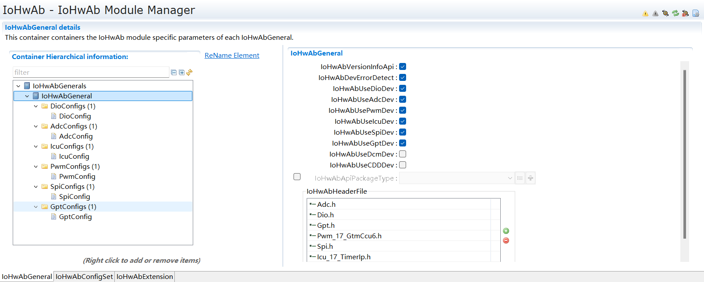

.. centered:: **表 IoHwAbGeneral通用配置属性 (IoHwAbGeneral General Configuration Properties)**

.. list-table::
   :widths: 20 20 20 20 20
   :header-rows: 1

   * - UI名称 (UI Name)
     - 描述 (Description)
     - 
     - 
     - 
   * - IoHwAbUseDioDev
     - 取值范围 (Range)
     - STD_OFF/STD_ON
     - 默认取值 (Default value)
     - STD_OFF
   * - 
     - 参数描述 (Parameter Description)
     - 是否使能对DIO组件的信号映射和I/O硬件抽象 (Whether to enable mapping of signals to the DIO component and abstraction of I/O hardware)
     - 
     - 
   * - 
     - 依赖关系 (Dependencies)
     - 依赖于DIO模块的支持 (Dependent on DIO module support)
     - 
     - 
   * - IoHwAbUseAdcDev
     - 取值范围 (Range)
     - STD_OFF/STD_ON
     - 默认取值 (Default value)
     - STD_OFF
   * - 
     - 参数描述 (Parameter Description)
     - 是否使能对Adc组件的信号映射和I/O硬件抽象 (Whether to enable signal mapping and I/O hardware abstraction for the Adc component)
     - 
     - 
   * - 
     - 依赖关系 (Dependencies)
     - 依赖于ADC模块的支持 (Dependent on ADC module support)
     - 
     - 
   * - IoHwAbUsePwmDev
     - 取值范围 (Range)
     - STD_OFF/STD_ON
     - 默认取值 (Default value)
     - STD_OFF
   * - 
     - 参数描述 (Parameter Description)
     - 是否使能对Pwm组件的信号映射和I/O硬件抽象 (Whether to enable mapping of signals to Pwm components and I/O hardware abstraction)
     - 
     - 
   * - 
     - 依赖关系 (Dependencies)
     - 依赖于PWM模块的支持 (Dependent on the support of the PWM module)
     - 
     - 
   * - IoHwAbUseIcuDev
     - 取值范围 (Range)
     - STD_OFF/STD_ON
     - 默认取值 (Default value)
     - STD_OFF
   * - 
     - 参数描述 (Parameter Description)
     - 是否使能对Icu组件的信号映射和I/O硬件抽象 (Whether to enable signal mapping and I/O hardware abstraction for the Icu component)
     - 
     - 
   * - 
     - 依赖关系 (Dependencies)
     - 依赖于Icu模块的支持 (Dependent on Icu module support)
     - 
     - 
   * - IoHwAbUseSpiDev
     - 取值范围 (Range)
     - STD_OFF/STD_ON
     - 默认取值 (Default value)
     - STD_OFF
   * - 
     - 参数描述 (Parameter Description)
     - 是否使能对Spi组件的信号映射和I/O硬件抽象 (Whether to enable signal mapping and I/O hardware abstraction for the Spi component)
     - 
     - 
   * - 
     - 依赖关系 (Dependencies)
     - 依赖于Spi模块的支持 (Dependent on Spi module support)
     - 
     - 
   * - IoHwAbUseGptDev
     - 取值范围 (Range)
     - STD_OFF/STD_ON
     - 默认取值 (Default value)
     - STD_OFF
   * - 
     - 参数描述 (Parameter Description)
     - 是否使能对Gpt组件的信号映射和I/O硬件抽象 (Whether to enable signal mapping and I/O hardware abstraction for the Gpt component)
     - 
     - 
   * - 
     - 依赖关系 (Dependencies)
     - 依赖于Gpt模块的支持 (Dependent on support from the Gpt module.)
     - 
     - 
   * - IoHwAbUseDcmDev
     - 取值范围 (Range)
     - STD_OFF/STD_ON
     - 默认取值 (Default value)
     - STD_OFF
   * -
     - 参数描述 (Parameter Description)
     - 是否使能对DCM组件的信号映射和I/O硬件抽象 (Whether to enable signal mapping and I/O hardware abstraction for the DCM component)
     - 
     - 
   * - 
     - 依赖关系 (Dependencies)
     - 依赖于DCM模块的支持 (Dependent on DCM module support)
     - 
     - 
   * - IoHwAbUseCDDDev
     - 取值范围 (Range)
     - STD_OFF/STD_ON
     - 默认取值 (Default value)
     - STD_OFF
   * - 
     - 参数描述 (Parameter Description)
     - 是否使能对Cdd组件的信号映射和I/O硬件抽象 (Whether to enable signal mapping and I/O hardware abstraction for Cdd component)
     - 
     - 
   * - 
     - 依赖关系 (Dependencies)
     - 依赖于复杂设备驱动CDD模块的支持 (Dependent on support from complex device drivers for CDD modules)
     - 
     - 
   * - IoHwAbVersionInfoApi
     - 取值范围 (Range)
     - STD_OFF/STD_ON
     - 默认取值 (Default value)
     - STD_OFF
   * - 
     - 参数描述 (Parameter Description)
     - 是否支持模块软件版本获取接口 (Does the module support software version acquisition interface?)
     - 
     - 
   * - 
     - 依赖关系 (Dependencies)
     - 无
     - 
     - 
   * - IoHwAbDevErrorDetect
     - 取值范围 (Range)
     - STD_OFF/STD_ON
     - 默认取值 (Default value)
     - STD_OFF
   * - 
     - 参数描述 (Parameter Description)
     - 是否使能DET开发错误检测 (Whether to Enable DET Development Error Detection)
     - 
     - 
   * - 
     - 依赖关系 (Dependencies)
     - 依赖于Det模块的支持 (Dependent on the support of Det module)
     - 
     - 
   * - IoHwAbApiPackageType
     - 取值范围 (Range)
     - SenderReceiverInterfaces_Explicit/SenderReceiverInterfaces_Implict/STD_OFF
     - 默认取值 (Default value)
     - STD_OFF
   * - 
     - 参数描述 (Parameter Description)
     - 用于从下拉菜单中选用需要封装的接口类型 (Used to select the interface types to be encapsulated from a drop-down menu)
     - 
     - 
   * - 
     - 依赖关系 (Dependencies)
     - 无
     - 
     - 
   * - IoHwAbHeaderFile
     - 参数描述 (Parameter Description)
     - 用于配置需要引用的头文件名称 (Name of header files to be included for configuration)
     - 
     - 

DioConfig配置 (DioConfig Configuration)
=====================================================

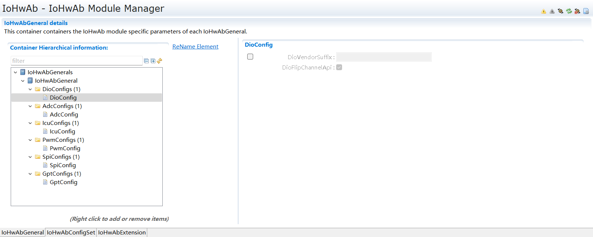

.. centered:: **表 DioConfig通用配置属性 (table DioConfig General Configuration Properties)**

.. list-table::
   :widths: 20 20 20 20 20
   :header-rows: 1

   * - UI名称 (UI Name)
     - 描述 (Description)
     - 
     - 
     - 
   * - DioVendorSuffix
     - 取值范围 (Range)
     - String
     - 默认取值 (Default value)
     - STD_OFF
   * - 
     - 参数描述 (Parameter Description)
     - 用于适配不同供应商对MCAL接口名称的定制 (To accommodate customizations of MCAL interface names by different suppliers)
     - 
     - 
   * - 
     - 依赖关系 (Dependencies)
     - 无
     - 
     - 

AdcConfig配置 (AdcConfig Configuration)
=====================================================

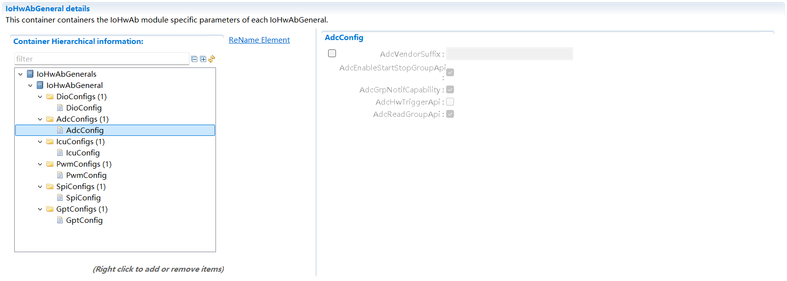

.. centered:: **表 AdcConfig通用配置属性 (table AdcConfig General Configuration Properties)**

.. list-table::
   :widths: 20 20 20 20 20
   :header-rows: 1

   * - UI名称 (UI Name)
     - 描述 (Description)
     - 
     - 
     - 
   * - AdcVendorSuffix
     - 取值范围 (Range)
     - String
     - 默认取值 (Default value)
     - STD_OFF
   * - 
     - 参数描述 (Parameter Description)
     - 用于适配不同供应商对MCAL接口名称的定制 (To accommodate customizations of MCAL interface names by different suppliers)
     - 
     - 
   * - 
     - 依赖关系 (Dependencies)
     - 无
     - 
     - 

IcuConfig配置 (IcuConfig Configuration)
=====================================================

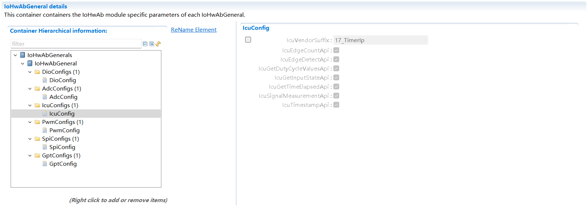

.. centered:: **表 IcuConfig通用配置属性 (Table IcuConfig General Configuration Properties)**

.. list-table::
   :widths: 20 20 20 20 20
   :header-rows: 1

   * - UI名称 (UI Name)
     - 描述 (Description)
     - 
     - 
     - 
   * - IcuVendorSuffix
     - 取值范围 (Range)
     - String
     - 默认取值 (Default value)
     - STD_OFF
   * - 
     - 参数描述 (Parameter Description)
     - 用于适配不同供应商对MCAL接口名称的定制 (To accommodate customizations of MCAL interface names by different suppliers)
     - 
     - 
   * - 
     - 依赖关系 (Dependencies)
     - 无
     - 
     - 

PwmConfig配置 (PWMConfig configuration)
=====================================================

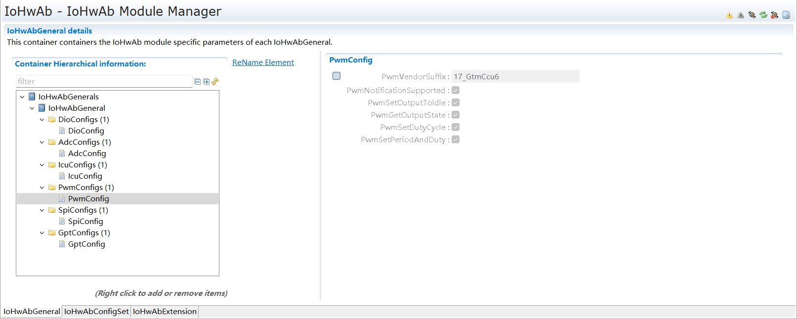

.. centered:: **表 PwmConfig通用配置属性 (Table PwmConfig General Configuration Properties)**

.. list-table::
   :widths: 20 20 20 20 20
   :header-rows: 1

   * - UI名称 (UI Name)
     - 描述 (Description)
     - 
     - 
     - 
   * - PwmVendorSuffix
     - 取值范围 (Range)
     - String
     - 默认取值 (Default value)
     - STD_OFF
   * - 
     - 参数描述 (Parameter Description)
     - 用于适配不同供应商对MCAL接口名称的定制 (To accommodate customizations of MCAL interface names by different suppliers)
     - 
     - 
   * - 
     - 依赖关系 (Dependencies)
     - 无
     - 
     - 

SpiConfig配置 (SpiConfig Configuration)
=====================================================

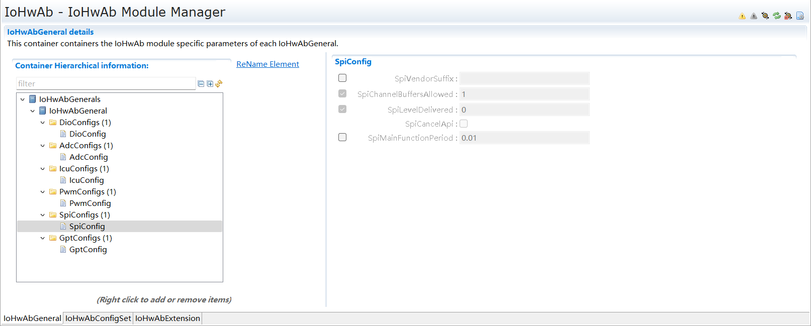

.. centered:: **表 SpiConfig通用配置属性 (Table SpiConfig General Configuration Properties)**

.. list-table::
   :widths: 20 20 20 20 20
   :header-rows: 1

   * - UI名称 (UI Name)
     - 描述 (Description)
     - 
     - 
     - 
   * - SpiVendorSuffix
     - 取值范围 (Range)
     - String
     - 默认取值 (Default value)
     - STD_OFF
   * - 
     - 参数描述 (Parameter Description)
     - 用于适配不同供应商对MCAL接口名称的定制 (To accommodate customizations of MCAL interface names by different suppliers)
     - 
     - 
   * - 
     - 依赖关系 (Dependencies)
     - 无
     - 
     - 
   * - SpiMainFunctionPeriod
     - 参数描述 (Parameter Description)
     - Spi_MainFunction_Handling的周期，以秒为单位 (The cycle of Spi_MainFunction_Handling, in seconds)
     - 
     - 

GptConfig配置 (GptConfig Configuration)
=====================================================

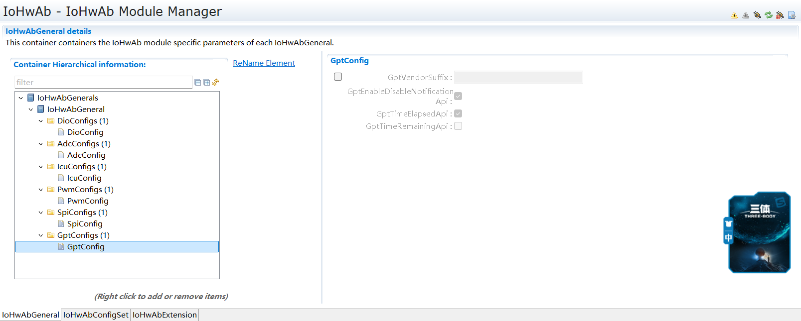

.. centered:: **表 GptConfig通用配置属性 (Table GptConfig General Configuration Properties)**

.. list-table::
   :widths: 20 20 20 20 20
   :header-rows: 1

   * - UI名称 (UI Name)
     - 描述 (Description)
     - 
     - 
     - 
   * - GptVendorSuffix
     - 取值范围 (Range)
     - String
     - 默认取值 (Default value)
     - STD_OFF
   * - 
     - 参数描述 (Parameter Description)
     - 用于适配不同供应商对MCAL接口名称的定制 (To accommodate customizations of MCAL interface names by different suppliers)
     - 
     - 
   * - 
     - 依赖关系 (Dependencies)
     - 无
     - 
     - 

IoHwAbConfigSet配置 (IoHwAbConfigSet Configuration)
-----------------------------------------------------------------

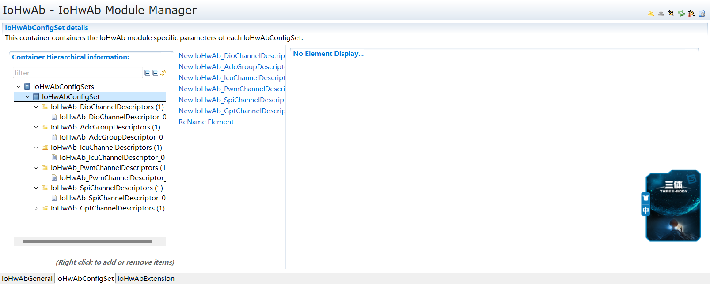

IoHwAb_DioChannelDescriptor配置 (IoHwAb_DioChannelDescriptor Configuration)
=========================================================================================

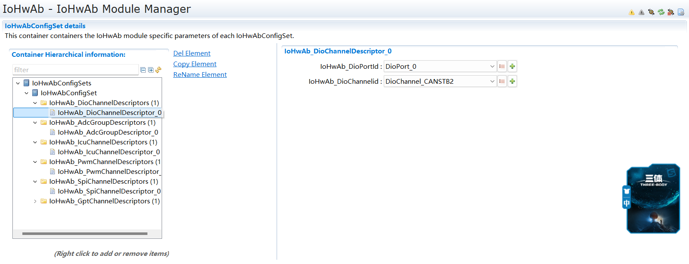

.. centered:: **表 IoHwAb_DioChannelDescriptor配置属性 (Configure Properties of IoHwAb_DioChannelDescriptor)**

.. list-table::
   :widths: 50 50
   :header-rows: 1

   * - UI名称 (UI Name)
     - 描述 (Description)
   * - IoHwAb_DioPortId
     - 从MCAL中配置的port获取id (Get ID from port configured in MCAL)
   * - IoHwAb_DioChannelid
     - 从MCAL中配置的Channel获取id (Get id from Channel configured in MCAL)

IoHwAb_AdcGroupDescriptor配置 (IoHwAb_AdcGroupDescriptor Configuration)
=====================================================================================

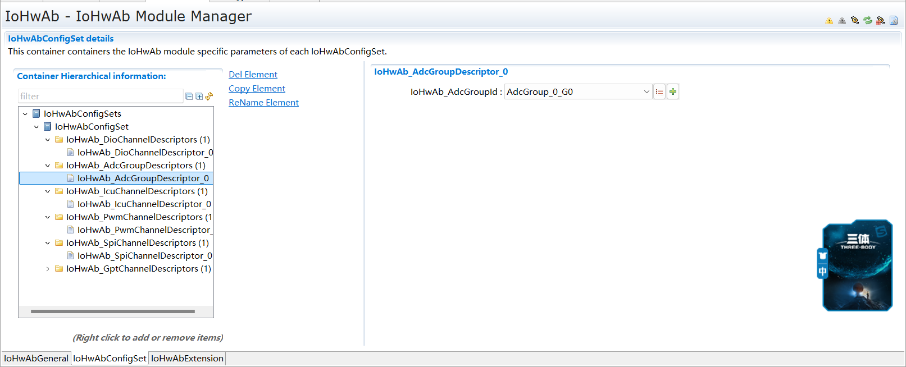

.. centered:: **表 IoHwAb_AdcGroupDescripto配置属性 (Configure properties of IoHwAb_AdcGroupDescriptor)**

.. list-table::
   :widths: 50 50
   :header-rows: 1

   * - UI名称 (UI Name)
     - 描述 (Description)
   * - IoHwAb_AdcGroupId
     - 从MCAL中配置的Group获取id (Get id from Group configured in MCAL)

IoHwAb_IcuChannelDescriptor配置 (IoHwAb_IcuChannelDescriptor Configuration)
=========================================================================================

.. centered:: **表 IoHwAb_IcuChannelDescriptor配置属性 (Configure Properties of IoHwAb_IcuChannelDescriptor)**

.. list-table::
   :widths: 50 50
   :header-rows: 1

   * - UI名称 (UI Name)
     - 描述 (Description)
   * - IoHwAb_IcuMeasurementMode
     - 从MCAL中配置的模式中获取 (Get from the modes configured in MCAL)
   * - IoHwAb_IcuChannelId
     - 从MCAL中配置的Channel中获取id (Get id from Channel configured in MCAL)

IoHwAb_PwmChannelDescriptor配置 (IoHwAb_PwmChannelDescriptor Configuration)
=========================================================================================

.. centered:: **表 IoHwAb_PwmChannelDescriptor配置属性 (Configure Properties of Table IoHwAb_PwmChannelDescriptor)**

.. list-table::
   :widths: 50 50
   :header-rows: 1

   * - UI名称 (UI Name)
     - 描述 (Description)
   * - IoHwAb_PwmChannel
     - 从MCAL中配置的Channel获取id (Get id from Channel configured in MCAL)

IoHwAb_SpiChannelDescriptor配置 (IoHwAb_SpiChannelDescriptor Configuration)
=========================================================================================

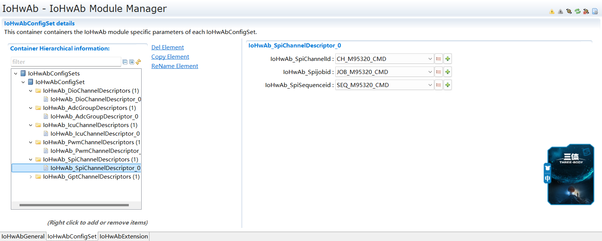

.. centered:: **表 IoHwAb_SpiChannelDescriptor配置属性 (Configure properties of IoHwAb_SpiChannelDescriptor)**

.. list-table::
   :widths: 50 50
   :header-rows: 1

   * - UI名称 (UI Name)
     - 描述 (Description)
   * - IoHwAb_SpiChannelId
     - 从MCAL中配置的spichannel获取id (Get id from spi channel configured in MCAL)
   * - IoHwAb_Spijobid
     - 从MCAL中配置的spi job获取id (Get id from spi job configured in MCAL)
   * - IoHwAb_SpiSequenceid
     - 从MCAL中配置的spi sequence获取id (Get ID from spi sequence configured in MCAL)

IoHwAb_GptChannelDescriptor配置 (IoHwAb_GptChannelDescriptor Configuration)
=========================================================================================

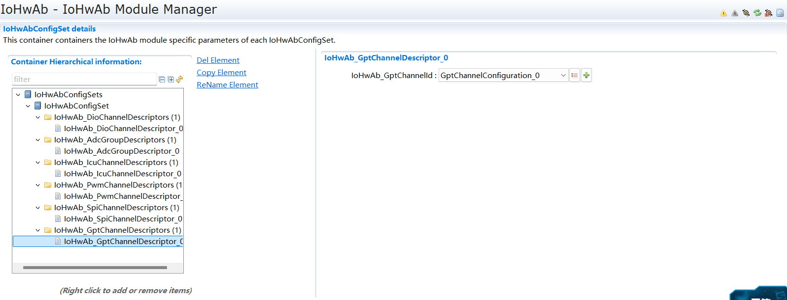

.. centered:: **表 IoHwAb_GptChannelDescriptor配置属性 (Configure properties of IoHwAb_GptChannelDescriptor)**

.. list-table::
   :widths: 50 50
   :header-rows: 1

   * - UI名称 (UI Name)
     - 描述 (Description)
   * - IoHwAb_GptChannelId
     - 从MCAL中配置的gpt channel获取id (Get ID from gpt channel configured in MCAL)

IoHwAbExtension配置 (IoHwAbExtension Configuration)
-----------------------------------------------------------------

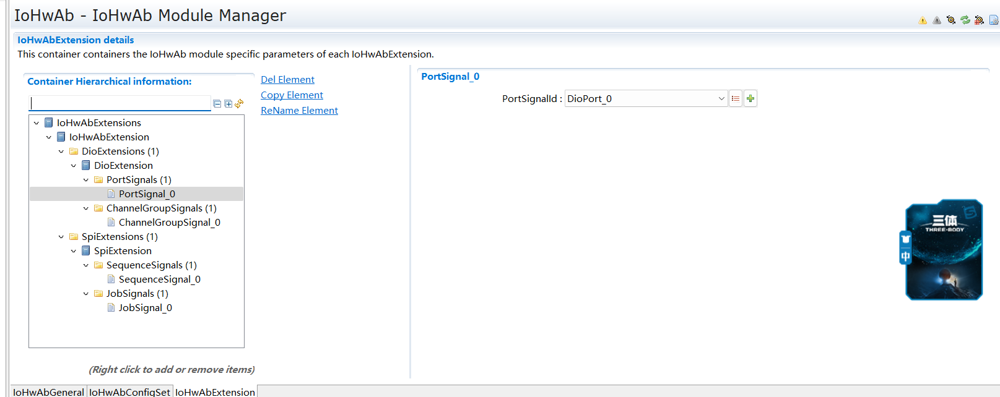

PortSignal配置 (PortSignal Configuration)
=======================================================

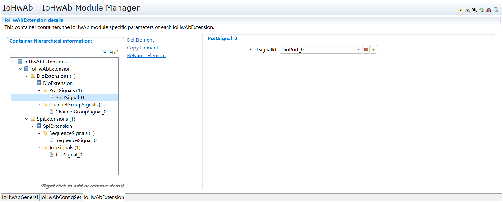

ChannelGroupSignal配置 (Configuration of ChannelGroupSignal)
==========================================================================

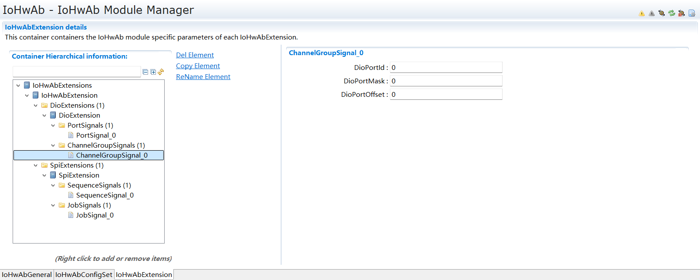

SequenceSignal配置 (SequenceSignal Configuration)
===============================================================

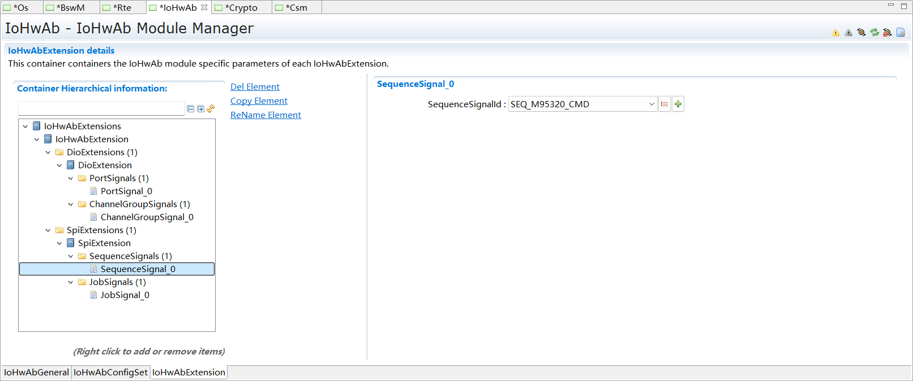

JobSignal配置 (JobSignal Configuration)
=====================================================

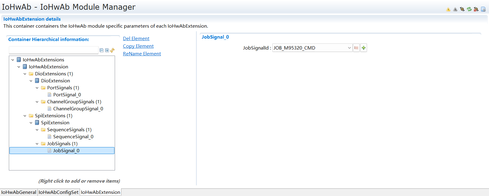

应用程序集成 (Application Integration)
================================================

IoHwAbConfigSet底层设备驱动程序MCAL集成 (IoHwAbConfigSet underlying device driver MCAL integration)
---------------------------------------------------------------------------------------------------------

首先，通过第三方开发工具EB或Vector Config软件，对IoHwAb模块信号映射所需的设备资源驱动程序进行配置，生成相应的代码文件和arxml配置文件；然后，从EB安装目录下拷贝MCAL静态代码到应用工程，同时将生成的配置文件也拷贝进工程；最后导出arxml配置文件并导入到BSW配置工具。

First, configure the device resource drivers for the IoHwAb module signal mapping using third-party development tools such as EB or Vector Config software, generating corresponding code files and arxml configuration files; then, copy the MCAL static code from the EB installation directory to the application project, and also copy the generated configuration files into the project; finally, export the arxml configuration file and import it into the BSW configuration tool.

导入EB生成的arxml文件到BSW配置工具 (Import the EB generated arxml file into the BSW configuration tool.)
------------------------------------------------------------------------------------------------------------

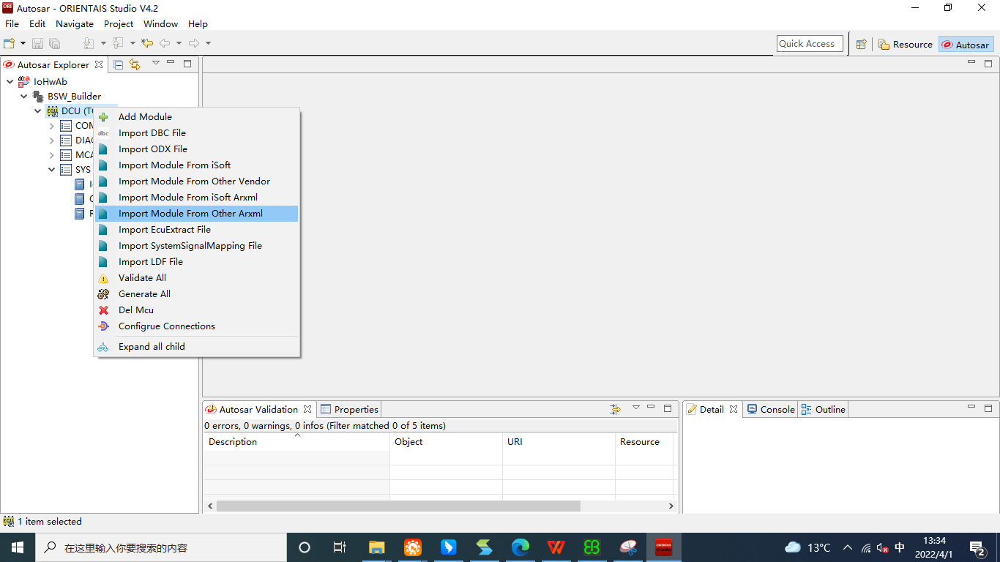

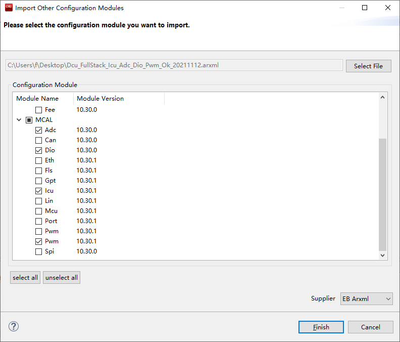

.. _iohwabgeneral通用配置-1:

.. _iohwabgeneral General Configuration - 1:

IoHwAbGeneral通用配置 (IoHwAbGeneralGeneral Configuration)
----------------------------------------------------------------------

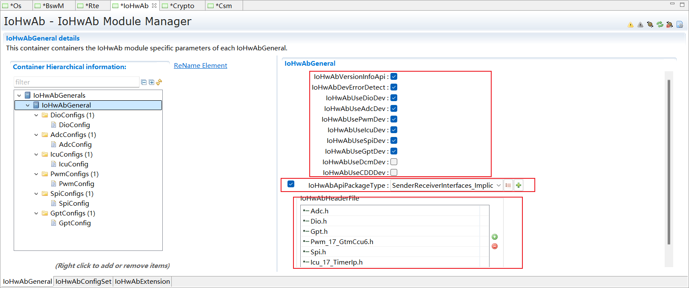

在当前界面选择需要进行抽象的模块，进行打勾，然后选择服务封装接口类型，如果不需要sender/receiver接口则保持默认置灰状态，最后是填写需要引用的头文件名称，大部分为MCAL模块的头文件。

Select the module to be abstracted and check it. Then choose the service encapsulation interface type; keep the sender/receiver interface default gray if not needed. Finally, fill in the header file names to be referenced, mostly from MCAL modules.

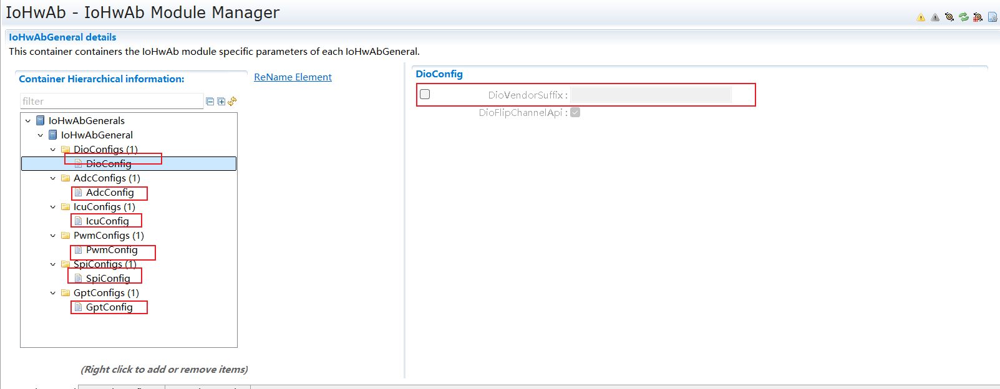

由于有些MCAL的供应商会将标准的MCAL接口加上自己的特殊标志，所以需要在对应的模块下面加上特殊字符，实现拼接，具体字符可以参考MCAL的函数接口与标准接口的差异。

Because some MCAL suppliers add their own special markers to the standard MCAL interfaces, special characters need to be added under the corresponding modules for splicing. Specific characters can refer to the differences between MCAL function interfaces and standard interfaces.

自动化配置步骤 (Automation Configuration Steps)
--------------------------------------------------------

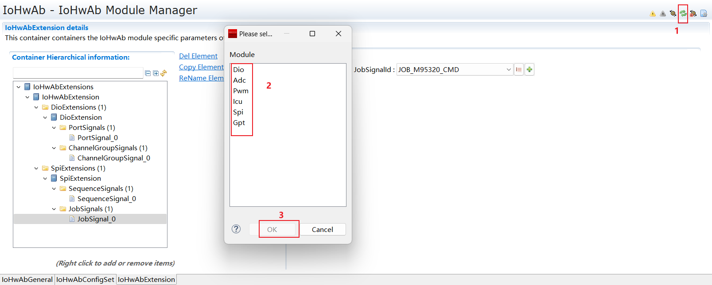

在IoHwAbGeneral界面完成配置之后，就可以选择需要更新配置的模块进行一键自动配置，将MCAL支持的信号全部抽象出来。

After completing the configuration in the IoHwAbGeneral interface, you can choose the modules to be updated and perform a one-click automatic configuration to abstract all the signals supported by MCAL.

IO服务组件封装配置 (IO Service Component Encapsulation Configuration)
-----------------------------------------------------------------------------

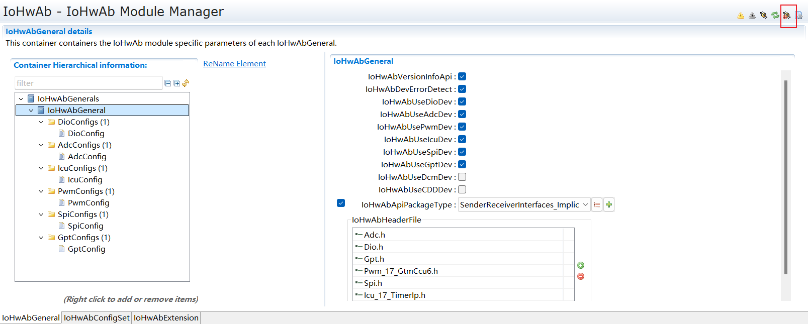

当完成所有的硬件抽象I/O属性配置时，点击Generate System model for this module这个按钮，执行I/O硬件抽象模块的API接口封装，用于提供给上层SWC使用，点击以后生成相应的serviceComponent.arxml文件。

When all the hardware abstraction I/O properties are configured, click the Generate System Model for This Module button to execute the API interface packaging of the I/O hardware abstraction module, which is intended for use by upper-layer SWCs. Clicking this generates the corresponding serviceComponent.arxml file.

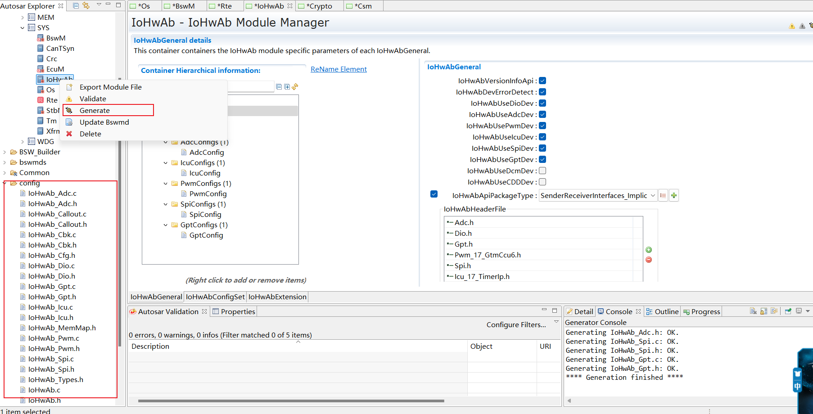

IO硬件抽象应用组件配置 (IO Hardware Abstraction Application Component Configuration)
------------------------------------------------------------------------------------------

根据加载的IO硬件抽象服务组件的配置情况来实现面向用户层的SWC组件，并且以Server-Client的方式搭建应用组件IoHwAb_SignalAnalysis。并于服务组件建立连接，完成一整套流程，最终实现IO硬件抽象的完整工具链。

Implement the SWC component oriented towards the user layer based on the configuration of the loaded IO hardware abstraction service components, and build the application component IoHwAb_SignalAnalysis in a Server-Client manner. Establish a connection with the service component to complete a full set of processes, ultimately achieving a complete toolchain for IO hardware abstraction.

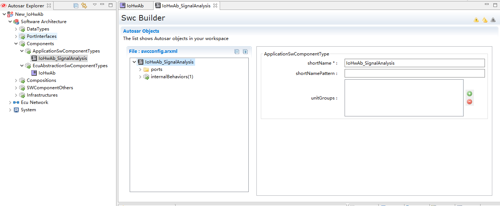

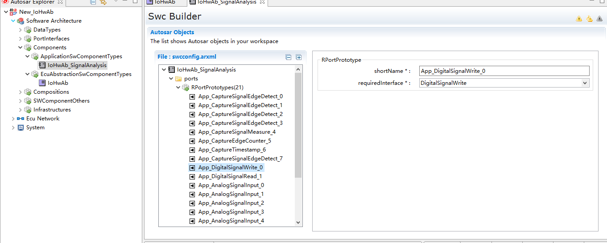

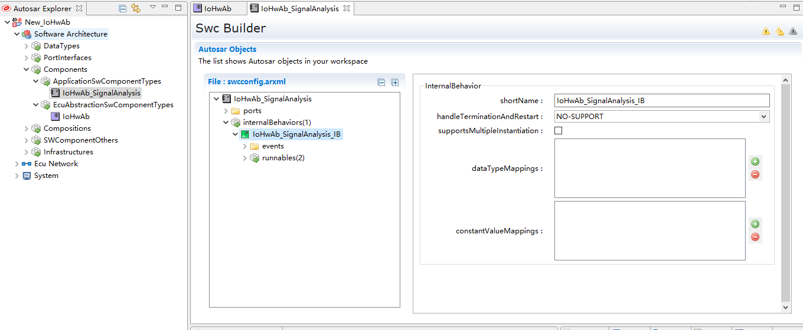

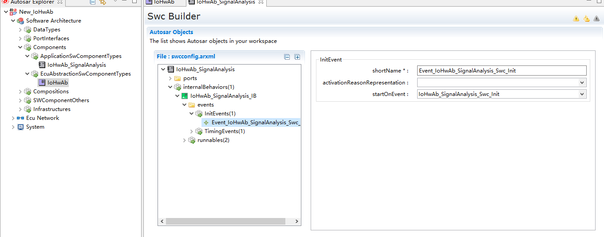

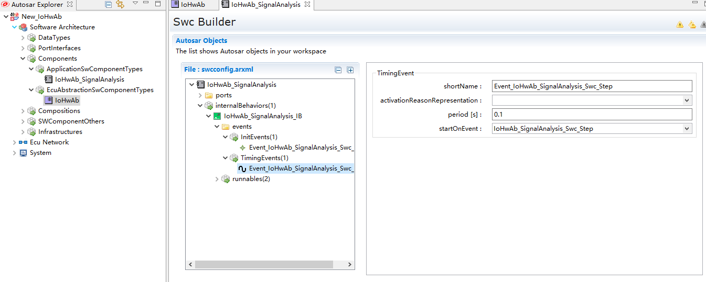

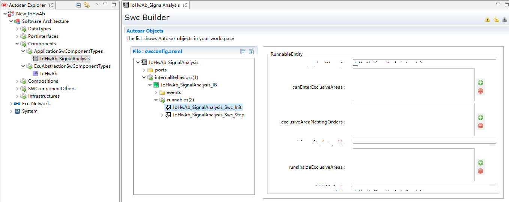

其他关联组件配置 (Other related component configurations)
-----------------------------------------------------------------

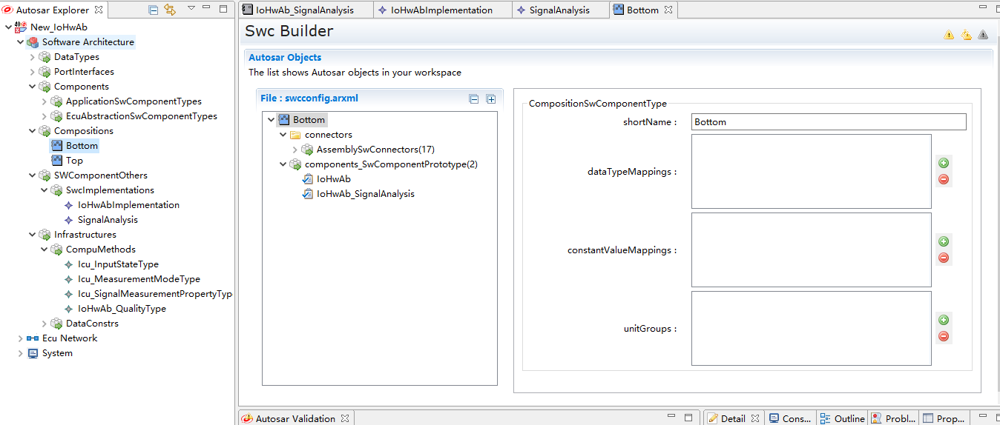

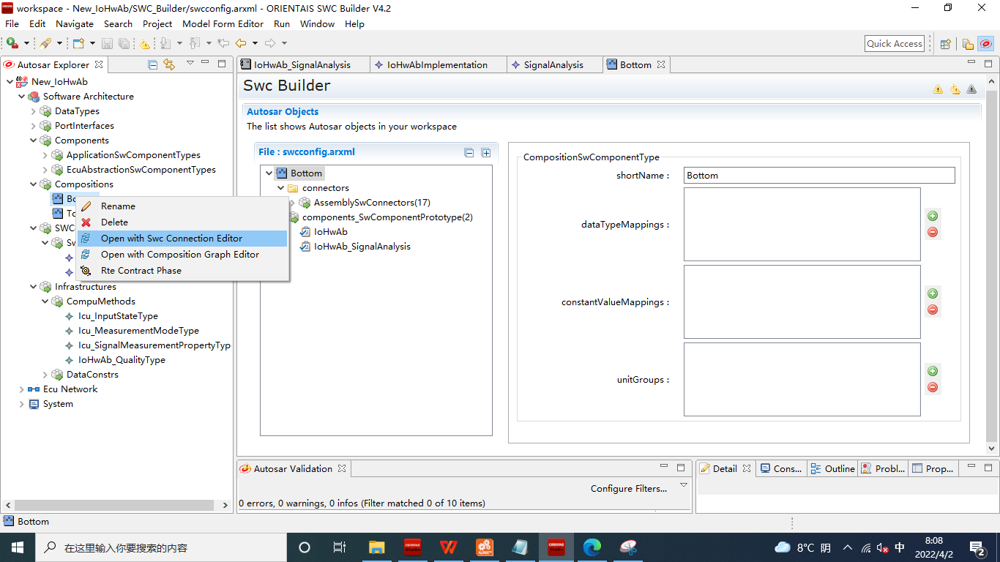

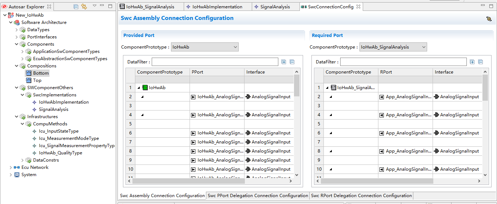

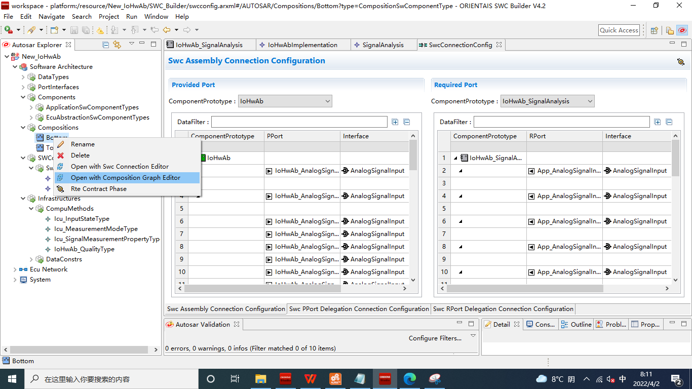

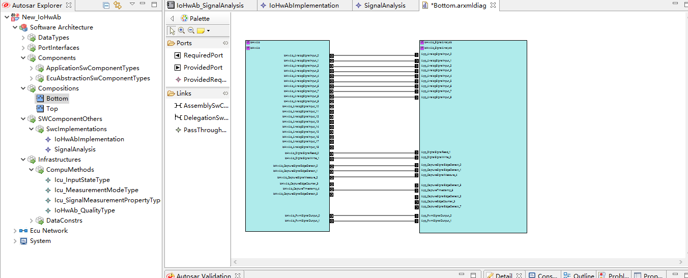

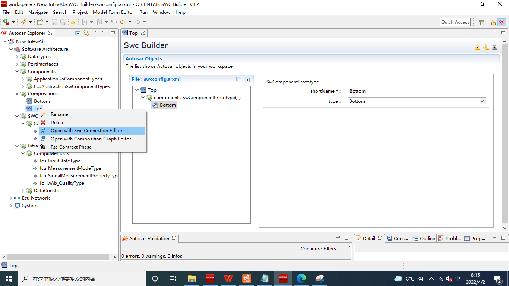

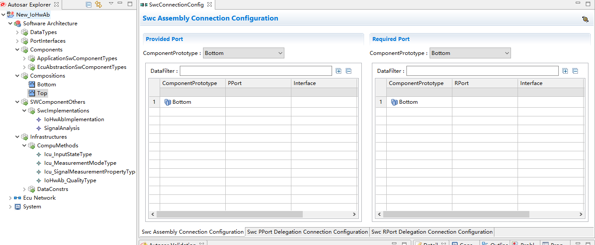

Structures配置 (Configuration of Structures)
----------------------------------------------------------

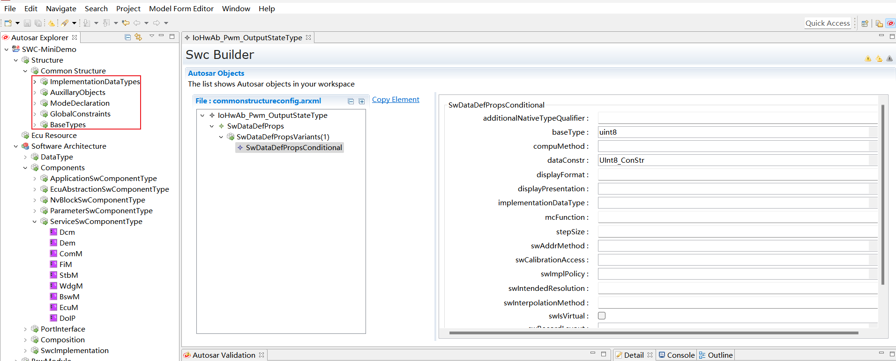

Ecu Network关联配置 (Ecu Network Association Configuration)
-----------------------------------------------------------------------

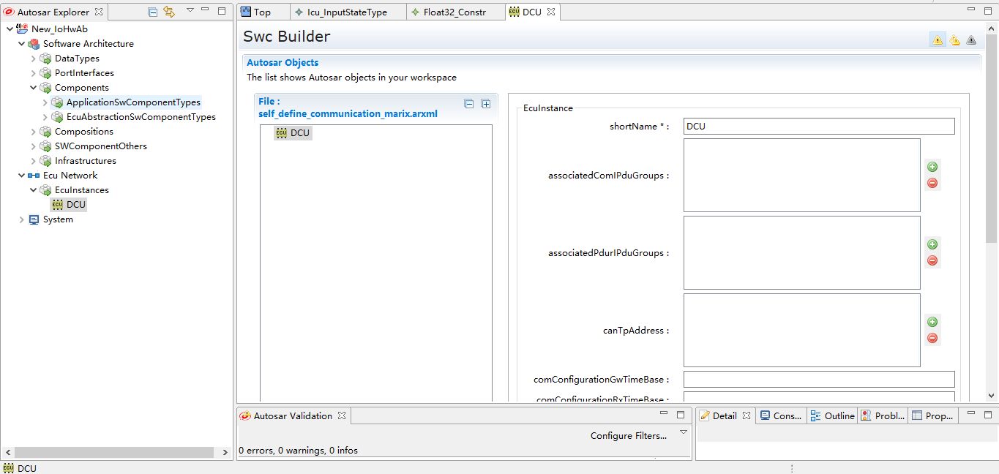

硬件抽象IoHwAb与RTE关联配置 (Hardware Abstraction IoHwAb and RTE Association Configuration)
--------------------------------------------------------------------------------------------------


当IoHwAb与RTE全部关联好以后，点击同步ECU萃取Synchronize ECU Extract 按钮，然后点击保存按钮，后续增加了RTE-OS同步功能，同步之后生成RTE代码。

After IoHwAb is fully associated with RTE, click the Synchronize ECU Extract button, then click the save button. Afterward, the RTE-OS synchronization function has been added; synchronization generates the RTE code.


硬件抽象IoHwAb代码集成 (Hardware Abstraction IoHwAb Code Integration)
-----------------------------------------------------------------------------

当所有的配置项都完成以后，将所有工具链生成的代码全部拷贝到指定的工程中，包括MCAL底层设备驱动程序的静态代码和配置文件，IoHwAb硬件抽象模块的静态代码和配置文件，IoHwAb和RTE关联生成的配置文件等操作。

After all configuration items are completed, copy all the code generated by the toolchain to the specified project, including the static code and configuration files of the MCAL底层 device drivers, the static code and configuration files of the IoHwAb hardware abstraction module, and the configuration files associated with the generation of IoHwAb and RTE.

集成注意事项（必看） (Integration Notes (Must Read))
----------------------------------------------------------

1. 当前实现了根据MCAL的api勾选框情况来进行对应的接口封装，如果涉及到非标准的api选项，必须打勾，否则会编译报错

Currently, the corresponding interface encapsulation is performed based on the selection status of the MCAL API check box. If any non-standard API options are involved, they must be checked; otherwise, compilation will fail with an error.

2. Client/Server需要与Sender/Receiver接口搭配使用，否则无法将数据写入到驱动中

Client/Server needs to be used in conjunction with Sender/Receiver interfaces; otherwise, data cannot be written into the driver.

3. 不建议用户手动配置iohwab模块的抽象信号，自动化配置不容易出错，如果有不需要的信号可以一键配置后进行删减

It is not recommended to manually configure the abstract signals of the iohwab module. Automated configuration is less error-prone, and unnecessary signals can be removed after one-click configuration.
