IpduM
#################################

:strong:`缩写词注解 (Abbreviation Notes):`

.. list-table::
   :widths: 34 33 33
   :header-rows: 1

   * - 缩写词 (Abbreviation)
     - 解释/描述 (Explanation/Description)
     - 中文解释 (Chinese explanation)
   * - Container PDU
     - PDU containingI-PDUs and headers
     - 包含N个I-PDU及其各自Header的PDU (A PDU containing N I-PDUs and their respective Headers)
   * - ContainedI-PDU
     - I-PDU assembled intoor extracted from aContainer PDU
     - 封装在container PDU中的I-PDU (I-PDU encapsulated in container PDU)
   * - I-PDU
     - Interaction LayerProtocol Data Unit
     - 交互层协议数据单元 (Protocol Data Unit of the Interaction Layer)
   * - DET
     - Default Error Tracer
     - 开发错误检测 (Develop error detection)
   * - IpduM
     - I-PDU Multiplexer
     - I-PDU多路复用 (IPDU Multiplexing)
   * - MultiplexedI-PDU
     - I-PDU assembled inthe IpduM module outof two COM I-PDUs
     - 将1-2帧COMI-PDU在IpduM中经过组装而成的I-PDU (Assemble 1-2 frames of COMI-PDU into I-PDU in IpduM.)
   * - SF
     - selector field
     - IpduM Selector Field选择字段 (IpduM Selector Field Choice field)

简介 (Introduction)
=================================

IpduM实现I-PDU的复用功能。发送时，将Com层需要发送的多帧I-PDU进行重新封装，将重新封装得到的新I-PDU按照触发条件进行发送。接收时将接收到的I-PDU解析成Com层的多帧I-PDU，分别传递给Com模块（通过PduR传递）。IpduM层I-PDU的封装存在两种方式：（1）Multiplexing方式：将两个I-PDU(一个对应静态部分，另外一个对应动态部分)中的某些bit段取出来，组合在一起形成一个Multiplexed I-PDU。对于一个Multiplexed I-PDU来讲它由动态部分与静态部分组成，其静态部分对应一个固定的I-PDU（以下称StaticPart PDU），而动态部分可以由不同的I-PDU（以下称DynamicPart PDU）来代表；（2）Container方式：将与Com层Ref的多个Contained I-PDU (及其Header)，封装到同一个IpduM层I-PDU中进行统一发送。IpduM层I-PDU的解析，与封装相反。

IpduM implements the multiplexing function of I-PDU. When sending, it re-packages multiple Com-layer I-PDUs that need to be sent into a new I-PDU and sends it according to the triggering condition. Upon receiving, it parses the received I-PDU into multiple Com-layer I-PDUs and passes them separately to the Com module (via PduR). The packaging of IpduM-level I-PDU exists in two ways: (1) Multiplexing method: Taking out certain bit segments from two I-PDUs (one corresponding to the static part, another to the dynamic part), combining them to form a multiplexed I-PDU. For a multiplexed I-PDU, it consists of a dynamic part and a static part; the static part corresponds to a fixed I-PDU (referred to as StaticPart PDU), while the dynamic part can be represented by different I-PDUs (referred to as DynamicPart PDU); (2) Container method: Packaging multiple Contained Com-layer I-PDUs (and their headers) into a single IpduM-level I-PDU for unified sending. The parsing of IpduM-level I-PDU is the opposite of its packaging.

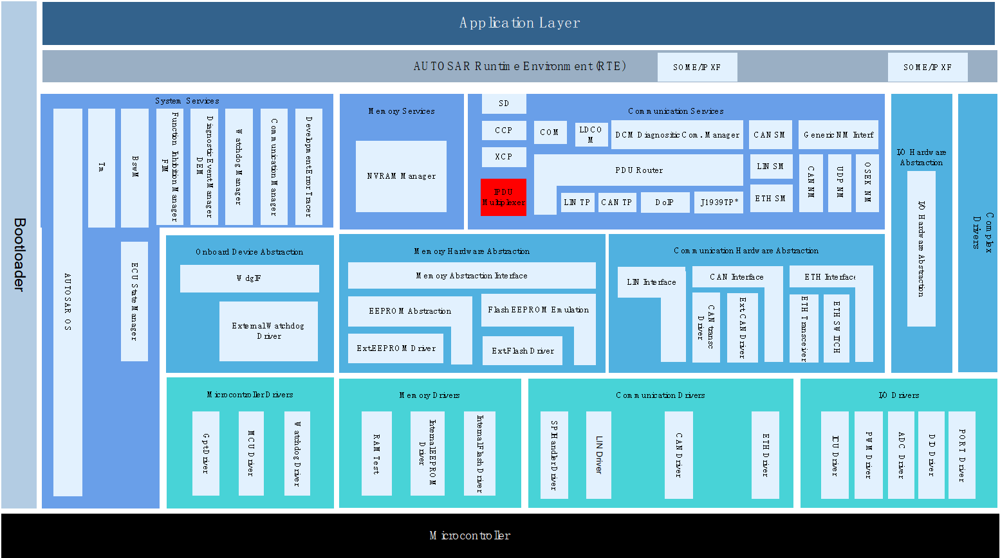

IpduM模块处于通信服务层，既属于PduR模块的上层，又属于PduR模块的下层，与PduR模块实现IF PDU的收发。发送时，将Com层I-PDU通过PduR路由到IpduM，IpduM将其重新组装，组装完毕调用PduR模块发送接口进行发送。接收时，从PduR接收来自底层的I-PDU报文，将其进行解析，并调用PduR模块的接收接口进行接收传递。

The IpduM module is in the communication service layer, both above and below the PduR module. It realizes the reception and transmission of IF PDU with the PduR module. During transmission, Com layer I-PDUs are routed to IpduM via the PduR module, which reassembles them before calling the sending interface in the PduR module for transmission. During reception, I-PDU messages received from the lower layer through the PduR module are parsed, and the receiving interface in the PduR module is called to handle the reception and forwarding.

参考资料 (Reference materials)
------------------------------------------

[1] AUTOSAR_SWS_IPDUMultiplexer.pdf，R19-11

[2] AUTOSAR_SWS_PDURouter.pdf，R19-11

功能描述 (Function Description)
===========================================

I-PDU Multiplexing功能 (I-PDU Multiplexing Function)
------------------------------------------------------------------

I-PDU Multiplexing功能介绍 (Introduction to I-PDU Multiplexing Function)
~~~~~~~~~~~~~~~~~~~~~~~~~~~~~~~~~~~~~~~~~~~~~~~~~~~~~~~~~~~~~~~~~~~~~~~~~~~~~~~~~~~~

IpduM模块中Multiplexed I-PDU关联0-1个StaticPart PDU（关联Com层PDU），1-N个DynamicPart PDU（关联Com层PDU）。发送时，IpduM将Com层PDUs的某些Segment段(配置的bit段)更新到Multiplexed I-PDU中，调用下层模块的发送函数发送该Multiplexed I-PDU；接收时，IpduM将接收到的Multiplexed I-PDU进行解析并分别传递给Com层关联的StaticPart PDU和DynamicPart PDU。

The IpduM module associates 0-1 StaticPart PDU (linked to Com layer PDUs) and 1-N DynamicPart PDUs (linked to Com layer PDUs) with Multiplexed I-PDU. When sending, IpduM updates certain segments (configured bit segments) of the Com layer PDUs into the Multiplexed I-PDU and calls the send function of the lower layer module to send this Multiplexed I-PDU; when receiving, IpduM parses the received Multiplexed I-PDU and separately forwards it to the StaticPart PDU and DynamicPart PDU associated with the Com layer.

I-PDU Multiplexing功能实现 (I-PDU Multiplexing functionality implementation)
~~~~~~~~~~~~~~~~~~~~~~~~~~~~~~~~~~~~~~~~~~~~~~~~~~~~~~~~~~~~~~~~~~~~~~~~~~~~~~~~~~~~~~~~

1.Multiplexed I-PDU发送：

Multiplexed I-PDU Sending:

上层模块调用IpduM_Transmit请求StaticPart PDU/DynamicPart PDU进行发送，IpduM将更新Multiplexed I-PDU中相应Segement段数据，以及SF（更新DynamicPart时）。IpduM模块将在Multiplexed I-PDU的触发发送条件满足时，调用PduR_IpduMTransmit进行发送，当Multiplexed I-PDU发送成功后调用上层模块对应的TxConfirmation函数通知当前StaticPart PDU/DynamicPart PDU发送成功。

Upper modules call IpduM_Transmit to request the StaticPart PDU/DynamicPart PDU for transmission. IpduM updates the corresponding Segment segment data in the Multiplexed I-PDU, as well as SF (when updating the DynamicPart). The IpduM module will call PduR_IpduMTransmit for transmission when the trigger send condition for the Multiplexed I-PDU is met. After the successful transmission of the Multiplexed I-PDU, it will invoke the corresponding TxConfirmation function of the upper module to notify the successful transmission of the StaticPart PDU/DynamicPart PDU.

2.Multiplexed I-PDU接收：

Multiplexed I-PDU Reception:

当下层调用IpduM_RxIndication接收到Multiplexed I-PDU时，解析Multiplexed I-PDU中当前包含的StaticPart PDU/DynamicPart PDU（通过解析SF字段识别），并将接收Multiplexed I-PDU数据分别通过上层RxIndication函数传递StaticPart PDU/DynamicPart PDU给到关联的上层。

When the lower layer calls IpduM_RxIndication and receives a Multiplexed I-PDU, it parses the StaticPart PDU/DynamicPart PDU currently contained in the Multiplexed I-PDU (identifying through parsing the SF field) and forwards the received Multiplexed I-PDU data separately to the upper layer via the upper layer RxIndication function for the StaticPart PDU/DynamicPart PDU associated with it.

Multiple-PDU-to-Container handling功能 (Multiple-PDU-to-Container Handling functionality)
-------------------------------------------------------------------------------------------------------

Multiple-PDU-to-Container handling功能介绍 (Function Introduction for Multiple-PDU-to-Container Handling)
~~~~~~~~~~~~~~~~~~~~~~~~~~~~~~~~~~~~~~~~~~~~~~~~~~~~~~~~~~~~~~~~~~~~~~~~~~~~~~~~~~~~~~~~~~~~~~~~~~~~~~~~~~~~~~~~~~~~~

IpduM中Container PDU，包含N个Contained PDUs（与Com层PDU关联）。发送时，IpduM将Com层1-N个PDU封装到同一个Container PDU中，通过下层的发送接口进行整体发送；接收时，IpduM将接收到的Container PDU解析成各个Contained PDUs，分别调用上层的RxIndication函数传递给上层。

In IpduM, the Container PDU contains N Contained PDUs (associated with Com layer PDUs). When sent, IpduM encapsulates Com layer PDUs from 1 to N into the same Container PDU and sends them as a whole via the lower layer's send interface; when received, IpduM parses the received Container PDU into individual Contained PDUs and separately invokes the upper layer's RxIndication function to pass them up.

Multiple-PDU-to-Container handling功能实现 (Multiple-PDU-to-Container Handling functionality implementation)
~~~~~~~~~~~~~~~~~~~~~~~~~~~~~~~~~~~~~~~~~~~~~~~~~~~~~~~~~~~~~~~~~~~~~~~~~~~~~~~~~~~~~~~~~~~~~~~~~~~~~~~~~~~~~~~~~~~~~~~~

1. Container PDU发送：

Container PDU transmission:

上层模块调用IpduM_Transmit请求ContainedPdu发送，IpduM将该ContainedPdu及其Header信息封装到ContainerPdu中，当ContainerPdu满足触发条件时，IpduM通过调用PduR_IpduMTransmit进行发送。当ContainerPdu发送成功后调用上层模块TxConfirmation函数通知当前该ContainerPdu封装的所有ContainedPdu的发送完成确认到上层模块。

Upper layer modules call IpduM_Transmit to request ContainedPdu transmission, where IpduM encapsulates the ContainedPdu and its Header information into a ContainerPdu. When the ContainerPdu meets the trigger conditions, IpduM sends it by calling PduR_IpduMTransmit. After successful transmission of the ContainerPdu, the TxConfirmation function of the upper layer module is called to notify that the transmission confirmation of all ContainedPdus encapsulated in the ContainerPdu has been completed to the upper layer module.

2. Container PDU接收：

Container PDU reception:

当下层调用IpduM_RxIndication接收到ContainerPdu时，解析ContainerPdu中当前包含的所有ContainedPdu（通过解析Header信息识别），并将解析出每个ContainedPdu数据通过上层RxIndication函数传递给上层。

When the lower layer calls IpduM_RxIndication and receives ContainerPdu, it parses all ContainedPdu that are currently included in the ContainerPdu (by analyzing Header information) and passes the parsed data of each ContainedPdu to the upper layer through the upper layer's RxIndication function.

源文件描述 (Source file description)
===============================================

.. centered:: **表 IpduM组件文件描述 (Table IPDU Component File Description)**

.. list-table::
   :widths: 50 50
   :header-rows: 1

   * - 文件 (Files)
     - 说明 (Description)
   * - IpduM_Cfg.h
     - 定义IpduM模块PC配置的宏定义。 (Define macros for PC configuration of IpduM module.)
   * - IpduM_Cfg.c
     - 定义IpduM模块PC/PB配置的结构体参数。 (Define structure parameters for IpduM module PC/PB configuration.)
   * - IpduM.h
     - 实现IpduM模块全部外部接口的声明（除了回调函数），以及配置文件中全局变量的声明。 (Declare all external interfaces of the IpduM module (excluding callback functions) as well as global variables in the configuration file.)
   * - IpduM.c
     - 作为IpduM模块的核心文件，实现IpduM模块全部对外接口，以及实现IpduM模块功能所必须的local函数，local宏定义，local变量定义。 (As the core file of the IpduM module, it realizes all of the external interfaces of the IpduM module and implements local functions, local macro definitions, and local variable definitions necessary for the functionality of the IpduM module.)
   * - IpduM_MemMap.h
     - 实现IpduM模块内存布局。 (Implement the memory layout for the IpduM module.)
   * - IpduM_Internal.h
     - 实现IpduM模块内部类型定义。 (Implement internal type definitions for the IpduM module.)
   * - IpduM_Cbk.h
     - 实现IpduM模块全部回调函数的声明。 (Declare all callback functions of the IpduM module.)

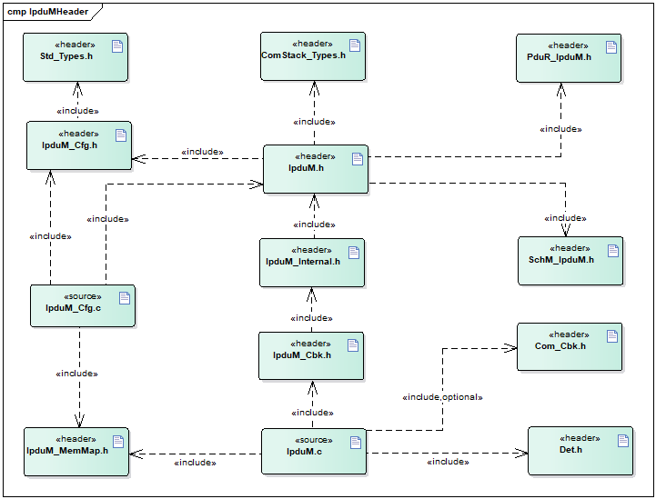

API接口 (API Interface)
=====================================

类型定义 (Type definition)
--------------------------------------

IpduM_ConfigType类型定义 (IpduM_ConfigType Configuration Type Definition)
~~~~~~~~~~~~~~~~~~~~~~~~~~~~~~~~~~~~~~~~~~~~~~~~~~~~~~~~~~~~~~~~~~~~~~~~~~~~~~~~~~~~~

.. list-table::
   :widths: 50 50
   :header-rows: 1

   * - 名称 (Name)
     - IpduM_ConfigType
   * - 类型 (Type)
     - struct
   * - 范围 (Range)
     - 无
   * - 描述 (Description)
     - IpduM模块的PB配置结构体 (The PB configuration structure of IpduM module)

输入函数描述 (Describe the input function:)
-----------------------------------------------------

.. list-table::
   :widths: 50 50
   :header-rows: 1

   * - 输入模块 (Input Module)
     - API
   * - Det
     - Det_ReportRuntimeError
   * - 
     - Det_ReportError
   * - PduR
     - PduR_IpduMRxIndication
   * - 
     - PduR_IpduMTransmit
   * - 
     - PduR_IpduMTriggerTransmit
   * - 
     - PduR_IpduMTxConfirmation

静态接口函数定义 (Static interface function definition)
---------------------------------------------------------------

IpduM_Init函数定义 (The IpduM_Init function definition)
~~~~~~~~~~~~~~~~~~~~~~~~~~~~~~~~~~~~~~~~~~~~~~~~~~~~~~~~~~~~~~~~~~~

.. list-table::
   :widths: 25 25 25 25
   :header-rows: 1

   * - 函数名称： (Function Name:)
     - IpduM_Init
     - 
     - 
   * - 函数原型： (Function prototype:)
     - voidIpduM_Init(constIpduM_ConfigType\*config)
     - 
     - 
   * - 服务编号： (Service Number:)
     - 0x00
     - 
     - 
   * - 同步/异步： (Synchronous/asynchronous:)
     - 同步 (Sync)
     - 
     - 
   * - 是否可重入： (Is Reentrant:)
     - 否 (No)
     - 
     - 
   * - 输入参数： (Input parameters:)
     - config
     - 值域： (Domain:)
     - 无
   * - 输入输出参数： (Input Output Parameters:)
     - 无
     - 
     - 
   * - 输出参数： (Output Parameters:)
     - 无
     - 
     - 
   * - 返回值： (Return Value:)
     - 无
     - 
     - 
   * - 功能概述： (Function Overview:)
     - 模块初始化函数 (Initialization function for module)
     - 
     - 

IpduM_GetVersionInfo函数定义 (The function definition for IpduM_GetVersionInfo)
~~~~~~~~~~~~~~~~~~~~~~~~~~~~~~~~~~~~~~~~~~~~~~~~~~~~~~~~~~~~~~~~~~~~~~~~~~~~~~~~~~~~~~~~~~~

.. list-table::
   :widths: 25 25 25 25
   :header-rows: 1

   * - 函数名称： (Function Name:)
     - IpduM_GetVersionInfo
     - 
     - 
   * - 函数原型： (Function prototype:)
     - voidIpduM_GetVersionInfo(
     - 
     - 
   * - 
     - Std_VersionInfoType\*versioninfo)
     - 
     - 
   * - 服务编号： (Service Number:)
     - 0x01
     - 
     - 
   * - 同步/异步： (Synchronous/asynchronous:)
     - 同步 (Sync)
     - 
     - 
   * - 是否可重入： (Is Reentrant:)
     - 是 (Is)
     - 
     - 
   * - 输入参数： (Input parameters:)
     - 无
     - 
     - 
   * - 输入输出参数： (Input Output Parameters:)
     - 无
     - 
     - 
   * - 输出参数： (Output Parameters:)
     - versioninfo
     - 值域： (Domain:)
     - 无
   * - 返回值： (Return Value:)
     - 无
     - 
     - 
   * - 功能概述： (Function Overview:)
     - 获取软件版本信息 (Get software version information)
     - 
     - 

IpduM_Transmit函数定义 (The definition of IpduM_Transmit function)
~~~~~~~~~~~~~~~~~~~~~~~~~~~~~~~~~~~~~~~~~~~~~~~~~~~~~~~~~~~~~~~~~~~~~~~~~~~~~~

.. list-table::
   :widths: 25 25 25 25
   :header-rows: 1

   * - 函数名称： (Function Name:)
     - IpduM_Transmit
     - 
     - 
   * - 函数原型： (Function prototype:)
     - Std_ReturnTypeIpduM_Transmit(
     - 
     - 
   * - 
     - PduIdTypePdumTxPduId,
     - 
     - 
   * - 
     - constPduInfoType\*PduInfoPtr)
     - 
     - 
   * - 服务编号： (Service Number:)
     - 0x49
     - 
     - 
   * - 同步/异步： (Synchronous/asynchronous:)
     - 同步 (Sync)
     - 
     - 
   * - 是否可重入： (Is Reentrant:)
     - 不同的PduId可重入，相同的PduId不可重入 (Different PduId can re-enter, the same PduId cannot re-enter)
     - 
     - 
   * - 输入参数： (Input parameters:)
     - PdumTxPduId
     - 值域： (Domain:)
     - 无
   * - 
     - PduInfoPtr
     - 值域： (Domain:)
     - 无
   * - 输入输出参数： (Input Output Parameters:)
     - 无
     - 
     - 
   * - 输出参数： (Output Parameters:)
     - 无
     - 
     - 
   * - 返回值： (Return Value:)
     - Std_ReturnType
     - 
     - 
   * - 功能概述： (Function Overview:)
     - 请求IPdu发送 (Request IPdu send)
     - 
     - 

IpduM_RxIndication函数定义 (IpduM_RxIndication Function Definition)
~~~~~~~~~~~~~~~~~~~~~~~~~~~~~~~~~~~~~~~~~~~~~~~~~~~~~~~~~~~~~~~~~~~~~~~~~~~~~~~

.. list-table::
   :widths: 25 25 25 25
   :header-rows: 1

   * - 函数名称： (Function Name:)
     - IpduM_RxIndication
     - 
     - 
   * - 函数原型： (Function prototype:)
     - voidIpduM_RxIndication(
     - 
     - 
   * - 
     - PduIdTypeRxPduId,
     - 
     - 
   * - 
     - constPduInfoType\*PduInfoPtr)
     - 
     - 
   * - 服务编号： (Service Number:)
     - 0x42
     - 
     - 
   * - 同步/异步： (Synchronous/asynchronous:)
     - 同步 (Sync)
     - 
     - 
   * - 是否可重入： (Is Reentrant:)
     - 相同Pdu不可重入，不同Pdu可重入 (Same PDU not reentrant, different PDU reentrant)
     - 
     - 
   * - 输入参数： (Input parameters:)
     - RxPduId
     - 值域： (Domain:)
     - 无
   * - 
     - PduInfoPtr
     - 值域： (Domain:)
     - 无
   * - 输入输出参数： (Input Output Parameters:)
     - 无
     - 
     - 
   * - 输出参数： (Output Parameters:)
     - 无
     - 
     - 
   * - 返回值： (Return Value:)
     - 无
     - 
     - 
   * - 功能概述： (Function Overview:)
     - IPdu接收 (IPdu Reception)
     - 
     - 

IpduM_TxConfirmation函数定义 (The IpduM_TxConfirmation function definition)
~~~~~~~~~~~~~~~~~~~~~~~~~~~~~~~~~~~~~~~~~~~~~~~~~~~~~~~~~~~~~~~~~~~~~~~~~~~~~~~~~~~~~~~

.. list-table::
   :widths: 25 25 25 25
   :header-rows: 1

   * - 函数名称： (Function Name:)
     - IpduM_TxConfirmation
     - 
     - 
   * - 函数原型： (Function prototype:)
     - voidIpduM_TxConfirmation(
     - 
     - 
   * - 
     - PduIdTypeTxPduId)
     - 
     - 
   * - 服务编号： (Service Number:)
     - 0x40
     - 
     - 
   * - 同步/异步： (Synchronous/asynchronous:)
     - 同步 (Sync)
     - 
     - 
   * - 是否可重入： (Is Reentrant:)
     - 相同Pdu不可重入，不同Pdu可重入 (Same PDU not reentrant, different PDU reentrant)
     - 
     - 
   * - 输入参数： (Input parameters:)
     - TxPduId
     - 值域： (Domain:)
     - 无
   * - 输入输出参数： (Input Output Parameters:)
     - 无
     - 
     - 
   * - 输出参数： (Output Parameters:)
     - 无
     - 
     - 
   * - 返回值： (Return Value:)
     - 无
     - 
     - 
   * - 功能概述： (Function Overview:)
     - TxPdu发送确认 (TxPdu Send Confirmation)
     - 
     - 

IpduM_TriggerTransmit函数定义 (IpduM_TriggerTransmit function definition)
~~~~~~~~~~~~~~~~~~~~~~~~~~~~~~~~~~~~~~~~~~~~~~~~~~~~~~~~~~~~~~~~~~~~~~~~~~~~~~~~~~~~~

.. list-table::
   :widths: 25 25 25 25
   :header-rows: 1

   * - 函数名称： (Function Name:)
     - IpduM_TriggerTransmit
     - 
     - 
   * - 函数原型： (Function prototype:)
     - Std_ReturnTypeIpduM_TriggerTransmit(
     - 
     - 
   * - 
     - PduIdTypeTxPduId,
     - 
     - 
   * - 
     - PduInfoType\*PduInfoPtr)
     - 
     - 
   * - 服务编号： (Service Number:)
     - 0x41
     - 
     - 
   * - 同步/异步： (Synchronous/asynchronous:)
     - 同步 (Sync)
     - 
     - 
   * - 是否可重入： (Is Reentrant:)
     - 相同Pdu不可重入，不同Pdu可重入 (Same PDU not reentrant, different PDU reentrant)
     - 
     - 
   * - 输入参数： (Input parameters:)
     - TxPduId
     - 值域： (Domain:)
     - 无
   * - 输入输出参数： (Input Output Parameters:)
     - PduInfoPtr
     - 值域： (Domain:)
     - 无
   * - 输出参数： (Output Parameters:)
     - 无
     - 
     - 
   * - 返回值： (Return Value:)
     - Std_ReturnType
     - 
     - 
   * - 功能概述： (Function Overview:)
     - IPdu数据请求 (IPdu Data Request)
     - 
     - 

IpduM_MainFunctionTx函数定义 (IpduM_MainFunctionTx function definition)
~~~~~~~~~~~~~~~~~~~~~~~~~~~~~~~~~~~~~~~~~~~~~~~~~~~~~~~~~~~~~~~~~~~~~~~~~~~~~~~~~~~

.. list-table::
   :widths: 50 50
   :header-rows: 1

   * - 函数名称： (Function Name:)
     - IpduM_MainFunction
   * - 函数原型： (Function prototype:)
     - void IpduM_MainFunctionTx(void)
   * - 服务编号： (Service Number:)
     - 0x12
   * - 同步/异步： (Synchronous/asynchronous:)
     - 同步 (Sync)
   * - 是否可重入： (Is Reentrant:)
     - 不同的实例可重入，同一个实例不可重入 (Different instances can be reentered, the same instance cannot be reentered.)
   * - 输入参数： (Input parameters:)
     - 无
   * - 输入输出参数： (Input Output Parameters:)
     - 无
   * - 输出参数： (Output Parameters:)
     - 无
   * - 返回值： (Return Value:)
     - 无
   * - 功能概述： (Function Overview:)
     - 模块主发送处理函数 (Main Sending Processing Function for Module)

IpduM_MainFunctionRx函数定义 (IpduM_MainFunctionRx function definition)
~~~~~~~~~~~~~~~~~~~~~~~~~~~~~~~~~~~~~~~~~~~~~~~~~~~~~~~~~~~~~~~~~~~~~~~~~~~~~~~~~~~

.. list-table::
   :widths: 50 50
   :header-rows: 1

   * - 函数名称： (Function Name:)
     - IpduM_MainFunctionRx
   * - 函数原型： (Function prototype:)
     - void IpduM_MainFunctionRx(void)
   * - 服务编号： (Service Number:)
     - 0x11
   * - 同步/异步： (Synchronous/asynchronous:)
     - 同步 (Sync)
   * - 是否可重入： (Is Reentrant:)
     - 不同的实例可重入，同一个实例不可重入 (Different instances can be reentered, the same instance cannot be reentered.)
   * - 输入参数： (Input parameters:)
     - 无
   * - 输入输出参数： (Input Output Parameters:)
     - 无
   * - 输出参数： (Output Parameters:)
     - 无
   * - 返回值： (Return Value:)
     - 无
   * - 功能概述： (Function Overview:)
     - 模块主接收处理函数 (Main Module Reception and Processing Function)

可配置函数定义 (Configurable Function Definition)
----------------------------------------------------------

无。

None.

配置 (Configure)
==============================

IpduMGeneral
----------------------------

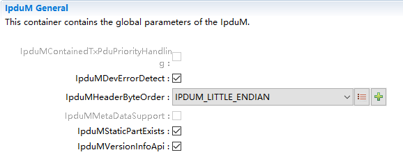

.. centered:: **表 IpduMGeneral (Table IpduMGeneral)**

.. list-table::
   :widths: 20 20 20 20 20
   :header-rows: 1

   * - UI名称 (UI Name)
     - 描述 (Description)
     - 
     - 
     - 
   * - IpduMContainedTxPduPriorityHandling
     - 取值范围 (Range)
     - true/false
     - 默认取值 (Default value)
     - false
   * - 
     - 参数描述 (Parameter Description)
     - 表示是否使能使用IpduMContainedTxPduPriority的数值对IpduMContainedTxPduCollectionSemantics配置为IPDUM_LAST_IS_BEST的IpduMContainedTxPdu就行优先级排序 (Indicate whether to use the value of IpduMContainedTxPduPriority for priority sorting of IpduMContainedTxPdu when IpduMContainedTxPduCollectionSemantics is configured as IPDUM_LAST_IS_BEST.)
     - 
     - 
   * - 
     - 依赖关系 (Dependencies)
     - 当前工具不支持这个特性 (The current tool does not support this feature.)
     - 
     - 
   * - IpduMDevErrorDetect
     - 取值范围 (Range)
     - true/false
     - 默认取值 (Default value)
     - true
   * - 
     - 参数描述 (Parameter Description)
     - 是否使能Det开发错误检测 (Is Det Development Error Detection enabled?)
     - 
     - 
   * - 
     - 依赖关系 (Dependencies)
     - 依赖于Det模块支持 (Dependent on Det module support)
     - 
     - 
   * - IpduMHeaderByteOrder
     - 取值范围 (Range)
     - IPDUM_BIG_ENDIAN/IPDUM_LITTLE_ENDIAN
     - 默认取值 (Default value)
     - IPDUM_LITTLE_ENDIAN
   * - 
     - 参数描述 (Parameter Description)
     - ContainerI-PDU中header的字节序 (Byte order of the header in ContainerI-PDU)
     - 
     - 
   * - 
     - 依赖关系 (Dependencies)
     - 无
     - 
     - 
   * - IpduMMetaDataSupport
     - 取值范围 (Range)
     - true/false
     - 默认取值 (Default value)
     - false
   * - 
     - 参数描述 (Parameter Description)
     - 是否使能IpduM元数据 (Enable IpduM Metadata)
     - 
     - 
   * - 
     - 依赖关系 (Dependencies)
     - 当前不支持 (Current unsupported.)
     - 
     - 
   * - IpduMStaticPartExists
     - 取值范围 (Range)
     - true/false
     - 默认取值 (Default value)
     - false
   * - 
     - 参数描述 (Parameter Description)
     - MultiplexedI-PDU是否支持staticpart (Does MultiplexedI-PDU support staticpart?)
     - 
     - 
   * - 
     - 依赖关系 (Dependencies)
     - 无
     - 
     - 
   * - IpduMVersionInfoApi
     - 取值范围 (Range)
     - true/false
     - 默认取值 (Default value)
     - false
   * - 
     - 参数描述 (Parameter Description)
     - 是否支持IpduM模块软件版本获取 (Does the IpduM module support software version acquisition?)
     - 
     - 
   * - 
     - 依赖关系 (Dependencies)
     - 无
     - 
     - 

IpduMPublishedInformation
-----------------------------------------

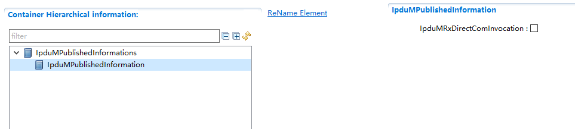

.. centered:: **表 IpduMPublishedInformation (Table IpduMPublishedInformation)**

.. list-table::
   :widths: 20 20 20 20 20
   :header-rows: 1

   * - UI名称 (UI Name)
     - 描述 (Description)
     - 
     - 
     - 
   * - IpduMRxDirectComInvocation
     - 取值范围 (Range)
     - true/false
     - 默认取值 (Default value)
     - false
   * - 
     - 参数描述 (Parameter Description)
     - 对于MultiplexedI-PDU功能相关PDU的RxIndication/TxConfirmation直接跳过PduR调用Com接口 (For PDU RxIndication/TxConfirmation related to MultiplexedI-PDU functionality, directly skip PduR call Com interface)
     - 
     - 
   * - 
     - 依赖关系 (Dependencies)
     - 该模式使能会增加架构的复杂度，通常配置为false (Enabling this mode will increase the complexity of the architecture, which is typically configured as false.)
     - 
     - 

IpduMContainedRxPdu
-----------------------------------

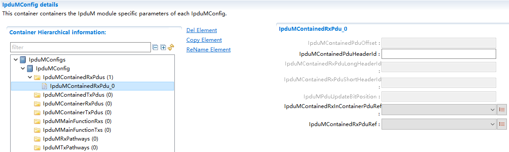

.. centered:: **表 IpduMContainedRxPdu (Table IpduMContainedRxPdu)**

.. list-table::
   :widths: 20 20 20 20 20
   :header-rows: 1

   * - UI名称 (UI Name)
     - 描述 (Description)
     - 
     - 
     - 
   * - IpduMContainedPduOffset
     - 取值范围 (Range)
     - 0..4294967295
     - 默认取值 (Default value)
     - 无
   * - 
     - 参数描述 (Parameter Description)
     - ContainerdPdu的静态偏移量（以字节为单位） (Static offset of ContainerdPdu (in bytes))
     - 
     - 
   * - 
     - 依赖关系 (Dependencies)
     - 当前不支持 (Current unsupported.)
     - 
     - 
   * - IpduMContainedPduHeaderId
     - 取值范围 (Range)
     - 1..4294967295
     - 默认取值 (Default value)
     - 无
   * - 
     - 参数描述 (Parameter Description)
     - ContainedPdu封装在ContainerPdu中的HeaderId (ContainedPdu encapsulated in ContainerPdu HeaderId)
     - 
     - 
   * - 
     - 依赖关系 (Dependencies)
     - 无
     - 
     - 
   * - IpduMContainedRxPduLongHeaderId
     - 取值范围 (Range)
     - 1..4294967295
     - 默认取值 (Default value)
     - 无
   * - 
     - 参数描述 (Parameter Description)
     - ContainedPdu封装在ContainerPdu中的LongHeaderID (ContainedPdu encapsulated in ContainerPdu with LongHeaderID)
     - 
     - 
   * - 
     - 依赖关系 (Dependencies)
     - 依赖于IpduMContainerHeaderSize设置为 (Dependent on the setting of IpduMContainerHeaderSize.)
     - 
     - 
   * - 
     - 
     - IPDUM_HEADERTYPE_LONG，当前暂不支持 (IPDUM_HEADERTYPE_LONG, current support is not available.)
     - 
     - 
   * - IpduMContainedRxPduShortHeaderId
     - 取值范围 (Range)
     - 1..16777215
     - 默认取值 (Default value)
     - 无
   * - 
     - 参数描述 (Parameter Description)
     - ContainedPdu封装在ContainerPdu中的ShortHeaderID (ContainedPdu encapsulated in ContainerPdu with ShortHeaderID)
     - 
     - 
   * - 
     - 依赖关系 (Dependencies)
     - 依赖于IpduMContainerHeaderSize设置为 (Dependent on the setting of IpduMContainerHeaderSize.)
     - 
     - 
   * - 
     - 
     - IPDUM_HEADERTYPE_SHORT，当前暂不支持 (IPDUM_HEADERTYPE_SHORT, Current support is not available.)
     - 
     - 
   * - IpduMPduUpdateBitPosition
     - 取值范围 (Range)
     - 0..4294967295
     - 默认取值 (Default value)
     - 无
   * - 
     - 参数描述 (Parameter Description)
     - 定义ContainerPdu中的Updae-Bit位置 (Define the position of Update-Bit in ContainerPdu)
     - 
     - 
   * - 
     - 依赖关系 (Dependencies)
     - 依赖于IpduMContainerHeaderSize设置为 (Dependent on the setting of IpduMContainerHeaderSize.)
     - 
     - 
   * - 
     - 
     - IPDUM_HEADERTYPE_NONE，当前暂不支持 (IPDUM_HEADERTYPE_NONE, currently not supported)
     - 
     - 
   * - IpduMContainedRxInContainerPduRef
     - 取值范围 (Range)
     - 索引[IpduMContainerRxPdu] (Index[IpduMContainerRxPdu])
     - 默认取值 (Default value)
     - 无
   * - 
     - 参数描述 (Parameter Description)
     - 表示该ContainedPdu关联的ContainerPdu (Indicates the ContainerPdu associated with the ContainedPdu)
     - 
     - 
   * - 
     - 依赖关系 (Dependencies)
     - 无
     - 
     - 
   * - IpduMContainedRxPduRef
     - 取值范围 (Range)
     - 索引[Pdu] (Index[Pdu])
     - 默认取值 (Default value)
     - 无
   * - 
     - 参数描述 (Parameter Description)
     - 关联EcuC中Pdu (Related EcuC Pdu)
     - 
     - 
   * - 
     - 依赖关系 (Dependencies)
     - 依赖于EcuC中Pdu的配置；这个Pdu必须也要被别的模块关联 (Dependent on configuration in EcuC for Pdu; this Pdu must also be associated with other modules.)
     - 
     - 

IpduMContainerRxPdu
-----------------------------------

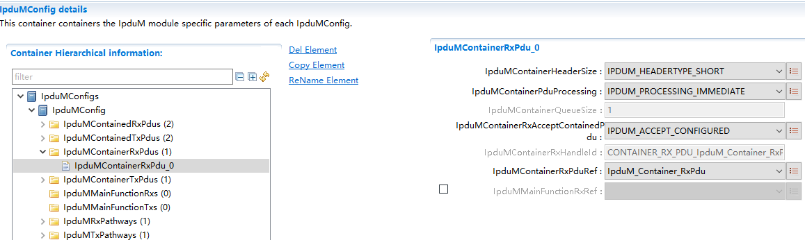

.. centered:: **表 IpduMContainerRxPdu (Table IpduMContainerRxPdu)**

.. list-table::
   :widths: 20 20 20 20 20
   :header-rows: 1

   * - UI名称 (UI Name)
     - 描述 (Description)
     - 
     - 
     - 
   * - IpduMContainerHeaderSize
     - 取值范围 (Range)
     - IPDUM_HEADERTYPE_LONG/IPDUM_HEADERTYPE_SHORT
     - 默认取值 (Default value)
     - 无
   * - 
     - 参数描述 (Parameter Description)
     - 表示Header长度（32bit/64bit）信息（header+length）
     - 
     - 
   * - 
     - 依赖关系 (Dependencies)
     - IPDUM_HEADERTYPE_NONE类型的功能尚不支持 (The function for IPDUM_HEADERTYPE_NONE type is not yet supported)
     - 
     - 
   * - IpduMContainerPduProcessing
     - 取值范围 (Range)
     - IPDUM_PROCESSING_DEFERRED/IPDUM_PROCESSING_IMMEDIATE
     - 默认取值 (Default value)
     - 无
   * - 
     - 参数描述 (Parameter Description)
     - 表示ContainerPdu的解析是立即处理还是延迟处理 (Indicate whether the parsing of ContainerPdu is handled immediately or delayed.)
     - 
     - 
   * - 
     - 依赖关系 (Dependencies)
     - 无
     - 
     - 
   * - IpduMContainerQueueSize
     - 取值范围 (Range)
     - 1..255
     - 默认取值 (Default value)
     - 1
   * - 
     - 参数描述 (Parameter Description)
     - 表示接收ContainerPdu最大缓存帧数 (Indicate the maximum buffered frames that can be received by ContainerPdu)
     - 
     - 
   * - 
     - 依赖关系 (Dependencies)
     - 只有IpduMContainerPduProcessing配置为IPDUM_PROCESSING_DEFERRED时才支持配置该项 (Only this item is supported when IpduMContainerPduProcessing is configured as IPDUM_PROCESSING_DEFERRED.)
     - 
     - 
   * - IpduMContainerRxAcceptContainedPdu
     - 取值范围 (Range)
     - IPDUM_ACCEPT_ALL/IPDUM_ACCEPT_CONFIGURED
     - 默认取值 (Default value)
     - 无
   * - 
     - 参数描述 (Parameter Description)
     - 表示该ContainerPdu是否允许接收非配置关联的ContainedPdu (Indicates whether this ContainerPdu allows receiving non-configured ContainedPdu associations.)
     - 
     - 
   * - 
     - 依赖关系 (Dependencies)
     - 当前这个功能点，是在所有的ContainedRxPdu中进行匹配 (This feature point currently involves matching in all ContainedRxPdu.)
     - 
     - 
   * - IpduMContainerRxHandleId
     - 取值范围 (Range)
     - string
     - 默认取值 (Default value)
     - 无
   * - 
     - 参数描述 (Parameter Description)
     - IpduM层RxPdu的Id号 (Id number of IpduM layer RxPdu)
     - 
     - 
   * - 
     - 依赖关系 (Dependencies)
     - 根据IpduMContainerRxPduRef关联的Pdu名自动生成 (Automatically generate based on the PDU name associated with IpduMContainerRxPduRef.)
     - 
     - 
   * - IpduMContainerRxPduRef
     - 取值范围 (Range)
     - 索引[Pdu] (Index[Pdu])
     - 默认取值 (Default value)
     - 无
   * - 
     - 参数描述 (Parameter Description)
     - 关联EcuC中Pdu (Related EcuC Pdu)
     - 
     - 
   * - 
     - 依赖关系 (Dependencies)
     - 依赖于EcuC中Pdu的配置，这个Pdu也需要被其他模块关联; (Depending on the configuration in EcuC of Pdu, this Pdu also needs to be associated with other modules;)
     - 
     - 
   * - IpduMMainFunctionRxRef
     - 取值范围 (Range)
     - 索引[IpduMMainFunctionRx] (Index[IpduMMainFunctionRx])
     - 默认取值 (Default value)
     - 无
   * - 
     - 参数描述 (Parameter Description)
     - 关联一个IpduMMainFunctionRx (Associate an IpduMMainFunctionRx)
     - 
     - 
   * - 
     - 依赖关系 (Dependencies)
     - 依赖于IpduMMainFunctionRx的配置，当前不支持 (Dependent on the configuration of IpduMMainFunctionRx, current support is not available.)
     - 
     - 

IpduMContainedTxPdu
-----------------------------------

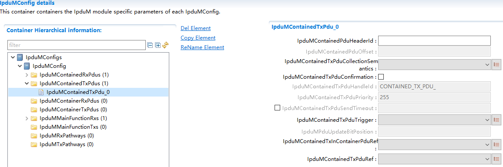

.. centered:: **表 IpduMContainedTxPdu (Table IpduMContainedTxPdu)**

.. list-table::
   :widths: 20 20 20 20 20
   :header-rows: 1

   * - UI名称 (UI Name)
     - 描述 (Description)
     - 
     - 
     - 
   * - IpduMContainedPduHeaderId
     - 取值范围 (Range)
     - 1..4294967295
     - 默认取值 (Default value)
     - 无
   * - 
     - 参数描述 (Parameter Description)
     - ContainedPdu在ContainerPdu中的HeaderId (ContainedPdu in ContainerPdu HeaderId)
     - 
     - 
   * - 
     - 依赖关系 (Dependencies)
     - 无
     - 
     - 
   * - IpduMContainedPduOffset
     - 取值范围 (Range)
     - 0..4294967295
     - 默认取值 (Default value)
     - 无
   * - 
     - 参数描述 (Parameter Description)
     - ContainerdPdu的静态偏移量（以字节为单位） (Static offset of ContainerdPdu (in bytes))
     - 
     - 
   * - 
     - 依赖关系 (Dependencies)
     - 当前不支持 (Current unsupported.)
     - 
     - 
   * - IpduMContainedTxPduCollectionSemantics
     - 取值范围 (Range)
     - IPDUM_COLLECT_LAST_IS_BEST/IPDUM_COLLECT_QUEUED
     - 默认取值 (Default value)
     - 无
   * - 
     - 参数描述 (Parameter Description)
     - 表示ContainedPdu报文数据是否取最新值 (Indicate whether the ContainedPdu message data takes the latest value)
     - 
     - 
   * - 
     - 依赖关系 (Dependencies)
     - 无
     - 
     - 
   * - IpduMContainedTxPduConfirmation
     - 取值范围 (Range)
     - true/false
     - 默认取值 (Default value)
     - false
   * - 
     - 参数描述 (Parameter Description)
     - 表示ContainedTxPdu是否使能TxConfirmation (Indicate whether ContainedTxPdu enables TxConfirmation)
     - 
     - 
   * - 
     - 依赖关系 (Dependencies)
     - 依赖于ContainedTxPdu关联的上层模块Pdu支持TxConfirmation机制 (Dependent on the PDU support for TxConfirmation mechanism associated with the ContainedTxPdu related upper module.)
     - 
     - 
   * - IpduMContainedTxPduHandleId
     - 取值范围 (Range)
     - string
     - 默认取值 (Default value)
     - 无
   * - 
     - 参数描述 (Parameter Description)
     - ContainedTxPdu在IpduM层的PDUId值 (ContainedTxPdu in IpduM layer's PDUId value)
     - 
     - 
   * - 
     - 依赖关系 (Dependencies)
     - 工具根据IpduMContainedTxPduRef关联的Pdu名自动生成 (Tools automatically generate based on the PDU name associated with IpduMContainedTxPduRef.)
     - 
     - 
   * - IpduMContainedTxPduPriority
     - 取值范围 (Range)
     - 0 .. 255
     - 默认取值 (Default value)
     - 255
   * - 
     - 参数描述 (Parameter Description)
     - 定义ContainedTxPdu的优先级，255是最低优先级，0是最高优先级 (Define the priority of ContainedTxPdu, where 255 is the lowest priority and 0 is the highest priority.)
     - 
     - 
   * - 
     - 依赖关系 (Dependencies)
     - 依赖于IpduMContainedTxPduPriorityHandling (Dependent on IpduMContainedTxPduPriorityHandling)
     - 
     - 
   * - 
     - 
     - 设置为TRUE，当前不支持 (Set to TRUE, current unsupported.)
     - 
     - 
   * - IpduMContainedTxPduSendTimeout
     - 取值范围 (Range)
     - 0 .. 65.535
     - 默认取值 (Default value)
     - 无
   * - 
     - 参数描述 (Parameter Description)
     - ContainedTxPdu超时发送时间 (Timeout Send Time for ContainedTxPdu)
     - 
     - 
   * - 
     - 依赖关系 (Dependencies)
     - IpduMContainedTxPduTrigger配置为ALWAYS时不需要配置该项 (When IpduMContainedTxPduTrigger is configured as ALWAYS, this item does not need to be configured.)
     - 
     - 
   * - IpduMContainedTxPduTrigger
     - 取值范围 (Range)
     - IPDUM_TRIGGER_ALWAYS/IPDUM_TRIGGER_NEVER
     - 默认取值 (Default value)
     - 无
   * - 
     - 参数描述 (Parameter Description)
     - ContainedTxPdu是否触发ContainerPdu发送 (Does ContainedTxPdu trigger the sending of ContainerPdu)
     - 
     - 
   * - 
     - 依赖关系 (Dependencies)
     - 无
     - 
     - 
   * - IpduMPduUpdateBitPosition
     - 取值范围 (Range)
     - 0 .. 4294967295
     - 默认取值 (Default value)
     - 
   * - 
     - 参数描述 (Parameter Description)
     - 定义ContainerPdu中的Updae-Bit位置 (Define the position of Update-Bit in ContainerPdu)
     - 
     - 
   * - 
     - 依赖关系 (Dependencies)
     - 依赖于IpduMContainerHeaderSize设置为 (Dependent on the setting of IpduMContainerHeaderSize.)
     - 
     - 
   * - 
     - 
     - IPDUM_HEADERTYPE_NONE，当前暂不支持 (IPDUM_HEADERTYPE_NONE, currently not supported)
     - 
     - 
   * - IpduMContainedTxInContainerPduRef
     - 取值范围 (Range)
     - 索引[IpduMContainerTxPdu] (Index[IpduMContainerTxPdu])
     - 默认取值 (Default value)
     - 无
   * - 
     - 参数描述 (Parameter Description)
     - 表示ContainedTxPdu关联的ContainerTxPdu (Indicates the ContainerTxPdu associated with ContainedTxPdu)
     - 
     - 
   * - 
     - 依赖关系 (Dependencies)
     - 无
     - 
     - 
   * - IpduMContainedTxPduRef
     - 取值范围 (Range)
     - 索引[Pdu] (Index[Pdu])
     - 默认取值 (Default value)
     - 无
   * - 
     - 参数描述 (Parameter Description)
     - 关联EcuC中Pdu (Related EcuC Pdu)
     - 
     - 
   * - 
     - 依赖关系 (Dependencies)
     - 依赖于EcuC中配置的Pdu；这个Pdu必须也要被别的模块关联 (Dependent on Pdu configured in EcuC; this Pdu must also be associated with other modules.)
     - 
     - 

IpduMContainerTxPdu
-----------------------------------

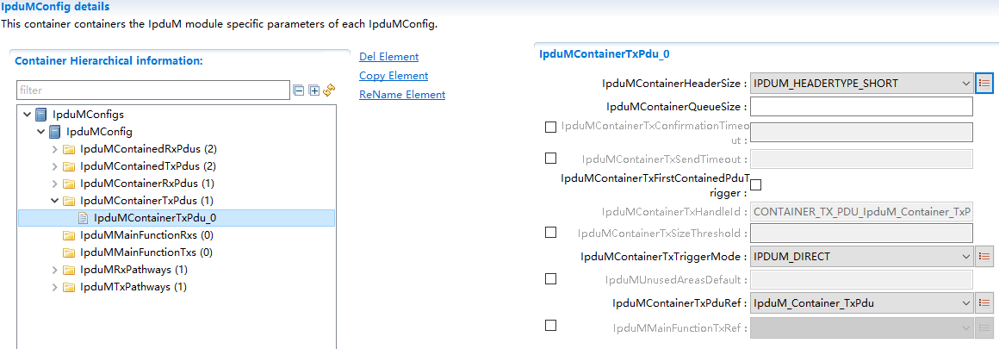

.. centered:: **表 IpduMContainerTxPdu (Table IpduMContainerTxPdu)**

.. list-table::
   :widths: 20 20 20 20 20
   :header-rows: 1

   * - UI名称 (UI Name)
     - 描述 (Description)
     - 
     - 
     - 
   * - IpduMContainerHeaderSize
     - 取值范围 (Range)
     - IPDUM_HEADERTYPE_LONG/IPDUM_HEADERTYPE_SHORT
     - 默认取值 (Default value)
     - 无
   * - 
     - 参数描述 (Parameter Description)
     - 表示Header长度（32bit/64bit）信息（header+length）
     - 
     - 
   * - 
     - 依赖关系 (Dependencies)
     - 无
     - 
     - 
   * - IpduMContainerQueueSize
     - 取值范围 (Range)
     - 1 .. 255
     - 默认取值 (Default value)
     - 1
   * - 
     - 参数描述 (Parameter Description)
     - ContainerPdu的发送队列数 (Number of send queues for ContainerPdu)
     - 
     - 
   * - 
     - 依赖关系 (Dependencies)
     - 无
     - 
     - 
   * - IpduMContainerTxConfirmationTimeout
     - 取值范围 (Range)
     - 0 .. 65.535
     - 默认取值 (Default value)
     - 无
   * - 
     - 参数描述 (Parameter Description)
     - ContainerPdu发送确认超时时间 (Timeout for ContainerPdu Acknowledgment)
     - 
     - 
   * - 
     - 依赖关系 (Dependencies)
     - 无
     - 
     - 
   * - IpduMContainerTxSendTimeout
     - 取值范围 (Range)
     - 0 .. 65.535
     - 默认取值 (Default value)
     - 无
   * - 
     - 参数描述 (Parameter Description)
     - ContainerPdu被触发发送的超时时间。当第一个Pdu被放入ContainerPdu时，启动相应的计时器 (Timeout for ContainerPdu to be triggered for sending. When the first PDU is placed into ContainerPdu, the corresponding timer starts.)
     - 
     - 
   * - 
     - 依赖关系 (Dependencies)
     - 无
     - 
     - 
   * - IpduMContainerTxFirstContainedPduTrigger
     - 取值范围 (Range)
     - true/false
     - 默认取值 (Default value)
     - false
   * - 
     - 参数描述 (Parameter Description)
     - 封装第一个ContainedTxPdu是否触发该ContainerTxPdu发送 (Does encapsulating the first ContainedTxPdu trigger the sending of the ContainerTxPdu?)
     - 
     - 
   * - 
     - 依赖关系 (Dependencies)
     - 无
     - 
     - 
   * - IpduMContainerTxHandleId
     - 取值范围 (Range)
     - string
     - 默认取值 (Default value)
     - 无
   * - 
     - 参数描述 (Parameter Description)
     - ContainerTxPdu在IpduM层的PDUId值 (ContainerTxPdu in the PDUId value of IpduM layer)
     - 
     - 
   * - 
     - 依赖关系 (Dependencies)
     - 根据IpduMContainerTxPduRef关联的Pdu名自动生成 (Automatically generate based on the PDU name associated with IpduMContainerTxPduRef)
     - 
     - 
   * - IpduMContainerTxSendTimeout
     - 取值范围 (Range)
     - 0 .. 65.535
     - 默认取值 (Default value)
     - 无
   * - 
     - 参数描述 (Parameter Description)
     - ContainerPdu的超时发送时间 (Timeout send time for ContainerPdu)
     - 
     - 
   * - 
     - 依赖关系 (Dependencies)
     - 无
     - 
     - 
   * - IpduMContainerTxSizeThreshold
     - 取值范围 (Range)
     - 0 .. 4294967295
     - 默认取值 (Default value)
     - 无
   * - 
     - 参数描述 (Parameter Description)
     - ContainerPdu触发发送的长度阈值 (Threshold for triggering ContainerPdu send length)
     - 
     - 
   * - 
     - 依赖关系 (Dependencies)
     - 无
     - 
     - 
   * - IpduMContainerTxTriggerMode
     - 取值范围 (Range)
     - IPDUM_DIRECT/IPDUM_TRIGGERTRANSMIT
     - 默认取值 (Default value)
     - 无
   * - 
     - 参数描述 (Parameter Description)
     - ContainerPdu的发送方式 (The sending method of ContainerPdu)
     - 
     - 
   * - 
     - 依赖关系 (Dependencies)
     - 无
     - 
     - 
   * - IpduMContainerTxPduRef
     - 取值范围 (Range)
     - 索引[Pdu] (Index[Pdu])
     - 默认取值 (Default value)
     - 无
   * - 
     - 参数描述 (Parameter Description)
     - 关联EcuC中Pdu (Related EcuC Pdu)
     - 
     - 
   * - 
     - 依赖关系 (Dependencies)
     - 依赖于EcuC中Pdu的配置，这个Pdu必须也要被别的模块关联 (Depending on the configuration of Pdu in EcuC, this Pdu must also be associated with other modules.)
     - 
     - 
   * - IpduMMainFunctionTxRef
     - 取值范围 (Range)
     - 索引[IpduMMainFunctionTx] (Index[IpduMMainFunctionTx])
     - 默认取值 (Default value)
     - 无
   * - 
     - 参数描述 (Parameter Description)
     - 关联一个IpduMMainFunctionTx (Associate an IpduMMainFunctionTx)
     - 
     - 
   * - 
     - 依赖关系 (Dependencies)
     - 依赖于IpduMMainFunctionTx的配置，当前不支持 (Based on the configuration of IpduMMainFunctionTx, current support is not available.)
     - 
     - 

IpduMRxIndication
---------------------------------

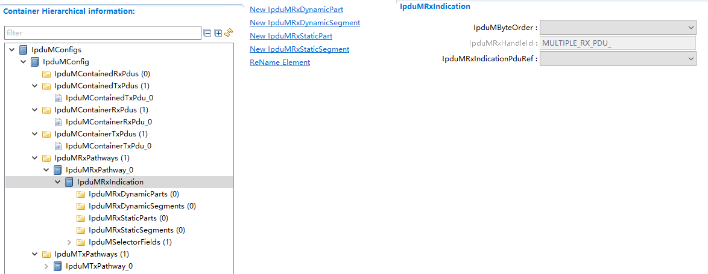

.. centered:: **表 IpduMRxIndication (Table IpduMRxIndication)**

.. list-table::
   :widths: 20 20 20 20 20
   :header-rows: 1

   * - UI名称 (UI Name)
     - 描述 (Description)
     - 
     - 
     - 
   * - IpduMByteOrder
     - 取值范围 (Range)
     - BIG_ENDIAN/LITTLE_ENDIAN
     - 默认取值 (Default value)
     - 无
   * - 
     - 参数描述 (Parameter Description)
     - MultiplexedI-PDU中字节序类型 (Byte order type in MultiplexedI-PDU)
     - 
     - 
   * - 
     - 依赖关系 (Dependencies)
     - 无
     - 
     - 
   * - IpduMRxHandleId
     - 取值范围 (Range)
     - string
     - 默认取值 (Default value)
     - 无
   * - 
     - 参数描述 (Parameter Description)
     - MultiplexedI-PDU在IpduM层的PDUId值 (MultiplexedI-PDU in IpduM layer's PDUId value)
     - 
     - 
   * - 
     - 依赖关系 (Dependencies)
     - 根据IpduMRxIndicationPduRef关联的Pdu名自动生成 (Automatically generate based on the PDU name associated with IpduMRxIndicationPduRef.)
     - 
     - 
   * - IpduMRxIndicationPduRef
     - 取值范围 (Range)
     - 索引[Pdu] (Index[Pdu])
     - 默认取值 (Default value)
     - 无
   * - 
     - 参数描述 (Parameter Description)
     - 关联EcuC中Pdu (Related EcuC Pdu)
     - 
     - 
   * - 
     - 依赖关系 (Dependencies)
     - 依赖于EcuC中Pdu的配置；这个Pdu必须也要被别的模块关联 (Dependent on configuration in EcuC for Pdu; this Pdu must also be associated with other modules.)
     - 
     - 

IpduMRxDynamicPart
----------------------------------

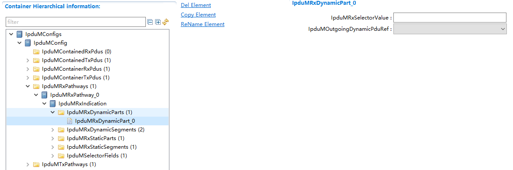

.. centered:: **表 IpduMRxDynamicPart (Table IpduMRxDynamicPart)**

.. list-table::
   :widths: 20 20 20 20 20
   :header-rows: 1

   * - UI名称 (UI Name)
     - 描述 (Description)
     - 
     - 
     - 
   * - IpduMRxSelectorValue
     - 取值范围 (Range)
     - 0 .. 65535
     - 默认取值 (Default value)
     - 无
   * - 
     - 参数描述 (Parameter Description)
     - dynamicpart的选择位数据值 (The data value of dynamicpart's selection bit)
     - 
     - 
   * - 
     - 依赖关系 (Dependencies)
     - 无
     - 
     - 
   * - IpduMOutgoingDynamicPduRef
     - 取值范围 (Range)
     - 索引[Pdu] (Index[Pdu])
     - 默认取值 (Default value)
     - 无
   * - 
     - 参数描述 (Parameter Description)
     - 关联EcuC中Pdu (Related EcuC Pdu)
     - 
     - 
   * - 
     - 依赖关系 (Dependencies)
     - 依赖于EcuC中Pdu的配置；这个Pdu必须也要被别的模块关联 (Dependent on configuration in EcuC for Pdu; this Pdu must also be associated with other modules.)
     - 
     - 

IpduMRxDynamicSegment
-------------------------------------

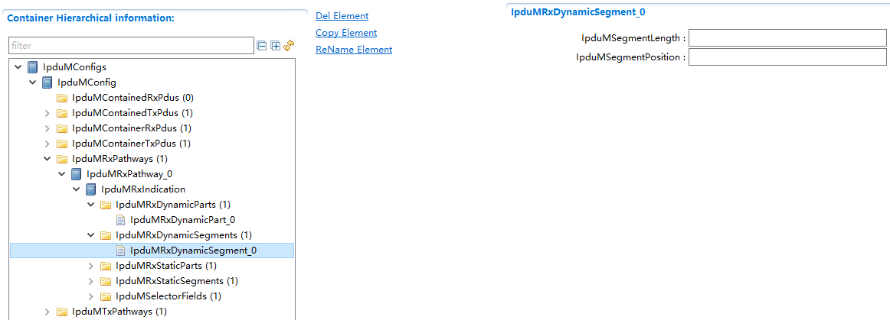

.. centered:: **表 IpduMRxDynamicSegment (Table IpduMRxDynamicSegment)**

.. list-table::
   :widths: 20 20 20 20 20
   :header-rows: 1

   * - UI名称 (UI Name)
     - 描述 (Description)
     - 
     - 
     - 
   * - IpduMSegmentLength
     - 取值范围 (Range)
     - 1 .. 2032
     - 默认取值 (Default value)
     - 无
   * - 
     - 参数描述 (Parameter Description)
     - 数据段的长度（bits）
     - 
     - 
   * - 
     - 依赖关系 (Dependencies)
     - 无
     - 
     - 
   * - IpduMSegmentPosition
     - 取值范围 (Range)
     - 0 .. 2031
     - 默认取值 (Default value)
     - 无
   * - 
     - 参数描述 (Parameter Description)
     - 数据段的起始位置（bit）
     - 
     - 
   * - 
     - 依赖关系 (Dependencies)
     - 无
     - 
     - 

IpduMRxStaticPart
---------------------------------

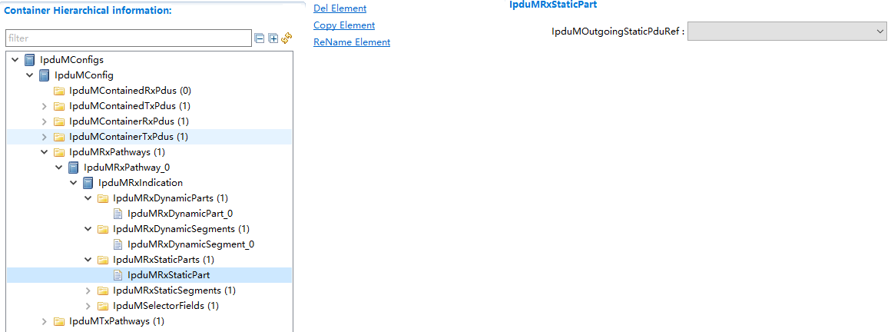

.. centered:: **表 IpduMRxStaticPart (Table IpduMRxStaticPart)**

.. list-table::
   :widths: 20 20 20 20 20
   :header-rows: 1

   * - UI名称 (UI Name)
     - 描述 (Description)
     - 
     - 
     - 
   * - IpduMOutgoingStaticPduRef
     - 取值范围 (Range)
     - 索引[Pdu] (Index[Pdu])
     - 默认取值 (Default value)
     - 无
   * - 
     - 参数描述 (Parameter Description)
     - 关联EcuC中Pdu (Related EcuC Pdu)
     - 
     - 
   * - 
     - 依赖关系 (Dependencies)
     - 依赖于EcuC中Pdu的配置；这个Pdu必须也要被别的模块关联 (Dependent on configuration in EcuC for Pdu; this Pdu must also be associated with other modules.)
     - 
     - 

IpduMRxStaticSegment
------------------------------------

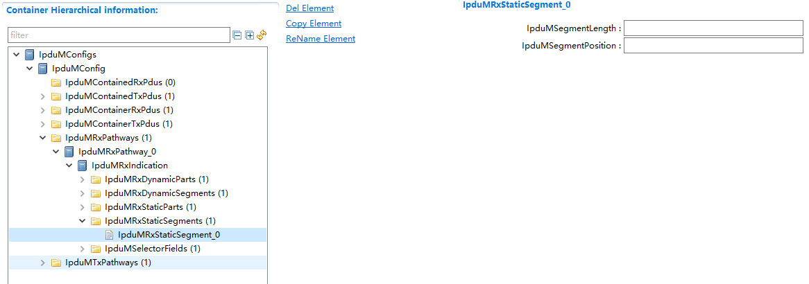

.. centered:: **表 IpduMRxStaticSegment (Table IpduMRxStaticSegment)**

.. list-table::
   :widths: 20 20 20 20 20
   :header-rows: 1

   * - UI名称 (UI Name)
     - 描述 (Description)
     - 
     - 
     - 
   * - IpduMSegmentLength
     - 取值范围 (Range)
     - 1 .. 2032
     - 默认取值 (Default value)
     - 无
   * - 
     - 参数描述 (Parameter Description)
     - 数据段的长度（bits）
     - 
     - 
   * - 
     - 依赖关系 (Dependencies)
     - 无
     - 
     - 
   * - IpduMSegmentPosition
     - 取值范围 (Range)
     - 0 .. 2031
     - 默认取值 (Default value)
     - 无
   * - 
     - 参数描述 (Parameter Description)
     - 数据段的起始位置（bit）
     - 
     - 
   * - 
     - 依赖关系 (Dependencies)
     - 无
     - 
     - 

IpduMSelectorField
----------------------------------

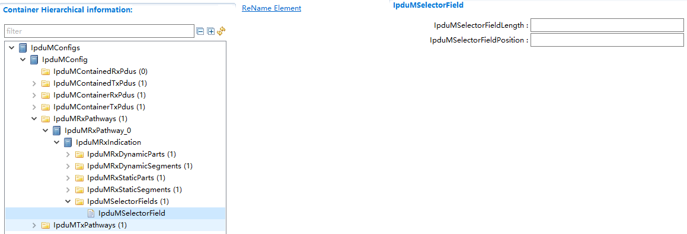

.. centered:: **表 IpduMSelectorField (Table IpduMSelectorField)**

.. list-table::
   :widths: 20 20 20 20 20
   :header-rows: 1

   * - UI名称 (UI Name)
     - 描述 (Description)
     - 
     - 
     - 
   * - IpduMSelectorFieldLength
     - 取值范围 (Range)
     - 1 .. 16
     - 默认取值 (Default value)
     - 无
   * - 
     - 参数描述 (Parameter Description)
     - MultiplexedPdu选择字段长度（bits）
     - 
     - 
   * - 
     - 依赖关系 (Dependencies)
     - 无
     - 
     - 
   * - IpduMSelectorFieldPosition
     - 取值范围 (Range)
     - 0 .. 2031
     - 默认取值 (Default value)
     - 无
   * - 
     - 参数描述 (Parameter Description)
     - MultiplexedPdu选择字段起始位置（bit）
     - 
     - 
   * - 
     - 依赖关系 (Dependencies)
     - 无
     - 
     - 

IpduMTxRequest
------------------------------

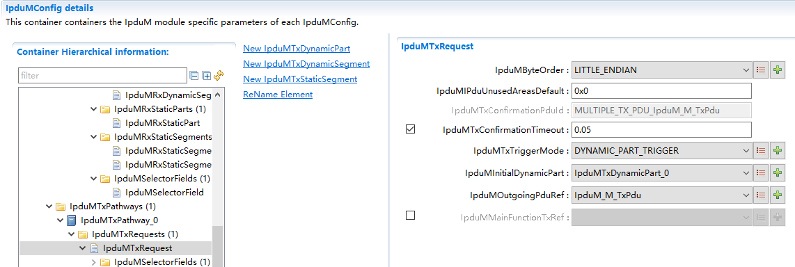

.. centered:: **表 IpduMTxRequest (Table IpduMTxRequest)**

.. list-table::
   :widths: 20 20 20 20 20
   :header-rows: 1

   * - UI名称 (UI Name)
     - 描述 (Description)
     - 
     - 
     - 
   * - IpduMByteOrder
     - 取值范围 (Range)
     - BIG_ENDIAN/LITTLE_ENDIAN
     - 默认取值 (Default value)
     - 无
   * - 
     - 参数描述 (Parameter Description)
     - MultiplexedI-PDU中字节序类型 (Byte order type in MultiplexedI-PDU)
     - 
     - 
   * - 
     - 依赖关系 (Dependencies)
     - 无
     - 
     - 
   * - IpduMIPduUnusedAreasDefault
     - 取值范围 (Range)
     - 0 .. 255
     - 默认取值 (Default value)
     - 0x0
   * - 
     - 参数描述 (Parameter Description)
     - MultiplexedI-PDU未使用字段默认值 (MultiplexedI-PDU Unused Fields Default Value)
     - 
     - 
   * - 
     - 依赖关系 (Dependencies)
     - 无
     - 
     - 
   * - IpduMTxConfirmationPduId
     - 取值范围 (Range)
     - string
     - 默认取值 (Default value)
     - 无
   * - 
     - 参数描述 (Parameter Description)
     - MultiplexedI-PDU在IpduM中的PDUId值 (MultiplexedI-PDU in IpduM's PDUId value)
     - 
     - 
   * - 
     - 依赖关系 (Dependencies)
     - 根据IpduMOutgoingPduRef关联Pdu名自动生成 (Automatically generate based on IpduMOutgoingPduRef associated PDU name)
     - 
     - 
   * - IpduMTxConfirmationTimeout
     - 取值范围 (Range)
     - 0 .. 3600
     - 默认取值 (Default value)
     - 无
   * - 
     - 参数描述 (Parameter Description)
     - MultiplexedI-PDU发送确认超时时间 (MultiplexedI-PDU Send Confirm Timeout Time)
     - 
     - 
   * - 
     - 依赖关系 (Dependencies)
     - 无
     - 
     - 
   * - IpduMTxTriggerMode
     - 取值范围 (Range)
     - DYNAMIC_PART_TRIGGER/NONE/STATIC_OR_DYNAMIC_PART_TRIGGER/STATIC_PART_TRIGGER
     - 默认取值 (Default value)
     - 无
   * - 
     - 参数描述 (Parameter Description)
     - MultiplexedI-PDU触发方式 (MultiplexedI-PDU Triggering Method)
     - 
     - 
   * - 
     - 依赖关系 (Dependencies)
     - 无
     - 
     - 
   * - IpduMInitialDynamicPart
     - 取值范围 (Range)
     - 索引[IpduMTxDynamicPart] (Index[IpduMTxDynamicPart])
     - 默认取值 (Default value)
     - 无
   * - 
     - 参数描述 (Parameter Description)
     - MultiplexedI-PDU初始默认DynamicPart (MultiplexedI-PDU Initial Default DynamicPart)
     - 
     - 
   * - 
     - 依赖关系 (Dependencies)
     - 无
     - 
     - 
   * - IpduMOutgoingPduRef
     - 取值范围 (Range)
     - 索引[Pdu] (Index[Pdu])
     - 默认取值 (Default value)
     - 无
   * - 
     - 参数描述 (Parameter Description)
     - 关联EcuC中Pdu (Related EcuC Pdu)
     - 
     - 
   * - 
     - 依赖关系 (Dependencies)
     - 依赖于EcuC中Pdu的配置；这个Pdu必须也要被别的模块关联 (Dependent on configuration in EcuC for Pdu; this Pdu must also be associated with other modules.)
     - 
     - 
   * - IpduMMainFunctionTxRef
     - 取值范围 (Range)
     - 索引[IpduMMainFunctionTx] (Index[IpduMMainFunctionTx])
     - 默认取值 (Default value)
     - 无
   * - 
     - 参数描述 (Parameter Description)
     - 关联配置的IpduMMainFunctionTx (Associated Configuration IpduMMainFunctionTx)
     - 
     - 
   * - 
     - 依赖关系 (Dependencies)
     - 无
     - 
     - 

IpduMTxDynamicPart
----------------------------------

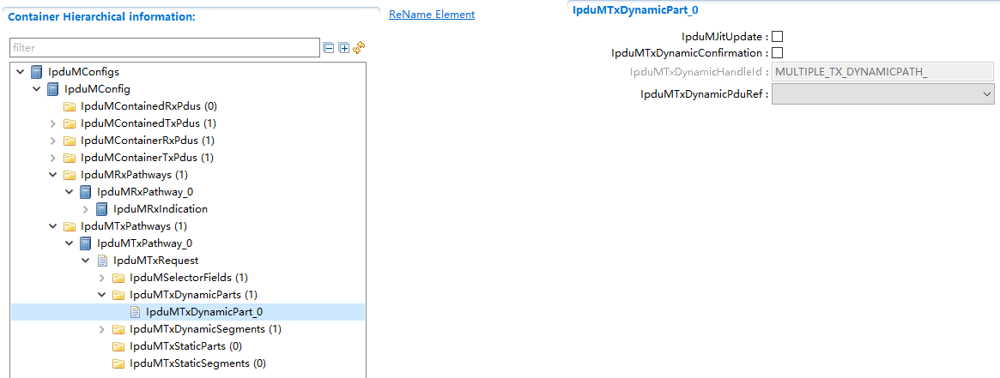

.. centered:: **表 IpduMTxDynamicPart (Table IpduMTxDynamicPart)**

.. list-table::
   :widths: 20 20 20 20 20
   :header-rows: 1

   * - UI名称 (UI Nam)
     - 描述 (Description)
     - 
     - 
     - 
   * - IpduMJitUpdate
     - 取值范围 (Range)
     - true/false
     - 默认取值 (Default value)
     - false
   * - 
     - 参数描述 (Parameter Description)
     - 作为非触发部分时，在MultiplexedI-PDU发送前是否需要更新该DynamicPart数据 (Whether the DynamicPart data needs to be updated before sending a MultiplexedI-PDU when it acts as non-triggering content)
     - 
     - 
   * - 
     - 依赖关系 (Dependencies)
     - 无
     - 
     - 
   * - IpduMTxDynamicConfirmation
     - 取值范围 (Range)
     - true/false
     - 默认取值 (Default value)
     - false
   * - 
     - 参数描述 (Parameter Description)
     - 该DynamicPart是否使能TxConfirmation (Does the DynamicPart enable TxConfirmation?)
     - 
     - 
   * - 
     - 依赖关系 (Dependencies)
     - 无
     - 
     - 
   * - IpduMTxDynamicHandleId
     - 取值范围 (Range)
     - string
     - 默认取值 (Default value)
     - 无
   * - 
     - 参数描述 (Parameter Description)
     - DynamicPartPdu在IpduM中的PDUId值 (DynamicPartPdu's PDUId value in IpduM)
     - 
     - 
   * - 
     - 依赖关系 (Dependencies)
     - 根据IpduMTxDynamicPduRef关联Pdu名自动生成 (Generate automatically according to IpduMTxDynamicPduRef associated PDU name)
     - 
     - 
   * - IpduMTxDynamicPduRef
     - 取值范围 (Range)
     - 索引[Pdu] (Index[Pdu])
     - 默认取值 (Default value)
     - 无
   * - 
     - 参数描述 (Parameter Description)
     - 关联EcuC中Pdu (Related EcuC Pdu)
     - 
     - 
   * - 
     - 依赖关系 (Dependencies)
     - 依赖于EcuC中Pdu的配置；这个Pdu必须也要被别的模块关联 (Dependent on configuration in EcuC for Pdu; this Pdu must also be associated with other modules.)
     - 
     - 

IpduMTxDynamicSegment
-------------------------------------

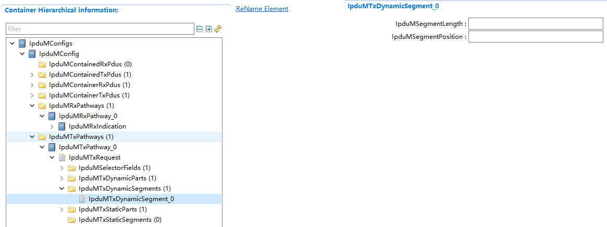

.. centered:: **表 IpduMTxDynamicSegment (Table IpduMTxDynamicSegment)**

.. list-table::
   :widths: 20 20 20 20 20
   :header-rows: 1

   * - UI名称 (UI Name)
     - 描述 (Description)
     - 
     - 
     - 
   * - IpduMSegmentLength
     - 取值范围 (Range)
     - 1 .. 2032
     - 默认取值 (Default value)
     - 无
   * - 
     - 参数描述 (Parameter Description)
     - 数据段的长度（bits）
     - 
     - 
   * - 
     - 依赖关系 (Dependencies)
     - 无
     - 
     - 
   * - IpduMSegmentPosition
     - 取值范围 (Range)
     - 0 .. 2031
     - 默认取值 (Default value)
     - 无
   * - 
     - 参数描述 (Parameter Description)
     - 数据段的起始位置（bit）
     - 
     - 
   * - 
     - 依赖关系 (Dependencies)
     - 无
     - 
     - 

IpduMTxStaticPart
---------------------------------

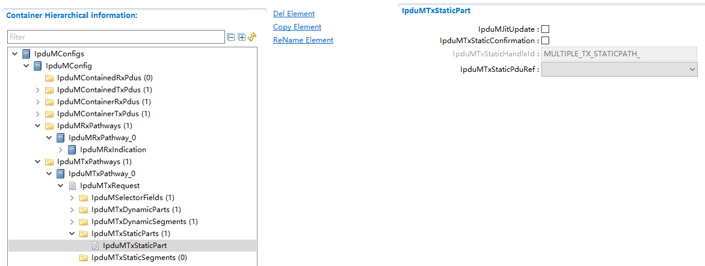

.. centered:: **表 IpduMTxStaticPart (Table IpduMTxStaticPart)**

.. list-table::
   :widths: 20 20 20 20 20
   :header-rows: 1

   * - UI名称 (UI Name)
     - 描述 (Description)
     - 
     - 
     - 
   * - IpduMJitUpdate
     - 取值范围 (Range)
     - true/false
     - 默认取值 (Default value)
     - false
   * - 
     - 参数描述 (Parameter Description)
     - 作为非触发部分时，MultiplexedI-PDU发送前是否需要更新该StaticPart数据 (Whether StaticPart data needs to be updated before MultiplexedI-PDU is sent as non-triggering part)
     - 
     - 
   * - 
     - 依赖关系 (Dependencies)
     - 无
     - 
     - 
   * - IpduMTxStaticConfirmation
     - 取值范围 (Range)
     - true/false
     - 默认取值 (Default value)
     - false
   * - 
     - 参数描述 (Parameter Description)
     - 该StaticPart是否使能TxConfirmation (Does the StaticPart enable TxConfirmation?)
     - 
     - 
   * - 
     - 依赖关系 (Dependencies)
     - 无
     - 
     - 
   * - IpduMTxStaticHandleId
     - 取值范围 (Range)
     - string
     - 默认取值 (Default value)
     - 无
   * - 
     - 参数描述 (Parameter Description)
     - StaticPartPdu在IpduM中的PDUId值 (StaticPartPdu's PDUId value in IpduM)
     - 
     - 
   * - 
     - 依赖关系 (Dependencies)
     - 根据IpduMTxStaticPduRef关联Pdu名自动生成 (Generate automatically according to IpduMTxStaticPduRef associated PDU name)
     - 
     - 
   * - IpduMTxStaticPduRef
     - 取值范围 (Range)
     - 索引[Pdu] (Index[Pdu])
     - 默认取值 (Default value)
     - 无
   * - 
     - 参数描述 (Parameter Description)
     - 关联EcuC中Pdu (Related EcuC Pdu)
     - 
     - 
   * - 
     - 依赖关系 (Dependencies)
     - 依赖于EcuC中Pdu的配置；这个Pdu必须也要被别的模块关联 (Dependent on configuration in EcuC for Pdu; this Pdu must also be associated with other modules.)
     - 
     - 

IpduMTxStaticSegment
------------------------------------

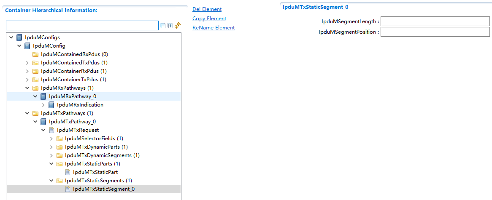

.. centered:: **表 IpduMTxStaticSegment (Table IpduMTxStaticSegment)**

.. list-table::
   :widths: 20 20 20 20 20
   :header-rows: 1

   * - UI名称 (UI Name)
     - 描述 (Description)
     - 
     - 
     - 
   * - IpduMSegmentLength
     - 取值范围 (Range)
     - 1 .. 2032
     - 默认取值 (Default value)
     - 无
   * - 
     - 参数描述 (Parameter Description)
     - 数据段的长度（bits）
     - 
     - 
   * - 
     - 依赖关系 (Dependencies)
     - 无
     - 
     - 
   * - IpduMSegmentPosition
     - 取值范围 (Range)
     - 0 .. 2031
     - 默认取值 (Default value)
     - 无
   * - 
     - 参数描述 (Parameter Description)
     - 数据段的起始位置（bit）
     - 
     - 
   * - 
     - 依赖关系 (Dependencies)
     - 无
     - 
     - 

IpduMConfig
---------------------------

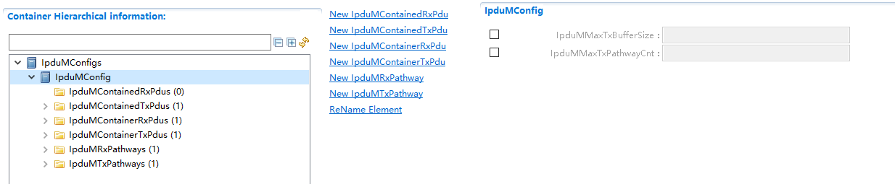

.. centered:: **表 IpduMConfig (Table IpduMConfig)**

.. list-table::
   :widths: 20 20 20 20 20
   :header-rows: 1

   * - UI名称 (UI Name)
     - 描述 (Description)
     - 
     - 
     - 
   * - IpduMMaxTxBufferSize
     - 取值范围 (Range)
     - 0 .. 65535
     - 默认取值 (Default value)
     - 无
   * - 
     - 参数描述 (Parameter Description)
     - IpduM最大发送Buffer的大小 (The maximum size of IpduM's send buffer)
     - 
     - 
   * - 
     - 依赖关系 (Dependencies)
     - 用于计算PB配置地址大小，当前不支持 (For calculating the address size of PB configuration, current support is not available.)
     - 
     - 
   * - IpduMMaxTxPathwayCnt
     - 取值范围 (Range)
     - 0 .. 65535
     - 默认取值 (Default value)
     - 无
   * - 
     - 参数描述 (Parameter Description)
     - 最大发送IPdu的数目 (The maximum number of send IPDUs)
     - 
     - 
   * - 
     - 依赖关系 (Dependencies)
     - 用于计算PB配置地址大小，当前不支持；配置的IpduMTxPathway数目不能超过IpduMMaxTxPathwayCnt (For calculating PB configuration address size, it is currently unsupported; the number of configured IpduMTxPathway cannot exceed IpduMMaxTxPathwayCnt.)
     - 
     - 
