========================================================================
J1939Dcm
========================================================================

文档信息(Document Information)
========================================================================

版本历史(Version History)
------------------------------------------------------------------------
.. list-table::
   :header-rows: 1
   :stub-columns: 1

   * - 日期(Date)
     - 作者(Author)
     - 版本(Version)
     - 状态(Status)
     - 说明(Description)
   
   * - 2025/02/28
     - haibin.shao
     - V0.1
     - 发布(Release)
     - 首次发布(First release)
   * - 2025/04/04
     - haibin.shao
     - V1.0
     - 发布(Release)
     - 正式发布(Official release)
   * - 2025/12/16
     - chao.sun
     - V1.1
     - 修正(Modify)
     - 调整文档架构和补充英文说明(Adjust the document structure and add English explanations)

参考文档(References)
------------------------------------------------------------------------
.. list-table::
   :header-rows: 1
   :stub-columns: 1

   * - 编号(Number)
     - 分类(Classification)
     - 标题(Title)
     - 版本(Version)
	
   * - [1]
     - SAE
     - J1939_21_201810.pdf
     - CAN Data Link Layer
   * - [2]
     - SAE
     - J1939-22_202103.pdf
     - CAN FD Data Link Layer
   * - [3]
     - SAE
     - J1939_73_201705.pdf
     - Diagnostics Message Services Layer
   * - [4]
     - Autosar
     - AUTOSAR_RS_Diagnostics.pdf
     - R19-11
   * - [5]
     - Autosar
     - AUTOSAR_SRS_SAEJ1939.pdf
     - R19-11
   * - [6]
     - Autosar
     - AUTOSAR_SWS_SAEJ1939TransportLayer.pdf
     - R19-11
   * - [7]
     - Autosar
     - AUTOSAR_SWS_SAEJ1939RequestManager.pdf
     - R19-11
   * - [8]
     - Autosar
     - AUTOSAR_SWS_SAEJ1939DiagnosticCommunicationManager.pdf
     - R19-11
   * - [9]
     - ISO
     - SAE-J1939Dcm diagnostic services - Application Layer
     - Release 2017-05

术语与缩略语(Terms and Abbreviations)
========================================================================

术语(Terms)
------------------------------------------------------------------------
.. list-table::
   :header-rows: 1
   :stub-columns: 1

   * - 术语(Terms)
     - 解释(Explanation)
	
   * - Reception of Requests
     - J1939Dcm通过J1939Rm的J1939Dcm_RequestIndication接口接收大多数针对DMx PGs的请求。
   * - Service Only DTCs
     - J1939存在“仅服务型故障码（Service only DTCs）”的概念；这些故障码被认为存储在DEM的任何用户定义故障存储器中；所有其他故障码则被认为存储在主故障存储器中。
   * - Active Diagnostic Trouble Codes
     - DM01用于周期性广播以及在状态变化时广播本ECU的当前故障码和汇总的指示灯状态。
   * - Previously Active Diagnostic Trouble Codes
     - DM02消息用于报告历史激活故障码。
   * - Diagnostic Data Clear/Reset for Previously Active DTCs
     - DM03消息用于清除历史激活故障码。
   * - Freeze Frame Parameters
     - DM04消息用于报告所存储的冻结帧。
   * - Diagnostic Readiness 1
     - DM05消息用于报告诊断就绪状态。
   * - Emission Related Pending DTCs
     - DM06消息用于报告与OBD相关的待决故障码。
   * - Diagnostic Data Clear/Reset for Active DTCs
     - DM11消息至少应清除所有与当前激活故障码相关的适用诊断数据。
   * - Emissions Related Active DTCs
     - DM12消息用于报告与OBD相关的当前激活故障码。
   * - Stop Start Broadcast
     - DM13消息用于停止和启动向特定网络的消息广播。
   * - Calibration Information
     - DM19消息用于报告校准验证编号。
   * - Monitor Performance Ratio
     - DM20消息用于报告在用车监测执行率。
   * - Diagnostic Readiness 2
     - DM21消息用于报告诊断就绪状态
   * - Previously Active Emission Related Faults
     - DM23消息用于报告与 OBD 相关的历史激活故障码。
   * - SPN Support
     - DM24消息用于报告DM25和数据流所支持的SPN。
   * - Expanded Freeze Frame
     - DM25消息用于报告扩展冻结帧的数据。
   * - Diagnostic Readiness 3
     - DM26消息用于报告诊断就绪状态。
   * - Permanent DTCs
     - DM28消息用于报告与OBD相关的永久性故障码。
   * - Regulated DTC Counts
     - DM29消息用于报告各类别故障码的数量。
   * - DTC to Lamp Association
     - DM31消息用于报告故障码与指示灯的关联关系。
   * - Immediate Fault Status
     - DM35消息用于报告即时故障状态。
   * - Active Service Only DTCs
     - DM53消息用于报告仅维修服务类当前激活故障码。
   * - Previously Active Service Only DTCs
     - DM54消息用于报告仅维修服务类历史激活故障码。
   * - Diagnostic Data Clear/Reset for all Service Only DTCs
     - DM55消息用于清除所有仅维修服务类故障码。

缩略语(Abbreviations)
------------------------------------------------------------------------
.. list-table::
   :header-rows: 1
   :stub-columns: 1

   * - 简写 (Abbreviation)
     - 全称 (Full name)
     - 解释 (Explanation)
	
   * - SAE
     - Society of Automotive Engineers
     - 美国汽车工程师学会
   * - API
     - Application Programming Interface
     - 应用编程接口
   * - CAN
     - Controller Area Network
     - 控制域网络协议
   * - CanIf
     - CAN Interface
     - CAN通信接口层
   * - TP
     - Transport Protocol
     - 分段传输协议
   * - Dcm
     - Diagnostic Communication Manager
     - 实现诊断服务的模块
   * - Dem
     - Diagnostic Event Manager
     - 实现诊断事件处理的模块
   * - Det
     - Default Error Tracer
     - 开发/运行时错误报错追踪模块
   * - PduR
     - Pdu Router
     - Pdu路由模块
   * - ComM
     - Communication Manager
     - 通信管理层
   * - EcuM
     - ECU State Manager
     - ECU状态管理器
   * - RTE
     - Runtime Environment
     - 介于SWC和BSW间的虚拟总线运行时环境
   * - SW-C
     - Software-Component
     - 应用设计单元组件
   * - J1939Tp
     - SAE-J1939 Transport Layer
     - 基于J1939协议栈的实现消息传输层的模块
   * - J1939Nm
     - SAE-J1939 Networks Manager
     - 基于J1939协议栈的实现网络管理的模块
   * - J1939Rm
     - SAE-J1939 Request Manager
     - 基于J1939协议栈的实现请求管理的模块
   * - J1939Dcm
     - SAE-J1939 Diagnostic Communication Manager
     - 基于J1939协议栈的实现诊断通信管理的模块
   * - ID
     - Identifier
     - 识别编号
   * - DTC
     - Diagnostic Trouble Code
     - 诊断故障码
   * - SPN
     - Suspect Parameter Number
     - 可疑参数编号
   * - FMI
     - Failure Mode Indicator
     - 故障模式指示
   * - OC
     - Occurrence Counter
     - 故障发生次数计数器
   * - DP
     - Data Page
     - 数据页
   * - EDP
     - Data Extend Page
     - 扩展数据页
   * - PRI
     - Priority
     - 优先级
   * - PDUF
     - PDU Format
     - PDU格式
   * - PDUS
     - PDU Specific
     - PDU特定
   * - OBD
     - On-Board Diagnostics
     - 车载诊断系统
   * - Pdu
     - Protocol Data Unit
     - 协议数据单元
   * - CS
     - Client-Server
     - 客户端-服务端的RTE通信方式，以调用函数接口的方式进行通信
   * - SR
     - Sender-Receiver
     - 发送方-接收方的RTE通信方式，以数据传递的方式进行通信
   * - ACK
     - acknowledgement
     - 应答确认的回复
   * - PACK
     - Positive response
     - 积极响应的确认
   * - NACK
     - Negative response
     - 否定响应的确认
   * - BAM
     - Broadcast Announce Message
     - 广播公告消息
   * - CMDT
     - Connection Mode Data Transfer
     - 连接模式或点对点的数据传输
   * - BswM
     - Basic Software Mode Manager
     - 基础软件模块管理
   * - DA
     - Destination Address
     - 目的地址
   * - SA
     - Source Address
     - 源地址
   * - DM
     - SAE-J1939 Diagnostic Message
     - 基于SAE-J1939协议栈的诊断消息
   * - PG
     - Parameter Group
     - 参数组
   * - PGN
     - Parameter Group Number
     - 参数组编号
   * - RQST
     - J1939 Request PG (PGN = 0xEA00)
     - 来自J1939Rm组件的请求PG
   * - CNV
     - Calibration Verification Number
     - 校正检定编号
   * - ACKM
     - J1939 acknowledgement PG (PGN = 0xE800)
     - 向J1939Rm组件发送确认消息
   * - SchM
     - Basic Software Schedule Manager
     - 基础软件调度管理

简介(Introduction)
========================================================================

J1939Dcm用于负责处理诊断请求消息并发送适当的响应ACKM-PG，对1939Rm转发过来的诊断请求进行DMx解析，执行相应的诊断处理，如果诊断服务处理正常，则发送积极响应的诊断消息报文，设置故障灯的状态等，否则发送否定响应的确认报文。
J1939Dcm组件需要实现功能：模块初始化、请求接收、缓存管理、诊断服务处理，支持诊断消息响应、Generic诊断消息响应、DTC状态，立即故障、冻结帧，Radio、诊断Readiness、广播控制、校验信息、错误检测以及若干J1939诊断指令交互等：

J1939Dcm is used to handle diagnostic request messages and send appropriate ACKM-PG responses. It parses DMx from diagnostic requests forwarded by 1939Rm, performs the corresponding diagnostic processing, and if the diagnostic service is processed correctly, it sends a positive response diagnostic message and sets the fault lamp status, etc.; otherwise, it sends a negative response acknowledgment message. 

The J1939Dcm component needs to implement functions such as module initialization, request reception, cache management, diagnostic service processing, support for diagnostic message response, Generic diagnostic message response, DTC status, immediate faults, freeze frame, Radio, diagnostic Readiness, broadcast control, checksum information, error detection, as well as several J1939 diagnostic command interactions.

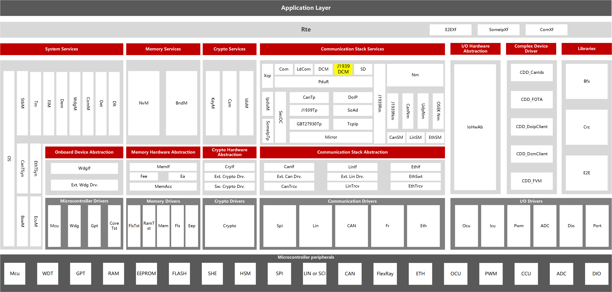

   J1939Dcm模块层次图

如图 :ref:`J1939Dcm模块层次图` 所示，J1939Dcm模块处于AUTOSAR软件架构中的通信栈服务层，其下层模块为PduR模块，上层模块为Rte，并于同层级的Dem模块（系统服务）进行交互。

As shown in the figure :ref:`J1939Dcm模块层次图`, the J1939Dcm module is located in the communication stack service layer of the AUTOSAR software architecture. Its lower layer module is the PduR module, its upper layer module is the Rte, and it interacts with the Dem module (system service) at the same level.

J1939Dcm支持的非Genneric类型的诊断消息(Non-Generic Type Diagnostic Messages Supported by J1939Dcm)
-----------------------------------------------------------------------------------------------------

.. table:: J1939DcmNonGenericDMxSupportedList
   :name: J1939DcmNonGenericDMxSupportedList
   :align: left

   +----------+-------+----------+----------+----------------+--------------------------------------+-------------------------------------------------+
   |   Name   | PGN   | Size     | Received | Transmitted    | Call API                             | Note                                            |
   +==========+=======+==========+==========+================+======================================+=================================================+
   |   DM01   | FECA  | variable | N/A      | Cyclic 1s      | Dem_J1939DcmSetDTCFilter             | DEM_J1939DTC_ACTIVE,                            |
   |          |       |          |          +----------------+--------------------------------------+ DEM_DTC_KIND_ALL_DTCS,                          |
   |          |       |          |          | On Request     | Dem_J1939DcmGetNexFilteredDTC        | DEM_DTC_ORIGIN_PRIMARY_MEMORY                   |
   |          |       |          |          +----------------+--------------------------------------+                                                 |
   |          |       |          |          | On Trigger     |                                      |                                                 |
   +----------+-------+----------+----------+----------------+--------------------------------------+-------------------------------------------------+
   |   DM02   | FECB  | variable | N/A      | On Request     | Dem_J1939DcmSetDTCFilter             | DEM_J1939DTC_PREVIOUSLY_ACTIVE,                 |
   |          |       |          |          |                +--------------------------------------+ DEM_DTC_KIND_ALL_DTCS,                          |
   |          |       |          |          |                | Dem_J1939DcmGetNextFilteredDTC       | DEM_DTC_ORIGIN_PRIMARY_MEMORY                   |
   +----------+-------+----------+----------+----------------+--------------------------------------+-------------------------------------------------+
   |   DM03   | FECC  | N/A      | N/A      | On Request     | Dem_J1939DcmClearDTC                 | DEM_J1939DTC_CLEAR_PREVIOUSLY_ACTIVE            |
   +----------+-------+----------+----------+----------------+--------------------------------------+-------------------------------------------------+
   |   DM04   | FECD  | variable | N/A      | On Request     | Dem_J1939DcmSetFreezeFrameFilter     | DEM_J1939DCM_FREEZEFRAME                        |
   |          |       |          |          |                +--------------------------------------+                                                 |
   |          |       |          |          |                | Dem_J1939DcmGetNextFreezeFrame       |                                                 |
   +----------+-------+----------+----------+----------------+--------------------------------------+-------------------------------------------------+
   |   DM05   | FECE  | 8        | N/A      | On Request     | Dem_J1939DcmReadDiagnosticReadiness1 |                                                 |
   +----------+-------+----------+----------+----------------+--------------------------------------+-------------------------------------------------+
   |   DM06   | FECF  | variable | N/A      | On RxIndi      | Dem_J1939DcmSetDTCFilter             | DEM_J1939DTC_PENDING,                           |
   |          |       |          |          |                +--------------------------------------+ DEM_DTC_KIND_EMISSION_REL_DTCS,                 |
   |          |       |          |          |                | Dem_J1939DcmGetNextFilteredDTC       | DEM_DTC_ORIGIN_PRIMARY_MEMORY                   |
   +----------+-------+----------+----------+----------------+--------------------------------------+-------------------------------------------------+
   |   DM11   | FED3  | N/A      | N/A      | On Request     | Dem_J1939DcmClearDTC                 | DEM_J1939DTC_CLEAR_ACTIVE                       |
   +----------+-------+----------+----------+----------------+--------------------------------------+-------------------------------------------------+
   |   DM12   | FED4  | variable | N/A      | On Request     | Dem_J1939DcmSetDTCFilter             | DEM_J1939DTC_ACTIVE,                            |
   |          |       |          |          |                +--------------------------------------+ DEM_DTC_KIND_EMISSION_REL_DTCS,                 |
   |          |       |          |          |                | Dem_J1939DcmGetNextFilteredDTC       | DEM_DTC_ORIGIN_PRIMARY_MEMORY                   |
   +----------+-------+----------+----------+----------------+--------------------------------------+-------------------------------------------------+
   |   DM13   | DF00  | 8        | X        | On Received    | BswM_J1939DcmBroadcastStatus         |                                                 |
   +----------+-------+----------+----------+----------------+--------------------------------------+-------------------------------------------------+
   |   DM19   | D300  | variable | N/A      | On Request     | GetCalibrationVerificationNumber     |                                                 |
   +----------+-------+----------+----------+----------------+--------------------------------------+-------------------------------------------------+
   |   DM20   | C200  | variable | N/A      | On Request     | Dem_J1939DcmSetRadioFilter           |                                                 |
   |          |       |          |          |                +--------------------------------------+                                                 |
   |          |       |          |          |                | Dem_J1939DcmGetNextFilteredRadio     |                                                 |
   +----------+-------+----------+----------+----------------+--------------------------------------+-------------------------------------------------+
   |   DM21   | C100  | 8        | N/A      | On Request     | Dem_J1939DcmReadDiagnosticReadiness2 |                                                 |
   +----------+-------+----------+----------+----------------+--------------------------------------+-------------------------------------------------+
   |   DM23   | FDB5  | variable | N/A      | On Request     | Dem_J1939DcmSetDTCFilter             | DEM_J1939DTC_PREVIOUSLY_ACTIVE,                 |
   |          |       |          |          |                +--------------------------------------+ DEM_DTC_KIND_EMISSION_REL_DTCS                  |
   |          |       |          |          |                | Dem_J1939DcmGetNextFilteredDTC       | DEM_DTC_ORIGIN_PRIMARY_MEMORY                   |
   +----------+-------+----------+----------+----------------+--------------------------------------+-------------------------------------------------+
   |   DM24   | FDB6  | 8        | N/A      | On Request     | Dem_J1939DcmSetFreezeFrameFilter     | DEM_J1939DCM_SPNS_IN_EXPANDED_FREEZEFRAME       |
   |          |       |          |          |                +--------------------------------------+                                                 |
   |          |       |          |          |                | Dem_J1939DcmGetNextSPNInFreezeFrame  |                                                 |
   +----------+-------+----------+----------+----------------+--------------------------------------+-------------------------------------------------+
   |   DM25   | FDB7  | variable | N/A      | On Request     | Dem_J1939DcmSetFreezeFrameFilter     | DEM_J1939DCM_EXPANDED_FREEZEFRAME               |
   |          |       |          |          |                +--------------------------------------+                                                 |
   |          |       |          |          |                | Dem_J1939DcmGetNextFreezeFrame       |                                                 |
   +----------+-------+----------+----------+----------------+--------------------------------------+-------------------------------------------------+
   |   DM26   | FDB8  | 8        | N/A      | On Request     | Dem_J1939DcmReadDiagnosticReadiness3 |                                                 |
   +----------+-------+----------+----------+----------------+--------------------------------------+-------------------------------------------------+
   |   DM28   | FD80  | variable | N/A      | On Request     | Dem_J1939DcmSetDTCFilter             | DEM_J1939DTC_PERMANENT,                         |
   |          |       |          |          |                +--------------------------------------+ DEM_DTC_KIND_EMISSION_REL_DTCS                  |
   |          |       |          |          |                | Dem_J1939DcmGetNextFilteredDTC       | DEM_DTC_ORIGIN_PRIMARY_MEMORY                   |
   +----------+-------+----------+----------+----------------+--------------------------------------+-------------------------------------------------+
   |   DM29   | 9E00  | 8        | N/A      | On Request     | Dem_J1939DcmSetDTCFilter             | ALL                                             |
   |          |       |          |          |                +--------------------------------------+                                                 |
   |          |       |          |          |                | Dem_J1939DcmGetNumberOfFilteredDTC   |                                                 |
   +----------+-------+----------+----------+----------------+--------------------------------------+-------------------------------------------------+
   |   DM31   | A300  | variable | N/A      | On Request     | Dem_J1939DcmSetDTCFilter             | ALL                                             |
   |          |       |          |          |                +--------------------------------------+                                                 |
   |          |       |          |          |                | Dem_J1939DcmGetNumberOfFilteredDTC   |                                                 |
   +----------+-------+----------+----------+----------------+--------------------------------------+-------------------------------------------------+
   |   DM35   | 9F00  | variable | N/A      | Cyclic 1s      | Dem_J1939DcmSetDTCFilter             | DEM_J1939DTC_CURRENTLY_ACTIVE,                  |
   |          |       |          |          +----------------+--------------------------------------+ DEM_DTC_KIND_ALL_DTCS                           |
   |          |       |          |          | On Request     | Dem_J1939DcmGetNexFilteredDTC        | DEM_DTC_ORIGIN_PRIMARY_MEMORY                   |
   +----------+-------+----------+----------+----------------+--------------------------------------+-------------------------------------------------+
   |   DM53   | FCD1  | variable | N/A      | On Request     | Dem_J1939DcmSetDTCFilter             | DEM_J1939DTC_ACTIVE,                            |
   |          |       |          |          |                +--------------------------------------+ DEM_DTC_KIND_ALL_DTCS                           |
   |          |       |          |          |                | Dem_J1939DcmGetNextFilteredDTC       | DEM_DTC_ORIGIN_PERMANENT_MEMORY                 |
   +----------+-------+----------+----------+----------------+--------------------------------------+-------------------------------------------------+
   |   DM54   | FCD2  | variable | N/A      | On Request     | Dem_J1939DcmSetDTCFilter             | DEM_J1939DTC_PREVIOUSLY_ACTIVE,                 |
   |          |       |          |          |                +--------------------------------------+ DEM_DTC_KIND_ALL_DTCS                           |
   |          |       |          |          |                | Dem_J1939DcmGetNextFilteredDTC       | DEM_DTC_ORIGIN_PERMANENT_MEMORY                 |
   +----------+-------+----------+----------+----------------+--------------------------------------+-------------------------------------------------+
   |   DM55   | FCD3  | N/A      | N/A      | On Request     | Dem_J1939DcmClearDTC                 | DEM_J1939DTC_CLEAR_ACTIVE_AND_PREVIOUSLY_ACTIVE |
   +----------+-------+----------+----------+----------------+--------------------------------------+-------------------------------------------------+

.. list-table::
   :header-rows: 1
   :stub-columns: 1

   * - 序号(Serial Number)
     - 详细描述(Detailed description)
	
   * - 1.
     - 如果启用J1939DcmGenericDMxSupport，则未在诊断消息支持表中列出的DMx消息的请求将通过配置为J1939DcmGenericDMxRequestFunction的callout转发。它们可以使用J1939Dcm_GenericDMxTransmit来应答，这将触发通过J1939DcmGenericDMxCopyTxDataFunction和J1939DcmGenericDMxTxConfirmationFunction配置的回调。(If J1939DcmGenericDMxSupport is enabled, requests for DMx messages that are not listed in the diagnostic message support table will be forwarded via a callout configured as J1939DcmGenericDMxRequestFunction. They can be responded to using J1939Dcm_GenericDMxTransmit, which will trigger the callbacks configured via J1939DcmGenericDMxCopyTxDataFunction and J1939DcmGenericDMxTxConfirmationFunction.)
   * - 2.
     - 如果启用J1939DcmGenericDMxSupport，则接收到的DMx消息（未在诊断消息支持表中列出）将使用J1939DcmGenericDMxStartOfReceptionFunction、J1939DcmGenericDMxCopyRxDataFunction和J1939DcmGenericDMxRxIndicationFunction配置的回调函数转发给应用程序。(If J1939DcmGenericDMxSupport is enabled, received DMx messages (which are not listed in the diagnostic message support table) will be forwarded to the application using the callback functions configured by J1939DcmGenericDMxStartOfReceptionFunction, J1939DcmGenericDMxCopyRxDataFunction, and J1939DcmGenericDMxRxIndicationFunction.)
   * - 3.
     - 可变大小的DMx消息使用TP-API（PduR_J1939DcmTransmit, J1939Dcm_CopyTxData， J1939Dcm_TpTxConfirmation用于传输，J1939Dcm_StartOfReception, J1939Dcm_CopyRxData， J1939Dcm_TpRxIndication用于接收）与J1939Tp组件进行交互。(Variable-sized DMx messages use the TP-API (PduR_J1939DcmTransmit, J1939Dcm_CopyTxData, J1939Dcm_TpTxConfirmation for transmission, J1939Dcm_StartOfReception, J1939Dcm_CopyRxData, J1939Dcm_TpRxIndication for reception) to interact with the J1939Tp component.)
   * - 4.
     - 固定大小为8字节的DMx消息使用IF API （PduR_J1939DcmTransmit， J1939Dcm_TxConfirmation用于传输，J1939Dcm_RxIndication用于接收）与CanIf组件进行交互。(DMx messages with a fixed size of 8 bytes interact with the CanIf component using the IF API (PduR_J1939DcmTransmit, J1939Dcm_TxConfirmation for transmission, and J1939Dcm_RxIndication for reception).)

J1939Dcm支持的Genneric类型的诊断消息(Diagnostic messages of Generic type supported by J1939 DCM)
--------------------------------------------------------------------------------------------------

.. table:: J1939DcmGenericDMxSupportedList
   :name: J1939DcmGenericDMxSupportedList
   :align: left

   +----------+-------+----------+----------+----------------+-------------------------------------------------------------------+--------------------+
   |   Name   | PGN   | Size     | Received | Transmitted    | Detailed description                                              | Note               |
   +==========+=======+==========+==========+================+===================================================================+====================+
   |   DM07   | E300  | 8        | N/A      | On Request     | Command Non-Continuously Monitored Test                           |                    |
   +----------+-------+----------+----------+----------------+-------------------------------------------------------------------+--------------------+
   |   DM08   | FED0  | variable | N/A      | On Request     | Test Results for Non-Continuously Monitored Systems               |                    |
   +----------+-------+----------+----------+----------------+-------------------------------------------------------------------+--------------------+
   |   DM09   | FED1  | variable | N/A      | On Request     | Oxygen Sensor Test Results                                        |                    |
   +----------+-------+----------+----------+----------------+-------------------------------------------------------------------+--------------------+
   |   DM10   | FED2  | 8        | N/A      | On Request     | Non-Continuously Monitored Systems Test Identifiers Support       |                    |
   +----------+-------+----------+----------+----------------+-------------------------------------------------------------------+--------------------+
   |   DM14   | D900  | 8        | N/A      | N/A            | Memory Access Request                                             |                    |
   +----------+-------+----------+----------+----------------+-------------------------------------------------------------------+--------------------+
   |   DM15   | D800  | 8        | N/A      | N/A            | Memory Access Response                                            |                    |
   +----------+-------+----------+----------+----------------+-------------------------------------------------------------------+--------------------+
   |   DM16   | D700  | variable | N/A      | N/A            | Binary Data Transfer                                              |                    |
   +----------+-------+----------+----------+----------------+-------------------------------------------------------------------+--------------------+
   |   DM17   | D600  | 8        | N/A      | N/A            | Boot Load Data                                                    |                    |
   +----------+-------+----------+----------+----------------+-------------------------------------------------------------------+--------------------+
   |   DM18   | D400  | variable | N/A      | N/A            | Data Security                                                     |                    |
   +----------+-------+----------+----------+----------------+-------------------------------------------------------------------+--------------------+
   |   DM22   | C300  | 8        | N/A      | N/A            | Individual Clear/Reset Of Active And Previously Active DTC        |                    |
   +----------+-------+----------+----------+----------------+-------------------------------------------------------------------+--------------------+
   |   DM27   | FD82  | variable | N/A      | On Request     | All Pending DTCs                                                  |                    |
   +----------+-------+----------+----------+----------------+-------------------------------------------------------------------+--------------------+
   |   DM30   | A400  | variable | X        | On Request     | Scaled Test Results                                               |                    |
   +----------+-------+----------+----------+----------------+-------------------------------------------------------------------+--------------------+
   |   DM32   | A200  | variable | N/A      | On Request     | Regulated Exhaust Emission Level Exceedance                       |                    |
   +----------+-------+----------+----------+----------------+-------------------------------------------------------------------+--------------------+
   |   DM33   | A100  | variable | N/A      | On Request     | Emission Increasing Auxiliary Emission Control Device Active Time |                    |
   +----------+-------+----------+----------+----------------+-------------------------------------------------------------------+--------------------+
   |   DM34   | A000  | variable | N/A      | On Request     | NTE Status                                                        |                    |
   +----------+-------+----------+----------+----------------+-------------------------------------------------------------------+--------------------+
   |   DM36   | FD64  | 8        | N/A      | On Request     | Harmonized Roadworthiness - Vehicle                               | HRWV               |
   +----------+-------+----------+----------+----------------+-------------------------------------------------------------------+--------------------+
   |   DM37   | FD63  | 8        | N/A      | On Request     | Harmonized Roadworthiness - System                                | HRWS               |
   +----------+-------+----------+----------+----------------+-------------------------------------------------------------------+--------------------+
   |   DM38   | FD62  | variable | N/A      | On Request     | Harmonized Global Regulation Description                          | HGRD               |
   +----------+-------+----------+----------+----------------+-------------------------------------------------------------------+--------------------+
   |   DM39   | FD61  | 8        | N/A      | On Request     | Harmonized Cumulative Continuous Malfunction Indicator - System   | HCMI               |
   +----------+-------+----------+----------+----------------+-------------------------------------------------------------------+--------------------+
   |   DM40   | FD60  | variable | N/A      | On Request     | Harmonized B1 Failure Counts                                      |                    |
   +----------+-------+----------+----------+----------------+-------------------------------------------------------------------+--------------------+
   |   DM41   | FD5F  | variable | N/A      | On Request     | DTCs - A, Pending                                                 |                    |
   +----------+-------+----------+----------+----------------+-------------------------------------------------------------------+--------------------+
   |   DM42   | FD5E  | variable | N/A      | On Request     | NDTCs - A, Confirmed and Active                                   |                    |
   +----------+-------+----------+----------+----------------+-------------------------------------------------------------------+--------------------+
   |   DM43   | FD5D  | variable | N/A      | On Request     | DTCs - A, Previously Active                                       |                    |
   +----------+-------+----------+----------+----------------+-------------------------------------------------------------------+--------------------+
   |   DM44   | FD5C  | variable | N/A      | On Request     | DTCs - B1, Pending                                                |                    |
   +----------+-------+----------+----------+----------------+-------------------------------------------------------------------+--------------------+
   |   DM45   | FD5A  | variable | N/A      | On Request     | DTCs - B1, Confirmed and Active                                   |                    |
   +----------+-------+----------+----------+----------------+-------------------------------------------------------------------+--------------------+
   |   DM46   | FD5A  | variable | N/A      | On Request     | DTCs - B1, Previously Active                                      |                    |
   +----------+-------+----------+----------+----------------+-------------------------------------------------------------------+--------------------+
   |   DM47   | FD59  | variable | N/A      | On Request     | DTCs - B2, Pending                                                |                    |
   +----------+-------+----------+----------+----------------+-------------------------------------------------------------------+--------------------+
   |   DM48   | FD58  | variable | N/A      | On Request     | DTCs - B2, Confirmed and Active                                   |                    |
   +----------+-------+----------+----------+----------------+-------------------------------------------------------------------+--------------------+
   |   DM49   | FD57  | variable | N/A      | On Request     | DTCs - B2, Previously Active                                      |                    |
   +----------+-------+----------+----------+----------------+-------------------------------------------------------------------+--------------------+
   |   DM50   | FD56  | variable | N/A      | On Request     | DTCs - C, Pending                                                 |                    |
   +----------+-------+----------+----------+----------------+-------------------------------------------------------------------+--------------------+
   |   DM51   | FD55  | variable | N/A      | On Request     | DTCs - C, Confirmed and Active                                    |                    |
   +----------+-------+----------+----------+----------------+-------------------------------------------------------------------+--------------------+
   |   DM52   | FD54  | variable | N/A      | On Request     | DTCs - C, Previously Active                                       |                    |
   +----------+-------+----------+----------+----------------+-------------------------------------------------------------------+--------------------+
   |   DM56   | FCC7  | variable | N/A      | On Request     | Model Year and Certification Engine Family                        |                    |
   +----------+-------+----------+----------+----------------+-------------------------------------------------------------------+--------------------+
   |   DM57   | FCC6  | variable | N/A      | On Request     | OBD Information                                                   |                    |
   +----------+-------+----------+----------+----------------+-------------------------------------------------------------------+--------------------+

备注：当前版本的J1939Dcm不支持Generic DMx的诊断请求与响应（The current version of J1939Dcm does not support the diagnostic requests and responses of Generic DMx）。

功能描述(Functional Description)
========================================================================

公共特性(Public Features)
------------------------------------------------------------------------

多核多分区功能(Multi-core and Multi-partition Features)
~~~~~~~~~~~~~~~~~~~~~~~~~~~~~~~~~~~~~~~~~~~~~~~~~~~~~~~~~~~~~~~~~~~~~~~~
不支持。

Not supported.

PBS功能(PBS Features)
~~~~~~~~~~~~~~~~~~~~~~~~~~~~~~~~~~~~~~~~~~~~~~~~~~~~~~~~~~~~~~~~~~~~~~~~
无配置项，不支持。

No configurations, not supported.

Memmap功能(Memmap Features)
~~~~~~~~~~~~~~~~~~~~~~~~~~~~~~~~~~~~~~~~~~~~~~~~~~~~~~~~~~~~~~~~~~~~~~~~
memmap文件是动态的。存在J1939DCM_START_SEC_CODE、J1939DCM_STOP_SEC_CODE、J1939DCM_START_SEC_CONFIG_DATA_8、J1939DCM_STOP_SEC_CONFIG_DATA_8、J1939DCM_START_SEC_CONFIG_DATA_16、J1939DCM_STOP_SEC_CONFIG_DATA_16、J1939DCM_START_SEC_CONFIG_DATA_32、J1939DCM_STOP_SEC_CONFIG_DATA_32、J1939DCM_START_SEC_CONFIG_DATA_UNSPECIFIED、J1939DCM_STOP_SEC_CONFIG_DATA_UNSPECIFIED、J1939DCM_START_SEC_VAR_CLEARED_BOOLEAN、J1939DCM_STOP_SEC_VAR_CLEARED_BOOLEAN、J1939DCM_START_SEC_VAR_CLEARED_8、J1939DCM_STOP_SEC_VAR_CLEARED_8、J1939DCM_START_SEC_VAR_CLEARED_16、J1939DCM_STOP_SEC_VAR_CLEARED_16、J1939DCM_START_SEC_VAR_CLEARED_32、J1939DCM_STOP_SEC_VAR_CLEARED_32、J1939DCM_START_SEC_VAR_CLEARED_UNSPECIFIED、J1939DCM_STOP_SEC_VAR_CLEARED_UNSPECIFIED、J1939DCM_START_SEC_VAR_CLEARED_PTR、J1939DCM_STOP_SEC_VAR_CLEARED_PTR、J1939DCM_START_SEC_VAR_INIT_8、J1939DCM_STOP_SEC_VAR_INIT_8、J1939DCM_START_SEC_VAR_INIT_UNSPECIFIED、J1939DCM_STOP_SEC_VAR_INIT_UNSPECIFIED字段。

The memmap file is Dynamic.There are J1939DCM_START_SEC_CODE、J1939DCM_STOP_SEC_CODE、J1939DCM_START_SEC_CONFIG_DATA_8、J1939DCM_STOP_SEC_CONFIG_DATA_8、J1939DCM_START_SEC_CONFIG_DATA_16、J1939DCM_STOP_SEC_CONFIG_DATA_16、J1939DCM_START_SEC_CONFIG_DATA_32、J1939DCM_STOP_SEC_CONFIG_DATA_32、J1939DCM_START_SEC_CONFIG_DATA_UNSPECIFIED、J1939DCM_STOP_SEC_CONFIG_DATA_UNSPECIFIED、J1939DCM_START_SEC_VAR_CLEARED_BOOLEAN、J1939DCM_STOP_SEC_VAR_CLEARED_BOOLEAN、J1939DCM_START_SEC_VAR_CLEARED_8、J1939DCM_STOP_SEC_VAR_CLEARED_8、J1939DCM_START_SEC_VAR_CLEARED_16、J1939DCM_STOP_SEC_VAR_CLEARED_16、J1939DCM_START_SEC_VAR_CLEARED_32、J1939DCM_STOP_SEC_VAR_CLEARED_32、J1939DCM_START_SEC_VAR_CLEARED_UNSPECIFIED、J1939DCM_STOP_SEC_VAR_CLEARED_UNSPECIFIED、J1939DCM_START_SEC_VAR_CLEARED_PTR、J1939DCM_STOP_SEC_VAR_CLEARED_PTR、J1939DCM_START_SEC_VAR_INIT_8、J1939DCM_STOP_SEC_VAR_INIT_8、J1939DCM_START_SEC_VAR_INIT_UNSPECIFIED and J1939DCM_STOP_SEC_VAR_INIT_UNSPECIFIED fields.

独占区功能(Exclusive Area Features)
~~~~~~~~~~~~~~~~~~~~~~~~~~~~~~~~~~~~~~~~~~~~~~~~~~~~~~~~~~~~~~~~~~~~~~~~
None.

模块特性(Module Features)
------------------------------------------------------------------------

初始化：Initialization
~~~~~~~~~~~~~~~~~~~~~~~~~~~~~~~~~~~~~~~~~~~~~~~~~~~~~~~~~~~~~~~~~~~~~~~~

J1939Dcm通过J1939Dcm_Init接口函数执行初始化操作，并通过J1939Dcm_DeInit完成取消初始化操作。除了J1939Dcm_GetVer-sionInfo和J1939Dcm_Init之外，J1939Dcm的API函数只能在已正确初始化模块时被调用。

J1939Dcm performs initialization through the J1939Dcm_Init interface function and completes de-initialization through J1939Dcm_DeInit. Except for J1939Dcm_GetVersionInfo and J1939Dcm_Init, the API functions of J1939Dcm can only be called when the module has been correctly initialized.

.. list-table::
   :header-rows: 1
   :stub-columns: 1

   * - 序号(Serial Number)
     - 详细描述(Detailed description)
	
   * - 1.
     - 调用J1939Dcm_Init将初始化所有内部变量，并将J1939诊断通信管理器设置为初始化状态。(Calling J1939Dcm_Init will initialize all internal variables and set the J1939 Diagnostic Communication Manager to the initialization state.)
   * - 2.
     - 对J1939Dcm_DeInit的调用将J1939Dcm设置回未初始化状态。(Calling J1939Dcm_DeInit will reset J1939Dcm to an uninitialized state.)
   * - 3.
     - 在初始化状态下调用J1939Dcm_Init时，J1939Dcm不能重新初始化其内部变量。如果启用了DET报告，它将调用带有错误代码 J1939DCM_E_REINIT的Det_ReportError。(When calling J1939Dcm_Init in the uninitialized state, J1939Dcm cannot reinitialize its internal variables. If DET reporting is enabled, it will call Det_ReportError with the error code J1939DCM_E_REINIT.)

错误处理：Error Handling
~~~~~~~~~~~~~~~~~~~~~~~~~~~~~~~~~~~~~~~~~~~~~~~~~~~~~~~~~~~~~~~~~~~~~~~~

对于错误和异常，J1939Dcm模块不修改其当前模块状态，而只是报告错误事件。

For errors and exceptions, the J1939Dcm module does not alter its current module state but only reports the error events.

接收请求：Reception of Requests
~~~~~~~~~~~~~~~~~~~~~~~~~~~~~~~~~~~~~~~~~~~~~~~~~~~~~~~~~~~~~~~~~~~~~~~~

J1939Dcm通过J1939Dcm_RequestIndication接收来自J1939Rm的大多数DMx PG请求；
特例情况是命令消息，J1939Dcm通过J1939Dcm_RxIndication接收来自PduR的DMx PG请求。

J1939Dcm receives most DMx PG requests from J1939Rm via J1939Dcm_RequestIndication; the special case is command messages, where J1939Dcm receives DMx PG requests from PduR via J1939Dcm_RxIndication.

.. list-table::
   :header-rows: 1
   :stub-columns: 1

   * - 序号(Serial Number)
     - 详细描述(Detailed description)
	
   * - 1.
     - J1939Dcm中配置的DMx消息应该与J1939Rm中为J1939RmDcmUser配置的J1939RmUserPGN匹配。(The DMx messages configured in J1939Dcm should match the J1939RmUserPGN configured for J1939RmDcmUser in J1939Rm.)
   * - 2.
     - 如果配置参数J1939DcmDevErrorDetect使能，则J1939Dcm_RequestIndication函数将检查“requestedPgn”参数是否指向已配置的DMx消息。当发生错误时，函数J1939Dcm_RequestIndication返回，不产生任何效果，并将错误报告给默认错误跟踪器，错误代码为J1939DCM_E_INVALID_PGN。(If the configuration parameter J1939DcmDevErrorDetect is enabled, the J1939Dcm_RequestIndication function will check whether the "requestedPgn" parameter points to a configured DMx message. When an error occurs, the J1939Dcm_RequestIndication function returns without producing any effect and reports the error to the default error tracker with the error code J1939DCM_E_INVALID_PGN.)
   * - 3.
     - 当调用J1939Dcm_RequestIndication并且支持所请求的诊断消息时；除DM01和DM35消息外，J1939Dcm将锁定公共缓冲区，并在下次执行J1939Dcm_MainFunction时开始处理该缓冲区。(When J1939Dcm_RequestIndication is called and the requested diagnostic message is supported; except for DM01 and DM35 messages, J1939Dcm will lock the common buffer and start processing the buffer during the next execution of J1939Dcm_MainFunction.)
   * - 4.
     - 如果当前模式下不允许接收到新诊断报文，J1939Dcm将忽略当前请求。(If receiving new diagnostic messages is not allowed in the current mode, J1939Dcm will ignore the current request.)
   * - 5.
     - J1939Dcm应该为通用DMx消息处理提供J1939DcmCommonBufferSize大小的缓冲区，其中包括一个信号量，用于锁定缓冲区，以防止多次使用该缓冲区。(J1939Dcm should provide a buffer of J1939DcmCommonBufferSize for handling general DMx messages, including a semaphore to lock the buffer to prevent multiple uses of it.)
   * - 6.
     - 当J1939Dcm_RequestIndication被调用，并且当前正在处理任何其他诊断消息时，J1939诊断通信管理器将调用J1939Rm_SendAck，参数ackCode设置为J1939RM_ACK_CANNOT_RESPOND，以发送否定确认。SAE-J1939诊断在请求到全局地址后不需要积极响应或否定响应的确认。(When J1939Dcm_RequestIndication is called and any other diagnostic message is currently being processed, the J1939 Diagnostic Communication Manager will call J1939Rm_SendAck with the parameter ackCode set to J1939RM_ACK_CANNOT_RESPOND to send a negative acknowledgment. In SAE-J1939 diagnostics, there is no need to actively respond or send a negative acknowledgment after a request to the global address.)
   * - 7.
     - 当J1939Dcm_RequestIndication被调用，目的地址被设置为全局地址时，J1939Dcm不应该调用J1939Rm_SendAck来发送确认。(When J1939Dcm_RequestIndication is called and the destination address is set to the global address, J1939Dcm should not call J1939Rm_SendAck to send an acknowledgment.)

消息发送失败：Failed Message Transmission
~~~~~~~~~~~~~~~~~~~~~~~~~~~~~~~~~~~~~~~~~~~~~~~~~~~~~~~~~~~~~~~~~~~~~~~~

.. list-table::
   :header-rows: 1
   :stub-columns: 1

   * - 序号(Serial Number)
     - 详细描述(Detailed description)
	
   * - 1.
     - 当PduR_J1939DcmTransmit返回E_OK以外的任何值，或者当J1939Dcm_TpTxConfirmation或J1939Dcm_TxConfirmation报告E_NOT_OK时，J1939Dcm将从下一个主函数重试失败的传输，直到J1939DcmMaxTransmitRetries次数递减到0为止。(When PduR_J1939DcmTransmit returns any value other than E_OK, or when J1939Dcm_TpTxConfirmation or J1939Dcm_TxConfirmation reports E_NOT_OK, J1939Dcm will retry the failed transmission from the next main function until J1939DcmMaxTransmitRetries decrements to 0.)

消息发送成功：Termination of Message
~~~~~~~~~~~~~~~~~~~~~~~~~~~~~~~~~~~~~~~~~~~~~~~~~~~~~~~~~~~~~~~~~~~~~~~~

.. list-table::
   :header-rows: 1
   :stub-columns: 1

   * - 序号(Serial Number)
     - 详细描述(Detailed description)
	
   * - 1.
     - 对于通过TP发送的消息，在发送请求消息并根据需求接受和处理后，当调用J1939Dcm_TpTxConfirmation时，通知正常终止传输，J1939Dcm将释放对应缓冲区。(For messages sent via TP, after sending a request message and receiving and processing it as required, when J1939Dcm_TpTxConfirmation is called, it indicates that the transmission has ended normally, and J1939Dcm will release the corresponding buffer.)
   * - 2.
     - 对于通过IF发送的消息，在发送请求消息并根据需求接受和处理后，当调用J1939Dcm_TxConfirmation时，通知正常终止传输。J1939Dcm将释放对应缓冲区。(For messages sent via IF, after sending the request message and receiving and processing it as needed, calling J1939Dcm_TxConfirmation notifies the normal termination of the transmission. J1939Dcm will release the corresponding buffer.)

Meta数据的处理：Handling of Meta Data
~~~~~~~~~~~~~~~~~~~~~~~~~~~~~~~~~~~~~~~~~~~~~~~~~~~~~~~~~~~~~~~~~~~~~~~~

.. list-table::
   :header-rows: 1
   :stub-columns: 1

   * - 序号(Serial Number)
     - 详细描述(Detailed description)
	
   * - 1.
     - CAN_ID_32类型的元数据项在第四个字节中包含源地址。(The metadata item of CAN_ID_32 type contains the source address in the fourth byte.)
   * - 2.
     - CAN_ID_32类型的元数据项在第3个字节中包含目的地址。(The metadata item of type CAN_ID_32 contains the destination address in the third byte.)
   * - 3.
     - CAN_ID_32类型的元数据项在第一个字节的2-4位中包含优先级，其中位0是字节的最低有效位。(The metadata item of type CAN_ID_32 contains priority in bits 2-4 of the first byte, with bit 0 being the least significant bit of the byte.)

通讯状态处理：Communication State Handling
~~~~~~~~~~~~~~~~~~~~~~~~~~~~~~~~~~~~~~~~~~~~~~~~~~~~~~~~~~~~~~~~~~~~~~~~

一般来说，只有当J1939Nm将ECU设置为在线时，诊断才处于活动状态并可用。J1939Dcm提供了一个J1939Dcm_SetState接口函数， BSW模式管理器（BswM）使用该API通知J1939通信状态。

In general, diagnostics are only active and available when J1939Nm sets the ECU to online. J1939Dcm provides a J1939Dcm_SetState interface function, which the BSW mode manager (BswM) uses to notify the J1939 communication status through this API.

.. list-table::
   :header-rows: 1
   :stub-columns: 1

   * - 序号(Serial Number)
     - 详细描述(Detailed description)
	
   * - 1.
     - 在通过J1939Dcm_Init进行初始化期间，J1939Dcm假定为离线状态。(During initialization via J1939Dcm_Init, J1939Dcm is assumed to be offline.)
   * - 2.
     - 调用J1939Dcm_SetState将J1939Dcm设置为在线或离线状态。(Call J1939Dcm_SetState to set J1939Dcm to online or offline state.)
   * - 3.
     - 在脱机状态下，J1939Dcm不处理任何周期性消息。(In offline mode, J1939Dcm does not process any periodic messages.)
   * - 4.
     - 当J1939Rm的状态假设为J1939RM_STATE_OFFLINE时，它不会向J1939Dcm转发任何请求消息。(When the state of J1939Rm is assumed to be J1939RM_STATE_OFFLINE, it does not forward any request messages to J1939Dcm.)

J1939Dcm模块与Dem组件的交互(Interaction between the J1939 Dcm module and the Dem component)
~~~~~~~~~~~~~~~~~~~~~~~~~~~~~~~~~~~~~~~~~~~~~~~~~~~~~~~~~~~~~~~~~~~~~~~~~~~~~~~~~~~~~~~~~~~~~~

.. list-table::
   :header-rows: 1
   :stub-columns: 1

   * - 序号(Serial Number)
     - 详细描述(Detailed description)

   * - 1.
     - 许多诊断消息报告来自Dem组件的DTC信息。大多数消息的结构相同，因此使用相同的API序列。(Many diagnostic message reports come from the DTC information of the Dem component. Most messages have the same structure, so the same API sequence is used.)
   * - 2.
     - J1939Dcm应确保对DEM的访问严格序列化，即只并行执行一个Dem序列。(J1939Dcm should ensure that access to DEM is strictly serialized, meaning that only one Dem sequence is executed concurrently.)
   * - 3.
     - 通过锁定除DM01、DM03、DM11和DM35之外的所有诊断消息的全局缓冲区来隐式实现的；当全局缓冲区被锁定时，DM01、DM03、DM11和DM35的执行不会启动，反之亦然。(Implicitly implemented by locking the global buffers of all diagnostic messages except DM01, DM03, DM11, and DM35; when the global buffers are locked, the execution of DM01, DM03, DM11, and DM35 will not start, and vice versa.)

诊断故障码状态：DTCStatus
~~~~~~~~~~~~~~~~~~~~~~~~~~~~~~~~~~~~~~~~~~~~~~~~~~~~~~~~~~~~~~~~~~~~~~~~

.. table:: DTCStatus
   :name: DTCStatus
   :align: left

   +-----------------------+---------------------------------------------+--------------------------------+------------------------------------+------------------------------------------------------------------------+
   |   Diagnostic message  | Description                                 | DTCStatusFilter                | DTCKind                            | DTCOrigin                                                              | 
   +=======================+=============================================+================================+====================================+========================================================================+
   |   DM01                | Active Diagnostic Trouble Codes             | DEM_J1939DTC_ACTIVE            | DEM_DTC_KIND_ALL_DTCS              | DEM_DTC_ORIGIN_PRIMARY_MEMORY                                          |
   +-----------------------+---------------------------------------------+--------------------------------+------------------------------------+------------------------------------------------------------------------+
   |   DM02                | Previously Active Diagnostic Trouble Codes  | DEM_J1939DTC_PREVIOUSLY_ACTIVE | DEM_DTC_KIND_ALL_DTCS              | DEM_DTC_ORIGIN_PRIMARY_MEMORY                                          |
   +-----------------------+---------------------------------------------+--------------------------------+------------------------------------+------------------------------------------------------------------------+
   |   DM06                | Emission Related Pending DTCs               | DEM_J1939DTC_PENDING           | DEM_DTC_KIND_EMISSION_REL_DTCS     | DEM_DTC_ORIGIN_PRIMARY_MEMORY                                          |
   +-----------------------+---------------------------------------------+--------------------------------+------------------------------------+------------------------------------------------------------------------+
   |   DM12                | Emissions Related Active DTCs               | DEM_J1939DTC_ACTIVE            | DEM_DTC_KIND_EMISSION_REL_DTCS     | DEM_DTC_ORIGIN_PRIMARY_MEMORY                                          |
   +-----------------------+---------------------------------------------+--------------------------------+------------------------------------+------------------------------------------------------------------------+
   |   DM23                | Previously Active Emission Related Faults   | DEM_J1939DTC_PREVIOUSLY_ACTIVE | DEM_DTC_KIND_EMISSION_REL_DTCS     | DEM_DTC_ORIGIN_PRIMARY_MEMORY                                          |
   +-----------------------+---------------------------------------------+--------------------------------+------------------------------------+------------------------------------------------------------------------+
   |   DM28                | Permanent DTCs                              | DEM_J1939DTC_PERMANENT         | DEM_DTC_KIND_EMISSION_REL_DTCS     | DEM_DTC_ORIGIN_PRIMARY_MEMORY                                          |
   +-----------------------+---------------------------------------------+--------------------------------+------------------------------------+------------------------------------------------------------------------+
   |   DM35                | Immediate Fault Status                      | DEM_J1939DTC_CURRENTLY_ACTIVE  | DEM_DTC_KIND_ALL_DTCS              | DEM_DTC_ORIGIN_PRIMARY_MEMORY                                          |
   +-----------------------+---------------------------------------------+--------------------------------+------------------------------------+------------------------------------------------------------------------+
   |   DM53                | Active Service Only DTCs                    | DEM_J1939DTC_ACTIVE            | DEM_DTC_KIND_ALL_DTCS              | Origin definition from J1939DcmServiceOnly DTCsMemory DestinationRef   |
   +-----------------------+---------------------------------------------+--------------------------------+------------------------------------+------------------------------------------------------------------------+
   |   DM54                | Previously Active Service Only DTCs         | DEM_J1939DTC_PREVIOUSLY_ACTIVE | DEM_DTC_KIND_ALL_DTCS              | Origin definition from  J1939DcmServiceOnly DTCsMemory DestinationRef  |
   +-----------------------+---------------------------------------------+--------------------------------+------------------------------------+------------------------------------------------------------------------+

.. list-table::
   :header-rows: 1
   :stub-columns: 1

   * - 序号(Serial Number)
     - 详细描述(Detailed description)
	
   * - 1.
     - 在DTC状态序列开始时，J1939诊断通信管理器应调用Dem_J1939DcmSetDTCFilter，使用触发该序列的DMx消息定义的参数DTCStatusFilter和DTCKind，以及所请求节点的分配的ClientId。(At the beginning of the DTC status sequence, the J1939 Diagnostic Communication Manager should call Dem_J1939DcmSetDTCFilter, using the DTCStatusFilter and DTCKind defined by the DMx message that triggered the sequence, as well as the ClientId assigned to the requested node.)
   * - 2.
     - 如果Dem_J1939DcmSetRatioFilter、Dem_J1939DcmSetDTCFilter或Dem_J1939DcmSetFreezeFrameFilter返回E_OK，则根据SAE J1939-73的规定，将参数LampStatus中的值编码到响应消息布局中。(If Dem_J1939DcmSetRatioFilter, Dem_J1939DcmSetDTCFilter, or Dem_J1939DcmSetFreezeFrameFilter returns E_OK, encode the value in the LampStatus parameter into the response message layout according to SAE J1939-73.)
   * - 3.
     - 如果Dem_J1939DcmSetRatioFilter、Dem_J1939DcmSetDTCFilter或Dem_J1939DcmSetFreezeFrameFilter返回E_NOT_OK， J1939Dcm将调用J1939Rm_SendAck，参数ackCode设置为J1939RM_ACK_NEGATIVE，以发送否定响应的确认消息。(If Dem_J1939DcmSetRatioFilter, Dem_J1939DcmSetDTCFilter, or Dem_J1939DcmSetFreezeFrameFilter returns E_NOT_OK, J1939Dcm will call J1939Rm_SendAck with the parameter ackCode set to J1939RM_ACK_NEGATIVE to send a negative response acknowledgment message.)
   * - 4.
     - J1939Dcm将通过随后调用Dem_J1939DcmGetNextFilteredDTC继续执行该序列，直到返回值为DEM_NO_SUCH_ELEMENT。(J1939Dcm will continue executing this sequence through subsequent calls to Dem_J1939DcmGetNextFilteredDTC until the return value is DEM_NO_SUCH_ELEMENT.)
   * - 5.
     - 如果Dem_J1939DcmGetNextFilteredDTC函数的返回值为E_OK，则参数J1939DTC和OccurenceCounter将被复制到触发该序列的DMx消息定义的响应消息中。(If the return value of the Dem_J1939DcmGetNextFilteredDTC function is E_OK, the parameters J1939DTC and OccurenceCounter will be copied into the response message defined by the DMx message that triggered this sequence.)
   * - 6.
     - J1939Dcm将通过随后调用Dem_J1939DcmGetNextFilteredDTC继续序列，除非达到每个MainFunction的最大序列计数器阈值或返回值为DEM_PENDING。在这种情况下，执行被推迟到下一个J1939Dcm_MainFunction调用。(J1939Dcm will continue the sequence through subsequent calls to Dem_J1939DcmGetNextFilteredDTC, unless the maximum sequence counter threshold for each MainFunction is reached or the return value is DEM_PENDING. In this case, execution is deferred to the next J1939Dcm_MainFunction call.)
   * - 7.
     - 如果Dem_J1939DcmGetNextFilteredDTC函数的返回值为DEM_NO_SUCH_ELEMENT， J1939Dcm将使用请求消息的PduId调用PduR_J1939DcmTransmit，并根据请求的源地址设置目的地址（通过元数据），或者当请求的目的地址为0xFF时设置为广播，或者对于自发的DM01消息设置为0xFF。(If the return value of the Dem_J1939DcmGetNextFilteredDTC function is DEM_NO_SUCH_ELEMENT, J1939Dcm will call PduR_J1939DcmTransmit using the PduId of the request message, and it will set the destination address based on the source address of the request (through metadata), or set it to broadcast if the requested destination address is 0xFF, or set it to 0xFF for spontaneous DM01 messages.)

冻结帧：FreezeFrame
~~~~~~~~~~~~~~~~~~~~~~~~~~~~~~~~~~~~~~~~~~~~~~~~~~~~~~~~~~~~~~~~~~~~~~~~

.. list-table::
   :header-rows: 1
   :stub-columns: 1

   * - 序号(Serial Number)
     - 详细描述(Detailed description)
	
   * - 1.
     - 在FreezeFrame序列开始时，J1939Dcm将使用触发该序列的DMx消息定义的参数“FreezeFrameKind”调用Dem_J1939DcmSetFreezeFrameFilter，以及所请求节点的分配的ClientId。(At the beginning of the FreezeFrame sequence, J1939Dcm will call Dem_J1939DcmSetFreezeFrameFilter with the parameter 'FreezeFrameKind' defined by the DMx message that triggered the sequence, as well as the ClientId assigned to the requested node.)
   * - 2.
     - 如果Dem_J1939DcmSetRatioFilter、Dem_J1939DcmSetDTCFilter或Dem_J1939DcmSetFreezeFrameFilter返回E_NOT_OK， J1939Dcm将调用J1939Rm_SendAck，参数ackCode设置为J1939RM_ACK_NEGATIVE，以发送否定响应的确认消息。(If Dem_J1939DcmSetRatioFilter, Dem_J1939DcmSetDTCFilter, or Dem_J1939DcmSetFreezeFrameFilter returns E_NOT_OK, J1939Dcm will call J1939Rm_SendAck with the parameter ackCode set to J1939RM_ACK_NEGATIVE to send a negative response acknowledgment message.)

FreezeFrameKind等于DEM_J1939DCM_FREEZEFRAME或DEM_J1939DCM_EXPANDED_FREEZEFRAME：

FreezeFrameKind equals DEM_J1939DCM_FREEZEFRAME or DEM_J1939DCM_EXPANDED_FREEZEFRAME:

.. list-table::
   :header-rows: 1
   :stub-columns: 1

   * - 序号(Serial Number)
     - 详细描述(Detailed description)
	
   * - 1.
     - 如果Dem_J1939DcmSetRatioFilter、Dem_J1939DcmSetDTCFilter或Dem_J1939DcmSetFreezeFrameFilter返回E_OK，并且FreezeFrameKind被设置为DEM_J1939DCM_FREEZEFRAME或DEM_J1939DCM_EXPANDED_FREEZEFRAME，则J1939Dcm将通过随后调用Dem_J1939DcmGetNextFreezeFrame继续该序列，直到返回值为DEM_NO_SUCH_ELEMENT。(If Dem_J1939DcmSetRatioFilter, Dem_J1939DcmSetDTCFilter, or Dem_J1939DcmSetFreezeFrameFilter returns E_OK, and FreezeFrameKind is set to DEM_J1939DCM_FREEZEFRAME or DEM_J1939DCM_EXPANDED_FREEZEFRAME, then J1939Dcm will continue the sequence by subsequently calling Dem_J1939DcmGetNextFreezeFrame until the return value is DEM_NO_SUCH_ELEMENT.)
   * - 2.
     - 如果返回值为E_OK，并且将FreezeFrameKind设置为DEM_J1939DCM_FREEZEFRAME或DEM_J1939DCM_EXPANDED_FREEZEFRAME，则根据SAE J1939-73将BufSize、DestBuffer、J1939DTC和OccurenceCounter参数编码到响应消息布局中。(If the return value is E_OK and FreezeFrameKind is set to DEM_J1939DCM_FREEZEFRAME or DEM_J1939DCM_EXPANDED_FREEZEFRAME, then the BufSize, DestBuffer, J1939DTC, and OccurenceCounter parameters are encoded into the response message layout according to SAE J1939-73.)
   * - 3.
     - J1939Dcm将通过随后调用Dem_J1939DcmGetNextFreezeFrame来继续序列，除非达到每个MainFunction的最大序列计数器阈值或返回值为DEM_PENDING。(J1939Dcm will continue the sequence through subsequent calls to Dem_J1939DcmGetNextFreezeFrame, unless the maximum sequence counter threshold for each MainFunction is reached or the return value is DEM_PENDING.)
   * - 4.
     - 如果Dem_J1939DcmGetNextFreezeFrame函数的返回值为DEM_NO_SUCH_ELEMENT，且FreezeFrameKind设置为DEM_J1939DCM_FREEZEFRAME或DEM_J1939DCM_EXPANDED_FREEZEFRAME，则J1939Dcm将触发PduR_J1939DcmTransmit，并根据请求的源地址（通过元数据）设置目的地址，或者当请求的目的地址为0xFF时设置为广播。(If the return value of the Dem_J1939DcmGetNextFreezeFrame function is DEM_NO_SUCH_ELEMENT, and FreezeFrameKind is set to DEM_J1939DCM_FREEZEFRAME or DEM_J1939DCM_EXPANDED_FREEZEFRAME, then J1939Dcm will trigger PduR_J1939DcmTransmit and set the destination address according to the requested source address (via metadata), or set it to broadcast when the requested destination address is 0xFF.)

FreezeFrameKind等于DEM_J1939DCM_SPNS_IN_EXPANDED_FREEZEFRAME:

FreezeFrameKind equals DEM_J1939DCM_SPNS_IN_EXPANDED_FREEZEFRAME:

.. list-table::
   :header-rows: 1
   :stub-columns: 1

   * - 序号(Serial Number)
     - 详细描述(Detailed description)

   * - 1.
     - 如果Dem_J1939DcmSetRatioFilter、Dem_J1939DcmSetDTCFilter或Dem_J1939DcmSetFreezeFrameFilter返回E_OK，并且FreezeFrameKind被设置为DEM_J1939DCM_SPNS_IN_EXPANDED_FREEZEFRAME，则J1939Dcm将通过随后调用Dem_J1939DcmGetNextSPNInFreezeFrame继续该序列，直到返回值为DEM_NO_SUCH_ELEMENT。(If Dem_J1939DcmSetRatioFilter, Dem_J1939DcmSetDTCFilter, or Dem_J1939DcmSetFreezeFrameFilter returns E_OK, and FreezeFrameKind is set to DEM_J1939DCM_SPNS_IN_EXPANDED_FREEZEFRAME, then J1939Dcm will continue this sequence through subsequent calls to Dem_J1939DcmGetNextSPNInFreezeFrame until the return value is DEM_NO_SUCH_ELEMENT.)
   * - 2.
     - 如果J1939DcmGetNextSPNInFreezeFrame函数的返回值为E_OK，且将FreezeFrameKind设置为DEM_J1939DCM_SPNS_IN_EXPANDED_FREEZEFRAME，则根据SAE J1939-73将参数“SPNSupported”和“SPNDataLength”编码到响应报文布局中，并将“SPN support type”中的“Supported in Expanded Freeze Frame”位1设置为0。(If the return value of the J1939DcmGetNextSPNInFreezeFrame function is E_OK, and FreezeFrameKind is set to DEM_J1939DCM_SPNS_IN_EXPANDED_FREEZEFRAME, then according to SAE J1939-73, the parameters 'SPNSupported' and 'SPNDataLength' should be encoded into the response message layout, and bit 1 of 'Supported in Expanded Freeze Frame' in 'SPN support type' should be set to 0.)
   * - 3.
     - 如果配置参数列表J1939DcmSPNsInDataStream中也包含SPN，则“SPN支持类型”中的2位“Supported InDataStream”应设置为0。(If the configuration parameter list J1939DcmSPNsInDataStream also contains the SPN, the 2-bit 'Supported InDataStream' in the 'SPN Support Type' should be set to 0.)
   * - 4.
     - 如果J1939DcmGetNextSPNInFreezeFrame函数的返回值为DEM_NO_SUCH_ELEMENT，并且FreezeFrameKind设置为DEM_J1939DCM_SPNS_IN_EXPANDED_FREEZEFRAME，则J1939Dcm将在响应消息中添加仅支持J1939DcmSPNsInDataStream而不支持ExpandedFreezeFrame的所有spn。“SPN支持类型”中的“数据流支持”位2设置为0，“SPN数据长度”设置为0x00。然后用请求报文的PduId触发PduR_J1939DcmTransmit，并根据请求的源地址设置目的地址（通过MetaData），或者当请求的目的地址为0xFF时设置为广播。(If the return value of the J1939DcmGetNextSPNInFreezeFrame function is DEM_NO_SUCH_ELEMENT, and FreezeFrameKind is set to DEM_J1939DCM_SPNS_IN_EXPANDED_FREEZEFRAME, then J1939Dcm will add all SPNs in the response message that only support J1939DcmSPNsInDataStream and do not support ExpandedFreezeFrame. The 'data stream support' bit 2 in 'SPN support type' is set to 0, and the 'SPN data length' is set to 0x00. Then, PduR_J1939DcmTransmit is triggered using the PduId from the request message, and the destination address is set according to the source address of the request (via MetaData), or set to broadcast if the requested destination address is 0xFF.)
   * - 5.
     - 如果J1939DcmGetNextSPNInFreezeFrame函数的返回值是DEM_BUFFER_TOO_SMALL，J1939Dcm将这个错误报告给默认错误跟踪器，错误码为J1939DCM_E_BUFFER_TOO_SMALL，并调用J1939Rm_SendAck，参数ackCode设置为J1939RM_ACK_NEGATIVE，发送一个否定的确认。(If the return value of the J1939DcmGetNextSPNInFreezeFrame function is DEM_BUFFER_TOO_SMALL, J1939Dcm reports this error to the default error tracker with the error code J1939DCM_E_BUFFER_TOO_SMALL, and calls J1939Rm_SendAck with the parameter ackCode set to J1939RM_ACK_NEGATIVE, sending a negative acknowledgment.)

Radio
~~~~~~~~~~~~~~~~~~~~~~~~~~~~~~~~~~~~~~~~~~~~~~~~~~~~~~~~~~~~~~~~~~~~~~~~

.. list-table::
   :header-rows: 1
   :stub-columns: 1

   * - 序号(Serial Number)
     - 详细描述(Detailed description)

   * - 1.
     - 在Ratio序列开始时，J1939Dcm将使用所请求节点的分配的ClientId调用dem_j1939dcmsetratifilter。(At the beginning of the Ratio sequence, J1939Dcm will call dem_j1939dcmsetratifilter using the allocated ClientId of the requested node.)
   * - 2.
     - 当Dem_J1939DcmSetRatioFilter、Dem_J1939DcmSetDTCFilter、Dem_J1939DcmSetFreezeFrameFilter返回E_OK时，根据SAE J1939-73，将参数IgnitionCycleCounter和obdmonitoringconditionsencounter中的值编码到响应消息布局中。(When Dem_J1939DcmSetRatioFilter, Dem_J1939DcmSetDTCFilter, and Dem_J1939DcmSetFreezeFrameFilter return E_OK, encode the values of the parameters IgnitionCycleCounter and obdmonitoringconditionsencounter into the response message layout according to SAE J1939-73.)
   * - 3.
     - 如果Dem_J1939DcmSetRatioFilter、Dem_J1939DcmSetDTCFilter或Dem_J1939DcmSetFreezeFrameFilter返回E_NOT_OK， J1939诊断通信管理器将调用J1939Rm_SendAck，参数ackCode设置为J1939RM_ACK_NEGATIVE，以发送否定响应的确认消息。(If Dem_J1939DcmSetRatioFilter, Dem_J1939DcmSetDTCFilter, or Dem_J1939DcmSetFreezeFrameFilter returns E_NOT_OK, the J1939 Diagnostic Communication Manager will call J1939Rm_SendAck with the parameter ackCode set to J1939RM_ACK_NEGATIVE to send a negative response acknowledgment message.)
   * - 4.
     - J1939Dcm将通过随后调用Dem_J1939DcmGetNextFilteredRatio继续执行该序列，直到返回值为DEM_NO_SUCH_ELEMENT。(J1939Dcm will continue executing this sequence through subsequent calls to Dem_J1939DcmGetNextFilteredRatio until the return value is DEM_NO_SUCH_ELEMENT.)
   * - 5.
     - 如果Dem_J1939DcmGetNextFilteredRatio函数的返回值为E_OK，则将参数SPN、Numerator和Denumerator复制到触发序列的DMx消息定义的响应消息中。(If the return value of the Dem_J1939DcmGetNextFilteredRatio function is E_OK, copy the parameters SPN, Numerator, and Denominator into the response message defined in the triggered sequence DMx message.)
   * - 6.
     - J1939Dcm将通过随后调用Dem_J1939DcmGetNextFilteredRatio继续序列，除非达到每个MainFunction的最大序列计数器阈值或返回值为DEM_PENDING。(J1939Dcm will continue the sequence through subsequent calls to Dem_J1939DcmGetNextFilteredRatio, unless the maximum sequence counter threshold for each MainFunction is reached or the return value is DEM_PENDING.)
   * - 7.
     - 如果Dem_J1939DcmGetNextFilteredRatio函数的返回值为DEM_NO_SUCH_ELEMENT，则J1939Dcm将使用请求消息的PduId调用PduR_J1939DcmTransmit，并根据请求的源地址设置目的地址（通过元数据），或者当请求的目的地址为0xFF时设置为广播。(If the return value of the Dem_J1939DcmGetNextFilteredRatio function is DEM_NO_SUCH_ELEMENT, the J1939Dcm will call PduR_J1939DcmTransmit using the PduId of the request message and set the destination address according to the source address of the request (via metadata), or set it to broadcast when the requested destination address is 0xFF.)

Service Only DTCs
~~~~~~~~~~~~~~~~~~~~~~~~~~~~~~~~~~~~~~~~~~~~~~~~~~~~~~~~~~~~~~~~~~~~~~~~

J1939涉及“只服务的DTC”的概念。这些DTC被认为存储在DEM的任何用户定义的故障存储器中；所有其他DTC被认为存储在主故障内存中。

J1939 involves the concept of 'service-only DTCs.' These DTCs are considered to be stored in any user-defined fault memory of the DEM; all other DTCs are considered to be stored in the primary fault memory.

.. list-table::
   :header-rows: 1
   :stub-columns: 1

   * - 序号(Serial Number)
     - 详细描述(Detailed description)

   * - 1.
     - 在处理DM53、DM54或DM55时，J1939Dcm将调用DEM组件Dem_J1939DcmClearDTC和Dem_J1939DcmSetDTCFilter接口函数，其Dem_DTCOriginType对应于J1939DcmServiceOnlyDTCsMemoryDestinationRef引用的DemUserDefinedMemory。(When handling DM53, DM54, or DM55, J1939Dcm will call the DEM component interface functions Dem_J1939DcmClearDTC and Dem_J1939DcmSetDTCFilter, with their Dem_DTCOriginType corresponding to the DemUserDefinedMemory referenced by J1939DcmServiceOnlyDTCsMemoryDestinationRef.)
   * - 2.
     - 1939DcmServiceOnlyDTCsMemoryDestinationRef应该引用一个分配给当前J1939DcmDemClientRef的DemEventMemorySet的事件内存。(1939DcmServiceOnlyDTCsMemoryDestinationRef should refer to the event memory of the DemEventMemorySet assigned to the current J1939DcmDemClientRef.)

诊断消息：Diagnostic Messages
~~~~~~~~~~~~~~~~~~~~~~~~~~~~~~~~~~~~~~~~~~~~~~~~~~~~~~~~~~~~~~~~~~~~~~~~

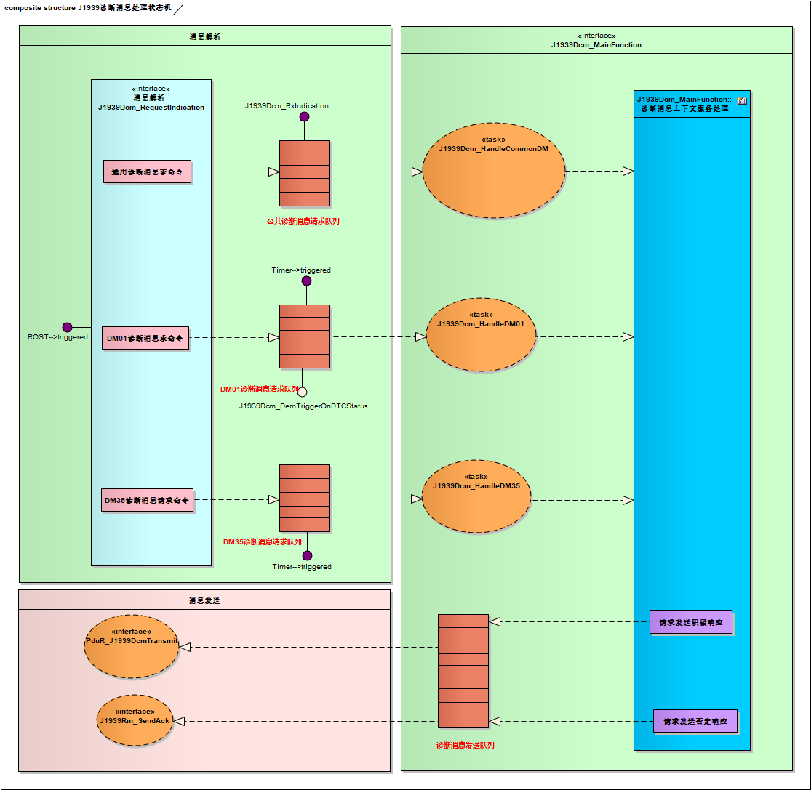

   J1939Dcm模块中的诊断消息处理流程流程图

诊断消息的接受请求报文格式：RQST(Request message format for receiving diagnostic messages: RQST)
~~~~~~~~~~~~~~~~~~~~~~~~~~~~~~~~~~~~~~~~~~~~~~~~~~~~~~~~~~~~~~~~~~~~~~~~~~~~~~~~~~~~~~~~~~~~~~~~~~~

.. table:: Request
   :name: Request
   :align: left

   +-------------------------------+--------------------------------------------------------------------------------------------------------+
   | Parameter Group Name:         | Request (RQST)                                                                                         |
   +===============================+========================================================================================================+
   | Definition:                   | Used to request a Parameter Group from a network device or devices.                                    |
   +-------------------------------+--------------------------------------------------------------------------------------------------------+
   | Transmission repetition rate: | Per user requirements, generally recommended that requests occur no more than 2 or 3 times per second. |
   +-------------------------------+--------------------------------------------------------------------------------------------------------+
   | Data length:                  | 3 bytes (The CAN frame for this PG shall set the DLC to 3)                                             |
   +-------------------------------+--------------------------------------------------------------------------------------------------------+
   | Extended Data Page:           | 0                                                                                                      |
   +-------------------------------+--------------------------------------------------------------------------------------------------------+
   | Data page:                    | 0                                                                                                      |
   +-------------------------------+--------------------------------------------------------------------------------------------------------+
   | PDU Format:                   | 234                                                                                                    |
   +-------------------------------+--------------------------------------------------------------------------------------------------------+
   | PDU Specific:                 | Destination Address (global or specific)                                                               |
   +-------------------------------+--------------------------------------------------------------------------------------------------------+
   | Default priority:             | 6                                                                                                      |
   +-------------------------------+--------------------------------------------------------------------------------------------------------+
   | Parameter Group Number:       | 59904 (0xEA00)                                                                                         |
   +-------------------------------+----------------+---------------------------------------------------------------------------------------+
   | Byte: 0-2                     | PGN            | LSB of PGN being requested (most significant at bit 8)                                |
   |                               |                +---------------------------------------------------------------------------------------+
   |                               |                | Second byte of PGN being requested (most significant at bit 8)                        |
   |                               |                +---------------------------------------------------------------------------------------+
   |                               |                | MSB of PGN being requested (most significant at bit 8)                                |
   +-------------------------------+----------------+---------------------------------------------------------------------------------------+

诊断消息的发送确认报文格式：ACKM(Diagnostic message sending acknowledgment message format: ACKM)
~~~~~~~~~~~~~~~~~~~~~~~~~~~~~~~~~~~~~~~~~~~~~~~~~~~~~~~~~~~~~~~~~~~~~~~~~~~~~~~~~~~~~~~~~~~~~~~~~~~~~

.. table:: Acknowledgment
   :name: Acknowledgment
   :align: left

   +-------------------------------+--------------------------------------------------------------------------------------------------------+
   | Parameter Group Name:         | Acknowledgment (ACKM)                                                                                  |
   +===============================+========================================================================================================+
   | Definition:                   | The Acknowledgment PG is used to provide a handshake mechanism between transmitting and receiving      |
   |                               | devices. See Table 5 and notes to Table 5 for further information about using the Acknowledgement PG.  |
   +-------------------------------+--------------------------------------------------------------------------------------------------------+
   | Transmission repetition rate: | Upon reception of a PGN that requires this form of acknowledgment.                                     |
   +-------------------------------+--------------------------------------------------------------------------------------------------------+
   | Data length:                  | 8 bytes                                                                                                |
   +-------------------------------+--------------------------------------------------------------------------------------------------------+
   | Extended Data Page:           | 0                                                                                                      |
   +-------------------------------+--------------------------------------------------------------------------------------------------------+
   | Data page:                    | 0                                                                                                      |
   +-------------------------------+--------------------------------------------------------------------------------------------------------+
   | PDU Format:                   | 232                                                                                                    |
   +-------------------------------+--------------------------------------------------------------------------------------------------------+
   | PDU Specific:                 | Destination Address2 = Global (255)                                                                    |
   +-------------------------------+--------------------------------------------------------------------------------------------------------+
   | Default priority:             | 6                                                                                                      |
   +-------------------------------+--------------------------------------------------------------------------------------------------------+
   | Parameter Group Number:       | 59392 (0xE800)                                                                                         |
   +-------------------------------+-----------------------+-----------+--------------------------------------------------------------------+
   | Byte: 0                       | Control byte          | 0         | Positive Acknowledgment (ACK)                                      |
   |                               |                       +-----------+--------------------------------------------------------------------+
   |                               |                       | 1         | Negative Acknowledgment (NACK)                                     |
   |                               |                       +-----------+--------------------------------------------------------------------+
   |                               |                       | 2         | Access Denied                                                      |
   |                               |                       +-----------+--------------------------------------------------------------------+
   |                               |                       | 3         | Cannot Respond                                                     |
   |                               |                       +-----------+--------------------------------------------------------------------+       
   |                               |                       | 4 to 127  | Reserved for assignment by SAE                                     |
   +-------------------------------+-----------------------+-----------+--------------------------------------------------------------------+
   | Byte: 1                       | Group Function Value  | 0 to 250  | Definition is specific to the individual PG, when applicable.      |
   +-------------------------------+-----------------------+-----------+--------------------------------------------------------------------+
   | Byte: 2-4                     | Reserved              | 255       | Reserved for assignment by SAE                                     |
   +-------------------------------+-----------------------+-----------+--------------------------------------------------------------------+
   | Byte: 5-7                     | PGN                   | MSB of PGN being sent (most significant at bit 8)                              |
   |                               |                       +--------------------------------------------------------------------------------+
   |                               |                       | Second byte of PGN being sent (most significant at bit 8)                      |
   |                               |                       +--------------------------------------------------------------------------------+
   |                               |                       | MSB of PGN being sent (most significant at bit 8)                              |
   +-------------------------------+-----------------------+--------------------------------------------------------------------------------+

诊断消息的接受请求报文格式：RQST2(Format of request message for receiving diagnostic messages: RQST2)
~~~~~~~~~~~~~~~~~~~~~~~~~~~~~~~~~~~~~~~~~~~~~~~~~~~~~~~~~~~~~~~~~~~~~~~~~~~~~~~~~~~~~~~~~~~~~~~~~~~~~~~~

.. table:: Request2
   :name: Request2
   :align: left

   +-------------------------------+----------------------------------------------------------------------------------------------------------------+
   | Parameter Group Name:         | Request2 (RQST2)                                                                                               |
   +===============================+================================================================================================================+
   | Definition:                   | Used to Request a PG from network device or devices and to specify                                             |
   |                               | whether the response should use the Transfer PGN or not.                                                       |
   +-------------------------------+----------------------------------------------------------------------------------------------------------------+
   | Transmission repetition rate: | Per user requirements, generally recommended that requests occur no more than 2 or 3 times per second.         |
   |                               | When a device supports Request2, a NACK is required if the PGN requested from a specific DA is not supported.  |
   +-------------------------------+----------------------------------------------------------------------------------------------------------------+
   | Data length:                  | 8 bytes (multipacket supported)                                                                                |
   +-------------------------------+----------------------------------------------------------------------------------------------------------------+
   | Extended Data Page:           | 0                                                                                                              |
   +-------------------------------+----------------------------------------------------------------------------------------------------------------+
   | Data page:                    | 0                                                                                                              |
   +-------------------------------+----------------------------------------------------------------------------------------------------------------+
   | PDU Format:                   | 201                                                                                                            |
   +-------------------------------+----------------------------------------------------------------------------------------------------------------+
   | PDU Specific:                 | Destination Address (global or specific)                                                                       |
   +-------------------------------+----------------------------------------------------------------------------------------------------------------+
   | Default priority:             | 6                                                                                                              |
   +-------------------------------+----------------------------------------------------------------------------------------------------------------+
   | Parameter Group Number:       | 51456 (0xC900)                                                                                                 |
   +-------------------------------+----------------------+-----------------------------------------------------------------------------------------+
   | Byte: 0-2                     | Requested PGN        | LSB of PGN being requested (most significant at bit 8)                                  |
   |                               |                      +-----------------------------------------------------------------------------------------+
   |                               |                      | Second byte of PGN being requested (most significant at bit 8)                          |
   |                               |                      +-----------------------------------------------------------------------------------------+
   |                               |                      | MSB of PGN being requested (most significant at bit 8)                                  |
   +-------------------------------+----------------------+---------------+-------------------------------------------------------------------------+
   | Byte: 3                       | Special Instructions | Bits 8 to 6:  | Reserved for SAE assignment                                             |
   |                               |                      +---------------+-------------------------------------------------------------------------+
   |                               |                      | Bits 5 to 3:  | Control Indicating Extended Identifier Type                             |
   |                               |                      +---------------+-------------------------------------------------------------------------+
   |                               |                      | Bits 2 to 1:  | Use Transfer PGN for response(00b=No,01b=Yes,10b=undefined,11b=NA)      |
   +-------------------------------+----------------------+---------------+-------------------------------------------------------------------------+
   | Byte: 4-6                     | ExtId                | Extended Identifier Byte 1                                                              |
   |                               |                      +-----------------------------------------------------------------------------------------+
   |                               |                      | Extended Identifier Byte 2                                                              |
   |                               |                      +-----------------------------------------------------------------------------------------+
   |                               |                      | Extended Identifier Byte 3                                                              |
   +-------------------------------+----------------------+-----------------------------------------------------------------------------------------+
   | Byte: 7                       | Reserved             | Reserved for SAE assignment                                                             |
   +-------------------------------+----------------------+-----------------------------------------------------------------------------------------+

备注：RQST2只支持J1939Rm转发到Com的通信请求，并不支持J1939Rm转发到J1939Dcm的诊断请求（RQST2 only supports the communication request of J1939Rm being forwarded to Com, but does not support the diagnostic request of J1939Rm being forwarded to J1939Dcm）。
  
诊断消息用于定期广播和报告当前激活DTC：DM01(Diagnostic messages are used for periodic broadcasting and reporting the currently active DTC: DM01)
~~~~~~~~~~~~~~~~~~~~~~~~~~~~~~~~~~~~~~~~~~~~~~~~~~~~~~~~~~~~~~~~~~~~~~~~~~~~~~~~~~~~~~~~~~~~~~~~~~~~~~~~~~~~~~~~~~~~~~~~~~~~~~~~~~~~~~~~~~~~~~~~~~~~~~

.. list-table::
   :header-rows: 1
   :stub-columns: 1

   * - 序号(Serial Number)
     - 详细描述(Detailed description)
	
   * - 1.
     - DM01用于定期广播和改变给定ECU的激活DTC和总结灯状态。(DM01 is used to periodically broadcast and change the activated DTC and summary lamp status of a given ECU.)
   * - 2.
     - 当J1939Dcm模块通过回调函数J1939Dcm_RequestIndication接收到接收到DM01请求（参数requestedPgn来源于支持诊断消息表中的相应PGN表列）后, 锁定专用的DM01缓冲区，并使用通用的DTC状态序列，并将参数DTCStatusFilter设置为DEM_J1939DTC_ACTIVE，参数DTCKind设置为DEM_DTC_KIND_ALL_DTCS。(When the J1939Dcm module receives a DM01 request through the callback function J1939Dcm_RequestIndication (the parameter requestedPgn comes from the corresponding PGN column in the supported diagnostic message table), it locks the dedicated DM01 buffer, uses the general DTC status sequence, and sets the parameter DTCStatusFilter to DEM_J1939DTC_ACTIVE and the parameter DTCKind to DEM_DTC_KIND_ALL_DTCS.)
   * - 3.
     - 通过调用Dem_J1939DcmSetDTCFilter告知Dem想要获取的数据类型，同时得到当前的灯状态。(By calling Dem_J1939DcmSetDTCFilter to indicate the type of data Dem wants to obtain, the current status of the indicator lights is also obtained.)
   * - 4.
     - 持续调用Dem_J1939DcmGetNextFilteredDTC获取DTC值与发生次数OC，当API返回DEM_FILTERED_NO_MATCHING_ELEMENT则认为当前DMx数据获取结束，并触发PduR_J1939DcmTransmit来发送DM01诊断消息。(Continuously call Dem_J1939DcmGetNextFilteredDTC to obtain DTC values and occurrence counts (OC). When the API returns DEM_FILTERED_NO_MATCHING_ELEMENT, it is considered that the current DMx data retrieval has ended, and PduR_J1939DcmTransmit is triggered to send the DM01 diagnostic message.)
   * - 5.
     - J1939Dcm锁定专用DM01缓冲区，根据SAEJ1939-73收集该缓冲区中所有激活的DTC和指示灯状态，并发送周期为1秒的DM01消息；无论是否存在故障都会进行广播；相应的DTC在解除后被会锁存3个周期。(J1939 Dcm locks the dedicated DM01 buffer, collects all active DTCs and indicator lamp statuses in this buffer according to SAE J1939-73, and sends DM01 messages with a period of 1 second; broadcasting occurs regardless of whether a fault exists; the corresponding DTCs are latched for 3 cycles after being cleared.)
   * - 6.
     - J1939Dcm为并行DM01处理提供J1939DcmDM01BufferSize大小的缓冲区。(J1939Dcm provides a buffer of size J1939DcmDM01BufferSize for parallel DM01 processing.)
   * - 7.
     - 当Dem调用J1939Dcm_DemTriggerOnDTCStatus触发DM01的请求时，所有已配置通道的上报ClientId对应的J1939DcmNmNodeRef发送DM01消息。(When Dem calls J1939Dcm_DemTriggerOnDTCStatus to trigger a DM01 request, the J1939DcmNmNodeRef corresponding to the reporting ClientId of all configured channels sends the DM01 message.)
   * - 8.
     - 返回值J1939DTC和OccurenceCounter根据SAE J1939-73编码到DM01布局中。(The return value J1939 DTC and Occurrence Counter are encoded into the DM01 layout according to SAE J1939-73.)
   * - 9.
     - J1939DcmDM01MaxDTCs参数中配置的DTC传输完成后，停止传输。(After the DTCs configured in the J1939DcmDM01MaxDTCs parameter are transmitted, stop the transmission.)

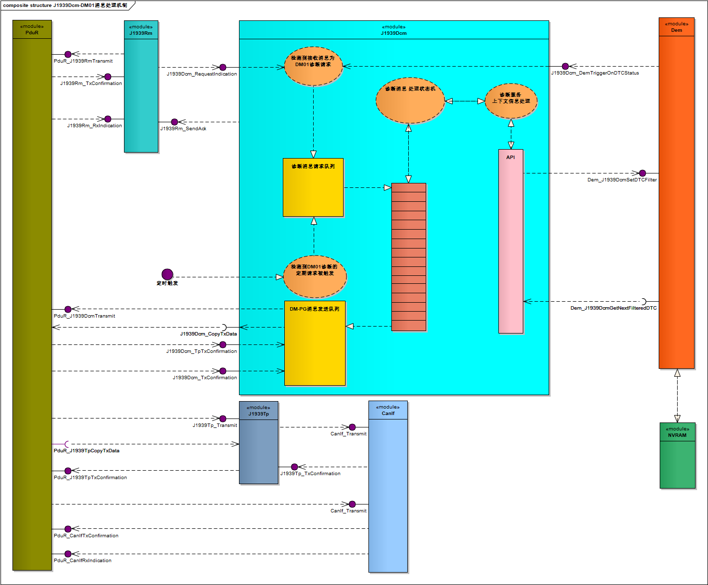

   J1939Dcm模块中的DM01诊断消息处理流程流程图

The Describes that the message format for Active Diagnostic Trouble Codes:

.. table:: ActiveDiagnosticTroubleCodes
   :name: ActiveDiagnosticTroubleCodes
   :align: left

   +---------------------------+-------------------------------------------------------------------------------------+
   |   Transmission Rate       | On request using PGN 59904(0xEA00)                                                  |
   |                           +-------------------------------------------------------------------------------------+
   |                           | DM01 shall be broadcast at 1.0 Hz Rate                                              |
   |                           +-------------------------------------------------------------------------------------+
   |                           | On triggered using Dem                                                              |
   |                           +-------------------------------------------------------------------------------------+
   |                           | A NACK is required if PG is not supported and it was a destination specific request |
   +===========================+=====================================================================================+
   |   Data Length             | Variable                                                                            |
   +---------------------------+-------------------------------------------------------------------------------------+
   |   Extended Data Page      | 0                                                                                   |
   +---------------------------+-------------------------------------------------------------------------------------+
   |   Data page               | 0                                                                                   |
   +---------------------------+-------------------------------------------------------------------------------------+
   |   PDU Format              | 254                                                                                 |
   +---------------------------+-------------------------------------------------------------------------------------+
   |   PDU Specific            | 202                                                                                 |
   +---------------------------+-------------------------------------------------------------------------------------+
   |   Default Priority        | 6                                                                                   |
   +---------------------------+-------------------------------------------------------------------------------------+
   |   Parameter Group Number  | 65226(0xFECA)                                                                       |
   +---------------------------+----------------+--------------------------------------------------------------------+
   |   Byte: 0                 | bits: 7-6      | Malfunction Indicator Lamp                                         |
   |                           +----------------+--------------------------------------------------------------------+ 
   |                           | bits: 5-4      | Red Stop Lamp                                                      |
   |                           +----------------+--------------------------------------------------------------------+
   |                           | bits: 3-2      | Amber Warning Lamp                                                 |
   |                           +----------------+--------------------------------------------------------------------+
   |                           | bits: 1-0      | Protect Lamp                                                       |
   +---------------------------+----------------+--------------------------------------------------------------------+
   |   Byte: 1                 | bits: 8-7      | Flash Malfunction Indicator Lamp                                   |
   |                           +----------------+--------------------------------------------------------------------+ 
   |                           | bits: 5-4      | Flash Red Stop Lamp                                                |
   |                           +----------------+--------------------------------------------------------------------+
   |                           | bits: 3-2      | Flash Amber Warning Lamp                                           |
   |                           +----------------+--------------------------------------------------------------------+
   |                           | bits: 1-0      | Flash Protect Lamp                                                 |
   +---------------------------+----------------+--------------------------------------------------------------------+
   |   Byte: 2                 | bits: 8-1      | SPN, 8 least significant bits of SPN                               |
   +---------------------------+----------------+--------------------------------------------------------------------+
   |   Byte: 3                 | bits: 8-1      | SPN, second byte of SPN                                            |
   +---------------------------+----------------+--------------------------------------------------------------------+
   |   Byte: 4                 | bits: 7-5      | SPN, 3 most significant bits                                       |
   |                           +----------------+--------------------------------------------------------------------+
   |                           | bits: 4-0      | FMI                                                                |
   +---------------------------+----------------+--------------------------------------------------------------------+
   |   Byte: 5                 | bit: 7         | SPN Conversion Method                                              |
   |                           +----------------+--------------------------------------------------------------------+
   |                           | bits: 6-0      | Occurrence Count                                                   |
   +---------------------------+----------------+--------------------------------------------------------------------+

诊断消息用于报告历史激活DTC：DM02(Diagnostic messages are used to report historical active DTCs: DM02)
~~~~~~~~~~~~~~~~~~~~~~~~~~~~~~~~~~~~~~~~~~~~~~~~~~~~~~~~~~~~~~~~~~~~~~~~~~~~~~~~~~~~~~~~~~~~~~~~~~~~~~~~~

.. list-table::
   :header-rows: 1
   :stub-columns: 1

   * - 序号(Serial Number)
     - 详细描述(Detailed description)

   * - 1.
     - DM02消息报告历史激活的DTC。(DM02 message reports historically active DTCs.)
   * - 2.
     - 当J1939Dcm模块通过回调函数J1939Dcm_RequestIndication接收到DM02请求时（参数requestedPgn来源于支持诊断消息表中的相应PGN表列），J1939Dcm将使用通用的DTC状态序列，并将参数DTCStatusFilter设置为DEM_J1939DTC_PREVIOUSLY_ACTIVE，参数DTCKind设置为DEM_DTC_KIND_ALL_DTCS。(When the J1939Dcm module receives a DM02 request through the callback function J1939Dcm_RequestIndication (the parameter requestedPgn comes from the corresponding PGN column in the supported diagnostic message table), J1939Dcm will use the general DTC status sequence, set the parameter DTCStatusFilter to DEM_J1939DTC_PREVIOUSLY_ACTIVE, and set the parameter DTCKind to DEM_DTC_KIND_ALL_DTCS.)
   * - 3.
     - 通过调用Dem_J1939DcmSetDTCFilter告知Dem想要获取的数据类型，同时得到当前的灯状态。(By calling Dem_J1939DcmSetDTCFilter to indicate the type of data Dem wants to obtain, the current status of the indicator lights is also obtained.)
   * - 4.
     - 持续调用Dem_J1939DcmGetNextFilteredDTC获取DTC值与发生次数，当API返回DEM_FILTERED_NO_MATCHING_ELEMENT则认为当前DMx数据获取结束，并触发PduR_J1939DcmTransmit来发送DM01诊断消息。 (Continuously call Dem_J1939DcmGetNextFilteredDTC to obtain DTC values and occurrence counts. When the API returns DEM_FILTERED_NO_MATCHING_ELEMENT, it is considered that the current DMx data acquisition has ended, and PduR_J1939DcmTransmit is triggered to send the DM01 diagnostic message.)
   * - 5.
     - 返回值J1939DTC和OccurenceCounter应按照SAE J1939-73编码到DM02布局中。(The return values J1939 DTC and Occurrence Counter should be encoded into the DM02 layout according to SAE J1939-73.)
   * - 6.
     - 通过1939Tp发送所有激活过的DTC。(Send all activated DTCs via 1939Tp.)

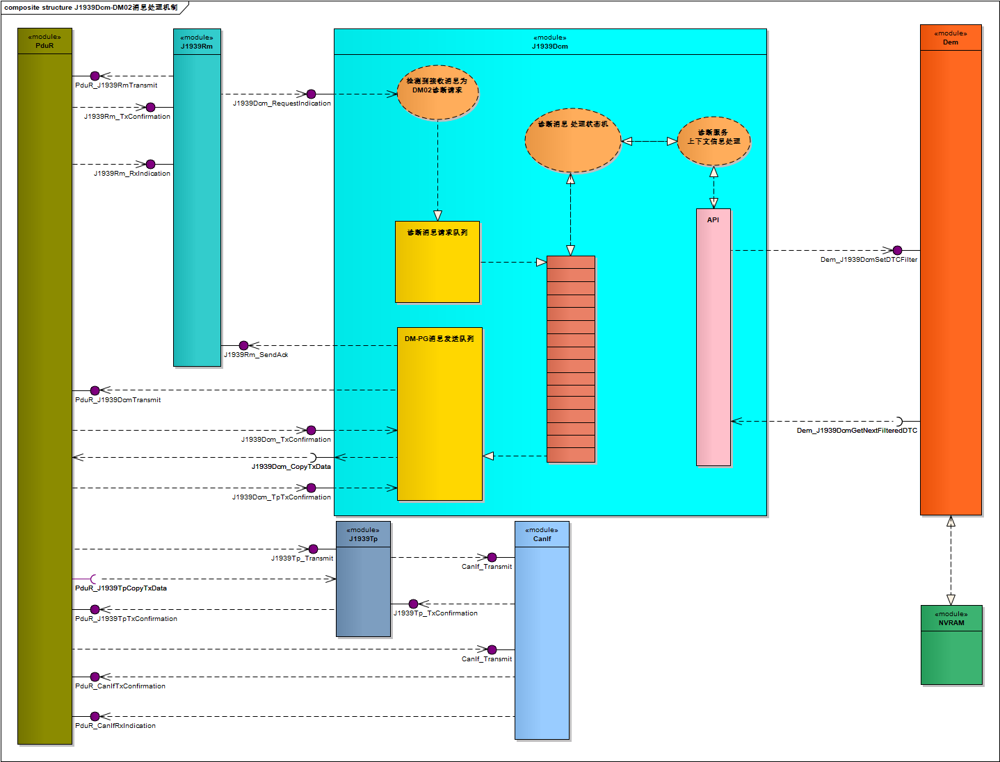

   J1939Dcm模块中的DM02诊断消息处理流程流程图

The Describes that the message format for Previously Active Diagnostic Trouble Codes:

.. table:: PreviouslyActiveDiagnosticTroubleCodes
   :name: PreviouslyActiveDiagnosticTroubleCodes
   :align: left

   +---------------------------+-------------------------------------------------------------------------------------+
   |   Transmission Rate       | On request using PGN 59904(0xEA00)                                                  |
   |                           +-------------------------------------------------------------------------------------+
   |                           | A NACK is required if PG is not supported and it was a destination specific request |
   +===========================+=====================================================================================+
   |   Data Length             | Variable                                                                            |
   +---------------------------+-------------------------------------------------------------------------------------+
   |   Extended Data Page      | 0                                                                                   |
   +---------------------------+-------------------------------------------------------------------------------------+
   |   Data page               | 0                                                                                   |
   +---------------------------+-------------------------------------------------------------------------------------+
   |   PDU Format              | 254                                                                                 |
   +---------------------------+-------------------------------------------------------------------------------------+
   |   PDU Specific            | 203                                                                                 |
   +---------------------------+-------------------------------------------------------------------------------------+
   |   Default Priority        | 6                                                                                   |
   +---------------------------+-------------------------------------------------------------------------------------+
   |   Parameter Group Number  | 65227(0xFECB)                                                                       |
   +---------------------------+----------------+--------------------------------------------------------------------+
   |   Byte: 0                 | bits: 7-6      | Malfunction Indicator Lamp                                         |
   |                           +----------------+--------------------------------------------------------------------+ 
   |                           | bits: 5-4      | Red Stop Lamp                                                      |
   |                           +----------------+--------------------------------------------------------------------+
   |                           | bits: 3-2      | Amber Warning Lamp                                                 |
   |                           +----------------+--------------------------------------------------------------------+
   |                           | bits: 1-0      | Protect Lamp                                                       |
   +---------------------------+----------------+--------------------------------------------------------------------+
   |   Byte: 1                 | bits: 7-6      | Flash Malfunction Indicator Lamp                                   |
   |                           +----------------+--------------------------------------------------------------------+ 
   |                           | bits: 5-4      | Flash Red Stop Lamp                                                |
   |                           +----------------+--------------------------------------------------------------------+
   |                           | bits: 3-2      | Flash Amber Warning Lamp                                           |
   |                           +----------------+--------------------------------------------------------------------+
   |                           | bits: 1-0      | Flash Protect Lamp                                                 |
   +---------------------------+----------------+--------------------------------------------------------------------+
   |   Byte: 2                 | bits: 7-0      | SPN, 8 least significant bits of SPN                               |
   +---------------------------+----------------+--------------------------------------------------------------------+
   |   Byte: 3                 | bits: 7-0      | SPN, second byte of SPN                                            |
   +---------------------------+----------------+--------------------------------------------------------------------+
   |   Byte: 4                 | bits: 7-5      | SPN, 3 most significant bits                                       |
   |                           +----------------+--------------------------------------------------------------------+
   |                           | bits: 4-0      | FMI                                                                |
   +---------------------------+----------------+--------------------------------------------------------------------+
   |   Byte: 5                 | bit: 7         | SPN Conversion Method                                              |
   |                           +----------------+--------------------------------------------------------------------+
   |                           | bits: 6-0      | Occurrence Count                                                   |
   +---------------------------+----------------+--------------------------------------------------------------------+

诊断消息用于历史激活DTC的诊断数据清除/重置：DM03(Diagnostic messages are used for clearing/resetting diagnostic data of historically activated DTCs: DM03)
~~~~~~~~~~~~~~~~~~~~~~~~~~~~~~~~~~~~~~~~~~~~~~~~~~~~~~~~~~~~~~~~~~~~~~~~~~~~~~~~~~~~~~~~~~~~~~~~~~~~~~~~~~~~~~~~~~~~~~~~~~~~~~~~~~~~~~~~~~~~~~~~~~~~~~~~~~

.. list-table::
   :header-rows: 1
   :stub-columns: 1

   * - 序号(Serial Number)
     - 详细描述(Detailed description)

   * - 1.
     - DM03消息清除先前激活的DTC。
   * - 2.
     - 当J1939Dcm模块通过回调函数J1939Dcm_RequestIndication接收到DM03请求时（参数requestedPgn来源于支持诊断消息表中的相应PGN表列），J1939Dcm将触发Dem_J1939DcmClearDTC，并将参数DTCTypeFilter设置为DEM_J1939DTC_CLEAR_PREVIOUSLY_ACTIVE。(When the J1939Dcm module receives a DM03 request through the callback function J1939Dcm_RequestIndication (the parameter requestedPgn comes from the corresponding PGN column in the supported diagnostic message table), J1939Dcm will trigger Dem_J1939DcmClearDTC and set the parameter DTCTypeFilter to DEM_J1939DTC_CLEAR_PREVIOUSLY_ACTIVE.)
   * - 3.
     - 如果函数Dem_J1939DcmClearDTC的返回值为DEM_PENDING，则J1939Dcm将在下一次调用J1939Dcm_MainFunction时重新触发Dem_J1939DcmClearDTC， 参数DTCTypeFilter设置为DEM_J1939DTC_CLEAR_PREVIOUSLY_ACTIVE。(If the return value of the function Dem_J1939DcmClearDTC is DEM_PENDING, then J1939Dcm will retrigger Dem_J1939DcmClearDTC the next time J1939Dcm_MainFunction is called, with the parameter DTCTypeFilter set to DEM_J1939DTC_CLEAR_PREVIOUSLY_ACTIVE.)
   * - 4.
     - 如果函数Dem_J1939DcmClearDTC的返回值为E_OK，则J1939Dcm将通过J1939Rm_SendAck发送一个积极的确认（ACK）， ackCode参数设置为J1939RM_ACK_POSITIVE。(If the return value of the function Dem_J1939DcmClearDTC is E_OK, J1939Dcm will send a positive acknowledgment (ACK) via J1939Rm_SendAck, with the ackCode parameter set to J1939RM_ACK_POSITIVE.)
   * - 5.
     - 如果函数Dem_J1939DcmClearDTC的返回值不是E_OK或DEM_PENDING， J1939Dcm将通过J1939Rm_SendAck发送一个否定确认（NACK），参数ackCode设置为J1939RM_ACK_NEGATIVE。(If the return value of the function Dem_J1939DcmClearDTC is not E_OK or DEM_PENDING, J1939Dcm will send a negative acknowledgment (NACK) via J1939Rm_SendAck, with the parameter ackCode set to J1939RM_ACK_NEGATIVE.)
   * - 6.
     - 清除先前激活过的DTC故障记录；通过调用Dem_J1939DcmClearDTC告知Dem当前需要清除DTC的类型；清除成功与失败调用J1939Rm_SendAck告知请求者执行结果。(Clear previously activated DTC fault records; inform Dem of the type of DTC that needs to be cleared by calling Dem_J1939DcmClearDTC; notify the requester of the execution result upon success or failure by calling J1939Rm_SendAck.)
   * - 7.
     - 如果请求的目的地址是广播的（0xFF），根据SAEJ1939-73，不发送确认。(If the requested destination address is a broadcast (0xFF), according to SAE J1939-73, no acknowledgment is sent.)
   * - 8.
     - 如果请求是目的地特定的，则在完成此操作或没有需要清除的错误时，将发送一个肯定的确认。如果由于某种原因，当接收到目的地特定请求时，设备不能执行所请求的操作，则需要发送否定确认。(If the request is destination-specific, a positive acknowledgment will be sent upon completion of the operation or if there are no errors to be cleared. If, for some reason, the device cannot perform the requested operation when a destination-specific request is received, a negative acknowledgment must be sent.)

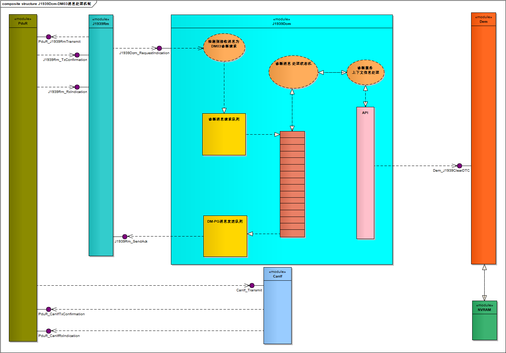

   J1939Dcm模块中的DM03诊断消息处理流程流程图

The Describes that the message format for Diagnostic Data Clear Reset into Previously Active DTCs:

.. table:: DiagnosticDataClearResetforPreviouslyActiveDTCs
   :name: DiagnosticDataClearResetforPreviouslyActiveDTCs
   :align: left

   +---------------------------+-------------------------------------------------------------------------------------+
   |   Transmission Rate       | On request using PGN 59904(0xEA00)                                                  |
   |                           +-------------------------------------------------------------------------------------+
   |                           | A NACK is required if PG is not supported and it was a destination specific request |
   +===========================+=====================================================================================+
   |   Data Length             | 0                                                                                   |
   +---------------------------+-------------------------------------------------------------------------------------+
   |   Extended Data Page      | 0                                                                                   |
   +---------------------------+-------------------------------------------------------------------------------------+
   |   Data page               | 0                                                                                   |
   +---------------------------+-------------------------------------------------------------------------------------+
   |   PDU Format              | 254                                                                                 |
   +---------------------------+-------------------------------------------------------------------------------------+
   |   PDU Specific            | 204                                                                                 |
   +---------------------------+-------------------------------------------------------------------------------------+
   |   Default Priority        | 6                                                                                   |
   +---------------------------+-------------------------------------------------------------------------------------+
   |   Parameter Group Number  | 65228(0xFECC)                                                                       |
   +---------------------------+-------------------------------------------------------------------------------------+

诊断消息用于报告存储的冻结帧参数：DM04(Diagnostic messages are used to report stored freeze frame parameters: DM04)
~~~~~~~~~~~~~~~~~~~~~~~~~~~~~~~~~~~~~~~~~~~~~~~~~~~~~~~~~~~~~~~~~~~~~~~~~~~~~~~~~~~~~~~~~~~~~~~~~~~~~~~~~~~~~~~~~~~~~

.. list-table::
   :header-rows: 1
   :stub-columns: 1

   * - 序号
     - 详细描述

   * - 1.
     - DM04消息报告存储的冻结帧。(DM04 message reports stored freeze frames.)
   * - 2.
     - 当J1939Dcm模块通过回调函数J1939Dcm_RequestIndication接收到DM04请求时（参数requestedPgn来源于支持诊断消息表中的相应PGN表列），J1939Dcm将使用通用的FreezeFrame序列，并将FreezeFrameKind参数设置为DEM_J1939DCM_FREEZEFRAME。(When the J1939Dcm module receives a DM04 request through the callback function J1939Dcm_RequestIndication (with the parameter requestedPgn coming from the corresponding PGN column in the supported diagnostic message table), J1939Dcm will use the generic FreezeFrame sequence and set the FreezeFrameKind parameter to DEM_J1939DCM_FREEZEFRAME.)
   * - 3.
     - 通过调用Dem_J1939DcmSetFreezeFrameFilter告知Dem想要获取的数据类型。(Inform the Dem of the type of data it wants to obtain by calling Dem_J1939DcmSetFreezeFrameFilter.)
   * - 4.
     - 持续调用Dem_J1939DcmGetNextFreezeFrame获取DTC值，发生次数和冻结数据，当API返回DEM_FILTERED_NO_MATCHING_ELEMENT则认为当前DMx数据获取结束，并触发PduR_J1939DcmTransmit来发送DM消息。(Continuously call Dem_J1939DcmGetNextFreezeFrame to obtain DTC values, occurrence counts, and freeze frame data. When the API returns DEM_FILTERED_NO_MATCHING_ELEMENT, it is considered that the current DMx data retrieval has ended, and PduR_J1939DcmTransmit is triggered to send the DM message.)
   * - 5.
     - 发生故障时自动锁存需要的数据以及制造商特定的信息，一个DTC对应一帧冻结帧，冻结帧可以超过8字节，所有冻结帧总共不超过1785字节。(Automatically latch the necessary data and manufacturer-specific information when a fault occurs. One DTC corresponds to one freeze frame, which can exceed 8 bytes, and all freeze frames together do not exceed 1785 bytes.)
   * - 6.
     - 冻结帧被定义为捕获诊断故障代码时记录的参数列表。为每个诊断故障代码记录的冻结帧将首先包含所需的参数，然后是任何制造商特定的信息。(A freeze frame is defined as a list of parameters recorded when a diagnostic trouble code is captured. The freeze frame recorded for each diagnostic trouble code will first include the required parameters, followed by any manufacturer-specific information.)

   J1939Dcm模块中的DM04诊断消息处理流程流程图

The Describes that the message format for FreezeFrame Parameters:

.. table:: FreezeFrameParameters
   :name: FreezeFrameParameters
   :align: left

   +---------------------------+-------------------------------------------------------------------------------------+
   |   Transmission Rate       | On request using PGN 59904(0xEA00)                                                  |
   |                           +-------------------------------------------------------------------------------------+
   |                           | A NACK is required if PG is not supported and it was a destination specific request |
   +===========================+=====================================================================================+
   |   Data Length             | Variable                                                                            |
   +---------------------------+-------------------------------------------------------------------------------------+
   |   Extended Data Page      | 0                                                                                   |
   +---------------------------+-------------------------------------------------------------------------------------+
   |   Data page               | 0                                                                                   |
   +---------------------------+-------------------------------------------------------------------------------------+
   |   PDU Format              | 254                                                                                 |
   +---------------------------+-------------------------------------------------------------------------------------+
   |   PDU Specific            | 205                                                                                 |
   +---------------------------+-------------------------------------------------------------------------------------+
   |   Default Priority        | 6                                                                                   |
   +---------------------------+-------------------------------------------------------------------------------------+
   |   Parameter Group Number  | 65229(0xFECD)                                                                       |
   +---------------------------+-------------------------------------------------------------------------------------+
   |   Byte: 0                 | Freeze Frame Length                                                                 |
   +---------------------------+----------------+--------------------------------------------------------------------+
   |   Byte: 1                 | bits: 7-0      | SPN, 8 least significant bits of SPN                               |
   +---------------------------+----------------+--------------------------------------------------------------------+
   |   Byte: 2                 | bits: 8-1      | SPN, second byte of SPN                                            |
   +---------------------------+----------------+--------------------------------------------------------------------+
   |   Byte: 3                 | bits: 7-5      | SPN, 3 most significant bits                                       |
   |                           +----------------+--------------------------------------------------------------------+
   |                           | bits: 4-0      | FMI                                                                |
   +---------------------------+----------------+--------------------------------------------------------------------+
   |   Byte: 4                 | bit: 7         | SPN Conversion Method                                              |
   |                           +----------------+--------------------------------------------------------------------+
   |                           | bits: 6-0      | Occurrence Count                                                   |
   +---------------------------+-------------------------------------------------------------------------------------+
   |   Byte: 5                 | Engine Torque Mode (SPN 899)                                                        |
   +---------------------------+-------------------------------------------------------------------------------------+
   |   Byte: 6                 | Engine Intake Manifold #1 Pressure (SPN 102)                                        |
   +---------------------------+-------------------------------------------------------------------------------------+
   |   Byte: 7                 | Engine Speed (SPN 190) (LSB)                                                        |
   +---------------------------+-------------------------------------------------------------------------------------+
   |   Byte: 8                 | Engine Speed (SPN 190) (MSB)                                                        |
   +---------------------------+-------------------------------------------------------------------------------------+
   |   Byte: 9                 | Engine Percent Load At Current Speed (SPN 92)See SAE J1939DA                        |
   +---------------------------+-------------------------------------------------------------------------------------+
   |   Byte: 10                | Engine Coolant Temperature (SPN 110)                                                |
   +---------------------------+-------------------------------------------------------------------------------------+
   |   Byte: 11                | Wheel-Based Vehicle Speed (SPN 84) (LSB)See SAE J1939DA                             |
   +---------------------------+-------------------------------------------------------------------------------------+
   |   Byte: 12                | Wheel-Based Vehicle Speed (SPN 84) (MSB)                                            |
   +---------------------------+-------------------------------------------------------------------------------------+
   |   Byte: 13-n              | Manufacturer Specific information                                                   |
   +---------------------------+-------------------------------------------------------------------------------------+

诊断消息用于报告诊断就绪情况1数据：DM05(Diagnostic messages are used to report the diagnostic readiness status 1 data: DM05)
~~~~~~~~~~~~~~~~~~~~~~~~~~~~~~~~~~~~~~~~~~~~~~~~~~~~~~~~~~~~~~~~~~~~~~~~~~~~~~~~~~~~~~~~~~~~~~~~~~~~~~~~~~~~~~~~~~~~~~~~~~~~~~~

.. list-table::
   :header-rows: 1
   :stub-columns: 1

   * - 序号(Serial Number)
     - 详细描述(Detailed description)

   * - 1.
     - DM05消息报告诊断就绪情况1。(DM05 message reports diagnostic readiness status 1.)
   * - 2.
     - 当J1939Dcm模块通过回调函数J1939Dcm_RequestIndication接收到DM05请求时（参数requestedPgn来源于支持诊断消息表中的相应PGN表列），J1939Dcm将在下一个J1939Dcm_MainFunction上使用分配的请求节点的ClientId调用Dem_J1939DcmReadDiagnosticReadiness1。(When the J1939Dcm module receives a DM05 request through the callback function J1939Dcm_RequestIndication (the parameter requestedPgn comes from the corresponding PGN column in the supported diagnostic message table), J1939Dcm will call Dem_J1939DcmReadDiagnosticReadiness1 with the ClientId of the allocated request node in the next J1939Dcm_MainFunction.)
   * - 3.
     - 如果Dem_J1939DcmReadDiagnosticReadiness1函数的返回值为E_OK，则根据SAE J1939-73将返回参数DataValue编码到DM05布局中。之后，调用带有请求消息PduId的PduR_J1939DcmTransmit，并根据请求的源地址设置目的地址（通过元数据），或者当请求的目的地址为0xFF。(If the return value of the Dem_J1939DcmReadDiagnosticReadiness1 function is E_OK, the return parameter DataValue is encoded into the DM05 layout according to SAE J1939-73. Then, PduR_J1939DcmTransmit is called with the request message PduId, and the destination address is set based on the requested source address (via metadata), or when the requested destination address is 0xFF.)
   * - 4.
     - 如果Dem_J1939DcmReadDiagnosticReadiness1函数的返回值不等于E_OK，J1939Dcm将调用J1939Rm_SendAck，参数ackCode设置为J1939RM_ACK_NEGATIVE，发送否定确认（NACK）。(If the return value of the Dem_J1939DcmReadDiagnosticReadiness1 function is not equal to E_OK, J1939Dcm will call J1939Rm_SendAck with the parameter ackCode set to J1939RM_ACK_NEGATIVE to send a negative acknowledgment (NACK).)
   * - 5.
     - 各个ECU模块的连续监测与非连续监测的支持与就绪状态（测试或者自检完成），支持的OBD标准。(Support and readiness status (test or self-check completed) for continuous and non-continuous monitoring of each ECU module, and supported OBD standards.)

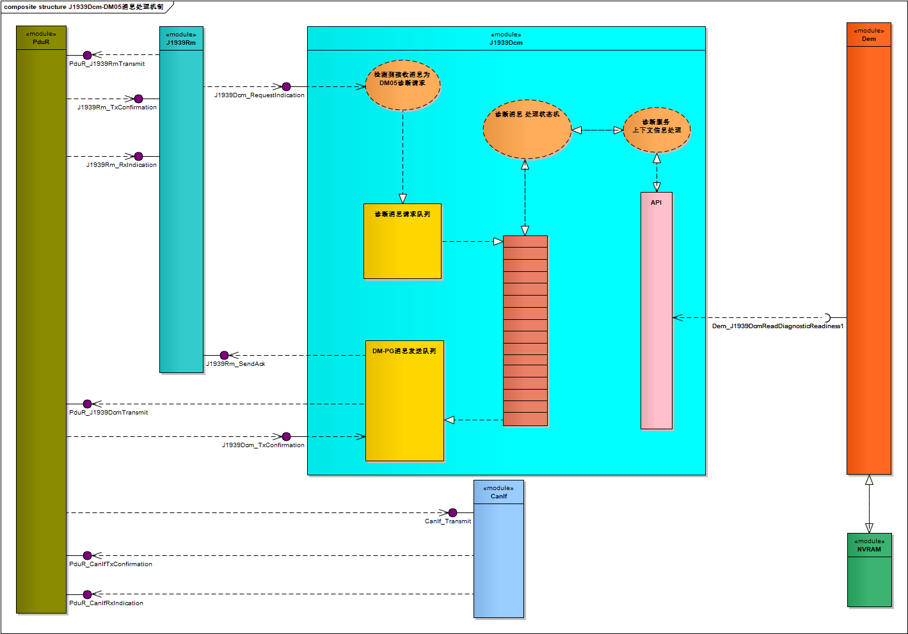

   J1939Dcm模块中的DM05诊断消息处理流程流程图

The Describes that the message format for Diagnostic Readiness 1:

.. table:: DiagnosticReadiness1
   :name: DiagnosticReadiness1
   :align: left

   +---------------------------+-------------------------------------------------------------------------------------+
   |   Transmission Rate       | On request using PGN 59904(0xEA00)                                                  |
   |                           +-------------------------------------------------------------------------------------+
   |                           | A NACK is required if PG is not supported and it was a destination specific request |
   +===========================+=====================================================================================+
   |   Data Length             | 8                                                                                   |
   +---------------------------+-------------------------------------------------------------------------------------+
   |   Extended Data Page      | 0                                                                                   |
   +---------------------------+-------------------------------------------------------------------------------------+
   |   Data page               | 0                                                                                   |
   +---------------------------+-------------------------------------------------------------------------------------+
   |   PDU Format              | 254                                                                                 |
   +---------------------------+-------------------------------------------------------------------------------------+
   |   PDU Specific            | 206                                                                                 |
   +---------------------------+-------------------------------------------------------------------------------------+
   |   Default Priority        | 6                                                                                   |
   +---------------------------+-------------------------------------------------------------------------------------+
   |   Parameter Group Number  | 65230(0xFECE)                                                                       |
   +---------------------------+-------------------------------------------------------------------------------------+
   |   Byte: 0                 | Active Diagnostic Trouble Code Count               | Data Range:  0 to 250          |
   +---------------------------+----------------------------------------------------+--------------------------------+
   |   Byte: 1                 | Previously Active Diagnostic Trouble Code Count    | Data Range:  0 to 250          |
   +---------------------------+----------------------------------------------------+--------------------------------+
   |   Byte: 2                 | OBD Compliance                                     | Data Range:  0 to 250          |
   +---------------------------+----------------------------------------------------+--------------------------------+
   |   Byte: 3                 | Continuously Monitored Systems Support/Status                                       |
   +---------------------------+-------------------------------------------------------------------------------------+
   |   Byte: 4-5               | Non-continuously Monitored Systems Support                                          |
   +---------------------------+-------------------------------------------------------------------------------------+
   |   Byte: 6-7               | Non-continuously Monitored Systems Status                                           |
   +---------------------------+-------------------------------------------------------------------------------------+

诊断消息用于报告与OBD排放相关的待挂DTC：DM06(Diagnostic messages are used to report pending DTCs related to OBD emissions: DM06)
~~~~~~~~~~~~~~~~~~~~~~~~~~~~~~~~~~~~~~~~~~~~~~~~~~~~~~~~~~~~~~~~~~~~~~~~~~~~~~~~~~~~~~~~~~~~~~~~~~~~~~~~~~~~~~~~~~~~~~~~~~~~~~~~~~~

.. list-table::
   :header-rows: 1
   :stub-columns: 1

   * - 序号(Serial Number)
     - 详细描述(Detailed description)

   * - 1.
     - DM06消息报告OBD相关的待挂DTC。(The DM06 message reports OBD-related pending DTCs.)
   * - 2.
     - 当J1939Dcm模块通过回调函数J1939Dcm_RequestIndication接收到DM06请求（参数requestedPgn来源于支持诊断消息表中的相应PGN表列）时，J1939Dcm将使用通用的DTC状态序列，并将参数DTCStatusFilter设置为DEM_J1939DTC_PENDING，参数DTCKind设置为DEM_DTC_KIND_EMISSION_REL_DTCS。(When the J1939Dcm module receives a DM06 request through the callback function J1939Dcm_RequestIndication (the parameter requestedPgn comes from the corresponding PGN column in the supported diagnostic message table), J1939Dcm will use the general DTC status sequence, with the parameter DTCStatusFilter set to DEM_J1939DTC_PENDING and the parameter DTCKind set to DEM_DTC_KIND_EMISSION_REL_DTCS.)
   * - 3.
     - 通过调用Dem_J1939DcmSetDTCFilter告知Dem想要获取的数据类型，同时得到当前的灯状态。(By calling Dem_J1939DcmSetDTCFilter to indicate the type of data Dem wants to obtain, you also get the current status of the lights.)
   * - 4.
     - 持续调用Dem_J1939DcmGetNextFilteredDTC获取DTC值与发生次数，当函数的返回为DEM_FILTERED_NO_MATCHING_ELEMENT时，则认为当前DMx数据获取结束，并触发PduR_J1939DcmTransmit来发送DM消息。(Continuously call Dem_J1939DcmGetNextFilteredDTC to obtain DTC values and occurrence counts. When the function returns DEM_FILTERED_NO_MATCHING_ELEMENT, it is considered that the current DMx data acquisition has ended, and PduR_J1939DcmTransmit is triggered to send the DM message.)
   * - 5.
     - 返回值J1939DTC和OccurenceCounter应按照SAE J1939-73编码到DM06布局中。(The return values J1939 DTC and Occurrence Counter should be encoded into the DM06 layout according to SAE J1939-73.)
   * - 6.
     - 用于外部测试设备获取在一个驾驶周期内发生的与排放相关的未决DTC，便于维修人员确认车辆维修状态。(Used by external testing equipment to obtain emission-related pending DTCs that occur during a driving cycle, making it easier for technicians to confirm the vehicle's repair status.)

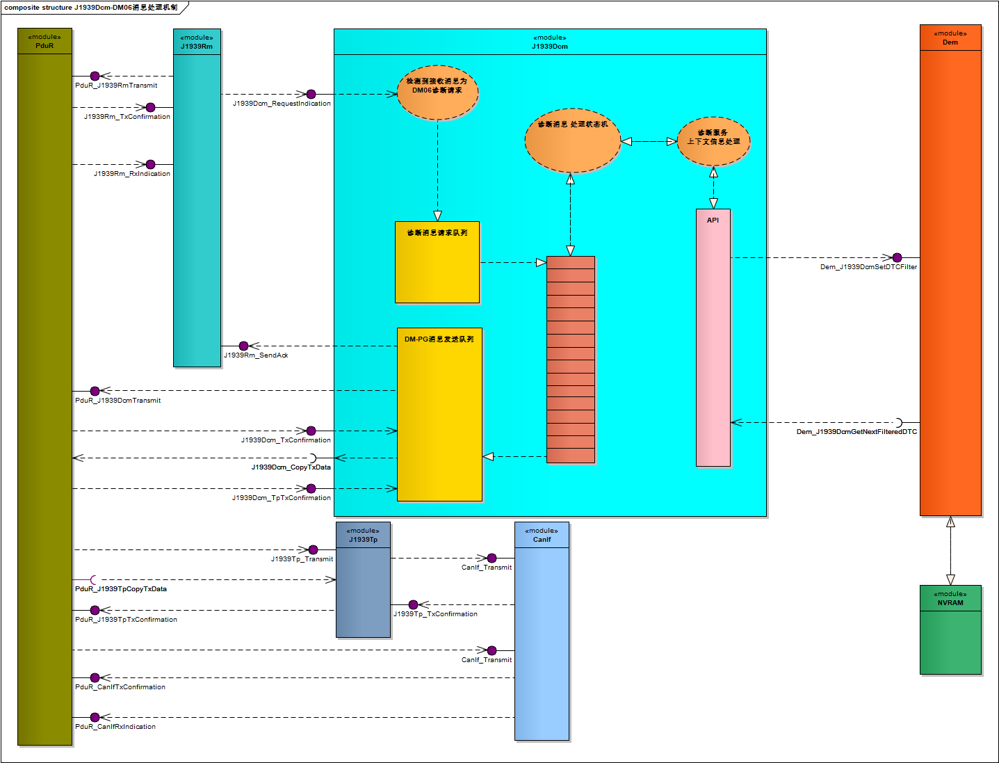

   J1939Dcm模块中的DM06诊断消息处理流程流程图

The Describes that the message format for Emission Related Pending DTCs:

.. table:: EmissionRelatedPendingDTCs
   :name: EmissionRelatedPendingDTCs
   :align: left

   +---------------------------+-------------------------------------------------------------------------------------+
   |   Transmission Rate       | On request using PGN 59904(0xEA00)                                                  |
   |                           +-------------------------------------------------------------------------------------+
   |                           | A NACK is required if PG is not supported and it was a destination specific request |
   +===========================+=====================================================================================+
   |   Data Length             | Variable                                                                            |
   +---------------------------+-------------------------------------------------------------------------------------+
   |   Extended Data Page      | 0                                                                                   |
   +---------------------------+-------------------------------------------------------------------------------------+
   |   Data page               | 0                                                                                   |
   +---------------------------+-------------------------------------------------------------------------------------+
   |   PDU Format              | 254                                                                                 |
   +---------------------------+-------------------------------------------------------------------------------------+
   |   PDU Specific            | 207                                                                                 |
   +---------------------------+-------------------------------------------------------------------------------------+
   |   Default Priority        | 6                                                                                   |
   +---------------------------+-------------------------------------------------------------------------------------+
   |   Parameter Group Number  | 65231(0xFECF)                                                                       |
   +---------------------------+----------------+--------------------------------------------------------------------+
   |   Byte: 0                 | bits: 7-6      | Malfunction Indicator Lamp                                         |
   |                           +----------------+--------------------------------------------------------------------+ 
   |                           | bits: 5-4      | Red Stop Lamp                                                      |
   |                           +----------------+--------------------------------------------------------------------+
   |                           | bits: 3-2      | Amber Warning Lamp                                                 |
   |                           +----------------+--------------------------------------------------------------------+
   |                           | bits: 1-0      | Protect Lamp                                                       |
   +---------------------------+----------------+--------------------------------------------------------------------+
   |   Byte: 1                 | bits: 7-6      | Flash Malfunction Indicator Lamp                                   |
   |                           +----------------+--------------------------------------------------------------------+ 
   |                           | bits: 5-4      | Flash Red Stop Lamp                                                |
   |                           +----------------+--------------------------------------------------------------------+
   |                           | bits: 3-2      | Flash Amber Warning Lamp                                           |
   |                           +----------------+--------------------------------------------------------------------+
   |                           | bits: 1-0      | Flash Protect Lamp                                                 |
   +---------------------------+----------------+--------------------------------------------------------------------+
   |   Byte: 2                 | bits: 7-0      | SPN, 8 least significant bits of SPN                               |
   +---------------------------+----------------+--------------------------------------------------------------------+
   |   Byte: 3                 | bits: 7-0      | SPN, second byte of SPN                                            |
   +---------------------------+----------------+--------------------------------------------------------------------+
   |   Byte: 4                 | bits: 7-5      | SPN, 3 most significant bits                                       |
   |                           +----------------+--------------------------------------------------------------------+
   |                           | bits: 4-0      | FMI                                                                |
   +---------------------------+----------------+--------------------------------------------------------------------+
   |   Byte: 5                 | bit: 7         | SPN Conversion Method                                              |
   |                           +----------------+--------------------------------------------------------------------+
   |                           | bits: 6-0      | Occurrence Count                                                   |
   +---------------------------+----------------+--------------------------------------------------------------------+

诊断消息用于当前激活DTC的诊断数据清除/重置：DM11(Diagnostic messages are used for clearing/resetting diagnostic data of currently active DTCs: DM11)
~~~~~~~~~~~~~~~~~~~~~~~~~~~~~~~~~~~~~~~~~~~~~~~~~~~~~~~~~~~~~~~~~~~~~~~~~~~~~~~~~~~~~~~~~~~~~~~~~~~~~~~~~~~~~~~~~~~~~~~~~~~~~~~~~~~~~~~~~~~~~~~~~~~~~~~

.. list-table::
   :header-rows: 1
   :stub-columns: 1

   * - 序号(Serial Number)
     - 详细描述(Detailed description)

   * - 1.
     - DM11消息至少应该清除与活动DTC相关的所有适用诊断数据。(DM11 messages should at least clear all applicable diagnostic data related to active DTCs.)
   * - 2.
     - 当J1939Dcm模块通过回调函数J1939Dcm_RequestIndication接收到DM11请求时（参数requestedPgn来源于支持诊断消息表中的相应PGN表列），J1939Dcm将触发Dem_J1939DcmClearDTC，并将参数DTCTypeFilter设置为DEM_J1939DTC_CLEAR_ACTIVE。(When the J1939Dcm module receives a DM11 request through the callback function J1939Dcm_RequestIndication (the parameter requestedPgn comes from the corresponding PGN column in the supported diagnostic message table), J1939Dcm will trigger Dem_J1939DcmClearDTC and set the parameter DTCTypeFilter to DEM_J1939DTC_CLEAR_ACTIVE.)
   * - 3.
     - 如果函数Dem_J1939DcmClearDTC函数的返回值为DEM_PENDING，则J1939Dcm将在下次调用J1939Dcm_MainFunction时重新触发Dem_J1939DcmClearDTC，并将参数DTCTypeFilter设置为DEM_J1939DTC_CLEAR_ACTIVE。(If the return value of the function Dem_J1939DcmClearDTC is DEM_PENDING, then J1939Dcm will re-trigger Dem_J1939DcmClearDTC the next time J1939Dcm_MainFunction is called, and the parameter DTCTypeFilter will be set to DEM_J1939DTC_CLEAR_ACTIVE.)
   * - 4.
     - 如果函数Dem_J1939DcmClearDTC函数的返回值为E_OK，则J1939Dcm将通过J1939Rm_SendAck发送一个积极的确认（ACK）， ackCode参数设置为J1939RM_ACK_POSITIVE。(If the return value of the function Dem_J1939DcmClearDTC is E_OK, then J1939Dcm will send a positive acknowledgment (ACK) via J1939Rm_SendAck, with the ackCode parameter set to J1939RM_ACK_POSITIVE.)
   * - 5.
     - 如果函数Dem_J1939DcmClearDTC函数的返回值不是E_OK， J1939Dcm将通过J1939Rm_SendAck发送一个否定确认（NACK），ackCode参数设置为J1939RM_ACK_NEGATIVE。(If the return value of the function Dem_J1939DcmClearDTC is not E_OK, J1939Dcm will send a negative acknowledgment (NACK) via J1939Rm_SendAck, with the ackCode parameter set to J1939RM_ACK_NEGATIVE.)
   * - 6.
     - 如果请求的目的地址是广播的（0xFF），根据SAE J1939-73，不发送确认。(If the requested destination address is a broadcast (0xFF), according to SAE J1939-73, no acknowledgment is sent.)
   * - 7.
     - 清除激活的DTC（所有的，包括先前激活的）以及相关信息（故障次数，就绪状态，冻结帧，指示灯状态，清除DTC后的行驶里程与时间等等）。(Clear the activated DTCs (all of them, including previously activated ones) and related information (fault counts, readiness status, freeze frames, indicator light status, mileage and time after clearing DTCs, etc.).)

   J1939Dcm模块中的DM11诊断消息处理流程流程图

The message format that describe the diagnostic data Clear - reset of the active DTC:

.. table:: DiagnosticDataClearResetforActiveDTCs
   :name: DiagnosticDataClearResetforActiveDTCs
   :align: left

   +---------------------------+-------------------------------------------------------------------------------------+
   |   Transmission Rate       | On request using PGN 59904(0xEA00)                                                  |
   |                           +-------------------------------------------------------------------------------------+
   |                           | A NACK is required if PG is not supported and it was a destination specific request |
   +===========================+=====================================================================================+
   |   Data Length             | 0                                                                                   |
   +---------------------------+-------------------------------------------------------------------------------------+
   |   Extended Data Page      | 0                                                                                   |
   +---------------------------+-------------------------------------------------------------------------------------+
   |   Data page               | 0                                                                                   |
   +---------------------------+-------------------------------------------------------------------------------------+
   |   PDU Format              | 254                                                                                 |
   +---------------------------+-------------------------------------------------------------------------------------+
   |   PDU Specific            | 211                                                                                 |
   +---------------------------+-------------------------------------------------------------------------------------+
   |   Default Priority        | 6                                                                                   |
   +---------------------------+-------------------------------------------------------------------------------------+
   |   Parameter Group Number  | 65235(0xFED3)                                                                       |
   +---------------------------+-------------------------------------------------------------------------------------+

诊断消息用于报告与OBD排放相关的当前激活DTC：DM12(Diagnostic messages are used to report currently active DTCs related to OBD emissions: DM12)
~~~~~~~~~~~~~~~~~~~~~~~~~~~~~~~~~~~~~~~~~~~~~~~~~~~~~~~~~~~~~~~~~~~~~~~~~~~~~~~~~~~~~~~~~~~~~~~~~~~~~~~~~~~~~~~~~~~~~~~~~~~~~~~~~~~~~~~~~~~~~~

.. list-table::
   :header-rows: 1
   :stub-columns: 1

   * - 序号(Serial Number)
     - 详细描述(Detailed description)

   * - 1.
     - DM12消息报告OBD相关的活动DTC。(DM12 message reports OBD-related activity DTCs.)
   * - 2.
     - 当J1939Dcm模块通过回调函数J1939Dcm_RequestIndication接收到DM12请求（参数requestedPgn来源于支持诊断消息表中的相应PGN表列）时，J1939Dcm将使用通用的DTC状态序列，并将参数DTCStatusFilter设置为DEM_J1939DTC_ACTIVE，参数DTCKind设置为DEM_DTC_KIND_EMISSION_REL_DTCS。(When the J1939Dcm module receives a DM12 request through the callback function J1939Dcm_RequestIndication (the parameter requestedPgn comes from the corresponding PGN column in the Supported Diagnostic Message table), J1939Dcm will use the general DTC status sequence, with the parameter DTCStatusFilter set to DEM_J1939DTC_ACTIVE and the parameter DTCKind set to DEM_DTC_KIND_EMISSION_REL_DTCS.)
   * - 3.
     - 通过调用Dem_J1939DcmSetDTCFilter告知Dem想要获取的数据类型，同时得到当前的灯状态。(By calling Dem_J1939DcmSetDTCFilter to indicate the type of data Dem wants to obtain, the current status of the indicator lights is also obtained.)
   * - 4.
     - 持续调用Dem_J1939DcmGetNextFilteredDTC获取DTC值与发生次数，当函数的返回DEM_FILTERED_NO_MATCHING_ELEMENT则认为当前DMx数据获取结束，并触发PduR_J1939DcmTransmit来发送DM12诊断消息。 (Continuously call Dem_J1939DcmGetNextFilteredDTC to obtain DTC values and their occurrence counts. When the function returns DEM_FILTERED_NO_MATCHING_ELEMENT, it is considered that the current DMx data retrieval has ended, and PduR_J1939DcmTransmit is triggered to send the DM12 diagnostic message.)
   * - 5.
     - 返回值J1939DTC和OccurenceCounter应按照SAE J1939-73编码到DM12布局中。(The return values J1939DTC and OccurrenceCounter should be encoded into the DM12 layout according to SAE J1939-73.)
   * - 6.
     - 当前激活的与排放有关的DTC和Lamp状态。(Currently active emission-related DTCs and lamp statuses.)

   J1939Dcm模块中的DM12诊断消息处理流程流程图

The Describes that the message format for Active DTC related to emissions:

.. table:: EmissionsRelatedActiveDTCs
   :name: EmissionsRelatedActiveDTCs
   :align: left

   +---------------------------+-------------------------------------------------------------------------------------+
   |   Transmission Rate       | On request using PGN 59904(0xEA00)                                                  |
   |                           +-------------------------------------------------------------------------------------+
   |                           | A NACK is required if PG is not supported and it was a destination specific request |
   +===========================+=====================================================================================+
   |   Data Length             | Variable                                                                            |
   +---------------------------+-------------------------------------------------------------------------------------+
   |   Extended Data Page      | 0                                                                                   |
   +---------------------------+-------------------------------------------------------------------------------------+
   |   Data page               | 0                                                                                   |
   +---------------------------+-------------------------------------------------------------------------------------+
   |   PDU Format              | 254                                                                                 |
   +---------------------------+-------------------------------------------------------------------------------------+
   |   PDU Specific            | 212                                                                                 |
   +---------------------------+-------------------------------------------------------------------------------------+
   |   Default Priority        | 6                                                                                   |
   +---------------------------+-------------------------------------------------------------------------------------+
   |   Parameter Group Number  | 65236(0xFED4)                                                                       |
   +---------------------------+----------------+--------------------------------------------------------------------+
   |   Byte: 0                 | bits: 7-6      | Malfunction Indicator Lamp                                         |
   |                           +----------------+--------------------------------------------------------------------+ 
   |                           | bits: 5-4      | Red Stop Lamp                                                      |
   |                           +----------------+--------------------------------------------------------------------+
   |                           | bits: 3-2      | Amber Warning Lamp                                                 |
   |                           +----------------+--------------------------------------------------------------------+
   |                           | bits: 1-0      | Protect Lamp                                                       |
   +---------------------------+----------------+--------------------------------------------------------------------+
   |   Byte: 1                 | bits: 7-6      | Flash Malfunction Indicator Lamp                                   |
   |                           +----------------+--------------------------------------------------------------------+ 
   |                           | bits: 5-4      | Flash Red Stop Lamp                                                |
   |                           +----------------+--------------------------------------------------------------------+
   |                           | bits: 3-2      | Flash Amber Warning Lamp                                           |
   |                           +----------------+--------------------------------------------------------------------+
   |                           | bits: 1-0      | Flash Protect Lamp                                                 |
   +---------------------------+----------------+--------------------------------------------------------------------+
   |   Byte: 2                 | bits: 7-0      | SPN, 8 least significant bits of SPN                               |
   +---------------------------+----------------+--------------------------------------------------------------------+
   |   Byte: 3                 | bits: 7-0      | SPN, second byte of SPN                                            |
   +---------------------------+----------------+--------------------------------------------------------------------+
   |   Byte: 4                 | bits: 7-5      | SPN, 3 most significant bits                                       |
   |                           +----------------+--------------------------------------------------------------------+
   |                           | bits: 4-0      | FMI                                                                |
   +---------------------------+----------------+--------------------------------------------------------------------+
   |   Byte: 5                 | bit: 7         | SPN Conversion Method                                              |
   |                           +----------------+--------------------------------------------------------------------+
   |                           | bits: 6-0      | Occurrence Count                                                   |
   +---------------------------+----------------+--------------------------------------------------------------------+

诊断消息用于停止-启动广播：DM13(Diagnostic message for stop-start broadcast: DM13)
~~~~~~~~~~~~~~~~~~~~~~~~~~~~~~~~~~~~~~~~~~~~~~~~~~~~~~~~~~~~~~~~~~~~~~~~~~~~~~~~~~~~~

.. table:: The following networks are available
   :name: SupportableNetwork
   :align: left

   +--------------------------------------------+--------------------------------------------------------------------+
   | Network type                               | Detailed description                                               |
   +============================================+====================================================================+
   | J1587                                      |                                                                    |
   +--------------------------------------------+--------------------------------------------------------------------+
   | J1922                                      |                                                                    |
   +--------------------------------------------+--------------------------------------------------------------------+
   | J1939 Network #1, Primary vehicle network  |                                                                    |
   +--------------------------------------------+--------------------------------------------------------------------+
   | J1939 Network #2                           |                                                                    |
   +--------------------------------------------+--------------------------------------------------------------------+
   | ISO 9141                                   |                                                                    |
   +--------------------------------------------+--------------------------------------------------------------------+
   | J1850                                      |                                                                    |
   +--------------------------------------------+--------------------------------------------------------------------+
   | Other, Manufacture Specified Port          |                                                                    |
   +--------------------------------------------+--------------------------------------------------------------------+
   | SAE J1939 Network #3                       |                                                                    |
   +--------------------------------------------+--------------------------------------------------------------------+
   | Proprietary Network #1                     |                                                                    |
   +--------------------------------------------+--------------------------------------------------------------------+
   | Proprietary Network #2                     |                                                                    |
   +--------------------------------------------+--------------------------------------------------------------------+
   | Proprietary Network #2                     |                                                                    |
   +--------------------------------------------+--------------------------------------------------------------------+

.. list-table::
   :header-rows: 1
   :stub-columns: 1

   * - 序号(Serial Number)
     - 详细描述(Detailed description)

   * - 1.
     - 方便诊断工具静默网络，进行模拟报文等等，只在零转速和车辆零速时才能发送此请求；ECU在重新上电后就不受约束了，所以需要等上电完再发，应用期间不要重启。(Convenient diagnostic tools can silently network, simulate messages, etc., and this request can only be sent when the engine speed and vehicle speed are both zero; after the ECU is powered on again, it is no longer restricted, so you need to wait until power-up is complete before sending it, and do not restart during use.)
   * - 2.
     - J1939Dcm维护DM13命令报文的广播状态信息；广播状态信息的初始值为所有网络的正常广播模式。(J1939Dcm maintains the broadcast status information of the DM13 command message; the initial value of the broadcast status information is normal broadcast mode for all networks.)
   * - 3.
     - J1939Dcm通过调用J1939Dcm_RxIndication接收到DM13命令消息，RxPduId参数设置为已配置的J1939DcmRxPduId，保持信号设置为不可用时，启动超时监督，并调用BswM_J1939DcmBroadcastStatus获取更新后的广播状态信息。(J1939Dcm receives a DM13 command message by calling J1939Dcm_RxIndication, with the RxPduId parameter set to the configured J1939DcmRxPduId. When the signal is set as unavailable, it starts timeout monitoring and calls BswM_J1939DcmBroadcastStatus to obtain the updated broadcast status information.)
   * - 4.
     - 对于网络“Current Data Link”，接收到的DM13命令报文对应的ComMChannelId决定了上报给BswM的网络位。(For the network 'Current Data Link', the ComMChannelId corresponding to the received DM13 command message determines the network bit reported to the BswM.)
   * - 5.
     - 对于DM13命令消息中的其他总线类型，如果有足够的J1939DcmBusType，则J1939DcmComMChannelRef对应的引用ComMChannelId代表报告给BswM的NetworkMask中的网络位；否则请求将被忽略。(For other bus types in the DM13 command message, if there are enough J1939DcmBusType entries, the J1939DcmComMChannelRef corresponds to the ComMChannelId reference that represents the network bit in the NetworkMask reported to BswM; otherwise, the request will be ignored.)
   * - 6.
     - “Stop Broadcast”将导致提供给BswM的广播状态信息中与网络相关的位为0。("Stop Broadcast" will cause the network-related bits in the broadcast status information provided to BswM to be set to 0.)
   * - 7.
     - “Start Broadcast”将导致提供给BswM的广播状态信息中与网络相关的位为1。("Start Broadcast" will set the network-related bits in the broadcast status information provided to BswM to 1.)
   * - 8.
     - 广播状态信息中与网络相关联的位“Don’t Care/take no action”不更新J1939Dcm内部广播状态信息。(The network-related bits 'Don’t Care/take no action' in the broadcast status information do not update the internal broadcast status information of J1939Dcm.)
   * - 9.
     - J1939Dcm通过调用J1939Dcm_RxIndication接收到DM13命令报文，RxPduId参数设置为已配置的J1939DcmRxPduId，保持信号设置为“所有设备”或“广播状态已修改的设备”，J1939Dcm重启超时监管。(J1939Dcm receives the DM13 command message by calling J1939Dcm_RxIndication, with the RxPduId parameter set to the configured J1939DcmRxPduId, and the signal retention set to 'all devices' or 'broadcast to devices with modified status'. J1939Dcm restarts the timeout supervision.)
   * - 10.
     - 当超时时间超过6秒而没有另一条DM13消息时，通过调用BswM_J1939DcmBroadcastStatus将所有总线设置回广播模式，并提供所有总线设置为1的广播状态信息。(When the timeout exceeds 6 seconds without another DM13 message, all buses are set back to broadcast mode by calling BswM_J1939DcmBroadcastStatus, and broadcast status information with all buses set to 1 is provided.)
   * - 11.
     - 针对COM类型关闭或打开广播消息，Diag类型的诊断广播不在控制范围内；关闭与打开控制需要接收数据的BusType 与Channel 的保持一致；J1939Dcm处理的结果通过 BswM_J1939DcmBroadcastStatus 告知BswM。(Broadcast messages of COM type can be turned off or on, while diagnostic broadcasts of Diag type are not within the control scope; turning off or on requires consistency with the BusType and Channel used to receive data; the results processed by J1939Dcm are communicated to BswM via BswM_J1939DcmBroadcastStatus.)

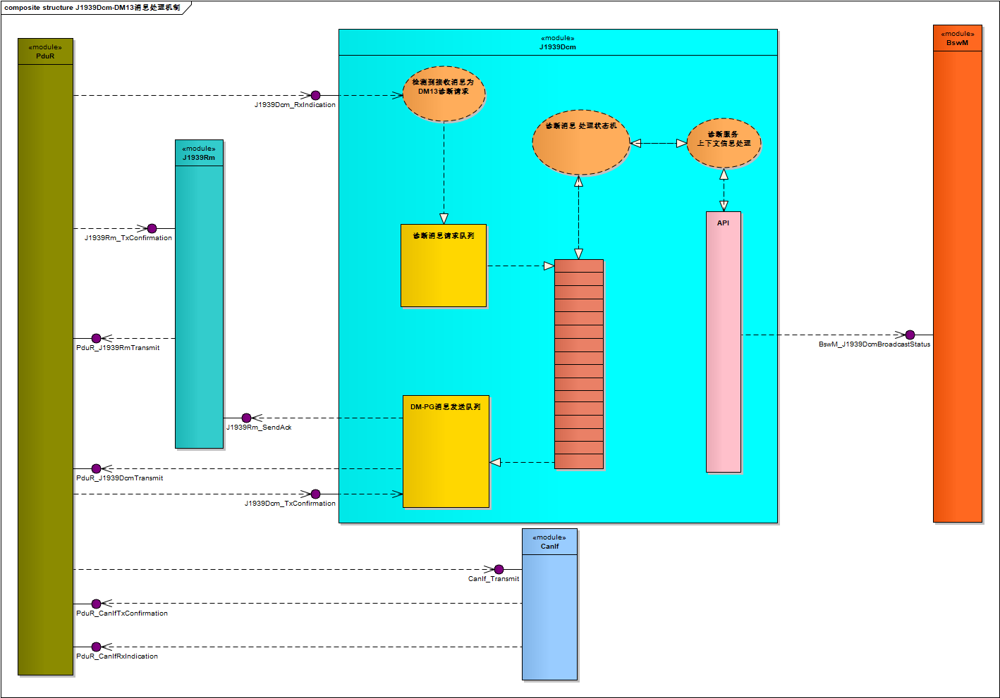

   J1939Dcm模块中的DM13诊断消息处理流程流程图

描述停止与启动广播的消息格式：

Description of the message format for stopping and starting broadcasts:

.. table:: StopStartBroadcast
   :name: StopStartBroadcast
   :align: left

   +---------------------------+-------------------------------------------------------------------------------------------------+
   |   Transmission Rate       | Sent whenever a Stop or Start broadcast event is necessary.                                     |
   |                           | To maintain the modified state of the vehicle network the commanding device                     |
   |                           | must send the Hold Signal once every 5 seconds.                                                 |
   |                           +-------------------------------------------------------------------------------------------------+
   |                           | A NACK is required if PG is not supported                                                       |
   |                           +-------------------------------------------------------------------------------------------------+	
   |                           | Note that the NACK is only provided if PGN 57088 is directed to a specific destination address. |
   +===========================+=================================================================================================+
   |   Data Length             | 8                                                                                               |
   +---------------------------+-------------------------------------------------------------------------------------------------+
   |   Extended Data Page      | 0                                                                                               |
   +---------------------------+-------------------------------------------------------------------------------------------------+
   |   Data page               | 0                                                                                               |
   +---------------------------+-------------------------------------------------------------------------------------------------+
   |   PDU Format              | 223                                                                                             |
   +---------------------------+-------------------------------------------------------------------------------------------------+
   |   PDU Specific            | DA                                                                                              |
   +---------------------------+-------------------------------------------------------------------------------------------------+
   |   Default Priority        | 6                                                                                               |
   +---------------------------+-------------------------------------------------------------------------------------------------+
   |   Parameter Group Number  | 57088(0xDF00)                                                                                   |
   +---------------------------+----------------+-----------------------------------------------+--------------------------------+
   |   Byte: 0                 | bits: 7-6      | Current Data Link                             | Stop Start Broadcast command   |
   |                           +----------------+-----------------------------------------------+--------------------------------+ 
   |                           | bits: 5-4      | J1587 Network                                 | Stop Start Broadcast command   |
   |                           +----------------+-----------------------------------------------+--------------------------------+
   |                           | bits: 3-2      | J1922 Network                                 | Stop Start Broadcast command   |
   |                           +----------------+-----------------------------------------------+--------------------------------+
   |                           | bits: 1-0      | J1939 Network #1, Primary Vehicle Network     | Stop Start Broadcast command   |
   +---------------------------+----------------------------------------------------------------+--------------------------------+
   |   Byte: 1                 | bits: 7-6      | J1939 Network #2                              | Stop Start Broadcast command   |
   |                           +----------------+-----------------------------------------------+--------------------------------+ 
   |                           | bits: 5-4      | ISO 9141 Network                              | Stop Start Broadcast command   |
   |                           +----------------+-----------------------------------------------+--------------------------------+
   |                           | bits: 3-2      | J1850 Network                                 | Stop Start Broadcast command   |
   |                           +----------------+-----------------------------------------------+--------------------------------+
   |                           | bits: 1-0      | Other, Manufacture Specified Port             | Stop Start Broadcast command   |
   +---------------------------+----------------+-----------------------------------------------+--------------------------------+
   |   Byte: 2                 | bits: 7-6      | J1939 Network #3                              | Stop Start Broadcast command   |
   |                           +----------------+-----------------------------------------------+--------------------------------+ 
   |                           | bits: 5-4      | Proprietary Network #1                        | Stop Start Broadcast command   |
   |                           +----------------+-----------------------------------------------+--------------------------------+
   |                           | bits: 3-2      | Proprietary Network #2                        | Stop Start Broadcast command   |
   |                           +----------------+-----------------------------------------------+--------------------------------+
   |                           | bits: 1-0      | J1939 Network #4                              | Stop Start Broadcast command   |
   +---------------------------+----------------+-----------------------------------------------+--------------------------------+
   |   Byte: 3                 | bits: 7-4      | Hold Signal                                                                    |
   |                           +----------------+--------------------------------------------------------------------------------+
   |                           | bits: 3-0      | Suspend Signal                                                                 |
   +---------------------------+----------------+--------------------------------------------------------------------------------+
   |   Byte: 4-5               | bits: 7-0      | Suspend Duration                                                               |
   +---------------------------+----------------+--------------------------------------------------------------------------------+
   |   Byte: 6-7               | bits: 7-0      | SAE Reserved                                                                   |
   +---------------------------+----------------+--------------------------------------------------------------------------------+

用于描述停止-启动广播控制命令中的每个2位字段解析：Stop Start Broadcast command

Used to describe the parsing of each 2-bit field in the Stop-Start Broadcast control command: Stop Start Broadcast command

.. list-table::
   :header-rows: 1
   :stub-columns: 1

   * - 比特位域(Bit field)
     - 标识通信端口上执行的操作(Indicates operations performed on the communication port)

   * - '00'
     - 停止广播(Stop broadcasting)
   * - '01'
     - 启动广播(Start broadcast)
   * - '10'
     - 保留字段(Reserved field)
   * - '11'
     - 不关心/不采取行动(Indifferent / Take no action)

维持信号：Hold Signal

指示所有节点被“停止开始广播”PGN操作的通信端口保持在修改状态。因此，所有节点都应该采取相应的行动。保持信号需要每5秒正负1秒广播一次。请求停止广播的设备必须每5秒发送一次保持信号，如果消息在6秒内没有收到，所有适用的节点将恢复到正常状态。

Instruct all nodes to keep the communication ports that are in the 'stop-start broadcasting' PGN operation in a modified state. Therefore, all nodes should take appropriate action. The keep-alive signal needs to be broadcast every 5 seconds, with a tolerance of plus or minus 1 second. Devices requesting to stop broadcasting must send a keep-alive signal every 5 seconds. If the message is not received within 6 seconds, all applicable nodes will return to normal operation.

.. list-table::
   :header-rows: 1
   :stub-columns: 1

   * - 比特位域(Bit field)
     - 给定维持信号状态-采取行动的设备(Device for maintaining signal status and taking action)

   * - '0000'
     - 所有的设备(All the devices)
   * - '0001'
     - 广播状态被修改的设备(Device with modified broadcast status)
   * - '0010' - '1110'
     - 保留字段(Reserved field)
   * - '1111'
     - 不可用(Unavailable)

挂起信号：Suspend Signal

指示由于DM13命令或其他原因而暂停广播消息的所有节点。因此，接收节点应该暂停对来自发送设备的所有消息的超时诊断。暂停信号只广播一次，但可以根据发射设备的选择重复一次，以便在暂停的第一秒内通过重复一次或两次来增加正确接收的机会。如果能够，发射机还可以发送一个DM13消息，其挂起信号设置为“1110”，以表明它正在返回到完全广播状态。

Indicates that all nodes should suspend broadcast messages due to a DM13 command or other reasons. Therefore, receiving nodes should suspend timeout diagnostics for all messages from the sending device. The suspend signal is broadcast only once, but can be repeated once at the sender's discretion to increase the chance of correct reception during the first second of suspension. If feasible, the transmitter may also send a DM13 message with the suspend signal set to '1110' to indicate that it is returning to full broadcast mode.

用于描述挂起信号控制命令中的4个位字段解析：Suspend Signal command

Used to describe the parsing of the 4-bit field in the suspend signal control command: Suspend Signal command

.. list-table::
   :header-rows: 1
   :stub-columns: 1

   * - 比特位域(Bit field)
     - 给定挂起状态-广播行为动作(Given pending state - broadcast action)

   * - '0000'
     - 无限期挂起所有广播(Suspend all broadcasts indefinitely)
   * - '0001'
     - 无限期挂起某些信息(Indefinitely suspend certain information)
   * - '0010'
     - 挂起所有广播(Suspend all broadcasts)
   * - '0011'
     - 暂时挂起一些消息(Temporarily suspend some messages)
   * - '0100' - '1101'
     - SAE保留(SAE Reserved)
   * - '1110'
     - 恢复正常广播模式(Restore normal broadcast mode)
   * - '1111'
     - 不可用(Unavailable)

挂起时间：Suspend Duration

当发送设备知道广播消息的挂起持续时间时，指示该持续时间。如果发送DM13消息时挂起信号值为0010或0011，则该参数的值表示挂起的持续时间，单位为秒。对于挂起信号值为0000 ~ 0001，挂起持续时间将发送为Not Available，持续时间不确定。接收方将通过发送方重新出现的消息来知道暂停何时结束，无论是无限期暂停还是在发送方被外部命令允许返回到完全广播状态的情况下。如果能够，发射机还可以发送一个DM13消息，其挂起信号设置为“1110”，以表明它正在返回到完全广播状态。

When the sending device knows the pending duration of a broadcast message, it indicates that duration. If the pending signal value is 0010 or 0011 when sending a DM13 message, the value of this parameter represents the pending duration in seconds. For pending signal values 0000 to 0001, the pending duration will be sent as Not Available, and the duration is uncertain. The receiver will know when the pause ends through the message reappearing from the sender, whether it is an indefinite pause or in the case where the sender is allowed by an external command to return to full broadcast mode. If possible, the transmitter can also send a DM13 message with the pending signal set to “1110” to indicate that it is returning to full broadcast mode.

用于描述挂起维持时间的2个字节段域解析：

Parsing of the 2-byte segment field used to describe the pending maintenance time:

.. table:: SuspendDuration
   :name: SuspendDuration
   :align: left

   +---------------------------+--------------------------------------------------------+
   |   Suspend Duration        | Detailed description                                   |
   +===========================+========================================================+
   |   Data Length:            | 2 bytes                                                |
   +---------------------------+--------------------------------------------------------+
   |   Resolution:             | Offset: 0 seconds, 1 sec/bit                           |
   +---------------------------+--------------------------------------------------------+
   |   Data Range:             | 0 to 64,255 seconds (0 to 1070.9 minutes)              |
   +---------------------------+--------------------------------------------------------+
   |   Type:                   | Status                                                 |
   +---------------------------+--------------------------------------------------------+

诊断消息用于报告校准验证号：DM19(Diagnostic message is used to report calibration verification number: DM19)
~~~~~~~~~~~~~~~~~~~~~~~~~~~~~~~~~~~~~~~~~~~~~~~~~~~~~~~~~~~~~~~~~~~~~~~~~~~~~~~~~~~~~~~~~~~~~~~~~~~~~~~~~~~~~~

.. list-table::
   :header-rows: 1
   :stub-columns: 1

   * - 序号(Serial Number)
     - 详细描述(Detailed description)

   * - 1.
     - DM19消息报告校准验证号。(DM19 message reports calibration verification number.)
   * - 2.
     - 当J1939Dcm模块通过回调函数J1939Dcm_RequestIndication接收到DM19请求(参数requestedPgn来源于支持诊断消息表中的相应PGN表列)时, J1939Dcm将触发端口原型J1939Dcm_CalibrationInformation的GetCalibrationVerificationNumber操作来收集CVN。(When the J1939Dcm module receives a DM19 request through the callback function J1939Dcm_RequestIndication (the parameter requestedPgn comes from the corresponding PGN column in the supported diagnostic message table), J1939Dcm will trigger the GetCalibrationVerificationNumber operation of the port prototype J1939Dcm_CalibrationInformation to collect the CVN.)
   * - 3.
     - 如果GetCalibrationVerificationNumber操作接口的返回值为E_NOT_READY， J1939Dcm将通过J1939Rm_SendAck发送确认，ackCode参数设置为J1939RM_ACK_CANNOT_RESPOND。(If the return value of the GetCalibrationVerificationNumber operation interface is E_NOT_READY, J1939Dcm will send an acknowledgment through J1939Rm_SendAck, with the ackCode parameter set to J1939RM_ACK_CANNOT_RESPOND.)
   * - 4.
     - 如果GetCalibrationVerificationNumber操作接口的返回值为E_NOT_OK，则J1939Dcm忽略返回参数，根据SAE J1939-73报告“CalibrationVerificationNumber”为0x00和“CalibrationID”为高值。然后触发带有请求报文PduId的PduR_J1939DcmTransmit，并根据请求的源地址（通过MetaData）设置目的地址，或者当请求的目的地址为0xFF时设置为广播。(If the return value of the GetCalibrationVerificationNumber operation interface is E_NOT_OK, J1939Dcm ignores the return parameters and reports “CalibrationVerificationNumber” as 0x00 and “CalibrationID” as a high value according to SAE J1939-73. Then it triggers PduR_J1939DcmTransmit with the requested PDU ID and sets the destination address based on the requesting source address (via MetaData), or sets it to broadcast when the requested destination address is 0xFF.)
   * - 5.
     - 如果GetCalibrationVerificationNumber操作接口的返回值为E_NEXT，则J1939Dcm根据SAE J1939-73将返回参数“CalibrationVerificationNumber”和“CalibrationID”编码到DM19布局中。然后重新触发端口原型J1939Dcm_CalibrationInformation的GetCalibrationVerificationNumber操作，收集CVN的下一部分。(If the return value of the GetCalibrationVerificationNumber operation interface is E_NEXT, J1939Dcm encodes the returned parameters 'CalibrationVerificationNumber' and 'CalibrationID' into the DM19 layout according to SAE J1939-73. Then, the GetCalibrationVerificationNumber operation of the port prototype J1939Dcm_CalibrationInformation is retriggered to collect the next part of the CVN.)
   * - 6.
     - 如果GetCalibrationVerificationNumber操作接口的返回值为E_OK，则J1939Dcm根据SAE J1939-73将返回参数CalibrationVerificationNumber和CalibrationID编码到DM19布局中。然后触发带有请求报文PduId的PduR_J1939DcmTransmit，并根据请求的源地址（通过MetaData）设置目的地址，或者当请求的目的地址为0xFF时设置为广播。(If the return value of the GetCalibrationVerificationNumber operation interface is E_OK, the J1939Dcm encodes the returned parameters CalibrationVerificationNumber and CalibrationID into the DM19 layout according to SAE J1939-73. Then it triggers PduR_J1939DcmTransmit with the requested message PduId and sets the destination address based on the requested source address (via MetaData), or sets it to broadcast when the requested destination address is 0xFF.)
   * - 7.
     - 如果在校准验证号计算完成之前使用目的地特定方法或使用全局方法请求DM19，则应答者应发送模式设置为3的确认PGN，以表明工具应在稍后的时间请求DM19。该工具应该等待30秒并重新尝试，直到成功。(If DM19 is requested using a destination-specific method or a global method before the calibration verification number calculation is completed, the responder should send a confirmation PGN with the mode set to 3 to indicate that the tool should request DM19 at a later time. The tool should wait 30 seconds and retry until successful.)
   * - 8.
     - 这个DM会返回CVN（出厂校验参数）和校验ID。(This DM will return the CVN (factory verification parameter) and the verification ID.)

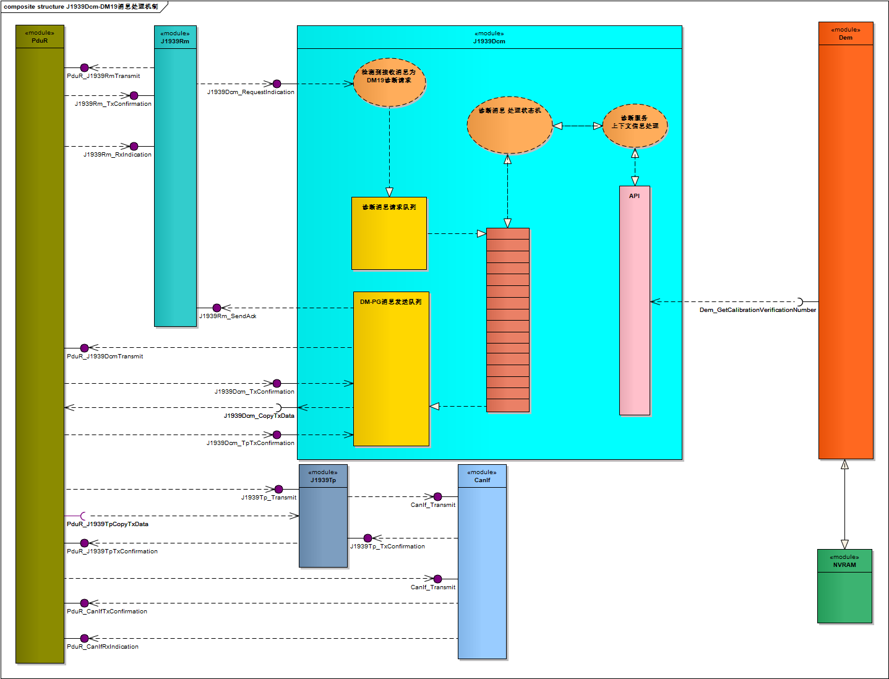

   J1939Dcm模块中的DM19诊断消息处理流程流程图

The Describes that the message format for calibration information:

.. table:: CalibrationInformation
   :name: CalibrationInformation
   :align: left

   +---------------------------+-------------------------------------------------------------------------------------+
   |   Transmission Rate       | On request using PGN 59904(0xEA00)                                                  |
   |                           +-------------------------------------------------------------------------------------+
   |                           | A NACK is required if PG is not supported and it was a destination specific request |
   +===========================+=====================================================================================+
   |   Data Length             | Variable                                                                            |
   +---------------------------+-------------------------------------------------------------------------------------+
   |   Extended Data Page      | 0                                                                                   |
   +---------------------------+-------------------------------------------------------------------------------------+
   |   Function                | Provide information about the calibration to scan Tool                              |
   +---------------------------+-------------------------------------------------------------------------------------+
   |   Data page               | 0                                                                                   |
   +---------------------------+-------------------------------------------------------------------------------------+
   |   PDU Format              | 211                                                                                 |
   +---------------------------+-------------------------------------------------------------------------------------+
   |   PDU Specific            | DA                                                                                  |
   +---------------------------+-------------------------------------------------------------------------------------+
   |   Default Priority        | 7                                                                                   |
   +---------------------------+-------------------------------------------------------------------------------------+
   |   Parameter Group Number  | 54016(0xD300)                                                                       |
   +---------------------------+-------------------------------------------------------------------------------------+
   |   Byte: 1-4               | Calibration Verification Number                                                     |
   +---------------------------+-------------------------------------------------------------------------------------+
   |   Byte: 5-20              | Calibration Identification                                                          |
   +---------------------------+-------------------------------------------------------------------------------------+

诊断消息用于报告使用的监视器性能比率：DM20(Diagnostic messages are used to report the performance ratio of the monitor in use: DM20)
~~~~~~~~~~~~~~~~~~~~~~~~~~~~~~~~~~~~~~~~~~~~~~~~~~~~~~~~~~~~~~~~~~~~~~~~~~~~~~~~~~~~~~~~~~~~~~~~~~~~~~~~~~~~~~~~~~~~~~~~~~~~~~~~~~~~

.. list-table::
   :header-rows: 1
   :stub-columns: 1

   * - 序号(Serial Number)
     - 详细描述(Detailed description)

   * - 1.
     - DM20消息报告正在使用的监视器性能比率。(DM20 message reports the performance ratio of the monitor being used.)
   * - 2.
     - 当J1939Dcm模块通过回调函数J1939Dcm_RequestIndication接收到DM20请求（参数requestedPgn来源于支持诊断消息表中的相应PGN表列）时，J1939Dcm将使用通用的Ratio序列。(When the J1939Dcm module receives a DM20 request through the callback function J1939Dcm_RequestIndication (the parameter requestedPgn comes from the corresponding PGN column in the supported diagnostic message table), J1939Dcm will use the standard Ratio sequence.)
   * - 3.
     - 通过调用Dem_J1939DcmSetRatioFilter得到Ignition_Cycle_Counter 与OBD_Monitoring_Conditions_Encountered。(By calling Dem_J1939DcmSetRatioFilter, the Ignition_Cycle_Counter and OBD_Monitoring_Conditions_Encountered are obtained.)
   * - 4.
     - 持续调用Dem_J1939DcmGetNextFilteredRatio 获取SPN值、比例值，当API返回 DEM_FILTERED_NO_MATCHING_ELEMENT 则认为当前DMx数据获取结束，并触发PduR_J1939DcmTransmit来发送DM消息。(Continuously call Dem_J1939DcmGetNextFilteredRatio to obtain the SPN value and ratio value. When the API returns DEM_FILTERED_NO_MATCHING_ELEMENT, it is considered that the current DMx data retrieval has ended, and PduR_J1939DcmTransmit is triggered to send the DM message.)
   * - 5.
     - 确定监视器的监控频率。(Determine the monitoring frequency of the monitor.)

   J1939Dcm模块中的DM20诊断消息处理流程流程图

The Describes that the message format for Monitor Performance Ratio:

.. table:: MonitorPerformanceRatio
   :name: MonitorPerformanceRatio
   :align: left

   +---------------------------+-------------------------------------------------------------------------------------+
   |   Transmission Rate       | On request using PGN 59904(0xEA00)                                                  |
   |                           +-------------------------------------------------------------------------------------+
   |                           | A NACK is required if PG is not supported and it was a destination specific request |
   +===========================+=====================================================================================+
   |   Data Length             | Variable                                                                            |
   +---------------------------+-------------------------------------------------------------------------------------+
   |   Extended Data Page      | 0                                                                                   |
   +---------------------------+-------------------------------------------------------------------------------------+
   |   Data page               | 0                                                                                   |
   +---------------------------+-------------------------------------------------------------------------------------+
   |   PDU Format              | 194                                                                                 |
   +---------------------------+-------------------------------------------------------------------------------------+
   |   PDU Specific            | Destination Address                                                                 |
   +---------------------------+-------------------------------------------------------------------------------------+
   |   Default Priority        | 6                                                                                   |
   +---------------------------+-------------------------------------------------------------------------------------+
   |   Parameter Group Number  | 49664(0xC200)                                                                       |
   +---------------------------+-------------------------------------------------------------------------------------+
   |   Byte: 0-1               | Engine Ignition Cycle Counter                                                       |
   +---------------------------+-------------------------------------------------------------------------------------+
   |   Byte: 2-3               | OBD Monitoring Conditions Encountered Counts                                        |
   +---------------------------+-------------------------------------------------------------------------------------+
   |   Byte: 4-6               | SPN of Applicable System Monitor                                                    |
   +---------------------------+-------------------------------------------------------------------------------------+
   |   Byte: 7-8               | Applicable System Monitor Numerator                                                 |
   +---------------------------+-------------------------------------------------------------------------------------+
   |   Byte: 9-10              | Applicable System Monitor Denominator                                               |
   +---------------------------+-------------------------------------------------------------------------------------+

诊断消息用于报告诊断就绪情况2的数据：DM21(Diagnostic messages are used to report the data of diagnostic readiness 2: DM21)
~~~~~~~~~~~~~~~~~~~~~~~~~~~~~~~~~~~~~~~~~~~~~~~~~~~~~~~~~~~~~~~~~~~~~~~~~~~~~~~~~~~~~~~~~~~~~~~~~~~~~~~~~~~~~~~~~~~~~~~~~~~~~

.. list-table::
   :header-rows: 1
   :stub-columns: 1

   * - 序号(Serial Number)
     - 详细描述(Detailed description)

   * - 1.
     - DM21消息报告诊断就绪情况2。(DM21 message reports diagnostic readiness status 2.)
   * - 2.
     - 当J1939Dcm模块通过回调函数J1939Dcm_RequestIndication接收到DM21请求时（参数requestedPgn来源于支持诊断消息表中的相应PGN表列），J1939Dcm将在下一个J1939Dcm_MainFunction上使用指定的被请求节点的ClientId调用Dem_J1939DcmReadDiagnosticReadiness2。(When the J1939Dcm module receives a DM21 request through the callback function J1939Dcm_RequestIndication (the parameter requestedPgn comes from the corresponding PGN column in the supported diagnostic message table), J1939Dcm will call Dem_J1939DcmReadDiagnosticReadiness2 with the ClientId of the requested node in the next J1939Dcm_MainFunction.)
   * - 3.
     - 如果Dem_J1939DcmReadDiagnosticReadiness2函数的返回值为E_OK，则根据SAE J1939-73将返回参数DataValue编码到DM21布局中。之后，调用带有请求消息PduId的PduR_J1939DcmTransmit，并根据请求的源地址设置目的地址（通过元数据），或者当请求的目的地址为0xFF设置为广播。(If the return value of the Dem_J1939DcmReadDiagnosticReadiness2 function is E_OK, the return parameter DataValue is encoded into the DM21 layout according to SAE J1939-73. Afterwards, PduR_J1939DcmTransmit is called with the request message PduId, and the destination address is set according to the requesting source address (via metadata), or set to broadcast when the requested destination address is 0xFF.)
   * - 4.
     - 如果Dem_J1939DcmReadDiagnosticReadiness2函数的返回值不等于E_OK，J1939Dcm将调用J1939Rm_SendAck，参数ackCode设置为J1939RM_ACK_NEGATIVE，发送否定确认（NACK）。(If the return value of the Dem_J1939DcmReadDiagnosticReadiness2 function is not equal to E_OK, J1939Dcm will call J1939Rm_SendAck with the parameter ackCode set to J1939RM_ACK_NEGATIVE to send a negative acknowledgment (NACK).)
   * - 4.
     - 用于记录排放/引擎故障发生/清除以后行进的里程/时间(Used to record the distance/time traveled after an emission/engine fault occurs/is cleared)

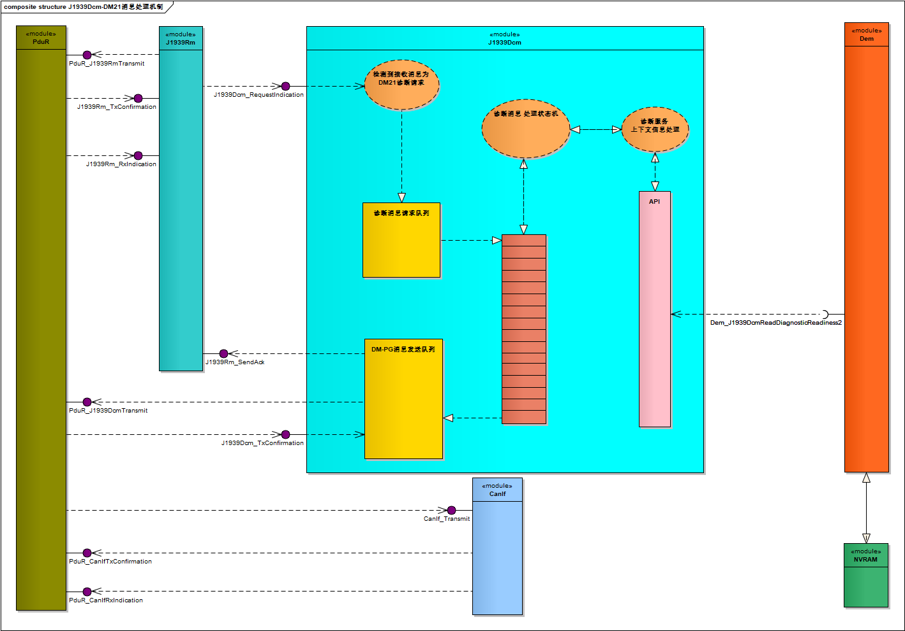

   J1939Dcm模块中的DM21诊断消息处理流程流程图

The Describes that the message format for Diagnostic Readiness 2:

.. table:: DiagnosticReadiness2
   :name: DiagnosticReadiness2
   :align: left

   +---------------------------+-------------------------------------------------------------------------------------+
   |   Transmission Rate       | On request using PGN 59904(0xEA00)                                                  |
   |                           +-------------------------------------------------------------------------------------+
   |                           | A NACK is required if PG is not supported and it was a destination specific request |
   +===========================+=====================================================================================+
   |   Data Length             | 8                                                                                   |
   +---------------------------+-------------------------------------------------------------------------------------+
   |   Extended Data Page      | 0                                                                                   |
   +---------------------------+-------------------------------------------------------------------------------------+
   |   Data page               | 0                                                                                   |
   +---------------------------+-------------------------------------------------------------------------------------+
   |   PDU Format              | 193                                                                                 |
   +---------------------------+-------------------------------------------------------------------------------------+
   |   PDU Specific            | Destination Address                                                                 |
   +---------------------------+-------------------------------------------------------------------------------------+
   |   Default Priority        | 6                                                                                   |
   +---------------------------+-------------------------------------------------------------------------------------+
   |   Parameter Group Number  | 49408(0xC100)                                                                       |
   +---------------------------+-------------------------------------------------+-----------------------------------+
   |   Byte: 0-1               | Distance Traveled While MIL is Activated        | Data Range:  0 to 64255 km units  |
   +---------------------------+-------------------------------------------------+-----------------------------------+
   |   Byte: 2-3               | Distance Since Diagnostic Trouble Codes Cleared | Data Range:  0 to 64255 km units  |
   +---------------------------+-------------------------------------------------+-----------------------------------+
   |   Byte: 4-5               | Minutes Run by Engine While MIL is Activated    | Data Range:  0 to 64255 min       |
   +---------------------------+-------------------------------------------------+-----------------------------------+
   |   Byte: 6-7               | Time Since Diagnostic Trouble Codes Cleared     | Data Range:  0 to 64255 min       |
   +---------------------------+-------------------------------------------------+-----------------------------------+

诊断消息用于报告与OBD相关的历史激活的DTC：DM23(Diagnostic messages are used to report DTCs related to historical activations in OBD: DM23)
~~~~~~~~~~~~~~~~~~~~~~~~~~~~~~~~~~~~~~~~~~~~~~~~~~~~~~~~~~~~~~~~~~~~~~~~~~~~~~~~~~~~~~~~~~~~~~~~~~~~~~~~~~~~~~~~~~~~~~~~~~~~~~~~~~~~~~~~~~~

.. list-table::
   :header-rows: 1
   :stub-columns: 1

   * - 序号(Serial Number)
     - 详细描述(Detailed description)

   * - 1.
     - DM23消息报告OBD相关的历史激活的诊断故障代码。(DM23 messages report the historically activated diagnostic trouble codes related to OBD.)
   * - 2.
     - 当J1939Dcm模块通过回调函数J1939Dcm_RequestIndication接收到DM23请求（参数requestedPgn来源于支持诊断消息表中的相应PGN表列）时，J1939Dcm将使用通用的DTC状态序列，并将参数DTCStatusFilter设置为DEM_J1939DTC_PREVIOUSLY_ACTIVE，参数DTCKind设置为DEM_DTC_KIND_EMISSION_REL_DTCS。(When the J1939Dcm module receives a DM23 request through the callback function J1939Dcm_RequestIndication (the parameter requestedPgn comes from the corresponding PGN table column in the supported diagnostic message table), J1939Dcm will use the general DTC status sequence, setting the parameter DTCStatusFilter to DEM_J1939DTC_PREVIOUSLY_ACTIVE and the parameter DTCKind to DEM_DTC_KIND_EMISSION_REL_DTCS.)
   * - 3.
     - 通过调用Dem_J1939DcmSetDTCFilter告知Dem想要获取的数据类型，同时得到当前的灯状态。(By calling Dem_J1939DcmSetDTCFilter, you specify the type of data Dem wants to retrieve, while also obtaining the current status of the indicator lights.)
   * - 4.
     - 持续调用Dem_J1939DcmGetNextFilteredDTC获取DTC值与发生次数，当函数的返回值为DEM_FILTERED_NO_MATCHING_ELEMENT则认为当前DMx数据获取结束，并触发PduR_J1939DcmTransmit来发送DM消息。(Continuously call Dem_J1939DcmGetNextFilteredDTC to obtain DTC values and occurrence counts. When the function returns DEM_FILTERED_NO_MATCHING_ELEMENT, it is considered that the current DMx data acquisition has ended, and PduR_J1939DcmTransmit is triggered to send the DM message.)
   * - 5.
     - 返回值J1939DTC和OccurenceCounter应按照SAE J1939-73编码到DM23布局中。(The return values J1939 DTC and Occurrence Counter should be encoded into the DM23 layout according to SAE J1939-73.)
   * - 6.
     - 历史激活与排放有关的DTC和Lamp状态。(History of DTCs related to activation and emissions, and Lamp status.)

    J1939Dcm模块中的DM23诊断消息处理流程流程图

The Describes that the message format for Previously Active Emission Related Faults:

.. table:: PreviouslyActiveEmissionRelatedFaults
   :name: PreviouslyActiveEmissionRelatedFaults
   :align: left

   +---------------------------+-------------------------------------------------------------------------------------+
   |   Transmission Rate       | On request using PGN 59904(0xEA00)                                                  |
   |                           +-------------------------------------------------------------------------------------+
   |                           | A NACK is required if PG is not supported and it was a destination specific request |
   +===========================+=====================================================================================+
   |   Data Length             | Variable                                                                            |
   +---------------------------+-------------------------------------------------------------------------------------+
   |   Extended Data Page      | 0                                                                                   |
   +---------------------------+-------------------------------------------------------------------------------------+
   |   Data page               | 0                                                                                   |
   +---------------------------+-------------------------------------------------------------------------------------+
   |   PDU Format              | 253                                                                                 |
   +---------------------------+-------------------------------------------------------------------------------------+
   |   PDU Specific            | 181                                                                                 |
   +---------------------------+-------------------------------------------------------------------------------------+
   |   Default Priority        | 6                                                                                   |
   +---------------------------+-------------------------------------------------------------------------------------+
   |   Parameter Group Number  | 64949(0xFDB5)                                                                       |
   +---------------------------+----------------+--------------------------------------------------------------------+
   |   Byte: 0                 | bits: 7-6      | Malfunction Indicator Lamp                                         |
   |                           +----------------+--------------------------------------------------------------------+ 
   |                           | bits: 5-4      | Red Stop Lamp                                                      |
   |                           +----------------+--------------------------------------------------------------------+
   |                           | bits: 3-2      | Amber Warning Lamp                                                 |
   |                           +----------------+--------------------------------------------------------------------+
   |                           | bits: 1-0      | Protect Lamp                                                       |
   +---------------------------+----------------+--------------------------------------------------------------------+
   |   Byte: 1                 | bits: 7-6      | Flash Malfunction Indicator Lamp                                   |
   |                           +----------------+--------------------------------------------------------------------+ 
   |                           | bits: 5-4      | Flash Red Stop Lamp                                                |
   |                           +----------------+--------------------------------------------------------------------+
   |                           | bits: 3-2      | Flash Amber Warning Lamp                                           |
   |                           +----------------+--------------------------------------------------------------------+
   |                           | bits: 1-0      | Flash Protect Lamp                                                 |
   +---------------------------+----------------+--------------------------------------------------------------------+
   |   Byte: 2                 | bits: 7-0      | SPN, 8 least significant bits of SPN                               |
   +---------------------------+----------------+--------------------------------------------------------------------+
   |   Byte: 3                 | bits: 7-0      | SPN, second byte of SPN                                            |
   +---------------------------+----------------+--------------------------------------------------------------------+
   |   Byte: 4                 | bits: 7-5      | SPN, 3 most significant bits                                       |
   |                           +----------------+--------------------------------------------------------------------+
   |                           | bits: 4-0      | FMI                                                                |
   +---------------------------+----------------+--------------------------------------------------------------------+
   |   Byte: 5                 | bit: 7         | SPN Conversion Method                                              |
   |                           +----------------+--------------------------------------------------------------------+
   |                           | bits: 6-0      | Occurrence Count                                                   |
   +---------------------------+----------------+--------------------------------------------------------------------+

诊断消息用于报告支持DM25和DataStream的SPN：DM24(Diagnostic messages are used to report SPNs supported by DM25 and DataStream: DM24)
~~~~~~~~~~~~~~~~~~~~~~~~~~~~~~~~~~~~~~~~~~~~~~~~~~~~~~~~~~~~~~~~~~~~~~~~~~~~~~~~~~~~~~~~~~~~~~~~~~~~~~~~~~~~~~~~~~~~~~~~~~~~~~~~~~~~

.. list-table::
   :header-rows: 1
   :stub-columns: 1

   * - 序号(Serial Number)
     - 详细描述(Detailed description)

   * - 1.
     - DM24消息报告支持DM25和DataStream的SPN。(DM24 message reports support SPNs from DM25 and DataStream.)
   * - 2.
     - 当J1939Dcm模块通过回调函数J1939Dcm_RequestIndication接收到DM24请求（参数requestedPgn来源于支持诊断消息表中的相应PGN表列）时，J1939Dcm将使用通用的FreezeFrame序列，并将参数FreezeFrameKind设置为DEM_J1939DCM_SPNS_IN_EXPANDED_FREEZEFRAME。(When the J1939Dcm module receives a DM24 request via the callback function J1939Dcm_RequestIndication (with the parameter requestedPgn coming from the corresponding PGN column in the Supported Diagnostic Message table), J1939Dcm will use the standard FreezeFrame sequence and set the parameter FreezeFrameKind to DEM_J1939DCM_SPNS_IN_EXPANDED_FREEZEFRAME.)
   * - 3.
     - 通过调用Dem_J1939DcmSetFreezeFrameFilter告知Dem想要获取的数据类型。(Inform the Dem of the type of data it wants to obtain by calling Dem_J1939DcmSetFreezeFrameFilter.)
   * - 4.
     - 持续调用Dem_J1939DcmGetNextSPNInFreezeFrame获取SPN值与之对应的数据长度，当API返回DEM_FILTERED_NO_MATCHING_ELEMENT则认为当前DMx数据获取结束，结合本地的SPN配置数据，触发PduR_J1939DcmTransmit。DM25将按照DM24的SPN序列进行数据排列。(Continuously call Dem_J1939DcmGetNextSPNInFreezeFrame to obtain the SPN value and its corresponding data length. When the API returns DEM_FILTERED_NO_MATCHING_ELEMENT, it is considered that the current DMx data retrieval has ended. Combined with the local SPN configuration data, PduR_J1939DcmTransmit is triggered. DM25 will arrange the data according to the SPN sequence of DM24.)
   * - 5.
     - 用于确定某一个SPN是否支持数据流、扩展冻结帧与比例校准测试结果，获取该SPN数据的长度。DM25将按照DM24中支持扩展冻结帧的SPN及其数据长度确定参数序列。(Used to determine whether a specific SPN supports data stream, extended freeze frame, and scaled calibration test results, and to obtain the length of that SPN data. DM25 will determine the parameter sequence based on the SPNs that support extended freeze frame in DM24 and their data lengths.)
   * - 6.
     - 此消息用于识别DM25产品支持的SPN、测试结果、扩展冻结帧和数据流消息。数据流消息是那些包含DM24中报告的SPN的PGN。DM24的含量无论发动机是否运转都应相同。要求DM24用于受监管的OBD系统，应直接针对在DM5中表明OBD合规性的OBD设备。DM24含量应在所有正常发动机和车辆运行模式下保持恒定。至少一个提供OBD符合性正值的设备应支持DM24用于MY2013及以后的发动机。所有在车辆上提供OBD符合性正值的设备都可以支持DM24。(This message is used to identify the SPNs, test results, extended freeze frames, and data stream messages supported by DM25 products. Data stream messages are those PGNs that contain the SPNs reported in DM24. The content of DM24 should be the same whether the engine is running or not. DM24 is required for regulated OBD systems and should be directed specifically at the OBD device indicated as OBD-compliant in DM5. The content of DM24 should remain constant in all normal engine and vehicle operating modes. At least one device providing a positive OBD compliance value should support DM24 for engines of MY2013 and later. All devices providing a positive OBD compliance value in the vehicle can support DM24.)

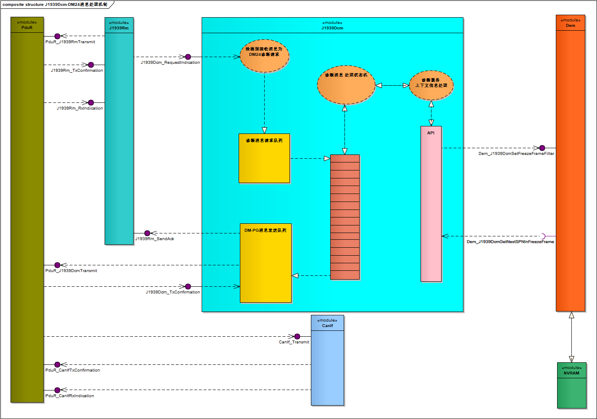

   J1939Dcm模块中的DM24诊断消息处理流程流程图

The Describes that the message format for SPN Support:

.. table:: SupportedOfSPN
   :name: SupportedOfSPN
   :align: left

   +---------------------------+----------------------------------------------------------------------------------------+
   |   Transmission Rate       | On request using PGN 59904(0xEA00)                                                     |
   |                           +----------------------------------------------------------------------------------------+
   |                           | A NACK is required if PG is not supported and it was a destination specific request    |
   |                           +----------------------------------------------------------------------------------------+
   |                           | The request message for DM24 shall only be sent using a destination specific address.  |
   +===========================+========================================================================================+
   |   Data Length             | 8 bytes (Variable, typical engine could be 50 parameters x 4 = 200  bytes)             |
   +---------------------------+----------------------------------------------------------------------------------------+
   |   Extended Data Page      | 0                                                                                      |
   +---------------------------+----------------------------------------------------------------------------------------+
   |   Data page               | 0                                                                                      |
   +---------------------------+----------------------------------------------------------------------------------------+
   |   PDU Format              | 253                                                                                    |
   +---------------------------+----------------------------------------------------------------------------------------+
   |   PDU Specific            | 182                                                                                    |
   +---------------------------+----------------------------------------------------------------------------------------+
   |   Default Priority        | 6                                                                                      |
   +---------------------------+----------------------------------------------------------------------------------------+
   |   Parameter Group Number  | 64950(0xFDB6)                                                                          |
   +---------------------------+----------------+-----------------------------------------------------------------------+
   |   Byte: 0                 | bits: 7-0      | SPN Supported, 8 least significant bits of SPN                        |
   +---------------------------+----------------+-----------------------------------------------------------------------+
   |   Byte: 1                 | bits: 7-0      | SPN Supported, second byte of SPN                                     |
   +---------------------------+----------------+-----------------------------------------------------------------------+
   |   Byte: 2                 | bits: 7-5      | SPN Supported, 3 most significant bits                                |
   |                           +----------------+-----------------------------------------------------------------------+ 
   |                           | bits: 4        | Reserved for SAE Assignment                                           |
   |                           +----------------+-----------------------------------------------------------------------+
   |                           | bits: 3        | Reserved for Supported in Data Value (DM58)                           |
   |                           +----------------+-----------------------------------------------------------------------+
   |                           | bits: 2        | Supported in Scaled Test Results                                      |
   |                           +----------------+-----------------------------------------------------------------------+
   |                           | bits: 1        | Supported in Data Stream                                              |
   |                           +----------------+-----------------------------------------------------------------------+
   |                           | bits: 0        | Supported in Expanded Freeze Frame                                    |
   +---------------------------+----------------+-----------------------------------------------------------------------+
   |   Byte: 3                 | bits: 7-0      | SPN Data Length                                                       |
   +---------------------------+----------------+-----------------------------------------------------------------------+

诊断消息用于报告扩展冻结帧的数据：DM25
~~~~~~~~~~~~~~~~~~~~~~~~~~~~~~~~~~~~~~~~~~~~~~~~~~~~~~~~~~~~~~~~~

.. list-table::
   :header-rows: 1
   :stub-columns: 1

   * - 序号(Serial Number)
     - 详细描述(Detailed description)

   * - 1.
     - DM25报告扩展冻结帧的数据(DM25 report extended frozen frame data)
   * - 2.
     - 当J1939Dcm模块通过回调函数J1939Dcm_RequestIndication接收到DM25请求（参数requestedPgn来源于支持诊断消息表中的相应PGN表列）时，J1939Dcm将使用通用的FreezeFrame序列，并将参数FreezeFrameKind设置为DEM_J1939DCM_EXPANDED_FREEZEFRAME。(When the J1939Dcm module receives a DM25 request through the callback function J1939Dcm_RequestIndication (with the parameter requestedPgn coming from the corresponding PGN table column in the supported diagnostic message table), J1939Dcm will use the generic FreezeFrame sequence and set the parameter FreezeFrameKind to DEM_J1939DCM_EXPANDED_FREEZEFRAME.)
   * - 3.
     - 通过调用Dem_J1939DcmSetFreezeFrameFilter告知Dem想要获取的数据类型。(Inform the Dem of the type of data it wants to obtain by calling Dem_J1939DcmSetFreezeFrameFilter.)
   * - 4.
     - 持续调用Dem_J1939DcmGetNextFreezeFrame获取DTC值、发生次数和冻结数据，当函数的返回值为DEM_FILTERED_NO_MATCHING_ELEMENT则认为当前DMx数据获取结束，并触发PduR_J1939DcmTransmit来发送DM25诊断消息。 (Continuously call Dem_J1939DcmGetNextFreezeFrame to obtain DTC values, occurrence counts, and freeze frame data. When the return value of the function is DEM_FILTERED_NO_MATCHING_ELEMENT, it is considered that the current DMx data retrieval is complete, and PduR_J1939DcmTransmit is triggered to send the DM25 diagnostic message.)
   * - 5.
     - 比DM4提供更多的参数支持，每个冻结帧可附加额外的SPN参数，由DM24确定支持的SPN及其在DM25中的顺序。(Provides more parameter support than DM4, with each freeze frame able to include additional SPN parameters. The SPNs supported and their order in DM25 are determined by DM24.)

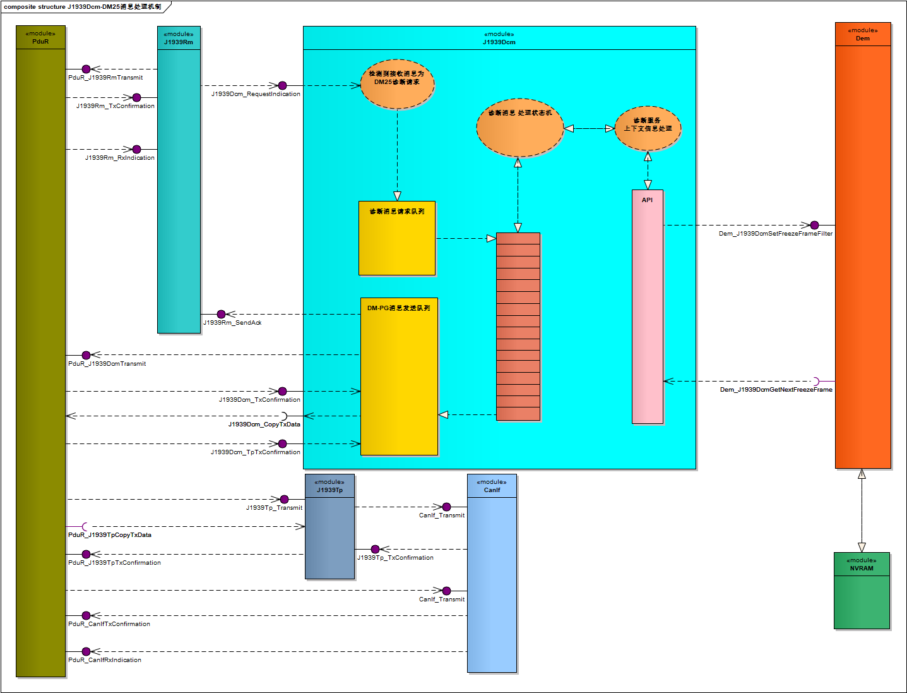

   J1939Dcm模块中的DM25诊断消息处理流程流程图

The Describes that the message format for Expanded FreezeFrame:

.. table:: ExpandedFreezeFrame
   :name: ExpandedFreezeFrame
   :align: left

   +---------------------------+----------------------------------------------------------------------------------------+
   |   Transmission Rate       | On request using PGN 59904(0xEA00)                                                     |
   |                           +----------------------------------------------------------------------------------------+
   |                           | A NACK is required if PG is not supported and it was a destination specific request    |
   |                           +----------------------------------------------------------------------------------------+
   |                           | The request message for DM25 shall only be sent using a destination specific address.  |
   +===========================+========================================================================================+
   |   Data Length             | Variable                                                                               |
   +---------------------------+----------------------------------------------------------------------------------------+
   |   Extended Data Page      | 0                                                                                      |
   +---------------------------+----------------------------------------------------------------------------------------+
   |   Data page               | 0                                                                                      |
   +---------------------------+----------------------------------------------------------------------------------------+
   |   PDU Format              | 253                                                                                    |
   +---------------------------+----------------------------------------------------------------------------------------+
   |   PDU Specific            | 183                                                                                    |
   +---------------------------+----------------------------------------------------------------------------------------+
   |   Default Priority        | 6                                                                                      |
   +---------------------------+----------------------------------------------------------------------------------------+
   |   Parameter Group Number  | 64951(0xFDB7)                                                                          |
   +---------------------------+----------------+-----------------------------------------------------------------------+
   |   Byte: 0                 | bits: 7-0      | Expanded Freeze Frame Length                                          |
   +---------------------------+----------------+-----------------------------------------------------------------------+
   |   Byte: 1                 | bits: 7-0      | SPN, 8 least significant bits of SPN                                  |
   +---------------------------+----------------+-----------------------------------------------------------------------+
   |   Byte: 2                 | bits: 7-0      | SPN, second byte of SPN                                               |
   +---------------------------+----------------+-----------------------------------------------------------------------+
   |   Byte: 3                 | bits: 7-5      | SPN, 3 most significant bits                                          |
   |                           +----------------+-----------------------------------------------------------------------+ 
   |                           | bits: 0        | FMI                                                                   |
   +---------------------------+----------------+-----------------------------------------------------------------------+
   |   Byte: 4                 | bits: 7-5      | SPN Conversion Method                                                 |
   |                           +----------------+-----------------------------------------------------------------------+ 
   |                           | bits: 4-0      | Occurrence Count                                                      |
   +---------------------------+----------------+-----------------------------------------------------------------------+
   |   Byte: 5-n               | bits: 7-0      | SPN Data                                                              |
   +---------------------------+----------------+-----------------------------------------------------------------------+

诊断消息用于报告诊断就绪情况3的数据：DM26(Diagnostic messages are used to report the data of diagnostic readiness 3: DM26)
~~~~~~~~~~~~~~~~~~~~~~~~~~~~~~~~~~~~~~~~~~~~~~~~~~~~~~~~~~~~~~~~~~~~~~~~~~~~~~~~~~~~~~~~~~~~~~~~~~~~~~~~~~~~~~~~~~~~~~~~~~~~~~~~

.. list-table::
   :header-rows: 1
   :stub-columns: 1

   * - 序号(Serial Number)
     - 详细描述(Detailed description)

   * - 1.
     - DM26消息报告诊断就绪情况3。(DM26 message reports diagnostic readiness status 3.)
   * - 2.
     - 当J1939Dcm模块通过回调函数J1939Dcm_RequestIndication接收到DM26请求时（参数requestedPgn来源于支持诊断消息表中的相应PGN表列）, J1939Dcm将在下一个J1939Dcm_MainFunction循环中使用所分配的最新节点的cliententid调用Dem_J1939DcmReadDiagnosticReadiness3。(When the J1939Dcm module receives a DM26 request through the callback function J1939Dcm_RequestIndication (the parameter requestedPgn comes from the corresponding PGN column in the Supported Diagnostic Message Table), J1939Dcm will call Dem_J1939DcmReadDiagnosticReadiness3 in the next J1939Dcm_MainFunction cycle using the clientId of the most recently allocated node.)
   * - 3.
     - 如果Dem_J1939DcmReadDiagnosticReadiness3函数的返回值为E_OK，则根据SAE J1939-73将返回参数DataValue编码到DM26布局中。之后，调用带有请求消息PduId的PduR_J1939DcmTransmit，并根据请求的源地址设置目的地址（通过元数据），或者当请求的目的地址为0xFF设置为广播。(If the return value of the Dem_J1939DcmReadDiagnosticReadiness3 function is E_OK, the return parameter DataValue is encoded into the DM26 layout according to SAE J1939-73. Afterwards, PduR_J1939DcmTransmit is called with the request message PduId, and the destination address is set according to the requesting source address (via metadata), or set to broadcast if the requested destination address is 0xFF.)
   * - 4.
     - 如果Dem_J1939DcmReadDiagnosticReadiness3函数的返回值不等于E_OK，J1939Dcm将调用J1939Rm_SendAck，参数ackCode设置为J1939RM_ACK_NEGATIVE，发送否定确认（NACK）。(If the return value of the Dem_J1939DcmReadDiagnosticReadiness3 function is not equal to E_OK, J1939Dcm will call J1939Rm_SendAck with the parameter ackCode set to J1939RM_ACK_NEGATIVE to send a negative acknowledgment (NACK).)
   * - 5.
     - 用于确定OBD是否存在缺陷。结合DM5和DM21确定OBD系统是否就绪。(Used to determine whether the OBD has defects. Combined with DM5 and DM21 to determine if the OBD system is ready.)

   J1939Dcm模块中的DM26诊断消息处理流程流程图

The Describes that the message format for Diagnostic Readiness 3:

.. table:: DiagnosticReadiness3
   :name: DiagnosticReadiness3
   :align: left

   +---------------------------+------------------------------------------------------------------------------------------+
   |   Transmission Rate       | On request using PGN 59904(0xEA00)                                                       |
   |                           +------------------------------------------------------------------------------------------+
   |                           | A NACK is required if PG is not supported and it was a destination specific request      |
   +===========================+==========================================================================================+
   |   Data Length             | Variable (presently 8 bytes)                                                             |
   +---------------------------+------------------------------------------------------------------------------------------+
   |   Extended Data Page      | 0                                                                                        |
   +---------------------------+------------------------------------------------------------------------------------------+
   |   Data page               | 0                                                                                        |
   +---------------------------+------------------------------------------------------------------------------------------+
   |   PDU Format              | 253                                                                                      |
   +---------------------------+------------------------------------------------------------------------------------------+
   |   PDU Specific            | 184                                                                                      |
   +---------------------------+------------------------------------------------------------------------------------------+
   |   Default Priority        | 6                                                                                        |
   +---------------------------+------------------------------------------------------------------------------------------+
   |   Parameter Group Number  | 64952(0xFDB8)                                                                            |
   +---------------------------+-----------------------------------------------------------+------------------------------+
   |   Byte: 0-1               | Time Since Engine Start                                   | Data Range:  0 to 64255 sec  |
   +---------------------------+-----------------------------------------------------------+------------------------------+
   |   Byte: 2                 | Number of Warm-Ups Since Diagnostic Trouble Codes Cleared | Data Range:  0 to 250        |
   +---------------------------+-----------------------------------------------------------+------------------------------+
   |   Byte: 4-5               | Continuously Monitored Systems Enable/Completed Status    | Data Range:  Bit mapped      |
   +---------------------------+-----------------------------------------------------------+------------------------------+
   |   Byte: 6-7               | Non-continuously Monitored Systems Enable Status          | Data Range:  Bit mapped      |
   +---------------------------+-----------------------------------------------------------+------------------------------+
   |   Byte: 6-7               | Non-continuously Monitored Systems Complete Status        | Data Range:  Bit mapped      |
   +---------------------------+-----------------------------------------------------------+------------------------------+

诊断消息用于报告OBD与排放相关的永久性DTC：DM28(Diagnostic messages are used to report permanent DTCs related to OBD and emissions: DM28)
~~~~~~~~~~~~~~~~~~~~~~~~~~~~~~~~~~~~~~~~~~~~~~~~~~~~~~~~~~~~~~~~~~~~~~~~~~~~~~~~~~~~~~~~~~~~~~~~~~~~~~~~~~~~~~~~~~~~~~~~~~~~~~~~~~~~~~~~~~~~

.. list-table::
   :header-rows: 1
   :stub-columns: 1

   * - 序号(Serial Number)
     - 详细描述(Detailed description)

   * - 1.
     - DM28消息报告OBD相关的永久DTC。(DM28 message reports permanent DTCs related to OBD.)
   * - 2.
     - 当J1939Dcm模块通过回调函数J1939Dcm_RequestIndication接收到DM28请求（参数requestedPgn来源于支持诊断消息表中的相应PGN表列）时，J1939Dcm将使用通用的DTC状态序列，并将参数DTCStatusFilter设置为DEM_J1939DTC_PERMANENT，参数DTCKind设置为DEM_DTC_KIND_EMISSION_REL_DTCS。(When the J1939Dcm module receives a DM28 request through the callback function J1939Dcm_RequestIndication (with the parameter requestedPgn coming from the corresponding PGN table column in the supported diagnostic message table), J1939Dcm will use the general DTC status sequence, setting the parameter DTCStatusFilter to DEM_J1939DTC_PERMANENT and the parameter DTCKind to DEM_DTC_KIND_EMISSION_REL_DTCS.)
   * - 3.
     - 过调用Dem_J1939DcmSetDTCFilter告知Dem想要获取的数据类型，同时得到当前的灯状态。 (By calling Dem_J1939DcmSetDTCFilter, you inform Dem of the type of data you want to retrieve, while also obtaining the current lamp status.)
   * - 4.
     - 持续调用Dem_J1939DcmGetNextFilteredDTC 获取DTC值与发生次数，当API返回 DEM_FILTERED_NO_MATCHING_ELEMENT 则认为当前DMx数据获取结束，并触发PduR_J1939DcmTransmit来发送DM消息。(Continuously call Dem_J1939DcmGetNextFilteredDTC to obtain the DTC values and occurrence counts. When the API returns DEM_FILTERED_NO_MATCHING_ELEMENT, it is considered that the current DMx data retrieval has ended, and PduR_J1939DcmTransmit is triggered to send the DM message.)
   * - 5.
     - 返回值J1939DTC和OccurenceCounter应按照SAE J1939-73编码到DM28布局中。(The return values J1939 DTC and Occurrence Counter should be encoded into the DM28 layout according to SAE J1939-73.)
   * - 6.
     - 该DTC会被保存在ROM中，且当前正在指示MIL灯亮起。在发动机故障解除经过最少检测次数后此DTC会自动清除，DM11不能清除此DTC。(This DTC will be stored in the ROM and is currently signaling the MIL light to turn on. This DTC will be automatically cleared after the minimum number of detections required to resolve the engine fault; DM11 cannot clear this DTC.)
   * - 7.
     - 目的是提供目前存在的永久DTC的清单；永久DTC被定义为已确认的故障代码，并存储在非易失性存储器中。(The purpose is to provide a list of currently existing permanent DTCs; a permanent DTC is defined as a confirmed fault code stored in non-volatile memory.)

   J1939Dcm模块中的DM28诊断消息处理流程流程图

The Describes that the message format for Permanent DTCs:

.. table:: PermanentDTCs
   :name: PermanentDTCs
   :align: left

   +---------------------------+-------------------------------------------------------------------------------------+
   |   Transmission Rate       | On request using PGN 59904(0xEA00)                                                  |
   |                           +-------------------------------------------------------------------------------------+
   |                           | A NACK is required if PG is not supported and it was a destination specific request |
   +===========================+=====================================================================================+
   |   Data Length             | Variable                                                                            |
   +---------------------------+-------------------------------------------------------------------------------------+
   |   Extended Data Page      | 0                                                                                   |
   +---------------------------+-------------------------------------------------------------------------------------+
   |   Data page               | 0                                                                                   |
   +---------------------------+-------------------------------------------------------------------------------------+
   |   PDU Format              | 253                                                                                 |
   +---------------------------+-------------------------------------------------------------------------------------+
   |   PDU Specific            | 128                                                                                 |
   +---------------------------+-------------------------------------------------------------------------------------+
   |   Default Priority        | 6                                                                                   |
   +---------------------------+-------------------------------------------------------------------------------------+
   |   Parameter Group Number  | 64896(0xFD80)                                                                       |
   +---------------------------+----------------+--------------------------------------------------------------------+
   |   Byte: 0                 | bits: 7-6      | Malfunction Indicator Lamp                                         |
   |                           +----------------+--------------------------------------------------------------------+ 
   |                           | bits: 5-4      | Red Stop Lamp                                                      |
   |                           +----------------+--------------------------------------------------------------------+
   |                           | bits: 3-2      | Amber Warning Lamp                                                 |
   |                           +----------------+--------------------------------------------------------------------+
   |                           | bits: 1-0      | Protect Lamp                                                       |
   +---------------------------+----------------+--------------------------------------------------------------------+
   |   Byte: 1                 | bits: 7-6      | Flash Malfunction Indicator Lamp                                   |
   |                           +----------------+--------------------------------------------------------------------+ 
   |                           | bits: 5-4      | Flash Red Stop Lamp                                                |
   |                           +----------------+--------------------------------------------------------------------+
   |                           | bits: 3-2      | Flash Amber Warning Lamp                                           |
   |                           +----------------+--------------------------------------------------------------------+
   |                           | bits: 1-0      | Flash Protect Lamp                                                 |
   +---------------------------+----------------+--------------------------------------------------------------------+
   |   Byte: 2                 | bits: 7-0      | SPN, 8 least significant bits of SPN                               |
   +---------------------------+----------------+--------------------------------------------------------------------+
   |   Byte: 3                 | bits: 7-0      | SPN, second byte of SPN                                            |
   +---------------------------+----------------+--------------------------------------------------------------------+
   |   Byte: 4                 | bits: 7-5      | SPN, 3 most significant bits                                       |
   |                           +----------------+--------------------------------------------------------------------+
   |                           | bits: 4-0      | FMI                                                                |
   +---------------------------+----------------+--------------------------------------------------------------------+
   |   Byte: 5                 | bit: 7         | SPN Conversion Method                                              |
   |                           +----------------+--------------------------------------------------------------------+
   |                           | bits: 6-0      | Occurrence Count                                                   |
   +---------------------------+----------------+--------------------------------------------------------------------+

诊断消息用于报告每个类别中的DTC计数：DM29
~~~~~~~~~~~~~~~~~~~~~~~~~~~~~~~~~~~~~~~~~~~~~~~~~~~~~~~~~~~~~~~~~

.. list-table::
   :header-rows: 1
   :stub-columns: 1

   * - 序号(Serial Number)
     - 详细描述(Detailed description)

   * - 1.
     - DM29消息报告每个类别中的DTC计数。(The DM29 message reports the DTC count in each category.)
   * - 2.
     - 当J1939Dcm模块通过回调函数J1939Dcm_RequestIndication接收到DM29请求时（参数requestedPgn来源于支持诊断消息表中的相应PGN表列）, J1939Dcm将为响应消息中的每个字节调用Dem_J1939DcmSetDTCFilter，并将参数DTCStatusFilter设置为DEM_J1939DTC_PENDING/DEM_J1939DTC_ACTIVE/DEM_J1939DTC_PREVIOUSLY_ACTIVE/DEM_J1939DTC_PERMANENT，参数DTCKind设置为DEM_DTC_KIND_EMISSION_REL_DTCS/DEM_DTC_KIND_ALL_DTCS。(When the J1939Dcm module receives a DM29 request via the callback function J1939Dcm_RequestIndication (the parameter requestedPgn comes from the corresponding PGN column in the Supported Diagnostic Message Table), J1939Dcm will call Dem_J1939DcmSetDTCFilter for each byte in the response message, setting the parameter DTCStatusFilter to DEM_J1939DTC_PENDING/DEM_J1939DTC_ACTIVE/DEM_J1939DTC_PREVIOUSLY_ACTIVE/DEM_J1939DTC_PERMANENT, and the parameter DTCKind to DEM_DTC_KIND_EMISSION_REL_DTCS/DEM_DTC_KIND_ALL_DTCS.)
   * - 3.
     - 每次调用Dem_J1939DcmSetDTCFilter后，J1939Dcm调用Dem_J1939DcmGetNumberOfFilteredDTC，得到匹配DTC的当前计数。(After each call to Dem_J1939DcmSetDTCFilter, J1939Dcm calls Dem_J1939DcmGetNumberOfFilteredDTC to obtain the current count of matching DTCs.)
   * - 4.
     - 如果Dem_J1939DcmGetNumberOfFilteredDTC函数的返回值为E_OK，则J1939Dcm将参数NumberOfFilteredDTC返回的值复制到DM29响应消息的相应字节中。(If the return value of the Dem_J1939DcmGetNumberOfFilteredDTC function is E_OK, J1939Dcm copies the value returned by the NumberOfFilteredDTC parameter into the corresponding byte of the DM29 response message.)
   * - 5.
     - 如果Dem_J1939DcmGetNumberOfFilteredDTC函数的返回值为DEM_PENDING， J1939Dcm将在下次调用J1939Dcm_MainFunction时重新触发Dem_J1939DcmGetNumberOfFilteredDTC。(If the return value of the Dem_J1939DcmGetNumberOfFilteredDTC function is DEM_PENDING, J1939Dcm will trigger Dem_J1939DcmGetNumberOfFilteredDTC again the next time J1939Dcm_MainFunction is called.)
   * - 6.
     - 相关分类DTC的累计数(Cumulative number of related DTCs)

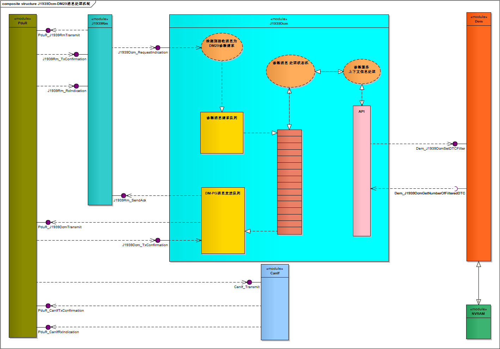

    J1939Dcm模块中的DM29诊断消息处理流程流程图

The Describes that the message format for Regulated DTC Counts:

.. table:: RegulatedDTCCounts
   :name: RegulatedDTCCounts
   :align: left

   +---------------------------+-------------------------------------------------------------------------------------+
   |   Transmission Rate       | On request using PGN 59904(0xEA00)                                                  |
   |                           +-------------------------------------------------------------------------------------+
   |                           | A NACK is required if PG is not supported and it was a destination specific request |
   +===========================+=====================================================================================+
   |   Data Length             | 8                                                                                   |
   +---------------------------+-------------------------------------------------------------------------------------+
   |   Extended Data Page      | 0                                                                                   |
   +---------------------------+-------------------------------------------------------------------------------------+
   |   Data page               | 0                                                                                   |
   +---------------------------+-------------------------------------------------------------------------------------+
   |   PDU Format              | 158                                                                                 |
   +---------------------------+-------------------------------------------------------------------------------------+
   |   PDU Specific            | Destination Address                                                                 |
   +---------------------------+-------------------------------------------------------------------------------------+
   |   Default Priority        | 6                                                                                   |
   +---------------------------+-------------------------------------------------------------------------------------+
   |   Parameter Group Number  | 40448(0x9E00)                                                                       |
   +---------------------------+-------------------------------------------------------------------------------------+
   |   Byte: 0                 | Emission-Related Pending DTC Count                                                  |
   +---------------------------+-------------------------------------------------------------------------------------+
   |   Byte: 1                 | All Pending DTC Count                                                               |
   +---------------------------+-------------------------------------------------------------------------------------+
   |   Byte: 2                 | Emission-Related MIL-On DTC Count                                                   |
   +---------------------------+-------------------------------------------------------------------------------------+
   |   Byte: 3                 | Emission-Related Previously MIL-On DTC Count                                        |
   +---------------------------+-------------------------------------------------------------------------------------+
   |   Byte: 4                 | Emission-Related Permanent DTC Count                                                |
   +---------------------------+-------------------------------------------------------------------------------------+
   |   Byte: 5-7               | Reserved for SAE assignment                                                         |
   +---------------------------+-------------------------------------------------------------------------------------+

诊断消息用于向灯协议报告DTC：DM31(Diagnostic messages are used to report DTCs to the lighting protocol: DM31)
~~~~~~~~~~~~~~~~~~~~~~~~~~~~~~~~~~~~~~~~~~~~~~~~~~~~~~~~~~~~~~~~~~~~~~~~~~~~~~~~~~~~~~~~~~~~~~~~~~~~~~~~~~~~~~~~~

.. list-table::
   :header-rows: 1
   :stub-columns: 1

   * - 序号(Serial Number)
     - 详细描述(Detailed description)

   * - 1.
     - DM31消息向灯协议报告DTC。(DM31 message reports DTC to the lamp protocol.)
   * - 2.
     - 当J1939Dcm模块通过回调函数J1939Dcm_RequestIndication接收到DM31请求（参数requestedPgn来源于支持诊断消息表中的相应PGN表列）时，J1939Dcm将调用Dem_J1939DcmFirstDTCwithLampStatus函数启动数据流。(When the J1939Dcm module receives a DM31 request via the callback function J1939Dcm_RequestIndication (with the parameter requestedPgn coming from the corresponding PGN column in the supported diagnostic message table), J1939Dcm will call the Dem_J1939DcmFirstDTCwithLampStatus function to start the data stream.)
   * - 3.
     - J1939Dcm将通过随后调用Dem_J1939DcmGetNextDTCwithLampStatus来继续序列，除非达到每个MainFunction的最大序列计数器阈值或返回值为DEM_PENDING；在这种情况下，执行被推迟到下一个J1939Dcm_MainFunction调用。(J1939Dcm will continue the sequence through a subsequent call to Dem_J1939DcmGetNextDTCwithLampStatus, unless the maximum sequence counter threshold for each MainFunction is reached or the return value is DEM_PENDING; in this case, execution is deferred to the next J1939Dcm_MainFunction call.)
   * - 4.
     - 每个函数调用Dem_J1939DcmGetNextDTCwithLampStatus的返回值J1939DTC、OccurenceCounter和LampStatus随后根据SAE J1939-73编码到DM31布局中。(The return values J1939DTC, OccurrenceCounter, and LampStatus from each call to Dem_J1939DcmGetNextDTCwithLampStatus are then encoded into the DM31 layout according to SAE J1939-73.)
   * - 5.
     - 如果Dem_J1939DcmGetNextDTCwithLampStatus函数的返回值为DEM_NO_SUCH_ELEMENT，J1939Dcm将使用请求消息的PduId调用PduR_J1939DcmTransmit，并根据请求的源地址设置目的地址（通过元数据），或者当请求的目的地址为0xFF时设置为广播。(If the return value of the Dem_J1939DcmGetNextDTCwithLampStatus function is DEM_NO_SUCH_ELEMENT, J1939Dcm will call PduR_J1939DcmTransmit using the PduId of the request message and set the destination address according to the source address of the request (via metadata), or set it to broadcast if the destination address of the request is 0xFF.)

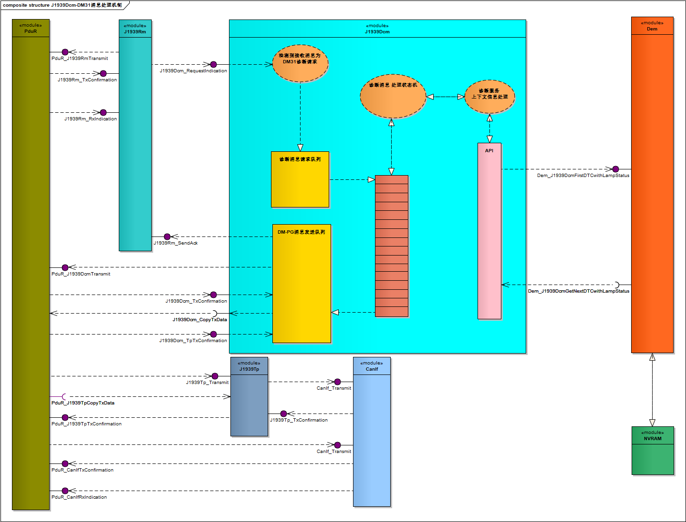

    J1939Dcm模块中的DM31诊断消息处理流程流程图

The Describes that the message format for DTC To Lamp Association:

.. table:: DTCToLampAssociation
   :name: DTCToLampAssociation
   :align: left

   +---------------------------+-------------------------------------------------------------------------------------+
   |   Transmission Rate       | On request using PGN 59904(0xEA00)                                                  |
   |                           +-------------------------------------------------------------------------------------+
   |                           | A NACK is required if PG is not supported and it was a destination specific request |
   +===========================+=====================================================================================+
   |   Data Length             | Variable                                                                            |
   +---------------------------+-------------------------------------------------------------------------------------+
   |   Extended Data Page      | 0                                                                                   |
   +---------------------------+-------------------------------------------------------------------------------------+
   |   Data page               | 0                                                                                   |
   +---------------------------+-------------------------------------------------------------------------------------+
   |   PDU Format              | 163                                                                                 |
   +---------------------------+-------------------------------------------------------------------------------------+
   |   PDU Specific            | Destination Address                                                                 |
   +---------------------------+-------------------------------------------------------------------------------------+
   |   Default Priority        | 6                                                                                   |
   +---------------------------+-------------------------------------------------------------------------------------+
   |   Parameter Group Number  | 41728(0xA300)                                                                       |
   +---------------------------+----------------+--------------------------------------------------------------------+
   |   Byte: 0                 | bits: 7-0      | SPN, 8 least significant bits of SPN                               |
   +---------------------------+----------------+--------------------------------------------------------------------+
   |   Byte: 1                 | bits: 7-0      | SPN, second byte of SPN                                            |
   +---------------------------+----------------+--------------------------------------------------------------------+
   |   Byte: 2                 | bits: 7-5      | SPN, 3 most significant bits                                       |
   |                           +----------------+--------------------------------------------------------------------+
   |                           | bits: 4-0      | FMI                                                                |
   +---------------------------+----------------+--------------------------------------------------------------------+
   |   Byte: 3                 | bit: 7         | SPN Conversion Method                                              |
   |                           +----------------+--------------------------------------------------------------------+
   |                           | bits: 6-0      | Occurrence Count                                                   |
   +---------------------------+----------------+--------------------------------------------------------------------+
   |   Byte: 4                 | bits: 7-6      | DTCx Malfunction Indicator Lamp Support & Status                   |
   |                           +----------------+--------------------------------------------------------------------+
   |                           | bits: 5-4      | DTCx Red Stop Lamp Support & Status                                |
   |                           +----------------+--------------------------------------------------------------------+
   |                           | bits: 3-2      | DTCx Amber Warning Lamp Support & Status                           |
   |                           +----------------+--------------------------------------------------------------------+
   |                           | bits: 1-0      |  DTCx Protect Lamp Support & Status                                |
   +---------------------------+----------------+--------------------------------------------------------------------+
   |   Byte: 5                 | bits: 7-6      | DTCx Flash Malfunction Indicator Lamp Support & Status             |
   |                           +----------------+--------------------------------------------------------------------+
   |                           | bits: 5-4      |  DTCx Flash Red Stop Lamp Support & Status                         |
   |                           +----------------+--------------------------------------------------------------------+
   |                           | bits: 3-2      |  DTCx Flash Amber Warning Lamp Support & Status                    |
   |                           +----------------+--------------------------------------------------------------------+
   |                           | bits: 1-0      |  DTCx Flash Amber Warning Lamp Support & Status                    |
   +---------------------------+----------------+--------------------------------------------------------------------+

诊断消息用于报告立即故障状态：DM35(Diagnostic messages are used to report immediate fault status: DM35)
~~~~~~~~~~~~~~~~~~~~~~~~~~~~~~~~~~~~~~~~~~~~~~~~~~~~~~~~~~~~~~~~~~~~~~~~~~~~~~~~~~~~~~~~~~~~~~~~~~~~~~~~
 
.. list-table::
   :header-rows: 1
   :stub-columns: 1

   * - 序号(Serial Number)
     - 详细描述(Detailed description)

   * - 1.
     - DM35消息报告立即故障状态。(DM35 message reports an immediate fault status.)
   * - 2.
     - 当J1939Dcm模块通过回调函数J1939Dcm_RequestIndication接收到DM35请求时（参数requestedPgn来源于支持诊断消息表中的相应PGN表列）, J1939Dcm将使用单独的DM35缓冲区开始收集所有立即DTC和汇总灯状态，并以1秒的周期发送DM35消息，直到模块关闭。(When the J1939Dcm module receives a DM35 request through the callback function J1939Dcm_RequestIndication (the parameter requestedPgn comes from the corresponding PGN column in the Supported Diagnostic Message table), J1939Dcm will start collecting all current DTCs and summary lamp statuses using a dedicated DM35 buffer, and will send DM35 messages at 1-second intervals until the module is turned off.)
   * - 3.
     - DM35使用通用的DTC状态序列，并将参数DTCStatusFilter设置为DEM_J1939DTC_CURRENTLY_ACTIVE，参数DTCKind设置为DEM_DTC_KIND_ALL_DTCS。(DM35 uses the standard DTC status sequence, with the parameter DTCStatusFilter set to DEM_J1939DTC_CURRENTLY_ACTIVE and the parameter DTCKind set to DEM_DTC_KIND_ALL_DTCS.)
   * - 4.
     - 通过调用Dem_J1939DcmSetDTCFilter告知Dem想要获取的数据类型，同时得到当前的灯状态。(By calling Dem_J1939DcmSetDTCFilter, you specify the type of data Dem wants to retrieve, while also obtaining the current status of the indicator lights.)
   * - 5.
     - 持续调用Dem_J1939DcmGetNextFilteredDTC 获取DTC值与发生次数OC，当函数的返回值为DEM_FILTERED_NO_MATCHING_ELEMENT则认为当前DMx数据获取结束，并触发PduR_J1939DcmTransmit来发送DM35诊断消息。(Continuously call Dem_J1939DcmGetNextFilteredDTC to obtain DTC values and occurrence counts OC. When the function returns DEM_FILTERED_NO_MATCHING_ELEMENT, it is considered that the current DMx data retrieval is complete, and PduR_J1939DcmTransmit is triggered to send a DM35 diagnostic message.)
   * - 6.
     - 功能相似于DM01，但是这个诊断不会锁存故障，因此可以用于排除接触问题，拉动导线或者模块看故障是否消失，而DM01和DM27都会锁存故障，拉线的时候可能就不会有变化。(The function is similar to DM01, but this diagnostic does not latch faults, so it can be used to rule out contact issues. You can pull the wires or modules to see if the fault disappears, whereas both DM01 and DM27 latch faults, so pulling the wires might not result in any change.)
   * - 8.
     - J1939Dcm为并行DM35处理提供J1939DcmDM35BufferSize大小的缓冲区。(J1939Dcm provides a buffer of J1939DcmDM35BufferSize for parallel DM35 processing.)
   * - 9.
     - 返回值J1939DTC和OccurenceCounter应按照SAE J1939-73编码到DM35布局中。(The return values J1939DTC and OccurrenceCounter should be encoded into the DM35 layout according to SAE J1939-73.)
   * - 10.
     - 目的是使外部测试设备能够获得诊断结果的瞬时状态；DM27锁存待定状态为2个驱动周期，DM01可以锁存活动状态为3个驱动周期，DM35不锁存，DTC可以根据需要从列表中删除。(The purpose is to allow external test equipment to obtain the instantaneous status of diagnostic results; DM27 latches the pending status for 2 drive cycles, DM01 can latch the active status for 3 drive cycles, DM35 does not latch, and DTCs can be removed from the list as needed.)

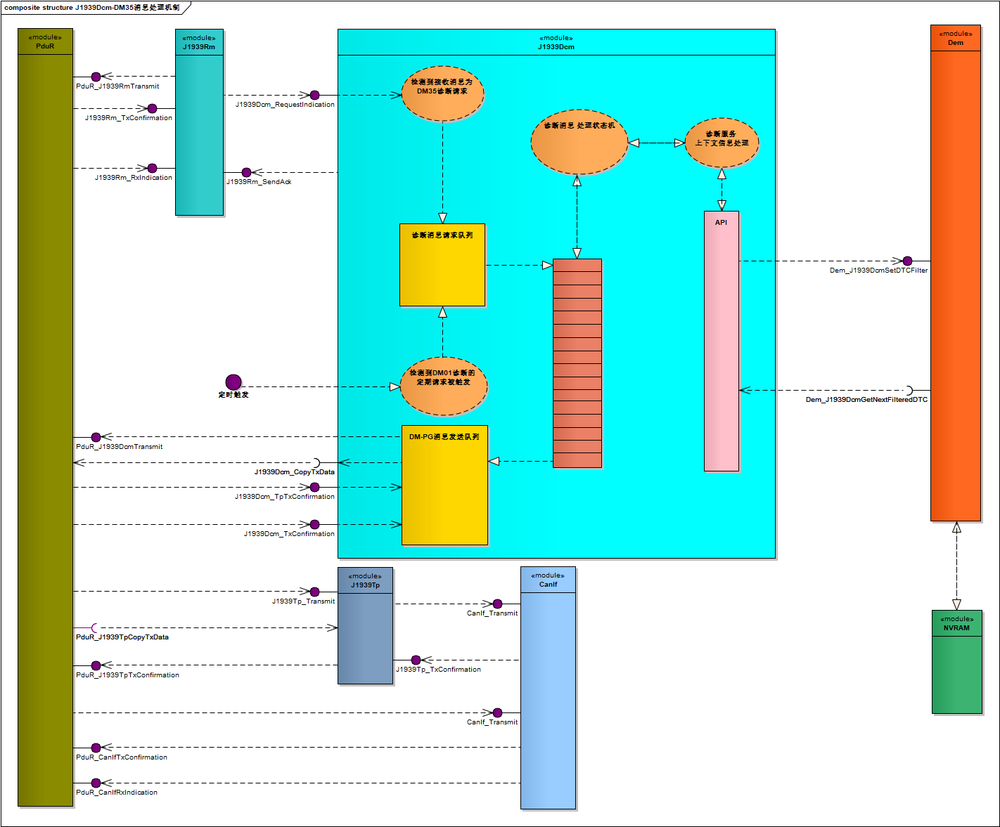

   J1939Dcm模块中的DM35诊断消息处理流程流程图

The Describes that the message format for Immediate Fault Status:

.. table:: ImmediateFaultStatus
   :name: ImmediateFaultStatus
   :align: left

   +---------------------------+-------------------------------------------------------------------------------------+
   |   Transmission Rate       | On request using PGN 59904(0xEA00)                                                  |
   |                           +-------------------------------------------------------------------------------------+
   |                           | A NACK is required if PG is not supported and it was a destination specific request |
   |                           +-------------------------------------------------------------------------------------+
   |                           | (1) Unlike DM01, this service is by request only.                                   |
   |                           +-------------------------------------------------------------------------------------+
   |                           | (2) Once requested, this service should continue to transmit until key-off.         |
   |                           +-------------------------------------------------------------------------------------+
   |                           | (3) Once requested, this service should be transmitted                              |
   |                           |     whenever there is a change of status in this DTC list.                          |
   |                           +-------------------------------------------------------------------------------------+
   |                           | (1) Message intervals should not be more frequent than 250ms.                       |
   |                           +-------------------------------------------------------------------------------------+
   |                           | (1) Optionally, this service may transmit a message every second in addition to     |
   |                           |     or in lieu of transmitting on each status change.                               |
   |                           +-------------------------------------------------------------------------------------+
   |                           | (1) Optionally, the service may begin or terminate transmission in response         |
   |                           |     to a DM7 Command Non-continuously Monitored Test message.                       |
   |                           +-------------------------------------------------------------------------------------+
   |                           | (1) In the case where an ECU only transmits on change of state, a service           |
   |                           |     tool may optionally request the message every few seconds as required.          |
   +===========================+=====================================================================================+
   |   Data Length             | Variable                                                                            |
   +---------------------------+-------------------------------------------------------------------------------------+
   |   Extended Data Page      | 0                                                                                   |
   +---------------------------+-------------------------------------------------------------------------------------+
   |   Data page               | 0                                                                                   |
   +---------------------------+-------------------------------------------------------------------------------------+
   |   PDU Format              | 159                                                                                 |
   +---------------------------+-------------------------------------------------------------------------------------+
   |   PDU Specific            | Destination Address                                                                 |
   +---------------------------+-------------------------------------------------------------------------------------+
   |   Default Priority        | 6                                                                                   |
   +---------------------------+-------------------------------------------------------------------------------------+
   |   Parameter Group Number  | 40704(0x9F00)                                                                       |
   +---------------------------+----------------+--------------------------------------------------------------------+
   |   Byte: 0                 | bits: 7-6      | Malfunction Indicator Lamp                                         |
   |                           +----------------+--------------------------------------------------------------------+ 
   |                           | bits: 5-4      | Red Stop Lamp                                                      |
   |                           +----------------+--------------------------------------------------------------------+
   |                           | bits: 3-2      | Amber Warning Lamp                                                 |
   |                           +----------------+--------------------------------------------------------------------+
   |                           | bits: 1-0      | Protect Lamp                                                       |
   +---------------------------+----------------+--------------------------------------------------------------------+
   |   Byte: 1                 | bits: 7-6      | Flash Malfunction Indicator Lamp                                   |
   |                           +----------------+--------------------------------------------------------------------+ 
   |                           | bits: 5-4      | Flash Red Stop Lamp                                                |
   |                           +----------------+--------------------------------------------------------------------+
   |                           | bits: 3-2      | Flash Amber Warning Lamp                                           |
   |                           +----------------+--------------------------------------------------------------------+
   |                           | bits: 1-0      | Flash Protect Lamp                                                 |
   +---------------------------+----------------+--------------------------------------------------------------------+
   |   Byte: 2                 | bits: 7-0      | SPN, 8 least significant bits of SPN                               |
   +---------------------------+----------------+--------------------------------------------------------------------+
   |   Byte: 3                 | bits: 7-0      | SPN, second byte of SPN                                            |
   +---------------------------+----------------+--------------------------------------------------------------------+
   |   Byte: 4                 | bits: 7-5      | SPN, 3 most significant bits                                       |
   |                           +----------------+--------------------------------------------------------------------+
   |                           | bits: 4-0      | FMI                                                                |
   +---------------------------+----------------+--------------------------------------------------------------------+
   |   Byte: 5                 | bit: 7         | SPN Conversion Method                                              |
   |                           +----------------+--------------------------------------------------------------------+
   |                           | bits: 6-0      | Occurrence Count                                                   |
   +---------------------------+----------------+--------------------------------------------------------------------+

诊断消息用于报告Active Service Only DTC：DM53(Diagnostic message used to report Active Service Only DTC: DM53)
~~~~~~~~~~~~~~~~~~~~~~~~~~~~~~~~~~~~~~~~~~~~~~~~~~~~~~~~~~~~~~~~~~~~~~~~~~~~~~~~~~~~~~~~~~~~~~~~~~~~~~~~~~~~~~~~~

.. list-table::
   :header-rows: 1
   :stub-columns: 1

   * - 序号(Serial Number)
     - 详细描述(Detailed description)

   * - 1.
     - DM53消息报告Active Service Only诊断故障代码。(DM53 message reports Active Service Only diagnostic trouble codes.)
   * - 2.
     - 当J1939Dcm模块通过回调函数J1939Dcm_RequestIndication接收到DM53请求（参数requestedPgn来源于支持诊断消息表中的相应PGN表列）时，J1939Dcm将使用通用的DTC状态序列，并将参数DTCStatusFilter设置为DEM_J1939DTC_ACTIVE，参数DTCKind设置为DEM_DTC_KIND_ALL_DTCS。(When the J1939Dcm module receives a DM53 request through the callback function J1939Dcm_RequestIndication (the parameter requestedPgn comes from the corresponding PGN table column in the supported diagnostic message table), J1939Dcm will use the general DTC status sequence and set the parameter DTCStatusFilter to DEM_J1939DTC_ACTIVE and the parameter DTCKind to DEM_DTC_KIND_ALL_DTCS.)
   * - 3.
     - 通过调用Dem_J1939DcmSetDTCFilter告知Dem想要获取的数据类型，同时得到当前的灯状态。(By calling Dem_J1939DcmSetDTCFilter, you specify the type of data Dem wants to retrieve, while also obtaining the current status of the indicator lights.)
   * - 4.
     - 持续调用Dem_J1939DcmGetNextFilteredDTC获取DTC值与发生次数OC，当函数的返回值为DEM_FILTERED_NO_MATCHING_ELEMENT则认为当前DMx数据获取结束，并触发PduR_J1939DcmTransmit来发送DM53诊断消息。(Continuously call Dem_J1939DcmGetNextFilteredDTC to obtain DTC values and occurrence counts OC. When the function returns DEM_FILTERED_NO_MATCHING_ELEMENT, it is considered that the current DMx data retrieval is complete, and PduR_J1939DcmTransmit is triggered to send a DM53 diagnostic message.)
   * - 5.
     - 返回值J1939DTC和OccurenceCounter应按照SAE J1939-73编码到DM53布局中。(The return values J1939DTC and OccurenceCounter should be encoded into the DM53 layout according to SAE J1939-73.)
   * - 6.
     - J1939Dcm有只服务的DTC的概念；这些DTC被认为存储在DEM的任何用户定义的故障存储器中；所有其他DTC被认为存储在主故障内存中。(J1939Dcm has the concept of DTCs for only one service; these DTCs are considered to be stored in any user-defined fault memory of the DEM; all other DTCs are considered to be stored in the main fault memory.)
   * - 7.
     - Dem_DTCOriginType对应于J1939DcmServiceOnlyDTCsMemoryDestinationRef引用的DemUserDefinedMemory。(Dem_DTCOriginType corresponds to the DemUserDefinedMemory referenced by J1939DcmServiceOnlyDTCsMemoryDestinationRef.)
   * - 8.
     - 所传达的信息仅限于不使用操作灯的Active Service Only诊断故障代码，并且仅用于产品的维修地点。用于通知服务技术人员可能有助于排除所报告的故障的信息。当车辆处于正常使用状态时，与车辆正在维修时相比，这些DTC不用于车辆操作员显示。该数据包含诊断代码列表和活动故障代码的发生计数。(The information conveyed is limited to Active Service Only diagnostic trouble codes that do not use the operation light and is intended solely for the product's repair location. It is used to inform service technicians of information that may help in troubleshooting reported faults. When the vehicle is in normal use, these DTCs are not used for display to the vehicle operator, unlike when the vehicle is being serviced. This data includes a list of diagnostic codes and the occurrence count of active fault codes.)

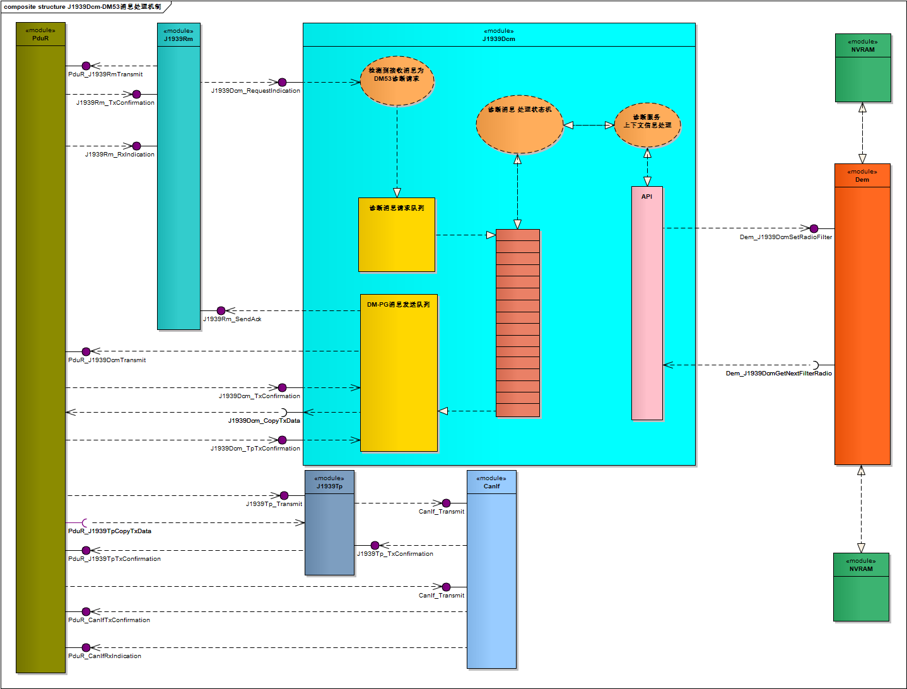

   J1939Dcm模块中的DM53诊断消息处理流程流程图

The Describes that the message format for Active Service Only DTCs:

.. table:: ActiveServiceOnlyDTCs
   :name: ActiveServiceOnlyDTCs
   :align: left

   +---------------------------+-------------------------------------------------------------------------------------+
   |   Transmission Rate       | On request using PGN 59904(0xEA00)                                                  |
   |                           +-------------------------------------------------------------------------------------+
   |                           | A NACK is required if PG is not supported and it was a destination specific request |
   +===========================+=====================================================================================+
   |   Data Length             | Variable                                                                            |
   +---------------------------+-------------------------------------------------------------------------------------+
   |   Extended Data Page      | 0                                                                                   |
   +---------------------------+-------------------------------------------------------------------------------------+
   |   Data page               | 0                                                                                   |
   +---------------------------+-------------------------------------------------------------------------------------+
   |   PDU Format              | 252                                                                                 |
   +---------------------------+-------------------------------------------------------------------------------------+
   |   PDU Specific            | 209                                                                                 |
   +---------------------------+-------------------------------------------------------------------------------------+
   |   Default Priority        | 6                                                                                   |
   +---------------------------+-------------------------------------------------------------------------------------+
   |   Parameter Group Number  | 64721(0xFCD1)                                                                       |
   +---------------------------+----------------+--------------------------------------------------------------------+
   |   Byte: 0                 | bits: 7-6      | Malfunction Indicator Lamp                                         |
   |                           +----------------+--------------------------------------------------------------------+ 
   |                           | bits: 5-4      | Red Stop Lamp                                                      |
   |                           +----------------+--------------------------------------------------------------------+
   |                           | bits: 3-2      | Amber Warning Lamp                                                 |
   |                           +----------------+--------------------------------------------------------------------+
   |                           | bits: 1-0      | Protect Lamp                                                       |
   +---------------------------+----------------+--------------------------------------------------------------------+
   |   Byte: 1                 | bits: 7-6      | Flash Malfunction Indicator Lamp                                   |
   |                           +----------------+--------------------------------------------------------------------+ 
   |                           | bits: 5-4      | Flash Red Stop Lamp                                                |
   |                           +----------------+--------------------------------------------------------------------+
   |                           | bits: 3-2      | Flash Amber Warning Lamp                                           |
   |                           +----------------+--------------------------------------------------------------------+
   |                           | bits: 1-0      | Flash Protect Lamp                                                 |
   +---------------------------+----------------+--------------------------------------------------------------------+
   |   Byte: 2                 | bits: 7-0      | SPN, 8 least significant bits of SPN                               |
   +---------------------------+----------------+--------------------------------------------------------------------+
   |   Byte: 3                 | bits: 7-0      | SPN, second byte of SPN                                            |
   +---------------------------+----------------+--------------------------------------------------------------------+
   |   Byte: 4                 | bits: 7-5      | SPN, 3 most significant bits                                       |
   |                           +----------------+--------------------------------------------------------------------+
   |                           | bits: 4-0      | FMI                                                                |
   +---------------------------+----------------+--------------------------------------------------------------------+
   |   Byte: 5                 | bit: 7         | SPN Conversion Method                                              |
   |                           +----------------+--------------------------------------------------------------------+
   |                           | bits: 6-0      | Occurrence Count                                                   |
   +---------------------------+----------------+--------------------------------------------------------------------+

诊断消息用于报告Previously Active Service Only DTC：DM54
~~~~~~~~~~~~~~~~~~~~~~~~~~~~~~~~~~~~~~~~~~~~~~~~~~~~~~~~~~~~~~~~~

.. list-table::
   :header-rows: 1
   :stub-columns: 1

   * - 序号(Serial Number)
     - 详细描述(Detailed description)

   * - 1.
     - DM53消息报告Previously Active Service Only诊断故障代码。(DM53 message reporting Previously Active Service Only diagnostic trouble codes.)
   * - 2.
     - 当J1939Dcm模块通过回调函数J1939Dcm_RequestIndication接收到DM54请求（参数requestedPgn来源于支持诊断消息表中的相应PGN表列）时，J1939Dcm将使用通用的DTC状态序列，并将参数DTCStatusFilter设置为DEM_J1939DTC_PREVIOUSLY_ACTIVE，参数DTCKind设置为DEM_DTC_KIND_ALL_DTCS。(When the J1939Dcm module receives a DM54 request through the callback function J1939Dcm_RequestIndication (the parameter requestedPgn comes from the corresponding PGN table column in the supported diagnostic message table), J1939Dcm will use a general DTC status sequence, set the parameter DTCStatusFilter to DEM_J1939DTC_PREVIOUSLY_ACTIVE, and set the parameter DTCKind to DEM_DTC_KIND_ALL_DTCS.)
   * - 3.
     - 通过调用Dem_J1939DcmSetDTCFilter告知Dem想要获取的数据类型，同时得到当前的灯状态。(By calling Dem_J1939DcmSetDTCFilter, you specify the type of data Dem wants to retrieve, while also obtaining the current status of the indicator lights.)
   * - 4.
     - 持续调用Dem_J1939DcmGetNextFilteredDTC获取DTC值与发生次数OC，当函数的返回值为DEM_FILTERED_NO_MATCHING_ELEMENT则认为当前DM54数据获取结束，并触发PduR_J1939DcmTransmit来发送DM54诊断消息。(Continuously call Dem_J1939DcmGetNextFilteredDTC to obtain DTC values and occurrence counts OC. When the function returns DEM_FILTERED_NO_MATCHING_ELEMENT, it is considered that the current DM54 data retrieval is complete, and PduR_J1939DcmTransmit is triggered to send the DM54 diagnostic message.)
   * - 5.
     - 返回值J1939DTC和OccurenceCounter应按照SAE J1939-73编码到DM54布局中。(The return values J1939 DTC and Occurrence Counter should be encoded into the DM54 layout according to SAE J1939-73.)
   * - 6.
     - J1939有只服务的DTC的概念；这些DTC被认为存储在DEM的任何用户定义的故障存储器中；所有其他DTC被认为存储在主故障内存中。(J1939 has the concept of DTCs for service only; these DTCs are considered to be stored in any user-defined fault memory of the DEM; all other DTCs are considered to be stored in the main fault memory.)
   * - 7.
     - Dem_DTCOriginType对应于J1939DcmServiceOnlyDTCsMemoryDestinationRef引用的DemUserDefinedMemory。(Dem_DTCOriginType corresponds to the DemUserDefinedMemory referenced by J1939DcmServiceOnlyDTCsMemoryDestinationRef.)
   * - 8.
     - 通信的信息仅限于历史Active Service Only诊断故障代码，这些代码仅用于产品的服务位置。用于通知服务技术人员可能对解决所报告的问题有帮助的情况。当车辆处于正常使用状态时，与车辆正在维修时相比，这些DTC不用于车辆操作员显示。该数据包含诊断代码列表和历史激活的故障代码的发生计数。(The communicated information is limited to historical Active Service Only diagnostic trouble codes, which are intended solely for the product's service location. It is used to inform service technicians of circumstances that may help in resolving the reported issues. When the vehicle is in normal operation, these DTCs are not used for display to the vehicle operator, unlike when the vehicle is being serviced. This data includes a list of diagnostic codes and the occurrence counts of historically activated trouble codes.)

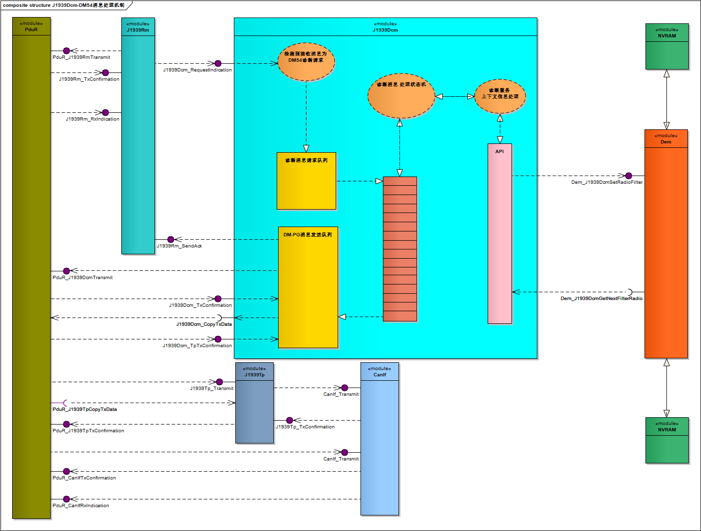

   J1939Dcm模块中的DM54诊断消息处理流程流程图

The Describes that the message format for Previously Active Service Only DTCs:

.. table:: PreviouslyActiveServiceOnlyDTCs
   :name: PreviouslyActiveServiceOnlyDTCs
   :align: left

   +---------------------------+-------------------------------------------------------------------------------------+
   |   Transmission Rate       | On request using PGN 59904(0xEA00)                                                  |
   |                           +-------------------------------------------------------------------------------------+
   |                           | A NACK is required if PG is not supported and it was a destination specific request |
   +===========================+=====================================================================================+
   |   Data Length             | Variable                                                                            |
   +---------------------------+-------------------------------------------------------------------------------------+
   |   Extended Data Page      | 0                                                                                   |
   +---------------------------+-------------------------------------------------------------------------------------+
   |   Data page               | 0                                                                                   |
   +---------------------------+-------------------------------------------------------------------------------------+
   |   PDU Format              | 252                                                                                 |
   +---------------------------+-------------------------------------------------------------------------------------+
   |   PDU Specific            | 210                                                                                 |
   +---------------------------+-------------------------------------------------------------------------------------+
   |   Default Priority        | 6                                                                                   |
   +---------------------------+-------------------------------------------------------------------------------------+
   |   Parameter Group Number  | 64722(0xFCD2)                                                                       |
   +---------------------------+----------------+--------------------------------------------------------------------+
   |   Byte: 0                 | bits: 7-6      | Malfunction Indicator Lamp                                         |
   |                           +----------------+--------------------------------------------------------------------+ 
   |                           | bits: 5-4      | Red Stop Lamp                                                      |
   |                           +----------------+--------------------------------------------------------------------+
   |                           | bits: 3-2      | Amber Warning Lamp                                                 |
   |                           +----------------+--------------------------------------------------------------------+
   |                           | bits: 1-0      | Protect Lamp                                                       |
   +---------------------------+----------------+--------------------------------------------------------------------+
   |   Byte: 1                 | bits: 7-6      | Flash Malfunction Indicator Lamp                                   |
   |                           +----------------+--------------------------------------------------------------------+ 
   |                           | bits: 5-4      | Flash Red Stop Lamp                                                |
   |                           +----------------+--------------------------------------------------------------------+
   |                           | bits: 3-2      | Flash Amber Warning Lamp                                           |
   |                           +----------------+--------------------------------------------------------------------+
   |                           | bits: 1-0      | Flash Protect Lamp                                                 |
   +---------------------------+----------------+--------------------------------------------------------------------+
   |   Byte: 2                 | bits: 7-0      | SPN, 8 least significant bits of SPN                               |
   +---------------------------+----------------+--------------------------------------------------------------------+
   |   Byte: 3                 | bits: 7-0      | SPN, second byte of SPN                                            |
   +---------------------------+----------------+--------------------------------------------------------------------+
   |   Byte: 4                 | bits: 7-5      | SPN, 3 most significant bits                                       |
   |                           +----------------+--------------------------------------------------------------------+
   |                           | bits: 4-0      | FMI                                                                |
   +---------------------------+----------------+--------------------------------------------------------------------+
   |   Byte: 5                 | bit: 7         | SPN Conversion Method                                              |
   |                           +----------------+--------------------------------------------------------------------+
   |                           | bits: 6-0      | Occurrence Count                                                   |
   +---------------------------+----------------+--------------------------------------------------------------------+

诊断消息用于为所有Service Only DTC的诊断数据清除或重置：DM55(The diagnostic message is used to clear or reset diagnostic data for all Service Only DTCs: DM55)
~~~~~~~~~~~~~~~~~~~~~~~~~~~~~~~~~~~~~~~~~~~~~~~~~~~~~~~~~~~~~~~~~~~~~~~~~~~~~~~~~~~~~~~~~~~~~~~~~~~~~~~~~~~~~~~~~~~~~~~~~~~~~~~~~~~~~~~~~~~~~~~~~~~~~~~~~~~~~~

.. list-table::
   :header-rows: 1
   :stub-columns: 1

   * - 序号(Serial Number)
     - 详细描述(Detailed description)

   * - 1.
     - DM55消息用于为所有Service Only DTCs的诊断数据清除或重置。(The DM55 message is used to clear or reset diagnostic data for all Service Only DTCs.)
   * - 2.
     - 当J1939Dcm模块通过回调函数J1939Dcm_RequestIndication接收到DM55请求时（参数requestedPgn来源于支持诊断消息表中的相应PGN表列），J1939Dcm将触发Dem_J1939DcmClearDTC，并将参数DTCTypeFilter设置为DEM_J1939DTC_CLEAR_ACTIVE_AND_PREVIOUSLY_ACTIVE，参数DTCOrigin设置为J1939DcmServiceOnlyDTCsMemoryDestinationRef中的定义。(When the J1939Dcm module receives a DM55 request via the callback function J1939Dcm_RequestIndication (with the parameter requestedPgn coming from the corresponding PGN column in the supported diagnostic messages table), J1939Dcm will trigger Dem_J1939DcmClearDTC and set the parameter DTCTypeFilter to DEM_J1939DTC_CLEAR_ACTIVE_AND_PREVIOUSLY_ACTIVE, and the parameter DTCOrigin to the definition in J1939DcmServiceOnlyDTCsMemoryDestinationRef.)
   * - 3.
     - 如果函数Dem_J1939DcmClearDTC的返回值为DEM_PENDING，则J1939Dcm将在下一次调用J1939Dcm_MainFunction时重新触发Dem_J1939DcmClearDTC，并将参数DTCTypeFilter设置为DEM_J1939DTC_CLEAR_ACTIVE_AND_PREVIOUSLY_ACTIVE。(If the return value of the function Dem_J1939DcmClearDTC is DEM_PENDING, J1939Dcm will retrigger Dem_J1939DcmClearDTC the next time J1939Dcm_MainFunction is called, and set the parameter DTCTypeFilter to DEM_J1939DTC_CLEAR_ACTIVE_AND_PREVIOUSLY_ACTIVE.)
   * - 4.
     - 如果函数Dem_J1939DcmClearDTC的返回值为E_OK或DEM_PENDING， J1939Dcm将通过J1939Rm_SendAck发送一个积极的确认（ACK），参数ackCode设置为J1939RM_ACK_POSITIVE。(If the return value of the function Dem_J1939DcmClearDTC is E_OK or DEM_PENDING, J1939Dcm will send a positive acknowledgment (ACK) through J1939Rm_SendAck, with the parameter ackCode set to J1939RM_ACK_POSITIVE.)
   * - 5.
     - 如果函数Dem_J1939DcmClearDTC的返回值不是E_OK或DEM_PENDING， J1939Dcm将通过J1939Rm_SendAck发送一个否定确认（NACK），参数ackCode设置为J1939RM_ACK_NEGATIVE。(If the return value of the function Dem_J1939DcmClearDTC is not E_OK or DEM_PENDING, J1939Dcm will send a negative acknowledgment (NACK) via J1939Rm_SendAck, with the parameter ackCode set to J1939RM_ACK_NEGATIVE.)
   * - 6.
     - J1939Dcm有只服务的DTC的概念；这些DTC被认为存储在DEM的任何用户定义的故障存储器中；所有其他DTC被认为存储在主故障内存中。(J1939Dcm has the concept of DTCs for only one service; these DTCs are considered to be stored in any user-defined fault memory of the DEM; all other DTCs are considered to be stored in the main fault memory.)
   * - 7.
     - Dem_DTCOriginType对应于J1939DcmServiceOnlyDTCsMemoryDestinationRef引用的DemUserDefinedMemory。(Dem_DTCOriginType corresponds to the DemUserDefinedMemory referenced by J1939DcmServiceOnlyDTCsMemoryDestinationRef.)
   * - 8.
     - 如果广播请求的目的地址，则根据SAE J1939-73不发送确认。(If the destination address of the broadcast request is used, no acknowledgment is sent according to SAE J1939-73.)

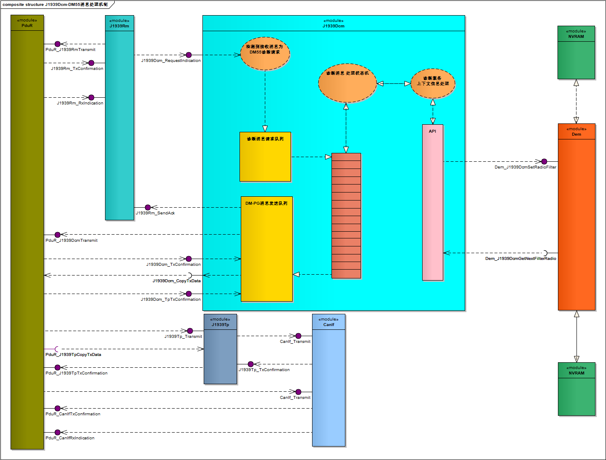

    J1939Dcm模块中的DM55诊断消息处理流程流程图

The Describes that the message format for Diagnostic Data Clear Reset by all Service Only DTCs:

.. table:: DiagnosticDataClearResetforallServiceOnlyDTCs
   :name: DiagnosticDataClearResetforallServiceOnlyDTCs
   :align: left

   +---------------------------+-------------------------------------------------------------------------------------+
   |   Transmission Rate       | On request using PGN 59904(0xEA00)                                                  |
   |                           +-------------------------------------------------------------------------------------+
   |                           | A NACK is required if PG is not supported and it was a destination specific request |
   +===========================+=====================================================================================+
   |   Data Length             | 0                                                                                   |
   +---------------------------+-------------------------------------------------------------------------------------+
   |   Extended Data Page      | 0                                                                                   |
   +---------------------------+-------------------------------------------------------------------------------------+
   |   Data page               | 0                                                                                   |
   +---------------------------+-------------------------------------------------------------------------------------+
   |   PDU Format              | 252                                                                                 |
   +---------------------------+-------------------------------------------------------------------------------------+
   |   PDU Specific            | 211                                                                                 |
   +---------------------------+-------------------------------------------------------------------------------------+
   |   Default Priority        | 6                                                                                   |
   +---------------------------+-------------------------------------------------------------------------------------+
   |   Parameter Group Number  | 64723(0xFCD3)                                                                       |
   +---------------------------+-------------------------------------------------------------------------------------+

偏差(Deviations)
--------------------------

.. list-table::
   :header-rows: 1
   :stub-columns: 1

   * - 需求类型(Type of demand)
     - 详细描述(Detailed description)
     - 需求编号(Requirement Number)
	
   * - Functional Specification
     - 不支持：Mode Dependent Request Execution
     - [SWS_J1939Dcm_00168]，[SWS_J1939Dcm_CONSTR_06201]，[SWS_J1939Dcm_00169]，[SWS_J1939Dcm_00170]，[SWS_J1939Dcm_CONSTR_06202]，[SWS_J1939Dcm_00171]，[SWS_J1939Dcm_00172]。
   * - Configuration Specification
     - 不支持：J1939DcmDiagnosticMessageModeRuleRef
     - [ECUC_J1939Dcm_00070]
   * - Configuration Specification
     - 不支持：J1939DcmProcessingConditions
     - [ECUC_J1939Dcm_00052]
   * - Configuration Specification
     - 不支持：J1939DcmModeRule
     - [ECUC_J1939Dcm_00053]
   * - Configuration Specification
     - 不支持：J1939DcmLogicalOperator
     - [ECUC_J1939Dcm_00054]
   * - Configuration Specification
     - 不支持：J1939DcmModeRuleNrcValue
     - [ECUC_J1939Dcm_00056]
   * - Configuration Specification
     - 不支持：J1939DcmArgumentRef
     - [ECUC_J1939Dcm_00055]
   * - Configuration Specification
     - 不支持：J1939DcmModeCondition
     - [ECUC_J1939Dcm_00071]
   * - Configuration Specification
     - 不支持：J1939DcmConditionType
     - [ECUC_J1939Dcm_00057]
   * - Configuration Specification
     - 不支持：J1939DcmBswModeRef
     - [ECUC_J1939Dcm_00059]
   * - Configuration Specification
     - 不支持：J1939DcmSwcModeRef
     - [ECUC_J1939Dcm_00058]
   * - Configuration Specification
     - 不支持：J1939DcmSwcSRDataElementRef
     - [ECUC_J1939Dcm_00060]
   * - Configuration Specification
     - 不支持：J1939DcmSwcSRDataElementValue
     - [ECUC_J1939Dcm_00074]
   * - Configuration Specification
     - 不支持：J1939DcmSwcSRDataElementPrimitive
     - [ECUC_J1939Dcm_00075]
   * - Configuration Specification
     - 不支持：J1939DcmSwcSRDataElementPrimitiveValue
     - [ECUC_J1939Dcm_00077]
   * - Configuration Specification
     - 不支持：J1939DcmSwcSRDataElementArray
     - [ECUC_J1939Dcm_00076]
   * - Configuration Specification
     - 不支持：J1939DcmSwcSRDataElementArrayElement
     - [ECUC_J1939Dcm_00080]
   * - Configuration Specification
     - 不支持：J1939DcmSwcSRDataElementArrayElementIndex
     - [ECUC_J1939Dcm_00078]
   * - Configuration Specification
     - 不支持：J1939DcmSwcSRDataElementArrayElementValue
     - [ECUC_J1939Dcm_00079]
   * - Configuration Specification
     - 不支持：J1939DcmDspExternalSRDataElementClass
     - [ECUC_J1939Dcm_00062]
   * - Configuration Specification
     - 不支持：J1939DcmDataElementInstance
     - [ECUC_J1939Dcm_00064]
   * - Configuration Specification
     - 不支持：J1939DcmDataElementInstanceRef
     - [ECUC_J1939Dcm_00067]
   * - Configuration Specification
     - 不支持：J1939DcmSubElementInDataElementInstance
     - [ECUC_J1939Dcm_00063]
   * - Configuration Specification
     - 不支持：J1939DcmSubElementInDataElementInstanceRef
     - [ECUC_J1939Dcm_00066]
   * - Configuration Specification
     - 不支持：J1939DcmSubElementInImplDataElementInstance
     - [ECUC_J1939Dcm_00065]
   * - Configuration Specification
     - 不支持：J1939DcmSubElementInImplDataElementInstanceRef
     - [ECUC_J1939Dcm_00068]

扩展(Extension)
----------------------
None

集成(Integration)
=======================================

文件列表(File List)
--------------------------------------

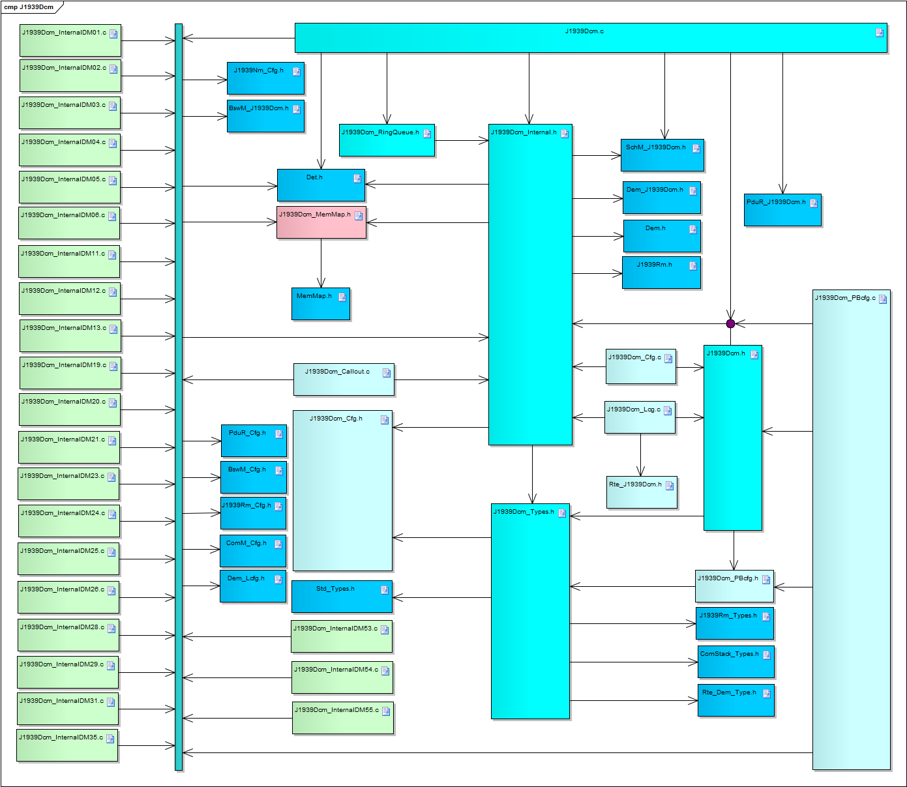

   J1939Dcm模块中的文件列表映射拓扑图

静态文件(Static files)
~~~~~~~~~~~~~~~~~~~~~~~~~~~~~~~~~~~~~

.. list-table::
   :header-rows: 1
   :stub-columns: 1

   * - 文件(Document)
     - 描述(Description)

   * - J1939Dcm_Types.h
     - J1939Dcm模块的共用宏定义和数据类型定义文件(J1939Dcm module common macro definitions and data type definition file.)
   * - J1939Dcm.c
     - J1939Dcm模块总体框架实现源文件(J1939 Dcm Module Overall Framework Implementation Source File.)
   * - J1939Dcm.h
     - J1939Dcm模块外部接口声明头文件(J1939Dcm Module External Interface Declaration Header File.)
   * - J1939Dcm_Cbk.c
     - J1939Dcm模块为通信栈提供的回调函数实现源文件(Source file implementing callback functions provided by the J1939Dcm module for the communication stack.)
   * - J1939Dcm_Internal.h
     - J1939Dcm模块内部公用接口声明，全局变量声明，宏定义和数据类型定义头文件(J1939Dcm module internal public interface declarations, global variable declarations, macro definitions, and data type definition header file.)
   * - J1939Dcm_MemMap.h
     - J1939Dcm模块的内存分布头文件(Memory Mapping Header File for J1939Dcm Module)
   * - J1939Dcm_InternalDEMDTCStatus.c
     - J1939Dcm模块与Dem组件交互的DTC状态处理接口实现源文件(Source file implementing the DTC status handling interface for interaction between the J1939Dcm module and the Dem component)
   * - J1939Dcm_InternalDEMFreezeFrame.c
     - J1939Dcm模块与Dem组件交互的冻结帧处理接口实现源文件(Source file for the implementation of the freeze frame handling interface in the interaction between J1939Dcm module and Dem component)
   * - J1939Dcm_InternalDM01.c
     - J1939Dcm模块用于通过调用Dem接口来实现DM01服务的获取当前激活DTC状态的源文件(The J1939Dcm module is used to obtain the source file for the current active DTC status through the DM01 service by calling the Dem interface.)
   * - J1939Dcm_InternalDM02.c
     - J1939Dcm模块用于通过调用Dem接口来实现DM02服务的获取历史激活DTC状态的源文件(The J1939Dcm module is used to obtain historical active DTC status for the DM02 service by calling the Dem interface.)
   * - J1939Dcm_InternalDM03.c
     - J1939Dcm模块用于通过调用Dem接口来实现DM03服务的清除或重置历史激活DTC诊断数据的源文件(The J1939Dcm module is used to implement the DM03 service by calling the Dem interface to clear or reset the source files of historically active DTC diagnostic data.)
   * - J1939Dcm_InternalDM04.c
     - J1939Dcm模块用于通过调用Dem接口来实现DM04服务的获取冻结帧参数的源文件(The J1939 Dcm module is used to obtain freeze frame parameters for the DM04 service by calling the Dem interface.)
   * - J1939Dcm_InternalDM05.c
     - J1939Dcm模块用于通过调用Dem接口来实现DM05服务的读取诊断就绪1数据的源文件(The J1939Dcm module is used to read diagnostic readiness 1 data for the DM05 service by calling the Dem interface.)
   * - J1939Dcm_InternalDM06.c
     - J1939Dcm模块用于通过调用Dem接口来实现DM06服务的获取与排放相关挂起DTC状态的源文件(The J1939Dcm module is used to obtain DM06 service and source files of emission-related pending DTC statuses by calling the Dem interface.)
   * - J1939Dcm_InternalDM11.c
     - J1939Dcm模块用于通过调用Dem接口来实现DM12服务的清除或重置当前激活DTC诊断数据的源文件(The J1939Dcm module is used to clear or reset the source files of currently active DTC diagnostic data for the DM12 service by calling the Dem interface.)
   * - J1939Dcm_InternalDM12.c
     - J1939Dcm模块用于通过调用Dem接口来实现DM06服务的获取与排放相关当前MIL-On DTC状态的源文件(The J1939Dcm module is used to obtain the source file of the current MIL-On DTC status related to emissions by calling the Dem interface to implement the DM06 service.)
   * - J1939Dcm_InternalDM13.c
     - J1939Dcm模块用于通过调用Dem接口来实现DM13服务的启动/停止给定广播控制的源文件(The J1939Dcm module is used to implement the DM13 service by calling the Dem interface to start/stop the specified broadcast control source file.)
   * - J1939Dcm_InternalDM19.c
     - J1939Dcm模块用于通过调用Dem接口来实现DM19服务的校验信息的源文件(The J1939Dcm module is used to implement the source file for verification information of the DM19 service by calling the Dem interface.)
   * - J1939Dcm_InternalDM20.c
     - J1939Dcm模块用于通过调用Dem接口来实现DM20服务的监控性能比的源文件(The J1939Dcm module is used as the source file for implementing the monitoring performance ratio of the DM20 service by calling the Dem interface.)
   * - J1939Dcm_InternalDM21.c
     - J1939Dcm模块用于通过调用Dem接口来实现DM21服务的读取诊断就绪2数据的源文件(The J1939Dcm module is used to read diagnostic readiness 2 data for the DM21 service by calling the Dem interface.)
   * - J1939Dcm_InternalDM23.c
     - J1939Dcm模块用于通过调用Dem接口来实现DM23服务的获取与排放相关历史MIL-On DTC状态的源文件(The J1939Dcm module is used to obtain the source file of DM23 service related to emission historical MIL-On DTC status by calling the Dem interface.)
   * - J1939Dcm_InternalDM24.c
     - J1939Dcm模块用于通过调用Dem接口来实现DM24服务的SPN支持的源文件(The J1939Dcm module is used to implement the DM24 service SPN support by calling the Dem interface source file.)
   * - J1939Dcm_InternalDM25.c
     - J1939Dcm模块用于通过调用Dem接口来实现DM25服务的扩展冻结帧的源文件(The J1939Dcm module is used to implement the source file of the DM25 service extended freeze frame by calling the Dem interface.)
   * - J1939Dcm_InternalDM26.c
     - J1939Dcm模块用于通过调用Dem接口来实现DM26服务的读取诊断就绪3数据的源文件(The J1939Dcm module is used to read diagnostic readiness 3 data for the DM26 service by calling the Dem interface.)
   * - J1939Dcm_InternalDM28.c
     - J1939Dcm模块用于通过调用Dem接口来实现DM28服务的获取与排放相关永久DTC状态的源文件(The J1939Dcm module is used to obtain DM28 service data and source files for emission-related permanent DTC status by calling the Dem interface.)
   * - J1939Dcm_InternalDM29.c
     - J1939Dcm模块用于通过调用Dem接口来实现DM29服务的获取DTC计数的源文件(The J1939Dcm module is used to obtain the source file for the DM29 service to get DTC counts by calling the Dem interface.)
   * - J1939Dcm_InternalDM31.c
     - J1939Dcm模块用于通过调用Dem接口来实现DM31服务的获取DTC至灯协作的源文件(The J1939Dcm module is used to obtain DM31 service DTC-to-light coordination through calling the Dem interface.)
   * - J1939Dcm_InternalDM35.c
     - J1939Dcm模块用于通过调用Dem接口来实现DM35服务的获取立即故障状态的源文件(The J1939Dcm module is used to obtain the source file for the DM35 service to get immediate fault status by calling the Dem interface.)
   * - J1939Dcm_InternalDM53.c
     - J1939Dcm模块用于通过调用Dem接口来实现DM53服务的获取当前激活Service only DTC状态的源文件(The J1939Dcm module is used to obtain the source file for the current active Service Only DTC status through the DM53 service by calling the Dem interface.)
   * - J1939Dcm_InternalDM54.c
     - J1939Dcm模块用于通过调用Dem接口来实现DM53服务的获取历史激活Service only DTC状态的源文件(The J1939Dcm module is used to obtain the source file of the DM53 service for historical active Service-only DTC status by calling the Dem interface.)
   * - J1939Dcm_InternalDM55.c
     - J1939Dcm模块用于通过调用Dem接口来实现DM54服务的清除或重置所有Service only DTC诊断数据的源文件(The J1939Dcm module is used to implement the DM54 service by calling the Dem interface to clear or reset all Service Only DTC diagnostic data source files.)

动态文件(Dynamic file)
~~~~~~~~~~~~~~~~~~~~~~~~~~~~~~~~~~~~~

.. list-table::
   :header-rows: 1
   :stub-columns: 1

   * - 文件(Document)
     - 描述(Description)

   * - J1939Dcm_Cfg.c
     - J1939Dcm模块中PC配置的数据定义文件(Data Definition File for PC Configuration in the J1939Dcm Module.)
   * - J1939Dcm_Cfg.h
     - J1939Dcm模块中PC配置的宏定义文件(Macro definition file for PC configuration in the J1939Dcm module.)
   * - J1939Dcm_Lcg.c
     - J1939Dcm模块中非PB配置的数据变量定义文件(Data Variable Definition File for Non-PB Configuration in J1939Dcm Module.)
   * - J1939Dcm_PBcfg.c
     - J1939Dcm模块中PB配置的数据变量定义文件(Data Variable Definition File for PB Configuration in J1939Dcm Module.)

错误处理(Error Handling)
--------------------------------------

开发错误(Development Error)
~~~~~~~~~~~~~~~~~~~~~~~~~~~~~~~~~~~~~

.. list-table::
   :header-rows: 1
   :stub-columns: 1

   * - Error code
     - Value[hex]
     - Description

   * - J1939DCM_E_INVALID_PDU_SDU_ID
     - 0x01
     - API service called with wrong PDU or SDU.
   * - J1939DCM_E_INVALID_STATE
     - 0x06
     - API service called with or in a wrong state.
   * - J1939DCM_E_INVALID_NODE
     - 0x08
     - API service called with wrong node parameter.
   * - J1939DCM_E_INVALID_CHANNEL
     - 0x0B
     - API service called with wrong channel parameter.
   * - J1939DCM_E_INVALID_PGN
     - 0x0D
     - API service called with wrong PGN parameter.
   * - J1939DCM_E_PARAM_POINTER
     - 0x11
     - API function called with a NULL Pointer.
   * - J1939DCM_E_INIT_FAILED
     - 0x14
     - J1939Dcm initialisation failed.
   * - J1939DCM_E_UNINIT
     - 0x20
     - API service used in un-initialized state.
   * - J1939DCM_E_REINIT
     - 0x21
     - J1939Dcm_Init used in initialized state.

运行时错误(Runtime error)
~~~~~~~~~~~~~~~~~~~~~~~~~~~~~~~~~~~~~

.. list-table::
   :header-rows: 1
   :stub-columns: 1

   * - Error code
     - Value[hex]
     - Description

   * - J1939DCM_E_BUFFER_TOO_SMALL
     - 0x0E
     - Buffer too small.

产品错误(Product error)
~~~~~~~~~~~~~~~~~~~~~~~~~~~~~~~~~~~~~
None

API接口描述(API Interface Description)
=======================================

数据类型定义 (Data Type definition)
--------------------------------------------------

Std_VersionInfoType类型定义 (Std_VersionInfoType type definition)
~~~~~~~~~~~~~~~~~~~~~~~~~~~~~~~~~~~~~~~~~~~~~~~~~~~~~~~~~~~~~~~~~~~~~~~~

.. list-table::
   :widths: 50 50
   :header-rows: 1

   * - 名称 (Name)
     - Std_VersionInfoType
   * - 类型 (Type)
     - Structure
   * - 定义 (Define)
     - typedef struct
   * - 
     - {
   * - 
     - uint16 vendorID;
   * - 
     - uint16 moduleID;
   * - 
     - uint8 instanceID;
   * - 
     - uint8 sw_major_version;
   * - 
     - uint8 sw_minor_version;
   * - 
     - uint8 sw_patch_version;
   * - 
     - } Std_VersionInfoType;
   * - 范围 (Range)
     - 无
   * - 描述 (Description)
     - 用于描述软件版本信息的结构体类型 (Struct type for describing software version information)

Std_ReturnType类型定义 (Std_ReturnType Type Definition)
~~~~~~~~~~~~~~~~~~~~~~~~~~~~~~~~~~~~~~~~~~~~~~~~~~~~~~~~~~~~~~~~~~~~~~~~

.. list-table::
   :widths: 50 50
   :header-rows: 1

   * - 名称 (Name)
     - Std_ReturnType
   * - 类型 (Type)
     - uint8
   * - 定义 (Define)
     - typedef uint8 PduIdType;
   * - 范围 (Range)
     - 0 … 255
   * - 描述 (Description)
     - 用于定义J1939Dcm模块的函数返回值的派生数据类型 (Data types derived for describing API return value in J1939Dcm)

BufReq_ReturnType类型定义 (BufReq_ReturnType Type Definition)
~~~~~~~~~~~~~~~~~~~~~~~~~~~~~~~~~~~~~~~~~~~~~~~~~~~~~~~~~~~~~~~~~~~~~~~~~~~~~

.. list-table::
   :widths: 50 50
   :header-rows: 1

   * - 名称 (Name)
     - BufReq_ReturnType
   * - 类型 (Type)
     - Enumeration
   * - 范围 (Range)
     - BUFREQ_OK = 0U
   * - 
     - BUFREQ_E_NOT_OK = 1U
   * - 
     - BUFREQ_E_BUSY = 2U
   * - 
     - BUFREQ_E_OVFL = 3U
   * - 描述 (Description)
     - 用于定义J1939Dcm模块的缓冲区请求返回的枚举类型 (Enumerated type for store the result of a buffer request)

NetworkHandleType类型定义 (NetworkHandleType Type Definition)
~~~~~~~~~~~~~~~~~~~~~~~~~~~~~~~~~~~~~~~~~~~~~~~~~~~~~~~~~~~~~~~~~~~~~~~~

.. list-table::
   :widths: 50 50
   :header-rows: 1

   * - 名称 (Name)
     - NetworkHandleType
   * - 类型 (Type)
     - uint8
   * - 定义 (Define)
     - typedef uint8 NetworkHandleType;
   * - 范围 (Range)
     - 0 … 255
   * - 描述 (Description)
     - 用于定义J1939Dcm模块的网络处理的派生数据类型 (Data types derived for describing network handle in J1939Dcm)

PduIdType类型定义 (PduIdType Type Definition)
~~~~~~~~~~~~~~~~~~~~~~~~~~~~~~~~~~~~~~~~~~~~~~~~~~~~~~~~~~~~~~~~~~~~~~~~

.. list-table::
   :widths: 50 50
   :header-rows: 1

   * - 名称 (Name)
     - PduIdType
   * - 类型 (Type)
     - uint16
   * - 定义 (Define)
     - typedef uint16 PduIdType;
   * - 范围 (Range)
     - 0 … 65535
   * - 描述 (Description)
     - 用于定义J1939Dcm模块的PDU标识符的派生数据类型 (Data types derived for describing PDU identifier in J1939Dcm)

PduLengthType类型定义 (PduLengthType Type Definition)
~~~~~~~~~~~~~~~~~~~~~~~~~~~~~~~~~~~~~~~~~~~~~~~~~~~~~~~~~~~~~~~~~~~~~~~~

.. list-table::
   :widths: 50 50
   :header-rows: 1

   * - 名称 (Name)
     - PduLengthType
   * - 类型 (Type)
     - uint16
   * - 定义 (Define)
     - typedef uint16 PduLengthType;
   * - 范围 (Range)
     - 0 … 65535
   * - 描述 (Description)
     - 用于定义J1939Dcm模块的PDU长度的派生数据类型 (Data types derived for describing PDU length in J1939Dcm)

PduInfoType类型定义 (PduInfoType Type Definition)
~~~~~~~~~~~~~~~~~~~~~~~~~~~~~~~~~~~~~~~~~~~~~~~~~~~~~~~~~~~~~~~~~~~~~~~~

.. list-table::
   :widths: 50 50
   :header-rows: 1

   * - 名称 (Name)
     - PduInfoType
   * - 类型 (Type)
     - Structure
   * - 定义 (Define)
     - typedef struct
   * - 
     - {
   * - 
     - uint8* SduDataPtr;
   * - 
     - uint8* MetaDataPtr;
   * - 
     - PduLengthType SduLength;
   * - 
     - } PduInfoType;
   * - 范围 (Range)
     - 无
   * - 描述 (Description)
     - 用于描述J1939Dcm模块存储PDU信息的结构体类型 (Struct type for describing store PDU information in J1939Dcm)

TpDataStateType类型定义 (TpDataStateType Type Definition)
~~~~~~~~~~~~~~~~~~~~~~~~~~~~~~~~~~~~~~~~~~~~~~~~~~~~~~~~~~~~~~~~~~~~~~~~~~~~~

.. list-table::
   :widths: 50 50
   :header-rows: 1

   * - 名称 (Name)
     - TpDataStateType
   * - 类型 (Type)
     - Enumeration
   * - 范围 (Range)
     - TP_DATACONF = 0U
   * - 
     - TP_DATARETRY = 1U
   * - 
     - TP_CONFPENDING = 2U
   * - 描述 (Description)
     - 用于定义J1939Dcm模块的传输数据状态的枚举类型 (Enumerated type for store the state of transmission data)

TPParameterType类型定义 (TPParameterType Type Definition)
~~~~~~~~~~~~~~~~~~~~~~~~~~~~~~~~~~~~~~~~~~~~~~~~~~~~~~~~~~~~~~~~~~~~~~~~~~~~~

.. list-table::
   :widths: 50 50
   :header-rows: 1

   * - 名称 (Name)
     - TPParameterType
   * - 类型 (Type)
     - Enumeration
   * - 范围 (Range)
     - TP_STMIN = 0U
   * - 
     - TP_BS = 1U
   * - 
     - TP_BC = 2U
   * - 描述 (Description)
     - 用于定义J1939Dcm模块的传输参数的枚举类型 (Enumerated type for store the transmission parameter)

J1939Rm_AckCode类型定义 (J1939Rm_AckCode Type Definition)
~~~~~~~~~~~~~~~~~~~~~~~~~~~~~~~~~~~~~~~~~~~~~~~~~~~~~~~~~~~~~~~~~~~~~~~~

.. list-table::
   :widths: 50 50
   :header-rows: 1

   * - 名称 (Name)
     - J1939Rm_AckCode
   * - 类型 (Type)
     - uint8
   * - 定义 (Define)
     - typedef uint8 J1939Rm_AckCode;
   * - 范围 (Range)
     - 0 … 255
   * - 描述 (Description)
     - 用于定义J1939Dcm模块的应答码的派生数据类型 (Data types derived for describing ACK/NACK code in J1939Dcm)

J1939Rm_ExtIdType类型定义 (J1939Rm_ExtIdType Type Definition)
~~~~~~~~~~~~~~~~~~~~~~~~~~~~~~~~~~~~~~~~~~~~~~~~~~~~~~~~~~~~~~~~~~~~~~~~

.. list-table::
   :widths: 50 50
   :header-rows: 1

   * - 名称 (Name)
     - J1939Rm_ExtIdType
   * - 类型 (Type)
     - uint8
   * - 定义 (Define)
     - typedef uint8 J1939Rm_ExtIdType;
   * - 范围 (Range)
     - 0 … 255
   * - 描述 (Description)
     - 用于定义J1939Rm模块的扩展标识符的派生数据类型 (Data types derived for describing extended identifier in J1939Rm)

J1939Rm_ExtIdInfoType类型定义 (J1939Rm_ExtIdInfoType Type Definition)
~~~~~~~~~~~~~~~~~~~~~~~~~~~~~~~~~~~~~~~~~~~~~~~~~~~~~~~~~~~~~~~~~~~~~~~~

.. list-table::
   :widths: 50 50
   :header-rows: 1

   * - 名称 (Name)
     - J1939Rm_ExtIdInfoType
   * - 类型 (Type)
     - Structure
   * - 定义 (Define)
     - typedef struct
   * - 
     - {
   * - 
     - J1939Rm_ExtIdType extIdType;
   * - 
     - uint8 extId1;
   * - 
     - uint8 extId2;
   * - 
     - uint8 extId3;
   * - 
     - } J1939Rm_ExtIdInfoType;
   * - 范围 (Range)
     - 无
   * - 描述 (Description)
     - 用于描述J1939Rm模块存储扩展标识符信息的结构体类型 (Struct type for describing store extended identifier information in J1939Rm)

Dem_J1939DcmDTCStatusFilterType类型定义 (Dem_J1939DcmDTCStatusFilterType Type Definition)
~~~~~~~~~~~~~~~~~~~~~~~~~~~~~~~~~~~~~~~~~~~~~~~~~~~~~~~~~~~~~~~~~~~~~~~~~~~~~~~~~~~~~~~~~~~~~~~~~~~~~~

.. list-table::
   :widths: 50 50
   :header-rows: 1

   * - 名称 (Name)
     - Dem_J1939DcmDTCStatusFilterType
   * - 类型 (Type)
     - uint8
   * - 定义 (Define)
     - typedef uint8 Dem_J1939DcmDTCStatusFilterType;
   * - 范围 (Range)
     - 0 … 255
   * - 描述 (Description)
     - 用于定义Dem模块的J1939Dcm-DTC状态过滤的派生数据类型 (Data types derived for describing J1939Dcm DTC status filter in Dem)

Dem_J1939DcmDiagnosticReadiness1Type类型定义 ( Type Definition)
~~~~~~~~~~~~~~~~~~~~~~~~~~~~~~~~~~~~~~~~~~~~~~~~~~~~~~~~~~~~~~~~~~~~~~~~

.. list-table::
   :widths: 50 50
   :header-rows: 1

   * - 名称 (Name)
     - Dem_J1939DcmDiagnosticReadiness1Type
   * - 类型 (Type)
     - uint8
   * - 定义 (Define)
     - typedef uint8 Dem_J1939DcmDiagnosticReadiness1Type;
   * - 范围 (Range)
     - 0 … 255
   * - 描述 (Description)
     - 用于定义Dem模块的J1939Dcm诊断就绪1的派生数据类型 (Data types derived for describing J1939Dcm diagnostic readiness 1 in Dem)

Dem_J1939DcmDiagnosticReadiness1Type类型定义 (Dem_J1939DcmDiagnosticReadiness1Type Type Definition)
~~~~~~~~~~~~~~~~~~~~~~~~~~~~~~~~~~~~~~~~~~~~~~~~~~~~~~~~~~~~~~~~~~~~~~~~~~~~~~~~~~~~~~~~~~~~~~~~~~~~~~~~~~~~

.. list-table::
   :widths: 50 50
   :header-rows: 1

   * - 名称 (Name)
     - Dem_J1939DcmDiagnosticReadiness1Type
   * - 类型 (Type)
     - Structure
   * - 定义 (Define)
     - typedef struct
   * - 
     - {
   * - 
     - uint8 ActiveTroubleCodes;
   * - 
     - uint8 PreviouslyActiveDiagnosticTroubleCodes;
   * - 
     - uint8 OBDCompliance;
   * - 
     - uint8 ContinuouslyMonitoredSystemsSupport_Status;
   * - 
     - uint8 NonContinuouslyMonitoredSystemsSupport5;
   * - 
     - uint8 NonContinuouslyMonitoredSystemsSupport6;
   * - 
     - uint8 NonContinuouslyMonitoredSystemsStatus7;
   * - 
     - uint8 NonContinuouslyMonitoredSystemsStatus8;
   * - 
     - } Dem_J1939DcmDiagnosticReadiness1Type;
   * - 范围 (Range)
     - 无
   * - 描述 (Description)
     - 用于定义Dem模块的J1939Dcm诊断就绪1的结构体类型 (Struct type for describing store J1939Dcm diagnostic readiness 1 in Dem)

Dem_J1939DcmDiagnosticReadiness2Type类型定义 (Dem_J1939DcmDiagnosticReadiness2Type Type Definition)
~~~~~~~~~~~~~~~~~~~~~~~~~~~~~~~~~~~~~~~~~~~~~~~~~~~~~~~~~~~~~~~~~~~~~~~~~~~~~~~~~~~~~~~~~~~~~~~~~~~~~~~~~

.. list-table::
   :widths: 50 50
   :header-rows: 1

   * - 名称 (Name)
     - Dem_J1939DcmDiagnosticReadiness2Type
   * - 类型 (Type)
     - Structure
   * - 定义 (Define)
     - typedef struct
   * - 
     - {
   * - 
     - uint16 DistanceTraveledWhileMILisActivated;
   * - 
     - uint16 DistanceSinceDTCsCleared;
   * - 
     - uint16 MinutesRunbyEngineWhileMILisActivated;
   * - 
     - uint16 TimeSinceDiagnosticTroubleCodesCleared;
   * - 
     - } Dem_J1939DcmDiagnosticReadiness2Type;
   * - 范围 (Range)
     - 无
   * - 描述 (Description)
     - 用于定义Dem模块的J1939Dcm诊断就绪2的结构体类型 (Struct type for describing store J1939Dcm diagnostic readiness 2 in Dem)

Dem_J1939DcmDiagnosticReadiness3Type类型定义 (Dem_J1939DcmDiagnosticReadiness3Type Type Definition)
~~~~~~~~~~~~~~~~~~~~~~~~~~~~~~~~~~~~~~~~~~~~~~~~~~~~~~~~~~~~~~~~~~~~~~~~~~~~~~~~~~~~~~~~~~~~~~~~~~~~~~~~~~~~~~

.. list-table::
   :widths: 50 50
   :header-rows: 1

   * - 名称 (Name)
     - Dem_J1939DcmDiagnosticReadiness3Type
   * - 类型 (Type)
     - Structure
   * - 定义 (Define)
     - typedef struct
   * - 
     - {
   * - 
     - uint16 TimeSinceEngineStart;
   * - 
     - uint8 NumberofWarmupsSinceDTCsCleared;
   * - 
     - uint8 ContinuouslyMonitoredSystemsEnableCompletedStatus;
   * - 
     - uint8 NonContinuouslyMonitoredSystemsEnableStatus5;
   * - 
     - uint8 NonContinuouslyMonitoredSystemsEnableStatus6;
   * - 
     - uint8 NonContinuouslyMonitoredSystems7;
   * - 
     - uint8 NonContinuouslyMonitoredSystems8;
   * - 
     - } Dem_J1939DcmDiagnosticReadiness3Type;
   * - 范围 (Range)
     - 无
   * - 描述 (Description)
     - 用于定义Dem模块的J1939Dcm诊断就绪3的结构体类型 (Struct type for describing store J1939Dcm diagnostic readiness 3 in Dem)

Dem_J1939DcmLampStatusType类型定义 (Dem_J1939DcmLampStatusType Type Definition)
~~~~~~~~~~~~~~~~~~~~~~~~~~~~~~~~~~~~~~~~~~~~~~~~~~~~~~~~~~~~~~~~~~~~~~~~~~~~~~~~~~~~~~~~~~

.. list-table::
   :widths: 50 50
   :header-rows: 1

   * - 名称 (Name)
     - Dem_J1939DcmLampStatusType
   * - 类型 (Type)
     - Structure
   * - 定义 (Define)
     - typedef struct
   * - 
     - {
   * - 
     - uint8 LampStatus;
   * - 
     - uint8 FlashLampStatus;
   * - 
     - } Dem_J1939DcmLampStatusType;
   * - 范围 (Range)
     - 无
   * - 描述 (Description)
     - 用于定义Dem模块的J1939Dcm指示灯状态的结构体类型 (Struct type for describing store J1939Dcm indicator lamp status in Dem)

Dem_J1939DcmSetClearFilterType类型定义 (Dem_J1939DcmSetClearFilterType Type Definition)
~~~~~~~~~~~~~~~~~~~~~~~~~~~~~~~~~~~~~~~~~~~~~~~~~~~~~~~~~~~~~~~~~~~~~~~~~~~~~~~~~~~~~~~~~~~~~~~~~~~~

.. list-table::
   :widths: 50 50
   :header-rows: 1

   * - 名称 (Name)
     - Dem_J1939DcmSetClearFilterType
   * - 类型 (Type)
     - uint8
   * - 定义 (Define)
     - typedef uint8 Dem_J1939DcmSetClearFilterType;
   * - 范围 (Range)
     - 0 … 255
   * - 描述 (Description)
     - 用于定义Dem模块的J1939Dcm-设置DTC清除过滤的派生数据类型 (Data types derived for describing J1939Dcm set DTC clear filter in Dem)

Dem_J1939DcmSetFreezeFrameFilterType类型定义 (Dem_J1939DcmSetFreezeFrameFilterType Type Definition)
~~~~~~~~~~~~~~~~~~~~~~~~~~~~~~~~~~~~~~~~~~~~~~~~~~~~~~~~~~~~~~~~~~~~~~~~~~~~~~~~~~~~~~~~~~~~~~~~~~~~~~~~~~~

.. list-table::
   :widths: 50 50
   :header-rows: 1

   * - 名称 (Name)
     - Dem_J1939DcmSetFreezeFrameFilterType
   * - 类型 (Type)
     - uint8
   * - 定义 (Define)
     - typedef uint8 Dem_J1939DcmSetFreezeFrameFilterType;
   * - 范围 (Range)
     - 0 … 255
   * - 描述 (Description)
     - 用于定义Dem模块的J1939Dcm-设置冻结帧过滤的派生数据类型 (Data types derived for describing J1939Dcm set freeze frame filter in Dem)

Dem_DTCKindType类型定义 (Dem_DTCKindType Type Definition)
~~~~~~~~~~~~~~~~~~~~~~~~~~~~~~~~~~~~~~~~~~~~~~~~~~~~~~~~~~~~~~~~~~~~~~~~

.. list-table::
   :widths: 50 50
   :header-rows: 1

   * - 名称 (Name)
     - Dem_DTCKindType
   * - 类型 (Type)
     - uint8
   * - 定义 (Define)
     - typedef uint8 Dem_DTCKindType;
   * - 范围 (Range)
     - 0 … 255
   * - 描述 (Description)
     - 用于定义Dem模块的DTC种类的派生数据类型 (Data types derived for describing DTC kind in Dem)

Dem_DTCOriginType类型定义 (Dem_DTCOriginType Type Definition)
~~~~~~~~~~~~~~~~~~~~~~~~~~~~~~~~~~~~~~~~~~~~~~~~~~~~~~~~~~~~~~~~~~~~~~~~

.. list-table::
   :widths: 50 50
   :header-rows: 1

   * - 名称 (Name)
     - Dem_DTCOriginType
   * - 类型 (Type)
     - uint8
   * - 定义 (Define)
     - typedef uint16 Dem_DTCOriginType;
   * - 范围 (Range)
     - 0 … 65535
   * - 描述 (Description)
     - 用于定义Dem模块的DTC起源的派生数据类型 (Data types derived for describing DTC origin in Dem)

输入函数描述 (Describe the input function:)
------------------------------------------------------------------------

.. list-table::
   :widths: 50 50
   :header-rows: 1

   * - 输入模块 (Input Module)
     - API
   * - Det
     - Det_ReportError
   * - Det
     - Det_ReportRuntimeError
   * - J1939Rm
     - J1939Rm_SendAck
   * - PduR
     - PduR_J1939DcmTransmit
   * - PduR
     - PduR_J1939DcmCancelReceive
   * - PduR
     - PduR_J1939DcmCancelTransmit
   * - BswM
     - BswM_J1939DcmBroadcastStatus
   * - Dem
     - Dem_J1939DcmSetDTCFilter
   * - Dem
     - Dem_J1939DcmGetNextFilteredDTC
   * - Dem
     - Dem_J1939DcmGetNumberOfFilteredDTC
   * - Dem
     - Dem_J1939DcmClearDTC
   * - Dem
     - Dem_J1939DcmFirstDTCwithLampStatus
   * - Dem
     - Dem_J1939DcmGetNextDTCwithLampStatus
   * - Dem
     - Dem_J1939DcmSetFreezeFrameFilter
   * - Dem
     - Dem_J1939DcmGetNextFreezeFrame
   * - Dem
     - Dem_J1939DcmGetNextSPNInFreezeFrame
   * - Dem
     - Dem_J1939DcmSetRatioFilter
   * - Dem
     - Dem_J1939DcmGetNextFilteredRatio
   * - Dem
     - Dem_J1939DcmReadDiagnosticReadiness1
   * - Dem
     - Dem_J1939DcmReadDiagnosticReadiness2
   * - Dem
     - Dem_J1939DcmReadDiagnosticReadiness3

静态接口函数定义 (Static interface function definition)
------------------------------------------------------------------------

J1939Dcm_Init
~~~~~~~~~~~~~~~~~~~~~~~~~~~~~~~~~~~~~~~~~~~~~~~~~~~~~~~~~~~~~~~~~~~~~~~~~~~~~~~~~~~~

.. code::

    void J1939Dcm_Init(const J1939Dcm_ConfigType *configPtr)

Service is used to initializes the J1939 Diagnostic Communication Manager.

**Sync/Async**
   Synchronous

**Reentrancy**
   Non Reentrant

**Parameters**

.. list-table::
   :widths: 5 10 30
   :header-rows: 1

   * - Dir
     - Name
     - Description
   * - [in]
     - configPtr
     - Pointer to the selected configuration structure.

**Return type**
   void

J1939Dcm_DeInit
~~~~~~~~~~~~~~~~~~~~~~~~~~~~~~~~~~~~~~~~~~~~~~~~~~~~~~~~~~~~~~~~~~~~~~~~~~~~~~~~~~~~

.. code::

    void J1939Dcm_DeInit(void)

Service is used to uninitialized the J1939 Diagnostic Communication Manager.

**Sync/Async**
   Synchronous

**Reentrancy**
   Non Reentrant

**Return type**
   void

J1939Dcm_GetVersionInfo
~~~~~~~~~~~~~~~~~~~~~~~~~~~~~~~~~~~~~~~~~~~~~~~~~~~~~~~~~~~~~~~~~~~~~~~~~~~~~~~~~~~~

.. code::

    void J1939Dcm_GetVersionInfo(Std_VersionInfoType *versionInfo)

Service is used to get the version information of this module.

**Sync/Async**
   Synchronous

**Reentrancy**
   Reentrant

**Parameters**

.. list-table::
   :widths: 5 10 30
   :header-rows: 1

   * - Dir
     - Name
     - Description
   * - 
     - versionInfo
     - 

**Return type**
   void

J1939Dcm_SetState
~~~~~~~~~~~~~~~~~~~~~~~~~~~~~~~~~~~~~~~~~~~~~~~~~~~~~~~~~~~~~~~~~~~~~~~~~~~~~~~~~~~~

.. code::

    Std_ReturnType J1939Dcm_SetState(NetworkHandleType channel, uint8 node, J1939Dcm_StateType newState)

Service is used to changes the communication state of J1939Dcm to off-line or on-line.

**Sync/Async**
   Synchronous

**Reentrancy**
   Reentrant

**Parameters**

.. list-table::
   :widths: 5 10 30
   :header-rows: 1

   * - Dir
     - Name
     - Description
   * - [in]
     - channel
     - Channel for which the state shall be changed
   * - [in]
     - node
     - Node for which the state shall be changed
   * - [in]
     - newState
     - New state the J1939Dcm shall enter

**Return type**
   Std_ReturnType

**Return values**

.. list-table::
   :widths: 10 30
   :header-rows: 1

   * - Name
     - Description
   * - E_OK
     - New communication state was set
   * - E_NOT_OK
     - Communication state was not changed due to wrong value in NewState or wrong initialization state of the module

J1939Dcm_GenericDMxTransmit
~~~~~~~~~~~~~~~~~~~~~~~~~~~~~~~~~~~~~~~~~~~~~~~~~~~~~~~~~~~~~~~~~~~~~~~~~~~~~~~~~~~~

.. code::

    Std_ReturnType J1939Dcm_GenericDMxTransmit(uint8 dmId, uint8 node, NetworkHandleType channel, uint8 destAddress, uint8 priority)

Service is used to request transmission of generic diagnostic message.

**Sync/Async**
   Synchronous

**Reentrancy**
   Non Reentrant

**Parameters**

.. list-table::
   :widths: 5 10 30
   :header-rows: 1

   * - Dir
     - Name
     - Description
   * - [in]
     - dmId
     - number of the J1939 diagnostic message.
   * - [in]
     - node
     - node by which the message shall be sent.
   * - [in]
     - channel
     - channel on which the message shall be transmitted
   * - [in]
     - destAddress
     - address of the node that shall receive the diagnostic message or 0xFF for broadcast.
   * - [in]
     - priority
     - priority of the diagnostic message.

**Return type**
   Std_ReturnType

**Return values**

.. list-table::
   :widths: 10 30
   :header-rows: 1

   * - Name
     - Description
   * - E_OK
     - Transmit request has been accepted.
   * - E_NOT_OK
     - Transmit request has not been accepted.

J1939Dcm_RequestIndication
~~~~~~~~~~~~~~~~~~~~~~~~~~~~~~~~~~~~~~~~~~~~~~~~~~~~~~~~~~~~~~~~~~~~~~~~~~~~~~~~~~~~

.. code::

    void J1939Dcm_RequestIndication(uint8 node, NetworkHandleType channel, uint32 requestedPgn, const J1939Rm_ExtIdInfoType *extIdInfo, uint8 sourceAddress, uint8 destAddress, uint8 priority)

Service is used to indicates reception of a Request or Request2 PG.

**Sync/Async**
   Synchronous @ServiceId 0x47

**Reentrancy**
   Reentrant

**Parameters**

.. list-table::
   :widths: 5 10 30
   :header-rows: 1

   * - Dir
     - Name
     - Description
   * - [in]
     - node
     - node by which the request was received.
   * - [in]
     - channel
     - channel on which the request was received.
   * - [in]
     - requestedPgn
     - PGN of the requested PG.
   * - [in]
     - extIdInfo
     - extended identifier bytes.
   * - [in]
     - sourceAddress
     - address of the node that sent the Request PG.
   * - [in]
     - destAddress
     - address of this node or 0xFF for broadcast.
   * - [in]
     - priority
     - priority of the Request PG.

**Return type**
   void

J1939Dcm_RxIndication
~~~~~~~~~~~~~~~~~~~~~~~~~~~~~~~~~~~~~~~~~~~~~~~~~~~~~~~~~~~~~~~~~~~~~~~~~~~~~~~~~~~~

.. code::

    void J1939Dcm_RxIndication(PduIdType rxPduId, const PduInfoType *pduInfoPtr)

Service is used to indication of a received PDU from a lower layer communication interface module.

**Sync/Async**
   Synchronous @ServiceId 0x42

**Reentrancy**
   Reentrant for different PduIds. Non reentrant for the same PduId.

**Parameters**

.. list-table::
   :widths: 5 10 30
   :header-rows: 1

   * - Dir
     - Name
     - Description
   * - [in]
     - rxPduId
     - ID of the received PDU.
   * - [in]
     - pduInfoPtr
     - Contains the length of the received PDU, a pointer to a buffer containing the PDU, and the MetaData related to this PDU.

**Return type**
   void

J1939Dcm_TxConfirmation
~~~~~~~~~~~~~~~~~~~~~~~~~~~~~~~~~~~~~~~~~~~~~~~~~~~~~~~~~~~~~~~~~~~~~~~~~~~~~~~~~~~~

.. code::

    void J1939Dcm_TxConfirmation(PduIdType txPduId, Std_ReturnType result)

Service is used to the lower layer communication interface module confirms the transmission of a PDU, or the failure to transmit a PDU.

**Sync/Async**
   Synchronous @ServiceId 0x40

**Reentrancy**
   Reentrant for different PduIds. Non reentrant for the same PduId.

**Parameters**

.. list-table::
   :widths: 5 10 30
   :header-rows: 1

   * - Dir
     - Name
     - Description
   * - [in]
     - txPduId
     - ID of the PDU that has been transmitted.
   * - [in]
     - result
     - E_OK: The PDU was transmitted; E_NOT_OK: Transmission of the PDU failed.

**Return type**
   void

J1939Dcm_StartOfReception
~~~~~~~~~~~~~~~~~~~~~~~~~~~~~~~~~~~~~~~~~~~~~~~~~~~~~~~~~~~~~~~~~~~~~~~~~~~~~~~~~~~~

.. code::

    BufReq_ReturnType J1939Dcm_StartOfReception(PduIdType rxPduId, const PduInfoType *pduInfoPtr, PduLengthType tpSduLength, PduLengthType *bufferSizePtr)

This function is called at the start of receiving an N-SDU. The N-SDU might be fragmented into multiple N-PDUs or might consist of a single N-PDU. The service shall provide the currently available maximum buffer size when invoked with TpSdu Length equal to 0.

**Sync/Async**
   Synchronous

**Reentrancy**
   Reentrant

**Parameters**

.. list-table::
   :widths: 5 10 30
   :header-rows: 1

   * - Dir
     - Name
     - Description
   * - [in]
     - rxPduId
     - Identification of the I-PDU.
   * - [in]
     - pduInfoPtr
     - Pointer to a PduInfoType structure containing the payload data and payload length of the first frame or single frame of a transport protocol I-PDU reception, and the MetaData related to this PDU. If neither first/single frame data nor MetaData are available, this parameter is set to NULL_PTR.
   * - [in]
     - tpSduLength
     - Total length of the N-SDU to be received.
   * - [out]
     - bufferSizePtr
     - Available receive buffer in the receiving module. This parameter will be used to compute the Block Size (BS) in the transport protocol module.

**Return type**
   BufReq_ReturnType

**Return values**

.. list-table::
   :widths: 10 30
   :header-rows: 1

   * - Name
     - Description
   * - BUFREQ_OK
     - Connection has been accepted. bufferSizePtr indicates the available receive buffer; reception is continued. If no buffer of the requested size is available, a receive buffer size of 0 shall be indicated by bufferSizePtr.
   * - BUFREQ_E_NOT_OK
     - Connection has been rejected; reception is aborted. bufferSizePtr remains unchanged.
   * - BUFREQ_E_OVFL
     - No buffer of the required length can be provided; reception is aborted. bufferSizePtr remains unchanged.

J1939Dcm_CopyRxData
~~~~~~~~~~~~~~~~~~~~~~~~~~~~~~~~~~~~~~~~~~~~~~~~~~~~~~~~~~~~~~~~~~~~~~~~~~~~~~~~~~~~

.. code::

    BufReq_ReturnType J1939Dcm_CopyRxData(PduIdType rxPduId, const PduInfoType *pduInfoPtr, PduLengthType *bufferSizePtr)

This function is called to provide the received data of an I-PDU segment (N-PDU) to the upper layer. Each call to this function provides the next part of the I-PDU data. The size of the remaining buffer is written to the position indicated by bufferSizePtr.

**Sync/Async**
   Synchronous

**Reentrancy**
   Reentrant

**Parameters**

.. list-table::
   :widths: 5 10 30
   :header-rows: 1

   * - Dir
     - Name
     - Description
   * - [in]
     - rxPduId
     - Identification of the received I-PDU.
   * - [in]
     - pduInfoPtr
     - Provides the source buffer (SduDataPtr) and the number of bytes to be copied (SduLength). An SduLength of 0 can be used to query the current amount of available buffer in the upper layer module. In this case, the SduDataPtr may be a NULL_PTR.
   * - [out]
     - bufferSizePtr
     - Available receive buffer after data has been copied.

**Return type**
   BufReq_ReturnType

**Return values**

.. list-table::
   :widths: 10 30
   :header-rows: 1

   * - Name
     - Description
   * - BUFREQ_OK
     - Data copied successfully
   * - BUFREQ_E_NOT_OK
     - Data was not copied because an error occurred.

J1939Dcm_TpRxIndication
~~~~~~~~~~~~~~~~~~~~~~~~~~~~~~~~~~~~~~~~~~~~~~~~~~~~~~~~~~~~~~~~~~~~~~~~~~~~~~~~~~~~

.. code::

    void J1939Dcm_TpRxIndication(PduIdType rxPduId, Std_ReturnType result)

Called after an I-PDU has been received via the TP API, the result indicates whether the transmission was successful or not.

**Sync/Async**
   Synchronous

**Reentrancy**
   Reentrant

**Parameters**

.. list-table::
   :widths: 5 10 30
   :header-rows: 1

   * - Dir
     - Name
     - Description
   * - [in]
     - rxPduId
     - Identification of the received I-PDU.
   * - [in]
     - result
     - E_OK: The PDU was received; E_NOT_OK: Reception of the PDU failed.

**Return type**
   void

J1939Dcm_CopyTxData
~~~~~~~~~~~~~~~~~~~~~~~~~~~~~~~~~~~~~~~~~~~~~~~~~~~~~~~~~~~~~~~~~~~~~~~~~~~~~~~~~~~~

.. code::

    BufReq_ReturnType J1939Dcm_CopyTxData(PduIdType txPduId, const PduInfoType *pduInfoPtr, const RetryInfoType *retryPtr, PduLengthType *availableDataPtr)

This function is called to acquire the transmit data of an I-PDU segment (N-PDU). Each call to this function provides the next part of the I-PDU data unless retry->TpDataState is TP_DATARETRY. In this case the function restarts to copy the data beginning at the offset from the current position indicated by retry->TxTpDataCnt. The size of the remaining data is written to the position indicated by availableDataPtr.

**Sync/Async**
   Synchronous

**Reentrancy**
   Reentrant

**Parameters**

.. list-table::
   :widths: 5 10 30
   :header-rows: 1

   * - Dir
     - Name
     - Description
   * - [in]
     - txPduId
     - Identification of the transmitted I-PDU.
   * - [in]
     - pduInfoPtr
     - Provides the destination buffer (SduDataPtr) and the number of bytes to be copied (SduLength). If not enough transmit data is available, no data is copied by the upper layer module and BUFREQ_E_BUSY is returned. The lower layer module may retry the call. An SduLength of 0 can be used to indicate state changes in the retry parameter or to query the current amount of available data in the upper layer module. In this case, the Sdu DataPtr may be a NULL_PTR.
   * - [in]
     - retryPtr
     - This parameter is used to acknowledge transmitted data or to retransmit data after transmission problems. If the retry parameter is a NULL_PTR, it indicates that the transmit data can be removed from the buffer immediately after it has been copied. Otherwise, the retry parameter must point to a valid RetryInfoType element. If TpDataState indicates TP_CONFPENDING, the previously copied data must remain in the TP buffer to be available for error recovery. TP_DATACONF indicates that all data that has been copied before this call is confirmed and can be removed from the TP buffer. Data copied by this API call is excluded and will be confirmed later. TP_DATARETRY indicates that this API call shall copy previously copied data in order to recover from an error. In this case TxTpDataCnt specifies the offset in bytes from the current data copy position.
   * - [out]
     - availableDataPtr
     - Indicates the remaining number of bytes that are available in the upper layer module,s Tx buffer. availableDataPtr can be used by TP modules that support dynamic payload lengths to determine the size of the following CFs.

**Return type**
   BufReq_ReturnType

J1939Dcm_TpTxConfirmation
~~~~~~~~~~~~~~~~~~~~~~~~~~~~~~~~~~~~~~~~~~~~~~~~~~~~~~~~~~~~~~~~~~~~~~~~~~~~~~~~~~~~

.. code::

    void J1939Dcm_TpTxConfirmation(PduIdType txPduId, Std_ReturnType result)

This function is called after the I-PDU has been transmitted on its network, the result indicates whether the transmission was successful or not.

**Sync/Async**
   Synchronous

**Reentrancy**
   Reentrant

**Parameters**

.. list-table::
   :widths: 5 10 30
   :header-rows: 1

   * - Dir
     - Name
     - Description
   * - [in]
     - txPduId
     - Identification of the transmitted I-PDU.
   * - [in]
     - result
     - E_OK: The PDU was transmitted; E_NOT_OK: Transmission of the PDU failed.

**Return type**
   void

J1939Dcm_DemTriggerOnDTCStatus
~~~~~~~~~~~~~~~~~~~~~~~~~~~~~~~~~~~~~~~~~~~~~~~~~~~~~~~~~~~~~~~~~~~~~~~~~~~~~~~~~~~~

.. code::

    void J1939Dcm_DemTriggerOnDTCStatus(uint32 DTC, uint8 clientId)

Trigger for DM01 message that a UDS status change has happened.

**Sync/Async**
   Synchronous

**Reentrancy**
   Non Reentrant(Re-entrant for different ClientIDs, Non re-entrant for same ClientId.)

**Parameters**

.. list-table::
   :widths: 5 10 30
   :header-rows: 1

   * - Dir
     - Name
     - Description
   * - [in]
     - DTC
     - Diagnostic Trouble Code in UDS format.
   * - [in]
     - clientId
     - DemClientId value that references the fault memory assigned to the DTC.

**Return type**
    void

可配置回调函数(Configurable callback function)
--------------------------------------------------
.. 可选的章节，根据模块实际情况确定
.. 格式同提供的服务

J1939Dcm_MainFunction
~~~~~~~~~~~~~~~~~~~~~~~~~~~~~~~~~~~~~

.. code::

   void J1939Dcm_MainFunction_<ComMChannel.ShortName>(void)

This function shall perform the processing of the AUTOSAR J1939Dcm activities that are not directly initiated by the calls
e.g. from the RTE. There shall be one dedicated Main Function for each channel of J1939Dcm.

**Sync/Async**
   Synchronous

**Reentrancy**
   Non Reentrant

**Return type**
   void

配置接口(Configuration Interface)
~~~~~~~~~~~~~~~~~~~~~~~~~~~~~~~~~~~~~

.. list-table::
   :header-rows: 1
   :stub-columns: 1

   * - API Function
     - Header File
     - Description

   * - SchM_Enter_J1939Dcm_J1939DCM_EXCLUSIVE_AREA_0
     - SchM_J1939Dcm.h
     - Enter exclusive area ExclusiveArea0.
   * - SchM_Exit_J1939Dcm_J1939DCM_EXCLUSIVE_AREA_0
     - SchM_J1939Dcm.h
     - Enter exclusive area ExclusiveArea0.
   * - SchM_Enter_J1939Dcm_J1939DCM_EXCLUSIVE_AREA_1
     - SchM_J1939Dcm.h
     - Enter exclusive area ExclusiveArea1.
   * - SchM_Exit_J1939Dcm_J1939DCM_EXCLUSIVE_AREA_1
     - SchM_J1939Dcm.h
     - Enter exclusive area ExclusiveArea1.

配置描述(Configuration Description)
=======================================
.. 1. 配置建议以 **功能** 为导向，从 **集成** 的角度，挑重点，常用，典型配置举例讲解。示例中若需要依赖其他模块的配置，也可以截图描述，配置截图不局限于本模块。重点是功能导向，把一件事讲清楚
.. 2. 不必呈现所有容器，配置细节的属性，可能用户不太关心
.. 3. 配置项描述等信息，在工具界面上都能看到

J1939Dcm模块的常规配置(General Configuration of the J1939 DCM Module)
---------------------------------------------------------------------------

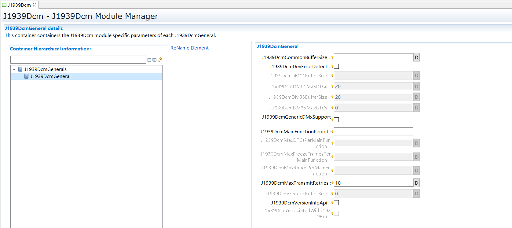

   J1939Dcm模块中的常规配置项参数描述

.. table:: J1939DcmGeneral
   :name: J1939DcmGeneral
   :align: left

   +----------------------------+------------------------------------------------------------------------------------------------------------------------+
   | J1939DcmGeneral            | Contains the general configuration parameters of the module.                                                           |
   +============================+================+=======================================================================================================+
   | J1939DcmVersionInfoApi     | Description    | Pre-processor switch for enabling version info API support.                                           |
   |                            +----------------+-------------------------------------------------------------------------------------------------------+
   |                            | PB Supported   | false                                                                                                 |
   |                            +----------------+-------------------------------------------------------------------------------------------------------+
   |                            | Multiplicity   | 1                                                                                                     |
   |                            +----------------+-------------------------------------------------------------------------------------------------------+
   |                            | Type           | boolean                                                                                               |
   |                            +----------------+-------------------------------------------------------------------------------------------------------+
   |                            | Value Range    | true..false                                                                                           |
   |                            +----------------+-------------------------------------------------------------------------------------------------------+
   |                            | Default Value  | false                                                                                                 |
   +----------------------------+----------------+-------------------------------------------------------------------------------------------------------+
   | J1939DcmDevErrorDetect     | Description    | Switches the development error detection and notification on or off.                                  |
   |                            +----------------+-------------------------------------------------------------------------------------------------------+
   |                            | PB Supported   | false                                                                                                 |
   |                            +----------------+-------------------------------------------------------------------------------------------------------+
   |                            | Multiplicity   | 1                                                                                                     |
   |                            +----------------+-------------------------------------------------------------------------------------------------------+
   |                            | Type           | boolean                                                                                               |
   |                            +----------------+-------------+-----------------------------------------------------------------------------------------+
   |                            | Value Range    | true        | detection and notification is enabled.                                                  |
   |                            |                +-------------+-----------------------------------------------------------------------------------------+
   |                            |                | false       | detection and notification is disabled.                                                 |
   |                            +----------------+-------------+-----------------------------------------------------------------------------------------+
   |                            | Default Value  | false                                                                                                 |
   |                            +----------------+-------------------------------------------------------------------------------------------------------+
   |                            | Dependency     | Depends on the configuration of Det                                                                   |
   +----------------------------+----------------+-------------------------------------------------------------------------------------------------------+
   | J1939DcmCommonBufferSize   | Description    | Size of common buffer; the buffer size should be as large as the longest command or response message  |
   |                            +----------------+-------------------------------------------------------------------------------------------------------+
   |                            | PB Supported   | false                                                                                                 |
   |                            +----------------+-------------------------------------------------------------------------------------------------------+
   |                            | Multiplicity   | 1                                                                                                     |
   |                            +----------------+-------------------------------------------------------------------------------------------------------+
   |                            | Type           | Integer                                                                                               |
   |                            +----------------+-------------------------------------------------------------------------------------------------------+
   |                            | Value Range    | 1..65535                                                                                              |
   |                            +----------------+-------------------------------------------------------------------------------------------------------+
   |                            | Default Value  | 1                                                                                                     |
   +----------------------------+----------------+-------------------------------------------------------------------------------------------------------+
   | J1939DcmDM01BufferSize     | Description    | Size of DM01 buffer. The buffer size should be as large as the longest DM01 response message.         |
   |                            +----------------+-------------------------------------------------------------------------------------------------------+
   |                            | PB Supported   | false                                                                                                 |
   |                            +----------------+-------------------------------------------------------------------------------------------------------+
   |                            | Multiplicity   | 0..1                                                                                                  |
   |                            +----------------+-------------------------------------------------------------------------------------------------------+
   |                            | Type           | Integer                                                                                               |
   |                            +----------------+-------------------------------------------------------------------------------------------------------+
   |                            | Value Range    | 1..65535                                                                                              |
   |                            +----------------+-------------------------------------------------------------------------------------------------------+
   |                            | Default Value  | 1                                                                                                     |
   |                            +----------------+-------------------------------------------------------------------------------------------------------+
   |                            | Dependency     | Depends on the configuration of DM01                                                                  |
   +----------------------------+----------------+-------------------------------------------------------------------------------------------------------+
   | J1939DcmDM35BufferSize     | Description    | Size of DM35 buffer. The buffer size should be as large as the longest DM35 response message.         |
   |                            +----------------+-------------------------------------------------------------------------------------------------------+
   |                            | PB Supported   | false                                                                                                 |
   |                            +----------------+-------------------------------------------------------------------------------------------------------+
   |                            | Multiplicity   | 0..1                                                                                                  |
   |                            +----------------+-------------------------------------------------------------------------------------------------------+
   |                            | Type           | Integer                                                                                               |
   |                            +----------------+-------------------------------------------------------------------------------------------------------+
   |                            | Value Range    | 1..65535                                                                                              |
   |                            +----------------+-------------------------------------------------------------------------------------------------------+
   |                            | Default Value  | 1                                                                                                     |
   |                            +----------------+-------------------------------------------------------------------------------------------------------+
   |                            | Dependency     | Depends on the configuration of DM01                                                                  |
   +----------------------------+----------------+-------------------------------------------------------------------------------------------------------+
   | J1939DcmDM01MaxDTCs        | Description    | Configuration value of limitation of maximum DTCs to be reported in the DM01 message.                 |
   |                            +----------------+-------------------------------------------------------------------------------------------------------+
   |                            | PB Supported   | false                                                                                                 |
   |                            +----------------+-------------------------------------------------------------------------------------------------------+
   |                            | Multiplicity   | 0..1                                                                                                  |
   |                            +----------------+-------------------------------------------------------------------------------------------------------+
   |                            | Type           | Integer                                                                                               |
   |                            +----------------+-------------------------------------------------------------------------------------------------------+
   |                            | Value Range    | 1..255                                                                                                |
   |                            +----------------+-------------------------------------------------------------------------------------------------------+
   |                            | Default Value  | 20                                                                                                    |
   |                            +----------------+-------------------------------------------------------------------------------------------------------+
   |                            | Dependency     | Depends on the configuration of DM01                                                                  |
   +----------------------------+----------------+-------------------------------------------------------------------------------------------------------+
   | J1939DcmDM35MaxDTCs        | Description    | Configuration value of limitation of maximum DTCs to be reported in the DM35 message.                 |
   |                            +----------------+-------------------------------------------------------------------------------------------------------+
   |                            | PB Supported   | false                                                                                                 |
   |                            +----------------+-------------------------------------------------------------------------------------------------------+
   |                            | Multiplicity   | 0..1                                                                                                  |
   |                            +----------------+-------------------------------------------------------------------------------------------------------+
   |                            | Type           | Integer                                                                                               |
   |                            +----------------+-------------------------------------------------------------------------------------------------------+
   |                            | Value Range    | 1..255                                                                                                |
   |                            +----------------+-------------------------------------------------------------------------------------------------------+
   |                            | Default Value  | 20                                                                                                    |
   |                            +----------------+-------------------------------------------------------------------------------------------------------+
   |                            | Dependency     | Depends on the configuration of DM35                                                                  |
   +----------------------------+----------------+-------------------------------------------------------------------------------------------------------+
   | J1939DcmGenericDMxSupport  | Description    | Switches the support for all DMx messages that are not directly implemented in J1939Dcm.              |
   |                            +----------------+-------------------------------------------------------------------------------------------------------+
   |                            | PB Supported   | false                                                                                                 |
   |                            +----------------+-------------------------------------------------------------------------------------------------------+
   |                            | Multiplicity   | 1                                                                                                     |
   |                            +----------------+-------------------------------------------------------------------------------------------------------+
   |                            | Type           | boolean                                                                                               |
   |                            +----------------+-------------+-----------------------------------------------------------------------------------------+
   |                            | Value Range    | true        | Unsupported DMx messages are handled by a CDD.                                          |
   |                            |                +-------------+-----------------------------------------------------------------------------------------+
   |                            |                | false       | Unsupported DMx messages are ignored/rejected.                                          |
   |                            +----------------+-------------+-----------------------------------------------------------------------------------------+
   |                            | Default Value  | false                                                                                                 |
   |                            +----------------+-------------------------------------------------------------------------------------------------------+
   |                            | Note           | The configuration item is not supported. It has been set to gray and is not checked by default.       |
   +----------------------------+----------------+-------------------------------------------------------------------------------------------------------+
   | J1939DcmMainFunctionPeriod | Description    | Call cycle in seconds of J1939Dcm_MainFunction.                                                       |
   |                            +----------------+-------------------------------------------------------------------------------------------------------+
   |                            | PB Supported   | false                                                                                                 |
   |                            +----------------+-------------------------------------------------------------------------------------------------------+
   |                            | Multiplicity   | 1                                                                                                     |
   |                            +----------------+-------------------------------------------------------------------------------------------------------+
   |                            | Type           | Float                                                                                                 |
   |                            +----------------+-------------------------------------------------------------------------------------------------------+
   |                            | Value Range    | 0..INF                                                                                                |
   |                            +----------------+-------------------------------------------------------------------------------------------------------+
   |                            | Default Value  | N/A                                                                                                   |
   |                            +----------------+-------------------------------------------------------------------------------------------------------+
   |                            | Dependency     | Depends on the configuration of Rte                                                                   |
   +----------------------------+----------------+-------------------------------------------------------------------------------------------------------+
   | J1939DcmMaxDTCs-           | Description    | Maximum threshold of DTCs filtered in a single MainFunction cycle.                                    |
   | PerMainFunction            +----------------+-------------------------------------------------------------------------------------------------------+
   |                            | PB Supported   | false                                                                                                 |
   |                            +----------------+-------------------------------------------------------------------------------------------------------+
   |                            | Multiplicity   | 0..1                                                                                                  |
   |                            +----------------+-------------------------------------------------------------------------------------------------------+
   |                            | Type           | Integer                                                                                               |
   |                            +----------------+-------------------------------------------------------------------------------------------------------+
   |                            | Value Range    | 1 .. 255                                                                                              |
   |                            +----------------+-------------------------------------------------------------------------------------------------------+
   |                            | Default Value  | N/A                                                                                                   |
   |                            +----------------+-------------------------------------------------------------------------------------------------------+
   |                            | Dependency     | Depends on the configuration of DTC                                                                   |
   +----------------------------+----------------+-------------------------------------------------------------------------------------------------------+
   | J1939DcmMaxFreezeFrames-   | Description    | Maximum threshold of FreezeFrames filtered in a single MainFunction cycle.                            |
   | PerMainFunction            +----------------+-------------------------------------------------------------------------------------------------------+
   |                            | PB Supported   | false                                                                                                 |
   |                            +----------------+-------------------------------------------------------------------------------------------------------+
   |                            | Multiplicity   | 0..1                                                                                                  |
   |                            +----------------+-------------------------------------------------------------------------------------------------------+
   |                            | Type           | Integer                                                                                               |
   |                            +----------------+-------------------------------------------------------------------------------------------------------+
   |                            | Value Range    | 1 .. 255                                                                                              |
   |                            +----------------+-------------------------------------------------------------------------------------------------------+
   |                            | Default Value  | N/A                                                                                                   |
   |                            +----------------+-------------------------------------------------------------------------------------------------------+
   |                            | Dependency     | Depends on the configuration of FreezeFrame                                                           |
   +----------------------------+----------------+-------------------------------------------------------------------------------------------------------+
   | J1939DcmMaxRatios-         | Description    | Maximum threshold of Ratios filtered in a single MainFunction cycle.                                  |
   | PerMainFunction            +----------------+-------------------------------------------------------------------------------------------------------+
   |                            | PB Supported   | false                                                                                                 |
   |                            +----------------+-------------------------------------------------------------------------------------------------------+
   |                            | Multiplicity   | 0..1                                                                                                  |
   |                            +----------------+-------------------------------------------------------------------------------------------------------+
   |                            | Type           | Integer                                                                                               |
   |                            +----------------+-------------------------------------------------------------------------------------------------------+
   |                            | Value Range    | 1 .. 255                                                                                              |
   |                            +----------------+-------------------------------------------------------------------------------------------------------+
   |                            | Default Value  | N/A                                                                                                   |
   |                            +----------------+-------------------------------------------------------------------------------------------------------+
   |                            | Dependency     | Depends on the configuration of Ratio                                                                 |
   +----------------------------+----------------+-------------------------------------------------------------------------------------------------------+
   | J1939DcmMaxTransmitRetries | Description    | Maximum number of retries to send a diagnostic message in case PduR_J1939DcmTransmit returns E_NOT_OK |
   |                            +----------------+-------------------------------------------------------------------------------------------------------+
   |                            | PB Supported   | false                                                                                                 |
   |                            +----------------+-------------------------------------------------------------------------------------------------------+
   |                            | Multiplicity   | 1                                                                                                     |
   |                            +----------------+-------------------------------------------------------------------------------------------------------+
   |                            | Type           | Integer                                                                                               |
   |                            +----------------+-------------------------------------------------------------------------------------------------------+
   |                            | Value Range    | 0 .. 255                                                                                              |
   |                            +----------------+-------------------------------------------------------------------------------------------------------+
   |                            | Default Value  | 10                                                                                                    |
   |                            +----------------+-------------------------------------------------------------------------------------------------------+
   |                            | Dependency     | Depends on the configuration of Ratio                                                                 |
   +----------------------------+----------------+-------------------------------------------------------------------------------------------------------+
   | J1939DcmGenericBufferSize  | Description    | Configuration value of limitation of maximum DTCs to be reported in the Generic DMx message.          |
   |                            +----------------+-------------------------------------------------------------------------------------------------------+
   |                            | PB Supported   | false                                                                                                 |
   |                            +----------------+-------------------------------------------------------------------------------------------------------+
   |                            | Multiplicity   | 1                                                                                                     |
   |                            +----------------+-------------------------------------------------------------------------------------------------------+
   |                            | Type           | Integer                                                                                               |
   |                            +----------------+-------------------------------------------------------------------------------------------------------+
   |                            | Value Range    | 1 .. 65535                                                                                            |
   |                            +----------------+-------------------------------------------------------------------------------------------------------+
   |                            | Default Value  | 1                                                                                                     |
   |                            +----------------+-------------------------------------------------------------------------------------------------------+
   |                            | Note           | This configuration item is not supported. It has been set to gray and filled with an empty string.    |
   +----------------------------+----------------+-------------------------------------------------------------------------------------------------------+
   | J1939DcmAssociated-        | Description    | Check if the J1939Rm component is integrated in the configuration project                             |
   | WithJ1939Rm                +----------------+-------------------------------------------------------------------------------------------------------+
   |                            | PB Supported   | false                                                                                                 |
   |                            +----------------+-------------------------------------------------------------------------------------------------------+
   |                            | Multiplicity   | 1                                                                                                     |
   |                            +----------------+-------------------------------------------------------------------------------------------------------+
   |                            | Type           | boolean                                                                                               |
   |                            +----------------+-------------------------------------------------------------------------------------------------------+
   |                            | Value Range    | true..false                                                                                           |
   |                            +----------------+-------------------------------------------------------------------------------------------------------+
   |                            | Default Value  | false                                                                                                 |
   |                            +----------------+-------------------------------------------------------------------------------------------------------+
   |                            | Dependency     | N/A                                                                                                   |
   +----------------------------+----------------+-------------------------------------------------------------------------------------------------------+

J1939Dcm模块的特定配置(Specific configuration of the J1939 DCM module)
-----------------------------------------------------------------------------

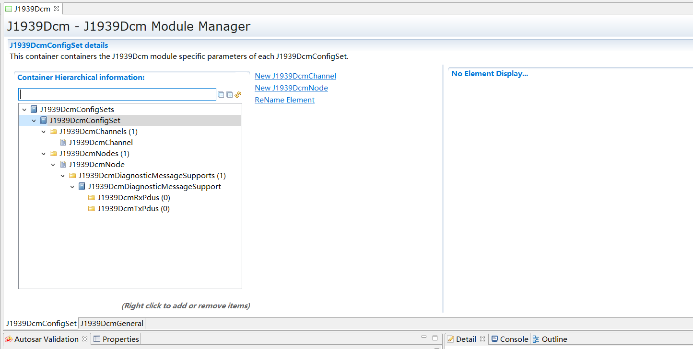

   J1939Dcm模块中的特定配置项参数描述

.. table:: J1939DcmConfigSet
   :name: J1939DcmConfigSet
   :align: left

   +---------------------+--------------------------------------------------------------------------------------------------------+
   | J1939DcmConfigSet   | This container contains the configuration parameters and sub containers of the AUTOSAR J1939Dcm module |
   +=====================+===================+====================================================================================+
   | J1939DcmChannel     | Description       | Contains the J1939DcmChannel parameters.                                           |
   |                     +-------------------+------------------------------------------------------------------------------------+
   |                     | PB Supported      | false                                                                              |
   |                     +-------------------+------------------------------------------------------------------------------------+
   |                     | Multiplicity      | 1..*                                                                               |
   |                     +-------------------+------------------------------------------------------------------------------------+
   |                     | Type              | N/A                                                                                |
   |                     +-------------------+------------------------------------------------------------------------------------+
   |                     | Value Range       | N/A                                                                                |
   |                     +-------------------+------------------------------------------------------------------------------------+
   |                     | Default Value     | N/A                                                                                |
   |                     +-------------------+------------------------------------------------------------------------------------+
   |                     | Dependency        | N/A                                                                                |
   +---------------------+-------------------+------------------------------------------------------------------------------------+
   | J1939DcmNode        | Description       | Contains the parameters for the support of a logical J1939 node.                   |
   |                     +-------------------+------------------------------------------------------------------------------------+
   |                     | PB Supported      | false                                                                              |
   |                     +-------------------+------------------------------------------------------------------------------------+
   |                     | Multiplicity      | 1..*                                                                               |
   |                     +-------------------+------------------------------------------------------------------------------------+
   |                     | Type              | N/A                                                                                |
   |                     +-------------------+------------------------------------------------------------------------------------+
   |                     | Value Range       | N/A                                                                                |
   |                     +-------------------+------------------------------------------------------------------------------------+
   |                     | Default Value     | N/A                                                                                |
   |                     +-------------------+------------------------------------------------------------------------------------+
   |                     | Dependency        | N/A                                                                                |
   +---------------------+-------------------+------------------------------------------------------------------------------------+

J1939DcmChannel
~~~~~~~~~~~~~~~~~~~~~~~~~~~~~~~~~~~~~

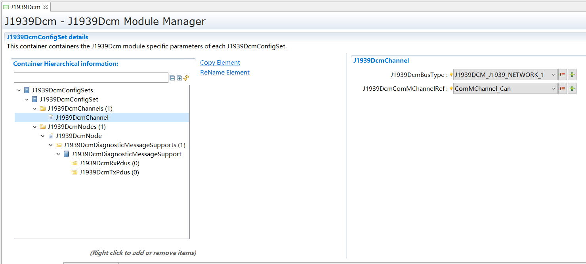

   J1939Dcm模块中的通道配置项参数描述

.. table:: J1939DcmChannel
   :name: J1939DcmChannel
   :align: left

   +------------------------+--------------------------------------------------------------------------------------------------------+
   | J1939DcmChannel        | Contains the J1939DcmChannel parameters.                                                               |
   +========================+===================+====================================================================================+
   | J1939DcmBusType        | Description       | Identifies the communication port                                                  |
   |                        +-------------------+------------------------------------------------------------------------------------+
   |                        | PB Supported      | false                                                                              |
   |                        +-------------------+------------------------------------------------------------------------------------+
   |                        | Multiplicity      | 1                                                                                  |
   |                        +-------------------+------------------------------------------------------------------------------------+
   |                        | Type              | Enumeration                                                                        |
   |                        +-------------------+------------------------------------------------------------------------------------+
   |                        | Value Range       | J1939DCM_ISO9141,J1939DCM_J1587,J1939DCM_J1850,J1939DCM_J1922,                     |
   |                        |                   | J1939DCM_J1939_NETWORK_1,J1939DCM_J1939_NETWORK_2,J1939DCM_J1939_NETWORK_3,        |
   |                        |                   | J1939DCM_J1939_NETWORK_4,J1939DCM_OTHER,J1939DCM_PROPRIETARY_NETWORK_1,            |
   |                        |                   | J1939DCM_PROPRIETARY_NETWORK_2                                                     |
   |                        +-------------------+------------------------------------------------------------------------------------+
   |                        | Default Value     | N/A                                                                                |
   |                        +-------------------+------------------------------------------------------------------------------------+
   |                        | Dependency        | N/A                                                                                |
   +------------------------+-------------------+------------------------------------------------------------------------------------+
   | J1939DcmComMChannelRef | Description       | Reference to the ComMChannel.                                                      |
   |                        +-------------------+------------------------------------------------------------------------------------+
   |                        | PB Supported      | true                                                                               |
   |                        +-------------------+------------------------------------------------------------------------------------+
   |                        | Multiplicity      | 1                                                                                  |
   |                        +-------------------+------------------------------------------------------------------------------------+
   |                        | Type              | Symbolic name reference to ComMChannel                                             |
   |                        +-------------------+------------------------------------------------------------------------------------+
   |                        | Value Range       | N/A                                                                                |
   |                        +-------------------+------------------------------------------------------------------------------------+
   |                        | Default Value     | N/A                                                                                |
   |                        +-------------------+------------------------------------------------------------------------------------+
   |                        | Dependency        | Depends on the configuration of ComM                                               |
   +------------------------+-------------------+------------------------------------------------------------------------------------+

J1939DcmNode
~~~~~~~~~~~~~~~~~~~~~~~~~~~~~~~~~~~~~

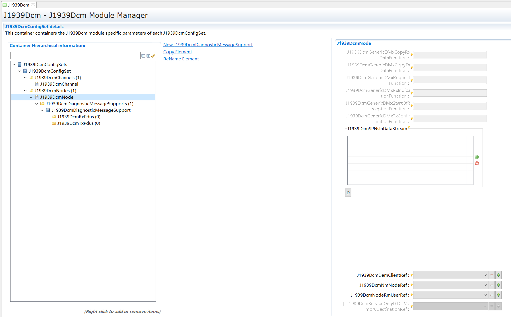

   J1939Dcm模块中的节点配置项参数描述

.. table:: J1939DcmNode
   :name: J1939DcmNode
   :align: left

   +----------------------------------------+--------------------------------------------------------------------------------------------------------+
   | J1939DcmNode                           | Contains the parameters for the support of a logical J1939 node.                                       |
   +========================================+===================+====================================================================================+
   | J1939DcmGenericDMxCopyRxDataFunction   | Description       | Provides part of the data of an unsupported DMx message.                           |
   |                                        |                   | Required if J1939DcmGenericDMxSupport is enabled.                                  |
   |                                        +-------------------+------------------------------------------------------------------------------------+
   |                                        | PB Supported      | false                                                                              |
   |                                        +-------------------+------------------------------------------------------------------------------------+
   |                                        | Multiplicity      | 0..1                                                                               |
   |                                        +-------------------+------------------------------------------------------------------------------------+
   |                                        | Type              | Function                                                                           |
   |                                        +-------------------+------------------------------------------------------------------------------------+
   |                                        | Value Range       | N/A                                                                                |
   |                                        +-------------------+------------------------------------------------------------------------------------+
   |                                        | Default Value     | N/A                                                                                |
   |                                        +-------------------+------------------------------------------------------------------------------------+
   |                                        | Note              | Not supported, set to grayscale, and filled with an empty string.                  |
   +----------------------------------------+-------------------+------------------------------------------------------------------------------------+
   | J1939DcmGenericDMxCopyTxDataFunction   | Description       | Requests to provide part of the data of an unsupported DMx message,                |
   |                                        |                   | following a call to J1939Dcm_GenericDMxTransmit.                                   |
   |                                        |                   | Required if J1939DcmGenericDMxSupport is enabled.                                  |
   |                                        +-------------------+------------------------------------------------------------------------------------+
   |                                        | PB Supported      | false                                                                              |
   |                                        +-------------------+------------------------------------------------------------------------------------+
   |                                        | Multiplicity      | 0..1                                                                               |
   |                                        +-------------------+------------------------------------------------------------------------------------+
   |                                        | Type              | Function                                                                           |
   |                                        +-------------------+------------------------------------------------------------------------------------+
   |                                        | Value Range       | N/A                                                                                |
   |                                        +-------------------+------------------------------------------------------------------------------------+
   |                                        | Default Value     | N/A                                                                                |
   |                                        +-------------------+------------------------------------------------------------------------------------+
   |                                        | Note              | Not supported, set to grayscale, and filled with an empty string.                  |
   +----------------------------------------+-------------------+------------------------------------------------------------------------------------+
   | J1939DcmGenericDMxRequestFunction      | Description       | Indicates the reception of a request for an unsupported DMx message.               |
   |                                        |                   | Required if J1939DcmGenericDMxSupport is enabled.                                  |
   |                                        +-------------------+------------------------------------------------------------------------------------+
   |                                        | PB Supported      | false                                                                              |
   |                                        +-------------------+------------------------------------------------------------------------------------+
   |                                        | Multiplicity      | 0..1                                                                               |
   |                                        +-------------------+------------------------------------------------------------------------------------+
   |                                        | Type              | Function                                                                           |
   |                                        +-------------------+------------------------------------------------------------------------------------+
   |                                        | Value Range       | N/A                                                                                |
   |                                        +-------------------+------------------------------------------------------------------------------------+
   |                                        | Default Value     | N/A                                                                                |
   |                                        +-------------------+------------------------------------------------------------------------------------+
   |                                        | Note              | Not supported, set to grayscale, and filled with an empty string.                  |
   +----------------------------------------+-------------------+------------------------------------------------------------------------------------+
   | J1939DcmGenericDMxRxIndicationFunction | Description       | Confirms complete reception of an unsupported DMx message.                         |
   |                                        |                   | Required if J1939DcmGenericDMxSupport is enabled.                                  |
   |                                        +-------------------+------------------------------------------------------------------------------------+
   |                                        | PB Supported      | false                                                                              |
   |                                        +-------------------+------------------------------------------------------------------------------------+
   |                                        | Multiplicity      | 0..1                                                                               |
   |                                        +-------------------+------------------------------------------------------------------------------------+
   |                                        | Type              | Function                                                                           |
   |                                        +-------------------+------------------------------------------------------------------------------------+
   |                                        | Value Range       | N/A                                                                                |
   |                                        +-------------------+------------------------------------------------------------------------------------+
   |                                        | Default Value     | N/A                                                                                |
   |                                        +-------------------+------------------------------------------------------------------------------------+
   |                                        | Note              | Not supported, set to grayscale, and filled with an empty string.                  |
   +----------------------------------------+-------------------+------------------------------------------------------------------------------------+
   | J1939DcmGenericDMxStartOfReception-    | Description       | Indicates reception of an unsupported DMx message.                                 |
   | Function                               |                   | Required if J1939DcmGenericDMxSupport is enabled.                                  |
   |                                        +-------------------+------------------------------------------------------------------------------------+
   |                                        | PB Supported      | false                                                                              |
   |                                        +-------------------+------------------------------------------------------------------------------------+
   |                                        | Multiplicity      | 0..1                                                                               |
   |                                        +-------------------+------------------------------------------------------------------------------------+
   |                                        | Type              | Function                                                                           |
   |                                        +-------------------+------------------------------------------------------------------------------------+
   |                                        | Value Range       | N/A                                                                                |
   |                                        +-------------------+------------------------------------------------------------------------------------+
   |                                        | Default Value     | N/A                                                                                |
   |                                        +-------------------+------------------------------------------------------------------------------------+
   |                                        | Note              | Not supported, set to grayscale, and filled with an empty string.                  |
   +----------------------------------------+-------------------+------------------------------------------------------------------------------------+
   | J1939DcmGenericDMxTxConfirmation-      | Description       | Confirms transmission of an unsupported DMx message.                               |
   | Function                               |                   | Required if J1939DcmGenericDMxSupport is enabled.                                  |
   |                                        +-------------------+------------------------------------------------------------------------------------+
   |                                        | PB Supported      | false                                                                              |
   |                                        +-------------------+------------------------------------------------------------------------------------+
   |                                        | Multiplicity      | 0..1                                                                               |
   |                                        +-------------------+------------------------------------------------------------------------------------+
   |                                        | Type              | Function                                                                           |
   |                                        +-------------------+------------------------------------------------------------------------------------+
   |                                        | Value Range       | N/A                                                                                |
   |                                        +-------------------+------------------------------------------------------------------------------------+
   |                                        | Default Value     | N/A                                                                                |
   |                                        +-------------------+------------------------------------------------------------------------------------+
   |                                        | Note              | Not supported, set to grayscale, and filled with an empty string.                  |
   +----------------------------------------+-------------------+------------------------------------------------------------------------------------+
   | J1939DcmSPNsInDataStream               | Description       | Defines the SPNs available in data stream for use in DM24.                         |
   |                                        +-------------------+------------------------------------------------------------------------------------+
   |                                        | PB Supported      | false                                                                              |
   |                                        +-------------------+------------------------------------------------------------------------------------+
   |                                        | Multiplicity      | 0..*                                                                               |
   |                                        +-------------------+------------------------------------------------------------------------------------+
   |                                        | Type              | Integer                                                                            |
   |                                        +-------------------+------------------------------------------------------------------------------------+
   |                                        | Value Range       | 0..524287                                                                          |
   |                                        +-------------------+------------------------------------------------------------------------------------+
   |                                        | Default Value     | N/A                                                                                |
   |                                        +-------------------+------------------------------------------------------------------------------------+
   |                                        | Dependency        | Depends on the configuration of DM24                                               |
   +----------------------------------------+-------------------+------------------------------------------------------------------------------------+
   | J1939DcmDemClientRef                   | Description       | Reference to the corresponding Dem Client.                                         |
   |                                        +-------------------+------------------------------------------------------------------------------------+
   |                                        | PB Supported      | false                                                                              |
   |                                        +-------------------+------------------------------------------------------------------------------------+
   |                                        | Multiplicity      | 1                                                                                  |
   |                                        +-------------------+------------------------------------------------------------------------------------+
   |                                        | Type              | Symbolic name reference to DemClient                                               |
   |                                        +-------------------+------------------------------------------------------------------------------------+
   |                                        | Value Range       | N/A                                                                                |
   |                                        +-------------------+------------------------------------------------------------------------------------+
   |                                        | Default Value     | N/A                                                                                |
   |                                        +-------------------+------------------------------------------------------------------------------------+
   |                                        | Note              | Not supported, set to grayscale, not selected.                                     |
   +----------------------------------------+-------------------+------------------------------------------------------------------------------------+
   | J1939DcmNmNodeRef                      | Description       | Reference to the corresponding J1939Nm node.                                       |
   |                                        +-------------------+------------------------------------------------------------------------------------+
   |                                        | PB Supported      | false                                                                              |
   |                                        +-------------------+------------------------------------------------------------------------------------+
   |                                        | Multiplicity      | 1                                                                                  |
   |                                        +-------------------+------------------------------------------------------------------------------------+
   |                                        | Type              | Symbolic name reference to J1939NmNode                                             |
   |                                        +-------------------+------------------------------------------------------------------------------------+
   |                                        | Value Range       | N/A                                                                                |
   |                                        +-------------------+------------------------------------------------------------------------------------+
   |                                        | Default Value     | N/A                                                                                |
   |                                        +-------------------+------------------------------------------------------------------------------------+
   |                                        | Dependency        | Depends on the configuration of J1939Nm                                            |
   +----------------------------------------+-------------------+------------------------------------------------------------------------------------+
   | J1939DcmNodeRmUserRef                  | Description       | Reference to the J1939RmUser used by J1939Dcm.                                     |
   |                                        +-------------------+------------------------------------------------------------------------------------+
   |                                        | PB Supported      | true                                                                               |
   |                                        +-------------------+------------------------------------------------------------------------------------+
   |                                        | Multiplicity      | 1                                                                                  |
   |                                        +-------------------+------------------------------------------------------------------------------------+
   |                                        | Type              | Symbolic name reference to J1939RmDcmUser                                          |
   |                                        +-------------------+------------------------------------------------------------------------------------+
   |                                        | Value Range       | N/A                                                                                |
   |                                        +-------------------+------------------------------------------------------------------------------------+
   |                                        | Default Value     | N/A                                                                                |
   |                                        +-------------------+------------------------------------------------------------------------------------+
   |                                        | Dependency        | Depends on the configuration of J1939Rm                                            |
   +----------------------------------------+-------------------+------------------------------------------------------------------------------------+
   | J1939DcmServiceOnlyDTCs-               | Description       | Reference to the user defined memory used for the Service Only DTCs                |
   | MemoryDestinationRef                   |                   | handled by DM53, DM54, and DM55.                                                   |
   |                                        +-------------------+------------------------------------------------------------------------------------+
   |                                        | PB Supported      | false                                                                              |
   |                                        +-------------------+------------------------------------------------------------------------------------+
   |                                        | Multiplicity      | 0..1                                                                               |
   |                                        +-------------------+------------------------------------------------------------------------------------+
   |                                        | Type              | Symbolic name reference to DemUserDefinedMemory                                    |
   |                                        +-------------------+------------------------------------------------------------------------------------+
   |                                        | Value Range       | N/A                                                                                |
   |                                        +-------------------+------------------------------------------------------------------------------------+
   |                                        | Default Value     | N/A                                                                                |
   |                                        +-------------------+------------------------------------------------------------------------------------+
   |                                        | Note              | Not supported, set to grayscale, not selected.                                     |
   +----------------------------------------+-------------------+------------------------------------------------------------------------------------+

J1939DcmDiagnosticMessageSupport
~~~~~~~~~~~~~~~~~~~~~~~~~~~~~~~~~~~~~

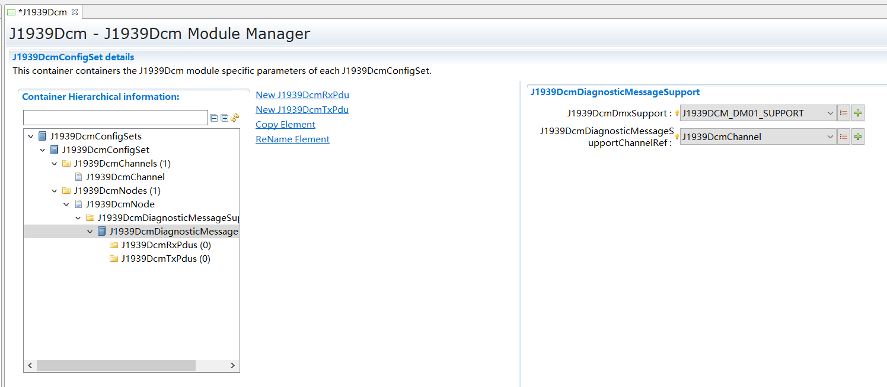

   J1939Dcm模块中的诊断消息支持配置项参数描述

.. table:: J1939DcmDiagnosticMessageSupport
   :name: J1939DcmDiagnosticMessageSupport
   :align: left

   +----------------------------------------+--------------------------------------------------------------------------------------------------------+
   | J1939DcmDiagnosticMessageSupport       | Contains parameters to configure the diagnostic message support.                                       |
   +========================================+===================+====================================================================================+
   | J1939DcmDmxSupport                     | Description       | This parameter is used to identify the actual DMx message.                         |
   |                                        +-------------------+------------------------------------------------------------------------------------+
   |                                        | PB Supported      | false                                                                              |
   |                                        +-------------------+------------------------------------------------------------------------------------+
   |                                        | Multiplicity      | 1                                                                                  |
   |                                        +-------------------+------------------------------------------------------------------------------------+
   |                                        | Type              | Enumeration                                                                        |
   |                                        +-------------------+------------------------------------------------------------------------------------+
   |                                        | Value Range       | J1939DCM_DM01_SUPPORT,J1939DCM_DM02_SUPPORT,J1939DCM_DM03_SUPPORT,                 |
   |                                        |                   | J1939DCM_DM04_SUPPORT,J1939DCM_DM05_SUPPORT,J1939DCM_DM06_SUPPORT,                 |
   |                                        |                   | J1939DCM_DM10_SUPPORT,J1939DCM_DM11_SUPPORT,J1939DCM_DM12_SUPPORT,                 |
   |                                        |                   | J1939DCM_DM13_SUPPORT,J1939DCM_DM19_SUPPORT,J1939DCM_DM20_SUPPORT,                 |
   |                                        |                   | J1939DCM_DM21_SUPPORT,J1939DCM_DM23_SUPPORT,J1939DCM_DM24_SUPPORT,                 |
   |                                        |                   | J1939DCM_DM25_SUPPORT,J1939DCM_DM26_SUPPORT,J1939DCM_DM28_SUPPORT,                 |
   |                                        |                   | J1939DCM_DM29_SUPPORT,J1939DCM_DM31_SUPPORT,J1939DCM_DM35_SUPPORT,                 |
   |                                        |                   | J1939DCM_DM53_SUPPORT,J1939DCM_DM54_SUPPORT,J1939DCM_DM55_SUPPORT,                 |
   |                                        +-------------------+------------------------------------------------------------------------------------+
   |                                        | Default Value     | N/A                                                                                |
   |                                        +-------------------+------------------------------------------------------------------------------------+
   |                                        | Dependency        | N/A                                                                                |
   +----------------------------------------+-------------------+------------------------------------------------------------------------------------+
   | J1939DcmDiagnosticMessage-             | Description       | Reference to J1939DcmChannel for which this diagnostic message is supported.       |
   | SupportChannelRef                      +-------------------+------------------------------------------------------------------------------------+
   |                                        | PB Supported      | false                                                                              |
   |                                        +-------------------+------------------------------------------------------------------------------------+
   |                                        | Multiplicity      | 1                                                                                  |
   |                                        +-------------------+------------------------------------------------------------------------------------+
   |                                        | Type              | Reference to J1939DcmChannel                                                       |
   |                                        +-------------------+------------------------------------------------------------------------------------+
   |                                        | Value Range       | N/A                                                                                |
   |                                        +-------------------+------------------------------------------------------------------------------------+
   |                                        | Default Value     | N/A                                                                                |
   |                                        +-------------------+------------------------------------------------------------------------------------+
   |                                        | Dependency        | Depends on the configuration of J1939DcmChannel                                    |
   +----------------------------------------+-------------------+------------------------------------------------------------------------------------+

J1939DcmRxPdu
~~~~~~~~~~~~~~~~~~~~~~~~~~~~~~~~~~~~~

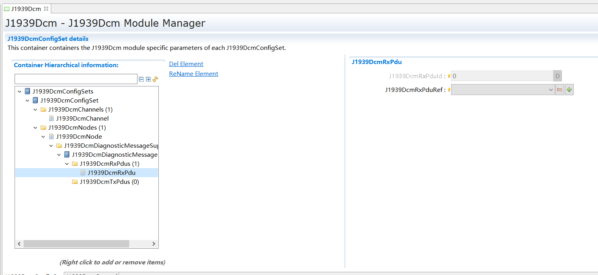

   J1939Dcm模块中的Rx-Pdu配置项参数描述

.. table:: J1939DcmRxPdu
   :name: J1939DcmRxPdu
   :align: left

   +----------------------+--------------------------------------------------------------------------------------------------------+
   | J1939DcmRxPdu        | Contains parameters to configure the J1939DcmRxPdu.                                                    |
   +======================+===================+====================================================================================+
   | J1939DcmRxPduId      | Description       | The I-PDU identifier used for communication with PduR.                             |
   |                      +-------------------+------------------------------------------------------------------------------------+
   |                      | PB Supported      | false                                                                              |
   |                      +-------------------+------------------------------------------------------------------------------------+
   |                      | Multiplicity      | 1                                                                                  |
   |                      +-------------------+------------------------------------------------------------------------------------+
   |                      | Type              | Integer                                                                            |
   |                      +-------------------+------------------------------------------------------------------------------------+
   |                      | Value Range       | 0..65535                                                                           |
   |                      +-------------------+------------------------------------------------------------------------------------+
   |                      | Default Value     | 0                                                                                  |
   |                      +-------------------+------------------------------------------------------------------------------------+
   |                      | Dependency        | Depends on the configuration of PduR-EcuC                                          |
   +----------------------+-------------------+------------------------------------------------------------------------------------+
   | J1939DcmRxPduRef     | Description       | Reference to the global Pdu element in the Ecuc module.                            |
   |                      +-------------------+------------------------------------------------------------------------------------+
   |                      | PB Supported      | true                                                                               |
   |                      +-------------------+------------------------------------------------------------------------------------+
   |                      | Multiplicity      | 1                                                                                  |
   |                      +-------------------+------------------------------------------------------------------------------------+
   |                      | Type              | Reference to Pdu                                                                   |
   |                      +-------------------+------------------------------------------------------------------------------------+
   |                      | Value Range       | N/A                                                                                |
   |                      +-------------------+------------------------------------------------------------------------------------+
   |                      | Default Value     | N/A                                                                                |
   |                      +-------------------+------------------------------------------------------------------------------------+
   |                      | Dependency        | Depends on the configuration of PduR-EcuC                                          |
   +----------------------+-------------------+------------------------------------------------------------------------------------+

备注：DM03，DM11，DM55禁止创建J1939DcmRxPdu容器，并且只有DM13才能创建J1939DcmRxPdu容器。

J1939DcmTxPdu
~~~~~~~~~~~~~~~~~~~~~~~~~~~~~~~~~~~~~

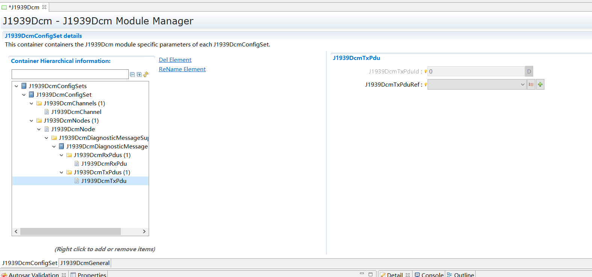

   J1939Dcm模块中的Tx-Pdu配置项参数描述

.. table:: J1939DcmTxPdu
   :name: J1939DcmTxPdu
   :align: left

   +----------------------+--------------------------------------------------------------------------------------------------------+
   | J1939DcmTxPdu        | Contains parameters to configure the J1939DcmTxPdu.                                                    |
   +======================+===================+====================================================================================+
   | J1939DcmTxPduId      | Description       | The I-PDU identifier used to identify the Tx message.                              |
   |                      +-------------------+------------------------------------------------------------------------------------+
   |                      | PB Supported      | false                                                                              |
   |                      +-------------------+------------------------------------------------------------------------------------+
   |                      | Multiplicity      | 1                                                                                  |
   |                      +-------------------+------------------------------------------------------------------------------------+
   |                      | Type              | Integer                                                                            |
   |                      +-------------------+------------------------------------------------------------------------------------+
   |                      | Value Range       | 0..65535                                                                           |
   |                      +-------------------+------------------------------------------------------------------------------------+
   |                      | Default Value     | 0                                                                                  |
   |                      +-------------------+------------------------------------------------------------------------------------+
   |                      | Dependency        | Depends on the configuration of PduR-EcuC                                          |
   +----------------------+-------------------+------------------------------------------------------------------------------------+
   | J1939DcmTxPduRef     | Description       | Reference to the global Pdu element in the Ecuc module.                            |
   |                      +-------------------+------------------------------------------------------------------------------------+
   |                      | PB Supported      | true                                                                               |
   |                      +-------------------+------------------------------------------------------------------------------------+
   |                      | Multiplicity      | 1                                                                                  |
   |                      +-------------------+------------------------------------------------------------------------------------+
   |                      | Type              | Reference to Pdu                                                                   |
   |                      +-------------------+------------------------------------------------------------------------------------+
   |                      | Value Range       | N/A                                                                                |
   |                      +-------------------+------------------------------------------------------------------------------------+
   |                      | Default Value     | N/A                                                                                |
   |                      +-------------------+------------------------------------------------------------------------------------+
   |                      | Dependency        | Depends on the configuration of PduR-EcuC                                          |
   +----------------------+-------------------+------------------------------------------------------------------------------------+

备注：DM03，DM11，DM55禁止创建J1939DcmTxPdu容器，并且只有DM01,DM02,DM04,DM05,DM06,DM12,DM19,DM20,DM21,DM23,DM24,DM25,DM26,DM27,DM28,DM29,DM31,DM35,DM53,DM54才能创建J1939DcmTxPdu容器。
