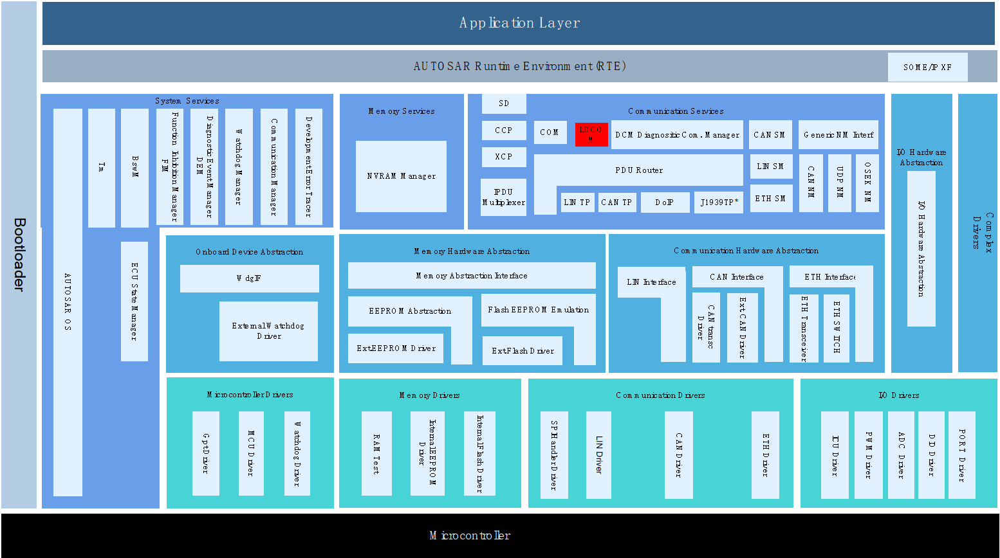
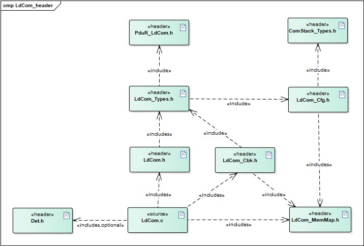
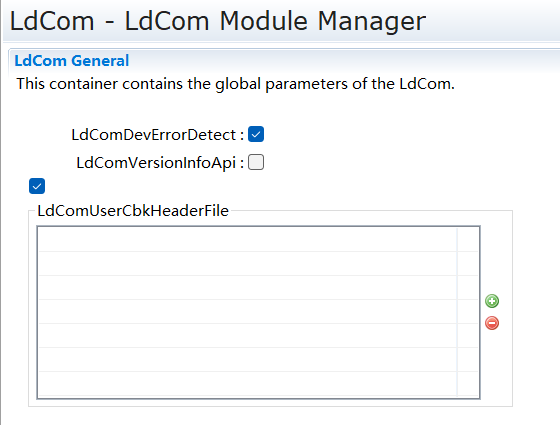
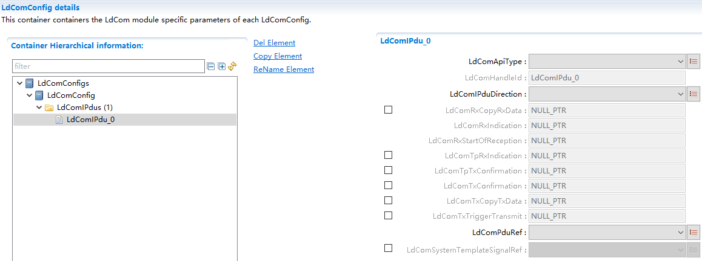

LdCom
#################################

:strong:`缩写词注解 (Abbreviation Notes):`

.. list-table::
   :widths: 34 33 33
   :header-rows: 1

   * - 缩写词 (Abbreviation)
     - 解释/描述 (Explanation/Description)
     - 中文解释 (Chinese explanation)
   * - I-PDU
     - Interaction LayerProtocol Data Unit
     - 交互层协议数据单元 (Protocol Data Unit of the Interaction Layer)
   * - DET
     - Default Error Tracer
     - 开发错误检测 (Develop error detection)
   * - LdCom
     - LargeDataCOM
     - “大数据信号”通信模块 ("Big Data Signal" Communication Module)

简介 (Introduction)
=================================

LdCom模块主要实现RTE（或者应用层）与PduR之间I-PDU的传递作用，实现IF PDU与TP PDU的发送与接收传递。所谓的“Large Data”指的是每个Pdu即为一个信号，而非大数据的PDU，LdCom只执行简单的Pdu收发，不涉及信号解析。

The LdCom module primarily实现RTE (or application layer) and PduR interaction for I-PDU transmission, achieving the sending and receiving transfer of IF PDU and TP PDU. So-called "Large Data" refers to each Pdu being a signal rather than big data PDUs; LdCom only executes simple Pdu reception and transmission without involving signal parsing.

LdCom模块处于AUTOSAR架构中的通信服务层，其下层模块为PduR模块，上层模块为RTE。

The LdCom module is in the communication service layer of the AUTOSAR architecture, with the PduR module as its lower-layer module and the RTE as its upper-layer module.

LdCom实现了与上下层模块间基于I-PDU传输的接口传递，包括IF Pdu的发送（Direct发送/TriggerTransmit发送），IF Pdu的接收，TP Pdu的发送，TP Pdu的接收，以及DET检测报错。

LdCom实现了一种基于I-PDU传输的接口传递，用于上下层模块间通信，包括IF Pdu的直接发送/触发发送、IF Pdu的接收、TP Pdu的发送、TP Pdu的接收以及DET检测错误。

参考资料 (Reference materials)
------------------------------------------

[1] AUTOSAR_SRS_COM.pdf, R19-11 and 4.2.2

[2] AUTOSAR_SWS_LargeDataCOM.pdf, R19-11 and 4.2.2

[3] AUTOSAR_SWS_PDURouter.pdf, R19-11 and 4.2.2

功能描述 (Function Description)
===========================================

IF PDU发送功能 (If PDU Sending Function)
----------------------------------------------------

IF PDU发送功能介绍 (Introduction of PDU Sending Function)
~~~~~~~~~~~~~~~~~~~~~~~~~~~~~~~~~~~~~~~~~~~~~~~~~~~~~~~~~~~~~~~~~~~

LdCom支持Pdu以IF方式进行发送，IF方式发送存在两种形式：1、直接调用LdCom_Transmit进行发送；2、下层调用LdCom_TriggerTransmit获取发送Pdu数据进行发送。

LdCom supports Pdu transmission via IF method. There are two forms of IF method transmission: 1、directly calling LdCom_Transmit for sending; 2、calling LdCom_TriggerTransmit at the lower layer to obtain and send the Pdu data.

IF PDU发送功能实现 (IF PDU Sending Function Implementation)
~~~~~~~~~~~~~~~~~~~~~~~~~~~~~~~~~~~~~~~~~~~~~~~~~~~~~~~~~~~~~~~~~~~~~

若Pdu以IF方式进行发送，需配置LdComIPdu的LdComApiType为LDCOM_IF，LdComIPduDirection为LDCOM_SEND，若该Pdu上层模块支持发送确认需配置LdComTxConfirmation，若支持TriggerTransmit方式发送，还需配置LdComTxTriggerTransmit。

If Pdu is sent via IF means, LdComIPdu's LdComApiType should be configured as LDCOM_IF and LdComIPduDirection as LDCOM_SEND. If the upper-layer module of this Pdu supports send confirmation, configure LdComTxConfirmation accordingly. If TriggerTransmit support is available for sending, additionally configure LdComTxTriggerTransmit.

需要直接发送该Pdu时，直接调用LdCom_Transmit进行发送，LdCom通过调用下层发送接口进行发送；若下层调用LdCom_TriggerTransmit获取发送数据时，LdCom调用配置的Rte_LdComCbkTriggerTransmit进行接口传递。

When the Pdu needs to be sent directly, call LdCom_Transmit for sending; LdCom sends through calling the lower-layer send interface. If the lower layer calls LdCom_TriggerTransmit to get the send data, LdCom uses the configured Rte_LdComCbkTriggerTransmit for interface transfer.

发送完成之后，下层调用LdCom_TxConfirmation，LdCom调用配置的Rte_LdComCbkTxConfirmation进行传递。

After sending is completed, the lower layer calls LdCom_TxConfirmation, and LdCom invokes the configured Rte_LdComCbkTxConfirmation for transmission.

IF PDU接收功能 (IF PDU Reception Function)
------------------------------------------------------

IF PDU接收功能介绍 (If PDU Reception Function Introduction)
~~~~~~~~~~~~~~~~~~~~~~~~~~~~~~~~~~~~~~~~~~~~~~~~~~~~~~~~~~~~~~~~~~~~~

LdCom支持Pdu以IF方式进行接收，下层接收到Pdu数据时直接调用LdCom_RxIndication传递给LdCom。

LdCom supports Pdu reception via IF, with the lower layer directly calling LdCom_RxIndication to pass Pdu data to LdCom.

IF PDU接收功能实现 (IF PDU Reception Function Implementation)
~~~~~~~~~~~~~~~~~~~~~~~~~~~~~~~~~~~~~~~~~~~~~~~~~~~~~~~~~~~~~~~~~~~~~~~

若Pdu以IF方式进行接收，需配置LdComIPdu的LdComApiType为LDCOM_IF，LdComIPduDirection为LDCOM_RECEIVE，配置LdComRxIndication。

If Pdu is received via IF method, LdComIPdu's LdComApiType should be configured as LDCOM_IF, LdComIPduDirection as LDCOM_RECEIVE, and LdComRxIndication should be configured.

当下层调用LdCom_RxIndication时，LdCom调用配置的Rte_LdComCbkRxIndication进行传递。

When the lower layer calls LdCom_RxIndication, LdCom invokes the configured Rte_LdComCbkRxIndication for transmission.

TP PDU发送功能 (TP PDU Sending Function)
----------------------------------------------------

TP PDU发送功能介绍 (Function Introduction for TP PDU Sending)
~~~~~~~~~~~~~~~~~~~~~~~~~~~~~~~~~~~~~~~~~~~~~~~~~~~~~~~~~~~~~~~~~~~~~~~

LdCom支持Pdu以TP方式进行发送，按TP发送流程Transmit→N次CopyTxData→TpTxConfirmation进行Pdu的发送。

LdCom supports Pdu transmission via TP, following the Transmit → N times CopyTxData → TpTxConfirmation process for Pdu sending.

TP PDU发送功能实现 (TP PDU Sending Function Implementation)
~~~~~~~~~~~~~~~~~~~~~~~~~~~~~~~~~~~~~~~~~~~~~~~~~~~~~~~~~~~~~~~~~~~~~

若Pdu以TP方式进行发送，需配置LdComIPdu的LdComApiType为LDCOM_TP，LdComIPduDirection为LDCOM_SEND，配置LdComTpTxConfirmation和LdComTxCopyTxData。

If Pdu is sent via TP, LdComIPdu's LdComApiType should be configured as LDCOM_TP, LdComIPduDirection as LDCOM_SEND, and configurations for LdComTpTxConfirmation and LdComTxCopyTxData are required.

上层模块调用LdCom_Transmit请求TxPdu的发送，下层模块回调LdCom_CopyTxData请求TxPdu数据段的拷贝，LdCom通过配置的Rte_LdComCbkCopyTxData进行传递，当整个TxPdu发送结束，下层调用LdCom_TpTxConfirmation，LdCom通过配置的Rte_LdComCbkTpTxConfirmation进行传递。

Upper layer modules call LdCom_Transmit to request the transmission of TxPdu, while the lower layer module callbacks LdCom_CopyTxData to request the copy of the TxPdu data segment, which is passed through the configured Rte_LdComCbkCopyTxData. When the entire TxPdu transmission ends, the lower layer calls LdCom_TpTxConfirmation, and LdCom passes through the configured Rte_LdComCbkTpTxConfirmation.

TP PDU接收功能 (TP PDU Reception Function)
------------------------------------------------------

TP PDU接收功能介绍 (Introduction to TP PDU Reception Function)
~~~~~~~~~~~~~~~~~~~~~~~~~~~~~~~~~~~~~~~~~~~~~~~~~~~~~~~~~~~~~~~~~~~~~~~~

LdCom支持Pdu以TP方式进行接收，按TP接收流程StartOfReception→N次CopyRxData→TpRxIndication进行Pdu的接收。

LdCom supports Pdu reception via TP, following the TP reception process: StartOfReception → N times CopyRxData → TpRxIndication for Pdu reception.

TP PDU接收功能实现 (Implementation of TP PDU Reception Function)
~~~~~~~~~~~~~~~~~~~~~~~~~~~~~~~~~~~~~~~~~~~~~~~~~~~~~~~~~~~~~~~~~~~~~~~~~~

若Pdu以TP方式进行接收，需配置LdComIPdu的LdComApiType为LDCOM_TP，LdComIPduDirection为LDCOM_RECEIVE，配置LdComRxStartOfReception、LdComRxCopyRxData和LdComTpRxIndication。

If Pdu is received via TP, configure LdComIPdu's LdComApiType as LDCOM_TP, LdComIPduDirection as LDCOM_RECEIVE, and set LdComRxStartOfReception, LdComRxCopyRxData, and LdComTpRxIndication.

下层模块调用LdCom_StartOfReception，LdCom_CopyRxData，LdCom_TpRxIndication时，LdCom依次调用配置的Rte_LdComCbkStartOfReception，Rte_LdComCbkCopyRxData，Rte_LdComCbkTpRxIndication进行传递。

When the lower layer module calls LdCom_StartOfReception, LdCom_CopyRxData, and LdCom_TpRxIndication, LdCom sequentially invokes the configured Rte_LdComCbkStartOfReception, Rte_LdComCbkCopyRxData, and Rte_LdComCbkTpRxIndication for transmission.

源文件描述 (Source file description)
===============================================

.. centered:: **表 LdCom组件文件描述 (Table LdCom Component File Description)**

.. list-table::
   :widths: 50 50
   :header-rows: 1

   * - 文件 (Files)
     - 说明 (Description)
   * - LdCom_Cfg.h
     - 定义LdCom模块PC配置的宏定义。 (Define macros for LdCom module PC configuration.)
   * - LdCom_Cfg.c
     - 定义LdCom模块PC/PB配置的结构体参数。 (Define structure parameters for LdCom module PC/PB configuration.)
   * - LdCom.h
     - 实现LdCom模块外部接口（除了回调函数）的声明，以及配置文件中全局变量的声明。 (Declare the external interface of the LdCom module (excluding callback functions) and the global variables in the configuration file.)
   * - LdCom.c
     - 作为LdCom模块的核心文件，实现LdCom模块全部对外接口，以及实现LdCom模块功能所必须的local函数，local宏定义，local变量定义。 (As the core file of the LdCom module, it implements all external interfaces of the LdCom module and the local functions, local macro definitions, and local variable definitions necessary to achieve the functionality of the LdCom module.)
   * - LdCom_MemMap.h
     - 实现LdCom模块内存布局。 (Implement LdCom module memory layout.)
   * - LdCom_Types.h
     - 实现外部/内部类型的定义，包括AUTOSAR标准定义的类型，以及PB/PC配置参数结构体类型，以及内部运行时结构体类型。 (Define external/internal types, including types defined by the AUTOSAR standard, as well as PB/PC configuration parameter structure types and internal runtime structure types.)
   * - LdCom \_Cbk.h
     - 实现LdCom模块全部回调函数的声明。 (Declare all callback functions of the LdCom module.)

API接口 (API Interface)
=====================================

类型定义 (Type definition)
--------------------------------------

LdCom_ConfigType类型定义 (LdCom_ConfigType Configuration Type Definition)
~~~~~~~~~~~~~~~~~~~~~~~~~~~~~~~~~~~~~~~~~~~~~~~~~~~~~~~~~~~~~~~~~~~~~~~~~~~~~~~~~~~~~

.. list-table::
   :widths: 50 50
   :header-rows: 1

   * - 名称 (Name)
     - LdCom_ConfigType
   * - 类型 (Type)
     - struct
   * - 范围 (Range)
     - 无
   * - 描述 (Description)
     - LdCom模块PB配置结构体类型 (LDCom Module PB Configuration Struct Type)

输入函数描述 (Describe the input function:)
-----------------------------------------------------

.. list-table::
   :widths: 50 50
   :header-rows: 1

   * - 输入模块 (Input Module)
     - API
   * - Det
     - Det_ReportError
   * - PduR
     - PduR_LdComTransmit
   * - Rte/Upper
     - Rte_LdComCbkCopyTxData\_<sn>
   * - 
     - Rte_LdComCbkTpTxConfirmation\_<sn>
   * - 
     - Rte_LdComCbkStartOfReception\_<sn>
   * - 
     - Rte_LdComCbkCopyRxData\_<sn>
   * - 
     - Rte_LdComCbkTpRxIndication\_<sn>
   * - 
     - Rte_LdComCbkRxIndication\_<sn>
   * - 
     - Rte_LdComCbkTriggerTransmit\_<sn>
   * - 
     - Rte_LdComCbkTxConfirmation\_<sn>

静态接口函数定义 (Static interface function definition)
---------------------------------------------------------------

LdCom_Init函数定义 (The LdCom_Init function definition)
~~~~~~~~~~~~~~~~~~~~~~~~~~~~~~~~~~~~~~~~~~~~~~~~~~~~~~~~~~~~~~~~~~~

.. list-table::
   :widths: 25 25 25 25
   :header-rows: 1

   * - 函数名称： (Function Name:)
     - LdCom_Init
     - 
     - 
   * - 函数原型： (Function prototype:)
     - void LdCom_Init(
     - 
     - 
   * - 
     - constLdCom_ConfigType\*config)
     - 
     - 
   * - 服务编号： (Service Number:)
     - 0x01
     - 
     - 
   * - 同步/异步： (Synchronous/asynchronous:)
     - 同步 (Sync)
     - 
     - 
   * - 是否可重入： (Is Reentrant:)
     - 否 (No)
     - 
     - 
   * - 输入参数： (Input parameters:)
     - config
     - 值域： (Domain:)
     - 无
   * - 输入输出参数： (Input Output Parameters:)
     - 无
     - 
     - 
   * - 输出参数： (Output Parameters:)
     - 无
     - 
     - 
   * - 返回值： (Return Value:)
     - 无
     - 
     - 
   * - 功能概述： (Function Overview:)
     - LdCom模块初始化 (Initialization of LdCom Module)
     - 
     - 

LdCom_DeInit函数定义 (The function definition for LdCom_DeInit)
~~~~~~~~~~~~~~~~~~~~~~~~~~~~~~~~~~~~~~~~~~~~~~~~~~~~~~~~~~~~~~~~~~~~~~~~~~~

.. list-table::
   :widths: 50 50
   :header-rows: 1

   * - 函数名称： (Function Name:)
     - LdCom_DeInit
   * - 函数原型： (Function prototype:)
     - void LdCom_DeInit(void)
   * - 服务编号： (Service Number:)
     - 0x02
   * - 同步/异步： (Synchronous/asynchronous:)
     - 同步 (Sync)
   * - 是否可重入： (Is Reentrant:)
     - 否 (No)
   * - 输入参数： (Input parameters:)
     - 无
   * - 输入输出参数： (Input Output Parameters:)
     - 无
   * - 输出参数： (Output Parameters:)
     - 无
   * - 返回值： (Return Value:)
     - 无
   * - 功能概述： (Function Overview:)
     - LdCom模块反初始化 (LdCom module reverse initialization)

LdCom_GetVersionInfo函数定义 (The LdCom_GetVersionInfo function definition)
~~~~~~~~~~~~~~~~~~~~~~~~~~~~~~~~~~~~~~~~~~~~~~~~~~~~~~~~~~~~~~~~~~~~~~~~~~~~~~~~~~~~~~~

.. list-table::
   :widths: 25 25 25 25
   :header-rows: 1

   * - 函数名称： (Function Name:)
     - LdCom_GetVersionInfo
     - 
     - 
   * - 函数原型： (Function prototype:)
     - voidLdCom_GetVersionInfo(
     - 
     - 
   * - 
     - Std_VersionInfoType\*versioninfo)
     - 
     - 
   * - 服务编号： (Service Number:)
     - 0x03
     - 
     - 
   * - 同步/异步： (Synchronous/asynchronous:)
     - 同步 (Sync)
     - 
     - 
   * - 是否可重入： (Is Reentrant:)
     - 否 (No)
     - 
     - 
   * - 输入参数： (Input parameters:)
     - 无
     - 
     - 
   * - 输入输出参数： (Input Output Parameters:)
     - 无
     - 
     - 
   * - 输出参数： (Output Parameters:)
     - versioninfo
     - 值域： (Domain:)
     - 无
   * - 返回值： (Return Value:)
     - 无
     - 
     - 
   * - 功能概述： (Function Overview:)
     - 获取模块软件版本信息 (Get module software version information)
     - 
     - 

LdCom_Transmit函数定义 (LdCom_Transmit function definition)
~~~~~~~~~~~~~~~~~~~~~~~~~~~~~~~~~~~~~~~~~~~~~~~~~~~~~~~~~~~~~~~~~~~~~~~

.. list-table::
   :widths: 25 25 25 25
   :header-rows: 1

   * - 函数名称： (Function Name:)
     - LdCom_Transmit
     - 
     - 
   * - 函数原型： (Function prototype:)
     - Std_ReturnTypeLdCom_Transmit(
     - 
     - 
   * - 
     - PduIdType Id,
     - 
     - 
   * - 
     - constPduInfoType\*PduInfoPtr)
     - 
     - 
   * - 服务编号： (Service Number:)
     - 0x05
     - 
     - 
   * - 同步/异步： (Synchronous/asynchronous:)
     - 同步 (Sync)
     - 
     - 
   * - 是否可重入： (Is Reentrant:)
     - 相同Pdu不可重入，不同Pdu可重入 (Same PDU not reentrant, different PDU reentrant)
     - 
     - 
   * - 输入参数： (Input parameters:)
     - Id
     - 值域： (Domain:)
     - 无
   * - 
     - PduInfoPtr
     - 值域： (Domain:)
     - 无
   * - 输入输出参数： (Input Output Parameters:)
     - 无
     - 
     - 
   * - 输出参数： (Output Parameters:)
     - 无
     - 
     - 
   * - 返回值： (Return Value:)
     - Std_ReturnType
     - 
     - 
   * - 功能概述： (Function Overview:)
     - IF/TP Pdu发送请求 (IF/TP Pdu Send Request)
     - 
     - 

LdCom_CopyTxData函数定义 (The LdCom_CopyTxData function definition)
~~~~~~~~~~~~~~~~~~~~~~~~~~~~~~~~~~~~~~~~~~~~~~~~~~~~~~~~~~~~~~~~~~~~~~~~~~~~~~~

.. list-table::
   :widths: 25 25 25 25
   :header-rows: 1

   * - 函数名称： (Function Name:)
     - LdCom_CopyTxData
     - 
     - 
   * - 函数原型： (Function prototype:)
     - BufReq_ReturnTypeLdCom_CopyTxData(
     - 
     - 
   * - 
     - PduIdType id,
     - 
     - 
   * - 
     - constPduInfoType\*info,
     - 
     - 
   * - 
     - RetryInfoType\*retry,
     - 
     - 
   * - 
     - PduLengthType\*availableDataPtr
     - 
     - 
   * - 
     - )
     - 
     - 
   * - 服务编号： (Service Number:)
     - 0x43
     - 
     - 
   * - 同步/异步： (Synchronous/asynchronous:)
     - 同步 (Sync)
     - 
     - 
   * - 是否可重入： (Is Reentrant:)
     - 是 (Is)
     - 
     - 
   * - 输入参数： (Input parameters:)
     - id
     - 值域： (Domain:)
     - 无
   * - 
     - info
     - 值域： (Domain:)
     - 无
   * - 
     - retry
     - 值域： (Domain:)
     - 无
   * - 输入输出参数： (Input Output Parameters:)
     - 无
     - 
     - 
   * - 输出参数： (Output Parameters:)
     - availableDataPtr
     - 值域： (Domain:)
     - 无
   * - 返回值： (Return Value:)
     - BufReq_ReturnType
     - 
     - 
   * - 功能概述： (Function Overview:)
     - TPPdu发送数据段拷贝 (TPPdu sends data segment copy)
     - 
     - 

LdCom_TpTxConfirmation函数定义 (The LdCom_TpTxConfirmation function definition)
~~~~~~~~~~~~~~~~~~~~~~~~~~~~~~~~~~~~~~~~~~~~~~~~~~~~~~~~~~~~~~~~~~~~~~~~~~~~~~~~~~~~~~~~~~~

.. list-table::
   :widths: 25 25 25 25
   :header-rows: 1

   * - 函数名称： (Function Name:)
     - LdCom_TpTxConfirmation
     - 
     - 
   * - 函数原型： (Function prototype:)
     - voidLdCom_TpTxConfirmation(
     - 
     - 
   * - 
     - PduIdType id,
     - 
     - 
   * - 
     - Std_ReturnTyperesult
     - 
     - 
   * - 
     - )
     - 
     - 
   * - 服务编号： (Service Number:)
     - 0x48
     - 
     - 
   * - 同步/异步： (Synchronous/asynchronous:)
     - 同步 (Sync)
     - 
     - 
   * - 是否可重入： (Is Reentrant:)
     - 是 (Is)
     - 
     - 
   * - 输入参数： (Input parameters:)
     - id
     - 值域： (Domain:)
     - 无
   * - 
     - result
     - 值域： (Domain:)
     - 无
   * - 输入输出参数： (Input Output Parameters:)
     - 无
     - 
     - 
   * - 输出参数： (Output Parameters:)
     - 无
     - 
     - 
   * - 返回值： (Return Value:)
     - 无
     - 
     - 
   * - 功能概述： (Function Overview:)
     - TPPdu发送结束确认 (TPPdu Sent End Confirmation)
     - 
     - 

LdCom_StartOfReception函数定义 (LdCom_StartOfReception function definition)
~~~~~~~~~~~~~~~~~~~~~~~~~~~~~~~~~~~~~~~~~~~~~~~~~~~~~~~~~~~~~~~~~~~~~~~~~~~~~~~~~~~~~~~

.. list-table::
   :widths: 25 25 25 25
   :header-rows: 1

   * - 函数名称： (Function Name:)
     - LdCom_StartOfReception
     - 
     - 
   * - 函数原型： (Function prototype:)
     - BufReq_ReturnTypeLdCom_StartOfReception(
     - 
     - 
   * - 
     - PduIdType id,
     - 
     - 
   * - 
     - constPduInfoType\*info,
     - 
     - 
   * - 
     - PduLengthTypeTpSduLength,
     - 
     - 
   * - 
     - PduLengthType\*bufferSizePtr
     - 
     - 
   * - 
     - )
     - 
     - 
   * - 服务编号： (Service Number:)
     - 0x46
     - 
     - 
   * - 同步/异步： (Synchronous/asynchronous:)
     - 同步 (Sync)
     - 
     - 
   * - 是否可重入： (Is Reentrant:)
     - 是 (Is)
     - 
     - 
   * - 输入参数： (Input parameters:)
     - id
     - 值域： (Domain:)
     - 无
   * - 
     - info
     - 值域： (Domain:)
     - 无
   * - 
     - TpSduLength
     - 值域： (Domain:)
     - 无
   * - 输入输出参数： (Input Output Parameters:)
     - 无
     - 
     - 
   * - 输出参数： (Output Parameters:)
     - bufferSizePtr
     - 
     - 
   * - 返回值： (Return Value:)
     - BufReq_ReturnType
     - 
     - 
   * - 功能概述： (Function Overview:)
     - TP Pdu开始接收 (TP Pdu Start Receiving)
     - 
     - 

LdCom_CopyRxData函数定义 (Function LdCom_CopyRxData defined)
~~~~~~~~~~~~~~~~~~~~~~~~~~~~~~~~~~~~~~~~~~~~~~~~~~~~~~~~~~~~~~~~~~~~~~~~

.. list-table::
   :widths: 25 25 25 25
   :header-rows: 1

   * - 函数名称： (Function Name:)
     - LdCom_CopyRxData
     - 
     - 
   * - 函数原型： (Function prototype:)
     - BufReq_ReturnTypeLdCom_CopyRxData(
     - 
     - 
   * - 
     - PduIdType id,
     - 
     - 
   * - 
     - constPduInfoType\*info,
     - 
     - 
   * - 
     - PduLengthType\*bufferSizePtr
     - 
     - 
   * - 
     - )
     - 
     - 
   * - 服务编号： (Service Number:)
     - 0x44
     - 
     - 
   * - 同步/异步： (Synchronous/asynchronous:)
     - 同步 (Sync)
     - 
     - 
   * - 是否可重入： (Is Reentrant:)
     - 是 (Is)
     - 
     - 
   * - 输入参数： (Input parameters:)
     - id
     - 值域： (Domain:)
     - 无
   * - 
     - info
     - 值域： (Domain:)
     - 无
   * - 输入输出参数： (Input Output Parameters:)
     - 无
     - 
     - 
   * - 输出参数： (Output Parameters:)
     - bufferSizePtr
     - 值域： (Domain:)
     - 无
   * - 返回值： (Return Value:)
     - BufReq_ReturnType
     - 
     - 
   * - 功能概述： (Function Overview:)
     - TPPdu接收数据段拷贝 (TPPdu Receives Data Segment Copy)
     - 
     - 

LdCom_TpRxIndication函数定义 (The LdCom_TpRxIndication function definition)
~~~~~~~~~~~~~~~~~~~~~~~~~~~~~~~~~~~~~~~~~~~~~~~~~~~~~~~~~~~~~~~~~~~~~~~~~~~~~~~~~~~~~~~

.. list-table::
   :widths: 25 25 25 25
   :header-rows: 1

   * - 函数名称： (Function Name:)
     - LdCom_TpRxIndication
     - 
     - 
   * - 函数原型： (Function prototype:)
     - voidLdCom_TpRxIndication(
     - 
     - 
   * - 
     - PduIdType id,
     - 
     - 
   * - 
     - Std_ReturnTyperesult
     - 
     - 
   * - 
     - )
     - 
     - 
   * - 服务编号： (Service Number:)
     - 0x45
     - 
     - 
   * - 同步/异步： (Synchronous/asynchronous:)
     - 同步 (Sync)
     - 
     - 
   * - 是否可重入： (Is Reentrant:)
     - 是 (Is)
     - 
     - 
   * - 输入参数： (Input parameters:)
     - id
     - 值域： (Domain:)
     - 无
   * - 
     - result
     - 值域： (Domain:)
     - 无
   * - 输入输出参数： (Input Output Parameters:)
     - 无
     - 
     - 
   * - 输出参数： (Output Parameters:)
     - 无
     - 
     - 
   * - 返回值： (Return Value:)
     - 无
     - 
     - 
   * - 功能概述： (Function Overview:)
     - TP Pdu接收结束 (TP Pdu Reception Completed)
     - 
     - 

LdCom_RxIndication函数定义 (The LdCom_RxIndication function definition)
~~~~~~~~~~~~~~~~~~~~~~~~~~~~~~~~~~~~~~~~~~~~~~~~~~~~~~~~~~~~~~~~~~~~~~~~~~~~~~~~~~~

.. list-table::
   :widths: 25 25 25 25
   :header-rows: 1

   * - 函数名称： (Function Name:)
     - LdCom_RxIndication
     - 
     - 
   * - 函数原型： (Function prototype:)
     - voidLdCom_RxIndication(
     - 
     - 
   * - 
     - PduIdTypeRxPduId,
     - 
     - 
   * - 
     - constPduInfoType\*PduInfoPtr
     - 
     - 
   * - 
     - )
     - 
     - 
   * - 服务编号： (Service Number:)
     - 0x42
     - 
     - 
   * - 同步/异步： (Synchronous/asynchronous:)
     - 同步 (Sync)
     - 
     - 
   * - 是否可重入： (Is Reentrant:)
     - 不同Pdu可重入，相同Pdu不可重入 (Different PDUs can be reentered, while the same PDU cannot be reentered.)
     - 
     - 
   * - 输入参数： (Input parameters:)
     - RxPduId
     - 值域： (Domain:)
     - 无
   * - 
     - PduInfoPtr
     - 值域： (Domain:)
     - 无
   * - 输入输出参数： (Input Output Parameters:)
     - 无
     - 
     - 
   * - 输出参数： (Output Parameters:)
     - 无
     - 
     - 
   * - 返回值： (Return Value:)
     - 无
     - 
     - 
   * - 功能概述： (Function Overview:)
     - IF Pdu接收指示 (IF Pdu Reception Indication)
     - 
     - 

LdCom_TxConfirmation函数定义 (The LdCom_TxConfirmation function definition)
~~~~~~~~~~~~~~~~~~~~~~~~~~~~~~~~~~~~~~~~~~~~~~~~~~~~~~~~~~~~~~~~~~~~~~~~~~~~~~~~~~~~~~~

.. list-table::
   :widths: 25 25 25 25
   :header-rows: 1

   * - 函数名称： (Function Name:)
     - LdCom_TxConfirmation
     - 
     - 
   * - 函数原型： (Function prototype:)
     - voidLdCom_TxConfirmation(
     - 
     - 
   * - 
     - PduIdType TxPduId
     - 
     - 
   * - 
     - )
     - 
     - 
   * - 服务编号： (Service Number:)
     - 0x40
     - 
     - 
   * - 同步/异步： (Synchronous/asynchronous:)
     - 同步 (Sync)
     - 
     - 
   * - 是否可重入： (Is Reentrant:)
     - 不同Pdu可重入，相同Pdu不可重入 (Different PDUs can be reentered, while the same PDU cannot be reentered.)
     - 
     - 
   * - 输入参数： (Input parameters:)
     - TxPduId
     - 值域： (Domain:)
     - 无
   * - 输入输出参数： (Input Output Parameters:)
     - 无
     - 
     - 
   * - 输出参数： (Output Parameters:)
     - 无
     - 
     - 
   * - 返回值： (Return Value:)
     - 无
     - 
     - 
   * - 功能概述： (Function Overview:)
     - IF Pdu发送确认 (IF PDU Sending Confirmation)
     - 
     - 

LdCom_TriggerTransmit函数定义 (The LdCom_TriggerTransmit function definition)
~~~~~~~~~~~~~~~~~~~~~~~~~~~~~~~~~~~~~~~~~~~~~~~~~~~~~~~~~~~~~~~~~~~~~~~~~~~~~~~~~~~~~~~~~

.. list-table::
   :widths: 25 25 25 25
   :header-rows: 1

   * - 函数名称： (Function Name:)
     - LdCom_TriggerTransmit
     - 
     - 
   * - 函数原型： (Function prototype:)
     - Std_ReturnTypeLdCom_TriggerTransmit(
     - 
     - 
   * - 
     - PduIdTypeTxPduId,
     - 
     - 
   * - 
     - PduInfoType\*PduInfoPtr
     - 
     - 
   * - 
     - )
     - 
     - 
   * - 服务编号： (Service Number:)
     - 0x41
     - 
     - 
   * - 同步/异步： (Synchronous/asynchronous:)
     - 同步 (Sync)
     - 
     - 
   * - 是否可重入： (Is Reentrant:)
     - 不同Pdu可重入，相同Pdu不可重入 (Different PDUs can be reentered, while the same PDU cannot be reentered.)
     - 
     - 
   * - 输入参数： (Input parameters:)
     - TxPduId
     - 值域： (Domain:)
     - 无
   * - 输入输出参数： (Input Output Parameters:)
     - PduInfoPtr
     - 值域： (Domain:)
     - 无
   * - 输出参数： (Output Parameters:)
     - 无
     - 
     - 
   * - 返回值： (Return Value:)
     - Std_ReturnType
     - 
     - 
   * - 功能概述： (Function Overview:)
     - IFPdu通过TriggerTransmit方式获取Pdu数据 (IFPdu acquires Pdu data through TriggerTransmit方式)
     - 
     - 

可配置函数定义 (Configurable Function Definition)
----------------------------------------------------------

无。

None.

配置 (Configure)
==============================

LdComGeneral
----------------------------

.. centered:: **表 LdComGeneral (Table LdComGeneral)**

.. list-table::
   :widths: 20 20 20 20 20
   :header-rows: 1

   * - UI名称 (UI Name)
     - 描述 (Description)
     - 
     - 
     - 
   * - LdComDevErrorDetect
     - 取值范围 (Range)
     - true/false
     - 默认取值 (Default value)
     - true
   * - 
     - 参数描述 (Parameter Description)
     - 是否使能DET开发错误检测 (Whether to Enable DET Development Error Detection)
     - 
     - 
   * - 
     - 依赖关系 (Dependencies)
     - 依赖于Det模块的支持 (Dependent on the support of Det module)
     - 
     - 
   * - LdComVersionInfoApi
     - 取值范围 (Range)
     - true/false
     - 默认取值 (Default value)
     - false
   * - 
     - 参数描述 (Parameter Description)
     - 是否使能获取模块软件版本 (Is module software version retrieval enabled?)
     - 
     - 
   * - 
     - 依赖关系 (Dependencies)
     - 无
     - 
     - 
   * - LdComUserCbkHeaderFile
     - 取值范围 (Range)
     - string
     - 默认取值 (Default value)
     - 无
   * - 
     - 参数描述 (Parameter Description)
     - LdCom调用上层回调函数需要包含的头文件 (Header files required for LdCom to call upper-layer callback functions)
     - 
     - 
   * - 
     - 依赖关系 (Dependencies)
     - 上层回调函数声明头文件名；LdComUserCbkHeaderFile必须填写为“xxx.h”格式 (Upper layer callback function declaration header file name; LdComUserCbkHeaderFile must be filled as "xxx.h" format)
     - 
     - 

LdComIPdu
-------------------------

.. centered:: **表 LdComIPdu (Table LdComIPdu)**

.. list-table::
   :widths: 20 20 20 20 20
   :header-rows: 1

   * - UI名称 (UI Name)
     - 描述 (Description)
     - 
     - 
     - 
   * - LdComApiType
     - 取值范围 (Range)
     - LDCOM_IF/LDCOM_TP
     - 默认取值 (Default value)
     - 无
   * - 
     - 参数描述 (Parameter Description)
     - 表示Pdu的传输类型 (Indicate PDU transfer type)
     - 
     - 
   * - 
     - 依赖关系 (Dependencies)
     - 无
     - 
     - 
   * - LdComHandleId
     - 取值范围 (Range)
     - string
     - 默认取值 (Default value)
     - 无
   * - 
     - 参数描述 (Parameter Description)
     - 表示LdCom层Pdu的Id值 (Indicate the Id value of LdCom layer Pdu)
     - 
     - 
   * - 
     - 依赖关系 (Dependencies)
     - 根据LdComIPdu自动生成 (According to LdComIPdu auto-generated)
     - 
     - 
   * - LdComIPduDirection
     - 取值范围 (Range)
     - LDCOM_RECEIVE/LDCOM_SEND
     - 默认取值 (Default value)
     - 无
   * - 
     - 参数描述 (Parameter Description)
     - 表示该Pdu的收发类型 (Indicates the reception and transmission type of the PDU)
     - 
     - 
   * - 
     - 依赖关系 (Dependencies)
     - 配置为SEND的LdComPduRef关联的ECUC中Pdu必须要被别的模块关联 (The Pdu associated with the ECUC in LdComPduRef configured as SEND must be linked by another module.)
     - 
     - 
   * - LdComRxCopyRxData
     - 取值范围 (Range)
     - string
     - 默认取值 (Default value)
     - NULL_PTR
   * - 
     - 参数描述 (Parameter Description)
     - Rte_LdComCbkCopyRxData回调函数接口名 (Rte_LdComCbkCopyRxData Callback Function Interface Name)
     - 
     - 
   * - 
     - 依赖关系 (Dependencies)
     - TP RxPdu才需配置该项 (TP RxPdu needs configuration for this item.)
     - 
     - 
   * - LdComRxIndication
     - 取值范围 (Range)
     - string
     - 默认取值 (Default value)
     - NULL_PTR
   * - 
     - 参数描述 (Parameter Description)
     - Rte_LdComCbkRxIndication回调函数接口名 (Rte_LdComCbkRxIndication Callback Function Interface Name)
     - 
     - 
   * - 
     - 依赖关系 (Dependencies)
     - IF RxPdu才需配置该项 (IF RxPdu Only configure this item.)
     - 
     - 
   * - LdComRxStartOfReception
     - 取值范围 (Range)
     - string
     - 默认取值 (Default value)
     - NULL_PTR
   * - 
     - 参数描述 (Parameter Description)
     - Rte_LdComCbkStartOfReception回调函数接口名 (Rte_LdComCbkStartOfReception Callback Function Interface Name)
     - 
     - 
   * - 
     - 依赖关系 (Dependencies)
     - TP RxPdu才需配置该项 (TP RxPdu needs configuration for this item.)
     - 
     - 
   * - LdComTpRxIndication
     - 取值范围 (Range)
     - string
     - 默认取值 (Default value)
     - NULL_PTR
   * - 
     - 参数描述 (Parameter Description)
     - Rte_LdComCbkTpRxIndication回调函数接口名 (Rte_LdComCbkTpRxIndication Callback Function Interface Name)
     - 
     - 
   * - 
     - 依赖关系 (Dependencies)
     - TP RxPdu才需配置该项 (TP RxPdu needs configuration for this item.)
     - 
     - 
   * - LdComTpTxConfirmation
     - 取值范围 (Range)
     - string
     - 默认取值 (Default value)
     - NULL_PTR
   * - 
     - 参数描述 (Parameter Description)
     - Rte_LdComCbkTpTxConfirmation回调函数接口名 (Rte_LdComCbkTpTxConfirmation Callback Function Interface Name)
     - 
     - 
   * - 
     - 依赖关系 (Dependencies)
     - TP TxPdu才需配置该项 (TP TxPdu needs to be configured for this item.)
     - 
     - 
   * - LdComTxConfirmation
     - 取值范围 (Range)
     - string
     - 默认取值 (Default value)
     - NULL_PTR
   * - 
     - 参数描述 (Parameter Description)
     - Rte_LdComCbkTxConfirmation回调函数接口名 (Rte_LdComCbkTxConfirmation Callback Function Interface Name)
     - 
     - 
   * - 
     - 依赖关系 (Dependencies)
     - IF TxPdu才需配置该项 (IF TxPdu Only Configure This Item)
     - 
     - 
   * - LdComTxCopyTxData
     - 取值范围 (Range)
     - string
     - 默认取值 (Default value)
     - NULL_PTR
   * - 
     - 参数描述 (Parameter Description)
     - Rte_LdComCbkCopyTxData回调函数接口名 (Rte_LdComCbkCopyTxData Callback Function Interface Name)
     - 
     - 
   * - 
     - 依赖关系 (Dependencies)
     - TP TxPdu才需配置该项 (TP TxPdu needs to be configured for this item.)
     - 
     - 
   * - LdComTxTriggerTransmit
     - 取值范围 (Range)
     - string
     - 默认取值 (Default value)
     - NULL_PTR
   * - 
     - 参数描述 (Parameter Description)
     - Rte_LdComCbkTriggerTransmit回调函数接口名 (Rte_LdComCbkTriggerTransmit Callback Function Interface Name)
     - 
     - 
   * - 
     - 依赖关系 (Dependencies)
     - IF TxPdu才需配置该项 (IF TxPdu Only Configure This Item)
     - 
     - 
   * - LdComPduRef
     - 取值范围 (Range)
     - 索引[Pdu] (Index[Pdu])
     - 默认取值 (Default value)
     - 无
   * - 
     - 参数描述 (Parameter Description)
     - 关联到EcuC中Pdu (Associated with EcuC Pdu)
     - 
     - 
   * - 
     - 依赖关系 (Dependencies)
     - 依赖于EcuC中Pdu的配置 (Dependent on the configuration of Pdu in EcuC)
     - 
     - 
   * - LdComSystemTemplateSignalRef
     - 取值范围 (Range)
     - 索引[ISignalToIPduMapping] (Index[ISignalToIPduMapping])
     - 默认取值 (Default value)
     - 无
   * - 
     - 参数描述 (Parameter Description)
     - 该Pdu关联ISignalToIPduMapping (This Pdu Associates with ISignalToIPduMapping)
     - 
     - 
   * - 
     - 依赖关系 (Dependencies)
     - 该配置项当前固定不可配 (This configuration item is currently fixed and不可配置)
     - 
     - 
