LinIf
#################################

:strong:`缩写词注解 (Abbreviation Notes):`

.. list-table::
   :widths: 34 33 33
   :header-rows: 1

   * - 缩写词 (Abbreviation)
     - 解释/描述 (Explanation/Description)
     - 中文解释 (Chinese explanation)
   * - LIN
     - Local InterconnectNetwork
     - 局域互联网络 (Local Area Network)
   * - LinIf
     - LIN Interface
     - LIN 接口层 (LINE interface layer)
   * - LinSM
     - LIN State Manager
     - LIN状态管理器 (LIN State Manager)
   * - PDU
     - Protocol Data Unit
     - 协议数据单元 (Protocol Data Unit)
   * - PID
     - Protected ID
     - 受保护的ID (Protected ID)
   * - LIN TP
     - LIN Transport Protocol
     - LIN传输层协议 (LIN Transport Layer Protocol)
   * - NAD
     - Node Address. Each slavein LIN must have a uniqueNAD.
     - 节点地址。每个从节点必须有唯一的地址。 (Node address. Each slave node must have a unique address.)
   * - SF
     - Single Frame in LIN TP
     - LIN传输层协议中的单帧 (SINGLE FRAME in the LIN Transport Layer Protocol)
   * - FF
     - First Frame in LIN TP
     - LIN传输层协议中的首帧 (The first frame in the LIN transmission layer protocol)
   * - CF
     - Continuous Frame in LINTP
     - LIN传输层协议中的后续帧 (Subsequent frames in the LIN transmission layer protocol)
   * - MRF
     - Master Request Frame
     - 主节点请求帧 (Master node request frame)
   * - SRF
     - Slave Response Frame
     - 从节点应答帧 (The Node Response Frame)

简介 (Introduction)
=================================

本文档是AUTOSAR R19-11的LIN Interface（以下简称LinIf）模块参考手册。旨在指导使用LinIf模块的用户能够清晰地了解如何去使用LinIf模块。

This document is the LIN Interface (hereinafter referred to as LinIf) module reference manual for AUTOSAR R19-11. It aims to guide users of the LinIf module to clearly understand how to use the LinIf module.

LinIf模块包括两大功能：用于通常通信的接口服务（LinIf）以及用于诊断通信的数据传输服务（LinTp）。LinIf的下层是Lin Driver、Lin Transceiver，上层是LinSM、PduR等。其主要功能是与通信硬件抽象层和系统服务层产生交互，为相应的通信提供服务接口。

The LinIf module includes two major functions: interface services (LinIf) for general communication and data transfer services (LinTp) for diagnostic communication. The lower layer of LinIf is the Lin Driver and Lin Transceiver, while the upper layer includes LinSM, PduR, etc. Its main function is to interact with the abstraction layer of communication hardware and the system service layer, providing service interfaces for corresponding communications.

本文档主要介绍了LinIf模块的接口函数、类型定义，以及LinIf模块配置工具的使用方法。

This document primarily introduces the interface functions and type definitions of the LinIf module, as well as the usage methods of the LinIf module configuration tool.

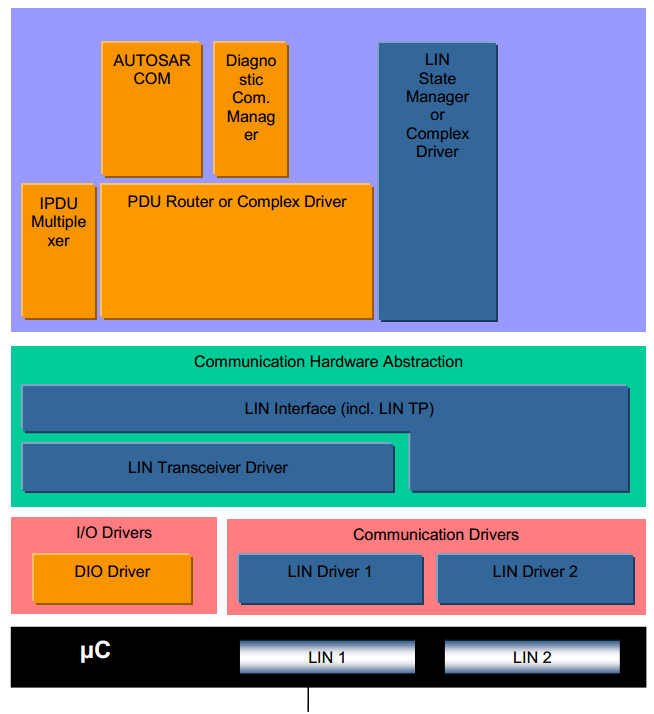

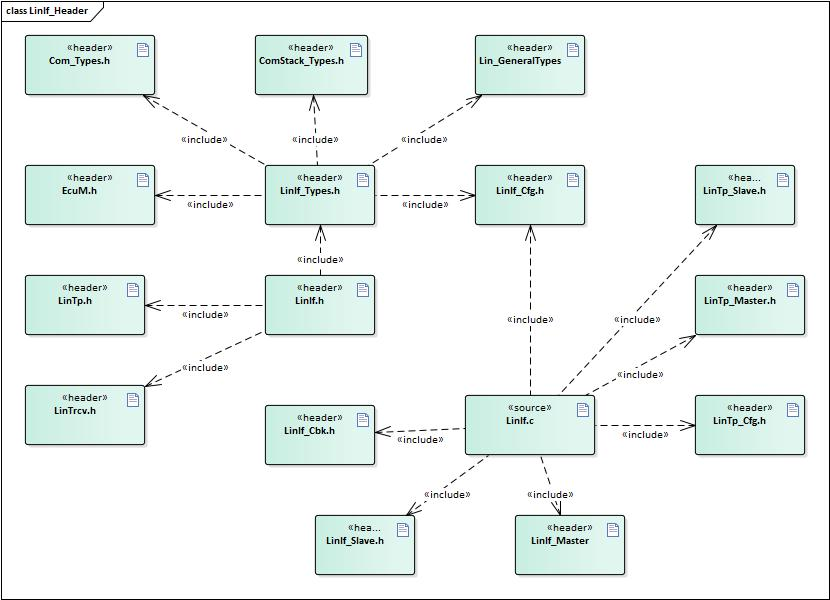

注：本文后面的描述为了区分LinIf模块和LinIf功能，在描述时如果使用LinIf模块，则指LinIf模块整体，包含LinIf和LinTp功能。如果使用LinIf功能则单指LinIf模块下的LinIf功能部分。

Note: The descriptions following this text differentiate between the LinIf module and the LinIf feature. When referring to LinIf module, it means the overall LinIf module including both LinIf and LinTp functions. When referring to LinIf functionality, it specifically means the LinIf part of the LinIf module.

参考资料 (Reference materials)
------------------------------------------

[1] AUTOSAR_SWS_LINInterface.pdf, R19-11

[2] AUTOSAR_SWS_LINStateManager.pdf, R19-11

[3] AUTOSAR_SWS_LINTransceiverDriver.pdf, R19-11

[4] AUTOSAR_SWS_LINDriver.pdf, R19-11

[5] LIN Specification Package, Revision 2.1

[6] AUTOSAR_SWS_PDURouter.pdf, R19-11

功能描述 (Function Description)
===========================================

报文传输 (Message transmission)
-------------------------------------------

功能介绍 (Feature Introduction)
===========================================

LinIf模块支持以下几种类型报文的接收和发送：

The LinIf module supports the reception and transmission of the following types of messages:

- 无条件帧（Unconditional frame）

- Unconditional Frame

- 事件触发帧（Event-triggered frame）

- Event-triggered frame

- 零星帧（Sporadic frame）

- Sporadic frame

- 诊断帧（Diagnostic frames）

- Diagnostic frames

功能实现 (Function implementation)
==============================================

- 无条件帧（ Unconditional frame ）：

- Unconditional Frame:

1. 主节点

Main Node

根据调度表的配置，当前帧为发送的无条件帧时，LinIf调用<User_TriggerTransmit>从上层模块获取数据，然后调用Lin_SendFrame(),将第二个参数中的（Lin_PduType类型）Pid，Cs，Dl设置为配置数据中的值，将Drc设置为发送，将SduPtr设置为存放从上层获取到的数据的地址。然后在下个调度表Entry到来时，调用Lin_GetStatus确认当前发送的结果。

According to the scheduler configuration, when the current frame is an unconditional transmission frame, LinIf calls <User_TriggerTransmit> to retrieve data from the upper-layer module, then calls Lin_SendFrame(), setting the second parameter's (Lin_PduType type) Pid, Cs, and Dl to the configured values, setting Drc to send, and setting SduPtr to the address where data retrieved from the upper layer is stored. Then, when the next scheduler table entry arrives, it calls Lin_GetStatus to confirm the result of the current transmission.

根据调度表的调度，当前帧为接收的无条件帧时，LinIf调用Lin_SendFrame(),将第二个参数中的（Lin_PduType类型）Pid，Cs，Dl设置为配置数据中的值，将Drc设置为接收，将SduPtr设置为NULL_PTR。然后在下个调度表Entry到来时，调用Lin_GetStatus确认接收状态，并获取接收到的收据。然后调用<User_RxIndication>将接收到的数据发送给上层模块。

Based on the scheduling table's scheduling, when the current frame is an unconditional receive frame, LinIf calls Lin_SendFrame(), setting the (Lin_PduType type) Pid, Cs, and Dl in the second parameter to the configured values, setting Drc to receive, and setting SduPtr to NULL_PTR. Then, when the next scheduling table entry arrives, it calls Lin_GetStatus to confirm the reception status and obtain the received message. Finally, it calls <User_RxIndication> to pass the received data up to the upper module.

2. 从节点

Node

当LinIf_HeaderIndication(Channel,PduPtr)被Lin模块调用时，LinIf根据配置，判断该PID是否为本节点需要处理的报文：

When LinIf_HeaderIndication(Channel, PduPtr) is called by the Lin module, LinIf determines based on the configuration whether this PID is a message that needs to be processed by this node:

如果本节点需要发送数据，则调用<User_TriggerTransmit>从上层模块获取数据，然后将PduPtr 的Cs，Dl设置为配置的值，将Drc设置为发送，将从上层获取的数据复制到SduPtr指向的buffer中。

If this node needs to send data, call <User_TriggerTransmit> to retrieve data from the upper-layer module, then set PduPtr's Cs and Dl to the configured values, set Drc to send, and copy the data retrieved from the upper layer into the buffer pointed to by SduPtr.

如果本节点需要接收数据，则将PduPtr 的Cs，Dl设置为配置的值，将Drc设置为接收。Lin模块在接收数据后会调用LinIf_RxIndication()将数据传递给LinIf模块。LinIf再调用<User_RxIndication>将接收到的数据发送给上层模块。

If this node needs to receive data, set PduPtr's Cs and Dl to the configured values and set Drc to receive. The Lin module will call LinIf_RxIndication() after receiving data to pass the data to the LinIf module. LinIf then calls <User_RxIndication> to send the received data to the upper layer module.

如果本节点不需要响应该PID，则将Drc设置为忽略。

If this node does not need to respond to the PID, set Drc to ignore.

- 事件触发帧（Event-triggered frame）：

- Event-triggered Frame:

1. 主节点

Main Node

根据调度表的配置，当前帧为事件触发帧时，LinIf调用Lin_SendFrame(),将第二个参数中的（Lin_PduType类型）Pid，Cs，Dl设置为配置数据中的值，将Drc设置为接收，将SduPtr设置为NULL_PTR。然后在下个调度表Entry到来时，调用Lin_GetStatus确认接收状态。如果正确接收则继续按照调度表处理后续报文，如果总线发生碰撞，则切换到冲突解决调度表，将该事件触发帧关联的无条件帧都轮询一遍。

Based on the configuration of the schedule table, when the current frame is an event-triggered frame, LinIf calls Lin_SendFrame(), setting the (Lin_PduType type) Pid, Cs, and Dl in the second parameter to the configured values, setting Drc to receive, and setting SduPtr to NULL_PTR. Then, when the next schedule table entry arrives, it calls Lin_GetStatus to confirm the reception status. If the reception is correct, it continues processing subsequent messages according to the schedule table. If a bus collision occurs, it switches to the conflict resolution schedule table and polls all unconditional frames associated with this event-triggered frame.

2. 从节点

Node

当LinIf_HeaderIndication(Channel,PduPtr)被Lin模块调用时，LinIf判断是否有发送标志位（LinIf_Transmit被调用时，LinIf设置发送标志位），如果有发送标志位，和发送正常的无条件帧处理过程一致，在收到LinIf_TxConfirmation(E_OK)时，清除发送标志，否则保留发送标志。如果没有发送标志，则忽略（将Drc设置为忽略）该通知。

When LinIf_HeaderIndication(Channel, PduPtr) is called by the Lin module, LinIf checks if there is a transmit flag (set when LinIf_Transmit is called). If there is a transmit flag, the process for handling normal unconditional frames for transmission is followed. When LinIf_TxConfirmation(E_OK) is received, the transmit flag is cleared; otherwise, the transmit flag is retained. If there is no transmit flag, the notification is ignored (Drc is set to ignore).

- 零星帧（Sporadic frame）：

- Sporadic Frame:

1. 主节点

Main Node

零星帧只有主节点可以发送。

Stray frames can only be sent by the master node.

根据调度表的配置，当前帧为零星帧时，LinIf判断是否有发送标志位（LinIf_Transmit被调用时，LinIf设置发送标志位），如果有发送标志位，和发送正常的无条件帧处理过程一致，在收到LinIf_TxConfirmation(E_OK)时，清除发送标志，否则保留发送标志。如果没有发送标志，则不需要发送报文。

Based on the configuration of the schedule table, when the current frame is a sporadic frame, LinIf checks if there is a transmit flag (the transmit flag is set when LinIf_Transmit is called). If there is a transmit flag, the process for sending normal unconditional frames is followed. When LinIf_TxConfirmation(E_OK) is received, the transmit flag is cleared; otherwise, the transmit flag is retained. If there is no transmit flag, there is no need to send the message.

2. 从节点

Node

从节点对于零星帧的处理和无条件帧一致。

Processing of sporadic frames is consistent with unconditional frames.

- 诊断帧（Diagnostic frames）：

Diagnostic Frames:

节点配置（Node configuration）和诊断使用相同的MRF和SRF。

Node configuration (Node configuration) and diagnostic usage the same MRF and SRF.

1. 主节点

Main Node

如果是发送节点配置相关的报文，LinIf从配置中获取报文数据信息，然后发送一帧MRF报文，将命令发送出去。在下个Entry到来时，发送一帧SRF获取命令执行结果。

If the message is related to node configuration, LinIf retrieves the message data from the configuration and sends a frame of MRF message to send the command. When the next Entry arrives, it sends a frame of SRF message to get the command execution result.

如果是诊断报文，当LinTp_Transmit()被调用时，LinIf需要通知BswM进行调度表的切换，当调度表切换到发送MRF的调度表后，LinIf发送MRF报文直到将所有的请求数据发送完成。然后LinIf通知BswM切换到SRF发送调度表，LinIf发送SRF直到所有的应答数据接收完成。

If the diagnostic message is concerned, when LinTp_Transmit() is called, LinIf needs to notify BswM to switch to the scheduling table for transmitting MRF. After switching to the scheduling table for sending MRF, LinIf sends MRF messages until all request data are transmitted. Then, LinIf notifies BswM to switch to the SRF transmission scheduling table, and LinIf sends SRF messages until all response data are received.

2. 从节点

Node

当接收到MRF报文时，从节点根据报文内容是节点配置报文还是诊断诊断报文：

When receiving MRF messages, the node determines whether the message content is a node configuration message or a diagnostic message:

如果是节点配置报文，LinIf根据报文内容进行处理，并在接收到SRF报文时，根据处理结果进行应答。

If it is a node configuration message, LinIf processes it based on the message content and responds to the SRF message according to the processing result.

如果是诊断报文，LinIf则将接收到的MRF数据进行TP处理之后，传递给上层模块。在接收到SRF时，从上层模块获取数据后进行TP处理之后进行应答。

If it is a diagnostic message, LinIf will pass the MRF data received for TP processing to the upper layer module. When receiving SRF, it will respond after performing TP processing on the data obtained from the upper layer module.

.. centered:: 调度表管理 (Scheduling Table Management)

.. _功能介绍-1:

.. _FunctionIntroduction-1:

功能介绍 (Feature Introduction)
===========================================

LIN通信需要根据提前配置好的调度表进行通信，一个节点可以有多个调度表，以便在不同的情况下使用。

LIN communication requires scheduling according to pre-configured schedules, and a node can have multiple schedules for use in different scenarios.

LinIf需要根据调度表管理报文的发送（按照次序发送Header），并且能够根据上层模块的要求进行调度表的切换。

LinIf needs to manage the transmission of messages (sending headers in order) based on a schedule and can switch schedules according to the requirements of upper-layer modules.

只有主节点具有调度表管理功能。

Only the primary node has scheduling table management functionality.

.. _功能实现-1:

.. _FeatureImplementation-1:

功能实现 (Function implementation)
==============================================

上电后LinIf默认使用NULL_SCHEDULE调度表，该调度表为空调度表，不发送和接收任何报文。当LinIf_ScheduleRequest ()被调用时，LinIf记录该请求。在MainFunction中，判断是否可以切换调度表（RUN_ONCE调度表不能被中断），并进行调度表切换。在发生调度表切换时调用<User>_ScheduleRequestConfirmation将当前切换的调度表通知上层模块。

After power-on, LinIf defaults to using the NULL_SCHEDULE scheduling table, which is an empty table and sends or receives no packets. When LinIf_ScheduleRequest() is called, LinIf records the request. In MainFunction, it determines whether a schedule switch can be performed (RUN_ONCE scheduling table cannot be interrupted) and then performs the schedule switch. During a schedule switch, calling <User>_ScheduleRequestConfirmation notifies the upper module of the current switched schedule table.

睡眠 (Sleep)
--------------------------

.. _功能介绍-2:

.. _FunctionIntroduction-2:

功能介绍 (Feature Introduction)
===========================================

当主节点需要睡眠时，需要在总线上发送go-to-sleep命令，使整个网络进入睡眠状态。

When the master node needs to sleep, a go-to-sleep command should be sent on the bus to put the entire network into sleep mode.

当从节点接收到go-to-sleep命令或者检测到总线空闲时，从节点需要进入睡眠状态。

When a slave node receives a go-to-sleep command or detects bus idle, it needs to enter sleep mode.

.. _功能实现-2:

.. _FeatureImplementation-2:

功能实现 (Function implementation)
==============================================

1. 主节点

Main Node

当LinIf_GotoSleep()被调用时，LinIf判断当前通道是否为睡眠状态，如果为非睡眠状态则调用Lin_GoToSleep()发送睡眠命令，如果当前通道为睡眠状态，则调用Lin_GoToSleepInternal()接口，进行内部的状态转换。在经过睡眠处理的延时之后（4s-10s，由配置决定），调用Lin_GetStatus()查看当前总线是否进入睡眠状态，如果总线进入睡眠状态，LinIf切换到睡眠状态，并且调用<User>_GotoSleepConfirmation()通知上层模块。

When LinIf_GotoSleep() is called, LinIf checks if the current channel is in a sleep state. If not in a sleep state, it calls Lin_GoToSleep() to send a sleep command. If the current channel is already in a sleep state, it calls the Lin_GoToSleepInternal() interface for internal state transition. After the sleep handling delay (4s-10s, configurable), it calls Lin_GetStatus() to check if the bus has entered a sleep state. If the bus enters a sleep state, LinIf switches to a sleep state and calls <User>_GotoSleepConfirmation() to notify the upper-layer module.

2. 从节点

Node

当接收到睡眠命令或者总线空闲定时器超时，LinIf调用<User>_GotoSleepIndication()通知上层模块。当LinIf_GotoSleep()被调用时，LinIf调用Lin_GoToSleepInternal()接口，然后切换到睡眠状态，并且调用<User>_GotoSleepConfirmation()通知上层模块。

When receiving a sleep command or the bus idle timer times out, LinIf calls _User_GotoSleepIndication() to notify the upper-layer module. When LinIf_GotoSleep() is called, LinIf calls the Lin_GoToSleepInternal() interface, then switches to sleep state and calls _User_GotoSleepConfirmation() to notify the upper-layer module.

唤醒 (Wake up)
----------------------------

.. _功能介绍-3:

.. _FeatureIntroduction-3:

功能介绍 (Feature Introduction)
===========================================

当节点需要唤醒网络，或者检测到总线唤醒信号，需要执行唤醒处理。

When nodes need to wake up the network, or detect a bus wakeup signal, they need to execute the wakeup handling.

.. _功能实现-3:

.. _FeatureImplementation-3:

功能实现 (Function implementation)
==============================================

当LinIf_Wakeup()被调用时，LinIf判断当前是否处于睡眠状态，如果处于睡眠状态调用Lin_Wakeup()唤醒总线，否则不做操作。然后在MainFunction中调用<User>_WakeupConfirmation()通知上层模块。

When LinIf_Wakeup() is called, LinIf checks if the current state is sleep. If in sleep mode, it calls Lin_Wakeup() to wake up the bus; otherwise, no operation is performed. Then, in MainFunction, it calls _User_WakeupConfirmation() to notify the upper layer module.

节点配置 (Node configuration)
-----------------------------------------

.. _功能介绍-4:

.. _FeatureIntroduction-4:

功能介绍 (Feature Introduction)
===========================================

节点配置功能用来配置总线上的从节点，比如配置节点NAD和报文ID等。使从节点能够被寻址，避免总线冲突的发生。

The node configuration function is used to configure slave nodes on the bus, such as configuring node NAD and message IDs. This enables addressing of slave nodes and prevents bus conflicts from occurring.

.. _功能实现-4:

.. _FeatureImplementation-4:

功能实现 (Function implementation)
==============================================

1. 主节点

Main Node

主节点通过在调度表中，配置的节点配置命令，实现节点配置。当需要使用节点配置功能时，切换到对应的调度表。LinIf会根据调度表中的报文类型，从配置中获取配置命令数据，然后发送报文。

The master node achieves node configuration by configuring node configuration commands in the schedule table. When the node configuration function needs to be used, switch to the corresponding schedule table. LinIf will retrieve command data from the configuration based on the message types in the schedule table and then send messages.

2. 从节点

Node

从节点在接收到节点配置命令后，根据配置命令执行相关操作，在收到SRF时，应答执行结果。

Upon receiving a node configuration command, the peer node executes relevant operations based on the command and responds with the execution result upon receiving SRF.

诊断传输协议（TP）
--------------------------

.. _功能介绍-5:

.. _FeatureIntroduction-5:

功能介绍 (Feature Introduction)
===========================================

传输协议实现了ISO 17987规范中对诊断传输协议的要求。

The transport protocol meets the requirements of the Diagnostic Transport Protocol specified in ISO 17987.

.. _功能实现-5:

.. _FeatureImplementation-5:

功能实现 (Function implementation)
==============================================

对于需要使用传输协议发送的报文，LinTp根据报文的长度决定使用单帧还是多帧发送，并在发送时追加协议控制信息。

For messages that need to be sent using a transmission protocol, LinTp decides whether to send them as a single frame or multiple frames based on the message length and appends protocol control information during sending.

1. 主节点

Main Node

用户调用LinTp_Transmit()发起报文发送请求，LinIf通知BswM切换到MRF调度表，随后LinIf模块重复调用PduR_LinTpCopyTxData()从上层获取数据，在发送完最后一帧数据后调用PduR_LinTpTxConfirmation()通知上层模块，并通知BswM切换到SRF调度表。

Users call LinTp_Transmit() to initiate a message transmission request. LinIf notifies BswM to switch to the MRF scheduling table, followed by LinIf module repeatedly calling PduR_LinTpCopyTxData() to retrieve data from higher layers. After transmitting the last frame of data, PduR_LinTpTxConfirmation() is called to notify the upper layer modules and instruct BswM to switch back to the SRF scheduling table.

LinIf重复发送SRF获取应答信息。在收到SF或者FF时，调用PduR_LinTpStartOfReception()准备接收，然后调用PduR_LinTpCopyRxData()将数据传送到上层模块。后续在接收到CF时，反复调用PduR_LinTpCopyRxData()向上层传送数据，直到接收完成，调用PduR_LinTpRxIndication()通知上层模块，并通知BswM切换到应用调度表。

LinIf repeatedly sends SRF request messages to obtain responses. Upon receiving SF or FF, it calls PduR_LinTpStartOfReception() to prepare for reception, then calls PduR_LinTpCopyRxData() to copy the received data to the upper layer module. Subsequently, upon receiving CF, it repeatedly calls PduR_LinTpCopyRxData() to send data up to the upper layer until reception is complete, after which it calls PduR_LinTpRxIndication() to notify the upper layer module and instruct BswM to switch to the application scheduling table.

2. 从节点

Node

LinIf在接收到MRF报文时，调用PduR_LinTpStartOfReception()准备接收（FF或者SF），然后调用PduR_LinTpCopyRxData()将数据传送到上层模块。后续在接收到CF时，反复调用PduR_LinTpCopyRxData()向上层传送数据，直到接收完成，调用PduR_LinTpRxIndication()通知上层模块。

LinIf calls PduR_LinTpStartOfReception() to prepare for receiving (FF or SF) when receiving MRF messages, then uses PduR_LinTpCopyRxData() to transfer data to the upper-layer module. Subsequently, upon receiving CF, it repeatedly calls PduR_LinTpCopyRxData() to transmit data to the upper layer until reception is complete, at which point it invokes PduR_LinTpRxIndication() to notify the upper-layer module.

用户调用LinTp_Transmit()发起报文发送请求，当收到SRF时，LinIf模块重复调用PduR_LinTpCopyTxData()从上层获取数据，在发送完最后一帧数据后调用PduR_LinTpTxConfirmation()通知上层模块。

Users initiate message sending requests by calling LinTp_Transmit(). When SRF is received, the LinIf module repeatedly calls PduR_LinTpCopyTxData() to obtain data from higher layers. After transmitting the last frame of data, PduR_LinTpTxConfirmation() is called to notify the upper-layer modules.

源文件描述 (Source file description)
===============================================

.. centered:: **表 LinIf源文件 (Table LinIf Source File)**

.. list-table::
   :widths: 50 50
   :header-rows: 1

   * - 文件 (Files)
     - 说明 (Description)
   * - Linif_Cfg.h
     - 用于定义LinIf模块预编译时用到的宏。 (Macro definitions for use during precompiled definition of LinIf module.)
   * - LinIf_Cfg.c
     - 配置参数源文件，包含各个配置项的定义。 (Configure parameter source file, containing definitions of various configuration items.)
   * - LinIf_Cbk.h
     - 实现LinIf模块全部回调函数的声明。 (Implement declarations for all callback functions of the LinIf module.)
   * - LinIf_Types.h
     - LinIf模块类型定义头文件。(不含LinTp子模块) (LineIf module type definition header file. (excluding LinTp sub-module))
   * - Linif_Internal.h
     - LinIf模块内部使用的宏，运行时变量类型定义头文件。 (Macro definitions used in the LinIf module, runtime variable type definition header file.)
   * - LinIf_MemMap.h
     - LinIf模块函数和变量存储位置定义文件。 (LinIf module function and variable storage location definition file.)
   * - LinIf.h
     - LinIf模块头文件，通过加载该头文件访问LinIf（包括LinTp）公开的函数和数据类型。（外部模块使用时只需要加载LinIf.h，LinTp.h包含在LinIf.h中） (LinIf module header file, access the functions and data types publicly provided by LinIf (including LinTp) via loading this header file.(External modules only need to load LinIf.h; LinTp.h is included in LinIf.h.))
   * - LinIf.c
     - LinIf模块实现源文件，各API实现在该文件中 (LINIf module implementation source file, each API implementation is in this file)
   * - LinIf_Master.c
     - Linif主节点实现源文件，主节点相关功能实现在该文件中。 (The main node implementation for source files and related functionalities of the main node are contained in this file.)
   * - LinIf_Master.h
     - LinIf主节点头文件。通过该文件公开主节点实现对外接口。 (MainNode Header File. Through this file, the main node implementation exposes its external interfaces.)
   * - LinIf_Slave.c
     - Linif从节点实现源文件，主节点相关功能实现在该文件中。 (Linif implements the source file for worker nodes, with the master node related functionalities implemented in this file.)
   * - LinIf_Slave.h
     - LinIf从节点头文件。通过该文件公开主节点实现对外接口。 (LinIf Node Header File. Through this file, the master node's implementation exposes external interfaces.)
   * - LinTp.c
     - LinTp子模块实现源文件，LinTp各API实现在该文件中。 (LinTp sub-module implementation source file, LinTp various API implementations are in this file.)
   * - LinTp.h
     - LinTp子模块头文件，通过加载该头文件访问LinTp公开的函数和数据类型。 (LinTp submodule header file, access LinTp public functions and data types by loading this header file.)
   * - LinTp_Master.c
     - LinTp主节点实现源文件，主节点相关功能实现在该文件中。 (LineTp main node implementation for source files, related functions of the main node are implemented in this file.)
   * - LinTp_Master.h
     - LinTp主节点头文件。通过该文件公开主节点实现对外接口。 (LinTp Main Node Header File. Through this file, the main node implementation exposes external interfaces.)
   * - LinTp_Slave.c
     - LinTp从节点实现源文件，主节点相关功能实现在该文件中。 (LinTp implementation of source files is done for node realization, with relevant functions for the main node included in this file.)
   * - LinTp_Slave.h
     - LinTp从节点头文件。通过该文件公开主节点实现对外接。 (LineTp from node header file. Through this file, the main node implementation exposes external interfaces.)
   * - LinTp_Internal.c
     - LinTp子模块内部公用的函数实现源文件。 (Source file for commonly used functions within the LinTp submodule.)
   * - LinTp_Internal.h
     - LinTp子模块内部使用的宏，变量类型定义头文件。 (Macro, variable type definition header file used internally in the LinTp sub-module.)
   * - LinTp_Types.h
     - LinTp模块类型定义头文件。 (LinTp Module Type Definition Header File.)

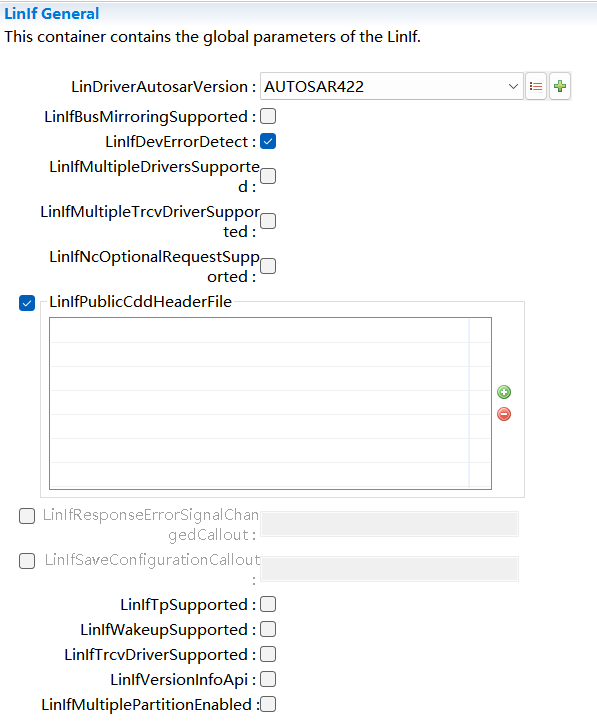

API接口 (API Interface)
=====================================

类型定义 (Type definition)
--------------------------------------

LinIf_SchHandleType类型定义 (LinIf_SchHandleType Type Definition)
=============================================================================

.. list-table::
   :widths: 50 50
   :header-rows: 1

   * - 名称 (Name)
     - LinIf_SchHandleType
   * - 类型 (Type)
     - uint8
   * - 范围 (Range)
     - 0 表示NULL_SCHECULE (0表示NULL_SCHECULE)
   * - 
     - 1-255 用户定义的调度表ID (1-255 User-defined scheduling table ID)
   * - 描述 (Description)
     - 调度表ID的数据类型 (The data type of scheduling table ID)

LinIf_ConfigType类型定义 (LinIf_ConfigType Configuration Type Definition)
=====================================================================================

.. list-table::
   :widths: 50 50
   :header-rows: 1

   * - 名称 (Name)
     - LinIf_ConfigType
   * - 类型 (Type)
     - struct
   * - 范围 (Range)
     - 无
   * - 描述 (Description)
     - 用于存放LinIf功能配置信息 (For storing LinIf functional configuration information)

LinTp_ConfigType类型定义 (LinTp_ConfigType Configuration Type Definition)
=====================================================================================

.. list-table::
   :widths: 50 50
   :header-rows: 1

   * - 名称 (Name)
     - LinTp_ConfigType
   * - 类型 (Type)
     - struct
   * - 范围 (Range)
     - 无
   * - 描述 (Description)
     - 用于存放LinTp功能配置信息 (For storing LinTp feature configuration information)

LinTp_Mode类型定义 (LinTp_Mode Type Definition)
===========================================================

.. list-table::
   :widths: 50 50
   :header-rows: 1

   * - 名称 (Name)
     - LinTp_Mode
   * - 类型 (Type)
     - enum
   * - 范围 (Range)
     - LINTP_APPLICATIVE_SCHEDULE 切换到应用调度表 (Switch to Application Schedule)
   * - 
     - LINTP_DIAG_REQUEST 切换到Master Request调度表 (LINTP_DIAG_REQUEST Switch to Master Request Schedule Table)
   * - 
     - LINTP_DIAG_RESPONSE 切换到Slaver Response调度表 (LINTP_DIAG_RESPONSE Switch to Slaver Response Scheduling Table)
   * - 描述 (Description)
     - 指示在诊断模式下LinTp请求切换到哪种类型调度表 (Indicate in diagnostic mode which type of scheduling table LinTp requests to switch to.)

输入函数描述 (Describe the input function:)
-----------------------------------------------------

.. list-table::
   :widths: 50 50
   :header-rows: 1

   * - 输入模块 (Input Module)
     - API
   * - BswM
     - BswM_LinTp_RequestMode
   * - Det.h
     - Det_ReportRuntimeError
   * - 
     - Det_ReportError
   * - Com.h
     - Com_SendSignal
   * - LinSM.h
     - LinSM_GotoSleepConfirmation
   * - 
     - LinSM_GotoSleepIndication
   * - 
     - LinSM_ScheduleRequestConfirmation
   * - 
     - LinSM_WakeupConfirmation
   * - LinTrcv.h
     - LinTrcv_CheckWakeup
   * - 
     - LinTrcv_GetBusWuReason
   * - 
     - LinTrcv_GetOpMode
   * - 
     - LinTrcv_SetOpMode
   * - 
     - LinTrcv_SetWakeupMode
   * - PduR_LinIf.h
     - PduR_LinIfRxIndication
   * - 
     - PduR_LinIfTriggerTransmit
   * - 
     - PduR_LinIfTxConfirmation
   * - PduR_LinTp.h
     - PduR_LinTpCopyRxData
   * - 
     - PduR_LinTpCopyTxData
   * - 
     - PduR_LinTpRxIndication
   * - 
     - PduR_LinTpStartOfReception
   * - 
     - PduR_LinTpTxConfirmation
   * - Lin Driver
     - Lin_GetStatus
   * - 
     - Lin_GoToSleep
   * - 
     - Lin_GoToSleepInternal
   * - 
     - Lin_SendFrame
   * - 
     - Lin_Wakeup
   * - 
     - Lin_WakeupInternal

静态接口函数定义 (Static interface function definition)
---------------------------------------------------------------

LinIf_Init函数定义 (The LinIf_Init function defines)
================================================================

.. list-table::
   :widths: 25 25 25 25
   :header-rows: 1

   * - 函数名称： (Function Name:)
     - LinIf_Init
     - 
     - 
   * - 函数原型： (Function prototype:)
     - void LinIf_Init(constLinIf_ConfigType\* ConfigPtr)
     - 
     - 
   * - 服务编号： (Service Number:)
     - 0x01
     - 
     - 
   * - 同步/异步： (Synchronous/asynchronous:)
     - Synchronous
     - 
     - 
   * - 是否可重入： (Is Reentrant:)
     - Non Reentrant
     - 
     - 
   * - 输入参数： (Input parameters:)
     - ConfigPtr
     - 值域 (Range)
     - 无
   * - 输入输出参数： (Input Output Parameters:)
     - 无
     - 
     - 
   * - 输出参数： (Output Parameters:)
     - 无
     - 
     - 
   * - 返回值： (Return Value:)
     - 无
     - 
     - 
   * - 功能概述： (Function Overview:)
     - 初始化LinIf功能 (Initialize LinIf Function)
     - 
     - 

LinIf_GetVersionInfo函数定义 (The LinIf_GetVersionInfo function definition)
=======================================================================================

.. list-table::
   :widths: 25 25 25 25
   :header-rows: 1

   * - 函数名称： (Function Name:)
     - LinIf_GetVersionInfo
     - 
     - 
   * - 函数原型： (Function prototype:)
     - voidLinIf_GetVersionInfo(Std_VersionInfoType\*versioninfo)
     - 
     - 
   * - 服务编号： (Service Number:)
     - 0x03
     - 
     - 
   * - 同步/异步： (Synchronous/asynchronous:)
     - Synchronous
     - 
     - 
   * - 是否可重入： (Is Reentrant:)
     - Reentrant
     - 
     - 
   * - 输入参数： (Input parameters:)
     - 无
     - 值域 (Range)
     - 无
   * - 输入输出参数： (Input Output Parameters:)
     - 无
     - 
     - 
   * - 输出参数： (Output Parameters:)
     - Versioninfo:版本信息将被存放在Versioninfo所指示的结构体中 (Version info will be stored in the structure indicated by Versioninfo.)
     - 
     - 
   * - 返回值： (Return Value:)
     - 无
     - 
     - 
   * - 功能概述： (Function Overview:)
     - 获取LinIf功能的版本号 (Get the version number for LinIf functionality)
     - 
     - 

LinIf_Transmit函数定义 (LinIf_Transmit function definition)
=======================================================================

.. list-table::
   :widths: 25 25 25 25
   :header-rows: 1

   * - 函数名称： (Function Name:)
     - LinIf_Transmit
     - 
     - 
   * - 函数原型： (Function prototype:)
     - Std_ReturnType LinIf_Transmit(
     - 
     - 
   * - 
     - PduIdType LinTxPduId,
     - 
     - 
   * - 
     - const PduInfoType\* PduInfoPtr
     - 
     - 
   * - 
     - )
     - 
     - 
   * - 服务编号： (Service Number:)
     - 0x49
     - 
     - 
   * - 同步/异步： (Synchronous/asynchronous:)
     - Synchronous
     - 
     - 
   * - 是否可重入： (Is Reentrant:)
     - Reentrant for different PduIds.
     - 
     - 
   * - 输入参数： (Input parameters:)
     - LinTxPduId:用户希望发送的PDU对应的ID。（不是LINprotected ID） (LinTxPduId: The ID corresponding to the PDU the user wishes to send. (Not the LIN protected ID))
     - 值域 (Range)
     - 无
   * - 
     - PduInfoPtr:指向一个结构体，包含发送数据长度（DLC）和数据存放buffer（这个buffer对本函数没有用，数据在发送时通过相关服务去上层获取数据）
     - 
     - 无
   * - 输入输出参数： (Input Output Parameters:)
     - 无
     - 
     - 
   * - 输出参数： (Output Parameters:)
     - 无
     - 
     - 
   * - 返回值： (Return Value:)
     - Std_ReturnType:
     - 
     - 
   * - 
     - E_OK: 发送要求被成功接收 (E_OK: The request was successfully received.)
     - 
     - 
   * - 
     - E_NOT_OK:
     - 
     - 
   * - 
     - 发送要求没有被接收，可能由于以下原因： (Sending requirements were not received due to the following reasons:)
     - 
     - 
   * - 
     - LinIf功能没有初始化 (LineInit function has not been initialized)
     - 
     - 
   * - 
     - LinTxPduId指向的PDU不存在 (LinTxPduId refers to a PDU that does not exist)
     - 
     - 
   * - 
     - 当前系统被设置为NULL_SCHECULE(空调度表) (The current system is set to NULL_SCHEDULE (Null Schedule))
     - 
     - 
   * - 功能概述： (Function Overview:)
     - 用于请求发送零星帧或事件触发帧（置位对应的发送标志位） (Used for requesting the transmission of sporadic frames or event-triggered frames (setting the corresponding send flag))
     - 
     - 

LinIf_ScheduleRequest函数定义 (LinIf_ScheduleRequest function definition)
=====================================================================================

.. list-table::
   :widths: 25 25 25 25
   :header-rows: 1

   * - 函数名称： (Function Name:)
     - LinIf_ScheduleRequest
     - 
     - 
   * - 函数原型： (Function prototype:)
     - Std_ReturnTypeLinIf_ScheduleRequest(
     - 
     - 
   * - 
     - NetworkHandleType Channel,
     - 
     - 
   * - 
     - LinIf_SchHandleType Schedule
     - 
     - 
   * - 
     - )
     - 
     - 
   * - 服务编号： (Service Number:)
     - 0x05
     - 
     - 
   * - 同步/异步： (Synchronous/asynchronous:)
     - Asynchronous
     - 
     - 
   * - 是否可重入： (Is Reentrant:)
     - Reentrant
     - 
     - 
   * - 输入参数： (Input parameters:)
     - Channel: 通道ID（Channelindex）
     - 值域 (Range)
     - 无
   * - 
     - Schedule: 新调度表的调度表ID (Schedule: ID of the new scheduling table)
     - 
     - 无
   * - 输入输出参数： (Input Output Parameters:)
     - 无
     - 
     - 
   * - 输出参数： (Output Parameters:)
     - 无
     - 
     - 
   * - 返回值： (Return Value:)
     - Std_ReturnType:
     - 
     - 
   * - 
     - E_OK:调度表切换请求被成功接收 (E_OK: The scheduling table switch request was successfully received.)
     - 
     - 
   * - 
     - E_NOT_OK:
     - 
     - 
   * - 
     - 调度表切换请求失败，可能由于以下的原因： (The scheduling table switch request failed, which may be due to the following reasons:)
     - 
     - 
   * - 
     - LinIf模块没有初始化 (LINIf module not initialized)
     - 
     - 
   * - 
     - Channel参数指示的通道不存在 (The specified channel in the Channel parameter does not exist.)
     - 
     - 
   * - 
     - Schedule参数指示的调度表不存在 (The scheduling table indicated by the Schedule parameter does not exist.)
     - 
     - 
   * - 
     - 系统当前处于睡眠(sleep)模式
     - 
     - 
   * - 功能概述： (Function Overview:)
     - 请求执行新的调度表 (Request to execute new schedule)
     - 
     - 

LinIf_GotoSleep函数定义 (LinIf_GotoSleep function definition)
=========================================================================

.. list-table::
   :widths: 25 25 25 25
   :header-rows: 1

   * - 函数名称： (Function Name:)
     - LinIf_GotoSleep
     - 
     - 
   * - 函数原型： (Function prototype:)
     - Std_ReturnTypeLinIf_GotoSleep(
     - 
     - 
   * - 
     - NetworkHandleType Channel
     - 
     - 
   * - 
     - )
     - 
     - 
   * - 服务编号： (Service Number:)
     - 0x06
     - 
     - 
   * - 同步/异步： (Synchronous/asynchronous:)
     - Asynchronous
     - 
     - 
   * - 是否可重入： (Is Reentrant:)
     - Non Reentrant
     - 
     - 
   * - 输入参数： (Input parameters:)
     - Channel: 通道ID（Channelindex）
     - 值域 (Range)
     - 无
   * - 输入输出参数： (Input Output Parameters:)
     - 无
     - 
     - 
   * - 输出参数： (Output Parameters:)
     - 无
     - 
     - 
   * - 返回值： (Return Value:)
     - Std_ReturnType:
     - 
     - 
   * - 
     - E_OK:睡眠请求被成功接受或系统正在执行睡眠请求或系统已经处于睡眠状态 (E_OK: The sleep request has been successfully accepted or the system is executing a sleep request or the system is already in a sleep state.)
     - 
     - 
   * - 
     - E_NOT_OK:睡眠请求失败，可能由于以下的原因： (E_NOT_OK: Sleep request failed, possibly due to the following reasons:)
     - 
     - 
   * - 
     - - LinIf功能没有初始化 (-LineInit function has not been initialized)
     - 
     - 
   * - 
     - - Channel参数指示的通道不存在 (The specified channel parameter does not exist.)
     - 
     - 
   * - 功能概述： (Function Overview:)
     - 要求系统切换到睡眠状态 (Request system switch to sleep mode)
     - 
     - 

LinIf_Wakeup函数定义 (LinIf_Wakeup Function Definition)
===================================================================

.. list-table::
   :widths: 25 25 25 25
   :header-rows: 1

   * - 函数名称： (Function Name:)
     - LinIf_Wakeup
     - 
     - 
   * - 函数原型： (Function prototype:)
     - Std_ReturnType LinIf_Wakeup (
     - 
     - 
   * - 
     - NetworkHandleType Channel
     - 
     - 
   * - 
     - )
     - 
     - 
   * - 服务编号： (Service Number:)
     - 0x07
     - 
     - 
   * - 同步/异步： (Synchronous/asynchronous:)
     - Asynchronous
     - 
     - 
   * - 是否可重入： (Is Reentrant:)
     - Reentrant
     - 
     - 
   * - 输入参数： (Input parameters:)
     - Channel: 通道ID（Channelindex）
     - 值域 (Range)
     - 无
   * - 输入输出参数： (Input Output Parameters:)
     - 无
     - 
     - 
   * - 输出参数： (Output Parameters:)
     - 无
     - 
     - 
   * - 返回值： (Return Value:)
     - Std_ReturnType:
     - 
     - 
   * - 
     - E_OK:唤醒请求被成功接受或系统当前没有处于睡眠状态 (E_OK: The wake-up request was successfully accepted or the system is currently not in sleep mode)
     - 
     - 
   * - 
     - E_NOT_OK:
     - 
     - 
   * - 
     - 唤醒请求失败，可能由于以下原因： (Failed to wake up request, possibly due to the following reasons:)
     - 
     - 
   * - 
     - LinIf功能没有初始化 (LineInit function has not been initialized)
     - 
     - 
   * - 
     - Channel参数指示的通道不存在 (The specified channel in the Channel parameter does not exist.)
     - 
     - 
   * - 
     - Lin驱动用于唤醒的函数Lin_Wakeu/Lin_WakeupInternal函数返回了E_NOT_OK (The Lin drive function that wakes up, Lin_Wakeu/Lin_WakeupInternal, returned E_NOT_OK.)
     - 
     - 
   * - 功能概述： (Function Overview:)
     - 发起唤醒处理 (Initiatewake-upprocessing)
     - 
     - 

LinIf_SetTrcvMode函数定义 (The LinIf_SetTrcvMode function defines)
==============================================================================

.. list-table::
   :widths: 25 25 25 25
   :header-rows: 1

   * - 函数名称： (Function Name:)
     - LinIf_SetTrcvMode
     - 
     - 
   * - 函数原型： (Function prototype:)
     - Std_ReturnTypeLinIf_SetTrcvMode(
     - 
     - 
   * - 
     - NetworkHandleType Channel,
     - 
     - 
   * - 
     - LinTrcv_TrcvModeTypeTransceiverMode
     - 
     - 
   * - 
     - )
     - 
     - 
   * - 服务编号： (Service Number:)
     - 0x08
     - 
     - 
   * - 同步/异步： (Synchronous/asynchronous:)
     - Synchronous
     - 
     - 
   * - 是否可重入： (Is Reentrant:)
     - Reentrant
     - 
     - 
   * - 输入参数： (Input parameters:)
     - Channel: 通道ID（Channelindex）
     - 值域 (Range)
     - 无
   * - 
     - TransceiverMode：需要设置的模式 (PresceiverMode：The mode to be set)
     - 
     - 无
   * - 输入输出参数： (Input Output Parameters:)
     - 无
     - 
     - 
   * - 输出参数： (Output Parameters:)
     - 无
     - 
     - 
   * - 返回值： (Return Value:)
     - Std_ReturnType:
     - 
     - 
   * - 
     - E_OK:收发器的模式被成功设置到指定模式 (E_OK: The mode of the transmitter/receiver was successfully set to the specified mode)
     - 
     - 
   * - 
     - E_NOT_OK:
     - 
     - 
   * - 
     - 收发器驱动接口函数返回失败，或者要求的模式超出允许的范围 (The transmitter driver interface functions returned failure, or the requested mode is out of the allowed range)
     - 
     - 
   * - 功能概述： (Function Overview:)
     - 将对应通道的Lin收发器设置到指定模式 (Set the Lin transceiver of the corresponding channel to the specified mode)
     - 
     - 

LinIf_GetTrcvMode函数定义 (The LinIf_GetTrcvMode function defines)
==============================================================================

.. list-table::
   :widths: 25 25 25 25
   :header-rows: 1

   * - 函数名称： (Function Name:)
     - LinIf_GetTrcvMode
     - 
     - 
   * - 函数原型： (Function prototype:)
     - Std_ReturnTypeLinIf_GetTrcvMode(
     - 
     - 
   * - 
     - NetworkHandleType Channel,
     - 
     - 
   * - 
     - LinTrcv_TrcvModeType\*TransceiverModePtr
     - 
     - 
   * - 
     - )
     - 
     - 
   * - 服务编号： (Service Number:)
     - 0x09
     - 
     - 
   * - 同步/异步： (Synchronous/asynchronous:)
     - Synchronous
     - 
     - 
   * - 是否可重入： (Is Reentrant:)
     - Reentrant
     - 
     - 
   * - 输入参数： (Input parameters:)
     - Channel: 通道ID（Channelindex）
     - 值域 (Range)
     - 无
   * - 输入输出参数： (Input Output Parameters:)
     - 无
     - 
     - 
   * - 输出参数： (Output Parameters:)
     - TransceiverModePtr：指向一块内存，用于存放获取到的收发器模式 (PresceiverModePtr：a pointer to a memory block used to store the acquired transceiver mode)
     - 
     - 
   * - 返回值： (Return Value:)
     - Std_ReturnType:
     - 
     - 
   * - 
     - E_OK:从Lin收发器驱动获取模式成功 (E_OK: Get mode successfully from Lin transmitter receiver driver)
     - 
     - 
   * - 
     - E_NOT_OK:
     - 
     - 
   * - 
     - 从Lin收发器驱动获取模式失败，可能由于以下原因： (Failure to retrieve mode from Lin Transmitter Driver may be due to:)
     - 
     - 
   * - 
     - Lin收发器驱动返回了E_NOT_OK (Lin transmitter driver returned E_NOT_OK)
     - 
     - 
   * - 
     - Channel参数指示的通道不存在 (The specified channel in the Channel parameter does not exist.)
     - 
     - 
   * - 
     - TransceiverModePtr参数为NULL (The TransceiverModePtr parameter is NULL)
     - 
     - 
   * - 功能概述： (Function Overview:)
     - 获取LIN收发器当前所处的状态 (Get the current state of the LIN receiver/transmitter)
     - 
     - 

LinIf_GetTrcvWakeupReason函数定义 (The LinIf_GetTrcvWakeupReason function definition)
=================================================================================================

.. list-table::
   :widths: 25 25 25 25
   :header-rows: 1

   * - 函数名称： (Function Name:)
     - LinIf_GetTrcvWakeupReason
     - 
     - 
   * - 函数原型： (Function prototype:)
     - Std_ReturnTypeLinIf_GetTrcvWakeupReason(
     - 
     - 
   * - 
     - NetworkHandleType Channel,
     - 
     - 
   * - 
     - LinTrcv_TrcvWakeupReasonType\*TrcvWuReasonPtr
     - 
     - 
   * - 
     - )
     - 
     - 
   * - 服务编号： (Service Number:)
     - 0x0A
     - 
     - 
   * - 同步/异步： (Synchronous/asynchronous:)
     - Synchronous
     - 
     - 
   * - 是否可重入： (Is Reentrant:)
     - Reentrant
     - 
     - 
   * - 输入参数： (Input parameters:)
     - Channel: 通道ID（Channelindex）
     - 值域 (Range)
     - 无
   * - 输入输出参数： (Input Output Parameters:)
     - 无
     - 
     - 
   * - 输出参数： (Output Parameters:)
     - TrcvWuReasonPtr：指向一块内存，用于存放获取到的收发器唤醒原因 (TrcvWuReasonPtr：Points to a block of memory used to store the received transmitter wake-up reason.)
     - 
     - 
   * - 返回值： (Return Value:)
     - Std_ReturnType:
     - 
     - 
   * - 
     - E_OK: 请求执行成功 (E_OK: Request execution succeeded)
     - 
     - 
   * - 
     - E_NOT_OK:
     - 
     - 
   * - 
     - 请求执行失败，可能由于以下原因： (Failed to execute the request, which may be due to the following reasons:)
     - 
     - 
   * - 
     - - Lin收发器驱动返回了E_NOT_OK (Lin transmitter/receiver driver returned E_NOT_OK)
     - 
     - 
   * - 
     - - Channel参数指示的通道不存在 (The specified channel parameter does not exist.)
     - 
     - 
   * - 
     - - TrcvWuReasonPtr 参数为NULL (- The TrcvWuReasonPtr parameter is NULL)
     - 
     - 
   * - 功能概述： (Function Overview:)
     - 返回Lin收发器获取到的唤醒原因 (Retrieve the wake-up reason obtained by Lin receiver)
     - 
     - 

LinIf_SetTrcvWakeupMode函数定义 (The LinIf_SetTrcvWakeupMode function defines)
==========================================================================================

.. list-table::
   :widths: 25 25 25 25
   :header-rows: 1

   * - 函数名称： (Function Name:)
     - LinIf_SetTrcvWakeupMode
     - 
     - 
   * - 函数原型： (Function prototype:)
     - Std_ReturnTypeLinIf_SetTrcvWakeupMode(
     - 
     - 
   * - 
     - NetworkHandleType Channel,
     - 
     - 
   * - 
     - LinTrcv_TrcvWakeupModeTypeLinTrcvWakeupMode
     - 
     - 
   * - 
     - )
     - 
     - 
   * - 服务编号： (Service Number:)
     - 0x0B
     - 
     - 
   * - 同步/异步： (Synchronous/asynchronous:)
     - Synchronous
     - 
     - 
   * - 是否可重入： (Is Reentrant:)
     - Reentrant
     - 
     - 
   * - 输入参数： (Input parameters:)
     - Channel: 通道ID（Channelindex）
     - 值域 (Range)
     - 无
   * - 
     - LinTrcvWakeupMode:期望设置的收发器唤醒原因 (LinTrcvWakeupMode: Expected Setting for Transceiver Wakeup Cause)
     - 
     - 无
   * - 输入输出参数： (Input Output Parameters:)
     - 无
     - 
     - 
   * - 输出参数： (Output Parameters:)
     - 无
     - 
     - 
   * - 返回值： (Return Value:)
     - Std_ReturnType:
     - 
     - 
   * - 
     - E_OK: 设置成功 (E_OK: Set Successfully)
     - 
     - 
   * - 
     - E_NOT_OK:
     - 
     - 
   * - 
     - 请求失败，可能由于以下原因： (Failed to request, possibly due to the following reasons:)
     - 
     - 
   * - 
     - Lin收发器驱动返回了E_NOT_OK (Lin transmitter driver returned E_NOT_OK)
     - 
     - 
   * - 
     - Channel参数指示的通道不存在 (The specified channel in the Channel parameter does not exist.)
     - 
     - 
   * - 
     - LinTrcvWakeupMode参数要求的模式不合法 (The LinTrcvWakeupMode parameter requires an invalid mode)
     - 
     - 
   * - 功能概述： (Function Overview:)
     - 用于使能、失能或清除对应通道上的唤醒事件通知 (Enable, disable, or clear wake event notifications for the corresponding channel)
     - 
     - 

LinIf_GetPIDTable函数定义 (The LinIf_GetPIDTable function definition)
==========================================================================================

.. list-table::
   :widths: 25 25 25 25
   :header-rows: 1

   * - 函数名称： (Function Name:)
     - LinIf_GetPIDTable
     - 
     - 
   * - 函数原型： (Function prototype:)
     - Std_ReturnTypeLinIf_GetPIDTable (
     - 
     - 
   * - 
     - NetworkHandleType Channel,
     - 
     - 
   * - 
     - Lin_FramePidType\* PidBuffer,
     - 
     - 
   * - 
     - uint8\* PidBufferLength
     - 
     - 
   * - 
     - )
     - 
     - 
   * - 服务编号： (Service Number:)
     - 0x72
     - 
     - 
   * - 同步/异步： (Synchronous/asynchronous:)
     - Synchronous
     - 
     - 
   * - 是否可重入： (Is Reentrant:)
     - Reentrant
     - 
     - 
   * - 输入参数： (Input parameters:)
     - Channel: 通道ID（Channelindex）
     - 值域 (Range)
     - 无
   * - 输入输出参数： (Input Output Parameters:)
     - PidBuffer：获取的PID存放的空间地址。 (PidBuffer：The memory address where the acquired PID is stored.)
     - 
     - 
   * - 
     - PidBufferLength：提供的buffer长度。返回时，指示复制的PID个数。 (PidBufferLength：The provided buffer length. Returns the number of copied PIDs when done.)
     - 
     - 
   * - 输出参数： (Output Parameters:)
     - 无
     - 
     - 
   * - 返回值： (Return Value:)
     - E_OK: 请求被接受。 (E_OK: The request has been accepted.)
     - 
     - 
   * - 
     - E_NOT_OK:出现错误，请求不成功。 (E_NOT_OK: An error occurred, request failed.)
     - 
     - 
   * - 功能概述： (Function Overview:)
     - 获取所有分配的PID值。顺序和FrameIndex一致。仅对于从节点有效。 (Get all assigned PID values. In order and consistent with FrameIndex. Valid only for slave nodes.)
     - 
     - 

LinIf_SetPIDTable函数定义 (The LinIf_SetPIDTable function definition)
==========================================================================================

.. list-table::
   :widths: 25 25 25 25
   :header-rows: 1

   * - 函数名称： (Function Name:)
     - LinIf_SetPIDTable
     - 
     - 
   * - 函数原型： (Function prototype:)
     - Std_ReturnTypeLinIf_SetPIDTable (
     - 
     - 
   * - 
     - NetworkHandleType Channel,
     - 
     - 
   * - 
     - Lin_FramePidType\* PidBuffer,
     - 
     - 
   * - 
     - uint8 PidBufferLength
     - 
     - 
   * - 
     - )
     - 
     - 
   * - 服务编号： (Service Number:)
     - 0x73
     - 
     - 
   * - 同步/异步： (Synchronous/asynchronous:)
     - Synchronous
     - 
     - 
   * - 是否可重入： (Is Reentrant:)
     - Reentrant
     - 
     - 
   * - 输入参数： (Input parameters:)
     - Channel: Lin通道号 (Channel: Lin Channel Number)
     - 值域 (Range)
     - 无
   * - 
     - PidBuffer：指向要这是的PID值。 (PidBuffer：Points to the PID value to be preserved.)
     - 
     - 无
   * - 
     - PidBufferLength：提供的PidBuffer长度。 (PidBufferLength：The length of the provided PidBuffer.)
     - 
     - 无
   * - 输入输出参数： (Input Output Parameters:)
     - 无
     - 
     - 
   * - 输出参数： (Output Parameters:)
     - 无
     - 
     - 
   * - 返回值： (Return Value:)
     - E_OK: 请求被接受。 (E_OK: The request has been accepted.)
     - 
     - 
   * - 
     - E_NOT_OK:出现错误，请求不成功。 (E_NOT_OK: An error occurred, request failed.)
     - 
     - 
   * - 功能概述： (Function Overview:)
     - 根据FrameIndex设置PID。仅用于从节点。 (Set PID according to FrameIndex. Only for use on nodes.)
     - 
     - 

LinIf_GetConfiguredNAD函数定义 (The LinIf_GetConfiguredNAD Function Definition)
===========================================================================================

.. list-table::
   :widths: 25 25 25 25
   :header-rows: 1

   * - 函数名称： (Function Name:)
     - LinIf_GetConfiguredNAD
     - 
     - 
   * - 函数原型： (Function prototype:)
     - Std_ReturnTypeLinIf_GetConfiguredNAD (
     - 
     - 
   * - 
     - NetworkHandleType Channel,
     - 
     - 
   * - 
     - uint8\* Nad
     - 
     - 
   * - 
     - )
     - 
     - 
   * - 服务编号： (Service Number:)
     - 0x70
     - 
     - 
   * - 同步/异步： (Synchronous/asynchronous:)
     - Synchronous
     - 
     - 
   * - 是否可重入： (Is Reentrant:)
     - Reentrant
     - 
     - 
   * - 输入参数： (Input parameters:)
     - Channel: Lin通道号 (Channel: Lin Channel Number)
     - 值域 (Range)
     - 无
   * - 输入输出参数： (Input Output Parameters:)
     - 无
     - 
     - 
   * - 输出参数： (Output Parameters:)
     - Nad：从节点配置的NAD (Nad: Node Configuration NAD)
     - 
     - 
   * - 返回值： (Return Value:)
     - E_OK: 请求被接受。 (E_OK: The request has been accepted.)
     - 
     - 
   * - 
     - E_NOT_OK:出现错误，请求不成功。 (E_NOT_OK: An error occurred, request failed.)
     - 
     - 
   * - 功能概述： (Function Overview:)
     - 获取当前被配置的NAD。仅用于从节点。 (Get the currently configured NAD. For use with worker nodes only.)
     - 
     - 

LinIf_SetConfiguredNAD函数定义 (LinIf_SetConfiguredNAD Function Definition)
=======================================================================================

.. list-table::
   :widths: 25 25 25 25
   :header-rows: 1

   * - 函数名称： (Function Name:)
     - LinIf_SetConfiguredNAD
     - 
     - 
   * - 函数原型： (Function prototype:)
     - Std_ReturnTypeLinIf_SetConfiguredNAD (
     - 
     - 
   * - 
     - NetworkHandleType Channel,
     - 
     - 
   * - 
     - uint8 Nad
     - 
     - 
   * - 
     - )
     - 
     - 
   * - 服务编号： (Service Number:)
     - 0x71
     - 
     - 
   * - 同步/异步： (Synchronous/asynchronous:)
     - Synchronous
     - 
     - 
   * - 是否可重入： (Is Reentrant:)
     - Reentrant
     - 
     - 
   * - 输入参数： (Input parameters:)
     - Channel: Lin通道号 (Channel: Lin Channel Number)
     - 值域 (Range)
     - 无
   * - 
     - Nad：新Nad (Nad: New Nad)
     - 
     - 无
   * - 输入输出参数： (Input Output Parameters:)
     - 无
     - 
     - 
   * - 输出参数： (Output Parameters:)
     - 无
     - 
     - 
   * - 返回值： (Return Value:)
     - E_OK: 请求被接受。 (E_OK: The request has been accepted.)
     - 
     - 
   * - 
     - E_NOT_OK:出现错误，请求不成功。 (E_NOT_OK: An error occurred, request failed.)
     - 
     - 
   * - 功能概述： (Function Overview:)
     - 设置当前节点的NAD。仅用于从节点。 (Set the NAD of the current node. Only for from nodes.)
     - 
     - 

LinIf_CheckWakeup函数定义 (LinIf_CheckWakeup function definition)
=============================================================================

.. list-table::
   :widths: 25 25 25 25
   :header-rows: 1

   * - 函数名称： (Function Name:)
     - LinIf_CheckWakeup
     - 
     - 
   * - 函数原型： (Function prototype:)
     - Std_ReturnTypeLinIf_CheckWakeup(
     - 
     - 
   * - 
     - EcuM_WakeupSourceTypeWakeupSource
     - 
     - 
   * - 
     - )
     - 
     - 
   * - 服务编号： (Service Number:)
     - 0x60
     - 
     - 
   * - 同步/异步： (Synchronous/asynchronous:)
     - Synchronous
     - 
     - 
   * - 是否可重入： (Is Reentrant:)
     - Reentrant
     - 
     - 
   * - 输入参数： (Input parameters:)
     - WakeupSource: 唤醒源类型 (WakeUpSource: Wakeup Source Type)
     - 值域 (Range)
     - 无
   * - 输入输出参数： (Input Output Parameters:)
     - 无
     - 
     - 
   * - 输出参数： (Output Parameters:)
     - 无
     - 
     - 
   * - 返回值： (Return Value:)
     - Std_ReturnType:
     - 
     - 
   * - 
     - E_OK: 函数成功执行 (E_OK: The function executed successfully)
     - 
     - 
   * - 
     - E_NOT_OK:传入了定义范围外的WakeupSource，或函数在执行过中遇到了问题 (E_NOT_OK: An invalid WakeupSource was provided, or an issue occurred during function execution.)
     - 
     - 
   * - 功能概述： (Function Overview:)
     - 当EcuM收到一个Lin通道的唤醒通知后，会调用本函数用来确认唤醒事件 (When EcuM receives a wake-up notification on a Lin channel, this function is called to confirm the wake-up event.)
     - 
     - 

LinIf_WakeupConfirmation函数定义 (LinIf_WakeupConfirmation function definition)
===========================================================================================

.. list-table::
   :widths: 25 25 25 25
   :header-rows: 1

   * - 函数名称： (Function Name:)
     - LinIf_WakeupConfirmation
     - 
     - 
   * - 函数原型： (Function prototype:)
     - voidLinIf_WakeupConfirmation(
     - 
     - 
   * - 
     - EcuM_WakeupSourceTypeWakeupSource
     - 
     - 
   * - 
     - )
     - 
     - 
   * - 服务编号： (Service Number:)
     - 0x61
     - 
     - 
   * - 同步/异步： (Synchronous/asynchronous:)
     - Synchronous
     - 
     - 
   * - 是否可重入： (Is Reentrant:)
     - Reentrant
     - 
     - 
   * - 输入参数： (Input parameters:)
     - WakeupSource: 唤醒源类型 (WakeUpSource: Wakeup Source Type)
     - 值域 (Range)
     - 无
   * - 输入输出参数： (Input Output Parameters:)
     - 无
     - 
     - 
   * - 输出参数： (Output Parameters:)
     - 无
     - 
     - 
   * - 返回值： (Return Value:)
     - 无
     - 
     - 
   * - 功能概述： (Function Overview:)
     - 在确认唤醒（CheckWakeup）或上电后，Lin驱动或Lin收发器检测到成功唤醒后会调用该函数报告唤醒源
     - 
     - 

LinIf_HeaderIndication函数定义 (LinIf_HeaderIndication function definition)
=======================================================================================

.. list-table::
   :widths: 25 25 25 25
   :header-rows: 1

   * - 函数名称： (Function Name:)
     - LinIf_HeaderIndication
     - 
     - 
   * - 函数原型： (Function prototype:)
     - Std_ReturnTypeLinIf_HeaderIndication (
     - 
     - 
   * - 
     - NetworkHandleType Channel,
     - 
     - 
   * - 
     - Lin_PduType\* PduPtr
     - 
     - 
   * - 
     - )
     - 
     - 
   * - 服务编号： (Service Number:)
     - 0x78
     - 
     - 
   * - 同步/异步： (Synchronous/asynchronous:)
     - Synchronous
     - 
     - 
   * - 是否可重入： (Is Reentrant:)
     - Reentrant
     - 
     - 
   * - 输入参数： (Input parameters:)
     - Channel: Lin通道号 (Channel: Lin Channel Number)
     - 值域 (Range)
     - 无
   * - 输入输出参数： (Input Output Parameters:)
     - PduPtr：指向PDU的指针，提供接收到的PID以及指向SDU数据缓冲区的指针作为输入参数。返回时，长度、校验和类型以及帧响应类型作为输出参数接收。如果帧响应类型为LIN_FRAMERESPONSE_TX，则SDU数据缓冲区包含传输数据。 (PduPtr：A pointer to PDU, providing the received PID and a pointer to the SDU data buffer as input parameters. Upon return, length, checksum type, and frame response type are received as output parameters. If the frame response type is LIN_FRAMERESPONSE_TX, the SDU data buffer contains the transmit data.)
     - 
     - 
   * - 输出参数： (Output Parameters:)
     - 无
     - 
     - 
   * - 返回值： (Return Value:)
     - E_OK: 请求被接受 (E_OK: The request has been accepted.)
     - 
     - 
   * - 
     - E_NOT_OK: 出现错误，请求失败 (E_NOT_OK: An error occurred, request failed)
     - 
     - 
   * - 功能概述： (Function Overview:)
     - Lin驱动在接收到Header时，调用该函数通知LinIf。仅用于从节点。 (LIN驱动在接收到Header时，调用该函数通知LinIf。Only used for slave nodes.)
     - 
     - 

LinIf_RxIndication函数定义 (LinIf_RxIndication Function Definition)
===============================================================================

.. list-table::
   :widths: 25 25 25 25
   :header-rows: 1

   * - 函数名称： (Function Name:)
     - LinIf_RxIndication
     - 
     - 
   * - 函数原型： (Function prototype:)
     - void LinIf_RxIndication (
     - 
     - 
   * - 
     - NetworkHandleType Channel,
     - 
     - 
   * - 
     - uint8\* Lin_SduPtr
     - 
     - 
   * - 
     - )
     - 
     - 
   * - 服务编号： (Service Number:)
     - 0x79
     - 
     - 
   * - 同步/异步： (Synchronous/asynchronous:)
     - Synchronous
     - 
     - 
   * - 是否可重入： (Is Reentrant:)
     - Reentrant
     - 
     - 
   * - 输入参数： (Input parameters:)
     - Channel: Lin通道号 (Channel: Lin Channel Number)
     - 值域 (Range)
     - 无
   * - 
     - Lin_SduPtr：指向接收到的Response (Lin_SduPtr: Pointer to received Response)
     - 
     - 无
   * - 输入输出参数： (Input Output Parameters:)
     - 无
     - 
     - 
   * - 输出参数： (Output Parameters:)
     - 无
     - 
     - 
   * - 返回值： (Return Value:)
     - 无
     - 
     - 
   * - 功能概述： (Function Overview:)
     - Lin驱动在接收到Response时，调用该函数通知LinIf，并将Response传递给LinIf。仅用于从节点。 (When Lin驱动 receives a Response, this function is called to notify LinIf and passes the Response to LinIf. Only for master node.)
     - 
     - 

LinIf_TxConfirmation函数定义 (The LinIf_TxConfirmation Function Definition)
=======================================================================================

.. list-table::
   :widths: 25 25 25 25
   :header-rows: 1

   * - 函数名称： (Function Name:)
     - LinIf_TxConfirmation
     - 
     - 
   * - 函数原型： (Function prototype:)
     - void LinIf_TxConfirmation (
     - 
     - 
   * - 
     - NetworkHandleType Channel
     - 
     - 
   * - 
     - )
     - 
     - 
   * - 服务编号： (Service Number:)
     - 0x7A
     - 
     - 
   * - 同步/异步： (Synchronous/asynchronous:)
     - Synchronous
     - 
     - 
   * - 是否可重入： (Is Reentrant:)
     - Reentrant for differentChannels. Non reentrant forthe same Channel.
     - 
     - 
   * - 输入参数： (Input parameters:)
     - Channel: Lin通道号 (Channel: Lin Channel Number)
     - 值域 (Range)
     - 无
   * - 输入输出参数： (Input Output Parameters:)
     - 无
     - 
     - 
   * - 输出参数： (Output Parameters:)
     - 无
     - 
     - 
   * - 返回值： (Return Value:)
     - 无
     - 
     - 
   * - 功能概述： (Function Overview:)
     - Lin驱动在成功发送Response时，调用该函数通知LinIf。 (Lin驱动 in successfully sending Response calls this function to notify LinIf.)
     - 
     - 

LinIf_LinErrorIndication函数定义 (LinIf_LinErrorIndication function definition)
===========================================================================================

.. list-table::
   :widths: 25 25 25 25
   :header-rows: 1

   * - 函数名称： (Function Name:)
     - LinIf_LinErrorIndication
     - 
     - 
   * - 函数原型： (Function prototype:)
     - void LinIf_LinErrorIndication(
     - 
     - 
   * - 
     - NetworkHandleType Channel,
     - 
     - 
   * - 
     - Lin_SlaveErrorTypeErrorStatus
     - 
     - 
   * - 
     - )
     - 
     - 
   * - 服务编号： (Service Number:)
     - 0x7B
     - 
     - 
   * - 同步/异步： (Synchronous/asynchronous:)
     - Synchronous
     - 
     - 
   * - 是否可重入： (Is Reentrant:)
     - Reentrant for differentChannels. Non reentrant forthe same Channel.
     - 
     - 
   * - 输入参数： (Input parameters:)
     - Channel: Lin通道号 (Channel: Lin Channel Number)
     - 值域 (Range)
     - 无
   * - 
     - ErrorStatus: 检测到的错误 (ErrorStatus: Detected Error)
     - 
     - 无
   * - 输入输出参数： (Input Output Parameters:)
     - 无
     - 
     - 
   * - 输出参数： (Output Parameters:)
     - 无
     - 
     - 
   * - 返回值： (Return Value:)
     - 无
     - 
     - 
   * - 功能概述： (Function Overview:)
     - Lin驱动在处理Header和Response时，检测到错误会调用该接口通知LinIf。仅用于从节点。 (LinDriver calls this interface to notify LinIf when errors are detected while handling Header and Response. Only for use from nodes.)
     - 
     - 

LinIf_MainFunction\_<LinIfChannel.ShortName>函数定义 (LinIf_MainFunction\<LinIfChannel.ShortName> Function Definition)
==================================================================================================================================

.. list-table::
   :widths: 25 25 25 25
   :header-rows: 1

   * - 函数名称： (Function Name:)
     - LinIf_MainFunction\_<LinIfChannel.ShortName>
     - 
     - 
   * - 函数原型： (Function prototype:)
     - voidLinIf_MainFunction\_<LinIfChannel.ShortName>(void)
     - 
     - 
   * - 服务编号： (Service Number:)
     - 0x80
     - 
     - 
   * - 同步/异步： (Synchronous/asynchronous:)
     - Synchronous
     - 
     - 
   * - 是否可重入： (Is Reentrant:)
     - Non Reentrant
     - 
     - 
   * - 输入参数： (Input parameters:)
     - 无
     - 值域 (Range)
     - 无
   * - 输入输出参数： (Input Output Parameters:)
     - 无
     - 
     - 
   * - 输出参数： (Output Parameters:)
     - 无
     - 
     - 
   * - 返回值： (Return Value:)
     - 无
     - 
     - 
   * - 功能概述： (Function Overview:)
     - LinIf模块的每个通道存在一个主处理函数，命名为LinIf_MainFunction\_<LinIfChannel.ShortName> (Each channel of the LinIf module has a main processing function named LinIf_MainFunction_<LinIfChannel.ShortName>)
     - 
     - 

LinTp_Init函数定义 (The LinTp_Init function definition)
===================================================================

.. list-table::
   :widths: 25 25 25 25
   :header-rows: 1

   * - 函数名称： (Function Name:)
     - LinTp_Init
     - 
     - 
   * - 函数原型： (Function prototype:)
     - void LinTp_Init(constLinTp_ConfigType\* ConfigPtr)
     - 
     - 
   * - 服务编号： (Service Number:)
     - 0x40
     - 
     - 
   * - 同步/异步： (Synchronous/asynchronous:)
     - Synchronous
     - 
     - 
   * - 是否可重入： (Is Reentrant:)
     - Non Reentrant
     - 
     - 
   * - 输入参数： (Input parameters:)
     - ConfigPtr：指向LinTp功能配置结构体 (ConfigPtr：Points to the LinTp Function Configuration Structure)
     - 值域 (Range)
     - 无
   * - 输入输出参数： (Input Output Parameters:)
     - 无
     - 
     - 
   * - 输出参数： (Output Parameters:)
     - 无
     - 
     - 
   * - 返回值： (Return Value:)
     - 无
     - 
     - 
   * - 功能概述： (Function Overview:)
     - LinTp功能初始化函数 (LinTp Function Initialization Function)
     - 
     - 

LinTp_Transmit函数定义 (LinTp_Transmit function definition)
=======================================================================

.. list-table::
   :widths: 25 25 25 25
   :header-rows: 1

   * - 函数名称： (Function Name:)
     - LinTp_Transmit
     - 
     - 
   * - 函数原型： (Function prototype:)
     - Std_ReturnTypeLinTp_Transmit(
     - 
     - 
   * - 
     - PduIdType LinTpTxSduId,
     - 
     - 
   * - 
     - const PduInfoType\*LinTpTxInfoPtr
     - 
     - 
   * - 
     - )
     - 
     - 
   * - 服务编号： (Service Number:)
     - 0x53
     - 
     - 
   * - 同步/异步： (Synchronous/asynchronous:)
     - Synchronous
     - 
     - 
   * - 是否可重入： (Is Reentrant:)
     - Reentrant for differentPduIds. Non reentrant for thesame PduId.
     - 
     - 
   * - 输入参数： (Input parameters:)
     - LinTpTxSduId：需要发送数据的N-SDUID (LinTpTxSduId：The N-SDUID for data to be sent)
     - 值域 (Range)
     - 无
   * - 
     - LinTpTxInfoPtr：一个结构体指针，指向的对象包含：①指向N-SDUBuffer的指针 ②buffer的长度 (LinTpTxInfoPtr：a structure pointer pointing to an object that includes:① a pointer to N-SDUBuffer ② the buffer's length)
     - 
     - 无
   * - 输入输出参数： (Input Output Parameters:)
     - 无
     - 
     - 
   * - 输出参数： (Output Parameters:)
     - 无
     - 
     - 
   * - 返回值： (Return Value:)
     - E_OK: TP发送请求被成功接收 (E_OK: The request sent by TP was successfully received)
     - 
     - 
   * - 
     - E_NOT_OK: TP发送请求被拒绝 (E_NOT_OK: TP request rejected)
     - 
     - 
   * - 功能概述： (Function Overview:)
     - 请求发送LinTp数据 (Request to send LinTp data)
     - 
     - 

LinTp_GetVersionInfo函数定义 (The LinTp_GetVersionInfo function definition)
=======================================================================================

.. list-table::
   :widths: 25 25 25 25
   :header-rows: 1

   * - 函数名称： (Function Name:)
     - LinTp_GetVersionInfo
     - 
     - 
   * - 函数原型： (Function prototype:)
     - void LinTp_GetVersionInfo(
     - 
     - 
   * - 
     - Std_VersionInfoType\*versioninfo
     - 
     - 
   * - 
     - )
     - 
     - 
   * - 服务编号： (Service Number:)
     - 0x42
     - 
     - 
   * - 同步/异步： (Synchronous/asynchronous:)
     - Synchronous
     - 
     - 
   * - 是否可重入： (Is Reentrant:)
     - Non Reentrant
     - 
     - 
   * - 输入参数： (Input parameters:)
     - 无
     - 值域 (Range)
     - 无
   * - 输入输出参数： (Input Output Parameters:)
     - 无
     - 
     - 
   * - 输出参数： (Output Parameters:)
     - Versioninfo：存放版本信息的结构体地址 (Versioninfo：The address of the structure for storing version information)
     - 
     - 
   * - 返回值： (Return Value:)
     - 无
     - 
     - 
   * - 功能概述： (Function Overview:)
     - 获取LinTp功能版本信息 (Get LinTp Feature Version Information)
     - 
     - 

LinTp_Shutdown函数定义 (LinTp_Shutdown Function Definition)
=======================================================================

.. list-table::
   :widths: 25 25 25 25
   :header-rows: 1

   * - 函数名称： (Function Name:)
     - LinTp_Shutdown
     - 
     - 
   * - 函数原型： (Function prototype:)
     - void LinTp_Shutdown(void)
     - 
     - 
   * - 服务编号： (Service Number:)
     - 0x43
     - 
     - 
   * - 同步/异步： (Synchronous/asynchronous:)
     - Synchronous
     - 
     - 
   * - 是否可重入： (Is Reentrant:)
     - Non Reentrant
     - 
     - 
   * - 输入参数： (Input parameters:)
     - 无
     - 值域 (Range)
     - 无
   * - 输入输出参数： (Input Output Parameters:)
     - 无
     - 
     - 
   * - 输出参数： (Output Parameters:)
     - 无
     - 
     - 
   * - 返回值： (Return Value:)
     - 无
     - 
     - 
   * - 功能概述： (Function Overview:)
     - 关闭LinTp功能 (Disable LinTp function)
     - 
     - 

LinTp_ChangeParameter函数定义 (LinTp_ChangeParameter Function Definition)
=====================================================================================

.. list-table::
   :widths: 25 25 25 25
   :header-rows: 1

   * - 函数名称： (Function Name:)
     - LinTp_ChangeParameter
     - 
     - 
   * - 函数原型： (Function prototype:)
     - Std_ReturnTypeLinTp_ChangeParameter(
     - 
     - 
   * - 
     - PduIdType id,
     - 
     - 
   * - 
     - TPParameterType parameter,
     - 
     - 
   * - 
     - uint16 value
     - 
     - 
   * - 
     - )
     - 
     - 
   * - 服务编号： (Service Number:)
     - 0x44
     - 
     - 
   * - 同步/异步： (Synchronous/asynchronous:)
     - Synchronous
     - 
     - 
   * - 是否可重入： (Is Reentrant:)
     - Non Reentrant
     - 
     - 
   * - 输入参数： (Input parameters:)
     - Id： 想要修改的参数的N-SDU ID (Id： The N-SDU ID of the parameter to be modified)
     - 值域 (Range)
     - 无
   * - 
     - Parameter：想要修改的参数 (Parameter：The parameter to be modified)
     - 
     - 无
   * - 
     - Value: 参数的新值 (Value: The new value of the parameter)
     - 
     - 无
   * - 输入输出参数： (Input Output Parameters:)
     - 无
     - 
     - 
   * - 输出参数： (Output Parameters:)
     - 无
     - 
     - 
   * - 返回值： (Return Value:)
     - E_NOT_OK
     - 
     - 
   * - 功能概述： (Function Overview:)
     - 该函数是为了接口的兼容性提供的假函数 (This function is a fake function provided for interface compatibility.)
     - 
     - 

可配置函数定义 (Configurable Function Definition)
----------------------------------------------------------

< User >_ScheduleRequestConfirmation函数定义 (_ScheduleRequestConfirmation function definition)
===========================================================================================================

.. list-table::
   :widths: 25 25 25 25
   :header-rows: 1

   * - 函数名称： (Function Name:)
     - < User>_ScheduleRequestConfirmation
     - 
     - 
   * - 函数原型： (Function prototype:)
     - void < User>_ScheduleRequestConfirmation(
     - 
     - 
   * - 
     - NetworkHandleType channel,
     - 
     - 
   * - 
     - LinIf_SchHandleType schedule
     - 
     - 
   * - 
     - )
     - 
     - 
   * - 服务编号： (Service Number:)
     - 无
     - 
     - 
   * - 同步/异步： (Synchronous/asynchronous:)
     - Synchronous
     - 
     - 
   * - 是否可重入： (Is Reentrant:)
     - Reentrant
     - 
     - 
   * - 输入参数： (Input parameters:)
     - channel 通道ID (channel ID)
     - 值域 (Range)
     - 无
   * - 
     - schedule 新调度表ID (schedule New Scheduling Table ID)
     - 
     - 无
   * - 输入输出参数： (Input Output Parameters:)
     - 无
     - 
     - 
   * - 输出参数： (Output Parameters:)
     - 无
     - 
     - 
   * - 返回值： (Return Value:)
     - 无
     - 
     - 
   * - 功能概述： (Function Overview:)
     - 当进度表变更请求被执行时，LinIf将调用这个函数 (When the schedule change request is executed, LinIf will call this function.)
     - 
     - 

< User >_GotoSleepConfirmation函数定义 (Define _GotoSleepConfirmation function)
===========================================================================================

.. list-table::
   :widths: 25 25 25 25
   :header-rows: 1

   * - 函数名称： (Function Name:)
     - < User>_GotoSleepConfirmation
     - 
     - 
   * - 函数原型： (Function prototype:)
     - void < User>_GotoSleepConfirmation(
     - 
     - 
   * - 
     - NetworkHandleType channel,
     - 
     - 
   * - 
     - boolean success
     - 
     - 
   * - 
     - )
     - 
     - 
   * - 服务编号： (Service Number:)
     - 无
     - 
     - 
   * - 同步/异步： (Synchronous/asynchronous:)
     - Synchronous
     - 
     - 
   * - 是否可重入： (Is Reentrant:)
     - Reentrant
     - 
     - 
   * - 输入参数： (Input parameters:)
     - channel 通道ID (channel ID)
     - 值域 (Range)
     - 无
   * - 
     - success 如果成功发送gotosleep，则为True，否则为false (success If the gotoSleep was sent successfully, then it is True, otherwise False.)
     - 
     - true/false
   * - 输入输出参数： (Input Output Parameters:)
     - 无
     - 
     - 
   * - 输出参数： (Output Parameters:)
     - 无
     - 
     - 
   * - 返回值： (Return Value:)
     - 无
     - 
     - 
   * - 功能概述： (Function Overview:)
     - 当go tosleep命令在总线上发送成功/失败时，LinIf将调用这个函数。 (When the "go to sleep" command is sent successfully/fail on the bus, LinIf will call this function.)
     - 
     - 

< User >_WakeupConfirmation函数定义 (User_WakeupConfirmation Function Definition)
=============================================================================================

.. list-table::
   :widths: 25 25 25 25
   :header-rows: 1

   * - 函数名称： (Function Name:)
     - void < User>_WakeupConfirmation
     - 
     - 
   * - 函数原型： (Function prototype:)
     - void < User>_WakeupConfirmation(
     - 
     - 
   * - 
     - NetworkHandleType channel,
     - 
     - 
   * - 
     - boolean success
     - 
     - 
   * - 
     - )
     - 
     - 
   * - 服务编号： (Service Number:)
     - 无
     - 
     - 
   * - 同步/异步： (Synchronous/asynchronous:)
     - Synchronous
     - 
     - 
   * - 是否可重入： (Is Reentrant:)
     - Reentrant
     - 
     - 
   * - 输入参数： (Input parameters:)
     - channel 通道ID (channel ID)
     - 值域 (Range)
     - 无
   * - 
     - success如果成功发送wakeup，则为True，否则为false (success if the wakeup is sent successfully, then it is True, otherwise False)
     - 
     - true/false
   * - 输入输出参数： (Input Output Parameters:)
     - 无
     - 
     - 
   * - 输出参数： (Output Parameters:)
     - 无
     - 
     - 
   * - 返回值： (Return Value:)
     - 无
     - 
     - 
   * - 功能概述： (Function Overview:)
     - 当wakeup命令在总线上发送成功/失败时，LinIf将调用这个函数 (When the LinIf calls this function upon successfully/failingly sending a wakeup command on the bus)
     - 
     - 

<User>_TriggerTransmit函数定义 (User_TriggerTransmit function definition)
=====================================================================================

.. list-table::
   :widths: 25 25 25 25
   :header-rows: 1

   * - 函数名称： (Function Name:)
     - <User>_TriggerTransmit
     - 
     - 
   * - 函数原型： (Function prototype:)
     - Std_ReturnType<User>_TriggerTransmit(
     - 
     - 
   * - 
     - PduIdType TxPduId,
     - 
     - 
   * - 
     - PduInfoType\* PduInfoPtr
     - 
     - 
   * - 
     - )
     - 
     - 
   * - 服务编号： (Service Number:)
     - 无
     - 
     - 
   * - 同步/异步： (Synchronous/asynchronous:)
     - Synchronous
     - 
     - 
   * - 是否可重入： (Is Reentrant:)
     - Reentrant for differentPduIds. Non reentrant for thesame PduId.
     - 
     - 
   * - 输入参数： (Input parameters:)
     - TxPduId 请求被传输的SDU的ID (TxPduId Request ID of SDU to be transferred)
     - 值域 (Range)
     - 无
   * - 输入输出参数： (Input Output Parameters:)
     - PduInfoPtr SDU的buffer (PduInfoPtr SDU's buffer)
     - 
     - 
   * - 输出参数： (Output Parameters:)
     - 无
     - 
     - 
   * - 返回值： (Return Value:)
     - Std_ReturnType
     - 
     - 
   * - 功能概述： (Function Overview:)
     - LinIf调用该接口从上层获取要发送的数据 (LinIf calls this interface to obtain the data to be sent from the upper layer.)
     - 
     - 

<User>_TxConfirmation函数定义 (The definition of _TxConfirmation function)
======================================================================================

.. list-table::
   :widths: 25 25 25 25
   :header-rows: 1

   * - 函数名称： (Function Name:)
     - <User>_TxConfirmation
     - 
     - 
   * - 函数原型： (Function prototype:)
     - void <User>_TxConfirmation(
     - 
     - 
   * - 
     - PduIdType TxPduId
     - 
     - 
   * - 
     - )
     - 
     - 
   * - 服务编号： (Service Number:)
     - 无
     - 
     - 
   * - 同步/异步： (Synchronous/asynchronous:)
     - Synchronous
     - 
     - 
   * - 是否可重入： (Is Reentrant:)
     - Reentrant for differentPduIds. Non reentrant for thesame PduId.
     - 
     - 
   * - 输入参数： (Input parameters:)
     - TxPduId 请求被传输的SDU的ID (TxPduId Request ID of SDU to be transferred)
     - 值域 (Range)
     - 无
   * - 输入输出参数： (Input Output Parameters:)
     - 无
     - 
     - 
   * - 输出参数： (Output Parameters:)
     - 无
     - 
     - 
   * - 返回值： (Return Value:)
     - 无
     - 
     - 
   * - 功能概述： (Function Overview:)
     - LinIf调用该函数通知PDU发送成功 (LinIf called this function to notify PDU transmission success)
     - 
     - 

<User>_RxIndication函数定义 (User_RxIndication Function Definition)
===============================================================================

.. list-table::
   :widths: 25 25 25 25
   :header-rows: 1

   * - 函数名称： (Function Name:)
     - <User>_RxIndication
     - 
     - 
   * - 函数原型： (Function prototype:)
     - void <User>_RxIndication(
     - 
     - 
   * - 
     - PduIdType RxPduId,
     - 
     - 
   * - 
     - const PduInfoType\*PduInfoPtr
     - 
     - 
   * - 
     - )
     - 
     - 
   * - 服务编号： (Service Number:)
     - 无
     - 
     - 
   * - 同步/异步： (Synchronous/asynchronous:)
     - Synchronous
     - 
     - 
   * - 是否可重入： (Is Reentrant:)
     - Reentrant for differentPduIds. Non reentrant for thesame PduId.
     - 
     - 
   * - 输入参数： (Input parameters:)
     - RxPduId 接收Pdu Id (RxPduId Receive Pdu Id)
     - 值域 (Range)
     - 无
   * - 
     - PduInfoPtr Pdu信息 (PduInfoPtr Pdu Info)
     - 
     - 无
   * - 输入输出参数： (Input Output Parameters:)
     - 无
     - 
     - 
   * - 输出参数： (Output Parameters:)
     - 无
     - 
     - 
   * - 返回值： (Return Value:)
     - 无
     - 
     - 
   * - 功能概述： (Function Overview:)
     - LinIf调用该函数通知将接收到PDU传递给上层模块 (LinIf calls this function to notify that a PDU will be passed to the upper layer module.)
     - 
     - 

配置 (Configure)
==============================

LinIfGenerael
-----------------------------

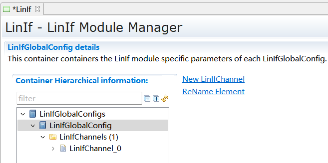

.. centered:: **表 LinIfGeneral属性描述 (Table LinIfGeneral Property Description)**

.. list-table::
   :widths: 20 20 20 20 20
   :header-rows: 1

   * - UI名称 (UI Name)
     - 描述 (Description)
     - 
     - 
     - 
   * - LinDriverAutosarVersion
     - 取值范围 (Range)
     - AUTOSAR422/AUTOSAR431/AUTOSAR440
     - 默认取值 (Default value)
     - AUTOSAR422
   * - 
     - 参数描述 (Parameter Description)
     - Lin driverAUTOSAR版本号选择 (Line driver AUTOSAR Version Selection)
     - 
     - 
   * - 
     - 依赖关系 (Dependencies)
     - 无
     - 
     - 
   * - LinIfBusMirroringSupported
     - 取值范围 (Range)
     - STD_ON/STD_OFF
     - 默认取值 (Default value)
     - 无
   * - 
     - 参数描述 (Parameter Description)
     - 是否使能Bus Mirror (Whether to Enable Bus Mirror)
     - 
     - 
   * - 
     - 依赖关系 (Dependencies)
     - 无
     - 
     - 
   * - LinIfDevErrorDetect
     - 取值范围 (Range)
     - true/false
     - 默认取值 (Default value)
     - true
   * - 
     - 参数描述 (Parameter Description)
     - 打开或关闭默认错误跟踪器（Det）检测和通知
     - 
     - 
   * - 
     - 依赖关系 (Dependencies)
     - 无
     - 
     - 
   * - LinIfMultipleDriversSupported
     - 取值范围 (Range)
     - true/false
     - 默认取值 (Default value)
     - false
   * - 
     - 参数描述 (Parameter Description)
     - 指示是否支持复数驱动 (Is support for complex drivers indicated?)
     - 
     - 
   * - 
     - 依赖关系 (Dependencies)
     - 无
     - 
     - 
   * - LinIfMultipleTrcvDriverSupported
     - 取值范围 (Range)
     - true/false
     - 默认取值 (Default value)
     - false
   * - 
     - 参数描述 (Parameter Description)
     - 指示是否支持复数收发器驱动 (Indicate whether support for complex transceiver drivers is provided.)
     - 
     - 
   * - 
     - 依赖关系 (Dependencies)
     - 无
     - 
     - 
   * - LinIfNcOptionalRequestSupported
     - 取值范围 (Range)
     - true/false
     - 默认取值 (Default value)
     - false
   * - 
     - 参数描述 (Parameter Description)
     - 指示是否支持AssignNAD和ConditionalChange NAD命令 (Does the instruction support the AssignNAD and ConditionalChangeNAD commands?)
     - 
     - 
   * - 
     - 依赖关系 (Dependencies)
     - LinIfChannel->LinIfNodeType中至少有一个节点为主节点时，该参数才可以被设置为True (When at least one node in LinIfChannel->LinIfNodeType is a master node, this parameter can be set to True.)
     - 
     - 
   * - LinIfPublicCddHeaderFile
     - 取值范围 (Range)
     - 字符串 (Strings)
     - 默认取值 (Default value)
     - 无
   * - 
     - 参数描述 (Parameter Description)
     - 用于输入CDD驱动的头文件 (Header file for input CDD driver)
     - 
     - 
   * - 
     - 依赖关系 (Dependencies)
     - 无
     - 
     - 
   * - LinIfResponseErrorSignalChangedCallout
     - 取值范围 (Range)
     - 合法的C语言函数名 (Legal C language function names)
     - 默认取值 (Default value)
     - 无
   * - 
     - 参数描述 (Parameter Description)
     - 当response errorsignal发生改变时，调用该函数。仅用于从节点。 (Call this function when the response error signal changes. Only for use by nodes.)
     - 
     - 
   * - 
     - 依赖关系 (Dependencies)
     - LinIfChannel->LinIfNodeType中至少有一个节点为从节点时，该参数才可以被配置 (When at least one node in LinIfChannel->LinIfNodeType is a slave node, this parameter can be configured.)
     - 
     - 
   * - LinIfSaveConfigurationCallout
     - 取值范围 (Range)
     - 合法的C语言函数名 (Legal C language function names)
     - 默认取值 (Default value)
     - 无
   * - 
     - 参数描述 (Parameter Description)
     - 当saveconfiguration命令执行时，调用该函数。仅用于从节点。 (When the saveconfiguration command is executed, this function is called. Only for node usage.)
     - 
     - 
   * - 
     - 依赖关系 (Dependencies)
     - LinIfChannel->LinIfNodeType中至少有一个节点为从节点时，该参数才可以被配置 (When at least one node in LinIfChannel->LinIfNodeType is a slave node, this parameter can be configured.)
     - 
     - 
   * - LinIfTpSupported
     - 取值范围 (Range)
     - true/false
     - 默认取值 (Default value)
     - false
   * - 
     - 参数描述 (Parameter Description)
     - 指示是否支持TP (Inquire if support for TP is available.)
     - 
     - 
   * - 
     - 依赖关系 (Dependencies)
     - 无
     - 
     - 
   * - LinIfWakeupSupported
     - 取值范围 (Range)
     - true/false
     - 默认取值 (Default value)
     - false
   * - 
     - 参数描述 (Parameter Description)
     - 表示LinIf是否支持Wakeup (Indicate whether LinIf supports Wakeup.)
     - 
     - 
   * - 
     - 依赖关系 (Dependencies)
     - 无
     - 
     - 
   * - LinIfTrcvDriverSupported
     - 取值范围 (Range)
     - true/false
     - 默认取值 (Default value)
     - false
   * - 
     - 参数描述 (Parameter Description)
     - 指示是否支持Lin收发器 (Inquire if support is available for Lin transceiver.)
     - 
     - 
   * - 
     - 依赖关系 (Dependencies)
     - 无
     - 
     - 
   * - LinIfVersionInfoApi
     - 取值范围 (Range)
     - true/false
     - 默认取值 (Default value)
     - false
   * - 
     - 参数描述 (Parameter Description)
     - 指示LinIf_GetVersionInfo函数是否可用 (Check if the LinIf_GetVersionInfo function is available)
     - 
     - 
   * - 
     - 依赖关系 (Dependencies)
     - 无
     - 
     - 
   * - LinIfMultiplePartitionEnabled
     - 取值范围 (Range)
     - true/false
     - 
     - 
   * - 
     - 参数描述 (Parameter Description)
     - 指示LinIf模块是否支持多分区功能 (Indicate whether the LinIf module supports multi-partition functionality.)
     - 
     - 
   * - 
     - 依赖关系 (Dependencies)
     - 无
     - 
     - 

LinIfGlobalConfig
---------------------------------

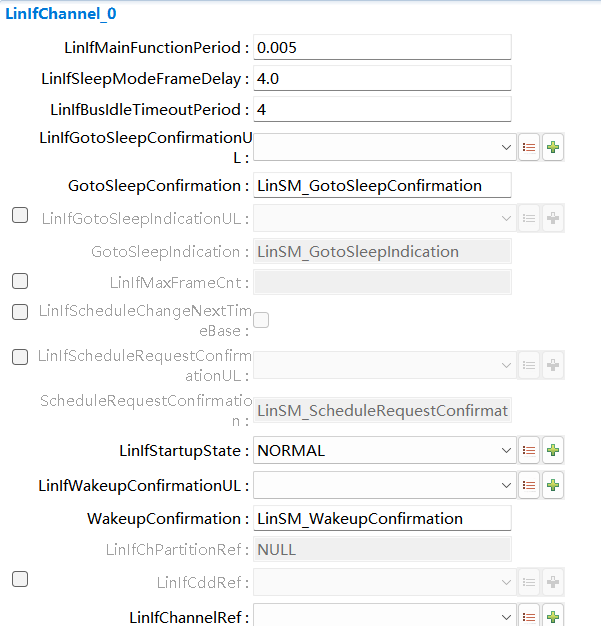

.. centered:: **表 LinIfGlobalConfig属性描述 (Table LinIfGlobalConfig Property Description)**

.. list-table::
   :widths: 20 20 20 20 20
   :header-rows: 1

   * - UI名称 (UI Name)
     - 描述 (Description)
     - 
     - 
     - 
   * - LinIfChannel
     - 取值范围 (Range)
     - 无
     - 默认取值 (Default value)
     - false
   * - 
     - 参数描述 (Parameter Description)
     - 用于添加Channel对象，详细参照5.3章节介绍 (For adding Channel objects, refer in detail to Chapter 5.3.)
     - 
     - 
   * - 
     - 依赖关系 (Dependencies)
     - 无
     - 
     - 

LinIfChannel
----------------------------

.. centered:: **表 LinIfChannel属性描述 (Property Describes Line Breaks: LinIfChannel)**

.. list-table::
   :widths: 20 20 20 20 20
   :header-rows: 1

   * - UI名称 (UI Name)
     - 描述 (Description)
     - 
     - 
     - 
   * - LinIfMainFunctionPeriod
     - 取值范围 (Range)
     - 0.0-INF
     - 默认取值 (Default value)
     - 0.005
   * - 
     - 参数描述 (Parameter Description)
     - 当前channel主处理函数的调用周期（单位：秒） (The call period of the current channel main processing function (unit: seconds))
     - 
     - 
   * - 
     - 依赖关系 (Dependencies)
     - 无
     - 
     - 
   * - LinIfSleepModeFrameDelay
     - 取值范围 (Range)
     - 0.001 - 10.0
     - 默认取值 (Default value)
     - 4.0
   * - 
     - 参数描述 (Parameter Description)
     - 发送睡眠指令后，经过该时间过后，确认总线是否睡眠 (Send the sleep command, and after the specified time, confirm if the bus is in sleep mode.)
     - 
     - 
   * - 
     - 依赖关系 (Dependencies)
     - 无
     - 
     - 
   * - LinIfBusIdleTimeoutPeriod
     - 取值范围 (Range)
     - 4.0-10.0
     - 默认取值 (Default value)
     - 4.0
   * - 
     - 参数描述 (Parameter Description)
     - 总线空闲时间 (Bus idle time)
     - 
     - 
   * - 
     - 依赖关系 (Dependencies)
     - 无
     - 
     - 
   * - LinIfGotoSleepConfirmationUL
     - 取值范围 (Range)
     - LINSM / CDD
     - 默认取值 (Default value)
     - 无
   * - 
     - 参数描述 (Parameter Description)
     - Go-to-sleep命令的确认通知，通知的上层模块 (Confirmation notification for the Go-to-sleep command, upper module notified)
     - 
     - 
   * - 
     - 依赖关系 (Dependencies)
     - 无
     - 
     - 
   * - GotoSleepConfirmation
     - 取值范围 (Range)
     - 合法的函数名 (Legal function names)
     - 默认取值 (Default value)
     - LinSM_GotoSleepConfirmation
   * - 
     - 参数描述 (Parameter Description)
     - Go-to-sleep命令的确认通知函数 (Confirmation notification function for the Go-to-sleep command)
     - 
     - 
   * - 
     - 依赖关系 (Dependencies)
     - 无
     - 
     - 
   * - LinIfGotoSleepIndicationUL
     - 取值范围 (Range)
     - LINSM / CDD
     - 默认取值 (Default value)
     - 无
   * - 
     - 参数描述 (Parameter Description)
     - Go-to-sleep命令通知的上层模块,仅用于从节点 (The Go-to-sleep command notifies the upper module, used solely for nodes.)
     - 
     - 
   * - 
     - 依赖关系 (Dependencies)
     - 从节点必须配置该参数 (The node must configure this parameter.)
     - 
     - 
   * - GotoSleepIndication
     - 取值范围 (Range)
     - 合法的函数名 (Legal function names)
     - 默认取值 (Default value)
     - 无
   * - 
     - 参数描述 (Parameter Description)
     - Go-to-sleep命令通知上层模块调用的函数，仅用于从节点 (The Go-to-sleep command notifies the upper module of the function to be called, and is used only by the node.)
     - 
     - 
   * - 
     - 依赖关系 (Dependencies)
     - 无
     - 
     - 
   * - LinIfMaxFrameCnt
     - 取值范围 (Range)
     - 0 .. 65535
     - 默认取值 (Default value)
     - 无
   * - 
     - 参数描述 (Parameter Description)
     - LinIf支持的最大的Frame数 (LinIf supports the largest number of Frame packets.)
     - 
     - 
   * - 
     - 依赖关系 (Dependencies)
     - 无
     - 
     - 
   * - LinIfScheduleChangeNextTimeBase
     - 取值范围 (Range)
     - TRUE / FALSE
     - 默认取值 (Default value)
     - FALSE
   * - 
     - 参数描述 (Parameter Description)
     - 指示是否在下个Entry到来时切换调度表。如果设置为FALSE则在该调度表执行完后切换调度表。设置为TRUE，在发送或者接收报文进行状态检查后切换调度表。 (Indicate whether to switch the schedule table when the next Entry arrives. If set to FALSE, switch the schedule table after this schedule table is executed. Set to TRUE to switch the schedule table after status checking during sending or receiving packets.)
     - 
     - 
   * - 
     - 依赖关系 (Dependencies)
     - 设置为TRUE时，该通道必须为主节点 (When set to TRUE, this channel must be the primary node.)
     - 
     - 
   * - LinIfScheduleRequestConfirmationUL
     - 取值范围 (Range)
     - LINSM / CDD
     - 默认取值 (Default value)
     - 无
   * - 
     - 参数描述 (Parameter Description)
     - 调度表切换成功执行后的通知函数，通知的上层模块 (Notification function for the upper-layer module after the successful execution of the scheduling table switch notification.)
     - 
     - 
   * - 
     - 依赖关系 (Dependencies)
     - 只有主节点可以配置该参数 (Only the primary node can configure this parameter)
     - 
     - 
   * - ScheduleRequestConfirmation
     - 取值范围 (Range)
     - 合法的函数名 (Legal function names)
     - 默认取值 (Default value)
     - LinSM_ScheduleRequestConfirmation
   * - 
     - 参数描述 (Parameter Description)
     - 调度表切换通知函数 (Scheduling Table Switch Notification Function)
     - 
     - 
   * - 
     - 依赖关系 (Dependencies)
     - 无
     - 
     - 
   * - LinIfStartupState
     - 取值范围 (Range)
     - NORMAL / SLEEP
     - 默认取值 (Default value)
     - NORMAL
   * - 
     - 参数描述 (Parameter Description)
     - Lin通道在启动后所处的状态 (The state of Lin channel after startup)
     - 
     - 
   * - 
     - 依赖关系 (Dependencies)
     - 无
     - 
     - 
   * - LinIfWakeupConfirmationUL
     - 取值范围 (Range)
     - LINSM / CDD
     - 默认取值 (Default value)
     - 无
   * - 
     - 参数描述 (Parameter Description)
     - Wakeup通知函数，通知的上层模块 (Wake-up Notification Function, Notifies the Upper Layer Module)
     - 
     - 
   * - 
     - 依赖关系 (Dependencies)
     - 无
     - 
     - 
   * - WakeupConfirmation
     - 取值范围 (Range)
     - 合法的函数名 (Legal function names)
     - 默认取值 (Default value)
     - LinSM_WakeupConfirmation
   * - 
     - 参数描述 (Parameter Description)
     - Wakeup通知函数 (Wake-up Notification Function)
     - 
     - 
   * - 
     - 依赖关系 (Dependencies)
     - 无
     - 
     - 
   * - LinIfChPartitionRef
     - 取值范围 (Range)
     - 关联到EcuC中EcucPartition (Associated with EcuC EcucPartition)
     - 默认取值 (Default value)
     - 无
   * - 
     - 参数描述 (Parameter Description)
     - 该参数引用EcuC模块中EcucPartition信息（只做同步显示，不可手动配置修改） (This parameter references EcucPartition information in the EcuC module (for synchronized display only, not manually configurable))
     - 
     - 
   * - 
     - 依赖关系 (Dependencies)
     - 只在LinIfMultiplePartitionEnabled使能时显示。 (Show only when LinIfMultiplePartitionEnabled is enabled.)
     - 
     - 
   * - 
     - 
     - 依赖于ComM模块中ComMChannel的ComMChannelPartitionRef信息。若ComM中对于该LinIfChannel未配置分区信息，则显示为空；若ComM中对于该LinIfChannel存在配置分区信息，则显示为ComM中配置的分区信息 (Dependent on the ComMChannel information of ComMChannelPartitionRef in the ComM module. If ComM does not configure partition information for this LinIfChannel, it will be displayed as empty; if ComM configures partition information for this LinIfChannel, it will be displayed as the partition information configured in ComM.)
     - 
     - 
   * - LinIfChannelRef
     - 取值范围 (Range)
     - 无
     - 默认取值 (Default value)
     - 无
   * - 
     - 参数描述 (Parameter Description)
     - 参照的Lin驱动的通道（LinIf的通道对应的Lin驱动的通道）
     - 
     - 
   * - 
     - 依赖关系 (Dependencies)
     - 无
     - 
     - 
   * - LinIfComMNetworkHandleRef
     - 取值范围 (Range)
     - 无
     - 默认取值 (Default value)
     - 无
   * - 
     - 参数描述 (Parameter Description)
     - 参照的ComM中的通道号（LinIf的通道对应的ComM的通道）
     - 
     - 
   * - 
     - 依赖关系 (Dependencies)
     - 无
     - 
     - 

LinIfFrame
==========================

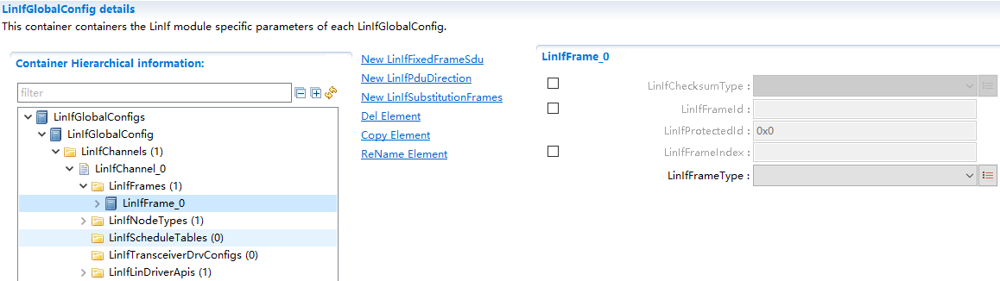

.. centered:: **表 LinIfFrame属性描述 (Table LinIfFrame Property Description)**

.. list-table::
   :widths: 20 20 20 20 20
   :header-rows: 1

   * - UI名称 (UI Name)
     - 描述 (Description)
     - 
     - 
     - 
   * - LinIfChecksumType
     - 取值范围 (Range)
     - CLASSIC / ENHANCED
     - 默认取值 (Default value)
     - 无
   * - 
     - 参数描述 (Parameter Description)
     - 报文使用的checksum类型 (Type of checksum used in the message)
     - 
     - 
   * - 
     - 依赖关系 (Dependencies)
     - LinIfFrameType为MRF/SRF时，该参数必须为CLASSIC (When LinIfFrameType is MRF/SRF, this parameter must be CLASSIC.)
     - 
     - 
   * - LinIfFrameId
     - 取值范围 (Range)
     - 0x00-0x3F
     - 默认取值 (Default value)
     - 无
   * - 
     - 参数描述 (Parameter Description)
     - 报文ID（不包含校验的原始ID） (Message ID (original ID without checksum))
     - 
     - 
   * - 
     - 依赖关系 (Dependencies)
     - LinIfFrameType为MRF，该值必须为0x3C (LinIfFrameType is MRF, this value must be 0x3C)
     - 
     - 
   * - 
     - 
     - LinIfFrameType为SRF，该值必须为0x3D (LinIfFrameType is SRF, this value must be 0x3D)
     - 
     - 
   * - LinIfProtectedId
     - 取值范围 (Range)
     - 无
     - 默认取值 (Default value)
     - 无
   * - 
     - 参数描述 (Parameter Description)
     - 报文PID（该参数不可配置，自动根据LinIfFrameId计算） (Message PID (This parameter is不可 configurable, automatically calculated based on LinIfFrameId))
     - 
     - 
   * - 
     - 依赖关系 (Dependencies)
     - 无
     - 
     - 
   * - LinIfFrameIndex
     - 取值范围 (Range)
     - 0-63
     - 默认取值 (Default value)
     - 无
   * - 
     - 参数描述 (Parameter Description)
     - 该报文的PID序号，该序号用于节点配置命令AssignFrameIdentifierRange时，定位Frame。仅用于从节点。 (The PID number of this message, which is used to locate the Frame when configuring nodes with the AssignFrameIdentifierRange command. It is only applicable to slave nodes.)
     - 
     - 
   * - 
     - 依赖关系 (Dependencies)
     - 无
     - 
     - 
   * - LinIfFrameType
     - 取值范围 (Range)
     - ASSIGNASSIGN_FRAME_ID_RANGE
     - 默认取值 (Default value)
     - 无
   * - 
     - 
     - ASSIGN_NAD
     - 
     - 
   * - 
     - 
     - CONDITIONAL
     - 
     - 
   * - 
     - 
     - EVENT_TRIGGERED
     - 
     - 
   * - 
     - 
     - FREE
     - 
     - 
   * - 
     - 
     - MRF
     - 
     - 
   * - 
     - 
     - SAVE_CONFIGURATION
     - 
     - 
   * - 
     - 
     - SPORADIC
     - 
     - 
   * - 
     - 
     - SRF
     - 
     - 
   * - 
     - 
     - UNASSIGN
     - 
     - 
   * - 
     - 
     - UNCONDITIONAL
     - 
     - 
   * - 
     - 参数描述 (Parameter Description)
     - 报文类型 (Message Type)
     - 
     - 
   * - 
     - 依赖关系 (Dependencies)
     - 1. LinIfFrameType为SPORADIC时，该Frame下的LinIfSubstitutionFrames容器中至少要配置一个对象 (When LinIfFrameType is SPORADIC, at least one object should be configured in the LinIfSubstitutionFrames container under this Frame.)
     - 
     - 
   * - 
     - 
     - 2.
     - 
     - 
   * - 
     - 
     - LinIfFrameType为EVENT-TRIGGERED时，对于主节点，LinIfSubstitutionFrames容器必须为空，对于从节点LinIfSubstitutionFrames容器中至少要配置一个对象 (When LinIfFrameType is EVENT-TRIGGERED, for the master node, the LinIfSubstitutionFrames container must be empty, and for the slave node, at least one object must be configured in the LinIfSubstitutionFrames container.)
     - 
     - 
   * - 
     - 
     - 3. 对于从节点，LinIfFrameType只能配置为以下几种：UNCONDITIONAL,MRF,SRFor EVENT-TRIGGERED (For slave nodes, LinIfFrameType can only be configured as follows: UNCONDITIONAL, MRF, SRFor EVENT-TRIGGERED)
     - 
     - 

LinIfTxPdu/LinIfRxPdu
-------------------------------------

根据被配置的报文是发送报文还是接收报文，选择配置LinIfTxPdu还是LinIfRxPdu。

Based on whether the configured message is a transmit message or a receive message, choose to configure LinIfTxPdu or LinIfRxPdu.

当报文为发送报文时，需要配置LinIfTxPdu。当报文为接收报文时，需要配置LinIfRxPdu。

When the message is a transmit message, LinIfTxPdu needs to be configured. When the message is a receive message, LinIfRxPdu needs to be configured.

LinIfTxPdu
==========================

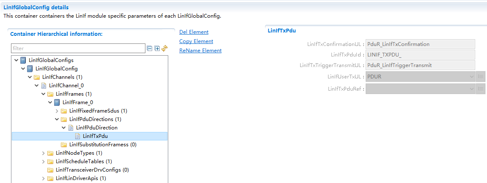

.. centered:: **表 LinIfTxPdu属性描述 (Property LineBreaks LinIfTxPdu Description)**

.. list-table::
   :widths: 20 20 20 20 20
   :header-rows: 1

   * - UI名称 (UI Name)
     - 描述 (Description)
     - 
     - 
     - 
   * - LinIfTxConfirmationUL
     - 取值范围 (Range)
     - 无
     - 默认取值 (Default value)
     - PDUR_TxConfirmation
   * - 
     - 参数描述 (Parameter Description)
     - 用于表示<User_TxConfirmation>接口的名字。 (To indicate the name of the <User_TxConfirmation> interface.)
     - 
     - 
   * - 
     - 
     - 当LinIfUserTxUL为PDUR时，该接口的名字为PDUR_TxConfirmation。 (When LinIfUserTxUL is PDUR, the interface name is PDUR_TxConfirmation.)
     - 
     - 
   * - 
     - 
     - 当LinIfUserTxUL为CDD时，该接口的名字是不确定的，用户根据自己的定义填入。 (When LinIfUserTxUL is CDD, the name of this interface is undefined and the user fills it in according to their own definition.)
     - 
     - 
   * - 
     - 依赖关系 (Dependencies)
     - 无
     - 
     - 
   * - LinIfTxPduId
     - 取值范围 (Range)
     - 0 .. 65535
     - 默认取值 (Default value)
     - 无
   * - 
     - 参数描述 (Parameter Description)
     - PduId，上层模块用来识别Pdu的标识符（自动生成，用户无需关心） (PduId, an identifier for PDU used by upper-layer modules (automatically generated, no need for user concern))
     - 
     - 
   * - 
     - 依赖关系 (Dependencies)
     - 无
     - 
     - 
   * - LinIfTxTriggerTransmitUL
     - 取值范围 (Range)
     - 无
     - 默认取值 (Default value)
     - PDUR_TriggerTransmit
   * - 
     - 参数描述 (Parameter Description)
     - 用于表示<User_TriggerTransmit>接口的名字。 (To indicate the name of the <User_TriggerTransmit> interface.)
     - 
     - 
   * - 
     - 
     - 当LinIfUserTxUL为PDUR时，该接口的名字为PDUR_TriggerTransmit。 (When LinIfUserTxUL is PDUR, the interface name is PDUR_TriggerTransmit.)
     - 
     - 
   * - 
     - 
     - 当LinIfUserTxUL为CDD时，该接口的名字是不确定的，用户根据自己的定义填入 (When LinIfUserTxUL is CDD, the name of this interface is undefined, and users should fill it in according to their own definitions.)
     - 
     - 
   * - 
     - 依赖关系 (Dependencies)
     - 无
     - 
     - 
   * - LinIfUserTxUL
     - 取值范围 (Range)
     - CDD / PDUR
     - 默认取值 (Default value)
     - PDUR
   * - 
     - 参数描述 (Parameter Description)
     - 用于确定哪个上层模块会触发LinTxPdu的发送（通过调用<User_TriggerTransmit>接口）和当LinTxPdu发送成功后通知哪个模块（通过调用<User_TxConfirmation>接口） (Used to determine which upper layer module triggers the transmission of LinTxPdu (by calling the <User_TriggerTransmit> interface) and to notify which module when the LinTxPdu transmission is successful (by calling the <User_TxConfirmation> interface))
     - 
     - 
   * - 
     - 依赖关系 (Dependencies)
     - 无
     - 
     - 
   * - LinIfTxPduRef
     - 取值范围 (Range)
     - 无
     - 默认取值 (Default value)
     - 无
   * - 
     - 参数描述 (Parameter Description)
     - 指向一个ECUC中定义的PDU，将LinIfTxPdu和Pdu关联起来 (Point to a PDU defined in an ECUC to associate LinIfTxPdu and Pdu.)
     - 
     - 
   * - 
     - 依赖关系 (Dependencies)
     - 无
     - 
     - 

LinIfRxPdu
==========================

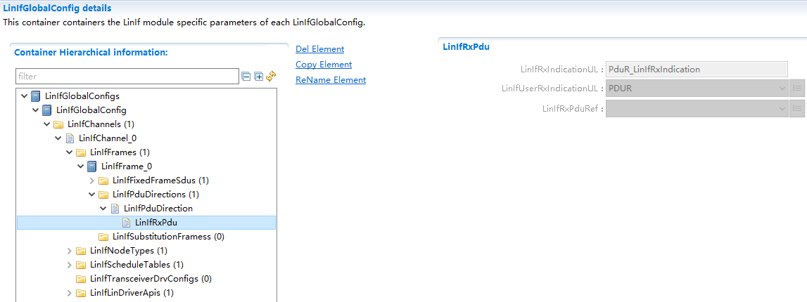

.. centered:: **表 LinIfRxPdu属性描述 (Attribute LinIfRxPdu describes)**

.. list-table::
   :widths: 20 20 20 20 20
   :header-rows: 1

   * - UI名称 (UI Name)
     - 描述 (Description)
     - 
     - 
     - 
   * - LinIfUserRxIndicationUL
     - 取值范围 (Range)
     - PDUR / CDD
     - 默认取值 (Default value)
     - PDUR
   * - 
     - 参数描述 (Parameter Description)
     - 用于指示当成功接收到LinIfRxPdu时，通知哪个上层模块（通过<User_RxIndication>接口） (To indicate which upper-layer module should be notified when a LinIfRxPdu is successfully received (through the <User_RxIndication> interface))
     - 
     - 
   * - 
     - 依赖关系 (Dependencies)
     - 无
     - 
     - 
   * - LinIfRxIndicationUL
     - 取值范围 (Range)
     - 无
     - 默认取值 (Default value)
     - PduR_LinIfRxIndication
   * - 
     - 参数描述 (Parameter Description)
     - 用于定义<User_RxIndication>接口的名字。 (To define the name of the <User_RxIndication> interface.)
     - 
     - 
   * - 
     - 
     - 当LinIfUserRxIndicationUL为PDUR时，该接口的名字为PDUR_LinIfRxIndication。 (When LinIfUserRxIndicationUL is PDUR, the interface name is PDUR_LinIfRxIndication.)
     - 
     - 
   * - 
     - 
     - 当LinIfUserRxIndicationUL为CDD时，该接口的名字不确定，用户根据自己的定义填入。 (When LinIfUserRxIndicationUL is CDD, the name of this interface is uncertain and users should fill in according to their own definitions.)
     - 
     - 
   * - 
     - 依赖关系 (Dependencies)
     - 无
     - 
     - 
   * - LinIfRxPduRef
     - 取值范围 (Range)
     - 无
     - 默认取值 (Default value)
     - 无
   * - 
     - 参数描述 (Parameter Description)
     - 指向一个ECUC中定义的PDU，将LinIfRxPdu和Pdu关联起来 (Point to a PDU defined in an ECUC to associate LinIfRxPdu and Pdu.)
     - 
     - 
   * - 
     - 依赖关系 (Dependencies)
     - 无
     - 
     - 

LinIfFixedFrameSdu
----------------------------------

该容器仅在LinIfFrameType设置为以下类型时LINIF_ASSIGN /LINIF_ASSIGN_FRAME_ID_RANGE / LINIF_ASSIGN_NAD / LINIF_CONDITIONAL /LINIF_FREE / LINIF_SAVE_CONFIGURATION / LINIF_UNASSIGN才需要配置。

This container only needs to be configured when LinIfFrameType is set to the following types: LINIF_ASSIGN/LINIF_ASSIGN_FRAME_ID_RANGE/LINIF_ASSIGN_NAD/LINIF_CONDITIONAL/LINIF_FREE/LINIF_SAVE_CONFIGURATION/LINIF_UNASSIGN.

容器内固定含有8个子容器，用于输入8个字节数据。

A container fixedly contains 8 sub-containers for inputting 8 bytes of data.

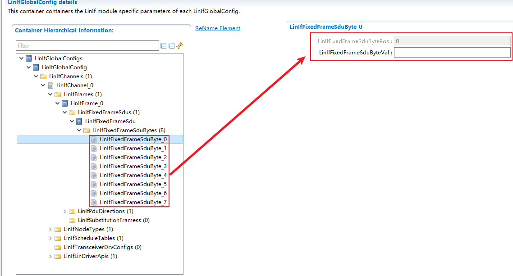

.. centered:: **表 LinIfFixedFrameSdu属性描述 (Property Description of Table LinIfFixedFrameSdu)**

.. list-table::
   :widths: 20 20 20 20 20
   :header-rows: 1

   * - UI名称 (UI Name)
     - 描述 (Description)
     - 
     - 
     - 
   * - LinIfFixedFrameSduBytePos
     - 取值范围 (Range)
     - 0-7
     - 默认取值 (Default value)
     - 无
   * - 
     - 参数描述 (Parameter Description)
     - 表示8个字节中的位置（自动生成，用户无需配置） (Indicates position within 8 bytes (automatically generated, no user configuration needed))
     - 
     - 
   * - 
     - 依赖关系 (Dependencies)
     - 无
     - 
     - 
   * - LinIfFixedFrameSduByteVal
     - 取值范围 (Range)
     - 0 .. 255
     - 默认取值 (Default value)
     - 无
   * - 
     - 参数描述 (Parameter Description)
     - 0-7字节对应位置的值 (Values corresponding to positions 0-7 bytes)
     - 
     - 
   * - 
     - 依赖关系 (Dependencies)
     - 无
     - 
     - 

LinIfSubstitutionFrames
---------------------------------------

该容器用于指定零星帧关联的无条件帧。仅在LinIfFrameType设置为LINIF_SPORADIC时才需要本容器。

This container is used to specify unconditional frames associated with sporadic frames. This container is only required when LinIfFrameType is set to LINIF_SPORADIC.

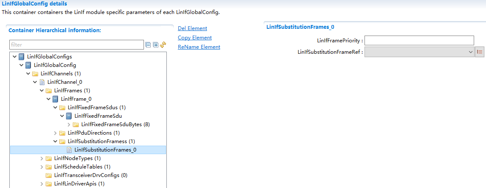

.. centered:: **表 LinIfSubstitutionFrames属性描述 (The LinIfSubstitutionFrames property describes)**

.. list-table::
   :widths: 20 20 20 20 20
   :header-rows: 1

   * - UI名称 (UI Name)
     - 描述 (Description)
     - 
     - 
     - 
   * - LinIfFramePriority
     - 取值范围 (Range)
     - 0 .. 255
     - 默认取值 (Default value)
     - 无
   * - 
     - 参数描述 (Parameter Description)
     - 表示SubstituteFrame的优先级。0表示最高优先级。 (Indicate the priority of SubstituteFrame. 0 indicates the highest priority.)
     - 
     - 
   * - 
     - 依赖关系 (Dependencies)
     - 无
     - 
     - 
   * - LinIfSubstituteFrameRef
     - 取值范围 (Range)
     - 无
     - 默认取值 (Default value)
     - 无
   * - 
     - 参数描述 (Parameter Description)
     - 指向一个无条件帧，使之与零星帧关联起来 (Point to an unconditional frame to associate it with sporadic frames.)
     - 
     - 
   * - 
     - 依赖关系 (Dependencies)
     - 该参数引用的Frame帧类型只能是UNCONDITIONAL (This parameter can only reference UNCONDITIONAL frame types.)
     - 
     - 

LinIfNodeType
=============================

注意：LinIfNodeTypes容器不能为空，必选选择配置为LinIfMaster或者LinIfSlave。

Note: The LinIfNodeTypes container must not be empty and must select a configuration as either LinIfMaster or LinIfSlave.

LinIfMaster
---------------------------

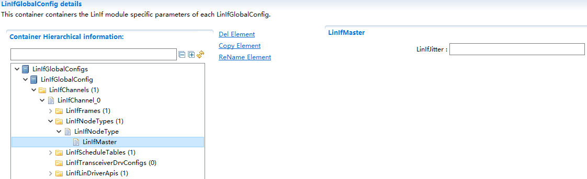

.. centered:: **表 LinIfMaster属性描述 (Describe the LineBreaks Property LinIfMaster)**

.. list-table::
   :widths: 20 20 20 20 20
   :header-rows: 1

   * - UI名称 (UI Name)
     - 描述 (Description)
     - 
     - 
     - 
   * - LinIfJitter
     - 取值范围 (Range)
     - 0 .. 0.255
     - 默认取值 (Default value)
     - 无
   * - 
     - 参数描述 (Parameter Description)
     - 该参数定义了timebase tick到headersending startpoint (fallingedge of breakfield)之间最大到最小值之间的延时时间
     - 
     - 
   * - 
     - 依赖关系 (Dependencies)
     - 无
     - 
     - 

LinIfSlave
--------------------------

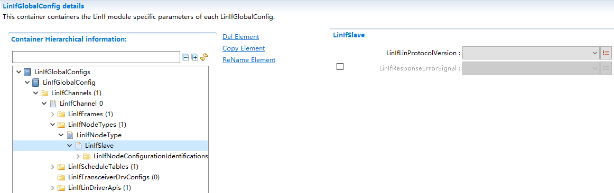

.. centered:: **表 LinIfSlave属性描述 (Table LinIfSlave Property Description)**

.. list-table::
   :widths: 20 20 20 20 20
   :header-rows: 1

   * - UI名称 (UI Name)
     - 描述 (Description)
     - 
     - 
     - 
   * - LinIfLinProtocolVersion
     - 取值范围 (Range)
     - ISO17987/LIN13/LIN20/LIN21/LIN22
     - 默认取值 (Default value)
     - 无
   * - 
     - 参数描述 (Parameter Description)
     - 定义从节点版本号 (Define node version number)
     - 
     - 
   * - 
     - 依赖关系 (Dependencies)
     - 无
     - 
     - 
   * - LinIfResponseErrorSignal
     - 取值范围 (Range)
     - 引用到Com中定义的信号 (Refer to signals defined in Com)
     - 默认取值 (Default value)
     - 无
   * - 
     - 参数描述 (Parameter Description)
     - 关联response_error信号 (Emit response_error signal)
     - 
     - 
   * - 
     - 依赖关系 (Dependencies)
     - 无
     - 
     - 
   * - LinIfNodeConfigurationIdentificatio
     - 取值范围 (Range)
     - 容器 (Containers)
     - 默认取值 (Default value)
     - 无
   * - n
     - 
     - 
     - 
     - 
   * - 
     - 参数描述 (Parameter Description)
     - 用于定义节点配置相关参数 (Used for defining node configuration related parameters)
     - 
     - 
   * - 
     - 依赖关系 (Dependencies)
     - 无
     - 
     - 

LinIfNodeConfigurationIdentification
----------------------------------------------------

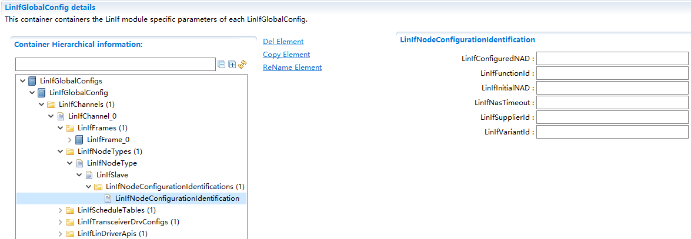

.. centered:: **表 LinIfNodeConfigurationIdentification属性描述 (Property Description LineOfNodeConfigurationIdentification)**

.. list-table::
   :widths: 20 20 20 20 20
   :header-rows: 1

   * - UI名 (UI Name)
     - 描述 (Description)
     - 
     - 
     - 
   * - LinIfConfiguredNAD
     - 取值范围 (Range)
     - 1..125
     - 默认取值 (Default value)
     - 无
   * - 
     - 参数描述 (Parameter Description)
     - 从节点配置的NAD (From node configuration NAD)
     - 
     - 
   * - 
     - 依赖关系 (Dependencies)
     - 无
     - 
     - 
   * - LinIfFunctionId
     - 取值范围 (Range)
     - 0 .. 65535
     - 默认取值 (Default value)
     - 无
   * - 
     - 参数描述 (Parameter Description)
     - Function Id
     - 
     - 
   * - 
     - 依赖关系 (Dependencies)
     - 无
     - 
     - 
   * - LinIfInitialNAD
     - 取值范围 (Range)
     - 1..125
     - 默认取值 (Default value)
     - 无
   * - 
     - 参数描述 (Parameter Description)
     - 从节点初始NAD (From node initial NAD)
     - 
     - 
   * - 
     - 依赖关系 (Dependencies)
     - 无
     - 
     - 
   * - LinIfNasTimeout
     - 取值范围 (Range)
     - 0..1
     - 默认取值 (Default value)
     - 无
   * - 
     - 参数描述 (Parameter Description)
     - N_As超时时间 (N_As Timeout Duration)
     - 
     - 
   * - 
     - 依赖关系 (Dependencies)
     - 无
     - 
     - 
   * - LinIfSupplierId
     - 取值范围 (Range)
     - 0 .. 32767
     - 默认取值 (Default value)
     - 无
   * - 
     - 参数描述 (Parameter Description)
     - Supplier Id
     - 
     - 
   * - 
     - 依赖关系 (Dependencies)
     - 无
     - 
     - 
   * - LinIfVariantId
     - 取值范围 (Range)
     - 0 .. 255
     - 默认取值 (Default value)
     - 无
   * - 
     - 参数描述 (Parameter Description)
     - Variant Id
     - 
     - 
   * - 
     - 依赖关系 (Dependencies)
     - 无
     - 
     - 

LinIfScheduleTable
==========================

注意：对于从节点，LinIfScheduleTables容器必须为空，对于主节点，LinIfScheduleTables容器中不能为空，至少要有一个LinIfScheduleTable对象

Note: For slave nodes, the LinIfScheduleTables container must be empty, while for master nodes, the LinIfScheduleTables container must not be empty and should contain at least one LinIfScheduleTable object.

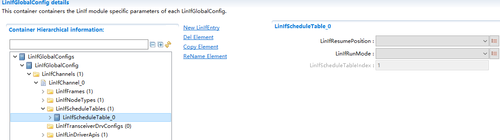

.. centered:: **表 LinIfScheduleTable属性描述 (Property Describes LinIfScheduleTable Line Breaks Preserved)**

.. list-table::
   :widths: 20 20 20 20 20
   :header-rows: 1

   * - UI名称 (UI Name)
     - 描述 (Description)
     - 
     - 
     - 
   * - LinIfResumePosition
     - 取值范围 (Range)
     - CONTINUE_AT_IT_POINT/START_FROM_BEGINNING
     - 默认取值 (Default value)
     - 无
   * - 
     - 参数描述 (Parameter Description)
     - 定义本调度表被RUN_ONCE类型的调度表中断后，恢复后从什么地方开始运行 (Define where the scheduling table resumes execution after being interrupted by a RUN_ONCE type scheduling table.)
     - 
     - 
   * - 
     - 依赖关系 (Dependencies)
     - 无
     - 
     - 
   * - LinIfRunMode
     - 取值范围 (Range)
     - RUN_CONTINUOUS /RUN_ONCE
     - 默认取值 (Default value)
     - 无
   * - 
     - 参数描述 (Parameter Description)
     - 定义调度表执行的次数 (Define the number of times the schedule table executes.)
     - 
     - 
   * - 
     - 依赖关系 (Dependencies)
     - 无
     - 
     - 
   * - LinIfScheduleTableIndex
     - 取值范围 (Range)
     - 无
     - 默认取值 (Default value)
     - 无
   * - 
     - 参数描述 (Parameter Description)
     - 调度表的ID号，上层通过该ID唯一的确定一个调度表。 (The ID number of the schedule table, through which the upper layer uniquely determines a schedule table.)
     - 
     - 
   * - 
     - 
     - ID号0在每个通道中都表示NULL_SCHEDULE（本参数不可配，工具自动从0开始分配） (ID号0 in each channel represents NULL_SCHEDULE (this parameter is not configurable, and the tool automatically allocates from 0).)
     - 
     - 
   * - 
     - 依赖关系 (Dependencies)
     - 无
     - 
     - 

LinIfEntry
==========================

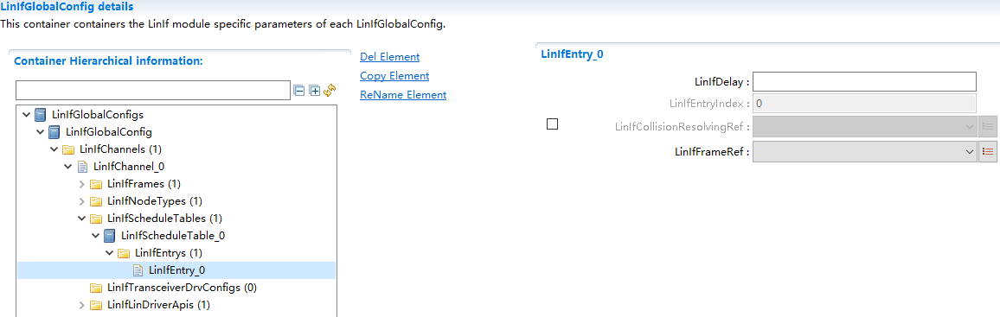

.. centered:: **表 LinIfEntry属性描述 (LineIfEntry Properties Description)**

.. list-table::
   :widths: 20 20 20 20 20
   :header-rows: 1

   * - UI名称 (UI Name)
     - 描述 (Description)
     - 
     - 
     - 
   * - LinIfDelay
     - 取值范围 (Range)
     - 0 .. 0.255
     - 默认取值 (Default value)
     - 无
   * - 
     - 参数描述 (Parameter Description)
     - 到调度表的下一个Entry之间的延时时间（单位：秒） (The delay time (in seconds) between entries in the schedule table)
     - 
     - 
   * - 
     - 依赖关系 (Dependencies)
     - 无
     - 
     - 
   * - LinIfEntryIndex
     - 取值范围 (Range)
     - 0 .. 255
     - 默认取值 (Default value)
     - 无
   * - 
     - 参数描述 (Parameter Description)
     - Entry的编号（本参数工具会自动分配，用户无需关心） (The entry's number (this parameter tool will automatically assign it, and you do not need to concern yourself with it))
     - 
     - 
   * - 
     - 依赖关系 (Dependencies)
     - 无
     - 
     - 
   * - LinIfCollisionResolvingRef
     - 取值范围 (Range)
     - 无
     - 默认取值 (Default value)
     - 无
   * - 
     - 参数描述 (Parameter Description)
     - 参照到一个冲突解决调度表，本参数只有在LinIfFrameRef参数对应的Fame类型为EventTrigger类型时需要设置 (Refer to a conflict resolution schedule, this parameter needs to be set only when the Frame type corresponding to the LinIfFrameRef parameter is EventTrigger type.)
     - 
     - 
   * - 
     - 依赖关系 (Dependencies)
     - 无
     - 
     - 
   * - LinIfFrameRef
     - 取值范围 (Range)
     - 无
     - 默认取值 (Default value)
     - 无
   * - 
     - 参数描述 (Parameter Description)
     - 指向本Entry对应的Frame (Point to the Frame corresponding to this Entry)
     - 
     - 
   * - 
     - 依赖关系 (Dependencies)
     - 无
     - 
     - 

LinIfTransceiverDrvConfig
=========================================

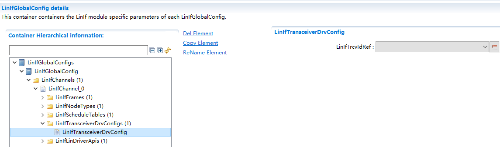

.. centered:: **表 LinIfTransceiverDrvConfig属性描述 (Table LinIfTransceiverDrvConfig Property Description)**

.. list-table::
   :widths: 20 20 20 20 20
   :header-rows: 1

   * - UI名称 (UI Name)
     - 描述 (Description)
     - 
     - 
     - 
   * - LinIfTrcvIdRef
     - 取值范围 (Range)
     - 无
     - 默认取值 (Default value)
     - 无
   * - 
     - 参数描述 (Parameter Description)
     - 指向LinIf通道对应的Trcv通道，仅在LinTrcv模块启用时需要配置 (Point to the Trcv channel corresponding to the LinIf channel; configuration is required only when the LinTrcv module is enabled.)
     - 
     - 
   * - 
     - 依赖关系 (Dependencies)
     - 无
     - 
     - 

LinIfLinDriverApi
=================================

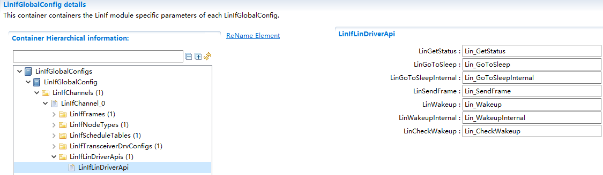

.. centered:: **表 LinIfLinDriverApi属性描述 (Table LinIfLinDriverApi Property Description)**

.. list-table::
   :widths: 20 20 20 20 20
   :header-rows: 1

   * - UI名称 (UI Name)
     - 描述 (Description)
     - 
     - 
     - 
   * - LinGetStatus
     - 取值范围 (Range)
     - 合法的C语言函数名 (Legal C language function names)
     - 默认取值 (Default value)
     - Lin_GetStatus
   * - 
     - 参数描述 (Parameter Description)
     - LinDriver中定义的Lin_GetStatus函数的函数名 (The function name of Lin_GetStatus defined in LinDriver)
     - 
     - 
   * - 
     - 
     - 注：LinIf文档中描述和LinDriver层的交互时使用的都是类似Lin_GetStatus这样的函数名，但是由于可能存在多个Driver的情况，LinDriver层在实现这些函数的时候，使用的是添加了Vendor_Id和Type_Id的名字，例如Lin_17_AscLin_GetStatus，所以需要在工具中输入驱动中使用的函数名，下同 (Note: When describing interactions with the LinDriver layer in the LinIf document, functions such as Lin_GetStatus are used. However, since multiple Drivers may exist, the LinDriver layer implements these functions using names that include Vendor_Id and Type_Id, for example, Lin_17_AscLin_GetStatus. Therefore, when entering function names in the tool, use the names used by the driver, same as before.)
     - 
     - 
   * - 
     - 依赖关系 (Dependencies)
     - 从节点时不需要使用该函数，该参数不可配置 (This function is not needed when working with node times, this parameter is not configurable.)
     - 
     - 
   * - LinGoToSleep
     - 取值范围 (Range)
     - 合法的C语言函数名 (Legal C language function names)
     - 默认取值 (Default value)
     - Lin_GoToSleep
   * - 
     - 参数描述 (Parameter Description)
     - LinDriver中定义的Lin_GoToSleep函数的函数名 (The function name of Lin_GoToSleep defined in LinDriver)
     - 
     - 
   * - 
     - 依赖关系 (Dependencies)
     - 从节点时不需要使用该函数，该参数不可配置 (This function is not needed when working with node times, this parameter is not configurable.)
     - 
     - 
   * - LinGoToSleepInternal
     - 取值范围 (Range)
     - 合法的C语言函数名 (Legal C language function names)
     - 默认取值 (Default value)
     - Lin_GoToSleepInternal
   * - 
     - 参数描述 (Parameter Description)
     - LinDriver中定义的Lin_GoToSleepInternal函数的函数名 (The function name of Lin_GoToSleepInternal defined in LinDriver)
     - 
     - 
   * - 
     - 依赖关系 (Dependencies)
     - 无
     - 
     - 
   * - LinSendFrame
     - 取值范围 (Range)
     - 合法的C语言函数名 (Legal C language function names)
     - 默认取值 (Default value)
     - Lin_SendFrame
   * - 
     - 参数描述 (Parameter Description)
     - LinDriver中定义的Lin_SendFrame函数的函数名 (The name of the function defined in LinDriver for Lin_SendFrame)
     - 
     - 
   * - 
     - 依赖关系 (Dependencies)
     - 从节点时不需要使用该函数，该参数不可配置 (This function is not needed when working with node times, this parameter is not configurable.)
     - 
     - 
   * - LinWakeup
     - 取值范围 (Range)
     - 合法的C语言函数名 (Legal C language function names)
     - 默认取值 (Default value)
     - Lin_Wakeup
   * - 
     - 参数描述 (Parameter Description)
     - LinDriver中定义的Lin_Wakeup函数的函数名 (The name of the function defined in LinDriver for Lin_Wakeup)
     - 
     - 
   * - 
     - 依赖关系 (Dependencies)
     - 无
     - 
     - 
   * - LinWakeupInternal
     - 取值范围 (Range)
     - 合法的C语言函数名 (Legal C language function names)
     - 默认取值 (Default value)
     - Lin_WakeupInternal
   * - 
     - 参数描述 (Parameter Description)
     - LinDriver中定义的Lin_WakeupInternal函数的函数名 (The name of the function defined in LinDriver named Lin_WakeupInternal)
     - 
     - 
   * - 
     - 依赖关系 (Dependencies)
     - 无
     - 
     - 
   * - LinCheckWakeup
     - 取值范围 (Range)
     - 合法的C语言函数名 (Legal C language function names)
     - 默认取值 (Default value)
     - Lin_CheckWakeup
   * - 
     - 参数描述 (Parameter Description)
     - LinDriver中定义的Lin_CheckWakeup函数的函数名 (The function name of Lin_CheckWakeup defined in LinDriver)
     - 
     - 
   * - 
     - 依赖关系 (Dependencies)
     - 无
     - 
     - 

LinTpGeneral
----------------------------

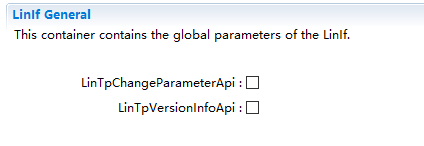

.. centered:: **表 LinTpGeneral属性描述 (Description of Line Breaks General Property)**

.. list-table::
   :widths: 20 20 20 20 20
   :header-rows: 1

   * - UI名称 (UI Name)
     - 描述 (Description)
     - 
     - 
     - 
   * - LinTpChangeParameterApi
     - 取值范围 (Range)
     - STD_ON / STD_OFF
     - 默认取值 (Default value)
     - 无
   * - 
     - 参数描述 (Parameter Description)
     - 表示LinTp_ChangeParameterRequest接口是否可用 (Indicate whether the LinTp_ChangeParameterRequest interface is available.)
     - 
     - 
   * - 
     - 依赖关系 (Dependencies)
     - 无
     - 
     - 
   * - LinTpVersionInfoApi
     - 取值范围 (Range)
     - STD_ON / STD_OFF
     - 默认取值 (Default value)
     - 无
   * - 
     - 参数描述 (Parameter Description)
     - 表示LinTp_GetVersionInfo函数是否可用 (Check if the LinTp_GetVersionInfo function is available)
     - 
     - 
   * - 
     - 依赖关系 (Dependencies)
     - 无
     - 
     - 

LinTpGlobalConfig
---------------------------------

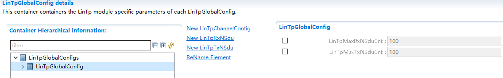

.. centered:: **表 LinTpGlobalConfig属性描述 (Property Description of Table LinTpGlobalConfig)**

.. list-table::
   :widths: 20 20 20 20 20
   :header-rows: 1

   * - UI名称 (UI Name)
     - 描述 (Description)
     - 
     - 
     - 
   * - LinTpMaxRxNSduCnt
     - 取值范围 (Range)
     - 0 .. 65535
     - 默认取值 (Default value)
     - 无
   * - 
     - 参数描述 (Parameter Description)
     - 对大允许配置的RxNSdu的个数 (The number of allowed Rx NSDU configurations)
     - 
     - 
   * - 
     - 依赖关系 (Dependencies)
     - 无
     - 
     - 
   * - LinTpMaxTxNSduCnt
     - 取值范围 (Range)
     - 0 .. 65535
     - 默认取值 (Default value)
     - 无
   * - 
     - 参数描述 (Parameter Description)
     - 对大允许配置的TxNSdu的个数 (Number of allowed TxNSdu for large configurations)
     - 
     - 
   * - 
     - 依赖关系 (Dependencies)
     - 无
     - 
     - 

LinTpChannelConfig
==================================

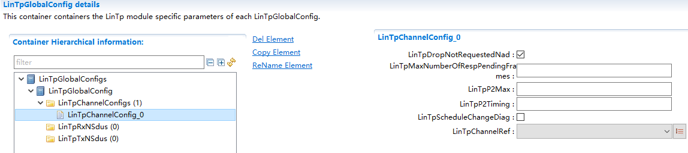

.. centered:: **表 LinTpChannelConfig属性描述 (Description of Table LinTpChannelConfig Properties)**

.. list-table::
   :widths: 20 20 20 20 20
   :header-rows: 1

   * - UI名称 (UI Name)
     - 描述 (Description)
     - 
     - 
     - 
   * - LinTpDropNotRequestedNad
     - 取值范围 (Range)
     - STD_ON / STD_OFF
     - 默认取值 (Default value)
     - STD_ON
   * - 
     - 参数描述 (Parameter Description)
     - 表示是否丢弃不为请求节点发送的诊断报文 (Indicate whether to discard diagnostic messages not sent to the request node)
     - 
     - 
   * - 
     - 依赖关系 (Dependencies)
     - 无
     - 
     - 
   * - LinTpMaxNumberOfRespPendingFrames
     - 取值范围 (Range)
     - 0 .. 65535
     - 默认取值 (Default value)
     - 5
   * - 
     - 参数描述 (Parameter Description)
     - 表示允许的responsependingframes的次数 (Indicate the number of allowed response pending frames.)
     - 
     - 
   * - 
     - 依赖关系 (Dependencies)
     - 无
     - 
     - 
   * - LinTpP2Max
     - 取值范围 (Range)
     - 0.05 .. 2
     - 默认取值 (Default value)
     - 2
   * - 
     - 参数描述 (Parameter Description)
     - P2*时间参数 (P2* Time parameter)
     - 
     - 
   * - 
     - 依赖关系 (Dependencies)
     - 无
     - 
     - 
   * - LinTpP2Timing
     - 取值范围 (Range)
     - 0.05 .. 0.5
     - 默认取值 (Default value)
     - 0.5
   * - 
     - 参数描述 (Parameter Description)
     - P2时间参数 (P2 Time Parameter)
     - 
     - 
   * - 
     - 依赖关系 (Dependencies)
     - 无
     - 
     - 
   * - LinTpScheduleChangeDiag
     - 取值范围 (Range)
     - STD_ON / STD_OFF
     - 默认取值 (Default value)
     - STD_ON
   * - 
     - 参数描述 (Parameter Description)
     - 表示是否调用BswM_LinTp_RequestMode()接口请求切换到诊断调度表 (Indicate whether to call the BswM_LinTp_RequestMode() interface to request switching to the diagnostic scheduling table.)
     - 
     - 
   * - 
     - 依赖关系 (Dependencies)
     - 无
     - 
     - 
   * - LinTpChannelRef
     - 取值范围 (Range)
     - ComM通道 (Comm channel)
     - 默认取值 (Default value)
     - 无
   * - 
     - 参数描述 (Parameter Description)
     - TP通道对应的ComM通道 (TP channel corresponds to ComM channel.)
     - 
     - 
   * - 
     - 依赖关系 (Dependencies)
     - 无
     - 
     - 

LinTpRxNSdu
---------------------------

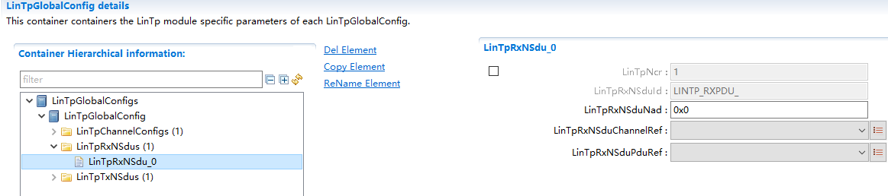

.. centered:: **表 LinTpRxNSdu属性描述 (Property LineTpRxNSdu Description)**

.. list-table::
   :widths: 20 20 20 20 20
   :header-rows: 1

   * - UI名称 (UI Name)
     - 描述 (Description)
     - 
     - 
     - 
   * - LinTpNcr
     - 取值范围 (Range)
     - 0 .. 1
     - 默认取值 (Default value)
     - 无
   * - 
     - 参数描述 (Parameter Description)
     - N_Cr参数时间。 (NCr parameter time.)
     - 
     - 
   * - 
     - 依赖关系 (Dependencies)
     - 无
     - 
     - 
   * - LinTpRxNSduId
     - 取值范围 (Range)
     - 0 .. 65535
     - 默认取值 (Default value)
     - 无
   * - 
     - 参数描述 (Parameter Description)
     - LinTpRxNSduPduRef引用的RxNSdu在LinTp在分配的ID (LineTpRxNSduPduRef referenced RxNSdu in LinTp allocating ID)
     - 
     - 
   * - 
     - 依赖关系 (Dependencies)
     - 无
     - 
     - 
   * - LinTpRxNSduNad
     - 取值范围 (Range)
     - 0 .. 255
     - 默认取值 (Default value)
     - 0x0
   * - 
     - 参数描述 (Parameter Description)
     - NAD定义 (Definition of NAD)
     - 
     - 
   * - 
     - 依赖关系 (Dependencies)
     - 无
     - 
     - 
   * - LinTpRxNSduPduRef
     - 取值范围 (Range)
     - ECUC中定义的PDU (PDU defined in ECUC)
     - 默认取值 (Default value)
     - 无
   * - 
     - 参数描述 (Parameter Description)
     - 引用到一个PDU (Reference to a PDU)
     - 
     - 
   * - 
     - 依赖关系 (Dependencies)
     - 无
     - 
     - 
   * - LinTpRxNSduChannelRef
     - 取值范围 (Range)
     - ComM通道 (Comm channel)
     - 默认取值 (Default value)
     - 无
   * - 
     - 参数描述 (Parameter Description)
     - 该RxNSdu所属的ComM通道 (The RxNSdu belonging to the ComM channel)
     - 
     - 
   * - 
     - 依赖关系 (Dependencies)
     - 无
     - 
     - 

LinTpTxNSdu
---------------------------

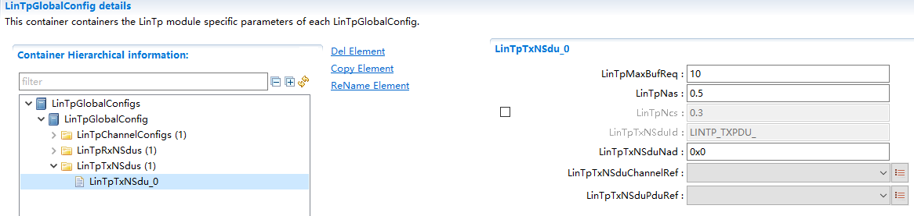

.. centered:: **表 LinTpTxNSdu属性描述 (Property LinTpTxNSdu Describes Line Breaks)**

.. list-table::
   :widths: 20 20 20 20 20
   :header-rows: 1

   * - UI名称 (UI Name)
     - 描述 (Description)
     - 
     - 
     - 
   * - LinTpMaxBufReq
     - 取值范围 (Range)
     - 0 .. 255
     - 默认取值 (Default value)
     - 10
   * - 
     - 参数描述 (Parameter Description)
     - 表示LinTp从上层获取数据时，当上层没有可用数据时，LinTp最多retry的次数。 (The maximum number of times LinTp will retry when the upper layer has no available data during data acquisition from the upper layer.)
     - 
     - 
   * - 
     - 依赖关系 (Dependencies)
     - 无
     - 
     - 
   * - LinTpNas
     - 取值范围 (Range)
     - 0 .. 1
     - 默认取值 (Default value)
     - 0.5
   * - 
     - 参数描述 (Parameter Description)
     - N_As参数时间。 (N_As Parameter Time.)
     - 
     - 
   * - 
     - 依赖关系 (Dependencies)
     - 无
     - 
     - 
   * - LinTpNcs
     - 取值范围 (Range)
     - 0 .. 1
     - 默认取值 (Default value)
     - 无
   * - 
     - 参数描述 (Parameter Description)
     - N_Cs参数时间。 (NCs Parameter Time.)
     - 
     - 
   * - 
     - 依赖关系 (Dependencies)
     - 无
     - 
     - 
   * - LinTpTxNSduId
     - 取值范围 (Range)
     - 0 .. 65535
     - 默认取值 (Default value)
     - 无
   * - 
     - 参数描述 (Parameter Description)
     - LinTpTxNSduPduRef引用的RxNSdu在LinTp在分配的ID (LinTpTxNSduPduRef referenced RxNSdu in LinTp allocated ID)
     - 
     - 
   * - 
     - 依赖关系 (Dependencies)
     - 无
     - 
     - 
   * - LinTpTxNSduNad
     - 取值范围 (Range)
     - 0 .. 255
     - 默认取值 (Default value)
     - 0x0
   * - 
     - 参数描述 (Parameter Description)
     - NAD定义 (Definition of NAD)
     - 
     - 
   * - 
     - 依赖关系 (Dependencies)
     - 无
     - 
     - 
   * - LinTpTxNSduPduRef
     - 取值范围 (Range)
     - ECUC中定义的PDU (PDU defined in ECUC)
     - 默认取值 (Default value)
     - 无
   * - 
     - 参数描述 (Parameter Description)
     - 引用到一个PDU (Reference to a PDU)
     - 
     - 
   * - 
     - 依赖关系 (Dependencies)
     - 无
     - 
     - 
   * - LinTpTxNSduChannelRef
     - 取值范围 (Range)
     - ComM通道 (Comm channel)
     - 默认取值 (Default value)
     - 无
   * - 
     - 参数描述 (Parameter Description)
     - 该TxNSdu所属的ComM通道 (The TxNSdu belonging to the ComM channel)
     - 
     - 
   * - 
     - 依赖关系 (Dependencies)
     - 无
     - 
     - 
