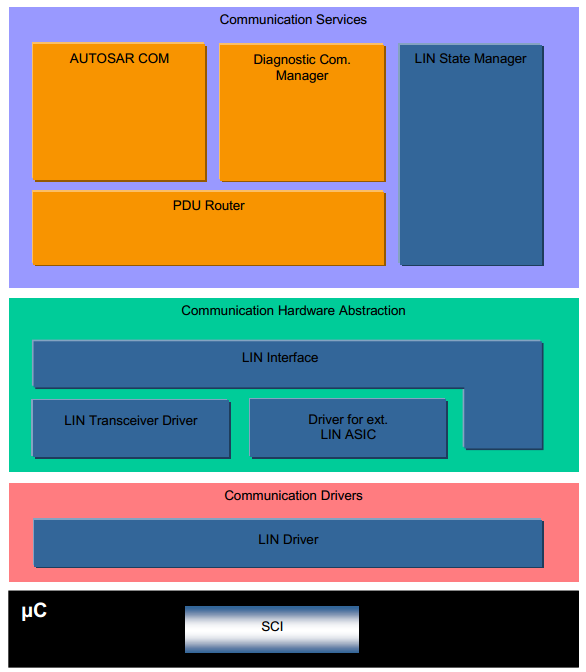
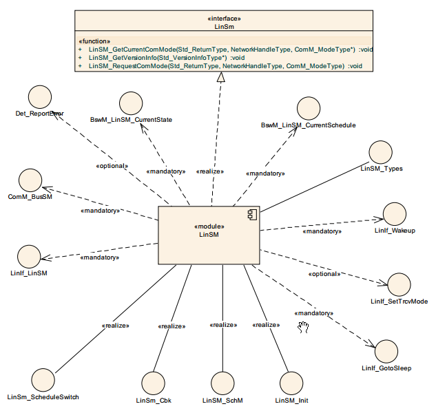
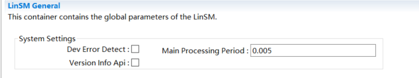
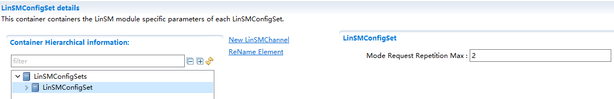
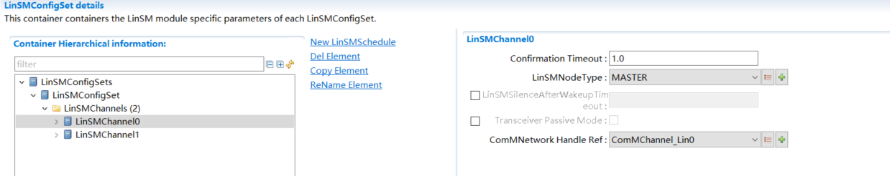
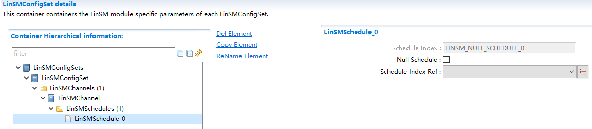

LinSM
#################################

:strong:`缩写词注解 (Abbreviation Notes):`

.. list-table::
   :widths: 34 33 33
   :header-rows: 1

   * - 缩写词 (Abbreviation)
     - 解释/描述 (Explanation/Description)
     - 中文解释 (Chinese explanation)
   * - LIN
     - Local InterconnectNetwork
     - 局域互联网络 (Local Area Network)
   * - LinIf
     - LIN Interface
     - LIN 接口层 (LINE interface layer)
   * - LinSM
     - LIN State Manager
     - LIN状态管理 (LINE State Management)

简介 (Introduction)
=================================

本文档是AUTOSAR R19-11的LIN State Manager模块参考手册。旨在指导使用LinSM模块的用户能够清晰地了解如何去使用LinSM模块。

This document is the AUTOSAR R19-11 LIN State Manager module reference manual. It aims to guide users of the LinSM module to clearly understand how to use the LinSM module.

LinSM模块的下层是Lin Interface，上层是ComM，BswM等。其主要职责是控制Lin总线的控制流。主要功能包括以下三点：

The lower layer of the LinSM module is Lin Interface, while the upper layers are ComM, BswM, etc. Its main responsibility is to control the control flow of the Lin bus. Main functions include the following three points:

#. 根据上层的要求切换到相应的调度表

Switch to the corresponding schedule table according to the upper layer's requirement.

#. 根据上层的要求处理go-to-sleep和wake-up请求

Process go-to-sleep and wake-up requests according to upper layer requirements

#. 当切换到新的状态时通知上层模块

Notify higher modules when switching to a new state.

参考资料 (Reference materials)
------------------------------------------

[1] AUTOSAR_SWS_LINInterface.pdf，R19-11

[2] AUTOSAR_SWS_LINStateManager.pdf，R19-11

[3] AUTOSAR_SWS_LINTransceiverDriver.pdf，R19-11

[4] AUTOSAR_SWS_LINDriver.pdf，R19-11

[5] LIN Specification Package，Revision 2.1

功能描述 (Function Description)
===========================================

LIN网络的状态管理功能 (The status management function of LIN network)
----------------------------------------------------------------------------

控制LIN网络的通信状态（NO COMMUNICATION和FULL COMMUNICATION），处理调度表切换请求（仅主节点），处理通信模式请求，将通信状态变更通知给上层。

Control the communication status of the LIN network (NO COMMUNICATION and FULL COMMUNICATION), handle scheduling table switch requests (only on the master node), handle communication mode requests, and notify the upper layer of communication status changes.

功能实现 (Function implementation)
==============================================

对于Master节点在LINSM_FULL_COM状态，ComM调用LinSM_RequestComMode()请求将网络状态切换到NO_COM时，调用LinIf_GotoSleep()，并阻塞其他请求。当睡眠执行成功后，LinIf调用LinSM_GotoSleepConfirmation()，收到该通知后，将状态切换到LINSM_NO_COM，退出GotoSleep进程，接受其他请求。然后LinSM调用ComM和BswM通知接口，报告当前状态切换到NO_COM。

For Master nodes in the LINSM_FULL_COM state, ComM calls LinSM_RequestComMode() to request switching the network status to NO_COM. It then calls LinIf_GotoSleep() and blocks other requests. Upon successful sleep execution, LinIf calls LinSM_GotoSleepConfirmation(). After receiving this notification, the state switches to LINSM_NO_COM, exiting the GotoSleep process and accepting other requests. Then LinSM calls ComM and BswM notification interfaces to report that the current status has switched to NO_COM.

对于Slave节点在LINSM_FULL_COM状态，ComM调用LinSM_RequestComMode()请求将网络状态切换到NO_COM时，LinSM保存该请求。当LinIf检测到总线睡眠时，调用LinSM_GotoSleepIndication()，调用LinIf_GotoSleep()，并阻塞其他请求。如果之前请求NO_COM，并且LinIf_GotoSleep()返回E_OK，LinSM调用ComM_BusSM_BusSleepMode通知ComM进入BusSleep状态。当LinIf调用LinSM_GotoSleepConfirmation()时，将状态切换到LINSM_NO_COM，退出GotoSleep进程，接受其他请求。然后LinSM调用ComM和BswM通知接口，报告当前状态切换到NO_COM。

For Slave nodes in the LINSM_FULL_COM state, ComM calls LinSM_RequestComMode() to request switching the network status to NO_COM. LinSM saves this request. When LinIf detects bus sleep, it calls LinSM_GotoSleepIndication(), then calls LinIf_GotoSleep() and blocks other requests. If a previous request for NO_COM exists and LinIf_GotoSleep() returns E_OK, LinSM calls ComM_BusSM_BusSleepMode to notify ComM to enter the BusSleep state. When LinIf calls LinSM_GotoSleepConfirmation(), the status switches to LINSM_NO_COM, exiting the GotoSleep process and accepting other requests. Then, LinSM calls ComM and BswM to notify the interfaces of the current state switching to NO_COM.

当节点需要唤醒网络（主动发起或者检测到唤醒信号由EcuM发起），LinSM_RequestComMode()被调用，LinSM设置超时定时器，调用LinIf_Wakeup()。

When the node needs to wake up the network (initiated actively or detects a wakeup signal initiated by EcuM), LinSM_RequestComMode() is called, LinSM sets the timeout timer and calls LinIf_Wakeup().

当网络被成功唤醒，LinSM_WakeupConfirmation()被调用，LinSM停止超时定时器，将状态切换到LINSM_FULL_COM。然后LinSM调用ComM和BswM通知接口，报告当前状态切换到FULL_COM。

When the network is successfully awakened, LinSM_WakeupConfirmation() is called, LinSM stops the timeout timer, switches the state to LINSM_FULL_COM. Then, LinSM calls the ComM and BswM notification interfaces to report that the current state has switched to FULL_COM.

当需要切换调度表时，BswM调用LinSM_ScheduleRequest()发送调度表切换请求，LinSM启动超时定时器，然后调用LinIf_ScheduleRequest()。

When a schedule table switch is needed, BswM calls LinSM_ScheduleRequest() to send a scheduling request. LinSM starts the timeout timer and then calls LinIf_ScheduleRequest().

当调度表切换成功后，LinIf调用LinSM_ScheduleRequestConfirmation()通知LinSM。LinSM取消超时定时器，并将调度表切换结果通知BswM。

After the scheduling table switch is successful, LinIf calls LinSM_ScheduleRequestConfirmation() to notify LinSM. LinSM cancels the timeout timer and notifies BswM of the scheduling table switch result.

源文件描述 (Source file description)
===============================================

.. centered:: **表 LinSM源文件 (Table LinSM Source File)**

.. list-table::
   :widths: 50 50
   :header-rows: 1

   * - 文件 (Files)
     - 说明 (Description)
   * - LinSM.c
     - 模块源文件 (Module source files)
   * - LinSM.h
     - 模块头文件 (Module header file)
   * - LinSM_Cbk.h
     - 模块提供的回掉函数接口头文件 (Header file for callback function interfaces provided by the module)
   * - LinSM_MemMap.h
     - LinSM内存映射头文件 (LineSM Memory-mapped Header File)
   * - LinSM_Cfg.h
     - 配置头文件 (Header file configuration)
   * - LinSM_Cfg.c
     - 配置源文件 (Source configuration file)

API接口 (API Interface)
=====================================

类型定义 (Type definition)
--------------------------------------

LinSM_ModeType类型定义 (LinSM_ModeType Type Definition)
===================================================================

.. list-table::
   :widths: 50 50
   :header-rows: 1

   * - 名称 (Name)
     - LinSM_ModeType
   * - 类型 (Type)
     - uint8
   * - 范围 (Range)
     - 1 LINSM_FULL_COM 表示Full communication (1 LINSM_FULL_COM indicates Full communication)
   * - 
     - 2 LINSM_NO_COM 表示No communication (2 LINSM_NO_COM indicates No communication)
   * - 描述 (Description)
     - 用于向BswM报告当前所处的模式 (Used to report the current mode to BswM)

输入函数描述 (Describe the input function:)
-----------------------------------------------------

.. list-table::
   :widths: 50 50
   :header-rows: 1

   * - 输入模块 (Input Module)
     - API
   * - BswM
     - BswM_LinSM_CurrentSchedule
   * - 
     - BswM_LinSM_CurrentState
   * - ComM
     - ComM_BusSM_ModeIndication
   * - Lin Interface
     - LinIf_GotoSleep
   * - 
     - LinIf_ScheduleRequest
   * - 
     - LinIf_Wakeup

静态接口函数定义 (Static interface function definition)
---------------------------------------------------------------

LinSM_Init函数定义 (The LinSM_Init function definition)
===================================================================

.. list-table::
   :widths: 25 25 25 25
   :header-rows: 1

   * - 函数名称： (Function Name:)
     - LinSM_Init
     - 
     - 
   * - 函数原型： (Function prototype:)
     - void LinSM_Init(constLinSM_ConfigType\*ConfigPtr)
     - 
     - 
   * - 服务编号： (Service Number:)
     - 0x01
     - 
     - 
   * - 同步/异步： (Synchronous/asynchronous:)
     - 同步 (Sync)
     - 
     - 
   * - 是否可重入： (Is Reentrant:)
     - 不可重入 (Non-reentrant)
     - 
     - 
   * - 输入参数： (Input parameters:)
     - ConfigPtr
     - 值域： (Domain:)
     - 指针 (Pointer)
   * - 输入输出参数： (Input Output Parameters:)
     - 无
     - 
     - 
   * - 输出参数： (Output Parameters:)
     - 无
     - 
     - 
   * - 返回值： (Return Value:)
     - 无
     - 
     - 
   * - 功能概述： (Function Overview:)
     - 初始化LinSM模块 (Initialize LinSM module)
     - 
     - 

LinSM_GetVersionInfo函数定义 (The LinSM_GetVersionInfo function definition)
=======================================================================================

.. list-table::
   :widths: 25 25 25 25
   :header-rows: 1

   * - 函数名称： (Function Name:)
     - LinSM_GetVersionInfo
     - 
     - 
   * - 函数原型： (Function prototype:)
     - voidLinSM_GetVersionInfo(Std_VersionInfoType\*versioninfo )
     - 
     - 
   * - 服务编号： (Service Number:)
     - 0x13
     - 
     - 
   * - 同步/异步： (Synchronous/asynchronous:)
     - 同步 (Sync)
     - 
     - 
   * - 是否可重入： (Is Reentrant:)
     - 可重入 (Reentrant)
     - 
     - 
   * - 输入参数： (Input parameters:)
     - versioninfo
     - 值域： (Domain:)
     - 指针 (Pointer)
   * - 输入输出参数： (Input Output Parameters:)
     - 无
     - 
     - 
   * - 输出参数： (Output Parameters:)
     - 无
     - 
     - 
   * - 返回值： (Return Value:)
     - 无
     - 
     - 
   * - 功能概述： (Function Overview:)
     - 读取LinSM模块的版本号 (Read the version number of LinSM module)
     - 
     - 

LinSM_ScheduleRequest函数定义 (The LinSM_ScheduleRequest function definition)
=========================================================================================

.. list-table::
   :widths: 25 25 25 25
   :header-rows: 1

   * - 函数名称： (Function Name:)
     - LinSM_ScheduleRequest
     - 
     - 
   * - 函数原型： (Function prototype:)
     - Std_ReturnTypeLinSM_ScheduleRequest(
     - 
     - 
   * - 
     - NetworkHandleTypenetwork,
     - 
     - 
   * - 
     - LinIf_SchHandleTypeschedule
     - 
     - 
   * - 
     - )
     - 
     - 
   * - 服务编号： (Service Number:)
     - 0x10
     - 
     - 
   * - 同步/异步： (Synchronous/asynchronous:)
     - 异步 (Asynchronous)
     - 
     - 
   * - 是否可重入： (Is Reentrant:)
     - 不可重入 (Non-reentrant)
     - 
     - 
   * - 输入参数： (Input parameters:)
     - network
     - 值域： (Domain:)
     - 0 .. 255
   * - 
     - schedule
     - 值域： (Domain:)
     - 0 .. 255
   * - 输入输出参数： (Input Output Parameters:)
     - 无
     - 
     - 
   * - 输出参数： (Output Parameters:)
     - 无
     - 
     - 
   * - 返回值： (Return Value:)
     - 无
     - 
     - 
   * - 功能概述： (Function Overview:)
     - E_OK:调度表切换请求被接受 (E_OK: Scheduling table switch request accepted)
     - 
     - 
   * - 
     - E_NOT_OK:调度表切换请求失败，可能由于以下原因： (E_NOT_OK: Failed to switch schedule table, possibly due to the following reasons:)
     - 
     - 
   * - 
     - ①LinSM模块还未被初始化 (LinSM module has not been initialized.)
     - 
     - 
   * - 
     - ②Schedule参数代表的调度表不存在 (The Schedule parameter represents a scheduling table that does not exist.)
     - 
     - 

LinSM_GetCurrentComMode函数定义 (The LinSM_GetCurrentComMode function definition)
=============================================================================================

.. list-table::
   :widths: 25 25 25 25
   :header-rows: 1

   * - 函数名称： (Function Name:)
     - LinSM_GetCurrentComMode
     - 
     - 
   * - 函数原型： (Function prototype:)
     - Std_ReturnTypeLinSM_GetCurrentComMode(
     - 
     - 
   * - 
     - NetworkHandleTypenetwork,
     - 
     - 
   * - 
     - ComM_ModeType\*mode
     - 
     - 
   * - 
     - )
     - 
     - 
   * - 服务编号： (Service Number:)
     - 0x11
     - 
     - 
   * - 同步/异步： (Synchronous/asynchronous:)
     - 同步 (Sync)
     - 
     - 
   * - 是否可重入： (Is Reentrant:)
     - 可重入 (Reentrant)
     - 
     - 
   * - 输入参数： (Input parameters:)
     - network
     - 值域： (Domain:)
     - 0 .. 255
   * - 输入输出参数： (Input Output Parameters:)
     - None
     - 
     - 
   * - 输出参数： (Output Parameters:)
     - mode
     - 值域： (Domain:)
     - 0 .. 2
   * - 返回值： (Return Value:)
     - E_OK: 获取成功 (E_OK: Successfully Retrieved)
     - 
     - 
   * - 
     - E_NOT_OK:获取失败，可能由于以下原因： (E_NOT_OK: Failed to retrieve, possibly due to the following reasons:)
     - 
     - 
   * - 
     - ①LinSM模块还未被初始化 (LinSM module has not been initialized.)
     - 
     - 
   * - 
     - ②network参数代表的通道不存在 (The network parameter represents a channel that does not exist.)
     - 
     - 
   * - 
     - ③mode参数为NULL_PTR (③mode parameter is NULL_PTR)
     - 
     - 
   * - 功能概述： (Function Overview:)
     - 获取指定网络的当前通信模式 (Get the current communication mode of the specified network)
     - 
     - 

LinSM_RequestComMode函数定义 (The LinSM_RequestComMode function definition)
=======================================================================================

.. list-table::
   :widths: 25 25 25 25
   :header-rows: 1

   * - 函数名称： (Function Name:)
     - LinSM_RequestComMode
     - 
     - 
   * - 函数原型： (Function prototype:)
     - Std_ReturnTypeLinSM_RequestComMode(
     - 
     - 
   * - 
     - NetworkHandleTypenetwork,
     - 
     - 
   * - 
     - ComM_ModeTypemode
     - 
     - 
   * - 
     - )
     - 
     - 
   * - 服务编号： (Service Number:)
     - 0x12
     - 
     - 
   * - 同步/异步： (Synchronous/asynchronous:)
     - 异步 (Asynchronous)
     - 
     - 
   * - 是否可重入： (Is Reentrant:)
     - 可重入 (Reentrant)
     - 
     - 
   * - 输入参数： (Input parameters:)
     - network
     - 值域： (Domain:)
     - 0 .. 255
   * - 
     - mode
     - 值域： (Domain:)
     - 0 .. 2
   * - 输入输出参数： (Input Output Parameters:)
     - 无
     - 
     - 
   * - 输出参数： (Output Parameters:)
     - 无
     - 
     - 
   * - 返回值： (Return Value:)
     - 无
     - 
     - 
   * - 功能概述： (Function Overview:)
     - E_OK: 请求成功 (E_OK: Request successful)
     - 
     - 
   * - 
     - E_NOT_OK:请求失败，可能由于以下原因： (E_NOT_OK: Request failed, possibly due to the following reasons:)
     - 
     - 
   * - 
     - #. LinSM模块还未被初始化 (#. The LinSM module has not been initialized.)
     - 
     - 
   * - 
     - #. network参数代表的通道不存在 (#. The network parameter represents a channel that does not exist.)
     - 
     - 
   * - 
     - #. mode参数为请求的模式不存在 (#. The mode parameter for the request does not exist.)
     - 
     - 

LinSM_MainFunction函数定义 (LinSM_MainFunction function definition)
===============================================================================

.. list-table::
   :widths: 50 50
   :header-rows: 1

   * - 函数名称： (Function Name:)
     - LinSM_MainFunction
   * - 函数原型： (Function prototype:)
     - void LinSM_MainFunction(void)
   * - 服务编号： (Service Number:)
     - 0x30
   * - 同步/异步： (Synchronous/asynchronous:)
     - 同步 (Sync)
   * - 是否可重入： (Is Reentrant:)
     - 不可重入 (Non-reentrant)
   * - 输入参数： (Input parameters:)
     - 无
   * - 输入输出参数： (Input Output Parameters:)
     - 无
   * - 输出参数： (Output Parameters:)
     - 无
   * - 返回值： (Return Value:)
     - 无
   * - 功能概述： (Function Overview:)
     - LinSM的周期处理函数 (The periodic processing function of LinSM)

LinSM_ScheduleRequestConfirmation函数定义 (The LinSM_ScheduleRequestConfirmation function definition)
=================================================================================================================

.. list-table::
   :widths: 25 25 25 25
   :header-rows: 1

   * - 函数名称： (Function Name:)
     - LinSM_ScheduleRequestConfirmation
     - 
     - 
   * - 函数原型： (Function prototype:)
     - voidLinSM_ScheduleRequestConfirmation(
     - 
     - 
   * - 
     - NetworkHandleTypenetwork,
     - 
     - 
   * - 
     - LinIf_SchHandleTypeschedule
     - 
     - 
   * - 
     - )
     - 
     - 
   * - 服务编号： (Service Number:)
     - 0x20
     - 
     - 
   * - 同步/异步： (Synchronous/asynchronous:)
     - 同步 (Sync)
     - 
     - 
   * - 是否可重入： (Is Reentrant:)
     - 可重入 (Reentrant)
     - 
     - 
   * - 输入参数： (Input parameters:)
     - network
     - 值域： (Domain:)
     - 0 .. 255
   * - 
     - schedule
     - 值域： (Domain:)
     - 0 .. 255
   * - 输入输出参数： (Input Output Parameters:)
     - 无
     - 
     - 
   * - 输出参数： (Output Parameters:)
     - 无
     - 
     - 
   * - 返回值： (Return Value:)
     - 无
     - 
     - 
   * - 功能概述： (Function Overview:)
     - LinIf模块在成功切换调度表后会调用本函数通知LinSM模块 (The LinIf module will call this function to notify the LinSM module after a successful schedule table switch.)
     - 
     - 

LinSM_WakeupConfirmation函数定义 (LinSM_WakeupConfirmation function definition)
===========================================================================================

.. list-table::
   :widths: 25 25 25 25
   :header-rows: 1

   * - 函数名称： (Function Name:)
     - LinSM_WakeupConfirmation
     - 
     - 
   * - 函数原型： (Function prototype:)
     - voidLinSM_WakeupConfirmation(
     - 
     - 
   * - 
     - NetworkHandleTypenetwork,
     - 
     - 
   * - 
     - boolean success
     - 
     - 
   * - 
     - )
     - 
     - 
   * - 服务编号： (Service Number:)
     - 0x21
     - 
     - 
   * - 同步/异步： (Synchronous/asynchronous:)
     - 同步 (Sync)
     - 
     - 
   * - 是否可重入： (Is Reentrant:)
     - 可重入 (Reentrant)
     - 
     - 
   * - 输入参数： (Input parameters:)
     - network
     - 值域： (Domain:)
     - 0 .. 255
   * - 
     - success
     - 值域： (Domain:)
     - TRUE / FALSE
   * - 输入输出参数： (Input Output Parameters:)
     - 无
     - 
     - 
   * - 输出参数： (Output Parameters:)
     - 无
     - 
     - 
   * - 返回值： (Return Value:)
     - 无
     - 
     - 
   * - 功能概述： (Function Overview:)
     - LinIf模块在发送Wakeup信号后会调用本函数通知LinSM (The LinIf module calls this function to notify LinSM after sending the Wakeup signal.)
     - 
     - 

LinSM_GotoSleepConfirmation函数定义 (LinSM_GotoSleepConfirmation function definition)
=================================================================================================

.. list-table::
   :widths: 25 25 25 25
   :header-rows: 1

   * - 函数名称： (Function Name:)
     - LinSM_GotoSleepConfirmation
     - 
     - 
   * - 函数原型： (Function prototype:)
     - voidLinSM_GotoSleepConfirmation(
     - 
     - 
   * - 
     - NetworkHandleTypenetwork,
     - 
     - 
   * - 
     - boolean success
     - 
     - 
   * - 
     - )
     - 
     - 
   * - 服务编号： (Service Number:)
     - 0x22
     - 
     - 
   * - 同步/异步： (Synchronous/asynchronous:)
     - 同步 (Sync)
     - 
     - 
   * - 是否可重入： (Is Reentrant:)
     - 可重入 (Reentrant)
     - 
     - 
   * - 输入参数： (Input parameters:)
     - network
     - 值域： (Domain:)
     - 0 .. 255
   * - 
     - success
     - 值域： (Domain:)
     - TRUE / FALSE
   * - 输入输出参数： (Input Output Parameters:)
     - 无
     - 
     - 
   * - 输出参数： (Output Parameters:)
     - 无
     - 
     - 
   * - 返回值： (Return Value:)
     - 无
     - 
     - 
   * - 功能概述： (Function Overview:)
     - LinIf模块在发送go-to-sleep命令后会调用本函数通知LinSM (The LinIf module will call this function to notify LinSM after sending the go-to-sleep command.)
     - 
     - 

LinSM_GotoSleepIndication函数定义 (The LinSM_GotoSleepIndication function definition)
=================================================================================================

.. list-table::
   :widths: 25 25 25 25
   :header-rows: 1

   * - 函数名称： (Function Name:)
     - LinSM_GotoSleepIndication
     - 
     - 
   * - 函数原型： (Function prototype:)
     - voidLinSM_GotoSleepIndication(
     - 
     - 
   * - 
     - NetworkHandleTypeChannel
     - 
     - 
   * - 
     - )
     - 
     - 
   * - 服务编号： (Service Number:)
     - 0x03
     - 
     - 
   * - 同步/异步： (Synchronous/asynchronous:)
     - 同步 (Sync)
     - 
     - 
   * - 是否可重入： (Is Reentrant:)
     - 可重入 (Reentrant)
     - 
     - 
   * - 输入参数： (Input parameters:)
     - Channel
     - 值域： (Domain:)
     - 0 .. 255
   * - 输入输出参数： (Input Output Parameters:)
     - 无
     - 
     - 
   * - 输出参数： (Output Parameters:)
     - 无
     - 
     - 
   * - 返回值： (Return Value:)
     - 无
     - 
     - 
   * - 功能概述： (Function Overview:)
     - 如果收到go-to-sleep命令或者总线空闲定时器超时，LinIf模块会调用本函数通知LinSM。仅用于从节点。 (If the LinIf module invokes this function to notify LinSM upon receiving a go-to-sleep command or bus-idle timer timeout, it is exclusively for use with a slave node.)
     - 
     - 

可配置函数定义 (Configurable Function Definition)
----------------------------------------------------------

无。

None.

配置 (Configure)
==============================

LinSM General 
------------------------------

.. centered:: **表 LinSM General属性描述 (Description of Table LinSM General Properties)**

.. list-table::
   :widths: 20 20 20 20 20
   :header-rows: 1

   * - UI名称 (UI Name)
     - 描述 (Description)
     - 
     - 
     - 
   * - Dev ErrorDetect
     - 取值范围 (Range)
     - true/false
     - 默认取值 (Default value)
     - false
   * - 
     - 参数描述 (Parameter Description)
     - 打开或关闭错误（Det）检测和通知
     - 
     - 
   * - 
     - 依赖关系 (Dependencies)
     - 无
     - 
     - 
   * - MainProcessingPeriod
     - 取值范围 (Range)
     - 0 .. INF
     - 默认取值 (Default value)
     - 0.01
   * - 
     - 参数描述 (Parameter Description)
     - LinSM模块主函数调用周期 (Cycle of LinSM Module Main Function Call)
     - 
     - 
   * - 
     - 依赖关系 (Dependencies)
     - 无
     - 
     - 
   * - VersionInfo Api
     - 取值范围 (Range)
     - true/false
     - 默认取值 (Default value)
     - false
   * - 
     - 参数描述 (Parameter Description)
     - 指示LinSM_GetVersionInfo函数是否可用 (Check if the LinSM_GetVersionInfo function is available.)
     - 
     - 
   * - 
     - 依赖关系 (Dependencies)
     - 无
     - 
     - 

LinSMConfigSet
------------------------------

.. centered:: **表 LinSMConfigSet属性描述 (Description of Table LinSMConfigSet Properties)**

.. list-table::
   :widths: 20 20 20 20 20
   :header-rows: 1

   * - UI名称 (UI Name)
     - 描述 (Description)
     - 
     - 
     - 
   * - ModeRequestRepetitionMax
     - 取值范围 (Range)
     - 0 .. 255
     - 默认取值 (Default value)
     - 无
   * - 
     - 参数描述 (Parameter Description)
     - 模式请求时，在LinIf没有应答的情况下，LinSM模块再次请求的次数 (The number of times the LinSM module requests again when a response is not received from LinIf during a mode request.)
     - 
     - 
   * - 
     - 依赖关系 (Dependencies)
     - 无
     - 
     - 

LinSM Channel
=============================

.. centered:: **表 LinSM Channel属性描述 (Describe the LineSM Channel Properties)**

.. list-table::
   :widths: 20 20 20 20 20
   :header-rows: 1

   * - UI名称 (UI Name)
     - 描述 (Description)
     - 
     - 
     - 
   * - ConfirmationTimeout
     - 取值范围 (Range)
     - 0 .. INF
     - 默认取值 (Default value)
     - 无
   * - 
     - 参数描述 (Parameter Description)
     - LinSM在向LinIf请求go-to-sleep，wakeup和调度表切换时设定的超时时间。这个超时时间必须长于go-to-sleep命令在总线上的时间。 (The timeout duration set by LinSM when requesting go-to-sleep, wakeup, and scheduling table switching from LinIf. This timeout must be longer than the time the go-to-sleep command spends on the bus.)
     - 
     - 
   * - 
     - 依赖关系 (Dependencies)
     - 无
     - 
     - 
   * - LinSMNodeType
     - 取值范围 (Range)
     - SLAVE / MASTER
     - 默认取值 (Default value)
     - 无
   * - 
     - 参数描述 (Parameter Description)
     - 指示当前通道的类型 (Indicate the type of the current channel.)
     - 
     - 
   * - 
     - 依赖关系 (Dependencies)
     - 无
     - 
     - 
   * - LinSMSilenceAfterWakeupTimeout
     - 取值范围 (Range)
     - 0 .. INF
     - 默认取值 (Default value)
     - 无
   * - 
     - 参数描述 (Parameter Description)
     - 当一个唤醒操作失败后，到开始下个唤醒操作的时间间隔 (The time interval before starting the next wake-up operation after a wake-up operation fails)
     - 
     - 
   * - 
     - 依赖关系 (Dependencies)
     - 从节点时必须配置，主节点不需要该参数 (This parameter is required for worker nodes but not needed for master nodes.)
     - 
     - 
   * - TransceiverPassiveMode
     - 取值范围 (Range)
     - true/false
     - 默认取值 (Default value)
     - false
   * - 
     - 参数描述 (Parameter Description)
     - 指示当进入LINSM_NO_COM状态时，收发器所处的状态。当该参数设置为true时，收发器处于STANDBY模式。当该参数设置为false时，收发器处于SLEEP模式。 (Indicates the state of the transmitter when entering LINSM_NO_COM state. When this parameter is set to true, the transmitter is in STANDBY mode. When this parameter is set to false, the transmitter is in SLEEP mode.)
     - 
     - 
   * - 
     - 依赖关系 (Dependencies)
     - 无
     - 
     - 
   * - ComMNetworkHandle Ref
     - 取值范围 (Range)
     - 无
     - 默认取值 (Default value)
     - 无
   * - 
     - 参数描述 (Parameter Description)
     - 指向ComM中配置的一个通道 (Pointing to a channel configured in ComM)
     - 
     - 
   * - 
     - 依赖关系 (Dependencies)
     - 无
     - 
     - 

LinSMSchedule
-----------------------------

.. centered:: **表 LinSMSchedule属性描述 (Table LinSMSchedule Property Description)**

.. list-table::
   :widths: 20 20 20 20 20
   :header-rows: 1

   * - UI名称 (UI Name)
     - 描述 (Description)
     - 
     - 
     - 
   * - ScheduleIndex
     - 取值范围 (Range)
     - 0 .. 255
     - 默认取值 (Default value)
     - 无
   * - 
     - 参数描述 (Parameter Description)
     - 调度表的序号（自动生成，用户不需要关心） (The sequence number of the schedule table (automatically generated, users do not need to concern themselves with it))
     - 
     - 
   * - 
     - 依赖关系 (Dependencies)
     - 无
     - 
     - 
   * - NullSchedule
     - 取值范围 (Range)
     - true / false
     - 默认取值 (Default value)
     - false
   * - 
     - 参数描述 (Parameter Description)
     - 表示要配置的调度表是否为空调度表 (Indicate whether the schedule to be configured is an empty schedule.)
     - 
     - 
   * - 
     - 依赖关系 (Dependencies)
     - 当NullSchedule设置为True时，ScheduleIndex Ref参数不可配置 (When NullSchedule is set to True, the ScheduleIndex Ref parameter cannot be configured.)
     - 
     - 
   * - ScheduleIndex Ref
     - 取值范围 (Range)
     - 无
     - 默认取值 (Default value)
     - 无
   * - 
     - 参数描述 (Parameter Description)
     - 指向LinIf中配置的调度表 (Refer to the scheduling table configured in LinIf.)
     - 
     - 
   * - 
     - 依赖关系 (Dependencies)
     - 当NullSchedule设置为True时，ScheduleIndex Ref参数不可配置 (When NullSchedule is set to True, the ScheduleIndex Ref parameter cannot be configured.)
     - 
     - 

※LinSMSchedule容器只有主节点可以配置并且不能为空，从节点不可以配置该容器，该容器必须为空

※The LinSMSchedule container can only be configured on the master node and cannot be empty. Slave nodes are not allowed to configure this container, and the container must be empty.
