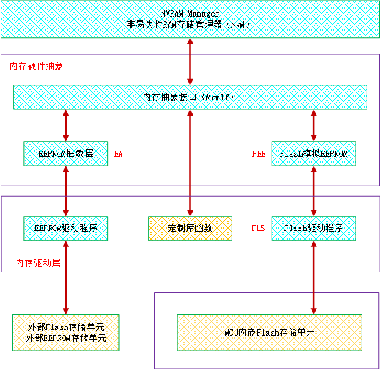
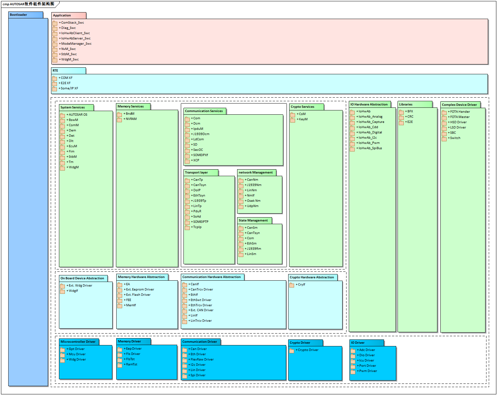
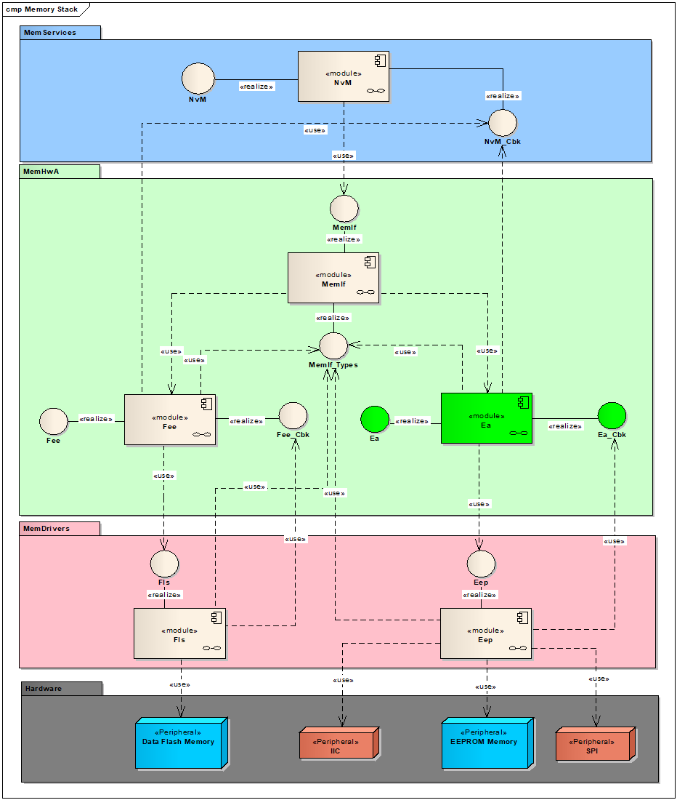
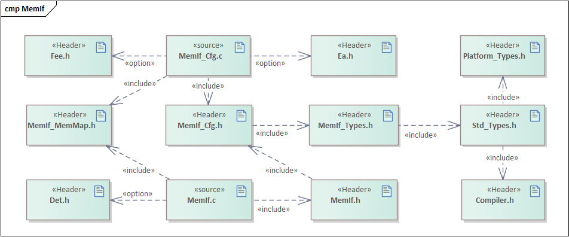
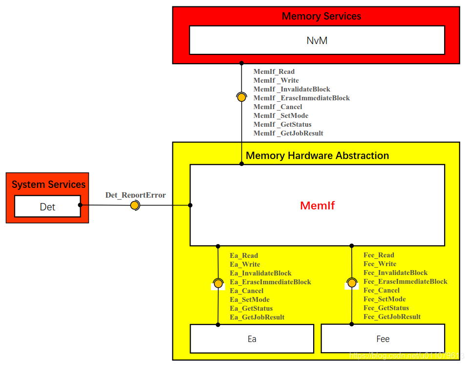
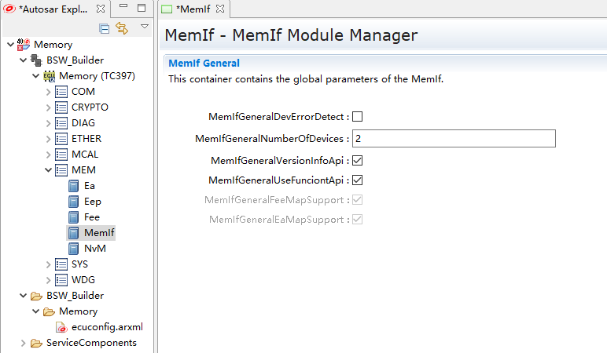

MemIf
#################################

:strong:`缩写词注解 (Abbreviation Notes):`

.. list-table::
   :widths: 34 33 33
   :header-rows: 1

   * - 缩写词 (Abbreviation)
     - 解释/描述 (Explanation/Description)
     - 中文解释 (Chinese explanation)
   * - NV
     - Non-Volatile
     - 非易失性 (Non-volatile)
   * - NVM
     - Non-Volatile Manager
     - 非易失性管理 (Non-Volatile Management)
   * - MemIf
     - Memory Abstraction Interface
     - 内存抽象接口 (Memory abstraction interface)
   * - Fee
     - Flash EEPROM Emulation
     - Flash Eeprom仿真 (Flash Eeprom Simulation)
   * - Ea
     - EEPROM Abstraction
     - EEPROM抽象 (EEPROM Abstraction)
   * - Fls
     - Flash
     - Flash驱动程序 (Flash Driver)
   * - Eep
     - EEPROM Drive
     - Eeprom驱动程序 (EEPROM Driver)
   * - Tm
     - Task Manager
     - 任务管理器 (Task Manager)
   * - Det
     - Development Error Tracer
     - 开发错误跟踪 (Development Error Tracking)
   * - Dem
     - Diagnostic Event Manager
     - 诊断事件管理 (Event Management)
   * - BsW
     - Basic Software
     - 基础软件 (Basic software)
   * - MCAL
     - Microcontroller AbstractionLayer
     - 微控制器抽象层 (Microcontroller Abstraction Layer)

简介 (Introduction)
=================================

内存抽象接口（MemIf）将从底层FEE或EA模块的数量中抽象出来，并在一个统一的线性地址空间上为上层提供一个虚拟分段，即允许NVRAM管理器访问几个内存抽象模块。

The memory abstraction interface (MemIf) abstracts away the number of underlying FEE or EA modules and provides an upper layer with a virtual segmentation over a unified linear address space, allowing the NVRAM manager to access several memory abstraction modules.

AUTOSAR中的存储协议栈处于BSW基础软件层，包括存储器驱动层、存储器硬件抽象层、存储器服务层。存储协议栈软件是用来为整车电子模块（ECU）存储非易失性或者标定数据定义一套统一访问内存的服务软件。

The storage protocol stack in AUTOSAR is located in the BSW Basic Software layer and includes the memory driver layer, memory hardware abstraction layer, and memory service layer. The storage protocol stack software defines a unified service software for accessing memory to store non-volatile or calibration data for the entire vehicle's electronic modules (ECUs).

参考资料 (Reference materials)
------------------------------------------

[1] AUTOSAR_SRS_EEPROMDriver.pdf，R19-11

[2] AUTOSAR_SRS_FlashDriver.pdf，R19-11

[3] AUTOSAR_SRS_MemoryHWAbstractionLayer.pdf，R19-11

[4] AUTOSAR_SRS_MemoryServices.pdf，R19-11

[5] AUTOSAR_SWS_EEPROMAbstraction.pdf，R19-11

[6] AUTOSAR_SWS_FlashEEPROMEmulation.pdf，R19-11

[7] AUTOSAR_SWS_MemoryAbstractionInterface.pdf，R19-11

[8] AUTOSAR_SWS_NVRAMManager.pdf，R19-11

功能描述 (Function Description)
===========================================

MemIf功能 (MemIf Function)
----------------------------------------

MemIf功能介绍 (MemIf Function Introduction)
~~~~~~~~~~~~~~~~~~~~~~~~~~~~~~~~~~~~~~~~~~~~~~~~~~~~~~~

存储协议栈软件架构图中的最底层灰色部分为存储栈的硬件控制器，这部分功能属于ECU的内部或外部FLASH（EEPROM）存储器设备，并实现存储栈FLASH或EEPROM数据存储单元的物理存储介质；存储栈软件架构图中的第二层粉红色部分为微控制器抽象层（MCAL），这部分功能属于ECU的内部或外部FLASH（EEPROM）存储器设备抽象层，并实现存储栈FLASH或EEPROM存储设备的硬件控制驱动程序，即直接操作硬件控制器寄存器，提供写入、读取、擦除、比较等API接口给上层FEE或EA模块使用；存储栈软件架构图中的第三层淡绿色部分为存储器抽象层（FEE和EA），这部分功能属于ECU的内部或外部FLASH（EEPROM）存储器设备抽象层，并实现存储栈的存储设备抽象和接口映射，即存储栈抽象层不涉及任何硬件的操作，只是申请对内存进行行为操作的请求与内存地址映射，由MemIf接口层提供统一FLASH或EEPROM内存写入、读取、擦除、比较等接口给存储栈服务层使用，存储栈中所有的状态控制类、操作结果等数据类型也是由MemIf接口层来实现；存储栈软件架构图中的最顶层淡蓝色部分为非易失性存储管理部分，这部分功能属于ECU存储栈非易失性数据管理与维护，并实现存储栈中单个Block或多个Block的数据写入、读取、擦除等API接口，便于存储栈用户使用和对非易失性数据的需求和管理。

The gray part at the lowest layer of the storage protocol stack software architecture diagram is the hardware controller of the storage stack, which belongs to the internal or external Flash (EEPROM) memory devices of ECU and implements the physical storage medium for Flash or EEPROM data storage units; The second layer, light pink in color, represents the Microcontroller Abstraction Layer (MCAL) of the storage stack, which also belongs to the abstract layer of the internal or external Flash (EEPROM) memory devices of ECU, and realizes the hardware control driver programs for storage stack Flash or EEPROM storage devices, i.e., directly operating on the registers of the hardware controller, providing write, read, erase, compare APIs interfaces for the upper-level FEE or EA modules to use; The third layer, light green in color, represents the Memory Abstraction Layer (FEE and EA) of the storage stack, which also belongs to the abstract layer of the internal or external Flash (EEPROM) memory devices of ECU, and realizes the abstraction and interface mapping of storage devices for the storage stack. The Storage Stack Abstraction Layer does not involve any hardware operations; it only requests permission to perform behavior actions on memory and address mappings, with MemIf Interface Layer providing unified FLASH or EEPROM memory write, read, erase, compare interfaces for use by the storage stack service layer. All state control classes, operation results, and data types in the storage stack are also realized by the MemIf Interface Layer; The light blue part at the topmost layer of the storage protocol stack software architecture diagram represents the Non-Volatile Memory Management section, which belongs to the non-volatile data management and maintenance of ECU's storage stack. It realizes APIs for data write, read, erase, etc., in single or multiple blocks within the storage stack, facilitating use by storage stack users and managing their needs and requirements for non-volatile data.

MemIf功能实现 (MemIf Functional Implementation)
~~~~~~~~~~~~~~~~~~~~~~~~~~~~~~~~~~~~~~~~~~~~~~~~~~~~~~~~~~~

MemIf对FLASH或EEPROM存储器的抽象，属于硬件无关层。其作用为：

Abstraction of MEMIf for FLASH or EEPROM memory, belonging to the hardware-agnostic layer. Its function is:

- 允许NVM访问多个存储抽象模块（Fee/Ea）

Allow NVM access to multiple storage abstraction modules (Fee/Ea)

- 对上层提供统一线性地址空间的虚拟分段

Provide a uniform linear address space for upper layers through virtual segments

- 该模块的API都映射到下层存储抽象模块的API（Fee/Ea）

The APIs of this module map to the APIs of the underlying storage abstraction module (Fee/Ea).

- 抽象ROM的功能，无论使用Flash还是EEPROM，从MemIf模块开始指令没有任何区别，代码通用，彻底脱离硬件

The abstract ROM functionality is identical whether using Flash or EEPROM; instructions starting from the MemIf module are no different, and the code is generic, completely hardware-independent.

- 抽象ROM的设备，MemIf模块眼中，ECU只有3种区别：只使用Flash，只使用EEPROM，两者同时使用

Abstract ROM devices, in the eyes of the MemIf module, ECU differ only in three ways: using Flash only, using EEPROM only, or using both.

- 给Flash或者EEPROM或者同时给两者一个Device Index，根据Device
  Index将NvM模块的指令转发给对应的Fee模块或者Ea模块

Provide a Device Index to Flash or EEPROM, or provide both with a Device Index. According to the Device Index, forward the NvM module commands to the corresponding Fee module or Ea module.

- MemIf模块模块没有初始化，没有配置指针，没有状态指针

The MemIf module is not initialized, no configuration pointer, no status pointer

源文件描述 (Source file description)
===============================================

.. centered:: **表 MemIf组件文件描述 (Table MemIf Component File Description)**

.. list-table::
   :widths: 50 50
   :header-rows: 1

   * - 文件 (Files)
     - 说明 (Description)
   * - MemIf_Cfg.h
     - 定义MemIf模块预编译时用到的配置参数。 (Define configuration parameters used during pre-compilation of the MemIf module.)
   * - MemIf_Cfg.c
     - 定义MemIf模块中连接时用到的配置参数。 (Define configuration parameters used for connections in the MemIf module.)
   * - MemIf.h
     - MemIf模块头文件，包含了API函数的扩展声明并定义了端口的数据结构。 (Header file for the MemIf module, which includes extended declarations of API functions and defines the data structure of ports.)
   * - MemIf .c
     - MemIf模块源文件，包含了API函数的实现。 (Source files for the MemIf module contain the implementation of API functions.)
   * - MemIf_Types.h
     - 包含MemIf模块的类型定义 (Type definition containing MemIf module)
   * - 
     - EMEIF_开头的枚举常量 (ENUMIF_Starting_Enum_Constants)
   * - MemIf_MemMap.h
     - 包含MemIf模块的内存抽 (Memory module with MemIf interface preserved.)

API接口 (API Interface)
=====================================

类型定义 (Type definition)
--------------------------------------

MemIf_StatusType类型定义 (MemIf_StatusType type definition)
~~~~~~~~~~~~~~~~~~~~~~~~~~~~~~~~~~~~~~~~~~~~~~~~~~~~~~~~~~~~~~~~~~~~~~~

.. list-table::
   :widths: 50 50
   :header-rows: 1

   * - 名称 (Name)
     - MemIf_StatusType
   * - 类型 (Type)
     - Enumeration
   * - 范围 (Range)
     - 模块未初始化：MEMIF_UNINIT = 0 (Module Not Initialized: MEMIF_UNINIT = 0)
   * - 
     - 空闲或没有需要处理的Job ：MEMIF_IDLE = 1 (Idle or no Job to process: MEMIF_IDLE = 1)
   * - 
     - 模块正在处理job，不接受新job ：MEMIF_BUSY = 2 (Module is processing job, no new jobs accepted : MEMIF BUSY = 2)
   * - 
     - MEMIF_BUSY_INTERNAL = 3
   * - 描述 (Description)
     - 用于描述内存协议栈的状态的数据类型 (Data type used for describing the state of memory protocol stacks.)
   * - 
     - 描述Fee/Fls或Ea/Eep模块的模块状态 (Describe the module status of Fee/Fls or Ea/Eep modules)

MemIf_JobResultType类型定义 (MemIf_JobResultType type definition)
~~~~~~~~~~~~~~~~~~~~~~~~~~~~~~~~~~~~~~~~~~~~~~~~~~~~~~~~~~~~~~~~~~~~~~~~~~~~~

.. list-table::
   :widths: 50 50
   :header-rows: 1

   * - 名称 (Name)
     - MemIf_JobResultType
   * - 类型 (Type)
     - Enumeration
   * - 范围 (Range)
     - Job处理成功：MEMIF_JOB_OK (Job processing succeeded: MEMIF_JOB_OK)
   * - 
     - Job处理以error结束：MEMIF_JOB_FAILED (Job processing ended with error: MEMIF_JOB_FAILED)
   * - 
     - Job正在处理MEMIF_JOB_PENDING (Job is processing MEMIF_JOB_PENDING)
   * - 
     - Job已经取消MEMIF_JOB_CANCELLED (Job has been cancelled MEMIF_JOB_CANCELLED)
   * - 
     - 请求的Block不一致 MEMIF_BLOCK_INCONSISTENT (Request Block Inconsistent MEMIF_BLOCK_INCONSISTENT)
   * - 
     - 请求的Block被标记为无效 MEMIF_BLOCK_INVALID (The requested Block is marked as invalid MEMIF_BLOCK_INVALID)
   * - 描述 (Description)
     - 用于描述内存协议栈的工作队列的任务处理结果的数据类型 (Data type used for describing the task processing results in memory protocol stack's work queue)
   * - 
     - 描述Fee/Fls或Ea/Eep模块的作业结果 (Describe the job result of Fee/Fls or Ea/Eep modules)

输入函数描述 (Describe the input function:)
-----------------------------------------------------

.. list-table::
   :widths: 50 50
   :header-rows: 1

   * - 输入模块 (Input Module)
     - API
   * - Fee
     - Fee_Cancel
   * - Fee
     - Fee_EraseImmediateBlock
   * - Fee
     - Fee_GetJobResult
   * - Fee
     - Fee_GetStatus
   * - Fee
     - Fee_InvalidateBlock
   * - Fee
     - Fee_Read
   * - Fee
     - Fee_Write
   * - Fee
     - Fee_SetMode
   * - Ea
     - Ea_Cancel
   * - Ea
     - Ea_EraseImmediateBlock
   * - Ea
     - Ea_GetJobResult
   * - Ea
     - Ea_GetStatus
   * - Ea
     - Ea_InvalidateBlock
   * - Ea
     - Ea_Read
   * - Ea
     - Ea_Write
   * - Ea
     - Ea_SetMode
   * - Det
     - Det_ReportError

静态接口函数定义 (Static interface function definition)
---------------------------------------------------------------

MemIf_SetMode函数定义 (The MemIf_SetMode function definition)
~~~~~~~~~~~~~~~~~~~~~~~~~~~~~~~~~~~~~~~~~~~~~~~~~~~~~~~~~~~~~~~~~~~~~~~~~

.. list-table::
   :widths: 25 25 25 25
   :header-rows: 1

   * - 函数名称： (Function Name:)
     - MemIf_SetMode
     - 
     - 
   * - 函数原型： (Function prototype:)
     - FUNC(void, MEMIF_CODE)MemIf_SetMode
     - 
     - 
   * - 
     - (
     - 
     - 
   * - 
     - VAR(MemIf_ModeType,AUTOMATIC) Mode
     - 
     - 
   * - 
     - );
     - 
     - 
   * - 服务编号： (Service Number:)
     - 0x01
     - 
     - 
   * - 同步/异步： (Synchronous/asynchronous:)
     - 同步 (Sync)
     - 
     - 
   * - 是否可重入： (Is Reentrant:)
     - 不可重入 (Non-reentrant)
     - 
     - 
   * - 输入参数： (Input parameters:)
     - Mode：Eep设备驱动程序的工作模式 (Mode：Operating mode of Eep device driver)
     - 值域： (Domain:)
     - MEMIF_MODE_SLOWMEMIF_MODE_FAST
   * - 输入输出参数： (Input Output Parameters:)
     - 无
     - 
     - 
   * - 输出参数： (Output Parameters:)
     - 无
     - 
     - 
   * - 返回值： (Return Value:)
     - 无
     - 
     - 
   * - 功能概述： (Function Overview:)
     - 调用所有底层内存抽象模块的SetMode函数； (Call the SetMode function of all underlying memory abstraction modules;)
     - 
     - 
   * - 
     - MemIf_SetMode同时调用Fee_SetMode或者Ea_SetMode； (Calling MemIf_SetMode at the same time as Fee_SetMode or Ea_SetMode;)
     - 
     - 
   * - 
     - MemIf_SetMode、Fee_SetMode、Ea_SetMode都是同步指令 (MemIf_SetMode, Fee_SetMode, Ea_SetMode are all synchronous instructions.)
     - 
     - 

MemIf_Read函数定义 (The MemIf_Read function definition)
~~~~~~~~~~~~~~~~~~~~~~~~~~~~~~~~~~~~~~~~~~~~~~~~~~~~~~~~~~~~~~~~~~~

.. list-table::
   :widths: 25 25 25 25
   :header-rows: 1

   * - 函数名称： (Function Name:)
     - MemIf_Read
     - 
     - 
   * - 函数原型： (Function prototype:)
     - FUNC(Std_ReturnType, MEMIF_CODE)MemIf_Read
     - 
     - 
   * - 
     - (
     - 
     - 
   * - 
     - VAR(uint8, AUTOMATIC) DeviceIndex,
     - 
     - 
   * - 
     - VAR(uint16, AUTOMATIC) BlockNumber,
     - 
     - 
   * - 
     - VAR(uint16, AUTOMATIC) BlockOffset,
     - 
     - 
   * - 
     - P2VAR(uint8, AUTOMATIC,MEMIF_APPL_DATA) DataBufferPtr,
     - 
     - 
   * - 
     - VAR(uint16, AUTOMATIC) Length,
     - 
     - 
   * - 
     - );
     - 
     - 
   * - 服务编号： (Service Number:)
     - 0x02
     - 
     - 
   * - 同步/异步： (Synchronous/asynchronous:)
     - 同步 (Sync)
     - 
     - 
   * - 是否可重入： (Is Reentrant:)
     - 不可重入 (Non-reentrant)
     - 
     - 
   * - 输入参数： (Input parameters:)
     - DeviceIndex：设备索引编号 (DeviceIndex：Device Index Number)
     - 值域： (Domain:)
     - 0-255
   * - 
     - BlockNumber：逻辑块序列编号 (BlockNumber：Logical Block Sequence Number)
     - 值域： (Domain:)
     - 0-65535
   * - 
     - BlockOffset：逻辑块偏移量 (BlockOffset：Logical Block Offset)
     - 值域： (Domain:)
     - 0-65535
   * - 
     - Length：数据长度
     - 值域： (Domain:)
     - 0-65535
   * - 输入输出参数： (Input Output Parameters:)
     - 无
     - 
     - 
   * - 输出参数： (Output Parameters:)
     - DataBufferPtr：指向缓冲区内存的数据指针 (DataBufferPtr: Pointer to the data in the buffer memory)
     - 值域： (Domain:)
     - 无
   * - 返回值： (Return Value:)
     - Std_ReturnType
     - 
     - 
   * - 
     - 如果对内存抽象接口使能开发错误检测，并且根据需求规范检测到开发错误，则函数返回E_NOT_OK，否则返回底层模块调用函数的返回值 (If memory abstraction interface enables development error detection and a development error is detected according to the requirement specification, the function returns E_NOT_OK, otherwise it returns the return value of the underlying module call.)
     - 
     - 
   * - 功能概述： (Function Overview:)
     - 调用由参数DeviceIndex选择的底层内存抽象模块的Read函数； (Call the Read function of the underlying memory abstraction module selected by the parameter DeviceIndex;)
     - 
     - 
   * - 
     - 根据DeviceIndex的不同，MemIf_Read将调用Fee_Read或者Ea_Read； (Based on DeviceIndex, MemIf_Read will call either Fee_Read or Ea_Read;)
     - 
     - 
   * - 
     - MemIf_Read是同步指令，Fee_Read或者Ea_Read是异步指令，注意区分 (MemIf_Read is a synchronous instruction, Fee_Read or Ea_Read are asynchronous instructions, note the distinction.)
     - 
     - 

MemIf_Write函数定义 (The MemIf_Write function definition)
~~~~~~~~~~~~~~~~~~~~~~~~~~~~~~~~~~~~~~~~~~~~~~~~~~~~~~~~~~~~~~~~~~~~~

.. list-table::
   :widths: 25 25 25 25
   :header-rows: 1

   * - 函数名称： (Function Name:)
     - MemIf_Write
     - 
     - 
   * - 函数原型： (Function prototype:)
     - FUNC(Std_ReturnType, MEMIF_CODE)MemIf_Write
     - 
     - 
   * - 
     - (
     - 
     - 
   * - 
     - VAR(uint8, AUTOMATIC) DeviceIndex,
     - 
     - 
   * - 
     - VAR(uint16, AUTOMATIC) BlockNumber,
     - 
     - 
   * - 
     - P2VAR(uint8, AUTOMATIC,MEMIF_APPL_DATA) DataBufferPtr
     - 
     - 
   * - 
     - );
     - 
     - 
   * - 服务编号： (Service Number:)
     - 0x03
     - 
     - 
   * - 同步/异步： (Synchronous/asynchronous:)
     - 同步 (Sync)
     - 
     - 
   * - 是否可重入： (Is Reentrant:)
     - 不可重入 (Non-reentrant)
     - 
     - 
   * - 输入参数： (Input parameters:)
     - DeviceIndex：设备索引编号 (DeviceIndex：Device Index Number)
     - 值域： (Domain:)
     - 0-255
   * - 
     - BlockNumber：逻辑块序列编号 (BlockNumber：Logical Block Sequence Number)
     - 值域： (Domain:)
     - 0-65535
   * - 
     - DataBufferPtr：指向缓冲区内存的数据指针 (DataBufferPtr: Pointer to the data in the buffer memory)
     - 值域： (Domain:)
     - 无
   * - 输入输出参数： (Input Output Parameters:)
     - 无
     - 
     - 
   * - 输出参数： (Output Parameters:)
     - 无
     - 
     - 
   * - 返回值： (Return Value:)
     - Std_ReturnType
     - 
     - 
   * - 
     - 如果对内存抽象接口使能开发错误检测，并且根据需求规范检测到开发错误，则函数返回E_NOT_OK，否则返回底层模块调用函数的返回值 (If memory abstraction interface enables development error detection and a development error is detected according to the requirement specification, the function returns E_NOT_OK, otherwise it returns the return value of the underlying module call.)
     - 
     - 
   * - 功能概述： (Function Overview:)
     - 调用由参数DeviceIndex选择的底层内存抽象模块的Write函数； (Call the Write function of the underlying memory abstraction module selected by the parameter DeviceIndex;)
     - 
     - 
   * - 
     - 根据DeviceIndex的不同，MemIf_Write将调用Fee_Write或者Ea_Write； (Based on DeviceIndex, MemIf_Write will call either Fee_Write or Ea_Write;)
     - 
     - 
   * - 
     - MemIf_Write是同步指令，Fee_Write或者Ea_Write是异步指令，注意区分 (MemIf_Write is a synchronous instruction, Fee_Write or Ea_Write are asynchronous instructions, note the distinction.)
     - 
     - 

MemIf_Cancel函数定义 (The function definition for MemIf_Cancel)
~~~~~~~~~~~~~~~~~~~~~~~~~~~~~~~~~~~~~~~~~~~~~~~~~~~~~~~~~~~~~~~~~~~~~~~~~~~

.. list-table::
   :widths: 25 25 25 25
   :header-rows: 1

   * - 函数名称： (Function Name:)
     - MemIf_Cancel
     - 
     - 
   * - 函数原型： (Function prototype:)
     - FUNC(void, MEMIF_CODE) MemIf_Cancel
     - 
     - 
   * - 
     - (
     - 
     - 
   * - 
     - VAR(uint8, AUTOMATIC) DeviceIndex
     - 
     - 
   * - 
     - );
     - 
     - 
   * - 服务编号： (Service Number:)
     - 0x04
     - 
     - 
   * - 同步/异步： (Synchronous/asynchronous:)
     - 同步 (Sync)
     - 
     - 
   * - 是否可重入： (Is Reentrant:)
     - 不可重入 (Non-reentrant)
     - 
     - 
   * - 输入参数： (Input parameters:)
     - DeviceIndex：设备索引编号 (DeviceIndex：Device Index Number)
     - 值域： (Domain:)
     - 0-255
   * - 输入输出参数： (Input Output Parameters:)
     - 无
     - 
     - 
   * - 输出参数： (Output Parameters:)
     - 无
     - 
     - 
   * - 返回值： (Return Value:)
     - 无
     - 
     - 
   * - 功能概述： (Function Overview:)
     - 调用由参数DeviceIndex选择的底层内存抽象模块的Cancel函数； (Call the Cancel function of the underlying memory abstraction module selected by the parameter DeviceIndex;)
     - 
     - 
   * - 
     - 根据DeviceIndex的不同，MemIf_Cancel将调用Fee_Cancel或者Ea_Cancel； (Based on DeviceIndex, MemIf_Cancel will call either Fee_Cancel or Ea_Cancel;)
     - 
     - 
   * - 
     - MemIf_Write、Fee_Write、Ea_Write都是同步指令 (MemIf_Write, Fee_Write, Ea_Write are all synchronous instructions)
     - 
     - 

MemIf_GetStatus函数定义 (The MemIf_GetStatus function definition)
~~~~~~~~~~~~~~~~~~~~~~~~~~~~~~~~~~~~~~~~~~~~~~~~~~~~~~~~~~~~~~~~~~~~~~~~~~~~~

.. list-table::
   :widths: 25 25 25 25
   :header-rows: 1

   * - 函数名称： (Function Name:)
     - MemIf_GetStatus
     - 
     - 
   * - 函数原型： (Function prototype:)
     - FUNC(MemIf_StatusType, MEMIF_CODE)MemIf_GetStatus
     - 
     - 
   * - 
     - (
     - 
     - 
   * - 
     - VAR(uint8, AUTOMATIC) DeviceIndex
     - 
     - 
   * - 
     - );
     - 
     - 
   * - 服务编号： (Service Number:)
     - 0x05
     - 
     - 
   * - 同步/异步： (Synchronous/asynchronous:)
     - 同步 (Sync)
     - 
     - 
   * - 是否可重入： (Is Reentrant:)
     - 不可重入 (Non-reentrant)
     - 
     - 
   * - 输入参数： (Input parameters:)
     - DeviceIndex：设备索引编号 (DeviceIndex：Device Index Number)
     - 值域： (Domain:)
     - 0-255
   * - 输入输出参数： (Input Output Parameters:)
     - 无
     - 
     - 
   * - 输出参数： (Output Parameters:)
     - 无
     - 
     - 
   * - 返回值： (Return Value:)
     - MemIf_StatusType
     - 
     - 
   * - 
     - 返回存储栈作业的执行状态 (Return the execution status of stored stack jobs)
     - 
     - 
   * - 功能概述： (Function Overview:)
     - 调用由参数DeviceIndex选择的底层内存抽象模块的GetStatus函数； (Call the GetStatus\ function of the underlying memory abstraction module selected by the parameter DeviceIndex;)
     - 
     - 
   * - 
     - 根据DeviceIndex的不同，MemIf_GetStatus将调用Fee_GetStatus或者Ea_GetStatus； (Based on the different DeviceIndex, MemIf_GetStatus will call either Fee_GetStatus or Ea_GetStatus;)
     - 
     - 
   * - 
     - MemIf_GetStatus、Fee_GetStatus、Ea_GetStatus都是同步指令 (MemIf_GetStatus, Fee_GetStatus, Ea_GetStatus are all synchronous instructions)
     - 
     - 

MemIf_GetJobResult函数定义 (The definition of MemIf_GetJobResult function)
~~~~~~~~~~~~~~~~~~~~~~~~~~~~~~~~~~~~~~~~~~~~~~~~~~~~~~~~~~~~~~~~~~~~~~~~~~~~~~~~~~~~~~

.. list-table::
   :widths: 25 25 25 25
   :header-rows: 1

   * - 函数名称： (Function Name:)
     - MemIf_GetJobResult
     - 
     - 
   * - 函数原型： (Function prototype:)
     - FUNC(MemIf_JobResultType, MEMIF_CODE)MemIf_GetJobResult
     - 
     - 
   * - 
     - (
     - 
     - 
   * - 
     - VAR(uint8, AUTOMATIC) DeviceIndex
     - 
     - 
   * - 
     - );
     - 
     - 
   * - 服务编号： (Service Number:)
     - 0x06
     - 
     - 
   * - 同步/异步： (Synchronous/asynchronous:)
     - 同步 (Sync)
     - 
     - 
   * - 是否可重入： (Is Reentrant:)
     - 不可重入 (Non-reentrant)
     - 
     - 
   * - 输入参数： (Input parameters:)
     - DeviceIndex：设备索引编号 (DeviceIndex：Device Index Number)
     - 值域： (Domain:)
     - 0-255
   * - 输入输出参数： (Input Output Parameters:)
     - 无
     - 
     - 
   * - 输出参数： (Output Parameters:)
     - 无
     - 
     - 
   * - 返回值： (Return Value:)
     - MemIf_JobResultType
     - 
     - 
   * - 
     - 如果对内存抽象接口使能开发错误检测，并且根据需求规范检测到开发错误，那么函数应该返回MEMIF_JOB_FAILED，否则它应该返回底层模块调用函数的返回值 (If memory abstraction interface development error detection is enabled and a development error is detected according to the specification requirements, the function should return MEMIF_JOB_FAILED; otherwise, it should return the return value of the underlying module call function.)
     - 
     - 
   * - 功能概述： (Function Overview:)
     - 调用由参数DeviceIndex选择的底层内存抽象模块的GetJobResult函数； (Call the GetJobResult function of the underlying memory abstraction module selected by the parameter DeviceIndex;)
     - 
     - 
   * - 
     - 根据DeviceIndex的不同，MemIf_GetJobResult将调用Fee_GetJobResult或者Ea_GetJobResult； (According to DeviceIndex, MemIf_GetJobResult will call either Fee_GetJobResult or Ea_GetJobResult;)
     - 
     - 
   * - 
     - MemIf_GetJobResult、Fee_GetJobResult、Ea_GetJobResult都是同步指令 (MemIf_GetJobResult, Fee_GetJobResult, Ea_GetJobResult are all synchronous commands.)
     - 
     - 

MemIf_InvalidateBlock函数定义 (The function definition for MemIf_InvalidateBlock)
~~~~~~~~~~~~~~~~~~~~~~~~~~~~~~~~~~~~~~~~~~~~~~~~~~~~~~~~~~~~~~~~~~~~~~~~~~~~~~~~~~~~~~~~~~~~~

.. list-table::
   :widths: 25 25 25 25
   :header-rows: 1

   * - 函数名称： (Function Name:)
     - MemIf_InvalidateBlock
     - 
     - 
   * - 函数原型： (Function prototype:)
     - FUNC(Std_ReturnType, MEMIF_CODE)MemIf_InvalidateBlock
     - 
     - 
   * - 
     - (
     - 
     - 
   * - 
     - VAR(uint8, AUTOMATIC) DeviceIndex,
     - 
     - 
   * - 
     - VAR(uint16, AUTOMATIC) BlockNumber
     - 
     - 
   * - 
     - );
     - 
     - 
   * - 服务编号： (Service Number:)
     - 0x07
     - 
     - 
   * - 同步/异步： (Synchronous/asynchronous:)
     - 同步 (Sync)
     - 
     - 
   * - 是否可重入： (Is Reentrant:)
     - 不可重入 (Non-reentrant)
     - 
     - 
   * - 输入参数： (Input parameters:)
     - DeviceIndex：设备索引编号 (DeviceIndex：Device Index Number)
     - 值域： (Domain:)
     - 0-255
   * - 
     - BlockNumber：逻辑块序列编号 (BlockNumber：Logical Block Sequence Number)
     - 值域： (Domain:)
     - 0-65535
   * - 输入输出参数： (Input Output Parameters:)
     - 无
     - 
     - 
   * - 输出参数： (Output Parameters:)
     - 无
     - 
     - 
   * - 返回值： (Return Value:)
     - Std_ReturnType
     - 
     - 
   * - 
     - 如果对内存抽象接口使能开发错误检测，并且根据需求规范检测到开发错误，则函数返回E_NOT_OK，否则返回底层模块调用函数的返回值。 (If memory abstraction interface enables development error detection and a development error is detected according to the specification, the function returns E_NOT_OK; otherwise, it returns the return value of the underlying module call.)
     - 
     - 
   * - 功能概述： (Function Overview:)
     - 调用由参数DeviceIndex选择的底层内存抽象模块的 (Invoke the underlying memory abstraction module selected by parameter DeviceIndex.)
     - 
     - 
   * - 
     - InvalidateBlock 函数；根据DeviceIndex的不同， (InvalidateBlock function; depending on the DeviceIndex,)
     - 
     - 
   * - 
     - MemIf_InvalidateBlock将调用Fee_InvalidateBlock或者 (MemIf_InvalidateBlock will call Fee_InvalidateBlock or)
     - 
     - 
   * - 
     - Ea_InvalidateBlock；MemIf_InvalidateBlock是同步指令， (Ea_InvalidateBlock; MemIf_InvalidateBlock are synchronous instructions,)
     - 
     - 
   * - 
     - Fee_InvalidateBlock、Ea_InvalidateBlock都是异步指令，注意区分 (Fee_InvalidateBlock, Ea_InvalidateBlock are asynchronous instructions; note the distinction.)
     - 
     - 

MemIf_GetVersionInfo函数定义 (The function definition for MemIf_GetVersionInfo)
~~~~~~~~~~~~~~~~~~~~~~~~~~~~~~~~~~~~~~~~~~~~~~~~~~~~~~~~~~~~~~~~~~~~~~~~~~~~~~~~~~~~~~~~~~~

.. list-table::
   :widths: 25 25 25 25
   :header-rows: 1

   * - 函数名称： (Function Name:)
     - MemIf_GetVersionInfo
     - 
     - 
   * - 函数原型： (Function prototype:)
     - FUNC(void, MEMIF_CODE)MemIf_GetVersionInfo
     - 
     - 
   * - 
     - (
     - 
     - 
   * - 
     - P2VAR(Std_VersionInfoType, AUTOMATIC,
     - 
     - 
   * - 
     - MEMIF_APPL_DATA) VersionInfoPtr
     - 
     - 
   * - 
     - );
     - 
     - 
   * - 服务编号： (Service Number:)
     - 0x08
     - 
     - 
   * - 同步/异步： (Synchronous/asynchronous:)
     - 同步 (Sync)
     - 
     - 
   * - 是否可重入： (Is Reentrant:)
     - 可重入 (Reentrant)
     - 
     - 
   * - 输入参数： (Input parameters:)
     - 无
     - 
     - 
   * - 输入输出参数： (Input Output Parameters:)
     - 无
     - 
     - 
   * - 输出参数： (Output Parameters:)
     - VersionInfoPtr：指向版本信息结构体的指针 (VersionInfoPtr：a pointer to a version information structure)
     - 值域： (Domain:)
     - 无
   * - 返回值： (Return Value:)
     - 无
     - 
     - 
   * - 功能概述： (Function Overview:)
     - 返回MemIf模块的软件版本信息 (Retrieve software version information for the MemIf module)
     - 
     - 

MemIf_EraseImmediateBlock函数定义 (The function definition for MemIf_EraseImmediateBlock)
~~~~~~~~~~~~~~~~~~~~~~~~~~~~~~~~~~~~~~~~~~~~~~~~~~~~~~~~~~~~~~~~~~~~~~~~~~~~~~~~~~~~~~~~~~~~~~~~~~~~~

.. list-table::
   :widths: 25 25 25 25
   :header-rows: 1

   * - 函数名称： (Function Name:)
     - MemIf_EraseImmediateBlock
     - 
     - 
   * - 函数原型： (Function prototype:)
     - FUNC(Std_ReturnType, MEMIF_CODE)MemIf_EraseImmediateBlock
     - 
     - 
   * - 
     - (
     - 
     - 
   * - 
     - VAR(uint8, AUTOMATIC) DeviceIndex,
     - 
     - 
   * - 
     - VAR(uint16, AUTOMATIC) BlockNumber
     - 
     - 
   * - 
     - );
     - 
     - 
   * - 服务编号： (Service Number:)
     - 0x09
     - 
     - 
   * - 同步/异步： (Synchronous/asynchronous:)
     - 同步 (Sync)
     - 
     - 
   * - 是否可重入： (Is Reentrant:)
     - 不可重入 (Non-reentrant)
     - 
     - 
   * - 输入参数： (Input parameters:)
     - DeviceIndex：设备索引编号 (DeviceIndex：Device Index Number)
     - 值域： (Domain:)
     - 0-255
   * - 
     - BlockNumber：逻辑块序列编号 (BlockNumber：Logical Block Sequence Number)
     - 值域： (Domain:)
     - 0-65535
   * - 输入输出参数： (Input Output Parameters:)
     - 无
     - 
     - 
   * - 输出参数： (Output Parameters:)
     - 无
     - 
     - 
   * - 返回值： (Return Value:)
     - Std_ReturnType
     - 
     - 
   * - 
     - 如果对内存抽象接口使能开发错误检测，并且根据需求规范检测到开发错误，则函数返回E_NOT_OK，否则返回底层模块调用函数的返回值。 (If memory abstraction interface enables development error detection and a development error is detected according to the specification, the function returns E_NOT_OK; otherwise, it returns the return value of the underlying module call.)
     - 
     - 
   * - 功能概述： (Function Overview:)
     - 调用由参数DeviceIndex选择的底层内存抽象模块的EraseImmediateBlock函数； (Invoke the EraseImmediateBlock* function of the underlying memory abstraction module selected by the parameter DeviceIndex;)
     - 
     - 
   * - 
     - 根据DeviceIndex的不同，MemIf_EraseImmediateBlock将调用Fee_EraseImmediateBlock或者 (Based on Different DeviceIndex, MemIf_EraseImmediateBlock will call Fee_EraseImmediateBlock or)
     - 
     - 
   * - 
     - Ea_EraseImmediateBlock；
     - 
     - 
   * - 
     - MemIf_EraseImmediateBlock是同步指令， (MemIf_EraseImmediateBlock is a synchronous instruction,)
     - 
     - 
   * - 
     - Fee_EraseImmediateBlock、Ea_EraseImmediateBlock都是异步指令，注意区分 (Fee_EraseImmediateBlock, Ea_EraseImmediateBlock are both asynchronous instructions; note the distinction.)
     - 
     - 

可配置函数定义 (Configurable Function Definition)
----------------------------------------------------------

无。

None.

配置 (Configure)
==============================

表5‑1属性描述

Table 5-1 Property Description

.. list-table::
   :widths: 50 50
   :header-rows: 1

   * - UI名称 (UI Name)
     - 该配置项在配置工具界面显示的名称 (The name of this configuration item as displayed in the configuration tool interface)
   * - 取值范围 (Range)
     - 该配置项允许的取值区间 (The configurable item allows value ranges.)
   * - 默认取值 (Default value)
     - 该配置项默认的配置值 (The default configuration value for this option)
   * - 参数描述 (Parameter Description)
     - 该配置项在标准的AUTOSAR_EcucParamDef.arxml文件中的描述 (This configuration item's description in the standard AUTOSAR_EcucParamDef.arxml file.)
   * - 依赖关系 (Dependencies)
     - 该配置项与其他模块或配置项的关系 (The configuration item's relationship with other modules or configuration items)

MemIfGeneral配置 (Configurations for MemIfGeneral)
----------------------------------------------------------------

.. centered:: **表 MemIf General属性描述 (Table MemIf General Properties Description)**

.. list-table::
   :widths: 20 20 20 20 20
   :header-rows: 1

   * - UI名称 (UI Name)
     - 描述 (Description)
     - 
     - 
     - 
   * - MemIfGeneralDevErrorDetect
     - 取值范围 (Range)
     - STD_ON, STD_OFF
     - 默认取值 (Default value)
     - STD_ON
   * - 
     - 参数描述 (Parameter Description)
     - 是否开启对开发过程中错误的检查 (Whether to check for errors during development)
     - 
     - 
   * - 
     - 
     - 打开或关闭开发错误检测和通知 (Enable or Disable Development Error Detection and Notifications)
     - 
     - 
   * - 
     - 依赖关系 (Dependencies)
     - 依赖于DET模块的存在性 (Dependent on the existence of the DET module)
     - 
     - 
   * - MemIfGeneralNumberOfDevices
     - 取值范围 (Range)
     - 0…2
     - 默认取值 (Default value)
     - 1
   * - 
     - 参数描述 (Parameter Description)
     - 对应Fee和Ea的数量总和，即底层硬件的数量总和； (Corresponding to the total sum of Fee and Ea quantities, i.e., the total sum of underlying hardware quantities;)
     - 
     - 
   * - 
     - 
     - 底层内存抽象模块的具体数量 (The specific number of underlying memory abstraction modules)
     - 
     - 
   * - 
     - 
     - 0：存储协议栈中没有Fls和Eep模块 (0: Storage protocol stack has no FLS and EEP modules)
     - 
     - 
   * - 
     - 
     - 1：存储协议栈中存在Fls或Eep模块的其中一种 (1: One of the Fls or Eep modules exists in the storage protocol stack)
     - 
     - 
   * - 
     - 
     - 2：存储协议栈中同时存在Fls和Eep模块 (2: Storage protocol stack contains both FLS and EEP modules)
     - 
     - 
   * - 
     - 依赖关系 (Dependencies)
     - 依赖于底层存储设备Fls或Eep驱动程序的具体实现； (Dependent on the specific implementation of the underlying storage device Fls or Eep driver;)
     - 
     - 
   * - 
     - 
     - 依赖于MemIfGeneralFeeMapSupport的配置； (Configuration dependent on MemIfGeneralFeeMapSupport;)
     - 
     - 
   * - 
     - 
     - 依赖于MemIfGeneralEaMapSupport的配置； (Configuration dependent on MemIfGeneralEaMapSupport;)
     - 
     - 
   * - MemIfGeneralVersionInfoApi
     - 取值范围 (Range)
     - STD_ON, STD_OFF
     - 默认取值 (Default value)
     - STD_OFF
   * - 
     - 参数描述 (Parameter Description)
     - 是否使能版本检查API函数； (Is version check API function enabled;)
     - 
     - 
   * - 
     - 
     - 预处理器开关，使能/禁止API接口，以读出模块的软件版本信息 (Preprocessor switch, enable/disable API interface to read module software version information)
     - 
     - 
   * - 
     - 依赖关系 (Dependencies)
     - 无
     - 
     - 
   * - MemIfGeneralUseFunciontApi
     - 取值范围 (Range)
     - STD_ON, STD_OFF
     - 默认取值 (Default value)
     - STD_OFF
   * - 
     - 参数描述 (Parameter Description)
     - 预处理编译宏开关，用于使能/禁止API函数接口的使用方法 (Preprocessing compiler macro switches for enabling/disabling the use of API function interfaces)
     - 
     - 
   * - 
     - 
     - STD_ON：使用常规函数API接口 (STD_ON: Use standard function API interface)
     - 
     - 
   * - 
     - 
     - STD_OFF：使用宏函数API接口 (STD_OFF: Use macro function API interface)
     - 
     - 
   * - 
     - 依赖关系 (Dependencies)
     - 无
     - 
     - 
   * - MemIfGeneralFeeMapSupport
     - 取值范围 (Range)
     - STD_ON, STD_OFF
     - 默认取值 (Default value)
     - STD_OFF
   * - 
     - 参数描述 (Parameter Description)
     - 预处理编译宏开关，以使能/禁止API接口，用来支持Fee模块的内存抽象映射 (Preprocess compile macro switches to enable/disable API interfaces for supporting memory abstraction mapping of the Fee module)
     - 
     - 
   * - 
     - 依赖关系 (Dependencies)
     - 依赖于底层Fls驱动程序模块的实现情况 (Dependent on the implementation of the underlying Fls driver module)
     - 
     - 
   * - MemIfGeneralEaMapSupport
     - 取值范围 (Range)
     - STD_ON, STD_OFF
     - 默认取值 (Default value)
     - STD_OFF
   * - 
     - 参数描述 (Parameter Description)
     - 预处理编译宏开关，以使能/禁止API接口，用来支持Ea模块的内存抽象映射 (Preprocess compile macro switches to enable/disable API interfaces for supporting memory abstraction mapping in the Ea module)
     - 
     - 
   * - 
     - 依赖关系 (Dependencies)
     - 依赖于底层Eep驱动程序模块的实现情况 (Dependent on the implementation of the underlying Eep driver module)
     - 
     - 
