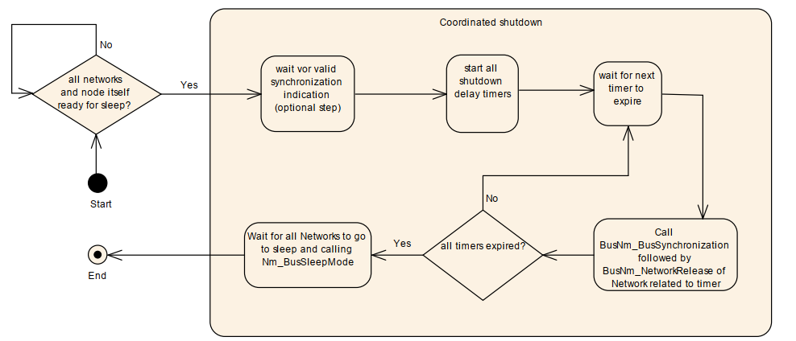
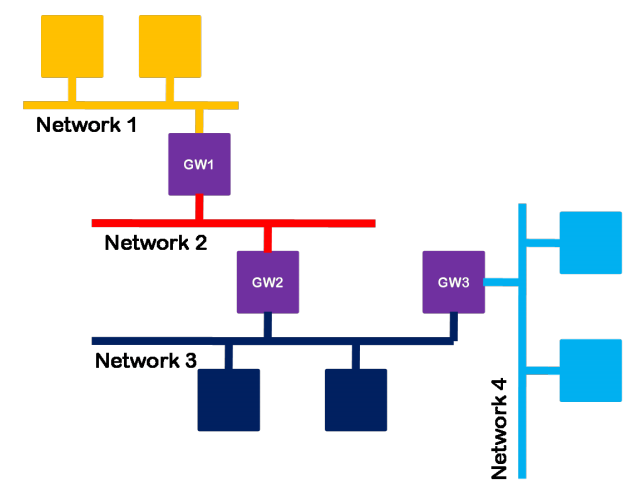
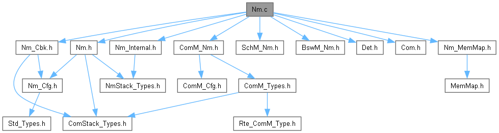
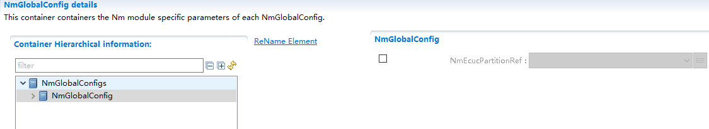
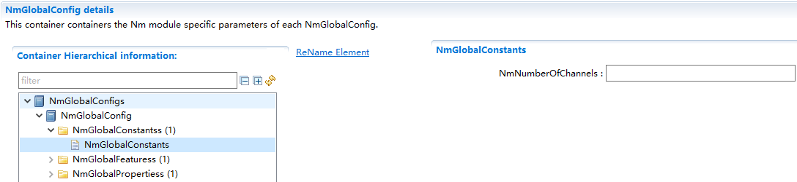
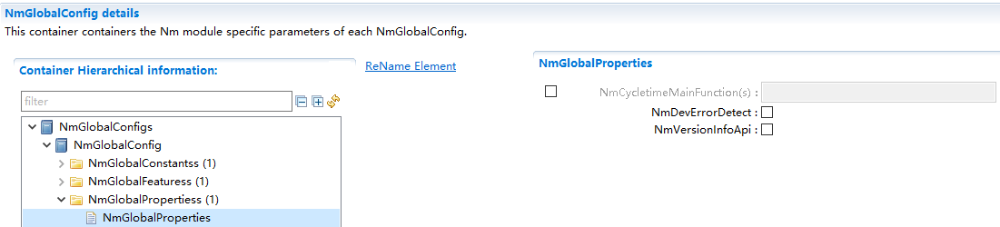
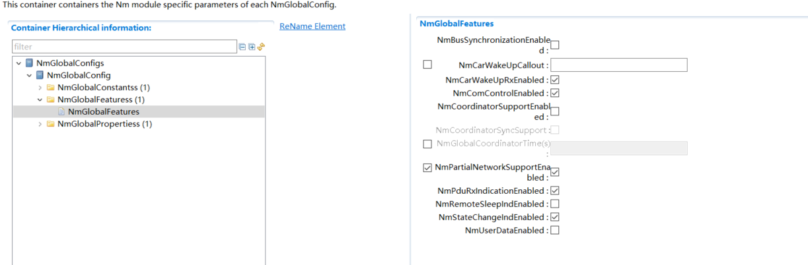
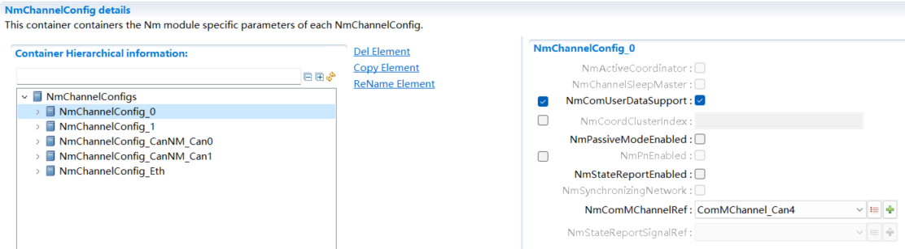
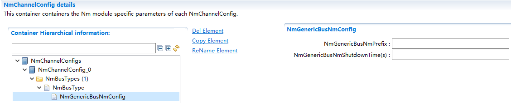
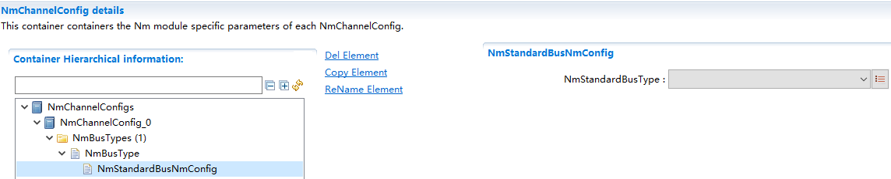

NmIf
#################################

:strong:`缩写词注解 (Abbreviation Notes):`

.. list-table::
   :widths: 34 33 33
   :header-rows: 1

   * - 缩写词 (Abbreviation)
     - 解释/描述 (Explanation/Description)
     - 中文解释 (Chinese explanation)
   * - API
     - Application ProgrammingInterface
     - 应用程序接口 (Application Programming Interface)
   * - ComM
     - Communication management
     - 通讯管理模块 (Communication Management Module)
   * - BswM
     - BSW Mode Manager
     - 基础软件管理模块 (Basic Software Management Module)
   * - DET
     - Default Error Tracer
     - 默认错误检测模块 (Default error detection module)
   * - NM
     - Network Management
     - 网络管理 (Network Management)
   * - NmIf
     - Network ManagementInterface
     - 网络管理接口模块 (Network Management Interface Module)
   * - PDU
     - Protocol Data Unit
     - 协议数据单元 (Protocol Data Unit)
   * - CanNm
     - Can Network Management
     - Can网络管理模块 (Can Network Management Module)
   * - UdpNm
     - UDP Network Management
     - UdpNm网络管理模块 (UdpNm Network Management Module)
   * - FrNm
     - FlexRay NetworkManagement
     - FlexRay网络管理模块 (FlexRay Network Management Module)
   * - BusNm
     - Bus Network Management
     - 总线网络管理模块 (Bus Network Management Module)
   * - CBV
     - Control Bit Vector
     - 控制位向量 (Control vector)
   * - CWU
     - Car Wakeup
     - 车辆唤醒 (Vehicle Wake-Up)

简介 (Introduction)
=================================

NmIf的基本功能是作为AUTOSAR ComM模块和AUTOSAR总线特定的网络管理模块（例如CAN网络管理和以太网网络管理）之间的适配层。

The basic function of NmIf is to serve as an adapter layer between the AUTOSAR ComM module and AUTOSAR bus-specific network management modules (e.g., CAN network management and Ethernet network management).

NmIf的另一个功能是协调功能，网关ECUs使用的NM协调器功能可以同步关闭一个或多个总线。当协调集群的所有网络都准备好进入睡眠状态或已经处于总线睡眠模式时，NM协调器应在所有唤醒的网络上启动协调关机。协调关机的目的是使集群中唤醒的网络同步关闭。NmIf协调功能的支持是可选的。NmIf可以仅支持基本功能，也可以同时支持基本功能和NM 协调功能。

Another function of NmIf is coordination. The NM coordinator functionality used by gateway ECUs can synchronize the shutdown of one or more buses. When all networks in the coordinating cluster are ready to enter sleep mode or already in bus sleep mode, the NM coordinator should initiate coordinated shutdown on all awakened networks. The purpose of coordinated shutdown is to ensure that awakened networks within the cluster shut down synchronously. Support for NmIf coordination functionality is optional. NmIf can support basic functionality alone or both basic and NM coordination functionalities.

.. figure:: ../../_static/参考手册(Module_Reference_Manual)/NmIf/image1.png
   :alt: NmIf在AUTOSAR中的位置 (The position of NmIf in AUTOSAR)
   :name: NmIf在AUTOSAR中的位置 (The position of NmIf in AUTOSAR)
   :align: center

参考资料 (Reference materials)
------------------------------------------

[1] AUTOSAR_SWS_NetworkManagementInterface.pdf，R19-11

[2] AUTOSAR_SWS_CANNetworkManagement.pdf，R19-11

[3] AUTOSAR_SWS_UDPNetworkManagement.pdf，R19-11

[4] AUTOSAR_SWS_PDURouter.pdf，R19-11

[5] AUTOSAR_SWS_COMManager.pdf，R19-11

功能描述 (Function Description)
===========================================

基本功能 (Basic features)
-------------------------------------

Nm模块完成基本功能的原理是通过调用BusNm模块的接口和ComM模块的接口来实现的，以网络请求功能为例，ComM需要请求网络时，调用Nm模块的网络请求API，由Nm模块调用相应总线的网络请求API，从而简化上层对不同总线类型的网络请求。

The principle behind the Nm module completing its basic functions is by calling interfaces from the BusNm module and the ComM module. Taking network request functionality as an example, when ComM needs to make a network request, it calls the network request API of the Nm module. The Nm module then calls the corresponding bus's network request API, thereby simplifying upper-layer handling of network requests for different bus types.

协调关闭算法 (Coordinate Close Algorithm)
---------------------------------------------------

当NmCoordinatorSupportEnabled使能时，Nm启用网络协调功能。NM协调器功能是一种使用协调算法，来协调所有或ECU所连接的总线的一个或多个独集群上的NM，使其协调关闭的功能。协调关闭的目的是为了使当前集群中所有channel对应的网络尽可能在同一时间关闭网络，如果集群中有的channel还未释放网络，那么需要保证集群中的所有channel都请求着网络。协调关闭只能在协调集群的当前唤醒网络中进行协调。已经处于“总线睡眠模式”的网络仍应受到监控，但不能进行协调。特定于总线的Nm将通过调用回调函数Nm_RemoteSleepIndication和Nm_RemoteSleepCancellation指示总线是否准备好进入睡眠状态。本地ECU将使用API函数Nm_NetworkRelease和Nm_NetworkRequest指示底层是否准备好进入Readysleep状态。如果channel被配置为SleepMaster，Nm协调器认为该总线可以随时进入睡眠，而不需要等待Nm_RemoteSleepIndication的调用。

When NmCoordinatorSupportEnabled is enabled, NM enables network coordination functionality. NM Coordinator functionality involves using a coordination algorithm to coordinate one or more clusters on which NM operates, which are all or those connected to the buses of an ECU, for coordinated shutdown. The purpose of coordinated shutdown is to ensure that networks corresponding to all channels in the current cluster are shut down as close to the same time as possible. If some channels in the cluster have not yet released the network, it must be ensured that all channels in the cluster request the network. Coordinated shutdown can only occur within the current wake-up network of the coordinating cluster. Networks already in "bus sleep mode" should still be monitored but cannot be coordinated. Bus-specific Nm will indicate whether the bus is ready to enter sleep through callback functions Nm_RemoteSleepIndication and Nm_RemoteSleepCancellation. The local ECU will use API functions Nm_NetworkRelease and Nm_NetworkRequest to indicate whether the underlying system is ready to enter ReadySleep state. If a channel is configured as SleepMaster, the NM coordinator considers that bus can enter sleep at any time without waiting for the call of Nm_RemoteSleepIndication.

非嵌套子网的协调关闭过程如下：当ComM调用Nm_NetworkRelease函数，请求释放网络时，这个时候Nm协调功能并不会调用BusNm的BusNm_NetworkRelease函数释放网络，而是需要在接收到Nm_RemoteSleepIndication的函数通知后，启动协调关闭定时器计时。协调关闭定时器的作用是，如果各总线配置的从Readysleep状态进入到BusSleep状态的时间不一样，协调关闭定时器可以做为一个补充定时器，以达到使各总线同步进入休眠状态。定时器应设置为NmGlobalCoordinatorTime。如果NmBusType未设置为NM_BUSNM_LOCALNM，则应减去特定通道TSHUTDOWN_CHANNEL的关闭时间。如果NmGlobalCoordinatorTime为零，则所有通道的关闭延迟计时器也应为零。当定时器超时后，Nm会调用BusNm_RequestBusSynchronization函数，然后调用BusNm_NetworkRelease函数释放底层网络。

The coordination shutdown process for non-nested subnets is as follows: When ComM calls the Nm_NetworkRelease function to request network release, the coordination functionality of Nm does not immediately call the BusNm_BusNm_NetworkRelease function to release the network. Instead, it requires receiving a notification through the Nm_RemoteSleepIndication function before starting the coordination shutdown timer. The purpose of the coordination shutdown timer is to synchronize all buses into sleep state if their transition from Readysleep to BusSleep states varies. The timer should be set to NmGlobalCoordinatorTime. If NmBusType is not set to NM_BUSNM_LOCALNM, a specific channel's TSHUTDOWN_CHANNEL shutdown time should be subtracted. If NmGlobalCoordinatorTime is zero, the shutdown delay timers for all channels should also be zero. After the timer times out, Nm will call the BusNm_RequestBusSynchronization function and then the BusNm_NetworkRelease function to release the underlying network.

TSHUTDOWN_CHANNEL时间计算：

TIME_CALCULATION_FOR_TSHUTDOWN_CHANNEL:

CanNm: Ready Sleep Time + Prepare BusSleep Time

UdpNm: Ready Sleep Time + Prepare BusSleep Time

NmCoordinatorSyncSupport使能时，打开嵌套子网功能。

When NmCoordinatorSyncSupport is enabled, nested subnet functionality is turned on.

嵌套子网的协调关闭过程如下：嵌套子网会有一个topmost协调器负责启动其他协调器协调关闭，topmost在配置上的表现为集群中的所有channel的NmActiveCoordinator都配置为TRUE。（NmActiveCoordinator=TRUE，表示ActiveCoordinator通道,NmActiveCoordinator=FALSE，表示PassiveCoordinator通道。）而其他非topmost的协调器只有一个ActiveCoordinator通道，其余均为PassiveCoordinator通道，当topmost满足协调关闭的条件时，会在它的所有channel上调用BusNm_SetSleepReadyBit函数设置协调睡眠就绪位的值为1（CBV中Bit3=1），当其他协调器在PassiveCoordinator通道上接收到协调关闭的指令时，将在它的所有ActiveCoordinator通道上将指令转发出去。

The coordination shutdown process for nested subnets is as follows: the nested subnet has a topmost coordinator responsible for initiating other coordinators to coordinate the shutdown. The topmost coordinator, in terms of configuration, manifests as all channels in the cluster having NmActiveCoordinator set to TRUE (NmActiveCoordinator=TRUE indicates an ActiveCoordinator channel; NmActiveCoordinator=FALSE indicates a PassiveCoordinator channel). Other non-topmost coordinators have only one ActiveCoordinator channel while the rest are PassiveCoordinator channels. When the topmost coordinator meets the conditions for coordination shutdown, it will call the BusNm_SetSleepReadyBit function on all its channels to set the value of the coordination sleep readiness bit to 1 (CBV Bit3=1). Upon receiving the coordination shutdown command on their PassiveCoordinator channels, other coordinators will forward the instruction on all their ActiveCoordinator channels.

总结，对于非topmost的节点，嵌套子网的协调集群的所有网络都准备好进入睡眠状态的条件是：

Summarizing, for non-topmost nodes, all networks in the coordinated cluster of nested subnets are ready to enter sleep mode if:

1. ComM请求释放所有网络。

Comm request releasing all networks.

2. NmActiveCoordinator=TRUE的channel接收到底层BusNm的RemoteSleepIndication通知指令和CBV中Bit3=1（Bit3为协调睡眠就绪位）的网络管理报文的通知指令。

NmActiveCoordinator=TRUE的channel接收到底层BusNm的RemoteSleepIndication通知命令和CBV中Bit3=1（Bit3为协调睡眠就绪位）的网络管理消息的通知命令。

3. NmActiveCoordinator=FALSE的channel接收到CBV中Bit3=1（Bit3为协调睡眠就绪位）的网络管理报文的通知指令。

NmActiveCoordinator= FALSE channel receives a network management message notification command from CBV where Bit3 = 1 (Bit3 is the coordinating sleep readiness bit).

4. 如果使能了NmSynchronizingNetwork，要等待底层调用Nm_SynchronizationPoint接口(FrNm网络)。

If NmSynchronizingNetwork is enabled, wait for the underlying call of the Nm_SynchronizationPoint interface (FrNm network).

对于topmost，嵌套子网的协调集群的所有网络都准备好进入睡眠状态的条件是：

For topmost, all networks of the nested subnet coordinating clusters are ready for sleep when:

1.ComM请求释放所有网络。

Comm request releasing all networks.

2.接收到底层BusNm的RemoteSleepIndication通知指令。

Receive the RemoteSleepIndication notification command for BusNm at the lower layer.

3.如果使能了NmSynchronizingNetwork，要等待底层调用Nm_SynchronizationPoint接口(FrNm网络)。

If NmSynchronizingNetwork is enabled, wait for the underlying call to the Nm_SynchronizationPoint interface (FrNm network).

协调关闭中止 (Coordination to terminate in progress.)
===============================================================

对于嵌套子网和非嵌套子网，如果该NM协调群集中的任何网络有如下行为则应终止协调关闭：

For nested subnets and non-nested subnets, coordination should be terminated for close-out if any network in the NM coordinating cluster exhibits the following behavior:

1.BusNm模块调用Nm_RemoteSleepCancellation（），场景为：在BusNm的Normal Operation State或Ready Sleep State又收到报文了。

The BusNm module calls Nm_RemoteSleepCancellation(), scenario: a message is received when the BusNm is in its Normal Operation State or Ready Sleep State.

2.指示Nm_NetworkMode（），场景为：BusNm在Prepare Bus-Sleep Mode下又收到报文了。

Indicate Nm_NetworkMode(), scenario: BusNm received a message again in the Prepare Bus-Sleep Mode.

3.BusNm模块调用Nm_CoordReadyToSleepCancellation（），场景为：BusNm收到了CBV中Bit3=0的报文。

BusNm module calls Nm_CoordReadyToSleepCancellation(), scenario: BusNm receives a message with Bit3=0 in CBV.

4.ComM使用Nm_NetworkRequest（）或Nm_PassiveStartUp（）请求网络，场景为：ComM重新请求通信。

ComM uses Nm_NetworkRequest() or Nm_PassiveStartUp() to request a network, scenario: ComM rerequests communication.

如果由于任何原因中止了协调关机，则NM Coordinator应调用对所有活动协调通道上的<BusNm>_SetSleepReadyBit的API将NMCoordinatorSleepReady位设置为UNSET（0）。

If coordination shutdown was terminated for any reason, the NM Coordinator should call the API to set the NMCoordinatorSleepReady bit to UNSET (0) on all active coordinate channels using <BusNm>_SetSleepReadyBit.

如果在被动协调的信道上收到Nm_CoordReadyToSleepCancellation（），则NmCoordinator应通过在所有主动协调的信道上通过调用<BusNm>\_SetSleepReadyBit的API将NMCoordinatorSleepReady位设置为UNSET（0）。

If Nm_CoordReadyToSleepCancellation() is received on a passively coordinated channel, the NmCoordinator should set the NMCoordinatorSleepReady bit to UNSET (0) by calling the API <BusNm>_SetSleepReadyBit on all actively coordinated channels.

如果协调关机被中止，则NM协调器应针对已经指示“总线睡眠”的所有网络调用ComM_Nm_RestartIndication（）。

If coordinated shutdown is terminated, the NM coordinator shall call ComM_Nm_RestartIndication() for all networks that have been instructed to "bus sleep".

如果协调关机被中止，则在BusNmType未设置为NM_BUSNM_LOCALNM的情况下，NM Coordinator将应向未指示“总线睡眠”的网络请求网络。

If coordinated power-off is terminated, then under the condition that BusNmType is not set to NM_BUSNM_LOCALNM, the NM Coordinator should request the network for the buses that were not instructed to "sleep".

如果BusNmType设置为NM_BUSNM_LOCALNM，则Nm应通过调用ComM_Nm_NetworkMode（）来通知ComM网络启动。

If BusNmType is set to NM_BUSNM_LOCALNM, then Nm should be notified to ComM that the network has started by calling ComM_Nm_NetworkMode().

如果协调算法已中止，则应重新评估保护协调关闭启动的所有条件。

If the coordination algorithm has been terminated, all conditions that initiated the protection coordination shutdown should be re-evaluated.

源文件描述 (Source file description)
===============================================

.. centered:: **表 NmIf组件文件描述 (Table NmIf Component File Description)**

.. list-table::
   :widths: 50 50
   :header-rows: 1

   * - 文件 (Files)
     - 说明 (Description)
   * - Nm_Cfg.h
     - 用于定义Nm模块预编译时用到的宏。 (Used for defining macros used in precompilation of the Nm module.)
   * - Nm_Lcfg.c
     - Link time配置参数 (Configure parameters for link time)
   * - Nm_PBcfg.c
     - Post build配置参数 (Build configuration parameters)
   * - Nm_Internal.h
     - Nm模块运行时类型定义，内部宏定义头文件 (Runtime type definitions for Nm module, internal macro definition header file)
   * - Nm_MemMap.h
     - Nm模块函数和变量存储位置定义文件。 (Nm module function and variable storage location definition file.)
   * - NmStack_Types.h
     - Nm外部数据类型 (External data type)
   * - Nm_Cbk.h
     - Nm回调函数声明文件 (NM callback function declaration file)
   * - Nm.h
     - Nm模块头文件，通过加载该头文件访问Nm公开的函数和数据类型 (Header file for Nm module, access Nm's public functions and data types by loading this header file.)
   * - Nm.c
     - Nm模块实现源文件，各API实现在该文件中 (Nm module implementation source file, each API implementation is in this file)

API接口 (API Interface)
=====================================

类型定义 (Type definition)
--------------------------------------

Nm_ModeType函数定义 (The Nm_ModeType function definition)
=====================================================================

.. list-table::
   :widths: 50 50
   :header-rows: 1

   * - 名称 (Name)
     - Nm_ModeType
   * - 类型 (Type)
     - Enumeration
   * - 范围 (Range)
     - NM_MODE_BUS_SLEEP 休眠模式 (NM_MODE_BUS_SLEEP Sleep Mode)
   * - 
     - NM_MODE_PREPARE_BUS_SLEEP 准备休眠模式 (NM_MODE_PREPARE_BUS_SLEEP Prepare Sleep Mode)
   * - 
     - NM_MODE_SYNCHRONIZE 同步模式 (NM_MODE_SYNCHRONIZE Synchronize Mode)
   * - 
     - NM_MODE_NETWORK 网络模式 (NM_MODE_NETWORK Network Mode)
   * - 描述 (Description)
     - 网络管理的运行模式。 (The operating model of network management.)

Nm_StateType类型定义 (Nm_StateType type definition)
===============================================================

.. list-table::
   :widths: 50 50
   :header-rows: 1

   * - 名称 (Name)
     - Nm_StateType
   * - 类型 (Type)
     - Enumeration
   * - 范围 (Range)
     - NM_STATE_UNINIT 未初始化 (NM_STATE_UNINIT Not Initialized)
   * - 
     - NM_STATE_BUS_SLEEP 总线休眠状态 (NM_STATE_BUS_SLEEP Sleep state of bus)
   * - 
     - NM_STATE_PREPARE_BUS_SLEEP 准备总线休眠状态 (NM_STATE_PREPARE_BUS_SLEEP Prepare bus sleep state)
   * - 
     - NM_STATE_READY_SLEEP 准备睡眠状态 (NM_STATE_READY_SLEEP Ready Sleep State)
   * - 
     - NM_STATE_NORMAL_OPERATION 正常操作状态 (NM_STATE_NORMAL_OPERATION Normal Operation State)
   * - 
     - NM_STATE_REPEAT_MESSAGE 重复消息状态 (NM_STATE_REPEAT_MESSAGE Repeat Message State)
   * - 
     - NM_STATE_SYNCHRONIZE 同步状态 (NM_STATE_SYNCHRONIZE Synchronize State)
   * - 
     - NM_STATE_OFFLINE 下线状态 (NM_STATE_OFFLINE Offline state)
   * - 描述 (Description)
     - 网络管理状态机的状态。 (The states of the network management state machine.)

Nm_BusNmType类型定义 (Nm_BusNmType Type Definition)
===============================================================

.. list-table::
   :widths: 50 50
   :header-rows: 1

   * - 名称 (Name)
     - Nm_BusNmType
   * - 类型 (Type)
     - Enumeration
   * - 范围 (Range)
     - NM_BUSNM_CANNM Can网络管理类型 (NM_BUS_NM_CAN_MGMT Network Management Type)
   * - 
     - NM_BUSNM_FRNM FR网络管理类型 (NM_BUS_NM_FR NM Network Management Type)
   * - 
     - NM_BUSNM_UDPNM Udp网络网络类型 (NM_BUS_NM_UDPNM Udp Network Type)
   * - 
     - NM_BUSNM_GENERICNM 通用网络管理类型 (NM_BUS_NM_GENERICNM Generic Network Management Type)
   * - 
     - NM_BUSNM_UNDEF 未定义的网络管理类型 (NM_BUSNM_UNDEF Undefined network management type)
   * - 
     - NM_BUSNM_J1939NM J1939网络管理类型 (NM_BUS_NM_J1939_Network Management Type)
   * - 
     - NM_BUSNM_LOCALNM 本地网络管理类型 (NM_BUS_NM_LOCAL NM Local Network Management Type)
   * - 描述 (Description)
     - BusNm类型 (BusNm Type)

Nm_ConfigType类型定义 (Nm_ConfigType type definition)
=================================================================

.. list-table::
   :widths: 50 50
   :header-rows: 1

   * - 名称 (Name)
     - Nm_ConfigType
   * - 类型 (Type)
     - Structure
   * - 范围 (Range)
     - --
   * - 描述 (Description)
     - Nm 模块的配置数据结构。 (Configuration data structure of Nm module.)

输入函数描述 (Describe the input function:)
-----------------------------------------------------

.. list-table::
   :widths: 50 50
   :header-rows: 1

   * - 输入模块 (Input Module)
     - API
   * - Det
     - Det_ReportError
   * - ComM
     - ComM_Nm_BusSleepMode
   * - 
     - ComM_Nm_NetworkMode
   * - 
     - ComM_Nm_NetworkStartIndication
   * - 
     - ComM_Nm_PrepareBusSleepMode
   * - 
     - ComM_Nm_RestartIndication
   * - BswM
     - BswM_Nm_CarWakeUpIndication
   * - CanNm
     - CanNm_PassiveStartUp
   * - Com
     - Com_SendSignal
   * - FrNm
     - FrNm_PassiveStartUp
   * - J1939Nm
     - J1939Nm_PassiveStartUp
   * - UdpNm
     - UdpNm_PassiveStartUp

静态接口函数定义 (Static interface function definition)
---------------------------------------------------------------

Nm_Init函数定义 (The Nm_Init function definition)
=============================================================

.. list-table::
   :widths: 20 20 20 20 20
   :header-rows: 1

   * - 函数名称： (Function Name:)
     - Nm_Init
     - 
     - 
     - 
   * - 函数原型： (Function prototype:)
     - 
     - void Nm_Init (const
     - 
     - 
   * - 
     - Nm_ConfigType\*ConfigPtr
     - 
     - 
     - 
   * - 
     - )
     - 
     - 
     - 
   * - 服务编号： (Service Number:)
     - 0x00
     - 
     - 
     - 
   * - 同步/异步： (Synchronous/asynchronous:)
     - 同步 (Sync)
     - 
     - 
     - 
   * - 是否可重入： (Is Reentrant:)
     - 不可重入 (Non-reentrant)
     - 
     - 
     - 
   * - 输入参数： (Input parameters:)
     - ConfigPtr
     - 值域： (Domain:)
     - 指向所选配置集的指针 (Pointer to the selected configuration set)
     - 
   * - 输入输出参数: (Input Output Parameters:)
     - 无
     - 
     - 
     - 
   * - 输出参数： (Output Parameters:)
     - 无
     - 
     - 
     - 
   * - 返回值： (Return Value:)
     - 无
     - 
     - 
     - 
   * - 功能概述： (Function Overview:)
     - 完成对Nm模块的初始化处理 (Complete the initialization processing of Nm module)
     - 
     - 
     - 

Nm_PassiveStartUp函数定义 (The Nm_PassiveStartUp function definition)
=================================================================================

.. list-table::
   :widths: 25 25 25 25
   :header-rows: 1

   * - 函数名称： (Function Name:)
     - Nm_PassiveStartUp
     - 
     - 
   * - 函数原型： (Function prototype:)
     - Std_ReturnTypeNm_PassiveStartUp(NetworkHandleTypeNetworkHandle)
     - 
     - 
   * - 服务编号： (Service Number:)
     - 0x01
     - 
     - 
   * - 同步/异步： (Synchronous/asynchronous:)
     - 非同步 (Asynchronous)
     - 
     - 
   * - 是否可重入： (Is Reentrant:)
     - 可重入（同一网络不可重入） (Reentrant (not reentrant in the same network))
     - 
     - 
   * - 输入参数： (Input parameters:)
     - NetworkHandle
     - 值域： (Domain:)
     - Nm通道的标识 (The identifier of Nm channel)
   * - 输入输出参数: (Input Output Parameters:)
     - 无
     - 
     - 
   * - 输出参数： (Output Parameters:)
     - 无
     - 
     - 
   * - 返回值： (Return Value:)
     - E_OK：没有错误 (E_OK: No error)
     - 
     - 
   * - 
     - E_NOT_OK：网络管理的被动启动失败 (E_NOT_OK: Passive startup of network management failed)
     - 
     - 
   * - 功能概述： (Function Overview:)
     - 调用<BusNm>_PassiveStartUp (Call <BusNm>_PassiveStartUp)
     - 
     - 

Nm_NetworkRequest函数定义 (Nm_NetworkRequest function definition)
=============================================================================

.. list-table::
   :widths: 25 25 25 25
   :header-rows: 1

   * - 函数名称： (Function Name:)
     - Nm_NetworkRequest
     - 
     - 
   * - 函数原型： (Function prototype:)
     - Std_ReturnTypeNm_NetworkRequest(NetworkHandleTypeNetworkHandle)
     - 
     - 
   * - 服务编号： (Service Number:)
     - 0x02
     - 
     - 
   * - 同步/异步： (Synchronous/asynchronous:)
     - 非同步 (Asynchronous)
     - 
     - 
   * - 是否可重入： (Is Reentrant:)
     - 可重入（同一网络不可重入） (Reentrant (not reentrant in the same network))
     - 
     - 
   * - 输入参数： (Input parameters:)
     - NetworkHandle
     - 值域： (Domain:)
     - Nm通道的标识 (The identifier of Nm channel)
   * - 输入输出参数: (Input Output Parameters:)
     - 无
     - 
     - 
   * - 输出参数： (Output Parameters:)
     - 无
     - 
     - 
   * - 返回值： (Return Value:)
     - E_OK：没有错误 (E_OK: No error)
     - 
     - 
   * - 
     - E_NOT_OK：总线请求失败 (E_NOT_OK: Bus request failed)
     - 
     - 
   * - 功能概述： (Function Overview:)
     - 调用<BusNm>_NetworkRequest (Call <BusNm>_NetworkRequest)
     - 
     - 

Nm_NetworkRelease函数定义 (The definition of Nm_NetworkRelease function)
====================================================================================

.. list-table::
   :widths: 25 25 25 25
   :header-rows: 1

   * - 函数名称： (Function Name:)
     - Nm_NetworkRelease
     - 
     - 
   * - 函数原型： (Function prototype:)
     - Std_ReturnTypeNm_NetworkRelease(NetworkHandleTypeNetworkHandle)
     - 
     - 
   * - 服务编号： (Service Number:)
     - 0x03
     - 
     - 
   * - 同步/异步： (Synchronous/asynchronous:)
     - 非同步 (Asynchronous)
     - 
     - 
   * - 是否可重入： (Is Reentrant:)
     - 可重入（同一通道不可重入） (Reentrant (non-reentrant for the same channel))
     - 
     - 
   * - 输入参数： (Input parameters:)
     - NetworkHandle
     - 值域： (Domain:)
     - Nm通道的标识 (The identifier of Nm channel)
   * - 输入输出参数: (Input Output Parameters:)
     - 无
     - 
     - 
   * - 输出参数： (Output Parameters:)
     - 无
     - 
     - 
   * - 返回值： (Return Value:)
     - E_OK：没有错误 (E_OK: No error)
     - 
     - 
   * - 
     - E_NOT_OK：总线释放失败 (E_NOT_OK: Bus release failed)
     - 
     - 
   * - 功能概述： (Function Overview:)
     - 调用<BusNm>_NetworkRelease (Call <BusNm>_NetworkRelease)
     - 
     - 

Nm_DisableCommunication函数定义 (The Nm_DisableCommunication function definition)
=============================================================================================

.. list-table::
   :widths: 25 25 25 25
   :header-rows: 1

   * - 函数名称： (Function Name:)
     - Nm_DisableCommunication
     - 
     - 
   * - 函数原型： (Function prototype:)
     - Std_ReturnTypeNm_DisableCommunication(NetworkHandleTypeNetworkHandle)
     - 
     - 
   * - 服务编号： (Service Number:)
     - 0x04
     - 
     - 
   * - 同步/异步： (Synchronous/asynchronous:)
     - 非同步 (Asynchronous)
     - 
     - 
   * - 是否可重入： (Is Reentrant:)
     - 可重入(仅限不同网络) (Reentrant (limited to different networks))
     - 
     - 
   * - 输入参数： (Input parameters:)
     - NetworkHandle
     - 值域： (Domain:)
     - Nm通道的标识 (The identifier of Nm channel)
   * - 输入输出参数: (Input Output Parameters:)
     - 无
     - 
     - 
   * - 输出参数： (Output Parameters:)
     - 无
     - 
     - 
   * - 返回值： (Return Value:)
     - E_OK：没有错误 (E_OK: No error)
     - 
     - 
   * - 
     - E_NOT_OK：禁用NMPDU传输能力失败 (E_NOT_OK：Failed to disable NMPDU transmission capability)
     - 
     - 
   * - 功能概述： (Function Overview:)
     - 禁用PDU传输功能，调用<BusNm>_DisableCommunication (Disable PDU transfer function, call <BusNm>_DisableCommunication)
     - 
     - 

Nm_EnableCommunication函数定义 (The Nm_EnableCommunication function definition)
===========================================================================================

.. list-table::
   :widths: 25 25 25 25
   :header-rows: 1

   * - 函数名称： (Function Name:)
     - Nm_EnableCommunication
     - 
     - 
   * - 函数原型： (Function prototype:)
     - Std_ReturnTypeNm_EnableCommunication(NetworkHandleTypeNetworkHandle)
     - 
     - 
   * - 服务编号： (Service Number:)
     - 0x05
     - 
     - 
   * - 同步/异步： (Synchronous/asynchronous:)
     - 非同步 (Asynchronous)
     - 
     - 
   * - 是否可重入： (Is Reentrant:)
     - 可重入(仅限不同网络) (Reentrant (limited to different networks))
     - 
     - 
   * - 输入参数： (Input parameters:)
     - NetworkHandle
     - 值域： (Domain:)
     - Nm通道的标识 (The identifier of Nm channel)
   * - 输入输出参数: (Input Output Parameters:)
     - 无
     - 
     - 
   * - 输出参数： (Output Parameters:)
     - 无
     - 
     - 
   * - 返回值： (Return Value:)
     - E_OK：没有错误 (E_OK: No error)
     - 
     - 
   * - 
     - E_NOT_OK：使能NMPDU传输能力失败 (E_NOT_OK: Enable NMPDU transmission capability failed)
     - 
     - 
   * - 功能概述： (Function Overview:)
     - 使能PDU传输功能，调用<BusNm>_EnableCommunication (Enable PDU transmission functionality, call <BusNm>_EnableCommunication)
     - 
     - 

Nm_SetUserData函数定义 (The Nm_SetUserData function definition)
===========================================================================

.. list-table::
   :widths: 25 25 25 25
   :header-rows: 1

   * - 函数名称： (Function Name:)
     - Nm_SetUserData
     - 
     - 
   * - 函数原型： (Function prototype:)
     - Std_ReturnTypeNm_SetUserData (NetworkHandleTypeNetworkHandle,const uint8\*nmUserDataPtr)
     - 
     - 
   * - 服务编号： (Service Number:)
     - 0x06
     - 
     - 
   * - 同步/异步： (Synchronous/asynchronous:)
     - 同步 (Sync)
     - 
     - 
   * - 是否可重入： (Is Reentrant:)
     - 仅不同通道可重入 (Only different channels can re-enter.)
     - 
     - 
   * - 输入参数： (Input parameters:)
     - NetworkHandle
     - 值域： (Domain:)
     - Nm通道的标识 (The identifier of Nm channel)
   * - 
     - nmUserDataPtr
     - 值域： (Domain:)
     - 要发送的消息地址 (The address to send the message)
   * - 输入输出参数: (Input Output Parameters:)
     - 无
     - 
     - 
   * - 输出参数： (Output Parameters:)
     - 无
     - 
     - 
   * - 返回值： (Return Value:)
     - E_OK：没有错误 (E_OK: No error)
     - 
     - 
   * - 
     - E_NOT_OK：设置数据失败 (E_NOT_OK: Failed to set data)
     - 
     - 
   * - 功能概述： (Function Overview:)
     - 为接下来在总线上传输的NM消息设置用户数据，调用<BusNm>_SetUserData (Set user data for the NM message to be transmitted over the bus, call <BusNm>_SetUserData)
     - 
     - 

Nm_GetUserData函数定义 (The function definition for Nm_GetUserData)
===============================================================================

.. list-table::
   :widths: 25 25 25 25
   :header-rows: 1

   * - 函数名称： (Function Name:)
     - Nm\_ GetUserData
     - 
     - 
   * - 函数原型： (Function prototype:)
     - Std_ReturnTypeNm_GetUserData(
     - 
     - 
   * - 
     - NetworkHandleTypenetworkHandle,uint8\*nmUserDataPtr
     - 
     - 
   * - 
     - )
     - 
     - 
   * - 服务编号： (Service Number:)
     - 0x07
     - 
     - 
   * - 同步/异步： (Synchronous/asynchronous:)
     - 同步 (Sync)
     - 
     - 
   * - 是否可重入： (Is Reentrant:)
     - 可重入 (Reentrant)
     - 
     - 
   * - 输入参数： (Input parameters:)
     - networkHandle
     - 值域： (Domain:)
     - Nm通道的标识 (The identifier of Nm channel)
   * - 输入输出参数: (Input Output Parameters:)
     - 无
     - 
     - 
   * - 输出参数： (Output Parameters:)
     - nmUserDataPtr
     - 值域： (Domain:)
     - 接收用户数据的内存地址 (Memory address for receiving user data)
   * - 返回值： (Return Value:)
     - E_OK：没有错误 (E_OK: No error)
     - 
     - 
   * - 
     - E_NOT_OK：获取数据失败 (E_NOT_OK: Failed to retrieve data)
     - 
     - 
   * - 功能概述： (Function Overview:)
     - 从上次成功接收的NM消息中获取用户数据，调用<BusNm>_GetUserData (Retrieve user data from NM messages received last time, call <BusNm>_GetUserData)
     - 
     - 

Nm_GetPduData函数定义 (The function definition for Nm_GetPduData)
=============================================================================

.. list-table::
   :widths: 25 25 25 25
   :header-rows: 1

   * - 函数名称： (Function Name:)
     - Nm\_ GetPduData
     - 
     - 
   * - 函数原型： (Function prototype:)
     - Std_ReturnTypeNm_GetPduData (NetworkHandleTypeNetworkHandle,uint8\* nmPduData)
     - 
     - 
   * - 服务编号： (Service Number:)
     - 0x08
     - 
     - 
   * - 同步/异步： (Synchronous/asynchronous:)
     - 同步 (Sync)
     - 
     - 
   * - 是否可重入： (Is Reentrant:)
     - 可重入 (Reentrant)
     - 
     - 
   * - 输入参数： (Input parameters:)
     - NetworkHandle
     - 值域： (Domain:)
     - Nm通道的标识 (The identifier of Nm channel)
   * - 输入输出参数: (Input Output Parameters:)
     - 无
     - 
     - 
   * - 输出参数： (Output Parameters:)
     - nmPduData
     - 值域： (Domain:)
     - 接收 nmPdu 的缓冲区地址 (Buffer address for receiving nmPdu)
   * - 返回值： (Return Value:)
     - E_OK：没有错误 (E_OK: No error)
     - 
     - 
   * - 
     - E_NOT_OK：获取PDU数据失败 (E_NOT_OK: Failed to retrieve PDU data)
     - 
     - 
   * - 功能概述： (Function Overview:)
     - 从最近收到的 NM消息中获取整个PDU数据，调用<BusNm>_GetPduData (Retrieve the entire PDU data from the latest received NM message and call <BusNm>_GetPduData.)
     - 
     - 

Nm_RepeatMessageRequest函数定义 (The definition of Nm_RepeatMessageRequest function)
================================================================================================

.. list-table::
   :widths: 25 25 25 25
   :header-rows: 1

   * - 函数名称： (Function Name:)
     - Nm_RepeatMessageRequest
     - 
     - 
   * - 函数原型： (Function prototype:)
     - Std_ReturnTypeNm_RepeatMessageRequest(NetworkHandleTypenetworkHandle)
     - 
     - 
   * - 服务编号： (Service Number:)
     - 0x09
     - 
     - 
   * - 同步/异步： (Synchronous/asynchronous:)
     - 非同步 (Asynchronous)
     - 
     - 
   * - 是否可重入： (Is Reentrant:)
     - 可重入(仅限不同网络) (Reentrant (limited to different networks))
     - 
     - 
   * - 输入参数： (Input parameters:)
     - networkHandle
     - 值域： (Domain:)
     - Nm通道的标识 (The identifier of Nm channel)
   * - 输入输出参数: (Input Output Parameters:)
     - 无
     - 
     - 
   * - 输出参数： (Output Parameters:)
     - 无
     - 
     - 
   * - 返回值： (Return Value:)
     - E_OK：没有错误 (E_OK: No error)
     - 
     - 
   * - 
     - E_NOT_OK：设置失败 (E_NOT_OK: Setting failed)
     - 
     - 
   * - 功能概述： (Function Overview:)
     - 为下一个在总线上传输的NM消息设置重复消息请求位，调用<BusNm>_RepeatMessageRequest (Set the repeat message request bit for the NM message to be transmitted on the bus next, call <BusNm>_RepeatMessageRequest)
     - 
     - 

Nm_GetNodeIdentifier函数定义 (The Nm_GetNodeIdentifier function definition)
=======================================================================================

.. list-table::
   :widths: 25 25 25 25
   :header-rows: 1

   * - 函数名称： (Function Name:)
     - Nm_GetNodeIdentifier
     - 
     - 
   * - 函数原型： (Function prototype:)
     - Std_ReturnTypeNm_GetNodeIdentifier(NetworkHandleTypenetworkHandle,uint8\*nmNodeIdPtr)
     - 
     - 
   * - 服务编号： (Service Number:)
     - 0x0a
     - 
     - 
   * - 同步/异步： (Synchronous/asynchronous:)
     - 同步 (Sync)
     - 
     - 
   * - 是否可重入： (Is Reentrant:)
     - 可重入 (Reentrant)
     - 
     - 
   * - 输入参数： (Input parameters:)
     - networkHandle
     - 值域： (Domain:)
     - NM-channel的ID (NM-channel's ID)
   * - 输入输出参数: (Input Output Parameters:)
     - 无
     - 
     - 
   * - 输出参数： (Output Parameters:)
     - nmNodeIdPtr
     - 值域： (Domain:)
     - 用于获取标志符的缓冲区 (Buffer for obtaining the identifier)
   * - 返回值： (Return Value:)
     - E_OK: 获取成功 (E_OK: Successfully Retrieved)
     - 
     - 
   * - 
     - E_NOT_OK:获取失败 (E_NOT_OK: Failed to retrieve)
     - 
     - 
   * - 功能概述： (Function Overview:)
     - 从最后一个成功接收到的NM消息中获取节点标识符，调用 (Retrieve the node identifier from the last successfully received NM message, call)
     - 
     - 
   * - 
     - <BusNm>_GetNodeIdentifier
     - 
     - 

Nm_GetLocalNodeIdentifier函数定义 (The Nm_GetLocalNodeIdentifier function definition)
=================================================================================================

.. list-table::
   :widths: 25 25 25 25
   :header-rows: 1

   * - 函数名称： (Function Name:)
     - Nm_GetLocalNodeIdentifier
     - 
     - 
   * - 函数原型： (Function prototype:)
     - Std_ReturnTypeNm_GetLocalNodeIdentifier(NetworkHandleTypenetworkHandle,uint8\*nmNodeIdPtr)
     - 
     - 
   * - 服务编号： (Service Number:)
     - 0x0b
     - 
     - 
   * - 同步/异步： (Synchronous/asynchronous:)
     - 同步 (Sync)
     - 
     - 
   * - 是否可重入： (Is Reentrant:)
     - 可重入 (Reentrant)
     - 
     - 
   * - 输入参数： (Input parameters:)
     - networkHandle
     - 值域： (Domain:)
     - NM-channel的ID (NM-channel's ID)
   * - 输入输出参数: (Input Output Parameters:)
     - 无
     - 
     - 
   * - 输出参数： (Output Parameters:)
     - nmNodeIdPtr
     - 值域： (Domain:)
     - 用于获取标志符的缓冲区 (Buffer for obtaining the identifier)
   * - 返回值： (Return Value:)
     - E_OK: 获取成功 (E_OK: Successfully Retrieved)
     - 
     - 
   * - 
     - E_NOT_OK:获取失败 (E_NOT_OK: Failed to retrieve)
     - 
     - 
   * - 功能概述： (Function Overview:)
     - 获取为本地节点配置的节点标识符，调用<BusNm>_GetLocalNodeIdentifier (Get the node identifier for the local node, call <BusNm>_GetLocalNodeIdentifier)
     - 
     - 

Nm_CheckRemoteSleepIndication函数定义 (The Nm_CheckRemoteSleepIndication function definition)
=========================================================================================================

.. list-table::
   :widths: 25 25 25 25
   :header-rows: 1

   * - 函数名称： (Function Name:)
     - Nm_CheckRemoteSleepIndication
     - 
     - 
   * - 函数原型： (Function prototype:)
     - Std_ReturnTypeNm_CheckRemoteSleepIndication(NetworkHandleTypeNetworkHandle,boolean\*RemoteSleepIndPtr)
     - 
     - 
   * - 服务编号： (Service Number:)
     - 0x0d
     - 
     - 
   * - 同步/异步： (Synchronous/asynchronous:)
     - 同步 (Sync)
     - 
     - 
   * - 是否可重入： (Is Reentrant:)
     - 可重入 (Reentrant)
     - 
     - 
   * - 输入参数： (Input parameters:)
     - NetworkHandle
     - 值域： (Domain:)
     - NM-channel的ID (NM-channel's ID)
   * - 输入输出参数: (Input Output Parameters:)
     - 无
     - 
     - 
   * - 输出参数： (Output Parameters:)
     - RemoteSleepIndPtr
     - 值域： (Domain:)
     - 用于获取指示结果 (Used for obtaining indicative results)
   * - 返回值： (Return Value:)
     - E_OK：没有错误 (E_OK: No error)
     - 
     - 
   * - 
     - E_NOT_OK：获取指示失败 (E_NOT_OK: Failed to get indication)
     - 
     - 
   * - 功能概述： (Function Overview:)
     - 检查是否有远程睡眠指示，调用<BusNm>_CheckRemoteSleepIndication (Check for remote sleep indication, call <BusNm>_CheckRemoteSleepIndication)
     - 
     - 

Nm_GetState函数定义 (The Nm_GetState function definition)
=====================================================================

.. list-table::
   :widths: 25 25 25 25
   :header-rows: 1

   * - 函数名称： (Function Name:)
     - Nm_GetState
     - 
     - 
   * - 函数原型： (Function prototype:)
     - Std_ReturnTypeNm_GetState (NetworkHandleTypenmNetworkHandle,Nm_StateType\*nmStatePtr,Nm_ModeType\*nmModePtr)
     - 
     - 
   * - 服务编号： (Service Number:)
     - 0x0e
     - 
     - 
   * - 同步/异步： (Synchronous/asynchronous:)
     - 同步 (Sync)
     - 
     - 
   * - 是否可重入： (Is Reentrant:)
     - 可重入 (Reentrant)
     - 
     - 
   * - 输入参数： (Input parameters:)
     - nmNetworkHandle
     - 值域： (Domain:)
     - NM-channel的ID (NM-channel's ID)
   * - 输入输出参数: (Input Output Parameters:)
     - 无
     - 
     - 
   * - 输出参数： (Output Parameters:)
     - nmStatePtr
     - 值域： (Domain:)
     - 指向网络管理状态将被复制到的位置的指针 (Pointer to where the network management state will be copied to)
   * - 
     - nmModePtr
     - 值域： (Domain:)
     - 指向网络管理模式将被复制到的位置的指针 (Pointer to the location where the network management mode will be copied.)
   * - 返回值： (Return Value:)
     - E_OK：请求成功 (E_OK: Request succeeded)
     - 
     - 
   * - 
     - E_NOT_OK：请求失败 (E_NOT_OK: Request failed)
     - 
     - 
   * - 功能概述： (Function Overview:)
     - 返回网络管理的状态和模式，调用<BusNm>_GetState (Return the network management status and mode, call <BusNm>_GetState)
     - 
     - 

Nm_GetVersionInfo函数定义 (The function definition for Nm_GetVersionInfo)
=====================================================================================

.. list-table::
   :widths: 25 25 25 25
   :header-rows: 1

   * - 函数名称： (Function Name:)
     - Nm_GetVersionInfo
     - 
     - 
   * - 函数原型： (Function prototype:)
     - voidNm_GetVersionInfo(
     - 
     - 
   * - 
     - Std_VersionInfoType\*nmVersioninfo
     - 
     - 
   * - 
     - )
     - 
     - 
   * - 服务编号： (Service Number:)
     - 0x0f
     - 
     - 
   * - 同步/异步： (Synchronous/asynchronous:)
     - 同步 (Sync)
     - 
     - 
   * - 是否可重入： (Is Reentrant:)
     - 可重入 (Reentrant)
     - 
     - 
   * - 输入参数： (Input parameters:)
     - 无
     - 
     - 
   * - 输入输出参数: (Input Output Parameters:)
     - 无
     - 
     - 
   * - 输出参数： (Output Parameters:)
     - nmVersioninfo
     - 值域： (Domain:)
     - 保存版本信息的结构体地址 (The address of the struct that preserves version information)
   * - 返回值： (Return Value:)
     - 无
     - 
     - 
   * - 功能概述： (Function Overview:)
     - 获取版本信息 (Get Version Information)
     - 
     - 

Nm_NetworkStartIndication函数定义 (The Nm_NetworkStartIndication function definition)
=================================================================================================

.. list-table::
   :widths: 25 25 25 25
   :header-rows: 1

   * - 函数名称： (Function Name:)
     - Nm_NetworkStartIndication
     - 
     - 
   * - 函数原型： (Function prototype:)
     - voidNm_NetworkStartIndication(NetworkHandleTypenmNetworkHandle)
     - 
     - 
   * - 服务编号： (Service Number:)
     - 0x11
     - 
     - 
   * - 同步/异步： (Synchronous/asynchronous:)
     - 非同步 (Asynchronous)
     - 
     - 
   * - 是否可重入： (Is Reentrant:)
     - 可重入 (Reentrant)
     - 
     - 
   * - 输入参数： (Input parameters:)
     - nmNetworkHandle
     - 值域： (Domain:)
     - NM-channel的ID (NM-channel's ID)
   * - 输入输出参数: (Input Output Parameters:)
     - 无
     - 
     - 
   * - 输出参数： (Output Parameters:)
     - 无
     - 
     - 
   * - 返回值： (Return Value:)
     - E_OK: 请求成功 (E_OK: Request successful)
     - 
     - 
   * - 
     - E_NOT_OK:请求失败 (E_NOT_OK: Request failed)
     - 
     - 
   * - 功能概述： (Function Overview:)
     - 通知在总线睡眠模式下收到NM消息，这表明网络中的某些节点已进入网络模式。 (Notify that an NM message has been received while in bus sleep mode, indicating that some nodes in the network have entered network mode.)
     - 
     - 

Nm_NetworkMode函数定义 (The Nm_NetworkMode function definition)
===========================================================================

.. list-table::
   :widths: 25 25 25 25
   :header-rows: 1

   * - 函数名称： (Function Name:)
     - Nm_NetworkMode
     - 
     - 
   * - 函数原型： (Function prototype:)
     - voidNm_NetworkStartIndication(NetworkHandleTypenmNetworkHandle)
     - 
     - 
   * - 服务编号： (Service Number:)
     - 0x12
     - 
     - 
   * - 同步/异步： (Synchronous/asynchronous:)
     - 异步 (Asynchronous)
     - 
     - 
   * - 是否可重入： (Is Reentrant:)
     - 可重入 (Reentrant)
     - 
     - 
   * - 输入参数： (Input parameters:)
     - nmNetworkHandle
     - 值域： (Domain:)
     - NM-channel的ID (NM-channel's ID)
   * - 输入输出参数: (Input Output Parameters:)
     - 无
     - 
     - 
   * - 输出参数： (Output Parameters:)
     - 无
     - 
     - 
   * - 返回值： (Return Value:)
     - 无
     - 
     - 
   * - 功能概述： (Function Overview:)
     - 通知网络管理已进入网络模式 (Notify network management that network mode has entered.)
     - 
     - 

Nm_BusSleepMode函数定义 (Nm_BusSleepMode function definition)
=========================================================================

.. list-table::
   :widths: 25 25 25 25
   :header-rows: 1

   * - 函数名称： (Function Name:)
     - Nm_BusSleepMode
     - 
     - 
   * - 函数原型： (Function prototype:)
     - voidNm_BusSleepMode (NetworkHandleTypenmNetworkHandle)
     - 
     - 
   * - 服务编号： (Service Number:)
     - 0x14
     - 
     - 
   * - 同步/异步： (Synchronous/asynchronous:)
     - 异步 (Asynchronous)
     - 
     - 
   * - 是否可重入： (Is Reentrant:)
     - 可重入 (Reentrant)
     - 
     - 
   * - 输入参数： (Input parameters:)
     - nmNetworkHandle
     - 值域： (Domain:)
     - NM-channel的ID (NM-channel's ID)
   * - 输入输出参数: (Input Output Parameters:)
     - 无
     - 
     - 
   * - 输出参数： (Output Parameters:)
     - 无
     - 
     - 
   * - 返回值： (Return Value:)
     - 无
     - 
     - 
   * - 功能概述： (Function Overview:)
     - 通知网络管理已进入总线睡眠模式 (Notification: Network management has entered bus sleep mode.)
     - 
     - 

Nm_PrepareBusSleepMode函数定义 (The function definition for Nm_PrepareBusSleepMode is defined as follows:)
======================================================================================================================

.. list-table::
   :widths: 25 25 25 25
   :header-rows: 1

   * - 函数名称： (Function Name:)
     - Nm_PrepareBusSleepMode
     - 
     - 
   * - 函数原型： (Function prototype:)
     - voidNm_PrepareBusSleepMode(NetworkHandleTypenmNetworkHandle)
     - 
     - 
   * - 服务编号： (Service Number:)
     - 0x13
     - 
     - 
   * - 同步/异步： (Synchronous/asynchronous:)
     - 异步 (Asynchronous)
     - 
     - 
   * - 是否可重入： (Is Reentrant:)
     - 可重入 (Reentrant)
     - 
     - 
   * - 输入参数： (Input parameters:)
     - nmNetworkHandle
     - 值域： (Domain:)
     - NM-channel的ID (NM-channel's ID)
   * - 输入输出参数: (Input Output Parameters:)
     - 无
     - 
     - 
   * - 输出参数： (Output Parameters:)
     - 无
     - 
     - 
   * - 返回值： (Return Value:)
     - 无
     - 
     - 
   * - 功能概述： (Function Overview:)
     - 通知网络管理已进入准备总线睡眠模式 (Notification: Network management has entered preparation for bus sleep mode.)
     - 
     - 

Nm_RemoteSleepIndication函数定义 (Nm_RemoteSleepIndication function definition)
===========================================================================================

.. list-table::
   :widths: 25 25 25 25
   :header-rows: 1

   * - 函数名称： (Function Name:)
     - Nm_RemoteSleepIndication
     - 
     - 
   * - 函数原型： (Function prototype:)
     - voidNm_RemoteSleepIndication(NetworkHandleTypenmNetworkHandle)
     - 
     - 
   * - 服务编号： (Service Number:)
     - 0x17
     - 
     - 
   * - 同步/异步： (Synchronous/asynchronous:)
     - 异步 (Asynchronous)
     - 
     - 
   * - 是否可重入： (Is Reentrant:)
     - 可重入 (Reentrant)
     - 
     - 
   * - 输入参数： (Input parameters:)
     - nmNetworkHandle
     - 值域： (Domain:)
     - NM-channel的ID (NM-channel's ID)
   * - 输入输出参数: (Input Output Parameters:)
     - 无
     - 
     - 
   * - 输出参数： (Output Parameters:)
     - 无
     - 
     - 
   * - 返回值： (Return Value:)
     - 无
     - 
     - 
   * - 功能概述： (Function Overview:)
     - 通知网络管理已检测到网络上的所有其他节点已准备好进入总线睡眠模式。 (Notification: Network management has detected that all other nodes on the network are ready to enter bus sleep mode.)
     - 
     - 

Nm_RemoteSleepCancellation函数定义 (The Nm_RemoteSleepCancellation function definition)
===================================================================================================

.. list-table::
   :widths: 25 25 25 25
   :header-rows: 1

   * - 函数名称： (Function Name:)
     - Nm_RemoteSleepCancellation
     - 
     - 
   * - 函数原型： (Function prototype:)
     - voidNm_RemoteSleepCancellation(NetworkHandleTypenmNetworkHandle)
     - 
     - 
   * - 服务编号： (Service Number:)
     - 0x18
     - 
     - 
   * - 同步/异步： (Synchronous/asynchronous:)
     - 异步 (Asynchronous)
     - 
     - 
   * - 是否可重入： (Is Reentrant:)
     - 可重入 (Reentrant)
     - 
     - 
   * - 输入参数： (Input parameters:)
     - nmNetworkHandle
     - 值域： (Domain:)
     - NM-channel的ID (NM-channel's ID)
   * - 输入输出参数: (Input Output Parameters:)
     - 无
     - 
     - 
   * - 输出参数： (Output Parameters:)
     - 无
     - 
     - 
   * - 返回值： (Return Value:)
     - 无
     - 
     - 
   * - 功能概述： (Function Overview:)
     - 通知网络管理已检测到网络上并非所有其他节点都已准备好进入总线睡眠模式。 (Notification: Network management has detected that not all other nodes are ready to enter bus sleep mode.)
     - 
     - 

Nm_SynchronizationPoint函数定义 (The definition of Nm_SynchronizationPoint function)
================================================================================================

.. list-table::
   :widths: 25 25 25 25
   :header-rows: 1

   * - 函数名称： (Function Name:)
     - Nm_SynchronizationPoint
     - 
     - 
   * - 函数原型： (Function prototype:)
     - voidNm_SynchronizationPoint(NetworkHandleTypenmNetworkHandle)
     - 
     - 
   * - 服务编号： (Service Number:)
     - 0x19
     - 
     - 
   * - 同步/异步： (Synchronous/asynchronous:)
     - 异步 (Asynchronous)
     - 
     - 
   * - 是否可重入： (Is Reentrant:)
     - 可重入 (Reentrant)
     - 
     - 
   * - 输入参数： (Input parameters:)
     - nmNetworkHandle
     - 值域： (Domain:)
     - NM-channel的ID (NM-channel's ID)
   * - 输入输出参数: (Input Output Parameters:)
     - 无
     - 
     - 
   * - 输出参数： (Output Parameters:)
     - 无
     - 
     - 
   * - 返回值： (Return Value:)
     - 无
     - 
     - 
   * - 功能概述： (Function Overview:)
     - 通知NM协调功能，这是启动协调关机的合适时间点。 (Notify NM coordination function, this is an appropriate timing point to initiate coordinated shutdown.)
     - 
     - 

Nm_CoordReadyToSleepIndication函数定义 (The Nm_CoordReadyToSleepIndication function definition)
===========================================================================================================

.. list-table::
   :widths: 25 25 25 25
   :header-rows: 1

   * - 函数名称： (Function Name:)
     - Nm_CoordReadyToSleepIndication
     - 
     - 
   * - 函数原型： (Function prototype:)
     - voidNm_CoordReadyToSleepIndication(NetworkHandleTypenmChannelHandle)
     - 
     - 
   * - 服务编号： (Service Number:)
     - 0x1e
     - 
     - 
   * - 同步/异步： (Synchronous/asynchronous:)
     - 异步 (Asynchronous)
     - 
     - 
   * - 是否可重入： (Is Reentrant:)
     - 可重入 (Reentrant)
     - 
     - 
   * - 输入参数： (Input parameters:)
     - nmNetworkHandle
     - 值域： (Domain:)
     - NM-channel的ID (NM-channel's ID)
   * - 输入输出参数: (Input Output Parameters:)
     - 无
     - 
     - 
   * - 输出参数： (Output Parameters:)
     - 无
     - 
     - 
   * - 返回值： (Return Value:)
     - 无
     - 
     - 
   * - 功能概述： (Function Overview:)
     - 当控制位向量中的NM协调器睡眠就绪位被置位时，设置指示 (When the NM Coordinator Sleep Ready bit in the control vector is set, it indicates)
     - 
     - 

Nm_CoordReadyToSleepCancellation函数定义 (The Nm_CoordReadyToSleepCancellation function definition)
===============================================================================================================

.. list-table::
   :widths: 25 25 25 25
   :header-rows: 1

   * - 函数名称： (Function Name:)
     - Nm_CoordReadyToSleepCancellation
     - 
     - 
   * - 函数原型： (Function prototype:)
     - voidNm_CoordReadyToSleepCancellation(NetworkHandleTypenmChannelHandle)
     - 
     - 
   * - 服务编号： (Service Number:)
     - 0x1f
     - 
     - 
   * - 同步/异步： (Synchronous/asynchronous:)
     - 异步 (Asynchronous)
     - 
     - 
   * - 是否可重入： (Is Reentrant:)
     - 可重入 (Reentrant)
     - 
     - 
   * - 输入参数： (Input parameters:)
     - nmNetworkHandle
     - 值域： (Domain:)
     - NM-channel的ID (NM-channel's ID)
   * - 输入输出参数: (Input Output Parameters:)
     - 无
     - 
     - 
   * - 输出参数： (Output Parameters:)
     - 无
     - 
     - 
   * - 返回值： (Return Value:)
     - 无
     - 
     - 
   * - 功能概述： (Function Overview:)
     - 当控制位向量中的NM协调器睡眠就绪位设置回0时，取消指示。 (When the NM Coordinator Sleepy Bit in the control vector is set back to 0, cancel the indication.)
     - 
     - 

Nm_PduRxIndication函数定义 (The Nm_PduRxIndication function definition)
===================================================================================

.. list-table::
   :widths: 25 25 25 25
   :header-rows: 1

   * - 函数名称： (Function Name:)
     - Nm_PduRxIndication
     - 
     - 
   * - 函数原型： (Function prototype:)
     - voidNm_PduRxIndication(NetworkHandleTypenmNetworkHandle)
     - 
     - 
   * - 服务编号： (Service Number:)
     - 0x15
     - 
     - 
   * - 同步/异步： (Synchronous/asynchronous:)
     - 异步 (Asynchronous)
     - 
     - 
   * - 是否可重入： (Is Reentrant:)
     - 可重入 (Reentrant)
     - 
     - 
   * - 输入参数： (Input parameters:)
     - nmNetworkHandle
     - 值域： (Domain:)
     - NM-channel的ID (NM-channel's ID)
   * - 输入输出参数: (Input Output Parameters:)
     - 无
     - 
     - 
   * - 输出参数： (Output Parameters:)
     - 无
     - 
     - 
   * - 返回值： (Return Value:)
     - 无
     - 
     - 
   * - 功能概述： (Function Overview:)
     - 收到NM消息的通知 (Notification for receiving NM message.)
     - 
     - 

Nm_StateChangeNotification函数定义 (The Nm_StateChangeNotification function definition)
===================================================================================================

.. list-table::
   :widths: 25 25 25 25
   :header-rows: 1

   * - 函数名称： (Function Name:)
     - Nm_StateChangeNotification
     - 
     - 
   * - 函数原型： (Function prototype:)
     - voidNm_StateChangeNotification(NetworkHandleTypenmNetworkHandle,Nm_StateTypenmPreviousState,Nm_StateTypenmCurrentState)
     - 
     - 
   * - 服务编号： (Service Number:)
     - 0x16
     - 
     - 
   * - 同步/异步： (Synchronous/asynchronous:)
     - 异步 (Asynchronous)
     - 
     - 
   * - 是否可重入： (Is Reentrant:)
     - 可重入 (Reentrant)
     - 
     - 
   * - 输入参数： (Input parameters:)
     - nmNetworkHandle
     - 值域： (Domain:)
     - NM-channel的ID (NM-channel's ID)
   * - 
     - nmPreviousState
     - 值域： (Domain:)
     - NM-channel的先前的状态 (The previous state of NM-channel)
   * - 
     - nmCurrentState
     - 值域： (Domain:)
     - NM-channel的当前的状态 (The current status of NM-channel)
   * - 输入输出参数: (Input Output Parameters:)
     - 无
     - 
     - 
   * - 输出参数： (Output Parameters:)
     - 无
     - 
     - 
   * - 返回值： (Return Value:)
     - 无
     - 
     - 
   * - 功能概述： (Function Overview:)
     - 通知，下层<BusNm>的状态已经改变。 (Notification, the status of the <BusNm> has changed.)
     - 
     - 

Nm_RepeatMessageIndication函数定义 (Nm_RepeatMessageIndication function definition)
===============================================================================================

.. list-table::
   :widths: 25 25 25 25
   :header-rows: 1

   * - 函数名称： (Function Name:)
     - Nm_RepeatMessageIndication
     - 
     - 
   * - 函数原型： (Function prototype:)
     - voidNm_RepeatMessageIndication(NetworkHandleTypenmNetworkHandle)
     - 
     - 
   * - 服务编号： (Service Number:)
     - 0x1a
     - 
     - 
   * - 同步/异步： (Synchronous/asynchronous:)
     - 异步 (Asynchronous)
     - 
     - 
   * - 是否可重入： (Is Reentrant:)
     - 可重入 (Reentrant)
     - 
     - 
   * - 输入参数： (Input parameters:)
     - nmNetworkHandle
     - 值域： (Domain:)
     - NM-channel的ID (NM-channel's ID)
   * - 输入输出参数: (Input Output Parameters:)
     - 无
     - 
     - 
   * - 输出参数： (Output Parameters:)
     - 无
     - 
     - 
   * - 返回值： (Return Value:)
     - 无
     - 
     - 
   * - 功能概述： (Function Overview:)
     - 指示已接收到具有设置重复消息请求位的NM消息。 (Indication received for NM message with request bit for repeating messages.)
     - 
     - 

Nm_TxTimeoutException函数定义 (Nm_TxTimeoutException function definition)
=====================================================================================

.. list-table::
   :widths: 25 25 25 25
   :header-rows: 1

   * - 函数名称： (Function Name:)
     - Nm_TxTimeoutException
     - 
     - 
   * - 函数原型： (Function prototype:)
     - voidNm_TxTimeoutException(NetworkHandleTypenmNetworkHandle)
     - 
     - 
   * - 服务编号： (Service Number:)
     - 0x1b
     - 
     - 
   * - 同步/异步： (Synchronous/asynchronous:)
     - 异步 (Asynchronous)
     - 
     - 
   * - 是否可重入： (Is Reentrant:)
     - 可重入 (Reentrant)
     - 
     - 
   * - 输入参数： (Input parameters:)
     - nmNetworkHandle
     - 值域： (Domain:)
     - NM-channel的ID (NM-channel's ID)
   * - 输入输出参数: (Input Output Parameters:)
     - 无
     - 
     - 
   * - 输出参数： (Output Parameters:)
     - 无
     - 
     - 
   * - 返回值： (Return Value:)
     - 无
     - 
     - 
   * - 功能概述： (Function Overview:)
     - 指示发送NM消息的尝试失败。 (Failed to send NM message.)
     - 
     - 

Nm_CarWakeUpIndication函数定义 (The Nm_CarWakeUpIndication function definition)
===========================================================================================

.. list-table::
   :widths: 25 25 25 25
   :header-rows: 1

   * - 函数名称： (Function Name:)
     - Nm_CarWakeUpIndication
     - 
     - 
   * - 函数原型： (Function prototype:)
     - voidNm_CarWakeUpIndication(NetworkHandleTypenmChannelHandle)
     - 
     - 
   * - 服务编号： (Service Number:)
     - 0x1d
     - 
     - 
   * - 同步/异步： (Synchronous/asynchronous:)
     - 同步 (Sync)
     - 
     - 
   * - 是否可重入： (Is Reentrant:)
     - 可重入 (Reentrant)
     - 
     - 
   * - 输入参数： (Input parameters:)
     - nmNetworkHandle
     - 值域： (Domain:)
     - NM-channel的ID (NM-channel's ID)
   * - 输入输出参数: (Input Output Parameters:)
     - 无
     - 
     - 
   * - 输出参数： (Output Parameters:)
     - 无
     - 
     - 
   * - 返回值： (Return Value:)
     - 无
     - 
     - 
   * - 功能概述： (Function Overview:)
     - 这个函数由<Bus>Nm调用，表示接收到一个CarWakeup请求。 (This function is called by <Bus> Nm to indicate receipt of a CarWakeup request.)
     - 
     - 

Nm_MainFunction函数定义 (NM_MainFunction function definition)
=========================================================================

.. list-table::
   :widths: 50 50
   :header-rows: 1

   * - 函数名称： (Function Name:)
     - Nm_MainFunction
   * - 函数原型： (Function prototype:)
     - void Nm_MainFunction (void)
   * - 服务编号： (Service Number:)
     - 0x10
   * - 同步/异步： (Synchronous/asynchronous:)
     - 异步 (Asynchronous)
   * - 是否可重入： (Is Reentrant:)
     - 可重入 (Reentrant)
   * - 输入参数： (Input parameters:)
     - 无
   * - 输入输出参数: (Input Output Parameters:)
     - 无
   * - 输出参数： (Output Parameters:)
     - 无
   * - 返回值： (Return Value:)
     - 无
   * - 功能概述： (Function Overview:)
     - 该函数实现了NmIf，需要一个固定的循环调度。 (The function implements NmIf and requires a fixed loop scheduling.)

Nm_PncBitVectorTxIndication函数定义 (The Nm_PncBitVectorTxIndication function definition)
=====================================================================================================

.. list-table::
   :widths: 25 25 25 25
   :header-rows: 1

   * - 函数名称： (Function Name:)
     - Nm_PncBitVectorTxIndication
     - 
     - 
   * - 函数原型： (Function prototype:)
     - voidNm_PncBitVectorTxIndication(
     - 
     - 
   * - 
     - NetworkHandleTypeNetworkHandle,
     - 
     - 
   * - 
     - uint8\*PncBitVectorPtr
     - 
     - 
   * - 
     - )
     - 
     - 
   * - 服务编号： (Service Number:)
     - 0x27
     - 
     - 
   * - 同步/异步： (Synchronous/asynchronous:)
     - 同步 (Sync)
     - 
     - 
   * - 是否可重入： (Is Reentrant:)
     - 可重入 (Reentrant)
     - 
     - 
   * - 输入参数： (Input parameters:)
     - NetworkHandle
     - 值域： (Domain:)
     - Nm通道的标识 (The identifier of Nm channel)
   * - 输入输出参数: (Input Output Parameters:)
     - 无
     - 
     - 
   * - 输出参数： (Output Parameters:)
     - PncBitVectorPtr
     - 值域： (Domain:)
     - 获取所有内部请求的PNC字节信息 (Get byte information for all internal requests)
   * - 返回值： (Return Value:)
     - 无
     - 
     - 
   * - 功能概述： (Function Overview:)
     - 函数由<Bus>Nms调用，以请求的内部PNC请求在Nm消息中传输 (The function is called by <Bus>Nms to request internal PNC requests transmitted in Nm messages.)
     - 
     - 

Nm_UpdateIRA函数定义 (Nm_UpdateIRA function definition)
===================================================================

.. list-table::
   :widths: 25 25 25 25
   :header-rows: 1

   * - 函数名称： (Function Name:)
     - Nm_UpdateIRA
     - 
     - 
   * - 函数原型： (Function prototype:)
     - void Nm_UpdateIRA(NetworkHandleTypeNetworkHandle,const uint8\*PncBitVectorPtr)
     - 
     - 
   * - 服务编号： (Service Number:)
     - 0x26
     - 
     - 
   * - 同步/异步： (Synchronous/asynchronous:)
     - 同步 (Sync)
     - 
     - 
   * - 是否可重入： (Is Reentrant:)
     - 仅不同通道可重入 (Only different channels can re-enter.)
     - 
     - 
   * - 输入参数： (Input parameters:)
     - NetworkHandle
     - 值域： (Domain:)
     - Nm通道的标识 (The identifier of Nm channel)
   * - 
     - PncBitVectorPtr
     - 值域： (Domain:)
     - 该通道内部PN请求数据地址 (The internal PN request data address of this channel)
   * - 输入输出参数: (Input Output Parameters:)
     - 无
     - 
     - 
   * - 输出参数： (Output Parameters:)
     - 无
     - 
     - 
   * - 返回值： (Return Value:)
     - 无
     - 
     - 
   * - 功能概述： (Function Overview:)
     - 由ComM调用，设置通道Nm报文中PNCBitVector字段数据，以表示PN的内部请求 (Call set PNCBitVector field data in Nm message to indicate internal PN request by ComM)
     - 
     - 

Nm_SynchronizeMode函数定义 (The Nm_SynchronizeMode function definition)
===================================================================================

.. list-table::
   :widths: 25 25 25 25
   :header-rows: 1

   * - 函数名称： (Function Name:)
     - Nm_SynchronizeMode
     - 
     - 
   * - 函数原型： (Function prototype:)
     - voidNm_SynchronizeMode(NetworkHandleTypenmChannelHandle)
     - 
     - 
   * - 服务编号： (Service Number:)
     - 0x21
     - 
     - 
   * - 同步/异步： (Synchronous/asynchronous:)
     - 异步 (Asynchronous)
     - 
     - 
   * - 是否可重入： (Is Reentrant:)
     - 非相同通道可重入 (Non-reentrant across different channels)
     - 
     - 
   * - 输入参数： (Input parameters:)
     - nmNetworkHandle
     - 值域： (Domain:)
     - NM-channel的ID (NM-channel's ID)
   * - 输入输出参数: (Input Output Parameters:)
     - 无
     - 
     - 
   * - 输出参数： (Output Parameters:)
     - 无
     - 
     - 
   * - 返回值： (Return Value:)
     - 无
     - 
     - 
   * - 功能概述： (Function Overview:)
     - 通知网络管理已进入同步模式。 (Notify network management has entered synchronization mode.)
     - 
     - 

可配置函数定义 (Configurable Function Definition)
----------------------------------------------------------

无。

None.

配置 (Configure)
==============================

NmGlobalConfig
------------------------------

.. centered:: **表 NmGlobalConfig属性描述 (Table NmGlobalConfig Property Description)**

.. list-table::
   :widths: 20 20 20 20 20
   :header-rows: 1

   * - UI名称 (UI Name)
     - 描述 (Description)
     - 
     - 
     - 
   * - NmEcucPartitionRef
     - 取值范围 (Range)
     - Reference toEcucPartition
     - 默认取值 (Default value)
     - 无
   * - 
     - 参数描述 (Parameter Description)
     - 引用Nm模块被分配到的EcucPartition。 (Reference the EcucPartition that the Nm module is assigned to.)
     - 
     - 
   * - 
     - 依赖关系 (Dependencies)
     - 无
     - 
     - 

NmGlobalConstants
=================================

.. centered:: **表 NmGlobalConstants属性描述 (Table NmGlobalConstants Property Description)**

.. list-table::
   :widths: 20 20 20 20 20
   :header-rows: 1

   * - UI名称 (UI Name)
     - 描述 (Description)
     - 
     - 
     - 
   * - NmNumberOfChannels
     - 取值范围 (Range)
     - 1 .. 255
     - 默认取值 (Default value)
     - 无
   * - 
     - 参数描述 (Parameter Description)
     - 一个ECU内允许的NM通道数。 (The number of NM channels allowed within an ECU.)
     - 
     - 
   * - 
     - 依赖关系 (Dependencies)
     - 无
     - 
     - 

NmGlobalProperties
==================================

.. centered:: **表 NmGlobalProperties属性描述 (Table NmGlobalProperties property description)**

.. list-table::
   :widths: 20 20 20 20 20
   :header-rows: 1

   * - UI名称 (UI Name)
     - 描述 (Description)
     - 
     - 
     - 
   * - NmCycletimeMainFunction
     - 取值范围 (Range)
     - 0 .. 65535
     - 默认取值 (Default value)
     - 无
   * - 
     - 参数描述 (Parameter Description)
     - NmIf的MainFunction连续调用的时间间隔（以秒为单位）。 (The time interval (in seconds) for continuous calls of NmIf's MainFunction.)
     - 
     - 
   * - 
     - 依赖关系 (Dependencies)
     - 如果NmCoordinatorSupportEnabled设置为TRUE，则需要配置NmCycletimeMainFunction。 (If NmCoordinatorSupportEnabled is set to TRUE, then NmCycletimeMainFunction needs to be configured.)
     - 
     - 
   * - NmDevErrorDetect
     - 取值范围 (Range)
     - true, false
     - 默认取值 (Default value)
     - false
   * - 
     - 参数描述 (Parameter Description)
     - 打开或关闭开发错误检测和通知。 (Enable or disable development error detection and notifications.)
     - 
     - 
   * - 
     - 依赖关系 (Dependencies)
     - 无
     - 
     - 
   * - NmVersionInfoApi
     - 取值范围 (Range)
     - STD_ON,STD_OFF
     - 默认取值 (Default value)
     - 无
   * - 
     - 参数描述 (Parameter Description)
     - 用于启用版本信息API支持的预处理器开关。 (Preprocessor switch for enabling version information API support.)
     - 
     - 
   * - 
     - 依赖关系 (Dependencies)
     - 无
     - 
     - 

NmGlobalFeatures 
=================================

.. centered:: **表 NmGlobalFeatures属性描述 (Table NmGlobalFeatures Property Description)**

.. list-table::
   :widths: 20 20 20 20 20
   :header-rows: 1

   * - UI名称 (UI Name)
     - 描述 (Description)
     - 
     - 
     - 
   * - NmBusSynchronizationEnabled
     - 取值范围 (Range)
     - STD_ON,STD_OFF
     - 默认取值 (Default value)
     - 无
   * - 
     - 参数描述 (Parameter Description)
     - 用于启用 <BusNm>的总线同步支持的预处理器开关。仅NM Coordinator节点需要此功能。 (Preprocessor switch for enabling bus synchronization support for <BusNm>. This feature is required only on NM Coordinator nodes.)
     - 
     - 
   * - 
     - 依赖关系 (Dependencies)
     - 如果启用NmCoordinatorSupportEnabled，则必须启用此参数。 (If NmCoordinatorSupportEnabled is enabled, this parameter must be enabled.)
     - 
     - 
   * - NmCarWakeUpCallout
     - 取值范围 (Range)
     - String
     - 默认取值 (Default value)
     - 无
   * - 
     - 参数描述 (Parameter Description)
     - 如果Nm_CarWakeUpIndication()被调用，callout函数的名称。如果未配置此参数，Nm将调用BswM_Nm_CarWakeUpIndication。 (If Nm_CarWakeUpIndication() is called, the name of the callout function. If this parameter is not configured, Nm will call BswM_Nm_CarWakeUpIndication.)
     - 
     - 
   * - 
     - 依赖关系 (Dependencies)
     - 仅当NmCarWakeUpRxEnabled== TRUE时可用 (Only available when NmCarWakeUpRxEnabled == TRUE)
     - 
     - 
   * - NmCarWakeUpRxEnabled
     - 取值范围 (Range)
     - STD_ON,STD_OFF
     - 默认取值 (Default value)
     - 无
   * - 
     - 参数描述 (Parameter Description)
     - 启用或禁用CWU检测。FALSE-不支持CarWakeUpTRUE -支持CarWakeUp (Enable or disable CWU detection. FALSE- does not support CarWakeUp TRUE - supports CarWakeUp)
     - 
     - 
   * - 
     - 依赖关系 (Dependencies)
     - 无
     - 
     - 
   * - NmComControlEnabled
     - 取值范围 (Range)
     - STD_ON,STD_OFF
     - 默认取值 (Default value)
     - 无
   * - 
     - 参数描述 (Parameter Description)
     - 用于启用通信控制支持的预处理器开关。 (Preprocessor switch for enabling communication control support.)
     - 
     - 
   * - 
     - 依赖关系 (Dependencies)
     - 无
     - 
     - 
   * - NmComUserDataSupport
     - 取值范围 (Range)
     - STD_ON,STD_OFF
     - 默认取值 (Default value)
     - 无
   * - 
     - 参数描述 (Parameter Description)
     - 此参数指示是通过NM通道访问Com信号还是通过SetUserDataAPI访问用户数据。 (This parameter indicates whether to access the Com signal through the NM channel or to access user data via SetUserDataAPI.)
     - 
     - 
   * - 
     - 依赖关系 (Dependencies)
     - 无
     - 
     - 
   * - NmCoordinatorSupportEnabled
     - 取值范围 (Range)
     - STD_ON,STD_OFF
     - 默认取值 (Default value)
     - 无
   * - 
     - 参数描述 (Parameter Description)
     - 用于使能NM协调支持的预处理器开关。 (Preprocessor switch for enabling NM coordination support.)
     - 
     - 
   * - 
     - 依赖关系 (Dependencies)
     - 仅当至少存在一个 NM通道且具有 (Only when at least one NM channel is present and has)
     - 
     - 
   * - 
     - 
     - NmPassiveModeEnabled设置为 FALSE。 (NmPassiveModeEnabled setting is set to FALSE.)
     - 
     - 
   * - NmCoordinatorSyncSupport
     - 取值范围 (Range)
     - STD_ON,STD_OFF
     - 默认取值 (Default value)
     - 无
   * - 
     - 参数描述 (Parameter Description)
     - 启用/禁用协调同步支持（用于嵌套子网）。 (Enable/Disable Coordination Synchronization Support (for Nested Subnets).)
     - 
     - 
   * - 
     - 依赖关系 (Dependencies)
     - NmCoordinatorSyncSupport仅在以下情况下有效: (NmCoordinatorSyncSupport is effective only in the following situations:)
     - 
     - 
   * - 
     - 
     - NmCoordinatorSupportEnabled为真。 (NmCoordinatorSupportEnabled is true.)
     - 
     - 
   * - NmGlobalCoordinatorTime
     - 取值范围 (Range)
     - 0 .. 65535
     - 默认取值 (Default value)
     - 无
   * - 
     - 参数描述 (Parameter Description)
     - 该参数定义了已连接并协调的NM-Cluster的最大关闭时间。注意：这包括嵌套连接。 (This parameter defines the maximum idle time for an NM-Cluster that is connected and coordinated. Note: This includes nested connections.)
     - 
     - 
   * - 
     - 依赖关系 (Dependencies)
     - 仅在以下情况下有效:NmCoordinatorSupportEnabled为真。 (Effective only if NmCoordinatorSupportEnabled is true.)
     - 
     - 
   * - NmPartialNetworkSupportEnabled
     - 取值范围 (Range)
     - STD_ON,STD_OFF
     - 默认取值 (Default value)
     - 无
   * - 
     - 参数描述 (Parameter Description)
     - 用于启动PN功能的预处理开关 (Preprocessing switch for starting PN function)
     - 
     - 
   * - 
     - 依赖关系 (Dependencies)
     - 该参数仅在NmCoordinatorSupportEnabled设置为FALSE时才可配置为TRUE (This parameter can be configured as TRUE only when NmCoordinatorSupportEnabled is set to FALSE.)
     - 
     - 
   * - NmPduRxIndicationEnabled
     - 取值范围 (Range)
     - STD_ON,STD_OFF
     - 默认取值 (Default value)
     - 无
   * - 
     - 参数描述 (Parameter Description)
     - 用于启用 PDU Rx指示的预处理器开关。 (Switch for Preprocessor to Enable PDU Rx Indication.)
     - 
     - 
   * - 
     - 依赖关系 (Dependencies)
     - 无
     - 
     - 
   * - NmRemoteSleepIndEnabled
     - 取值范围 (Range)
     - STD_ON,STD_OFF
     - 默认取值 (Default value)
     - 无
   * - 
     - 参数描述 (Parameter Description)
     - 用于启用远程睡眠指示支持的预处理器开关。 (Preprocessor switch for enabling remote sleep indication support.)
     - 
     - 
   * - 
     - 
     - 网关或 Nm协调器功能需要此功能。 (This functionality is required for gateway or Nm coordinator functions.)
     - 
     - 
   * - 
     - 
     - 请注意，如果所有 NM通道都启用了被动模式，则不应使用此功能。 (Please note, if all NM channels are enabled in passive mode, this feature should not be used.)
     - 
     - 
   * - 
     - 依赖关系 (Dependencies)
     - 如果NmCoordinatorSupportEnabled== TRUE 那么 (If NmCoordinatorSupportEnabled == TRUE then)
     - 
     - 
   * - 
     - 
     - NmRemoteSleepIndEnabled= TRUE
     - 
     - 
   * - NmStateChangeIndEnabled
     - 取值范围 (Range)
     - STD_ON,STD_OFF
     - 默认取值 (Default value)
     - 无
   * - 
     - 参数描述 (Parameter Description)
     - 用于启用网络管理状态改变通知的预处理器开关。 (A preprocessor switch for enabling network management state change notifications.)
     - 
     - 
   * - 
     - 依赖关系 (Dependencies)
     - 无
     - 
     - 
   * - NmUserDataEnabled
     - 取值范围 (Range)
     - STD_ON,STD_OFF
     - 默认取值 (Default value)
     - 无
   * - 
     - 参数描述 (Parameter Description)
     - 用于启用用户数据支持的预处理开关。 (A preprocessing switch for enabling user data support.)
     - 
     - 
   * - 
     - 依赖关系 (Dependencies)
     - 无
     - 
     - 

NmChannelConfig
-------------------------------

.. centered:: **表 NmChannelConfig属性描述 (Table NmChannelConfig Property Description)**

.. list-table::
   :widths: 20 20 20 20 20
   :header-rows: 1

   * - UI名称 (UI Name)
     - 描述 (Description)
     - 
     - 
     - 
   * - NmActiveCoordinator
     - 取值范围 (Range)
     - STD_ON,STD_OFF
     - 默认取值 (Default value)
     - 无
   * - 
     - 参数描述 (Parameter Description)
     - 此参数指示 NM通道（Nm协调集群的一部分）是主动协调(NmActiveCoordinator= TRUE) 还是被动协调(NmActiveCoordinator= FALSE)。
     - 
     - 
   * - 
     - 依赖关系 (Dependencies)
     - 如果NmCoordinatorSyncSupport设置为true，则此功能可用。每个协调集群只有一个通道可以有NmActiveCoordinator =FALSE。如果此通道属于协调集群，则此参数是必需的。如果 BusNmType 设置为NM_BUSNM_LOCALNM（即此类型没有被动协调），则值不能设置为FALSE。 (If NmCoordinatorSyncSupport is set to true, this feature is available. Only one channel per coordination cluster can have NmActiveCoordinator = FALSE. If this channel belongs to the coordination cluster, this parameter is required. If BusNmType is set to NM_BUSNM_LOCALNM (i.e., this type has no passive coordination), the value cannot be set to FALSE.)
     - 
     - 
   * - NmChannelSleepMaster
     - 取值范围 (Range)
     - STD_ON,STD_OFF
     - 默认取值 (Default value)
     - 无
   * - 
     - 参数描述 (Parameter Description)
     - 该参数应设置为指示该网络的睡眠是否只能由本地节点绝对决定，并且没有其他节点可以反对该决定。 (This parameter should be set to indicate that the sleep of this network can only be absolutely decided by a local node, and no other nodes can oppose such a decision.)
     - 
     - 
   * - 
     - 
     - 如果此参数设置为TRUE，Nm应假定该通道始终准备好进入睡眠状态，并且不会从代表该通道的<BusNm>调用Nm_RemoteSleepIndication或Nm_RemoteSleepCancellation。 (If this parameter is set to TRUE, Nm should assume that the channel is always ready to enter sleep state and no Nm_RemoteSleepIndication or Nm_RemoteSleepCancellation will be called from <BusNm> representing the channel.)
     - 
     - 
   * - 
     - 
     - 如果此参数设置为FALSE，则 Nm不得假定网络已准备好休眠，直到调用Nm_RemoteSleepCancellation。 (If this parameter is set to FALSE, Nm shall not assume that the network is ready to enter sleep mode until Nm_RemoteSleepCancellation is called.)
     - 
     - 
   * - 
     - 依赖关系 (Dependencies)
     - 如果未定义参数NmCoordClusterIndex，则该参数无效。 (If the parameter NmCoordClusterIndex is not defined, this parameter is invalid.)
     - 
     - 
   * - NmCoordClusterIndex
     - 取值范围 (Range)
     - 0 .. 255
     - 默认取值 (Default value)
     - 无
   * - 
     - 参数描述 (Parameter Description)
     - 如果通道未定义该参数，则对应的总线不属于NM协调集群。 (If the channel does not define this parameter, the corresponding bus is not part of the NM Coordination Cluster.)
     - 
     - 
   * - 
     - 依赖关系 (Dependencies)
     - 无
     - 
     - 
   * - NmComUserDataSupport
     - 取值范围 (Range)
     - STD_ON,STD_OFF
     - 默认取值 (Default value)
     - 无
   * - 
     - 参数描述 (Parameter Description)
     - 此参数表示在NM通道上是通过Com信号还是通过SetUserDataAPI访问用户数据。 (This parameter indicates whether user data is accessed through Com signal or SetUserDataAPI on the NM channel.)
     - 
     - 
   * - 
     - 依赖关系 (Dependencies)
     - NmComUserDataSuppor等于<Bus>NmComUserDataSupport (NmComUserDataSupport equals <Bus>NmComUserDataSupport)
     - 
     - 
   * - NmSynchronizingNetwork
     - 取值范围 (Range)
     - STD_ON,STD_OFF
     - 默认取值 (Default value)
     - 无
   * - 
     - 参数描述 (Parameter Description)
     - 如果该参数为真，则该网络是其所属Nm协调集群的同步网络。预计网络会定期调用Nm_SynchronizationPoint()。 (If this parameter is true, then this network is a synchronized network of its Nm coordination cluster. The network is expected to periodically call Nm_SynchronizationPoint().)
     - 
     - 
   * - 
     - 依赖关系 (Dependencies)
     - 如果未定义参数NmCoordClusterIndex，则该参数无效。每个协调集群只能将一个网络配置为同步网络(NmSynchronizingNetwork= TRUE)（每个通道的NmCoordClusterIndex值相同）。
     - 
     - 
   * - 
     - 
     - 只有当NmActiveCoordinator对于所有具有相同NmCoordClusterIndex的网络都为真时，NmSynchronizingNetwork才能设置为真。 (NmSynchronizingNetwork can be set to true only when NmActiveCoordinator is true for all networks with the same NmCoordClusterIndex.)
     - 
     - 
   * - 
     - 
     - 用于FrNm (ForFrNm)
     - 
     - 
   * - NmComMChannelRef
     - 取值范围 (Range)
     - Reference toComMChannel
     - 默认取值 (Default value)
     - 无
   * - 
     - 参数描述 (Parameter Description)
     - 引用相应的ComM通道。 (Reference the corresponding ComM channel.)
     - 
     - 
   * - 
     - 依赖关系 (Dependencies)
     - 仅当NmStatChangeIndEnabled和NmComUserDataSupport配置为 TRUE时才可用。 (Only available when NmStatChangeIndEnabled and NmComUserDataSupport are configured as TRUE.)
     - 
     - 
   * - NmStateReportSignalRef
     - 取值范围 (Range)
     - Reference toComSignal
     - 默认取值 (Default value)
     - 无
   * - 
     - 参数描述 (Parameter Description)
     - 通过为相应通道调用Com_SendSignal来引用用于设置NM状态的信号。 (Through calling Com_SendSignal for the corresponding channel to reference the signal used for setting NM state.)
     - 
     - 
   * - 
     - 依赖关系 (Dependencies)
     - 信号必须在 COM中配置。仅当NmStateReportEnabled== true 时可用 (The signal must be configured in COM. It is available only when NmStateReportEnabled==true.)
     - 
     - 
   * - NmPnEnabled
     - 取值范围 (Range)
     - true, false
     - 默认取值 (Default value)
     - true
   * - 
     - 参数描述 (Parameter Description)
     - 配置该NMchannel是否支持PN功能 (Configure whether this NM channel supports PN functionality)
     - 
     - 
   * - 
     - 依赖关系 (Dependencies)
     - 仅当NmPartialNetworkSupportEnabled设置为TRUE时，此参数才有效 (Only this parameter is effective when NmPartialNetworkSupportEnabled is set to TRUE.)
     - 
     - 
   * - NmPassiveModeEnabled
     - 取值范围 (Range)
     - true, false
     - 默认取值 (Default value)
     - true
   * - 
     - 参数描述 (Parameter Description)
     - 配置该NMchannel是否为被动模式 (Configure whether this NM channel is in passive mode)
     - 
     - 
   * - 
     - 依赖关系 (Dependencies)
     - 如果ComMNmVariant==FULL， (If ComMNmVariant == FULL,)
     - 
     - 
   * - 
     - 
     - 则NmPassiveModeEnabled=FALSE；NmPassiveModeEnabled应等于<Bus>NmPassiveModeEnabled (Then NmPassiveModeEnabled=FALSE; NmPassiveModeEnabled should equal <Bus> NmPassiveModeEnabled)
     - 
     - 

NmBusType
=========================

NmGenericBusNmConfig
------------------------------------

.. centered:: **表 NmGenericBusNmConfig属性描述 (Table NmGenericBusNmConfig Property Description)**

.. list-table::
   :widths: 20 20 20 20 20
   :header-rows: 1

   * - UI名称 (UI Name)
     - 描述 (Description)
     - 
     - 
     - 
   * - NmGenericBusNmPrefix
     - 取值范围 (Range)
     - String
     - 默认取值 (Default value)
     - 无
   * - 
     - 参数描述 (Parameter Description)
     - 标识通用 <BusNm>的前缀。 这将用于确定Nm 为 <BusNm>提供的接口调用的 API名称。 此字符串将用于API调用名称中“\_”字符之前的模块前缀。 (Identify the prefix for the general <BusNm>. This will be used to determine the API name for interface calls provided by Nm <BusNm>. This string will be used as a module prefix before the "_" character in the API call name.)
     - 
     - 
   * - 
     - 依赖关系 (Dependencies)
     - 无
     - 
     - 
   * - NmGenericBusNmShutdownTime
     - 取值范围 (Range)
     - 0 .. 65535
     - 默认取值 (Default value)
     - 无
   * - 
     - 参数描述 (Parameter Description)
     - 该参数用于计算关机延迟时间。 (This parameter is used to calculate the shutdown delay time.)
     - 
     - 
   * - 
     - 依赖关系 (Dependencies)
     - 无
     - 
     - 

NmStandardBusNmConfig
-------------------------------------

.. centered:: **表 NmStandardBusNmConfig属性描述 (Property Description of Table NmStandardBusNmConfig)**

.. list-table::
   :widths: 20 20 20 20 20
   :header-rows: 1

   * - UI名称 (UI Name)
     - 描述 (Description)
     - 
     - 
     - 
   * - NmStandardBusType
     - 取值范围 (Range)
     - NM_BUSNM_CANNMNM_BUSNM_FRNM
     - 默认取值 (Default value)
     - 无
   * - 
     - 
     - NM_BUSNM_J1939NM
     - 
     - 
   * - 
     - 
     - NM_BUSNM_LOCALNM
     - 
     - 
   * - 
     - 
     - NM_BUSNM_UDPNM
     - 
     - 
   * - 
     - 
     - NM_BUSNM_OSEKNM
     - 
     - 
   * - 
     - 参数描述 (Parameter Description)
     - 为标准 AUTOSAR<BusNm>标识通道的总线类型，并用于确定Nm 为 <BusNm>调用哪组API。注意：以太网总线的NM 是 UdpNm (To standard AUTOSAR, identify the bus type for the <BusNm> channel and is used to determine which group of API Nm calls for <BusNm>. Note: The NM for Ethernet bus is UdpNm)
     - 
     - 
   * - 
     - 依赖关系 (Dependencies)
     - 仅当定义了相应通道的NmCoordClusterIndex（即协调通道）时，才允许将值配置为NM_BUSNM_LOCALNM。通过NmComMChannelRef关联的ComMChannel需要与BusNm对应。 (Only allow configuration as NM_BUSNM when the corresponding channel's NmCoordClusterIndex (i.e., the coordinating channel) is defined. The ComMChannel associated via NmComMChannelRef needs to correspond to the BusNm.)
     - 
     - 
