PduR
#################################

:strong:`缩写词注解 (Abbreviation Notes):`

.. list-table::
   :widths: 34 33 33
   :header-rows: 1

   * - 缩写词 (Abbreviation)
     - 解释/描述 (Explanation/Description)
     - 中文解释 (Chinese explanation)
   * - <SrcLo>
     - Lower layercommunication interfacemodule acting as asource of the I-PDU
     - 下层IF模块关联的PDU作为PduR中的SourceI-PDU (The lower layer IF module associated PDU is used as SourceI-PDU in PduR.)
   * - <DstLo>
     - Lower layercommunication interfacemodule acting as adestination of theI-PDU
     - 下层IF模块关联的PDU作为PduR中的DestI-PDU (The lower layer IF module-associated PDU serves as DestI-PDU in PduR.)
   * - <SrcLoTp>
     - Lower layer transportprotocol module actingas a source of theI-PDU
     - 下层TP模块关联的PDU作为PduR中的SourceI-PDU (The lower layer TP module-associated PDU serves as SourceI-PDU in PduR.)
   * - <DstLoTp>
     - Lower layer transportprotocol module actingas a destination of theI-PDU
     - 下层TP模块关联的PDU作为PduR中的DestI-PDU (The lower layer TP module-associated PDU serves as DestI-PDU in PduR.)
   * - I-PDU ID
     - PDU Identifier
     - Pdu的Id号 (PDU's ID number)
   * - I-PDU
     - Interaction Layer PDU
     - 交互层Pdu，涉及Pdu的Id号，Pdu长度，Pdu数据 (Interaction Layer PDU, involves PDU ID number, PDU length, PDU data)
   * - Upper LayerModules (Up)
     - Modules above the PDURouter
     - 在AUTOSAR架构下，处于PduR上层的模块 (In the AUTOSAR architecture, modules above the PduR layer)
   * - Lower LayerModules (Lo)
     - Modules below the PDURouter
     - 在AUTOSAR架构下，处于PduR下层的模块 (In the AUTOSAR architecture, modules under the PduR layer)
   * - FIFO
     - first in first out
     - Buffer深度大于1，采用先入先出机制存储 (Buffer depth is greater than 1, using FIFO mechanism for storage.)
   * - DET
     - Default Error Tracer
     - 错误检测模块 (Error Detection Module)

简介 (Introduction)
=================================

PduR模块主要为通信接口模块（如CanIf），传输协议模块（如CanTp），诊断服务模块（如Dcm），通信服务模块（如Com,LdCom），以及IpduM，SecOc等模块提供基于PDU的路由服务。PduR模块主要实现基于PDU的接收路由（PDU从CanIf→PduR→Com），发送路由(Com→PduR→CanIf)，网关路由功能（CanIf→PduR→CanIf）。

The PduR module mainly provides PDU-based routing services for communication interface modules (such as CanIf), transmission protocol modules (such as CanTp), diagnostic service modules (such as Dcm), communication service modules (such as Com, LdCom), and modules like IpduM and SecOc. The PduR module primarily implements PDU-based reception routing (PDU from CanIf→PduR→Com), transmission routing (Com→PduR→CanIf), and gateway routing functions (CanIf→PduR→CanIf).

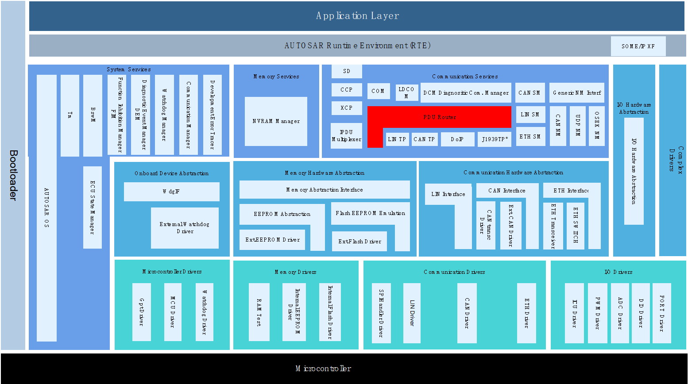

与PduR模块存在交互的模块可分为三类：1.下层模块（如CanIf,CanTp）;2.上层模块（如Com, Dcm）;3既是上层又是下层模块（IpduM, SecOC）。

Modules that interact with the PduR module can be categorized into three types: 1. Lower-layer modules (such as CanIf, CanTp); 2. Upper-layer modules (such as Com, Dcm); 3. Modules that are both upper-layer and lower-layer (IpduM, SecOC).

PduR与所有交互模块间实现IF Pdu和TP Pdu的接收与发送功能。

PduR implements the reception and sending functions of IF Pdu and TP Pdu between all interaction modules.

参考资料 (Reference materials)
------------------------------------------

[1] AUTOSAR_SWS_COM.pdf, R19-11 and 4.2.2

[2] AUTOSAR_SWS_PDURouter.pdf，R19-11 and 4.2.2

功能描述 (Function Description)
===========================================

发送路由功能 (Send Route Function)
--------------------------------------------

发送路由功能介绍 (Introduction to Sending Route Function)
~~~~~~~~~~~~~~~~~~~~~~~~~~~~~~~~~~~~~~~~~~~~~~~~~~~~~~~~~~~~~~~~~

TxPdu的发送分为两种方式（IF和TP），在PduR模块实现TP PDU的1：1发送路由，IF PDU的1：N发送路由。通过PduR模块的路由配置可以为上层屏蔽网络细节，上层模块专注于TxPdu报文数据的封装。

The sending of TxPdu is divided into two methods (IF and TP). The PduR module implements a 1:1 sending routing for TP PDUs and a 1:N sending routing for IF PDUs. Through the routing configuration of the PduR module, network details can be shielded for the upper layer, allowing the upper-layer modules to focus on the encapsulation of TxPdu message data.

发送路由功能实现 (Routing functionality implementation)
~~~~~~~~~~~~~~~~~~~~~~~~~~~~~~~~~~~~~~~~~~~~~~~~~~~~~~~~~~~~~~~

IF PDU的发送：在PduR添加配置路由PduRRoutingPath，为每一个PduRDestPdu配置一个PduRRoutingPath（IF PDU 1：N路由场景就存在N个PduRRoutingPath，这N个PduRRoutingPath的PduRSrcPduRRef相同）。其中PduRRouteType配置为IF，配置项PduRSrcPduRRef关联一个PduRSrcPdu，该PduRSrcPdu通过PduRSrcPduRef关联的Pdu（EcuC）与上层模块发送TxPdu关联，配置项PduRDestPduRRef关联一个PduRDestPdu，该PduRDestPdu通过PduRDestPduRef关联的Pdu与下层IF模块关联。上层模块通过调用PduR\_<User：Up>Transmit或者下层模块通过调用PduR\_<User：Lo>TriggerTransmit（传递到上层）请求PDU的发送，发送成功后调用上层PduR\_<User：Lo>TxConfirmation进行发送成功确认。

IF PDU Transmission: In PduR, add configuration for route PduRRoutingPath, configuring one PduRRoutingPath for each PduRDestPdu (for an IF PDU 1:N routing scenario, there will be N PduRRoutingPaths, all with the same PduRSrcPduRRef). The PduRRouteType is configured as IF; the configuration item PduRSrcPduRRef is associated with a PduRSrcPdu, which is linked to an upper-layer module's TxPdu via the PduRSrcPduRef of a Pdu (EcuC). Meanwhile, the configuration item PduRDestPduRRef is associated with a PduRDestPdu, which is linked to a lower-level IF module through the PduRDestPduRef of a Pdu. The upper-layer module requests PDU transmission by calling PduR\_<User:Up>Transmit, while the lower layer module triggers the transmission via PduR\_<User:Lo>TriggerTransmit and subsequently confirms the successful transmission by calling PduR\_<User:Lo>TxConfirmation.

TP PDU的发送：在PduR添加配置路由PduRRoutingPath，为每一个PduRDestPdu配置一个PduRRoutingPath。其中PduRRouteType配置为TP，配置项PduRSrcPduRRef关联一个PduRSrcPdu，该PduRSrcPdu通过PduRSrcPduRef关联的Pdu（EcuC）与上层模块发送TxPdu关联，配置项PduRDestPduRRef关联一个PduRDestPdu，该PduRDestPdu通过PduRDestPduRef关联的Pdu与下层TP模块关联。上层模块通过调用PduR\_<User：Up>Transmit请求PDU的发送，下层模块通过调用PduR\_<User：LoTp>CopyTxData（传递到上层）来获取PDU发送数据段，下层模块通过调用PduR\_<User：LoTp>TxConfirmation（传递到上层）通知上层发送结束（成功/失败）。

TP PDU transmission: In PduR, add configuration for routing PduRRoutingPath and configure a PduRRoutingPath for each PduRDestPdu. Among them, the PduRRouteType is configured as TP, with the configuration item PduRSrcPduRRef associated with a PduRSrcPdu. This PduRSrcPdu is associated with the upper-layer module's TxPdu through the Pdu (EcuC) referenced by PduRSrcPduRef. The configuration item PduRDestPduRRef is associated with a PduRDestPdu, which is associated with the lower-layer TP module via the Pdu referenced by PduRDestPduRef. The upper-layer module calls PduR\_<User: Up>Transmit to request PDU transmission. The lower layer retrieves the PDU transmit data segment through calling PduR\_<User: LoTp>CopyTxData (transmitted to the upper layer) and notifies the upper layer of transmission end (success/failure) through calling PduR\_<User: LoTp>TxConfirmation (transmitted to the upper layer).

接收路由功能 (Receive Route Function)
-----------------------------------------------

接收路由功能介绍 (Routing reception function introduction)
~~~~~~~~~~~~~~~~~~~~~~~~~~~~~~~~~~~~~~~~~~~~~~~~~~~~~~~~~~~~~~~~~~

RxPdu的接收分为两种方式（IF和TP），在PduR模块实现TP PDU的1：N发送路由，IF PDU的1：N路由。当PDU从下层模块接收到，根据PduR配置的路由路径传递到上层模块。上层模块不必关注网络细节，专注于接收PDU的解析。

RxPdu reception is divided into two methods (IF and TP). In the PduR module, 1:N sending routing for TP PDUs and IF PDUs are implemented. When PDUs are received from lower-layer modules, they are passed to upper-layer modules according to the configured routing path in PduR. Upper-layer modules do not need to concern themselves with network details; they focus on parsing the PDUs.

接收路由功能实现 (Route reception function implementation)
~~~~~~~~~~~~~~~~~~~~~~~~~~~~~~~~~~~~~~~~~~~~~~~~~~~~~~~~~~~~~~~~~~

IF PDU的接收：在PduR添加配置路由PduRRoutingPath，为每一个PduRDestPdu配置一个PduRRoutingPath（1：N路由场景就存在N个PduRRoutingPath，这N个PduRRoutingPath的PduRSrcPduRRef相同）。其中PduRRouteType配置为IF，配置项PduRSrcPduRRef关联一个PduRSrcPdu，该PduRSrcPdu通过PduRSrcPduRef关联的Pdu（EcuC）与下层IF模块接收RxPdu关联，配置项PduRDestPduRRef关联一个PduRDestPdu，该PduRDestPdu通过PduRDestPduRef关联的Pdu与上层模块关联。下层模块通过调用PduR\_<User：Lo>RxIndication将接收报文传递给上层。

IF PDU Reception: In PduR, add configuration for routing PduRRoutingPath, configuring one PduRRoutingPath for each PduRDestPdu (in a 1:N routing scenario, there exist N PduRRoutingPaths, and these N PduRRoutingPaths share the same PduRSrcPduRRef). Among them, PduRRouteType is configured as IF. The configuration item PduRSrcPduRRef associates with one PduRSrcPdu, which through PduRSrcPduRef is associated with the Pdu (EcuC) receiving RxPdu from the lower-layer IF module. The configuration item PduRDestPduRRef associates with one PduRDestPdu, which through PduRDestPduRef is associated with the Pdu for upper-layer modules. The lower-layer module passes the received message to the upper layer by calling PduR\_<User:Lo>RxIndication.

TP PDU的接收：在PduR添加配置路由PduRRoutingPath，为每一个PduRDestPdu配置一个PduRRoutingPath（1：N路由场景就存在N个PduRRoutingPath，这N个PduRRoutingPath的PduRSrcPduRRef相同）。其中PduRRouteType配置为TP，配置项PduRSrcPduRRef关联一个PduRSrcPdu，该PduRSrcPdu通过PduRSrcPduRef关联的Pdu（EcuC）与下层TP模块接收RxPdu关联，配置项PduRDestPduRRef关联一个PduRDestPdu，该PduRDestPdu通过PduRDestPduRef关联的Pdu与上层模块关联。调用PduR\_<User：LoTp>StartOfReception，PduR\_<User：LoTp>CopyRxData，PduR\_<User：LoTp>RxIndication完成TP PDU接收流程。

TP PDU Reception: In PduR, add configuration routing PduRRoutingPath for each PduRDestPdu (N PduRRoutingPath exist in 1:N routing scenarios, and they share the same PduRSrcPduRRef). Among them, configure PduRRouteType as TP. The configuration item PduRSrcPduRRef is associated with a PduRSrcPdu, which through PduRSrcPduRef associates the Pdu (EcuC) with the lower-layer TP module to receive RxPdu. The configuration item PduRDestPduRRef is associated with a PduRDestPdu, which through PduRDestPduRef associates the Pdu with the upper-layer module. Calling PduR\_<User:LoTp>StartOfReception, PduR\_<User:LoTp>CopyRxData, and PduR\_<User:LoTp>RxIndication completes the TP PDU reception process.

网关路由功能 (Gateway routing functionality)
------------------------------------------------------

网关路由功能介绍 (Gateway routing feature introduction)
~~~~~~~~~~~~~~~~~~~~~~~~~~~~~~~~~~~~~~~~~~~~~~~~~~~~~~~~~~~~~~~

PDU的网关同样分为IF/TP两种方式，IF网关支持1：N，TP网关支持1：N，不涉及任何报文数据的变化，收发报文速率保持一致。

The gateway for PDU is similarly divided into IF/TP methods. IF gateways support 1:N, and TP gateways also support 1:N. There are no changes in any message data; the rate of receiving and sending messages remains consistent.

需注意PDU的网关不能IF、TP混淆，即接收IF PDU只能通过发送IF PDU进行转发，接收TP PDU只能通过TP PDU进行转发。

Note that the gateway for PDU cannot mix IF and TP, i.e., IF PDU can only be forwarded via IF PDU transmission, and TP PDU can only be forwarded via TP PDU.

网关路由功能实现 (Gateway routing functionality implementation)
~~~~~~~~~~~~~~~~~~~~~~~~~~~~~~~~~~~~~~~~~~~~~~~~~~~~~~~~~~~~~~~~~~~~~~~

IF PDU的网关：在PduR添加配置路由PduRRoutingPath，为每一个PduRDestPdu配置一个PduRRoutingPath（1：N路由场景就存在N个PduRRoutingPath，这N个PduRRoutingPath的PduRSrcPduRRef相同）。其中PduRRouteType配置为IF，配置项PduRSrcPduRRef关联一个PduRSrcPdu，该PduRSrcPdu通过PduRSrcPduRef关联的Pdu（EcuC）与下层IF模块接收RxPdu关联，配置项PduRDestPduRRef关联一个PduRDestPdu，该PduRDestPdu通过PduRDestPduRef关联的Pdu与下层IF模块发送TxPdu关联，若PduRDestPduRRef通过PduRDestPduRef关联的TxPdu发送方式为TriggerTransmit,则相应PduRDestPdu的PduRDestPduDataProvision需配置为PDUR_TRIGGERTRANSMIT，反之配置为PDUR_DIRECT。若配置为PDUR_TRIGGERTRANSMIT则必须为该PduRRoutingPath配置queue，以及配置PduRDefaultValueElement来设置Pdu初始默认值。配置为PDUR_DIRECT时也可以选择配置queue，以降低丢帧概率。

IF PDU Gateway: In PduR, add configuration for routing PduRRoutingPath, configuring one PduRRoutingPath for each PduRDestPdu (in a 1:N routing scenario, there are N PduRRoutingPaths, and these N PduRRoutingPaths share the same PduRSrcPduRRef). Among them, configure PduRRouteType as IF. The configuration item PduRSrcPduRRef associates with a PduRSrcPdu, which through PduRSrcPduRef is linked to a Pdu (EcuC) for receiving RxPdu at the lower layer IF module. The configuration item PduRDestPduRRef associates with a PduRDestPdu, which through PduRDestPduRef is linked to a Pdu for sending TxPdu at the lower layer IF module. If PduRDestPduRRef through PduRDestPduRef is associated with a TxPdu transmission method as TriggerTransmit, then the corresponding PduRDestPdu's PduRDestPduDataProvision must be configured as PDUR_TRIGGERTRANSMIT; otherwise, it should be configured as PDUR_DIRECT. When configured as PDUR_TRIGGERTRANSMIT, a queue must also be configured for this PduRRoutingPath, and PduRDefaultValueElement should be set to define the initial default value of Pdu. When configured as PDUR_DIRECT, a queue can also be optionally configured to reduce frame loss probabilities.

注意：queue的配置，①需要在相应的PduRRoutingPath中配置非0的PduRQueueDepth值；②添加PduRTxBuffer配置，没有被任何PduRRoutingPath关联的PduRTxBuffer属于Global buffer，存在资源抢占。被某一个PduRRoutingPath关联的PduRTxBuffer属于该PduRRoutingPath的Dedicated buffer，该PduRTxBuffer仅可以被该PduRRoutingPath申请；③PduRDestTxBufferRef可以关联最多PduRQueueDepth个PduRTxBuffer，也可以不关联任何PduRTxBuffer。

Note: For the configuration of queue, ① a non-zero PduRQueueDepth value needs to be configured in the corresponding PduRRoutingPath; ② add PduRTxBuffer configuration. PduRTxBuffers not associated with any PduRRoutingPath belong to Global buffer and are subject to resource contention. PduRTxBuffers associated with a particular PduRRoutingPath belong to its Dedicated buffer and can only be claimed by that PduRRoutingPath; ③ PduRDestTxBufferRef can reference up to PduRQueueDepth PduRTxBuffers, or no PduRTxBuffer at all.

TP PDU的网关：在PduR添加配置路由PduRRoutingPath，为每一个PduRDestPdu配置一个PduRRoutingPath（1：N路由场景就存在N个PduRRoutingPath，这N个PduRRoutingPath的PduRSrcPduRRef相同）。其中PduRRouteType配置为TP，配置项PduRSrcPduRRef关联一个PduRSrcPdu，该PduRSrcPdu通过PduRSrcPduRef关联的Pdu（EcuC）与下层TP模块接收RxPdu关联，配置项PduRDestPduRRef关联一个PduRDestPdu，该PduRDestPdu通过PduRDestPduRef关联的Pdu与下层TP模块发送TxPdu关联。若不希望等到全部RxPdu数据接收完成才开始执行转发，即希望通过“gatewaying-on-the-fly”方式进行转发，可通过配置PduRTpThreshold（1：N时只允许最多一个相同PduRSrcPduRRef的PduRRoutingPath配置阈值）来实现，当接收数据长度超过该阈值或者接收完成，则触发TxPdu进行转发。

Gateway for TP PDU: In PduR, add configuration routing PduRRoutingPath for each PduRDestPdu (for a 1:N routing scenario, there exist N PduRRoutingPaths, and the PduRSrcPduRRef of these N PduRRoutingPaths are the same). The PduRRouteType is configured as TP. The configuration item PduRSrcPduRRef associates with one PduRSrcPdu, which through PduRSrcPduRef is associated with a Pdu (EcuC) to receive RxPdu at the lower-layer TP module. The configuration item PduRDestPduRRef associates with one PduRDestPdu, which through PduRDestPduRef is associated with a Pdu for sending TxPdu at the lower-layer TP module. If you do not want to wait until all RxPdu data is received before starting forwarding and instead wish to use "gatewaying-on-the-fly" for forwarding, this can be achieved by configuring PduRTpThreshold (only allowing up to one PduRRoutingPath with the same PduRSrcPduRRef configured threshold when 1:N). When the length of received data exceeds this threshold or is fully received, it triggers the TxPdu for forwarding.

注意：TP PDU的网关必须配置queue。

Note: The TP PDU gateway must be configured with a queue.

路由控制功能 (Routing control functionality)
------------------------------------------------------

路由控制功能介绍 (Introduction to Routing Control Function)
~~~~~~~~~~~~~~~~~~~~~~~~~~~~~~~~~~~~~~~~~~~~~~~~~~~~~~~~~~~~~~~~~~~

PduR的路由控制以RoutingPathGroup为单位进行Enable/Disable控制，而RoutingPathGroup可以被N个PduRRoutingPath关联，进而控制PduRDestPdu使能状态。

PduR routing control is performed in units of RoutingPathGroup for Enable/Disable control, and a RoutingPathGroup can be associated with N PduRRoutingPath to control the enable state of PduRDestPdu.

路由控制功能实现 (Routing control functionality implementation)
~~~~~~~~~~~~~~~~~~~~~~~~~~~~~~~~~~~~~~~~~~~~~~~~~~~~~~~~~~~~~~~~~~~~~~~

RoutingPathGroup通过配置项PduRIsEnabledAtInit决定初始化之后其关联的所有PduRDestPdu为Enable或者Disable状态。运行时，通过调用PduR_EnableRouting/PduR_DisableRouting来控制RoutingPathGroup及其包含的PduRDestPdu使能状态。

RoutingPathGroup determines the initial enable or disable state of all associated PduRDestPdu through the configuration item PduRIsEnabledAtInit. At runtime, the enable status of RoutingPathGroup and its contained PduRDestPdu can be controlled by calling PduR_EnableRouting/PduR_DisableRouting.

未被RoutingPathGroup关联的PduRDestPdu初始化之后其状态一直为Enable，不可改变。

The state of PduRDestPdu initialized without being associated with RoutingPathGroup remains as Enable and cannot be changed.

源文件描述 (Source file description)
===============================================

.. centered:: **表 PduR组件文件描述 (Table PduR Component File Description)**

.. list-table::
   :widths: 50 50
   :header-rows: 1

   * - 文件 (Files)
     - 说明 (Description)
   * - PduR_Cfg.h
     - 定义PduR模块PC配置的宏定义。 (Define macros for PC configuration of PduR module.)
   * - PduR_Cfg.c
     - 定义PduR模块PC配置的结构体参数。 (Define structure parameters for PduR module PC configuration.)
   * - PduR_PBcfg.h
     - 定义PduR模块PB配置的宏定义。 (Macro definitions for configuring PduR module PB.)
   * - PduR_PBcfg.c
     - 定义PduR模块PB配置的结构体参数。 (Define structure parameters for PduR module PB configuration.)
   * - PduR.h
     - 实现PduR模块全部外部接口的声明，以及配置文件中全局变量的声明，必要宏的定义。 (Realize the declaration of all external interfaces of the PduR module, as well as the declaration of global variables in the configuration file and necessary macro definitions.)
   * - PduR.c
     - 作为PduR模块的核心文件，实现PduR模块全部对外接口，以及实现PduR模块功能所必须的local变量定义。 (As the core file of the PduR module, it implements all external interfaces of the PduR module and defines local variables necessary for realizing the functionality of the PduR module.)
   * - PduR_MemMap.h
     - 实现PduR模块内存布局。 (Implement PduR module memory layout.)
   * - PduR_Types.h
     - 实现外部/内部类型的定义，包括AUTOSAR标准定义的类型，以及PB/PC配置参数结构体类型，以及内部运行时结构体类型。 (Define external/internal types, including types defined by the AUTOSAR standard, as well as PB/PC configuration parameter structure types and internal runtime structure types.)
   * - PduR_Internal.c
     - 实现PduR模块内部全局变量的定义，内部接口的实现。 (Define global variables within the PduR module and implement internal interfaces.)
   * - PduR_Internal.h
     - 实现PduR模块内部宏的定义，全局变量的声明，内部inline接口的实现。 (Define macros for the PduR module internal macros, declare global variables, and implement internal inline interfaces.)
   * - PduR_Buffer.c
     - 实现PduR模块Buffer功能需要使用到的全部内部接口函数定义。 (Definition of all internal interface functions required to implement the Buffer functionality of the PduR module.)
   * - PduR_Buffer.h
     - 实现PduR模块Buffer功能需要使用到的全部内部接口函数声明。 (All internal interface function declarations required to implement the Buffer functionality of the PduR module.)
   * - PduR_Route.c
     - 实现PduR模块Route功能需要使用到的全部内部接口函数定义。 (Definition of all internal interface functions required to implement the Route function of the PduR module.)
   * - PduR_Route.h
     - 实现PduR模块Route功能需要使用到的全部内部接口函数声明。 (All internal interface function declarations required for implementing the Route functionality of the PduR module.)
   * - PduR\_<Module>.h
     - 实现Module需要调用的PduR接口宏定义。 (Macro definitions for the PduR interfaces called by Module.)

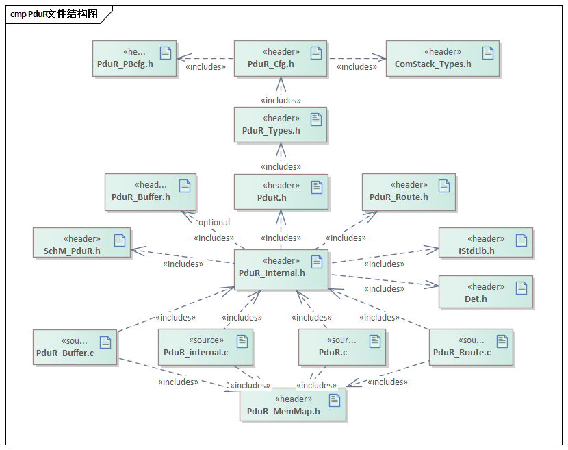

API接口 (API Interface)
=====================================

类型定义 (Type definition)
--------------------------------------

PduR_PBConfigType类型定义 (PduR_PBConfigType Type Definition)
~~~~~~~~~~~~~~~~~~~~~~~~~~~~~~~~~~~~~~~~~~~~~~~~~~~~~~~~~~~~~~~~~~~~~~~~~

.. list-table::
   :widths: 50 50
   :header-rows: 1

   * - 名称 (Name)
     - PduR_PBConfigType
   * - 类型 (Type)
     - Structure
   * - 范围 (Range)
     - 无
   * - 描述 (Description)
     - PduR模块PB配置结构体类型 (PduR Module PB Configuration Structure Type)

PduR_PBConfigIdType类型定义 (PduR_PBConfigIdType Type Definition)
~~~~~~~~~~~~~~~~~~~~~~~~~~~~~~~~~~~~~~~~~~~~~~~~~~~~~~~~~~~~~~~~~~~~~~~~~~~~~

.. list-table::
   :widths: 50 50
   :header-rows: 1

   * - 名称 (Name)
     - PduR_PBConfigIdType
   * - 类型 (Type)
     - uint16
   * - 范围 (Range)
     - 无
   * - 描述 (Description)
     - PduR模块的PB配置Id号 (Configuration ID number of PduR module PB)

PduR_RoutingPathGroupIdType类型定义 (PduR_RoutingPathGroupIdType Type Definition)
~~~~~~~~~~~~~~~~~~~~~~~~~~~~~~~~~~~~~~~~~~~~~~~~~~~~~~~~~~~~~~~~~~~~~~~~~~~~~~~~~~~~~~~~~~~~~

.. list-table::
   :widths: 50 50
   :header-rows: 1

   * - 名称 (Name)
     - PduR_RoutingPathGroupIdType
   * - 类型 (Type)
     - uint16
   * - 范围 (Range)
     - 无
   * - 描述 (Description)
     - 路由路径组的Id号 (ID of the routing path group)

PduR_StateType类型定义 (PduR_StateType Type Definition)
~~~~~~~~~~~~~~~~~~~~~~~~~~~~~~~~~~~~~~~~~~~~~~~~~~~~~~~~~~~~~~~~~~~

.. list-table::
   :widths: 50 50
   :header-rows: 1

   * - 名称 (Name)
     - PduR_StateType
   * - 类型 (Type)
     - enum
   * - 范围 (Range)
     - PDUR_UNINIT/ PDUR_ONLINE
   * - 描述 (Description)
     - 表示PduR模块的状态 (Indicate PduR module status)

输入函数描述 (Describe the input function:)
-----------------------------------------------------

.. list-table::
   :widths: 50 50
   :header-rows: 1

   * - 输入模块 (Input Module)
     - API
   * - Det
     - Det_ReportRuntimeError
   * - 
     - Det_ReportError
   * - <LoIf_Module>
     - <Provider：Lo>_CancelTransmit
   * - 
     - <Provider：Lo>_Transmit
   * - <LoTp_Module>
     - <Provider：LoTp>_CancelReceive
   * - 
     - <Provider：LoTp>_CancelTransmit
   * - 
     - <Provider：LoTp>_ChangeParameter
   * - 
     - <Provider：LoTp>_Transmit
   * - <UpIf_Module>
     - <Provider：Up>_RxIndication
   * - 
     - <Provider：Up>_TriggerTransmit
   * - 
     - <Provider：Up>_TxConfirmation
   * - <UpTp_Module>
     - <Provider：UpTp>_CopyRxData
   * - 
     - <Provider：UpTp>_CopyTxData
   * - 
     - <Provider：UpTp>_StartOfReception
   * - 
     - <Provider：UpTp>_RxIndication
   * - 
     - <Provider：UpTp>_TxConfirmation

静态接口函数定义 (Static interface function definition)
---------------------------------------------------------------

PduR_Init函数定义 (The PduR_Init function definition)
~~~~~~~~~~~~~~~~~~~~~~~~~~~~~~~~~~~~~~~~~~~~~~~~~~~~~~~~~~~~~~~~~

.. list-table::
   :widths: 25 25 25 25
   :header-rows: 1

   * - 函数名称： (Function Name:)
     - PduR_Init
     - 
     - 
   * - 函数原型： (Function prototype:)
     - voidPduR_Init(constPduR_PBConfigType\*ConfigPtr)
     - 
     - 
   * - 服务编号： (Service Number:)
     - 0xf0
     - 
     - 
   * - 同步/异步： (Synchronous/asynchronous:)
     - 同步 (Sync)
     - 
     - 
   * - 是否可重入： (Is Reentrant:)
     - 否 (No)
     - 
     - 
   * - 输入参数： (Input parameters:)
     - ConfigPtr
     - 值域： (Domain:)
     - 无
   * - 输入输出参数： (Input Output Parameters:)
     - 无
     - 
     - 
   * - 输出参数： (Output Parameters:)
     - 无
     - 
     - 
   * - 返回值： (Return Value:)
     - 无
     - 
     - 
   * - 功能概述： (Function Overview:)
     - PduR模块初始化 (PduR Module Initialization)
     - 
     - 

PduR_GetVersionInfo函数定义 (The PduR_GetVersionInfo function definition)
~~~~~~~~~~~~~~~~~~~~~~~~~~~~~~~~~~~~~~~~~~~~~~~~~~~~~~~~~~~~~~~~~~~~~~~~~~~~~~~~~~~~~

.. list-table::
   :widths: 25 25 25 25
   :header-rows: 1

   * - 函数名称： (Function Name:)
     - PduR_GetVersionInfo
     - 
     - 
   * - 函数原型： (Function prototype:)
     - voidPduR_GetVersionInfo(Std_VersionInfoType\*versionInfo)
     - 
     - 
   * - 服务编号： (Service Number:)
     - 0xf1
     - 
     - 
   * - 同步/异步： (Synchronous/asynchronous:)
     - 同步 (Sync)
     - 
     - 
   * - 是否可重入： (Is Reentrant:)
     - 是 (Is)
     - 
     - 
   * - 输入参数： (Input parameters:)
     - 无
     - 值域： (Domain:)
     - 无
   * - 输入输出参数： (Input Output Parameters:)
     - 无
     - 
     - 
   * - 输出参数： (Output Parameters:)
     - versionInfo
     - 
     - 
   * - 返回值： (Return Value:)
     - 无
     - 
     - 
   * - 功能概述： (Function Overview:)
     - PduR模块软件版本获取 (Retrieve PduR Module Software Version)
     - 
     - 

PduR_GetConfigurationId函数定义 (The PduR_GetConfigurationId function defines)
~~~~~~~~~~~~~~~~~~~~~~~~~~~~~~~~~~~~~~~~~~~~~~~~~~~~~~~~~~~~~~~~~~~~~~~~~~~~~~~~~~~~~~~~~~

.. list-table::
   :widths: 25 25 25 25
   :header-rows: 1

   * - 函数名称： (Function Name:)
     - PduR_GetConfigurationId
     - 
     - 
   * - 函数原型： (Function prototype:)
     - PduR_PBConfigIdTypePduR_GetConfigurationId(void)
     - 
     - 
   * - 服务编号： (Service Number:)
     - 0xf2
     - 
     - 
   * - 同步/异步： (Synchronous/asynchronous:)
     - 同步 (Sync)
     - 
     - 
   * - 是否可重入： (Is Reentrant:)
     - 是 (Is)
     - 
     - 
   * - 输入参数： (Input parameters:)
     - 无
     - 值域： (Domain:)
     - 无
   * - 输入输出参数： (Input Output Parameters:)
     - 无
     - 
     - 
   * - 输出参数： (Output Parameters:)
     - 无
     - 
     - 
   * - 返回值： (Return Value:)
     - PduR_PBConfigIdType
     - 
     - 
   * - 功能概述： (Function Overview:)
     - 获取PduR模块PB配置的Id号 (Get the ID number of the PduR module PB configuration)
     - 
     - 

PduR_EnableRouting函数定义 (The PduR_EnableRouting function definition)
~~~~~~~~~~~~~~~~~~~~~~~~~~~~~~~~~~~~~~~~~~~~~~~~~~~~~~~~~~~~~~~~~~~~~~~~~~~~~~~~~~~

.. list-table::
   :widths: 25 25 25 25
   :header-rows: 1

   * - 函数名称： (Function Name:)
     - PduR_EnableRouting
     - 
     - 
   * - 函数原型： (Function prototype:)
     - voidPduR_EnableRouting(PduR_RoutingPathGroupIdTypeid)
     - 
     - 
   * - 服务编号： (Service Number:)
     - 0xf3
     - 
     - 
   * - 同步/异步： (Synchronous/asynchronous:)
     - 同步 (Sync)
     - 
     - 
   * - 是否可重入： (Is Reentrant:)
     - 是 (Is)
     - 
     - 
   * - 输入参数： (Input parameters:)
     - id
     - 值域： (Domain:)
     - 无
   * - 输入输出参数： (Input Output Parameters:)
     - 无
     - 
     - 
   * - 输出参数： (Output Parameters:)
     - 无
     - 
     - 
   * - 返回值： (Return Value:)
     - 无
     - 
     - 
   * - 功能概述： (Function Overview:)
     - RoutingPathGroup使能 (RoutingPathGroup Enable)
     - 
     - 

PduR_DisableRouting函数定义 (The PduR_DisableRouting function definition)
~~~~~~~~~~~~~~~~~~~~~~~~~~~~~~~~~~~~~~~~~~~~~~~~~~~~~~~~~~~~~~~~~~~~~~~~~~~~~~~~~~~~~

.. list-table::
   :widths: 25 25 25 25
   :header-rows: 1

   * - 函数名称： (Function Name:)
     - PduR_DisableRouting
     - 
     - 
   * - 函数原型： (Function prototype:)
     - voidPduR_DisableRouting(
     - 
     - 
   * - 
     - PduR_RoutingPathGroupIdTypeid,
     - 
     - 
   * - 
     - booleaninitialize
     - 
     - 
   * - 
     - )
     - 
     - 
   * - 服务编号： (Service Number:)
     - 0xf4
     - 
     - 
   * - 同步/异步： (Synchronous/asynchronous:)
     - 同步 (Sync)
     - 
     - 
   * - 是否可重入： (Is Reentrant:)
     - 是 (Is)
     - 
     - 
   * - 输入参数： (Input parameters:)
     - id
     - 值域： (Domain:)
     - 无
   * - 
     - initialize
     - 
     - 
   * - 输入输出参数： (Input Output Parameters:)
     - 无
     - 
     - 
   * - 输出参数： (Output Parameters:)
     - 无
     - 
     - 
   * - 返回值： (Return Value:)
     - 无
     - 
     - 
   * - 功能概述： (Function Overview:)
     - RoutingPathGroup不使能 (RoutingPathGroup is not enabled)
     - 
     - 

可配置函数定义 (Configurable Function Definition)
----------------------------------------------------------

PduR\_<User：Up>Transmit函数定义 (_pduR_User_Up_Transmit function definition)
~~~~~~~~~~~~~~~~~~~~~~~~~~~~~~~~~~~~~~~~~~~~~~~~~~~~~~~~~~~~~~~~~~~~~~~~~~~~~~~~~~~~~~~~

.. list-table::
   :widths: 25 25 25 25
   :header-rows: 1

   * - 函数名称： (Function Name:)
     - PduR_Transmit
     - 
     - 
   * - 函数原型： (Function prototype:)
     - Std_ReturnTypePduR_Transmit(
     - 
     - 
   * - 
     - PduIdTypeTxPduId,
     - 
     - 
   * - 
     - constPduInfoType\*PduInfoPtr
     - 
     - 
   * - 
     - )
     - 
     - 
   * - 服务编号： (Service Number:)
     - 0x49
     - 
     - 
   * - 同步/异步： (Synchronous/asynchronous:)
     - 同步 (Sync)
     - 
     - 
   * - 是否可重入： (Is Reentrant:)
     - 对于不同的Pdu可重入，对于相同的Pdu不可重入 (For different PDUs re-entry is allowed, for the same PDU re-entry is not allowed.)
     - 
     - 
   * - 输入参数： (Input parameters:)
     - TxPduId
     - 值域： (Domain:)
     - 无
   * - 
     - PduInfoPtr
     - 
     - 
   * - 输入输出参数： (Input Output Parameters:)
     - 无
     - 
     - 
   * - 输出参数： (Output Parameters:)
     - 无
     - 
     - 
   * - 返回值： (Return Value:)
     - Std_ReturnType
     - 
     - 
   * - 功能概述： (Function Overview:)
     - Pdu发送请求 (PDU Send Request)
     - 
     - 

PduR\_<User：Up>CancelTransmit函数定义 (PduR\_<User: Up>CancelTransmit function definition)
~~~~~~~~~~~~~~~~~~~~~~~~~~~~~~~~~~~~~~~~~~~~~~~~~~~~~~~~~~~~~~~~~~~~~~~~~~~~~~~~~~~~~~~~~~~~~~~~~~~~~~

.. list-table::
   :widths: 25 25 25 25
   :header-rows: 1

   * - 函数名称： (Function Name:)
     - PduR_CancelTransmit
     - 
     - 
   * - 函数原型： (Function prototype:)
     - Std_ReturnTypePduR_CancelTransmit(PduIdTypeTxPduId)
     - 
     - 
   * - 服务编号： (Service Number:)
     - 0x4a
     - 
     - 
   * - 同步/异步： (Synchronous/asynchronous:)
     - 同步 (Sync)
     - 
     - 
   * - 是否可重入： (Is Reentrant:)
     - 否 (No)
     - 
     - 
   * - 输入参数： (Input parameters:)
     - TxPduId
     - 值域： (Domain:)
     - 无
   * - 输入输出参数： (Input Output Parameters:)
     - 无
     - 
     - 
   * - 输出参数： (Output Parameters:)
     - 无
     - 
     - 
   * - 返回值： (Return Value:)
     - Std_ReturnType
     - 
     - 
   * - 功能概述： (Function Overview:)
     - Pdu发送取消 (Cancel PDU Send)
     - 
     - 

PduR\_<User：Up>CancelReceive函数定义 (PduR\<User: Up>CancelReceive Function Definition)
~~~~~~~~~~~~~~~~~~~~~~~~~~~~~~~~~~~~~~~~~~~~~~~~~~~~~~~~~~~~~~~~~~~~~~~~~~~~~~~~~~~~~~~~~~~~~~~~~~~

.. list-table::
   :widths: 25 25 25 25
   :header-rows: 1

   * - 函数名称： (Function Name:)
     - PduR_CancelReceive
     - 
     - 
   * - 函数原型： (Function prototype:)
     - Std_ReturnTypePduR_CancelReceive(PduIdTypeRxPduId)
     - 
     - 
   * - 服务编号： (Service Number:)
     - 0x4c
     - 
     - 
   * - 同步/异步： (Synchronous/asynchronous:)
     - 同步 (Sync)
     - 
     - 
   * - 是否可重入： (Is Reentrant:)
     - 否 (No)
     - 
     - 
   * - 输入参数： (Input parameters:)
     - RxPduId
     - 值域： (Domain:)
     - 无
   * - 输入输出参数： (Input Output Parameters:)
     - 无
     - 
     - 
   * - 输出参数： (Output Parameters:)
     - 无
     - 
     - 
   * - 返回值： (Return Value:)
     - Std_ReturnType
     - 
     - 
   * - 功能概述： (Function Overview:)
     - TP Pdu接收取消 (Cancel TP Pdu Reception)
     - 
     - 

PduR\_<User：Lo>RxIndication函数定义 (PduR\<User:Lo>RxIndication Function Definition)
~~~~~~~~~~~~~~~~~~~~~~~~~~~~~~~~~~~~~~~~~~~~~~~~~~~~~~~~~~~~~~~~~~~~~~~~~~~~~~~~~~~~~~~~~~~~~~~~

.. list-table::
   :widths: 25 25 25 25
   :header-rows: 1

   * - 函数名称： (Function Name:)
     - PduR_IfRxIndication
     - 
     - 
   * - 函数原型： (Function prototype:)
     - voidPduR_IfRxIndication(
     - 
     - 
   * - 
     - PduIdTypeRxPduId,
     - 
     - 
   * - 
     - constPduInfoType\*PduInfoPtr
     - 
     - 
   * - 
     - )
     - 
     - 
   * - 服务编号： (Service Number:)
     - 0x42
     - 
     - 
   * - 同步/异步： (Synchronous/asynchronous:)
     - 同步 (Sync)
     - 
     - 
   * - 是否可重入： (Is Reentrant:)
     - 不同Pdu可重入，相同Pdu不可重入 (Different PDUs can be reentered, while the same PDU cannot be reentered.)
     - 
     - 
   * - 输入参数： (Input parameters:)
     - RxPduId
     - 值域： (Domain:)
     - 无
   * - 
     - PduInfoPtr
     - 
     - 
   * - 输入输出参数： (Input Output Parameters:)
     - 无
     - 
     - 
   * - 输出参数： (Output Parameters:)
     - 无
     - 
     - 
   * - 返回值： (Return Value:)
     - 无
     - 
     - 
   * - 功能概述： (Function Overview:)
     - IF Pdu接收指示 (IF Pdu Reception Indication)
     - 
     - 

PduR\_<User：Lo>TxConfirmation函数定义 (PduR\<User:Lo> TxConfirmation Function Definition)
~~~~~~~~~~~~~~~~~~~~~~~~~~~~~~~~~~~~~~~~~~~~~~~~~~~~~~~~~~~~~~~~~~~~~~~~~~~~~~~~~~~~~~~~~~~~~~~~~~~~~

.. list-table::
   :widths: 25 25 25 25
   :header-rows: 1

   * - 函数名称： (Function Name:)
     - PduR_IfTxConfirmation
     - 
     - 
   * - 函数原型： (Function prototype:)
     - voidPduR_IfTxConfirmation(PduIdTypeTxPduId)
     - 
     - 
   * - 服务编号： (Service Number:)
     - 0x40
     - 
     - 
   * - 同步/异步： (Synchronous/asynchronous:)
     - 同步 (Sync)
     - 
     - 
   * - 是否可重入： (Is Reentrant:)
     - 不同Pdu可重入，相同Pdu不可重入 (Different PDUs can be reentered, while the same PDU cannot be reentered.)
     - 
     - 
   * - 输入参数： (Input parameters:)
     - TxPduId
     - 值域： (Domain:)
     - 无
   * - 输入输出参数： (Input Output Parameters:)
     - 无
     - 
     - 
   * - 输出参数： (Output Parameters:)
     - 无
     - 
     - 
   * - 返回值： (Return Value:)
     - 无
     - 
     - 
   * - 功能概述： (Function Overview:)
     - IFPdu发送确认（当前实现版本为4.2.2） (IFPdu Send Confirmation (Current implementation version: 4.2.2))
     - 
     - 

PduR\_<User：Lo>TriggerTransmit函数定义 (PduR\_<User:Lo>TriggerTransmit Function Definition)
~~~~~~~~~~~~~~~~~~~~~~~~~~~~~~~~~~~~~~~~~~~~~~~~~~~~~~~~~~~~~~~~~~~~~~~~~~~~~~~~~~~~~~~~~~~~~~~~~~~~~~~

.. list-table::
   :widths: 25 25 25 25
   :header-rows: 1

   * - 函数名称： (Function Name:)
     - PduR_IfTriggerTransmit
     - 
     - 
   * - 函数原型： (Function prototype:)
     - Std_ReturnTypePduR_IfTriggerTransmit(
     - 
     - 
   * - 
     - PduIdTypeTxPduId,
     - 
     - 
   * - 
     - PduInfoType\*PduInfoPtr
     - 
     - 
   * - 
     - )
     - 
     - 
   * - 服务编号： (Service Number:)
     - 0x41
     - 
     - 
   * - 同步/异步： (Synchronous/asynchronous:)
     - 同步 (Sync)
     - 
     - 
   * - 是否可重入： (Is Reentrant:)
     - 不同Pdu可重入，相同Pdu不可重入 (Different PDUs can be reentered, while the same PDU cannot be reentered.)
     - 
     - 
   * - 输入参数： (Input parameters:)
     - TxPduId
     - 值域： (Domain:)
     - 无
   * - 输入输出参数： (Input Output Parameters:)
     - PduInfoPtr
     - 
     - 
   * - 输出参数： (Output Parameters:)
     - 无
     - 
     - 
   * - 返回值： (Return Value:)
     - Std_ReturnType
     - 
     - 
   * - 功能概述： (Function Overview:)
     - IFPdu通过TriggerTransmit方式获取Pdu数据 (IFPdu acquires Pdu data through TriggerTransmit方式)
     - 
     - 

PduR\_<User：LoTp>CopyRxData函数定义 (PduR\_<User:LoTp>CopyRxData function definition)
~~~~~~~~~~~~~~~~~~~~~~~~~~~~~~~~~~~~~~~~~~~~~~~~~~~~~~~~~~~~~~~~~~~~~~~~~~~~~~~~~~~~~~~~~~~~~~~~~

.. list-table::
   :widths: 25 25 25 25
   :header-rows: 1

   * - 函数名称： (Function Name:)
     - PduR_TpCopyRxData
     - 
     - 
   * - 函数原型： (Function prototype:)
     - BufReq_ReturnTypePduR_TpCopyRxData(
     - 
     - 
   * - 
     - PduIdType id,
     - 
     - 
   * - 
     - constPduInfoType\*info,
     - 
     - 
   * - 
     - PduLengthType\*bufferSizePtr
     - 
     - 
   * - 
     - )
     - 
     - 
   * - 服务编号： (Service Number:)
     - 0x44
     - 
     - 
   * - 同步/异步： (Synchronous/asynchronous:)
     - 同步 (Sync)
     - 
     - 
   * - 是否可重入： (Is Reentrant:)
     - 是 (Is)
     - 
     - 
   * - 输入参数： (Input parameters:)
     - id
     - 值域： (Domain:)
     - 无
   * - 
     - info
     - 
     - 
   * - 输入输出参数： (Input Output Parameters:)
     - 无
     - 
     - 
   * - 输出参数： (Output Parameters:)
     - bufferSizePtr
     - 
     - 
   * - 返回值： (Return Value:)
     - BufReq_ReturnType
     - 
     - 
   * - 功能概述： (Function Overview:)
     - TP Pdu数据段接收 (TP Pdu Data Segment Reception)
     - 
     - 

PduR\_<User：LoTp>RxIndication函数定义 (PduR\<User:LoTp>RxIndication Function Definition)
~~~~~~~~~~~~~~~~~~~~~~~~~~~~~~~~~~~~~~~~~~~~~~~~~~~~~~~~~~~~~~~~~~~~~~~~~~~~~~~~~~~~~~~~~~~~~~~~~~~~

.. list-table::
   :widths: 25 25 25 25
   :header-rows: 1

   * - 函数名称： (Function Name:)
     - PduR_TpRxIndication
     - 
     - 
   * - 函数原型： (Function prototype:)
     - voidPduR_TpRxIndication(
     - 
     - 
   * - 
     - PduIdType id,
     - 
     - 
   * - 
     - Std_ReturnTyperesult
     - 
     - 
   * - 
     - )
     - 
     - 
   * - 服务编号： (Service Number:)
     - 0x45
     - 
     - 
   * - 同步/异步： (Synchronous/asynchronous:)
     - 同步 (Sync)
     - 
     - 
   * - 是否可重入： (Is Reentrant:)
     - 是 (Is)
     - 
     - 
   * - 输入参数： (Input parameters:)
     - id
     - 值域： (Domain:)
     - 无
   * - 
     - result
     - 
     - 
   * - 输入输出参数： (Input Output Parameters:)
     - 无
     - 
     - 
   * - 输出参数： (Output Parameters:)
     - 无
     - 
     - 
   * - 返回值： (Return Value:)
     - 无
     - 
     - 
   * - 功能概述： (Function Overview:)
     - TPPdu接收结束指示 (TPPdu Reception Completion Indication)
     - 
     - 

PduR\_<User：LoTp>StartOfReception函数定义 (PduR\_\<User:LoTp>StartOfReception function definition)
~~~~~~~~~~~~~~~~~~~~~~~~~~~~~~~~~~~~~~~~~~~~~~~~~~~~~~~~~~~~~~~~~~~~~~~~~~~~~~~~~~~~~~~~~~~~~~~~~~~~~~~~~~~~~~

.. list-table::
   :widths: 25 25 25 25
   :header-rows: 1

   * - 函数名称： (Function Name:)
     - PduR_TpStartOfReception
     - 
     - 
   * - 函数原型： (Function prototype:)
     - BufReq_ReturnTypePduR_TpStartOfReception(
     - 
     - 
   * - 
     - PduIdType id,
     - 
     - 
   * - 
     - constPduInfoType\*info,
     - 
     - 
   * - 
     - PduLengthTypeTpSduLength,
     - 
     - 
   * - 
     - PduLengthType\*bufferSizePtr
     - 
     - 
   * - 
     - )
     - 
     - 
   * - 服务编号： (Service Number:)
     - 0x46
     - 
     - 
   * - 同步/异步： (Synchronous/asynchronous:)
     - 同步 (Sync)
     - 
     - 
   * - 是否可重入： (Is Reentrant:)
     - 是 (Is)
     - 
     - 
   * - 输入参数： (Input parameters:)
     - id
     - 值域： (Domain:)
     - 无
   * - 
     - info
     - 
     - 
   * - 
     - TpSduLength
     - 
     - 
   * - 输入输出参数： (Input Output Parameters:)
     - 无
     - 
     - 
   * - 输出参数： (Output Parameters:)
     - bufferSizePtr
     - 
     - 
   * - 返回值： (Return Value:)
     - BufReq_ReturnType
     - 
     - 
   * - 功能概述： (Function Overview:)
     - TP Pdu接收开始 (TP Pdu Reception Start)
     - 
     - 

PduR\_<User：LoTp>CopyTxData函数定义 (PduR\_\<User:LoTp>CopyTxData function definition)
~~~~~~~~~~~~~~~~~~~~~~~~~~~~~~~~~~~~~~~~~~~~~~~~~~~~~~~~~~~~~~~~~~~~~~~~~~~~~~~~~~~~~~~~~~~~~~~~~~

.. list-table::
   :widths: 25 25 25 25
   :header-rows: 1

   * - 函数名称： (Function Name:)
     - PduR_TpCopyTxData
     - 
     - 
   * - 函数原型： (Function prototype:)
     - BufReq_ReturnTypePduR_TpCopyTxData(
     - 
     - 
   * - 
     - PduIdType id,
     - 
     - 
   * - 
     - constPduInfoType\*info,
     - 
     - 
   * - 
     - constRetryInfoType\*retry,
     - 
     - 
   * - 
     - PduLengthType\*availableDataPtr
     - 
     - 
   * - 
     - )
     - 
     - 
   * - 服务编号： (Service Number:)
     - 0x43
     - 
     - 
   * - 同步/异步： (Synchronous/asynchronous:)
     - 同步 (Sync)
     - 
     - 
   * - 是否可重入： (Is Reentrant:)
     - 是 (Is)
     - 
     - 
   * - 输入参数： (Input parameters:)
     - id
     - 值域： (Domain:)
     - 无
   * - 
     - info
     - 
     - 
   * - 
     - retry
     - 
     - 
   * - 输入输出参数： (Input Output Parameters:)
     - 无
     - 
     - 
   * - 输出参数： (Output Parameters:)
     - availableDataPtr
     - 
     - 
   * - 返回值： (Return Value:)
     - BufReq_ReturnType
     - 
     - 
   * - 功能概述： (Function Overview:)
     - TPPdu发送数据段拷贝 (TPPdu sends data segment copy)
     - 
     - 

PduR\_<User：LoTp>TxConfirmation函数定义 (PduR\_<User:LoTp>TxConfirmation Function Definition)
~~~~~~~~~~~~~~~~~~~~~~~~~~~~~~~~~~~~~~~~~~~~~~~~~~~~~~~~~~~~~~~~~~~~~~~~~~~~~~~~~~~~~~~~~~~~~~~~~~~~~~~~~

.. list-table::
   :widths: 25 25 25 25
   :header-rows: 1

   * - 函数名称： (Function Name:)
     - PduR_TpTxConfirmation
     - 
     - 
   * - 函数原型： (Function prototype:)
     - voidPduR_TpTxConfirmation(
     - 
     - 
   * - 
     - PduIdType id,
     - 
     - 
   * - 
     - Std_ReturnTyperesult
     - 
     - 
   * - 
     - )
     - 
     - 
   * - 服务编号： (Service Number:)
     - 0x48
     - 
     - 
   * - 同步/异步： (Synchronous/asynchronous:)
     - 同步 (Sync)
     - 
     - 
   * - 是否可重入： (Is Reentrant:)
     - 是 (Is)
     - 
     - 
   * - 输入参数： (Input parameters:)
     - id
     - 值域： (Domain:)
     - 无
   * - 
     - result
     - 
     - 
   * - 输入输出参数： (Input Output Parameters:)
     - 无
     - 
     - 
   * - 输出参数： (Output Parameters:)
     - 无
     - 
     - 
   * - 返回值： (Return Value:)
     - 无
     - 
     - 
   * - 功能概述： (Function Overview:)
     - TP Pdu发送结束 (TP Pdu Send Completion)
     - 
     - 

配置 (Configure)
==============================

PduRGeneral
---------------------------

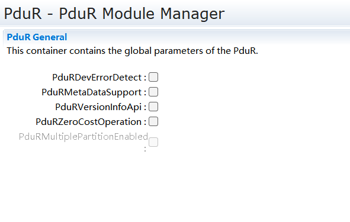

.. centered:: **表 PduRGeneral (Table PduRGeneral)**

.. list-table::
   :widths: 20 20 20 20 20
   :header-rows: 1

   * - UI名称 (UI Name)
     - 描述 (Description)
     - 
     - 
     - 
   * - PduRDevErrorDetect
     - 取值范围 (Range)
     - true/false
     - 默认取值 (Default value)
     - false
   * - 
     - 参数描述 (Parameter Description)
     - 是否使能DET开发错误检测 (Whether to Enable DET Development Error Detection)
     - 
     - 
   * - 
     - 依赖关系 (Dependencies)
     - 依赖于Det模块的支持 (Dependent on the support of Det module)
     - 
     - 
   * - PduRMetaDataSupport
     - 取值范围 (Range)
     - true/false
     - 默认取值 (Default value)
     - false
   * - 
     - 参数描述 (Parameter Description)
     - 是否使能MetaData机制 (Is the MetaData mechanism enabled?)
     - 
     - 
   * - 
     - 依赖关系 (Dependencies)
     - 路由表中SourePdu和DestPdu的MetaData类型必须一致 (The MetaData type of SourcePdu and DestPdu in the routing table must be consistent.)
     - 
     - 
   * - PduRVersionInfoApi
     - 取值范围 (Range)
     - true/false
     - 默认取值 (Default value)
     - false
   * - 
     - 参数描述 (Parameter Description)
     - 是否使能获取模块软件版本 (Is module software version retrieval enabled?)
     - 
     - 
   * - 
     - 依赖关系 (Dependencies)
     - 无
     - 
     - 
   * - PduRZeroCostOperation
     - 取值范围 (Range)
     - true/false
     - 默认取值 (Default value)
     - false
   * - 
     - 参数描述 (Parameter Description)
     - 是否使能PduR“透传模式” (Is PduR "Transparent Mode" enabled?)
     - 
     - 
   * - 
     - 依赖关系 (Dependencies)
     - “透传模式”通常用于PduR上下层模块固定且一一对应，不涉及网关。 ("PduR Passthrough Mode" is typically used when the upper and lower layer modules are fixed and one-to-one correspondence exists, and does not involve a gateway.)
     - 
     - 
   * - PduRMultiplePartitionEnabled
     - 取值范围 (Range)
     - true/false
     - 默认取值 (Default value)
     - false
   * - 
     - 参数描述 (Parameter Description)
     - 是否使能PduR多分区功能 (Does PduR Multi-Zone Function Enable?)
     - 
     - 
   * - 
     - 依赖关系 (Dependencies)
     - 必须存在Rte模块。该配置项使能时，路由表中SourePdu和DestPdu在EcuC中必须均配置EcucPduDefaultPartitionRef (The Rte module must exist. When this configuration item is enabled, SourcePdu and DestPdu in the ECU routing table must be configured with EcucPduDefaultPartitionRef in EcuC.)
     - 
     - 

PduRBswModuleRef
--------------------------------

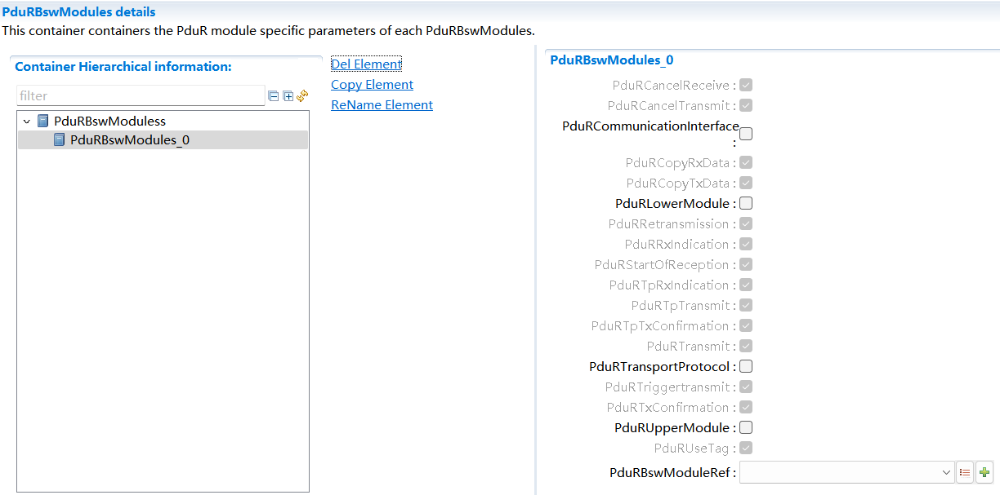

.. centered:: **表 PduRBswModuleRef (Table PduRBswModuleRef)**

.. list-table::
   :widths: 20 20 20 20 20
   :header-rows: 1

   * - UI名称 (UI Name)
     - 描述 (Description)
     - 
     - 
     - 
   * - PduRCancelReceive
     - 取值范围 (Range)
     - true/false
     - 默认取值 (Default value)
     - false
   * - 
     - 参数描述 (Parameter Description)
     - 模块是否支持接收取消 (Does the module support receiving cancellations?)
     - 
     - 
   * - 
     - 依赖关系 (Dependencies)
     - PduRBswModuleRef关联TP模块时，该项才可配置 (When associating the PduRBswModuleRef with TP modules, this item can be configured.)
     - 
     - 
   * - PduRCancelTransmit
     - 取值范围 (Range)
     - true/false
     - 默认取值 (Default value)
     - false
   * - 
     - 参数描述 (Parameter Description)
     - 模块是否支持发送取消 (Does the module support sending cancellations?)
     - 
     - 
   * - 
     - 依赖关系 (Dependencies)
     - 无
     - 
     - 
   * - PduRCommunicationInterface
     - 取值范围 (Range)
     - true/false
     - 默认取值 (Default value)
     - false
   * - 
     - 参数描述 (Parameter Description)
     - 模块是否支持IFPdu传输 (Does the module support IFPdu transmission?)
     - 
     - 
   * - 
     - 依赖关系 (Dependencies)
     - 根据PduRBswModuleRef关联的模块自动配置 (Automatically configure based on PduRBswModuleRef-associated modules)
     - 
     - 
   * - PduRCopyRxData
     - 取值范围 (Range)
     - true/false
     - 默认取值 (Default value)
     - true
   * - 
     - 参数描述 (Parameter Description)
     - 模块是否支持TPI-PDU数据段接收 (Does the module support receiving TPI-PDU data segments?)
     - 
     - 
   * - 
     - 依赖关系 (Dependencies)
     - PduRBswModuleRef关联TP模块时，该项才可配置 (When associating the PduRBswModuleRef with TP modules, this item can be configured.)
     - 
     - 
   * - PduRCopyTxData
     - 取值范围 (Range)
     - true/false
     - 默认取值 (Default value)
     - true
   * - 
     - 参数描述 (Parameter Description)
     - 模块是否支持TPI-PDU发送数据段拷贝 (Does the module support sending data segment copies via TPI-PDU?)
     - 
     - 
   * - 
     - 依赖关系 (Dependencies)
     - PduRBswModuleRef关联TP模块时，该项才可配置 (When associating the PduRBswModuleRef with TP modules, this item can be configured.)
     - 
     - 
   * - PduRLowerModule
     - 取值范围 (Range)
     - true/false
     - 默认取值 (Default value)
     - false
   * - 
     - 参数描述 (Parameter Description)
     - 模块是否处于PduR下层 (Is the module in the PduR lower layer?)
     - 
     - 
   * - 
     - 依赖关系 (Dependencies)
     - 根据PduRBswModuleRef关联的模块自动配置 (Automatically configure based on PduRBswModuleRef-associated modules)
     - 
     - 
   * - PduRRetransmission
     - 取值范围 (Range)
     - true/false
     - 默认取值 (Default value)
     - true
   * - 
     - 参数描述 (Parameter Description)
     - 模块是否支持TPPdu重传 (Does the module support TPPDU retransmission?)
     - 
     - 
   * - 
     - 依赖关系 (Dependencies)
     - PduRBswModuleRef关联TP模块时，该项才可配置 (When associating the PduRBswModuleRef with TP modules, this item can be configured.)
     - 
     - 
   * - PduRRxIndication
     - 取值范围 (Range)
     - true/false
     - 默认取值 (Default value)
     - true
   * - 
     - 参数描述 (Parameter Description)
     - 模块是否支持IFPdu接收 (Does the module support IFPDU reception?)
     - 
     - 
   * - 
     - 依赖关系 (Dependencies)
     - PduRBswModuleRef关联IF模块时，该项才可配置 (When associated with an IF module, this item can be configured.)
     - 
     - 
   * - PduRStartOfReception
     - 取值范围 (Range)
     - true/false
     - 默认取值 (Default value)
     - true
   * - 
     - 参数描述 (Parameter Description)
     - 模块是否支持TPPdu接收（开始） (Does the module support receiving TPPdu (start)?)
     - 
     - 
   * - 
     - 依赖关系 (Dependencies)
     - PduRBswModuleRef关联TP模块时，该项才可配置 (When associating the PduRBswModuleRef with TP modules, this item can be configured.)
     - 
     - 
   * - PduRTpRxIndication
     - 取值范围 (Range)
     - true/false
     - 默认取值 (Default value)
     - true
   * - 
     - 参数描述 (Parameter Description)
     - 模块是否支持TP接收指示 (Does the module support TP receive indication?)
     - 
     - 
   * - 
     - 依赖关系 (Dependencies)
     - PduRBswModuleRef关联TP模块时，该项才可配置 (When associating the PduRBswModuleRef with TP modules, this item can be configured.)
     - 
     - 
   * - PduRTpTransmit
     - 取值范围 (Range)
     - true/false
     - 默认取值 (Default value)
     - true
   * - 
     - 参数描述 (Parameter Description)
     - 该模块是否支持TPPdu传输 (Does this module support TPPDU transmission?)
     - 
     - 
   * - 
     - 依赖关系 (Dependencies)
     - PduRBswModuleRef关联TP模块时，该项才可配置 (When associating the PduRBswModuleRef with TP modules, this item can be configured.)
     - 
     - 
   * - PduRTpTxConfirmation
     - 取值范围 (Range)
     - true/false
     - 默认取值 (Default value)
     - true
   * - 
     - 参数描述 (Parameter Description)
     - 模块是否支持TPPdu发送确认 (Does the module support TP PDU send confirmation?)
     - 
     - 
   * - 
     - 依赖关系 (Dependencies)
     - PduRBswModuleRef关联TP模块时，该项才可配置 (When associating the PduRBswModuleRef with TP modules, this item can be configured.)
     - 
     - 
   * - PduRTransmit
     - 取值范围 (Range)
     - true/false
     - 默认取值 (Default value)
     - true
   * - 
     - 参数描述 (Parameter Description)
     - 模块是否支持IFPdu发送 (Does the module support IFPDU sending?)
     - 
     - 
   * - 
     - 依赖关系 (Dependencies)
     - PduRBswModuleRef关联IF模块时，该项才可配置 (When associated with an IF module, this item can be configured.)
     - 
     - 
   * - PduRTransportProtocol
     - 取值范围 (Range)
     - true/false
     - 默认取值 (Default value)
     - false
   * - 
     - 参数描述 (Parameter Description)
     - 模块是否支持TP传输 (Does the module support TP transmission?)
     - 
     - 
   * - 
     - 依赖关系 (Dependencies)
     - PduRBswModuleRef关联TP模块时，该项才可配置 (When associating the PduRBswModuleRef with TP modules, this item can be configured.)
     - 
     - 
   * - PduRTriggertransmit
     - 取值范围 (Range)
     - true/false
     - 默认取值 (Default value)
     - false
   * - 
     - 参数描述 (Parameter Description)
     - 该模块是否支持IFPdu通过TriggerTransmit机制进行发送 (Does this module support sending IFPdu via the TriggerTransmit mechanism?)
     - 
     - 
   * - 
     - 依赖关系 (Dependencies)
     - PduRBswModuleRef关联IF模块时，该项才可配置 (When associated with an IF module, this item can be configured.)
     - 
     - 
   * - PduRTxConfirmation
     - 取值范围 (Range)
     - true/false
     - 默认取值 (Default value)
     - true
   * - 
     - 参数描述 (Parameter Description)
     - 该模块是否支持IFPdu发送确认 (Does this module support IFPDU send confirmation?)
     - 
     - 
   * - 
     - 依赖关系 (Dependencies)
     - PduRBswModuleRef关联IF模块时，该项才可配置 (When associated with an IF module, this item can be configured.)
     - 
     - 
   * - PduRUpperModule
     - 取值范围 (Range)
     - true/false
     - 默认取值 (Default value)
     - false
   * - 
     - 参数描述 (Parameter Description)
     - 模块是否处于PduR上层 (Is the module at the upper layer of PduR?)
     - 
     - 
   * - 
     - 依赖关系 (Dependencies)
     - 根据PduRBswModuleRef关联的模块自动配置 (Automatically configure based on PduRBswModuleRef-associated modules)
     - 
     - 
   * - PduRUseTag
     - 取值范围 (Range)
     - true/false
     - 默认取值 (Default value)
     - true
   * - 
     - 参数描述 (Parameter Description)
     - 模块调用PduR接口是否带tag(<up>) (Does the module call PduR interface carry tag (<up>)?)
     - 
     - 
   * - 
     - 依赖关系 (Dependencies)
     - 该配置项固定为true (This configuration item is fixed as true)
     - 
     - 
   * - PduRBswModuleRef
     - 取值范围 (Range)
     - 索引[Module] (Index[Module])
     - 默认取值 (Default value)
     - 无
   * - 
     - 参数描述 (Parameter Description)
     - 关联与PduR模块交互的上下层模块 (Interact with upper and lower layer modules associated with the PduR module)
     - 
     - 
   * - 
     - 依赖关系 (Dependencies)
     - 根据配置工程中已添加的模块，才能索引 (Based on the modules added in the configuration engineering, indexing can be performed.)
     - 
     - 

注：PduRBswModules至少要配置一个模块

Note: PduRBswModules must have at least one module configured.

PduRRoutingPaths
--------------------------------

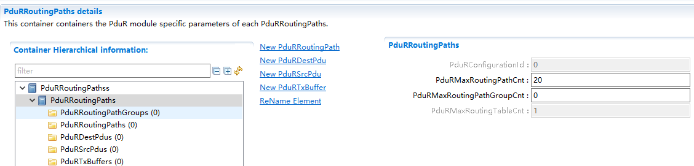

.. centered:: **表 PduRRoutingPaths (Table PduRRoutingPaths)**

.. list-table::
   :widths: 20 20 20 20 20
   :header-rows: 1

   * - UI名称 (UI Name)
     - 描述 (Description)
     - 
     - 
     - 
   * - PduRConfigurationId
     - 取值范围 (Range)
     - 0 .. 65535
     - 默认取值 (Default value)
     - 0
   * - 
     - 参数描述 (Parameter Description)
     - 模块PB配置Id号 (Module PB Configuration ID Number)
     - 
     - 
   * - 
     - 依赖关系 (Dependencies)
     - 当前不支持配置 (Current configuration is not supported.)
     - 
     - 
   * - PduRMaxRoutingPathCnt
     - 取值范围 (Range)
     - 0 .. 65535
     - 默认取值 (Default value)
     - 20
   * - 
     - 参数描述 (Parameter Description)
     - 模块PB配置支持的最大路由路径数 (Maximum number of route paths supported by module PB configuration)
     - 
     - 
   * - 
     - 依赖关系 (Dependencies)
     - 对配置的路由路径数目进行限制及校验 (Limit and validate the number of configured route paths.)
     - 
     - 
   * - PduRMaxRoutingPathGroupCnt
     - 取值范围 (Range)
     - 0 .. 65535
     - 默认取值 (Default value)
     - 0
   * - 
     - 参数描述 (Parameter Description)
     - 模块PB配置支持的最大路由路径组数 (Maximum number of route path groups supported by module PB configuration)
     - 
     - 
   * - 
     - 依赖关系 (Dependencies)
     - 对配置的路径路径组数目进行限制及校验，该数值决定可以新建几个PduRRoutingPathGroup (Limit and validate the number of path path groups configured, as this value determines how many PduRRoutingPathGroups can be newly created.)
     - 
     - 
   * - PduRMaxRoutingTableCnt
     - 取值范围 (Range)
     - 0 .. 65535
     - 默认取值 (Default value)
     - 1
   * - 
     - 参数描述 (Parameter Description)
     - 模块PB配置支持最大路由表数 (Module PB configuration supports maximum number of routing tables)
     - 
     - 
   * - 
     - 依赖关系 (Dependencies)
     - 当前不支持配置 (Current configuration is not supported.)
     - 
     - 

PduRRoutingPathGroup
------------------------------------

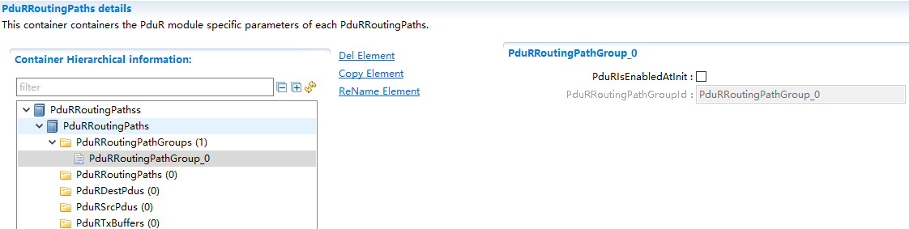

.. centered:: **表 PduRRoutingPathGroup (Table PduRRoutingPathGroup)**

.. list-table::
   :widths: 20 20 20 20 20
   :header-rows: 1

   * - UI名称 (UI Name)
     - 描述 (Description)
     - 
     - 
     - 
   * - PduRIsEnabledAtInit
     - 取值范围 (Range)
     - true/false
     - 默认取值 (Default value)
     - false
   * - 
     - 参数描述 (Parameter Description)
     - 初始化之后该RoutingPathGroup是否使能 (Whether this RoutingPathGroup is enabled after initialization.)
     - 
     - 
   * - 
     - 依赖关系 (Dependencies)
     - 无
     - 
     - 
   * - PduRRoutingPathGroupId
     - 取值范围 (Range)
     - string
     - 默认取值 (Default value)
     - 无
   * - 
     - 参数描述 (Parameter Description)
     - 表示RoutingPathGroup的Id（宏定义） (Define ID for RoutingPathGroup (Macro Definition))
     - 
     - 
   * - 
     - 依赖关系 (Dependencies)
     - 根据PduRRoutingPathGroup名自动生成 (Automatically generated based on PduRRoutingPathGroup name)
     - 
     - 

PduRRoutingPath
-------------------------------

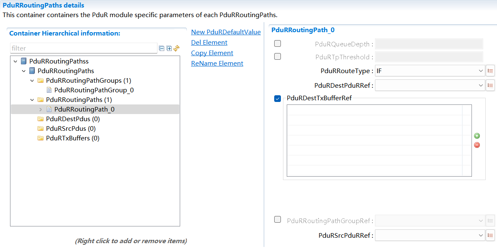

.. centered:: **表 PduRRoutingPath (Table PduRRoutingPath)**

.. list-table::
   :widths: 20 20 20 20 20
   :header-rows: 1

   * - UI名称 (UI Name)
     - 描述 (Description)
     - 
     - 
     - 
   * - PduRQueueDepth
     - 取值范围 (Range)
     - 1 .. 255
     - 默认取值 (Default value)
     - 无
   * - 
     - 参数描述 (Parameter Description)
     - 定义此路由路径的缓存的深度 (Define the depth of the cache for this route path)
     - 
     - 
   * - 
     - 依赖关系 (Dependencies)
     - 取值不能大于定义的所有buffer数目之和 (The value cannot be greater than the sum of all defined buffer numbers.)
     - 
     - 
   * - PduRTpThreshold
     - 取值范围 (Range)
     - 0 .. 65535
     - 默认取值 (Default value)
     - 无
   * - 
     - 参数描述 (Parameter Description)
     - TP Pduon-the-fly网关时，接收到该配置阈值长度的报文后开始执行转发 (When configuring the TP Pdu on-the-fly gateway, forwarding begins upon receiving a message of the configured threshold length.)
     - 
     - 
   * - 
     - 依赖关系 (Dependencies)
     - 该配置项只针对TP网关 (This configuration item is only for TP gateway.)
     - 
     - 
   * - PduRRouteType
     - 取值范围 (Range)
     - IF/TP
     - 默认取值 (Default value)
     - IF
   * - 
     - 参数描述 (Parameter Description)
     - I-PDU路由类型选择 (I-PDU Route Type Selection)
     - 
     - 
   * - 
     - 依赖关系 (Dependencies)
     - 依赖于I-PDU关联的模块对于该路由类型的支持 (Modules dependent on I-PDU association support for this routing type)
     - 
     - 
   * - PduRDestPduRRef
     - 取值范围 (Range)
     - 索引[PduRDestPdu] (Index[PduRDestPdu])
     - 默认取值 (Default value)
     - 无
   * - 
     - 参数描述 (Parameter Description)
     - 关联PduRDestPdu配置 (Configure PduRDestPdu Association)
     - 
     - 
   * - 
     - 依赖关系 (Dependencies)
     - 无
     - 
     - 
   * - PduRDestTxBufferRef
     - 取值范围 (Range)
     - 索引[PduRTxBuffer] (Index[PduRTxBuffer])
     - 默认取值 (Default value)
     - 无
   * - 
     - 参数描述 (Parameter Description)
     - 关联PduRTxBuffer，I-PDU网关路由才可能需要TxBuffer，（IFDirect网关/TP单播网关可配可不配，IFTriggerTransmit网关必须配置）
     - 
     - 
   * - 
     - 依赖关系 (Dependencies)
     - 无
     - 
     - 
   * - PduRRoutingPathGroupRef
     - 取值范围 (Range)
     - 索引[PduRRoutingPathGroup] (Index[PduRRoutingPathGroup])
     - 默认取值 (Default value)
     - 无
   * - 
     - 参数描述 (Parameter Description)
     - 关联PduRRoutingPathGroup (Associate PduRRoutingPathGroup)
     - 
     - 
   * - 
     - 依赖关系 (Dependencies)
     - 无
     - 
     - 
   * - PduRSrcPduRRef
     - 取值范围 (Range)
     - 索引[PduRSrcPdu] (Index[PduRSrcPdu])
     - 默认取值 (Default value)
     - 无
   * - 
     - 参数描述 (Parameter Description)
     - 关联PduRSrcPdu配置 (Configure Associated PduRSrcPdu)
     - 
     - 
   * - 
     - 依赖关系 (Dependencies)
     - 无
     - 
     - 

PduRDefaultValueElement
---------------------------------------

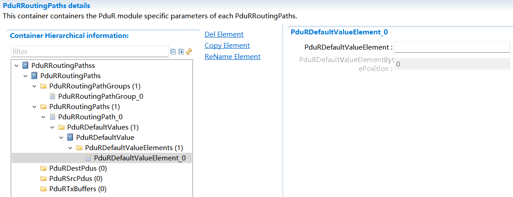

.. centered:: **表 PduRDefaultValueElement (Table PduRDefaultValueElement)**

.. list-table::
   :widths: 20 20 20 20 20
   :header-rows: 1

   * - UI名称 (UI Name)
     - 描述 (Description)
     - 
     - 
     - 
   * - PduRDefaultValueElement
     - 取值范围 (Range)
     - 0 .. 255
     - 默认取值 (Default value)
     - 无
   * - 
     - 参数描述 (Parameter Description)
     - I-PDU对应字节的默认值 (I-PDU corresponding byte default value)
     - 
     - 
   * - 
     - 依赖关系 (Dependencies)
     - IFPdu通过TriggerTransmit方式网关时才需要配置;若配置了PduRDefaultValue，其配置的PduRDefaultValueElement字节长度需与ECUC中Pdu的PduLength相等 (IFPdu needs to be configured only when transmitted via the Gateway using TriggerTransmit; if PduRDefaultValue is configured, its configured byte length of PduRDefaultValueElement must equal the PduLength of the Pdu in ECUC.)
     - 
     - 
   * - PduRDefaultValueElementBytePosition
     - 取值范围 (Range)
     - 0 .. 4294967294
     - 默认取值 (Default value)
     - 无
   * - 
     - 参数描述 (Parameter Description)
     - 表示I-PDU字节偏移 (Indicates I-PDU Byte Offset)
     - 
     - 
   * - 
     - 依赖关系 (Dependencies)
     - IFPdu通过TriggerTransmit方式网关时才需要配置；根据添加PduRDefaultValueElement依次从0自动递增； (IFPdu needs to be configured only when going through a gateway via TriggerTransmit; increment automatically from 0 sequentially based on adding PduRDefaultValueElement.)
     - 
     - 

PduRSrcPdu
--------------------------

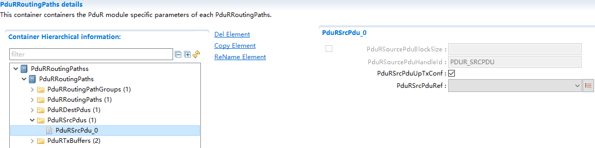

.. centered:: **表 PduRSrcPdu (Table PduRSrcPdu)**

.. list-table::
   :widths: 20 20 20 20 20
   :header-rows: 1

   * - UI名称 (UI Name)
     - 描述 (Description)
     - 
     - 
     - 
   * - PduRSourcePduBlockSize
     - 取值范围 (Range)
     - 1 .. 4294967295
     - 默认取值 (Default value)
     - 无
   * - 
     - 参数描述 (Parameter Description)
     - 接收TP继续接收所需的最小缓存 (Minimum buffer required for TP to continue receiving)
     - 
     - 
   * - 
     - 依赖关系 (Dependencies)
     - 依赖于PduRRoutingPath中PduRRouteType为TP的传输，当前不支持 (Transmission dependent on PduRRoutingPath with PduRRouteType as TP is currently not supported.)
     - 
     - 
   * - PduRSourcePduHandleId
     - 取值范围 (Range)
     - string
     - 默认取值 (Default value)
     - 无
   * - 
     - 参数描述 (Parameter Description)
     - 表示PduR中I-PDUId的宏名 (Macro name for I-PDUId in PduR)
     - 
     - 
   * - 
     - 依赖关系 (Dependencies)
     - 根据PduRSrcPduRef关联的Ecuc中Pdu名自动生成 (Generate Pdu Name Automatically Based on Ecuc Associated with PduRSrcPduRef)
     - 
     - 
   * - PduRSrcPduUpTxConf
     - 取值范围 (Range)
     - true/false
     - 默认取值 (Default value)
     - true
   * - 
     - 参数描述 (Parameter Description)
     - 表示该SrcPdu支持IF发送确认 (Indicates that the SrcPdu supports IF send confirmation.)
     - 
     - 
   * - 
     - 依赖关系 (Dependencies)
     - 依赖于该SrcPdu所关联模块对IFTxConfirmation的支持 (Dependent on the support of IFTxConfirmation by the module associated with the SrcPdu.)
     - 
     - 
   * - PduRSrcPduRef
     - 取值范围 (Range)
     - 索引[Pdu] (Index[Pdu])
     - 默认取值 (Default value)
     - 无
   * - 
     - 参数描述 (Parameter Description)
     - 关联EcuC中配置的Pdu (Configure Pdu in Associated EcuC)
     - 
     - 
   * - 
     - 依赖关系 (Dependencies)
     - 依赖于EcuC中Pdu的配置;PduR路由表中SourePdu关联的ECUCPdu需与PduRBswModules中的某一Pdu关联;Pdu关联的ECUC中Pdu的配置项PduLength必须配置；IF路由Pdu不能关联TPPdu，TP路由的Pdu不能关联IFPdu (Dependent on the configuration of Pdu in EcuC; SourcePdu associated with ECUCPdu in the PduR routing table needs to be linked to a certain Pdu in PduRBswModules; The configuration item PduLength of Pdu in ECUC corresponding to the Pdu must be configured; IF routing Pdu cannot be associated with TPPdu, and TP routing Pdu cannot be associated with IFPdu.)
     - 
     - 

PduRDestPdu
---------------------------

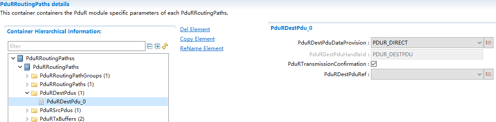

.. centered:: **表 PduRDestPdu (Table PduRDestPdu)**

.. list-table::
   :widths: 20 20 20 20 20
   :header-rows: 1

   * - UI名称 (UI Name)
     - 描述 (Description)
     - 
     - 
     - 
   * - PduRDestPduDataProvision
     - 取值范围 (Range)
     - PDUR_DIRECT/PDUR_TRIGGERTRANSMIT
     - 默认取值 (Default value)
     - PDUR_DIRECT
   * - 
     - 参数描述 (Parameter Description)
     - IFPdu网关路由的数据传递方式选择 (The data transmission method selection for IFPdu Gateway Routing)
     - 
     - 
   * - 
     - 依赖关系 (Dependencies)
     - 若选择TriggerTransmit方式，必须配置PduRDestTxBufferRef对网关I-PDU进行缓存;PduRDestPduDataProvision配置为PDUR_DIRECT时，不能配置PduRDefaultValueElement (If the TriggerTransmit method is selected, the gateway I-PDU must be cached by configuring PduRDestTxBufferRef; when PduRDestPduDataProvision is configured as PDUR_DIRECT, PduRDefaultValueElement cannot be configured.)
     - 
     - 
   * - PduRDestPduHandleId
     - 取值范围 (Range)
     - string
     - 默认取值 (Default value)
     - 无
   * - 
     - 参数描述 (Parameter Description)
     - 表示PduR中I-PDUId的宏名 (Macro name for I-PDUId in PduR)
     - 
     - 
   * - 
     - 依赖关系 (Dependencies)
     - 根据PduRSrcPduRef关联的Ecuc中Pdu名自动生成 (Generate Pdu Name Automatically Based on Ecuc Associated with PduRSrcPduRef)
     - 
     - 
   * - PduRTransmissionConfirmation
     - 取值范围 (Range)
     - true/false
     - 默认取值 (Default value)
     - true
   * - 
     - 参数描述 (Parameter Description)
     - 对于IFPdu发送/网关路由是否支持TxConfirmation (Check if IFPdu Send/Gateway Routing supports TxConfirmation.)
     - 
     - 
   * - 
     - 依赖关系 (Dependencies)
     - 该配置项只针对IF发送/网关 (This configuration item is only for IF sending/gateway.)
     - 
     - 
   * - PduRDestPduRef
     - 取值范围 (Range)
     - 索引[Pdu] (Index[Pdu])
     - 默认取值 (Default value)
     - 无
   * - 
     - 参数描述 (Parameter Description)
     - 关联EcuC中配置的Pdu (Configure Pdu in Associated EcuC)
     - 
     - 
   * - 
     - 依赖关系 (Dependencies)
     - 依赖于EcuC中Pdu的配置;PduR路由表中DestPdu关联的ECUCPdu需与PduRBswModules中的某一Pdu关联;Pdu关联的ECUC中Pdu的配置项PduLength必须配置；IF路由Pdu不能关联TPPdu，TP路由的Pdu不能关联IFPdu；TP路由中仅支持配置1个DestPdu (Dependent on configuration in EcuC for Pdu; DestPdu associated with ECUCPdu in PduR routing table needs to be linked to a certain Pdu in PduRBswModules; Configuration item PduLength of Pdu in ECUC must be configured; IF routed Pdu cannot be associated with TPPdu, and TP routed Pdu cannot be associated with IFPdu; Only one DestPdu is supported for configuration in TP routing.)
     - 
     - 

PduRTxBuffer
----------------------------

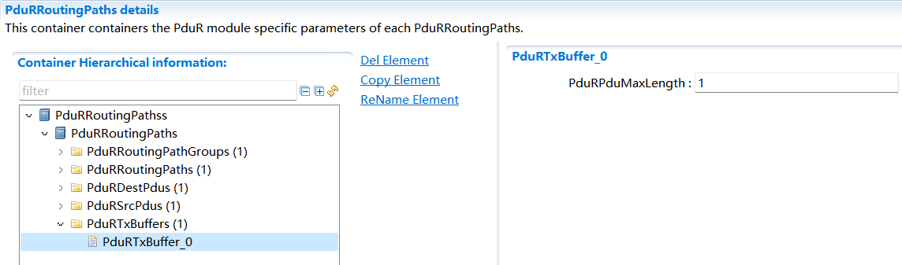

.. centered:: **表 PduRTxBuffer (Table PduRTxBuffer)**

.. list-table::
   :widths: 20 20 20 20 20
   :header-rows: 1

   * - UI名称 (UI Name)
     - 描述 (Description)
     - 
     - 
     - 
   * - PduRPduMaxLength
     - 取值范围 (Range)
     - 1 .. 4294967295
     - 默认取值 (Default value)
     - 无
   * - 
     - 参数描述 (Parameter Description)
     - TxBuffer的长度 (The length of TxBuffer)
     - 
     - 
   * - 
     - 依赖关系 (Dependencies)
     - Buffer长度应配置为关联的DestPdu的最大长度（IFPdu的最大长度/TPPdu的最大单播长度）
     - 
     - 
