RTE
#################################

:strong:`缩写词注解 (Abbreviation Notes):`

.. list-table::
   :widths: 25 25 25 25
   :header-rows: 1

   * - 序号 (Sequence Number)
     - 缩略词 (Abbreviations)
     - 英文全名 (Full English Name)
     - 中文解释 (Translate the provided Chinese text into English and preserve any line breaks.)
   * - 
     - RTE
     - Runtime Environment
     - 运行时环境 (Runtime environment)
   * - 
     - SWC
     - Software Component
     - 软件组件 (Software components)
   * - 
     - BSW
     - Basic Software
     - 基础软件 (Basic software)
   * - 
     - BSWMD
     - Basic Software Module Description
     - 基础软件模块描述 (Description of Basic Software Modules)
   * - 
     - COM
     - Communication
     - 通信 (Communication)
   * - 
     - ECU
     - Electronic Control Unit
     - 电子控制单元 (Electronic Control Unit)
   * - 
     - AUTOSAR
     - Automotive Open System Architecture
     - 汽车开放系统架构 (Automotive Open System Architecture)
   * - 
     - C/S
     - Client-server communication
     - 客户端服务器通信 (Client server communication)
   * - 
     - ECUC
     - AUTOSAR ECU Configuration
     - AUTOSAR ECU配置 (AUTOSAR ECU Configuration)
   * - 
     - IOC
     - Inter-OsApplication Communication
     - 跨Os应用通信 (Cross-OS application communication)
   * - 
     - S/R
     - Sender-receiver communication
     - 发送方接收方通信 (Sender Receiver Communication)
   * - 
     - VFB
     - Virtual Function Bus
     - 虚拟功能总线 (Virtual Function Bus)
   * - 
     - API
     - Application Programming Interface
     - 应用程序编程接口 (Application Programming Interface)
   * - 
     - NVM
     - Non-volatile Memory Manager
     - 非易失性存储管理 (Non-volatile Storage Management)
   * - 
     - SchM
     - Schedule Manager
     - 调度管理 (Scheduling Management)

简介 (Introduction)
=================================

RTE 是 AUTOSAR 虚拟功能总线 (VFB) 基于特定 ECU 的实现，分解为针对Application的Rte和针对BSW的SchM功能。Rte 为整个AUTOSAR 基础软件的接口层，为整个ECU提供了运行时环境：

RTE is the AUTOSAR Virtual Function Bus (VFB) implementation specific to a particular ECU, decomposed into Rte for Application and SchM functionality for BSW. Rte serves as the interface layer for the entire AUTOSAR basic software, providing a runtime environment for the entire ECU:

生成TASK函数，负责映射到Task的RunnableEntity的运行调度；

Generate the TASK function, responsible for scheduling the execution of RunnableEntity mapped to Task;

为SWC实例与SWC实例间，SWC实例与BSW实例间提供基于S/R（包括NVM读写）、C/S的通信接口；

Provide communication interfaces based on S/R (including NVM read and write) and C/S for SWC instances to communicate with each other, as well as for SWC instances to communicate with BSW instances;

为SWC实例提供标定数据读取接口，模式切换接口，独占区接口，内外部触发接口；

Provide calibration data reading interface, mode switching interface, exclusive area interface, internal and external trigger interface for the SWC instance;

为SWC实例内部提供IRV通信接口；

Provide an IRV communication interface for internal use in SWC instances;

为每个SWC实例提供PIM接口；

Provide PIM interfaces for each SWC instance;

SchM 作为简化版“Rte”，实现BSW间C/S通信，实现BswEntity的运行调度，为BSW数据一致性保护提供独占区接口。

SchM as a simplified version of "Rte", implements C/S communication between BSWs, runs and schedules BswEntity, and provides an exclusive region interface for protecting BSW data consistency.

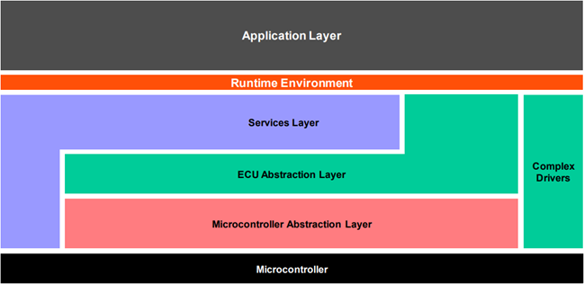

参考资料 (Reference materials)
------------------------------------------

[1] AUTOSAR_TPS_SystemTemplate.pdf，R19-11

[2] AUTOSAR_TPS_SoftwareComponentTemplate.pdf，R19-11

[3] AUTOSAR_SWS_RTE.pdf.pdf，R19-11

[4] AUTOSAR_SRS_RTE.pdf，R19-11

[5] AUTOSAR_EXP_LayeredSoftwareArchitecture.pdf，R19-11

[6] AUTOSAR_SWS_OS.pdf，R19-11

[7] AUTOSAR_TR_Methodology.pdf，R19-11

[8] AUTOSAR_EXP_VFB.pdf，R19-11

[9] AUTOSAR_SWS_COM.pdf，R19-11

[10] AUTOSAR_SWS_LargeDataCOM.pdf，R19-11

功能描述 (Function Description)
===========================================

详细描述面向应用Application的Rte功能，SchM功能适配普华BSW实现需求进行简要描述。

Detailed description of Rte functionality oriented towards Application. Briefly describe SchM functionality adapted to meet the requirements for Pragmatic BSW implementation.

Rte功能描述 (Function Description of Rte)
-----------------------------------------------------

Rte实现Application RunnableEntity的调度，SWC内部通信，SWC与SWC间基于Port的通信，SWC与BSW服务间基于Port的通信。

Rte实现Application Runnable Entity的调度，SWC内部通信，SWC与SWC间基于Port的通信，SWC与BSW服务间基于Port的通信。

Rte功能描述分为通用功能（参见章节2.1.1）和具体功能点（参见章节2.1.2-2.1.11），具体功能点为面向Application直接使用的功能描述，通用功能为支撑具体功能点实现的基础功能。

Rte functionality descriptions are divided into general functions (refer to Section 2.1.1) and specific function points (refer to Sections 2.1.2-2.1.11), with the specific function points being the functionality descriptions directly used by Application, while the general functions serve as the foundational support for implementing these specific function points.

通用功能 (General Functions)
~~~~~~~~~~~~~~~~~~~~~~~~~~~~~~~~~~~~~~~~

数据类型：实现数据类型的定义；

Data Type: Implementing the definition of data types;

TASK调度：调度所有映射到Task的Application RunnableEntity；

Task Scheduling: Schedule all Application RunnableEntities mapped to Task;

CTS实例化：ComponentType支持多实例化；

Instance Creation of CTS: ComponentType supports multiple instances;

序列化：实现ECU间通信序列化SomeIpXf、ComXf、E2EXf；

Serialization: Achieve serialization of communication sequences between ECUs SomeIpXf, ComXf, E2EXf;

生命周期：实现Rte模块的Start和Stop；

Lifecycle: Implement the Start and Stop of the Rte module;

数据类型 (Data types)
^^^^^^^^^^^^^^^^^^^^^^^^^^^^^^^^^

.. list-table::
   :widths: 50 50
   :header-rows: 1

   * - 功能分类 (Function Classification)
     - 功能点描述 (Function description)
   * - 基础数据类型 (Primitive Data Types)
     - 支持基础数据类型: boolean、float32、float64、sint8、sint16、sint32、sint64、uint8、uint16、uint32、uint64 (Support basic data types: boolean, float32, float64, sint8, sint16, sint32, sint64, uint8, uint16, uint32, uint64)
   * - 实现数据类型 (Realize data types)
     - VALUE：基于基础数据类型来定义实现数据类型 (VALUE: Defined based on basic data types to implement data types)
   * - 实现数据类型 (Realize data types)
     - TYPE_REFERENCE：基于另一个实现数据类型来定义当前实现数据类型 (TYPE_REFERENCE：Define the current data type based on another implementation data type)
   * - 实现数据类型 (Realize data types)
     - DATA_REFERENCE：基于基础数据类型/实现数据类型定义的指针类型 (DATA_REFERENCE：Pointer types based on fundamental data types/implementing data type definitions)
   * - 实现数据类型 (Realize data types)
     - ARRAY：数组数据类型 (ARRAY: Array data type)
   * - 实现数据类型 (Realize data types)
     - STRUCTURE：结构体数据类型 (STRUCTURE: Structured Data Types)
   * - 实现数据类型 (Realize data types)
     - UNION：联合体数据类型 (UNION：Union data type)
   * - 动长数据类型 (Long data type)
     - 支持动长应用数据类型，映射的实现数据类型为结构体（数组+数据长度） (Support variable-length application data types, with the mapped implementation data type being a structure (array + length))

TASK调度 (TASK Scheduling)
^^^^^^^^^^^^^^^^^^^^^^^^^^^^^^^^^^^^^^^^

.. list-table::
   :widths: 50 50
   :header-rows: 1

   * - 功能分类 (Function Classification)
     - 功能点描述 (Function description)
   * - RunnableEntity调度 (RunnableEntity Scheduling)
     - 除了CS/Trigger直接调用、模式管理、初始化事件外，均由TASK进行RunnableEntity的调度 (Apart from direct calls by CS/Trigger, mode management, and initialization events, TASK handles the scheduling of RunnableEntities.)
   * - RunnableEntity调度 (RunnableEntity Scheduling)
     - 支持RunnableEntity在TASK里执行位置的配置 (Support the configuration of RunnableEntity execution position within TASK)
   * - RunnableEntity调度 (RunnableEntity Scheduling)
     - 支持RunnableEntity整体运行在独占区内 (Support RunnableEntity running exclusively in an isolated zone.)
   * - RteEvent
     - TimingEvent
   * - RteEvent
     - BackgroundEvent
   * - RteEvent
     - AsynchronousServerCallReturnsEvent
   * - RteEvent
     - DataReceiveErrorEvent
   * - RteEvent
     - OperationInvokedEvent
   * - RteEvent
     - DataReceivedEvent
   * - RteEvent
     - DataSendCompletedEvent
   * - RteEvent
     - ExternalTriggerOccurredEvent
   * - RteEvent
     - InternalTriggerOccurredEvent
   * - RteEvent
     - DataWriteCompletedEvent
   * - RteEvent
     - InitEvent
   * - RteEvent
     - ModeSwitchedAckEvent
   * - RteEvent
     - SwcModeSwitchEvent

CTS实例化 (CTT Instantiation)
^^^^^^^^^^^^^^^^^^^^^^^^^^^^^^^^^^^^^^^^^^

.. list-table::
   :widths: 50 50
   :header-rows: 1

   * - 功能分类 (Function Classification)
     - 功能点描述 (Function description)
   * - ComponentType实例化 (InstanceCreationOfComponentType)
     - 支持ComponentType单实例化 (Support ComponentType single instancearnation)
   * - ComponentType实例化 (InstanceCreationOfComponentType)
     - 支持ComponentType多实例化 (Support multiple instantiations of ComponentType)

序列化 (Serialization)
^^^^^^^^^^^^^^^^^^^^^^^^^^^^^^^^^^^

序列化功能仅支持ECU间通信（CS和SR）。

Serialization functionality only supports communication between ECUs (CS and SR).

.. list-table::
   :widths: 50 50
   :header-rows: 1

   * - 功能分类 (Function Classification)
     - 功能点描述 (Function description)
   * - 数据类型 (Data types)
     - 支持除Union外所有类型，包括动长数据类型 (Supports all types except Union, including varlen data types)
   * - XfrmChain串联场景 (XfrmChain Chaining Scenario)
     - ComXf
   * - XfrmChain串联场景 (XfrmChain Chaining Scenario)
     - SomeIpXf
   * - XfrmChain串联场景 (XfrmChain Chaining Scenario)
     - ComXf+E2EXf
   * - XfrmChain串联场景 (XfrmChain Chaining Scenario)
     - SomeIpXf+E2EXf
   * - E2E profile类型 (End-to-End profile type)
     - PROFILE_01、PROFILE_02、PROFILE_04、PROFILE_05、PROFILE_06、PROFILE_07、PROFILE_11、PROFILE_22
   * - placeType
     - 支持inpalce和outOfPlace (Support in-place and out-of-place)
   * - SomeIpXf消息类型 (SomeIpXf Message Type)
     - 支持REQUEST和RESPONSE (Support REQUEST and RESPONSE)

生命周期 (Lifecycle)
^^^^^^^^^^^^^^^^^^^^^^^^^^^^^^^^

.. list-table::
   :widths: 50 50
   :header-rows: 1

   * - 功能分类 (Function Classification)
     - 功能点描述 (Function description)
   * - 支持多分区 (Supports multiple partitions)
     - 支持对每个分区（可信/不可信）开启/关闭 (Support enabling/disabling for each partition (trusted/untrusted))
   * - 初始化 (Initialize)
     - 对每个分区变量进行初始化，更新分区状态，设置Alarm，激活Task，调度初始化RunnableEntity等 (Initialize partition variables, update partition states, set Alarm, activate Task, schedule initialization of RunnableEntity, etc.)
   * - 分区开启/关闭 (Enable/Disable Partition)
     - Rte_Start：分区开启，可信分区由BswM调度，不可信分区由默认初始化Task进行调度 (Rte_Start：Partition start, trusted partitions scheduled by BswM, untrusted partitions scheduled by default initialized Task.)
   * - 分区开启/关闭 (Enable/Disable Partition)
     - Rte_Stop：分区关闭 (Rte_Stop：Partition Closed)
   * - 分区同步 (Partition Synchronization)
     - 保证每个分区初始化同步 (Ensure each partition initialization synchronization)

SR通信 (SR Communication)
~~~~~~~~~~~~~~~~~~~~~~~~~~~~~~~~~~~~~~~

SR通信负责组件实例间基于Port进行数据传输。

SR Communication is responsible for data transmission between component instances based on Port.

.. list-table::
   :widths: 50 50
   :header-rows: 1

   * - 功能分类 (Function Classification)
     - 功能点描述 (Function description)
   * - 收发通信组数目 (Number of Send-Receive Communication Groups)
     - 支持1：N，N：1 (Support 1:N, N:1)
   * - 通信域划分 (Division of Communication Domain)
     - 分区内通信 (Intra-zone Communication)
   * - 通信域划分 (Division of Communication Domain)
     - 分区间通信（同核/不同核，可信/不可信） (Interzone Communication (In-Node/Out-Node, Trusted/Untrusted))
   * - 通信域划分 (Division of Communication Domain)
     - ECU间通信，组件实例与Signal/SignalGroup同分区 (Communication between ECUs, Component instances in the same partition as Signal/SignalGroup)
   * - 通信域划分 (Division of Communication Domain)
     - ECU间通信，组件实例与Signal/SignalGroup不同分区 (Communication between ECUs, Component Instances with Signal/SignalGroup in Different Partitions)
   * - 序列化 (Serialization)
     - 支持ECU间ComXf,ComXf+E2EXf，SomeIpXf序列化，支持序列化错误检测 (Support ComXf, ComXf+E2EXf, SomeIpXf serialization between ECU, support serialized error detection)
   * - ECU间信号 (Signals between ECUs)
     - 支持关联Com模块的Signal/SignalGroup，支持动长信号UINT8_DYN，支持关联LdCom模块的Signal (Support associated Com modules' Signal/SignalGroup, support dynamic length signal UINT8_DYN, support associated LdCom modules' Signal)
   * - 计算方法（ECU间）
     - 未配置或者IDENTICAL (Not configured or IDENTICAL)
   * - 计算方法（ECU间）
     - BITFIELD_TEXTTABLE
   * - 计算方法（ECU间）
     - TEXTTABLE
   * - 计算方法（ECU间）
     - LINEAR
   * - 计算方法（ECU间）
     - SCALE_LINEAR_AND_TEXTTABLE
   * - 计算方法（ECU间）
     - SCALE_LINEAR
   * - 接收超时（ECU间）
     - 接收超时机制（Signal/SignalGroup关联的所有RPorts接收超时机制需完全一致），超时操作支持NONE和REPLACE 、REPLACE_BY_TIMEOUT_SUBSTITUTION_VALUE三种模式
   * - 队列通信 (Queue Communication)
     - SR支持显式队列通信 (SR supports explicit queue communication)
   * - 隐式通信 (Implicit Communication)
     - SR支持隐式非队列通信 (SR supports implicit non-queue communication)
   * - 隐式通信 (Implicit Communication)
     - 隐式接收数据状态：不带状态、带状态、带扩展状态 (Implicit data reception states: without state, with state, with extended state)
   * - 显式通信 (Explicit communication)
     - SR支持显式非队列通信 (SR supports explicit non-queue communication)
   * - 显式通信 (Explicit communication)
     - 接收方式支持dataReceivePointByValue和dataReceivePointByArgument两种方式 (Supports two ways of receiving data: dataReceivePointByValue and dataReceivePointByArgument)
   * - 显式通信 (Explicit communication)
     - 支持接收Update机制 (Support receiving Update mechanism)
   * - 显式通信 (Explicit communication)
     - 支持handleNeverReceived机制 (Support handleNeverReceived mechanism)
   * - 无效值机制 (Invalid value mechanism)
     - 无效值发送：支持隐式非队列无效值发送，显式非队列无效值发送 (Invalid value send: Support implicit out-of-queue invalid value send, explicit out-of-queue invalid value send)
   * - 无效值机制 (Invalid value mechanism)
     - 无效值接收：支持DONT-INVALIDATE、KEEP、REPLACE (Invalid value reception: Support DONT-INVALIDATE, KEEP, REPLACE)
   * - 接收过滤 (Receive filtering)
     - 无接收过滤/ALWAYS (No receive filtering/ALWAYS)
   * - 接收过滤 (Receive filtering)
     - NEVER
   * - 接收过滤 (Receive filtering)
     - MaskedNewEqualsX
   * - 接收过滤 (Receive filtering)
     - MaskedNewDiffersX
   * - 接收过滤 (Receive filtering)
     - MaskedNewDiffersMaskedOld
   * - 接收过滤 (Receive filtering)
     - NewIsWithin
   * - 接收过滤 (Receive filtering)
     - NewIsOutside
   * - 接收过滤 (Receive filtering)
     - OneEveryN
   * - 发送确认机制 (Confirmation mechanism)
     - 支持发送超时机制，支持DataWriteCompletedEvent（隐式），DataSendCompletedEvent（显式队列/显式非队列） (Support timeout mechanism for sending, support DataWriteCompletedEvent (implicit), DataSendCompletedEvent (explicit queue/explicit non-queue))
   * - WaitPoint机制 (WaitPoint Mechanism)
     - DataReceivedEvent（队列接收） (DataReceivedEvent (Queue Received))
   * - WaitPoint机制 (WaitPoint Mechanism)
     - DataSendCompletedEvent（显式队列/显式非队列） (DataSendCompletedEvent（Explicit Queue/Explicit Non-Queue）)
   * - Port连接 (Port Connection)
     - 支持Port连接，也支持Port不连接 (Support Port connection, also support no Port connection.)
   * - Port类型 (Port Type)
     - 支持PPort、RPort、PRPort (Support PPort, RPort, PRPort)
   * - RteEvent
     - DataReceiveErrorEvent
   * - RteEvent
     - DataReceivedEvent
   * - RteEvent
     - DataWriteCompletedEvent
   * - RteEvent
     - DataSendCompletedEvent

CS通信 (CS Communication)
~~~~~~~~~~~~~~~~~~~~~~~~~~~~~~~~~~~~~~~

CS通信负责组件实例间基于Port进行函数调用。

CS communication is responsible for function calls between component instances based on Port.

.. list-table::
   :widths: 50 50
   :header-rows: 1

   * - 功能分类 (Function Classification)
     - 功能点描述 (Function description)
   * - 收发通信组数目 (Number of Send-Receive Communication Groups)
     - 支持N：1 (Support N:1)
   * - 通信域划分 (Division of Communication Domain)
     - 分区内通信 (Intra-zone Communication)
   * - 通信域划分 (Division of Communication Domain)
     - 分区间通信（同核/不同核，可信/不可信） (Interzone Communication (In-Node/Out-Node, Trusted/Untrusted))
   * - 通信域划分 (Division of Communication Domain)
     - ECU间通信，组件实例与Signal同分区 (Communication between ECUs, Component instances in the same partition as Signal)
   * - 通信域划分 (Division of Communication Domain)
     - ECU间通信，组件实例与Signal不同分区 (Communication between ECUs, Component Instances with Signal Different Partitions)
   * - Port类型 (Port Type)
     - 支持PPort、RPort、PRPort (Support PPort, RPort, PRPort)
   * - RteEvent
     - OperationInvokedEvent
   * - RteEvent
     - AsynchronousServerCallReturnEvent
   * - Port连接 (Port Connection)
     - 支持Port连接，也支持Port不连接 (Support Port connection, also support no Port connection.)
   * - WaitPoint机制 (WaitPoint Mechanism)
     - AsynchronousServerCallReturnsEvent
   * - 发送确认机制 (Confirmation mechanism)
     - 支持CS同步/异步发送超时机制 (Support CS synchronous/asynchronous send timeout mechanism)
   * - 队列通信 (Queue Communication)
     - CS支持同步队列通信，异步队列通信 (CS supports synchronous queue communication, asynchronous queue communication)
   * - 非队列通信 (Non-queue Communication)
     - CS支持同步非队列通信（Clients均满足直接调用Server时)
   * - 序列化 (Serialization)
     - 支持ECU间SomeIpXf,SomeIpXf+E2EXf序列化，支持序列化错误检测 (Support SomeIpXf, SomeIpXf+E2EXf serialization between ECU, support serialized error detection)
   * - PortDefinedArgumentValue
     - 支持Operation定义之外的额外参数 (Support additional parameters beyond the Operation definition)
   * - Operation
     - 支持返回值配置 (Support return value configuration)
   * - Operation
     - 支持IN、INOUT、OUT三种参数方向 (Support IN, INOUT, and OUT three parameter directions)
   * - Operation
     - 参数数据类型不限制（参见2.1.1.1章节） (The parameter data type is unrestricted (see Chapter 2.1.1.1).)
   * - Operation
     - 参数数目不限制 (The number of parameters is unlimited.)
   * - Operation
     - 支持void参数 (Support void parameters)

模式管理 (Pattern Management)
~~~~~~~~~~~~~~~~~~~~~~~~~~~~~~~~~~~~~~~~~

实现Mode Manager与Mode User基于Port的模式切换通信。

Implement communication for mode switching between Mode Manager and Mode User based on Port.

.. list-table::
   :widths: 50 50
   :header-rows: 1

   * - 功能分类 (Function Classification)
     - 功能点描述 (Function description)
   * - 收发通信组数目 (Number of Send-Receive Communication Groups)
     - 支持1：N（一个Mode Manager，多个Mode User） (Support 1:N (One Mode Manager, Multiple Mode Users))
   * - 通信域划分 (Division of Communication Domain)
     - 分区内通信 (Intra-zone Communication)
   * - 通信域划分 (Division of Communication Domain)
     - 分区间通信（同核/不同核，可信/不可信） (Interzone Communication (In-Node/Out-Node, Trusted/Untrusted))
   * - 同步模式切换 (Mode Switch for Synchronization)
     - on-exit ExecutableEntity
   * - 同步模式切换 (Mode Switch for Synchronization)
     - on-transition ExecutableEntity
   * - 同步模式切换 (Mode Switch for Synchronization)
     - on-entry ExecutableEntity
   * - 同步模式切换 (Mode Switch for Synchronization)
     - ModeSwitchAck ExecutableEntity
   * - 同步模式切换 (Mode Switch for Synchronization)
     - 支持队列通信，非队列通信 (Support queue communication, non-queue communication)
   * - 模式切换确认 (Mode switch confirmation)
     - 模式切换完成 (Mode switch completed)
   * - 模式切换确认 (Mode switch confirmation)
     - 模式切换超时 (Mode switch timeout)
   * - WaitPoint机制 (WaitPoint Mechanism)
     - ModeSwitchedAckEvent
   * - 模式获取 (Pattern Acquired)
     - Mode Manager、Mode User均支持模式获取 (Mode Manager, Mode User both support mode acquisition.)
   * - 模式获取 (Pattern Acquired)
     - 支持普通模式和增强模式 (Support normal mode and enhanced mode)
   * - 模式禁用 (Mode Disabled)
     - RunnableEntity支持模式禁用 (RunnableEntity supports mode disable)
   * - 初始化模式 (Initialization Mode)
     - 激活初始化模式的Mode disablings (Activate initialization mode Mode disablings)
   * - 初始化模式 (Initialization Mode)
     - 基于初始化模式的on-entry ExecutableEntity触发 (Triggered by ExecutableEntity based on initialization mode on-entry)
   * - Port连接 (Port Connection)
     - 支持Port连接，也支持Port不连接 (Support Port connection, also support no Port connection.)
   * - ModeDeclarationGroup定义类型 (DefinitionType ModeDeclarationGroup)
     - ALPHABETIC_ORDER
   * - ModeDeclarationGroup定义类型 (DefinitionType ModeDeclarationGroup)
     - EXPLICIT_ORDER
   * - Port类型 (Port Type)
     - 支持PPort、RPort、PRPort (Support PPort, RPort, PRPort)

存储NV (Store NV)
~~~~~~~~~~~~~~~~~~~~~~~~~~~~~~~

Rte内部实现NvM Block数据的读写供应用通过SR接口进行读写。

Rte internally implements the reading and writing of NvM Block data for applications to read and write via the SR interface.

.. list-table::
   :widths: 50 50
   :header-rows: 1

   * - 功能分类 (Function Classification)
     - 功能点描述 (Function description)
   * - Writing Strategy
     - storeImmediate: DataReceivedEvent
   * - Writing Strategy
     - storeCyclic: TimingEvent
   * - Writing Strategy
     - storeAtShutdown：DataReceivedEvent
   * - SR非队列通信供应用读写NV数据 (SR non-queue communication for application read/write NV data)
     - Rte_Read
   * - SR非队列通信供应用读写NV数据 (SR non-queue communication for application read/write NV data)
     - Rte_IRead
   * - SR非队列通信供应用读写NV数据 (SR non-queue communication for application read/write NV data)
     - Rte_DRead
   * - SR非队列通信供应用读写NV数据 (SR non-queue communication for application read/write NV data)
     - Rte_Write
   * - SR非队列通信供应用读写NV数据 (SR non-queue communication for application read/write NV data)
     - Rte_IWrite
   * - SR非队列通信供应用读写NV数据 (SR non-queue communication for application read/write NV data)
     - Rte_IWriteRef
   * - Port连接 (Port Connection)
     - 支持Port连接，也支持Port不连接 (Support Port connection, also support no Port connection.)
   * - 通信域划分 (Division of Communication Domain)
     - 分区内通信 (Intra-zone Communication)
   * - 收发通信组数目 (Number of Send-Receive Communication Groups)
     - N：1（Nv数据的写操作）
   * - 收发通信组数目 (Number of Send-Receive Communication Groups)
     - 1：N（Nv数据的读操作)

IRV通信 (IRV Communication)
~~~~~~~~~~~~~~~~~~~~~~~~~~~~~~~~~~~~~~~~~

IRV实现同一组件实例内部RunnableEntity间的通信。

IRV实现同一组件实例内部RunnableEntity间的通信。

.. list-table::
   :widths: 50 50
   :header-rows: 1

   * - 功能分类 (Function Classification)
     - 功能点描述 (Function description)
   * - 收发通信组数目 (Number of Send-Receive Communication Groups)
     - 支持N：M (Support N:M)
   * - 通信模式 (Communication mode)
     - 支持显式通信和隐式通信 (Support explicit and implicit communication)

内外部Trigger (Internal and External Triggers)
~~~~~~~~~~~~~~~~~~~~~~~~~~~~~~~~~~~~~~~~~~~~~~~~~~~~~~~~~~~

实现组件实例内部/外部RunnableEntity的触发。

Trigger the internal/external RunnableEntity within/external to the component instance.

.. list-table::
   :widths: 50 50
   :header-rows: 1

   * - 功能分类 (Function Classification)
     - 功能点描述 (Function description)
   * - 触发域 (Trigger Domain)
     - 内部触发（组件实例内） (Internal trigger (within component instance))
   * - 触发域 (Trigger Domain)
     - 外部触发（组件实例间），支持分区内和分区间外部触发 (External triggers (between component instances), support external triggers both within and between partitions)
   * - 队列 (Queue)
     - 支持队列触发和非队列触发 (Support queue-triggered and non-queue-triggered operations)
   * - RteEvent
     - InternalTriggeredOccurredEvent
   * - RteEvent
     - ExternalTriggeredOccurredEvent

测量标定 (Calibration Measurement)
~~~~~~~~~~~~~~~~~~~~~~~~~~~~~~~~~~~~~~~~~~~~~~

.. list-table::
   :widths: 50 50
   :header-rows: 1

   * - 功能分类 (Function Classification)
     - 功能点描述 (Function description)
   * - 数据类型 (Data types)
     - VALUE
   * - 数据类型 (Data types)
     - ARRAY
   * - 数据类型 (Data types)
     - STRUCTURE
   * - A2L文件生成 (A2L File Generation)
     - 支持测量、标定数据的A2L文件生成 (Supporting A2L file generation for measurement and calibration data)
   * - Measurement
     - 支持基于Port的测量值（SR和模式切换）
   * - Measurement
     - 支持组件实例内测试两（IRV和PIM（AR））
   * - Calibration
     - 支持基于ParameterSwC组件，通过Port读取标定值 (Support reading calibration values through Port based on ParameterSwC component.)
   * - Calibration
     - 支持基于组件实例内的标定数据（PerInst && Share）
   * - Calibration
     - 支持两种标定实现机制： InitRam None (Supports two calibration implementation mechanisms: InitRam None)

独占区Rte API (Exclusive Area Rte API)
~~~~~~~~~~~~~~~~~~~~~~~~~~~~~~~~~~~~~~~~~~~~~~~~~~~

为Application RunnableEntity提供独占区保护接口。

Provide exclusive zone protection interfaces for Application RunnableEntity.

.. list-table::
   :widths: 34 33 33
   :header-rows: 1

   * - 功能分类 (Function Classification)
     - 功能点描述 (Function description)
     - 功能点描述 (Function description)
   * - 独占区调用方式 (Exclusive zone call method)
     - COMMON
     - NONE
   * - 独占区调用方式 (Exclusive zone call method)
     - PER-EXEUTABLE
     - canEnterExclusiveAreas
   * - 独占区调用方式 (Exclusive zone call method)
     - PER-EXEUTABLE
     - runsInsideExclusiveAreas
   * - 独占区实现方式 (Implementation of Exclusive Areas)
     - ALL_INTERRUPT_BLOCKING
     - ALL_INTERRUPT_BLOCKING
   * - 独占区实现方式 (Implementation of Exclusive Areas)
     - OS_INTERRUPT_BLOCKING
     - OS_INTERRUPT_BLOCKING
   * - 独占区实现方式 (Implementation of Exclusive Areas)
     - OS_RESOURCE
     - OS_RESOURCE
   * - 独占区实现方式 (Implementation of Exclusive Areas)
     - None
     - None

Indirect API
~~~~~~~~~~~~~~~~~~~~~~~~~~~~

为Application RunnableEntity提供基于Port的Rte API函数指针。

Provide Rte API function pointers based on Port for Application RunnableEntity.

.. list-table::
   :widths: 50 50
   :header-rows: 1

   * - 功能分类 (Function Classification)
     - 功能点描述 (Function description)
   * - 基于Port (Based on Port)
     - 支持基于单个Port的Rte API函数指针获取 (Support Rte API function pointer acquisition based on a single Port.)
   * - 基于Ports (Based on Ports)
     - 支持获取首个Port的Rte API函数指针获取 (Support getting Rte API function pointer for the first Port)
   * - 基于Ports (Based on Ports)
     - 支持获取Ports的数目 (Support getting the number of Ports)

PIM
~~~~~~~~~~~~~~~~~~~

为Application RunnableEntity提供组件实例内部内存空间地址。

Provide the internal memory space address of component instances for Application RunnableEntity.

.. list-table::
   :widths: 50 50
   :header-rows: 1

   * - 功能分类 (Function Classification)
     - 功能点描述 (Function description)
   * - PIM配置分类 (PIM Configuration Categories)
     - arTypedPerInstanceMemory
   * - PIM配置分类 (PIM Configuration Categories)
     - PerInstanceMemory

SchM功能描述 (Function description of SchM)
-------------------------------------------------------

SchM功能支撑普华BSW的实现，与应用无交互，工程配置、集成时客户无需额外关注。

SchM functionality supports the implementation of PuHua BSW, interacts with no application. During engineering configuration and integration, customers do not need to pay additional attention.

.. list-table::
   :widths: 50 50
   :header-rows: 1

   * - 功能分类 (Function Classification)
     - 功能点描述 (Function description)
   * - 独占区功能 (Exclusive Area Function)
     - 为BSW提供独占区接口，用于数据一致性保护 (Provide exclusive area interfaces for BSW for data consistency protection.)
   * - BswEntity调度 (BswEntity Scheduling)
     - BswTimingEvent：周期事件，激活BSW MainFunction函数 (BswTimingEvent：periodic event, activate BSW MainFunction function)
   * - BswEntity调度 (BswEntity Scheduling)
     - BswBackgroundEvent：不定周期事件，目前和BswTimingEvent在同一Task中调度 (BswBackgroundEvent: Irregular event, currently scheduled in the same Task as BswTimingEvent)
   * - CS通信 (CS Communication)
     - 通信域：同分区，同核不同分区，不同核不同分区 (Communication Domain: Same Zone, Same Core Different Zone, Different Core Different Zone)
   * - CS通信 (CS Communication)
     - 支持CS同步/异步通信 (Support CS Synchronous/Asynchronous Communication)
   * - MainFunction的调度 (Scheduling of MainFunction)
     - 支持周期TASK，按各BSW模块MainFunction的配置周期进行调度 (Support periodic tasks based on the configuration cycle of each BSW module's MainFunction.)

API描述 (API Description)
=======================================

Rte
-------------------

Rte生命周期 (RTE Lifecycle)
~~~~~~~~~~~~~~~~~~~~~~~~~~~~~~~~~~~~~~~

Rte_Start
^^^^^^^^^^^^^^^^^^^^^^^^^

.. list-table::
   :widths: 34 33 33
   :header-rows: 1

   * - 原型 (Prototype)
     - Std_ReturnType Rte_Start(void)
     - Std_ReturnType Rte_Start(void)
   * - 条件 (Conditions)
     - RTE默认生成API (RTE Default Generate API)
     - RTE默认生成API (RTE Default Generate API)
   * - 参数 (Parameters)
     - 无
     - 无
   * - 返回值 (Return value)
     - RTE_E_OK
     - RTE初始化成功 (Initialization of RTE succeeded)
   * - 返回值 (Return value)
     - RTE_E_LIMIT
     - RTE初始化时序有问题，初始化不成功 (The initialization sequence for RTE is problematic, and initialization is unsuccessful.)
   * - 描述 (Description)
     - Rte_Start初始化当前分区使用的系统资源和通信资源 (Initialize system and communication resources for the current partition Rte_Start)
     - Rte_Start初始化当前分区使用的系统资源和通信资源 (Initialize system and communication resources for the current partition Rte_Start)
   * - 调用上下文 (Context Call)
     - 可信分区Rte_Start由BswM进行调度，不可信分区Rte_Start由初始化Task进行调度，普华工具会自动为每个不可信分区配置初始化Task，生成的初始化Task代码调用Rte_Start进行初始化操作。 (The trusted partition Rte_Start is scheduled by BswM, while the untrusted partition Rte_Start is scheduled by the initialization Task. Huaxia tools will automatically configure an initialization Task for each untrusted partition, and the generated initialization Task code calls Rte_Start for initialization operations.)
     - 可信分区Rte_Start由BswM进行调度，不可信分区Rte_Start由初始化Task进行调度，普华工具会自动为每个不可信分区配置初始化Task，生成的初始化Task代码调用Rte_Start进行初始化操作。 (The trusted partition Rte_Start is scheduled by BswM, while the untrusted partition Rte_Start is scheduled by the initialization Task. Huaxia tools will automatically configure an initialization Task for each untrusted partition, and the generated initialization Task code calls Rte_Start for initialization operations.)

Rte_Stop
^^^^^^^^^^^^^^^^^^^^^^^^

.. list-table::
   :widths: 34 33 33
   :header-rows: 1

   * - 原型 (Prototype)
     - Std_ReturnType Rte_Stop(void)
     - Std_ReturnType Rte_Stop(void)
   * - 条件 (Conditions)
     - RTE默认生成API (RTE Default Generate API)
     - RTE默认生成API (RTE Default Generate API)
   * - 参数 (Parameters)
     - 无
     - 无
   * - 返回值 (Return value)
     - RTE_E_OK
     - RTE资源释放成功 (Resource release succeeded)
   * - 返回值 (Return value)
     - RTE_E_LIMIT
     - RTE资源释放失败 (Resource release failed)
   * - 描述 (Description)
     - Rte_Stop释放当前分区使用的系统资源和通信资源，并关闭 RTE (Rte_Stop releases the system resources and communication resources used by the current partition and closes RTE.)
     - Rte_Stop释放当前分区使用的系统资源和通信资源，并关闭 RTE (Rte_Stop releases the system resources and communication resources used by the current partition and closes RTE.)
   * - 调用上下文 (Context Call)
     - 根据BswM配置情况，在进入睡眠/低功耗等模式时调用 (Based on the BswM configuration, call when entering sleep/lower power consumption modes, etc.)
     - 根据BswM配置情况，在进入睡眠/低功耗等模式时调用 (Based on the BswM configuration, call when entering sleep/lower power consumption modes, etc.)

CallBack回调 (Callback Callback)
~~~~~~~~~~~~~~~~~~~~~~~~~~~~~~~~~~~~~~~~~~~~~~

Rte_COMCbk<sn>
^^^^^^^^^^^^^^^^^^^^^^^^^^^^^^

.. list-table::
   :widths: 50 50
   :header-rows: 1

   * - 原型 (Prototype)
     - void Rte_COMCbk<sn> (void)
   * - 条件 (Conditions)
     - 当Com中Signal配置了接收通知时生成 (When Signal in Com is configured to receive notifications, generate)
   * - 参数 (Parameters)
     - 无
   * - 返回值 (Return value)
     - 无
   * - 描述 (Description)
     - 这个回调函数表明Signal已经收到最新值 (This callback function indicates that Signal has received the latest value.)
   * - 调用上下文 (Context Call)
     - Com模块中接收到Signal时，通知到RTE (When Com module receives Signal, notify RTE)

Rte_COMCbkTAck<sn>
^^^^^^^^^^^^^^^^^^^^^^^^^^^^^^^^^^

.. list-table::
   :widths: 50 50
   :header-rows: 1

   * - 原型 (Prototype)
     - void Rte_COMCbkTAck<sn> (void)
   * - 条件 (Conditions)
     - 当Com中Signal配置了发送确认通知时生成 (When Com signals are configured to generate send confirmation notifications, they do so.)
   * - 参数 (Parameters)
     - 无
   * - 返回值 (Return value)
     - 无
   * - 描述 (Description)
     - 这个回调函数表明Signal已经由Com打包到Pdu中且发送成功 (This callback function indicates that Signal has been packed into Pdu by Com and sent successfully.)
   * - 调用上下文 (Context Call)
     - Com模块中发送Signal成功时，通知到RTE (When sending Signal successfully in the Com module, notify RTE)

Rte_COMCbkTErr<sn>
^^^^^^^^^^^^^^^^^^^^^^^^^^^^^^^^^^

.. list-table::
   :widths: 50 50
   :header-rows: 1

   * - 原型 (Prototype)
     - void Rte_COMCbkTErr<sn> (void)
   * - 条件 (Conditions)
     - 当Com中Signal配置了发送错误通知时生成 (When Signal in Com is configured to generate error notifications, it does so.)
   * - 参数 (Parameters)
     - 无
   * - 返回值 (Return value)
     - 无
   * - 描述 (Description)
     - 这个回调函数表明Signal发送发生错误 (This callback function indicates that an error occurred when sending the Signal.)
   * - 调用上下文 (Context Call)
     - Com模块中发送Signal发生错误时，通知到RTE (When sending Signal in the Com module fails, notify RTE.)

Rte_COMCbkInv<sn>
^^^^^^^^^^^^^^^^^^^^^^^^^^^^^^^^^

.. list-table::
   :widths: 50 50
   :header-rows: 1

   * - 原型 (Prototype)
     - void Rte_COMCbkInv<sn> (void)
   * - 条件 (Conditions)
     - 当Com中Signal配置了接收无效通知时生成 (When Com中Signal is configured to receive invalid notifications, generate)
   * - 参数 (Parameters)
     - 无
   * - 返回值 (Return value)
     - 无
   * - 描述 (Description)
     - 这个回调函数表明Signal收到的值为无效值 (This callback function indicates that the value received by Signal is an invalid value.)
   * - 调用上下文 (Context Call)
     - Com模块中接收Signal收到无效值时，通知到RTE (When Com module receives an invalid value on Signal, notify RTE)

Rte_COMCbkRxTOut<sn>
^^^^^^^^^^^^^^^^^^^^^^^^^^^^^^^^^^^^

.. list-table::
   :widths: 50 50
   :header-rows: 1

   * - 原型 (Prototype)
     - void Rte_COMCbkRxTOut<sn> (void)
   * - 条件 (Conditions)
     - 当Com中Signal配置了接收超时时生成 (When Com中Signal configuration generates due to receive timeout)
   * - 参数 (Parameters)
     - 无
   * - 返回值 (Return value)
     - 无
   * - 描述 (Description)
     - 这个回调函数表明Signal发生了接收超时 (This callback function indicates that a receive timeout occurred for Signal.)
   * - 调用上下文 (Context Call)
     - Com模块中接收Signal发生超时时，通知到RTE (When receiving Signal in the Com module times out, notify RTE.)

Rte_COMCbkTxTOut<sn>
^^^^^^^^^^^^^^^^^^^^^^^^^^^^^^^^^^^^

.. list-table::
   :widths: 50 50
   :header-rows: 1

   * - 原型 (Prototype)
     - void Rte_COMCbkTxTOut<sn> (void)
   * - 条件 (Conditions)
     - 当Com中Signal配置了发送超时时生成 (When ComSignal is configured to generate on send timeout)
   * - 参数 (Parameters)
     - 无
   * - 返回值 (Return value)
     - 无
   * - 描述 (Description)
     - 这个回调函数表明Signal发生了发送超时 (This callback function indicates that a send timeout occurred for Signal.)
   * - 调用上下文 (Context Call)
     - Com模块中发送Signal发生超时时，通知到RTE (When sending Signal in the Com module times out, notify RTE.)

Rte_COMCbk<sg>
^^^^^^^^^^^^^^^^^^^^^^^^^^^^^^

.. list-table::
   :widths: 50 50
   :header-rows: 1

   * - 原型 (Prototype)
     - void Rte_COMCbk<sg> (void)
   * - 条件 (Conditions)
     - 当Com中SignalGroup配置了接收通知时生成 (When SignalGroup in Com is configured to receive notifications, it generates)
   * - 参数 (Parameters)
     - 无
   * - 返回值 (Return value)
     - 无
   * - 描述 (Description)
     - 这个回调函数表明SignalGroup已经收到最新值 (This callback function indicates that the SignalGroup has received the latest value.)
   * - 调用上下文 (Context Call)
     - Com模块中接收到SignalGroup时，通知到RTE (When the Com module receives a SignalGroup, it notifies RTE.)

Rte_COMCbkTAck<sg>
^^^^^^^^^^^^^^^^^^^^^^^^^^^^^^^^^^

.. list-table::
   :widths: 50 50
   :header-rows: 1

   * - 原型 (Prototype)
     - void Rte_COMCbkTAck<sg> (void)
   * - 条件 (Conditions)
     - 当Com中SignalGroup配置了发送确认通知时生成 (When SignalGroup in Com is configured to generate send confirmation notifications, it does)
   * - 参数 (Parameters)
     - 无
   * - 返回值 (Return value)
     - 无
   * - 描述 (Description)
     - 这个回调函数表明SignalGroup已经由Com打包到Pdu中且发送成功 (This callback function indicates that the SignalGroup has been packed into Pdu by Com and the sending was successful.)
   * - 调用上下文 (Context Call)
     - Com模块中发送SignalGroup成功时，通知到RTE (When sending SignalGroup successfully in the Com module, notify RTE)

Rte_COMCbkTErr<sg>
^^^^^^^^^^^^^^^^^^^^^^^^^^^^^^^^^^

.. list-table::
   :widths: 50 50
   :header-rows: 1

   * - 原型 (Prototype)
     - void Rte_COMCbkTErr<sg> (void)
   * - 条件 (Conditions)
     - 当Com中SignalGroup配置了发送错误通知时生成 (When SignalGroup in Com is configured to generate error notifications, it does so.)
   * - 参数 (Parameters)
     - 无
   * - 返回值 (Return value)
     - 无
   * - 描述 (Description)
     - 这个回调函数表明SignalGroup发送发生错误 (This callback function indicates that an error occurred in SignalGroup sending.)
   * - 调用上下文 (Context Call)
     - Com模块中发送SignalGroup发生错误时，通知到RTE (When sending SignalGroup in the Com module encounters an error, notify RTE.)

Rte_COMCbkInv<sg>
^^^^^^^^^^^^^^^^^^^^^^^^^^^^^^^^^

.. list-table::
   :widths: 50 50
   :header-rows: 1

   * - 原型 (Prototype)
     - void Rte_COMCbkInv<sg> (void)
   * - 条件 (Conditions)
     - 当Com中SignalGroup配置了接收无效通知时生成 (When SignalGroup in Com is configured to generate notifications for invalid receipts)
   * - 参数 (Parameters)
     - 无
   * - 返回值 (Return value)
     - 无
   * - 描述 (Description)
     - 这个回调函数表明SignalGroup收到的值为无效值 (This callback function indicates that the value received by SignalGroup is an invalid value.)
   * - 调用上下文 (Context Call)
     - Com模块中接收SignalGroup收到无效值时，通知到RTE (When Com module receives an invalid value in SignalGroup, notify RTE.)

Rte_COMCbkRxTOut<sg>
^^^^^^^^^^^^^^^^^^^^^^^^^^^^^^^^^^^^

.. list-table::
   :widths: 50 50
   :header-rows: 1

   * - 原型 (Prototype)
     - void Rte_COMCbkRxTOut<sg> (void)
   * - 条件 (Conditions)
     - 当Com中SignalGroup配置了接收超时时生成 (When SignalGroup in Com is configured to generate on receive timeout)
   * - 参数 (Parameters)
     - 无
   * - 返回值 (Return value)
     - 无
   * - 描述 (Description)
     - 这个回调函数表明SignalGroup发生了接收超时 (This callback function indicates that a receive timeout occurred in SignalGroup.)
   * - 调用上下文 (Context Call)
     - Com模块中接收SignalGroup发生超时时，通知到RTE (In the Com module, notify RTE when receiving SignalGroup times out.)

Rte_COMCbkTxTOut<sg>
^^^^^^^^^^^^^^^^^^^^^^^^^^^^^^^^^^^^

.. list-table::
   :widths: 50 50
   :header-rows: 1

   * - 原型 (Prototype)
     - void Rte_COMCbkTxTOut<sg> (void)
   * - 条件 (Conditions)
     - 当Com中SignalGroup配置了发送超时时生成 (When SignalGroup configuration in Com generates due to send timeout)
   * - 参数 (Parameters)
     - 无
   * - 返回值 (Return value)
     - 无
   * - 描述 (Description)
     - 这个回调函数表明SignalGroup发生了发送超时 (This callback function indicates that a send timeout occurred in SignalGroup.)
   * - 调用上下文 (Context Call)
     - Com模块中发送SignalGroup发生超时时，通知到RTE (When sending SignalGroup times out in the Com module, it notifies RTE.)

Rte_LdComCbkRxIndication<sn>
^^^^^^^^^^^^^^^^^^^^^^^^^^^^^^^^^^^^^^^^^^^^

.. list-table::
   :widths: 34 33 33
   :header-rows: 1

   * - 原型 (Prototype)
     - void Rte_LdComCbkRxIndication<sn> (const PduInfoType* PduInfoPtr )
     - void Rte_LdComCbkRxIndication<sn> (const PduInfoType* PduInfoPtr )
   * - 条件 (Conditions)
     - 当LdCom中Signal（IF Pdu）配置了接收通知时生成
     - 当LdCom中Signal（IF Pdu）配置了接收通知时生成
   * - 参数 (Parameters)
     - PduInfoPtr
     - Signal（IF Pdu）的数据指针
   * - 返回值 (Return value)
     - 无
     - 无
   * - 描述 (Description)
     - 这个回调函数为Signal接收时通知 (This callback function notifies when Signal is received.)
     - 这个回调函数为Signal接收时通知 (This callback function notifies when Signal is received.)
   * - 调用上下文 (Context Call)
     - LdCom模块中接收Signal（IF Pdu）时，通知到RTE
     - LdCom模块中接收Signal（IF Pdu）时，通知到RTE

Rte_LdComCbkTxConfirmation<sn>
^^^^^^^^^^^^^^^^^^^^^^^^^^^^^^^^^^^^^^^^^^^^^^

.. list-table::
   :widths: 50 50
   :header-rows: 1

   * - 原型 (Prototype)
     - void Rte_LdComCbkTxConfirmation<sn> (void)
   * - 条件 (Conditions)
     - 当LdCom中Signal（IF Pdu）配置了发送确认时生成
   * - 参数 (Parameters)
     - 无
   * - 返回值 (Return value)
     - 无
   * - 描述 (Description)
     - 这个回调函数表明Signal发送确认 (This callback function indicates that the Signal send confirmation.)
   * - 调用上下文 (Context Call)
     - LdCom模块中发送Signal发送确认时，通知到RTE (When sending Signal confirmation in the LdCom module, notify RTE)

Rte_LdComCbkCopyRxData_<sn>
^^^^^^^^^^^^^^^^^^^^^^^^^^^^^^^^^^^^^^^^^^^

.. list-table::
   :widths: 34 33 33
   :header-rows: 1

   * - 原型 (Prototype)
     - BufReq_ReturnType Rte_LdComCbkCopyRxData<sn> (     const PduInfoType* info,     PduLengthType* bufferSizePtr)
     - BufReq_ReturnType Rte_LdComCbkCopyRxData<sn> (     const PduInfoType* info,     PduLengthType* bufferSizePtr)
   * - 条件 (Conditions)
     - 当LdCom中Signal（TP Pdu）配置了接收时生成
     - 当LdCom中Signal（TP Pdu）配置了接收时生成
   * - 参数 (Parameters)
     - info
     - 提供源buffer和待拷贝的字节数 (Provide source buffer and number of bytes to copy)
   * - 参数 (Parameters)
     - bufferSizePtr
     - 剩余字节数 (Remaining bytes)
   * - 返回值 (Return value)
     - BUFREQ_OK：拷贝OK BUFREQ_E_NOT_OK：拷贝过程有错误产生导致失败 (BUFREQ_OK：Copy OK BUFREQ_E_NOT_OK：An error occurred during the copy process leading to failure)
     - BUFREQ_OK：拷贝OK BUFREQ_E_NOT_OK：拷贝过程有错误产生导致失败 (BUFREQ_OK：Copy OK BUFREQ_E_NOT_OK：An error occurred during the copy process leading to failure)
   * - 描述 (Description)
     - 这个回调函数为Signal在拷贝接收数据 (This callback function is for Signal when copying received data.)
     - 这个回调函数为Signal在拷贝接收数据 (This callback function is for Signal when copying received data.)
   * - 调用上下文 (Context Call)
     - LdCom模块中接收TP Signal，通知到RTE (The LdCom module receives TP Signal and notifies RTE.)
     - LdCom模块中接收TP Signal，通知到RTE (The LdCom module receives TP Signal and notifies RTE.)

Rte_LdComCbkCopyTxData<sn>
^^^^^^^^^^^^^^^^^^^^^^^^^^^^^^^^^^^^^^^^^^

.. list-table::
   :widths: 34 33 33
   :header-rows: 1

   * - 原型 (Prototype)
     - BufReq_ReturnType Rte_LdComCbkCopyTxData<sn> ( const PduInfoType* info, const RetryInfoType* retry, PduLengthType* availableDataPtr)
     - BufReq_ReturnType Rte_LdComCbkCopyTxData<sn> ( const PduInfoType* info, const RetryInfoType* retry, PduLengthType* availableDataPtr)
   * - 条件 (Conditions)
     - 当LdCom中Signal（TP Pdu）配置了发送时生成
     - 当LdCom中Signal（TP Pdu）配置了发送时生成
   * - 参数 (Parameters)
     - info
     - 提供目标buffer和待拷贝的字节数 (Provide target buffer and number of bytes to copy)
   * - 参数 (Parameters)
     - retry
     - 不会被LdCom模块及其上层模块处理 (Will not be processed by the LdCom module or its upper layer modules)
   * - 参数 (Parameters)
     - availableDataPtr
     - 剩余字节数 (Remaining bytes)
   * - 返回值 (Return value)
     - BUFREQ_OK：数据已被传送 BUFREQ_E_BUSY：没有数据被传送，请求的发送数量data不可用。 BUFREQ_E_NOT_OK：数据未被传送 (BUFREQ_OK: Data has been transmitted BUFREQ_E_BUSY: No data to transmit, requested send quantity data unavailable. BUFREQ_E_NOT_OK: Data not transmitted)
     - BUFREQ_OK：数据已被传送 BUFREQ_E_BUSY：没有数据被传送，请求的发送数量data不可用。 BUFREQ_E_NOT_OK：数据未被传送 (BUFREQ_OK: Data has been transmitted BUFREQ_E_BUSY: No data to transmit, requested send quantity data unavailable. BUFREQ_E_NOT_OK: Data not transmitted)
   * - 描述 (Description)
     - 这个回调函数表明Signal发送确认 (This callback function indicates that the Signal send confirmation.)
     - 这个回调函数表明Signal发送确认 (This callback function indicates that the Signal send confirmation.)
   * - 调用上下文 (Context Call)
     - LdCom模块中发送Signal发送确认时，通知到RTE (When sending Signal confirmation in the LdCom module, notify RTE)
     - LdCom模块中发送Signal发送确认时，通知到RTE (When sending Signal confirmation in the LdCom module, notify RTE)

Rte_LdComCbkStartOfReception<sn>
^^^^^^^^^^^^^^^^^^^^^^^^^^^^^^^^^^^^^^^^^^^^^^^^

.. list-table::
   :widths: 34 33 33
   :header-rows: 1

   * - 原型 (Prototype)
     - BufReq_ReturnType Rte_LdComCbkStartOfReception<sn> ( const PduInfoType* info, PduLengthType TpSduLength, PduLengthType* bufferSizePtr)
     - BufReq_ReturnType Rte_LdComCbkStartOfReception<sn> ( const PduInfoType* info, PduLengthType TpSduLength, PduLengthType* bufferSizePtr)
   * - 条件 (Conditions)
     - 当LdCom中Signal（TP Pdu）配置了接收时生成
     - 当LdCom中Signal（TP Pdu）配置了接收时生成
   * - 参数 (Parameters)
     - info
     - 第一帧或者单一帧的数据和长度 (The first frame or single frame and its length)
   * - 参数 (Parameters)
     - TpSduLength
     - 接收总长度 (Receive total length)
   * - 参数 (Parameters)
     - bufferSizePtr
     - 可用的接收buffer (Available receive buffer)
   * - 返回值 (Return value)
     - BUFREQ_OK：连接建立 BUFREQ_E_NOT_OK：连接拒绝 BUFREQ_E_OVFL：buffer溢出，连接中断 (BUFREQ_OK: Connection Established BUFREQ_E_NOT_OK: Connection Rejected BUFREQ_E_OVFL: Buffer Overflow, Connection Interrupted)
     - BUFREQ_OK：连接建立 BUFREQ_E_NOT_OK：连接拒绝 BUFREQ_E_OVFL：buffer溢出，连接中断 (BUFREQ_OK: Connection Established BUFREQ_E_NOT_OK: Connection Rejected BUFREQ_E_OVFL: Buffer Overflow, Connection Interrupted)
   * - 描述 (Description)
     - 这个回调函数表明TP Signal开始接收 (This callback function indicates that TP Signal has begun receiving)
     - 这个回调函数表明TP Signal开始接收 (This callback function indicates that TP Signal has begun receiving)
   * - 调用上下文 (Context Call)
     - LdCom模块中TP Signal开始接收时，通知到RTE (When TP Signal starts receiving in the LdCom module, it notifies RTE.)
     - LdCom模块中TP Signal开始接收时，通知到RTE (When TP Signal starts receiving in the LdCom module, it notifies RTE.)

Rte_LdComCbkTpRxIndication<sn>
^^^^^^^^^^^^^^^^^^^^^^^^^^^^^^^^^^^^^^^^^^^^^^

.. list-table::
   :widths: 34 33 33
   :header-rows: 1

   * - 原型 (Prototype)
     - void Rte_LdComCbkTpRxIndication<sn> (     Std_ReturnType result)
     - void Rte_LdComCbkTpRxIndication<sn> (     Std_ReturnType result)
   * - 条件 (Conditions)
     - 当LdCom中Signal（TP Pdu）配置了接收时生成
     - 当LdCom中Signal（TP Pdu）配置了接收时生成
   * - 参数 (Parameters)
     - result
     - 接收结果 (Receive results)
   * - 返回值 (Return value)
     - 无
     - 无
   * - 描述 (Description)
     - 这个回调函数表明TP Signal接收完成 (This callback function indicates that TP Signal reception is complete.)
     - 这个回调函数表明TP Signal接收完成 (This callback function indicates that TP Signal reception is complete.)
   * - 调用上下文 (Context Call)
     - LdCom模块中TP Signal接收完成时，通知到RTE (When TP Signal reception is completed in the LdCom module, it notifies RTE.)
     - LdCom模块中TP Signal接收完成时，通知到RTE (When TP Signal reception is completed in the LdCom module, it notifies RTE.)

Rte_LdComCbkTpTxConfirmation<sn>
^^^^^^^^^^^^^^^^^^^^^^^^^^^^^^^^^^^^^^^^^^^^^^^^

.. list-table::
   :widths: 34 33 33
   :header-rows: 1

   * - 原型 (Prototype)
     - void Rte_LdComCbkTpTxConfirmation<sn> (     Std_ReturnType result)
     - void Rte_LdComCbkTpTxConfirmation<sn> (     Std_ReturnType result)
   * - 条件 (Conditions)
     - 当LdCom中Signal（TP Pdu）配置了接收时生成
     - 当LdCom中Signal（TP Pdu）配置了接收时生成
   * - 参数 (Parameters)
     - result
     - 发送结果 (Send Result)
   * - 返回值 (Return value)
     - 无
     - 无
   * - 描述 (Description)
     - 这个回调函数表明TP Signal发送完成 (This callback function indicates that TP Signal has been sent successfully.)
     - 这个回调函数表明TP Signal发送完成 (This callback function indicates that TP Signal has been sent successfully.)
   * - 调用上下文 (Context Call)
     - LdCom模块中TP Signal发送完成时，通知到RTE (When TP Signal in LdCom module is sent completed, notify RTE)
     - LdCom模块中TP Signal发送完成时，通知到RTE (When TP Signal in LdCom module is sent completed, notify RTE)

Rte_LdComCbkTriggerTransmit_<sn>
^^^^^^^^^^^^^^^^^^^^^^^^^^^^^^^^^^^^^^^^^^^^^^^^

.. list-table::
   :widths: 34 33 33
   :header-rows: 1

   * - 原型 (Prototype)
     - Std_ReturnType Rte_LdComCbkTriggerTransmit<sn> (     PduInfoType* PduInfoPtr)
     - Std_ReturnType Rte_LdComCbkTriggerTransmit<sn> (     PduInfoType* PduInfoPtr)
   * - 条件 (Conditions)
     - 当LdCom中Signal（IF Pdu）配置了Trigger transmit时生成
     - 当LdCom中Signal（IF Pdu）配置了Trigger transmit时生成
   * - 参数 (Parameters)
     - PduInfoPtr
     - Signal（IF Pdu）的数据指针
   * - 返回值 (Return value)
     - E_OK：SDU被成功拷贝 E_NOT_OK：SDU没有被拷贝，可能是指针为空或者值无效 (E_OK: SDU was successfully copied E_NOT_OK: SDU was not copied, possibly due to an empty pointer or invalid value)
     - E_OK：SDU被成功拷贝 E_NOT_OK：SDU没有被拷贝，可能是指针为空或者值无效 (E_OK: SDU was successfully copied E_NOT_OK: SDU was not copied, possibly due to an empty pointer or invalid value)
   * - 描述 (Description)
     - 这个回调函数表明PduR拷贝待发送数据完成 (This callback function indicates that PduR has completed copying the data to be sent.)
     - 这个回调函数表明PduR拷贝待发送数据完成 (This callback function indicates that PduR has completed copying the data to be sent.)
   * - 调用上下文 (Context Call)
     - 由PduR决定发送时机，调用此回调函数获取数据 (Triggered by PduR to send, call this callback function to retrieve data)
     - 由PduR决定发送时机，调用此回调函数获取数据 (Triggered by PduR to send, call this callback function to retrieve data)

Indirect API
~~~~~~~~~~~~~~~~~~~~~~~~~~~~

Rte_Ports<i>_<R/P/PR>
^^^^^^^^^^^^^^^^^^^^^^^^^^^^^^^^^^^^^

.. list-table::
   :widths: 34 33 33
   :header-rows: 1

   * - 原型 (Prototype)
     - Rte_PortHandle<i>_<R/P/PR> Rte_Ports<i>_<R/P/PR>( [IN Rte_Instance <instance>])
     - Rte_PortHandle<i>_<R/P/PR> Rte_Ports<i>_<R/P/PR>( [IN Rte_Instance <instance>])
   * - 条件 (Conditions)
     - 当Port的配置参数indirectAPI（PortAPIOption）为TRUE时生成
     - 当Port的配置参数indirectAPI（PortAPIOption）为TRUE时生成
   * - 参数 (Parameters)
     - instance
     - 实例参数（多实例时存在，单实例时不存在） (Instance parameters (exist when multiverse instances, nonexistent when single instance))
   * - 返回值 (Return value)
     - Rte_PortHandle<i>_<R/P/PR>
     - 返回基于Ports的RTE访问函数的首个函数指针 (Return the first function pointer for RTE access functions based on Ports)
   * - 描述 (Description)
     - 获取基于Ports的首个函数指针，供应用调用 (Get the first function pointer based on Ports for application call)
     - 获取基于Ports的首个函数指针，供应用调用 (Get the first function pointer based on Ports for application call)
   * - 调用上下文 (Context Call)
     - 应用Runnable中根据实现逻辑进行调用 (Invoke according to the implemented logic in Runnable.)
     - 应用Runnable中根据实现逻辑进行调用 (Invoke according to the implemented logic in Runnable.)

Rte_NPorts<i>_<R/P/PR>
^^^^^^^^^^^^^^^^^^^^^^^^^^^^^^^^^^^^^^

.. list-table::
   :widths: 34 33 33
   :header-rows: 1

   * - 原型 (Prototype)
     - uint8 Rte_NPorts<i>_<R/P/PR>([IN Rte_Instance <instance>])
     - uint8 Rte_NPorts<i>_<R/P/PR>([IN Rte_Instance <instance>])
   * - 条件 (Conditions)
     - 当Port的配置参数indirectAPI（PortAPIOption）为TRUE时生成
     - 当Port的配置参数indirectAPI（PortAPIOption）为TRUE时生成
   * - 参数 (Parameters)
     - instance
     - 实例参数（多实例时存在，单实例时不存在） (Instance parameters (exist when multiverse instances, nonexistent when single instance))
   * - 返回值 (Return value)
     - uint8
     - 对应PortInterface的Port个数 (Number of Port corresponding to PortInterface)
   * - 描述 (Description)
     - 获取对应PortInterface的Port个数 (Get the number of Ports for the corresponding PortInterface)
     - 获取对应PortInterface的Port个数 (Get the number of Ports for the corresponding PortInterface)
   * - 调用上下文 (Context Call)
     - 应用Runnable中根据实现逻辑进行调用 (Invoke according to the implemented logic in Runnable.)
     - 应用Runnable中根据实现逻辑进行调用 (Invoke according to the implemented logic in Runnable.)

Rte_Port

^^^^^^^^^^^^^^^^^^^^^^^^^^^

.. list-table::
   :widths: 34 33 33
   :header-rows: 1

   * - 原型 (Prototype)
     - Rte_PortHandle<i>_<R/P/PR> Rte_Port
([IN Rte_Instance <instance>])
     - Rte_PortHandle<i>_<R/P/PR> Rte_Port
([IN Rte_Instance <instance>])
   * - 条件 (Conditions)
     - 当Port的配置参数indirectAPI（PortAPIOption）为TRUE时生成
     - 当Port的配置参数indirectAPI（PortAPIOption）为TRUE时生成
   * - 参数 (Parameters)
     - instance
     - 实例参数（多实例时存在，单实例时不存在） (Instance parameters (exist when multiverse instances, nonexistent when single instance))
   * - 返回值 (Return value)
     - Rte_PortHandle<i>_<R/P/PR>
     - 返回基于Port的RTE访问函数的函数指针 (Return function pointers for RTE access functions based on Port)
   * - 描述 (Description)
     - 获取基于Port的函数指针，供应用调用 (Get function pointers based on Port for application invocation.)
     - 获取基于Port的函数指针，供应用调用 (Get function pointers based on Port for application invocation.)
   * - 调用上下文 (Context Call)
     - 应用Runnable中根据实现逻辑进行调用 (Invoke according to the implemented logic in Runnable.)
     - 应用Runnable中根据实现逻辑进行调用 (Invoke according to the implemented logic in Runnable.)

SR通信 (SR Communication)
~~~~~~~~~~~~~~~~~~~~~~~~~~~~~~~~~~~~~~~

Rte_Write
_<o>
^^^^^^^^^^^^^^^^^^^^^^^^^^^^^^^^

.. list-table::
   :widths: 34 33 33
   :header-rows: 1

   * - 原型 (Prototype)
     - Std_ReturnType Rte_Write
_<o>([IN Rte_Instance <instance>], IN <data>, [OUT Std_TransformerError transformerError])
     - Std_ReturnType Rte_Write
_<o>([IN Rte_Instance <instance>], IN <data>, [OUT Std_TransformerError transformerError])
   * - 条件 (Conditions)
     - SR显式非队列写通信，或者Nv data写操作时生成 (Explicit non-queue-write communication for SR, or generated during NV data write operations)
     - SR显式非队列写通信，或者Nv data写操作时生成 (Explicit non-queue-write communication for SR, or generated during NV data write operations)
   * - 参数 (Parameters)
     - instance
     - 实例参数（多实例时存在，单实例时不存在） (Instance parameters (exist when multiverse instances, nonexistent when single instance))
   * - 参数 (Parameters)
     - data
     - SR/Nv写数据（value/reference）
   * - 参数 (Parameters)
     - transformerError
     - 序列化错误参数 (Serialization error parameter)
   * - 返回值 (Return value)
     - Std_ReturnType
     - SR/Nv写数据操作成功/异常返回值 (Write data operation success/exception return value)
   * - 描述 (Description)
     - 实现SR显式非队列通信写操作，或者Nv Data写操作 (Implement SR explicit non-queue communication writes, or Nv Data writes)
     - 实现SR显式非队列通信写操作，或者Nv Data写操作 (Implement SR explicit non-queue communication writes, or Nv Data writes)
   * - 调用上下文 (Context Call)
     - 应用Runnable中根据实现逻辑进行调用 (Invoke according to the implemented logic in Runnable.)
     - 应用Runnable中根据实现逻辑进行调用 (Invoke according to the implemented logic in Runnable.)

Rte_Send
_<o>
^^^^^^^^^^^^^^^^^^^^^^^^^^^^^^^

.. list-table::
   :widths: 34 33 33
   :header-rows: 1

   * - 原型 (Prototype)
     - Std_ReturnType Rte_Send
_<o>([IN Rte_Instance <instance>], IN <data>, [OUT Std_TransformerError transformerError])
     - Std_ReturnType Rte_Send
_<o>([IN Rte_Instance <instance>], IN <data>, [OUT Std_TransformerError transformerError])
   * - 条件 (Conditions)
     - SR显式队列发送通信时生成 (SR Explicit Queue sends communication when generated)
     - SR显式队列发送通信时生成 (SR Explicit Queue sends communication when generated)
   * - 参数 (Parameters)
     - instance
     - 实例参数（多实例时存在，单实例时不存在） (Instance parameters (exist when multiverse instances, nonexistent when single instance))
   * - 参数 (Parameters)
     - data
     - SR发送数据（value/reference）
   * - 参数 (Parameters)
     - transformerError
     - 序列化错误参数 (Serialization error parameter)
   * - 返回值 (Return value)
     - Std_ReturnType
     - SR显式队列发送数据操作成功/异常返回值 (Explicit Queue Send Data Operation Success/Absnormal Return Values)
   * - 描述 (Description)
     - 实现SR显式队列通信发送操作 (Implement SR Explicit Queue Communication Send Operation)
     - 实现SR显式队列通信发送操作 (Implement SR Explicit Queue Communication Send Operation)
   * - 调用上下文 (Context Call)
     - 应用Runnable中根据实现逻辑进行调用 (Invoke according to the implemented logic in Runnable.)
     - 应用Runnable中根据实现逻辑进行调用 (Invoke according to the implemented logic in Runnable.)

Rte_Invalidate
_<o>
^^^^^^^^^^^^^^^^^^^^^^^^^^^^^^^^^^^^^

.. list-table::
   :widths: 34 33 33
   :header-rows: 1

   * - 原型 (Prototype)
     - Std_ReturnType Rte_Invalidate
_<o>( [IN Rte_Instance <instance>], [OUT Std_TransformerError transformerError])
     - Std_ReturnType Rte_Invalidate
_<o>( [IN Rte_Instance <instance>], [OUT Std_TransformerError transformerError])
   * - 条件 (Conditions)
     - SR显式非队列写无效值通信，且配置了无效值及无效策略时生成 (Explicit non-queue write invalid values communication with SR, and generated when invalid values and invalid strategy are configured.)
     - SR显式非队列写无效值通信，且配置了无效值及无效策略时生成 (Explicit non-queue write invalid values communication with SR, and generated when invalid values and invalid strategy are configured.)
   * - 参数 (Parameters)
     - instance
     - 实例参数（多实例时存在，单实例时不存在） (Instance parameters (exist when multiverse instances, nonexistent when single instance))
   * - 参数 (Parameters)
     - transformerError
     - 序列化错误参数 (Serialization error parameter)
   * - 返回值 (Return value)
     - Std_ReturnType
     - SR显式非队列写数据操作成功/异常返回值 (Explicit non-queue write data operation success/exception return values)
   * - 描述 (Description)
     - 实现SR显式非队列写无效值通信操作 (Implement SR Explicit Non-Queue Write Invalidate Communication Operation)
     - 实现SR显式非队列写无效值通信操作 (Implement SR Explicit Non-Queue Write Invalidate Communication Operation)
   * - 调用上下文 (Context Call)
     - 应用Runnable中根据实现逻辑进行调用 (Invoke according to the implemented logic in Runnable.)
     - 应用Runnable中根据实现逻辑进行调用 (Invoke according to the implemented logic in Runnable.)

Rte_Feedback
_<o>
^^^^^^^^^^^^^^^^^^^^^^^^^^^^^^^^^^^

.. list-table::
   :widths: 34 33 33
   :header-rows: 1

   * - 原型 (Prototype)
     - Std_ReturnType Rte_Feedback
_<o>( [IN Rte_Instance <instance>])
     - Std_ReturnType Rte_Feedback
_<o>( [IN Rte_Instance <instance>])
   * - 条件 (Conditions)
     - SR显式写通信（队列/非队列），配置发送确认时生成 (Explicitly write communication (queue/non-queue) for SR, generate with send confirmation)
     - SR显式写通信（队列/非队列），配置发送确认时生成 (Explicitly write communication (queue/non-queue) for SR, generate with send confirmation)
   * - 参数 (Parameters)
     - instance
     - 实例参数（多实例时存在，单实例时不存在） (Instance parameters (exist when multiverse instances, nonexistent when single instance))
   * - 返回值 (Return value)
     - Std_ReturnType
     - SR显式写通信状态返回 (Explicitly write communication status return SR)
   * - 描述 (Description)
     - SR显式写通信（队列/非队列），发送确认状态获取 (Explicitly write SR communication (queue/non-queue), send confirmation status acquisition)
     - SR显式写通信（队列/非队列），发送确认状态获取 (Explicitly write SR communication (queue/non-queue), send confirmation status acquisition)
   * - 调用上下文 (Context Call)
     - 应用Runnable中根据实现逻辑进行调用 (Invoke according to the implemented logic in Runnable.)
     - 应用Runnable中根据实现逻辑进行调用 (Invoke according to the implemented logic in Runnable.)

Rte_Read
_<o>
^^^^^^^^^^^^^^^^^^^^^^^^^^^^^^^

.. list-table::
   :widths: 34 33 33
   :header-rows: 1

   * - 原型 (Prototype)
     - Std_ReturnType Rte_Read
_<o>( [IN Rte_Instance <instance>], OUT <data>, [OUT Std_TransformerError transformerError])
     - Std_ReturnType Rte_Read
_<o>( [IN Rte_Instance <instance>], OUT <data>, [OUT Std_TransformerError transformerError])
   * - 条件 (Conditions)
     - SR显式非队列读，或者Nv data读操作时生成（dataReceivePointByArgument）
     - SR显式非队列读，或者Nv data读操作时生成（dataReceivePointByArgument）
   * - 参数 (Parameters)
     - instance
     - 实例参数（多实例时存在，单实例时不存在） (Instance parameters (exist when multiverse instances, nonexistent when single instance))
   * - 参数 (Parameters)
     - data
     - 读数据指针 (Read data pointer)
   * - 参数 (Parameters)
     - transformerError
     - 序列化错误参数 (Serialization error parameter)
   * - 返回值 (Return value)
     - Std_ReturnType
     - SR/Nv读数据操作成功/异常返回值 (SR/Nv read data operation succeeded/exception return value)
   * - 描述 (Description)
     - 实现SR显式非队列通信读操作，或者Nv Data读操作 (Implement SR Explicit Non-Queue Communication Read Operation, or Nv Data Read Operation)
     - 实现SR显式非队列通信读操作，或者Nv Data读操作 (Implement SR Explicit Non-Queue Communication Read Operation, or Nv Data Read Operation)
   * - 调用上下文 (Context Call)
     - 应用Runnable中根据实现逻辑进行调用 (Invoke according to the implemented logic in Runnable.)
     - 应用Runnable中根据实现逻辑进行调用 (Invoke according to the implemented logic in Runnable.)

Rte_DRead
_<o>
^^^^^^^^^^^^^^^^^^^^^^^^^^^^^^^^

.. list-table::
   :widths: 34 33 33
   :header-rows: 1

   * - 原型 (Prototype)
     - <return> Rte_DRead
_<o>([IN Rte_Instance <instance>])
     - <return> Rte_DRead
_<o>([IN Rte_Instance <instance>])
   * - 条件 (Conditions)
     - SR显式非队列读，或者Nv data读操作时生成（dataReceivePointByValue）
     - SR显式非队列读，或者Nv data读操作时生成（dataReceivePointByValue）
   * - 参数 (Parameters)
     - instance
     - 实例参数（多实例时存在，单实例时不存在） (Instance parameters (exist when multiverse instances, nonexistent when single instance))
   * - 返回值 (Return value)
     - return
     - 返回SR显式非队列/Nv data的读数据 (Return SR Explicit Non-Queue/Nv Data Read Data)
   * - 描述 (Description)
     - 实现SR显式非队列通信读操作，或者Nv Data读操作 (Implement SR Explicit Non-Queue Communication Read Operation, or Nv Data Read Operation)
     - 实现SR显式非队列通信读操作，或者Nv Data读操作 (Implement SR Explicit Non-Queue Communication Read Operation, or Nv Data Read Operation)
   * - 调用上下文 (Context Call)
     - 应用Runnable中根据实现逻辑进行调用 (Invoke according to the implemented logic in Runnable.)
     - 应用Runnable中根据实现逻辑进行调用 (Invoke according to the implemented logic in Runnable.)

Rte_Receive
_<o>
^^^^^^^^^^^^^^^^^^^^^^^^^^^^^^^^^^

.. list-table::
   :widths: 34 33 33
   :header-rows: 1

   * - 原型 (Prototype)
     - Std_ReturnType Rte_Receive
_<o>([IN Rte_Instance <instance>], OUT <data>, [OUT Std_TransformerError transformerError])
     - Std_ReturnType Rte_Receive
_<o>([IN Rte_Instance <instance>], OUT <data>, [OUT Std_TransformerError transformerError])
   * - 条件 (Conditions)
     - SR显式队列接收通信时生成 (SR Explicit Queue generates when receiving communications.)
     - SR显式队列接收通信时生成 (SR Explicit Queue generates when receiving communications.)
   * - 参数 (Parameters)
     - instance
     - 实例参数（多实例时存在，单实例时不存在） (Instance parameters (exist when multiverse instances, nonexistent when single instance))
   * - 参数 (Parameters)
     - data
     - 读数据指针 (Read data pointer)
   * - 参数 (Parameters)
     - transformerError
     - 序列化错误参数 (Serialization error parameter)
   * - 返回值 (Return value)
     - Std_ReturnType
     - SR读数据操作成功/异常返回值 (SR Read Data Operation Success/Absnormal Return Value)
   * - 描述 (Description)
     - 实现SR显式队列通信接收操作 (Implement SR Explicit Queue Communication Receive Operation)
     - 实现SR显式队列通信接收操作 (Implement SR Explicit Queue Communication Receive Operation)
   * - 调用上下文 (Context Call)
     - 应用Runnable中根据实现逻辑进行调用 (Invoke according to the implemented logic in Runnable.)
     - 应用Runnable中根据实现逻辑进行调用 (Invoke according to the implemented logic in Runnable.)

Rte_IRead<re>_
_<o>
^^^^^^^^^^^^^^^^^^^^^^^^^^^^^^^^^^^^^

.. list-table::
   :widths: 34 33 33
   :header-rows: 1

   * - 原型 (Prototype)
     - <return> Rte_IRead<re>_
_<o>( [IN Rte_Instance <instance>])
     - <return> Rte_IRead<re>_
_<o>( [IN Rte_Instance <instance>])
   * - 条件 (Conditions)
     - SR隐式读，或者Nv data隐式读时生成 (SR Implicit Read, or Nv Data Implicit Read when Generated)
     - SR隐式读，或者Nv data隐式读时生成 (SR Implicit Read, or Nv Data Implicit Read when Generated)
   * - 参数 (Parameters)
     - instance
     - 实例参数（多实例时存在，单实例时不存在） (Instance parameters (exist when multiverse instances, nonexistent when single instance))
   * - 返回值 (Return value)
     - return
     - 返回SR隐式读数据 (Return SR Implicit Read Data)
   * - 描述 (Description)
     - 实现SR隐式读，或者Nv data隐式读通信操作 (Implement SR Implicit Read or Nv Data Implicit Read Communication Operations)
     - 实现SR隐式读，或者Nv data隐式读通信操作 (Implement SR Implicit Read or Nv Data Implicit Read Communication Operations)
   * - 调用上下文 (Context Call)
     - 应用Runnable中根据实现逻辑进行调用 (Invoke according to the implemented logic in Runnable.)
     - 应用Runnable中根据实现逻辑进行调用 (Invoke according to the implemented logic in Runnable.)

Rte_IWrite<re>_
_<o>
^^^^^^^^^^^^^^^^^^^^^^^^^^^^^^^^^^^^^^

.. list-table::
   :widths: 34 33 33
   :header-rows: 1

   * - 原型 (Prototype)
     - void Rte_IWrite<re>_
_<o>( [IN Rte_Instance <instance>], IN <data>)
     - void Rte_IWrite<re>_
_<o>( [IN Rte_Instance <instance>], IN <data>)
   * - 条件 (Conditions)
     - SR隐式写，或者Nv data隐式写时生成 (Generate when SR implicit write, or Nv data implicit write)
     - SR隐式写，或者Nv data隐式写时生成 (Generate when SR implicit write, or Nv data implicit write)
   * - 参数 (Parameters)
     - instance
     - 实例参数（多实例时存在，单实例时不存在） (Instance parameters (exist when multiverse instances, nonexistent when single instance))
   * - 参数 (Parameters)
     - data
     - SR写数据（value/reference）
   * - 返回值 (Return value)
     - 无
     - 无
   * - 描述 (Description)
     - 实现SR隐式写，或者Nv data隐式写数据操作 (Perform SR implicit write or Nv data implicit write operations)
     - 实现SR隐式写，或者Nv data隐式写数据操作 (Perform SR implicit write or Nv data implicit write operations)
   * - 调用上下文 (Context Call)
     - 应用Runnable中根据实现逻辑进行调用 (Invoke according to the implemented logic in Runnable.)
     - 应用Runnable中根据实现逻辑进行调用 (Invoke according to the implemented logic in Runnable.)

Rte_IWriteRef<re>_
_<o>
^^^^^^^^^^^^^^^^^^^^^^^^^^^^^^^^^^^^^^^^^

.. list-table::
   :widths: 34 33 33
   :header-rows: 1

   * - 原型 (Prototype)
     - <return reference> Rte_IWriteRef<re>_
_<o>( [IN Rte_Instance <instance>])
     - <return reference> Rte_IWriteRef<re>_
_<o>( [IN Rte_Instance <instance>])
   * - 条件 (Conditions)
     - SR隐式写，或者Nv data隐式写时生成 (Generate when SR implicit write, or Nv data implicit write)
     - SR隐式写，或者Nv data隐式写时生成 (Generate when SR implicit write, or Nv data implicit write)
   * - 参数 (Parameters)
     - instance
     - 实例参数（多实例时存在，单实例时不存在） (Instance parameters (exist when multiverse instances, nonexistent when single instance))
   * - 返回值 (Return value)
     - return reference
     - 返回写数据指针 (Return data pointer)
   * - 描述 (Description)
     - 实现SR隐式写，或者Nv data隐式写数据操作（返回写数据指针，应用对其进行赋值） (Implement SR implicit write, or Nv data implicit write operation (return write data pointer, apply by setting its value))
     - 实现SR隐式写，或者Nv data隐式写数据操作（返回写数据指针，应用对其进行赋值） (Implement SR implicit write, or Nv data implicit write operation (return write data pointer, apply by setting its value))
   * - 调用上下文 (Context Call)
     - 应用Runnable中根据实现逻辑进行调用 (Invoke according to the implemented logic in Runnable.)
     - 应用Runnable中根据实现逻辑进行调用 (Invoke according to the implemented logic in Runnable.)

Rte_IInvalidate<re>_
_<o>
^^^^^^^^^^^^^^^^^^^^^^^^^^^^^^^^^^^^^^^^^^^

.. list-table::
   :widths: 34 33 33
   :header-rows: 1

   * - 原型 (Prototype)
     - void Rte_IInvalidate<re>_
_<o>( [IN Rte_Instance <instance>])
     - void Rte_IInvalidate<re>_
_<o>( [IN Rte_Instance <instance>])
   * - 条件 (Conditions)
     - SR显式写通信，且配置了无效值及无效策略时生成 (Explicitly write communication with SR, and generates when invalid values and invalid strategies are configured.)
     - SR显式写通信，且配置了无效值及无效策略时生成 (Explicitly write communication with SR, and generates when invalid values and invalid strategies are configured.)
   * - 参数 (Parameters)
     - instance
     - 实例参数（多实例时存在，单实例时不存在） (Instance parameters (exist when multiverse instances, nonexistent when single instance))
   * - 返回值 (Return value)
     - 无
     - 无
   * - 描述 (Description)
     - 实现SR隐式写无效值通信 (Communicate Implicit Invalid Values for SR)
     - 实现SR隐式写无效值通信 (Communicate Implicit Invalid Values for SR)
   * - 调用上下文 (Context Call)
     - 应用Runnable中根据实现逻辑进行调用 (Invoke according to the implemented logic in Runnable.)
     - 应用Runnable中根据实现逻辑进行调用 (Invoke according to the implemented logic in Runnable.)

Rte_IStatus<re>_
_<o>
^^^^^^^^^^^^^^^^^^^^^^^^^^^^^^^^^^^^^^^

.. list-table::
   :widths: 34 33 33
   :header-rows: 1

   * - 原型 (Prototype)
     - Std_ReturnType Rte_IStatus<re>_
_<o>( [IN Rte_Instance <instance>], [OUT Std_TransformerError transformerError])
     - Std_ReturnType Rte_IStatus<re>_
_<o>( [IN Rte_Instance <instance>], [OUT Std_TransformerError transformerError])
   * - 条件 (Conditions)
     - SR隐式读通信，且满足接收状态条件时生成 (SR Implicit Read Communication, and generates when the reception state conditions are met)
     - SR隐式读通信，且满足接收状态条件时生成 (SR Implicit Read Communication, and generates when the reception state conditions are met)
   * - 参数 (Parameters)
     - instance
     - 实例参数（多实例时存在，单实例时不存在） (Instance parameters (exist when multiverse instances, nonexistent when single instance))
   * - 参数 (Parameters)
     - transformerError
     - 序列化错误参数 (Serialization error parameter)
   * - 返回值 (Return value)
     - Std_ReturnType
     - 返回SR隐式读数据状态 (Return SR Implicit Read Data State)
   * - 描述 (Description)
     - 实现SR隐式读状态获取操作 (Implement SR Implicit Read State Acquisition Operation)
     - 实现SR隐式读状态获取操作 (Implement SR Implicit Read State Acquisition Operation)
   * - 调用上下文 (Context Call)
     - 应用Runnable中根据实现逻辑进行调用 (Invoke according to the implemented logic in Runnable.)
     - 应用Runnable中根据实现逻辑进行调用 (Invoke according to the implemented logic in Runnable.)

Rte_IFeedback<re>_
_<o>
^^^^^^^^^^^^^^^^^^^^^^^^^^^^^^^^^^^^^^^^^

.. list-table::
   :widths: 34 33 33
   :header-rows: 1

   * - 原型 (Prototype)
     - Std_ReturnType Rte_IFeedback<re>_
_<o> ( [IN RTE_Instance <instance>])
     - Std_ReturnType Rte_IFeedback<re>_
_<o> ( [IN RTE_Instance <instance>])
   * - 条件 (Conditions)
     - SR隐式写通信且配置了发送确认时生成 (Generate when SR implicitly writes communication and send confirmation is configured)
     - SR隐式写通信且配置了发送确认时生成 (Generate when SR implicitly writes communication and send confirmation is configured)
   * - 参数 (Parameters)
     - instance
     - 实例参数（多实例时存在，单实例时不存在） (Instance parameters (exist when multiverse instances, nonexistent when single instance))
   * - 返回值 (Return value)
     - Std_ReturnType
     - 返回发送确认状态 (Return send confirmation status)
   * - 描述 (Description)
     - 实现SR隐式写通信发送确认状态获取 (Obtain confirmation status for SR implicit write communication transmission)
     - 实现SR隐式写通信发送确认状态获取 (Obtain confirmation status for SR implicit write communication transmission)
   * - 调用上下文 (Context Call)
     - 应用Runnable中根据实现逻辑进行调用 (Invoke according to the implemented logic in Runnable.)
     - 应用Runnable中根据实现逻辑进行调用 (Invoke according to the implemented logic in Runnable.)

Rte_IsUpdated
_<o>
^^^^^^^^^^^^^^^^^^^^^^^^^^^^^^^^^^^^

.. list-table::
   :widths: 34 33 33
   :header-rows: 1

   * - 原型 (Prototype)
     - boolean Rte_IsUpdated
_<o>( [IN RTE_Instance <instance>])
     - boolean Rte_IsUpdated
_<o>( [IN RTE_Instance <instance>])
   * - 条件 (Conditions)
     - SR显式非队列读通信且使能了更新机制时生成 (Explicit non-queue read communication generated when SR enables update mechanism)
     - SR显式非队列读通信且使能了更新机制时生成 (Explicit non-queue read communication generated when SR enables update mechanism)
   * - 参数 (Parameters)
     - instance
     - 实例参数（多实例时存在，单实例时不存在） (Instance parameters (exist when multiverse instances, nonexistent when single instance))
   * - 返回值 (Return value)
     - boolean
     - 返回接收数据是否更新 (Return whether the received data has been updated)
   * - 描述 (Description)
     - 实现SR显式非队列读通信更新状态获取 (Realize SR explicit out-of-queue read communication update status retrieval)
     - 实现SR显式非队列读通信更新状态获取 (Realize SR explicit out-of-queue read communication update status retrieval)
   * - 调用上下文 (Context Call)
     - 应用Runnable中根据实现逻辑进行调用 (Invoke according to the implemented logic in Runnable.)
     - 应用Runnable中根据实现逻辑进行调用 (Invoke according to the implemented logic in Runnable.)

CS通信 (CS Communication)
~~~~~~~~~~~~~~~~~~~~~~~~~~~~~~~~~~~~~~~

Rte_Call
_<o>
^^^^^^^^^^^^^^^^^^^^^^^^^^^^^^^

.. list-table::
   :widths: 34 33 33
   :header-rows: 1

   * - 原型 (Prototype)
     - Std_ReturnType Rte_Call
_<o>([IN Rte_Instance <instance>], [IN|IN/OUT|OUT] <data_1>... [IN|IN/OUT|OUT] <data_n>, [OUT Std_TransformerError transformerError])
     - Std_ReturnType Rte_Call
_<o>([IN Rte_Instance <instance>], [IN|IN/OUT|OUT] <data_1>... [IN|IN/OUT|OUT] <data_n>, [OUT Std_TransformerError transformerError])
   * - 条件 (Conditions)
     - CS同步/异步访问时生成 (CS Synchronization/asynchronous Access Generation)
     - CS同步/异步访问时生成 (CS Synchronization/asynchronous Access Generation)
   * - 参数 (Parameters)
     - instance
     - 实例参数（多实例时存在，单实例时不存在） (Instance parameters (exist when multiverse instances, nonexistent when single instance))
   * - 参数 (Parameters)
     - data_1
     - CS函数参数 (CS Function Parameters)
   * - 参数 (Parameters)
     - data_n
     - CS函数参数 (CS Function Parameters)
   * - 参数 (Parameters)
     - transformerError
     - 序列化错误参数 (Serialization error parameter)
   * - 返回值 (Return value)
     - Std_ReturnType
     - 返回CS函数请求成功/异常状态 (Return CS function request success/exception status)
   * - 描述 (Description)
     - 实现CS同步/异步服务请求通信（异步无OUT参数） (Implement CS synchronous/asynchronous service request communication (asynchronous without OUT parameters))
     - 实现CS同步/异步服务请求通信（异步无OUT参数） (Implement CS synchronous/asynchronous service request communication (asynchronous without OUT parameters))
   * - 调用上下文 (Context Call)
     - 应用Runnable中根据实现逻辑进行调用 (Invoke according to the implemented logic in Runnable.)
     - 应用Runnable中根据实现逻辑进行调用 (Invoke according to the implemented logic in Runnable.)

Rte_Result
_<o>
^^^^^^^^^^^^^^^^^^^^^^^^^^^^^^^^^

.. list-table::
   :widths: 34 33 33
   :header-rows: 1

   * - 原型 (Prototype)
     - Std_ReturnType Rte_Result
_<o>([IN Rte_Instance <instance>], [IN/OUT|OUT <param 1>]... [IN/OUT|OUT <param n>], [OUT Std_TransformerError transformerError])
     - Std_ReturnType Rte_Result
_<o>([IN Rte_Instance <instance>], [IN/OUT|OUT <param 1>]... [IN/OUT|OUT <param n>], [OUT Std_TransformerError transformerError])
   * - 条件 (Conditions)
     - CS异步通信获取结果时生成 (CS Asynchronous Communication Generates Results When Acquiring)
     - CS异步通信获取结果时生成 (CS Asynchronous Communication Generates Results When Acquiring)
   * - 参数 (Parameters)
     - instance
     - 实例参数（多实例时存在，单实例时不存在） (Instance parameters (exist when multiverse instances, nonexistent when single instance))
   * - 参数 (Parameters)
     - param 1
     - CS函数参数 (CS Function Parameters)
   * - 参数 (Parameters)
     - param n
     - CS函数参数 (CS Function Parameters)
   * - 参数 (Parameters)
     - transformerError
     - 序列化错误参数 (Serialization error parameter)
   * - 返回值 (Return value)
     - Std_ReturnType
     - 返回获取CS异步通信结果的状态 (Return the status of obtaining CS asynchronous communication results.)
   * - 描述 (Description)
     - 实现CS异步通信获取服务结果 (Achieve CS asynchronous communication to obtain service results)
     - 实现CS异步通信获取服务结果 (Achieve CS asynchronous communication to obtain service results)
   * - 调用上下文 (Context Call)
     - 应用Runnable中根据实现逻辑进行调用 (Invoke according to the implemented logic in Runnable.)
     - 应用Runnable中根据实现逻辑进行调用 (Invoke according to the implemented logic in Runnable.)

模式切换 (Mode Switch)
~~~~~~~~~~~~~~~~~~~~~~~~~~~~~~~~~~

Rte_Switch
_<o>
^^^^^^^^^^^^^^^^^^^^^^^^^^^^^^^^^

.. list-table::
   :widths: 34 33 33
   :header-rows: 1

   * - 原型 (Prototype)
     - Std_ReturnType Rte_Switch
_<o>([IN Rte_Instance <instance>], IN <mode>)
     - Std_ReturnType Rte_Switch
_<o>([IN Rte_Instance <instance>], IN <mode>)
   * - 条件 (Conditions)
     - 配置模式切换请求（ModeSwitchPoint）时生成
     - 配置模式切换请求（ModeSwitchPoint）时生成
   * - 参数 (Parameters)
     - instance
     - 实例参数（多实例时存在，单实例时不存在） (Instance parameters (exist when multiverse instances, nonexistent when single instance))
   * - 参数 (Parameters)
     - mode
     - 切换的目标模式 (The target mode to switch to)
   * - 返回值 (Return value)
     - Std_ReturnType
     - 返回模式切换请求状态 (Return mode switch request status)
   * - 描述 (Description)
     - 实现模式切换请求 (Switch mode request)
     - 实现模式切换请求 (Switch mode request)
   * - 调用上下文 (Context Call)
     - 应用Runnable中根据实现逻辑进行调用 (Invoke according to the implemented logic in Runnable.)
     - 应用Runnable中根据实现逻辑进行调用 (Invoke according to the implemented logic in Runnable.)

Rte_SwitchAck
_<o>
^^^^^^^^^^^^^^^^^^^^^^^^^^^^^^^^^^^^

.. list-table::
   :widths: 34 33 33
   :header-rows: 1

   * - 原型 (Prototype)
     - Std_ReturnType Rte_SwitchAck
_<o>( [IN Rte_Instance <instance>])
     - Std_ReturnType Rte_SwitchAck
_<o>( [IN Rte_Instance <instance>])
   * - 条件 (Conditions)
     - 配置模式切换确认请求（ModeSwitchedAckRequest）时生成
     - 配置模式切换确认请求（ModeSwitchedAckRequest）时生成
   * - 参数 (Parameters)
     - instance
     - 实例参数（多实例时存在，单实例时不存在） (Instance parameters (exist when multiverse instances, nonexistent when single instance))
   * - 返回值 (Return value)
     - Std_ReturnType
     - 返回模式切换执行状态 (Switch back mode and execute status)
   * - 描述 (Description)
     - 获取当前模式请求的执行状态 (Get the execution status of the current mode request)
     - 获取当前模式请求的执行状态 (Get the execution status of the current mode request)
   * - 调用上下文 (Context Call)
     - 应用Runnable中根据实现逻辑进行调用 (Invoke according to the implemented logic in Runnable.)
     - 应用Runnable中根据实现逻辑进行调用 (Invoke according to the implemented logic in Runnable.)

Rte_Mode
_<o>
^^^^^^^^^^^^^^^^^^^^^^^^^^^^^^^

.. list-table::
   :widths: 34 33 33
   :header-rows: 1

   * - 原型 (Prototype)
     - 标准模式： <return> Rte_Mode
_<o>([IN Rte_Instance <instance>]) 增强模式： <return> Rte_Mode
_<o>([IN Rte_Instance <instance>,] OUT <previousmode>, OUT <nextmode>) (Standard mode: <return> Rte_Mode
_<o>([IN Rte_Instance <instance>]) Enhanced mode: <return> Rte_Mode
_<o>([IN Rte_Instance <instance>,] OUT <previousmode>, OUT <nextmode>))
     - 标准模式： <return> Rte_Mode
_<o>([IN Rte_Instance <instance>]) 增强模式： <return> Rte_Mode
_<o>([IN Rte_Instance <instance>,] OUT <previousmode>, OUT <nextmode>) (Standard mode: <return> Rte_Mode
_<o>([IN Rte_Instance <instance>]) Enhanced mode: <return> Rte_Mode
_<o>([IN Rte_Instance <instance>,] OUT <previousmode>, OUT <nextmode>))
   * - 条件 (Conditions)
     - 当配置模式访问（ModeAccessPoint），增强模式（enhancedModeApi）配置为false生成标准接口，增加模式（enhancedModeApi）配置为true生成增强接口
     - 当配置模式访问（ModeAccessPoint），增强模式（enhancedModeApi）配置为false生成标准接口，增加模式（enhancedModeApi）配置为true生成增强接口
   * - 参数 (Parameters)
     - instance
     - 实例参数（多实例时存在，单实例时不存在） (Instance parameters (exist when multiverse instances, nonexistent when single instance))
   * - 参数 (Parameters)
     - previousmode
     - 前一个模式（增强模式下才存在） (The previous mode (exists only in enhanced mode))
   * - 参数 (Parameters)
     - nextmode
     - 下一个模式（增强模式下才存在） (The next mode (exists only in Enhanced mode))
   * - 返回值 (Return value)
     - return
     - 返回当前模式 (Return to Current Mode)
   * - 描述 (Description)
     - 实现当前模式的获取（增强模式下，还要获取前模式和后模式） (Get the current mode (and in enhanced mode, also get the previous and next modes).)
     - 实现当前模式的获取（增强模式下，还要获取前模式和后模式） (Get the current mode (and in enhanced mode, also get the previous and next modes).)
   * - 调用上下文 (Context Call)
     - 应用Runnable中根据实现逻辑进行调用 (Invoke according to the implemented logic in Runnable.)
     - 应用Runnable中根据实现逻辑进行调用 (Invoke according to the implemented logic in Runnable.)

PIM实例内存访问 (PIM Instance Memory Access)
~~~~~~~~~~~~~~~~~~~~~~~~~~~~~~~~~~~~~~~~~~~~~~~~~~~~~~

Rte_Pim<name>
^^^^^^^^^^^^^^^^^^^^^^^^^^^^^

.. list-table::
   :widths: 34 33 33
   :header-rows: 1

   * - 原型 (Prototype)
     - <type>/<return reference> Rte_Pim<name>([IN Rte_Instance <instance>])
     - <type>/<return reference> Rte_Pim<name>([IN Rte_Instance <instance>])
   * - 条件 (Conditions)
     - 配置实例内存（PerInstanceMemory或者arTypedPerInstanceMemory）时生成
     - 配置实例内存（PerInstanceMemory或者arTypedPerInstanceMemory）时生成
   * - 参数 (Parameters)
     - instance
     - 实例参数（多实例时存在，单实例时不存在） (Instance parameters (exist when multiverse instances, nonexistent when single instance))
   * - 返回值 (Return value)
     - type/return reference
     - 返回PIM内存地址（PerInstanceMemory时为type，arTypedPerInstanceMemory时为return reference）
   * - 描述 (Description)
     - 实现PIM内存地址获取 (Obtain PIM Memory Address)
     - 实现PIM内存地址获取 (Obtain PIM Memory Address)
   * - 调用上下文 (Context Call)
     - 应用Runnable中根据实现逻辑进行调用 (Invoke according to the implemented logic in Runnable.)
     - 应用Runnable中根据实现逻辑进行调用 (Invoke according to the implemented logic in Runnable.)

标定数据访问 (Calibrate data access)
~~~~~~~~~~~~~~~~~~~~~~~~~~~~~~~~~~~~~~~~~~~~~~

Rte_CData<name>
^^^^^^^^^^^^^^^^^^^^^^^^^^^^^^^

.. list-table::
   :widths: 34 33 33
   :header-rows: 1

   * - 原型 (Prototype)
     - <return> Rte_CData<name>([IN Rte_Instance <instance>])
     - <return> Rte_CData<name>([IN Rte_Instance <instance>])
   * - 条件 (Conditions)
     - 当配置访问内部标定参数（perInstanceParameter or sharedParameter）时生成
     - 当配置访问内部标定参数（perInstanceParameter or sharedParameter）时生成
   * - 参数 (Parameters)
     - instance
     - 实例参数（多实例时存在，单实例时不存在） (Instance parameters (exist when multiverse instances, nonexistent when single instance))
   * - 返回值 (Return value)
     - return
     - 返回标定参数值 (Return calibration parameter values)
   * - 描述 (Description)
     - 实现组件内部标定参数获取 (Achieve internal calibration parameter retrieval for components.)
     - 实现组件内部标定参数获取 (Achieve internal calibration parameter retrieval for components.)
   * - 调用上下文 (Context Call)
     - 应用Runnable中根据实现逻辑进行调用 (Invoke according to the implemented logic in Runnable.)
     - 应用Runnable中根据实现逻辑进行调用 (Invoke according to the implemented logic in Runnable.)

Rte_Prm
_<o>
^^^^^^^^^^^^^^^^^^^^^^^^^^^^^^

.. list-table::
   :widths: 34 33 33
   :header-rows: 1

   * - 原型 (Prototype)
     - <return> Rte_Prm
_<o>([IN Rte_Instance <instance>])
     - <return> Rte_Prm
_<o>([IN Rte_Instance <instance>])
   * - 条件 (Conditions)
     - 配置访问RPort获取标定参数时生成 (Generate when configuring access to RPort for calibration parameters.)
     - 配置访问RPort获取标定参数时生成 (Generate when configuring access to RPort for calibration parameters.)
   * - 参数 (Parameters)
     - instance
     - 实例参数（多实例时存在，单实例时不存在） (Instance parameters (exist when multiverse instances, nonexistent when single instance))
   * - 返回值 (Return value)
     - return
     - 返回标定参数值 (Return calibration parameter values)
   * - 描述 (Description)
     - 实现基于Port的标定参数获取 (Obtain calibration parameters based on Port)
     - 实现基于Port的标定参数获取 (Obtain calibration parameters based on Port)
   * - 调用上下文 (Context Call)
     - 应用Runnable中根据实现逻辑进行调用 (Invoke according to the implemented logic in Runnable.)
     - 应用Runnable中根据实现逻辑进行调用 (Invoke according to the implemented logic in Runnable.)

IRV通信 (IRV Communication)
~~~~~~~~~~~~~~~~~~~~~~~~~~~~~~~~~~~~~~~~~

Rte_IrvIRead<re>_<o>
^^^^^^^^^^^^^^^^^^^^^^^^^^^^^^^^^^^^

.. list-table::
   :widths: 34 33 33
   :header-rows: 1

   * - 原型 (Prototype)
     - <return> Rte_IrvIRead<re>_<o>( [IN RTE_Instance <instance>])
     - <return> Rte_IrvIRead<re>_<o>( [IN RTE_Instance <instance>])
   * - 条件 (Conditions)
     - 当配置组件内部读取隐式IRV（implicitInterRunnableVariable）数据时生成
     - 当配置组件内部读取隐式IRV（implicitInterRunnableVariable）数据时生成
   * - 参数 (Parameters)
     - instance
     - 实例参数（多实例时存在，单实例时不存在） (Instance parameters (exist when multiverse instances, nonexistent when single instance))
   * - 返回值 (Return value)
     - return
     - 返回组件内IRV变量值或地址 (Return the value or address of the IRV variable within the component)
   * - 描述 (Description)
     - 实现组件内部隐式IRV数据的读取 (Read implicit IRV data internally in the component)
     - 实现组件内部隐式IRV数据的读取 (Read implicit IRV data internally in the component)
   * - 调用上下文 (Context Call)
     - 应用Runnable中根据实现逻辑进行调用 (Invoke according to the implemented logic in Runnable.)
     - 应用Runnable中根据实现逻辑进行调用 (Invoke according to the implemented logic in Runnable.)

Rte_IrvIWrite<re>_<o>
^^^^^^^^^^^^^^^^^^^^^^^^^^^^^^^^^^^^^

.. list-table::
   :widths: 34 33 33
   :header-rows: 1

   * - 原型 (Prototype)
     - void Rte_IrvIWrite<re>_<o>( [IN RTE_Instance <instance>], IN <data>)
     - void Rte_IrvIWrite<re>_<o>( [IN RTE_Instance <instance>], IN <data>)
   * - 条件 (Conditions)
     - 当配置组件内部写隐式IRV（implicitInterRunnableVariable）数据时生成
     - 当配置组件内部写隐式IRV（implicitInterRunnableVariable）数据时生成
   * - 参数 (Parameters)
     - instance
     - 实例参数（多实例时存在，单实例时不存在） (Instance parameters (exist when multiverse instances, nonexistent when single instance))
   * - 参数 (Parameters)
     - data
     - 希望写入的IRV数据 (Hope to write IRV data)
   * - 返回值 (Return value)
     - 无
     - 无
   * - 描述 (Description)
     - 实现组件内部隐式IRV数据的写操作 (Perform write operations on internal implicit IRV data of the component)
     - 实现组件内部隐式IRV数据的写操作 (Perform write operations on internal implicit IRV data of the component)
   * - 调用上下文 (Context Call)
     - 应用Runnable中根据实现逻辑进行调用 (Invoke according to the implemented logic in Runnable.)
     - 应用Runnable中根据实现逻辑进行调用 (Invoke according to the implemented logic in Runnable.)

Rte_IrvIWriteRef<re>_<o>
^^^^^^^^^^^^^^^^^^^^^^^^^^^^^^^^^^^^^^^^

.. list-table::
   :widths: 34 33 33
   :header-rows: 1

   * - 原型 (Prototype)
     - <return reference> Rte_IrvIWriteRef<re>_<o>( [IN RTE_Instance <instance>])
     - <return reference> Rte_IrvIWriteRef<re>_<o>( [IN RTE_Instance <instance>])
   * - 条件 (Conditions)
     - 当配置组件内部写隐式IRV（implicitInterRunnableVariable）数据时生成
     - 当配置组件内部写隐式IRV（implicitInterRunnableVariable）数据时生成
   * - 参数 (Parameters)
     - instance
     - 实例参数（多实例时存在，单实例时不存在） (Instance parameters (exist when multiverse instances, nonexistent when single instance))
   * - 返回值 (Return value)
     - return reference
     - 返回IRV变量地址 (Return the address of the IRV variable)
   * - 描述 (Description)
     - 实现隐式IRV变量地址的获取，供应用对地址进行写值操作 (To achieve the acquisition of implicit IRV variable addresses for application write operations)
     - 实现隐式IRV变量地址的获取，供应用对地址进行写值操作 (To achieve the acquisition of implicit IRV variable addresses for application write operations)
   * - 调用上下文 (Context Call)
     - 应用Runnable中根据实现逻辑进行调用 (Invoke according to the implemented logic in Runnable.)
     - 应用Runnable中根据实现逻辑进行调用 (Invoke according to the implemented logic in Runnable.)

Rte_IrvRead<re>_<o>
^^^^^^^^^^^^^^^^^^^^^^^^^^^^^^^^^^^

.. list-table::
   :widths: 34 33 33
   :header-rows: 1

   * - 原型 (Prototype)
     - primitive(VALUE)数据类型： <return> Rte_IrvRead<re>_<o>( [IN RTE_Instance <instance>]) complex数据类型： void Rte[Byps]IrvRead<re>_<o>( [IN RTE_Instance <instance>], OUT <data>)
     - primitive(VALUE)数据类型： <return> Rte_IrvRead<re>_<o>( [IN RTE_Instance <instance>]) complex数据类型： void Rte[Byps]IrvRead<re>_<o>( [IN RTE_Instance <instance>], OUT <data>)
   * - 条件 (Conditions)
     - 配置组件内部显式读IRV（explicitInterRunnableVariable）数据时生成
     - 配置组件内部显式读IRV（explicitInterRunnableVariable）数据时生成
   * - 参数 (Parameters)
     - instance
     - 实例参数（多实例时存在，单实例时不存在） (Instance parameters (exist when multiverse instances, nonexistent when single instance))
   * - 参数 (Parameters)
     - data
     - 读取IRV数据的指针（complex数据类型时才存在）
   * - 返回值 (Return value)
     - return
     - 返回IRV数据（primitive数据类型时才存在）
   * - 描述 (Description)
     - 实现组件内部显式IRV数据的读取 (Read IRV data explicitly within the component)
     - 实现组件内部显式IRV数据的读取 (Read IRV data explicitly within the component)
   * - 调用上下文 (Context Call)
     - 应用Runnable中根据实现逻辑进行调用 (Invoke according to the implemented logic in Runnable.)
     - 应用Runnable中根据实现逻辑进行调用 (Invoke according to the implemented logic in Runnable.)

Rte_IrvWrite<re>_<o>
^^^^^^^^^^^^^^^^^^^^^^^^^^^^^^^^^^^^

.. list-table::
   :widths: 34 33 33
   :header-rows: 1

   * - 原型 (Prototype)
     - void Rte_IrvWrite<re>_<o>( [IN RTE_Instance <instance>], IN <data>)
     - void Rte_IrvWrite<re>_<o>( [IN RTE_Instance <instance>], IN <data>)
   * - 条件 (Conditions)
     - 配置组件内部显式写IRV（explicitInterRunnableVariable）数据时生成
     - 配置组件内部显式写IRV（explicitInterRunnableVariable）数据时生成
   * - 参数 (Parameters)
     - instance
     - 实例参数（多实例时存在，单实例时不存在） (Instance parameters (exist when multiverse instances, nonexistent when single instance))
   * - 参数 (Parameters)
     - data
     - 希望写入的IRV数据 (Hope to write IRV data)
   * - 返回值 (Return value)
     - 无
     - 无
   * - 描述 (Description)
     - 实现组件内部显式IRV数据的写操作 (Perform explicit write operations for IRV data within the component.)
     - 实现组件内部显式IRV数据的写操作 (Perform explicit write operations for IRV data within the component.)
   * - 调用上下文 (Context Call)
     - 应用Runnable中根据实现逻辑进行调用 (Invoke according to the implemented logic in Runnable.)
     - 应用Runnable中根据实现逻辑进行调用 (Invoke according to the implemented logic in Runnable.)

独占区保护 (Exclusive Zone Protection)
~~~~~~~~~~~~~~~~~~~~~~~~~~~~~~~~~~~~~~~~~~~~~~~~~

Rte_Enter[<re>]<name>
^^^^^^^^^^^^^^^^^^^^^^^^^^^^^^^^^^^^^

.. list-table::
   :widths: 34 33 33
   :header-rows: 1

   * - 原型 (Prototype)
     - void Rte_Enter[<re>]<name>( [IN Rte_Instance <instance>])
     - void Rte_Enter[<re>]<name>( [IN Rte_Instance <instance>])
   * - 条件 (Conditions)
     - 当配置使用独占区canEnterExclusiveArea时生成 (When generating with the exclusive area canEnterExclusiveArea configured)
     - 当配置使用独占区canEnterExclusiveArea时生成 (When generating with the exclusive area canEnterExclusiveArea configured)
   * - 参数 (Parameters)
     - instance
     - 实例参数（多实例时存在，单实例时不存在） (Instance parameters (exist when multiverse instances, nonexistent when single instance))
   * - 返回值 (Return value)
     - 无
     - 无
   * - 描述 (Description)
     - 实现进入独占区的接口，供应用Runnable使用 (Implement the interface for entering the exclusive area, for use by the application Runnable.)
     - 实现进入独占区的接口，供应用Runnable使用 (Implement the interface for entering the exclusive area, for use by the application Runnable.)
   * - 调用上下文 (Context Call)
     - 应用Runnable中根据实现逻辑进行调用 (Invoke according to the implemented logic in Runnable.)
     - 应用Runnable中根据实现逻辑进行调用 (Invoke according to the implemented logic in Runnable.)

Rte_Exit[<re>]<name>
^^^^^^^^^^^^^^^^^^^^^^^^^^^^^^^^^^^^

.. list-table::
   :widths: 34 33 33
   :header-rows: 1

   * - 原型 (Prototype)
     - void Rte_Exit[<re>]<name>( [IN Rte_Instance <instance>])
     - void Rte_Exit[<re>]<name>( [IN Rte_Instance <instance>])
   * - 条件 (Conditions)
     - 当配置使用独占区canEnterExclusiveArea时生成 (When generating with the exclusive area canEnterExclusiveArea configured)
     - 当配置使用独占区canEnterExclusiveArea时生成 (When generating with the exclusive area canEnterExclusiveArea configured)
   * - 参数 (Parameters)
     - instance
     - 实例参数（多实例时存在，单实例时不存在） (Instance parameters (exist when multiverse instances, nonexistent when single instance))
   * - 返回值 (Return value)
     - 无
     - 无
   * - 描述 (Description)
     - 实现退出独占区的接口，供应用Runnable使用 (Implement the interface for exiting the exclusive area, for use by application Runnable.)
     - 实现退出独占区的接口，供应用Runnable使用 (Implement the interface for exiting the exclusive area, for use by application Runnable.)
   * - 调用上下文 (Context Call)
     - 应用Runnable中根据实现逻辑进行调用 (Invoke according to the implemented logic in Runnable.)
     - 应用Runnable中根据实现逻辑进行调用 (Invoke according to the implemented logic in Runnable.)

内外部触发 (Internal and external triggers)
~~~~~~~~~~~~~~~~~~~~~~~~~~~~~~~~~~~~~~~~~~~~~~~~~~~~~~

Rte_Trigger
_<o>
^^^^^^^^^^^^^^^^^^^^^^^^^^^^^^^^^^

.. list-table::
   :widths: 34 33 33
   :header-rows: 1

   * - 原型 (Prototype)
     - | 非队列： void Rte_Trigger
_<o>( [IN Rte_Instance <instance>])
       | 队列： Std_ReturnType Rte_Trigger
_<o>( [IN Rte_Instance <instance>])
       | (Non-queue: void Rte_Trigger<_o>( [IN Rte_Instance <instance>]))
       | (Queue: Std_ReturnType Rte_Trigger<_o>( [IN Rte_Instance <instance>]))
     - | 非队列： void Rte_Trigger
_<o>( [IN Rte_Instance <instance>])
       | 队列： Std_ReturnType Rte_Trigger
_<o>( [IN Rte_Instance <instance>])
       | (Non-queue: void Rte_Trigger<_o>( [IN Rte_Instance <instance>]))
       | (Queue: Std_ReturnType Rte_Trigger<_o>( [IN Rte_Instance <instance>]))
   * - 条件 (Conditions)
     - 当配置了外部触发（ExternalTriggeringPoint）时生成
     - 当配置了外部触发（ExternalTriggeringPoint）时生成
   * - 参数 (Parameters)
     - instance
     - 实例参数（多实例时存在，单实例时不存在）
       (Instance parameters (exist when multiverse instances, nonexistent when single instance))
   * - 返回值 (Return value)
     - Std_ReturnType
     - 返回外部触发是否进入队列（队列触发时存在）
       (Return whether external triggers enter the queue (exist when triggered by a queue).)
   * - 描述 (Description)
     - 实现外部触发Runnable，供应用使用
       (Implement external trigger Runnable for application use)
     - 实现外部触发Runnable，供应用使用
       (Implement external trigger Runnable for application use)
   * - 调用上下文 (Context Call)
     - 应用Runnable中根据实现逻辑进行调用
       (Invoke according to the implemented logic in Runnable.)
     - 应用Runnable中根据实现逻辑进行调用
       (Invoke according to the implemented logic in Runnable.)

Rte_IrTrigger<re>_<o>
^^^^^^^^^^^^^^^^^^^^^^^^^^^^^^^^^^^^^

.. list-table::
   :widths: 34 33 33
   :header-rows: 1

   * - 原型 (Prototype)
     - 非队列： void Rte_IrTrigger<re>_<o>( [IN Rte_Instance <instance>]) 队列： Std_ReturnType Rte_IrTrigger<re>_<o>( [IN Rte_Instance <instance>]) (Non-queue: void Rte_IrTrigger<re>_<o>( [IN Rte_Instance <instance>]) Queue: Std_ReturnType Rte_IrTrigger<re>_<o>( [IN Rte_Instance <instance>]))
     - 非队列： void Rte_IrTrigger<re>_<o>( [IN Rte_Instance <instance>]) 队列： Std_ReturnType Rte_IrTrigger<re>_<o>( [IN Rte_Instance <instance>]) (Non-queue: void Rte_IrTrigger<re>_<o>( [IN Rte_Instance <instance>]) Queue: Std_ReturnType Rte_IrTrigger<re>_<o>( [IN Rte_Instance <instance>]))
   * - 条件 (Conditions)
     - 当Port的配置参数indirectAPI（PortAPIOption）为TRUE时生成
     - 当Port的配置参数indirectAPI（PortAPIOption）为TRUE时生成
   * - 参数 (Parameters)
     - instance
     - 实例参数（多实例时存在，单实例时不存在） (Instance parameters (exist when multiverse instances, nonexistent when single instance))
   * - 返回值 (Return value)
     - Std_ReturnType
     - 返回内部触发是否进入队列（队列触发时存在） (Check if internal triggers are queued (exists when triggered by a queue).)
   * - 描述 (Description)
     - 实现内部触发Runnable，供应用使用 (Implement internal triggering of Runnable for application usage)
     - 实现内部触发Runnable，供应用使用 (Implement internal triggering of Runnable for application usage)
   * - 调用上下文 (Context Call)
     - 应用Runnable中根据实现逻辑进行调用 (Invoke according to the implemented logic in Runnable.)
     - 应用Runnable中根据实现逻辑进行调用 (Invoke according to the implemented logic in Runnable.)

SchM
--------------------

SchM实现AUTOSAR BSW模块MainFunction主函数的调度，为BSW模块提供独占区接口服务，为BSW模块间实现跨分区函数调用提供CS接口。

SchM implements the scheduling of the MainFunction in AUTOSAR BSW modules, providing exclusive area interface services for BSW modules and CS interfaces for cross-partition function calls between BSW modules.

所有SchM接口均与应用无关，只适配普华BSW的实现逻辑。故只列出实现的接口清单，不对其进行详细描述。

All SchM interfaces are application-independent and are only adapted to the implementation logic of Huaxia BSW. Therefore, only the list of implemented interfaces is provided without detailed descriptions.

.. list-table::
   :widths: 50 50
   :header-rows: 1

   * - 功能分类 (Function Classification)
     - 接口名 (Interface Name)
   * - 生成周期函数 (Generate periodic functions)
     - SchM_Init
   * - 生成周期函数 (Generate periodic functions)
     - SchM_Start
   * - 生成周期函数 (Generate periodic functions)
     - SchM_StartTiming
   * - 生成周期函数 (Generate periodic functions)
     - SchM_Deinit
   * - 独占区 (Exclusive Area)
     - SchM_Enter
   * - 独占区 (Exclusive Area)
     - SchM_Exit
   * - CS同步通信 (CS Synchronous Communication)
     - SchM_Call

RTE配置 (RTE Configuration)
=========================================

普华RTE模块的配置页面分为Rte Editor页面和通用页面，核心配置通过Editor进行配置，配置后映射到通用配置页面的配置项，然后用户基于项目需求，通过通用配置页面进行调整、适配。

The configuration page of the Prhua RTE module is divided into the Rte Editor page and the general page. Core configurations are set through the Editor, which then maps to the configuration items on the general page. Users can then adjust and adapt based on project requirements using the general configuration page.

Rte Editor配置页面：普华根据工具链实现，自定义配置页面；

RTE Editor Configuration Page: Pr華 customized the configuration page based on the toolchain implementation;

通用配置页面：AUTOSAR标准定义的配置项；

General Configuration Page: Configuration items defined by AUTOSAR standards;

RTE-OS同步配置功能；

RTE-OS Synchronization Configuration Function;

Rte Editor页面 (Rte Editor Page)
----------------------------------------------

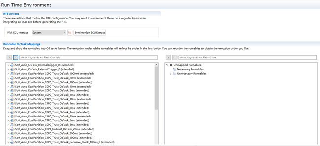

.. list-table::
   :widths: 34 33 33
   :header-rows: 1

   * - UI名称 (UI Name)
     - 描述 (Description)
     - 描述 (Description)
   * - Pick ECU extract
     - 选择导入的萃取arxml作为Rte生成模型 (Choose the extracted arxml for import as Rte generation model)
     - 选择导入的萃取arxml作为Rte生成模型 (Choose the extracted arxml for import as Rte generation model)
   * - Synchronize ECU Extract
     - 同步ECU萃取文件数据，自动配置RteSwComponentInstance（Rte通用配置页面）
     - 同步ECU萃取文件数据，自动配置RteSwComponentInstance（Rte通用配置页面）
   * - Runnable to Task Mappings
     - Necessary Runnables
     - 可能需要映射到Task的Runnables (May need to map to Task's Runnables)
   * - Runnable to Task Mappings
     - Unnecessary Runnables
     - 无需映射到Task的Runnables (No need to map to Task's Runnables)

通用配置页面 (General Configuration Page)
---------------------------------------------------

RteGeneration
~~~~~~~~~~~~~~~~~~~~~~~~~~~~~

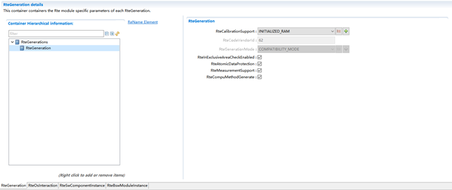

.. list-table::
   :widths: 20 20 20 20 20 20 20
   :header-rows: 1

   * - UI名称 (UI Name)
     - 描述 (Description)
     - 描述 (Description)
     - 描述 (Description)
     - 描述 (Description)
     - 描述 (Description)
     - 描述 (Description)
   * - RteCalibrationSupport
     - 取值范围 (Range)
     - DOUBLE_POINTERED
     - DOUBLE_POINTERED
     - 默认取值 (Default value)
     - 默认取值 (Default value)
     - NONE
   * - RteCalibrationSupport
     - 取值范围 (Range)
     - INITIALIZED_RAM
     - INITIALIZED_RAM
     - 默认取值 (Default value)
     - 默认取值 (Default value)
     - NONE
   * - RteCalibrationSupport
     - 取值范围 (Range)
     - NONE
     - NONE
     - 默认取值 (Default value)
     - 默认取值 (Default value)
     - NONE
   * - RteCalibrationSupport
     - 取值范围 (Range)
     - SINGLE_POINTERED
     - SINGLE_POINTERED
     - 默认取值 (Default value)
     - 默认取值 (Default value)
     - NONE
   * - RteCalibrationSupport
     - 参数描述 (Parameter Description)
     - RTE标定模式选择 (RTE Calibration Mode Selection)
     - RTE标定模式选择 (RTE Calibration Mode Selection)
     - RTE标定模式选择 (RTE Calibration Mode Selection)
     - RTE标定模式选择 (RTE Calibration Mode Selection)
     - RTE标定模式选择 (RTE Calibration Mode Selection)
   * - RteCalibrationSupport
     - 依赖关系 (Dependencies)
     - 无
     - 无
     - 无
     - 无
     - 无
   * - RteCodeVendorId
     - 取值范围 (Range)
     - 固定62 (Fixed 62)
     - 固定62 (Fixed 62)
     - 默认取值 (Default value)
     - 默认取值 (Default value)
     - 62
   * - RteCodeVendorId
     - 参数描述 (Parameter Description)
     - 供应商Id (Supplier Id)
     - 供应商Id (Supplier Id)
     - 供应商Id (Supplier Id)
     - 供应商Id (Supplier Id)
     - 供应商Id (Supplier Id)
   * - RteCodeVendorId
     - 依赖关系 (Dependencies)
     - 普华Id为62，配置项不可改 (Pruhua ID is 62, configuration items cannot be modified.)
     - 普华Id为62，配置项不可改 (Pruhua ID is 62, configuration items cannot be modified.)
     - 普华Id为62，配置项不可改 (Pruhua ID is 62, configuration items cannot be modified.)
     - 普华Id为62，配置项不可改 (Pruhua ID is 62, configuration items cannot be modified.)
     - 普华Id为62，配置项不可改 (Pruhua ID is 62, configuration items cannot be modified.)
   * - RteGenerationMode
     - 取值范围 (Range)
     - 固定COMPATIBILITY_MODE (Fix COMPATIBILITY_MODE)
     - 固定COMPATIBILITY_MODE (Fix COMPATIBILITY_MODE)
     - 默认取值 (Default value)
     - 默认取值 (Default value)
     - COMPATIBILITY_MODE
   * - RteGenerationMode
     - 参数描述 (Parameter Description)
     - Rte生成代码默认按兼容模式生成，不支持供应商模式 (The Rte generation code is default generated in compatibility mode and does not support vendor mode.)
     - Rte生成代码默认按兼容模式生成，不支持供应商模式 (The Rte generation code is default generated in compatibility mode and does not support vendor mode.)
     - Rte生成代码默认按兼容模式生成，不支持供应商模式 (The Rte generation code is default generated in compatibility mode and does not support vendor mode.)
     - Rte生成代码默认按兼容模式生成，不支持供应商模式 (The Rte generation code is default generated in compatibility mode and does not support vendor mode.)
     - Rte生成代码默认按兼容模式生成，不支持供应商模式 (The Rte generation code is default generated in compatibility mode and does not support vendor mode.)
   * - RteGenerationMode
     - 依赖关系 (Dependencies)
     - 无
     - 无
     - 无
     - 无
     - 无
   * - RteMeasurementSupport
     - 取值范围 (Range)
     - TRUE
     - TRUE
     - 默认取值 (Default value)
     - 默认取值 (Default value)
     - FALSE
   * - RteMeasurementSupport
     - 取值范围 (Range)
     - FALSE
     - FALSE
     - 默认取值 (Default value)
     - 默认取值 (Default value)
     - FALSE
   * - RteMeasurementSupport
     - 参数描述 (Parameter Description)
     - Rte是否支持测试功能 (Does Rte support test functions?)
     - Rte是否支持测试功能 (Does Rte support test functions?)
     - Rte是否支持测试功能 (Does Rte support test functions?)
     - Rte是否支持测试功能 (Does Rte support test functions?)
     - Rte是否支持测试功能 (Does Rte support test functions?)
   * - RteMeasurementSupport
     - 依赖关系 (Dependencies)
     - 无
     - 无
     - 无
     - 无
     - 无
   * - RteExclusiveAreaCheckEnabled
     - 取值范围 (Range)
     - TRUE
     - 默认取值 (Default value)
     - 默认取值 (Default value)
     - TRUE
     - TRUE
   * - RteExclusiveAreaCheckEnabled
     - 取值范围 (Range)
     - FALSE
     - 默认取值 (Default value)
     - 默认取值 (Default value)
     - TRUE
     - TRUE
   * - RteExclusiveAreaCheckEnabled
     - 参数描述 (Parameter Description)
     - 独占区保护开关 (Exclusive Zone Protection Switch)
     - 独占区保护开关 (Exclusive Zone Protection Switch)
     - 独占区保护开关 (Exclusive Zone Protection Switch)
     - 独占区保护开关 (Exclusive Zone Protection Switch)
     - 独占区保护开关 (Exclusive Zone Protection Switch)
   * - RteExclusiveAreaCheckEnabled
     - 依赖关系 (Dependencies)
     - 无
     - 无
     - 无
     - 无
     - 无
   * - RteAtomicDataProtection
     - 取值范围 (Range)
     - TRUE
     - 默认取值 (Default value)
     - 默认取值 (Default value)
     - TRUE
     - TRUE
   * - RteAtomicDataProtection
     - 取值范围 (Range)
     - FALSE
     - 默认取值 (Default value)
     - 默认取值 (Default value)
     - TRUE
     - TRUE
   * - RteAtomicDataProtection
     - 参数描述 (Parameter Description)
     - 原子数据一致性保护开关 (Atomic data consistency protection switch)
     - 原子数据一致性保护开关 (Atomic data consistency protection switch)
     - 原子数据一致性保护开关 (Atomic data consistency protection switch)
     - 原子数据一致性保护开关 (Atomic data consistency protection switch)
     - 原子数据一致性保护开关 (Atomic data consistency protection switch)
   * - RteAtomicDataProtection
     - 依赖关系 (Dependencies)
     - 无
     - 无
     - 无
     - 无
     - 无
   * - RteCompuMethodGenerate
     - 取值范围 (Range)
     - TRUE
     - 默认取值 (Default value)
     - 默认取值 (Default value)
     - TRUE
     - TRUE
   * - RteCompuMethodGenerate
     - 取值范围 (Range)
     - FALSE
     - 默认取值 (Default value)
     - 默认取值 (Default value)
     - TRUE
     - TRUE
   * - RteCompuMethodGenerate
     - 参数描述 (Parameter Description)
     - 计算方法相关代码生成 (Code generation for calculation method-related code)
     - 计算方法相关代码生成 (Code generation for calculation method-related code)
     - 计算方法相关代码生成 (Code generation for calculation method-related code)
     - 计算方法相关代码生成 (Code generation for calculation method-related code)
     - 计算方法相关代码生成 (Code generation for calculation method-related code)
   * - RteCompuMethodGenerate
     - 依赖关系 (Dependencies)
     - 无
     - 无
     - 无
     - 无
     - 无

RteOsInteraction
~~~~~~~~~~~~~~~~~~~~~~~~~~~~~~~~

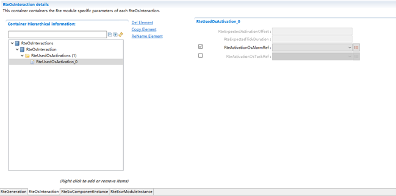

.. list-table::
   :widths: 20 20 20 20 20
   :header-rows: 1

   * - UI名称 (UI Name)
     - 描述 (Description)
     - 描述 (Description)
     - 描述 (Description)
     - 描述 (Description)
   * - RteExpectedActivationOffset
     - 取值范围 (Range)
     - [0 .. INF]
     - 默认取值 (Default value)
     - 无
   * - RteExpectedActivationOffset
     - 参数描述 (Parameter Description)
     - OsAlarm激活偏移时间（S）
     - OsAlarm激活偏移时间（S）
     - OsAlarm激活偏移时间（S）
   * - RteExpectedActivationOffset
     - 依赖关系 (Dependencies)
     - RteActivationOsAlarmRef关联OsAlarm时才需配置 (RteActivationOsAlarmRef is required to be configured when associating with OsAlarm.)
     - RteActivationOsAlarmRef关联OsAlarm时才需配置 (RteActivationOsAlarmRef is required to be configured when associating with OsAlarm.)
     - RteActivationOsAlarmRef关联OsAlarm时才需配置 (RteActivationOsAlarmRef is required to be configured when associating with OsAlarm.)
   * - RteExpectedTickDuration
     - 取值范围 (Range)
     - [0 .. INF]
     - 默认取值 (Default value)
     - 无
   * - RteExpectedTickDuration
     - 参数描述 (Parameter Description)
     - OsAlarm激活周期（S）
     - OsAlarm激活周期（S）
     - OsAlarm激活周期（S）
   * - RteExpectedTickDuration
     - 依赖关系 (Dependencies)
     - RteActivationOsAlarmRef关联OsAlarm时才需配置 (RteActivationOsAlarmRef is required to be configured when associating with OsAlarm.)
     - RteActivationOsAlarmRef关联OsAlarm时才需配置 (RteActivationOsAlarmRef is required to be configured when associating with OsAlarm.)
     - RteActivationOsAlarmRef关联OsAlarm时才需配置 (RteActivationOsAlarmRef is required to be configured when associating with OsAlarm.)
   * - RteActivationOsAlarmRef
     - 取值范围 (Range)
     - 无
     - 默认取值 (Default value)
     - 无
   * - RteActivationOsAlarmRef
     - 参数描述 (Parameter Description)
     - 关联OsAlarm (RelateOsAlarm)
     - 关联OsAlarm (RelateOsAlarm)
     - 关联OsAlarm (RelateOsAlarm)
   * - RteActivationOsAlarmRef
     - 依赖关系 (Dependencies)
     - 依赖于OS模块中OsAlarm的配置 (Dependent on the configuration of OsAlarm in the OS module)
     - 依赖于OS模块中OsAlarm的配置 (Dependent on the configuration of OsAlarm in the OS module)
     - 依赖于OS模块中OsAlarm的配置 (Dependent on the configuration of OsAlarm in the OS module)
   * - RteActivationOsTaskRef
     - 取值范围 (Range)
     - 无
     - 默认取值 (Default value)
     - 无
   * - RteActivationOsTaskRef
     - 参数描述 (Parameter Description)
     - 关联OsTask (Associate OsTask)
     - 关联OsTask (Associate OsTask)
     - 关联OsTask (Associate OsTask)
   * - RteActivationOsTaskRef
     - 依赖关系 (Dependencies)
     - 依赖于OS模块中OsTask的配置 (Dependent on the configuration of OsTask in the OS module)
     - 依赖于OS模块中OsTask的配置 (Dependent on the configuration of OsTask in the OS module)
     - 依赖于OS模块中OsTask的配置 (Dependent on the configuration of OsTask in the OS module)

RteSwComponentInstance
~~~~~~~~~~~~~~~~~~~~~~~~~~~~~~~~~~~~~~

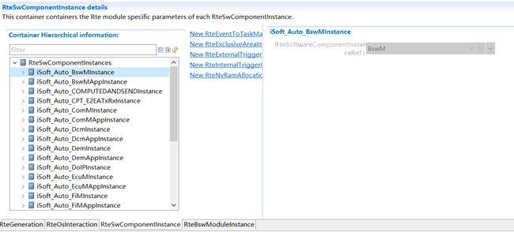

.. list-table::
   :widths: 20 20 20 20 20
   :header-rows: 1

   * - UI名称 (UI Name)
     - 描述 (Description)
     - 描述 (Description)
     - 描述 (Description)
     - 描述 (Description)
   * - RteSoftwareComponentInstanceRef
     - 取值范围 (Range)
     - 无
     - 默认取值 (Default value)
     - 无
   * - RteSoftwareComponentInstanceRef
     - 参数描述 (Parameter Description)
     - 关联SWC实例SwComponentPrototype (Associate SWC Instance SwComponentPrototype)
     - 关联SWC实例SwComponentPrototype (Associate SWC Instance SwComponentPrototype)
     - 关联SWC实例SwComponentPrototype (Associate SWC Instance SwComponentPrototype)
   * - RteSoftwareComponentInstanceRef
     - 依赖关系 (Dependencies)
     - 依赖于ECU萃取arxml文件中的SWC实例 (Dependent on ECU, extract SWC instances from arxml files.)
     - 依赖于ECU萃取arxml文件中的SWC实例 (Dependent on ECU, extract SWC instances from arxml files.)
     - 依赖于ECU萃取arxml文件中的SWC实例 (Dependent on ECU, extract SWC instances from arxml files.)

RteEventToTaskMapping
^^^^^^^^^^^^^^^^^^^^^^^^^^^^^^^^^^^^^

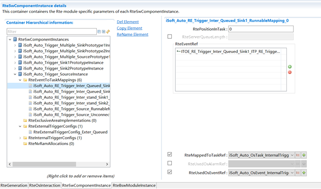

.. list-table::
   :widths: 20 20 20 20 20
   :header-rows: 1

   * - UI名称 (UI Name)
     - 描述 (Description)
     - 描述 (Description)
     - 描述 (Description)
     - 描述 (Description)
   * - RtePositionInTask
     - 取值范围 (Range)
     - 0 .. 65535
     - 默认取值 (Default value)
     - 无
   * - RtePositionInTask
     - 参数描述 (Parameter Description)
     - RunnableEntity在OsTask里的执行位置 (The execution position of RunnableEntity in OsTask)
     - RunnableEntity在OsTask里的执行位置 (The execution position of RunnableEntity in OsTask)
     - RunnableEntity在OsTask里的执行位置 (The execution position of RunnableEntity in OsTask)
   * - RtePositionInTask
     - 依赖关系 (Dependencies)
     - 无
     - 无
     - 无
   * - RteServerQueueLength
     - 取值范围 (Range)
     - 0 .. 65535
     - 默认取值 (Default value)
     - 无
   * - RteServerQueueLength
     - 参数描述 (Parameter Description)
     - CS server队列长度 (CS server queue length)
     - CS server队列长度 (CS server queue length)
     - CS server队列长度 (CS server queue length)
   * - RteServerQueueLength
     - 依赖关系 (Dependencies)
     - 无
     - 无
     - 无
   * - RteEventRef
     - 取值范围 (Range)
     - 无
     - 默认取值 (Default value)
     - 无
   * - RteEventRef
     - 参数描述 (Parameter Description)
     - 关联RteEvent (Associated RteEvent)
     - 关联RteEvent (Associated RteEvent)
     - 关联RteEvent (Associated RteEvent)
   * - RteEventRef
     - 依赖关系 (Dependencies)
     - ECU萃取arxml文件中RteEvent的配置 (Extract configuration of RteEvent from ECU arxml files)
     - ECU萃取arxml文件中RteEvent的配置 (Extract configuration of RteEvent from ECU arxml files)
     - ECU萃取arxml文件中RteEvent的配置 (Extract configuration of RteEvent from ECU arxml files)
   * - RteMappedToTaskRef
     - 取值范围 (Range)
     - 无
     - 默认取值 (Default value)
     - 无
   * - RteMappedToTaskRef
     - 参数描述 (Parameter Description)
     - 关联OsTask (Associate OsTask)
     - 关联OsTask (Associate OsTask)
     - 关联OsTask (Associate OsTask)
   * - RteMappedToTaskRef
     - 依赖关系 (Dependencies)
     - OS模块中OsTask的配置 (Configuration of OsTask in OS Module)
     - OS模块中OsTask的配置 (Configuration of OsTask in OS Module)
     - OS模块中OsTask的配置 (Configuration of OsTask in OS Module)
   * - RteUsedOsEventRef
     - 取值范围 (Range)
     - 无
     - 默认取值 (Default value)
     - 无
   * - RteUsedOsEventRef
     - 参数描述 (Parameter Description)
     - 关联OsEvent (Associate OsEvent)
     - 关联OsEvent (Associate OsEvent)
     - 关联OsEvent (Associate OsEvent)
   * - RteUsedOsEventRef
     - 依赖关系 (Dependencies)
     - OS模块中OsEvent的配置 (Configuration of OsEvent in OS Module)
     - OS模块中OsEvent的配置 (Configuration of OsEvent in OS Module)
     - OS模块中OsEvent的配置 (Configuration of OsEvent in OS Module)
   * - RteUsedOsAlarmRef
     - 取值范围 (Range)
     - 无
     - 默认取值 (Default value)
     - 无
   * - RteUsedOsAlarmRef
     - 参数描述 (Parameter Description)
     - 关联OsAlarm (RelateOsAlarm)
     - 关联OsAlarm (RelateOsAlarm)
     - 关联OsAlarm (RelateOsAlarm)
   * - RteUsedOsAlarmRef
     - 依赖关系 (Dependencies)
     - OS模块中OsAlarm的配置 (Configuration of OsAlarm in the OS Module)
     - OS模块中OsAlarm的配置 (Configuration of OsAlarm in the OS Module)
     - OS模块中OsAlarm的配置 (Configuration of OsAlarm in the OS Module)

RteExclusiveAreaImplementation
^^^^^^^^^^^^^^^^^^^^^^^^^^^^^^^^^^^^^^^^^^^^^^

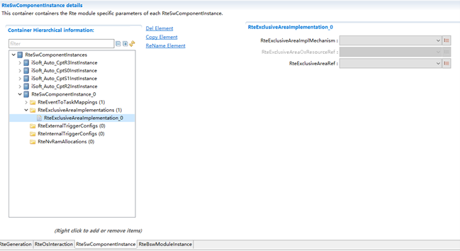

.. list-table::
   :widths: 20 20 20 20 20
   :header-rows: 1

   * - UI名称 (UI Name)
     - 描述 (Description)
     - 描述 (Description)
     - 描述 (Description)
     - 描述 (Description)
   * - RteExclusiveAreaImplMechanism
     - 取值范围 (Range)
     - ALL_INTERRUPT_BLOCKING
     - 默认取值 (Default value)
     - 无
   * - RteExclusiveAreaImplMechanism
     - 取值范围 (Range)
     - NONE
     - 默认取值 (Default value)
     - 无
   * - RteExclusiveAreaImplMechanism
     - 取值范围 (Range)
     - OS_INTERRUPT_BLOCKING
     - 默认取值 (Default value)
     - 无
   * - RteExclusiveAreaImplMechanism
     - 取值范围 (Range)
     - OS_RESOURCE
     - 默认取值 (Default value)
     - 无
   * - RteExclusiveAreaImplMechanism
     - 参数描述 (Parameter Description)
     - 独占区的实现机制选择 (The implementation mechanism for exclusive areas)
     - 独占区的实现机制选择 (The implementation mechanism for exclusive areas)
     - 独占区的实现机制选择 (The implementation mechanism for exclusive areas)
   * - RteExclusiveAreaImplMechanism
     - 依赖关系 (Dependencies)
     - 无
     - 无
     - 无
   * - RteExclusiveAreaOsResourceRef
     - 取值范围 (Range)
     - 无
     - 默认取值 (Default value)
     - 无
   * - RteExclusiveAreaOsResourceRef
     - 参数描述 (Parameter Description)
     - 关联OsResource (Associate OsResource)
     - 关联OsResource (Associate OsResource)
     - 关联OsResource (Associate OsResource)
   * - RteExclusiveAreaOsResourceRef
     - 依赖关系 (Dependencies)
     - RteExclusiveAreaImplMechanism配置为OS_RESOURCE时 (RteExclusiveAreaImplMechanism configured as OS_RESOURCE)
     - RteExclusiveAreaImplMechanism配置为OS_RESOURCE时 (RteExclusiveAreaImplMechanism configured as OS_RESOURCE)
     - RteExclusiveAreaImplMechanism配置为OS_RESOURCE时 (RteExclusiveAreaImplMechanism configured as OS_RESOURCE)
   * - RteExclusiveAreaRef
     - 取值范围 (Range)
     - 无
     - 默认取值 (Default value)
     - 无
   * - RteExclusiveAreaRef
     - 参数描述 (Parameter Description)
     - 关联ECU萃取arxml中ExclusiveArea (Extract ExclusiveArea from associated ECU arxml)
     - 关联ECU萃取arxml中ExclusiveArea (Extract ExclusiveArea from associated ECU arxml)
     - 关联ECU萃取arxml中ExclusiveArea (Extract ExclusiveArea from associated ECU arxml)
   * - RteExclusiveAreaRef
     - 依赖关系 (Dependencies)
     - ECU萃取arxml文件中ExclusiveArea的配置 (Extract configuration from ExclusiveArea in ECU arxml file)
     - ECU萃取arxml文件中ExclusiveArea的配置 (Extract configuration from ExclusiveArea in ECU arxml file)
     - ECU萃取arxml文件中ExclusiveArea的配置 (Extract configuration from ExclusiveArea in ECU arxml file)

RteExternalTriggerConfig
^^^^^^^^^^^^^^^^^^^^^^^^^^^^^^^^^^^^^^^^

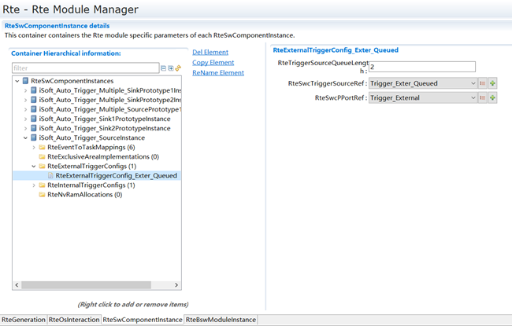

.. list-table::
   :widths: 20 20 20 20 20
   :header-rows: 1

   * - UI名称 (UI Name)
     - 描述 (Description)
     - 描述 (Description)
     - 描述 (Description)
     - 描述 (Description)
   * - RteTriggerSourceQueueLength
     - 取值范围 (Range)
     - 0 .. 4294967295
     - 默认取值 (Default value)
     - 0
   * - RteTriggerSourceQueueLength
     - 参数描述 (Parameter Description)
     - 外部触发trigger source的触发队列长度 (External trigger source triggering queue length)
     - 外部触发trigger source的触发队列长度 (External trigger source triggering queue length)
     - 外部触发trigger source的触发队列长度 (External trigger source triggering queue length)
   * - RteTriggerSourceQueueLength
     - 依赖关系 (Dependencies)
     - 无
     - 无
     - 无
   * - RteSwcTriggerSourceRef
     - 取值范围 (Range)
     - 无
     - 默认取值 (Default value)
     - 无
   * - RteSwcTriggerSourceRef
     - 参数描述 (Parameter Description)
     - trigger source中ExternalTriggeringPoint关联的trigger实例 (ExternalTriggeringPoint associated trigger instances in trigger source)
     - trigger source中ExternalTriggeringPoint关联的trigger实例 (ExternalTriggeringPoint associated trigger instances in trigger source)
     - trigger source中ExternalTriggeringPoint关联的trigger实例 (ExternalTriggeringPoint associated trigger instances in trigger source)
   * - RteSwcTriggerSourceRef
     - 依赖关系 (Dependencies)
     - ECU萃取arxml文件中TriggeInterface中trigger的配置 (Extract configuration of trigger in TriggeInterface from ECU arxml file)
     - ECU萃取arxml文件中TriggeInterface中trigger的配置 (Extract configuration of trigger in TriggeInterface from ECU arxml file)
     - ECU萃取arxml文件中TriggeInterface中trigger的配置 (Extract configuration of trigger in TriggeInterface from ECU arxml file)
   * - RteSwcPPortRef
     - 取值范围 (Range)
     - 无
     - 默认取值 (Default value)
     - 无
   * - RteSwcPPortRef
     - 参数描述 (Parameter Description)
     - trigger source中Trigger PPort实例 (Trigger Source Trigger PPort Instance)
     - trigger source中Trigger PPort实例 (Trigger Source Trigger PPort Instance)
     - trigger source中Trigger PPort实例 (Trigger Source Trigger PPort Instance)
   * - RteSwcPPortRef
     - 依赖关系 (Dependencies)
     - ECU萃取arxml文件中Trigger PPort的配置 (Extract configuration of Trigger PPort from ECU arxml file)
     - ECU萃取arxml文件中Trigger PPort的配置 (Extract configuration of Trigger PPort from ECU arxml file)
     - ECU萃取arxml文件中Trigger PPort的配置 (Extract configuration of Trigger PPort from ECU arxml file)

RteInternalTriggerConfig
^^^^^^^^^^^^^^^^^^^^^^^^^^^^^^^^^^^^^^^^

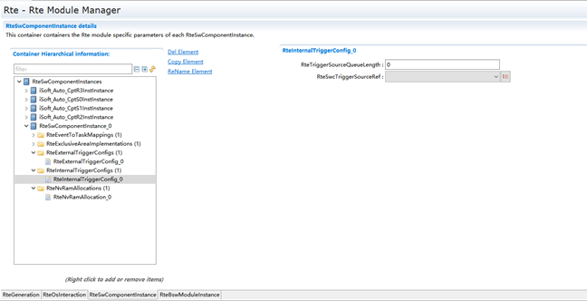

.. list-table::
   :widths: 20 20 20 20 20
   :header-rows: 1

   * - UI名称 (UI Name)
     - 描述 (Description)
     - 描述 (Description)
     - 描述 (Description)
     - 描述 (Description)
   * - RteTriggerSourceQueueLength
     - 取值范围 (Range)
     - 0 .. 4294967295
     - 默认取值 (Default value)
     - 0
   * - RteTriggerSourceQueueLength
     - 参数描述 (Parameter Description)
     - 内部触发trigger source的触发队列长度 (Internal trigger source trigger queue length)
     - 内部触发trigger source的触发队列长度 (Internal trigger source trigger queue length)
     - 内部触发trigger source的触发队列长度 (Internal trigger source trigger queue length)
   * - RteTriggerSourceQueueLength
     - 依赖关系 (Dependencies)
     - 无
     - 无
     - 无
   * - RteSwcTriggerSourceRef
     - 取值范围 (Range)
     - 无
     - 默认取值 (Default value)
     - 无
   * - RteSwcTriggerSourceRef
     - 参数描述 (Parameter Description)
     - trigger source关联的InternalTriggeringPoint (TriggerSource associated with InternalTriggeringPoint)
     - trigger source关联的InternalTriggeringPoint (TriggerSource associated with InternalTriggeringPoint)
     - trigger source关联的InternalTriggeringPoint (TriggerSource associated with InternalTriggeringPoint)
   * - RteSwcTriggerSourceRef
     - 依赖关系 (Dependencies)
     - ECU萃取arxml文件中InternalTriggeringPoint的配置 (Extract configuration of InternalTriggeringPoint from ECU arxml file)
     - ECU萃取arxml文件中InternalTriggeringPoint的配置 (Extract configuration of InternalTriggeringPoint from ECU arxml file)
     - ECU萃取arxml文件中InternalTriggeringPoint的配置 (Extract configuration of InternalTriggeringPoint from ECU arxml file)

RteNvRamAllocation
^^^^^^^^^^^^^^^^^^^^^^^^^^^^^^^^^^

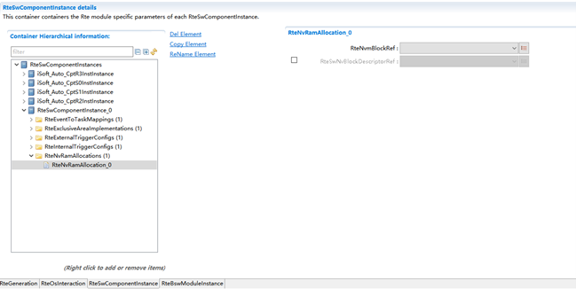

.. list-table::
   :widths: 20 20 20 20 20
   :header-rows: 1

   * - UI名称 (UI Name)
     - 描述 (Description)
     - 描述 (Description)
     - 描述 (Description)
     - 描述 (Description)
   * - RteNvmBlockRef
     - 取值范围 (Range)
     - 无
     - 默认取值 (Default value)
     - 无
   * - RteNvmBlockRef
     - 参数描述 (Parameter Description)
     - 关联NvM模块NvMBlockDescriptor (Associate NVMe Module NvMBlockDescriptor)
     - 关联NvM模块NvMBlockDescriptor (Associate NVMe Module NvMBlockDescriptor)
     - 关联NvM模块NvMBlockDescriptor (Associate NVMe Module NvMBlockDescriptor)
   * - RteNvmBlockRef
     - 依赖关系 (Dependencies)
     - NvM模块中NvMBlockDescriptor的配置 (Configuration of NvMBlockDescriptor in NvM Module)
     - NvM模块中NvMBlockDescriptor的配置 (Configuration of NvMBlockDescriptor in NvM Module)
     - NvM模块中NvMBlockDescriptor的配置 (Configuration of NvMBlockDescriptor in NvM Module)
   * - RteSwNvBlockDescriptorRef
     - 取值范围 (Range)
     - 无
     - 默认取值 (Default value)
     - 无
   * - RteSwNvBlockDescriptorRef
     - 参数描述 (Parameter Description)
     - 关联NvBlockSwComponent中NvBlockDescriptor (Associate NvBlockSwComponent with NvBlockDescriptor)
     - 关联NvBlockSwComponent中NvBlockDescriptor (Associate NvBlockSwComponent with NvBlockDescriptor)
     - 关联NvBlockSwComponent中NvBlockDescriptor (Associate NvBlockSwComponent with NvBlockDescriptor)
   * - RteSwNvBlockDescriptorRef
     - 依赖关系 (Dependencies)
     - Nv软件组件中NvBlockDescriptor的配置 (Configuration of NvBlockDescriptor in NvSoftware Components)
     - Nv软件组件中NvBlockDescriptor的配置 (Configuration of NvBlockDescriptor in NvSoftware Components)
     - Nv软件组件中NvBlockDescriptor的配置 (Configuration of NvBlockDescriptor in NvSoftware Components)

RteBswModuleInstance
~~~~~~~~~~~~~~~~~~~~~~~~~~~~~~~~~~~~

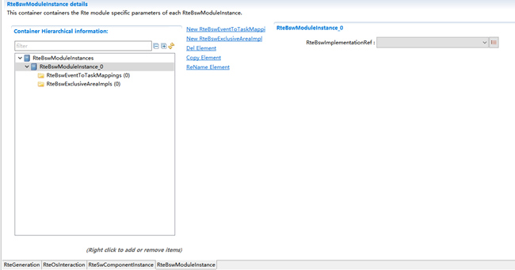

.. list-table::
   :widths: 20 20 20 20 20
   :header-rows: 1

   * - UI名称 (UI Name)
     - 描述 (Description)
     - 描述 (Description)
     - 描述 (Description)
     - 描述 (Description)
   * - RteBswImplementationRef
     - 取值范围 (Range)
     - 无
     - 默认取值 (Default value)
     - 无
   * - RteBswImplementationRef
     - 参数描述 (Parameter Description)
     - 关联BswImplementation (Associate BswImplementation)
     - 关联BswImplementation (Associate BswImplementation)
     - 关联BswImplementation (Associate BswImplementation)
   * - RteBswImplementationRef
     - 依赖关系 (Dependencies)
     - 依赖于BSW的bswmd.arxml文件 (BSW-dependent bswmd.arxml file)
     - 依赖于BSW的bswmd.arxml文件 (BSW-dependent bswmd.arxml file)
     - 依赖于BSW的bswmd.arxml文件 (BSW-dependent bswmd.arxml file)

RteBswEventToTaskMapping
^^^^^^^^^^^^^^^^^^^^^^^^^^^^^^^^^^^^^^^^

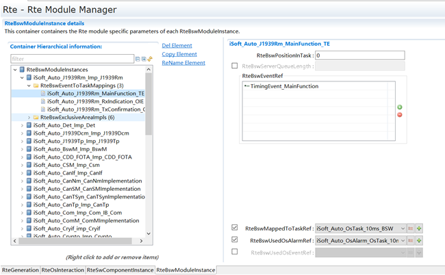

.. list-table::
   :widths: 20 20 20 20 20
   :header-rows: 1

   * - UI名称 (UI Name)
     - 描述 (Description)
     - 描述 (Description)
     - 描述 (Description)
     - 描述 (Description)
   * - RteBswPositionInTask
     - 取值范围 (Range)
     - 0 .. 65535
     - 默认取值 (Default value)
     - 无
   * - RteBswPositionInTask
     - 参数描述 (Parameter Description)
     - BswSchedulableEntity在OsTask里的执行位置 (The execution position of BswSchedulableEntity in OsTask)
     - BswSchedulableEntity在OsTask里的执行位置 (The execution position of BswSchedulableEntity in OsTask)
     - BswSchedulableEntity在OsTask里的执行位置 (The execution position of BswSchedulableEntity in OsTask)
   * - RteBswPositionInTask
     - 依赖关系 (Dependencies)
     - 无
     - 无
     - 无
   * - RteBswServerQueueLength
     - 取值范围 (Range)
     - 0 .. 65535
     - 默认取值 (Default value)
     - 无
   * - RteBswServerQueueLength
     - 参数描述 (Parameter Description)
     - CS server队列长度 (CS server queue length)
     - CS server队列长度 (CS server queue length)
     - CS server队列长度 (CS server queue length)
   * - RteBswServerQueueLength
     - 依赖关系 (Dependencies)
     - 无
     - 无
     - 无
   * - RteBswEventRef
     - 取值范围 (Range)
     - 无
     - 默认取值 (Default value)
     - 无
   * - RteBswEventRef
     - 参数描述 (Parameter Description)
     - 关联RteEvent (Associated RteEvent)
     - 关联RteEvent (Associated RteEvent)
     - 关联RteEvent (Associated RteEvent)
   * - RteBswEventRef
     - 依赖关系 (Dependencies)
     - BSW模块描述arxml文件中RteBswEvent的配置 (BSW module describes the configuration of RteBswEvent in arxml files.)
     - BSW模块描述arxml文件中RteBswEvent的配置 (BSW module describes the configuration of RteBswEvent in arxml files.)
     - BSW模块描述arxml文件中RteBswEvent的配置 (BSW module describes the configuration of RteBswEvent in arxml files.)
   * - RteBswMappedToTaskRef
     - 取值范围 (Range)
     - 无
     - 默认取值 (Default value)
     - 无
   * - RteBswMappedToTaskRef
     - 参数描述 (Parameter Description)
     - 关联OsTask (Associate OsTask)
     - 关联OsTask (Associate OsTask)
     - 关联OsTask (Associate OsTask)
   * - RteBswMappedToTaskRef
     - 依赖关系 (Dependencies)
     - OS模块中OsTask的配置 (Configuration of OsTask in OS Module)
     - OS模块中OsTask的配置 (Configuration of OsTask in OS Module)
     - OS模块中OsTask的配置 (Configuration of OsTask in OS Module)
   * - RteBswUsedOsEventRef
     - 取值范围 (Range)
     - 无
     - 默认取值 (Default value)
     - 无
   * - RteBswUsedOsEventRef
     - 参数描述 (Parameter Description)
     - 关联OsEvent (Associate OsEvent)
     - 关联OsEvent (Associate OsEvent)
     - 关联OsEvent (Associate OsEvent)
   * - RteBswUsedOsEventRef
     - 依赖关系 (Dependencies)
     - OS模块中OsEvent的配置 (Configuration of OsEvent in OS Module)
     - OS模块中OsEvent的配置 (Configuration of OsEvent in OS Module)
     - OS模块中OsEvent的配置 (Configuration of OsEvent in OS Module)
   * - RteBswUsedOsAlarmRef
     - 取值范围 (Range)
     - 无
     - 默认取值 (Default value)
     - 无
   * - RteBswUsedOsAlarmRef
     - 参数描述 (Parameter Description)
     - 关联OsAlarm (RelateOsAlarm)
     - 关联OsAlarm (RelateOsAlarm)
     - 关联OsAlarm (RelateOsAlarm)
   * - RteBswUsedOsAlarmRef
     - 依赖关系 (Dependencies)
     - OS模块中OsAlarm的配置 (Configuration of OsAlarm in the OS Module)
     - OS模块中OsAlarm的配置 (Configuration of OsAlarm in the OS Module)
     - OS模块中OsAlarm的配置 (Configuration of OsAlarm in the OS Module)

RteBswExclusiveAreaImpl
^^^^^^^^^^^^^^^^^^^^^^^^^^^^^^^^^^^^^^^

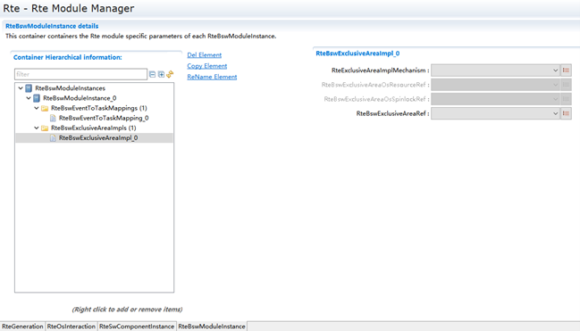

.. list-table::
   :widths: 20 20 20 20 20
   :header-rows: 1

   * - UI名称 (UI Name)
     - 描述 (Description)
     - 描述 (Description)
     - 描述 (Description)
     - 描述 (Description)
   * - RteExclusiveAreaImplMechanism
     - 取值范围 (Range)
     - ALL_INTERRUPT_BLOCKING
     - 默认取值 (Default value)
     - 无
   * - RteExclusiveAreaImplMechanism
     - 取值范围 (Range)
     - NONE
     - 默认取值 (Default value)
     - 无
   * - RteExclusiveAreaImplMechanism
     - 取值范围 (Range)
     - OS_INTERRUPT_BLOCKING
     - 默认取值 (Default value)
     - 无
   * - RteExclusiveAreaImplMechanism
     - 取值范围 (Range)
     - OS_RESOURCE
     - 默认取值 (Default value)
     - 无
   * - RteExclusiveAreaImplMechanism
     - 取值范围 (Range)
     - OS_SPINLOCK
     - 默认取值 (Default value)
     - 无
   * - RteExclusiveAreaImplMechanism
     - 参数描述 (Parameter Description)
     - 独占区的实现机制选择 (The implementation mechanism for exclusive areas)
     - 独占区的实现机制选择 (The implementation mechanism for exclusive areas)
     - 独占区的实现机制选择 (The implementation mechanism for exclusive areas)
   * - RteExclusiveAreaImplMechanism
     - 依赖关系 (Dependencies)
     - 无
     - 无
     - 无
   * - RteBswExclusiveAreaOsResourceRef
     - 取值范围 (Range)
     - 无
     - 默认取值 (Default value)
     - 无
   * - RteBswExclusiveAreaOsResourceRef
     - 参数描述 (Parameter Description)
     - 关联OsResource (Associate OsResource)
     - 关联OsResource (Associate OsResource)
     - 关联OsResource (Associate OsResource)
   * - RteBswExclusiveAreaOsResourceRef
     - 依赖关系 (Dependencies)
     - RteExclusiveAreaImplMechanism配置为OS_RESOURCE时 (RteExclusiveAreaImplMechanism configured as OS_RESOURCE)
     - RteExclusiveAreaImplMechanism配置为OS_RESOURCE时 (RteExclusiveAreaImplMechanism configured as OS_RESOURCE)
     - RteExclusiveAreaImplMechanism配置为OS_RESOURCE时 (RteExclusiveAreaImplMechanism configured as OS_RESOURCE)
   * - RteBswExclusiveAreaOsSpinlockRef
     - 取值范围 (Range)
     - 无
     - 默认取值 (Default value)
     - 无
   * - RteBswExclusiveAreaOsSpinlockRef
     - 参数描述 (Parameter Description)
     - 关联OsSpinlock (Associate OsSpinlock)
     - 关联OsSpinlock (Associate OsSpinlock)
     - 关联OsSpinlock (Associate OsSpinlock)
   * - RteBswExclusiveAreaOsSpinlockRef
     - 依赖关系 (Dependencies)
     - RteExclusiveAreaImplMechanism配置为OS_SPINLOCK时 (Configure RteExclusiveAreaImplMechanism as OS_SPINLOCK when)
     - RteExclusiveAreaImplMechanism配置为OS_SPINLOCK时 (Configure RteExclusiveAreaImplMechanism as OS_SPINLOCK when)
     - RteExclusiveAreaImplMechanism配置为OS_SPINLOCK时 (Configure RteExclusiveAreaImplMechanism as OS_SPINLOCK when)
   * - RteBswExclusiveAreaRef
     - 取值范围 (Range)
     - 无
     - 默认取值 (Default value)
     - 无
   * - RteBswExclusiveAreaRef
     - 参数描述 (Parameter Description)
     - BSW模块描述arxml中ExclusiveArea (BSW Module Description arxml ExclusiveArea)
     - BSW模块描述arxml中ExclusiveArea (BSW Module Description arxml ExclusiveArea)
     - BSW模块描述arxml中ExclusiveArea (BSW Module Description arxml ExclusiveArea)
   * - RteBswExclusiveAreaRef
     - 依赖关系 (Dependencies)
     - BSW模块描述arxml文件中ExclusiveArea的配置 (BSW module describes the configuration of ExclusiveArea in arxml files)
     - BSW模块描述arxml文件中ExclusiveArea的配置 (BSW module describes the configuration of ExclusiveArea in arxml files)
     - BSW模块描述arxml文件中ExclusiveArea的配置 (BSW module describes the configuration of ExclusiveArea in arxml files)

RTE-OS同步配置 (RTE-OS Synchronized Configuration)
--------------------------------------------------------------

基于ECU萃取arxml文件，BSW的模块描述文件，根据模型需求自动配置OS模块。自动配置分两种：

Extract ARXML files from ECU, module description files for BSW based on extracted models, and automatically configure OS modules according to model requirements. Automatic configuration is divided into two types:

与RTE实现相关，OS必须按实现需求进行配置且客户不能修改；

Regarding RTE implementation, the OS must be configured according to the implementation requirements and customers cannot modify it;

为客户提供配置Demo，简化客户手动配置工作量，客户根据应用场景在自动配置的基础上调整、适配；

Provide customers with configuration demos to simplify their manual configuration workload, allowing customers to adjust and adapt based on their specific use cases on top of the automatic configurations;

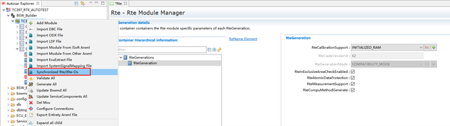

RTE生成和集成 (RTE Generation and Integration)
=========================================================

工具开发流程概述 (Overview of the Tool Development Process)
-------------------------------------------------------------------

导入ECU萃取arxml文件（包含完整的SWC组件，BSW服务，Port连接关系，信号映射等信息）；

Import ECU extracted arxml files (including complete SWCs, BSW services, port connections, signal mappings, etc.).

完成除OS和RTE之外的所有BSW模块配置；

Complete the configuration of all BSW modules except OS and RTE;

补充必要的OS信息如OS核数；

Add necessary OS information such as number of OS cores;

更新全部BSW模块的模块描述文件；

Update the module description files of all BSW modules;

手动进行RTE、OS配置或通过RTE-OS同步功能自动生成推荐Demo配置（RTE模块和OS模块）；

Manually perform RTE and OS configuration or generate recommended demo configurations (RTE modules and OS modules) through the RTE-OS synchronization function;

如果选用了RTE-OS同步功能，需要基于自动生成的推荐OS、RTE Demo配置，结合使用场景进行调整适配；

If the RTE-OS synchronization function is selected, adjustments and adaptations need to be made based on the automatically generated recommended OS and RTE Demo configurations in conjunction with the usage scenario.

先生成RTE代码，后生成OS代码（全工程生成顺序为其它BSW→RTE→OS）；

Generate RTE code first, then generate OS code (the full engineering generation order is other BSW → RTE → OS);

RTE文件结构 (RTE File Structure)
--------------------------------------------

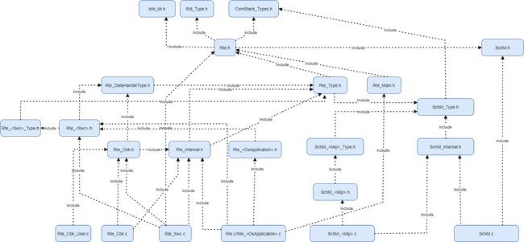

.. list-table::
   :widths: 50 50
   :header-rows: 1

   * - 文件名 (Filename)
     - 描述 (Description)
   * - Rte.c
     - 单分区系统包含如下几部分内容： 生命周期函数定义；（Rte_Start、Rte_Stop等）； 公用状态变量（类似Rte_State等）； 定义Os_Task，填充其内容；  公用内部函数； 多分区系统包含如下几部分内容： 生命周期函数定义；（Rte_Start、Rte_Stop）； 公用状态变量（类似Rte_State等）；  公用内部函数；
   * - Rte<OsApplication>.c
     - 多分区系统生成，包含如下几部分内容： 分区生命周期内部函数定义； 分区相关公用状态变量； 分区内Os_Task实现；  分区内公用内部函数； (Multi-partition system generation, includes the following parts: partition lifecycle internal function definitions; partition-related common state variables; Os_Task implementation within the partition; common internal functions within the partition;)
   * - Rte<Swc>.c
     - 包含如下几部分内容： 多补全时，实例变量(Rte_Instance<cts inst>)； 定义临界区访问函数；（Rte_Enter/Rte_Exit等）； 定义与关联SWC有关的接口，如Rte_Write/Rte_Read等； SwcType实例相关的Com/LdCom/Ioc回调函数； SwcType实例相关的序列化串函数；
   * - Rte_Cbk_User.c
     - CallBack桩函数 (Callback桩函数)
   * - Rte_Cbk.c
     - 定义通信相关的Com/LdCom/Ioc回调函数，如Rte_Cbkxxx等； (Define communication-related Com/LdCom/Ioc callback functions, such as Rte_Cbkxxx;)
   * - Rte<Swc>.h
     - SWC定义的RteEvent触发的Runnable函数声明；  SWC的Runnable中要用到的Rte函数的声明，如Rte_Write等； 多实例时，定义CDS结构(Rte_Instance)；  定义S/R（或者NV）端口配置的初始值；  定义PerInstanceMemory类型；  定义C/S通信的应用特定的错误返回类型值；
   * - Rte<Swc>_Type.h
     - 定义Enumeration Data Types （5.5.4）；  定义Range Data Types （5.5.5）；  重定义定义Implementation Data Type symbols；
   * - Rte_DataHandleType.h
     - 定义CDS结构里面Data Handle Type结构体； data element without status ； data element with status； data element with extended status； (Define Data Handle Type structure within CDS structure; data element without status; data element with status; data element with extended status;)
   * - Rte_Type.h
     - 针对所有的AUTOSAR Data Types：type declarations、structure defintions以及union definitions； 定义Inter-ECU C/S通信的数据结构Rte_Cs_TransactionHandleType ； 定义RTE Modes（5.5.3）；
   * - Rte_Main.h
     - 声明生命周期函数； (Declare lifecycle functions;)
   * - Rte.h
     - 定义版本号； 定义错误返回值； (Define version number; Define error return values;)
   * - Rte_Internal.h
     - 模块内公共函数定义、数据类型定义、宏定义等 (Definitions of public functions within the module, data types, macros, etc.)
   * - Rte<OsApplication>.h
     - 分区内部函数声明 (Internal function declaration in partition)
   * - SchM.c
     - SchM 内部函数的实现； SchM生命周期函数实现； (Implementation of internal functions in SchM; Implementation of lifecycle functions in SchM;)
   * - SchM<Mip>.c
     - SchM接口实现 (SchM interface implementation)
   * - SchM.h
     - SchM 生命周期等外部函数的声明头文件 (Header file for declaring external functions of SchM lifetime etc.)
   * - SchM<Mip>.h
     - SchM接口声明； BswSchduleEntity和BswCalledEntity原型声明； (SchM interface declaration; prototype declarations for BswScheduleEntity and BswCalledEntity;)
   * - SchM_Internal.h
     - SchM 内部函数的声明头文件 (Header file for declaring internal functions of SchM)
   * - SchM<Mip>_Type.h
     - BSW模块使用的数据类型定义； (Data types defined for the BSW module;)
   * - SchM_Type.h
     - 定义SchM内部使用数据类型； (Define data types for SchM internal use;)

Application RunnableEntity桩代码生成 (Application RunnableEntity POGO code generation)
-------------------------------------------------------------------------------------------------

可选操作，如果应用开发未完成，可使用BSW工具（图5-2）生成Application RunnableEntity的桩代码。

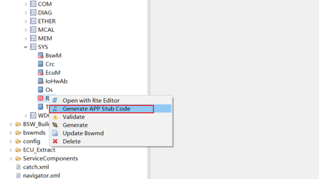

集成 (Integrate)
------------------------------

按照5.1章节完成工程的配置，生成所有BSW（包括OS、RTE、MCAL）动态配置代码后，基于芯片、编译器搭建代码工程，集成BSW静态代码以及工具生成的动态代码，再加上Application RunnableEntity代码（若应用开发未完成，可使用5.3生成Application RunnableEntity的桩代码），基于内存布局需求、以及BSW和Application RunnableEntity的MemMap进行链接文件设计，整体进行编译、链接。

After completing the engineering configuration according to Chapter 5.1, generate all BSW (including OS, RTE, MCAL) dynamic configuration codes. Based on the chip and compiler, set up the code engineering, integrate BSW static code along with the dynamically generated code from the tools, and add Application RunnableEntity code (if application development is not completed, use the stub code generated in Section 5.3). Design the link file based on memory layout requirements, BSW, and Application RunnableEntity MemMap, and then compile and link overall.

