Sd
#################################

:strong:`缩写词注解 (Abbreviation Notes):`

.. list-table::
   :widths: 34 33 33
   :header-rows: 1

   * - 缩写词 (Abbreviation)
     - 解释/描述 (Explanation/Description)
     - 中文解释 (Chinese explanation)
   * - SD
     - Service Discovery
     - 服务发现 (Service Discovery)
   * - Sd
     - Service Discovery Modulein AUTOSAR
     - AUTOSAR服务发现模块 (AUTOSAR Service Discovery Module)
   * - SOME/IP
     - Scalable service-OrientedMiddlwarE over IP
     - 基于IP的可缩放的面向服务中间件 (Service-oriented middleware based on IP with scalability)
   * - SOME/IP-SD
     - SOME/IP Service Discovery
     - SOMEIP服务发现 (SOMEIP Service Discovery)

简介 (Introduction)
=================================

Service Discovery模块，即服务发现模块，主要用于：

The Service Discovery module, also known as the service discovery module, is mainly used for:

i) 探测外部是否有可用的服务，定位服务位置。

Detecting whether there are available services externally and locating their positions.

ii) 向外部提供可用的服务。

Provide available services externally.

iii) 实现发布/订阅机制，以控制Event报文的订阅和发布。

Implement publish/subscribe mechanisms to control the subscription and publication of Event messages.

Sd模块位于SoAd和BswM模块之间，和上述两个模块协作完成服务发现的功能。

The Sd module is located between the SoAd and BswM modules, collaborating with the above two modules to complete the service discovery function.

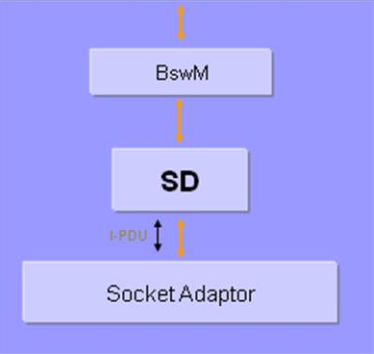

参考资料 (Reference materials)
------------------------------------------

[1] AUTOSAR_SWS_ServiceDiscovery.pdf，R19-11

[2] AUTOSAR_PRS_SOMEIPServiceDiscoveryProtocol.pdf，R19-11

功能描述 (Function Description)
===========================================

OfferService功能 (OfferService Function)
------------------------------------------------------

OfferService功能介绍 (Function Introduction of OfferService)
========================================================================

OfferService功能用于向外部声明可以提供某种服务。当本地ECU作为服务器端提供某种服务时：

The OfferService function is used to declare externally that a certain service can be provided. When the local ECU acts as the server to provide a specific service:

i）该服务就绪时，Sd模块会主动发送包含OfferService Entry的报文向其他ECU表明当前有可用的某种服务。这种情况报文多播发送。

When the service is ready, the Sd module proactively sends a message containing OfferService Entry to other ECU(s) to indicate that there is currently an available service. This type of message is multicast sent.

ii）当其它ECU发送FindService Entry主动寻找某种服务时，本地ECU作为服务提供者，向寻找服务的客户端发送OfferService Entry，表白可以提供某种服务。这种情况报文单播发送。

When other ECU sends a FindService Entry proactively to look for a certain service, the local ECU acts as the service provider and unicast sends an OfferService Entry to the client seeking the service. In this case, the message is sent unicast.

OfferService功能实现 (Implementation of OfferService Functionality)
===============================================================================

当服务可用或者不可用时，SWC需要调用BswM的接口通知BswM某个服务可用/不可用，BswM会调用Sd_ServerServiceSetState(SdServerServiceHandleId，ServerServiceState)接口，向Sd模块表明该服务的状态。其中SdServerServiceHandleId参数用于标识服务，ServerServiceState用于标识服务状态。

When the SWC service becomes available or unavailable, it needs to call the interface provided by BswM to notify BswM of the availability/unavailability of the service. BswM will then invoke the Sd_ServerServiceSetState(SdServerServiceHandleId, ServerServiceState) interface to indicate the state of the service to the Sd module. Here, the SdServerServiceHandleId parameter is used to identify the service, while the ServerServiceState identifies the status of the service.

Sd模块会根据当前的状态向外发送OfferService或者StopOfferService报文。报文中会携带SdServerServiceHandleId代表的服务的信息（IP地址，端口号等）。其他节点可以利用这些信息定位到该服务，以使用这些服务。

The Sd module sends OfferService or StopOfferService messages based on the current state. These messages carry information about the service represented by SdServerServiceHandleId (such as IP address, port number, etc.). Other nodes can use this information to locate and utilize these services.

Server可以提供的服务在配置工具SdInstance🡪SdServerService中配置。

The services that Server can provide are configured in the configuration tool SdInstance🡪SdServerService.

FindService 功能 (FindService Function)
-----------------------------------------------------

FindService功能介绍 (Function Introduction for FindService)
=======================================================================

FindService功能用于寻找外部是否有可用的某种服务。当ECU需要使用某种服务时，Sd模块会发送包含FindService Entry的报文，用于寻找某种服务。

The FindService function is used to find if there is an available service externally for a certain type of service. When the ECU needs to use a specific service, the Sd module sends a message containing FindService Entry to search for that service.

FindService功能实现 (FindService functionality implementation)
==========================================================================

当SWC作为客户端需要使用某种服务时，SWC会调用BswM的接口通知BswM需要某个服务，BswM调用Sd_ClientServiceSetState(ClientServiceHandleId,ClientServiceState)接口，向Sd模块表明需要某个服务。

When SWC acts as a client and needs to use a certain service, SWC invokes the interface of BswM to notify BswM that it requires a specific service. BswM then calls the Sd_ClientServiceSetState(ClientServiceHandleId, ClientServiceState) interface to inform the Sd module about the required service.

Sd模块会向外发送FindService报文。报文中会携带SdServerServiceHandleId代表的服务的具体信息（Service ID，版本号等）。其他节点根据这些信息判断自己是否可以提供这个服务，可以提供时会发送OfferService通知寻找服务的客户端。

The Sd module sends a FindService message. The message carries specific information about the service represented by SdServerServiceHandleId (such as Service ID, version number, etc.). Other nodes determine based on this information whether they can provide the service. If they can provide it, they send an OfferService notification to the client seeking the service.

Client需要的服务（即需要寻找的服务）在配置工具SdInstance🡪SdClientService中配置。

The services (i.e., the services that Client needs) are configured in the configuration tool SdInstance🡪SdClientService.

Eventgroup订阅功能 (Eventgroup Subscription Function)
-----------------------------------------------------------------

Eventgroup订阅功能简介 (Introduction to Eventgroup Subscription Function)
===================================================================================

Eventgroup订阅功能用于订阅需要接收的Eventgroup。

The Eventgroup subscription feature is used for subscribing to the Eventgroups that need to be received.

Eventgroup订阅功能的实现 (The implementation of the Eventgroup Subscription feature)
=============================================================================================

当SWC（作为客户端）需要订阅某个Eventgroup时，SWC会调用BswM的接口通知BswM，BswM会调用Sd_ConsumedEventGroupSetState(SdConsumedEventGroupHandleId，ConsumedEventGroupState)接口通知Sd模块。当Sd模块收到提供该Eventgroup的对应服务发送的OfferService报文时，Sd模块会发送包含SubscribeEventgroup Entry的报文订阅Eventgroup。

When SWC (as the client) needs to subscribe to a specific Eventgroup, SWC invokes BswM's interface to notify BswM. BswM then calls the Sd_ConsumedEventGroupSetState(SdConsumedEventGroupHandleId, ConsumedEventGroupState) interface to inform the Sd module. Upon receiving an OfferService message from the corresponding service providing that Eventgroup, the Sd module sends a message containing a SubscribeEventgroup Entry to subscribe to the Eventgroup.

Client需要订阅的Eventgroup在配置工具SdInstance🡪SdClientService🡪SdConsumedEventGroup中配置。

The Eventgroup that Client needs to subscribe is configured in the configuration tool SdInstance🡪SdClientService🡪SdConsumedEventGroup.

Eventgroup管理功能 (Eventgroup Management Function)
---------------------------------------------------------------

Eventgroup管理功能简介 (Introduction to Eventgroup Management Function)
=================================================================================

当Client向Server订阅Eventgroup时，Server需要管理订阅该Eventgroup的客户端。

When a Client subscribes to an Eventgroup, the Server needs to manage the clients subscribed to that Eventgroup.

Eventgroup管理功能的实现 (The implementation of Eventgroup Management functionality)
=============================================================================================

当收到Client的SubscribeEventgroup报文后，Server需要将SubscribeEventgroup报文中的信息（Eventgroup ID，版本号，Service ID等）和配置中保存的信息作比较，如果一致的情况下，并且该Client之前不在订阅列表中，则将该Client添加到订阅列表中，向该Client应答SubscribeEventgroupAck报文。如果该Client之前已经在订阅列表中，则用SubscribeEventgroup Entry中的TTL时间更新订阅列表中的TTL值。信息不一致的情况下，应答SubscribeEventgroupNAck报文。

Upon receiving the SubscribeEventgroup message from the Client, the Server needs to compare the information in the SubscribeEventgroup message (Eventgroup ID, version number, Service ID, etc.) with the information saved in the configuration. If they are consistent and the Client is not already in the subscription list, add the Client to the subscription list and respond with a SubscribeEventgroupAck message to the Client. If the Client is already in the subscription list, update the TTL value in the subscription list using the TTL time from the SubscribeEventgroup Entry. If the information is inconsistent, respond with a SubscribeEventgroupNAck message.

当订阅时间到（SubscribeEventgroup中携带的TTL计时时间到）或者收到Client发送的StopSubscribeEventgroup Entry，Server需要将该Client从订阅列表中删除。

When the subscription time expires (as indicated by the TTL in SubscribeEventgroup) or when the Client sends a StopSubscribeEventgroup entry, the Server needs to remove the Client from the subscription list.

Server提供的Eventgroup（需要管理的Eventgroup）在配置工具SdInstance🡪SdServerService🡪SdEventHandler中配置。

The Eventgroup provided by Server (the Eventgroup to be managed) is configured in the configuration tool SdInstance🡪SdServerService🡪SdEventHandler.

RoutingPath控制功能 (RoutingPath Control Function)
--------------------------------------------------------------

RoutingPath控制功能简介 (Introduction to the RoutingPath Control Function)
====================================================================================

Sd模块通过控制SoAd里面SoAdRoutingGroup的状态（Enable/Disable），从而达到控制Event的接收和发送的路径的通断，控制Event的接收和发送。其中对Event发送路径的控制叫Fan out控制，对Event接收路径的控制叫Fan in控制。

The Sd module achieves the on-off control of the Event reception and transmission paths by controlling the state (Enable/Disable) of SoAd's SoAdRoutingGroup. The control over the Event transmission path is called Fan out control, while the control over the Event reception path is called Fan in control.

RoutingPath控制功能的实现 (The implementation of RoutingPath Control Function)
=======================================================================================

Fan out控制 (Fanout Control)
------------------------------------------

当Client订阅Eventgroup时，Server根据Client发送的SubscribeEventgroup Entry中携带的信息在配置中找到与之匹配的SdEventHandler，根据SdEventHandler中的SdEventHandlerTcp/SdEventHandlerUdp找到对应的SoAdRoutingGroup（取得RoutingGroup ID）。根据SubscribeEventgroup Entry中携带的Endpoint option信息以及配置中的SdServerServiceUdpRef/SdServerServiceTcpRef参数推导出该Event发送对应的SocketConnection（取得SoConId），然后调用SoAd_EnableSpecificRouting()或SoAd_DisableSpecificRouting()，来控制对应的RoutingGroup。

When the Client subscribes to an Eventgroup, the Server finds a matching SdEventHandler in the configuration based on the information carried in the SubscribeEventgroup Entry sent by the Client. The Server then locates the corresponding SoAdRoutingGroup (obtaining the RoutingGroup ID) according to the SdEventHandlerTcp/SdEventHandlerUdp within the SdEventHandler. Based on the Endpoint option information carried in the SubscribeEventgroup Entry and the configuration parameters SdServerServiceUdpRef/SdServerServiceTcpRef, the Server infers the corresponding SocketConnection for event sending (obtaining SoConId), and then calls SoAd_EnableSpecificRouting() or SoAd_DisableSpecificRouting() to control the corresponding RoutingGroup.

Fan in控制 (Fan In control)
-----------------------------------------

当Client向Server发送SubscribeEventgroup Entry向Server订阅某个Eventgroup时，Client通过配置中的SdConsumedEventGroupTcpActivationRef/SdConsumedEventGroupUdpActivationRef参数找到对应的SoAdRoutingGroup（取得RoutingGroup ID）。根据OfferService Entry中携带的Endpoint option信息以及配置中的SdClientServiceUdpRef/SdClientServiceTcpRef参数推导出该Event发送对应的SocketConnection（取得SoConId），然后调用SoAd_EnableSpecificRouting()或SoAd_DisableSpecificRouting()，来控制对应的RoutingGroup。

When a Client sends a SubscribeEventgroup Entry to the Server to subscribe to a certain Eventgroup, the Client finds the corresponding SoAdRoutingGroup (obtaining the RoutingGroup ID) through the parameters SdConsumedEventGroupTcpActivationRef/SdConsumedEventGroupUdpActivationRef in the configuration. Based on the Endpoint option information carried by the OfferService Entry and the parameters SdClientServiceUdpRef/SdClientServiceTcpRef in the configuration, it deduces the corresponding SocketConnection for Event transmission (obtaining SoConId), then calls SoAd_EnableSpecificRouting() or SoAd_DisableSpecificRouting() to control the corresponding RoutingGroup.

注意：以上描述的所有功能能实现的前提是本端ECU的IP地址已指定，即Sd模块的Sd_LocalIpAddrAssignmentChg()被调用过，并且State为TCPIP_IPADDR_STATE_ASSIGNED。

Note: All the functionalities described above can be achieved only if the IP address of this end ECU is specified, meaning that Sd_LocalIpAddrAddrChg() has been called and the State is TCPIP_IPADDR_STATE_ASSIGNED.

源文件描述 (Source file description)
===============================================

.. centered:: **表 Sd组件文件描述 (Table SD Component File Description)**

.. list-table::
   :widths: 50 50
   :header-rows: 1

   * - 文件 (Files)
     - 说明 (Description)
   * - Sd_cfg.h
     - 定义Sd模块预编译时用到的配置参数。 (Define configuration parameters used during pre-compilation of the Sd module.)
   * - Sd_cfg.c
     - 定义Sd模块中连接时用到的配置参数。 (Define configuration parameters used for connection in the Sd module.)
   * - Sd.h
     - Sd模块头文件，包含了API函数的扩展声明并定义了端口的数据结构。 (SD module header file, which includes extended declarations and definitions of API functions and port data structures.)
   * - Sd .c
     - Sd模块源文件，包含了API函数的实现。 (SD module source files contain the implementation of API functions.)

API接口 (API Interface)
=====================================

类型定义 (Type definition)
--------------------------------------

Sd_ServerServiceSetStateType类型定义 (Sd_ServerServiceSetStateType type definition)
===============================================================================================

.. list-table::
   :widths: 34 33 33
   :header-rows: 1

   * - 名称 (Name)
     - Sd_ServerServiceSetStateType
     - 
   * - 类型 (Type)
     - Enumeration
     - 
   * - 范围 (Range)
     - SD_SERVER_SERVICE_DOWN
     - 0x00
   * - 
     - SD_SERVER_SERVICE_AVAILABLE
     - 0x01
   * - 描述 (Description)
     - This type defines the Server statesthat are reported to the SD using theexpected APISd_ServerServiceSetState.
     - 

Sd_ClientServiceSetStateType类型定义 (Sd_ClientServiceSetStateType Type Definition)
===============================================================================================

.. list-table::
   :widths: 34 33 33
   :header-rows: 1

   * - 名称 (Name)
     - Sd_ClientServiceSetStateType
     - 
   * - 类型 (Type)
     - Enumeration
     - 
   * - 范围 (Range)
     - SD_CLIENT_SERVICE_RELEASED
     - 0x00
   * - 
     - SD_CLIENT_SERVICE_REQUESTED
     - 0x01
   * - 描述 (Description)
     - This type defines the Client statesthat are reported to the BswM usingthe expected APISd_ClientServiceSetState.
     - 

Sd_ConsumedEventGroupSetStateType类型定义 (Sd_ConsumedEventGroupSetStateType type definition)
=========================================================================================================

.. list-table::
   :widths: 34 33 33
   :header-rows: 1

   * - 名称 (Name)
     - Sd_ConsumedEventGroupSetStateType
     - 
   * - 类型 (Type)
     - Enumeration
     - 
   * - 范围 (Range)
     - SD_CONSUMED_EVENTGROUP_RELEASED
     - 0x00
   * - 
     - SD_CONSUMED_EVENTGROUP_REQUESTED
     - 0x01
   * - 描述 (Description)
     - This type defines the subscription policy byconsumed EventGroup for the Client Service.
     - 

Sd_ClientServiceCurrentStateType类型定义 (Sd_ClientServiceCurrentStateType type definition)
=======================================================================================================

.. list-table::
   :widths: 34 33 33
   :header-rows: 1

   * - 名称 (Name)
     - Sd_ClientServiceCurrentStateType
     - 
   * - 类型 (Type)
     - Enumeration
     - 
   * - 范围 (Range)
     - SD_CLIENT_SERVICE_DOWN
     - 0x00
   * - 
     - SD_CLIENT_SERVICE_AVAILABLE
     - 0x01
   * - 描述 (Description)
     - This type defines the modes to indicate thecurrent mode request of a Client Service.
     - 

Sd_ConsumedEventGroupCurrentStateType类型定义 (Sd_ConsumedEventGroupCurrentStateType type definition)
=================================================================================================================

.. list-table::
   :widths: 34 33 33
   :header-rows: 1

   * - 名称 (Name)
     - Sd_ConsumedEventGroupCurrentStateType
     - 
   * - 类型 (Type)
     - Enumeration
     - 
   * - 范围 (Range)
     - SD_CONSUMED_EVENTGROUP_DOWN
     - 0x00
   * - 
     - SD_CONSUMED_EVENTGROUP_AVAILABLE
     - 0x01
   * - 描述 (Description)
     - This type defines the subscription policy byconsumed EventGroup for the Client Service.
     - 

Sd_EventHandlerCurrentStateType类型定义 (Sd_EventHandlerCurrentStateType Type Definition)
=====================================================================================================

.. list-table::
   :widths: 34 33 33
   :header-rows: 1

   * - 名称 (Name)
     - Sd_EventHandlerCurrentStateType
     - 
   * - 类型 (Type)
     - Enumeration
     - 
   * - 范围 (Range)
     - SD_EVENT_HANDLER_RELEASED
     - 0x00
   * - 
     - SD_EVENT_HANDLER_REQUESTED
     - 0x01
   * - 描述 (Description)
     - This type defines the subscription policy byEventHandler for the Server Service.
     - 

输入函数描述 (Describe the input function:)
-----------------------------------------------------

.. list-table::
   :widths: 50 50
   :header-rows: 1

   * - 输入模块 (Input Module)
     - API
   * - Dem
     - Dem_ReportErrorStatus
   * - Det
     - Det_ReportError
   * - SoAd
     - SoAd_DisableSpecificRouting
   * - 
     - SoAd_EnableSpecificRouting
   * - 
     - SoAd_GetLocalAddr
   * - 
     - SoAd_GetPhysAddr
   * - 
     - SoAd_GetRemoteAddr
   * - 
     - SoAd_IfSpecificRoutingGroupTransmit
   * - 
     - SoAd_IfTransmit
   * - 
     - SoAd_SetRemoteAddr
   * - 
     - SoAd_CloseSoCon
   * - 
     - SoAd_DisableRouting
   * - 
     - SoAd_EnableRouting
   * - 
     - SoAd_GetSoConId
   * - 
     - SoAd_IfRoutingGroupTransmit
   * - 
     - SoAd_OpenSoCon
   * - 
     - SoAd_ReleaseIpAddrAssignment
   * - 
     - SoAd_RequestIpAddrAssignment
   * - 
     - SoAd_SetUniqueRemoteAddr
   * - BswM
     - BswM_Sd_ClientServiceCurrentState
   * - 
     - BswM_Sd_ConsumedEventGroupCurrentState
   * - 
     - BswM_Sd_EventHandlerCurrentState

静态接口函数定义 (Static interface function definition)
---------------------------------------------------------------

Sd_Init函数定义 (The Sd_Init function definition)
=============================================================

.. list-table::
   :widths: 25 25 25 25
   :header-rows: 1

   * - 函数名称： (Function Name:)
     - Sd_Init
     - 
     - 
   * - 函数原型： (Function prototype:)
     - void Sd_Init (constSd_ConfigType\*ConfigPtr )
     - 
     - 
   * - 服务编号： (Service Number:)
     - 0x01
     - 
     - 
   * - 同步/异步： (Synchronous/asynchronous:)
     - 同步 (Sync)
     - 
     - 
   * - 是否可重入： (Is Reentrant:)
     - 不可重入 (Non-reentrant)
     - 
     - 
   * - 输入参数： (Input parameters:)
     - ConfigPtr
     - 值域： (Domain:)
     - 无
   * - 输入输出参数： (Input Output Parameters:)
     - 无
     - 
     - 
   * - 输出参数： (Output Parameters:)
     - 无
     - 
     - 
   * - 返回值： (Return Value:)
     - 无
     - 
     - 
   * - 功能概述： (Function Overview:)
     - 初始化SD模块。 (Initialize SD module.)
     - 
     - 

Sd_GetVersionInfo函数定义 (The Sd_GetVersionInfo function definition)
=================================================================================

.. list-table::
   :widths: 25 25 25 25
   :header-rows: 1

   * - 函数名称： (Function Name:)
     - Sd_GetVersionInfo
     - 
     - 
   * - 函数原型： (Function prototype:)
     - voidSd_GetVersionInfo(Std_VersionInfoType\*versioninfo )
     - 
     - 
   * - 服务编号： (Service Number:)
     - 0x02
     - 
     - 
   * - 同步/异步： (Synchronous/asynchronous:)
     - 同步 (Sync)
     - 
     - 
   * - 是否可重入： (Is Reentrant:)
     - 可重入 (Reentrant)
     - 
     - 
   * - 输入参数： (Input parameters:)
     - 无
     - 
     - 
   * - 输入输出参数： (Input Output Parameters:)
     - 无
     - 
     - 
   * - 输出参数： (Output Parameters:)
     - versioninfo
     - 值域： (Domain:)
     - 无
   * - 返回值： (Return Value:)
     - 无
     - 
     - 
   * - 功能概述： (Function Overview:)
     - 返回SD模块的版本信息。 (Return the version information of the SD module.)
     - 
     - 

Sd_ServerServiceSetState函数定义 (The Sd_ServerServiceSetState function definition)
===============================================================================================

.. list-table::
   :widths: 25 25 25 25
   :header-rows: 1

   * - 函数名称： (Function Name:)
     - Sd_ServerServiceSetState
     - 
     - 
   * - 函数原型： (Function prototype:)
     - Std_ReturnTypeSd_ServerServiceSetState(
     - 
     - 
   * - 
     - uint16SdServerServiceHandleId,
     - 
     - 
   * - 
     - Sd_ServerServiceSetStateTypeServerServiceState
     - 
     - 
   * - 
     - )
     - 
     - 
   * - 服务编号： (Service Number:)
     - 0x07
     - 
     - 
   * - 同步/异步： (Synchronous/asynchronous:)
     - 异步 (Asynchronous)
     - 
     - 
   * - 是否可重入： (Is Reentrant:)
     - 可重入 (Reentrant)
     - 
     - 
   * - 输入参数： (Input parameters:)
     - SdServerServiceHandleId
     - 值域： (Domain:)
     - 0 .. 65535
   * - 
     - ServerServiceState
     - 值域： (Domain:)
     - 无
   * - 输入输出参数： (Input Output Parameters:)
     - 无
     - 
     - 
   * - 输出参数： (Output Parameters:)
     - 无
     - 
     - 
   * - 返回值： (Return Value:)
     - Std_ReturnType
     - E_OK:Stateaccepted
     - 
   * - 
     - 
     - E_NOT_OK:Statenotaccepted
     - 
   * - 功能概述： (Function Overview:)
     - BswM模块调用该接口设置ServerService的状态。 (The BswM module calls this interface to set the status of ServerService.)
     - 
     - 

Sd_ClientServiceSetState函数定义 (Function definition for Sd_ClientServiceSetState)
===============================================================================================

.. list-table::
   :widths: 25 25 25 25
   :header-rows: 1

   * - 函数名称： (Function Name:)
     - Sd_ClientServiceSetState
     - 
     - 
   * - 函数原型： (Function prototype:)
     - Std_ReturnTypeSd_ClientServiceSetState(
     - 
     - 
   * - 
     - uint16ClientServiceHandleId,
     - 
     - 
   * - 
     - Sd_ClientServiceSetStateTypeClientServiceState
     - 
     - 
   * - 
     - )
     - 
     - 
   * - 服务编号： (Service Number:)
     - 0x08
     - 
     - 
   * - 同步/异步： (Synchronous/asynchronous:)
     - 异步 (Asynchronous)
     - 
     - 
   * - 是否可重入： (Is Reentrant:)
     - 可重入 (Reentrant)
     - 
     - 
   * - 输入参数： (Input parameters:)
     - ClientServiceHandleId
     - 值域： (Domain:)
     - 0 .. 65535
   * - 
     - ClientServiceState
     - 值域： (Domain:)
     - 无
   * - 输入输出参数： (Input Output Parameters:)
     - 无
     - 
     - 
   * - 输出参数： (Output Parameters:)
     - 无
     - 
     - 
   * - 返回值： (Return Value:)
     - Std_ReturnType
     - E_OK:StateacceptedE_NOT_OK:Statenotaccepted
     - 
   * - 功能概述： (Function Overview:)
     - BswM调用该接口设置ClientService的状态。 (Calling this interface with BswM sets the state of ClientService.)
     - 
     - 

Sd_ConsumedEventGroupSetState函数定义 (The Sd_ConsumedEventGroupSetState function definition)
=========================================================================================================

.. list-table::
   :widths: 25 25 25 25
   :header-rows: 1

   * - 函数名称： (Function Name:)
     - Sd_ConsumedEventGroupSetState
     - 
     - 
   * - 函数原型： (Function prototype:)
     - Std_ReturnTypeSd_ConsumedEventGroupSetState(
     - 
     - 
   * - 
     - uint16SdConsumedEventGroupHandleId,Sd_ConsumedEventGroupSetStateType
     - 
     - 
   * - 
     - ConsumedEventGroupState
     - 
     - 
   * - 
     - )
     - 
     - 
   * - 服务编号： (Service Number:)
     - 0x09
     - 
     - 
   * - 同步/异步： (Synchronous/asynchronous:)
     - 异步 (Asynchronous)
     - 
     - 
   * - 是否可重入： (Is Reentrant:)
     - 可重入 (Reentrant)
     - 
     - 
   * - 输入参数： (Input parameters:)
     - SdConsumedEventGroupHandleId
     - 值域： (Domain:)
     - 0 .. 65535
   * - 
     - ConsumedEventGroupState
     - 值域： (Domain:)
     - 无
   * - 输入输出参数： (Input Output Parameters:)
     - 无
     - 
     - 
   * - 输出参数： (Output Parameters:)
     - 无
     - 
     - 
   * - 返回值： (Return Value:)
     - Std_ReturnType
     - E_OK:Stateaccepted
     - 
   * - 
     - 
     - E_NOT_OK:Statenotaccepted
     - 
   * - 功能概述： (Function Overview:)
     - BswM模块调用该接口设置ConsumedEvent Group的状态。 (The BswM module calls this interface to set the status of the ConsumedEvent Group.)
     - 
     - 

Sd_LocalIpAddrAssignmentChg函数定义 (The Sd_LocalIpAddrAssignmentChg function definition)
=====================================================================================================

.. list-table::
   :widths: 25 25 25 25
   :header-rows: 1

   * - 函数名称： (Function Name:)
     - Sd_LocalIpAddrAssignmentChg
     - 
     - 
   * - 函数原型： (Function prototype:)
     - voidSd_LocalIpAddrAssignmentChg(
     - 
     - 
   * - 
     - SoAd_SoConIdTypeSoConId,
     - 
     - 
   * - 
     - TcpIp_IpAddrStateTypeState
     - 
     - 
   * - 
     - )
     - 
     - 
   * - 服务编号： (Service Number:)
     - 0x05
     - 
     - 
   * - 同步/异步： (Synchronous/asynchronous:)
     - 同步 (Sync)
     - 
     - 
   * - 是否可重入： (Is Reentrant:)
     - 不同SoConIds可重入. (Different SoConIds are reentrant.)
     - 
     - 
   * - 输入参数： (Input parameters:)
     - SoConId
     - 值域： (Domain:)
     - 0 .. 65535
   * - 
     - State
     - 值域： (Domain:)
     - 无
   * - 输入输出参数： (Input Output Parameters:)
     - 无
     - 
     - 
   * - 输出参数： (Output Parameters:)
     - 无
     - 
     - 
   * - 返回值： (Return Value:)
     - 无
     - 
     - 
   * - 功能概述： (Function Overview:)
     - 当一个socketconnection关联的IP地址发生变化时，SoAd调用该接口通知Sd模块。 (When the IP address associated with a socket connection changes, SoAd calls this interface to notify the Sd module.)
     - 
     - 

Sd_SoConModeChg函数定义 (The Sd_SoConModeChg function definition)
=============================================================================

.. list-table::
   :widths: 25 25 25 25
   :header-rows: 1

   * - 函数名称： (Function Name:)
     - Sd_SoConModeChg
     - 
     - 
   * - 函数原型： (Function prototype:)
     - voidSd_SoConModeChg (
     - 
     - 
   * - 
     - SoAd_SoConIdTypeSoConId,
     - 
     - 
   * - 
     - SoAd_SoConModeTypeMode
     - 
     - 
   * - 
     - )
     - 
     - 
   * - 服务编号： (Service Number:)
     - 0x43
     - 
     - 
   * - 同步/异步： (Synchronous/asynchronous:)
     - 同步 (Sync)
     - 
     - 
   * - 是否可重入： (Is Reentrant:)
     - 不同SoConIds可重入 (Different SoConIds can re-enter.)
     - 
     - 
   * - 输入参数： (Input parameters:)
     - SoConId
     - 值域： (Domain:)
     - 0 .. 65535
   * - 
     - Mode
     - 值域： (Domain:)
     - 无
   * - 输入输出参数： (Input Output Parameters:)
     - 无
     - 
     - 
   * - 输出参数： (Output Parameters:)
     - 无
     - 
     - 
   * - 返回值： (Return Value:)
     - 无
     - 
     - 
   * - 功能概述： (Function Overview:)
     - 当SocketConnection的状态发生变化时，SoAd调用该接口通知Sd模块。 (When the state of SocketConnection changes, SoAd calls this interface to notify the Sd module.)
     - 
     - 

Sd_RxIndication函数定义 (Sd_RxIndication function definition)
=========================================================================

.. list-table::
   :widths: 25 25 25 25
   :header-rows: 1

   * - 函数名称： (Function Name:)
     - Sd_RxIndication
     - 
     - 
   * - 函数原型： (Function prototype:)
     - voidSd_RxIndication (
     - 
     - 
   * - 
     - PduIdTypeRxPduId,
     - 
     - 
   * - 
     - constPduInfoType\*PduInfoPtr
     - 
     - 
   * - 
     - )
     - 
     - 
   * - 服务编号： (Service Number:)
     - 0x42
     - 
     - 
   * - 同步/异步： (Synchronous/asynchronous:)
     - 同步 (Sync)
     - 
     - 
   * - 是否可重入： (Is Reentrant:)
     - 不同PduIds可重入 (Different PduIds can re-enter)
     - 
     - 
   * - 输入参数： (Input parameters:)
     - RxPduId
     - 值域： (Domain:)
     - 0 .. 65535
   * - 
     - PduInfoPtr
     - 值域： (Domain:)
     - 无
   * - 输入输出参数： (Input Output Parameters:)
     - 无
     - 
     - 
   * - 输出参数： (Output Parameters:)
     - 无
     - 
     - 
   * - 返回值： (Return Value:)
     - 无
     - 
     - 
   * - 功能概述： (Function Overview:)
     - 下层模块调用该接口通知Sd接收到一帧报文。 (Lower-level modules call this interface to notify Sd that a frame of message has been received.)
     - 
     - 

Sd_MainFunction函数定义 (Sd_MainFunction function definition)
=========================================================================

.. list-table::
   :widths: 50 50
   :header-rows: 1

   * - 函数名称： (Function Name:)
     - Sd_MainFunction
   * - 函数原型： (Function prototype:)
     - void Sd_MainFunction ( void )
   * - 服务编号： (Service Number:)
     - 0x06
   * - 同步/异步： (Synchronous/asynchronous:)
     - 同步 (Sync)
   * - 是否可重入： (Is Reentrant:)
     - 不可重入 (Non-reentrant)
   * - 输入参数： (Input parameters:)
     - 无
   * - 输入输出参数： (Input Output Parameters:)
     - 无
   * - 输出参数： (Output Parameters:)
     - 无
   * - 返回值： (Return Value:)
     - 无
   * - 功能概述： (Function Overview:)
     - Sd模块的周期处理函数。 (Cycle processing function of the Sd module.)

可配置函数定义 (Configurable Function Definition)
----------------------------------------------------------

无。

None.

配置 (Configure)
==============================

SdGeneral
-------------------------

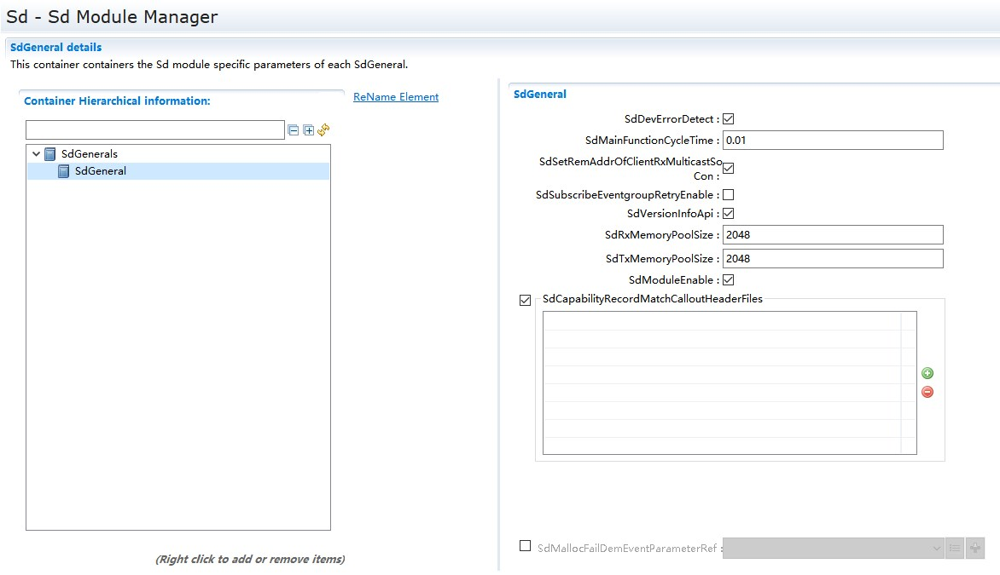

表5‑1SdGeneral容器属性描述

Table 5-1 SdGeneral Container Property Description

.. list-table::
   :widths: 20 20 20 20 20
   :header-rows: 1

   * - UI名称 (UI Name)
     - 描述 (Description)
     - 
     - 
     - 
   * - SdDevErrorDetect
     - 取值范围 (Range)
     - STD_ON / STD_OFF
     - 默认取值 (Default value)
     - STD_OFF
   * - 
     - 参数描述 (Parameter Description)
     - DET检测功能是否启用的开关。 (The switch for enabling/disabling DET detection function.)
     - 
     - 
   * - 
     - 依赖关系 (Dependencies)
     - 无
     - 
     - 
   * - SdMainFunctionCycleTime
     - 取值范围 (Range)
     - 1E-3 .. 1
     - 默认取值 (Default value)
     - 无
   * - 
     - 参数描述 (Parameter Description)
     - 周期处理函数的调度周期。 (The scheduling period of periodic processing functions.)
     - 
     - 
   * - 
     - 依赖关系 (Dependencies)
     - 无
     - 
     - 
   * - SdSetRemAddrOfClientRxMulticastSoCon
     - 取值范围 (Range)
     - STD_ON / STD_OFF
     - 默认取值 (Default value)
     - 无
   * - 
     - 参数描述 (Parameter Description)
     - 当该参数设置为TRUE时，Sd接收到OfferService时，根据接收到的Endpoint选择一个匹配的多播SocketConnection。如果对应的SocketConnection不存在，则选择一个未使用的远端地址为wildcard的SocketConnection，并更新其远端地址。 (When this parameter is set to TRUE, Sd selects a matching multicast SocketConnection based on the received Endpoint when receiving OfferService. If the corresponding SocketConnection does not exist, it chooses an unused remote address as a wildcard SocketConnection and updates its remote address.)
     - 
     - 
   * - 
     - 
     - 如果改参数设置为FALSE，Sd选择一个未使用的远端地址为wildcard的SocketConnection，但不更新其远端地址。 (If the parameter setting is changed to FALSE, Sd selects an unused remote address as a wildcard SocketConnection but does not update its remote address.)
     - 
     - 
   * - 
     - 依赖关系 (Dependencies)
     - 无
     - 
     - 
   * - SdSubscribeEventgroupRetryEnable
     - 取值范围 (Range)
     - STD_ON / STD_OFF
     - 默认取值 (Default value)
     - 无
   * - 
     - 参数描述 (Parameter Description)
     - 订阅服务端的Eventgroups是否启用Retry机制的开关。 (Whether the switch for enabling the Retry mechanism for Eventgroups subscribed from the service end is enabled.)
     - 
     - 
   * - 
     - 依赖关系 (Dependencies)
     - SdSubscribeEventgroupRetryEnable参数设置为STD_OFF时，SdClientTimer对象的SdSubscribeEventgroupRetryDelay参数和SdSubscribeEventgroupRetryMax参数不可以配置 (When the SdSubscribeEventgroupRetryEnable parameter is set to STD_OFF, the SdClientTimer object's SdSubscribeEventgroupRetryDelay parameter and SdSubscribeEventgroupRetryMax parameters cannot be configured.)
     - 
     - 
   * - SdVersionInfoApi
     - 取值范围 (Range)
     - STD_ON / STD_OFF
     - 默认取值 (Default value)
     - STD_OFF
   * - 
     - 参数描述 (Parameter Description)
     - 是否生成获取版本信息API的开关。 (Is a switch for generating an API to get version information generated?)
     - 
     - 
   * - 
     - 依赖关系 (Dependencies)
     - 无
     - 
     - 
   * - SdRxMemoryPoolSize
     - 取值范围 (Range)
     - 0-2147483647
     - 默认取值 (Default value)
     - 1024
   * - 
     - 参数描述 (Parameter Description)
     - 接收服务的内存池的大小。 (The size of the memory pool for receiving services.)
     - 
     - 
   * - 
     - 依赖关系 (Dependencies)
     - 无
     - 
     - 
   * - SdRxMemoryPoolSize
     - 取值范围 (Range)
     - 0-2147483647
     - 默认取值 (Default value)
     - 1024
   * - 
     - 参数描述 (Parameter Description)
     - 发送服务的内存池的大小。 (The size of the memory pool for sending services.)
     - 
     - 
   * - 
     - 依赖关系 (Dependencies)
     - 无
     - 
     - 
   * - SdModuleEnable
     - 取值范围 (Range)
     - STD_ON / STD_OFF
     - 默认取值 (Default value)
     - 无
   * - 
     - 参数描述 (Parameter Description)
     - 表示Sd模块是否使能 (Indicate whether the Sd module is enabled)
     - 
     - 
   * - 
     - 依赖关系 (Dependencies)
     - 无
     - 
     - 
   * - SdMallocFailDemEventParameterRef
     - 取值范围 (Range)
     - 引用DemEventParameter (Reference DemEventParameter)
     - 默认取值 (Default value)
     - 无
   * - 
     - 参数描述 (Parameter Description)
     - 当Sd内存分配失败时向DEM报告错误 (Report error to DEM when Sd memory allocation fails)
     - 
     - 
   * - 
     - 依赖关系 (Dependencies)
     - 无
     - 
     - 
   * - SdCapabilityRecordMatchCalloutHeaderFiles
     - 取值范围 (Range)
     - 无
     - 默认取值 (Default value)
     - 无
   * - 
     - 参数描述 (Parameter Description)
     - 设置需要在Sd模块中配置的头文件 (Configure header files that need to be set in the Sd module)
     - 
     - 
   * - 
     - 依赖关系 (Dependencies)
     - 无
     - 
     - 

SdConfig
------------------------

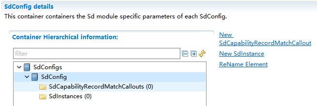

.. centered:: **表 SdConfig容器属性描述 (Table SdConfig Container Properties Description)**

.. list-table::
   :widths: 20 20 20 20 20
   :header-rows: 1

   * - UI名称 (UI Name)
     - 描述 (Description)
     - 
     - 
     - 
   * - SdCapabilityRecordMatchCallout
     - 取值范围 (Range)
     - 无
     - 默认取值 (Default value)
     - 无
   * - 
     - 参数描述 (Parameter Description)
     - 该容器表示SD调用的回调函数，用于确定接收到的Sd消息的条目中包含的配置选项是否与SdServerCapabilityRecord或SdClientCapabilityrecord中配置的功能记录元素匹配 (This container represents the SD callback function used to determine if the configuration options contained in the entries of received Sd messages match the functionality record elements configured in SdServerCapabilityRecord or SdClientCapabilityRecord.)
     - 
     - 
   * - 
     - 依赖关系 (Dependencies)
     - 无
     - 
     - 
   * - SdInstance
     - 取值范围 (Range)
     - 无
     - 默认取值 (Default value)
     - 无
   * - 
     - 参数描述 (Parameter Description)
     - 该容器表示SD的一个实例。 (This container represents an instance of SD.)
     - 
     - 
   * - 
     - 依赖关系 (Dependencies)
     - 无
     - 
     - 

SdInstance
--------------------------

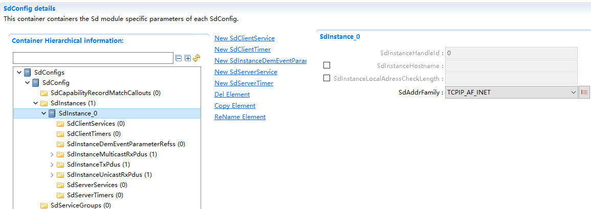

.. centered:: **表 SdInstance容器属性描述 (Table SdInstance Container Property Description)**

.. list-table::
   :widths: 20 20 20 20 20
   :header-rows: 1

   * - UI名称 (UI Name)
     - 描述 (Description)
     - 
     - 
     - 
   * - SdInstanceHandleId
     - 取值范围 (Range)
     - 0 .. 65535
     - 默认取值 (Default value)
     - 无
   * - 
     - 参数描述 (Parameter Description)
     - SdInstance的handleId (SdInstance的手柄ID)
     - 
     - 
   * - 
     - 依赖关系 (Dependencies)
     - 无
     - 
     - 
   * - SdInstanceHostname
     - 取值范围 (Range)
     - 无
     - 默认取值 (Default value)
     - 无
   * - 
     - 参数描述 (Parameter Description)
     - 用于配置Hostname (Used for configuring Hostname)
     - 
     - 
   * - 
     - 依赖关系 (Dependencies)
     - 无
     - 
     - 
   * - SdInstanceLocalAdressCheckLength
     - 取值范围 (Range)
     - 0 .. 128
     - 默认取值 (Default value)
     - 无
   * - 
     - 参数描述 (Parameter Description)
     - 该参数表示当确定某个远端地址是否被接收时，从IP地址中取出多少bit用于比较。 (This parameter indicates how many bits from the IP address are extracted for comparison when determining whether to accept a remote address.)
     - 
     - 
   * - 
     - 依赖关系 (Dependencies)
     - 无
     - 
     - 
   * - SdAddrFamily
     - 取值范围 (Range)
     - TCPIP_AF_INETTCPIP_AF_INET6
     - 默认取值 (Default value)
     - TCPIP_AF_INET
   * - 
     - 参数描述 (Parameter Description)
     - Domain类型 (Domain Type)
     - 
     - 
   * - 
     - 依赖关系 (Dependencies)
     - 无
     - 
     - 
   * - SdClientService
     - 取值范围 (Range)
     - 无
     - 默认取值 (Default value)
     - 无
   * - 
     - 参数描述 (Parameter Description)
     - 该容器包含客户端服务所用的所有参数。 (This container includes all parameters used by the client service.)
     - 
     - 
   * - 
     - 依赖关系 (Dependencies)
     - 无
     - 
     - 
   * - SdClientTimer
     - 取值范围 (Range)
     - 无
     - 默认取值 (Default value)
     - 无
   * - 
     - 参数描述 (Parameter Description)
     - 该容器表示客户端服务所用的所有时间参数。 (This container represents all time parameters used by the client service.)
     - 
     - 
   * - 
     - 依赖关系 (Dependencies)
     - 无
     - 
     - 
   * - SdInstanceDemEventParameterRefs
     - 取值范围 (Range)
     - 无
     - 默认取值 (Default value)
     - 无
   * - 
     - 参数描述 (Parameter Description)
     - 该容器引用到DemEventParameter，用于出现错误时，调用Dem_ReportErrorStatus()函数时使用。可从DemEventParameter中获取EventId。 (This container refers to DemEventParameter, which is used when calling the Dem_ReportErrorStatus() function in case of an error. The EventId can be obtained from DemEventParameter.)
     - 
     - 
   * - 
     - 依赖关系 (Dependencies)
     - 无
     - 
     - 
   * - SdInstanceMulticastRxPdu
     - 取值范围 (Range)
     - 无
     - 默认取值 (Default value)
     - 无
   * - 
     - 参数描述 (Parameter Description)
     - 表示接收多播SD报文的PDU (Indicate reception of multicast SD packets)
     - 
     - 
   * - 
     - 依赖关系 (Dependencies)
     - 无
     - 
     - 
   * - SdInstanceTxPdu
     - 取值范围 (Range)
     - 无
     - 默认取值 (Default value)
     - 无
   * - 
     - 参数描述 (Parameter Description)
     - 表示发送的SD报文的PDU。 (Indicates the PDU of the SD packet sent.)
     - 
     - 
   * - 
     - 依赖关系 (Dependencies)
     - 无
     - 
     - 
   * - SdInstanceUnicastRxPdu
     - 取值范围 (Range)
     - 无
     - 默认取值 (Default value)
     - 无
   * - 
     - 参数描述 (Parameter Description)
     - 表示接收单播SD报文的PDU。 (Indicates received unicast SD packets.)
     - 
     - 
   * - 
     - 依赖关系 (Dependencies)
     - 无
     - 
     - 
   * - SdServerService
     - 取值范围 (Range)
     - 无
     - 默认取值 (Default value)
     - 无
   * - 
     - 参数描述 (Parameter Description)
     - 该容器包含服务端服务所用的所有参数。 (This container includes all parameters used by the server service.)
     - 
     - 
   * - 
     - 依赖关系 (Dependencies)
     - 无
     - 
     - 
   * - SdServerTimer
     - 取值范围 (Range)
     - 无
     - 默认取值 (Default value)
     - 无
   * - 
     - 参数描述 (Parameter Description)
     - 该容器表示服务端服务所用的所有时间参数。 (This container represents all time parameters used by the server service.)
     - 
     - 
   * - 
     - 依赖关系 (Dependencies)
     - 无
     - 
     - 

SdClientService
-------------------------------

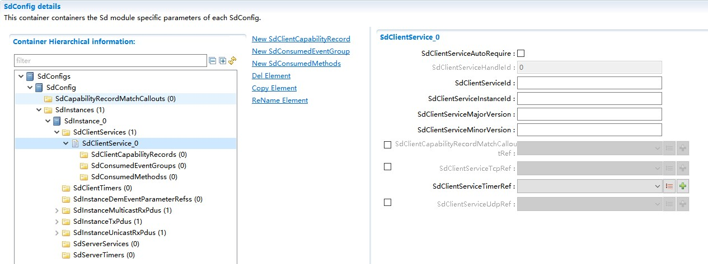

.. centered:: **表 SdClientService容器属性描述 (Table SdClientService Container Property Description)**

.. list-table::
   :widths: 20 20 20 20 20
   :header-rows: 1

   * - UI名称 (UI Name)
     - 描述 (Description)
     - 
     - 
     - 
   * - SdClientServiceAutoRequire
     - 取值范围 (Range)
     - STD_ON / STD_OFF
     - 默认取值 (Default value)
     - STD_OFF
   * - 
     - 参数描述 (Parameter Description)
     - 设置为TRUE，则服务在启动时自动设置为“需要” (Set to TRUE to automatically configure the service as "Required" at startup.)
     - 
     - 
   * - 
     - 依赖关系 (Dependencies)
     - 无
     - 
     - 
   * - SdClientServiceHandleId
     - 取值范围 (Range)
     - 0 .. 65535
     - 默认取值 (Default value)
     - 无
   * - 
     - 参数描述 (Parameter Description)
     - BswM识别该服务的HandleId。 (BswM identifies the service's HandleId.)
     - 
     - 
   * - 
     - 依赖关系 (Dependencies)
     - 无
     - 
     - 
   * - SdClientServiceId
     - 取值范围 (Range)
     - 0 .. 65534
     - 默认取值 (Default value)
     - 无
   * - 
     - 参数描述 (Parameter Description)
     - 识别该服务的ID，不同的服务需要唯一。 (Identify the ID of the service, which needs to be unique for different services.)
     - 
     - 
   * - 
     - 依赖关系 (Dependencies)
     - 无
     - 
     - 
   * - SdClientServiceInstanceId
     - 取值范围 (Range)
     - 0 .. 65534
     - 默认取值 (Default value)
     - 无
   * - 
     - 参数描述 (Parameter Description)
     - 该服务的实例Id (The instance Id of the service)
     - 
     - 
   * - 
     - 依赖关系 (Dependencies)
     - 无
     - 
     - 
   * - SdClientServiceMajorVersion
     - 取值范围 (Range)
     - 0 .. 254
     - 默认取值 (Default value)
     - 无
   * - 
     - 参数描述 (Parameter Description)
     - Major versionnumber of theService as used inthe SD entries.
     - 
     - 
   * - 
     - 
     - 客户端服务的Majorversion。 (Majorversion of client service.)
     - 
     - 
   * - 
     - 依赖关系 (Dependencies)
     - 无
     - 
     - 
   * - SdClientServiceMinorVersion
     - 取值范围 (Range)
     - 0 .. 4294967295
     - 默认取值 (Default value)
     - 无
   * - 
     - 参数描述 (Parameter Description)
     - 客户端服务的Minorversion。 (Minor version of the client service.)
     - 
     - 
   * - 
     - 依赖关系 (Dependencies)
     - 无
     - 
     - 
   * - SdClientCapabilityRecordMatchCalloutRef
     - 取值范围 (Range)
     - 无
     - 默认取值 (Default value)
     - 无
   * - 
     - 参数描述 (Parameter Description)
     - 引用到一个SdCapabilityRecordMatchCallout，用于确定收到的SD消息条目中包含的配置选项是否与客户端配置的SdClientCapabilityRecord元素相匹配 (Refer to an SdCapabilityRecordMatchCallout to determine if the configuration options contained in the received SD message entry match the SdClientCapabilityRecord element configured on the client.)
     - 
     - 
   * - 
     - 依赖关系 (Dependencies)
     - 无
     - 
     - 
   * - SdClientServiceTcpRef
     - 取值范围 (Range)
     - 无
     - 默认取值 (Default value)
     - 无
   * - 
     - 参数描述 (Parameter Description)
     - 引用到一个TCPSoAdSocketConnectionGroup，用于该服务。 (Reference a TCPSoAdSocketConnectionGroup for this service.)
     - 
     - 
   * - 
     - 依赖关系 (Dependencies)
     - 无
     - 
     - 
   * - SdClientServiceTimerRef
     - 取值范围 (Range)
     - 无
     - 默认取值 (Default value)
     - 无
   * - 
     - 参数描述 (Parameter Description)
     - 引用到一个SdClientTimer，用于该服务。 (Reference an SdClientTimer for this service.)
     - 
     - 
   * - 
     - 依赖关系 (Dependencies)
     - 无
     - 
     - 
   * - SdClientServiceUdpRef
     - 取值范围 (Range)
     - 无
     - 默认取值 (Default value)
     - 无
   * - 
     - 参数描述 (Parameter Description)
     - 引用到一个UDPSoAdSocketConnectionGroup，用于该服务。 (Refer to a UDPSoAdSocketConnectionGroup for this service.)
     - 
     - 
   * - 
     - 依赖关系 (Dependencies)
     - 无
     - 
     - 
   * - SdBlacklistedVersions
     - 取值范围 (Range)
     - 无
     - 默认取值 (Default value)
     - 无
   * - 
     - 参数描述 (Parameter Description)
     - 该容器黑名单版本集合 (The container blacklist version set)
     - 
     - 
   * - 
     - 依赖关系 (Dependencies)
     - 无
     - 
     - 
   * - SdClientClientCapabilityRecord
     - 取值范围 (Range)
     - 无
     - 默认取值 (Default value)
     - 无
   * - 
     - 参数描述 (Parameter Description)
     - 表示用于存储name/value属性的capabilityrecords (Represent capability records used for storing name/value attributes)
     - 
     - 
   * - 
     - 依赖关系 (Dependencies)
     - 无
     - 
     - 
   * - SdConsumedEventGroup
     - 取值范围 (Range)
     - 无
     - 默认取值 (Default value)
     - 无
   * - 
     - 参数描述 (Parameter Description)
     - 该容器表示consumedeventgroup用到的所有参数。 (This container represents all parameters used in consumedeventgroup.)
     - 
     - 
   * - 
     - 依赖关系 (Dependencies)
     - 无
     - 
     - 
   * - SdConsumedMethods
     - 取值范围 (Range)
     - 无
     - 默认取值 (Default value)
     - 无
   * - 
     - 参数描述 (Parameter Description)
     - 该容器表示访问服务端的方法的数据通道。 (This container represents the data channel for accessing methods of the service end.)
     - 
     - 
   * - 
     - 依赖关系 (Dependencies)
     - 无
     - 
     - 

SdClientCapabilityRecord
========================================

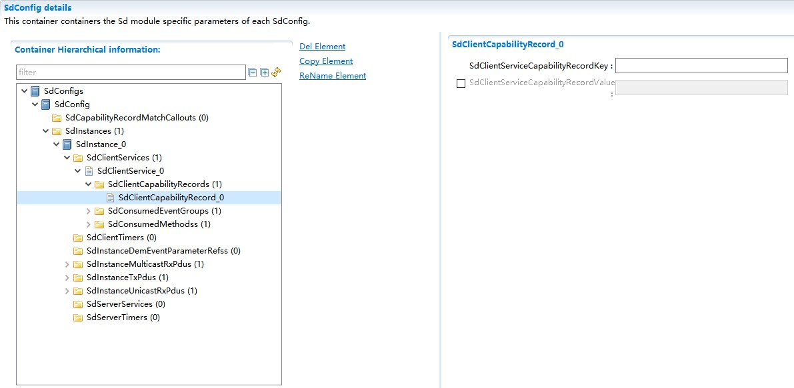

.. centered:: **表 SdClientCapabilityRecord容器属性描述 (Container Properties Description)**

.. list-table::
   :widths: 20 20 20 20 20
   :header-rows: 1

   * - UI名称 (UI Name)
     - 描述 (Description)
     - 
     - 
     - 
   * - SdClientServiceCapabilityRecordKey
     - 取值范围 (Range)
     - 合法字符串 (Legal String)
     - 默认取值 (Default value)
     - 无
   * - 
     - 参数描述 (Parameter Description)
     - 定义一个CapabilityRecordkey. (Define a CapabilityRecordKey.)
     - 
     - 
   * - 
     - 依赖关系 (Dependencies)
     - 无
     - 
     - 
   * - SdClientServiceCapabilityRecordValue
     - 取值范围 (Range)
     - 合法字符串 (Legal String)
     - 默认取值 (Default value)
     - 无
   * - 
     - 参数描述 (Parameter Description)
     - 定义key对应的CapabilityRecord值. (Define the CapabilityRecord value corresponding to the key.)
     - 
     - 
   * - 
     - 依赖关系 (Dependencies)
     - 无
     - 
     - 

SdConsumedEventGroup
====================================

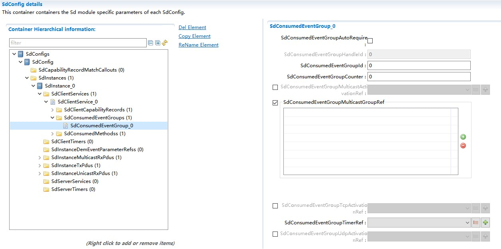

.. centered:: **表 SdConsumedEventGroup容器属性描述 (Container properties description for table SdConsumedEventGroup)**

.. list-table::
   :widths: 20 20 20 20 20
   :header-rows: 1

   * - UI名称 (UI Name)
     - 描述 (Description)
     - 
     - 
     - 
   * - SdConsumedEventGroupAutoRequire
     - 取值范围 (Range)
     - STD_ON / STD_OFF
     - 默认取值 (Default value)
     - STD_OFF
   * - 
     - 参数描述 (Parameter Description)
     - 设置为TRUE，则在启动时，该EventGroup被自动设置为“需要” (Set to TRUE, then this EventGroup is automatically set to "required" at startup.)
     - 
     - 
   * - 
     - 依赖关系 (Dependencies)
     - 无
     - 
     - 
   * - SdConsumedEventGroupHandleId
     - 取值范围 (Range)
     - 0 .. 65535
     - 默认取值 (Default value)
     - 无
   * - 
     - 参数描述 (Parameter Description)
     - BswM识别该服务的HandleId (BswM identifies the service's HandleId)
     - 
     - 
   * - 
     - 依赖关系 (Dependencies)
     - 无
     - 
     - 
   * - SdConsumedEventGroupId
     - 取值范围 (Range)
     - 0 .. 65534
     - 默认取值 (Default value)
     - 无
   * - 
     - 参数描述 (Parameter Description)
     - Eventgroup Id
     - 
     - 
   * - 
     - 依赖关系 (Dependencies)
     - 无
     - 
     - 
   * - SdConsumedEventGroupCounter
     - 取值范围 (Range)
     - 0 .. 15
     - 默认取值 (Default value)
     - 无
   * - 
     - 参数描述 (Parameter Description)
     - ConsumedEventGroup的计数器 (The counter of ConsumedEventGroup)
     - 
     - 
   * - 
     - 依赖关系 (Dependencies)
     - 无
     - 
     - 
   * - SdConsumedEventGroupMulticastActivationRef
     - 取值范围 (Range)
     - 无
     - 默认取值 (Default value)
     - 无
   * - 
     - 参数描述 (Parameter Description)
     - 指向一个SoAdRoutingGroup对象，Sd通过该对象控制用于接收多播Event的通道 (Point to a SoAdRoutingGroup object, through which Sd controls the channel used for receiving multicast Events.)
     - 
     - 
   * - 
     - 依赖关系 (Dependencies)
     - 无
     - 
     - 
   * - SdConsumedEventGroupMulticastGroupRef
     - 取值范围 (Range)
     - 无
     - 默认取值 (Default value)
     - 无
   * - 
     - 参数描述 (Parameter Description)
     - 指向SoAdSocketConnectionGroup对象，多播Event通过该通道接收 (Point to the SoAdSocketConnectionGroup object, where multicast Events are received via this channel.)
     - 
     - 
   * - 
     - 依赖关系 (Dependencies)
     - 无
     - 
     - 
   * - SdConsumedEventGroupTcpActivationRef
     - 取值范围 (Range)
     - 无
     - 默认取值 (Default value)
     - 无
   * - 
     - 参数描述 (Parameter Description)
     - 关联一个配置为TCP的SoAdSocketConnectionGroup，用于控制TCP事件的接收 (Associate a SoAdSocketConnectionGroup configured as TCP for receiving TCP event notifications.)
     - 
     - 
   * - 
     - 依赖关系 (Dependencies)
     - 无
     - 
     - 
   * - SdConsumedEventGroupTimerRef
     - 取值范围 (Range)
     - 无
     - 默认取值 (Default value)
     - 无
   * - 
     - 参数描述 (Parameter Description)
     - 关联一个SdClientTimer，用于提供和SdConsumedEventGroup相关的时间参数 (Associate an SdClientTimer for providing time parameters related to SdConsumedEventGroup.)
     - 
     - 
   * - 
     - 依赖关系 (Dependencies)
     - 无
     - 
     - 
   * - SdConsumedEventGroupUdpActivationRef
     - 取值范围 (Range)
     - 无
     - 默认取值 (Default value)
     - 无
   * - 
     - 参数描述 (Parameter Description)
     - 关联一个配置为UDP的SoAdSocketConnectionGroup，用于控制UDP事件的接收 (Associate a SoAdSocketConnectionGroup configured as UDP for controlling the reception of UDP events.)
     - 
     - 
   * - 
     - 依赖关系 (Dependencies)
     - 无
     - 
     - 

SdConsumedMethods
=================================

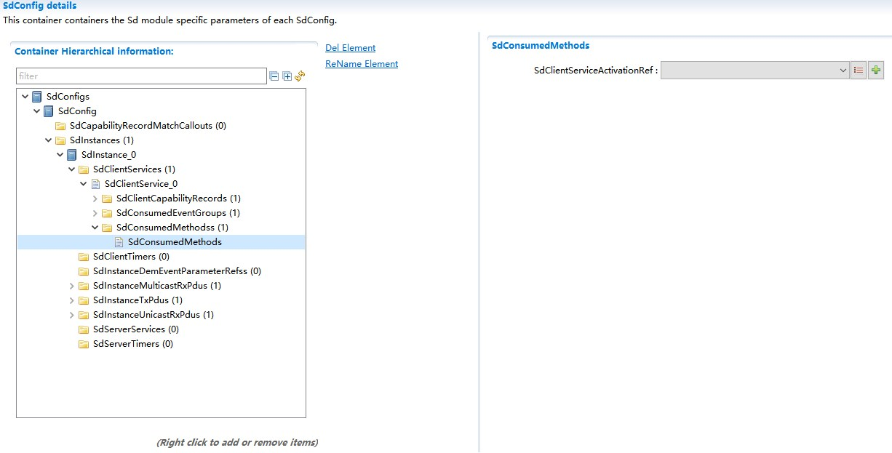

.. centered:: **表 SdConsumedMethods容器属性描述 (Container Property Description for Table SdConsumedMethods)**

.. list-table::
   :widths: 20 20 20 20 20
   :header-rows: 1

   * - UI名称 (UI Name)
     - 描述 (Description)
     - 
     - 
     - 
   * - SdClientServiceActivationRef
     - 取值范围 (Range)
     - 无
     - 默认取值 (Default value)
     - 无
   * - 
     - 参数描述 (Parameter Description)
     - 引用一个SoAdRoutingGroup对象，Sd通过该引用打开/关闭Client的Method通道 (Reference a SoAdRoutingGroup object, Sd uses this reference to open/close the Method channel of the Client.)
     - 
     - 
   * - 
     - 依赖关系 (Dependencies)
     - 无
     - 
     - 

SdClientTimer
-----------------------------

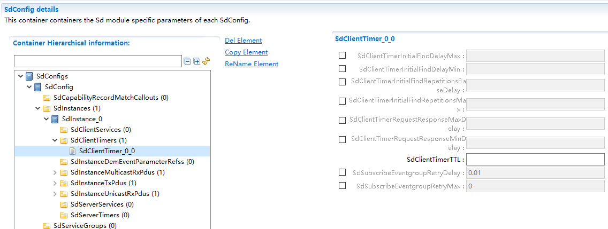

.. centered:: **表 SdClientTimer容器属性描述 (Table SdClientTimer Container Properties Description)**

.. list-table::
   :widths: 20 20 20 20 20
   :header-rows: 1

   * - UI名称 (UI Name)
     - 描述 (Description)
     - 
     - 
     - 
   * - SdClientTimerInitialFindDelayMax
     - 取值范围 (Range)
     - 0 .. INF
     - 默认取值 (Default value)
     - 无
   * - 
     - 参数描述 (Parameter Description)
     - 当发送Find报文时，随机延时的最大值，单位是秒。 (The maximum random delay when sending Find messages, in seconds.)
     - 
     - 
   * - 
     - 依赖关系 (Dependencies)
     - 无
     - 
     - 
   * - SdClientTimerInitialFindDelayMin
     - 取值范围 (Range)
     - 0 .. INF
     - 默认取值 (Default value)
     - 无
   * - 
     - 参数描述 (Parameter Description)
     - 当发送Find报文时，随机延时的最小值，单位是秒。 (The minimum value of random delay when sending Find packets, in seconds.)
     - 
     - 
   * - 
     - 依赖关系 (Dependencies)
     - SdClientTimerInitialFindDelayMin<=SdClientTimerInitialFindDelayMax
     - 
     - 
   * - SdClientTimerInitialFindRepetitionsBaseDelay
     - 取值范围 (Range)
     - 0 .. INF
     - 默认取值 (Default value)
     - 无
   * - 
     - 参数描述 (Parameter Description)
     - 在Repetition阶段重复发送Find报文的基准时间，单位是秒。 (The base time in seconds for sending Find messages during the Repetition stage.)
     - 
     - 
   * - 
     - 依赖关系 (Dependencies)
     - 无
     - 
     - 
   * - SdClientTimerInitialFindRepetitionsMax
     - 取值范围 (Range)
     - 0 .. 10
     - 默认取值 (Default value)
     - 无
   * - 
     - 参数描述 (Parameter Description)
     - 在Repetition阶段重复发送Find报文的最大次数。 (Maximum number of times Find messages are resent during the Repetition stage.)
     - 
     - 
   * - 
     - 依赖关系 (Dependencies)
     - 无
     - 
     - 
   * - SdClientTimerRequestResponseMaxDelay
     - 取值范围 (Range)
     - 0 .. INF
     - 默认取值 (Default value)
     - 无
   * - 
     - 参数描述 (Parameter Description)
     - 当接收到多播发送的请求时，应答时随机延时的最大时间。 (The maximum random delay time when responding to a multicast send request.)
     - 
     - 
   * - 
     - 依赖关系 (Dependencies)
     - 无
     - 
     - 
   * - SdClientTimerRequestResponseMinDelay
     - 取值范围 (Range)
     - 0 .. INF
     - 默认取值 (Default value)
     - 无
   * - 
     - 参数描述 (Parameter Description)
     - 当接收到多播发送的请求时，应答时随机延时的最小时间。 (The minimum time of random delay when responding to a multicast send request.)
     - 
     - 
   * - 
     - 依赖关系 (Dependencies)
     - SdClientTimerRequestResponseMinDelay<=SdClientTimerRequestResponseMaxDelay
     - 
     - 
   * - SdClientTimerTTL
     - 取值范围 (Range)
     - 1 .. 16777215
     - 默认取值 (Default value)
     - 无
   * - 
     - 参数描述 (Parameter Description)
     - find和subscribe报文中的TTL时间。 (TTL time in find and subscribe messages.)
     - 
     - 
   * - 
     - 依赖关系 (Dependencies)
     - 无
     - 
     - 
   * - SdSubscribeEventgroupRetryDelay
     - 取值范围 (Range)
     - 0.001 .. 50
     - 默认取值 (Default value)
     - 0.01
   * - 
     - 参数描述 (Parameter Description)
     - 当一个订阅报文没有收到SubscribeEventGroupAck或者SubscribeEventGroupNack时，重复订阅时的延时时间。 (When a subscription message does not receive SubscribeEventGroupAck or SubscribeEventGroupNack, the delay time for re-subscription.)
     - 
     - 
   * - 
     - 依赖关系 (Dependencies)
     - 该参数只有当SdSubscribeEventgroupRetryEnable为TRUE并且SdSubscribeEventgroupRetryMax> 0时可用。 (This parameter is available only when SdSubscribeEventgroupRetryEnable is TRUE and SdSubscribeEventgroupRetryMax > 0.)
     - 
     - 
   * - SdSubscribeEventgroupRetryMax
     - 取值范围 (Range)
     - 0 .. 255
     - 默认取值 (Default value)
     - 0
   * - 
     - 参数描述 (Parameter Description)
     - 当一个订阅报文没有收到SubscribeEventGroupAck或者SubscribeEventGroupNack时，可重复订阅的最大次数。 (The maximum number of times a subscription message can be resubscribed when it does not receive SubscribeEventGroupAck or SubscribeEventGroupNack.)
     - 
     - 
   * - 
     - 
     - 0x0=no retry,0xFF=retry forever
     - 
     - 
   * - 
     - 依赖关系 (Dependencies)
     - 该参数只有当SdSubscribeEventgroupRetryEnable为TRUE时可用 (This parameter is available only when SdSubscribeEventgroupRetryEnable is TRUE.)
     - 
     - 

SdServerService
-------------------------------

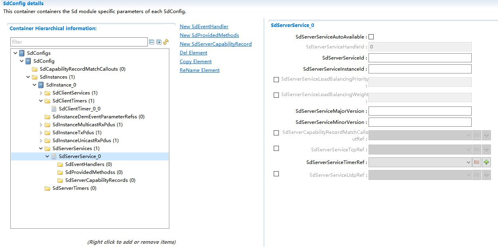

.. centered:: **表 SdServerService容器属性描述 (Table SdServerService Container Property Description)**

.. list-table::
   :widths: 20 20 20 20 20
   :header-rows: 1

   * - UI名称 (UI Name)
     - 描述 (Description)
     - 
     - 
     - 
   * - SdServerServiceAutoAvailable
     - 取值范围 (Range)
     - STD_ON / STD_OFF
     - 默认取值 (Default value)
     - STD_OFF
   * - 
     - 参数描述 (Parameter Description)
     - 设置为TRUE，则改服务在启动时自动被设置为可用。 (Set to TRUE, then the service is automatically configured to be available at startup.)
     - 
     - 
   * - 
     - 依赖关系 (Dependencies)
     - 无
     - 
     - 
   * - SdServerServiceHandleId
     - 取值范围 (Range)
     - 0 .. 65535
     - 默认取值 (Default value)
     - 无
   * - 
     - 参数描述 (Parameter Description)
     - BswM识别该服务的HandleId。 (BswM identifies the service's HandleId.)
     - 
     - 
   * - 
     - 依赖关系 (Dependencies)
     - 无
     - 
     - 
   * - SdServerServiceId
     - 取值范围 (Range)
     - 1 .. 65534
     - 默认取值 (Default value)
     - 无
   * - 
     - 参数描述 (Parameter Description)
     - 识别该服务的ID，不同的服务需要唯一。 (Identify the ID of the service, which needs to be unique for different services.)
     - 
     - 
   * - 
     - 依赖关系 (Dependencies)
     - 无
     - 
     - 
   * - SdServerServiceInstanceId
     - 取值范围 (Range)
     - 0 .. 65534
     - 默认取值 (Default value)
     - 无
   * - 
     - 参数描述 (Parameter Description)
     - 服务端服务的实例ID。 (Instance ID of the server service.)
     - 
     - 
   * - 
     - 依赖关系 (Dependencies)
     - 无
     - 
     - 
   * - SdServerServiceLoadBalancingPriority
     - 取值范围 (Range)
     - 0 .. 65535
     - 默认取值 (Default value)
     - 无
   * - 
     - 参数描述 (Parameter Description)
     - 定义服务中的负载平衡优先级的值。值越低，优先级越高。 (Define the value for load balancing priority in the service. The lower the value, the higher the priority.)
     - 
     - 
   * - 
     - 依赖关系 (Dependencies)
     - 无
     - 
     - 
   * - SdServerServiceLoadBalancingWeight
     - 取值范围 (Range)
     - 0 .. 65535
     - 默认取值 (Default value)
     - 无
   * - 
     - 参数描述 (Parameter Description)
     - 定义服务中的负载平衡权重的值。值越高意味着被选中的概率越高。 (Define the value of load balancing weight in the service. The higher the value, the higher the probability of being selected.)
     - 
     - 
   * - 
     - 依赖关系 (Dependencies)
     - 无
     - 
     - 
   * - SdServerServiceMajorVersion
     - 取值范围 (Range)
     - 0 .. 254
     - 默认取值 (Default value)
     - 无
   * - 
     - 参数描述 (Parameter Description)
     - 服务端服务的MajorVersion。 (MajorVersion of server-side services.)
     - 
     - 
   * - 
     - 依赖关系 (Dependencies)
     - 无
     - 
     - 
   * - SdServerServiceMinorVersion
     - 取值范围 (Range)
     - 0 .. 4294967294
     - 默认取值 (Default value)
     - 无
   * - 
     - 参数描述 (Parameter Description)
     - 服务端服务的MinorVersion。 (The MinorVersion of the service-end service.)
     - 
     - 
   * - 
     - 依赖关系 (Dependencies)
     - 无
     - 
     - 
   * - SdServerCapabilityRecordMatchCalloutRef
     - 取值范围 (Range)
     - 无
     - 默认取值 (Default value)
     - 无
   * - 
     - 参数描述 (Parameter Description)
     - 引用一个SdCapabilityRecordMatchCallout，用于确定接收到的SD消息条目中包含的配置选项是否匹配服务器配置的SdServerCapabilityRecord元素。 (Use an SdCapabilityRecordMatchCallout to determine if the configuration options contained in the SD message entry received match the SdServerCapabilityRecord element configured on the server.)
     - 
     - 
   * - 
     - 依赖关系 (Dependencies)
     - 无
     - 
     - 
   * - SdServerServiceTcpRef
     - 取值范围 (Range)
     - 无
     - 默认取值 (Default value)
     - 无
   * - 
     - 参数描述 (Parameter Description)
     - 引用到一个TCPSoAdSocketConnectionGroup，用于该服务。 (Reference a TCPSoAdSocketConnectionGroup for this service.)
     - 
     - 
   * - 
     - 依赖关系 (Dependencies)
     - 无
     - 
     - 
   * - SdServerServiceTimerRef
     - 取值范围 (Range)
     - 无
     - 默认取值 (Default value)
     - 无
   * - 
     - 参数描述 (Parameter Description)
     - 引用到一个SdServerTimer用于该服务。 (Use an SdServerTimer for this service.)
     - 
     - 
   * - 
     - 依赖关系 (Dependencies)
     - 无
     - 
     - 
   * - SdServerServiceUdpRef
     - 取值范围 (Range)
     - 无
     - 默认取值 (Default value)
     - 无
   * - 
     - 参数描述 (Parameter Description)
     - 引用到一个UDPSoAdSocketConnectionGroup，用于该服务。 (Refer to a UDPSoAdSocketConnectionGroup for this service.)
     - 
     - 
   * - 
     - 依赖关系 (Dependencies)
     - 无
     - 
     - 
   * - SdEventHandler
     - 取值范围 (Range)
     - 无
     - 默认取值 (Default value)
     - 无
   * - 
     - 参数描述 (Parameter Description)
     - 该容器表示服务中的EventGroup。 (This container represents an EventGroup in the service.)
     - 
     - 
   * - 
     - 依赖关系 (Dependencies)
     - 无
     - 
     - 
   * - SdProvidedMethods
     - 取值范围 (Range)
     - 无
     - 默认取值 (Default value)
     - 无
   * - 
     - 参数描述 (Parameter Description)
     - Container elementfor representingthe needed elementsof the data pathfor the methodsprovided by theservice
     - 
     - 
   * - 
     - 
     - 该容器表示服务提供的方法的数据路径。 (This container represents the data path of methods provided by the service.)
     - 
     - 
   * - 
     - 依赖关系 (Dependencies)
     - 无
     - 
     - 
   * - SdServerCapabilityRecord
     - 取值范围 (Range)
     - 无
     - 默认取值 (Default value)
     - 无
   * - 
     - 参数描述 (Parameter Description)
     - 表示用于存储name/value属性的capabilityrecords (Represent capability records used for storing name/value attributes)
     - 
     - 
   * - 
     - 依赖关系 (Dependencies)
     - 无
     - 
     - 

SdEventHandler
==============================

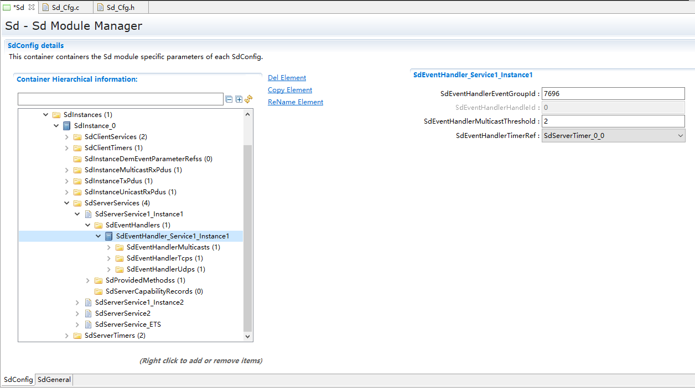

.. centered:: **表 SdEventHandler容器属性描述 (Table SdEventHandler Container Properties Description)**

.. list-table::
   :widths: 20 20 20 20 20
   :header-rows: 1

   * - UI名称 (UI Name)
     - 描述 (Description)
     - 
     - 
     - 
   * - SdEventHandlerEventGroupId
     - 取值范围 (Range)
     - 0 .. 65534
     - 默认取值 (Default value)
     - 无
   * - 
     - 参数描述 (Parameter Description)
     - 用于配置EventGroupId (Used for configuring EventGroupId)
     - 
     - 
   * - 
     - 依赖关系 (Dependencies)
     - 无
     - 
     - 
   * - SdEventHandlerHandleId
     - 取值范围 (Range)
     - 0 .. 65535
     - 默认取值 (Default value)
     - 无
   * - 
     - 参数描述 (Parameter Description)
     - BswM通过该HandleId识别EventGroup (BswM identifies EventGroup through the HandleId.)
     - 
     - 
   * - 
     - 依赖关系 (Dependencies)
     - 无
     - 
     - 
   * - SdEventHandlerMulticastThreshold
     - 取值范围 (Range)
     - 0 .. 65535
     - 默认取值 (Default value)
     - 无
   * - 
     - 参数描述 (Parameter Description)
     - 用于设置一个阈值，当订阅列表中的Client大于等于该值时，使用多播进行Event的发送 (To set a threshold, use multicast for Event sending when the number of clients in the subscription list is greater than or equal to that value.)
     - 
     - 
   * - 
     - 依赖关系 (Dependencies)
     - 无
     - 
     - 
   * - SdEventHandlerTimerRef
     - 取值范围 (Range)
     - 无
     - 默认取值 (Default value)
     - 无
   * - 
     - 参数描述 (Parameter Description)
     - 关联一个SdServerTimer，用于提供和EventHandler相关的时间参数 (Associate an SdServerTimer for providing time parameters related to the EventHandler.)
     - 
     - 
   * - 
     - 依赖关系 (Dependencies)
     - 无
     - 
     - 
   * - SdEventHandlerMulticast
     - 取值范围 (Range)
     - 无
     - 默认取值 (Default value)
     - 无
   * - 
     - 参数描述 (Parameter Description)
     - 该容器包含用于激活通过多播发送的Event的RoutingGroup (This container is used for activating the RoutingGroup for events sent via multicast.)
     - 
     - 
   * - 
     - 依赖关系 (Dependencies)
     - 无
     - 
     - 
   * - SdEventHandlerTcp
     - 取值范围 (Range)
     - 无
     - 默认取值 (Default value)
     - 无
   * - 
     - 参数描述 (Parameter Description)
     - 该容器包含用于激活通过TCP发送的Event的RoutingGroup (This container contains the RoutingGroup for activating Events sent through TCP.)
     - 
     - 
   * - 
     - 依赖关系 (Dependencies)
     - 无
     - 
     - 
   * - SdEventHandlerUdp
     - 取值范围 (Range)
     - 无
     - 默认取值 (Default value)
     - 无
   * - 
     - 参数描述 (Parameter Description)
     - 该容器包含用于激活通过UDP发送的Event的RoutingGroup (This container contains the RoutingGroup for activating Events sent via UDP.)
     - 
     - 
   * - 
     - 依赖关系 (Dependencies)
     - 无
     - 
     - 

SdEventHandlerMulticast
---------------------------------------

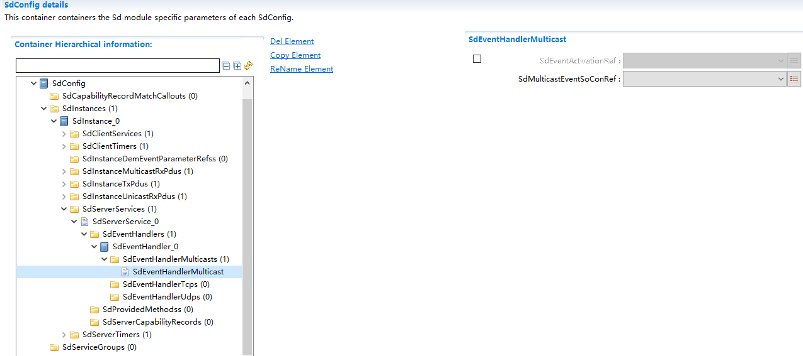

.. centered:: **表 SdEventHandlerMulticast容器属性描述 (Table SdEventHandlerMulticast Container Properties Description)**

.. list-table::
   :widths: 20 20 20 20 20
   :header-rows: 1

   * - UI名称 (UI Name)
     - 描述 (Description)
     - 
     - 
     - 
   * - SdEventActivationRef
     - 取值范围 (Range)
     - 无
     - 默认取值 (Default value)
     - 无
   * - 
     - 参数描述 (Parameter Description)
     - 引用一个SoAdRoutingGroup对象，Sd通过该引用打开多播数据发送通道，之后多播Event便可以发送给Client (Reference a SoAdRoutingGroup object, Sd uses this reference to open the multicast data sending channel, after which multicast Events can be sent to the Client.)
     - 
     - 
   * - 
     - 依赖关系 (Dependencies)
     - 无
     - 
     - 
   * - SdMulticastEventSoConRef
     - 取值范围 (Range)
     - 无
     - 默认取值 (Default value)
     - 无
   * - 
     - 参数描述 (Parameter Description)
     - 引用一个SoAdSocketConnection对象，用于多播发送。 (Reference a SoAdSocketConnection object for multicast sending.)
     - 
     - 
   * - 
     - 依赖关系 (Dependencies)
     - 无
     - 
     - 

SdEventHandlerTcp
---------------------------------

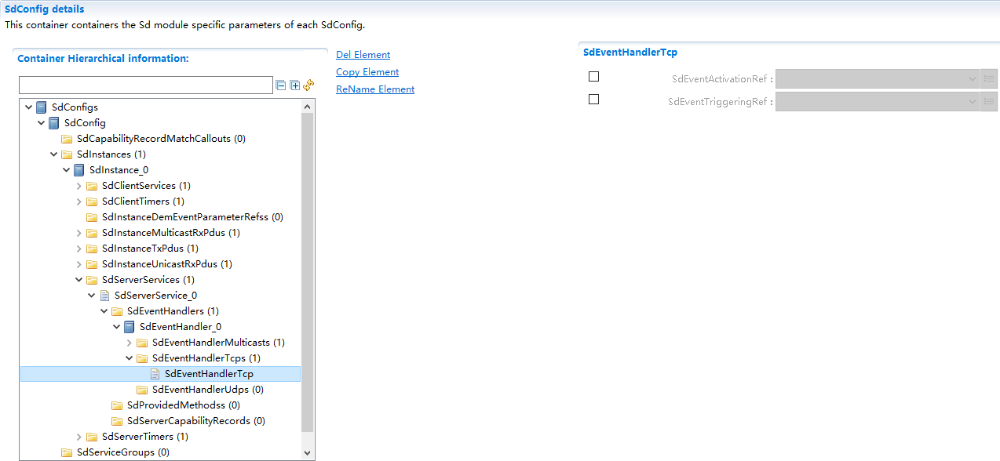

.. centered:: **表 SdEventHandlerTcp容器属性描述 (Table SdEventHandlerTcp Container Properties Description)**

.. list-table::
   :widths: 20 20 20 20 20
   :header-rows: 1

   * - UI名称 (UI Name)
     - 描述 (Description)
     - 
     - 
     - 
   * - SdEventActivationRef
     - 取值范围 (Range)
     - 无
     - 默认取值 (Default value)
     - 无
   * - 
     - 参数描述 (Parameter Description)
     - 引用一个SoAdRoutingGroup对象，当有Client订阅该事件组时，Sd通过该引用打开数据发送通道，之后Event便可以发送给Client (Referencing a SoAdRoutingGroup object, when a Client subscribes to this event group, Sd opens the data sending channel through this reference, after which Events can be sent to the Client.)
     - 
     - 
   * - 
     - 依赖关系 (Dependencies)
     - 无
     - 
     - 
   * - SdEventTriggeringRef
     - 取值范围 (Range)
     - 无
     - 默认取值 (Default value)
     - 无
   * - 
     - 参数描述 (Parameter Description)
     - 引用一个SoAdRoutingGroup对象，用于TriggerTransmit。当配置的Eventgroup中包含属于Field的Event时，配置该对象，在SoAd中配置属于Field的Event的SoAdPduRoute时，SoAdTxRoutingGroupRef中关联这里配置的SoAdRoutingGroup。当第一次订阅Eventgroup时，Eventgroup会主动发送一次。 (Reference a SoAdRoutingGroup object for TriggerTransmit. Configure this object when the Eventgroup configured contains an Event belonging to the Field. In SoAd, configure the SoAdPduRoute for the Event belonging to the Field, and associate it with the configured SoAdRoutingGroup in SoAdTxRoutingGroupRef. When subscribing to the Eventgroup for the first time, the Eventgroup will actively send once.)
     - 
     - 
   * - 
     - 依赖关系 (Dependencies)
     - 无
     - 
     - 

SdEventHandlerUdp
---------------------------------

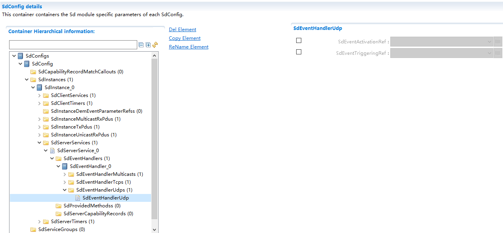

.. centered:: **表 SdEventHandlerUdp容器属性描述 (Table SdEventHandlerUdp Container Property Description)**

.. list-table::
   :widths: 20 20 20 20 20
   :header-rows: 1

   * - UI名称 (UI Name)
     - 描述 (Description)
     - 
     - 
     - 
   * - SdEventActivationRef
     - 取值范围 (Range)
     - 无
     - 默认取值 (Default value)
     - 无
   * - 
     - 参数描述 (Parameter Description)
     - 引用一个SoAdRoutingGroup对象，当有Client订阅该事件组时，Sd通过该引用打开数据发送通道，之后Event便可以发送给Client (Referencing a SoAdRoutingGroup object, when a Client subscribes to this event group, Sd opens the data sending channel through this reference, after which Events can be sent to the Client.)
     - 
     - 
   * - 
     - 依赖关系 (Dependencies)
     - 无
     - 
     - 
   * - SdEventTriggeringRef
     - 取值范围 (Range)
     - 无
     - 默认取值 (Default value)
     - 无
   * - 
     - 参数描述 (Parameter Description)
     - 引用一个SoAdRoutingGroup对象，用于TriggerTransmit。当配置的Eventgroup中包含属于Field的Event时，配置该对象，在SoAd中配置属于Field的Event的SoAdPduRoute时，SoAdTxRoutingGroupRef中关联这里配置的SoAdRoutingGroup。当第一次订阅Eventgroup时，Eventgroup会主动发送一次。 (Reference a SoAdRoutingGroup object for TriggerTransmit. Configure this object when the Eventgroup configured contains an Event belonging to the Field. In SoAd, configure the SoAdPduRoute for the Event belonging to the Field, and associate it with the configured SoAdRoutingGroup in SoAdTxRoutingGroupRef. When subscribing to the Eventgroup for the first time, the Eventgroup will actively send once.)
     - 
     - 
   * - 
     - 依赖关系 (Dependencies)
     - 无
     - 
     - 

SdProvidedMethods
=================================

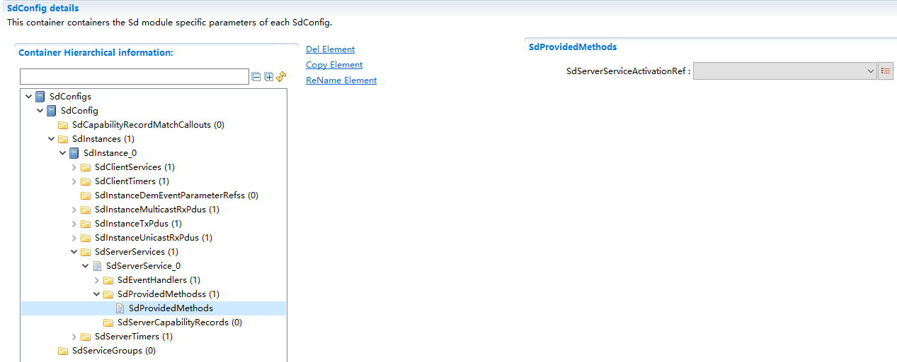

.. centered:: **表 SdProvidedMethods容器属性描述 (Table SdProvidedMethods Container Properties Description)**

.. list-table::
   :widths: 20 20 20 20 20
   :header-rows: 1

   * - UI名称 (UI Name)
     - 描述 (Description)
     - 
     - 
     - 
   * - SdServerServiceActivationRef
     - 取值范围 (Range)
     - 无
     - 默认取值 (Default value)
     - 无
   * - 
     - 参数描述 (Parameter Description)
     - 引用一个SoAdRoutingGroup对象，Sd通过该引用打开/关闭服务的Method通道 (Reference an SoAdRoutingGroup object, Sd uses this reference to open/close the Method channel of the service.)
     - 
     - 
   * - 
     - 依赖关系 (Dependencies)
     - 无
     - 
     - 

SdServerCapabilityRecord
========================================

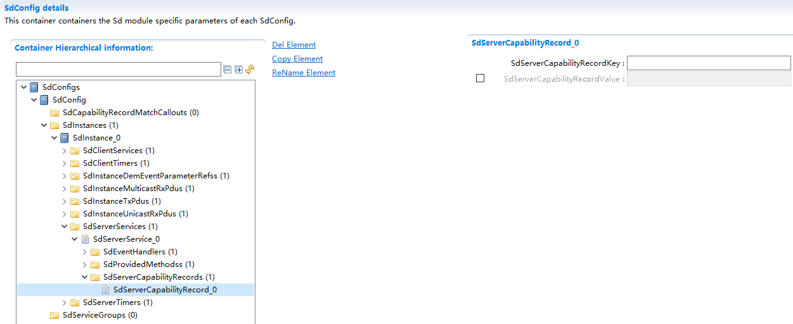

.. centered:: **表 SdServerCapabilityRecord容器属性描述 (Container Properties Description for Table SdServerCapabilityRecord)**

.. list-table::
   :widths: 20 20 20 20 20
   :header-rows: 1

   * - UI名称 (UI Name)
     - 描述 (Description)
     - 
     - 
     - 
   * - SdServerCapabilityRecordKey
     - 取值范围 (Range)
     - 合法字符串 (Legal String)
     - 默认取值 (Default value)
     - 无
   * - 
     - 参数描述 (Parameter Description)
     - 定义一个CapabilityRecordkey. (Define a CapabilityRecordKey.)
     - 
     - 
   * - 
     - 依赖关系 (Dependencies)
     - 无
     - 
     - 
   * - SdServerCapabilityRecordValue
     - 取值范围 (Range)
     - 合法字符串 (Legal String)
     - 默认取值 (Default value)
     - 无
   * - 
     - 参数描述 (Parameter Description)
     - 定义key对应的CapabilityRecord值. (Define the CapabilityRecord value corresponding to the key.)
     - 
     - 
   * - 
     - 依赖关系 (Dependencies)
     - 无
     - 
     - 

SdServerTimer
-----------------------------

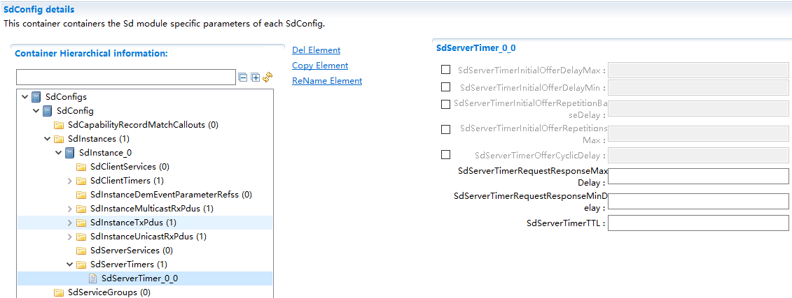

.. centered:: **表 SdServerTimer容器属性描述 (Container Property Description of SdServerTimer Table)**

.. list-table::
   :widths: 20 20 20 20 20
   :header-rows: 1

   * - UI名称 (UI Name)
     - 描述 (Description)
     - 
     - 
     - 
   * - SdServerTimerInitialOfferDelayMax
     - 取值范围 (Range)
     - 0 .. INF
     - 默认取值 (Default value)
     - 无
   * - 
     - 参数描述 (Parameter Description)
     - 当发送第一次Offer报文时，随机延时的最大值，单位是秒。 (The maximum random delay value in seconds when sending the first Offer message.)
     - 
     - 
   * - 
     - 依赖关系 (Dependencies)
     - 无
     - 
     - 
   * - SdServerTimerInitialOfferDelayMin
     - 取值范围 (Range)
     - 0 .. INF
     - 默认取值 (Default value)
     - 无
   * - 
     - 参数描述 (Parameter Description)
     - 当发送第一次Offer报文时，随机延时的最小值，单位是秒。 (The minimum value of random delay when sending the first Offer message, in seconds.)
     - 
     - 
   * - 
     - 依赖关系 (Dependencies)
     - SdServerTimerInitialOfferDelayMin<=SdServerTimerInitialOfferDelayMax
     - 
     - 
   * - SdServerTimerInitialOfferRepetitionBaseDelay
     - 取值范围 (Range)
     - 0 .. INF
     - 默认取值 (Default value)
     - 无
   * - 
     - 参数描述 (Parameter Description)
     - 在Repetition阶段重复发送Offer报文的基准时间，单位是秒。 (The base time for sending Offer messages in the Repetition stage, in seconds.)
     - 
     - 
   * - 
     - 依赖关系 (Dependencies)
     - 无
     - 
     - 
   * - SdServerTimerInitialOfferRepetitionsMax
     - 取值范围 (Range)
     - 0 .. 10
     - 默认取值 (Default value)
     - 无
   * - 
     - 参数描述 (Parameter Description)
     - 在Repetition阶段重复发送Offer报文的最大次数。 (Maximum number of times Offer messages can be retransmitted in the Repetition phase.)
     - 
     - 
   * - 
     - 依赖关系 (Dependencies)
     - 无
     - 
     - 
   * - SdServerTimerOfferCyclicDelay
     - 取值范围 (Range)
     - 0 .. INF
     - 默认取值 (Default value)
     - 无
   * - 
     - 参数描述 (Parameter Description)
     - 在Main阶段，重复发送Offer报文的周期时间。 (The period time for repeatedly sending Offer messages in the Main phase.)
     - 
     - 
   * - 
     - 依赖关系 (Dependencies)
     - 无
     - 
     - 
   * - SdServerTimerRequestResponseMaxDelay
     - 取值范围 (Range)
     - 0 .. INF
     - 默认取值 (Default value)
     - 无
   * - 
     - 参数描述 (Parameter Description)
     - 当接收到多播发送的请求时，应答时随机延时的最大时间。 (The maximum random delay time when responding to a multicast send request.)
     - 
     - 
   * - 
     - 依赖关系 (Dependencies)
     - 无
     - 
     - 
   * - SdServerTimerRequestResponseMinDelay
     - 取值范围 (Range)
     - 0 .. INF
     - 默认取值 (Default value)
     - 无
   * - 
     - 参数描述 (Parameter Description)
     - 当接收到多播发送的请求时，应答时随机延时的最小时间。 (The minimum time of random delay when responding to a multicast send request.)
     - 
     - 
   * - 
     - 依赖关系 (Dependencies)
     - SdServerTimerRequestResponseMinDelay<=SdServerTimerRequestResponseMaxDelay
     - 
     - 
   * - SdServerTimerTTL
     - 取值范围 (Range)
     - 1 .. 16777215
     - 默认取值 (Default value)
     - 无
   * - 
     - 参数描述 (Parameter Description)
     - OfferService中的TTL时间。 (The TTL time in OfferService.)
     - 
     - 
   * - 
     - 依赖关系 (Dependencies)
     - 无
     - 
     - 

SdInstanceDemEventParameterRefs
-----------------------------------------------

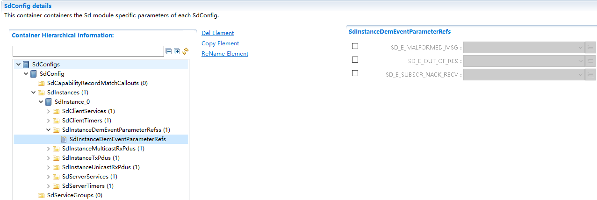

.. centered:: **表 SdInstanceDemEventParameterRefs容器属性描述 (Container properties description for table SdInstanceDemEventParameterRefs)**

.. list-table::
   :widths: 20 20 20 20 20
   :header-rows: 1

   * - UI名称 (UI Name)
     - 描述 (Description)
     - 
     - 
     - 
   * - SD_E_MALFORMED_MSG
     - 取值范围 (Range)
     - 无
     - 默认取值 (Default value)
     - 无
   * - 
     - 参数描述 (Parameter Description)
     - 引用到一个DemEventParameter，当Sd接收到长度错误的报文时，通过该参数通知Dem (Reference a DemEventParameter when Sd receives a message with incorrect length, this parameter notifies Dem.)
     - 
     - 
   * - 
     - 依赖关系 (Dependencies)
     - 无
     - 
     - 
   * - SD_E_OUT_OF_RES
     - 取值范围 (Range)
     - 无
     - 默认取值 (Default value)
     - 无
   * - 
     - 参数描述 (Parameter Description)
     - 引用到一个DemEventParameter，当Sd资源不足无法处理客户端的请求时，通过该参数通知Dem (Reference a DemEventParameter when Sd resource不足 cannot process the client's request, notify Dem through this parameter.)
     - 
     - 
   * - 
     - 依赖关系 (Dependencies)
     - 无
     - 
     - 
   * - SD_E_SUBSCR_NACK_RECV
     - 取值范围 (Range)
     - 无
     - 默认取值 (Default value)
     - 无
   * - 
     - 参数描述 (Parameter Description)
     - 引用到一个DemEventParameter，收到SubscribeEventgroupNack时，通过该参数通知Dem (Refer to a DemEventParameter, notify Dem with it when receiving SubscribeEventgroupNack.)
     - 
     - 
   * - 
     - 依赖关系 (Dependencies)
     - 无
     - 
     - 

SdInstanceMulticastRxPdus
-----------------------------------------

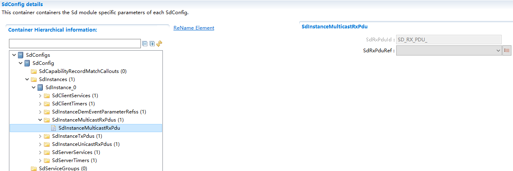

.. centered:: **表 SdInstanceMulticastRxPdus容器属性描述 (Container Properties Description for Table SdInstanceMulticastRxPdus)**

.. list-table::
   :widths: 20 20 20 20 20
   :header-rows: 1

   * - UI名称 (UI Name)
     - 描述 (Description)
     - 
     - 
     - 
   * - SdRxPduId
     - 取值范围 (Range)
     - 0 .. 65535
     - 默认取值 (Default value)
     - 无
   * - 
     - 参数描述 (Parameter Description)
     - 接收多播Pdu的ID. (ID for receiving multicast PDU.)
     - 
     - 
   * - 
     - 依赖关系 (Dependencies)
     - 无
     - 
     - 
   * - SdRxPduRef
     - 取值范围 (Range)
     - 无
     - 默认取值 (Default value)
     - 无
   * - 
     - 参数描述 (Parameter Description)
     - 引用到一个Ecu中的Pdu. (Reference Pdu to an Ecu)
     - 
     - 
   * - 
     - 依赖关系 (Dependencies)
     - 无
     - 
     - 

SdInstanceTxPdus
--------------------------------

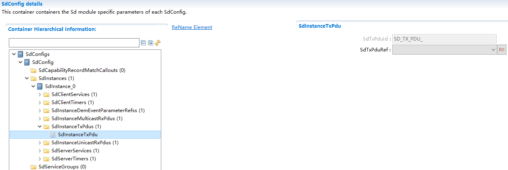

.. centered:: **表 SdInstanceTxPdus容器属性描述 (Container Properties Description for Table SdInstanceTxPdus)**

.. list-table::
   :widths: 20 20 20 20 20
   :header-rows: 1

   * - UI名称 (UI Name)
     - 描述 (Description)
     - 
     - 
     - 
   * - SdTxPduId
     - 取值范围 (Range)
     - 0 .. 65535
     - 默认取值 (Default value)
     - 无
   * - 
     - 参数描述 (Parameter Description)
     - 发送Pdu的ID. (Send Pdu ID.)
     - 
     - 
   * - 
     - 依赖关系 (Dependencies)
     - 无
     - 
     - 
   * - SdTxPduRef
     - 取值范围 (Range)
     - 无
     - 默认取值 (Default value)
     - 无
   * - 
     - 参数描述 (Parameter Description)
     - 引用到一个Ecu中的Pdu. (Reference Pdu to an Ecu)
     - 
     - 
   * - 
     - 依赖关系 (Dependencies)
     - 无
     - 
     - 

SdInstanceUnicastRxPdus
---------------------------------------

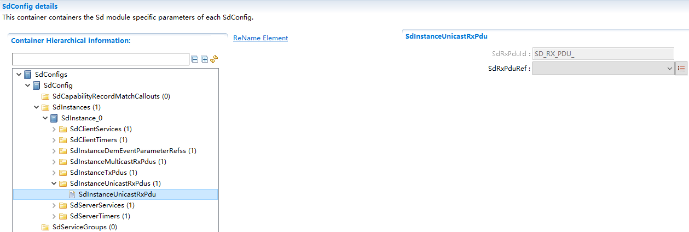

.. centered:: **表 SdInstanceUnicastRxPdus容器属性描述 (Container Property Description for Table SdInstanceUnicastRxPdus)**

.. list-table::
   :widths: 20 20 20 20 20
   :header-rows: 1

   * - UI名称 (UI Name)
     - 描述 (Description)
     - 
     - 
     - 
   * - SdRxPduId
     - 取值范围 (Range)
     - 0 .. 65535
     - 默认取值 (Default value)
     - 无
   * - 
     - 参数描述 (Parameter Description)
     - 接收单播Pdu的ID. (ID for Received Unicast Pdu.)
     - 
     - 
   * - 
     - 依赖关系 (Dependencies)
     - 无
     - 
     - 
   * - SdRxPduRef
     - 取值范围 (Range)
     - 无
     - 默认取值 (Default value)
     - 无
   * - 
     - 参数描述 (Parameter Description)
     - 引用到一个Ecu中的Pdu. (Reference Pdu to an Ecu)
     - 
     - 
   * - 
     - 依赖关系 (Dependencies)
     - 无
     - 
     - 

SdCapabilityRecordMatchCallouts
-----------------------------------------------

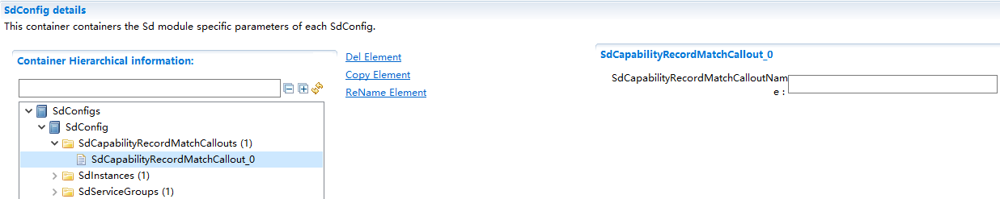

.. centered:: **表 SdCapabilityRecordMatchCallouts容器属性描述 (Container Properties Description)**

.. list-table::
   :widths: 20 20 20 20 20
   :header-rows: 1

   * - UI名称 (UI Name)
     - 描述 (Description)
     - 
     - 
     - 
   * - SdCapabilityRecordMatchCalloutName
     - 取值范围 (Range)
     - 合法字符串 (Legal String)
     - 默认取值 (Default value)
     - 无
   * - 
     - 参数描述 (Parameter Description)
     - SdCapabilityRecordMatchCallout的函数名. (The function name of SdCapabilityRecordMatchCallout.)
     - 
     - 
   * - 
     - 依赖关系 (Dependencies)
     - 无
     - 
     - 
