SoAd
#################################

:strong:`缩写词注解 (Abbreviation Notes):`

.. list-table::
   :widths: 34 33 33
   :header-rows: 1

   * - 缩写词 (Abbreviation)
     - 解释/描述 (Explanation/Description)
     - 中文解释 (Chinese explanation)
   * - DET
     - Default Error Tracer
     - 开发错误检测模块 (Develop an error detection module)
   * - IP
     - Internet Protocol
     - 以太网InternetProtocol协议 (Ethernet Internet Protocol)
   * - IPv4/IPv6
     - Internet Protocol version4/6
     - 以太网InternetProtocol协议版本4和版本6 (Ethernet Internet Protocol version 4 and version 6)
   * - TCP
     - Transmission ControlProtocol
     - 以太网Transmission ControlProtocol (Ethernet Transmission Control Protocol)
   * - UDP
     - User Datagram Protocol
     - 以太网User DatagramProtocol (Ethernet User Datagram Protocol)
   * - TcpIp
     - TCP/IP Protocols Module
     - AUTOSAR架构下TCP/IP协议实现模块 (TCP/IP Protocol Implementation Module under AUTOSAR Architecture)
   * - SoCon
     - Socket Connection
     - 套接字连接 (Socket connection)
   * - SoConGroup
     - Socket Connection Group
     - 套接字连接组合 (Socket connection combination)

简介 (Introduction)
=================================

SoAd作为“通信桥梁”将上层基于I-PDU的通信，与下层基于Socket的TCP/UDP通信连接起来。同时实现基于Socket Connection的连接控制，以及I-PDU与Socket Connection的路由控制，并为上层提供相应接口。

SoAd acts as a "communication bridge" to connect upper-layer communication based on I-PDU with lower-layer TCP/UDP communication based on Socket. At the same time, it realizes connection control based on Socket Connection and routing control between I-PDU and Socket Connection, while providing corresponding interfaces for the upper layer.

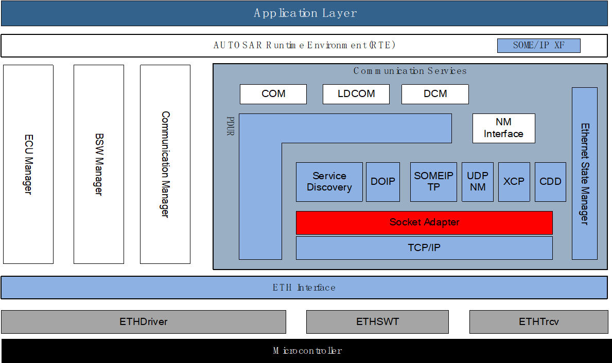

SoAd模块处于AUTOSAR架构中的通信服务层，其下层模块为TcpIp模块，上层模块可能为Sd，DoIp，PduR，Xcp，UdpNm，SomeIpTp以及CDD模块。SoAd与TcpIp的交互：SoAd通过调用TcpIp模块的接口实现对TCP/UDP Socket的各种操作（获取，绑定，连接，监听，参数设置，释放），以及TCP/UDP报文的发送请求，TCP报文的接收窗口释放；TcpIp模块通过调用SoAd的回调函数实现IP地址分配状态改变通知，Socket事件通知，TCP Socket连接成功通知，以及TCP/UDP接收报文传递，TCP发送数据的拷贝，TCP发送数据的ACK发送确认。

The SoAd module resides in the communication service layer of the AUTOSAR architecture, with the TcpIp module as its lower-layer module. The upper-layer modules may include Sd, DoIp, PduR, Xcp, UdpNm, SomeIpTp, and CDD modules. Interactions between SoAd and TcpIp: SoAd实现对TCP/UDP Socket的各种操作（获取，绑定，连接，监听，参数设置，释放），以及TCP/UDP报文的发送请求，TCP报文的接收窗口释放通过调用TcpIp模块的接口；TcpIp模块通过调用SoAd的回调函数实现IP地址分配状态改变通知，Socket事件通知，TCP Socket连接成功通知，以及TCP/UDP接收报文传递，TCP发送数据的拷贝，TCP发送数据的ACK发送确认。

SoAd与上层模块的交互：SoAd为上层模块提供基于Socket Connection的开启、关闭、Id获取、模式获取、远端地址设置/获取操作，提供基于Routing Group的路由使能控制，以及IF/TP PDU的发送接口，TP PDU的发送/接收取消接口；SoAd通过调用上层模块回调接口，实现IP地址分配状态改变通知，Socket Connection模式改变通知，以及IF/TP PDU发送或者接收流程所必须的Tx PDU数据获取、Rx PDU数据传递、发送确认、接收指示。

SoAd interaction with upper-layer modules: SoAd provides socket connection-based operations for enabling, disabling, ID acquisition, mode acquisition, remote address setting/retrieval to the upper-layer modules. It offers routing enablement control based on Routing Groups and interfaces for sending IF/TP PDUs, as well as interfaces for canceling send or receive of TP PDUs. SoAd achieves notifications for IP address allocation state changes and socket connection mode changes by calling callbacks from upper-layer modules. Additionally, it provides data retrieval for Tx PDU in the IF/TP PDU sending/receiving process and data transmission for Rx PDU, along with send confirmation and receive indication.

参考资料 (Reference materials)
------------------------------------------

[1] AUTOSAR_SWS_SocketAdaptor.pdf，R19-11

[2] AUTOSAR_SWS_TcpIp.pdf，R19-11

功能描述 (Function Description)
===========================================

Socket Connections功能 (Socket Connections functionality)
-----------------------------------------------------------------------

Socket Connections功能介绍 (Socket Connections Function Introduction)
~~~~~~~~~~~~~~~~~~~~~~~~~~~~~~~~~~~~~~~~~~~~~~~~~~~~~~~~~~~~~~~~~~~~~~~~~~~~~~~~~

为了实现上层PDUs与下层Sockets之前的通信映射，SoAd模块定义了Socket Connection的概念。一个Socket Connection表示一个本端socket（本端IP和本端Port）与远端socket（远端IP和远端Port）的链接，以及该链接基于的传输协议（UDP/TCP），是否使用PDU Header，是否需求buffer，传输协议相关参数等。

To achieve the communication mapping between upper-layer PDUs and lower-layer Sockets, the SoAd module defines the concept of Socket Connection. A Socket Connection represents a link between a local socket (local IP and local Port) and a remote socket (remote IP and remote Port), as well as the underlying transport protocol based on which the link operates (UDP/TCP), whether PDU Header is used, whether buffer is needed, and related parameters of the transport protocol.

每个Socket Connection的模式根据SoAd_SoConModeType定义分为三种：SOAD_SOCON_ONLINE、SOAD_SOCON_RECONNECT、SOAD_SOCON_OFFLINE。

Each Socket Connection mode is defined as one of three types by SoAd_SoConModeType: SOAD_SOCON_ONLINE, SOAD_SOCON_RECONNECT, SOAD_SOCON_OFFLINE.

1.Socket Connection Open：

当我们需要使能通信时，首先需要开启相应的Socket Connections。开启的方式分为两种：手动方式（需上层模块调用SoAd_OpenSoCon）、自动方式。初始化之后，每个Socket Connection都处于SOAD_SOCON_OFFLINE模式，执行Open操作时根据每个Socket Connection的配置属性，其模式切换路线分两种：SOAD_SOCON_OFFLINE→SOAD_SOCON_ONLINE；SOAD_SOCON_OFFLINE→SOAD_SOCON_RECONNECT→SOAD_SOCON_ONLINE。只有当处于SOAD_SOCON_ONLINE模式时才能通过该Socket Connection发送/接收数据（属于UDP的Socket Connection可以在SOAD_SOCON_RECONNECT模式下响应SoAd_RxIndication，在该API中先切换到SOAD_SOCON_ONLINE模式，再执行数据接收处理）。

When we need to enable communication, we first need to enable the corresponding Socket Connections. The ways to enable them are divided into two: manual (requiring the upper-layer module to call SoAd_OpenSoCon) and automatic. After initialization, each Socket Connection is in the SOAD_SOCON_OFFLINE mode. When performing an Open operation, based on the configuration attributes of each Socket Connection, there are two switching routes for its mode: SOAD_SOCON_OFFLINE → SOAD_SOCON_ONLINE; SOAD_SOCON_OFFLINE → SOAD_SOCON_RECONNECT → SOAD_SOCON_ONLINE. Only when in the SOAD_SOCON_ONLINE mode can data be sent/received via this Socket Connection (a UDP Socket Connection can respond to SoAd_RxIndication in the SOAD_SOCON_RECONNECT mode, switching to SOAD_SOCON_ONLINE mode first before executing data reception processing).

2.Socket Connection Close：

Socket Connection的关闭分为主动请求关闭（上层模块调用SoAd_CloseSoCon），以及异常关闭，如下层模块检测到错误事件，通过SoAd_TcpIpEvent通知到SoAd模块；UDP报文接收超时；TP PDU收发过程中出现错误/取消等。只有在执行主动请求关闭时，Socket Connection的模式才能切换到SOAD_SOCON_OFFLINE，别的情况都切换到SOAD_SOCON_RECONNECT模式。

The closure of Socket Connection is divided into active request closure (upper-layer module calling SoAd_CloseSoCon), and abnormal closure, such as when the lower-layer module detects an error event and notifies the SoAd module through SoAd_TcpIpEvent; UDP message reception timeout; errors/cancellations during TCP PDU transmission/reception. Only when executing active request closure can the mode of Socket Connection switch to SOAD_SOCON_OFFLINE; in other cases, it switches to SOAD_SOCON_RECONNECT mode.

3.Socket Connection Open/Close Sequence Remarks：

Socket Connection的开启及关闭是异步的，任务队列只能缓存两个不同的任务请求，多余的任务根据策略进行舍弃或者撤销（revoke）队列中的任务。

The opening and closing of Socket Connection are asynchronous, with the task queue able to cache only two distinct task requests; excess tasks are discarded or revoked according to strategy.

4.Notifications：

当Socket Connection的模式切换时，可以通过调用<Up>_SoConModeChg()函数通知上层模块。

When the mode of Socket Connection changes, the upper layer module can be notified by calling the <Up>_SoConModeChg() function.

当Socket Connection关联的IP地址（本端）状态切换时，可以通过调用<Up>_LocalIpAddrAssignmentChg()函数通知上层。

When the state of the associated IP address (local end) for Socket Connection changes, the _LocalIpAddrAssignmentChg() function can be called to notify the upper layer.

Socket Connections功能实现 (Socket Connections functionality implementation)
~~~~~~~~~~~~~~~~~~~~~~~~~~~~~~~~~~~~~~~~~~~~~~~~~~~~~~~~~~~~~~~~~~~~~~~~~~~~~~~~~~~~~~~~

通过每个SoAdSocketConnectionGroup的配置参数SoAdSocketAutomaticSoConSetup可以选择相应的Socket Connections的开启方式是手动方式还是自动方式。

Through the configuration parameters of each SoAdSocketConnectionGroup, SoAdSocketAutomaticSoConSetup, the way to enable corresponding Socket Connections can be chosen as either manual or automatic.

只有在配置成手动方式的情况下，才能通过调用SoAd_OpenSoCon或者SoAd_CloseSoCon函数来主动请求Socket Connection的开启或者关闭。

Only by configuring it as a manual mode can you actively request the opening or closing of the Socket Connection through calling the SoAd_OpenSoCon or SoAd_CloseSoCon functions.

对于异常关闭的Socket Connection（SOAD_SOCON_RECONNECT），SoAd会自动尝试重连，具体描述参见2.8章节。

For abnormal closure of Socket Connection (SOAD_SOCON_RECONNECT), SoAd will automatically attempt to reconnect, as described in Chapter 2.8.

通过SoAdBswModules的配置参数SoAdLocalIpAddrAssigmentChg和SoAdSoConModeChg来决定当Socket Connection关联的IP地址状态切换和模式切换时，是否调用上层通知函数来通知上层模块。

Through the configuration parameters SoAdLocalIpAddrAssigmentChg and SoAdSoConModeChg in SoAdBswModules, decide whether to call the upper-layer notification function to inform the upper-layer module when the IP address state of the Socket Connection changes or the mode switches.

PDU Transmission功能 (PDU Transmission Function)
--------------------------------------------------------------

PDU Transmission功能介绍 (PDU Transmission Function Introduction)
~~~~~~~~~~~~~~~~~~~~~~~~~~~~~~~~~~~~~~~~~~~~~~~~~~~~~~~~~~~~~~~~~~~~~~~~~~~~~

SoAd通过PDU route(SoAdPduRoute, SoAdPduRouteDest)将PDU映射到socket connection，进而通过其关联的UDP/TCP Socket进行发送。SoAd提供IF、TP两种PDU发送方式。

SoAd maps PDU to a socket connection through PDU route (SoAdPduRoute, SoAdPduRouteDest) and subsequently sends it via the associated UDP/TCP Socket. SoAd provides two PDU sending methods: IF and TP.

1.PDU Transmission via IF-API：

对于数据长度较小的PDU，通常使用IF发送方式。在SoAd中支持IF PDU的1：n路由发送。

For PDUs with shorter data lengths, IF transmission methods are typically used. In SoAd, 1:n routing transmission of IF PDUs is supported.

2.PDU Transmission via IF-API and nPduUdpTxBuffer：

当Socket Connection（UDP类型）关联的所有发送PDU都是“IF”类型,使能PDU Header，其关联的SoAdPduRouteDests至少有一个SoAdTxUdpTriggerMode 配置为TRIGGER_NEVER模式。SoAd将使能该Socket Connection的nPduUdpTxBuffer机制。

When all send PDUs associated with the Socket Connection (UDP type) are of "IF" type, enable PDU Header, and at least one SoAdTxUdpTriggerMode configured as TRIGGER_NEVER mode, SoAd will enable the nPduUdpTxBuffer mechanism for this Socket Connection.

nPduUdpTxBuffer机制，能够将多个IF PDU封装在一个UDP报文中进行统一发送，以达到节省带宽的目的。

The pDuUdpTxBuffer mechanism can encapsulate multiple IF PDUs in a single UDP packet for unified transmission, thereby achieving bandwidth savings.

3. PDU Transmission via IfRoutingGroupTransmit API：

SoAd支持上层模块（通常为Sd模块），通过Trigger Transmit方式请求RoutingGroup关联的部分或者所有IF PDUs的发送。

SoAd supports upper-layer modules (typically Sd modules) by requesting the transmission of部分或所有IF PDUs associated with a RoutingGroup via Trigger Transmit.

上面提到的部分IF PDUs指的是关联到某一特定Socket Connection的PDUs。

The mentioned part of IF PDUs refers to PDUs associated with a specific Socket Connection.

4.PDU Transmission via TP-API：

对于上层模块数据长度较大的PDU，通常通过TP方式进行发送。TP发送不支持PDU的1：n路由。

For PDU with larger data lengths in upper module, it is typically sent via TP method. TP sending does not support PDU's 1:n routing.

PDU Transmission功能实现 (PDU Transmission functionality implementation)
~~~~~~~~~~~~~~~~~~~~~~~~~~~~~~~~~~~~~~~~~~~~~~~~~~~~~~~~~~~~~~~~~~~~~~~~~~~~~~~~~~~~

1.PDU Transmission via IF-API：

通过配置参数SoAdTxUpperLayerType可以选择PDU通过IF或者TP方式进行发送。

By configuring the parameter SoAdTxUpperLayerType, PDU can be selected to be sent via IF or TP methods.

当选择IF方式发送时，可以通过给一个SoAdPduRoute配置1-N个SoAdPduRouteDest，实现IF PDU的1：n路由。上层模块通过调用SoAd_IfTransmit来实现IF PDU的发送请求。

When IF mode transmission is selected, one or more SoAdPduRouteDest can be configured to a SoAdPduRoute to achieve 1:n routing of IF PDU. The upper layer module realizes the sending request of IF PDU by calling SoAd_IfTransmit.

当使用IF方式通过UDP发送PDU时，若未配置上层模块SoAdIfTxConfirmation时，在TcpIp_UdpTransmit()返回E_OK时则不用置TxComfirmation的状态立即返回，即不在SoAd的下一个周期函数中处理该PDU的TxComfirmation，用于通过UDP对同一个PDU的连续发送场景。

When using IF mode to send PDU via UDP without configuring the upper-layer module SoAdIfTxConfirmation, TcpIp_UdpTransmit() returning E_OK allows immediate return without setting the TxConfirmation status. This is used for scenarios involving consecutive UDP transmissions of the same PDU without processing its TxConfirmation in SoAd's next周期函数.

2.PDU Transmission via IF-API and nPduUdpTxBuffer：

当需要使能nPduUdpTxBuffer机制时，上层模块同样通过调用SoAd_IfTransmit来请求IF PDU（UDP）的发送，SoAd将N个IF PDU封装到nPduUdpTxBuffer中，统一的UDP报文进行发送，涉及到的配置如下：

When enabling the nPduUdpTxBuffer mechanism, the upper-layer module also requests the transmission of IF PDU (UDP) by calling SoAd_IfTransmit. SoAd encapsulates N IF PDUs into the nPduUdpTxBuffer and sends them as a unified UDP packet. The relevant configurations are as follows:

（1）SoAdSocketUdpTriggerTimeout：Socket Connection的nPduUdpTxBuffer超时时间。

SoAdSocketUdpTriggerTimeout：timeout time for Socket Connection's nPduUdpTxBuffer.

（2）SoAdSocketnPduUdpTxBufferMin：nPduUdpTxBuffer的触发长度（数据长度超过该参数，将触发发送）。

SoAdSocketnPduUdpTxBufferMin：the trigger length of nPduUdpTxBuffer (data length exceeding this parameter will trigger transmission).

（3）SoAdPduHeaderEnable：PDU Header使能开关。

SoAdPduHeaderEnable：PDU Header Enable Switch.

（4）SoAdTxPduHeaderId：PDU的Header ID。

SoAdTxPduHeaderId：PDU's Header ID.

（5）SoAdTxUdpTriggerMode：PDU（UDP）触发方式（NEVER/ALWAYS）。

SoAdTxUdpTriggerMode：PDU（UDP）Trigger Mode (NEVER/ALWAYS).

（6）SoAdTxUdpTriggerTimeout：PDU的nPduUdpTxBuffer超时时间。

SoAdTxUdpTriggerTimeout: PDU's nPduUdpTxBuffer timeout duration.

（7）SoAdTxUpperLayerType：PDU发送方式（IF/TP）。

SoAdTxUpperLayerType：PDU sending method (IF/TP).

3.PDU Transmission via IfRoutingGroupTransmit API：

SoAd为上层模块（通常为Sd模块）提供2种基于IfRoutingGroup的发送机制，分别为SoAd_IfRoutingGroupTransmit和SoAd_IfSpecificRoutingGroupTransmit。涉及的配置参数为SoAdRoutingGroupTxTriggerable（只有配置为TRUE的SoAdRoutingGroup才能通过以上两个API来触发IfRoutingGroup的发送机制）。该机制下，SoAd将调用<Up>\_[SoAd][If]TriggerTransmit来获取发送数据，然后调用TcpIp层API来发送报文。

SoAd provides two send mechanisms based on IfRoutingGroup for upper-layer modules (typically Sd modules), namely SoAd_IfRoutingGroupTransmit and SoAd_IfSpecificRoutingGroupTransmit. The configuration parameters involved are SoAdRoutingGroupTxTriggerable (only SoAdRoutingGroups configured as TRUE can trigger the send mechanism via these two APIs). Under this mechanism, SoAd will call <Up>\_[SoAd][If]TriggerTransmit to obtain the sending data and then use TcpIp layer API to send the message.

4.PDU Transmission via TP-API：

当PDU通过TP方式进行发送时，上层模块通过调用SoAd_TpTransmit来请求PDU发送。SoAd将通过N次调用<Up>\_[SoAd][Tp]CopyTxData来分段获取PDU数据，当发送完成（成功/失败）则通过调用<Up>\_[SoAd][Tp]TxConfirmation来通知上层发送成功或者失败。当通过UDP进行发送时，SoAd将提供足够长度的Buffer来获取到整个PDU数据后，再调用TcpIp_UdpTransmit来进行发送；当通过TCP进行发送时，SoAd不提供发送Buffer，TcpIp调用SoAd_CopyTxData请求Copy发送数据时，SoAd调用上层<Up>\_[SoAd][Tp]CopyTxData来获取数据给TcpIp。

When PDU is sent via TP, the upper-layer module requests PDU transmission by calling SoAd_TpTransmit. SoAd will segmentally acquire PDU data through N calls to <Up>\_[SoAd][Tp]CopyTxData, and notify the upper layer of success or failure in sending upon completion (success/failure). When sent via UDP, SoAd provides a sufficient-length buffer to acquire the entire PDU data before calling TcpIp_UdpTransmit for transmission. When sent via TCP, SoAd does not provide a send buffer; when TcpIp calls SoAd_CopyTxData to request copying of transmit data, SoAd calls the upper layer's <Up>\_[SoAd][Tp]CopyTxData to acquire data for TcpIp.

PDU Header option功能 (PDU Header option functionality)
---------------------------------------------------------------------

PDU Header option功能介绍 (Function Introduction of PDU Header Option)
~~~~~~~~~~~~~~~~~~~~~~~~~~~~~~~~~~~~~~~~~~~~~~~~~~~~~~~~~~~~~~~~~~~~~~~~~~~~~~~~~~

SoAd支持PDU Header功能，PDU Header由4字节的Header ID,4字节的PDU数据长度组成（大端字节序）。当Socket Connection关联到多个接收PDU，以及需要用到nPduUdpTxBuffer机制等情况时，都需要PDU Header功能的支持。

SoAd supports the PDU Header function, which consists of a 4-byte Header ID and a 4-byte PDU data length (in big-endian byte order). The PDU Header function is required when Socket Connection is associated with multiple received PDUs and when the nPduUdpTxBuffer mechanism is used.

PDU Header option功能实现 (PDU Header option functionality implementation)
~~~~~~~~~~~~~~~~~~~~~~~~~~~~~~~~~~~~~~~~~~~~~~~~~~~~~~~~~~~~~~~~~~~~~~~~~~~~~~~~~~~~~~

当配置参数SoAdPduHeaderEnable配置为TRUE时，对应的Socket Connection则使能PDU Header功能，其关联的PDUs需要相应配置各自的SoAdTxPduHeaderId/SoAdRxPduHeaderId。

When the configuration parameter SoAdPduHeaderEnable is set to TRUE, the corresponding Socket Connection enables the PDU Header function, and its associated PDUs need to be configured with their respective SoAdTxPduHeaderId/SoAdRxPduHeaderId.

在PDU发送过程中，SoAd层根据配置的HeaderId及PDU数据长度整合成8字节的PDU Header，添加到上层PDU数据前面，PDU数据长度+8，调用下层API统一进行发送。

During the PDU transmission process, the SoAd layer integrates an 8-byte PDU Header in front of the upper-layer PDU data based on the configured HeaderId and PDU data length, making the total PDU data length +8, and then calls the lower-layer API for unified sending.

在PDU接收过程中，SoAd对接收到的报文数据根据PDU Header进行PDU匹配、PDU数据提取等操作，将不含PDU Header数据的完整PDU数据传递给上层模块。

During the PDU reception process, SoAd performs PDU matching and PDU data extraction based on the PDU Header for the received message data, and passes the complete PDU data without the PDU Header to the upper-layer module.

PDU Header数据的所有操作（添加、解析、去除）都在SoAd层完成。

All operations on the PDU Header data (addition, parsing, removal) are completed at the SoAd layer.

PDU Reception功能 (PDU Reception Function)
--------------------------------------------------------

PDU Reception功能介绍 (Function Introduction for PDU Reception)
~~~~~~~~~~~~~~~~~~~~~~~~~~~~~~~~~~~~~~~~~~~~~~~~~~~~~~~~~~~~~~~~~~~~~~~~~~~

PDU的接收，在SoAd中通过Socket Route (SoAdSocketRoute,SoAdSocketRouteDest)来实现，将通过UDP/TCP Socket获取的报文映射到PDUs。当前Socket Route仅支持1：1路由（即一个SoAdSocketRoute只能包含一个SoAdSocketRouteDest），但需注意的是一个Socket Connection可以关联多个SoAdSocketRoute。

The reception of PDU in SoAd is achieved through Socket Route (SoAdSocketRoute, SoAdSocketRouteDest), mapping the packets obtained via UDP/TCP Socket to PDUs. Currently, Socket Route only supports 1:1 routing (i.e., one SoAdSocketRoute can only contain one SoAdSocketRouteDest), but it should be noted that a Socket Connection can be associated with multiple SoAdSocketRoutes.

SoAd与上层模块PDU接收同样有两种方式：IF接收、TP接收。

SoAd has two ways of receiving PDU similar to the upper layer modules: IF reception and TP reception.

PDU Reception功能实现 (PDU Reception functionality implementation)
~~~~~~~~~~~~~~~~~~~~~~~~~~~~~~~~~~~~~~~~~~~~~~~~~~~~~~~~~~~~~~~~~~~~~~~~~~~~~~

1.PDU Reception via IF-API：

SoAd解析出完整的IF PDU数据，通过调用<Up>\_[SoAd][If]RxIndication()函数将接收到的IF PDU数据传递给上层模块。

SoAd parses the complete IF PDU data and passes it to the upper layer module through calling the <Up>\_[SoAd][If]RxIndication() function.

2.PDU Reception via TP-API (PDU Header disabled)：

Header disabled时的TP PDU接收，Socket Connection接收到的所有报文，在SoAd层都认为是相应的TP PDU的一段数据。从Socket Connection的连接建立，到连接断开，之间收到的所有报文都可认为是TP PDU的连续数据段。

When Header disabled, all messages received by the Socket Connection at SoAd layer are considered as segments of the corresponding TP PDU data. From the establishment to the disconnection of the Socket Connection connection, all received messages can be regarded as continuous segments of TP PDU data.

3.PDU Reception via TP-API (PDU Header enabled)：

Header enabled时的TP PDU接收，因为PDU Header中包含4字节的PDU长度信息，SoAd能够解析出每个PDU的开始与结束。因此从该Socket Connection接收到的报文流，根据PDU Header解析成不同的PDUs，传递给上层模块。

TP PDU reception when Header enabled, as the PDU Header contains 4-byte PDU length information, SoAd can parse out the start and end of each PDU. Therefore, the received message stream from that Socket Connection is parsed into different PDUs based on the PDU Header and passed to the upper-layer module.

Best Match Algorithm功能 (Best Match Algorithm Function)
----------------------------------------------------------------------

Best Match Algorithm功能介绍 (Function Introduction of Best Match Algorithm)
~~~~~~~~~~~~~~~~~~~~~~~~~~~~~~~~~~~~~~~~~~~~~~~~~~~~~~~~~~~~~~~~~~~~~~~~~~~~~~~~~~~~~~~~

该最佳匹配算法是根据提供的remote address（IP和Port）从Socket Connection Group中选择出最佳匹配的Socket Connection。

The best match algorithm selects the optimal Socket Connection from the Socket Connection Group based on the provided remote address (IP and Port).

Best Match Algorithm功能实现 (Best Match Algorithm Function Implementation)
~~~~~~~~~~~~~~~~~~~~~~~~~~~~~~~~~~~~~~~~~~~~~~~~~~~~~~~~~~~~~~~~~~~~~~~~~~~~~~~~~~~~~~~

根据提供的remote address（IP和Port），从相应的Socket Connection Group中选择最佳匹配Socket Connection的方式如下：

Based on the provided remote address (IP and Port), the best matching Socket Connection is selected from the corresponding Socket Connection Group as follows:

1.首先该Socket Connection的remote address必须设置成功。

First, the remote address of the Socket Connection must be set successfully.

2.根据每个Socket Connection的remote address与提供的remote address相比较，选择出最佳匹配Socket Connection。匹配的优先级按从高到低排列如下：

Select the best-matching Socket Connection based on each Socket Connection's remote address compared with the provided remote address. The matching priority is arranged from highest to lowest as follows:

（1）IP地址和Port都一致；

IP address and Port are consistent;

（2）IP地址一致，Socket Connection的Port为通配符（wildcard）；

IP addresses match, and the Socket Connection Port is a wildcard;

（3）Port一致，Socket Connection的IP地址为通配符（wildcard）；

Port consistent, Socket Connection IP address is wildcard;

（4）Socket Connection的IP地址和Port都为通配符（wildcard）；

The IP address and Port of Socket Connection are both wildcard;

（5）没有匹配的Socket Connection。

No matching Socket Connection.

Message Acceptance Policy功能 (Message Acceptance Policy Function)
--------------------------------------------------------------------------------

Message Acceptance Policy功能介绍 (Function Introduction for Message Acceptance Policy)
~~~~~~~~~~~~~~~~~~~~~~~~~~~~~~~~~~~~~~~~~~~~~~~~~~~~~~~~~~~~~~~~~~~~~~~~~~~~~~~~~~~~~~~~~~~~~~~~~~~

该功能用于接收远端节点（remote nodes）发送报文的过滤。当该功能使能时，Socket Connection只能接收指定的某个/某些远端节点发送来的报文。当该功能不使能时，Socket Connection将接收所有远端节点发送来的报文。

This feature is used for filtering incoming messages from remote nodes. When this function is enabled, the Socket Connection can only receive messages from a specified remote node or nodes. When this function is not enabled, the Socket Connection will receive messages from all remote nodes.

Message Acceptance Policy功能实现 (Message Acceptance Policy Feature Implementation)
~~~~~~~~~~~~~~~~~~~~~~~~~~~~~~~~~~~~~~~~~~~~~~~~~~~~~~~~~~~~~~~~~~~~~~~~~~~~~~~~~~~~~~~~~~~~~~~~

通过配置项SoAdSocketMsgAcceptanceFilterEnabled可以选择是否接收滤波功能（通常是使能的）。滤波机制是将远端节点的地址（远端节点的source address）与Socket Connection的remote address进行匹配比较，若匹配则接收，不匹配则舍弃。除了IP和Port相等外，当Socket Connection的remote address中存在通配符，也认为是匹配的。

By configuring the item SoAdSocketMsgAcceptanceFilterEnabled, you can choose whether to enable the filtering function (it is usually enabled). The filtering mechanism matches the remote address of the distant node (the source address of the distant node) with the remote address of the Socket Connection. If it matches, it will be received; if not, it will be discarded. Besides IP and Port being equal, the presence of a wildcard in the remote address of the Socket Connection is also considered a match.

TP PDU Cancelation功能 (TP PDU Cancellation function)
-------------------------------------------------------------------

TP PDU Cancelation功能介绍 (TP PDU Cancellation Feature Introduction)
~~~~~~~~~~~~~~~~~~~~~~~~~~~~~~~~~~~~~~~~~~~~~~~~~~~~~~~~~~~~~~~~~~~~~~~~~~~~~~~~~

TP PDU的传输支持中途取消，分为接收取消和发送取消。

The transmission of TP PDU supports mid-transmission cancellation, divided into reception cancellation and sending cancellation.

TP PDU Cancelation功能实现 (TP PDU Cancellation feature implementation)
~~~~~~~~~~~~~~~~~~~~~~~~~~~~~~~~~~~~~~~~~~~~~~~~~~~~~~~~~~~~~~~~~~~~~~~~~~~~~~~~~~~

SoAd_TpCancelReceive()用于请求TP PDU的接收取消， 当该TP PDU没有在接收过程中，将返回E_NOT_OK;SoAd_TpCancelTransmit()用于请求TP PDU的发送取消，若该TP PDU没有在发送过程中，将返回E_NOT_OK。当TP PDU成功取消后，在SoAd_MainFunction()中将关闭该Socket Connection（状态切换到RECONNECT，而非OFFLINE）。

SoAd_TpCancelReceive() is used to request the cancellation of TP PDU reception; it will return E_NOT_OK if the TP PDU is not in the reception process. SoAd_TpCancelTransmit() is used to request the cancellation of TP PDU transmission; it will return E_NOT_OK if the TP PDU is not in the transmission process. After a successful cancellation of the TP PDU, the Socket Connection will be closed in SoAd_MainFunction() (the state will switch to RECONNECT instead of OFFLINE).

Disconnection and recovery功能 (Disconnection and Recovery functionality)
---------------------------------------------------------------------------------------

Disconnection and recovery功能介绍 (Introduction to Disconnection and Recovery)
~~~~~~~~~~~~~~~~~~~~~~~~~~~~~~~~~~~~~~~~~~~~~~~~~~~~~~~~~~~~~~~~~~~~~~~~~~~~~~~~~~~~~~~~~~~

在SoAd_MainFunction中，将会对需要断开连接的Socket Connection进行连接关闭，其关闭后Socket Connection状态分为两种情况：SOAD_SOCON_OFFLINE和SOAD_SOCON_RECONNECT，具体可参考2.1章节描述。

In SoAd_MainFunction, Socket Connections that need to disconnect will be closed. After closure, the Socket Connection status will fall into two situations: SOAD_SOCON_OFFLINE and SOAD_SOCON_RECONNECT. For specific details, refer to Chapter 2.1.

对于处于SOAD_SOCON_RECONNECT状态的Socket Connection，SoAd将会自动尝试恢复连接。

For Socket Connections in SOAD_SOCON_RECONNECT state, SoAd will automatically attempt to reconnect.

Disconnection and recovery功能实现 (Disconnection and recovery functionality implementation)
~~~~~~~~~~~~~~~~~~~~~~~~~~~~~~~~~~~~~~~~~~~~~~~~~~~~~~~~~~~~~~~~~~~~~~~~~~~~~~~~~~~~~~~~~~~~~~~~~~~~~~~~

对于Socket Connection连接的断开分为主动请求关闭、异常关闭：

For Socket Connection disconnection, it can be categorized into主动请求关闭 (active request closure) and 异常关闭 (exceptional closure).

主动请求关闭：Socket Connection状态将切换到SOAD_SOCON_OFFLINE，该状态下SoAd不会自动尝试去重新连接，只有通过调用SoAd_OpenSoCon主动请求开启才能重新连接。

Active Request to Close: The Socket Connection state will switch to SOAD_SOCON_OFFLINE, in which state SoAd will not automatically attempt to reconnect. Only by actively requesting reconnection through calling SoAd_OpenSoCon can the connection be restored.

异常关闭：Socket Connection状态切换到SOAD_SOCON_RECONNECT，该状态下，在SoAd_MainFunction中将根据Socket Connection是否具备重连条件而选择是否对其进行重连。该连接恢复功能与配置参数SoAdSocketAutomaticSoConSetup无关。

Exceptional closure: The Socket Connection state switches to SOAD_SOCON_RECONNECT, in which SoAd_MainFunction will decide whether to reconnect the socket connection based on whether it meets the reconnection conditions. This connection recovery function is unrelated to the configuration parameter SoAdSocketAutomaticSoConSetup.

Routing Groups功能 (Routing Groups feature)
---------------------------------------------------------

Routing Groups功能介绍 (Routing Groups Feature Introduction)
~~~~~~~~~~~~~~~~~~~~~~~~~~~~~~~~~~~~~~~~~~~~~~~~~~~~~~~~~~~~~~~~~~~~~~~~

SoAd支持对每个Routing Group的使能状态进行控制，进而控制各Routing Group关联的SoAdPduRouteDest或者SoAdSocketRouteDest。只有当RouteDest处于使能状态时，才能执行新PDU的收发。

SoAd supports controlling the enabled status of each Routing Group, thereby controlling the associated SoAdPduRouteDest or SoAdSocketRouteDest. Only when the RouteDest is in an enabled state can new PDU reception and transmission be executed.

Routing Groups功能实现 (Routing Groups functionality implementation)
~~~~~~~~~~~~~~~~~~~~~~~~~~~~~~~~~~~~~~~~~~~~~~~~~~~~~~~~~~~~~~~~~~~~~~~~~~~~~~~~

当SoAdPduRouteDest/SoAdSocketRouteDest不属于任何Routing Group时（参考配置参数SoAdRxRoutingGroupRef/SoAdTxRoutingGroupRef），其RouteDest一直处于Enable状态，不能被改变。

When SoAdPduRouteDest/SoAdSocketRouteDest does not belong to any Routing Group (refer to configuration parameters SoAdRxRoutingGroupRef/SoAdTxRoutingGroupRef), its RouteDest remains in the Enable state and cannot be changed.

当SoAdPduRouteDest/SoAdSocketRouteDest从属于N个Routing Group时（参考配置参数SoAdRxRoutingGroupRef/SoAdTxRoutingGroupRef），其RouteDest使能状态根据其所属的Routing Group状态而定（只要其从属的任一Routing Group为Enable状态，则该RouteDest状态即为Enable状态）。

When SoAdPduRouteDest/SoAdSocketRouteDest belongs to N Routing Groups (refer to configuration parameters SoAdRxRoutingGroupRef/SoAdTxRoutingGroupRef), its RouteDest enable state is determined by the state of the Routing Group it belongs to (the RouteDest state is Enable if any of the belonging Routing Groups are in an Enable state).

通过配置SoAdRoutingGroupIsEnabledAtInit可设置每个Routing Group的初始化状态，也可以通过调用SoAd_EnableRouting、SoAd_DisableRouting、SoAd_EnableSpecificRouting、SoAd_DisableSpecificRouting来动态切换Routing Group/Route Dest的状态。值得注意的是SoAd_EnableSpecificRouting、SoAd_DisableSpecificRouting这两个API，不改变Routing Group状态，而直接改变从属于该Routing Group的Route Dest的状态，又仅通过某一特定Socket Connection收发的Route Dest状态。

By configuring SoAdRoutingGroupIsEnabledAtInit, the initialization status of each Routing Group can be set. Also, the state of the Routing Group/Route Dest can be dynamically switched by calling SoAd_EnableRouting, SoAd_DisableRouting, SoAd_EnableSpecificRouting, and SoAd_DisableSpecificRouting. Notably, SoAd_EnableSpecificRouting and SoAd_DisableSpecificRouting do not change the status of the Routing Group but directly alter the state of Route Dests that belong to that Routing Group, specifically those only through a certain specific Socket Connection.

PDU fan-out功能 (PDU Fan-out functionality)
---------------------------------------------------------

PDU fan-out功能介绍 (PDU Fan-Out functionality introduction)
~~~~~~~~~~~~~~~~~~~~~~~~~~~~~~~~~~~~~~~~~~~~~~~~~~~~~~~~~~~~~~~~~~~~~~~~

SoAd支持PDU的一对多路由功能，但前提是仅支持IF PDU的一对多发送。

SoAd supports one-to-many routing for PDU, but this is contingent on supporting one-to-many sending for IF PDU only.

PDU fan-out功能实现 (PDU fan-out functionality implementation)
~~~~~~~~~~~~~~~~~~~~~~~~~~~~~~~~~~~~~~~~~~~~~~~~~~~~~~~~~~~~~~~~~~~~~~~~~~

IF PDU的一对多发送，可以通过为SoAdPduRoute配置多个SoAdPduRouteDest实现，即一个IF PDU通过多个Socket Connections发送。

IF PDU multicast sending can be achieved by configuring multiple SoAdPduRouteDest for the SoAdPduRoute, i.e., one IF PDU is sent through multiple Socket Connections.

只有当所有Socket Connections上的发送请求都返回E_OK时，SoAd_IfTransmit才返回E_OK；也只有当所有Socket Connections上的发送都成功，才会调用<Up>\_[SoAd][If]TxConfirmation>通知上层发送成功。

Only when all Socket Connections return E_OK for the send request does SoAd_IfTransmit return E_OK; and only when all Socket Connections successfully send the data will <Up>\_[SoAd][If]TxConfirmation> be called to notify the upper layer of successful transmission.

Buffer handling功能 (Buffer Handling functionality)
-----------------------------------------------------------------

Buffer handling功能介绍 (Buffer Handling Function Introduction)
~~~~~~~~~~~~~~~~~~~~~~~~~~~~~~~~~~~~~~~~~~~~~~~~~~~~~~~~~~~~~~~~~~~~~~~~~~~

在SoAd的报文收发过程中，有些情况下需要用到合适的buffer来缓存需要发送的数据及接收到的数据。

In the message reception and transmission process of SoAd, appropriate buffers are sometimes needed to cache the data to be sent and the received data.

Buffer handling功能实现 (Buffer handling functionality implementation)
~~~~~~~~~~~~~~~~~~~~~~~~~~~~~~~~~~~~~~~~~~~~~~~~~~~~~~~~~~~~~~~~~~~~~~~~~~~~~~~~~~

IF PDU发送时，TP PDU通过UDP进行发送时，IF PDU（带PDU Header）通过TCP接收时，TP PDU接收时都需要使用到相应的发送/接收Buffer。Buffer的生成根据配置情况由配置工具生成，Buffer的使用根据具体的报文收发机制决定，与SoAd上下层模块无关。

IF PDU is sent when TP PDU is sent via UDP, and IF PDU (with PDU Header) is received via TCP, corresponding send/receive Buffers are required for both TP PDU sending and receiving. Buffer generation is based on configuration and performed by the configuration tool, while Buffer usage is determined by specific message exchange mechanisms, independent of the SoAd lower-layer modules.

源文件描述 (Source file description)
===============================================

.. centered:: **表 SoAd组件文件描述 (Table Describes SoAd Component Files)**

.. list-table::
   :widths: 50 50
   :header-rows: 1

   * - 文件 (Files)
     - 说明 (Description)
   * - SoAd_Cfg.h
     - 定义SoAd模块PC配置的宏定义。 (Define macros for SoAd module PC configuration.)
   * - SoAd_Cfg.c
     - 定义SoAd模块PC配置的结构体参数。 (Define the struct parameters for SoAd module PC configuration.)
   * - SoAd_PBcfg.c
     - 定义SoAd模块PB配置的结构体参数。 (Define the structure parameters for SoAd module PB configuration.)
   * - SoAd.h
     - 实现SoAd模块全部外部接口的声明（除了回调函数），以及配置文件中全局变量的声明。 (Declare all external interfaces of the SoAd module (excluding callbacks), as well as global variables in the configuration file.)
   * - SoAd.c
     - 作为SoAd模块的核心文件，实现SoAd模块全部对外接口，以及实现SoAd模块功能所必须的local函数，local宏定义，local变量定义。 (As the core file of the SoAd module, it implements all external interfaces of the SoAd module and the local functions, local macro definitions, and local variable definitions necessary for realizing the functionality of the SoAd module.)
   * - SoAd_MemMap.h
     - 实现SoAd模块内存布局。 (Implement the memory layout for the SoAd module.)
   * - SoAd_Types.h
     - 实现外部/内部类型的定义，包括AUTOSAR标准定义的类型，以及PB/PC配置参数结构体类型，以及内部运行时结构体类型。 (Define external/internal types, including types defined by the AUTOSAR standard, as well as PB/PC configuration parameter structure types and internal runtime structure types.)
   * - SoAd_Cbk.h
     - 实现SoAd模块全部回调函数的声明。 (Declare all callback functions of the SoAd module.)
   * - SchM_SoAd.h
     - 提供给 SchM 的头文件，用于公开周期调度函数 (Header file provided for SchM to publicize periodic scheduling functions)

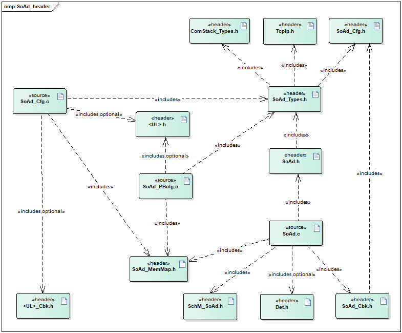

API接口 (API Interface)
=====================================

类型定义 (Type definition)
--------------------------------------

SoAd_SoConIdType类型定义 (SoAd_SoConIdType Type Definition)
~~~~~~~~~~~~~~~~~~~~~~~~~~~~~~~~~~~~~~~~~~~~~~~~~~~~~~~~~~~~~~~~~~~~~~~

.. list-table::
   :widths: 50 50
   :header-rows: 1

   * - 名称 (Name)
     - SoAd_SoConIdType
   * - 类型 (Type)
     - unit8/uint16
   * - 范围 (Range)
     - 无
   * - 描述 (Description)
     - 表示Socket Connection的Id号 (Indicate the Id number of Socket Connection)

SoAd_RoutingGroupIdType类型定义 (SoAd_RoutingGroupIdType Type Definition)
~~~~~~~~~~~~~~~~~~~~~~~~~~~~~~~~~~~~~~~~~~~~~~~~~~~~~~~~~~~~~~~~~~~~~~~~~~~~~~~~~~~~~

.. list-table::
   :widths: 50 50
   :header-rows: 1

   * - 名称 (Name)
     - SoAd_RoutingGroupIdType
   * - 类型 (Type)
     - unit8/uint16
   * - 范围 (Range)
     - 无
   * - 描述 (Description)
     - 表示Routing Group的Id号 (Indicate the ID number of the Routing Group)

SoAd_SoConModeType类型定义 (SoAd_SoConModeType Type Definition)
~~~~~~~~~~~~~~~~~~~~~~~~~~~~~~~~~~~~~~~~~~~~~~~~~~~~~~~~~~~~~~~~~~~~~~~~~~~

.. list-table::
   :widths: 50 50
   :header-rows: 1

   * - 名称 (Name)
     - SoAd_SoConModeType
   * - 类型 (Type)
     - enum
   * - 范围 (Range)
     - SOAD_SOCON_ONLINE/
   * - 
     - SOAD_SOCON_RECONNECT/
   * - 
     - SOAD_SOCON_OFFLINE
   * - 描述 (Description)
     - 表示Socket Connection的状态 (Indicate Socket Connection status)

SoAd_ConfigType类型定义 (SoAd_ConfigType Configuration Type Definition)
~~~~~~~~~~~~~~~~~~~~~~~~~~~~~~~~~~~~~~~~~~~~~~~~~~~~~~~~~~~~~~~~~~~~~~~~~~~~~~~~~~~

.. list-table::
   :widths: 50 50
   :header-rows: 1

   * - 名称 (Name)
     - SoAd_ConfigType
   * - 类型 (Type)
     - struct
   * - 范围 (Range)
     - 无
   * - 描述 (Description)
     - SoAd模块的PB配置结构体 (The PB configuration structure of SoAd module)

输入函数描述 (Describe the input function:)
-----------------------------------------------------

.. list-table::
   :widths: 50 50
   :header-rows: 1

   * - 输入模块 (Input Module)
     - API
   * - Det
     - Det_ReportRuntimeError
   * - 
     - Det_ReportError
   * - TcpIp
     - TcpIp_Bind
   * - 
     - TcpIp_ChangeParameter
   * - 
     - TcpIp_Close
   * - 
     - TcpIp_GetIpAddr
   * - 
     - TcpIp_GetPhysAddr
   * - 
     - TcpIp_ReleaseIpAddrAssignment
   * - 
     - TcpIp_RequestIpAddrAssignment
   * - 
     - TcpIp_SoAdGetSocket
   * - 
     - TcpIp_TcpConnect
   * - 
     - TcpIp_TcpListen
   * - 
     - TcpIp_TcpReceived
   * - 
     - TcpIp_TcpTransmit
   * - 
     - TcpIp_UdpTransmit
   * - 
     - TcpIp_DhcpReadOption
   * - 
     - TcpIp_DhcpV6ReadOption
   * - 
     - TcpIp_DhcpV6WriteOption
   * - 
     - TcpIp_DhcpWriteOption
   * - <Up>
     - <Up>\_[SoAd][If]RxIndication
   * - 
     - <Up>\_[SoAd][If]TriggerTransmit
   * - 
     - <Up>\_[SoAd][If]TxConfirmation
   * - 
     - <Up>\_[SoAd][Tp]StartOfReception
   * - 
     - <Up>\_[SoAd][Tp]CopyRxData
   * - 
     - <Up>\_[SoAd][Tp]TpRxIndication
   * - 
     - <Up>\_[SoAd][Tp]CopyTxData
   * - 
     - <Up>\_[SoAd][Tp]TpTxConfirmation
   * - 
     - <Up>_SoConModeChg
   * - 
     - <Up>_LocalIpAddrAssignmentChg

静态接口函数定义 (Static interface function definition)
---------------------------------------------------------------

SoAd_Init函数定义 (The SoAd_Init function defines)
~~~~~~~~~~~~~~~~~~~~~~~~~~~~~~~~~~~~~~~~~~~~~~~~~~~~~~~~~~~~~~

.. list-table::
   :widths: 25 25 25 25
   :header-rows: 1

   * - 函数名称： (Function Name:)
     - SoAd_Init
     - 
     - 
   * - 函数原型： (Function prototype:)
     - void SoAd_Init(
     - 
     - 
   * - 
     - constSoAd_ConfigType\*SoAdConfigPtr)
     - 
     - 
   * - 服务编号： (Service Number:)
     - 0x01
     - 
     - 
   * - 同步/异步： (Synchronous/asynchronous:)
     - 同步 (Sync)
     - 
     - 
   * - 是否可重入： (Is Reentrant:)
     - 否 (No)
     - 
     - 
   * - 输入参数： (Input parameters:)
     - SoAdConfigPtr
     - 值域： (Domain:)
     - 无
   * - 输入输出参数： (Input Output Parameters:)
     - 无
     - 
     - 
   * - 输出参数： (Output Parameters:)
     - 无
     - 
     - 
   * - 返回值： (Return Value:)
     - 无
     - 
     - 
   * - 功能概述： (Function Overview:)
     - SoAd模块初始化 (SoAd Module Initialization)
     - 
     - 

SoAd_GetVersionInfo函数定义 (SoAd_GetVersionInfo function definition)
~~~~~~~~~~~~~~~~~~~~~~~~~~~~~~~~~~~~~~~~~~~~~~~~~~~~~~~~~~~~~~~~~~~~~~~~~~~~~~~~~

.. list-table::
   :widths: 25 25 25 25
   :header-rows: 1

   * - 函数名称： (Function Name:)
     - SoAd_GetVersionInfo
     - 
     - 
   * - 函数原型： (Function prototype:)
     - voidSoAd_GetVersionInfo(
     - 
     - 
   * - 
     - Std_VersionInfoType\*versioninfo)
     - 
     - 
   * - 服务编号： (Service Number:)
     - 0x02
     - 
     - 
   * - 同步/异步： (Synchronous/asynchronous:)
     - 同步 (Sync)
     - 
     - 
   * - 是否可重入： (Is Reentrant:)
     - 是 (Is)
     - 
     - 
   * - 输入参数： (Input parameters:)
     - 无
     - 
     - 
   * - 输入输出参数： (Input Output Parameters:)
     - 无
     - 
     - 
   * - 输出参数： (Output Parameters:)
     - versioninfo
     - 值域： (Domain:)
     - 无
   * - 返回值： (Return Value:)
     - 无
     - 
     - 
   * - 功能概述： (Function Overview:)
     - 获取软件版本信息 (Get software version information)
     - 
     - 

SoAd_IfTransmit函数定义 (SoAd_IfTransmit_function_definition)
~~~~~~~~~~~~~~~~~~~~~~~~~~~~~~~~~~~~~~~~~~~~~~~~~~~~~~~~~~~~~~~~~~~~~~~~~

.. list-table::
   :widths: 25 25 25 25
   :header-rows: 1

   * - 函数名称： (Function Name:)
     - SoAd_IfTransmit
     - 
     - 
   * - 函数原型： (Function prototype:)
     - Std_ReturnTypeSoAd_IfTransmit (
     - 
     - 
   * - 
     - PduIdTypeTxPduId,
     - 
     - 
   * - 
     - constPduInfoType\*PduInfoPtr)
     - 
     - 
   * - 服务编号： (Service Number:)
     - 0x49
     - 
     - 
   * - 同步/异步： (Synchronous/asynchronous:)
     - 同步 (Sync)
     - 
     - 
   * - 是否可重入： (Is Reentrant:)
     - 不同的PduId可重入，相同的PduId不可重入 (Different PduId can re-enter, the same PduId cannot re-enter)
     - 
     - 
   * - 输入参数： (Input parameters:)
     - TxPduId
     - 值域： (Domain:)
     - 无
   * - 
     - PduInfoPtr
     - 值域： (Domain:)
     - 无
   * - 输入输出参数： (Input Output Parameters:)
     - 无
     - 
     - 
   * - 输出参数： (Output Parameters:)
     - 无
     - 
     - 
   * - 返回值： (Return Value:)
     - Std_ReturnType：E_OK/E_NOT_OK
     - 
     - 
   * - 功能概述： (Function Overview:)
     - IF PDU的发送请求 (IF PDU's Send Request)
     - 
     - 

SoAd_IfRoutingGroupTransmit函数定义 (The SoAd_IfRoutingGroupTransmit function definition)
~~~~~~~~~~~~~~~~~~~~~~~~~~~~~~~~~~~~~~~~~~~~~~~~~~~~~~~~~~~~~~~~~~~~~~~~~~~~~~~~~~~~~~~~~~~~~~~~~~~~~

.. list-table::
   :widths: 25 25 25 25
   :header-rows: 1

   * - 函数名称： (Function Name:)
     - SoAd_IfRoutingGroupTransmit
     - 
     - 
   * - 函数原型： (Function prototype:)
     - Std_ReturnTypeSoAd_IfRoutingGroupTransmit(
     - 
     - 
   * - 
     - SoAd_RoutingGroupIdTypeid)
     - 
     - 
   * - 服务编号： (Service Number:)
     - 0x1D
     - 
     - 
   * - 同步/异步： (Synchronous/asynchronous:)
     - 异步 (Asynchronous)
     - 
     - 
   * - 是否可重入： (Is Reentrant:)
     - 是 (Is)
     - 
     - 
   * - 输入参数： (Input parameters:)
     - id
     - 值域： (Domain:)
     - 无
   * - 输入输出参数： (Input Output Parameters:)
     - 无
     - 
     - 
   * - 输出参数： (Output Parameters:)
     - 无
     - 
     - 
   * - 返回值： (Return Value:)
     - Std_ReturnType：E_OK/E_NOT_OK
     - 
     - 
   * - 功能概述： (Function Overview:)
     - 触发该RoutingGroup关联的所有IFPDUs的发送 (Trigger the sending of all associated IFPDUs for this RoutingGroup.)
     - 
     - 

SoAd_IfSpecificRoutingGroupTransmit函数定义 (The SoAd_IfSpecificRoutingGroupTransmit function definition)
~~~~~~~~~~~~~~~~~~~~~~~~~~~~~~~~~~~~~~~~~~~~~~~~~~~~~~~~~~~~~~~~~~~~~~~~~~~~~~~~~~~~~~~~~~~~~~~~~~~~~~~~~~~~~~~~~~~~~

.. list-table::
   :widths: 25 25 25 25
   :header-rows: 1

   * - 函数名称： (Function Name:)
     - SoAd_IfSpecificRoutingGroupTransmit
     - 
     - 
   * - 函数原型： (Function prototype:)
     - Std_ReturnTypeSoAd_IfSpecificRoutingGroupTransmit(
     - 
     - 
   * - 
     - SoAd_RoutingGroupIdTypeid,
     - 
     - 
   * - 
     - SoAd_SoConIdTypeSoConId)
     - 
     - 
   * - 服务编号： (Service Number:)
     - 0x1F
     - 
     - 
   * - 同步/异步： (Synchronous/asynchronous:)
     - 异步 (Asynchronous)
     - 
     - 
   * - 是否可重入： (Is Reentrant:)
     - 是 (Is)
     - 
     - 
   * - 输入参数： (Input parameters:)
     - id
     - 值域： (Domain:)
     - 无
   * - 
     - SoConId
     - 值域： (Domain:)
     - 无
   * - 输入输出参数： (Input Output Parameters:)
     - 无
     - 
     - 
   * - 输出参数： (Output Parameters:)
     - 无
     - 
     - 
   * - 返回值： (Return Value:)
     - Std_ReturnType：E_OK/E_NOT_OK
     - 
     - 
   * - 功能概述： (Function Overview:)
     - 触发该RoutingGroup关联的所有与该SoCon关联的IFPDUs (Trigger all IFPDUs associated with this SoCon in the related RoutingGroup)
     - 
     - 

SoAd_TpTransmit函数定义 (SoAd_TpTransmit function definition)
~~~~~~~~~~~~~~~~~~~~~~~~~~~~~~~~~~~~~~~~~~~~~~~~~~~~~~~~~~~~~~~~~~~~~~~~~

.. list-table::
   :widths: 25 25 25 25
   :header-rows: 1

   * - 函数名称： (Function Name:)
     - SoAd_TpTransmit
     - 
     - 
   * - 函数原型： (Function prototype:)
     - Std_ReturnTypeSoAd_TpTransmit(
     - 
     - 
   * - 
     - PduIdTypeSoAdSrcPduId,
     - 
     - 
   * - 
     - constPduInfoType\*SoAdSrcPduInfoPtr)
     - 
     - 
   * - 服务编号： (Service Number:)
     - 0x4
     - 
     - 
   * - 同步/异步： (Synchronous/asynchronous:)
     - 异步 (Asynchronous)
     - 
     - 
   * - 是否可重入： (Is Reentrant:)
     - 是 (Is)
     - 
     - 
   * - 输入参数： (Input parameters:)
     - SoAdSrcPduId
     - 值域： (Domain:)
     - 无
   * - 
     - SoAdSrcPduInfoPtr
     - 值域： (Domain:)
     - 无
   * - 输入输出参数： (Input Output Parameters:)
     - 无
     - 
     - 
   * - 输出参数： (Output Parameters:)
     - 无
     - 
     - 
   * - 返回值： (Return Value:)
     - Std_ReturnType：E_OK/E_NOT_OK
     - 
     - 
   * - 功能概述： (Function Overview:)
     - TP PDU的发送请求 (Request for sending TP PDU)
     - 
     - 

SoAd_TpCancelTransmit函数定义 (The SoAd_TpCancelTransmit function definition)
~~~~~~~~~~~~~~~~~~~~~~~~~~~~~~~~~~~~~~~~~~~~~~~~~~~~~~~~~~~~~~~~~~~~~~~~~~~~~~~~~~~~~~~~~

.. list-table::
   :widths: 25 25 25 25
   :header-rows: 1

   * - 函数名称： (Function Name:)
     - SoAd_TpCancelTransmit
     - 
     - 
   * - 函数原型： (Function prototype:)
     - Std_ReturnTypeSoAd_TpCancelTransmit(
     - 
     - 
   * - 
     - PduIdType PduId)
     - 
     - 
   * - 服务编号： (Service Number:)
     - 0x05
     - 
     - 
   * - 同步/异步： (Synchronous/asynchronous:)
     - 同步 (Sync)
     - 
     - 
   * - 是否可重入： (Is Reentrant:)
     - 不同PduId可重入，相同PduId不可重入 (Different PduId can re-enter, same PduId cannot re-enter)
     - 
     - 
   * - 输入参数： (Input parameters:)
     - PduId
     - 值域： (Domain:)
     - 无
   * - 输入输出参数： (Input Output Parameters:)
     - 无
     - 
     - 
   * - 输出参数： (Output Parameters:)
     - 无
     - 
     - 
   * - 返回值： (Return Value:)
     - Std_ReturnType：E_OK/E_NOT_OK
     - 
     - 
   * - 功能概述： (Function Overview:)
     - 取消正在发送的TPPDU (Canceling the pending TPPDU)
     - 
     - 

SoAd_TpCancelReceive函数定义 (SoAd_TpCancelReceive function definition)
~~~~~~~~~~~~~~~~~~~~~~~~~~~~~~~~~~~~~~~~~~~~~~~~~~~~~~~~~~~~~~~~~~~~~~~~~~~~~~~~~~~

.. list-table::
   :widths: 25 25 25 25
   :header-rows: 1

   * - 函数名称： (Function Name:)
     - SoAd_TpCancelReceive
     - 
     - 
   * - 函数原型： (Function prototype:)
     - Std_ReturnTypeSoAd_TpCancelReceive(
     - 
     - 
   * - 
     - PduIdType PduId)
     - 
     - 
   * - 服务编号： (Service Number:)
     - 0x06
     - 
     - 
   * - 同步/异步： (Synchronous/asynchronous:)
     - 同步 (Sync)
     - 
     - 
   * - 是否可重入： (Is Reentrant:)
     - 不同PduId可重入，相同PduId不可重入 (Different PduId can re-enter, same PduId cannot re-enter)
     - 
     - 
   * - 输入参数： (Input parameters:)
     - PduId
     - 值域： (Domain:)
     - 无
   * - 输入输出参数： (Input Output Parameters:)
     - 无
     - 
     - 
   * - 输出参数： (Output Parameters:)
     - 无
     - 
     - 
   * - 返回值： (Return Value:)
     - Std_ReturnType：E_OK/E_NOT_OK
     - 
     - 
   * - 功能概述： (Function Overview:)
     - 取消正在接收的TPPDU (Cancel received TPPDU)
     - 
     - 

SoAd_GetSoConId函数定义 (The SoAd_GetSoConId function definition)
~~~~~~~~~~~~~~~~~~~~~~~~~~~~~~~~~~~~~~~~~~~~~~~~~~~~~~~~~~~~~~~~~~~~~~~~~~~~~

.. list-table::
   :widths: 25 25 25 25
   :header-rows: 1

   * - 函数名称： (Function Name:)
     - SoAd_GetSoConId
     - 
     - 
   * - 函数原型： (Function prototype:)
     - Std_ReturnTypeSoAd_GetSoConId(
     - 
     - 
   * - 
     - PduIdTypeTxPduId,
     - 
     - 
   * - 
     - SoAd_SoConIdType\*SoConIdPtr)
     - 
     - 
   * - 服务编号： (Service Number:)
     - 0x07
     - 
     - 
   * - 同步/异步： (Synchronous/asynchronous:)
     - 同步 (Sync)
     - 
     - 
   * - 是否可重入： (Is Reentrant:)
     - 是 (Is)
     - 
     - 
   * - 输入参数： (Input parameters:)
     - TxPduId
     - 值域： (Domain:)
     - 无
   * - 输入输出参数： (Input Output Parameters:)
     - 无
     - 
     - 
   * - 输出参数： (Output Parameters:)
     - SoConIdPtr
     - 值域： (Domain:)
     - 无
   * - 返回值： (Return Value:)
     - Std_ReturnType：E_OK/E_NOT_OK
     - 
     - 
   * - 功能概述： (Function Overview:)
     - 获取TxPduId关联的SoConId (Get SoConId Associated with TxPduId)
     - 
     - 

SoAd_OpenSoCon函数定义 (The SoAd_OpenSoCon function definition)
~~~~~~~~~~~~~~~~~~~~~~~~~~~~~~~~~~~~~~~~~~~~~~~~~~~~~~~~~~~~~~~~~~~~~~~~~~~

.. list-table::
   :widths: 25 25 25 25
   :header-rows: 1

   * - 函数名称： (Function Name:)
     - SoAd_OpenSoCon
     - 
     - 
   * - 函数原型： (Function prototype:)
     - Std_ReturnTypeSoAd_OpenSoCon(
     - 
     - 
   * - 
     - SoAd_SoConIdTypeSoConId)
     - 
     - 
   * - 服务编号： (Service Number:)
     - 0x08
     - 
     - 
   * - 同步/异步： (Synchronous/asynchronous:)
     - 异步 (Asynchronous)
     - 
     - 
   * - 是否可重入： (Is Reentrant:)
     - 是 (Is)
     - 
     - 
   * - 输入参数： (Input parameters:)
     - SoConId
     - 值域： (Domain:)
     - 无
   * - 输入输出参数： (Input Output Parameters:)
     - 无
     - 
     - 
   * - 输出参数： (Output Parameters:)
     - 无
     - 
     - 
   * - 返回值： (Return Value:)
     - Std_ReturnType：E_OK/E_NOT_OK
     - 
     - 
   * - 功能概述： (Function Overview:)
     - 请求该SoConId开启 (Request to enable this SoConId.)
     - 
     - 

SoAd_CloseSoCon函数定义 (SoAd_CloseSoCon Function Definition)
~~~~~~~~~~~~~~~~~~~~~~~~~~~~~~~~~~~~~~~~~~~~~~~~~~~~~~~~~~~~~~~~~~~~~~~~~

.. list-table::
   :widths: 25 25 25 25
   :header-rows: 1

   * - 函数名称： (Function Name:)
     - SoAd_CloseSoCon
     - 
     - 
   * - 函数原型： (Function prototype:)
     - Std_ReturnTypeSoAd_CloseSoCon(
     - 
     - 
   * - 
     - SoAd_SoConIdTypeSoConId,
     - 
     - 
   * - 
     - boolean abort)
     - 
     - 
   * - 服务编号： (Service Number:)
     - 0x09
     - 
     - 
   * - 同步/异步： (Synchronous/asynchronous:)
     - 异步 (Asynchronous)
     - 
     - 
   * - 是否可重入： (Is Reentrant:)
     - 是 (Is)
     - 
     - 
   * - 输入参数： (Input parameters:)
     - SoConId
     - 值域： (Domain:)
     - 无
   * - 
     - abort
     - 值域： (Domain:)
     - 无
   * - 输入输出参数： (Input Output Parameters:)
     - 无
     - 
     - 
   * - 输出参数： (Output Parameters:)
     - 无
     - 
     - 
   * - 返回值： (Return Value:)
     - Std_ReturnType：E_OK/E_NOT_OK
     - 
     - 
   * - 功能概述： (Function Overview:)
     - 请求该SoConId关闭 (Request to close this SoConId.)
     - 
     - 

SoAd_GetSoConMode函数定义 (The SoAd_GetSoConMode function definition)
~~~~~~~~~~~~~~~~~~~~~~~~~~~~~~~~~~~~~~~~~~~~~~~~~~~~~~~~~~~~~~~~~~~~~~~~~~~~~~~~~

.. list-table::
   :widths: 25 25 25 25
   :header-rows: 1

   * - 函数名称： (Function Name:)
     - SoAd_GetSoConMode
     - 
     - 
   * - 函数原型： (Function prototype:)
     - voidSoAd_GetSoConMode(
     - 
     - 
   * - 
     - SoAd_SoConIdTypeSoConId,
     - 
     - 
   * - 
     - SoAd_SoConModeType\*ModePtr)
     - 
     - 
   * - 服务编号： (Service Number:)
     - 0x22
     - 
     - 
   * - 同步/异步： (Synchronous/asynchronous:)
     - 同步 (Sync)
     - 
     - 
   * - 是否可重入： (Is Reentrant:)
     - 是 (Is)
     - 
     - 
   * - 输入参数： (Input parameters:)
     - SoConId
     - 值域： (Domain:)
     - 无
   * - 输入输出参数： (Input Output Parameters:)
     - 无
     - 
     - 
   * - 输出参数： (Output Parameters:)
     - ModePtr
     - 值域： (Domain:)
     - 无
   * - 返回值： (Return Value:)
     - 无
     - 
     - 
   * - 功能概述： (Function Overview:)
     - 获取该SoConId当前的状态 (Get the current status of this SoConId.)
     - 
     - 

SoAd_RequestIpAddrAssignment函数定义 (SoAd_RequestIpAddrAssignment function definition)
~~~~~~~~~~~~~~~~~~~~~~~~~~~~~~~~~~~~~~~~~~~~~~~~~~~~~~~~~~~~~~~~~~~~~~~~~~~~~~~~~~~~~~~~~~~~~~~~~~~

.. list-table::
   :widths: 25 25 25 25
   :header-rows: 1

   * - 函数名称： (Function Name:)
     - SoAd_RequestIpAddrAssignment
     - 
     - 
   * - 函数原型： (Function prototype:)
     - Std_ReturnTypeSoAd_RequestIpAddrAssignment(
     - 
     - 
   * - 
     - SoAd_SoConIdTypeSoConId,
     - 
     - 
   * - 
     - TcpIp_IpAddrAssignmentTypeType,
     - 
     - 
   * - 
     - constTcpIp_SockAddrType\*LocalIpAddrPtr,
     - 
     - 
   * - 
     - uint8 Netmask,
     - 
     - 
   * - 
     - constTcpIp_SockAddrType\*DefaultRouterPtr
     - 
     - 
   * - 
     - )
     - 
     - 
   * - 服务编号： (Service Number:)
     - 0x0A
     - 
     - 
   * - 同步/异步： (Synchronous/asynchronous:)
     - 异步 (Asynchronous)
     - 
     - 
   * - 是否可重入： (Is Reentrant:)
     - 不同SoConId可重入，相同SoConId不可重入 (Different SoConId can re-enter, same SoConId cannot re-enter.)
     - 
     - 
   * - 输入参数： (Input parameters:)
     - SoConId
     - 值域： (Domain:)
     - 无
   * - 
     - Type
     - 值域： (Domain:)
     - 无
   * - 
     - LocalIpAddrPtr
     - 值域： (Domain:)
     - 无
   * - 
     - Netmask
     - 值域： (Domain:)
     - 无
   * - 
     - DefaultRouterPtr
     - 值域： (Domain:)
     - 无
   * - 输入输出参数： (Input Output Parameters:)
     - 无
     - 
     - 
   * - 输出参数： (Output Parameters:)
     - 无
     - 
     - 
   * - 返回值： (Return Value:)
     - Std_ReturnType：E_OK/E_NOT_OK
     - 
     - 
   * - 功能概述： (Function Overview:)
     - 请求该SoConId关联的本端IP地址分配 (Request the local IP address allocation associated with this SoConId.)
     - 
     - 

SoAd_ReleaseIpAddrAssignment函数定义 (The SoAd_ReleaseIpAddrAssignment function defines)
~~~~~~~~~~~~~~~~~~~~~~~~~~~~~~~~~~~~~~~~~~~~~~~~~~~~~~~~~~~~~~~~~~~~~~~~~~~~~~~~~~~~~~~~~~~~~~~~~~~~

.. list-table::
   :widths: 25 25 25 25
   :header-rows: 1

   * - 函数名称： (Function Name:)
     - SoAd_ReleaseIpAddrAssignment
     - 
     - 
   * - 函数原型： (Function prototype:)
     - Std_ReturnTypeSoAd_ReleaseIpAddrAssignment(
     - 
     - 
   * - 
     - SoAd_SoConIdTypeSoConId)
     - 
     - 
   * - 服务编号： (Service Number:)
     - 0x0B
     - 
     - 
   * - 同步/异步： (Synchronous/asynchronous:)
     - 异步 (Asynchronous)
     - 
     - 
   * - 是否可重入： (Is Reentrant:)
     - 是 (Is)
     - 
     - 
   * - 输入参数： (Input parameters:)
     - SoConId
     - 值域： (Domain:)
     - 无
   * - 输入输出参数： (Input Output Parameters:)
     - 无
     - 
     - 
   * - 输出参数： (Output Parameters:)
     - 无
     - 
     - 
   * - 返回值： (Return Value:)
     - Std_ReturnType：E_OK/E_NOT_OK
     - 
     - 
   * - 功能概述： (Function Overview:)
     - 请求释放该SoConId关联的本端IP地址 (Request release of the local IP address associated with this SoConId)
     - 
     - 

SoAd_GetLocalAddr函数定义 (The SoAd_GetLocalAddr function definition)
~~~~~~~~~~~~~~~~~~~~~~~~~~~~~~~~~~~~~~~~~~~~~~~~~~~~~~~~~~~~~~~~~~~~~~~~~~~~~~~~~

.. list-table::
   :widths: 25 25 25 25
   :header-rows: 1

   * - 函数名称： (Function Name:)
     - SoAd_GetLocalAddr
     - 
     - 
   * - 函数原型： (Function prototype:)
     - Std_ReturnTypeSoAd_GetLocalAddr(
     - 
     - 
   * - 
     - SoAd_SoConIdTypeSoConId,
     - 
     - 
   * - 
     - TcpIp_SockAddrType\*LocalAddrPtr,
     - 
     - 
   * - 
     - uint8\*NetmaskPtr,
     - 
     - 
   * - 
     - TcpIp_SockAddrType\*DefaultRouterPtr)
     - 
     - 
   * - 服务编号： (Service Number:)
     - 0x0C
     - 
     - 
   * - 同步/异步： (Synchronous/asynchronous:)
     - 同步 (Sync)
     - 
     - 
   * - 是否可重入： (Is Reentrant:)
     - 是 (Is)
     - 
     - 
   * - 输入参数： (Input parameters:)
     - SoConId
     - 值域： (Domain:)
     - 无
   * - 输入输出参数： (Input Output Parameters:)
     - LocalAddrPtr
     - 值域： (Domain:)
     - 无
   * - 
     - DefaultRouterPtr
     - 值域： (Domain:)
     - 无
   * - 输出参数： (Output Parameters:)
     - NetmaskPtr
     - 值域： (Domain:)
     - 无
   * - 返回值： (Return Value:)
     - Std_ReturnType：E_OK/E_NOT_OK
     - 
     - 
   * - 功能概述： (Function Overview:)
     - 获取该SoConId关联的本端IP地址 (Get the local IP address associated with this SoConId)
     - 
     - 

SoAd_GetPhysAddr函数定义 (The SoAd_GetPhysAddr function definition)
~~~~~~~~~~~~~~~~~~~~~~~~~~~~~~~~~~~~~~~~~~~~~~~~~~~~~~~~~~~~~~~~~~~~~~~~~~~~~~~

.. list-table::
   :widths: 25 25 25 25
   :header-rows: 1

   * - 函数名称： (Function Name:)
     - SoAd_GetPhysAddr
     - 
     - 
   * - 函数原型： (Function prototype:)
     - Std_ReturnTypeSoAd_GetPhysAddr(
     - 
     - 
   * - 
     - SoAd_SoConIdTypeSoConId,
     - 
     - 
   * - 
     - uint8\*PhysAddrPtr)
     - 
     - 
   * - 服务编号： (Service Number:)
     - 0x0D
     - 
     - 
   * - 同步/异步： (Synchronous/asynchronous:)
     - 同步 (Sync)
     - 
     - 
   * - 是否可重入： (Is Reentrant:)
     - 是 (Is)
     - 
     - 
   * - 输入参数： (Input parameters:)
     - SoConId
     - 值域： (Domain:)
     - 无
   * - 输入输出参数： (Input Output Parameters:)
     - 无
     - 
     - 
   * - 输出参数： (Output Parameters:)
     - PhysAddrPtr
     - 值域： (Domain:)
     - 无
   * - 返回值： (Return Value:)
     - Std_ReturnType：E_OK/E_NOT_OK
     - 
     - 
   * - 功能概述： (Function Overview:)
     - 获取该SoConId关联的本端MAC地址 (Get the local MAC address associated with this SoConId)
     - 
     - 

SoAd_GetRemoteAddr函数定义 (SoAd_GetRemoteAddr function definition)
~~~~~~~~~~~~~~~~~~~~~~~~~~~~~~~~~~~~~~~~~~~~~~~~~~~~~~~~~~~~~~~~~~~~~~~~~~~~~~~

.. list-table::
   :widths: 25 25 25 25
   :header-rows: 1

   * - 函数名称： (Function Name:)
     - SoAd_GetRemoteAddr
     - 
     - 
   * - 函数原型： (Function prototype:)
     - Std_ReturnTypeSoAd_GetRemoteAddr(
     - 
     - 
   * - 
     - SoAd_SoConIdTypeSoConId,
     - 
     - 
   * - 
     - TcpIp_SockAddrType\*IpAddrPtr)
     - 
     - 
   * - 服务编号： (Service Number:)
     - 0x1C
     - 
     - 
   * - 同步/异步： (Synchronous/asynchronous:)
     - 同步 (Sync)
     - 
     - 
   * - 是否可重入： (Is Reentrant:)
     - 是 (Is)
     - 
     - 
   * - 输入参数： (Input parameters:)
     - SoConId
     - 值域： (Domain:)
     - 无
   * - 输入输出参数： (Input Output Parameters:)
     - 无
     - 
     - 
   * - 输出参数： (Output Parameters:)
     - IpAddrPtr
     - 值域： (Domain:)
     - 无
   * - 返回值： (Return Value:)
     - Std_ReturnType：E_OK/E_NOT_OK
     - 
     - 
   * - 功能概述： (Function Overview:)
     - 获取该SoConId关联的远端地址(IP+PORT)
     - 
     - 

SoAd_EnableRouting函数定义 (SoAd_EnableRoutingFunctionDefinition)
~~~~~~~~~~~~~~~~~~~~~~~~~~~~~~~~~~~~~~~~~~~~~~~~~~~~~~~~~~~~~~~~~~~~~~~~~~~~~

.. list-table::
   :widths: 25 25 25 25
   :header-rows: 1

   * - 函数名称： (Function Name:)
     - SoAd_EnableRouting
     - 
     - 
   * - 函数原型： (Function prototype:)
     - Std_ReturnTypeSoAd_EnableRouting(
     - 
     - 
   * - 
     - SoAd_RoutingGroupIdTypeid)
     - 
     - 
   * - 服务编号： (Service Number:)
     - 0x0E
     - 
     - 
   * - 同步/异步： (Synchronous/asynchronous:)
     - 同步 (Sync)
     - 
     - 
   * - 是否可重入： (Is Reentrant:)
     - 是 (Is)
     - 
     - 
   * - 输入参数： (Input parameters:)
     - id
     - 值域： (Domain:)
     - 无
   * - 输入输出参数： (Input Output Parameters:)
     - 无
     - 
     - 
   * - 输出参数： (Output Parameters:)
     - 无
     - 
     - 
   * - 返回值： (Return Value:)
     - Std_ReturnType：E_OK/E_NOT_OK
     - 
     - 
   * - 功能概述： (Function Overview:)
     - 请求使能该RoutingGroup，进而使能关联的PduRouteDest/SocketRouteDest (Enable the RoutingGroup to enable associated PduRouteDest/SocketRouteDest.)
     - 
     - 

SoAd_EnableSpecificRouting函数定义 (The SoAd_EnableSpecificRouting function definition)
~~~~~~~~~~~~~~~~~~~~~~~~~~~~~~~~~~~~~~~~~~~~~~~~~~~~~~~~~~~~~~~~~~~~~~~~~~~~~~~~~~~~~~~~~~~~~~~~~~~

.. list-table::
   :widths: 25 25 25 25
   :header-rows: 1

   * - 函数名称： (Function Name:)
     - SoAd_EnableSpecificRouting
     - 
     - 
   * - 函数原型： (Function prototype:)
     - Std_ReturnTypeSoAd_EnableSpecificRouting(
     - 
     - 
   * - 
     - SoAd_RoutingGroupIdTypeid,
     - 
     - 
   * - 
     - SoAd_SoConIdTypeSoConId)
     - 
     - 
   * - 服务编号： (Service Number:)
     - 0x20
     - 
     - 
   * - 同步/异步： (Synchronous/asynchronous:)
     - 同步 (Sync)
     - 
     - 
   * - 是否可重入： (Is Reentrant:)
     - 是 (Is)
     - 
     - 
   * - 输入参数： (Input parameters:)
     - id
     - 值域： (Domain:)
     - 无
   * - 
     - SoConId
     - 值域： (Domain:)
     - 无
   * - 输入输出参数： (Input Output Parameters:)
     - 无
     - 
     - 
   * - 输出参数： (Output Parameters:)
     - 无
     - 
     - 
   * - 返回值： (Return Value:)
     - Std_ReturnType：E_OK/E_NOT_OK
     - 
     - 
   * - 功能概述： (Function Overview:)
     - 请求基于该RoutingGroup和SoConId关联的PduRouteDest/SocketRouteDest使能 (Enable the PduRouteDest/SocketRouteDest based on the associated RoutingGroup and SoConId.)
     - 
     - 

SoAd_DisableRouting函数定义 (The SoAd_DisableRouting function definition)
~~~~~~~~~~~~~~~~~~~~~~~~~~~~~~~~~~~~~~~~~~~~~~~~~~~~~~~~~~~~~~~~~~~~~~~~~~~~~~~~~~~~~

.. list-table::
   :widths: 25 25 25 25
   :header-rows: 1

   * - 函数名称： (Function Name:)
     - SoAd_DisableRouting
     - 
     - 
   * - 函数原型： (Function prototype:)
     - Std_ReturnTypeSoAd_DisableRouting(
     - 
     - 
   * - 
     - SoAd_RoutingGroupIdTypeid)
     - 
     - 
   * - 服务编号： (Service Number:)
     - 0x0F
     - 
     - 
   * - 同步/异步： (Synchronous/asynchronous:)
     - 同步 (Sync)
     - 
     - 
   * - 是否可重入： (Is Reentrant:)
     - 是 (Is)
     - 
     - 
   * - 输入参数： (Input parameters:)
     - id
     - 值域： (Domain:)
     - 无
   * - 输入输出参数： (Input Output Parameters:)
     - 无
     - 
     - 
   * - 输出参数： (Output Parameters:)
     - 无
     - 
     - 
   * - 返回值： (Return Value:)
     - Std_ReturnType：E_OK/E_NOT_OK
     - 
     - 
   * - 功能概述： (Function Overview:)
     - 请求该RoutingGroup的不使能，进而影响关联PduRouteDest/SocketRouteDest的使能情况 (Disabling the request for this RoutingGroup and consequently affecting the enable status of associated PduRouteDest/SocketRouteDest.)
     - 
     - 

SoAd_DisableSpecificRouting函数定义 (The SoAd_DisableSpecificRouting function definition)
~~~~~~~~~~~~~~~~~~~~~~~~~~~~~~~~~~~~~~~~~~~~~~~~~~~~~~~~~~~~~~~~~~~~~~~~~~~~~~~~~~~~~~~~~~~~~~~~~~~~~

.. list-table::
   :widths: 25 25 25 25
   :header-rows: 1

   * - 函数名称： (Function Name:)
     - SoAd_DisableSpecificRouting
     - 
     - 
   * - 函数原型： (Function prototype:)
     - Std_ReturnTypeSoAd_DisableSpecificRouting(
     - 
     - 
   * - 
     - SoAd_RoutingGroupIdTypeid,
     - 
     - 
   * - 
     - SoAd_SoConIdTypeSoConId)
     - 
     - 
   * - 服务编号： (Service Number:)
     - 0x21
     - 
     - 
   * - 同步/异步： (Synchronous/asynchronous:)
     - 同步 (Sync)
     - 
     - 
   * - 是否可重入： (Is Reentrant:)
     - 是 (Is)
     - 
     - 
   * - 输入参数： (Input parameters:)
     - id
     - 值域： (Domain:)
     - 无
   * - 
     - SoConId
     - 值域： (Domain:)
     - 无
   * - 输入输出参数： (Input Output Parameters:)
     - 无
     - 
     - 
   * - 输出参数： (Output Parameters:)
     - 无
     - 
     - 
   * - 返回值： (Return Value:)
     - Std_ReturnType：E_OK/E_NOT_OK
     - 
     - 
   * - 功能概述： (Function Overview:)
     - 请求基于该RoutingGroup和SoConId关联的PduRouteDest/SocketRouteDest不使能 (Disable the PduRouteDest/SocketRouteDest associated with the RoutingGroup and SoConId.)
     - 
     - 

SoAd_SetRemoteAddr函数定义 (The SoAd_SetRemoteAddr function definition)
~~~~~~~~~~~~~~~~~~~~~~~~~~~~~~~~~~~~~~~~~~~~~~~~~~~~~~~~~~~~~~~~~~~~~~~~~~~~~~~~~~~

.. list-table::
   :widths: 25 25 25 25
   :header-rows: 1

   * - 函数名称： (Function Name:)
     - SoAd_SetRemoteAddr
     - 
     - 
   * - 函数原型： (Function prototype:)
     - Std_ReturnTypeSoAd_SetRemoteAddr(
     - 
     - 
   * - 
     - SoAd_SoConIdTypeSoConId,
     - 
     - 
   * - 
     - constTcpIp_SockAddrType\*RemoteAddrPtr)
     - 
     - 
   * - 服务编号： (Service Number:)
     - 0x10
     - 
     - 
   * - 同步/异步： (Synchronous/asynchronous:)
     - 同步 (Sync)
     - 
     - 
   * - 是否可重入： (Is Reentrant:)
     - 相同SoConId不可重入，不同SoConId可重入 (Same SoConId Not Reentrant, Different SoConId Reentrant)
     - 
     - 
   * - 输入参数： (Input parameters:)
     - SoConId
     - 值域： (Domain:)
     - 无
   * - 
     - RemoteAddrPtr
     - 值域： (Domain:)
     - 无
   * - 输入输出参数： (Input Output Parameters:)
     - 无
     - 
     - 
   * - 输出参数： (Output Parameters:)
     - 无
     - 
     - 
   * - 返回值： (Return Value:)
     - Std_ReturnType：E_OK/E_NOT_OK
     - 
     - 
   * - 功能概述： (Function Overview:)
     - 设置SoCon的远端地址 (Set the remote address of SoCon)
     - 
     - 

SoAd_SetUniqueRemoteAddr函数定义 (The SoAd_SetUniqueRemoteAddr Function Definition)
~~~~~~~~~~~~~~~~~~~~~~~~~~~~~~~~~~~~~~~~~~~~~~~~~~~~~~~~~~~~~~~~~~~~~~~~~~~~~~~~~~~~~~~~~~~~~~~

.. list-table::
   :widths: 25 25 25 25
   :header-rows: 1

   * - 函数名称： (Function Name:)
     - SoAd_SetUniqueRemoteAddr
     - 
     - 
   * - 函数原型： (Function prototype:)
     - Std_ReturnTypeSoAd_SetUniqueRemoteAddr(
     - 
     - 
   * - 
     - SoAd_SoConIdTypeSoConId,
     - 
     - 
   * - 
     - constTcpIp_SockAddrType\*RemoteAddrPtr,
     - 
     - 
   * - 
     - SoAd_SoConIdType\*AssignedSoConIdPtr)
     - 
     - 
   * - 服务编号： (Service Number:)
     - 0x1E
     - 
     - 
   * - 同步/异步： (Synchronous/asynchronous:)
     - 同步 (Sync)
     - 
     - 
   * - 是否可重入： (Is Reentrant:)
     - 相同SoConId不可重入，不同SoConId可重入 (Same SoConId Not Reentrant, Different SoConId Reentrant)
     - 
     - 
   * - 输入参数： (Input parameters:)
     - SoConId
     - 值域： (Domain:)
     - 无
   * - 
     - RemoteAddrPtr
     - 值域： (Domain:)
     - 无
   * - 输入输出参数： (Input Output Parameters:)
     - 无
     - 
     - 
   * - 输出参数： (Output Parameters:)
     - AssignedSoConIdPtr
     - 值域： (Domain:)
     - 无
   * - 返回值： (Return Value:)
     - Std_ReturnType：E_OK/E_NOT_OK
     - 
     - 
   * - 功能概述： (Function Overview:)
     - 请求在该SoCon所在的SoConGroup中选择合适的SoCon设置成要求的远端地址 (Select an appropriate SoCon in the SoConGroup where the SoCon is located and set it to the required remote address.)
     - 
     - 

SoAd_ReleaseRemoteAddr函数定义 (SoAd_ReleaseRemoteAddr function definition)
~~~~~~~~~~~~~~~~~~~~~~~~~~~~~~~~~~~~~~~~~~~~~~~~~~~~~~~~~~~~~~~~~~~~~~~~~~~~~~~~~~~~~~~

.. list-table::
   :widths: 25 25 25 25
   :header-rows: 1

   * - 函数名称： (Function Name:)
     - SoAd_ReleaseRemoteAddr
     - 
     - 
   * - 函数原型： (Function prototype:)
     - voidSoAd_ReleaseRemoteAddr(
     - 
     - 
   * - 
     - SoAd_SoConIdTypeSoConId)
     - 
     - 
   * - 服务编号： (Service Number:)
     - 0x23
     - 
     - 
   * - 同步/异步： (Synchronous/asynchronous:)
     - 同步 (Sync)
     - 
     - 
   * - 是否可重入： (Is Reentrant:)
     - 相同SoConId不可重入，不同SoConId可重入 (Same SoConId Not Reentrant, Different SoConId Reentrant)
     - 
     - 
   * - 输入参数： (Input parameters:)
     - SoConId
     - 值域： (Domain:)
     - 无
   * - 输入输出参数： (Input Output Parameters:)
     - 无
     - 
     - 
   * - 输出参数： (Output Parameters:)
     - 无
     - 
     - 
   * - 返回值： (Return Value:)
     - 无
     - 
     - 
   * - 功能概述： (Function Overview:)
     - 请求释放该SoCon的远端地址 (Request release of the remote address of this SoCon.)
     - 
     - 

SoAd_TpChangeParameter函数定义 (The SoAd_TpChangeParameter function definition)
~~~~~~~~~~~~~~~~~~~~~~~~~~~~~~~~~~~~~~~~~~~~~~~~~~~~~~~~~~~~~~~~~~~~~~~~~~~~~~~~~~~~~~~~~~~

.. list-table::
   :widths: 25 25 25 25
   :header-rows: 1

   * - 函数名称： (Function Name:)
     - SoAd_TpChangeParameter
     - 
     - 
   * - 函数原型： (Function prototype:)
     - Std_ReturnTypeSoAd_TpChangeParameter(
     - 
     - 
   * - 
     - PduIdType id,
     - 
     - 
   * - 
     - TPParameterTypeparameter,
     - 
     - 
   * - 
     - uint16 value)
     - 
     - 
   * - 服务编号： (Service Number:)
     - 0x11
     - 
     - 
   * - 同步/异步： (Synchronous/asynchronous:)
     - 同步 (Sync)
     - 
     - 
   * - 是否可重入： (Is Reentrant:)
     - 否 (No)
     - 
     - 
   * - 输入参数： (Input parameters:)
     - id
     - 值域： (Domain:)
     - 无
   * - 
     - parameter
     - 值域： (Domain:)
     - 无
   * - 
     - value
     - 值域： (Domain:)
     - 无
   * - 输入输出参数： (Input Output Parameters:)
     - 无
     - 
     - 
   * - 输出参数： (Output Parameters:)
     - 无
     - 
     - 
   * - 返回值： (Return Value:)
     - Std_ReturnType：E_OK/E_NOT_OK
     - 
     - 
   * - 功能概述： (Function Overview:)
     - 请求改变传输协议参数 (Request to Change Transmission Protocol Parameters)
     - 
     - 

SoAd_ReadDhcpHostNameOption函数定义 (The SoAd_ReadDhcpHostNameOption function definition)
~~~~~~~~~~~~~~~~~~~~~~~~~~~~~~~~~~~~~~~~~~~~~~~~~~~~~~~~~~~~~~~~~~~~~~~~~~~~~~~~~~~~~~~~~~~~~~~~~~~~~

.. list-table::
   :widths: 25 25 25 25
   :header-rows: 1

   * - 函数名称： (Function Name:)
     - SoAd_ReadDhcpHostNameOption
     - 
     - 
   * - 函数原型： (Function prototype:)
     - Std_ReturnTypeSoAd_ReadDhcpHostNameOption(
     - 
     - 
   * - 
     - SoAd_SoConIdTypeSoConId,
     - 
     - 
   * - 
     - uint8\* length,
     - 
     - 
   * - 
     - uint8\* data)
     - 
     - 
   * - 服务编号： (Service Number:)
     - 0x1A
     - 
     - 
   * - 同步/异步： (Synchronous/asynchronous:)
     - 同步 (Sync)
     - 
     - 
   * - 是否可重入： (Is Reentrant:)
     - 相同SoConId不可重入，不同SoConId可重入 (Same SoConId Not Reentrant, Different SoConId Reentrant)
     - 
     - 
   * - 输入参数： (Input parameters:)
     - SoConId
     - 值域： (Domain:)
     - 无
   * - 输入输出参数： (Input Output Parameters:)
     - length
     - 值域： (Domain:)
     - 无
   * - 输出参数： (Output Parameters:)
     - data
     - 值域： (Domain:)
     - 无
   * - 返回值： (Return Value:)
     - Std_ReturnType：E_OK/E_NOT_OK
     - 
     - 
   * - 功能概述： (Function Overview:)
     - 获取hostname (Get hostname)
     - 
     - 

SoAd_WriteDhcpHostNameOption函数定义 (The SoAd_WriteDhcpHostNameOption function definition)
~~~~~~~~~~~~~~~~~~~~~~~~~~~~~~~~~~~~~~~~~~~~~~~~~~~~~~~~~~~~~~~~~~~~~~~~~~~~~~~~~~~~~~~~~~~~~~~~~~~~~~~

.. list-table::
   :widths: 25 25 25 25
   :header-rows: 1

   * - 函数名称： (Function Name:)
     - SoAd_WriteDhcpHostNameOption
     - 
     - 
   * - 函数原型： (Function prototype:)
     - Std_ReturnTypeSoAd_WriteDhcpHostNameOption(
     - 
     - 
   * - 
     - SoAd_SoConIdTypeSoConId,
     - 
     - 
   * - 
     - uint8 length,
     - 
     - 
   * - 
     - const uint8\*data)
     - 
     - 
   * - 服务编号： (Service Number:)
     - 0x1B
     - 
     - 
   * - 同步/异步： (Synchronous/asynchronous:)
     - 同步 (Sync)
     - 
     - 
   * - 是否可重入： (Is Reentrant:)
     - 相同SoConId不可重入，不同SoConId可重入 (Same SoConId Not Reentrant, Different SoConId Reentrant)
     - 
     - 
   * - 输入参数： (Input parameters:)
     - SoConId
     - 值域： (Domain:)
     - 无
   * - 
     - length
     - 值域： (Domain:)
     - 无
   * - 
     - data
     - 值域： (Domain:)
     - 无
   * - 输入输出参数： (Input Output Parameters:)
     - 无
     - 
     - 
   * - 输出参数： (Output Parameters:)
     - 无
     - 
     - 
   * - 返回值： (Return Value:)
     - Std_ReturnType：E_OK/E_NOT_OK
     - 
     - 
   * - 功能概述： (Function Overview:)
     - 设置hostname (Set hostname)
     - 
     - 

SoAd_RxIndication函数定义 (SoAd_RxIndication function definition)
~~~~~~~~~~~~~~~~~~~~~~~~~~~~~~~~~~~~~~~~~~~~~~~~~~~~~~~~~~~~~~~~~~~~~~~~~~~~~

.. list-table::
   :widths: 25 25 25 25
   :header-rows: 1

   * - 函数名称： (Function Name:)
     - SoAd_RxIndication
     - 
     - 
   * - 函数原型： (Function prototype:)
     - voidSoAd_RxIndication(
     - 
     - 
   * - 
     - TcpIp_SocketIdTypeSocketId,
     - 
     - 
   * - 
     - constTcpIp_SockAddrType\*RemoteAddrPtr,
     - 
     - 
   * - 
     - uint8\* BufPtr,
     - 
     - 
   * - 
     - uint16 Length)
     - 
     - 
   * - 服务编号： (Service Number:)
     - 0x12
     - 
     - 
   * - 同步/异步： (Synchronous/asynchronous:)
     - 同步 (Sync)
     - 
     - 
   * - 是否可重入： (Is Reentrant:)
     - 相同Socket不可重入，不同Socket可重入 (The same Socket is not reentrant, different Sockets are reentrant.)
     - 
     - 
   * - 输入参数： (Input parameters:)
     - SocketId
     - 值域： (Domain:)
     - 无
   * - 
     - RemoteAddrPtr
     - 值域： (Domain:)
     - 无
   * - 
     - BufPtr
     - 值域： (Domain:)
     - 无
   * - 
     - Length
     - 值域： (Domain:)
     - 无
   * - 输入输出参数： (Input Output Parameters:)
     - 无
     - 
     - 
   * - 输出参数： (Output Parameters:)
     - 无
     - 
     - 
   * - 返回值： (Return Value:)
     - 无
     - 
     - 
   * - 功能概述： (Function Overview:)
     - TCP/UDP报文接收 (TCP/UDP Packet Reception)
     - 
     - 

SoAd_CopyTxData函数定义 (The SoAd_CopyTxData function definition)
~~~~~~~~~~~~~~~~~~~~~~~~~~~~~~~~~~~~~~~~~~~~~~~~~~~~~~~~~~~~~~~~~~~~~~~~~~~~~

.. list-table::
   :widths: 25 25 25 25
   :header-rows: 1

   * - 函数名称： (Function Name:)
     - SoAd_CopyTxData
     - 
     - 
   * - 函数原型： (Function prototype:)
     - BufReq_ReturnTypeSoAd_CopyTxData(
     - 
     - 
   * - 
     - TcpIp_SocketIdTypeSocketId,
     - 
     - 
   * - 
     - uint8\* BufPtr,
     - 
     - 
   * - 
     - uint16 BufLength)
     - 
     - 
   * - 服务编号： (Service Number:)
     - 0x13
     - 
     - 
   * - 同步/异步： (Synchronous/asynchronous:)
     - 同步 (Sync)
     - 
     - 
   * - 是否可重入： (Is Reentrant:)
     - 相同Socket不可重入，不同Socket可重入 (The same Socket is not reentrant, different Sockets are reentrant.)
     - 
     - 
   * - 输入参数： (Input parameters:)
     - SocketId
     - 值域： (Domain:)
     - 无
   * - 
     - BufLength
     - 值域： (Domain:)
     - 无
   * - 输入输出参数： (Input Output Parameters:)
     - 无
     - 
     - 
   * - 输出参数： (Output Parameters:)
     - BufPtr
     - 值域： (Domain:)
     - 无
   * - 返回值： (Return Value:)
     - BufReq_ReturnType：BUFREQ_OK/BUFREQ_E_NOT_OK
     - 
     - 
   * - 功能概述： (Function Overview:)
     - TxPdu发送数据拷贝 (TxPdu sends data copy)
     - 
     - 

SoAd_TxConfirmation函数定义 (The SoAd_TxConfirmation function definition)
~~~~~~~~~~~~~~~~~~~~~~~~~~~~~~~~~~~~~~~~~~~~~~~~~~~~~~~~~~~~~~~~~~~~~~~~~~~~~~~~~~~~~

.. list-table::
   :widths: 25 25 25 25
   :header-rows: 1

   * - 函数名称： (Function Name:)
     - SoAd_TxConfirmation
     - 
     - 
   * - 函数原型： (Function prototype:)
     - voidSoAd_TxConfirmation(
     - 
     - 
   * - 
     - TcpIp_SocketIdTypeSocketId,
     - 
     - 
   * - 
     - uint16 Length)
     - 
     - 
   * - 服务编号： (Service Number:)
     - 0x14
     - 
     - 
   * - 同步/异步： (Synchronous/asynchronous:)
     - 同步 (Sync)
     - 
     - 
   * - 是否可重入： (Is Reentrant:)
     - 相同Socket不可重入，不同Socket可重入 (The same Socket is not reentrant, different Sockets are reentrant.)
     - 
     - 
   * - 输入参数： (Input parameters:)
     - SocketId
     - 值域： (Domain:)
     - 无
   * - 
     - Length
     - 值域： (Domain:)
     - 无
   * - 输入输出参数： (Input Output Parameters:)
     - 无
     - 
     - 
   * - 输出参数： (Output Parameters:)
     - 无
     - 
     - 
   * - 返回值： (Return Value:)
     - 无
     - 
     - 
   * - 功能概述： (Function Overview:)
     - TCP报文发送ACK确认 (TCP packet send ACK confirmation)
     - 
     - 

SoAd_TcpAccepted函数定义 (SoAd_TcpAcceptedFunctionDefinition)
~~~~~~~~~~~~~~~~~~~~~~~~~~~~~~~~~~~~~~~~~~~~~~~~~~~~~~~~~~~~~~~~~~~~~~~~~

.. list-table::
   :widths: 25 25 25 25
   :header-rows: 1

   * - 函数名称： (Function Name:)
     - SoAd_TcpAccepted
     - 
     - 
   * - 函数原型： (Function prototype:)
     - Std_ReturnTypeSoAd_TcpAccepted(
     - 
     - 
   * - 
     - TcpIp_SocketIdTypeSocketId,
     - 
     - 
   * - 
     - TcpIp_SocketIdTypeSocketIdConnected,
     - 
     - 
   * - 
     - constTcpIp_SockAddrType\*RemoteAddrPtr)
     - 
     - 
   * - 服务编号： (Service Number:)
     - 0x15
     - 
     - 
   * - 同步/异步： (Synchronous/asynchronous:)
     - 同步 (Sync)
     - 
     - 
   * - 是否可重入： (Is Reentrant:)
     - 否 (No)
     - 
     - 
   * - 输入参数： (Input parameters:)
     - SocketId
     - 值域： (Domain:)
     - 无
   * - 
     - SocketIdConnected
     - 值域： (Domain:)
     - 无
   * - 
     - RemoteAddrPtr
     - 值域： (Domain:)
     - 无
   * - 输入输出参数： (Input Output Parameters:)
     - 无
     - 
     - 
   * - 输出参数： (Output Parameters:)
     - 无
     - 
     - 
   * - 返回值： (Return Value:)
     - Std_ReturnType：E_OK/E_NOT_OK
     - 
     - 
   * - 功能概述： (Function Overview:)
     - TCP服务端连接成功通知 (TCP server connection success notification)
     - 
     - 

SoAd_TcpConnected函数定义 (SoAd_TcpConnectedFunctionDefinition)
~~~~~~~~~~~~~~~~~~~~~~~~~~~~~~~~~~~~~~~~~~~~~~~~~~~~~~~~~~~~~~~~~~~~~~~~~~~

.. list-table::
   :widths: 25 25 25 25
   :header-rows: 1

   * - 函数名称： (Function Name:)
     - SoAd_TcpConnected
     - 
     - 
   * - 函数原型： (Function prototype:)
     - voidSoAd_TcpConnected(
     - 
     - 
   * - 
     - TcpIp_SocketIdTypeSocketId)
     - 
     - 
   * - 服务编号： (Service Number:)
     - 0x16
     - 
     - 
   * - 同步/异步： (Synchronous/asynchronous:)
     - 同步 (Sync)
     - 
     - 
   * - 是否可重入： (Is Reentrant:)
     - 否 (No)
     - 
     - 
   * - 输入参数： (Input parameters:)
     - SocketId
     - 值域： (Domain:)
     - 无
   * - 输入输出参数： (Input Output Parameters:)
     - 无
     - 
     - 
   * - 输出参数： (Output Parameters:)
     - 无
     - 
     - 
   * - 返回值： (Return Value:)
     - 无
     - 
     - 
   * - 功能概述： (Function Overview:)
     - TCP客户端连接成功通知 (Notification of TCP client connection success)
     - 
     - 

SoAd_TcpIpEvent函数定义 (The SoAd_TcpIpEvent function definition)
~~~~~~~~~~~~~~~~~~~~~~~~~~~~~~~~~~~~~~~~~~~~~~~~~~~~~~~~~~~~~~~~~~~~~~~~~~~~~

.. list-table::
   :widths: 25 25 25 25
   :header-rows: 1

   * - 函数名称： (Function Name:)
     - SoAd_TcpIpEvent
     - 
     - 
   * - 函数原型： (Function prototype:)
     - voidSoAd_TcpIpEvent(
     - 
     - 
   * - 
     - TcpIp_SocketIdTypeSocketId,
     - 
     - 
   * - 
     - TcpIp_EventTypeEvent)
     - 
     - 
   * - 服务编号： (Service Number:)
     - 0x17
     - 
     - 
   * - 同步/异步： (Synchronous/asynchronous:)
     - 同步 (Sync)
     - 
     - 
   * - 是否可重入： (Is Reentrant:)
     - 否 (No)
     - 
     - 
   * - 输入参数： (Input parameters:)
     - SocketId
     - 值域： (Domain:)
     - 无
   * - 
     - Event
     - 值域： (Domain:)
     - 无
   * - 输入输出参数： (Input Output Parameters:)
     - 无
     - 
     - 
   * - 输出参数： (Output Parameters:)
     - 无
     - 
     - 
   * - 返回值： (Return Value:)
     - 无
     - 
     - 
   * - 功能概述： (Function Overview:)
     - Socket事件通知 (Socket Event Notification)
     - 
     - 

SoAd_LocalIpAddrAssignmentChg函数定义 (SoAd_LocalIpAddrAssignmentChg Function Definition)
~~~~~~~~~~~~~~~~~~~~~~~~~~~~~~~~~~~~~~~~~~~~~~~~~~~~~~~~~~~~~~~~~~~~~~~~~~~~~~~~~~~~~~~~~~~~~~~~~~~~~

.. list-table::
   :widths: 25 25 25 25
   :header-rows: 1

   * - 函数名称： (Function Name:)
     - SoAd_LocalIpAddrAssignmentChg
     - 
     - 
   * - 函数原型： (Function prototype:)
     - voidSoAd_LocalIpAddrAssignmentChg(
     - 
     - 
   * - 
     - TcpIp_LocalAddrIdTypeIpAddrId,
     - 
     - 
   * - 
     - TcpIp_IpAddrStateTypeState)
     - 
     - 
   * - 服务编号： (Service Number:)
     - 0x18
     - 
     - 
   * - 同步/异步： (Synchronous/asynchronous:)
     - 同步 (Sync)
     - 
     - 
   * - 是否可重入： (Is Reentrant:)
     - 否 (No)
     - 
     - 
   * - 输入参数： (Input parameters:)
     - IpAddrId
     - 值域： (Domain:)
     - 无
   * - 
     - State
     - 值域： (Domain:)
     - 无
   * - 输入输出参数： (Input Output Parameters:)
     - 无
     - 
     - 
   * - 输出参数： (Output Parameters:)
     - 无
     - 
     - 
   * - 返回值： (Return Value:)
     - 无
     - 
     - 
   * - 功能概述： (Function Overview:)
     - IP地址分配状态改变通知 (Notification of IP Address Assignment State Change)
     - 
     - 

SoAd_MainFunction函数定义 (SoAd_MainFunction function definition)
~~~~~~~~~~~~~~~~~~~~~~~~~~~~~~~~~~~~~~~~~~~~~~~~~~~~~~~~~~~~~~~~~~~~~~~~~~~~~

.. list-table::
   :widths: 50 50
   :header-rows: 1

   * - 函数名称： (Function Name:)
     - SoAd_MainFunction
   * - 函数原型： (Function prototype:)
     - void SoAd_MainFunction(void)
   * - 服务编号： (Service Number:)
     - 0x19
   * - 同步/异步： (Synchronous/asynchronous:)
     - 无
   * - 是否可重入： (Is Reentrant:)
     - 无
   * - 输入参数： (Input parameters:)
     - 无
   * - 输入输出参数： (Input Output Parameters:)
     - 无
   * - 输出参数： (Output Parameters:)
     - 无
   * - 返回值： (Return Value:)
     - 无
   * - 功能概述： (Function Overview:)
     - SoAd的调度主函数（周期性被调用） (The main scheduling function of SoAd (called periodically))

可配置函数定义 (Configurable Function Definition)
----------------------------------------------------------

无。

None.

配置 (Configure)
==============================

SoAdGeneral
---------------------------

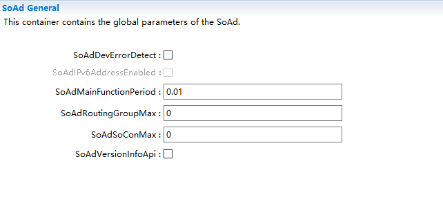

.. centered:: **表 SoAdGeneral (Table SoAdGeneral)**

.. list-table::
   :widths: 20 20 20 20 20
   :header-rows: 1

   * - UI名称 (UI Name)
     - 描述 (Description)
     - 
     - 
     - 
   * - SoAdDevErrorDetect
     - 取值范围 (Range)
     - true/false
     - 默认取值 (Default value)
     - false
   * - 
     - 参数描述 (Parameter Description)
     - 是否使能DET开发错误检测 (Whether to Enable DET Development Error Detection)
     - 
     - 
   * - 
     - 依赖关系 (Dependencies)
     - 依赖于Det模块的支持 (Dependent on the support of Det module)
     - 
     - 
   * - SoAdIPv6AddressEnabled
     - 取值范围 (Range)
     - true/false
     - 默认取值 (Default value)
     - false
   * - 
     - 参数描述 (Parameter Description)
     - 是否支持IPv6 (Whether it supports IPv6)
     - 
     - 
   * - 
     - 依赖关系 (Dependencies)
     - 暂不支持IPv6，配置项目前固定为FALSE (暫不支援IPv6，配置項目前固定為FALSE)
     - 
     - 
   * - SoAdMainFunctionPeriod
     - 取值范围 (Range)
     - 0 .. INF
     - 默认取值 (Default value)
     - 0.01
   * - 
     - 参数描述 (Parameter Description)
     - SoAd_MainFunction调用周期 (SoAd_MainFunction Call Cycle)
     - 
     - 
   * - 
     - 依赖关系 (Dependencies)
     - 无
     - 
     - 
   * - SoAdRoutingGroupMax
     - 取值范围 (Range)
     - 0 .. 65535
     - 默认取值 (Default value)
     - 0
   * - 
     - 参数描述 (Parameter Description)
     - 限制SoAdRoutingGroup配置数目 (Limit the number of SoAdRoutingGroup configurations.)
     - 
     - 
   * - 
     - 依赖关系 (Dependencies)
     - 无
     - 
     - 
   * - SoAdSoConMax
     - 取值范围 (Range)
     - 0 .. 65535
     - 默认取值 (Default value)
     - 0
   * - 
     - 参数描述 (Parameter Description)
     - 限制SocketConnection配置数目 (Limit the number of SocketConnection configurations.)
     - 
     - 
   * - 
     - 依赖关系 (Dependencies)
     - 无
     - 
     - 
   * - SoAdVersionInfoApi
     - 取值范围 (Range)
     - true/false
     - 默认取值 (Default value)
     - false
   * - 
     - 参数描述 (Parameter Description)
     - 是否支持模块软件版本获取接口 (Does the module support software version acquisition interface?)
     - 
     - 
   * - 
     - 依赖关系 (Dependencies)
     - 无
     - 
     - 

SoAdBswModules
------------------------------

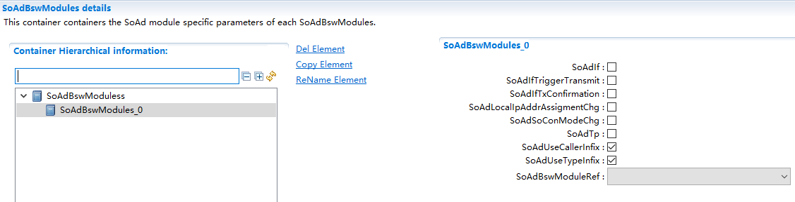

.. centered:: **表 SoAdBswModules (Table SoAdBswModules)**

.. list-table::
   :widths: 20 20 20 20 20
   :header-rows: 1

   * - UI名称 (UI Name)
     - 描述 (Description)
     - 
     - 
     - 
   * - SoAdIf
     - 取值范围 (Range)
     - true/false
     - 默认取值 (Default value)
     - false
   * - 
     - 参数描述 (Parameter Description)
     - 关联Bsw模块是否使能IFPDU通信 (Is IFPDU communication enabled in the Bsw module?)
     - 
     - 
   * - 
     - 依赖关系 (Dependencies)
     - 依赖于SoAdBswModuleRef关联的模块是否支持 (Whether the module associated with SoAdBswModuleRef supports it)
     - 
     - 
   * - SoAdIfTriggerTransmit
     - 取值范围 (Range)
     - true/false
     - 默认取值 (Default value)
     - false
   * - 
     - 参数描述 (Parameter Description)
     - 关联Bsw模块是否使能IFPDU通过TriggerTransmit方式进行发送 (Is the Bsw module enabled to send IFPDU through TriggerTransmit method?)
     - 
     - 
   * - 
     - 依赖关系 (Dependencies)
     - 依赖于SoAdBswModuleRef关联的模块是否支持 (Whether the module associated with SoAdBswModuleRef supports it)
     - 
     - 
   * - SoAdIfTxConfirmation
     - 取值范围 (Range)
     - true/false
     - 默认取值 (Default value)
     - false
   * - 
     - 参数描述 (Parameter Description)
     - 关联Bsw模块是否使能IFPDU发送确认 (Is the Bsw module enabled for IFPDU transmission confirmation?)
     - 
     - 
   * - 
     - 依赖关系 (Dependencies)
     - 依赖于SoAdBswModuleRef关联的模块是否支持 (Whether the module associated with SoAdBswModuleRef supports it)
     - 
     - 
   * - SoAdLocalIpAddrAssigmentChg
     - 取值范围 (Range)
     - true/false
     - 默认取值 (Default value)
     - false
   * - 
     - 参数描述 (Parameter Description)
     - 模块是否使能IP地址状态通知 (Is the module enabled for IP address status notifications?)
     - 
     - 
   * - 
     - 依赖关系 (Dependencies)
     - 依赖于SoAdBswModuleRef关联的模块是否支持 (Whether the module associated with SoAdBswModuleRef supports it)
     - 
     - 
   * - SoAdSoConModeChg
     - 取值范围 (Range)
     - true/false
     - 默认取值 (Default value)
     - false
   * - 
     - 参数描述 (Parameter Description)
     - 模式是否使能SoCon模式通知 (Is SoCon mode enabled Mode notification)
     - 
     - 
   * - 
     - 依赖关系 (Dependencies)
     - 依赖于SoAdBswModuleRef关联的模块是否支持 (Whether the module associated with SoAdBswModuleRef supports it)
     - 
     - 
   * - SoAdTp
     - 取值范围 (Range)
     - true/false
     - 默认取值 (Default value)
     - false
   * - 
     - 参数描述 (Parameter Description)
     - 模块是否使能TPPDU通信 (Is the module enabled for TPPDU communication?)
     - 
     - 
   * - 
     - 依赖关系 (Dependencies)
     - 依赖于SoAdBswModuleRef关联的模块是否支持 (Whether the module associated with SoAdBswModuleRef supports it)
     - 
     - 
   * - SoAdUseCallerInfix
     - 取值范围 (Range)
     - true/false
     - 默认取值 (Default value)
     - true
   * - 
     - 参数描述 (Parameter Description)
     - 模块回调接口名是否包含“SoAd” (Does the module callback interface name contain "SoAd"?)
     - 
     - 
   * - 
     - 依赖关系 (Dependencies)
     - 依赖于SoAdBswModuleRef回调函数命名规则 (Based on the callback function naming rules of SoAdBswModuleRef)
     - 
     - 
   * - SoAdUseTypeInfix
     - 取值范围 (Range)
     - true/false
     - 默认取值 (Default value)
     - true
   * - 
     - 参数描述 (Parameter Description)
     - 模块回调接口名是否包含“Tp/If” (Does the module callback interface name contain "Tp/If"?)
     - 
     - 
   * - 
     - 依赖关系 (Dependencies)
     - 依赖于SoAdBswModuleRef回调函数命名规则 (Based on the callback function naming rules of SoAdBswModuleRef)
     - 
     - 
   * - SoAdBswModuleRef
     - 取值范围 (Range)
     - 索引[Bsw] (Index[Bsw])
     - 默认取值 (Default value)
     - 无
   * - 
     - 参数描述 (Parameter Description)
     - 关联Bsw模块 (Link Bsw Module)
     - 
     - 
   * - 
     - 依赖关系 (Dependencies)
     - 依赖于配置工程中Bsw的添加 (Dependent on the addition of Bsw in the configuration engineering.)
     - 
     - 

SoAdSocketConnectionGroup
-----------------------------------------

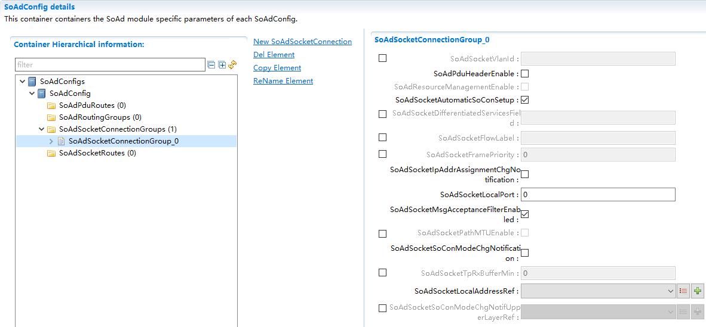

.. centered:: **表 SoAdSocketConnectionGroup (Table SoAdSocketConnectionGroup)**

.. list-table::
   :widths: 20 20 20 20 20
   :header-rows: 1

   * - UI名称 (UI Name)
     - 描述 (Description)
     - 
     - 
     - 
   * - SoAdSocketVlanId
     - 取值范围 (Range)
     - 0~4095
     - 默认取值 (Default value)
     - 无
   * - 
     - 参数描述 (Parameter Description)
     - Socket的Valn ID (Socket's Valn ID)
     - 
     - 
   * - 
     - 依赖关系 (Dependencies)
     - 依赖于使能Vlan (Dependent on enabled VLAN)
     - 
     - 
   * - SoAdPduHeaderEnable
     - 取值范围 (Range)
     - true/false
     - 默认取值 (Default value)
     - false
   * - 
     - 参数描述 (Parameter Description)
     - 表示该SoConGroup是否使能Header机制 (Indicate whether the SoConGroup enables the Header mechanism.)
     - 
     - 
   * - 
     - 依赖关系 (Dependencies)
     - 无
     - 
     - 
   * - SoAdResourceManagementEnable
     - 取值范围 (Range)
     - true/false
     - 默认取值 (Default value)
     - false
   * - 
     - 参数描述 (Parameter Description)
     - 是否使能资源管理 (Is resource management enabled?)
     - 
     - 
   * - 
     - 依赖关系 (Dependencies)
     - 固定为false不可改 (Fixed cannot be changed)
     - 
     - 
   * - SoAdSocketAutomaticSoConSetup
     - 取值范围 (Range)
     - true/false
     - 默认取值 (Default value)
     - true
   * - 
     - 参数描述 (Parameter Description)
     - 表示该SoConGroup中SoCon是自动链接还是手动链接 (Indicate whether the SoCon in this SoConGroup is auto-linked or manually linked.)
     - 
     - 
   * - 
     - 依赖关系 (Dependencies)
     - 无
     - 
     - 
   * - SoAdSocketDifferentiatedServicesField
     - 取值范围 (Range)
     - 0 .. 63
     - 默认取值 (Default value)
     - 无
   * - 
     - 参数描述 (Parameter Description)
     - 表示IP header中6-bitDifferentiatedService Field (Indicate IP header中的6-bit Differentiated Service Field)
     - 
     - 
   * - 
     - 依赖关系 (Dependencies)
     - 无
     - 
     - 
   * - SoAdSocketFlowLabel
     - 取值范围 (Range)
     - 0 .. 1048575
     - 默认取值 (Default value)
     - 无
   * - 
     - 参数描述 (Parameter Description)
     - 表示IPv6header中20-bit FlowLabel field (Indicates the 20-bit Flow Label field in the IPv6 header)
     - 
     - 
   * - 
     - 依赖关系 (Dependencies)
     - 依赖于SoAdIPv6AddressEnabled的使能，当前不支持 (Dependent on the enablement of SoAdIPv6AddressEnabled, current support is not available.)
     - 
     - 
   * - SoAdSocketFramePriority
     - 取值范围 (Range)
     - 0 .. 7
     - 默认取值 (Default value)
     - 无
   * - 
     - 参数描述 (Parameter Description)
     - IP报文的优先级参数 (Priority parameter of IP packet)
     - 
     - 
   * - 
     - 依赖关系 (Dependencies)
     - 无
     - 
     - 
   * - SoAdSocketIpAddrAssignmentChgNotification
     - 取值范围 (Range)
     - true/false
     - 默认取值 (Default value)
     - false
   * - 
     - 参数描述 (Parameter Description)
     - 表示该SoConGroup是否使能IP地址状态通知 (Indicate whether the SoConGroup enables IP address status notification.)
     - 
     - 
   * - 
     - 依赖关系 (Dependencies)
     - 无
     - 
     - 
   * - SoAdSocketLocalPort
     - 取值范围 (Range)
     - 0 .. 65535
     - 默认取值 (Default value)
     - 0
   * - 
     - 参数描述 (Parameter Description)
     - 该SoConGroup本端PORT号 (ThisSoConGroup Local PORT Number)
     - 
     - 
   * - 
     - 依赖关系 (Dependencies)
     - 无
     - 
     - 
   * - SoAdSocketMsgAcceptanceFilterEnabled
     - 取值范围 (Range)
     - true/false
     - 默认取值 (Default value)
     - true
   * - 
     - 参数描述 (Parameter Description)
     - 是否使能报文接收过滤 (Whether to enable packet reception filtering)
     - 
     - 
   * - 
     - 依赖关系 (Dependencies)
     - 当SoAdSocketRemoteAddress配置了通配符并且SoAdSocketUdpListenOnly为FALSE，该配置项必须为TRUE； (When SoAdSocketRemoteAddress is configured with a wildcard and SoAdSocketUdpListenOnly is set to FALSE, this configuration item must be TRUE;)
     - 
     - 
   * - 
     - 
     - 当该SoConGroup包含了多个SoCon时，该配置项必须为TRUE； (When this SoConGroup contains multiple SoCons, this configuration item must be TRUE;)
     - 
     - 
   * - SoAdSocketPathMTUEnable
     - 取值范围 (Range)
     - true/false
     - 默认取值 (Default value)
     - 无
   * - 
     - 参数描述 (Parameter Description)
     - 表示是否使能最大传输单元MTU探测 (Indicate whether to enable Maximum Transmission Unit (MTU) detection)
     - 
     - 
   * - 
     - 依赖关系 (Dependencies)
     - 依赖于TcpIp层MTU机制是否支持 (Depends on whether the MTU mechanism at the TcpIp layer is supported.)
     - 
     - 
   * - SoAdSocketSoConModeChgNotification
     - 取值范围 (Range)
     - true/false
     - 默认取值 (Default value)
     - false
   * - 
     - 参数描述 (Parameter Description)
     - 是否使能SoCon模式切换通知 (Whether to Enable SoCon Mode Switch Notification)
     - 
     - 
   * - 
     - 依赖关系 (Dependencies)
     - 无
     - 
     - 
   * - SoAdSocketTpRxBufferMin
     - 取值范围 (Range)
     - 0 .. 65535
     - 默认取值 (Default value)
     - 无
   * - 
     - 参数描述 (Parameter Description)
     - 表示该SoConGroup接收TPBuffer大小 (Indicates that this SoConGroup receives TPBuffer size)
     - 
     - 
   * - 
     - 依赖关系 (Dependencies)
     - 当该SoConGroup中SoCon需要接收TPPDU时才需配置，且配置长度需≥关联的最大接收TPPDU长度 (When configuration is needed for SoCon in the SoConGroup to receive TPPDU, it should be set only when SoCon needs to receive TPPDU, and the configured length must be ≥ the maximum received TPPDU length.)
     - 
     - 
   * - SoAdSocketLocalAddressRef
     - 取值范围 (Range)
     - 索引[TcpIpLocalAddr] (Index[TcpIpLocalAddr])
     - 默认取值 (Default value)
     - 0
   * - 
     - 参数描述 (Parameter Description)
     - 关于TcpIp层LocalAddr（本端IP） (About TcpIp Layer LocalAddr (Local IP Endpoint))
     - 
     - 
   * - 
     - 依赖关系 (Dependencies)
     - 依赖于TcpIp的配置；当前不支持IPv6，当SoAdSocketLocalAddressRef关联TcpIpDomainType不能配置为TCPIP_AF_INET6 (Dependent on TcpIp configuration; IPv6 is currently not supported, so SoAdSocketLocalAddressRef associated with TcpIpDomainType cannot be configured as TCPIP_AF_INET6)
     - 
     - 
   * - SoAdSocketSoConModeChgNotifUpperLayerRef
     - 取值范围 (Range)
     - Reference
     - 默认取值 (Default value)
     - 无
   * - 
     - 参数描述 (Parameter Description)
     - 引用一个额外的上层，它将接收套接字连接状态的改变(尽管它不是套接字连接的直接上层)。 (Reference a higher layer, which will receive changes in socket connection status (although it is not the direct upper layer of the socket connection).)
     - 
     - 
   * - 
     - 依赖关系 (Dependencies)
     - 当前不支持 (Current unsupported.)
     - 
     - 

SoAdSocketConnection
------------------------------------

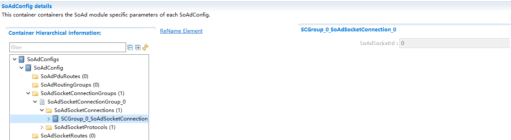

.. centered:: **表 SoAdSocketConnection (Table SoAdSocketConnection)**

.. list-table::
   :widths: 20 20 20 20 20
   :header-rows: 1

   * - UI名称 (UI Name)
     - 描述 (Description)
     - 
     - 
     - 
   * - SoAdSocketId
     - 取值范围 (Range)
     - 0 .. 65535
     - 默认取值 (Default value)
     - 0
   * - 
     - 参数描述 (Parameter Description)
     - 表示该SoCon的Id号 (Indicate the Id number of this SoCon)
     - 
     - 
   * - 
     - 依赖关系 (Dependencies)
     - SoAd工具自动从0开始依次加1 (SoAd tool automatically starts from 0 and increments by 1依次加1)
     - 
     - 

SoAdSocketRemoteAddress
---------------------------------------

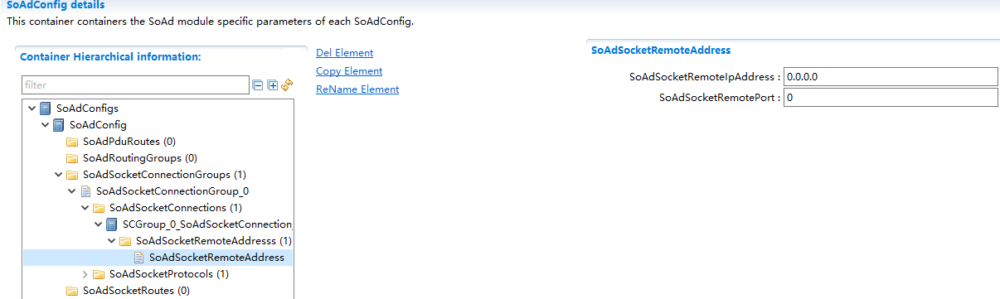

.. centered:: **表 SoAdSocketRemoteAddress (Table SoAdSocketRemoteAddress)**

.. list-table::
   :widths: 20 20 20 20 20
   :header-rows: 1

   * - UI名称 (UI Name)
     - 描述 (Description)
     - 
     - 
     - 
   * - SoAdSocketRemoteIpAddress
     - 取值范围 (Range)
     - IPv4/IPv6地址范围 (IPv4/IPv6 Address Range)
     - 默认取值 (Default value)
     - 0.0.0.0
   * - 
     - 参数描述 (Parameter Description)
     - 表示远端节点的IP地址 (Indicate the IP address of the remote node)
     - 
     - 
   * - 
     - 依赖关系 (Dependencies)
     - 根据关联的TcpIpLocalAddr→TcpIpDomainType决定IP地址为IPv4或者IPv6； 全0的IP地址代码通配符“ANY”；(According to the associated TcpIpLocalAddr→TcpIpDomainType determines whether the IP address is IPv4 or IPv6;IP address code with all 0s uses the wildcard "ANY".)
     - 
     - 
   * - SoAdSocketRemotePort
     - 取值范围 (Range)
     - 0 .. 65535
     - 默认取值 (Default value)
     - 0
   * - 
     - 参数描述 (Parameter Description)
     - 表示远端节点的PORT号 (Indicate the PORT number of the remote node)
     - 
     - 
   * - 
     - 依赖关系 (Dependencies)
     - 0表示PORT值为通配符“ANY” (0 indicates that the PORT value is the wildcard "ANY")
     - 
     - 

SoAdSocketTcp
-----------------------------

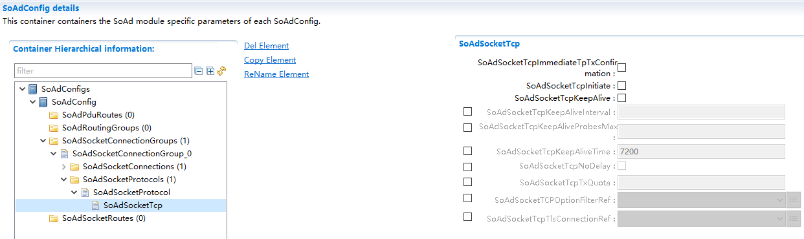

.. centered:: **表 SoAdSocketTcp (Table SoAdSocketTcp)**

.. list-table::
   :widths: 20 20 20 20 20
   :header-rows: 1

   * - UI名称 (UI Name)
     - 描述 (Description)
     - 
     - 
     - 
   * - SoAdSocketTcpImmediateTpTxConfirmation
     - 取值范围 (Range)
     - true/false
     - 默认取值 (Default value)
     - false
   * - 
     - 参数描述 (Parameter Description)
     - TPPDU发送是否立即确认（无需等待对方ACK） (Is the TPPDU sent confirmed immediately (without waiting for the对方ACK)?)
     - 
     - 
   * - 
     - 依赖关系 (Dependencies)
     - 无
     - 
     - 
   * - SoAdSocketTcpInitiate
     - 取值范围 (Range)
     - true/false
     - 默认取值 (Default value)
     - false
   * - 
     - 参数描述 (Parameter Description)
     - TCP作为服务端（FALSE）还是客户端（TRUE）
     - 
     - 
   * - 
     - 依赖关系 (Dependencies)
     - 无
     - 
     - 
   * - SoAdSocketTcpKeepAlive
     - 取值范围 (Range)
     - true/false
     - 默认取值 (Default value)
     - false
   * - 
     - 参数描述 (Parameter Description)
     - 是否使能TCP协议keep-alive机制 (Is the TCP protocol keep-alive mechanism enabled?)
     - 
     - 
   * - 
     - 依赖关系 (Dependencies)
     - 当TcpIp模块支持TcpIpTcpKeepAliveEnabled时，该项才能配置为true (When TcpIpTcpKeepAliveEnabled is supported by the TcpIp module, this can be configured as true.)
     - 
     - 
   * - SoAdSocketTcpKeepAliveInterval
     - 取值范围 (Range)
     - 0 .. INF
     - 默认取值 (Default value)
     - 无
   * - 
     - 参数描述 (Parameter Description)
     - keep-alive探测报文间隔周期 (Interval period for keep-alive probe messages)
     - 
     - 
   * - 
     - 依赖关系 (Dependencies)
     - 依赖于SoAdSocketTcpKeepAlive的使能 (Dependent on SoAdSocketTcpKeepAlive Enable)
     - 
     - 
   * - SoAdSocketTcpKeepAliveProbesMax
     - 取值范围 (Range)
     - 0 .. 65535
     - 默认取值 (Default value)
     - 无
   * - 
     - 参数描述 (Parameter Description)
     - keep-alive探测报文最大发送次数 (Maximum send次数 for keep-alive probe messages)
     - 
     - 
   * - 
     - 依赖关系 (Dependencies)
     - 依赖于SoAdSocketTcpKeepAlive的使能 (Dependent on SoAdSocketTcpKeepAlive Enable)
     - 
     - 
   * - SoAdSocketTcpKeepAliveTime
     - 取值范围 (Range)
     - 0 .. INF
     - 默认取值 (Default value)
     - 无
   * - 
     - 参数描述 (Parameter Description)
     - 最后一次数据报到发送keep-alive探测报的时间 (The time since the last data packet was sent for keep-alive probing.)
     - 
     - 
   * - 
     - 依赖关系 (Dependencies)
     - 依赖于SoAdSocketTcpKeepAlive的使能 (Dependent on SoAdSocketTcpKeepAlive Enable)
     - 
     - 
   * - SoAdSocketTcpNoDelay
     - 取值范围 (Range)
     - true/false
     - 默认取值 (Default value)
     - false
   * - 
     - 参数描述 (Parameter Description)
     - 是否使能TCP拥塞控制（Nagle机制），配置为true则关闭拥塞控制（Nagle机制）。
     - 
     - 
   * - 
     - 依赖关系 (Dependencies)
     - 若TcpIp模块不支持Nagle算法，该配置项不能配置为false。 (If the TcpIp module does not support the Nagle algorithm, this configuration item cannot be configured as false.)
     - 
     - 
   * - SoAdSocketTcpTxQuota
     - 取值范围 (Range)
     - 0 .. 4294967295
     - 默认取值 (Default value)
     - 无
   * - 
     - 参数描述 (Parameter Description)
     - 该SoConGroup中每个SoCon缓存发送数据长度 (Each SoCon in the SoConGroup caches the length of sent data.)
     - 
     - 
   * - 
     - 依赖关系 (Dependencies)
     - 该配置项/功能不支持 (This configuration item/function is not supported.)
     - 
     - 
   * - SoAdSocketTCPOptionFilterRef
     - 取值范围 (Range)
     - 索引[TcpIpTcpConfigOptionFilter] (Index[TcpIpTcpConfigOptionFilter])
     - 默认取值 (Default value)
     - 无
   * - 
     - 参数描述 (Parameter Description)
     - 需要加载的TCPoption字段 (The TCP option fields that need to be loaded)
     - 
     - 
   * - 
     - 依赖关系 (Dependencies)
     - 依赖于TcpIp模块TcpIpTcpConfigOptionFilter (Dependent on TcpIp Module TcpIpTcpConfigOptionFilter)
     - 
     - 
   * - SoAdSocketTcpTlsConnectionRef
     - 取值范围 (Range)
     - 索引[TcpIpTlsConnection] (Index[TcpIpTlsConnection])
     - 默认取值 (Default value)
     - 无
   * - 
     - 参数描述 (Parameter Description)
     - TCP是否需要TLS加解密 (Does TCP need TLS encryption and decryption?)
     - 
     - 
   * - 
     - 依赖关系 (Dependencies)
     - 依赖于TcpIp模块TcpIpTlsConnection (Dependent on TcpIp Module TcpIpTlsConnection)
     - 
     - 

SoAdSocketUdp
-----------------------------

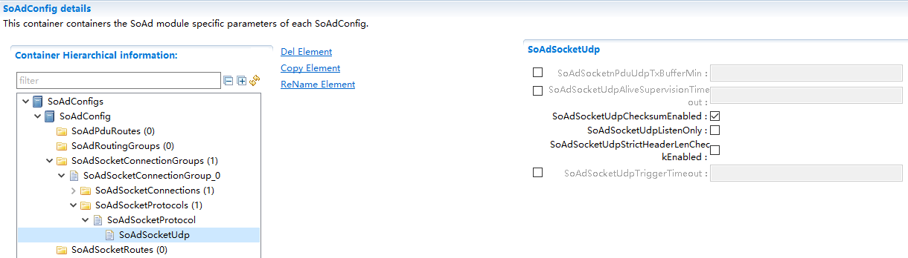

.. centered:: **表 SoAdSocketUdp (Table SoAdSocketUdp)**

.. list-table::
   :widths: 20 20 20 20 20
   :header-rows: 1

   * - UI名称 (UI Name)
     - 描述 (Description)
     - 
     - 
     - 
   * - SoAdSocketnPduUdpTxBufferMin
     - 取值范围 (Range)
     - 0 .. 65535
     - 默认取值 (Default value)
     - 无
   * -
     - 参数描述 (Parameter Description)
     - nPduUdpTxBuffer触发发送阈值 (Trigger for PDU UDP Tx Buffer Sending Threshold)
     - 
     - 
   * - 
     - 依赖关系 (Dependencies)
     - 依赖于关联SoAdPduRouteDest的SoAdTxUdpTriggerMode配置，若该SoAdSocketConnection当前支持nUdpBuffer，则SoAdSocketnPduUdpTxBufferMin必须配置并且其长度必须大于关联的Pdu（可能加Header长度8）的最大长度 (Dependent on the configuration of SoAdTxUdpTriggerMode associated with SoAdPduRouteDest, if the current SoAdSocketConnection supports nUdpBuffer, then SoAdSocketnPduUdpTxBufferMin must be configured and its length must be greater than the maximum length of the associated PDU (possibly plus header length 8).)
     - 
     - 
   * - SoAdSocketUdpAliveSupervisionTimeout
     - 取值范围 (Range)
     - 0 .. INF
     - 默认取值 (Default value)
     - 无
   * -
     - 参数描述 (Parameter Description)
     - UDP接收报文后保持ONLINE状态的时间，若想一直保持ONLINE则不配置该项 (The time UDP receives a message and maintains the ONLINE status, if you want to keep it ONLINE indefinitely, do not configure this item.)
     - 
     - 
   * - 
     - 依赖关系 (Dependencies)
     - 无
     - 
     - 
   * - SoAdSocketUdpChecksumEnabled
     - 取值范围 (Range)
     - true/false
     - 默认取值 (Default value)
     - false
   * -
     - 参数描述 (Parameter Description)
     - 是否在相关套接字上启用(TRUE)或跳过(FALSE)UDP 校验和计算
     - 
     - 
   * - 
     - 依赖关系 (Dependencies)
     - 当前不支持 (Current unsupported.)
     - 
     - 
   * - SoAdSocketUdpListenOnly
     - 取值范围 (Range)
     - true/false
     - 默认取值 (Default value)
     - false
   * - 
     - 参数描述 (Parameter Description)
     - 表示该SoConGroup是否只支持接收 (Indicates whether this SoConGroup only supports receiving.)
     - 
     - 
   * - 
     - 依赖关系 (Dependencies)
     - UDP协议才存在只接收的模式，不能被SoAdPduRouteDest关联 (The UDP protocol only exists in a receive mode and cannot be associated with SoAdPduRouteDest.)
     - 
     - 
   * - SoAdSocketUdpStrictHeaderLenCheckEnabled
     - 取值范围 (Range)
     - true/false
     - 默认取值 (Default value)
     - false
   * - 
     - 参数描述 (Parameter Description)
     - 表示是否使能接收报文长度严格检测机制 (Indicate whether to enable strict packet length detection mechanism.)
     - 
     - 
   * - 
     - 依赖关系 (Dependencies)
     - 依赖于SoAdPduHeaderEnable的使能 (Enabled based on SoAdPduHeaderEnable)
     - 
     - 
   * - SoAdSocketUdpTriggerTimeout
     - 取值范围 (Range)
     - 0 .. INF
     - 默认取值 (Default value)
     - 无
   * - 
     - 参数描述 (Parameter Description)
     - nPduUdpTxBuffer超时发送时间 (Timeout for sending via nPduUdpTxBuffer)
     - 
     - 
   * - 
     - 依赖关系 (Dependencies)
     - 依赖于关联SoAdPduRouteDest的SoAdTxUdpTriggerMode配置 (Dependent on the configuration of SoAdTxUdpTriggerMode associated with SoAdPduRouteDest.)
     - 
     - 

SoAdRoutingGroup
--------------------------------

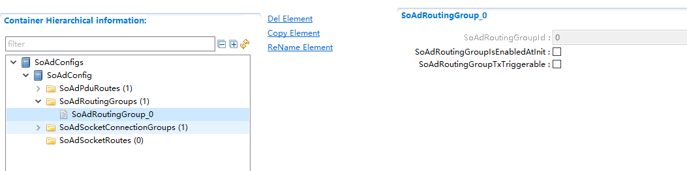

.. centered:: **表 SoAdRoutingGroup (Table SoAdRoutingGroup)**

.. list-table::
   :widths: 20 20 20 20 20
   :header-rows: 1

   * - UI名称 (UI Name)
     - 描述 (Description)
     - 
     - 
     - 
   * - SoAdRoutingGroupId
     - 取值范围 (Range)
     - 0 .. 65535
     - 默认取值 (Default value)
     - 无
   * - 
     - 参数描述 (Parameter Description)
     - 配置的SoAdRoutingGroup统一排序的Id号，由工具自动从0..N依次排序。 (Uniformly sort the Id numbers of the configured SoAdRoutingGroup, with the tool automatically sorting them from 0 to N sequentially.)
     - 
     - 
   * - 
     - 依赖关系 (Dependencies)
     - 无
     - 
     - 
   * - SoAdRoutingGroupIsEnabledAtInit
     - 取值范围 (Range)
     - true/false
     - 默认取值 (Default value)
     - false
   * - 
     - 参数描述 (Parameter Description)
     - 表示该SoAdRoutingGroup初始化之后是否使能 (Indicates whether the SoAdRoutingGroup is enabled after initialization.)
     - 
     - 
   * - 
     - 依赖关系 (Dependencies)
     - 无
     - 
     - 
   * - SoAdRoutingGroupTxTriggerable
     - 取值范围 (Range)
     - true/false
     - 默认取值 (Default value)
     - false
   * - 
     - 参数描述 (Parameter Description)
     - 表示该SoAdRoutingGroup关联的IfTxPdu是否可以通过SoAd_IfRoutingGroupTransmit/ (Indicate whether the IfTxPdu associated with this SoAdRoutingGroup can be transmitted via SoAd_IfRoutingGroupTransmit/)
     - 
     - 
   * - 
     - 
     - SoAd_IfSpecificRoutingGroupTransmit请求发送 (SoAd_IfSpecificRoutingGroupTransmit request sent)
     - 
     - 
   * - 
     - 依赖关系 (Dependencies)
     - 无
     - 
     - 

SoAdPduRoute
----------------------------

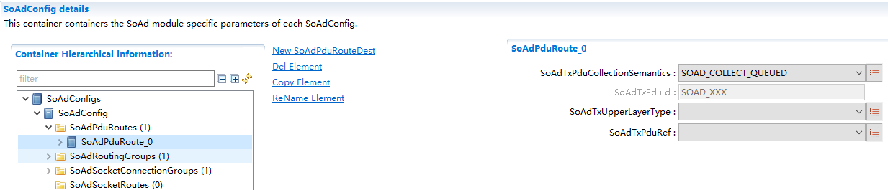

.. centered:: **表 SoAdPduRoute (Table SoAdPduRoute)**

.. list-table::
   :widths: 20 20 20 20 20
   :header-rows: 1

   * - UI名称 (UI Name)
     - 描述 (Description)
     - 
     - 
     - 
   * - SoAdTxPduCollectionSemantics
     - 取值范围 (Range)
     - SOAD_COLLECT_LAST_IS_BEST/SOAD_COLLECT_QUEUED
     - 默认取值 (Default value)
     - SOAD_COLLECT_QUEUED
   * - 
     - 参数描述 (Parameter Description)
     - 否应使用排队或最后最好的语义来收集此PDU (Should queuing or last best semantics be used to collect this PDU?)
     - 
     - 
   * - 
     - 依赖关系 (Dependencies)
     - 无
     - 
     - 
   * - SoAdTxPduId
     - 取值范围 (Range)
     - string
     - 默认取值 (Default value)
     - 无
   * - 
     - 参数描述 (Parameter Description)
     - SoAd层TxPdu的Id值 (SoAd Layer TxPdu's Id Value)
     - 
     - 
   * - 
     - 依赖关系 (Dependencies)
     - 根据配置项SoAdTxPduRef关联的Pdu名自动生成 (Automatically generate based on the PDU name associated with the configuration item SoAdTxPduRef)
     - 
     - 
   * - SoAdTxUpperLayerType
     - 取值范围 (Range)
     - IF/TP
     - 默认取值 (Default value)
     - 无
   * - 
     - 参数描述 (Parameter Description)
     - TxPdu发送方式选择 (TXPdu Sending Method Selection)
     - 
     - 
   * - 
     - 依赖关系 (Dependencies)
     - 只有“IF”时，才支持一对多发送 (Only when "IF" is used, does support for one-to-many sending exist.)
     - 
     - 
   * - SoAdTxPduRef
     - 取值范围 (Range)
     - 索引[Pdu] (Index[Pdu])
     - 默认取值 (Default value)
     - 无
   * - 
     - 参数描述 (Parameter Description)
     - 关联到EcuC中的Pdu (Mapped to EcuC Pdu)
     - 
     - 
   * - 
     - 依赖关系 (Dependencies)
     - 依赖于EcuC中Pdu的配置 (Dependent on the configuration of Pdu in EcuC)
     - 
     - 

SoAdPduRouteDest
--------------------------------

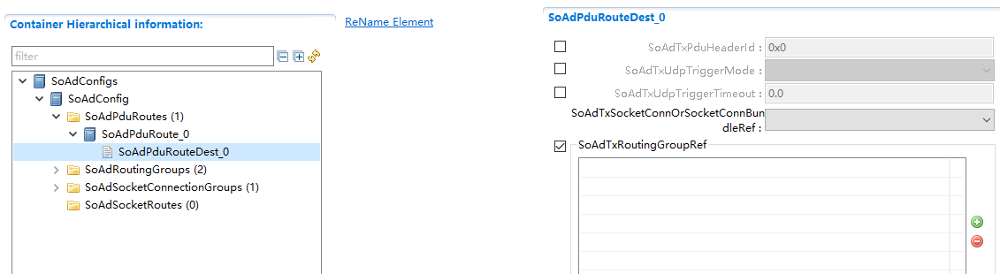

.. centered:: **表 SoAdPduRouteDest (Table SoAdPduRouteDest)**

.. list-table::
   :widths: 20 20 20 20 20
   :header-rows: 1

   * - UI名称 (UI Name)
     - 描述 (Description)
     - 
     - 
     - 
   * - SoAdTxPduHeaderId
     - 取值范围 (Range)
     - 0 .. 4294967296
     - 默认取值 (Default value)
     - 无
   * - 
     - 参数描述 (Parameter Description)
     - TxPdu报文在SoAd添加的HeaderId值 (The HeaderId value added by SoAd in TxPdu message)
     - 
     - 
   * - 
     - 依赖关系 (Dependencies)
     - 依赖于其关联的SoAdSocketConnectionGroup配置项SoAdPduHeaderEnable使能 (Dependent on the configuration item SoAdSocketConnectionGroup associated with it, SoAdPduHeaderEnable is enabled.)
     - 
     - 
   * - SoAdTxUdpTriggerMode
     - 取值范围 (Range)
     - TRIGGER_ALWAYS/TRIGGER_NEVER
     - 默认取值 (Default value)
     - 无
   * - 
     - 参数描述 (Parameter Description)
     - TxPdu通过UDP发送且需要使用nPduUdpTxBuffer机制时，配置TxPdu的触发属性 (When TxPdu is sent via UDP and requires the use of nPduUdpTxBuffer mechanism, configure the trigger attributes of TxPdu.)
     - 
     - 
   * - 
     - 依赖关系 (Dependencies)
     - 依赖于SoAdSocketProtocol和SoAdTxUpperLayerType，只有当TxPdu通过IF发送方式且由UDP进行发送时才可选择配置该项；配置为“TRIGGER_NEVER”时，SoAdPduRouteDest->SoAdTxUdpTriggerTimeout有配置或者其关联的SoAdSocketUdpTriggerTimeout参数中至少要配置1个；当SoAdSocketConection关联的所有SoAdPduRouteDest都为“IF”，当其中一个SoAdPduRouteDest配置了SoAdTxUdpTriggerMode，其他也需要配置；当SoAdSocketConection关联的所有SoAdPduRouteDest，当配置了SoAdTxUdpTriggerMode时，至少存在一个配置为TRIGGER_NEVER；当SoAdSocketConection关联的所有SoAdPduRouteDest不全为“IF”，SoAdTxUdpTriggerMode不能配置；关联到TCPSoAdSocketConnection的SoAdPduRouteDest不能配置SoAdTxUdpTriggerMode (Dependent on SoAdSocketProtocol and SoAdTxUpperLayerType, this can only be configured when TxPdu is sent via IF and UDP; When configured as "TRIGGER_NEVER", at least one of SoAdPduRouteDest->SoAdTxUdpTriggerTimeout or its associated SoAdSocketUdpTriggerTimeout parameter must be configured; When all SoAdPduRouteDest associated with SoAdSocketConection are "IF", if any SoAdPduRouteDest is configured with SoAdTxUdpTriggerMode, others also need to be configured; When all SoAdPduRouteDest associated with SoAdSocketConection are configured with SoAdTxUdpTriggerMode, at least one must be configured as TRIGGER_NEVER; When not all SoAdPduRouteDest associated with SoAdSocketConection are "IF", SoAdTxUdpTriggerMode cannot be configured; SoAdPduRouteDest associated with TCPSoAdSocketConnection cannot configure SoAdTxUdpTriggerMode)
     - 
     - 
   * - SoAdTxUdpTriggerTimeout
     - 取值范围 (Range)
     - 0 .. INF
     - 默认取值 (Default value)
     - 无
   * - 
     - 参数描述 (Parameter Description)
     - nPduUdpTxBuffer发送时间阈值 (PDU Udp Tx Buffer send time threshold)
     - 
     - 
   * - 
     - 依赖关系 (Dependencies)
     - 当SoAdTxUdpTriggerMode配置为TRIGGER_NEVER，才可选择是否配置该项 (When SoAdTxUdpTriggerMode is configured as TRIGGER_NEVER, option configuration can be selected.)
     - 
     - 
   * - SoAdTxSocketConnOrSocketConnBundleRef
     - 取值范围 (Range)
     - 索引[SoAdSocketConnection] (Index[SoAdSocketConnection])
     - 默认取值 (Default value)
     - 无
   * - 
     - 参数描述 (Parameter Description)
     - 表示该SoAdPduRouteDest通过哪个SoCon进行发送（工具限制只能关联到SoCon，而不能关联到SoConGroup，可通过配置多个SoAdPduRouteDest分别关联SoCon来实现同样功能） (Indicates which SoCon the SoAdPduRouteDest sends through (the tool is limited to associating with SoCon and not SoConGroup; multiple SoAdPduRouteDest can be configured to achieve the same functionality by separately associating with SoCon).)
     - 
     - 
   * - 
     - 依赖关系 (Dependencies)
     - 依赖于SoAdSocketConnection的配置 (Dependent on the configuration of SoAdSocketConnection)
     - 
     - 
   * - SoAdTxRoutingGroupRef
     - 取值范围 (Range)
     - 索引[SoAdRoutingGroup] (Index[SoAdRoutingGroup])
     - 默认取值 (Default value)
     - 无
   * - 
     - 参数描述 (Parameter Description)
     - 关联到0..N个SoAdRoutingGroup组 (Associated with 0..N SoAdRoutingGroup groups)
     - 
     - 
   * - 
     - 依赖关系 (Dependencies)
     - 依赖于SoAdRoutingGroup的配置 (Dependent on the configuration of SoAdRoutingGroup)
     - 
     - 

SoAdSocketRoute
-------------------------------

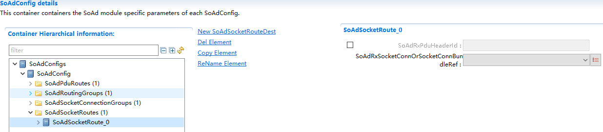

.. centered:: **表 SoAdSocketRoute (Table SoAdSocketRoute)**

.. list-table::
   :widths: 20 20 20 20 20
   :header-rows: 1

   * - UI名称 (UI Name)
     - 描述 (Description)
     - 
     - 
     - 
   * - SoAdRxPduHeaderId
     - 取值范围 (Range)
     - 0 .. 4294967296
     - 默认取值 (Default value)
     - 无
   * - 
     - 参数描述 (Parameter Description)
     - SoAd层RxPdu的Header Id值 (Header ID value of SoAd layer Rx Pdu)
     - 
     - 
   * - 
     - 依赖关系 (Dependencies)
     - 依赖于关联SoConGroup的SoAdPduHeaderEnable使能 (Dependent on the association SoConGroup, enable SoAdPduHeaderEnable.)
     - 
     - 
   * - SoAdRxSocketConnOrSocketConnBundleRef
     - 取值范围 (Range)
     - 索引[SoAdSocketConnection，SoAdSocketConnectionGroup] (Index[SoAdSocketConnection, SoAdSocketConnectionGroup])
     - 默认取值 (Default value)
     - 无
   * - 
     - 参数描述 (Parameter Description)
     - SoAdSocketRoute通过哪个SoCon/SoConGroup接收 (SoAdSocketRoute Through which SoCon/SoConGroup receives)
     - 
     - 
   * - 
     - 依赖关系 (Dependencies)
     - 只有SoAdRxUpperLayerType为“IF”时，才能关联SoConGroup (Only when SoAdRxUpperLayerType is "IF", can SoConGroup be associated.)
     - 
     - 

SoAdSocketRouteDest
-----------------------------------

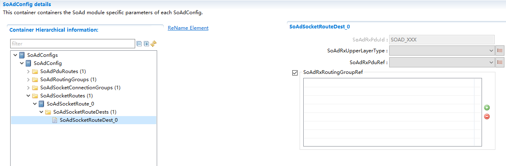

.. centered:: **表 SoAdSocketRouteDest (Table SoAdSocketRouteDest)**

.. list-table::
   :widths: 20 20 20 20 20
   :header-rows: 1

   * - UI名称 (UI Name)
     - 描述 (Description)
     - 
     - 
     - 
   * - SoAdRxPduId
     - 取值范围 (Range)
     - string
     - 默认取值 (Default value)
     - 无
   * - 
     - 参数描述 (Parameter Description)
     - SoAd层RxPdu的Id值 (The Id value of SoAd Layer RxPdu)
     - 
     - 
   * - 
     - 依赖关系 (Dependencies)
     - 根据SoAdRxPduRef关联的Pdu名自动生成 (Automatically generate based on the PDU name associated with SoAdRxPduRef)
     - 
     - 
   * - SoAdRxUpperLayerType
     - 取值范围 (Range)
     - IF/TP
     - 默认取值 (Default value)
     - 无
   * - 
     - 参数描述 (Parameter Description)
     - 表示RxPdu接收方式 (Indicate RxPdu reception mode)
     - 
     - 
   * - 
     - 依赖关系 (Dependencies)
     - 无
     - 
     - 
   * - SoAdRxPduRef
     - 取值范围 (Range)
     - 索引[Pdu] (Index[Pdu])
     - 默认取值 (Default value)
     - 无
   * - 
     - 参数描述 (Parameter Description)
     - 关联EcuC中Pdu (Related EcuC Pdu)
     - 
     - 
   * - 
     - 依赖关系 (Dependencies)
     - 依赖于EcuC中Pdu的配置 (Dependent on the configuration of Pdu in EcuC)
     - 
     - 
   * - SoAdRxRoutingGroupRef
     - 取值范围 (Range)
     - 索引[SoAdRoutingGroup] (Index[SoAdRoutingGroup])
     - 默认取值 (Default value)
     - 无
   * - 
     - 参数描述 (Parameter Description)
     - 关联到0..N个SoAdRoutingGroup组 (Associated with 0..N SoAdRoutingGroup groups)
     - 
     - 
   * - 
     - 依赖关系 (Dependencies)
     - 依赖于SoAdRoutingGroup的配置 (Dependent on the configuration of SoAdRoutingGroup)
     - 
     - 
