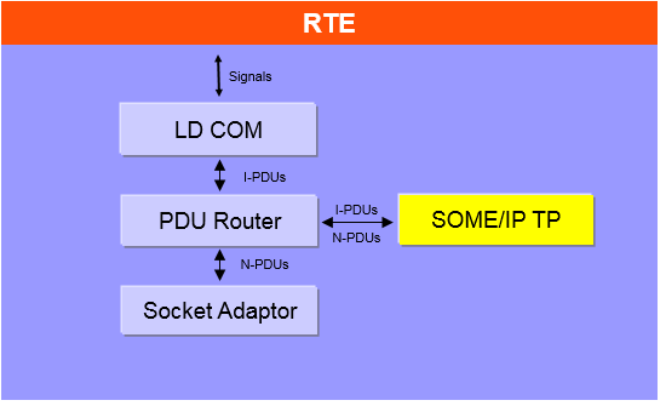
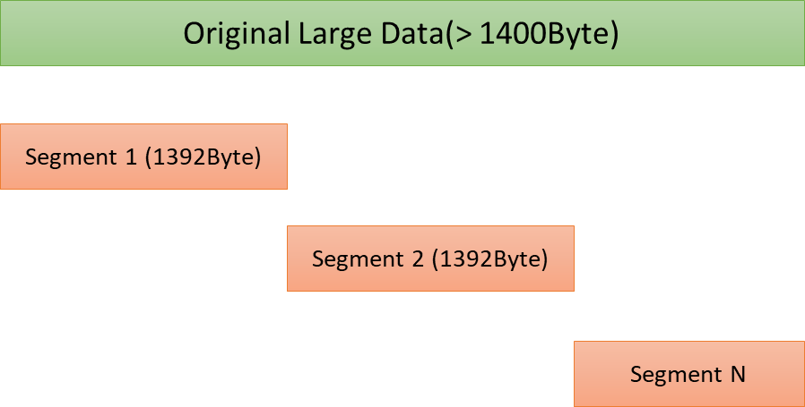
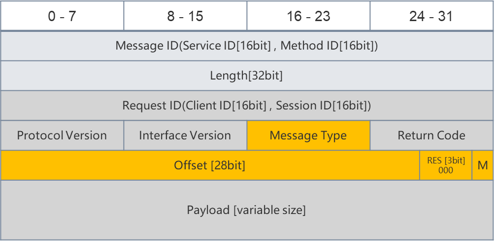
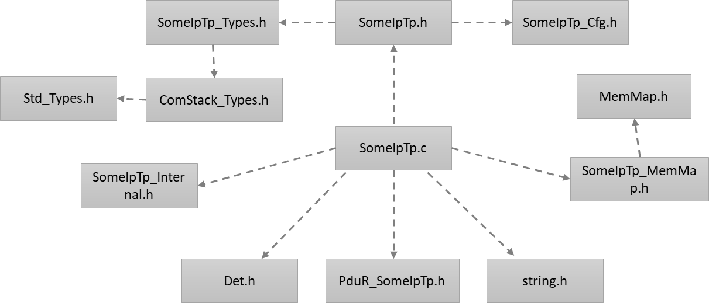
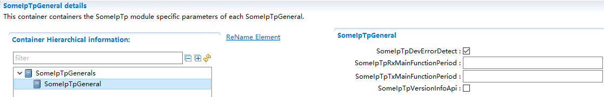
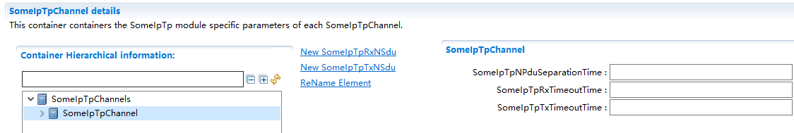
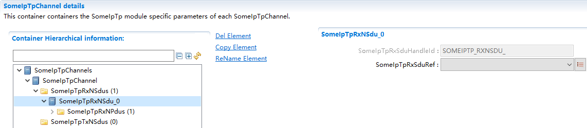
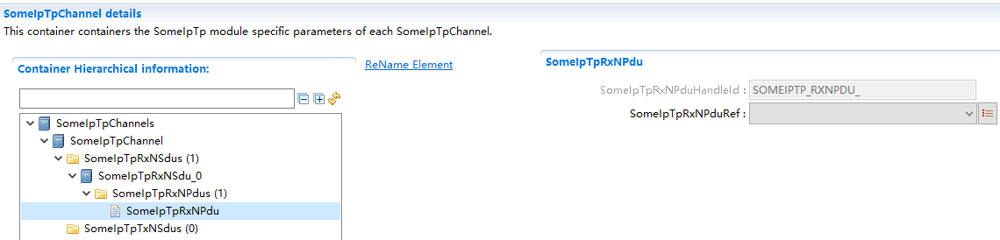
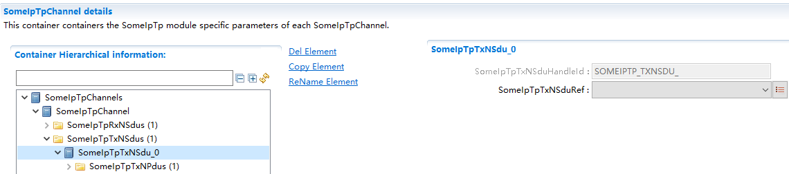
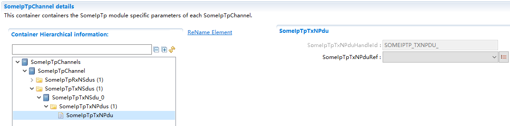

SomeIpTp
#################################

:strong:`缩写词注解 (Abbreviation Notes):`

.. list-table::
   :widths: 34 33 33
   :header-rows: 1

   * - 缩写词 (Abbreviation)
     - 解释/描述 (Explanation/Description)
     - 中文解释 (Chinese explanation)
   * - SOME/IP
     - Scalable service-OrientedMiddlewarE over IP
     - 基于IP的可缩放的面向服务的中间件 (Service-oriented middleware based on IP with scalability)
   * - SOME/IP TP
     - SOME/IP Transport Layer
     - SOME/IP传输层 (SOME/IP Transport Layer)
   * - UDP
     - User Datagram Protocol
     - 用户数据报协议 (User Datagram Protocol)

简介 (Introduction)
=================================

SOME/IP TP为使用UDP发送长度大于1400字节的SOME/IP报文提供了可能。在发送端，SOME/IP TP将原始数据进行分段，插入TP报头后分段发送出去。在接收端，SOME/IP TP利用TP报头将接收的分段进行重组，传递给上层用户。

SOME/IP TP provides the possibility of sending SOME/IP messages longer than 1400 bytes using UDP. At the sender side, SOME/IP TP segments the original data and sends the segments out with TP headers inserted. At the receiver side, SOME/IP TP uses the TP header to reassemble the received segments and passes them on to upper layer users.

SomeIpTp模块通过和PduR模块进行交互，进行数据的接收和发送。

The SomeIpTp module receives and sends data by interacting with the PduR module.

参考资料 (Reference materials)
------------------------------------------

[1] AUTOSAR_SWS_SOMEIPTransportProtocol.pdf，R19-11

功能描述 (Function Description)
===========================================

SOME/IP TP为使用UDP发送长度大于1400字节的SOME/IP报文提供了可能。在发送端，SOME/IP TP将原始数据进行分段，插入TP报头后分段发送出去。在接收端，SOME/IP TP利用TP报头将接收的分段进行重组，传递给上层用户。

SOME/IP TP provides the possibility of sending SOME/IP messages longer than 1400 bytes using UDP. At the sender side, SOME/IP TP segments the original data and sends the segments out with TP headers inserted. At the receiver side, SOME/IP TP uses the TP header to reassemble the received segments and passes them on to upper layer users.

SOMEIP-TP协议在原有的SOMEIP协议中改造了MessageType区域的构造（增加了TP-Flag位），并扩展了4个字节（分为Offset，Res，M区域）用于控制传输TP报文。SomeIpTp模块完成TP相关位的填充和解析，以支持大数据传输。

The SOMEIP-TP protocol改造ed the construction of the MessageType area in the original SOMEIP protocol by adding a TP-Flag bit and extending four bytes (divided into Offset, Res, M areas) for controlling the transmission of TP messages. The SomeIpTp module completes the filling and parsing of related TP bits to support large data transmission.

源文件描述 (Source file description)
===============================================

.. centered:: **表 SomeIpTp组件文件描述 (Description of SomeIpTp Component File)**

.. list-table::
   :widths: 50 50
   :header-rows: 1

   * - 文件 (Files)
     - 说明 (Description)
   * - SomeIpTp_Cfg.h
     - 用于定义SomeIpTp模块预编译时用到的宏。 (Used to define macros for pre-compilation of the SomeIpTp module.)
   * - SomeIpTp\_Cfg.c
     - 配置参数源文件，包含各个配置项的定义。 (Configure parameter source file, containing definitions of various configuration items.)
   * - SomeIpTp_Types.h
     - SomeIpTp模块类型定义头文件。 (SomeIpTp Module Type Definition Header File.)
   * - SomeIpTp_Internal.h
     - SomeIpTp模块内部使用的宏，运行时变量类型定义头文件。 (Header file for macro definitions of runtime variable types used within the SomeIpTp module.)
   * - SomeIpTp_MemMap.h
     - SomeIpTp模块函数和变量存储位置定义文件。 (SomeIpTp Module Function and Variable Storage Location Definition File.)
   * - SomeIpTp.h
     - SomeIpTp模块头文件，通过加载该头文件访问SomeIpTp公开的函数和数据类型 (Header file for SomeIpTp module, access publicly available functions and data types through loading this header file)
   * - SomeIpTp.c
     - SomeIpTp模块实现源文件，各API实现在该文件中 (SomeIpTp module implementation source file, API implementations are contained in this file)

API接口 (API Interface)
=====================================

类型定义 (Type definition)
--------------------------------------

SomeIpTp_ConfigType类型定义 (SomeIpTp_ConfigType Configuration Type Definition)
~~~~~~~~~~~~~~~~~~~~~~~~~~~~~~~~~~~~~~~~~~~~~~~~~~~~~~~~~~~~~~~~~~~~~~~~~~~~~~~~~~~~~~~~~~~

.. list-table::
   :widths: 50 50
   :header-rows: 1

   * - 名称 (Name)
     - SomeIpTp_ConfigType
   * - 类型 (Type)
     - Structure
   * - 范围 (Range)
     - 无
   * - 描述 (Description)
     - SomeIpTp配置参数。 (SomeIpTp Configuration Parameters.)

输入函数描述 (Describe the input function:)
-----------------------------------------------------

.. list-table::
   :widths: 50 50
   :header-rows: 1

   * - 输入模块 (Input Module)
     - API
   * - Det
     - Det_ReportError
   * - 
     - Det_Report-RuntimeError
   * - PduR
     - PduR_SomeIpTpCopyRxData
   * - 
     - PduR_SomeIpTpCopyTxData
   * - 
     - PduR_SomeIpTpRxIndication
   * - 
     - PduR_SomeIpTpStartOfReception
   * - 
     - PduR_SomeIpTpTransmit
   * - 
     - PduR_SomeIpTpTxConfirmation

静态接口函数定义 (Static interface function definition)
---------------------------------------------------------------

SomeIpTp_GetVersionInfo函数定义 (The SomeIpTp_GetVersionInfo function definition)
~~~~~~~~~~~~~~~~~~~~~~~~~~~~~~~~~~~~~~~~~~~~~~~~~~~~~~~~~~~~~~~~~~~~~~~~~~~~~~~~~~~~~~~~~~~~~

.. list-table::
   :widths: 25 25 25 25
   :header-rows: 1

   * - 函数名称： (Function Name:)
     - SomeIpTp_GetVersionInfo
     - 
     - 
   * - 函数原型： (Function prototype:)
     - voidSomeIpTp_GetVersionInfo (
     - 
     - 
   * - 
     - Std_VersionInfoType\*VersionInfo
     - 
     - 
   * - 
     - )
     - 
     - 
   * - 服务编号： (Service Number:)
     - 0x01
     - 
     - 
   * - 同步/异步： (Synchronous/asynchronous:)
     - 同步 (Sync)
     - 
     - 
   * - 是否可重入： (Is Reentrant:)
     - 可重入 (Reentrant)
     - 
     - 
   * - 输入参数： (Input parameters:)
     - 无
     - 
     - 
   * - 输入输出参数： (Input Output Parameters:)
     - 无
     - 
     - 
   * - 输出参数： (Output Parameters:)
     - versioninfo：版本信息存储变量指针 (versioninfo：Pointer to store version information)
     - 值域： (Domain:)
     - 无
   * - 返回值： (Return Value:)
     - 无
     - 
     - 
   * - 功能概述： (Function Overview:)
     - 获取SomeIpTp模块版本信息 (Get SomeIpTp Module Version Information)
     - 
     - 

SomeIpTp_Init函数定义 (The SomeIpTp_Init function definition)
~~~~~~~~~~~~~~~~~~~~~~~~~~~~~~~~~~~~~~~~~~~~~~~~~~~~~~~~~~~~~~~~~~~~~~~~~

.. list-table::
   :widths: 25 25 25 25
   :header-rows: 1

   * - 函数名称： (Function Name:)
     - SomeIpTp_Init
     - 
     - 
   * - 函数原型： (Function prototype:)
     - void SomeIpTp_Init (
     - 
     - 
   * - 
     - constSomeIpTp_ConfigType\*config
     - 
     - 
   * - 
     - )
     - 
     - 
   * - 服务编号： (Service Number:)
     - 0x02
     - 
     - 
   * - 同步/异步： (Synchronous/asynchronous:)
     - 同步 (Sync)
     - 
     - 
   * - 是否可重入： (Is Reentrant:)
     - 不可重入 (Non-reentrant)
     - 
     - 
   * - 输入参数： (Input parameters:)
     - config指向配置数据的指针 (config pointer to point to configuration data)
     - 值域： (Domain:)
     - 无
   * - 输入输出参数： (Input Output Parameters:)
     - 无
     - 
     - 
   * - 输出参数： (Output Parameters:)
     - 无
     - 
     - 
   * - 返回值： (Return Value:)
     - 无
     - 
     - 
   * - 功能概述： (Function Overview:)
     - SomeIpTp模式初始化函数 (SomeIpTp Mode Initialization Function)
     - 
     - 

SomeIpTp_Transmit函数定义 (The SomeIpTp_Transmit function definition)
~~~~~~~~~~~~~~~~~~~~~~~~~~~~~~~~~~~~~~~~~~~~~~~~~~~~~~~~~~~~~~~~~~~~~~~~~~~~~~~~~

.. list-table::
   :widths: 25 25 25 25
   :header-rows: 1

   * - 函数名称： (Function Name:)
     - SomeIpTp_Transmit
     - 
     - 
   * - 函数原型： (Function prototype:)
     - Std_ReturnTypeSomeIpTp_Transmit (
     - 
     - 
   * - 
     - PduIdType TxPduId,
     - 
     - 
   * - 
     - const PduInfoType\*PduInfoPtr
     - 
     - 
   * - 
     - )
     - 
     - 
   * - 服务编号： (Service Number:)
     - 0x49
     - 
     - 
   * - 同步/异步： (Synchronous/asynchronous:)
     - 非同步 (Asynchronous)
     - 
     - 
   * - 是否可重入： (Is Reentrant:)
     - 不同TxPdu可重入 (Different TxPdu can re-enter)
     - 
     - 
   * - 输入参数： (Input parameters:)
     - TxPduId将要被发送的Pdu的Id (TxPduId The Id of the PDU to be sent)
     - 值域： (Domain:)
     - 无
   * - 
     - PduInfoPtr用于指示Pdu长度 (PduInfoPtr is used to indicate PDU length)
     - 值域： (Domain:)
     - 无
   * - 输入输出参数： (Input Output Parameters:)
     - 无
     - 
     - 
   * - 输出参数： (Output Parameters:)
     - 无
     - 
     - 
   * - 返回值： (Return Value:)
     - E_OK: 请求被接受 (E_OK: The request has been accepted.)
     - 
     - 
   * - 
     - E_NOT_OK: 请求被拒绝 (E_NOT_OK: RequestRejected)
     - 
     - 
   * - 功能概述： (Function Overview:)
     - 请求发送一个Pdu (Request sending a PDU)
     - 
     - 

SomeIpTp_TriggerTransmit函数定义 (The SomeIpTp_TriggerTransmit function definition)
~~~~~~~~~~~~~~~~~~~~~~~~~~~~~~~~~~~~~~~~~~~~~~~~~~~~~~~~~~~~~~~~~~~~~~~~~~~~~~~~~~~~~~~~~~~~~~~

.. list-table::
   :widths: 25 25 25 25
   :header-rows: 1

   * - 函数名称： (Function Name:)
     - SomeIpTp_TriggerTransmit
     - 
     - 
   * - 函数原型： (Function prototype:)
     - Std_ReturnTypeSomeIpTp_TriggerTransmit(
     - 
     - 
   * - 
     - PduIdType TxPduId,
     - 
     - 
   * - 
     - PduInfoType\* PduInfoPtr
     - 
     - 
   * - 
     - )
     - 
     - 
   * - 服务编号： (Service Number:)
     - 0x41
     - 
     - 
   * - 同步/异步： (Synchronous/asynchronous:)
     - 同步 (Sync)
     - 
     - 
   * - 是否可重入： (Is Reentrant:)
     - 不同PduId可重入 (Different PduId can re-enter)
     - 
     - 
   * - 输入参数： (Input parameters:)
     - TxPduId请求发送的SDU Id (TxPduId Request Sent SDU Id)
     - 值域： (Domain:)
     - 无
   * - 输入输出参数： (Input Output Parameters:)
     - PduInfoPtr包含一个指向存储SDU的buffer的地址，以及指示该buffer大小的成员SduLengh。返回时SduLengh中存储实际复制的SDU的长度。 (PduInfoPtr contains an address pointing to a buffer storing SDU, as well as a member SduLength indicating the buffer size. Upon return, SduLength stores the length of the actually copied SDU.)
     - 值域： (Domain:)
     - 无
   * - 输出参数： (Output Parameters:)
     - 无
     - 
     - 
   * - 返回值： (Return Value:)
     - E_OK:SDU被复制到buffer中，长度存储在SduLength中 (E_OK:SDU copied to buffer, length stored in SduLength)
     - 
     - 
   * - 
     - E_NOT_OK:没有成功将SDU复制到buffer中 (E_NOT_OK: Failed to copy SDU to buffer)
     - 
     - 
   * - 功能概述： (Function Overview:)
     - 下层模块调用该接口获取将要发送的数据 (The lower-level module calls this interface to obtain the data to be sent.)
     - 
     - 

SomeIpTp_RxIndication函数定义 (The SomeIpTp_RxIndication function definition)
~~~~~~~~~~~~~~~~~~~~~~~~~~~~~~~~~~~~~~~~~~~~~~~~~~~~~~~~~~~~~~~~~~~~~~~~~~~~~~~~~~~~~~~~~

.. list-table::
   :widths: 25 25 25 25
   :header-rows: 1

   * - 函数名称： (Function Name:)
     - SomeIpTp_RxIndication
     - 
     - 
   * - 函数原型： (Function prototype:)
     - voidSomeIpTp_RxIndication (
     - 
     - 
   * - 
     - PduIdType RxPduId,
     - 
     - 
   * - 
     - const PduInfoType\*PduInfoPtr
     - 
     - 
   * - 
     - )
     - 
     - 
   * - 服务编号： (Service Number:)
     - 0x42
     - 
     - 
   * - 同步/异步： (Synchronous/asynchronous:)
     - 同步 (Sync)
     - 
     - 
   * - 是否可重入： (Is Reentrant:)
     - 不同Pdu可重入 (Different PDUs可重入)
     - 
     - 
   * - 输入参数： (Input parameters:)
     - RxPduId接收Pdu Id (RxPduId Receives Pdu Id)
     - 值域： (Domain:)
     - 无
   * - 
     - PduInfoPtr包含接收Pdu的长度（PduLength）和指向接收数据的指针（SduDataPtr）
     - 值域： (Domain:)
     - 无
   * - 输入输出参数： (Input Output Parameters:)
     - 无
     - 
     - 
   * - 输出参数： (Output Parameters:)
     - 无
     - 
     - 
   * - 返回值： (Return Value:)
     - 无
     - 
     - 
   * - 功能概述： (Function Overview:)
     - 下层模块接收到报文时通过该接口通知SomeIpTp模块。 (When the lower layer module receives a message, it notifies the SomeIpTp module through this interface.)
     - 
     - 

SomeIpTp_TxConfirmation函数定义 (The SomeIpTp_TxConfirmation function definition)
~~~~~~~~~~~~~~~~~~~~~~~~~~~~~~~~~~~~~~~~~~~~~~~~~~~~~~~~~~~~~~~~~~~~~~~~~~~~~~~~~~~~~~~~~~~~~

.. list-table::
   :widths: 25 25 25 25
   :header-rows: 1

   * - 函数名称： (Function Name:)
     - SomeIpTp_TxConfirmation
     - 
     - 
   * - 函数原型： (Function prototype:)
     - voidSomeIpTp_TxConfirmation (
     - 
     - 
   * - 
     - PduIdType TxPduId,
     - 
     - 
   * - 
     - Std_ReturnType result
     - 
     - 
   * - 
     - )
     - 
     - 
   * - 服务编号： (Service Number:)
     - 0x40
     - 
     - 
   * - 同步/异步： (Synchronous/asynchronous:)
     - 同步 (Sync)
     - 
     - 
   * - 是否可重入： (Is Reentrant:)
     - 不同Pdu可重入 (Different PDUs可重入)
     - 
     - 
   * - 输入参数： (Input parameters:)
     - TxPduId被发送的Pdu Id (TxPduId ID of PDU sent)
     - 值域： (Domain:)
     - 无
   * - 
     - result被发送的Pdu的发送结果 (Result of sending Pdu sent)
     - 值域： (Domain:)
     - 无
   * - 输入输出参数： (Input Output Parameters:)
     - 无
     - 
     - 
   * - 输出参数： (Output Parameters:)
     - 无
     - 
     - 
   * - 返回值： (Return Value:)
     - 无
     - 
     - 
   * - 功能概述： (Function Overview:)
     - 下层模块调用该函数通知SomeIpTp某个Pdu的发送结果 (Lower-layer module calls this function to notify SomeIpTp of the PDU sending result.)
     - 
     - 

SomeIpTp_MainFunctionTx函数定义 (SomeIpTp_MainFunctionTx function definition)
~~~~~~~~~~~~~~~~~~~~~~~~~~~~~~~~~~~~~~~~~~~~~~~~~~~~~~~~~~~~~~~~~~~~~~~~~~~~~~~~~~~~~~~~~

.. list-table::
   :widths: 50 50
   :header-rows: 1

   * - 函数名称： (Function Name:)
     - SomeIpTp_MainFunctionTx
   * - 函数原型： (Function prototype:)
     - void SomeIpTp_MainFunctionTx (
   * - 
     - void
   * - 
     - )
   * - 服务编号： (Service Number:)
     - 0x03
   * - 同步/异步： (Synchronous/asynchronous:)
     - 同步 (Sync)
   * - 是否可重入： (Is Reentrant:)
     - 不可重入 (Non-reentrant)
   * - 输入参数： (Input parameters:)
     - 无
   * - 输入输出参数： (Input Output Parameters:)
     - 无
   * - 输出参数： (Output Parameters:)
     - 无
   * - 返回值： (Return Value:)
     - 无
   * - 功能概述： (Function Overview:)
     - 发送周期处理函数 (Send cycle processing function)

SomeIpTp_MainFunctionRx函数定义 (SomeIpTp_MainFunctionRx function definition)
~~~~~~~~~~~~~~~~~~~~~~~~~~~~~~~~~~~~~~~~~~~~~~~~~~~~~~~~~~~~~~~~~~~~~~~~~~~~~~~~~~~~~~~~~

.. list-table::
   :widths: 50 50
   :header-rows: 1

   * - 函数名称： (Function Name:)
     - SomeIpTp_MainFunctionRx
   * - 函数原型： (Function prototype:)
     - void SomeIpTp_MainFunctionRx (
   * - 
     - void
   * - 
     - )
   * - 服务编号： (Service Number:)
     - 0x04
   * - 同步/异步： (Synchronous/asynchronous:)
     - 同步 (Sync)
   * - 是否可重入： (Is Reentrant:)
     - 不可重入 (Non-reentrant)
   * - 输入参数： (Input parameters:)
     - 无
   * - 输入输出参数： (Input Output Parameters:)
     - 无
   * - 输出参数： (Output Parameters:)
     - 无
   * - 返回值： (Return Value:)
     - 无
   * - 功能概述： (Function Overview:)
     - 接收周期处理函数 (Receive Cycle Processing Function)

可配置函数定义 (Configurable Function Definition)
----------------------------------------------------------

无。

None.

配置 (Configure)
==============================

SomeIpTpGeneral
-------------------------------

.. centered:: **表 SomeIpTpGeneral容器属性描述 (Table SomeIpTpGeneral Container Properties Description)**

.. list-table::
   :widths: 20 20 20 20 20
   :header-rows: 1

   * - UI名称 (UI Name)
     - 描述 (Description)
     - 
     - 
     - 
   * - SomeIpTpDevErrorDetect
     - 取值范围 (Range)
     - STD_ONSTD_OFF
     - 默认取值 (Default value)
     - STD_OFF
   * - 
     - 参数描述 (Parameter Description)
     - 是否开启DET检查 (Is DET check enabled?)
     - 
     - 
   * - 
     - 依赖关系 (Dependencies)
     - 无
     - 
     - 
   * - SomeIpTpRxMainFunctionPeriod
     - 取值范围 (Range)
     - 0 .. INF
     - 默认取值 (Default value)
     - 无
   * - 
     - 参数描述 (Parameter Description)
     - SomeIpTp_MainFunctionRx函数的调用周期。单位为s (The call period of SomeIpTp_MainFunctionRx function. Unit is s)
     - 
     - 
   * - 
     - 依赖关系 (Dependencies)
     - 无
     - 
     - 
   * - SomeIpTpTxMainFunctionPeriod
     - 取值范围 (Range)
     - 0 .. INF
     - 默认取值 (Default value)
     - 无
   * - 
     - 参数描述 (Parameter Description)
     - SomeIpTp_MainFunctionTx函数的调用周期。单位为s (The call period of SomeIpTp_MainFunctionTx function. Unit is s)
     - 
     - 
   * - 
     - 依赖关系 (Dependencies)
     - 无
     - 
     - 
   * - SomeIpTpVersionInfoApi
     - 取值范围 (Range)
     - STD_ONSTD_OFF
     - 默认取值 (Default value)
     - STD_OFF
   * - 
     - 参数描述 (Parameter Description)
     - 是否使能版本获取接口 (Is the version acquisition interface enabled?)
     - 
     - 
   * - 
     - 依赖关系 (Dependencies)
     - 无
     - 
     - 

SomeIpTpChannel
-------------------------------

.. centered:: **表 SomeIpTpChannel容器属性描述 (Table SomeIpTpChannel Container Properties Description)**

.. list-table::
   :widths: 20 20 20 20 20
   :header-rows: 1

   * - UI名称 (UI Name)
     - 描述 (Description)
     - 
     - 
     - 
   * - SomeIpTpNPduSeparationTim
     - 取值范围 (Range)
     - 0 .. INF
     - 默认取值 (Default value)
     - 无
   * - 
     - 参数描述 (Parameter Description)
     - SomeIpTp模块以相同PduId调用PduR_SomeIpTpTransmit()函数最小间隔时间(以秒为单位) (The minimum interval time (in seconds) for calling the PduR_SomeIpTpTransmit() function with the same PduId by the SomeIpTp module)
     - 
     - 
   * - 
     - 依赖关系 (Dependencies)
     - 无
     - 
     - 
   * - SomeIpTpRxTimeoutTime
     - 取值范围 (Range)
     - 0 .. INF
     - 默认取值 (Default value)
     - 无
   * - 
     - 参数描述 (Parameter Description)
     - 用于监控NPdu报文是否正确接收。该参数等于SomeIpTpNPduSeparationTim+补偿值，单位为s (To monitor whether NPdu packets are correctly received. This parameter equals SomeIpTpNPduSeparationTim + compensation value, in units of s)
     - 
     - 
   * - 
     - 
     - 接收到第一帧NPdu时启动； (Start upon receiving the first NPdu;)
     - 
     - 
   * - 
     - 
     - 接收到其他NPdu时重启； (Restart upon receiving other NPdu;)
     - 
     - 
   * - 
     - 
     - 接收到最后一帧NPdu时停止； (Stop upon receiving the last NPdu frame;)
     - 
     - 
   * - 
     - 依赖关系 (Dependencies)
     - 无
     - 
     - 
   * - SomeIpTpTxTimeoutTime
     - 取值范围 (Range)
     - 0 .. INF
     - 默认取值 (Default value)
     - 无
   * - 
     - 参数描述 (Parameter Description)
     - 发送超时时间，单位为s (Timeout for sending, unit in s)
     - 
     - 
   * - 
     - 依赖关系 (Dependencies)
     - 无
     - 
     - 

SomeIpTpRxNSdu
------------------------------

.. centered:: **表 SomeIpTpRxNSdu容器属性描述 (Table SomeIpTpRxNSdu Container Property Description)**

.. list-table::
   :widths: 20 20 20 20 20
   :header-rows: 1

   * - UI名称 (UI Name)
     - 描述 (Description)
     - 
     - 
     - 
   * - SomeIpTpRxSduHandleId
     - 取值范围 (Range)
     - 无
     - 默认取值 (Default value)
     - 无
   * - 
     - 参数描述 (Parameter Description)
     - 接收PDU在SomeIpTp中分配的ID (Receive PDU ID assigned by SomeIpTp)
     - 
     - 
   * - 
     - 依赖关系 (Dependencies)
     - 无
     - 
     - 
   * - SomeIpTpRxSduRef
     - 取值范围 (Range)
     - 无
     - 默认取值 (Default value)
     - 无
   * - 
     - 参数描述 (Parameter Description)
     - 指向一个PDU，该PDU代表组合后的报文 (Point to a PDU, which represents the combined message.)
     - 
     - 
   * - 
     - 依赖关系 (Dependencies)
     - 无
     - 
     - 
   * - SomeIpTpRxNPdu
     - 取值范围 (Range)
     - 容器 (Containers)
     - 默认取值 (Default value)
     - 无
   * - 
     - 参数描述 (Parameter Description)
     - 该容器用于配置从底层接收的PDU的相关参数 (This container is used for configuring relevant parameters received from the underlying layer.)
     - 
     - 
   * - 
     - 依赖关系 (Dependencies)
     - 无
     - 
     - 

SomeIpTpRxNPdu
------------------------------

.. centered:: **表 SomeIpTpRxNPdu容器属性描述 (Table SomeIpTpRxNPdu Container Property Description)**

.. list-table::
   :widths: 20 20 20 20 20
   :header-rows: 1

   * - UI名称 (UI Name)
     - 描述 (Description)
     - 
     - 
     - 
   * - SomeIpTpRxNPduHandleId
     - 取值范围 (Range)
     - 无
     - 默认取值 (Default value)
     - 无
   * - 
     - 参数描述 (Parameter Description)
     - 从底层接收PDU在SOMEIPTP中分配的ID (Receive PDUs with IDs allocated by SOMEIPTP at the lower layer)
     - 
     - 
   * - 
     - 依赖关系 (Dependencies)
     - 无
     - 
     - 
   * - SomeIpTpRxNPduRef
     - 取值范围 (Range)
     - 无
     - 默认取值 (Default value)
     - 无
   * - 
     - 参数描述 (Parameter Description)
     - 指向一个PDU，该PDU表示从底层接收的分包之后的报文 (Point to an PDU, which represents the subsequent message after packetized data received from the underlying layer.)
     - 
     - 
   * - 
     - 依赖关系 (Dependencies)
     - 无
     - 
     - 

SomeIpTpTxNSdu
------------------------------

.. centered:: **表 SomeIpTpTxNSdu容器属性描述 (Table SomeIpTpTxNSdu Container Properties Description)**

.. list-table::
   :widths: 20 20 20 20 20
   :header-rows: 1

   * - UI名称 (UI Name)
     - 描述 (Description)
     - 
     - 
     - 
   * - SomeIpTpTxNSduHandleId
     - 取值范围 (Range)
     - 无
     - 默认取值 (Default value)
     - 无
   * - 
     - 参数描述 (Parameter Description)
     - 待发送的原始PDU在SOMEIP中分配的ID (The original PDU to be sent is assigned an ID in SOMEIP)
     - 
     - 
   * - 
     - 依赖关系 (Dependencies)
     - 无
     - 
     - 
   * - SomeIpTpTxNSduRef
     - 取值范围 (Range)
     - 无
     - 默认取值 (Default value)
     - 无
   * - 
     - 参数描述 (Parameter Description)
     - 指向一个PDU，该PDU表示要发送的原始的PDU (Point to a PDU, which represents the original PDU to be sent.)
     - 
     - 
   * - 
     - 依赖关系 (Dependencies)
     - 无
     - 
     - 
   * - SomeIpTpTxNPdu
     - 取值范围 (Range)
     - 容器 (Containers)
     - 默认取值 (Default value)
     - 无
   * - 
     - 参数描述 (Parameter Description)
     - 该容器用于定以发送分包后的PDU相关的参数 (This container is used to carry parameters related to sending PDUs after segmentation.)
     - 
     - 
   * - 
     - 依赖关系 (Dependencies)
     - 无
     - 
     - 

SomeIpTpTxNPdu
------------------------------

.. centered:: **表 SomeIpTpTxNPdu容器属性描述 (Table SomeIpTpTxNPdu Container Property Description)**

.. list-table::
   :widths: 20 20 20 20 20
   :header-rows: 1

   * - UI名称 (UI Name)
     - 描述 (Description)
     - 
     - 
     - 
   * - SomeIPTPTXNPduHandleId
     - 取值范围 (Range)
     - 无
     - 默认取值 (Default value)
     - 无
   * - 
     - 参数描述 (Parameter Description)
     - 分包后的发送PDU在SOMEIP中分配的ID (The sent PDU after subcontracting is assigned an ID in SOMEIP.)
     - 
     - 
   * - 
     - 依赖关系 (Dependencies)
     - 无
     - 
     - 
   * - SomeIPTPTXNPduRef
     - 取值范围 (Range)
     - 无
     - 默认取值 (Default value)
     - 无
   * - 
     - 参数描述 (Parameter Description)
     - 指向一个PDU，该PDU表示分包后的报文 (Point to a PDU, which represents the fragmented message.)
     - 
     - 
   * - 
     - 依赖关系 (Dependencies)
     - 无
     - 
     - 
