SomeIpXf
#################################

:strong:`缩写词注解 (Abbreviation Notes):`

.. list-table::
   :widths: 34 33 33
   :header-rows: 1

   * - 缩写词 (Abbreviation)
     - 解释/描述 (Explanation/Description)
     - 中文解释 (Chinese explanation)
   * - SOME/IP
     - Scalable service-OrientedMiddlewarE over IP
     - 基于IP的可缩放的面向服务的中间件 (Service-oriented middleware based on IP with scalability)
   * - Service
     - a logical combination ofzero or more methods,zero or more
     - 由零个或多个方法，零个或多个事件，零个或多个Field组成的逻辑组合 (A logical combination composed of zero or more methods, zero or more events, and zero or more fields)
   * - 
     - events, and zero or morefields (empty service isallowed, e.g.
     - 
   * - 
     - for announcingnon-SOME/IP services inSOME/IP-SD)
     - 
   * - Request
     - a message of the clientto the server invoking amethod
     - 一条由客户端发出的用于调用服务端方法的消息 (A message issued by the client for calling a server method)
   * - Response
     - a message of the serverto the clienttransporting results of a
     - 一条由服务端发送给客户端的消息，用于传输客户端调用方法的结果 (A message sent from the server to the client for transmitting the result of the client's method call)
   * - 
     - method invocation
     - 
   * - Method
     - a method, procedure,function, or subroutinethat is called/invoked
     - 方法或者函数。 (Methods or functions.)

简介 (Introduction)
=================================

在发送端SOME/IP Transformer模块对数据进行线性化处理，将数据转换为符合SOME/IP格式要求的数据。

At the sending end, the SOME/IP Transformer module linearizes the data and converts it into data that meets the requirements of the SOME/IP format.

在接收端，SOME/IP Transformer模块将接收到的线性化的数据进行反序列化处理，将数据还原后提供给上层模块。

At the receiver end, the SOME/IP Transformer module deserializes the received linearized data and provides it to the upper-layer modules.

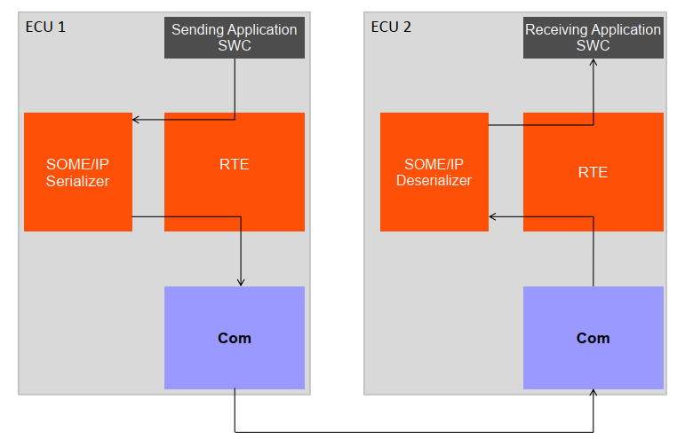

参考资料 (Reference materials)
------------------------------------------

[1] AUTOSAR_SWS_SOMEIPTransformer.pdf，R19-11

[2] AUTOSAR_ASWS_TransformerGeneral.pdf，R19-11

功能描述 (Function Description)
===========================================

数据序列化功能 (Data serialization functionality)
----------------------------------------------------------

数据序列化功能介绍 (Introduction to Data Serialization Functionality)
~~~~~~~~~~~~~~~~~~~~~~~~~~~~~~~~~~~~~~~~~~~~~~~~~~~~~~~~~~~~~~~~~~~~~~~~~~~~

对原始数据进行序列化。

Serialize the original data.

数据序列化功能实现 (Data serialization functionality implementation)
~~~~~~~~~~~~~~~~~~~~~~~~~~~~~~~~~~~~~~~~~~~~~~~~~~~~~~~~~~~~~~~~~~~~~~~~~~~

根据配置工具中对接口（SenderReceiverInterface/ClientServerInterface容器）和数据的描述（配置在DateTypeDescription页面中），SOME/IP Transformer模块会生成对应的序列化函数（根据SomeIpXfConfig配置项的配置生成），用户调用该序列化函数，提供对应的参数，该序列化函数输出序列化后的数据。

Based on the description of interfaces (SenderReceiverInterface/ClientServerInterface containers) and data (configured in the DateTypeDescription page) in the configuration tool, the SOME/IP Transformer module generates corresponding serialization functions (generated based on the configuration of SomeIpXfConfig). The user calls this serialization function and provides the appropriate parameters; the serialization function outputs serialized data.

数据反序列化功能 (Data deserialization function)
--------------------------------------------------------

数据反序列化功能介绍 (Introduction to Data Deserialization Function)
~~~~~~~~~~~~~~~~~~~~~~~~~~~~~~~~~~~~~~~~~~~~~~~~~~~~~~~~~~~~~~~~~~~~~~~~~~

对原始数据进行反序列化。

Deserialize the original data.

数据反序列化功能实现 (Data deserialization functionality implementation)
~~~~~~~~~~~~~~~~~~~~~~~~~~~~~~~~~~~~~~~~~~~~~~~~~~~~~~~~~~~~~~~~~~~~~~~~~~~~~~

根据配置工具中对接口（SenderReceiverInterface/ClientServerInterface容器）和数据的描述（配置在DateTypeDescription页面中），SOME/IP Transformer模块会生成对应的反序列化函数（根据SomeIpXfConfig配置项的配置生成），用户调用该反序列化函数，提供对应的参数，该反序列化函数输出反序列化后的原始数据。

Based on the description of interfaces (SenderReceiverInterface/ClientServerInterface containers) and data (configured in the DateTypeDescription page) through the configuration tool, the SOME/IP Transformer module generates corresponding deserialization functions (based on the configuration of SomeIpXfConfig). Users call these deserialization functions, provide the corresponding parameters, and the deserialization functions output the deserialized raw data.

源文件描述 (Source file description)
===============================================

.. centered:: **表 SomeIpXf组件文件描述 (Table Description of SomeIpXf Component File)**

.. list-table::
   :widths: 50 50
   :header-rows: 1

   * - 文件 (Files)
     - 说明 (Description)
   * - SomeIpXf_Cfg.h
     - 定义SomeIpXf模块预编译时用到的配置参数。 (Define configuration parameters used during pre-compilation of the SomeIpXf module.)
   * - SomeIpXf.c
     - SomeIpXf模块源文件，包含了API函数的实现。 (Source files for SomeIpXf module, contain implementations of API functions.)
   * - SomeIpXf.h
     - SomeIpXf模块头文件，包含了API函数的声明并定义了使用的数据结构。 (SomeIpXf Module Header File, which contains declarations of API functions and defines the data structures used.)
   * - SomeIpXf_MemMap.h
     - SomeIpXf模块函数和变量存储位置定义文件。 (SomeIpXf module function and variable storage location definition file.)

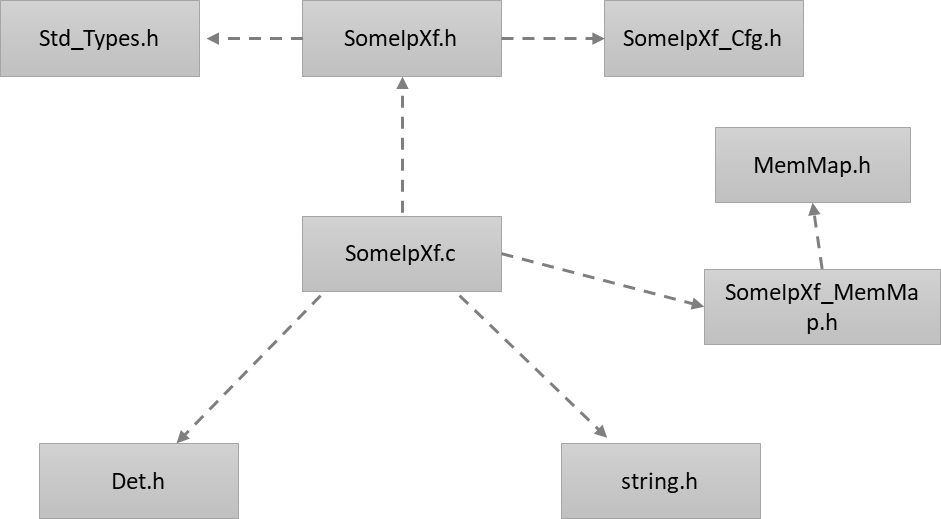

API接口 (API Interface)
=====================================

类型定义 (Type definition)
--------------------------------------

SomeIpXf_ConfigType类型定义 (SomeIpXf_ConfigType Type Definition)
~~~~~~~~~~~~~~~~~~~~~~~~~~~~~~~~~~~~~~~~~~~~~~~~~~~~~~~~~~~~~~~~~~~~~~~~~~~~~

.. list-table::
   :widths: 50 50
   :header-rows: 1

   * - 名称 (Name)
     - SomeIpXf_ConfigType
   * - 类型 (Type)
     - Structure
   * - 范围 (Range)
     - 无
   * - 描述 (Description)
     - SomeIpXf初始化需要用到的数据，当前实现为空。 (The data required for SomeIpXf initialization is currently empty.)

输入函数描述 (Describe the input function:)
-----------------------------------------------------

.. list-table::
   :widths: 50 50
   :header-rows: 1

   * - 输入模块 (Input Module)
     - API
   * - Det
     - Det_ReportError

静态接口函数定义 (Static interface function definition)
---------------------------------------------------------------

SomeIpXf\_<transformerId>函数定义(Sender/Receiver)
~~~~~~~~~~~~~~~~~~~~~~~~~~~~~~~~~~~~~~~~~~~~~~~~~~~~~~~~~~~~~~

.. list-table::
   :widths: 25 25 25 25
   :header-rows: 1

   * - 函数名称： (Function Name:)
     - SomeIpXf\_<transformerId>
     - 
     - 
   * - 函数原型： (Function prototype:)
     - uint8SomeIpXf\_<transformerId>(
     - 
     - 
   * - 
     - uint8\* buffer,
     - 
     - 
   * - 
     - uint16\*bufferLength,
     - 
     - 
   * - 
     - const <type>\*dataElement
     - 
     - 
   * - 
     - )
     - 
     - 
   * - 服务编号： (Service Number:)
     - 0x03
     - 
     - 
   * - 同步/异步： (Synchronous/asynchronous:)
     - 同步 (Sync)
     - 
     - 
   * - 是否可重入： (Is Reentrant:)
     - 可重入 (Reentrant)
     - 
     - 
   * - 输入参数： (Input parameters:)
     - dataElement
     - 值域： (Domain:)
     - 无
   * - 输入输出参数： (Input Output Parameters:)
     - 无
     - 
     - 
   * - 输出参数： (Output Parameters:)
     - buffer
     - 值域： (Domain:)
     - 无
   * - 
     - bufferLength
     - 值域： (Domain:)
     - 无
   * - 返回值： (Return Value:)
     - uint8
     - 0x00(E_OK):序列化成功
     - 
   * - 
     - 
     - 0x81(E_SER_GENERIC_ERROR):出现错误
     - 
   * - 功能概述： (Function Overview:)
     - 该函数为Sender/Receiver类型的序列化函数，它将dataelement作为输入，输出一个uint8类型的数组其中包含序列化后的数据。序列化后的数据长度由序列化函数计算，并输出在bufferLength参数中。该值可能比输出buffer的长度小。 (This function is a serialization function for Sender/Receiver types, taking dataelement as input and outputting an array of uint8 containing serialized data. The length of the serialized data is calculated by the serialization function and output in the bufferLength parameter. This value may be smaller than the length of the output buffer.)
     - 
     - 

SomeIpXf\_<transformerId>函数定义(Client/Server)
~~~~~~~~~~~~~~~~~~~~~~~~~~~~~~~~~~~~~~~~~~~~~~~~~~~~~~~~~~~~

.. list-table::
   :widths: 25 25 25 25
   :header-rows: 1

   * - 函数名称： (Function Name:)
     - SomeIpXf\_<transformerId>
     - 
     - 
   * - 函数原型： (Function prototype:)
     - uint8SomeIpXf\_<transformerId>(
     - 
     - 
   * - 
     - constRte_Cs_TransactionHandleType\*TransactionHandle,
     - 
     - 
   * - 
     - uint8\* buffer,
     - 
     - 
   * - 
     - uint16\*bufferLength,
     - 
     - 
   * - 
     - [Std_ReturnTypereturnValue,]
     - 
     - 
   * - 
     - <type> data_1,...
     - 
     - 
   * - 
     - <type> data_n
     - 
     - 
   * - 
     - )
     - 
     - 
   * - 服务编号： (Service Number:)
     - 0x03
     - 
     - 
   * - 同步/异步： (Synchronous/asynchronous:)
     - 同步 (Sync)
     - 
     - 
   * - 是否可重入： (Is Reentrant:)
     - 可重入 (Reentrant)
     - 
     - 
   * - 输入参数： (Input parameters:)
     - TransactionHandle
     - 值域： (Domain:)
     - 无
   * - 
     - returnValue
     - 值域： (Domain:)
     - STD_ON / STD_OFF
   * - 
     - data_1
     - 值域： (Domain:)
     - 无
   * - 
     - data_n
     - 值域： (Domain:)
     - 无
   * - 输入输出参数： (Input Output Parameters:)
     - NONE
     - 
     - 
   * - 输出参数： (Output Parameters:)
     - buffer
     - 值域： (Domain:)
     - 无
   * - 
     - bufferLength
     - 值域： (Domain:)
     - 无
   * - 返回值： (Return Value:)
     - uint8
     - 0x00(E_OK):序列化成功
     - 
   * - 
     - 
     - 0x81(E_SER_GENERIC_ERROR):出现错误
     - 
   * - 功能概述： (Function Overview:)
     - 该函数为Client/Server类型的序列化函数，它将dataelement作为输入，输出一个uint8类型的数组其中包含序列化后的数据。序列化后的数据长度由序列化函数计算，并输出在bufferLength参数中。该值可能比输出buffer的长度小。 (This function is a serialization function for Client/Server types, which takes dataelement as input and outputs an array of uint8 containing serialized data. The length of the serialized data is calculated by the serialization function and output in the bufferLength parameter. This value may be smaller than the length of the output buffer.)
     - 
     - 

SomeIpXf\_<transformerId>函数定义(trigger event)
~~~~~~~~~~~~~~~~~~~~~~~~~~~~~~~~~~~~~~~~~~~~~~~~~~~~~~~~~~~~

.. list-table::
   :widths: 25 25 25 25
   :header-rows: 1

   * - 函数名称： (Function Name:)
     - SomeIpXf\_<transformerId>
     - 
     - 
   * - 函数原型： (Function prototype:)
     - uint8SomeIpXf\_<transformerId>(
     - 
     - 
   * - 
     - uint8\* buffer,
     - 
     - 
   * - 
     - uint16\*bufferLength
     - 
     - 
   * - 
     - )
     - 
     - 
   * - 服务编号： (Service Number:)
     - 0x03
     - 
     - 
   * - 同步/异步： (Synchronous/asynchronous:)
     - 同步 (Sync)
     - 
     - 
   * - 是否可重入： (Is Reentrant:)
     - 可重入 (Reentrant)
     - 
     - 
   * - 输入参数： (Input parameters:)
     - 无
     - 
     - 
   * - 输入输出参数： (Input Output Parameters:)
     - 无
     - 
     - 
   * - 输出参数： (Output Parameters:)
     - buffer
     - 值域： (Domain:)
     - 无
   * - 
     - bufferLength
     - 值域： (Domain:)
     - 无
   * - 返回值： (Return Value:)
     - uint8
     - 0x00(E_OK):序列化成功
     - 
   * - 
     - 
     - 0x81(E_SER_GENERIC_ERROR):出现错误
     - 
   * - 功能概述： (Function Overview:)
     - 该函数为triggerevent类型的序列化函数，它将trigger作为输入，输出一个uint8类型的数组其中包含序列化后的数据。序列化后的数据长度由序列化函数计算，并输出在bufferLength参数中。该值可能比输出buffer的长度小。 (This function is a serialization function for triggerevent types, which takes a trigger as input and outputs an array of uint8 containing the serialized data. The length of the serialized data is calculated by the serialization function and output in the bufferLength parameter. This value may be smaller than the length of the output buffer.)
     - 
     - 

SomeIpXf_Inv\_<transformerId>函数定义 (Sender/Receiver)
~~~~~~~~~~~~~~~~~~~~~~~~~~~~~~~~~~~~~~~~~~~~~~~~~~~~~~~~~~~~~~~~~~~

.. list-table::
   :widths: 25 25 25 25
   :header-rows: 1

   * - 函数名称： (Function Name:)
     - SomeIpXf_Inv\_<transformerId>
     - 
     - 
   * - 函数原型： (Function prototype:)
     - uint8SomeIpXf_Inv\_<transformerId>(
     - 
     - 
   * - 
     - constuint8\*buffer,
     - 
     - 
   * - 
     - uint16bufferLength,
     - 
     - 
   * - 
     - <type>\*dataElement
     - 
     - 
   * - 
     - )
     - 
     - 
   * - 服务编号： (Service Number:)
     - 0x04
     - 
     - 
   * - 同步/异步： (Synchronous/asynchronous:)
     - 同步 (Sync)
     - 
     - 
   * - 是否可重入： (Is Reentrant:)
     - 可重入 (Reentrant)
     - 
     - 
   * - 输入参数： (Input parameters:)
     - buffer
     - 值域： (Domain:)
     - 无
   * - 
     - bufferLength
     - 值域： (Domain:)
     - 0 .. 65535
   * - 输入输出参数： (Input Output Parameters:)
     - 无
     - 
     - 
   * - 输出参数： (Output Parameters:)
     - dataElement
     - 值域： (Domain:)
     - 无
   * - 返回值： (Return Value:)
     - uint8
     - 0x00 (E_OK):反序列化成功
     - 
   * - 
     - 
     - 0x81(E_SER_GENERIC_ERROR):出现一个错误
     - 
   * - 
     - 
     - 0x87(E_SER_WRONG_PROTOCOL_VERSION):
     - 
   * - 
     - 
     - 接收端的版本号和发送端不匹配 (The version number of the receiver does not match that of the sender.)
     - 
   * - 
     - 
     - 0x88(E_SER_WRONG_INTERFACE_VERSION):
     - 
   * - 
     - 
     - 接口版本不支持 (Interface version not supported)
     - 
   * - 
     - 
     - 0x89(E_SER_MALFORMED_MESSAGE):
     - 
   * - 
     - 
     - 接收到的消息长度不正确，Xf无法处理 (The length of the received message is incorrect, Xf cannot process.)
     - 
   * - 
     - 
     - 0x8a(E_SER_WRONG_MESSAGE_TYPE):接收到的报文类型不正确
     - 
   * - 功能概述： (Function Overview:)
     - Sender/Receiver通信的反序列化函数，用于反序列化SOME/IP。该函数接受一个包含序列化数据的uint8类型的数组作为输入，输出原始数据到RTE。 (The deserialization function for Sender/Receiver communication, used for deserializing SOME/IP. This function accepts an input array of uint8 containing serialized data and outputs the original data to RTE.)
     - 
     - 

SomeIpXf_Inv\_<transformerId>函数定义 (Client/Server)
~~~~~~~~~~~~~~~~~~~~~~~~~~~~~~~~~~~~~~~~~~~~~~~~~~~~~~~~~~~~~~~~~

.. list-table::
   :widths: 25 25 25 25
   :header-rows: 1

   * - 函数名称： (Function Name:)
     - SomeIpXf_Inv\_<transformerId>
     - 
     - 
   * - 函数原型： (Function prototype:)
     - uint8SomeIpXf_Inv\_<transformerId>(
     - 
     - 
   * - 
     - Rte_Cs_TransactionHandleType\*TransactionHandle,
     - 
     - 
   * - 
     - constuint8\*buffer,
     - 
     - 
   * - 
     - uint16bufferLength,
     - 
     - 
   * - 
     - [Std_ReturnType\*returnValue,]
     - 
     - 
   * - 
     - [<type>\*data_1,] ...
     - 
     - 
   * - 
     - [<type>\*data_n]
     - 
     - 
   * - 
     - )
     - 
     - 
   * - 服务编号： (Service Number:)
     - 0x04
     - 
     - 
   * - 同步/异步： (Synchronous/asynchronous:)
     - 同步 (Sync)
     - 
     - 
   * - 是否可重入： (Is Reentrant:)
     - 可重入 (Reentrant)
     - 
     - 
   * - 输入参数： (Input parameters:)
     - buffer
     - 值域： (Domain:)
     - 无
   * - 
     - bufferLength
     - 值域： (Domain:)
     - 0 .. 65535
   * - 输入输出参数： (Input Output Parameters:)
     - 无
     - 
     - 
   * - 输出参数： (Output Parameters:)
     - TransactionHandle
     - 值域： (Domain:)
     - 无
   * - 
     - returnValue
     - 值域： (Domain:)
     - 无
   * - 
     - data_1
     - 值域： (Domain:)
     - 无
   * - 
     - data_n
     - 值域： (Domain:)
     - 无
   * - 返回值： (Return Value:)
     - uint8
     - 0x00 (E_OK):反序列化成功
     - 
   * - 
     - 
     - 0x81(E_SER_GENERIC_ERROR):出现一个错误
     - 
   * - 
     - 
     - 0x87(E_SER_WRONG_PROTOCOL_VERSION):
     - 
   * - 
     - 
     - 接收端的版本号和发送端不匹配 (The version number of the receiver does not match that of the sender.)
     - 
   * - 
     - 
     - 0x88(E_SER_WRONG_INTERFACE_VERSION):
     - 
   * - 
     - 
     - 接口版本不支持 (Interface version not supported)
     - 
   * - 
     - 
     - 0x89(E_SER_MALFORMED_MESSAGE):
     - 
   * - 
     - 
     - 接收到的消息长度不正确，Xf无法处理 (The length of the received message is incorrect, Xf cannot process.)
     - 
   * - 
     - 
     - 0x8a(E_SER_WRONG_MESSAGE_TYPE):接收到的报文类型不正确
     - 
   * - 功能概述： (Function Overview:)
     - Client/Server通信的反序列化函数，用于反序列化SOME/IP。该函数接受一个包含序列化数据的uint8类型的数组作为输入，输出原始数据到RTE。 (Deserialization function for Client/Server communication to deserialize SOME/IP. The function takes an input array of uint8 containing serialized data and outputs the original data to RTE.)
     - 
     - 

SomeIpXf_Inv\_<transformerId>函数定义 (trigger event)
~~~~~~~~~~~~~~~~~~~~~~~~~~~~~~~~~~~~~~~~~~~~~~~~~~~~~~~~~~~~~~~~~

.. list-table::
   :widths: 25 25 25 25
   :header-rows: 1

   * - 函数名称： (Function Name:)
     - SomeIpXf_Inv\_<transformerId>
     - 
     - 
   * - 函数原型： (Function prototype:)
     - uint8SomeIpXf_Inv\_<transformerId>(
     - 
     - 
   * - 
     - constuint8\*buffer,
     - 
     - 
   * - 
     - uint16bufferLength
     - 
     - 
   * - 
     - )
     - 
     - 
   * - 服务编号： (Service Number:)
     - 0x04
     - 
     - 
   * - 同步/异步： (Synchronous/asynchronous:)
     - 同步 (Sync)
     - 
     - 
   * - 是否可重入： (Is Reentrant:)
     - 可重入 (Reentrant)
     - 
     - 
   * - 输入参数： (Input parameters:)
     - buffer
     - 值域： (Domain:)
     - 无
   * - 
     - bufferLength
     - 值域： (Domain:)
     - 0 .. 65535
   * - 输入输出参数： (Input Output Parameters:)
     - 无
     - 
     - 
   * - 输出参数： (Output Parameters:)
     - 无
     - 
     - 
   * - 返回值： (Return Value:)
     - uint8
     - 0x00 (E_OK):反序列化成功
     - 
   * - 
     - 
     - 0x81(E_SER_GENERIC_ERROR):出现一个错误
     - 
   * - 
     - 
     - 0x87(E_SER_WRONG_PROTOCOL_VERSION):
     - 
   * - 
     - 
     - 接收端的版本号和发送端不匹配 (The version number of the receiver does not match that of the sender.)
     - 
   * - 
     - 
     - 0x88(E_SER_WRONG_INTERFACE_VERSION):
     - 
   * - 
     - 
     - 接口版本不支持 (Interface version not supported)
     - 
   * - 
     - 
     - 0x89(E_SER_MALFORMED_MESSAGE):
     - 
   * - 
     - 
     - 接收到的消息长度不正确，Xf无法处理 (The length of the received message is incorrect, Xf cannot process.)
     - 
   * - 
     - 
     - 0x8a(E_SER_WRONG_MESSAGE_TYPE):接收到的报文类型不正确
     - 
   * - 功能概述： (Function Overview:)
     - TriggerEvent通信的反序列化函数，用于反序列化SOME/IP。该函数接受一个包含序列化数据的uint8类型的数组作为输入，输出原始数据到RTE。 (The deserialization function for TriggerEvent communication, used for deserializing SOME/IP. This function accepts an input array of uint8 containing serialized data and outputs the original data to RTE.)
     - 
     - 

SomeIpXf_Init函数定义 (The SomeIpXf_Init function definition)
~~~~~~~~~~~~~~~~~~~~~~~~~~~~~~~~~~~~~~~~~~~~~~~~~~~~~~~~~~~~~~~~~~~~~~~~~

.. list-table::
   :widths: 25 25 25 25
   :header-rows: 1

   * - 函数名称： (Function Name:)
     - SomeIpXf_Init
     - 
     - 
   * - 函数原型： (Function prototype:)
     - voidSomeIpXf_Init(
     - 
     - 
   * - 
     - constSomeIpXf_ConfigType\*config
     - 
     - 
   * - 
     - )
     - 
     - 
   * - 服务编号： (Service Number:)
     - 0x01
     - 
     - 
   * - 同步/异步： (Synchronous/asynchronous:)
     - 同步 (Sync)
     - 
     - 
   * - 是否可重入： (Is Reentrant:)
     - 不可重入 (Non-reentrant)
     - 
     - 
   * - 输入参数： (Input parameters:)
     - config
     - 值域： (Domain:)
     - 无
   * - 输入输出参数： (Input Output Parameters:)
     - 无
     - 
     - 
   * - 输出参数： (Output Parameters:)
     - 无
     - 
     - 
   * - 返回值： (Return Value:)
     - 无
     - 
     - 
   * - 功能概述： (Function Overview:)
     - 初始化SomeIpXf模块。 (Initialize SomeIpXf module.)
     - 
     - 

SomeIpXf_DeInit函数定义 (SomeIpXf_DeInit function definition)
~~~~~~~~~~~~~~~~~~~~~~~~~~~~~~~~~~~~~~~~~~~~~~~~~~~~~~~~~~~~~~~~~~~~~~~~~

.. list-table::
   :widths: 50 50
   :header-rows: 1

   * - 函数名称： (Function Name:)
     - SomeIpXf_DeInit
   * - 函数原型： (Function prototype:)
     - void SomeIpXf_DeInit(
   * - 
     - void
   * - 
     - )
   * - 服务编号： (Service Number:)
     - 0x02
   * - 同步/异步： (Synchronous/asynchronous:)
     - 同步 (Sync)
   * - 是否可重入： (Is Reentrant:)
     - 不可重入 (Non-reentrant)
   * - 输入参数： (Input parameters:)
     - 无
   * - 输入输出参数： (Input Output Parameters:)
     - 无
   * - 输出参数： (Output Parameters:)
     - 无
   * - 返回值： (Return Value:)
     - 无
   * - 功能概述： (Function Overview:)
     - 反初始化SomeIpXf模块。 (Uninitialize SomeIpXf module.)

SomeIpXf_GetVersionInfo函数定义 (The SomeIpXf_GetVersionInfo function definition)
~~~~~~~~~~~~~~~~~~~~~~~~~~~~~~~~~~~~~~~~~~~~~~~~~~~~~~~~~~~~~~~~~~~~~~~~~~~~~~~~~~~~~~~~~~~~~

.. list-table::
   :widths: 25 25 25 25
   :header-rows: 1

   * - 函数名称： (Function Name:)
     - SomeIpXf_GetVersionInfo
     - 
     - 
   * - 函数原型： (Function prototype:)
     - voidSomeIpXf_GetVersionInfo(
     - 
     - 
   * - 
     - Std_VersionInfoType\*VersionInfo
     - 
     - 
   * - 
     - )
     - 
     - 
   * - 服务编号： (Service Number:)
     - 0x00
     - 
     - 
   * - 同步/异步： (Synchronous/asynchronous:)
     - 同步 (Sync)
     - 
     - 
   * - 是否可重入： (Is Reentrant:)
     - 可重入 (Reentrant)
     - 
     - 
   * - 输入参数： (Input parameters:)
     - 无
     - 
     - 
   * - 输入输出参数： (Input Output Parameters:)
     - 无
     - 
     - 
   * - 输出参数： (Output Parameters:)
     - VersionInfo
     - 值域： (Domain:)
     - 无
   * - 返回值： (Return Value:)
     - 无
     - 
     - 
   * - 功能概述： (Function Overview:)
     - 获取SomeIpXf模块的版本号 (Get the version number of SomeIpXf module)
     - 
     - 

可配置函数定义 (Configurable Function Definition)
----------------------------------------------------------

无。

None.

配置 (Configure)
==============================

TransformationSet
---------------------------------

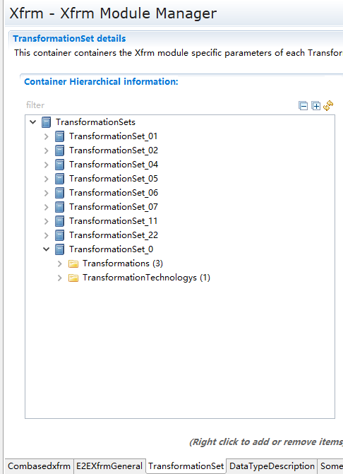

.. centered:: **表 TransformationSet容器属性描述 (Table TransformationSet Container Properties Description)**

.. list-table::
   :widths: 20 20 20 20 20
   :header-rows: 1

   * - UI名称 (UI Name)
     - 描述 (Description)
     - 
     - 
     - 
   * - Transformations
     - 取值范围 (Range)
     - 无
     - 默认取值 (Default value)
     - 无
   * - 
     - 参数描述 (Parameter Description)
     - 该容器用于定义Transformer对象 (This container is used to define Transformer objects)
     - 
     - 
   * - 
     - 依赖关系 (Dependencies)
     - 无
     - 
     - 
   * - TransformationTechnologys
     - 取值范围 (Range)
     - 无
     - 默认取值 (Default value)
     - 无
   * - 
     - 参数描述 (Parameter Description)
     - 该容器用于定义TransformationTechnology对象 (This container is used to define TransformationTechnology objects)
     - 
     - 
   * - 
     - 依赖关系 (Dependencies)
     - 无
     - 
     - 

Transformation
------------------------------

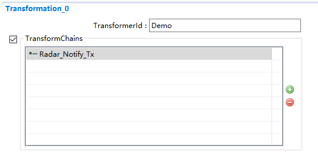

.. centered:: **表 Transformation对象属性描述 (Table Transformation object property description)**

.. list-table::
   :widths: 20 20 20 20 20
   :header-rows: 1

   * - UI名称 (UI Name)
     - 描述 (Description)
     - 
     - 
     - 
   * - TransformerId
     - 取值范围 (Range)
     - 合法字符串 (Legal String)
     - 默认取值 (Default value)
     - 无
   * - 
     - 参数描述 (Parameter Description)
     - TransformerId，用做序列化函数或者反序列化函数名 (TransformerId, used as the name for serialization functions or deserialization functions)
     - 
     - 
   * - 
     - 依赖关系 (Dependencies)
     - 无
     - 
     - 
   * - TransformationChain
     - 取值范围 (Range)
     - 引用到ComXfTransformer/E2Etransformer/SomeIpXfTransformer (Reference to ComXfTransformer/E2Etransformer/SomeIpXfTransformer)
     - 默认取值 (Default value)
     - 无
   * - 
     - 参数描述 (Parameter Description)
     - 引用到ComXfTransformer/E2Etransformer/SomeIpXfTransformer用于生成TransfomerChain (Use ComXfTransformer/E2Etransformer/SomeIpXfTransformer to generate TransformerChain)
     - 
     - 
   * - 
     - 
     - （单独生成一个SomeIpXf的序列化或者反序列化函数也需要配置一个TransformerChain，在TransformerChain中引用到SomeIpXfTransformer，否则无法生成序列化函数） ((Preserving a SomeIpXf serialization or deserialization function also requires configuring a TransformerChain, in which SomeIpXfTransformer needs to be referenced; otherwise, the serialization function cannot be generated))
     - 
     - 
   * - 
     - 依赖关系 (Dependencies)
     - 无
     - 
     - 

TransformationTechnology
----------------------------------------

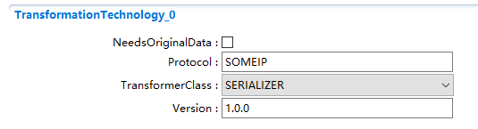

.. centered:: **表 TransformationTechnology容器属性描述 (Table TransformationTechnology Container Properties Description)**

.. list-table::
   :widths: 20 20 20 20 20
   :header-rows: 1

   * - UI名称 (UI Name)
     - 描述 (Description)
     - 
     - 
     - 
   * - NeedsOriginalData
     - 取值范围 (Range)
     - ON / OFF
     - 默认取值 (Default value)
     - OFF
   * - 
     - 参数描述 (Parameter Description)
     - 表示transformer是否需要访问SWC的原始数据。 (Indicate whether the transformer needs access to the original SWC data.)
     - 
     - 
   * - 
     - 依赖关系 (Dependencies)
     - 无
     - 
     - 
   * - Protocol
     - 取值范围 (Range)
     - 合法字符串 (Legal String)
     - 默认取值 (Default value)
     - E2E
   * - 
     - 参数描述 (Parameter Description)
     - 表示该transformer实现的协议 (Show the protocol implemented by this transformer)
     - 
     - 
   * - 
     - 依赖关系 (Dependencies)
     - 无
     - 
     - 
   * - TransformerClass
     - 取值范围 (Range)
     - CUSTOM /SAFETY /
     - 默认取值 (Default value)
     - SAFETY
   * - 
     - 
     - SECURITY /
     - 
     - 
   * - 
     - 
     - SERIALIZER
     - 
     - 
   * - 
     - 参数描述 (Parameter Description)
     - 表示该transformer的类型 (Indicate the type of transformer)
     - 
     - 
   * - 
     - 依赖关系 (Dependencies)
     - 无
     - 
     - 
   * - Version
     - 取值范围 (Range)
     - Int
     - 默认取值 (Default value)
     - 1
   * - 
     - 参数描述 (Parameter Description)
     - 实现的协议版本号 (Version number of implemented protocol)
     - 
     - 
   * - 
     - 依赖关系 (Dependencies)
     - 无
     - 
     - 
   * - SOMEIPTransformationDescription
     - 取值范围 (Range)
     - 无
     - 默认取值 (Default value)
     - 无
   * - 
     - 参数描述 (Parameter Description)
     - 该容器定义和transformer相关的属性 (This container defines and transforms related properties.)
     - 
     - 
   * - 
     - 依赖关系 (Dependencies)
     - 无
     - 
     - 

SOMEIPTransformationDescription
-----------------------------------------------

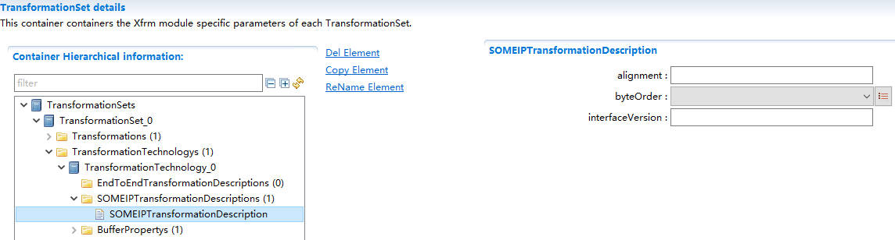

.. centered:: **表 SOMEIPTransformationDescription容器属性描述 (Table SOMEIPTransformationDescription Container Property Description)**

.. list-table::
   :widths: 20 20 20 20 20
   :header-rows: 1

   * - UI名称 (UI Name)
     - 描述 (Description)
     - 
     - 
     - 
   * - alignment
     - 取值范围 (Range)
     - 1 .. 65535
     - 默认取值 (Default value)
     - 无
   * - 
     - 参数描述 (Parameter Description)
     - 表示动态长度的数据的对其字节数 (Align bytes for data of dynamic length)
     - 
     - 
   * - 
     - 依赖关系 (Dependencies)
     - 无
     - 
     - 
   * - byteOrder
     - 取值范围 (Range)
     - mostSignificantByteFirst/mostSignificantByteLast
     - 默认取值 (Default value)
     - mostSignificantByteFirst
   * - 
     - 
     - /opaque
     - 
     - 
   * - 
     - 参数描述 (Parameter Description)
     - 表示transformer的字节序 (Byte order of transformer)
     - 
     - 
   * - 
     - 依赖关系 (Dependencies)
     - 无
     - 
     - 
   * - interfaceVersion
     - 取值范围 (Range)
     - 1 .. 65535
     - 默认取值 (Default value)
     - 无
   * - 
     - 参数描述 (Parameter Description)
     - 版本号 (Version Number)
     - 
     - 
   * - 
     - 依赖关系 (Dependencies)
     - 无
     - 
     - 

DataTypeDescription
-----------------------------------

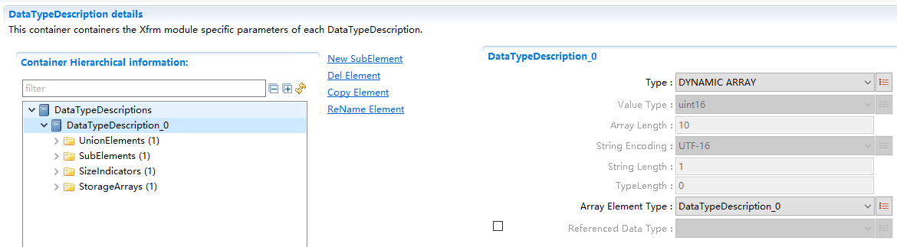

.. centered:: **表 DataTypeDescription容器属性描述 (Table DataTypeDescription Container Properties Description)**

.. list-table::
   :widths: 20 20 20 20 20
   :header-rows: 1

   * - UI名称 (UI Name)
     - 描述 (Description)
     - 
     - 
     - 
   * - Type
     - 取值范围 (Range)
     - VALUE（基本类型） (VALUE（Basic Type）)
     - 默认取值 (Default value)
     - 无
   * - 
     - 
     - ARRAY （定长数组） (ARRAY (Fixed-Length Array))
     - 
     - 
   * - 
     - 
     - DYNAMIC ARRAY（动态长度数组） (DYNAMIC ARRAY（Dynamic Length Array）)
     - 
     - 
   * - 
     - 
     - STRING （定长字符串） (STRING (Fixed-Length String))
     - 
     - 
   * - 
     - 
     - DYNAMIC STRING（动态长度字符串） (DYNAMIC STRING（Dynamic Length String）)
     - 
     - 
   * - 
     - 
     - STRUCT （结构体） (STRUCT (Structure))
     - 
     - 
   * - 
     - 
     - UNION （联合体） (UNION （Union）)
     - 
     - 
   * - 
     - 参数描述 (Parameter Description)
     - 定义所描述的数据的类型 (Define the type of data described)
     - 
     - 
   * - 
     - 依赖关系 (Dependencies)
     - 1.
     - 
     - 
   * - 
     - 
     - Type参数设置为DYNAMICSTRING和DYNAMICARRAY时，StorageArrays容器中必须配置StorageArray对象 (When the Type parameter is set to DYNAMICSTRING or DYNAMICARRAY, StorageArrays container must configure StorageArray objects.)
     - 
     - 
   * - 
     - 
     - 2. Type参数设置为UNION时，UnionElements容器中必须配置UnionElement对象 (When the Type parameter is set to UNION, UnionElements container must be configured with UnionElement objects.)
     - 
     - 
   * - 
     - 
     - 3. Type参数设置为STRUCT时，SubElements容器中必须配置SubElement对象 (When the Type parameter is set to STRUCT, SubElement objects must be configured in the SubElements container.)
     - 
     - 
   * - ValueType
     - 取值范围 (Range)
     - booleanuint8
     - 默认取值 (Default value)
     - 无
   * - 
     - 
     - uint16
     - 
     - 
   * - 
     - 
     - uint32
     - 
     - 
   * - 
     - 
     - uint64
     - 
     - 
   * - 
     - 
     - sint8
     - 
     - 
   * - 
     - 
     - sint16
     - 
     - 
   * - 
     - 
     - sint32
     - 
     - 
   * - 
     - 
     - sint64
     - 
     - 
   * - 
     - 
     - float32
     - 
     - 
   * - 
     - 参数描述 (Parameter Description)
     - 表示所定义的基本数据类型的类型 (Indicate the type of the defined basic data type)
     - 
     - 
   * - 
     - 依赖关系 (Dependencies)
     - 仅在Type=Value时可以配置 (Only configure when Type=Value.)
     - 
     - 
   * - ArrayLength
     - 取值范围 (Range)
     - 1 .. 65535
     - 默认取值 (Default value)
     - 无
   * - 
     - 参数描述 (Parameter Description)
     - 表示数组的长度 (Represent the length of an array)
     - 
     - 
   * - 
     - 依赖关系 (Dependencies)
     - 仅在Type=Array时可以配置 (Only configure when Type=Array.)
     - 
     - 
   * - StringEncoding
     - 取值范围 (Range)
     - UTF-8 / UTF-16
     - 默认取值 (Default value)
     - UTF-8
   * - 
     - 参数描述 (Parameter Description)
     - 表示字符串的编码方式 (Encoding of string representation)
     - 
     - 
   * - 
     - 依赖关系 (Dependencies)
     - 仅在Type=STRING /DYNAMICARRAY时可以配置 (Only configure when Type=STRING/DYNAMICARRAY.)
     - 
     - 
   * - StringLength
     - 取值范围 (Range)
     - 1 .. 65535
     - 默认取值 (Default value)
     - 无
   * - 
     - 参数描述 (Parameter Description)
     - 表示字符串的长度 (Represent the length of a string)
     - 
     - 
   * - 
     - 依赖关系 (Dependencies)
     - 仅在Type=STRING时可以配置 (Only configure when Type=STRING.)
     - 
     - 
   * - TypeLength
     - 取值范围 (Range)
     - 0 .. 8
     - 默认取值 (Default value)
     - 0
   * - 
     - 参数描述 (Parameter Description)
     - 静态类型的数据类型长度，自动计算 (Static type data type length calculated automatically)
     - 
     - 
   * - 
     - 依赖关系 (Dependencies)
     - 当Type=VALUE，根据ValueType的值会计算； (When Type=VALUE, it calculates based on the value of ValueType.)
     - 
     - 
   * - 
     - 
     - 当Type=STRING，根据StringEncoding值计算 (When Type=STRING, calculate based on StringEncoding value)
     - 
     - 
   * - ArrayElementType
     - 取值范围 (Range)
     - 引用到DataTypeDescription (Reference DataType Description)
     - 默认取值 (Default value)
     - 无
   * - 
     - 参数描述 (Parameter Description)
     - 表示数组成员的类型 (Represent the type of array elements)
     - 
     - 
   * - 
     - 依赖关系 (Dependencies)
     - 仅在Type=Array时可以配置 (Only configure when Type=Array.)
     - 
     - 
   * - ReferencedDataType
     - 取值范围 (Range)
     - 引用到DataTypeDescription (Reference DataType Description)
     - 默认取值 (Default value)
     - 无
   * - 
     - 参数描述 (Parameter Description)
     - 表示是哪种类型的指针 (Indicate what type of pointer.)
     - 
     - 
   * - 
     - 依赖关系 (Dependencies)
     - 仅在Type=DATAREFERENCE时可以配置 (Only configurable when Type=DATAREFERENCE.)
     - 
     - 
   * - SubElements
     - 取值范围 (Range)
     - 无
     - 默认取值 (Default value)
     - 无
   * - 
     - 参数描述 (Parameter Description)
     - 表示结构体的子成员 (Display structure submembers)
     - 
     - 
   * - 
     - 依赖关系 (Dependencies)
     - 仅在Type=STRUCT时可以配置 (Only configurable when Type=STRUCT.)
     - 
     - 
   * - SizeIndicators
     - 取值范围 (Range)
     - 无
     - 默认取值 (Default value)
     - 无
   * - 
     - 参数描述 (Parameter Description)
     - 动态长度数组或动态长度字符串表示长度的变量 (Dynamic-length array or dynamic-length string indicates the variable for length.)
     - 
     - 
   * - 
     - 依赖关系 (Dependencies)
     - 仅在Type=DYNAMICARRAY / DYNAMICSTRING时可以配置 (Only configurable when Type=DYNAMICARRAY / DYNAMICSTRING)
     - 
     - 
   * - StorageArrays
     - 取值范围 (Range)
     - 无
     - 默认取值 (Default value)
     - 无
   * - 
     - 参数描述 (Parameter Description)
     - 动态长度数组或动态长度字符串存储数据的数组 (Dynamic length array or dynamic length string for storing data)
     - 
     - 
   * - 
     - 依赖关系 (Dependencies)
     - 仅在Type=DYNAMICARRAY / DYNAMICSTRING时可以配置 (Only configurable when Type=DYNAMICARRAY / DYNAMICSTRING)
     - 
     - 

UnionElement
----------------------------

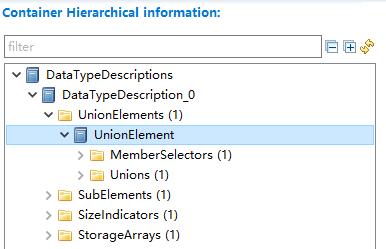

.. centered:: **表 UnionElement容器属性描述 (UnionElement Container Properties Description)**

.. list-table::
   :widths: 20 20 20 20 20
   :header-rows: 1

   * - UI名称 (UI Name)
     - 描述 (Description)
     - 
     - 
     - 
   * - UnionElement
     - 取值范围 (Range)
     - 无
     - 默认取值 (Default value)
     - 无
   * - 
     - 参数描述 (Parameter Description)
     - 表示联合体 (Express consortium)
     - 
     - 
   * - 
     - 依赖关系 (Dependencies)
     - 无
     - 
     - 

MemberSelector
------------------------------

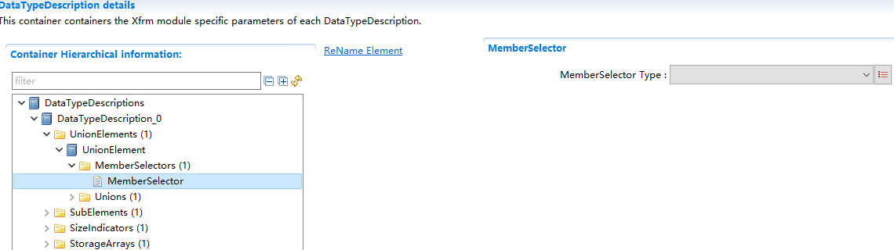

.. centered:: **表 MemberSelector容器属性描述 (Table MemberSelector Container Properties Description)**

.. list-table::
   :widths: 20 20 20 20 20
   :header-rows: 1

   * - UI名称 (UI Name)
     - 描述 (Description)
     - 
     - 
     - 
   * - MemberSelectorType
     - 取值范围 (Range)
     - uint8/uint16/uint32
     - 默认取值 (Default value)
     - 无
   * - 
     - 参数描述 (Parameter Description)
     - 表示共用体的MemberSelector的数据类型 (The data type of MemberSelector for union members)
     - 
     - 
   * - 
     - 依赖关系 (Dependencies)
     - 无
     - 
     - 

UnionMember
---------------------------

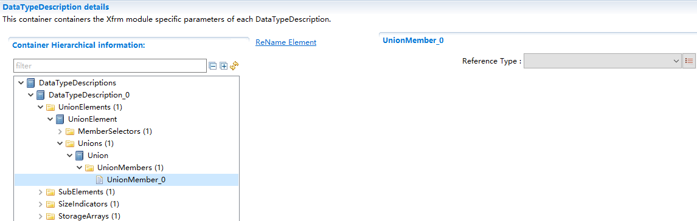

.. centered:: **表 UnionMember容器属性描述 (UnionMember container properties description)**

.. list-table::
   :widths: 20 20 20 20 20
   :header-rows: 1

   * - UI名称 (UI Name)
     - 描述 (Description)
     - 
     - 
     - 
   * - UnionMember
     - 取值范围 (Range)
     - DataTypeDescription中定义的类型 (Types defined in DataTypeDescription)
     - 默认取值 (Default value)
     - 无
   * - 
     - 参数描述 (Parameter Description)
     - 表示联合体中的各成员 (Represent the members of the consortium)
     - 
     - 
   * - 
     - 依赖关系 (Dependencies)
     - 无
     - 
     - 

SubElement
--------------------------

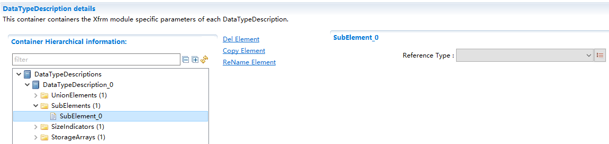

.. centered:: **表 SubElement容器属性描述 (Table Container Properties Description)**

.. list-table::
   :widths: 20 20 20 20 20
   :header-rows: 1

   * - UI名称 (UI Name)
     - 描述 (Description)
     - 
     - 
     - 
   * - ReferenceType
     - 取值范围 (Range)
     - 引用到DataTypeDescription (Reference DataType Description)
     - 默认取值 (Default value)
     - 无
   * - 
     - 参数描述 (Parameter Description)
     - 表示结构体成员的类型 (Represent structure member types)
     - 
     - 
   * - 
     - 依赖关系 (Dependencies)
     - 无
     - 
     - 

SizeIndicator
-----------------------------

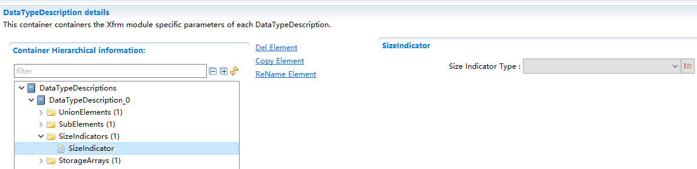

.. centered:: **表 SizeIndicator容器属性描述 (Table: SizeIndicator Container Property Description)**

.. list-table::
   :widths: 20 20 20 20 20
   :header-rows: 1

   * - UI名称 (UI Name)
     - 描述 (Description)
     - 
     - 
     - 
   * - ReferenceType
     - 取值范围 (Range)
     - uint8 / uint16 /uint32
     - 默认取值 (Default value)
     - uint8
   * - 
     - 参数描述 (Parameter Description)
     - 表示存储动态长度数组或动态长度字符串的长度的变量的类型 (The type of variable that stores the length of a dynamic-length array or string)
     - 
     - 
   * - 
     - 依赖关系 (Dependencies)
     - 无
     - 
     - 

StorageArray
----------------------------

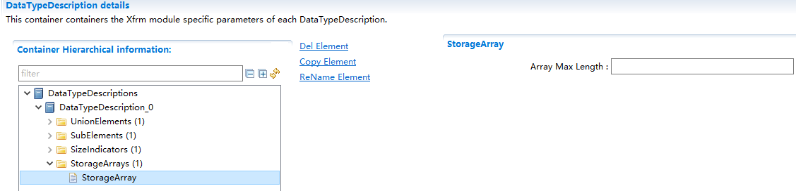

.. centered:: **表 StorageArray容器属性描述 (Table StorageArray Container Properties Description)**

.. list-table::
   :widths: 20 20 20 20 20
   :header-rows: 1

   * - UI名称 (UI Name)
     - 描述 (Description)
     - 
     - 
     - 
   * - ArrayMaxLength
     - 取值范围 (Range)
     - 1 .. 65535
     - 默认取值 (Default value)
     - 无
   * - 
     - 参数描述 (Parameter Description)
     - 表示存储动态长度数组或动态长度字符串的数组的最大长度 (Specify the maximum length for an array that stores dynamic-length arrays or strings.)
     - 
     - 
   * - 
     - 依赖关系 (Dependencies)
     - 无
     - 
     - 

SOMEIPTransformationISignalProps
------------------------------------------------

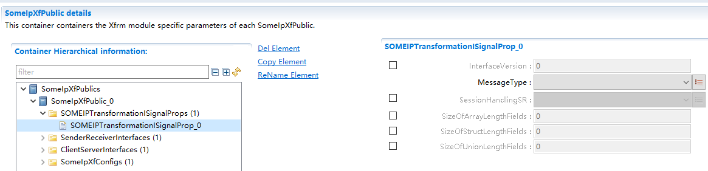

.. centered:: **表 SOMEIPTransformationISignalProp容器属性描述 (Describe Container Properties of SOMEIPTransformationISignalProp)**

.. list-table::
   :widths: 20 20 20 20 20
   :header-rows: 1

   * - UI名称 (UI Name)
     - 描述 (Description)
     - 
     - 
     - 
   * - InterfaceVersion
     - 取值范围 (Range)
     - 0 .. 65535
     - 默认取值 (Default value)
     - 无
   * - 
     - 参数描述 (Parameter Description)
     - 方法的版本号 (Version number of the method)
     - 
     - 
   * - 
     - 依赖关系 (Dependencies)
     - 无
     - 
     - 
   * - MessageType
     - 取值范围 (Range)
     - Error / Notification/ Request /RequestNoReturn /Response
     - 默认取值 (Default value)
     - 无
   * - 
     - 参数描述 (Parameter Description)
     - 表示Header中的消息类型 (Indicate the message type in the Header)
     - 
     - 
   * - 
     - 依赖关系 (Dependencies)
     - 无
     - 
     - 
   * - SessionHandlingSR
     - 取值范围 (Range)
     - SessionHandlingActive/SessionHandlingInactive
     - 默认取值 (Default value)
     - 无
   * - 
     - 参数描述 (Parameter Description)
     - 表示Sender/Receiver通信中的session控制方式 (Indicates the session control method in Sender/Receiver communication)
     - 
     - 
   * - 
     - 依赖关系 (Dependencies)
     - 无
     - 
     - 
   * - SizeOfArrayLengthFields
     - 取值范围 (Range)
     - 0 .. 65535
     - 默认取值 (Default value)
     - 无
   * - 
     - 参数描述 (Parameter Description)
     - 固定长度数组的LengthField占用的字节数 (The number of bytes occupied by the LengthField in a fixed-length array)
     - 
     - 
   * - 
     - 依赖关系 (Dependencies)
     - 无
     - 
     - 
   * - SizeOfStructLengthFields
     - 取值范围 (Range)
     - 0 .. 65535
     - 默认取值 (Default value)
     - 无
   * - 
     - 参数描述 (Parameter Description)
     - 结构体的LengthField占用的字节数 (The number of bytes occupied by the LengthField of a structure)
     - 
     - 
   * - 
     - 依赖关系 (Dependencies)
     - 无
     - 
     - 
   * - SizeOfUnionLengthFields
     - 取值范围 (Range)
     - 0 .. 65535
     - 默认取值 (Default value)
     - 无
   * - 
     - 参数描述 (Parameter Description)
     - 共用体的LengthField占用的字节数 (The number of bytes occupied by the LengthField in a union)
     - 
     - 
   * - 
     - 依赖关系 (Dependencies)
     - 无
     - 
     - 

SenderReceiverInterface
---------------------------------------

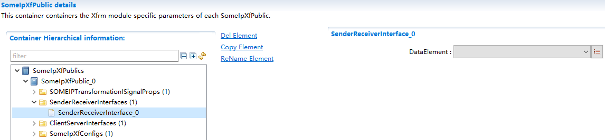

.. centered:: **表 SenderReceiverInterface容器属性描述 (Describe the container properties of the SenderReceiverInterface table)**

.. list-table::
   :widths: 20 20 20 20 20
   :header-rows: 1

   * - UI名称 (UI Name)
     - 描述 (Description)
     - 
     - 
     - 
   * - DataElement
     - 取值范围 (Range)
     - ReferenceDataTypeDescription
     - 默认取值 (Default value)
     - 无
   * - 
     - 参数描述 (Parameter Description)
     - SenderReceiverInterface中的dataElement的类型 (The type of dataElement in SenderReceiverInterface)
     - 
     - 
   * - 
     - 依赖关系 (Dependencies)
     - 无
     - 
     - 

ClientServerInterface
-------------------------------------

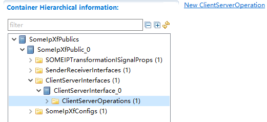

.. centered:: **表 SenderReceiverInterface容器属性描述 (Describe the container properties of the SenderReceiverInterface table)**

.. list-table::
   :widths: 20 20 20 20 20
   :header-rows: 1

   * - UI名称 (UI Name)
     - 描述 (Description)
     - 
     - 
     - 
   * - ClientServerOperation
     - 取值范围 (Range)
     - 无
     - 默认取值 (Default value)
     - 无
   * - 
     - 参数描述 (Parameter Description)
     - 表示一个ClientServerInterface中的Operation (Represent an Operation in a ClientServerInterface)
     - 
     - 
   * - 
     - 依赖关系 (Dependencies)
     - 无
     - 
     - 

ClientServerOperation
-------------------------------------

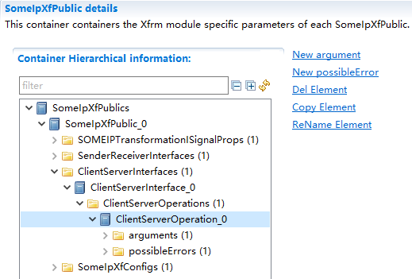

.. centered:: **表 ClientServerOperation容器属性描述 (Describe Container Properties for ClientServerOperation)**

.. list-table::
   :widths: 20 20 20 20 20
   :header-rows: 1

   * - UI名称 (UI Name)
     - 描述 (Description)
     - 
     - 
     - 
   * - arguments
     - 取值范围 (Range)
     - 无
     - 默认取值 (Default value)
     - 无
   * - 
     - 参数描述 (Parameter Description)
     - ClientServerOperation中的参数 (Parameters in ClientServerOperation)
     - 
     - 
   * - 
     - 依赖关系 (Dependencies)
     - 无
     - 
     - 
   * - possibleErrors
     - 取值范围 (Range)
     - 无
     - 默认取值 (Default value)
     - 无
   * - 
     - 参数描述 (Parameter Description)
     - ClientServerOperation中可能的错误 (Possible Errors in ClientServerOperation)
     - 
     - 
   * - 
     - 依赖关系 (Dependencies)
     - 无
     - 
     - 

Arguments
-------------------------

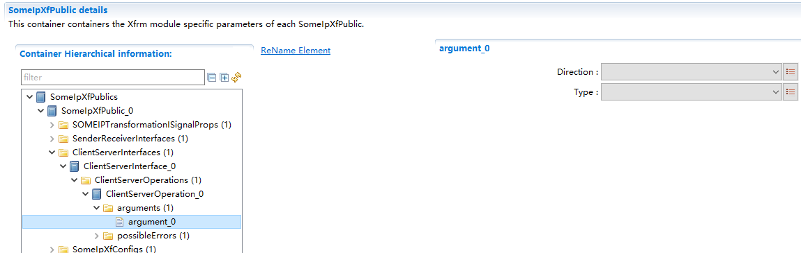

.. centered:: **表 ClientServerOperation容器属性描述 (Describe Container Properties for ClientServerOperation)**

.. list-table::
   :widths: 20 20 20 20 20
   :header-rows: 1

   * - UI名称 (UI Name)
     - 描述 (Description)
     - 
     - 
     - 
   * - Direction
     - 取值范围 (Range)
     - IN / INOUT / OUT
     - 默认取值 (Default value)
     - 无
   * - 
     - 参数描述 (Parameter Description)
     - 定义参数的输入输出方向 (Define the input and output direction of parameters)
     - 
     - 
   * - 
     - 依赖关系 (Dependencies)
     - 无
     - 
     - 
   * - Type
     - 取值范围 (Range)
     - ReferenceDataTypeDescription
     - 默认取值 (Default value)
     - 无
   * - 
     - 参数描述 (Parameter Description)
     - 定义参数的类型. (Define the type of parameters.)
     - 
     - 
   * - 
     - 依赖关系 (Dependencies)
     - 无
     - 
     - 

PossibleErrors
------------------------------

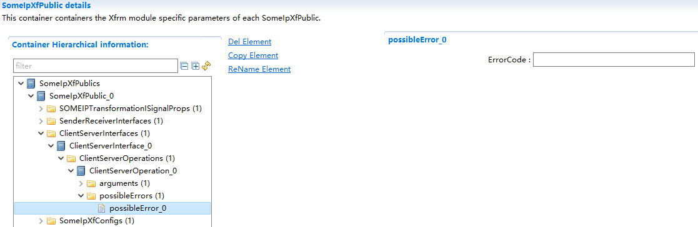

.. centered:: **表 possibleError容器属性描述 (Describe possibleError container properties)**

.. list-table::
   :widths: 20 20 20 20 20
   :header-rows: 1

   * - UI名称 (UI Name)
     - 描述 (Description)
     - 
     - 
     - 
   * - ErrorCode
     - 取值范围 (Range)
     - 0 .. 65535
     - 默认取值 (Default value)
     - 无
   * - 
     - 参数描述 (Parameter Description)
     - 定义可能出现的错误。 (Define potential errors.)
     - 
     - 
   * - 
     - 依赖关系 (Dependencies)
     - 无
     - 
     - 

SomeIpXfConfig
------------------------------

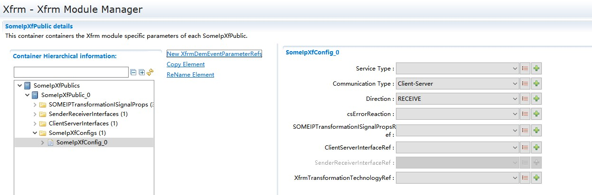

.. centered:: **表 SomeIpXfConfig容器属性描述 (Table SomeIpXfConfig Container Property Description)**

.. list-table::
   :widths: 20 20 20 20 20
   :header-rows: 1

   * - UI名称 (UI Name)
     - 描述 (Description)
     - 
     - 
     - 
   * - ServiceType
     - 取值范围 (Range)
     - Client / Server
     - 默认取值 (Default value)
     - 无
   * - 
     - 参数描述 (Parameter Description)
     - 表示SOMEIPTransformer需要处理的对象是Client还是Server (Indicates that SOMEIPTransformer needs to process objects as either a Client or Server.)
     - 
     - 
   * - 
     - 依赖关系 (Dependencies)
     - 无
     - 
     - 
   * - CommunicationType
     - 取值范围 (Range)
     - Client-Server /Sender-Receiver /Trigger
     - 默认取值 (Default value)
     - 无
   * - 
     - 参数描述 (Parameter Description)
     - 表示SOMEIPTransformer需要处理的对象的通信方式 (Describe the communication method for objects that SOMEIPTransformer needs to process.)
     - 
     - 
   * - 
     - 依赖关系 (Dependencies)
     - 无
     - 
     - 
   * - Direction
     - 取值范围 (Range)
     - RECEIVE / SEND
     - 默认取值 (Default value)
     - 无
   * - 
     - 参数描述 (Parameter Description)
     - 指示发送方向 (Indicate direction of transmission)
     - 
     - 
   * - 
     - 依赖关系 (Dependencies)
     - 无
     - 
     - 
   * - csErrorReaction
     - 取值范围 (Range)
     - autonomous /applicationOnly
     - 默认取值 (Default value)
     - 无
   * - 
     - 参数描述 (Parameter Description)
     - 指示错误处理方式 (Error handling instructions)
     - 
     - 
   * - 
     - 依赖关系 (Dependencies)
     - 无
     - 
     - 
   * - SOMEIPTransformationISignalPropsRef
     - 取值范围 (Range)
     - 引用到本模块定义的SOMEIPTransformationISignalProp (Reference to SOMEIPTransformationISignalProp defined in this module)
     - 默认取值 (Default value)
     - 无
   * - 
     - 参数描述 (Parameter Description)
     - 引用到SOMEIPTransformationISignalProp (Reference SOMEIPTransformationISignalProp)
     - 
     - 
   * - 
     - 依赖关系 (Dependencies)
     - 无
     - 
     - 
   * - ClientServerInterfaceRef
     - 取值范围 (Range)
     - 引用到本模块定义的ClientServerInterface (Refer to the ClientServerInterface defined in this module)
     - 默认取值 (Default value)
     - 无
   * - 
     - 参数描述 (Parameter Description)
     - 引用到ClientServerInterface (Reference ClientServerInterface)
     - 
     - 
   * - 
     - 依赖关系 (Dependencies)
     - Communication Type =Client-Server时可配置 (Communication Type = Client-Server when Configurable)
     - 
     - 
   * - SenderReceiverInterfaceRef
     - 取值范围 (Range)
     - 引用到本模块定义的SenderReceiverInterface (Reference SenderReceiverInterface defined in this module)
     - 默认取值 (Default value)
     - 无
   * - 
     - 参数描述 (Parameter Description)
     - 引用到SenderReceiverInterface (Reference SenderReceiverInterface)
     - 
     - 
   * - 
     - 依赖关系 (Dependencies)
     - Communication Type =Sender-Receiver时可配置 (Communication Type = Sender-Receiver When Configurable)
     - 
     - 
   * - XfrmTransformationTechnologyRef
     - 取值范围 (Range)
     - 引用到Xfrm模块中定义的TransformationTechnology (Reference TransformationTechnology defined in the Xfrm module)
     - 默认取值 (Default value)
     - 无
   * - 
     - 参数描述 (Parameter Description)
     - 引用到TransformationTechnology (Reference Transformation Technology)
     - 
     - 
   * - 
     - 依赖关系 (Dependencies)
     - TransformationTechnology->Protocol为SOMEIP时可在下拉框中选择 (Transform Technology->Protocol as SOMEIP in the drop-down box when applicable)
     - 
     - 
