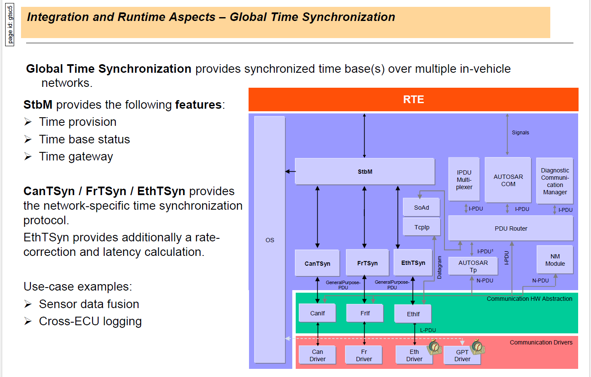
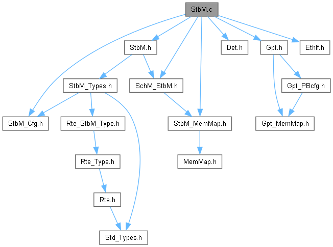
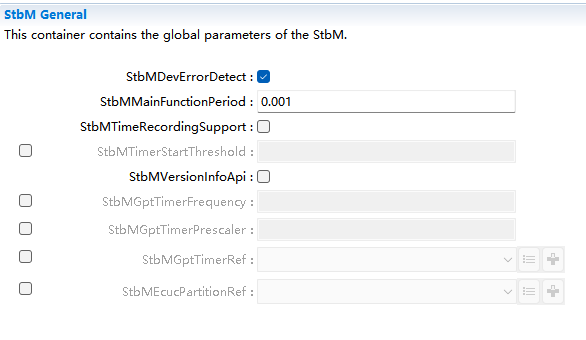
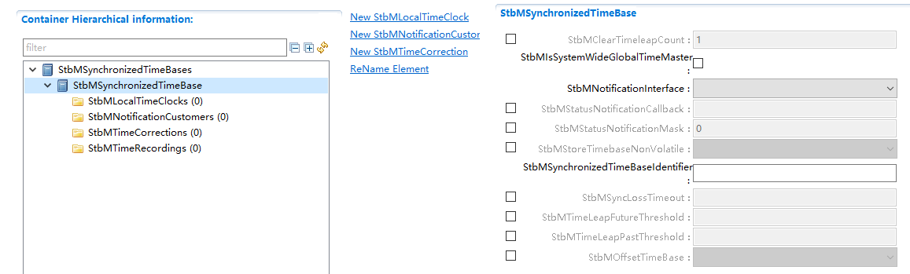
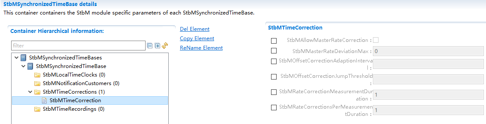
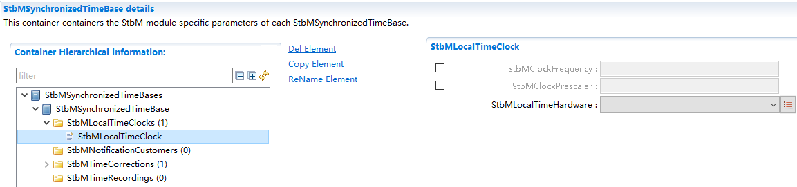
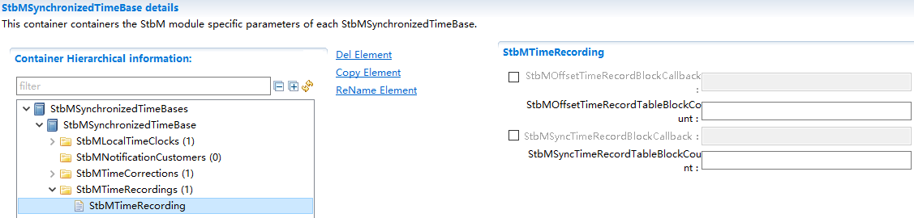
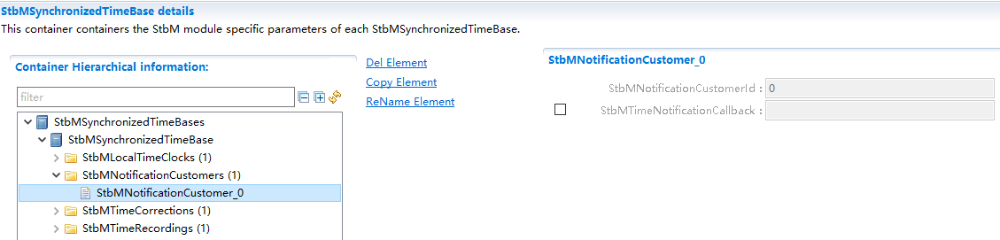
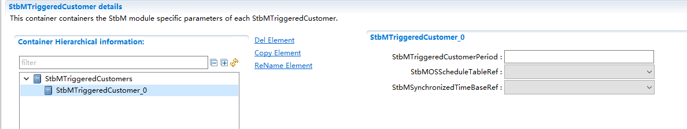

StbM
#################################

:strong:`缩写词注解 (Abbreviation Notes):`

.. list-table::
   :widths: 34 33 33
   :header-rows: 1

   * - 缩写词 (Abbreviation)
     - 解释/描述 (Explanation/Description)
     - 中文解释 (Chinese explanation)
   * - StbM
     - SynchronizedTimeBaseManager
     - 同步时基管理 (Synchronization Timing Management)
   * - <Bus>TSyn
     - A bus specific TimeSynchronization Providermodule
     - 总线特定的时间同步提供程序模块 (Bus-specific time synchronization provider module)
   * - CAN
     - Controller Area Network
     - 控制器区域网络 (Controller Area Network)
   * - ETH
     - Ethernet
     - 以太网 (Ethernet)
   * - CanTSyn
     - Time SynchronizationProvider module for CAN
     - CAN提供的时间同步程序模块 (The CAN-provided time synchronization program module)
   * - EthTSyn
     - Time SynchronizationProvider module forEthernet
     - Eth提供的时间同步程序模块 (The Eth module for time synchronization)

简介 (Introduction)
=================================

StbM在AutoSAR中软件层级架构如下图，其属于时间同步栈。

StbM in AutoSAR has the following software hierarchical architecture as shown in the diagram, and it belongs to the timesync stack.

本文中描述StbM，StbM负责管理时基，给CanTSyn,EthTSyn提供接口用来更新同步时间，给其他用户提供接口用来获取/通知同步时间。

This article describes StbM, which is responsible for managing the timebase and providing interfaces to CanTSyn and EthTSyn for updating synchronization time. It also provides interfaces to other users for getting/noting the synchronization time.

参考资料 (Reference materials)
------------------------------------------

[1] AUTOSAR_SWS_TimeSyncOverCAN.pdf，R19-11

[2] AUTOSAR_SWS_SynchronizedTimeBaseManager.pdf，R19-11

[3] AUTOSAR_EXP_LayeredSoftwareArchitecture.pdf，R19-11

[4] AUTOSAR_SWS_TimeSyncOverEthernet.pdf，R19-11

功能描述 (Function Description)
===========================================

StbM功能 (StbM Function)
--------------------------------------

StbM功能介绍 (StbM Feature Introduction)
====================================================

StbM的主要功能包括两个方面，一是使上层应用间的时间可以同步，二是提供绝对时间值。

The main functions of StbM include two aspects:一是使上层应用间的时间可以同步 is to synchronize time among upper-layer applications, 二是提供绝对时间值 provides absolute time values.

由于不同的硬件时钟，速率可能会有偏差，这将会导致使用不同硬件时钟的应用，各自的时间会有偏差，为了消除这种偏差，StbM会将一个主节点的时间基作为全局的时间基，并将所有其他节点的时间同步到这一节点，以达成时间同步的目的。

Due to different hardware clocks, rates may deviate, which will cause time differences among applications using different hardware clocks. To eliminate this difference, StbM sets one main node's time base as the global time base and synchronizes all other nodes' times to this node to achieve time synchronization.

另外，StbM还包括定时器功能和时间记录功能，定时器功能可以在时间到达用户配置的时间值或时间值来通知用户，时间记录为记录每一次时间的更新，供用户获取。

Additionally, StbM includes timer functions and time recording features. The timer function can notify users when the predefined time value is reached. Time recording keeps a log of each time update for user reference.

StbM功能实现 (StbM Function Implementation)
=======================================================

StbM管理一个主时间组，这个主时基组用来作为其他从节点时间同步的基准，主时间组由TG和TV组成，TG是全局时间，TV是虚拟本地时间，TG的来源为总线同步模块设置的时间和当前的TV通过时间校正计算而得出的时间，TV的来源是本地的硬件时钟，包括GPT,OS和EthTSyn三种。

StbM manages a master time group, which serves as the reference for time synchronization of other slave nodes. The master time group consists of TG and TV, where TG is the global time and TV is the virtual local time. TG's source is the time set by the bus synchronization module and the time calculated through time correction from the current TV. TV's source is the local hardware clock, which includes GPT, OS, and EthTSyn.

时间校正计算包括偏移校正和速率校正，偏移校正包括跳跃校正和速率适应。

Time correction calculations include offset correction and rate correction, with offset correction including jump correction and rate adaptation.

速率校正，在单位时间不停计算时间差，以得出不同时钟间的速率偏差。

Rate correction involves continuously calculating time differences within a unit of time to determine the rate deviations between different clocks.

偏移校正是根据本地的时间，速率的偏差以及接受到的时间计算得出的时间来覆盖主时间组。表示成公式为TL = TGSync + (TV - TVSync) \* r。

Offset correction is calculated based on the local time, rate deviation, and received time to cover the main time group. Expressed as a formula: TL = TGSync + (TV - TVSync) * r.

其中的跳跃校正为当StbM接收到时间值时，主时间组的值直接更新为接收到的时间。即速率适应的偏移校正，则是在一段时间内逐渐校正调整偏移值。

The jump correction among them is such that when StbM receives a time value, the value of the main time group is directly updated to the received time. That is, the offset correction for rate adaptation is gradually adjusting the offset value over a period of time.

绝对时间值即为同步时基的时间加上偏移时基的时间即为绝对时间值。

Absolute time value is the sum of the synchronization base time and the offset base time.

源文件描述 (Source file description)
===============================================

.. centered:: **表 StbM组件文件描述 (Table StbM Component File Description)**

.. list-table::
   :widths: 50 50
   :header-rows: 1

   * - 文件 (Files)
     - 说明 (Description)
   * - StbM.c
     - StbM模块源文件，包含了API函数的实现。 (Source files for the StbM module, containing the implementation of API functions.)
   * - StbM.h
     - StbM模块头文件，包含了API函数的声明。 (Header file for StbM module, contains declarations of API functions.)
   * - StbM_Types.h
     - StbM模块头文件，包含了内部数据类型定义。 (StbM module header file, contains the definitions of internal data types.)
   * - StbM_MemMap.h
     - StbM模块头文件，包含了内存布局的实现。 (StbM module header file, contains the implementation of memory layout.)
   * - StbM_Cfg.h
     - 定义StbM模块预编译时用到的配置参数。 (Define configuration parameters used during pre-compilation of the StbM module.)
   * - StbM_Cfg.c
     - StbM模块配置生成文件。 (StbM module configuration generation file.)
   * - SchM_StbM.h
     - StbM模块头文件，包含了Main函数的声明。 (Header file for StbM module, contains the declaration of Main function.)
   * - Rte_StbM_Type.h
     - 时间同步模块的头文件。 (Header file for time synchronization module.)

API接口 (API Interface)
=====================================

类型定义 (Type definition)
--------------------------------------

StbM_ConfigType类型定义 (StbM_ConfigType Configuration Type Definition)
===================================================================================

.. list-table::
   :widths: 50 50
   :header-rows: 1

   * - 名称 (Name)
     - StbM_ConfigType
   * - 类型 (Type)
     - Structure
   * - 范围 (Range)
     - --
   * - 描述 (Description)
     - 模块配置类型 (Module Configuration Type)

StbM_SynchronizedTimeBaseType类型定义 (SynchronizationTimeBaseType Type Definition)
===============================================================================================

.. list-table::
   :widths: 50 50
   :header-rows: 1

   * - 名称 (Name)
     - StbM_SynchronizedTimeBaseType
   * - 类型 (Type)
     - uint16
   * - 范围 (Range)
     - 0-15 为同步时基，16-31为偏移时基，32-127为纯本地时基 (0-15 is for synchronization base, 16-31 is for offset base, 32-127 is for pure local base)
   * - 描述 (Description)
     - 表示时基的Id号 (ID number for time base representation)

StbM_TimeBaseStatusType类型定义 (StbM_TimeBaseStatusType Type Definition)
=====================================================================================

.. list-table::
   :widths: 50 50
   :header-rows: 1

   * - 名称 (Name)
     - StbM_TimeBaseStatusType
   * - 类型 (Type)
     - uint8
   * - 范围 (Range)
     - TIMEOUT 0x01
   * - 
     - SYNC_TO_GATEWAY 0x04
   * - 
     - GLOBAL_TIME_BASE 0x08
   * - 
     - TIMELEAP_FUTURE 0x10
   * - 
     - TIMELEAP_PAST 0x20
   * - 描述 (Description)
     - 表示时基状态 (Indicate time-base status)

StbM_TimeStampType类型定义 (STbM_TimeStampType Type Definition)
===========================================================================

.. list-table::
   :widths: 34 33 33
   :header-rows: 1

   * - 名称 (Name)
     - StbM_TimeStampType
     - 
   * - 类型 (Type)
     - Structure
     - 
   * - 成员 (Members)
     - StbM_TimeBaseStatusType::timeBaseStatus
     - 时间基状态 (Time-based state)
   * - 
     - uint32::nanoseconds
     - 纳秒部分 (Nanosecond part)
   * - 
     - uint32::seconds
     - 秒部分低32bit部分 (Low 32-bit part of seconds)
   * - 
     - uint16::secondsHi
     - 秒部分高16bit部分 (Fractional part 16-bit portion)
   * - 描述 (Description)
     - 时间基时间戳数据结构 (Time-based timestamp data structure)
     - 

StbM_TimeDiffType类型定义 (StbM_TimeDiffType Type Definition)
=========================================================================

.. list-table::
   :widths: 50 50
   :header-rows: 1

   * - 名称 (Name)
     - StbM_TimeDiffType
   * - 类型 (Type)
     - sint32
   * - 范围 (Range)
     - -2147483647..2147483647
   * - 描述 (Description)
     - 时间差值 (Time difference)

StbM_RateDeviationType类型定义 (StbM_RateDeviationType Type Definition)
===================================================================================

.. list-table::
   :widths: 50 50
   :header-rows: 1

   * - 名称 (Name)
     - StbM_RateDeviationType
   * - 类型 (Type)
     - sint16
   * - 范围 (Range)
     - -32000..32000
   * - 描述 (Description)
     - 时间比例差异（单位ppm） (Time ratio difference (units ppm))

StbM_UserDataType类型定义 (Type definition for StbM_UserDataType)
=============================================================================

.. list-table::
   :widths: 34 33 33
   :header-rows: 1

   * - 名称 (Name)
     - StbM_UserDataType
     - 
   * - 类型 (Type)
     - Structure
     - 
   * - 成员 (Members)
     - uint8::userDataLength
     - 用户数据长度，范围 0..3 (User data length, range 0..3)
   * - 
     - uint8::userByte0
     - 用户数据 byte 0 (User data byte 0)
   * - 
     - uint8::userByte1
     - 用户数据 byte 1 (User data byte 1)
   * - 
     - uint8::userByte2
     - 用户数据 byte 2 (User data byte 2)
   * - 描述 (Description)
     - 时基对应的用户数据 (Time-base corresponding user data)
     - 

StbM_CustomerIdType类型定义 (StbM_CustomerIdType Type Definition)
=============================================================================

.. list-table::
   :widths: 50 50
   :header-rows: 1

   * - 名称 (Name)
     - StbM_CustomerIdType
   * - 类型 (Type)
     - uint16
   * - 范围 (Range)
     - 0-65535
   * - 描述 (Description)
     - 需要通知的用户ID (User IDs to be notified)

StbM_TimeBaseNotificationType类型定义 (StbM_TimeBaseNotificationType Type Definition)
=================================================================================================

.. list-table::
   :widths: 50 50
   :header-rows: 1

   * - 名称 (Name)
     - StbM_TimeBaseNotificationType
   * - 类型 (Type)
     - uint16
   * - 范围 (Range)
     - EV_GLOBAL_TIME 0x01
   * - 
     - EV_TIMEOUT_OCCURRED 0x02
   * - 
     - EV_TIMEOUT_REMOVED 0x04
   * - 
     - EV_TIMELEAP_FUTURE 0x08
   * - 
     - EV_TIMELEAP_FUTURE_REMOVED 0x10
   * - 
     - EV_TIMELEAP_PAST 0x20
   * - 
     - EV_TIMELEAP_PAST_REMOVED 0x40
   * - 
     - EV_SYNC_TO_SUBDOMAIN 0x80
   * - 
     - EV_SYNC_TO_GLOBAL_MASTER 0x100
   * - 
     - EV_RESYNC 0x0200
   * - 
     - EV_RATECORRECTION 0x0400
   * - 描述 (Description)
     - 表示需要通知用户的状态变化 (Indicate state changes that require notifying the user.)

StbM_SyncRecordTableHeadType类型定义 (StbM_SyncRecordTableHeadType Type Definition)
===============================================================================================

.. list-table::
   :widths: 34 33 33
   :header-rows: 1

   * - 名称 (Name)
     - StbM_SyncRecordTableHeadType
     - 
   * - 类型 (Type)
     - Structure
     - 
   * - 成员 (Members)
     - uint8::SynchronizedTimeDomain
     - 时间域 0..15 (Time Domain 0..15)
   * - 
     - uint32::HWfrequency
     - 硬件频率（Hz）
   * - 
     - uint32::HWprescaler
     - 预分频值 (Pre-divisor value)
   * - 描述 (Description)
     - 同步时间记录的表头 (Header for synchronized time records)
     - 

StbM_SyncRecordTableBlockType类型定义 (StbM_SyncRecordTableBlockType type definition)
=================================================================================================

.. list-table::
   :widths: 34 33 33
   :header-rows: 1

   * - 名称 (Name)
     - StbM_SyncRecordTableBlockType
     - 
   * - 类型 (Type)
     - Structure
     - 
   * - 成员 (Members)
     - uint32::GlbSeconds
     - 与全局时间基同步后的本地时间基秒 (Local time base seconds after synchronization with global time base)
   * - 
     - uint32::GlbNanoSeconds
     - 与全局时间基同步后直接生成本地时间基的纳秒 (Generate local timebase directly in nanoseconds after synchronization with the global timebase.)
   * - 
     - StbM_TimeBaseStatusType::TimeBaseStatus
     - 与全局时间基同步后的本地时间基的时间基础状态 (Time basis status after synchronization with global time base from local time base.)
   * - 
     - uint32::VirtualLocalTimeLow
     - 与全局时间基同步后，最不显著的虚拟本地时间的32位 (After synchronization with global time base, the least significant 32-bit virtual local time)
   * - 
     - StbM_RateDeviationType::RateDeviation
     - 速率偏差测量后直接计算速率偏差 (Measure rate deviation directly after rate measurement.)
   * - 
     - uint32::LocSeconds
     - 在与全局时间基同步之前的本地时间基秒 (Local time base seconds before synchronization with global time base)
   * - 
     - uint32::LocNanoSeconds
     - 在与全局时间基同步之前，本地时间基的纳秒 (Before synchronization with the global time base, the nanoseconds of the local time base)
   * - 
     - uint32::PathDelay
     - 当前传播延迟，单位为纳秒 (Current propagation delay, unit: nanoseconds)
   * - 描述 (Description)
     - 同步时间记录的块结构 (Block structure for synchronized time records)
     - 

StbM_OffsetRecordTableHeadType类型定义 (StbM_OffsetRecordTableHeadType Type Definition)
===================================================================================================

.. list-table::
   :widths: 34 33 33
   :header-rows: 1

   * - 名称 (Name)
     - StbM_OffsetRecordTableHeadType
     - 
   * - 类型 (Type)
     - Structure
     - 
   * - 成员 (Members)
     - uint8::OffsetTimeDomain
     - 时间域16..31 (Time Domain 16..31)
   * - 描述 (Description)
     - 偏移时间记录的表头 (Header for offset time records)
     - 

StbM_OffsetRecordTableBlockType类型定义 (StbM_OffsetRecordTableBlockType Type Definition)
=====================================================================================================

.. list-table::
   :widths: 34 33 33
   :header-rows: 1

   * - 名称 (Name)
     - StbM_OffsetRecordTableBlockType
     - 
   * - 类型 (Type)
     - Structure
     - 
   * - 成员 (Members)
     - uint32 GlbSeconds
     - 偏移时间基数的秒数 (Seconds offset from time base)
   * - 
     - uint32 GlbNanoSeconds
     - 偏移时间基的纳秒 (Offset time base in nanoseconds)
   * - 
     - StbM_TimeBaseStatusTypeTimeBaseStatus
     - 与全局时间基同步后的本地时间基的时间基础状态 (Time basis status after synchronization with global time base from local time base.)
   * - 描述 (Description)
     - 偏移时间记录的块结构 (Block structure for offset time stamps)
     - 

StbM_MasterConfigType类型定义 (StbM_MasterConfigType Type Definition)
=================================================================================

.. list-table::
   :widths: 50 50
   :header-rows: 1

   * - 名称 (Name)
     - StbM_MasterConfigType
   * - 类型 (Type)
     - uint8
   * - 范围 (Range)
     - STBM_SYSTEM_WIDE_MASTER_DISABLED 0x00
   * - 
     - STBM_SYSTEM_WIDE_MASTER_ENABLED 0x01
   * - 描述 (Description)
     - 是否配置为系统主 (Is it configured as the system master?)

输入函数描述 (Describe the input function:)
-----------------------------------------------------

.. list-table::
   :widths: 50 50
   :header-rows: 1

   * - 输入模块 (Input Module)
     - API
   * - EthIf
     - EthIf_GetCurrentTime
   * - OS
     - GetScheduleTableStatus
   * - 
     - SyncScheduleTable
   * - 
     - GetCounterValue
   * - Det
     - Det_ReportError
   * - Gpt
     - Gpt_StartTimer
   * - 
     - Gpt_GetTimeElapsed

静态接口函数定义 (Static interface function definition)
---------------------------------------------------------------

StbM_Init函数定义 (The StbM_Init function definition)
=================================================================

.. list-table::
   :widths: 25 25 25 25
   :header-rows: 1

   * - 函数名称： (Function Name:)
     - StbM_Init
     - 
     - 
   * - 函数原型： (Function prototype:)
     - FUNC(void,STBM_CODE)
     - 
     - 
   * - 
     - StbM_Init(P2CONST(StbM_ConfigType,AUTOMATIC,STBM_APPL_DATA)ConfigPtr)
     - 
     - 
   * - 服务编号： (Service Number:)
     - 0x0
     - 
     - 
   * - 同步/异步： (Synchronous/asynchronous:)
     - 同步 (Sync)
     - 
     - 
   * - 是否可重入： (Is Reentrant:)
     - 否 (No)
     - 
     - 
   * - 输入参数： (Input parameters:)
     - ConfigPtr
     - 值域： (Domain:)
     - 指向选定配置集的指针 (Pointer to the selected configuration set)
   * - 输入输出参数： (Input Output Parameters:)
     - 无
     - 
     - 
   * - 输出参数： (Output Parameters:)
     - 无
     - 
     - 
   * - 返回值： (Return Value:)
     - void
     - 
     - 
   * - 功能概述： (Function Overview:)
     - 初始化此模块 (Initialize this module)
     - 
     - 

StbM_GetVersionInfo函数定义 (The StbM_GetVersionInfo function definition)
=====================================================================================

.. list-table::
   :widths: 34 33 33
   :header-rows: 1

   * - 函数名称： (Function Name:)
     - StbM_GetVersionInfo
     - 
   * - 函数原型： (Function prototype:)
     - FUNC(void,STBM_CODE)
     - 
   * - 
     - StbM_GetVersionInfo(P2VAR(Std_VersionInfoType,AUTOMATIC,STBM_APPL_DATA)versioninfo)
     - 
   * - 服务编号： (Service Number:)
     - 0x05
     - 
   * - 同步/异步： (Synchronous/asynchronous:)
     - 同步 (Sync)
     - 
   * - 是否可重入： (Is Reentrant:)
     - 是 (Is)
     - 
   * - 输入参数： (Input parameters:)
     - 无
     - 
   * - 输入输出参数： (Input Output Parameters:)
     - 无
     - 
   * - 输出参数： (Output Parameters:)
     - versioninfo
     - 指向保存该模块的版本信息的内存位置的指针。 (A pointer to the memory location that stores the version information of the module.)
   * - 返回值： (Return Value:)
     - void
     - 
   * - 功能概述： (Function Overview:)
     - 获取版本号 (Get Version Number)
     - 

StbM_GetCurrentTime函数定义 (The StbM_GetCurrentTime function definition)
=====================================================================================

.. list-table::
   :widths: 25 25 25 25
   :header-rows: 1

   * - 函数名称： (Function Name:)
     - StbM_GetCurrentTime
     - 
     - 
   * - 函数原型： (Function prototype:)
     - FUNC(Std_ReturnType,STBM_CODE)
     - 
     - 
   * - 
     - StbM_GetCurrentTime(
     - 
     - 
   * - 
     - StbM_SynchronizedTimeBaseTypetimeBaseId,
     - 
     - 
   * - 
     - P2VAR(StbM_TimeStampType,AUTOMATIC,STBM_APPL_DATA)timeStamp,
     - 
     - 
   * - 
     - P2VAR(StbM_UserDataType,AUTOMATIC,STBM_APPL_DATA)userData
     - 
     - 
   * - 
     - )
     - 
     - 
   * - 服务编号： (Service Number:)
     - 0x07
     - 
     - 
   * - 同步/异步： (Synchronous/asynchronous:)
     - 同步 (Sync)
     - 
     - 
   * - 是否可重入： (Is Reentrant:)
     - 否 (No)
     - 
     - 
   * - 输入参数： (Input parameters:)
     - timeBaseId
     - 
     - 参考的时间基ID (Reference time base ID)
   * - 输入输出参数： (Input Output Parameters:)
     - 无
     - 
     - 
   * - 输出参数： (Output Parameters:)
     - timeStamp
     - 当前有效的时间戳 (Current valid timestamp)
     - 
   * - 
     - userData
     - 时间基的用户数据 (Time-based user data)
     - 
   * - 返回值： (Return Value:)
     - Std_ReturnType
     - 
     - 
   * - 功能概述： (Function Overview:)
     - 以标准格式返回时间值 (Return time values in standard format)
     - 
     - 
   * - 
     - 注：此接口需在独占区域/中断保护环境下执行，以免获取的时间过期。 (Note: This interface needs to be executed in an exclusive area/interrupt protection environment to avoid expiration of acquired time.)
     - 
     - 

StbM_GetCurrentVirtualLocalTime函数定义 (The StbM_GetCurrentVirtualLocalTime function definition)
=============================================================================================================

.. list-table::
   :widths: 34 33 33
   :header-rows: 1

   * - 函数名称： (Function Name:)
     - StbM_GetCurrentVirtualLocalTime
     - 
   * - 函数原型： (Function prototype:)
     - FUNC(Std_ReturnType,STBM_CODE)
     - 
   * - 
     - StbM_GetCurrentVirtualLocalTime(
     - 
   * - 
     - StbM_SynchronizedTimeBaseTypetimeBaseId,
     - 
   * - 
     - P2VAR(StbM_VirtualLocalTimeType,AUTOMATIC,STBM_APPL_DATA)localTimePtr
     - 
   * - 
     - )
     - 
   * - 服务编号： (Service Number:)
     - 0x1E
     - 
   * - 同步/异步： (Synchronous/asynchronous:)
     - 同步 (Sync)
     - 
   * - 是否可重入： (Is Reentrant:)
     - 否 (No)
     - 
   * - 输入参数： (Input parameters:)
     - timeBaseId
     - 参考的时间基 (Referenced time base)
   * - 输入输出参数： (Input Output Parameters:)
     - 无
     - 
   * - 输出参数： (Output Parameters:)
     - localTimePtr
     - 当前虚拟本地时间值 (Current virtual local time value)
   * - 返回值： (Return Value:)
     - E_OK 成功 (E_OK Success)
     - 
   * - 
     - E_NOT_OK 失败 (E_NOT_OK Failure)
     - 
   * - 功能概述： (Function Overview:)
     - 返回虚拟本地时间 (Return to Virtual Local Time)
     - 

StbM_SetGlobalTime函数定义 (The StbM_SetGlobalTime Function Definition)
===================================================================================

.. list-table::
   :widths: 25 25 25 25
   :header-rows: 1

   * - 函数名称： (Function Name:)
     - StbM_SetGlobalTime
     - 
     - 
   * - 函数原型： (Function prototype:)
     - FUNC(Std_ReturnType,STBM_CODE)
     - 
     - 
   * - 
     - StbM_SetGlobalTime(
     - 
     - 
   * - 
     - StbM_SynchronizedTimeBaseTypetimeBaseId,
     - 
     - 
   * - 
     - P2CONST(StbM_TimeStampType,AUTOMATIC,STBM_APPL_DATA)timeStamp,
     - 
     - 
   * - 
     - P2CONST(StbM_UserDataType,AUTOMATIC,STBM_APPL_DATA)userData
     - 
     - 
   * - 
     - )
     - 
     - 
   * - 服务编号： (Service Number:)
     - 0x0B
     - 
     - 
   * - 同步/异步： (Synchronous/asynchronous:)
     - 同步 (Sync)
     - 
     - 
   * - 是否可重入： (Is Reentrant:)
     - 否 (No)
     - 
     - 
   * - 输入参数： (Input parameters:)
     - timeBaseId
     - 值域： (Domain:)
     - 参考的时间基 (Referenced time base)
   * - 
     - timeStamp
     - 
     - 新的时间戳 (New timestamp)
   * - 
     - userData
     - 
     - 新的用户数据（如果非空） (New user data (if non-empty))
   * - 输入输出参数： (Input Output Parameters:)
     - 无
     - 
     - 
   * - 输出参数： (Output Parameters:)
     - 无
     - 
     - 
   * - 返回值： (Return Value:)
     - E_OK 成功 (E_OK Success)
     - 
     - 
   * - 
     - E_NOT_OK 失败 (E_NOT_OK Failure)
     - 
     - 
   * - 功能概述： (Function Overview:)
     - 客户设置新的全局时间总线需更新 (Customers need to update to set a new global time bus.)
     - 
     - 

StbM_UpdateGlobalTime函数定义 (The StbM_UpdateGlobalTime function definition)
=========================================================================================

.. list-table::
   :widths: 25 25 25 25
   :header-rows: 1

   * - 函数名称： (Function Name:)
     - StbM_UpdateGlobalTime
     - 
     - 
   * - 函数原型： (Function prototype:)
     - FUNC(Std_ReturnType,STBM_CODE)
     - 
     - 
   * - 
     - StbM_UpdateGlobalTime(
     - 
     - 
   * - 
     - StbM_SynchronizedTimeBaseTypetimeBaseId,
     - 
     - 
   * - 
     - P2CONST(StbM_TimeStampType,AUTOMATIC,STBM_APPL_DATA)timeStamp,
     - 
     - 
   * - 
     - P2CONST(StbM_UserDataType,AUTOMATIC,STBM_APPL_DATA)userData
     - 
     - 
   * - 
     - )
     - 
     - 
   * - 服务编号： (Service Number:)
     - 0x10
     - 
     - 
   * - 同步/异步： (Synchronous/asynchronous:)
     - 同步 (Sync)
     - 
     - 
   * - 是否可重入： (Is Reentrant:)
     - 否 (No)
     - 
     - 
   * - 输入参数： (Input parameters:)
     - timeBaseId
     - 值域： (Domain:)
     - 参考的时间基 (Referenced time base)
   * - 
     - timeStamp
     - 
     - 新的时间戳 (New timestamp)
   * - 
     - userData
     - 
     - 新的用户数据（如果非空） (New user data (if non-empty))
   * - 输入输出参数： (Input Output Parameters:)
     - 无
     - 
     - 
   * - 输出参数： (Output Parameters:)
     - 无
     - 
     - 
   * - 返回值： (Return Value:)
     - E_OK 成功 (E_OK Success)
     - 
     - 
   * - 
     - E_NOT_OK 失败 (E_NOT_OK Failure)
     - 
     - 
   * - 功能概述： (Function Overview:)
     - 客户设置新的全局时间 (Customers set new global time.)
     - 
     - 

StbM_SetUserData函数定义 (The StbM_SetUserData function definition)
===============================================================================

.. list-table::
   :widths: 25 25 25 25
   :header-rows: 1

   * - 函数名称： (Function Name:)
     - StbM_SetUserData
     - 
     - 
   * - 函数原型： (Function prototype:)
     - FUNC(Std_ReturnType,STBM_CODE)
     - 
     - 
   * - 
     - StbM_SetUserData(
     - 
     - 
   * - 
     - StbM_SynchronizedTimeBaseTypetimeBaseId,
     - 
     - 
   * - 
     - P2CONST(StbM_UserDataType,AUTOMATIC,STBM_APPL_DATA)userData
     - 
     - 
   * - 
     - )
     - 
     - 
   * - 服务编号： (Service Number:)
     - 0x0C
     - 
     - 
   * - 同步/异步： (Synchronous/asynchronous:)
     - 同步 (Sync)
     - 
     - 
   * - 是否可重入： (Is Reentrant:)
     - 否 (No)
     - 
     - 
   * - 输入参数： (Input parameters:)
     - timeBaseId
     - 值域： (Domain:)
     - 参考的时间基 (Referenced time base)
   * - 
     - userData
     - 
     - 新的用户数据 (New user data)
   * - 输入输出参数： (Input Output Parameters:)
     - 无
     - 
     - 
   * - 输出参数： (Output Parameters:)
     - 无
     - 
     - 
   * - 返回值： (Return Value:)
     - E_OK 成功 (E_OK Success)
     - 
     - 
   * - 
     - E_NOT_OK 失败 (E_NOT_OK Failure)
     - 
     - 
   * - 功能概述： (Function Overview:)
     - 设置用户数据 (Set user data)
     - 
     - 

StbM_SetOffset函数定义 (The StbM_SetOffset function definition)
===========================================================================

.. list-table::
   :widths: 25 25 25 25
   :header-rows: 1

   * - 函数名称： (Function Name:)
     - StbM_SetOffset
     - 
     - 
   * - 函数原型： (Function prototype:)
     - StbM_SetOffset(
     - 
     - 
   * - 
     - StbM_SynchronizedTimeBaseTypetimeBaseId,
     - 
     - 
   * - 
     - P2CONST(StbM_TimeStampType,AUTOMATIC,STBM_APPL_DATA)timeStamp,
     - 
     - 
   * - 
     - P2CONST(StbM_UserDataType,AUTOMATIC,STBM_APPL_DATA)userData
     - 
     - 
   * - 
     - )
     - 
     - 
   * - 服务编号： (Service Number:)
     - 0x0D
     - 
     - 
   * - 同步/异步： (Synchronous/asynchronous:)
     - 同步 (Sync)
     - 
     - 
   * - 是否可重入： (Is Reentrant:)
     - 否 (No)
     - 
     - 
   * - 输入参数： (Input parameters:)
     - timeBaseId
     - 值域： (Domain:)
     - 参考的时间基 (Referenced time base)
   * - 
     - timeStamp
     - 
     - 新的时间戳 (New timestamp)
   * - 
     - userData
     - 
     - 新的用户数据（如果非空） (New user data (if non-empty))
   * - 输入输出参数： (Input Output Parameters:)
     - 无
     - 
     - 
   * - 输出参数： (Output Parameters:)
     - 无
     - 
     - 
   * - 返回值： (Return Value:)
     - E_OK 成功 (E_OK Success)
     - 
     - 
   * - 
     - E_NOT_OK 失败 (E_NOT_OK Failure)
     - 
     - 
   * - 功能概述： (Function Overview:)
     - 设置偏移时间 (Set offset time)
     - 
     - 

StbM_GetOffset函数定义 (The StbM_GetOffset function definition)
===========================================================================

.. list-table::
   :widths: 34 33 33
   :header-rows: 1

   * - 函数名称： (Function Name:)
     - StbM_GetOffset
     - 
   * - 函数原型： (Function prototype:)
     - FUNC(Std_ReturnType,STBM_CODE)
     - 
   * - 
     - StbM_GetOffset(
     - 
   * - 
     - StbM_SynchronizedTimeBaseTypetimeBaseId,
     - 
   * - 
     - P2VAR(StbM_TimeStampType,AUTOMATIC,STBM_APPL_DATA)timeStamp,
     - 
   * - 
     - P2VAR(StbM_UserDataType,AUTOMATIC,STBM_APPL_DATA) userData
     - 
   * - 
     - )
     - 
   * - 服务编号： (Service Number:)
     - 0x0E
     - 
   * - 同步/异步： (Synchronous/asynchronous:)
     - 同步 (Sync)
     - 
   * - 是否可重入： (Is Reentrant:)
     - 否 (No)
     - 
   * - 输入参数： (Input parameters:)
     - timeBaseId
     - 参考的时间基 (Referenced time base)
   * - 输入输出参数： (Input Output Parameters:)
     - 无
     - 
   * - 输出参数： (Output Parameters:)
     - timeStamp
     - 当前偏移的时间值 (Current offset time value)
   * - 
     - userData
     - 当前用户数据 (Current user data)
   * - 返回值： (Return Value:)
     - E_OK 成功 (E_OK Success)
     - 
   * - 
     - E_NOT_OK 失败 (E_NOT_OK Failure)
     - 
   * - 功能概述： (Function Overview:)
     - 获得当前偏移时间 (Get current offset time)
     - 

StbM_BusGetCurrentTime函数定义 (The StbM_BusGetCurrentTime function definition)
===========================================================================================

.. list-table::
   :widths: 34 33 33
   :header-rows: 1

   * - 函数名称： (Function Name:)
     - StbM_BusGetCurrentTime
     - 
   * - 函数原型： (Function prototype:)
     - FUNC(Std_ReturnType,STBM_CODE)
     - 
   * - 
     - StbM_BusGetCurrentTime(
     - 
   * - 
     - StbM_SynchronizedTimeBaseTypetimeBaseId,
     - 
   * - 
     - P2VAR(StbM_TimeStampType,AUTOMATIC,STBM_APPL_DATA)globalTimePtr,
     - 
   * - 
     - P2VAR(StbM_VirtualLocalTimeType,AUTOMATIC,STBM_APPL_DATA)localTimePtr,
     - 
   * - 
     - P2VAR(StbM_UserDataType,AUTOMATIC,STBM_APPL_DATA)userDataPtr
     - 
   * - 
     - )
     - 
   * - 服务编号： (Service Number:)
     - 0x1F
     - 
   * - 同步/异步： (Synchronous/asynchronous:)
     - 同步 (Sync)
     - 
   * - 是否可重入： (Is Reentrant:)
     - 否 (No)
     - 
   * - 输入参数： (Input parameters:)
     - timeBaseId
     - 参考的时间基 (Referenced time base)
   * - 输入输出参数： (Input Output Parameters:)
     - 无
     - 
   * - 输出参数： (Output Parameters:)
     - globalTimePtr
     - 全局时间的本地实例的值 (The value of the local instance for global time)
   * - 
     - localTimePtr
     - 虚拟本地时间的值 (The value of virtual local time)
   * - 
     - userDataPtr
     - 时间基的用户数据 (Time-based user data)
   * - 返回值： (Return Value:)
     - E_OK 成功 (E_OK Success)
     - 
   * - 
     - E_NOT_OK 失败 (E_NOT_OK Failure)
     - 
   * - 功能概述： (Function Overview:)
     - 返回当前时基的时间元组 (Return the time tuple for the current time base.)
     - 

StbM_BusSetGlobalTime函数定义 (The StbM_BusSetGlobalTime function definition)
=========================================================================================

.. list-table::
   :widths: 25 25 25 25
   :header-rows: 1

   * - 函数名称： (Function Name:)
     - StbM_BusSetGlobalTime
     - 
     - 
   * - 函数原型： (Function prototype:)
     - FUNC(Std_ReturnType,STBM_CODE)
     - 
     - 
   * - 
     - StbM_BusSetGlobalTime(
     - 
     - 
   * - 
     - StbM_SynchronizedTimeBaseTypetimeBaseId,
     - 
     - 
   * - 
     - P2CONST(StbM_TimeStampType,AUTOMATIC,STBM_APPL_DATA)globalTimePtr,
     - 
     - 
   * - 
     - P2CONST(StbM_UserDataType,AUTOMATIC,STBM_APPL_DATA)userDataPtr,
     - 
     - 
   * - 
     - P2CONST(StbM_MeasurementType,AUTOMATIC,STBM_APPL_DATA)measureDataPtr,
     - 
     - 
   * - 
     - P2CONST(StbM_VirtualLocalTimeType,AUTOMATIC,STBM_APPL_DATA)localTimePtr
     - 
     - 
   * - 
     - )
     - 
     - 
   * - 服务编号： (Service Number:)
     - 0x0F
     - 
     - 
   * - 同步/异步： (Synchronous/asynchronous:)
     - 同步 (Sync)
     - 
     - 
   * - 是否可重入： (Is Reentrant:)
     - 否 (No)
     - 
     - 
   * - 输入参数： (Input parameters:)
     - timeBaseId
     - 值域： (Domain:)
     - 参考的时间基 (Referenced time base)
   * - 
     - globalTimePtr
     - 
     - 新的全局时间值 (New global time value)
   * - 
     - userDataPtr
     - 
     - 新的用户数据（如果非空） (New user data (if non-empty))
   * - 
     - measureDataPtr
     - 
     - 新的测量数据 (New measurement data)
   * - 
     - localTimePtr
     - 
     - 与新的全局时间相关联的本地虚拟时间值 (Local virtual time values associated with the new global time)
   * - 输入输出参数： (Input Output Parameters:)
     - 无
     - 
     - 
   * - 输出参数： (Output Parameters:)
     - 无
     - 
     - 
   * - 返回值： (Return Value:)
     - E_OK 成功 (E_OK Success)
     - 
     - 
   * - 
     - E_NOT_OK失败 (E_NOT_OK Failure)
     - 
     - 
   * - 功能概述： (Function Overview:)
     - 接收时间组 (Receive Time Group)
     - 
     - 

StbM_GetRateDeviation函数定义 (The StbM_GetRateDeviation function definition)
=========================================================================================

.. list-table::
   :widths: 34 33 33
   :header-rows: 1

   * - 函数名称： (Function Name:)
     - StbM_GetRateDeviation
     - 
   * - 函数原型： (Function prototype:)
     - FUNC(Std_ReturnType,STBM_CODE)StbM_GetRateDeviation(
     - 
   * - 
     - StbM_SynchronizedTimeBaseTypetimeBaseId,
     - 
   * - 
     - P2VAR(StbM_RateDeviationType,AUTOMATIC,STBM_APPL_DATA)rateDeviation)
     - 
   * - 服务编号： (Service Number:)
     - 0x11
     - 
   * - 同步/异步： (Synchronous/asynchronous:)
     - 同步 (Sync)
     - 
   * - 是否可重入： (Is Reentrant:)
     - 是 (Is)
     - 
   * - 输入参数： (Input parameters:)
     - timeBaseId
     - 参考的时间基 (Referenced time base)
   * - 输入输出参数： (Input Output Parameters:)
     - 无
     - 
   * - 输出参数： (Output Parameters:)
     - rateDeviation
     - 时间基准的当前速率偏差值 (Current rate offset value for time reference)
   * - 返回值： (Return Value:)
     - E_OK 成功 (E_OK Success)
     - 
   * - 
     - E_NOT_OK 失败 (E_NOT_OK Failure)
     - 
   * - 功能概述： (Function Overview:)
     - 返回一个时基的当前速率偏差的值 (Return the value of the current rate deviation of a time base)
     - 

StbM_SetRateCorrection函数定义 (The StbM_SetRateCorrection function definition)
===========================================================================================

.. list-table::
   :widths: 25 25 25 25
   :header-rows: 1

   * - 函数名称： (Function Name:)
     - StbM_SetRateCorrection
     - 
     - 
   * - 函数原型： (Function prototype:)
     - FUNC(Std_ReturnType,STBM_CODE)StbM_SetRateCorrection(
     - 
     - 
   * - 
     - StbM_SynchronizedTimeBaseTypetimeBaseId,
     - 
     - 
   * - 
     - StbM_RateDeviationTyperateDeviation)
     - 
     - 
   * - 服务编号： (Service Number:)
     - 0x12
     - 
     - 
   * - 同步/异步： (Synchronous/asynchronous:)
     - 同步 (Sync)
     - 
     - 
   * - 是否可重入： (Is Reentrant:)
     - 否 (No)
     - 
     - 
   * - 输入参数： (Input parameters:)
     - timeBaseId
     - 值域： (Domain:)
     - 无
   * - 
     - rateDeviation
     - 
     - 无
   * - 输入输出参数： (Input Output Parameters:)
     - 无
     - 
     - 
   * - 输出参数： (Output Parameters:)
     - 无
     - 
     - 
   * - 返回值： (Return Value:)
     - E_OK 成功 (E_OK Success)
     - 
     - 
   * - 
     - E_NOT_OK 失败 (E_NOT_OK Failure)
     - 
     - 
   * - 功能概述： (Function Overview:)
     - 设置同步时基的速率 (Set the rate for sync timebase)
     - 
     - 

StbM_GetTimeLeap函数定义 (The StbM_GetTimeLeap function definition)
===============================================================================

.. list-table::
   :widths: 34 33 33
   :header-rows: 1

   * - 函数名称： (Function Name:)
     - StbM_GetTimeLeap
     - 
   * - 函数原型： (Function prototype:)
     - FUNC(Std_ReturnType,STBM_CODE)StbM_GetTimeLeap(
     - 
   * - 
     - StbM_SynchronizedTimeBaseTypetimeBaseId,
     - 
   * - 
     - P2VAR(StbM_TimeDiffType,AUTOMATIC,STBM_APPL_DATA) timeJump)
     - 
   * - 服务编号： (Service Number:)
     - 0x13
     - 
   * - 同步/异步： (Synchronous/asynchronous:)
     - 同步 (Sync)
     - 
   * - 是否可重入： (Is Reentrant:)
     - 是 (Is)
     - 
   * - 输入参数： (Input parameters:)
     - timeBaseId
     - 参考的时间基 (Referenced time base)
   * - 输入输出参数： (Input Output Parameters:)
     - 无
     - 
   * - 输出参数： (Output Parameters:)
     - timeJump
     - 时间跳跃值 (Time jump value)
   * - 返回值： (Return Value:)
     - E_OK 成功 (E_OK Success)
     - 
   * - 
     - E_NOT_OK 失败 (E_NOT_OK Failure)
     - 
   * - 功能概述： (Function Overview:)
     - 返回时间跳跃值 (Return time jump value)
     - 

StbM_GetTimeBaseStatus函数定义 (The StbM_GetTimeBaseStatus function definition)
===========================================================================================

.. list-table::
   :widths: 34 33 33
   :header-rows: 1

   * - 函数名称： (Function Name:)
     - StbM_GetTimeBaseStatus
     - 
   * - 函数原型： (Function prototype:)
     - FUNC(Std_ReturnType,STBM_CODE)StbM_GetTimeBaseStatus(
     - 
   * - 
     - StbM_SynchronizedTimeBaseTypetimeBaseId,
     - 
   * - 
     - P2VAR(StbM_TimeBaseStatusType,AUTOMATIC,STBM_APPL_DATA)syncTimeBaseStatus,
     - 
   * - 
     - P2VAR(StbM_TimeBaseStatusType,AUTOMATIC,STBM_APPL_DATA)offsetTimeBaseStatus)
     - 
   * - 服务编号： (Service Number:)
     - 0x14
     - 
   * - 同步/异步： (Synchronous/asynchronous:)
     - 同步 (Sync)
     - 
   * - 是否可重入： (Is Reentrant:)
     - 是 (Is)
     - 
   * - 输入参数： (Input parameters:)
     - timeBaseId
     - 参考的时间基 (Referenced time base)
   * - 输入输出参数： (Input Output Parameters:)
     - 无
     - 
   * - 输出参数： (Output Parameters:)
     - syncTimeBaseStatus
     - 已同步（或纯本地）时间基准的状态 (Status of Synced (or Purely Local) Time Base)
   * - 
     - offsetTimeBaseStatus
     - 偏移时间基的状态 (The state of offset time base)
   * - 返回值： (Return Value:)
     - E_OK 成功 (E_OK Success)
     - 
   * - 
     - E_NOT_OK 失败 (E_NOT_OK Failure)
     - 
   * - 功能概述： (Function Overview:)
     - 获取时基状态 (Get Time Base Status)
     - 

StbM_StartTimer函数定义 (The StbM_StartTimer function definition)
=============================================================================

.. list-table::
   :widths: 25 25 25 25
   :header-rows: 1

   * - 函数名称： (Function Name:)
     - StbM_StartTimer
     - 
     - 
   * - 函数原型： (Function prototype:)
     - FUNC(Std_ReturnType,STBM_CODE)StbM_StartTimer(
     - 
     - 
   * - 
     - StbM_SynchronizedTimeBaseTypetimeBaseId,
     - 
     - 
   * - 
     - StbM_CustomerIdTypecustomerId,
     - 
     - 
   * - 
     - P2CONST(StbM_TimeStampType,AUTOMATIC,STBM_APPL_DATA)expireTime)
     - 
     - 
   * - 服务编号： (Service Number:)
     - 0x15
     - 
     - 
   * - 同步/异步： (Synchronous/asynchronous:)
     - 同步 (Sync)
     - 
     - 
   * - 是否可重入： (Is Reentrant:)
     - 否 (No)
     - 
     - 
   * - 输入参数： (Input parameters:)
     - timeBaseId
     - 值域： (Domain:)
     - 参考的时间基 (Referenced time base)
   * - 
     - customerId
     - 
     - 已同步的时间基的状态 (Synchronized time base state)
   * - 
     - expireTime
     - 
     - 当计时器到期时，相对于通知客户的当前时间基值的时间值 (The time value relative to the current time base for notifying customers when the timer expires.)
   * - 输入输出参数： (Input Output Parameters:)
     - 无
     - 
     - 
   * - 输出参数： (Output Parameters:)
     - 无
     - 
     - 
   * - 返回值： (Return Value:)
     - E_OK成功 (E_OK Success)
     - 
     - 
   * - 
     - E_NOT_OK失败 (E_NOT_OK Failure)
     - 
     - 
   * - 功能概述： (Function Overview:)
     - 设置一个时间段 (Set a time period)
     - 
     - 

StbM_GetSyncTimeRecordHead函数定义 (The StbM_GetSyncTimeRecordHead function definition)
===================================================================================================

.. list-table::
   :widths: 34 33 33
   :header-rows: 1

   * - 函数名称： (Function Name:)
     - StbM_GetSyncTimeRecordHead
     - 
   * - 函数原型： (Function prototype:)
     - FUNC(Std_ReturnType,STBM_CODE)StbM_GetSyncTimeRecordHead(
     - 
   * - 
     - StbM_SynchronizedTimeBaseTypetimeBaseId,
     - 
   * - 
     - P2VAR(StbM_SyncRecordTableHeadType,AUTOMATIC,STBM_APPL_DATA)syncRecordTableHead)
     - 
   * - 服务编号： (Service Number:)
     - 0x16
     - 
   * - 同步/异步： (Synchronous/asynchronous:)
     - 同步 (Sync)
     - 
   * - 是否可重入： (Is Reentrant:)
     - 否 (No)
     - 
   * - 输入参数： (Input parameters:)
     - timeBaseId
     - 参考的时间基 (Referenced time base)
   * - 输入输出参数： (Input Output Parameters:)
     - 无
     - 
   * - 输出参数： (Output Parameters:)
     - syncRecordTableHead
     - 表头 (Header)
   * - 返回值： (Return Value:)
     - E_OK 成功 (E_OK Success)
     - 
   * - 
     - E_NOT_OK 失败 (E_NOT_OK Failure)
     - 
   * - 功能概述： (Function Overview:)
     - 返回同步时基记录表的表头 (Return header of the synchronization timing record table)
     - 

StbM_GetOffsetTimeRecordHead函数定义 (The StbM_GetOffsetTimeRecordHead function definition)
=======================================================================================================

.. list-table::
   :widths: 34 33 33
   :header-rows: 1

   * - 函数名称： (Function Name:)
     - StbM_GetOffsetTimeRecordHead
     - 
   * - 函数原型： (Function prototype:)
     - FUNC(Std_ReturnType,STBM_CODE)StbM_GetOffsetTimeRecordHead(
     - 
   * - 
     - StbM_SynchronizedTimeBaseTypetimeBaseId,
     - 
   * - 
     - P2VAR(StbM_OffsetRecordTableHeadType,AUTOMATIC,STBM_APPL_DATA)offsetRecordTableHead)
     - 
   * - 服务编号： (Service Number:)
     - 0x17
     - 
   * - 同步/异步： (Synchronous/asynchronous:)
     - 同步 (Sync)
     - 
   * - 是否可重入： (Is Reentrant:)
     - 否 (No)
     - 
   * - 输入参数： (Input parameters:)
     - timeBaseId
     - 参考的时间基 (Referenced time base)
   * - 输入输出参数： (Input Output Parameters:)
     - 无
     - 
   * - 输出参数： (Output Parameters:)
     - offsetRecordTableHead
     - 表头 (Header)
   * - 返回值： (Return Value:)
     - E_OK 成功 (E_OK Success)
     - 
   * - 
     - E_NOT_OK 失败 (E_NOT_OK Failure)
     - 
   * - 功能概述： (Function Overview:)
     - 返回偏移时基记录表的表头 (Return header of the offset timing record table)
     - 

StbM_TriggerTimeTransmission函数定义 (The StbM_TriggerTimeTransmission function defines)
====================================================================================================

.. list-table::
   :widths: 25 25 25 25
   :header-rows: 1

   * - 函数名称： (Function Name:)
     - StbM_TriggerTimeTransmission
     - 
     - 
   * - 函数原型： (Function prototype:)
     - FUNC(Std_ReturnType,STBM_CODE)StbM_TriggerTimeTransmission(
     - 
     - 
   * - 
     - StbM_SynchronizedTimeBaseTypetimeBaseId)
     - 
     - 
   * - 服务编号： (Service Number:)
     - 0x1C
     - 
     - 
   * - 同步/异步： (Synchronous/asynchronous:)
     - 同步 (Sync)
     - 
     - 
   * - 是否可重入： (Is Reentrant:)
     - 否 (No)
     - 
     - 
   * - 输入参数： (Input parameters:)
     - timeBaseId
     - 值域： (Domain:)
     - 参考的时间基 (Referenced time base)
   * - 输入输出参数： (Input Output Parameters:)
     - 无
     - 
     - 
   * - 输出参数： (Output Parameters:)
     - 无
     - 
     - 
   * - 返回值： (Return Value:)
     - E_OK 操作成功 (E_OK Operation Success)
     - 
     - 
   * - 
     - E_NOT_OK 操作失败 (E_NOT_OK Operation failed)
     - 
     - 
   * - 功能概述： (Function Overview:)
     - 使timeBaseUpdateCounter+1 (increment timeBaseUpdateCounter)
     - 
     - 

StbM_GetTimeBaseUpdateCounter函数定义 (The function definition for StbM_GetTimeBaseUpdateCounter)
=============================================================================================================

.. list-table::
   :widths: 25 25 25 25
   :header-rows: 1

   * - 函数名称： (Function Name:)
     - StbM_GetTimeBaseUpdateCounter
     - 
     - 
   * - 函数原型： (Function prototype:)
     - FUNC(uint8,STBM_CODE)StbM_GetTimeBaseUpdateCounter(
     - 
     - 
   * - 
     - StbM_SynchronizedTimeBaseTypetimeBaseId)
     - 
     - 
   * - 服务编号： (Service Number:)
     - 0x1B
     - 
     - 
   * - 同步/异步： (Synchronous/asynchronous:)
     - 同步 (Sync)
     - 
     - 
   * - 是否可重入： (Is Reentrant:)
     - 是 (Is)
     - 
     - 
   * - 输入参数： (Input parameters:)
     - timeBaseId
     - 值域： (Domain:)
     - 参考的时间基 (Referenced time base)
   * - 输入输出参数： (Input Output Parameters:)
     - 无
     - 
     - 
   * - 输出参数： (Output Parameters:)
     - 无
     - 
     - 
   * - 返回值： (Return Value:)
     - 属于时间基的计数器值，表示对时间同步模块的时间基更新 (Indicating the time base update for the time synchronization module based on a time-base counter value.)
     - 
     - 
   * - 功能概述： (Function Overview:)
     - 允许Timesync模块获取timeBaseUpdateCounter (Allow the Timesync module to get timeBaseUpdateCounter)
     - 
     - 

StbM_GetMasterConfig函数定义 (The StbM_GetMasterConfig function definition)
=======================================================================================

.. list-table::
   :widths: 34 33 33
   :header-rows: 1

   * - 函数名称： (Function Name:)
     - StbM_GetMasterConfig
     - 
   * - 函数原型： (Function prototype:)
     - FUNC(Std_ReturnType,STBM_CODE)StbM_GetMasterConfig(
     - 
   * - 
     - StbM_SynchronizedTimeBaseTypetimeBaseId,
     - 
   * - 
     - P2VAR(StbM_MasterConfigType,AUTOMATIC,STBM_APPL_DATA)masterConfig)
     - 
   * - 服务编号： (Service Number:)
     - 0x1D
     - 
   * - 同步/异步： (Synchronous/asynchronous:)
     - 同步 (Sync)
     - 
   * - 是否可重入： (Is Reentrant:)
     - 是 (Is)
     - 
   * - 输入参数： (Input parameters:)
     - timeBaseId
     - 参考的时间基 (Referenced time base)
   * - 输入输出参数： (Input Output Parameters:)
     - 无
     - 
   * - 输出参数： (Output Parameters:)
     - masterConfig
     - 指示是否支持系统范围内的主功能 (Indicate whether the primary function is supported system-wide.)
   * - 返回值： (Return Value:)
     - E_OK 成功 (E_OK Success)
     - 
   * - 
     - E_NOT_OK 失败 (E_NOT_OK Failure)
     - 
   * - 功能概述： (Function Overview:)
     - 获取是否可用为主节点 (Check if available as primary node)
     - 

StbM_MainFunction函数定义 (Definition of StbM_MainFunction function)
================================================================================

.. list-table::
   :widths: 50 50
   :header-rows: 1

   * - 函数名称： (Function Name:)
     - StbM_MainFunction
   * - 函数原型： (Function prototype:)
     - FUNC(void, STBM_CODE)StbM_MainFunction(void)
   * - 服务编号： (Service Number:)
     - 0x04
   * - 功能概述： (Function Overview:)
     - 循环调用函数 (Recursive function call)

StbM_TimerCallback函数定义 (The StbM_TimerCallback function definition)
===================================================================================

.. list-table::
   :widths: 50 50
   :header-rows: 1

   * - 函数名称： (Function Name:)
     - StbM_TimerCallback
   * - 函数原型： (Function prototype:)
     - FUNC(void, STBM_CODE)StbM\_ TimerCallback(void)
   * - 服务编号： (Service Number:)
     - 0xE0
   * - 同步/异步： (Synchronous/asynchronous:)
     - 同步 (Sync)

可配置函数定义 (Configurable Function Definition)
----------------------------------------------------------

StatusNotificationCallback函数定义 (The definition of StatusNotificationCallback function)
======================================================================================================

.. list-table::
   :widths: 34 33 33
   :header-rows: 1

   * - 函数名称： (Function Name:)
     - StatusNotificationCallback<TimeBase>
     - 
   * - 函数原型： (Function prototype:)
     - Std_ReturnTypeStatusNotificationCallback<TimeBase>
     - 
   * - 
     - (StbM_TimeBaseNotificationTypeeventNotification)
     - 
   * - 同步/异步： (Synchronous/asynchronous:)
     - 同步 (Sync)
     - 
   * - 是否可重入： (Is Reentrant:)
     - 否 (No)
     - 
   * - 输入参数： (Input parameters:)
     - eventNotification
     - 保存与不同的时间基础相关的事件的通知位 (Save notifications for events related to different time bases.)
   * - 输入输出参数： (Input Output Parameters:)
     - 无
     - 
   * - 输出参数： (Output Parameters:)
     - 无
     - 
   * - 返回值： (Return Value:)
     - E_OK 成功 (E_OK Success)
     - 
   * - 
     - E_NOT_OK 失败 (E_NOT_OK Failure)
     - 
   * - 功能概述： (Function Overview:)
     - 基于时间基的事件发生时通知用户 (Notify users of events based on time triggers)
     - 

<Customer>_TimeNotificationCallback函数定义 (Customer_TimeNotificationCallback function definition)
===============================================================================================================

.. list-table::
   :widths: 25 25 25 25
   :header-rows: 1

   * - 函数名称： (Function Name:)
     - <Customer>_TimeNotificationCallback<TimeBase>
     - 
     - 
   * - 函数原型： (Function prototype:)
     - Std_ReturnType<Customer>_TimeNotificationCallback<TimeBase>(StbM_TimeDiffTypedeviationTime )
     - 
     - 
   * - 同步/异步： (Synchronous/asynchronous:)
     - 同步 (Sync)
     - 
     - 
   * - 是否可重入： (Is Reentrant:)
     - 否 (No)
     - 
     - 
   * - 输入参数： (Input parameters:)
     - deviationTime
     - 值域： (Domain:)
     - -2147483647..2147483647
   * - 输入输出参数： (Input Output Parameters:)
     - 无
     - 
     - 
   * - 输出参数： (Output Parameters:)
     - 无
     - 
     - 
   * - 返回值： (Return Value:)
     - E_OK 成功 (E_OK Success)
     - 
     - 
   * - 
     - E_NOT_OK 失败 (E_NOT_OK Failure)
     - 
     - 
   * - 功能概述： (Function Overview:)
     - 计时结束时通知用户 (Notify the user when the timer ends.)
     - 
     - 

OffsetTimeRecordBlockCallback函数定义 (The definition of OffsetTimeRecordBlockCallback function)
============================================================================================================

.. list-table::
   :widths: 25 25 25 25
   :header-rows: 1

   * - 函数名称： (Function Name:)
     - OffsetTimeRecordBlockCallback<TimeBase>
     - 
     - 
   * - 函数原型： (Function prototype:)
     - Std_ReturnTypeOffsetTimeRecordBlockCallback<TimeBase>( constStbM_OffsetRecordTableBlockType\*offsetRecordTableBlock)
     - 
     - 
   * - 同步/异步： (Synchronous/asynchronous:)
     - 同步 (Sync)
     - 
     - 
   * - 是否可重入： (Is Reentrant:)
     - 否 (No)
     - 
     - 
   * - 输入参数： (Input parameters:)
     - offsetRecordTableBlock
     - 值域： (Domain:)
     - 表中的块ID (Block ID in the table)
   * - 输入输出参数： (Input Output Parameters:)
     - 无
     - 
     - 
   * - 输出参数： (Output Parameters:)
     - 无
     - 
     - 
   * - 返回值： (Return Value:)
     - E_OK表访问成功 (E_OK indicates access success)
     - 
     - 
   * - 
     - E_NOT_OK表中不包含任何数据或访问权限无效 (E_NOT_OK The table does not contain any data or access permissions are invalid)
     - 
     - 
   * - 功能概述： (Function Overview:)
     - 提供偏移时基记录的测量数据表的快照数据头 (A snapshot data header of the measurement data table providing offset timebase records)
     - 
     - 

SyncTimeRecordBlockCallback函数定义 (The definition of SyncTimeRecordBlockCallback function)
========================================================================================================

.. list-table::
   :widths: 25 25 25 25
   :header-rows: 1

   * - 函数名称： (Function Name:)
     - SyncTimeRecordBlockCallback<TimeBase>
     - 
     - 
   * - 函数原型： (Function prototype:)
     - Std_ReturnTypeSyncTimeRecordBlockCallback<TimeBase>( constStbM_SyncRecordTableBlockType\*syncRecordTableBlock)
     - 
     - 
   * - 同步/异步： (Synchronous/asynchronous:)
     - 同步 (Sync)
     - 
     - 
   * - 是否可重入： (Is Reentrant:)
     - 否 (No)
     - 
     - 
   * - 输入参数： (Input parameters:)
     - syncRecordTableBlock
     - 值域： (Domain:)
     - 表中的块ID (Block ID in the table)
   * - 输入输出参数： (Input Output Parameters:)
     - 无
     - 
     - 
   * - 输出参数： (Output Parameters:)
     - 无
     - 
     - 
   * - 返回值： (Return Value:)
     - E_OK表访问成功 (E_OK indicates access success)
     - 
     - 
   * - 
     - E_NOT_OK表中不包含任何数据或访问权限无效 (E_NOT_OK The table does not contain any data or access permissions are invalid)
     - 
     - 
   * - 功能概述： (Function Overview:)
     - 提供同步时基记录的测量数据表的快照数据头 (Snapshot data header of measurement data tables providing synchronized time-base records)
     - 
     - 

SWC服务组件封装 (SWC Service Component Packaging)
-----------------------------------------------------------

以下类型和接口可以封装至SWC生成完整的服务组件，可以与应用通过端口连接，没有列出的部分StbM底层暂时不支持。

The following types and interfaces can be encapsulated to generate complete service components with SWC, which can be connected to the application via ports. The StbM底层 temporarily does not support the unlisted parts.

CS接口封装 (CS Interface Packaging)
===============================================

注：下面提到的<UserModule>和<UserPort>分别为用户SWC的名字和对应端口名，在与StbM服务组件端口连接后适用。

Note: The <UserModule> and <UserPort> mentioned below are the names of the user SWC and its corresponding port, respectively, applicable after connecting to the StbM service component port.

Rte_Call\_<UserModule>\_<UserPort>_GetMasterConfig
------------------------------------------------------------------

.. list-table::
   :widths: 50 50
   :header-rows: 1

   * - 函数名称： (Function Name:)
     - Rte_Call\_<UserModule>\_<UserPortName>_GetMasterConfig
   * - 运行实体函数定义： (Definition of running entity function:)
     - 详见4.3.21 (See 4.3.21)
   * - 变体： (Variants:)
     - Name=StbMSynchronizedTimeBase.SHORT-NAME
   * - 生成条件： (Generate conditions:)
     - 1. StbMSynchronizedTimeBase/StbMIsSystemWideGlobalTimeMaster== TRUE
   * - 
     - And
   * - 
     - 2. StbMSynchronizedTimeBaseIdentifier < 128
   * - 端口类型： (Port Type:)
     - Provided Port
   * - 从属端口： (Subordinate Port:)
     - GlobalTime_Master\_{Name}

Rte_Call\_<UserModule>\_<UserPort>_SetGlobalTime
----------------------------------------------------------------

.. list-table::
   :widths: 50 50
   :header-rows: 1

   * - 函数名称： (Function Name:)
     - Rte_Call\_<UserModule>\_<UserPortName>_SetGlobalTime
   * - 运行实体函数定义： (Definition of running entity function:)
     - 详见4.3.5 (See 4.3.5)
   * - 变体： (Variants:)
     - Name=StbMSynchronizedTimeBase.SHORT-NAME
   * - 生成条件： (Generate conditions:)
     - 1.
   * - 
     - StbMSynchronizedTimeBase/StbMIsSystemWideGlobalTime
   * - 
     - Master == TRUE
   * - 
     - And
   * - 
     - 2. StbMSynchronizedTimeBaseIdentifier < 128
   * - 端口类型： (Port Type:)
     - Provided Port
   * - 从属端口： (Subordinate Port:)
     - GlobalTime_Master\_{Name}

Rte_Call\_<UserModule>\_<UserPort>_SetOffset
------------------------------------------------------------

.. list-table::
   :widths: 50 50
   :header-rows: 1

   * - 函数名称： (Function Name:)
     - Rte_Call\_<UserModule>\_<UserPortName>_SetOffset
   * - 运行实体函数定义： (Definition of running entity function:)
     - 详见4.3.8 (See 4.3.8)
   * - 变体： (Variants:)
     - Name=StbMSynchronizedTimeBase.SHORT-NAME
   * - 生成条件： (Generate conditions:)
     - 1.
   * - 
     - StbMSynchronizedTimeBase/StbMIsSystemWideGlobalTime
   * - 
     - Master == TRUE
   * - 
     - And
   * - 
     - 2. 15 < StbMSynchronizedTimeBaseIdentifier < 32
   * - 端口类型： (Port Type:)
     - Provided Port
   * - 从属端口： (Subordinate Port:)
     - GlobalTime_Master\_{Name}

Rte_Call\_<UserModule>\_<UserPort>_SetRateCorrection
--------------------------------------------------------------------

.. list-table::
   :widths: 50 50
   :header-rows: 1

   * - 函数名称： (Function Name:)
     - Rte_Call\_<UserModule>\_<UserPortName>_SetRateCorrection
   * - 运行实体函数定义： (Definition of running entity function:)
     - 详见4.3.13 (See 4.3.13)
   * - 变体： (Variants:)
     - Name=StbMSynchronizedTimeBase.SHORT-NAME
   * - 生成条件： (Generate conditions:)
     - 1.
   * - 
     - StbMSynchronizedTimeBase/StbMIsSystemWideGlobalTime
   * - 
     - Master == TRUE
   * - 
     - And
   * - 
     - 2. StbMSynchronizedTimeBaseIdentifier < 128
   * - 端口类型： (Port Type:)
     - Provided Port
   * - 从属端口： (Subordinate Port:)
     - GlobalTime_Master\_{Name}

Rte_Call\_<UserModule>\_<UserPort>_SetUserData
--------------------------------------------------------------

.. list-table::
   :widths: 50 50
   :header-rows: 1

   * - 函数名称： (Function Name:)
     - Rte_Call\_<UserModule>\_<UserPortName>_SetUserData
   * - 运行实体函数定义： (Definition of running entity function:)
     - 详见4.3.7 (See 4.3.7)
   * - 变体： (Variants:)
     - Name=StbMSynchronizedTimeBase.SHORT-NAME
   * - 生成条件： (Generate conditions:)
     - 1.
   * - 
     - StbMSynchronizedTimeBase/StbMIsSystemWideGlobalTime
   * - 
     - Master == TRUE
   * - 
     - And
   * - 
     - 2. StbMSynchronizedTimeBaseIdentifier < 128
   * - 端口类型： (Port Type:)
     - Provided Port
   * - 从属端口： (Subordinate Port:)
     - GlobalTime_Master\_{Name}

Rte_Call\_<UserModule>\_<UserPort>_TriggerTimeTransmission
--------------------------------------------------------------------------

.. list-table::
   :widths: 50 50
   :header-rows: 1

   * - 函数名称： (Function Name:)
     - Rte_Call\_<UserModule>\_<UserPortName>_TriggerTimeTransmission
   * - 运行实体函数定义： (Definition of running entity function:)
     - 详见4.3.19 (See 4.3.19)
   * - 变体： (Variants:)
     - Name=StbMSynchronizedTimeBase.SHORT-NAME
   * - 生成条件： (Generate conditions:)
     - 1.
   * - 
     - StbMSynchronizedTimeBase/StbMIsSystemWideGlobalTime
   * - 
     - Master == TRUE
   * - 
     - And
   * - 
     - 2. StbMSynchronizedTimeBaseIdentifier < 32
   * - 端口类型： (Port Type:)
     - Provided Port
   * - 从属端口： (Subordinate Port:)
     - GlobalTime_Master\_{Name}

Rte_Call\_<UserModule>\_<UserPort>_UpdateGlobalTime
-------------------------------------------------------------------

.. list-table::
   :widths: 50 50
   :header-rows: 1

   * - 函数名称： (Function Name:)
     - Rte_Call\_<UserModule>\_<UserPortName>_UpdateGlobalTime
   * - 运行实体函数定义： (Definition of running entity function:)
     - 详见4.3.6 (See 4.3.6)
   * - 变体： (Variants:)
     - Name=StbMSynchronizedTimeBase.SHORT-NAME
   * - 生成条件： (Generate conditions:)
     - 1.
   * - 
     - StbMSynchronizedTimeBase/StbMIsSystemWideGlobalTime
   * - 
     - Master == TRUE
   * - 
     - And
   * - 
     - StbMSynchronizedTimeBaseIdentifier < 128
   * - 端口类型： (Port Type:)
     - Provided Port
   * - 从属端口： (Subordinate Port:)
     - GlobalTime_Master\_{Name}

Rte_Call\_<UserModule>\_<UserPort>_GetCurrentTime
-----------------------------------------------------------------

.. list-table::
   :widths: 50 50
   :header-rows: 1

   * - 函数名称： (Function Name:)
     - Rte_Call\_<UserModule>\_<UserPortName>_GetCurrentTime
   * - 运行实体函数定义： (Definition of running entity function:)
     - 详见4.3.3 (See 4.3.3)
   * - 变体： (Variants:)
     - Name=StbMSynchronizedTimeBase.SHORT-NAME
   * - 生成条件： (Generate conditions:)
     - StbMSynchronizedTimeBaseIdentifier < 128
   * - 端口类型： (Port Type:)
     - Provided Port
   * - 从属端口： (Subordinate Port:)
     - GlobalTime_Slave\_{Name}

Rte_Call\_<UserModule>\_<UserPort>_GetOffsetTimeRecordHead
--------------------------------------------------------------------------

.. list-table::
   :widths: 50 50
   :header-rows: 1

   * - 函数名称： (Function Name:)
     - Rte_Call\_<UserModule>\_<UserPortName>_GetOffsetTimeRecordHead
   * - 运行实体函数定义： (Definition of running entity function:)
     - 详见4.3.18 (See 4.3.18)
   * - 变体： (Variants:)
     - Name=StbMSynchronizedTimeBase.SHORT-NAME
   * - 生成条件： (Generate conditions:)
     - 1. 15 <StbMSynchronizedTimeBaseIdentifier < 32
   * - 
     - And
   * - 
     - 2. StbMSynchronizedTimeBase/StbMIsSystemWideGlobalTimeMaster== FALSE
   * - 
     - And
   * - 
     - 3. StbMGeneral/StbMTimeRecordingSupport == True
   * - 端口类型： (Port Type:)
     - Provided Port
   * - 从属端口： (Subordinate Port:)
     - GlobalTime_Slave\_{Name}

Rte_Call\_<UserModule>\_<UserPort>_GetRateDeviation
-------------------------------------------------------------------

.. list-table::
   :widths: 50 50
   :header-rows: 1

   * - 函数名称： (Function Name:)
     - Rte_Call\_<UserModule>\_<UserPortName>_GetRateDeviation
   * - 运行实体函数定义： (Definition of running entity function:)
     - 详见4.3.12 (See 4.3.12)
   * - 变体： (Variants:)
     - Name=StbMSynchronizedTimeBase.SHORT-NAME
   * - 生成条件： (Generate conditions:)
     - StbMSynchronizedTimeBaseIdentifier < 128
   * - 端口类型： (Port Type:)
     - Provided Port
   * - 从属端口： (Subordinate Port:)
     - GlobalTime_Slave\_{Name}

Rte_Call\_<UserModule>\_<UserPort>_GetSyncTimeRecordHead
------------------------------------------------------------------------

.. list-table::
   :widths: 50 50
   :header-rows: 1

   * - 函数名称： (Function Name:)
     - Rte_Call\_<UserModule>\_<UserPortName>_GetSyncTimeRecordHead
   * - 运行实体函数定义： (Definition of running entity function:)
     - 详见4.3.17 (See 4.3.17)
   * - 变体： (Variants:)
     - Name=StbMSynchronizedTimeBase.SHORT-NAME
   * - 生成条件： (Generate conditions:)
     - 1. StbMSynchronizedTimeBaseIdentifier < 16
   * - 
     - And
   * - 
     - 2. StbMSynchronizedTimeBase/StbMIsSystemWideGlobalTimeMaster== FALSE
   * - 
     - And
   * - 
     - 3. StbMGeneral/StbMTimeRecordingSupport == True
   * - 端口类型： (Port Type:)
     - Provided Port
   * - 从属端口： (Subordinate Port:)
     - GlobalTime_Slave\_{Name}

Rte_Call\_<UserModule>\_<UserPort>_GetTimeBaseStatus
--------------------------------------------------------------------

.. list-table::
   :widths: 50 50
   :header-rows: 1

   * - 函数名称： (Function Name:)
     - Rte_Call\_<UserModule>\_<UserPortName>_GetTimeBaseStatus
   * - 运行实体函数定义： (Definition of running entity function:)
     - 详见4.3.15 (See 4.3.15)
   * - 变体： (Variants:)
     - Name=StbMSynchronizedTimeBase.SHORT-NAME
   * - 生成条件： (Generate conditions:)
     - StbMSynchronizedTimeBaseIdentifier < 128
   * - 端口类型： (Port Type:)
     - Provided Port
   * - 从属端口： (Subordinate Port:)
     - GlobalTime_Slave\_{Name}

Rte_Call\_<UserModule>\_<UserPort>_GetTimeLeap
--------------------------------------------------------------

.. list-table::
   :widths: 50 50
   :header-rows: 1

   * - 函数名称： (Function Name:)
     - Rte_Call\_<UserModule>\_<UserPortName>_GetTimeLeap
   * - 运行实体函数定义： (Definition of running entity function:)
     - 详见4.3.14 (See 4.3.14)
   * - 变体： (Variants:)
     - Name=StbMSynchronizedTimeBase.SHORT-NAME
   * - 生成条件： (Generate conditions:)
     - StbMSynchronizedTimeBaseIdentifier < 32
   * - 端口类型： (Port Type:)
     - Provided Port
   * - 从属端口： (Subordinate Port:)
     - GlobalTime_Slave\_{Name}

Rte_Call\_<UserModule>\_<UserPort>_StartTimer
-------------------------------------------------------------

.. list-table::
   :widths: 50 50
   :header-rows: 1

   * - 函数名称： (Function Name:)
     - Rte_Call\_<UserModule>\_<UserPortName>_StartTimer
   * - 运行实体函数定义： (Definition of running entity function:)
     - 详见4.3.16 (See 4.3.16)
   * - 变体： (Variants:)
     - TimeBase = StbMSynchronizedTimeBase.SHORT-NAME
   * - 
     - Customer =
   * - 
     - StbMSynchronizedTimeBase/StbMNotificationCustomer.SHORT-NAME
   * - 生成条件： (Generate conditions:)
     - StbMSynchronizedTimeBaseIdentifier < 128
   * - 端口类型： (Port Type:)
     - Provided Port
   * - 从属端口： (Subordinate Port:)
     - StartTimer\_{TimeBase}\_{Customer}

配置 (Configure)
==============================

配置列表 (Configuration List)
------------------------------------------------------

.. centered:: **表 属性描述 (Table Properties Description)**

.. list-table::
   :widths: 50 50
   :header-rows: 1

   * - UI名称 (UI Name)
     - 该配置项在配置工具界面显示的名称 (The name of this configuration item as displayed in the configuration tool interface)
   * - 取值范围 (Range)
     - 该配置项允许的取值区间 (The configurable item allows value ranges.)
   * - 默认取值 (Default value)
     - 该配置项默认的配置值 (The default configuration value for this option)
   * - 参数描述 (Parameter Description)
     - 该配置项在标准的AUTOSAR_EcucParamDef.arxml文件中的描述 (This configuration item's description in the standard AUTOSAR_EcucParamDef.arxml file.)
   * - 依赖关系 (Dependencies)
     - 该配置项与其他模块或配置项的关系 (The configuration item's relationship with other modules or configuration items)

StbMGeneral
---------------------------

.. centered:: **表 StbMGeneral配置描述 (Table StbMGeneral Configuration Description)**

.. list-table::
   :widths: 20 20 20 20 20
   :header-rows: 1

   * - UI名称 (UI Name)
     - 描述 (Description)
     - 
     - 
     - 
   * - StbMDevErrorDetect
     - 取值范围 (Range)
     - True、False
     - 默认取值 (Default value)
     - False
   * - 
     - 参数描述 (Parameter Description)
     - 开关开发错误的检测和通知。 (Error detection and notification for switch development.)
     - 
     - 
   * - 
     - 依赖关系 (Dependencies)
     - 无
     - 
     - 
   * - StbMMainFunctionPeriod
     - 取值范围 (Range)
     - 0-INF
     - 默认取值 (Default value)
     - 无
   * - 
     - 参数描述 (Parameter Description)
     - StbM_MainFunction主函数调用周期。单位：秒。 (StbM_MainFunction Main function call period. Unit: seconds.)
     - 
     - 
   * - 
     - 依赖关系 (Dependencies)
     - 无
     - 
     - 
   * - StbMTimeRecordingSupport
     - 取值范围 (Range)
     - True、False
     - 默认取值 (Default value)
     - False
   * - 
     - 参数描述 (Parameter Description)
     - 开关时间记录功能，用于GlobalTimeprecisionmeasurement。 (Switch time recording function, used for Global Time precision measurement.)
     - 
     - 
   * - 
     - 依赖关系 (Dependencies)
     - 无
     - 
     - 
   * - StbMTimerStartThreshold
     - 取值范围 (Range)
     - 0-INF
     - 默认取值 (Default value)
     - 无
   * - 
     - 参数描述 (Parameter Description)
     - 给通知用户使用，在截止时间到达之前多久开启GPT计时。单位：秒。 (To notify users, how many seconds before the deadline to start the GPT timer. Unit: seconds.)
     - 
     - 
   * - 
     - 依赖关系 (Dependencies)
     - 无
     - 
     - 
   * - StbMVersionInfoApi
     - 取值范围 (Range)
     - True、False
     - 默认取值 (Default value)
     - False
   * - 
     - 参数描述 (Parameter Description)
     - 开关获取版本信息的接口。 (Interface for obtaining version information.)
     - 
     - 
   * - 
     - 依赖关系 (Dependencies)
     - 无
     - 
     - 
   * - StbMGptTimerFrequency
     - 取值范围 (Range)
     - 0.
     - 默认取值 (Default value)
     - 无
   * - 
     - 参数描述 (Parameter Description)
     - 表示StbMGptTimerRef指向的GPT硬件时钟频率。 (Indicates the GPT hardware clock frequency pointed to by StbMGptTimerRef.)
     - 
     - 
   * - 
     - 依赖关系 (Dependencies)
     - 如果StbMGptTimerRef配置了，其可配且必须配置。 (If StbMGptTimerRef is configured, it must be configurable and must be set.)
     - 
     - 
   * - StbMGptTimerPrescaler
     - 取值范围 (Range)
     - 0.
     - 默认取值 (Default value)
     - 无
   * - 
     - 参数描述 (Parameter Description)
     - 表示StbMGptTimerRef指向的GPT硬件时钟的分频系数。 (Divide ratio of the GPT hardware clock indicated by StbMGptTimerRef.)
     - 
     - 
   * - 
     - 依赖关系 (Dependencies)
     - 如果StbMGptTimerRef配置了，其可配且必须配置。 (If StbMGptTimerRef is configured, it must be configurable and must be set.)
     - 
     - 
   * - StbMGptTimerRef
     - 取值范围 (Range)
     - 无
     - 默认取值 (Default value)
     - 无
   * - 
     - 参数描述 (Parameter Description)
     - 用于通知用户的Gpt通道引用。 (Gpt channel reference for notifying users.)
     - 
     - 
   * - 
     - 依赖关系 (Dependencies)
     - 如果任意一个StbMSynchronizedTimeBase配置了StbMNotificationCustomer，其可配且必须配置。 (If any StbMSynchronizedTimeBase is configured with StbMNotificationCustomer, it must be configurable and is required to be configured.)
     - 
     - 
   * - StbMEcucPartitionRef
     - 取值范围 (Range)
     - 无
     - 默认取值 (Default value)
     - 无
   * - 
     - 参数描述 (Parameter Description)
     - 用于多核stbm_bswmd.arxml文件中BswDistinguishedPartition元素 (For BswDistinguishedPartition elements in multi-core stbm_bswmd.arxml files)
     - 
     - 
   * - 
     - 依赖关系 (Dependencies)
     - 无
     - 
     - 

StbMSynchronizedTimeBase
----------------------------------------

.. centered:: **表 StbMSynchronizedTimeBase配置描述 (Table StbMSynchronizedTimeBase Configuration Description)**

.. list-table::
   :widths: 20 20 20 20 20
   :header-rows: 1

   * - UI名称 (UI Name)
     - 描述 (Description)
     - 
     - 
     - 
   * - StbMClearTimeleapCount
     - 取值范围 (Range)
     - 1 .. 65535
     - 默认取值 (Default value)
     - 1
   * - 
     - 参数描述 (Parameter Description)
     - 在TIMELEAP_PAST/TIMELEAP_FUTURE状态位置位之后，需要多少次时基的更新（且时间差不能高于界限值）才能清除置位。 (How many times must the clock be updated (and the time difference not exceed the limit value) after setting the position in TIMELEAP_PAST/TIMELEAP_FUTURE state to clear the set bit?)
     - 
     - 
   * - 
     - 依赖关系 (Dependencies)
     - 无
     - 
     - 
   * - StbMIsSystemWideGlobalTimeMaster
     - 取值范围 (Range)
     - True、False
     - 默认取值 (Default value)
     - 无
   * - 
     - 参数描述 (Parameter Description)
     - 是否为系统范围内的全局时间来源。有可能有多个ECU勾选此项，作为全局时间主控，这是因为一个ECU可能拥有几个在不同总线上的时间域。 (Is it a global time source for the entire system? It is possible that multiple ECUs check this item as the primary time controller, because one ECU may have several time domains on different buses.)
     - 
     - 
   * - 
     - 依赖关系 (Dependencies)
     - 无
     - 
     - 
   * - StbMNotificationInterface
     - 取值范围 (Range)
     - CALLBACK/CALLBACK_AND_SR_INTERFACE/
     - 默认取值 (Default value)
     - 无
   * - 
     - 
     - NO_NOTIFICATION/
     - 
     - 
   * - 
     - 
     - SR_INTERFACE
     - 
     - 
   * - 
     - 参数描述 (Parameter Description)
     - 状态位变化事件的通知形式。 (Notification form for status bit change events.)
     - 
     - 
   * - 
     - 依赖关系 (Dependencies)
     - 无
     - 
     - 
   * - StbMStatusNotificationCallback
     - 取值范围 (Range)
     - Function
     - 默认取值 (Default value)
     - 无
   * - 
     - 参数描述 (Parameter Description)
     - 未被掩码的状态切换事件触发时，通知用户所调用的回调函数接口名。 (The interface name of the callback function invoked when a state switch event is triggered without being masked and notifies the user.)
     - 
     - 
   * - 
     - 依赖关系 (Dependencies)
     - 仅当StbMNotificationInterface为CALLBACK或CALLBACK_AND_SR_INTERFACE时可配且必须配置。 (Only configurable and mandatory when StbMNotificationInterface is CALLBACK or CALLBACK_AND_SR_INTERFACE.)
     - 
     - 
   * - StbMStatusNotificationMask
     - 取值范围 (Range)
     - 0 .. 4294967295
     - 默认取值 (Default value)
     - 无
   * - 
     - 参数描述 (Parameter Description)
     - 通知掩码（NotificationMask）的初始值，定义什么样的事件会触发通知回调函数。
     - 
     - 
   * - 
     - 依赖关系 (Dependencies)
     - 无
     - 
     - 
   * - StbMStoreTimebaseNonVolatile
     - 取值范围 (Range)
     - Enum
     - 默认取值 (Default value)
     - 无
   * - 
     - 参数描述 (Parameter Description)
     - 是否存储时基信息在非易失性存储。 (Is base time information stored in non-volatile storage.)
     - 
     - 
   * - 
     - 依赖关系 (Dependencies)
     - 无
     - 
     - 
   * - StbMSynchronizedTimeBaseIdentifier
     - 取值范围 (Range)
     - 0 .. 65535
     - 默认取值 (Default value)
     - 无
   * - 
     - 参数描述 (Parameter Description)
     - 时间基ID。 (Time-based ID.)
     - 
     - 
   * - 
     - 依赖关系 (Dependencies)
     - 无
     - 
     - 
   * - StbMSyncLossTimeout
     - 取值范围 (Range)
     - 0 .. INF
     - 默认取值 (Default value)
     - 无
   * - 
     - 参数描述 (Parameter Description)
     - 时间同步超时时间，表示多久未收到来自总线/上层的时间更新。 (The time synchronization timeout period indicates how long it has been since a time update from the bus/upper layer was received.)
     - 
     - 
   * - 
     - 依赖关系 (Dependencies)
     - 无
     - 
     - 
   * - StbMTimeLeapFutureThreshold
     - 取值范围 (Range)
     - 0 .. INF
     - 默认取值 (Default value)
     - 无
   * - 
     - 参数描述 (Parameter Description)
     - 两次时间更新的最大正间隔（后一次时间大于前一次时间）。 (The maximum positive interval between two time updates (the latter time is greater than the former time).)
     - 
     - 
   * - 
     - 依赖关系 (Dependencies)
     - 无
     - 
     - 
   * - StbMTimeLeapPastThreshold
     - 取值范围 (Range)
     - 0 .. INF
     - 默认取值 (Default value)
     - 无
   * - 
     - 参数描述 (Parameter Description)
     - 两次时间更新的最大负间隔（后一次时间小于前一次时间）。 (The maximum negative interval between two time updates (the latter time is less than the former time).)
     - 
     - 
   * - 
     - 依赖关系 (Dependencies)
     - 无
     - 
     - 
   * - StbMOffsetTimeBase
     - 取值范围 (Range)
     - Reference
     - 默认取值 (Default value)
     - 无
   * - 
     - 参数描述 (Parameter Description)
     - 偏移时间基所基于的同步时间基。如果引用，则该StbMSynchronizedTimeBase为偏移时基。 (The offset time base is based on the synchronized time base. If referenced, the StbMSynchronizedTimeBase is the offset time base.)
     - 
     - 
   * - 
     - 依赖关系 (Dependencies)
     - StbMSynchronizedTimeBase
     - 
     - 

StbMTimeCorrection
==================================

*注*：如果打开TimeCorrection相关功能，则需要硬件支持double/float的数据类型，因为相关计算会使用。

*Note*: If the TimeCorrection related feature is enabled, hardware support for double/float data types is required, as they will be used in the relevant calculations.

.. centered:: **表 StbMTimeCorrection配置描述 (Table StbMTimeCorrection Configuration Description)**

.. list-table::
   :widths: 20 20 20 20 20
   :header-rows: 1

   * - UI名称 (UI Name)
     - 描述 (Description)
     - 
     - 
     - 
   * - StbMAllowMasterRateCorrection
     - 取值范围 (Range)
     - True、False
     - 默认取值 (Default value)
     - 无
   * - 
     - 参数描述 (Parameter Description)
     - 作为时间主控时，是否支持通过调用StbM_SetRateCorrection()设置速率矫正。 (Does the time master support setting rate correction by calling StbM_SetRateCorrection()?)
     - 
     - 
   * - 
     - 依赖关系 (Dependencies)
     - 无
     - 
     - 
   * - StbMMasterRateDeviationMax
     - 取值范围 (Range)
     - 0 .. 32000
     - 默认取值 (Default value)
     - 0
   * - 
     - 参数描述 (Parameter Description)
     - 调用StbM_SetRateCorrection()时允许设置的最大值。 (Maximum value that can be set when calling StbM_SetRateCorrection().)
     - 
     - 
   * - 
     - 依赖关系 (Dependencies)
     - 无
     - 
     - 
   * - StbMOffsetCorrectionAdaptionInterval
     - 取值范围 (Range)
     - 0 .. INF
     - 默认取值 (Default value)
     - 无
   * - 
     - 参数描述 (Parameter Description)
     - 在此时间区间内，适应性的速率矫正足以消除速率和时间偏差值。单位：秒。 (During this time interval, adaptive rate correction is sufficient to eliminate rate and time offset values. Units: seconds.)
     - 
     - 
   * - 
     - 依赖关系 (Dependencies)
     - 无
     - 
     - 
   * - StbMOffsetCorrectionJumpThreshold
     - 取值范围 (Range)
     - 0 .. INF
     - 默认取值 (Default value)
     - 无
   * - 
     - 参数描述 (Parameter Description)
     - 用于决定使用什么样的矫正方式。偏差值若小于此值，则在定义的时间周期内使用线性缩减（linearreduction）矫正。若大于此值，则以跳跃的方式立即设置正确的时间和速率。
     - 
     - 
   * - 
     - 依赖关系 (Dependencies)
     - 无
     - 
     - 
   * - StbMRateCorrectionMeasurementDuration
     - 取值范围 (Range)
     - 0 .. INF
     - 默认取值 (Default value)
     - 无
   * - 
     - 参数描述 (Parameter Description)
     - 定义用于计算速率差的时间区间。 (Define the time interval used for calculating the rate difference.)
     - 
     - 
   * - 
     - 依赖关系 (Dependencies)
     - 无
     - 
     - 
   * - StbMRateCorrectionsPerMeasurementDuration
     - 取值范围 (Range)
     - 1 .. 65535
     - 默认取值 (Default value)
     - 1
   * - 
     - 参数描述 (Parameter Description)
     - 同时发起的速率测量。 (Simultaneous rate measurements.)
     - 
     - 
   * - 
     - 依赖关系 (Dependencies)
     - 无
     - 
     - 

StbMLocalTimeClock
==================================

.. centered:: **表 StbMLocalTimeClock配置描述 (Table StbMLocalTimeClock Configuration Description)**

.. list-table::
   :widths: 20 20 20 20 20
   :header-rows: 1

   * - UI名称 (UI Name)
     - 描述 (Description)
     - 
     - 
     - 
   * - StbMClockFrequency
     - 取值范围 (Range)
     - 0 .. 4294967295
     - 默认取值 (Default value)
     - 无
   * -
     - 参数描述 (Parameter Description)
     - StbM使用的硬件时钟的频率。 (The frequency of the hardware clock used by StbM.)
     - 
     - 
   * - 
     - 依赖关系 (Dependencies)
     - 无
     - 
     - 
   * - StbMClockPrescaler
     - 取值范围 (Range)
     - 0 .. 4294967295
     - 默认取值 (Default value)
     - 无
   * - 
     - 参数描述 (Parameter Description)
     - StbM使用的硬件时钟的分频。 (Clock divider used by StbM for hardware clock.)
     - 
     - 
   * - 
     - 依赖关系 (Dependencies)
     - 无
     - 
     - 
   * - StbMLocalTimeHardware
     - 取值范围 (Range)
     - Reference
     - 默认取值 (Default value)
     - 无
   * - 
     - 参数描述 (Parameter Description)
     - 对硬件时钟的引用。 (Reference to hardware clock.)
     - 
     - 
   * - 
     - 依赖关系 (Dependencies)
     - EthTSynGlobalTimeDomain,
     - 
     - 
   * - 
     - 
     - GptChannelConfiguration, OsCounter
     - 
     - 

StbMTimeRecording
=================================

.. centered:: **表 StbMTimeRecording配置描述 (Table StbMTimeRecording Configuration Description)**

.. list-table::
   :widths: 20 20 20 20 20
   :header-rows: 1

   * - UI名称 (UI Name)
     - 描述 (Description)
     - 
     - 
     - 
   * - StbMOffsetTimeRecordBlockCallback
     - 取值范围 (Range)
     - Function
     - 默认取值 (Default value)
     - 无
   * - 
     - 参数描述 (Parameter Description)
     - 偏移时基测量数据可用时的回调函数接口名。 (Callback function interface name for measuring data with time base offset when available.)
     - 
     - 
   * - 
     - 依赖关系 (Dependencies)
     - 无
     - 
     - 
   * - StbMOffsetTimeRecordTableBlockCount
     - 取值范围 (Range)
     - 0 .. 65535
     - 默认取值 (Default value)
     - 1
   * - 
     - 参数描述 (Parameter Description)
     - 偏移时基记录表的列队的时间测量事件的块数量。 (Record the block count of time measurement events in the queue of time-base offset table.)
     - 
     - 
   * - 
     - 依赖关系 (Dependencies)
     - 无
     - 
     - 
   * - StbMSyncTimeRecordBlockCallback
     - 取值范围 (Range)
     - Function
     - 默认取值 (Default value)
     - 无
   * -
     - 参数描述 (Parameter Description)
     - 同步时基测量数据可用时的回调函数接口名。 (Interface name for callback function when synchronized timing measurement data is available.)
     - 
     - 
   * - 
     - 依赖关系 (Dependencies)
     - 无
     - 
     - 
   * - StbMSyncTimeRecordTableBlockCount
     - 取值范围 (Range)
     - 0 .. 65535
     - 默认取值 (Default value)
     - 无
   * - 
     - 参数描述 (Parameter Description)
     - 同步时基记录表的列队的时间测量事件的块数量。 (Queue the number of block time measurement events for synchronizing timestamp records.)
     - 
     - 
   * - 
     - 依赖关系 (Dependencies)
     - 无
     - 
     - 

StbMNotificationCustomer
========================================

.. centered:: **表 StbMNotificationCustomer配置描述 (Table StbMNotificationCustomer Configuration Description)**

.. list-table::
   :widths: 20 20 20 20 20
   :header-rows: 1

   * - UI名称 (UI Name)
     - 描述 (Description)
     - 
     - 
     - 
   * - StbMNotificationCustomerId
     - 取值范围 (Range)
     - 0 .. 65535
     - 默认取值 (Default value)
     - 无
   * -
     - 参数描述 (Parameter Description)
     - 时间通知用户ID。 (Time notifies user ID.)
     - 
     - 
   * - 
     - 依赖关系 (Dependencies)
     - 无
     - 
     - 
   * - StbMTimeNotificationCallback
     - 取值范围 (Range)
     - Function
     - 默认取值 (Default value)
     - 无
   * - 
     - 参数描述 (Parameter Description)
     - 指定通知用户的回调函数接口名。 (Callback function interface name for notifying users.)
     - 
     - 
   * - 
     - 依赖关系 (Dependencies)
     - 无
     - 
     - 

StbMTriggeredCustomer
-------------------------------------

.. centered:: **表 StbMTriggeredCustomer配置描述 (Table StbMTriggeredCustomer Configuration Description)**

.. list-table::
   :widths: 20 20 20 20 20
   :header-rows: 1

   * - UI名称 (UI Name)
     - 描述 (Description)
     - 
     - 
     - 
   * - StbMTriggeredCustomerPeriod
     - 取值范围 (Range)
     - 0 .. 4294967295
     - 默认取值 (Default value)
     - 无
   * -
     - 参数描述 (Parameter Description)
     - 触发用户的触发周期，以主函数调用。单位：微秒。 (Trigger the trigger cycle of the user, invoked by the main function. Units: microseconds.)
     - 
     - 
   * - 
     - 依赖关系 (Dependencies)
     - 无
     - 
     - 
   * - StbMOSScheduleTableRef
     - 取值范围 (Range)
     - Reference
     - 默认取值 (Default value)
     - 无
   * - 
     - 参数描述 (Parameter Description)
     - 必要的对同步的OS调度表的引用。 (Referencing necessary synchronized OS scheduling tables.)
     - 
     - 
   * - 
     - 依赖关系 (Dependencies)
     - OsScheduleTable
     - 
     - 
   * - StbMSynchronizedTimeBaseRef
     - 取值范围 (Range)
     - Reference
     - 默认取值 (Default value)
     - 无
   * - 
     - 参数描述 (Parameter Description)
     - 必要的对时间基的引用。 (Reference to time-base is necessary.)
     - 
     - 
   * - 
     - 依赖关系 (Dependencies)
     - StbMSynchronizedTimeBase
     - 
     - 
