TcpIp
#################################

:strong:`缩写词注解 (Abbreviation Notes):`

.. list-table::
   :widths: 34 33 33
   :header-rows: 1

   * - 缩写词 (Abbreviation)
     - 解释/描述 (Explanation/Description)
     - 中文解释 (Chinese explanation)
   * - ARP
     - Address Resolution Protocol
     - 地址解析协议 (Address Resolution Protocol)
   * - DHCP
     - Dynamic Host ConfigurationProtocol
     - 动态主机配置协议 (Dynamic Host Configuration Protocol)
   * - ICMP
     - Internet Control MessageProtocol
     - 以太网控制消息协议 (Ethernet Control Message Protocol)
   * - IP
     - Internet Protocol
     - 以太网协议 (Ethernet protocol)
   * - MTU
     - Maximum Transmission Unit
     - 最大传输单元 (Maximum Transmission Unit)
   * - TCP
     - Transmission Control Protocol
     - 传输控制协议 (Transmission Control Protocol)
   * - UDP
     - User Datagram Protocol
     - 用户数据报协议 (User Datagram Protocol)
   * - TCP/IP
     - A family of communicationprotocols used in computernetworks
     - TCP/IP协议簇 (TCP/IP protocol suite)
   * - LwIP
     - A Lightweight TCP/IP stack
     - 一种轻量级TCP/IP协议栈 (A lightweight TCP/IP protocol stack)

简介 (Introduction)
=================================

在AUTOSAR架构中，TcpIp模块介于SoAd模块和EthIf模块之间，TcpIp模块软件的设计是在遵循AUTOSAR R19-11规范的情况下，基于lwip代码开发而来。由于开发需求（暂时只实现IPv4），AUTOSAR规范本身存在的一些问题，以及lwip实现的功能情况，TcpIp模块代码并未完全实现AUTOSAR规范所有功能（具体实现情况在后面章节会详细描述）。

In the AUTOSAR architecture, the TcpIp module is located between the SoAd and EthIf modules. The software design of the TcpIp module is based on lwip code while complying with the AUTOSAR R19-11 specifications. Due to development requirements (only IPv4 implementation for now), issues within the AUTOSAR specification itself, and the capabilities of lwip, the TcpIp module's code has not fully implemented all functionalities specified by the AUTOSAR specification (specific implementation details will be described in later chapters).

TcpIp模块的主要功能为：

The main function of the TcpIp module is:

（1）为上层模块提供TCP、UDP数据报的收发接口（TCP涉及链接）；

Provide interfaces for sending and receiving TCP and UDP datagrams for upper-layer modules (TCP involves connections).

（2）基于IP数据报实现TCP/UDP数据报的封装、解析；

Implement encapsulation and parsing of TCP/UDP datagrams based on IP datagram.

（3）实现IP数据报收发所需要的DHCP、ICMP、ARP、AUTO-IP协议功能；

Implement DHCP, ICMP, ARP, and AUTO-IP protocol functionalities for IP datagram reception and transmission;

（4）基于以太网数据报实现IP/ARP数据报的封装、解析；

Encapsulate and parse IP/ARP packets based on Ethernet datagrams;

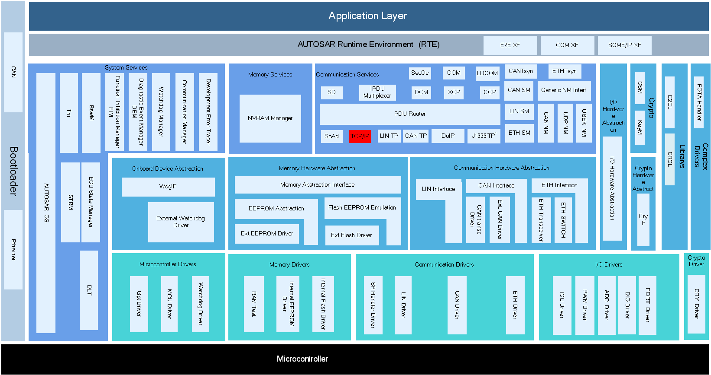

参考资料 (Reference materials)
------------------------------------------

[1] AUTOSAR_SWS_TCPIP.pdf ，R19-11

[2] AUTOSAR_SWS_SocketAdaptor.pdf ，R19-11

[3] AUTOSAR_SRS_Ethernet.pdf ，R19-11

功能描述 (Function Description)
===========================================

System Scalability功能 (System Scalability feature)
-----------------------------------------------------------------

System Scalability功能介绍 (System Scalability Feature Introduction)
~~~~~~~~~~~~~~~~~~~~~~~~~~~~~~~~~~~~~~~~~~~~~~~~~~~~~~~~~~~~~~~~~~~~~~~~~~~~~~~~

根据不同的应用情况，TcpIp模块的功能（对IP协议的支持情况）分为三个等级。因开发需求，目前只支持IPv4，因此只支持SC1功能。

According to different application scenarios, the TcpIp module's functionality (level of support for IP protocols) is divided into three grades. Due to development requirements, it currently only supports IPv4 and therefore only supports SC1 functionality.

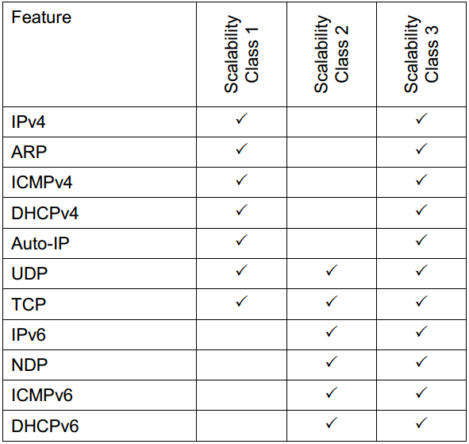

System Scalability功能实现 (System Scalability functionality implementation)
~~~~~~~~~~~~~~~~~~~~~~~~~~~~~~~~~~~~~~~~~~~~~~~~~~~~~~~~~~~~~~~~~~~~~~~~~~~~~~~~~~~~~~~~

根据配置项TcpIpGeneral->TcpIpScalabilityClass实现TcpIp功能等级的配置，目前工具固定配置为SC1，不可改。因为SC1只支持基于IPv4协议实现的功能，所以关于IPv6的配置（配置时，忽略所有IPv6相关配置项）、API等都不支持。

According to the configuration item TcpIpGeneral->TcpIpScalabilityClass, the TcpIp functionality level is configured. Currently, the tool is fixedly configured as SC1 and cannot be changed. Since SC1 only supports functionalities based on IPv4 protocol, configurations related to IPv6 (such as ignoring all IPv6-related configuration items during configuration) and APIs are not supported.

Internet Protocol Version 4功能 (Internet Protocol Version 4 Functionality)
-----------------------------------------------------------------------------------------

Internet Protocol Version 4功能介绍 (IPv4 Function Introduction)
~~~~~~~~~~~~~~~~~~~~~~~~~~~~~~~~~~~~~~~~~~~~~~~~~~~~~~~~~~~~~~~~~~~~~~~~~~~~

IP协议是整个TCP/IP协议的核心，UDP、TCP、ICMP等协议都是基于IP来传送协议数据。IP协议是一种不可靠，尽最大努力，无连接的网络层协议。除了实现最基本的IP数据报的收发外，还需要完成IP数据报（长度较大）的分片和重组功能。

The IP protocol is the core of the entire TCP/IP protocol, with protocols such as UDP, TCP, and ICMP based on IP for transmitting protocol data. The IP protocol is an unreliable, best-effort, connectionless network layer protocol. Besides achieving the basic reception and transmission of IP datagrams, it also needs to handle the fragmentation and reassembly functions of IP datagrams (which are relatively large in length).

ARP协议，译作地址解析协议，ARP只适用于IPv4，在以太网中ARP数据报封装在以太网帧中进行发送。ARP协议的基本功能是使用目标主机的IP地址，查询其对应的MAC地址，以保证底层链路上数据报通信的进行。为了实现在网络接口中物理地址与IP地址间的转换，ARP协议中引入了缓存表的概念（记录了一条一条的<IP地址，MAC地址>对）。

The Address Resolution Protocol (ARP), translated as Address Resolution Protocol, only applies to IPv4 and ARP packets are encapsulated in Ethernet frames for transmission in Ethernet. The basic function of the ARP protocol is to query the corresponding MAC address using the target host's IP address to ensure communication of packets at the lower layer link. To achieve the conversion between physical addresses and IP addresses in network interfaces, the concept of a cache table (records one by one <IP address, MAC address> pairs) is introduced into the ARP protocol.

AUTOIP协议是一个不用服务器来获取IP地址方法的协议，而DHCP需要一个服务器。一个配置了AUTOIP的主机将会得到一个高16位为0xa9fe的IP地址（即169.254.xxx.xxx）。

The AUTOIP protocol is a method to obtain an IP address without needing a server, whereas DHCP requires a server. A host configured with AUTOIP will receive an IP address where the high 16 bits are 0xa9fe (i.e., 169.254.xxx.xxx).

IP协议完成了数据报在各个主机之间的递交，但是它并不完美，正如前面所说，它提供的是一种无连接的不可靠的数据报交付，协议本身不提供任何错误检验与恢复机制。为了弥补IP协议的缺陷，出现了ICMP协议。

The IP protocol completes the delivery of datagrams among various hosts, but it is not perfect. As mentioned earlier, it provides an unreliable and connectionless datagram delivery service; the protocol itself does not provide any error checking or recovery mechanisms. To compensate for the deficiencies of the IP protocol, ICMP protocol emerged.

ICMP协议用于在主机、路由器之间传递控制消息（如数据报错误信息、网络状况信息、主机状况信息等）。ICMP协议配合IP协议完成数据报的递交，提高数据报递交的有效性，但是ICMP协议报文有着自己的组织结构，且ICMP报文是被封装在IP数据报中发送的。

ICMP protocol is used to transmit control messages between hosts and routers (such as datagram error information, network status information, host status information, etc.). ICMP protocol works in conjunction with IP protocol to deliver datagrams, improving the effectiveness of datagram delivery. However, ICMP protocol messages have their own structure, and ICMP messages are sent encapsulated within IP datagrams.

此外，ping命令，其本质上就是发送一个ICMP回送请求报文。

Additionally, the ping command essentially sends an ICMP echo request packet.

Internet Protocol Version 4功能实现 (Implementation of Internet Protocol Version 4 Functions)
~~~~~~~~~~~~~~~~~~~~~~~~~~~~~~~~~~~~~~~~~~~~~~~~~~~~~~~~~~~~~~~~~~~~~~~~~~~~~~~~~~~~~~~~~~~~~~~~~~~~~~~~~

该部分的功能主要体现在TcpIpIpV4General的配置Container中，涉及的配置参数及功能如下：

The functionality of this part is mainly reflected in the configuration container of TcpIpIpV4General, involving the following configuration parameters and functions:

（1）TcpIpArpEnabled：是否使能ARP功能；

TcpIpArpEnabled: Whether ARP function is enabled;

（2）TcpIpAutoIpEnabled：是否使能AUTOIP功能；

TcpIpAutoIpEnabled: Whether AUTOIP functionality is enabled;

（3）TcpIpDhcpClientEnabled：是否使能DHCP客户端功能；

TcpIpDhcpClientEnabled: Whether DHCP client functionality is enabled;

（4）TcpIpIcmpEnabled：是否使能ICMP功能；

TcpIpIcmpEnabled: Whether to enable ICMP functionality;

（5）TcpIpIpV4Enabled：是否使能IPv4功能；

TcpIpIpV4Enabled：Whether IPv4 functionality is enabled;

（6）TcpIpLocalAddrIpv4EntriesMax：限制TcpIpLocalAddr配置项（IPv4）的总数目；

TcpIpLocalAddrIpv4EntriesMax: Limit the total number of TcpIpLocalAddr configuration (IPv4) items;

（7）TcpIpPathMtuDiscoveryEnabled：是否使能MTU发现机制，该功能未实现。

TcpIpPathMtuDiscoveryEnabled: Whether MTU discovery mechanism is enabled, this function is not implemented.

我们根据AUTOSAR配置，转化成LwIP的配置（工具生成lwipopts.h文件），进而实现功能的可配置性。

We convert the AUTOSAR configuration into LwIP configuration (the tool generates the lwipopts.h file), thereby achieving configurable functionality.

IPv4：该部分的功能主要体现在IPv4接收数据报的重组功能上，TcpIpIpConfig->TcpIpIpV4Config->TcpIpIpFragmentationConfig的配置Container中，涉及的配置参数及功能如下（TcpIpIpV4Enabled使能情况下配置才有效）：

IPv4：The functionality of this part is mainly reflected in the reassembly function of IPv4 received datagrams. Configurations are effective only when TcpIpIpV4Enabled is enabled, involving the following configuration parameters and functions: (configured in the Container TcpIpIpConfig->TcpIpIpV4Config->TcpIpIpFragmentationConfig)

（1）TcpIpIpFragmentationRxEnabled：是否使能接收重组功能；

TcpIpIpFragmentationRxEnabled: Whether to enable reception reassembly function;

（2）TcpIpIpNumFragments：每个IP数据报最多的分片数目（在TcpIpIpFragmentationRxEnabled使能的情况下）；

TcpIpIpNumFragments：The maximum number of fragments per IP datagram (when TcpIpIpFragmentationRxEnabled is enabled);

（3）TcpIpIpFragmentationRxEnabled：并行处理多少IP数据报的接收重组（在TcpIpIpFragmentationRxEnabled使能的情况下）；

TcpIpIpFragmentationRxEnabled：How many IP datagrams are processed in parallel for reassembly (when TcpIpIpFragmentationRxEnabled is enabled);

（4）TcpIpIpReassTimeout：重组超时时间（在TcpIpIpFragmentationRxEnabled使能的情况下）。

TcpIpIpReassTimeout: Reassembly timeout period (when TcpIpIpFragmentationRxEnabled is enabled).

ARP：该部分的功能体现在TcpIpIpConfig-> TcpIpIpV4Config->TcpIpArpConfig的配置Container中，涉及的配置参数及功能如下（TcpIpArpEnabled使能情况下配置才有效）：

ARP: The functionality of this part is reflected in the configuration container TcpIpIpConfig->TcpIpIpV4Config->TcpIpArpConfig, involving the following configuration parameters and functions (only effective when TcpIpArpEnabled is enabled):

（1）TcpIpArpNumGratuitousARPonStartup：当获取到IP地址对外广播自己的<IP地址，MAC地址>，该参数为广播的次数，因基于LwIP实现（固定为1次，不可改配置）；

TcpIpArpNumGratuitousARPonStartup: When broadcasting one's <IP address, MAC address> upon acquiring an IP address, this parameter denotes the number of broadcasts; due to LwIP implementation (fixed at 1 time and not configurable).

（2）TcpIpArpPacketQueueEnabled：是否使能ARP在未获取目的MAC地址之前缓存请求发送的IP报；

TcpIpArpPacketQueueEnabled: Whether to enable ARP packet queuing before acquiring the destination MAC address for IP packets;

（3）TcpIpArpTableEntryTimeout：ARP缓存表（Entry）的生存时间（超时则从缓存表中移除该Entry）；

TcpIpArpTableEntryTimeout: The timeout duration for ARP cache entries (entries are removed from the cache table upon expiration);

（4）TcpIpArpTableSizeMax：ARP缓存表 Size（即Entry的数目）。

TcpIpArpTableSizeMax：Size of the ARP cache table (i.e., the number of Entries).

Auto-IP该部分的功能配置涉及的配置参数只有TcpIpAutoIpInitTimeout（TcpIpAutoIpEnabled使能情况下配置才有效），该配置时间段内用于通过DHCP来获取IP地址，若获取失败，则通过AUTOIP方式分配IP地址。LwIP通过配置尝试DHCP获取IP的次数（LWIP_DHCP_AUTOIP_COOP_TRIES）来实现相似功能。

Auto-IP The configuration parameters involved in the functionality of this section only include TcpIpAutoIpInitTimeout (which is effective only when TcpIpAutoIpEnabled is enabled), which is used for acquiring an IP address via DHCP within the configured time period. If acquisition fails, IP addresses are allocated through the AUTOIP method. LwIP achieves a similar function by configuring the number of attempts to acquire an IP address via DHCP (LWIP_DHCP_AUTOIP_COOP_TRIES).

LwIP中DHCP获取IP地址次数与时间关系如下：

The relationship between the number of times LwIP obtains an IP address via DHCP and time is as follows:

.. centered:: **表 DHCP分配时间 (Display DHCP Allocation Time)**

.. list-table::
   :widths: 50 50
   :header-rows: 1

   * - 次数 (Times)
     - 时间（秒） (Time (seconds))
   * - 1
     - 5
   * - 2
     - 7（5+2）
   * - 3
     - 11（7+4）
   * - 4
     - 19（11+8）
   * - 5
     - 35（19+16）
   * - 6
     - 67（35+32）
   * - 7
     - 127（67+60）
   * - 8
     - 187（127+60）
   * - …
     - …
   * - n
     - (n-1)时间+60秒

ICMP：该部分的功能体现在TcpIpIpConfig-> TcpIpIpV4Config->TcpIpIcmpConfig的配置Container中，涉及的配置参数及功能如下（TcpIpIcmpEnabled使能情况下配置才有效）：

ICMP: The functionality of this part is reflected in the configuration Container TcpIpIpConfig->TcpIpIpV4Config->TcpIpIcmpConfig. Configurable parameters and functions include (only effective when TcpIpIcmpEnabled is enabled):

TcpIpIcmpTtl：ICMP数据报Ttl参数（该参数封装在IP报首部）；

TcpIpIcmpTtl：ICMP data packet Ttl parameter (this parameter is encapsulated in the IP header);

TcpIpIcmpMsgHandler（包含参数TcpIpIcmpMsgHandlerHeaderFileName和TcpIpIcmpMsgHandlerName）：主要是配置ICMP报文的接收函数，TcpIp接收到ICMP报文时调用该配置API传递给上层模块。该功能未实现，在工具上对该配置Container进行了限制（无法添加）。

TcpIpIcmpMsgHandler (includes parameters TcpIpIcmpMsgHandlerHeaderFileName and TcpIpIcmpMsgHandlerName): mainly configures the receive function for ICMP messages. The TCP/IP receives an ICMP message and calls this configured API to pass it to the upper layer module. This feature is not implemented, and the configuration Container has been restricted on the tool (cannot be added).

TcpIp模块除了在lwip代码中实现部分ICMP常用功能，还为上层模块提供ICMPv4数据报发送接口TcpIp_IcmpTransmit。但未实现ICMP数据报上传上层模块的功能（参见配置TcpIpIcmpMsgHandler说明）。

The TcpIp module implements part of the common ICMP functionality in the lwip code and provides an ICMPv4 datagram sending interface, TcpIp_IcmpTransmit, for upper-layer modules. However, it does not implement the function to upload ICMP datagrams to upper-layer modules (refer to the configuration description of TcpIpIcmpMsgHandler for details).

IP Based Protocols功能 (IP-Based Protocols functionality)
-----------------------------------------------------------------------

IP Based Protocols功能介绍 (Introduction to IP Based Protocols)
~~~~~~~~~~~~~~~~~~~~~~~~~~~~~~~~~~~~~~~~~~~~~~~~~~~~~~~~~~~~~~~~~~~~~~~~~~~

TcpIp模块维护一个本端IP地址表，每个本端IP地址的配置参见配置TcpIpLocalAddr，主要实现IP地址由何种方式分配，每个TcpIpLocalAddr有唯一的ID号（TcpIpAddrId）表示。虽然按AUTOSAR标准，可支持N个本端IP地址关联到同一个硬件Controller，但限于LwIP功能实现，我们目前只支持每个TcpIpCtrl只能被一个单播（TCPIP_UNICAST）TcpIpLocalAddr关联。

The TcpIp module maintains a local IP address table, with each local IP address's configuration seen in the configuration TcpIpLocalAddr, primarily implementing how IP addresses are allocated. Each TcpIpLocalAddr has a unique ID number (TcpIpAddrId) to represent it. Although according to the AUTOSAR standard, N local IP addresses can be associated with the same hardware Controller, due to the functional implementation limits of LwIP, we currently only support each TcpIpCtrl being associated with one unicast (TCPIP_UNICAST) TcpIpLocalAddr.

UDP称为用户数据报协议，是一种无连接的、不可靠的传输协议。UDP只是简单地完成数据从一个进程到另一个进程的交付，它没有提供任何流量控制机制，收到的报文也没有确认；在差错控制上，只提供了一种简单的差错控制方法，即校验和计算，当UDP收到的报文校验和计算不成功时，它将丢弃掉这个报文。UDP使用网络层的IP协议来发送报文。

UDP is called the User Datagram Protocol and is a connectionless, unreliable transmission protocol. UDP merely completes the delivery of data from one process to another with no traffic control mechanisms; received packets have no confirmation; in error control, it only provides a simple method of error control, namely checksum calculation; when the checksum calculation of the UDP received packet fails, the packet will be discarded. UDP uses the IP protocol at the network layer to send packets.

TCP（Transmission Control Protocol传输控制协议）是一种面向连接的、可靠的、基于字节流的传输层协议。为了保证传输的可靠性、高效性，TCP提供了一系列的机制，例如握手机制、正面确认、超时重传、以及各种定时机制等。

TCP (Transmission Control Protocol Transmission Control Protocol), also known as Transmission Control Protocol, is a connection-oriented, reliable, byte-stream transport layer protocol. To ensure reliable and efficient transmission, TCP provides a series of mechanisms, such as handshake mechanism, positive acknowledgment, timeout retransmission, and various timing mechanisms, etc.

AUTOSAR标准中涉及的机制（TCP配置）有：超时重传；慢启动与拥塞避免；快速重传与快速恢复；NAGLE算法；保活机制；收发窗口机制；定时机制。

Mechanisms involved in TCP configuration within the AUTOSAR standard include: timeout retransmission; slow start and congestion avoidance; fast retransmit and fast recovery; Nagle algorithm; keepalive mechanism; send/receive window mechanism; timing mechanisms.

DHCP使用UDP进行报文的传输。通过同DHCP服务器的交互，设备可以获得一个有效的IP地址，使得它可以在特定网络环境下运行。目前仅支持DHCPv4的客户端功能（DHCPv4服务端，DHCPv6都不支持）。

DHCP uses UDP for message transmission. Through interaction with a DHCP server, devices can obtain a valid IP address, allowing them to run in specific network environments. Currently, only client functionality for DHCPv4 is supported (neither DHCPv4 servers nor DHCPv6 are supported).

IP Based Protocols功能实现 (IP-Based Protocols functionality implementation)
~~~~~~~~~~~~~~~~~~~~~~~~~~~~~~~~~~~~~~~~~~~~~~~~~~~~~~~~~~~~~~~~~~~~~~~~~~~~~~~~~~~~~~~~

每个TcpIpLocalAddr配置Container中，主要实现了IP地址的分配机制TcpIpAddrAssignment（考虑到目前标准的不完善以及代码实现的复杂性，暂只支持配置一个IP分配机制）。

In each TcpIpLocalAddr configuration Container, the main implementation realizes the IP address allocation mechanism TcpIpAddrAssignment (considering the current imperfection of standards and the complexity of code realization, it temporarily only supports configuring one IP allocation mechanism).

其中TcpIpAssignmentLifetime用以实现分配永久IP的功能未实现（暂无该需求）；TcpIpAssignmentMethod项可根据需求选择何种分配方式（DHCP/AUTO-IP/STATIC等）；TcpIpAssignmentPriority分配方式优先级，用于配置了多个TcpIpAddrAssignment时（目前不支持）；TcpIpAssignmentTrigger用于配置IP分配是自动还是手动方式，自动方式是当调用TcpIp_RequestComMode请求TCPIP_STATE_ONLINE时自动通过配置的IP分配机制请求IP分配，手动方式需要上层模块通过调用TcpIp_RequestIpAddrAssignment，TcpIp_ReleaseIpAddrAssignment来请求IP的分配和释放。

TcpIpAssignmentLifetime is used to implement the functionality of assigning a permanent IP, which is not realized (no current demand for this feature); TcpIpAssignmentMethod can be selected based on needs (DHCP/AUTO-IP/STATIC, etc.); TcpIpAssignmentPriority is the priority of assignment methods, used for configuring multiple TcpIpAddrAssignments (currently unsupported); TcpIpAssignmentTrigger is used to configure whether IP assignment is automatic or manual. In automatic mode, IP allocation is requested through the configured mechanism when calling TcpIp_RequestComMode to request TCP_IP_STATE_ONLINE. In manual mode, upper-layer modules need to call TcpIp_RequestIpAddrAssignment and TcpIp_ReleaseIpAddrAssignment to request IP allocation and release.

当TcpIpAssignmentMethod配置为TCPIP_STATIC方式时，才可选择是否配置TcpIpStaticIpAddressConfig（当TcpIpAssignmentTrigger配置为TCPIP_AUTOMATIC时，必须配置；当配置为TCPIP_MANUAL时，可配可不配，当未配置时，调用TcpIp_RequestIpAddrAssignment请求IP 分配时，IP地址参数不能为空）。当IP地址状态改变时，调用Up_LocalIpAddrAssignmentChg通知上层模块。

When TcpIpAssignmentMethod is configured as TCPIP_STATIC, TcpIpStaticIpAddressConfig can be optionally selected (when TcpIpAssignmentTrigger is configured as TCPIP_AUTOMATIC, it must be configured; when configured as TCPIP_MANUAL, it can be configured or not. When not configured, if TcpIp_RequestIpAddrAssignment is called to request IP allocation, the IP address parameter cannot be empty). When the IP address state changes, Up_LocalIpAddrAssignmentChg is called to notify the upper-layer module.

UDP的配置参数只有TcpIpUdpTtl，该信息封装在相应IP报的首部。TcpIp为上层模块提供接口TcpIp_UdpTransmit来发送UDP报文，当收到UDP接收报文时，通过调用Up_RxIndication（一般为SoAd_RxIndication）传递给上层。

The configuration parameter for UDP is only TcpIpUdpTtl, which is encapsulated in the corresponding IP header. TcpIp provides the interface TcpIp_UdpTransmit to send UDP packets to the upper layer module. When receiving UDP receive packets, it passes them to the upper layer through calling Up_RxIndication (generally SoAd_RxIndication).

TcpIp模块除了为上层模块提供了发送接口TcpIp_TcpTransmit，收到TCP报文通过调用Up_RxIndication（一般为SoAd_RxIndication）传递给上层外，还涉及TCP作为客户端的链接接口TcpIp_TcpConnect，作为服务端进入监听模式（等待客户端发起链接请求）接口TcpIp_TcpListen，增大接收窗口的接口TcpIp_TcpReceived（上层模块接收到数据需要调用该接口来释放TcpIp模块中TCP的接收窗口）。

The TcpIp module除了 provides the upper-layer modules with a send interface TcpIp_TcpTransmit, and passes received TCP packets to the upper layer by calling Up_RxIndication (generally SoAd_RxIndication), it also involves interfaces for TCP as a client connection interface TcpIp_TcpConnect, a server entering listening mode (waiting for client connection requests) interface TcpIp_TcpListen, and an interface to increase the receive window TcpIp_TcpReceived (the upper-layer module needs to call this interface when receiving data to release the receive window in the TcpIp module).

通过配置TcpIpTcpConfig（Container）的各个配置参数来说明TCP的功能实现：

To illustrate the functionality of TCP, configure various parameters of TcpIpTcpConfig (Container).

（1）TcpIpTcpCongestionAvoidanceEnabled：拥塞避免功能（固定使能）；

TcpIpTcpCongestionAvoidanceEnabled: Congestion Avoidance Function (Fixed Enabled)

（2）TcpIpTcpFastRecoveryEnabled：快速恢复功能（固定使能）；

TcpIpTcpFastRecoveryEnabled: Fast recovery feature (fixed enabled);

（3）TcpIpTcpFastRetransmitEnabled：快速重传功能（固定使能）；

TcpIpTcpFastRetransmitEnabled: Fast retransmit feature (fixed enabled);

（4）TcpIpTcpFinWait2Timeout：客户端发送FIN并收到服务端ACK后进入FIN_WAIT_2状态，在该状态下等待服务器端发送FIN的时间；

TcpIpTcpFinWait2Timeout: The time to wait for the server's FIN in the FIN_WAIT_2 state after the client sends a FIN and receives an ACK from the server;

（5）TcpIpTcpKeepAliveEnabled：是否使能TCP保活机制；

TcpIpTcpKeepAliveEnabled: Whether to enable TCP keepalive mechanism;

（6）TcpIpTcpKeepAliveInterval：（在TcpIpTcpKeepAliveEnabled使能前提下才有效）保活探测报文的发送间隔时间；

TcpIpTcpKeepAliveInterval: (Effective only if TcpIpTcpKeepAliveEnabled is enabled) Time interval for sending keepalive probe messages;

（7）TcpIpTcpKeepAliveProbesMax：（在TcpIpTcpKeepAliveEnabled使能前提下才有效）保活探测报文的发送最大次数；

TcpIpTcpKeepAliveProbesMax: (Effective only if TcpIpTcpKeepAliveEnabled is enabled) Maximum number of keepalive probe messages to be sent;

（8）TcpIpTcpKeepAliveTime：（在TcpIpTcpKeepAliveEnabled使能前提下才有效）TCP最后一次通信，与第一次保活探测报文发送的时间间隔；

TcpIpTcpKeepAliveTime: (Effective only if TcpIpTcpKeepAliveEnabled is enabled) The interval between the last communication and the first keepalive probe message sent in TCP;

（9）TcpIpTcpMaxRtx：TCP报文最大重传次数（LwIP最大支持13次）；

TcpIpTcpMaxRtx: Maximum TCP Retransmission Times (LwIP supports up to 13 times);

（10）TcpIpTcpMsl：TCP客户端在TIME_WAIT状态下需要等待2×MSL时间才能切换到CLOSED状态；

TcpIpTcpMsl: A TCP client in the TIME_WAIT state must wait for 2×MSL time before transitioning to the CLOSED state;

（11）TcpIpTcpNagleEnabled：糊涂窗口避免功能（固定使能）；

TcpIpTcpNagleEnabled: Nagle Algorithm Enabled (Fixed);

（12）TcpIpTcpReceiveWindowMax：接收窗口最大值；

TcpIpTcpReceiveWindowMax: Maximum receive window;

（13）TcpIpTcpRetransmissionTimeout：超时重传的超时时间，不支持（LWIP中重传超时RTT是根据网络状况动态计算的，不是固定配置值）；

TcpIpTcpRetransmissionTimeout: Timeout for retransmission, not supported (in LWIP, the retransmission timeout RTT is dynamically calculated based on network conditions and is not a fixed configuration value).

（14）TcpIpTcpSlowStartEnabled：慢启动功能（固定使能）；

TcpIpTcpSlowStartEnabled: Slow Start function (fixed enabled);

（15）TcpIpTcpSynMaxRtx：链接请求重传最大次数（LwIP最大支持13次）；

TcpIpTcpSynMaxRtx: Maximum retransmission times for link requests (LwIP supports up to 13 times);

（16）TcpIpTcpSynReceivedTimeout：服务端收到SYN后，回复SYN/ACK，进入到SYN_RCVD状态，在该状态等待客户端回复ACK的时间；

TcpIpTcpSynReceivedTimeout: After receiving SYN from the client, the server replies with SYN/ACK and enters the SYN_RCVD state; this is the time it waits for the client's ACK response.

（17）TcpIpTcpTtl：该信息封装在相应IP报首部。

(TcpIpTcpTtl: This information is encapsulated in the corresponding IP header.)

DHCPv4客户端功能，AUTOSAR标准DHCP客户端配置Container（TcpIpDhcpConfig）中配置参数缺失。因此，只根据配置TcpIpDhcpClientEnabled实现DHCPv4客户端功能是否使能，若使能则启动从DHCP服务器获取IP地址的功能。

DHCPv4 client functionality, parameters are missing in the AUTOSAR standard DHCP client configuration Container (TcpIpDhcpConfig). Therefore, does the DHCPv4 client function enable solely based on the configuration TcpIpDhcpClientEnabled? If enabled, it启动从DHCP server获取IP地址的功能.

Message Reception功能 (Message Reception Function)
----------------------------------------------------------------

Message Reception功能介绍 (Introduction to Message Reception)
~~~~~~~~~~~~~~~~~~~~~~~~~~~~~~~~~~~~~~~~~~~~~~~~~~~~~~~~~~~~~~~~~~~~~~~~~

当收到一帧以太网报文时，根据首部信息可解析成IP报文或者ARP报文；IP报文又可根据其首部信息解析成ICMP报文、TCP报文、UDP报文；UDP报文又可进一步解析成DHCP报文。TcpIp模块会将UDP报文（封装的上层协议非DHCP），TCP报文传递给上层模块。ARP、ICMP、DHCP的接收处理实现在TcpIp模块中（具体实现在LwIP代码中）。

When an Ethernet frame is received, it can be parsed into an IP packet or an ARP packet based on the header information; an IP packet can further be parsed into ICMP packets, TCP packets, or UDP packets based on its header information; a UDP packet can further be parsed into DHCP packets. The TcpIp module will pass UDP packets (with non-DHCP upper-layer protocols encapsulated) and TCP packets to higher-level modules. The reception handling for ARP, ICMP, and DHCP is implemented in the TcpIp module (specifically realized in the LwIP code).

Message Reception功能实现 (Message Reception functionality implementation)
~~~~~~~~~~~~~~~~~~~~~~~~~~~~~~~~~~~~~~~~~~~~~~~~~~~~~~~~~~~~~~~~~~~~~~~~~~~~~~~~~~~~~~

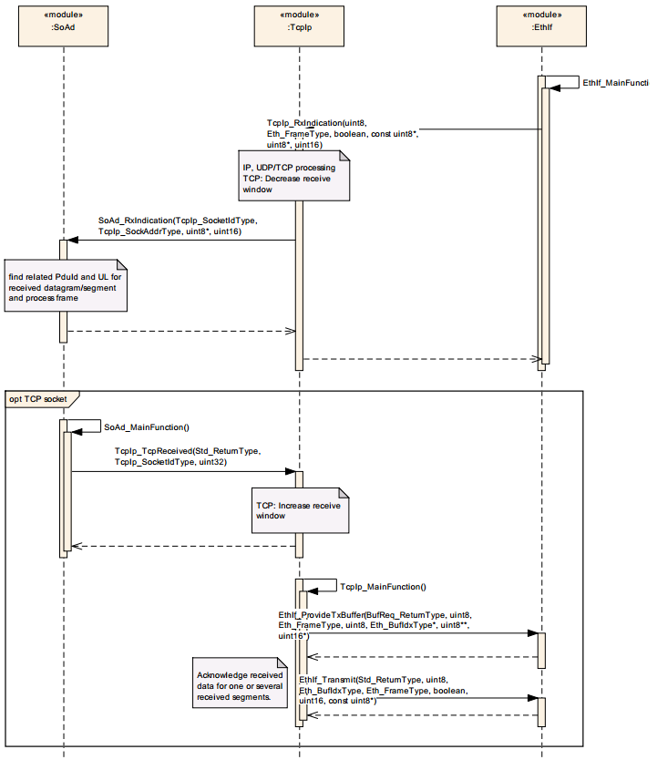

相比于UDP报文，TCP报文的接收需注意在上层模块中调用TcpIp_TcpReceived来释放TCP接收窗口，并需回复ACK信息。

Compared to UDP packets, receiving TCP packets requires calling TcpIp_TcpReceived in the upper layer module to release the TCP receive window and to respond with an ACK message.

Message Transmission功能 (Message Transmission Function)
----------------------------------------------------------------------

Message Transmission功能介绍 (Introduction to Message Transmission)
~~~~~~~~~~~~~~~~~~~~~~~~~~~~~~~~~~~~~~~~~~~~~~~~~~~~~~~~~~~~~~~~~~~~~~~~~~~~~~~

TcpIp模块对外提供ICMP报文，UDP报文，TCP报文的发送接口，分别为TcpIp_IcmpTransmit，TcpIp_UdpTransmit，TcpIp_TcpTransmit；而DHCP报文和ARP报文的发送机制由内部代码实现，用以从DHCP服务器获取IP地址以及获取目的MAC地址。

The TcpIp module provides sending interfaces for ICMP messages, UDP messages, and TCP messages, namely TcpIp_IcmpTransmit, TcpIp_UdpTransmit, and TcpIp_TcpTransmit; whereas the sending mechanisms for DHCP messages and ARP messages are implemented internally to obtain IP addresses from a DHCP server and acquire the destination MAC address.

Message Transmission功能实现 (Message Transmission functionality implementation)
~~~~~~~~~~~~~~~~~~~~~~~~~~~~~~~~~~~~~~~~~~~~~~~~~~~~~~~~~~~~~~~~~~~~~~~~~~~~~~~~~~~~~~~~~~~~

TcpIp主要实现UDP和TCP的发送功能。相比于UDP，TCP在发送报文之前需要先建立链接（三次握手）。

TcpIp primarily implements the sending functions of UDP and TCP. Compared to UDP, TCP needs to establish a connection (three-way handshake) before sending packets.

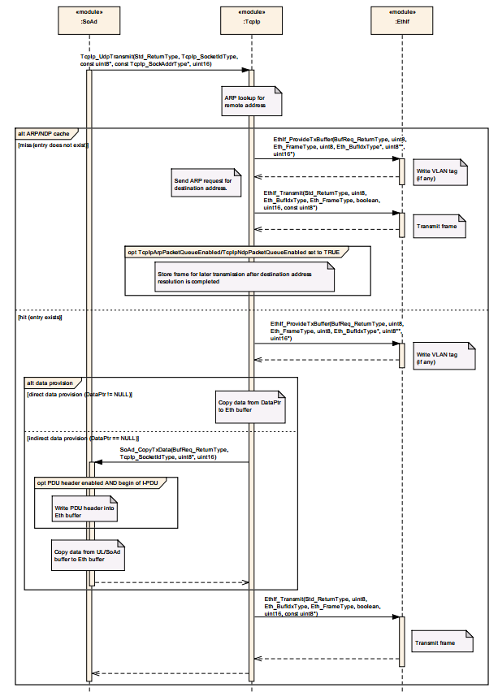

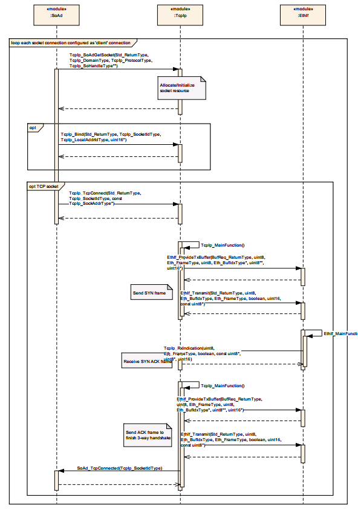

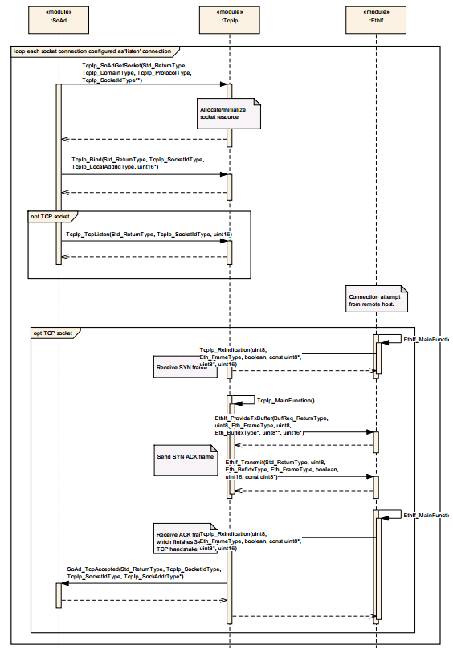

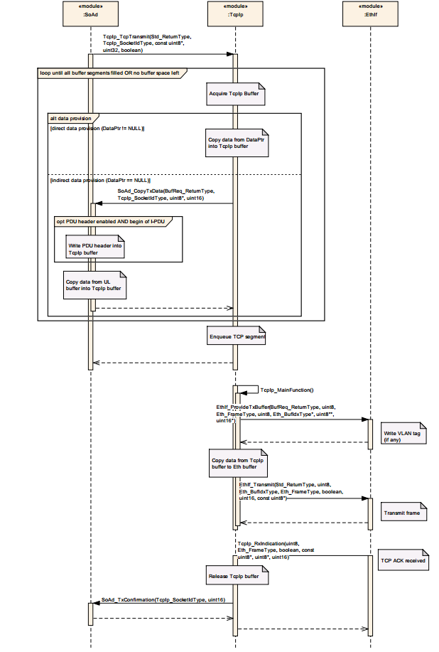

TCP/IP Stack state handling功能 (TCP/IP Stack State Handling functionality)
-----------------------------------------------------------------------------------------

TCP/IP Stack state handling功能介绍 (Introduction to TCP/IP Stack State Handling)
~~~~~~~~~~~~~~~~~~~~~~~~~~~~~~~~~~~~~~~~~~~~~~~~~~~~~~~~~~~~~~~~~~~~~~~~~~~~~~~~~~~~~~~~~~~~~

TcpIp的状态指的是每个Controller的状态，分为TCPIP_STATE_OFFLINE、TCPIP_STATE_STARTUP、TCPIP_STATE_OFFLINE、TCPIP_STATE_ONHOLD、TCPIP_STATE_SHUTDOWN五种状态，其中TCPIP_STATE_STARTUP和TCPIP_STATE_SHUTDOWN为中间过渡状态。

TcpIp status refers to the state of each Controller, divided into TCPIP_STATE_OFFLINE, TCPIP_STATE_STARTUP, TCPIP_STATE_OFFLINE, TCPIP_STATE_ONHOLD, and TCPIP_STATE_SHUTDOWN five states, among which TCPIP_STATE_STARTUP and TCPIP_STATE_SHUTDOWN are intermediate transitional states.

TCP/IP Stack state handling功能实现 (Implementation of TCP/IP Stack State Handling Functionality)
~~~~~~~~~~~~~~~~~~~~~~~~~~~~~~~~~~~~~~~~~~~~~~~~~~~~~~~~~~~~~~~~~~~~~~~~~~~~~~~~~~~~~~~~~~~~~~~~~~~~~~~~~~~~~

EthSM模块通过调用TcpIp_RequestComMode来请求TcpIp Controller状态的切换，当TcpIp Controller状态发生改变时，TcpIp模块将调用EthSM_TcpIpModeIndication来通知EthSM。

The EthSM module requests a switch of the TcpIp Controller state by calling TcpIp_RequestComMode. When the TcpIp Controller state changes, the TcpIp module will notify EthSM through EthSM_TcpIpModeIndication.

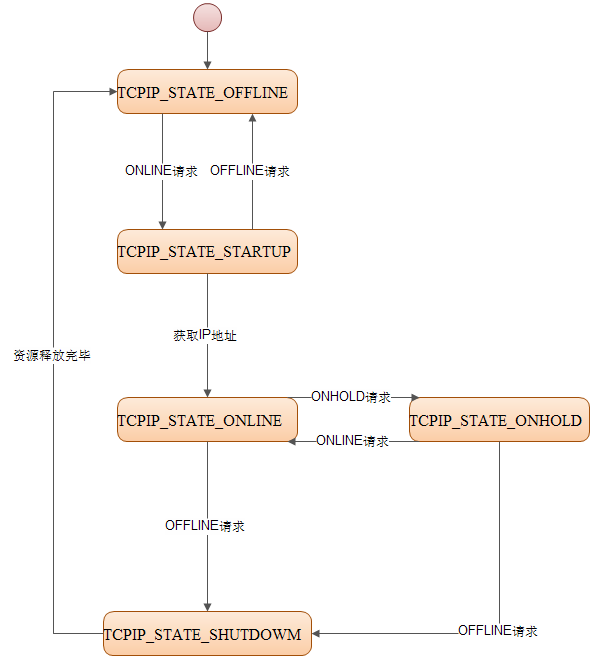

源文件描述 (Source file description)
===============================================

.. centered:: **表 TcpIp组件文件描述 (Describe TcpIp Component File)**

.. list-table::
   :widths: 50 50
   :header-rows: 1

   * - 文件 (Files)
     - 说明 (Description)
   * - TcpIp.h
     - TcpIp模块头文件，包含了API函数的扩展声明并定义了端口的数据结构。 (TCPip module header files contain extended declarations of API functions and define the data structures for ports.)
   * - TcpIp.c
     - TcpIp模块源文件，包含了API函数的实现。 (Source files for the TcpIp module, contain implementations of API functions.)
   * - TcpIp_Internal.h
     - TcpIp模块内部代码头文件，包含了内部实现的数据结构。 (Internal code header file of TcpIp module, containing data structures for internal implementation.)
   * - TcpIp_Types.h
     - TcpIp模块类型定义头文件，包含了AUTOSAR规范中定义的数据结构。 (Header file for TcpIp module type definitions, containing data structures defined in the AUTOSAR specification.)
   * - TcpIp_MemMap.h
     - TcpIp模块内存布局。 (TCP/IP Module Memory Layout.)
   * - TcpIp_Cfg.h
     - 定义TcpIp模块预编译时用到的配置参数。 (Define configuration parameters for the TcpIp module during pre-compilation.)
   * - TcpIp_Lcfg.h
     - 定义TcpIp模块中L配置中需要用到的数据结构。 (Define the data structures needed for L configuration in the TcpIp module.)
   * - TcpIp_Lcfg.c
     - TcpIp模块L配置生成文件。 (TcpIp module L configuration generates file.)
   * - TcpIp_PBcfg.h
     - 定义TcpIp模块中PB配置中需要用到的数据结构。 (Define the data structures needed for PB configuration in the TcpIp module.)
   * - TcpIp_PBcfg.c
     - TcpIp模块PB配置生成文件。 (TcpIp Module PB Configuration Generation File)
   * - TcpIp_SocketOwner.h
     - 创建Socket所属上层Owner，配置生成文件。 (Create the upper layer Owner of the Socket, configure and generate the file.)
   * - SchM_TcpIp.h
     - 提供给 SchM 的头文件，用于公开周期调度函数 (Header file provided for SchM to publicize periodic scheduling functions)
   * - lwip
     - lwip代码 (lwip code)

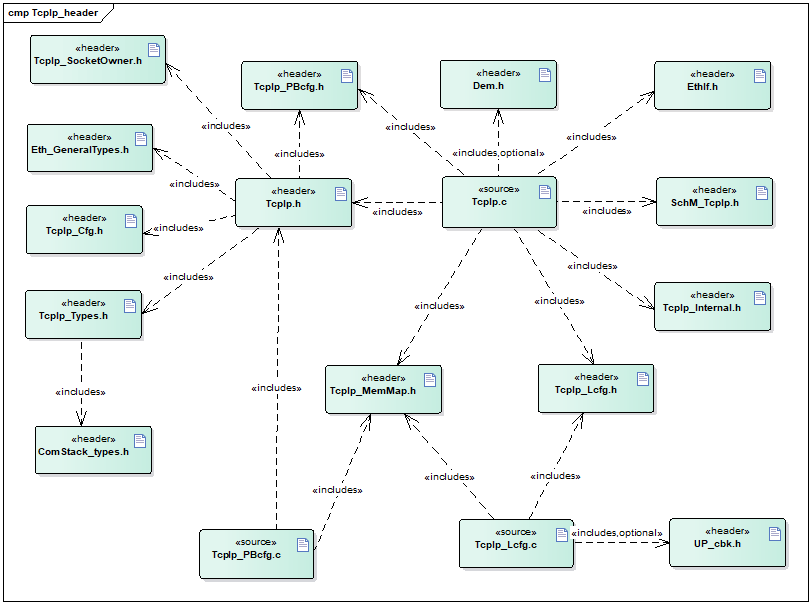

API接口 (API Interface)
=====================================

类型定义 (Type definition)
--------------------------------------

TcpIp_ConfigType类型定义 (TcpIpConfigType type definition)
~~~~~~~~~~~~~~~~~~~~~~~~~~~~~~~~~~~~~~~~~~~~~~~~~~~~~~~~~~~~~~~~~~~~~~

.. list-table::
   :widths: 50 50
   :header-rows: 1

   * - 名称 (Name)
     - TcpIp_ConfigType
   * - 类型 (Type)
     - 结构体 (Structures)
   * - 范围 (Range)
     - 依赖于具体实现 (Dependent on specific implementation)
   * - 描述 (Description)
     - TcpIp模块的配置数据结构体 (The configuration data structure of TcpIp Module)

TcpIp_DomainType类型定义 (TcpIp_DomainType Type Definition)
~~~~~~~~~~~~~~~~~~~~~~~~~~~~~~~~~~~~~~~~~~~~~~~~~~~~~~~~~~~~~~~~~~~~~~~

.. list-table::
   :widths: 25 25 25 25
   :header-rows: 1

   * - 名称 (Name)
     - TcpIp_DomainType
     - 
     - 
   * - 类型 (Type)
     - uint16
     - 
     - 
   * - 范围 (Range)
     - TCPIP_AF_INET
     - 0x02
     - Use IPv4
   * - 
     - TCPIP_AF_INET6
     - 0x1c
     - Use IPv6
   * - 描述 (Description)
     - TcpIp地址（IP）类型
     - 
     - 

TcpIp_ProtocolType类型定义 (TcpIp_ProtocolType Type Definition)
~~~~~~~~~~~~~~~~~~~~~~~~~~~~~~~~~~~~~~~~~~~~~~~~~~~~~~~~~~~~~~~~~~~~~~~~~~~

.. list-table::
   :widths: 25 25 25 25
   :header-rows: 1

   * - 名称 (Name)
     - TcpIp_ProtocolType
     - 
     - 
   * - 类型 (Type)
     - 枚举类型 (Enumerated type)
     - 
     - 
   * - 范围 (Range)
     - TCPIP_IPPROTO_TCP
     - 0x06
     - Use TCP
   * - 
     - TCPIP_IPPROTO_UDP
     - 0x11
     - Use UDP
   * - 描述 (Description)
     - 用于socket的协议类型 (Protocol types for socket)
     - 
     - 

TcpIp_SockAddrType类型定义 (TcpIp_SockAddrType type definition)
~~~~~~~~~~~~~~~~~~~~~~~~~~~~~~~~~~~~~~~~~~~~~~~~~~~~~~~~~~~~~~~~~~~~~~~~~~~

.. list-table::
   :widths: 25 25 25 25
   :header-rows: 1

   * - 名称 (Name)
     - TcpIp_SockAddrType
     - 
     - 
   * - 类型 (Type)
     - 结构体 (Structures)
     - 
     - 
   * - 元素 (Elements)
     - TcpIp_DomainType
     - domain
     - IP类型（IPv4/IPv6）
   * - 
     - uint16
     - port
     - 端口号 (Port number)
   * - 
     - TcpIP_IpAddrType
     - addr
     - IP地址 (IP Address)
   * - 描述 (Description)
     - AUTOSAR标准存在问题（标准中只包含domain），根据理解增加port和addr (There is an issue with the AUTOSAR Standard (it only includes domains according to the understanding), additional ports and addresses need to be added.)
     - 
     - 

TcpIp_SockAddrInetType类型定义 (TcpIp_SockAddrInetType type definition)
~~~~~~~~~~~~~~~~~~~~~~~~~~~~~~~~~~~~~~~~~~~~~~~~~~~~~~~~~~~~~~~~~~~~~~~~~~~~~~~~~~~

.. list-table::
   :widths: 25 25 25 25
   :header-rows: 1

   * - 名称 (Name)
     - TcpIp_SockAddrInetType
     - 
     - 
   * - 类型 (Type)
     - 结构体 (Structures)
     - 
     - 
   * - 元素 (Elements)
     - TcpIp_DomainType
     - domain
     - IP类型（IPv4/IPv6）
   * - 
     - uint16
     - port
     - 端口号 (Port number)
   * - 
     - uint32[1]
     - addr
     - IPv4地址 (IPv4 Address)
   * - 描述 (Description)
     - 定义IPv4的地址类型 (Define the address types of IPv4)
     - 
     - 

TcpIp_SockAddrInet6Type类型定义 (TcpIp_SockAddrInet6Type type definition)
~~~~~~~~~~~~~~~~~~~~~~~~~~~~~~~~~~~~~~~~~~~~~~~~~~~~~~~~~~~~~~~~~~~~~~~~~~~~~~~~~~~~~

.. list-table::
   :widths: 25 25 25 25
   :header-rows: 1

   * - 名称 (Name)
     - TcpIp_SockAddrInet6Type
     - 
     - 
   * - 类型 (Type)
     - 结构体 (Structures)
     - 
     - 
   * - 元素 (Elements)
     - TcpIp_DomainType
     - domain
     - IP类型（IPv4/IPv6）
   * - 
     - uint16
     - port
     - 端口号 (Port number)
   * - 
     - uint32[4]
     - addr
     - IPv6地址 (IPv6 address)
   * - 描述 (Description)
     - 定义IPv6的地址类型 (Define the address types of IPv6)
     - 
     - 

TcpIp_LocalAddrIdType类型定义 (TcpIp_LocalAddrIdType type definition)
~~~~~~~~~~~~~~~~~~~~~~~~~~~~~~~~~~~~~~~~~~~~~~~~~~~~~~~~~~~~~~~~~~~~~~~~~~~~~~~~~

.. list-table::
   :widths: 50 50
   :header-rows: 1

   * - 名称 (Name)
     - TcpIp_LocalAddrIdType
   * - 类型 (Type)
     - uint8
   * - 范围 (Range)
     - 0-255
   * - 描述 (Description)
     - 表示IP地址ID号（所有local IP Address统一编号） (Indicate IP address ID number (all local IP Addresses uniformly numbered))

TcpIp_SocketIdType类型定义 (TcpIp_SocketIdType Type Definition)
~~~~~~~~~~~~~~~~~~~~~~~~~~~~~~~~~~~~~~~~~~~~~~~~~~~~~~~~~~~~~~~~~~~~~~~~~~~

.. list-table::
   :widths: 50 50
   :header-rows: 1

   * - 名称 (Name)
     - TcpIp_SocketIdType
   * - 类型 (Type)
     - uint8,uint16
   * - 范围 (Range)
     - 0-255/0-65535
   * - 描述 (Description)
     - 表示IP地址ID号（所有local IP Address统一编号） (Indicate IP address ID number (all local IP Addresses uniformly numbered))

TcpIp_StateType类型定义 (Definition of TcpIp_StateType Type)
~~~~~~~~~~~~~~~~~~~~~~~~~~~~~~~~~~~~~~~~~~~~~~~~~~~~~~~~~~~~~~~~~~~~~~~~

.. list-table::
   :widths: 34 33 33
   :header-rows: 1

   * - 名称 (Name)
     - TcpIp_StateType
     - 
   * - 类型 (Type)
     - 枚举类型 (Enumerated type)
     - 
   * - 范围 (Range)
     - TCPIP_STATE_ONLINE
     - 在线状态，可通信 (Online, available for communication)
   * - 
     - TCPIP_STATE_ONHOLD
     - 暂停状态，不可通信 (Paused status, unable to communicate)
   * - 
     - TCPIP_STATE_OFFLINE
     - 下线状态，不可通信 (Offline status, unable to communicate)
   * - 
     - TCPIP_STATE_STARTUP
     - 启动状态，获取IP地址阶段，不可通信 (Boot state, getting IP address stage, unable to communicate)
   * - 
     - TCPIP_STATE_SHUTDOWN
     - 关闭状态，释放资源阶段，不可通信 (Closed state, release resources phase, unable to communicate)
   * - 描述 (Description)
     - 表示EthIf controller的状态 (Show EthIf controller status)
     - 

TcpIp_IpAddrStateType类型定义 (TcpIp_IpAddrStateType type definition)
~~~~~~~~~~~~~~~~~~~~~~~~~~~~~~~~~~~~~~~~~~~~~~~~~~~~~~~~~~~~~~~~~~~~~~~~~~~~~~~~~

.. list-table::
   :widths: 34 33 33
   :header-rows: 1

   * - 名称 (Name)
     - TcpIp_IpAddrStateType
     - 
   * - 类型 (Type)
     - 枚举类型 (Enumerated type)
     - 
   * - 范围 (Range)
     - TCPIP_IPADDR_STATE_ASSIGNED
     - IP已分配 (IP has been allocated)
   * - 
     - TCPIP_IPADDR_STATE_ONHOLD
     - IP暂停使用 (IP Suspension of Use)
   * - 
     - TCPIP_IPADDR_STATE_UNASSIGNED
     - IP未分配 (IP Not Assigned)
   * - 描述 (Description)
     - 表示local IP地址的状态 (Display the status of local IP address)
     - 

TcpIp_EventType类型定义 (TcpIp_EventType type definition)
~~~~~~~~~~~~~~~~~~~~~~~~~~~~~~~~~~~~~~~~~~~~~~~~~~~~~~~~~~~~~~~~~~~~~

.. list-table::
   :widths: 25 25 25 25
   :header-rows: 1

   * - 名称 (Name)
     - TcpIp_EventType
     - 
     - 
   * - 类型 (Type)
     - 枚举类型 (Enumerated type)
     - 
     - 
   * - 范围 (Range)
     - TCPIP_TCP_RESET
     - 0x01
     - TCP链接重置，socket和所有关联的资源全被释放 (TCP connection reset, socket and all associated resources are released.)
   * - 
     - TCPIP_TCP_CLOSED
     - 0x02
     - TCP链接成功关闭，socket和所有关联的资源全被释放 (The TCP connection was successfully closed, and all associated resources including the socket were released.)
   * - 
     - TCPIP_TCP_FIN_RECEIVED
     - 0x03
     - 接收到FIN信号（断开链接请求） (Receive FIN signal (disconnect request))
   * - 
     - TCPIP_UDP_CLOSED
     - 0x04
     - UDPsocket和所有关联资源全被释放 (All UDP socket and associated resources are released.)
   * - 
     - TCPIP_TLS_HANDSHAKE_SUCCEEDED
     - 0x05
     - TLS握手已成功建立，TLS连接可用 (The TLS handshake has been successfully established, and the TLS connection is available.)
   * - 描述 (Description)
     - 表示TcpIp报告的事件 (Display events reported by TcpIp.)
     - 
     - 

TcpIp_IpAddrAssignmentType类型定义 (TcpIp_IpAddrAssignmentType type definition)
~~~~~~~~~~~~~~~~~~~~~~~~~~~~~~~~~~~~~~~~~~~~~~~~~~~~~~~~~~~~~~~~~~~~~~~~~~~~~~~~~~~~~~~~~~~

.. list-table::
   :widths: 34 33 33
   :header-rows: 1

   * - 名称 (Name)
     - TcpIp_IpAddrAssignmentType
     - 
   * - 类型 (Type)
     - 枚举类型 (Enumerated type)
     - 
   * - 范围 (Range)
     - TCPIP_IPADDR_ASSIGNMENT_STATIC
     - 静态配置IPv4/IPv6地址 (Static configuration of IPv4/IPv6 addresses)
   * - 
     - TCPIP_IPADDR_ASSIGNMENT_LINKLOCAL_DOIP
     - 使用DoIP参数，通过Linklocal方式分配IPv4/IPv6地址（代码实现与LINKLOCAL方式相同） (Using DoIP parameters, allocate IPv4/IPv6 addresses via Linklocal (the code implementation is the same as LINKLOCAL))
   * - 
     - TCPIP_IPADDR_ASSIGNMENT_DHCP
     - 通过DHCP动态分配IPv4/IPv6地址 (Allocate IPv4/IPv6 addresses dynamically through DHCP)
   * - 
     - TCPIP_IPADDR_ASSIGNMENT_LINKLOCAL
     - 通过Linklocal方式分配IPv4/IPv6地址 (Allocate IPv4/IPv6 Addresses via Link Local Way)
   * - 
     - TCPIP_IPADDR_ASSIGNMENT_IPV6_ROUTER
     - 通过路由器通告动态分配IPv6地址 (Through the router to announce dynamically allocated IPv6 addresses)
   * - 
     - TCPIP_IPADDR_ASSIGNMENT_ALL
     - TcpIpAssignmentTrigger设置为TCPIP_MANUAL的所有配置的TcpIpAssignmentMethods (TcpIpAssignmentMethods for all configurations where TcpIpAssignmentTrigger is set to TCPIP_MANUAL)
   * - 描述 (Description)
     - 表示IPv4/IPv6地址分配策略 (Indicate IPv4/IPv6 Address Assignment Policy)
     - 

TcpIp_ReturnType类型定义 (TcpIp_ReturnType type definition)
~~~~~~~~~~~~~~~~~~~~~~~~~~~~~~~~~~~~~~~~~~~~~~~~~~~~~~~~~~~~~~~~~~~~~~~

.. list-table::
   :widths: 34 33 33
   :header-rows: 1

   * - 名称 (Name)
     - TcpIp_ReturnType
     - 
   * - 类型 (Type)
     - 枚举类型 (Enumerated type)
     - 
   * - 范围 (Range)
     - TCPIP_OK
     - 操作成功 (Operation successful)
   * - 
     - TCPIP_E_NOT_OK
     - 操作失败 (Operation failed)
   * - 
     - TCPIP_E_PHYS_ADDR_MISS
     - 操作失败（因为ARP/NDP未缓存MAC地址） (Operation failed (due to ARP/NDP not caching MAC address))
   * - 描述 (Description)
     - TcpIp返回值：类型 (TcpIp Return Value: Type)
     - 

TcpIp_ParamIdType类型定义 (TcpIp_ParamIdType Type Definition)
~~~~~~~~~~~~~~~~~~~~~~~~~~~~~~~~~~~~~~~~~~~~~~~~~~~~~~~~~~~~~~~~~~~~~~~~~

.. list-table::
   :widths: 25 25 25 25
   :header-rows: 1

   * - 名称 (Name)
     - TcpIp_ParamIdType
     - 
     - 
   * - 类型 (Type)
     - uint8
     - 
     - 
   * - 范围 (Range)
     - TCPIP_PARAMID_TCP_RXWND_MAX
     - 0x00
     - 表示socket的TCP最大接收窗口 (Indicate the maximum receive window of TCP for sockets.)
   * - 
     - TCPIP_PARAMID_FRAMEPRIO
     - 0x01
     - 表示通过socket发送的报文帧的优先级 (Indicate the priority of messages frames sent through socket)
   * - 
     - TCPIP_PARAMID_TCP_NAGLE
     - 0x02
     - 是否使能Nagle算法 (Whether to Enable Nagle Algorithm)
   * - 
     - TCPIP_PARAMID_TCP_KEEPALIVE
     - 0x03
     - 是否使能保活机制 (Is the keepalive mechanism enabled?)
   * - 
     - TCPIP_PARAMID_TTL（0x04）
     - 0x04
     - 表示socket发送报文的TTL值 (Indicate the TTL value for socket sending packets)
   * - 
     - TCPIP_PARAMID_TCP_KEEPALIVE_TIME
     - 0x05
     - 表示TCP最后一次数据报收发到发送保活探测报文的时间 (Indicate the time from the last TCP data reception or transmission to sending a keepalive probe)
   * - 
     - TCPIP_PARAMID_TCP_KEEPALIVE_PROBES_MAX
     - 0x06
     - 保活探测报文的发送次数 (The number of keepalive probe messages sent)
   * - 
     - TCPIP_PARAMID_TCP_KEEPALIVE_INTERVAL
     - 0x07
     - 保活探测报文发送的时间间隔 (The time interval for sending keepalive probe messages)
   * - 
     - TCPIP_PARAMID_TCP_OPTIONFILTER
     - 0x08
     - 表示socket的TCPoption字段 (Show the TCP option field of socket)
   * - 
     - TCPIP_PARAMID_PATHMTU_ENABLE
     - 0x09
     - 使能对应socketde最大传输单元 MTU 探测 (Enable corresponding socket's maximum transmission unit (MTU) detection)
   * - 
     - TCPIP_PARAMID_FLOWLABEL
     - 0x0a
     - 表示 IPv6 header 中20-bit Flow Label field (Indicates the 20-bit Flow Label field in the IPv6 header)
   * - 
     - TCPIP_PARAMID_DSCP
     - 0x0b
     - 表示 IP header 中 6-bitDifferentiated ServiceField (Indicates the 6-bit Differentiated Service Field in the IP header)
   * - 
     - TCPIP_PARAMID_UDP_CHECKSUM
     - 0x0c
     - 表示socket的UDPchecksum的校验使能或这禁用 (Enable or disable the checksum validation for UDP in socket.)
   * - 
     - TCPIP_PARAMID_TLS_CONNECTION_ASSIGNMENT
     - 0x0d
     - 将TLS连接关联TCP socket (Associate TLS connection with TCP socket)
   * - 
     - TCPIP_PARAMID_VENDOR_SPECIFIC
     - 0x80
     - 供应商IDs范围的起始值 (Starting value for supplier IDs range)
   * - 描述 (Description)
     - 所有支持的socket参数IDs类型 (All supported socket parameter IDs types)
     - 
     - 

TcpIpIpAddrWildcardType类型定义 (TcpIpIpAddrWildcardType type definition)
~~~~~~~~~~~~~~~~~~~~~~~~~~~~~~~~~~~~~~~~~~~~~~~~~~~~~~~~~~~~~~~~~~~~~~~~~~~~~~~~~~~~~

.. list-table::
   :widths: 34 33 33
   :header-rows: 1

   * - 名称 (Name)
     - TcpIpIpAddrWildcardType
     - 
   * - 类型 (Type)
     - uint32
     - 
   * - 范围 (Range)
     - TCPIP_IPADDR_ANY
     - IPv4地址通配符的定义 (The definition of IPv4 address wildcard)
   * - 描述 (Description)
     - IPv4地址通配符 (IPv4 Address Wildcard)
     - 

TcpIpIp6AddrWildcardType类型定义 (TcpIpIp6AddrWildcardType type definition)
~~~~~~~~~~~~~~~~~~~~~~~~~~~~~~~~~~~~~~~~~~~~~~~~~~~~~~~~~~~~~~~~~~~~~~~~~~~~~~~~~~~~~~~

.. list-table::
   :widths: 34 33 33
   :header-rows: 1

   * - 名称 (Name)
     - TcpIpIp6AddrWildcardType
     - 
   * - 类型 (Type)
     - uint32
     - 
   * - 范围 (Range)
     - TCPIP_IP6ADDR_ANY
     - IPv6地址通配符的定义 (The definition of IPv6 address wildcard)
   * - 描述 (Description)
     - IPv6地址通配符 (IPv6 Address Wildcard)
     - 

TcpIpPortWildcardType类型定义 (TcpIpPortWildcardType Type Definition)
~~~~~~~~~~~~~~~~~~~~~~~~~~~~~~~~~~~~~~~~~~~~~~~~~~~~~~~~~~~~~~~~~~~~~~~~~~~~~~~~~

.. list-table::
   :widths: 34 33 33
   :header-rows: 1

   * - 名称 (Name)
     - TcpIpPortWildcardType
     - 
   * - 类型 (Type)
     - uint16
     - 
   * - 范围 (Range)
     - TCPIP_PORT_ANY
     - 端口号通配符的定义 (Wildcard definition for port numbers)
   * - 描述 (Description)
     - 端口号通配符 (Port number wildcard)
     - 

TcpIpLocalAddrIdWildcardType类型定义 (TcpIpLocalAddrIdWildcardType type definition)
~~~~~~~~~~~~~~~~~~~~~~~~~~~~~~~~~~~~~~~~~~~~~~~~~~~~~~~~~~~~~~~~~~~~~~~~~~~~~~~~~~~~~~~~~~~~~~~

.. list-table::
   :widths: 34 33 33
   :header-rows: 1

   * - 名称 (Name)
     - TcpIpLocalAddrIdWildcardType
     - 
   * - 类型 (Type)
     - TcpIp_LocalAddrIdType
     - 
   * - 范围 (Range)
     - TCPIP_LOCALADDRID_ANY
     - LocalAddrId通配符的定义 (The definition of LocalAddrId wildcard)
   * - 描述 (Description)
     - LocalAddrId通配符 (LocalAddrId wildcard)
     - 

TcpIp_ArpCacheEntryType 类型定义 (TcpIp_ArpCacheEntryType type definition)
~~~~~~~~~~~~~~~~~~~~~~~~~~~~~~~~~~~~~~~~~~~~~~~~~~~~~~~~~~~~~~~~~~~~~~~~~~~~~~~~~~~~~~

.. list-table::
   :widths: 25 25 25 25
   :header-rows: 1

   * - 名称 (Name)
     - TcpIp_ArpCacheEntryType
     - 
     - 
   * - 类型 (Type)
     - 结构体 (Structures)
     - 
     - 
   * - 元素 (Elements)
     - InetAddr
     - uint32[1]
     - Ipv4类型的IP地址 (IPv4-type IP address)
   * - 
     - PhysAddr
     - uint8[6]
     - 物理地址 (Physical address)
   * - 
     - State
     - uint8
     - 条目状态（ (Item Status ()
   * - 
     - 
     - 
     - TCPIP_ARP_ENTRY_STATIC,TCPIP_ARP_ENTRY_VALID,TCPIP_ARP_ENTRY_STALE
   * - 
     - 
     - 
     - ）
   * - 描述 (Description)
     - ARP缓存条目的类型 (Type of ARP Cache Entry)
     - 
     - 

输入函数描述 (Describe the input function:)
-----------------------------------------------------

.. list-table::
   :widths: 50 50
   :header-rows: 1

   * - 输入模块 (Input Module)
     - API
   * - EthIf
     - EthIf_GetPhysAddr
   * - 
     - EthIf_ProvideTxBuffer
   * - 
     - EthIf_Transmit
   * - EthSM
     - EthSM_TcpIpModeIndication
   * - Det
     - Det_ReportError
   * - lwip
     - lwip代码实现的API (API implemented in lwip code)

静态接口函数定义 (Static interface function definition)
---------------------------------------------------------------

TcpIp_Init函数定义 (The TcpIp_Init function definition)
~~~~~~~~~~~~~~~~~~~~~~~~~~~~~~~~~~~~~~~~~~~~~~~~~~~~~~~~~~~~~~~~~~~

.. list-table::
   :widths: 25 25 25 25
   :header-rows: 1

   * - 函数名称： (Function Name:)
     - TcpIp_Init
     - 
     - 
   * - 函数原型： (Function prototype:)
     - void TcpIp_Init (
     - 
     - 
   * - 
     - constTcpIp_ConfigType\*ConfigPtr)
     - 
     - 
   * - 服务编号： (Service Number:)
     - 0x01
     - 
     - 
   * - 同步/异步： (Synchronous/asynchronous:)
     - 同步 (Sync)
     - 
     - 
   * - 是否可重入： (Is Reentrant:)
     - 否 (No)
     - 
     - 
   * - 输入参数： (Input parameters:)
     - ConfigPtr
     - 值域： (Domain:)
     - 无
   * - 输入输出参数： (Input Output Parameters:)
     - 无
     - 
     - 
   * - 输出参数： (Output Parameters:)
     - 无
     - 
     - 
   * - 返回值： (Return Value:)
     - 无
     - 
     - 
   * - 功能概述： (Function Overview:)
     - TcpIp模块初始化函数 (TcpIp Module Initialization Function)
     - 
     - 

TcpIp_GetVersionInfo函数定义 (TcpIp_GetVersionInfo function definition)
~~~~~~~~~~~~~~~~~~~~~~~~~~~~~~~~~~~~~~~~~~~~~~~~~~~~~~~~~~~~~~~~~~~~~~~~~~~~~~~~~~~

.. list-table::
   :widths: 25 25 25 25
   :header-rows: 1

   * - 函数名称： (Function Name:)
     - TcpIp_GetVersionInfo
     - 
     - 
   * - 函数原型： (Function prototype:)
     - VoidTcpIp_GetVersionInfo(
     - 
     - 
   * - 
     - Std_VersionInfoType\*versioninfo)
     - 
     - 
   * - 服务编号： (Service Number:)
     - 0x02
     - 
     - 
   * - 同步/异步： (Synchronous/asynchronous:)
     - 同步 (Sync)
     - 
     - 
   * - 是否可重入： (Is Reentrant:)
     - 是 (Is)
     - 
     - 
   * - 输入参数： (Input parameters:)
     - 无
     - 
     - 
   * - 输入输出参数： (Input Output Parameters:)
     - 无
     - 
     - 
   * - 输出参数
     - versioninfo
     - 值域： (Domain:)
     - 无
   * - 返回值： (Return Value:)
     - 无
     - 
     - 
   * - 功能概述 (Function Overview)
     - 获取TcpIp模块版本信息 (Get TcpIp Module Version Information)
     - 
     - 

TcpIp_Close函数定义 (The TcpIpCloseOperation is defined.)
~~~~~~~~~~~~~~~~~~~~~~~~~~~~~~~~~~~~~~~~~~~~~~~~~~~~~~~~~~~~~~~~~~~~~

.. list-table::
   :widths: 25 25 25 25
   :header-rows: 1

   * - 函数名称： (Function Name:)
     - TcpIp_Close
     - 
     - 
   * - 函数原型： (Function prototype:)
     - Std_ReturnTypeTcpIp_Close (
     - 
     - 
   * - 
     - TcpIp_SocketIdTypeSocketId,
     - 
     - 
   * - 
     - boolean Abort)
     - 
     - 
   * - 服务编号： (Service Number:)
     - 0x04
     - 
     - 
   * - 同步/异步： (Synchronous/asynchronous:)
     - 异步 (Asynchronous)
     - 
     - 
   * - 是否可重入： (Is Reentrant:)
     - 不同的SocketId可重入，相同的SocketId不可重入 (Different SocketId can re-enter, the same SocketId cannot re-enter)
     - 
     - 
   * - 输入参数： (Input parameters:)
     - SocketId
     - 值域： (Domain:)
     - 无
   * - 
     - Abort
     - 值域： (Domain:)
     - 无
   * - 输入输出参数： (Input Output Parameters:)
     - 无
     - 
     - 
   * - 输出参数： (Output Parameters:)
     - 无
     - 
     - 
   * - 返回值： (Return Value:)
     - Std_ReturnType：E_OK/E_NOT_OK
     - 
     - 
   * - 功能概述： (Function Overview:)
     - 请求关闭socket，并释放所有关联资源 (Request to close socket and release all associated resources.)
     - 
     - 

TcpIp_Bind函数定义 (TcpIp_Bind Function Definition)
~~~~~~~~~~~~~~~~~~~~~~~~~~~~~~~~~~~~~~~~~~~~~~~~~~~~~~~~~~~~~~~

.. list-table::
   :widths: 25 25 25 25
   :header-rows: 1

   * - 函数名称： (Function Name:)
     - TcpIp_Bind
     - 
     - 
   * - 函数原型： (Function prototype:)
     - Std_ReturnTypeTcpIp_Bind (
     - 
     - 
   * - 
     - TcpIp_SocketIdTypeSocketId,
     - 
     - 
   * - 
     - TcpIp_LocalAddrIdTypeLocalAddrId,
     - 
     - 
   * - 
     - uint16\* PortPtr)
     - 
     - 
   * - 服务编号： (Service Number:)
     - 0x05
     - 
     - 
   * - 同步/异步： (Synchronous/asynchronous:)
     - 同步 (Sync)
     - 
     - 
   * - 是否可重入： (Is Reentrant:)
     - 不同的SocketId可重入，相同的SocketId不可重入 (Different SocketId can re-enter, the same SocketId cannot re-enter)
     - 
     - 
   * - 输入参数： (Input parameters:)
     - SocketId
     - 值域： (Domain:)
     - 无
   * - 
     - LocalAddrId
     - 值域： (Domain:)
     - 无
   * - 输入输出参数： (Input Output Parameters:)
     - PortPtr
     - 值域： (Domain:)
     - 当输入为ANY时，自动分配一个49152-65535的端口号来进行绑定，并用该分配值更新该参数 (When the input is ANY, an available port number from 49152-65535 is automatically assigned for binding, and this allocated value updates the parameter.)
   * - 输出参数： (Output Parameters:)
     - 无
     - 
     - 
   * - 返回值： (Return Value:)
     - Std_ReturnType：E_OK/E_NOT_OK
     - 
     - 
   * - 功能概述： (Function Overview:)
     - 请求将一个UDP/TCPsocket与a localresource（IP和Port）绑定
     - 
     - 

TcpIp_TcpConnect函数定义 (TcpIp_TcpConnect Function Definition)
~~~~~~~~~~~~~~~~~~~~~~~~~~~~~~~~~~~~~~~~~~~~~~~~~~~~~~~~~~~~~~~~~~~~~~~~~~~

.. list-table::
   :widths: 25 25 25 25
   :header-rows: 1

   * - 函数名称： (Function Name:)
     - TcpIp_TcpConnect
     - 
     - 
   * - 函数原型： (Function prototype:)
     - Std_ReturnTypeTcpIp_TcpConnect (
     - 
     - 
   * - 
     - TcpIp_SocketIdTypeSocketId,
     - 
     - 
   * - 
     - constTcpIp_SockAddrType\*RemoteAddrPtr)
     - 
     - 
   * - 服务编号： (Service Number:)
     - 0x06
     - 
     - 
   * - 同步/异步： (Synchronous/asynchronous:)
     - 异步 (Asynchronous)
     - 
     - 
   * - 是否可重入： (Is Reentrant:)
     - 不同的SocketId可重入，相同的SocketId不可重入 (Different SocketId can re-enter, the same SocketId cannot re-enter)
     - 
     - 
   * - 输入参数： (Input parameters:)
     - SocketId
     - 值域： (Domain:)
     - 无
   * - 
     - RemoteAddrPtr
     - 值域： (Domain:)
     - 无
   * - 输入输出参数： (Input Output Parameters:)
     - 无
     - 
     - 
   * - 输出参数： (Output Parameters:)
     - 无
     - 
     - 
   * - 返回值： (Return Value:)
     - Std_ReturnType：E_OK/E_NOT_OK
     - 
     - 
   * - 功能概述： (Function Overview:)
     - TCP（客户端）请求建立链接 (TCP (Client) requests to establish a connection)
     - 
     - 

TcpIp_TcpListen函数定义 (TcpIp_TcpListen Function Definition)
~~~~~~~~~~~~~~~~~~~~~~~~~~~~~~~~~~~~~~~~~~~~~~~~~~~~~~~~~~~~~~~~~~~~~~~~~

.. list-table::
   :widths: 25 25 25 25
   :header-rows: 1

   * - 函数名称： (Function Name:)
     - TcpIp_TcpListen
     - 
     - 
   * - 函数原型： (Function prototype:)
     - Std_ReturnTypeTcpIp_TcpListen (
     - 
     - 
   * - 
     - TcpIp_SocketIdTypeSocketId,
     - 
     - 
   * - 
     - uint16 MaxChannels)
     - 
     - 
   * - 服务编号： (Service Number:)
     - 0x07
     - 
     - 
   * - 同步/异步： (Synchronous/asynchronous:)
     - 异步 (Asynchronous)
     - 
     - 
   * - 是否可重入： (Is Reentrant:)
     - 不同的SocketId可重入，相同的SocketId不可重入 (Different SocketId can re-enter, the same SocketId cannot re-enter)
     - 
     - 
   * - 输入参数： (Input parameters:)
     - SocketId
     - 值域： (Domain:)
     - 无
   * - 
     - MaxChannels
     - 值域： (Domain:)
     - 无
   * - 输入输出参数： (Input Output Parameters:)
     - 无
     - 
     - 
   * - 输出参数： (Output Parameters:)
     - 无
     - 
     - 
   * - 返回值： (Return Value:)
     - Std_ReturnType：E_OK/E_NOT_OK
     - 
     - 
   * - 功能概述： (Function Overview:)
     - TCP（服务端）请求进行监听 (TCP (server) requests to listen)
     - 
     - 

TcpIp_TcpReceived函数定义 (The TcpIp_TcpReceived Function Definition)
~~~~~~~~~~~~~~~~~~~~~~~~~~~~~~~~~~~~~~~~~~~~~~~~~~~~~~~~~~~~~~~~~~~~~~~~~~~~~~~~~

.. list-table::
   :widths: 25 25 25 25
   :header-rows: 1

   * - 函数名称： (Function Name:)
     - TcpIp_TcpReceived
     - 
     - 
   * - 函数原型： (Function prototype:)
     - Std_ReturnTypeTcpIp_TcpReceived (
     - 
     - 
   * - 
     - TcpIp_SocketIdTypeSocketId,
     - 
     - 
   * - 
     - uint32 Length)
     - 
     - 
   * - 服务编号： (Service Number:)
     - 0x08
     - 
     - 
   * - 同步/异步： (Synchronous/asynchronous:)
     - 异步 (Asynchronous)
     - 
     - 
   * - 是否可重入： (Is Reentrant:)
     - 不同的SocketId可重入，相同的SocketId不可重入 (Different SocketId can re-enter, the same SocketId cannot re-enter)
     - 
     - 
   * - 输入参数： (Input parameters:)
     - SocketId
     - 值域： (Domain:)
     - 无
   * - 
     - Length
     - 值域： (Domain:)
     - 无
   * - 输入输出参数： (Input Output Parameters:)
     - 无
     - 
     - 
   * - 输出参数： (Output Parameters:)
     - 无
     - 
     - 
   * - 返回值： (Return Value:)
     - Std_ReturnType：E_OK/E_NOT_OK
     - 
     - 
   * - 功能概述： (Function Overview:)
     - 该socket接收数据被上层模块确认，用以增大TCP接收窗口 (The reception of data by this socket is confirmed by the upper-layer module to increase the TCP receive window.)
     - 
     - 

TcpIp_RequestComMode函数定义 (The TcpIp_RequestComMode function definition)
~~~~~~~~~~~~~~~~~~~~~~~~~~~~~~~~~~~~~~~~~~~~~~~~~~~~~~~~~~~~~~~~~~~~~~~~~~~~~~~~~~~~~~~

.. list-table::
   :widths: 25 25 25 25
   :header-rows: 1

   * - 函数名称： (Function Name:)
     - TcpIp_RequestComMode
     - 
     - 
   * - 函数原型： (Function prototype:)
     - Std_ReturnTypeTcpIp_RequestComMode(
     - 
     - 
   * - 
     - uint8 CtrlIdx,
     - 
     - 
   * - 
     - TcpIp_StateTypeState)
     - 
     - 
   * - 服务编号： (Service Number:)
     - 0x09
     - 
     - 
   * - 同步/异步： (Synchronous/asynchronous:)
     - 异步 (Asynchronous)
     - 
     - 
   * - 是否可重入： (Is Reentrant:)
     - 否 (No)
     - 
     - 
   * - 输入参数： (Input parameters:)
     - CtrlIdx
     - 值域： (Domain:)
     - 无
   * - 
     - State
     - 值域： (Domain:)
     - 无
   * - 输入输出参数： (Input Output Parameters:)
     - 无
     - 
     - 
   * - 输出参数： (Output Parameters:)
     - 无
     - 
     - 
   * - 返回值： (Return Value:)
     - Std_ReturnType：E_OK/E_NOT_OK
     - 
     - 
   * - 功能概述： (Function Overview:)
     - 请求切换Controller的通信状态 (Request to switch the communication status of the Controller)
     - 
     - 

TcpIp_RequestIpAddrAssignment函数定义 (The TcpIp_RequestIpAddrAssignment function defines)
~~~~~~~~~~~~~~~~~~~~~~~~~~~~~~~~~~~~~~~~~~~~~~~~~~~~~~~~~~~~~~~~~~~~~~~~~~~~~~~~~~~~~~~~~~~~~~~~~~~~~~

.. list-table::
   :widths: 25 25 25 25
   :header-rows: 1

   * - 函数名称： (Function Name:)
     - TcpIp_RequestIpAddrAssignment
     - 
     - 
   * - 函数原型： (Function prototype:)
     - Std_ReturnTypeTcpIp_RequestIpAddrAssignment(
     - 
     - 
   * - 
     - TcpIp_LocalAddrIdTypeLocalAddrId,
     - 
     - 
   * - 
     - TcpIp_IpAddrAssignmentTypeType,
     - 
     - 
   * - 
     - constTcpIp_SockAddrType\*LocalIpAddrPtr,
     - 
     - 
   * - 
     - uint8 Netmask,
     - 
     - 
   * - 
     - constTcpIp_SockAddrType\*DefaultRouterPtr)
     - 
     - 
   * - 服务编号： (Service Number:)
     - 0x0A
     - 
     - 
   * - 同步/异步： (Synchronous/asynchronous:)
     - 异步 (Asynchronous)
     - 
     - 
   * - 是否可重入： (Is Reentrant:)
     - 否 (No)
     - 
     - 
   * - 输入参数： (Input parameters:)
     - LocalAddrId
     - 值域： (Domain:)
     - 无
   * - 
     - Type
     - 值域： (Domain:)
     - 无
   * - 
     - LocalIpAddrPtr
     - 值域： (Domain:)
     - 无
   * - 
     - Netmask
     - 值域： (Domain:)
     - 无
   * - 
     - DefaultRouterPtr
     - 值域： (Domain:)
     - 无
   * - 输入输出参数： (Input Output Parameters:)
     - 无
     - 
     - 
   * - 输出参数： (Output Parameters:)
     - 无
     - 
     - 
   * - 返回值： (Return Value:)
     - Std_ReturnType：E_OK/E_NOT_OK
     - 
     - 
   * - 功能概述： (Function Overview:)
     - 请求LocalAddrId的IP分配 (Request IP Allocation for LocalAddrId)
     - 
     - 

TcpIp_ReleaseIpAddrAssignment函数定义 (TcpIp_ReleaseIpAddrAssignment function definition)
~~~~~~~~~~~~~~~~~~~~~~~~~~~~~~~~~~~~~~~~~~~~~~~~~~~~~~~~~~~~~~~~~~~~~~~~~~~~~~~~~~~~~~~~~~~~~~~~~~~~~

.. list-table::
   :widths: 25 25 25 25
   :header-rows: 1

   * - 函数名称： (Function Name:)
     - TcpIp\_ReleaseIpAddrAssignment
     - 
     - 
   * - 函数原型： (Function prototype:)
     - Std_ReturnTypeTcpIp_ReleaseIpAddrAssignment(
     - 
     - 
   * - 
     - TcpIp_LocalAddrIdTypeLocalAddrId)
     - 
     - 
   * - 服务编号： (Service Number:)
     - 0x0B
     - 
     - 
   * - 同步/异步： (Synchronous/asynchronous:)
     - 异步 (Asynchronous)
     - 
     - 
   * - 是否可重入： (Is Reentrant:)
     - 否 (No)
     - 
     - 
   * - 输入参数： (Input parameters:)
     - LocalAddrId
     - 值域： (Domain:)
     - 无
   * - 输入输出参数： (Input Output Parameters:)
     - 无
     - 
     - 
   * - 输出参数： (Output Parameters:)
     - 无
     - 
     - 
   * - 返回值： (Return Value:)
     - Std_ReturnType：E_OK/E_NOT_OK
     - 
     - 
   * - 功能概述： (Function Overview:)
     - 请求IP地址释放 (Release IP address request)
     - 
     - 

TcpIp_ResetIpAssignment函数定义 (The TcpIp_ResetIpAssignment function definition)
~~~~~~~~~~~~~~~~~~~~~~~~~~~~~~~~~~~~~~~~~~~~~~~~~~~~~~~~~~~~~~~~~~~~~~~~~~~~~~~~~~~~~~~~~~~~~

.. list-table::
   :widths: 50 50
   :header-rows: 1

   * - 函数名称： (Function Name:)
     - TcpIp\_ ResetIpAssignment
   * - 函数原型： (Function prototype:)
     - Std_ReturnType TcpIp_ResetIpAssignment (void)
   * - 服务编号： (Service Number:)
     - 0x1B
   * - 同步/异步： (Synchronous/asynchronous:)
     - 同步/异步 (Synchronous/Asynchronous)
   * - 是否可重入： (Is Reentrant:)
     - 否 (No)
   * - 输入参数： (Input parameters:)
     - 无
   * - 输入输出参数： (Input Output Parameters:)
     - 无
   * - 输出参数： (Output Parameters:)
     - 无
   * - 返回值： (Return Value:)
     - Std_ReturnType： E_OK/E_NOT_OK
   * - 功能概述： (Function Overview:)
     - 请求IP地址重置（重置到无效IP值），作用于DHCP客户端 (Request IP address reset (reset to invalid IP value), applies to DHCP client)

TcpIp_IcmpTransmit函数定义 (TcpIp_IcmpTransmit Function Definition)
~~~~~~~~~~~~~~~~~~~~~~~~~~~~~~~~~~~~~~~~~~~~~~~~~~~~~~~~~~~~~~~~~~~~~~~~~~~~~~~

.. list-table::
   :widths: 25 25 25 25
   :header-rows: 1

   * - 函数名称： (Function Name:)
     - TcpIp\_IcmpTransmit
     - 
     - 
   * - 函数原型： (Function prototype:)
     - Std_ReturnTypeTcpIp_IcmpTransmit(
     - 
     - 
   * - 
     - TcpIp_LocalAddrIdTypeLocalIpAddrId,
     - 
     - 
   * - 
     - constTcpIp_SockAddrType\*RemoteAddrPtr,
     - 
     - 
   * - 
     - uint8 Ttl,
     - 
     - 
   * - 
     - uint8 Type,
     - 
     - 
   * - 
     - uint8 Code,
     - 
     - 
   * - 
     - uint16 DataLength,
     - 
     - 
   * - 
     - const uint8\*DataPtr)
     - 
     - 
   * - 服务编号： (Service Number:)
     - 0x0C
     - 
     - 
   * - 同步/异步： (Synchronous/asynchronous:)
     - 同步 (Sync)
     - 
     - 
   * - 是否可重入： (Is Reentrant:)
     - 否 (No)
     - 
     - 
   * - 输入参数： (Input parameters:)
     - LocalIpAddrId
     - 值域： (Domain:)
     - 无
   * - 
     - RemoteAddrPtr
     - 值域： (Domain:)
     - 无
   * - 
     - Ttl
     - 值域： (Domain:)
     - 无
   * - 
     - Type
     - 值域： (Domain:)
     - 无
   * - 
     - Code
     - 值域： (Domain:)
     - 无
   * - 
     - DataLength
     - 值域： (Domain:)
     - 无
   * - 
     - DataPtr
     - 值域： (Domain:)
     - 无
   * - 输入输出参数： (Input Output Parameters:)
     - 无
     - 
     - 
   * - 输出参数： (Output Parameters:)
     - 无
     - 
     - 
   * - 返回值： (Return Value:)
     - Std_ReturnType：E_OK/E_NOT_OK
     - 
     - 
   * - 功能概述： (Function Overview:)
     - 发送ICMP报文 (Send ICMP packets)
     - 
     - 

TcpIp_DhcpReadOption函数定义 (TcpIp_DhcpReadOption function definition)
~~~~~~~~~~~~~~~~~~~~~~~~~~~~~~~~~~~~~~~~~~~~~~~~~~~~~~~~~~~~~~~~~~~~~~~~~~~~~~~~~~~

.. list-table::
   :widths: 25 25 25 25
   :header-rows: 1

   * - 函数名称： (Function Name:)
     - TcpIp\_DhcpReadOption
     - 
     - 
   * - 函数原型： (Function prototype:)
     - Std_ReturnTypeTcpIp_DhcpReadOption(
     - 
     - 
   * - 
     - TcpIp_LocalAddrIdTypeLocalIpAddrId,
     - 
     - 
   * - 
     - uint8 Option,
     - 
     - 
   * - 
     - uint8\* DataLength,
     - 
     - 
   * - 
     - uint8\* DataPtr)
     - 
     - 
   * - 服务编号： (Service Number:)
     - 0x0D
     - 
     - 
   * - 同步/异步： (Synchronous/asynchronous:)
     - 同步 (Sync)
     - 
     - 
   * - 是否可重入： (Is Reentrant:)
     - 否 (No)
     - 
     - 
   * - 输入参数： (Input parameters:)
     - LocalIpAddrId
     - 值域： (Domain:)
     - 无
   * - 
     - Option
     - 值域： (Domain:)
     - 无
   * - 输入输出参数： (Input Output Parameters:)
     - DataLength
     - 值域： (Domain:)
     - 无
   * - 输出参数： (Output Parameters:)
     - DataPtr
     - 值域： (Domain:)
     - 无
   * - 返回值： (Return Value:)
     - Std_ReturnType：E_OK/E_NOT_OK
     - 
     - 
   * - 功能概述： (Function Overview:)
     - 获取DHCP的option数据 (Get DHCP option data)
     - 
     - 

TcpIp_DhcpWriteOption函数定义 (The TcpIp_DhcpWriteOption function definition)
~~~~~~~~~~~~~~~~~~~~~~~~~~~~~~~~~~~~~~~~~~~~~~~~~~~~~~~~~~~~~~~~~~~~~~~~~~~~~~~~~~~~~~~~~

.. list-table::
   :widths: 25 25 25 25
   :header-rows: 1

   * - 函数名称： (Function Name:)
     - TcpIp\_DhcpWriteOption
     - 
     - 
   * - 函数原型： (Function prototype:)
     - Std_ReturnTypeTcpIp_DhcpWriteOption(
     - 
     - 
   * - 
     - TcpIp_LocalAddrIdTypeLocalIpAddrId,
     - 
     - 
   * - 
     - uint8 Option,
     - 
     - 
   * - 
     - uint8 DataLength,
     - 
     - 
   * - 
     - const uint8\*DataPtr)
     - 
     - 
   * - 服务编号： (Service Number:)
     - 0x0E
     - 
     - 
   * - 同步/异步： (Synchronous/asynchronous:)
     - 同步 (Sync)
     - 
     - 
   * - 是否可重入： (Is Reentrant:)
     - 否 (No)
     - 
     - 
   * - 输入参数： (Input parameters:)
     - LocalIpAddrId
     - 值域： (Domain:)
     - 无
   * - 
     - Option
     - 值域： (Domain:)
     - 无
   * - 
     - DataLength
     - 值域： (Domain:)
     - 无
   * - 
     - DataPtr
     - 值域： (Domain:)
     - 无
   * - 输入输出参数： (Input Output Parameters:)
     - 无
     - 
     - 
   * - 输出参数： (Output Parameters:)
     - 无
     - 
     - 
   * - 返回值： (Return Value:)
     - Std_ReturnType：E_OK/E_NOT_OK
     - 
     - 
   * - 功能概述： (Function Overview:)
     - 更新DHCP的option数据 (Update DHCP option data)
     - 
     - 

TcpIp_ChangeParameter函数定义 (The TcpIp_ChangeParameter Function Definition)
~~~~~~~~~~~~~~~~~~~~~~~~~~~~~~~~~~~~~~~~~~~~~~~~~~~~~~~~~~~~~~~~~~~~~~~~~~~~~~~~~~~~~~~~~

.. list-table::
   :widths: 25 25 25 25
   :header-rows: 1

   * - 函数名称： (Function Name:)
     - TcpIp\_ChangeParameter
     - 
     - 
   * - 函数原型： (Function prototype:)
     - Std_ReturnTypeTcpIp_ChangeParameter(
     - 
     - 
   * - 
     - TcpIp_SocketIdTypeSocketId,
     - 
     - 
   * - 
     - TcpIp_ParamIdTypeParameterId,
     - 
     - 
   * - 
     - const uint8\*ParameterValue)
     - 
     - 
   * - 服务编号： (Service Number:)
     - 0x0F
     - 
     - 
   * - 同步/异步： (Synchronous/asynchronous:)
     - 同步 (Sync)
     - 
     - 
   * - 是否可重入： (Is Reentrant:)
     - 不同的SocketId可重入，相同的SocketId不可重入 (Different SocketId can re-enter, the same SocketId cannot re-enter)
     - 
     - 
   * - 输入参数： (Input parameters:)
     - SocketId
     - 值域： (Domain:)
     - 无
   * - 
     - ParameterId
     - 值域： (Domain:)
     - 无
   * - 
     - ParameterValue
     - 值域： (Domain:)
     - 无
   * - 输入输出参数： (Input Output Parameters:)
     - 无
     - 
     - 
   * - 输出参数： (Output Parameters:)
     - 无
     - 
     - 
   * - 返回值： (Return Value:)
     - Std_ReturnType：E_OK/E_NOT_OK
     - 
     - 
   * - 功能概述： (Function Overview:)
     - 请求改写socket的传输参数 (Request to rewrite the transmission parameters of socket)
     - 
     - 

TcpIp_GetIpAddr函数定义 (The TcpIp_GetIpAddr function definition)
~~~~~~~~~~~~~~~~~~~~~~~~~~~~~~~~~~~~~~~~~~~~~~~~~~~~~~~~~~~~~~~~~~~~~~~~~~~~~

.. list-table::
   :widths: 25 25 25 25
   :header-rows: 1

   * - 函数名称： (Function Name:)
     - TcpIp_GetIpAddr
     - 
     - 
   * - 函数原型： (Function prototype:)
     - Std_ReturnTypeTcpIp_GetIpAddr (
     - 
     - 
   * - 
     - TcpIp_LocalAddrIdTypeLocalAddrId,
     - 
     - 
   * - 
     - TcpIp_SockAddrType\*IpAddrPtr,
     - 
     - 
   * - 
     - uint8\* NetmaskPtr,
     - 
     - 
   * - 
     - TcpIp_SockAddrType\*DefaultRouterPtr)
     - 
     - 
   * - 服务编号： (Service Number:)
     - 0x10
     - 
     - 
   * - 同步/异步： (Synchronous/asynchronous:)
     - 同步 (Sync)
     - 
     - 
   * - 是否可重入： (Is Reentrant:)
     - 是 (Is)
     - 
     - 
   * - 输入参数： (Input parameters:)
     - LocalAddrId
     - 值域： (Domain:)
     - 无
   * - 输入输出参数： (Input Output Parameters:)
     - IpAddrPtr
     - 值域： (Domain:)
     - 无
   * - 
     - DefaultRouterPtr
     - 值域： (Domain:)
     - 无
   * - 输出参数： (Output Parameters:)
     - NetmaskPtr
     - 值域： (Domain:)
     - 无
   * - 返回值： (Return Value:)
     - Std_ReturnType：E_OK/E_NOT_OK
     - 
     - 
   * - 功能概述： (Function Overview:)
     - 获取本端IP地址、掩码、网关信息 (Get local IP address, subnet mask, gateway information)
     - 
     - 

TcpIp_GetPhysAddr函数定义 (The TcpIp_GetPhysAddr function definition)
~~~~~~~~~~~~~~~~~~~~~~~~~~~~~~~~~~~~~~~~~~~~~~~~~~~~~~~~~~~~~~~~~~~~~~~~~~~~~~~~~

.. list-table::
   :widths: 25 25 25 25
   :header-rows: 1

   * - 函数名称： (Function Name:)
     - TcpIp_GetPhysAddr
     - 
     - 
   * - 函数原型： (Function prototype:)
     - Std_ReturnTypeTcpIp_GetPhysAddr (
     - 
     - 
   * - 
     - TcpIp_LocalAddrIdTypeLocalAddrId,
     - 
     - 
   * - 
     - uint8\*PhysAddrPtr)
     - 
     - 
   * - 服务编号： (Service Number:)
     - 0x11
     - 
     - 
   * - 同步/异步： (Synchronous/asynchronous:)
     - 同步 (Sync)
     - 
     - 
   * - 是否可重入： (Is Reentrant:)
     - 否 (No)
     - 
     - 
   * - 输入参数： (Input parameters:)
     - LocalAddrId
     - 值域： (Domain:)
     - 无
   * - 输入输出参数： (Input Output Parameters:)
     - 无
     - 
     - 
   * - 输出参数： (Output Parameters:)
     - PhysAddrPtr
     - 值域： (Domain:)
     - 无
   * - 返回值： (Return Value:)
     - Std_ReturnType：E_OK/E_NOT_OK
     - 
     - 
   * - 功能概述： (Function Overview:)
     - 获取本端PHY地址（MAC地址）
     - 
     - 

TcpIp_GetRemotePhysAddr函数定义 (The TcpIp_GetRemotePhysAddr function definition)
~~~~~~~~~~~~~~~~~~~~~~~~~~~~~~~~~~~~~~~~~~~~~~~~~~~~~~~~~~~~~~~~~~~~~~~~~~~~~~~~~~~~~~~~~~~~~

.. list-table::
   :widths: 25 25 25 25
   :header-rows: 1

   * - 函数名称： (Function Name:)
     - TcpIp_GetRemotePhysAddr
     - 
     - 
   * - 函数原型： (Function prototype:)
     - TcpIp_ReturnTypeTcpIp_GetRemotePhysAddr(
     - 
     - 
   * - 
     - uint8 CtrlIdx,
     - 
     - 
   * - 
     - constTcpIp_SockAddrType\*IpAddrPtr,
     - 
     - 
   * - 
     - uint8\*PhysAddrPtr,
     - 
     - 
   * - 
     - boolean initRes)
     - 
     - 
   * - 服务编号： (Service Number:)
     - 0x16
     - 
     - 
   * - 同步/异步： (Synchronous/asynchronous:)
     - 同步 (Sync)
     - 
     - 
   * - 是否可重入： (Is Reentrant:)
     - 否 (No)
     - 
     - 
   * - 输入参数： (Input parameters:)
     - CtrlIdx
     - 值域： (Domain:)
     - 无
   * - 
     - IpAddrPtr
     - 值域： (Domain:)
     - 无
   * - 
     - initRes
     - 值域： (Domain:)
     - 无
   * - 输入输出参数： (Input Output Parameters:)
     - 无
     - 
     - 
   * - 输出参数： (Output Parameters:)
     - PhysAddrPtr
     - 值域： (Domain:)
     - 无
   * - 返回值： (Return Value:)
     - TcpIp_ReturnType：TCPIP_E_OKTCPIP_E_PHYS_ADDR_MISS/TCPIP_E_NOT_OK
     - 
     - 
   * - 功能概述： (Function Overview:)
     - 获取远端IP地址对应的MAC地址 (Get the MAC address corresponding to the remote IP address)
     - 
     - 

TcpIp_GetCtrlIdx函数定义 (TcpIp_GetCtrlIdx function definition)
~~~~~~~~~~~~~~~~~~~~~~~~~~~~~~~~~~~~~~~~~~~~~~~~~~~~~~~~~~~~~~~~~~~~~~~~~~~

.. list-table::
   :widths: 25 25 25 25
   :header-rows: 1

   * - 函数名称： (Function Name:)
     - TcpIp_GetCtrlIdx
     - 
     - 
   * - 函数原型： (Function prototype:)
     - Std_ReturnTypeTcpIp_GetCtrlIdx (
     - 
     - 
   * - 
     - TcpIp_LocalAddrIdTypeLocalAddrId,
     - 
     - 
   * - 
     - uint8\* CtrlIdxPtr)
     - 
     - 
   * - 服务编号： (Service Number:)
     - 0x17
     - 
     - 
   * - 同步/异步： (Synchronous/asynchronous:)
     - 同步 (Sync)
     - 
     - 
   * - 是否可重入： (Is Reentrant:)
     - 是 (Is)
     - 
     - 
   * - 输入参数： (Input parameters:)
     - LocalAddrId
     - 值域： (Domain:)
     - 无
   * - 输入输出参数： (Input Output Parameters:)
     - 无
     - 
     - 
   * - 输出参数： (Output Parameters:)
     - CtrlIdxPtr
     - 值域： (Domain:)
     - 无
   * - 返回值： (Return Value:)
     - Std_ReturnType：E_OK/E_NOT_OK
     - 
     - 
   * - 功能概述： (Function Overview:)
     - 获取该LocalAddrId关联的ControllerID值 (Get the ControllerID value associated with the LocalAddrId)
     - 
     - 

TcpIp_UdpTransmit函数定义 (TcpIp_UdpTransmit Function Definition)
~~~~~~~~~~~~~~~~~~~~~~~~~~~~~~~~~~~~~~~~~~~~~~~~~~~~~~~~~~~~~~~~~~~~~~~~~~~~~

.. list-table::
   :widths: 25 25 25 25
   :header-rows: 1

   * - 函数名称： (Function Name:)
     - TcpIp_UdpTransmit
     - 
     - 
   * - 函数原型： (Function prototype:)
     - Std_ReturnTypeTcpIp_UdpTransmit (
     - 
     - 
   * - 
     - TcpIp_SocketIdTypeSocketId,
     - 
     - 
   * - 
     - const uint8\*DataPtr,
     - 
     - 
   * - 
     - constTcpIp_SockAddrType\*RemoteAddrPtr,
     - 
     - 
   * - 
     - uint16 TotalLength)
     - 
     - 
   * - 服务编号： (Service Number:)
     - 0x12
     - 
     - 
   * - 同步/异步： (Synchronous/asynchronous:)
     - 同步 (Sync)
     - 
     - 
   * - 是否可重入： (Is Reentrant:)
     - 不同的SocketId可重入，相同的SocketId不可重入 (Different SocketId can re-enter, the same SocketId cannot re-enter)
     - 
     - 
   * - 输入参数： (Input parameters:)
     - SocketId
     - 值域： (Domain:)
     - 无
   * - 
     - DataPtr
     - 值域： (Domain:)
     - 无
   * - 
     - RemoteAddrPtr
     - 值域： (Domain:)
     - 无
   * - 
     - TotalLength
     - 值域： (Domain:)
     - 无
   * - 输入输出参数： (Input Output Parameters:)
     - 无
     - 
     - 
   * - 输出参数： (Output Parameters:)
     - 无
     - 
     - 
   * - 返回值： (Return Value:)
     - Std_ReturnType：E_OK/E_NOT_OK
     - 
     - 
   * - 功能概述： (Function Overview:)
     - UDP报文发送 (UDP packet sending)
     - 
     - 

TcpIp_TcpTransmit函数定义 (Definition of TcpIp_TcpTransmit function)
~~~~~~~~~~~~~~~~~~~~~~~~~~~~~~~~~~~~~~~~~~~~~~~~~~~~~~~~~~~~~~~~~~~~~~~~~~~~~~~~

.. list-table::
   :widths: 25 25 25 25
   :header-rows: 1

   * - 函数名称： (Function Name:)
     - TcpIp_TcpTransmit
     - 
     - 
   * - 函数原型： (Function prototype:)
     - Std_ReturnTypeTcpIp_TcpTransmit (
     - 
     - 
   * - 
     - TcpIp_SocketIdTypeSocketId,
     - 
     - 
   * - 
     - const uint8\*DataPtr,
     - 
     - 
   * - 
     - uint32AvailableLength,
     - 
     - 
   * - 
     - booleanForceRetrieve)
     - 
     - 
   * - 服务编号： (Service Number:)
     - 0x13
     - 
     - 
   * - 同步/异步： (Synchronous/asynchronous:)
     - 异步 (Asynchronous)
     - 
     - 
   * - 是否可重入： (Is Reentrant:)
     - 不同的SocketId可重入，相同的SocketId不可重入 (Different SocketId can re-enter, the same SocketId cannot re-enter)
     - 
     - 
   * - 输入参数： (Input parameters:)
     - SocketId
     - 值域： (Domain:)
     - 无
   * - 
     - DataPtr
     - 值域： (Domain:)
     - 无
   * - 
     - AvailableLength
     - 值域： (Domain:)
     - 无
   * - 
     - ForceRetrieve
     - 值域： (Domain:)
     - 无
   * - 输入输出参数： (Input Output Parameters:)
     - 无
     - 
     - 
   * - 输出参数： (Output Parameters:)
     - 无
     - 
     - 
   * - 返回值： (Return Value:)
     - Std_ReturnType：E_OK/E_NOT_OK
     - 
     - 
   * - 功能概述： (Function Overview:)
     - TCP报文发送 (TCP Packet Sending)
     - 
     - 

TcpIp_RxIndication函数定义 (TcpIp_RxIndication function definition)
~~~~~~~~~~~~~~~~~~~~~~~~~~~~~~~~~~~~~~~~~~~~~~~~~~~~~~~~~~~~~~~~~~~~~~~~~~~~~~~

.. list-table::
   :widths: 25 25 25 25
   :header-rows: 1

   * - 函数名称： (Function Name:)
     - TcpIp_RxIndication
     - 
     - 
   * - 函数原型： (Function prototype:)
     - voidTcpIp_RxIndication(
     - 
     - 
   * - 
     - uint8 CtrlIdx,
     - 
     - 
   * - 
     - Eth_FrameTypeFrameType,
     - 
     - 
   * - 
     - booleanIsBroadcast,
     - 
     - 
   * - 
     - const uint8\*PhysAddrPtr,
     - 
     - 
   * - 
     - uint8\* DataPtr,
     - 
     - 
   * - 
     - uint16 LenByte)
     - 
     - 
   * - 服务编号： (Service Number:)
     - 0x14
     - 
     - 
   * - 同步/异步： (Synchronous/asynchronous:)
     - 同步 (Sync)
     - 
     - 
   * - 是否可重入： (Is Reentrant:)
     - 否 (No)
     - 
     - 
   * - 输入参数： (Input parameters:)
     - CtrlIdx
     - 值域： (Domain:)
     - 无
   * - 
     - FrameType
     - 值域： (Domain:)
     - 无
   * - 
     - IsBroadcast
     - 值域： (Domain:)
     - 无
   * - 
     - PhysAddrPtr
     - 值域： (Domain:)
     - 无
   * - 
     - DataPtr
     - 值域： (Domain:)
     - 无
   * - 
     - LenByte
     - 值域： (Domain:)
     - 无
   * - 输入输出参数： (Input Output Parameters:)
     - 无
     - 
     - 
   * - 输出参数： (Output Parameters:)
     - 无
     - 
     - 
   * - 返回值： (Return Value:)
     - 无
     - 
     - 
   * - 功能概述： (Function Overview:)
     - TcpIp模块报文接收 (TCP/IP module message reception)
     - 
     - 

TcpIp_MainFunction函数定义 (TcpIp_MainFunction function definition)
~~~~~~~~~~~~~~~~~~~~~~~~~~~~~~~~~~~~~~~~~~~~~~~~~~~~~~~~~~~~~~~~~~~~~~~~~~~~~~~

.. list-table::
   :widths: 50 50
   :header-rows: 1

   * - 函数名称： (Function Name:)
     - TcpIp_MainFunction
   * - 函数原型： (Function prototype:)
     - void TcpIp_MainFunction(void)
   * - 服务编号： (Service Number:)
     - 0x15
   * - 同步/异步： (Synchronous/asynchronous:)
     - 无
   * - 是否可重入： (Is Reentrant:)
     - 无
   * - 输入参数： (Input parameters:)
     - 无
   * - 输入输出参数： (Input Output Parameters:)
     - 无
   * - 输出参数： (Output Parameters:)
     - 无
   * - 返回值： (Return Value:)
     - 无
   * - 功能概述： (Function Overview:)
     - TcpIp模块调度主函数（周期性被调用） (TcpIp Module Scheduling Main Function (Called Periodically))

可配置函数定义 (Configurable Function Definition)
----------------------------------------------------------

TcpIp\_<Up>GetSocket函数定义（实现SoAd，AUTOSAR定义在配置函数中） (TcpIp\<Up>GetSocket Function Definition (Implements SoAd, AUTOSAR Defined in Configuration Function))
~~~~~~~~~~~~~~~~~~~~~~~~~~~~~~~~~~~~~~~~~~~~~~~~~~~~~~~~~~~~~~~~~~~~~~~~~~~~~~~~~~~~~~~~~~~~~~~~~~~~~~~~~~~~~~~~~~~~~~~~~~~~~~~~~~~~~~~~~~~~~~~~~~~~~~~~~~~~~~~~~~~~~~~~~~~~~~~~~~~~~~~

.. list-table::
   :widths: 25 25 25 25
   :header-rows: 1

   * - 函数名称： (Function Name:)
     - TcpIp\_<Up>GetSocket
     - 
     - 
   * - 函数原型： (Function prototype:)
     - Std_ReturnTypeTcpIp\_<Up>GetSocket(
     - 
     - 
   * - 
     - TcpIp_DomainTypeDomain,
     - 
     - 
   * - 
     - TcpIp_ProtocolTypeProtocol,
     - 
     - 
   * - 
     - TcpIp_SocketIdType\*SocketIdPtr)
     - 
     - 
   * - 服务编号： (Service Number:)
     - 0x03
     - 
     - 
   * - 同步/异步： (Synchronous/asynchronous:)
     - 同步 (Sync)
     - 
     - 
   * - 是否可重入： (Is Reentrant:)
     - 是 (Is)
     - 
     - 
   * - 输入参数： (Input parameters:)
     - Domain
     - 值域： (Domain:)
     - 无
   * - 
     - Protocol
     - 值域： (Domain:)
     - 无
   * - 输入输出参数： (Input Output Parameters:)
     - 无
     - 
     - 
   * - 输出参数： (Output Parameters:)
     - SocketIdPtr
     - 值域： (Domain:)
     - 无
   * - 返回值： (Return Value:)
     - 无
     - 
     - 
   * - 功能概述： (Function Overview:)
     - 获取新socket的函数 (Function to get a new socket)
     - 
     - 

<Up_PhysAddrTableChg>函数定义（未实现） (Function Definition (Not Implemented))
~~~~~~~~~~~~~~~~~~~~~~~~~~~~~~~~~~~~~~~~~~~~~~~~~~~~~~~~~~~~~~~~~~~~~~~~~~~~~~~~~~~~~~

.. list-table::
   :widths: 25 25 25 25
   :header-rows: 1

   * - 函数名称： (Function Name:)
     - <Up_PhysAddrTableChg>
     - 
     - 
   * - 函数原型： (Function prototype:)
     - void<Up_PhysAddrTableChg>(
     - 
     - 
   * - 
     - uint8 CtrlIdx,
     - 
     - 
   * - 
     - constTcpIp_SockAddrType\*IpAddrPtr,
     - 
     - 
   * - 
     - const uint8\*PhysAddrPtr,
     - 
     - 
   * - 
     - boolean valid)
     - 
     - 
   * - 服务编号： (Service Number:)
     - 无
     - 
     - 
   * - 同步/异步： (Synchronous/asynchronous:)
     - 同步 (Sync)
     - 
     - 
   * - 是否可重入： (Is Reentrant:)
     - 否 (No)
     - 
     - 
   * - 输入参数： (Input parameters:)
     - CtrlIdx
     - 值域： (Domain:)
     - 无
   * - 
     - IpAddrPtr
     - 值域： (Domain:)
     - 无
   * - 
     - PhysAddrPtr
     - 值域： (Domain:)
     - 无
   * - 
     - valid
     - 值域： (Domain:)
     - 无
   * - 输入输出参数： (Input Output Parameters:)
     - 无
     - 
     - 
   * - 输出参数： (Output Parameters:)
     - 无
     - 
     - 
   * - 返回值： (Return Value:)
     - 无
     - 
     - 
   * - 功能概述： (Function Overview:)
     - 当ARP中缓存列表更新时，TcpIp调用该API通知上层模块 (When ARP cache list is updated, TcpIp calls this API to notify higher layers.)
     - 
     - 

<Up_RxIndication>函数定义 (The function definition for <Up_RxIndication>)
~~~~~~~~~~~~~~~~~~~~~~~~~~~~~~~~~~~~~~~~~~~~~~~~~~~~~~~~~~~~~~~~~~~~~~~~~~~~~~~~~~~~~

.. list-table::
   :widths: 25 25 25 25
   :header-rows: 1

   * - 函数名称： (Function Name:)
     - Up_RxIndication
     - 
     - 
   * - 函数原型： (Function prototype:)
     - void<Up_RxIndication> (
     - 
     - 
   * - 
     - TcpIp_SocketIdTypeSocketId,
     - 
     - 
   * - 
     - constTcpIp_SockAddrType\*RemoteAddrPtr,
     - 
     - 
   * - 
     - uint8\* BufPtr,
     - 
     - 
   * - 
     - uint16 Length)
     - 
     - 
   * - 服务编号： (Service Number:)
     - 无
     - 
     - 
   * - 同步/异步： (Synchronous/asynchronous:)
     - 同步 (Sync)
     - 
     - 
   * - 是否可重入： (Is Reentrant:)
     - 不同的SocketId可重入，相同的SocketId不可重入 (Different SocketId can re-enter, the same SocketId cannot re-enter)
     - 
     - 
   * - 输入参数： (Input parameters:)
     - SocketId
     - 值域： (Domain:)
     - 无
   * - 
     - RemoteAddrPtr
     - 值域： (Domain:)
     - 无
   * - 
     - BufPtr
     - 值域： (Domain:)
     - 无
   * - 
     - Length
     - 值域： (Domain:)
     - 无
   * - 输入输出参数： (Input Output Parameters:)
     - 无
     - 
     - 
   * - 输出参数： (Output Parameters:)
     - 无
     - 
     - 
   * - 返回值： (Return Value:)
     - 无
     - 
     - 
   * - 功能概述： (Function Overview:)
     - TcpIp模块调用该API传递接收数据到上层模块 (The TcpIp module calls this API to pass received data to the upper-layer module.)
     - 
     - 

<Up_TcpIpEvent>函数定义 (The function definition for <Up_TcpIpEvent>)
~~~~~~~~~~~~~~~~~~~~~~~~~~~~~~~~~~~~~~~~~~~~~~~~~~~~~~~~~~~~~~~~~~~~~~~~~~~~~~~~~

.. list-table::
   :widths: 25 25 25 25
   :header-rows: 1

   * - 函数名称： (Function Name:)
     - Up_TcpIpEvent
     - 
     - 
   * - 函数原型： (Function prototype:)
     - void<Up_TcpIpEvent> (
     - 
     - 
   * - 
     - TcpIp_SocketIdTypeSocketId,
     - 
     - 
   * - 
     - TcpIp_EventTypeEvent)
     - 
     - 
   * - 服务编号： (Service Number:)
     - 无
     - 
     - 
   * - 同步/异步： (Synchronous/asynchronous:)
     - 同步 (Sync)
     - 
     - 
   * - 是否可重入： (Is Reentrant:)
     - 否 (No)
     - 
     - 
   * - 输入参数： (Input parameters:)
     - SocketId
     - 值域： (Domain:)
     - 无
   * - 
     - Event
     - 值域： (Domain:)
     - 无
   * - 输入输出参数： (Input Output Parameters:)
     - 无
     - 
     - 
   * - 输出参数： (Output Parameters:)
     - 无
     - 
     - 
   * - 返回值： (Return Value:)
     - 无
     - 
     - 
   * - 功能概述： (Function Overview:)
     - 通知socket的事件请求 (Notify socket of event requests)
     - 
     - 

<Up_TxConfirmation>函数定义 (The function definition for <Up_TxConfirmation>)
~~~~~~~~~~~~~~~~~~~~~~~~~~~~~~~~~~~~~~~~~~~~~~~~~~~~~~~~~~~~~~~~~~~~~~~~~~~~~~~~~~~~~~~~~

.. list-table::
   :widths: 25 25 25 25
   :header-rows: 1

   * - 函数名称： (Function Name:)
     - Up\_ TxConfirmation
     - 
     - 
   * - 函数原型： (Function prototype:)
     - void<Up_TxConfirmation>(
     - 
     - 
   * - 
     - TcpIp_SocketIdTypeSocketId,
     - 
     - 
   * - 
     - uint16 Length)
     - 
     - 
   * - 服务编号： (Service Number:)
     - 无
     - 
     - 
   * - 同步/异步： (Synchronous/asynchronous:)
     - 同步 (Sync)
     - 
     - 
   * - 是否可重入： (Is Reentrant:)
     - 不同的SocketId可重入，相同的SocketId不可重入 (Different SocketId can re-enter, the same SocketId cannot re-enter)
     - 
     - 
   * - 输入参数： (Input parameters:)
     - SocketId
     - 值域： (Domain:)
     - 无
   * - 
     - Length
     - 值域： (Domain:)
     - 无
   * - 输入输出参数： (Input Output Parameters:)
     - 无
     - 
     - 
   * - 输出参数： (Output Parameters:)
     - 无
     - 
     - 
   * - 返回值： (Return Value:)
     - 无
     - 
     - 
   * - 功能概述： (Function Overview:)
     - TCP报文发送确认 (TCP segment send acknowledgment)
     - 
     - 

<Up_TcpAccepted>函数定义 (The function definition for Up_TcpAccepted)
~~~~~~~~~~~~~~~~~~~~~~~~~~~~~~~~~~~~~~~~~~~~~~~~~~~~~~~~~~~~~~~~~~~~~~~~~~~~~~~~~

.. list-table::
   :widths: 25 25 25 25
   :header-rows: 1

   * - 函数名称： (Function Name:)
     - Up_TcpAccepted
     - 
     - 
   * - 函数原型： (Function prototype:)
     - Std_ReturnType<Up_TcpAccepted> (
     - 
     - 
   * - 
     - TcpIp_SocketIdTypeSocketId,
     - 
     - 
   * - 
     - TcpIp_SocketIdTypeSocketIdConnected,
     - 
     - 
   * - 
     - constTcpIp_SockAddrType\*RemoteAddrPtr)
     - 
     - 
   * - 服务编号： (Service Number:)
     - 无
     - 
     - 
   * - 同步/异步： (Synchronous/asynchronous:)
     - 同步 (Sync)
     - 
     - 
   * - 是否可重入： (Is Reentrant:)
     - 否 (No)
     - 
     - 
   * - 输入参数： (Input parameters:)
     - SocketId
     - 值域： (Domain:)
     - 无
   * - 
     - SocketIdConnected
     - 值域： (Domain:)
     - 无
   * - 
     - RemoteAddrPtr
     - 值域： (Domain:)
     - 无
   * - 输入输出参数： (Input Output Parameters:)
     - 无
     - 
     - 
   * - 输出参数： (Output Parameters:)
     - 无
     - 
     - 
   * - 返回值： (Return Value:)
     - Std_ReturnType：E_OK/E_NOT_OK
     - 
     - 
   * - 功能概述： (Function Overview:)
     - 处于监听状态的TCP服务端socket，当有新的TCP客户端与其建立链接后，调用该API (A TCP server socket in listening state, when a new TCP client establishes a connection with it, calls this API)
     - 
     - 

<Up_TcpConnected>函数定义 (The function definition)
~~~~~~~~~~~~~~~~~~~~~~~~~~~~~~~~~~~~~~~~~~~~~~~~~~~~~~~~~~~~~~~

.. list-table::
   :widths: 25 25 25 25
   :header-rows: 1

   * - 函数名称： (Function Name:)
     - Up_TcpConnected
     - 
     - 
   * - 函数原型： (Function prototype:)
     - void<Up_TcpConnected> (
     - 
     - 
   * - 
     - TcpIp_SocketIdTypeSocketId)
     - 
     - 
   * - 服务编号： (Service Number:)
     - 无
     - 
     - 
   * - 同步/异步： (Synchronous/asynchronous:)
     - 同步 (Sync)
     - 
     - 
   * - 是否可重入： (Is Reentrant:)
     - 否 (No)
     - 
     - 
   * - 输入参数： (Input parameters:)
     - SocketId
     - 值域： (Domain:)
     - 无
   * - 输入输出参数： (Input Output Parameters:)
     - 无
     - 
     - 
   * - 输出参数： (Output Parameters:)
     - 无
     - 
     - 
   * - 返回值： (Return Value:)
     - 无
     - 
     - 
   * - 功能概述： (Function Overview:)
     - TCP(客户端)之前发起链接请求，现在链接建立了将调用该API (Before the TCP(client) initiated a connection request, now that the connection has been established, this API will be called.)
     - 
     - 

<Up_CopyTxData>函数定义 (The definition of <Up_CopyTxData> function)
~~~~~~~~~~~~~~~~~~~~~~~~~~~~~~~~~~~~~~~~~~~~~~~~~~~~~~~~~~~~~~~~~~~~~~~~~~~~~~~~

.. list-table::
   :widths: 25 25 25 25
   :header-rows: 1

   * - 函数名称： (Function Name:)
     - Up_CopyTxData
     - 
     - 
   * - 函数原型： (Function prototype:)
     - BufReq_ReturnType<Up_CopyTxData> (
     - 
     - 
   * - 
     - TcpIp_SocketIdTypeSocketId,
     - 
     - 
   * - 
     - uint8\* BufPtr,
     - 
     - 
   * - 
     - uint16 BufLength)
     - 
     - 
   * - 服务编号： (Service Number:)
     - 无
     - 
     - 
   * - 同步/异步： (Synchronous/asynchronous:)
     - 同步 (Sync)
     - 
     - 
   * - 是否可重入： (Is Reentrant:)
     - 不同的SocketId可重入，相同的SocketId不可重入 (Different SocketId can re-enter, the same SocketId cannot re-enter)
     - 
     - 
   * - 输入参数： (Input parameters:)
     - SocketId
     - 值域： (Domain:)
     - 无
   * - 
     - BufLength
     - 值域： (Domain:)
     - 无
   * - 输入输出参数： (Input Output Parameters:)
     - 无
     - 
     - 
   * - 输出参数： (Output Parameters:)
     - BufPtr
     - 值域： (Domain:)
     - 无
   * - 返回值： (Return Value:)
     - BufReq_ReturnType：BUFREQ_OK/BUFREQ_E_NOT_OK
     - 
     - 
   * - 功能概述： (Function Overview:)
     - 从上层模块copy发送数据 (Copy data from upper layer modules)
     - 
     - 

<Up_LocalIpAddrAssignmentChg>函数定义 (The function definition for <Up_LocalIpAddrAssignmentChg>)
~~~~~~~~~~~~~~~~~~~~~~~~~~~~~~~~~~~~~~~~~~~~~~~~~~~~~~~~~~~~~~~~~~~~~~~~~~~~~~~~~~~~~~~~~~~~~~~~~~~~~~~~~~~~~

.. list-table::
   :widths: 25 25 25 25
   :header-rows: 1

   * - 函数名称： (Function Name:)
     - Up_LocalIpAddrAssignmentChg
     - 
     - 
   * - 函数原型： (Function prototype:)
     - void<Up_LocalIpAddrAssignmentChg>(
     - 
     - 
   * - 
     - TcpIp_LocalAddrIdTypeIpAddrId,
     - 
     - 
   * - 
     - TcpIp_IpAddrStateTypeState)
     - 
     - 
   * - 服务编号： (Service Number:)
     - 无
     - 
     - 
   * - 同步/异步： (Synchronous/asynchronous:)
     - 同步 (Sync)
     - 
     - 
   * - 是否可重入： (Is Reentrant:)
     - 否 (No)
     - 
     - 
   * - 输入参数： (Input parameters:)
     - IpAddrId
     - 值域： (Domain:)
     - 无
   * - 
     - State
     - 值域： (Domain:)
     - 无
   * - 输入输出参数： (Input Output Parameters:)
     - 无
     - 
     - 
   * - 输出参数： (Output Parameters:)
     - 无
     - 
     - 
   * - 返回值： (Return Value:)
     - 无
     - 
     - 
   * - 功能概述： (Function Overview:)
     - 通知上层模块IP地址分配状态改变了 (Notification: The status of IP address allocation for upper module has changed.)
     - 
     - 

配置 (Configure)
==============================

TcpIpGeneral
----------------------------

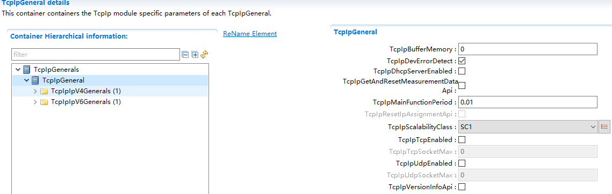

.. centered:: **表 TcpIpGeneral属性描述 (Describe the TcpIpGeneral property)**

.. list-table::
   :widths: 20 20 20 20 20
   :header-rows: 1

   * - UI名称 (UI Name)
     - 描述 (Description)
     - 
     - 
     - 
   * - TcpIpBufferMemory
     - 取值范围 (Range)
     - 0 .. 4294967295
     - 默认取值 (Default value)
     - 无
   * - 
     - 参数描述 (Parameter Description)
     - Memory size in bytes reserved for TCP/IP buffers.
     - 
     - 
   * - 
     - 依赖关系 (Dependencies)
     - 取值范围依赖于具体芯片资源 (The range depends on the specific chip resources.)
     - 
     - 
   * - TcpIpDevErrorDetect
     - 取值范围 (Range)
     - TRUE/FALSE
     - 默认取值 (Default value)
     - 无
   * - 
     - 参数描述 (Parameter Description)
     - Switches the Default Error Tracer (Det) detection and notification ON or OFF.•true: enabled(ON). •false: disabled(OFF).
     - 
     - 
   * - 
     - 依赖关系 (Dependencies)
     - DET模块 (DET module)
     - 
     - 
   * - TcpIpDhcpServerEnabled
     - 取值范围 (Range)
     - TRUE/FALSE
     - 默认取值 (Default value)
     - 无
   * - 
     - 参数描述 (Parameter Description)
     - Enables (TRUE)or disables(FALSE) the DHCP(Dynamic Host Configuration Protocol)Server.
     - 
     - 
   * - 
     - 依赖关系 (Dependencies)
     - 功能未实现，固定不使能 (Function not implemented, fix and disable)
     - 
     - 
   * - TcpIpGetAndResetMeasurementDataApi
     - 取值范围 (Range)
     - STD_ON/STD_OFF
     - 默认取值 (Default value)
     - 无
   * - 
     - 参数描述 (Parameter Description)
     - 是否使能GetAndResetMeasurementData Api (Whether to Enable GetAndResetMeasurementData Api)
     - 
     - 
   * - 
     - 依赖关系 (Dependencies)
     - 无
     - 
     - 
   * - TcpIpMainFunctionPeriod
     - 取值范围 (Range)
     - 0 .. INF
     - 默认取值 (Default value)
     - 无
   * - 
     - 参数描述 (Parameter Description)
     - Period ofTcpIp_MainFunctionin [s].
     - 
     - 
   * - 
     - 依赖关系 (Dependencies)
     - OS周期任务的时间周期，取值大于0 (The time period for OS scheduled tasks, with a value greater than 0)
     - 
     - 
   * - TcpIpResetIpAssignmentApi
     - 取值范围 (Range)
     - TRUE/FALSE
     - 默认取值 (Default value)
     - 无
   * - 
     - 参数描述 (Parameter Description)
     - Enables/disables the API TcpIp_ResetIpAssignment of a DHCP-client.
     - 
     - 
   * - 
     - 依赖关系 (Dependencies)
     - DHCP客户端功能使能情况（TcpIpResetIpAssignmentApi使能），TcpIp_ResetIpAssignment才使能。
     - 
     - 
   * - TcpIpScalabilityClass
     - 取值范围 (Range)
     - SC1/SC2/SC3
     - 默认取值 (Default value)
     - SC1
   * - 
     - 参数描述 (Parameter Description)
     - In order to customize the TcpIp Stack to the specific needs of the user it can be scaled according to the scalability classes.
     - 
     - 
   * - 
     - 依赖关系 (Dependencies)
     - 未实现IPv6功能，固定配置为SC1 (Unimplemented IPv6 functionality, fixed configuration as SC1)
     - 
     - 
   * - TcpIpTcpEnabled
     - 取值范围 (Range)
     - TRUE/FALSE
     - 默认取值 (Default value)
     - 无
   * - 
     - 参数描述 (Parameter Description)
     - Enables (TRUE)or disabled(FALSE) support of TCP(TransmissionControlProtocol).
     - 
     - 
   * - 
     - 依赖关系 (Dependencies)
     - 无
     - 
     - 
   * - TcpIpTcpSocketMax
     - 取值范围 (Range)
     - 0 .. 65535
     - 默认取值 (Default value)
     - 无
   * - 
     - 参数描述 (Parameter Description)
     - Maximum number of TCP sockets
     - 
     - 
   * - 
     - 依赖关系 (Dependencies)
     - 依赖于TcpIpTcpEnabled使能 (Dependent on TcpIpTcpEnabled)
     - 
     - 
   * - TcpIpUdpEnabled
     - 取值范围 (Range)
     - TRUE/FALSE
     - 默认取值 (Default value)
     - 无
   * - 
     - 参数描述 (Parameter Description)
     - Enables (TRUE)or disabled(FALSE) support of UDP (UserDatagramProtocol)
     - 
     - 
   * - 
     - 依赖关系 (Dependencies)
     - 无
     - 
     - 
   * - TcpIpUdpSocketMax
     - 取值范围 (Range)
     - 0 .. 65535
     - 默认取值 (Default value)
     - 无
   * - 
     - 参数描述 (Parameter Description)
     - Maximum number of UDP sockets.
     - 
     - 
   * - 
     - 依赖关系 (Dependencies)
     - 依赖于TcpIpUdpEnabled使能 (Enable TcpIpUdpBased Dependence)
     - 
     - 
   * - TcpIpVersionInfoApi
     - 取值范围 (Range)
     - TRUE/FALSE
     - 默认取值 (Default value)
     - 无
   * - 
     - 参数描述 (Parameter Description)
     - If true theTcpIp_GetVersionInfoAPI isavailable.
     - 
     - 
   * - 
     - 依赖关系 (Dependencies)
     - 无
     - 
     - 
   * - TcpIpArpEnabled
     - 取值范围 (Range)
     - TRUE/FALSE
     - 默认取值 (Default value)
     - TRUE
   * - 
     - 参数描述 (Parameter Description)
     - Enables (TRUE)or disables(FALSE) support of ARP (AddressResolutionProtocol).
     - 
     - 
   * - 
     - 依赖关系 (Dependencies)
     - 整个TcpIpIpV4General中配置参数都依赖于TcpIpScalabilityClass配置为SC1或者SC3（该配置目前固定为SC1）。 (All configuration parameters in TcpIpIpV4General depend on TcpIpScalabilityClass being configured as SC1 or SC3 (this configuration is currently fixed to SC1).)
     - 
     - 
   * - TcpIpAutoIpEnabled
     - 取值范围 (Range)
     - TRUE/FALSE
     - 默认取值 (Default value)
     - 无
   * - 
     - 参数描述 (Parameter Description)
     - Enables (TRUE)or disables(FALSE) the Auto-IP(automatic private IP addressing)sub-module.
     - 
     - 
   * - 
     - 依赖关系 (Dependencies)
     - 整个TcpIpIpV4General中配置参数都依赖于TcpIpScalabilityClass配置为SC1或者SC3（该配置目前固定为SC1）。 (All configuration parameters in TcpIpIpV4General depend on TcpIpScalabilityClass being configured as SC1 or SC3 (this configuration is currently fixed to SC1).)
     - 
     - 
   * - TcpIpDhcpClientEnabled
     - 取值范围 (Range)
     - TRUE/FALSE
     - 默认取值 (Default value)
     - 无
   * - 
     - 参数描述 (Parameter Description)
     - Enables (TRUE)or disables(FALSE) the DHCP(Dynamic Host Configuration Protocol)Client.
     - 
     - 
   * - 
     - 依赖关系 (Dependencies)
     - 整个TcpIpIpV4General中配置参数都依赖于TcpIpScalabilityClass配置为SC1或者SC3（该配置目前固定为SC1）。 (All configuration parameters in TcpIpIpV4General depend on TcpIpScalabilityClass being configured as SC1 or SC3 (this configuration is currently fixed to SC1).)
     - 
     - 
   * - TcpIpIcmpEnabled
     - 取值范围 (Range)
     - TRUE/FALSE
     - 默认取值 (Default value)
     - TRUE
   * - 
     - 参数描述 (Parameter Description)
     - Enables (TRUE)or disabled(FALSE) support of ICMP(InternetControl MessageProtocol).
     - 
     - 
   * - 
     - 依赖关系 (Dependencies)
     - 整个TcpIpIpV4General中配置参数都依赖于TcpIpScalabilityClass配置为SC1或者SC3（该配置目前固定为SC1）。 (All configuration parameters in TcpIpIpV4General depend on TcpIpScalabilityClass being configured as SC1 or SC3 (this configuration is currently fixed to SC1).)
     - 
     - 
   * - TcpIpIpV4Enabled
     - 取值范围 (Range)
     - TRUE/FALSE
     - 默认取值 (Default value)
     - TRUE
   * - 
     - 参数描述 (Parameter Description)
     - Enables (TRUE)or disables(FALSE) support of IPv4(Internet Protocol version4).
     - 
     - 
   * - 
     - 依赖关系 (Dependencies)
     - 整个TcpIpIpV4General中配置参数都依赖于TcpIpScalabilityClass配置为SC1或者SC3（该配置目前固定为SC1）。 (All configuration parameters in TcpIpIpV4General depend on TcpIpScalabilityClass being configured as SC1 or SC3 (this configuration is currently fixed to SC1).)
     - 
     - 
   * - TcpIpLocalAddrIpv4EntriesMax
     - 取值范围 (Range)
     - 0 .. 255
     - 默认取值 (Default value)
     - 无
   * - 
     - 参数描述 (Parameter Description)
     - Maximum number of LocalAddr table entries for IPv4.
     - 
     - 
   * - 
     - 依赖关系 (Dependencies)
     - 限制TcpIpLocalAddr（TCPIP_AF_INET属性）的配置数目
     - 
     - 
   * - TcpIpPathMtuDiscoveryEnabled
     - 取值范围 (Range)
     - TRUE/FALSE
     - 默认取值 (Default value)
     - FALSE
   * - 
     - 参数描述 (Parameter Description)
     - Enables (TRUE)or disables(FALSE) the discovery of the maximum transmission unit on a path according to IETF RfC 1191.
     - 
     - 
   * - 
     - 依赖关系 (Dependencies)
     - 功能未实现，固定配置为FALSE，不可改。 (Function not implemented, fixed configuration as FALSE, not editable.)
     - 
     - 

TcpIpIpV4General
--------------------------------

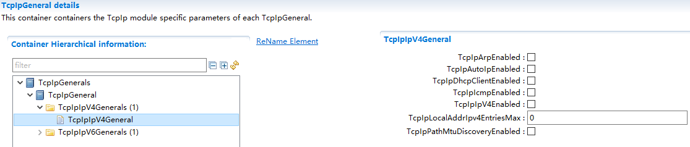

.. centered:: **表 TcpIp V4General属性描述 (Describe TcpIp V4General Properties)**

.. list-table::
   :widths: 20 20 20 20 20
   :header-rows: 1

   * - UI名称 (UI Name)
     - 描述 (Description)
     - 
     - 
     - 
   * - TcpIpArpEnabled
     - 取值范围 (Range)
     - TRUE/FALSE
     - 默认取值 (Default value)
     - TRUE
   * - 
     - 参数描述 (Parameter Description)
     - Enables (TRUE)or disables(FALSE) support of ARP(Address Resolution Protocol).
     - 
     - 
   * - 
     - 依赖关系 (Dependencies)
     - 整个TcpIpIpV4General中配置参数都依赖于TcpIpScalabilityClass配置为SC1或者SC3（该配置目前固定为SC1）。 (All configuration parameters in TcpIpIpV4General depend on TcpIpScalabilityClass being configured as SC1 or SC3 (this configuration is currently fixed to SC1).)
     - 
     - 
   * - TcpIpAutoIpEnabled
     - 取值范围 (Range)
     - TRUE/FALSE
     - 默认取值 (Default value)
     - 无
   * - 
     - 参数描述 (Parameter Description)
     - Enables (TRUE)or disables(FALSE) the Auto-IP(automatic private IP addressing) sub-module.
     - 
     - 
   * - 
     - 依赖关系 (Dependencies)
     - 整个TcpIpIpV4General中配置参数都依赖于TcpIpScalabilityClass配置为SC1或者SC3（该配置目前固定为SC1）。 (All configuration parameters in TcpIpIpV4General depend on TcpIpScalabilityClass being configured as SC1 or SC3 (this configuration is currently fixed to SC1).)
     - 
     - 
   * - TcpIpDhcpClientEnabled
     - 取值范围 (Range)
     - TRUE/FALSE
     - 默认取值 (Default value)
     - 无
   * - 
     - 参数描述 (Parameter Description)
     - Enables (TRUE)or disables(FALSE) the DHCP (Dynamic Host Configuration Protocol)Client.
     - 
     - 
   * - 
     - 依赖关系 (Dependencies)
     - 整个TcpIpIpV4General中配置参数都依赖于TcpIpScalabilityClass配置为SC1或者SC3（该配置目前固定为SC1）。 (All configuration parameters in TcpIpIpV4General depend on TcpIpScalabilityClass being configured as SC1 or SC3 (this configuration is currently fixed to SC1).)
     - 
     - 
   * - TcpIpIcmpEnabled
     - 取值范围 (Range)
     - TRUE/FALSE
     - 默认取值 (Default value)
     - TRUE
   * - 
     - 参数描述 (Parameter Description)
     - Enables (TRUE) or disabled(FALSE) support of ICMP (Internet Control Message Protocol).
     - 
     - 
   * - 
     - 依赖关系 (Dependencies)
     - 整个TcpIpIpV4General中配置参数都依赖于TcpIpScalabilityClass配置为SC1或者SC3（该配置目前固定为SC1）。 (All configuration parameters in TcpIpIpV4General depend on TcpIpScalabilityClass being configured as SC1 or SC3 (this configuration is currently fixed to SC1).)
     - 
     - 
   * - TcpIpIpV4Enabled
     - 取值范围 (Range)
     - TRUE/FALSE
     - 默认取值 (Default value)
     - TRUE
   * - 
     - 参数描述 (Parameter Description)
     - Enables (TRUE) or disables(FALSE) support of IPv4 (Internet Protocol version 4).
     - 
     - 
   * - 
     - 依赖关系 (Dependencies)
     - 整个TcpIpIpV4General中配置参数都依赖于TcpIpScalabilityClass配置为SC1或者SC3（该配置目前固定为SC1）。 (All configuration parameters in TcpIpIpV4General depend on TcpIpScalabilityClass being configured as SC1 or SC3 (this configuration is currently fixed to SC1).)
     - 
     - 
   * - TcpIpLocalAddrIpv4EntriesMax
     - 取值范围 (Range)
     - 0 .. 255
     - 默认取值 (Default value)
     - 无
   * - 
     - 参数描述 (Parameter Description)
     - Maximum number of LocalAddr table entries for IPv4.
     - 
     - 
   * - 
     - 依赖关系 (Dependencies)
     - 限制TcpIpLocalAddr（TCPIP_AF_INET属性）的配置数目
     - 
     - 
   * - TcpIpPathMtuDiscoveryEnabled
     - 取值范围 (Range)
     - TRUE/FALSE
     - 默认取值 (Default value)
     - FALSE
   * - 
     - 参数描述 (Parameter Description)
     - Enables (TRUE)or disables(FALSE) the discovery of the maximum transmission unit on a path according to IETF RfC 1191.
     - 
     - 
   * - 
     - 依赖关系 (Dependencies)
     - 功能未实现，固定配置为FALSE，不可改。 (Function not implemented, fixed configuration as FALSE, not editable.)
     - 
     - 
   * - TcpIpArpStaticEnabled
     - 取值范围 (Range)
     - TRUE/FALSE
     - 默认取值 (Default value)
     - FALSE
   * - 
     - 参数描述 (Parameter Description)
     - Enable/Disablestatic ARP.
     - 
     - 
   * - 
     - 依赖关系 (Dependencies)
     - TcpIpArpEnabled使能时才有效 (TcpIpArpEnabled Enabled Only)
     - 
     - 

TcpIpCtrl
-------------------------

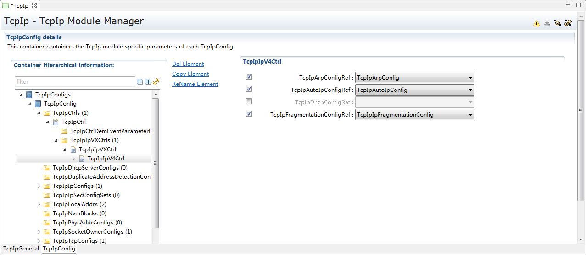

.. centered:: **表 TcpIpCtrl属性描述 (Table TcpIpCtrl properties description)**

.. list-table::
   :widths: 20 20 20 20 20
   :header-rows: 1

   * - UI名称 (UI Name)
     - 描述 (Description)
     - 
     - 
     - 
   * - TcpIpIpFramePrioDefault
     - 取值范围 (Range)
     - 0 .. 7
     - 默认取值 (Default value)
     - 0
   * - 
     - 参数描述 (Parameter Description)
     - Specifies the default value for the priority for all outgoing frames.Note: thevalue can bechanged foreach socketindividuallyviaTcpIp_ChangeParameter()service. Ifthis optionalparameter isnot available,0 is used asdefaultpriority.
     - 
     -  
   * - 
     - 依赖关系 (Dependencies)
     - 无
     - 
     - 
   * - TcpIpEthIfCtrlRef
     - 取值范围 (Range)
     - Symbolic namereference to [EthIfController]
     - 默认取值 (Default value)
     - 无
   * - 
     - 参数描述 (Parameter Description)
     - Reference to EthIf controller where the IP address shall be assigned.
     - 
     - 
   * - 
     - 依赖关系 (Dependencies)
     - 关联到EthIf中的Controller (Associate with the Controller in EthIf)
     - 
     - 
   * - TcpIpCtrlDemEventParameterRefs
     - 取值范围 (Range)
     - 无
     - 默认取值 (Default value)
     - 无
   * - 
     - 参数描述 (Parameter Description)
     - This containeris a subcontainer of TcpIpCtrl and specifies the references to DemEventParameter elements which shall be invoked using the API Dem_ReportErrorStatusAPI in case the corresponding TcpIp error occurs for communicationon the EthIfController.
     - 
     - 
   * - 
     - 依赖关系 (Dependencies)
     - DEM报错功能不支持，配置工具上限制不能添加 (The DEM error reporting function is unsupported, configuration tools limit preventing addition.)
     - 
     - 
   * - TcpIpArpConfigRef
     - 取值范围 (Range)
     - Reference to [TcpIpArpConfig]
     - 默认取值 (Default value)
     - 无
   * - 
     - 参数描述 (Parameter Description)
     - Reference to ARP configuration for this IPv4 instance.(Multiple IPv4 instances may use the same configuration container but will operate independently)
     - 
     - 
   * - 
     - 依赖关系 (Dependencies)
     - 依赖于TcpIpArpConfig配置项的添加 (Dependent on the addition of TcpIpArpConfig configuration item)
     - 
     - 
   * - TcpIpAutoIpConfigRef
     - 取值范围 (Range)
     - Reference to[TcpIpAutoIpConfig]
     - 默认取值 (Default value)
     - 无
   * - 
     - 参数描述 (Parameter Description)
     - Reference to AutoIp configuration for this IPv4 instance.(Multiple IPv4 instances may use the same configuration container but will operate independently)
     - 
     - 
   * - 
     - 依赖关系 (Dependencies)
     - 依赖于TcpIpAutoIpConfig配置项的添加 (Dependent on the addition of TcpIpAutoIpConfig configuration item)
     - 
     - 
   * - TcpIpDhcpConfigRef
     - 取值范围 (Range)
     - Reference to[TcpIpDhcpConfig]
     - 默认取值 (Default value)
     - 无
   * - 
     - 参数描述 (Parameter Description)
     - Reference to DHCP configuration for this IPv4 instance.(Multiple IPv4 instances may use the same configuration container but will operate independently)
     - 
     - 
   * - 
     - 依赖关系 (Dependencies)
     - 依赖于TcpIpDhcpConfig配置项的添加 (Dependent on the addition of TcpIpDhcpConfig configuration item)
     - 
     - 
   * - TcpIpFragmentationConfigRef
     - 取值范围 (Range)
     - Reference to[TcpIpIpFragmentationConfig]
     - 默认取值 (Default value)
     - 无
   * - 
     - 参数描述 (Parameter Description)
     - Reference to Fragmentation configuration for this IPv4 instance.(Multiple IPv4 instances may use the same configuration container but will operate independently)
     - 
     - 
   * - 
     - 依赖关系 (Dependencies)
     - 依赖于TcpIpIpFragmentationConfig配置项的添加 (Dependent on the addition of TcpIpIpFragmentationConfig configuration item)
     - 
     - 

TcpIpIpV4Config
-------------------------------

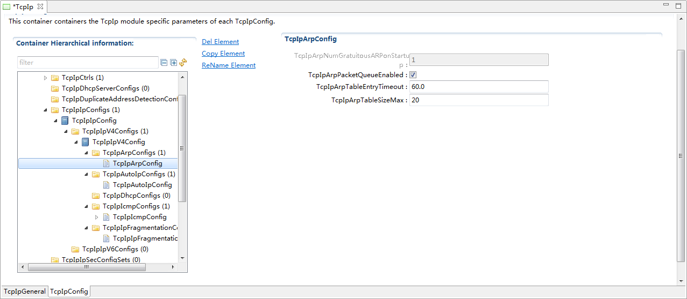

.. centered:: **表 TcpIpV4Config属性描述 (Describe the TcpIpV4Config property)**

.. list-table::
   :widths: 20 20 20 20 20
   :header-rows: 1

   * - UI名称 (UI Name)
     - 描述 (Description)
     - 
     - 
     - 
   * - TcpIpArpNumGratuitousARPonStartup
     - 取值范围 (Range)
     - 0 .. 255
     - 默认取值 (Default value)
     - 1
   * - 
     - 参数描述 (Parameter Description)
     - Specifies the number of gratuitous ARP replies which shall besent on assignment of a new IPaddress.
     - 
     - 
   * - 
     - 依赖关系 (Dependencies)
     - 依赖于TcpIpArpEnabled使能。根据LwIP实现，固定为1次，不可改。 (Dependent on TcpIpArpEnabled enabling. According to LwIP implementation, fixed at 1 time and不可改.)
     - 
     - 
   * - TcpIpArpPacketQueueEnabled
     - 取值范围 (Range)
     - TRUE/FALSE
     - 默认取值 (Default value)
     - FALSE
   * - 
     - 参数描述 (Parameter Description)
     - Enables (TRUE) or disables (FALSE) support of the ARP Packet Queue accordingto IETF RFC 1122,section 2.3.2.2.
     - 
     - 
   * - 
     - 依赖关系 (Dependencies)
     - 依赖于TcpIpArpEnabled使能。 (Enable dependency on TcpIpArpEnabled.)
     - 
     - 
   * - TcpIpArpTableEntryTimeout
     - 取值范围 (Range)
     - 0 .. INF
     - 默认取值 (Default value)
     - 300
   * - 
     - 参数描述 (Parameter Description)
     - Timeout in seconds after which an unused ARP entry is removed.
     - 
     - 
   * - 
     - 依赖关系 (Dependencies)
     - 依赖于TcpIpArpEnabled使能。 (Enable dependency on TcpIpArpEnabled.)
     - 
     - 
   * - TcpIpArpTableSizeMax
     - 取值范围 (Range)
     - 0 .. 65535
     - 默认取值 (Default value)
     - 10
   * - 
     - 参数描述 (Parameter Description)
     - Maximum number of entries in the ARP table.
     - 
     - 
   * - 
     - 依赖关系 (Dependencies)
     - 依赖于TcpIpArpEnabled使能。 (Enable dependency on TcpIpArpEnabled.)
     - 
     - 
   * - TcpIpAutoIpInitTimeout
     - 取值范围 (Range)
     - 0 .. INF
     - 默认取值 (Default value)
     - FALSE
   * - 
     - 参数描述 (Parameter Description)
     - The time in seconds Auto-IP waits atstartup, before beginning with ARP probing. This delay is used to give DHCP timeto acquire a lease incase a DHCP server is present.
     - 
     - 
   * - 
     - 依赖关系 (Dependencies)
     - 依赖于TcpIpAutoIpEnabled使能。AUTOSAR配置的时间，与LwIP中配置的尝试DHCP获取IP的次数存在转化关系，具体参考前面Auto-IP功能实现描述。 (Enabling TcpIpAutoIpEnabled. There is a transformation relationship between the AUTOSAR configuration time and the number of DHCP IP acquisition attempts configured in LwIP; refer to the previous Auto-IP feature implementation description for specifics.)
     - 
     - 
   * - TcpIpIcmpTtl
     - 取值范围 (Range)
     - 0 .. 255
     - 默认取值 (Default value)
     - 10
   * - 
     - 参数描述 (Parameter Description)
     - Default Time-to-live value of outgoing ICMP packets.
     - 
     - 
   * - 
     - 依赖关系 (Dependencies)
     - 依赖于TcpIpIcmpEnabled使能。 (Depends on TcpIpIcmpEnabled being enabled.)
     - 
     - 
   * - TcpIpIpFragmentationRxEnabled
     - 取值范围 (Range)
     - TRUE/FALSE
     - 默认取值 (Default value)
     - FALSE
   * - 
     - 参数描述 (Parameter Description)
     - Enables (TRUE) or disables (FALSE) support for reassembling of incoming datagrams that are fragmented according to IETF RFC815 (IP Datagram Reassembly Algorithms).
     - 
     - 
   * - 
     - 依赖关系 (Dependencies)
     - 无
     - 
     - 
   * - TcpIpIpNumFragments
     - 取值范围 (Range)
     - 0 .. 255
     - 默认取值 (Default value)
     - 0
   * - 
     - 参数描述 (Parameter Description)
     - Specifies the maximum number of IP fragments per datagram. Note:this parameter is only relevant if TcpIpIpFragmentationRxEnabled is TRUE.
     - 
     - 
   * - 
     - 依赖关系 (Dependencies)
     - 依赖于TcpIpIpFragmentationRxEnabled使能。 (Enabling TcpIpIpFragmentationRxEnabled.)
     - 
     - 
   * - TcpIpIpNumReassDgrams
     - 取值范围 (Range)
     - 0 .. 65535
     - 默认取值 (Default value)
     - 3
   * - 
     - 参数描述 (Parameter Description)
     - Specifies the maximum number of fragmented IP datagrams that canbe reassembled inparallel. Note: this parameter is only relevant if TcpIpIpFragmentationRxEnabled is TRUE.
     - 
     - 
   * - 
     - 依赖关系 (Dependencies)
     - 依赖于TcpIpIpFragmentationRxEnabled使能。 (Enabling TcpIpIpFragmentationRxEnabled.)
     - 
     - 
   * - TcpIpIpReassTimeout
     - 取值范围 (Range)
     - 0 .. INF
     - 默认取值 (Default value)
     - 60
   * - 
     - 参数描述 (Parameter Description)
     - Specifies the timeoutin [s] after which an incomplete datagramgets discarded. Note:this parameter is only relevant if TcpIpIpFragmentationRxEnabledi s TRUE.
     - 
     - 
   * - 
     - 依赖关系 (Dependencies)
     - 依赖于TcpIpIpFragmentationRxEnabled使能。 (Enabling TcpIpIpFragmentationRxEnabled.)
     - 
     - 

TcpIpArpStaticTable
-------------------------------

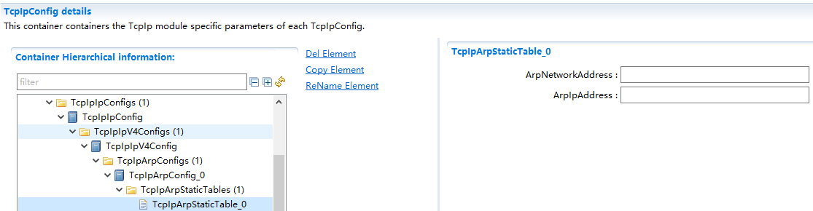

.. centered:: **表 TcpIpArpStraticTable属性描述 (Describe TcpIpArpStaticTable property)**

.. list-table::
   :widths: 20 20 20 20 20
   :header-rows: 1

   * - UI名称 (UI Name)
     - 描述 (Description)
     - 
     - 
     - 
   * - ArpNetworkAddress
     - 取值范围 (Range)
     - MAC地址（string类型）
     - 默认取值 (Default value)
     - 无
   * - 
     - 参数描述 (Parameter Description)
     - MAC address
     - 
     - 
   * - 
     - 依赖关系 (Dependencies)
     - TcpIpArpStaticEnabled使能时才可配置 (TcpIpArpStaticEnabled is enabled before it can be configured)
     - 
     - 
   * - ArpIpAddress
     - 取值范围 (Range)
     - IP地址（string类型）
     - 默认取值 (Default value)
     - 无
   * - 
     - 参数描述 (Parameter Description)
     - Ip address
     - 
     - 
   * - 
     - 依赖关系 (Dependencies)
     - TcpIpArpStaticEnabled使能时才可配置 (TcpIpArpStaticEnabled is enabled before it can be configured)
     - 
     - 

TcpIpLocalAddr
------------------------------

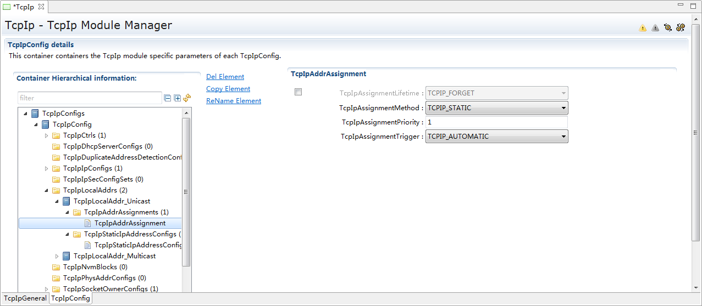

.. centered:: **表 TcpIpLocalAddr属性描述 (Describe the TcpIpLocalAddr property)**

.. list-table::
   :widths: 20 20 20 20 20
   :header-rows: 1

   * - UI名称 (UI Name)
     - 描述 (Description)
     - 
     - 
     - 
   * - TcpIpAddrId
     - 取值范围 (Range)
     - 0 .. 65535
     - 默认取值 (Default value)
     - 无
   * -
     - 参数描述 (Parameter Description)
     - IP address table identifier assigned by TCP/IPstack.
     - 
     - 
   * - 
     - 依赖关系 (Dependencies)
     - 工具自动生成（从0开始自动排序）。 (Automatically generated tools (automatically sorted starting from 0).)
     - 
     - 
   * - TcpIpAddressType
     - 取值范围 (Range)
     - TCPIP_MULTICAST/TCPIP_UNICAST
     - 默认取值 (Default value)
     - TCPIP_UNICAST
   * - 
     - 参数描述 (Parameter Description)
     - Addresstype.
     - 
     - 
   * - 
     - 依赖关系 (Dependencies)
     - 默认TCPIP_UNICAST (Default_TCPIP_UNICAST)
     - 
     - 
   * - TcpIpDomainType
     - 取值范围 (Range)
     - TCPIP_AF_INET
     - 默认取值 (Default value)
     - TCPIP_AF_INET / TCPIP_AF_INET6
   * - 
     - 参数描述 (Parameter Description)
     - Addressfamily.
     - 
     - 
   * - 
     - 依赖关系 (Dependencies)
     - 默认TCPIP_AF_INET，不可改（暂不支持IPv6）。 (Default TCP_IP_AF_INET,不可更改（暂不支持IPv6）。)
     - 
     - 
   * - TcpIpCtrlRef
     - 取值范围 (Range)
     - Referenceto [TcpIpCtrl]
     - 默认取值 (Default value)
     - 无
   * - 
     - 参数描述 (Parameter Description)
     - Reference to a TcpIpCtrl specifying the EthIf Controller where the IP address shall be assigned and DEM errors that shall be reported in case of an erroron this controller.
     - 
     - 
   * - 
     - 依赖关系 (Dependencies)
     - 无
     - 
     - 
   * - TcpIpAssignmentLifetime
     - 取值范围 (Range)
     - TCPIP_FORGET / TCPIP_STORE
     - 默认取值 (Default value)
     - TCPIP_FORGET
   * - 
     - 参数描述 (Parameter Description)
     - Defines the lifetime of a dynamically fetched IP address. If TcpIpAssignmentMethod = TCPIP_STATIC then TcpIpAssignment Life time shall be omitted.
     - 
     - 
   * - 
     - 依赖关系 (Dependencies)
     - 目前不支持永久IP分配，只支持TCPIP_FORGET模式 (Currently, permanent IP allocation is not supported and only TCPIP_FORGET mode is supported.)
     - 
     - 
   * - TcpIpAssignmentMethod
     - 取值范围 (Range)
     - TCPIP_DHCP/TCPIP_IPV6_ROUTER（不支持） (TCPIP_DHCPTCPIP_IPV6_ROUTER (Not Supported))/TCPIP_LINKLOCAL/TCPIP_LINKLOCAL_DOIP/TCPIP_STATIC
     - 默认取值 (Default value)
     - 无
   * - 
     - 参数描述 (Parameter Description)
     - Method ofaddressassignment
     - 
     - 
   * - 
     - 依赖关系 (Dependencies)
     - 分配方式的选择依赖于TcpIpAutoIpEnabled、TcpIpDhcpClientEnabled使能。当TcpIpAddressType为TCPIP_MULTICAST时，TcpIpAssignmentMethod中限定为TCPIP_STATIC (The selection of the allocation method depends on TcpIpAutoIpEnabled and TcpIpDhcpClientEnabled being enabled. When TcpIpAddressType is TCPIP_MULTICAST, TcpIpAssignmentMethod is limited to TCPIP_STATIC.)
     - 
     - 
   * - TcpIpAssignmentPriority
     - 取值范围 (Range)
     - 1 .. 3
     - 默认取值 (Default value)
     - 无
   * - 
     - 参数描述 (Parameter Description)
     - Priority of assignment(1 ishighest). If a new address from an assignment method with a higher priority is available,it overwrites the IP address previously assigned by anassignment method with alower priority.
     - 
     - 
   * - 
     - 依赖关系 (Dependencies)
     - 当某TcpIpLocalAddr配置了多个TcpIpAddrAssignment（目前不支持）获取IP方式时，该参数才有效。基于目前功能实现，不支持，配置界面固定为1，不可改。 (When multiple TcpIpAddrAssignments (currently not supported) are configured for a TcpIpLocalAddr with multiple IP acquisition methods, this parameter becomes effective. Based on the current feature implementation, it is not supported; the configuration interface is fixed at 1 and cannot be changed.)
     - 
     - 
   * - TcpIpAssignmentTrigger
     - 取值范围 (Range)
     - TCPIP_AUTOMATIC/TCPIP_MANUAL
     - 默认取值 (Default value)
     - 无
   * - 
     - 参数描述 (Parameter Description)
     - Trigger ofaddressassignment.
     - 
     - 
   * - 
     - 依赖关系 (Dependencies)
     - 无
     - 
     - 
   * - TcpIpDefaultRouter
     - 取值范围 (Range)
     - IP网关地址（string类型）
     - 默认取值 (Default value)
     - 无
   * - 
     - 参数描述 (Parameter Description)
     - IP addressof defaultrouter(gateway)
     - 
     - 
   * - 
     - 依赖关系 (Dependencies)
     - 无
     - 
     - 
   * - TcpIpNetmask
     - 取值范围 (Range)
     - 0 .. 128
     - 默认取值 (Default value)
     - 无
   * -
     - 参数描述 (Parameter Description)
     - Network mask of IPv4address or address prefix of IPv6 address in CIDR Notation,i.e.decimal value between 0 and 32(IPv4) or 0 and 128(IPv6) that describes the number of significant bits defining the network number or prefix of an IP address.
     - 
     - 
   * - 
     - 依赖关系 (Dependencies)
     - 根据TcpIpDomainType决定范围 (Based on TcpIpDomainType Determine Range)
     - 
     - 
   * - TcpIpStaticIpAddress
     - 取值范围 (Range)
     - IP地址（string类型）
     - 默认取值 (Default value)
     - 无
   * -
     - 参数描述 (Parameter Description)
     - Static IPAddress. To specifyany IP address for a certain EthIfCtrl,“ANY” has to be set as wildcard.See TcpIp_Bind() for more details.
     - 
     - 
   * - 
     - 依赖关系 (Dependencies)
     - 当IP分配方式配置成TCPIP_STATIC方式，触发方式配置成TCPIP_AUTOMATIC时，该项必须配置（其所在的ContainerTcpIpStaticIpAddressConfig必须配置）。 (When the IP allocation method is configured as TCPIP_STATIC and the trigger method is configured as TCPIP_AUTOMATIC, this must be configured (the ContainerTcpIpStaticIpAddressConfig it resides in must also be configured).)
     - 
     - 

TcpIpSocketOwnerConfig
--------------------------------------

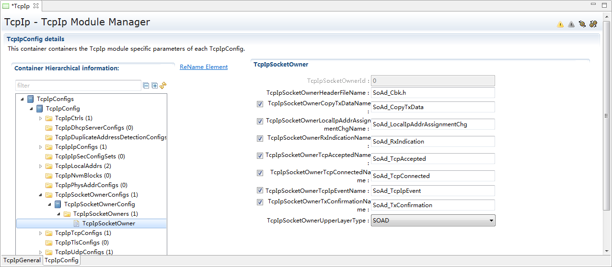

.. centered:: **表 TcpIpSocketOwnerConfig属性描述 (Describe TcpIpSocketOwnerConfig Property)**

.. list-table::
   :widths: 20 20 20 20 20
   :header-rows: 1

   * - UI名称 (UI Name)
     - 描述 (Description)
     - 
     - 
     - 
   * - TcpIpSocketOwnerCopyTxDataName
     - 取值范围 (Range)
     - 上层模块接口名（string类型）
     - 默认取值 (Default value)
     - Soad_CopyTxData
   * - 
     - 参数描述 (Parameter Description)
     - This parameter defines the name of the <Up_CopyTxData> function of the TcpIpSocketOwner module. The function name shall only be configurable if TcpIpSocketOwnerUpperLayerType is set to CDD.
     - 
     - 
   * - 
     - 依赖关系 (Dependencies)
     - 依赖于TcpIpSocketOwnerUpperLayerType（默认为SoAd模块） (Dependent on TcpIpSocketOwnerUpperLayerType (default is SoAd module))
     - 
     - 
   * - TcpIpSocketOwnerHeaderFileName
     - 取值范围 (Range)
     - 上层模块接口名（string类型）
     - 默认取值 (Default value)
     - SoAd_Cbk.h
   * - 
     - 参数描述 (Parameter Description)
     - This parameter specifies the name of the header file containing the definition of the TcpIpSocketOwner module functions. The header file name shall only be configurable if TcpIpSocketOwnerUpperLayerType is set to CDD.
     - 
     - 
   * - 
     - 依赖关系 (Dependencies)
     - 依赖于TcpIpSocketOwnerUpperLayerType（默认为SoAd模块），不支持配置多套SoAd (Dependent on TcpIpSocketOwnerUpperLayerType (default is SoAd module), does not support configuring multiple sets of SoAd.)
     - 
     - 
   * - TcpIpSocketOwnerLocalIpAddrAssignmentChgName
     - 取值范围 (Range)
     - 上层模块接口名（string类型）
     - 默认取值 (Default value)
     - Soad_LocalIpAddrassignmentChg
   * - 
     - 参数描述 (Parameter Description)
     - This parameter defines the name of the <Up_LocalIpAddrAssignmentChg> function of the TcpIpSocketOwner module. The function name shall only be configurable if TcpIpSocketOwnerUpperLayerType is set to CDD.
     - 
     - 
   * - 
     - 依赖关系 (Dependencies)
     - 依赖于TcpIpSocketOwnerUpperLayerType（默认为SoAd模块） (Dependent on TcpIpSocketOwnerUpperLayerType (default is SoAd module))
     - 
     - 
   * - TcpIpSocketOwnerRxIndicationName
     - 取值范围 (Range)
     - 上层模块接口名（string类型）
     - 
     - SoAd_RxIndication
   * - 
     - 参数描述 (Parameter Description)
     - This parameter defines the name of the <Up_RxIndication> function of the TcpIpSocketOwner module. The function name shall only be configurable if TcpIpSocketOwnerUpperLayerType is set to CDD.
     - 
     - 
   * - 
     - 依赖关系 (Dependencies)
     - 依赖于TcpIpSocketOwnerUpperLayerType（默认为SoAd模块） (Dependent on TcpIpSocketOwnerUpperLayerType (default is SoAd module))
     - 
     - 
   * - TcpIpSocketOwnerTcpAcceptedName
     - 取值范围 (Range)
     - 上层模块接口名（string类型）
     - 默认取值 (Default value)
     - SoAd_TcpAccepted
   * - 
     - 参数描述 (Parameter Description)
     - This parameter defines the name of the <Up_TcpAccepted> function of the TcpIpSocketOwner module. The function name shall only be configurable if TcpIpSocketOwnerUpperLayerType is set to CDD.
     - 
     - 
   * - 
     - 依赖关系 (Dependencies)
     - 依赖于TcpIpSocketOwnerUpperLayerType（默认为SoAd模块） (Dependent on TcpIpSocketOwnerUpperLayerType (default is SoAd module))
     - 
     - 
   * - TcpIpSocketOwnerTcpConnectedName
     - 取值范围 (Range)
     - 上层模块接口名（string类型）
     - 默认取值 (Default value)
     - SoAd_TcpConnected
   * - 
     - 参数描述 (Parameter Description)
     - This parameter defines the name of the <Up_TcpConnected> function of the TcpIpSocketOwner module. The function name shall only be configurable if TcpIpSocketOwnerUpperLayerType is set to CDD.
     - 
     - 
   * - 
     - 依赖关系 (Dependencies)
     - 依赖于TcpIpSocketOwnerUpperLayerType（默认为SoAd模块） (Dependent on TcpIpSocketOwnerUpperLayerType (default is SoAd module))
     - 
     - 
   * - TcpIpSocketOwnerTcpIpEventName
     - 取值范围 (Range)
     - 上层模块接口名（string类型）
     - 默认取值 (Default value)
     - SoAd_TcpIpEvent
   * - 
     - 参数描述 (Parameter Description)
     - This parameter defines the name of the <Up_TcpIpEvent> function of the TcpIpSocketOwner module. The function name shall only be configurable if TcpIpSocketOwnerUpperLayerType is set to CDD.
     - 
     - 
   * - 
     - 依赖关系 (Dependencies)
     - 依赖于TcpIpSocketOwnerUpperLayerType（默认为SoAd模块） (Dependent on TcpIpSocketOwnerUpperLayerType (default is SoAd module))
     - 
     - 
   * - TcpIpSocketOwnerTxConfirmationName
     - 取值范围 (Range)
     - 上层模块接口名（string类型）
     - 默认取值 (Default value)
     - SoAd_TXConfirmation
   * - 
     - 参数描述 (Parameter Description)
     - This parameter defines the name of the <Up_TxConfirmation> function of the TcpIpSocketOwner module. The function name shall only be configurable if TcpIpSocketOwnerUpperLayerType is set to CDD.
     - 
     - 
   * - 
     - 依赖关系 (Dependencies)
     - 依赖于TcpIpSocketOwnerUpperLayerType（默认为SoAd模块） (Dependent on TcpIpSocketOwnerUpperLayerType (default is SoAd module))
     - 
     - 
   * - TcpIpSocketOwnerUpperLayerType
     - 取值范围 (Range)
     - CDD/SOAD/TC8TcpIp
     - 默认取值 (Default value)
     - SOAD
   * - 
     - 参数描述 (Parameter Description)
     - This parameter specifies the type of the upper layer module.
     - 
     - 
   * - 
     - 依赖关系 (Dependencies)
     - 无
     - 
     - 

TcpIpTcpConfig
------------------------------

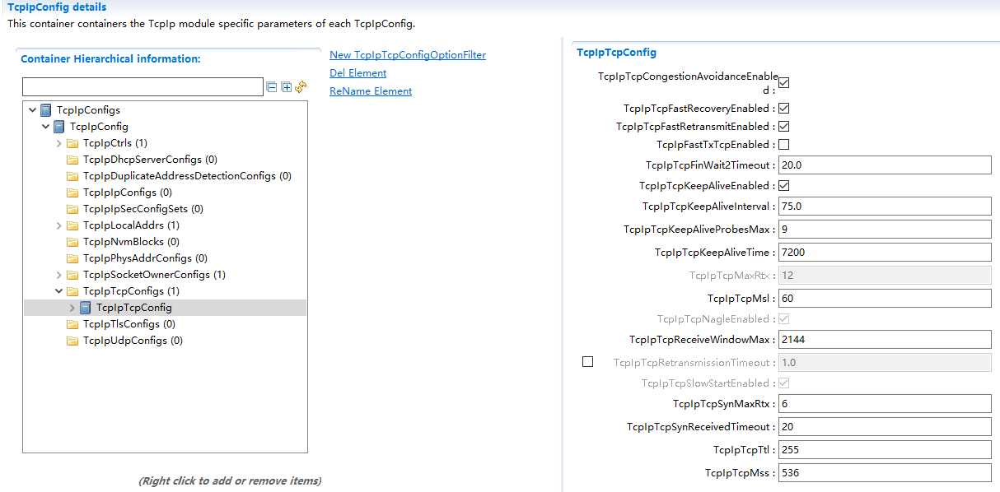

.. centered:: **表 TcpIpTcpConfig属性描述 (Property Description Line Breaks Preserve)**

.. list-table::
   :widths: 20 20 20 20 20
   :header-rows: 1

   * - UI名称 (UI Name)
     - 描述 (Description)
     - 
     - 
     - 
   * - TcpIpTcpCongestionAvoidanceEnabled
     - 取值范围 (Range)
     - TRUE/FALSE
     - 默认取值 (Default value)
     - TRUE
   * - 
     - 参数描述 (Parameter Description)
     - Enables(TRUE) or disables(FALSE) support of TCP congestion avoidance algorithma ccording to IETFRFC 5681.
     - 
     - 
   * - 
     - 依赖关系 (Dependencies)
     - 因LwIP代码固定实现拥塞避免功能，配置界面固定为TRUE,不可改。 (Congestion avoidance functionality is fixed in LwIP code implementation, and the configuration interface is fixed at TRUE and cannot be changed.)
     - 
     - 
   * - TcpIpTcpFastRecoveryEnabled
     - 取值范围 (Range)
     - TRUE/FALSE
     - 默认取值 (Default value)
     - TRUE
   * - 
     - 参数描述 (Parameter Description)
     - Enables(TRUE) or disables(FALSE) support of TCP Fast Recovery according to IETFRFC 5681.
     - 
     - 
   * - 
     - 依赖关系 (Dependencies)
     - 因LwIP代码固定实现快速恢复功能，配置界面固定为TRUE,不可改。 (The LwIP code fixedly implements the fast recovery function, and the configuration interface is fixed at TRUE and cannot be changed.)
     - 
     - 
   * - TcpIpTcpFastRetransmitEnabled
     - 取值范围 (Range)
     - TRUE/FALSE
     - 默认取值 (Default value)
     - TRUE
   * - 
     - 参数描述 (Parameter Description)
     - Enables(TRUE) or disables(FALSE) support of TCP Fast Retransmission according to IETFRFC 5681.
     - 
     - 
   * - 
     - 依赖关系 (Dependencies)
     - 因LwIP代码固定实现快速重传功能，配置界面固定为TRUE,不可改。 (Fast retransmit functionality is fixed in LwIP code and the configuration interface is fixed at TRUE and cannot be changed.)
     - 
     - 
   * - TcpIpFastTxTcpEnabled
     - 取值范围 (Range)
     - TRUE/FALSE
     - 默认取值 (Default value)
     - FALSE
   * - 
     - 参数描述 (Parameter Description)
     - Enable/Disable the fast transmission of TCP data.
     - 
     - 
   * - 
     - 依赖关系 (Dependencies)
     - 当集成了DoIP模块时默认使能 (When the DoIP module is integrated, default enable it.)
     - 
     - 
   * - TcpIpTcpFinWait2Timeout
     - 取值范围 (Range)
     - 0 .. INF
     - 默认取值 (Default value)
     - 20
   * - 
     - 参数描述 (Parameter Description)
     - Timeout in [s] to receive a FIN from the remote node(after this node has initiated connection termination),i.e.maximum time waiting in FINWAIT-2 for a connection termination request from the remote TCP.
     - 
     - 
   * - 
     - 依赖关系 (Dependencies)
     - 客户端发送FIN并收到服务端ACK后进入FIN_WAIT_2状态，在该状态下等待服务器端发送FIN的时间。对应LwIP代码中宏TCP_FIN_WAIT_TIMEOUT。 (The time waited for the server to send FIN after the client sends FIN and receives service端ACK, entering the FIN_WAIT_2 state. This corresponds to the macro TCP_FIN_WAIT_TIMEOUT in LwIP code.)
     - 
     - 
   * - TcpIpTcpKeepAliveEnabled
     - 取值范围 (Range)
     - TRUE/FALSE
     - 默认取值 (Default value)
     - 无
   * - 
     - 参数描述 (Parameter Description)
     - Enables(TRUE) or disables(FALSE) TCP Keep Alive Probes according to IETF RFC 1122 chapter 4.2.3.6
     - 
     - 
   * - 
     - 依赖关系 (Dependencies)
     - 对应LwIP代码中宏LWIP_TCP_KEEPALIVE。 (Corresponding to the macro LWIP_TCP_KEEPALIVE in LwIP code.)
     - 
     - 
   * - TcpIpTcpKeepAliveInterval
     - 取值范围 (Range)
     - 0 .. INF
     - 默认取值 (Default value)
     - 无
   * - 
     - 参数描述 (Parameter Description)
     - Specifies the interval in [s] between subsequent keepalive probes.
     - 
     - 
   * - 
     - 依赖关系 (Dependencies)
     - 依赖于TcpIpTcpKeepAliveEnabled的使能。 (Enabling based on TcpIpTcpKeepAliveEnabled.)
     - 
     - 
   * - TcpIpTcpKeepAliveProbesMax
     - 取值范围 (Range)
     - 0 ..
     - 默认取值 (Default value)
     - 无
   * - 
     - 参数描述 (Parameter Description)
     - Maximum number of times that aTCP Keep Alive is retransmitted before the connection is closed.
     - 
     - 
   * - 
     - 依赖关系 (Dependencies)
     - 依赖于TcpIpTcpKeepAliveEnabled的使能。 (Enabling based on TcpIpTcpKeepAliveEnabled.)
     - 
     - 
   * - TcpIpTcpKeepAliveTime
     - 取值范围 (Range)
     - 0 .. INF
     - 默认取值 (Default value)
     - 7200
   * - 
     - 参数描述 (Parameter Description)
     - Maximum number of timesthat a TCP Keep Alive is retransmitted before the connection is closed.
     - 
     - 
   * - 
     - 依赖关系 (Dependencies)
     - 依赖于TcpIpTcpKeepAliveEnabled的使能。 (Enabling based on TcpIpTcpKeepAliveEnabled.)
     - 
     - 
   * - TcpIpTcpMaxRtx
     - 取值范围 (Range)
     - 0 ..245（lwip中限定最大值为12）
     - 默认取值 (Default value)
     - 无
   * - 
     - 参数描述 (Parameter Description)
     - Maximum number of times that a TCP segment is retransmitted before the TCP connection is closed.This parameter is onlyv alid if TcpIpTcpRetransmissionTimeout is configured.Note:This parameter also applies for FIN retransmissions.
     - 
     - 
   * - 
     - 依赖关系 (Dependencies)
     - 依赖于TcpIpTcpRetransmissionTimeout的使能。 (Enabling dependency on TcpIpTcpRetransmissionTimeout.)
     - 
     - 
   * - TcpIpTcpMsl
     - 取值范围 (Range)
     - 0 .. INF
     - 默认取值 (Default value)
     - 无
   * - 
     - 参数描述 (Parameter Description)
     - Maximum segment life time in [s].(Note:TIME-WAIT=2x TcpIpTcpMsl to ensure that the remote node received the acknowledgment to its connection termination request.)
     - 
     - 
   * - 
     - 依赖关系 (Dependencies)
     - 对应LwIP配置项：TCP_MSL。客户端从FIN_WAIT_2状态收到服务端的FIN并返回ACK后切换到TIME_WAIT状态，在该状态下需要等待2×MSL时间才能切换到CLOSED状态（这样可以保证最后ACK丢失的情况下重新发送ACK）。 (Corresponding LwIP Configuration Item: TCP_MSL.The client transitions to the TIME_WAIT state upon receiving the server's FIN and sending an ACK while in the FIN_WAIT_2 state. In this state, it needs to wait for 2×MSL time before transitioning to CLOSED (this ensures that if the final ACK is lost, a retransmission can be initiated).)
     - 
     - 
   * - TcpIpTcpNagleEnabled
     - 取值范围 (Range)
     - TRUE/FALSE
     - 默认取值 (Default value)
     - TRUE
   * - 
     - 参数描述 (Parameter Description)
     - Enables(TRUE) or disables(FALSE) support of Nagle algorithm according to IETF RFC 896. If enabled the Nagle algorithm is activated per default for all TCP sockets,but can be deactivated via TcpIp_ChangeParameter() API.
     - 
     - 
   * - 
     - 依赖关系 (Dependencies)
     - LwIP固定实现糊涂窗口避免功能，配置工具上默认为TRUE，不可改。 (LwIP fixedly implements the dribble window avoidance function, with the configuration tool defaulting to TRUE and not configurable.)
     - 
     - 
   * - TcpIpTcpReceiveWindowMax
     - 取值范围 (Range)
     - 0 ..
     - 默认取值 (Default value)
     - 无
   * - 
     - 参数描述 (Parameter Description)
     - Defaultvalue ofmaximumreceivewindow inbytes.
     - 
     - 
   * - 
     - 依赖关系 (Dependencies)
     - 接收窗口的最大值，LwIP中通过宏TCP_WND实现TCP收发窗口大小的配置（AUTOSAR标准中没有发送窗口大小的配置）。
     - 
     - 
   * - TcpIpTcpRetransmissionTimeout
     - 取值范围 (Range)
     - 0.001 ..
     - 默认取值 (Default value)
     - 无
   * - 
     - 参数描述 (Parameter Description)
     - Timeout in [s] before anunacknowledged TCP segmentis sent again. If the timeout is disabled or set to INF, no TCP segments shall be retransmitted.
     - 
     - 
   * - 
     - 依赖关系 (Dependencies)
     - 与TcpIpTcpMaxRtx一起共同实现TCP超时重传功能。 (Implement the TCP timeout retransmission function together with TcpIpTcpMaxRtx.)
     - 
     - 
   * - TcpIpTcpSlowStartEnabled
     - 取值范围 (Range)
     - TRUE/FALSE
     - 默认取值 (Default value)
     - TRUE
   * - 
     - 参数描述 (Parameter Description)
     - Enables(TRUE) or disables(FALSE) support of TCP slow start algorithm according to IETF RFC 5681.
     - 
     - 
   * - 
     - 依赖关系 (Dependencies)
     - LwIP代码固定实现慢启动功能，配置界面固定为TRUE，不可改。 (LWIP code fixedly implements slow start function, configuration interface fixed as TRUE and不可修改。)
     - 
     - 
   * - TcpIpTcpSynMaxRtx
     - 取值范围 (Range)
     - 0 ..255（lwip中限定最大值为12）
     - 默认取值 (Default value)
     - 无
   * - 
     - 参数描述 (Parameter Description)
     - Maximum number of times that a TCP SYN is retransmitted. Note: SYN will be retried after TcpIpTcpRetransmissionTimeout.The connection will be dropped if no matching connection request has been received after the last TCP SYN has been sent and TcpIpTcpRetransmissionTimeout has been expired.
     - 
     - 
   * - 
     - 依赖关系 (Dependencies)
     - 依赖于TcpIpTcpRetransmissionTimeout的使能。 (Enabling dependency on TcpIpTcpRetransmissionTimeout.)
     - 
     - 
   * - TcpIpTcpSynReceivedTimeout
     - 取值范围 (Range)
     - 0 .. INF
     - 默认取值 (Default value)
     - 20
   * - 
     - 参数描述 (Parameter Description)
     - Timeout in [s] to complete a remotely initiated TCP connection establishment, i.e.maximum time waiting in SYN-RECEIVED for a confirming connection request acknowledgment after having both received and sent a connection request.
     -  
     - 
   * - 
     - 依赖关系 (Dependencies)
     - 服务端收到SYN后，回复SYN/ACK，进入到SYN_RCVD状态，在该状态等待客户端回复ACK的时间。对应LwIP代码中宏TCP_SYN_RCVD_TIMEOUT。 (After receiving SYN, the server replies with SYN/ACK and enters the SYN_RCVD state, waiting for the client's ACK within the specified time.Corresponding to the macro TCP_SYN_RCVD_TIMEOUT in LwIP code.)
     - 
     - 
   * - TcpIpTcpTtl
     - 取值范围 (Range)
     - 0 .. 255
     - 默认取值 (Default value)
     - 无
   * -
     - 参数描述 (Parameter Description)
     - Default Time-to-live value of outgoing TCP packets.
     - 
     - 
   * - 
     - 依赖关系 (Dependencies)
     - 无
     - 
     - 
   * - TcpIpTcpMss
     - 取值范围 (Range)
     - 1 ..
     - 默认取值 (Default value)
     - 536
   * -
     - 参数描述 (Parameter Description)
     - TCP Maximum segment size.
     - 
     - 
   * - 
     - 依赖关系 (Dependencies)
     - 无
     - 
     - 

TcpIpUdpConfig
------------------------------

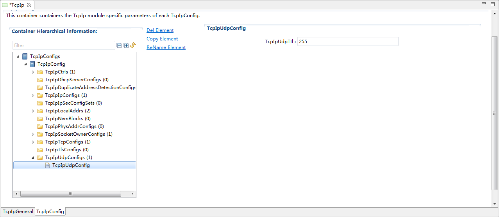

.. centered:: **表 TcpIpUdpConfig属性描述 (Describe the TcpIpUdpConfig property)**

.. list-table::
   :widths: 20 20 20 20 20
   :header-rows: 1

   * - UI名称 (UI Name)
     - 描述 (Description)
     - 
     - 
     - 
   * - TcpIpUdpTtl
     - 取值范围 (Range)
     - 0 .. 255
     - 默认取值 (Default value)
     - 无
   * - 
     - 参数描述 (Parameter Description)
     - Default Time-to-live value of outgoing UDP packets.
     - 
     - 
   * - 
     - 依赖关系 (Dependencies)
     - 无
     - 
     - 
