UdpNm
#################################

:strong:`缩写词注解 (Abbreviation Notes):`

.. list-table::
   :widths: 34 33 33
   :header-rows: 1

   * - 缩写词 (Abbreviation)
     - 解释/描述 (Explanation/Description)
     - 中文解释 (Chinese explanation)
   * - API
     - Application ProgrammingInterface
     - 应用程序接口 (Application Programming Interface)
   * - BSW
     - Basic Software
     - 基础软件模式管理 (Basic Software Model Management)
   * - EthIf
     - Ethernet Interface
     - 以太网接口模块 (Ethernet interface module)
   * - DEM
     - Diagnostic Event Manager
     - 诊断事件管理模块 (Event Management Module for Diagnosis)
   * - DET
     - Default Error Tracer
     - 默认错误检测模块 (Default error detection module)
   * - NM
     - Network Management
     - 网络管理 (Network Management)
   * - PDU
     - Protocol Data Unit
     - 协议数据单元 (Protocol Data Unit)
   * - SDU
     - Service Data Unit
     - 服务数据单元 (Service Data Unit)
   * - PNI
     - Partial NetworkInformation
     - 部分网络信息 (Part of the network information)
   * - PN
     - Partial Network
     - 部分网络 (Part of the network)
   * - PNC
     - Partial Network Cluster
     - 部分网络集群 (Part of Network Clusters)
   * - ERA
     - External Request Array
     - 外部请求集合 (External Request Collection)
   * - EIRA
     - External and InternalRequest Array
     - 外部和内部请求集合 (External and internal request collections)
   * - UdpNm
     - Udp Network Management
     - Udp网络管理 (UDP Network Management)
   * - CBV
     - Control Bit Vector
     - 控制位向量 (Control vector)
   * - CWU
     - Car Wakeup
     - 车辆唤醒 (Vehicle Wake-Up)
   * - TCP/IP
     - A family of communicationprotocols used incomputer networks
     - 计算机网络中使用的一系列通信协议 (A series of communication protocols used in computer networks)
   * - UDP
     - User Datagram Protocol
     - 用户数据报协议 (User Datagram Protocol)
   * - SoAd
     - Socket Adapter
     - Socket适配层 (Socket Adapter Layer)

简介 (Introduction)
=================================

UdpNm模块的核心功能是协调网络正常运行和总线睡眠模式之间的转换，除此之外，还提供了可选功能，例如检测当前节点或检测其他所有节点是否准备休眠等。

The core function of the UdpNm module is to coordinate the transition between normal network operation and bus sleep mode, in addition to providing optional features such as detecting whether the current node or other all nodes are ready for sleep.

UdpNm提供网络管理接口（Nm）和TCP/IP协议栈之间的适配。UdpNm通过调用SoAd模块的发送API来传输数据，并提供接收API给SoAd用于接收下层网络管理报文。Nm模块调用UdpNm模块API来更改UdpNm的当前状态机状态，UdpNm的状态机模式切换需要通知给Nm模块。

UdpNm provides a network management interface (Nm) and an adaptation between the TCP/IP protocol stack. UdpNm transmits data by calling the send API of the SoAd module and provides receive APIs for SoAd to receive lower-layer network management messages. The Nm module calls UdpNm's API to change its current state machine status, and the state machine mode switch of UdpNm needs to be notified to the Nm module.

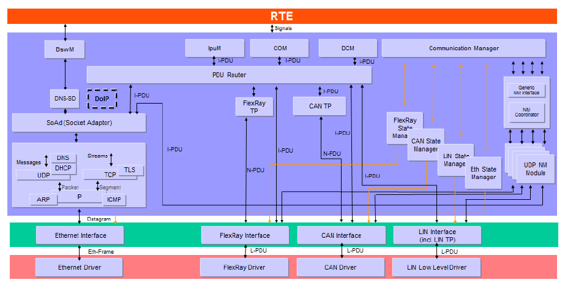

UdpNm模块的主要功能为：

The main function of the UdpNm module is:

1、协调网络正常运行和总线睡眠模式之间的转换

Coordinate the transition between normal network operation and bus sleep mode.

2、可选功能

Optional Features

1) 检测远程睡眠指令功能

Detect remote sleep command function

2) 用户数据功能

User data functionality

3) 被动模式功能

Passive mode functionality

   1) NM PDU Rx指示功能(NM PDU Reception Indication Function)

   2) 状态变化通知功能(State Change Notification Function)

   3) 通讯控制功能(Communication Control Function)

   4) NM协调器同步支持功能(NM Coordinator Synchronization Support Function)

3、局部联网（PN）功能

PNA functionality

4、车辆唤醒功能

Vehicle Wake-up Function

参考资料 (Reference materials)
------------------------------------------

[1] AUTOSAR_SWS_SocketAdaptor.pdf，R19-11

[2] AUTOSAR_SWS_UDPNetworkManagement.pdf，R19-11

[3] AUTOSAR_SWS_NetworkManagementInterface.pdf，R19-11

[4] AUTOSAR_SWS_COMManager.pdf，R19-11

功能描述 (Function Description)
===========================================

AUTOSAR UdpNm基于分散的直接网络管理策略，这意味着每个网络节点仅根据在通信系统内接收和/或发送报文，执行自给自足的活动。

AUTOSAR UdpNm is based on a decentralized direct network management strategy, which means that each network node performs autonomous activities only according to the reception and/or transmission of messages within the communication system.

AUTOSAR UdpNm协调算法基于周期性的NM数据包，集群中的所有节点都通过广播传输接收这些数据包。接收到NM数据包表明发送节点要保持NM集群处于唤醒状态。如果任何节点准备好进入总线睡眠模式，它将停止发送NM数据包，但是只要接收到来自其他节点的NM数据包，它就会推迟过渡到总线睡眠模式。如果在专用计时器超时前都未接收到NM数据包，则每个节点都会启动到总线休眠模式的转换。UdpNm通过状态机切换和各状态定时器管理来完成协调算法。

The AUTOSAR UdpNm coordination algorithm is based on periodic NM packets. All nodes in the cluster receive these packets via broadcast transmission. Receiving an NM packet indicates that the sending node wants to keep the NM cluster awake. If any node is ready to enter the bus sleep mode, it will stop sending NM packets; however, as long as it receives NM packets from other nodes, it will delay transitioning to the bus sleep mode. If no NM packets are received before a dedicated timer times out, each node will initiate a transition to the bus sleep mode. UdpNm completes the coordination algorithm through state machine transitions and定时器管理。

状态机切换 (State machine transition)
------------------------------------------------

模式介绍 (Introduction of Patterns)
===============================================

AUTOSAR UdpNm协调算法的三种操作模式：

Three operation modes of the AUTOSAR UdpNm Coordination Algorithm:

- Network Mode 网络模式

Network Mode Network Mode

- Prepare Bus-Sleep Mode 准备总线睡眠模式

Prepare Bus-Sleep Mode

- Bus-Sleep Mode 总线睡眠模式

Bus Sleep Mode

当本节点的操作模式发生变化的时候，需要通知上层Nm。

When the operating mode of this node changes, it needs to notify the upper layer Nm.

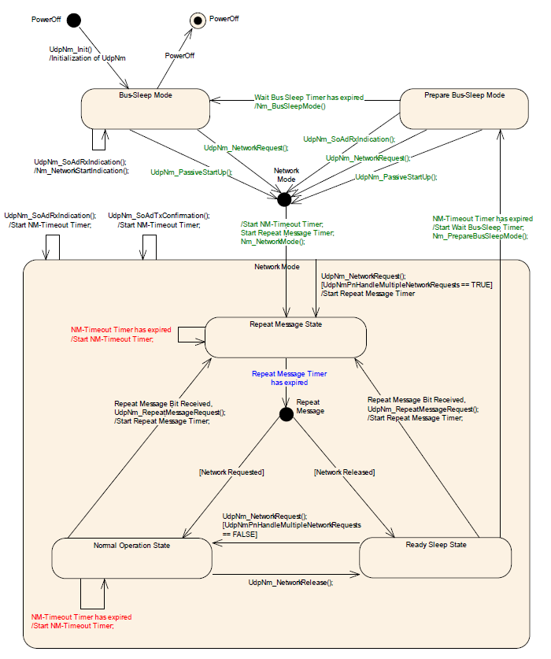

Network Mode
============================

Network Mode下包括三种内部状态：

Network Mode includes three internal states:

- Repeat Message State 重复消息状态

Repeat Message State

- Normal Operation State 正常运行状态

Normal Operation State

- Ready Sleep State 就绪睡眠状态

Ready Sleep State

下面对这三种状态分别说明：

Describe these three states separately:

1. Repeat Message State

当节点配置为Passive Mode的节点，意味着该节点只能接受报文而不能传输任何报文，关于Passive Mode具体的将在下面章节中进行说明。

When a node is configured in Passive Mode, it means that the node can only receive packets and cannot transmit any packets. The specifics of Passive Mode will be explained in the following chapters.

对于非Passive Mode的节点，Repeat Message State可确保从Bus-Sleep或Prepare Bus-Sleep到Network Mode的任何过渡对于网络上的其他节点都是可见的。此外，它确保所有节点在UdpNmRepeatMessageTime（配置参数）内保持活动状态。当UdpNmRepeatMessageTime配置为0，表示未配置Repeat Message State。这意味着Repeat Message State是瞬态的，在进入后立即离开，因此无法保证启动稳定性，并且无法执行节点检测过程。当UdpNmRepeatMessageTime超时后，节点将离开Repeat Message State而切至其他状态。若当前网络状态为请求，切换到Normal Operation State，若当前网络状态为释放，切换到Ready Sleep State。

For nodes that are not in Passive Mode, the Repeat Message State ensures that any transition from Bus-Sleep or Prepare Bus-Sleep to Network Mode is visible to other nodes on the network. Additionally, it guarantees that all nodes remain active within UdpNmRepeatMessageTime (a configurable parameter). When UdpNmRepeatMessageTime is configured as 0, it indicates that Repeat Message State is not configured. This means that Repeat Message State is transient and leaves immediately after entering, thus not ensuring boot stability and preventing the node detection process from being executed. Once UdpNmRepeatMessageTime times out, nodes will leave the Repeat Message State and transition to other states. If the current network state is Request, they switch to Normal Operation State; if it is Release, they switch to Ready Sleep State.

当非Passive Mode的节点从Bus-Sleep Mode, Prepare-Bus-Sleep Mode，Normal Operation State或Ready Sleep State进入Repeat Message State时，传输功能应该被重启，为了防止总线数据爆发，降低负载，每次进入Repeat Message State时，都要延迟UdpNmMsgCycleOffset（配置参数）段时间后，再开始传输数据，若配置UdpNmImmediateNmTransmissions并且网络被请求则不需要延迟UdpNmMsgCycleOffset时间。

When a node not in Passive Mode transitions from Bus-Sleep Mode, Prepare-Bus-Sleep Mode, Normal Operation State, or Ready Sleep State to Repeat Message State, the transmission function should be restarted. To prevent bus data bursts and reduce load, data transmission should be delayed by UdpNmMsgCycleOffset (configuration parameter) period each time entering the Repeat Message State. If UdpNmImmediateNmTransmissions is configured and the network is requested, no delay of UdpNmMsgCycleOffset time is needed.

2. Normal Operation State

Normal Operation State可确保只要需要网络功能，任何节点都可以使NM集群保持唤醒状态。当处于Normal Operation State，节点按照UdpNmMsgCycleTime周期发送报文，当网络释放后，UdpNm进入Ready Sleep state。

Normal Operation State ensures that any node can keep the NM cluster in an awakened state as long as network functionality is needed. When in Normal Operation State, nodes send messages according to the UdpNmMsgCycleTime周期 when the network is active; upon network release, UdpNm enters the Ready Sleep state.

3. Ready Sleep State

Ready Sleep State可确保NM群集中的任何节点都在等待过渡到Prepare Bus-Sleep Mode。

Ready Sleep State ensures that any node in the NM cluster is waiting to transition to Prepare Bus-Sleep Mode.

当进入Ready Sleep State，本节点就不再传输数据。当节点接收到其他节点传输的报文时，会将NM-Timeout定时器重置，当NM-Timeout定时器超时且处于Ready Sleep State时，网络管理进入Prepare Bus-Sleep Mode。其中NM-Timeout定时器的时间是由UdpNmTimeoutTime（配置参数）决定的。

When entering the Ready Sleep State, this node will no longer transmit data. Upon receiving a message from another node, the NM-Timeout timer is reset. When the NM-Timeout timer times out and the node is in the Ready Sleep State, network management enters the Prepare Bus-Sleep Mode. The time for the NM-Timeout timer is decided by UdpNmTimeoutTime (configuration parameter).

Prepare Bus Sleep Mode
======================================

Prepare Bus Sleep state目的是确保所有节点都有时间在进入总线休眠状态之前停止其网络活动，使总线活动平静下来，最后在“准备总线睡眠模式”下总线上没有任何活动。

The purpose of Prepare Bus Sleep state is to ensure that all nodes have the opportunity to stop their network activities before entering the bus sleep state, thereby calming down the bus activity, and finally ensuring there is no activity on the bus under "Prepare Bus Sleep mode".

当本节点进入Prepare Bus-Sleep Mode，UdpNmWaitBusSleepTime（配置参数）定时器被启动，当UdpNmWaitBusSleepTime定时器超时，当前状态将由Prepare Bus-Sleep Mode切换至Bus-Sleep Mode。

When this node enters Prepare Bus-Sleep Mode, the UdpNmWaitBusSleepTime (configuration parameter) timer is started. When the UdpNmWaitBusSleepTime timer times out, the current state will switch from Prepare Bus-Sleep Mode to Bus-Sleep Mode.

如果在Prepare Bus-Sleep Mode接收到其他节点传输的网络管理报文时，当前UdpNm状态将由Prepare Bus-Sleep Mode切换至Network Mode， 默认情况下，将进入Repeat Message State。

If network management messages are received from other nodes while in Prepare Bus-Sleep Mode, the current UdpNm state will switch to Network Mode by default, entering Repeat Message State.

如果在Prepare Bus-Sleep Mode接收到网络请求时，当前状态将由Prepare Bus-Sleep Mode切换至Network Mode， 默认情况下，将进入Repeat Message State。如果UdpNmImmediateRestartEnabled（配置参数）被设置为TRUE，那么在这种情况下会立刻触发一次传输，这样做的理由是：集群中的其他节点仍处于Prepare Bus-Sleep Mode，在这种特殊情况下，应避免过渡到Bus-Sleep Mode，并应尽快恢复总线通信。由于UdpNm中网络管理PDU的传输偏移导致，处于Repeat Message State的第一个网络管理PDU的传输可能会大大延迟。为了避免延迟重新启动网络可以立即请求发送网络管理PDU。

If a network request is received while in the Prepare Bus-Sleep Mode, the current state will switch to Network Mode by default, entering the Repeat Message State. If UdpNmImmediateRestartEnabled (configuration parameter) is set to TRUE, a transmission will be triggered immediately in this case. The rationale behind this is that other nodes in the cluster are still in the Prepare Bus-Sleep Mode; therefore, it should be avoided to transition to Bus-Sleep Mode and bus communication should be restored as soon as possible. Due to the transmission offset of network management PDUs in UdpNm, the first network management PDU in the Repeat Message State may experience significant delay. To avoid such delays, a request can be immediately sent to restart the network by transmitting the network management PDU.

Bus-Sleep Mode
==============================

Bus-Sleep state的目的是在不交换任何消息时降低节点的功耗。将通信控制器切换到睡眠模式，激活相应的唤醒机制，最后将功耗降低到总线睡眠模式下的适当水平。

The purpose of Bus-Sleep state is to reduce node power consumption without exchanging any messages. By switching the communication controller to sleep mode, activating the corresponding wake-up mechanisms, and finally reducing power consumption to an appropriate level for the bus sleep mode.

当UdpNm处于Bus-Sleep Mode接收到网络管理报文时，此时UdpNm不会切换至Network Mode，而是通知Nm模块，由上层模块做决策。

When UdpNm is in Bus-Sleep Mode and receives a network management message, it will not switch to Network Mode at this time but notify the Nm module for upper-layer modules to make decisions.

当UdpNm处于Bus-Sleep Mode接收到被动请求或网络请求时，当前状态将由Bus-Sleep Mode切换至Network Mode， 默认情况下，将进入Repeat Message State。

When UdpNm is in Bus-Sleep Mode and receives a passive request or network request, the current state will switch from Bus-Sleep Mode to Network Mode. By default, it will enter the Repeat Message State.

PDU格式 (PDU Format)
----------------------------------

网络管理的报文有特定的格式要求，报文数据段格式如图：

Network management messages have specific format requirements, and the message data segment format is as follows:

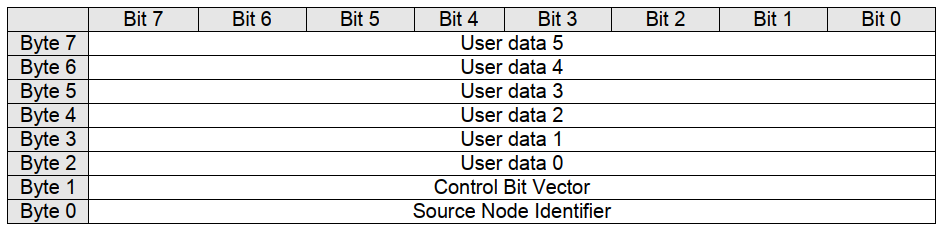

其中CBV （Control Bit Vector）字节对应的bit位标识如下

The bits corresponding to the CBV (Control Bit Vector) byte are identified as follows:

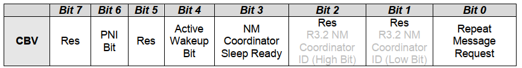

对于CBV中的bit说明如下：

The bit description in CBV is as follows:

Bit 0 重复消息请求

Bit 0 Repeat Message Request

0：未请求进入Repeat Message State

0：Unrequested Entry into Repeat Message State

1：请求进入Repeat Message State

1: Request to Enter Repeat Message State

Bit 1,2：保留位，当配置项UdpNmCoordinatorEnabled使能时，该位等于配置的UdpNmCoordinatorId的值

Bit 1,2: Reserved bits. When the configuration item UdpNmCoordinatorEnabled is enabled, these bits equal the value of configured UdpNmCoordinatorId.

| Bit 3 NM协调器休眠位
| 0：主协调器不要求启动同步休眠
| 1：主协调员请求启动同步休眠

| Bit 3 NM Coordinator Sleep Bit  
| 0: The main coordinator does not require initiating synchronous sleep  
| 1: The main coordinator requests initiating synchronous sleep

| Bit 4主动唤醒位
| 0：节点尚未唤醒网络
| 1：节点唤醒了网络

| Bit 4 Active Wakeup Bit  
| 0: Node has not yet awakened the network  
| 1: Node has awakened the network

Bit 6局部网络信息位（PNI）

Bit 6 Local Network Information Bit (PNI)

| 0：NM消息不包含局部网络请求信息
| 1：NM消息包含局部网络请求信息,该位由配置决定，运行阶段不改变

| 0: NM message does not contain local network request information
| 1: NM message contains local network request information, this bit is configured and does not change during runtime

Bit5 Bit7为保留位

Bit5 Bit7 are reserved bits

Nm Pdu中的User Data可以通过UdpNm的配置引用EcuC中的Pdu。未使用的情况下默认全0xFF，通过Nm的接口去抓取当前接收与发送的User Data。

User Data in Nm Pdu can be referenced from Pdu in EcuC via UdpNm configuration. By default, it is all 0xFF if not used. The current received and sent User Data can be captured through the interface of Nm.

可选功能 (Optional Features)
----------------------------------------

UdpNm可以通过使能配置参数来使能以下可选功能。

UdpNm can enable the following optional features by enabling configuration parameters.

检测远程睡眠指令功能 (Detect remote sleep command functionality)
======================================================================

远程睡眠指示应用于一种情况，当处于Normal Operation State的节点发现集群中的所有其他节点都准备睡眠，但处于Normal Operation State状态的节点仍将保持总线苏醒。为了避免这种情况，可以使能远程睡眠指示功能。

Remote sleep indication is applied in a scenario where a node in Normal Operation State detects that all other nodes in the cluster are ready to sleep, but the node in Normal Operation State will still keep the bus awake. To avoid this situation, remote sleep indication functionality can be enabled.

如果当前UdpNm状态为Normal Operation State，并且在UdpNmRemoteSleepIndTime（配置参数）定时器内未收到其他节点发送的网络管理报文，则通知上层Nm模块集群内的其他节点均已准备睡眠。

If the current UdpNm state is Normal Operation State and no network management messages are received from other nodes within the UdpNmRemoteSleepIndTime (configured parameter) timer, notify the upper-layer Nm module that all other nodes in the cluster are ready to sleep.

如果UdpNm已通知上层Nm模块，而在Normal Operation State或Ready Sleep State下又收到了网络管理报文，或者UdpNm从Normal Operation State切换至Repeat Message State，UdpNm需要通知上层Nm模块集群中的某些节点不再准备睡眠。

If UdpNm has informed the upper-layer Nm module, and then receives a network management message in the Normal Operation State or Ready Sleep State, or if UdpNm switches from the Normal Operation State to the Repeat Message State, UdpNm needs to notify the upper-layer Nm module that certain nodes in the cluster are no longer准备睡眠。

用户数据功能 (User data functionality)
================================================

使用UdpNmUserDataEnabled开关（配置参数）对NM用户数据的支持进行静态配置。

Use the UdpNmUserDataEnabled switch (configuration parameter) for static configuration of support for NM user data.

当用户数据功能使能，可以调用UdpNm_SetUserData，该函数可以设置总线上接下来发送的NM数据包的NM用户数据。也可以调用UdpNm_GetUserDat，该函数可以提供包含在最近接收到的NM PDU的有效载荷中的NM用户数据。

When user data functionality is enabled, UdpNm_SetUserData can be called to set the NM user data of the NM data packets to be sent on the bus. Also, UdpNm_GetUserDat can be called to provide the NM user data contained in the payload of the most recently received NM PDU.

如果UdpNmComUserDataSupport（配置参数）配置为使能，UdpNm将在每次请求发送相应的NM消息之前从引用的NM I-PDU收集NM用户数据，并将用户数据与其他NM字节合并。此时就不能再通过UdpNm_SetUserData函数设置用户数据。

If UdpNmComUserDataSupport (configuration parameter) is configured as enabled, UdpNm will collect NM user data from the referenced NM I-PDU and merge it with other NM bytes before sending the corresponding NM message in each request. In this case, user data cannot be set via the UdpNm_SetUserData function.

被动模式功能 (Passive Mode Function)
==============================================

在被动模式下，节点仅接收NM消息，但不发送任何NM消息。被动模式应使用UdpNmPassiveModeEnabled开关（配置参数）进行静态配置。

In passive mode, nodes only receive NM messages but do not send any NM messages. Passive mode should be statically configured using the UdpNmPassiveModeEnabled switch (configuration parameter).

NM PDU Rx指示功能 (NM PDU Rx Indication Function)
=============================================================

若UdpNmPduRxIndicationEnabled（配置参数）使能，在成功接收NM PDU时，UdpNm应通过调用Nm_PduRxIndication通知上层。

If UdpNmPduRxIndicationEnabled (configuration parameter) is enabled, UdpNm should notify the upper layer by calling Nm_PduRxIndication upon successful reception of NM PDU.

状态变化通知功能 (Notification for State Change Functionality)
======================================================================

如果UdpNmStateChangeIndEnabled（配置参数）使能，则UdpNm需要将UdpNm状态的所有更改通知上层Nm。

If UdpNmStateChangeIndEnabled (configuration parameter) is enabled, UdpNm needs to notify the upper-layer Nm of all state changes.

通讯控制功能 (Communication Control Function)
=======================================================

使用UdpNmComControlEnabled开关（配置参数），可以静态配置通信控制。当UdpNm_DisableCommunication函数被调用，UdpNm模块NM报文的传输能力将被停止，直到调用UdpNm_EnableCommunication，UdpNm的nm报文传输能力被恢复。

Using the UdpNmComControlEnabled switch (configuration parameter), communication control can be statically configured. When the UdpNm_DisableCommunication function is called, the transmission capability of UdpNm module NM messages will be stopped until UdpNm_EnableCommunication is called, restoring UdpNm's nm message transmission capability.

当UdpNm_DisableCommunication函数被调用，UdpNm的NM-Timeout定时器将被停止，调用函数UdpNm_EnableCommunication，NM-Timeout定时器将被恢复。若一直未调用UdpNm_EnableCommunication，UdpNm会一直处在Ready Sleep State中无法进入休眠状态，在这种情况下，AutoSar规定，当网络被释放后，UdpNm将从Ready Sleep State切换至Prepare Bus-Sleep Mode。

When the UdpNm_DisableCommunication function is called, the NM-Timeout timer of UdpNm will be stopped. Calling the UdpNm_EnableCommunication function will restore the NM-Timeout timer. If UdpNm_EnableCommunication is never called, UdpNm will remain in the Ready Sleep State and unable to enter sleep mode. In this case, according to AutoSar regulations, when the network is released, UdpNm will switch from the Ready Sleep State to the Prepare Bus-Sleep Mode.

NM协调器同步支持功能 (NM Coordinator Synchronization Support Function)
=============================================================================

当有多个协调器连接到同一条总线时，在CBV中，NmCoordinatorSleepReady位用于指示主协调器请求启动关闭，有关CBV的概念见1.2.4章。

When multiple coordinators are connected to the same bus in CBV, the NmCoordinatorSleepReady bit is used to indicate that the master coordinator requests a power-off initiation, see Chapter 1.2.4 for concepts related to CBV.

当UdpNm处于网络模式，接收网络管理报文的CBV中NmCoordinatorSleepReady=1，则UdpNm通知上层协调睡眠功能被请求。

When UdpNm is in network mode and the CBV with NmCoordinatorSleepReady=1 receives network management messages, UdpNm notifies the upper layer that the coordination sleep function has been requested.

当UdpNm已通知上层协调睡眠功能被请求，接收网络管理报文的CBV中NmCoordinatorSleepReady=0，则UdpNm通知上层协调睡眠功能请求被取消。

When UdpNm notifies the upper layer that the coordination sleep function is requested and the CBV receiving network management messages has NmCoordinatorSleepReady=0, UdpNm informs the upper layer that the request for the coordination sleep function is cancelled.

PN功能  (PN Function)
===================================

Autosar4.x版本开始支持PN功能，Pn功能的目的是基于功能划分网络，形成局域网；这种功能的划分由整车设计完成，对于各节点只需要关心自身存在的网段。只有在UdpNmGlobalPnSupport(配置参数)和各通道下的UdpNmPnEnabled(配置参数)使能的情况下，Pn功能才能正常工作。

Autosar 4.x versions began supporting PN functionality. The purpose of the PN function is to segment networks based on functional divisions, forming local networks; this division is completed during整车设计. For each node, only its existing segment needs to be concerned. Only when the UdpNmGlobalPnSupport (configuration parameter) and the UdpNmPnEnabled (configuration parameter) under each channel are enabled can the PN function operate normally.

如果UdpNmPnEnabled(配置参数)为FALSE，则UdpNm将执行正常的Rx指示处理，并且应禁用Pn功能。如果UdpNmPnEnabled为TRUE，接收到的NM-PDU CBV中的PNI位为0，则UdpNm模块应执行常规的Rx指示处理，从而省去了Pn功能的扩展。如果UdpNmPnEnabled为TRUE并且接收到的NM-PDU CBV中的PNI位为1，则UdpNm模块处理NM-PDU的Pn信息。

If UdpNmPnEnabled (configuration parameter) is FALSE, UdpNm will perform normal Rx indication processing and the Pn function should be disabled. If UdpNmPnEnabled is TRUE and the PNI bit in the received NM-PDU CBV is 0, the UdpNm module should perform normal Rx indication processing, thereby avoiding the extension of the Pn function. If UdpNmPnEnabled is TRUE and the PNI bit in the received NM-PDU CBV is 1, the UdpNm module will handle the Pn information in the NM-PDU.

如果UdpNmPnEnabled为TRUE，则UdpNm模块应将CBV中发送的PNI位的值设置为1，要使用Pn，则必须使用CBV。

If UdpNmPnEnabled is TRUE, the UdpNm module should set the value of the PNI bit sent by CBV to 1; PN must be used with CBV.

如果UdpNmPnEnabled为FALSE，则UdpNm模块应将CBV中已发送的PNI位的值始终设置为0。

If UdpNmPnEnabled is FALSE, the UdpNm module should always set the value of the sent PNI bits in CBV to 0.

Pn信息的位置位于网络管理报文的用户数据部分中，具体的位置通过UdpNmPnInfoOffset和UdpNmPnInfoLength来确定。

The location of Pn information is in the user data part of network management messages, and its specific position is determined through UdpNmPnInfoOffset and UdpNmPnInfoLength.

例如当UdpNmPnInfoOffset = 3，UdpNmPnInfoLength =2，代表NM消息只有字节3和字节4包含PN请求信息。

For example, when UdpNmPnInfoOffset = 3 and UdpNmPnInfoLength = 2, it represents that only bytes 3 and 4 contain PN request information in the NM message.

PN过滤 (PN filtering)
-----------------------------------

PNC是Partial Network Cluster的缩写，它是指为了在车辆网络中支持一个或多个车辆功能而由多个ECU构成的集群。PNC的编号我们称为PNC ID，范围8~63，整车网络统一编号，关于PNC id与UdpNm Pdu 映射关系说明：PNC ID对应UdpNm Pdu中的一个bit，例如PNC ID=8，对应UdpNm Pdu Byte 1的bit0；PNC ID=63，对应Byte 7的bit7；PNC ID对应的bit数值为1，则表示当前PN网络被请求，为0则表示网络释放。

PNC is the abbreviation for Partial Network Cluster, referring to a cluster composed of multiple ECUs to support one or more vehicle functions in a vehicle network. The numbering we call PNC ID, ranging from 8 to 63, with unified numbering across the entire vehicle network. Regarding the mapping relationship between PNC id and UdpNm Pdu: PNC ID corresponds to one bit in UdpNm Pdu, for example, PNC ID=8 corresponds to bit0 of Byte 1 of UdpNm Pdu; PNC ID=63 corresponds to bit7 of Byte 7; if the bit value corresponding to PNC ID is 1, it indicates that the current PN network is requested; if it is 0, it indicates that the network is released.

通过配置参数UdpNmPnFilterMaskByte，UdpNm可以检测到哪个PN与ECU相关，而哪个与PN不相关。

By configuring the parameter UdpNmPnFilterMaskByte, UdpNm can detect which PN is related to the ECU and which is not.

UdpNmPnFilterMaskByte的每个位具有以下含义：

Each bit of UdpNmPnFilterMaskByte has the following meaning:

0 PN请求与本ECU无关。 如果接收的NM PDU中将该位置设置为1，也无法使ECU的通讯栈处于唤醒状态，因为该位的请求与本ECU是无关的。

PN request is unrelated to this ECU. Even if the position in the received NM PDU is set to 1, it cannot put the ECU's communication stack into an awakened state because the request at this position is unrelated to this ECU.

1 PN请求与本ECU有关。如果已在接收的NM-PDU中将该位置设置为1，则ECU的通信堆栈将保持唤醒状态。

PN request is related to this ECU. If the position is set to 1 in the received NM-PDU, the communication stack of the ECU will remain awake.

如果至少有一位与本ECU相关的PN请求，那么这条Nm PDU对于UdpNm来说就是有用的，需要进行处理，如果没有一位与本ECU相关的PN请求，那么这条NM PDU将被忽略。

If at least one PN request related to this ECU is present, then this NM PDU is useful for UdpNm and needs to be processed. If there are no PN requests related to this ECU, then this NM PDU will be ignored.

ERA与EIRA (ERA and EIRA)
---------------------------------------

ERA是指ECU外部的PN请求的聚合，当UdpNmPnEraCalcEnabled使能(配置参数)，表示支持ERA功能。而EIRA是指ECU内部和外部Pn请求的聚合，当UdpNmPnEiraCalcEnabled使能(配置参数)，表示支持EIRA功能。

ERA refers to the aggregation of PN requests from outside the ECU, and it indicates support for ERA functionality when UdpNmPnEraCalcEnabled (configuration parameter) is enabled.而EIRA refers to the aggregation of PN requests both inside and outside the ECU, and it indicates support for EIRA functionality when UdpNmPnEiraCalcEnabled (configuration parameter) is enabled.

ERA是在网关节点才使用，此时没有内部的请求，只有不同的Channel对Pn的外部请求，ERA会为每个channel的每个PN位都设置一个监测的定时器，当UdpNmPnResetTime(配置参数)时间内未请求PN，则将该PN的请求状态设置为未请求，每次请求状态有变化的时候都会通知上层PduR，由PduR模块进行转发。

ERA is used only at the gateway node, where there are no internal requests but external requests from different Channels for Pn. ERA sets a monitoring timer for each PN bit of every channel. If a PN request is not received within UdpNmPnResetTime (configuration parameter), its request status will be set to unrequested. Whenever the request status changes, it notifies the upper-layer PduR module, which forwards the notification.

EIRA体现了当前节点与网络上其他节点对某一个PNC的请求与释放情况；EIRA不区分物理Channel，只针对不同的PN。EIRA会为每个PN位都设置一个监测的定时器，当UdpNmPnResetTime(配置参数)时间内未请求PN，则将该PN的请求状态设置为未请求，每次请求状态有变化的时候都会通知上层PduR，由PduR模块进行转发。

EIRA reflects the request and release conditions of a PNC by the current node with other nodes on the network; EIRA does not distinguish between physical Channels, but targets different PN. EIRA sets a monitoring timer for each PN bit. If no request for PN is made within UdpNmPnResetTime (configuration parameter), the request status of that PN will be set to unrequested. Every time the request status changes, it notifies the upper-layer PduR, which forwards this information via the PduR module.

自发传输 (Spontaneous Transmission)
-----------------------------------------------

如果网络被请求并且UdpNmPnHandleMultipleNetworkRequest（配置参数）设置为TRUE，无论UdpNm处于Ready Sleep State，Normal Operation State或Repeat Message State，UdpNm应更改为或重新启动为Repeat Message State。并且，UdpNm会传输UdpNmImmediateNmTransmissions（配置参数）数量的报文，其中第一条报文立即传输，其他报文按UdpNmImmediateNmCycleTime传输（配置参数）。

If the network is requested and UdpNmPnHandleMultipleNetworkRequest (configuration parameter) is set to TRUE, regardless of whether UdpNm is in the Ready Sleep State, Normal Operation State, or Repeat Message State, UdpNm should change to or be restarted into the Repeat Message State. Furthermore, UdpNm will transmit a number of messages equal to UdpNmImmediateNmTransmissions (configuration parameter), where the first message is transmitted immediately, and the other messages are transmitted according to UdpNmImmediateNmCycleTime (configuration parameter).

车辆唤醒功能 (Vehicle wake-up function)
=================================================

当UdpNmCarWakeUpRxEnabled（配置参数）使能时，车辆唤醒功能被启用，目前暂时没有使用场景。如果任何接收到的NM-PDU中的Car Wakeup位为1，都会通知上层Nm。

When UdpNmCarWakeUpRxEnabled (configuration parameter) is enabled, the vehicle wake-up function is activated. Currently, there are no use cases. If any received NM-PDU has the Car Wakeup bit set to 1, it will notify the upper layer Nm.

当UdpNmCarWakeUpRxEnabled（配置参数）使能，UdpNmCarWakeUpFilterEnabled（配置参数）也使能时，只有收到NodeId等于UdpNmCarWakeUpFilterNodeId的报文时，才会通知上层。

When UdpNmCarWakeUpRxEnabled (configuration parameter) and UdpNmCarWakeUpFilterEnabled (configuration parameter) are enabled, notification to the upper layer is only triggered when a message with NodeId equal to UdpNmCarWakeUpFilterNodeId is received.

源文件描述 (Source file description)
===============================================

.. centered:: **表 UdpNm组件文件描述 (UdpNm Component File Description)**

.. list-table::
   :widths: 50 50
   :header-rows: 1

   * - 文件 (Files)
     - 说明 (Description)
   * - UdpNm_Cfg.h
     - 用于定义UdpNm模块预编译时用到的宏。 (Used for defining macros for precompiled use in the UdpNm module.)
   * - UdpNm_Cfg.c
     - 配置参数源文件，包含各个配置项的定义。 (Configure parameter source file, containing definitions of various configuration items.)
   * - UdpNm_Internal.h
     - UdpNm模块运行时类型定义，内部宏定义头文件。 (UDPNM module runtime type definition, internal macro definition header file.)
   * - UdpNm_SchM.h
     - 提供给SchM的头文件，用于公开周期调度函数 (Header files provided for SchM to expose periodic scheduling functions)
   * - UdpNm_MemMap.h
     - UdpNm模块函数和变量存储位置定义文件。 (UdpNm module function and variable storage location definition file.)
   * - UdpNm.h
     - UdpNm模块头文件，通过加载该头文件访问UdpNm公开的函数和数据类型 (UDPNM module header file, access UDPNM's public functions and data types through loading this header file.)
   * - UdpNm.c
     - UdpNM模块实现源文件，各API实现在该文件中 (UDPNM module implementation source file, each API implementation is in this file)

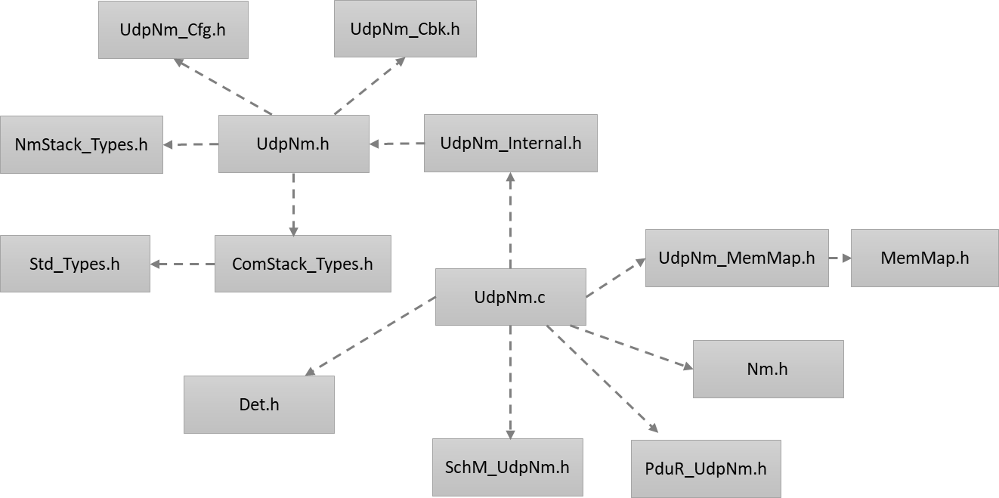

API接口 (API Interface)
=====================================

类型定义 (Type definition)
--------------------------------------

UdpNm_ConfigType类型定义 (UdpNm_ConfigType Type Definition)
=======================================================================

.. list-table::
   :widths: 50 50
   :header-rows: 1

   * - 名称 (Name)
     - UdpNm_ConfigType
   * - 类型 (Type)
     - Structure
   * - 范围 (Range)
     - void
   * - 描述 (Description)
     - 此类型应包含容器UdpNm_GlobalConfig及其子容器的参数。 (This type should include parameters of container UdpNm_GlobalConfig and its sub-containers.)

输入函数描述 (Describe the input function:)
-----------------------------------------------------

.. list-table::
   :widths: 50 50
   :header-rows: 1

   * - 输入模块 (Input Module)
     - API
   * - Det
     - Det_ReportError
   * - Nm
     - Nm_CarWakeUpIndication
   * - 
     - Nm_CoordReadyToSleepCancellation
   * - 
     - Nm_CoordReadyToSleepIndication
   * - 
     - Nm_PduRxIndication
   * - 
     - Nm_RemoteSleepCancellation
   * - 
     - Nm_RemoteSleepIndication
   * - 
     - Nm_StateChangeNotification
   * - 
     - Nm_TxTimeoutException
   * - 
     - Nm_RepeatMessageIndication
   * - 
     - Nm_BusSleepMode
   * - 
     - Nm_NetworkMode
   * - 
     - Nm_NetworkStartIndication
   * - 
     - Nm_PrepareBusSleepMode
   * - PduR
     - PduR_UdpNmRxIndication
   * - 
     - PduR_UdpNmTriggerTransmit
   * - 
     - PduR_UdpNmTxConfirmation
   * - CanIf
     - CanIf_Transmit
   * - SoAd
     - SoAd_IfTransmit

静态接口函数定义 (Static interface function definition)
---------------------------------------------------------------

UdpNm_Init函数定义 (udpNm_Init function definition)
===============================================================

.. list-table::
   :widths: 25 25 25 25
   :header-rows: 1

   * - 函数名称： (Function Name:)
     - UdpNm_Init
     - 
     - 
   * - 函数原型： (Function prototype:)
     - void UdpNm_Init(
     - 
     - 
   * - 
     - UdpNm_ConfigType\*UdpNmConfigPtr
     - 
     - 
   * - 
     - )
     - 
     - 
   * - 服务编号： (Service Number:)
     - 0x01
     - 
     - 
   * - 同步/异步： (Synchronous/asynchronous:)
     - 同步 (Sync)
     - 
     - 
   * - 是否可重入： (Is Reentrant:)
     - 不可重入 (Non-reentrant)
     - 
     - 
   * - 输入参数： (Input parameters:)
     - UdpNmConfigPtr
     - 值域： (Domain:)
     - 指向初始化结构体的指针 (Pointer to initialized structure)
   * - 输入输出参数: (Input Output Parameters:)
     - 无
     - 
     - 
   * - 输出参数： (Output Parameters:)
     - 无
     - 
     - 
   * - 返回值： (Return Value:)
     - 无
     - 
     - 
   * - 功能概述： (Function Overview:)
     - 初始化UdpNm模块。 (Initialize UdpNm module.)
     - 
     - 

UdpNm_PassiveStartUp函数定义 (The UdpNm_PassiveStartUp function definition)
=======================================================================================

.. list-table::
   :widths: 25 25 25 25
   :header-rows: 1

   * - 函数名称： (Function Name:)
     - UdpNm_PassiveStartUp
     - 
     - 
   * - 函数原型： (Function prototype:)
     - Std_ReturnTypeUdpNm_PassiveStartUp(
     - 
     - 
   * - 
     - NetworkHandleTypenmChannelHandle
     - 
     - 
   * - 
     - )
     - 
     - 
   * - 服务编号： (Service Number:)
     - 0x0e
     - 
     - 
   * - 同步/异步： (Synchronous/asynchronous:)
     - 非同步 (Asynchronous)
     - 
     - 
   * - 是否可重入： (Is Reentrant:)
     - 可重入（同一通道不可重入） (Reentrant (non-reentrant for the same channel))
     - 
     - 
   * - 输入参数： (Input parameters:)
     - nmChannelHandle
     - 值域： (Domain:)
     - NM通道Id (NM Channel ID)
   * - 输入输出参数: (Input Output Parameters:)
     - 无
     - 
     - 
   * - 输出参数： (Output Parameters:)
     - 无
     - 
     - 
   * - 返回值： (Return Value:)
     - E_OK:被动启动UdpNm网络管理成功 (E_OK: Passive startup of UdpNm network management succeeded)
     - 
     - 
   * - 
     - E_NOT_OK:被动启动UdpNm网络管理失败 (E_NOT_OK: Passive startup of UdpNm network management failed)
     - 
     - 
   * - 功能概述： (Function Overview:)
     - 被动启动UdpNm模块 (Passively启动UdpNm模块)
     - 
     - 

UdpNm_NetworkRequest函数定义 (UdpNm_NetworkRequest function definition)
===================================================================================

.. list-table::
   :widths: 25 25 25 25
   :header-rows: 1

   * - 函数名称： (Function Name:)
     - UdpNm_NetworkRequest
     - 
     - 
   * - 函数原型： (Function prototype:)
     - Std_ReturnTypeUdpNm_NetworkRequest(
     - 
     - 
   * - 
     - NetworkHandleTypenmChannelHandle
     - 
     - 
   * - 
     - )
     - 
     - 
   * - 服务编号： (Service Number:)
     - 0x02
     - 
     - 
   * - 同步/异步： (Synchronous/asynchronous:)
     - 非同步 (Asynchronous)
     - 
     - 
   * - 是否可重入： (Is Reentrant:)
     - 可重入（同一通道不可重入） (Reentrant (non-reentrant for the same channel))
     - 
     - 
   * - 输入参数： (Input parameters:)
     - nmChannelHandle
     - 值域： (Domain:)
     - NM通道Id (NM Channel ID)
   * - 输入输出参数: (Input Output Parameters:)
     - 无
     - 
     - 
   * - 输出参数： (Output Parameters:)
     - 无
     - 
     - 
   * - 返回值： (Return Value:)
     - E_OK: 请求被接受 (E_OK: The request has been accepted.)
     - 
     - 
   * - 
     - E_NOT_OK:请求被拒绝 (E_NOT_OK: Request rejected)
     - 
     - 
   * - 功能概述： (Function Overview:)
     - 请求使用网络 (Request for Network Usage)
     - 
     - 

UdpNm_NetworkRelease函数定义 (udpNm_NetworkRelease function definition)
===================================================================================

.. list-table::
   :widths: 25 25 25 25
   :header-rows: 1

   * - 函数名称： (Function Name:)
     - UdpNm_NetworkRelease
     - 
     - 
   * - 函数原型： (Function prototype:)
     - Std_ReturnTypeUdpNm_NetworkRelease(
     - 
     - 
   * - 
     - NetworkHandleTypenmChannelHandle
     - 
     - 
   * - 
     - )
     - 
     - 
   * - 服务编号： (Service Number:)
     - 0x03
     - 
     - 
   * - 同步/异步： (Synchronous/asynchronous:)
     - 非同步 (Asynchronous)
     - 
     - 
   * - 是否可重入： (Is Reentrant:)
     - 可重入（同一通道不可重入） (Reentrant (non-reentrant for the same channel))
     - 
     - 
   * - 输入参数： (Input parameters:)
     - nmChannelHandle
     - 值域： (Domain:)
     - NM通道Id (NM Channel ID)
   * - 输入输出参数: (Input Output Parameters:)
     - 无
     - 
     - 
   * - 输出参数： (Output Parameters:)
     - 无
     - 
     - 
   * - 返回值： (Return Value:)
     - E_OK: 请求被接受 (E_OK: The request has been accepted.)
     - 
     - 
   * - 
     - E_NOT_OK:请求被拒绝 (E_NOT_OK: Request rejected)
     - 
     - 
   * - 功能概述： (Function Overview:)
     - 请求释放网络 (Request Release Network)
     - 
     - 

UdpNm_DisableCommunication函数定义 (The UdpNm_DisableCommunication function definition)
===================================================================================================

.. list-table::
   :widths: 25 25 25 25
   :header-rows: 1

   * - 函数名称： (Function Name:)
     - UdpNm_DisableCommunication
     - 
     - 
   * - 函数原型： (Function prototype:)
     - Std_ReturnTypeUdpNm_DisableCommunication(
     - 
     - 
   * - 
     - NetworkHandleTypenmChannelHandle
     - 
     - 
   * - 
     - )
     - 
     - 
   * - 服务编号： (Service Number:)
     - 0x0c
     - 
     - 
   * - 同步/异步： (Synchronous/asynchronous:)
     - 非同步 (Asynchronous)
     - 
     - 
   * - 是否可重入： (Is Reentrant:)
     - 可重入(仅限不同通道) (Reentrant (limited to different channels))
     - 
     - 
   * - 输入参数： (Input parameters:)
     - nmChannelHandle
     - 值域： (Domain:)
     - NM通道Id (NM Channel ID)
   * - 输入输出参数: (Input Output Parameters:)
     - 无
     - 
     - 
   * - 输出参数： (Output Parameters:)
     - 无
     - 
     - 
   * - 返回值： (Return Value:)
     - E_OK: 请求成功 (E_OK: Request successful)
     - 
     - 
   * - 
     - E_NOT_OK:请求关闭通信失败 (E_NOT_OK: Failed to close communication)
     - 
     - 
   * - 功能概述： (Function Overview:)
     - 用于ISO14229的28服务，关闭通信 (Services for ISO14229-28, Disable Communication)
     - 
     - 

UdpNm_EnableCommunication函数定义 (The UdpNm_EnableCommunication function definition)
=================================================================================================

.. list-table::
   :widths: 25 25 25 25
   :header-rows: 1

   * - 函数名称： (Function Name:)
     - UdpNm_EnableCommunication
     - 
     - 
   * - 函数原型： (Function prototype:)
     - Std_ReturnTypeUdpNm_EnableCommunication(
     - 
     - 
   * - 
     - NetworkHandleTypenmChannelHandle
     - 
     - 
   * - 
     - )
     - 
     - 
   * - 服务编号： (Service Number:)
     - 0x0d
     - 
     - 
   * - 同步/异步： (Synchronous/asynchronous:)
     - 非同步 (Asynchronous)
     - 
     - 
   * - 是否可重入： (Is Reentrant:)
     - 可重入（同一通道不可重入） (Reentrant (non-reentrant for the same channel))
     - 
     - 
   * - 输入参数： (Input parameters:)
     - nmChannelHandle
     - 值域： (Domain:)
     - NM通道Id (NM Channel ID)
   * - 输入输出参数: (Input Output Parameters:)
     - 无
     - 
     - 
   * - 输出参数： (Output Parameters:)
     - 无
     - 
     - 
   * - 返回值： (Return Value:)
     - E_OK: 请求成功 (E_OK: Request successful)
     - 
     - 
   * - 
     - E_NOT_OK:请求使能通信失败 (E_NOT_OK: Request enable communication failed)
     - 
     - 
   * - 功能概述： (Function Overview:)
     - 用于ISO14229的28服务，使能通信 (Enabling communication for Service 28 of ISO14229)
     - 
     - 

UdpNm_SetUserData函数定义 (The UdpNm_SetUserData function definition)
=================================================================================

.. list-table::
   :widths: 25 25 25 25
   :header-rows: 1

   * - 函数名称： (Function Name:)
     - UdpNm_SetUserData
     - 
     - 
   * - 函数原型： (Function prototype:)
     - Std_ReturnTypeUdpNm_SetUserData(
     - 
     - 
   * - 
     - NetworkHandleTypenmChannelHandle,
     - 
     - 
   * - 
     - const uint8\*nmUserDataPtr
     - 
     - 
   * - 
     - )
     - 
     - 
   * - 服务编号： (Service Number:)
     - 0x04
     - 
     - 
   * - 同步/异步： (Synchronous/asynchronous:)
     - 同步 (Sync)
     - 
     - 
   * - 是否可重入： (Is Reentrant:)
     - 不可重入 (Non-reentrant)
     - 
     - 
   * - 输入参数： (Input parameters:)
     - nmChannelHandle
     - 值域： (Domain:)
     - NM通道Id (NM Channel ID)
   * - 
     - nmUserDataPtr
     - 值域： (Domain:)
     - 指向要设置的用户数据的指针 (Pointer to user data to be set)
   * - 输入输出参数: (Input Output Parameters:)
     - 无
     - 
     - 
   * - 输出参数： (Output Parameters:)
     - 无
     - 
     - 
   * - 返回值： (Return Value:)
     - E_OK:设置用户数据成功 (E_OK: Set user data successfully)
     - 
     - 
   * - 
     - E_NOT_OK：设置用户数据失败 (E_NOT_OK: Failed to set user data)
     - 
     - 
   * - 功能概述： (Function Overview:)
     - 设置用户数据 (Set user data)
     - 
     - 

UdpNm_GetUserData函数定义 (The UdpNm_GetUserData function definition)
=================================================================================

.. list-table::
   :widths: 25 25 25 25
   :header-rows: 1

   * - 函数名称： (Function Name:)
     - UdpNm_GetUserData
     - 
     - 
   * - 函数原型： (Function prototype:)
     - Std_ReturnTypeUdpNm_GetUserData(
     - 
     - 
   * - 
     - NetworkHandleTypenmChannelHandle,
     - 
     - 
   * - 
     - uint8\*nmUserDataPtr
     - 
     - 
   * - 
     - )
     - 
     - 
   * - 服务编号： (Service Number:)
     - 0x05
     - 
     - 
   * - 同步/异步： (Synchronous/asynchronous:)
     - 同步 (Sync)
     - 
     - 
   * - 是否可重入： (Is Reentrant:)
     - 不可重入 (Non-reentrant)
     - 
     - 
   * - 输入参数： (Input parameters:)
     - nmChannelHandle
     - 值域： (Domain:)
     - 请求获取用户数据的通道 (Request for accessing user data)
   * - 输入输出参数: (Input Output Parameters:)
     - 无
     - 
     - 
   * - 输出参数:
     - nmUserDataPtr
     - 值域： (Domain:)
     - 指向用于输出用户数据的内存的指针 (A pointer to memory used for outputting user data)
   * - 返回值： (Return Value:)
     - E_OK:请求用户数据成功 (E_OK: Successfully requested user data)
     - 
     - 
   * - 
     - E_NOT_OK:请求用户数据失败 (E_NOT_OK: Failed to request user data)
     - 
     - 
   * - 功能概述： (Function Overview:)
     - 请求获取用户数据 (Request for user data)
     - 
     - 

UdpNm_GetNodeIdentifier函数定义 (The UdpNm_GetNodeIdentifier function definition)
=============================================================================================

.. list-table::
   :widths: 25 25 25 25
   :header-rows: 1

   * - 函数名称： (Function Name:)
     - UdpNm_GetNodeIdentifier
     - 
     - 
   * - 函数原型： (Function prototype:)
     - Std_ReturnTypeUdpNm_GetNodeIdentifier(
     - 
     - 
   * - 
     - NetworkHandleTypenmChannelHandle,
     - 
     - 
   * - 
     - uint8\*nmNodeIdPtr
     - 
     - 
   * - 
     - )
     - 
     - 
   * - 服务编号： (Service Number:)
     - 0x06
     - 
     - 
   * - 同步/异步： (Synchronous/asynchronous:)
     - 同步 (Sync)
     - 
     - 
   * - 是否可重入： (Is Reentrant:)
     - 可重入 (Reentrant)
     - 
     - 
   * - 输入参数： (Input parameters:)
     - nmChannelHandle
     - 值域： (Domain:)
     - 获取NodeId的通道号 (Channel number for getting NodeId)
   * - 输入输出参数: (Input Output Parameters:)
     - 无
     - 
     - 
   * - 输出参数： (Output Parameters:)
     - nmNodeIdPtr
     - 值域： (Domain:)
     - 指向存储NodeId的变量的指针 (Pointer to a variable storing NodeId)
   * - 返回值： (Return Value:)
     - E_OK: 获取成功 (E_OK: Successfully Retrieved)
     - 
     - 
   * - 
     - E_NOT_OK:获取失败 (E_NOT_OK: Failed to retrieve)
     - 
     - 
   * - 功能概述： (Function Overview:)
     - 获取最近接收到的NM报文中的NodeID (Get the NodeID from the most recently received NM message.)
     - 
     - 

UdpNm_GetLocalNodeIdentifier函数定义 (The UdpNm_GetLocalNodeIdentifier function definition)
=======================================================================================================

.. list-table::
   :widths: 25 25 25 25
   :header-rows: 1

   * - 函数名称： (Function Name:)
     - UdpNm_GetLocalNodeIdentifier
     - 
     - 
   * - 函数原型： (Function prototype:)
     - Std_ReturnTypeUdpNm_GetLocalNodeIdentifier(
     - 
     - 
   * - 
     - NetworkHandleTypenmChannelHandle,
     - 
     - 
   * - 
     - uint8\*nmNodeIdPtr
     - 
     - 
   * - 
     - )
     - 
     - 
   * - 服务编号： (Service Number:)
     - 0x07
     - 
     - 
   * - 同步/异步： (Synchronous/asynchronous:)
     - 同步 (Sync)
     - 
     - 
   * - 是否可重入： (Is Reentrant:)
     - 可重入 (Reentrant)
     - 
     - 
   * - 输入参数： (Input parameters:)
     - nmChannelHandle
     - 值域： (Domain:)
     - 获取NodeId的通道号 (Channel number for getting NodeId)
   * - 输入输出参数: (Input Output Parameters:)
     - 无
     - 
     - 
   * - 输出参数： (Output Parameters:)
     - nmNodeIdPtr
     - 值域： (Domain:)
     - 指向存储NodeId的变量的指针 (Pointer to a variable storing NodeId)
   * - 返回值： (Return Value:)
     - E_OK: 获取成功 (E_OK: Successfully Retrieved)
     - 
     - 
   * - 
     - E_NOT_OK:获取失败 (E_NOT_OK: Failed to retrieve)
     - 
     - 
   * - 功能概述： (Function Overview:)
     - 获取配置的该通道的NodeID (Get the NodeID of the configured channel)
     - 
     - 

UdpNm_RepeatMessageRequest函数定义 (The UdpNm_RepeatMessageRequest function definition)
===================================================================================================

.. list-table::
   :widths: 25 25 25 25
   :header-rows: 1

   * - 函数名称： (Function Name:)
     - UdpNm_RepeatMessageRequest
     - 
     - 
   * - 函数原型： (Function prototype:)
     - Std_ReturnTypeUdpNm_RepeatMessageRequest(
     - 
     - 
   * - 
     - NetworkHandleTypenmChannelHandle
     - 
     - 
   * - 
     - )
     - 
     - 
   * - 服务编号： (Service Number:)
     - 0x08
     - 
     - 
   * - 同步/异步： (Synchronous/asynchronous:)
     - 非同步 (Asynchronous)
     - 
     - 
   * - 是否可重入： (Is Reentrant:)
     - 可重入（同一通道不可重入） (Reentrant (non-reentrant for the same channel))
     - 
     - 
   * - 输入参数： (Input parameters:)
     - nmChannelHandle
     - 值域： (Domain:)
     - 需要置位Repeat MessageRequest Bit的通道 (Channels that need to set Repeat MessageRequest Bit)
   * - 输入输出参数: (Input Output Parameters:)
     - 无
     - 
     - 
   * - 输出参数： (Output Parameters:)
     - 无
     - 
     - 
   * - 返回值： (Return Value:)
     - E_OK: 设置成功 (E_OK: Set Successfully)
     - 
     - 
   * - 
     - E_NOT_OK:设置失败 (E_NOT_OK: Setting Failed)
     - 
     - 
   * - 功能概述： (Function Overview:)
     - 置位RepeatMessage RequestBit (Set RepeatMessage RequestBit)
     - 
     - 

UdpNm_GetPduData函数定义 (Function UdpNm_GetPduData definition)
===========================================================================

.. list-table::
   :widths: 25 25 25 25
   :header-rows: 1

   * - 函数名称： (Function Name:)
     - UdpNm_GetPduData
     - 
     - 
   * - 函数原型： (Function prototype:)
     - Std_ReturnTypeUdpNm_GetPduData(
     - 
     - 
   * - 
     - NetworkHandleTypenmChannelHandle,
     - 
     - 
   * - 
     - uint8\*nmPduDataPtr
     - 
     - 
   * - 
     - )
     - 
     - 
   * - 服务编号： (Service Number:)
     - 0x0a
     - 
     - 
   * - 同步/异步： (Synchronous/asynchronous:)
     - 同步 (Sync)
     - 
     - 
   * - 是否可重入： (Is Reentrant:)
     - 可重入 (Reentrant)
     - 
     - 
   * - 输入参数： (Input parameters:)
     - nmChannelHandle
     - 值域： (Domain:)
     - NM通道Id (NM Channel ID)
   * - 输入输出参数: (Input Output Parameters:)
     - 无
     - 
     - 
   * - 输出参数： (Output Parameters:)
     - nmNodeIdPtr
     - 值域： (Domain:)
     - 获取到的NMPdu数据要被存放的地址 (The address where the obtained NMPdu data should be stored)
   * - 返回值： (Return Value:)
     - E_OK: 获取成功 (E_OK: Successfully Retrieved)
     - 
     - 
   * - 
     - E_NOT_OK:获取失败 (E_NOT_OK: Failed to retrieve)
     - 
     - 
   * - 功能概述： (Function Overview:)
     - 获取最近接收的NMPdu (Get the most recent NMPDU received.)
     - 
     - 

UdpNm_GetState函数定义 (udpNm_GetState function definition)
=======================================================================

.. list-table::
   :widths: 25 25 25 25
   :header-rows: 1

   * - 函数名称： (Function Name:)
     - UdpNm_GetState
     - 
     - 
   * - 函数原型： (Function prototype:)
     - Std_ReturnTypeUdpNm_GetState(
     - 
     - 
   * - 
     - NetworkHandleTypenmChannelHandle,
     - 
     - 
   * - 
     - Nm_StateType\*nmStatePtr,
     - 
     - 
   * - 
     - Nm_ModeType\*nmModePtr
     - 
     - 
   * - 
     - )
     - 
     - 
   * - 服务编号： (Service Number:)
     - 0x0b
     - 
     - 
   * - 同步/异步： (Synchronous/asynchronous:)
     - 同步 (Sync)
     - 
     - 
   * - 是否可重入： (Is Reentrant:)
     - 可重入 (Reentrant)
     - 
     - 
   * - 输入参数： (Input parameters:)
     - nmChannelHandle
     - 值域： (Domain:)
     - NM通道Id (NM Channel ID)
   * - 输入输出参数: (Input Output Parameters:)
     - 无
     - 
     - 
   * - 输出参数： (Output Parameters:)
     - nmStatePtr
     - 值域： (Domain:)
     - 存放UdpNm状态的地址 (The address for storing UdpNm status)
   * - 
     - nmModePtr
     - 值域： (Domain:)
     - 存放UdpNm模式的地址 (Store the address for UdpNm mode)
   * - 返回值： (Return Value:)
     - E_OK: 获取成功 (E_OK: Successfully Retrieved)
     - 
     - 
   * - 
     - E_NOT_OK:获取失败 (E_NOT_OK: Failed to retrieve)
     - 
     - 
   * - 功能概述： (Function Overview:)
     - 获取UdpNm当前的状态和模式 (Get the current status and mode of UdpNm)
     - 
     - 

UdpNm_GetVersionInfo函数定义 (The UdpNm_GetVersionInfo function definition)
=======================================================================================

.. list-table::
   :widths: 25 25 25 25
   :header-rows: 1

   * - 函数名称： (Function Name:)
     - UdpNm_GetVersionInfo
     - 
     - 
   * - 函数原型： (Function prototype:)
     - voidUdpNm_GetVersionInfo(
     - 
     - 
   * - 
     - Std_VersionInfoType\*versioninfo
     - 
     - 
   * - 
     - )
     - 
     - 
   * - 服务编号： (Service Number:)
     - 0x09
     - 
     - 
   * - 同步/异步： (Synchronous/asynchronous:)
     - 同步 (Sync)
     - 
     - 
   * - 是否可重入： (Is Reentrant:)
     - 可重入 (Reentrant)
     - 
     - 
   * - 输入参数： (Input parameters:)
     - 无
     - 
     - 
   * - 输入输出参数: (Input Output Parameters:)
     - 无
     - 
     - 
   * - 输出参数： (Output Parameters:)
     - versioninfo
     - 值域： (Domain:)
     - 指向存储版本信息的buffer的地址 (The address of the buffer pointing to storage version information)
   * - 返回值： (Return Value:)
     - 无
     - 
     - 
   * - 功能概述： (Function Overview:)
     - 获取版本信息 (Get Version Information)
     - 
     - 

UdpNm_RequestBusSynchronization函数定义 (The UdpNm_RequestBusSynchronization function definition)
=============================================================================================================

.. list-table::
   :widths: 25 25 25 25
   :header-rows: 1

   * - 函数名称： (Function Name:)
     - UdpNm_RequestBusSynchronization
     - 
     - 
   * - 函数原型： (Function prototype:)
     - Std_ReturnTypeUdpNm_RequestBusSynchronization(
     - 
     - 
   * - 
     - NetworkHandleTypenmChannelHandle
     - 
     - 
   * - 
     - )
     - 
     - 
   * - 服务编号： (Service Number:)
     - 0x14
     - 
     - 
   * - 同步/异步： (Synchronous/asynchronous:)
     - 非同步 (Asynchronous)
     - 
     - 
   * - 是否可重入： (Is Reentrant:)
     - 不可重入 (Non-reentrant)
     - 
     - 
   * - 输入参数： (Input parameters:)
     - nmChannelHandle
     - 值域： (Domain:)
     - NM通道Id (NM Channel ID)
   * - 输入输出参数: (Input Output Parameters:)
     - 无
     - 
     - 
   * - 输出参数： (Output Parameters:)
     - 无
     - 
     - 
   * - 返回值： (Return Value:)
     - E_OK: 请求成功 (E_OK: Request successful)
     - 
     - 
   * - 
     - E_NOT_OK:请求失败 (E_NOT_OK: Request failed)
     - 
     - 
   * - 功能概述： (Function Overview:)
     - 请求总线同步 (Request bus synchronization)
     - 
     - 

UdpNm_CheckRemoteSleepIndication函数定义 (The UdpNm_CheckRemoteSleepIndication function definition)
===============================================================================================================

.. list-table::
   :widths: 25 25 25 25
   :header-rows: 1

   * - 函数名称： (Function Name:)
     - UdpNm_CheckRemoteSleepIndication
     - 
     - 
   * - 函数原型： (Function prototype:)
     - Std_ReturnTypeUdpNm_CheckRemoteSleepIndication(
     - 
     - 
   * - 
     - NetworkHandleTypenmChannelHandle,
     - 
     - 
   * - 
     - boolean\*nmRemoteSleepIndPtr
     - 
     - 
   * - 
     - )
     - 
     - 
   * - 服务编号： (Service Number:)
     - 0x11
     - 
     - 
   * - 同步/异步： (Synchronous/asynchronous:)
     - 同步 (Sync)
     - 
     - 
   * - 是否可重入： (Is Reentrant:)
     - 可重入 (Reentrant)
     - 
     - 
   * - 输入参数： (Input parameters:)
     - nmChannelHandle
     - 值域： (Domain:)
     - NM通道Id (NM Channel ID)
   * - 输入输出参数: (Input Output Parameters:)
     - 无
     - 
     - 
   * - 输出参数： (Output Parameters:)
     - nmRemoteSleepIndPtr
     - 值域： (Domain:)
     - 检测是否发生远程睡眠通知结果存储地址 (Storage address for results of detecting whether remote sleep notifications occurred)
   * - 返回值： (Return Value:)
     - E_OK: 检查成功 (E_OK: Check succeeded)
     - 
     - 
   * - 
     - E_NOT_OK:检查失败 (E_NOT_OK: Check Failed)
     - 
     - 
   * - 功能概述： (Function Overview:)
     - 检查是否发生远程睡眠通知 (Check for remote sleep notification)
     - 
     - 

UdpNm_SetCoordBits函数定义 (The UdpNm_SetCoordBits function definition)
===================================================================================

.. list-table::
   :widths: 25 25 25 25
   :header-rows: 1

   * - 函数名称： (Function Name:)
     - UdpNm_SetCoordBits
     - 
     - 
   * - 函数原型： (Function prototype:)
     - Std_ReturnTypeUdpNm_SetCoordBits(
     - 
     - 
   * - 
     - NetworkHandleTypenmChannelHandle,
     - 
     - 
   * - 
     - uint8 nmCoordBits
     - 
     - 
   * - 
     - )
     - 
     - 
   * - 服务编号： (Service Number:)
     - 0x12
     - 
     - 
   * - 同步/异步： (Synchronous/asynchronous:)
     - 同步 (Sync)
     - 
     - 
   * - 是否可重入： (Is Reentrant:)
     - 可重入（同一通道不可重入） (Reentrant (non-reentrant for the same channel))
     - 
     - 
   * - 输入参数： (Input parameters:)
     - nmChannelHandle
     - 值域： (Domain:)
     - NM通道Id (NM Channel ID)
   * - 
     - nmCoordBits
     - 值域： (Domain:)
     - 低2个bit用来设置NMcoordinator ID (The lower 2 bits are used to set NM coordinator ID)
   * - 输入输出参数: (Input Output Parameters:)
     - 无
     - 
     - 
   * - 输出参数： (Output Parameters:)
     - 无
     - 
     - 
   * - 返回值： (Return Value:)
     - E_OK: 设置成功 (E_OK: Set Successfully)
     - 
     - 
   * - 
     - E_NOT_OK:设置失败 (E_NOT_OK: Setting Failed)
     - 
     - 
   * - 功能概述： (Function Overview:)
     - 设置NMcoordinator ID (Set NMcoordinator ID)
     - 
     - 

UdpNm_SetSleepReadyBit函数定义  (The function definition for UdpNm_SetSleepReadyBit)
================================================================================================

.. list-table::
   :widths: 25 25 25 25
   :header-rows: 1

   * - 函数名称： (Function Name:)
     - UdpNm_SetSleepReadyBit
     - 
     - 
   * - 函数原型： (Function prototype:)
     - Std_ReturnTypeUdpNm_SetSleepReadyBit(
     - 
     - 
   * - 
     - NetworkHandleTypenmChannelHandle,
     - 
     - 
   * - 
     - booleannmSleepReadyBit
     - 
     - 
   * - 
     - )
     - 
     - 
   * - 服务编号： (Service Number:)
     - 0x16
     - 
     - 
   * - 同步/异步： (Synchronous/asynchronous:)
     - 同步 (Sync)
     - 
     - 
   * - 是否可重入： (Is Reentrant:)
     - 不可重入 (Non-reentrant)
     - 
     - 
   * - 输入参数： (Input parameters:)
     - nmChannelHandle
     - 值域： (Domain:)
     - NM通道Id (NM Channel ID)
   * - 
     - nmSleepReadyBit
     - 值域： (Domain:)
     - ReadySleepBit要设置的的值 (ReadySleepBit to be set)
   * - 输入输出参数: (Input Output Parameters:)
     - 无
     - 
     - 
   * - 输出参数： (Output Parameters:)
     - 无
     - 
     - 
   * - 返回值： (Return Value:)
     - E_OK: 设置成功 (E_OK: Set Successfully)
     - 
     - 
   * - 
     - E_NOT_OK:设置失败 (E_NOT_OK: Setting Failed)
     - 
     - 
   * - 功能概述： (Function Overview:)
     - 设置CBV中的ReadySleepBit (Set ReadySleepBit in CBV)
     - 
     - 

UdpNm_Transmit函数定义 (The UdpNm_Transmit function definition)
===========================================================================

.. list-table::
   :widths: 25 25 25 25
   :header-rows: 1

   * - 函数名称： (Function Name:)
     - UdpNm_Transmit
     - 
     - 
   * - 函数原型： (Function prototype:)
     - FUNC(Std_ReturnType,UDPNM_CODE)UdpNm_Transmit(
     - 
     - 
   * - 
     - PduIdTypeTxPduId,
     - 
     - 
   * - 
     - constPduInfoType\*PduInfoPtr
     - 
     - 
   * - 
     - )
     - 
     - 
   * - 服务编号： (Service Number:)
     - 0x49
     - 
     - 
   * - 同步/异步： (Synchronous/asynchronous:)
     - 同步 (Sync)
     - 
     - 
   * - 是否可重入： (Is Reentrant:)
     - 对不同的TxPduId可重入 (Reentry for different TxPduId is allowed.)
     - 
     - 
   * - 输入参数： (Input parameters:)
     - TxPduId
     - 值域： (Domain:)
     - 要发送的Pdu的Id (The Id of the Pdu to send)
   * - 
     - PduInfoPtr
     - 值域： (Domain:)
     - 要发送的数据长度和数据指针 (Length of data to be sent and data pointer)
   * - 输入输出参数: (Input Output Parameters:)
     - 无
     - 
     - 
   * - 输出参数： (Output Parameters:)
     - 无
     - 
     - 
   * - 返回值： (Return Value:)
     - E_OK: 发送成功 (E_OK: Send successful)
     - 
     - 
   * - 
     - E_NOT_OK:发送失败 (E_NOT_OK: Failure to Send)
     - 
     - 
   * - 功能概述： (Function Overview:)
     - 请求发送一帧NM报文 (Request to send one frame of NM message)
     - 
     - 

UdpNm_SoAdIfTxConfirmation函数定义 (The UdpNm_SoAdIfTxConfirmation function definition)
===================================================================================================

.. list-table::
   :widths: 25 25 25 25
   :header-rows: 1

   * - 函数名称： (Function Name:)
     - UdpNm_SoAdIfTxConfirmation
     - 
     - 
   * - 函数原型： (Function prototype:)
     - voidUdpNm_SoAdIfTxConfirmation(
     - 
     - 
   * - 
     - PduIdType TxPduId
     - 
     - 
   * - 
     - )
     - 
     - 
   * - 服务编号： (Service Number:)
     - 0x40
     - 
     - 
   * - 同步/异步： (Synchronous/asynchronous:)
     - 同步 (Sync)
     - 
     - 
   * - 是否可重入： (Is Reentrant:)
     - 不同PduId可重入 (Different PduId can re-enter)
     - 
     - 
   * - 输入参数： (Input parameters:)
     - TxPduId
     - 值域： (Domain:)
     - 发送成功的Pdu Id (Successful Pdu Id sent)
   * - 输入输出参数: (Input Output Parameters:)
     - 无
     - 
     - 
   * - 输出参数： (Output Parameters:)
     - 无
     - 
     - 
   * - 返回值： (Return Value:)
     - 无
     - 
     - 
   * - 功能概述： (Function Overview:)
     - 底层通信模块确认成功发送报文 (The底层 communication module confirms successful transmission of the message.)
     - 
     - 

UdpNm_SoAdIfRxIndication函数定义 (UdpNm_SoAdIfRxIndication function definition)
===========================================================================================

.. list-table::
   :widths: 25 25 25 25
   :header-rows: 1

   * - 函数名称： (Function Name:)
     - UdpNm_SoAdIfRxIndication
     - 
     - 
   * - 函数原型： (Function prototype:)
     - voidUdpNm_SoAdIfRxIndication(
     - 
     - 
   * - 
     - PduIdTypeRxPduId,
     - 
     - 
   * - 
     - constPduInfoType\*PduInfoPtr
     - 
     - 
   * - 
     - )
     - 
     - 
   * - 服务编号： (Service Number:)
     - 0x42
     - 
     - 
   * - 同步/异步： (Synchronous/asynchronous:)
     - 同步 (Sync)
     - 
     - 
   * - 是否可重入： (Is Reentrant:)
     - 不同PduId可重入 (Different PduId can re-enter)
     - 
     - 
   * - 输入参数： (Input parameters:)
     - RxPduId
     - 值域： (Domain:)
     - 接收报文的PduId (Received PDU ID)
   * - 
     - PduInfoPtr
     - 值域： (Domain:)
     - 接收报文的长度和指向报文的指针 (Length of received message and pointer to the message)
   * - 输入输出参数: (Input Output Parameters:)
     - 无
     - 
     - 
   * - 输出参数： (Output Parameters:)
     - 无
     - 
     - 
   * - 返回值： (Return Value:)
     - 无
     - 
     - 
   * - 功能概述： (Function Overview:)
     - 底层通信模块调用该函数通知UdpNm接收到NM报文 (The underlying communication module calls this function to notify UdpNm of receiving an NM message.)
     - 
     - 

UdpNm_SoAdIfTriggerTransmit函数定义 (The UdpNm_SoAdIfTriggerTransmit function definition)
=====================================================================================================

.. list-table::
   :widths: 25 25 25 25
   :header-rows: 1

   * - 函数名称： (Function Name:)
     - UdpNm_SoAdIfTriggerTransmit
     - 
     - 
   * - 函数原型： (Function prototype:)
     - Std_ReturnTypeUdpNm_SoAdIfTriggerTransmit(
     - 
     - 
   * - 
     - PduIdTypeTxPduId,
     - 
     - 
   * - 
     - PduInfoType\*PduInfoPtr
     - 
     - 
   * - 
     - )
     - 
     - 
   * - 服务编号： (Service Number:)
     - 0x41
     - 
     - 
   * - 同步/异步： (Synchronous/asynchronous:)
     - 同步 (Sync)
     - 
     - 
   * - 是否可重入： (Is Reentrant:)
     - 不同PduId可重入 (Different PduId can re-enter)
     - 
     - 
   * - 输入参数： (Input parameters:)
     - TxPduId
     - 值域： (Domain:)
     - 发送PduId (Send PduId)
   * - 输入输出参数: (Input Output Parameters:)
     - PduInfoPtr
     - 值域： (Domain:)
     - 下层模块提供的用于存储发送数据的buffer地址和buffer大小。返回时将实际拷贝的数据长度赋值给sduLength。 (The lower layer module provides the buffer address for storing the sent data and the buffer size. Upon return, the actual copied data length is assigned to sduLength.)
   * - 输出参数： (Output Parameters:)
     - 无
     - 
     - 
   * - 返回值： (Return Value:)
     - E_OK:从UdpNm获取数据成功 (E_OK: Data acquisition from UdpNm succeeded)
     - 
     - 
   * - 
     - E_NOT_OK:从UdpNm获取数据失败 (E_NOT_OK: Failed to get data from UdpNm)
     - 
     - 
   * - 功能概述： (Function Overview:)
     - 下层模块在发送数据时调用该函数从UdpNm获取要发送的数据 (The lower-layer module calls this function when sending data to get the data to be sent from UdpNm)
     - 
     - 

UdpNm_MainFunction函数定义 (UdpNm_MainFunction function definition)
===============================================================================

.. list-table::
   :widths: 25 25 25 25
   :header-rows: 1

   * - 函数名称： (Function Name:)
     - UdpNm_MainFunction
     - 
     - 
   * - 函数原型： (Function prototype:)
     - voidUdpNm_MainFunction(
     - 
     - 
   * - 
     - NetworkHandleTypechannel
     - 
     - 
   * - 
     - )
     - 
     - 
   * - 服务编号： (Service Number:)
     - 0x13
     - 
     - 
   * - 同步/异步： (Synchronous/asynchronous:)
     - 同步 (Sync)
     - 
     - 
   * - 是否可重入： (Is Reentrant:)
     - 不可重入 (Non-reentrant)
     - 
     - 
   * - 输入参数： (Input parameters:)
     - channel
     - 值域： (Domain:)
     - 通道号 (Channel Number)
   * - 输入输出参数: (Input Output Parameters:)
     - 无
     - 
     - 
   * - 输出参数： (Output Parameters:)
     - 无
     - 
     - 
   * - 返回值： (Return Value:)
     - 无
     - 
     - 
   * - 功能概述： (Function Overview:)
     - UdpNm模块周期调度函数 (UdpNm Module Periodic Scheduling Function)
     - 
     - 

可配置函数定义 (Configurable Function Definition)
----------------------------------------------------------

无。

None.

配置 (Configure)
==============================

UdpNmGlobalConfig
---------------------------------

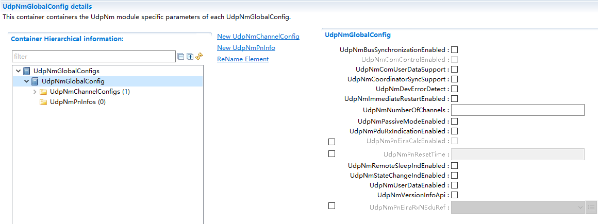

.. centered:: **表 UdpNmGlobalConfig属性描述 (Table UdpNmGlobalConfig property description)**

.. list-table::
   :widths: 20 20 20 20 20
   :header-rows: 1

   * - UI名称 (UI Name)
     - 描述 (Description)
     - 
     - 
     - 
   * - UdpNmBusSynchronizationEnabled
     - 取值范围 (Range)
     - STD_ON,STD_OFF
     - 默认取值 (Default value)
     - 无
   * - 
     - 参数描述 (Parameter Description)
     - 预处理器开关，用于启用总线同步支持，此功能仅适用于网关节点 (Preprocessor switch for enabling bus synchronization support, this feature is applicable only to gateway nodes.)
     - 
     - 
   * - 
     - 依赖关系 (Dependencies)
     - 如果（UdpNmPassiveModeEnabled==False），那么等于（NmBusSynchronizationEnabled）否则等于（False）
     - 
     -
   * - UdpNmComControlEnabled
     - 取值范围 (Range)
     - STD_ON,STD_OFF
     - 默认取值 (Default value)
     - 无
   * - 
     - 参数描述 (Parameter Description)
     - 预处理器开关，用于启用通信控制支持 (Preprocessor switch for enabling communication control support)
     - 
     - 
   * - 
     - 依赖关系 (Dependencies)
     - 如果（UdpNmPassiveModeEnabled==False），那么等于（NmComControlEnabled=True）否则等于（False）
     - 
     - 
   * - UdpNmComUserDataSupport
     - 取值范围 (Range)
     - STD_ON,STD_OFF
     - 默认取值 (Default value)
     - 无
   * - 
     - 参数描述 (Parameter Description)
     - 用于启用Com用户数据的预处理器开关 (Preprocessor switch for enabling Com user data)
     - 
     - 
   * - 
     - 依赖关系 (Dependencies)
     - 如果UdpNmPassiveModeEnabled== True则UdpNmComUserDataSupport= False (If UdpNmPassiveModeEnabled == True then UdpNmComUserDataSupport = False)
     - 
     - 
   * - UdpNmCoordinatorSyncSupport
     - 取值范围 (Range)
     - STD_ON,STD_OFF
     - 默认取值 (Default value)
     - 无
   * - 
     - 参数描述 (Parameter Description)
     - 启用/禁用协调器同步支持。 (Enable/Disable Coordinator Synchronization Support.)
     - 
     - 
   * - 
     - 依赖关系 (Dependencies)
     - 如果将UdpNmPassiveModeEnabled设置为TRUE，则必须将UdpNmCoordinatorSyncSupport设置为FALSE。 (If UdpNmPassiveModeEnabled is set to TRUE, then UdpNmCoordinatorSyncSupport must be set to FALSE.)
     - 
     - 
   * - UdpNmDevErrorDetect
     - 取值范围 (Range)
     - true, false
     - 默认取值 (Default value)
     - false
   * - 
     - 参数描述 (Parameter Description)
     - 打开或关闭开发错误检测 (Enable or Disable Development Error Detection)
     - 
     - 
   * - 
     - 依赖关系 (Dependencies)
     - 无
     - 
     - 
   * - UdpNmImmediateRestartEnabled
     - 取值范围 (Range)
     - STD_ON,STD_OFF
     - 默认取值 (Default value)
     - 无
   * - 
     - 参数描述 (Parameter Description)
     - 预处理器开关，用于在准备总线休眠模式下根据总线通信请求启用NMPDU立即传输 (Preprocessor switch used for enabling NMPDU immediate transmission upon bus communication request during bus standby mode preparation.)
     - 
     - 
   * - 
     - 依赖关系 (Dependencies)
     - 如果定义了UdpNmPassiveModeEnabled，则不能定义它 (If UdpNmPassiveModeEnabled is defined, it cannot be defined.)
     - 
     - 
   * - UdpNmNumberOfChannels
     - 取值范围 (Range)
     - 1 .. 255
     - 默认取值 (Default value)
     - 无
   * - 
     - 参数描述 (Parameter Description)
     - 一个ECU中允许的UdpNm通道 (The number of UdpNm channels allowed in an ECU)
     - 
     - 
   * - 
     - 依赖关系 (Dependencies)
     - 无
     - 
     - 
   * - UdpNmPassiveModeEnabled
     - 取值范围 (Range)
     - STD_ON,STD_OFF
     - 默认取值 (Default value)
     - 无
   * - 
     - 参数描述 (Parameter Description)
     - 预处理器开关，用于支持被动模式 (Preprocessor switch for supporting passive mode)
     - 
     - 
   * - 
     - 依赖关系 (Dependencies)
     - 依赖于NmIf模块的NmPassiveModeEnabled (Dependent on NmIf module, NmPassiveModeEnabled)
     - 
     - 
   * - UdpNmPduRxIndicationEnabled
     - 取值范围 (Range)
     - STD_ON,STD_OFF
     - 默认取值 (Default value)
     - 无
   * - 
     - 参数描述 (Parameter Description)
     - 用于启用PDURx指示的预处理器开关 (Preprocessor switch for enabling PDURx indicator)
     - 
     - 
   * - 
     - 依赖关系 (Dependencies)
     - 依赖于NmIf模块的NmPduRxIndicationEnabled (Dependent on NmIf module's NmPduRxIndicationEnabled)
     - 
     - 
   * - UdpNmPnEiraCalcEnabled
     - 取值范围 (Range)
     - STD_ON,STD_OFF
     - 默认取值 (Default value)
     - FALSE
   * - 
     - 参数描述 (Parameter Description)
     - 指定UdpNm是否计算内部外部请求的PN请求信息（EIRA）
     - 
     - 
   * - 
     - 依赖关系 (Dependencies)
     - 仅当UdpNmGlobalPnSupport== true时可配置 (Only configure when UdpNmGlobalPnSupport == true.)
     - 
     - 
   * - UdpNmPnResetTime
     - 取值范围 (Range)
     - 0.001~65.535
     - 默认取值 (Default value)
     - 无
   * - 
     - 参数描述 (Parameter Description)
     - 以秒为单位指定重置定时器的运行时间。该复位时间对EIRA和ERA中的PN请求复位有效。每个通道的值应该相同。因此它是一个全局配置参数 (Specify the run time of the reset timer in seconds. This reset time is effective for PN resets of requests in both EIRA and ERA. The value should be the same for each channel. Therefore, it is a global configuration parameter.)
     - 
     - 
   * - 
     - 依赖关系 (Dependencies)
     - 仅当UdpNmGlobalPnSupport== true时可配置 (Only configure when UdpNmGlobalPnSupport == true.)
     - 
     - 
   * - 
     - 
     - UdpNmPnResetTime>UdpNmMsgCycleTime
     - 
     - 
   * - 
     - 
     - UdpNmPnResetTime<UdpNmTimeoutTime
     - 
     - 
   * - UdpNmRemoteSleepIndEnabled
     - 取值范围 (Range)
     - STD_ON,STD_OFF
     - 默认取值 (Default value)
     - 无
   * - 
     - 参数描述 (Parameter Description)
     - 预处理器开关，支持远程睡眠指示，此功能仅适用于网关节点 (Preprocessor switch, supports remote sleep indication, this feature is applicable only for gateway nodes.)
     - 
     - 
   * - 
     - 依赖关系 (Dependencies)
     - 如果（UdpNmPassiveModeEnabled==False），那么等于（NmComControlEnabled）否则等于（False）
     - 
     - 
   * - UdpNmStateChangeIndEnabled
     - 取值范围 (Range)
     - STD_ON,STD_OFF
     - 默认取值 (Default value)
     - 无
   * - 
     - 参数描述 (Parameter Description)
     - 用于启用UdpNm状态更改通知的预处理器开关 (Preprocessor switch for enabling UdpNm status change notifications)
     - 
     - 
   * - 
     - 依赖关系 (Dependencies)
     - 依赖于NmStateChangeIdEnabled (Dependent on NmStateChangeIdEnabled)
     - 
     - 
   * - UdpNmUserDataEnabled
     - 取值范围 (Range)
     - STD_ON,STD_OFF
     - 默认取值 (Default value)
     - 无
   * - 
     - 参数描述 (Parameter Description)
     - 预处理器开关，用于支持用户数据 (Preprocessor switch for supporting user data)
     - 
     - 
   * - 
     - 依赖关系 (Dependencies)
     - 依赖于NmUserDataEnabled (Dependent on NmUserDataEnabled)
     - 
     - 
   * - UdpNmVersionInfoApi
     - 取值范围 (Range)
     - STD_ON,STD_OFF
     - 默认取值 (Default value)
     - 无
   * - 
     - 参数描述 (Parameter Description)
     - 启用或者禁用版本获取API (Enable or Disable Versioning API)
     - 
     - 
   * - 
     - 依赖关系 (Dependencies)
     - 无
     - 
     - 
   * - UdpNmPnEiraRxNSduRef
     - 取值范围 (Range)
     - Reference to [ Pdu]
     - 默认取值 (Default value)
     - 无
   * - 
     - 参数描述 (Parameter Description)
     - 引用COM-Stack中Pdu。UdpNm只需要一个SduRef，因为EIRA是所有以太网通道上的聚合。 (引用COM-Stack中的Pdu。UdpNm only needs one SduRef because EIRA is aggregated on all Ethernet channels.)
     - 
     - 
   * - 
     - 依赖关系 (Dependencies)
     - 仅当UdpNmPnEiraCalcEnabled==true时可配，且关联的PDU应该在PDUR中引用 (Only configure when UdpNmPnEiraCalcEnabled==true, and the associated PDU should be referenced in PDUR.)
     - 
     - 

UdpNmChannelConfig
==================================

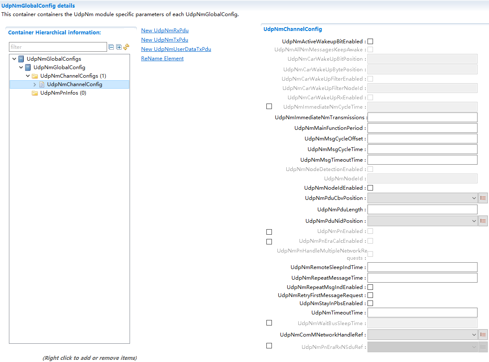

.. centered:: **表 UdpNmChannelConfig属性描述 (Describe the property of UdpNmChannelConfig table)**

.. list-table::
   :widths: 20 20 20 20 20
   :header-rows: 1

   * - UI名称 (UI Name)
     - 描述 (Description)
     - 
     - 
     - 
   * - UdpNmActiveWakeupBitEnabled
     - 取值范围 (Range)
     - STD_ON,STD_OFF
     - 默认取值 (Default value)
     - FALSE
   * - 
     - 参数描述 (Parameter Description)
     - 在UdpNm模块中启用/禁用处理ActiveWakeup Bit (Enable/Disable Handling of Active Wakeup Bit in UdpNm Module)
     - 
     - 
   * - 
     - 依赖关系 (Dependencies)
     - 此参数仅在UdpNmPassiveModeEnabled为False时可配置 (This parameter can be configured only when UdpNmPassiveModeEnabled is False.)
     - 
     - 
   * - UdpNmAllNmMessagesKeepAwake
     - 取值范围 (Range)
     - STD_ON,STD_OFF
     - 默认取值 (Default value)
     - FALSE
   * - 
     - 参数描述 (Parameter Description)
     - 指定 UdpNm是否丢弃不相关的 NMPDU。 (Specify whether UdpNm discards unrelated NMPDUs.)
     - 
     - 
   * - 
     - 依赖关系 (Dependencies)
     - 仅当UdpNmPnEiraCalcEnabled== true 或 (Only when UdpNmPnEiraCalcEnabled == true or)
     - 
     - 
   * - 
     - 
     - UdpNmPnEraCalcEnabled== true时有效 (When UdpNmPnEraCalcEnabled == true, this is effective.)
     - 
     - 
   * - UdpNmCarWakeUpBitPosition
     - 取值范围 (Range)
     - 0 .. 7
     - 默认取值 (Default value)
     - 无
   * - 
     - 参数描述 (Parameter Description)
     - 指定CWU在NMPDU中的Bit位置。 (Specify CWU's bit position in NMPDU.)
     - 
     - 
   * - 
     - 依赖关系 (Dependencies)
     - 仅当UdpNmCarWakeUpRxEnabled== TRUE 时可用 (Only available when UdpNmCarWakeUpRxEnabled == TRUE)
     - 
     - 
   * - UdpNmCarWakeUpBytePosition
     - 取值范围 (Range)
     - 0 .. 7
     - 默认取值 (Default value)
     - 无
   * - 
     - 参数描述 (Parameter Description)
     - 指定CWU在NMPDU中的Byte位置。 (Specify the Byte position of CWU in NMPDU.)
     - 
     - 
   * - 
     - 依赖关系 (Dependencies)
     - 仅当UdpNmCarWakeUpRxEnabled== TRUE时可用，UdpNmCarWakeupBytePosition≥ 启用的系统字节数(CBV,NID)，同时应小于RxPdulength
     - 
     - 
   * - UdpNmCarWakeUpFilterEnabled
     - 取值范围 (Range)
     - STD_ON,STD_OFF
     - 默认取值 (Default value)
     - 无
   * - 
     - 参数描述 (Parameter Description)
     - 表示是否支持CarWakeup过滤功能 (Indicate whether CarWakeup filtering function is supported.)
     - 
     - 
   * - 
     - 依赖关系 (Dependencies)
     - UdpNmCarWakeUpFilterEnabled= STD_ON
     - 
     - 
   * - UdpNmCarWakeUpFilterNodeId
     - 取值范围 (Range)
     - 0 .. 255
     - 默认取值 (Default value)
     - 无
   * - 
     - 参数描述 (Parameter Description)
     - CarWakeup过滤器NodeId (CarWakeup Filter NodeId)
     - 
     - 
   * - 
     - 依赖关系 (Dependencies)
     - UdpNmCarWakeUpFilterEnabled= STD_ON
     - 
     - 
   * - UdpNmCarWakeUpRxEnabled
     - 取值范围 (Range)
     - STD_ON,STD_OFF
     - 默认取值 (Default value)
     - 无
   * - 
     - 参数描述 (Parameter Description)
     - 表示是否支持CarWakeup过滤功能 (Indicate whether CarWakeup filtering function is supported.)
     - 
     - 
   * - 
     - 依赖关系 (Dependencies)
     - 无
     - 
     - 
   * - UdpNmImmediateNmCycleTime
     - 取值范围 (Range)
     - 0.001 .. 65.535
     - 默认取值 (Default value)
     - 无
   * - 
     - 参数描述 (Parameter Description)
     - 定义用于UdpNmImmediateNmTransmissionsNM PDU立即传输的循环时间，以秒为单位。 (Define the cyclic time for UdpNmImmediateNmTransmissions NM PDU immediate transmissions in seconds.)
     - 
     - 
   * - 
     - 依赖关系 (Dependencies)
     - 此参数仅在以下情况下有效 (This parameter is effective only in the following cases.)
     - 
     - 
   * - 
     - 
     - UdpNmImmediateNmTransmissions>1。
     - 
     - 
   * - UdpNmImmediateNmTransmissions
     - 取值范围 (Range)
     - 0 .. 255
     - 默认取值 (Default value)
     - 无
   * - 
     - 参数描述 (Parameter Description)
     - 定义应立即传输的NMPDU的数量。如果该值为零，则不会立即发送NM PDU。立即传输 NMPDU 的循环时间由UdpNmImmediateNmCycleTime定义。 (Define the number of NMPDUs to be immediately transferred. If this value is zero, no NM PDU will be immediately sent. The cyclic time for immediately transferring NMPDUs is defined by UdpNmImmediateNmCycleTime.)
     - 
     - 
   * - 
     - 依赖关系 (Dependencies)
     - 如果UdpNmImmediateRestartEnabled= true 那么 (If UdpNmImmediateRestartEnabled = true then)
     - 
     - 
   * - 
     - 
     - UdpNmImmediateNmTransmissions= 0
     - 
     - 
   * - 
     - 
     - 如果UdpNmPnHandleMultipleNetworkRequests== True" 那么 (If "UdpNmPnHandleMultipleNetworkRequests == True" then)
     - 
     - 
   * - 
     - 
     - "UdpNmImmediateNmTransmissions> 0
     - 
     - 
   * - UdpNmMainFunctionPeriod
     - 取值范围 (Range)
     - 0 .. INF
     - 默认取值 (Default value)
     - 无
   * - 
     - 参数描述 (Parameter Description)
     - 该通道周期处理函数调用周期。以秒为单位指定 (This channel period processing function call period. Specify in seconds.)
     - 
     - 
   * - 
     - 依赖关系 (Dependencies)
     - 无
     - 
     - 
   * - UdpNmMsgCycleOffset
     - 取值范围 (Range)
     - 0~65.535
     - 默认取值 (Default value)
     - 无
   * - 
     - 参数描述 (Parameter Description)
     - 周期性传输节点中的时间偏移。它决定了传输的启动延迟。以秒为单位指定 (Time offset for periodic transmission nodes. It determines the startup delay of transmission. Specified in seconds.)
     - 
     - 
   * - 
     - 依赖关系 (Dependencies)
     - 参数值<CanMsgCycleTime此参数仅在UdpNmPassiveModeEnabled为False时有效 (Parameter value <CanMsgCycleTime This parameter is effective only when UdpNmPassiveModeEnabled is False.)
     - 
     - 
   * - UdpNmMsgCycleTime
     - 取值范围 (Range)
     - 0.001~65.535
     - 默认取值 (Default value)
     - 无
   * - 
     - 参数描述 (Parameter Description)
     - NMPDU的周期以秒为单位。它确定周期性速率，并且是传输调度的基础。 (The period of NMPDU is in seconds. It determines the periodic rate and serves as the basis for transmission scheduling.)
     - 
     - 
   * - 
     - 依赖关系 (Dependencies)
     - 当“UdpNmPassiveModeEnabled”为“False”时，此参数才有效。 (When "UdpNmPassiveModeEnabled" is "False", this parameter is effective.)
     - 
     - 
   * - UdpNmMsgTimeoutTime
     - 取值范围 (Range)
     - 0.001~65.535
     - 默认取值 (Default value)
     - 无
   * - 
     - 参数描述 (Parameter Description)
     - 当使用部分网络并定义此超时时，UdpNm会监控 NM-PDU在此传输超时时间内成功传输，否则提供错误通知。 (When using a partial network and defining this timeout, UdpNm monitors the successful transmission of NM-PDU within this transfer timeout period, otherwise providing an error notification.)
     - 
     - 
   * - 
     - 依赖关系 (Dependencies)
     - UdpNmMsgTimeoutTime< UdpNmMsgCycleTime
     - 
     - 
   * - 
     - 
     - 此参数仅在UdpNmPassiveModeEnabled和UdpNmImmediateTxConfEnabled设置为 FALSE 且UdpNmPnEnabled设置为 TRUE时有效。 (This parameter is effective only when UdpNmPassiveModeEnabled and UdpNmImmediateTxConfEnabled are set to FALSE and UdpNmPnEnabled is set to TRUE.)
     - 
     - 
   * - UdpNmNodeDetectionEnabled
     - 取值范围 (Range)
     - STD_ON,STD_OFF
     - 默认取值 (Default value)
     - 无
   * - 
     - 参数描述 (Parameter Description)
     - 预编译时间切换以启用节点检测功能 (Pre-compiled time switching to enable node detection functionality)
     - 
     - 
   * - 
     - 依赖关系 (Dependencies)
     - 仅当UdpNmNodeIdEnabled设置为 TRUE 时有效 (Only valid when UdpNmNodeIdEnabled is set to TRUE)
     - 
     - 
   * - 
     - 
     - 如果UdpNmPassiveModeEnabled== True 那么UdpNmNodeDetection= False (If UdpNmPassiveModeEnabled == True then UdpNmNodeDetection = False)
     - 
     - 
   * - UdpNmNodeId
     - 取值范围 (Range)
     - 0~255
     - 默认取值 (Default value)
     - 无
   * - 
     - 参数描述 (Parameter Description)
     - 本地节点标志符 (Local node identifier)
     - 
     - 
   * - 
     - 依赖关系 (Dependencies)
     - 此参数仅在UdpNmNodeIdEnabled== True 时有效 (This parameter is effective only when UdpNmNodeIdEnabled == True)
     - 
     - 
   * - UdpNmNodeIdEnabled
     - 取值范围 (Range)
     - STD_ON,STD_OFF
     - 默认取值 (Default value)
     - 无
   * - 
     - 参数描述 (Parameter Description)
     - 用于启用源节点标识的预处理器开关 (Switch preprocessor for enabling source node identifier)
     - 
     - 
   * - 
     - 依赖关系 (Dependencies)
     - 依赖于NmIf模块的NmNodeIdEnabled (Dependent on NmIf module, NmNodeIdEnabled)
     - 
     - 
   * - UdpNmPduCbvPosition
     - 取值范围 (Range)
     - UDPNM_PDU_BYTE_0UDPNM_PDU_BYTE_1
     - 默认取值 (Default value)
     - 无
   * - 
     - 
     - UDPNM_PDU_OFF
     - 
     - 
   * - 
     - 参数描述 (Parameter Description)
     - 定义NMPDU内控制位向量的位置。参数的值表示NMPDU中控制位向量的位置（UdpNmPduByte0表示字节0，UdpNmPduByte1表示字节1，UdpNmPduOff表示源节点标识符不是NMPDU的一部分）
     - 
     - 
   * - 
     - 依赖关系 (Dependencies)
     - 如果UdpNmNodeDetectionEnabled==true，那么UdpNmPduCbvPosition！=UDPNM_PDU_OFF (If UdpNmNodeDetectionEnabled == true, then UdpNmPduCbvPosition != UDPNM_PDU_OFF)
     - 
     - 
   * - 
     - 
     - 如果（UDPNM_PDU_CBV_POSITION！=UDPNM_PDU_OFF&&UDPNM_PDU_NID_POSITION！=UDPNM_PDU_OFF）则UDPNM_PDU_CBV_POSITION！=UDPNM_PDU_NID_POSITION
     - 
     - 
   * - 
     - 
     - 如果（UDPNM_PDU_CBV_POSITION！=UDPNM_PDU_OFF&&UDPNM_PDU_NID_POSITION==UDPNM_PDU_OFF）则UDPNM_PDU_CBV_POSITION=UDPNM_PDU_BYTE0
     - 
     - 
   * - UdpNmPduLength
     - 取值范围 (Range)
     - 0~255
     - 默认取值 (Default value)
     - 无
   * - 
     - 参数描述 (Parameter Description)
     - NM Pdu的长度 (The length of NM Pdu)
     - 
     - 
   * - 
     - 依赖关系 (Dependencies)
     - 无
     - 
     - 
   * - UdpNmPduNidPosition
     - 取值范围 (Range)
     - UDPNM_PDU_BYTE_0UDPNM_PDU_BYTE_1
     - 默认取值 (Default value)
     - 无
   * - 
     - 
     - UDPNM_PDU_OFF
     - 
     - 
   * - 
     - 参数描述 (Parameter Description)
     - 定义NMPDU中源节点标识的位置。该参数的值表示NMPDU中源节点标识的位置 (Define the position of the source node identifier in NMPDU. The value of this parameter indicates the position of the source node identifier in NMPDU.)
     - 
     - 
   * - 
     - 依赖关系 (Dependencies)
     - 如果UdpNmNodeIdEnabled==true，那么UdpNmPduNidPosition!= UDPNM_PDU_OFF (If UdpNmNodeIdEnabled==true, then UdpNmPduNidPosition!= UDPNM_PDU_OFF)
     - 
     - 
   * - 
     - 
     - 如果（UDPNM_PDU_NID_POSITION!=UDPNM_PDU_OFF&&UDPNM_PDU_CBV_POSITION!=UDPNM_PDU_OFF）则UDPNM_PDU_NID_POSITION!=UDPNM_PDU_CBV_POSITION
     - 
     - 
   * - 
     - 
     - 如果（UDPNM_PDU_NID_POSITION！=UDPNM_PDU_OFF&&UDPNM_PDU_CBV_POSITION==UDPNM_PDU_OFF）则UDPNM_PDU_NID_POSITION=UDPNM_PDU_BYTE0
     - 
     - 
   * - UdpNmPnEnabled
     - 取值范围 (Range)
     - STD_ON,STD_OFF
     - 默认取值 (Default value)
     - 无
   * - 
     - 参数描述 (Parameter Description)
     - 使能或者禁用PN (Enable or Disable PN)
     - 
     - 
   * - 
     - 依赖关系 (Dependencies)
     - 仅当UdpNmGlobalPnSupport== true 时有效 (Only valid when UdpNmGlobalPnSupport == true)
     - 
     - 
   * - UdpNmPnEraCalcEnabled
     - 取值范围 (Range)
     - STD_ON,STD_OFF
     - 默认取值 (Default value)
     - FALSE
   * - 
     - 参数描述 (Parameter Description)
     - 指定UdpNm是否计算外部请求的PN请求信息 (Specify whether UdpNm calculates PN request information for external requests.)
     - 
     - 
   * - 
     - 依赖关系 (Dependencies)
     - 仅当UdpNmGlobalPnSupport== true 时有效 (Only valid when UdpNmGlobalPnSupport == true)
     - 
     - 
   * - UdpNmPnHandleMultipleNetworkRequests
     - 取值范围 (Range)
     - STD_ON,STD_OFF
     - 默认取值 (Default value)
     - FALSE
   * - 
     - 参数描述 (Parameter Description)
     - 指定UdpNm是否执行从网络模式到重复消息状态（true）或不（false）的附加转换
     - 
     - 
   * - 
     - 依赖关系 (Dependencies)
     - 仅当UdpNmGlobalPnSupport== true 时有效 (Only valid when UdpNmGlobalPnSupport == true)
     - 
     - 
   * - UdpNmRemoteSleepIndTime
     - 取值范围 (Range)
     - 0.001~65.535
     - 默认取值 (Default value)
     - 无
   * - 
     - 参数描述 (Parameter Description)
     - 远程睡眠指示超时。它定义了需要多长时间才能识别所有其他节点已准备好进入睡眠状态 (Timeout for remote sleep indication. It defines how long it takes to identify that all other nodes are ready to enter sleep state.)
     - 
     - 
   * - 
     - 依赖关系 (Dependencies)
     - UdpNmRemoteSleepIndTime≥UdpNmMsgCycleTime且UdpNmRemoteSleepIndTime仅在UdpNmRemoteSleepIndEnabled= true时是必需的 (UdpNmRemoteSleepIndTime ≥ UdpNmMsgCycleTime and UdpNmRemoteSleepIndTime is only required when UdpNmRemoteSleepIndEnabled = true)
     - 
     - 
   * - UdpNmRepeatMessageTime
     - 取值范围 (Range)
     - 0~65.535
     - 默认取值 (Default value)
     - 无
   * - 
     - 参数描述 (Parameter Description)
     - 重复消息状态超时。它以秒为单位定义了NM应该停留在重复消息状态的时间 (Duplicate message status timeout. It defines in seconds how long NM should remain in the duplicate message state.)
     - 
     - 
   * - 
     - 依赖关系 (Dependencies)
     - UdpNmRepeatMessageTime=n\*UdpNmMsgCycleTime;UdpNmRepeatMessageTime>UdpNmImmediateNmTransmissions\*UdpNmImmediateNmCycleTime
     - 
     - 
   * - UdpNmRepeatMsgIndEnabled
     - 取值范围 (Range)
     - STD_ON,STD_OFF
     - 默认取值 (Default value)
     - 无
   * - 
     - 参数描述 (Parameter Description)
     - 启用/禁用已收到RepeatMessageRequest位的通知 (Enable/Disable Notification for Received RepeatMessageRequest Bit)
     - 
     - 
   * - 
     - 依赖关系 (Dependencies)
     - 如果UdpNmPassiveModeEnabled==False则等于NmRepeatMsgIndEnabled，否则等于False (If UdpNmPassiveModeEnabled == False then equal to NmRepeatMsgIndEnabled, otherwise equal to False)
     - 
     - 
   * - UdpNmRetryFirstMessageRequest
     - 取值范围 (Range)
     - STD_ON,STD_OFF
     - 默认取值 (Default value)
     - 无
   * - 
     - 参数描述 (Parameter Description)
     - 指定 UdpNm中的第一个消息请求是否重复直到被CanIf 接受。 (Specify whether the first message request in UdpNm is resent until accepted by CanIf.)
     - 
     - 
   * - 
     - 依赖关系 (Dependencies)
     - 如果UdpNmPassiveModeEnabled=true,则 (If UdpNmPassiveModeEnabled=true, then)
     - 
     - 
   * - 
     - 
     - UdpNmRetryFirstMessageRequest=false
     - 
     - 
   * - UdpNmStayInPbsEnabled
     - 取值范围 (Range)
     - STD_ON,STD_OFF
     - 默认取值 (Default value)
     - 无
   * - 
     - 参数描述 (Parameter Description)
     - 如果禁用此参数，则在UdpNmWaitBusSleepTime后离开PrepareBus-Sleep 模式。如果启用此参数，则只有在ECU断电或任何重新启动原因适用时才能离开Prepare BusSleep模式。 (If this parameter is disabled, the PrepareBus-Sleep mode exits after UdpNmWaitBusSleepTime. If this parameter is enabled, the Prepare Bus Sleep mode exits only when the ECU powers off or any restart reason applies.)
     - 
     - 
   * - 
     - 依赖关系 (Dependencies)
     - 无
     - 
     - 
   * - UdpNmTimeoutTime
     - 取值范围 (Range)
     - 0.002~65.535
     - 默认取值 (Default value)
     - 无
   * - 
     - 参数描述 (Parameter Description)
     - NM PDU的网络超时。它表示在转换到 (NM PDU's network timeout. It indicates that during the conversion to)
     - 
     - 
   * - 
     - 
     - Prepare Bus-Sleep模式启动之前，NM需要停留在 (Before Bus-Sleep mode startup, NM needs to stay at)
     - 
     - 
   * - 
     - 
     - ReadySleep状态的时间 (The time of ReadySleep state)
     - 
     - 
   * - 
     - 依赖关系 (Dependencies)
     - UdpNmTimeoutTime >UdpNmMsgCycleTime
     - 
     - 
   * - UdpNmWaitBusSleepTime
     - 取值范围 (Range)
     - 0.001~65.535
     - 默认取值 (Default value)
     - 无
   * - 
     - 参数描述 (Parameter Description)
     - 表示在转换到总线休眠模式之前，NM应停留在准备总线休眠模式的时间，以秒为单位 (Indicate in seconds how long NM should stay in preparation for bus sleep mode before transitioning to the bus sleep mode.)
     - 
     - 
   * - 
     - 依赖关系 (Dependencies)
     - 它应该对群集中的所有节点都是相等的。它应该足够长，使所有Tx缓冲区都为空，如果UdpNmStayInPbsEnabled被禁用，这个参数应该是强制性的。 (It should be equal for all nodes in the cluster. It should be long enough to make all Tx buffers empty. If UdpNmStayInPbsEnabled is disabled, this parameter should be mandatory.)
     - 
     - 
   * - UdpNmComMNetworkHandleRef
     - 取值范围 (Range)
     - Reference to [ComMChannel ]
     - 默认取值 (Default value)
     - 无
   * - 
     - 参数描述 (Parameter Description)
     - 此引用指向由ComMChannel定义的唯一通道，并提供对ComMChannelId中唯一通道索引值的访问 (This reference points to a unique channel defined by ComMChannel and provides access to the unique channel index value in ComMChannelId.)
     - 
     - 
   * - 
     - 依赖关系 (Dependencies)
     - 无
     - 
     - 
   * - UdpNmPnEraRxNSduRef
     - 取值范围 (Range)
     - Reference to [ Pdu]
     - 默认取值 (Default value)
     - 无
   * - 
     - 参数描述 (Parameter Description)
     - 参考COM堆栈中的Pdu。每个UdpNm通道都需要SduRef，因为每个channel都会报告ERA (Refer to Pdu in the COM stack. Each UdpNm channel requires SduRef because each channel reports ERA.)
     - 
     - 
   * - 
     - 依赖关系 (Dependencies)
     - 仅当UdpNmPnEraCalcEnabled== true时有效，且关联的PDU在PDUR中有引用 (Only valid when UdpNmPnEraCalcEnabled == true, and the associated PDU is referenced in PDUR.)
     - 
     - 

UdpNmRxPdu
--------------------------

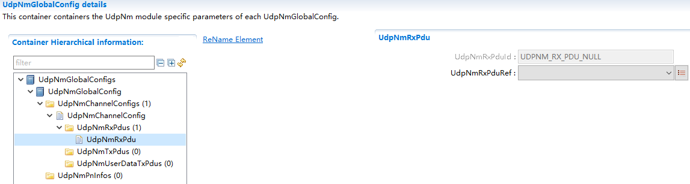

.. centered:: **表 UdpNmRxPdu属性描述 (Attribute UdpNmRxPdu description)**

.. list-table::
   :widths: 20 20 20 20 20
   :header-rows: 1

   * - UI名称 (UI Name)
     - 描述 (Description)
     - 
     - 
     - 
   * - UdpNmRxPduId
     - 取值范围 (Range)
     - 0 .. 65535
     - 默认取值 (Default value)
     - 无
   * - 
     - 参数描述 (Parameter Description)
     - UdpNmRxPduRef参数引用的Pdu在UdpNm中分配的序号。自动生成，用户不需要配置。 (The parameter UdpNmRxPduRef refers to the Pdu sequence number allocated by UdpNm. Automatically generated, users do not need to configure it.)
     - 
     - 
   * - 
     - 依赖关系 (Dependencies)
     - 无
     - 
     - 
   * - UdpNmRxPduRef
     - 取值范围 (Range)
     - Reference to [ Pdu]
     - 默认取值 (Default value)
     - 无
   * - 
     - 参数描述 (Parameter Description)
     - 引用一个PDU，表示接收NMPDU (引用 a PDU to indicate receiving an NMPDU)
     - 
     - 
   * - 
     - 依赖关系 (Dependencies)
     - 依赖于ECUC里面配置的PDU (Dependent on the PDU configured in ECUC)
     - 
     - 

UdpNmTxPdu 
---------------------------

仅当 UdpNmPassiveModeEnabled 为 false 时，此容器的配置有效。

This configuration is effective only when UdpNmPassiveModeEnabled is false.

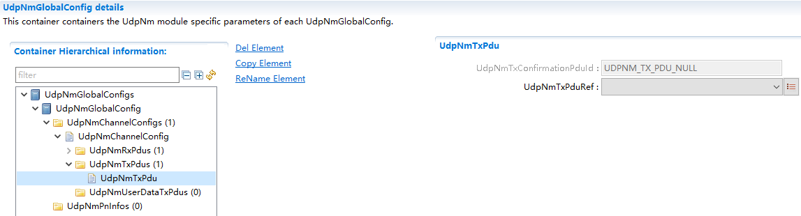

.. centered:: **表 UdpNmTxPdu属性描述 (Attribute UdpNmTxPdu description)**

.. list-table::
   :widths: 20 20 20 20 20
   :header-rows: 1

   * - UI名称 (UI Name)
     - 描述 (Description)
     - 
     - 
     - 
   * - UdpNmTxConfirmationPduId
     - 取值范围 (Range)
     - 0 .. 65535
     - 默认取值 (Default value)
     - 无
   * - 
     - 参数描述 (Parameter Description)
     - UdpNmTxPduRef参数引用的Pdu在UdpNm中分配的序号。自动生成，用户不需要配置。 (The sequence number of Pdu allocated in UdpNm, referenced by the UdpNmTxPduRef parameter. Automatically generated; users do not need to configure it.)
     - 
     - 
   * - 
     - 依赖关系 (Dependencies)
     - 配置的PDU顺序 (Order of configured PDU)
     - 
     - 
   * - UdpNmTxPduRef
     - 取值范围 (Range)
     - Reference to [ Pdu]
     - 默认取值 (Default value)
     - 无
   * - 
     - 参数描述 (Parameter Description)
     - 引用一个PDU，表示发送NMPDU (Reference a PDU to indicate sending NMPDU)
     - 
     - 
   * - 
     - 依赖关系 (Dependencies)
     - 依赖于ECUC里面配置的PDU (Dependent on the PDU configured in ECUC)
     - 
     - 

UdpNmUserDataTxPdu
----------------------------------

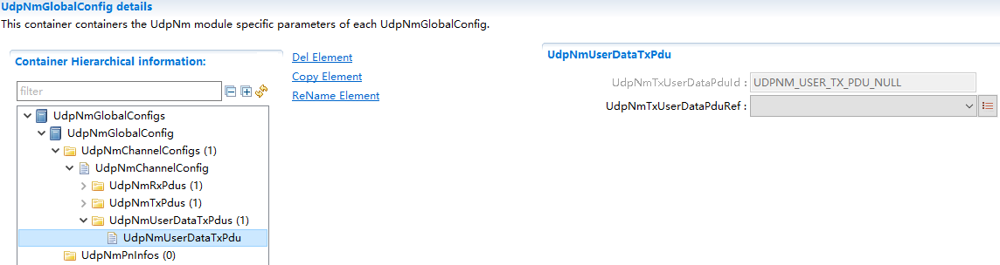

.. centered:: **表 UdpNmUserDataTxPdu属性描述 (Property description for UdpNmUserDataTxPdu)**

.. list-table::
   :widths: 20 20 20 20 20
   :header-rows: 1

   * - UI名称 (UI Name)
     - 描述 (Description)
     - 
     - 
     - 
   * - UdpNmTxUserDataPduId
     - 取值范围 (Range)
     - 0 .. 65535
     - 默认取值 (Default value)
     - 无
   * - 
     - 参数描述 (Parameter Description)
     - UdpNmTxUserDataPduRef引用的Pdu在UdpNm中分配的序号。自动生成，用户不需要配置。 (The sequence number allocated in UdpNm for the Pdu referenced by UdpNmTxUserDataPduRef. Automatically generated; no user configuration required.)
     - 
     - 
   * - 
     - 依赖关系 (Dependencies)
     - 配置的PDU顺序 (Order of configured PDU)
     - 
     - 
   * - UdpNmTxUserDataPduRef
     - 取值范围 (Range)
     - Reference to [ Pdu]
     - 默认取值 (Default value)
     - 无
   * - 
     - 参数描述 (Parameter Description)
     - 引用一个Pdu，表示发送Userdata Pdu。 (Reference a Pdu to indicate the sending of Userdata Pdu.)
     - 
     - 
   * - 
     - 依赖关系 (Dependencies)
     - 依赖于ECUC里面配置的PDU,且长度配置应该大于0 (Dependent on the PDU configured in ECUC, and the length configuration should be greater than 0.)
     - 
     - 

UdpNmPnInfo
===========================

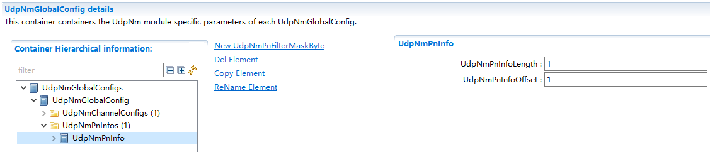

.. centered:: **表 UdpNmPnInfo属性描述 (Property UdpNmPnInfo attribute description)**

.. list-table::
   :widths: 20 20 20 20 20
   :header-rows: 1

   * - UI名称 (UI Name)
     - 描述 (Description)
     - 
     - 
     - 
   * - UdpNmPnInfoLength
     - 取值范围 (Range)
     - 1 .. 7
     - 默认取值 (Default value)
     - 无
   * - 
     - 参数描述 (Parameter Description)
     - NM报文中PN信息的长度。 (Length of PN information in NM message.)
     - 
     - 
   * - 
     - 依赖关系 (Dependencies)
     - 仅当UdpNmGlobalPnSupport== true 时有效 (Only valid when UdpNmGlobalPnSupport == true)
     - 
     - 
   * - UdpNmPnInfoOffset
     - 取值范围 (Range)
     - 1 .. 7
     - 默认取值 (Default value)
     - 无
   * - 
     - 参数描述 (Parameter Description)
     - NM报文中PN信息的开始位置相对NM报文起始位置的偏移量。 (The offset of the PN information start position relative to the NM message start position.)
     - 
     - 
   * - 
     - 依赖关系 (Dependencies)
     - 仅当UdpNmGlobalPnSupport== true 时有效 (Only valid when UdpNmGlobalPnSupport == true)
     - 
     - 

UdpNmPnFilterMaskByte
-------------------------------------

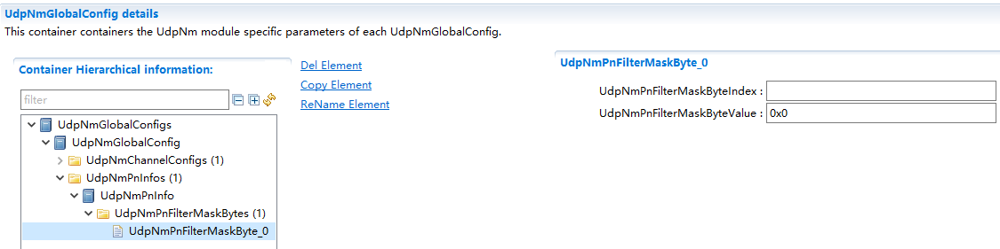

.. centered:: **表 UdpNmPnFilterMaskByte属性描述 (Attribute description for UdpNmPnFilterMaskByte)**

.. list-table::
   :widths: 20 20 20 20 20
   :header-rows: 1

   * - UI名称 (UI Name)
     - 描述 (Description)
     - 
     - 
     - 
   * - UdpNmPnFilterMaskByteIndex
     - 取值范围 (Range)
     - 0 .. 6
     - 默认取值 (Default value)
     - 无
   * - 
     - 参数描述 (Parameter Description)
     - 过滤掩码字节的索引。指定过滤掩码字节数组中的位置 (Index of filtered mask bytes. Specifies the position in the filtered mask byte array.)
     - 
     - 
   * - 
     - 依赖关系 (Dependencies)
     - 仅当UdpNmGlobalPnSupport== true时有效UdpNmPnFilterMaskByteIndex<UdpNmPnInfoLength (Only valid when UdpNmGlobalPnSupport== true UdpNmPnFilterMaskByteIndex < UdpNmPnInfoLength)
     - 
     - 
   * - UdpNmPnFilterMaskByteValue
     - 取值范围 (Range)
     - 0 .. 255
     - 默认取值 (Default value)
     - 无
   * - 
     - 参数描述 (Parameter Description)
     - 用于配置过滤掩码字节的参数。 (Parameters for configuring filter mask bytes.)
     - 
     - 
   * - 
     - 依赖关系 (Dependencies)
     - 仅当UdpNmGlobalPnSupport== true 时有效 (Only valid when UdpNmGlobalPnSupport == true)
     - 
     - 
