XCP
#################################

:strong:`缩写词注解 (Abbreviation Notes):`

.. list-table::
   :widths: 34 33 33
   :header-rows: 1

   * - 缩写词 (Abbreviation)
     - 解释/描述 (Explanation/Description)
     - 中文解释 (Chinese explanation)
   * - ASAM
     - Association forStandardization ofAutomation and MeasuringSystems
     - 自动化和测量系统标准化协会 (Association for Automation and Measurement System Standardization)
   * - CAL
     - CALibration
     - 在线标定 (Online Calibration)
   * - CMD
     - CoMmanD
     - 命令，一般指上位机发送到ECU的指令 (Command, generally refers to instructions sent from the upper computer to the ECU.)
   * - CTO
     - Command Transfer Object
     - 命令传输对象 (Command Transmission Object)
   * - DTO
     - Data Transfer Object
     - 数据传输对象 (Data Transfer Object)
   * - DAQ
     - Data AcQuisition, DataAcQuisition Packet
     - 数据采集包（一般指ECU把观测量通过DAQ上传到上位机） (Data acquisition package (usually refers to ECU uploading measured values to the host computer))
   * - MTA
     - Memory Transfer Address
     - 内存传输地址（指ECU内部Memory地址） (Memory transfer address (refers to the ECU internal Memory address))
   * - ODT
     - Object Descriptor Table
     - 对象描述符表（通讯角度上看，就是一帧通信报文） (Descriptor Table of Objects (From communication perspective, it's a frame of communication message))
   * - PAG
     - PAGing
     - 指页切换相关命名 (Tab switching related naming)
   * - PGM
     - ProGraMming
     - 指Flash刷写相关命名 (Related Naming for Flash Write)
   * - STD
     - STanDard
     - 指标准命令组 (Standard Command Group)
   * - XCP
     - Universal CalibrationProtocol
     - 通用标定协议 (General Calibration Protocol)
   * - INCA/CANAPE
     - -
     - 上位机标定工具 (Upper machine calibration tool)

简介 (Introduction)
=================================

XCP标定软件协议栈是针对用户使用第三方标定工具（如：INCA或CANape）对汽车电子电控单元进行参数标定，为其提供数据标定、数据上传及相关通信服务的软件模块。同时，还可以为用户提供基于XCP协议的Flash刷写功能。本软件基于AUTOSAR R19-11规范进行设计，符合ASAM发布的XCP 1.1标准中所描述的标定功能。软件模块运行在汽车电子电控单元系统中，实现标定工具与电控单元的主-从通讯，执行标定工具发出的各项命令，完成基于CAN、ETH通信协议的数据上传和数据标定。

The XCP Calibration Software Stack is designed for users to use third-party calibration tools (such as INCA or CANape) to calibrate parameters in automotive electronic control units, providing data calibration, data upload, and related communication services. It also offers flash programming functionality based on the XCP protocol. This software is designed based on the AUTOSAR R19-11 specification and complies with the calibration functions described in the ASAM-released XCP 1.1 standard. The software module runs within the automotive electronic control unit system, realizing master-slave communications between the calibration tool and the control unit, executing various commands issued by the calibration tool, and completing data upload and calibration based on CAN and ETH communication protocols.

XCP在AUTOSAR中结构层次图如下：

The structure hierarchy diagram of XCP in AUTOSAR is as follows:

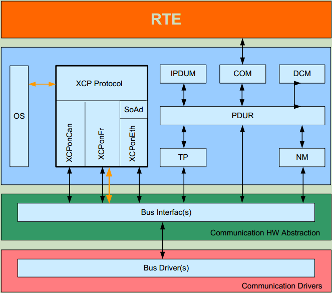

参考资料 (Reference materials)
------------------------------------------

[1] ASAM_XCP_Part1-Overview_V1-1-0.pdf

[2] ASAM_XCP_Part2-Protocol-Layer-Specification_V1-1-0.pdf

[3] ASAM_XCP_Part3-Transport-Layer-Specification_XCPonCAN_V1-1-0.pdf

[4] ASAM_XCP_Part3-Transport-Layer-Specification_XCPonETH_V1-1-0.pdf

[5] ASAM_XCP_Part4-Interface-Specification_V1-1-0.pdf

[6] ASAM_XCP_Part5-Example-Communication-Sequences_V1-1-0.pdf

[7] AUTOSAR_SWS_XCP.pdf，R19-11

功能描述 (Function Description)
===========================================

DAQ功能 (DAQ Function)
------------------------------------

DAQ功能介绍 (Introduction to DAQ Function)
~~~~~~~~~~~~~~~~~~~~~~~~~~~~~~~~~~~~~~~~~~~~~~~~~~~~~

DAQ功能主要是为了上传观测量，DAQ由ODT组成，ODT由ODT Entry组成。从通讯角度ODT就是每一帧数据（如一帧CAN报文），而ODT Entry代表一帧数据中（如CAN报文中）的字节内容。在实际应用中，一个周期内一般采集非常多的数据（超过一帧），那么就需要把多个ODT组合起来，这种组合在XCP中称为DAQ List。DAQ-ODT-ODT Entry示意图如下：

The DAQ function is mainly for uploading measurements. DAQ consists of ODT, and ODT consists of ODT Entry. From a communication perspective, ODT is each data frame (such as a CAN message), while ODT Entry represents the byte content within a single data frame (such as in a CAN message). In practical applications, a large amount of data is typically collected within a cycle (more than one frame), so multiple ODTs need to be combined. This combination is referred to as DAQ List in XCP. The diagram illustrating DAQ-ODT-ODT Entry is as follows:

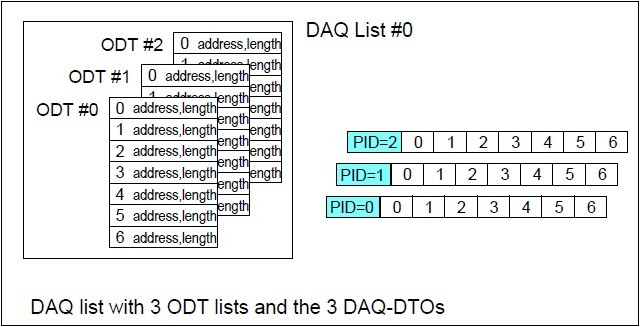

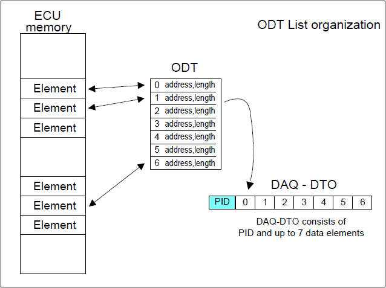

DAQ功能实现 (DAQ Function Implementation)
~~~~~~~~~~~~~~~~~~~~~~~~~~~~~~~~~~~~~~~~~~~~~~~~~~~~~

DAQ功能的实现是基于如下命令的实现，相关命令如下

The implementation of DAQ functionality is based on the realization of the following commands, which are as follows:

（带*表示可选）：

(Optional: )

.. centered:: **表 DAQ命令组 (Table DAQ Command Group)**

.. list-table::
   :widths: 34 33 33
   :header-rows: 1

   * - 命令组 (Command Group)
     - 命令名 (Command Name)
     - 是否实现 (Has it been implemented?)
   * - DAQ/STIM基本命令组 (Basic Command Group for DAQ/STIM)
     - SET_DAQ_PTR
     - 是 (Is)
   * - 
     - WRITE_DAQ
     - 是 (Is)
   * - 
     - SET_DAQ_LIST_MODE
     - 是 (Is)
   * - 
     - START_STOP_DAQ_LIST
     - 是 (Is)
   * - 
     - START_STOP_SYNCH
     - 是 (Is)
   * - 
     - WRITE_DAQ_MULTIPLE\*
     - 否 (No)
   * - 
     - READ_DAQ\*
     - 是 (Is)
   * - 
     - GET_DAQ_CLOCK\*
     - 是 (Is)
   * - 
     - GET_DAQ_PROCESSOR_INFO\*
     - 是 (Is)
   * - 
     - GET_DAQ_RESOLUTION_INFO\*
     - 是 (Is)
   * - 
     - GET_DAQ_LIST_MODE\*
     - 是 (Is)
   * - 
     - GET_DAQ_EVENT_INFO\*
     - 是 (Is)
   * - 静态DAQ配置命令组 (Static DAQ Configuration Command Group)
     - CLEAR_DAQ_LIST
     - 是 (Is)
   * - 
     - GET_DAQ_LIST_INFO\*
     - 是 (Is)
   * - 动态DAQ配置命令组 (Dynamic DAQ Configuration Command Group)
     - FREE_DAQ
     - 是 (Is)
   * - 
     - ALLOC_DAQ
     - 是 (Is)
   * - 
     - ALLOC_ODT
     - 是 (Is)
   * - 
     - ALLOC_ODT_ENTRY
     - 是 (Is)

Resume功能介绍 (Feature Introduction of Resume)
~~~~~~~~~~~~~~~~~~~~~~~~~~~~~~~~~~~~~~~~~~~~~~~~~~~~~~~~~~~~~~~~~~~

标定中观测量是通过DAQ进行上传，DAQ的交互需要Master和Slave之间进行若干条命令的交互。Resume功能是在上电过程中不需要经过DAQ命令的交互，即可把配置为Resume模式的DAQ自动上传出来。

Calibration of mid-level measurements is uploaded via DAQ, which requires interaction between Master and Slave through several commands. The Resume function allows configured Resume mode DAQ to be automatically uploaded during the power-on process without interacting with DAQ commands.

Resume功能实现 (Implement Resume functionality)
~~~~~~~~~~~~~~~~~~~~~~~~~~~~~~~~~~~~~~~~~~~~~~~~~~~~~~~~~~~~~~~~~~~

Resume本质上也是上传DAQ，实现方式也是基于DAQ的命令组。唯一的区别在于START_STOP_DAQ_LIST命令发送时Mode需要设置为02（select），且紧接着需要发送SET_REQUEST（STORE_DAQ_REQ_RESUME）。

A Resume essentially is also an upload of DAQ, with the implementation based on a group of DAQ commands. The only difference lies in that when the START_STOP_DAQ_LIST command is sent, the Mode needs to be set to 02 (select), and subsequently, the SET_REQUEST (STORE_DAQ_REQ_RESUME) must be sent immediately.

动态DAQ功能介绍 (Dynamic DAQ Function Introduction)
~~~~~~~~~~~~~~~~~~~~~~~~~~~~~~~~~~~~~~~~~~~~~~~~~~~~~~~~~~~~~~~~~~~

动态DAQ指不需要在配置阶段额外配置每个DAQ，只需要配置一段额外的缓存区（配置项为DynamicDAQBufferSize），在DAQ创建阶段就会从这段预留空间中去分配实际需要的DAQ大小，对于观测量较大的情况能很大程度上节省配置时间。

Dynamic DAQ refers to the scenario where additional configuration of each DAQ is not required during the configuration phase. Only an additional buffer zone (configured via DynamicDAQBufferSize) needs to be set up, and actual DAQ sizes will be allocated from this reserved space during the DAQ creation phase. This can significantly save configuration time for scenarios with larger measurements.

动态DAQ功能实现 (Dynamic DAQ functionality implementation)
~~~~~~~~~~~~~~~~~~~~~~~~~~~~~~~~~~~~~~~~~~~~~~~~~~~~~~~~~~~~~~~~~~~

参考2.1.2中动态DAQ配置命令组。

Refer to the dynamic DAQ configuration command group in 2.1.2.

在线标定功能 (Online Calibration Function)
----------------------------------------------------

在线标定功能介绍 (Online Calibration Function Introduction)
~~~~~~~~~~~~~~~~~~~~~~~~~~~~~~~~~~~~~~~~~~~~~~~~~~~~~~~~~~~~~~~~~~~

标定数据本质上看是固定的参数（eg：ECU中一些重要的参数），因此他们会实际被配置到FLASH中。而这些数据在开发阶段同时需要被实时标定，那么因此标准数据也需要具备被修改的属性，即RAM属性。在线标定本质上就是修改存放在RAM中的标定数据。

Calibration data essentially consists of fixed parameters (e.g., some critical parameters in the ECU), which are therefore configured into the FLASH. During the development stage, these data also need real-time calibration, so the calibration data also need to possess modifiable attributes, i.e., RAM attributes. Online calibration essentially involves modifying the calibration data stored in RAM.

在线标定功能实现 (Online calibration function implementation)
~~~~~~~~~~~~~~~~~~~~~~~~~~~~~~~~~~~~~~~~~~~~~~~~~~~~~~~~~~~~~~~~~~~

在线标定功能的实现是基于如下命令的实现，相关命令如下

The implementation of online calibration functionality is based on the realization of the following commands, related commands as follows:

（带*表示可选）：

(Optional: )

.. centered:: **表 CAL命令组 (Table CAL Command Group)**

.. list-table::
   :widths: 34 33 33
   :header-rows: 1

   * - 命令组 (Command Group)
     - 命令名 (Command Name)
     - 是否实现 (Has it been implemented?)
   * - 标定命令组 (Calibration command group)
     - DOWNLOAD
     - 是 (Is)
   * - 
     - DOWNLOAD_NEXT\*
     - 是 (Is)
   * - 
     - DOWNLOAD_MAX\*
     - 是 (Is)
   * - 
     - SHORT_DOWNLOAD\*
     - 是 (Is)
   * - 
     - MODIFY_BITS\*
     - 是 (Is)

实际标定过程中实现会通过SET_MTA命令设置需要进行标定变量的地址。然后通过DOWNLOAD、SHORT_DOWNLOAD等进行修改MTA地址上标定量的值。具体标定流程如下：

Actual calibration processes will set the addresses of variables to be calibrated via the SET_MTA command. Then, the values of the calibrated quantities on the MTA address are modified using DOWNLOAD or SHORT_DOWNLOAD, etc. The specific calibration process is as follows:

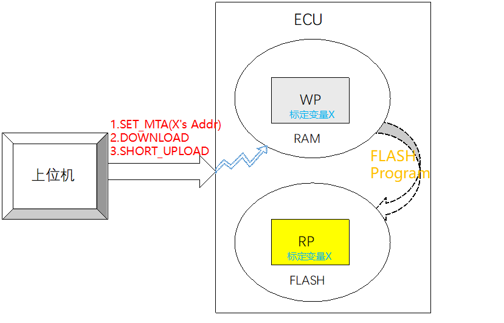

页切换功能介绍 (Page Switch Function Introduction)
~~~~~~~~~~~~~~~~~~~~~~~~~~~~~~~~~~~~~~~~~~~~~~~~~~~~~~~~~~~~~~~~~~~

参考2.2.1中标定功能介绍。

Refer to the function introduction in 2.2.1 for calibration.

FLASH中的标定数据就称为参考页（Reference Page），RAM中的标定数据就成为工作页（Working Page），参考页就是可以被ECU/XCP读取但不能写入的数据，工作页就是可以被ECU读取/写入，可以被XCP读取和写入的数据，他们在逻辑上都是对应了相同的FLASH地址而被赋予了不同的读写属性。

The calibration data in FLASH is called the Reference Page, and the calibration data in RAM is referred to as the Working Page. The Reference Page is data that can be read by the ECU/XCP but cannot be written into, while the Working Page is data that can be read from and written to by both the ECU and XCP. Logically, they correspond to the same FLASH addresses but are assigned different read/write properties.

页切换功能实现 (Page switching function implementation)
~~~~~~~~~~~~~~~~~~~~~~~~~~~~~~~~~~~~~~~~~~~~~~~~~~~~~~~~~~~~~~~~~~~

页切换功能的实现是基于如下命令的实现，相关命令如下

The implementation of the page switching function is based on the realization of the following commands, and the related commands are as follows:

（带*表示可选）：

(Optional: )

.. centered:: **表 页切换命令组 (Page Switch Command Group)**

.. list-table::
   :widths: 34 33 33
   :header-rows: 1

   * - 命令组 (Command Group)
     - 命令名 (Command Name)
     - 是否实现 (Has it been implemented?)
   * - 页切换命令组 (Page Switch Command Group)
     - SET_CAL_PAGE\*
     - 是 (Is)
   * - 
     - GET_CAL_PAGE\*
     - 是 (Is)
   * - 
     - GET_PAG_PROCESSOR_INFO\*
     - 否 (No)
   * - 
     - GET_SEGMENT_INFO\*
     - 否 (No)
   * - 
     - GET_PAGE_INFO\*
     - 否 (No)
   * - 
     - SET_SEGMENT_MODE\*
     - 否 (No)
   * - 
     - GET_SEGMENT_MODE\*
     - 否 (No)

块传输功能 (Block transmission function)
---------------------------------------------------

块传输功能介绍 (Block Transfer Function Introduction)
~~~~~~~~~~~~~~~~~~~~~~~~~~~~~~~~~~~~~~~~~~~~~~~~~~~~~~~~~~~~~~~~~~~

XCP协议栈是基于Master和Slave直接通过命令进行问答时，传统的通信模式是一问一答式，当数据量较大时，采用传统的通信模式就比较耗时，因此产生了块传输的通信的概念。

The XCP protocol stack is based on traditional communication where Master and Slave communicate through commands in a question-and-answer format. When data volumes are large, the traditional mode becomes time-consuming, thus leading to the concept of block transmission communication.

块传输支持Master发送1条命令，slave回复多条响应；以及Master发送多条命令，Slave仅回复一条响应，通信流程如下所示：

Block transfer supports the master sending 1 command and the slave replying with multiple responses; as well as the master sending multiple commands while the slave replies with only one response. The communication process is as follows:

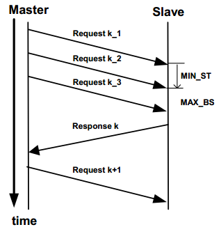

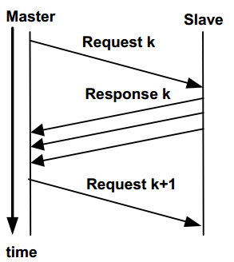

块传输功能实现 (Block transfer functionality implementation)
~~~~~~~~~~~~~~~~~~~~~~~~~~~~~~~~~~~~~~~~~~~~~~~~~~~~~~~~~~~~~~~~~~~

块传输包含Master block和Slave block模式，分别通过配置Slave_Block_Mode和Master_Block_Mode配置项进行使能。

Block transmission includes Master block and Slave block modes, which are enabled respectively by configuring the Slave_Block_Mode and Master_Block_Mode configuration items.

块传输命令主要包含：UPLOAD（Slave Block；DOWNLOAD_NEXT/PROGRAM_NEXT（Master Block）

Block transfer commands mainly contain: UPLOAD (Slave Block); DOWNLOAD_NEXT/PROGRAM_NEXT (Master Block)

Seed&Key功能 (Seed&Key Function)
----------------------------------------------

Seed&Key功能介绍 (Seed&Key Feature Introduction)
~~~~~~~~~~~~~~~~~~~~~~~~~~~~~~~~~~~~~~~~~~~~~~~~~~~~~~~~~~~~~~~~~~~

XCP包含5大功能资源：CAL、PAG、DAQ、STIM以及PGM。

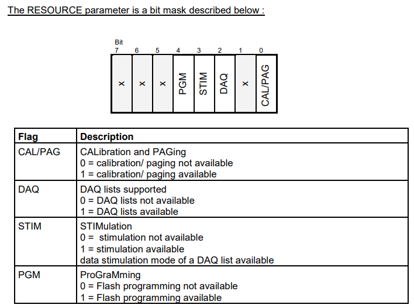

Seed&Key功能主要是指对这5种资源进行保护，保证当未成功解锁的资源功能不能正常使用。

The Seed&Key feature primarily refers to protecting these 5 types of resources, ensuring that unused functionalities of un成功的解锁资源无法正常使用。

Seed&Key保证每种资源都能产生一个种子（seed），每个种子对应一个秘钥（Key），每种资源对应的功能只有传入正常的种子和秘钥才能正常使用。

Seed&Key ensures that each resource generates a seed, and each seed corresponds to a key. The functionality associated with each type of resource can only be used normally when the correct seed and key are inputted.

Seed&Key功能实现 (Seed&Key Function Implementation)
~~~~~~~~~~~~~~~~~~~~~~~~~~~~~~~~~~~~~~~~~~~~~~~~~~~~~~~~~~~~~~~~~~~

该过程主要分为三部分：首先上位机获取DLL库的权限，然后向下位机发送获取当前权限下的种子（SEED）请求，进行上位机SEED值的计算比较，然后向下位机发送KEY值来获取权限。

The process mainly consists of three parts: first, the upper machine obtains the permission of the DLL library, then it sends a request to the lower machine to obtain the SEED for the current permissions and perform a comparison of the upper machine's SEED value, and finally send a KEY value to the lower machine to acquire the permission.

Seed&Key的dll生成 (Seed&Key's dll generation)
~~~~~~~~~~~~~~~~~~~~~~~~~~~~~~~~~~~~~~~~~~~~~~~~~~~~~~~~~~~~~~~~~~~

dll生成的工程包见： `Word文档 - 杨沁春 - 普华Confluence (i-soft.com.cn) <https://confluence.i-soft.com.cn/pages/viewpage.action?pageId=38498721>`

dll generated engineering package see: `Word document - Yang Qinchun - Prada Confluence (i-soft.com.cn) <https://confluence.i-soft.com.cn/pages/viewpage.action?pageId=38498721>`

Seed&Key的dll生成源码讲解：

Explanation and source code lecture for Seed&Key's dll generation:

#. 实现XCP标准中定义的两个函数

Implement two functions defined in the XCP standard

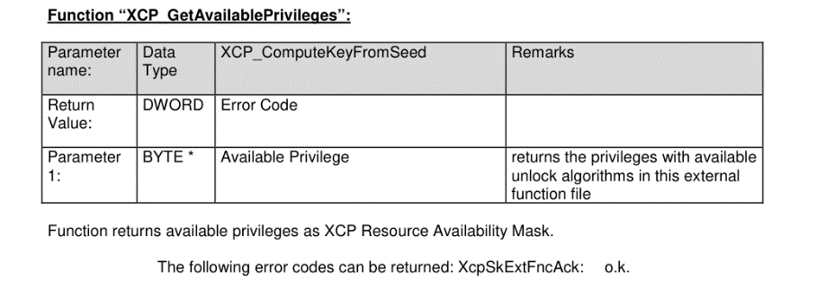

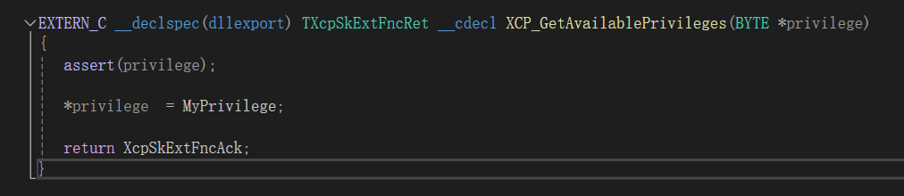

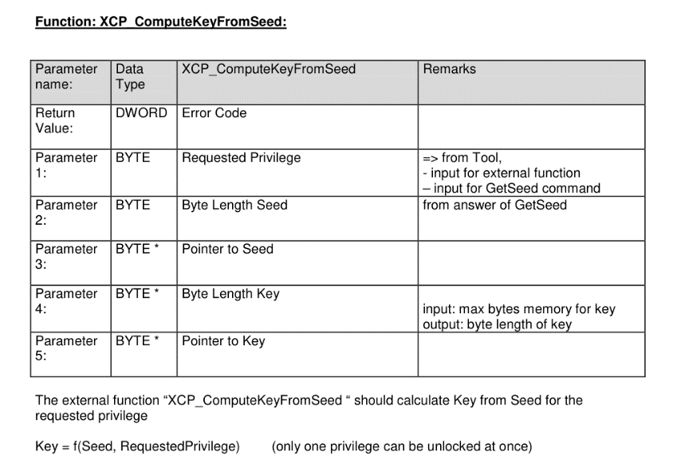

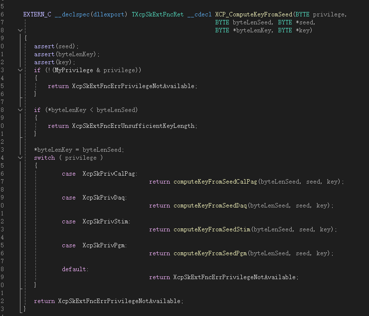

2. 定义dll的入口及上位机标定权限的初始化 (Define the entry point of the DLL and initialize the initialization of upper-level machine calibration permissions.)

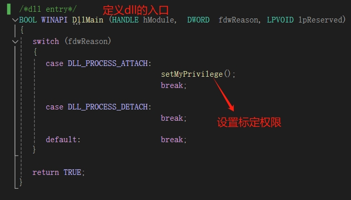

3. 上位机标定权限的设置及内部声明 (3. Setting Up Higher-Level Machine Calibration Permissions and Internal Declarations)

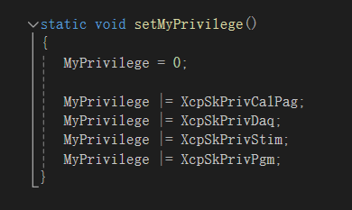

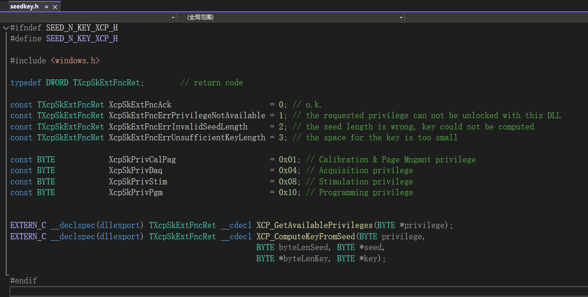

4. 各权限的密钥算法实现 (4. Implementation of cryptographic algorithms for various permissions)

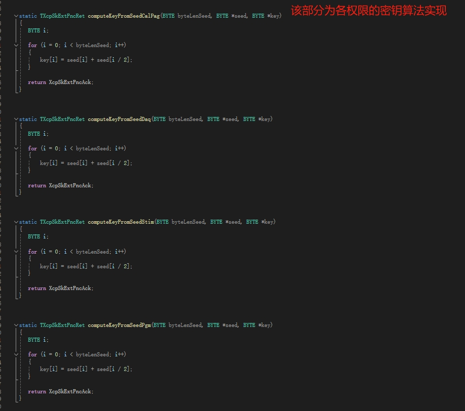

Seed&Key的dll的定制化操作 (Customized operations for Seed&Key's dll)
~~~~~~~~~~~~~~~~~~~~~~~~~~~~~~~~~~~~~~~~~~~~~~~~~~~~~~~~~~~~~~~~~~~~~

①根据下位机(ECU)的XCP内部密钥验证算法(Xcp_Interface.c中)去设计上位机的密钥算法

Design the upper-level machine's key algorithm based on the XCP internal key verification algorithm of the subordinate machine (ECU, in Xcp_Interface.c).

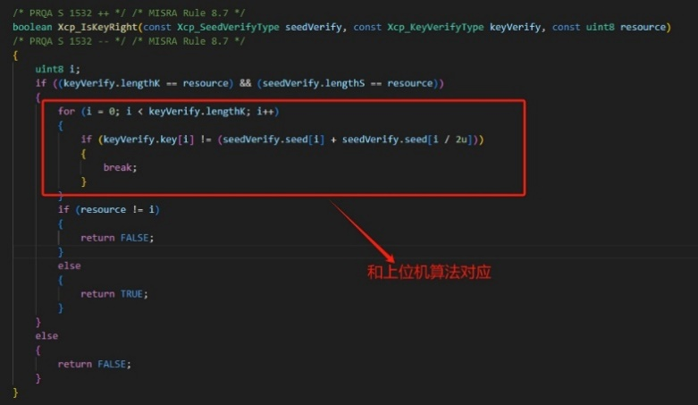

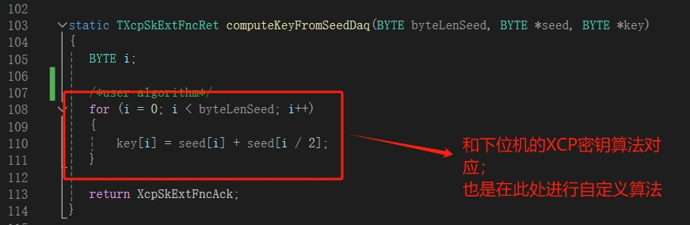

算法定制完成后进行dll生成

After algorithm customization, proceed with DLL generation.

编辑完成后按ctrl+shift+B进行dll生成

After editing, press Ctrl+Shift+B to generate the DLL.

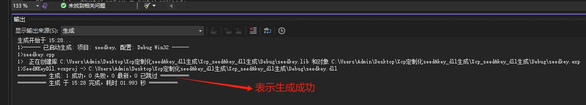

2. 找到生成的dll (Find the generated dll)

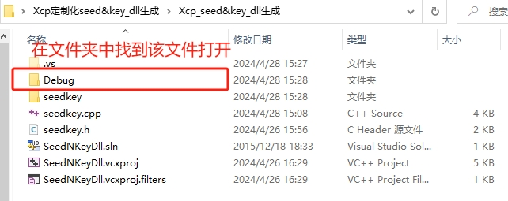

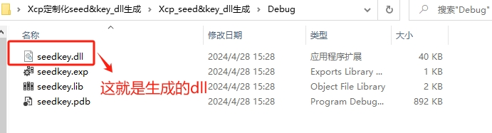

生成的dll可供CANape/INCA直接调用，用于XCP的seed&key解锁 (The generated dll can be directly called by CANape/INCA for seed&key unlocking via XCP.)

FLASH刷写功能 (Flash Write Function)
------------------------------------------------

FLASH刷写介绍 (Introduction to FLASH Writing)
~~~~~~~~~~~~~~~~~~~~~~~~~~~~~~~~~~~~~~~~~~~~~~~~~~~~~~~~~~~~~~~~~~~

Flash刷写功能主要是用于把标定得到的数据烧写到Flash中，固化标定到内存。

The Flash flashing function is mainly used to write the calibrated data into the Flash, solidifying the calibration in memory.

FLASH刷写功能实现 (Flash Write Function Implementation)
~~~~~~~~~~~~~~~~~~~~~~~~~~~~~~~~~~~~~~~~~~~~~~~~~~~~~~~~~~~~~~~~~~~

FLASH刷写功能主要通过如下命令实现，相关命令如下

The FLASH burn function is mainly achieved through the following commands, as shown below:

（带*表示可选）：

(Optional: )

.. centered:: **表 PGM命令组 (Table PGM Command Group)**

.. list-table::
   :widths: 34 33 33
   :header-rows: 1

   * - 命令组 (Command Group)
     - 命令名 (Command Name)
     - 是否实现 (Has it been implemented?)
   * - Flash刷写命令组 (Flash Write Command Group)
     - PROGRAM_START
     - 是 (Is)
   * - 
     - PROGRAM_CLEAR
     - 是 (Is)
   * - 
     - PROGRAM
     - 是 (Is)
   * - 
     - PROGRAM_RESET
     - 是 (Is)
   * - 
     - GET_PGM_PROCESSOR_INFO\*
     - 是 (Is)
   * - 
     - GET_SECTOR_INFO\*
     - 是 (Is)
   * - 
     - PROGRAM_PREPARE\*
     - 否 (No)
   * - 
     - PROGRAM_FORMAT\*
     - 是 (Is)
   * - 
     - PROGRAM_NEXT\*
     - 是 (Is)
   * - 
     - PROGRAM_MAX\*
     - 是 (Is)
   * - 
     - PROGRAM_VERIFY\*
     - 否 (No)

使用Program功能时需要配置如下配置项，需要特别注意如下几项：

When using the Program function, you need to configure the following items, and pay special attention to the following items:

FlashHeader。由于Program功能是基于MCAL中Flash Driver驱动，每个厂家提供的Flash驱动的头文件命名有差异，因此包好FlashHeader、Fls_WriteApi等等都需要填写实际的Flash驱动名称。

FlashHeader. Since the Program function is based on the Flash Driver in MCAL, the header file names provided by different manufacturers for the Flash driver vary. Therefore, FlashHeader, Fls_WriteApi, etc., need to be filled with the actual names of the Flash drivers.

XcpSectorPageSize指Flash驱动的最小刷写Page大小，此项依赖于硬件。

XcpSectorPageSize refers to the minimum erase page size of the Flash driver, which depends on hardware.

FlsBaseAddr依赖于硬件，一般默认为0，在个别MCU平台，比如Tricore中Flash刷写时，刷写地址传入到Flash驱动时需要减去一个BaseAddress，因此此项需要填写硬件规定的BaseAddress。

FlsBaseAddr depends on hardware and is generally set to 0. In certain MCU platforms, such as Tricore, during flash writing, the write address needs to be subtracted by a BaseAddress when passed into the flash driver. Therefore, this item requires the BaseAddress specified by the hardware.

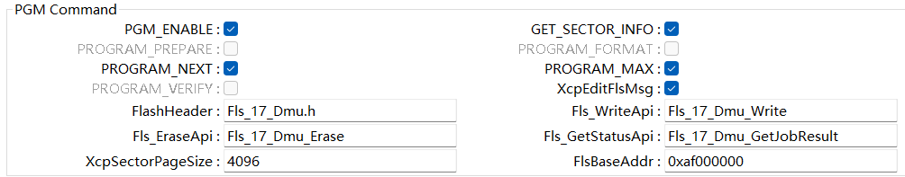

源文件描述 (Source file description)
===============================================

.. centered:: **表 XCP协议栈文件描述 (Table XCP Protocol Stack File Description)**

.. list-table::
   :widths: 50 50
   :header-rows: 1

   * - 文件 (Files)
     - 说明 (Description)
   * - Xcp_Cfg.h
     - 包含Xcp一些预定义宏开关，包含功能的使能或者禁止等 (Includes some predefined macro switches for Xcp, enabling or disabling features etc.)
   * - Xcp_Cfg.c
     - 包含Xcp中Pc配置数据，包含DAQ/EVETNT等配置数据 (Contains PC configuration data in Xcp, including DAQ/EVENTS configuration data)
   * - Xcp_PBcfg.c
     - 包含Xcp中Pb配置数据，包含收发PDU信息等 (Contains Pb configuration data in Xcp, including send/receive PDU information, etc.)

.. list-table::
   :widths: 50 50
   :header-rows: 1

   * - Xcp.c
     - Xcp外部接口以及一些模块通用接口 (External interfaces of XCP and some common interfaces of modules)
   * - Xcp.h
     - 包含配置数据结构 (Contain configuration data structures)
   * - Xcp_Cal.c
     - 包含CAL命令组实现 (Implementing CAL command group)
   * - Xcp_Daq.c
     - 包含DAQ命令组实现 (Implementing DAQ command group)
   * - Xcp_GenericTypes.h
     - 包含XCP通用的一些宏定义以及枚举定义 (Contains some macros and enum definitions for XCP general use.)
   * - Xcp_Interface.c
     - 包含XCP模块的一些用户可定制化算法接口 (Customizable algorithm interfaces in some user configurations that include the XCP module)
   * - Xcp_Interface.h
     - Xcp_Interface.c定义接口的声明 (Xcp_Interface.c Defines the Declaration of Interfaces)
   * - Xcp_Internal.h
     - 包含XCP命令实现函数的声明以及内部数据结构 (Contains declarations of functions implementing XCP commands as well as internal data structures)
   * - Xcp_MemMap.h
     - 包含MemMap机制定义的段 (Segments containing the definition of MemMap mechanism)
   * - Xcp_Pgm.c
     - 包含PGM命令组实现 (Implementing PGM command group)
   * - Xcp_Ram.c
     - 包含XCP模块用到的一些内存分配（如动态DAQ所需的预分配内存段） (Contain memory allocation for XCP modules (such as pre-allocated memory segments required for dynamic DAQ))
   * - Xcp_Std.c
     - 包含STD命令组实现 (Implementing the STD command group)
   * - XcpOnCan.c
     - 基于CAN总线的接收、发送API (CAN Bus-Based Reception and Transmission API)
   * - XcpOnCan_Cbk.h
     - XcpOnCan.c中API声明 (API declarations in XcpOnCan.c)
   * - XcpOnEth.c
     - 基于以太网总线的接收、发送API (Receive and Send APIs based on Ethernet Bus)
   * - XcpOnEth_Cbk.h
     - XcpOnEth.c中API声明 (API Declarations in XcpOnEth.c)

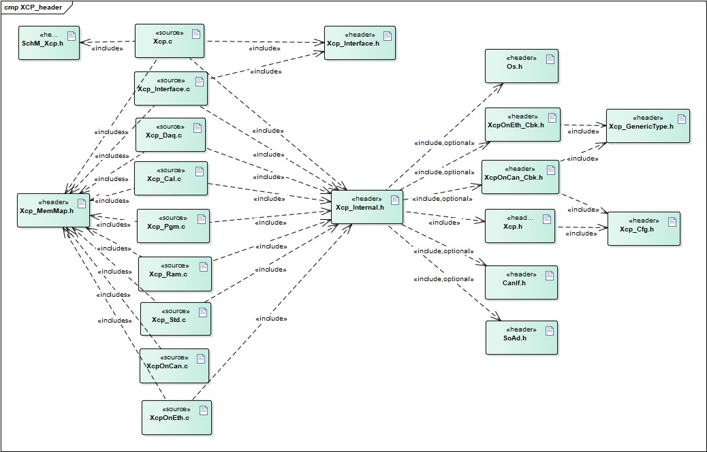

API接口 (API Interface)
=====================================

类型定义 (Type definition)
--------------------------------------

Xcp_ConfigType类型定义 (Definition of Xcp_ConfigType Type)
~~~~~~~~~~~~~~~~~~~~~~~~~~~~~~~~~~~~~~~~~~~~~~~~~~~~~~~~~~~~~~~~~~~

.. list-table::
   :widths: 50 50
   :header-rows: 1

   * - 名称 (Name)
     - Xcp_ConfigType
   * - 类型 (Type)
     - structure
   * - 范围 (Range)
     - 无
   * - 描述 (Description)
     - XCP配置数据 (XCP Configuration Data)

输入函数描述 (Describe the input function:)
-----------------------------------------------------

.. list-table::
   :widths: 50 50
   :header-rows: 1

   * - 输入模块 (Input Module)
     - API
   * - CanIf
     - CanIf_Transmit
   * - Det
     - Det_ReportError
   * - Os
     - GetCounterValue
   * - 
     - GetElapsedValue
   * - Soad
     - SoAd_IfTransmit

静态接口函数定义 (Static interface function definition)
---------------------------------------------------------------

Xcp_Init
~~~~~~~~~~~~~~~~~~~~~~~~~~~~

.. list-table::
   :widths: 25 25 25 25
   :header-rows: 1

   * - 函数名称： (Function Name:)
     - Xcp_Init
     - 
     - 
   * - 函数原型： (Function prototype:)
     - void Xcp_Init (
     - 
     - 
   * - 
     - constXcp_ConfigType\*Xcp_ConfigPtr
     - 
     - 
   * - 
     - )
     - 
     - 
   * - 服务编号： (Service Number:)
     - 0x00
     - 
     - 
   * - 同步/异步： (Synchronous/asynchronous:)
     - 同步 (Sync)
     - 
     - 
   * - 是否可重入： (Is Reentrant:)
     - 否 (No)
     - 
     - 
   * - 输入参数： (Input parameters:)
     - Xcp_ConfigPtr
     - 值域： (Domain:)
     - 无
   * - 输入输出参数： (Input Output Parameters:)
     - 无
     - 
     - 
   * - 输出参数： (Output Parameters:)
     - 无
     - 
     - 
   * - 返回值： (Return Value:)
     - 无
     - 
     - 
   * - 功能概述： (Function Overview:)
     - 初始化XCP模块 (Initialize XCP Module)
     - 
     - 

Xcp_GetVersionInfo
~~~~~~~~~~~~~~~~~~~~~~~~~~~~

.. list-table::
   :widths: 25 25 25 25
   :header-rows: 1

   * - 函数名称： (Function Name:)
     - Xcp_GetVersionInfo
     - 
     - 
   * - 函数原型： (Function prototype:)
     - voidXcp_GetVersionInfo(
     - 
     - 
   * - 
     - Std_VersionInfoType\*versioninfo
     - 
     - 
   * - 
     - )
     - 
     - 
   * - 服务编号： (Service Number:)
     - 0x01
     - 
     - 
   * - 同步/异步： (Synchronous/asynchronous:)
     - 同步 (Sync)
     - 
     - 
   * - 是否可重入： (Is Reentrant:)
     - 是 (Is)
     - 
     - 
   * - 输入参数： (Input parameters:)
     - 无
     - 
     - 
   * - 输入输出参数： (Input Output Parameters:)
     - 无
     - 
     - 
   * - 输出参数： (Output Parameters:)
     - versioninfo
     - 值域： (Domain:)
     - 无
   * - 返回值： (Return Value:)
     - 无
     - 
     - 
   * - 功能概述： (Function Overview:)
     - 获取XCP模块的版本信息 (Get the version information of XCP module)
     - 
     - 

Xcp_SetTransmissionMode
~~~~~~~~~~~~~~~~~~~~~~~~~~~~

.. list-table::
   :widths: 25 25 25 25
   :header-rows: 1

   * - 函数名称： (Function Name:)
     - Xcp_SetTransmissionMode
     - 
     - 
   * - 函数原型： (Function prototype:)
     - voidXcp_SetTransmissionMode(
     - 
     - 
   * - 
     - NetworkHandleTypeChannel,
     - 
     - 
   * - 
     - Xcp_TransmissionModeTypeMode
     - 
     - 
   * - 
     - )
     - 
     - 
   * - 服务编号： (Service Number:)
     - 0x05
     - 
     - 
   * - 同步/异步： (Synchronous/asynchronous:)
     - 同步 (Sync)
     - 
     - 
   * - 是否可重入： (Is Reentrant:)
     - 否 (No)
     - 
     - 
   * - 输入参数： (Input parameters:)
     - Channel
     - 值域： (Domain:)
     - 无
   * - 
     - Mode
     - 值域： (Domain:)
     - ON/OFF
   * - 输入输出参数： (Input Output Parameters:)
     - 无
     - 
     - 
   * - 输出参数： (Output Parameters:)
     - 无
     - 
     - 
   * - 返回值： (Return Value:)
     - 无
     - 
     - 
   * - 功能概述： (Function Overview:)
     - 控制XCP所用通信通道的发送能力 (Control the transmission capability of the communication channels used for XCP)
     - 
     - 

Xcp\_<Lo>RxIndication
~~~~~~~~~~~~~~~~~~~~~~~~~~~~

.. list-table::
   :widths: 25 25 25 25
   :header-rows: 1

   * - 函数名称： (Function Name:)
     - Xcp\_<Lo>RxIndication
     - 
     - 
   * - 函数原型： (Function prototype:)
     - voidXcp\_<Lo>RxIndication(
     - 
     - 
   * - 
     - PduIdTypeRxPduId,
     - 
     - 
   * - 
     - constPduInfoType\*PduInfoPtr
     - 
     - 
   * - 
     - )
     - 
     - 
   * - 服务编号： (Service Number:)
     - 0x42
     - 
     - 
   * - 同步/异步： (Synchronous/asynchronous:)
     - 同步 (Sync)
     - 
     - 
   * - 是否可重入： (Is Reentrant:)
     - Reentrant fordifferent PduIds.
     - 
     - 
   * - 
     - Non reentrant forthe same PduId
     - 
     - 
   * - 输入参数： (Input parameters:)
     - RxPduId
     - 值域： (Domain:)
     - 无
   * - 
     - PduInfoPtr
     - 值域： (Domain:)
     - 无
   * - 输入输出参数： (Input Output Parameters:)
     - 无
     - 
     - 
   * - 输出参数： (Output Parameters:)
     - 无
     - 
     - 
   * - 返回值： (Return Value:)
     - 无
     - 
     - 
   * - 功能概述： (Function Overview:)
     - 底层收到PDU信息后的回调函数 (Callback function after the底层 receives PDU information)
     - 
     - 

Xcp\_<Lo>TxConfirmation
~~~~~~~~~~~~~~~~~~~~~~~~~~~~

.. list-table::
   :widths: 25 25 25 25
   :header-rows: 1

   * - 函数名称： (Function Name:)
     - Xcp\_<Lo>TxConfirmation
     - 
     - 
   * - 函数原型： (Function prototype:)
     - voidXcp\_<Lo>TxConfirmation(
     - 
     - 
   * - 
     - PduIdType TxPduId
     - 
     - 
   * - 
     - )
     - 
     - 
   * - 服务编号： (Service Number:)
     - 0x40
     - 
     - 
   * - 同步/异步： (Synchronous/asynchronous:)
     - 同步 (Sync)
     - 
     - 
   * - 是否可重入： (Is Reentrant:)
     - Reentrant fordifferent PduIds.
     - 
     - 
   * - 
     - Non reentrant forthe same PduId
     - 
     - 
   * - 输入参数： (Input parameters:)
     - TxPduId
     - 值域： (Domain:)
     - 无
   * - 输入输出参数： (Input Output Parameters:)
     - 无
     - 
     - 
   * - 输出参数： (Output Parameters:)
     - 无
     - 
     - 
   * - 返回值： (Return Value:)
     - 无
     - 
     - 
   * - 功能概述： (Function Overview:)
     - 底层成功发送完XCP数据后，通知XCP发送完成 (After the underlying layer successfully sends the XCP data, notify that the XCP sending is complete.)
     - 
     - 

Xcp_MainFunction
~~~~~~~~~~~~~~~~~~~~~~~~~~~~

.. list-table::
   :widths: 50 50
   :header-rows: 1

   * - 函数名称： (Function Name:)
     - Xcp_MainFunction
   * - 函数原型： (Function prototype:)
     - void Xcp_MainFunction (
   * - 
     - void
   * - 
     - )
   * - 服务编号： (Service Number:)
     - 0x04
   * - 同步/异步： (Synchronous/asynchronous:)
     - 同步 (Sync)
   * - 是否可重入： (Is Reentrant:)
     - 否 (No)
   * - 输入参数： (Input parameters:)
     - 无
   * - 输入输出参数： (Input Output Parameters:)
     - 无
   * - 输出参数： (Output Parameters:)
     - 无
   * - 返回值： (Return Value:)
     - 无
   * - 功能概述： (Function Overview:)
     - XCP模块的周期任务调度函数，由OS调度，里面会处理接收到的命令 (The periodic task scheduling function of the XCP module is handled by OS, where it processes received commands.)

可配置函数定义 (Configurable Function Definition)
----------------------------------------------------------

无。

None.

配置 (Configure)
==============================

XcpGeneral
--------------------------

Bus Interface Select
~~~~~~~~~~~~~~~~~~~~~~~~~~~~~~~~~~~~~~~~~

.. centered:: **表 Bus Interface Select属性描述 (Property Description for Bus Interface Select)**

.. list-table::
   :widths: 20 20 20 20 20
   :header-rows: 1

   * - UI名称 (UI Name)
     - 描述 (Description)
     - 
     - 
     - 
   * - XcpOnCddEnabled
     - 取值范围 (Range)
     - 无
     - 默认取值 (Default value)
     - 无
   * - 
     - 参数描述 (Parameter Description)
     - 暂不支持 (暫不支持)
     - 
     - 
   * - 
     - 依赖关系 (Dependencies)
     - 无
     - 
     - 
   * - XcpOnFlexRayEnabled
     - 取值范围 (Range)
     - 无
     - 默认取值 (Default value)
     - 无
   * - 
     - 参数描述 (Parameter Description)
     - 暂不支持 (暫不支持)
     - 
     - 
   * - 
     - 依赖关系 (Dependencies)
     - 无
     - 
     - 
   * - XcpSupportType
     - 取值范围 (Range)
     - XcpOnCanEnabled
     - 默认取值 (Default value)
     - XcpOnCanEnabled
   * - 
     - 
     - XcpOnEthernetEnabled
     - 
     - 
   * - 
     - 参数描述 (Parameter Description)
     - 目前XCP仅支持CAN和ETH，此配置选择XCP应用于那种总线 (Currently, XCP only supports CAN and ETH. This configuration selects which bus XCP is applied to.)
     - 
     - 
   * - 
     - 依赖关系 (Dependencies)
     - 无
     - 
     - 

Optional API
~~~~~~~~~~~~~~~~~~~~~~~~~~~~~~~~~~~~~~~~~

.. centered:: **表 Optional API属性描述 (Table Description of Optional API Properties)**

.. list-table::
   :widths: 20 20 20 20 20
   :header-rows: 1

   * - UI名称 (UI Name)
     - 描述 (Description)
     - 
     - 
     - 
   * - XcpDevErrorDetect
     - 取值范围 (Range)
     - TRUE/FALSE
     - 默认取值 (Default value)
     - FALSE
   * - 
     - 参数描述 (Parameter Description)
     - 使能支持Det检查 (Enable Support for Det Check)
     - 
     - 
   * - 
     - 依赖关系 (Dependencies)
     - 无
     - 
     - 
   * - XcpVersionInfoApi
     - 取值范围 (Range)
     - TRUE/FALSE
     - 默认取值 (Default value)
     - FALSE
   * - 
     - 参数描述 (Parameter Description)
     - 使能接口函数Xcp_GetVersionInfo (Enable interface function Xcp_GetVersionInfo)
     - 
     - 
   * - 
     - 依赖关系 (Dependencies)
     - 无
     - 
     - 
   * - XcpSuppressTxSupport
     - 取值范围 (Range)
     - TRUE/FALSE
     - 默认取值 (Default value)
     - FALSE
   * - 
     - 参数描述 (Parameter Description)
     - 使能接口函数Xcp_SetTransmissionMode， (Enable interface function Xcp_SetTransmissionMode,)
     - 
     - 
   * - 
     - 
     - 注： (Note:)
     - 
     - 
   * - 
     - 
     - 暂不支持此功能 (暂不支持此功能)
     - 
     - 
   * - 
     - 依赖关系 (Dependencies)
     - 无
     - 
     - 

DAQ Format
~~~~~~~~~~~~~~~~~~~~~~~~~~~~~~~~~~~~~~~~~

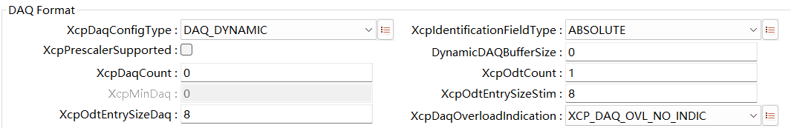

.. centered:: **表 DAQ Format属性描述 (Describe DAQ Format Property)**

.. list-table::
   :widths: 20 20 20 20 20
   :header-rows: 1

   * - UI名称 (UI Name)
     - 描述 (Description)
     - 
     - 
     - 
   * - XcpDaqConfigType
     - 取值范围 (Range)
     - DAQ_STATICDAQ_DYNAMIC
     - 默认取值 (Default value)
     - DAQ_DYNAMIC
   * - 
     - 参数描述 (Parameter Description)
     - DAQ采用的配置方式（静态或者动态） (The configuration method adopted by DAQ (static or dynamic))
     - 
     - 
   * - 
     - 依赖关系 (Dependencies)
     - 无
     - 
     - 
   * - XcpIdentificationFieldType
     - 取值范围 (Range)
     - ABSOLUTERELATIVE_BYTE
     - 默认取值 (Default value)
     - ABSOLUTE
   * - 
     - 
     - RELATIVE_WORD
     - 
     - 
   * - 
     - 
     - RELATIVE_WORD_ALIGNED
     - 
     - 
   * - 
     - 参数描述 (Parameter Description)
     - DAQ报文PID格式 (DAQ Message PID Format)
     - 
     - 
   * - 
     - 依赖关系 (Dependencies)
     - 无
     - 
     - 
   * - XcpPrescalerSupported
     - 取值范围 (Range)
     - TRUE/FALSE
     - 默认取值 (Default value)
     - FALSE
   * - 
     - 参数描述 (Parameter Description)
     - 是否支持EventChannel触发分频 (Does EventChannel support triggering frequency division?)
     - 
     - 
   * - 
     - 依赖关系 (Dependencies)
     - 无
     - 
     - 
   * - DynamicDAQBufferSize
     - 取值范围 (Range)
     - 0-INF
     - 默认取值 (Default value)
     - 0
   * - 
     - 参数描述 (Parameter Description)
     - 动态DAQ列表缓存长度 (Cache length for dynamic DAQ list)
     - 
     - 
   * - 
     - 依赖关系 (Dependencies)
     - XcpDaqConfigType配置为DAQ_DYNAMIC (XcpDaqConfigType configured as DAQ_DYNAMIC)
     - 
     - 
   * - XcpDaqCount
     - 取值范围 (Range)
     - 0-65535
     - 默认取值 (Default value)
     - 0
   * - 
     - 参数描述 (Parameter Description)
     - 动态分配的DAQ的个数 (Number of dynamically allocated DAQs)
     - 
     - 
   * - 
     - 依赖关系 (Dependencies)
     - XcpDaqConfigType配置为DAQ_DYNAMIC (XcpDaqConfigType configured as DAQ_DYNAMIC)
     - 
     - 
   * - XcpOdtCount
     - 取值范围 (Range)
     - 0-252
     - 默认取值 (Default value)
     - 1
   * - 
     - 参数描述 (Parameter Description)
     - 动态分配的DAQ中的ODT个数 (Number of ODTs in dynamically allocated DAQ)
     - 
     - 
   * - 
     - 依赖关系 (Dependencies)
     - XcpDaqConfigType配置为DAQ_DYNAMIC (XcpDaqConfigType configured as DAQ_DYNAMIC)
     - 
     - 
   * - XcpMinDaq
     - 取值范围 (Range)
     - 0-255
     - 默认取值 (Default value)
     - 0
   * - 
     - 参数描述 (Parameter Description)
     - 预定义的DAQ个数，目前强制只能配置为0 (Predefined DAQ count, currently forced to be configured as 0)
     - 
     - 
   * - 
     - 依赖关系 (Dependencies)
     - 无
     - 
     - 
   * - XcpOdtEntrySizeStim
     - 取值范围 (Range)
     - 0-255
     - 默认取值 (Default value)
     - 8
   * - 
     - 参数描述 (Parameter Description)
     - STIMEntry最大长度 (Maximum length of STIMEntry)
     - 
     - 
   * - 
     - 依赖关系 (Dependencies)
     - 无
     - 
     - 
   * - XcpOdtEntrySizeDaq
     - 取值范围 (Range)
     - 0-255
     - 默认取值 (Default value)
     - 8
   * - 
     - 参数描述 (Parameter Description)
     - DAQEntry最大长度 (Maximum length of DAQEntry)
     - 
     - 
   * - 
     - 依赖关系 (Dependencies)
     - 无
     - 
     - 
   * - XcpDaqOverloadIndication
     - 取值范围 (Range)
     - NO_INDIC：无通知EVENT：使用Event帧通知 (NO_INDIC：No notification EVENT：Notify using Event frame)
     - 默认取值 (Default value)
     - XCP_DAQ_OVL_NO_INDIC
   * - 
     - 
     - PID：使用PID通知 (PID：Use PID notification)
     - 
     - 
   * - 
     - 参数描述 (Parameter Description)
     - DAQ溢出（overload）通知方式
     - 
     - 
   * - 
     - 依赖关系 (Dependencies)
     - 无
     - 
     - 

General Settings
~~~~~~~~~~~~~~~~~~~~~~~~~~~~~~~~~~~~~~~~~

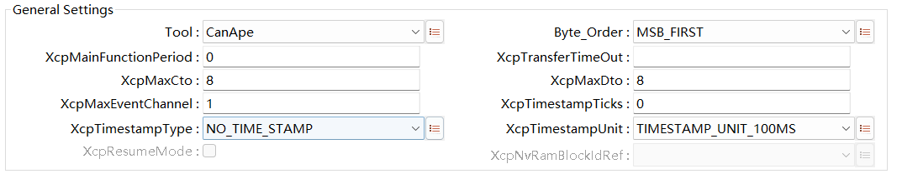

.. centered:: **表 General Settings属性描述 (Table General Settings properties description)**

.. list-table::
   :widths: 20 20 20 20 20
   :header-rows: 1

   * - UI名称 (UI Name)
     - 描述 (Description)
     - 
     - 
     - 
   * - Tool
     - 取值范围 (Range)
     - CANape
     - 默认取值 (Default value)
     - CanApe
   * - 
     - 
     - INCA
     - 
     - 
   * - 
     - 参数描述 (Parameter Description)
     - A2L文件兼容格式 (A2L File Compatible Formats)
     - 
     - 
   * - 
     - 依赖关系 (Dependencies)
     - 无
     - 
     - 
   * - Byte_Order
     - 取值范围 (Range)
     - MSB_FIRST
     - 默认取值 (Default value)
     - MSB_FIRST
   * - 
     - 
     - MSB_LAST
     - 
     - 
   * - 
     - 参数描述 (Parameter Description)
     - 字节序类型 (Byte order type)
     - 
     - 
   * - 
     - 依赖关系 (Dependencies)
     - 依赖于硬件平台 (Dependent on hardware platform)
     - 
     - 
   * - XcpMainFunctionPeriod
     - 取值范围 (Range)
     - 0-INF
     - 默认取值 (Default value)
     - 0.0
   * - 
     - 参数描述 (Parameter Description)
     - 主函数调用周期，单位：秒 (Main function call period, units: seconds)
     - 
     - 
   * - 
     - 依赖关系 (Dependencies)
     - 无
     - 
     - 
   * - XcpTransferTimeOut
     - 取值范围 (Range)
     - 0-INF
     - 默认取值 (Default value)
     - 无
   * - 
     - 参数描述 (Parameter Description)
     - 主函数中等待发送确认的最大次数 (Maximum number of times to wait for send confirmation in the main function)
     - 
     - 
   * - 
     - 依赖关系 (Dependencies)
     - 无
     - 
     - 
   * - XcpMaxCto
     - 取值范围 (Range)
     - 8-255
     - 默认取值 (Default value)
     - 8
   * - 
     - 参数描述 (Parameter Description)
     - Cto最大字节数 (Maximum byte size for Cto)
     - 
     - 
   * - 
     - 依赖关系 (Dependencies)
     - 当XcpSupportType配置为XcpOnCanEnabled时： (When XcpSupportType is configured as XcpOnCanEnabled:)
     - 
     - 
   * - 
     - 
     - 1.普通CAN：8；2.CANFD：8~64 (1. Ordinary CAN: 8; 2. CANFD: 8~64)
     - 
     - 
   * - 
     - 
     - 当XcpSupportType配置为XcpOnEthernetEnabled时： (When XcpSupportType is configured as XcpOnEthernetEnabled:)
     - 
     - 
   * - 
     - 
     - 取值范围：8~255 (Range: 8~255)
     - 
     - 
   * - XcpMaxDto
     - 取值范围 (Range)
     - 8-65535
     - 默认取值 (Default value)
     - 8
   * - 
     - 参数描述 (Parameter Description)
     - Dto最大字节数 (Maximum byte size of Dto)
     - 
     - 
   * - 
     - 依赖关系 (Dependencies)
     - 当XcpSupportType配置为XcpOnCanEnabled时： (When XcpSupportType is configured as XcpOnCanEnabled:)
     - 
     - 
   * - 
     - 
     - 1.普通CAN：8；2.CANFD：8~64 (1. Ordinary CAN: 8; 2. CANFD: 8~64)
     - 
     - 
   * - 
     - 
     - 当XcpSupportType配置为XcpOnEthernetEnabled时： (When XcpSupportType is configured as XcpOnEthernetEnabled:)
     - 
     - 
   * - 
     - 
     - 取值范围：8~1500 (Range: 8~1500)
     - 
     - 
   * - XcpMaxEventChannel
     - 取值范围 (Range)
     - 0-65535
     - 默认取值 (Default value)
     - 1
   * - 
     - 参数描述 (Parameter Description)
     - 可配置的EventChannel最大数量 (Maximum configurable number of EventChannels)
     - 
     - 
   * - 
     - 依赖关系 (Dependencies)
     - 无
     - 
     - 
   * - XcpTimestampTicks
     - 取值范围 (Range)
     - 0-65535
     - 默认取值 (Default value)
     - 0
   * - 
     - 参数描述 (Parameter Description)
     - Timestamp单位时间长度 (Timestamp Length of Time)
     - 
     - 
   * - 
     - 依赖关系 (Dependencies)
     - XcpTimestampType !=NO_TIMESTAMP
     - 
     - 
   * - XcpTimestampType
     - 取值范围 (Range)
     - NO_TIME_STAMPONE_BYTE
     - 默认取值 (Default value)
     - NO_TIME_STAMP
   * - 
     - 
     - TWO_BYTE
     - 
     - 
   * - 
     - 
     - FOUR_BYTE
     - 
     - 
   * - 
     - 参数描述 (Parameter Description)
     - DAQ报文Timestamp格式 (DAQ Message Timestamp Format)
     - 
     - 
   * - 
     - 依赖关系 (Dependencies)
     - 无
     - 
     - 
   * - XcpTimestampUnit
     - 取值范围 (Range)
     - 1 us – 100ms
     - 默认取值 (Default value)
     - TIMESTAMP_UNIT_100MS
   * - 
     - 参数描述 (Parameter Description)
     - Timestamp单位时间长度单位 (Timestamp Unit Time Length Unit)
     - 
     - 
   * - 
     - 依赖关系 (Dependencies)
     - XcpTimestampType !=NO_TIMESTAMP
     - 
     - 
   * - XcpResumeMode
     - 取值范围 (Range)
     - TRUE/FALSE
     - 默认取值 (Default value)
     - FALSE
   * - 
     - 参数描述 (Parameter Description)
     - 使能支持Resume Mode (Enable Support for Resume Mode)
     - 
     - 
   * - 
     - 依赖关系 (Dependencies)
     - SET_REQUEST打开的情况下才能选择 (SET_REQUEST enabled的情况下才能选择)
     - 
     - 
   * - XcpNvRamBlockIdRef
     - 取值范围 (Range)
     - 无
     - 默认取值 (Default value)
     - NULL
   * - 
     - 参数描述 (Parameter Description)
     - 指向一块NVM存储块，用于保存RESUME的信息 (Point to an NVM storage block for saving RESUME information)
     - 
     - 
   * - 
     - 依赖关系 (Dependencies)
     - ResumeMode打开的情况下 (In ResumeMode is enabled)
     - 
     - 

XcpCommand
--------------------------

General Command
~~~~~~~~~~~~~~~~~~~~~~~~~~~~~~~~~~~~~~~~~

.. centered:: **表 General Command属性描述 (Table General Command Properties Description)**

.. list-table::
   :widths: 20 20 20 20 20
   :header-rows: 1

   * - UI名称 (UI Name)
     - 描述 (Description)
     - 
     - 
     - 
   * - Max_Dlc_Required
     - 取值范围 (Range)
     - TRUE/FALSE
     - 默认取值 (Default value)
     - FALSE
   * - 
     - 参数描述 (Parameter Description)
     - 是否要求DLC恒定 (Is DLC required to be constant?)
     - 
     - 
   * - 
     - 
     - （StdCAN：8；CANFD：64）
     - 
     - 
   * - 
     - 依赖关系 (Dependencies)
     - XcpSupportType配置为XcpOnCanEnabled (XcpSupportType configured as XcpOnCanEnabled)
     - 
     - 
   * - Slave_Block_Mode
     - 取值范围 (Range)
     - TRUE/FALSE
     - 默认取值 (Default value)
     - TRUE
   * - 
     - 参数描述 (Parameter Description)
     - 使能Slave Block模式 (Enable Slave Block mode)
     - 
     - 
   * - 
     - 依赖关系 (Dependencies)
     - 无
     - 
     - 
   * - Master_Block_Mode
     - 取值范围 (Range)
     - TRUE/FALSE
     - 默认取值 (Default value)
     - TRUE
   * - 
     - 参数描述 (Parameter Description)
     - 使能MasterBlock模式 (Enable MasterBlock Mode)
     - 
     - 
   * - 
     - 依赖关系 (Dependencies)
     - Interleaved_Mode配置为FALSE (Interleaved_Mode configuration set to FALSE)
     - 
     - 
   * - Interleaved_Mode
     - 取值范围 (Range)
     - TRUE/FALSE
     - 默认取值 (Default value)
     - FALSE
   * - 
     - 参数描述 (Parameter Description)
     - 使能Interleaved通信模式 (Enable Interleaved Communication Mode)
     - 
     - 
   * - 
     - 依赖关系 (Dependencies)
     - Master_Block_Mode配置为FALSE (Master_Block_Mode configured as FALSE)
     - 
     - 
   * - Queue_Size
     - 取值范围 (Range)
     - 1-255
     - 默认取值 (Default value)
     - 1
   * - 
     - 参数描述 (Parameter Description)
     - Interleaved通信模式下最大能缓存的命令个数 (Maximum number of commands that can be buffered in Interleaved communication mode)
     - 
     - 
   * - 
     - 依赖关系 (Dependencies)
     - Interleaved_Mode使能 (Interleaved_Mode Enabled)
     - 
     - 
   * - Queue_Size_PGM
     - 取值范围 (Range)
     - 1-255
     - 默认取值 (Default value)
     - 1
   * - 
     - 参数描述 (Parameter Description)
     - Interleaved通信模式下最大能缓存的PGM帧个数 (Maximum number of PGM frames that can be cached in Interleaved communication mode)
     - 
     - 
   * - 
     - 依赖关系 (Dependencies)
     - Interleaved_Mode使能 (Interleaved_Mode Enabled)
     - 
     - 

STD Command
~~~~~~~~~~~~~~~~~~~~~~~~~~~~~~~~~~~~~~~~~

.. centered:: **表 STD Command属性描述 (Table STD Command Property Description)**

.. list-table::
   :widths: 20 20 20 20 20
   :header-rows: 1

   * - UI名称 (UI Name)
     - 描述 (Description)
     - 
     - 
     - 
   * - GET_COMM_MODE_INFO
     - 取值范围 (Range)
     - TRUE/FALSE
     - 默认取值 (Default value)
     - FALSE
   * - 
     - 参数描述 (Parameter Description)
     - 使能支持GET_COMM_MODE_INFO命令 (Enable support for GET_COMM_MODE_INFO command)
     - 
     - 
   * - 
     - 依赖关系 (Dependencies)
     - 无
     - 
     - 
   * - GET_ID
     - 取值范围 (Range)
     - TRUE/FALSE
     - 默认取值 (Default value)
     - FALSE
   * - 
     - 参数描述 (Parameter Description)
     - 使能支持GET_ID命令 (Enable support for GET_ID command)
     - 
     - 
   * - 
     - 依赖关系 (Dependencies)
     - 无
     - 
     - 
   * - SET_REQUEST
     - 取值范围 (Range)
     - TRUE/FALSE
     - 默认取值 (Default value)
     - FALSE
   * - 
     - 参数描述 (Parameter Description)
     - 使能支持SET_REQUEST命令 (Enable support for SET_REQUEST command)
     - 
     - 
   * - 
     - 依赖关系 (Dependencies)
     - 无
     - 
     - 
   * - SET_MTA
     - 取值范围 (Range)
     - TRUE/FALSE
     - 默认取值 (Default value)
     - TRUE
   * - 
     - 参数描述 (Parameter Description)
     - 使能支持SET_MTA命令 (Enable Support for SET_MTA Command)
     - 
     - 
   * - 
     - 依赖关系 (Dependencies)
     - 无
     - 
     - 
   * - UPLOAD
     - 取值范围 (Range)
     - TRUE/FALSE
     - 默认取值 (Default value)
     - TRUE
   * - 
     - 参数描述 (Parameter Description)
     - 使能支持UPLOAD命令 (Enable support for UPLOAD command)
     - 
     - 
   * - 
     - 依赖关系 (Dependencies)
     - 无
     - 
     - 
   * - SHORT_UPLOAD
     - 取值范围 (Range)
     - TRUE/FALSE
     - 默认取值 (Default value)
     - TRUE
   * - 
     - 参数描述 (Parameter Description)
     - 使能支持SHORT_UPLOAD命令 (Enable support for SHORT_UPLOAD command)
     - 
     - 
   * - 
     - 依赖关系 (Dependencies)
     - 无
     - 
     - 
   * - BUILD_CHECKSUM
     - 取值范围 (Range)
     - TRUE/FALSE
     - 默认取值 (Default value)
     - FALSE
   * - 
     - 参数描述 (Parameter Description)
     - 使能支持BUILD_CHECKSUM命令 (Enable support for BUILD_CHECKSUM command)
     - 
     - 
   * - 
     - 依赖关系 (Dependencies)
     - 无
     - 
     - 
   * - TRANSPORT_LAYER_CMD
     - 取值范围 (Range)
     - TRUE/FALSE
     - 默认取值 (Default value)
     - FALSE
   * - 
     - 参数描述 (Parameter Description)
     - 使能支持TRANSPORT_LAYER_CMD命令 (Enable support for TRANSPORT_LAYER_CMD command)
     - 
     - 
   * - 
     - 依赖关系 (Dependencies)
     - 无
     - 
     - 
   * - GET_SLAVE_ID
     - 取值范围 (Range)
     - TRUE/FALSE
     - 默认取值 (Default value)
     - FALSE
   * - 
     - 参数描述 (Parameter Description)
     - 使能支持GET_SLAVE_ID命令 (Enable support for GET_SLAVE_ID command)
     - 
     - 
   * - 
     - 依赖关系 (Dependencies)
     - TRANSPORT_LAYER_CMD使能 (TRANSPORT_LAYER_CMD Enabled)
     - 
     - 
   * - Seed_Unlock
     - 取值范围 (Range)
     - TRUE/FALSE
     - 默认取值 (Default value)
     - TRUE
   * - 
     - 参数描述 (Parameter Description)
     - Unlock命令组 (Unlock Command Group)
     - 
     - 
   * - 
     - 依赖关系 (Dependencies)
     - 无
     - 
     - 

CAL Command
~~~~~~~~~~~~~~~~~~~~~~~~~~~~~~~~~~~~~~~~~

.. centered:: **表 CAL Command属性描述 (Table CAL Command Properties Description)**

.. list-table::
   :widths: 20 20 20 20 20
   :header-rows: 1

   * - UI名称 (UI Name)
     - 描述 (Description)
     - 
     - 
     - 
   * - CAL_ENABLE
     - 取值范围 (Range)
     - TRUE/FALSE
     - 默认取值 (Default value)
     - FALSE
   * - 
     - 参数描述 (Parameter Description)
     - 使能支持CAL命令组 (Enable Support for CAL Command Group)
     - 
     - 
   * - 
     - 依赖关系 (Dependencies)
     - 无
     - 
     - 
   * - DOWNLOAD_NEXT
     - 取值范围 (Range)
     - TRUE/FALSE
     - 默认取值 (Default value)
     - FALSE
   * - 
     - 参数描述 (Parameter Description)
     - 使能支持DOWNLOAD_NEXT命令 (Enable support for DOWNLOAD_NEXT command)
     - 
     - 
   * - 
     - 依赖关系 (Dependencies)
     - CAL_ENABLE打开的情况下 (When CAL_ENABLE is enabled)
     - 
     - 
   * - DOWNLOAD_MAX
     - 取值范围 (Range)
     - TRUE/FALSE
     - 默认取值 (Default value)
     - FALSE
   * - 
     - 参数描述 (Parameter Description)
     - 使能支持DOWNLOAD_MAX命令 (Enable support for DOWNLOAD_MAX command)
     - 
     - 
   * - 
     - 依赖关系 (Dependencies)
     - CAL_ENABLE打开的情况下 (When CAL_ENABLE is enabled)
     - 
     - 
   * - SHORT_DOWNLOAD
     - 取值范围 (Range)
     - TRUE/FALSE
     - 默认取值 (Default value)
     - FALSE
   * - 
     - 参数描述 (Parameter Description)
     - 使能支持SHORT_DOWNLOAD命令 (Enable support for SHORT_DOWNLOAD command)
     - 
     - 
   * - 
     - 依赖关系 (Dependencies)
     - CAL_ENABLE打开的情况下 (When CAL_ENABLE is enabled)
     - 
     - 
   * - MODIFY_BITS
     - 取值范围 (Range)
     - TRUE/FALSE
     - 默认取值 (Default value)
     - FALSE
   * - 
     - 参数描述 (Parameter Description)
     - 使能支持MODIFY_BITS命令 (Enable support for MODIFY_BITS command)
     - 
     - 
   * - 
     - 依赖关系 (Dependencies)
     - CAL_ENABLE打开的情况下 (When CAL_ENABLE is enabled)
     - 
     - 
   * - Page_Switching
     - 取值范围 (Range)
     - TRUE/FALSE
     - 默认取值 (Default value)
     - FALSE
   * - 
     - 参数描述 (Parameter Description)
     - 使能支持SET_CAL_PAGE、GET_CAL_PAGE功能 (Enable support for SET_CAL_PAGE and GET_CAL_PAGE functions)
     - 
     - 
   * - 
     - 依赖关系 (Dependencies)
     - CAL_ENABLE打开的情况下 (When CAL_ENABLE is enabled)
     - 
     - 

DAQ Command
~~~~~~~~~~~~~~~~~~~~~~~~~~~~~~~~~~~~~~~~~

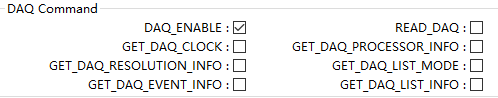

.. centered:: **表 DAQ Command属性描述 (Table DAQ Command Property Description)**

.. list-table::
   :widths: 20 20 20 20 20
   :header-rows: 1

   * - UI名称 (UI Name)
     - 描述 (Description)
     - 
     - 
     - 
   * - DAQ_ENABLE
     - 取值范围 (Range)
     - TRUE/FALSE
     - 默认取值 (Default value)
     - TRUE
   * - 
     - 参数描述 (Parameter Description)
     - 使能支持DAQ命令组 (Enable Support for DAQ Command Group)
     - 
     - 
   * - 
     - 依赖关系 (Dependencies)
     - 无
     - 
     - 
   * - READ_DAQ
     - 取值范围 (Range)
     - TRUE/FALSE
     - 默认取值 (Default value)
     - FALSE
   * - 
     - 参数描述 (Parameter Description)
     - 使能支持READ_DAQ命令 (Enable support for READ_DAQ command)
     - 
     - 
   * - 
     - 依赖关系 (Dependencies)
     - DAQ_ENABLE打开的情况下 (When DAQ_ENABLE is enabled)
     - 
     - 
   * - GET_DAQ_CLOCK
     - 取值范围 (Range)
     - TRUE/FALSE
     - 默认取值 (Default value)
     - FALSE
   * - 
     - 参数描述 (Parameter Description)
     - 使能支持GET_DAQ_CLOCK命令 (Enable support for GET_DAQ_CLOCK command)
     - 
     - 
   * - 
     - 依赖关系 (Dependencies)
     - DAQ_ENABLE打开的情况下 (When DAQ_ENABLE is enabled)
     - 
     - 
   * - GET_DAQ_PROCESSOR_INFO
     - 取值范围 (Range)
     - TRUE/FALSE
     - 默认取值 (Default value)
     - FALSE
   * - 
     - 参数描述 (Parameter Description)
     - 使能支持GET_DAQ_PROCESSOR_INFO命令 (Enable Support for GET_DAQ_PROCESSOR_INFO Command)
     - 
     - 
   * - 
     - 依赖关系 (Dependencies)
     - DAQ_ENABLE打开的情况下 (When DAQ_ENABLE is enabled)
     - 
     - 
   * - GET_DAQ_RESOLUTION_INFO
     - 取值范围 (Range)
     - TRUE/FALSE
     - 默认取值 (Default value)
     - FALSE
   * - 
     - 参数描述 (Parameter Description)
     - 使能支持GET_DAQ_RESOLUTION_INFO命令 (Enable support for GET_DAQ_RESOLUTION_INFO command)
     - 
     - 
   * - 
     - 依赖关系 (Dependencies)
     - DAQ_ENABLE打开的情况下 (When DAQ_ENABLE is enabled)
     - 
     - 
   * - GET_DAQ_LIST_MODE
     - 取值范围 (Range)
     - TRUE/FALSE
     - 默认取值 (Default value)
     - FALSE
   * - 
     - 参数描述 (Parameter Description)
     - 使能支持GET_DAQ_LIST_MODE命令 (Enable Support for GET_DAQ_LIST_MODE Command)
     - 
     - 
   * - 
     - 依赖关系 (Dependencies)
     - DAQ_ENABLE打开的情况下 (When DAQ_ENABLE is enabled)
     - 
     - 
   * - GET_DAQ_EVENT_INFO
     - 取值范围 (Range)
     - TRUE/FALSE
     - 默认取值 (Default value)
     - FALSE
   * - 
     - 参数描述 (Parameter Description)
     - 使能支持GET_DAQ_EVENT_INFO命令 (Enable support for GET_DAQ_EVENT_INFO command)
     - 
     - 
   * - 
     - 依赖关系 (Dependencies)
     - DAQ_ENABLE打开的情况下 (When DAQ_ENABLE is enabled)
     - 
     - 
   * - GET_DAQ_LIST_INFO
     - 取值范围 (Range)
     - TRUE/FALSE
     - 默认取值 (Default value)
     - FALSE
   * - 
     - 参数描述 (Parameter Description)
     - 使能支持GET_DAQ_LIST_INFO命令 (Enable Support for GET_DAQ_LIST_INFO Command)
     - 
     - 
   * - 
     - 依赖关系 (Dependencies)
     - DAQ_ENABLE打开的情况下 (When DAQ_ENABLE is enabled)
     - 
     - 

PGM Command
~~~~~~~~~~~~~~~~~~~~~~~~~~~~~~~~~~~~~~~~~

.. centered:: **表 PGM Command属性描述 (Table PGM Command Properties Description)**

.. list-table::
   :widths: 20 20 20 20 20
   :header-rows: 1

   * - UI名称 (UI Name)
     - 描述 (Description)
     - 
     - 
     - 
   * - PGM_ENABLE
     - 取值范围 (Range)
     - TRUE/FALSE
     - 默认取值 (Default value)
     - FALSE
   * - 
     - 参数描述 (Parameter Description)
     - 使能支持PGM命令组 (Enable support for PGM command group)
     - 
     - 
   * - 
     - 依赖关系 (Dependencies)
     - 无
     - 
     - 
   * - GET_SECTOR_INFO
     - 取值范围 (Range)
     - TRUE/FALSE
     - 默认取值 (Default value)
     - FALSE
   * - 
     - 参数描述 (Parameter Description)
     - 使能支持GET_SECTOR_INFO命令 (Enable support for GET_SECTOR_INFO command)
     - 
     - 
   * - 
     - 依赖关系 (Dependencies)
     - PGM_ENABLE打开的情况下 (When PGM_ENABLE is enabled)
     - 
     - 
   * - PROGRAM_PREPARE
     - 取值范围 (Range)
     - TRUE/FALSE
     - 默认取值 (Default value)
     - FALSE
   * - 
     - 参数描述 (Parameter Description)
     - 使能支持PROGRAM_PREPARE命令 (Enable support for PROGRAM_PREPARE command)
     - 
     - 
   * - 
     - 依赖关系 (Dependencies)
     - PGM_ENABLE打开的情况下 (When PGM_ENABLE is enabled)
     - 
     - 
   * - PROGRAM_FORMAT
     - 取值范围 (Range)
     - TRUE/FALSE
     - 默认取值 (Default value)
     - FALSE
   * - 
     - 参数描述 (Parameter Description)
     - 使能支持PROGRAM_FORMAT命令 (Enable support for PROGRAM_FORMAT command)
     - 
     - 
   * - 
     - 依赖关系 (Dependencies)
     - PGM_ENABLE打开的情况下 (When PGM_ENABLE is enabled)
     - 
     - 
   * - PROGRAM_NEXT
     - 取值范围 (Range)
     - TRUE/FALSE
     - 默认取值 (Default value)
     - FALSE
   * - 
     - 参数描述 (Parameter Description)
     - 使能支持PROGRAM_NEXT命令 (Enable support for PROGRAM_NEXT command)
     - 
     - 
   * - 
     - 依赖关系 (Dependencies)
     - PGM_ENABLE打开的情况下 (When PGM_ENABLE is enabled)
     - 
     - 
   * - PROGRAM_MAX
     - 取值范围 (Range)
     - TRUE/FALSE
     - 默认取值 (Default value)
     - FALSE
   * - 
     - 参数描述 (Parameter Description)
     - 使能支持PROGRAM_MAX命令 (Enable support for PROGRAM_MAX command)
     - 
     - 
   * - 
     - 依赖关系 (Dependencies)
     - PGM_ENABLE打开的情况下 (When PGM_ENABLE is enabled)
     - 
     - 
   * - PROGRAM_VERIFY
     - 取值范围 (Range)
     - TRUE/FALSE
     - 默认取值 (Default value)
     - FALSE
   * - 
     - 参数描述 (Parameter Description)
     - 使能支持PROGRAM_VERIFY命令 (Enable support for PROGRAM_VERIFY command)
     - 
     - 
   * - 
     - 依赖关系 (Dependencies)
     - PGM_ENABLE打开的情况下 (When PGM_ENABLE is enabled)
     - 
     - 
   * - XcpEditFlsMsg
     - 取值范围 (Range)
     - TRUE/FALSE
     - 默认取值 (Default value)
     - FALSE
   * - 
     - 参数描述 (Parameter Description)
     - 使能修改Fls驱动API信息（参考2.5.2章节） (Enable modification of FLS driver API information (refer to Chapter 2.5.2))
     - 
     - 
   * - 
     - 依赖关系 (Dependencies)
     - PGM_ENABLE打开的情况下 (When PGM_ENABLE is enabled)
     - 
     - 
   * - FlashHeader
     - 取值范围 (Range)
     - 无
     - 默认取值 (Default value)
     - 无
   * - 
     - 参数描述 (Parameter Description)
     - 引用的MCALFLS驱动API名称，可能会随着MCAL厂家或者芯片型号不同而导致API名称不同 (The names of the referenced MCALFLS driver API may vary due to differences in MCAL vendor or chip model.)
     - 
     - 
   * - 
     - 依赖关系 (Dependencies)
     - XcpEditFlsMsg打开的情况下 (XcpEditFlsMsg is enabled的情况下)
     - 
     - 
   * - Fls_WriteApi
     - 取值范围 (Range)
     - 无
     - 默认取值 (Default value)
     - 无
   * - 
     - 参数描述 (Parameter Description)
     - 引用的MCALFLS驱动API名称，可能会随着MCAL厂家或者芯片型号不同而导致API名称不同 (The names of the referenced MCALFLS driver API may vary due to differences in MCAL vendor or chip model.)
     - 
     - 
   * - 
     - 依赖关系 (Dependencies)
     - XcpEditFlsMsg打开的情况下 (XcpEditFlsMsg is enabled的情况下)
     - 
     - 
   * - Fls_EraseApi
     - 取值范围 (Range)
     - 无
     - 默认取值 (Default value)
     - 无
   * - 
     - 参数描述 (Parameter Description)
     - 引用的MCALFLS驱动API名称，可能会随着MCAL厂家或者芯片型号不同而导致API名称不同 (The names of the referenced MCALFLS driver API may vary due to differences in MCAL vendor or chip model.)
     - 
     - 
   * - 
     - 依赖关系 (Dependencies)
     - XcpEditFlsMsg打开的情况下 (XcpEditFlsMsg is enabled的情况下)
     - 
     - 
   * - Fls_GetStatusApi
     - 取值范围 (Range)
     - 无
     - 默认取值 (Default value)
     - 无
   * - 
     - 参数描述 (Parameter Description)
     - 引用的MCALFLS驱动API名称，可能会随着MCAL厂家或者芯片型号不同而导致API名称不同 (The names of the referenced MCALFLS driver API may vary due to differences in MCAL vendor or chip model.)
     - 
     - 
   * - 
     - 依赖关系 (Dependencies)
     - XcpEditFlsMsg打开的情况下 (XcpEditFlsMsg is enabled的情况下)
     - 
     - 
   * - XcpSectorPageSize
     - 取值范围 (Range)
     - 0~65535
     - 默认取值 (Default value)
     - 1024
   * - 
     - 参数描述 (Parameter Description)
     - 描述FLS的最小刷写大小 (Describe the minimum flush size of FLS.)
     - 
     - 
   * - 
     - 依赖关系 (Dependencies)
     - PGM_ENABLE打开的情况下 (When PGM_ENABLE is enabled)
     - 
     - 
   * - FlsBaseAddr
     - 取值范围 (Range)
     - 0~0xffffffff
     - 默认取值 (Default value)
     - 0xaf000000
   * - 
     - 参数描述 (Parameter Description)
     - 芯片的FLS基地址，依赖具体的芯片，参考2.5.2章节描述 (The FLS base address of the chip depends on the specific chip and is described in Chapter 2.5.2.)
     - 
     - 
   * - 
     - 依赖关系 (Dependencies)
     - PGM_ENABLE打开的情况下 (When PGM_ENABLE is enabled)
     - 
     - 

XcpConfig
-------------------------

XcpDaqList
~~~~~~~~~~~~~~~~~~~~~~~~~~~~~~~~~~~~~~~~~

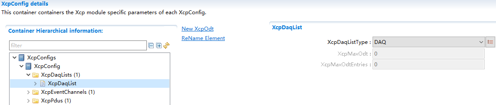

.. centered:: **表 XcpDaqList属性描述 (XcpDaqList Properties Description)**

.. list-table::
   :widths: 20 20 20 20 20
   :header-rows: 1

   * - UI名称 (UI Name)
     - 描述 (Description)
     - 
     - 
     - 
   * - XcpDaqListType
     - 取值范围 (Range)
     - DAQSTIM
     - 默认取值 (Default value)
     - DAQ
   * - 
     - 
     - DAQ_STIM
     - 
     - 
   * - 
     - 参数描述 (Parameter Description)
     - DAQ列表类型 (DAQ List Type)
     - 
     - 
   * - 
     - 依赖关系 (Dependencies)
     - 无
     - 
     - 
   * - XcpMaxOdt
     - 取值范围 (Range)
     - 0-252
     - 默认取值 (Default value)
     - 0
   * - 
     - 参数描述 (Parameter Description)
     - DAQ中最大可配置的ODT个数 (Maximum configurable number of ODTs in DAQ)
     - 
     - 
   * - 
     - 依赖关系 (Dependencies)
     - DAQTYPE为DAQ_STATIC (DAQTYPE is DAQ_STATIC)
     - 
     - 
   * - XcpMaxOdtEntries
     - 取值范围 (Range)
     - 0-255
     - 默认取值 (Default value)
     - 0
   * - 
     - 参数描述 (Parameter Description)
     - ODT最大可配置的ODTEntries个数 (The ODT can be configured with a maximum of ODTEntries entries.)
     - 
     - 
   * - 
     - 依赖关系 (Dependencies)
     - DAQTYPE为DAQ_STATIC (DAQTYPE is DAQ_STATIC)
     - 
     - 

XcpDto
*****************************************

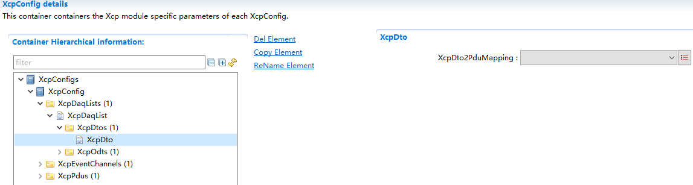

.. centered:: **表 XcpDto属性描述 (Table XcpDto Property Description)**

.. list-table::
   :widths: 20 20 20 20 20
   :header-rows: 1

   * - UI名称 (UI Name)
     - 描述 (Description)
     - 
     - 
     - 
   * - XcpDto2PduMapping
     - 取值范围 (Range)
     - 本地TXPDU（ECUC中配置）
     - 默认取值 (Default value)
     - NULL
   * - 
     - 参数描述 (Parameter Description)
     - 选择DAQ发送时所使用的PDU (Select PDU for DAQ transmission)
     - 
     - 
   * - 
     - 依赖关系 (Dependencies)
     - 无
     - 
     - 

XcpOdt
*****************************************

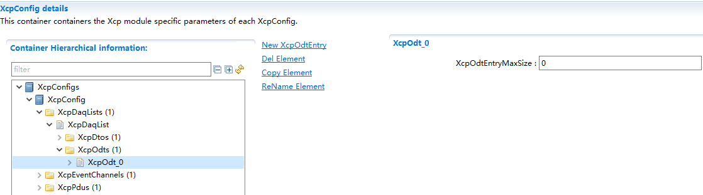

.. centered:: **表 XcpOdt属性描述 (Table XcpOdt Property Description)**

.. list-table::
   :widths: 20 20 20 20 20
   :header-rows: 1

   * - UI名称 (UI Name)
     - 描述 (Description)
     - 
     - 
     - 
   * - XcpOdtEntryMaxSize
     - 取值范围 (Range)
     - 0-254
     - 默认取值 (Default value)
     - 0
   * - 
     - 参数描述 (Parameter Description)
     - ODTEntries的最大长度 (The maximum length of ODTEntries)
     - 
     - 
   * - 
     - 依赖关系 (Dependencies)
     - DAQTYPE为DAQ_STATIC (DAQTYPE is DAQ_STATIC)
     - 
     - 

XcpOdtEntry
^^^^^^^^^^^^^^^^^^^^^^^^^^^^^^^^^^^^^^^^^

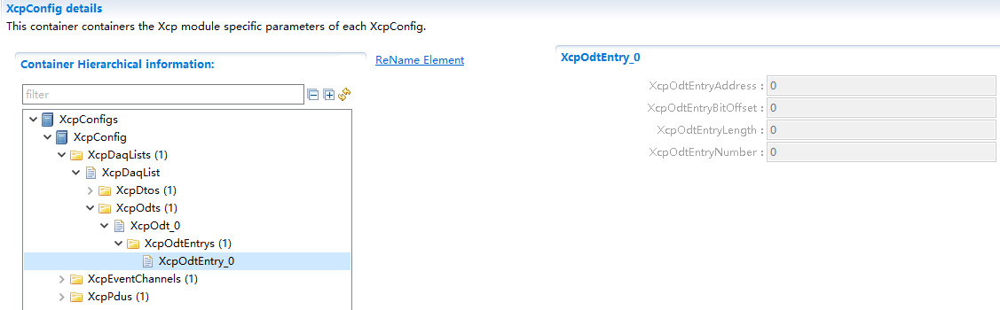

.. centered:: **表 XcpOdtEntry属性描述 (Table XcpOdtEntry Property Description)**

.. list-table::
   :widths: 20 20 20 20 20
   :header-rows: 1

   * - UI名称 (UI Name)
     - 描述 (Description)
     - 
     - 
     - 
   * - XcpOdtEntryAddress
     - 取值范围 (Range)
     - 根据实际需求决定 (Decide based on actual needs.)
     - 默认取值 (Default value)
     - 0
   * - 
     - 参数描述 (Parameter Description)
     - 静态配置的Odt ENTRY地址 (Static-configured Odt ENTRY address)
     - 
     - 
   * - 
     - 依赖关系 (Dependencies)
     - 无（无法修改） (Cannot modify ([line break]line break))
     - 
     - 
   * - XcpOdtEntryBitOffset
     - 取值范围 (Range)
     - 0-31
     - 默认取值 (Default value)
     - 0
   * - 
     - 参数描述 (Parameter Description)
     - Odt ENTRY的位偏移量 (OFFSET of Odt ENTRY)
     - 
     - 
   * - 
     - 依赖关系 (Dependencies)
     - 无（无法修改） (Cannot modify ([line break]line break))
     - 
     - 
   * - XcpOdtEntryLength
     - 取值范围 (Range)
     - 0-255
     - 默认取值 (Default value)
     - 0
   * - 
     - 参数描述 (Parameter Description)
     - 静态配置的OdtEntry的长度 (The length of statically configured OdtEntry)
     - 
     - 
   * - 
     - 依赖关系 (Dependencies)
     - 无（无法修改） (Cannot modify ([line break]line break))
     - 
     - 
   * - XcpOdtEntryNumber
     - 取值范围 (Range)
     - 0-254
     - 默认取值 (Default value)
     - 0
   * - 
     - 参数描述 (Parameter Description)
     - 静态配置的OdtEntry的数量 (The number of statically configured OdtEntry.)
     - 
     - 
   * - 
     - 依赖关系 (Dependencies)
     - 无（无法修改） (Cannot modify ([line break]line break))
     - 
     - 

XcpEventChannel
~~~~~~~~~~~~~~~~~~~~~~~~~~~~~~~~~~~~~~~~~

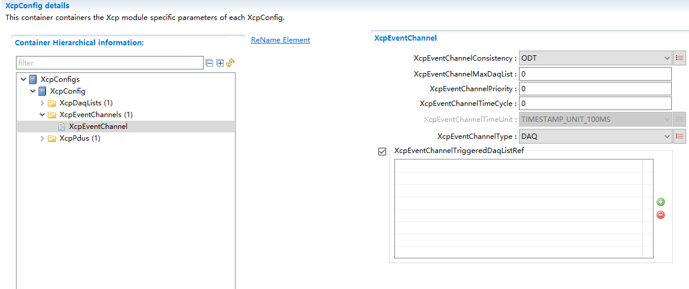

.. centered:: **表 XcpEventChannel属性描述 (Description of Table XcpEventChannel Properties)**

.. list-table::
   :widths: 20 20 20 20 20
   :header-rows: 1

   * - UI名称 (UI Name)
     - 描述 (Description)
     - 
     - 
     - 
   * - XcpEventChannelConsistency
     - 取值范围 (Range)
     - XCP_EVENT_CONSIST_ODT/DAQ/EVENT
     - 默认取值 (Default value)
     - ODT
   * - 
     - 参数描述 (Parameter Description)
     - Event中DAQ采样一致性 (Consistency in DAQ Sampling during Event)
     - 
     - 
   * - 
     - 依赖关系 (Dependencies)
     - 无
     - 
     - 
   * - XcpEventChannelMaxDaqList
     - 取值范围 (Range)
     - 0-255
     - 默认取值 (Default value)
     - 0
   * - 
     - 参数描述 (Parameter Description)
     - 表示最多支持多少个DAQ在EventChannel上发送 (Indicates the maximum number of DAQs that can send data on the EventChannel.)
     - 
     - 
   * - 
     - 依赖关系 (Dependencies)
     - 无
     - 
     - 
   * - XcpEventChannelPriority
     - 取值范围 (Range)
     - 0-255
     - 默认取值 (Default value)
     - 0
   * - 
     - 参数描述 (Parameter Description)
     - Event Channel优先级 (Priority of Event Channel)
     - 
     - 
   * - 
     - 依赖关系 (Dependencies)
     - 无
     - 
     - 
   * - XcpEventChannelTimeCycle
     - 取值范围 (Range)
     - 0-255
     - 默认取值 (Default value)
     - 0
   * - 
     - 参数描述 (Parameter Description)
     - Event Channel周期 (Event Channel Cycle)
     - 
     - 
   * - 
     - 依赖关系 (Dependencies)
     - 无
     - 
     - 
   * - XcpEventChannelTimeUnit
     - 取值范围 (Range)
     - XCP_TIME_UNIT_1NSXCP_TIME_UNIT_10NSXCP_TIME_UNIT_100NSXCP_TIME_UNIT_1USXCP_TIME_UNIT_10USXCP_TIME_UNIT_100US
     - 默认取值 (Default value)
     - TIMESTAMP_UNIT_100MS
   * - 
     - 
     - XCP_TIME_UNIT_1MSXCP_TIME_UNIT_10MSXCP_TIME_UNIT_100MSXCP_TIME_UNIT_1SXCP_TIME_UNIT_1PSXCP_TIME_UNIT_10PSXCP_TIME_UNIT_100PS
     - 
     - 
   * - 
     - 参数描述 (Parameter Description)
     - EventChannel周期单位 (Period unit for EventChannel)
     - 
     - 
   * - 
     - 依赖关系 (Dependencies)
     - XcpEventChannelTimeCycle> 0
     - 
     - 
   * - XcpEventChannelType
     - 取值范围 (Range)
     - DAQSTIM
     - 默认取值 (Default value)
     - DAQ
   * - 
     - 
     - DAQ_STIM
     - 
     - 
   * - 
     - 参数描述 (Parameter Description)
     - EventChannel支持的DAQ类型 (EventChannel-supported DAQ types)
     - 
     - 
   * - 
     - 依赖关系 (Dependencies)
     - 无
     - 
     - 
   * - XcpEventChannelTriggeredDaqListRef
     - 取值范围 (Range)
     - DAQ页面中添加到适合Type的DAQ (Add DAQ suitable for the Type on the DAQ page)
     - 默认取值 (Default value)
     - NULL
   * - 
     - 参数描述 (Parameter Description)
     - 可在本EventChannel中激活的DAQ列表引用 (List of DAQs that can be activated in this EventChannel)
     - 
     - 
   * - 
     - 依赖关系 (Dependencies)
     - 无
     - 
     - 

XcpPdu
~~~~~~~~~~~~~~~~~~~~~~~~~~~~~~~~~~~~~~~~~

XcpRxPdu
*****************************************

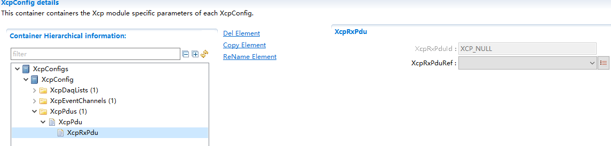

.. centered:: **表 XcpRxPdu属性描述 (Table XcpRxPdu Property Description)**

.. list-table::
   :widths: 20 20 20 20 20
   :header-rows: 1

   * - UI名称 (UI Name)
     - 描述 (Description)
     - 
     - 
     - 
   * - XcpRxPduId
     - 取值范围 (Range)
     - String
     - 默认取值 (Default value)
     - 选择PDU后自动生成 (Select PDU and auto-generate subsequently.)
   * - 
     - 参数描述 (Parameter Description)
     - 本地Rx PDUID（工具自动生成，不用手填） (Local Rx PDUID (automatically generated by the tool, no need for manual filling))
     - 
     - 
   * - 
     - 依赖关系 (Dependencies)
     - 无
     - 
     - 
   * - XcpRxPduRef
     - 取值范围 (Range)
     - ECUC的RX PDU (ECUC's RX PDU)
     - 默认取值 (Default value)
     - 选择PDU后自动生成 (Select PDU and auto-generate subsequently.)
   * - 
     - 参数描述 (Parameter Description)
     - 引用的ECUC中的PDU，表示用于接收XCP命令所用的PDU (PDU used for receiving XCP commands, indicating the PDU referenced in the ECUC.)
     - 
     - 
   * - 
     - 依赖关系 (Dependencies)
     - 无
     - 
     - 

XcpTxPdu
*****************************************

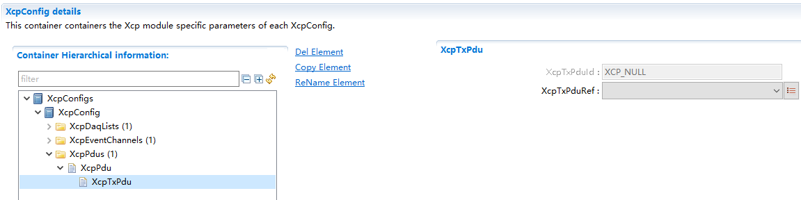

.. centered:: **表 XcpTxPdu属性描述 (XcpTxPdu Property Description)**

.. list-table::
   :widths: 20 20 20 20 20
   :header-rows: 1

   * - UI名称 (UI Name)
     - 描述 (Description)
     - 
     - 
     - 
   * - XcpTxPduId
     - 取值范围 (Range)
     - String
     - 默认取值 (Default value)
     - 选择PDU后自动生成 (Select PDU and auto-generate subsequently.)
   * - 
     - 参数描述 (Parameter Description)
     - 本地Tx PDUID（工具自动生成，不用手填） (Local Tx PDUID (Auto-generated by the tool, no need to manually fill in))
     - 
     - 
   * - 
     - 依赖关系 (Dependencies)
     - 无
     - 
     - 
   * - XcpTxPduRef
     - 取值范围 (Range)
     - ECUC的TX PDU (ECUC's TX PDU)
     - 默认取值 (Default value)
     - 选择PDU后自动生成 (Select PDU and auto-generate subsequently.)
   * - 
     - 参数描述 (Parameter Description)
     - 引用的ECUC中的PDU，表示用于发送XCP数据所用的PDU (Referenced ECUC PDU for sending XCP data)
     - 
     - 
   * - 
     - 依赖关系 (Dependencies)
     - 无
     - 
     - 
