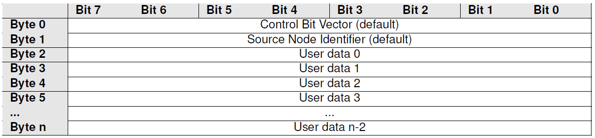
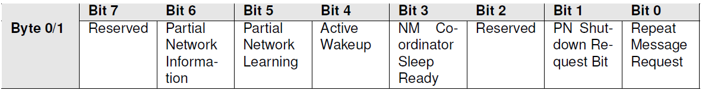

功能描述(Functional Description)
========================================

特性(Features)
-------------------------

AUTOSAR CanNm基于分散的直接网络管理策略，这意味着每个网络节点仅根据在通信系统内接收和/或发送报文，执行自给自足的活动。

AUTOSAR CanNm is based on a decentralized direct network management strategy. This means each network node operates self-sufficiently, basing its activities solely on messages received or transmitted within the communication system.

AUTOSAR CanNm协调算法基于周期性的NM数据包，集群中的所有节点都通过广播传输接收这些数据包。接收到NM数据包表明发送节点要保持NM集群处于唤醒状态。如果任何节点准备好进入总线睡眠模式，它将停止发送NM数据包，但是只要接收到来自其他节点的NM数据包，它就会推迟过渡到总线睡眠模式。如果在专用计时器超时前都未接收到NM数据包，则每个节点都会启动到总线休眠模式的转换。CanNm通过状态机切换和各状态定时器管理来完成协调算法。

The AUTOSAR CanNm coordination algorithm is based on periodic NM packets, which all nodes in the cluster receive via broadcast transmission. Receiving an NM packet indicates that the sending node intends to keep the NM cluster awake. If any node is ready to enter bus sleep mode, it stops transmitting NM packets. However, it postpones the transition to bus sleep mode as long as it receives NM packets from other nodes. If no NM packets are received before a dedicated timer expires, each node initiates the transition to bus sleep mode. CanNm implements this coordination algorithm through state machine switching and state timer management.

通道状态管理功能(Channel Status Management Function)
~~~~~~~~~~~~~~~~~~~~~~~~~~~~~~~~~~~~~~~~~~~~~~~~~~~~~~~~~

从网络管理集群中单个节点的角度来看，AUTOSAR CanNm状态机包含算法所需的状态、切换和触发。通道的状态切换在触发切换后的下一个主函数中处理，且每当模式切换完成后通过API将状态通知到上层节点(NmIf)。

From the perspective of a single node in the network management cluster, the AUTOSAR CanNm state machine contains the states, transitions, and triggers required by the algorithm. Channel state transitions are processed in the next main function after the transition is triggered. The state is notified to the upper-layer node (NmIf) via API whenever a mode transition is completed.

AUTOSAR CanNm状态机包含三种操作模式(Mode)。

The AUTOSAR CanNm state machine includes three operating modes.

- Network Mode(网络模式)
- Prepare Bus-Sleep Mode(总线预睡眠模式)
- Bus-Sleep Mode(总线睡眠模式)

.. figure:: ../../../_static/参考手册/CanNm/CanNmStateMachine.png
   :alt: CanNmStackMachine
   :align: center

   CanNm Stack Machine

网络模式(Network Mode)
******************************

网络模式包含以下三个子状态(State)：

Network Mode includes the following three sub-states:

- Repeat Message State(重复报文状态)
- Normal Operation State(正常运行状态)
- Ready Sleep State(准备睡眠状态)

重复报文状态(Repeat Message State)
^^^^^^^^^^^^^^^^^^^^^^^^^^^^^^^^^^^^^^^^^^^^^^^

当节点配置为Passive Mode的节点，意味着该节点只能接受报文而不能传输任何报文，关于Passive Mode具体的将在下面章节中进行说明。

When a node is configured in Passive Mode, it can only receive messages and cannot transmit any. Details of Passive Mode are explained in later sections.

对于非Passive Mode的节点，Repeat Message State可确保从Bus-Sleep或Prepare Bus-Sleep到Network Mode的任何过渡对于网络上的其他节点都是可见的。此外，它确保所有节点在CanNmRepeatMessageTime(配置参数)内保持活动状态。当CanNmRepeatMessageTime配置为0，表示未配置Repeat Message State。这意味着Repeat Message State是瞬态的，在进入后立即离开，因此无法保证启动稳定性，并且无法执行节点检测过程。当CanNmRepeatMessageTime超时后，节点将离开Repeat Message State而切至其他状态。若当前网络状态为请求，切换到Normal Operation State，若当前网络状态为释放，切换到Ready SleepState。

For non-Passive Mode nodes, the Repeat Message State ensures any transition from Bus-Sleep or Prepare Bus-Sleep to Network Mode is visible to other nodes on the network. Furthermore, it ensures all nodes remain active for the duration of CanNmRepeatMessageTime (a configuration parameter). If CanNmRepeatMessageTime is configured as 0, the Repeat Message State is not configured. This makes the state transient (exited immediately after entry), thus startup stability cannot be guaranteed and the node detection process cannot be executed. After CanNmRepeatMessageTime expires, the node leaves the Repeat Message State. If the current network state is requested, it switches to Normal Operation State; if released, it switches to Ready Sleep State.

当非Passive Mode的节点从Bus-SleepMode, Prepare-Bus-Sleep Mode，Normal Operation State或Ready Sleep State进入Repeat Message State时，传输功能应该被重启，为了防止总线数据爆发，降低负载，每次进入Repeat Message State时，都要延迟CanNmMsgCycleOffset(配置参数)段时间后，再开始传输数据，若配置CanNmImmediateNmTransmissions并且网络被请求则不需要延迟CanNmMsgCycleOffset时间。
When a non-Passive Mode node enters the Repeat Message State from Bus-Sleep Mode, Prepare-Bus-Sleep Mode, Normal Operation State, or Ready Sleep State, the transmission function shall be restarted. To prevent bus data bursts and reduce load, each entry into the Repeat Message State delays transmission by CanNmMsgCycleOffset (a configuration parameter). If CanNmImmediateNmTransmissions is configured and the network is requested, the CanNmMsgCycleOffset delay is not applied.

正常运行状态(Normal Operation State)
^^^^^^^^^^^^^^^^^^^^^^^^^^^^^^^^^^^^^^^^^^^^^^^^^^^^^^^

Normal Operation State可确保只要需要网络功能，任何节点都可以使NM集群保持唤醒状态。当处于Normal Operation State，节点按照CanNmMsgCycleTime周期发送报文，当网络释放后，CanNm进入ReadySleep state。

The Normal Operation State ensures any node can keep the NM cluster awake as long as network functionality is required. In this state, the node transmits messages periodically with a cycle time of CanNmMsgCycleTime. After the network is released, CanNm enters the Ready Sleep state.

准备睡眠状态(Ready Sleep State)
^^^^^^^^^^^^^^^^^^^^^^^^^^^^^^^^^^^^^^^^^^^^^^^^^^^^^^

Ready Sleep State可确保NM群集中的任何节点都在等待过渡到Prepare Bus-Sleep Mode。

The Ready Sleep State ensures any node in the NM cluster awaits transition to Prepare Bus-Sleep Mode.

当进入Ready Sleep State，本节点就不再发送网络管理报文。当节点接收到其他节点传输的网络管理报文时，会将NM-Timeout定时器重置，当NM-Timeout定时器超时且处于Ready Sleep State时，网络管理进入Prepare Bus-Sleep Mode。其中NM-Timeout定时器的时间是由CanNmTimeoutTime(配置参数)决定的。

Upon entering the Ready Sleep State, the node stops transmitting network management messages. When it receives a network management message from another node, it resets the NM-Timeout timer. If the NM-Timeout timer expires while in the Ready Sleep State, network management enters Prepare Bus-Sleep Mode. The NM-Timeout timer duration is determined by CanNmTimeoutTime (a configuration parameter).

总线预睡眠模式 Prepare Bus-Sleep(Mode)
******************************************************

Prepare Bus Sleep state目的是确保所有节点都有时间在进入总线休眠状态之前停止其网络活动，使总线活动平静下来，最后在“准备总线睡眠模式”下总线上没有任何活动。

The Prepare Bus-Sleep state ensures all nodes have time to stop their network activities before entering bus sleep, allowing bus activity to settle, ultimately resulting in no bus activity during Prepare Bus-Sleep Mode.

当本节点进入Prepare Bus-Sleep Mode，CanNmWaitBusSleepTime(配置参数)定时器被启动，当CanNmWaitBusSleepTime定时器超时，当前状态将由Prepare Bus-Sleep Mode切换至Bus-Sleep Mode。

When the local node enters Prepare Bus-Sleep Mode, the CanNmWaitBusSleepTime (configuration parameter) timer starts. Upon its expiry, the state transitions from Prepare Bus-Sleep Mode to Bus-Sleep Mode.

如果在Prepare Bus-Sleep Mode接收到其他节点传输的网络管理报文时，当前CanNm状态将由Prepare Bus-Sleep Mode切换至Network Mode，默认情况下，将进入Repeat Message State。

If a network management message from another node is received while in Prepare Bus-Sleep Mode, the current CanNm state transitions to Network Mode, entering the Repeat Message State by default.

如果在Prepare Bus-Sleep Mode接收到网络请求时，当前状态将由Prepare Bus-Sleep Mode切换至Network Mode，默认情况下，将进入Repeat Message State。如果CanNmImmediateRestartEnabled(配置参数)被设置为TRUE，那么在这种情况下会立刻触发一次传输，这样做的理由是：集群中的其他节点仍处于Prepare Bus-Sleep Mode，在这种特殊情况下，应避免过渡到Bus-Sleep Mode，并应尽快恢复总线通信。由于CanNm中网络管理PDU的传输偏移导致，处于Repeat Message State的第一个网络管理PDU的传输可能会大大延迟。为了避免延迟重新启动网络可以立即请求发送网络管理PDU。

If a network request is received in Prepare Bus-Sleep Mode, the state transitions to Network Mode, entering the Repeat Message State by default. If CanNmImmediateRestartEnabled (configuration parameter) is TRUE, one immediate transmission is triggered in this case. The rationale: other cluster nodes might still be in Prepare Bus-Sleep Mode; transitioning to Bus-Sleep Mode should be avoided in this special scenario, and bus communication should resume promptly. Due to the transmission offset of NM PDUs in CanNm, the first NM PDU transmission in the Repeat Message State might be significantly delayed. Immediate transmission of an NM PDU can be requested to avoid delaying network restart.

总线睡眠模式 Bus-Sleep(Mode)
*****************************************

Bus-Sleep state的目的是在不交换任何消息时降低节点的功耗。将通信控制器切换到睡眠模式，激活相应的唤醒机制，最后将功耗降低到总线睡眠模式下的适当水平。

The Bus-Sleep state aims to reduce node power consumption when no messages are exchanged. It switches the communication controller to sleep mode, activates the corresponding wake-up mechanism, and reduces power consumption to an appropriate level for bus sleep mode.

当CanNm处于Bus-Sleep Mode接收到网络管理报文时，此时CanNm不会切换至Network Mode，而是通知Nm模块，由上层模块做决策。

If CanNm in Bus-Sleep Mode receives an NM message, it does not switch to Network Mode but notifies the Nm module, leaving the decision to the upper layer.

当CanNm处于Bus-Sleep Mode接收到被动请求或网络请求时，当前状态将由Bus-Sleep Mode切换至Network Mode，默认情况下，将进入Repeat Message State。

When CanNm in Bus-Sleep Mode receives a passive request or a network request, the state transitions from Bus-Sleep Mode to Network Mode, entering the Repeat Message State by default.

AUTOSAR NM 报文格式(AUTOSAR NM Message Format)
~~~~~~~~~~~~~~~~~~~~~~~~~~~~~~~~~~~~~~~~~~~~~~~~~~~~

AUTOSAR NM 报文有特定的格式要求，NM报文总长度视总线特性而定，受总线MTU限制。报文数据段格式如图：

AUTOSAR NM messages have specific format requirements. The total NM message length depends on the bus characteristics and is limited by the bus MTU. The message data segment format is as follows:

   NM message layout example

- Control Bit Vector(CBV)：长度为一字节的可选字段，根据配置可以处于NM报文第一、二字节或者不使用。FlexRay总线仅可处于第一字节或不使用。该字节信息如下图

   Control Bit Vector (CBV): An optional one-byte field. Depending on configuration, it can be in the first or second byte of the NM message, or not used at all. For FlexRay bus, it can only be in the first byte or not used. The byte layout is shown below.

   CBV layout

- Source Node ID (SNI): An optional one-byte field. Depending on configuration, it can be in the first or second byte of the NM message, or not used at all. For FlexRay bus, it can only be in the second byte or not used. The byte value is determined by the channel configuration.
   Source Node ID (SNI): An optional one-byte field. Depending on configuration, it can be in the first or second byte of the NM message, or not used at all. For FlexRay bus, it can only be in the second byte or not used. The byte value is determined by the channel configuration.

- User Data of n Bytes：若干字节的可选字段，CBV和SNI之外的字节都为User Data部分。该字段包含两部分，即User data和PNC bit Vector，这两部分均为根据配置决定是否支持，若同时支持则严格要求ser data和PNC bit Vector各自的字节必须连续

   User Data of n Bytes: An optional field of several bytes. All bytes except those used for CBV and SNI belong to the User Data part. This field comprises two parts: User Data and PNC Bit Vector. Support for each part is configuration-dependent. If both are supported, the bytes for User Data and PNC Bit Vector must each be contiguous.

通信调度功能(Communication scheduling function)
~~~~~~~~~~~~~~~~~~~~~~~~~~~~~~~~~~~~~~~~~~~~~~~~~~

CanNm提供周期性网络管理报文发送功能：该功能根据配置项CanNmPassiveModeEnabled决定是否启用，当CanNmPassiveModeEnabled为TRUE意为启动CanNm模块启动被动模式，仅接收报文并不主动参加网络管理；该功能也可动态的被诊断通信控制服务启停。
CanNm提供配置项CanNmMsgCycleTime作为常规的报文周期，提供CanNmMsgCycleOffset、CanNmImmediateNmTransmissions、CanNmBusLoadReductionEnabled作为网络管理报文发送方向上特殊场景的附加属性。

CanNm provides periodic network management message transmission. This function is controlled by the configuration parameter CanNmPassiveModeEnabled. If TRUE, the CanNm module operates in passive mode, only receiving messages and not actively participating in network management. This function can also be dynamically started/stopped by the diagnostic communication control service.
CanNm provides CanNmMsgCycleTime as the regular message cycle time. CanNmMsgCycleOffset, CanNmImmediateNmTransmissions, and CanNmBusLoadReductionEnabled serve as additional attributes for special scenarios in the transmission direction of NM messages.

如果一个NM PDU被成功接收，下层(例如. CanIf )通过函数调用CanNm_RxIndication通知CanNm。CanNm根据PduId匹配相应的通道配置，如是否支持CBV，若支持则根据CBV字节位置逐bit解析、若使能PN则处理PNC Bit Vector字段、重置NM-Timeout计时器等

If an NM PDU is successfully received, the lower layer (e.g., CanIf) notifies CanNm via the CanNm_RxIndication function call. CanNm matches the channel configuration based on PduId, e.g., whether CBV is supported. If supported, it parses the CBV bit by bit according to its byte position; if PN is enabled, it processes the PNC Bit Vector field; and it resets the NM-Timeout timer, etc.

快速发送(Quick transmission)
**********************************************

快速发送机制根据配置参数CanNmImmediateNmTransmissions决定。该改参数为0时意为不启动；当该参数配置大于0时意为快速发送的报文次数，需要再配置CanNmImmediateNmCycleTime作为快速发送时报文发送周期。
快速发送机制仅作用于Repeat Message State阶段，当通道被主动请求第一次进入网络模式时，或CanNmPnHandleMultipleNetworkRequests为TRUE且有网络请求时，进入Repeat Message State触发快速发送CanNmImmediateNmTransmissions次网络管理报文。当快速发送次数结束时，恢复常规的发送周期。

The quick transmission mechanism is determined by the configuration parameter CanNmImmediateNmTransmissions. A value of 0 disables the mechanism. A value greater than 0 specifies the number of messages for quick transmission, and requires configuration of CanNmImmediateNmCycleTime as the message cycle time during quick transmission.
The quick transmission mechanism operates only during the Repeat Message State. It is triggered when entering the Repeat Message State, either upon the channel's first entry into Network Mode due to an active request, or if CanNmPnHandleMultipleNetworkRequests is TRUE and a network request exists. It transmits CanNmImmediateNmTransmissions number of NM messages. After the quick transmission count is completed, the regular transmission cycle resumes.

总线负载降低(Bus load reduction)
******************************************

当同一总线上的ECU被同时唤醒时，将同时进入Repeat Message状态并开始发送网络管理报文，将造成总线负载在瞬间提高，为此提供CanNmMsgCycleOffset使ECU首次发送报文时延迟一段时间，该参数数值基于网络集群大小，以便于各个ECU配置不同的数值。因此必须有一种机制，可以独立于网络管理集群的大小来降低总线负载。
总线负载降低为CanNm的可选功能：当CanNmBusLoadReductionEnabled参数配置为TRUE时，CanNm应该支持总线负载降低机制。该机制仅使能在Normal Opeation State，通过配置参数CanNmMsgReducedTime和不断切换报文发送周期计时器以实现该机制。

When ECUs on the same bus are woken up simultaneously, they enter the Repeat Message state concurrently and start transmitting NM messages, causing a instantaneous bus load increase. CanNmMsgCycleOffset addresses this by delaying the first message transmission of each ECU. This parameter's value is based on the network cluster size, allowing different values per ECU. Thus, a mechanism is necessary to reduce bus load independent of the NM cluster size.
Bus load reduction is an optional CanNm feature. When CanNmBusLoadReductionEnabled is TRUE, CanNm shall support the bus load reduction mechanism. This mechanism is only active in the Normal Operation State and is implemented using the configuration parameter CanNmMsgReducedTime and by constantly switching the message transmission cycle timer.

当总线负载降低机制启动后，CanNm_RxIndication()被调用后(接收到报文)，使用CanNmMsgReducedTime参数重装内部的报文发送计时器，当成功发送NM-PDU后(CanIf_Transmit返回E_OK)，用CanNmMsgCycleTime参数重装内部的报文发送计时器。
CanNmMsgReducedTime参数数值要求： CanNmMsgCycleTime/2 < CanNmMsgReducedTime < CanNmMsgCycleTime。因此最终实现一个网络集群中仅有CanNmMsgReducedTime数值最小的两个节点交替发送网络管理报文。

When the bus load reduction mechanism is active, after CanNm_RxIndication() is called (message received), the internal message transmission timer is reloaded with CanNmMsgReducedTime. After successful NM-PDU transmission (CanIf_Transmit returns E_OK), the timer is reloaded with CanNmMsgCycleTime.
The value of CanNmMsgReducedTime must satisfy: CanNmMsgCycleTime/2 < CanNmMsgReducedTime < CanNmMsgCycleTime. Consequently, only the two nodes with the smallest CanNmMsgReducedTime values in a network cluster alternately transmit NM messages.

报文失败重发(Message failure retransmission)
****************************************************

报文发送失败为CanNm的可选机制，因为Can通道状态切换为异步处理，因此可能造成网络管理报文发送时，通道状态未切换导致发送被CanIf拒绝。
失败重发存在两种触发场景：

Message transmission failure retransmission is an optional CanNm mechanism. Because CAN channel state switching is asynchronous, transmission might be rejected by CanIf if the channel state hasn't switched when an NM message is sent.
Retransmission upon failure occurs in two scenarios:

- CanNmImmediateNmTransmissions大于0，确保快速发送次数均能成功发送

  CanNmImmediateNmTransmissions > 0, ensuring all quick transmission attempts succeed.

快速发送阶段，每当CanIf_Transmit返回E_NOT_OK时，则在后续每次主函数中调用一次CanIf_Transmit直到返回E_OK并递减快速发送次数，直到完成全部次数快速发送。最坏情况若存在某次报文始终无法成功发送，则在离开Repeat Message State关闭快速发送时一并停掉重发功能。

During quick transmission, if CanIf_Transmit returns E_NOT_OK, CanIf_Transmit is called once per subsequent main function until E_OK is returned, while decrementing the quick transmission count until completed. In the worst case, if a message consistently fails, retransmission is stopped when exiting the Repeat Message State and terminating quick transmission.

- CanNmRetryFirstMessageRequest配置为TRUE，确保进入网络模式的首帧报文一定成功发送

  CanNmRetryFirstMessageRequest configured as TRUE, ensuring the first frame message upon entering Network Mode is sent successfully.

当通道状态第一次切换到网络模式时，根据配置决定是否确保首帧发送成功。若调用CanIf_Transmit返回E_NOT_OK，则在后续每次主函数中调用一次CanIf_Transmit直到返回E_OK。最坏情况若CanIf_Transmit始终返回E_NOT_OK，则若通道状态进入Normal Opeartion State时仍可在后续主函数中触发发送，若进入Ready Sleep State停止网络管理报文发送功能时一并停掉重发功能。

When the channel state switches to Network Mode for the first time, configuration determines whether to ensure successful first frame transmission. If CanIf_Transmit returns E_NOT_OK, it is called once per subsequent main function until E_OK is returned. Worst case, if CanIf_Transmit always returns E_NOT_OK, transmission might still be triggered in subsequent main functions if the state enters Normal Operation State. Retransmission is stopped if the state enters Ready Sleep State, halting NM message transmission.

CanNm附加功能(CanNm Additional Functions)
~~~~~~~~~~~~~~~~~~~~~~~~~~~~~~~~~~~~~~~~~~~~~~~~~~~~~~

检测远程睡眠指示(Detection of Remote Sleep Indication)
****************************************************************

远程睡眠指示应用于一种情况，当处于NormalOperation State的节点发现集群中的所有其他节点都准备睡眠，但处于Normal Operation State状态的节点仍将保持总线苏醒。为了避免这种情况，可以使能远程睡眠指示功能。
如果当前CanNm状态为Normal Operation State，并且在CanNmRemoteSleepIndTime(配置参数)定时器内未收到其他节点发送的网络管理报文，则通知上层Nm模块集群内的其他节点均已准备睡眠。
如果CanNm已通知上层Nm模块，而在Normal Operation State或Ready Sleep State下又收到了网络管理报文，或者CanNm从Normal Operation State切换至Repeat Message State，CanNm需要通知上层Nm模块集群中的某些节点不再准备睡眠。

Remote sleep indication addresses a scenario where a node in Normal Operation State detects all other cluster nodes are ready to sleep, but the node itself would keep the bus awake. Enabling this function avoids this.
If the current CanNm state is Normal Operation State and no NM messages from other nodes are received within the CanNmRemoteSleepIndTime timer (configuration parameter), the upper-layer Nm module is notified that all other cluster nodes are ready to sleep.
If CanNm has notified the upper layer, but subsequently receives an NM message while in Normal Operation State or Ready Sleep State, or if CanNm transitions from Normal Operation State to Repeat Message State, CanNm must notify the upper layer that some cluster nodes are no longer ready to sleep.

用户数据(User Data)
*****************************************************

使用CanNmUserDataEnabled开关(配置参数)对NM用户数据的支持进行静态配置。
当用户数据功能使能，可以调用CanNm_SetUserData(CanNmComUserDataSupport为FALSE)，该函数可以设置总线上接下来发送的NM数据包的NM用户数据。也可以调用CanNm_GetUserData，该函数可以提供包含在最近接收到的NM PDU的有效载荷中的NM用户数据。
如果CanNmComUserDataSupport(配置参数)配置为使能，CanNm将在每次请求发送相应的NM消息之前从引用的NM I-PDU收集NM用户数据，并将用户数据与其他NM字节合并。此时就不能再通过CanNm_SetUserData函数设置用户数据。

Support for NM User Data is statically configured via the CanNmUserDataEnabled switch (configuration parameter).
When User Data is enabled, CanNm_SetUserData can be called (if CanNmComUserDataSupport is FALSE) to set the User Data for the next NM packet to be transmitted on the bus. CanNm_GetUserData can be called to provide the User Data contained in the payload of the most recently received NM PDU.
If CanNmComUserDataSupport (configuration parameter) is enabled, CanNm collects NM User Data from the referenced NM I-PDU before each request to send the corresponding NM message and merges it with other NM bytes. In this case, User Data cannot be set via CanNm_SetUserData.

被动模式(Passive Mode)
*******************************************

在被动模式下，节点仅接收NM消息，但不发送任何NM消息。被动模式应使用CanNmPassiveModeEnabled开关(配置参数)进行静态配置。

In Passive Mode, a node only receives NM messages but does not transmit any. Passive Mode shall be statically configured using the CanNmPassiveModeEnabled switch (configuration parameter).

NM-Pdu接收 Reception of NM-Pdu
**************************************

若CanNmPduRxIndicationEnabled(配置参数)使能，在成功接收NM PDU时，CanNm应通过调用Nm_PduRxIndication通知上层。

If CanNmPduRxIndicationEnabled (configuration parameter) is enabled, CanNm shall notify the upper layer via Nm_PduRxIndication upon successful reception of an NM PDU.

状态改变通知(State Change Notification)
******************************************

如果CanNmStateChangeIndEnabled(配置参数)使能，则CanNm需要将CanNm状态的所有更改通知上层Nm。

If CanNmStateChangeIndEnabled (configuration parameter) is enabled, CanNm shall notify the upper-layer Nm of all CanNm state changes.

通信控制(Communication Control)
******************************************

使用CanNmComControlEnabled开关(配置参数)，可以静态配置通信控制。当CanNm_DisableCommunication函数被调用，CanNm模块NM报文的传输能力将被停止，直到调用CanNm_EnableCommunication，CanNm的nm报文传输能力被恢复。

Communication control is statically configured using the CanNmComControlEnabled switch (configuration parameter). When CanNm_DisableCommunication is called, the CanNm module's ability to transmit NM messages is stopped until CanNm_EnableCommunication is called, restoring this capability.

.. hint::

   网络释放时，CanNm_DisableCommunication和CanNm_EnableCommunication成对使用。

   CanNm_DisableCommunication and CanNm_EnableCommunication are used in pairs during network release.
   
   当CanNm_DisableCommunication函数被调用，CanNm的NM-Timeout定时器将被停止，调用函数CanNm_EnableCommunication，NM-Timeout定时器将被恢复。因此在CanNm_EnableCommunication尚未调用前，若释放网络，通道状态将停留在ReadySleep状态，休眠将被阻塞，需要在CanNm_EnableCommunication调用后才可进入Prepare-Bus-Sleep模式。

   Calling CanNm_DisableCommunication stops the CanNm NM-Timeout timer. Calling CanNm_EnableCommunication restores it. Therefore, if the network is released before CanNm_EnableCommunication is called, the channel state remains in Ready Sleep state, blocking sleep. Entry into Prepare-Bus-Sleep mode requires calling CanNm_EnableCommunication first.

协调同步(Coordinated synchronization)
************************************************

当有多个协调器连接到同一条总线时，在CBV中，NmCoordinatorSleepReady位用于指示主协调器请求启动关闭。
当CanNm处于网络模式，接收网络管理报文的CBV中NmCoordinatorSleepReady=1，则CanNm通知上层协调睡眠功能被请求。
当CanNm已通知上层协调睡眠功能被请求，接收网络管理报文的CBV中NmCoordinatorSleepReady=0，则CanNm通知上层协调睡眠功能请求被取消。

When multiple coordinators connect to the same bus, the NmCoordinatorSleepReady bit in the CBV indicates the main coordinator requests shutdown initiation.
If CanNm is in Network Mode and receives an NM message with CBV bit NmCoordinatorSleepReady=1, it notifies the upper layer that coordinated sleep is requested.
If CanNm has notified the upper layer of a coordinated sleep request and subsequently receives an NM message with CBV bit NmCoordinatorSleepReady=0, it notifies the upper layer that the coordinated sleep request is cancelled.

车辆唤醒 Vehicle wake-up
************************************

当CanNmCarWakeUpRxEnabled(配置参数)使能时，车辆唤醒功能被启用，目前暂时没有使用场景。如果任何接收到的NM-PDU中的Car Wakeup位为1，都会通知上层Nm。
当CanNmCarWakeUpRxEnabled(配置参数)使能，CanNmCarWakeUpFilterEnabled(配置参数)也使能时，只有收到NodeId等于CanNmCarWakeUpFilterNodeId的报文时，才会通知上层。

When CanNmCarWakeUpRxEnabled (configuration parameter) is enabled, the vehicle wake-up function is activated (currently no use case defined). If the Car Wakeup bit in any received NM-PDU is 1, the upper-layer Nm is notified.
If both CanNmCarWakeUpRxEnabled and CanNmCarWakeUpFilterEnabled (configuration parameters) are enabled, the upper layer is only notified if the received message's NodeId equals CanNmCarWakeUpFilterNodeId.

PNC
******************

Autosar4.x版本开始支持PN功能，Pn功能的目的是基于功能划分网络，形成局域网；这种功能的划分由整车设计完成，对于各节点只需要关心自身存在的网段。只有在CanNmGlobalPnSupport(配置参数)和各通道下的CanNmPnEnabled(配置参数)使能的情况下，Pn功能才能正常工作。
如果CanNmPnEnabled(配置参数)为FALSE，则CanNm将执行常规的Rx处理，并且应禁用Pn功能。如果CanNmPnEnabled为TRUE，接收到的NM-PDU CBV中的PNI位为0，则CanNm模块应执行常规的Rx处理，从而省去了Pn功能的扩展。如果CanNmPnEnabled为TRUE并且接收到的NM-PDU CBV中的PNI位为1，则CanNm模块处理NM-PDU的Pn信息。

PN (Partial Networking) functionality is supported since Autosar 4.x. Its purpose is to divide the network functionally into subnets (local networks). This division is defined by vehicle design; each node only needs to care about its own subnet segments. PN functionality operates only if both CanNmGlobalPnSupport (configuration parameter) and the channel-specific CanNmPnEnabled (configuration parameter) are enabled.
If CanNmPnEnabled is FALSE, CanNm performs regular Rx processing and PN features shall be disabled. If CanNmPnEnabled is TRUE and the received NM-PDU's CBV has the PNI bit=0, the CanNm module performs regular Rx processing, skipping PN extensions. If CanNmPnEnabled is TRUE and the received NM-PDU's CBV has the PNI bit=1, the CanNm module processes the PN information in the NM-PDU.

如果CanNmPnEnabled为TRUE，则必须使用CBV，且发送报文时应将CBV中发送的PNI位的值设置为1；如果CanNmPnEnabled为FALSE，若使用CBV，则发送报文时应将CBV中的PNI位的值始终设置为0。

If CanNmPnEnabled is TRUE, the CBV must be used, and the transmitted PNI bit in the CBV shall be set to 1. If CanNmPnEnabled is FALSE and the CBV is used, the transmitted PNI bit shall always be set to 0.

PNC是Partial Network Cluster的缩写，它是指为了在车辆网络中支持一个或多个车辆功能而由多个ECU构成的集群。PNC的编号我们称为PNC ID，范围8~63，整车网络统一编号，关于PNC id与CanNmPdu映射关系说明：PNC ID对应CanNmPdu中的一个bit，例如PNC ID=8，对应CanNmPduByte1的bit0；PNC ID=63，对应Byte7的bit7；PNC ID对应的bit数值为1，则表示当前PN网络被请求，为0则表示网络释放。

PNC (Partial Network Cluster) refers to a cluster of multiple ECUs supporting one or more vehicle functions in the vehicle network. The PNC identifier, PNC ID, ranges from 8 to 63 and is uniformly numbered across the vehicle network. The mapping between PNC ID and CanNmPdu is as follows: A PNC ID corresponds to a specific bit in the CanNmPdu. For example, PNC ID=8 corresponds to bit 0 of CanNmPdu Byte 1; PNC ID=63 corresponds to bit 7 of Byte 7. A bit value of 1 indicates the corresponding PN is requested; 0 indicates released.

Pn信息的位置位于网络管理报文的用户数据部分中，具体的位置根据Nm模块配置决定：NmPncBitVectorOffset和NmPncBitVectorLength。
例如当NmPncBitVectorOffset = 3，NmPncBitVectorLength = 2，代表NM报文只有字节3和字节4包含PN请求信息。

The PN information location within the NM message's User Data part is determined by Nm module configuration: NmPncBitVectorOffset and NmPncBitVectorLength.
For example, if NmPncBitVectorOffset=3 and NmPncBitVectorLength=2, then only bytes 3 and 4 of the NM message contain PN request information.

接收(Reception)
^^^^^^^^^^^^^^^^^^^^^^^^^^

当通道使能CanNmPnEnabled为TRUE，且CBV中PNI为1，则需要对PNC Bit Vector字段进行过滤。
过滤操作由Nm模块完成，通过提供PNC bit vector字段起始地址调用Nm_PncBitVectorRxIndication接口，根据返回值RelevantPncRequestDetected判断接收到的报文是否与该通道相关，若相关则属于过滤通过，可以对报文进行后续处理。若过滤不通过则丢弃本次接收到的报文，不做任何处理。

If the channel has CanNmPnEnabled=TRUE and the received CBV has PNI=1, the PNC Bit Vector field must be filtered.
Filtering is performed by the Nm module. The Nm_PncBitVectorRxIndication interface is called, providing the start address of the PNC bit vector field. The return value RelevantPncRequestDetected indicates whether the received message is relevant to this channel. If relevant (filter passed), subsequent processing occurs. If not, the message is discarded without further action.

当通道使能CanNmPnEnabled为TRUE，且CBV中PNI为0，视为过滤失败则丢弃本次接收到的报文，不做任何处理。

If the channel has CanNmPnEnabled=TRUE and the received CBV has PNI=0, it is treated as a filter failure, and the message is discarded without further action.

当过滤失败时，若配置项CanNmAllNmMessagesKeepAwake为TRUE则也可进行后续处理而不丢弃报文。

If filtering fails, but CanNmAllNmMessagesKeepAwake is TRUE, subsequent processing may still occur without discarding the message.

当通道使能CanNmPnEnabled为FALSE，则不进行过滤，对报文进行后续处理而不丢弃报文。

If the channel has CanNmPnEnabled=FALSE, no filtering is performed, and the message undergoes subsequent processing without being discarded.

发送(Transmit)
^^^^^^^^^^^^^^^^^^^^^^^^^^^^^^^^^^^^^^^^^^

如果网络被请求并且CanNmPnHandleMultipleNetworkRequests(配置参数)设置为TRUE，无论CanNm处于Ready Sleep State，Normal Operation State或Repeat Message State，CanNm应更改为或重新启动为Repeat Message State。并且，CanNm会传输CanNmImmediateNmTransmissions(配置参数)数量的报文，其中第一条报文立即传输，其他报文按CanNmImmediateNmCycleTime传输(配置参数)。

If the network is requested and CanNmPnHandleMultipleNetworkRequests (configuration parameter) is TRUE, CanNm shall switch to or restart the Repeat Message State, regardless of whether it is in Ready Sleep State, Normal Operation State, or Repeat Message State. Furthermore, CanNm transmits a number of messages specified by CanNmImmediateNmTransmissions (configuration parameter), with the first message transmitted immediately and subsequent ones at CanNmImmediateNmCycleTime (configuration parameter).

当通道使能CanNmPnEnabled为TRUE，每次发送网络管理报文时，提供PNC bit vector字段起始地址调用Nm_PncBitVectorTxIndication接口以填充该字段。

If the channel has CanNmPnEnabled=TRUE, the starting address of the PNC bit vector field is provided to call the Nm_PncBitVectorTxIndication interface each time an NM message is sent, to populate this field.

.. only:: doc_pbs
 
  多变体支持 Multi-variant support
  ~~~~~~~~~~~~~~~~~~~~~~~~~~~~~~~~~~~~~
  
    CanNm 支持在不同变体中：
  
    CanNm supports different variants:
  
  - 支持报文发送前的不同的偏移周期
  
     Supports different offset periods before message transmission.
  
  - 支持配置不同的总线负载降低计时器
  
     Supports configuration of different bus load reduction timers.
  
  - 支持配置不同的节点ID
  
     Supports configuration of different Node IDs.
  
  - 支持配置是否启用PNC功能，以及含PNC的报文发送超时计时器
  
     Supports configuration for enabling PNC function and timeout timers for PNC message transmission.
  
  - 支持不同的NM-Pdu收发路径
  
     Supports different NM-Pdu transmission and reception paths.

偏差(Deviation)
----------------------
.. 有序列表示例

#. 不支持 Dynamic PNC-to-channel-mapping。

   Dynamic PNC-to-channel mapping is not supported.

#. 不支持 Pnc shutdown

   PNC shutdown is not supported.

扩展(Extension)
---------------------------------

#. 添加配置项CanNmRetryFirstMessageRequest

   Add the configuration item CanNmRetryFirstMessageRequest  

   该配置以实现当通道唤醒时，Can通道状态尚未进入FULL_COM，导致CanNm首帧报文未能及时发送

   This configuration addresses the scenario where the first CanNm message fails to transmit promptly upon channel wake-up because the CAN channel state has not yet entered FULL_COM.