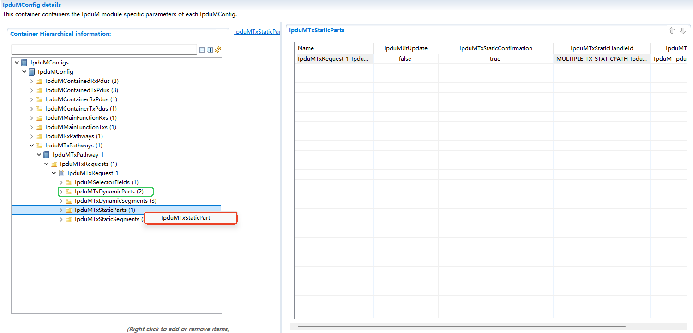

===================
IpduM
===================

文档信息 Document Information
==============================================================

版本历史 Version History
------------------------------------------------------------------------------------------------------------

.. list-table::
   :widths: 10 10 5 5 30
   :header-rows: 1

   * - 日期(Date)
     - 作者(Author)
     - 版本(Version)
     - 状态(Status)
     - 说明(Description)

   * - 2025/04/03
     - jianyu.yang
     - V0.1
     - 发布(Release)
     - 首次发布(First release)

   * - 2025/04/04
     - jianyu.yang
     - V1.0
     - 发布(Release)
     - 正式发布(Official release)

参考文档 References
------------------------------------------------------------------------------------------------------------

.. list-table::
   :widths: 5 10 35 10
   :header-rows: 1

   * - 编号(Number)
     - 分类(Classification)
     - 标题(Title)
     - 版本(Version)
   * - 1
     - Autosar
     - AUTOSAR_SWS_IPDUMultiplexer.pdf
     - R23-11
   * - 2
     - Autosar
     - AUTOSAR_SWS_PDURouter.pdf
     - R23-11 

术语与简写 Terms and Abbreviations
==============================================================

术语 Terms
------------------------------------------------------
.. :align: center   表格内容居中(Table contents are centered)

.. list-table::
   :widths: 10 40
   :header-rows: 1

   * - 术语(Terms)
     - 解释(Explanation)

   * - Container PDU
     - 包含N个I-PDU(Contained I-PDU)及其各自Header的PDU(A PDU that contains N I-PDUs (Contained I-PDUs) and their respective Headers)

   * - Contained I-PDU
     - 封装在container PDU中的I-PDU(An I-PDU encapsulated in a container PDU)

   * - Multiplexed I-PDU
     - 它一般包含一个动态部分与一个静态部分,分别由不同的COM I-PDU来实例化(It generally consists of a dynamic part and a static part, which are instantiated by different COM I-PDUs respectively)

简写 Abbreviations
------------------------------------------------------

.. list-table::
   :widths: 10 20 30
   :header-rows: 1

   * - 简写(Abbreviation)
     - 全称(Full name)
     - 解释(Explanation)

   * - I-PDU
     - Interaction Layer Protocol Data Unit
     - 交互层协议数据单元
   * - DET
     - Default Error Tracer
     - 开发错误检测
   * - IpduM
     - I-PDU Multiplexer
     - I-PDU复用
   * - SF
     - selector field
     - IpduMSelectorField选择字段

简介 Introduction
===============================

IpduM实现I-PDU的多路复用功能。发送时，将Com层需要发送的多帧I-PDU进行重新封装，将重新封装得到的新I-PDU进行统一发送。接收时将接收到的I-PDU解析成Com层的多帧I-PDU，分别传递给Com模块(通过PduR传递)。IpduM层I-PDU的封装存在两种方式：(1)Multiplex方式：将Static Pdu和某一Dynamic Pdu按配置Segement段进行重组，新I-PDU的部分数据段来自Static Pdu，部分数据段来自Dynamic Pdu；(2)Container方式：将与Com层Ref的多个Contained Pdus(及其Header),封装到同一个IpduM层I-PDU中进行统一发送。IpduM层I-PDU的解析，与封装相反。

IpduM implements the multiplexing function of I-PDUs. When sending, multiple frames of I-PDUs that need to be sent by the Com layer are re-encapsulated, and the new I-PDUs obtained by re-encapsulation are sent uniformly. When receiving, the received I-PDUs are parsed into multiple frames of I-PDUs in the Com layer and transmitted to the Com module (transmitted through PduR respectively). There are two ways to encapsulate I-PDUs in the IpduM layer: (1) Multiplex method: Reorganize the Static Pdu and a certain Dynamic Pdu according to the configured Segement. Some data segments of the new I-PDU come from the Static Pdu, and some data segments come from the Dynamic Pdu; (2) Container method: Multiple Contained Pdus (and their Headers) Reffed with the Com layer are encapsulated into the same IpduM layer I-PDU for unified sending. The parsing of I-PDUs in the IpduM layer is the opposite of encapsulation.

.. figure:: ../../../_static/参考手册/IpduM/IpduM_layer.png
   :alt: IpduM模块层次图(IpduM Module Hierarchy Diagram)
   :name: IpduM_fig_arch
   :align: center

   IpduM模块层次图 (IpduM Module Layer Diagram)

如图 :ref:`IpduM_fig_arch`  所示，IpduM模块处于通信服务层，既属于PduR模块的上层，又属于PduR模块的下层，与PduR模块实现IF Pdu的收发。发送时，将Com层IPdu通过PduR路由到IpduM，IpduM将其重新组装，组装完毕调用PduR模块发送接口进行发送。接收时，从PduR接收来自底层的IPdu报文，将其进行解析，并调用PduR模块接收接口进行接收传递

As shown in :ref:`IpduM_fig_arch`, the IpduM module is located in the communication service layer. It belongs to both the upper layer of the PduR module and the lower layer of the PduR module, and implements the sending and receiving of IF Pdus with the PduR module. When sending, the Com layer IPdu is routed to IpduM through PduR, and IpduM reassembles it. After the assembly is completed, the sending interface of the PduR module is called for sending. When receiving, the IPdu message from the bottom layer is received from PduR, parsed, and the receiving interface of the PduR module is called for receiving and transmission.

功能描述 Functional Description
==============================================================

特性 Features
------------------------------------------------------

.. only:: doc_pbs

  变体 Variant
  ~~~~~~~~~~~~~~~~~~~~~~
  - IpduMContainedRxPdu支持属性变体与数量变体
  - IpduMContainedRxPdu supports attribute variants and quantity variants
  - IpduMContainedTxPdu支持属性变体与数量变体
  - IpduMContainedTxPdu supports attribute variants and quantity variants
  - IpduMContainerRxPdu支持属性变体与数量变体
  - IpduMContainerRxPdu supports attribute variants and quantity variants
  - IpduMContainerTxPdu支持属性变体与数量变体
  - IpduMContainerTxPdu supports attribute variants and quantity variants
  - IpduMRxPathway支持属性变体与数量变体
  - IpduMRxPathway supports attribute variants and quantity variants
  - IpduMTxPathway支持属性变体与数量变体
  - IpduMTxPathway supports attribute variants and quantity variants
  - 不同变体IpduM使用的EcuC的Partitions需要一致
  - The EcuC Partitions used by different variant IpduMs need to be consistent

.. _my_anchor_multiplexing:

I-PDU Multiplexing
~~~~~~~~~~~~~~~~~~~~~~~~~~~~~~~~~~~~~~~~

MultiplexedIPdu发送 MultiplexedIPdu Transmission
****************************************************************************************************************************************************

上层模块调用IpduM_Transmit请求StaticPart PDU/DynamicPart PDU进行发送，IpduM将更新MultiplexedIPdu中相应Segement段数据，以及SF(更新DynamicPart时)。IpduM模块根据MultiplexedIPdu的触发发送条件满足时，调用PduR_IpduMTransmit进行发送，当MultiplexedIPdu发送成功后调用上层模块TxConfirmation通知当前StaticPart PDU/DynamicPart PDU发送成功。

The upper-layer module calls IpduM_Transmit to request the StaticPart PDU/DynamicPart PDU to be sent. IpduM will update the corresponding Segement data in the MultiplexedIPdu, as well as the SF (when updating the DynamicPart). The IpduM module calls PduR_IpduMTransmit to send when the trigger sending condition of the MultiplexedIPdu is met. When the MultiplexedIPdu is sent successfully, the upper-layer module TxConfirmation is called to notify that the current StaticPart PDU/DynamicPart PDU is sent successfully.

MultiplexedIPdu接收 MultiplexedIPdu Reception
****************************************************************************************************************************************************

当下层调用IpduM_RxIndication接收到MultiplexedIPdu时，解析MultiplexedIPdu中当前包含的StaticPart PDU/DynamicPart PDU(通过解析SF字段识别)，并将接收MultiplexedIPdu数据分别通过上层RxIndication传递给StaticPart PDU/DynamicPart PDU关联的上层Pdu。

When the lower layer calls IpduM_RxIndication to receive the MultiplexedIPdu, parse the StaticPart PDU/DynamicPart PDU currently contained in the MultiplexedIPdu (identified by parsing the SF field), and transmit the received MultiplexedIPdu data to the upper-layer Pdu associated with the StaticPart PDU/DynamicPart PDU through the upper-layer RxIndication respectively.

.. _my_anchor_ContainerHandling:

Multiple-PDU-to-Container handling
~~~~~~~~~~~~~~~~~~~~~~~~~~~~~~~~~~~~~~~~~~~~

IpduM中Container PDU，包含N个Contained PDUs(与Com层PDU关联)。发送时，IpduM将Com层1-N个PDU封装到同一个Container PDU中，通过下层的发送接口进行整体发送；接收时，IpduM将接收到的Container PDU解析成各个Contained PDUs，分别调用上层的RxIndication函数传递给上层。

The Container PDU in IpduM contains N Contained PDUs (associated with the Com layer PDU). When sending, IpduM encapsulates 1-N PDUs of the Com layer into the same Container PDU and sends them as a whole through the sending interface of the lower layer; when receiving, IpduM parses the received Container PDU into each Contained PDU, and calls the RxIndication function of the upper layer to transmit to the upper layer respectively.

ContainerIPdu发送 ContainerIPdu Transmission
****************************************************************************************************************************************************

上层模块调用IpduM_Transmit请求ContainedPdu发送，IpduM将该ContainedPdu及其Header信息封装到ContainerPdu中，当ContainerPdu满足触发条件时，IpduM通过调用PduR_IpduMTransmit进行发送。当ContainerPdu发送成功后调用上层模块TxConfirmation通知当前该ContainerPdu封装的所有ContainedPdu。

The upper-layer module calls IpduM_Transmit to request the ContainedPdu to be sent. IpduM encapsulates the ContainedPdu and its Header information into the ContainerPdu. When the ContainerPdu meets the trigger condition, IpduM sends it by calling PduR_IpduMTransmit. When the ContainerPdu is sent successfully, the upper-layer module TxConfirmation is called to notify all ContainedPdus encapsulated by the current ContainerPdu.

ContainerIPdu接收 ContainerIPdu Reception
****************************************************************************************************************************************************

当下层调用IpduM_RxIndication接收到ContainerIPdu时，解析ContainerIPdu中当前包含的所有ContainedPdu(通过解析Header信息识别)，并将解析出每个ContainedPdu数据通过上层RxIndication传递给上层关联Pdu。

When the lower layer calls IpduM_RxIndication to receive the ContainerIPdu, parse all ContainedPdus currently contained in the ContainerIPdu (identified by parsing the Header information), and transmit the parsed data of each ContainedPdu to the upper-layer associated Pdu through the upper-layer RxIndication.

偏差 Deviation
----------------------------------------------------
.. 有序列表示例

None

扩展 Extension
----------------------------------------------------
None

集成 Integration
===============================

文件列表 File List
----------------------------------------------------

静态文件 Static Files
~~~~~~~~~~~~~~~~~~~~~~~~~~~~~~~

.. list-table::
   :widths: 10 30
   :header-rows: 1

   * - 文件(File)
     - 描述(Description)
   
   * - IpduM.h
     - 实现IpduM模块对外的函数接口的声明，以及配置文件中全局变量类型的声明(Implements the declaration of the IpduM module's external function interfaces and the declaration of global variable types in the configuration file)

   * - IpduM_Cbk.h
     - 实现IpduM模块回调函数接口的声明(Implements the declaration of the IpduM module's callback function interfaces)

   * - IpduM_Internal.h
     - 实现IpduM模块内部宏定义(Implements the internal macro definition of the IpduM module)

   * - IpduM.c
     - 作为IpduM模块的核心文件，实现IpduM模块全部对外接口，以及实现IpduM模块功能所必须的local函数，local宏定义，local变量定义(As the core file of the IpduM module, it implements all external interfaces of the IpduM module, as well as the local functions, local macro definitions, and local variable definitions necessary for implementing the functions of the IpduM module)

动态文件 Dynamic Files
~~~~~~~~~~~~~~~~~~~~~~~~~~~~~~~

.. list-table::
   :widths: 10 30
   :header-rows: 1

   * - 文件(File)
     - 描述(Description)
   
   * - IpduM_Cfg.h
     - 定义IpduM模块内部结构体以及相应宏常量(Defines the internal structures and corresponding macro constants of the IpduM module)

   * - IpduM_Cfg.c
     - 定义IpduM模块内部描述各个Pathway，Container状态的变量(Defines the variables describing the status of each Pathway and Container inside the IpduM module)

   * - IpduM_PBcfg.c
     - 定义IpduM模块PB配置的结构体参数(Defines the structure parameters for PB configuration of the IpduM module)

   * - IpduM_MemMap.h
     - 实现IpduM模块内存布局(Implements the memory mapping of the IpduM module)

错误处理 Error Handling
--------------------------------------------------

开发错误 Development Errors
~~~~~~~~~~~~~~~~~~~~~~~~~~~~~~
.. list-table:: 
   :widths: 20 10 30
   :header-rows: 1

   * - Error code
     - Value[hex]
     - Description

   * - IPDUM_E_PARAM
     - 0x10
     - API service called with wrong parameter

   * - IPDUM_E_PARAM_POINTER
     - 0x11
     - NULL pointer checking

   * - IPDUM_E_UNINIT
     - 0x20
     - API service (except IpduM_MainFunctionTx,IpduM_MainFunctionRx and IpduM_GetVersionInfo) used without module initialization

   * - IPDUM_E_INIT_FAILED
     - 0x21
     - Invalid configuration set selection

产品错误 Product Errors
~~~~~~~~~~~~~~~~~~~~~~~~~~~~~~~
None

运行时错误 Runtime Errors
~~~~~~~~~~~~~~~~~~~~~~~~~~~~~~~
.. list-table:: 
   :widths: 20 10 30
   :header-rows: 1

   * - Error code
     - Value[hex]
     - Description

   * - IPDUM_E_HEADER
     - 0x30
     - Erroneous header detected

   * - IPDUM_E_QUEUEOVFL
     - 0x31
     - Container Queue overflow

   * - IPDUM_E_CONTAINER
     - 0x32
     - Partly or erroneous container received

   * - IPDUM_E_INVALID_PARTITION
     - 0x60
     - Partition mismatch

接口描述 Interface Description
===============================

.. include:: IpduM_h_api.rst
.. include:: IpduM_Cbk_h_api.rst

配置 Configuration
===============================

.. important::
   下面讲到的TxPathway与RxPathway是  :ref:`my_anchor_multiplexing` 在发送端与接收端的实现，而ContinerTxPdu与ContainerRxPdu则是   :ref:`my_anchor_ContainerHandling` 方法的具体实现。

   The TxPathway and RxPathway mentioned below are the implementations of :ref:`my_anchor_multiplexing` at the transmitting end and receiving end, while ContinerTxPdu and ContainerRxPdu are the specific implementations of the :ref:`my_anchor_ContainerHandling` method.

配置第一个TxPathway Configure the First TxPathway
--------------------------------------------------------------------------------------------------------------------------------------------------

在配置前有必要了解一下什么是TxPathway。简单说TxPathway的配置就是配置实现multiplexed Pdu的过程，那什么又是multiplexed Pdu呢？

It is necessary to understand what TxPathway is before configuration. Simply put, the configuration of TxPathway is to configure the process of implementing multiplexed Pdu. Then what is multiplexed Pdu?

multiplexed Pdu从哪里来的创建它的目的是什么 Where does the multiplexed Pdu come from and what is the purpose of creating it
~~~~~~~~~~~~~~~~~~~~~~~~~~~~~~~~~~~~~~~~~~~~~~~~~~~~~~~~~~~~~~~~~~~~~~~~~~~~~~~~~~~~~~~~~~~~~~~~~~~~~~~~~~~~~~~~~~~~~~~~~~~~~~~~~~~~~~~~~~~~~~~~~~~~~~~~~~~~~

在SRS_IpduM_02802中有如下一段话：

There is the following paragraph in SRS_IpduM_02802:

Some CAN messages became multiplexed messages because the space was not sufficient for a new signal anymore.The selector field was placed somewhere in the PDU without moving the ’old’ signals.

multiplexed Pdu有哪些显著特点 What are the significant features of multiplexed Pdu
~~~~~~~~~~~~~~~~~~~~~~~~~~~~~~~~~~~~~~~~~~~~~~~~~~~~~~~~~~~~~~~~~~~~~~~~~~~~~~~~~~~~~~~~~~~~~~~~
Pathway的方式就是将两个IPDU组成一个multiplexed IPDU。这样的multiplexed IPDU由两部分组成，一个称作静态部分，另外一个称作动态部分且分别由一个IPDU来表示。但是组装过程中有如下特点：

The Pathway method is to combine two IPDUs into one multiplexed IPDU. Such a multiplexed IPDU consists of two parts: one is called the static part, and the other is called the dynamic part, and each is represented by an IPDU. However, during the assembly process, there are the following features:

feature 1
**************
代表静态部分的IPDU可以没有，就是multiplexed IPDU可以没有静态部分，但如果有它只能由一个固定的IPDU来实例化；

The IPDU representing the static part can be absent, that is, the multiplexed IPDU can have no static part, but if there is, it can only be instantiated by a fixed IPDU;

feature2
**************
代表动态部分的IPDU可以由多个不一样的IPDU来实例化，但是组装multiplexed IPDU的时候，只能是它们中的一个；

The IPDU representing the dynamic part can be instantiated by multiple different IPDUs, but when assembling the multiplexed IPDU, only one of them can be used;

feature 3
**************
不论代表动态部分还是静态部分的IPDU，它们都可以由多个不连续的bit段组成；

Regardless of whether the IPDU represents the dynamic part or the static part, they can be composed of multiple discontinuous bit segments;

feature 4
**************
不论是动态部分还是静态部分的IPDU，它们有效的bit段，在它们自己内部的位置与装在到multiplexed IPDU后的位置并没有发生变化；

Whether it is the IPDU of the dynamic part or the static part, the positions of their valid bit segments within themselves and after being loaded into the multiplexed IPDU have not changed;

.. figure:: ../../../_static/参考手册/IpduM/IpduM_MultiplexedPdu.png
   :alt: IpduMMultiplexed Pdu组成图 (Composition Diagram of IpduMMultiplexed Pdu)
   :name: IpduMMultiplexed
   :align: center

   IpduMMultiplexed Pdu组成图 (Composition Diagram of IpduMMultiplexed Pdu)

.. important::

    如图 :ref:`IpduMMultiplexed` 所示，一个静态(Part)对应的IPDU(IPDU2)分别与两个动态(Part的)IPDU(IPDU1,IPDU3)组合成multiplexed IPDU的情况。这两个实例在通过PduR发送时，它们在PduR拥有同一个PduId(因为它们是同一个multiplexed Pdu的不同实例)。

    As shown in :ref:`IpduMMultiplexed`, the IPDU (IPDU2) corresponding to a static (Part) is combined with two dynamic (Part) IPDUs (IPDU1, IPDU3) to form a multiplexed IPDU. When these two instances are sent through PduR, they have the same PduId in PduR (because they are different instances of the same multiplexed Pdu).

创建一个TxPathway Create a TxPathway
~~~~~~~~~~~~~~~~~~~~~~~~~~~~~~~~~~~~

Step 1
**************

.. figure:: ../../../_static/参考手册/IpduM/TxPathway_Step1.png
   :alt: IpduM模块层次图 (IpduM Module Hierarchy Diagram)
   :name: 创建一个新的TxPathway(Create a New TxPathway)
   :align: center

   创建一个新的TxPathway (Create a New TxPathway)

Step 2
**************

   依据需要创建创建一个新的TxStaticPart或者若干个TxDynamicPart (Create a new TxStaticPart or several TxDynamicParts as needed)

Step 3
**************
.. figure:: ../../../_static/参考手册/IpduM/TxPathway_Step3.png
   :alt: IpduM模块层次图 (IpduM Module Hierarchy Diagram)
   :name: 创建一个新的Segment(Create a New Segment)
   :align: center

   依据需要创建创建若干个TxStaticSegment或TxDynamicSegment (Create several TxStaticSegments or TxDynamicSegments as needed)

Step 4
**************
结合实际需要完成TxPathway每一个层级上容器中配置内容的填写，配置项的含义可以参考工具右下方的辅助说明或者AUTOSAR的SWS文档。

Complete the filling of the configuration content in each level container of TxPathway according to actual needs. The meaning of the configuration items can refer to the auxiliary instructions at the lower right of the tool or the SWS document of AUTOSAR.

IpduMTxRequest层级上配置项含义 Meaning of Configuration Items at the IpduMTxRequest Level
************************************************************************************************************************************************************

.. figure:: ../../../_static/参考手册/IpduM/TxPathway_Annotation.png
   :alt: IpduM模块层次图 (IpduM Module Hierarchy Diagram)
   :name: IpduMTxRequest层级上配置项含义(Meaning of Configuration Items at the IpduMTxRequest Level)
   :align: center

   IpduMTxRequest层级上配置项含义 (Meaning of Configuration Items at the IpduMTxRequest Level)

1.本IpduMTxRequest的Select Field以及动静态segment的大小端格式

1.Select Field of this IpduMTxRequest and endian format of the dynamic and static segments

2.未使用的bit段的填充值

2.Padding value of unused bit segments

3.IpduMTxRequest的触发方式

3.Triggering method of IpduMTxRequest

4.模块初始化时用于初始化本TxRequest的发送buffer中动态部分的Part

4.Part of the dynamic part used to initialize the sending buffer of this TxRequest when the module is initialized

5.关联的Pdu

5.Associated Pdu

RxPathway
~~~~~~~~~~~~~~~~~~~~~~~~~~~~~~~~~~~~~~~
TxPathway配置的是Multiplexed Pdu在发送端的情况，RxPathway配置的是Multiplexed Pdu在接收端的信息，可以参考TxPathway进行配置创建，这里不赘述。

TxPathway configures the situation of Multiplexed Pdu at the transmitting end, and RxPathway configures the information of Multiplexed Pdu at the receiving end. You can refer to TxPathway for configuration and creation, which will not be repeated here.

配置第一个ContainerTxPdu Configure the First ContainerTxPdu
--------------------------------------------------------------------------------------------------------------------------------------------------------------------------------------------------------------------------------------------

ContainerTxPdu是什么 What is ContainerTxPdu
~~~~~~~~~~~~~~~~~~~~~~~~~~~~~~~~~~~~~~~~~~~~~~~~~~~~~~~~~~~~~~~~~~~~~~~~~~~~~~~~~~~~~~~~~~~~~~~~

简单来讲ContainerTxPdu就是Pdu容器，它收集若干个小的ContainedTxPdu，以它们请求发送的先后顺序或者优先级等方式排列组装后形成一个Pdu,并对外进行发送。

Simply put, ContainerTxPdu is a Pdu container. It collects several small ContainedTxPdus, arranges and assembles them according to their sending request order or priority, etc., to form a Pdu, and sends it externally.

依据定义的组装规则以及实际运行时进入这个容器的ContainedTxPdu的先后顺序不同，每一次这个ContainerTxPdu完成组装后形成的实例中的ContainedTxPdu们的组成情况以及排列位置都可能不同。

According to the defined assembly rules and the different order of ContainedTxPdus entering this container during actual operation, the composition and arrangement positions of the ContainedTxPdus in each instance formed after the ContainerTxPdu is assembled may be different.

.. important::

   依据ContainerTxPdu中收集的每个ContainedTxPdu的位置是否变化，ContainerTxPdu又可以分为Dynamic ContainerTxPdu与Static ContainerTxPdu(ContainerRxPdu于此类似，下文中Container可泛指ContainerTxPdu或者ContaienrRxPdu，将不在作更近一步的解释)。

   According to whether the position of each ContainedTxPdu collected in the ContainerTxPdu changes, the ContainerTxPdu can be divided into Dynamic ContainerTxPdu and Static ContainerTxPdu (ContainerRxPdu is similar to this. In the following text, Container can generally refer to ContainerTxPdu or ContaienrRxPdu, and no further explanation will be given).

Dynamic Container
*********************************************************************************************************

.. figure:: ../../../_static/参考手册/IpduM/ContainerLayout.png
   :alt: IpduMContainerTxPdu的结构 (Structure of IpduMContainerTxPdu)
   :name: IpduMContainerTxPdu的结构(Structure of IpduMContainerTxPdu)
   :align: center

   Dynamic IpduMContainer的结构 (Structure of Dynamic IpduMContainer)

Dynamic Container中因为收集的Pdu排布在Container内的位置是不固定的，就需要有表示表明这个Pdu是哪个Pdu,以及它的具体长度，这样方便接收端进行拆解提取。所以如上图所示在Pdu的前部增加了一个Header。这个Header由ID与DLC组成。

Because the position of the collected Pdu in the Dynamic Container is not fixed, it is necessary to indicate which Pdu this Pdu is and its specific length, so as to facilitate the receiving end to disassemble and extract. Therefore, as shown in the figure above, a Header is added to the front of the Pdu. This Header consists of ID and DLC.

.. caution::

   依据Container的实际大小，用户可以选择总长度为4字节或者8字节的Header。

   According to the actual size of the Container, the user can choose a Header with a total length of 4 bytes or 8 bytes.

Static Container
*********************************************************************************************************

Static Container中因为收集的Pdu排布在Container内的位置是固定的(通过配置ContainedTx/RxPdu中的IpduMContainedPduOffset来实现)，所以在排布Contained时它不需要像Dynamic Contaienr那样增加一个Header。

Because the position of the collected Pdu in the Static Container is fixed (realized by configuring IpduMContainedPduOffset in ContainedTx/RxPdu), there is no need to add a Header like the Dynamic Container when arranging Contained.

创建一个ContainerTxPdu Create a ContainerTxPdu
~~~~~~~~~~~~~~~~~~~~~~~~~~~~~~~~~~~~~~~~~~~~~~~~~~~~~~~~~~~~~~~~~~~~~~~~

Step 1
**************

.. figure:: ../../../_static/参考手册/IpduM/ContainerTxPdu_Step1.png
   :alt: ContainerTxPdu
   :name: 创建一个新的ContainerTxPdu(Create a New ContainerTxPdu)
   :align: center

   创建一个新的ContainerTxPdu (Create a New ContainerTxPdu)

Step 2
**************

.. figure:: ../../../_static/参考手册/IpduM/ContainerTxPdu_Step2.png
   :alt: ContainerTxPdu
   :name: 创建若干个新的ContainedTxPdu(Create Several New ContainedTxPdus)
   :align: center

   依据需要创建若干个新的ContainedTxPdu (Create several new ContainedTxPdus as needed)

Step 3
**************

.. figure:: ../../../_static/参考手册/IpduM/ContainerTxPdu_Step3.png
   :alt: ContainerTxPdu
   :name: 配置ContainerTxPdu(Configure ContainerTxPdu)
   :align: center

   依据需要配置ContainerTxPdu (Configure ContainerTxPdu as needed)

1.Container在收到一个Contained后在这个时间超时后会触发Container

1.The Container will be triggered after this timeout period elapses after receiving a Contained

2.收到Contained就触发

2.Trigger immediately upon receiving a Contained

3.Container的实例长度达到这个阔值后会触发Container

3.The Container will be triggered when the instance length of the Container reaches this threshold

4.Container的数据是直接发往外部还是等外部调用lpduM_TriggerTransmit来获取

4.Whether the data of the Container is sent directly to the outside or waits for the outside to call lpduM_TriggerTransmit to obtain it

5.ontainer中未使用部分的填充值

5.Padding value for the unused part in the Container

6.关联的Pdu

6.Associated Pdu

7.多partition的情况下需要关联正确的lpduMMainFunction

7.In the case of multiple partitions, it is necessary to associate the correct lpduMMainFunction

Step 4
**************

.. figure:: ../../../_static/参考手册/IpduM/ContainerTxPdu_Step4.png
   :alt: ContainerTxPdu
   :name: 配置ContainedTxPdu(Configure ContainedTxPdu)
   :align: center

   依据需要配置ContainedTxPdu (Configure ContainedTxPdu as needed)

1.静态Container中用于配置Contained在Container中的位置

1.Used to configure the position of the Contained in the Container in the Static Container

2.containedTxPdu的数据是其通过lpduM_Transmit传递给lpduM时收集，还是在Container组装时再请求最新值进行收集

2.Whether the data of containedTxPdu is collected when it is transmitted to lpduM via lpduM_Transmit, or collected by requesting the latest value when the Container is assembled

3.LASTISBEST是使用，用于决定Contained在Container中的排布先后

3.Whether LASTISBEST is used to determine the order of Contained in the Container

4.contained发送到Container后这个时间超时时，将触发Container

4.When this timeout period elapses after the contained is sent to the Container, the Container will be triggered

5.contained发送到Container后是否立即触发Container

5.Whether to trigger the Container immediately after the contained is sent to the Container

6.关联Container

6.Associated Container

创建一个ContainerRxPdu Create a ContainerRxPdu
~~~~~~~~~~~~~~~~~~~~~~~~~~~~~~~~~~~~~~~~~~~~~~~~

配置ContainerRxPdu的流程与ContainerTxPdu比较类似这里不赘述，着重介绍一下关键配置项的含义。

The configuration process of ContainerRxPdu is similar to that of ContainerTxPdu, which will not be repeated here. The focus is on introducing the meanings of key configuration items.

.. figure:: ../../../_static/参考手册/IpduM/ContainerRxPdu_Cfg.png
   :alt: ContainerRxPdu
   :name: 配置ContainedRxPdu(Configure ContainedRxPdu)
   :align: center

   依据需要配置ContainedRxPdu (Configure ContainedRxPdu as needed)

1.Container的折解是在lpduMRxindication中立即处理还是，延后在IpduMMainRxFunction中再处理

1.Whether the decomposition of the Container is processed immediately in lpduMRxindication, or delayed until IpduMMainRxFunction for processing

2.控制Container拆解时匹配headerId的查找范围是：

2.Control the search range for matching headerId during Container decomposition:

(1)关联这个Container的ContaindRxPdu

(1)ContaindRxPdu associated with this Container

(2)所以没有关联Container的ContainedRxPdu

(2)All ContainedRxPdus not associated with any Container