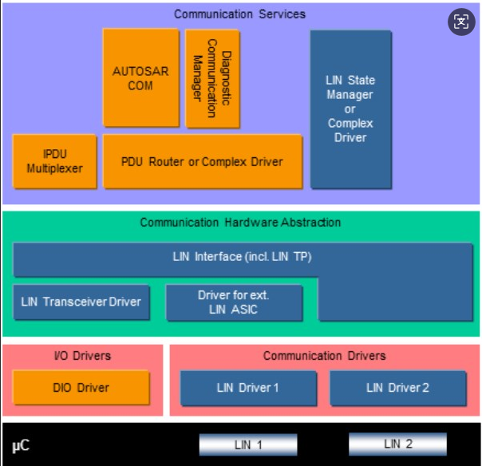
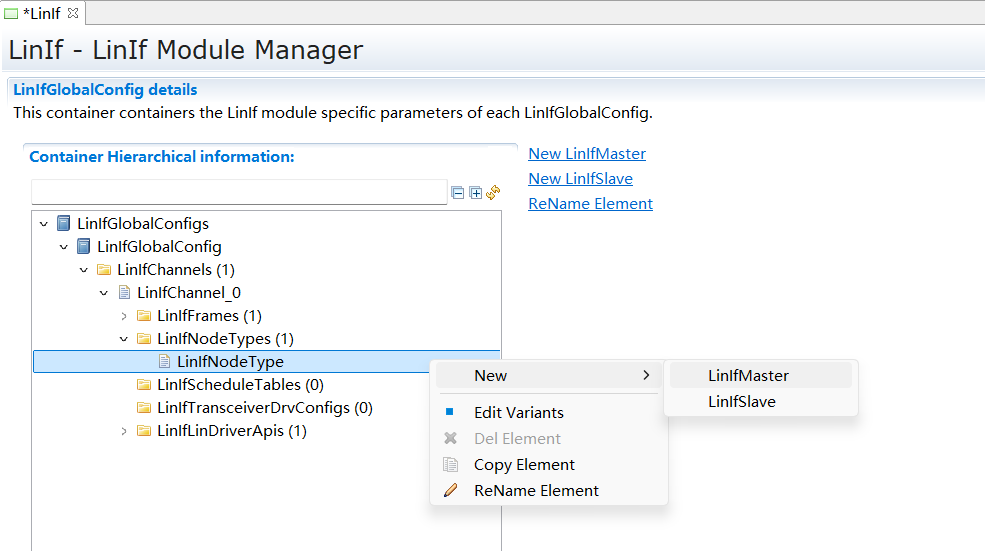
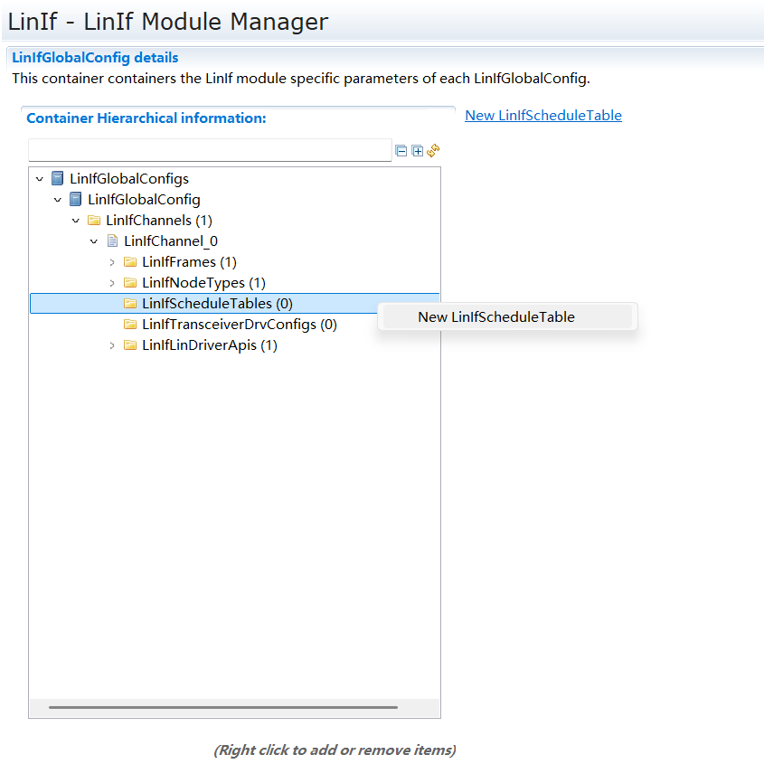
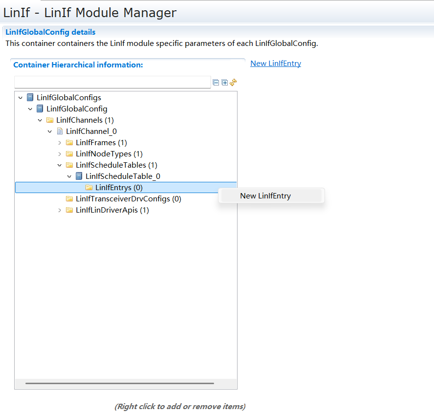

========================
LinIf
========================

文档信息 Document Information
============================================================

版本历史 Version History
------------------------------------------------------------------------------------------------------

.. list-table::
   :widths: 10 10 10 10 10
   :header-rows: 1

   * - 日期(Date)
     - 作者(Author)
     - 版本(Version)
     - 状态(Status)
     - 说明(Description)

   * - 2024/11/26
     - 邹治嘉(Zou Zhijia)
     - V0.1
     - 发布(Release)
     - 首次发布(First release)

   * - 2025/04/04
     - 邹治嘉(Zou Zhijia)
     - V1.0
     - 发布(Release)
     - 正式发布(Official release)

参考文档 References
-------------------------------------------------------------------------------------------------------
.. list-table::
   :widths: 10 10 30 10
   :header-rows: 1

   * - 编号(Number)
     - 分类(Classification)
     - 标题(Title)
     - 版本(Version)
   * - 1
     - AutoSar
     - AUTOSAR_SWS_LINInterface.pdf
     - R23-11
   * - 2
     - Autosar
     - AUTOSAR_SWS_LINStateManager.pdf
     - R23-11
   * - 3
     - AutoSar
     - AUTOSAR_SWS_LINTransceiverDriver.pdf
     - R23-11
   * - 4
     - Autosar
     - AUTOSAR_SWS_LINDriver.pdf
     - R23-11
   * - 5
     - AutoSar
     - LIN Specification Package
     - LIN 2.1
   * - 6
     - Autosar
     - AUTOSAR_SWS_PDURouter.pdf 
     - R23-11

术语与简写 Terms and Abbreviations
====================================================================

简写 Abbreviations
--------------------------------------------------------------------------------------------------------

.. list-table::
   :widths: 10 20 30
   :header-rows: 1

   * - 缩写词(Abbreviation)
     - 英文全称(Full English name)
     - 中文解释(Chinese explanation)
   * - LIN 
     - Local Interconnect Network 
     - 局域互联网络 
   * - LinIf
     - LIN Interface 
     - LIN 接口层  
   * - LinSM 
     - LIN State Manager  
     - LIN 状态管理器 
   * - PDU 
     - Protocol Data Unit   
     - 协议数据单元   
   * - PID 
     - Protected ID   
     - 受保护的ID
   * - LIN TP 
     - LIN Transport Protocol LIN   
     - 传输层协议    
   * - NAD 
     - Node Address.Each slave in LIN must have a unique NAD.  
     - 节点地址。每个从节点必须有唯一的地址。   
   * - SF  
     - Single Frame in LIN TP   
     - LIN 传输层协议中的单帧    
   * - FF   
     - First Frame in LIN TP 
     - LIN 传输层协议中的首帧  
   * - CF  
     - Continuous Frame in LIN TP   
     - LIN 传输层协议中的后续帧  
   * - MRF  
     - Master Request Frame   
     - 主节点请求帧    
   * - SRF    
     - SRF Slave Response Frame  
     - 从节点应答帧    

简介 Introduction
==================================

本文档是 AUTOSAR R23-11 的 LIN Interface(以下简称 LinIf) 模块参考手册。旨在指导使用 LinIf 模块的用户能够清晰地了解如何去使用 LinIf 模块。

This document is the reference manual for the LIN Interface (hereinafter referred to as LinIf) module of AUTOSAR R23-11. It is intended to provide users of the LinIf module with a clear understanding of how to use it.

LinIf 模块包括两大功能： 用于通常通信的接口服务(LinIf) 以及用于诊断通信的数据传输服务(LinTp)。LinIf 的下层是 Lin Driver、 Lin Transceiver， 上层是 LinSM、 PduR 等。其主要功能是与通信硬件抽象层和系统服务层产生交互，为相应的通信提供服务接口。

The LinIf module includes two main functions: an interface service (LinIf) for normal communication and a data transmission service (LinTp) for diagnostic communication. The lower layers of LinIf are the Lin Driver and Lin Transceiver, while the upper layers include LinSM and PduR. Its primary function is to interact with the communication hardware abstraction layer and the system service layer, providing service interfaces for the corresponding communication.

本文档主要介绍了 LinIf 模块的接口函数、 类型定义， 以及 LinIf 模块配置工具的使用方法。

This document primarily introduces the interface functions, type definitions of the LinIf module, and the usage of the LinIf module's configuration tool.

注： 本文后面的描述为了区分 LinIf 模块和 LinIf 功能， 在描述时如果使用 LinIf模块， 则指 LinIf 模块整体， 包含 LinIf 和 LinTp 功能。如果使用 LinIf 功能则单指 LinIf 模块下的 LinIf 功能部分。

Note: In the subsequent descriptions within this document, to distinguish between the LinIf module and the LinIf function, the term "LinIf module" refers to the entire module, including both LinIf and LinTp functions. If the term "LinIf function" is used, it refers specifically to the LinIf functional part within the LinIf module.

功能描述 Functional Description
==========================================================

报文传输 Message Transmission
--------------------------------------------------------------------------------------------------

功能介绍 Functional Description
~~~~~~~~~~~~~~~~~~~~~~~~~~~~~~~~~~~~~~~~~~~~~~~~~~~~~~~~~~

LinIf 模块支持以下几种类型报文的接收和发送：

The LinIf module supports the reception and transmission of the following message types:

1.无条件帧(Unconditional frame)

1.Unconditional Frame

2.事件触发帧(Event-triggered frame)

2.Event-triggered Frame

3.零星帧(Sporadic frame)

3.Sporadic Frame

4.诊断帧(Diagnostic frames)

4.Diagnostic Frames

功能描述 Functional Description
~~~~~~~~~~~~~~~~~~~~~~~~~~~~~~~~~~~~~~~~~~~~~~~~~~~~~~~~~~

无条件帧(Unconditional frame)：Unconditional Frame:
***************************************************************************************************************************************

主节点 Master Node
^^^^^^^^^^^^^^^^^^^^^^^^^^^^^^^^^^^^^^^^

根据调度表的配置， 当前帧为发送的无条件帧时， LinIf 调用<User_TriggerTransmit>从上层模块获取数据， 然后调用 Lin_SendFrame(),将第二个参数中的(Lin_PduType 类型) Pid， Cs， Dl 设置为配置数据中的值， 将 Drc设置为发送， 将 SduPtr 设置为存放从上层获取到的数据的地址。然后在下个调度表 Entry 到来时， 调用 Lin_GetStatus 确认当前发送的结果。

According to the schedule table, when the current frame is a transmitted unconditional frame, LinIf calls <User_TriggerTransmit> to get data from the upper layer module, and then calls Lin_SendFrame(), setting the Pid, Cs, and Dl of the second parameter (of type Lin_PduType) to their configured values, setting Drc to transmit, and setting SduPtr to the address where the data obtained from the upper layer is stored.  Then, when the next schedule table Entry arrives, it calls Lin_GetStatus to confirm the result of the current transmission.

根据调度表的调度， 当前帧为接收的无条件帧时， LinIf 调用 Lin_SendFrame(),将第二个参数中的(Lin_PduType 类型) Pid， Cs， Dl 设置为配置数据中的值，将 Drc 设置为接收， 将 SduPtr 设置为 NULL_PTR。然后在下个调度表 Entry 到来时， 调用 Lin_GetStatus 确认接收状态， 并获取接收到的收据。然后调用<User_RxIndication>将接收到的数据发送给上层模块。

According to the schedule table, when the current frame is a received unconditional frame, LinIf calls Lin_SendFrame(), setting the Pid, Cs, and Dl of the second parameter (of type Lin_PduType) to their configured values, setting Drc to receive, and setting SduPtr to NULL_PTR.  Then, when the next schedule table Entry arrives, it calls Lin_GetStatus to confirm the reception status and retrieve the received data.  It then calls <User_RxIndication> to send the received data to the upper layer module.

从节点 Slave Node
^^^^^^^^^^^^^^^^^^^^^^^^^^^^^^^^^^^^^^^^

当 LinIf_HeaderIndication(Channel, PduPtr)被 Lin 模块调用时， LinIf 根据配置， 判断该 PID 是否为本节点需要处理的报文：

When LinIf_HeaderIndication (Channel, PduPtr) is called by the Lin module, LinIf determines whether the PID corresponds to a message that this node needs to process based on its configuration:

如果本节点需要发送数据， 则调用<User_TriggerTransmit>从上层模块获取数据，然后将 PduPtr 的 Cs， Dl 设置为配置的值， 将 Drc 设置为发送， 将从上层获取的数据复制到 SduPtr 指向的 buffer 中。

If this node needs to transmit data, it calls <User_TriggerTransmit> to get data from the upper layer module, sets the Cs and Dl of the PduPtr to the configured values, sets Drc to transmit, and copies the data from the upper layer into the buffer pointed to by SduPtr.

如果本节点需要接收数据， 则将 PduPtr 的 Cs， Dl 设置为配置的值， 将 Drc设置为接收。Lin 模块在接收数据后会调用 LinIf_RxIndication()将数据传递给LinIf 模块。LinIf 再调用<User_RxIndication>将接收到的数据发送给上层模块。

If this node needs to receive data, it sets the Cs and Dl of the PduPtr to the configured values and sets Drc to receive.  After receiving the data, the Lin module will call LinIf_RxIndication() to pass the data to the LinIf module.  LinIf then calls <User_RxIndication> to send the received data to the upper layer module.

如果本节点不需要响应该 PID， 则将 Drc 设置为忽略。

If this node does not need to respond to this PID, it sets Drc to ignore.

事件触发帧(Event-triggered frame)：Event-triggered Frame:
**********************************************************************************************************************************************

主节点 Master Node
^^^^^^^^^^^^^^^^^^^^^^^^^^^^^^^^^^^^^^^^

根据调度表的配置， 当前帧为事件触发帧时， LinIf 调用 Lin_SendFrame(),将第二个参数中的(Lin_PduType 类型) Pid， Cs， Dl 设置为配置数据中的值，将 Drc 设置为接收， 将 SduPtr 设置为 NULL_PTR。然后在下个调度表 Entry 到来时， 调用 Lin_GetStatus 确认接收状态。如果正确接收则继续按照调度表处理后续报文， 如果总线发生碰撞， 则切换到冲突解决调度表， 将该事件触发帧关联的无条件帧都轮询一遍。

According to the schedule table configuration, when the current frame is an event-triggered frame, LinIf calls Lin_SendFrame(), setting the Pid, Cs, and Dl of the second parameter (of type Lin_PduType) to their configured values, setting Drc to receive, and setting SduPtr to NULL_PTR.  Then, when the next schedule table entry arrives, it calls Lin_GetStatus to confirm the reception status.  If the reception is successful, it continues to process subsequent messages according to the schedule table. If a bus collision occurs, it switches to the collision resolution schedule table and polls all the unconditional frames associated with this event-triggered frame.

从节点 Slave Node
^^^^^^^^^^^^^^^^^^^^^^^^^^^^^^^^^^^^^^^^

当 LinIf_HeaderIndication(Channel, PduPtr)被 Lin 模块调用时， LinIf 判断是否有发送标志位(LinIf_Transmit 被调用时， LinIf 设置发送标志位)， 如果有发送标志位， 和发送正常的无条件帧处理过程一致， 在收到LinIf_TxConfirmation(E_OK)时， 清除发送标志， 否则保留发送标志。如果没有发送标志， 则忽略(将 Drc 设置为忽略) 该通知。

When LinIf_HeaderIndication(Channel, PduPtr) is called by the Lin module, LinIf checks if a transmit flag is set (the transmit flag is set by LinIf when LinIf_Transmit is called). If the transmit flag is set, the process is consistent with that for a normal unconditional frame transmission. Upon receiving LinIf_TxConfirmation(E_OK), the transmit flag is cleared; otherwise, the transmit flag is retained.  If the transmit flag is not set, this notification is ignored (by setting Drc to ignore).

零星帧(Sporadic frame)：Sporadic Frame
******************************************************************************************************************

主节点 Master Node
^^^^^^^^^^^^^^^^^^^^^^^^^^^^^^^^^^^^^^^^

零星帧只有主节点可以发送。

Only the master node can transmit sporadic frames.

根据调度表的配置， 当前帧为零星帧时， LinIf 判断是否有发送标志位(LinIf_Transmit 被调用时， LinIf 设置发送标志位)， 如果有发送标志位， 和发送正常的无条件帧处理过程一致， 在收到 LinIf_TxConfirmation(E_OK)时， 清除发送标志， 否则保留发送标志。如果没有发送标志， 则不需要发送报文。

According to the schedule table configuration, when the current frame is a sporadic frame, LinIf checks if a transmit flag is set (the transmit flag is set by LinIf when LinIf_Transmit is called). If the transmit flag is set, the process is consistent with that for a normal unconditional frame transmission. Upon receiving LinIf_TxConfirmation(E_OK), the transmit flag is cleared; otherwise, the transmit flag is retained. If the transmit flag is not set, no message is transmitted.

从节点 Slave Node
^^^^^^^^^^^^^^^^^^^^^^^^^^^^^^^^^^^^^^^^

从节点对于零星帧的处理和无条件帧一致。

The slave node's handling of sporadic frames is consistent with that of unconditional frames.

诊断帧(Diagnostic frames)：Diagnostic Frames:
******************************************************************************************************************

节点配置(Node configuration) 和诊断使用相同的 MRF 和 SRF。

Node configuration and diagnostics use the same MRF and SRF.

主节点 Master Node
^^^^^^^^^^^^^^^^^^^^^^^^^^^^^^^^^^^^^^^^

如果是发送节点配置相关的报文， LinIf 从配置中获取报文数据信息， 然后发送一帧 MRF 报文， 将命令发送出去。在下个 Entry 到来时， 发送一帧 SRF 获取命令执行结果。

If transmitting a node configuration-related message, LinIf retrieves the message data information from the configuration and then sends an MRF message to transmit the command.  When the next entry arrives, it sends an SRF to retrieve the command execution result.

如果是诊断报文， 当 LinTp_Transmit()被调用时， LinIf 需要通知 BswM 进行调度表的切换， 当调度表切换到发送 MRF 的调度表后， LinIf 发送 MRF 报文直到将所有的请求数据发送完成。然后 LinIf 通知 BswM 切换到 SRF 发送调度表，LinIf 发送 SRF 直到所有的应答数据接收完成。

If it is a diagnostic message, when LinTp_Transmit() is called, LinIf needs to notify BswM to switch the schedule table. After the schedule table is switched to one for transmitting MRFs, LinIf sends MRF messages until all request data has been completely transmitted.  Then, LinIf notifies BswM to switch to the SRF transmission schedule table, and LinIf sends SRFs until all response data has been completely received.

从节点 Slave Node
^^^^^^^^^^^^^^^^^^^^^^^^^^^^^^^^^^^^^^^^

当接收到 MRF 报文时， 从节点根据报文内容是节点配置报文还是诊断报文：

When an MRF message is received, the slave node determines whether the message content is a node configuration message or a diagnostic message:

如果是节点配置报文， LinIf 根据报文内容进行处理， 并在接收到 SRF 报文时， 根据处理结果进行应答。

If it is a node configuration message, LinIf processes it based on the message content and responds with the processing result upon receiving an SRF message.

如果是诊断报文， LinIf 则将接收到的 MRF 数据进行 TP 处理之后， 传递给上层模块。在接收到 SRF 时， 从上层模块获取数据后进行 TP 处理之后进行应答。

If it is a diagnostic message, LinIf performs TP processing on the received MRF data and then passes it to the upper layer module. Upon receiving an SRF, it retrieves data from the upper layer module, performs TP processing, and then sends a response.

调度表管理 Schedule Table Management
------------------------------------------------------------------------------------------------------------

功能介绍 Functional Description
~~~~~~~~~~~~~~~~~~~~~~~~~~~~~~~~~~~~~~~~~~~~~~~~~~~~~~~~~~~~~~~~

LIN 通信需要根据提前配置好的调度表进行通信， 一个节点可以有多个调度表， 以便在不同的情况下使用。

LIN communication must proceed according to a pre-configured schedule table. A node can have multiple schedule tables for use in different situations.

LinIf 需要根据调度表管理报文的发送(按照次序发送 Header)， 并且能够根据上层模块的要求进行调度表的切换。

LinIf is responsible for managing message transmission (sending headers in sequence) according to the schedule table and must be able to switch schedule tables as requested by upper layer modules.

只有主节点具有调度表管理功能。

Only the master node has the schedule table management function.

功能实现 Functional Implementation
~~~~~~~~~~~~~~~~~~~~~~~~~~~~~~~~~~~~~~~~~~~~~~~~~~~~~~~~~~~~~~~~

上电后 LinIf 默认使用 NULL_SCHEDULE 调度表，该调度表为空调度表，不发送和接收任何报文。当 LinIf_ScheduleRequest ()被调用时， LinIf 记录该请求。在 MainFunction 中，判断是否可以切换调度表(RUN_ONCE 调度表不能被中断)，并进行调度表切换。在发生调度表切换时调用<User>_ScheduleRequestConfirmation 将当前切换的调度表通知上层模块。

After power-on, LinIf defaults to using the NULL_SCHEDULE, which is an empty schedule table that does not transmit or receive any messages. When LinIf_ScheduleRequest() is called, LinIf records the request. In the MainFunction, it checks if a schedule table switch is possible (a RUN_ONCE schedule table cannot be interrupted) and performs the switch. When a schedule table switch occurs, <User>_ScheduleRequestConfirmation is called to notify the upper layer module of the currently active schedule table.

睡眠 Sleep
----------------------------------------------------------------

功能介绍 Functional Description
~~~~~~~~~~~~~~~~~~~~~~~~~~~~~~~~~~~~~~~~~~~~~~~~~~~~~~~~~~~~~~~~

当主节点需要睡眠时，需要在总线上发送 go-to-sleep 命令，使整个网络进入睡眠状态。

When the master node needs to sleep, it must send a go-to-sleep command on the bus to put the entire network into a sleep state.

当从节点接收到 go-to-sleep 命令或者检测到总线空闲时，从节点需要进入睡眠状态。

When a slave node receives a go-to-sleep command or detects bus inactivity, it needs to enter a sleep state.

功能实现 Functional Implementation
~~~~~~~~~~~~~~~~~~~~~~~~~~~~~~~~~~~~~~~~~~~~~~~~~~~~~~~~~~~~~~~~

主节点 Master Node
******************************************************************************************************************

当 LinIf_GotoSleep()被调用时，LinIf 判断当前通道是否为睡眠状态，如果为非睡眠状态则调用 Lin_GoToSleep()发送睡眠命令，如果当前通道为睡眠状态，则调用 Lin_GoToSleepInternal()接口，进行内部的状态转换。在经过睡眠处理的延时之后(4s-10s， 由配置决定)，调用 Lin_GetStatus()查看当前总线是否进入睡眠状态， 如果总线进入睡眠状态，LinIf 切换到睡眠状态，并且调用<User>_GotoSleepConfirmation()通知上层模块。

When LinIf_GotoSleep() is called, LinIf checks if the current channel is in a sleep state. If it is not, it calls Lin_GoToSleep() to send a sleep command. If the channel is already in a sleep state, it calls the Lin_GoToSleepInternal() interface to perform an internal state transition. After a sleep processing delay (4s-10s, determined by configuration), Lin_GetStatus() is called to check if the bus has entered the sleep state. If the bus has entered the sleep state, LinIf switches to the sleep state and calls <User>_GotoSleepConfirmation() to notify the upper layer module.

从节点 Slave Node
******************************************************************************************************************

当接收到睡眠命令或者总线空闲定时器超时， LinIf 调用<User>_GotoSleepIndication()通知上层模块。当 LinIf_GotoSleep()被调用时， LinIf调用 Lin_GoToSleepInternal() 接口，然后切换到睡眠状态，并且调用<User>_GotoSleepConfirmation()通知上层模块。

When a sleep command is received or the bus idle timer expires, LinIf calls <User>_GotoSleepIndication() to notify the upper layer module. When LinIf_GotoSleep() is called, LinIf calls the Lin_GoToSleepInternal() interface, then switches to the sleep state, and calls <User>_GotoSleepConfirmation() to notify the upper layer module.

唤醒 Wakeup
----------------------------------------------------------------

功能介绍 Functional Description
~~~~~~~~~~~~~~~~~~~~~~~~~~~~~~~~~~~~~~~~~~~~~~~~~~~~~~~~~~~~~~~~

当节点需要唤醒网络，或者检测到总线唤醒信号，需要执行唤醒处理。

When a node needs to wake up the network, or a bus wakeup signal is detected, a wakeup procedure must be executed.

功能实现 Functional Implementation
~~~~~~~~~~~~~~~~~~~~~~~~~~~~~~~~~~~~~~~~~~~~~~~~~~~~~~~~~~~~~~~~

当 LinIf_Wakeup()被调用时，LinIf判断当前是否处于睡眠状态，如果处于睡眠状态调用 Lin_Wakeup()唤醒总线，否则不做操作。然后在 MainFunction 中调用<User>_WakeupConfirmation()通知上层模块。

When LinIf_Wakeup() is called, LinIf checks if it is currently in the sleep state. If so, it calls Lin_Wakeup() to wake up the bus; otherwise, no action is taken. Then, in the MainFunction, it calls <User>_WakeupConfirmation() to notify the upper layer module.

节点配置 Node Configuration
--------------------------------------------------------------------------------------------------------------

功能介绍 Functional Description
~~~~~~~~~~~~~~~~~~~~~~~~~~~~~~~~~~~~~~~~~~~~~~~~~~~~~~~~~~~~~~~~

节点配置功能用来配置总线上的从节点，比如配置节点 NAD 和报文 ID 等。使从节点能够被寻址，避免总线冲突的发生。

The node configuration function is used to configure slave nodes on the bus, such as configuring the node's NAD and message IDs. This allows slave nodes to be addressed and prevents bus collisions.

功能实现 Functional Implementation
~~~~~~~~~~~~~~~~~~~~~~~~~~~~~~~~~~~~~~~~~~~~~~~~~~~~~~~~~~~~~~~~

主节点 Master Node
******************************************************************************************************************

主节点通过在调度表中， 配置的节点配置命令， 实现节点配置。当需要使用节点配置功能时， 切换到对应的调度表。LinIf 会根据调度表中的报文类型， 从配置中获取配置命令数据， 然后发送报文。

The master node performs node configuration through node configuration commands configured in the schedule table.  When the node configuration function is needed, the system switches to the corresponding schedule table.  LinIf will retrieve the configuration command data from the configuration based on the message type in the schedule table and then transmit the message.

从节点 Slave Node
******************************************************************************************************************

从节点在接收到节点配置命令后， 根据配置命令执行相关操作， 在收到 SRF时， 应答执行结果。

After receiving a node configuration command, the slave node executes the relevant operations according to the command and responds with the execution result upon receiving an SRF.

诊断传输协议(TP) Diagnostic Transport Protocol (TP)
------------------------------------------------------------------------------------------------------------------------------------------------------------------------

功能介绍 Functional Description
~~~~~~~~~~~~~~~~~~~~~~~~~~~~~~~~~~~~~~~~~~~~~~~~~~~~~~~~~~~~~~~~

传输协议实现了 ISO 17987 规范中对诊断传输协议的要求。

The transport protocol implements the requirements for the diagnostic transport protocol as specified in the ISO 17987 standard.

功能实现 Functional Implementation
~~~~~~~~~~~~~~~~~~~~~~~~~~~~~~~~~~~~~~~~~~~~~~~~~~~~~~~~~~~~~~~~

对于需要使用传输协议发送的报文， LinTp 根据报文的长度决定使用单帧还是多帧发送， 并在发送时追加协议控制信息。

For messages that require transmission using the transport protocol, LinTp determines whether to use single-frame or multi-frame transmission based on the message length and appends protocol control information during transmission.

主节点 Master Node
****************************************************************

用户调用 LinTp_Transmit()发起报文发送请求， LinIf 通知 BswM 切换到 MRF调度表， 随后 LinIf 模块重复调用 PduR_LinTpCopyTxData()从上层获取数据， 在发送完最后一帧数据后调用 PduR_LinTpTxConfirmation()通知上层模块， 并通知BswM 切换到 SRF 调度表。

The user initiates a message transmission request by calling LinTp_Transmit(). LinIf then notifies BswM to switch to the MRF schedule table. Subsequently, the LinIf module repeatedly calls PduR_LinTpCopyTxData() to retrieve data from the upper layer. After the last frame is transmitted, it calls PduR_LinTpTxConfirmation() to notify the upper layer module and also notifies BswM to switch to the SRF schedule table.

LinIf 重复发送 SRF 获取应答信息。在收到 SF 或者 FF 时， 调用PduR_LinTpStartOfReception()准备接收， 然后调用 PduR_LinTpCopyRxData()将数据传送到上层模块。后续在接收到 CF 时， 反复调用 PduR_LinTpCopyRxData()向上层传送数据， 直到接收完成， 调用 PduR_LinTpRxIndication()通知上层模块，并通知 BswM 切换到应用调度表。

LinIf repeatedly sends SRFs to retrieve the response. Upon receiving an SF or FF, it calls PduR_LinTpStartOfReception() to prepare for reception, and then calls PduR_LinTpCopyRxData() to transfer the data to the upper layer module. Subsequently, upon receiving CFs, it repeatedly calls PduR_LinTpCopyRxData() is repeatedly called to transfer data to the upper layer until reception is complete. Then, PduR_LinTpRxIndication() is called to notify the upper layer module, and BswM is notified to switch to the application schedule table.

从节点 Slave Node
****************************************************************

LinIf 在接收到 MRF 报文时， 调用 PduR_LinTpStartOfReception()准备接收(FF 或者 SF)， 然后调用 PduR_LinTpCopyRxData()将数据传送到上层模块。后续在接收到 CF 时， 反复调用 PduR_LinTpCopyRxData()向上层传送数据， 直到接收完成， 调用 PduR_LinTpRxIndication()通知上层模块。

When LinIf receives an MRF message, it calls PduR_LinTpStartOfReception() to prepare for reception (of an FF or SF) and then calls PduR_LinTpCopyRxData() to transfer the data to the upper layer module. Subsequently, upon receiving CFs, it repeatedly calls PduR_LinTpCopyRxData() to transfer data to the upper layer until reception is complete, and then calls PduR_LinTpRxIndication() to notify the upper layer module.

用户调用 LinTp_Transmit()发起报文发送请求， 当收到 SRF 时， LinIf 模块重复调用 PduR_LinTpCopyTxData()从上层获取数据， 在发送完最后一帧数据后调用 PduR_LinTpTxConfirmation()通知上层模块。

The user initiates a message transmission request by calling LinTp_Transmit(). When an SRF is received, the LinIf module repeatedly calls PduR_LinTpCopyTxData() to retrieve data from the upper layer. After the last frame is transmitted, it calls PduR_LinTpTxConfirmation() to notify the upper layer module.

偏差 Deviation
--------------------------------------------------------------------

None

扩展 Extension
--------------------------------------------------------------------

None

集成 Integration
========================================

文件列表 File List
--------------------------------------------------------------------

静态文件 Static Files
~~~~~~~~~~~~~~~~~~~~~~~~~~~~~~~~~~~~~~~~

.. list-table::
   :widths: 5 10 
   :header-rows: 1

   * - 文件(File)
     - 说明(Description)

   * - LinIf_Cbk.h
     - 实现 LinIf 模块全部回调函数的声明。(Implements the declaration of all callback functions of the LinIf module)
   * - LinIf_Types.h
     - LinIf 模块类型定义头文件。(不含 LinTp 子模块)(LinIf module type definition header file.) (Excluding LinTp submodule)
   * - Linif_Internal.h
     - LinIf 模块内部使用的宏， 运行时变量类型定义头文件。(Header file for macros used internally by the LinIf module and definitions of runtime variable types.)
   * - LinIf_MemMap.h
     - LinIf 模块函数和变量存储位置定义文件。(Storage position definition files of functions and variables for the LinIf module.)
   * - LinIf.h
     - LinIf 模块头文件，通过加载该头文件访问LinIf(包括LinTp)公开的函数和数据类型。(外部模块使用时只需要加载 LinIf.h， LinTp.h包含在 LinIf.h 中)。(LinIf module header file; access the public functions and data types of LinIf by loading this header file) (External modules only need to load LinIf.h, as LinTp.h is included within LinIf.h.)
   * - LinIf.c
     - LinIf 模块实现源文件， 各 API 实现在该文件中。(LinIf module implementation source file; various APIs are implemented in this file.)
   * - LinIf_Master.c
     - LinIf 模块实现源文件， 各 API 实现在该文件中。(LinIf module implementation source file; various APIs are implemented in this file.)
   * - LinIf_Master.h
     - LinIf 主节点头文件。通过该文件公开主节点实现对外接口。(LinIf master node header file;  expose the external interfaces for the master node implementation through this file.)
   * - LinIf_Slave.c
     - Linif 从节点实现源文件， 主节点相关功能实现在该文件中。(LinIf slave node implementation source file; master node related functions are implemented in this file.)
   * - LinIf_Slave.h
     - LinIf 从节点头文件。通过该文件公开主节点实现对外接口。(LinIf slave node header file.) expose the external interfaces for the master node implementation through this file.)
   * - LinTp.c
     - LinTp 子模块实现源文件， LinTp 各 API 实现在该文件中。(LinTp sub-module implementation source file; various LinTp APIs are implemented in this file.)
   * - LinTp.h
     - LinTp 子模块头文件， 通过加载该头文件访问 LinTp公开的函数和数据类型。(LinTp sub-module header file; access the public functions and data types of LinTp by loading this header file.)
   * - LinTp_Master.c
     - LinTp 主节点实现源文件， 主节点相关功能实现在该文件中。(LinTp master node implementation source file; master node related functions are implemented in this file.)
   * - LinTp_Master.h
     - LinTp 主节点头文件。通过该文件公开主节点实现对外接口。(LinTp master node header file.) expose the external interfaces for the master node implementation through this file.)
   * - LinTp_Slave.c
     - LinTp 从节点实现源文件， 主节点相关功能实现在该文件中。(LinTp slave node implementation source file; master node related functions are implemented in this file.)
   * - LinTp_Slave.h
     - LinTp 从节点头文件。通过该文件公开主节点实现对外接。(LinTp slave node header file;  expose the external interfaces for the master node implementation through this file.)
   * - LinTp_Internal.c
     - LinTp 子模块内部公用的函数实现源文件。(Implementation source file for internal common functions of the LinTp sub-module.)
   * - LinTp_Internal.h
     - LinTp 子模块内部使用的宏， 变量类型定义头文件。(Header file for macros used internally by the LinTp sub-module and definitions of variable types.)
   * - LinTp_Types.h
     - LinTp 模块类型定义头文件。(LinTp module type definition header file.)

动态文件 Dynamic Files
~~~~~~~~~~~~~~~~~~~~~~~~~~~~~~~~~~~~~~~~

.. list-table::
   :widths: 5 10 
   :header-rows: 1

   * - 文件(File)
     - 说明(Description)

   * - LinIf_cfg.h
     - 用于定义 LinIf 模块PC配置的宏。(Defines macros for the PC configuration of the LinIf module.)
   * - LinIf_PBCfg.h
     - 定义 LinIf 模块PB配置的宏。(Defines macros for the PB configuration of the LinIf module.)
   * - LinIf_PBCfg.c
     - 定义 LinIf 模块PC/PB配置的结构体参数。(Defines the structure parameters for PC/PB configuration of the LinIf module.)
   * - LinIf_PartitionVar.h
     - 声明 LinIf 模块多分区的运行时变量和状态变量。(Declares the runtime and state variables for the multi-partition LinIf module.)
   * - LinIf_PartitionVar.c
     - 定义 LinIf 模块多分区的运行时变量和状态变量。(Defines the runtime and state variables for the multi-partition LinIf module.)
   * - LinTp_Cfg.h
     - 用于定义 LinTp 模块PC配置的宏。(Defines macros for the PC configuration of the LinTp module.)
   * - LinTp_PBCfg.h
     - 定义 LinTp 模块PB配置的宏。(Defines macros for the PB configuration of the LinTp module.)
   * - LinTp_PBCfg.c
     - 定义 LinTp 模块PC/PB配置的结构体参数。(Defines the structure parameters for the PC/PB configuration of the LinTp module.)
   * - LinTp_PartitionVar.h
     - 声明 LinTp 模块多分区的运行时变量和状态变量。(Declares the runtime and state variables for the multi-partition LinTp module.)
   * - LinTp_PartitionVar.c
     - 定义 LinTp 模块多分区的运行时变量和状态变量。(Defines the runtime and state variables for the multi-partition LinTp module.)

错误处理 Error Handling
------------------------------------------------------------------------

开发错误 Development Errors
~~~~~~~~~~~~~~~~~~~~~~~~~~~~~~~~~~~~~~~~~~

.. list-table::
   :widths: 10 10 10
   :header-rows: 1

   * - Error code
     - Value[hex]
     - Description

   * - LINIF_E_UNINIT
     - 0x00
     - API called without initialization of LIN Interface.
   * - LINIF_E_INIT_FAILED
     - 0x10
     - Initialization failed, e.g. selected configuration set doesn’t exist.
   * - LINIF_E_NONEXISTENT_CHANNEL
     - 0x20
     - Referenced channel does not exist (identification is out of range).
   * - LINIF_E_PARAMETER
     - 0x30
     - API service called with wrong parameter.
   * - LINIF_E_PARAM_POINTER
     - 0x40
     - API service called with invalid pointer.
   * - LINIF_E_SCHEDULE_REQUEST_ERROR
     - 0x51
     - Schedule request made in channel sleep.
   * - LINIF_E_TRCV_INV_MODE
     - 0x53
     - API service called with invalid parameter for LIN transceiver operation mode.
   * - LINIF_E_TRCV_NOT_NORMAL
     - 0x54
     - Referenced transceiver state is not normal.
   * - LINIF_E_PARAM_WAKEUPSOURCE
     - 0x55
     - API service called with invalid parameter for WakeupSource.
   * - LINIF_E_ERROR_PARTITION
     - 0x70
     - Api called by invaild parititon.

产品错误 Product Errors
~~~~~~~~~~~~~~~~~~~~~~~~~~~~~~~~~~~~~~~~~~
None

运行时错误 Runtime Errors
~~~~~~~~~~~~~~~~~~~~~~~~~~~~~~~~~~~~~~~~~~

.. list-table::
   :widths: 10 10 10
   :header-rows: 1

   * - Error code
     - Value[hex]
     - Description

   * - LINIF_E_RESPONSE
     - 0x60
     - LIN frame error detected.
   * - LINIF_E_NC_NO_RESPONSE
     - 0x61
     - Slave did not answer on a node configuration request.

类型定义 Type Definitions
--------------------------------------------------------------------------------

.. include:: LinIf_Types_h_api.rst
.. include:: LinTp_Types_h_api.rst

提供的服务 Services
--------------------------------------------------------------------------------

.. include:: LinIf_h_api.rst
.. include:: LinIf_Cbk_h_api.rst
.. include:: LinTp_h_api.rst

配置 Configuration
====================================

LinIfGeneral
--------------------------------------------------------------------------------

.. figure:: ../../../_static/参考手册/LinIf/LinIf_General.png
   :alt: LinIf_General
   :align: center
   
   LinIf General 配置示意图 (LinIf General Configuration Diagram)

+--------------------+-----------------------------------------------------------------------------------------------------------------------------------------------------------------------------------------------------------------------------------+
| UI 名称（UI name） | 描述（Description）                                                                                                                                                                                                               |
+--------------------+-----------------------------------+-----------------------------------------------------------------------------------+---------------------------------------------------------------+-------------------------------------------+
| LinIfCancel        | 取值范围（Value range）           | true/false                                                                        | 默认取值（Default value）                                     | false                                     |
| TransmitSup        +-----------------------------------+-----------------------------------------------------------------------------------+---------------------------------------------------------------+-------------------------------------------+
| ported             | 参数描述（Parameter description） | 当 设 置 为 false 时 API ： LinIf_CancelTransmit/LinTp_CancelReceive 不可用（When it is set to false,the APIS LinIf_CancelTransmit/LinTP_CancelReceive are unavailable）                      |
|                    +-----------------------------------+-----------------------------------------------------------------------------------------------------------------------------------------------------------------------------------------------+
|                    | 依赖关系（Dependence）            | 无(None)                                                                                                                                                                                      |
+--------------------+-----------------------------------+-----------------------------------------------------------------------------------+---------------------------------------------------------------+-------------------------------------------+
| LinIfDevErr        | 取值范围（Value range）           | true/false                                                                        | 默认取值（Default value）                                     | true                                      |
| orDetect           +-----------------------------------+-----------------------------------------------------------------------------------+---------------------------------------------------------------+-------------------------------------------+
|                    | 参数描述（Parameter description） | 指示是否支持复数驱动(Indicate whether multiple drivers are supported)                                                                                                                         |
|                    +-----------------------------------+-----------------------------------------------------------------------------------------------------------------------------------------------------------------------------------------------+
|                    | 依赖关系（Dependence）            | 无(None)                                                                                                                                                                                      |
+--------------------+-----------------------------------+-----------------------------------------------------------------------------------+---------------------------------------------------------------+-------------------------------------------+
| LinIfMultipl       | 取值范围（Value range）           | true/false                                                                        | 默认取值（Default value）                                     | false                                     |
| eTrcvDriver        +-----------------------------------+-----------------------------------------------------------------------------------+---------------------------------------------------------------+-------------------------------------------+
| Supported          | 参数描述（Parameter description） | 指示是否支持复数收发器驱动(Indicate whether multiple transceiver drivers are supported)                                                                                                       |
|                    +-----------------------------------+-----------------------------------------------------------------------------------------------------------------------------------------------------------------------------------------------+
|                    | 依赖关系（Dependence）            | 无(None)                                                                                                                                                                                      |
+--------------------+-----------------------------------+-----------------------------------------------------------------------------------+---------------------------------------------------------------+-------------------------------------------+
| LinIfNcOpti        | 取值范围（Value range）           | true/false                                                                        | 默认取值（Default value）                                     | false                                     |
| onalRequest        +-----------------------------------+-----------------------------------------------------------------------------------+---------------------------------------------------------------+-------------------------------------------+
| Supported          | 参数描述（Parameter description） | 指示是否支持 Assign NAD 和 Conditional Change NAD 命令(Indicate whether the Assign NAD and Conditional Change NAD commands are supported)                                                     |
|                    +-----------------------------------+-----------------------------------------------------------------------------------------------------------------------------------------------------------------------------------------------+
|                    | 依赖关系（Dependence）            | LinIfChannel->LinIfNodeType中至少有一个节点为主节点时，该参数才可以被设置为True(LinIfChannel-> This parameter can be set to True only if at least one node in LinIfNodeType is a master node) |
+--------------------+-----------------------------------+-----------------------------------------------------------------------------------+---------------------------------------------------------------+-------------------------------------------+
| LinIfRespon        | 取值范围（Value range）           | 合法的 C 语言函数名(A valid C function name)                                      | 默认取值（Default value）                                     | 无                                        |
| seErrorSign        +-----------------------------------+-----------------------------------------------------------------------------------+---------------------------------------------------------------+-------------------------------------------+
| alChangedC         | 参数描述（Parameter description） | 指示是否支持 Assign NAD 和 Conditional Change NAD 命令(Indicate whether the Assign NAD and Conditional Change NAD commands are supported)                                                     |
| allout             +-----------------------------------+-----------------------------------------------------------------------------------------------------------------------------------------------------------------------------------------------+
|                    | 依赖关系（Dependence）            | LinIfChannel->LinIfNodeType中至少有一个节点为主节点时，该参数才可以被设置为True(LinIfChannel-> This parameter can be set to True only if at least one node in LinIfNodeType is a master node) |
+--------------------+-----------------------------------+-----------------------------------------------------------------------------------+---------------------------------------------------------------+-------------------------------------------+
| LinIfSaveC         | 取值范围（Value range）           | 合法的 C 语言函数名(A valid C function name)                                      | 默认取值（Default value）                                     | 无                                        |
| onfiguration       +-----------------------------------+-----------------------------------------------------------------------------------+---------------------------------------------------------------+-------------------------------------------+
| Callout            | 参数描述（Parameter description） | 当 save configuration 命令执行时， 调用该函数。仅用于从节点(This function is called when the save configuration command is executed. For slave nodes only)                                    |
|                    +-----------------------------------+-----------------------------------------------------------------------------------------------------------------------------------------------------------------------------------------------+
|                    | 依赖关系（Dependence）            | LinIfChannel->LinIfNodeType 中至少有一个节点为从节点时， 该参数才可以被配置(LinIfChannel->This parameter can be configured only when at least one node in LinIfNodeType is a slave node.)     |
+--------------------+-----------------------------------+-----------------------------------------------------------------------------------+---------------------------------------------------------------+-------------------------------------------+
| LinIfTpSup         | 取值范围（Value range）           | true/false                                                                        | 默认取值（Default value）                                     | false                                     |
| ported             +-----------------------------------+-----------------------------------------------------------------------------------+---------------------------------------------------------------+-------------------------------------------+
|                    | 参数描述（Parameter description） | 指示是否支持 TP， 当前不可选择， 不支持 TP 功能(Indicate whether TP is supported. This is currently not selectable as the TP function is not supported)                                       |
|                    +-----------------------------------+-----------------------------------------------------------------------------------------------------------------------------------------------------------------------------------------------+
|                    | 依赖关系（Dependence）            | 无(None)                                                                                                                                                                                      |
+--------------------+-----------------------------------+-----------------------------------------------------------------------------------+---------------------------------------------------------------+-------------------------------------------+
| LinIfTrcvDr        | 取值范围（Value range）           | true/false                                                                        | 默认取值（Default value）                                     | false                                     |
| iverSupport        +-----------------------------------+-----------------------------------------------------------------------------------+---------------------------------------------------------------+-------------------------------------------+
| ed                 | 参数描述（Parameter description） | 指示是否支持 Lin 收发器(Indicate whether the Lin transceiver is supported)                                                                                                                    |
|                    +-----------------------------------+-----------------------------------------------------------------------------------------------------------------------------------------------------------------------------------------------+
|                    | 依赖关系（Dependence）            | 无(None)                                                                                                                                                                                      |
+--------------------+-----------------------------------+-----------------------------------------------------------------------------------+---------------------------------------------------------------+-------------------------------------------+
| LinIfVersio        | 取值范围（Value range）           | true/false                                                                        | 默认取值（Default value）                                     | false                                     |
| InfoApi            +-----------------------------------+-----------------------------------------------------------------------------------+---------------------------------------------------------------+-------------------------------------------+
|                    | 参数描述（Parameter description） | 指示是否支持 Lin 收发器(Indicate whether the Lin transceiver is supported)                                                                                                                    |
|                    +-----------------------------------+-----------------------------------------------------------------------------------------------------------------------------------------------------------------------------------------------+
|                    | 依赖关系（Dependence）            | 无(None)                                                                                                                                                                                      |
+--------------------+-----------------------------------+-----------------------------------------------------------------------------------+---------------------------------------------------------------+-------------------------------------------+
| LinIfPublic        | 取值范围（Value range）           | 字符串（String）                                                                  | 默认取值（Default value）                                     | 无                                        |
| CddHeaderF         +-----------------------------------+-----------------------------------------------------------------------------------+---------------------------------------------------------------+-------------------------------------------+
| ile                | 参数描述（Parameter description） | 用于输入 CDD 驱动的头文件（Used for entering the header file of the CDD driver）                                                                                                              |
|                    +-----------------------------------+-----------------------------------------------------------------------------------------------------------------------------------------------------------------------------------------------+
|                    | 依赖关系（Dependence）            | 无(None)                                                                                                                                                                                      |
+--------------------+-----------------------------------+-----------------------------------------------------------------------------------+---------------------------------------------------------------+-------------------------------------------+
| LinIfSleep         | 取值范围（Value range）           | 0.001 - 10.0                                                                      | 默认取值（Default value）                                     | 4.0                                       |
| ModeFrame          +-----------------------------------+-----------------------------------------------------------------------------------+---------------------------------------------------------------+-------------------------------------------+
| Delay              | 参数描述（Parameter description） | 发送睡眠指令后， 经过该时间过后， 确认总线是否睡眠（After a sleep command is sent, the bus is checked for sleep status after this time has elapsed）                                          |
|                    +-----------------------------------+-----------------------------------------------------------------------------------------------------------------------------------------------------------------------------------------------+
|                    | 依赖关系（Dependence）            | 无                                                                                                                                                                                            |
+--------------------+-----------------------------------+-----------------------------------------------------------------------------------+---------------------------------------------------------------+-------------------------------------------+
| LinIfWake          | 取值范围（Value range）           | true/false                                                                        | 默认取值（Default value）                                     | false                                     |
| upSupport          +-----------------------------------+-----------------------------------------------------------------------------------+---------------------------------------------------------------+-------------------------------------------+
| ed                 | 参数描述（Parameter description） | 表示 LinIf 是否支持 Wakeup（Indicate whether LinIf supports Wakeup）                                                                                                                          |
|                    +-----------------------------------+-----------------------------------------------------------------------------------------------------------------------------------------------------------------------------------------------+
|                    | 依赖关系（Dependence）            | 无(None)                                                                                                                                                                                      |
+--------------------+-----------------------------------+-----------------------------------------------------------------------------------+---------------------------------------------------------------+-------------------------------------------+

LinIf模块集成 LinIf Module Integration
------------------------------------------------------------------------------------------------------------------------

要在LinIf模块中集成主节点和从节点功能，需先在LinIfGlobalConfig容器中创建LinIfChannel。并在右侧界面设置LinIf通道的参数，

To integrate master and slave node functions in the LinIf module, first create LinIfChannel in the LinIfGlobalConfig container. Then, configure the parameters for the LinIf channel in the right-hand panel.

.. figure:: ../../../_static/参考手册/LinIf/CreateLinIfChannelContainr.png
   :alt: CreateLinIfChannelContainr
   :align: center
   
   CreateLinIfChannelContainr

主节点集成 Master Node Integration
~~~~~~~~~~~~~~~~~~~~~~~~~~~~~~~~~~~~~~~~~~~~~~~~~~~~~~~~~~~~~~~~~~~~~~~~

创建主节点 Creating a Master Node
******************************************************************************************************************

要在LinIf模块中使用主节点功能须在LinIfNodeType容器中新建一个名为LinIfMaster的子容器。

To use the master node function in the LinIf module, create a new sub-container named LinIfMaster in the LinIfNodeType container.

   
   LinIfMaster  

创建LinIfFrame Creating LinIfFrame
******************************************************************************************************************

LinIf主节点通过轮询调度表发送的Lin请求和应答报文定义在LinIfChannel容器的子容器LinIfFrame中。

The Lin request and response frames sent by the LinIf master node through schedule table polling are defined in the LinIfFrame sub-container of the LinIfChannel container.

参数LinIfFrameType用来描述帧类型，支持以下类型：

The LinIfFrameType parameter is used to describe the frame type, and the following types are supported:

- ASSIGN

- ASSIGN_FRAME_ID_RANGE

- ASSIGN_NAD

- CONDITIONAL

- EVENT_TRIGGERED

- FREE

- MRF

- SAVE_CONFIGURATION

- SPORADIC

- SRF

- UNASSIGN

- UNCONDITIONAL

添加无条件帧 Adding an Unconditional Frame
^^^^^^^^^^^^^^^^^^^^^^^^^^^^^^^^^^^^^^^^^^^^^^^^^^^^^^^^^^^^^^^^^^^^^^^^^^^^^^

帧类型选择为UNCONDITIONAL时，表示该帧为无条件帧。

When the frame type is selected as UNCONDITIONAL, it indicates that the frame is an unconditional frame.

无条件帧分为接收帧和发送帧：

Unconditional frames are classified into reception frames and transmission frames:

1.若要无条件帧为接收帧时，需在LinIfPduDirection容器中创建子容器LinIfRxPdu，并配置子容器的LinIfRxPduRef参数，该参数关联到- EcuC中配置的Pdu。

1.To configure an unconditional frame as a reception frame, create a LinIfRxPdu sub-container in the LinIfPduDirection container and configure the LinIfRxPduRef parameter of the sub-container. This parameter is associated with a Pdu configured in EcuC.

2.若要无条件帧为发送帧时，需在LinIfPduDirection容器中创建子容器LinIfTxPdu，并配置子容器的LinIfTxPduRef参数，该参数关联到- EcuC中配置的Pdu。

2.To configure an unconditional frame as a transmission frame, create a LinIfTxPdu sub-container in the LinIfPduDirection container and configure the LinIfTxPduRef parameter of the sub-container. This parameter is associated with a Pdu configured in EcuC.

添加零星帧 Adding a Sporadic Frame
^^^^^^^^^^^^^^^^^^^^^^^^^^^^^^^^^^^^^^^^^^^^^^^^^^^^^^^^^^^^^^^^^^^^^^^^^^^^^^

帧类型选择为SPORADIC时，表示该帧为零星帧。

When the frame type is selected as SPORADIC, it indicates that the frame is a sporadic frame.

零星帧配置分以下几步：

The configuration of a sporadic frame consists of the following steps:

1.在LinIfPduDirection容器中创建LinIfTxPdu，并配置子容器的LinIfTxPduRef参数，该参数关联到EcuC中配置的Pdu。

1.Create a LinIfTxPdu in the LinIfPduDirection container and configure the LinIfTxPduRef parameter of the sub-container. This parameter is associated with a Pdu configured in EcuC.

2.在创建容器LinIfSubstitutionFrame，并设置LinIfSubstitutionFrameRef和LinIfFramePriority参数。LinIfSubstitutionFrameRef参数用来关联在调度到零星帧时具体需要发送的帧，该帧应为一个无条件发送帧。

2.Create a LinIfSubstitutionFrame container and set the LinIfSubstitutionFrameRef and LinIfFramePriority parameters. The LinIfSubstitutionFrameRef parameter is used to associate the specific frame to be sent when a sporadic frame is scheduled. This frame shall be an unconditional transmission frame.

+--------------------+-----------------------------------------------------------------------------------------------------------------------------------------------------------------------+
| UI 名称（UI name） | 描述（Description）                                                                                                                                                   |
+--------------------+-----------------------------------+-------------------------------------+------------------------------------------------------+--------------------------------------+
| LinIfFrame         | 取值范围（Value range）           | 0 .. 255                            | 默认取值（Default value）                            | 无（None）                           |
| Priority           +-----------------------------------+-------------------------------------+------------------------------------------------------+--------------------------------------+
|                    | 参数描述（Parameter description） | 表示SubstituteFrame的优先级。0表示最高优先级。（Indicate the priority of the SubstituteFrame 0 represents the highest priority.） |
|                    +-----------------------------------+-----------------------------------------------------------------------------------------------------------------------------------+
|                    | 依赖关系（Dependence）            | 无（None）                                                                                                                        |
+--------------------+-----------------------------------+-------------------------------------+------------------------------------------------------+--------------------------------------+
| LinIfFixedFr       | 取值范围（Value range）           | 0 .. 255                            | 默认取值（Default value）                            | 无（None）                           |
| ameSduByteVal      +-----------------------------------+-------------------------------------+------------------------------------------------------+--------------------------------------+
|                    | 参数描述（Parameter description） | 0-7字节对应位置的值（Value for the corresponding byte positions 0-7.）                                                            |
|                    +-----------------------------------+-----------------------------------------------------------------------------------------------------------------------------------+
|                    | 依赖关系（Dependence）            | 无（None）                                                                                                                        |
+--------------------+-----------------------------------+-------------------------------------+------------------------------------------------------+--------------------------------------+

添加事件触发帧： Adding an Event-Triggered Frame:
^^^^^^^^^^^^^^^^^^^^^^^^^^^^^^^^^^^^^^^^^^^^^^^^^^^^^^^^^^^^^^^^^^^^^^^^^^^^^^

帧类型选择为EVENT_TRIGGERED时，表示该帧为事件触发帧

When the frame type is selected as EVENT_TRIGGERED, it indicates that the frame is an event-triggered frame.

主节点在发出事件触发帧帧头后，期望接收来自从节点的应答报文，因此主节点的事件触发帧需在LinIfPduDirection中创建LinIfRxPdu子容器。

After the master node sends the header of an event-triggered frame, it expects to receive a response message from a slave node. Therefore, a LinIfRxPdu sub-container needs to be created in LinIfPduDirection for the event-triggered frame of the master node.

添加节点配置帧 Adding a Node Configuration Fram
^^^^^^^^^^^^^^^^^^^^^^^^^^^^^^^^^^^^^^^^^^^^^^^^^^^^^^^^^^^^^^^^^^^^^^^^^^^^^^

帧类型选择为ASSIGN、ASSIGN_FRAME_ID_RANGE、ASSIGN_NAD和SAVE_CONFIGURATION时，表示该帧为节点配置帧。

When the frame type is selected as ASSIGN, ASSIGN_FRAME_ID_RANGE, ASSIGN_NAD, or SAVE_CONFIGURATION, it indicates that the frame is a node configuration frame.

节点配置帧的配置有以下几步：

The configuration of a node configuration frame consists of the following steps:

1.在创建节点配置帧时需手动添加LinIfFrame容器的子容器LinIfFixFrameSdu，创建容器LinIfFixFrameSdu后会自动生成8个LinIfFixedFrameSduByte子容器，填充每一个LinIfFixedFrameSduByte容器的LinIfFixedFrameSduByteVal参数。这些参数表示在有调度表控制发送节点配置帧时需在Lin报文中填充的数据。

1.When creating a node configuration frame, manually add the LinIfFixFrameSdu sub-container to the LinIfFrame container. After creating the LinIfFixFrameSdu container, eight LinIfFixedFrameSduByte sub-containers are automatically generated, and then fill in the LinIfFixedFrameSduByteVal parameter for each LinIfFixedFrameSduByte container. These parameters represent the data to be filled in the Lin message when a node configuration frame is scheduled for transmission.

2.创建LinIfPduDirection的子容器LinIfTxPdu。

2.Create a LinIfTxPdu sub-container in LinIfPduDirection.

添加MRF帧 Adding an MRF Frame
^^^^^^^^^^^^^^^^^^^^^^^^^^^^^^^^^^^^^^^^^^^^^^^^^^^^^^^^^^^^^^^^^^^^^^^^^^^^^^

帧类型选择为MRF时，表示该帧为主节点请求帧，此时发送Lin报文的应答报文时，报文中数据从LinTp模块中获取。创建MRF帧时需在LinIfPduDirection容器中创建一个LinIfTxPdu子容器。MRF帧的FrameId应始终未0x3C。

When the frame type is selected as MRF, it indicates that the frame is a master request frame. In this case, when the response message to the Lin frame is sent, the data in the message is obtained from the LinTp module. To create an MRF frame, create a LinIfTxPdu sub-container in the LinIfPduDirection container. The FrameId of an MRF frame must always be 0x3C.

添加SRF帧 Adding an SRF Frame
^^^^^^^^^^^^^^^^^^^^^^^^^^^^^^^^^^^^^^^^^^^^^^^^^^^^^^^^^^^^^^^^^^^^^^^^^^^^^^

帧类型选择为SRF时，表示该帧为从节点应答帧，此时主节点接收到的从节点应答将转发给LinTp模块。创建MRF帧时需在LinIfPduDirection容器中创建一个LinIfRxPdu子容器。SRF帧的FrameId应始终为0x3D。

When the frame type is selected as SRF, it indicates that the frame is a slave response frame. In this case, the slave response received by the master node will be forwarded to the LinTp module. To create an SRF frame, create a LinIfRxPdu sub-container in the LinIfPduDirection container. The FrameId of an SRF frame must always be 0x3D.

添加调度表 Adding a Schedule Table
******************************************************************************************************************

需要LinIf主节点能够发送Lin请求和应答，需要为每个LinIf主节点创建调度表。创建调度表的方法为在LinIfChannelContainer中添加LinIfScheduleTableContainer，并在右侧配置LinIfResumePosition和LinIfRunMode参数。如果一个LinIf主节点需要多个调度表，则需在LinIfChannelContainer中添加多个LinIfScheduleTableContainer即可。

For the LinIf master node to be able to send Lin requests and responses, a schedule table must be created for each LinIf master node. To create a schedule table, add a LinIfScheduleTableContainer in the LinIfChannelContainer and configure the LinIfResumePosition and LinIfRunMode parameters on the right-hand side. If a LinIf master node requires multiple schedule tables, simply add multiple LinIfScheduleTableContainers in the LinIfChannelContainer.

   
   CreateLinIfScheduleTable 

+--------------------+------------------------------------------------------------------------------------------------------------------------------------------------------------------------------------------------------------------------+
| UI 名称（UI name） | 描述（Description）                                                                                                                                                                                                    |
+--------------------+-----------------------------------+-----------------------------------------------------------------------------+----------------------------------------------------------+-------------------------------------------+
| LinIfResume        | 取值范围（Value range）           | CONTINUE_AT_IT_POINT / START_FROM_BEGINNING                                 | 默认取值（Default value）                                | 无（None）                                |
| Position           +-----------------------------------+-----------------------------------------------------------------------------+----------------------------------------------------------+-------------------------------------------+
|                    | 参数描述（Parameter description） | 定义本调度表被RUN_ONCE类型的调度表中断后，恢复后从什么地方开始运行（Define where this schedule table resumes execution after being interrupted by a RUN_ONCE type schedule table） |
|                    +-----------------------------------+------------------------------------------------------------------------------------------------------------------------------------------------------------------------------------+
|                    | 依赖关系（Dependence）            | 无（None）                                                                                                                                                                         |
+--------------------+-----------------------------------+-----------------------------------------------------------------------------+----------------------------------------------------------+-------------------------------------------+
| LinIfRunMode       | 取值范围（Value range）           | RUN_CONTINUOUS / RUN_ONCE                                                   | 默认取值（Default value）                                | 无（None）                                |
|                    +-----------------------------------+-----------------------------------------------------------------------------+----------------------------------------------------------+-------------------------------------------+
|                    | 参数描述（Parameter description） | 定义调度表执行的次数（Define the number of times the schedule table is executed）                                                                                                  |
|                    +-----------------------------------+------------------------------------------------------------------------------------------------------------------------------------------------------------------------------------+
|                    | 依赖关系（Dependence）            | 无（None）                                                                                                                                                                         |
+--------------------+-----------------------------------+-----------------------------------------------------------------------------+----------------------------------------------------------+-------------------------------------------+

若要在调度表中添加报文，需创建LinIfEntry容器。LinIfEntry中的LinIfFrameRef参数用来设置当调度表调度到当前Entry时LinIf主节点需要发送的帧。

To add a message to the schedule table, create a LinIfEntry container. The LinIfFrameRef parameter in the LinIfEntry is used to set the frame that the LinIf master node needs to send when the schedule table is dispatched to the current Entry. 

注意：当关联的Frame为事件触发帧时，应使能LinIfCollisionResolving配置，并选择该事件触发帧对应事件冲突解决表。

Note: When the associated frame is an event-triggered frame, the LinIfCollisionResolving configuration shall be enabled, and the corresponding collision resolution table for that event-triggered frame must be selected.

   
   CreateLinIfEntry 

设置主节点Lin驱动Api Setting the Master Node Lin Driver API
******************************************************************************************************************

创建LinIfChannel时会默认创建一个名为LinIfLinDriverApi的容器，该容器设置LinIf主节点在发送、接收、唤醒和睡眠等操作中将调用的Lin驱动接口。

When a LinIfChannel is created, a container named LinIfLinDriverApi is created by default. This container is used to set the Lin driver interfaces that the LinIf master node will call for operations such as sending, receiving, waking up, and sleeping. 

主节点需设置LinGetStatus、LinGoToSleep、LinGoToSleepInternal、LinSendFrame、LinWakeup、LinWakeupInternal和LinCheckWakeup

The master node needs to set LinGetStatus, LinGoToSleep, LinGoToSleepInternal, LinSendFrame, LinWakeup, LinWakeupInternal, and LinCheckWakeup.

从节点集成 Slave Node Integration
~~~~~~~~~~~~~~~~~~~~~~~~~~~~~~~~~~~~~~~~~~~~~~~~~~~~~~~~~~~~

创建从节点 Creating a Slave Node
******************************************************************************************************************

要在LinIf模块中使用从节点功能须在LinIfNodeTypeContainer中新建一个名为LinIfSlave的Container。

To use the slave node function in the LinIf module, create a new container named LinIfSlave in the LinIfNodeTypeContainer.

.. figure:: ../../../_static/参考手册/LinIf/LinIfSlave.png
   :alt: LinIfSlave
   :align: center
   
   LinIfSlave 

LinIf从节点需要创建一个名为LinIfNodeConfigurationIdentification的容器，用来设置从节点的配置参数。

The LinIf slave node needs to create a container named LinIfNodeConfigurationIdentification to set the configuration parameters for the slave node.

+--------------------+-----------------------------------------------------------------------------------------+
| UI 名称（UI name） | 描述（Description）                                                                     |
+--------------------+-----------------------------------+------------+---------------------------+------------+
| LinIfConfig        | 取值范围（Value range）           | 1..125     | 默认取值（Default value） | 无（None） |
| uredNAD            +-----------------------------------+------------+---------------------------+------------+
|                    | 参数描述（Parameter description） | 从节点配置的NAD（Configured NAD of the slave node） |
|                    +-----------------------------------+-----------------------------------------------------+
|                    | 依赖关系（Dependence）            | 无（None）                                          |
+--------------------+-----------------------------------+------------+---------------------------+------------+
| LinIfFunct ionId   | 取值范围（Value range）           | 0 .. 65535 | 默认取值（Default value） | 无（None） |
|                    +-----------------------------------+------------+---------------------------+------------+
|                    | 参数描述（Parameter description） | Function Id                                         |
|                    +-----------------------------------+-----------------------------------------------------+
|                    | 依赖关系（Dependence）            | 无（None）                                          |
+--------------------+-----------------------------------+------------+---------------------------+------------+
| LinIfInit ialNAD   | 取值范围（Value range）           | 1..125     | 默认取值（Default value） | 无（None） |
|                    +-----------------------------------+------------+---------------------------+------------+
|                    | 参数描述（Parameter description） | 从节点初始NAD（Initial NAD of the slave node ）     |
|                    +-----------------------------------+-----------------------------------------------------+
|                    | 依赖关系（Dependence）            | 无（None）                                          |
+--------------------+-----------------------------------+------------+---------------------------+------------+
| LinIfNas           | 取值范围（Value range）           | 0..1       | 默认取值（Default value） | 无（None） |
| Timeout            +-----------------------------------+------------+---------------------------+------------+
|                    | 参数描述（Parameter description） | N_As超时时间（N_As timeout period）                 |
|                    +-----------------------------------+-----------------------------------------------------+
|                    | 依赖关系（Dependence）            | 无（None）                                          |
+--------------------+-----------------------------------+------------+---------------------------+------------+
| LinIfSupp          | 取值范围（Value range）           | 0 .. 32767 | 默认取值（Default value） | 无（None） |
| lierId             +-----------------------------------+------------+---------------------------+------------+
|                    | 参数描述（Parameter description） | Supplier Id                                         |
|                    +-----------------------------------+-----------------------------------------------------+
|                    | 依赖关系（Dependence）            | 无（None）                                          |
+--------------------+-----------------------------------+------------+---------------------------+------------+
| LinIfVari          | 取值范围（Value range）           | 0 .. 255   | 默认取值（Default value） | 无（None） |
| antId              +-----------------------------------+------------+---------------------------+------------+
|                    | 参数描述（Parameter description） | Variant Id                                          |
|                    +-----------------------------------+-----------------------------------------------------+
|                    | 依赖关系（Dependence）            | 无（None）                                          |
+--------------------+-----------------------------------+------------+---------------------------+------------+

创建从节点帧 Creating a Slave Node Frame
****************************************************************************************************************************************************************

添加无条件帧 Adding an Unconditional Frame
^^^^^^^^^^^^^^^^^^^^^^^^^^^^^^^^^^^^^^^^^^^^^^^^^^^^^^^^^^^^^^^^^^^^^^^^^^^^^^^^

从节点无条件帧的添加和配置方法和主节点相同。

The method for adding and configuring unconditional frames for a slave node is the same as for a master node.

添加事件触发帧 Adding an Event-Triggered Frame
^^^^^^^^^^^^^^^^^^^^^^^^^^^^^^^^^^^^^^^^^^^^^^^^^^^^^^^^^^^^^^^^^^^^^^^^^^^^^^^^

帧类型选择为EVENT_TRIGGERED时，表示该帧为事件触发帧。

When the frame type is selected as EVENT_TRIGGERED, it indicates that the frame is an event-triggered frame.

创建事件触发帧分为以下几步：

Creating an event-triggered frame consists of the following steps:

1.LinIf从节点在接收到事件触发帧帧头时将发送事件触发帧应答，因此需在LinIfPduDirection容器中添加LinIfTxPdu子容器。

1.Upon receiving an event-triggered frame header, the LinIf slave node will send an event-triggered frame response. Therefore, a LinIfTxPdu sub-container needs to be added to the LinIfPduDirection container.

2.创建LinIfSubstitutionFrame容器，并设置LinIfSubstitutionFrameRef和LinIfFramePriority参数。LinIfSubstitutionFrameRef表示从节点在接收到事件触发帧头后实际要发送帧，该帧应为无条件发送帧。

2.Create a LinIfSubstitutionFrame container and set the LinIfSubstitutionFrameRef and LinIfFramePriority parameters. LinIfSubstitutionFrameRef indicates the frame that the slave node will actually send after receiving an event-triggered frame header. This frame shall be an unconditional transmission frame.

添加MRF和SRF帧 Adding MRF and SRF Frames
^^^^^^^^^^^^^^^^^^^^^^^^^^^^^^^^^^^^^^^^^^^^^^^^^^^^^^^^^^^^^^^^^^^^^^^^

从节点无需为节点配置功能创建专用的帧，从节点的节点配置功能和从节点的LinTp功能公用相同的MRF和SRF帧。

The slave node does not need to create dedicated frames for the node configuration function; the node configuration function of the slave node and its LinTp function share the same MRF and SRF frames.

创建MRF帧时，需要在MRF帧的LinIfPduDirection容器中创建LinIfRxPdu子容器。

When creating an MRF frame, a LinIfRxPdu sub-container needs to be created in the LinIfPduDirection container of the MRF frame.

创建SRF帧时，需要在SRF帧的LinIfPduDirection容器中创建LinIfTxPdu子容器。

When creating an SRF frame, a LinIfTxPdu sub-container needs to be created in the LinIfPduDirection container of the SRF frame.

设置从节点Lin驱动Api Setting the Slave Node Lin Driver API
*****************************************************************************************************************************************************

创建LinIfChannel时会固定创建一个名为LinIfLinDriverApi的容器，该容器设置LinIf在发送、接收、唤醒和睡眠等操作中需调用的Lin驱动接口。

When a LinIfChannel is created, a container named LinIfLinDriverApi is always created. This container sets the Lin driver interfaces that LinIf needs to call for operations such as sending, receiving, waking up, and sleeping. 

从节点需设置LinGoToSleepInternal、LinWakeup、LinWakeupInternal和LinCheckWakeup。

The slave node needs to set LinGoToSleepInternal, LinWakeup, LinWakeupInternal, and LinCheckWakeup.

LinTp模块集成 LinTp Module Integration
------------------------------------------------------------------------------------------------------

创建LinTpChannelConfig Creating LinTpChannelConfig
~~~~~~~~~~~~~~~~~~~~~~~~~~~~~~~~~~~~~~~~~~~~~~~~~~~~~~~~~~~~~~~~~~~~~~~~~~~~~~~~~~~~~~~~~~~~~~~~~~~~

LinTpChannelConfig容器中描述LinTp通道的基本配置。LinTpChannelRef参数应该和其中一个LinIf通道关联的ComMNetworkHandler相同，用于表示和该LinIf通道存在关联关系。

The LinTpChannelConfig container describes the basic configuration of a LinTp channel. The LinTpChannelRef parameter shall be the same as the ComMNetworkHandler associated with one of the LinIf channels to indicate an association with that LinIf channel. 

以下章节描述关联到LinIf从节点的LinTp节点为LinTp从节点，关联到LinIf主节点的LinTp节点为LinTp主节点。

The following chapters describe a LinTp node associated with a LinIf slave node as a LinTp slave node, and a LinTp node associated with a LinIf master node as a LinTp master node.

.. figure:: ../../../_static/参考手册/LinIf/CreateLinTpChannelConfig.png
   :alt: CreateLinTpChannelConfig
   :align: center
   
   CreateLinTpChannelConfig 

LinTpChannelConfig容器各配置项见下表：

The configuration items for the LinTpChannelConfig container are shown in the table below:

+--------------------+--------------------------------------------------------------------------------------------------------------------------------------------------------------------------------------------------------------------------+
| UI 名称（UI name） | 描述（Description）                                                                                                                                                                                                      |
+--------------------+-----------------------------------+-----------------------------------------------------------------+------------------------------------------------------------------+-------------------------------------------------+
| LinTpDropNot       | 取值范围（Value range）           | STD_ON / STD_OFF                                                | 默认取值（Default value）                                        | STD_ON                                          |
| RequestedNad       +-----------------------------------+-----------------------------------------------------------------+------------------------------------------------------------------+-------------------------------------------------+
|                    | 参数描述（Parameter description） | 表示是否丢弃不为请求节点发送的诊断报文（Indicate whether to discard diagnostic messages not sent by the requesting node）                                                            |
|                    +-----------------------------------+--------------------------------------------------------------------------------------------------------------------------------------------------------------------------------------+
|                    | 依赖关系（Dependence）            | 无（None）                                                                                                                                                                           |
+--------------------+-----------------------------------+-----------------------------------------------------------------+------------------------------------------------------------------+-------------------------------------------------+
| LinTpMaxNum        | 取值范围（Value range）           | 0 .. 65535                                                      | 默认取值（Default value）                                        | 5                                               |
| berOfRespPend      +-----------------------------------+-----------------------------------------------------------------+------------------------------------------------------------------+-------------------------------------------------+
| ingFrames          | 参数描述（Parameter description） | 表示允许的response pending frames的次数（Indicate the allowed number of response pending frames）                                                                                    |
|                    +-----------------------------------+--------------------------------------------------------------------------------------------------------------------------------------------------------------------------------------+
|                    | 依赖关系（Dependence）            | 无（None）                                                                                                                                                                           |
+--------------------+-----------------------------------+-----------------------------------------------------------------+------------------------------------------------------------------+-------------------------------------------------+
| LinTpP2Max         | 取值范围（Value range）           | 0.05 .. 2                                                       | 默认取值（Default value）                                        | 2                                               |
|                    +-----------------------------------+-----------------------------------------------------------------+------------------------------------------------------------------+-------------------------------------------------+
|                    | 参数描述（Parameter description） | P2*时间参数（P2* time parameter）                                                                                                                                                    |
|                    +-----------------------------------+--------------------------------------------------------------------------------------------------------------------------------------------------------------------------------------+
|                    | 依赖关系（Dependence）            | 无（None）                                                                                                                                                                           |
+--------------------+-----------------------------------+-----------------------------------------------------------------+------------------------------------------------------------------+-------------------------------------------------+
| LinTpP2Timing      | 取值范围（Value range）           | STD_ON / STD_OFF                                                | 默认取值（Default value）                                        | STD_ON                                          |
|                    +-----------------------------------+-----------------------------------------------------------------+------------------------------------------------------------------+-------------------------------------------------+
|                    | 参数描述（Parameter description） | 表示是否调用BswM_LinTp_RequestMode()接口请求切换到诊断调度表（Indicate whether to call the BswM_LinTp_RequestMode() interface to request a switch to the diagnostic schedule table） |
|                    +-----------------------------------+--------------------------------------------------------------------------------------------------------------------------------------------------------------------------------------+
|                    | 依赖关系（Dependence）            | 无（None）                                                                                                                                                                           |
+--------------------+-----------------------------------+-----------------------------------------------------------------+------------------------------------------------------------------+-------------------------------------------------+
| LinTpChannel       | 取值范围（Value range）           | ComM通道（ComM channel）                                        | 默认取值（Default value）                                        | 无（None）                                      |
| Ref                +-----------------------------------+-----------------------------------------------------------------+------------------------------------------------------------------+-------------------------------------------------+
|                    | 参数描述（Parameter description） | TP通道对应的ComM通道（ComM channel corresponding to TP channel）                                                                                                                     |
|                    +-----------------------------------+--------------------------------------------------------------------------------------------------------------------------------------------------------------------------------------+
|                    | 依赖关系（Dependence）            | 无（None）                                                                                                                                                                           |
+--------------------+-----------------------------------+-----------------------------------------------------------------+------------------------------------------------------------------+-------------------------------------------------+

创建LinTpRxNSdu Creating LinTpRxNSdu
~~~~~~~~~~~~~~~~~~~~~~~~~~~~~~~~~~~~~~~~~~~~~~~~~~~~~~~~~~~~~~~~~~~~~~~~~~~~~~~~~~~~~~~~~~~~~~~~~~~~

若某个Lin节点期望接收来自Lin总线上的MRF或SRF帧的应答报文，则LinTp模块需创建LinTpRxSdu容器，该容器设置LinTp节点的Nad，以及与LinTp节点关联的ComM通道和PduId。LinIf在接收到MRF或SRF的应答报文后，会将非节点配置报文，根据Nad转发到ComM通道相同的RxNSdu中。

If a Lin node expects to receive response messages for MRF or SRF frames from the Lin bus, the LinTp module needs to create a LinTpRxSdu container. This container sets the NAD of the LinTp node, as well as the ComM channel and PduId associated with the LinTp node. After LinIf receives a response message for an MRF or SRF, it will forward non-node-configuration messages to the RxNSdu with the same ComM channel based on the NAD.

.. figure:: ../../../_static/参考手册/LinIf/CreateLinTpRxNSdu.png
   :alt: CreateLinTpRxNSdu
   :align: center
   
   CreateLinTpRxNSdu 

LinTpRxNSdu容器的详细配置见下表：

The detailed configuration of the LinTpRxNSdu container is shown in the table below:

+--------------------+-------------------------------------------------------------------------------------------------------------------------------------------------------------+
| UI 名称（UI name） | 描述（Description）                                                                                                                                         |
+--------------------+-----------------------------------+------------------------------------------------------+----------------------------------------+-------------------------+
| LinTpNcr           | 取值范围（Value range）           | 0 .. 1                                               | 默认取值（Default value）              | 无（None）              |
|                    +-----------------------------------+------------------------------------------------------+----------------------------------------+-------------------------+
|                    | 参数描述（Parameter description） | N_Cr参数时间（N_Cr parameter time）                                                                                     |
|                    +-----------------------------------+-------------------------------------------------------------------------------------------------------------------------+
|                    | 依赖关系（Dependence）            | 无（None）                                                                                                              |
+--------------------+-----------------------------------+------------------------------------------------------+----------------------------------------+-------------------------+
| LinTpRxNSduId      | 取值范围（Value range）           | 0 .. 65535                                           | 默认取值（Default value）              | 无（None）              |
|                    +-----------------------------------+------------------------------------------------------+----------------------------------------+-------------------------+
|                    | 参数描述（Parameter description） | LinTpRxNSduPduRef 引用的RxNSdu在LinTp在分配的ID（ID assigned by LinTp to the Rx N-SDU referenced by LinTpRxNSduPduRef） |
|                    +-----------------------------------+-------------------------------------------------------------------------------------------------------------------------+
|                    | 依赖关系（Dependence）            | 无（None）                                                                                                              |
+--------------------+-----------------------------------+------------------------------------------------------+----------------------------------------+-------------------------+
| LinTpRxNSdu        | 取值范围（Value range）           | 0 .. 255                                             | 默认取值（Default value）              | 0x0                     |
| Nad                +-----------------------------------+------------------------------------------------------+----------------------------------------+-------------------------+
|                    | 参数描述（Parameter description） | NAD定义（NAD definition）                                                                                               |
|                    +-----------------------------------+-------------------------------------------------------------------------------------------------------------------------+
|                    | 依赖关系（Dependence）            | 无（None）                                                                                                              |
+--------------------+-----------------------------------+------------------------------------------------------+----------------------------------------+-------------------------+
| LinTpRxNSdu        | 取值范围（Value range）           | ECUC中定义的PDU（PDU defined in ECUC）               | 默认取值（Default value）              | 无（None）              |
| PduRef             +-----------------------------------+------------------------------------------------------+----------------------------------------+-------------------------+
|                    | 参数描述（Parameter description） | 引用到一个PDU（Reference to a PDU）                                                                                     |
|                    +-----------------------------------+-------------------------------------------------------------------------------------------------------------------------+
|                    | 依赖关系（Dependence）            | 无（None）                                                                                                              |
+--------------------+-----------------------------------+------------------------------------------------------+----------------------------------------+-------------------------+
| LinTpRxNSdu        | 取值范围（Value range）           | ComM通道（ComM channel）                             | 默认取值（Default value）              | 无（None）              |
| ChannelRef         +-----------------------------------+------------------------------------------------------+----------------------------------------+-------------------------+
|                    | 参数描述（Parameter description） | 该RxNSdu所属的ComM通道（ComM channel to which this Rx N-SDU belongs）                                                   |
|                    +-----------------------------------+-------------------------------------------------------------------------------------------------------------------------+
|                    | 依赖关系（Dependence）            | 无（None）                                                                                                              |
+--------------------+-----------------------------------+------------------------------------------------------+----------------------------------------+-------------------------+

创建LinTpTxNSdu Creating LinTpTxNSdu
~~~~~~~~~~~~~~~~~~~~~~~~~~~~~~~~~~~~~~~~~~~~~~~~~~~~~~~~~~~~~~~~~~~~~~~~~~~~~~~~~~~~~~~~~~~~~~~~~~~~

若某个Lin节点期望向总线上发送MRF或SRF帧的应答报文，则需在LinTp模块中创建LinTpTxNSdu容器。LinTpTxNSdu容器中参数指定Lin节点的Nad、ComM通道和Pdu。

If a Lin node expects to send response messages for MRF or SRF frames to the bus, a LinTpTxNSdu container needs to be created in the LinTp module. The parameters in the LinTpTxNSdu container specify the NAD, ComM channel, and PDU of the Lin node.

.. figure:: ../../../_static/参考手册/LinIf/CreateLinTpTxNSdu.png
   :alt: CreateLinTpTxNSdu
   :align: center
   
   CreateLinTpTxNSdu 

LinTpTxNSdu容器的详细配置见下表：

The detailed configuration of the LinTpTxNSdu container is shown in the table below:

+--------------------+------------------------------------------------------------------------------------------------------------------------------------------------------------------------------------------------------------------------------------------+
| UI 名称（UI name） | 描述（Description）                                                                                                                                                                                                                      |
+--------------------+-----------------------------------+-------------------------------------------------------------------------------+------------------------------------------------------------------+---------------------------------------------------+
| LinTpMaxBuf        | 取值范围（Value range）           | 0 .. 255                                                                      | 默认取值（Default value）                                        | 10                                                |
| Req                +-----------------------------------+-------------------------------------------------------------------------------+------------------------------------------------------------------+---------------------------------------------------+
|                    | 参数描述（Parameter description） | 表示LinTp从上层获取数据时，当上层没有可用数据时，LinTp最多retry的次数。（Indicate the maximum number of retries for LinTp when attempting to get data from the upper layer if no data is available） |
|                    +-----------------------------------+------------------------------------------------------------------------------------------------------------------------------------------------------------------------------------------------------+
|                    | 依赖关系（Dependence）            | 无（None）                                                                                                                                                                                           |
+--------------------+-----------------------------------+-------------------------------------------------------------------------------+------------------------------------------------------------------+---------------------------------------------------+
| LinTpNas           | 取值范围（Value range）           | 0 .. 1                                                                        | 默认取值（Default value）                                        | 0.5                                               |
|                    +-----------------------------------+-------------------------------------------------------------------------------+------------------------------------------------------------------+---------------------------------------------------+
|                    | 参数描述（Parameter description） | N_As参数时间。（N_As parameter time ）                                                                                                                                                               |
|                    +-----------------------------------+------------------------------------------------------------------------------------------------------------------------------------------------------------------------------------------------------+
|                    | 依赖关系（Dependence）            | 无（None）                                                                                                                                                                                           |
+--------------------+-----------------------------------+-------------------------------------------------------------------------------+------------------------------------------------------------------+---------------------------------------------------+
| LinTpNcs           | 取值范围（Value range）           | 0 .. 1                                                                        | 默认取值（Default value）                                        | 无（None）                                        |
|                    +-----------------------------------+-------------------------------------------------------------------------------+------------------------------------------------------------------+---------------------------------------------------+
|                    | 参数描述（Parameter description） | N_Cs参数时间。（N_Cs parameter time）                                                                                                                                                                |
|                    +-----------------------------------+------------------------------------------------------------------------------------------------------------------------------------------------------------------------------------------------------+
|                    | 依赖关系（Dependence）            | 无（None）                                                                                                                                                                                           |
+--------------------+-----------------------------------+-------------------------------------------------------------------------------+------------------------------------------------------------------+---------------------------------------------------+
| LinTpTxNSdu        | 取值范围（Value range）           | 0 .. 255                                                                      | 默认取值（Default value）                                        | 0x0                                               |
| Nad                +-----------------------------------+-------------------------------------------------------------------------------+------------------------------------------------------------------+---------------------------------------------------+
|                    | 参数描述（Parameter description） | NAD定义（NAD definition）                                                                                                                                                                            |
|                    +-----------------------------------+------------------------------------------------------------------------------------------------------------------------------------------------------------------------------------------------------+
|                    | 依赖关系（Dependence）            | 无（None）                                                                                                                                                                                           |
+--------------------+-----------------------------------+-------------------------------------------------------------------------------+------------------------------------------------------------------+---------------------------------------------------+
| LinTpTxNSdu        | 取值范围（Value range）           | ECUC中定义的PDU（PDU defined in ECUC）                                        | 默认取值（Default value）                                        | 无（None）                                        |
| PduRef             +-----------------------------------+-------------------------------------------------------------------------------+------------------------------------------------------------------+---------------------------------------------------+
|                    | 参数描述（Parameter description） | 引用到一个PDU（Reference to a PDU）                                                                                                                                                                  |
|                    +-----------------------------------+------------------------------------------------------------------------------------------------------------------------------------------------------------------------------------------------------+
|                    | 依赖关系（Dependence）            | 无（None）                                                                                                                                                                                           |
+--------------------+-----------------------------------+-------------------------------------------------------------------------------+------------------------------------------------------------------+---------------------------------------------------+
| LinTpTxNSdu        | 取值范围（Value range）           | ComM通道（ComM channel）                                                      | 默认取值（Default value）                                        | 无（None）                                        |
| ChannelRef         +-----------------------------------+-------------------------------------------------------------------------------+------------------------------------------------------------------+---------------------------------------------------+
|                    | 参数描述（Parameter description） | 该TxNSdu所属的ComM通道（ComM channel to which this Tx N-SDU belongs）                                                                                                                                |
|                    +-----------------------------------+------------------------------------------------------------------------------------------------------------------------------------------------------------------------------------------------------+
|                    | 依赖关系（Dependence）            | 无（None）                                                                                                                                                                                           |
+--------------------+-----------------------------------+-------------------------------------------------------------------------------+------------------------------------------------------------------+---------------------------------------------------+