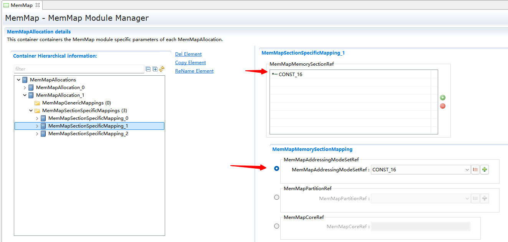
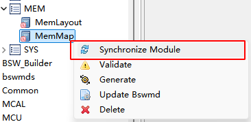
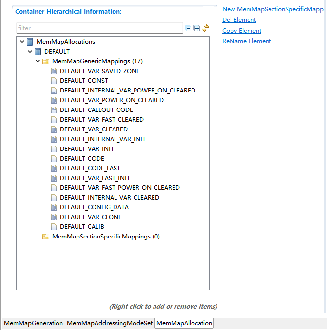

===================
MemMap
===================

文档信息(Document Information)
=======================================

版本历史(Version History)
-----------------------------------

.. list-table::
   :widths: 10 10 10 10 20
   :header-rows: 1

   * - 日期(Date)
     - 作者(Author)
     - 版本(Version)
     - 状态(Status)
     - 说明(Description)
   * - 2025/02/10
     - lizhi.huang
     - V0.1
     - 发布(Release)
     - 首次发布(First release)
   * - 2025/04/04
     - lizhi.huang
     - V1.0
     - 发布(Release)
     - 正式发布(Official release)

参考文档(References)
----------------------------------

.. list-table::
   :widths: 10 15 25 10
   :header-rows: 1

   * - 编号(Number)
     - 分类(Classification)
     - 标题(Title)
     - 版本(Version)
   * - [1]
     - Autosar
     - AUTOSAR_CP_SWS_MemoryMapping.pdf
     - R23-11
   * - [2]
     - Autosar
     - AUTOSAR_CP_TPS_BSWModuleDescriptionTemplate.pdf
     - R23-11
   * - [3]
     - Autosar
     - AUTOSAR_CP_TPS_SoftwareComponentTemplate.pdf
     - R23-11 

术语与简写(Terms and Abbreviations)
========================================

术语(Terms)
---------------------------------------

.. list-table::
   :widths: 10 40
   :header-rows: 1

   * - 术语(Term)
     - 解释(Explanation)

   * - 内存映射(Memory Mapping)
     - 代码和数据映射到特定内存段的机制(A mechanism for mapping code and data to specific memory segments)

   * - SW-ADDR-METHOD
     - 用于为数据或代码对象分配公共的地址方法(A common address method used to allocate data or code objects)

   * - MEMORY-SECTION
     - 提供Implementation中用于代码或数据的抽象内存部分的描述。它应该由Bsw或Swc的Implementation创建(Provides a description of abstract memory sections used for code or data in the Implementation. It should be created by the Implementation of Bsw or Swc)

   * - 名称推导映射(Name Derivation Mapping)
     - 当配置选项AutoMappingByShortName==True时，MemMap模块根据MEMORY-SECTION的名称进行推导映射(When the configuration option AutoMappingByShortName == True, the MemMap module performs derivation mapping based on the name of MEMORY-SECTION)

   * - 手动映射(Manual Mapping)
     - 当配置选项EnableManual==True时，所有模块的相同类型的MEMORY-SECTION映射到同一个抽象的MAKW,并集中放置在MemMap.h文件中,允许修改此文件进行手动映射(When the configuration option EnableManual == True, MEMORY-SECTIONs of the same type from all modules are mapped to the same abstract MAKW and centrally placed in the MemMap.h file, allowing modification of this file for manual mapping)

   * - 工具配置映射(Tool Configuration Mapping)
     - 通过MemMapGenericMapping对SW-ADDR-METHOD进行映射或通过MemMapSectionSpecificMapping对MEMORY-SECTION进行映射(Mapping SW-ADDR-METHOD through MemMapGenericMapping or mapping MEMORY-SECTION through MemMapSectionSpecificMapping)

   * - 默认映射(Default Mapping)
     - 对未使用"工具配置映射","名称推导映射"和"手动映射"的MEMORY-SECTION,使用其引用的SW-ADDR-METHOD的映射规则。SW-ADDR-METHOD只能通过工具配置映射,工具会为默认的SW-ADDR-METHOD创建映射规则,自定义的SW-ADDR-METHOD则需要用户通过配置工具映射(For MEMORY-SECTIONs that do not use "Tool Configuration Mapping", "Name Derivation Mapping" and "Manual Mapping", the mapping rules of the referenced SW-ADDR-METHOD are used. SW-ADDR-METHOD can only be mapped through tool configuration. The tool will create mapping rules for the default SW-ADDR-METHOD, while custom SW-ADDR-METHODs require users to map through the configuration tool)

简写(Abbreviations)
----------------------------

.. list-table::
   :widths: 15 20 25
   :header-rows: 1

   * - 简写(Abbreviation)
     - 全称(Full name)
     - 解释(Explanation)

   * - MAKW
     - Memory Allocation Key Word
     - 内存映射关键字

简介(Introduction)
===================================

MemMap模块会收集工程中所有的SW-ADDR-METHOD和MEMORY-SECTION，并根据配置信息对其进行内存映射

The MemMap module collects all SW-ADDR-METHODs and MEMORY-SECTIONs in the project and performs memory mapping for them according to the configuration information.

通过对工程中的 **代码** , **数据** , **常量** 进行内存映射,能够达到以下目的：

By performing memory mapping on the **code**, **data**, and **constants** in the project, the following purposes can be achieved:

 - 避免空间的浪费：通过合理的字节对齐方式,能够将数据进行更紧密的排列

   Avoid waste of space: Through reasonable byte alignment, data can be arranged more closely.

 - 特定内存属性的使用：定义变量的初始化模式，例如复位后不进行初始化，复位后清零，复位后需要赋值等

   Use of specific memory attributes: Define the initialization mode of variables, such as no initialization after reset, clearing after reset, requiring assignment after reset, etc.

 - 指定RAM的属性：定义代码和常量的位置到RAM空间,提高访问的效率

   Specify RAM attributes: Define the locations of code and constants in the RAM space to improve access efficiency.

 - 内存保护和分区：提供硬件内存保护需要的分区地址符号

   Memory protection and partitioning: Provide partition address symbols required for hardware memory protection.

功能描述(Functional Description)
===================================

特性(Features)
---------------------------------

MemMap 模块是 AUTOSAR 内存管理的核心枢纽，通过标准化关键字、编译器抽象和配置驱动，实现：

The MemMap module serves as the core hub of AUTOSAR memory management. Through standardized keywords, compiler abstraction, and configuration-driven mechanisms, it achieves:

 #. 精准控制代码/数据的内存分配；

    Accurately controls the memory allocation of code/data;

 #. 提升性能(快速内存)与安全性(ASIL 隔离)；

    Improves performance (fast memory) and security (ASIL isolation);

 #. 确保跨编译器/平台的可移植性；

    Ensures cross-compiler/platform portability;

 #. 为链接器提供标准化输入，完成物理地址映射。

    Provides standardized input for the linker and completes physical address mapping.

其设计完美契合汽车电子对 确定性内存布局 和 功能安全 的严苛要求。

Its design perfectly meets the stringent requirements of automotive electronics for deterministic memory layout and functional safety.

偏差(Deviation)
---------------------
None

扩展(Expansion)
--------------------
从用户使用的便捷性考虑，MemMap模块在AUTOSAR规范进行了一些的扩展，以支持以下需求：

The MemMap module extends the AUTOSAR specification for user convenience to support the following requirements:

名称推导映射(Name Derivation Mapping)
~~~~~~~~~~~~~~~~~~~~~~~~~~~~~~~~~~~~~~~~~~~~~~~~~~~

此功能提供一种基于MEMORY-SECTION名称的映射方式，对系统中所有的MEMORY-SECTION进行内存映射。

This function provides a mapping method based on MEMORY-SECTION names, performing memory mapping for all MEMORY-SECTIONs in the system.

手动映射(Manual Mapping)
~~~~~~~~~~~~~~~~~~~~~~~~~~~~~~

此功能打开后，意味着工具不需要生成链接语句。除了生成模块的MemMap.h文件外，还会额外生成一个MemMap.h文件，用户通过自行修改这些文件，完成内存映射

When this function is enabled, the tool does not need to generate link statements. In addition to generating the MemMap.h file for each module, an additional MemMap.h file is generated. Users can complete the memory mapping by modifying these files themselves.

集成(Integration)
==================================
操作步骤如下:

The operation steps are as follows:

选择ORIENTAIS配置工具MemMap模块，选择MemMap模块中的Synchronize Module选项并生成配置文件；

Select the MemMap module in the ORIENTAIS configuration tool, choose the Synchronize Module option in the MemMap module, and generate a configuration file;

打开生成的配置文件，在MemMapGeneration选择映射规则，生成各模块的内存映射头文件；

Open the generated configuration file, select the mapping rule in MemMapGeneration, and generate the memory mapping header files for each module;

在IDE中创建新项目；

Create a new project in the IDE;

集成工程对应的内存映射头文件，配置文件和其他源文件；

Integrate the corresponding memory mapping header files, configuration files, and other source files into the project;

构建项目以生成可执行文件。

Build the project to generate an executable file.

文件列表(File List)
-------------------------

静态文件(Static Files)
~~~~~~~~~~~~~~~~~~~~~~~~~~~~~~
None

动态文件(Dynamic Files)
~~~~~~~~~~~~~~~~~~~~~~~~~~~~~~
各模块的内存映射头文件，举例说明：OS模块的MemMap.h文件文件为Os_MemMap.h。

Memory mapping header files for each module. For example: the MemMap.h file for the OS module is named Os_MemMap.h.

错误处理(Error Handling)
-------------------------------
None

接口描述(Interface Description)
===================================
None

配置(Configuration)
========================
MemMap模块支持以下4种映射模式

The MemMap module supports the following 4 mapping modes:

- 工具配置映射(Tool configuration mapping)
- 名称推导映射(Name derivation mapping)
- 默认映射(Default mapping)
- 手动映射(Manual mapping)

它们之间的优先级关系：
工具配置映射(需配置) > 名称推导映射(需开启) > 默认映射(需关联) = 手动映射(需开启)

Their priority relationship is as follows:
Tool configuration mapping (requires configuration) > Name derivation mapping (requires enabling) > Default mapping (requires association) = Manual mapping (requires enabling)

其中 :ref:`名称推导映射<名称推导映射>` 与 :ref:`手动映射<手动映射>` 是可选的

Among them, Name Deduction Mapping and Manual Mapping are optional.

.. figure:: ../../../_static/参考手册/MemMap/MemorySection映射逻辑.png
   :name: MemorySection映射逻辑(MemorySection Mapping Logic)
   :align: center

   MemorySection映射逻辑 (MemorySection Mapping Logic)

.. figure:: ../../../_static/参考手册/MemMap/SwAddrMethod映射逻辑.png
   :name: SwAddrMethod映射逻辑(SwAddrMethod Mapping Logic)
   :align: center

   SwAddrMethod映射逻辑 (SwAddrMethod Mapping Logic)

.. _工具配置映射:

工具配置映射(Tool Configuration Mapping)
--------------------------------------------

工具配置映射是符合AUTOSAR MemMap工具的标准映射方式，需要用户通过：

Tool configuration mapping is a standard mapping method compliant with the AUTOSAR MemMap tool, requiring users to:

- MemMapSectionSpecificMapping容器关联MEMORY-SECTION和MemMapAddressingModeSet

  Associate MEMORY-SECTION with MemMapAddressingModeSet through the MemMapSectionSpecificMapping container

- 或通过MemMapGenericMapping容器关联SwAddrMethod和MemMapAddressingModeSet实现映射

  Or associate SwAddrMethod with MemMapAddressingModeSet through the MemMapGenericMapping container to achieve mapping

   MemMapSectionSpecificMapping为MEMORY-SECTION映射

   MemMapSectionSpecificMapping is for MEMORY-SECTION mapping.

.. figure:: ../../../_static/参考手册/MemMap/MemMapGenericMappingg.png
   :name: MemMapGenericMappingg
   :align: center

   MemMapGenericMappingg映射为SW-ADDR-METHOD映射

   MemMapGenericMapping for SW-ADDR-METHOD Mapping
 

.. caution:: 注意(Note)

  此方式的优先级最高，意味着MEMORY-SECTION或SW-ADDR-METHOD通过此方式配置之后，将不受其他映射规则的影响

  This method has the highest priority, meaning that once a MEMORY-SECTION or SW-ADDR-METHOD is configured through this method, it will not be affected by other mapping rules.

MemMapAddressingModeSet
~~~~~~~~~~~~~~~~~~~~~~~~~~

MemMapAddressingModeSet是MemMapAddressingMode的集合，包含一个或者多个MemMapAddressingMode

MemMapAddressingModeSet is a collection of MemMapAddressingMode, containing one or more MemMapAddressingMode elements.

- MemMapSupportedSectionType表示MemMapAddressingModeSet下的MemMapAddressingMode支持那种类型的Section，类型不符合的映射会导致工具报错

  MemMapSupportedSectionType indicates the type of Section supported by the MemMapAddressingMode under MemMapAddressingModeSet. Mappings with incompatible types will cause tool errors.

- MemMapSupportedSectionInitializationPolicy参数只允许在MemMapSupportedSectionType为MEMMAP_SECTION_TYPE_VAR时可选，标志支持的初始化类型(INIT，CLEARED，POWER-ON-CLEARED)

  The MemMapSupportedSectionInitializationPolicy parameter is only optional when MemMapSupportedSectionType is MEMMAP_SECTION_TYPE_VAR, indicating the supported initialization types (INIT, CLEARED, POWER-ON-CLEARED).

MemMapAddressingMode
**********************

MemMapAddressingMode表示映射规则，在实际代码中可能由一段#pragma语句实现

MemMapAddressingMode represents a mapping rule, which may be implemented by a #pragma statement in actual code.

MemMapAddressingModeStart和MemMapAddressingModeStop表示#pragma语句的具体内容,例如

MemMapAddressingModeStart and MemMapAddressingModeStop represent the specific content of the #pragma statement, for example.

.. figure:: ../../../_static/参考手册/MemMap/MemMapAddressingModeStart和MemMapAddressingModeStop.png
   :name: MemMapAddressingModeStart和MemMapAddressingModeStop
   :align: center

   MemMapAddressingModeStart和MemMapAddressingModeStop

若不希望通过手动的方式进行映射，可以引用一个的MemLayoutRegion，工具会通过MemLayoutRegion的属性推算出实际的#pragma语句。计算方式另见MemLayout用户手册

If manual mapping is not desired, you can reference a MemLayoutRegion. The tool will deduce the actual #pragma statements based on the properties of the MemLayoutRegion. For the calculation method, refer to the MemLayout User Manual.

.. caution:: 注意(Note)

   MemLayoutRegionRef的配置优先级高于MemMapAddressingModeStart和MemMapAddressingModeStop，这意味着引用MemLayoutRegion之后，手动填写的映射规则将被工具忽略

   The configuration priority of MemLayoutRegionRef is higher than that of MemMapAddressingModeStart and MemMapAddressingModeStop. This means that after referencing a MemLayoutRegion, manually entered mapping rules will be ignored by the tool.

   MemMapAlignmentSelector表示MemMapAddressingMode支持的对齐方式,对齐方式不匹配的映射会导致工具报错

   MemMapAlignmentSelector indicates the alignment modes supported by MemMapAddressingMode. Mappings with mismatched alignment modes will cause tool errors.

.. _名称推导映射:

名称推导映射(Name Derivation Mapping)
--------------------------------------------

此功能提供一种基于MEMORY-SECTION名称的映射方式，对系统中所有的MEMORY-SECTION进行内存映射
需要通过AutoMappingByShortName开关开启

This feature provides a mapping method based on MEMORY-SECTION names, performing memory mapping for all MEMORY-SECTIONs in the system. It needs to be enabled through the AutoMappingByShortName switch.

.. figure:: ../../../_static/参考手册/MemMap/AutoMappingByShortName.png
   :name: AutoMappingByShortName
   :align: center

   AutoMappingByShortName

.. list-table::
   :widths: 10 10 10 25
   :header-rows: 1

   * - 
     - 关键字(Keywords)
     - 必选(Mandatory)
     - 备注(Remarks)

   * - 类型(Type)
     - VAR/CODE
     - Y
     - 其他类型自动忽略
       
       Other types are automatically ignored

   * - 范围(Scope)
     - <Core>
       <PartitionName>
       <TaskName>(仅VAR支持)(only supported by VAR)

       <IsrName>(仅VAR支持)(only supported by VAR)
       
     - Y
     - 未匹配成功则自动忽略
       
       Automatically ignored if no match is found

   * - 初始化策略(Initialization Policy)
     - CLEARED
     - N
     - VAR类型有效。仅支持CLEARED,其他初始化策略自动忽略
       
       Valid for VAR type. Only CLEARED is supported; other initialization policies are automatically ignored

   * - 对齐方式(Alignment)
     - 任何对齐方式(Any alignment method)
     - N
     - 未定义则使用UNSPECIFIED
       
       UNSPECIFIED is used if not defined

举例(Example)

.. list-table::
   :widths: 5 10
   :header-rows: 1

   * - MEMORY-SECTION.ShortName
     - 映射规则(Mapping Rules)

   * - VAR
     - 位置：GLOBAL 初始化策略：CLEARED 对齐：UNSPECIFIED
       
       Location: GLOBAL Initialization Policy: CLEARED Alignment: UNSPECIFIED

   * - VAR_CLEARED
     - 位置：GLOBAL 初始化策略：CLEARED 对齐：UNSPECIFIED
       
       Location: GLOBAL Initialization Policy: CLEARED Alignment: UNSPECIFIED
  
   * - VAR_CORE0
     - 位置：CORE0 初始化策略：CLEARED 对齐：UNSPECIFIED
       
       Location: CORE0 Initialization Policy: CLEARED Alignment: UNSPECIFIED
     
   * - VAR_PARTITION0
     - 位置：PARTITION0 初始化策略：CLEARED 对齐：UNSPECIFIED
       
       Location: PARTITION0 Initialization Policy: CLEARED Alignment: UNSPECIFIED

   * - VAR_CLEARED_PARTITION0_8
     - 位置：PARTITION0 初始化策略：CLEARED 对齐：8
       
       Location: PARTITION0 Initialization Policy: CLEARED Alignment: 8
  
   * - CODE_PARTITION0
     - 位置：PARTITION0 初始化策略：NONE 对齐：UNSPECIFIED
       
       Location: PARTITION0 Initialization Policy: NONE Alignment: UNSPECIFIED

.. _默认映射:

默认映射(Default Mapping)
-------------------------------------------------

默认映射会对未配置 :ref:`工具配置映射<工具配置映射>` 和没有被 :ref:`名称推导映射<名称推导映射>` 匹配的MEMORY-SECTION进行映射
前提条件是MEMORY-SECTION必须关联了一个SW-ADDR-METHOD，且SW-ADDR-METHOD使用了 :ref:`工具配置映射<工具配置映射>`
这个MEMORY-SECTION会根据SW-ADDR-METHOD(通过MemMapGenericMapping)的映射规则进行映射

Default mapping applies to MEMORY-SECTIONs that are not configured with :ref:`工具配置映射<工具配置映射>` and not matched by :ref:`名称推导映射<名称推导映射>` .
The prerequisite is that the MEMORY-SECTION must be associated with a SW-ADDR-METHOD, and the SW-ADDR-METHOD uses :ref:`工具配置映射<工具配置映射>`.
This MEMORY-SECTION will be mapped according to the mapping rules of the SW-ADDR-METHOD (via MemMapGenericMapping).

默认SwAddrMehtod自动映射(Automatic Mapping of Default SwAddrMethod)
~~~~~~~~~~~~~~~~~~~~~~~~~~~~~~~~~~~~~~~~~~~~~~~~~~~~~~~~~~~~~~~~~~~~~~~~~~~~~

MemMap模块为系统中默认存在的SW-ADDR-METHOD提供了一键创建映射功能，通过MemMap模块的Synchronize Modules按钮即可立即创建所有映射功能

The MemMap module provides a one-click mapping creation function for the SW-ADDR-METHODs that exist by default in the system. All mapping functions can be created immediately by clicking the Synchronize Modules button in the MemMap module.

   MemMap Synchronize

此功能创建的对象会引用另一个模块(MemLayout)的容器，所以使用它的前提条件是MemLayout模块先使用了Synchronize Modules功能。另见MemLayout用户手册[链接]

The objects created by this function reference containers from another module (MemLayout). Therefore, the prerequisite for using it is that the MemLayout module has first used the Synchronize Modules function. See also the MemLayout User Manual [link].

.. figure:: ../../../_static/参考手册/MemMap/SynchronizeMemMap_MemMapAddressingModeSet.png
   :name: SynchronizeMemMap_MemMapAddressingModeSet
   :align: center

   MemMap Synchronize后创建的MemMapAddressingModeSet

   MemMapAddressingModeSet Created after MemMap Synchronizes

   MemMap Synchronize后创建的MemMapGenericMapping

   MemMapGenericMapping Created after MemMap Synchronizes

.. caution:: 注意(Note)

   通过SWC工具配置的SW-ADDR-METHOD属于自定义范围，无法使用默认映射，需要使用 :ref:`工具配置映射<工具配置映射>`

   SW-ADDR-METHODs configured through the SWC tool fall into the custom scope and cannot use default mapping. They must use :ref:`工具配置映射<工具配置映射>`.

.. _手动映射:

手动映射(Manual Mapping)
------------------------------------------------------
勾选EnableManual开关后，表示启动手动映射模式

Checking the EnableManual switch indicates that manual mapping mode is activated.

.. figure:: ../../../_static/参考手册/MemMap/EnableManual.png
   :name: EnableManual
   :align: center

   EnableManual

此功能打开后，意味着工具不需要生成链接语句。除了生成模块的MemMap.h文件外，还会额外生成一个MemMap.h文件，用户通过自行修改这些文件，完成内存映射

When this function is enabled, the tool does not need to generate link statements. In addition to generating the MemMap.h file for each module, an additional MemMap.h file is generated. Users complete the memory mapping by modifying these files themselves.

.. code-block:: c
  :caption: 模块MemMap.h文件示例(Example of the module's MemMap.h file)

  /*Index:3  Section name :CONST_UNSPECIFIED*/
  #elif defined BSWM_START_SEC_CONST_UNSPECIFIED
  #undef BSWM_START_SEC_CONST_UNSPECIFIED
  #undef MEMMAP_ERROR
  #ifndef MEMMAP_ERROR_SEC_NO_MATCH
  #define MEMMAP_ERROR_SEC_NO_MATCH
  #else
  #error "BswM_MemMap.h, section is used consecutively many times."
  #endif
  #define BSWM_START_SEC_CONST_UNSPECIFIED_NO_MATCH
  #define START_SEC_CONST_UNSPECIFIED

  #elif defined BSWM_STOP_SEC_CONST_UNSPECIFIED
  #undef BSWM_STOP_SEC_CONST_UNSPECIFIED
  #undef MEMMAP_ERROR
  #ifdef BSWM_START_SEC_CONST_UNSPECIFIED_NO_MATCH
  #undef BSWM_START_SEC_CONST_UNSPECIFIED_NO_MATCH
  #else
  #error "BswM_MemMap.h, no matching section was used."
  #endif
  #ifdef MEMMAP_ERROR_SEC_NO_MATCH
  #undef MEMMAP_ERROR_SEC_NO_MATCH
  #endif
  #define STOP_SEC_CONST_UNSPECIFIED

.. code-block:: c
  :caption: MemMap.h文件示例(Example of MemMap.h file)

  /* VAR_CLEARED */
  #if defined START_SEC_VAR_CLEARED
  #undef START_SEC_VAR_CLEARED
  /* No Mapping */

  #elif defined STOP_SEC_VAR_CLEARED
  #undef STOP_SEC_VAR_CLEARED
  /* No Mapping */

